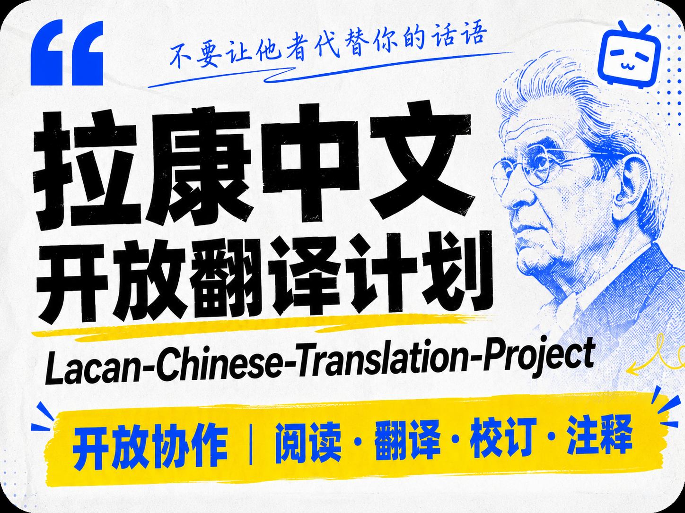

# Lacan-Chinese-Translation-Project

**拉康中文开放翻译计划**

拉康中文开放翻译计划的目标，是让更多中文读者能够参与到阅读拉康、翻译拉康和校订拉康的过程中。本项目以开放协作方式整理、翻译、校订和维护雅克·拉康研讨班及相关文本的中文材料。

mdBook 在线阅读地址：[https://kotoba-rin.github.io/Lacan-Chinese-Translation-Project/index.html](https://kotoba-rin.github.io/Lacan-Chinese-Translation-Project/index.html)

本仓库采用 Markdown 直译模式、GitHub Pull Request 协作、mdBook 构建和 GitHub Actions 发布到 GitHub Pages。项目结构、分支规则、本地构建和 PR 约定见 [CONTRIBUTING.md](./CONTRIBUTING.md)。

## 文本来源

本项目整理和翻译的研讨班原始文本主要来自 [Staferla](http://staferla.free.fr/)。

## 项目目标

- 为中文读者提供可读、可校订、可持续维护的拉康相关文本译稿。
- 让阅读者可以围绕具体段落提出修订、疑问、注释和术语建议。
- 保留必要的译注、术语讨论、导读、校订说明和修订痕迹。
- 使用适合 GitHub 浏览、引用、勘误和再整理的文件结构。
- 鼓励复制、传播、修订、注释和再发布。

## 参与方式

欢迎通过 issue 的方式提交对文本的补充、矫正、解释和考证：

- 补充文本、注释、导读或读书笔记。
- 矫正译文、原文分段、术语或格式问题。
- 解释关键术语、句法判断或段落理解。
- 考证文本来源、版本差异、引文出处或相关背景。
- 报告图片缺失、链接错误或段落不清等问题。

如果要直接修改文件，也欢迎通过 Pull Request 提交。较大的译文修改请尽量说明理由，尤其是涉及关键术语、句法判断或版本差异的地方。具体协作约定见 [CONTRIBUTING.md](./CONTRIBUTING.md)。

更推荐 fork 本项目，维护一套自己的版本。通过对照不同派生版本中的翻译、注释与解读，可以形成更有针对性的交流。不要让他人替代了你的话语。

## 分段 ID 说明

分段 ID 是本项目协作时引用具体段落的稳定锚点，格式通常类似 `s8-01-0001`，表示研讨班、课次和段落序号。原文与译文通过同一个分段 ID 对齐，构建脚本也依靠这些 ID 生成双语对照页面。

在评论、校验、交流和 Pull Request 审阅过程中，请尽量使用分段 ID 指明讨论对象。例如可以写“`s8-01-0001` 的术语建议”或“请核对 `s8-01-0002` 与原文的对应关系”。这样比只说“第三段”更稳定，因为页面展示、排序或上下文发生变化后，分段 ID 仍能定位到同一处文本。

维护文本时不要随意改动已有分段 ID。只有在原文分段结构确实需要调整时，才同步更新相关原文、译文、注释和 PR 说明，避免评论、校验记录和后续修订失去引用对象。

## 当前内容翻译进度

- `texts/s8-le-transfert`：研讨班 VIII，*Le transfert*（更新中）。
- `texts/s17-l-envers-de-la-psychanalyse`：研讨班 XVII，*L'envers de la psychanalyse*（待校订）。
- `texts/s19b-le-savoir-du-psychanalyste`：研讨班 XIXb，*Le savoir du psychanalyste*（待校订）。

## 许可证

本项目贡献者自行创作的中文译文、译注、术语表、导读、校订说明、读书笔记、项目文档，以及用于整理、构建和发布的脚本、模板、自动化配置，采用 [CC-BY 4.0](./LICENSE) 许可证。适用范围和版权说明见 [NOTICE.md](./NOTICE.md)。

完整说明：

- [署名 4.0 协议国际版 CC BY 4.0 Deed](https://creativecommons.org/licenses/by/4.0/deed.zh-hans)
- [Attribution 4.0 International CC BY 4.0](https://creativecommons.org/licenses/by/4.0/deed.en)

## 版权声明

本项目可能包含或引用原始法文文本、原文图片、扫描整理结果以及其他第三方材料。上述材料不因收录、引用、对照展示或构建发布而自动纳入本项目的 CC BY 4.0 授权范围。

本项目整理和对照使用的法语原文主要来自互联网上公开可访问资料，包括 Staferla（[http://staferla.free.fr/](http://staferla.free.fr/)）。

这些材料的权利状态以其来源、权利人声明和适用法律为准。本项目不对其版权归属、授权状态或可复用性作法律判断，也不改变其自身的版权状态。
