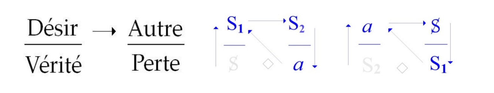
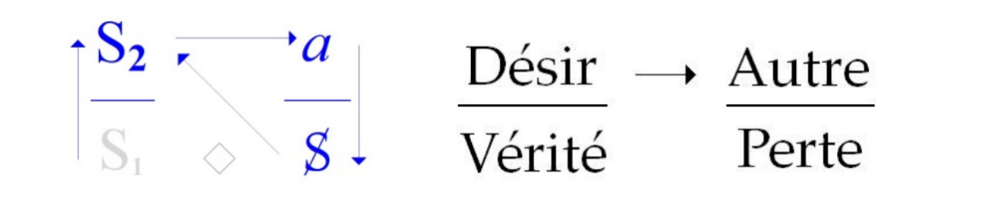
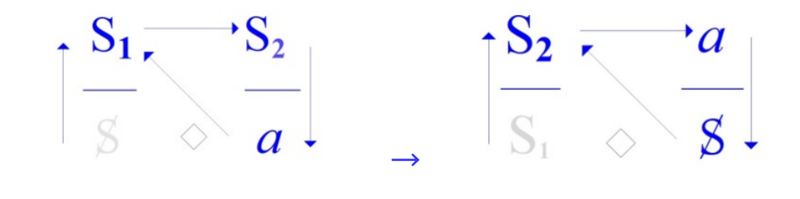
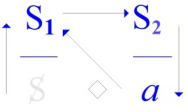
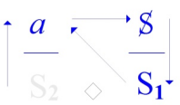
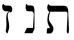

# Leçon 7 | 11 Mars 1970

在我将要试着为你们呈现的分析话语的表述中，有一点值得注意：我会通过各种迹象，把它定位到它在第一眼就已显现出亲缘性的那个对象——也就是说，主人话语。
真正值得强调的是，与其说分析话语的重要性来自它与主人话语的相似，不如说，恰恰在于主人话语的真理被掩盖这一点，分析才获得了它的重要性。

在构成这几种话语的相互关系中，我所依托的，是分布在四个位置上的一些构成性要素，由此建立起一种可能出现的连贯性。很明显，我称为“真理”所在的位置，只能在我们去探究由其在该位置上的联结所产生的运作方式时，才能够显出其特征。这并非该位置的特殊性，对其他所有位置也同样可以这样说。

举个例子，因为显然，这种定位方式——迄今为止只是将这些位置称作“上方右侧”、“上方左侧”，等等——显然不能令我们满意。

这是在功能上的一种等价层面，例如可以写作如下：

在主人话语中，S1 所处的位置，可以说与大学话语中 S2 所发挥的作用相一致，或者说等价。

我将后者称为“大学话语”，这是为了便于理解——或者至少为了固定一种心理上的适应——而做的命名：

S1(M) ≈ S2(U)。

这一位置将被称为起到秩序之位的功能，或者，如果你愿意的话，是“命令”的位置。

前现代父亲信奉棍棒底下出孝子，打一顿就好了
后现代父亲信奉14个亲子技巧
最后效果都一样

大学话语本身就发挥着支配，发号施令的功能。
不过不得不说，大学话语还是“文明”。

这是“真理”的位置……

就其在我那些所谓“四脚架”小图式中，作为其下方的潜在支撑而言——它确实带来了一个棘手的问题：

在主人话语的层面，这个位置所能处理的仅仅是那个被加上斜杠的 S（S̷）。而说实话，一开始似乎并没有什么必要这样做，毕竟，起初有什么事物不会安然地被假定为与自身相同呢？

我们可以说，这正是话语的原则……不是“被掌握的”（*maîtrisé*），而是写作“被主人化的”（*Maître-isé*），……作为“主人事实”的话语，它自以为是单义的。毫无疑问，精神分析所跨出的这一步，就是让我们确立：主体并非单义的。

这是一个典范性的公式……大约两年前，当我试图阐述《精神分析行动》[*L’acte psychanalytique*，1967-68 学年研讨]时提出的——这一论述过程中断了，像其他一些一样，将永远不会被重新拾起——这个有力的公式，就是我当时提出的那个二选一的命题：“要么我不思考，要么我不存在”。毫无疑问，这个公式一旦被提出，在涉及主人话语时，就显得格外醒目，并且相当有回响。

为了论证它，我们必须在另一个地方将它呈现出来，因为唯有在那里它才是显而易见的。

它必须在显位（主导位置）上自身得以呈现，而这个位置正是在癔症者的话语中，这样才可以确证：主体被置于这样一个“二选一”（*vel*）面前，这个择一以“要么我不思考，要么我不存在”来表达：

——在我思考之处，我并不认出我自己，我并不存在，这就是无意识；

——在我存在之处，我显然已经迷失。

我思之处，我不在。我在之处，我不思。

说实话，这样呈现事情的方式，并不能让我们看清——更准确地说，它反而显示出——为什么这件事在主人话语的层面长期处于晦暗之中。
原因恰恰在于，它所处的位置，由于其结构本身，就掩盖了主体的这种分裂。
我难道没有告诉过你们，在真理的位置上，一切可能的言说会是怎样的情形吗？

不得不说，主人话语蠢爆了，哪里有主人话语，哪里就有分裂。

就跟一个小孩一不小心把家里的窗户打碎了，然后特意挡在窗户前面一样，你别看。

因为太蠢了，就会有人说，要不我给你当喉舌吧，这样可以显得更文明，不那么蠢。

我告诉你们，真理只能以“半言”（*mi-dire*）的方式被言说；我给过你们的范例，就是谜语，

因为真理总是以这种方式呈现在我们面前。它当然不是以一个单纯的问题状态出现的：

谜语是一种催逼我们作出回答的东西，它以致命的危险为名迫使我们作答。

真理之所以成为一个问题——这一点早就为人所知——只是对那些“管理者”而言。
“真理是什么？”——我们知道这句话曾由谁在某个特定时刻，以极为突出的方式说出过。
然而，真理被迫采取的“半言”形式是一回事，
而主体借此机会将自身的分裂掩盖起来，则是另一回事。

主体之所以参与于真实界，正是在于它表面上是不可能的……或者，更准确地说，如果我要用一个比喻——而且这个比喻绝非偶然——我会像谈论电子那样谈论它：它呈现在我们面前，正处在波动理论与粒子理论的交汇处，在那里，我们不得不承认，它确实是同一个东西，却能够同时穿过相隔一定距离的两个孔洞。因此，我们用“主体的分裂”（*Spaltung*）来描绘的秩序，与真理的秩序不同，后者只能通过“半言”来呈现。

主体“参与”实在界，就类似于“观察/干涉”了粒子。一旦直接“参与”，真理立刻逃走。

这里出现了一点值得强调的内容，因为事实上，我们的每一个公式……
某个话语所处的那个公式，当然具有这样一种特性——这种特性正是我们会在另一层意义上重新使用的“二重性”——也就是说，真理只能通过“半言”来呈现，
……而这些公式中的每一个，都可能呈现出彼此显著对立的含义。

我特意指出的这个大学话语——它是好的，还是坏的呢？
因为，在某种意义上，正是大学话语揭示了它可能出错的地方，并且，从其根本构造来看，它同样展示了科学话语所依凭的东西。

前面提到过，这种话语中首先要抛开符号层面，等于号可以很确信的起作用。
当然这里可以更近一步讨论为什么等于号可以直接起作用。因为这个话语的主导位置（左上位置）是S2。
已经在五指山里了，玩出花来也是在S2的体系中。
而我们说的“符号拖离符号系统毫无意义”，在大学话语里面显得莫名其妙，怎么还能拖离出这套符号系统呢？

请注意，在大学话语中，S2 的确占据着显位，这正如我们书写公式时所示。
正如我已经告诉你们的，知识（S2）取代了秩序之位、命令之位——也就是最初由主人所占据的位置。
而在真理的位置上，实际上并无他物，只有作为“主导能指”的 S1 本身，
它的功能就是为了维持并传递主人的秩序。

这正是涉及到的情形：那些曾经思考过这些问题的头脑——我们可以说——在经历一段犹豫之后，

例如在高斯那里，我们在他的笔记中看到，那些后来由黎曼提出的论断，高斯其实早已接近过，

但他选择了不将其公开：“不能再往前走了。”

即便是纯逻辑的知识，如果它似乎会动摇某种既定的安稳状态，为什么还要将它投入流通呢？

说实话，在我们的时代，还有谁能哪怕片刻想到，要以某种理由去阻止科学话语的展开与衔接（就像高斯曾做过的那样）？事情——天哪——已经摆在那里，它们已经显示了我们将要走向何方：

从分子结构到原子裂变。

谁还能哪怕片刻认为，可以阻止这样一种运作：
它源自能指的游戏——通过内容的颠倒与位置的组合性变换，促使理论尝试去经受真实界的考验；而这种方式——正是在揭示“不可能”的同时——使得一种新的力量迸发出来？

不可能不服从那个命令——它就在那里，占据着科学真理的位置：“继续。前进。不断去知道得更多。”正是因为这一点

，并且因为主人能指占据着这个位置，所有关于这个能指可能遮蔽什么的问题；

也就是那个命令“继续去知道”的 S1，以及它在占据这个位置时所包含的谜性，

——由于正是这个能指占据着这个位置——所有关于真理的问题，从严格意义上说，都被压制了。

由于这个主人能指占据了占据着科学真理的位置，下面这些问题都被压制了。
1. 这个能指可能遮蔽什么的问题
2. 这个能指在占据这个位置时所包含的”令人费解的”(剩余意义)

主人能指如何占据这个位置的呢？
它源自能指的游戏——通过内容的颠倒与位置的组合性变换，促使理论尝试去经受真实界的考验；而这种方式——正是在揭示“不可能”的同时——使得一种新的力量迸发出来？
主人能指发出的命令：“继续。前进。不断去知道得更多。”
可能有人会认为“不断的知道更多”，这不是一个很好的指令吗？ 如果这是一个指令的话，顺从这个指令追求真理有什么不对吗？
对于这个问题可以了解一下什么叫“真理标准大讨论”。

能指的游戏，是在能指系统中的游戏，而忽略了能指的系统。 跟上面提到的等于号问题还是一样。

然而，真正令人费解的（带有谜性的），是在那些自称为“人文科学”的领域里，我们很清楚地看到，那条命令“继续去知道”确实搅动了一些局面。

因为，就像在所有其他那些小方格、所谓“四脚”示意图中一样，总是由位于这里【大他者】的位置上的那一方在工作，

而工作的目的就是让真理喷涌出来——因为这正是工作的意义。如果在这个位置上的那一方不工作，不论他是谁：

——在主人话语（disc. M）中，这个位置是奴隶的位置，

——在科学话语（disc. U）中，这个位置则是“a-学生”的位置（*a-étudiant*），……或许我们可以在这个词上做点文字游戏，也许这样能让这个问题焕发一些新的面貌。

刚才，我们看到他在物理科学的层面上，被迫服从那条“继续去知道”的命令。而在在人文科学的层面上，我们看到的，则是某种或许需要一个新词来指称的东西，我还不能确定这个词是否合适，但就我此刻的直觉、感觉、以及它的音响效果而言：“astudé”。

如果我把这个词（*astudé*）纳入词汇表，我大概会比当初想让人们改掉“拖把”这个名字更有机会成功；“astudé”有更多存在的理由。

在人文科学的层面上，学生会觉得自己是“astudé”。

他之所以是“astudé”，是因为，就像其他所有的劳动者一样——你们可以参考其他那些小方格——他必须生产出一些东西。

而事实上，有时我的话语也会引发一些与此相关的回应。这种情况很少见，但偶尔发生时，我还是会感到高兴。当我来到高等师范学院（rue d’Ulm）时，恰好有一些年轻人开始就“科学的主体”这一主题展开讨论。
事实上，我早在 1965 年的第一场年度研讨课中，就已经将“科学的主体”作为讨论对象。
“科学的主体”这个主题是切中要害的，但显然，它并不是能够轻易展开的议题。

他们被敲打了一番，有人告诉他们，“科学的主体”这个东西是不存在的。而在他们原以为能将它引出来的那个尖锐点上——也就是在弗雷格话语中，0 与 1 的关系上。

人们向他们证明，数理逻辑的进步已经能够完全消解，不是缝合，而是让“科学的主体”彻底蒸发。
“astudés”的不安，与这样一件事并非无关：他们还是被要求，用自己的皮囊去构成科学的主体——而据最新的情况来看——在“人文科学”这个领域，这似乎会遇到一些困难。

这不仅是一种学术任务，更是一种话语要求——它将主体转化为科学生产链条上的元素，却又在结构上否认主体的完整存在。

于是，对于这样一种一方面根基稳固、另一方面又显然具有征服性的科学……

这种科学甚至足够“征服”到可以称自己为“人文”，大概是因为它把人当作腐殖土（humus）[disc. H, U, M](癔症，大学，主人 话语的培养基）

——那么，确实会发生一些事情，这些事情最终让我们重新站稳脚跟，并让我们意识到，在真理的层面上，用单纯的命令去取代它——主人的命令。

“主人的命令”：不要以为主人本人总在场，留下的只是命令本身，……那条绝对命令——“继续去知道”，已经不再需要有人亲自发出，我们全都已被卷入，——正如帕斯卡所说——卷入科学话语之中。

可以将人当作培养基，H, U, M
主人亲自指挥亲自部署，大学话语负责上传下达。
癔症话语依赖于主人能指，反而强化了主人话语扩张的欲望。

靠，如果这么看，那不是没救了。

那么，还是得说，“半言”之所以正当，是因为事实显而易见：在“人文科学”这个议题上，没有什么是站得住脚的。

你们要是以为……那可就大错特错了——
毕竟，谁知道会不会在哪个思想落后的小脑袋里，突然冒出这样的想法：我说的话意味着应该去放慢这种科学，甚至退回到高斯当年的态度里，也许还能有一线救赎的希望。
这种指责……

事实上完全可以被准确地称为“反动的”，……我还是得指出来，因为并非不可能在某些圈子里——说实话，那些地方并不是我在此讲话时会倾向于接触的——人们可能会从我现在所谈的内容中得出这样的结论……

拉康这里日常防了一手，不愧是你。
啊！科技，请放慢你的脚步，请等一等你的主体。
这种话，没啥卵用，这种设想也“不现实/不可能/不应当”
刘德华的歌怎么唱的来着，不敢，不想，不应该
差不多这个意思
这玩意反动在哪呢？用那种略带老气的话来说就是“吃两遍苦，受二茬罪”
这玩意本来就够傻逼了，来都来了，还要当作白来一趟，以后不是还得来吗。
原子弹发明出来，丢也丢了。要是来一句：
哎呀，这个太可怕了，这是禁断的科技呀！我们把它封印起来。
那么结果就是以后肯定还得有人挖出黑科技，拿出来丢一下。 躺A高达，你们看过没
反而原子弹的技术被扩大之后，受到了制衡。

这里丝毫没有“进步”这一观念，至少不是那种意味着圆满解决的进步。

真理在出现时所具有的解决性，有时可能是令人欣慰的，但在另一些情况下却可能是灾难性的。
没有任何理由认为真理必然总是有益的。
要想出这样荒唐的念头——在一切事实都证明恰恰相反的情况下——恐怕真得是“心中有魔”才行。

喜闻乐见的克苏鲁神话里面也是说，原子弹的发明跟奈亚脱不了关系。 真理=善 ？ 善=永恒？你这思想也太封建了。

总之，可以肯定的是，在所谓分析师的位置上——也就是说，当正是小对象 (a) 本身处于（主导位置）。

（当然这种情况极不可能发生，甚至有没有分析师真正意识到这种情况都值得怀疑？）

……但从理论上可以设定，当小对象 (a) 本身来到“命令”这一位置，它就与主体眼中引发“求知欲”的那个小对象 (a) 完全等同，并作为瞄准点呈现出来，供那场荒谬的操作——一次精神分析——去追踪这条“求知欲”的轨迹。

分析师在此并非以知识或权威的形象出现，而是以那个不可化约的欲望原因之形，成为主体在分析中追逐的“靶心”。

我一开始就告诉过你们，这个“求知欲”并不是自然而然就有的。

他们发明了一个说法，把它称为“认识论驱力”，那么我们就得看看它究竟能从哪里产生。

正如我已经指出的，这并不是主人自己就能凭空发明出来的，一定是有人把它强加给他的。

精神分析师,并非一直都是显而易见的存在。

而且，现在也不再是由他来激发这种欲望，他只是作为瞄准点呈现出来，供那些被这种尤为棘手的欲望所咬住的人去对准。这一点我们还会再回来讨论。

与此同时，我们先来明确一下，在所谓“分析师话语”的结构中，就像你们在这里所看到的那样，它究竟是怎样的：

他对主体说：“来吧，说——就像人们常说的那样——你脑子里想到的一切，无论这些想法是多么分裂，无论它们多么清楚地表明——要么你并没有在思考，要么你根本一无是处——都没关系，你所说出来的东西总是可以被接纳的。”

这很奇特，奇特的原因我们以后还要具体指出，但现在可以先勾勒如下：

你们已经看到，在结构的上方那条线之间，存在着一种非常紧密、根本性的联系

简单地说，就是主人话语与奴隶之间的那条联系 [S1 → S2]

——正因如此，正如黑格尔所说——奴隶会随着时间的推移向主人证明他的真理
——也正因如此，正如马克思所说——他在整个过程中也会忙于策动自己的“剩余享乐”。

为什么这个“剩余享乐”要归给主人？这当然是被遮蔽的地方。
在马克思那里被遮蔽的，是这样一个事实：这个“剩余享乐”本应归给主人。

而主人已经放弃了一切，首先是放弃了享乐，因为他曾将自己置于死亡的威胁之下，并且他依然牢牢固定在这种位置上。

在黑格尔的论述结构中，这一点是清楚的。毫无疑问，他剥夺了奴隶对自己身体的支配权，但——这不算什么！——他却把享乐留给了奴隶。

当然这里积累的前提是可以计量。 而计量的前提是可以被量化，量化的前提是——有一套符号矩阵，The Matrix。

这一套矩阵同样是由奴隶的劳动来支撑的，也就是S2，在这计量之后，依然还有剩余，主人进一步驱动S2（这已经是第三轮了）
当拉康结合马克思的时候，讲的大概就是资本主义话语了，计量，数学是首要的。所谓的价值是数字，而不是荣誉或者别的什么。

因此，如果主人在这一切之中稍稍做出一点努力，让一切运转起来——也就是说，下达命令。
那么很清楚……我想我当时已经向你们解释得很清楚了，
但我还是要重申，因为重要的事情永远不嫌多说几遍——
正是通过这种方式，享乐才重新回到主人的触手可及之处，从而显露出它的要求。

仅仅是履行主人的职能：他就会失去某些东西。

正是因为这种失去，至少有一部分享乐必须被返还给主人——确切地说，就是这个“剩余享乐（plus-de-jouir）”。

如果随着时间的推移，在他那种执拗的自我阉割过程中，他没有将这个“剩余享乐”进行计量，没有将其转化为剩余价值（plus-value），换句话说，如果他没有奠定资本主义的基础，那么马克思就会意识到，所谓剩余价值，其实就是“剩余享乐”。

那么这里也就是说
剩余=剩余价值+剩余享乐
在资本主义下的剩余享乐是剩余的剩余，是被吃干抹净的残渣。

当然，所有这些并不妨碍这样一个事实：资本主义已经确立，而且剩余价值的功能及其毁灭性的后果已被非常准确地指出。

然而，要想真正消除它，或许至少需要弄清它的最初运作阶段是什么。

因为，即使在“一个国家的社会主义”框架下，将生产资料收归国有，如果不知道剩余价值究竟是什么，也并不意味着就此结束了剩余价值的存在。

因此，这个“剩余享乐”同样向我们表明，在主人话语的层面——毕竟它确实是位于这里的——并不存在这样一种关系：
在某种程度上，会成为像主人这样的人的欲望之因 [a] 的东西，

——而主人照例、当然对这一点一无所知——这种东西与构成真理的东西之间并不存在关系。

这两竟然  没！关！系！  是阻隔的。

因为在这里，在“四格图”下方一层的位置，有一道屏障 [◊]。

而在主人话语的层面，这道屏障——马上就能被直接指出的——就是享乐，就是享乐本身，因为它在根本上是被禁止的，是被禁止触及的。人们只是从中抿取一点点享乐的“碎片”。

[这个“产物”（a）无法触及那被禁止的享乐（S），
它只能通过阳具性的再次驱动（a → S1）擦过那个空洞（◊）的边缘，并从中抿取“享乐的碎片”。]

享乐不能直接回到主体，而只能回到S1，再被进一步加工
为什么要回S1？
因为这涉及到享乐，指回S1的时候，可以擦碰到那个空洞（◊），不得不说这里感觉挺猥琐的。

说到底，我已经向你们说明了它是如何被具体化的，因此没必要再去翻动那些致命的幻想。

在这个作为主人话语定义公式的结构中，有趣之处在于：

它是唯一一种使那种我们在别处指出的被称为幻想的结构 articulation 变得不可能的话语，也就是 a 与主体分裂之间的关系 [a ◊ S]。主人话语在其根本的出发点上，就排除了幻想。而这恰恰是，从根本上使它完全盲目的原因。

我们将会看到，正是在别处——特别是在分析师话语中——
幻想可以平铺在一条水平线上，而且以一种完全平衡的方式展开，这使我们能够对主人话语的根基多一些了解。

无论如何，回到分析师话语的层面，我们会注意到，被放置在所谓“真理位置”的，是知识——也就是说，现有的 S2 的全部联结，即一切可以被知道的东西——这是在我书写的方式中（而非现实中）被安置在真理位置上的。

对话语的认同是基于话语在S2中的位置，而不是基于对其他什么的认同去认同话语。
分析师并不直接给出真理，而是通过将知识放在真理位，使主体在分析过程中逐渐发现，所谓真理是在知识结构与欲望之因的关系中被构造出来的。
这里的S2跟主人话语中的S2是一种S2吗？
是！  而且必须是！
这确实是一种类似于“阴阳怪气”的感觉，分析师类似一种“装外宾”的角色？
把存粹的知识当作真理，并且将这种知识运用到极致，以此揭露主人能指在案主话语中的分裂。
毕竟S2，也就是“知识”有一个特别重要的“优势”。
知识会“装作自己放之四海皆准”，知识会“装的很文明，卖相很好”
分析师拿知识“当作”真理一点毛病没有。 当作就是说拿来用用，看你这玩意（S2）到底在哪憋着坏呢。
毕竟能让S2憋着坏的，只有S1

也就是说，在分析师话语中，“能够知道的东西”被要求在真理的领域中运作。这究竟意味着什么？我们感觉这与我们密切相关。

为了把事情说清——我之所以作这一番绕路并非毫无理由——从当下来看：
这种糟糕的“容忍”，或者说，在被称为“科学”、现代科学的形式之下，知识所采取的那种飞速奔跑，也许只是……即便我们并不总能看清它超出我们眼前的意义——
也能让我们感到，如果在某个地方，我们确实有机会让“依照真理来审视的知识”这一说法获得意义，那么——至少如果我们相信我们这个小小的结构转盘——那就一定是在这里［分析师话语，discours A］它才会获得意义。

真理的位置并不在水平面以上，否则就会成为某种大学话语。
哎，这不就他们心理学干的吗？
分析师话语与大学话语的区别，可以从对待S2的态度来进行定位和拆解。
这让我想到二维码，为什么从各个方向都能扫到呢？

你们看——我顺便说一句——这正是让我有理由……
只是顺带提一下，我们等会儿会看到要走到哪里去，但先顺便说一下——这正是让我有理由，比如说：既然有一次，当我正要谈“父之名”（Nom du Père）的时候，有人在某种意义上——总之——让我闭嘴了，那么我以后就再也不会谈它了！
听起来似乎有点调皮、不太友善。谁知道呢？
甚至还有这样一些人，你们知道的，那些科学的狂热信徒：

“继续去知道！怎么能这样，你必须说出你对‘父之名’所知道的东西！”

我不会说出我对“父之名”的所知，因为我根本不属于大学话语。

我是一个分析师的小客体 a（笑），一块预先就被弃置的石头；

即使在我的分析中，我会成为那块“基石”，但只要我从扶手椅上站起来，我就有权去闲逛（笑）。

因为事情可以反过来：那句“被匠人弃置的石头，成了房角的基石”（诗篇118:22）

也可以倒过来说：房角的基石也可以自己去逛逛，不是吗？（笑）

甚至，也许正是这样，我才有机会让事情发生变化：如果那块房角石走了，整个建筑都会塌下来！的确有人会对此心动！好吧，我们别开玩笑了（笑）。

只是，我完全看不出自己为什么要去谈“父之名”，

因为无论如何，它所处的位置，正是在知识发挥真理功能的那个层面，而在这个层面上，我们严格地说是注定要面对这样的情况：

即便在这个对我们来说依然模糊的“知识与真理的关系”问题上，我们也只能——要清楚这一点——以半言（mi-dire）的方式说出任何东西。

我不知道你们是否充分体会到这一点的分量。

这意味着，如果我们在某个秩序、某个领域中以某种方式说出某些东西，那么会有另一部分内容，正是由于这种言说的方式，而变得完全无法化约、彻底晦暗。

因此，总的来说，会存在一种任意性——我们可以选择要去照亮什么。所以，如果我不谈“父之名”，这就会让我有机会谈别的东西。

这并非与真理毫无关系，但与主体相关的真理相比，它将不是同一种真理。好吧，这只是一个插句。

我们所观察到的——当知识处在真理的位置上时会发生什么，我是说，在分析师话语中——我想，你们并不需要等到我现在才说出来才能想到这一点。你们应该还记得，这种在此出现的东西，它有一个名字：神话（mythe）。

因为，人们并不需要等到主人话语完全发展，才看到它在资本主义话语中的结局——与科学发生的那种奇特的“交配”。

不必等到那个时刻，这种情形一直以来都是显而易见的；

无论如何，这正是当我们谈及真理时——至少是最初的真理——所能看到的全部。

这（种真理）毕竟还是让我们多少有些兴趣……
尽管科学让我们放弃了它，只给了我们一个命令：“继续去知道”，
不过这是在某个特定的领域——而奇怪的是，这个领域
与你这个人自身所关心的东西之间，存在着某种不协调——
是的，那么，这个位置就被“神话”所占据。

俄狄浦斯神话，会饮 等等。 
莎士比亚的戏剧，“I'm your father”等等

于是，人们就把它（神话）变成了语言学的一个分支。
我想说的是，关于神话最严肃的论述，正是从语言学出发的。
我当然只能强烈推荐你们去看《结构人类学》（Claude Lévi-Strauss，《结构人类学》，Plon，1958；或 Pocket 版第7册，1974年）这是我朋友克洛德·列维-斯特劳斯的论文集——
特别是第十一章〈神话的结构〉：你们会在其中显然看到与我所说相同的观点，即真理只能以“半言”（mi-dire）的方式获得支撑。

对“这些大单元”（他是这样称呼的，因为它们是神话素 mythèmes）所作的第一次严肃考察，
显然就是这一点——我并不是把它归咎于他，我是逐字照读他所写的：

“将关系群组彼此连接起来的这种不可能性……

这里指的是‘关系的包’，对吧？他就是这样来定义神话的。

……这种不可能性被克服（或者更准确地说，被替代）为一种断言：
即两种彼此矛盾的关系是相同的，
因为每一种关系都像另一种关系一样——像另一种关系一样！——与自身相矛盾。”
[Plon 版第239页，或 Pocket 版第248页]

总之，“半言”（mi-dire）本身就是一切真理言说的内在法则，而最能体现这一点的，正是神话。
不过，我们不可能就这样满足于依然停留在这个层面上。

总之！
因为在精神分析话语中，典型的、核心的神话——你们都知道的——就是俄狄浦斯神话,我想，你们都能回答这个问题。

很有趣，不是吗？俄狄浦斯神话的运用，在那些早就长期研究神话的人那里所引发的反应——要知道，我们可不是等到我亲爱的朋友克洛德·列维-斯特劳斯带来他那堪称典范的澄清之后，才开始对神话的功能产生极为浓厚的兴趣的。

总之，自从世界存在以来，不论人类构造出什么东西——

甚至包括像阴阳这样的、被认为更高级、更精致的神话——

围绕神话，人们可以“胡扯”得很多，你们懂的，因为它恰恰就是“胡扯”的领域。而这种“胡扯”，我一直以来都告诉你们的，它就是“真理”，两者是同一的。

真理允许说出一切；一切都是真的，只要你排除它的反面。

只是，这种情况之所以如此，依然有它的作用。

只要被说出来，哪怕是胡扯也是“真理”
被说出来的东西可以揭露出哪些被语言建构缝合起来的地方？
这是分析师会关注的东西。

那么，关于神话——关于弗洛伊德所运作的俄狄浦斯神话——我可以告诉那些还不知道的人：
神话学家们对此往往嗤之以鼻，他们觉得这种做法完全不合适。为什么要给这个神话如此的特权？
其实，对它所做的第一次严肃研究就表明，这个神话要复杂得多。
并且，恰巧的是，克洛德·列维-斯特劳斯并不回避这个挑战，在同一篇文章中，他给出了完整的俄狄浦斯神话：
由此可以看出，它所关涉的完全不是单纯的“要不要和自己的母亲发生性关系”这样的问题。

有趣的是，就在不久之后，比如说，有一位完全称得上合格的神话学家——正统出身，学派纯正，从波阿斯起步，并最终汇流到列维-斯特劳斯那里。
这位名叫克罗伯（Alfred Louis Kroeber）的学者，在写过一本猛烈抨击《图腾与禁忌》的著作之后，二十年后还是写下了一些东西……
显然，他一直被这件事所困扰、所刺痛，因为他曾经那样尖刻地批评过，尤其是当他看到这种批评不断扩散——以至于任何一个学生都觉得自己可以附和几句——这一点他简直无法忍受。

于是，他指出，俄狄浦斯神话毕竟还是有其存在的理由，其中确实有某种东西，虽然他说不清是什么，但那里无疑有一个“硬骨头”。
除此之外，他没再多说什么，不过在他批评《图腾与禁忌》之后——至于《图腾与禁忌》本身，我们必须承认，它的构成方式，我不知道你们是否希望我今年来讲——真是可以说是人们能想象到的最曲折离奇的东西之一！

我提倡回到弗洛伊德，并不意味着我不能说《图腾与禁忌》是曲折的。

恰恰相反，正是因为如此，我们才要回到弗洛伊德——要意识到，如果它的结构如此曲折，而考虑到弗洛伊德毕竟是一个懂得写作和思考的人，这必然有其理由。

我不会说“《摩西与一神教》我们就不谈了”，相反我们正要谈它。

说这一切，是为了让你们明白，我还是在按顺序安排事情的：

我不可能一开始就做这种事——一种铺好的道路——当然，这条路完全是我自己走出来的，没有人帮我——

只是为了让大家知道，比如《无意识的形成》（1957-58年度研讨班）是什么，或者《客体关系》（1956-57年度研讨班）是什么。而现在，人们可能会以为我只是围着弗洛伊德翻跟斗——事情并不完全是那样。

好，我们还是设法稍微弄清一点，关于俄狄浦斯神话——尤其是在弗洛伊德那里——究竟是怎么回事。

今天我不会把它讲完，而且，如你们所见，我并不着急，也没理由累着自己！我就这样和你们聊，想到哪儿说到哪儿，然后看看我们磕磕绊绊能走到哪一步。

我打算从……结尾开始，这样可以立刻让你们知道我的目标，因为我不觉得有什么理由不把底牌先亮出来。

我本来并不是打算完全这样跟你们谈的，但至少这样会很清楚。

我完全不是在说，俄狄浦斯没有用处，或者它与我们的工作毫无关系。它对精神分析家没什么用，这倒是真的！

但既然精神分析家未必真的是精神分析家，这一点并不能说明什么。

精神分析家们越来越多地投入到一个确实极其重要的主题，即母亲的角色——这些事，我已经开始探讨过了。

母亲的角色，就是“母亲的钟情（béguin）”。

这是绝对关键的，因为母亲的这种“钟情”并不是可以轻易承受、甚至可以无动于衷的东西。

它总是会带来破坏，对吗？想象一条巨大的鳄鱼——是吧？——你就在它的嘴里，这就是母亲，不是吗？谁也不知道它什么时候会突然合上嘴巴。这，就是母亲的欲望。

于是我试着解释，那让人感到安心的，是有那么一块“硬骨头”——我这样说，是为了简单明了地跟你们讲（笑）——

有某种令人安心的东西——我现在是即兴发挥（笑）——像这样一个石头般坚硬的圆柱，

它在“嘴闸”位置上蓄势待发，能卡住、撑住：这就是所谓的阳具（phallus），这个圆柱会在鳄鱼嘴突然合上的时候为你提供庇护。

这些内容，我当年已经这样讲过，因为那时我面对的人是必须照顾一下的——他们是精神分析家！
必须用这么直白、粗大的比喻，他们才能听明白。
而且，即便如此，也不是所有人都明白（笑）。于是，我就在这个层面上谈了“父亲隐喻”（métaphore paternelle）。我从来只以这种形式谈过俄狄浦斯情结。

这多少也算是有点暗示性的吧。

如果我说那是“父亲隐喻”，这可不是弗洛伊德向我们呈现事情的方式！

尤其是他非常坚持，那件事确实发生过——那桩该死的“杀死部落之父”的故事，

你们知道的，那段达尔文式的滑稽情节：所谓部落之父，好像我们真的见过它似的——其实一点痕迹都没有。我们倒是见过红毛猩猩（笑），可从来没见过所谓“人类部落之父”的任何踪迹！

总之，弗洛伊德坚持那是真的——没错，这一点他是咬定不放的！
他写整本《图腾与禁忌》就是为了说明这一点：那件事必然发生过，并且一切都从此开始，包括我们所有的烦恼，甚至包括身为精神分析家的烦恼……真是令人印象深刻！
无论如何，至少应该有人在“父亲隐喻”这一点上动点心，做点——我一直很希望的事情——当我指出一个小缺口、一条小径的时候，
有人能走上前来，在我刚刚示意的路径上留下痕迹：甚至能够先我一步！

总之，不管怎样……无论如何，那件事并没有发生。因此，俄狄浦斯的问题依然完整地存在着。

那么，我要先给你们做一些预备性的说明，因为你们也看得出来，我……我必须反复强调这一点，因为这件事是不能被轻轻带过的。

在分析实践中，有一个我们真正熟悉、受过训练的基本经验，就是所谓“显性内容”（contenu manifeste）与“潜性内容”（contenu latent）的关系，对吧？这，就是分析的经验。

举个例子：对坐在那里的受分析者来说，他的“知识”就是潜性内容——我们的工作，就是要让他知道那些他并不知道、却又是在“知道着”的东西。这，就是无意识。

或许现在正好可以提出一个对某些精神分析家来说颇有用的提醒，不是吗：

对于分析师来说，潜性内容是在另一边的——位于 [S1] 的位置上。

对分析师来说，所谓的潜性内容，是他将要做出的解释，这种解释并不是我们在主体那里发现的那个知识，而是为了赋予它意义而添加上去的东西。
暂且把显性内容与潜性内容放在一边不谈，不过这些术语还是要记住。

什么是神话？别都一口同声地回答：“它是显性内容！”

如果真有哪样东西可以说是显性内容，那就是神话！

但这还不足以对它作出定义，因为我们刚才已经以另一种方式对它进行了界定。

不过，很显然，如果我们能够像克洛德·列维-斯特劳斯所提出的那样，把一个神话做成卡片，

一张张卡片这样堆叠起来，然后观察它如何变化——

变化的方式就像是两个神话的组合，而这两个神话彼此之间的关系，恰好就像我那些会转动四分之一圈的小装置那样。

比如观音和妈祖？
或者沉香，杨戬？
说明神话之间的变换关系并非随意，而是遵循特定的结构规则——这种结构规则与话语公式中的位置转换逻辑有相似性。
杨戬劈山救母，跟厉害的舅舅打架
沉香劈山救母，跟厉害的舅舅打架

这舅舅怎么这么厉害呢？

这一类比不仅强调了结构人类学与精神分析的共通方法论基础（结构转换），也为后续拉康讨论神话在精神分析中如何承载真理的“半言性”提供了技术上的类比支持。

而且，这确实会产生一些结果。

无论如何，这就像我那些小装置一样——它是显性的，不是潜性的，就像我在黑板上写的那些小字母。

那么，它在这里是起什么作用呢？显性内容必须经受检验。

我们会看到，当它被放到检验之下时，它并没有看上去那么显而易见。那我们就来讲一讲——就这样推进吧，我尽我所能——讲一段小小的历史。

这就开始神话学了，为了防止被人说“学人精”，要叠一层甲的拉康

因为在弗洛伊德叙述的俄狄浦斯情结中，它根本就没有被当作神话来处理。

当他引用索福克勒斯时，那是索福克勒斯的“小历史”，但——你们马上会看到——被去掉了悲剧性。

也就是说，它被简化为这样一个命题：在索福克勒斯的剧作中，揭示的不过是——当你杀了父亲之后，你会与母亲同床。

这是索然无味的，那么结构可以如何产生呢？恰恰应该是在重复与流变中的一种“合并同类项”，最后剩下的则是某种形式上的结构。

弑父即是对母亲的享乐，这必须在客观与主观两个意义上来理解：

既包括“享用母亲”，也包括“母亲获得享乐”——两者是相连的。

至于俄狄浦斯完全不知道自己杀了父亲，也不知道自己让母亲获得了享乐，或是自己从中得到了享乐，这对问题本身毫无影响，因为这恰恰就是——无意识的绝佳例证！

也不是不知道自己让母亲获得了享乐。
而是得知自己无意中让母亲获得了享乐。
自己的意识与无意识的矛盾是悲剧的张力来源。
不然你可以采访一下杨广？ 他好像还挺开心的

顺便一说，安提戈涅这种悲剧则是自己的意识与大他者的律法（自己的位置）发生了冲突。当然这里说的并不严谨，凑合凑合吧。

我想我早已充分指出过，“无意识”这一术语的使用中存在着歧义：

——作为名词时，它确实有其依托，也就是说，是“被压抑的表象的代表”；

——而作为形容词时，则是另一回事，例如说：“这可怜的俄狄浦斯真是个‘没意识的人’。”

这里面显然存在着一个双关——至少可以这么说。

无论如何，如果这一点不妨碍我们，那至少也应当看看这些话究竟意味着什么。

于是，我们有了这个来自索福克勒斯的俄狄浦斯神话。

然后，还有那段荒诞得令人瞠目的故事——我刚才提到的——原始部落中弑父的故事。

奇怪的是，这个故事的结果恰好完全相反：

他们杀掉了那个老爹——那个把所有女人都占为己有的老爹，这本身就已经够离奇了，为什么他会把所有女人都占为己有呢？毕竟部落里还有其他男人，他们或许也有自己的想法。总之，我们就从这里出发。

其结果——这一点与俄狄浦斯神话就完全不同了——
杀掉那个老家伙，那只老猩猩之后，发生了两件事，其中一件我暂且放在括号里，因为它太奇妙了：
【他们发现自己竟是兄弟！】
好吧，如果这能给我们对“兄弟情谊”这一问题带来一点启发的话——[笑声]——
我就当作随口一提，也许到今年课程结束前，我们还有机会回到这个话题上。
总之，我们如此热衷于强调大家都是兄弟，这显然正好证明我们并非如此。

即便是我们的同父同母的亲兄弟，也没有任何东西能证明我们真是他的兄弟，我们可能拥有完全相反的一组染色体。
因此，这种对兄弟情谊的执着——更别提那“自由、平等”了[笑声]——真是够味儿的，我们还是有必要看清它究竟掩盖着什么。

我只知道一种兄弟情谊的起源——我是说在人类的层面上，总是与“腐殖质”（humus，H,U,M – us）有关——那就是隔离（ségrégation）。我们当然正处在一个这样的时代：隔离？呸！

全世界再也没有隔离的地方了，真是闻所未闻！

这真是闻所未闻——至少从报纸上看是这样。

所谓的社会……我其实并不愿称它为“人类社会”，我会保留我的用词，我说话是要小心的，我可不是个左派[笑声]。……我只是指出，世间一切的存在都建立在隔离之上，而首当其冲的，就是兄弟情谊。

所谓的内部平等，自由建立在与其他非兄弟的隔离基础上。
我们是兄弟，好像就平等了？ 那么兄弟的定义权在谁手里？ 混日子的人不是我的兄弟！

除了这种情况之外，没有任何其他形式的兄弟情谊是可以想象的、是有任何基础的——

正如我刚才所说的——哪怕是最微弱的科学基础：

那就是，人们是被一起隔离的，被与其他人隔离开来，

而这隔离的缘由与功能，是需要去弄清楚的。

不过，不管怎样，事情就是如此，这一点一目了然。

长久地假装这不是真的，必然会带来一些弊端。

我现在对你们说的，这就是“半言”（mi-dire）！

我并没有告诉你们为什么会是这样——首先，因为如果我说了，我也无法说出它为什么是这样。这就是一个例子。

其次，他们一致决定，不许碰那些小妈妈们。

而且，那些“妈妈”可不止一个。他们本来是可以互换的——因为那位老父亲占有了所有女人——比如完全可以和兄弟的母亲睡觉，毕竟他们只是同父的兄弟。

然而，似乎从来没有人注意到这样一个奇特之处：

《图腾与禁忌》与通常引用的索福克勒斯式的参考之间，其实毫无关联。

荒谬至极的，是《摩西……》。为什么摩西一定得被杀呢？
弗洛伊德可真厉害，他给出的解释是：
为了让摩西在先知中“归来”！
显然，这大概是通过压抑的途径，就好像记忆能通过染色体来传递一样——这只能“硬着头皮”承认。

我得说，就连像琼斯（Jones）那样的蠢货所作的评论——
弗洛伊德似乎没读过达尔文——倒也算是正确的。
但他其实是读过的，因为正是以达尔文为基础，他才写出了《图腾与禁忌》里的那一套。不过，可以肯定的是，《摩西与一神教》同弗洛伊德写的其他一切一样——绝对令人着迷！
如果你是个自由精神的人，你可能会觉得，这些东西既无头也无尾。好吧，这个我们之后还会再谈。

可以肯定的是，先知这一题目，这一次所涉及的，与“享乐”没有任何关系。

因此这里单独提一嘴“先知”，和享乐没关系？

我得跟你们说……

顺便也提醒一下——谁知道呢，也许有人能帮我一个忙——

我得说，我开始去寻找某种可以作为小小“楔子”的东西，用来支撑弗洛伊德的论述，也就是那位名叫塞林（Sellin）的人在1922年出版的著作：《摩西及其在以色列—犹太宗教史上的意义》。

这位塞林并非无名之辈，我弄到了他写的《十二先知》（*Die Zwölf Propheten*）。书是从《何西阿书》（*Osée*）开始的——篇幅不大，但颇为大胆，据说正是在他那里能找到所谓“摩西被杀”的痕迹。

我必须告诉你，在读《何西阿》之前，我并没有等着读塞林的书，但我这辈子都没能拿到这本书、如今我简直快要气疯了，为了得到它，我翻遍了整个欧洲。

它既不在国家图书馆，也不在以色列联盟（等等类似的机构）……总之，非常难找。不过我还是觉得自己最终能把它弄到手——当然，如果你们中谁正好口袋里有一本，不妨在本次课程结束时拿给我，我会还给他的。[笑声]

无论如何，在《何西阿书》中确实有一点非常明确——这部《何西阿书》的文本真是令人惊异。

我不知道在场有多少人平时读《圣经》，我不能说自己是在《圣经》里长大的，因为我是天主教出身（笑声），对此我感到遗憾。不过话又说回来，我也并不真的遗憾，因为当我如今——好吧，“如今”其实已经有一段时间了——去读它时，它带给我的冲击感是难以言喻的！

这里毫无疑问是阴阳了一下：查了一下背景，阅读《圣经》在法国天主教徒中并不像某些新教教派那样普遍。 法国天主教的传统更多地强调弥撒、礼仪和教义的学习，而不是个人对《圣经》的直接阅读。而且有点接近刻板印象了，查这个背景的的时候看到这么一个文章

总之，这种家庭式的狂热，这些雅威对其子民的告诫——一行与另一行互相矛盾——真是让人头晕目眩。有一点是确定的，我们很清楚它在说什么：

一切与女人的关系都是“Znout”，正如他们所说的那样，也就是

**越法**、**违禁**的意思。这个词由三个字母组成：**zaïn**、**noun**和

**tav**，是这样拼写的。

**Znout（זנות‎）**：希伯来语词汇，意为淫乱、越法的性关系，尤其用于比喻以色列对上帝的不忠。在先知书中常作为婚姻隐喻，表示宗教背叛。
**Zaïn（ז）、Noun（נ）、Tav（ת）**：希伯来字母表中的第7、14、22个字母，这里是“זנות”一词的构成。
**Hors de la loi（越法、违法）**：此处不仅指法律层面的违规，也指违背神圣律法。

我在这里用非常漂亮的字母写给你们看，不用连笔草写：

这就是说“卖淫”。即便是在对何西阿说话时，也只是在谈论这一点：整个子民已经彻底堕入卖淫之中，

而所谓“卖淫”，几乎涵盖了他们周围的一切——这很可能指的是某个时代、某种语境，在那里存在着这样一种状况——精神分析在探讨主人的话语时所揭示的：不存在性关系，我已经很明确地表达过这一点。

而我们大致可以想象，那时“被拣选的子民”生活在一种不同的氛围中——在那里是存在性关系的，这大概就是雅威所称的“卖淫”。

无论如何，很明显，如果这里回到我们面前的是摩西的精神，那并不涉及某种引发了对享乐的获得的谋杀。
必须如实地看待事情，因为在这一切之中——这一切是如此令人着迷——以至于从来似乎没有人……

总之，提出这样的反驳或许会显得过于直接、过于简单粗暴。
而且，这并不是真正的反驳——我们依然是在主题之中，只是有一点非常值得注意：

——首先，先知们最终从未谈论过摩西。
我的一位最优秀的学生曾向我指出这一点——必须说，她是新教徒！因此她比我更早就熟知这些经文。

——更重要的是，他们根本没有谈到那件在弗洛伊德看来似乎是关键的事情：
即摩西的上帝与阿肯那顿的上帝是同一位上帝，也就是说，那是一位“唯一的上帝”。

拉康这里说到的是一种断裂

你们知道，情况远非如此。雅威一直在谈论其他的神，他只是说不可以与它们有任何关系，但并没有说它们不存在。

他还说不要急忙去追随偶像——甚至包括那些代表他的偶像——

而“金牛犊”显然就是这种情况。他们在等待一位上帝，于是造了一个金牛犊，这在当时是再自然不过的事。

在《旧约》中偶像崇拜常被视为对雅威的背叛。
**Veau d’or（金牛犊）**：《出埃及记》故事中的偶像，以色列人在摩西离开接受律法期间制造并敬拜它，引发了上帝的愤怒。
当象征之主缺席时（摩西在山上），群体会通过想象的形象填补空缺。这个替代物既是对“大他者”的僭越，也是其缺席的可见证据。

于是我们看到，这里存在一种完全不同的关系——一种与真理的关系。我已经对你们说过，真理是享乐的“妹妹”，这一点我们还得回过头来探讨。

可以肯定的是，在那个粗陋的模式——“弑父－享母”——中，被完全删略掉的是悲剧的动力机制。

诚然，正是因为弑父，俄狄浦斯才得以自由地接近伊俄卡斯忒，

但她之所以被交给他，是由于民众的欢呼与拥立……

伊俄卡斯忒——正如我已告诉过你们的，她多少是知道一些内情的，因为女人若能如此处之泰然，总会掌握一点小道消息——当时有一个仆人亲眼目睹了整件事。要是这个仆人，后来又回到了宫里，到故事结尾还被找到，却从未对伊俄卡斯忒说一句：“就是那个人搞死了你的丈夫”，那可就真是奇怪了。

这个仆人是叙事中的“大他者证人”，但他并未行使揭露的职能，这一空缺恰恰保障了悲剧逻辑的完成。

但是在俄狄浦斯的角度，当他知道这一切之后，他会思考母亲知道这一切吗？因此他不得不面对这一个问题，母亲的享乐本身。

不过无论如何，这都不是关键。
关键在于，俄狄浦斯之所以能够被允许接近伊俄卡斯忒，是因为他通过了一场真理的考验。我们稍后会回到那道斯芬克斯的谜题。

再说，如果《俄狄浦斯》的结局是一个“非常糟糕的结局”……
我们还需要探讨“非常糟糕”究竟意味着什么，以及它到何种程度上才能被称为“糟糕的结局”。
而悲剧之所以如此收场，正是因为俄狄浦斯坚持要知道真理。

这也让我们看到：如果要严肃地处理这一指涉，即弗洛伊德式的俄狄浦斯参照，就无法不在“弑父”与“享乐”之间引入“真理”这一维度。好吧，我今天就先停在这里。

相比这种古典悲剧之外
从资本主义世界诞生的新神话：
你杀了我的父亲！——我就是你的父亲
原本：
达斯维达杀了安纳金.天行者
但是主体不得不面的一个真相是这两者的合二为一：
达斯维达就是安纳金.天行者

原本不是弑父而是为父报仇，变成弑父。
你还不如不让我知道呢，为什么要让我知道。

知道了意味着什么，他父亲不是他心中的那样？
可能更近一步，他意识到欧比旺骗了他。

很清楚的一点是……

只要看看弗洛伊德如何组织这个根本性的神话，就会发现把它与俄狄浦斯并置在同一个括号下是极其牵强的：

说到底，摩西——真是该说一句“天杀的摩西”！——到底和俄狄浦斯、以及那“原始部落之父”的神话，有什么关系呢？

显然其中一定存在着某种“显在内容”与“潜在内容”的区分。

所以，总结今天的讨论，我要说的是：我们所要进行的，

就是把“俄狄浦斯情结”当作弗洛伊德自己的一个梦来加以分析。
