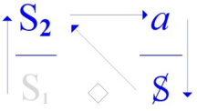

# Leçon 13 | 17 Juin 1970

必须说清楚，「羞愧而死（mourir de honte）」这一效果极为罕见。[笑声]
然而它却是唯一一个标志……我已经和你们谈过一段时间：一个能指如何变成一个符号。
……唯一一个我们能够确证其谱系的标志，也就是说，它确实是从能指那里衍生出来的。
任何其他的符号，毕竟总是会落入这样的怀疑：那仅仅是一个纯粹的符号，也就是说，是猥亵的。
二十个场景，如果可以这样说，都足以为例，并且绝非为了搞笑——因此，「羞愧而死」就是这样一个例子。

在这里，能指的蜕变（dégénérescence）是确定的，它必然是由能指的失败所造成的。

这个失败，一方面是“向死而在”（être pour la mort）**，就主体而言——而这个“向死而在”还能涉及到谁呢？——另一方面则是那张“名片”，也就是我反复提醒过你们的：**

“一个能指为另一个能指代表一个主体”。这张名片永远无法送达到目的地，因为要承载死亡的地址，它必须是一张被撕裂的名片。

人们常说：「真丢脸（C’est une honte）」，这本该导向一种「羞耻学（hontologie）」，终于能拼写得正确。

与此同时，「羞愧而死（mourir de honte）」是死亡唯一的情感——唯一真正值得的情感。值得什么呢？——值得死亡本身。对此，人们长期保持沉默。

谈论它，实际上就是开启那个幽闭之处——不是最后的，却是唯一能够支撑起所谓「诚实（honnête）」之说的幽闭。

**诚实（honnête）**：字面上是「依托于荣誉（honneur）」——而这一切都与「羞耻（honte）」纠缠为伴。但「诚实」恰恰有这样的「机缘（heur）」：它避免直接提及「羞耻」。

**正是因为对「诚实」而言，「羞愧而死」乃是不可能之物。你们知道我这里说的「不可能」，意思就是：真实界（le réel）。**

「这不至于要命（Ça ne mérite pas la mort）」——人们随便对任何事都这么说，好像一切都不过是微不足道的小事。
然而，正是以这种说法，这样的语气，遮蔽了一个事实：死亡本身是可以被“值得/至于”的。
然而在此场合，关键不应当是消除这种不可能，而恰恰是要作为它的代理人：
也就是说，死亡确实是“值得/至于”的——至少在那短暂的一刻，哪怕只是「羞愧而死」，虽然实际上并不会真的死去。

即便“羞愧而死”这一句话被说出来，中间依然又着某个不可能。

如果这件事（羞愧而死）此刻真的发生了，那么——嗯——那就是它唯一“值得”的方式。这就是你们的机缘。

如果没有发生——相较于之前的惊讶，这就成了不幸——那么剩下的就是把“生命”当作必须喝下去的羞耻之酒，因为它并不值得你为之而死。

我还有必要继续说下去吗？因为一旦开口谈论这件事，之前我所说的那二十个场景，就只会被人拿来做成滑稽戏。

正好，说到这儿，关于**万森（Vincennes）**：据说那边对我所说的很满意，对我本人也很满意。但我得说，这不是双向的：我本人对万森可不怎么满意。

不过如果真的发生了“羞愧而死”，那么这便是“唯一” “至于”的方式，某种独特的，不可能的。
比如安提戈涅那种？或者魔法少女小圆那种？ 

或者是这样：
“就这么一点事，至于要死要活吗？”
——“怎么不至于！！！”

尽管前排有一位好心人试图「撑场面」，扮演起「万森（Vincennes）」的角色，但显然现场并没有多少真正来自万森的人——几乎没有，只有些耳朵，最多是用来给我打个“优”字分数的。

这当然并不是我所期待的，尤其是在据说我的教导已经在万森被传播开之后。

有些时候，我确实会对这种空洞（creux）感到敏感。

总之……当时场面上还是刚好有那么一点东西，让我们得以想起——这是一个我自己都不知怎么会察觉到的回忆——*《分钟报》（Minute）*和*《现代时报》（Les Temps modernes）*之间竟然可能出现的“汇合点”。[笑声]我之所以提起这件事，只因为——正如你们马上会看到的——它与我们今天的主题相关：如何与“文化”打交道？

有时候只需要一个小小的契机，就能带来一束光。一旦你们回忆起*《现代时报》*上曾经刊登过的某个磁带录音的发表，那它与*《分钟报》*的关系就会变得格外明显。

就在那一刻，试试看吧，这非常迷人！我真的做过：你把这两份报纸（*Minute* 与 *Les Temps modernes*）里的段落剪下来，随便搅拌一下，再抽出来。我向你们保证，哪怕是纸张上略有差异，你也很难轻易分辨出来源。

这正是让我们能够换一种方式来提出问题：我刚才不是提出过一个反对意见吗？
——就是担心以某种特定的语气、某种特定的词语来触及这些事物时，滑稽戏会把它们卷走。

那么我们不如从这样一个前提出发：滑稽戏本来就已经在那儿了。

也许，只要在这道“酱汁”里稍微掺一点羞耻——谁知道呢？——或许就能把它约束住。

总之，我是在玩这样一个游戏：你们听见我，也因为我正在对你们讲话。否则的话，你们听见我的时候反而会产生某种反对，因为很明显，在许多场合，这种“听见”恰恰阻碍了你们真正听清我在说什么。

这很可惜，因为至少在你们当中那些年轻人里，就我所说的内容而言——你们早就完全有能力不靠我就能说出来。你们唯一缺少的，正是**一点羞耻**。这一点羞耻，是可能会到来的。

当然，你不可能从马蹄上得到它，更不用说达达的马蹄了，但正如我所说过的，比如在真理圈层（alèthosphère）的犁沟里——它们早已在治愈你们，甚至活生生地将你们“soyous-er”了——这可能足以让你感到羞愧的。

你们要承认，为什么帕斯卡（Pascal）和康德（Kant）在你们面前会像两个即将变成瓦泰尔（Vatel）的仆人一样战战兢兢。

在上面（哲学的高度），三个世纪以来一直缺少真相。

不过，好歹这份“服务”还是送到了——热气腾腾，甚至有时还带点音乐的，如你们所知。别挑剔了，有人为你服务：你可以说这并不丢人。

**soyousent**：拉康式的文字游戏，似乎来自 *soigner*（治疗）和 *soûler*（灌醉），又带上了“vous”，暗示一种话语对主体的操控与改造。
**Vatel（瓦泰尔）**：17世纪法国著名总管，因为鱼未能准时送达而自杀。

传统哲学面对“实在”的问题的无力，未能准时为“诸位”送上真理服务，真实对不起呀。

你们还记得那些罐子吧？当我说它们空了、没有芥末的时候，你们还在疑惑我究竟在烦恼什么。

那么，现在就请你们赶紧在这些罐子里储备起足够的羞耻，好让那场节日来临时，不至于太寡淡、缺乏辛辣。

你们可能会说：——「羞耻，有什么好处？如果这就是精神分析的反面，那我们可敬谢不敏。」

我会回答你们：——「你们的羞耻多得很，简直有余货可卖。如果你们还没意识到，那就切一片试试吧，如人们常说的那样。」

你们身上那股已经走味的气息，会让你们在每一步都撞上这样一种“镀层式的生存羞耻”，这正是精神分析所揭示的东西。

如果稍微认真一点，你们就会发现，这种羞耻的理由正在于：**并非真的“羞愧而死”，而是竭尽全力去维持一种被歪曲的主人话语——这就是大学话语。**

我会对你们说：“重新黑格尔化（Ré-hégélez-vous）吧”，我稍后会再谈到这一点。

切腹谢罪背后有一整套文化甚至美学进行包装。包括“不给别人添麻烦”背后的社会规训。

再比如祥林嫂，被人嚼舌头根，想捐一个牌坊。

人们不是因为羞耻而死，而是反过来用尽力气维持某种“主人话语的伪装版”——也就是大学话语。大学话语把知识（S2）放在显位，却遮掩了其背后主人能指（S1）的支配，从而使主体继续存活在“羞耻的框架”之内。

羞耻意味着某种 “制度下的不合法性”，希望寻找到某一个S1位自己建立“合法性”，或者说合理性。而这正是黑格尔的精神现象学所做的，不断的逼问所谓的合法性，最后还是落入到某个主人能指中。
在羞耻的框架下，S1是最后的结果，而放在显现位置的是S2。

你们会看到：卑贱的意识，其实就是高贵意识的真理。而这一点的呈现，方式就是要让你们感到头晕目眩。你们越是卑劣……当然，我并不是说“猥亵”（obscène），这一点早已不在讨论之列。

……你们越是卑劣，情况反而会越好。

知识与主体的确立不在S1上，算是拉康又callback回黑格尔 主奴的辩证关系上去了。

有一位可爱的人，按照我的推荐，去读了巴尔塔萨·格拉西安（Baltasar Gracián）的《醒悟之人》（

*L’Homme détrompé*）……你们知道的，他是一位耶稣会士，生活在十六世纪与十七世纪之交。他在十七世纪初写下了这部伟大的作品。

总而言之，这正是孕育出与我们契合的世界观之处：在科学尚未攀升至顶点之前，人们就已经感觉到它即将到来。奇怪吗？但事实就是如此。

这一点甚至必须被记录下来，作为对历史真正经验性的评估：巴洛克——如此适合我们的巴洛克……应当被同化为现代艺术，无论是具象还是非具象，结果是一样的——它的兴起要么早于，要么恰好与科学最初的步伐同时发生。

在这本《批评家》（*Criticón*）里，这是一种寓言体作品，其中甚至已经包含了后来《鲁滨逊漂流记》的情节雏形。事实上，大多数杰作都只是一些来自未知杰作的碎片。在这本《批评家》中，到了第三部分（讲述“老年倾向”，因为他是按照年龄图谱来展开的），第二章里有一篇叫做《分层的真理》（*La vérité en couches*）的内容。

真理正在临盆，某处在一座只居住着最纯洁之人的城市。可这并不能阻止他们在听说“真理乃是一项孩子的工作”时，吓得掉头逃跑。

我真纳闷，既然有人已经替我做出了这一发现——说实话并不是我自己最先注意到的——为什么还要让我来解释，除非他们上次没有来听我的研讨班。正是那一次，我已经说过了。

在这里必须坚持住，因为如果你们希望自己的言论真有颠覆性，就要格外小心，别让它们在通往真理的路上陷入泥淖、被黏住。

我在上一次真正想要阐明的——在这里写下这些我不可能总是重新画出来的东西——显然就是**S1，即主人能指（signifiant-Maître）**，它在大学体制的位置上构成了知识的秘密。人们非常容易依附于它……于是就被困住其中。
然而我所指出的——也许这一点才是你们中某些人能够从今年留下的唯一收获——就是要把注意力集中在**生产层面**，即大学体制所要求的那种生产。
在这样的情境下，某种特定的生产是被期待的，但也许为了真正产生一种效应，必须用另一种生产来替代它。

在这里，就作为一个阶段、一个过渡，而且毕竟我已经把它们当作上一次我在你们面前所阐述内容的标记，我还是要为你们读三页……

我向那些已经听过我试读过这三页的人致歉。

这三页是为了回答“那个奇怪的比利时人”的提问——那个奇怪的比利时人 [参见上文 4 月 8 日的课程，当时拉康所读的文本正是回应罗贝尔·乔尔金（Robert Georgin，即“那个奇怪的比利时人”）的提问。该文本后来以《Radiophonie》为题发表于 *Scilicet* 2/3（Seuil, 1970），录音可在 UBUWEB 上找到。]。

他向我提出的问题对我来说颇有分量——你们也看得出来——甚至让我怀疑，这些问题是不是我在无意识中自己替他写下来的。

无论如何，他至少还有一点功劳，那就是做好了倾听这些问题的准备，如果情况确实如此的话。
那么，这里就是第六个问题，带着一种颇为可爱的天真：

「知识与真理之间究竟如何……
大家都知道，我曾试图展示过这两种德性如何彼此缝合在一起。
……知识与真理为何会不相容呢？」

我对他说：

「让我直言，真理与什么都不相抵触：人们在其中小便、咳嗽、吐痰。
它不过是一个通道，或者更确切地说，是一个排泄之所，不论是知识还是别的东西，都在那里被排出。
人们可以长期停留在那儿，甚至沉迷其中。值得注意的是，我曾经提醒过精神分析师：
千万不要把爱意附着在这个地方，哪怕他本身因其知识而被与它订下‘婚约’。

我立刻就要说明：

「你不能和真理结婚，和她没有契约，更没有自由结合，它受不了这些。真理首先是诱惑，欺骗你。

要想不上当，你就得坚强，而你并不坚强。」

想到这里，忍不住想到那种会自诩“吾更爱真理”的人。 
——爱真理并不能显示出你如何特别，真是不好意思。

告诫分析师不要被真理诱惑，拜倒在其石榴裙下。

因此，我就是这样对精神分析师说话的——那个幽灵般的存在，我在呼唤他，甚至在拉扯他，

抵抗着你们的喧嚣与嘲笑，好让我能在固定的时刻、固定的日子里坚持下去，承担起这样一种赌注：他能听见我。

所以，我并不是在提醒你们，你们并不会有被“真理咬住”的风险。

但是——谁知道呢？——倘若我的锻造（forgerie）能够活过来，倘若精神分析师真的接过我的位置，在那几乎不可能的希望的边界处，那我所要警告的就是他：

所谓“在真理那里总有东西可以学”，这种陈词滥调只会让任何人迷失其中。

只要每个人懂得其中的一小部分，这就足够了，而且最好牢牢记住这一点。更好的情况是，干脆什么都不去做，因为没有什么工具比它更背叛人的。大家都知道，一个精神分析师——不是“那唯一的”分析师——通常是怎么应付的：
**他把这条关于真理的线索留给那个本来就已经被它困扰的人，**
而正因为如此，那个人才真正成为了他的来访者。至于分析师本人，他则对这件事漠不关心，好像毫不在乎。

真理或者真理的线索对分析师来说没啥用处，也没什么值得探索的。这种话语的真理只有放回到那个“被它困扰的人”那里才有意义。
分析师不要有什么“真理囤积癖”，毕竟在承担分析师位置的时候，连话语都不属于自己，而来自来访者，更何况真理了。
如果哪个分析师对别人的真理那么上心，那你可要注意了。

然而，不可否认的是，近来确实有人把这件事当成了自己的事情，更加投入其中。

这或许是我的影响。我也许在这种“修正”中起了一点作用。正因为如此，我才“有义务”提醒他们不要走得太远，因为如果我真有什么成就，那恰恰是通过“看似毫不触碰”的方式得到的。

但正是这一点才真正严重。再说，当然有人会假装自己因此而感到恐惧。这是一种拒绝，但拒绝并不排除合作。拒绝本身，也可能就是一种合作。

好吧，对于那些在广播里听我的人来说——他们没有像我刚才所说的那样，因“听见我本人”而形成的障碍，也就是说，他们并没有因为“听见我这个人”而阻碍了他们真正“听清我所说的内容”——我现在要在这里走得更远一些。

正因如此，我才决定把这段文字读给你们听：毕竟，如果我可以在某种大众传媒的层面上说出来，那么，为什么不在这里也试试看呢？

还有一点：也许我在最初的四个回答中所采取的原则——这些回答在这里让你们大为震惊，而据说在广播中却比人们所想的更顺畅地传达了出去——它们实际上证实了我所采用的这个原则，而这也正是我今天想要留给你们的东西之一。这毕竟也是可以作用于文化的一种方法。

那就是：当偶然间我们被置于面对一个广泛公众的场合，被某种媒介暴露在一大群人面前时，

——为什么不恰恰反过来，**相对于这个被假定的“无能”——而这种假定纯属臆测——提高我们的水准**？
——为什么，为什么要降低语调？
——你们究竟想要聚拢些什么人？

文化的游戏，恰恰就在于把你们卷入这样一个体系之中，以至于最后的结果就是：**连母猫都找不回自己的小猫了**。

因此，在这里，虽然在这间教室里依然完全可以说出来，我还是要指出，我的公式——“被假定知道的主体（sujet supposé savoir）”，作为转移的原理——其真正的奇特之处，

正在于它并不被人察觉。

「我所说的那个被假定的知识，正是分析者（psychanalysant，受分析者）在转移中所操作的东西。

但我从未说过：因此分析师就更被假定为知道真理。

大家必须想到这一点：如果在其中再附加上这个补充，那对转移而言就是致命的。

但同样，你们也最好别去想，因为如果理解这一点反而会阻碍转移效应保持其真实。

我甚至享受那种愤慨：某些人用转移所运作的那点微不足道的“知识”，来装饰我所揭露的东西。」 

她完全可以用别的东西来填补这一空缺，而不是那张无关紧要随时可以卖掉的扶手椅——前提是我的判断无误。

她不坚持己见，只会让这个案子变得毫无希望。而精神分析师的立足点，只在于**不与自身的存在纠缠不清。**

这也是一个“不可能”或者不对称的关系。
来访者假定：分析师知道有关于自己的知识。

但分析师的位置可不是：分析师知道：来访者假定自己知道什么知识。这么简单而已。

分析师要假定来访者有一个“知识”（S2），但这个知识不会放在分析师的位置上。
如果恰好来访者将这个“被假定的知识”放在分析师身上，那么也没什么大不了的——这是常态，也是分析的开始。
分析师需要把这个假定的知识当作一个对象处理，并且试图将这种“被假设的知识”从来访者安置的位置移动到会谈的“明处”进行讨论。

我们将这个过程称为——**“转移”**！   进一步来说，转移的对象是**“被假定的知识”**，这跟“情”有什么关系吗？
 分析师善于“谈情说爱”，不过是他人的某种想象，可能恰好“多情”的分析师似乎乐于迎合这样的想象，而不是将它放在明处进行讨论。
我只能祝你好运了。

真正让分析走入死胡同的，而是病人拒绝依靠自己的手段，而不是分析师渊博的知识。
分析师负责维持话语的位置。

那个所谓“无知（non-savoir）”，人们对此大肆渲染，但对他而言，其意义只在于它什么都不是。

他厌恶那种时尚——去掘出一个影子，假装成腐尸，把自己标榜成猎犬般的侦察者。

在精神分析中的无知，是针对那个“被假定的知识”的无知。由于这样的“无知”，而不断的想去知道一些什么——这便是分析师的位置。
而不是拿“无知”当作某种维持自己形象的时尚单品。

他的学科让他深刻意识到：真实界（le réel）并非首先是为了被认知而存在的。（顺便说一句：这是抵御唯心主义的唯一堤坝。）
知识（savoir）只是附加在真实之上的，这正是它能够使“虚假”获得存在，甚至在某种程度上“在那里”的原因。

我在这种场合“拼命地来一句又一句存在论（Dasein）”，为此总是需要一点助力。说实话，只有在它是假的地方，知识才会关心真理。任何不是假的知识，都对此漠不关心。

若有验证可言，那只能以一种“意外”的形式出现——尽管这种意外本身带有可疑的味道。
因为，凭借弗洛伊德的恩惠，知识所诉说的，其实就是语言，毕竟它不过是语言的产物。而这里，政治性的关联便出现了。

至于真实界（le réel），它本身既不会因此更糟，也不会因此更好。一般来说，它只是抖落一番，直到下一次危机来临。它当下所得到的唯一好处，就是重新获得了一点光泽。这甚至也是人们对任何革命所能期待的唯一好处：

那份光泽，闪耀在真理的位置上——那个长期以来总是浑浊不清的位置。但问题在于，这份光泽终究不过是**火光一闪**，除此什么也看不见。

这就是在上一次研讨班的次日，我随手写在一角的东西，显然是为你们准备的，因为它已不可能再加进我那艘小小的“无线电木筏”里了。必须好好理解的一点是：在真理之中真正可怖的东西，乃是**它所安置在其位置上的那个东西**。

如果你们看看这个由四个字母构成的小图表：

当然，正如我一直所说的，**大他者（l’Autre）的位置，正是为了在其中铭写真理**。

不过，这是在话语与语言的坦率博弈（franc-jeu）中才能实现的。

的确，真理正是在这里被铭写的——也就是说，一切属于这个层面的东西：虚假，甚至谎言。

因为虚假乃至谎言，唯有在真理的基础上才得以存在。

但是，在这个四足图式（quadripode）之中——它预设了语言，并且把所谓“话语”视为一个结构，也就是说，任何能够在其中发生的言说都受其制约——真理所安置的位置，正是这个话语本身的真理，即它所制约的东西。

**主人话语（discours du Maître）究竟是如何维系的？**这正是“真理”功能的另一面——并不是显而易见的一面，而是那一维度：在其中，真理必然作为某种“隐藏之物”的债务而存在。

我们在“真理圈层”（aléthosphère）里的沟壑，刻画在那片早已被遗弃的天空表面。
但关键在于，有一天我用一个词来指称过这一点，这个词曾让你们当中的不少人觉得被我挠痒似的，
以至于怀疑我到底要说什么：那就是“lathouse”。

并不是我发明了真理的这一维度：真理之所以为真理，就在于它是隐藏的，由“隐匿（Verborgenheit）”这一特征所构成。

主人话语维系的方式就在于“**lathouse**”的两面性。

总之，情况就是这样：它让人不得不假定，她肚子里确实有些什么。你们和我一样会看出来：不无必要指出，很早就有一些小聪明人察觉到——如果那东西真出来了，那将是骇人听闻的。而且，她大概确实就是这样的，这样才能在整个景观里显得更“合适”。

现在，也完全可能，整个关键就在于：如果那东西真的出来了，它必然是可怖的。

如果你们只是花时间去等待，那你们就算完了。

总之，不能过度去挑衅这所谓的“lathouse”。因为一旦投入其中，总是意味着要确认——什么呢？——

就是我反复强调的：**去确认那个“不可能”，它实际上借助于你们而成为真实**。

如果你们的追求真的是指向真理，那么你们越是坚持，就越是在支撑那些“不可能的权能”。

而这些不可能，我上次已经为你们枚举过：统治、教育、分析——以及在某些情况下，治愈。

无论如何，就精神分析而言，这一点是显而易见的，对吧。

所谓“被假定知道的主体”，一旦我仅仅是接近真理，就足以引发丑闻。

最后，关于我那些小小的“四足图式”，今天我要特别提醒你们注意：

——它可不是历史的转盘；

——也不是说一切必然都要通过它；

——更不是说它必然总是以同一个方向旋转。

这只是一个呼吁，要你们在某种意义上定位自己，相对于那些我们完全可以称之为根本函数（fonctions radicales）的东西——严格意义上说，是数学意义上的“函数”。

决定性的一步，正是在我刚才已经提到过的那个时代里完成的：

围绕着以下这些事物的共同之处：

——伽利略（Galilée）的最初一步，

——莱布尼茨（Leibniz）那里积分与微分的出现，

——以及对数的发明。

或者说均是在尝试试图用符号描述“自然”或者“真实”。

所谓“函数”，就是某种进入真实界（le réel）的东西——它在此之前从未进入过——而它所对应的，是这样一种操作：
——不是去发现、实验、圈定、分离或抽取，
——而是去书写两种不同层次的关系。

让我们举个例子吧：比如对数的产生。
在一种情形下，第一种关系就是加法。
加法，这一点毕竟是直观的：这里有一些东西，那里也有一些东西，你把它们放在一起，就构成了一个新的整体。

乘法，毕竟不是同一回事。

“饼的增殖（multiplication des pains）”，和“饼的聚集（rassemblement des pains）”完全不同。

关键在于：要让其中一种关系作用在另一种关系之上。

对数的突破在于让乘法关系能够“应用”到加法关系上，即把两个层次的关系联系起来。
乘法与加法不再是独立的两种计算符号，产生了关系。

你们发明了对数，它立刻在世界上飞奔起来，依靠一些看似微不足道的小尺规（règles），但不要以为，它们的存在会让你们——这里在座的任何一个人——依然保持在它出现之前的同样状态。
重要的，正是它们的存在本身。

那么，这些或多或少显得“热心”的小符号：S1、S2、a、S，我要告诉你们，它们在大量的关系之中都能派上用场。只需要熟悉它们就行。

比如说，**一划（trait unaire）**，只要我们满足于它，就可以尝试去质询**主人能指（signifiant-Maître, S1）的运作**——这完全是可用的。只要你们在结构层面把它奠基好，你们就会发现，根本没必要再去重复那一整出大戏：

所谓“纯粹威望的殊死斗争（la lutte à mort de pur prestige）”及其结局。

这里并不存在所谓的偶然性……与人们在“自然真理（vrai de nature）”层面上得出的结论相反，奴隶的位置中根本没有偶然性。

其中存在的，是一种必然：**在知识之中，总会发生某个东西，起到主人能指（signifiant-Maître）的功能。**

当然，我们总是忍不住会去幻想：到底是谁最先做出这一举动？于是，最终我们得到了这样一种美妙的画面：

主人与奴隶之间，像是来回传递着一个球。

但也许事实只是：某个人因为感到羞耻，于是把自己推了出来。

今天我所带来的，是这个**结（nœud）的维度**，这东西并不好提出，因为它并不是最容易谈论的主题。

但这也许正是那个“空洞”，从中喷涌出主人能指（signifiant-Maître）的地方。

这里拉康再次把“羞耻”作为关键情感。
羞耻或者换成“尴尬”可能更有意思一点。尴尬也算是某种羞耻。
“我不尴尬，尴尬的就是别人”——这何尝不是殊死搏斗的变形。

我不尴尬，尴尬的是别人——>哪怕“别人”不尴尬，在无声的沉默中，主人能指已经起了作用。

如果事情确实如此，那么要衡量我们需要在多大程度上接近它，

就显得并非无用——尤其是当我们希望对主人话语有所颠覆，甚至仅仅是让它发生转动的时候。

但有一点是确定的：**S1，即主人能指的引入**，在任何最普通的话语中你们都能找到。

这正是界定话语**可读性**的东西。

确实，在新石器时代已经有了语言、言说与知识，而且它们似乎运作得很好。

但我们却没有任何证据表明，当时存在一种名为阅读（lecture）**的维度。那时还不需要“书写（écrit）”或“印刷（impression）”，并不是说这些东西不存在已久，而是说它们的效应只是在某种意义上以**逆向作用（effet rétroactif）的方式显现出来。

关键在于：我们总是可以去追问，当我们阅读任何文本时，究竟是什么使它与其他东西区分开来，从而成为“可读的”。
对此，我们必须从主人能指的生成机制中去寻找。我要提醒你们注意：所谓文学作品，说到底，我们所读到的无非是些“荒唐得让人昏昏欲睡的东西”。

不论是文本还是文字，能让“它”与其他东西区分的东西，便是主人能指。

看，这个是“可读”的。 打游戏，有的游戏为了方便玩家与道具的物品交互更加直观。可交互的物品会用一些边框高亮，或者一些图标做提示。告诉玩家，这个东西可以点击，可以调查，可以探索等等。

将“可读”的与其他的进行区分的时候，主人能指就已经开始运作了。

为什么它能够成立？为什么会这样呢……

我不知道。我最近的一次“失误”（我很喜欢这些失误），是去读了巴尔扎克的《当代生活的背面》[注：即《当代史的背面》（*L’envers de l’histoire contemporaine*），属于《人间喜剧·巴黎生活场景》]。那真是荒唐得让人昏昏欲睡。

如果你们没有读过这部作品，那么即便你们读过任何你们愿意读的东西：

——关于十九世纪初和十八世纪末的历史，

——或者说得更明确一些：关于法国大革命的历史，

——甚至你们读过马克思，

你们仍然无法理解其中的某些东西。因为唯独在那里，在这部让人直冒冷汗的故事里，才有那样的东西：**《当代生活的背面》**。

请你们回去读一读，我恳请你们。我敢肯定，你们当中几乎没人读过——这是巴尔扎克最少有人读的作品之一。
菲利普，你读过吗？没读？你也没读，是吧！真是不可思议！去读吧！

去读它，并把它当作作业，就像几百年前，我在圣安娜医院对那些听我讲课的人提出的作业一样——那时我讲的是《亚他利亚》（*Athalie*）第一幕第一场。结果他们听到的全部，就是“绗缝点（point de capiton）”。**我并不是说这是个多么出色的比喻，但无论如何，那其实就是 S1——主人能指。**

天晓得他们把这个“绗缝点（point de capiton）”做成了什么样！他们甚至把它带到了《现代时报》（*Les Temps modernes*）里。是的，是《现代时报》，可不是《分钟报》（*Minute*）。

这就是**主人能指（signifiant-Maître）**。

这是一种方式，让他们意识到：某个东西在语言里像火药一样迅速传播时，它之所以变得**可读**，

就在于它能够被挂靠、被固定，从而形成话语。我始终坚持：**并不存在什么元语言（métalangage）**。这恰恰才是关键所在。

凡是我们以为属于语言中的“元”的东西，其实都只是——永远只是——一个关于阅读（lecture）的问题。

那个高亮可交互道具边框，不正就像是“可交互道具”与背景贴图的缝合点吗？

当然说成是缝合“线”会不会更贴切一点。  游戏中的可交互的像是从背景中凸显出来，类似纹章一样缝在游戏贴图上。

不过呢，假如有一天——这纯粹是假设——有人问我，对某件我并未真正卷入的事怎么看，我会只从我自身的位置出发……
必须说，这个位置在这里相当特别。但我今天未必会“开诚布公”地摆明：
我的位置，涉及到大学这一领域。然而，如果有一些人在大学里，出于一些并不微不足道的理由，
而这些理由在我那些小字母（S1、S2、a、$）那里表现得尤为清楚，他们正处于一个想要在他们的大学里颠覆某些东西的位置，那么当然，他们可以去寻找：
——在那个“一切都穿在一根小棍子上”的地方，——在那个他们可以把自己当作“小客体 a（objet petit a）”的位置，以及，另外那些——在知识进展的性质上——注定处于被支配地位的人。

人们总是让我们在神话般的幻象中瞥见：好像会有一种所谓的“生活的艺术（savoir-vivre）”。但我不是来向你们传教这个的。我告诉你们的，是“生存的羞耻（la honte de vivre）”。
用我那些小小的图式，人们完全可以找到理由来说明：学生若是觉得自己“有兄弟情谊”，那也并非不合适。不过，他所感到的这种兄弟情谊，并不是与无产阶级，而是与“亚无产阶级（sous-prolétariat）”。无产阶级，其实更像是罗马的平民（plèbe）——而罗马的平民可是非常“体面”的人。

阶级斗争也许从一开始就包含了这样一个小小的误区：
它其实完全没有发生在主人话语的真正辩证法层面上。阶级斗争所处的，其实是认同的层面。“罗马元老院与人民”。他们始终站在同一边。至于整个帝国，只不过是“外加上去的其他人”。

关键在于要明白，为什么学生会感觉自己是“外加上去的那些人”之一。他们似乎完全看不清楚怎样才能摆脱这种处境。
我想提醒他们注意：在这个体系里，一个至关重要的点就是**生产**——羞耻的生产。这可以翻译为：**厚颜无耻（impudence）**。因此，也许不往这个方向走，反倒不是一个坏办法（反倒是个办法）。
因为若要清楚地指出，在这些小字母（S1、S2、$、a）中最容易落下的是什么问题，那就是：**我们生产什么？**
我们生产的是某种文化性的东西；但当这一生产被纳入大学的正轨时，最终所生产出来的，不过就是——一篇论文。

分析师话语生产出来的是S1，大学话语生产出来的是主体，主人话语生产出来的是对象a，癔症话语生产出来的是S2

在这个角度重新看一下拉康说的这句话：
我们生产的是某种文化性的东西；但当这一生产被纳入大学的正轨时，最终所生产出来的，不过就是——一篇论文。

厚颜无耻生产羞耻，只要我不尴尬，尴尬的就是别人。
甚至可以说如出一辙。

你们发明了对数，它立刻在世界上飞奔起来，依靠一些看似微不足道的小尺规（règles），
但不要以为，它们的存在会让你们——这里在座的任何一个人——
依然保持在它出现之前的同样状态。
重要的，正是它们的存在本身。

在门槛上有一种预备性的程序：你们将获得发言的权利，但约定是——你们会被永远地和你们的论文绑定在一起——正是它赋予了你们的名字以分量。
然而，论文里的内容本身，并不会约束你们此后的言说。通常情况下，你们对此已经心满意足。但从那以后，你们就可以随意说任何话，条件是：你们必须“成名”，因为你们已经获得了“名字”。而这，正是主人能指所起的作用。

我该怎么说呢？我并不想把我做过的事情看得太重要，但正是由此，我才想到搞一个东西，你们近来已经不太听人提起它了：**《Scilicet》**。

《Scilicet》创刊于一个制度创新频仍的年代，它采取了布尔巴基学派“匿名写作”、“集体署名”的编辑策略：发表不署名的文章，意在“克服小差异的自恋”，并向那些来自 École Freudienne de Paris（EFP）之外的分析家敞开大门——因为他们的机构隶属关系，原本可能使他们不愿投稿。
然而，在第二、三期合刊中，还是刊出了一份列有二十位在第一期中有贡献的作者名单。后来，其他精神分析期刊也沿用了同样的编辑方针。

拉康在为*《Scilicet*》第1期所写的序言中写道：“这本刊物，是我在自己的学派中（它在原则上与现存的那些协会不同）预期用来克服某个障碍的手段之一——那个在别处阻碍了我的障碍。”

我在那里提出了一些命题，就这样吧——只是为了让某些东西能在其中铭写下来，这些东西的确没有缺席，留下了一些强直状态般的效应。至于署上我的名字，这一点只有在我是个“作者”的情况下才有意义。而我根本不是一个“作者”。

当人们读我的《著作集》（*Écrits*）时，没有人会把我当作一个作者来想。

在文本的“所属权”上，拉康主动从“作者”之位上退下来。  
这也是他一贯的姿态，你阅读到的便是其效果。 
从这一点来说，拉康派真是不嫌麻烦的不断言说“拉康说了什么”。
因为拉康他只留下了一些文本，他说了什么完全取决于拉康派如何“辩经”。

这一切长期以来都被小心翼翼地局限在一个机关里，而它最终唯一的意义，就是尽可能贴近我所努力界定的某种东西：那就是对知识的一种质询。
具体来说，就是：**分析学的知识究竟会产生怎样的灾难？**
事情讨论的正是这个问题，而且一直是这样，直到大家都忍不住想要当“作者”为止。
很奇怪的是，这种**不署名**的方式竟然会显得像是一个悖论，但其实，几个世纪以来，所有所谓“诚实之人”，至少都表现得像是自己的东西、自己的手稿被人夺走了，好像有人跟他开了个恶劣的玩笑。
他本来也并没指望在出版之后还能收到祝贺的便条。

总之，如果能够真正地对“大学体制中所不断施与、传播的知识”进行一次严肃的质询，那么就完全没有理由，在一个小小的庇护所——就像这里这样的地方——倘若它能立下这样的规则：
让某些东西得以呈现，不是为了凸显某个“先生”的名声，而是为了说出一些**在结构上严谨的东西**，无论其后果如何。这样的举动，可能会产生比最初所能预期的更大效力。

我随手到书架上去翻了一下……说实话这也挺不可思议的，因为我完全不知道自己为什么要去翻，我其实一点必要也没有，但总之，这么做也好让我重新确认一下年代。

……像狄德罗（Diderot）这样的人，当年写出《拉莫的侄儿》（*Le Neveu de Rameau*），就好像是从口袋里掉出来的一样。

有人把这部作品带给了席勒（Schiller），而他对狄德罗几乎一无所知。狄德罗本人从此再也没有管过它。1804 年，席勒把它转交给歌德（Goethe），歌德立即就将其译成德文。

而我们直到 1891 年才——这一点我可以肯定地告诉你们，因为我手头就有那本书——才得到一部法语重译版，而这部重译本竟然是基于歌德的德译，而不是狄德罗的原文。
歌德自己完全忘了他是在出版后一年的时间就完成了这件事，甚至可能根本从来就没知道过……
要知道，那正是法德交锋的年代——革命啊，政治斗争啊——而歌德对这种“革命性的入侵”还是相当难以忍受的。

总之，歌德的这部译作完全没有引起注意，我告诉你们：连歌德本人都不知道它已经出版了。
然而，这并没有阻止黑格尔（Hegel）把它当作**神经中枢之一**，并纳入那本充满幽默的小册子中——我最近时常提到它——也就是《精神现象学》（*Phénoménologie de l’Esprit*）。

但黑格尔却在《精神现象学》中吸收了这部作品的精神，把它作为“神经中枢”之一来展开自己的哲学论证。

你们看，其实完全没有必要担心你们写出来的东西必须打上某种“与你本人相关的标签”。
我向你们保证：这恰恰是阻碍任何像样之物出现的最大障碍。
即使在你们必须感兴趣的那些领域里，你们也总是自以为有义务，依照论文制度的逻辑，把一切都归结到某个作者名下：
——“他有天才，这是必然的，尤其是如果他没有说出太蠢的话，而且确实提出了一些重要的东西，尽管这些东西本身可能和他个人毫无关系”；
——你们也会觉得自己必须相信，这一定是一个“有思想的头脑”。就凭这种习惯，你们在心理学领域里，恐怕会被彻底困住，长期无法动弹。

学术体制要求把知识归属到“作者”，并把它看作“个人才华”的产物。但无论从何种意义上，一篇论文都难以“属于”某个人或者某几个人。 真的存在某个“聪明的大脑”能“独立”的产生某种知识吗？  
学术体制为何是这样设置的呢？

很明显，在那些能带来启示的东西的层面上，我也不知道该怎么说……

我刚才谈到的“当代生活的反面”，其中没有一点点心理学的影子。那完全就是一个小小的装置，它的价值在于它的**主人能指（signifiant-Maître）**，换句话说，它的价值就在于它是可被阅读的。

根本没有丝毫心理学的必要。最后，说实话，为了替我自己开脱，我要补充一句：

我的《著作集》（*Écrits*）之所以还能被“拯救”于它所遭遇的不幸（也就是它一出版就立刻被人阅读），是因为它毕竟还是一本“最差畅销书（worst-seller）”。[笑声]

好了，总之，今天我不会在这大热天继续把这个讲话拖得更长，这毕竟是我今年给你们做的最后一次演讲。

很清楚，很多东西都还未曾补充，但如果这一切的澄清并非徒然，那么至少可以说，你们今天如此踊跃地到场——这种场面经常让我感到窘迫——其中也许多少还是有一些**不那么卑劣的理由**，用黑格尔的话来说就是如此。

显然，这归根到底是一个“分寸”（tact）的问题，正如别人会说的那样。实际上——似乎——不是太多，但恰到好处。我希望……总之，如果我所带来的东西并非全然不可理解，考虑到我在你们大多数人面前所提出的那些内容的状况，……那就是，“不是太多，而是刚刚好”，我有时确实会让你们感到羞耻。
