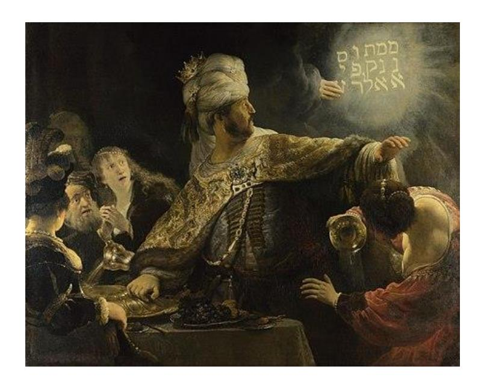

**LACAN**

*Le savoir du psychanalyste*

**1971-72**

## Table des matières

- [Leçon 1 04 novembre 1971](#page-2-0)
- [Leçon 2 02 décembre 1971](#page-12-0)
- [Leçon 3 06 janvier 1972](#page-23-0)
- [Leçon 4 03 février 1972](#page-34-0)
- [Leçon 5 03 mars 1972](#page-46-0)
- [Leçon 6 04 mai 1972](#page-58-0)
- [Leçon 7 01 juin 1972](#page-70-0)

En revenant parler à Sainte-Anne, ce que j'aurai espéré c'est qu'il y eût là des « *internes* » qu'on appelle ça, qui s'appelaient de mon temps *les internes des asiles*, ce sont maintenant « *des hôpitaux psychiatriques* », sans compter le reste. C'est ce public-là qu'en revenant à Sainte-Anne je visais. J'avais l'espoir que certains d'entre eux se dérangeraient. Est-ce que s'il y en a ici - je parle d'internes en exercice - ils me feraient le plaisir de lever la main ? C'est une écrasante minorité, mais enfin ils me suffisent tout à fait.

À partir de là - et pour autant que je pourrais soutenir ce souffle *-* je vais essayer de vous dire quelques mots. Il est évident que ces mots, comme toujours, je les fais improvisés, ce qui ne veut pas dire que je n'aie pas là quelques petites notes, mais ils sont improvisés depuis ce matin, parce que je travaille beaucoup. Mais faut pas vous croire obligés d'en faire autant.

Un point sur lequel j'ai insisté, c'est sur la distance qu'il y a entre le travail et le savoir, car n'oublions pas que ce soir, c'est du savoir que je vous promets, donc pas tellement besoin de vous fatiguer. Vous allez voir pourquoi, certains le soupçonnent déjà, pour avoir assisté à ce qu'on appelle mon *séminaire*.

Pour en venir au savoir, j'ai fait remarquer dans un temps déjà lointain ceci : que *l'ignorance* puisse être considérée - dans le bouddhisme - comme une passion. C'est un fait qui se justifie avec un peu de méditation, mais comme c'est pas notre fort - la méditation - il n'y a pour le faire connaître qu'une expérience. C'est une expérience que j'ai eue - marquante ! - il y a longtemps, justement, au niveau de la salle de garde.

Parce que ça fait une paye que je fréquente ces murailles - pas spécialement celles-là à cette époque - et ça devrait être, c'est inscrit quelque part du côté de 25-26, et les internes à cette époque...

je ne parle pas de ce qu'ils sont maintenant

...les internes aussi bien « *des hôpitaux* » que de ce qu'on appelait « *les asiles* », c'était sans doute un *effet de groupe*, mais pour ce qui est d'en tenir à l'*ignorance*, ben ils étaient un peu là, semble-t-il ! On peut considérer que c'est lié à un moment de la médecine, ce moment devait forcément être suivi de la vacillation présente.

À cette époque, après tout cette ignorance...

n'oubliez pas que quand je parle d'ignorance, je viens de dire que c'est une passion,

c'est pas pour moi une moins value, c'est pas non plus un déficit, c'est autre chose

...l'ignorance est liée au savoir. C'est une façon de l'établir, d'en faire un savoir établi.

Par exemple quand on voulait être médecin dans une époque, qui bien sûr était la fin d'une époque, eh bien c'est normal qu'on ait voulu...

enfin à cette époque on avait un peu encore d'orientation

...qu'on ait voulu bénéficier, montrer, manifester, une ignorance si je puis dire consolidée.

Ceci dit, après ce que je viens de vous dire de l'ignorance, vous ne vous étonnerez pas que je fasse remarquer que l'« *ignorance docte* », comme s'exprimait un certain cardinal...

au temps où ce titre n'était pas un certificat d'ignorance,

...un certain cardinal appelait *« ignorance docte » le savoir le plus élevé*. C'était Nicolas De Cues, pour le rappeler en passant.

De sorte que la corrélation de l'ignorance et du savoir est quelque chose dont il nous faut partir essentiellement, et voir qu'après tout, que l'ignorance, comme ça, à partir d'un certain moment, dans une certaine zone, porte le savoir à son niveau le plus bas, ce n'est pas la faute à l'ignorance, c'est même le contraire.

Depuis quelques temps dans la médecine, l'ignorance n'est plus assez *docte* pour que la médecine survive d'autre chose que de superstitions. Sur le sens de ce mot, et précisément concernant à l'occasion la médecine, je reviendrai peut-être tout à l'heure, si j'ai le temps.

Mais enfin, pour pointer quelque chose qui est de cette expérience avec laquelle je tiens beaucoup à nouer le fil après ces - mon Dieu ! - ces quelques 45 ans de fréquentation de ces murailles...

> c'est pas pour m'en vanter, mais depuis que j'ai livré quelques uns de mes *Écrits* à *la poubellication*, tout le monde sait mon âge, c'est un des inconvénients

...à ce moment, je dois dire que le degré d'*ignorance passionnée* qui régnait à la salle de garde de Ste Anne, je dois dire que c'est irrévocable.

C'est vrai que c'étaient des gens qui avaient la vocation, et à ce moment-là avoir la vocation des asiles c'était quelque chose d'assez particulier. Dans cette même salle de garde arrivèrent en même temps quatre personnes dont je ne trouve pas à dédaigner de réévoquer les noms, puisque je suis l'un d'entre eux. L'autre que je me plairai à faire resurgir ce soir c'était Henri Ey.

On peut bien dire, n'est-ce pas, avec l'espace de temps parcouru, que cette ignorance, Ey en fut le civilisateur. Et je dois dire que je salue son travail. La civilisation, enfin ça ne débarrasse d'aucun *malaise*, comme l'a fait remarquer Freud, bien au contraire, *Unbehagen*, le *pas-bon aise*, mais enfin, ça a un côté précieux.

Si vous croyiez qu'il devait y avoir le moindre degré d'ironie dans ce que je viens de dire, vous vous tromperiez lourdement, mais vous ne pouvez que vous tromper, parce que vous ne pouvez pas imaginer ce que c'était dans le milieu des asiles, avant que Ey y ait eu mis la main. C'était quelque chose d'absolument fabuleux !

Maintenant l'histoire a avancé et je viens de recevoir une circulaire marquant l'alarme qu'on a dans une certaine zone du dit milieu, eu égard à ce mouvement prometteur de toutes sortes de flammèches qu'on appelle « *l'anti-psychiatrie »*. On voudrait bien qu'on prenne position là-dessus, comme si on pouvait prendre position sur quelque chose qui est déjà une opposition. Alors je dois dire, je ne sais pas s'il conviendrait de faire là-dessus quelques remarques, quelques remarques inspirées de ma vieille expérience, celle que je viens d'évoquer précisément, et de distinguer à cette occasion entre la Psychiatrie et la *psychiatrerie*.

La question des malades mentaux ou de ce qu'on appelle, pour mieux dire *les psychoses,* c'est une question pas du tout résolue par l'anti-psychiatrie, quelles que puissent être là-dessus les illusions qu'entretiennent quelques entreprises locales.

L'*anti-psychiatrie* est un mouvement dont le sens est la libération du psychiatre, si j'ose m'exprimer ainsi. Et il est bien certain que ça n'en prend pas le chemin. Ça n'en prend pas le chemin parce qu'il y a une caractéristique qu'il ne faudrait quand même pas oublier dans ce qu'on appelle les *révolutions*, c'est que ce mot est admirablement choisi de vouloir dire : retour au point de départ.

Le *cercle* de tout ceci était déjà connu, mais est amplement démontré dans le livre qui s'appelle « *Naissance de la Folie »*, de Michel Foucault : le psychiatre a en effet un service social. Il est la création d'un certain tournant historique. Celui que nous traversons n'est pas près d'alléger cette charge, ni de réduire sa place, c'est le moins qu'on en puisse dire. De sorte que ça laisse les questions de l'*anti-psychiatrie* un peu en porte à faux.

Enfin, ceci est une indication introductive, mais je voudrais faire remarquer que pour ce qui est des salles de garde, il y a quelque chose tout de même de frappant qui fait à mes yeux leur continuité avec les plus récentes, c'est à quel point la psychanalyse n'a - au regard des biais qu'y prennent les savoirs - la psychanalyse n'a rien amélioré.

Le psychanalyste...

au sens où j'en ai posé *la question*, dans l'année 67-68, où j'avais introduit la notion « *du psychanalyste* », précédé de l'article défini, au temps où j'essayais devant un auditoire - à ce moment-là assez large de rappeler la valeur logique, celle de l'article défini. Enfin passons...

...le psychanalyste ne semble pas avoir rien changé à une certaine assiette du savoir.

Après tout, tout cela est régulier. C'est pas des choses qui arrivent d'un jour à l'autre, qu'on change l'assiette du savoir. L'avenir est à Dieu, comme on dit, c'est-à-dire à la *bonne chance* de ceux qui ont eu la bonne inspiration de me suivre. Quelque chose sortira d'eux, si les petits cochons ne les mangent pas. C'est ce que j'appelle la *bonne chance*. Pour les autres il n'est pas question de *bonne chance*. Leur affaire sera réglée par l'*automatisme*, qui est tout à fait le contraire de la chance, bonne ou mauvaise**1** .

Ce que je voudrais ce soir, c'est ceci : c'est que ceux-là, ceux que je voue à ce à quoi ils se trouvent bons, pour ce que la psychanalyse dont ils usent ne leur laisse aucune chance, je voudrais éviter que pour ceux là s'établisse un malentendu, au nom, comme ça, de quelque chose qui est l'effet de la bonne volonté de certains de ceux qui me suivent.

Ils ont assez bien entendu - enfin comme ils peuvent - ce que j'ai dit du savoir comme fait de ce corrélat d'ignorance, et alors ça les a comme ça un peu, un peu tourmentés. II y en a parmi eux... je ne sais pas quelle mouche a piqué, une mouche littéraire comme ça, des trucs qui traînent dans les écrits de Georges Bataille par exemple, parce qu'autrement, je pense que ça leur serait venu... il y a le « *non-savoir* ». Je dois dire que Georges Bataille a fait un jour une « *conférence sur le non-savoir* », et que ça traîne peut-être dans deux ou trois coins de ses écrits.

1 Cf. τύχη [týksi] et αύτόματον [áftómaton], εὐτυχία [eftyksia] et δυστυχία [dystyksia].

Enfin, Dieu sait qu'il n'en faisait pas des gorges chaudes et que tout spécialement le jour de sa conférence, là à la salle de Géographie à St Germain des Prés...

#### que vous connaissez bien parce que vous êtes de culture

...il n'a pas sorti un mot, ce qui n'était pas une mauvaise façon de faire l'ostension du non-savoir. On a ricané. On a tort parce que maintenant ça fait chic, le *non savoir*. Ça traîne, n'est-ce pas, un peu partout dans les mystiques, c'est même d'eux que ça vient, c'est même chez eux que ça a un sens.

Et puis alors enfin, on sait que j'ai insisté sur la différence entre *savoir* et *vérité.*

Alors si *la vérité* c'est pas *le savoir*, c'est que c'est *le non-savoir*.

Logique aristotélicienne : « *tout ce qui n'est pas noir, c'est le non-noir* », comme je l'ai fait remarquer quelque part. Je l'ai fait remarquer, c'est certain : j'ai articulé que cette frontière sensible entre *la vérité* et *le savoir*, c'est là précisément que se tient *le discours analytique*.

Alors voilà, la route est belle pour proférer, lever le drapeau du « non-savoir ». C'est pas un mauvais drapeau. Ça peut servir justement de ralliement à ce qu'est quand même pas excessivement rare à recruter comme clientèle : l'ignorance crasse par exemple. Ça existe aussi, enfin c'est de plus en plus rare.

Seulement il y a d'autres choses, il y a des versants à la paresse par exemple, dont j'ai pas parlé depuis très longtemps. Et puis il y a certaines formes d'institutionnalisation, de camps de concentration du Bon Dieu, comme on disait autrefois à l'intérieur de l'université, où ces choses-là sont bien accueillies parce que ça fait chic. Bref on se livre à toute une mimique n'est ce pas, « *passez la première Madame la Vérité* », le trou est là n'est-ce pas, c'est votre place. Enfin, c'est une trouvaille, ce non-savoir...

Pour introduire une confusion définitive sur un sujet délicat, celui qui est précisément le point en question dans *la psychanalyse*, ce que j'ai appelé « *cette frontière sensible entre vérité et savoir* », on ne fait pas mieux. *J'ai pas besoin de dater*. Enfin, 10 ans avant, on avait fait une autre trouvaille qui n'était pas mauvaise non plus, à l'endroit de ce qu'il faut bien que j'appelle *mon discours*. Je l'avais commencé en disant que « *l'inconscient était structuré comme un langage* ».

On avait trouvé un machin formidable : les deux types les mieux qui auraient pu travailler dans cette trace, filer ce fil, on leur avait donné un très joli travail : *Vocabulaire de la Philosophie.* [*lapsus*] Qu'est-ce que je dis ? *Vocabulaire de la psychanalyse* ! Vous voyez le *lapsus*, hein ? Enfin ça vaut le *Lalande* **2** .

« *Lalangue* » comme je l'écris maintenant - j'ai pas de tableau noir - ben écrivez : *Lalangue* en un seul mot, c'est comme ça que je l'écrirai désormais. Voyez comme ils sont *cultivés* ! [*Rires*] Alors on n'entend rien ! C'est l'acoustique ? Vous voulez bien faire la correction ? C'est pas un « *d* » c'est un « *gu* » [*Lalande/Lalangue*].

Je n'ai pas dit *l'inconscient est structuré comme* « *Lalangue* », *mais est structuré comme* « *un langage* », et j'y reviendrai tout à l'heure. Mais quand on a lancé les « *responsifs »* dont je parlais tout à l'heure sur le *Vocabulaire de la Psychanalyse*, c'est évidemment parce que j'avais mis à l'ordre du jour ce terme saussurien : « *Lalangue* », que - je le répète - j'écrirai désormais en un seul mot. Et je justifierai pourquoi.

Eh bien *Lalangue* n'a rien à faire avec le dictionnaire, quel qu'il soit. Le *dictionnaire*...

comme déjà il suffirait d'entendre le mot pour le comprendre ...le dictionnaire a affaire avec la diction, c'est-à-dire avec la poésie et avec la rhétorique par exemple. C'est pas rien, hein ? Ça va de *l'invention* à *la persuasion*, enfin c'est très important. Seulement, c'est justement pas ce côté-là qui a affaire avec l'inconscient.

Contrairement à ce que - je pense - la masse des candidats pense, mais qu'une part importante sait déjà, sait déjà s'il a écouté les termes dans lesquels j'ai essayé de faire passage à ce que je dis de l'inconscient : l'inconscient a affaire d'abord avec la *grammaire*.

Il a aussi un peu à faire avec - beaucoup à faire, tout à faire - avec *la répétition*, c'est-à-dire le versant tout contraire à ce à quoi sert un dictionnaire. De sorte que c'était une assez bonne façon de faire comme ceux qui auraient pu m'aider à ce moment-là à faire ma trace, de les dériver. La *grammaire* et la *répétition*, c'est un tout autre versant que celui que j'épinglais tout à l'heure de *l'invention*, qui n'est pas rien sans doute, ni *la persuasion* non plus.

2 André Lalande : « *Vocabulaire technique et critique de la philosophie* », PUF.

Contrairement à ce qui est - je ne sais pourquoi - encore très répandu, le versant utile dans la fonction de *« Lalangue »*, le versant utile pour nous psychanalystes, pour ceux qui ont affaire à l'inconscient, c'est *la logique*. Ceci est une petite parenthèse qui se raccorde à ce qu'*il y a de risque de perte* dans cette promotion absolument improvisée et mythique, à laquelle je n'ai vraiment prêté nulle occasion qu'on fasse erreur, celle qui se propulse du *non-savoir.* Est-ce qu'il y a besoin de démontrer qu'il y a dans la psychanalyse - fondamental et premier - le savoir. C'est ce qu'il va me falloir vous démontrer.

Approchons-le par un bout, ce caractère premier massif, *la primauté de ce savoir* dans la psychanalyse. Faut-il vous rappeler que quand Freud essaie de rendre compte des difficultés qu'il y a dans le frayage de la psychanalyse...

un article de 1917 dans *[Imago](http://www.archive.org/details/Imago-ZeitschriftFuumlrAnwendungDerPsychoanalyseAufDie)*, si mon souvenir est bon, et en tout cas qui a été traduit,

il est paru dans le 1 er numéro de l'*International journal of Psychoanalysis* :

« *Une difficulté sur la voie de la Psychanalyse* », comme cela que ça s'intitule

...c'est que le savoir dont il s'agit, ben il passe pas aisément comme ça.

Freud l'explique comme il peut, et c'est même comme ça qu'il prête à malentendu - c'est pas de hasard - ce fameux terme de « *résistance* » dont je crois être arrivé au moins dans une certaine zone, qu'on ne nous en rebatte plus les oreilles, mais il est certain qu'il y en a une où - je n'en doute pas - il fleurit toujours ce fameux terme de « *résistance* » qui est évidemment pour lui d'une appréhension permanente.

Et alors je dois dire - pourquoi ne pas oser le dire - que nous avons tous nos glissements, c'est surtout les « *résistances* » qui favorisent les glissements. On en découvrira dans quelques temps dans ce que j'ai dit, mais après tout, c'est pas si sûr. Enfin bref, il tombe dans un travers, Freud.

Il pense que contre *la résistance* il n'y a qu'une chose à faire, c'est la révolution*.* Et alors, il se trouve masquer complètement ce dont il s'agit, à savoir la difficulté très spécifique qu'il y a à faire entrer en jeu une certaine fonction du savoir.

Il le confond avec « *le faire* », ce qui est épinglé de « *révolution dans le savoir* ». C'est là dans ce petit article... il le reprendra ensuite dans « *Malaise dans la civilisation »* ...qu'il y a le premier grand morceau sur la révolution copernicienne.

C'était un bateau du savoir universitaire de l'époque. Copernic - pauvre Copernic ! - avait fait la *révolution*. C'était lui - qu'on dit dans les manuels - qu'avait remis le soleil au centre et la Terre à tourner autour. Il est tout à fait clair que malgré le schéma qui montre bien ça en effet dans « *De revolutionnibus* etc. », Copernic là-dessus n'avait strictement aucun parti pris et personne n'eût songé à lui là-dessus chercher noise.

Mais c'est un fait en effet, que nous sommes passés du *géo* à l'*héliocentrisme* et que ceci est censé avoir porté un coup, un « *blow* » comme on s'exprime dans le texte anglais, à je ne sais quel prétendu narcissisme cosmologique. Le deuxième « *blow* », qui lui est biologique, Freud nous l'évoque au niveau de Darwin sous prétexte que, comme pour ce qui est de la terre, les gens ont mis un certain temps à se remettre de la nouvelle annonce : celle qui mettait l'homme en relation de cousinage avec les primates modernes.

Et Freud explique « *résistance* » à la psychanalyse par ceci : c'est que ce qui est atteint, c'est à proprement parler cette consistance du savoir qui fait que quand on sait quelque chose, le minimum qu'on en puisse dire, c'est qu'on sait qu'on le sait. Laissons ce qu'il évoque à ce propos, car c'est là l'os, ce qu'il ajoute, à savoir la peinturlure en forme de *moi* qui est faite là autour, c'est à savoir que celui qui sait qu'il sait, ben c'est « *moi* ». Il est clair que cette référence au *moi* est seconde par rapport à ceci :

- *–* qu'un savoir se sait,
- *–* et que la nouveauté c'est que ce que la psychanalyse révèle c'est *un savoir insu à lui-même*.

Mais je vous le demande, qu'est-ce qu'il y aurait là de nouveau, voire de nature à provoquer la *résistance*, si ce savoir était de nature de tout un monde - animal précisément - où personne ne songe à s'étonner qu'en gros l'animal sache ce qu'il lui faut, à savoir que si c'est un animal à vie terrestre, il ne s'en va pas plonger dans l'eau plus d'un temps limité : il sait que ça ne lui vaut rien.

Si *l'inconscient* est quelque chose de surprenant, c'est que *ce savoir c'est autre chose* : c'est ce savoir dont nous avons l'idée, combien d'ailleurs peu fondée depuis toujours, puisque c'est pas pour rien qu'on a évoqué l'inspiration, l'enthousiasme, ceci depuis toujours, c'est à savoir que *le savoir insu* dont il s'agit dans la psychanalyse, *c'est un savoir qui bel et bien s'articule*, *est structuré comme un langage*. En sorte qu'ici, la révolution si je puis dire, mise en avant par Freud, tend à masquer ce dont il s'agit : c'est que ce quelque chose qui ne passe pas, révolution ou pas, *c'est une subversion qui se produit* - où ? - *dans la fonction, dans la structure du savoir*.

Et c'est ça qui ne passe pas, parce qu'à la vérité la révolution cosmologique, on peut vraiment pas dire, mis à part le dérangement que ça donnait à quelques Docteurs de l'Église, que ce soit quelque chose qui d'aucune façon soit de nature à ce que l'homme, comme on dit, s'en sente d'aucune façon humilié.

C'est pourquoi l'emploi du terme de *révolution* est aussi peu convainquant,

car le fait même qu'il y ait eu sur ce point *révolution*, est plutôt exaltant pour ce qui est du narcissisme. Il en est tout à fait de même pour ce qui est du darwinisme : il n'y a pas de doctrine qui mette plus haut la production humaine que *l'évolutionnisme*, il faut bien le dire. Dans un cas comme dans l'autre, *cosmologique* ou *biologique,* toutes ces révolutions n'en laissent pas moins l'homme à la place de la fleur de la création.

C'est pourquoi on peut dire que cette référence est véritablement mal inspirée.

C'est peut-être elle qui est faite justement pour masquer, pour faire passer ce dont il s'agit, à savoir que ce *savoir*, *ce nouveau statut du savoir*, c'est cela qui doit entraîner un tout nouveau type de *discours*, lequel n'est pas facile à tenir et - jusqu'à un certain point - n'a pas encore commencé.

*L'inconscient -* ai-je dit *- est structuré comme un langage*, un langage lequel ? Et pourquoi ai-je dit un langage ? Parce qu'en fait de langage, nous commençons d'en connaître un bout :

- *–* on parle de *langage-objet* dans la logique, mathématique ou pas,
- *–* on parle de *métalangage*,
- *–* on parle même de *langage* depuis quelque temps au niveau de la biologie,
- *–* on parle de *langage* à tort et à travers,

Pour commencer, je dis que si je parle de langage c'est parce qu'il s'agit de traits communs à se rencontrer dans *lalangue*, *lalangue* étant elle-même sujette à une très grande variété, il y a pourtant des constantes.

Le langage dont il s'agit, comme j'ai pris le temps, le soin, la peine et la patiente de l'articuler,

c'est le langage où l'on peut distinguer le code, du message, entre autres.

Sans cette distinction minimale, il n'y a pas de place pour la parole.

C'est pourquoi quand j'introduis ces termes, je les intitule de « *Fonction et champ de la parole...*

pour *la parole, c'est la fonction*

...*et du langage...*

pour *le langage, c'est le champ*.

*La parole définit la place de ce qu'on appelle la vérité*.

Ce que je marque dès son entrée, pour l'usage que j'en veux faire, *c'est sa structure de fiction, c'est-à-dire aussi bien de mensonge*.

À la vérité, c'est le cas de le dire, *la vérité ne dit la vérité* - pas à moitié ! - que dans un cas : c'est quand elle dit « *je mens* ». C'est le seul cas où l'on est sûr qu'elle ne ment pas, parce qu'elle est supposée le savoir. Mais Autrement, c'est à dire *Autrement* avec un grand A, il est bien possible *qu'elle dise* tout de même *la vérité sans le savoir.*

C'est ce que j'ai essayé de marquer de mon grand S, parenthèse du grand A précisément, et barré : S(A).

Ça au moins,ça vous pouvez pas dire que c'est pas en tout cas *un savoir*...

pour ceux qui me suivent

...qui ne soit pas à ce qu'il faille en tenir compte pour se guider, fût-ce à la petite semaine. C'est le 1 er point de « *l'inconscient structuré comme un langage »*.

Le 2 ème, vous ne m'avez pas attendu - je parle aux psychanalystes - vous ne m'avez pas attendu pour le savoir puisque c'est le principe même de ce que vous faites dès que vous interprétez. Il n'y a pas une interprétation qui ne concerne - quoi ? - le lien de ce qui, dans ce que vous entendez, se manifeste de parole, le lien de ceci à *la jouissance*.

Il se peut que vous le fassiez en quelque sorte innocemment, à savoir sans vous être jamais aperçu qu'il n'y a pas une interprétation qui veuille jamais dire autre chose, mais enfin une interprétation analytique c'est toujours ça : que le bénéfice soit secondaire ou primaire, le bénéfice est de *jouissance*.

Et ça, il est tout à fait clair que la chose a émergé sous la plume de Freud, pas tout de suite car il y a une étape, il y a *le principe du plaisir,* mais enfin il est clair qu'un jour ce qui l'a frappé, c'est que quoi qu'on fasse, innocent ou pas, ce qui se formule...

de ce jeu, une vérité s'énonce

...ce qui se formule quoi qu'on y fasse, est *quelque chose qui se répète*.

« *L'instance* - ai-je dit - *de la lettre* », et si j'emploie « *instance »* c'est, comme pour tous les emplois que je fais des mots, non sans raison, c'est qu'*instance*

- *–* résonne aussi bien : au niveau de la juridiction,
- *–* il résonne aussi au niveau de l'*insistance*, où il fait surgir ce module que j'ai défini de l'*instant*, au niveau d'une certaine logique.

Cette *répétition*, c'est là que Freud découvre « *l'Au-delà du principe du plaisir* ». Seulement voilà, s'il y a un *au-delà*, ne parlons plus du « *principe* », parce qu'un principe où il y a un au-delà, c'est plus un principe, et laissons de côté du même coup *le principe de réalité*. Tout ça est très clairement à revoir.

Il n'y a tout de même pas 2 classes *d'êtres parlants* :

- ceux qui se gouvernent selon *le principe du plaisir et le principe de réalité*,
- et ceux qui sont *Au-delà du principe du plaisir*, surtout que comme on dit c'est le cas de le dire cliniquement ce sont bien les mêmes.

Le processus primaire s'explique dans un premier temps par cette approximation qu'est l'opposition, la bipolarité *principe du plaisir - principe de réalité*.

Il faut bien le dire, cette ébauche est intenable et seulement faite pour faire gober ce qu'elles peuvent aux oreilles contemporaines de ces premiers énoncés, qui sont...

je ne veux pas abuser de ce terme

...des *oreilles bourgeoises*, à savoir qui n'ont absolument pas la moindre idée de ce que c'est que le *principe du plaisir*.

*Le principe du plaisir* est une référence de la morale antique :

dans la morale antique, le plaisir, qui consiste précisément à en faire le moins possible « *otium cum dignitate* », c'est une ascèse dont on peut dire qu'elle rejoint celle des *pourceaux*, mais c'est pas du tout dans le sens où l'on l'entend.

Le mot « *pourceau* » ne signifiait pas dans l'Antiquité, être cochon, ça voulait dire que ça confinait à *la sagesse de l'animal*. C'était une appréciation, une touche, une note, donnée de l'extérieur par des gens qui ne comprenaient pas de quoi il s'agissait, à savoir du dernier raffinement de *la morale du Maître*.

Qu'est-ce que ça peut bien avoir à faire avec l'idée que le bourgeois se fait du plaisir, et d'ailleurs, il faut bien le dire, de la réalité ?

Quoi qu'il en soit - c'est le 3 ème point - ce qui résulte de *l'insistance* avec laquelle l'inconscient nous livre ce qu'il formule, c'est que si d'un côté notre interprétation n'a jamais que le sens de faire remarquer ce que le sujet y trouve, qu'est-ce qu'il y trouve ? Rien qui ne doive se cataloguer du registre de la jouissance. C'est le 3 ème point.

4 ème point : où est-ce que ça gîte, la jouissance ? Qu'est ce qu'il y faut ? Un corps ! Pour jouir, il faut un corps. Même ceux qui font promesse des béatitudes éternelles ne peuvent le faire qu'à supposer que *le corps* s'y véhicule : *glorieux* ou pas, il doit y être. Faut un corps. Pourquoi ?

Parce que la dimension de la jouissance, pour le corps, c'est la dimension de la *descente vers la mort*. C'est d'ailleurs très précisément en quoi *le principe du plaisir* dans Freud annonce qu'il savait bien, dès ce moment-là, ce qu'il disait, car si vous le lisez avec soin, vous y verrez que *le principe du plaisir* n'a rien à faire avec l'hédonisme, même s'il nous est légué de la plus ancienne tradition, il est en vérité *le principe du déplaisir*. Il est *le principe du déplaisir*, c'est au point qu'à l'énoncer à tout instant, Freud dérape.

« *Le plaisir en quoi consiste-t-il* ? », nous dit-il, c'est à abaisser la tension. Mais qu'est ce que c'est que cette tension, si ce n'est le principe même de tout ce qui a le nom de jouissance, de quoi jouir, sinon qu'il se produise une tension ?

C'est bien en quoi, alors que Freud est sur le chemin du « *Jenseits* », de l'*Au-delà du principe du plaisir*, qu'est-ce qu'il nous énonce dans *Malaise dans la civilisation*, sinon que très probablement, bien au-delà de *la répression* dite *sociale*, il doit y avoir une *répression -* il l'écrit textuellement *- organique.*

Il est curieux, il est dommage qu'il faille se donner tant de peine pour des choses dites avec tant d'évidence, et pour faire percevoir ceci : c'est que la dimension dont *l'être parlant* se distingue de l'animal, c'est assurément qu'il y a en lui *cette béance* par où il se perdait, *par où il lui est permis d'opérer sur le ou les corps*... que ce soit le sien ou celui de ses semblables, ou celui des animaux qui l'entourent,

...pour en faire surgir, à leur ou à son bénéfice, ce qui s'appelle à proprement parler *la jouissance*.

Il est assurément plus étrange que les cheminements que je viens de souligner...

ceux qui vont de cette description sophistiquée du *principe du plaisir*

à la reconnaissance ouverte de ce qu'il en est de *la jouissance fondamentale*

...il est plus étrange de voir que Freud, à ce niveau, croit devoir recourir à quelque chose qu'il désigne de *l'instinct de mort*.

Non que ce soit faux, seulement le dire ainsi, de cette façon tellement savante, c'est justement ce que les savants qu'il a engendrés sous le nom de psychanalystes ne peuvent absolument pas avaler.

Cette longue cogitation, cette rumination autour de *l'instinct de mort*, qui est ce qui caractérise, on peut le dire, enfin, l'ensemble de l'institution psychanalytique internationale, cette façon qu'elle a *de se cliver, de se partager, de se répartir* :

- admet-elle, n'admet-elle pas,
- « *là, je m'arrête, je ne le suis pas jusque là*... »

...ces interminables dédales autour de ce terme qui semble choisi pour donner l'illusion que dans ce champ quelque chose a été découvert qu'on puisse dire analogue à ce qu'en logique on appelle *paradoxe*, il est étonnant que Freud, avec le chemin qu'il avait déjà frayé, n'ait pas cru devoir le pointer purement et simplement.

*La jouissance* qui est vraiment, dans l'ordre de l'érotologie, à la portée de n'importe qui - il est vrai qu'à cette époque les publications du marquis de Sade étaient moins répandues, c'est bien pourquoi j'ai cru devoir, histoire de prendre date, marquer quelque part dans mes *Écrits* la relation de « Kant avec Sade ». Si à procéder ainsi pourtant, je pense *tout de même* qu'il y a une réponse, il n'est pas forcé que pour lui, plus que pour aucun d'entre nous, il ait su tout ce qu'il disait.

Mais au lieu de raconter des bagatelles autour de l'instinct de mort primitif...

- *–* venu de l'extérieur ou venu de l'intérieur,
- *–* ou se retournant de l'extérieur sur l'intérieur,
- *–* et engendrant sur le tard, enfin se rejetant sur l'agressivité et la bagarre,

...on aurait peut-être pu lire ceci dans *l'instinct de mort* de Freud, qui porte peut-être à dire que *le seul acte* somme toute, s'il y en a un, *qui serait un acte achevé*...

entendez bien que je parle, comme l'année dernière je parlais « *D'un discours qui ne serait pas du semblant »*

dans un cas comme dans l'autre il n'y en a pas, ni de discours ni d'acte tel

...cela donc serait, s'il pouvait être, le suicide.

### C'est ce que Freud nous dit.

Il nous le dit pas comme ça, en cru, en clair, comme on peut le dire maintenant, maintenant que la doctrine a un tout petit peu frayé sa voie et qu'on sait qu'il n'y a d'acte que raté et que c'est même la seule condition d'un semblant de réussir.

C'est bien en quoi le suicide mérite objection : c'est qu'on n'a pas besoin que ça reste une tentative pour que ce soit de toute façon raté, complètement raté du point de vue de *la jouissance*. Peut-être que les bouddhistes, avec leurs bidons d'essence *-* car ils sont à la page – on n'en sait rien car ils ne reviennent pas porter témoignage.

C'est un joli texte, le texte de Freud.

C'est pas pour rien s'il nous ramène *le soma* et *le germen*. Il sent, il flaire que c'est là qu'il y a quelque chose à approfondir.

Oui, ce qu'il y a à approfondir, c'est le 5 ème point que j'ai énoncé cette année dans mon séminaire et qui s'énonce ainsi :

« *il n'y a pas de rapport sexuel* ».

Bien entendu, ça paraît comme ça un peu *zinzin,* un peu *éffloupi*. Suffirait de baiser un bon coup pour me démontrer le contraire.

Malheureusement c'est la seule chose qui ne démontre absolument rien de pareil parce que la notion de *rapport* ne coïncide pas tout à fait avec l'usage métaphorique que l'on fait de ce mot tout court « *rapport* » : ils ont eu des rapports, c'est pas tout à fait ça.

On peut sérieusement parler de *rapport non seulement quand l'établit un discours, mais quand on l'énonce, le rapport.* Parce que c'est vrai que *le réel* est là avant que nous le pensions, mais *le rapport* c'est beaucoup plus douteux : non seulement il faut le penser, mais *il faut l'écrire*. Si vous êtes pas foutus de *l'écrire,* il n'y a pas de *rapport*. Ce serait peut-être très remarquable s'il s'avérait, assez longtemps pour que ça commence à s'élucider un peu, qu'il est impossible de l'écrire ce qu'il en serait du rapport sexuel.

La chose a de l'importance parce que justement nous sommes, par le progrès de ce qu'on appelle « *la science* », en train de pousser très loin un tas de menues affaires qui se situent au niveau du *gamète,* au niveau du *gène,*  au niveau d'un certain nombre de choix, de tris, qu'on appelle comme on veut, *méiose* ou autre, et qui semblent bien élucider quelque chose, quelque chose qui se passe au niveau du fait que la reproduction, au moins dans une certaine zone de la vie, est sexuée.

Seulement ça n'a pas absolument rien à faire avec ce qu'il en est du rapport sexuel, pour autant qu'il est très certain que, chez l'être parlant, il y a autour de ce rapport, en tant que fondé sur la jouissance, un éventail tout à fait admirable en son étalement et que deux choses en ont été, par Freud - par Freud et le discours analytique - mises en évidence, c'est toute la gamme de *la jouissance*, je veux dire tout ce qu'on peut faire à convenablement traiter *un corps*, *voire son corps*, tout cela à quelque degré participe de la jouissance sexuelle.

Seulement *la jouissance sexuelle* elle-même, quand vous voulez mettre la main dessus, si je puis m'exprimer ainsi, elle n'est plus *sexuelle* du tout, elle se perd.

Et c'est là qu'entre en jeu tout ce qui s'édifie du terme de *Phallus* qui est bien là ce qui désigne un certain *signifié*, un signifié d'un certain signifiant parfaitement évanouissant,

car pour ce qui est de définir ce qu'il en est de l'homme ou de la femme, ce que la psychanalyse nous montre, c'est très précisément que c'est *impossible* et que jusqu'à un certain degré, rien n'indique spécialement que ce soit vers le partenaire de l'autre sexe que doive se diriger *la jouissance*, si la jouissance est considérée, même un instant, comme le guide de ce qu'il en est de la fonction de reproduction.

Nous nous trouvons là devant l'éclatement de *la*, disons *notion de sexualité*. La sexualité est au centre, sans aucun doute, de tout ce qui se passe dans l'inconscient. Mais elle est au centre en ceci qu'elle est *un manque*.

C'est-à-dire qu'à la place de quoi que ce soit qui pourrait s'écrire du rapport sexuel comme tel, se substituent les impasses qui sont celles qu'engendre la fonction de la jouissance précisément sexuelle, en tant qu'elle apparaît comme cette sorte de point de mirage, dont quelque part Freud lui-même donne la note comme de la jouissance absolue.

Et c'est si près que précisément elle ne l'est pas, absolue. Elle ne l'est dans aucun sens,

- d'abord parce que comme telle elle est vouée à ces différentes formes d'échec que constituent
  - *– la castration* pour la jouissance masculine,
  - *– la division* pour ce qu'il en est de la jouissance féminine,

et que d'autre part, ce à quoi la jouissance mène n'a strictement rien à faire avec la copulation, pour autant que celle-ci est, disons le mode usuel - ça changera - par où se fait dans l'espèce de *l'être parlant, la reproduction*.

En d'autres termes :

- il y a une thèse : « *il n'y a pas de rapport sexuel* » c'est de l'*être parlant* que je parle.
- Il y a une antithèse qui est *la reproduction de la vie*. C'est un thème bien connu. C'est l'actuel drapeau de *l'Église catholique*, en quoi il faut saluer son courage. *L'Église catholique* affirme qu'il y a un rapport sexuel : c'est celui qui aboutit à faire de petits enfants. C'est une affirmation qui est tout à fait tenable, simplement elle est indémontrable. Aucun discours ne peut la soutenir, sauf le discours religieux, en tant qu'il définit la stricte séparation qu'il y a entre *la vérité* et *le savoir*.
- Et troisièmement, il n'y a pas de synthèse, à moins que vous n'appeliez « synthèse » cette remarque qu'il n'y a de jouissance que de mourir.

Tels sont les points de *vérité* et de *savoir* dont il importe de scander ce qu'il en est du *savoir du psychanalyste*, à ceci près qu'il n'y a pas un seul psychanalyste pour qui ce ne soit *lettre morte*. Pour la synthèse, on peut se fier à eux pour en soutenir les termes et les voir tout à fait ailleurs que dans *l'instinct de mort*. *Chassez le naturel* - comme on dit, n'est ce pas - *il revient au galop*.

Il conviendrait tout de même de donner son vrai sens à cette vieille formule proverbiale. Le *naturel*, parlons-en, c'est bien de ça qu'il s'agit.

Le *naturel*, c'est tout ce qui s'habille de la livrée du savoir - et Dieu sait que ça ne manque pas et un discours qui est fait uniquement pour que le savoir fasse « *[livrée](http://www.cnrtl.fr/definition/livr%C3%A9e)* », c'est *le discours universitaire*. Il est tout à fait clair que l'habillement dont il s'agit, c'est l'idée de la nature. Elle n'est pas prête de disparaître du devant de la scène.

Non pas que j'essaie de lui en substituer une autre.

Ne vous imaginez pas que je suis de ceux qui opposent la culture à la nature. D'abord ne serait-ce que parce que la nature, c'est précisément un fruit de la culture.

Mais enfin ce rapport *le savoir/la vérité* ou comme vous voudrez : *la vérité/le savoir*, c'est quelque chose à quoi nous n'avons même pas commencé d'avoir le plus petit commencement d'adhésion, comme de ce qu'il en est de la médecine, de la psychiatrie et d'un tas d'autres problèmes.

Nous allons être submergés avant pas longtemps, avant 4-5 ans,

- *–* de tous les problèmes *ségrégatifs* qu'on intitulera ou qu'on fustigera du terme de « racisme »,
- *–* tous les problèmes qui sont précisément ceux qui vont consister à ce qu'on appelle simplement le contrôle de ce qui se passe au niveau de la reproduction de la vie, chez des êtres qui se trouvent - en raison de ce qu'ils parlent - avoir toutes sortes de problèmes de conscience.

Ce qu'il y a d'absolument inouï, c'est qu'on ne se soit pas encore aperçu que *les problèmes de conscience sont des problèmes de jouissance.* Mais enfin, on commence seulement à pouvoir les dire.

Il n'est pas sûr du tout que ça ait la moindre conséquence, puisque nous savons en effet que *l'interprétation* ça demande pour être reçue, ce que j'appelais, en commençant, *du travail*. *Le savoir* lui, est de l'ordre de *la jouissance*. On ne voit absolument pas pourquoi il changerait de lit.

Ce que les gens attendent, dénoncent du titre d'intellectualisation, ça veut simplement dire ceci qu'ils sont habitués par expérience à s'apercevoir qu'il n'est nullement nécessaire, il n'est nullement suffisant, de comprendre quelque chose pour que quoi que ce soit change.

La question du savoir du psychanalyste n'est pas du tout que ça s'articule ou pas, la question est de savoir à quelle place il faut être pour le soutenir.

C'est évidemment là-dessus que j'essaierai d'indiquer quelque chose dont je ne sais pas si j'arriverai à lui donner une formulation qui soit *transmissible*. J'essaierai pourtant.

La question est de savoir dans quelle mesure ce que *la science*... la science à laquelle la psychanalyse, actuellement tout autant qu'au temps de Freud ne peut rien faire de plus que faire cortège, ...ce que *la science* peut atteindre qui relève du terme de *réel.*

*Le symbolique, l'Imaginaire et le Réel*.

Il est très clair que la puissance du *Symbolique* n'a pas à être démontrée. C'est la puissance même. Il n'y a aucune trace de puissance dans le monde avant l'apparition du langage.

Ce qu'il y a de frappant dans ce que Freud esquisse de l'avant Copernic, c'est qu'il s'imagine que l'homme était tout heureux d'être au centre de l'univers et qu'il s'en croyait le roi. C'est vraiment une illusion absolument fabuleuse !

S'il y a quelque chose dont il prenait l'idée dans *les sphères éternelles*, c'était précisément que là était le dernier mot du savoir. Ce qui sait, dans le monde, quelque chose -

il faut du temps pour que ça passe

...ce sont *les sphères éthérées* : elles savent*.* C'est bien en quoi *le savoir* est associé dès l'origine à l'idée *du pouvoir*.

Et dans cette petite annonce qu'il y a au dos du gros paquet de mes *Écrits*, vous le voyez...

parce que - pourquoi ne pas l'avouer - c'est moi qui l'ai écrite, cette petite note.

Qui d'autre que moi aurait pu le faire, on reconnaît mon style, ben c'est pas mal écrit ! ...*j'invoque les Lumières*.

Il est tout à fait clair que *les Lumières* ont mis un certain temps à s'élucider.

Dans un premier temps, elles ont bien raté leur coup.

Mais enfin, comme *l'Enfer,* elles étaient pavées de bonnes intentions. Contrairement à tout ce qu'on en a pu dire, *les Lumières* avaient pour but d'énoncer un savoir qui ne fût hommage à aucun pouvoir.

Seulement, on a bien le regret de devoir constater que ceux qui se sont employés à cet office étaient un peu trop dans des positions de valets par rapport à un certain type...

je dois dire assez heureux et florissant

...de maîtres, les nobles de l'époque, pour qu'ils aient pu d'aucune façon aboutir à autre chose qu'à cette fameuse Révolution française qui a eu le résultat que vous savez, à savoir l'instauration d'une race de *maîtres* plus féroces que tout ce qu'on avait vu jusque là à l'œuvre.

Un savoir qui n'en peut mais, le savoir de l'*impuissance* voilà ce que le psychanalyste...

dans une certaine perspective, une perspective que je ne qualifierai pas de progression ...voilà ce que le psychanalyste pourrait véhiculer.

Et pour vous donner le ton de la trace dans laquelle cette année j'espère poursuivre mon discours, je vais vous donner le titre, la primeur...

pourléchez-vous les babines

...je vais vous donner le titre du séminaire que je vais donner, à la même place que l'année dernière, cela par la grâce de quelques personnes qui ont bien voulu s'employer à nous la préserver.

Ça s'écrit comme ça, d'abord avant de le prononcer :

- ça *c'est un O*,
- et *ça un U*,
- … *trois points*, vous mettrez ce que vous voudrez, comme ça je vais le livrer à votre méditation.

Ce *ou*, c'est le *ou* qu'on appelle *vel* ou *aut* en latin : « ...*Ou pire »*.

Ce que je fais avec vous ce soir, ce n'est évidemment pas...

pas plus ça ne le sera, que ça ne l'a été la dernière fois

...ce n'est évidemment pas ce que je me suis proposé, cette année, de donner comme pas suivant de mon séminaire. Ça sera comme la dernière fois, *un entretien*.

Chacun sait - beaucoup l'ignorent - l'insistance que je mets auprès de ceux qui me demandent conseil, sur *les entretiens préliminaires* dans l'analyse.

Ça a une fonction bien sûr, pour l'analyse, essentielle.

Il n'y a pas d'entrée possible dans l'analyse sans *entretiens préliminaires*.

Mais il y a quelque chose qui en approche sur le rapport entre ces *entretiens* et ce que je vais vous dire cette année, à ceci près que ça ne peut absolument pas être le même, étant donné que comme c'est moi qui parle, c'est moi qui suis ici dans la position de l'analysant.

Alors ce que j'allais vous dire...

j'aurais pu prendre bien d'autres biais mais en fin de compte

c'est toujours au dernier moment que je sais ce que je choisis de dire

...et pour cet entretien d'aujourd'hui, l'occasion m'a semblée propice d'une question qui m'a été posée hier soir par quelqu'un de mon École.

C'est une des personnes qui prennent un peu à cœur leur position et qui m'a posé la question suivante qui a, bien sûr, à mes yeux l'avantage de me faire entrer tout de suite dans le vif du sujet. Chacun sait que ça m'arrive rarement, j'approche à pas prudents.

La question qui m'a été posée est la suivante : « *L'incompréhension de Lacan est-elle un symptôme ?* »

Je la répète donc textuellement.

C'est une personne à qui en l'occasion je pardonne aisément pour avoir mis mon nom... ce qui s'explique puisqu'elle était en face de moi ...à la place de ce qui eût convenu, à savoir de *« mon discours »*.

Vous voyez que je ne me dérobe pas, je l'appelle « *mon »*.

Nous verrons tout à l'heure si ce *mon* mérite d'être maintenu. Qu'importe. L'essentiel de cette question était dans ce sur quoi elle porte, à savoir si l'incompréhension de ce dont il s'agit, que vous l'appeliez d'une façon ou d'une autre, est un *symptôme*.

Je ne le pense pas. Je ne le pense pas, d'abord parce que, en un sens, on ne peut pas dire que quelque chose...

qui a quand même un certain rapport avec *mon discours*,

qui ne se confond pas, qui est ce qu'on pourrait appeler *ma parole*,

...on ne peut pas dire *quelle soit absolument incomprise*, on peut dire, à un niveau précis, que votre nombre en est la preuve. Si ma *parole* était incompréhensible, je ne vois pas bien ce que, en nombre, vous feriez là.

D'autant plus qu'après tout ce nombre est fait en grande partie de gens qui reviennent et puis que, comme ça, au niveau d'un échantillonnage qui me parvient quand même, il arrive que des personnes qui s'expriment de cette façon qu'elles ne comprennent pas toujours bien ou tout au moins qu'elles n'ont pas le sentiment de comprendre...

pour reprendre enfin un des derniers témoignages

que j'en ai reçus, de la façon dont chacun exprime ça

...eh bien, malgré ce sentiment un peu « *de ne pas y être* », il n'empêche...

me disait-on dans le dernier témoignage

...que ça l'aidait, la personne en question à se retrouver dans ses propres idées, à s'éclaircir, à s'éclaircir elle-même sur un certain nombre de points.

On ne peut pas dire qu'au moins pour ce qui en est de ma parole...

qui est bien évidemment à distinguer du discours nous allons tâcher de voir en quoi

...il n'y a pas à proprement parler ce qu'on appelle *incompréhension*. Je souligne

tout de suite que *cette parole est une parole d'enseignement*. L'enseignement donc, en l'occasion je le distingue du discours.

Comme je parle ici à Sainte-Anne...

et peut-être à travers ce que j'ai dit la dernière fois on peut sentir ce que ça signifie pour moi ...j'ai choisi de prendre les choses au niveau, disons de ce qu'on appelle l'élémentaire. C'est complètement arbitraire, mais c'est un choix.

Quand j'ai été à la *Société de Philosophie* faire une communication sur ce que j'appelais à l'époque mon enseignement, j'ai pris le même parti. J'ai parlé comme en m'adressant à des gens très en retard : ils ne le sont pas plus que vous, mais c'est plutôt l'idée que j'ai de la philosophie qui veut ça. Et je ne suis pas le seul.

Un de mes très bons amis qui en a fait une récente - à la *Société de Philosophie* - de communication, m'a passé un article sur le fondement des mathématiques où je lui ai fait observer que son article était d'un niveau dix fois ou vingt fois plus élevé que ce qu'il avait dit à la *Société de Philosophie*.

Il m'a dit qu'il ne fallait pas que je m'en étonne, vu les réponses qu'il en avait obtenu. C'est bien ce qu'il m'a prouvé aussi, parce que j'ai eu des réponses du même ordre au même endroit, c'est bien ce qui m'a rassuré d'avoir articulé certaines choses que vous pouvez trouvez dans mes *Écrits*, au même niveau.

Il y a donc dans certains contextes un choix moins arbitraire que celui que je soutiens ici. Je le soutiens ici en fonction d'éléments mémoriaux qui sont liés à ceci : c'est qu'en fin de compte, si à un certain niveau, mon discours est encore incompris, c'est parce que, disons pendant longtemps, il a été dans toute une zone interdit, non pas de l'entendre... ce qui aurait été, comme l'expérience l'a prouvé, à la portée de beaucoup ...mais interdit de *venir* l'entendre.

C'est ce qui va nous permettre de distinguer cette incompréhension d'un certain nombre d'autres : il y avait de l'interdit. Et que, ma foi, cet interdit soit provenu d'une institution analytique est sûrement significatif. Significatif veut dire quoi ?

J'ai pas du tout dit *signifiant*.

Il y a une grande différence entre le rapport signifiant-signifié et la signification. La signification ça fait signe, un signe n'a rien à faire avec un signifiant.

Un signe est...

j'expose ça dans un coin, quelque part dans le dernier numéro de ce *Scilicet* ...un signe est, quoi qu'on en pense, toujours le signe d'un sujet.

Qui s'adresse à quoi ? C'est également écrit dans ce *Scilicet*, je ne peux pas maintenant m'y étendre, mais ce signe, ce signe d'interdiction venait assurément de vrais sujets, dans tous les sens du mot, de sujets qui obéissent en tout cas. Que ce soit un signe venu d'une institution analytique est bien fait pour nous faire faire le pas suivant.

Si la question a pu m'être posée sous cette forme, c'est en fonction de ceci : que l'incompréhension en psychanalyse est considérée comme un *symptôme*. C'est reçu dans la psychanalyse, c'est - si on peut dire - généralement admis. La chose en est au point que c'était passé dans la conscience commune.

Quand je dis que c'est généralement admis, c'est au-delà de la psychanalyse, je veux dire de l'acte psychanalytique. Les choses dans une certaine conscience...

il y a quelque chose qui donne le mode de la conscience commune ...en sont au point où on se dit, où on s'entend dire : « *Va te faire psychanalyser* » quand… quand quoi ? Quand la personne qui le dit, considère que votre conduite, vos propos sont, comme dirait M. de Lapalisse, *symptôme*.

Je vous ferai remarquer que tout de même à ce niveau, par ce biais, « *symptôme »* a le sens de « *valeur de vérité »*. C'est en quoi ce qui est passé dans la conscience commune est plus précis que l'idée qu'arrivent à avoir - hélas beaucoup de psychanalystes. Disons qu'il y en a trop peu à savoir l'équivalence de « *symptôme »* avec « *valeur de vérité »*.

C'est assez curieux, mais d'ailleurs ça a ce répondant historique, que ça démontre que ce sens du mot *symptôme* a été découvert, énoncé, avant que la psychanalyse entre en jeu. Comme je le souligne souvent, c'est à très proprement parler le pas essentiel fait par la pensée marxiste que cette équivalence. *Valeur de vérité* : pour traduire *le symptôme* en une *Valeur de vérité* nous devons ici toucher du doigt, une fois de plus, ce que suppose *de savoir* chez l'analyste le fait qu'il faille bien que ce soit à son « *su* » qu'il interprète.

Et pour faire ici une parenthèse, simplement en passant...

ça n'est pas dans le fil de ce que j'essaie de vous faire suivre ...je dois marquer, je marque pourtant que *ce savoir* est à l'analyste, si je puis dire, *présupposé.*

Ce que j'ai accentué du *sujet supposé savoir* comme fondant les phénomènes du *transfert*, j'ai toujours souligné que ça n'emporte aucune certitude chez le sujet analysant que son analyste en sache long, bien loin de là.

Mais c'est parfaitement compatible avec le fait que soit par l'analysant envisagé comme fort douteux *le savoir de l'analyste*, ce qui d'ailleurs, il faut l'ajouter, est fréquemment le cas pour des raisons fort objectives : les analystes somme toute n'en savent pas toujours autant qu'ils devraient pour cette simple raison que souvent ils ne foutent pas grand chose.

Ça ne change absolument rien au fait que *le savoir est présupposé* à la fonction de l'analyste et que c'est là-dessus que reposent les phénomènes de *transfert*. La parenthèse est close.

Voici donc le *symptôme* avec *sa traduction* comme *valeur de vérité*. *Le symptôme est valeur de vérité* et... je vous le fais remarquer au passage ...la réciproque n'est pas vraie : la *valeur de vérité* n'est pas *symptôme*.

Il est bon de le remarquer en ce point pour la raison que *la vérité* n'est rien dont je prétende que la fonction soit isolable. Sa fonction - et nommément là où elle prend place : *dans la parole* - est relative. Elle n'est pas séparable d'autres fonctions de *la parole*. Raison de plus pour que j'insiste sur ceci : que *même à la réduire à la valeur*, elle ne se confond en aucun cas avec le *symptôme*.

C'est autour de ce point de ce qu'est le *symptôme* qu'ont pivoté les premiers temps de mon enseignement, car les analystes sur ce point étaient dans un brouillard tel que le *symptôme*...

et après tout peut-être doit-on à mon *enseignement* que ça ne s'étale plus si aisément ...que le *symptôme* s'articule - j'entends : dans la bouche des analystes - comme le refus de la dite *valeur de vérité*.

Ça n'a aucun rapport avec cette équivalence à un seul sens - je viens d'y insister - du *symptôme* à une *valeur de vérité*. Ça fait entrer en jeu ce que j'appellerai...

> ce que j'appellerai comme ça parce qu'on est entre soi et que j'ai dit que c'était un *entretien* ce que j'appellerai sans plus de forme, sans me soucier que les termes que je vais pousser

en avant en soient déjà usités à la pointe la plus avancée de la philosophie

...ça fait entrer en jeu *l'être d'un étant*.

Je dis *l'être*...

parce que il me semble clair, il semble acquis - depuis le temps – que la philosophie tourne en rond sur un certain nombre de points ...je dis l'être parce qu'il s'agit de *l'être parlant*.

C'est d'être parlant...

excusez-moi du 1er être

...qu'il vient à l'être, enfin qu'il en a le sentiment. Naturellement il n'y vient pas, il rate. Mais cette dimension ouverte tout d'un coup de « *l'être* », on peut dire que pendant un bon bout de temps, elle a porté sur le système, des philosophes tout au moins.

Et on aurait bien tort d'ironiser, parce que si *elle a porté sur le système* des philosophes,

c'est qu'ils portent sur le système de tout le monde,

et que ce qui se désigne dans cette dénonciation par les analystes de ce qu'ils appellent « *la résistance »*,

ce autour de quoi j'ai fait pendant toute une étape de cet enseignement...

dont mes *Écrits* portent la trace,

...j'ai fait pendant tout une étape *bagarre*, c'est bien pour les interroger sur s'ils savaient ce qu'ils faisaient en faisant entrer dans l'occasion ce qu'on pourrait donc appeler ceci : que l'*être* de ce sacré *étant* dont ils parlent...

pas tout à fait à tort et à travers, ils appellent ça « *l'homme »* de temps en temps, en tout cas

on l'appelle de moins en moins [ainsi] depuis que je suis de ceux qui font là-dessus quelques réserves ...cet être n'a pas à l'endroit de *la vérité* de tropisme spécial. N'en disons pas plus.

Donc il y a deux sens du *symptôme* : le *symptôme* est *valeur de vérité*, c'est la fonction qui résulte de l'introduction, à un certain temps historique - que j'ai daté suffisamment - de la notion de *symptôme*.

Il ne se guérit pas le *symptôme,* de la même façon dans la dialectique marxiste et dans la psychanalyse. Dans la psychanalyse, il a affaire à quelque chose qui est la traduction en paroles de sa *valeur de vérité*. Que ceci suscite ce qui est par l'analyste ressenti comme un être de refus, ne permet nullement de *trancher* si ce sentiment mérite d'aucune façon d'être retenu, puisque aussi bien dans d'autres registres, celui précisément que j'ai évoqué tout à l'heure, c'est à de tout autres procédés que doit céder *le symptôme*.

Je ne suis pas en train de donner à aucun de ces procédés la préférence et ceci d'autant moins que ce que je veux vous faire entendre, c'est qu'il y a une autre dialectique que celle qu'on impute à *l'histoire*.

#### Entre les questions :

— « *l'incompréhension psychanalytique est-elle un symptôme ?* »,

— et « *l'incompréhension de Lacan est-elle un symptôme ?* »,

j'en placerai une 3 ème :

— « *L'incompréhension mathématique*...

c'est quelque chose qui se désigne, il y a des gens - et même des jeunes gens, parce que ça n'a d'intérêt qu'auprès des jeunes gens - pour qui cette dimension de *l'incompréhension mathématique*, ça existe ...*est-elle un symptôme ?* ».

Il est certain que quand on s'intéresse à ces sujets qui manifestent l'incompréhension mathématique, assez répandue encore à notre temps, on a le sentiment...

j'ai employé le mot *sentiment* tout à fait comme tout à l'heure,

pour ce dont les analystes ont fait *la résistance*

...on a le sentiment qu'elle provient, chez le sujet en proie à l'incompréhension mathématique, de quelque chose qui est comme une insatisfaction, un décalage, quelque chose d'éprouvé dans le maniement précisément de *la valeur de vérité.*

Les sujets en proie à *l'incompréhension mathématique* attendent plus de *la vérité* que la réduction à ces valeurs qu'on appelle... au moins dans les premiers pas de la mathématique

...des *valeurs déductives*. Les articulations dites démonstratives leur paraissent manquer de quelque chose qui est précisément au niveau d'une exigence de *vérité*.

Cette bivalence : *vrai* ou *faux*, sûrement - et disons-le : non sans raisons - les laisse en déroute, et jusqu'à un certain point on peut dire qu'il y a une certaine distance de *la vérité* à ce que nous pouvons appeler dans l'occasion *le chiffre*. *Le chiffre* ce n'est rien d'autre que l'écrit, l'écrit de sa *valeur*.

Que *la bivalence* s'exprime selon les cas par 0 et 1 ou par V et F, le résultat est le même. Le résultat est le même en raison de quelque chose qui est exigé ou paraît exigible chez certains sujets, dont vous avez pu voir ou entendre que tout à l'heure je n'ai pas parlé, que ce soit d'aucune façon *un contenu*.

Au nom de quoi l'appellerait-on de ce terme, puisque *contenu* ne veut rien dire tant qu'on ne peut pas dire *de quoi il s'agit* ? Une vérité n'a pas de contenu, une vérité qu'on dit une : elle est *vérité* ou bien elle est *semblant*, distinction qui n'a rien à faire avec l'opposition du *vrai* et du *faux*, car si elle est *semblant*, elle est *semblant de vérité* précisément, et ce dont procède l'incompréhension mathématique, c'est que justement la question se pose de savoir *si vérité ou semblant, ce n'est pas*...

permettez moi de le dire, je le reprendrai plus savamment dans un autre contexte ...*ce n'est pas tout un*.

En tout cas sur ce point, ce n'est certainement pas l'élaboration logicienne qui s'est faite des mathématiques qui ici viendra s'opposer, car si vous lisez en n'importe quel point de ses textes M. Bertrand Russell, qui d'ailleurs a pris soin de le dire en propres termes :

« *La mathématique c'est très précisément ce qui s'occupe d'énoncés dont il est impossible de dire s'ils ont une vérité, ni même s'ils signifient quoi que ce soit* ».

[Bertrand Russell : « *Mysticisme et logique* », Paris, Vrin, 2007 *:*  « *Ainsi les mathématiques peuvent être définies comme la matière dans laquelle nous ne savons jamais de quoi nous parlons ni si ce que nous disons est vrai. »*]

C'est bien une façon un peu poussée de dire que tout le soin précisément qu'il a prodigué à la rigueur de *la mise en forme* de la déduction mathématique, est quelque chose qui assurément s'adresse à tout autre chose que la vérité, mais a une face qui n'est tout de même pas sans rapport avec elle,

sans ça il n'y aurait pas besoin de l'en séparer d'une façon si appuyée !

Il est certain que - non identique à ce qu'il en est de la mathématique - la logique, qui s'efforce précisément de justifier l'articulation mathématique au regard de la vérité, aboutit ou plus exactement s'affirme, s'affirme à notre époque dans cette *logique propositionnelle*, dont le moins qu'on puisse dire est qu'il paraît étrange que *la vérité étant posée comme valeur*, comme valeur qui fait la dénotation d'une proposition donnée, de cette proposition il est posé dans la même logique *qu'elle ne saurait engendrer qu'une autre proposition vraie*. Que *l'implication* pour tout dire y est définie de cette étrange généalogie d'où résulterait que le vrai une fois atteint ne saurait d'aucune façon par rien de ce qu'il implique retourner au faux.

Il est tout à fait clair que, si minces que soient les chances de ce qu'une proposition fausse...

ce qui par contre est tout à fait admis ...engendre une proposition vraie, depuis le temps qu'on propose dans cette « *aller »* qu'on nous dit être *« sans retour »*, il ne devrait plus depuis longtemps y avoir que des propositions vraies !

À la vérité il est singulier, il est étrange, il n'est supportable, qu'en raison de l'existence des mathématiques, de leur existence indépendamment de la logique, que pareil énoncé puisse même un instant tenir. *Il y a quelque part ici une embrouille*, celle qui fait qu'assurément les mathématiciens eux-mêmes sont là-dessus si peu *en repos*, que tout ce qui a effectivement stimulé cette recherche logicienne concernant les mathématiques, tout, *en tous ses points*, cette recherche a procédé du sentiment que *la non contradiction ne saurait d'aucune façon suffire à fonder la vérité*, ce qui ne veut pas dire qu'elle ne soit souhaitable, voir exigible. Mais qu'elle soit suffisante, assurément pas.

Mais ne nous avançons pas là-dessus - ce soir - plus loin puisqu'il ne s'agit que d'un entretien introductif à un maniement qui est précisément celui dont je me propose cette année de vous faire suivre le chemin. Cette *embrouille* autour de l'incompréhension mathématique est de nature à nous mener à cette idée qu'ici *le symptôme*, *l'incompréhension mathématique*, c'est en somme *l'amour de la vérité* - si je puis dire - pour elle-même qui le conditionne.

C'est autre chose que ce refus dont je parlais tout à l'heure, c'est même le contraire en un point où si l'on peut dire, on aurait réussi à en escamoter tout à fait le pathétique.

Seulement ça se passe pas comme ça au niveau d'une certaine façon d'exposer les mathématiques, qui pour illustrer que je l'ai faite de l'effort dit logicien, n'en est pas moins présentée d'une façon maniable, courante, et sans autre introduction logique, d'une façon simple et élémentaire où l'évidence, comme on dit, permet d'escamoter beaucoup de pas.

# Il est curieux que...

au point, chez les jeunes, où se manifeste l'incompréhension mathématique ...ce soit sans doute d'un certain vide senti sur ce qu'il en est du véridique de ce qui est articulé, que se produisent les phénomènes d'incompréhension et qu'on aurait tout à fait tort de penser que la mathématique c'est quelque chose qui en effet a réussi à vider tout ce qu'il en est du rapport à la vérité, de son pathétique.

Parce qu'il n'y a pas que la mathématique élémentaire et que nous savons assez d'histoire pour savoir la peine, la douleur qu'a engendrées au moment de leur ex-cogitation les termes et les fonctions du calcul infinitésimal, pour simplement nous en tenir là.

Voire - plus tard - la régularisation, l'entérinement, la logification des mêmes termes et des mêmes méthodes, voire l'introduction d'un nombre de plus en plus élevé, de plus en plus élaboré de ce qu'ilnous faut bien à ce niveau appeler *mathème*. Et pour savoir qu'assurément les dits *mathèmes* ne comportent nullement une généalogie rétrograde, ne comportent aucun exposé possible pour lequel il faudrait employer le terme d'*historique*.

La mathématique grecque montre très bien les points où même là où elle avait la chance, *par les procédés* dits *d'exhaustion*, d'approcher ce qu'il en est advenu au moment de la sortie du *calcul infinitésimal* : elle n'y est pourtant pas parvenue, elle n'a pas franchi le pas.

Et que s'il est aisé, à partir du *calcul infinitésimal* - ou pour mieux dire, de sa réduction parfaite - de situer, de classer, mais après coup*,* ce qu'il en était à la fois des procédés de démonstration de la mathématique grecque et aussi des impasses qui leur étaient à l'avance données comme parfaitement repérables après coup, s'il en est ainsi, nous voyons qu'il n'est absolument pas vrai de parler du *mathème* comme de quelque chose qui d'aucune façon serait détaché de l'exigence véridique.

C'est bien au cours d'innombrables débats, de débats de paroles, que le surgissement en chaque temps de l'histoire… et si j'ai parlé de Leibniz et de Newton implicitement, voire de ceux qui...

avec une incroyable audace dans je ne sais quel élément de rencontre ou d'aventure

à propos de quoi le terme de « *tour de force »* ou de « *coup de chance »* s'évoque

...les ont précédés, un Isaac Barrow par exemple.

Et ceci s'est renouvelé dans un temps très proche de nous, avec l'effraction cantorienne quand rien assurément n'est fait pour diminuer ce que j'ai appelé tout à l'heure la dimension du *pathétique*, qui a pu aller chez Cantor jusqu'à la folie, dont je ne crois pas qu'il suffise non plus de nous dire que c'était ensuite des déceptions de carrière, des oppositions, voire des injures que le dit Cantor recevait des universitaires régnant à son époque, nous n'avons pas l'habitude de trouver la folie motivée par des persécutions objectives *-* assurément tout est fait pour nous faire nous interroger sur la fonction du mathème.

L'incompréhension mathématique doit donc être autre chose que ce que j'ai appelé cette exigence, cette exigence qui ressortirait en quelque sorte d'*un vide formel*. Bien loin de là, il n'est pas sûr, à en juger par ce qui se passe dans l'histoire des mathématiques, que ce ne soit pas de quelque rapport du mathème - fût-il le plus élémentaire - avec *une dimension de vérité* que l'incompréhension ne s'engendre.

Ce sont peut-être les plus sensibles qui comprennent le moins. Nous avons déjà une espèce d'indication, de notion de ça, au niveau *des dialogues* - de ce qui nous en reste, de ce que nous pouvons en présumer - *des dialogues socratiques*. Il y a des gens après tout pour qui peut-être, la rencontre justement avec *la vérité*, ça joue ce rôle que les dits grecs empruntaient à une métaphore, ça a le même effet que la rencontre avec *la torpille* : ça les engourdit.

Je vous ferai remarquer que cette idée qui procède - je veux dire dans la métaphore elle-même - de l'apport, l'apport confus sans doute, mais c'est bien à ça que ça sert la métaphore, c'est à faire surgir un sens qui en dépasse de beaucoup les moyens : la torpille et puis celui qui la touche et qui en tombe raide, c'est évidemment...

on ne le sait pas encore au moment où on fait la métaphore

...c'est évidemment la rencontre de deux *champs* non accordés entre eux, « *champ »* étant pris au sens propre de *champ magnétique*.

Je vous ferai remarquer également que tout ce que nous venons de toucher et qui aboutit au mot *champ*... c'est le mot que j'ai employé quand j'ai dit : *Fonction et champ de la parole et du langage*...

...le *champ* est constitué par ce que j'ai appelé l'autre jour avec un lapsus : « *lalangue* ». Ce champ considéré ainsi, *en y faisant clé de l'incompréhension* comme telle, c'est précisément cela qui nous permet d'en exclure toute psychologie.

*Les champs dont il s'agit sont constitués de Réel*, aussi réel que la torpille et le doigt - qui vient de la toucher - d'un innocent. *Le mathème*, ce n'est pas parce que nous y abordons par les voies du *Symbolique* pour qu'il ne s'agisse pas du *Réel*.

La vérité en question dans la psychanalyse, c'est ce qui au moyen du langage...

j'entends par la fonction de *la parole*

...approche, mais dans un abord qui n'est nullement de *connaissance*, mais je dirai de quelque chose comme d'*induction*... au sens que ce terme a dans *la constitution* d'un champ

...d'*induction* de *quelque chose* qui est tout à fait *réel*, encore que nous n'en puissions parler que comme de *signifiant*. Je veux dire qui n'ont pas d'autre existence que celle de *signifiant*.

De quoi est-ce que je parle ? Eh bien, de rien d'autre que ce qu'on appelle en langage courant *des hommes et des femmes*. Nous ne savons *rien de réel* sur ces hommes et ces femmes comme tels, car c'est de ça qu'il s'agit :

- *–* il ne s'agit pas des chiens et des chiennes,
- *–* il s'agit de ce que c'est réellement ceux qui appartiennent à chacun des sexes à partir de *l'être parlant*.

Il n'y a pas là l'ombre de psychologie.

Des hommes et des femmes, c'est réel, mais nous ne sommes pas, à leurs propos, capables d'articuler la moindre chose dans la langue qui ait le moindre rapport avec ce *Réel*.

Si la psychanalyse ne nous apprend pas ça, mais qu'est-ce qu'elle dit ? Parce qu'elle ne fait que ressasser ! C'est ça que j'énonce quand je dis qu'*il n'y a pas de rapport sexuel* pour les êtres qui parlent.

Parce que *leur parole* telle qu'elle fonctionne, dépend, est conditionnée comme parole par ceci : que ce rapport sexuel, il lui est très précisément, comme parole, interdit d'y fonctionner d'aucune façon qui permette d'en rendre compte.

Je ne suis pas en train de donner à rien, dans cette corrélation, *la primauté* :

- je ne dis pas que la parole existe parce qu'il n'y a pas de rapport sexuel, ce serait tout à fait *absurde*,
- je ne dis pas non plus qu'il n'y a pas de rapport sexuel parce que la parole est là.

Mais il n'y a certainement pas de rapport sexuel parce que *la parole* fonctionne à ce niveau qui se trouve, de par *le discours psychanalytique*, être découvert comme spécifiant l'être parlant,

à savoir l'importance, la prééminence, dans tout ce qui va faire - à son niveau - du sexe le semblant, semblant de « *bonshommes »* et de « *bonnes femmes »*, comme ça se disait après la dernière guerre. On ne les appelait pas autrement : les bonnes-femmes.

C'est pas tout à fait comme ça que j'en parlerai parce que je ne suis pas existentialiste.

Quoi qu'il en soit, la constitution de par le fait que l'*étant*, dont nous parlions tout à l'heure, que cet *étant* parle, le fait que ce n'est que de *la parole* que procède ce point essentiel...

qui est tout à fait, dans l'occasion, à distinguer du rapport sexuel ...qui s'appelle *la jouissance*, la jouissance qu'on appelle *sexuelle,* et qui seule détermine chez l'*étant* dont je parle ce qu'il s'agit d'obtenir, à savoir l'accouplement.

La psychanalyse nous confronte à ceci : que tout dépend de ce point pivot qui s'appelle *la jouissance sexuelle* et qui se trouve...

> c'est seulement les propos que nous recueillons dans l'expérience psychanalytique qui nous permettent de l'affirmer

...qui se trouve ne pouvoir s'articuler dans un accouplement un peu suivi, voire même fugace, qu'à exiger de rencontrer ceci, qui n'a dimension que de la langue et qui s'appelle *la castration*.

L'opacité de ce noyau qui s'appelle *jouissance sexuelle*...

et dont je vous ferai remarquer que l'articulation dans ce registre à explorer qui s'appelle la *castration* ne date que de l'émergence historiquement récente du *discours psychanalytique*

...voilà, me semble-t-il, ce qui mérite bien qu'on s'emploie à en formuler le mathème,

c'est-à-dire à ce que quelque chose se démontre autrement que de subi, subi dans une sorte de secret honteux, qui pour avoir été par la psychanalyse publié, n'en demeure pas moins aussi honteux, aussi dépourvu d'issue.

C'est à savoir que la dimension entière de *la jouissance*, à savoir le rapport de cet être parlant avec *son corps*, car il n'y a pas d'autre définition possible de la jouissance, personne ne semble s'être aperçu que c'est à ce niveau-là qu'est la question.

Qu'est ce qui, dans l'espèce animale, jouit de son corps et comment ? Certainement nous en avons des traces chez nos cousins les chimpanzés qui se déparasitent l'un l'autre avec tous les signes du plus vif intérêt. Et après ?

À quoi est-ce que tient que *chez l'être parlant* ce soit beaucoup plus élaboré, ce rapport de *la jouissance* qu'on appelle *sexuelle*, au nom de ceci qui est la découverte de la psychanalyse : que *la jouissance sexuelle* émerge plus tôt que la maturité du même nom.

Ça semble suffire à faire « *infantile »* tout ce qu'il en est de cet éventail... court sans doute, mais non sans variété

...des *jouissances* que l'on qualifie de *perverses*.

Que ceci soit en relation étroite avec cette curieuse énigme qui fait qu'on ne saurait en agir avec ce qui semble directement lié à l'opération à quoi est supposée viser *la jouissance sexuelle*, qu'on ne saurait d'aucune façon s'engager dans cette voie dont *la parole* tient les chemins *sans qu'elle s'articule en castration.*

Il est curieux, il est curieux que jamais, jamais avant...

je ne veux pas dire *un essai*, parce que comme disait Picasso *« Je ne cherche pas, je trouve, je n'essaie pas, je tranche »*

...avant que j'aie tranché que le point-clé, que le point-nœud, *c'était lalangue, et dans le champ de lalangue* : *l'opération de la parole*.

Il n'y a pas une interprétation analytique qui ne soit pour donner à quelque proposition qu'on rencontre sa relation à une jouissance.

Qu'est-ce que veut dire la psychanalyse ? *Que cette relation à la jouissance c'est la parole qui assure la dimension de vérité*.

Et encore n'en reste-t-il pas moins assuré qu'elle ne peut d'aucune façon la dire complètement, elle ne peut - comme je m'exprime - que la *mi-dire* cette relation, et en forger du *semblant*, très précisément ce qu'on appelle...

sans pouvoir en dire grand-chose, justement on en fait quelque chose *mais on ne peut pas en dire long sur le type* ...le semblant de ce qui s'appelle *un homme* ou *une femme*.

Si, il y a quelques deux ans, je suis arrivé dans la voie que j'essaie de tracer, à articuler ce qu'il en est de 4 *discours*, pas des discours historiques, pas de la mythologie...

la nostalgie de Rousseau, voire du néolithique, c'est des choses qui n'intéressent que *le discours universitaire*. Il n'est jamais si bien, ce discours, qu'au niveau des savoirs qui ne veulent plus rien dire pour personne, puisque *le discours universitaire se constitue de faire du savoir, un semblant*

...il s'agit de *discours* qui constituent là d'une façon tangible quelque chose de *réel*.

Ce rapport de frontière entre *le Symbolique* et *le Réel*, nous y vivons, c'est le cas de le dire.

*Le discours du Maître*, ça tient toujours et encore ! Vous pouvez le toucher, je pense, suffisamment du doigt pour que je n'aie pas besoin de vous indiquer ce que j'aurais pu faire si ça m'avait amusé, c'est-à-dire si je cherchais la popularité : vous montrer le tout petit tournant quelque part qui en fait *le discours du capitaliste*. C'est exactement le même truc, simplement c'est mieux foutu, ça fonctionne mieux, *vous êtes plus couillonnés* ! De toute façon, vous n'y songez même pas.

De même que pour *le discours universitaire* vous y êtes à plein tube, en croyant faire l'émoi, l'*émoi de Mai* ! Ne parlons pas *du discours hystérique*, c'est *le discours scientifique* lui-même. C'est très important à connaître pour avoir des petits pronostics. Ça ne diminue en rien les mérites du *discours scientifique*.

S'il y a une chose qui est certaine, c'est que je n'ai pu, ces trois discours [H,U,M] les articuler en une sorte de *mathème* que parce que *le discours analytique* [A] est surgi. Et quand je parle du *discours analytique*, je ne suis pas en train de vous parler de quelque chose de l'ordre de la connaissance, il y a longtemps qu'on aurait pu s'apercevoir que le discours de la connaissance est une métaphore sexuelle et lui donner sa conséquence, à savoir que puisqu'*il n'y a pas de rapport sexuel, il n'y a pas non plus de connaissance.*

On a vécu pendant des siècles avec une mythologie sexuelle, et bien entendu, une grande part des analystes ne demande pas mieux que de se délecter à ces chers souvenirs d'une époque inconsistante. Mais il ne s'agit pas de ça. *Ce qui est dit*...

écris-je à la première ligne de quelque chose

que je suis en train de cogiter pour vous le laisser dans quelques temps

...*ce qui est dit est de fait, du fait de le dire*. Seulement il y a l'achoppement, l'achoppement : tout est là, tout en sort.

Ce que j'appelle *l'Hachose*...

j'ai mis un H devant pour que vous voyez qu'il y a une apostrophe, mais justement

je ne devrais pas en mettre, ça devrait s'appeler la Hachose

...bref *l'objet(a)* : *l'objet(a)*, c'est un objet certes, seulement en ce sens qu'il se substitue définitivement à toute notion de *l'objet* comme supporté par *un sujet*. Ça n'est pas le rapport dit de *la connaissance*.

Il est assez curieux, quand on l'étudie en détail, de voir que ce rapport de *la connaissance*, on avait fini par faire que l'un des termes, *le sujet* en question [S], n'était plus que *l'ombre d'une ombre*, *un reflet parfaitement évanoui*.

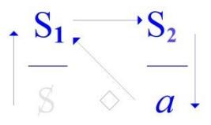

*L'objet(a)* n'est un objet qu'en ce sens qu'il est là pour affirmer que rien de l'ordre du savoir n'est sans *le produire*. [S1→ S2 ↓*a*] C'est tout à fait autre chose que de le *connaître*.

Que *le discours psychanalytique* ne puisse s'articuler qu'à montrer que cet *objet(a)*, pour qu'il y ait chance d'analyste, il faut qu'une certaine opération, qu'on appelle *l'expérience psychanalytique,* ait fait venir *l'objet(a)* à la place du *semblant* :

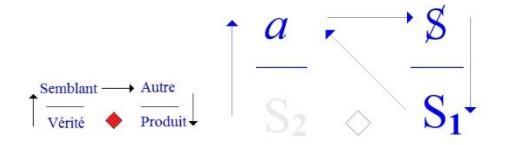

Bien entendu, il ne pourrait absolument pas occuper cette place si les autres éléments, réductibles dans une chaîne signifiante, n'occupaient pas les autres [places]. Si *le sujet* [S], et ce que j'appelle *signifiant-maître* [S1],

et ce que je désigne du *corps du savoir* [S2], n'étaient pas répartis aux quatre points d'un tétraèdre

qui est ce que pour votre repos je vous ai dessiné au tableau sous la forme de petites choses qui se croisent comme ça, à l'intérieur d'un carré dont il manque un côté, il est évident qu'il n'y aurait absolument pas de discours.

Et ce qui définit *un discours*, ce qui l'oppose à *la parole*, je dis...

parce que c'est cela qui est le mathème

...je dis que c'est ce que détermine, pour l'approche *parlante*, ce que détermine le *Réel*.

Et le *Réel* dont je parle est absolument inapprochable sauf par *une voie mathématique*, c'est à savoir en repérant...

pour cela il n'y a pas d'autre voie que *ce discours*, *dernier venu des* 4, celui que je définis comme *le discours analytique* et qui permet d'une façon dont il serait excessif de dire qu'elle est consistante, tout au contraire

...d'une béance - et proprement *celle* qui s'exprime de la thématique *de la castration* - qu'on peut voir d'où s'assure le *Réel* dont tient tout ce discours.

Le *Réel* dont je parle et ceci conformément à tout ce qui est reçu...

mais comme si c'était par des sourds

...reçu dans l'analyse, à savoir que rien n'est assuré de ce qui semble la fin, la finalité de la jouissance sexuelle, à savoir la copulation, sans ces *pas*...

très confusément aperçus mais jamais dégagés dans une structure comparable à celle d'une *logique* ...et qui s'appelle *la castration*.

C'est très précisément en cela que l'effort logicien doit nous être un modèle, voire un guide. Et ne me faites pas parler d'isomorphisme, hein.

Et qu'il y ait quelque part un brave petit coquin de l'université qui trouve mes énoncés sur *la vérité, le semblant, la jouissance et le plus-de jouir*, seraient formalistes, voire herméneutiques, pourquoi pas ?

Il s'agit de ce qu'on appelle en mathématique plutôt - chose curieuse, c'est une rencontre - une opération de générateur*.* Nous essaierons cette année, et ailleurs qu'ici, d'approcher comme ça prudemment, de loin et *pas à pas*, parce qu'il ne faut pas trop attendre, en cette occasion, de ce qu'il pourrait se produire d'étincelles, mais ça viendra.

*L'objet(a)* dont je vous ai parlé tout à l'heure c'est pas un objet, c'est ce qui permet de *tétraédrer* ces 4 *discours*, chacun de ces discours à sa façon.

Et c'est bien entendu ce que ne peuvent pas voir - que ne peuvent pas voir qui ? - chose curieuse : les analystes, c'est que *l'objet(a)*...

ce n'est pas un point qui se localise quelque part dans les 4 autres ou les 4 qu'ils forment ensemble ...c'est la construction, c'est le mathème tétraédrique de ces discours.

La question est donc celle-ci : d'où les êtres « *achosiques* », les *a incarnés* que nous sommes tous à des titres divers, sont-ils le plus en proie à l'incompréhension de mon discours ? Ça, c'est vrai que la question peut être posée. Qu'elle soit *un symptôme* ou qu'elle ne le soit pas, la chose est secondaire.

Mais ce qui est très certain, c'est que théoriquement c'est au niveau du psychanalyste que doit dominer l'incompréhension de mon discours. Et justement parce que c'est *le discours analytique*.

Peut-être n'est-ce pas le privilège du *discours analytique*. Après tout, même ceux qui ont fait... celui qui a fait, qui a poussé le plus loin... qui a évidemment loupé parce qu'il ne connaissait pas *l'objet(a)* ...mais qui a poussé le plus loin le *discours du Maître* avant que j'amène *l'objet(a)* au monde : Hegel, pour le nommer.

Il nous a toujours dit que s'il y avait quelqu'un qui ne comprenait rien au *discours du Maître*, c'était le Maître lui-même. En quoi, bien sûr, il reste dans la psychologie, parce qu'il n'y a pas de Maître, il y a le *signifiant-Maître* et que le Maître suit comme il peut.

Ça ne favorise pas du tout la compréhension du *discours du Maître* chez le Maître. C'est en ce sens que la psychologie de Hegel est exacte.

Il serait également, bien sûr, très difficile de soutenir que *l'hystérique*, au point où elle est placée, c'est-à-dire au niveau du *semblant*, c'est là qu'elle soit le mieux pour comprendre son discours. Il n'y aurait pas besoin du virage de l'analyse sans ça.

Ne parlons pas, bien sur, des universitaires ! Personne n'a jamais cru qu'ils avaient le front de soutenir un alibi aussi prodigieusement manifeste que l'est tout *le discours universitaire*.

Alors pourquoi *les analystes* auraient-ils le privilège d'être accessibles à ce qui, de leur discours, est le mathème ? Il y a toutes les raisons au contraire pour qu'ils s'installent dans une sorte de statut dont justement l'intérêt...

mais ce ne sont pas des choses qui peuvent se faire en un jour

...dont l'intérêt en effet pourrait être de démontrer ce qu'il en résulte dans ces inconcevables élucubrations théoriques qui sont celles qui remplissent les revuesdu monde psychanalytique.

L'important n'est pas là.

L'important est de *s'intéresser*, et j'essaierai sans doute de vous dire en quoi peut consister cet *intérêt*. Il faut absolument l'épuiser sous toutes ses faces.

Je viens de donner l'indication de ce qu'il peut en être du statut de l'analyste au niveau du *semblant*, et il n'est, bien sûr, pas moins important de l'articuler dans son rapport à *la vérité*.

Et le plus intéressant...

c'est le cas de le dire, c'est un des seuls sens qu'on puisse donner au mot d'intérêt ...c'est le rapport qu'a ce discours à *la jouissance*. *La jouissance* en fin de compte, *qui le soutient, qui le conditionne, qui le justifie*, le justifie très précisément de ceci que *la jouissance sexuelle*...

Je voudrais pas terminer en vous donnant l'idée que je sais ce que c'est que l'*homme*. Il y a sûrement des gens qui ont besoin que je leur jette ce petit poisson. Je peux le leur jeter après tout, parce que ça ne connote aucune espèce de promesse de progrès « …*ou pire* ».

Je peux leur dire que c'est très probablement ça, en effet, qui spécifie cette espèce animale : c'est un rapport tout à fait anomalique et bizarre avec sa jouissance. Ça peut avoir quelques petits prolongements du côté de la biologie, pourquoi pas ?

Ce que je constate simplement, c'est que les analystes n'ont pas fait faire le moindre progrès à la référence biologisante de l'analyse, je le souligne très souvent. Ils n'y ont pas fait faire le moindre progrès, pour la simple raison que c'est très précisément le point anomalique où une jouissance, dont, chose incroyable, il s'est trouvé des biologistes pour...

au nom de ceci, de cette jouissance boiteuse et combien amputée, *la castration* elle-même

qui a l'air chez l'homme d'avoir un certain rapport à la copulation, à la conjonction donc,

de ce qui biologiquement, mais sans bien sûr que ça ne conditionne absolument rien dans le semblant,

ce qui chez l'homme donc aboutit à la conjonction des sexes

...il y a eu donc des biologistes pour étendre ce rapport parfaitement problématique et nous étaler...

on a fait tout un gros bouquin là-dessus, qui a reçu tout de suite l'heureux patronage de mon cher camarade Henry Ey, dont je vous ai parlé avec la sympathie que vous avez pu toucher la dernière fois

...la perversion chez les espèces animales.

Au nom de quoi ? Que les espèces animales copulent, mais qu'est-ce qui nous *prouve* que ce soit au nom d'une jouissance quelconque, perverse ou pas ? Il faut vraiment être un homme pour croire que copuler, ça fait jouir !

Alors il y a des volumes entiers là-dessus pour expliquer qu'il y en a qui font ça *avec des crochets*, *avec leurs pa-pattes*, et puis il y en a qui s'envoient les machins, les trucs, *les spermatos* à l'intérieur de la cavité centrale comme *chez la punaise*, je crois. Et alors on s'émerveille : qu'est-ce qu'ils doivent jouir à des trucs pareils !

Si nous, on se faisait ça avec une seringue dans le péritoine, ça serait voluptueux !

C'est avec ça qu'on croit qu'on construit des choses correctes.

Alors que la première chose à toucher du doigt, c'est très précisément la dissociation,

et qu'il est évident que la question, la seule question, la question enfin très intéressante, c'est de savoir comment

- *–* quelque chose que nous pouvons, momentanément, dire corrélatif de cette disjonction de la jouissance sexuelle,
- *–* quelque chose que j'appelle « *lalangue* », évidemment que ça a un rapport avec quelque chose du *réel*, mais de là que ça puisse conduire à des *mathèmes* qui nous permettent d'édifier la science, alors ça, c'est bien évidemment la question.

Si nous regardions d'un peu plus près comment c'est foutu la science, j'ai essayé de faire ça une toute petite fois, une toute petite approche : « *La Science et la vérité »*.

Il y avait un pauvre type une fois, dont j'étais l'hôte à ce moment là, qui en a été malade de m'avoir entendu là-dessus, et après tout c'est bien là que l'on voit que mon discours est compris, c'est le seul qui en ait été malade ! C'est un homme qui s'est démontré de mille façons pour être quelqu'un de pas très fort.

Enfin moi je n'ai aucune espèce de passion pour les débiles mentaux, je me distingue en cela de ma chère amie Maud Mannoni.

Mais comme les débiles mentaux on les rencontre aussi à l'Institut, je ne vois pas pourquoi je m'émouvrais. Enfin *La Science et la vérité* ça essayait d'approcher un petit quelque chose comme ça.

Après tout, c'est peut être fait avec presque rien du tout, cette fameuse *science*. Auquel cas on s'expliquerait mieux comment les *choses*, l'apparence aussi conditionnée par un déficit que « *lalangue* », peut y mener tout droit.

Voilà, ce sont des questions que peut-être j'aborderai cette année. Enfin, je ferai de mon mieux, *…Ou pire* !

On ne sait pas si *la série* est le principe du *sérieux*. Néanmoins je me trouve devant cette question de ce qu'évidemment je ne peux pas ici continuer ce qui ailleurs se définit de mon enseignement, de ce qu'on appelle *mon séminaire*.

Ne serait-ce que parce que tout le monde n'est pas averti que je fais une petite conversation par mois ici, et comme il y a des gens qui se dérangent quelquefois d'assez loin pour suivre ce que je dis ailleurs sous ce nom de « *séminaire* », et bien ça ne serait pas correct, je veux dire avec eux, de continuer ici.

Alors en somme il s'agit de savoir *ce que je fais ici.* Il est certain que ce n'est pas tout à fait ce que j'attendais. Je suis infléchi par cette affluence qui fait que ceux qu'en fait je convoquais à quelque chose qui s'appelait « *Le savoir du psychanalyste »*, ne sont pas du tout forcément absents d'ici, mais sont un peu noyés.

À ceux qui sont ici même, je ne sais pas si en faisant allusion à ce séminaire, je parle de quelque chose qu'ils connaissent. Il faut aussi qu'ils tiennnent compte que, par exemple depuis la dernière fois - ceux que je rencontre ici s'y sont trouvés justement, je l'ai ouvert ce séminaire.

Je l'ai ouvert, si on est un peu attentif et rigoureux, on ne peut pas dire que ça puisse se faire en une seule fois. Effectivement, il y en a eu 2, et c'est pour ça que je peux dire que je l'ai ouvert, parce que s'il n'y avait pas eu de 2ème fois, ben il n'y en aurait pas de 1ère. Ça a son intérêt *pour rappeler quelque chose* que j'ai introduit il y a un certain temps à propos de ce qu'on appelle *la répétition*.

La répétition ne peut évidemment commencer qu'à la 2ème fois, qui se trouve...

du fait que si il n'y en avait pas de 2ème, il n'y en aurait pas de 1ère

...qui se trouve donc être celle qui inaugure la *répétition* : c'est l'histoire du 0 et du 1.

Seulement avec le 1, il ne peut pas y avoir de *répétition*, de sorte que pour qu'il y ait *répétition*, pour pas que ça soit ouvert, il faut qu'il y en ait une 3eme. C'est ce dont on semble s'être aperçu à propos de Dieu : il ne commence, on a mis le temps à s'en apercevoir ou bien on le savait depuis toujours mais ça n'a pas été noté, parce que après tout, on ne peut jurer de rien dans ce sens, mais enfin mon cher ami Kojève insistait beaucoup sur cette question de *la Trinité chrétienne*.

Quoi qu'il en soit il y a évidemment un monde, du point de vue de ce qui nous intéresse... et ce qui nous intéresse est analytique

...entre la 2ème fois qui est ce que j'ai cru devoir souligner du terme de « nachträg » : l'après-comp.

C'est évidemment des choses que je ne reprendrai - pas ici - qu'à mon séminaire, j'essaierai d'y revenir cette année. C'est important parce que c'est en ça qu'il y a un monde entre ce qu'apporte la psychanalyse et ce qu'a apporté une certaine tradition philosophique qui n'est certes pas négligeable, surtout quand il s'agit de Platon qui a bien souligné la valeur de la *dyade*. Je veux dire qu'à partir d'elle, tout dégringole. Qu'est-ce qui dégringole, il devait le savoir, mais il ne l'a pas dit

Quoi qu'il en soit, ça n'a rien à faire avec le *nachträg* analytique, le 2nd temps. Quant au 3ème dont je viens de souligner l'importance, ça n'est pas seulement pour nous qu'il le prend, c'est pour Dieu lui-même.

Dans un temps, et à propos d'une certaine tapisserie3 qui étaient étalée au *Musée des Arts Décoratifs*, qui était bien belle, que j'ai vivement incité tout le monde à aller voir, on y voit *Le Père et Le Fils et Le Saint Esprit* qui étaient représentés strictement sous la même figure, la figure d'un personnage assez noble et barbu, ils étaient 3 à s'entre-regarder, ça fait beaucoup plus d'impression que de voir quelqu'un en face de son image. À partir de 3 ça commence à faire un certain effet.

3 « La création du monde », exposition « Le XVIe siècle européen, Tapisseries ». Paris, Mobilier National, d'Octobre 1965 à Janvier 1966.

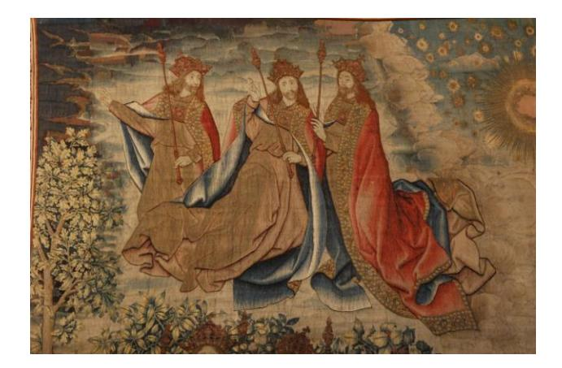

De notre point de vue de sujets, qu'est-ce qui peut bien commencer à 3 pour Dieu lui-même ? C'est une vieille question que j'ai posée très vite du temps que j'ai commencé mon enseignement. Je l'ai posée très vite et puis je ne l'ai pas renouvelée, je vous dirai tout de suite pourquoi : c'est que ça n'est évidemment qu'à partir de 3 qu'il peut croire en lui-même.

Parce que c'est assez curieux, c'est une question qui n'a jamais été posée à ma connaissance « *Est-ce que Dieu croit en lui ?* ». Ça serait pourtant un bon exemple pour nous. C'est tout à fait frappant que cette question...

que j'ai posée assez tôt et que je ne crois pas vaine

...n'ait soulevé, apparemment au moins, aucun remou, au moins parmi mes corréligionnaires, je veux dire ceux qui se sont instruits à l'ombre de la Trinité.

Je comprends que pour les autres, ça ne les ait pas frappés, mais pour ceux-là, vraiment, ils sont « *incorreligionigibles* », il n'y a rien à en faire. Pourtant j'avais là quelques personnes notoires de la hiérarchie qu'on appelle « *chrétienne* ».

La question se pose de savoir si c'est parce qu'ils y sont ci-dedans...

ce que j'ai peine à croire

...qu'ils n'entendent rien, ou...

ce qui est de beaucoup plus probable

...qu'ils sont d'un athéisme assez intégral pour que cette question ne leur fasse aucun effet. C'est la solution pour laquelle je penche.

On ne peut pas dire que ce soit ce que j'appelais tout à l'heure une garantie de *sérieux* puisque ça ne peut être qu'un athéisme, en quelque sorte une somnolence, ce qui est assez répandu. En d'autres termes, ils n'ont pas la moindre idée de la dimension du milieu dans lequel il y a à nager : ils surnagent - ce qui n'est pas tout à fait pareil - ils surnagent grâce au fait qu'ils se tiennent la main.

Alors comme ça, ça finit par faire ce qu'on appelle un réseau, et à se tenir tous comme ça par la main. Il y a un poème de Paul Fort dans ce genre là **4** :

« *Si toutes les filles du monde -* ça commence comme ça – ...*se tenaient par la main, elles pourraient faire le tour du monde*... ».

C'est une idée folle parce qu'en réalité *les filles du monde* n'ont jamais songé à ça, les garçons par contre... il en parle aussi

...les garçons pour ça s'y entendent : ils se tiennent tous par la main.

Ils se tiennent tous par la main d'autant plus que s'ils ne se tenaient pas par la main, il faudrait que chacun affronte la fille tout seul, et ça ils aiment pas. Il faut qu'ils se tiennent par la main.

4 Paul Fort : « *La Ronde autour du monde* ». « *Si toutes les filles du monde voulaient s'donner la main, tout autour de la mer, elles pourraient faire une ronde. Si tous les gars du monde voulaient bien êtr' marins, ils f'raient avec leurs barques un joli pont sur l'onde. Alors on pourrait faire une ronde autour du monde, si tous les gars du monde voulaient s' donner la main.* »

Les filles, c'est une autre affaire.

Elles y sont entraînées dans le contexte de certains rites sociaux, conférez *[Les danses et légendes de la Chine ancienne](http://classiques.uqac.ca/classiques/granet_marcel/A10_danses_et_legendes/danses_legendes.pdf)*, ça c'est *chic*, c'est même *Chou King* - pas *schoking* - *Chou King*. Ce *Chou King* ça été écrit par un nommé Granet, qui avait une espèce de génie qui n'a absolument rien à faire

- *–* ni avec l'ethnologie, il était incontestablement ethnologue,
- *–* ni avec la sinologie, il était incontestablement sinologue*,*

alors le nommé Granet donc, avançait que dans la chine antique, les filles et les garçons s'affrontaient à nombre égal : pourquoi ne pas le croire ?

Dans la pratique, dans ce que nous connaissons de nos jours :

- les garçons se mettent toujours un certain nombre, au delà de la dizaine, pour la raison que je vous ai exposée tout à l'heure [*Rires*], parce que, être tout seul, chacun à chacun en face de sa *chacune*, je vous l'ai expliqué : c'est trop plein de risques.
- Pour les filles, c'est tout autre chose. Comme nous ne sommes plus au temps du *Chou King*, elles se groupent deux par deux, elles font amie-amie avec une amie, jusqu'à ce qu'elles aient, bien entendu, arraché un gars à son régiment. Oui, monsieur ! [*Rires*]

Quoi que vous en pensiez et même si superficiels que vous paraissent ces propos, ils sont fondés, fondés sur mon expérience d'analyste. Quand elles ont détourné un gars de son régiment, naturellement elles laissent tomber l'amie, qui d'ailleurs ne s'en débrouille pas plus mal pour autant.

Oui ! Enfin tout ça, je me suis laissé un peu *entraîner*. Où est-ce que je me crois ! [*Rires*] C'est venu comme ça de fil en aiguille, à cause de Granet et de cette histoire étonnante de ce qui alterne dans les poèmes du *Chou King* : ce chœur de garçons opposé au chœur des filles. Je me suis laissé entraîner comme ça à parler de mon expérience analytique, sur laquelle j'ai fait un *flash*, ça n'est pas le fond des choses.

C'est pas ici que j'expose le fond des choses.

Mais où est-ce que je suis, que je me crois, pour parler en somme, pour parler du fond des choses. Je me croirais presque avec des êtres humains ou cousus main, même ! C'est comme ça, c'est pourtant comme ça que je m'adresse à eux.

Mais c'est ça, c'est de parler de mon séminaire qui m'a entraîné. Comme après tout vous êtes peut-être les mêmes, j'ai parlé comme si je parlais à eux, ce qui m'a entraîné à parler comme si je parlais *de vous* et - qui sait ? ça entraîne à parler comme si je parlais *à vous*. Ce qui n'était quand même pas dans mes intentions. [*Rires*]

C'était pas du tout dans mes intentions parce que, si je suis venu parler à Sainte-Anne, c'était pour parler aux psychiatres, et très évidemment vous n'êtes pas tous psychiatres. Alors, enfin ce qu'il y a de certain c'est que c'est un acte manqué. C'est un acte manqué qui donc à tout instant risque de réussir, c'est-à-dire qu'il se pourrait bien que je parle quand même à quelqu'un.

Comment savoir à qui je parle ?

Surtout qu'en fin de compte vous comptez dans l'affaire...

quoique je m'efforce

...vous comptez au moins pour ceci que je ne parle pas de là où je comptais parler puisque je comptais parler à l'amphithéâtre Magnan et que je parle à la chapelle.

Quelle histoire ! Vous avez entendu ? Vous avez entendu ? J*e parle à la chapelle* ! C'est la réponse. Je parle à la chapelle, c'est à dire *aux murs* ! [*Rires*] De plus en plus réussi, l'acte manqué ! Je sais maintenant à qui je suis venu parler : à ce à quoi j'ai toujours parlé à Sainte-Anne, aux murs !

J'ai pas besoin d'y revenir, ça fait une paye.

De temps en temps, je suis revenu avec un petit titre de conférence sur « *Ce que j'enseigne*... » par exemple, et puis quelques autres, je vais pas faire la liste. J'y ai toujours parlé aux murs.

X - ...

Lacan - Qui a quelque chose à dire ?

X - *On devrait tous sortir si vous parlez aux murs.*

Lacan - Qui... qui me parle là ? [*Rires*]

X - *Les murs.*

Lacan

C'est maintenant que je vais pouvoir faire commentaire de ceci qu'à parler aux murs, ça intéresse quelques personnes. C'est pourquoi je demandais à l'instant *qui* parlait.

Il est certain que *les murs* dans ce qu'on appelle, dans ce qu'on appelait au temps où on était honnête « *un asile »*, « *l'asile clinique »* comme on disait, les murs tout de même, c'est pas rien.

Mais je dirais plus : cette *chapelle* ça me paraît bien un lieu extrêmement bien fait pour que nous touchions de quoi il s'agit quand je parle des murs. Cette sorte de concession de la laïcité aux internés : une chapelle avec sa garniture d'aumôniers, bien sûr.

C'est pas qu'elle soit formidable - hein ? - du point de vue architectural, mais enfin c'est une chapelle, une chapelle avec la disposition qu'on en attend.

On omet trop que l'architecte, quelque effort qu'il fasse pour en sortir, il est fait pour ça, pour faire des murs. Et que les murs, ma foi...

c'est quand même très frappant que depuis, ce dont je parlais tout à l'heure,

à savoir *le christianisme*, penche peut-être par là un peu trop vers *l'hégélianisme*

...mais c'est fait pour entourer un vide.

Comment imaginer qu'est-ce qui remplissait les murs du Parthénon et de quelques autres babioles de cette espèce dont il nous reste quelques murs écroulés, c'est très difficiles à savoir. Ce qu'il y a de certain, c'est que nous n'en avons absolument aucun témoignage.

Nous avons le sentiment que pendant toute cette période que nous épinglons de cette étiquette moderne du *paganisme*, il y avait des choses qui se passaient dans diverses fêtes qu'on appelle [païennes], on a conservé les noms de ce que c'était parce qu'il y a des Annales qui dataient les choses comme ça :

« *C'est aux grandes Panathénées qu'Adymante et Glaucon* - vous savez la suite - *ont rencontré le nommé Céphale* ».

Qu'est-ce qui s'y passait ? C'est absolument incroyable que nous n'en n'ayons pas la moindre espèce d'idée ! Par contre pour ce qui est du vide, nous en avons une grande, parce que tout ce qui nous est resté légué, légué par une tradition qu'on appelle philosophique, ça fait une grande place au vide.

Il y a même un nommé Platon qui a fait pivoter autour de là toute son *Idée du monde*, c'est le cas de le dire, c'est lui qui a inventé « *la caverne »*. Il en a fait une *chambre noire* : il y avait quelque chose qui se passait à l'extérieur, et tout ça en passant par un petit trou faisait toutes les ombres.

C'est curieux, c'est là que peut-être on aurait un petit fil, un petit bout de trace. C'est manifestement une théorie qui nous fait toucher du doigt ce qu'il en est de *l'objet(a)*. Supposez que la caverne de Platon, ça soit ces murs où se fait entendre ma voix.

Il est manifeste que les murs, ça me fait *jouir* !

Et c'est en ça que vous jouissez tous, et tout un chacun, par participation.

Me voir parler aux murs est quelque chose qui ne peut pas vous laisser indifférents.

Et réfléchissez, supposez que Platon ait été structuraliste : il se serait aperçu de ce qu'il en est de la caverne vraiment, à savoir que c'est sans doute là qu'est né le langage.

Il faut retourner l'affaire, parce que bien sûr, il y a longtemps que l'homme vagit,

comme n'importe lequel des petits animaux, enfin ils piaillent pour avoir le lait maternel.

Mais pour s'apercevoir qu'il est capable de faire quelque chose que bien entendu il entend depuis longtemps, dans le babillage, le bafouillage, tout se produit, mais pour choisir, il a dû s'apercevoir

- *–* que les « K » ça résonne mieux du fond, le fond de la caverne, du dernier mur,
- *–* et que les « B » et les « P » ça jaillit mieux à l'entrée, c'est là qu'il en a entendu la résonance.

Je me laisse entraîner ce soir, puisque *je parle aux murs*.

Il ne faut pas croire que ce que je vous dis, ça veut dire que j'ai rien tiré d'autre de Sainte-Anne. À Sainte-Anne je ne suis arrivé à parler que très tard, je veux dire que ça ne m'était pas venu à l'idée sauf à accomplir quelques devoirs de broutille.

Quand j'étais chef de clinique, je racontais quelques petites histoires aux stagiaires, c'est même là que j'ai appris à me tenir à carreau sur les histoires que je raconte.

Je racontais un jour l'histoire d'une mère de patient, un charmant homosexuel que j'analysais, et n'ayant pas pu faire autrement que de la voir arriver - la tordue en question - elle avait eu ce cri : « *Et moi qui croyait qu'il était impuissant !* ». Je raconte l'histoire, dix personnes parmi les - il n'y avait pas que des stagiaires - ils la reconnaissent tout de suite !

Ça ne pouvait être qu'elle ! Vous vous rendez compte de ce que c'est qu'une personne mondaine ! Ça a fait une histoire naturellement, parce qu'on me l'a reproché, alors que je n'avais absolument rien dit d'autre que ce cri sensationnel. Ça m'inspire depuis beaucoup de prudence pour la communication des cas. Mais enfin, c'est encore une petite digression, reprenons le fil.

Avant de parler à Sainte-Anne, enfin j'y ai fait bien d'autres choses, ne serait-ce que d'y venir et d'y remplir ma fonction et bien entendu, pour moi, pour mon discours, tout part de là.

Parce qu'il est évident que si *je parle aux murs*, je m'y suis mis tard, à savoir qu'avant d'entendre ce qu'ils me renvoient, c'est-à-dire ma propre voix prêchant dans le désert...

*c'est une réponse à la personne* – [*cf. supra, la personne* X : « *On devrait tous sortir si vous parlez aux murs »*] ...bien avant ça j'ai entendu, j'ai entendu des choses tout à fait décisives, enfin qui l'on été pour moi.

Mais ça c'est mon affaire personnelle.

Je veux dire que les gens qui sont ici au titre d'être entre les murs, sont tout à fait capables de se faire entendre, à condition qu'on ait les esgourdes appropriées !

Pour tout dire, et lui rendre hommage de quelque chose où en somme elle n'est personnellement pour rien, c'est, comme chacun sait, autour de cette malade que j'ai épinglée du nom d'Aimée...

qui n'était pas le sien bien sûr

...que j'ai été aspiré vers la psychanalyse.

Il n'y a pas qu'elle bien sûr.

Il y en a eu quelque autres avant et puis il y en a encore pas mal à qui je laisse la parole. C'est en ça que consiste ce qu'on appelle mes « *présentations de malades* ».

Il m'arrive après d'en parler avec quelques personnes qui ont assisté à cette sorte d'exercice...

enfin cette présentation qui consiste à les écouter,

ce qui évidemment ne leur arrive pas à tous les coins de rue

...il arrive qu'en en parlant après...

avec quelques personnes qui étaient là pour m'accompagner, pour en attraper ce qu'elles pouvaient ...il m'arrive en en parlant après, d'en apprendre, parce que c'est pas tout de suite, il faut évidemment qu'on accorde sa voix à la renvoyer sur les murs.

C'est bien autour de ça que va tourner ce que je vais essayer peut-être cette année, de mettre en question, c'est le rapport de quelque chose à quoi je donne beaucoup d'importance, c'est à savoir *la logique*. J'ai appris très tôt ce que la logique pouvait rendre « *odieux au monde* ».

C'était dans un temps où je pratiquais un certain Abélard **5** , Dieu sait attiré par je ne sais quelle odeur de mouche ! Moi, la logique, je peux pas dire qu'elle m'ait rendu absolument odieux à quiconque sauf à quelques psychanalystes, parce que malgré tout c'est peut-être parce que j'arrive à sérieusement en « *tamponner* » le sens. J'y arrive d'autant plus facilement, que je ne crois absolument pas au *sens commun*.

Il y a du sens, mais il n'y en a pas de *commun*.

Il n'y a probablement pas un seul d'entre vous qui m'entendiez *dans le même sens*.

D'ailleurs je m'efforce que de *ce sens*, l'accès ne soit pas trop aisé, de sorte que vous deviez en mettre du vôtre, ce qui est *une secrétion* salubre, et même thérapeutique :

*secrétez* le sens avec vigueur et vous verrez combien la vie devient plus aisée !

5 Abélard : *« Odium mundo me fecit logica : la logique m'a valu la haine du monde »,* Cf. *« Pierre Abélard, Correspondance »,* par R. Oberson, Hermann, 2007.

C'est bien pour ça que je me suis aperçu de l'existence de *l'objet(a)* dont chacun de vous a le germe en puissance. Ce qui fait sa force, et du même coup la force de chacun de vous en particulier, c'est que *l'objet(a)* est tout à fait étranger à la question du *sens*.

Le sens est une petite peinturlure rajoutée sur cet *objet(a)* avec lequel vous avez chacun votre attache particulière. Ça n'a rien à faire, ni avec *le sens* ni avec *la raison*.

La question à l'ordre du jour c'est ce que la raison a affaire avec ce à quoi, enfin je dois dire que *beaucoup penchent à la réduire à la* « *réson* ». Écrivez : *r.é.s.o.n.* Écrivez, faites moi plaisir.

C'est une orthographe de Francis Ponge qui, étant poète et étant ce qu'il est, un grand poète, n'est pas tout à fait sans qu'on doive en cette question tenir compte de ce qu'il nous raconte. Il n'est pas le seul.

C'est une très grave question, que je n'ai vu sérieusement formulée que - outre ce poète - au niveau des mathématiciens, c'est à savoir ce que la raison...

dont nous nous contenterons pour l'instant de saisir qu'elle part de l'appareil grammatical ...a à faire avec quelque chose qui s'imposerait, je veux pas dire d'*intuitif*...

car ce serait retomber sur la pente de l'intuition, c'est-à-dire de quelque chose de *visuel* ...mais avec quelque chose justement de *résonnant*.

Est-ce que ce qui *résonne*, c'est l'origine de la « *res* », de ce qu'on fait la réalité ? *C'est une question qui touche* à très proprement parler *à tout ce* qu'il en est *qu'on puisse extraire du langage au titre de la logique.* Chacun sait qu'elle ne suffit pas et qu'il lui a fallu depuis quelques temps...

on aurait pu le voir venir depuis un bout de temps, depuis Platon précisément ...mettre en jeu la mathématique.

Et c'est là, c'est là que la question se pose d'où centrer ce *réel* à quoi l'interrogation logique nous fait recourir et qui se trouve être au niveau mathématique.

Il y a des mathématiciens pour dire

- *–* qu'on ne peut point s'axer sur cette jonction dite formaliste, ce point de jonction mathético-logique,
- *–* qu'il y a quelque chose au-delà, auquel après tout ne fait que rendre hommage toutes les références intuitives dont on a cru pouvoir, cette mathématique, la purifier,

...et qui cherchent au-delà, à quelle *réson* - *r.é.s.o.n* - recourir pour ce dont il s'agit, à savoir du *Réel*. Ce n'est pas ce soir bien sûr, que je vais pouvoir aborder la chose.

Ce que je peux dire, c'est que par un certain biais qui est celui d'une logique, que j'ai pu...

dans *un parcours* qui pour partir de ma malade Aimée, a abouti à *-* l'avant-dernière année de séminaire *-*

énoncer sous le titre de « *quatre discours* », vers quoi converge le crible d'une certaine *actualité*

...que j'ai pu, par cette voie - quoi faire ? - donner au moins la raison des murs.

Car quiconque y habite dans ces murs, ces murs-ci, les murs de l'asile clinique, il convient de savoir que ce qui situe et définit *le psychiatre* en tant que tel, c'est sa situation par rapport à ces murs, ces murs par quoi la laïcité a fait en elle exclusion de la folie et de ce que ça veut dire.

Ce qui ne s'aborde que par la voie d'une analyse du discours.

À vrai dire, l'analyse a été si peu faite avant moi, qu'il est vrai de dire qu'il n'y a jamais eu de la part des psychanalystes la moindre discordance qui s'élevât à l'endroit de la position du psychiatre.

Et que pourtant dans mes « *Écrits »* on voit recueilli quelque chose que j'ai fait entendre dès avant 1950 sous le titre de « *Propos sur la causalité psychique »*, je m'y élevais contre toute définition de la maladie mentale qui s'abritât de cette construction faite d'un semblant qui, pour s'épingler de l'*« organodynamisme »*, ne laissait pas moins entièrement à côté ce dont il s'agit dans la ségrégation de la maladie mentale, à savoir quelque chose qui est Autre, qui est lié à un certain discours, celui que j'épingle du *discours du Maître*.

Encore l'histoire montre-t-elle qu'il a vécu pendant des siècles ce discours d'une façon profitable pour tout le monde, jusqu'à un certain détour où il est devenu, en raison *d'un infime glissement* qui est passé inaperçu des intéressés eux-mêmes, ce qui le spécifie dès lors comme « *le discours du capitaliste »*,

dont nous n'aurions aucune espèce d'idée si Marx ne s'était pas employé à le compléter, à lui donner *son sujet* : *le prolétaire*.

Grâce à quoi *le discours du capitalisme*, s'épanouit partout où règne la forme d'état marxiste...

#### Ce qui distingue *le discours du capitalisme* est ceci :

la *Verwerfung*, le *rejet*, *le rejet en dehors de tous les champs du symbolique* avec ce que j'ai déjà dit que ça a comme conséquence. Le *rejet* de quoi ? De la *castration*.

Tout ordre, tout discours, qui s'apparente du capitalisme laisse de côté ce que nous appellerons simplement les choses de l'amour, mes bons amis. Vous voyez ça, hein, c'est un rien !

C'est bien pour ça que deux siècles après ce glissement... appelons-le « *calviniste* », après tout pourquoi pas ? ...la castration a fait enfin son entrée irruptive sous la forme du *discours analytique*.

Naturellement *le discours analytique* n'a pas encore été foutu d'en donner même une ébauche d'articulation, mais enfin il en a multiplié la métaphore et il s'est aperçu que toutes les métonymies en sortaient.

Voilà au nom de quoi...

porté par une sorte, une espèce de *brouhaha* qui s'était produit quelque part du côté des psychanalystes ...j'ai été amené à introduire ce qu'il y avait d'évident dans la nouveauté psychanalytique, à savoir qu'il s'agissait de *langage* et que c'était un nouveau *discours*.

Comme je vous l'ai dit, enfin *l'objet(a) en personne*, c'est-à-dire cette position dans laquelle on ne peut même pas dire que se porte le psychanalyste : il y est porté, il y est porté par son analysant. La question que je pose c'est : comment est-ce qu'un analysant peut jamais avoir envie de devenir psychanalyste. C'est impensable !

Ils y arrivent...

comme les billes de certains jeux de *tric-trac*

comme ça que vous connaissez bien, qui finissent par tomber dans le machin ...ils y arrivent sans avoir la moindre idée de ce qui leur arrive. Enfin, une fois qu'ils sont là, ils y sont,

et il y a à ce moment-là, tout de même quelque chose qui s'éveille, c'est pour ça que j'en ai proposé l'étude.

Quoi qu'il en soit, à l'époque où s'est produit ce tourbillon parmi les billes, on peut pas dire dans quelle gaîté j'ai écrit ce « *Fonction et champ de la parole et du langage »*.

Comment se fait-il que j'ai accueilli comme ça...

parmi toutes sortes d'autres choses sensées

...une sorte d'exergue du genre ritournelle, que vous trouverez dans... vous n'avez qu'à regarder au niveau de la partie IV, pour autant que je me souvienne, un truc que j'avais trouvé dans un almanach, ça s'appelait : *Paris en l'an 2000*.

C'est pas sans talent ! C'est pas sans talent encore qu'on ait jamais plus entendu parler du nom du type, dont je cite le nom - je suis honnête - et qui raconte cette chose qui n'a... enfin qui vient là dans cette histoire de « *Fonction et champ*... » comme des cheveux sur la soupe, ça commence comme ça :

> « *Entre l'homme et la femme, il y a l'amour, Entre l'homme et l'amour,*...

Vous l'avez jamais remarqué, hein, ce truc-là, dans son machin !

 ...*il y a un monde. Entre l'homme et le monde, il y a un mur.* » [Antoine Tudal in « *Paris en l'an 2000* »]

Vous voyez, j'avais prévu ce que je vous dirai ce soir : « *je parle aux murs* ! ». Vous verrez, ça n'a aucun rapport avec le chapitre qui suit [*Rires*], mais j'ai pas pu y résister.

Comme ici je parle aux murs, je fais pas de cours, alors je vais pas vous dire ce qui dans Jakobson suffit à justifier que ces six vers de mirliton soient quand même de la poésie, de la poésie proverbiale, parce que ça ronronne :

« *Entre l'homme et la femme, il y a l'amour*...

- Mais bien sûr ! Il n'y a que ça, même, !

...*Entre l'homme et l'amour, il y a un monde*...

C'est toujours ce qu'on dit : « *il y a un monde* », comme ça « *il y a un monde* » ça veut dire : *Vous ! vous y arriverez jamais !* Mine de rien, au début : « *Entre l'homme et la femme, il y a l'amour* », ça veut dire que [Lacan frappe dans ses mains] ça colle, un monde ça flotte, hein !

Mais avec « *il y a un mur* » alors là vous avez compris que « *entre* » veut dire « *interposition* ». Parce que c'est très ambigu, le « *entre* ».

Ailleurs, à mon séminaire, nous parlerons de la *mésologie*, qu'est-ce qui a fonction d'*entre*, mais là nous sommes dans *l'ambiguité poétique* et il faut le dire, ça vaut le coup. *Réson ! Effacez réson !* [du tableau] *Amour.*

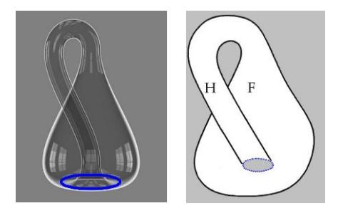

L'amour il est là : là le petit rond [*en bleu*]. Bon ! Ce que je viens de vous tracer là au tableau, ce tableau qui tourne, c'est une façon comme une autre, de représenter la *bouteille de Klein*.

C'est une surface qui a certaines propriétés topologiques sur lesquelles ceux qui n'en sont pas informés se renseigneront, *ça ressemble beaucoup à une bande de Mœbius*, c'est-à-dire à simplement ce qu'on fait en tordant une petite bande de papier, et en collant la chose après un demi-tour.

Seulement-là ça fait tube, c'est un tube qui à un certain endroit, se rebrousse. Je veux pas vous dire que ce soit la définition topologique de la chose, c'est une façon de l'imager dont j'ai fait déjà assez d'usage pour qu'une partie des personnes qui sont ici sachent de quoi je parle.

Alors voyez-vous, comme tout de même l'hypothèse c'est que, entre *l'homme* et *la femme* ça devrait faire là, comme disait Paul Fort tout à l'heure, *un rond*, alors j'ai mis *l'homme* à gauche, pure convention, *la femme* à droite, j'aurais pu le faire inversement.

Essayons de voir topologiquement ce qui m'a plu dans ces six petits vers d'Antoine Tudal pour le nommer.

« *Entre l'homme et la femme, il y a l'amour* ».

Ça communique à plein tube. Là, vous voyez, ça circule ! C'est mis en commun, le flux, l'influx et tout ce qu'on y rajoute quand on est obsessionnel, par exemple l'oblativité, cette sensationnelle invention d'obsessionnel.

Bon ! Alors l'amour il est là : le petit rond, le petit rond *qui est là partout,* à part qu'il y a un endroit où ça va se rebrousser, et vachement !

Mais restons-en au premier temps : entre l'homme (à gauche), la femme (à droite), il y a *l'amour*, c'est le petit rond. Ce personnage dont je vous ai dit qu'il s'appelait Antoine, ne croyez pas du tout que je dise jamais un mot de trop, c'est pour vous dire qu'il était du sexe masculin, de sorte qu'il voit les choses de son côté.

Il s'agit de voir ce qu'il va y avoir maintenant... comment on peut l'écrire ...ce qu'il va y avoir entre l'homme, c'est-à-dire lui, le « *pouète* »... le « *pouète de Pouasie* », comme disait le cher Léon-Paul Fargue ...qu'est-ce qu'il y a entre lui et l'amour ?

Est-ce que je vais être forcé de remonter au tableau ? Vous avez vu que c'était un exercice un peu vacillant. Bon ! eh ben, pas du tout, pas du tout... parce que quand même, à gauche, il occupe toute la place. Donc *ce qu'il y a entre lui et l'amour*, c'est justement ce qui est de l'autre côté, c'est-à-dire que *c'est la partie droite du schéma.*

### « *Entre l'homme et l'amour, il y a un monde* »

C'est-à-dire que ça recouvre le territoire d'abord occupé par *la femme*, là où j'ai écrit F dans la partie droite. C'est pour ça que celui que nous appellerons *l'homme* dans l'occasion, il s'imagine qu'il « *connaît* » le monde - au sens biblique comme ça - qu'il « *connaît* » le monde, c'est-à-dire tout simplement cette sorte de *rêve de savoir* qui vient là à la place de ce qui était là dans ce petit schéma, marquée de l'F de la femme.

Ce qui nous permet de voir topologiquement tout à fait ce dont il s'agit, c'est que ensuite quand on nous dit : « *entre l'homme et le monde* » ce monde substitué à la volatilisation du partenaire sexuel...

comment est-ce que c'est arrivé, c'est ce que nous verrons après ...ben « *il y a un mur* », c'est-à-dire l'endroit où se produit ce *rebroussement*, ce *rebroussement* que j'ai introduit un jour comme signifiant la jonction entre *vérité* et *savoir*. J'ai pas dit, moi, que c'était coupé, c'est *un poète de Papouasie* qui dit que c'est un mur.

C'est pas *un mur* : c'est simplement *le lieu de la castration*.

Ce qui fait que *le savoir* laisse intact le champ de *la vérité*, et réciproquement.

Seulement ce qu'il faut voir c'est que *ce mur il est partout*, car c'est ce qui définit cette surface, c'est que *le cercle ou le point de rebroussement,* disons le cercle puisque là je l'ai représenté par un cercle, il est homogène sur toute la surface.

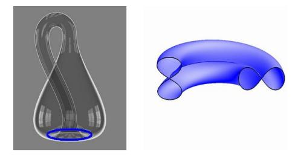

C'est même ce qui fait que vous auriez tort de vous la représenter comme une surface intuitivement représentable. Si je vous montrais tout de suite la sorte de coupure qui suffit à *la volatiliser* cette surface...

en tant que spécifique, topologiquement définie

...*la volatiliser* instantanément, vous verriez que c'est pas une surface qu'on se représente,

mais que c'est quelque chose qui se définit par certaines *coordonnées*...

appelons-les si vous voulez, *vectorielles*

...telles qu'en chacun des points de la surface *le rebroussement* soit toujours là, en chacun de ses points.

De sorte que, quant au rapport entre *l'homme* et *la femme* et tout ce qui en résulte au regard de chacun des partenaires, à savoir sa position comme aussi bien son savoir, *la castration* elle est partout. L'*amour*, l'*amour*, que ça communique, que ça flue, que ça fuse, que c'est l'*amour*, quoi !

L'*amour*, *le bien* que veut la mère pour son fils, l'« *(a)mur* »,

il suffit de mettre entre parenthèses le *(a)* pour retrouver ce que nous trouvons du doigt tous les jours : c'est que même *entre* la mère et le fils, le rapport que la mère a avec *la castration*, ça compte pour un bout !

Peut-être, pour se faire une saine idée de ce qu'il en est de l'amour, il faudrait peut-être partir de ce que, quand ça se joue, mais sérieusement entre un homme et une femme, c'est toujours avec l'enjeu de la castration. C'est ce qui est *châtrant*. Et qu'est-ce qui passe par ce défilé de la *castration*, c'est quelque chose que nous essaierons d'approcher par des voies qui soient un peu rigoureuses : elles ne peuvent l'être que *logiques*, et même *topologiques*.

Ici je parle aux murs voire aux « *(a)murs* » et aux *(a)murs-sements,* ailleurs j'essaie d'en rendre compte. Et quelque que puisse être l'usage des murs pour le maintien en forme de la voix, il est clair que les murs, pas plus que le reste, ne peuvent avoir de support intuitif, même avec tout l'art de l'architecte à la clé.

Chose curieuse, quand j'ai défini ces 4 *discours*, dont je parlais tout à l'heure et qui sont si essentiels pour repérer ce dont, quoi que vous fassiez, vous êtes toujours en quelque façon *les sujets*, et *des sujets*, je veux dire des « *supposés* », supposés à ce qui se passe *d'un signifiant* dont il est clair que c'est lui *le maître du jeu,* et que vous n'en êtes... au regard de quelque chose qui est autre, pour ne pas dire l'Autre

...que vous n'en êtes que le *supposé*. Vous ne lui donnez pas de *sens*, vous n'en avez pas assez vous-mêmes pour ça, mais vous lui donnez un corps à ce signifiant qui vous représente, *le signifiant-Maître* !

Eh bien ce que vous êtes là-dedans, *ombres d'ombre*, ne vous imaginez pas que *la substance*, qu'il est du rêve de toujours de vous attribuer, soit autre chose que cette jouissance dont vous êtes coupés.

Comment ne pas voir ce qu'il y a de semblable dans cette invocation *« substantielle »* et cet incroyable mythe, dont Freud lui-même s'est fait le reflet, de *la jouissance sexuelle* qui est bien cet *objet* qui court, qui court comme dans le jeu du furet mais dont personne n'est capable d'énoncer le statut si ce n'est comme le statut suprême, précisément : il est *le suprême* d'une courbe à laquelle il donne son sens, et très précisément aussi dont *le suprême* échappe.

Et c'est de pouvoir articuler l'éventail *des jouissances* entre guillemets « *sexuelles* » que la psychanalyse fait son pas décisif. Ce qu'elle démontre, c'est justement que *la jouissance* qu'on pourrait dire *sexuelle*...

qui ne serait pas du semblant du sexuel

...celle-là se marque de l'indice...

rien de plus jusqu'à nouvel ordre

...de ce qui ne s'énonce, de ce qui ne s'annonce, que de l'indice de *la castration*.

Les *murs*, avant de prendre statut, de prendre forme, c'est *logiquement* que je les reconstruis :

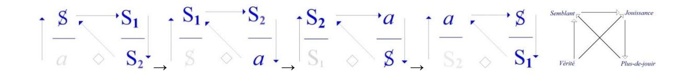

Ces S, S1, S2 et ce *a* dont j'ai fait - pour vous pendant quelques mois - joujou, c'est tout de même ça le mur. Derrière lequel bien sûr, vous pouvez mettre le sens de ce qui nous concerne, de ce dont nous croyons que nous savons ce que ça veut dire : *la vérité et le semblant, la jouissance, le plus de jouir*.

Mais tout de même, par rapport à ce qui aussi bien n'a pas besoin de murs pour s'écrire, ces termes comme 4 points cardinaux par rapport auxquels vous avez à situer ce que vous êtes, il pourrait bien après tout, le psychiatre*,* s'apercevoir que les murs auxquels il est lié par une définition de discours... Car ce dont il a à s'occuper c'est quoi ? Ça n'est pas d'autre maladie que celle qui se définit par la loi du 30 Juin 1838, à savoir : « *quelqu'un de dangereux pour soi-même et pour les autres* ».

C'est très curieux, cette introduction du danger dans le discours dont s'assied l'ordre social. Qu'est-ce que ce danger ?

- *–* « *Dangereux pour eux-mêmes* », enfin, la société ne vit que de ça,
- *–* et « *dangereux pour les autres* » Dieu sait que toute liberté est laissée à chacun dans ce sens.

Quand je vois s'élever de nos jours des protestations contre l'usage qu'on fait...

pour appeler les choses par leur nom et aller vite, il est tard ...en U.R.S.S. des asiles, ou de quelque chose qui doit avoir un nom plus prétentieux, pour y mettre à l'abri, disons les opposants, mais il est bien évident qu'ils sont dangereux pour l'ordre social où ils s'insèrent.

Qu'est ce qui sépare, quelle distance, entre la façon d'ouvrir les portes de l'hôpital psychiatrique dans un endroit où *le discours capitaliste* est parfaitement cohérent avec lui-même, et dans un endroit comme le nôtre où il en est encore aux balbutiements ?

La première chose que peut être les psychiatres...

s'il en est quelques uns ici

...pourraient recevoir, je ne dis pas de *ma parole*, qui n'a rien à voir en l'affaire, mais de *la réflexion* de ma voix sur ces murs, c'est de savoir d'abord ce qui les spécifie comme psychiatres.

Ça ne les empêche pas, dans les limites de ces murs, d'entendre autre chose que ma voix. La voix par exemple, de ceux qui y sont internés puisque après tout ça peut conduire quelque part, jusqu'à se faire une idée juste de ce qu'il en est de *l'objet(a)*. Pourquoi pas ?

Je vous ai fait part, ce soir, en somme de quelques réflexions, et bien sûr ce sont des réflexions auxquelles ma personne comme telle ne peut pas être étrangère. C'est ce que je déteste le plus chez les autres. Parce qu'après tout, parmi les gens qui m'écoutent de temps en temps et qu'on appelle pour ça - Dieu sait pourquoi - « mes élèves », on peut pas dire qu'ils se privent de se réfléchir.

Le mur ça peut toujours faire « *muroir* ».

C'est sans doute pour ça que je suis revenu comme ça, raconter des trucs à Saite-Anne.

C'est pas à proprement parler pour délirer, mais quand même que ces murs, j'en gardais quelque chose sur le cœur.

Si je peux, avec le temps, avoir réussi *à édifier*...

avec mon S *barré* [S], mon S *indice* 1 [S1], mon S *indice* 2 [S2], et *l'objet(a)*,

...*la « réson » d'être*...

de quelque façon que vous l'écriviez

...peut-être qu'après tout vous ne prendrez pas la *réflexion* de ma voix sur ces murs pour une simple *réflexion* personnelle.

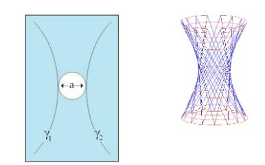

[la réson de ce qui cloche dans la raison]

Je vais donc continuer un peu sur le thème du *Savoir du Psychanalyste*. Je ne le fais ici que dans la parenthèse que j'ai déjà, les deux premières fois, ouverte.

Je vous ai dit que c'est ici que j'avais accepté... à la prière d'un de mes élèves ...de reparler cette année pour la première fois depuis 63.

Je vous ai dit la dernière fois quelque chose qui s'articulait en harmonie avec ce qui nous enserre : « *je parle aux murs* ! ».

Il est vrai que de ce propos, j'ai donné un commentaire : un certain petit schéma, celui repris *de la bouteille de Klein*, qui devait rassurer ceux qui, de par cette formule [« *je parle aux murs »* ], pouvaient se sentir exclus.

Comme je l'ai longtemps expliqué, ce qu'on adresse aux murs a pour propriété de se répercuter. Que je vous parle ainsi indirectement n'était fait certes pour offenser personne, puisque après tout, on peut dire que ce n'est pas là un privilège de mon discours !

Je voudrais aujourd'hui éclairer à propos de ce mur... qui n'est pas du tout une métaphore ...éclairer ce que je peux dire ailleurs.

Car évidemment, ça se justifiera, pour parler de *Savoir*, que ça ne soit pas à mon séminaire que je le fasse. Il ne s'agit pas en effet de n'importe lequel, mais du *Savoir du psychanalyste*. Voilà !

Pour introduire un peu les choses, suggérer une dimension à certains, j'espère, je dirai : qu'on ne puisse pas « *parler d'amour* »...

comme on dit, sinon de manière imbécile ou abjecte, ce qui est une aggravation :

« *abjecte* » c'est comme on en parle dans la psychanalyse

...qu'on ne puisse donc « *parler d'amour* » mais qu'on puisse en *écrire* : ça devrait frapper.

#### La lettre, *la lettre* « *d'(a)mur* »...

pour donner suite à cette petite ballade en six vers que j'ai commentée ici la dernière fois ...il est clair qu'il faudrait que ça se morde la queue, et que si ça commence :

« *Entre l'homme*...

dont personne ne sait ce que c'est *Entre l'homme et l'amour, il y a la femme* »

et puis comme vous le savez ça continue...

je ne vais pas recommencer aujourd'hui ...et ça devrait se terminer à la fin, à la fin il y a le mur :

« *entre l'homme et le mur, il y a*... »

...justement l'*(a)mur*, la lettre d'amour.

Ce qu'il y a de mieux dans ce qui s'écrase quelque part, ce curieux élan qu'on appelle *l'amour*, c'est la *lettre*. C'est la *lettre* qui peut prendre d'étranges formes.

Il y a un type, comme ça, il y a 3000 ans, qui était certainement à l'acmé de ses succès, de ses succès d'*amour,* qui a vu apparaître sur le mur quelque chose que j'ai déjà commenté...

je m'en vais pas reprendre

...« *Mené*, *Mené... »* - que ça se disait - « ...*Tékel*, *Upharsîn.* » [ תקל מנא ופרסיןמנא[, ce que d'habitude - je ne sais pas pourquoi - on articule : « *Mené*,*Thécel*,*Pharès* ».**6**

6 Sur le mur de son palais, Balsazar, le dernier roi de Babylone vit s'inscrire en lettres de feu, trois avertissements « Mené - Thécel – Pharès », « *Mené* - *Tekel* - *Parsîn* » en hébreu, soit : « *pesé, jugé et condamné* ». Le prophète Daniel traduisit : « *Tes jours sont comptés, tu as été trouvé trop léger dans la balance, ton royaume sera partagé* ». *La Bible* : *Le Livre de Daniel*, V, 25 à 28.

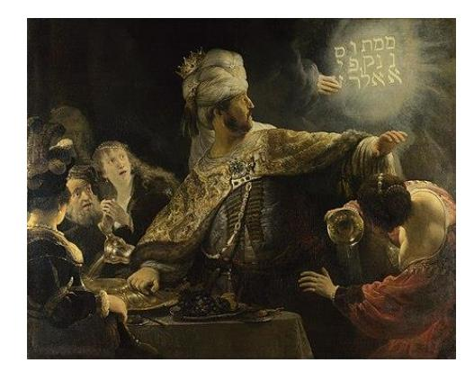

Quand *la lettre d'amour* nous parvient...

Car, comme je l'ai expliqué quelquefois, les lettres viennent toujours à destination, heureusement elles arrivent trop tard, outre qu'elles sont rares. Il arrive aussi qu'elles arrivent à temps : c'est les cas rares où les rendez-vous ne sont pas ratés. Il n'y a pas beaucoup de cas dans l'histoire où ça soit arrivé, comme à ce Nabuchodonosor quelconque.

Comme entrée en matière, je ne pousserai pas la chose plus loin, quitte à la reprendre. Car cet *(a)mur*, tel que je vous le présente, ça n'a rien de très amusant.

Or moi je ne peux pas me soutenir autrement que d'amuser, amusement sérieux ou comique : ce que j'avais expliqué la dernière fois, c'est que les amusements sérieux ça se passerait ailleurs, dans un endroit où l'on m'abrite, et que pour ici je réservais les amusements comiques.

Je ne sais si je serai ce soir tout à fait à la hauteur, en raison peut-être de cette entrée sur *la lettre d'(a)mur*. Néanmoins, j'essaierai.

J'ai expliqué il y a 2 ans quelque chose qui, *une fois passé comme ça dans la grande voie poubellique*, a pris le nom de *quadripode*. C'est moi qui avait choisi ce nom et vous ne pourrez que vous demander pourquoi je lui ai donné un nom aussi étrange : pourquoi pas *« quadripède » ou « tétrapode »*, ça aurait eu l'avantage de ne pas être bâtard.

Mais en vérité je me le suis demandé moi-même en l'écrivant, je l'ai maintenu, je ne sais pas pourquoi, puis je me suis demandé ensuite comment on appelait dans mon enfance *ces termes bâtards* comme ça : *mi-latins, mi-grecs*. Je suis sûr d'avoir su comment les puristes appellent ça, et puis je l'ai oublié **7** .

Est-ce qu'il y a ici une personne qui sait comment on désigne les termes faits par exemple comme le mot « *sociologie* » ou « *quadripode* », d'un élément latin et d'un élément grec ? Je l'en supplie, que celui qui le sait l'émette ! Eh bien, c'est pas encourageant !

Parce que depuis hier - hier, c'est-à-dire que c'était avant-hier *-* que j'ai commencé à le chercher et comme je ne trouvais pas toujours, depuis hier j'ai téléphoné à une dizaine de personnes qui me paraissaient les plus propices à me donner cette réponse. Bon, eh bien tant pis !

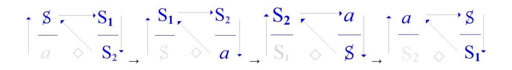

Mes « *quadripode* » en question, je les appelés ainsi pour vous donner l'idée qu'on peut s'asseoir dessus... histoire, puisque j'étais dans les mass-média **8** , de rassurer un peu les personnes

...mais en réalité, j'explique à l'intérieur ceci à propos de ce que j'ai isolé des 4 *discours* : ces 4 *discours* résultent de l'émergence du dernier venu, du *discours de l'analyste*.

7 Isidore nomme les hybrides gréco-latins « *notha* », d'un terme grec qui signifiait : « *bâtard par la mère* ». Mais ici il s'agit d'un hybride latino-grec.

Cf. « *Bilinguisme et terminologie grammaticale gréco-latine* » par Louis Basset..., éd. Peeters, 2007.

8 Cf. « *Radiophonie* », in *Scilicet* N°2-3, pp. 55-99, Seuil 1970.

*Le discours de l'analyste* apporte en effet...

dans un certain état actuel des pensées ...un ordre dont s'éclairent d'autres *discours* qui ont émergé bien plus tôt.

Je les ai disposés selon ce qu'on appelle une topologie.

Une topologie des plus simples mais qui n'en est pas moins une topologie, en ce sens qu'elle est mathématisable. Et elle l'est de la façon la plus rudimentaire, à savoir qu'elle repose sur le groupement de pas plus de 4 points que nous appellerons « *monades* ».

Ça n'a l'air de rien, néanmoins c'est si fortement inscrit dans la structure de notre monde qu'il n'y a pas d'autre fondement au fait de l'espace que nous vivons. Remarquez bien ceci : que mettre 4 points à égale distance l'un de l'autre c'est le maximum de ce que vous pouvez faire dans notre espace. *Vous ne mettrez jamais cinq points à égale distance l'un de l'autre*.

Cette menue forme que je viens de rappeler là, est là pour faire sentir de quoi il s'agit : si les *quadripodes* sont, non pas *tétraèdre*, mais *tétrade*, que le nombre des sommets soit égal à celui des surfaces est lié à ce même « *triangle arithmétique* » que j'ai tracé à mon dernier séminaire [19-01-1972].

Comme vous le voyez, pour s'asseoir ça n'est pas de tout repos : ni l'un, ni l'autre.

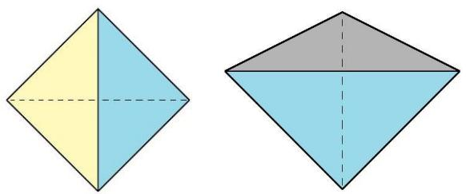

La position de gauche vous y êtes habitués, de sorte que vous ne la sentez même plus,

mais celle de droite n'est pas plus confortable : imaginez-vous assis sur un tétraèdre posé sur la pointe. C'est pourtant de là qu'il faut partir pour tout ce qu'il en est de ce qui constitue ce type d'assiette sociale qui repose sur ce qu'on appelle *un discours*. Et c'est cela que j'ai proprement avancé dans mon avant-avant-dernier séminaire.

Le tétraèdre - pour l'appeler par son aspect présent - a de curieuses propriétés : c'est que s'il n'est pas comme celui-là, régulier...

l'égale distance n'est là que pour vous rappeler les propriétés du nombre quatre, eu égard à l'espace ...s'il est quelconque, il vous est proprement impossible d'y définir une symétrie.

Néanmoins il a ceci de particulier que si ses côtés, à savoir ces petits traits que vous voyez qui joignent ce qu'on appelle en géométrie des *sommets*, si ces petits traits vous les vectorisez, c'est-à-dire que vous y marquiez un sens, il suffit que vous posiez comme principe qu'aucun des sommets ne sera privilégié de ceci...

qui serait forcément un privilège, puisque si ça se passait,

il y en aurait au moins deux qui ne pourraient pas en bénéficier

...si donc vous posez :

*– que nulle part il ne peut y avoir convergence de trois vecteurs,* 

*– ni nulle part divergence de trois vecteurs du même sommet,*

vous obtenez alors nécessairement la répartition :

- *– deux arrivants, un partant,*
- *– deux arrivants, un partant,*
- *– un arrivant, deux partants,*
- *– un arrivant, deux partants.*

C'est-à-dire que tous les dits *tétraèdres* seront strictement équivalents, et que dans tous les cas vous pourrez par suppression d'un des côtés, obtenir la formule par laquelle j'ai schématisé mes 4 *discours* :

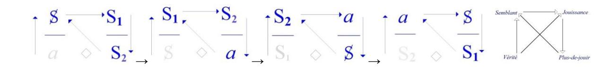

Selon ceci qui a une propriété, d'un des *sommets* : la divergence, mais sans aucun vecteur qui arrive pour le nourrir, mais qu'inversement, à l'opposé vous avez ce trajet triangulaire. Ceci suffit à permettre de distinguer en tous les cas, par un caractère qui est absolument spécial, ces quatre pôles que j'énonce des termes de *la Vérité*, du *Semblant*, de *la jouissance* et du *Plus-de-jouir*.

Ceci est la topologie fondamentale d'où ressort toute fonction de *la parole* et mérite d'être commenté. C'est en effet une question que *le discours de l'analyste* est bien fait pour faire surgir, que de savoir quelle est *la fonction de la parole.*

*« Fonction et champ de la parole et du langage*... », c'est ainsi que j'ai introduit ce qui devait nous mener jusqu'à ce point présent de la définition d'un nouveau *discours*. Non pas certes que ce *discours* soit le mien : à l'heure où je vous parle, ce *discours* est bel et bien, depuis près de trois quarts de siècle, installé.

Ce n'est pas une raison parce que l'analyste lui-même est capable, dans certaines zones, de se refuser à ce que j'en dis, qu'il n'est pas support de ce *discours.* Et à la vérité « *être support* » ça veut dire seulement dans l'occasion « *être supposé* ». Mais que ce *discours* puisse prendre sens de la voix même de quelqu'un qui y est - c'est mon cas – tout autant sujet qu'un autre, c'est justement ce qui mérite qu'on s'y arrête, afin de savoir d'*où* se prend ce sens.

À entendre ce que je viens d'avancer, la question du sens bien sûr peut vous sembler ne pas poser de problèmes, je veux dire qu'il semble que *le discours de l'analyste* fait assez appel à l'interprétation pour que la question ne se pose pas.

Effectivement, sur un certain gribouillage analytique, il semble qu'on peut lire...

et ce n'est pas surprenant, vous allez voir pourquoi ...tous les « *sens* » que l'on veut jusqu'au plus archaïque, je veux dire y avoir comme l'écho, la sempiternelle répétition de ce qui, du fond des âges nous est venu sous ce terme de « *sens* », sous des formes dont il faut bien dire qu'il n'y a que leur superposition qui fasse sens.

Car à quoi doit-on que nous comprenons quoi que ce soit du symbolisme usité dans l'Écriture sainte par exemple ? Le rapprocher d'une mythologie, quelle qu'elle soit, chacun sait que c'est là une sorte de glissement des plus trompeurs. Personne, depuis un temps, ne s'y arrête. Que quand on étudie d'une façon sérieuse ce qu'il en est des mythologies, ce n'est pas à leur sens qu'on se réfère, c'est à la combinatoire des mythèmes. Référez vous là-dessus à des travaux dont je n'ai pas, je pense, à vous évoquer une fois de plus l'auteur. La question est donc bien de savoir *d'où ça vient, le* « *sens* ».

Je me suis servi...

parce que c'était bien nécessaire

...je me suis servi...

pour introduire ce qu'il en est du *discours analytique,* ...je me suis servi sans scrupule du frayage dit *linguistique*.

Et *pour tempérer des ardeurs* qui autour de moi auraient pu s'éveiller trop tôt, vous faire retourner dans la fange ordinaire, j'ai rappelé que ne s'est soutenu quelque chose...

digne de ce titre « *linguistique* » comme science

...que ne s'est soutenu quelque chose qui semble avoir la langue comme telle, voire la parole, pour objet, que ça ne s'est soutenu qu'à condition de se jurer entre soi, entre linguistes, de ne jamais plus jamais...

parce qu'on n'avait fait que ça pendant des siècles

...plus jamais, même de loin, faire allusion à *l'origine du langage*. C'était, entre autres, un des mots d'ordre que j'avais donné à cette forme d'introduction qui s'est articulée de ma formule « *L'inconscient est structuré comme un langage* ».

Quand je dis que c'était pour éviter à mon audience le retour à une certaine équivoque fangeuse, ce n'est pas moi qui me sers de ce terme, c'est Freud lui-même, et nommément justement à propos des archétypes dits « *jungiens* », ça n'est certainement pas pour lever maintenant cet interdit : il n'est nullement question de spéculer sur quelque *origine du langage*, j'ai dit qu'il est question de formuler *la fonction de la parole*.

*La fonction de la parole* - il y a très longtemps que j'ai avancé ça - *c'est d'être la seule forme d'action qui se pose comme vérité*. Qu'est-ce que c'est, non pas que *la parole*, c'est une question superflue, non seulement je parle, vous parlez et même ça parle comme je l'ai dit ça va tout seul, c'est un fait, je dirai même que c'est l'origine de tous les faits, parce que quoi que ce soit ne prend rang de fait que *quand c'est dit*.

Il faut dire que je n'ai pas dit « *quand c'est parlé* », il y a quelque chose de distinct entre *parler* et *dire*. Une parole qui fonde le fait, *ça* c'est un dire, mais la parole fonctionne même quand elle ne fonde aucun fait : quand elle commande, quand elle prie, quand elle injurie, quand elle émet un vœu, elle ne fonde aucun fait.

Nous pouvons aujourd'hui ici...

c'est pas des choses que j'irais produire là-bas, à l'autre place

où heureusement je dis des choses plus sérieuses

...ici parce que c'est impliqué dans ce sérieux je développe toujours plus en pointe,

et en restant toujours à la-dite pointe comme à mon dernier séminaire...

j'espère qu'il se fera qu'au prochain il y aura moins de monde : ce n'était pas rigolo

...mais enfin ici on peut rigoler un peu, c'est des amusements comiques.

Dans l'ordre de l'amusement comique, la parole, c'est pas pour rien que dans les dessins animés on vous la chiffre sur des banderoles : la parole c'est comme là où ça bande... rôle ou pas !

C'est pas pour rien que ça instaure la dimension de *la vérité*, parce que *la vérité,* la vraie, la vraie *vérité, la vérité* telle qu'il se fait qu'on a commencé à l'entrevoir seulement avec *le discours analytique,*  c'est que ce que révèle ce discours à tout un chacun, qui simplement s'y engage d'une façon *axante* comme analysant, c'est que...

excusez-moi de reprendre ce terme, mais puisque j'ai commencé, je ne l'abandonne pas ...c'est que de *bander*...

c'est ce que là-bas, place du Panthéon, j'appelle !

...c'est que de *bander*, ça n'a aucun rapport avec *le sexe*, pas avec l'*autre* en tout cas !

*Bander* - on est ici entre des murs - « *bander pour une femme* », il faut tout de même appeler ça par son nom, ça veut dire lui donner la fonction, ça veut dire la prendre comme *phallus*. C'est pas rien le *phallus* !

Je vous ai déjà expliqué, là-bas où c'est sérieux, je vous ai expliqué ce que ça fait. Je vous ai dit que « *la signification du phallus* » c'est le seul cas de génitif pleinement équilibré, ça veut dire que le *phallus*...

c'est que ce que vous expliquait ce matin, je dis ça pour ceux qui sont un peu avertis ...c'est que ce que vous expliquait ce matin Jakobson :

*le phallus c'est la signification*, c'est *ce par quoi le langage signifie*. *Il n'y a qu'une seule Bedeutung, c'est le phallus*.

Partons de cette hypothèse, ça nous expliquera très largement l'ensemble de la fonction de *la parole*. Car elle n'est pas toujours appliquée à dénoter des faits...

c'est tout ce qu'elle peut faire, on ne dénote pas des choses, on dénote des faits ...mais c'est tout à fait par hasard, de temps en temps.

La plupart du temps elle supplée à ceci que *la fonction phallique* est justement ce qui fait qu'il n'y a chez l'Homme que les relations que vous savez, mauvaises, entre les sexes.

Alors que partout ailleurs, au moins pour nous, ça semble aller « *à la coule* ».

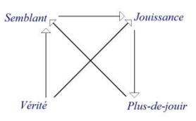

Alors c'est pour ça que dans mon petit quadripode vous voyez au niveau de *la vérité* 2 choses, 2 vecteurs qui divergent :

- *–* ce qui exprime que *la jouissance*, qui est tout au bout de la branche de droite, c'est une jouissance certes *phallique*, mais qu'on ne peut dire *jouissance sexuelle*,
- *–* et que pour que se maintienne quiconque de ces drôles d'animaux, ceux qui sont proie de la parole, il faut qu'il y ait ce pôle là, qui est corrélatif du pôle de la *jouissance* en tant qu'obstacle au rapport sexuel : c'est ce pôle que je désigne du *semblant*.

C'est aussi clair pour un partenaire, enfin si nous osons, comme ça se fait tous les jours, les épingler de leur sexe, il est éclatant que l'homme comme la femme, ils font *semblant*, chacun, dans ce rôle. Mais enfin, c'est des histoires qu'ils se donnent.

Mais l'important au moins quand il s'agit de *la fonction de la parole*, c'est que les pôles soient définis :

- *–* celui du *semblant*,
- *–* et celui de la *jouissance*.

S'il y avait chez l'homme...

 ce que nous imaginons de façon purement gratuite ...qu'il y ait une jouissance spécifiée de la polarité sexuelle, ça se saurait ! Ça s'est peut-être su, des âges entiers s'en sont vantés et après tout nous avons de nombreux témoignages, malheureusement purement ésotériques, qu'il y a eu des temps où on croyait vraiment savoir comment tenir ça.

Un nommé Van Gulik **9** dont le livre m'a paru excellent, qui pique par-ci par-là...

 bien sûr il fait comme tout le monde, il pique plus près de ce qu'il y a de la tradition écrite chinoise ...dont le sujet est « *le savoir sexuel* », ce qui n'est pas très étendu, je vous assure, ni non plus très éclairé ! Mais enfin, regardez ça si ça vous amuse : « *La vie sexuelle dans la Chine ancienne »*. Je vous défie d'en tirer rien qui puisse vous servir [*Rires*] dans ce que j'appelais tout à l'heure l'état actuel des pensées !

L'intérêt de ce que je pointe, ce n'est pas de dire que depuis toujours les choses en sont de même que le point où nous en sommes venus. Il y a peut-être eu, il y a peut-être encore même quelque part, mais c'est curieux, c'est toujours dans des endroits où il faut vraiment sérieusement montrer patte blanche pour entrer, des endroits où il se passe entre l'*homme* et la *femme* cette conjonction harmonieuse qui les ferait être au septième ciel, mais c'est tout de même très curieux qu'on n'en entende jamais parler que du dehors.

Par contre, il est bien clair qu'à travers une des façons que j'ai de définir que c'est plutôt avec grand Φ que chacun a rapport qu'avec l'autre, ça devient pleinement confirmé dès qu'on regarde ce qu'on appelle d'un terme qui tombe si bien, comme ça, grâce à l'ambiguïté du latin ou du grec, ce qu'on appelle des « *homos* »... *ecce homo* comme je disais [*Rires*]

...il est tout à fait certain que les « *homos »*, ça bande bien mieux et plus souvent, et plus ferme.

C'est curieux mais enfin c'est tout de même un fait auquel pour une personne qui depuis un certain temps a un peu entendu parler, ça ne fait pas de doute. Ne vous y trompez pas quand même : il y a *homo* et « *homo »*, hein ! [*Rires*] Je ne parle pas d'André Gide ! Faut pas croire qu'André Gide était un *homo* !

Ça nous introduit à la suite. Ne perdons pas la corde, il s'agit du « *sens* ». Pour que quelque chose ait du *sens* dans l'état actuel des pensées, c'est triste à dire mais il faut que ça se pose comme normal.

C'est bien pour ça qu'André Gide voulait que l'homosexualité fût normale. Et comme vous pouvez peut-être en avoir des échos, dans ce sens il y a foule : en moins de deux ça va tomber comme ça sous la cloche du normal, à tel point qu'on aura de nouveaux clients en psychanalyse qui viendront nous dire : « *je viens vous trouver parce que je ne pédale pas normalement* ! » [*Rires*] Ça va devenir un embouteillage ! [*Rires*]

Et l'analyse est partie de là !

Si la notion de *normal* n'avait pas pris, *à la suite des accidents de l'histoire*, une pareille extension, elle n'aurait jamais vu le jour. Tous les patients, non seulement qu'a pris Freud mais c'est très clair à le lire que c'est une condition : pour entrer en analyse, au début le minimum c'était d'avoir une bonne formation universitaire. C'est dit dans Freud en clair. Je dois le souligner, parce que *le discours universitaire* dont j'ai dit beaucoup de mal, et pour les meilleures raisons, mais quand même c'est lui qui abreuve *le discours analytique*.

Vous comprenez, vous ne pouvez plus vous imaginer...

c'est pour vous faire imaginer quelque chose si vous en êtes capables,

mais qui sait, à l'entraînement de ma voix

...vous pouvez même pas imaginer ce que c'était une zone du temps qu'on appelle à cause de ça « *antique »,* où la δοχα [doxa], vous savez la célèbre δοχα dont on parle dans le « *Ménon »,* « *mais non, mais non* » [*Rires*], il y avait de la δοχα qui n'était pas universitaire.

Actuellement, mais il n'y a pas une δοχα, si futile, si boiteuse cahin-caha voire conne, soit-elle qui ne soit rangée quelque part dans un enseignement universitaire ! Il n'y a pas d'exemple d'une opinion, aussi stupide soit-elle, qui ne soit repérée, voire... à l'occasion de ce qu'elle est repérée

...enseignée. Ben ça fausse tout !

9 Robert Hans Van Gulik : « *La Vie sexuelle dans la Chine ancienne* », Gallimard 1971.

Parce que quand Platon parle de δοχα [doxa] comme de quelque chose dont il ne sait littéralement que faire, lui, philosophe qui cherche à fonder une science, il s'aperçoit que la δοχα, la δοχα qu'il rencontre à tous les coins de rue, il y en a de vraies.

Naturellement, il n'est pas foutu de dire pourquoi, non plus qu'aucun philosophe, mais personne ne doute qu'elles soient vraies, parce que *la vérité* ça s'impose. Cela faisait *un contexte, mais complètement différent à* quoi que ce soit qui s'appelle *philosophie,* que la δοχα ne soit pas normée. Il n'y a pas trace du mot « *norme* » nulle part dans le discours antique. C'est nous qui avons inventé ça, et naturellement en allant chercher un nom grec d'usage rarissime !

Il faut quand même partir de là pour voir que *le discours de l'analyste*, c'est pas apparu par hasard ! Il fallait qu'on soit au dernier état d'extrême urgence pour que ça sorte.

Bien entendu puisque c'est un *discours de l'analyste*, ça prend...

comme tous mes discours, les quatre que j'ai nommés

...le sens du génitif objectif :

- *– le discours du Maître* c'est le discours *sur le Maître*, on l'a bien vu à l'acmé de l'épopée philosophique dans Hegel.
- *– Le discours de l'analyste* c'est la même chose : on parle *de l'analyste*, c'est lui *l'objet(a)*, comme je l'ai souvent souligné. Ça ne lui rend pas facile, naturellement, de bien saisir quelle est sa position, mais d'un autre côté, elle est de tout repos puisque c'est celle du *semblant*.

Alors notre Gide...

pour continuer la tresse : je prends le Gide,

puis je le relaisserai, puis on le reprendra ensemble, et ainsi de suite

...notre Gide là, parce qu'il est quand même exemplaire, il ne nous sort pas de notre petite affaire, bien loin de là !

Son affaire c'est une affaire *d'être désiré*, comme nous trouvons ça couramment dans l'exploration analytique. Il y a des gens à qui ça a manqué dans leur petite enfance, d'être désiré. Ça les pousse à faire des trucs pour que ça leur arrive sur le tard. C'est même très répandu.

Mais il faut tout de même bien cliver les choses.

C'est pas sans rapport, pas du tout, avec *le discours*.

C'est pas de ces paroles comme il en sort un peu partout quand on est au Carnaval.

*Le discours* et *le désir*, là ça a le plus étroit rapport.

C'est même pour ça que je suis arrivé à isoler - enfin, du moins je le pense - la fonction de *l'objet(a)*. C'est un point-clé dont on n'a pas encore beaucoup tiré parti je dois dire, ça viendra tout doucement. *L'objet(a)* c'est ce par quoi *l'être parlant*, quand il est pris dans un discours, se détermine.

Il ne sait pas du tout que ce qui le détermine, c'est *l'objet(a)*. En quoi il est déterminé ? Il est déterminé comme *sujet*, c'est-à-dire qu'il est *divisé comme sujet* : il est la proie du désir.

Ça a l'air de se passer au même endroit que les paroles subvertissantes, mais c'est pas du tout pareil, c'est tout à fait régulier, ça produit - c'est une production ! - ça produit *mathématiquement*, c'est le cas de le dire, cet *objet(a)* en tant que *cause du désir*.

C'est encore celui que j'ai appelé, comme vous le savez, *l'objet métonymique* : ce qui court tout au long de ce qui se déroule comme *discours*, discours plus ou moins cohérent, jusqu'à ce que ça bute et que toute l'affaire se termine en eau de boudin.

Il n'en reste pas moins que *c'est de là*, et c'est ça l'intérêt, *que nous prenons l'idée de la cause*. Nous croyons que dans la nature, il faut que tout ait une cause, sous prétexte que nous sommes causés par notre propre *bla-bla-bla*. Ouais !

Il y a tous les traits chez André Gide que les choses sont bien telle que je vous l'ai dit. C'est d'abord sa relation avec l'Autre suprême : il ne faut pas croire du tout, du tout, comme ça, malgré tout ce qu'il a pu dire, que ça n'avait pas d'incidence, le grand Autre.

Là où ça prend forme, le (*a*) il en avait même une notion tout à fait spécifiée, c'est à savoir que le plaisir de ce grand Autre, c'était de déranger celui de tous les petits [autres] ! Moyennant quoi il pigeait très bien qu'il y avait là un point de tracas *qui le sauvait évidemment du délaissement de son enfance*. Toutes ses taquineries avec Dieu, c'était quelque chose de fortement compensatoire pour quelqu'un qui avait si mal commencé. C'est pas son privilège [*sic*]. Ouais...

J'avais commencé autrefois...

j'en ai fait qu'une leçon, un « *séminaire* » ce qu'on appelle ...quelque chose sur *le Nom du Père*.

Naturellement, j'ai commencé par le *Père* même. J'ai parlé pendant une heure, une heure et demie, de *la jouissance* de Dieu. Si j'ai dit que c'était un « *badinage mystique* » c'était pour ne plus jamais en parler.

Il est certain que depuis qu'il y a un Dieu, seul et unique, enfin le Dieu qu'a fait émerger une certaine ère historique, c'est justement celui-là celui qui dérange le plaisir des autres. Il n'y a même que ça qui compte.

- *–* Il y a bien les *Épicuriens* qui ont tout fait pour enseigner la méthode pour ne pas se laisser déranger dans le plaisir de chacun : et ben ça a foiré !
- *–* Il y en avait d'autres qui s'appelaient les *Stoïciens* et qui ont dit : « *Mais il faut au contraire se ruer dans le plaisir divin* ». Mais ça rate aussi vous savez, ça ne joue qu'entre les deux.

C'est la tracasserie qui compte ! Avec ça vous êtes tous dans votre aire naturelle. Vous jouissez pas bien sûr, ça serait exagéré de le dire, d'autant plus que de toute façon c'est trop dangereux, mais enfin, on peut pas dire que vous n'avez pas du *plaisir*, hein ! C'est même là-dessus qu'est fondé *le processus primaire*.

Tout ça nous remet au pied du mur : *qu'est-ce que c'est que le* « *sens* » ? Eh ben, il vaut mieux repartir au niveau du *plaisir,* du plaisir que l'autre vous fait, c'est courant, on appelle ça même - dans une zone plus noble - de *l'art* (*l, apostrophe*) [*Rires*].

C'est là qu'il faut attentivement considérer *le mur*, parce qu'il y a une zone du « *sens* » bien éclairée. Bien éclairée par exemple par le nommé Léonard De Vinci, comme vous le savez, qui a laissé quelques manuscrits et menues babioles, pas tellement - il n'a pas peuplé les musées - mais il a dit de profondes vérités, dont tout le monde devrait toujours se souvenir.

Il a dit : « *Regardez le mur* » - comme moi...

puis, depuis ce temps, il est devenu le *Léonard* des familles, on fait cadeau de ses manuscrits. Il y a un ouvrage de luxe - même à moi, on m'en a donnée une paire,

vous vous rendez compte, mais ça ne veut pas dire que c'est pas lisible [*Rires*]

...alors il vous explique : « *Regardez bien le mur* » comme ici, c'est un peu sale.

Si c'était mieux entretenu il y aurait des tâches d'humidité et peut-être même des moisissures.

Eh bien si vous en croyez Léonard : s'il y a une tache de moisissure,

c'est une belle occasion pour la transformer en *madone* ou bien en athlète musculeux...

ça, ça se prête encore mieux, parce que dans la moisissure, il y a toujours des ombres, des creux ...c'est très important ça : s'apercevoir qu'il y a une classe de choses sur les murs, qui prête à la figure, à la création d'art, comme on dit. C'est le figuratif même, la tache en question.

Il faut tout de même savoir le rapport qu'il y a entre ça et quelque chose d'autre qui peut venir sur le mur, c'est à savoir les *ravinements*, non pas seulement de *la parole*...

encore que ça arrive, c'est bien comme ça que ça commence toujours ...mais du *discours*. Autrement dit : si c'est du même ordre la *moisissure* sur le mur ou l'*écriture* ?

Ça devrait intéresser ici un certain nombre de personnes qui, je pense, il n'y a pas très longtemps, ça commence à vieillir, se sont beaucoup occupés d'écrire des choses, *des lettres d'amour sur les murs*. C'était un vachement beau temps. Il y en a qui ne s'en sont jamais consolés du temps où on pouvait écrire sur les murs et où d'un truc dans *Publicis* on déduisait que « *les murs avaient la parole* ». Comme si ça pouvait arriver !

Je voudrais simplement faire remarquer qu'il vaudrait mieux qu'il n'y ait jamais rien d'écrit sur les murs. Ce qui y est déjà écrit, il faudrait même l'en retirer.

- *–* « *Liberté - Égalité - Fraternité* » par exemple, c'est indécent !
- *–* « *Défense de fumer* », c'est pas possible, d'autant plus que tout le monde fume, il y a là une erreur de tactique.

Je l'ai déjà dit tout à l'heure pour *la lettre d'(a)mur : tout ce qui s'écrit renforce le mur*. C'est pas forcément une objection. Mais ce qu'il y a de certain, c'est qu'il ne faut pas croire que ce soit absolument nécessaire. Mais ça sert quand même parce que si on n'avait jamais rien écrit sur un mur - quel qu'il soit, celui-là ou les autres – eh bien, c'est un fait : on n'aurait pas fait un pas dans le sens de ce qui peut-être est à regarder au-delà du mur.

Voyez-vous, il y a quelque chose dont je serai amené un peu à vous parler cette année :

c'est les rapports de *la logique* et de *la mathématique*. Au-delà du mur...

pour vous le dire tout de suite

...il n'y a, à notre connaissance, que ce *Réel* qui se signale justement *de l'impossible, de l'impossible de l'atteindre au-delà du mur*. Il n'en reste pas moins que c'est le *Réel*.

Comment est-ce qu'on a pu faire pour en avoir l'idée ? Il est certain que le langage y a servi pour un bout. C'est même pour ça que j'essaie de faire ce petit pont dont vous avez pu voir dans mes derniers séminaires l'amorce, à savoir : comment est-ce que l'*Un* fait son entrée ?

C'est ce que j'ai exprimé déjà depuis trois ans avec des symboles : S1 et S2 :

- *–* le premier, je l'ai désigné comme ça pour que vous y entendiez un petit quelque chose du *signifiant-Maître*
- *–* et le second, du *savoir*.

Mais *est-ce qu'il y aurait* S1 *s'il n'y avait pas* S2 ? C'est un problème, parce qu'*il faut qu'ils soient* 2 *d'abord pour qu'il y ait* S1. J'ai abordé la chose, là au dernier séminaire, en vous montrant que de toutes façons ils sont au moins 2 même pour qu'un seul surgisse : 0 et 1, comme on dit : ça fait 2. Mais ça c'est au sens où l'on dit que c'est *infranchissable*.

Néanmoins ça se franchit quand on est logicien, comme je vous l'ai déjà indiqué à me référer à Frege. Mais enfin, il vous en est j'espère pas moins apparu que c'était franchi d'un pied allègre, et que je vous indiquais à ce moment - j'y reviendrai - qu'il y avait peut-être plus d'un petit pas. L'important n'est pas là.

Il est très clair que quelqu'un dont vous avez entendu - sans doute, certains - parler pour la première fois ce matin : René Thom qui est mathématicien. Il n'est pas *pour* ceci : *que la logique*...

c'est-à-dire le discours qui se tient *sur le mur*

...soit quelque chose qui *suffise même à rendre compte du nombre*, premier pas de la mathématique.

Par contre il lui semble pouvoir rendre compte, non seulement de ce qui se trace sur le mur... ça n'est rien d'autre que la vie même, ça commence à la moisissure comme vous savez ...rendre compte par *le nombre, l'algèbre, les fonctions, la topologie*, rendre compte de ce qui se passe dans le champ de la vie.

J'y reviendrai ! Je vous expliquerai que le fait qu'il retrouve dans telle fonction mathématique le tracé même de ces courbes que fait la prime moisissure avant de s'élever jusqu'à l'homme, que ce fait le pousse jusqu'à cette extrapolation de penser que *la topologie peut fournir une typologie des langues naturelles*. Je ne sais pas si la question est actuellement tranchable.

J'essaierai de vous donner une idée d'où est son incidence actuelle, rien de plus.

Ce que je peux dire c'est qu'en tout cas *le clivage du mur* :

- le fait qu'il y ait *quelque chose d'installé devant,* que j'ai appelé : *parole* et *langage,*
- et que c'est d'un autre côté que ça travaille, peut-être mathématiquement,

...il est certain que nous ne pouvons pas en avoir d'autre idée.

Que la science repose, non comme on le dit sur *la quantité*, mais sur le nombre, la fonction et la topologie, c'est ce qui ne fait pas de doute. Un *discours* qui s'appelle « *la Science* », a trouvé le moyen de se construire derrière le mur.

Seulement ce que je crois devoir nettement formuler et ce en quoi je crois être d'accord avec tout ce qu'il y a de plus sérieux dans la construction scientifique, c'est qu'il est strictement impossible de donner à quoi que ce soit qui s'articule en termes algébriques ou topologiques, *l'ombre de sens*.

Il y a du sens pour ceux qui, devant le mur, se complaisent de *taches de moisissures qui se trouvent si propices à être transformées en madone ou en dos d'athlète*, mais il est évident que nous ne pouvons pas nous contenter de ces sens confusionnels. Cela ne sert en fin de compte qu'à retentir sur *la lyre du désir*, sur l'*érotisme* pour appeler les choses par leur nom.

Mais devant le mur il se passe d'autres choses, et c'est ce que j'appelle *des discours*. Il y en a eu d'autres que ces *miens quatre*, que j'ai énumérés et qui ne se spécifient d'ailleurs qu'à devoir vous faire apercevoir tout de suite qu'ils se spécifient comme tels : comme *n'étant que* 4. Il est bien sûr qu'il y en a eu d'autres dont nous ne connaissons plus rien que ce qui *se converge* dans ceux-là qui sont les 4 qui nous restent, ceux qui s'articulent de la ronde du *a*, du S1 et du S2, et même du *sujet* [S] qui paye les pots cassés et qui de cette ronde, à se déplacer selon ces 4 sommets à la suite, nous ont permis de détacher quelque chose pour nous repérer.

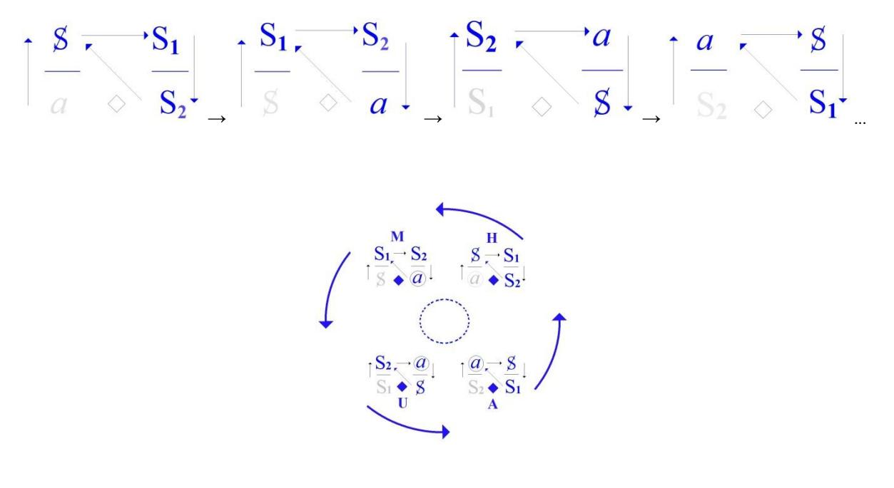

C'est *quelque chose* qui nous donne l'état actuel de *ce qui - de lien social - se fonde du discours*, c'est-à-dire *quelque chose* où, quelque place qu'on y occupe...

du *maître*, de l'*esclave*, du *produit*, ou de ce qui supporte toute l'affaire ...quelque soit la place qu'on y occupe, on n'y entrave jamais que *pouic*.

## Le sens, d'où surgit-il ?

C'est en ça qu'il est très important d'avoir fait ce clivage - maladroit sans doute - qu'a fait Saussure, comme le rappelait ce matin Jakobson, du *signifiant* et du *signifié*. Chose d'ailleurs qu'il héritait - c'est pas pour rien – des *Stoïciens* dont tout à l'heure, je vous ai dit la position bien particulière dans ces sortes de manipulations.

Ce qu'il y a d'important, bien sûr,

- *–* c'est pas que le *signifiant* et le *signifié* s'unissent et que ce soit le *signifié* qui nous permette de distinguer ce qu'il y a de spécifique dans le *signifiant*, bien au contraire,
- *–* c'est que *le signifié d'un signifiant...*

ce que j'articule des petites lettres que je vous ai dit tout à l'heure [S2, S1] *...le signifié* [S2] *d'un signifiant* [S1]*...*

là où on accroche quelque chose qui peut ressembler à un sens *...ça vient toujours de la place que le même signifiant occupe dans un autre discours*.

C'est bien ça qui leur est à tous monté à la tête quand *le discours analytique* s'est introduit : il leur a semblé qu'ils comprenaient tout, les pauvres ! Heureusement que grâce à mes soins, ce n'est pas votre cas...

Si vous compreniez ce que je raconte ailleurs - là où je suis sérieux - vous n'en croiriez pas vos oreilles. C'est même pour ça que vous n'en croyez pas vos oreilles. C'est parce qu'en réalité vous le comprenez, mais enfin vous vous tenez à distance.

Et c'est bien compréhensible puisque, dans la grande majorité, *le discours analytique* ne vous a pas encore attrapé. Ça viendra malheureusement, car il a de plus en plus d'importance.

Je voudrais quand même dire quelque chose sur *le savoir de l'analyste*, à condition que vous ne vous en teniez pas là. Si mon ami René Thom arrive si aisément à trouver par des coupes de surfaces mathématiques compliquées, quelque chose comme un dessin, une zébrure, enfin quelque chose qu'il appelle aussi bien une pointe, une écaille, une fronce, un pli, et à en faire un usage véritablement captivant...

- *–* si, en d'autres termes, il y a entre telle tranche d'une chose qui n'existe qu'à ce qu'on puisse écrire :
  - *il existe* X : : qui satisfait à la fonction F(X),
- *–* s'il fait ça avec tellement d'aisance,

...il n'en reste pas moins que tant que ça n'aura pas rendu raison d'une façon exhaustive de ce avec quoi, malgré tout, il est bien forcé de vous l'expliquer, à savoir le langage commun et la grammaire autour,

il restera là une zone que j'appelle « *zone du discours* » et qui est celle sur laquelle *l'analytique des discours* jette un vif jour.

Qu'est-ce qui là-dessus peut se transmettre d'un savoir ? Enfin, il faut choisir !

Ce sont les nombres qui savent, qui savent parce qu'ils ont fait s'émouvoir cette matière organisée en un point, bien sûr immémorial, et qui continuent de savoir ce qu'ils font.

Il y a une chose bien certaine, c'est que c'est de la façon la plus abusive que nous mettons là-dedans un « *sens* ».

Que toute idée d'évolution, de perfectionnement, alors que dans la chaîne animale supposée

nous ne voyons absolument rien qui atteste cette adaptation soi-disant continue,

à tel point qu'il a bien fallu tout de même qu'on y renonce et qu'on dise qu'après tout,

ceux qui passent, alors là ce sont ceux qui ont pu passer. On appelle ça « la *sélection naturelle »*.

Ça ne veut strictement rien dire. Ça a comme ça un petit sens emprunté à un discours de pirate,

et puis pourquoi pas celui-là ou un autre ?

La chose la plus claire qui nous apparaît, c'est qu'un être vivant ne sait pas toujours très bien quoi faire *d'un de ses organes*. Et après tout c'est peut-être un cas particulier de la mise en évidence par *le discours analytique du côté embarrassant du phallus*. Qu'il y ait un corrélat entre ça...

comme je l'ai souligné au début de ce discours

...un *corrélat* entre ça et ce qui se fomente de *la parole*, nous ne pouvons rien dire de plus.

Qu'au point où nous en sommes de *l'état actuel des pensées*...

ça fait la sixième fois que je viens d'employer cette formule, il est bien clair que ça n'a pas l'air de tracasser personne, c'est pourtant bien quelque chose qui vaudrait qu'on y revienne, parce que *l'état actuel des pensées*, j'en fais un meuble, c'est pourtant vrai, hein ? C'est pas de l'idéalisme de dire que les pensées sont aussi strictement déterminées que le dernier gadget

...enfin, dans *l'état actuel des pensées*, on a *le discours hystérique* qui, quand on veut bien l'entendre pour ce qu'il est, se montre lié à une curieuse *adaption*. Parce qu'enfin, si c'est vrai cette histoire de *castration*, ça veut dire que chez l'homme *la castration* c'est le moyen d'adaptation à la survie. C'est impensable mais c'est vrai.

Tout cela n'est peut-être qu'un artifice, un artefact de discours.

*si savant à compléter les autres*

Que *ce discours*...

...que *ce discours* se soutienne, c'est peut-être seulement une phase historique.

La vie sexuelle de la Chine ancienne va peut-être refleurir, elle aura un certain nombre de sales ruines à engloutir avant que ça se passe. Mais pour l'instant, qu'est-ce que ça veut dire, ce sens que nous apportons ? *Ce sens*, en fin de compte *est énigme*, et justement parce qu'il est sens.

Il y a quelque part, dans la 2 nde *édition* d'un volume, de ce volume là que j'ai laissé dans un temps sortir, qui s'appelle *Écrits* il y a un petit ajout qui s'appelle « *La métaphore du sujet »*. J'ai joué longtemps sur la formule dont se régalait mon cher ami Perelman : « *un océan de fausse science* »…

> On n'est jamais bien sûr, et je vous conseille de partir de là, de ce que j'ai derrière la tête quand je m'amuse justement !

...« *un océan de fausse science* », c'est peut-être *le savoir de l'analyste*, pourquoi pas ?

Pourquoi pas, si justement c'est seulement de sa perspective que se décante ceci : que la science n'a pas de sens, mais *qu'aucun sens de discours, à ne se soutenir que d'un autre, n'est que sens partiel*. Si *la vérité* ne peut jamais que se *mi-dire*, c'est là le noyau, c'est là l'essentiel du *savoir de l'analyste.*

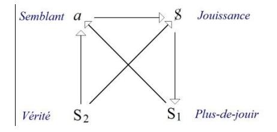

C'est qu'à cette place là...

dans ce que j'ai appelée *tétrapode* ou *quadripède* ...à la place de *la vérité* se tient S2. *Ce savoir*, c'est un savoir lui-même qui est donc toujours à mettre en question.

De l'analyse, il y a une chose par contre à prévaloir : *c'est qu'il y a un savoir qui se tire du sujet lui-même*. À la place, pôle, de *la jouissance*, *le discours analytique* met S : c'est dans le trébuchement, dans l'action ratée, dans le rêve, dans le travail de l'analysant que résulte ce *savoir*.

*Ce savoir* qui, lui, n'est pas supposé, *il est savoir caduque, rogaton de savoir, surrogaton de savoir* : c'est cela l'inconscient.

Ce *savoir-là* c'est ce que j'assume, je définis pour ne pouvoir se poser... trait nouveau dans l'émergence ...*que de la jouissance du sujet*.

Je m'excuse, c'est la première fois que *je suis en retard*. Je vous avertis : je suis malade.

Vous êtes là, j'y suis aussi, c'est bien pour vous.

Je veux dire par là que je me sens anormalement bien sous l'influence d'une petite température et de quelques drogues, de sorte que si jamais, tout d'un coup cette situation changeait j'espère que ceux qui m'entendent depuis longtemps expliqueraient aux nouveaux que c'est la première fois que ça m'arrive.

Alors, je vais essayer ce soir, donc d'être au niveau de ce que vous attendez,

ce que vous attendez *ici* où j'ai dit que je m'amuse.

Ça n'est pas forcé que ça reste toujours du même ton.

Vous voudrez bien m'excuser, ça ne sera certainement pas dû à mon état anormal.

Ça sera bien selon la ligne de ce que j'ai, ce soir, l'intention de vous dire.

Ailleurs*,* évidemment je ne ménage guère mon auditoire.

Si quelques uns qui sont là - j'en aperçois quelques uns - se souviennent de ce dont j'ai parlé la dernière fois : j'ai parlé en somme de cette chose que j'ai résumée dans le noeud borroméen, je veux dire une chaîne de 3, et telle qu'à détacher un des anneaux de cette chaîne, les deux autres ne peuvent plus un seul instant tenir ensemble. De quoi ça relève ?

Je suis bien forcé de vous l'expliquer, puisque après tout je ne suis pas sûr que donné tout brut,

tout simple, comme ça, ça suffise pour tous.

Ça veut dire une question concernant ce qui est la condition de l'inconscient.

Ça veut dire une question posée à ce qu'est le *langage*.

En effet, c'est là une question qui n'est pas tranchée.

Le langage doit-il être abordé dans sa grammaire, auquel cas - c'est certain - il relève d'une *topologie*...

## *X - Qu'est-ce que c'est une topologie ?*

Lacan

Ah, qu'est-ce que c'est qu'une topologie ? Comme cette personne est gentille ! Une topologie c'est une chose qui a une définition mathématique. La topologie, c'est ceci qui s'aborde d'abord par des rapports non métriques...

#### *X - Qu'est-ce que ça veut dire ?*

...par des rapports *déformables*. C'est à proprement parler le cas de *ces sortes de cercles souples* qui constituaient mon :

« *je te demande - de me refuser - ce que je t'offre* »

Chacun était une chose fermée, souple et qui ne tient qu'à être enchaînée aux autres. Rien ne se soutient tout seul. Cette topologie, du fait de son insertion mathématique, est liée à des rapports...

justement c'est ce que servait à démontrer mon dernier séminaire

...est liée à des rapports de pure signifiance, c'est-à-dire que c'est en tant que ces trois termes sont trois, que nous voyons que de la présence du troisième s'établit entre les deux autres une relation. C'est cela que veut dire le nœud borroméen.

Il y a une autre façon d'aborder le langage, et bien sûr la chose est actuelle.

Elle est actuelle pour le fait que quelqu'un que j'ai nommé...

il se trouve que je l'ai nommé *après* que l'ait fait Jakobson,

mais que - comme il arrive - je l'avais connu dès avant, c'est à savoir un nommé René Thom ...et ce quelqu'un tente en somme...

certainement non sans en avoir déjà frayé certaines voies

...d'aborder la question du langage sous le biais sémantique, c'est-à-dire non pas de la combinaison signifiante... en tant que la mathématique pure peut nous aider à la concevoir comme telle

...mais sous l'angle sémantique, c'est-à-dire non pas sans recourir aussi à la mathématique, à trouver dans certaines courbes, dirais-je, certaines formes, ajouterais-je, qui se déduisent de ces courbes, quelque chose qui nous permettrait de concevoir *le langage* comme - dirais-je - quelque chose comme l'écho des phénomènes physiques.

C'est à partir, par exemple : dans ce qui est purement et simplement communication de phénomènes de résonance que seraient élaborées des courbes, qui pour valoir dans un certain nombre de relations fondamentales, se trouveraient secondairement se rassembler, s'homogénéiser si l'on peut dire, être prises dans une même parenthèse d'où résulteraient les diverses fonctions grammaticales. Il me semble qu'il y a déjà un obstacle à concevoir les choses ainsi : c'est qu'on est forcé de mettre sous le même terme « *verbe* » des types d'action fort différentes.

Pourquoi le langage aurait-il - en quelque sorte - rassemblé dans une même catégorie des fonctions qui ne peuvent se concevoir d'origine que sous les modes d'émergence très différents ? Néanmoins la question reste en suspens.

Il est certain qu'il y aurait quelque chose d'infiniment satisfaisant à considérer que le langage est en quelque sorte modelé sur les fonctions supposées être de la réalité physique, même si cette réalité n'est abordable que par le biais d'une fonctionnalisation mathématique.

Ce que je suis - pour moi - en train pour vous d'avancer, c'est quelque chose qui foncièrement s'attache à l'origine purement topologique du langage. Cette origine topologique, je crois pouvoir en rendre compte à partir de ceci : qu'elle est liée essentiellement à quelque chose qui arrive sous le biais - chez l'*être parlant* - de la sexualité. L'*être parlant* est-il parlant à cause de ce quelque chose qui est arrivé à la sexualité, ou ce quelque chose est-il arrivé à la sexualité parce qu'il est *être parlant*, c'est une affaire où je m'abstiens de trancher, vous en laissant le soin.

Le schème fondamental de ce dont il s'agit, et que ce soir je vais tenter de pousser devant vous un peu plus avant, est ceci : la fonctions dite « *sexualité* » est définie...

pour autant que nous en sachions quelque chose,

nous en savons quand même un bout, ne serait-ce que par expérience

...de ceci que les sexes sont deux.

Quoi qu'en pense un auteur célèbre, qui je dois dire, dans son temps... avant qu'elle eût pondu ce livre qui s'appelle « *Le deuxième sexe »* ...avait cru, en raison de je ne sais quelle orientation

car à la vérité, je n'avais encore commencé de rien enseigner ...avait cru devoir en référer à moi avant de pondre « *Le deuxième sexe »*. Elle m'appela au téléphone pour me dire qu'assurément elle avait besoin de mes conseils pour l'éclairer sur ce qui devait être *l'affluent psychanalytique* à son ouvrage.

Comme je lui faisais remarquer qu'il faudrait bien au moins...

c'est un minimum puisque j'en parle depuis 20 ans et que ce n'est pas par hasard ...qu'il faudrait bien 5 ou 6 mois pour que je lui débrouille la question, elle me fit observer qu'il n'était pas question, bien sûr, qu'un livre qui était déjà en cours d'exécution, attendît si longtemps. Les lois de la production littéraire étant telles qu'il lui semblait exclu d'avoir avec moi plus de 3 ou 4 entretiens. À la suite de quoi, je déclinais cet honneur.

Le fondement de ce que je suis depuis un moment en train de sortir pour vous, très précisément depuis l'année dernière, est très précisément ceci : qu'il n'y a pas de *deuxième sexe* ! Il n'y a pas de deuxième sexe à partir du moment où entre en fonction le langage.

Ou pour dire les choses autrement concernant ce qu'on appelle *l'hétérosexualité*, c'est très précisément en ceci : c'est que le mot ετερος [étéros], qui est le terme qui sert à dire « *autre* » en grec, est très précisément dans cette position, pour le *rapport* que chez l'être parlant on appelle *sexuel*, de se vider en tant qu'être et c'est précisément de ce vide qu'il offre à la parole ce que j'appelle « *le lieu de l'Autre* », à savoir ce lieu où s'inscrivent les effets de la dite parole.

Je ne vais pas nourrir ceci, parce qu'après tout ça nous retarderait, de quelques références étymologiques :

- *–* comment ετερος [eteros] se dit, dans certain dialecte grec, que je vous épargnerais même de vous nommer - ἅτερος [àteros],
- *–* comment cet ετερος [eteros] se rallie à δεύτερος [dèfteros] et très précisément marque que ce δεύτερος [dèfteros], dans l'occasion est si je puis dire, *élidé*.

Il est clair que ceci peut paraître surprenant, comme il est évident que depuis des temps une telle formule...

la vérité c'est que je ne sache pas qu'il y ait un repère d'un temps où elle aurait été formulée ...une telle formule est très précisément ce qui est ignoré.

Je le prétends néanmoins, et je le soutiens de ce que vous voyez au tableau,

que c'est là ce qu'apporte l'expérience psychanalytique :

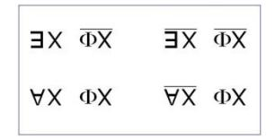

Pour ceci, rappelons sur quoi repose ce que nous pouvons avoir de la conception,

- *–* non pas de *l'hétérosexualité*, puisqu'elle est en somme fort bien nommée,
  - si vous suivez ce que je viens d'avancer à l'instant,
- *–* mais de *la bisexualité*.

Au point où nous en sommes de nos énoncés concernant ladite sexualité, qu'avons nous ?

Ce à quoi nous nous référons...

et ne croyez pas que ça aille de soi

...ce à quoi nous nous référons, c'est au modèle, si je puis dire supposé *animal*.

Il y a donc un rapport entre les sexes et l'image animale de la copulation, qui nous semble fournir un modèle suffisant de ce qu'il en est du rapport, et du même coup que ce qui est sexuel est considéré comme besoin.

Ce n'est pas là - loin de là, croyez-le - ce qui a été de toujours.

Je n'ai pas besoin de rappeler ce que veut dire « *connaître* » au sens biblique du mot.

Depuis toujours le rapport du νοῦς [nouss] à quelque chose qui en subirait l'empreinte passive,

qu'on appelle diversement, mais assurément dont la dénomination grecque la plus usuelle est celle de la ὕλη [ýli : substance], depuis toujours le mode de relation qui s'engendre de l'esprit a été considéré comme *modelant*,

non pas du tout simplement la relation animale, mais le mode fondamental d'être de ce qu'on tenait pour être *le monde*.

Les chinois ont dans l'occasion fait appel à quelque chose qui s'écrit ainsi :

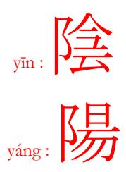

Les chinois depuis longtemps font appel à deux essences fondamentales qui sont respectivement l'essence féminine qu'ils appellent le *Yin* pour l'opposer au *Yang* qu'il se trouve que j'ai écrit - pas par hasard sans doute - au-dessous.

S'il y avait rapport articulable sur le plan sexuel,

- s'il y avait rapport articulable chez l'être parlant, devrait-il c'est là la question s'énoncer
  - *–* de « *tous ceux* » d'un même sexe,
  - *–* à « *tous ceux* » *de l'autre*.

C'est évidemment l'idée que nous suggère, au point où nous en sommes, la référence à ce que j'ai appelé *le modèle animal* :

- *–* aptitude si je puis dire, de chacun, d'un côté,
- *–* à valoir pour tous les autres, de l'autre.

Vous voyez donc que l'énoncé se promulgue selon la forme, la forme sémantique significative de *l'Universelle*. À remplacer dans ce que j'ai dit, « *chacun* » par « *quiconque* » ou par « *n'importe qui* » - *n'importe qui* d'un de ces côtés nous serions tout à fait dans l'ordre de ce que suggère ce qui s'appellerait...

reconnaissez dans *ce conditionnel* quelque chose à quoi fait écho mon *Discours qui ne serait pas du semblant* ...eh bien à remplacer « *chacun* » par « *quiconque* » nous serions bien dans cette indétermination de ce qui est choisi dans chaque « *tous* » pour répondre à « *tous les autres* ».

Le « *chacun* » que j'ai employé d'abord, a tout de même cet effet de vous rappeler qu'après tout, si j'ose dire, le rapport effectif n'est pas sans évoquer l'horizon du « *un à un* », de l'« *à chacun sa chacune* ». Ceci : *correspondance biunivoque*, fait écho à ce que nous savons qui est essentiel à présentifier *le nombre*.

Remarquons ceci, c'est que nous ne pouvons dès l'abord éliminer l'existence de ces 2 dimensions et que l'on peut même dire que le *modèle animal* est justement ce qui suggère le fantasme « *animique* ». Si nous n'avions pas ce *modèle animal*...

> même si le choix est de *rencontre*, l'accouplement bi-univoque est ce qui nous en apparaît, à savoir qu'il y a que deux animaux qui copulent ensemble

...eh bien, nous n'aurions pas cette dimension essentielle qui est très précisément que *la rencontre est unique*.

Ce n'est pas hasard si je dis que c'est de là - de là seulement - que se fomente le modèle animique : appelons ça « *la rencontre d'âme à âme* » !

Celui qui sait la condition de l'être parlant n'a en tout cas pas à s'étonner *que la rencontre,* à partir de ce fondement, sera justement *à répéter en tant qu'unique*. Il n'y a là besoin de faire rentrer en jeu aucune dimension de vertu. C'est la nécessité même de ce qui, chez l'être parlant se produit d'*unique* : *c'est qu'il se répète*.

C'est bien en quoi ce n'est que du *modèle animal* que se soutient et se fomente le fantasme que j'ai appelé *« animique »,* il y a *des enfantesques* [29'] là-dessous qui est là de dire « *le langage n'existe pas* », mais ce n'est évidemment pas ce qui nous intéresse dans le champ analytique. Ce qui nous donne l'illusion *du rapport sexuel* chez l'être parlant *c'est tout ce qui matérialise l'Universel* dans un comportement qui est effectivement de « *troupe* » dans *les rapports entre les sexes*.

J'ai déjà souligné que dans la quête - ou la chasse, comme vous voudrez – sexuelle :

*–* les garçons s'encouragent,

*–* et que pour les filles, elles aiment à se redoubler tant que cela les avantage, bien sûr !

C'est une remarque éthologique que j'ai faite, à l'occasion, mais qui ne tranche rien,

car il suffit d'y réfléchir pour y voir un miracle assez équivoque pour qu'il ne puisse pas se soutenir longtemps.

Pour être ici plus insistant et m'en tenir au niveau de l'expérience la plus rase - je veux dire à ras de terre l'expérience analytique, je vous rappellerai que l'*imaginaire* qui est ce que nous reconstituons dans le modèle animal...

que nous reconstituons à notre idée bien sûr,

car il est clair que nous ne pouvons le reconstruire que par l'observation

...mais *l'imaginaire* par contre, nous en avons une expérience, une expérience qui n'est pas aisée mais que la psychanalyse nous a permis d'étendre.

Et pour dire les choses crûment, il ne sera, me semble-t-il, pas difficile de me faire entendre si j'avance... j'ai appelé ça : « *crûment* », c'est pas si « *cru* », c'est « *cruel* » qu'il faut dire

...eh bien mon Dieu qu'en toute rencontre sexuelle, s'il y a quelque chose que la psychanalyse permet d'avancer, c'est bien je ne sais quel profil d'*autre présence* pour lequel le terme vulgaire de *« partouze »* n'est pas absolument exclu.

Cette référence en elle-même n'a rien de décisif, puisqu'après tout, on pourrait prendre l'air sérieux de dire que c'est justement là « *le stigmate de l'anomalie* », comme si la normale - en deux mots - était situable quelque part.

Il est certain qu'à avancer ce terme, celui que je viens d'épingler de ce nom vulgaire, je n'ai certainement pas cherché à faire vibrer chez vous *la lyre érotique*, et que si simplement ça a une petite valeur d'éveil, que ça vous donne au moins cette dimension, non pas celle qui peut ici faire écho d'Éros, mais simplement la dimension pure du réveil. Je ne suis certes pas là pour vous amuser dans cette corde !

Tâchons maintenant de frayer ce qu'il en est de la parenté de « *l'Universelle* » avec notre affaire, à savoir l'énoncé par quoi les objets devraient se répartir en deux « *tous* » d'équivalence opposée. Je viens de vous faire remarquer qu'il n'y a nullement lieu d'exiger l'équinuméricité des individus et je suis resté - comme j'ai pu - soutenir ce que j'avais à en avancer simplement de *la bi-univocité de l'accouplement*.

Ce sont... ce seraient si c'était possible, deux « *Universelles* », définies donc par le seul établissement de la possibilité d'un *rapport* de « *l'un à l'autre* » ou de « *l'autre à l'un* ».

Le dit *rapport* n'a absolument rien à faire avec ce qu'on appelle couramment des « *rapports sexuels* ». On a des tas de *rapports* à ces *rapports*, et sur ces *rapports* on a aussi quelques petits *rapports* : ça occupe notre vie terrestre. Mais au niveau où je le place, il s'agit de fonder ce rapport dans des *Universels* : comment *l'Universel « Homme »* se rapporte à *l'Universel « Femme »* ? C'est là la question.

Et c'est la question qui s'impose à nous du fait que *le langage* très précisément exige que ce soit par là qu'il soit fondé. S'il n'y avait pas de *le langage*, il n'y aurait pas non plus de question, nous n'aurions pas à faire entrer en jeu *l'Universel*.

Ce rapport...

pour préciser : rendre l'Autre absolument étranger

à ce qui pourrait être ici purement et simplement secondant

...est ce qui peut-être ce soir, me force d'accentuer le « A » dont je marque cet Autre comme vide,

de quelque chose de supplémentaire : un « H », le *Hautre*, ce qui ne serait pas une si mauvaise manière de faire entendre la dimension de « *Hun* » qui peut ici entrer en jeu, soit de nous apercevoir par exemple,

que tout ce que nous avons d'élucubrations philosophiques n'est peut-être pas par hasard sorti d'un nommé Socrate, manifestement hystérique, je veux dire cliniquement : enfin, nous avons le rapport de ses manifestations cataleptiques, le nommé Socrate, s'il a pu soutenir un discours dont c'est pas pour rien qu'il est à l'origine du *discours de la science*, c'est très précisément pour avoir fait venir, comme je le définis, à la place du *semblant* : *le sujet*.

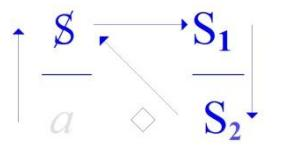

Et ceci il l'a pu, très précisément en raison de cette dimension qui pour lui présentifiait le « *Hautre* » comme tel, à savoir cette haine de sa femme, pour l'appeler par son nom [Xanthippe], cette personne qu'était sa femme au point qu'elle « *s'affemmait* » à tel point, que lui, il a fallu au moment de sa mort qu'il la prie poliment de se retirer pour laisser à la dite mort, toute sa signification politique.

C'est simplement *une dimension d'indication* concernant le point où gît la question que nous sommes en train de soulever.

J'ai dit que si nous pouvons dire *qu'il n'y a pas de rapport sexuel*, ce n'est assurément pas en toute innocence, c'est parce que *l'expérience*, à savoir un mode de *discours* qui n'est point absolument celui *de l'hystérique*, mais celui que j'ai inscrit sous une répartition *quadripodique* comme étant *le discours analytique* :

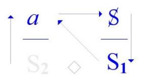

Et que ce qui ressort de ce *discours*, c'est la dimension jamais jusqu'à présent évoquée de *la fonction phallique*, c'est à savoir *ce quelque chose* par quoi ce n'est pas du rapport sexuel que se caractérise au moins l'un des deux termes...

et très précisément celui auquel s'attache ici ce mot : l'*Hun*,

c'est non pas de sa position d'*Hun* qui serait réductible à ce quelque chose qu'on appelle soit *« le mâle »,*  soit dans la terminologie chinoise l'essence du *Yang*

...c'est très précisément au contraire en raison de ce qui après tout mérite d'être rappelé pour accentuer le sens... le sens voilé parce qu'il nous vient de loin

...du terme d'*organe*, c'est justement ce qui n'est *organe* - pour accentuer les choses - que comme un « *ustensile* ».

C'est autour de l'« *ustensile* » que l'expérience analytique nous incite à voir tourner tout ce qui s'énonce du rapport sexuel. Ceci est une nouveauté, je veux dire [*ceci*] *répond à l'émergence d'un discours*, qui assurément n'était jamais venu encore au jour, et qui ne saurait se concevoir sans la préalable émergence du *discours de la science* en tant qu'il est insertion du langage sur *le réel mathématique*.

J'ai dit que ce qui stigmatise ce rapport, d'être dans le langage profondément subverti, est très précisément ceci : qu'il n'y a plus moyen...

comme ça s'est fait pourtant, mais dans une dimension qui me paraît être de mirage ...*il ne peut plus s'écrire* en termes d'essences *mâle* et *femelle*.

Que ce « *ne pouvoir s'écrire* » qu'est-ce que ça veut dire, puisque après tout ça s'est déjà écrit ?

Si je repousse cette *ancienne écriture* au nom du *discours analytique*, vous pourriez m'objecter une objection bien plus valable : que je l'écris moi aussi, puisque aussi bien...

c'est ce que je viens de remettre une fois de plus au tableau

...c'est quelque chose qui prétend supporter d'une écriture - quoi ? - le réseau de l'affaire sexuelle.

| <b>ΞΧ ΦΧ</b> | $\overline{X\Phi} \ \overline{XE}$ |
|--------------|------------------------------------|
| ΑΧ ΦΧ        | $\underline{AX} \ \Phi X$          |

Néanmoins *cette écriture* ne s'autorise, ne prend sa forme que *d'une écriture très spécifiée*, à savoir ce qu'a permis d'introduire dans la logique l'irruption précisément de ce qu'on me demandait tout à l'heure, à savoir une topologie mathématique. Ce n'est qu'à partir de l'existence de la formulation de cette topologie que nous avons pu, de toute proposition*,* imaginer que nous fassions *fonction propositionnelle*, c'est-à-dire quelque chose qui se spécifie de la place vide qu'on y laisse, et en fonction de laquelle se détermine l'argument.

Ici je veux vous faire remarquer que très précisément ce que j'emprunte, à l'occasion, à *l'inscription mathématique*, en tant qu'elle se substitue aux premières formes - je ne dis pas formalisations - aux formes ébauchées par Aristote dans sa *syllogistique*, que donc cette inscription sous le terme *fonction argument* pourrait, semble-t-il, nous offrir un terme aisé à spécifier l'opposition sexuelle.

Qu'y faudrait-il ?

Il y suffirait que *les fonctions* respectives *du mâle* et *de la femelle* se distinguassent très précisément comme le *Yin* et le *Yang*. C'est très précisément de ce que la fonction est unique, il s'agit toujours de !, que s'engendre, comme vous le savez... comme il n'est pas possible, du seul fait que vous soyez ici,

que vous n'en n'ayez pas au moins une petite idée

...que s'engendre la difficulté et la complication.

! affirme qu'il est vrai...

c'est le sens qu'a le terme de *fonction* ...qu'il est vrai que ce qui se rapporte à l'exercice, au registre de l'acte sexuel, relève de *la fonction phallique*.

C'est très précisément en tant qu'il s'agit de *fonction phallique*, de quelque côté que nous regardions, je veux dire : d'un côté ou de l'autre, que quelque chose nous sollicite de demander alors en quoi les deux partenaires diffèrent. Et c'est très précisément ce qu'inscrivent les formules que j'ai mises au tableau.

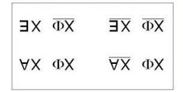

S'il s'avère que du fait de dominer également les deux partenaires, *la fonction phallique* ne les fait pas différents, il n'en reste pas moins que c'est d'abord ailleurs que nous devons en chercher la différence.

- C'est en quoi ces formules celles inscrites au tableau méritent d'être interrogées sur les deux versants :
  - *–* le versant de gauche s'opposant au versant de droite,
  - *–* le niveau supérieur s'opposant au niveau inférieur.

Qu'est-ce que cela veut dire ?

Ce que cela veut dire mérite d'être ausculté, si je puis dire, c'est à savoir d'être interrogé,

je dirais d'abord sur ce en quoi elles peuvent faire montre d'un certain abus.

Il est clair que ce n'est pas parce que j'ai usé d'une formulation faite de l'irruption des mathématiques dans la logique, que je m'en sers tout à fait de la même façon.

Et mes premières remarques vont consister à montrer qu'en effet la façon dont j'en use est telle qu'elle n'est aucunement traductible en termes de *logique des propositions*.

Je veux dire que le mode sous lequel la *variable*... ce qu'on appelle la *variable*, à savoir ce qui fait place à l'*argument* ...est quelque chose qui est ici tout à fait spécifié par la forme quadruple sous laquelle la relation de l'argument à la fonction est posée.

Pour simplement introduire ce dont il s'agit, je vous rappellerai qu'en *logique des propositions,* nous avons de premier plan, - il y en a d'autres - les 4 relations fondamentales qui en quelque sorte sont le fondement de la logique des propositions, qui sont respectivement : *la négation, la conjonction, la disjonction* et *l'implication*.

Il y en a d'autres, mais ce sont les premières, et toutes les autres s'y ramènent. J'avance que la façon dont sont écrites nos positions d'*argument* et de *fonction* est telle que la relation dite de *négation,* par quoi tout ce qui est posé comme *vérité* ne saurait nier *que passer au* « *faux* », *est* très précisément *ce qui ici est insoutenable*.

Car vous pouvez voir qu'au niveau, quel qu'il soit...

je veux dire le niveau inférieur et le niveau supérieur

...où l'énoncé de *la fonction* - à savoir qu'elle est *phallique -* où l'énoncé de la fonction est posé :

- *–* soit *comme une vérité*,
- *–* soit précisément *comme à écarter*,

puisque après tout la vraie vérité ça serait justement ce qui ne s'écrit pas, ce qui ici ne peut s'écrire que sous la forme qui conteste *la fonction phallique*, à savoir : « *Il n'est pas vrai que la fonction phallique soit ce qui fonde le rapport sexuel* ».

Que dans les deux cas, à ces deux niveaux qui sont comme tels indépendants, dont il ne s'agit pas du tout de faire de l'un la négation de l'autre, mais au contraire de l'un l'obstacle à l'autre*,* par contre ce que vous voyez se répartir, c'est justement :

- *–* un « *il existe* » [: §], et un « *il n'existe pas* » [/ §]
- *–* c'est un « *Tout* » d'un côté : « *Tout x* » [; !] à savoir le domaine de ce qui est là ce qui se définit par *la fonction phallique,*  et la différence de la position de l'argument dans *la fonction phallique*, c'est très précisément que ce n'est « *Pas toute* » *femme* qui s'y inscrit [; §].

Vous voyez bien que, loin que l'un s'oppose à l'autre comme sa négation, c'est tout au contraire de leur subsistance, ici très précisément comme niée :

- *–* il y a un x qui peut se soutenir dans cet au-delà de *la fonction phallique* [: §],
- *–* et de l'autre côté il n'y en a pas [/ §], pour la simple raison qu'une femme ne saurait être châtrée pour les meilleures raisons.

C'est un certain niveau, c'est le niveau de ce qui justement nous est barré dans le rapport sexuel tandis qu'au niveau de *la fonction phallique*, c'est très précisément en ce qu'au « *Tout* » s'oppose le « *Pas Toute* » qu'il y a chance d'une répartition de gauche à droite de ce qui se fondera comme *mâle* et comme *femelle*.

Loin donc, que la relation de négation nous force à choisir, c'est au contraire en tant que loin d'avoir à choisir nous avons à répartir, que les deux côtés s'opposent légitimement l'un à l'autre.

J'ai parlé - après *la négation* - de *la conjonction*. *La conjonction*, je n'aurai besoin pour lui régler son compte, dans l'occasion, que de faire la remarque, la remarque dont j'espère qu'il y a ici assez de gens qui auront, comme ça, vaguement broutillé un livre de logique pour que j'aie pas besoin d'insister*,* c'est à savoir que *la conjonction* est fondée très précisément sur ceci qu'elle ne prend valeur que du fait que deux propositions peuvent être toutes deux *vraies*.

Et c'est justement ce que d'aucune façon ne nous permet ce qui est inscrit au tableau, puisque vous voyez bien que de droite à gauche, il n'y a aucune identité et que très précisément là où il s'agit de ce qui est posé comme *vrai,* à savoir c'est justement à ce niveau que *les Universelles* ne peuvent se conjoindre :

*l'Universelle* du côté gauche ne s'opposant - de l'autre côté, du côté droit - qu'au fait qu'il n'y a pas d'*Universelle* articulable, c'est à savoir que la femme, au regard de *la fonction phallique,* ne se situe que de *« pas toute »* y être sujette.

L'étrange est que pour autant *la disjonction* ne tient pas plus. Si vous vous rappelez que *la disjonction* ne prend valeur que du fait que deux propositions ne peuvent... c'est *impossible* qu'elles soient fausses en même temps.

C'est assurément la relation - dirons-nous la plus forte ou la plus faible ? - c'est assurément la plus forte en ceci que c'est celle qui est la plus dure à cuire, puisqu'il faut un minimum pour qu'il y ait *disjonction*

- *–* que *la disjonction* rend valable qu'une proposition soit vraie, l'autre fausse,
- *–* que bien sûr toutes les deux soient vraies,
- *–* à ceci s'ajoutant à ce que j'ai appelé « *l'une vraie, l'autre fausse* », ça peut-être « *l'une fausse, l'autre vraie* ».

Il y a donc au moins 3 cas combinatoires où la disjonction se soutient.

La seule chose qu'elle ne puisse pas admettre, c'est que toutes les deux soient fausses. Or nous avons ici deux fonctions qui sont posées comme *n'étant pas* - je l'ai dit tout à l'heure - *la vraie vérité*, à savoir celles qui sont en haut. Nous semblons ici *tenir quelque chose* qui donne espoir, à savoir qu'à tout le moins nous aurions articulé une véritable *disjonction*.

| <b>Χ</b> Φ ΧΕ | <u>X</u> <u>X</u> |
|---------------|-------------------|
| ΑΧ ΦΧ         | <u>ΑΧ</u> ΦΧ      |

Or remarquez *ce qui est écrit*, qui est quelque chose que j'aurai bien sûr l'occasion d'articuler d'une façon qui le fasse vivre, c'est qu'il n'y a très précisément d'un côté de ce § avec le signe de la négation au-dessus, à savoir que c'est en tant que *la fonction phallique* ne fonctionne pas qu'il y a chance de *rapport sexuel*, que nous avons posé qu'il faut qu'il existe un x pour cela [:§]. Or de l'autre côté qu'avons nous ? Qu'il n'en existe pas ! [/ §]

De sorte qu'on peut dire que le sort de ce qui serait un mode sous lequel se soutiendrait la différenciation *du mâle et de la femelle*, de *l'homme* et de *la femme* chez l'être parlant, cette chance que nous avons qu'il y ait ceci, c'est que si à un niveau il y a discorde…

et nous verrons ce que tout à l'heure j'entends dire par là, je veux dire au niveau des *Universels* qui ne se soutiennent pas du fait de l'*inconsistance* d'un d'entre eux

…que se passe-t-il là où nous écartons la fonction elle-même, c'est que :

- *–* si d'un côté il est supposé qu'il existe un x qui satisfasse à ! nié [:§],
- *–* de l'autre nous avons l'expresse formulation que aucun x [/ §].

Ce que j'ai illustré de dire que la femme, pour les meilleures raisons, ne saurait être châtrée, mais il n'y a justement que l'énoncé « *aucun x* ».

C'est-à-dire qu'au niveau où *la disjonction* aurait chance de se produire, nous ne trouvons :

- *–* d'un côté que 1, ou tout au moins ce que j'ai avancé de l'« *au-moins-un* »,
- *–* et de l'autre très précisément la non existence, c'est-à-dire le rapport de 1 à 0.

Très précisément au niveau où le rapport sexuel aurait chance, non pas du tout d'être réalisé, mais simplement d'être espéré au-delà de l'abolition par l'écart de *la fonction phallique*, nous ne trouvons plus comme présence, oserais-je dire, que *l'un des deux sexes*.

C'est très précisément ceci qui est évidemment ce qu'il nous faut rapprocher de l'expérience telle que vous êtes habitués à la voir s'énoncer sous cette forme que la femme suscite de ce que *l'Universel* pour elle ne sache surgir de *la fonction phallique*, où elle ne participe comme vous le savez... ceci est l'expérience, hélas trop quotidienne pour ne pas voiler la structure

...où elle ne participe qu'à la vouloir,

- *–* soit la ravir à l'homme,
- *–* soit mon Dieu qu'elle lui en impose le service, pour le cas « *…ou pire* », c'est le cas de le dire, qu'elle le lui rende.

Mais très précisément ceci ne l'universalise pas, ne serait-ce que de ceci, qui est cette racine du « *pas toute* », qu'elle recèle une autre jouissance que *la jouissance phallique* : *la jouissance dite* proprement *féminine* qui n'en dépend nullement.

Si la femme n'est « *pas toute* », c'est que *sa jouissance*, elle, est duelle. Et c'est bien ce qu'a révélé Tirésias quand il est revenu d'avoir été par la grâce de Zeus, Thérèse pour un temps, avec naturellement la conséquence que l'on sait, et qui était là enfin comme étalée, si je puis dire visible, c'est le cas de le dire pour Œdipe, pour lui montrer ce qui l'attendait comme d'avoir existé justement, lui, comme homme de cette possession suprême qui résultait de la duperie où sa partenaire le maintenait, de la véritable nature de ce qu'elle offrait à sa *jouissance*, ou bien disons-le autrement :

faute que sa partenaire lui *demandât de refuser ce qu'elle lui offrait*.

Ceci évidemment manifestant, mais au niveau du mythe, ceci : que pour exister comme homme à un niveau qui échappe à *la fonction phallique*, il n'avait d'autre femme que celle-là qui pour lui n'aurait justement pas dû exister. Voilà !

Pourquoi ce « *n'aurait pas dû* », pourquoi la théorie de l'inceste, ça rendrait nécessaire que je m'engage sur cette voie des *Noms du Père* où précisément j'ai dit que je ne m'engagerai plus jamais ? C'est comme ça !

Parce qu'il s'est trouvé que j'ai relu... parce que quelqu'un m'en a prié ...cette première conférence de l'année 1963, ici même - hein ! - à Sainte Anne.

C'est bien pour ça que j'y suis revenu, parce que j'aimais m'en rappeler, j'ai relu ça, ça se lit, ça a même une certaine dignité, de sorte que je la publierai si je publie encore, ce qui ne dépend pas de moi ! Il faudrait que d'autres publient un peu avec moi, ça m'encouragerait.

Et si je le publie, on verra avec quel soin j'ai repéré alors...

mais je l'ai déjà dit depuis cinq ans sur un certain nombre de registre ...*la métaphore paternelle* notamment, *le nom propre*, il y avait tout ce qu'il fallait pour que, avec la Bible, on donne un sens à cette élucubration mythique de mes dires.

Mais je ne le ferai plus jamais, je ne le ferai plus jamais parce qu'après tout je peux me contenter de formuler les choses au niveau de la structure logique qui, après tout, a bien ses droits. Voilà !

Ce que je veux vous dire, c'est que cet /, à savoir *« qu'il n'existe pas »,* rien d'autre qui à un certain niveau, celui où il y aurait chance qu'il y ait le rapport sexuel, que cet ετερος [eteros] en tant qu'absent [/ §], c'est pas du tout forcément le privilège du sexe féminin.

C'est simplement l'indication de ce qui est dans mon *graphe*...

je dis ça parce que ça a eu son petit sort

...de ce que j'inscris du signifiant de A *barré* [A], ça veut dire : l'Autre, d'où qu'on le prenne, l'Autre est absent à partir du moment où il s'agit du *rapport sexuel*.

Naturellement au niveau de ce qui fonctionne...

c'est-à-dire *la fonction phallique*

...il y a simplement cette *discorde* que je viens de rappeler, à savoir que d'un côté et de l'autre, là pour le coup on n'est pas dans la même position, à savoir que :

- *–* d'un côté on a l'*Universelle* fondée sur un rapport nécessaire à *la fonction phallique,*
- *–* et de l'autre côté un rapport *contingent* parce que la femme n'est « *pas toute* ».

Je souligne donc qu'au niveau supérieur le rapport fondé sur la disparition, l'évanouissement de l'existence de l'un des partenaires *qui laisse la place vide à l'inscription de la parole*, n'est pas à ce niveau-là le privilège d'aucun côté. Seulement pour qu'il y ait fondement du sexe, comme on dit, il faut qu'ils soient deux : 0 et 1 assurément *ça fait* 2, ça fait deux sur le plan *symbolique*, à savoir pour autant que nous accordons que *l'existence* s'enracine dans le *symbole*. C'est ce qui définit *l'être parlant*.

Assurément il est quelque chose. Peut-être bien, qui est-ce qui n'est pas ce qu'il est ? Seulement cet « *être* », il est absolument insaisissable. Et il est d'autant plus insaisissable qu'il est forcé pour se supporter de passer par le *symbole*. Il est clair qu'un *être*, qui en vient à n'*être*, que du symbole, est justement *cet être sans être*, auquel - du seul fait que vous parliez - vous participez tous.

Mais par contre il est bien certain que ce qui se supporte c'est *l'existence*, et pour autant qu'*exister c'est pas être*, c'est-à-dire c'est dépendre de *l'Autre*.

Vous êtes bien là, tous par quelque côté, à *exister*, mais pour ce qui est de votre *être*, vous n'êtes pas tellement tranquilles ! Autrement vous ne viendriez pas en chercher l'assurance dans tant d'efforts psychanalytiques*.*

C'est évidemment là quelque chose qui est tout à fait originel dans la première émergence de la logique. Dans la première émergence de la logique il y a quelque chose qui est tout à fait frappant, c'est la difficulté, la difficulté et le flottement, qu'Aristote manifeste à propos du statut de *la proposition particulière*.

Ce sont des difficultés qui ont été soulignées ailleurs, que je n'ai pas découvertes, et pour ceux qui voudront s'y reporter, je leur conseille le cahier n° 10 des *« Cahiers pour l'analyse »* où un premier article d'un nommé Jacques Brunswig est là-dessus excellent. Ils y verront parfaitement pointée la difficulté qu'Aristote a avec la *Particulière*.

C'est qu'assurément il perçoit que l'existence d'aucune façon ne saurait s'établir que hors *l'Universel*, c'est bien en quoi il situe l'existence au niveau de *la Particulière*, laquelle *Particulière* n'est nullement suffisante pour la soutenir, encore qu'il en donne l'illusion grâce à l'emploi du mot « *quelque* ».

Il est clair qu'au contraire ce qui résulte de la formalisation dite *des quanteurs*, dite *des quanteurs* en raison d'une trace laissée dans l'histoire philosophique, par le fait qu'un nommé Apulée qui était un romancier pas de très bon goût et un mystique certainement effréné, et qui s'appelait - je vous l'ai dit - Apulée. Il a fait « *L'âne d'or* ». C'est cet Apulée qui un jour a introduit que dans Aristote, ce qui concernait le « *tous* » et le « *quelque* » était de l'ordre de la quantité.

Ce n'est rien de tel, c'est au contraire simplement deux modes différents de ce que je pourrais appeler, si vous me passez ça qui est un peu improvisé, *l'incarnation du symbole*, à savoir que le passage dans la vie courante, qu'il y ait des « *tous* » et des « *quelque* » dans toutes les langues,

c'est bien là ce qui assurément nous force à poser que le langage doit tout de même avoir une racine commune, et que... comme les langues sont très profondément différentes dans leur structure,

...il faut bien que ce soit par rapport à *quelque chose* qui n'est pas le langage.

Bien sûr, on comprend ici que les gens glissent, et que sous prétexte que ce qu'on pressent être que cet *au-delà du langage* ne peut-être que *mathématique*, on s'imagine, parce que c'est *le nombre*, qu'il s'agit de *la quantité*.

Mais peut-être justement n'est-ce pas à proprement parler *le nombre* dans toute sa réalité auquel le langage donne accès, mais seulement d'être capable d'accrocher le 0 et le 1. Ce serait par là que se serait faite l'entrée de ce *réel*, ce *réel* seul à pouvoir être l'au-delà du langage,

à savoir le seul domaine où peut se formuler *une impossibilité symbolique*.

Ce fait que, du *rapport,* lui accessible au langage, accessible au langage *s'il est fondé* très justement *du non-rapport sexuel*, qu'il ne puisse donc qu'*affronter* le 0 et le 1, ceci trouverait aisément son reflet dans l'élaboration par Frege de sa genèse logique des nombres.

Je vous ai dit - indiqué tout au moins - ce qui fait difficulté dans cette genèse logique, à savoir justement *la béance*... *la béance* que je vous ai soulignée du triangle mathématique

...entre ce 0 et ce 1, *béance* que redouble leur opposition d'*affrontement*.

Que déjà ce qui peut intervenir, ne soit là que du fait que ce soit là l'essence du 1 er couple, que ce ne puisse être qu'un 3 ème et que *la béance* comme telle soit toujours laissée du 2, c'est là quelque chose d'essentiel à rappeler, en raison de quelque chose *de bien plus dangereux* à laisser subsister dans l'analyse, que les aventures mythiques d'Œdipe, qui sont en elles-mêmes sans aucun inconvénient pour autant qu'elles structurent admirablement la nécessité qu'il y ait quelque part « *au moins Un* » qui transcende ce qu'il en est de la prise de *la fonction phallique*.

Le mythe du « *Père primitif* » ne veut rien dire d'autre. Ceci y est très suffisamment exprimé pour que nous puissions en faire aisément usage, outre que nous le trouvons confirmé par la structuration logique qui est celle que je vous rappelle de ce qui est inscrit au tableau.

Par contre, assurément rien de plus dangereux que les confusions sur ce qu'il en est de l'*Un*. L'*Un*, comme vous le savez, est fréquemment évoqué par Freud comme signifiant ce qu'il en est d'une essence de l'*Éros* qui serait celle justement de *la fusion*, à savoir que la *libido* serait de cette sorte d'essence qui des 2 tendrait à faire *Un,* et qui - mon Dieu - selon un vieux mythe...

qui assurément n'est pas du tout de bonne mystique

...serait ce à quoi tiendrait une des tensions fondamentales du monde, à savoir de ne faire qu'*Un*. Ce mythe qui est véritablement quelque chose qui ne peut fonctionner qu'à un horizon de délire et qui n'a à proprement parler rien à faire avec quoi que ce soit que nous rencontrions dans l'expérience.

S'il y a *quelque chose* qui est bien patent dans les rapports entre les sexes...

et que l'analyse non seulement articule, mais est faite pour faire jouer dans tous les sens ...s'il y a bien *quelque chose* qui dans les *rapports* fait difficulté, c'est très précisément les rapports entre *les femmes* et *les hommes* et que rien ne saurait y ressembler à je ne sais quoi de *spontané*, hors précisément cet horizon dont je parlais tout à l'heure comme étant à la limite fondé sur je ne sais quel mythe animal et que d'aucune façon l'*Éros,* soit une tendance à l'*Un*. Bien loin de là!

C'est dans cette mesure, c'est dans cette fonction que toute articulation précise de ce qu'il en est des deux niveaux...

de ce où ce n'est que dans *la discorde* que se fonde l'opposition entre les sexes

en tant qu'ils ne pourraient d'aucune façon s'instituer d'un *Universel*

...qu'au niveau de l'existence - au contraire - c'est très précisément dans une opposition qui consiste dans *l'annulation, le vidage, d'une des fonctions comme étant celle de l'autre, que recèle la possibilité de l'articulation du langage,* c'est cela qui me paraît essentiellement à mettre en évidence.

Observez que tout à l'heure, vous ayant parlé successivement *de la négation, de la conjonction et de la disjonction*, je n'ai pas poussé jusqu'au bout de ce qu'il en était *de l'implication*.

Il est clair qu'ici encore l'*implication,* elle, ne saurait fonctionner qu'entre les deux niveaux :

- *– celui de la fonction phallique,*
- *–* et *celui qui l'écarte*.

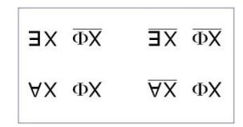

Or, rien de ce qui est *disjonction*, au niveau inférieur, au niveau de l'insuffisance de la spécification universelle, rien n'implique pour autant, rien n'exige, que ce soit *si et si seulement* la syncope d'existence...

qui se produit au niveau supérieur

...effectivement se produise, pour que la discorde du niveau inférieur soit exigible, et très précisément réciproquement.

Par contre ce que nous voyons, c'est une fois de plus fonctionner...

d'une façon, mais distincte, mais séparée

...la relation du niveau supérieur au niveau inférieur.

L'exigence qu'il existe « *au-moins-un-homme* »...

qui est celle qui paraît émise au niveau de ce *féminin* qui se spécifie d'être un « *pas-toute* », une dualité ...le seul point où la dualité a chance d'être *représentée,* il n'y a là qu'un réquisit, si je puis dire, gratuit.

Cet « *au-moins-un »*, rien ne l'impose sinon la chance unique - encore faut-il qu'elle soit jouée - de ce que *quelque chose* fonctionne sur l'autre versant, mais comme un *point idéal*, comme possibilité pour tous les hommes d'y atteindre. Par quoi ? Par identification ! Il n'y a là qu'une nécessité logique qui ne s'impose qu'au niveau du pari.

Mais observez par contre ce qu'il en résulte concernant *l'Universelle barrée*…

et c'est en quoi cet *au-moins-un* dont se supporte le *Nom du Père*, le *Nom du Père mythique*, est indispensable …c'est ici que j'avance un aperçu qui est celui qui manque à *la fonction*, à la notion de *l'espèce* ou de *la classe*. C'est en ce sens que ce n'est pas par hasard que toute cette dialectique dans les *formes aristotéliciennes* a été manquée.

Où fonctionne enfin cet :, cet *« il en existe au-moins-un »* qui ne soit pas serf de *la fonction phallique ? Ce n'est que d'un requisit*, je dirais du type *désespéré*, du point de vue de quelque chose qui même ne se supporte pas d'une définition universelle.

Mais par contre observez qu'au regard de *l'Universelle* marquée ; !, tout mâle est serf de *la fonction phallique*. Cet *au-moins-un* comme fonctionnant d'y échapper, qu'est-ce à dire ? Je dirai que c'est l'*exception*.

C'est bien la fois où ce que dit - sans savoir ce qu'il dit - le proverbe que « *l'exception confirme la règle* », se trouve pour nous supportée. Il est singulier que ce ne soit qu'avec *le discours analytique* que ceci, qu'un *Universel* puisse trouver, dans *l'existence de l'exception*, son fondement véritable. Ce qui fait qu'assurément nous pouvons en tout cas distinguer l'*Universel* ainsi fondé de tout usage rendu commun par la tradition philosophique du dit *Universel*.

Mais il est une chose singulière que je retrouve par voie d'enquête...

et parce que d'une formation ancienne je n'ignore pas tout à fait le chinois ...j'ai demandé à un de mes chers amis de me rappeler ce qu'évidemment je n'avais gardé plus ou moins que comme trace et ce qu'il a fallu que je me fasse confirmer par quelqu'un dont c'est la langue maternelle, il est assurément très étrange que dans le chinois la dénomination du « *tout homme* »,

- *–* qu'il s'agisse de l'articulation de *dōu*, que je ne vous écris pas au tableau parce que je suis fatigué,
- *–* ou de l'articulation plus ancienne qui se dit *quán*...

Enfin si ça vous amuse, je vais quand même vous l'écrire :

 *dōu* : 都*, quán* : 全

Est-ce que vous vous imaginez qu'on peut dire, par exemple : « *Tous les hommes bouffent* », eh bien ça se dit :

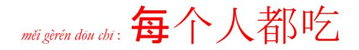

« *Měi* » insiste sur le fait qu'il est bien là, et si vous en doutiez, la numérale « *gè* » montre bien qu'on les compte. Mais ça ne les fait pas « *tous* », on ajoute « *dōu* » ce qui veut dire « *sans exception* » **10** . Je pourrais vous citer bien sûr, d'autres choses, je peux vous dire que « *Tous les soldats ont péri* », ils sont tous morts, en chinois ça se dit : « *Soldats sans exception caput* ».

Le « *tout* » que nous voyons pour nous s'étaler de l'intérieur et ne trouver sa limite que de l'*inclusion*, d'être pris dans des ensembles de plus en plus vastes.

En langue chinoise, on ne dit jamais « *měi* » ni « *dōu* » qu'en pensant la totalité dont il s'agit comme contenu. Vous me direz : « *sans exception* », mais bien sûr ce que nous, nous découvrons dans ce que je vous articule comme relation ici de *l'existence unique* par rapport au statut de *l'universel,* prend figure d'une *exception.* Mais aussi bien n'est-ce, cette idée-là, que le corrélat de ce que j'ai appelé tout à l'heure « *le vide de l'Autre* ».

Ce en quoi nous avons progressé dans *la logique des classes*, c'est que nous avons créé *la logique des ensembles*. La différence entre *la classe* et *l'ensemble,* c'est que :

*–* quand *la classe* se vide il n'y a plus de *classe,* 

*–* mais que quand *l'ensemble* se vide, il y a encore cet élément de *l'ensemble vide* [Ø].

C'est bien en quoi, une fois de plus, la mathématique fait faire un progrès à *la logique*.

Et c'est ici que nous pourrons...

puisque nous continuons à nous entretenir, mais que ça va finir bientôt, je vous l'assure ...c'est de voir alors là où reprendre l'unilatérité de la fonction existentielle pour ce qui est de l'autre, de l'autre partenaire en tant qu'il est « *sans exception* ».

Ce « *sans exception* », qu'implique la *non-existence de* X [/ §] dans la partie droite du tableau, à savoir qu'il n'y a pas d'exception et que c'est là quelque chose qui n'a plus ici de parallélisme, de symétrie avec l'exigence que j'ai appelée tout à l'heure « *désespérée* » de l'*au-moins-un*, c'est une exigence autre et qui repose sur ceci : c'est qu'en fin de compte l'*Universel* masculin peut prendre son assiette dans l'assurance qu'il n'existe pas de femme qui ait à être châtrée, et ceci pour des raisons qui lui paraissent évidentes.

Seulement ceci n'a en fait, vous le savez, pas plus de portée pour la raison que c'est une assurance tout à fait gratuite, à savoir que ce que j'ai rappelé tout à l'heure du comportement de la femme, montre assez que sa relation à *la fonction phallique* est tout à fait active.

Seulement là comme tout à l'heure, si la supposition fondée sur, en quelque sorte, *l'assurance qu'il s'agit bien d'un impossible*... ce qui est le comble du *réel*

...ceci n'ébranle pas pour autant *la fragilité*, si je puis dire, *de la conjecture*

parce qu'en tout cas la femme n'en est pas plus assurée dans son *essence universelle*,

pour la simple raison de ceci : c'est que le contraire de *la limite*, à savoir : qu'il n'y en ait pas, qu'ici il n'y ait pas *d'exception*, le fait qu'il n'y ait pas d'exception n'assure pas plus *l'Universel*...

déjà si mal établi en raison de ceci qu'il est discordant

...n'assure pas plus *l'Universel de la femme*.

Le « *sans exception* », bien loin de donner à quelque « *Tout* » une consistance, naturellement en donne encore moins à ce qui se définit comme « *pas-tout* », *comme essentiellement duel*. Voilà ! Je souhaite que ceci vous reste comme cheville nécessaire à ce que nous pourrons tenter ultérieurement comme grimpette, si assurément nous sommes portés sur la voie où doit sévèrement s'interroger l'irruption de cette chose la plus étrange, à savoir *la fonction de l'Un*.

On se demande bien des choses sur ce qu'il en est de la mentalité animale qui ne nous sert après tout ici que de référence *en miroir*, un miroir devant lequel - comme devant tous les miroirs - on dénie purement et simplement.

Il y a quelque chose qu'on pourrait se demander : pour l'animal, y-a-t-il de l'*Un* ? Le côté exorbitant de l'émergence de cet *Un*, c'est ce que nous serons amenés ailleurs à tenter de frayer, et c'est bien pour cela que depuis longtemps je vous ai invités à relire, avant que je l'aborde, le « *Parménide »* de Platon.

 10 Cf. sur le site « *[Lacanchine](http://www.lacanchine.com/Accueil.html)* » les articles de Guy Flecher, Guy Sizaret...

C'est un drôle d'emploi du temps, mais enfin pourquoi pas : pendant le week-end il m'arrive de vous écrire. C'est une façon de parler, j'écris parce que je sais que dans la semaine on se verra. Enfin le week-end dernier, je vous ai écrit. Naturellement, dans l'intervalle, j'ai eu tout à fait le temps d'oublier cette écriture et je viens de la relire pendant le dîner hâtif que je fais pour être là à l'heure. Je vais commencer par là.

Naturellement c'est un peu difficile, mais peut-être que vous prendrez des notes. Puis après ça, je dirai les choses que j'ai pensées depuis, en pensant plus réellement à vous.

J'avais écrit ceci...

que bien sûr je ne livrerai jamais à la *poubellication,*

je ne vois pas pourquoi j'augmenterai le contenu des bibliothèques

...il y a *deux horizons du signifiant*.

Là-dessus écrit, je fais une accolade...

comme c'est écrit, il faut que vous fassiez attention, je veux dire que vous ne croyiez pas comprendre

...alors dans l'accolade :

- *–* il y a *le maternel,* qui est aussi *le matériel,*
- *–* et puis il y a écrit le *mathématique*.

J'y serai forcé, je le sais, mais enfin je ne peux pas me mettre tout de suite à parler, sans ça je ne vous lirai jamais ce que j'ai écrit. Peut-être que dans la suite, j'aurai à revenir sur cette distinction dont je souligne qu'elle est d'horizon.

Les articuler, je veux dire comme tels...

ça c'est une parenthèse, je l'ai pas écrit

...je veux dire les articuler dans chacun de ces deux horizons, c'est donc...

ça, je l'ai écrit

...c'est donc procéder selon ces horizons eux-mêmes, puisque la mention de leur « *au-delà* » - au-delà de l'horizon – ne se soutient que de leur position...

quand ça vous ennuiera vous me le direz

et je vous raconterai les choses que j'ai à vous raconter ce soir

...de leur position - écris-je - en *un discours* de fait.

Pour *le discours analytique* ce « *de fait* » m'implique assez dans ses effets pour qu'on le dise être de mon fait, qu'on le désigne par mon nom.

L'*a-mur* - ce que j'ai désigné ici pour tel - le répercute diversement avec les moyens de ce qu'on appelle justement « *le bord* », de ce « *bord-homme* ». Le « *bord-homme* » ça m'a inspiré - je l'ai écrit ça - : « *brrom 'brrom -ouap - ouap* ». C'était une trouvaille d'une personne qui dans l'ancien temps m'a donné des enfants.

C'est une indication concernant :

- *–* la voix *l'(a)-voix* qui comme chacun sait *aboie*,
- *–* et *l'(a)-regard* aussi, qui n'y « *(a)regarde pas de si près* »,
- *–* et *l'(a)stuce* qui fait l'astuce,
- *–* et puis *l'(a)merde* aussi, qui fait de temps en temps *graffito*

d'intentions plutôt injurieuses dans les pages journalistiques, à mon nom.

Bref, c'est *l'(a)vie*, comme dit une personne qui se divertit pour l'instant, c'est gai ! C'est vrai, en somme.

Ces effets n'ont rien à faire avec la dimension qui se mesure de mon fait, c'est à savoir que c'est *d'un discours* qui n'est pas le mien propre que je fais la dimension nécessaire. C'est du *discours analytique* qui pour n'être pas encore - et pour cause ! - proprement institué, se trouve avoir besoin de quelques frayages à quoi je m'emploie. Á partir de quoi ? Seulement de ceci en fait que ma position en est déterminée*.*

Bon. Alors maintenant, parlons de *ce discours* et du fait qu'y est essentielle *la position* comme telle du *signifiant*. Je voudrais quand même, vu ce public que vous constituez, vous faire une remarque : c'est que cette *position du signifiant* se dessine d'une expérience qu'il est à la portée de chacun de vous, de faire, pour vous apercevoir de quoi il s'agit et combien c'est essentiel.

Quand vous connaissez imparfaitement une langue et que vous lisez un texte, eh bien vous comprenez, vous comprenez toujours. Ça devrait vous mettre un peu en éveil. Vous comprenez dans le sens où - d'avance - vous savez ce qui s'y dit. Bien sûr, il en résulte que le texte peut se contredire.

Quand vous lisez par exemple un texte sur *la Théorie des Ensembles*,

on vous explique ce qui constitue l'ensemble infini des nombres entiers.

À la ligne suivante on vous dit quelque chose que vous comprenez, parce que vous continuez de lire :

« *Ne croyez pas que c'est parce que ça continue toujours qu'il est infini* ».

Comme on vient de vous expliquer que c'est pour ça qu'il l'est, vous sursautez.

Mais quand vous y regardez de près, vous trouvez le *terme* qui désigne qu'il s'agit de « *deem* » [*juger, estimer*], c'est-à-dire que ce n'est pas sur ça que vous devez juger, parce qu'ils savent qu'elle ne s'arrête pas cette série des nombres entiers, qu'elle est infinie, c'est pas parce qu'elle est indéfinie.

De sorte que vous vous apercevez que c'est parce que,

- *–* soit vous avez sauté « *deem* »,
- *–* soit vous n'êtes pas assez familier avec l'anglais, que vous avez compris trop vite,

c'est-à-dire que vous avez sauté cet élément essentiel qui est celui d'un *signifiant* qui rend possible *ce changement de niveau*, grâce auquel vous avez eu un instant le sentiment d'une contradiction.

II ne faut jamais sauter un *signifiant*.

C'est dans la mesure où le *signifiant* ne vous arrête pas que vous comprenez.

Or comprendre, c'est être toujours compris soi-même dans les effets du discours,

lequel discours en tant que tel ordonne les effets du savoir déjà précipités par le seul formalisme du signifiant.

Ce que la psychanalyse nous apprend, c'est que : tout savoir naïf...

ça c'est écrit, et c'est pour ça que *je le lis*

...est associé à un voilement de *la jouissance* qui s'y réalise et pose la question de ce qui s'y trahit *des limites de la puissance*, c'est-à-dire - quoi ? - du tracé imposé à *la jouissance*.

Dès que nous parlons - c'est un fait ! nous supposons quelque chose à ce qui se parle, ce quelque chose que nous imaginons pré-posé, encore qu'il soit sûr que nous ne le supposions jamais qu'après-coup.

C'est seulement au fait de parler que se rapporte, dans l'état actuel de nos connaissances, que puisse s'apercevoir que *ce qui parle* - quoi que ce soit - *est ce qui jouit de soi comme corps*.

Ce qui jouit d'un corps qu'il vit comme...

ce que j'ai déjà énoncé

...du « *tu-able* », c'est-à-dire comme *tutoyable*, d'un corps qu'il *tutoie* et d'un corps à qui il dit « *tue-toie* » dans la même ligne.

### La psychanalyse, qu'est-ce ?

C'est le repérage de ce qui se comprend d'obscurci, de ce qui s'obscurcit en compréhension, du fait d'un *signifiant* qui a marqué un point du corps.

La psychanalyse, c'est ce qui reproduit... vous allez retrouver les rails ordinaires ...c'est ce qui reproduit une production de la *névrose*.

Là-dessus tout le monde est d'accord.

Il n'y a pas un psychanalyste qui ne s'en soit aperçu. Cette *névrose* qu'on attribue - non sans raison - à l'action des parents, n'est atteignable que dans toute la mesure où l'action des parents s'*articule* justement... c'est le terme par quoi j'ai commencé la troisième ligne

...de la position du psychanalyste.

C'est dans la mesure où elle converge vers *un signifiant* qui en émerge, que la *névrose* va s'ordonner selon le discours dont les effets ont produit le sujet : tout parent traumatique est en somme dans la même position que le psychanalyste. La différence c'est que :

- *–* le psychanalyste, de sa position, reproduit la *névrose*
- *–* et que le parent traumatique, lui, la produit innocemment.

Ce dont il s'agit c'est - ce signifiant - de le *reproduire* à partir de ce qui d'abord a été son *efflorescence*. Faire un « *modèle* » de la *névrose*, c'est en somme l'opération du *discours analytique*. Pourquoi ?

Dans la mesure où il y ôte la *« cote »* de *jouissance* ! *La jouissance* exige en effet le privilège : il n'y a pas deux façons d'y faire pour chacun. *Toute reduplication la tue* : elle ne survit qu'à ce que *la répétition* en soit *vaine*, c'est-à-dire toujours la même.

C'est l'introduction du « *modèle* » qui, cette répétition vaine, l'achève. Une répétition achevée la dissout, de ce qu'elle soit une répétition simplifiée. C'est toujours bien sûr *du signifiant* que je parle quand je parle du « *yadl'un* ».

Pour étendre ce « *dl'un* » à la mesure de son empire... puisqu'il est assurément *le signifiant-maître* ...il faut l'approcher là où on l'a laissé à ses talents, pour le mettre lui, au pied du mur.

Voilà ce qui rend utile comme incidence, le point où j'en suis arrivé cette année, n'ayant le choix que de ça « ...*Ou pire* », cette référence mathématique, ainsi appelée parce que c'est l'ordre où règne le mathème, c'est-à-dire ce qui produit un *savoir* qui, de n'être que produit, est lié aux normes du *plus-de-jouir*, c'est-à-dire du mesurable.

Un mathème c'est ce qui proprement - et seul - s'enseigne. Ne s'enseigne que *l'Un*. Encore faut-il savoir de quoi il s'agit. Et c'est pour ça que cette année, je l'interroge.

Je ne poursuivrai pas plus loin ma lecture, que j'ai lue - je pense - assez lentement - et qui est assez difficile pour que, sur chacun de ses termes que j'ai bien épelés, quelques questions pour vous s'accrochent. Et c'est pour ça que maintenant, je vais vous parler plus librement.

Il y a quelqu'un, l'autre jour, qui au sortir du dernier truc au Panthéon... il est peut-être là encore ...est venu m'interpeller sur le sujet de savoir « *si je croyais à la liberté* ».

Je lui ai dit qu'il était drôle, et puis comme je suis toujours assez fatigué, j'ai rompu avec lui, mais ça ne veut pas dire que je ne serai pas prêt, là-dessus, à lui faire personnellement quelques confidences.

Il est un fait que j'en parle rarement. En sorte que cette question est de son initiative. Je ne déplorerai pas de savoir pourquoi il me l'a posée.

Ce que je voudrais alors plus librement dire, c'est que faisant allusion dans cet écrit à ce en quoi, à ce par quoi je me trouve en position, ce *discours analytique*, de le frayer, c'est bien évidemment en tant que je le considère comme constituant, au moins en puissance, cette sorte de *structure* que je désigne du terme de *discours*, c'est-à-dire ce par quoi, par l'effet pur et simple du langage, *se précipite un lien social*.

On s'est aperçu de ça sans avoir besoin pour autant de la psychanalyse. C'est même ce qu'on appelle couramment « *idéologie* ».

La façon dont un discours s'ordonne de façon telle qu'*il précipite un lien social* comporte, inversement, que tout ce qui s'y articule s'ordonne de ses effets.

C'est bien ainsi que j'entends ce que pour vous j'articule du *discours de la psychanalyse* : c'est que s'il n'y avait pas de pratique psychanalytique, rien de ce que je puis en articuler n'aurait d'effets que je puisse attendre.

# Je n'ai pas dit « *n'aurait de sens* ».

*Le propre du sens c'est* d'être toujours confusionnel, c'est-à-dire *de faire le pont,* de croire faire le pont, entre

- *– un discours* en tant que s'y précipite un lien social,
- *– avec ce qui*, d'un autre ordre, *provient d'un autre discours*.

L'ennuyeux c'est que quand vous procédez, comme je viens de dire dans cet écrit « qu'il est question de procéder », c'est-à-dire de viser d'un discours ce qui y fait fonction de l'*Un*, qu'est-ce que je fais en l'occasion ?

Si vous me permettez ce néologisme, *je fais de l'unologie*. Avec ce que j'articule n'importe qui peut faire une *ontologie*, d'après ce qu'il suppose au-delà justement de ces deux horizons, que j'ai marquée être définis comme *horizons du signifiant*.

On peut se mettre, dans *le discours universitaire,* à reprendre de ma construction le modèle, en y supposant en un point arbitraire je ne sais quelle essence qui deviendrait - on ne sait d'ailleurs pourquoi - la valeur suprême. C'est tout particulièrement propice à ce qui s'offre au *discours universitaire* dans lequel ce dont il s'agit c'est, selon le diagramme que j'en ai dessiné, de mettre S2 - où ? - à la place du *semblant*.

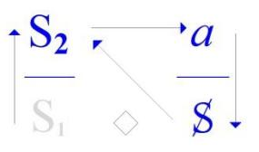

Avant qu'un *signifiant* soit vraiment mis à sa place, c'est-à-dire justement repéré de l'idéologie pour laquelle il est produit, il a toujours des effets de circulation. *La signification précède* dans ses effets *la reconnaissance de sa place*, sa place instituante. Si *le discours universitaire* se définit de ce que *le savoir* y soit mis en position de *semblant*, c'est ce qui se contrôle, c'est ce qui se confirme de la nature même de l'enseignement où, qu'est-ce que vous voyez ?

C'est une fausse mise en ordre de ce qui a pu « *s'éventailler* », si je puis dire, au cours des siècles, *d'ontologies diverses*. Son sommet, *son culmen* c'est ce qui s'appelle glorieusement *L'histoire de la philosophie*, comme si la philosophie n'avait pas... et c'est amplement démontré

...son ressort dans les aventures et mésaventures du *discours du Maître*, qu'il faut bien de temps en temps renouveler.

La cause des chatoiements de la philosophie est, comme c'est suffisamment affirmé à partir des points d'où justement est sortie la notion d'idéologie, comme si donc la cause dont il s'agit ne gisait pas ailleurs. Mais il est difficile que tout procès d'articulation d'un discours - surtout s'il ne s'est pas encore repéré – donne prétexte à un certain nombre de soufflures prématurées de nouveaux « *êtres* ».

Je sais bien que tout ça n'est pas facile et qu'il faut quand même...

ce dans la bonne tradition de ce que je fais ici

...que je vous dise des choses plus amusantes.

Alors parlons de « *L'analyste et l'amour* ». L'*amour* dans l'analyse...

et bien entendu c'est du fait de la position de l'analyste

...*l'amour on en parle*. Toutes proportions gardées, *on n'en parle pas plus qu'ailleurs*, puisqu'après tout *l'amour c'est à ça que ça sert*.

Ce n'est pas ce qu'il y a de plus réjouissant, mais enfin dans le siècle, on en parle beaucoup. Il est même prodigieux - depuis le temps ! - qu'on continue à en parler, parce qu'enfin depuis le temps, on aurait pu s'apercevoir que ça ne réussit pas mieux pour autant.

Il est donc clair que *c'est en parlant qu'on fait l'amour*.

Alors l'analyste, quel est son rôle là-dedans ?

Est-ce que vraiment une analyse peut faire réussir *un amour* ?

Je dois vous dire, quant à moi... [*Rires*], que je n'en connais pas d'exemple. Et pourtant j'ai essayé ! [*Rires*]

C'était pour moi - bien sûr, parce que je ne suis pas complètement né des dernières pluies - une gageure. J'espère que la personne dont il s'agit n'est pas là, j'en suis quasiment sûr [*Rires*] !

J'ai pris quelqu'un, Dieu merci, que je savais d'avance avoir besoin d'une psychanalyse, mais sur la base de cette *demande*... vous vous rendez compte de ce que je peux faire comme saloperies pour vérifier mes affirmations

...sur la base de ceci : qu'il fallait à tout prix qu'il ait le *conjugo* avec la dame de son cœur.

Naturellement, bien sûr ça a raté - Dieu merci ! - dans les plus brefs délais ! Bon, abrégeons, parce que tout ça ce sont des anecdotes.

C'est une autre histoire, mais comme ça, un jour où je serai en veine et où je me risquerai à faire du La Bruyère, je traiterai la question des rapports de l'*amour* avec le *semblant*. Mais nous ne sommes pas là ce soir pour nous attarder à ces babioles !

Il s'agit de savoir ceci, sur quoi je reviens parce qu'il me semblait avoir frayé la chose, c'est le rapport de tout ça que je suis en train de ré-énoncer, que je vous rappelle d'une brève *touche des vérités d'expérience*, c'est de savoir la fonction dans la psychanalyse, du *sexe*.

Je pense quand même là-dessus avoir frappé les oreilles, même les plus sourdes, par l'énoncé de ceci qui mérite d'être commenté : *qu'il n'y a pas de rapport sexuel*. Bien sûr cela mérite d'être articulé.

Pourquoi est-ce que *le psychanalyste* s'imagine que ce qui fait le fond de ce à quoi il se réfère, c'est *le sexe* ? Que le sexe ça soit réel, ceci ne fait pas le moindre doute. Et sa structure même, c'est le duel, le nombre « *deux* ».

Quoi qu'on en pense, il y en a deux : les hommes, les femmes, dit-on, et on s'obstine à y ajouter les auvergnats ! [*Rires*] C'est une erreur ! Au niveau du *réel* il n'y a pas d'auvergnats. Ce dont il s'agit quand il s'agit de sexe c'est de *l'autre*, de *l'autre sexe*, même quand on y préfère le même.

C'est pas parce que j'ai dit tout à l'heure que pour ce qui est de la réussite *d'un amour*, l'aide de la psychanalyse est *précaire*, qu'il faut croire que le psychanalyste s'en foute, si je puis m'exprimer ainsi. Que *le partenaire* en question soit *de l'autre sexe* et que ce qui est en jeu ce soit quelque chose qui ait rapport à *sa jouissance*, parle de l'autre, du tiers, à propos duquel il est énoncé ce « *parlage* » autour de l'amour, l e psychanalyste ne saurait y être indifférent, parce que *celui qui n'est pas là*, pour lui *c'est bien ça le réel*.

Cette *jouissance-là*, celle qui n'est pas *en analyse*, si vous me permettez de m'exprimer ainsi, *elle fait fonction pour lui de réel*. Ce qu'il a par contre en analyse - c'est-à-dire le sujet - il le prend pour ce qu'il est, c'est-à-dire pour *effet de discours*.

Je vous prie de remarquer au passage qu'il ne le subjective pas. Ça ne veut pas dire que tout ça c'est ses petites idées, mais que comme sujet il est déterminé par un discours dont il provient depuis longtemps, et c'est ça qui est analysable.

L'analyste, je précise, n'est nullement *nominaliste*. Il ne pense pas aux représentations de son sujet, mais il a à intervenir dans son discours, en lui procurant un supplément de signifiant. C'est ce qu'on appelle *l'interprétation*.

Pour ce qu'il n'a pas à sa portée, c'est-à-dire ce qui est en question, à savoir *la jouissance de celui qui n'est pas là*, en analyse, il la tient pour ce qu'elle est, c'est-à-dire assurément de l'ordre du *réel*, puisqu'il ne peut rien y faire.

Il y a une chose frappante c'est que le sexe comme *réel*...

je veux dire *duel*, je veux dire qu'il y en ait *deux* ...jamais personne, même l'évêque Berkeley, n'a osé énoncer que c'était une petite idée que chacun avait en tête, que c'était une représentation. Et c'est bien instructif que dans toute l'histoire de la philosophie, jamais personne ne se soit avisé d'étendre jusque là *l'idéalisme*.

Ce que je viens de vous définir à ce propos c'est ceci :

que surtout depuis quelque temps, le sexe, nous avons vu ce que c'était au microscope...

je ne parle pas des organes sexuels, je parle des gamètes

...rendez-vous compte qu'on manquait de ça jusqu'à Leeuwenhoek et Swammerdam.

Pour ce qui est du sexe, on en était réduit à penser que le sexe c'était partout : [55'...] la *nature*, le νοῦς [nouss], tout le bastringue, tout ça c'était le sexe... et *les vautours femelles faisaient l'amour avec le vent.* **11**

Le fait que nous sachions d'une façon certaine que *le sexe* ça se trouve là : dans deux petites cellules qui ne se ressemblent pas, de ceci et sous prétexte du *sexe*...

bien sûr, depuis bien avant qu'on ait su qu'il y a deux espèces de gamètes

...au nom de ça le psychanalyste croit qu'il y a *rapport sexuel*.

On a vu des psychanalystes...

dans la littérature, dans un domaine dont on ne peut pas dire qu'il soit très filtré ...trouver dans l'intrusion du gamète mâle...

du « *spermato* » comme on dit, et « *zoïde* » encore

...dans l'enveloppe de l'ovule, trouver là le modèle de je ne sais quelle effraction redoutable.

11 Cf. « *Dictionnaire de la fable ou mythologie grecque, latine, égyptienne* » par François-Joseph-Michel Noël (1803) :

 « Le vautour est employé pour désigner la mère, parce que selon les Égyptiens, il n'y a que des vautours femelles. Voici, disent-ils, de quelle manière cet oiseau est engendré : lorsqu'il est en amour, il ouvre au vent du nord les parties génitales et en est comme fécondé pendant cinq jours, durant lesquels il ne mange ni ne boit, tout occupé du soin de se reproduire. »

Comme s'il y avait le moindre rapport...

entre cette référence qui n'a pas le moindre rapport, si ce n'est de la plus grossière métaphore,

avec ce dont il s'agit dans la copulation

...comme s'il pouvait y avoir là quoi que ce soit qui se réfère avec ce qui entre en jeu dans *les rapports* dits « *de l'amour* », à savoir - comme je l'ai dit et tout d'abord - beaucoup de *paroles*. C'est bien là toute la question.

Et c'est bien là que l'évolution des *formes du discours* est pour vous *bien plus indicative* dans ce dont il s'agit - c'est d'effets du discours - bien plus indicative que toute référence à ce qui totalement, même s'il est sûr que les sexes soient deux,à ce qui totalement reste en suspens, c'est à savoir si ce que ce discours est capable d'articuler, comprend oui ou non, le rapport sexuel. C'est ça qui est digne d'être mis en question.

Les *petites choses* que je vous ai déjà *écrites* au tableau, à savoir :

- *–* l'opposition d'un : et d'un /, d'un « *il existe* » et d'un « *non il existe* » au même niveau,
- *–* celui d'« *il n'est pas vrai que Φx* », et d'autre part d'un « *tout x est conforme à la fonction* Φx » et de « *pas tout* » - qui est une formule nouvelle - « *pas tout* », et rien de plus, « *n'est susceptible* » - dans la colonne de droite -
- « *de satisfaire à la fonction dite phallique* »,

c'est cela autour de quoi...

comme je tâcherai de l'expliquer dans les séminaires qui vont suivre, c'est-à-dire *ailleurs* ...c'est cela, c'est-à-dire dans une série de *béances* qui se trouvent *en tous les points* de présumer qu'en fonction de ces termes - c'est-à-dire *ici, ici, ici, ici* - des béances diverses, pas toujours les mêmes,

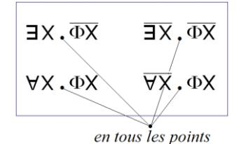

...c'est cela qui mérite d'être pointé pour donner son statut à ce qu'il en est autour du sujet, du rapport sexuel.

Ceci nous montre assez à quel point le langage trace, dans sa grammaire même, les *effets* dits *de sujet*, ceci recouvre assez ce qui s'est découvert d'abord de la logique, pour que nous puissions dès maintenant nous attacher comme je le fais depuis quelques-uns de ces appels que je fais, à l'audition d'un signifiant, pour que je puisse tenter d'y donner *sens*, car c'est le seul cas - et pour cause - où ce terme « *sens* » soit justifié, à l'énoncer : « *y a d'l'Un* ».

Parce qu'il y a une chose qui doit quand même vous apparaître, c'est que s'il n'y a pas de rapport, c'est que - des deux - chacun reste un. L'inouï c'est que les psychanalystes, dont à plus ou moins juste titre on dénonce la mythologie, il est drôle que justement celle qu'on manque à dénoncer, soit la plus à portée de la main.

Quand les gamètes se conjoignent, ce qui en résulte, c'est pas la fusion des deux. Avant que ça se réalise il y faut une vache d'évacuation : la *méiose* qu'on appelle ça ! Et ce qui est *Un*, *nouveau*, ça se fait avec ce que nous pouvons appeler assez justement... pourquoi pas, je ne veux pas aller trop loin ...je ne dirai pas *des débris de chacun d'eux*, mais enfin un « *chacun d'eux* » qui a lâché un certain nombre *de débris*.

Trouver - et mon Dieu sous la plume de Freud - l'idée que l'*Éros* se *fonde*...

au subjonctif [*donc : fondre*] : voyez l'équivoque, mais je ne vois pas pourquoi

je ne me servirai pas de la langue française, entre fondation et fusion

...que *l'Éros se fonde* de faire de *l'Un* avec les deux, c'est évidemment une idée étrange,

à partir de laquelle, bien sûr, procède cette idée absolument exorbitante

qui s'incarne dans la prêcherie à laquelle pourtant le cher Freud répugne de tout son être...

il nous la lâche de la façon la plus claire dans « *L'avenir d'une illusion »*,

dans bien d'autres choses encore, dans bien d'autres endroits, dans « *Malaise dans la civilisation »* ...sa répugnance à cette idée de l'amour universel.

Et pourtant la force fondatrice de la vie, de « *l'instinct de vie* », comme il s'exprime, serait tout entière dans cet *Éros* qui serait principe d'union !

C'est pas seulement pour des raisons didactiques que je voudrais produire devant vous, sur le sujet de l'*Un,* ce qui peut être dit pour contrebattre cette mythologie grossière, outre qu'elle nous permettra peut-être, non seulement d'exorciser l'Éros*,* j'entends l'Éros de doctrine freudienne, mais la chèreThanatos aussi avec laquelle on nous emmerde depuis assez longtemps.

Et il n'est pas vain à cet endroit, de nous servir de quelque chose dont ce n'est pas par hasard que c'est venu au jour depuis quelques temps. J'ai déjà introduit la dernière fois une considération sur *ce qui se repère comme la théorie des ensembles*. Bien sûr, ne vous précipitez pas comme ça !

Pourquoi pas aussi... parce qu'on peut aussi un peu rigoler :

les hommes et les femmes, ils sont « *ensemble »* eux aussi. Ça ne les empêche pas d'être chacun de son côté. Il s'agit de savoir si, sur ce « *y a d'l'Un* » dont il est question, nous ne pourrions pas de « *l'ensemble »*...

d'un « *ensemble »* bien sûr, qui n'a jamais été fait pour ça

...tirer quelque lumière.

Alors puisqu'ici je fais des *ballons d'essai*, je propose simplement de tâcher de voir avec vous ce qui là-dedans peut servir, je ne dirai pas d'illustration, il s'agit de bien autre chose : il s'agit de ce que le signifiant a à faire avec *l'Un*. Parce que bien sûr *l'Un* c'est pas d'hier qu'il est surgi.

Mais il est surgi quand même à propos de deux choses tout à fait différentes :

- *–* à propos d'un certain usage des instruments de mesure,
- *–* et en même temps de quelque chose qui n'avait absolument aucun rapport, à savoir de la fonction de l'individu*.*

## L' *individu*, c'est Aristote.

Aristote, ces êtres qui se reproduisent, toujours les mêmes, ça le frappait.

Ça en avait frappé déjà un autre, un nommé Platon, dont à la vérité je crois que c'est parce qu'il n'avait rien de mieux à s'offrir pour nous donner l'idée de *la forme* qu'il en arrivait à énoncer que *la forme* est réelle. Il fallait bien qu'il *illustre* comme il le pouvait, son idée de « *l'Idée* ».

L'autre [Aristote] bien sûr, fait remarquer que quand même, « *la forme* » c'est très joli mais que ce en quoi elle se distingue c'est ceci : c'est que c'est simplement elle que nous reconnaissons dans *« un certain nombre d'individus qui se ressemblent »*. Nous voilà partis sur *des pentes métaphysiques* diverses. Ceci ne nous intéresse à aucun degré, la façon dont *l'Un* s'illustre :

- *–* que ce soit de l'individu
- *–* ou que ce soit d'un certain usage pratique de la géométrie.

Quels que soient les perfectionnements que vous puissiez ajouter à la dite *géométrie*...

par la considération des proportions, de ce qui se manifeste de différence

entre la hauteur d'un pieu et celle de son ombre

...Il y a beau temps que nous nous sommes aperçus que *l'Un* pose d'autres problèmes,

et ceci pour le simple fait que la mathématique a un tant soit peu progressé.

Je ne vais pas revenir sur ce que j'ai énoncé la dernière fois, à savoir sur le calcul différentiel, les séries trigonométriques et, d'une façon générale, la conception du nombre comme défini par une séquence.

Ce qui apparaît très clairement, c'est que la question est là posée tout autrement de ce qu'il en est de l'*Un*, parce qu'une séquence ça se caractérise de ceci : que c'est foutu comme la suite des nombres entiers. Il s'agit de rendre compte de ce que c'est que le nombre entier.

Je ne vais pas bien sûr vous faire d'énoncé de la *théorie des ensembles*. Je veux simplement pointer ceci :

- *–* que premièrement il a fallu attendre assez tard, la fin du dernier siècle, ça n'est pas depuis plus de cent ans qu'il a été tenté de rendre compte de la fonction de *l'Un*,
- *–* qu'il est remarquable que « *l'ensemble* » se définisse d'une façon telle que le premier aspect sous lequel il apparaisse soit celui de « *l'ensemble vide* », et que d'autre part ceci constitue un « *ensemble* », à savoir celui dont le dit « *ensemble vide* » [Ø] est le seul élément : ça fait un « *ensemble à un élément* ».

C'est de là que nous partons, et la dernière fois...je le dis pour ceux qui n'y étaient pas au Panthéon, là où j'ai commencé d'aborder ce sujet glissant - *que le fondement de* l'*Un,* de ce fait-là, s'avère être proprement constitué de la place d'*un manque*. Je l'ai illustré grossièrement de l'usage pédagogique dans ce dont il s'agit de faire entendre de la dite *théorie des ensembles*, pour faire sentir que la dite *théorie* n'a d'autre objet direct que de faire apparaître comment peut s'engendrer la notion propre de *nombre cardinal* par la correspondance biunivoque. Je l'ai illustré la dernière fois : c'est au moment où manque dans les deux séries comparées - un partenaire, que la notion de l'*Un* surgit : *il y en a un qui manque*.

Tout ce qui s'est dit du *nombre cardinal* ressortit de ceci, c'est que si *la suite des nombres comporte toujours nécessairement un, et un seul, successeur*, si pour autant que ce que, dans *le cardinal* se réalise - de l'ordre du nombre - ce dont il s'agit : c'est proprement *la suite cardinale* en tant que *commençant à zéro*, *elle va jusqu'au nombre qui précède immédiatement le successeur.*

En vous énonçant ainsi - d'une façon improvisée - j'ai fait dans mon énoncé une petite faute : celle par exemple de parler d'une suite comme si elle était d'ores et déjà ordonnée. Retirez ceci que je n'ai point affirmé : c'est simplement que chaque nombre - cardinalement - correspond au *cardinal* qui le précède en y ajoutant l'ensemble vide.

L'important de ce que je voudrais ce soir vous faire sentir, c'est que si l'*Un* surgit comme de l'effet du *manque*, *la considération des ensembles prête à quelque chose*, qui je crois est digne d'être mentionné et que je voudrais mettre en valeur, de la référence à ceci que la *théorie des ensembles* a permis de distinguer dans l'ordre de ce qu'il en est de l'ensemble, deux types :

- *– l'ensemble fini,*
- *–* et d'admettre *l'ensemble infini*.

Dans cet énoncé ce qui caractérise *l'ensemble infini* est proprement de pouvoir être posé comme *équivalent à l'un quelconque de ses sous-ensembles*. Comme l'avait déjà remarqué Galilée... qui n'avait pas pour cela attendu Cantor

...la suite de tous les carrés est en correspondance biunivoque avec chacun des nombres entiers. Il n'y a en effet aucune raison jamais de considérer qu'un de ces carrés serait trop grand pour être dans *la suite des entiers*. C'est ceci qui constitue *l'ensemble infini,* au moyen de quoi on dit qu'il peut être *réflexif*.

Par contre, dans ce qu'il en est de *l'ensemble fini* il est dit, comme étant sa propriété majeure, qu'il est propice à ce qui s'exerce dans le raisonnement proprement mathématique...

c'est-à-dire dans le raisonnement qui s'en sert

...à ce qu'on appelle « *l'induction* ».

« *L'induction* » est recevable quand un ensemble est fini.

Ce que je voudrais vous faire remarquer, c'est que dans la *théorie des ensembles*, il est un point que quant à moi je considère comme problématique. C'est celui qui relève de ce qu'on appelle « *la non-dénombrabilité des parties* », entendez par là *sous-ensembles,* telles qu'elles peuvent se définir à partir d'un ensemble.

Il est très facile si vous partez de ceci : pour prendre le nombre cardinal :

vous avez un ensemble composé par exemple de cinq éléments.

- *–* Si vous appelez « *sous-ensemble* » la saisie en 1 ensemble de chacun de ces cinq *éléments*,
- *–* puis *des groupes* que forment 2 de ces *éléments* sur cinq, il vous est facile de calculer combien ceci fera de *sous-ensemble* : il y a en a très exactement dix.
- *–* Puis vous les prenez par 3 : *il y en aura encore dix*.
- *–* Puis vous les prenez par 4. Il y en aura cinq.
- *–* Et vous arriverez à la fin à l'ensemble en tant qu'il n'y en a qu'un, là présent, à comprendre 5 éléments. Ce à quoi il convient d'ajouter *l'ensemble vide* qui, en tout cas, sans être *élément de l'ensemble*, est manifestable comme une de ses parties. Car les parties, ça n'est pas l'élément.

Ce qui s'en ordonne...

si quelqu'un voulait écrire à ma place au tableau ça me reposerait ...ceci s'écrit comme ça : 1, 5, 10, 10, 5, 1.

Qu'est-ce qu'il se trouve que nous avons défini comme partie de l'ensemble ?

- *–* L'ensemble vide est là.
- *–* Les 5 éléments α, β, γ, δ, ε, par exemple sont là.
- *–* Ce qui est ensuite, c'est αβ, αγ, αδ , αε. Vous pouvez en faire autant à partir de β, vous pouvez le faire à partir de γ, etc. Vous verrez qu'il y en a 10.
- *–* Et ensuite ici vous avez (αβγδ) avec *le manque* d'ε. Et vous pouvez, en faisant manquer chacune de ces lettres, obtenir le nombre nécessaire de 5 pour le regroupement comme *parties* des éléments.

Moyennant quoi vous trouvez, ce qui est certain… il suffirait que je complète cet énoncé d'un ensemble à cardinal 5 par la suite, qu'on va mettre à côté, qui est celle qui se réfère à un ensemble à 4 éléments. Autrement dit, imagez-le d'un tétraèdre. Vous verrez que vous avez une tétrade :

que vous avez 6 *arêtes*, que vous avez 4 *sommets*, que vous avez 4 *faces*, et que vous avez aussi *l'ensemble vide*.

La remarque que je fais, a ceci qui en résulte : je n'ai fait allusion à l'autre cas que pour montrer que dans les deux cas « *la somme des parties* » est égale à  $2^N$ , N étant précisément « *le nombre cardinal des éléments de l'ensemble* ». Il ne s'agit pas ici, en quoi que ce soit, de quelque chose qui ébranle *la théorie des ensembles*.

Ce qui est énoncé à ce propos de la dénombrabilité, a toutes ses applications, par exemple dans la remarque que rien ne change à « *la catégorie d'infini d'un ensemble* » si en est retirée une « *suite quelconque dénombrable* ». Néanmoins l'apport qui est fait de la *non-dénombrabilité*, en ceci qu'assurément et en tout cas, on ne saurait appliquer sur un ensemble, un ensemble fini, la somme de ses parties définie telle qu'elle vient de l'être, est-ce - j'interroge - la meilleure façon d'introduire « *la non-dénombrabilité d'un ensemble infini* » ?

Il s'agit d'une introduction didactique.

Je le conteste à partir du moment où *la propriété de réflexivité* telle qu'elle est affectée à *l'ensemble infini* et qui comporte que lui manque l'inductivité caractéristique des *ensembles finis*, laisse écrire pourtant, comme j'ai pu le voir en certains lieux, que « la non-dénombrabilité des parties de l'ensemble fini » ressortirait - je le souligne - par induction, de ceci que ces parties s'écriraient comme s'écrit *l'ensemble infini des nombres entiers* :  $2^{\aleph_0}$ . 12 [soit 2 puissance cardinal de  $\mathbb{N}$ ]

Je le conteste ! Et comment fais-je pour le contester ? Je le conteste à partir de ceci, c'est qu'il y a quelque artifice, quand il s'agit des parties de l'ensemble, à les prendre dans leur échelle dont l'addition donne en effet le 2 puissance N. Mais il est clair que si vous avez d'un côté : *a, b, c, d, e* - pour franciser les lettres grecques que j'ai écrites au tableau, j'avais une raison pour ça - et si vous y apportez ce qui leur répond :

- *a, b, c, d*, correspondent à *e*,
- *a, b, d, e*, correspondent à *c*.

Vous voyez que le nombre des parties, si vous y substituez une partition, aboutit à une formule qui est très différente, mais dont vous verrez pourquoi elle m'intéresse : c'est que le nombre, c'est 2N-1. Je ne puis ici, vu l'heure et puis le fait qu'après tout ceci n'intéresse pas ici absolument tout le monde, mais j'aimerais là-dessus, je sollicite...

je sollicite je dois dire comme je le fais d'habitude, d'une façon désespérée

... je sollicite des grammairiens de temps en temps de me donner un petit tuyau...

ils m'en envoient : c'est toujours les mauvais

...j'ai sollicité des mathématiciens - très nombreux déjà - de me répondre là-dessus, et à la vérité ils font la sourde oreille.

Il faut vous dire que cette « *dénombrabilité des parties de l'ensemble* », ils y tiennent comme la tique à la peau du chien. Néanmoins, je propose ceci qui a son petit intérêt, je vais droit là à un but qui va laisser de côté un point sur lequel j'aimerais finir après, mais je vais droit à un but qui a son intérêt.

Son intérêt est ceci : c'est que, à substituer à la notion des « parties » celle de la « partition », il est nécessaire...

de la même façon que nous avons admis que *les parties de l'ensemble infini, ce serait* 2x0 c'est-à-dire le plus

petit des transfinis, celui constitué par l'ensemble, le cardinal de l'ensemble des entiers[N]

...au lieu d'avoir  $2^{\aleph_0}$ , nous avons :  $2^{\aleph_{0-1}}$ .

Je soupçonne que ceci - à quiconque - peut faire sentir ce qu'il y a d'abusif à supposer la bipartition d'un ensemble infini.

Si, comme la formule en porte elle-même la trace, ce qu'on appelle « *ensemble des parties* » aboutit à une formule qui contient *le nombre* 2 *porté à la puissance* [du cardinal] *des éléments de l'ensemble*, est-ce qu'il est tout à fait recevable...

et surtout à partir du moment où nous mettons en question *l'induction* quand il s'agit de *l'ensemble infini* ...comment est-il recevable que nous acceptions *une formule* qui manifeste aussi clairement qu'il s'agit, non pas de *parties de l'ensemble*, mais de *sa bartition*.

J'y ajouterai quelque chose qui a bien son intérêt : c'est que  $\aleph_0$ , bien sûr n'est qu'un *index*...

index qui n'est pas pris au hasard, et index forgé pour désigner...

car il y en a toute la série des autres en principe admis, toute la série des nombres entiers

peuvent servir d'index à ce qu'il en est de l'ensemble en tant qu'il fonde le transfini

...néanmoins, à partir du moment où ce dont il s'agit c'est *la fonction de la puissance*, et qu'il semble que nous ayons abusé de *l'induction* en nous permettant d'y trouver test de *la non-dénombrabilité des parties de l'ensemble infini*, est-ce que, à y regarder de près, nous ne trouverions pas ici, à ce zéro, une autre fonction, celui qu'il a dans *la puissance exponentielle*, c'est à savoir que quelque *nombre* que ce soit, l'exposant zéro quant à ce qui est de la puissance, l'égale à 1, quel que soit ce *nombre*.

12 Une classe des ensembles infinis est la classe des ensembles infinis dits dénombrables (équipotents à  $\mathbb{N}$ ). Une autre classe d'ensembles infinis est la classe des ensembles équipotents à  $\mathbb{R}$  qui sont appelés ensembles continus. Se pose alors le problème de l'hypothèse du continu : existe-t-il un ensemble dont le cardinal est strictement compris entre  $\aleph_0$ , qui est le cardinal de  $\mathbb{N}$ , et  $2^{\aleph_0}$  qui est le cardinal de  $\mathbb{R}$  ?

Je souligne : un nombre quelconque *puissance* 1, c'est lui-même [n1= n], mais un nombre *puissance zéro*, c'est toujours 1, pour la raison très simple, c'est qu'un nombre *puissance* -1, *c'est son inverse*. [1/n = n-1 , n1 . n-1 = n0= 1] C'est donc 1 qui sert ici d'élément pivot.

À partir de ce moment *la partition de l'ensemble transfini* aboutit à ceci, à savoir que si nous égalons *l'aleph zéro* dans cette occasion à 1, nous avons pour ce qu'il en est de la partition de l'ensemble, ce qui paraît en effet bien recevable, à savoir que la suite des nombres entiers n'est supportée par rien d'autre que par la réitération de l'1, *le* 1 *sorti de l'ensemble vide*.

C'est de se reproduire qu'il constitue ce que j'ai donné la dernière fois comme étant au principe manifesté dans « *le triangle de Pascal* », de ce qu'il en est au niveau du *cardinal des monades*, et que derrière les appuis ce que j'ai appelé... je le dis pour les sourds qui se sont interrogés sur ce que j'avais dit

...la « *nade* », c'est-à-dire le 1 *en tant qu'il sort de l'ensemble vide*, qu'il est la *réitération du manque*.

Je souligne très précisément ceci que l'1 dont il s'agit, c'est très proprement ce à quoi *la théorie des ensembles* ne substitue comme *réitération*, que *l'ensemble vide*, ce en quoi elle manifeste - *elle, la théorie des ensembles*  la vraie nature de la « *nade* ».

Ce qui est en effet affirmé *au principe de l'ensemble*, ceci sous la plume de Cantor...

certes comme on le dit : « *naïve* » au moment où elle a frayé cette voie vraiment sensationnelle ...ce que la plume de Cantor affirme, c'est que pour ce qui est des *éléments de l'ensemble*...

ceci veut dire qu'il s'agit de quelque chose d'aussi divers qu'on le voudra, à cette seule condition que nous posions chacune de ces choses, qu'il va jusqu'à dire *objets de l'intuition* ou *de la pensée*, c'est ainsi qu'il s'exprime. Et en effet pourquoi le lui refuser, ça ne veut rien dire d'autre que *quelque chose d'aussi éternel qu'on voudra*

...il est tout à fait clair qu'à partir du moment où on mêle *l'intuition avec la pensée*, ce dont il s'agit c'est *de signifiants*, ce qui est bien entendu manifesté par le fait que ça *s'écrit a, b, c, d*.

Mais ce qui est dit, c'est très sûrement proprement ceci : que ce qui est exclu...

donc dans l'appartenance à un *ensemble* comme *élément*

...c'est qu'un élément quelconque soit *répété* comme tel.

*C'est donc en tant que distinct que subsiste quelque élément que ce soit d'un ensemble.* 

Et pour ce qu'il en est de *l'ensemble vide* il est affirmé au principe de *la Théorie des Ensembles* qu'il ne saurait être qu'1. Cet 1, « *la nade* », en tant qu'elle est au principe du surgissement de l'*Un numérique*, de l'*Un* dont est fait *le nombre entier,* est donc quelque chose qui se pose comme étant d'origine *l'ensemble vide* lui-même.

Cette notion est importante parce que si nous interrogeons cette structure, c'est dans la mesure où pour nous dans *le discours analytique*, l'1 se suggère comme étant au principe de *la répétition,* et que donc ici il s'agit justement de l'espèce d'1 qui se trouve marqué de n'être jamais, dans ce qu'il en est de la théorie des nombres,

- *–* que d'un *manque*,
- *–* que d'un *ensemble vide*.

Mais il y a, à partir du moment où j'ai introduit cette fonction de la partition, un point du « *triangle de Pascal* » que vous me permettrez d'interroger. Avec les deux colonnes que je viens de faire, j'en ai assez pour vous montrer où porte mon point d'interrogation. Voici ce que j'énonce.

| 1    | 200 | 0 | 1 | 0 | 0 | 0 | 0 | 0 | 0  |
|------|-----|---|---|---|---|---|---|---|----|
|      | T   |   | 0 | 1 | 1 | 1 | 1 | 1 | 1  |
| 4    | 5   |   |   | 0 | 1 | 2 | 3 | 4 | 5  |
| 6    | 10  |   |   |   | 0 | 1 | 3 | 6 | 10 |
| 4    | 10  |   |   |   |   | 0 |   |   | 10 |
| - 10 |     |   |   |   |   |   | 0 | 1 | 5  |
| 1    | 5   |   |   |   |   |   |   | 0 | 1  |
|      | 1   |   |   |   |   |   |   |   | 0  |

S'il est vrai que nous n'avons comme *nombre de partitions* que le nombre qui précédemment était affecté à l'ensemble (n-1), à l'ensemble dont le nombre cardinal est inférieur d'une unité au cardinal d'un ensemble, regardez comment, à engendrer à partir de ce nombre qui correspond aux « *présumées* » *parties de l'ensemble* que nous appellerons plus brièvement *inférieur*, inférieur d'1, comme *élément*, pour trouver, comme *le triangle de Pascal* nous l'a déjà appris, les parties qui vont composer...

elles se trouveront dans une bipartition

...qui vont composer comme partie, selon le premier énoncé, l'ensemble supérieur,

nous avons à chaque fois à faire *l'addition* de ce qui correspond dans la colonne de gauche aux 2 nombres qui sont situés : *–* [1)] *immédiatement à gauche*,

*–* et [2)] *au-dessus du premier,*

pour obtenir dans l'occasion : ici le chiffre 10, ici le chiffre 4.

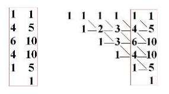

Qu'est-ce à dire, si ce n'est que pour obtenir le premier chiffre, celui des *monades* de l'ensemble, des éléments, du *nombre cardinal de l'ensemble*, c'est uniquement du fait d'avoir, je dirai : par un abus d'office, mis *l'ensemble vide* au rang des éléments monadiques. C'est-à-dire que c'est en additionnant *l'ensemble vide* avec chacune des quatre monades de la colonne précédente que nous obtenons le *nombre cardinal des monades*, des éléments, de l'ensemble supérieur.

Essayons maintenant simplement, pour vous rendre la chose figurable, de voir ce que ceci donne sur un schéma. Et prenons pour être plus simple la colonne encore d'avant, prenons ici 3 monades et non plus 4.

L'ensemble, nous le figurons de ce cercle. Mais *l'ensemble vide*, je ne tiens pas à ce qu'il soit du tout forcément au centre, mais à seulement le *figurer* nous l'avons là :

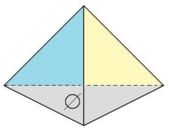

Nous avons dit que cet *ensemble vide*, quand il s'agira de faire l'ensemble tétradique, cet *ensemble vide* viendra au rang des *monades* du précédent, c'est-à-dire que pour le représenter comme ceci, par un tétraèdre... bien entendu, il ne s'agit pas de tétraèdre, il s'agit de nombres

...si c'est désigné par les lettres grecques α, β, γ, nous aurons ici, comme 4 ème élément à « *un élément* » dans l'ordre de ces *sous-ensembles*, nous aurons *l'ensemble vide*. Mais il n'en reste pas moins que *l'ensemble vide*, au niveau de ce nouvel ensemble, il existe toujours, et que c'est au niveau de ce nouvel ensemble que ce qui vient d'être extrait de *l'ensemble vide*, nous l'appellerons autrement, et puisque nous avons déjà α, β, γ, nous l'appellerons δ.

Qu'est-ce que ceci nous conduit à voir ?

C'est qu'au niveau de l'élément des *sous-ensembles* antépénultième [n-1] c'est-à-dire pour désigner celui-ci, à savoir celui... disons, pour rester dans l'intuition des *cinq quadrangles*

...qu'on peut mettre en évidence dans, disons aussi, un polyèdre à 5 sommets.

Là aussi nous avons à prendre - quoi ? - les 4 *triangles* de la tétrade.

En tant que quoi ? En tant que dans ces 4 *triangles*, nous allons pouvoir faire *trois soustractions* différentes, ceci y étant additionné, ce qui le constitue comme ensemble, ou plus exactement comme sous-ensemble.

Comment pouvons nous avoir notre compte...

sauf à ce même niveau, où nous aurions trois *sous-ensemble*

...d'y ajouter les éléments seuls de l'ensemble, c'est-à-dire α, β, γ, δ, comme non pris en un *ensemble*,

c'est-à-dire en tant que définis comme *éléments* ils ne sont pas des *ensembles*,

mais qu'isolés de ce qui les inclut dans l'*ensemble* ils doivent être comptés, pour que nous ayons notre compte de quatre, à fournir la partie du *chiffre* 5 au niveau de *l'ensemble à* 5 *éléments*, il nous faut faire intervenir les éléments au nombre de 4 comme simplement *juxtaposés*, mais non pas pris en un ensemble, « *sous-ensemble* » à l'occasion, c'est-à-dire quoi ?

Nous apercevoir de ceci, que *dans la théorie des ensembles tout élément se vaut*.

Et c'est bien ainsi que peut en être engendrée l'*unité*.

C'est justement en ce qu'il est dit que le concept de « *distinct* » et de « *défini* » en l'occasion représente ceci, c'est que « *distinct* » ne veut dire que « *différence radicale* » puisque *rien ne peut se ressembler,* il n'y a pas *d'espèces*. Tout ce qui se *distingue* de la même façon est *le même élément*. C'est ceci que ça veut dire.

Mais qu'est-ce que nous voyons ? Nous voyons ceci : qu'à ne prendre l'élément que de *pure différence*, nous pouvons le voir aussi comme *mêmeté* de cette *différence*, je veux dire pour l'illustrer, qu'un *élément* dans la *théorie des ensembles*... comme c'était déjà démontré à la deuxième ligne

...est tout à fait équivalent à un *ensemble vide*, puisque *l'ensemble vide* peut aussi jouer comme *élément*. Tout ce qui se définit comme *élément* est équivalent de *l'ensemble vide*.

Mais à prendre cette équivalence, cette « *mêmeté de la différence absolue* », à la prendre comme isolable... et ceci non prise dans cette *inclusion ensembliste,* si je puis dire, qui la ferait *sous-ensemble*

...ça veut dire que la *mêmeté* comme telle est, en un point, comptée !

Ceci me paraît *d'une extrême importance*, et très précisément par exemple, au niveau du jeu platonicien qui fait de *la similitude* une idée de *substance*, dans la perspective réaliste, un *universel* en tant que cet *universel* est *la réalité*.

Ce que nous voyons, c'est qu'il n'est pas *du même niveau*, et c'est à ça que j'ai fait allusion dans mon dernier discours du Panthéon, ce n'est pas au même niveau que l'idée de *semblable* s'introduit. *La mêmeté des éléments de l'ensemble* est comme telle comptée comme jouant son rôle dans *les parties de l'ensemble*.

La chose a certainement pour nous son importance, puisque de quoi s'agit-il au niveau de *la théorie analytique* ? La *théorie analytique* voit pointer l'*Un* à deux de ses *niveaux.* L'*Un* est l'*Un* qui se répète. Il est au fondement de cette incidence majeure dans *le parler* de l'analysant, qu'il dénonce d'une certaine répétition, eu égard - à quoi ? - à une structure signifiante.

Quel est d'autre part...

à considérer *le schéma* que j'ai donné *du discours analytique* ...ce qui se produit de la mise en place du *sujet* au niveau de « *la jouissance de parler* » ?

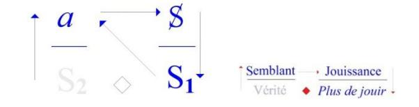

Ce qui se produit et ce que je désigne à l'étage dit du *plus-de-jouir*, c'est S1, c'est-à-dire une production signifiante que je propose...

quitte à me donner le devoir de vous en faire sentir l'incidence ...que je propose de reconnaître dans ce qu'il en est de quoi ?

- *–* Qu'est-ce que « *la mêmeté de la différence* » ?
- *–* Qu'est-ce que veut dire que *quelque chose que nous désignons dans le signifiant par des lettres diverses*, c'est *les-mêmes* ?
- *–* Que peut vouloir dire « *les-mêmes* » , si ce n'est *justement* que c'est unique, à partir même de l'hypothèse dont part, dans la *théorie des ensembles*, la fonction de l'*élément* ?

# L'*Un* dont il s'agit...

celui que produit le sujet, disons « *point idéal* » dans l'analyse

...c'est très précisément, au contraire de ce dont il s'agit dans la répétition,

- *–* l'*Un* comme un seul,
- *–* l'*Un* en tant que quelle que soit quelque différence qui existe toutes les différences se valent :
- il n'y en a qu'une, *c'est la différence*.

C'est ceci sur lequel je voulais ce soir achever ce discours, outre que l'heure et ma fatigue m'en pressent incidemment. L'illustration de cette fonction du S1 telle que je l'ai mise dans la formule statuante du *discours analytique*, je la donnerai dans les séances qui viendront.

Vous le savez, ici je dis ce que je pense.

C'est *une position féminine*, parce qu'en fin de compte, *penser* c'est très particulier.

Alors comme je vous écris de temps en temps, j'ai...

comme ça, pendant un petit voyage que je viens de faire

...inscrit *un certain nombre de propositions*, dont la 1 ère c'est qu'il faut reconnaître que le psychanalyste est mis, par *le discours*... c'est un terme à moi

...par *le discours qui le conditionne*...

qu'on appelle, depuis moi, *le discours du psychanalyste* 

...dans une position, disons difficile, Freud disait *impossible* : *unmöglich*, c'est peut-être un peu forcé, il parlait pour lui.

Bon ! D'autre part - 2 ème proposition : il sait...

ceci d'expérience, ce qui veut dire que si peu qu'il ait pratiqué la psychanalyse,

il en sait assez pour ce que je vais dire

...il sait dans tous les cas avoir une commune mesure avec ce que je dis.

C'est tout à fait indépendant du fait qu'il soit - de ce que je dis - informé, puisque ce que je dis aboutit...

comme je l'ai, il me semble, démontré cette année

...à situer *son savoir* [S2].

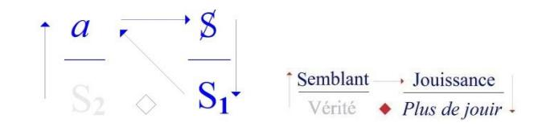

Ça, c'est l'histoire du *savoir* sur la *vérité* :

- *–* ça, c'est la place de la *vérité* pour ceux qui viennent pour la première fois.
- *–* ça, celle du *semblant*,
- *–* ça, celle de la *jouissance* [*de parler*],
- *–* et ça, du *plus-de-jouir*, ce que j'écris en abrégé ainsi : « *+ de jouir* ». Pour la jouissance, nous mettrons un J.

C'est *son rapport au savoir* qui est difficile, non - bien sûr - à ce que je dis,

puisque dans l'ensemble du *no man'land* psychanalytique on ne sait pas que je le dis.

Ça ne veut pas dire que de ce que je dis, on n'en sache rien, puisque ça sort de *l'expérience* [*i.e. analytique*].

Mais on a, de ce qu'on en sait, *horreur* !

Ce dont je peux dire, comme ça, vraiment simplement, que je les comprends...

« *je peux dire* », c'est à dire : « je peux dire, si on y tient... »

...mais je les comprends...

je me mets à leur place, d'autant plus facilement que j'y suis.

Mais je le comprends d'autant plus facilement que comme tout le monde, j'entends ce que je dis. Néanmoins ça ne m'arrive pas tous les jours, parce que ce n'est pas tous les jours que je parle. En réalité je le comprends - c'est-à-dire que j'entends ce que je dis - les quelques jours, mettons un ou deux, qui précèdent immédiatement mon séminaire, parce qu'à ce moment-là je commence à vous écrire.

Les autres jours, la pensée de ceux à qui j'ai eu affaire, me submerge.

Il faut que je vous l'avoue, parce qu'à ce moment-là, l'impatience de ce que j'ai déjà appelé...

et donc que je peux encore appeler, parce que c'est rare, comme ça, que je revienne

...de ce que j'ai appelé « *mon échec* » dans *Scilicet*, me domine. Voilà...

*Oui*... *ils savent !* Je rappelle ça parce que le titre de ce que j'ai à traiter ici c'est *Le savoir du psychanalyste*. « *Du* » dans ce cas-là, ça évoque le « *le* », article défini en français, enfin c'est ce qu'on appelle *défini*. Oui ! Pourquoi pas« *des psychanalystes* », après ce que je viens de vous dire ? Ça serait plus conforme à mon thème de cette année, c'est-à-dire « *y a d'l'un* ».

« *Y en a des* » qui se disent tels.

Je suis d'autant moins à discuter leur dire qu'il y en a pas d'autres.

Je dis « *du* », pourquoi ? C'est parce que c'est à eux que je parle, malgré la présence d'un très grand nombre de personnes qui ne sont pas psychanalystes, ici.

Le psychanalyste donc sait ce que je dis.

Ils le savent - je vous l'ai dit - d'expérience, si peu qu'ils en aient, même si ça se réduit à la didactique qui est l'exigence minimale pour que « *psychanalystes* » ils se disent.

Car même si ce que j'ai appelé « *La passe* » est manquée, eh bien, ça se réduira à ça : qu'ils auront eu une « *psychanalyse didactique* », mais en fin de compte, ça suffit pour qu'ils sachent ce que je dis.

*La passe*...

c'est toujours dans *Scilicet* que tout ça traîne, c'est plutôt l'endroit indiqué [*Scilicet : « à savoir »*] ...quand je dis que « *la passe* » est manquée, ça ne veut pas dire qu'ils ne se sont pas offerts à l'expérience de *la passe*.

Comme je l'ai souvent marqué, cette expérience de *« la passe »* est simplement ce que je propose à ceux qui sont assez dévoués pour s'y exposer, à de seules fins d'information sur un point très délicat, et qui consiste à... en somme ce qui s'affirme de la façon la plus sûre c'est que : c'est tout à fait *(a)normal - objet(a) normal -* que quelqu'un qui fait une psychanalyse veuille être psychanalyste.

Il faut vraiment une sorte d'aberration qui vaut, qui valait la peine d'être offerte à tout ce qu'on pouvait recueillir de témoignage. C'est bien en ça que j'ai institué provisoirement cet essai de recueil pour savoir pourquoi quelqu'un qui sait ce que c'est que la psychanalyse par sa didactique, peut encore vouloir être analyste.

Alors je n'en dirai pas plus sur ce qu'il en est de leur position, simplement parce que j'ai choisi cette année *Le savoir du psychanalyste* comme étant ce que je proposais pour mon retour à Sainte Anne. C'est pas pour ménager du tout les psychanalystes, ils n'ont pas besoin de moi pour avoir *le vertige de leur position*, mais je ne l'augmenterai pas à le leur dire.

## Ce qui pourrait être fait...

et je le ferai peut-être à un autre moment

...ce qui pourrait être fait d'une manière piquante dans une certaine référence que je n'appellerai « *historique* » qu'entre guillemets...

enfin, vous verrez ça quand ça viendra, si je subsiste ...pour ceux qui sont des fins finauds je leur parlerai du mot « *tentation* ».

Là je ne parle que du *savoir* et je remarque qu'il ne s'agit pas de la « *vérité sur le savoir* », mais du « *savoir sur la vérité* », et que ceci « *le savoir sur la vérité »*, ça s'articule de la pointe de ce que j'avance cette année sur le « *Y a d'l'un !* », « *Y a d'l'un* » et rien de plus : c'est un *Un* très particulier celui qui sépare le *Un* de *Deux*, *et que c'est un abîme*.

#### Je répète : *la vérité -* je l'ai déjà dit *- ça ne peut que se mi-dire*.

Quand *le temps de battement* sera passé, qui fera que je peux en respecter *l'alternance*, je parlerai de l'autre face : du « *mi-vrai* ». Il faut toujours séparer le *bon grain* et la « *mi-vraie* » !

Comme je vous l'ai dit tout à l'heure peut-être, je reviens d'Italie où je n'ai jamais eu qu'à me louer de l'accueil, même de mes collègues psychanalystes ! Grâce à l'un d'entre eux, j'en ai rencontré un 3 ème qui est tout à fait « à la page », enfin à la mienne, bien entendu. [*Rires*]

Il opère avec Dedekind, et il a trouvé ça tout à fait sans moi.

*Je peux pas dire*, à la date où il a commencé de s'y mettre, *que je n'y étais pas déjà*, mais enfin c'est un fait que j'en ai parlé plus tard que lui, puisque je n'en parle que maintenant et que lui avait déjà écrit là-dessus tout un petit ouvrage. Il s'est aperçu de la valeur en somme des éléments mathématiques, pour faire émerger quelque chose qui vraiment, notre expérience d'analyste, la concerne.

Eh ben, comme il est tout à fait *bien vu,* il a tout fait pour ça, il a réussi à se faire entendre dans des endroits *très bien placés* de ce qu'on appelle l'I.P.A*.* - *l'Institution Psychanalytique Avouée*, je traduirais - donc il a réussi à se faire entendre. Mais ce qu'il y a de très curieux, c'est qu'on ne le publie pas !

On ne le publie pas en disant : « *Vous comprenez, personne ne comprendra* ! ».

Je dois dire que je suis surpris parce que, en somme, du « Lacan », entre guillemets bien sûr, enfin des choses de la veine que je suis censé représenter auprès des incompétents d'une certaine linguistique, on est plutôt pressé d'en bourrer l'*International journal*.

Plus il y a des trucs dans la poubelle, naturellement, moins ça se discerne ! Alors pourquoi diable, est-ce que dans ce cas on a cru devoir faire obstacle, puisque pour moi, il me semble que c'est un obstacle et que le fait qu'on dise que les lecteurs ne comprendront pas, c'est secondaire : il n'est pas nécessaire que tous les articles de l'*International journal* soient compris. Il y a donc quelque chose qui là-dedans ne plaît pas.

Mais il est évident que, comme celui que je viens, non pas de nommer...

parce que vous ignorez profondément son nom, il n'a encore rien réussi à publier

...est parfaitement repérable, je ne désespère pas que, à la suite de ce qui filtrera de mes propos aujourd'hui... et surtout si on sait que je ne l'ai pas nommé

...on le publiera [*Rires*]. Vraiment, ça a l'air de lui tenir assez à cœur pour que je l'aide à ça volontiers. Si ça ne vient pas, je vous en parlerai un peu plus !

Revenons au temps.

Le psychanalyste a donc un rapport *à ce qu'il sait*, complexe. Il le renie, il le « *réprime* »... pour employer le terme dont en anglais se traduit le refoulement*, la Verdrängung* ...et même il lui arrive de *n'en rien vouloir savoir*.

Et pourquoi pas ? Qui est-ce que ça pourrait épater ? La psychanalyse - me direz-vous - alors quoi ?

J'entends d'ici le *bla-bla-bla* de quiconque n'a pas de la psychanalyse la moindre idée. Je réponds à ce qui peut surgir de ce *floor* - comme on dit - je réponds : *est-ce le savoir qui guérit*... que ce soit celui du sujet ou celui *supposé dans le transfert*  ...*ou bien est-ce le transfert, tel qu'il se produit dans une analyse donnée* ?

Pourquoi *le savoir*...

celui dont je dis qu'a dimension tout psychanalyste ...pourquoi *le savoir* serait-il, comme je disais tout à l'heure, « *avoué* » ? C'est de cette question que Freud a pris en somme la *Verwerfung*, il l'appelle : « *un jugement qui dans le choix rejette* ». Il ajoute « *qui condamne* », mais je le condense.

Ce n'est pas parce que la *Verwerfung* rend fou un sujet, quand elle se produit dans l'inconscient, qu'elle ne règne pas... la même et du même nom d'où Freud l'emprunte

...qu'elle ne règne pas sur le monde comme un pouvoir rationnellement justifié.

« *Des psychanalystes* » ...

vous allez le voir, à la différence avec « *le* » ... « *des psychanalystes* » ça se préfère, ça se préfère soi, voyez-vous ! C'est pas les seuls, il y a une tradition là-dessus : la tradition médicale.

Pour se préférer, on n'a jamais fait mieux, sauf les saints - les saints (*s.a.i.n.t.s*)...

Oui, on vous parle tellement des autres [Rires] que je précise, parce que les autres... enfin, passons ...les saints (*s.a.i.n.t.s*) ils se préfèrent eux-aussi, ils ne pensent même qu'à ça, ils se consument de trouver la meilleure façon de se préférer, alors qu'il y en a de si simples, comme le montrent les « *méde-saints* », eux aussi [*Rires*]. Enfin, ceux-là ne sont pas des saints. Ça, ça va de soi...

Il y a peu de choses aussi abjectes à feuilleter que l'histoire de la médecine : ça peut-être conseillé comme vomitif [*Rires*] ou comme purgatif, ça fait les deux. Pour savoir que *le savoir* n'a rien à faire avec *la vérité*, il n'y a vraiment rien de plus convaincant. On peut même pas dire que ça va jusqu'à faire du médecin une sorte de provocateur.

Ça n'empêche pas que les médecins se soient arrangés...

et pour des raisons qui tenaient à ce que leur plate-forme avec *le discours de la science* devenait plus exiguë ...que les médecins se soient arrangés à mettre la psychanalyse à leur pas.

Et ça, ils s'y connaissaient !

Ceci naturellement d'autant plus que le psychanalyste étant fort embarrassé...

comme je suis parti là-dessus

...fort embarrassé de *sa position*, il était d'autant plus disposé à recevoir les conseils de l'expérience.

Je tiens beaucoup à marquer ce point d'histoire qui est dans mon affaire...

pour autant qu'elle ait de l'importance

...tout à fait un point-clé : grâce à cette conjuration...

contre laquelle est dirigé un article *exprès* de Freud sur la *Laïernanalyse* **13**

...grâce à cette conjuration qui a pu se produire peu après la guerre, j'avais déjà perdu la partie avant de l'avoir engagée.

Simplement je voudrais qu'on me croie là-dessus, parce que - pourquoi, je le dirai ? - si ce soir je témoigne...

et je ne le fais pas par hasard à Sainte Anne puisque je vous dis que c'est là que je dis ce que je pense ...si je déclare que *c'est très précisément à ce titre* de savoir très bien l'avoir, à l'époque, perdue, que cette partie je l'ai engagée.

Ça n'a rien d'héroïque vous savez !

Il y a un tas de parties qui s'engagent dans ces conditions. C'est même un des fondements de la « *condition humaine* », comme dit l'autre, et ça réussit pas plus mal que n'importe quelle autre entreprise. La preuve, hein !

Le seul ennui - mais il n'est que pour moi - c'est que ça ne vous laisse pas très libre, je dis ça en passant pour la personne qui m'a...

il y a je ne sais pas quoi, le 2 ème séminaire avant

...qui m'a interrogé sur le fait si je croyais ou non à la liberté.

Une autre déclaration que je veux faire...

et qui a bien son importance, puisque après tout, je ne sais pas, c'est mon penchant ce soir ...une autre déclaration qui celle-là alors est tout à fait prouvée, là je vous demande de me croire, que je m'étais très bien aperçu que la partie était perdue...

après tout je n'étais pas si malin, j'ai peut-être cru qu'il fallait foncer

et que je foutrais en l'air l'*Internationale Psychanalytique Avouée*

...et là personne ne peut dire le contraire de ce que je vais dire :

c'est que je n'ai jamais lâché aucune des personnes que je savais devoir me quitter, avant qu'elles s'en aillent elles-mêmes.

Et c'est vrai aussi du moment où la partie était en somme - pour la France - perdue, qui est celle à laquelle j'ai fait allusion tout à l'heure : ce petit *brouhaha* dans une conjuration médecins-psychanalystes d'où est sorti en 53 le début de mon enseignement.

Les jours où l'idée de devoir poursuivre le dit enseignement ne m'habite pas - c'est-à- dire un certain nombre il est évident que j'ai, comme tous les imbéciles, l'idée de ce que ça aurait pu être pour *la Psychanalyse Française (!)* si j'avais pu enseigner là où, pour la raison que je viens de dire, je n'étais nullement disposé à lâcher quiconque.

Je veux dire que si scandaleuses que fussent mes propositions sur *Fonction et Champ*... et patati et patata... *de la parole et du langage*, j'étais disposé à couvrir le sillon pendant des années pour les gens même les plus durs de la feuille et - au point où nous en sommes - personne n'y aurait perdu parmi les psychanalystes.

Je vous ai dit que j'avais fait un petit tour en Italie.

Dans ces cas-là, je vais aussi - pourquoi pas ? - parce que il y a beaucoup de gens qui m'aiment...

À propos : il y a quelqu'un qui m'a envoyé un verre à dents !

Je voudrais savoir qui c'est, pour la remercier cette personne.

Il y a une personne qui m'a envoyé *un verre à dents* !

Je dis ça pour ceux qui étaient là au Panthéon la dernière fois.

C'est une personne que je remercie d'autant que ce n'est pas un verre à dents.

C'est un merveilleux petit verre rouge, long et galbé, dans lequel je mettrai une rose,

qui que ce soit qui me l'ait envoyé. Mais je n'en ai reçu qu'un, ça je dois le dire. Enfin passons...

...il y a des personnes qui m'aiment un peu dans tous les coins, mêmes dans les couloirs du Vatican. Pourquoi pas, hein ? Il y a des gens très bien.

Il n'y a que là...

ceci pour la personne qui m'interroge sur la liberté

...il n'y a qu'au Vatican que je connaisse des libres-penseurs.

Moi je suis pas un libre-penseur, je suis forcé de tenir à ce que je dis, mais là-bas : quelle aisance ! [*Rires*]

Ah on comprend que la Révolution Française ait été véhiculée par les abbés.

Si vous saviez quelle est leur liberté, mes bons amis, vous auriez froid dans le dos.

Moi j'essaie de les ramener au dur, il n'y a rien à faire, ils débordent : la psychanalyse, pour eux, est dépassée ! Vous voyez à quoi ça sert la *libre-pensée* : ils voient clair...

 13 S. Freud : « *[Psychanalyse et médecine](http://classiques.uqac.ca/classiques/freud_sigmund/psychanalyse_et_medecine/psychanalyse_et_medecine.pdf) »*, ou « *La question de l'analyse profane »* (1925), Gallimard 1985.

C'était pourtant un bon métier, *hein* [*Rires*] ? Ça avait des bons côtés. Quand ils disent *que c'est dépassé, ils savent ce qu'ils disent, ils disent* : « *c'est foutu, parce que quand même on doit faire un peu mieux !* ».

Je dis ça quand même pour avertir les personnes...

les personnes qui sont « *dans le coup »*, et particulièrement bien sûr, celles qui me suivent ...qu'il faut *y regarder à* 2 *fois* avant d'y engager ses descendants, parce que c'est très possible qu'au train où vont les choses, ça tombe tout d'un coup sec, comme ça. Enfin c'est uniquement pour ceux qui ont à y engager leur descendance, je leur conseille la prudence.

J'ai déjà parlé, comme ça, de ce qui se passe dans la psychanalyse...

il faut quand même bien spécifier certains points que j'ai déjà abordés,

par conséquent que je crois pouvoir traiter brièvement au point où nous en sommes

...c'est que *c'est le seul discours*... et rendons-lui hommage

...*c'est le seul discours*...

au sens où j'ai catalogué 4 *discours,*

...*c'est le seul discours* qui soit tel que la canaillerie y aboutisse nécessairement à la bêtise.

Si on savait tout de suite que *quelqu'un qui vient vous demander une psychanalyse didactique est une canaille*, mais on lui dirait : « *pas de psychanalyse pour vous, mon cher ! Vous en deviendrez bête comme chou* ». Mais on ne le sait pas !

C'est justement soigneusement dissimulé.

On le sait quand même au bout d'un certain temps dans la psychanalyse, la canaillerie étant toujours, non pas héréditaire, c'est pas d'hérédité qu'il s'agit, c'est du *désir*, *désir de l'Autre* d'où l'intéressé a surgi.

Je parle du *désir* : c'est pas toujours le *désir* de ses parents, ça peut être celui de ses grands-parents, mais si le *désir* dont il est né est le désir d'une canaille, il est une canaille immanquablement.

Je n'ai jamais vu d'exception, et c'est même pour ça que j'ai toujours été si tendre pour les personnes dont je savais qu'elles devaient me quitter, au moins pour les cas où c'était moi qui les avais psychanalysées, parce que je savais bien qu'elles étaient devenues tout à fait *« bêêêtes »*. Je peux pas dire que je l'avais fait exprès : comme je vous l'ai dit, c'est nécessaire. C'est nécessaire quand une psychanalyse est poussée jusqu'au bout, ce qui est la moindre des choses pour la psychanalyse didactique.

Si la psychanalyse n'est pas didactique, alors c'est une question de tact : vous devez laisser au type assez de canaillerie pour qu'il se démerde désormais convenablement. C'est proprement thérapeutique, vous devez le laisser surnager. Mais pour la psychanalyse didactique, vous pouvez pas faire ça, parce que Dieu sait ce que ça donnerait.

Supposez un psychanalyste qui reste une canaille : ça hante la pensée de tout le monde ! Soyez tranquille, la psychanalyse - contrairement à ce qu'on croit - est toujours vraiment didactique, même quand c'est quelqu'un de *bête* qui la pratique, et je dirai même : d'autant plus !

Enfin tout ce qu'on risque c'est d'avoir *des psychanalystes bêtes*. Mais c'est, comme je viens de vous le dire, en fin de compte sans inconvénient, parce que quand même, *l'objet(a)* à la place du *semblant*, c'est une position qui peut se tenir. Voilà ! On peut être *bête* d'origine aussi. C'est très important à distinguer.

Bon ! Alors je n'ai rien trouvé de mieux, quant à moi, je n'ai rien trouvé de mieux que ce que j'appelle « *le mathème »* pour approcher quelque chose concernant *le savoir sur la vérité*, puisque c'est là en somme, qu'on a réussi à lui donner une portée fonctionnelle.

C'est beaucoup mieux quand c'est Pierce qui s'en occupe, il met les fonctions 0 et 1 qui sont les deux *valeurs de vérité*. Il ne s'imagine pas, par contre, qu'on peut écrire V ou F pour désigner *la vérité* et *le faux*. J'ai déjà indiqué ça, comme ça en quelques phrases, j'ai déjà indiqué ça au Panthéon, c'est à savoir qu'autour du *Y'a d'l'un*, il y a deux étapes :

- *–* le « *Parménide »,*
- *–* et puis ensuite il a fallu arriver à la *théorie des ensembles*,

…pour que la question d'un tel *savoir*, qui prend *la vérité* comme simple fonction et qui est loin de s'en contenter, qui comporte un *réel* qui avec *la vérité* n'a rien à faire - ce sont les mathématiques - néanmoins pendant des siècles il faut croire que la mathématique se passait là-dessus de toute question, puisque c'est sur le tard et par l'intermédiaire d'une interrogation *logique*, qu'elle a fait faire un pas à cette question qui est centrale pour ce qui est de *la vérité*, à savoir : *comment et pourquoi « Y a d'l'un »* - vous m'excuserez, je suis pas le seul ! - « *Y a d'l'un* » : autour de cet *Un* tourne la question de *l'existence*.

J'ai déjà fait là-dessus des remarques, à savoir

- *–* que l'*existence* n'a jamais été abordée comme telle avant un certain âge
- *–* et qu'on a mis beaucoup de temps à l'extraire de l'*essence*.

J'ai parlé du fait qu'il n'y ait pas en grec, très proprement quelque chose de courant qui veuille dire « *exister* », non pas que j'ignorasse ἐξίστημι [existémi], ἐξίσταμαι [existamai]**14** , mais plutôt que je constatasse qu'aucun philosophe ne s'en était jamais servi.

Pourtant c'est là que commence quelque chose qui puisse nous intéresser : il s'agit de savoir *ce qui existe*. Il n'existe que de l'*Un*...

avec ce qui se presse autour de nous, je suis forcé aussi également de me presser - ...*la théorie des ensembles*, c'est l'interrogation : pourquoi « *Y a d'l'un* » ?

L'*Un* ça ne court pas les rues, quoi que vous en pensiez, y compris cette certitude tout à fait illusoire, et illusoire depuis très longtemps - ça n'empêche pas qu'on y tienne - que vous en êtes *Un*, vous aussi. Vous en êtes *Un*, il suffit que vous essayiez même de lever le petit doigt pour vous apercevoir que non seulement vous n'êtes pas *Un*, mais que vous êtes, hélas, innombrables, *innombrables* chacun pour vous.

*Innombrables* jusqu'à ce qu'on vous ait appris...

ce qui peut être un des bons résultats de l'affluent psychanalytique

...que vous êtes selon les cas : tout à fait *finis*

ça, je vous le dis très vite parce que je ne sais pas combien de temps je vais pouvoir continuer ...tout à fait *finis* :

- *–* pour ce qui est des hommes, ça c'est clair : *finis*, *finis*, *finis* !
- *–* pour ce qui est des femmes : *dénombrables* !

Je vais tâcher de vous expliquer brièvement quelque chose qui commence à vous frayer là-dessus la voie, puisque bien entendu, ce n'est pas des choses qui sautent aux yeux,

surtout quand on ne sait pas ce que ça veut dire « *fini* » et « *dénombrable* » ! Mais si vous suivez un peu mes indications, vous lirez n'importe quoi, parce que ça pullule les ouvrages maintenant sur *la théorie des ensembles*, même pour aller contre.

Il y a quelqu'un de très gentil que j'espère bien voir tout à l'heure pour m'excuser de ne pas lui avoir apporté ce soir un livre que j'ai tout fait pour trouver et qui est épuisé, qu'il m'a passé la dernière fois, et qui s'appelle « *Cantor a tort »* **15** . C'est un très bon livre.

C'est évident que *Cantor a tort* d'un certain point de vue, mais il a incontestablement raison pour le seul fait que ce qu'il a avancé a eu une *innombrable descendance* dans la mathématique, et que tout ce dont il s'agit c'est ça, c'est que ce qui fait avancer la mathématique, ça suffit à ce que ça se défende.

Même si *Cantor a tort* du point de vue de ceux qui décrètent - on ne sait pourquoi - que *le nombre* ils savent ce que c'est : toute l'histoire des mathématiques bien avant Cantor a démontré qu'il n'y a pas de lieu où il soit démontrable, qu'il n'y a pas de lieu où il soit plus vrai que « *l'impossible c'est le réel* ».

Ça a commencé aux Pythagoriciens à qui un jour a été asséné ce fait patent...

qu'ils devaient bien savoir, parce qu'il ne faut pas non plus les prendre pour des bébés ...que √2 n'est pas commensurable.

C'est repris par des philosophes, et ce n'est pas parce que ça nous est parvenu par le « *Théétète »* qu'il faut croire que les mathématiciens de l'époque n'étaient pas à la hauteur et incapables de répondre, que justement de s'apercevoir que de ce que l'incommensurable existait, on commençait à se poser la question de ce que c'était que *le nombre*. Je ne vais pas vous faire toute cette histoire !

Il y a une certaine affaire de √-1, qu'on a appelé depuis, on ne sait pourquoi, « *imaginaire »*. Il n'y a rien de moins *imaginaire* que √-1 comme la suite l'a prouvé, puisque c'est de là qu'est sorti ce qu'on peut appeler « *le nombre complexe »*, c'est-à-dire une choses des plus utiles et des plus fécondes qui aient été crées en mathématiques.

14 ἐξίστημι (à la voix moyenne ἐξίσταμαι) : *je suis différent, je m'écarte*...

15 Georges Antoniadès Métrios : « *Cantor a tort* », éd. Sival-Presse, 1968.

Bref, plus se fait d'objections à ce qu'il en est de cette entrée par l'*Un*, c'est-à-dire par *le nombre entier*, plus il se démontre que c'est justement de l'*impossible* qu'en mathématique s'engendre le *Réel*. C'est justement de ce que, par Cantor, ait pu être engendré quelque chose...

qui n'est rien de moins que toute l'œuvre de Russell,

voire infiniment d'autres points qui ont été extrêmement féconds dans la *théorie des fonctions* ...il est certain que, au regard du *Réel*, c'est Cantor qui est dans le droit fil de ce dont il s'agit.

Si je vous suggère - je parle aux psychanalystes - de vous mettre un peu à cette page, c'est justement pour la raison qu'il y a quelque chose à en tirer dans ce qui est, bien sûr, votre péché mignon. Je dis ça parce que vous avez affaire à des êtres *qui pensent*...

qui pensent bien sûr, parce qu'ils ne peuvent pas faire autrement

...*qui pensent comme* Télémaque, comme tout au moins le Télémaque que décrit Paul-Jean Toulet**16** : « *ils pensent à la dépense* ». Eh bien ce dont il s'agit c'est de savoir si vous analystes, et ceux que vous conduisez, *dépensent* ou non en vain leur temps.

Il est clair qu'à cet égard, le *pathos* de pensée qui peut pour vous résulter d'une courte initiation...

encore qu'il faut pas non plus qu'elle soit trop brève

...à *la théorie des ensembles*, est quelque chose bien de nature à vous faire réfléchir *sur des notions comme l'existence*, par exemple.

Il est clair qu'il n'y a qu'à partir d'une certaine réflexion sur les mathématiques, que *l'existence* a pris son sens. Tout ce qu'on a pu dire avant, par une sorte de pressentiment...

religieux notamment, à savoir : que Dieu existe

...n'a strictement de sens qu'en ceci : qu'à *mettre l'accent*...

je dois y *mettre l'accent* parce qu'il y a des gens qui me prennent pour un « *maître à penser* »

...sur ceci : *que vous y croyiez ou pas*...

gardez ça dans votre petit creux d'oreille :

moi je n'y crois pas mais on s'en fout,

ceux qui y croient c'est la même chose

...*que vous y croyiez ou pas* à Dieu, dites-vous bien qu'*avec Dieu* dans tous les cas, *qu'on y croit ou qu'on n'y croit pas*, *il faut compter*.

C'est absolument inévitable. C'est pour ça que je réécris au tableau ce autour de quoi j'ai essayé de faire tourner quelque chose sur ce qu'il en est du prétendu *rapport sexuel*.

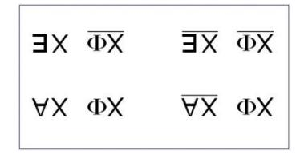

Je recommence :

*il existe un x tel que* ce qu'il y a de sujet déterminable par une fonction qui est ce qui domine *le rapport sexuel*...

à savoir *la fonction phallique* - c'est pour ça que je l'écris !

...*il existe un x qui se détermine de ceci : qu'il ait dit non à la fonction* [:§].

Vous voyez que de là d'où je parle, vous voyez d'ores et déjà *la question de l'existence* liée à quelque chose dont nous ne pouvons pas méconnaître que ce soit *un dire*. C'est un *dire non*, je dirai même plus : c'est un *dire que non*.

Ceci est *capital*.

Ceci est justement ce qui nous indique le point juste où doit être prise pour notre formation - formation d'analyste – ce qu'énonce la *théorie des ensembles* : *il y en a Un, « au-moins-Un » qui « dit que non ».*

C'est un repère ! C'est un *repère*, bien entendu qui ne tient pas même un instant, qui n'est d'aucune façon enseignant ni enseignable, si nous ne le conjoignons pas à cette inscription quantificatrice des 4 autres termes, à savoir : *le quanteur dit universel* : ;!, c'est-à-dire le point d'où il peut être dit, comme cela s'énonce dans la doctrine freudienne, qu'il n'y a de *désir*, de *libido* - c'est la même chose - que masculine. C'est à la vérité une erreur.

16 Paul-Jean Toulet : « *Contrerimes* » :

*« Comme les dieux gavant leur panse, Les Prétendants aussi.*

*Télémaque en est tout ranci : Il pense à la dépense.*

*Neptune soupe à Djibouti, (Près de la mer salée).*

*Pénélope s'est en allée. Tout le monde est parti. Un poète, que nuls n'écoutent, Chante Hélène et les œufs.*

*Le chien du logis se fait vieux : Ces gens-là le dégoûtent ! »*

Il n'en reste pas moins que c'est une erreur qui a tout son prix *de repère*. Que les trois autres formules, à savoir :

- *il n'existe pas cet* X [/ §], pour dire qu'il n'est pas vrai que *la fonction phallique* soit ce qui domine *le rapport sexuel*,
- et que d'autre part nous devions je ne dis pas *nous puissions* écrire qu'à un niveau *complémentaire* de ces 3 termes nous devions écrire *la fonction du « pas-tout »* [.] *comme étant essentielle à un certain type de rapport à la fonction phallique* en tant qu'elle fonde le rapport sexuel, c'est là évidemment ce qui fait de ces quatre inscriptions un *ensemble*.

Sans cet *ensemble*, il est impossible de s'orienter correctement dans ce qu'il en est de la pratique de l'analyse pour autant qu'elle a affaire avec ce quelque chose qui couramment se définit comme étant

- *–* « *l'homme* » d'une part,
- *–* et d'autre part ce *correspondant* généralement qualifié de « *femme* », qui le laisse seul.

S'il le laisse seul, c'est pas la faute du *correspondant*, c'est la faute de « *l'homme* ». Mais faute ou pas faute... c'est une affaire que nous n'avons pas à trancher immédiatement, je le signale au passage

...ce qu'il importe pour l'instant c'est d'interroger le sens de ce que peuvent avoir à faire ces 4 *fonctions*...

- qui ne sont que deux :
  - *–* l'une *négation de la fonction*,
  - *–* l'autre : *fonction opposée*

...*ces* 4 *fonctions* pour autant que les diversifie leur accouplement « *quanté* ».

Il est clair que ce que veut dire le : §, c'est-à-dire *négation de* !, est quelque chose qui depuis longtemps... et depuis assez à l'origine pour qu'on puisse dire

qu'on est absolument confondu que Freud l'ait ignoré

...:*négation de* ! à savoir cet *au-moins-Un*, cet *Un tout seul qui se détermine d'être l'effet du dire que non à la fonction phallique*, c'est très précisément le point sous lequel il faut que nous mettions tout ce qui s'est dit jusqu'à présent de l'*œdipe*, pour que l'*œdipe* soit autre chose qu'un mythe.

Et ceci a d'autant plus d'intérêt qu'il ne s'agit pas là de genèse, ni d'histoire, ni de quoi que ce soit qui ressemble, comme il semble à certains moments dans Freud que ç'ait pu être énoncé par lui, à savoir un événement. Il ne saurait s'agir d'événement à ce qui nous est représenté comme étant *avant* toute histoire. Il n'y a d'événement que ce qui se connote dans quelque chose qui s'énonce.

Il s'agit de *structure*.

Qu'on puisse parler de « *Tout-homme* » comme étant sujet à la castration [;!], c'est ce pourquoi, de la façon la plus patente, le mythe d'Œdipe est fait.

Est-il nécessaire de se mettre à retourner aux fonctions « *mythéme-atiques* » pour énoncer un fait logique qui est celui-ci : c'est que s'il est vrai que *l'inconscient est structuré comme un langage*, la fonction de la castration y est nécessitée, c'est exactement en effet ce qui implique *quelque chose* qui y échappe.

Et quoi que ce soit qui y échappe*,* même si ce n'est pas...

pourquoi pas, car c'est dans le mythe

...quelque chose d'humain : après tout pourquoi ne pas voir *le père* du meurtre primitif comme un orang-outang*,* beaucoup de choses qui coïncident dans la tradition...

la tradition d'où tout de même il faut dire que la psychanalyse surgit : de la tradition judaïque ...dans la tradition judaïque, comme j'ai pu l'énoncer l'année où je n'ai pas voulu faire plus que mon premier séminaire sur *Les Noms du Père,* j'ai quand même eu le temps d'y accentuer que dans le sacrifice d'Abraham, ce qui est sacrifié c'est effectivement *le père*, lequel n'est autre *qu'un bélier*.

Comme dans toute lignée humaine qui se respecte, sa descendance mythique est animale. De sorte qu'en fin de compte, ce que je vous ai dit l'autre jour **17** *de la fonction de la chasse chez l'homme*, c'est de ça qu'il s'agit. Je ne vous en ai pas dit bien long bien sûr.

J'aurai pu vous en dire plus sur le fait que le chasseur aime son gibier.

Tels les fils, dans l'évènement dit « *primordial »* dans la mythologie freudienne : *ils ont tué le père*...

*comme ceux dont vous voyez les traces sur les grottes de Lascaux*

...ils l'ont tué - mon Dieu - parce qu'ils l'aimaient bien sûr, comme la suite l'a prouvé, la suite est triste.

 17 Cf. « ...*Ou pire* », Séance du 17 mai 1972.

La suite est très précisément que *tous les hommes*,  $\forall X$ , que *l'universalité des hommes est sujette à la castration*. Qu'il y ait « *Une exception* », nous ne l'appellerons pas, du point d'où nous parlons, « *mythique* ». Cette *exception* c'est la fonction inclusive : quoi énoncer de l'universel  $[\forall X \ \Phi X]$ , sinon que l'universel soit enclos, enclos précisément par la possibilité négative  $[\exists X \ \Phi X]$ . Très exactement, l'*existence* ici joue le rôle du complément, ou pour parler plus mathématiquement, du *bord*.

Ce qui inclut ceci : qu'il y a quelque part un « *tont* x » :  $\forall x$ , un « *tont* x » qui devient un « *tont* a », je veux dire un  $\forall$ (a), chaque fois qu'il s'incarne, qu'il s'incarne dans ce qu'on peut appeler « Un être », « Un être » au moins qui se pose comme être, et à titre d'homme nommément.

C'est très précisément ce qui fait que ce soit dans l'autre colonne... et avec un type de rapport qui est fondamental,

que puisse s'articuler quelque chose...

dans quoi se range, puisse se ranger pour quiconque sache penser avec ces symboles ...au titre de la femme.

Rien que de l'articuler ainsi, ceci nous fait sentir qu'il y a quelque chose de remarquable, de remarquable pour vous, que ce qui s'en énonce, c'est qu'il n'y en a *pas une* qui dans l'énoncé...

dans l'énoncé qu'il n'est pas vrai que *la fonction phallique* domine ce qu'il en est *du rapport sexuel* ...s'inscrive en faux  $[\exists X \ \Phi X]$ .

Et pour vous permettre de vous y retrouver au moyen de références qui vous sont un petit peu plus familières, je dirai - mon Dieu, puisque j'ai parlé tout à l'heure du père - je dirai que ce que concerne ce :

« Il n'existe pas de x qui se détermine comme sujet dans l'énoncé du « dire que non » à la fonction phallique », c'est à proprement parler « la vierge ».

Vous savez que Freud en fait état : *le tabon de la virginité* etc., et d'autres histoires follement folkloriques autour de cette affaire, et le fait qu'autrefois les vierges étaient baisées pas par n'importe qui, il fallait au moins un grand prêtre ou un petit seigneur, enfin qu'importe, l'important n'est pas ça.

L'important en effet, c'est qu'on puisse dire autour de cette fonction du « *vir* »18, cette fonction du « *vir* » si frappante en ceci qu'il n'y ait jamais que d'une femme, après tout qu'on dise qu'elle soit *virile*. Si vous avez jamais entendu parler, au moins de nos jours, d'un type qui le soit, vous me le montrerez, ça m'intéressera !

Là par contre, si l'homme est tout ce que vous voulez dans le genre : *vir*tuose, *vire* à bâbord, parer à *virer, vire* ce que tu veux, le *viril* c'est du côté de la femme, c'est la seule à y croire ! Elle pense ! C'est même ce qui la caractérise.

Je vous expliquerai tout à l'heure...

il faut que je vous le dise tout de suite

...que c'est pour ça...

je vous expliquerai dans le détail pourquoi ...que la virgo n'est pas dénombrable, parce qu'elle se situe... contrairement à l'Un qui est du côté du père

...elle se situe entre l'Un et le Zéro.

Ce qui est entre l'Un et le Zéro, c'est très connu et ça se démontre, même quand on a tort, ça se démontre dans la théorie de Cantor, ça se démontre d'une façon que je trouve absolument merveilleuse.

Il y en a au moins ici quelques-uns qui savent de quoi je parle, de sorte que je vais l'indiquer brièvement. Il est tout à fait démontrable que ce qui est entre l'Un et le Zéro...

ça se démontre grâce aux décimales, on se sert de décimales dans le système du même nom : décimal ...il est très facile de montrer que : « supposez » ...

il faut le supposer

... « *supposez* » que ce soit *dénombrable*, la méthode dite « *de la diagonale* » peut permettre de forger toujours une nouvelle suite décimale telle qu'elle ne soit certainement pas inscrite dans ce qui a été *dénombré*.

Il est strictement *impossible* de construire ce *dénombrable*, de donner même une façon - si mince soit-elle - de le ranger, ce qui est bien la moindre des choses, parce que le dénombrable se définit de correspondre à *la suite des nombres entiers*.

18 Vir : homme, mâle. Étymologie : de la racine indo-européenne wihrós « homme » ou « guerrier ».

C'est donc purement et simplement d'un « *supposez...* » et là-dessus on accusera très volontiers... comme il se fait dans ce livre : « *Cantor a tort »* ...Cantor d'avoir tout simplement forgé un cercle vicieux.

Un cercle vicieux, mes bon amis, mais pourquoi pas ! Plus un cercle est vicieux, plus il est drôle, surtout si on peut en faire sortir quelque chose comme ce petit oiseau qui s'appelle *le non-dénombrable*, qui est bien une des choses les plus éminentes, les plus astucieuses, les plus collant au *Réel du nombre,* qui ait jamais été inventeés. Enfin, laissons !

Les « *onze mille Vierges* », comme il se dit dans La Légende Dorée **19** , c'est la façon d'exprimer le non-dénombrable. Parce que les *onze mille*, vous comprenez, c'est un chiffre énorme, c'est surtout un chiffre énorme pour des *Vierges*, et pas seulement par les temps qui courent ! Donc, nous avons pointé ces faits.

Tâchons maintenant de comprendre ce qu'il en advient, de ce « *pas toute* » [.] qui est vraiment le point vif, le point original de ce que j'ai inscrit au tableau. Car nulle part jusqu'à présent *dans la logique*, n'a été mise, promue, mise en avant, la fonction du « *Pas-Tous* » comme telle.

Le mode de la pensée...

pour autant qu'il est, si je puis dire, « subverti » par le manque du rapport sexuel ...pense et ne pense qu'au moyen de l'*Un*.

*L'Universel*, c'est le quelque chose qui résulte de *l'enveloppement d'un certain champ par quelque chose* qui est de l'ordre de l'*Un*, à ceci près, qui est la véritable signification de la notion de l'*ensemble*, c'est très précisément ceci : c'est que l'*ensemble*, c'est la notation mathématique de ce quelque chose - où hélas, je ne suis pas pour rien qui est une certaine définition, celle que je note du S, c'est à savoir *du sujet*, *du sujet* pour autant qu'il n'est rien d'autre que *l'effet de signifiant*, autrement dit : « *ce que représente un signifiant pour un autre signifiant.* »

L'*ensemble* c'est la façon dont, à un tournant de l'histoire*, les gens les moins faits pour mettre au jour ce qu'il en est du sujet*, s'y sont trouvés si l'on peut dire *nécessités*. « *L*'*ensemble* » *n'est rien d'autre que le sujet*. C'est bien pour cela qu'il ne saurait même se manier sans l'addition de *l'ensemble vide*.

Jusqu'à un certain point, je dirai que *l'ensemble vide* se démarque dans sa nécessité, de ceci : qu'il peut être pris pour un élément de l'ensemble, à savoir que l'inscription de la parenthèse qui désigne l'ensemble avec comme élément *l'ensemble vide* : {Ø}, est quelque chose sans quoi est absolument impensable tout maniement de cette fonction qui...

je vous le répète, je pense vous l'avoir suffisamment indiqué ...est faite très précisément à un certain tournant pour interroger...

interroger au niveau du langage *commun*, je souligne commun,

parce que ce n'est nullement ici *aucun* - de quelque sorte que ce soit - *métalangage* qui règne ...pour interroger du point de vue logique, interroger avec le langage de tous,

ce qu'il en est de *l'incidence dans le langage lui-même, du nombre*, c'est-à-dire

*–* de quelque chose qui n'a rien à faire *avec le langage*,

*–* de quelque chose qui est plus *réel* que n'importe quoi, l*e discours de la science* l'a suffisamment manifesté.

« *Pas-Tout* » [.] c'est très précisément ce qui résulte de ceci : non pas que rien ne le limite, mais que la limite est autrement située.

Ce qui fait le « *Pas-Tout* » [.], si je puis dire et je le dirai pour aller vite, c'est ceci, c'est que...

contrairement à l'inclusion dans :§

« *il existe le Père dont le dire-non le situe par rapport à la fonction phallique* »

...inversement, c'est en tant qu'il y a le vide, le manque, l'absence de quoi que ce soit qui dénie la fonction phallique au niveau de la femme, qu'inversement il n'y a rien d'autre que ce quelque chose que le « *Pas-Tout* » formule dans la position de *la femme* à l'endroit de la fonction phallique. Elle est en effet pour elle, « *Pas-Toute* ».

Ce qui ne veut pas dire que, sous quelque incidence que ce soit, elle le nie. Je ne dirai pas qu'elle est autre, parce que très précisément le mode sous lequel elle n'existe pas dans cette fonction - de la nier - ce qui est très précisément ce mode, c'est qu'elle est ce qui dans mon graphe s'inscrit du signifiant de ceci : que l'Autre est barré : S(A).

19 *La Légende dorée* (*Legenda aurea*), œuvre de Jacques De Voragine rédigée de 1261 à 1266 qui décrit la vie de 180 saints, saintes et martyrs chrétiens.

La femme n'est pas *le lieu de l'Autre*, et plus encore elle s'inscrit très précisément comme n'étant pas l'Autre dans la fonction que je donne au grand A, à savoir comme étant le lieu de *la vérité*.

Et ce qui s'inscrit dans « *la non-existence de ce qui pourrait nier la fonction phallique* » ...

de même qu'ici j'avais traduit par la fonction de *l'ensemble vide*, l'existence du « *dire que non* »,

de même c'est de s'absenter et même c'est d'être ce « *jouiscentre* »,

ce « *jouiscentre* » qui est conjugué à ce que je n'appellerai pas une absence, mais une *dé-sence : s.e.n.c.e.* ...que la femme se pose pour ce fait signifiant, non seulement que le grand Autre n'est pas là - ce n'est pas elle mais qu'il est tout à fait ailleurs : au lieu où il situe la parole.

Il me reste - puisqu'après tout vous avez la patience à une heure qui est déjà onze, de continuer à m'entendre - à pointer ceci qui est capital...

dans ce qu'après tout ici - pour vous - je force

à la fin de l'année, un certain nombre de thèmes qui sont des thèmes *cristallisants*

...c'est de dénoter *la béance* qui sépare chacun de ces termes en tant qu'ils sont *énoncés*.

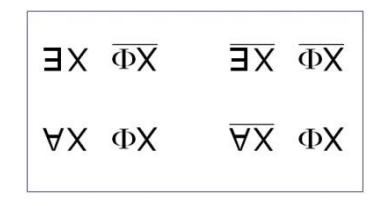

Il est clair qu'entre le :: « *il existe* », et le / : « *il n'existe pas* », on n'a pas à baragouiner, c'est *l'existence*.

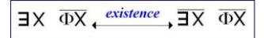

Il est clair qu'entre : § : « *il existe un qui ne*… » et ;! : « *il n'y en a pas Un qui ne soit*… », il y a *la contradiction* :

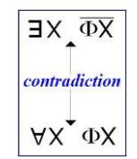

Quand Aristote fait état *des propositions particulières pour les opposer aux universelles*, c'est entre une *particulière positive* par rapport à une *universelle négative* qu'il institue *la contradiction*. Ici, c'est le contraire : c'est *la particulière qui est négative* et c'est *l'universelle qui est positive*.

Ici, ce que nous avons entre ce / §, qui est la négation *d'aucune universalité*, et ce . ! ce que nous avons, je ne fais ici que vous l'indiquer, je le justifierai par la suite, c'est *l'indécidable* :

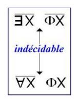

Entre les deux...

dont toute notre expérience nous montre, je pense, assez que la situation n'est pas simple ...ce dont il s'agit, c'est quoi ?

- *–* Nous l'appellerons *le manque*,
- *–* nous l'appellerons *la faille*,
- *–* nous l'appellerons si vous voulez, *le désir,*
- *–* et pour être plus rigoureux nous l'appellerons *l'objet(a)*.

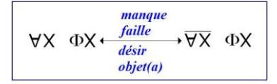

Alors il s'agit de savoir comment, au milieu de tout ça...

 j'espère que certains tout au moins, l'auront pris en note ...comment au milieu de tout ça fonctionne quelque chose qui pourrait ressembler à une *circulation*.

Pour ça, il faut s'interroger *sur le mode* dont sont posés ces quatre termes :

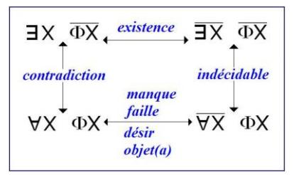

Le : en haut et à gauche, c'est littéralement *le nécessaire*.

Rien n'est pensable, c'est surtout pas notre fonction de penser à nous autres hommes.

Enfin, une femme ça pense, ça pense même de temps en temps « *donc je suis* », en quoi bien sûr elle se trompe.

Mais enfin, pour ce qui est du *nécessaire*, il est absolument nécessaire...

et c'est ça que nous dit Freud avec cette histoire à dormir debout de « *Totem et... Debout* » ...il est absolument nécessaire de penser quoi que ce soit aux rapports...

qu'on appelle humains, on ne sait pas pourquoi

...dans l'expérience qui s'instaure de *ce discours analytique,* il est absolument nécessaire de poser qu'il en existe *Un* pour qui la castration : à la gare !

La castration, ça veut dire quoi ?

Ça veut dire que « *tout laisse à désirer* », ça ne veut rien dire d'autre. Ben voilà !

Pour penser ça, c'est-à-dire à partir de la femme, il faut qu'il y en ait un pour qui *rien ne laisse à désirer*.

C'est l'histoire du mythe d'Œdipe, mais c'est absolument nécessaire, c'est absolument nécessaire. Si vous perdez ça, je vois absolument pas ce qui peut vous permettre de vous y retrouver d'une façon quelconque. C'est très important de se retrouver.

Alors voilà, cet : je vous ai déjà dit que c'est *le nécessaire*.

*Le nécessaire* à partir de quoi ? À partir justement de ce que, ma foi, je vous ai écrit là tout à l'heure : *l'indécidable*. Enfin on ne pourrait absolument rien dire qui ressemble à quoi que ce soit qui puisse faire fonction de *vérité*, si on n'admet pas *ce nécessaire* [:§] : *il y en a « au moins Un » qui dit non*...

J'insiste un peu. J'insiste parce que je n'ai pas pu ce soir - on a été dérangés - vous raconter toutes les gentillesses que j'aurai voulu vous dire à ce propos. Mais j'en avais une bien bonne et puisqu'on me taquine, je m'en vais vous la sortir quand même : c'est la fonction de l'é-*Pater*.

On s'est beaucoup interrogé sur la fonction du « *pater familias* ». Il faudrait mieux centrer ce que nous pouvons exiger de la fonction du père : cette histoire de carence paternelle, qu'est-ce qu'on s'en gargarise ! Il y a une crise, c'est un fait, c'est pas tout à fait faux : l'é-*Pater* ne nous épate plus. C'est la seule fonction véritablement décisive du père.

J'ai déjà marqué que ce n'était pas l'*œdipe*, que c'était foutu, que si le père était un législateur, ça donnait le Président Schreber comme enfant. Rien de plus. Sur n'importe quel plan, le père c'est celui qui doit *épater* la famille.

Si le père n'épate plus la famille, naturellement... mais on trouvera mieux ! C'est pas forcé que ce soit le père charnel, il y en a toujours un qui épatera la famille, dont chacun sait que c'est un troupeau d'esclaves. Il y en aura d'autres qui l'épateront.

Vous voyez comme la langue française peut servir à bien des choses. Je vous ai déjà expliqué ça la dernière fois, j'avais commencé par un truc : *fondre* ou *fonder d'eux un Un*, au subjonctif c'est le même truc, pour fonder il faut fondre. Il y a des choses qui ne peuvent s'exprimer que dans la langue française, c'est justement pour ça qu'il y a l'inconscient. Parce que ce sont *les équivoques* qui fondent, dans les deux sens du mot, il n'y a même que ça...

Si vous vous interrogez sur le « *Tous* » en cherchant comment c'est exprimé en chaque langue, vous trouverez des tas de trucs, des trucs absolument sensationnels. Personnellement je me suis beaucoup enquis du Chinois parce que je ne peux pas faire un catalogue des langues du monde entier.

J'ai aussi interrogé quelqu'un, grâce à la charmante trésorière de notre École [Nicole Sels], qui a fait écrire par son père comme on disait « *Tous* » en Yoruba. Mais c'est fou, vous comprenez ! Je fais ça pour l'amour de l'art, mais je sais bien que de toute façon je trouverai que dans toutes les langues, il y a un moyen pour dire « *Tous* ».

Moi ce qui m'intéresse c'est le *signifiant* « *comme Un* », c'est de quoi on se sert dans chaque langue. Et le seul intérêt du signifiant, c'est *les équivoques* qui peuvent en sortir...

c'est-à-dire quelque chose de l'ordre du « *fonde d'eux un Un* » et d'autres conneries de cette espèce ...c'est la seule chose intéressante, parce que pour nous ce qui est du « *Tous* », vous trouverez toujours ça exprimé, *le* « *Tous* » *est forcément sémantique*.

Le seul fait que je dise que je voudrais interroger « *Toutes* » les langues résout la question, puisque les langues justement ne sont « *pas toutes* », c'est leur définition, par contre si je vous interroge sur le « *Tous* », vous comprenez. Voilà ! Ouais, enfin la sémantique ça revient à la traductibilité.

Qu'est-ce que je pourrais en donner d'autre comme définition ? La sémantique c'est ce grâce à quoi un homme et une femme ne se comprennent que s'ils ne parlent pas la même langue. Enfin, je vous dis tout ça pour vous faire des exercices, et parce que je suis là pour ça, et puis aussi peut-être pour vous ouvrir un petit peu la comprenoire sur l'usage que je fais de la linguistique.

Ouais... Je veux en finir, n'est-ce-pas ?

Alors pour ce qui est de ce qui nécessite l'*existence*, nous partons justement de ce point que j'ai tout à l'heure inscrit : de la béance de l'*indécidable*, c'est-à-dire entre le « *pas-tout* » et le « *pas-une* ». Et après ça va là, à l'*existence*. Puis après ça, ça va là. À quoi ? Au fait que tous les hommes sont *en puissance de castration*, ça va au *possible*, car *l'universel n'est jamais rien d'autre que ça*. Quand vous dites que « *Tous les hommes sont mammifères* », ça veut dire que « *tous les hommes possibles* » peuvent l'être.

Et après ça, où ça va ? Ça va là : à *l'objet(a).* C'est avec ça que nous sommes en rapport.

Et après ça, ça va où ? Ça va là, où *la femme* se distingue de n'être pas unifiante. Voilà ! Il ne reste plus qu'à compléter ici pour aller vers la *contradiction,* et à revenir du « *Pas-Toutes* », qui est en somme rien d'autre que l'expression de *la contingence*.

Vous voyez ici...

comme je l'ai déjà signalé en son temps**20** ...l'alternance *de la nécessité*, *du contingent*, *du possible* et de *l'impossible* ne sont pas dans l'ordre qu'Aristote donne. Car ici c'est de *l'impossible* qu'il s'agit, c'est-à-dire en fin de compte du *réel*.

Alors suivez bien ce petit chemin, parce qu'il nous servira par la suite, vous en verrez quelque chose. Voilà ! Il faudrait indiquer les 4 triangles dans les coins comme ça, la direction des flèches est également indiquée. Vous y êtes ? Voilà !

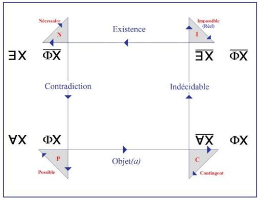

20 Cf. le séminaire 1961-62 : « *L'identification* » séance du 17-01-1962.

Je trouve que j'en ai assez fait pour ce soir. Je ne désire pas finir sur une péroraison sensationnelle, mais la question que... oui, c'est assez bien écrit. *Nécessaire, impossible*...

# *X - On n'entend pas !*

Lacan - Hein ? *Nécessaire, impossible, possible* et *contingent*.

# *X - On n'entend rien !*

Lacan

Je m'en fous ! Voilà ! C'est un frayage.

Vous entendrez la suite dans presque quinze jours, puisque c'est le 14 que je ferai mon prochain séminaire au Panthéon.

Je ne suis pas sûr que ce ne sera pas le dernier.