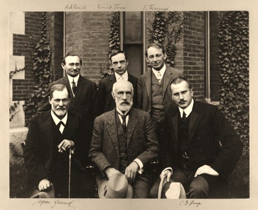

# Leçon 02 | 13 janvier 1954

  

    <label><input type="checkbox" data-lacan-toggle="original" checked> 原文</label>
    <label><input type="checkbox" data-lacan-toggle="notes" checked> 注释</label>
    <label><input type="checkbox" data-lacan-toggle="commentary" checked> 个人解读评论</label>
  

  <form class="lacan-tool-search" role="search">
    <input class="lacan-tool-search-input" type="search" placeholder="搜索全文" aria-label="搜索全文">
    <button class="lacan-tool-button" type="submit" title="搜索">搜索</button>
  </form>
  <button class="lacan-tool-button lacan-back-to-top" type="button" title="回到页面最上方" aria-label="回到页面最上方">↑</button>

<section class="parallel-paragraph" data-paragraph-ids="s1-02-0001">

s1-02-0001

原文 · s1-02-0001

Pour commencer l’année nouvelle, pour laquelle je vous présente mes bons vœux, je l’introduirai volontiers par un thème que j’exprimerai à peu près ainsi : « *fini de rire !* ». Pendant le dernier trimestre, vous n’avez guère eu ici autre chose à faire qu’à m’écouter. Je vous annonce solennellement que dans ce trimestre qui commence, je compte, j’espère, j’ose espérer que moi aussi je vous entendrai un peu. Ceci me paraît absolument indispensable. D’abord, parce que c’est la loi même et la tradition du séminaire que ceux qui y participent y apportent plus qu’un effort personnel. Ils apportent une collaboration par les communications effectives.

[无对应译文]

</section>

<section class="parallel-paragraph" data-paragraph-ids="s1-02-0002">

s1-02-0002

原文 · s1-02-0002

Et ceci, bien entendu ne peut venir que de ceux qui sont intéressés de la façon la plus directe à ces séminaires, ceux pour qui Ces séminaires de textes ont leur plein sens, c’est-à-dire sont engagés à des degrés, à des titres divers dans notre pratique. Ceci n’exclura pas, bien entendu, que vous n’obteniez de moi les réponses que je serai en mesure de vous donner, et il me serait tout particulièrement sen­sible que dans ce trimestre, tous et toutes, selon la mesure de vos moyens, vous donniez à l’établissement de ce que je pourrais appeler « nouvelle étape », « nouveau stade du fonctionnement » de ce séminaire, ce que j’appellerai votre *maximum*.

[无对应译文]

</section>

<section class="parallel-paragraph" data-paragraph-ids="s1-02-0003">

s1-02-0003

原文 · s1-02-0003

Votre *maximum*, ça consiste à ce que, quand j’interpellerai tel ou tel pour le charger d’une section précise de notre tâche commune, on ne réponde pas, avec un air ennuyé, que justement cette semaine on a des charges particulièrement lourdes, telle ou telle de ces réponses que vous connaissez bien. Je parle tout au moins pour ceux qui font partie du groupe que nous repré­sentons ici, et dont je voudrais que vous vous rendiez bien compte que s’il est constitué comme tel, à l’état de groupe autonome, s’étant isolé comme tel, c’est précisément pour une tâche qui nous intéresse tous, ceux qui font partie de ce groupe, et qui comporte rien moins pour chacun de nous que l’avenir, le sens de tout ce que nous faisons et aurons à faire dans la suite de notre existence.

[无对应译文]

</section>

<section class="parallel-paragraph" data-paragraph-ids="s1-02-0004">

s1-02-0004

原文 · s1-02-0004

Si vous ne venez pas à ce groupe à ce plein sens, au sens de mettre vraiment en cause toute votre activité, je ne vois pas pourquoi nous nous serions constitués sous cette forme. Pour tout dire, ceux qui ne sentiraient pas en eux-mêmes le sens de cette tâche, je ne vois pas pourquoi ils resteraient attachés à notre groupe, pour­quoi ils n’iraient pas se joindre à toute espèce d’autre forme de bureaucratie.

[无对应译文]

</section>

<section class="parallel-paragraph" data-paragraph-ids="s1-02-0005">

s1-02-0005

原文 · s1-02-0005

Ces réflexions sont particulièrement pertinentes, à mon sens, au moment où nous allons aborder ce qu’on appelle communément les *Écrits techniques de Freud*. C’est un terme qui est déjà fixé par une certaine tradition. Dès le vivant de FREUD, sous la façon dont les choses sont présentées, sous forme d’édition, on a vu paraître, sous la forme de la *Sammlung kleiner neurosen Schriften* [^1] la collection des petits écrits sur les névroses - ou neuroses, je ne me souviens plus exactement - un petit volume *in octavo*, qui isolait un certain nombre d’écrits de FREUD qui vont de 1904 à 1919, et qui sont des écrits dont le titre, la présentation, le contenu, indiquent dans l’ensemble ce qu’est la méthode psychanalytique.

[无对应译文]

</section>

<section class="parallel-paragraph" data-paragraph-ids="s1-02-0006">

s1-02-0006

原文 · s1-02-0006

Et ce qui motive et jus­tifie cette forme, ce dont il y a lieu de mettre en garde tel ou tel praticien inex­périmenté qui voudrait s’y lancer, c’est qu’il faut considérer comme indispensable d’éviter un certain nombre de confusions quant à la pratique et aussi l’essence de la méthode. Et l’on vit également apparaître sous une forme graduellement élaborée un certain nombre de notions fondamentales pour comprendre *le mode d’action* de la thérapeutique *analytique*, et en particulier dans ces écrits, un certain nombre de passages extrêmement importants pour la compréhension du pro­grès qu’a fait, au cours de ces années 1904-1919, l’élaboration qu’a subie, dans la pratique et aussi dans la théorie de FREUD :

[无对应译文]

</section>

<section class="parallel-paragraph" data-paragraph-ids="s1-02-0007">

s1-02-0007

原文 · s1-02-0007

- la notion de *résistance*,

[无对应译文]

</section>

<section class="parallel-paragraph" data-paragraph-ids="s1-02-0008">

s1-02-0008

原文 · s1-02-0008

- la fonction du *transfert*,

[无对应译文]

</section>

<section class="parallel-paragraph" data-paragraph-ids="s1-02-0009">

s1-02-0009

原文 · s1-02-0009

- le mode d’action et d’intervention dans *le transfert*,

[无对应译文]

</section>

<section class="parallel-paragraph" data-paragraph-ids="s1-02-0010">

s1-02-0010

原文 · s1-02-0010

- et enfin même, à un certain point, la notion de la fonction essentielle de *la névrose de transfert*.

[无对应译文]

</section>

<section class="parallel-paragraph" data-paragraph-ids="s1-02-0011">

s1-02-0011

原文 · s1-02-0011

Inutile de vous dire que *ce petit groupe d’écrits* a une importance toute par­ticulière. Ce groupement pourtant n’est pas complètement ni entièrement satisfaisant, au premier abord tout au moins. Peut-être le terme « *Écrits tech­niques »* n’est pas ce qui lui donne effectivement son unité. Car il représente en effet une unité dans l’œuvre de FREUD et la pensée de FREUD, une unité par une sorte d’étape dans sa pensée, si on peut dire. C’est sous cet angle que nous l’étu­dierons.

[无对应译文]

</section>

<section class="parallel-paragraph" data-paragraph-ids="s1-02-0012">

s1-02-0012

原文 · s1-02-0012

Étape effectivement intermédiaire entre ce que nous pourrions appeler le premier développement de ce que quelqu’un…

[无对应译文]

</section>

<section class="parallel-paragraph" data-paragraph-ids="s1-02-0013">

s1-02-0013

原文 · s1-02-0013

> un analyste dont la plume n’est pas toujours de la meilleure veine,
>
> mais qui a eu en cette occasion une trouvaille assez heureuse, et même belle

[无对应译文]

</section>

<section class="parallel-paragraph" data-paragraph-ids="s1-02-0014">

s1-02-0014

原文 · s1-02-0014

…a appelé « *expérience germinale* » [^2] dans FREUD.

[无对应译文]

</section>

<section class="parallel-paragraph" data-paragraph-ids="s1-02-0015">

s1-02-0015

原文 · s1-02-0015

En effet, nous pouvons distinguer jusque vers, mettons 1904 ou même 1906, 1904 représentant l’apparition de l’article sur la méthode psychanalytique, dont certains disent que c’est là pour la première fois qu’on a vu apparaître le mot psychanalyse – ce qui est tout à fait faux, parce que le mot psychanalyse a été employé bien avant par FREUD – mais enfin là le mot *psychanalyse* est employé d’une façon formelle, et dans le titre même de l’article, alors mettons 1904 ou 1906.

[无对应译文]

</section>

<section class="parallel-paragraph" data-paragraph-ids="s1-02-0016">

s1-02-0016

原文 · s1-02-0016

1909 : ce sont les conférences à la CLARK University, voyage de FREUD en Amérique accompagné de son « *fils* »[^3].

[无对应译文]

</section>

<section class="parallel-paragraph" data-paragraph-ids="s1-02-0017">

s1-02-0017

原文 · s1-02-0017

[无对应译文]

</section>

<section class="parallel-paragraph" data-paragraph-ids="s1-02-0018">

s1-02-0018

原文 · s1-02-0018

Et c’est là, ou le point de repère entre 1904 et 1906, que nous pouvons choisir comme représentant le premier développement de cette expérience germinale. Si nous reprenons les choses à l’autre bout, à l’année 1920, nous voyons l’éla­boration de la théorie des instances, de la théorie structurale, ou encore *méta­psychologique*, comme FREUD l’a appelée, de l’expérience freudienne. C’est l’autre bout : c’est un autre développement qu’il nous a légué de son expérience et de sa découverte.

[无对应译文]

</section>

<section class="parallel-paragraph" data-paragraph-ids="s1-02-0019">

s1-02-0019

原文 · s1-02-0019

Vous le voyez, les *Écrits techniques* s’échelonnent et se situent exactement entre les deux. C’est ce qui leur donne leur sens, parce que autrement, si nous voulions dire que les *Écrits techniques* sont une unité au cas où FREUD parle de la technique, ce serait une conception tout à fait erronée.

[无对应译文]

</section>

<section class="parallel-paragraph" data-paragraph-ids="s1-02-0020">

s1-02-0020

原文 · s1-02-0020

On peut dire qu’en un certain sens FREUD n’a jamais cessé de parler de la technique. Je n’ai pas besoin d’évoquer devant vous les [*Studien über Hysterie*](http://de.wikisource.org/wiki/Studien_%C3%BCber_Hysterie) qui ne sont absolument qu’un long exposé de la découverte de la technique analytique. Nous l’y voyons en formation, et c’est ce qui fait le prix de ces études, et je dirai que si on voulait faire en effet un exposé complet, systématique, de la façon dont la technique s’est développée chez FREUD, c’est ainsi qu’il faudrait commencer : nous ne pourrions que nous y référer et l’évoquer sans cesse.

[无对应译文]

</section>

<section class="parallel-paragraph" data-paragraph-ids="s1-02-0021">

s1-02-0021

原文 · s1-02-0021

La raison pour laquelle je n’ai pas pris *Studien über Hysterie*, c’est tout simplement qu’elles ne sont pas facilement accessibles : vous ne lisez pas tous l’allemand, ni même l’anglais. Il y en a une édition dans le *Nervous and Mental Disease Monograph series* [^4], qu’on peut se procurer. Ce n’était pas extrêmement facile de vous demander à tous de faire cet effort. D’autre part, il y a d’autres raisons que ces raisons d’opportunité, pour les­quelles j’ai choisi ces *Écrits techniques*.

[无对应译文]

</section>

<section class="parallel-paragraph" data-paragraph-ids="s1-02-0022">

s1-02-0022

原文 · s1-02-0022

Mais pour poursuivre, nous dirons que, même dans la *Science des rêves*, il s’agit tout le temps et perpétuellement de technique. On peut dire qu’il n’y a pas…

[无对应译文]

</section>

<section class="parallel-paragraph" data-paragraph-ids="s1-02-0023">

s1-02-0023

原文 · s1-02-0023

> qu’il ait parlé, écrit, sur des thèmes disons d’élaboration mythologique, ethnographique, les thèmes proprement culturels

[无对应译文]

</section>

<section class="parallel-paragraph" data-paragraph-ids="s1-02-0024">

s1-02-0024

原文 · s1-02-0024

…il n’y a guère d’œuvre de FREUD qui ne nous apporte quelque chose sur la technique.

[无对应译文]

</section>

<section class="parallel-paragraph" data-paragraph-ids="s1-02-0025">

s1-02-0025

原文 · s1-02-0025

Mais, pour accen­tuer encore ce que je veux dire, il est inutile de souligner qu’un article comme *Analyse terminable et interminable*, paru dans le tome V des *Collected Papers*, vers les années 1934, est un des articles les plus importants quant à la technique.

[无对应译文]

</section>

<section class="parallel-paragraph" data-paragraph-ids="s1-02-0026">

s1-02-0026

原文 · s1-02-0026

En fait, la question de l’esprit dans lequel il me paraîtrait souhaitable que cette année, ce trimestre, nous poursuivions les commentaires de ces *Écrits techniques* est quelque chose de tout à fait important à fixer dès aujourd’hui. Et c’est pour cela que je considère les quelques mots que je vous introduis comme importants. Je les ai appelés « *Introduction aux commentaires sur les Écrits techniques de Freud »*.

[无对应译文]

</section>

<section class="parallel-paragraph" data-paragraph-ids="s1-02-0027">

s1-02-0027

原文 · s1-02-0027

En effet, il y a plusieurs façons de voir les choses. Si nous considérons que nous sommes ici pour nous pencher avec admiration sur les textes de FREUD et nous en émerveiller, évidemment nous aurons toute satisfaction. Ces écrits sont d’une fraîcheur, d’une vivacité qui ne manquent jamais de produire le même effet que tous les autres écrits de FREUD. La personnalité s’y découvre d’une façon parfois tellement directe qu’on ne peut pas manquer de l’y retrouver, comme dans tel ou tel des meilleurs moments que nous avons déjà rencontrés dans les textes que nous avons commentés. La simplicité, les raisons, la motiva­tion des rêves qu’il nous donne, la franchise du ton, enfin, est déjà à soi toute seule une sorte de leçon. L’aisance avec laquelle sont traitées toutes les questions des règles pratiques à observer est une chose à laquelle il ne serait jamais mau­vais de se référer pour nous faire voir combien pour FREUD il s’agissait là d’un instrument, au sens où on dit qu’on a un marteau bien en main. Il dit :

[无对应译文]

</section>

<section class="parallel-paragraph" data-paragraph-ids="s1-02-0028">

s1-02-0028

原文 · s1-02-0028

« *Bien en main pour moi, mais ce que je vous dis là, c’est parce que c’est - moi - comme ça que j’ai l’habitude de le tenir.* *Mais d’autres peut-être préféreraient un instru­ment un tout petit peu différent, plus à leur main.* »

[无对应译文]

</section>

<section class="parallel-paragraph" data-paragraph-ids="s1-02-0029">

s1-02-0029

原文 · s1-02-0029

Vous en verrez des passages tout à fait clairs, encore plus clairement que je ne vous le dis sous cette forme métaphorique. Toute la question de la formalisation des règles techniques y est traitée avec une liberté qui est certainement à soi toute seule un enseignement qui pourrait suffire et qui donne déjà à une première lecture des *Écrits techniques* son fruit et sa récompense. Il n’y a rien qui soit plus salubre, plus libérant que la lecture directe de ces écrits où pour la première fois sont données un certain nombre de règles pratiques, d’un caractère tout à fait instrumental, et rien n’est plus significatif pour bien montrer que la question est ailleurs.

[无对应译文]

</section>

<section class="parallel-paragraph" data-paragraph-ids="s1-02-0030">

s1-02-0030

原文 · s1-02-0030

Ce n’est pas tout, dans la façon de nous transmettre ce qu’on pourrait appeler les voies de cette vérité de la pensée freudienne. On pourrait y joindre une autre face qui se montre sous un certain nombre de passages, qui viennent peut-être au second plan, mais qui sont très sensibles :

[无对应译文]

</section>

<section class="parallel-paragraph" data-paragraph-ids="s1-02-0031">

s1-02-0031

原文 · s1-02-0031

- c’est le caractère *souffrant* de cette personnalité, le sentiment qu’il a de la nécessité de l’autorité, ce qui ne va pas certainement sans une certaine dépréciation fonda­mentale de ce que celui qui a quelque chose à transmettre ou à enseigner peut attendre de ceux qui le suivent et qui l’écoutent.

[无对应译文]

</section>

<section class="parallel-paragraph" data-paragraph-ids="s1-02-0032">

s1-02-0032

原文 · s1-02-0032

- Une certaine méfiance profonde de la façon dont les choses sont appliquées et comprises apparaît en bien des endroits, et même vous verrez : je crois qu’il n’est pas très difficile à trouver une dépréciation toute particulière de la matière humaine qui lui est offerte dans le monde contemporain.

[无对应译文]

</section>

<section class="parallel-paragraph" data-paragraph-ids="s1-02-0033">

s1-02-0033

原文 · s1-02-0033

C’est bien assurément ce qui nous permet d’entrevoir aussi pourquoi FREUD a, tout à fait en dehors du cercle du style de ce qu’il écrit, concrè­tement et pratiquement mis en exercice ce poids de son autorité, et combien à la fois il a été exclusif par rapport à toutes sortes de déviations, très effectivement, déviations qui se sont manifestées, et en même temps impératif dans la façon dont il a laissé s’organiser autour de lui la transmission de cet enseignement.

[无对应译文]

</section>

<section class="parallel-paragraph" data-paragraph-ids="s1-02-0034">

s1-02-0034

原文 · s1-02-0034

Cela n’est qu’un aperçu de ce qui peut nous être révélé par cette lecture. La question est de savoir si c’est uniquement cela, cet aspect historique de l’action, de la présence de FREUD, sur le sujet de la transmission technique, est-ce que c’est à cela que nous allons nous limiter ? Eh bien, non ! Je ne crois pas que ce puisse être possible. Ne serait-ce d’abord que malgré tout l’intérêt et le côté stimulant, agréable, détendant, que cela peut avoir, ça ne serait tout de même qu’assez inopérant.

[无对应译文]

</section>

<section class="parallel-paragraph" data-paragraph-ids="s1-02-0035">

s1-02-0035

原文 · s1-02-0035

Vous savez que c’est toujours en fonction de l’actualité, en fonction du sens que peut avoir \[...\] à savoir :

[无对应译文]

</section>

<section class="parallel-paragraph" data-paragraph-ids="s1-02-0036">

s1-02-0036

原文 · s1-02-0036

> « *Qu’est-ce que nous faisons quand nous faisons de l’analyse ?* »

[无对应译文]

</section>

<section class="parallel-paragraph" data-paragraph-ids="s1-02-0037">

s1-02-0037

原文 · s1-02-0037

Ce commentaire de FREUD a été jusqu’ici par moi apporté, et je ne vois pas pourquoi nous ne poursuivrions pas cet examen à propos de ce petit écrit dans le même style et dans le même esprit.

[无对应译文]

</section>

<section class="parallel-paragraph" data-paragraph-ids="s1-02-0038">

s1-02-0038

原文 · s1-02-0038

Or, pour partir de l’actualité de la technique, de ce qui se dit, s’écrit, et se pra­tique quant à la technique analytique, je ne sais pas si la majorité d’entre vous - une partie tout au moins, je l’espère - a bien pris conscience de ceci : c’est que, quant à la façon dont les praticiens analystes à travers le monde, pour l’instant - je parle de maintenant, 1954, cette année toute fraîche, toute nouvelle - ces ana­lystes divers, pensent, expriment, conçoivent leur technique, au point de ce qu’il n’est pas exagéré d’appeler « *la confusion la plus radicale* ».

[无对应译文]

</section>

<section class="parallel-paragraph" data-paragraph-ids="s1-02-0039">

s1-02-0039

原文 · s1-02-0039

Je mets en fait qu’actuellement parmi les analystes - et qui pensent, ce qui déjà rétrécit le cercle - il n’y en a peut-être pas un seul, dans le fond, qui se fasse la même idée qu’un quelconque de ses contemporains, ou de ses voisins sur le sujet - n’êtes-vous pas d’accord, Michèle CAHEN ? - sur le sujet de ce qu’on fait, de ce qu’on vise, de ce qu’on obtient, de ce qu’il s’agit.

[无对应译文]

</section>

<section class="parallel-paragraph" data-paragraph-ids="s1-02-0040">

s1-02-0040

原文 · s1-02-0040

C’en est même au point que nous pourrions nous amuser à ce petit jeu de rap­procher les conceptions formulées qui sont les plus extrêmes, et nous verrons qu’elles aboutissent à des formulations rigoureusement contradictoires, et ceci sans chercher bien loin. Nous ne chercherons pas des amateurs de paradoxes. D’ailleurs ils ne sont pas tellement abondants, en général. La matière est assez grave, et assez sérieuse pour que divers théoriciens abordent cela sans désir de fan­taisie.

[无对应译文]

</section>

<section class="parallel-paragraph" data-paragraph-ids="s1-02-0041">

s1-02-0041

原文 · s1-02-0041

Et en général l’humour est absent de ces sortes d’élucubrations sur les résul­tats thérapeutiques, sur leurs formes, sur leurs procédés et les voies par lesquelles on les obtient. On se raccroche à la balustrade, au « garde-fou » de quelque partie d’élaboration théorique faite par FREUD lui-même. Et c’est ce qui donne à chacun la garantie qu’il est encore en communication avec ceux qui sont ses confrères et collègues. C’est par cet intermédiaire, par l’intermédiaire du langage freudien, que la communication est maintenue entre des praticiens qui très évidemment se font des conceptions assez différentes de leur action thérapeutique, et qui plus est, de la forme générale de ce rapport interhumain qui s’appelle la psychanalyse.

[无对应译文]

</section>

<section class="parallel-paragraph" data-paragraph-ids="s1-02-0042">

s1-02-0042

原文 · s1-02-0042

Quand je dis « rapport interhumain », vous voyez déjà que je mets les choses au point où elles sont venues actuellement. Car il est évident que la notion du rapport entre l’*analyste* et l’*analysé* est la voie dans laquelle s’est engagée l’élaboration des doc­trines modernes pour essayer de retrouver une assiette, un plan d’élaboration qui corresponde au concret de l’expérience. C’est certainement là une direction, la plus féconde dans laquelle les choses soient engagés depuis la mort de FREUD.

[无对应译文]

</section>

<section class="parallel-paragraph" data-paragraph-ids="s1-02-0043">

s1-02-0043

原文 · s1-02-0043

C’est ce que M. BALINT appelle, par exemple, la création de ce qu’il appelle une « *two bodies psychology »*, terme d’ailleurs qui n’est pas de lui, qu’il a emprunté au défunt RICKMAN qui était une des rares personnes qui aient eu un petit peu d’originalité théorique dans le milieu analyste depuis la mort de FREUD.

[无对应译文]

</section>

<section class="parallel-paragraph" data-paragraph-ids="s1-02-0044">

s1-02-0044

原文 · s1-02-0044

Cette manière de formuler les choses, autour de laquelle, vous le voyez, on peut regrouper facilement toutes les études qui ont été faites sur *la relation d’objet*, l’importance du *contre-transfert*, et un certain nombre de termes connexes parmi lesquels au premier plan le rôle du *fantasme*, à savoir l’inter-­réaction imaginaire entre l’analysé et l’analyste, est quelque chose dont nous aurons à tenir compte.

[无对应译文]

</section>

<section class="parallel-paragraph" data-paragraph-ids="s1-02-0045">

s1-02-0045

原文 · s1-02-0045

Est-ce à dire que par là nous soyons dans une voie qui soit effectivement la voie qui nous permette de bien situer les problèmes ? D’un côté, oui. D’un côté, non. Il y a un gros intérêt à promouvoir une recherche de cette espèce, pour autant qu’elle marque bien l’originalité de ce dont il s’agit par rapport à une « *one body ­psychology »*, la psychologie constructive habituelle.

[无对应译文]

</section>

<section class="parallel-paragraph" data-paragraph-ids="s1-02-0046">

s1-02-0046

原文 · s1-02-0046

Il faut marquer de quelque chose, dès l’abord, que c’est ailleurs que se constitue tout ce que nous pourrons éla­borer dans l’expression analytique, à savoir dans un certain rapport déterminé. Est-ce assez de dire qu’il s’agit d’un rapport entre deux individus ? C’est là que gît, je crois, une partie du problème insuffisamment approfondie. Là on peut apercevoir les impasses où se trouve actuellement portée la formulation théorique de la technique.

[无对应译文]

</section>

<section class="parallel-paragraph" data-paragraph-ids="s1-02-0047">

s1-02-0047

原文 · s1-02-0047

Je ne peux pas vous en dire plus pour l’instant. Encore que, pour ceux qui sont ici présents, familiers de ce séminaire, vous devez bien entendre, à savoir qu’il n’y a pas de « *two bodies psychology »* si nous ne faisons pas intervenir ce tiers élément dont je vous ai déjà présenté une des phases sous la forme du *rapport symbolique* de *la parole* prise en tant que telle, et prise comme point central de perspectives, de points de vue, d’aperceptions de l’expérience analytique. C’est-à-dire que *c’est dans un rapport à trois* - et non pas dans une relation à deux *- que peut se formuler pleinement dans sa complé­tude, l’expérience analytique*.

[无对应译文]

</section>

<section class="parallel-paragraph" data-paragraph-ids="s1-02-0048">

s1-02-0048

原文 · s1-02-0048

Cela ne veut pas dire qu’on ne puisse pas en exprimer des fragments, des morceaux, des pans importants dans un autre registre, et dans un registre qui indique particulièrement \[...\]. Mais ce que je veux mettre comme prémisse au développement de notre discussion, c’est ceci : que là gît un des points les plus importants à élucider pour comprendre, pour situer à quelle sorte de difficultés un certain nombre de for­mulations des *relations inter-analytiques*, qui sont d’ailleurs différentes, et c’est facile à comprendre.

[无对应译文]

</section>

<section class="parallel-paragraph" data-paragraph-ids="s1-02-0049">

s1-02-0049

原文 · s1-02-0049

Si le fondement de *la relation inter–analytique* est effective­ment quelque chose que nous pouvons représenter comme ça, triadique, il y aura plusieurs façons de choisir dans les trois éléments de cette *triade*. Il y aura une façon de mettre l’accent sur chacune des trois relations triadiques qui s’éta­blissent à l’intérieur d’une triade. Et ce sera, vous le verrez, une façon qui est tout à fait pratique de classer un certain nombre d’élaborations théoriques qui sont données de la technique. Tout cela peut paraître actuellement un peu abstrait. Je ne peux pas faire plus ni mieux aujourd’hui.

[无对应译文]

</section>

<section class="parallel-paragraph" data-paragraph-ids="s1-02-0050">

s1-02-0050

原文 · s1-02-0050

Quoi qu’il en soit, ce que je veux tâcher de dire de plus concret, de plus proche du terrain, pour vous introduire à cette discussion, j’ai parlé tout à l’heure de « *l’expérience germinale* » chez FREUD. Cette *expérience germinale*, je vais l’évoquer rapidement ici, puisqu’en somme c’est cela qui a fait l’objet en partie de nos dernières leçons, celles du trimestre dernier, tout entier attaché, centré, autour de la notion que c’est la reconstitution complète de l’histoire du sujet qui est l’élément essentiel, constitutif, structural, du progrès analytique.

[无对应译文]

</section>

<section class="parallel-paragraph" data-paragraph-ids="s1-02-0051">

s1-02-0051

原文 · s1-02-0051

Je crois vous voir démontré que FREUD en est parti, que chaque fois il s’agit pour lui de l’appréhension d’un cas singulier…

[无对应译文]

</section>

<section class="parallel-paragraph" data-paragraph-ids="s1-02-0052">

s1-02-0052

原文 · s1-02-0052

> et c’est cela qui a fait le prix de l’analyse, de chacune de ces cinq grandes psychanalyses,
>
> les trois que nous avons déjà vues, élaborées, travaillées ensemble, vous le démontrent

[无对应译文]

</section>

<section class="parallel-paragraph" data-paragraph-ids="s1-02-0053">

s1-02-0053

原文 · s1-02-0053

…c’est que c’est là qu’est vraiment l’essentiel, son progrès, sa découverte, dans la façon de prendre un cas dans sa singularité.

[无对应译文]

</section>

<section class="parallel-paragraph" data-paragraph-ids="s1-02-0054">

s1-02-0054

原文 · s1-02-0054

Eh bien, le prendre dans sa singularité, qu’est-ce que ça veut dire ? Cela veut essentiellement dire que pour lui l’intérêt, l’essence, le fondement, la dimension propre de l’analyse, c’est *la réintégration par le sujet de son histoire* jusqu’à ses dernières limites sensibles,

[无对应译文]

</section>

<section class="parallel-paragraph" data-paragraph-ids="s1-02-0055">

s1-02-0055

原文 · s1-02-0055

c’est-à-dire jusqu’à *quelque chose qui dépasse de beaucoup les limites individuelles*. Ceci dit, \[quelque chose\] qui peut se fonder, se déduire, se démontrer de mille points textuels dans FREUD, et c’est ce que nous avons fait ensemble au cours de ces dernières années. Ceci se présente, si vous voulez, dans le fait, dans l’accent mis par FREUD sur tel ou tel point, essentiel à conquérir par la technique sous la forme d’un cer­tain nombre de caractéristiques, ce que j’appellerai « *situation de l’histoire* » dans sa première apparence, mais cela apparaîtrait comme accent mis sur le passé. Bien entendu, je vous ai montré que ce n’était pas simple : l’histoire ce n’est pas le passé, l’histoire c’est le passé dans le sens où il est historisé dans le présent, et il est historisé dans le présent parce qu’il a été vécu dans le passé.

[无对应译文]

</section>

<section class="parallel-paragraph" data-paragraph-ids="s1-02-0056">

s1-02-0056

原文 · s1-02-0056

Je veux indiquer que dans la technique, les voies et les moyens pour accéder à cette réintégration, restitution de l’histoire du sujet, cela prendra la forme d’une recherche de restitution du passé. Ceci étant considéré comme point de mire, comme résultat matériel, comme accent de la recherche, poursuivi par *un certain nombre de voies techniques*, il est très important de voir, et vous le verrez…

[无对应译文]

</section>

<section class="parallel-paragraph" data-paragraph-ids="s1-02-0057">

s1-02-0057

原文 · s1-02-0057

> vous le verrez marqué, je dois le dire, tout au long de cette œuvre de FREUD dont je vous ai dit les indications techniques,
>
> surtout les *Écrits techniques* dont je vous parlais tout à l’heure

[无对应译文]

</section>

<section class="parallel-paragraph" data-paragraph-ids="s1-02-0058">

s1-02-0058

原文 · s1-02-0058

…vous verrez que pour FREUD, ceci est toujours resté, et jusqu’à la fin, au premier plan de ses préoccupations.

[无对应译文]

</section>

<section class="parallel-paragraph" data-paragraph-ids="s1-02-0059">

s1-02-0059

原文 · s1-02-0059

C’est bien pour cela que, autour de cet accent mis sur cette « *restitution du passé »* se posent un certain nombre de questions qui sont, à proprement parler, les questions ouvertes par la découverte freudienne, et qui ne sont rien moins que les questions qui ont été jusqu’ici évitées, qui n’ont pas été abordées - dans l’analyse, j’entends - à savoir  *des fonctions du temps dans la réalisation du sujet humain.*

[无对应译文]

</section>

<section class="parallel-paragraph" data-paragraph-ids="s1-02-0060">

s1-02-0060

原文 · s1-02-0060

Plus on retourne *à l’origine* de l’expérience freudienne - quand je dis « *à l’origine* », je ne dis pas à *l’origine historique*, je veux dire au point de source - plus on se rend compte que c’est cela qui fait toujours vivre l’analyse, malgré des habillements profondément différents qui lui sont donnés, plus on voit en même temps que nous devons poser la question de ce que signi­fie, pour le sujet humain, cette restitution du passé - là j’accentue le passé dans le sens passéiste de l’expérience - cette restitution du passé sur laquelle FREUD met et remet toujours l’accent.

[无对应译文]

</section>

<section class="parallel-paragraph" data-paragraph-ids="s1-02-0061">

s1-02-0061

原文 · s1-02-0061

Même lorsque avec les notions des trois instances - et vous verrez qu’on peut même dire quatre - il a donné un développement considérable au point de vue structurel, quand par là il a favorisé une certaine orientation de l’analyse qui va de plus en plus à détecter à l’intérieur de la tech­nique la relation actuelle dans le présent, dans l’intérieur même de la séance ana­lytique en tant que séance unique, et en tant que séance répétée, la suite d’*expériences* du traitement entre les quatre murs de l’analyse.

[无对应译文]

</section>

<section class="parallel-paragraph" data-paragraph-ids="s1-02-0062">

s1-02-0062

原文 · s1-02-0062

Je n’ai besoin, pour soutenir ce que je suis en train de vous dire sur l’accent toujours maintenu par FREUD, sur l’orientation de cette expérience analytique, que d’évoquer un article qu’il publiait, je crois, en 1937, qui s’appelle « *Constructions dans l’analyse »* [^5], où il s’agit encore et toujours de la reconstruction de l’histoire du sujet.

[无对应译文]

</section>

<section class="parallel-paragraph" data-paragraph-ids="s1-02-0063">

s1-02-0063

原文 · s1-02-0063

On ne peut pas voir d’exemple plus caractéristique de la persistance, d’un bout à l’autre de l’œuvre de FREUD, de ce point de vue central, pivot. Et il y a presque quelque chose comme une ré-insistance dernière, sur ce thème, dans le fait que FREUD insiste sur cet article. On peut le considérer comme l’extrait, la pointe, le dernier mot de ce qui est tout le temps mis en jeu dans une œuvre aussi centrale que *L’Homme aux loups*, à savoir : « *Quelle est la valeur de ce qui est reconstruit du passé du sujet ?* ». À ce moment-là, on peut dire que FREUD arrive - on le sent très bien en beaucoup d’autres points de son œuvre - arrive à une notion qui, vous l’avez vu, émergeait au cours des derniers entretiens que nous avons eus le trimestre dernier, et qui est à peu près celle-ci : c’est qu’en fin de compte, nous dit FREUD, en fin de compte *le fait que le sujet revive, se remémore*, au sens intuitif du mot, *les événements formateurs de son existence, n’est pas en soi-même tellement important*. Il y a des formules tout à fait saisissantes :

[无对应译文]

</section>

<section class="parallel-paragraph" data-paragraph-ids="s1-02-0064">

s1-02-0064

原文 · s1-02-0064

« *Après tout* - écrit FREUD - *Träume, les rêves, ist auch erinnern, les rêves sont encore une façon de se souvenir.* » \[*Träumen ist ja auch ein Erinnern, wenn auch unter den Bedingungen der Nachtzeit und der Traumbildung*. Wolfmann, 6 \]

[无对应译文]

</section>

<section class="parallel-paragraph" data-paragraph-ids="s1-02-0065">

s1-02-0065

原文 · s1-02-0065

Mais les rêves comme tels. Et il en écrit bien d’autres sur ce sujet. Il va même jusqu’à dire : et après tout, les souvenirs écrans eux-mêmes, sont un représentant tout à fait satisfaisant de ce dont il s’agit. Cela ne veut pas dire qu’ils sont - en tant que et sous leur forme manifeste de souvenirs - un représentant satisfaisant, mais suffisamment élabo­rés, ils nous donnent absolument l’équivalence de ce que nous cherchons.

[无对应译文]

</section>

<section class="parallel-paragraph" data-paragraph-ids="s1-02-0066">

s1-02-0066

原文 · s1-02-0066

Est-ce que vous voyez, à ce degré, le point où nous en venons ? Nous en venons, dans la pensée, dans la conception de FREUD lui-même, en somme, à l’idée que la lecture, la lecture qualifiée, expérimentée, du *cryptogramme* que représente ce que le sujet possède actuellement dans sa conscience - *qu’est-ce que je vais dire* : de lui-même ! - non, pas seulement de lui-même, de lui-même et de tout, c’est-à-dire l’ensemble de son système *c*onvenablement *traduit*, c’est de cela qu’il s’agit.

[无对应译文]

</section>

<section class="parallel-paragraph" data-paragraph-ids="s1-02-0067">

s1-02-0067

原文 · s1-02-0067

Et c’est cela que nous lisons dans cette restitution de l’intégra­lité du sujet, dont je vous ai dit tout à l’heure qu’au départ elle se présentait comme une « *restauration du passé* », et dont on s’aperçoit que, sans qu’il ait jamais perdu cet idéal de *reconstruction*,

[无对应译文]

</section>

<section class="parallel-paragraph" data-paragraph-ids="s1-02-0068">

s1-02-0068

原文 · s1-02-0068

puisque c’est le terme même qu’il emploie jusqu’à la fin, l’accent porte encore plus sur la face *reconstruction* que sur la face du revécu, de la *reviviscence*, au sens qu’on est communément habitué à appeler « *affectif* » pour la désigner dans ce qu’on peut considérer comme un idéal de réintégration, que le sujet se souvient comme étant vraiment à lui, comme ayant été vraiment vécue, qu’il communique avec elle, qu’il l’adopte.

[无对应译文]

</section>

<section class="parallel-paragraph" data-paragraph-ids="s1-02-0069">

s1-02-0069

原文 · s1-02-0069

Nous avons en tout cas dans les textes de FREUD l’aveu le plus formel que ce n’est pas cela l’essentiel. Vous voyez combien il y a là quelque chose qui est tout à fait remarquable, et qui serait paradoxal si nous n’avions pas, pour le comprendre, pour y accéder, lui donner son sens, si nous n’avions pas au moins la perception du sens que cela peut prendre dans ce registre, celui que j’essaie ici de vous faire comprendre, de promouvoir, comme étant essentiel à la compréhension de notre expérience, et qui est celui de *la parole* comme telle. En fin de compte, ce dont il s’agit, c’est encore moins de se souvenir que de *ré-écrire* l’histoire.

[无对应译文]

</section>

<section class="parallel-paragraph" data-paragraph-ids="s1-02-0070">

s1-02-0070

原文 · s1-02-0070

Je suis en train en ce moment de vous parler de ce qu’il y a dans FREUD, c’est très important, ne serait­-ce que pour distinguer les choses. Cela ne veut pas dire qu’il ait raison, mais il est certain que cette trame est permanente, sous-jacente, continuellement, au déve­loppement de sa pensée. Il n’a jamais abandonné quelque chose qui ne peut se formuler que de la façon sous laquelle je viens de vous le dire, c’est une formule : *ré-écrire* l’histoire, formule qui permet de juger, de situer les diverses formules qu’il donne de ce qui lui semble être les petits détails de l’analyse. Vous savez que je pourrais confronter avec cela des conceptions complète­ment différentes de l’expérience analytique. Il n’y a pas besoin pour cela de chercher des extrémistes.

[无对应译文]

</section>

<section class="parallel-paragraph" data-paragraph-ids="s1-02-0071">

s1-02-0071

原文 · s1-02-0071

Et ceux qui font de l’analyse cette sorte de *décharge*, si on peut dire, *homéopathique*, à l’intérieur de l’expérience actuelle, dans le champ analytique, c’est-à-dire dans le bureau, le salon de l’analyste, le cabinet de consultation, de décharge homéopathique d’une certaine façon d’appréhen­der le monde sur un plan fantasmatique, et qui doit peu à peu, à l’intérieur de cette expérience « *actuelle* », « *réelle* », se réduire, se transformer, s’équilibrer, dans une certaine relation au *réel*, vous voyez bien que là, l’accent est mis tout à fait ailleurs.

[无对应译文]

</section>

<section class="parallel-paragraph" data-paragraph-ids="s1-02-0072">

s1-02-0072

原文 · s1-02-0072

L’accent est mis d’un rapport fantasmatique à un rapport qu’on appelle, sans chercher plus loin, entre guillemets, « *réel* ». Je peux vous en donner mille exemples écrits de long en large, formulés d’une personne que j’ai déjà nommée ici, qui a écrit sur *la technique* et a for­mulé là-dessus les choses d’une façon qui n’est certes *pas seulement rigide et sans ouverture*, qui est certainement nuancée, et fait tout pour accueillir la mul­tiplicité, la pluralité de l’expression, et qui en fin de compte se ramène à cela.

[无对应译文]

</section>

<section class="parallel-paragraph" data-paragraph-ids="s1-02-0073">

s1-02-0073

原文 · s1-02-0073

Il en résulte d’ailleurs des incidences singulières que nous pourrons évoquer à l’occasion de ces textes. Et pas elles seules. En fait, ce dont il s’agit, ce que nous rencontrerons sans cesse comme ques­tion fondamentale au cours de l’appréhension que nous allons tenter de faire, en raison du biais, du penchant par où une certaine institution fondamentale de la pratique, celle qui nous a été donnée par FREUD, en est venue à se transformer en une technique, en un certain maniement de la relation analyste-analysé, dans le sens de ce que je viens de vous dire.

[无对应译文]

</section>

<section class="parallel-paragraph" data-paragraph-ids="s1-02-0074">

s1-02-0074

原文 · s1-02-0074

Nous verrons qu’une notion est absolument centrale dans cette transforma­tion, c’est la façon dont ont été prises, accueillies, adoptées, maniées, les notions que FREUD a introduites dans la période immédiatement ultérieure à celle des *Écrits techniques*. À savoir précisément *les trois instances*, et des trois, *celle qui* à partir de ce moment là *a pris l’importance première*, rien moins que l’*ego*. Et c’est autour de la conception de l’*ego* qu’en fait pivote à la fois tout le déve­loppement de la *technique* analytique depuis, et que se situent toutes les diffi­cultés que l’élaboration théorique de ce développement pratique pose.

[无对应译文]

</section>

<section class="parallel-paragraph" data-paragraph-ids="s1-02-0075">

s1-02-0075

原文 · s1-02-0075

Il est certain qu’il y a un monde entre ce que nous faisons effectivement, dans cette espèce d’antre où un malade nous parle, et où nous lui parlons de temps en temps, il y a un monde entre cela et l’élaboration théorique que nous en donnons. Même dans FREUD, nous avons l’impression, là où l’écart est infini­ment plus réduit, qu’il y a encore une distance.

[无对应译文]

</section>

<section class="parallel-paragraph" data-paragraph-ids="s1-02-0076">

s1-02-0076

原文 · s1-02-0076

Je ne suis certes pas le seul à m’être posé la question : que faisait FREUD effec­tivement ? Non seulement d’autres se sont posés cette question, il n’est rien de le dire, mais ils ont écrit qu’ils se la posaient. Quelqu’un comme BERGLER se pose la question noir sur blanc et dit que nous ne savons en fin de compte pas grand­ chose là-dessus, à part ce que FREUD lui-même nous a laissé voir quand il a mis, lui aussi noir sur blanc, le fruit de certaines de ses expériences, et nommément ses *cinq grandes psychanalyses*. Là nous avons l’aperçu, l’ouverture la meilleure sur la façon dont FREUD se comportait.

[无对应译文]

</section>

<section class="parallel-paragraph" data-paragraph-ids="s1-02-0077">

s1-02-0077

原文 · s1-02-0077

Effectivement il semble que les traits de l’expérience de FREUD ne peuvent pas à proprement parler être dans leur réalité concrète reproduits. Pour une très simple raison, sur laquelle j’ai déjà insisté, à savoir la singularité qu’avait l’expérience avec FREUD, du fait que FREUD - c’est un point absolument essentiel dans la situation - était celui - c’est une dimension essentielle de l’expérience - que FREUD fut réellement, ait été réellement celui qui avait ouvert cette voie de l’expérience. Ceci à soi tout seul donne une optique absolument particulière. Ça peut se démontrer au dialogue entre le patient et FREUD : FREUD pour le patient d’une part, et surtout la façon dont FREUD lui-même se comporte vis-à-vis du patient qui n’est en fin de compte - on le sent tout le temps - pour lui, qu’une espèce d’ap­pui, de question, de contrôle à l’occasion, dans la voie où lui, FREUD, s’avance solitaire.

[无对应译文]

</section>

<section class="parallel-paragraph" data-paragraph-ids="s1-02-0078">

s1-02-0078

原文 · s1-02-0078

C’est quelque chose qui donne à soi tout seul ce côté absolument *dra­matique*, au sens propre du mot, et aussi loin que vouspourrez pousser le terme *dra­matique*, puisque ça va toujours jusqu’à ce qui est issu du drame humain, c’est-à-dire l’échec, dans chacun des cas

[无对应译文]

</section>

<section class="parallel-paragraph" data-paragraph-ids="s1-02-0079">

s1-02-0079

原文 · s1-02-0079

que FREUD nous a apportés.

[无对应译文]

</section>

<section class="parallel-paragraph" data-paragraph-ids="s1-02-0080">

s1-02-0080

原文 · s1-02-0080

La question est toute différente pour ceux qui se trouvent être en posture de suivre ces voies, à savoir les voies que FREUD a ouvertes au cours de cette expé­rience poursuivie pendant toute sa vie, et jusqu’à quelque chose qu’on pourrait appeler l’entrée d’une espèce de « *terre promise* ». Mais on ne peut pas dire qu’il y soit entré. Il suffit de lire ce qu’on peut vraiment considérer comme son testa­ment, à savoir « *Analyse terminable et interminable »*, pour voir que s’il y avait quelque chose dont FREUD a eu conscience, c’est qu’il n’y était pas entré, dans cette « *terre promise* ». Cet article, je dirais, n’est pas une lecture à proposer à n’im­porte qui, qui sache lire - heureusement il n’y a pas tellement de gens qui savent lire - mais pour ceux qui savent lire, c’est un article difficile à assimiler, pour peu qu’on soit *analyste*. Si on n’est pas analyste, on s’en fiche !

[无对应译文]

</section>

<section class="parallel-paragraph" data-paragraph-ids="s1-02-0081">

s1-02-0081

原文 · s1-02-0081

La situation donc, dis-je, est tout à fait différente pour ceux qui se trouvent suivre les voies de FREUD. C’est bien, très précisément sur cette question de la façon dont ces voies sont prises, adoptées, recomprises, repensées - et nous ne pouvons pas faire autrement que de centrer tout ce que nous pouvons apporter comme critique de la technique analytique. En d’autres termes, ne vaut, ne peut valoir, la plus petite partie de la tech­nique, ou même tout son ensemble, qu’en fonction et dans la mesure où nous comprenons où est la question fondamentale, pour tel ou tel analyste qui l’adopte.

[无对应译文]

</section>

<section class="parallel-paragraph" data-paragraph-ids="s1-02-0082">

s1-02-0082

原文 · s1-02-0082

En d’autres termes, quand nous entendons parler de l’*ego* à la fois comme de ce qu’il est l’« *allié »* de l’analyste, non seulement l’allié, mais *la seule source*. Nous ne connaissons que l’*ego*, écrit-on couramment...

[无对应译文]

</section>

<section class="parallel-paragraph" data-paragraph-ids="s1-02-0083">

s1-02-0083

原文 · s1-02-0083

- c’est écrit par Mlle Anna FREUD, où ça a un sens qui n’est pas le même que chez le voisin,

[无对应译文]

</section>

<section class="parallel-paragraph" data-paragraph-ids="s1-02-0084">

s1-02-0084

原文 · s1-02-0084

- c’est écrit par M. FENICHEL et Mme \[...\] ...comme à peu près tout ce qui a été écrit sur l’analyse depuis 1920 :

[无对应译文]

</section>

<section class="parallel-paragraph" data-paragraph-ids="s1-02-0085">

s1-02-0085

原文 · s1-02-0085

- nous ne nous adressons qu’au *moi*,

[无对应译文]

</section>

<section class="parallel-paragraph" data-paragraph-ids="s1-02-0086">

s1-02-0086

原文 · s1-02-0086

- nous n’avons de communication qu’avec le *moi*,

[无对应译文]

</section>

<section class="parallel-paragraph" data-paragraph-ids="s1-02-0087">

s1-02-0087

原文 · s1-02-0087

- tout doit passer par le *moi*.

[无对应译文]

</section>

<section class="parallel-paragraph" data-paragraph-ids="s1-02-0088">

s1-02-0088

原文 · s1-02-0088

D’un autre côté, tout ce qui a été apporté comme développement sur le sujet de cette psycho­logie du *moi* peut se résumer à peu près dans ce terme : *le moi est structuré exactement comme un symptôme*. À savoir qu’à l’intérieur du sujet, ce n’est qu’un *symptôme* privilégié, c’est *le symptôme* humain par excellence, c’est la maladie mentale de l’homme. Je crois que traduire le *moi* analytique de cette façon rapide, abrégée, c’est donner quelque chose qui résume au mieux ce qui résulte au fond de la lecture pure et simple d’Anna FREUD *« Le moi et les méca­nismes de défense ».*

[无对应译文]

</section>

<section class="parallel-paragraph" data-paragraph-ids="s1-02-0089">

s1-02-0089

原文 · s1-02-0089

Vous ne pouvez pas ne pas être frappés de ce que le *moi* se construit, se situe dans l’ensemble du sujet comme un *symptôme*, exactement. Rien ne l’en différencie. Il n’y a aucune *objection* à faire à cette démonstra­tion, qui est particulièrement fulgurante, et non moins fulgurant le fait que les choses en sont à un point tel de confusion, que la suite des catalogues *des méca­nismes de défense* qui constituent le *moi* dans cette position singulière. Ce *catalogue* qui est une des listes, un des catalogues les plus hétérogènes qu’on puisse concevoir, Anna FREUD elle-même le souligne, le dit très bien :

[无对应译文]

</section>

<section class="parallel-paragraph" data-paragraph-ids="s1-02-0090">

s1-02-0090

原文 · s1-02-0090

*« Rapprocher le refoulement de notions comme le retournement de l’ins­tinct contre son objet, ou l’inversion de ses buts,* *c’est mettre côte à côte des éléments qui ne sont absolument pas homogènes. »*

[无对应译文]

</section>

<section class="parallel-paragraph" data-paragraph-ids="s1-02-0091">

s1-02-0091

原文 · s1-02-0091

Il faut dire qu’au point où nous en sommes, nous ne pouvons peut-être pas faire mieux, et ceci est une parenthèse. Ce qui est important c’est de voir cette profonde ambiguïté que l’analyste se fait de l’*ego *:

[无对应译文]

</section>

<section class="parallel-paragraph" data-paragraph-ids="s1-02-0092">

s1-02-0092

原文 · s1-02-0092

- l’*ego* qui est tout ce à quoi on accède,

[无对应译文]

</section>

<section class="parallel-paragraph" data-paragraph-ids="s1-02-0093">

s1-02-0093

原文 · s1-02-0093

- l’*ego* qui est une espèce d’achoppement, d’*acte manqué*, de *lapsus*.

[无对应译文]

</section>

<section class="parallel-paragraph" data-paragraph-ids="s1-02-0094">

s1-02-0094

原文 · s1-02-0094

Tout à fait au début de ses chapitres sur l’interprétation analytique, FENICHEL parle de l’*ego,* comme tout le monde, et éprouve le besoin de dire que l’*ego* a cette fonction essentielle d’être une fonction par où *le sujet* apprend le sens des mots, c’est-à-dire que dès la première ligne il est au cœur du sujet. Tout est là ! Il s’agit de savoir si le sens de l’*ego* déborde le *moi,* ou est en effet une fonction de l’*ego*. Si elle est une fonction de l’*ego*, tout le développement que donne FENICHEL par la suite est absolument incompréhensible. D’ailleurs, il n’insiste pas.

[无对应译文]

</section>

<section class="parallel-paragraph" data-paragraph-ids="s1-02-0095">

s1-02-0095

原文 · s1-02-0095

Je dis que c’est un *lapsus*, parce que ce n’est pas développé, et tout ce qu’il développe consiste à dire le contraire, et aboutit à un développement où il nous dit qu’en fin de compte le *Ça* et l’*ego*, c’est exactement la même chose. Ce qui n’est *pas fait pour éclaircir* l’ensemble du problème. Mais, je le répète, ou bien la suite du développement est impensable, ou bien ce n’est pas vrai.

[无对应译文]

</section>

<section class="parallel-paragraph" data-paragraph-ids="s1-02-0096">

s1-02-0096

原文 · s1-02-0096

Et il faut savoir : *qu’est-ce que l’ego ?* *En quoi le sujet est-il pris* ? Ce qui comprend, outre le sens des mots, bien autre chose : *le rôle formateur fondamental du langage* dans son his­toire ? Ceci nous amène à nous dire qu’à propos des *Écrits techniques* de FREUD nous aurons à nous poser un certain nombre de questions qui iront loin, à cette seule condition, bien entendu, que ce soit en fonction d’abord de notre expérience à chacun, et aussi de ce par quoi nous essaierons de communiquer entre nous

[无对应译文]

</section>

<section class="parallel-paragraph" data-paragraph-ids="s1-02-0097">

s1-02-0097

原文 · s1-02-0097

à partir de l’état actuel de la théorie et de la technique, que nous nous posions la question de savoir : qu’est-ce qu’il y avait, d’ores et déjà, de contenu, d’impli­qué dans ce que FREUD amenait à ce moment ?

[无对应译文]

</section>

<section class="parallel-paragraph" data-paragraph-ids="s1-02-0098">

s1-02-0098

原文 · s1-02-0098

Qu’est-ce qui s’orientait vers les formules où nous sommes amenés dans notre pratique ? Et qu’est-ce qu’il y a peut-être de rétrécissement dans la façon dont nous sommes amenés à voir les choses, ou au contraire : qu’est-ce qu’il y a, qu’est-ce qui s’est réalisé depuis, qui va dans le sens d’une systématisation plus rigoureuse, plus adéquate à la réalité, d’un élargissement ? C’est dans ce registre, et rien moins que dans ce registre, que notre com­mentaire peut prendre son sens.

[无对应译文]

</section>

<section class="parallel-paragraph" data-paragraph-ids="s1-02-0099">

s1-02-0099

原文 · s1-02-0099

Pour vous donner l’idée, la façon plus précise encore dont j’envisage cet exa­men, je vous dirai ceci : vous avez vu, à la fin des dernières leçons que je vous ai faites, l’amorce que j’ai indiquée, d’une certaine lisibilité de quelque chose qu’on peut appeler « *le mythe psychanalytique* ». Cette lisibilité étant dans le sens d’une, non pas telle­ment d’une critique, que d’une mesure de l’ampleur de la réalité à laquelle il s’af­fronte dans toute la mesure où il ne peut y donner une réponse que *mythique*.

[无对应译文]

</section>

<section class="parallel-paragraph" data-paragraph-ids="s1-02-0100">

s1-02-0100

原文 · s1-02-0100

C’est-à-dire dans une appréhension plus large, aussi large que possible du côté positif de *la conquête théorique* que réalise par rapport à cet *x*, qui n’est pas du tout donné pour être un *x* \[...\] ni un *x* fermé, cet *x* peut être un *x* tout à fait ouvert qui s’appelle *l’homme*. Le problème est beaucoup plus limité, différent peut-être, beaucoup plus urgent pour nous quand il s’agit de la technique, car je dirais là que c’est sous le coup de notre propre discipline analytique que tombe l’examen que nous pou­vons faire, et que nous avons à faire, de tout ce qui est de l’ordre de notre technique, je veux dire que :

[无对应译文]

</section>

<section class="parallel-paragraph" data-paragraph-ids="s1-02-0101">

s1-02-0101

原文 · s1-02-0101

- *aussi distants* sont les actes et les comportements du sujet, de ce qu’il vient à ce propos nous apporter dans la séance,

[无对应译文]

</section>

<section class="parallel-paragraph" data-paragraph-ids="s1-02-0102">

s1-02-0102

原文 · s1-02-0102

- *aussi distants* sont nos comportements concrets dans la séance analytique et l’élaboration théorique que nous en donnons.

[无对应译文]

</section>

<section class="parallel-paragraph" data-paragraph-ids="s1-02-0103">

s1-02-0103

原文 · s1-02-0103

Mais ce que je viens de dire de la distance qui est une première vérité, n’a son sens et son intérêt et sa portée, que pour autant que cela se renverse et que cela veut dire aussi : *aussi proches*. C’est à savoir que

[无对应译文]

</section>

<section class="parallel-paragraph" data-paragraph-ids="s1-02-0104">

s1-02-0104

原文 · s1-02-0104

- de même que les actes concrets du sujet ne sont justement même concrets, sensibles, admettons les choses avec leur accent : l’absurdité foncière du comportement interhumain n’est compré­hensible qu’en fonction de ce « *système* » - comme l’a dénommé, heureusement d’ailleurs, sans savoir ce qu’elle disait, comme d’habitude, Mme Mélanie KLEIN - de ce « *système* » qui s’appelle le *moi* humain, à savoir* *cette série de défenses, de négations, de barrages, d’inhibitions, de fantasmes fondamentaux, en fin de compte, qui l’orientent et le dirigent,

[无对应译文]

</section>

<section class="parallel-paragraph" data-paragraph-ids="s1-02-0105">

s1-02-0105

原文 · s1-02-0105

- exactement de la même façon, notre conception théorique de notre technique, même si elle ne coïncide pas exactement avec ce que nous faisons avec nos patients, n’en est pas moins quelque chose qui structure, motive profondément la moindre de nos interven­tions auprès desdits patients.

[无对应译文]

</section>

<section class="parallel-paragraph" data-paragraph-ids="s1-02-0106">

s1-02-0106

原文 · s1-02-0106

Et c’est bien cela qu’il y a de grave. Bien entendu, il ne suffit pas de « *savoir* »: il ne suffit pas que nous ayons une certaine conception de l’*ego* pour que notre *ego* entre en jeu à la façon du rhinocéros dans le magasin de porcelaines de notre rapport avec le patient : ça ne suffit pas. Mais il y a quand même un certain rap­port et une certaine façon de concevoir la fonction de l’*ego* du patient dans l’analyse - j’ouvre seulement la question, c’est à notre travail et à notre examen de la résoudre - que le mode inversé sous lequel effectivement nous nous permettons de faire intervenir notre *ego*... naturellement nous nous permettons, comme l’analyse nous a révélé que nous nous permettons les choses : sans le savoir, …mais nous nous permettons effectivement de faire intervenir notre *ego* dans l’analyse. Et cela a quand même bien son intérêt, parce qu’en fin de compte il faut tout de même savoir, puisqu’il s’agit tellement dans l’analyse de réadaptation au réel, si c’est la mesure de l’*ego* de l’analyste qui donne la mesure du réel ?

[无对应译文]

</section>

<section class="parallel-paragraph" data-paragraph-ids="s1-02-0107">

s1-02-0107

原文 · s1-02-0107

La question de la théorie de la technique est aussi intéressante. L’action de l’analyste, quoi qu’il fasse de l’ensemble de notre système du monde, à cha­cun... je parle de celui, concret, dont il n’est pas besoin que nous l’ayons déjà for­mulé pour qu’il soit là, qui n’est pas de l’ordre de l’inconscient, qui agit dans la moindre façon de nous exprimer quotidiennement, dans la moindre sponta­néité de notre discours, ...ceci est quelque chose qui effectivement - oui ou non - va servir de mesure dans l’analyse.

[无对应译文]

</section>

<section class="parallel-paragraph" data-paragraph-ids="s1-02-0108">

s1-02-0108

原文 · s1-02-0108

Je pense pour aujourd’hui avoir assez ouvert la question, pour que mainte­nant vous voyiez l’intérêt de ce que nous pouvons faire ensemble.

[无对应译文]

</section>

<section class="parallel-paragraph" data-paragraph-ids="s1-02-0109">

s1-02-0109

原文 · s1-02-0109

Je voudrais qu’un certain nombre d’entre vous - MANNONI ne vous en allez pas - Voulez-vous vous associer à un de vos voisins - ANZIEU, par exemple - pour étudier la notion de « *résistance* » dans les écrits de FREUD qui sont à votre portée ?

[无对应译文]

</section>

<section class="parallel-paragraph" data-paragraph-ids="s1-02-0110">

s1-02-0110

原文 · s1-02-0110

Les *Écrits tech­niques* groupés sous le titre « *Technique psychanalytique »* aux PUF. Ne pas négli­ger la suite des leçons publiées sous le titre : « *Introduction à la psychanalyse »*.

[无对应译文]

</section>

<section class="parallel-paragraph" data-paragraph-ids="s1-02-0111">

s1-02-0111

原文 · s1-02-0111

Si deux autres - PERRIER et GRANOFF - voulaient s’associer sur le même sujet ?

[无对应译文]

</section>

<section class="parallel-paragraph" data-paragraph-ids="s1-02-0112">

s1-02-0112

原文 · s1-02-0112

Nous verrons comment procéder, nous nous laisserons guider par l’expé­rience elle-même.

[无对应译文]

</section>

<section class="note-block original-notes">

## Notes

[^1]: Sigmund Freud : [*Sammlung kleiner Schriften zur Neurosenlehre aus den Jahren 1893-1906*](http://www.archive.org/details/sammlungkleiners00freu).

[^2]: Paul Bergman : *The Germinal Cell of Freud's*... pp. 265-278, Psy. Q. (1950). Psychiatry. XII, 1949 19 : 446-447.

    Cf. l’article de Jean-Pierre Marcos : « [*Figure analytique de la responsabilité*](http://www.cairn.info/revue-essaim-2005-2-page-67.htm) », in *Essaim* n°15, 2005/2.

[^3]: Séjour et [*conférences*](http://classiques.uqac.ca/classiques/freud_sigmund/cinq_lecons_psychanalyse/cinq_lecons/cinq_lecons_psychanalyse.pdf) de Freud en 1909 à la Clark University, Worcester, Massachusetts, sur invitation de son Président G. Stanley Hall (au centre)

    en compagnie de K.G. Jung (« *le fils spirituel* » pour un temps...), E. Jones et S. Ferenczi.

[^4]: *Selected Papers on Hysteria and other Psychoneuroses*, 1909. (N° 4 of the Nervous and Mental Disease Monograph Series, New York.) ou *Studies in Hysteria*,

    by Dr. Joseph Breuer and Dr. Sigmund Freud. Authorized translation with an introduction by A.A. Brill, New York and Washington, Nervous and Mental

    Disease Publishing Company, 1936. (Nervous and Mental Disease Monograph Series. No 61)

[^5]: Sigmund Freud : « [*Constructions dans l’analyse*](http://www.archive.org/details/InternationaleZeitschriftFuumlrPsychoanalyseXxiiiBandHeft4) » in *Résultats, idées, problèmes*, II , PUF 2002, p. 269.

</section>
