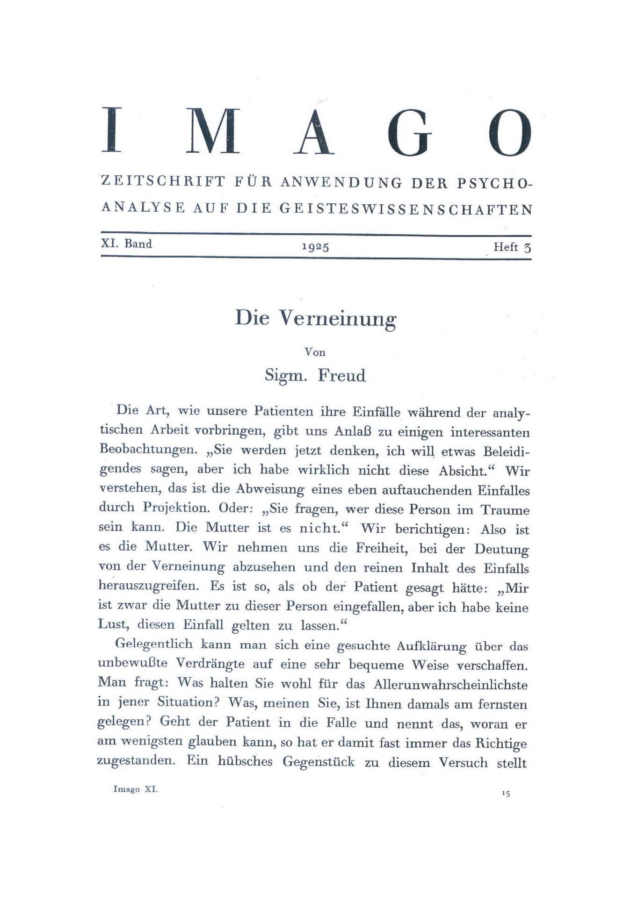
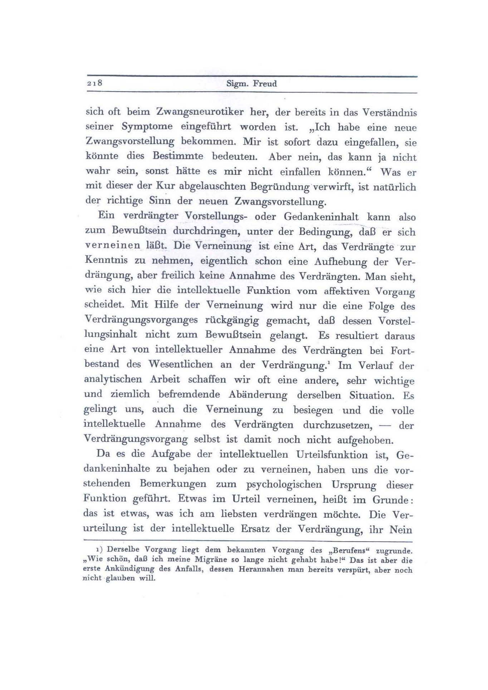
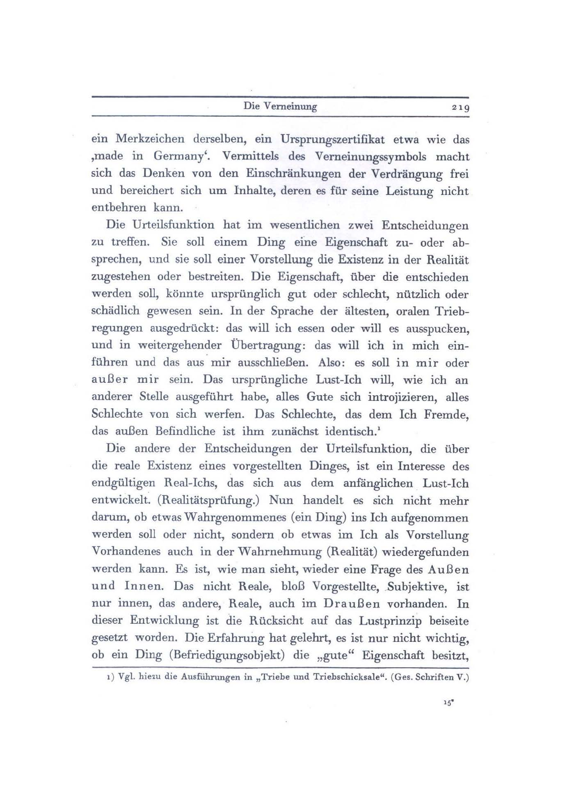
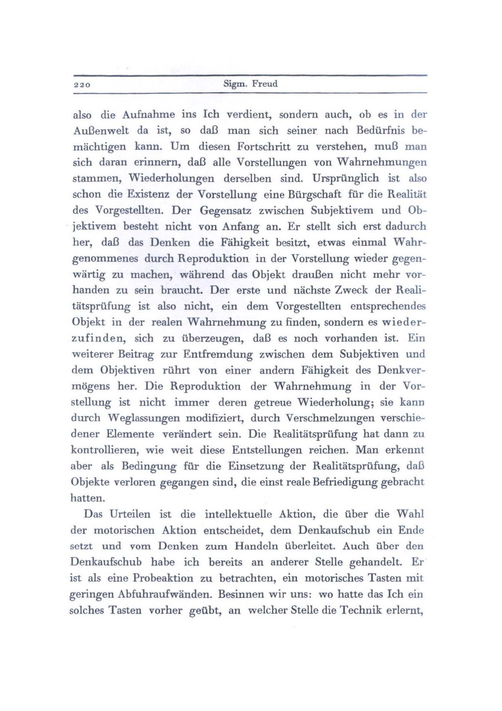
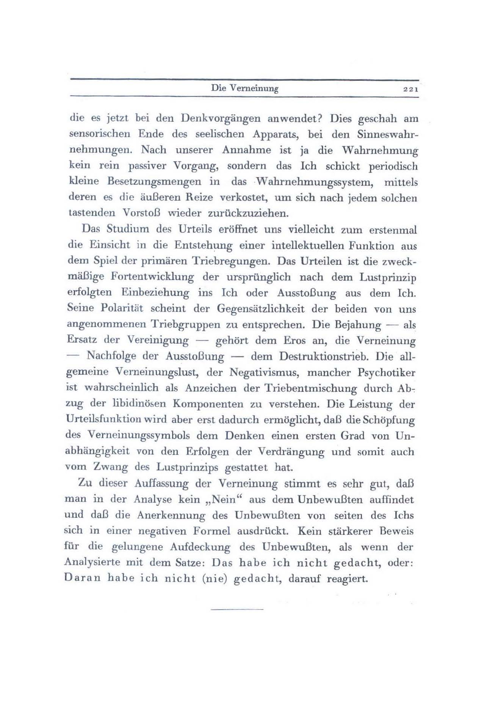

# Leçon 06 | 10 février 1954

  <label><input type="checkbox" data-lacan-toggle="original" checked> 原文</label>
  <label><input type="checkbox" data-lacan-toggle="notes" checked> 注释</label>
  <label><input type="checkbox" data-lacan-toggle="commentary" checked> 个人解读评论</label>

<section class="parallel-paragraph" data-paragraph-ids="s1-06-0001">

s1-06-0001

[无对应译文]

原文 · s1-06-0001

[HYPPOLITE ](#HyppoliteVerneinug)

</section>

<section class="parallel-paragraph" data-paragraph-ids="s1-06-0002">

s1-06-0002

[无对应译文]

原文 · s1-06-0002

LACAN

</section>

<section class="parallel-paragraph" data-paragraph-ids="s1-06-0003">

s1-06-0003

[无对应译文]

原文 · s1-06-0003

Ceux qui étaient là la dernière fois ont pu entendre poursuivre un dévelop­pement sur le passage central de l’écrit de FREUD sur *La dynamique du transfert*. Je rappelle, pour ceux qui peut-être n’étaient pas là cette dernière fois, que tout mon développement a consisté à vous montrer comme étant le phénomène majeur du transfert ce quelque chose qui part de ce que je pourrais appeler le fond du mouvement de la résistance.

</section>

<section class="parallel-paragraph" data-paragraph-ids="s1-06-0004">

s1-06-0004

[无对应译文]

原文 · s1-06-0004

C’est à savoir ce moment où ce *quelque chose* qui reste masqué dans la théorie analytique par toutes ses formes et ses voies, à savoir *la résistance* dans son fond le plus essentiel, se manifeste par cette sorte de *mouvement* que j’ai appelé *« bascule de la parole vers la présence »* de l’auditeur et du témoin qu’est l’analyste. Et comment nous le saisissons en quelque sorte à l’état pur dans ce moment où le sujet s’interrompt, et nous le savons : dans un moment qui le plus souvent est le plus significatif de son approche vers la vérité, dans une sorte de sentiment, fréquemment teinté d’an­goisse, de la présence de l’analyste.

</section>

<section class="parallel-paragraph" data-paragraph-ids="s1-06-0005">

s1-06-0005

[无对应译文]

原文 · s1-06-0005

Je vous ai montré aussi, ou indiqué que l’interrogation de l’analyste qui, parce qu’elle vous a été indiquée par FREUD, est devenue pour certains presque automa­tique : « *Vous pensez à quelque chose qui me regarde, moi, l’analyste ?* », n’est là qu’une sorte d’*activisme* tout prêt en effet, à cristalliser un discours plus orienté vers l’analyste, mais où ne fait que se manifester ce fait qu’en effet, pour autant que le discours n’arrive pas jusqu’à cette *parole pleine* qui est celle où doit se révé­ler ce fond inconscient du sujet, déjà le discours en lui-même s’adresse à l’ana­lyste, l’intéresse, est fait pour intéresser l’analyste, et pour tout dire se manifeste dans cette forme aliénée de l’être qui est identique à ce qu’on appelle son *ego*.

</section>

<section class="parallel-paragraph" data-paragraph-ids="s1-06-0006">

s1-06-0006

[无对应译文]

原文 · s1-06-0006

En d’autres termes, que la relation de l’*ego* à l’*autre*, le rapport du sujet à cet autre lui-même, à ce *semblable* par rapport auquel d’abord il s’est formé, et qui constitue une *structure essentielle de la constitution humaine*, et qui est certai­nement *la fonction imaginaire* à partir de laquelle nous pouvons comprendre, concevoir, expliquer, ce qu’est l’*ego* dans l’analyse.

</section>

<section class="parallel-paragraph" data-paragraph-ids="s1-06-0007">

s1-06-0007

[无对应译文]

原文 · s1-06-0007

Je ne dis pas *« ce qu’est l’ego »* en tant que ce qu’il est dans la psychologie, fonction de synthèse, comme dans toutes les formes où nous pouvons certainement le suivre et le voir se manifes­ter, mais dans sa fonction dynamique dans l’analyse : l’*ego* pour autant qu’il se manifeste alors comme *défense*, refus, qu’il inscrit en quelque sorte toute l’his­toire des successives oppositions qu’a manifestées le sujet à l’intégration de ce qu’on appelle *ensuite seulement*, ce qui se manifeste ensuite comme étant là dans la théorie « *ses tendances* », « *ses pulsions* » les plus profondes et les plus méconnues.

</section>

<section class="parallel-paragraph" data-paragraph-ids="s1-06-0008">

s1-06-0008

[无对应译文]

原文 · s1-06-0008

En d’autres termes, que nous saisissons dans ces moments si bien indiqués par FREUD ce par quoi le mouvement même de l’expérience analytique rejoint la fonction de méconnaissance fondamentale de l’*ego*. Nous sommes donc amenés à la fin de ce progrès, de cette démonstration, dont je vous ai montré quel est le ressort, le point sensible de l’investigation de FREUD sur toutes sortes d’autres plans.

</section>

<section class="parallel-paragraph" data-paragraph-ids="s1-06-0009">

s1-06-0009

[无对应译文]

原文 · s1-06-0009

Je vous l’ai montré à propos de ce qui pour FREUD se manifeste être l’*essence même* de l’analyse du rêve, et je vous l’ai montré là, saisissable sous une forme presque paradoxale, combien pour FREUD l’analyse du rêve est l’analyse littéralement de quelque chose qui a dans son investigation fonction de *parole*. Et combien ceci est démontré par le fait que ce qu’il saisit comme la dernière trace d’un rêve évanoui, est très précisément au moment où il se tourne tout entier vers lui, vers FREUD, que c’est en ce point qu’il n’est plus qu’une trace, un débris de rêve, que là nous retrouvons cette pointe transférentielle par où le rêve se modèle en un mouvement identique, cette interruption significative manifestée ailleurs comme le point tournant d’un moment de *la séance analytique*.

</section>

<section class="parallel-paragraph" data-paragraph-ids="s1-06-0010">

s1-06-0010

[无对应译文]

原文 · s1-06-0010

Je vous ai également montré la signification du rapport entre *la parole non dite*, parce que *refusée*, parce que *verworfen*, à proprement parler *rejetée* par le sujet, le poids propre de parole dans un fait de *lapsus*, plus exactement d’*oubli* d’un mot, exemple extrait de la *Psychopathologie de la vie quotidienne*, et com­bien là aussi le mécanisme est sensible de ce qu’aurait dû formuler la parole du sujet et de ce qui reste pour s’adresser à l’autre, c’est-à-dire dans le cas présent de ce qui manque, la soustraction d’un mot, « *Herr* », au vocable SIGNORELLI, qu’il ne pourra plus évoquer l’instant d’après, précisément avec l’interlocuteur devant qui, de façon potentielle, ce mot « *Herr* » a été appelé avec sa pleine signification.

</section>

<section class="parallel-paragraph" data-paragraph-ids="s1-06-0011">

s1-06-0011

[无对应译文]

原文 · s1-06-0011

Nous voici donc amenés autour de ce moment révélateur du rapport fonda­mental de *la résistance* et de la dynamique du mouvement de l’expérience ana­lytique, nous voilà donc amenés autour d’une question qui peut se polariser entre ces deux termes : l’*ego* et *la parole*.

</section>

<section class="parallel-paragraph" data-paragraph-ids="s1-06-0012">

s1-06-0012

[无对应译文]

原文 · s1-06-0012

Quelque chose qui parait si peu appro­fondi dans cette relation qui pourtant devrait être pour nous l’objet de l’inves­tigation essentielle, que quelque part, sous la plume de M. FENICHEL nous trouvons par exemple que :

</section>

<section class="parallel-paragraph" data-paragraph-ids="s1-06-0013">

s1-06-0013

[无对应译文]

原文 · s1-06-0013

« *C’est par l’ego qu’incontestablement* - il est tenu en quelque sorte pour acquis, donné - *vient au sujet le sens des mots.* »

</section>

<section class="parallel-paragraph" data-paragraph-ids="s1-06-0014">

s1-06-0014

[无对应译文]

原文 · s1-06-0014

Pourtant, est-il besoin d’être analyste pour trouver qu’un pareil propos peut être - pour le moins - sujet à contestation ? Est-ce qu’on peut même dire qu’actuellement notre discours, en admettant qu’en effet l’*ego* soit ceci qui, comme on dit, dirige nos manifestations motrices, par conséquent l’issue en effet de ces vocables qui s’appellent des mots, est-ce qu’on peut dire même que dans cet acte l’*ego* soit maître de tout ce que recèlent les mots ?

</section>

<section class="parallel-paragraph" data-paragraph-ids="s1-06-0015">

s1-06-0015

[无对应译文]

原文 · s1-06-0015

Est-ce que *le système symbolique* formidablement intriqué, entrecroisé, marqué de cette *Verschlungenheit* en effet, de ce quelque chose qui est impossible à tra­duire autrement que par propriété d’entrecroisements, et que le traducteur des « *Écrits techniques »*...

</section>

<section class="parallel-paragraph" data-paragraph-ids="s1-06-0016">

s1-06-0016

[无对应译文]

原文 · s1-06-0016

> où le mot \[*Verschlungenheit*\] est dans cet article que je présentais devant vous \[*Die außerordentliche Verschlungenheit des in dieser Arbeit*
>
> *behandelten Themas legt die Versuchung nahe, auf eine Anzahl von anstoßenden Problemen einzugehen, deren Klärung eigentlich erforderlich wäre,*
>
> *ehe man von den hier zu beschreibenden psychischen Vorgängen in unzweideutigen Worten reden könnte.*\]

</section>

<section class="parallel-paragraph" data-paragraph-ids="s1-06-0017">

s1-06-0017

[无对应译文]

原文 · s1-06-0017

…a traduit par « *complexité* », qui est combien faible.

</section>

<section class="parallel-paragraph" data-paragraph-ids="s1-06-0018">

s1-06-0018

[无对应译文]

原文 · s1-06-0018

Tandis que *Verschlungenheit* est pour désigner l’*entrecroisement* linguistique : tout sym­bole linguistique aisément isolé est *solidaire*, non seulement de l’ensemble, mais *se recoupe* et se constitue par toute une série*d’affluences, de surdétermina­tions oppositionnelles* qui le situent à la fois dans plusieurs registres. Pour tout dire que, précisément, ce système du langage, dans lequel se déplace notre discours, n’est-il pas quelque chose qui dépasse infiniment toute l’in­tention momentanée que nous y pouvons mettre ?

</section>

<section class="parallel-paragraph" data-paragraph-ids="s1-06-0019">

s1-06-0019

[无对应译文]

原文 · s1-06-0019

Et combien c’est précisé­ment sur cette fonction de résonance, d’ambiguïté, de communications, de richesses impliquées d’ores et déjà dans *le système symbolique* tel qu’il a été constitué par la tradition dans laquelle nous nous insérons comme individus, bien plus que nous ne l’épelons et ne l’apprenons. Combien ce langage est justement ce sur quoi joue l’expérience analytique, puisque, à tout instant, ce que fait cette expérience est de lui montrer qu’il en dit plus qu’il ne croit en dire pour ne prendre cette question que sous cet angle. Si nous la prenions sous l’angle génétique, nous serions portés à toute la question de savoir comment l’enfant apprend le langage, et nous serions alors entraînés dans une question d’investigation psychologique dont on peut dire qu’elle nous mènerait si loin à propos de méthode que nous ne pouvons même pas l’aborder.

</section>

<section class="parallel-paragraph" data-paragraph-ids="s1-06-0020">

s1-06-0020

[无对应译文]

原文 · s1-06-0020

Mais il semble incontestable que nous ne pouvons pas juger précisément de l’acquisition du langage par l’enfant, par la maîtrise motrice qu’il en montre, par l’apparition des premiers mots. Et que ces poin­tages, sans aucun doute très intéressants, ces catalogues de mots, que les obser­vateurs se plaisent à enregistrer pour savoir chez tel ou tel enfant quels sont les premiers mots qui apparaissent, et à en tirer des significations rigoureuses, laissent entier le problème de savoir dans quelle mesure ce qui émerge en effet dans la représentation motrice ne doit pas être considéré comme justement émergeant d’une première appréhension de l’ensemble du *système symbo­lique* comme tel, qui donne à ces premières apparitions, comme d’ailleurs la clinique le manifeste, une signification toute contingente.

</section>

<section class="parallel-paragraph" data-paragraph-ids="s1-06-0021">

s1-06-0021

[无对应译文]

原文 · s1-06-0021

Car chacun sait avec quelle diversité paraissent ces premiers fragments du langage qui se révèlent dans l’élocution de l’enfant, combien il est frappant d’entendre l’enfant expri­mer par exemple des adverbes, des particules, des mots comme « *peut-être* » ou « *pas encore* », avant d’avoir exprimé un mot substantif, le moindre nom d’objet. Il y a là manifestement une question de *pré-position* du problème qui paraît indispensable à situer toute observation valable. En d’autres termes, si nous n’arrivons pas à bien saisir et comprendre la fonc­tion essentielle, l’autonomie de cette *fonction symbolique* dans la réalisation humaine, il est tout à fait impossible de partir tout brutalement des faits sans faire aussitôt les plus grossières erreurs de compréhension.

</section>

<section class="parallel-paragraph" data-paragraph-ids="s1-06-0022">

s1-06-0022

[无对应译文]

原文 · s1-06-0022

Ce n’est pas ici un cours de psychologie générale, et sans doute je n’aurai pas l’occasion de reprendre le problème que soulève l’acquisition du langage chez l’enfant. Aujourd’hui, je ne pense pouvoir qu’introduire le problème essentiel de l’*ego* et de *la parole*, et en partant, bien entendu, de la façon dont il se révèle dans notre expérience, ce problème que nous ne pouvons poser qu’au point où en est la formulation du problème. C’est-à-dire que nous ne pouvons pas faire comme si *la théorie de l’ego*, dans toutes *les questions* qu’elle nous pose, *théorie de l’ego* telle que FREUD l’a formulée dans cette opposition avec le *Ça*, un jour proférée par FREUD, et qui imprègne toute une partie de nos conceptions théoriques et du même coup techniques \[...\]

</section>

<section class="parallel-paragraph" data-paragraph-ids="s1-06-0023">

s1-06-0023

[无对应译文]

原文 · s1-06-0023

Et c’est pourquoi aujourd’hui, je voudrais attirer votre attention sur un texte qui s’appelle la [*Verneinung*](http://www.khristophoros.net/verneinung.html)[^12]. La *Verneinung*, autrement dit - comme M. HYPPOLITE me le faisait remarquer tout à l’heure - *la dénégation*, et non pas la négation, comme on l’a traduit fort insuffisamment en français. C’est bien toujours ainsi que moi-même je l’ai évo­quée chaque fois quand j’en ai eu l’occasion, dans mes explications ou sémi­naires, ou conférences. Ce texte est de 1925, et postérieur à la parution de ces articles si on peut dire limites par rapport à la période que nous étudions des *Écrits techniques*, ceux qui concernent la psychologie du *moi* et son rapport \[...\] l’article *Das Ich und das Es*. Il reprend donc cette relation toujours présente et vivante pour FREUD, cette relation de l’*ego* avec la manifestation parlée du sujet dans la séance. Il est donc à ce titre extrêmement significatif.

</section>

<section class="parallel-paragraph" data-paragraph-ids="s1-06-0024">

s1-06-0024

[无对应译文]

原文 · s1-06-0024

Il m’a paru, pour des raisons que vous allez voir se manifester, que M. HYPPOLITE qui nous fait le grand honneur de venir participer ici à nos tra­vaux par sa présence voire par ses interventions, il m’a paru qu’il pourrait m’ap­porter une grande aide pour établir ce dialogue - pendant lequel on ne peut pas dire que je me repose, mais pendant lequel tout au moins je ne me manifeste plus d’une façon motrice - de nous apporter le témoignage d’une critique élaborée par la réflexion même de tout ce que nous connaissons de ses travaux antérieurs, de nous apporter l’élaboration d’un problème qui, vous allez le voir, n’intéresse rien de moins que toute *la théorie* sinon de la connaissance, au moins *du jugement*.

</section>

<section class="parallel-paragraph" data-paragraph-ids="s1-06-0025">

s1-06-0025

[无对应译文]

原文 · s1-06-0025

C’est pourquoi je lui ai demandé, sans doute avec un peu d’insistance, de bien vouloir non seulement me suppléer, mais apporter ce que lui seul peut apporter dans sa rigueur à un texte de la nature de celui que vous allez voir, précisément, sur *la dénégation*. Je crois qu’il y a là des difficultés, \[...\] et certainement qu’un esprit autre qu’un esprit formé aux disci­plines philosophiques dont nous ne saurions nous passer dans la fonction que nous occupons. Notre fonction n’est pas celle d’un vague *frotti-frotta* affectif dans lequel nous aurions à provoquer chez le sujet, au cours d’une expérience confuse, de ces retours d’expériences plus ou moins évanescentes en quoi consisterait toute la magie de la psychanalyse.

</section>

<section class="parallel-paragraph" data-paragraph-ids="s1-06-0026">

s1-06-0026

[无对应译文]

原文 · s1-06-0026

Nous ne faisons pas ce que nous faisons dans une expérience qui se poursuit au plus sensible de l’activité humaine, c’est-à-dire celle de l’intelligence raisonnante : le seul fait est qu’il s’agit d’un discours, nous ne faisons rien d’autre que d’approximatif, qui n’a aucun titre à la psychanalyse. Nous sommes donc en plein dans notre devoir en écoutant, sur un texte comme celui que vous allez voir, les opinions qualifiées de quelqu’un d’exercé à cette critique du langage, à cette appréhension de la théorie.

</section>

<section class="parallel-paragraph" data-paragraph-ids="s1-06-0027">

s1-06-0027

[无对应译文]

原文 · s1-06-0027

Comme vous allez voir que ce texte de FREUD manifeste, une fois de plus chez son auteur, cette sorte de valeur fondamentale qui fait que le moindre moment d’un texte de FREUD nous permet une appréhension technique rigoureuse, que *chaque mot* mérite d’être mesuré à son incidence précise, à son accent, à son tour particulier, mérite d’être inséré dans *l’analyse logique* la plus rigoureuse. C’est en quoi il se diffé­rencie des mêmes termes groupés plus ou moins vaguement par des disciples pour qui l’appréhension des problèmes a été de seconde main, si l’on peut dire, et après tout jamais pleinement élaborée, d’où résulte cette sorte de dégradation où nous voyons se manifester sans cesse par ses hésitations le développement de la théorie analytique.

</section>

<section class="parallel-paragraph" data-paragraph-ids="s1-06-0028">

s1-06-0028

[无对应译文]

原文 · s1-06-0028

Avant de céder la parole à M. HYPPOLITE, je voudrais simplement attirer votre attention sur une intervention qu’il avait faite un jour, conjointe à une sorte de, disons de débat, qu’avait provoqué une certaine façon de présenter les choses sur le sujet de FREUD et sur l’intention à l’endroit du malade. M. HYPPOLITE avait apporté à ANZIEU un secours…

</section>

<section class="parallel-paragraph" data-paragraph-ids="s1-06-0029">

s1-06-0029

[无对应译文]

原文 · s1-06-0029

Jean HYPPOLITE - Momentané.

</section>

<section class="parallel-paragraph" data-paragraph-ids="s1-06-0030">

s1-06-0030

[无对应译文]

原文 · s1-06-0030

LACAN

</section>

<section class="parallel-paragraph" data-paragraph-ids="s1-06-0031">

s1-06-0031

[无对应译文]

原文 · s1-06-0031

Oui, un secours momentané à ANZIEU. Il s’agissait de voir quelle était l’attitude fondamentale, intentionnelle de FREUD à l’endroit du patient au moment où il prétendait substituer l’analyse des résistances - nous sommes en plein dans notre sujet - l’analyse des résistances par *la parole* à cette sorte de sub­jugation, de prise, de substitution à la parole due à la personne du sujet, qui s’opère par la *suggestion* ou par l’hypnose. Je m’étais montré très réservé sur le sujet de savoir s’il y avait là chez FREUD une manifestation de combativité, voire de domination, caractéristique de reli­quats du style ambitieux que nous pourrions voir se trahir dans sa jeunesse. Je crois que ce texte est assez décisif : il parle de *la suggestion*, et c’est pour cela que je l’amène aujourd’hui, parce que c’est aussi au cœur de notre pro­blème.

</section>

<section class="parallel-paragraph" data-paragraph-ids="s1-06-0032">

s1-06-0032

[无对应译文]

原文 · s1-06-0032

C’est dans le texte sur la [*Psychologie collective et analyse du Moi*](http://classiques.uqac.ca/classiques/freud_sigmund/essais_de_psychanalyse/Essai_2_psy_collective/Freud_Psycho_collective.pdf). C’est donc à propos de la psychologie collective, c’est-à-dire des rapports à l’autre que pour la première fois le *moi* en tant que fonction autonome est amené dans l’œuvre de FREUD. Simple remarque que je pointe aujourd’hui, parce qu’elle est assez évidente et justifie l’angle sous lequel je vous l’amène par ses rapports avec l’autre. C’est dans le chapitre IV de cet article qui s’appelle « *Suggestion et libido »* que nous avons le texte suivant :

</section>

<section class="parallel-paragraph" data-paragraph-ids="s1-06-0033">

s1-06-0033

[无对应译文]

原文 · s1-06-0033

« *On est ainsi préparé à admettre que la suggestion est un phénomène, un fait fondamental …//… et de l’avis de Bernheim dont j’ai pu voir* *moi-même en 1889 les tours de force extraordinaires. Mais je me rappelle que déjà alors j’éprouvais une sorte de sourde révolte contre cette tyrannie* *de la sugges­tion. Lorsqu’on disait à un malade qui se montrait récalcitrant : « Eh bien, que faites-vous ? Vous vous contre-suggestionnez ! »* *Je ne pouvais m’empê­cher de penser qu’on se livrait à une violence. L’homme avait certainement le droit …//… Mon opinion a pris plus tard* *la forme d’une révolte contre la manière …//… Et je citais la vieille plaisanterie : « Si Saint Christophe suppor­tait le Christ, et que le Christ supportait le monde, où donc Saint Christophe a pu poser ses pieds ?* »

</section>

<section class="parallel-paragraph" data-paragraph-ids="s1-06-0034">

s1-06-0034

[无对应译文]

原文 · s1-06-0034

\[*Man wird so für die Aussage vorbereitet, die Suggestion (richtiger die Suggerierbarkeit) sei eben ein weiter nicht reduzierbares Urphänomen, eine Grundtatsache des menschlichen Seelenlebens. So hielt es auch Bernheim, von dessen erstaunlichen Künsten ich im Jahre 1889 Zeuge war. Ich weiß mich aber auch damals an eine dumpfe Gegnerschaft gegen diese Tyrannei der Suggestion zu erinnern. Wenn ein Kranker, der sich nicht gefügig zeigte, angeschrieen wurde: »Was tun Sie denn? Vous vous contre–suggestionnez!« so sagte ich mir, das sei offenbares Unrecht und Gewalttat. Der Mann habe zu Gegensuggestionen gewiß ein Recht, wenn man ihn mit Suggestionen zu unterwerfen versuche. Mein Widerstand nahm dann später die Richtung einer Auflehnung dagegen, daß die Suggestion, die alles erklärte, selbst der Erklärung entzogen sein sollte. Ich wiederholte mit Bezug auf sie die alte Scherzfrage : Christoph trug Christum, Christus trug die ganze Welt, Sag’,* *wo hat Christoph Damals hin den Fuß gestellt ?*\]

</section>

<section class="parallel-paragraph" data-paragraph-ids="s1-06-0035">

s1-06-0035

[无对应译文]

原文 · s1-06-0035

\[*On est ainsi préparé à admettre que la suggestion (ou, plus exactement, la suggestibilité) est un phénomène primitif et irréductible, un fait fondamental de la vie psychique de l’homme. Tel était l’avis de Bernheim dont j’ai pu voir moi–même, en 1889, les tours de force extraordinaires. Mais je me rappelle que déjà alors j’éprouvais une sorte de sourde révolte contre cette tyrannie de la suggestion. Lorsqu’à un malade qui se montrait récalcitrant on criait : « Que faites-vous ? Vous vous contre-suggestionnez ! », je ne pouvais m’empêcher de pen­ser qu’on se livrait sur lui à une injustice et à une violence. L’homme avait cer­tainement le droit de* *se contre-suggestionner, lorsqu’on cherchait à se le soumettre par la suggestion. Mon opposition a pris plus tard la forme d’une révolte contre la manière de penser d’après laquelle la suggestion, qui expli­quait tout, n’aurait besoin elle-même d’aucune explication. Et plus d’une fois j’ai cité à ce propos la vieille plaisanterie :* *« Si saint Christophe supportait le Christ, et si le Christ supportait le monde, dis-moi : où donc saint Christophe a-t-il pu poser ses pieds ? »* (Christophorus Christum, sed Christus sustulit orbem. Constiterit pedibus die ubi Christophorus? » Konrad Richter : Der deutsche St. Christoph, Berlin, 1896. Acta Germanica, V, 1)\]

</section>

<section class="parallel-paragraph" data-paragraph-ids="s1-06-0036">

s1-06-0036

[无对应译文]

原文 · s1-06-0036

Véritable *révolte* qu’éprouvait FREUD devant proprement cette violence qui peut être incluse dans la parole, à ne pas voir précisément ce penchant potentiel de l’analyse des résistances dans le sens où l’indiquait l’autre jour ANZIEU, et qui est précisément ce que nous sommes là pour vous montrer qui est justement ce qui est à éviter dans la mise en pratique.

</section>

<section class="parallel-paragraph" data-paragraph-ids="s1-06-0037">

s1-06-0037

[无对应译文]

原文 · s1-06-0037

Si vous voulez, c’est le contresens à évi­ter dans la mise en pratique de ce qu’on appelle « *analyse des résistances* ». C’est bien dans ce propos que s’insère ce moment, et vous verrez que s’insé­rera le progrès qui résultera de notre élucidation dans ce commentaire. Je crois que ce texte a sa valeur et mérite d’être cité.

</section>

<section class="parallel-paragraph" data-paragraph-ids="s1-06-0038">

s1-06-0038

[无对应译文]

原文 · s1-06-0038

En remerciant encore de la collaboration qu’il veut bien nous apporter, je demande à M. HYPPOLITE... qui d’après ce que j’ai entendu, a bien voulu consa­crer une attention prolongée à ce texte ...qu’il veuille bien nous apporter simple­ment son sentiment là-dessus.

</section>

<section class="parallel-paragraph" data-paragraph-ids="s1-06-0039">

s1-06-0039

[无对应译文]

原文 · s1-06-0039

[Jean HYPPOLITE : *Die Ver**neinung*](#février-1954-table-des-séances-1)

</section>

<section class="parallel-paragraph" data-paragraph-ids="s1-06-0040">

s1-06-0040

[无对应译文]

原文 · s1-06-0040

Jean HYPPOLITE

</section>

<section class="parallel-paragraph" data-paragraph-ids="s1-06-0041">

s1-06-0041

[无对应译文]

原文 · s1-06-0041

D’abord, je dois remercier le Docteur LACAN de l’insistance qu’il a mise, parce que cela m’a procuré l’occasion d’une nuit de travail, et d’appor­ter *l’enfant de cette nuit* devant vous. Je ne sais pas ce qu’il vaudra. Le docteur LACAN a bien voulu m’envoyer non seulement le texte français, mais aussi le texte allemand. Il a bien fait, car je crois que je n’aurais absolument rien compris dans le texte français si je n’avais pas eu le texte allemand.

</section>

<section class="parallel-paragraph" data-paragraph-ids="s1-06-0042">

s1-06-0042

[无对应译文]

原文 · s1-06-0042

Je ne connaissais pas ce texte, et il était d’une structure absolument extra­ordinaire, et au fond extraordinairement énigmatique. La construction n’est pas du tout une construction de professeur, c’est une construction, je ne veux pas dire « *dialectique* », on abuse du mot, mais extrêmement subtile du texte. Et il a fallu que je me livre, avec le texte allemand et le texte français... dont la traduction n’est pas très... enfin, par rapport à d’autres, elle est honnête ...à *une véritable inter­prétation*. Et c’est cette *interprétation* que je vais vous donner. Je crois qu’elle est valable, mais elle n’est pas la seule et elle mérite certainement d’être discutée.

</section>

<section class="parallel-paragraph" data-paragraph-ids="s1-06-0043">

s1-06-0043

[无对应译文]

原文 · s1-06-0043

FREUD commence par présenter le titre « *Die Verneinung* ». Et je me suis aperçu - le découvrant après le Docteur LACAN - qu’il vaudrait mieux traduire par *dénégation*, plutôt que négation. De même vous verrez employé *Urteil verneinen* qui est non pas la négation du jugement, mais une sorte de *déjugement*. Je crois qu’il faudra une différence entre :

</section>

<section class="parallel-paragraph" data-paragraph-ids="s1-06-0044">

s1-06-0044

[无对应译文]

原文 · s1-06-0044

- la négation interne à un jugement,

</section>

<section class="parallel-paragraph" data-paragraph-ids="s1-06-0045">

s1-06-0045

[无对应译文]

原文 · s1-06-0045

- et l’attitude de la négation, …car autrement l’ar­ticle ne me parait pas compréhensible, si on ne fait pas cette différence.

</section>

<section class="parallel-paragraph" data-paragraph-ids="s1-06-0046">

s1-06-0046

[无对应译文]

原文 · s1-06-0046

Le texte français ne met pas en relief :

</section>

<section class="parallel-paragraph" data-paragraph-ids="s1-06-0047">

s1-06-0047

[无对应译文]

原文 · s1-06-0047

- ni comment l’analyse de FREUD a quelque chose d’extrêmement concret, et presque amusant,

</section>

<section class="parallel-paragraph" data-paragraph-ids="s1-06-0048">

s1-06-0048

[无对应译文]

原文 · s1-06-0048

- ni comment, par des exemples qui renferment d’ailleurs une projection qu’on pourrait situer dans les analyses qu’on fait ici, celui où le malade dit - ou le *psychanalysé* dit à son *ana­lyste* :

</section>

<section class="parallel-paragraph" data-paragraph-ids="s1-06-0049">

s1-06-0049

[无对应译文]

原文 · s1-06-0049

« *Vous avez sans doute pensé que je vais vous dire quelque chose d’of­fensant, mais il n’en est rien.* »

</section>

<section class="parallel-paragraph" data-paragraph-ids="s1-06-0050">

s1-06-0050

[无对应译文]

原文 · s1-06-0050

« *Nous comprenons* - dit FREUD - *que le fait de refuser une pareille incidence par la projection, c’est-à-dire en prêtant spontanément cette pensée* *au psy­chanalyste, en est précisément l’aveu.* »

</section>

<section class="parallel-paragraph" data-paragraph-ids="s1-06-0051">

s1-06-0051

[无对应译文]

原文 · s1-06-0051

Je me suis aperçu que dans la vie courante *il était très fréquent* de dire « *Je ne veux certainement pas vous offenser dans ce que je vais vous dire.* » Il faut traduire : « *Je veux vous offenser*. » C’est une volonté qui ne manque pas. FREUD continue jusqu’à une généralisation pleine de hardiesse, et qui l’amènera à poser le problème de *la négation* comme origine Même, peut-être de l’intelligence. C’est ainsi que je comprends l’article qui a une certaine densité philosophique. Il raconte un autre exemple, de celui qui dit :

</section>

<section class="parallel-paragraph" data-paragraph-ids="s1-06-0052">

s1-06-0052

[无对应译文]

原文 · s1-06-0052

« *J’ai vu dans mon rêve une per­sonne, mais ce n’était certainement pas ma mère.* »

</section>

<section class="parallel-paragraph" data-paragraph-ids="s1-06-0053">

s1-06-0053

[无对应译文]

原文 · s1-06-0053

Il faut traduire : « *c’était sûre­ment elle* ». Maintenant, il cite un procédé que peut employer le psychanalyste et que peut aussi employer n’importe qui d’autre :

</section>

<section class="parallel-paragraph" data-paragraph-ids="s1-06-0054">

s1-06-0054

[无对应译文]

原文 · s1-06-0054

« *Dites-moi ce qui dans votre situa­tion est le plus incroyable, à votre avis, ce qui est le plus impossible.* »

</section>

<section class="parallel-paragraph" data-paragraph-ids="s1-06-0055">

s1-06-0055

[无对应译文]

原文 · s1-06-0055

Et le patient, le voisin, l’interlocuteur trouveront quelque chose qui est le plus incroyable. Mais c’est justement cela qu’il faut croire. Voilà une analyse de cas concrets généralisée jusqu’à un mode de présenter ce qu’on est sur le mode de ne l’être pas. C’est exactement cela qui est fonda­mental :

</section>

<section class="parallel-paragraph" data-paragraph-ids="s1-06-0056">

s1-06-0056

[无对应译文]

原文 · s1-06-0056

« *Je vais vous dire ce que je ne suis pas, faites attention, c’est précisé­ment ce que je suis.* »

</section>

<section class="parallel-paragraph" data-paragraph-ids="s1-06-0057">

s1-06-0057

[无对应译文]

原文 · s1-06-0057

Seulement FREUD remarque ici quelle est en quelque sorte la fonction qui appartient à cette dénégation. Et il emploie un mot que j’ai senti familier, il emploie le mot *Aufhebung*, mot qui vous le savez a eu des fortunes diverses, ce n’est pas à moi de le dire.

</section>

<section class="parallel-paragraph" data-paragraph-ids="s1-06-0058">

s1-06-0058

[无对应译文]

原文 · s1-06-0058

LACAN - Mais si, c’est précisément à vous.

</section>

<section class="parallel-paragraph" data-paragraph-ids="s1-06-0059">

s1-06-0059

[无对应译文]

原文 · s1-06-0059

Jean HYPPOLITE

</section>

<section class="parallel-paragraph" data-paragraph-ids="s1-06-0060">

s1-06-0060

[无对应译文]

原文 · s1-06-0060

C’est le mot « *dialectique* » de HEGEL, qui veut dire à la fois *nier, supprimer, conserver*, et somme toute *soulever*. Ce peut être l’*Aufhebung* d’une pierre, ou aussi la cessation de mon abonnement à un journal.

</section>

<section class="parallel-paragraph" data-paragraph-ids="s1-06-0061">

s1-06-0061

[无对应译文]

原文 · s1-06-0061

« *La dénégation -* nous dit FREUD *- est une Aufhebung du refoulement, et non une acceptation.* »

</section>

<section class="parallel-paragraph" data-paragraph-ids="s1-06-0062">

s1-06-0062

[无对应译文]

原文 · s1-06-0062

Et voici quelque chose qui est vraiment *extraordinaire* dans l’analyse de FREUD, par quoi se dégage de ces exemples concrets, que nous aurions pu prendre comme tels, une portée philosophique prodigieuse que j’essaierai de résumer tout à l’heure. Présenter son être sur le mode de ne l’être pas, c’est vraiment ça : c’est une *Aufhebung* du refoulement, mais non une acceptation. En d’autres termes, celui qui dit « *voilà ce que je ne suis pas* », il n’y a plus là de refoulement, puisque refoulement signifie inconscience, puisque c’est conscient. La dénégation est une manière de faire passer dans la conscience ce qui était dans l’inconscient, tout devient conscient, mais le refoulement subsiste toujours sous la forme de la non acceptation.

</section>

<section class="parallel-paragraph" data-paragraph-ids="s1-06-0063">

s1-06-0063

[无对应译文]

原文 · s1-06-0063

Là continue cette espèce de subtilité philosophique que fait FREUD. Il dit « *Ici l’intellectuel se sépare de l’affectif* ». Et il y a vraiment là une espèce de *découverte profonde*. Pour faire une ana­lyse de « *l’intellectuel* » nous voyons, comment poussant mon hypothèse, je dirais : non comment « *l’intellectuel se sépare de l’affectif* », mais comment il est *- l’intel­lectuel -* cette espèce de *suspension* dans une certaine mesure, on dirait dans un langage un peu barbare « *une sublimation* ». Ce n’est pas tout à fait ça, en tout cas « *l’intellectuel se sépare de l’affectif* ». Et peut-être naît-il, comme telle, la pensée : c’est le contenu affecté d’une dénégation.

</section>

<section class="parallel-paragraph" data-paragraph-ids="s1-06-0064">

s1-06-0064

[无对应译文]

原文 · s1-06-0064

Pour rappeler un texte philosophique - encore une fois je m’en excuse, mais le docteur LACAN, lui aussi... - à la fin d’un chapitre de HEGEL, il s’agit de substi­tuer la négativité réelle à cet appétit de destruction qui s’empare du désir, et qui a quelque chose de profondément mystique plus que psychologique, à cet appétit de destruction qui s’empare du désir et qui fait que quand *les deux com­battants s’affrontent*, bientôt il n’y aura plus personne pour constater leur vic­toire ou leur défaite : une négation idéale.

</section>

<section class="parallel-paragraph" data-paragraph-ids="s1-06-0065">

s1-06-0065

[无对应译文]

原文 · s1-06-0065

Ici la dénégation dont parle FREUD est exactement - et c’est pour cela qu’elle introduit dans « *l’intellectuel* »une négation idéale - une négativité idéale, car nous allons voir justement une sorte de genèse, où FREUD va employer le mot « *négati­vité* » de certains - comment peut-on dire* -* psychosés ?

</section>

<section class="parallel-paragraph" data-paragraph-ids="s1-06-0066">

s1-06-0066

[无对应译文]

原文 · s1-06-0066

LACAN - Psychotiques.

</section>

<section class="parallel-paragraph" data-paragraph-ids="s1-06-0067">

s1-06-0067

[无对应译文]

原文 · s1-06-0067

Jean HYPPOLITE

</section>

<section class="parallel-paragraph" data-paragraph-ids="s1-06-0068">

s1-06-0068

[无对应译文]

原文 · s1-06-0068

Il va montrer comment cette *négativité* est au fond différente, mythiquement parlant. Dans sa genèse de la dénégation à proprement parler, dont il parle ici, à mon sens il faut, pour comprendre cet article, admettre cela qui n’est pas immédiatement visible. De la même façon qu’il faudra admettre une *dissymétrie*... traduite par deux moments dans le texte de FREUD, et qu’on traduit de la même façon en français …une *dissymétrie* entre le passage à l’affirmation depuis le passage à l’amour. Le véritable rôle de la genèse de l’intelligence appartient à la dénéga­tion, la dénégation est la position même de la pensée.

</section>

<section class="parallel-paragraph" data-paragraph-ids="s1-06-0069">

s1-06-0069

[无对应译文]

原文 · s1-06-0069

Mais, cheminons plus doucement. Nous avons vu que FREUD disait :

</section>

<section class="parallel-paragraph" data-paragraph-ids="s1-06-0070">

s1-06-0070

[无对应译文]

原文 · s1-06-0070

« *l’intellectuel se sépare de l’affectif*… » \[« *Man sieht, wie sich hier die intellektuelle Funktion vom affektiven Vorgang scheidet*. »\]

</section>

<section class="parallel-paragraph" data-paragraph-ids="s1-06-0071">

s1-06-0071

[无对应译文]

原文 · s1-06-0071

Et il ajoute l’autre modification de l’analyse : « *l’acceptation du refoulé* ». \[*Die Verneinung ist eine Art, das Verdrängte zur Kenntnis zu nehmen,* *eigentlich schon eine Aufhebung der Verdrängung, aber freilich keine Annahme des Verdrängten.*\]

</section>

<section class="parallel-paragraph" data-paragraph-ids="s1-06-0072">

s1-06-0072

[无对应译文]

原文 · s1-06-0072

Pourtant le refoulement n’est pas supprimé. Essayons de nous représenter la situation :

</section>

<section class="parallel-paragraph" data-paragraph-ids="s1-06-0073">

s1-06-0073

[无对应译文]

原文 · s1-06-0073

- première situation : voilà ce que je ne suis pas, on en conclut : ce que je suis. *Le refoulement* existe toujours sous la forme idéale de *la dénégation*.

</section>

<section class="parallel-paragraph" data-paragraph-ids="s1-06-0074">

s1-06-0074

[无对应译文]

原文 · s1-06-0074

- Deuxièmement, le psychanalyste m’oblige à accepter ce que tout à l’heure je niais.

</section>

<section class="parallel-paragraph" data-paragraph-ids="s1-06-0075">

s1-06-0075

[无对应译文]

原文 · s1-06-0075

Et FREUD ajoute, avec des petits points dans le texte, il ne nous donne pas d’explication là-dessus,

</section>

<section class="parallel-paragraph" data-paragraph-ids="s1-06-0076">

s1-06-0076

[无对应译文]

原文 · s1-06-0076

« …*et pourtant, le refoulement n’a pas comme tel disparu.* »

</section>

<section class="parallel-paragraph" data-paragraph-ids="s1-06-0077">

s1-06-0077

[无对应译文]

原文 · s1-06-0077

Ce qui me paraît très profond : si le psychanalysé accepte, il revient sur sa dénégation, et pourtant le refoulement est encore là ! J’en conclus qu’*il faut donner un nom philosophique à cela*, qui est un nom que FREUD n’a pas donné : *c’est une négation de la négation*. Littéralement, ce qui apparaît ici, c’est l’*affirmation* intellectuelle, mais seulement intellectuelle, en tant que *négation de la négation*. Le mot ne se trouve pas dans FREUD mais, somme toute, je crois que nous pouvons le prolonger sous cette forme, c’est bien ce que ça veut dire.

</section>

<section class="parallel-paragraph" data-paragraph-ids="s1-06-0078">

s1-06-0078

[无对应译文]

原文 · s1-06-0078

Alors FREUD à ce moment là - la difficulté du texte - nous dit :

</section>

<section class="parallel-paragraph" data-paragraph-ids="s1-06-0079">

s1-06-0079

[无对应译文]

原文 · s1-06-0079

« *Nous sommes donc en mesure, puisque nous avons séparé l’intellectuel de l’affectif, de formuler une sorte de genèse du jugement,* *c’est-à-dire, en somme, une genèse de la pensée.* »

</section>

<section class="parallel-paragraph" data-paragraph-ids="s1-06-0080">

s1-06-0080

[无对应译文]

原文 · s1-06-0080

\[*Da es die Aufgabe der intellektuellen Urteilsfunktion ist, Gedankeninhalte zu bejahen oder zu verneinen, haben uns die vorstehenden Bemerkungen zum psychologischen Ursprung dieser Funktion geführt.*\]

</section>

<section class="parallel-paragraph" data-paragraph-ids="s1-06-0081">

s1-06-0081

[无对应译文]

原文 · s1-06-0081

Je m’excuse auprès des psychologues qui sont ici, mais je n’aime pas beau­coup la psychologie positive en elle-même. Cette genèse pourrait être prise pour une psychologie positive, elle me paraît plus profonde, comme une sorte d’his­toire à la fois génétique et mythique. Et je pense que, de même que cet affectif primordial va engendrer d’une certaine façon l’intelligence, chez FREUD, comme le disait le docteur LACAN, la forme primaire que psychologiquement nous appe­lons *affective* est elle-même une forme humaine qui, si elle engendre l’intelli­gence, c’est parce qu’elle comporte elle-même à son départ déjà une historicité fondamentale : elle n’est pas *l’affectif pur* d’un côté, et de l’autre côté il y aurait *l’intellectuel pur*.

</section>

<section class="parallel-paragraph" data-paragraph-ids="s1-06-0082">

s1-06-0082

[无对应译文]

原文 · s1-06-0082

Dans cette genèse je vois une sorte de grand mythe, derrière une apparence de positivité chez FREUD il y a comme un grand *mythe*. Et quoi ? Derrière l’affirmation qu’est-ce qu’il y a ? Il y a la *Vereinigung* \[union\] qui est Éros. Et derrière la dénégation \[*Verneinung*\] – attention, la dénégation intellectuelle sera quelque chose de plus - l’apparition d’un *symbole* fondamental dissymétrique. L’*affirmation primordiale* ce n’est rien d’autre qu’affirmer, mais *nier* c’est plus que vouloir détruire. Ce procès qu’on traduit mal par *rejet*, c’est *Verwerfung* qu’on devait employer, alors qu’il y a *Ausstossung* qui signifie *expulsion*. On a en quelque sorte *les deux formes premières* : la force d’expulsion et la force d’attraction, toutes les deux me semble-t-il sous la domination du plaisir toutes les deux dans le texte, ce qui est frappant.

</section>

<section class="parallel-paragraph" data-paragraph-ids="s1-06-0083">

s1-06-0083

[无对应译文]

原文 · s1-06-0083

Le jugement a donc une histoire. Et ici FREUD nous montre qu’il y a deux types ce que tout le monde sait, même la philosophie la plus élémentaire : il y a *un jugement attributif* et *un jugement d’existence*. Il y a dire d’une chose *qu’elle est ou n’est pas ceci*, et dire d’une chose *qu’elle est ou qu’elle n’est pas.* » \[*Die Urteilsfunktion hat im wesentlichen zwei Entscheidungen zu treffen. Sie soll einem Ding eine* *Eigenschaft zu - oder absprechen, und sie soll einer Vorstellung die Existenz in der Realität zugestehen oder bestreiten.*\]

</section>

<section class="parallel-paragraph" data-paragraph-ids="s1-06-0084">

s1-06-0084

[无对应译文]

原文 · s1-06-0084

Et alors FREUD montre ce qu’il y a *derrière le jugement attributif* et *derrière le jugement d’existence*. Et il me semble que pour comprendre son article il faut considérer la négation du *jugement attributif*, et la négation du *jugement d’existence*, comme n’étant pas encore *la négation* dont elle apparaît comme *symbole*. Au fond, il n’y a pas encore jugement dans cette genèse, il y a un premier mythe de la formation du « *dehors* » et du « *dedans* », c’est là toute la question. Vous voyez quelle importance a ce *mythe* de la formation *du dehors* et *du dedans*, de l’aliénation entre les deux mots qui est traduit par l’opposition des deux, c’est quand même l’aliénation et une hostilité des deux.

</section>

<section class="parallel-paragraph" data-paragraph-ids="s1-06-0085">

s1-06-0085

[无对应译文]

原文 · s1-06-0085

Ce qui rend si denses ces trois pages, c’est comme vous voyez que ça met tout en cause, et combien on passe de ces remarques Concrètes, si menues en appa­rence et si profondes dans leur généralité, à quelque chose qui met en cause toute une philosophie et une structure de pensée.

</section>

<section class="parallel-paragraph" data-paragraph-ids="s1-06-0086">

s1-06-0086

[无对应译文]

原文 · s1-06-0086

Derrière le *jugement attributif*, qu’est-ce qu’il y a ? Il y a le « *je veux m’approprier, introjecter* », ou « *je veux expulser* ». \[*das will ich in mich* *einführen und das aus mir ausschließen.*\] Il y a au début semble dire FREUD... mais au début ne veut rien dire, c’est comme un mythe : « *il était une fois* » ...dans cette histoire « *il était une fois un moi* », un sujet, pour lequel il n’y avait encore rien d’étranger. Ça - l’étranger et lui-même – c’est une opération, une *expulsion,* ça rend com­préhensible un texte qui surgit brusquement et a l’air un peu contradictoire :

</section>

<section class="parallel-paragraph" data-paragraph-ids="s1-06-0087">

s1-06-0087

[无对应译文]

原文 · s1-06-0087

\[*Das Schlechte, das dem Ich Fremde, das Außenbefindliche, ist ihm zunächst identisch*.\]

</section>

<section class="parallel-paragraph" data-paragraph-ids="s1-06-0088">

s1-06-0088

[无对应译文]

原文 · s1-06-0088

- *Das Schlechte *: ce qui est mauvais,

</section>

<section class="parallel-paragraph" data-paragraph-ids="s1-06-0089">

s1-06-0089

[无对应译文]

原文 · s1-06-0089

- *das dem Ich Fremde *: ce qui est étranger au *moi*,

</section>

<section class="parallel-paragraph" data-paragraph-ids="s1-06-0090">

s1-06-0090

[无对应译文]

原文 · s1-06-0090

- *das Außenbefindliche *: ce qui se trouve au-dehors,

</section>

<section class="parallel-paragraph" data-paragraph-ids="s1-06-0091">

s1-06-0091

[无对应译文]

原文 · s1-06-0091

- *ist ihm zunächst iden­tisch *: lui est d’abord identique.

</section>

<section class="parallel-paragraph" data-paragraph-ids="s1-06-0092">

s1-06-0092

[无对应译文]

原文 · s1-06-0092

Or, juste avant, FREUD venait de dire qu’on expulse, qu’il y a donc une opération qui est *l’opération d’expulsion*, et une autre qui est *l’opération d’introjection*. Cette forme est la forme primordiale de ce qui sera *le jugement d’attribution*. Mais ce qui est à l’origine du *jugement d’existence*, c’est le rapport entre *la repré­sentation* - et ici c’est très difficile - FREUD approfondit le rapport entre *la repré­sentation et la perception*.

</section>

<section class="parallel-paragraph" data-paragraph-ids="s1-06-0093">

s1-06-0093

[无对应译文]

原文 · s1-06-0093

Ce qui est important c’est qu’au début c’est également neutre de savoir *« s’il y a »* ou *« s’il n’y a pas »*. Il y a. Mais le sujet révèle sa représentation des choses à la perception primitive qu’il en a eue. Et la question est de savoir quand il dit que cela existe, si cette reproduction conserve encore son étant dans la réalité, qu’il pourra à nouveau retrouver ou ne pas retrouver, ça c’est le rapport entre la représentation et la possibilité de retrouver à nouveau son objet. Il faudra le retrouver.

</section>

<section class="parallel-paragraph" data-paragraph-ids="s1-06-0094">

s1-06-0094

[无对应译文]

原文 · s1-06-0094

Ce qui prouve toujours que FREUD se meut dans une dimension plus profonde que celle de JUNG, dans une sorte de dimension de la mémoire, et par là ne perdant pas *le fil de son analyse*. Mais j’ai peur de vous le faire perdre, tellement c’est difficile et minutieux.

</section>

<section class="parallel-paragraph" data-paragraph-ids="s1-06-0095">

s1-06-0095

[无对应译文]

原文 · s1-06-0095

Ce dont il s’agissait dans *le jugement d’attribution*, c’est d’expulser ou d’in­trojecter. Dans *le jugement d’existence*, il s’agit d’attribuer au *moi* - ou plutôt au sujet, c’est plus général - une représentation, donc de définir un intérieur par une représentation à laquelle ne correspond plus - mais a correspondu dans un retour en arrière - son objet.

</section>

<section class="parallel-paragraph" data-paragraph-ids="s1-06-0096">

s1-06-0096

[无对应译文]

原文 · s1-06-0096

Ce qui est ici mis en cause c’est la genèse « *de l’inté­rieur et de l’extérieur* ». Et, nous dit FREUD,

</section>

<section class="parallel-paragraph" data-paragraph-ids="s1-06-0097">

s1-06-0097

[无对应译文]

原文 · s1-06-0097

« *On voit donc la naissance du jugement à partir des pulsions primaires.* » \[*Das Studium des Urteils eröffnet uns vielleicht zum erstenmal* *die Einsicht in die Entstehung einer intellektuellen Funktion aus dem Spiel der primären Triebregungen.*\]

</section>

<section class="parallel-paragraph" data-paragraph-ids="s1-06-0098">

s1-06-0098

[无对应译文]

原文 · s1-06-0098

Il y a donc une sorte d’évolution finalisée de cette introjection et de cette expulsion qui sont réglées par *le principe du plaisir*.

</section>

<section class="parallel-paragraph" data-paragraph-ids="s1-06-0099">

s1-06-0099

[无对应译文]

原文 · s1-06-0099

« *Die Bejahung* - *l’affirmation*, nous dit FREUD, est simplement - *als Ersatz der Vereinigung, gehört dem Eros an*… »

</section>

<section class="parallel-paragraph" data-paragraph-ids="s1-06-0100">

s1-06-0100

[无对应译文]

原文 · s1-06-0100

Ce qu’il y a à la source de ce que nous appelons *affirmation*, « c’est l’Éros », c’est-à-dire dans le jugement d’attribution par exemple le fait d’introjecter, de nous approprier au lieu d’expulser au-dehors. Pour la négation, il n’emploie pas le mot *Ersatz*, il emploie le mot *Nachfolge* mais le traducteur le traduit en français de la même façon qu’*Ersatz*.

</section>

<section class="parallel-paragraph" data-paragraph-ids="s1-06-0101">

s1-06-0101

[无对应译文]

原文 · s1-06-0101

Le texte allemand était :

</section>

<section class="parallel-paragraph" data-paragraph-ids="s1-06-0102">

s1-06-0102

[无对应译文]

原文 · s1-06-0102

> « *Die Bejahung - als Ersatz der Vereinigung - gehört dem Eros an,*
>
> *die Verneinung - Nachfolge der Ausstoßung - dem Destruktionstrieb.* »

</section>

<section class="parallel-paragraph" data-paragraph-ids="s1-06-0103">

s1-06-0103

[无对应译文]

原文 · s1-06-0103

L’affirmation est l’*Ersatz* de *Vereinigung*, et la néga­tion le *Nachfolge* de l’expulsion ou plus exactement de l’instinct de destruction. Cela devient donc tout à fait mythique : deux instincts qui sont pour ainsi dire entremêlés dans ce mythe qui porte le sujet :

</section>

<section class="parallel-paragraph" data-paragraph-ids="s1-06-0104">

s1-06-0104

[无对应译文]

原文 · s1-06-0104

- l’un est celui de l’union,

</section>

<section class="parallel-paragraph" data-paragraph-ids="s1-06-0105">

s1-06-0105

[无对应译文]

原文 · s1-06-0105

- et l’autre est celui de la destruction.

</section>

<section class="parallel-paragraph" data-paragraph-ids="s1-06-0106">

s1-06-0106

[无对应译文]

原文 · s1-06-0106

Vous voyez *un grand mythe*, et qui répète d’autres *mythes*. Mais la petite nuance :

</section>

<section class="parallel-paragraph" data-paragraph-ids="s1-06-0107">

s1-06-0107

[无对应译文]

原文 · s1-06-0107

- que *l’affirmation* ne fait en quelque sorte que se substituer purement et simplement à *l’unification*,

</section>

<section class="parallel-paragraph" data-paragraph-ids="s1-06-0108">

s1-06-0108

[无对应译文]

原文 · s1-06-0108

- tandis que *la négation* qui en résulte bien après me paraît seule capable d’expliquer la phrase suivante, quand il s’agit simplement de *négativité*, c’est-à-dire d’*instinct de destruction*.

</section>

<section class="parallel-paragraph" data-paragraph-ids="s1-06-0109">

s1-06-0109

[无对应译文]

原文 · s1-06-0109

Alors il peut bien y avoir un plaisir de nier, un négativisme qui résulte simplement de la suppression des composantes libidinales, c’est-à-dire que ce qui a disparu dans ce plaisir de nier - disparu *=* refoulé - ce sont *les composantes libidinales*. Par conséquent, *l’instinct de destruction* dépend-il aussi du plaisir. Je crois ceci très important, capital, dans la technique.

</section>

<section class="parallel-paragraph" data-paragraph-ids="s1-06-0110">

s1-06-0110

[无对应译文]

原文 · s1-06-0110

Seulement, nous dit FREUD, et c’est là qu’apparaît la dissymétrie entre l’affir­mation et la négation :

</section>

<section class="parallel-paragraph" data-paragraph-ids="s1-06-0111">

s1-06-0111

[无对应译文]

原文 · s1-06-0111

« *Le fonctionnement du jugement*…

</section>

<section class="parallel-paragraph" data-paragraph-ids="s1-06-0112">

s1-06-0112

[无对应译文]

原文 · s1-06-0112

et cette fois-ci le mot est *Urteil*, avant nous étions dans les limites primaires qui préludent le jugement

</section>

<section class="parallel-paragraph" data-paragraph-ids="s1-06-0113">

s1-06-0113

[无对应译文]

原文 · s1-06-0113

*n’est rendu possible que par la création du symbole de la négation.*… »

</section>

<section class="parallel-paragraph" data-paragraph-ids="s1-06-0114">

s1-06-0114

[无对应译文]

原文 · s1-06-0114

\[*Die Leistung der Urteilsfunktion wird aber erst dadurch ermöglicht, daß die Schöpfung des Verneinungssymbols dem Denken* *einen ersten Grad von Unabhängigkeit von den Erfolgen der Verdrängung und somit auch vom Zwang des Lustprinzips gestattet hat.*\]

</section>

<section class="parallel-paragraph" data-paragraph-ids="s1-06-0115">

s1-06-0115

[无对应译文]

原文 · s1-06-0115

Pourquoi est-ce que FREUD ne nous dit pas : « *le fonctionnement du jugement est rendu possible par l’affirmation* » ? Et pourquoi la négation va-t-elle jouer un rôle non pas comme tendance destructrice ou à l’intérieur d’une forme du jugement, mais en tant qu’attitude fondamentale de symbolité et d’explicité ?

</section>

<section class="parallel-paragraph" data-paragraph-ids="s1-06-0116">

s1-06-0116

[无对应译文]

原文 · s1-06-0116

« …*Création du symbole de la négation qui rend la pensée indépendante des résultats du refoulement et par conséquent du principe du plaisir.* »

</section>

<section class="parallel-paragraph" data-paragraph-ids="s1-06-0117">

s1-06-0117

[无对应译文]

原文 · s1-06-0117

Phrase de FREUD qui ne prendrait pas de sens pour moi si je n’avais déjà ratta­ché *la tendance à la destruction* au *principe du plaisir*.

</section>

<section class="parallel-paragraph" data-paragraph-ids="s1-06-0118">

s1-06-0118

[无对应译文]

原文 · s1-06-0118

Il y a là une espèce de difficulté. Qu’est-ce que signifie, par conséquent, cette *dissymétrie entre l’affirmation et la négation* ? Elle signifie que tout *le refoulé* peut en quelque sorte à nouveau être repris et réutilisé dans une espèce de suspension, et qu’en quelque sorte, au lieu d’être sous la domina­tion des instincts d’attraction et d’expulsion, il peut se produire une marge de la pensée, de l’être, sous la forme de *n’être pas*, qui apparaît avec *la déné­gation*, *le symbole même de dénégation* rattaché à l’attitude concrète de la négation.

</section>

<section class="parallel-paragraph" data-paragraph-ids="s1-06-0119">

s1-06-0119

[无对应译文]

原文 · s1-06-0119

Car il faut bien comprendre ainsi le texte, si on admet la conclusion qui m’a paru un peu *étrange* :

</section>

<section class="parallel-paragraph" data-paragraph-ids="s1-06-0120">

s1-06-0120

[无对应译文]

原文 · s1-06-0120

« *À cette interprétation de la négation, coïncide très bien qu’on ne trouve dans l’analyse aucun « non » à partir de l’inconscient.* » \[*Zu dieser Auffassung stimmt es sehr gut, daß man in der Analyse kein "Nein" aus dem Unbewußten auffindet*…\]

</section>

<section class="parallel-paragraph" data-paragraph-ids="s1-06-0121">

s1-06-0121

[无对应译文]

原文 · s1-06-0121

Mais on y trouve bien de la destruction. Donc il faut absolument séparer « *l’ins­tinct de destruction »* de « *la forme de destruction »*, car on ne comprendrait pas ce que veut dire FREUD. Il faut voir dans la dénégation une attitude concrète à l’ori­gine du *symbole* explicite de la négation, lequel *symbole* explicite rend seul pos­sible quelque chose qui est comme l’utilisation de l’inconscient, tout en maintenant le refoulement. Tel me paraît être le sens du texte :

</section>

<section class="parallel-paragraph" data-paragraph-ids="s1-06-0122">

s1-06-0122

[无对应译文]

原文 · s1-06-0122

« *…et que la reconnaissance du côté du moi s’exprime dans une formule négative.* » \[…*und daß die Anerkennung des Unbewußten von seiten des Ichs sich in einer negativen Form ausdrückt*.\]

</section>

<section class="parallel-paragraph" data-paragraph-ids="s1-06-0123">

s1-06-0123

[无对应译文]

原文 · s1-06-0123

C’est là le résumé : on ne trouve dans l’analyse aucun « *non* » à partir de l’*in­conscient*, mais la reconnaissance de l’*inconscient* du côté du *moi*, lequel est toujours *méconnaissance*, même dans la connaissance, on trouve toujours du côté du *moi*, dans une formule négative, la possibilité de détenir l’inconscient tout en le refusant.

</section>

<section class="parallel-paragraph" data-paragraph-ids="s1-06-0124">

s1-06-0124

[无对应译文]

原文 · s1-06-0124

« *Aucune preuve plus forte de la découverte qui a abouti de l’inconscient que si l’analysé réagit avec cette proposition :* *cela je ne l’ai pas pensé, ou même je ne l’ai jamais pensé.* »

</section>

<section class="parallel-paragraph" data-paragraph-ids="s1-06-0125">

s1-06-0125

[无对应译文]

原文 · s1-06-0125

\[*Kein stärkerer Beweis für die gelungene Aufdeckung des Unbewußten, als wenn der Analysierte mit dem Satze :* *Das habe ich nicht gedacht, oder : Daran habe ich nicht (nie) gedacht, darauf reagiert.*\]

</section>

<section class="parallel-paragraph" data-paragraph-ids="s1-06-0126">

s1-06-0126

[无对应译文]

原文 · s1-06-0126

Il y a donc dans ce texte de trois pages de FREUD, dont, je m’excuse, je suis moi-même arrivé péniblement à en trouver ce que je crois en être *le fil *:

</section>

<section class="parallel-paragraph" data-paragraph-ids="s1-06-0127">

s1-06-0127

[无对应译文]

原文 · s1-06-0127

- d’une part cette espèce d’attitude concrète qui résulte de l’observation même de la *dénégation*,d’autre part la possibilité par là de dissocier l’intel­lectuel de l’affectif.

</section>

<section class="parallel-paragraph" data-paragraph-ids="s1-06-0128">

s1-06-0128

[无对应译文]

原文 · s1-06-0128

- D’autre part, une genèse de tout ce qui précède dans le primaire, et par conséquent l’origine même du jugement et de la pensée elle-­même - sous la forme de pensée comme telle, car la pensée est bien avant, dans le primaire, mais elle n’y est pas comme pensée - par l’intermédiaire de la dénégation.

</section>

<section class="parallel-paragraph" data-paragraph-ids="s1-06-0129">

s1-06-0129

[无对应译文]

原文 · s1-06-0129

LACAN

</section>

<section class="parallel-paragraph" data-paragraph-ids="s1-06-0130">

s1-06-0130

[无对应译文]

原文 · s1-06-0130

Nous ne saurions être trop reconnaissants à M. HYPPOLITE de nous avoir donné l’occasion, par une sorte de mouvement cœxtensif à la pensée de FREUD, de rejoindre immédiatement ce quelque chose que M. HYPPOLITE a - je crois - situé très remarquablement comme étant vraiment au-delà de la psycho­logie positive.

</section>

<section class="parallel-paragraph" data-paragraph-ids="s1-06-0131">

s1-06-0131

[无对应译文]

原文 · s1-06-0131

Je vous fais remarquer en passant qu’en insistant comme nous le faisons tou­jours dans ces séminaires sur le caractère *transpsychologique* du *champ psy­chanalytique*, je crois que nous ne faisons là que retrouver ce qui est l’évidence de notre pratique, mais ce que la pensée même de celui qui nous en a ouvert les portes manifeste sans cesse dans le moindre de ses textes. Je crois qu’il y a beaucoup à tirer de la réflexion sur ce texte. Je pense qu’il ne serait pas mal, puisque Mlle GUÉNINCHAULT a la bonté d’en prendre des notes, qu’il bénéficie d’un tour de faveur et qu’il soit rapidement ronéoté pour vous être distribué.

</section>

<section class="parallel-paragraph" data-paragraph-ids="s1-06-0132">

s1-06-0132

[无对应译文]

原文 · s1-06-0132

Cette trop courte leçon que vient de nous faire M. HYPPOLITE mérite au moins un traitement spécial, au moins dans l’immédiat. Je crois que l’extrême condensation et l’apport des repères tout à fait précis, est certainement... peut être en un sens beaucoup plus didactique que ce que je vous exprime moi-même dans mon style, et dans certaines intentions. Je le ferai ronéotyper à l’usage de ceux qui viennent ici.

</section>

<section class="parallel-paragraph" data-paragraph-ids="s1-06-0133">

s1-06-0133

[无对应译文]

原文 · s1-06-0133

Je crois qu’il ne peut pas y avoir de meilleure préface à toute une distinction de niveaux, toute une critique de concepts, qui est celle dans laquelle je m’efforce de vous introduire, dans le des­sein d’éviter certaines confusions.

</section>

<section class="parallel-paragraph" data-paragraph-ids="s1-06-0134">

s1-06-0134

[无对应译文]

原文 · s1-06-0134

Je crois par exemple que ce qui vient de se dégager de l’*élaboration* de ce texte de FREUD par M. HYPPOLITE, nous montrant la différence de niveaux de la *Bejahung,* de l’*affirmation* et de la négativité en tant qu’elle instaure en somme à un niveau - c’est exprès que je prends des expressions beaucoup plus pataudes - antérieur la constitution du rapport sujet-objet.

</section>

<section class="parallel-paragraph" data-paragraph-ids="s1-06-0135">

s1-06-0135

[无对应译文]

原文 · s1-06-0135

Je crois que c’est là ce à quoi ce texte, en apparence si minime, de FREUD nous introduit d’emblée, rejoignant sans aucun doute par là certaines des élaborations les plus actuelles de la médi­tation philosophique.

</section>

<section class="parallel-paragraph" data-paragraph-ids="s1-06-0136">

s1-06-0136

[无对应译文]

原文 · s1-06-0136

Et je crois que du même coup, ceci nous permet de critiquer au premier plan cette sorte d’ambiguïté toujours entretenue autour de la fameuse opposition *intellectuel-affectif*, comme si en quelque sorte l’affectivité était une sorte de coloration, de qualité ineffable, si on peut dire, qui serait ce qui doit être cher­ché en lui-même, et en quelque sorte d’une façon indépendante de cette sorte de « *peau vidée* » que serait la réalisation purement intellectuelle d’une relation du sujet.

</section>

<section class="parallel-paragraph" data-paragraph-ids="s1-06-0137">

s1-06-0137

[无对应译文]

原文 · s1-06-0137

Je crois que cette notion \[l’affectif\] qui pousse l’analyse dans des voies paradoxales, sin­gulières, est à proprement parler puérile, sorte de connotation de succès sen­sationnel, le moindre sentiment accusé par le sujet avec un caractère de singularité, voire d’étrangeté, dans le texte de la séance à proprement parler, est ce qui découle de ce malentendu fondamental.

</section>

<section class="parallel-paragraph" data-paragraph-ids="s1-06-0138">

s1-06-0138

[无对应译文]

原文 · s1-06-0138

L’*affectif* n’est pas quelque chose comme une densité spéciale qui manque­rait à l’élaboration *intellectuelle*, et un autre niveau de la production du *sym­bole*, l’ouverture, si on peut dire, du sujet à *la création symbolique* est quelque chose qui est dans le registre où nous le disions au début cet \[...\] qui est mythique, dans ce registre, et antérieur à la formulation discursive. Vous entendez bien ? Et ceci seul peut nous permettre, je ne dis pas d’emblée de situer, mais de dis­cuter, d’appréhender ce en quoi consiste ce que j’appelle cette réalisation pleine de la parole.

</section>

<section class="parallel-paragraph" data-paragraph-ids="s1-06-0139">

s1-06-0139

[无对应译文]

原文 · s1-06-0139

Il nous reste un peu de temps. Je voudrais tout de suite essayer d’incarner là dans des exemples, plus exactement essayer de pointer par des exemples, com­ment la question se pose. Je vais vous le montrer par deux côtés. D’abord, par le côté d’un phénomène qu’on appelle *psychopathologique*, \[...\] phénomène auquel on peut dire que l’élaboration de la pensée psychopathologique a apporté une nouveauté absolument de premier plan, une rénovation totale de la perspective, c’est le phénomène de *l’hallu­cination*.

</section>

<section class="parallel-paragraph" data-paragraph-ids="s1-06-0140">

s1-06-0140

[无对应译文]

原文 · s1-06-0140

Jusqu’à certaine date, *l’hallucination* a été à proprement parler considérée comme une sorte de phénomène critique autour duquel se posait la question de la valeur discriminative de la conscience. Ça ne pouvait pas être la conscience qui était hallucinée, c’était autre chose. En fait, il suffit de nous introduire à la nouvelle *Phénoménologie de la per­ception*, telle qu’elle se dégage dans le livre de M. MERLEAU-PONTY, pour voir que *l’hallucination* au contraire est intégrée comme essentielle à l’intentionnalité du sujet.

</section>

<section class="parallel-paragraph" data-paragraph-ids="s1-06-0141">

s1-06-0141

[无对应译文]

原文 · s1-06-0141

*Cette hallucination, nous nous contentons d’un* certain nombre de thèmes, de registres, tels que celui de *principe du plaisir, pour en expliquer* *la production*, considérée comme en quelque sorte fondamentale, comme le pre­mier mouvement dans l’ordre de la satisfaction du sujet. Nous ne pouvons nous contenter de quelque chose d’aussi simple. En fait, rappelez-vous l’exemple que je vous ai cité la dernière fois, dans *L’Homme aux loups*. Il est indiqué par le progrès de l’analyse de ce sujet, par *les contradictions* que présentent les traces à travers lesquelles nous suivons l’éla­boration qu’il s’est faite de sa situation dans le monde humain : cette *Verwerfung*,

</section>

<section class="parallel-paragraph" data-paragraph-ids="s1-06-0142">

s1-06-0142

[无对应译文]

原文 · s1-06-0142

- *ce quelque chose* qui fait que le plan génital à proprement parler a été pour lui littéralement toujours comme s’il n’existait pas,

</section>

<section class="parallel-paragraph" data-paragraph-ids="s1-06-0143">

s1-06-0143

[无对应译文]

原文 · s1-06-0143

- *ce quelque chose* que nous avons été amenés à situer très précisément au niveau, je dirais, de la « *non-Bejahung* »,

</section>

<section class="parallel-paragraph" data-paragraph-ids="s1-06-0144">

s1-06-0144

[无对应译文]

原文 · s1-06-0144

- *ce quelque chose* que, vous le voyez, nous ne pouvons pas mettre, absolument pas, sur le même niveau qu’une dénégation.

</section>

<section class="parallel-paragraph" data-paragraph-ids="s1-06-0145">

s1-06-0145

[无对应译文]

原文 · s1-06-0145

Or, ce qui est tout à fait frappant, c’est la suite - je vous ai dit que je vous l’indi­querai, et je reprends aujourd’hui - c’est le rapport en quelque sorte *immédiat* qui sort déjà, qui est tellement plus compréhensible à la lumière, aux explications qui vous ont été données aujourd’hui, autour de ce texte de FREUD.

</section>

<section class="parallel-paragraph" data-paragraph-ids="s1-06-0146">

s1-06-0146

[无对应译文]

原文 · s1-06-0146

C’est - encore que rien n’ait été manifesté - sur *le plan symbolique*, car il semble que ce soit là juste­ment la condition pour que quelque chose existe : qu’il y ait cette *Bejahung*, cette *Bejahung* qui n’est pas une *Bejahung* en quelque sorte de *négation de la néga­tion*, qui est autre chose. Qu’est-ce qui se passe *quand cette Bejahung ne se pro­duit pas* ?

</section>

<section class="parallel-paragraph" data-paragraph-ids="s1-06-0147">

s1-06-0147

[无对应译文]

原文 · s1-06-0147

C’est que *la seule trace* que nous ayons de ce plan \[*symbolique*\] sur lequel n’a pas été réalisé pour le sujet, *le plan génital*, c’est comme une sorte d’émergence dans, non pas du tout son histoire, mais vraiment dans le monde extérieur, d’une petite hallucination. C’est le monde extérieur qui est manifesté au sujet, la castration qui est très précisément ce qui pour lui n’a pas existé, sous la forme de ce qu’il s’imagine : *s’être coupé le petit doigt*. *S’être coupé le petit doigt* si profondément qu’il ne tient plus que par un petit bout de peau.

</section>

<section class="parallel-paragraph" data-paragraph-ids="s1-06-0148">

s1-06-0148

[无对应译文]

原文 · s1-06-0148

Et il est sub­mergé du sentiment d’une si inexprimable catastrophe qu’il n’ose même pas en parler à la personne à côté de lui. Ce dont il n’ose pas parler, c’est que justement cette personne à côté de lui, à laquelle il réfère aussitôt toutes ses émotions, c’est littéralement comme si elle, à ce moment-là, était annulée. Il n’y a plus d’*autre*.

</section>

<section class="parallel-paragraph" data-paragraph-ids="s1-06-0149">

s1-06-0149

[无对应译文]

原文 · s1-06-0149

Il y a une sorte de monde extérieur immédiat de manifestations perçues dans une sorte de *réel* primitif, de *réel* non *symbolisé*, malgré la forme symbolique au sens courant du mot que prend le phénomène où on peut voir en quelque sorte ceci : *que ce qui n’est pas reconnu est vu*.

</section>

<section class="parallel-paragraph" data-paragraph-ids="s1-06-0150">

s1-06-0150

[无对应译文]

原文 · s1-06-0150

Je crois que pour l’élucidation, non pas de *la psychose*, entendez-moi, car il n’est pas du tout psychotique au moment où il a cette Hallucination, il pourra être psychotique plus tard, mais pas au moment où il a ce vécu absolument limité, nodal, étranger au vécu de son enfance, tout à fait désintégré, rien ne per­met de le classer au moment de son enfance comme un schizophrène.

</section>

<section class="parallel-paragraph" data-paragraph-ids="s1-06-0151">

s1-06-0151

[无对应译文]

原文 · s1-06-0151

Donc c’est d’un « *phénomène* » de la psychose qu’il s’agit, je vous prie de l’entendre, de comprendre cette sorte de corrélation, de balancement, qui fait qu’au niveau d’une expérience tout à fait primitive à l’origine, à la source, qui ouvre le sujet à un certain rapport au monde par la possibilité du *symbole *: *ce qui n’est pas reconnu fait irruption dans la conscience sous la forme du vu*.

</section>

<section class="parallel-paragraph" data-paragraph-ids="s1-06-0152">

s1-06-0152

[无对应译文]

原文 · s1-06-0152

Si vous approfondissez suffisamment cette polarisation particulière, il vous apparaîtra beaucoup plus facile d’aborder ce phénomène ambigu qui s’appelle le « *déjà vu »*, qui est très exactement entre ces deux modes de relations du *reconnu* et du *vu*.

</section>

<section class="parallel-paragraph" data-paragraph-ids="s1-06-0153">

s1-06-0153

[无对应译文]

原文 · s1-06-0153

Et pour autant que quelque chose, qui est dans le monde extérieur com­municable, pensable, dans les termes du discours intégré, comme la vie quoti­dienne, pour de certaines raisons se trouve porté quand même au niveau limite, ou reconnu d’être quand même à la limite de ce qui surgit *avec une sorte de pré­signification spéciale*, se reporte, *avec l’illusion rétrospective*, dans le domaine du *déjà vu*, c’est-à-dire de ce perçu d’une qualité originale qui n’est en fin de compte rien d’autre que ce dont nous parle FREUD quand, à propos de cette épreuve du monde extérieur, il nous dit que toute épreuve du monde extérieur se réfère implicitement à quelque chose qui a déjà été perçu dans le passé.

</section>

<section class="parallel-paragraph" data-paragraph-ids="s1-06-0154">

s1-06-0154

[无对应译文]

原文 · s1-06-0154

Mais ceci s’applique à l’infini : d’une certaine façon toute espèce de perçu nécessite cette référence à cette perspective. C’est pourquoi nous sommes ramenés là au niveau du plan de *l’imaginaire* en tant que tel, au niveau de l’image, modèle de la forme originelle, de ce qui fait qu’en *un autre sens* que le sens du reconnu symbolisé, ver­balisé, nous nous retrouvons là dans les problèmes évoqués par la théorie pla­tonicienne, non pas de *la remémoration*, mais de *la réminiscence*.

</section>

<section class="parallel-paragraph" data-paragraph-ids="s1-06-0155">

s1-06-0155

[无对应译文]

原文 · s1-06-0155

Je vous ai annoncé un autre exemple, proposé à votre réflexion à ce sujet. Je prends un exemple qui est précisément de l’ordre de ce qu’on appelle plus ou moins proprement « la manière moderne d’analyser ». On imagine que les « modernes »... mais vous allez voir que ces principes sont déjà exposés en 1925 dans ce texte de FREUD ...on se fait grand état du fait que nous analysons, comme on dit « *d’abord la surface* », et que c’est le fin du fin pour permettre au sujet de progresser d’une façon qui soit, disons non livrée à cette sorte de hasard que représente *la stérilisation intellectualisée* du contenu, comme on dit, qui est ré­évoqué par l’analyse. Je prends un exemple que donne KRIS dans un de ses articles, un de ses sujets qu’il prend en analyse et qui a déjà d’ailleurs été analysé une fois. On a été cer­tainement assez loin dans l’utilisation du matériel.

</section>

<section class="parallel-paragraph" data-paragraph-ids="s1-06-0156">

s1-06-0156

[无对应译文]

原文 · s1-06-0156

Ce sujet a de graves entraves dans son métier, et c’est un métier intellectuel, qui semble bien, dans ce qu’on entrevoit dans son observation, quelque chose de très proche des préoccupa­tions qui peuvent être les nôtres. Le sujet éprouve toutes sortes de difficultés à produire, comme on dit. C’est en effet que sa vie est comme entravée par le fait même des efforts nécessaires pour sortir quelque chose de publiable, aussi bien quelque chose, une entrave, qui n’est rien que *le sentiment qu’il a* en somme, disons pour abréger, *d’être un plagiaire* de quelqu’un qui est très proche de lui-même dans son entourage, un brillant *scholar*, disons un peu plus qu’un étudiant qui est avec lui, et avec lequel il échange sans cesse des idées, il se sent toujours tenté de prendre ces idées qu’il fournit à son interlocuteur, et c’est là pour lui une entrave perpétuelle à tout ce qu’il veut sortir.

</section>

<section class="parallel-paragraph" data-paragraph-ids="s1-06-0157">

s1-06-0157

[无对应译文]

原文 · s1-06-0157

KRIS explique ces problèmes de l’analyse.

</section>

<section class="parallel-paragraph" data-paragraph-ids="s1-06-0158">

s1-06-0158

[无对应译文]

原文 · s1-06-0158

Tout de même, à un moment, il est arrivé à mettre debout un certain texte : un jour, il arrive en déclarant d’une façon quasi triomphante que tout ce qu’il vient de mettre debout comme thèse se trouve déjà dans un bouquin, dans la bibliothèque, dans un article publié, et qui en présente déjà les manifestations essentielles. Le voilà donc, cette fois, *pla­giaire malgré lui*. En quoi va consister la prétendue « *interprétation par la surface »* que nous pro­pose KRIS ?

</section>

<section class="parallel-paragraph" data-paragraph-ids="s1-06-0159">

s1-06-0159

[无对应译文]

原文 · s1-06-0159

Probablement en ceci : KRIS, manifestant quelque chose qu’en effet une certaine façon de prendre l’analyse détournerait peut-être les débutants, s’intéresse effectivement à ce qui s’est passé, à ce qu’il y a dans ce bouquin. Et en y regardant de plus près, je suppose en se référant au texte même, on s’aper­çoit qu’il n’y a en effet absolument rien dans ce bouquin qui représente l’essen­tiel des thèses apportées par le sujet.

</section>

<section class="parallel-paragraph" data-paragraph-ids="s1-06-0160">

s1-06-0160

[无对应译文]

原文 · s1-06-0160

Des choses, bien entendu, sont amorcées qui posent la question, mais rien des thèses nouvelles apportées par le sujet qui soit donc d’une façon déjà là, il est indiqué en d’autres termes que la thèse est en effet pleinement effectivement originale. C’est donc à partir de là - dit KRIS et c’est ce qu’il appelle, je ne sais pourquoi, une « *prise des choses par la surface* » - si l’on veut pour autant considérer la signification de ce qui est apporté par le sujet, c’est à partir de là que KRIS est introduit, en renversant complètement la position abordée par le sujet, à lui manifester *que tous ses besoins* sont manifes­tés *dans sa conduite entravée, paradoxale,* et *ressortissent à une certaine relation à son père*, et qui tient en ceci : c’est que précisément le père n’est jamais arrivé à rien sortir, et cela parce qu’il était *écrasé par un grand-père*, dans tous les sens du mot, qui, lui, était un personnage fort constructif et fort fécond.

</section>

<section class="parallel-paragraph" data-paragraph-ids="s1-06-0161">

s1-06-0161

[无对应译文]

原文 · s1-06-0161

Et qu’en somme ce que représente - dit KRIS - la conduite du sujet, n’est rien d’autre qu’un besoin d’imputer à son père, de trouver dans son père, un *grand* père - cette fois-­ci dans l’autre sens du mot « *grand* » - qui, lui, serait capable de faire quelque chose. Et que, ce besoin étant ainsi satisfait, en se forgeant des sortes de tuteurs ou de plus grands que lui, dans la dépendance desquels il se trouve par l’intermédiaire d’un plagiarisme qu’alors il se reproche et à l’aide duquel il se détruit, il ne fait rien d’autre que manifester là un besoin qui est en réalité celui qui a tourmenté son enfance, et par conséquent dominé son histoire.

</section>

<section class="parallel-paragraph" data-paragraph-ids="s1-06-0162">

s1-06-0162

[无对应译文]

原文 · s1-06-0162

Incontestablement, l’interprétation est valable, et il est important de voir comment le sujet y *réagit*. Il y réagit par quoi ? Qu’est-ce que KRIS va considé­rer comme étant la confirmation de la portée de ce qu’il introduit, et qui mène fort loin ? ensuite, toute l’histoire se développe, toute la symbolisation à proprement parler pénienne, de ce besoin du père réel, créateur et puissant, est passée à tra­vers toutes sortes de jeux dans l’enfance, des jeux de pêche : que le père pêche un plus ou moins grospoisson, etc. …mais la réaction immédiate du sujet est ceci : le sujet garde le silence. Et c’est à la séance suivante qu’il dit :

</section>

<section class="parallel-paragraph" data-paragraph-ids="s1-06-0163">

s1-06-0163

[无对应译文]

原文 · s1-06-0163

« *L’autre jour, en sortant, je suis allé dans telle rue* - ça se passe à New York - *la rue où il y a des res­taurants étrangers, où l’on mange* *des choses un peu relevées, j’ai cherché un endroit où je puisse trouver ce repas dont je suis particulièrement friand : des cervelles fraîches.* »

</section>

<section class="parallel-paragraph" data-paragraph-ids="s1-06-0164">

s1-06-0164

[无对应译文]

原文 · s1-06-0164

Je crois que vous avez là la représentation de ce que signifie la réponse, à savoir le niveau en quelque sorte à la fois *paradoxal* et *plein* dans sa significa­tion de la parole, en tant qu’elle est évoquée par une interprétation juste. Que cette interprétation ici soit juste, à quoi cela est-il dû ? Est-ce à dire qu’il s’agisse de quelque chose qui soit plus ou moins à la surface ? Qu’est–ce que ça veut dire ?

</section>

<section class="parallel-paragraph" data-paragraph-ids="s1-06-0165">

s1-06-0165

[无对应译文]

原文 · s1-06-0165

Cela ne veut rien dire d’autre, sinon que KRIS, sans aucun doute par un détour appliqué, mais dont après tout il aurait pu fort bien prévoir le terme, s’est aperçu précisément de ceci : qu’en une telle matière, la manifestation du sujet dans cette forme spéciale qui est la manifestation intellectuelle, la production d’un discours organisé, étant essentiellement sujet à ce processus qui s’appelle *la dénégation*, c’est à savoir que c’est exactement sous une forme inverse que sa relation fondamentale…

</section>

<section class="parallel-paragraph" data-paragraph-ids="s1-06-0166">

s1-06-0166

[无对应译文]

原文 · s1-06-0166

> à quelque chose que nous serons amenés à reposer comme *question* dans la suite de notre développement

</section>

<section class="parallel-paragraph" data-paragraph-ids="s1-06-0167">

s1-06-0167

[无对应译文]

原文 · s1-06-0167

…sa relation à quelque chose qui s’appelle dans l’occasion son *moi idéal*, ne pouvait se refléter dans son discours, dans l’intégration de son *ego*, que sous une forme très précisément inversée.

</section>

<section class="parallel-paragraph" data-paragraph-ids="s1-06-0168">

s1-06-0168

[无对应译文]

原文 · s1-06-0168

En d’autres termes, la relation à l’autre, pour autant que tende à s’y manifes­ter le désir primitif du sujet, contient toujours en elle-même, dans la mesure où c’est dans la relation à l’autre qu’elle a à le manifester, cet élément fondamental ori­ginel de *dénégation* qui prend ici la forme de l’inversion.

</section>

<section class="parallel-paragraph" data-paragraph-ids="s1-06-0169">

s1-06-0169

[无对应译文]

原文 · s1-06-0169

Ceci, vous le voyez, ne fait que nous introduire à de nouveaux problèmes, c’est-à-dire en somme à servir d’ouverture, de point, à la question qui est celle perpétuellement ouverte pour nous de la relation de niveau, qui est en somme le niveau discursif, le niveau du discours en tant que s’y introduit la négation, avec la relation à l’autre.

</section>

<section class="parallel-paragraph" data-paragraph-ids="s1-06-0170">

s1-06-0170

[无对应译文]

原文 · s1-06-0170

Mais pour bien le poser, il convenait que fussent situées, établies, leurs rela­tions fondamentales, la différence de niveaux entre *le symbolique* comme tel, *la possibilité symbolique*, l’ouverture de l’homme aux *symboles,* et d’autre part sa cristallisation dans ce discours organisé en tant qu’il contient essentiellement et fondamentalement la contradiction.

</section>

<section class="parallel-paragraph" data-paragraph-ids="s1-06-0171">

s1-06-0171

[无对应译文]

原文 · s1-06-0171

Ceci, je crois que le commentaire de M. HYPPOLITE vous l’a montré magistralement aujourd’hui. Je désire que vous en gardiez l’appareil et le maniement en mains, comme repères auxquels vous puissiez toujours vous reporter dans un certain nombre de points, de ressorts, de carrefours difficiles, dans la suite de notre exposé. C’est à ce titre que je remer­cie M. HYPPOLITE de l’avoir apporté avec sa haute compétence.

</section>

<section class="parallel-paragraph" data-paragraph-ids="s1-06-0172">

s1-06-0172

[无对应译文]

原文 · s1-06-0172

[Die Verneinung](#TABLE)

</section>

<section class="parallel-paragraph" data-paragraph-ids="s1-06-0173">

s1-06-0173

[无对应译文]

原文 · s1-06-0173

</section>

<section class="parallel-paragraph" data-paragraph-ids="s1-06-0174">

s1-06-0174

[无对应译文]

原文 · s1-06-0174

</section>

<section class="parallel-paragraph" data-paragraph-ids="s1-06-0175">

s1-06-0175

[无对应译文]

原文 · s1-06-0175

</section>

<section class="note-block original-notes">

## Notes

[^12]: S. Freud : [*Die Verneinung*](http://www.khristophoros.net/verneinung.html), Imago, Band 11 (3), 1925, pp. 217-221. *Gesammelte Werke*, Band 14, pp. 11-15.

</section>
