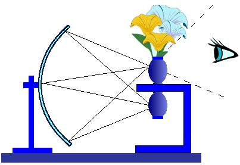

# Leçon 09 | 10 mars 1954

  <label><input type="checkbox" data-lacan-toggle="original" checked> 原文</label>
  <label><input type="checkbox" data-lacan-toggle="notes" checked> 注释</label>
  <label><input type="checkbox" data-lacan-toggle="commentary" checked> 个人解读评论</label>

<section class="parallel-paragraph" data-paragraph-ids="s1-09-0001">

s1-09-0001

[无对应译文]

原文 · s1-09-0001

[Rosine LEFORT](#LEFORT10_03)

</section>

<section class="parallel-paragraph" data-paragraph-ids="s1-09-0002">

s1-09-0002

[无对应译文]

原文 · s1-09-0002

LACAN

</section>

<section class="parallel-paragraph" data-paragraph-ids="s1-09-0003">

s1-09-0003

[无对应译文]

原文 · s1-09-0003

Vous avez pu vous rendre compte, à travers notre dialogue, de ce qui préside à notre commentaire, à notre tentative de repenser, de recomprendre toujours mieux les textes fondamentaux de l’expérience analytique. Vous avez pu vous familiariser avec cette idée qui est en quelque sorte l’*âme* de notre approfondis­sement, c’est que ce qui est toujours le mieux vu dans une expérience est ce qui est à une certaine distance.

</section>

<section class="parallel-paragraph" data-paragraph-ids="s1-09-0004">

s1-09-0004

[无对应译文]

原文 · s1-09-0004

Et puisque, aussi bien, il n’est pas surprenant que ce soit maintenant et ici dans notre entretien que nous soyons amenés à repartir, pour comprendre l’expérience analytique, de ce qui semble impliqué dans sa donnée la plus immédiate, à savoir *la fonction symbolique*, à savoir ce qui est exacte­ment la même chose ici dans notre vocabulaire, *la fonction de la parole*. Ce domaine central de l’expérience analytique, nous le retrouvons partout indiqué, jamais nommé, mais indiqué à tous les pas de l’œuvre de FREUD.

</section>

<section class="parallel-paragraph" data-paragraph-ids="s1-09-0005">

s1-09-0005

[无对应译文]

原文 · s1-09-0005

Je ne crois rien forcer en disant que c’est presque algébriquement traduire ce qui peut immédiatement se traduire dans ce registre, en marge, dans un texte freudien quelconque, qui en bien des cas donne déjà au moins une partie très importante des solutions des antinomies qui s’y manifestent, avec une ouverture, une honnê­teté qui fait qu’un texte de FREUD est toujours un texte ouvert, ça n’est jamais fermé, clos, comme si tout le système était là.

</section>

<section class="parallel-paragraph" data-paragraph-ids="s1-09-0006">

s1-09-0006

[无对应译文]

原文 · s1-09-0006

Dans ce sens, je vous l’indique déjà, je désirerais beaucoup - et vous verrez comment ça s’insère dans notre progrès - que pour la prochaine séance quelqu’un se chargeât du commentaire d’un texte qui n’est pas seulement exemplaire de ce que je viens de vous exprimer, mais qui se situe comme le correspondant théo­rique essentiel de la période définie par le champ des *Écrits techniques* celle qui va de 1908 à 1920, qui se situe très exactement entre le texte que vous avez dans ces *Écrits techniques* traduit par « *Remémoration, répétition et élaboration »*, en alle­mand : « *Erinnern, Wiederholen und Durcharbeiten »*, et le texte qui s’appelle « *Observations* *sur l’amour de transfert »*, et qui se situe entre les deux, c’est-à-dire entre les deux textes les plus importants qui sont dans ce recueil, il s’appelle « *Zur Einführung des Narzißmus » *: « *Introduction à la notion du narcissisme »*.

</section>

<section class="parallel-paragraph" data-paragraph-ids="s1-09-0007">

s1-09-0007

[无对应译文]

原文 · s1-09-0007

C’est un des textes que nous ne pouvons pas ne pas intégrer à notre pro­grès, pour la simple raison que, comme vous allez le voir, c’est bien de cela qu’il s’agit maintenant. C’est en fonction de la situation de « *dialogue* » analy­tique... vous savez ce que ça veut dire, avec les différentes phases, les différents prolongements qui sont impliqués dans ces deux termes de *situation* d’une part, de « *dialogue* » d’autre part, dialogue mis entre guillemets ...que nous avons progressé et essayé de définir dans son champ propre ce qui s’ap­pelle « *la résistance* ».

</section>

<section class="parallel-paragraph" data-paragraph-ids="s1-09-0008">

s1-09-0008

[无对应译文]

原文 · s1-09-0008

Puis nous avons pu formuler une définition tout à fait générale et fondamentale pour cette expérience, qui est le transfert. Pourtant, vous sentez bien, vous voyez bien, qu’il y a une distance :

</section>

<section class="parallel-paragraph" data-paragraph-ids="s1-09-0009">

s1-09-0009

[无对应译文]

原文 · s1-09-0009

- entre ce quelque chose qui sépare le sujet de cette *parole pleine* que l’analyse attend de lui,

</section>

<section class="parallel-paragraph" data-paragraph-ids="s1-09-0010">

s1-09-0010

[无对应译文]

原文 · s1-09-0010

- entre ce quelque chose qui est justement ce que nous avons manifesté comme *résistance*, et où nous avons montré qu’elle est fonction d’*infléchissement* anxiogène, qui est à proprement parler dans son mode le plus radical le phé­nomène du *transfert* au niveau de *l’échange symbolique*.

</section>

<section class="parallel-paragraph" data-paragraph-ids="s1-09-0011">

s1-09-0011

[无对应译文]

原文 · s1-09-0011

Vous voyez bien qu’il y a quelque chose qui sépare tout cela de ce que nous appelons communément, ce que nous manions dans la notion - toutes ces mani­festations, tous ces phénomènes, d’un phénomène fondamental que nous allons nommer et qui est celui que nous manions techniquement dans l’analyse, qui nous paraît être *le ressort énergétique*, comme FREUD lui-même s’exprime, *fon­damental,* du *transfert* dans l’analyse.

</section>

<section class="parallel-paragraph" data-paragraph-ids="s1-09-0012">

s1-09-0012

[无对应译文]

原文 · s1-09-0012

Autrement dit *le transfert* au sens de ce que FREUD n’hésite pas - dans préci­sément ce texte dont je parlais tout à l’heure : *« Observations sur l’amour de trans­fert » -* à appeler de ce nom : « *l’amour* », et vous verrez en lisant ce texte - je pense d’ailleurs que vous l’avez tous déjà lu - à quel point FREUD distingue peu le trans­fert de l’amour, combien il élude peu le phénomène amoureux, passionnel, dans son sens plus concret, à ce point qu’il va jusqu’à dire que :

</section>

<section class="parallel-paragraph" data-paragraph-ids="s1-09-0013">

s1-09-0013

[无对应译文]

原文 · s1-09-0013

« *Dans son fond, avec ce que nous connaissons, ce que nous appelons dans la vie l’amour, il n’y a pas entre le transfert et cela de distinction* *qui soit vraiment essentielle, que la structure de ce phénomène artificiel qu’est le transfert et celle du phénomène spontané que nous appelons* *l’amour, et très précisément l’amour passion, sur le plan psychique sont équivalentes.* »

</section>

<section class="parallel-paragraph" data-paragraph-ids="s1-09-0014">

s1-09-0014

[无对应译文]

原文 · s1-09-0014

Il n’y a aucune élusion de la part de FREUD, aucune façon de dissoudre le sca­breux dans je ne sais quoi qui serait précisément, au sens courant du mot, au sens d’illusoire, au sens courant du mot qu’on emploie d’habitude, qui serait « *symbo­lisme* » au sens où le symbolisme serait l’irréel, il n’y a aucune élusion du phéno­mène.

</section>

<section class="parallel-paragraph" data-paragraph-ids="s1-09-0015">

s1-09-0015

[无对应译文]

原文 · s1-09-0015

Mais ce phénomène est bien ce qu’on appelle communément *l’amour*, et c’est bien autour de cela que va se centrer, dans les entretiens que nous allons voir, pour terminer l’étude de ces *Écrits techniques* - et j’espère : pas tout à fait avant les vacances de Pâques, mais je ne voudrais pas que cela se prolonge beaucoup au-­delà - c’est autour de la nature de cet *amour de transfert*, de cet *amour de transfert* au sens le plus précis, le plus affectif. Là, nous pouvons employer le terme sous lequel nous pouvons le prendre, nous allons porter notre attention. Et ceci nous emportera au cœur de cette autre notion, que j’essaie d’introduire ici, et sans laquelle aussi il n’est pas possible de faire une juste répartition de ce que nous manions dans notre expérience et qui est *la fonction de l’imaginaire*.

</section>

<section class="parallel-paragraph" data-paragraph-ids="s1-09-0016">

s1-09-0016

[无对应译文]

原文 · s1-09-0016

Ne croyez pas que, pas plus que celle de *la fonction symbolique*, cette *fonc­tion de l’imaginaire* soit absente des textes de FREUD. Tout simplement, il ne l’a pas mise en premier plan, ne l’a pas relevée, partout où on peut la trouver. Quand nous étudierons l’*Introduction au narcissisme*, vous verrez que FREUD lui-même dans son texte ne trouve pas d’autre terme pour désigner... et ceci, peut-être pour certains d’entre vous, paraîtra surprenant ...la différence entre *ce qui est démence précoce, schizophrénie, psychose,* et *ce qui est névrose*, que très précisément cette définition. Il nous dit :

</section>

<section class="parallel-paragraph" data-paragraph-ids="s1-09-0017">

s1-09-0017

[无对应译文]

原文 · s1-09-0017

« *Que le patient qui souffre d’hystérie, ou de névrose obsessionnelle, a comme le psychotique et aussi loin que va l’influence de sa maladie,* *étant donné sa relation à la réalité… Mais que l’analyse montre qu’il n’a d’au­cune façon pour autant brisé toutes ses relations érotiques avec les personnes et les choses ; il les soutient, maintient, retient encore dans le fantasme… Il a d’un côté substitué aux objets réels des objets imaginaires fondés sur ses souvenirs, ou a mêlé les deux* - rappelez-vous notre schéma de la dernière fois - *tandis que d’un autre côté il a cessé de diriger ses activités motrices vers l’atteinte de ses buts en connexion avec des objets réels. C’est uniquement à cette condition de la libido que nous pouvons légitimement appliquer le terme d’introjection de la libido, dont Jung a usé d’une façon non discri­minée. Il en est autrement avec le paraphrénique. Il paraît réellement avoir retiré sa libido des personnes et des choses du monde extérieur, sans les rem­placer par d’autres fantasmes. Ceci signifie bien* - à savoir quand ceci arrive, qu’il recrée ce monde ima­ginatif - *sa faculté imaginative. Le procès semble un procès secondaire. Une partie de son effort vers la reconstruction qui a pour but de diriger de nou­veau la libido vers un objet.* »

</section>

<section class="parallel-paragraph" data-paragraph-ids="s1-09-0018">

s1-09-0018

[无对应译文]

原文 · s1-09-0018

\[*Auch der Hysteriker und Zwangsneurotiker hat, soweit seine Krankheit reicht, die Beziehung zur Realität aufgegeben. Die Analyse zeigt aber, daß er die erotische Beziehung zu Personen und Dingen keineswegs aufgehoben hat. Er hält sie noch in der Phantasie fest, das heißt, er hat einerseits die realen Objekte durch imaginäre seiner Erinnerung ersetzt oder sie mit ihnen vermengt, anderseits darauf verzichtet, die motorischen Aktionen zur Erreichung seiner Ziele an diesen Objekten einzuleiten. Für diesen Zustand der Libido sollte man allein den von Jung ohne Unterscheidung gebrauchten Ausdruck: Introversion der Libido gelten lassen. Anders der Paraphreniker. Dieser scheint seine Libido von den Personen und Dingen der Außenwelt wirklich zurückgezogen zu haben, ohne diese durch andere in seiner Phantasie zu ersetzen. Wo dies dann geschieht, scheint es sekundär zu sein und einem Heilungsversuch anzugehören, welcher die Libido zum Objekt zurückführen will...*\]

</section>

<section class="parallel-paragraph" data-paragraph-ids="s1-09-0019">

s1-09-0019

[无对应译文]

原文 · s1-09-0019

Là nous entrons dans tout ce que l’analyse de SCHREBER - que j’espère, nous pourrons commencer avant la fin de l’année – nous permettra d’approfondir, à savoir cette distinction essentielle entre le fonctionnement de l’*imaginaire* dans la *névrose* et la *psychose*. Ceci néanmoins, ne peut pas être placé dès maintenant en arrière plan, en arrière fond, de ce que je vous exprimerai, je pense, la prochaine fois, sous le titre général que je vous ai annoncé de « *La fonction du transfert dans l’imaginaire ».*

</section>

<section class="parallel-paragraph" data-paragraph-ids="s1-09-0020">

s1-09-0020

[无对应译文]

原文 · s1-09-0020

Et c’est pourquoi il m’a paru tout à fait heureux, favorable, d’avoir appris hier soir qu’à notre sous-groupe de *Psychanalyse des enfants*, Rosine LEFORT - qui est ici présente à ma droite, et qui est mon élève - a apporté une observation dont elle m’a parlé depuis longtemps, que je connais à ce titre, d’un enfant qui est dans une situation extrêmement particulière, qui, comme le plus grand nombre des observations d’enfants de cas graves comme ceux-là, nous laisse certaine­ment dans un grand embarras, dans une grande ambiguïté du point de vue dia­gnostic et nosologique.

</section>

<section class="parallel-paragraph" data-paragraph-ids="s1-09-0021">

s1-09-0021

[无对应译文]

原文 · s1-09-0021

Mais qu’elle a su voir en tout état de cause avec une grande profondeur, comme vous pourrez le constater. Et de même que nous sommes partis, il y a deux conférences en arrière, de l’observation de Mélanie KLEIN, comme introduction à bien des choses que j’ai pu ensuite vous exprimer dans la conférence qui a suivi, de même nous utilise­rons aujourd’hui ce rythme alternant et céderons la parole à Rosine LEFORT qui va à la fois vous présenter un cas particulièrement suggestif, quant à la fonction de l’*imaginaire* dans la formation de l’enfant, et ouvrir dans toute la mesure où le temps nous le permettra, à ces *questions*, pour que je puisse la prochaine fois insérer ce qui pourrait y être apporté de *réponse*, dans l’ensemble de ce que j’au­rai à exposer sous la rubrique : « *Le transfert dans l’imaginaire »*.

</section>

<section class="parallel-paragraph" data-paragraph-ids="s1-09-0022">

s1-09-0022

[无对应译文]

原文 · s1-09-0022

Chère Rosine, je vous cède la parole, exposez-nous le cas de Robert, avec les questions qui ont permis déjà

</section>

<section class="parallel-paragraph" data-paragraph-ids="s1-09-0023">

s1-09-0023

[无对应译文]

原文 · s1-09-0023

- comme d’élaborer, hier soir,

</section>

<section class="parallel-paragraph" data-paragraph-ids="s1-09-0024">

s1-09-0024

[无对应译文]

原文 · s1-09-0024

- les poser,

</section>

<section class="parallel-paragraph" data-paragraph-ids="s1-09-0025">

s1-09-0025

[无对应译文]

原文 · s1-09-0025

- et en lais­ser certaines pendantes.

</section>

<section class="parallel-paragraph" data-paragraph-ids="s1-09-0026">

s1-09-0026

[无对应译文]

原文 · s1-09-0026

[Rosine LEFORT](#mars-1954-table-des-séances)

</section>

<section class="parallel-paragraph" data-paragraph-ids="s1-09-0027">

s1-09-0027

[无对应译文]

原文 · s1-09-0027

Robert est un petit garçon, né le 4 Mars 1948. Son histoire a été reconstituée difficilement, et c’est surtout grâce au matériel apporté en séances qu’on a pu savoir les traumatismes subis. Son père est inconnu. Sa mère est actuellement internée comme paranoïaque. Elle l’a eu avec elle jusqu’à l’âge de 5 mois, errant de maison maternelle en mai­son maternelle.

</section>

<section class="parallel-paragraph" data-paragraph-ids="s1-09-0028">

s1-09-0028

[无对应译文]

原文 · s1-09-0028

Elle négligea les soins essentiels jusqu’à oublier de le nourrir, on devait sans cesse rappeler à cette femme les soins à donner à son enfant, et surtout le biberon : il a été tellement négligé qu’il a réellement souffert de la faim. Il a dû être hospitalisé à l’âge de 5 mois dans un grand état d’hypotrophie et de dénutrition. À peine hospitalisé, il a fait une otite bilatérale qui a nécessité une mastoïdectomie double. Il a été ensuite envoyé à « Paul PARQUET[^19] » dont tout le monde connaît le caractère strict de *prophylaxie*.

</section>

<section class="parallel-paragraph" data-paragraph-ids="s1-09-0029">

s1-09-0029

[无对应译文]

原文 · s1-09-0029

Il est isolé, ne voyant pas les autres enfants, nourri à la sonde à cause de son anorexie. Et il est rendu de force à sa mère pendant deux mois. On ne sait rien de sa vie durant ce temps-là. Puis à 11 mois sa mère le dépose au dépôt de l’Assistance publique, et quelques mois plus tard il est immatriculé, sa mère ne l’ayant pas revu. À dater de cette époque - il a 11 mois - jusqu’à l’âge de 3 ans 9 mois, cet enfant a subi 25 changements de résidence, institutions d’enfants ou hôpitaux, jamais de *placement nourricier* proprement dit à cause de son état.

</section>

<section class="parallel-paragraph" data-paragraph-ids="s1-09-0030">

s1-09-0030

[无对应译文]

原文 · s1-09-0030

Ces hospitalisations ont été nécessitées par les maladies infantiles, par une adénoïdectomie, et par des examens neurologiques, ventriculographie, électro-encéphalographie, examens normaux. On relève des évaluations sanitaires, médicales, qui indiquent de profondes perturbations somatiques. Puis, le somatique étant amélioré, des détériorations psychologiques. La dernière évaluation de « Denfert », à 3 ans et demi, propose un internement qui ne pouvait être que définitif, avec état para-psychotique non franchement défini. Le test de GESELL donne un QD de 43. Il arrive donc à 3 ans 9 mois, à l’institution qui est une dépendance du dépôt de Denfert, où je l’ai pris en traitement.

</section>

<section class="parallel-paragraph" data-paragraph-ids="s1-09-0031">

s1-09-0031

[无对应译文]

原文 · s1-09-0031

À ce moment, il se présente de la manière suivante :

</section>

<section class="parallel-paragraph" data-paragraph-ids="s1-09-0032">

s1-09-0032

[无对应译文]

原文 · s1-09-0032

- Au point de vue staturo-pondéral, en très bon état, à part une otorrhée bilatérale chronique.

</section>

<section class="parallel-paragraph" data-paragraph-ids="s1-09-0033">

s1-09-0033

[无对应译文]

原文 · s1-09-0033

- Au point de vue moteur, il avait une démarche pendulaire, une grande incoordination de mouvements, une hyperagitation constante.

</section>

<section class="parallel-paragraph" data-paragraph-ids="s1-09-0034">

s1-09-0034

[无对应译文]

原文 · s1-09-0034

- Au point de vue du langage, absence totale de parole coordonnée, cris fréquents, rires gutturaux et discordants. Il ne savait dire que deux mots qu’il criait : « *madame* », et « *le loup* ». Ce mot, « *le loup* », il le répétait à longueur de journée, ce qui fait que je l’ai surnommé « *l’enfant-loup* », c’était vraiment la représentation qu’il avait de lui-même.

</section>

<section class="parallel-paragraph" data-paragraph-ids="s1-09-0035">

s1-09-0035

[无对应译文]

原文 · s1-09-0035

- Au point de vue comportement, il était hyperactif, tout le temps agité de mouvements brusques et désordonnés, sans but. Activité de préhension incohé­rente : il jetait son bras en avant pour prendre un objet et, s’il ne l’atteignait pas, il ne pouvait pas rectifier et devait recommencer le mouvement dès le départ. Troubles variés du sommeil.

</section>

<section class="parallel-paragraph" data-paragraph-ids="s1-09-0036">

s1-09-0036

[无对应译文]

原文 · s1-09-0036

Sur ce fond permanent, il avait des crises d’agitation convulsive, sans convulsions vraies, avec rougeur de la face, hurlements déchirants, à l’occasion des scènes routinières de sa vie : le pot, et surtout le vidage du pot, le déshabillage, la nourriture, les portes ouvertes qu’il ne pouvait supporter, ni l’obscurité, ni les cris des autres enfants, et, ainsi que nous le verrons, les changements de pièces.

</section>

<section class="parallel-paragraph" data-paragraph-ids="s1-09-0037">

s1-09-0037

[无对应译文]

原文 · s1-09-0037

Plus rarement, il avait des crises diamétralement opposées où il était complètement prostré, regardant sans but, à type dépressif. Avec l’adulte, il était hyperagité, non différencié, sans vrai contact. Avec les enfants, il semblait parfaitement les ignorer, mais quand l’un d’eux criait ou pleurait, il entrait dans une crise convulsive.

</section>

<section class="parallel-paragraph" data-paragraph-ids="s1-09-0038">

s1-09-0038

[无对应译文]

原文 · s1-09-0038

Dans ces moments de crises il devenait dangereux, il devenait fort, il étranglait les autres enfants, et on a dû le séparer des autres pour la nuit et pour les repas. On ne sentait alors aucune manifestation d’angoisse ni aucune émotion ressentie. Au point de vue diagnostic, nous en reparlerons après car nous ne savions pas très bien dans quelle *catégorie* le ranger. On a quand même tenté un traitement tout en se demandant si on arriverait à quelque chose.

</section>

<section class="parallel-paragraph" data-paragraph-ids="s1-09-0039">

s1-09-0039

[无对应译文]

原文 · s1-09-0039

Je vais vous parler de *la première année* du traitement. Ensuite, il a été arrêté pendant un an. Il peut se diviser en plusieurs parties. Une phase préliminaire dans laquelle il a eu le comportement qu’il avait dans la vie, cris gutturaux, il entrait dans la pièce, courant sans arrêt, hurlant, sautant en l’air et retombant accroupi, se prenant la tête entre les mains, ouvrant et fermant la porte, allumant et éteignant la lumière. Les objets, il les prenait, ou les rejetait, ou les entassait sur moi. Prognathisme très marqué.

</section>

<section class="parallel-paragraph" data-paragraph-ids="s1-09-0040">

s1-09-0040

[无对应译文]

原文 · s1-09-0040

Cependant, la seule chose que j’ai pu dégager de ces premières séances a été qu’il n’osait pas s’approcher du biberon qui était sur la table, il n’osait s’en approcher que si la table était vide, auquel cas il ne la touchait pas, mais souf­flait dessus. Et aussi un autre intérêt pour la cuvette qui, pleine d’eau, semblait déclencher une véritable crise de panique.

</section>

<section class="parallel-paragraph" data-paragraph-ids="s1-09-0041">

s1-09-0041

[无对应译文]

原文 · s1-09-0041

À la fin de cette phase préliminaire, à une séance, après avoir tout entassé sur moi dans un état de grande agitation, il a filé, et je l’ai entendu au haut de l’es­calier qu’il ne savait pas descendre tout seul, dire *sur un ton pathétique*, sur une tonalité très basse qui n’était pas son genre : « *maman* », face au vide. Cette phase préliminaire s’est terminée : en dehors du traitement, un soir après le coucher, debout sur son lit, avec des ciseaux en plastique il a essayé de couper son pénis devant les petites filles terrifiées.

</section>

<section class="parallel-paragraph" data-paragraph-ids="s1-09-0042">

s1-09-0042

[无对应译文]

原文 · s1-09-0042

Dans la seconde partie, il a commencé à exposer *ce qu’était pour lui* « *le loup* ». Il criait cela tout le temps, et je ne me représentais pas très bien ce que c’était pour lui. Il a commencé, un jour, par essayer d’étrangler une petite fille que j’avais en traitement. On a dû les séparer et le mettre dans une autre pièce. Sa réaction fut violente, sous la forme d’une agitation intense. J’ai dû venir et le ramener dans la pièce où il vivait d’habitude. Dès qu’il y a été, il a hurlé « *le loup !* » et a tout jeté à travers la pièce - c’était le réfectoire - nourriture et assiettes.

</section>

<section class="parallel-paragraph" data-paragraph-ids="s1-09-0043">

s1-09-0043

[无对应译文]

原文 · s1-09-0043

Les jours suivants, chaque fois qu’il passait dans la pièce où il avait été mis, il hurlait « *le loup !* ». Et ce thème m’avait beaucoup frappée. Et cela éclaire aussi le comportement qu’il avait envers les portes qu’il ne pouvait supporter *ouvertes*. Il passait son temps en séance à les ouvrir pour me les faire refermer et hurler « *le loup !* ». Si l’on se souvient de son histoire, les changements de lieux et aussi les changements de pièces étaient pour lui une destruction, puisqu’il avait changé sans arrêt de lieux et d’adultes.

</section>

<section class="parallel-paragraph" data-paragraph-ids="s1-09-0044">

s1-09-0044

[无对应译文]

原文 · s1-09-0044

C’était devenu pour lui un véritable principe de destruction qui avait marqué intensément le fondement des mani­festations primordiales de sa vie d’ingestion et d’excrétion. Il l’a exprimé prin­cipalement dans deux scènes : l’une avec le biberon, et l’autre avec le pot.

</section>

<section class="parallel-paragraph" data-paragraph-ids="s1-09-0045">

s1-09-0045

[无对应译文]

原文 · s1-09-0045

Il avait fini par prendre le biberon. Et un jour il est allé ouvrir la porte et a tendu le biberon à quelqu’un d’imaginaire, car lorsqu’il était seul avec un adulte dans une pièce, il continuait à se comporter comme s’il y avait d’autres enfants autour de lui il a tendu le biberon, il est revenu en arrachant la tétine, et me l’a fait remettre, a retendu le biberon dehors, a laissé la porte ouverte, m’a tourné le dos, a avalé deux gorgées de lait, et face à moi a arraché la tétine, renversé la tête en arrière, s’est inondé de lait, a versé le reste sur moi, et pris de panique, il est parti, inconscient et aveugle. J’ai dû le ramasser dans l’escalier où il com­mençait à rouler. J’ai eu l’impression qu’il avait avalé la destruction à ce moment–là, où la porte ouverte et le lait étaient liés.

</section>

<section class="parallel-paragraph" data-paragraph-ids="s1-09-0046">

s1-09-0046

[无对应译文]

原文 · s1-09-0046

La scène du pot qui a suivi était marquée du même caractère de destruction. Il se croyait obligé, au début du traitement, de faire caca en séance, en pensant que s’il me donnait quelque chose, il me gardait. Il ne pouvait le faire que serré contre moi, s’asseyant sur le pot, tenant d’une main mon tablier, de l’autre main le biberon ou un crayon, dans un grand état de peur. Il mangeait après, et sur­tout avant. Et pour le pipi il buvait. L’intensité émotionnelle témoignait d’une grande peur. Et la dernière de ces scènes a éclairé la relation pour lui entre la défécation et la destruction par les changements.

</section>

<section class="parallel-paragraph" data-paragraph-ids="s1-09-0047">

s1-09-0047

[无对应译文]

原文 · s1-09-0047

Au cours de cette scène, il avait commencé par faire caca, assis à côté de moi. Puis, son caca à côté de lui, il feuilletait les pages d’un livre, tournant les pages. Puis il a entendu un bruit à l’extérieur. Fou de peur, il est sorti, a pris son pot et l’a déposé devant la porte de la personne qui venait d’entrer dans la pièce à côté. Puis il est revenu dans la pièce où j’étais et s’est plaqué contre la porte, en hur­lant « *le loup ! le loup !* ». J’ai eu l’impression d’un rite propitiatoire.

</section>

<section class="parallel-paragraph" data-paragraph-ids="s1-09-0048">

s1-09-0048

[无对应译文]

原文 · s1-09-0048

Ce caca, il était incapable de me le donner. Il savait dans une certaine mesure que je ne l’exigeai pas. Il est allé le mettre à l’extérieur, il savait bien qu’il allait être jeté, donc détruit. Je le lui ai expliqué. Là-dessus, il est allé chercher le pot, l’a remis dans la pièce, à côté de moi, l’a caché avec un papier, comme pour n’être pas obligé de le donner.

</section>

<section class="parallel-paragraph" data-paragraph-ids="s1-09-0049">

s1-09-0049

[无对应译文]

原文 · s1-09-0049

Alors il commença d’être agressif contre moi, comme si en lui donnant la per­mission de se posséder, à travers ce caca dont il pouvait disposer, je lui avais donné la possibilité d’être agressif. Évidemment, jusque-là, ne pouvant pas pos­séder, il n’avait pas le sens de l’agressivité, mais de l’autodestruction, ce qui expliquait d’ailleurs son comportement avec les autres enfants.

</section>

<section class="parallel-paragraph" data-paragraph-ids="s1-09-0050">

s1-09-0050

[无对应译文]

原文 · s1-09-0050

À partir de ce jour, il ne s’est plus cru obligé de faire caca en séance, il a employé des substituts symboliques : le sable. Il a montré la représentation confuse qu’il avait de lui-même. Son état d’anxiété, d’agitation devenait de plus en plus grand dans la vie, il devenait *intenable*. Moi-même, j’assistais en séance à de *véritables tourbillons* avec lesquels j’avais assez de peine à intervenir.

</section>

<section class="parallel-paragraph" data-paragraph-ids="s1-09-0051">

s1-09-0051

[无对应译文]

原文 · s1-09-0051

Ce jour-là, après avoir bu un peu de lait : il en a renversé par terre, puis a jeté du sable dans la cuvette d’eau, a rempli le biberon avec du sable et de l’eau, a fait pipi dans le pot, a mis du sable dedans, puis il ramassa du lait mélangé de *sable* et d’*eau*, ajouta le tout dans le pot, mettant par dessus le poupon en caoutchouc et le biberon, et il m’a confié le tout. À ce moment-là, il est allé ouvrir la porte, et est revenu la figure convulsée de peur, a repris le biberon qui était dans le pot et l’a cassé, s’acharnant dessus jusqu’à le réduire en *petites miettes*. Puis il les ramassa soigneusement et les a enfouies dans le sable du pot. Il était dans un tel état qu’il a fallu que je le redescende, sentant que je ne pouvais plus rien pour lui. Il a emporté ce pot.

</section>

<section class="parallel-paragraph" data-paragraph-ids="s1-09-0052">

s1-09-0052

[无对应译文]

原文 · s1-09-0052

Une parcelle de sable est tom­bée par terre, déclenchant chez lui une invraisemblable panique. Il a fallu qu’il ramasse la moindre bribe de sable, comme si c’était un morceau de lui-même, et il hurlait « *Le loup ! le loup !* ». Il n’a pas pu supporter de rester dans la collectivité, il n’a pu supporter qu’aucun autre enfant s’approche. On dut le coucher dans un état de tension intense, qui ne céda de façon spectaculaire qu’après une débâcle diar­rhéique, qu’il étendit partout avec ses mains dans son lit ainsi que sur les murs. Toute cette scène était si pathétique, vécue avec une telle angoisse, que j’étais très inquiète, et j’ai commencé à réaliser l’idée qu’il avait de lui-même.

</section>

<section class="parallel-paragraph" data-paragraph-ids="s1-09-0053">

s1-09-0053

[无对应译文]

原文 · s1-09-0053

Il l’a précisé le lendemain, où j’avais dû le *frustrer*, il a couru à la fenêtre, l’a ouverte, a crié « *le loup !* », et voyant son image dans la vitre, l’a frappée en criant « *le loup ! le loup !* ». Robert se représentait ainsi, il était le loup, donc ce prin­cipe de destruction qu’il frappe dans sa propre image, ou qu’il évoque avec tant de tension. Ce pot où il a mis ce qui entre en lui-même et ce qui en sort, le pipi et le caca, puis une image humaine, la poupée, puis les débris du biberon, c’était vraiment *une image de lui-même*, semblable à celle du loup, comme a témoigné la panique lorsqu’un peu de sable était tombé par terre.

</section>

<section class="parallel-paragraph" data-paragraph-ids="s1-09-0054">

s1-09-0054

[无对应译文]

原文 · s1-09-0054

Successivement et à la fois, il est tous ces éléments qu’il a mis dans le pot, les morceaux du biberon cassé, qui restent la dernière image de lui-même juste après avoir relié cette action de le casser avec la porte, l’extérieur, les changements. Il n’était qu’une série d’objets par lesquels il entrait en contact avec la vie quotidienne, symboles des contenus de son corps :

</section>

<section class="parallel-paragraph" data-paragraph-ids="s1-09-0055">

s1-09-0055

[无对应译文]

原文 · s1-09-0055

- le sable est le symbole des fèces,

</section>

<section class="parallel-paragraph" data-paragraph-ids="s1-09-0056">

s1-09-0056

[无对应译文]

原文 · s1-09-0056

- l’eau, celui de l’urine,

</section>

<section class="parallel-paragraph" data-paragraph-ids="s1-09-0057">

s1-09-0057

[无对应译文]

原文 · s1-09-0057

- et le lait, celui qui entre dans son corps.

</section>

<section class="parallel-paragraph" data-paragraph-ids="s1-09-0058">

s1-09-0058

[无对应译文]

原文 · s1-09-0058

Mais la scène du pot montre qu’il différenciait très peu tout cela. Pour lui, tous les contenus sont unis dans un même sentiment de destruction permanente de son corps qui, par opposition à ces contenus, représente le contenant, et que Robert a symbo­lisé par le biberon cassé. À la phase suivante, il exorcisait le loup. Exorcisme, car cet enfant me don­nait l’impression d’être un possédé et que, grâce à ma permanence, il a pu exor­ciser, avec un peu de lait qu’il avait bu, les scènes de la vie quotidienne qui lui faisaient tant de mal.

</section>

<section class="parallel-paragraph" data-paragraph-ids="s1-09-0059">

s1-09-0059

[无对应译文]

原文 · s1-09-0059

À ce moment-là, mes interprétations ont surtout tendu à différencier les contenus de son corps au point de vue affectif : le lait est ce qu’on reçoit. Le caca est ce qu’on donne, et sa valeur dépend du lait qu’on a reçu. Le pipi est agressif. De nombreuses séances se sont déroulées. À ce moment-là, où il faisait pipi dans le pot, et ensuite il m’annonçait : « *pas caca, c’est pipi* », il était désolé.

</section>

<section class="parallel-paragraph" data-paragraph-ids="s1-09-0060">

s1-09-0060

[无对应译文]

原文 · s1-09-0060

Je le rassurais lui disant qu’il avait trop peu reçu pour pouvoir donner quelque chose sans que cela le détruise. Cela le rassurait. Il pouvait alors aller vider le pot aux cabinets. Le vidage du pot s’entourait de beaucoup de rites de protection. Il commença par vider l’urine dans le lavabo des WC en laissant le robinet d’eau couler de façon à pouvoir remplacer l’urine par l’eau. Il remplissait le pot le faisant débor­der largement, comme si un contenant n’avait d’existence que par son contenu et devait déborder comme pour le contenir à son tour.

</section>

<section class="parallel-paragraph" data-paragraph-ids="s1-09-0061">

s1-09-0061

[无对应译文]

原文 · s1-09-0061

Il y a là une vision syn­crétique de l’être dans le temps, comme contenant et en même temps comme contenu, comme dans la vie intra-utérine. Il retrouve ici cette image confuse qu’il avait de lui-même. Il vidait ce pipi, et essayait de le rattraper, persuadé que c’était lui qui s’en allait. Il hurlait « *le loup !* », et le pot ne pouvait avoir pour lui de réalité que plein. Toute mon atti­tude fut de lui montrer la réalité du pot qui restait après avoir été vidé de son pipi, comme lui - Robert - restait après avoir fait pipi, comme le robinet n’était pas entraîné par l’eau qui coule, mais était toujours là, même quand l’eau ne coulait pas.

</section>

<section class="parallel-paragraph" data-paragraph-ids="s1-09-0062">

s1-09-0062

[无对应译文]

原文 · s1-09-0062

À travers ces interprétations et ma permanence, Robert progressivement introduisit un délai entre le vidage et le remplissage, jusqu’au jour où il a pu revenir triomphant *avec un pot vide* dans son bras. Il avait visiblement gagné *l’idée de permanence de son corps*. Parallèlement, il menait une autre expérience de son corps: ses vêtements étaient pour lui son contenant, et lorsqu’il en était dépouillé, c’était la mort cer­taine. La scène du déshabillage était pour lui l’occasion de véritables crises. La dernière avait duré trois heures, pendant laquelle le personnel le décrivait comme « *possédé* », il hurlait « *le loup !* », courant d’une chambre à l’autre, éta­lant les fèces qu’il trouvait dans les pots sur les autres enfants, il n’avait pu se calmer qu’attaché.

</section>

<section class="parallel-paragraph" data-paragraph-ids="s1-09-0063">

s1-09-0063

[无对应译文]

原文 · s1-09-0063

Le lendemain de cette scène, il est venu en séance, a commencé à se désha­biller dans un grand état d’anxiété, et tout nu il est monté dans le lit. Il a fallu trois séances pour qu’il arrive à boire un peu de lait tout nu dans le lit. Il mon­trait la fenêtre et la porte, et frappait son image en hurlant « *le loup !* ».

</section>

<section class="parallel-paragraph" data-paragraph-ids="s1-09-0064">

s1-09-0064

[无对应译文]

原文 · s1-09-0064

Parallèlement, dans la vie quotidienne, le déshabillage a été facile, mais suivi alors d’une grande dépression : il se mettait à sangloter le soir sans raison, et il des­cendait se faire consoler par la surveillante en bas, et il s’endormait dans ses bras. En conclusion de cette phase, il a exorcisé avec moi le vidage du pot, ainsi que la scène du déshabillage, il l’a fait au travers de ma permanence qui avait rendu le lait un élément constructeur. Mais Robert, poussé par la nécessité de construire un minimum, n’a pas touché au passé, il n’a compté qu’avec le pré­sent de sa vie quotidienne, comme s’il était privé de mémoire.

</section>

<section class="parallel-paragraph" data-paragraph-ids="s1-09-0065">

s1-09-0065

[无对应译文]

原文 · s1-09-0065

Dans la phase suivante, c’est moi qui suis devenu le loup. Et il profite du peu de construction qu’il a fait pour projeter sur moi tout le mal qu’il avait bu, et en quelque sorte retrouver ainsi la mémoire. Il va pouvoir devenir progressivement agressif.

</section>

<section class="parallel-paragraph" data-paragraph-ids="s1-09-0066">

s1-09-0066

[无对应译文]

原文 · s1-09-0066

Cela va devenir tragique. Poussé par le passé, il faut qu’il soit agressif contre moi, en même temps je suis dans le présent celle dont il a besoin. Je dois le rassurer par mes interprétations, lui parler du passé qui l’oblige à être agres­sif, ce qui n’entraîne pas ma disparition ni son changement de lieu, ce qui était pris par lui comme une punition.

</section>

<section class="parallel-paragraph" data-paragraph-ids="s1-09-0067">

s1-09-0067

[无对应译文]

原文 · s1-09-0067

Comme il avait été agressif contre moi, il essayait de se détruire, il se repré­sentait par un biberon non cassé et il essayait de le casser. Je le lui retirais des mains, il n’était pas en état de supporter de le casser. Il reprenait le cours de la séance et de son agressivité contre moi.

</section>

<section class="parallel-paragraph" data-paragraph-ids="s1-09-0068">

s1-09-0068

[无对应译文]

原文 · s1-09-0068

À ce moment-là, il m’a fait jouer le rôle de sa mère affamante, m’a obligé à m’asseoir sur une chaise où il y avait sa timbale de lait, afin que je renverse ce lait, le privant ainsi de sa nourriture bonne. Alors il s’est mis à hurler « *le loup !* », a pris le berceau et le bébé et les a jetés dehors par la fenêtre, dans un état furieux d’*accusation* contre moi.

</section>

<section class="parallel-paragraph" data-paragraph-ids="s1-09-0069">

s1-09-0069

[无对应译文]

原文 · s1-09-0069

Il s’est retourné alors contre moi et m’a fait ingurgiter de l’eau sale dans une grande violence, en hurlant « *le loup ! le loup !* ». Ce bibe­ron représentait la mauvaise nourriture à cause de la séparation et de tous les changements, après une mauvaise mère qui l’avait privé de nourriture. Parallèlement, il m’a chargée d’un autre aspect de la mauvaise mère, celle qui part. Il m’a vue partir un soir de l’institution. Le lendemain il a réagi, il m’avait déjà vu partir d’autres fois, mais sans être capable d’exprimer l’émotion qu’il pouvait en ressentir.

</section>

<section class="parallel-paragraph" data-paragraph-ids="s1-09-0070">

s1-09-0070

[无对应译文]

原文 · s1-09-0070

Ce jour-là, il a fait pipi sur moi dans un grand état d’agres­sivité et aussi d’anxiété. Cette scène n’était que le prélude à une scène finale qui eut pour résultat de me charger définitivement de tout le mal qu’il avait subi et de projeter en moi « *le loup !* ». J’avais donc ingurgité le biberon avec l’eau sale, reçu le pipi agressif sur moi parce que je partais. J’étais donc *le loup*. Robert s’en sépara au cours d’une séance en m’enfermant aux cabinets, pendant que lui retournait dans la pièce de séance, seul, montait dans le lit vide et se mettait à gémir.

</section>

<section class="parallel-paragraph" data-paragraph-ids="s1-09-0071">

s1-09-0071

[无对应译文]

原文 · s1-09-0071

Il ne pouvait pas m’ap­peler, et il fallait bien que je revienne, puisque j’étais la personne permanente. Je suis revenue. Robert était étendu, le visage pathétique, le pouce maintenu à deux centimètres de sa bouche. Et pour la première fois dans une séance, il m’a tendu les bras et s’est fait consoler. À partir de cette séance, on assiste dans sa vie à un changement total de com­portement. Cet enfant qui agressait les autres, les étranglait, déchirait avec les dents, est devenu l’être le plus doux qui soit, défendant les petits, les consolant, les faisant manger.

</section>

<section class="parallel-paragraph" data-paragraph-ids="s1-09-0072">

s1-09-0072

[无对应译文]

原文 · s1-09-0072

J’ai eu l’impression qu’*il avait exorcisé le loup*. À partir de ce moment, il n’en a plus parlé, et il a pu alors passer à la phase suivante : la régression corps, cette construction de l’*ego-body* qu’il n’avait jamais pu faire. Pour employer la dialectique qu’il avait toujours employée, des *contenus-­contenants*, Robert devait, pour se construire, être mon contenu, mais il devait s’assurer de ma possession, c’est-à-dire son futur contenant. Il a commencé cette période en prenant un seau plein d’eau, dont l’anse était une corde. Cette corde, il ne pouvait absolument pas supporter qu’elle soit atta­chée aux deux extrémités. Il fallait qu’elle pende d’un côté.

</section>

<section class="parallel-paragraph" data-paragraph-ids="s1-09-0073">

s1-09-0073

[无对应译文]

原文 · s1-09-0073

J’avais été frappé de ce que, lorsque j’avais été obligée de la resserrer pour porter le seau, cela le mettait dans un état de douleur presque physique. Jusqu’au jour où, dans une scène, il a mis le seau plein d’eau entre ses jambes, a pris la corde et l’a attachée à son ombi­lic. J’ai eu alors l’impression que le seau était moi, et il se rattachait à moi par une corde, cordon ombilical.

</section>

<section class="parallel-paragraph" data-paragraph-ids="s1-09-0074">

s1-09-0074

[无对应译文]

原文 · s1-09-0074

Ensuite, il renversait le contenu du seau d’eau, se met­tait tout nu, puis s’allongeait dans cette eau, en position fœtale, recroquevillé, s’étirant de temps en temps, et allant jusqu’à ouvrir sa bouche et la refermer sur le liquide, comme un fœtus boit le liquide amniotique, ainsi que l’ont montré les dernières expériences américaines.

</section>

<section class="parallel-paragraph" data-paragraph-ids="s1-09-0075">

s1-09-0075

[无对应译文]

原文 · s1-09-0075

Toutes ces activités étaient le calque évident de l’activité fœtale. Et j’avais l’impression qu’il se construisait, grâce à ça. Au début excessivement agité, puis il prit conscience d’une certaine réalité de plaisir, et tout aboutit à deux scènes capitales agies avec un recueillement extra­ordinaire et un état de plénitude étonnant étant donné son âge et son état.

</section>

<section class="parallel-paragraph" data-paragraph-ids="s1-09-0076">

s1-09-0076

[无对应译文]

原文 · s1-09-0076

Dans la première de ces scènes, Robert, tout nu, face à moi, a ramassé de l’eau dans ses mains jointes, et l’a portée à hauteur de ses épaules et l’a fait couler le long de son corps. Il a recommencé ainsi plusieurs fois, puis m’a dit alors dou­cement « *Robert, Robert* », prenant conscience de son corps. Ce baptême par l’eau - car c’était un baptême, étant donné le recueillement qu’il y mettait - fut suivi d’un baptême par le lait.

</section>

<section class="parallel-paragraph" data-paragraph-ids="s1-09-0077">

s1-09-0077

[无对应译文]

原文 · s1-09-0077

Il avait commencé par jouer dans l’eau avec plus de plaisir que de recueille­ment. Ensuite, il a pris son verre de lait et le but. Puis il a remis la tétine et a com­mencé à faire couler le lait du biberon le long de son corps. Comme ça n’allait pas assez vite, il a enlevé la tétine et a recommencé, faisant couler le lait sur sa poitrine, son ventre et le long de son pénis avec un sentiment intense de plaisir. Puis il s’est tourné vers moi, et m’a montré ce pénis, le prenant dans sa main, l’air ravi.

</section>

<section class="parallel-paragraph" data-paragraph-ids="s1-09-0078">

s1-09-0078

[无对应译文]

原文 · s1-09-0078

Ensuite il a bu du lait, s’en mettant ainsi dessus et dedans, de façon que le contenu soit à la fois contenu et contenant, retrouvant là cette scène qu’il jouait avec l’eau.

</section>

<section class="parallel-paragraph" data-paragraph-ids="s1-09-0079">

s1-09-0079

[无对应译文]

原文 · s1-09-0079

Dans les phases qui suivirent, il va passer au stade de construction orale. Ce stade est extrêmement difficile et très complexe. D’abord, il a 4 ans et il vit le plus primitif des stades. De plus, les autres enfants que je prends alors en trai­tement dans cette institution sont des filles, ce qui est un problème pour lui. Enfin les *patterns* de comportement de Robert n’ont pas totalement disparu et ont tendance à revenir chaque fois qu’il y a frustration.

</section>

<section class="parallel-paragraph" data-paragraph-ids="s1-09-0080">

s1-09-0080

[无对应译文]

原文 · s1-09-0080

Dans les séances qui ont suivi ce baptême par l’eau et par le lait, Robert a commencé par vivre cette symbiose qui caractérise la relation primitive mère­ enfant. Mais lorsque l’enfant le vit vraiment, il n’existe normalement aucun pro­blème de sexe, au moins dans le sens du nouveau-né vers sa mère, tandis que là il y en avait un.

</section>

<section class="parallel-paragraph" data-paragraph-ids="s1-09-0081">

s1-09-0081

[无对应译文]

原文 · s1-09-0081

Et Robert devait faire la symbiose, soit avec une mère phallique, telle qu’il était prêt à l’accepter, soit avec une mère féminine, ce qui posait alors le problème de castration, le problème était d’arriver à lui faire recevoir la nour­riture sans que cela entraîne sa castration. Il a d’abord vécu cette symbiose dans une forme simple : assis sur mes genoux, il mangeait. Ensuite, il prenait ma bague et ma montre et se les mettait, ou bien il prenait un crayon dans ma blouse et le cassait avec ses dents.

</section>

<section class="parallel-paragraph" data-paragraph-ids="s1-09-0082">

s1-09-0082

[无对应译文]

原文 · s1-09-0082

Alors je le lui ai interprété. Cette identification à une mère phallique castratrice resta alors sur le plan du passé, et s’accompagna alors d’une agressivité réactionnelle qui évolua dans ses motivations. Il ne cassait plus la mine de son crayon que par auto-punition de cette agressivité. Par la suite, il put boire le lait au biberon, allongé dans mes bras, mais c’est lui-même qui tenait le biberon, et ce n’est que plus tard qu’il a pu le recevoir directement, moi tenant le biberon, comme si tout le passé lui interdisait de recevoir en lui, par moi, le contenu d’un objet aussi essentiel. Son désir de symbiose était encore en conflit avec ce qu’on vient de voir. C’est pourquoi il prit le biais de se donner le biberon à lui-même.

</section>

<section class="parallel-paragraph" data-paragraph-ids="s1-09-0083">

s1-09-0083

[无对应译文]

原文 · s1-09-0083

Mais à mesure que Robert faisait l’expérience, au travers d’autres nourritures, comme bouillies et gâteaux, que la nourriture qu’il recevait de moi à travers cette symbiose ne l’identifiait pas à moi au point d’être une fille, il put alors recevoir de moi.

</section>

<section class="parallel-paragraph" data-paragraph-ids="s1-09-0084">

s1-09-0084

[无对应译文]

原文 · s1-09-0084

Il a d’abord tenté de se différencier de moi en partageant avec moi, il me donnait à manger et disant, se palpant : « *Robert* », puis me palpant : « *pas Robert* ». Je me suis beaucoup servi de ça dans mes *interprétations* pour l’aider à différencier très rapidement. La situation cessa d’être seulement entre lui et moi, et il fit intervenir les petites filles que j’avais en traitement. C’était un problème de castration, puisqu’il savait qu’avant lui et après lui une petite fille montait en séance avec moi. Et la logique émotionnelle voulait qu’il se fasse fille, puisque c’était une fille qui rompait la symbiose avec moi dont il avait besoin.

</section>

<section class="parallel-paragraph" data-paragraph-ids="s1-09-0085">

s1-09-0085

[无对应译文]

原文 · s1-09-0085

La situation était conflictuelle. Il l’a jouée de différentes façons, faisant pipi assis sur le pot, ou bien le faisant debout en se montrant réellement agressif. Robert était donc maintenant capable de recevoir, et capable de donner, il me donna alors son caca sans crainte d’être châtré par ce don.

</section>

<section class="parallel-paragraph" data-paragraph-ids="s1-09-0086">

s1-09-0086

[无对应译文]

原文 · s1-09-0086

Nous arrivons alors à un palier du traitement qu’on peut résumer ainsi : le contenu de son corps n’est plus destructeur, mauvais, il est capable d’exprimer son agressivité par le pipi fait debout, sans que l’existence et l’intégrité du conte­nant, c’est-à-dire du corps, soient mises en cause.

</section>

<section class="parallel-paragraph" data-paragraph-ids="s1-09-0087">

s1-09-0087

[无对应译文]

原文 · s1-09-0087

Le QD au GESELL est passé de 43 à 80. Et au TERMAN–MERILL il a un QI de 75. Le tableau clinique a changé, les troubles moteurs ont disparu, le prognathisme aussi. Avec les autres enfants il est devenu amical. On peut commencer à l’inté­grer à des activités de groupe. Seul le langage reste rudimentaire, il ne fait jamais de phrases, n’emploie que les mots essentiels. Puis, je pars en vacances, suis absente pendant deux mois.

</section>

<section class="parallel-paragraph" data-paragraph-ids="s1-09-0088">

s1-09-0088

[无对应译文]

原文 · s1-09-0088

Lorsque je suis revenue, il a joué une scène intéressante montrant la cœxistence en lui des *patterns* du passé et de la construction faite dans le pré­sent. Pendant mon absence, son comportement est resté tel qu’il était, c’est-à-dire qu’il a exprimé sur son ancien mode, d’une façon très riche en raison de l’acquis, ce que la séparation représentait pour lui, et qu’il craignait de me perdre.

</section>

<section class="parallel-paragraph" data-paragraph-ids="s1-09-0089">

s1-09-0089

[无对应译文]

原文 · s1-09-0089

Lorsque je suis revenue, il a vidé, comme pour les détruire, le lait, son pipi, son caca, puis a enlevé son tablier et l’a jeté dans l’eau. Il a donc détruit ainsi ses anciens contenus et son ancien contenant, retrouvés par le traumatisme de mon absence. Le lendemain, débordé par sa réaction psychologique, Robert s’exprimait sur le plan somatique : diarrhée profuses, vomissement, syncope. Robert se vidait complètement de son image passée. Seule ma permanence pouvait faire la liaison avec une *nouvelle image* de lui-même, comme une nouvelle naissance.

</section>

<section class="parallel-paragraph" data-paragraph-ids="s1-09-0090">

s1-09-0090

[无对应译文]

原文 · s1-09-0090

À ce moment-là, il a acquis cette nouvelle image de lui-même. Nous le voyons en séance rejouer des anciens traumatismes que nous ignorions. Un sur­tout : Robert avait bu le biberon et il a mis la tétine dans son oreille, il en a rebu, il a ensuite cassé le biberon dans un état de violence très grande. Il a été capable de le faire sans que l’intégrité de son corps en ait souffert. Il s’était séparé de son symbole du biberon et pouvait s’exprimer par le biberon en tant qu’objet.

</section>

<section class="parallel-paragraph" data-paragraph-ids="s1-09-0091">

s1-09-0091

[无对应译文]

原文 · s1-09-0091

Cette séance était tellement frappante, il l’a *répétée* deux fois, que j’ai fait une enquête pour savoir comment s’était passée son antrotomie subie à 5 mois. On apprit alors que, dans le service d’O.R.L. où il avait été opéré, il n’avait pas été anes­thésié, et que pendant cette opération douloureuse, on lui maintenait dans la bouche un biberon d’eau sucrée.

</section>

<section class="parallel-paragraph" data-paragraph-ids="s1-09-0092">

s1-09-0092

[无对应译文]

原文 · s1-09-0092

Cet épisode traumatique a éclairé l’image que Robert avait construite : d’une mère affamante, paranoïaque, dangereuse qui certainement l’attaquait, puis cette séparation, un biberon maintenu de force lui faisant avaler ses cris et le mal qu’on lui faisait, le gavage par tube, et 25 changements successifs.

</section>

<section class="parallel-paragraph" data-paragraph-ids="s1-09-0093">

s1-09-0093

[无对应译文]

原文 · s1-09-0093

Robert ne pouvait pas avoir d’autre image de lui-même. J’ai eu l’impression que le drame de Robert était que tous *les fantasmes oraux sadiques* qu’il avait pu avoir s’étaient réalisés par ces conditions d’existence, ces fantasmes étaient devenus la réalité. Dernièrement, j’ai dû le confronter avec une réalité. J’ai été absente pendant un an, et je suis revenue enceinte de huit mois. Il m’a vue enceinte. Il a com­mencé par jouer des fantasmes de destruction de cet enfant. J’ai disparu pour l’accouchement. Pendant mon absence, mon mari l’a pris en traitement, et il a joué la destruction de cet enfant.

</section>

<section class="parallel-paragraph" data-paragraph-ids="s1-09-0094">

s1-09-0094

[无对应译文]

原文 · s1-09-0094

Lorsque je suis revenue, il m’a vue plate, et sans enfant. Il était donc persuadé, étant toujours à ce stade, que *ses fantasmes* étaient devenus réalité, qu’il avait tué cet enfant, donc que j’allais le tuer. Il a été extrêmement agité pendant ces 15 derniers jours, jusqu’au jour où il a pu me le \[*dire* ?\]. Alors là je l’ai confronté avec la réalité : je lui ai amené ma fille, de façon à ce qu’il puisse maintenant faire la coupure. Son état d’agitation est tombé net, et quand je l’ai repris en séance le lendemain, il a commencé à m’ex­primer enfin un sentiment de *jalousie*, il s’attachait à quelque chose de vivant et non pas à la mort.

</section>

<section class="parallel-paragraph" data-paragraph-ids="s1-09-0095">

s1-09-0095

[无对应译文]

原文 · s1-09-0095

Cet enfant est toujours resté au stade où les fantasmes étaient réalité. La réa­lité lui avait imposé ses fantasmes. Grâce à ses fantasmes de construction intra-­utérine, qui, dans le traitement, ont été réalité, il a pu faire cette construction étonnante. S’il avait dépassé ce stade, je n’aurais pas pu obtenir cette construc­tion de lui-même.

</section>

<section class="parallel-paragraph" data-paragraph-ids="s1-09-0096">

s1-09-0096

[无对应译文]

原文 · s1-09-0096

Comme je le disais hier, j’ai eu l’impression que cet enfant avait sombré sous le réel, qu’il n’y avait chez lui au début traitement, aucune *fonction symbolique*, et encore moins de *fonction imaginaire*.

</section>

<section class="parallel-paragraph" data-paragraph-ids="s1-09-0097">

s1-09-0097

[无对应译文]

原文 · s1-09-0097

LACAN - Il avait quand même deux mots.

</section>

<section class="parallel-paragraph" data-paragraph-ids="s1-09-0098">

s1-09-0098

[无对应译文]

原文 · s1-09-0098

Jean HYPPOLITE

</section>

<section class="parallel-paragraph" data-paragraph-ids="s1-09-0099">

s1-09-0099

[无对应译文]

原文 · s1-09-0099

C’est sur le mot « *le loup !* » que je voudrais poser une question. D’où est venu « le loup » ?

</section>

<section class="parallel-paragraph" data-paragraph-ids="s1-09-0100">

s1-09-0100

[无对应译文]

原文 · s1-09-0100

Rosine LEFORT

</section>

<section class="parallel-paragraph" data-paragraph-ids="s1-09-0101">

s1-09-0101

[无对应译文]

原文 · s1-09-0101

Dans les institutions d’enfants, on voit souvent les infir­mières faire peur avec le loup. Dans l’institution où je l’ai pris en traitement, un jour où les enfants étaient insupportables, on les a enfermés au jardin d’enfants, et une infirmière est allée à l’extérieur faire le cri du loup pour les rendre sages. Il a donné cette forme qu’il a concrétisée.

</section>

<section class="parallel-paragraph" data-paragraph-ids="s1-09-0102">

s1-09-0102

[无对应译文]

原文 · s1-09-0102

Jean HYPPOLITE

</section>

<section class="parallel-paragraph" data-paragraph-ids="s1-09-0103">

s1-09-0103

[无对应译文]

原文 · s1-09-0103

Il resterait à expliquer pourquoi cette histoire du loup dont la peur s’est fixée sur lui, comme sur tant d’autres enfants.

</section>

<section class="parallel-paragraph" data-paragraph-ids="s1-09-0104">

s1-09-0104

[无对应译文]

原文 · s1-09-0104

Rosine LEFORT - Le loup était évidemment la mère dévorante, en partie.

</section>

<section class="parallel-paragraph" data-paragraph-ids="s1-09-0105">

s1-09-0105

[无对应译文]

原文 · s1-09-0105

Jean HYPPOLITE - Croyez-vous que le loup est toujours la mère dévorante ?

</section>

<section class="parallel-paragraph" data-paragraph-ids="s1-09-0106">

s1-09-0106

[无对应译文]

原文 · s1-09-0106

Rosine LEFORT

</section>

<section class="parallel-paragraph" data-paragraph-ids="s1-09-0107">

s1-09-0107

[无对应译文]

原文 · s1-09-0107

Dans les histoires enfantines, on dit toujours que le loup va manger. Au stade sadique-oral, l’enfant a envie de manger sa mère, donc il pense que sa mère va le manger, et ce loup dont on le menace va le manger, donc sa mère va le manger, elle devient le loup. Je crois que c’est probablement la genèse. Je ne suis pas sûre.

</section>

<section class="parallel-paragraph" data-paragraph-ids="s1-09-0108">

s1-09-0108

[无对应译文]

原文 · s1-09-0108

Il y a dans l’histoire de cet enfant des tas de choses ignorées, que je n’ai pas pu savoir. Je crois que c’est grâce à ça qu’il a donné cette image, le loup. Quand il voulait être agressif contre moi, il ne se mettait jusqu’à présent pas à quatre pattes, et n’aboyait pas. Maintenant il le fait. Maintenant il sait qu’il est un humain, mais il a besoin de temps en temps de s’identifier à un animal, comme le fait un enfant de 18 mois. Et quand il veut être agressif il se met à quatre pattes, et fait « *ouh, ouh* », sans la moindre angoisse. Puis il se relève et continue le cours de la séance. Il ne peut encore exprimer son agressivité qu’à ce stade.

</section>

<section class="parallel-paragraph" data-paragraph-ids="s1-09-0109">

s1-09-0109

[无对应译文]

原文 · s1-09-0109

Jean HYPPOLITE

</section>

<section class="parallel-paragraph" data-paragraph-ids="s1-09-0110">

s1-09-0110

[无对应译文]

原文 · s1-09-0110

Oui, il surmonte ainsi… C’est entre *zwingen* et *bezwingen*. C’est toute la différence entre le mot où il y a la contrainte et celui où il n’y a pas la contrainte. La contrainte, *Zwang*, qui est le loup qui lui donne l’angoisse, et l’angoisse surmontée, *Bezwingung*, le moment où il joue le loup.

</section>

<section class="parallel-paragraph" data-paragraph-ids="s1-09-0111">

s1-09-0111

[无对应译文]

原文 · s1-09-0111

Rosine LEFORT - Oui, je suis bien d’accord.

</section>

<section class="parallel-paragraph" data-paragraph-ids="s1-09-0112">

s1-09-0112

[无对应译文]

原文 · s1-09-0112

LACAN

</section>

<section class="parallel-paragraph" data-paragraph-ids="s1-09-0113">

s1-09-0113

[无对应译文]

原文 · s1-09-0113

« *Le loup* » naturellement pose tous les problèmes du *symbolisme*, qui n’est pas du tout limitable, puisque vous voyez bien que nous sommes for­cés d’en chercher l’origine dans *une symbolisation générale*. Pourquoi le loup ? Ce n’est pas un personnage qui nous reste tellement familier, dans nos contrées tout au moins. Le fait que ce soit le loup qui soit choisi pour produire ces effets nous relie directement avec une fonction plus large : sur le plan mythique, folk­lorique, religieux primitif, nous voyons jouer au loup un rôle.

</section>

<section class="parallel-paragraph" data-paragraph-ids="s1-09-0114">

s1-09-0114

[无对应译文]

原文 · s1-09-0114

Et le fait qu’il se rattache ainsi à toute une filiation, par quoi nous arrivons aux sociétés secrètes, avec ce qu’elles comportent d’initiatique dans l’adoption soit d’un *totem*, soit d’une façon plus précise de l’organisation de ce style de communauté, identifi­cation à un personnage.

</section>

<section class="parallel-paragraph" data-paragraph-ids="s1-09-0115">

s1-09-0115

[无对应译文]

原文 · s1-09-0115

Nous ne pouvons pas faire ces distinctions de plan à propos d’un phénomène aussi élémentaire. Mais ce *surmoi*… Je voulais attirer votre attention, vous ver­rez que des questions qui se poseront à nous par la suite, c’est la fonction réci­proque, la différence entre :

</section>

<section class="parallel-paragraph" data-paragraph-ids="s1-09-0116">

s1-09-0116

[无对应译文]

原文 · s1-09-0116

- ce qu’on doit appeler *surmoi*, dans le déterminisme du refoulement,

</section>

<section class="parallel-paragraph" data-paragraph-ids="s1-09-0117">

s1-09-0117

[无对应译文]

原文 · s1-09-0117

- et ce qu’on doit appeler *idéal du moi*.

</section>

<section class="parallel-paragraph" data-paragraph-ids="s1-09-0118">

s1-09-0118

[无对应译文]

原文 · s1-09-0118

Je ne sais pas si vous vous êtes aperçus de ceci : qu’il y a là deux conceptions qui, dès qu’on les fait inter­venir dans une dialectique quelconque pour expliquer un comportement de malade, paraissent dirigées exactement dans un sens contraire :

</section>

<section class="parallel-paragraph" data-paragraph-ids="s1-09-0119">

s1-09-0119

[无对应译文]

原文 · s1-09-0119

- le *surmoi* étant simplement *contraignant*,

</section>

<section class="parallel-paragraph" data-paragraph-ids="s1-09-0120">

s1-09-0120

[无对应译文]

原文 · s1-09-0120

- l’ *idéal du moi* étant *exaltant*.

</section>

<section class="parallel-paragraph" data-paragraph-ids="s1-09-0121">

s1-09-0121

[无对应译文]

原文 · s1-09-0121

Ce sont des choses qu’on tend à effacer, parce qu’on passe de l’un à l’autre comme si les deux termes étaient synonymes. C’est une question qui méritera d’être posée à propos de la relation transférentielle à propos de l’analyste, selon l’angle sous lequel on aborde le problème, quand on cherchera ce qu’on appelle le fondement de l’action thérapeutique. On dira que le sujet identifie l’*analyste* à son *idéal du moi* ou au contraire à son *surmoi*, et on substituera l’un à l’autre dans le même texte, au gré des points successifs de la démonstration, sans expli­quer très bien la différence.

</section>

<section class="parallel-paragraph" data-paragraph-ids="s1-09-0122">

s1-09-0122

[无对应译文]

原文 · s1-09-0122

Je serai certainement amené - je ne l’ai pas fait plus tôt parce que je veux me limiter au plan des textes où nous sommes, et la notion du *surmoi* n’a pas été élaborée - à examiner la question de ce que c’est dans les différents registres que nous repérons, comment il faut considérer ce *surmoi*.

</section>

<section class="parallel-paragraph" data-paragraph-ids="s1-09-0123">

s1-09-0123

[无对应译文]

原文 · s1-09-0123

En devançant ceci, je dirai qu’il est tout à fait impossible de situer, sauf d’une façon tout à fait mythique et à la façon d’un mot clef, d’un mot force, d’une élaboration *mythique* qu’on manie pour l’usage qu’on peut en faire, sans chercher plus loin, une *nouvelle idole*. Si nous ne nous limitons pas à cet usage aveugle d’un terme, à cet usage sur le plan théorique mythique, si nous voulons chercher à comprendre ce qu’est le *surmoi*, chercher ce que sont ses éléments essentiels, eh bien sûrement le *surmoi*, à la différence de l’ *idéal du moi,* se situe essentiellement et radicalement sur le plan symbolique de la parole.

</section>

<section class="parallel-paragraph" data-paragraph-ids="s1-09-0124">

s1-09-0124

[无对应译文]

原文 · s1-09-0124

Le *surmoi* est un impératif : *sur-moi*, comme l’indiquent le bon sens et l’usage qu’on en fait, est cohérent avec le registre et la notion de loi, c’est-à-dire l’ensemble du système du langage, pour autant qu’il définit la situa­tion de l’homme en tant que tel, et non pas seulement de l’individu biolo­gique.

</section>

<section class="parallel-paragraph" data-paragraph-ids="s1-09-0125">

s1-09-0125

[无对应译文]

原文 · s1-09-0125

D’autre part, ce que nous pouvons aussi accentuer, c’est le caractère souvent souligné et élaboré, le caractère au contraire insensé, aveugle, de pur impératif, de simple tyrannie qu’il y a dans le *surmoi*. Ce qui permet d’indiquer dans quelle direction nous pouvons faire la synthèse de ces notions. Je dirai très évi­demment que le *surmoi* :

</section>

<section class="parallel-paragraph" data-paragraph-ids="s1-09-0126">

s1-09-0126

[无对应译文]

原文 · s1-09-0126

- d’une part a un certain rapport avec la loi,

</section>

<section class="parallel-paragraph" data-paragraph-ids="s1-09-0127">

s1-09-0127

[无对应译文]

原文 · s1-09-0127

- et d’autre part a un rapport exactement contraire: c’est une loi insensée, une loi réduite à quelque chose qui va jusqu’à en être la méconnaissance.

</section>

<section class="parallel-paragraph" data-paragraph-ids="s1-09-0128">

s1-09-0128

[无对应译文]

原文 · s1-09-0128

C’est toujours ainsi que nous voyons agir dans le névrosé ce que nous appelons le *surmoi*, ce pour quoi l’éla­boration de la notion dans l’analyse a été nécessaire, dans la mesure où cette morale du névrosé est une morale insensée, destructrice, purement opprimante, intervenant toujours dans une fonction qui est littéralement, par rapport au registre de la loi, presque anti-légale.

</section>

<section class="parallel-paragraph" data-paragraph-ids="s1-09-0129">

s1-09-0129

[无对应译文]

原文 · s1-09-0129

Le *surmoi* est à la fois la loi et sa destruction, sa négation. Le *surmoi* est essentiellement *la parole même*, le commandement de la loi, pour autant qu’il n’en reste plus que sa racine. La loi se réduit tout entière à quelque chose qu’on ne peut même pas exprimer, comme le *« tu dois »*, qui est simplement une parole privée de tous ses sens. Et c’est dans ce sens que le *surmoi* finit par s’identifier à ce qu’il y a seulement de plus ravageant, de plus fascinant, dans les expériences prématurées, primitives du sujet, qui finit par s’identifier à ce que j’appelle « *la figure féroce* », à la fois avec les figures que d’une façon plus ou moins directe nous pouvons lier aux traumatismes primitifs, quels qu’ils soient, qu’a subis l’enfant.

</section>

<section class="parallel-paragraph" data-paragraph-ids="s1-09-0130">

s1-09-0130

[无对应译文]

原文 · s1-09-0130

Mais ce que nous voyons là c’est en quelque sorte, dans un cas privilégié et incarné, cette fonction du langage nous la touchons du doigt sous sa forme la plus réduite : en fin de compte c’est sous la forme d’un mot, auquel nous ne sommes même pas capables nous-mêmes de définir pour l’enfant *le sens* et *la portée*, que se réduit quelque chose qui pourtant le relie à la communauté humaine.

</section>

<section class="parallel-paragraph" data-paragraph-ids="s1-09-0131">

s1-09-0131

[无对应译文]

原文 · s1-09-0131

Comme vous l’avez pertinemment indiqué, ce n’est pas seulement *un enfant-loup* qui aurait vécu dans la simple sauvagerie : c’est quand même *un enfant parlant*. Mais c’est par ce loup que vous avez eu dès le début possibilité d’instaurer le dialogue. Ce qu’il y a d’admirable dans cette observation c’est le moment où disparaît cet usage du mot « *le loup* », après une scène que vous avez décrite, et comment autour de ce pivot du langage, de ce rapport à ce mot « *le loup* », qui est pour lui en quelque sorte le résumé d’une loi, autour de ce mot « *le loup* » se passe le virage de la première à la seconde phase.

</section>

<section class="parallel-paragraph" data-paragraph-ids="s1-09-0132">

s1-09-0132

[无对应译文]

原文 · s1-09-0132

Comment ensuite commence une éla­boration *extraordinaire* dont la terminaison sera ce *bouleversant* auto-baptême, qui se termine par la prononciation de son propre prénom. Nous ne pouvons pas ne pas toucher là du doigt quelque chose d’extraordinairement émouvant, le rapport fondamental, sous sa forme la plus réduite, de l’homme au langage.

</section>

<section class="parallel-paragraph" data-paragraph-ids="s1-09-0133">

s1-09-0133

[无对应译文]

原文 · s1-09-0133

Qu’avez-vous encore à poser ?

</section>

<section class="parallel-paragraph" data-paragraph-ids="s1-09-0134">

s1-09-0134

[无对应译文]

原文 · s1-09-0134

Rosine LEFORT – Uniquement comme diagnostic.

</section>

<section class="parallel-paragraph" data-paragraph-ids="s1-09-0135">

s1-09-0135

[无对应译文]

原文 · s1-09-0135

LACAN

</section>

<section class="parallel-paragraph" data-paragraph-ids="s1-09-0136">

s1-09-0136

[无对应译文]

原文 · s1-09-0136

Comme diagnostic, eh bien… il y a des gens qui ont déjà pris posi­tion là-dessus. LANG ? On m’a dit que vous aviez dit quelque chose hier soir là­ dessus, et ce que vous avez dit m’a paru intéressant. Je pense que le diagnostic que vous avez porté n’est qu’un diagnostic analogique. Si on le place dans le tableau qui existe, que nous connaissons, dans la nosographie, si on peut le situer quelque part, vous avez prononcé le mot de... ?

</section>

<section class="parallel-paragraph" data-paragraph-ids="s1-09-0137">

s1-09-0137

[无对应译文]

原文 · s1-09-0137

Dr LANG

</section>

<section class="parallel-paragraph" data-paragraph-ids="s1-09-0138">

s1-09-0138

[无对应译文]

原文 · s1-09-0138

*De délire hallucinatoire*. Par rapport à cet ensemble, à ce magma plus ou moins informe de schizophrénie où on peut toujours essayer de cher­cher une analogie entre des troubles assez profonds du comportement des enfants. C’est quelque chose qui nous satisfait parce que nous le connaissons chez des adultes. Et le plus souvent on parle de schizophrénie infantile quand on ne comprend pas très bien ce qui se passe. Il y a un élément essentiel qui manque pour la schizophrénie, la dissociation. Il n’y a pas dissociation, parce qu’il y a à peine construction. Cela m’a semblé plutôt rappeler certaines formes d’organisation du *délire hallucinatoire*. J’ai fait de grandes réserves hier soir, car il y a un pas à franchir, celui de l’observation directe de l’enfant de tel âge à ce que nous connaissons de la nosographie habi­tuelle. Et il y aurait dans ce cas des tas de choses à expliciter.

</section>

<section class="parallel-paragraph" data-paragraph-ids="s1-09-0139">

s1-09-0139

[无对应译文]

原文 · s1-09-0139

LACAN

</section>

<section class="parallel-paragraph" data-paragraph-ids="s1-09-0140">

s1-09-0140

[无对应译文]

原文 · s1-09-0140

Oui. C’est évidemment ainsi que je l’ai compris quand on me l’a rapporté, car un délire hallucinatoire, au sens où vous l’entendez d’une *psy­chose hallucinatoire chronique*, n’a qu’une chose commune avec ce qui se passe chez ce sujet, c’est cette dimension qu’a finement remarquée Mme LEFORT, qui est que cet enfant ne vit que le réel.

</section>

<section class="parallel-paragraph" data-paragraph-ids="s1-09-0141">

s1-09-0141

[无对应译文]

原文 · s1-09-0141

C’est dans toute la mesure où le mot « *hal­lucination* » signifie quelque chose, savoir ce sentiment de réalité, pour autant qu’elle dépasse et se dégage de toute interprétation, il y a quelque chose de véri­tablement assumé comme réel par le patient. Nous pouvons dire une chose semblable. Vous savez combien cela reste, même dans une psychose hallucinatoire, problématique. Il y a dans la *Psychose Hallucinatoire Chronique* de l’adulte  une synthèse de l’*imaginaire* et du *réel*, qui est tout le problème de la psychose. Il y a une élaboration imaginaire secondaire qui est justement ce que Mme LEFORT a mis en relief ici, comme étant littérale­ment *la non-inexistence*, mais à l’état *naissant*. Cette observation, je ne l’avais pas revue depuis longtemps.

</section>

<section class="parallel-paragraph" data-paragraph-ids="s1-09-0142">

s1-09-0142

[无对应译文]

原文 · s1-09-0142

La dernière fois où nous nous sommes rencontrés, je vous avais fait le grand schéma du vase, des fleurs, où *les fleurs sont imaginaires,* virtuelles et illusoires et *le vase réel*, ou inversement, car on peut disposer l’appareil dans le sens contraire.

</section>

<section class="parallel-paragraph" data-paragraph-ids="s1-09-0143">

s1-09-0143

[无对应译文]

原文 · s1-09-0143

 

</section>

<section class="parallel-paragraph" data-paragraph-ids="s1-09-0144">

s1-09-0144

[无对应译文]

原文 · s1-09-0144

Vase réel et *image réelle* des fleurs *imaginaires* Fleurs réelles et *image réelle du* vase *imaginaire*

</section>

<section class="parallel-paragraph" data-paragraph-ids="s1-09-0145">

s1-09-0145

[无对应译文]

原文 · s1-09-0145

Je ne peux pas à cette occasion vous faire remarquer la pertinence de cette espèce de *modèle du rapport* entre les *fleurs contenues* et le *vase contenant*, car il est bien certain que le système *contenant-contenu*, pour autant que je l’ai mis au premier plan de la signification que je donne au *stade du miroir*, nous le voyons là, jouer à plein, à nu. Nous voyons véritablement :

</section>

<section class="parallel-paragraph" data-paragraph-ids="s1-09-0146">

s1-09-0146

[无对应译文]

原文 · s1-09-0146

- l’enfant en train de se conduire avec une fonction plus ou moins mythique, et tout ce qu’il fourre ou sort de dedans, et avec la façon qu’il a de se comporter à l’endroit de ce conte­nant, et comme l’a noté Mme LEFORT, à la fin de pouvoir le supporter vide, c’est-à-dire à proprement parler à l’état de *contenant*,

</section>

<section class="parallel-paragraph" data-paragraph-ids="s1-09-0147">

s1-09-0147

[无对应译文]

原文 · s1-09-0147

- et l’identification de ce vase comme tel avec une entité pour la première fois un objet proprement humain, c’est-à-dire *un objet instrumental*, l’instrument détaché de sa fonction, alors que jusque-là il ne pouvait le supporter que fonction-néant.

</section>

<section class="parallel-paragraph" data-paragraph-ids="s1-09-0148">

s1-09-0148

[无对应译文]

原文 · s1-09-0148

C’est une chose éga­lement extraordinairement *expressive* et significative des éléments de construc­tion, non pas du monde humain, du monde en tant que dans le monde humain il y a non seulement de l’« *utile* », mais aussi de l’« *outil* », c’est-à-dire des ins­truments, des choses qui sont indépendantes, qui existent en tant que telles.

</section>

<section class="parallel-paragraph" data-paragraph-ids="s1-09-0149">

s1-09-0149

[无对应译文]

原文 · s1-09-0149

HYPPOLITE – Universelles.

</section>

<section class="parallel-paragraph" data-paragraph-ids="s1-09-0150">

s1-09-0150

[无对应译文]

原文 · s1-09-0150

Dr LANG

</section>

<section class="parallel-paragraph" data-paragraph-ids="s1-09-0151">

s1-09-0151

[无对应译文]

原文 · s1-09-0151

Le passage de la position verticale du loup à la position horizon­tale est très amusant, on en a parlé. Il me semble justement que le loup du début, c’est vécu.

</section>

<section class="parallel-paragraph" data-paragraph-ids="s1-09-0152">

s1-09-0152

[无对应译文]

原文 · s1-09-0152

LACAN - Ça n’est ni lui ni quelqu’un d’autre, au début.

</section>

<section class="parallel-paragraph" data-paragraph-ids="s1-09-0153">

s1-09-0153

[无对应译文]

原文 · s1-09-0153

Dr LANG - C’est la réalité.

</section>

<section class="parallel-paragraph" data-paragraph-ids="s1-09-0154">

s1-09-0154

[无对应译文]

原文 · s1-09-0154

LACAN

</section>

<section class="parallel-paragraph" data-paragraph-ids="s1-09-0155">

s1-09-0155

[无对应译文]

原文 · s1-09-0155

Non, je crois que c’est essentiellement la parole réduite à son tro­gnon, si je puis dire, ce n’est ni lui ni quelqu’un d’autre. Il est évidemment le loup, pour autant qu’il dit cette parole-là. Mais quiconque est le loup, c’est n’importe quoi en tant que ça peut être nommé. Vous voyez là la parole à l’état nodal. Là nous avons un *moi* complètement chaotique. La parole est arrêtée, mais c’est pourtant à partir de là qu’il pourra prendre sa place et se construire.

</section>

<section class="parallel-paragraph" data-paragraph-ids="s1-09-0156">

s1-09-0156

[无对应译文]

原文 · s1-09-0156

Dr BARGUES

</section>

<section class="parallel-paragraph" data-paragraph-ids="s1-09-0157">

s1-09-0157

[无对应译文]

原文 · s1-09-0157

J’avais fait remarquer qu’à un moment il y avait un change­ment, quand l’enfant jouait avec ses excréments, il a à un moment donné chargé et pris du sable et de l’eau. Je parlais plutôt de l’imaginaire, c’est effectivement l’imaginaire qu’il commençait à construire et à manifester. Et il a pu y avoir déjà une certaine distance plus grande avec l’objet, d’abord ses excréments, et ensuite il a été de plus en plus loin. Je ne crois pas qu’on puisse parler de symbole au sens où vous l’entendez. Et hier j’ai eu l’impression que Mme LEFORT en parlait au contraire dans le sens de symbole.

</section>

<section class="parallel-paragraph" data-paragraph-ids="s1-09-0158">

s1-09-0158

[无对应译文]

原文 · s1-09-0158

Rosine LEFORT - Je n’ai pas très bien approfondi cette question.

</section>

<section class="parallel-paragraph" data-paragraph-ids="s1-09-0159">

s1-09-0159

[无对应译文]

原文 · s1-09-0159

LACAN

</section>

<section class="parallel-paragraph" data-paragraph-ids="s1-09-0160">

s1-09-0160

[无对应译文]

原文 · s1-09-0160

C’est une question difficile, et c’est justement celle où nous nous exerçons ici, dans la mesure où ça peut être la clé de ce que nous désignons comme *moi*. Le *moi*, qu’est-ce que c’est ? Ce ne sont pas des instances homo­gènes. Les unes sont des réalités, les autres sont des images, des fonctions ima­ginaires. Le *moi* lui-même en est une. C’est ce sur quoi je voudrais en venir avant de nous quitter, ce qu’il ne faut pas omettre, c’est ce que vous nous avez dit au début, le comportement moteur de cet enfant. Vous nous l’avez décrit de façon passionnante au début. Cet enfant semble n’avoir aucune lésion des appareils. Il a maintenant un compor­tement moteur de quelle nature ? Comment ses gestes de préhension ?

</section>

<section class="parallel-paragraph" data-paragraph-ids="s1-09-0161">

s1-09-0161

[无对应译文]

原文 · s1-09-0161

Rosine LEFORT - Il n’est plus comme au début.

</section>

<section class="parallel-paragraph" data-paragraph-ids="s1-09-0162">

s1-09-0162

[无对应译文]

原文 · s1-09-0162

LACAN

</section>

<section class="parallel-paragraph" data-paragraph-ids="s1-09-0163">

s1-09-0163

[无对应译文]

原文 · s1-09-0163

Vous l’avez dépeint comme ne pouvant, au début, quand il voulait atteindre un objet, sur le plan de l’adaptation sensorio-motrice, il ne pouvait sai­sir ou attraper l’objet que d’un seul geste, et que s’il le manquait il devait le recommencer depuis le départ. Cela suppose toutes sortes de notions, qu’il contrôle l’adaptation visuelle, ceci suppose même des perturbations de la notion de la distance, ce qui montre là des choses intéressantes, la dépendance de fonc­tions qui pourraient être élaborées théoriquement comme se situant sur un plan seulement élémentaire de l’intégrité des appareils sensoriels et moteurs, même au niveau animal, suffisait.

</section>

<section class="parallel-paragraph" data-paragraph-ids="s1-09-0164">

s1-09-0164

[无对应译文]

原文 · s1-09-0164

Cet enfant sauvage peut toujours, comme un petit animal bien organisé, attraper ce qu’il désire. D’après ce que vous avez dit, il y avait faute ou lapsus de l’acte qu’il ne pouvait corriger qu’en reprenant le tout. Quoi que nous puissions en penser, ce que nous pouvons tout de même dire en gros, c’est que c’est un enfant chez lequel il ne semble pas qu’il y ait de défi­cit ni de retard portant sur *le système pyramidal*.

</section>

<section class="parallel-paragraph" data-paragraph-ids="s1-09-0165">

s1-09-0165

[无对应译文]

原文 · s1-09-0165

Nous nous trouvons devant des manifestations dont on peut dire qu’elles sont des failles dans les fonctions de synthèse du *moi*, au sens au moins où nous l’entendons normalement dans la théorie analytique. Il y a autre chose encore : que cette absence d’attention que vous avez notée, ce portrait imagé de cette espèce d’agitation inarticulée de cet enfant au début, c’est aussi une fonction du *moi* absolument sans conteste qu’il s’agit. Il n’est pas moins intéressant d’en rapprocher étant donné la théorie ana­lytique de la fonction du sommeil, qui va jusqu’à en faire par certains côtés une fonction du *moi*.

</section>

<section class="parallel-paragraph" data-paragraph-ids="s1-09-0166">

s1-09-0166

[无对应译文]

原文 · s1-09-0166

Rosine LEFORT

</section>

<section class="parallel-paragraph" data-paragraph-ids="s1-09-0167">

s1-09-0167

[无对应译文]

原文 · s1-09-0167

Une chose intéressante : cet enfant qui ne dormait et ne rêvait pas, du fameux jour où il m’a enfermée, les troubles moteurs se sont atténués, et il s’est mis à rêver la nuit, et à appeler sa mère en rêve, alors qu’avant il n’était pas question de rêve.

</section>

<section class="parallel-paragraph" data-paragraph-ids="s1-09-0168">

s1-09-0168

[无对应译文]

原文 · s1-09-0168

LACAN

</section>

<section class="parallel-paragraph" data-paragraph-ids="s1-09-0169">

s1-09-0169

[无对应译文]

原文 · s1-09-0169

C’est là que je voulais en venir. Je ne manque pas de rattacher direc­tement ce que nous appelons *l’atypie du sommeil* au caractère absolument ano­malique de son développement, de *son retard de développement* qui se situe précisément *sur le plan de l’imaginaire*, sur lequel se développe cette observation du *moi* en tant que *fonction imaginaire*.

</section>

<section class="parallel-paragraph" data-paragraph-ids="s1-09-0170">

s1-09-0170

[无对应译文]

原文 · s1-09-0170

Et dans ce registre cette observation est tout à fait spécialement significative, pour autant qu’elle nous permet de noter certaines dépendances qui font que tel point de développement *imaginaire* étant en retard, il en résulte des choses qui vont beaucoup plus loin que ce que nous appelons le fonctionnement *imaginaire*, appelons-le si nous voulons *super­structure*, mais c’est dans la mesure d’une certaine *réalisation subjective* de cette *superstructure* que certaines fonctions en apparence inférieures peuvent littéra­lement se situer. En d’autres termes, les rapports de fonction, de développement et matura­tion strictement sensorio-motrice, le rapport entre cela et les fonctions de maî­trise *imaginaire* chez le sujet, c’est là en gros le très grand intérêt de cette observation. Et toute la question est là : il s’agit de savoir dans quelle mesure c’est cette articulation là qui est intéressée dans la schizophrénie.

</section>

<section class="parallel-paragraph" data-paragraph-ids="s1-09-0171">

s1-09-0171

[无对应译文]

原文 · s1-09-0171

Nous ne pourrons jamais, pour autant que cette question restera pendante, et en somme ceci nous montre l’élaboration rationnelle de la schizophrénie c’est qu’en fait nous pouvons, selon notre penchant et l’idée que chacun de nous se fait de la schizophrénie, de son mécanisme et ressort essentiel, situer ou ne pas situer cela dans le cadre d’une affection schizophrénique. Il est certain qu’elle n’est pas une schizophrénie au sens d’un état, très exac­tement dans la mesure où cet état non seulement n’est pas installé, mais où vous nous en montrez la signification et la mouvance. Mais que quand même c’est une apparence, *une structure*, une sorte d’*image* de relation schizophrénique au monde, et il y a toute une série de phénomènes de la série catatonique, à la grande rigueur, que nous pourrions simplement en rapprocher en la mettant dans la même classe, car il est évident qu’il n’y a à pro­prement parler aucun des symptômes, de sorte que nous ne pourrons pas le situer dans un cadre comme cela autrement que l’a fait LANG, en ne le situant que par une espèce de repérage.

</section>

<section class="parallel-paragraph" data-paragraph-ids="s1-09-0172">

s1-09-0172

[无对应译文]

原文 · s1-09-0172

Si nous supposons certaines choses, certaines déficiences, certains manques d’adaptation humaine, à ce niveau et à cet âge, nous ouvrons quelque chose à ce qui plus tard, analogiquement, se présentera comme une schizophrénie. Je crois quand même que ce cadre, qui est vague par certains côtés, celui de la schizophrénie, est celui où on peut situer nosologiquement un cas semblable. Je crois vraiment que l’on ne peut pas plus en dire, si ce n’est que c’est ce que nous appelons un cas de démonstration. Et après tout nous n’avons aucune rai­son de penser que les cadres nosologiques soient là depuis toute éternité et nous attendaient. Comme disait PÉGUY : « *Les petites vis entrent toujours dans les petits trous* ». Mais il arrive des situations atypiques, anormales, où *des* *petites vis* ne corres­pondent plus à *des petits trous*. Qu’il s’agisse de quelque chose de l’ordre *psy­chotique*, que nous soyons là plus exactement devant des phénomènes qui puissent se terminer en psychose, ceci ne me parait pas douteux, ce qui ne veut pas dire que toute psychose présente des débuts analogues.

</section>

<section class="parallel-paragraph" data-paragraph-ids="s1-09-0173">

s1-09-0173

[无对应译文]

原文 · s1-09-0173

LECLAIRE, c’est très spécialement à vous que je demande pour la prochaine fois de nous sortir quelque chose

</section>

<section class="parallel-paragraph" data-paragraph-ids="s1-09-0174">

s1-09-0174

[无对应译文]

原文 · s1-09-0174

- de l’*Introduction au narcissisme*, qui se trouve dans le tome IV des *Collected Papers*,

</section>

<section class="parallel-paragraph" data-paragraph-ids="s1-09-0175">

s1-09-0175

[无对应译文]

原文 · s1-09-0175

- ou dans le tome X des *Œuvres complètes*, *Zur Einführung des Narzißmus*.

</section>

<section class="parallel-paragraph" data-paragraph-ids="s1-09-0176">

s1-09-0176

[无对应译文]

原文 · s1-09-0176

Vous verrez qu’il ne s’agit que de questions posées précisément par ce registre - l’*imaginaire* - que nous sommes en train de voir ici. Et les deux sujets, de la psychose d’une part, et de cet amour, et précisément de l’amour en tant qu’il intéresse le transfert. C’est un arc qui joint ces deux points qui ont l’air aussi opposés que possible l’un de l’autre, et qui pourtant sont unis par cette *fonction imaginaire*. Bref, tout ce qui, à ce stade de la pensée de FREUD, est absolument indispen­sable pour comprendre la façon pleine dont il comprend et élabore la technique, à savoir cette *fonction du narcissisme*, telle qu’elle est également à ce stade, contenue dans ce texte, et nous ne pouvons pas l’éviter.

</section>

<section class="note-block original-notes">

## Notes

[^19]: 19 Fondation Paul Parquet : Maison d'Enfants à caractère sanitaire et social, Neuilly-sur-Seine.

    ##

</section>
