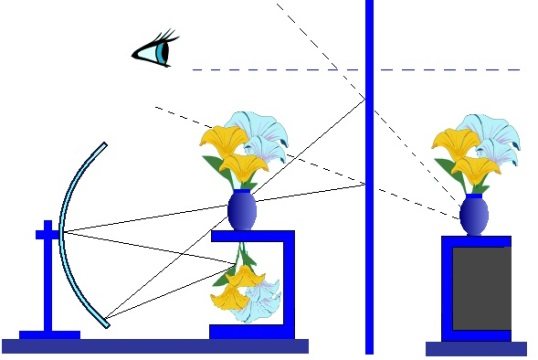
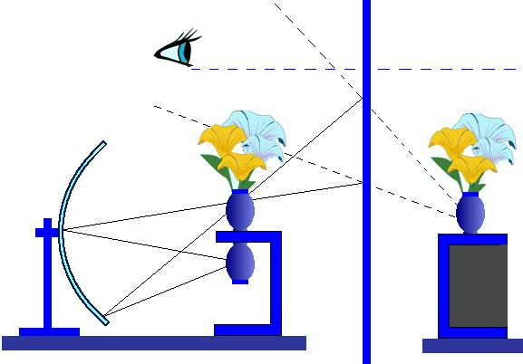

# Leçon 13 | 07 avril 1954

  <label><input type="checkbox" data-lacan-toggle="original" checked> 原文</label>
  <label><input type="checkbox" data-lacan-toggle="notes" checked> 注释</label>
  <label><input type="checkbox" data-lacan-toggle="commentary" checked> 个人解读评论</label>

<section class="parallel-paragraph" data-paragraph-ids="s1-13-0001">

s1-13-0001

[无对应译文]

原文 · s1-13-0001

[PERRIER](#PERRIER_Avril07)

</section>

<section class="parallel-paragraph" data-paragraph-ids="s1-13-0002">

s1-13-0002

[无对应译文]

原文 · s1-13-0002

LACAN

</section>

<section class="parallel-paragraph" data-paragraph-ids="s1-13-0003">

s1-13-0003

[无对应译文]

原文 · s1-13-0003

...Cet *imaginaire* est dominé par un certain mode d’*impression*. Il est possible d’en présenter les caractéristiques du *réel* sur *l’image*. M. ALAIN soulignait que l’on ne comptait pas les colonnes sur l’image mentale que l’on avait du Panthéon. À quoi je lui aurais volontiers répondu : sauf pour l’architecte du Panthéon, c’est là tout le jeu. Nous voici introduits, par cette petite porte latérale, dans quelque chose où, vous allez voir, il va s’agir abondamment aujourd’hui des rapports du *réel*, de l’*imaginaire* et du *symbolique*.

</section>

<section class="parallel-paragraph" data-paragraph-ids="s1-13-0004">

s1-13-0004

[无对应译文]

原文 · s1-13-0004

Jean HYPPOLITE

</section>

<section class="parallel-paragraph" data-paragraph-ids="s1-13-0005">

s1-13-0005

[无对应译文]

原文 · s1-13-0005

Est-ce qu’on pourra vous poser une question sur la structure de l’image optique, grossièrement, parce que c’est aller un peu vite, je veux vous demander des précisions matérielles.

</section>

<section class="parallel-paragraph" data-paragraph-ids="s1-13-0006">

s1-13-0006

[无对应译文]

原文 · s1-13-0006

LACAN - Je suis très heureux que vous les posiez, le temps que PERRIER reprenne souffle…

</section>

<section class="parallel-paragraph" data-paragraph-ids="s1-13-0007">

s1-13-0007

[无对应译文]

原文 · s1-13-0007

Jean HYPPOLITE

</section>

<section class="parallel-paragraph" data-paragraph-ids="s1-13-0008">

s1-13-0008

[无对应译文]

原文 · s1-13-0008

C’est peut-être parce que je comprends un peu mal, et si on en reparle une ou deux fois... Je vous demande la permission de vous poser des questions. Peut-être que je n’ai pas bien compris, matériellement.

</section>

<section class="parallel-paragraph" data-paragraph-ids="s1-13-0009">

s1-13-0009

[无对应译文]

原文 · s1-13-0009

LACAN

</section>

<section class="parallel-paragraph" data-paragraph-ids="s1-13-0010">

s1-13-0010

[无对应译文]

原文 · s1-13-0010

Alors, si *<u>vous</u>* n’avez pas bien compris, les autres qui sont ici…

</section>

<section class="parallel-paragraph" data-paragraph-ids="s1-13-0011">

s1-13-0011

[无对应译文]

原文 · s1-13-0011

</section>

<section class="parallel-paragraph" data-paragraph-ids="s1-13-0012">

s1-13-0012

[无对应译文]

原文 · s1-13-0012

Jean HYPPOLITE

</section>

<section class="parallel-paragraph" data-paragraph-ids="s1-13-0013">

s1-13-0013

[无对应译文]

原文 · s1-13-0013

Si j’ai bien compris, il s’agit de la structure matérielle : il y a un miroir sphérique, dont l’objet, situé au centre du miroir, a son *image réelle* ren­versée au centre du miroir. Cette image serait sur un écran. Au lieu de se faire sur un écran, nous pouvons l’observer à l’œil.

</section>

<section class="parallel-paragraph" data-paragraph-ids="s1-13-0014">

s1-13-0014

[无对应译文]

原文 · s1-13-0014

LACAN

</section>

<section class="parallel-paragraph" data-paragraph-ids="s1-13-0015">

s1-13-0015

[无对应译文]

原文 · s1-13-0015

Parfaitement. Parce que c’est une *image réelle*, pour autant que l’œil accommode sur un certain plan, d’ailleurs désigné par *l’objet réel*. Dans l’expérience réelle, il s’agissait d’un bouquet renversé qui venait se situer dans l’encolure d’un vase réel. Pour autant que l’œil accommode sur *l’image réelle*, il voit cette image. Elle arrive à se former nettement dans la mesure où les rayons lumineux viennent tous converger sur un même point d’espace virtuel, c’est-à-dire où, à chaque point de l’objet correspond un point de l’image.

</section>

<section class="parallel-paragraph" data-paragraph-ids="s1-13-0016">

s1-13-0016

[无对应译文]

原文 · s1-13-0016

Jean HYPPOLITE - L’œil est placé dans le cône lumineux, il voit l’image, sinon il ne la voit pas.

</section>

<section class="parallel-paragraph" data-paragraph-ids="s1-13-0017">

s1-13-0017

[无对应译文]

原文 · s1-13-0017

LACAN

</section>

<section class="parallel-paragraph" data-paragraph-ids="s1-13-0018">

s1-13-0018

[无对应译文]

原文 · s1-13-0018

L’expérience prouve que pour être perçue, il est nécessaire que l’observateur soit assez peu écarté de l’axe de l’appareil, du miroir sphérique, dans une sorte de prolongement de l’ouverture de ce miroir.

</section>

<section class="parallel-paragraph" data-paragraph-ids="s1-13-0019">

s1-13-0019

[无对应译文]

原文 · s1-13-0019

Jean HYPPOLITE

</section>

<section class="parallel-paragraph" data-paragraph-ids="s1-13-0020">

s1-13-0020

[无对应译文]

原文 · s1-13-0020

Dans ce cas-là, si nous mettons un *miroir plan*, le *miroir plan* donne de l’*image réelle* considérée comme un objet, une *image virtuelle*.

</section>

<section class="parallel-paragraph" data-paragraph-ids="s1-13-0021">

s1-13-0021

[无对应译文]

原文 · s1-13-0021

LACAN

</section>

<section class="parallel-paragraph" data-paragraph-ids="s1-13-0022">

s1-13-0022

[无对应译文]

原文 · s1-13-0022

Bien sûr. Tout ce qui peut se voir directement peut se voir dans un miroir, et c’est exactement comme s’il était vu un ensemble composé d’une partie réelle et d’une partie virtuelle qui sont symétriques, se correspon­dant deux à deux. La partie virtuelle s’y constitue comme phénomène corres­pondant à la partie réelle opposée, et inversement, de sorte que ce qui est vu dans le miroir, l’*image virtuelle* dans le miroir, est vu comme serait l’*image réelle* qui fait fonction d’objet dans cette occasion, par un observateur imaginaire, virtuel, qui est dans le miroir, à la place symétrique.

</section>

<section class="parallel-paragraph" data-paragraph-ids="s1-13-0023">

s1-13-0023

[无对应译文]

原文 · s1-13-0023

Jean HYPPOLITE

</section>

<section class="parallel-paragraph" data-paragraph-ids="s1-13-0024">

s1-13-0024

[无对应译文]

原文 · s1-13-0024

J’ai recommencé les constructions, comme au temps du *bachot* ou du P.C.B. \[*Physique Chimie Biologie : année préparatoire à la 1ère année de médecine*\]: une *image réelle* d’un *objet réel*, une *image virtuelle*, etc. Mais il y a l’œil qui regarde dans ce miroir, pour apercevoir l’image virtuelle de l’image réelle.

</section>

<section class="parallel-paragraph" data-paragraph-ids="s1-13-0025">

s1-13-0025

[无对应译文]

原文 · s1-13-0025

LACAN

</section>

<section class="parallel-paragraph" data-paragraph-ids="s1-13-0026">

s1-13-0026

[无对应译文]

原文 · s1-13-0026

Du moment que je peux apercevoir l’*image réelle* qui serait ici, en plaçant le miroir à mi-chemin je verrai de là où je suis... c’est-à-dire quelque part qui peut varier entre cette *image réelle* et le miroir sphérique, ou même derrière ...apparaître dans ce miroir, pour peu qu’il soit convenablement placé, c’est-à-dire perpendiculaire à la ligne axiale de tout à l’heure, cette même *image réelle* se profilant sur le fond confus que donnera, dans un miroir plan, la concavité d’un miroir sphérique.

</section>

<section class="parallel-paragraph" data-paragraph-ids="s1-13-0027">

s1-13-0027

[无对应译文]

原文 · s1-13-0027

Jean HYPPOLITE - Quand je regarde dans ce miroir, j’aperçois tout à la fois le bou­quet de fleurs virtuel, et mon œil virtuel.

</section>

<section class="parallel-paragraph" data-paragraph-ids="s1-13-0028">

s1-13-0028

[无对应译文]

原文 · s1-13-0028

LACAN

</section>

<section class="parallel-paragraph" data-paragraph-ids="s1-13-0029">

s1-13-0029

[无对应译文]

原文 · s1-13-0029

Oui, pour peu que mon œil réel existe et ne soit pas lui-même un point abstrait. Car j’ai souligné que nous ne sommes pas un œil. Et je commence à entrer, là, dans l’abstraction.

</section>

<section class="parallel-paragraph" data-paragraph-ids="s1-13-0030">

s1-13-0030

[无对应译文]

原文 · s1-13-0030

Jean HYPPOLITE - Donc, j’ai bien compris l’image. Il reste la correspondance symbolique.

</section>

<section class="parallel-paragraph" data-paragraph-ids="s1-13-0031">

s1-13-0031

[无对应译文]

原文 · s1-13-0031

LACAN - C’est ce que je vais tâcher de vous expliquer un peu.

</section>

<section class="parallel-paragraph" data-paragraph-ids="s1-13-0032">

s1-13-0032

[无对应译文]

原文 · s1-13-0032

Jean HYPPOLITE

</section>

<section class="parallel-paragraph" data-paragraph-ids="s1-13-0033">

s1-13-0033

[无对应译文]

原文 · s1-13-0033

En particulier, la correspondance… quel est le jeu des corres­pondances entre *l’objet réel*, les fleurs, *l’image réelle*, *l’image virtuelle*, *l’œil réel* et *l’œil virtuel* ? Sinon - commençons par l’objet réel - que représentent pour vous les fleurs réelles, dans la correspondance symbolique à ce schéma ?

</section>

<section class="parallel-paragraph" data-paragraph-ids="s1-13-0034">

s1-13-0034

[无对应译文]

原文 · s1-13-0034

LACAN

</section>

<section class="parallel-paragraph" data-paragraph-ids="s1-13-0035">

s1-13-0035

[无对应译文]

原文 · s1-13-0035

L’intérêt de ce schéma, c’est bien entendu qu’il peut être à plusieurs usages. Et FREUD nous a ainsi déjà construit quelque chose de semblable, et nous a tout spécialement indiqué, d’une part dans la *Traumdeutung,* et d’autre part dans l’*Abriss,* que c’était ainsi \- la forme, le phénomène imaginaire - que devaient être conçues les instances psychiques. Il l’a dit au moment de la *Traumdeutung.* Et quand il a fait le schéma de ces épaisseurs où viennent s’inscrire, à partir de là, perceptions et souvenirs, les uns composant le conscient, les autres l’incons­cient, venant se projeter avec la conscience, venant éventuellement fermer la forme *stimulus-réponse*, qui était à cette époque le plan sur lequel on essayait de faire comprendre le circuit du vivant. Et dans ces différentes épaisseurs nous pouvons voir quelque chose qui serait comme la superposition d’un certain nombre de pellicules photographiques. Il est certain que le schéma est impar­fait. Il faut tout le temps supposer…

</section>

<section class="parallel-paragraph" data-paragraph-ids="s1-13-0036">

s1-13-0036

[无对应译文]

原文 · s1-13-0036

Jean HYPPOLITE - Je me suis déjà servi de votre schéma, je cherche les premières correspondances.

</section>

<section class="parallel-paragraph" data-paragraph-ids="s1-13-0037">

s1-13-0037

[无对应译文]

原文 · s1-13-0037

LACAN

</section>

<section class="parallel-paragraph" data-paragraph-ids="s1-13-0038">

s1-13-0038

[无对应译文]

原文 · s1-13-0038

Les primitives correspondances ? Dans ceci nous pouvons, pour fixer les idées, au niveau de l’image réelle, laquelle est en fonction de contenir et du même coup exclure un certain nombre d’objets réels, nous pouvons par exemple lui donner la signification des limites du *moi,* \[les\] voir se former au niveau de *l’image réelle* dans une certaine dialectique. Car tout cela n’est que de l’usage de relations. Si vous donnez telle fonction à un élément du modèle, tel autre prendra telle autre fonction. Partons de là.

</section>

<section class="parallel-paragraph" data-paragraph-ids="s1-13-0039">

s1-13-0039

[无对应译文]

原文 · s1-13-0039

Jean HYPPOLITE

</section>

<section class="parallel-paragraph" data-paragraph-ids="s1-13-0040">

s1-13-0040

[无对应译文]

原文 · s1-13-0040

Est-ce qu’on pourrait, par exemple, admettre que l’objet réel signifie la *Gegenbild,* la réplique sexuelle du *moi* ? Je veux dire, dans le schéma animal, le mâle trouve la *Gegenbild,* c’est-à-dire sa contrepartie complémen­taire dans la structure.

</section>

<section class="parallel-paragraph" data-paragraph-ids="s1-13-0041">

s1-13-0041

[无对应译文]

原文 · s1-13-0041

LACAN - Puisqu’il faut une *Gegenbild…*

</section>

<section class="parallel-paragraph" data-paragraph-ids="s1-13-0042">

s1-13-0042

[无对应译文]

原文 · s1-13-0042

Jean HYPPOLITE - Le mot est de HEGEL.

</section>

<section class="parallel-paragraph" data-paragraph-ids="s1-13-0043">

s1-13-0043

[无对应译文]

原文 · s1-13-0043

LACAN

</section>

<section class="parallel-paragraph" data-paragraph-ids="s1-13-0044">

s1-13-0044

[无对应译文]

原文 · s1-13-0044

Le terme même de *Gegenbild* implique correspondance à une *Innenbild,* que l’on appelle correspondance de l’*Innenwelt* et de l’*Umwelt.*

</section>

<section class="parallel-paragraph" data-paragraph-ids="s1-13-0045">

s1-13-0045

[无对应译文]

原文 · s1-13-0045

Jean HYPPOLITE

</section>

<section class="parallel-paragraph" data-paragraph-ids="s1-13-0046">

s1-13-0046

[无对应译文]

原文 · s1-13-0046

Ce qui m’amène à dire que si l’objet réel, *les fleurs*, représente l’objet réel corrélatif - animalement parlant - du sujet animal percevant, alors *l’image réelle du pot de fleurs représente la structure imaginaire reflétée de cette structure réelle.*

</section>

<section class="parallel-paragraph" data-paragraph-ids="s1-13-0047">

s1-13-0047

[无对应译文]

原文 · s1-13-0047

LACAN

</section>

<section class="parallel-paragraph" data-paragraph-ids="s1-13-0048">

s1-13-0048

[无对应译文]

原文 · s1-13-0048

Vous ne pouvez pas mieux dire. C’est exactement, au départ, quand il ne s’agit que de l’animal d’abord, et dans l’appareil quand il ne s’agit que de ce qu’il se produit avec le miroir sphérique, c’est-à-dire quand l’image est cette première définition, cette première construction que je vous en ai donnée, que du miroir sphérique la production d’une image réelle est ce phénomène inté­ressant : qu’*une image réelle vient se mêler aux choses réelles*.

</section>

<section class="parallel-paragraph" data-paragraph-ids="s1-13-0049">

s1-13-0049

[无对应译文]

原文 · s1-13-0049

Si nous nous limi­tons à cela, c’est en effet une façon dont nous pouvons nous représenter cet *Innenbild,* qui permet à l’animal de *rechercher* exactement - à la façon dont la clef recherche une serrure, ou dont la serrure recherche la clef - *son partenaire spécifique*, de diriger sa *libido* là où elle doit l’être, pour cette propagation de l’espèce dont je vous ai fait remarquer un jour que, dans cette perspective, nous pouvons déjà saisir d’une façon impressionnante le caractère essentiellement transitoire de l’individu par rapport au type.

</section>

<section class="parallel-paragraph" data-paragraph-ids="s1-13-0050">

s1-13-0050

[无对应译文]

原文 · s1-13-0050

Jean HYPPOLITE - Le cycle de l’espèce.

</section>

<section class="parallel-paragraph" data-paragraph-ids="s1-13-0051">

s1-13-0051

[无对应译文]

原文 · s1-13-0051

LACAN

</section>

<section class="parallel-paragraph" data-paragraph-ids="s1-13-0052">

s1-13-0052

[无对应译文]

原文 · s1-13-0052

Non seulement le cycle de l’espèce, mais le fait que l’individu est tellement captif du type, que par rapport à ce type, il s’anéantit. *Il est* - comme dirait HEGEL, je ne sais s’il l’a dit – *déjà mort* : *par rapport à la vie éternelle de l’es­pèce*, *il est déjà mort.*

</section>

<section class="parallel-paragraph" data-paragraph-ids="s1-13-0053">

s1-13-0053

[无对应译文]

原文 · s1-13-0053

Jean HYPPOLITE

</section>

<section class="parallel-paragraph" data-paragraph-ids="s1-13-0054">

s1-13-0054

[无对应译文]

原文 · s1-13-0054

J’ai fait dire cette phrase à HEGEL, en commentant votre image, qu’en fait : « *Le savoir* - c’est-à-dire l’humanité - *est l’échec de la sexualité* ».

</section>

<section class="parallel-paragraph" data-paragraph-ids="s1-13-0055">

s1-13-0055

[无对应译文]

原文 · s1-13-0055

LACAN - Nous allons là un petit peu vite !

</section>

<section class="parallel-paragraph" data-paragraph-ids="s1-13-0056">

s1-13-0056

[无对应译文]

原文 · s1-13-0056

Jean HYPPOLITE

</section>

<section class="parallel-paragraph" data-paragraph-ids="s1-13-0057">

s1-13-0057

[无对应译文]

原文 · s1-13-0057

C’est simplement le cycle… Ce qui était important pour moi est que *l’objet réel* \[fleurs ou vase, selon les cas\] peut être pris comme la contrepartie réelle qui est de l’ordre de l’espèce de l’individu réel. Mais qu’alors se produit un développement *dans l’imaginaire* qui permet que cette contrepartie dans le seul miroir sphérique devienne aussi une *image réelle* qui est en quelque sorte l’image qui fascine comme telle - en l’absence même de l’objet réel qui s’est projeté dans l’imagi­naire - qui fascine l’individu et le capte jusqu’au miroir plan.

</section>

<section class="parallel-paragraph" data-paragraph-ids="s1-13-0058">

s1-13-0058

[无对应译文]

原文 · s1-13-0058

</section>

<section class="parallel-paragraph" data-paragraph-ids="s1-13-0059">

s1-13-0059

[无对应译文]

原文 · s1-13-0059

LACAN

</section>

<section class="parallel-paragraph" data-paragraph-ids="s1-13-0060">

s1-13-0060

[无对应译文]

原文 · s1-13-0060

Par exemple, ça nous permet d’appréhender déjà quelque chose d’une façon imagée : cette sorte d’épaississement, par rapport à la perception du monde extérieur, de condensation, d’opacification, que représente *la captation libidinale* en tant que telle. On peut dire que chez l’animal, au moins quand il est pris dans un cycle de comportement d’un *type instinctuel*, il s’ouvre dans le monde extérieur pour autant…

</section>

<section class="parallel-paragraph" data-paragraph-ids="s1-13-0061">

s1-13-0061

[无对应译文]

原文 · s1-13-0061

> vous savez combien c’est délicat et complexe de mesurer ce qui est perçu et non perçu par l’animal. La perception
>
> de l’animal semble aller beaucoup plus loin chez lui aussi que ce qu’on peut mettre en valeur à propos d’un certain nombre
>
> de comportements expérimentaux, c’est-à-dire artificiels, nous pou­vons constater qu’il peut faire des choix
>
> à l’aide de choses que nous ne soup­çonnions pas

</section>

<section class="parallel-paragraph" data-paragraph-ids="s1-13-0062">

s1-13-0062

[无对应译文]

原文 · s1-13-0062

…néanmoins, nous savons aussi que quand il est pris dans un comportement instinctuel, il est tellement englué dans un certain nombre de conditions *imaginaires* que c’est justement là où il semblerait justement le plus utile qu’il ne se trompe pas, que nous le leurrons le plus facilement.

</section>

<section class="parallel-paragraph" data-paragraph-ids="s1-13-0063">

s1-13-0063

[无对应译文]

原文 · s1-13-0063

En d’autres termes, cette *fixation libidinale* sur certains termes se présente comme pour nous, comme une espèce d’entonnoir. C’est de là que nous partons. Mais s’il est nécessaire de constituer un appa­reil un tout petit peu plus complexe et astucieux pour l’homme, c’est que pré­cisément pour lui ça ne se produit pas comme ça. Alors si vous voulez, là…

</section>

<section class="parallel-paragraph" data-paragraph-ids="s1-13-0064">

s1-13-0064

[无对应译文]

原文 · s1-13-0064

> puisque nous sommes partis, puisque c’est vous qui avez eu la gentillesse de me relancer là, pour aujourd’hui

</section>

<section class="parallel-paragraph" data-paragraph-ids="s1-13-0065">

s1-13-0065

[无对应译文]

原文 · s1-13-0065

…je ne vois pas pour­quoi je ne commencerais pas là à rappeler le thème hégelien fondamental : *le désir de l’homme est le désir de l’autre.* Et comment le trouvons-nous ? Juste­ment c’est cela qui est exprimé dans le modèle par le miroir plan.

</section>

<section class="parallel-paragraph" data-paragraph-ids="s1-13-0066">

s1-13-0066

[无对应译文]

原文 · s1-13-0066

C’est là aussi où nous retrouvons *le stade du miroir* classique de Jacques LACAN, pour autant qu’il l’est \[classique\] dans un petit cercle, c’est là que nous le retrouvons, puisque ce qui apparaît dans le développement, le caractère de *tournant*, de *virage*, qu’à un certain moment la sorte de triomphe, d’exercice triomphant de lui-même que l’individu fait de sa propre image dans le miroir, et nous pouvons par un certain nombre de corrélations de son comportement comprendre qu’il s’agit là pour la pre­mière fois d’une sorte de saisie anticipée, d’une maîtrise.

</section>

<section class="parallel-paragraph" data-paragraph-ids="s1-13-0067">

s1-13-0067

[无对应译文]

原文 · s1-13-0067

Là, nous touchons du doigt quelque chose d’autre qui est ce que j’ai appelé l’*Urbild,* mais aussi dans un autre sens que le mot *Bild* qui vous servait tout à l’heure, le premier modèle de quelque chose où se marque chez l’homme cette sorte de retard, de décolle­ment, de béance, par rapport à sa propre *libido*, qui fait qu’il y a une différence radicale entre la satisfaction d’un désir, et la course après l’achèvement du désir, qui est essentiellement quelque chose d’autre :

</section>

<section class="parallel-paragraph" data-paragraph-ids="s1-13-0068">

s1-13-0068

[无对应译文]

原文 · s1-13-0068

- *une sorte de négativité* introduite à un moment pas spécialement originel, mais crucial, tournant,

</section>

<section class="parallel-paragraph" data-paragraph-ids="s1-13-0069">

s1-13-0069

[无对应译文]

原文 · s1-13-0069

- *une sorte de négativité introduite dans le désir lui-même*, saisie dans l’autre d’abord et sous la forme même la plus radicale, la plus confuse, mais qui ne cesse de se déve­lopper par la suite.

</section>

<section class="parallel-paragraph" data-paragraph-ids="s1-13-0070">

s1-13-0070

[无对应译文]

原文 · s1-13-0070

Car cette relativité du désir humain, par rapport au *désir de l’autre*, nous le connaissons dans toute réaction où il y a rivalité, concurrence, et même jusque dans tout le développement de la civilisation, y compris cette sympathique et fondamentale « *exploitation de l’homme par l’homme* » dont nous ne sommes pas près de voir la fin, pour la raison qu’elle est absolument *struc­turale*, et qu’elle constitue - admise une fois pour toutes par HEGEL - la structure même de la notion du travail. Ce n’est plus le désir, là, mais la complète médiation de l’activité en tant que proprement humaine, engagée dans la voie des désirs humains. C’est ce que nous trouvons là : *l’origine duelle*.

</section>

<section class="parallel-paragraph" data-paragraph-ids="s1-13-0071">

s1-13-0071

[无对应译文]

原文 · s1-13-0071

Pour cette valeur de l’image, ce que nous voyons, c’est que si le désir est originellement déjà repéré et reconnu dans *l’imaginaire* proprement humain, c’est exactement à ce moment-là, puisque c’est par l’intermédiaire, pas seulement de sa propre image, mais du corps de *son semblable* que ceci se produit, c’est à ce moment-là que se sépare chez l’être humain, la conscience en tant que conscience de soi. Nous y reviendrons encore. C’est exactement pour autant que c’est dans le corps de l’autre qu’il reconnaît son désir, que l’échange se fait, et pour autant que son désir est passé de l’autre côté, ce corps de l’autre il se l’assimile, il se reconnaît comme corps.

</section>

<section class="parallel-paragraph" data-paragraph-ids="s1-13-0072">

s1-13-0072

[无对应译文]

原文 · s1-13-0072

Il y a une chose qui reste certainement, absolument, disons sous forme de point d’interrogation, que rien ne permet d’affirmer, de conclure : c’est que l’animal ait une conscience séparée de son corps comme tel, que sa corporéïté soit pour lui un élément objectivable, qui se situe quelque part, qui se repère comme corps.

</section>

<section class="parallel-paragraph" data-paragraph-ids="s1-13-0073">

s1-13-0073

[无对应译文]

原文 · s1-13-0073

Jean HYPPOLITE - Statutaire, dans le double sens.

</section>

<section class="parallel-paragraph" data-paragraph-ids="s1-13-0074">

s1-13-0074

[无对应译文]

原文 · s1-13-0074

LACAN

</section>

<section class="parallel-paragraph" data-paragraph-ids="s1-13-0075">

s1-13-0075

[无对应译文]

原文 · s1-13-0075

Exactement, alors qu’il est bien certain que s’il y a une donnée pour nous fondamentale avant même toute émergence du registre de « *la conscience malheureuse* », en donnant comme tout à l’heure la première *surgence*, c’est dans cette distinction de notre conscience et de notre corps, quelque chose qui fait de notre corps quelque chose de factice, dont notre conscience est bien impuis­sante de se détacher, mais dont elle se conçoit - les termes ne sont peut-être pas les plus propres - comme distincte.

</section>

<section class="parallel-paragraph" data-paragraph-ids="s1-13-0076">

s1-13-0076

[无对应译文]

原文 · s1-13-0076

Cette distinction de la conscience et du corps se fait dans cette sorte de brusque interchangement de rôles qui se fait dans l’expérience du miroir quand il s’agit de l’autre. En d’autres termes, de la même façon que nous disions hier soir, c’est peut-être de ça qu’il s’agit, c’est quand, à propos du mécanisme, MANNONI nous apportait la notion que dans les rapports interpersonnels mêmes, quelque chose de toujours factice s’introduit, c’est la projection du mécanisme de l’autrui sur nous-mêmes, et la même chose que le fait que nous nous reconnaissons comme corps pour autant que ces autres - indispensables pour reconnaître notre désir - ont aussi un corps, plus exactement que nous l’avons comme eux.

</section>

<section class="parallel-paragraph" data-paragraph-ids="s1-13-0077">

s1-13-0077

[无对应译文]

原文 · s1-13-0077

Jean HYPPOLITE - Ce que je comprends mal, plutôt que la distinction de soi–même et du corps, c’est la distinction de *deux corps*.

</section>

<section class="parallel-paragraph" data-paragraph-ids="s1-13-0078">

s1-13-0078

[无对应译文]

原文 · s1-13-0078

LACAN – Bien sûr.

</section>

<section class="parallel-paragraph" data-paragraph-ids="s1-13-0079">

s1-13-0079

[无对应译文]

原文 · s1-13-0079

Jean HYPPOLITE - Puisque le soi se représente comme le corps idéal et le corps que je sens, il y a deux… ?

</section>

<section class="parallel-paragraph" data-paragraph-ids="s1-13-0080">

s1-13-0080

[无对应译文]

原文 · s1-13-0080

LACAN

</section>

<section class="parallel-paragraph" data-paragraph-ids="s1-13-0081">

s1-13-0081

[无对应译文]

原文 · s1-13-0081

Non, certainement pas ! Parce que précisément, justement c’est là où *la découverte et la dimension de l’expérience freudienne* prennent leur rap­port essentiel, c’est que l’homme dans ses premières phases n’arrive pas d’em­blée, d’aucune façon, à un désir surmonté. Il est d’abord un désir morcelé. Ce qu’il reconnaît et fixe dans cette image de l’*autre*, c’est un désir morcelé. Et l’ap­parente maîtrise de l’*image du miroir* lui est donnée au moins virtuellement comme totale, comme idéalement une maîtrise.

</section>

<section class="parallel-paragraph" data-paragraph-ids="s1-13-0082">

s1-13-0082

[无对应译文]

原文 · s1-13-0082

Jean HYPPOLITE – C’est ce que j’appelle *le corps idéal*.

</section>

<section class="parallel-paragraph" data-paragraph-ids="s1-13-0083">

s1-13-0083

[无对应译文]

原文 · s1-13-0083

LACAN

</section>

<section class="parallel-paragraph" data-paragraph-ids="s1-13-0084">

s1-13-0084

[无对应译文]

原文 · s1-13-0084

Oui. C’est l’*Idealich.* Alors que son *désir*, lui, justement n’est pas constitué, ce qu’il trouve dans l’autre c’est d’abord une série de plans ambiva­lents, d’aliénations de son désir, mais d’*un désir* lui-même *qui est encore un désir en morceaux*, comme *tout ce que nous connaissons* *de l’évolution instinctuelle nous en donne le schéma*, puisque la théorie de la *libido* dans FREUD est faite de la conservation, de la composition progressive d’un certain nombre de *pulsions partielles*, qui réussissent, ou ne réussissent pas, à aboutir à un désir mûr.

</section>

<section class="parallel-paragraph" data-paragraph-ids="s1-13-0085">

s1-13-0085

[无对应译文]

原文 · s1-13-0085

Jean HYPPOLITE

</section>

<section class="parallel-paragraph" data-paragraph-ids="s1-13-0086">

s1-13-0086

[无对应译文]

原文 · s1-13-0086

Je crois que nous sommes bien d’accord. Vous disiez non tout à l’heure. Nous sommes bien d’accord. Si je dis deux corps, ça veut dire sim­plement que ce que je vois constitué, soit dans l’autre, soit dans ma propre image dans le miroir, c’est ce que je ne suis pas, en fait, ce qui est au-delà de moi. C’est ce que j’appelle *le corps idéal*, statutaire, ou statue, comme dit VALÉRY dans *La Jeune Parque* : « *mais ma statue en même temps frissonne* », est-ce le mot exact ? C’est-à-dire se décompose. Sa décomposition est ce que j’appelle l’autre corps.

</section>

<section class="parallel-paragraph" data-paragraph-ids="s1-13-0087">

s1-13-0087

[无对应译文]

原文 · s1-13-0087

LACAN

</section>

<section class="parallel-paragraph" data-paragraph-ids="s1-13-0088">

s1-13-0088

[无对应译文]

原文 · s1-13-0088

*Le corps comme désir morcelé* se cherchant, et *le corps comme idéal de soi* se reprojettent du côté du sujet comme corps morcelé, pendant qu’il voit l’autre comme corps parfait. Pour lui, un corps morcelé est une image essentiellement démembrable de son corps.

</section>

<section class="parallel-paragraph" data-paragraph-ids="s1-13-0089">

s1-13-0089

[无对应译文]

原文 · s1-13-0089

Jean HYPPOLITE

</section>

<section class="parallel-paragraph" data-paragraph-ids="s1-13-0090">

s1-13-0090

[无对应译文]

原文 · s1-13-0090

Les deux se reprojettent l’un sur l’autre en ce sens que, tout à la fois, il se voit comme statue et se démembre en même temps, projette le démembrement sur *la statue*, et dans une dialectique non finissable. Je m’excuse d’avoir répété ce que vous aviez dit, pour être sûr d’avoir bien compris.

</section>

<section class="parallel-paragraph" data-paragraph-ids="s1-13-0091">

s1-13-0091

[无对应译文]

原文 · s1-13-0091

LACAN

</section>

<section class="parallel-paragraph" data-paragraph-ids="s1-13-0092">

s1-13-0092

[无对应译文]

原文 · s1-13-0092

Nous ferons si vous voulez, un pas de plus tout à l’heure. Enfin *le réel*, comme de bien entendu, malgré qu’il soit là *en deçà du miroir*, qu’y a-t-il *au-delà* ? Nous avons déjà vu qu’il y a *cet imaginaire primitif de la dialectique spéculaire avec l’autre*, qui est *absolument fondamental*. Alors, sou­lignons au passage que nous pouvons dire, en deux sens, qu’elle introduit déjà la dimension mortelle de l’instinct de mort, dimension de la *destrudo *:

</section>

<section class="parallel-paragraph" data-paragraph-ids="s1-13-0093">

s1-13-0093

[无对应译文]

原文 · s1-13-0093

1)  en tant qu’elle participe de ce qu’a d’irrémédiablement mortel pour l’individu tout ce qui est de l’ordre de la captation libidinale, pour autant qu’elle est en fin de compte soumise à cet *x* de la vie éternelle,

</section>

<section class="parallel-paragraph" data-paragraph-ids="s1-13-0094">

s1-13-0094

[无对应译文]

原文 · s1-13-0094

2)  c’est ce que je crois qui est le point important mis en relief par la pensée de FREUD, c’est là aussi ce qui n’est pas complètement *distingué* dans ce qu’il nous apportait dans « *Au-delà du principe du plaisir »,* c’est que *l’instinct de mort* prend chez l’homme une autre signification précisément en ceci que *sa libido est* originellement en quelque sorte *contrainte de passer par une étape imaginaire*.

</section>

<section class="parallel-paragraph" data-paragraph-ids="s1-13-0095">

s1-13-0095

[无对应译文]

原文 · s1-13-0095

De plus cette *image d’image*, si vous voulez, s’explique justement : c’est tout le guidage pour lui de l’atteinte à la maturité de la *libido* à cette adéquation de la réalité de l’*imaginaire* qu’il y aurait en prin­cipe par hypothèse - après tout, qu’en savons-nous ? - chez l’animal, dont il semble, et de toujours :

</section>

<section class="parallel-paragraph" data-paragraph-ids="s1-13-0096">

s1-13-0096

[无对应译文]

原文 · s1-13-0096

- qu’elle est tellement plus évidente,

</section>

<section class="parallel-paragraph" data-paragraph-ids="s1-13-0097">

s1-13-0097

[无对应译文]

原文 · s1-13-0097

- que c’est de là même qu’est sorti le *grand fantasme* de la *natura mater,* de l’idée même de la nature,

</section>

<section class="parallel-paragraph" data-paragraph-ids="s1-13-0098">

s1-13-0098

[无对应译文]

原文 · s1-13-0098

- que l’homme par rapport à cela se représente son inadéquation originelle par quelque chose qui s’exprime de mille façons, même tout à fait objectivable dans son être, toute spéciale impuissance dès l’origine de sa vie.

</section>

<section class="parallel-paragraph" data-paragraph-ids="s1-13-0099">

s1-13-0099

[无对应译文]

原文 · s1-13-0099

Cette prématuration de la naissance, ce n’est pas les psychanalystes qui l’ont inventée. Il est évident - histologiquement au moins - que cet appa­reil nerveux qui joue dans l’organisme ce rôle encore sujet à discussion, est inachevé à sa naissance. C’est pour autant qu’il a à rejoindre l’achève­ment de sa *libido* avant d’en rejoindre l’objet, que s’introduit cette faille spéciale qui se perpétue chez lui dans *cette relation* alors *à un autre*, infi­niment plus mortelle pour lui que pour tout autre animal, et *qu’il confond cette « image du maître »*, qui est en somme ce qu’il voit sous la forme de l’image spéculaire alors, qu’il confond d’une façon tout à fait authentique, qu’il peut nommer, *avec l’image de la mort*. Il peut être en présence du « *maître absolu* », il y est originellement, qu’on le lui ait enseigné ou pas, pour autant qu’il est déjà soumis à cette image.

</section>

<section class="parallel-paragraph" data-paragraph-ids="s1-13-0100">

s1-13-0100

[无对应译文]

原文 · s1-13-0100

Jean HYPPOLITE - L’animal est soumis à la mort quand il fait l’amour, mais il n’en sait rien.

</section>

<section class="parallel-paragraph" data-paragraph-ids="s1-13-0101">

s1-13-0101

[无对应译文]

原文 · s1-13-0101

LACAN - Tandis que l’homme, lui, le sait. Il le sait, et il l’éprouve.

</section>

<section class="parallel-paragraph" data-paragraph-ids="s1-13-0102">

s1-13-0102

[无对应译文]

原文 · s1-13-0102

Jean HYPPOLITE - Cela va jusqu’à dire que c’est lui qui se donne la mort, il veut par l’autre sa propre mort.

</section>

<section class="parallel-paragraph" data-paragraph-ids="s1-13-0103">

s1-13-0103

[无对应译文]

原文 · s1-13-0103

LACAN - Nous sommes bien tous d’accord que l’amour est une forme de suicide.

</section>

<section class="parallel-paragraph" data-paragraph-ids="s1-13-0104">

s1-13-0104

[无对应译文]

原文 · s1-13-0104

Dr LANG

</section>

<section class="parallel-paragraph" data-paragraph-ids="s1-13-0105">

s1-13-0105

[无对应译文]

原文 · s1-13-0105

Il y a un point sur lequel vous avez insisté, dont je n’ai pas bien saisi la portée, du moins la portée de votre insistance, c’est le fait qu’il faut être dans un certain champ par rapport à l’appareillage en question. C’est évident du point de vue optique. Mais je vous ai vu insister à plusieurs reprises.

</section>

<section class="parallel-paragraph" data-paragraph-ids="s1-13-0106">

s1-13-0106

[无对应译文]

原文 · s1-13-0106

LACAN

</section>

<section class="parallel-paragraph" data-paragraph-ids="s1-13-0107">

s1-13-0107

[无对应译文]

原文 · s1-13-0107

En effet ! Je vois que je n’ai pas montré assez le bout de l’oreille. Vous avez vu le bout de l’oreille, mais pas son point d’insertion. Il est certain que ce dont il s’agit, là aussi, peut jouer sur plusieurs plans, soit que nous interprétions les choses au niveau de la structuration, de la description, ou du maniement de la cure. Mais vous voyez qu’il est particulièrement commode d’avoir un *schéma* tel que *le sujet -* l’observateur dans mon schéma - restant tou­jours à la même place, il est commode que ce puisse être de la mobilisation d’un plan de réflexion que dépende à un moment donné toute l’apparence de cette image.

</section>

<section class="parallel-paragraph" data-paragraph-ids="s1-13-0108">

s1-13-0108

[无对应译文]

原文 · s1-13-0108

Car si en effet, on ne peut la voir avec une suffisante complétude que d’un certain point virtuel d’observation, si vous pouvez faire changer ce point virtuel comme vous voulez, il est clair que, quand le miroir virera, ce ne sera pas seule­ment le fond - à savoir ce que le sujet peut voir au fond, par exemple lui-même ou un écho de lui-même, comme le faisait remarquer M. HYPPOLITE - qui changera. En effet, quand on fait bouger un miroir plan, il y a un moment où un certain nombre d’objets sortent du champ, ce sont évidemment les plus proches qui sor­tent en dernier lieu.

</section>

<section class="parallel-paragraph" data-paragraph-ids="s1-13-0109">

s1-13-0109

[无对应译文]

原文 · s1-13-0109

Ce qui déjà peut servir à expliquer certaines façons dont se situe l’*Idealich* par rapport à quelque chose d’autre que je laisse pour à présent sous forme énigmatique, que j’ai appelé *l’observateur*. Vous pensez bien qu’il ne s’agit pas seulement d’*un observateur*. Il s’agit en fin de compte justement de *la relation symbolique*, à savoir du point dont on parle, à partir duquel il est parlé.

</section>

<section class="parallel-paragraph" data-paragraph-ids="s1-13-0110">

s1-13-0110

[无对应译文]

原文 · s1-13-0110

Mais ce n’est pas seulement ça ce qui change. Si vous inclinez le miroir, l’image elle-même change, c’est-à-dire que, sans que *l’image* *réelle* bouge, du seul fait que le miroir change, *l’image* - que le sujet, placé ici, du côté du miroir sphérique, verra dans ce miroir - *passera*, je croyais l’avoir indiqué, *d’une forme de bouche à une forme de phallus*, ou d’un désir plus ou moins complet, à ce type de désir que j’appelais tout à l’heure *morcelé*. En d’autres termes, cela permettra de conjoindre - ce qui a toujours été l’idée de FREUD - la notion de régression topique, de montrer ses corrélations possibles avec la régression qu’il appelle *zeitlich-Entwicklungsgeschichte,* ce qui montre bien combien lui-même était embarrassé avec tout ce qui était de la relation tem­porelle.

</section>

<section class="parallel-paragraph" data-paragraph-ids="s1-13-0111">

s1-13-0111

[无对应译文]

原文 · s1-13-0111

Il dit : *zeitlich,* c’est-à-dire *temporel*, puis un tiret et : *de l’histoire du développement*. Vous savez bien quelle sorte de contradiction interne il y a entre le terme *Entwicklung* et le terme *Geschichte.* Et il les conjoint tous les trois, et puis débrouillez-vous ! Mais, bien sûr, si nous n’avions pas encore à *nous débrouiller*, il n’y aurait pas besoin que nous soyons là et ce serait bien malheureux.

</section>

<section class="parallel-paragraph" data-paragraph-ids="s1-13-0112">

s1-13-0112

[无对应译文]

原文 · s1-13-0112

Allez-y, PERRIER.

</section>

<section class="parallel-paragraph" data-paragraph-ids="s1-13-0113">

s1-13-0113

[无对应译文]

原文 · s1-13-0113

</section>

<section class="parallel-paragraph" data-paragraph-ids="s1-13-0114">

s1-13-0114

[无对应译文]

原文 · s1-13-0114

[François PERRIER](#avril-1954-table-des-séances)

</section>

<section class="parallel-paragraph" data-paragraph-ids="s1-13-0115">

s1-13-0115

[无对应译文]

原文 · s1-13-0115

François PERRIER – Oui, ce texte[^23]…

</section>

<section class="parallel-paragraph" data-paragraph-ids="s1-13-0116">

s1-13-0116

[无对应译文]

原文 · s1-13-0116

LACAN – Ce texte vous a paru un peu embêtant ?

</section>

<section class="parallel-paragraph" data-paragraph-ids="s1-13-0117">

s1-13-0117

[无对应译文]

原文 · s1-13-0117

François PERRIER

</section>

<section class="parallel-paragraph" data-paragraph-ids="s1-13-0118">

s1-13-0118

[无对应译文]

原文 · s1-13-0118

En effet ! Je pense que le mieux serait sans doute de brosser un schéma de l’article. C’est tout simplement ce que j’ai fait jusqu’à maintenant. Je pense que vous voulez ensuite aller à la découverte, de manière plus précise et plus détaillée. C’est un article que FREUD introduit en nous disant qu’il y a intérêt et avan­tage à établir un parallèle, qu’il est instructif d’établir un parallèle entre certains symptômes morbides et les prototypes normaux qui nous permettent justement de les étudier, par exemple *le deuil,* *la mélancolie, le rêve, et le sommeil,* et cer­tains états narcissiques.

</section>

<section class="parallel-paragraph" data-paragraph-ids="s1-13-0119">

s1-13-0119

[无对应译文]

原文 · s1-13-0119

LACAN

</section>

<section class="parallel-paragraph" data-paragraph-ids="s1-13-0120">

s1-13-0120

[无对应译文]

原文 · s1-13-0120

À propos, il emploie le terme de *Vorbild,* ce qui va bien dans le sens du terme de *Bildung,* pour désigner les « *prototypes* » normaux.

</section>

<section class="parallel-paragraph" data-paragraph-ids="s1-13-0121">

s1-13-0121

[无对应译文]

原文 · s1-13-0121

François PERRIER

</section>

<section class="parallel-paragraph" data-paragraph-ids="s1-13-0122">

s1-13-0122

[无对应译文]

原文 · s1-13-0122

Il en vient à l’étude du rêve dans le but, qui apparaîtra à la fin de l’article, d’approfondir l’étude de certains phénomènes tels qu’on les rencontre dans les affections narcissiques, dans la schizophrénie par exemple.

</section>

<section class="parallel-paragraph" data-paragraph-ids="s1-13-0123">

s1-13-0123

[无对应译文]

原文 · s1-13-0123

LACAN - Les préfigurations normales dans une affection morbide, *Normal­vorbilder krankhafter Affektionen.*

</section>

<section class="parallel-paragraph" data-paragraph-ids="s1-13-0124">

s1-13-0124

[无对应译文]

原文 · s1-13-0124

François PERRIER

</section>

<section class="parallel-paragraph" data-paragraph-ids="s1-13-0125">

s1-13-0125

[无对应译文]

原文 · s1-13-0125

Alors il nous dit que le sommeil est un état de dévêtement psy­chique qui ramène le dormeur à un état analogue à *l’état primitif fœtal*. Cet état l’amène également à se dévêtir de toute une partie de son organisation psy­chique, comme on se défait d’une perruque, de ses fausses dents, de ses vête­ments, avant de s’endormir.

</section>

<section class="parallel-paragraph" data-paragraph-ids="s1-13-0126">

s1-13-0126

[无对应译文]

原文 · s1-13-0126

LACAN

</section>

<section class="parallel-paragraph" data-paragraph-ids="s1-13-0127">

s1-13-0127

[无对应译文]

原文 · s1-13-0127

C’est très curieux et amusant qu’à propos de cette image même du narcissisme du sujet, qui est donné comme étant l’essence fondamentale du sommeil, FREUD fasse cette remarque qui ne semble pas aller dans une direction bien physiologique… Ce n’est pas vrai pour tous les êtres humains. Sans doute il est d’usage de quitter ses vêtements, mais on en remet d’autres.

</section>

<section class="parallel-paragraph" data-paragraph-ids="s1-13-0128">

s1-13-0128

[无对应译文]

原文 · s1-13-0128

Cette image qu’il nous sort tout d’un coup : de quitter ses lunettes - nous sommes un certain nombre à être doués des infirmités qui les rendent nécessaires - mais aussi ses fausses dents, ses faux cheveux, *image* hideuse de l’être qui se décompose, et précisément à ce propos, on peut ainsi accéder au registre du caractère partiel­lement décomposable, spécialement démontable et aussi imprécis quant à ses limites de ce qui est le *moi* humain, puisqu’en fin de compte, en effet les fausses dents, assurément ne font pas partie de mon *moi.* Mais jusqu’à quel point *mes vraies dents* en font-elles partie ? Puisqu’elles sont si remplaçables. Déjà l’idée du caractère ambigu, incertain de ce qui est à proprement certain, les limites du *moi,* est mis là tout à fait au premier plan d’entrée en portique de cette intro­duction à l’étude métapsychologique du rêve, dont le portique est d’abord la préparation, signification aussi du même coup, du sommeil.

</section>

<section class="parallel-paragraph" data-paragraph-ids="s1-13-0129">

s1-13-0129

[无对应译文]

原文 · s1-13-0129

François PERRIER

</section>

<section class="parallel-paragraph" data-paragraph-ids="s1-13-0130">

s1-13-0130

[无对应译文]

原文 · s1-13-0130

Dans le paragraphe suivant, il en vient à quelque chose qui semble être raccourci de tout ce qu’il va étudier par la suite. C’est un peu difficile à com­prendre quand on n’a pas lu le reste. Il en vient à rappeler que, quand on étudie les psychoses, on constate qu’on est chaque fois mis en présence *de régressions temporelles*, c’est-à-dire de ces points jusqu’auxquels chaque cas revient sur les étapes de sa propre évolution. Alors il nous dit que l’on constate de telles *régressions*, l’une dans *l’évo­lution du moi* et l’autre dans *l’évolution de la libido *:

</section>

<section class="parallel-paragraph" data-paragraph-ids="s1-13-0131">

s1-13-0131

[无对应译文]

原文 · s1-13-0131

- *la régression de l’évo­lution de la libido* dans ce qui correspond à tout cela dans le rêve amènera, dit-il, au rétablissement du narcissisme primitif

</section>

<section class="parallel-paragraph" data-paragraph-ids="s1-13-0132">

s1-13-0132

[无对应译文]

原文 · s1-13-0132

- *et la régression de l’évolu­tion du moi* dans le rêve également amènera à la satisfaction *hallucinatoire* du désir.

</section>

<section class="parallel-paragraph" data-paragraph-ids="s1-13-0133">

s1-13-0133

[无对应译文]

原文 · s1-13-0133

Ceci *a priori* ne semble pas extrêmement clair, ou tout au moins pas pour moi.

</section>

<section class="parallel-paragraph" data-paragraph-ids="s1-13-0134">

s1-13-0134

[无对应译文]

原文 · s1-13-0134

LACAN - Ce sera peut-être un peu plus clair avec ce schéma ?

</section>

<section class="parallel-paragraph" data-paragraph-ids="s1-13-0135">

s1-13-0135

[无对应译文]

原文 · s1-13-0135

François PERRIER - Oui Monsieur, mais je ne suis pas au stade où j’ai confronté ce texte avec votre schéma.

</section>

<section class="parallel-paragraph" data-paragraph-ids="s1-13-0136">

s1-13-0136

[无对应译文]

原文 · s1-13-0136

LACAN

</section>

<section class="parallel-paragraph" data-paragraph-ids="s1-13-0137">

s1-13-0137

[无对应译文]

原文 · s1-13-0137

C’est pour cela que je vous demande de parler aujourd’hui au niveau où tout le monde peut le prendre. C’est très bien de souligner en effet les points énigmatiques à proprement parler.

</section>

<section class="parallel-paragraph" data-paragraph-ids="s1-13-0138">

s1-13-0138

[无对应译文]

原文 · s1-13-0138

François PERRIER

</section>

<section class="parallel-paragraph" data-paragraph-ids="s1-13-0139">

s1-13-0139

[无对应译文]

原文 · s1-13-0139

On peut déjà le pressentir, en pensant qu’il part de régression tem­porelle, de régression dans l’histoire du sujet, et de ce fait *la régression de l’évolu­tion du moi* amènera à cet état tout à fait élémentaire, primordial, non évolué, non élaboré, qui est la satisfaction hallucinatoire du désir.

</section>

<section class="parallel-paragraph" data-paragraph-ids="s1-13-0140">

s1-13-0140

[无对应译文]

原文 · s1-13-0140

Il va tout d’abord nous faire recheminer avec lui dans l’étude du processus du rêve, et en particulier dans l’étude de ce qu’on peut appeler le narcissisme du sommeil, pour approfondir la connaissance qu’on peut en avoir en fonction même de ce qu’il se passe, c’est-à-dire du rêve. Il parle tout d’abord de *l’égoïsme du rêve* - et c’est un terme qui choque un peu - pour le comparer au *narcissisme*.

</section>

<section class="parallel-paragraph" data-paragraph-ids="s1-13-0141">

s1-13-0141

[无对应译文]

原文 · s1-13-0141

LACAN - Comment le justifie-t-il, l’égoïsme du rêve ?

</section>

<section class="parallel-paragraph" data-paragraph-ids="s1-13-0142">

s1-13-0142

[无对应译文]

原文 · s1-13-0142

François PERRIER - Il dit que, dans le rêve, c’est toujours la personne du dormeur qui est le personnage central.

</section>

<section class="parallel-paragraph" data-paragraph-ids="s1-13-0143">

s1-13-0143

[无对应译文]

原文 · s1-13-0143

LACAN

</section>

<section class="parallel-paragraph" data-paragraph-ids="s1-13-0144">

s1-13-0144

[无对应译文]

原文 · s1-13-0144

Et qui joue le principal rôle. Qui est-ce qui peut me dire ce qu’est exactement *agnoszieren* ? C’est un terme allemand que je n’ai pas trouvé, mais son sens n’est pas douteux : il s’agit de cette personne qui doit toujours être reconnue comme la personne propre « *als die eigene zu agnoszieren* ». \[*So wissen wir, der Traum sei absolut egoistisch, und die Person, die in seinen Szenen die Hauptrolle spiele, sei immer als die eigene* *zu agnoszieren*\]. Quelqu’un peut-il me donner une indication sur l’usage de ce mot ? Andrée \[Lehman\] ?

</section>

<section class="parallel-paragraph" data-paragraph-ids="s1-13-0145">

s1-13-0145

[无对应译文]

原文 · s1-13-0145

Justement il n’emploie pas *anerkennen*, ce qui impliquerait la dimension de la reconnaissance où nous l’entendons sans cesse dans notre dialectique. La personne du dormeur est à reconnaître, au niveau de quoi ? De notre interprétation ou de notre *man­tique* ? Ce n’est pas tout à fait la même chose, il y a justement toute la différence entre *le plan de l’anerkennen* et *le plan de l’agnoszieren*, *ce que* *nous compre­nons*, et *ce que nous savons*, c’est-à-dire, quoi qu’il en soit, ce qui porte quand même la marque *d’une ambiguïté fondamentale*.

</section>

<section class="parallel-paragraph" data-paragraph-ids="s1-13-0146">

s1-13-0146

[无对应译文]

原文 · s1-13-0146

Car il est assuré que FREUD lui-­même quand dans la *Traumdeutung* il nous analyse le rêve célèbre, à propos duquel il nous marque la façon la plus émouvante, car plus nous avançons, plus nous pourrons voir ce qu’il y avait de génial dans ces premières approches vers la signification du rêve et de son scénario.

</section>

<section class="parallel-paragraph" data-paragraph-ids="s1-13-0147">

s1-13-0147

[无对应译文]

原文 · s1-13-0147

\[À Mme X\] - Peut-être pouvez-vous donner une indication sur cet *agnoszieren* ?

</section>

<section class="parallel-paragraph" data-paragraph-ids="s1-13-0148">

s1-13-0148

[无对应译文]

原文 · s1-13-0148

Mme X.

</section>

<section class="parallel-paragraph" data-paragraph-ids="s1-13-0149">

s1-13-0149

[无对应译文]

原文 · s1-13-0149

Parfois FREUD emploie des mots qui ont été employés à Vienne. C’est quelque chose qu’on n’emploie plus en allemand. Mais le sens que vous avez donné est juste.

</section>

<section class="parallel-paragraph" data-paragraph-ids="s1-13-0150">

s1-13-0150

[无对应译文]

原文 · s1-13-0150

LACAN

</section>

<section class="parallel-paragraph" data-paragraph-ids="s1-13-0151">

s1-13-0151

[无对应译文]

原文 · s1-13-0151

C’est intéressant, en effet, cette signification du milieu viennois. FREUD nous donne à ce propos une appréhension tellement profonde de son rapport avec le personnage fraternel, avec cet ami-ennemi, dont il nous dit que c’est un personnage absolument fondamental dans son existence, qu’il faut qu’il y en ait toujours un qui soit recouvert par cette sorte de *Gegenbild.*

</section>

<section class="parallel-paragraph" data-paragraph-ids="s1-13-0152">

s1-13-0152

[无对应译文]

原文 · s1-13-0152

Mais en même temps, c’est par l’intermédiaire de ce personnage, qui est ici incarné par son collègue du laboratoire…

</section>

<section class="parallel-paragraph" data-paragraph-ids="s1-13-0153">

s1-13-0153

[无对应译文]

原文 · s1-13-0153

> on a évoqué sa personne au début de ces séminaires, quand nous avons un peu parlé
>
> des premières étapes de FREUD à la vie scientifique

</section>

<section class="parallel-paragraph" data-paragraph-ids="s1-13-0154">

s1-13-0154

[无对应译文]

原文 · s1-13-0154

…c’est à propos et par l’intermédiaire de ce collègues, de ses actes, de ses sentiments, qu’il projette, fait vivre dans le rêve ce qui est le désir latent du rêve, savoir les revendications profondes de sa propre agression, de sa propre ambition.

</section>

<section class="parallel-paragraph" data-paragraph-ids="s1-13-0155">

s1-13-0155

[无对应译文]

原文 · s1-13-0155

De sorte que cette *eigene Person* est tout à fait ambiguë. C’est dans l’*autre*, et à l’intérieur même de la conscience du rêve, plus exactement de son mirage, à l’intérieur du mirage du rêve, en effet, que nous devons chercher dans la per­sonne qui joue le rôle principal, la propre personne du dormeur. Mais justement, ce n’est pas le dormeur, c’est l’autre.

</section>

<section class="parallel-paragraph" data-paragraph-ids="s1-13-0156">

s1-13-0156

[无对应译文]

原文 · s1-13-0156

François PERRIER

</section>

<section class="parallel-paragraph" data-paragraph-ids="s1-13-0157">

s1-13-0157

[无对应译文]

原文 · s1-13-0157

Alors, il se demande si *narcissisme* et *égoïsme* ne sont pas en vérité une seule et même chose. Et il nous dit que le mot « *narcissisme* » ne sert qu’à mieux marquer, souligner le caractère libidinal de l’égoïsme et, autrement dit, que le narcissisme peut être considéré comme le complément libidinal de l’égoïsme. Il en vient à une incidente. Il parle du pouvoir du diagnostic du rêve, en nous rappelant qu’on perçoit souvent dans ces rêves, d’une manière absolument inapparente à l’état de veille, certaines modifications organiques qui permet­tent de poser en quelque sorte prématurément le diagnostic de quelque chose encore inapparent à l’état de veille, et à ce moment le problème de l’hypocon­drie apparaît.

</section>

<section class="parallel-paragraph" data-paragraph-ids="s1-13-0158">

s1-13-0158

[无对应译文]

原文 · s1-13-0158

LACAN

</section>

<section class="parallel-paragraph" data-paragraph-ids="s1-13-0159">

s1-13-0159

[无对应译文]

原文 · s1-13-0159

Alors là, quelque chose d’un peu astucieux, un peu plus calé. Réfléchissez bien, à ce que ça veut dire. Je vous ai parlé tout à l’heure de cette sorte d’échange qui se produit, de cette image de l’autre en tant que justement elle est libidinalisée, narcissisée, dans la situation imaginaire. Elle est du même coup exactement comme je vous disais tout à l’heure : chez l’animal, certaines parties du monde étaient opacifiées pour devenir fascinantes, elle l’est, elle aussi.

</section>

<section class="parallel-paragraph" data-paragraph-ids="s1-13-0160">

s1-13-0160

[无对应译文]

原文 · s1-13-0160

Car enfin si nous sommes capables \[dans le rêve\] d’*agnoszieren la personne propre du dor­meur* à l’état pur, à l’état de veille, s’il n’a pas lu la *Traumdeutung,* mais dans cette mesure même il est assez frappant que son pouvoir de distinction fine, de connaissance, en soit d’autant accru, alors que son corps justement, ces sensa­tions annonciatrices de quelque chose d’interne, de cénesthésique, capable de s’annoncer dans le sommeil de l’homme, *à l’état vigile* - dans sa suffisance - *il ne les percevra pas*.

</section>

<section class="parallel-paragraph" data-paragraph-ids="s1-13-0161">

s1-13-0161

[无对应译文]

原文 · s1-13-0161

C’est justement pour autant que l’opacification libidinale dans le rêve est *de l’autre côté du miroir*, que son corps est, non pas moins bien senti, mais mieux perçu, mieux connu. Est-ce que vous saisissez là le mécanisme ? Et combien justement dans l’état de veille, c’est pour autant que ce corps de l’autre est renvoyé au sujet que beaucoup de choses de lui-même sont mécon­nues, aussi bien d’ailleurs que l’*ego* soit un pouvoir de méconnaissance c’est le fondement même de toute la technique analytique.

</section>

<section class="parallel-paragraph" data-paragraph-ids="s1-13-0162">

s1-13-0162

[无对应译文]

原文 · s1-13-0162

Mais cela va fort loin, jusqu’à la structuration, l’organisation, et du même coup à proprement parler la scotomisation - ici je verrais assez bien l’emploi du terme - et à toutes sortes de choses qui sont autant *d’informations qui peuvent venir de nous-même à nous-même*, ce qui est effectivement ce jeu particulier qui renvoie à nous cette corporéïté elle aussi d’origine étrangère. Et cela va jusqu’à :

</section>

<section class="parallel-paragraph" data-paragraph-ids="s1-13-0163">

s1-13-0163

[无对应译文]

原文 · s1-13-0163

« *Ils ont des yeux pour ne point voir...* » \[[Jérémie 5 : 21](http://saintebible.com/jeremiah/5-21.htm)\]

</section>

<section class="parallel-paragraph" data-paragraph-ids="s1-13-0164">

s1-13-0164

[无对应译文]

原文 · s1-13-0164

Laissons cela de côté. *Il faut toujours prendre les phrases de l’Évangile au pied de la lettre*, sans cela évidemment on n’y comprend rien, on croit que c’est de l’ironie.

</section>

<section class="parallel-paragraph" data-paragraph-ids="s1-13-0165">

s1-13-0165

[无对应译文]

原文 · s1-13-0165

François PERRIER

</section>

<section class="parallel-paragraph" data-paragraph-ids="s1-13-0166">

s1-13-0166

[无对应译文]

原文 · s1-13-0166

Le rêve est aussi une *projection *: extériorisation d’un processus interne. Et il rappelle que cette extériorisation d’un processus interne est un moyen de défense contre le réveil. De même que le mécanisme de *la phobie hys­térique*, il y a cette même *projection* qui est elle-même un moyen de défense, et qui vient remplacer une exigence fonctionnelle intérieure. Seulement, dit-il, pourquoi l’intention de dormir se trouve-t-elle contrecarrée ? Elle peut l’être soit par une irritation venant de l’extérieur, soit par une excitation venant de l’intérieur. Le cas de l’obstacle intérieur est le plus intéressant, c’est celui qu’on va étudier.

</section>

<section class="parallel-paragraph" data-paragraph-ids="s1-13-0167">

s1-13-0167

[无对应译文]

原文 · s1-13-0167

LACAN

</section>

<section class="parallel-paragraph" data-paragraph-ids="s1-13-0168">

s1-13-0168

[无对应译文]

原文 · s1-13-0168

Il faut bien suivre ce passage, car il permet de mettre un peu de rigueur dans l’usage en analyse du terme « *projection* ». Ça ne veut pas dire qu’on en fasse toujours un usage rigoureux, bien loin de là ! Nous en faisons au contraire perpétuellement l’usage le plus confus. En particulier, nous glissons tout le temps dans l’usage classique qui en effet est *la projection de nos senti­ments*, comme on dit couramment, *sur le semblable*. Et ça n’est pas tout à fait ça, vous verrez, dont il s’agit quand nous avons à user par la force des choses, par la loi de cohérence du système, quand nous avons à user en analyse du terme de « projection ». J’y reviendrai maintes fois. Car si nous pouvons arriver à aborder le prochain trimestre le cas SCHREBER, la question des psychoses, nous aurons à mettre les dernières précisions sur la signification que nous pouvons donner au terme de projection.

</section>

<section class="parallel-paragraph" data-paragraph-ids="s1-13-0169">

s1-13-0169

[无对应译文]

原文 · s1-13-0169

Il est bien certain que, si vous avez suivi ce que j’ai dit tout à l’heure, vous devez voir que c’est toujours d’abord du dehors que vient ce qu’on appelle ici ce processus interne, c’est d’abord par l’intermédiaire du dehors qu’il est reconnu.

</section>

<section class="parallel-paragraph" data-paragraph-ids="s1-13-0170">

s1-13-0170

[无对应译文]

原文 · s1-13-0170

François PERRIER

</section>

<section class="parallel-paragraph" data-paragraph-ids="s1-13-0171">

s1-13-0171

[无对应译文]

原文 · s1-13-0171

Alors, il va être question de savoir, d’entamer en quelque sorte ce narcissisme total qui serait celui du sommeil parfait, et de voir comment on peut *expliquer* justement le rêve dans la mesure même où le rêve nécessite certaines exceptions dans l’instauration du narcissisme total, autrement dit dans la mesure où, pour que le rêve se produise, il n’y a pas retrait total de tous les inves­tissements, quels qu’ils soient.

</section>

<section class="parallel-paragraph" data-paragraph-ids="s1-13-0172">

s1-13-0172

[无对应译文]

原文 · s1-13-0172

Tout d’abord, nous dit-il, on sait que les promoteurs du rêve sont les restes diurnes. Autrement dit que ces restes diurnes ne sont pas soumis à un retrait de l’investissement : ce qui reste est au moins partiellement investi - et de ce fait il y a déjà une exception - dans le narcissisme du sommeil. Pour ces restes diurnes, il reste une certaine quantité d’intérêt libidinal, ou autre. Ces restes diurnes nous paraissent sous forme de pensées latentes du rêve. Nous sommes obligés, dit-il, vu la situation générale, et conformément à leur nature, de les considérer comme appartenant au système préconscient.

</section>

<section class="parallel-paragraph" data-paragraph-ids="s1-13-0173">

s1-13-0173

[无对应译文]

原文 · s1-13-0173

Autre difficulté qu’il va falloir résoudre, que l’on peut résumer ainsi : si les restes diurnes forcent l’accès du conscient dans le rêve, est-ce que cela tient à leur énergie propre, ou non ? En fait, dit-il, il est difficile d’admettre que ces restes diurnes s’emparent pendant la nuit d’assez d’énergie pour pouvoir forcer la tension du conscient et on incline à croire que leur énergie vient en fait des pulsions inconscientes. Et c’est d’autant plus facile à admettre que tout porte à croire également que pendant le sommeil, le barrage entre l’inconscient et le préconscient est fort abaissé.

</section>

<section class="parallel-paragraph" data-paragraph-ids="s1-13-0174">

s1-13-0174

[无对应译文]

原文 · s1-13-0174

Mais, dit-il, nouvelle difficulté : si le sommeil consiste en un retrait des investissements inconscients et préconscients, comment l’inconscient pourrait-­il investir le préconscient ? Il faut donc admettre pour répondre à cette question, qu’une partie de l’inconscient - justement celle où le refoulé ne se plie pas au désir du sommeil émané du *moi -* garde une certaine indépendance par rapport au *moi.* Cela mène à une conséquence immédiate : il y a donc quand même *péril pul­sionnel*. Et s’il y a *péril pulsionnel*, il y a quand même nécessité d’un *contre investissement*. Donc l’énergie refoulante doit être maintenue aussi *pendant* le sommeil. Elle est sans doute abaissée, mais elle doit être maintenue pour faire face à ce péril pulsionnel.

</section>

<section class="parallel-paragraph" data-paragraph-ids="s1-13-0175">

s1-13-0175

[无对应译文]

原文 · s1-13-0175

Et il cite à l’appui de cette thèse le cas où le dormeur renonce au sommeil par peur justement de ses rêves, donc par peur de ces exigences pulsionnelles. Il réenvisage la possibilité pour certaines pensées diurnes de conserver leur investissement, mais dans la mesure où ces pensées diurnes étaient en quelque sorte les substituts des exigences pulsionnelles : ça revient au même. Il est quand même question d’admettre la transmission de l’énergie depuis l’inconscient jus­qu’au *préconscient*. Et finalement, il donne la formule suivante : d’abord, formation du désir pré­conscient du rêve, qui permet à la pulsion inconsciente de s’exprimer, grâce au matériel des restes diurnes préconscients.

</section>

<section class="parallel-paragraph" data-paragraph-ids="s1-13-0176">

s1-13-0176

[无对应译文]

原文 · s1-13-0176

Là aussi une difficulté que j’ai rencontrée, que nous avons rencontrée, avec le Père BEIRNAERT et Andrée LEHMAN qui m’ont aidé, hier soir : le désir précons­cient du rêve, qu’est-ce que c’est ?

</section>

<section class="parallel-paragraph" data-paragraph-ids="s1-13-0177">

s1-13-0177

[无对应译文]

原文 · s1-13-0177

LACAN - Ce qu’il appelle *« le désir du rêve »,* c’est l’élément inconscient.

</section>

<section class="parallel-paragraph" data-paragraph-ids="s1-13-0178">

s1-13-0178

[无对应译文]

原文 · s1-13-0178

François PERRIER

</section>

<section class="parallel-paragraph" data-paragraph-ids="s1-13-0179">

s1-13-0179

[无对应译文]

原文 · s1-13-0179

Justement. Il dit : il y a d’abord formation du désir préconscient du rêve, je suppose à l’état de veille, qui permet à la pulsion inconsciente de s’exprimer grâce au matériel, c’est-à-dire dans les restes diurnes pré­conscients. C’est là que vient la question, l’étude de *ce désir du rêve*, qui m’a embarrassé, parce qu’il en parle tout de suite en tant que *désir du rêve*, après avoir utilisé le terme *désir préconscient du rêve,* pour en dire qu’il n’a pas eu besoin d’exister à l’état de veille, et peut déjà posséder le caractère irrationnel propre à tout ce qui est inconscient. On le traduit en termes de conscient.

</section>

<section class="parallel-paragraph" data-paragraph-ids="s1-13-0180">

s1-13-0180

[无对应译文]

原文 · s1-13-0180

LACAN - Ce qui est important.

</section>

<section class="parallel-paragraph" data-paragraph-ids="s1-13-0181">

s1-13-0181

[无对应译文]

原文 · s1-13-0181

François PERRIER - Il faut se garder, dit–il, de confondre ce désir du rêve avec tout ce qui est de l’ordre du préconscient.

</section>

<section class="parallel-paragraph" data-paragraph-ids="s1-13-0182">

s1-13-0182

[无对应译文]

原文 · s1-13-0182

LACAN

</section>

<section class="parallel-paragraph" data-paragraph-ids="s1-13-0183">

s1-13-0183

[无对应译文]

原文 · s1-13-0183

Voilà ! Remarquez qu’il y a 2 façons d’accepter ça, à savoir comme on l’accepte d’habitude après l’avoir lu. C’est comme ça, il y a  ce qui est manifeste, ce qui est latent. Mais on entrera alors dans un certain nombre de complications. Ce qui est *manifeste* c’est la composition. Ce à quoi *l’élaboration du rêve* est parvenue pour faire - très joli virage de son premier aspect du souvenir, que le sujet est capable de vous évoquer - c’est extrêmement calé - ce qui est manifeste.

</section>

<section class="parallel-paragraph" data-paragraph-ids="s1-13-0184">

s1-13-0184

[无对应译文]

原文 · s1-13-0184

Et ce qui le compose, est quelque chose que nous devons chercher et que nous rencontrons d’abord. Et ceci est vraiment ce qui est de l’inconscient : nous le trouvons ou nous ne le trouvons pas, mais nous ne le voyons jamais que se profiler derrière, comme la forme directrice si on peut dire qui a forcé tous les *Tagesresten -* ces investisse­ments vaguement lucides - à s’organiser d’une certaine façon, ce qui a abouti au contenu manifeste, c’est-à-dire en fin de compte à un mirage qui ne répond en rien à ce que nous reconstruisons, c’est-à-dire le désir inconscient. Comment est–ce qu’on peut se *représenter ça avec mon petit schéma* ?

</section>

<section class="parallel-paragraph" data-paragraph-ids="s1-13-0185">

s1-13-0185

[无对应译文]

原文 · s1-13-0185

M. HYPPOLITE - d’une façon opportune - m’a forcé en quelque sorte de tout inves­tir un peu au début de cette séance. Évidemment *nous ne réglerons pas cette question aujourd’hui* mais nous verrons jusqu’où ça nous mènera, il faut bien avancer un peu. Il est indispensable ici de faire intervenir ce qu’on peut appeler justement *les commandes de l’appareil* en tant que la partie mobile de l’appareil, le fameux miroir \[plan\].

</section>

<section class="parallel-paragraph" data-paragraph-ids="s1-13-0186">

s1-13-0186

[无对应译文]

原文 · s1-13-0186

C’est entendu, le sujet prend conscience de son *désir dans l’autre*, par l’intermédiaire de cette *image de l’autre* qui lui donne *le fantôme de la propre maîtrise*. Et après tout, si de même on peut toujours se livrer à ce jeu, de même qu’il est assez fréquent dans nos raisonnements scientifiques, que nous rédui­sions le sujet à un œil, nous pourrions aussi bien aussi le réduire à une sorte de personnage instantané dans ce rapport à cette image anticipée de lui–même, indépendamment de son évolution.

</section>

<section class="parallel-paragraph" data-paragraph-ids="s1-13-0187">

s1-13-0187

[无对应译文]

原文 · s1-13-0187

Mais il reste que c’est un être humain, qu’il est né dans un certain état d’im­puissance, et que très précocement les mots, le langage, lui ont servi à quelque chose. Ceci est hors de doute. Ils lui ont servi d’*appel*, et d’*appel* des plus misé­rables quand c’était de *ses cris* que dépendait sa nourriture. On a assez mis en relief et en relation cette relation, ce maternage primitif, pour parler des états de dépendance. Mais enfin ce n’est pas une raison pour masquer :

</section>

<section class="parallel-paragraph" data-paragraph-ids="s1-13-0188">

s1-13-0188

[无对应译文]

原文 · s1-13-0188

- que tout aussi précocement, cette relation à l’autre est par le sujet nommée,

</section>

<section class="parallel-paragraph" data-paragraph-ids="s1-13-0189">

s1-13-0189

[无对应译文]

原文 · s1-13-0189

- que la personne telle a un nom, si confus soit-il, qui désigne une personne déterminée,

</section>

<section class="parallel-paragraph" data-paragraph-ids="s1-13-0190">

s1-13-0190

[无对应译文]

原文 · s1-13-0190

- et que très vite c’est exactement en cela que consiste le passage à l’état humain.

</section>

<section class="parallel-paragraph" data-paragraph-ids="s1-13-0191">

s1-13-0191

[无对应译文]

原文 · s1-13-0191

À savoir : à quel moment ce qui doit définir que l’homme devient humain, qu’il est un humain ? Au moment où, pour si peu que ce soit, il entre dans la *relation symbo­lique*. La *relation symbolique* - je vous l’ai déjà dit, souligné – est éternelle, pas simplement parce qu’il faut qu’il y ait effectivement toujours trois personnes, elle est éternelle déjà en ceci que *le symbole* introduit un tiers, élément de médiation, qui en lui-même situe et modifie, fait passer sur un autre plan, les deux personnages en présence.

</section>

<section class="parallel-paragraph" data-paragraph-ids="s1-13-0192">

s1-13-0192

[无对应译文]

原文 · s1-13-0192

Je veux reprendre encore une fois cela de loin, même si je dois aujourd’hui m’arrêter en route. Quelque part, M. KELLER, qui vous savez est un philosophe gestaltiste, et comme tel se croit très supérieur aux philosophes mécanicistes, fait toutes sortes d’*ironies* sur le thème *stimulus-réponse*. Il dit : c’est tout de même bien drôle de recevoir de M. Untel, libraire à New York, la commande d’un bouquin. Eh bien, si nous étions dans le registre de *stimulus-réponse*, ma réponse suivrait : j’ai été stimulé, on m’a fait cette commande, et je ferai la réponse. Mais *oh, là, là*, dit KELLER - en faisant appel à *l’intuition vécue* de la façon la plus justifiée - ce n’est pas simple. Je ne me contente pas de répondre à cette invite, je suis dans un état de tension effroyable.

</section>

<section class="parallel-paragraph" data-paragraph-ids="s1-13-0193">

s1-13-0193

[无对应译文]

原文 · s1-13-0193

Écrire cet article, eh bien, c’est en même temps toute la notion gestaltiste de l’équilibre qui ne se retrouvera que quand cette tension aura pris la même forme, la forme de réalisation de l’article. Il y aura un état dynamique - et ce ne sera pas seulement *une réponse* - un état dynamique de déséquilibre, du fait de cet appel reçu, qui ne sera satisfait que quand il sera assumé, quand aura été fermé le cercle - d’ores et déjà anticipé par le fait de cet appel - de la réponse pleine.

</section>

<section class="parallel-paragraph" data-paragraph-ids="s1-13-0194">

s1-13-0194

[无对应译文]

原文 · s1-13-0194

Il est tout à fait clair que ceci n’est nullement une description suffisante. Qu’à supposer le modèle, d’ores et déjà préformé dans le sujet, de la bonne réponse, c’est-à-dire si on introduit aussi un élément de déjà-là, que de se contenter de ceci, qui presque à la limite paraît presque *une réponse à tout* par « *la vertu dor­mitive* », qu’en tant que le sujet n’a pas réalisé ou rempli le modèle déjà tout ins­crit en lui, que ce soit seulement là que soit le registre de relations génératrices de toute l’action. Il n’y a là que la transcription, à un degré plus élaboré, de la réponse de la théorie mécaniciste : ce qui est en quelque sorte la bonne formule ne peut pas méconnaître le registre symbolique qui est celui par où se constitue l’être humain en tant que tel.

</section>

<section class="parallel-paragraph" data-paragraph-ids="s1-13-0195">

s1-13-0195

[无对应译文]

原文 · s1-13-0195

C’est qu’à partir du moment où M. KELLER a reçu la com­mande et a répondu « *oui* », a signé cet engagement, M. KELLER n’est pas le même M. KELLER. Il y a un autre KELLER, et aussi une autre maison d’édition, une mai­son d’édition qui a un contrat de plus, un symbole de plus, de même qu’il n’y a plus le même M. KELLER qu’avant, il y a M. KELLER engagé.

</section>

<section class="parallel-paragraph" data-paragraph-ids="s1-13-0196">

s1-13-0196

[无对应译文]

原文 · s1-13-0196

Je prends cet exemple parce qu’il est en quelque sorte grossier, tangible, il nous met en plein dans la dialectique du travail. Mais dans le seul fait que je me définisse - par rapport à un Monsieur - « *son fils »*, et lui « *mon père »*, il y a quelque chose qui, si immatériel que ça puisse paraître, pèse tout aussi lourd que la génération charnelle qui nous unit, et qui pratiquement dans l’ordre humain pèse plus lourd. Car avant même que je sois en état de prononcer les mots de « *père* » et de « *fils* », et même si lui-même est gâteux et ne peut plus prononcer ces mots, tout le système humain alentour nous définit déjà, avec toutes les conséquences que ça comporte, comme père et fils.

</section>

<section class="parallel-paragraph" data-paragraph-ids="s1-13-0197">

s1-13-0197

[无对应译文]

原文 · s1-13-0197

La dialectique donc du *moi* à l’*autre* est d’ores et déjà transcendée, mise sur un plan supérieur :

</section>

<section class="parallel-paragraph" data-paragraph-ids="s1-13-0198">

s1-13-0198

[无对应译文]

原文 · s1-13-0198

- par *ce rapport à l’autre* dont je parlais tout à l’heure,

</section>

<section class="parallel-paragraph" data-paragraph-ids="s1-13-0199">

s1-13-0199

[无对应译文]

原文 · s1-13-0199

- par la seule existence et la fonction de ce système du langage en tant qu’il est plus ou moins identique, mais fondamentalement lié à ce que nous appellerons *la règle*, ou encore mieux *la loi*.

</section>

<section class="parallel-paragraph" data-paragraph-ids="s1-13-0200">

s1-13-0200

[无对应译文]

原文 · s1-13-0200

Cette loi en tant :

</section>

<section class="parallel-paragraph" data-paragraph-ids="s1-13-0201">

s1-13-0201

[无对应译文]

原文 · s1-13-0201

- que justement elle est quelque chose qui à chaque instant de son intervention *crée quelque chose de nouveau*,

</section>

<section class="parallel-paragraph" data-paragraph-ids="s1-13-0202">

s1-13-0202

[无对应译文]

原文 · s1-13-0202

- que chaque situation est transformée par l’intervention à peu près quelle qu’elle soit, *sauf quand nous parlons pour ne rien dire*.

</section>

<section class="parallel-paragraph" data-paragraph-ids="s1-13-0203">

s1-13-0203

[无对应译文]

原文 · s1-13-0203

Mais même cela - je l’ai expliqué ailleurs - a aussi sa signification.

</section>

<section class="parallel-paragraph" data-paragraph-ids="s1-13-0204">

s1-13-0204

[无对应译文]

原文 · s1-13-0204

Cette réalisation du langage qui ne sert plus que comme « …*une monnaie effacée que l’on se passe en silence…* », cité dans mon *Rapport* [^24], et qui est de MALLARMÉ, montre une fois de plus la fonction pure du langage, qui est justement de nous assurer que *nous sommes,* et rien de plus. Le fait qu’on puisse parler pour ne rien dire est tout aussi significatif que le fait que quand on parle en général, c’est pour quelque chose. Mais ce qui est frappant, c’est que même pour ne rien dire il y a beaucoup de cas où on parle, alors qu’on pourrait bien se taire. Mais alors se taire, c’est jus­tement ce qu’il y a de plus calé.

</section>

<section class="parallel-paragraph" data-paragraph-ids="s1-13-0205">

s1-13-0205

[无对应译文]

原文 · s1-13-0205

Nous voilà introduits - à ce niveau du langage en tant qu’il est immédiatement accolé aux premières expériences, et là pour le coup une nécessité vitale qui fait que *le milieu vital de l’homme est ce milieu symbolique -* à ce rapport du *moi* et de l’*autre*. Il suffit de supposer, et c’est l’intérêt de ce petit modèle, que c’est dans l’intervention de *ces rapports de langage* que peuvent se produire ces dissocia­tions, *ces virages du miroir*, qui se présenteront au sujet dans l’*autre*, dans l’*autre absolu*, des figures différentes de son désir.

</section>

<section class="parallel-paragraph" data-paragraph-ids="s1-13-0206">

s1-13-0206

[无对应译文]

原文 · s1-13-0206

C’est dans cette connexion entre *le système symbolique*, pour autant que s’y inscrit tout particulièrement l’histoire du sujet, le côté non pas *Entwiklung,* développement, mais proprement *Geschichte,* ce dans quoi le sujet se reconnaît corrélativement *dans le passé* et *dans l’avenir* - je dis *ces mots*, je sais que je les dis rapidement, mais pour vous dire que je les reprendrai plus lentement - et combien ce *passé* et cet *avenir* pré­cisément se correspondent, et pas dans n’importe quel sens, et pas dans le sens que vous pourriez croire et que l’analyse indique, à savoir que ça va *du passé à l’avenir*.

</section>

<section class="parallel-paragraph" data-paragraph-ids="s1-13-0207">

s1-13-0207

[无对应译文]

原文 · s1-13-0207

Au contraire, et dans l’analyse justement, parce que la technique est une technique efficace, ça va dans le bon ordre : de l’avenir dans le passé. Contrairement à ce que vous pourrez croire : que vous êtes en train de chercher le passé du malade dans une poubelle, c’est en fonction de ce que le malade a un avenir, que vous pouvez aller dans le sens régressif. Je ne peux pas vous dire tout de suite pourquoi.

</section>

<section class="parallel-paragraph" data-paragraph-ids="s1-13-0208">

s1-13-0208

[无对应译文]

原文 · s1-13-0208

Je continue : c’est justement en fonction de cette constitution symbolique de son histoire…

</section>

<section class="parallel-paragraph" data-paragraph-ids="s1-13-0209">

s1-13-0209

[无对应译文]

原文 · s1-13-0209

> c’est-à-dire de ce qui dans l’ensemble, l’univers des symboles en tant que tous les êtres humains y participent, y sont inclus
>
> et le subissent, beaucoup plus qu’ils ne le constituent, et en sont beaucoup plus les supports qu’ils n’en sont les agents

</section>

<section class="parallel-paragraph" data-paragraph-ids="s1-13-0210">

s1-13-0210

[无对应译文]

原文 · s1-13-0210

…c’est en fonction de cela que se produisent et se déterminent *ces varia­tions* où le sujet est susceptible de prendre *ces images variables,* *brisées, morcelées*, voire à l’occasion inconstituées, régressives de lui–même, qui sont à proprement parler ce que nous voyons dans ces *Vorbilde* normaux de la vie quotidienne du sujet aussi bien que ce qui se passe dans l’analyse d’une façon plus dirigée.

</section>

<section class="parallel-paragraph" data-paragraph-ids="s1-13-0211">

s1-13-0211

[无对应译文]

原文 · s1-13-0211

Qu’est-ce que c’est alors, là-dedans, que l’inconscient et le préconscient ?

</section>

<section class="parallel-paragraph" data-paragraph-ids="s1-13-0212">

s1-13-0212

[无对应译文]

原文 · s1-13-0212

Il faudra que je vous laisse là-dessus aujourd’hui, que je vous laisse sur votre faim. Mais sachez quand même la 1ère *approximation* que nous pouvons en donner. Dans cette perspective sous laquelle aujourd’hui nous abordons le problème, nous dirons que ce sont certaines différences, ou plus exactement certaines impossibilités liées à l’histoire du sujet, et à une histoire du sujet en tant que justement il y inscrit son développement.

</section>

<section class="parallel-paragraph" data-paragraph-ids="s1-13-0213">

s1-13-0213

[无对应译文]

原文 · s1-13-0213

Nous voyons là à revaloriser la formule ambiguë de FREUD de tout à l’heure : *zeitliche-Entwicklungsgeschichte.* Limitons-nous à l’histoire, et que c’est en rai­son de certaines particularités de l’histoire du sujet qu’il y a certaines parties de *l’image réelle* ou certaines phases brusques. Aussi bien, il s’agit d’une relation mobile.

</section>

<section class="parallel-paragraph" data-paragraph-ids="s1-13-0214">

s1-13-0214

[无对应译文]

原文 · s1-13-0214

Nous avons là un premier développement temporel possible dans l’*instan­tané*, dans le jeu intra-analytique, certaines phases ou certaines faces - n’hésitons pas à faire des jeux de mots - de *l’image réelle*, qui ne pourront jamais être don­nées dans *l’image virtuelle*, tout ce qui est accessible par simple mobilité du miroir dans *l’image virtuelle*, ce que vous pouvez voir de *l’image réelle* dans *l’image virtuelle*, tout cela est dans le sens du préconscient. Ce qui ne peut jamais être vu, si vous voulez les endroits où l’appareil grippe, où il se bloque - nous ne sommes plus à ça près de pousser un peu loin la métaphore - ce qui fait qu’il y a une différence certaine, *certaines parties de l’image réelle* ne seront jamais vues, ça c’est l’inconscient.

</section>

<section class="parallel-paragraph" data-paragraph-ids="s1-13-0215">

s1-13-0215

[无对应译文]

原文 · s1-13-0215

Et si vous croyez avoir compris, vous avez sûrement tort. Puisque à partir de là vous verrez les difficultés que présente cette notion. Je n’ai pas d’autre ambi­tion que de vous montrer que les difficultés que présente cette notion de l’in­conscient, à partir du moment où je vous l’ai définie ainsi, à savoir que :

</section>

<section class="parallel-paragraph" data-paragraph-ids="s1-13-0216">

s1-13-0216

[无对应译文]

原文 · s1-13-0216

- *d’une part* c’est quelque chose de négatif, d’*idéalement inaccessible*,

</section>

<section class="parallel-paragraph" data-paragraph-ids="s1-13-0217">

s1-13-0217

[无对应译文]

原文 · s1-13-0217

- et *d’autre part* c’est quelque chose de quasi *réel*,

</section>

<section class="parallel-paragraph" data-paragraph-ids="s1-13-0218">

s1-13-0218

[无对应译文]

原文 · s1-13-0218

- *d’autre part* c’est quelque chose qui sera réa­lisé dans le *symbolique* ou plus exactement qui, grâce au progrès *symbolique* dans l’analyse, *aura été*. Et je vous montrerai d’après les textes de FREUD que la notion de l’inconscient doit satisfaire à ces trois termes. Pour illustrer le troi­sième qui peut paraître une irruption surprenante, je vais aller plus loin tout de suite et vous donner ce que j’en pense. N’oubliez pas ceci, que la façon dont FREUD explique le refoulement est d’abord une fixation. Mais à ce moment-là il n’y a rien qui ne soit le refoulement comme le cas de *L’Homme aux loups*, il se produit bien après la fixation. La *Verdrängung* est toujours une *Nachdrängung.*

</section>

<section class="parallel-paragraph" data-paragraph-ids="s1-13-0219">

s1-13-0219

[无对应译文]

原文 · s1-13-0219

Et alors comment est-ce que vous allez expliquer *le retour du refoulé* ? Je vous le dis dès aujourd’hui, si *para­doxal* que ce soit, il n’y a qu’une façon d’expliquer *le retour du refoulé*, si sur­prenant que ça puisse vous paraître : ça ne vient pas du *passé*, mais de *l’avenir*. Pour vous faire une idée juste de ce qu’est *le retour du refoulé* dans un *symp­tôme*, il faut reprendre la même métaphore... que j’ai glanée dans les cybernéticiens, ça m’évite de l’inventer moi-même, il ne faut pas inventer trop de choses ...qui suppose *deux personnages dont la dimension temporelle irait en sens inverse l’une de l’autre*, ça ne veut rien dire bien entendu.

</section>

<section class="parallel-paragraph" data-paragraph-ids="s1-13-0220">

s1-13-0220

[无对应译文]

原文 · s1-13-0220

Et il se trouve tout d’un coup que les choses qui ne veulent rien dire signifient quelque chose, mais dans un tout autre domaine. De sorte que si l’un envoie un message à l’autre, par exemple un carré, le personnage qui va en sens contraire verra d’abord le carré s’effaçant, si c’est un signal, il verra le signal d’abord en train de s’évanouir avant de voir le signal. C’est en fin de compte ce que nous aussi nous voyons. Ce que nous voyons dans *le symptôme*, c’est quelque chose qui se pré­sente d’abord comme une *trace*, et qui ne sera jamais qu’une *trace* et restera tou­jours incomprise jusqu’à ce que l’analyse ait procédé assez loin, jusqu’à ce que nous en ayons réalisé le sens.

</section>

<section class="parallel-paragraph" data-paragraph-ids="s1-13-0221">

s1-13-0221

[无对应译文]

原文 · s1-13-0221

Et dans ce sens on peut dire qu’en effet, de même que la *Verdrängung* n’est jamais qu’une *Nachdrängung, ce que nous voyons* *sous le retour du refoulé est le signal effacé* de quelque chose qui ne prendra sa *réalisation symbolique*, sa valeur historique, son intégration au sujet, que dans le futur, et qui littéralement ne sera jamais qu’une chose qui, à un moment donné *d’accomplissement*, aura été.

</section>

<section class="parallel-paragraph" data-paragraph-ids="s1-13-0222">

s1-13-0222

[无对应译文]

原文 · s1-13-0222

Vous verrez que les conditions de ce petit appareil que j’essaie \[...\]. Je vais vous faire une confidence, je l’*amenuise* en même temps que je vous en parle. J’y ajoute un petit bout tous les jours. Je ne vous apporte pas ça tout fait, comme MINERVE sortant du cerveau d’un JUPITER que je ne suis pas. Nous le suivrons tout au loin jusqu’au jour où, quand il commencera à nous paraître fatigant, nous le lâcherons.

</section>

<section class="parallel-paragraph" data-paragraph-ids="s1-13-0223">

s1-13-0223

[无对应译文]

原文 · s1-13-0223

Jusque-là, il peut servir à nous montrer qu’on y voit assez clairement la construction... d’une façon vive et arrêtée qui ne présente plus de contradictions, comme PERRIER en rencontre tout le temps, dans son texte du moins …comme ces trois faces nécessaires à la notion de l’inconscient pour que nous la comprenions.

</section>

<section class="parallel-paragraph" data-paragraph-ids="s1-13-0224">

s1-13-0224

[无对应译文]

原文 · s1-13-0224

Nous en resterons là aujourd’hui.

</section>

<section class="parallel-paragraph" data-paragraph-ids="s1-13-0225">

s1-13-0225

[无对应译文]

原文 · s1-13-0225

Je ne vous ai pas encore montré pourquoi l’analyste se trouve à la place de l’image virtuelle, mais le jour où vous aurez compris pourquoi l’analyste se trouve là, vous aurez compris à peu près tout ce qui se passe dans l’analyse.

</section>

<section class="parallel-paragraph" data-paragraph-ids="s1-13-0226">

s1-13-0226

[无对应译文]

原文 · s1-13-0226

[Metapsychologische Ergänzung zur Traumlehre (1915)](#TABLE) [Table des séances](#TABLE)

</section>

<section class="parallel-paragraph" data-paragraph-ids="s1-13-0227">

s1-13-0227

[无对应译文]

原文 · s1-13-0227

[<u>\[Fußnote\]Die beiden nachstehenden Abhandlungen \[die vorliegende sowie ›Trauer und Melancholie‹\] stammen aus einer Sammlung, die ich ursprünglich unter dem Titel ›Zur Vorbereitung einer Metapsychologie‹ in Buchform veröffentlichen wollte. Sie schließen an Arbeiten an, welche im III. Jahrgang der *Intern. Zeitschrift für ärztl. Psychoanalyse* abgedruckt worden sind. (›Triebe und Triebschicksale‹ – ›Die Verdrängung‹ – ›Das Unbewußte‹). Absicht dieser Reihe ist die Klärung und Vertiefung der theoretischen Annahmen, die man einem psychoanalytischen System zugrunde legen könnte.</u>](http://gutenberg.spiegel.de/index.php?id=5&xid=5453&kapitel=3&cHash=3aa83cf0982)

</section>

<section class="parallel-paragraph" data-paragraph-ids="s1-13-0228">

s1-13-0228

[无对应译文]

原文 · s1-13-0228

Wir werden bei verschiedenen Anlässen die Erfahrung machen können, wie vorteilhaft es für unsere Forschung ist, wenn wir gewisse Zustände und Phänomene zur Vergleichung heranziehen, die man als *Normalvorbilder* krankhafter Affektionen auffassen kann. Dahin gehören Affektzustände wie Trauer und Verliebtheit, aber auch der Zustand des Schlafes und das Phänomen des Träumens.

</section>

<section class="parallel-paragraph" data-paragraph-ids="s1-13-0229">

s1-13-0229

[无对应译文]

原文 · s1-13-0229

Wir sind nicht gewöhnt, viele Gedanken daran zu knüpfen, daß der Mensch allnächtlich die Hüllen ablegt, die er über seine Haut gezogen hat, und etwa noch die Ergänzungsstücke seiner Körperorgane, soweit es ihm gelungen ist, deren Mängel durch Ersatz zu decken, also die Brille, falschen Haare, Zähne usw. Man darf hinzufügen, daß er beim Schlafengehen eine ganz analoge Entkleidung seines Psychischen vornimmt, auf die meisten seiner psychischen Erwerbungen verzichtet und so von beiden Seiten her eine außerordentliche Annäherung an die Situation herstellt, welche der Ausgang seiner Lebensentwicklung war. Das Schlafen ist somatisch eine Reaktivierung des Aufenthalts im Mutterleibe mit der Erfüllung der Bedingungen von Ruhelage, Wärme und Reizabhaltung; ja viele Menschen nehmen im Schlafe die fötale Körperhaltung wieder ein. Der psychische Zustand der Schlafenden charakterisiert sich durch nahezu völlige Zurückziehung aus der Welt der Umgebung und Einstellung alles Interesses für sie.

</section>

<section class="parallel-paragraph" data-paragraph-ids="s1-13-0230">

s1-13-0230

[无对应译文]

原文 · s1-13-0230

Wenn man die psychoneurotischen Zustände untersucht, wird man veranlaßt, in jedem derselben die sogenannten *zeitlichen Regressionen* hervorzuheben, den Betrag des ihm eigentümlichen Rückgreifens in der Entwicklung. Man unterscheidet zwei solcher Regressionen, die der Ich– und die der Libidœntwicklung. Die letztere reicht beim Schlafzustand bis zur Herstellung des *primitiven Narzißmus*, die erstere bis zur Stufe der *halluzinatorischen Wunschbefriedigung*.

</section>

<section class="parallel-paragraph" data-paragraph-ids="s1-13-0231">

s1-13-0231

[无对应译文]

原文 · s1-13-0231

Was man von den psychischen Charakteren des Schlafzustandes weiß, hat man natürlich durch das Studium des Traumes erfahren. Zwar zeigt uns der Traum den Menschen, insofern er nicht schläft, aber er kann doch nicht umhin, uns dabei auch Charaktere des Schlafes selbst zu verraten. Wir haben aus der Beobachtung einige Eigentümlichkeiten des Traumes kennengelernt, die wir zunächst nicht verstehen konnten und nun mit leichter Mühe einreihen können. So wissen wir, der Traum sei absolut egoistisch, und die Person, die in seinen Szenen die Hauptrolle spiele, sei immer als die eigene zu agnoszieren. Das leitet sich nun leicht begreiflicherweise von dem Narzißmus des Schlafzustandes ab. Narzißmus und Egoismus fallen ja zusammen; das Wort »Narzißmus« will nur betonen, daß der Egoismus auch ein libidinöses Phänomen sei, oder, um es anders auszudrücken, der Narzißmus kann als die libidinöse Ergänzung des Egoismus bezeichnet werden. Ebenso verständlich wird auch die allgemein anerkannte und für rätselhaft gehaltene »diagnostische« Fähigkeit des Traumes, in welchem beginnende Körperleiden oft früher und deutlicher als im Wachen verspürt werden und alle gerade aktuellen Körperempfindungen ins Riesenhafte vergrößert auftreten. Diese Vergrößerung ist hypochondrischer Natur, sie hat zur Voraussetzung, daß alle psychische Besetzung von der Außenwelt auf das eigene Ich zurückgezogen wurde, und sie ermöglicht nun die frühzeitige Erkennung von körperlichen Veränderungen, die im Wachleben noch eine Weile unbemerkt geblieben wären.

</section>

<section class="parallel-paragraph" data-paragraph-ids="s1-13-0232">

s1-13-0232

[无对应译文]

原文 · s1-13-0232

Ein Traum zeigt uns an, daß etwas vorging, was den Schlaf stören wollte, und gestattet uns Einsicht in die Art, wie diese Störung abgewehrt werden konnte. Am Ende hat der Schlafende geträumt und kann seinen Schlaf fortsetzen; an Stelle des inneren Anspruches, der ihn beschäftigen wollte, ist ein äußeres Erlebnis getreten, dessen Anspruch erledigt worden ist. Ein Traum ist also auch eine *Projektion*, eine Veräußerlichung eines inneren Vorganges. Wir erinnern uns, daß wir die Projektion bereits an anderer Stelle unter den Mitteln der Abwehr begegnet haben. Auch der Mechanismus der hysterischen Phobie gipfelte darin, daß das Individuum sich durch Fluchtversuche vor einer äußeren Gefahr schützen durfte, welche an die Stelle eines inneren Triebanspruches getreten war. Eine gründliche Erörterung der Projektion sparen wir uns aber auf, bis wir zur Zergliederung jener narzißtischen Affektion gekommen sind, bei welcher dieser Mechanismus die auffälligste Rolle spielt.

</section>

<section class="parallel-paragraph" data-paragraph-ids="s1-13-0233">

s1-13-0233

[无对应译文]

原文 · s1-13-0233

Auf welche Weise kann aber der Fall herbeigeführt werden, daß die Absicht zu schlafen eine Störung erfährt? Die Störung kann von innerer Erregung oder von äußerem Reiz ausgehen. Wir wollen den minder durchsichtigen und interessanteren Fall der Störung von innen zuerst in Betracht ziehen; die Erfahrung zeigt uns als Erreger des Traumes Tagesreste, Denkbesetzungen, welche sich der allgemeinen Abziehung der Besetzungen nicht gefügt und ihr zum Trotz ein gewisses Maß von libidinösem oder anderem Interesse behalten haben. Der Narzißmus des Schlafes hat also hier von vornherein eine Ausnahme zulassen müssen, und mit dieser hebt die Traumbildung an. Diese Tagesreste lernen wir in der Analyse als latente Traumgedanken kennen und müssen sie nach ihrer Natur wie zufolge der ganzen Situation als vorbewußte Vorstellungen, als Angehörige des Systems *Vbw* gelten lassen.

</section>

<section class="parallel-paragraph" data-paragraph-ids="s1-13-0234">

s1-13-0234

[无对应译文]

原文 · s1-13-0234

Die weitere Aufklärung der Traumbildung gelingt nicht ohne Überwindung gewisser Schwierigkeiten. Der Narzißmus des Schlafzustandes bedeutet ja die Abziehung der Besetzung von allen Objektvorstellungen, sowohl der unbewußten wie der vorbewußten Anteile derselben. Wenn also gewisse »Tagesreste« besetzt geblieben sind, so hat es Bedenken anzunehmen, daß diese zur Nachtzeit soviel Energie erwerben, um sich die Beachtung des Bewußtseins zu erzwingen; man ist eher geneigt anzunehmen, daß die ihnen verbliebene Besetzung um vieles schwächer ist, als die ihnen tagsüber eigen war. Die Analyse überhebt uns hier weiterer Spekulationen, indem sie uns nachweist, daß diese Tagesreste eine Verstärkung aus den Quellen unbewußter Triebregungen bekommen müssen, wenn sie als Traumbildner auftreten sollen. Diese Annahme hat zunächst keine Schwierigkeiten, denn wir müssen glauben, daß die Zensur zwischen *Vbw* und *Vbw* im Schlafe sehr herabgesetzt, der Verkehr zwischen beiden Systemen also eher erleichtert ist.

</section>

<section class="parallel-paragraph" data-paragraph-ids="s1-13-0235">

s1-13-0235

[无对应译文]

原文 · s1-13-0235

Aber ein anderes Bedenken darf nicht verschwiegen werden. Wenn der narzißtische Schlafzustand die Einziehung aller Besetzungen der Systeme *Ubw* und *Vbw* zur Folge gehabt hat, so entfällt ja auch die Möglichkeit, daß die vorbewußten Tagesreste eine Verstärkung aus den unbewußten Triebregungen beziehen, die selbst ihre Besetzungen an das Ich abgegeben haben. Die Theorie der Traumbildung läuft hier in einen Widerspruch aus, oder sie muß durch eine Modifikation der Annahme über den Schlafnarzißmus gerettet werden.

</section>

<section class="parallel-paragraph" data-paragraph-ids="s1-13-0236">

s1-13-0236

[无对应译文]

原文 · s1-13-0236

Eine solche einschränkende Annahme wird, wie sich später ergeben soll, auch in der Theorie der Dementia praecox unabweisbar. Sie kann nur lauten, daß der verdrängte Anteil des Systems *Ubw* dem vom Ich ausgehenden Schlafwunsche nicht gehorcht, seine Besetzung ganz oder teilweise behält und sich überhaupt infolge der Verdrängung ein gewisses Maß von Unabhängigkeit vom Ich geschaffen hat. In weiterer Entsprechung müßte auch ein gewisser Betrag des Verdrängungsaufwandes (der *Gegenbesetzung*) die Nacht über aufrechterhalten werden, um der Triebgefahr zu begegnen, obwohl die Unzugänglichkeit aller Wege zur Affektentbindung und zur Motilität die Höhe der notwendigen Gegenbesetzung erheblich herabsetzen mag. Wir würden uns also die zur Traumbildung führende Situation folgenderart ausmalen: Der Schlafwunsch versucht alle vom Ich ausgeschickten Besetzungen einzuziehen und einen absoluten Narzißmus herzustellen. Das kann nur teilweise gelingen, denn das Verdrängte des Systems *Ubw* folgt dem Schlafwunsche nicht. Es muß also auch ein Teil der Gegenbesetzungen aufrechterhalten werden und die Zensur zwischen *Ubw* und *Vbw*, wenngleich nicht in voller Stärke, verbleiben. Soweit die Herrschaft des Ichs reicht, sind alle Systeme von Besetzungen entleert. Je stärker die *ubw* Triebbesetzungen sind, desto labiler ist der Schlaf. Wir kennen auch den extremen Fall, daß das Ich den Schlafwunsch aufgibt, weil es sich unfähig fühlt, die während des Schlafes frei gewordenen verdrängten Regungen zu hemmen, mit anderen Worten, daß es auf den Schlaf verzichtet, weil es sich vor seinen Träumen fürchtet.

</section>

<section class="parallel-paragraph" data-paragraph-ids="s1-13-0237">

s1-13-0237

[无对应译文]

原文 · s1-13-0237

Wir werden später die Annahme von der Widersetzlichkeit der verdrängten Regungen als eine folgenschwere schätzen lernen. Verfolgen wir nun die Situation der Traumbildung weiter.

</section>

<section class="parallel-paragraph" data-paragraph-ids="s1-13-0238">

s1-13-0238

[无对应译文]

原文 · s1-13-0238

Als zweiten Einbruch in den Narzißmus müssen wir die vorhin erwähnte Möglichkeit würdigen, daß auch einige der vorbewußten Tagesgedanken sich resistent erweisen und einen Teil ihrer Besetzung festhalten. Die beiden Fälle können im Grunde identisch sein; die Resistenz der Tagesreste mag sich auf die bereits im Wachleben bestehende Verknüpfung mit unbewußten Regungen zurückführen, oder es geht etwas weniger einfach zu, und die nicht ganz entleerten Tagesreste setzen sich erst im Schlafzustand, dank der erleichterten Kommunikation zwischen *Vbw* und *Ubw*, mit dem Verdrängten in Beziehung. In beiden Fällen erfolgt nun der nämliche entscheidende Fortschritt der Traumbildung: Es wird der vorbewußte Traumwunsch geformt, welcher *der unbewußten Regung Ausdruck gibt in dem Material der vorbewußten Tagesreste*. Diesen Traumwunsch sollte man von den Tagesresten scharf unterscheiden; er muß im Wachleben nicht bestanden haben, er kann bereits den irrationalen Charakter zeigen, den alles Unbewußte an sich trägt, wenn man es ins Bewußte übersetzt. Der Traumwunsch darf auch nicht mit den Wunschregungen verwechselt werden, die sich möglicherweise, aber gewiß nicht notwendigerweise, unter den vorbewußten (latenten) Traumgedanken befunden haben. Hat es aber solche vorbewußte Wünsche gegeben, so gesellt sich ihnen der Traumwunsch als wirksamste Verstärkung hinzu. Es handelt sich nun um die weiteren Schicksale dieser in ihrem Wesen einen unbewußten Triebanspruch vertretenden Wunschregung, die sich im *Vbw* als Traumwunsch (wunscherfüllende Phantasie) gebildet hat. Sie könnte ihre Erledigung auf drei verschiedenen Wegen finden, sagt uns die Überlegung. Entweder auf dem Wege, der im Wachleben der normale wäre, aus dem *Vbw* zum Bewußtsein drängen oder sich mit Umgehung des *Bw* direkte motorische Abfuhr schaffen, oder den unvermuteten Weg nehmen, den uns die Beobachtung wirklich verfolgen läßt. Im ersteren Falle würde sie zu einer *Wahnidee* mit dem Inhalt der Wunscherfüllung, aber das geschieht im Schlafzustande nie. (Mit den metapsychologischen Bedingungen der seelischen Prozesse so wenig vertraut, können wir aus dieser Tatsache vielleicht den Wink entnehmen, daß die völlige Entleerung eines Systems es für Anregungen wenig ansprechbar macht.) Der zweite Fall, die direkte motorische Abfuhr, sollte durch das nämliche Prinzip ausgeschlossen sein, denn der Zugang zur Motilität liegt normalerweise noch ein Stück weiter weg von der Bewußtseinszensur, aber er kommt ausnahmsweise als *Somnambulismus* zur Beobachtung. Wir wissen nicht, welche Bedingungen dies ermöglichen und warum er sich nicht häufiger ereignet. Was bei der Traumbildung wirklich geschieht, ist eine sehr merkwürdige und ganz unvorhergesehene Entscheidung. Der im *Vbw* angesponnene und durch das *Ubw* verstärkte Vorgang nimmt einen rückläufigen Weg durch das *Ubw* zu der dem Bewußtsein sich aufdrängenden Wahrnehmung. Diese *Regression* ist die dritte Phase der Traumbildung. Wir wiederholen hier zur Übersicht die früheren: Verstärkung der *vbw* Tagesreste durch das *Ubw* – Herstellung des Traumwunsches.

</section>

<section class="parallel-paragraph" data-paragraph-ids="s1-13-0239">

s1-13-0239

[无对应译文]

原文 · s1-13-0239

Wir heißen eine solche Regression eine *topische* zum Unterschied von der vorhin erwähnten *zeitlichen* oder entwicklungsgeschichtlichen. Die beiden müssen nicht immer zusammenfallen, tun es aber gerade in dem uns vorliegenden Beispiele. Die Rückwendung des Ablaufes der Erregung vom *Vbw* durch das *Ubw* zur Wahrnehmung ist gleichzeitig die Rückkehr zu der frühen Stufe der halluzinatorischen Wunscherfüllung.

</section>

<section class="parallel-paragraph" data-paragraph-ids="s1-13-0240">

s1-13-0240

[无对应译文]

原文 · s1-13-0240

Es ist aus der *Traumdeutung* bekannt, in welcher Weise die Regression der vorbewußten Tagesreste bei der Traumbildung vor sich geht. Gedanken werden dabei in – vorwiegend visuelle – Bilder umgesetzt, also Wortvorstellungen auf die ihnen entsprechenden Sachvorstellungen zurückgeführt, im ganzen so, als ob eine Rücksicht auf *Darstellbarkeit* den Prozeß beherrschen würde. Nach vollzogener Regression erübrigt eine Reihe von Besetzungen im System *Ubw*, Besetzungen von Sacherinnerungen, auf welche der psychische Primärvorgang einwirkt, bis er durch deren Verdichtung und Verschiebung der Besetzungen zwischen ihnen den manifesten Trauminhalt gestaltet hat. Nur wo die Wortvorstellungen in den Tagesresten frische, aktuelle Reste von Wahrnehmungen sind, nicht Gedankenausdruck, werden sie wie Sachvorstellungen behandelt und unterliegen an sich den Einflüssen der Verdichtung und Verschiebung. Daher die in der *Traumdeutung* gegebene, seither zur Evidenz bestätigte Regel, daß Worte und Reden im Trauminhalt nicht neugebildet, sondern Reden des Traumtages (oder sonstigen frischen Eindrücken, auch aus Gelesenem) nachgebildet werden. Es ist sehr bemerkenswert, wie wenig die Traumarbeit an den Wortvorstellungen festhält; sie ist jederzeit bereit, die Worte miteinander zu vertauschen, bis sie jenen Ausdruck findet, welcher der plastischen Darstellung die günstigste Handhabe bietet [<u>\[Fußnote\]Der Rücksicht auf Darstellbarkeit schreibe ich auch die von Silberer betonte und vielleicht von ihm überschätzte Tatsache zu, daß manche Träume zwei gleichzeitig zutreffende und doch wesensverschiedene Deutungen gestatten, von denen Silberer die eine die *analytische*, die andere die *anagogische* heißt. Es handelt sich dann immer um Gedanken von sehr abstrakter Natur, die der Darstellung im Traume große Schwierigkeiten bereiten mußten. Man halte sich zum Vergleiche etwa die Aufgabe vor, den Leitartikel einer politischen Zeitung durch Illustrationen zu ersetzen! In solchen Fällen muß die Traumarbeit den abstrakten Gedankentext erst durch einen konkreteren ersetzen, welcher mit ihm irgendwie durch Vergleich, Symbolik, allegorische Anspielung, am besten aber genetisch verknüpft ist und der nun an seiner Stelle Material der Traumarbeit wird. Die abstrakten Gedanken ergeben die sogenannte anagogische Deutung, die wir bei der Deutungsarbeit leichter erraten als die eigentlich analytische. Nach einer richtigen Bemerkung von O. Rank sind gewisse Kurträume von analytisch behandelten Patienten die besten Vorbilder für die Auffassung solcher Träume mit mehrfacher Deutung.</u>](http://gutenberg.spiegel.de/index.php?id=5&xid=5453&kapitel=3&cHash=3aa83cf0982).

</section>

<section class="parallel-paragraph" data-paragraph-ids="s1-13-0241">

s1-13-0241

[无对应译文]

原文 · s1-13-0241

In diesem Punkte zeigt sich nun der entscheidende Unterschied zwischen der Traumarbeit und der Schizophrenie. Bei letzterer werden die Worte selbst, in denen der vorbewußte Gedanke ausgedrückt war, Gegenstand der Bearbeitung durch den Primärvorgang; im Traume sind es nicht die Worte, sondern die Sachvorstellungen, auf welche die Worte zurückgeführt wurden. Der Traum kennt eine topische Regression, die Schizophrenie nicht; beim Traume ist der Verkehr zwischen ( *vbw*) Wortbesetzungen und ( *ubw*) Sachbesetzungen frei; für die Schizophrenie bleibt charakteristisch, daß er abgesperrt ist. Der Eindruck dieser Verschiedenheit wird gerade durch die Traumdeutungen, die wir in der psychoanalytischen Praxis vornehmen, abgeschwächt. Indem die Traumdeutung den Verlauf der Traumarbeit aufspürt, die Wege verfolgt, die von den latenten Gedanken zu den Traumelementen führen, die Ausbeutung der Wortzweideutigkeiten aufdeckt und die Wortbrücken zwischen verschiedenen Materialkreisen nachweist, macht sie einen bald witzigen, bald schizophrenen Eindruck und läßt uns daran vergessen, daß alle Operationen an Worten für den Traum nur Vorbereitung zur Sachregression sind.

</section>

<section class="parallel-paragraph" data-paragraph-ids="s1-13-0242">

s1-13-0242

[无对应译文]

原文 · s1-13-0242

Die Vollendung des Traumvorganges liegt darin, daß der regressiv verwandelte, zu einer Wunschphantasie umgearbeitete Gedankeninhalt als sinnliche Wahrnehmung bewußt wird, wobei er die sekundäre Bearbeitung erfährt, welcher jeder Wahrnehmungsinhalt unterliegt. Wir sagen, der Traumwunsch wird *halluziniert* und findet als Halluzination den Glauben an die Realität seiner Erfüllung. Gerade an dieses abschließende Stück der Traumbildung knüpfen sich die stärksten Unsicherheiten, zu deren Klärung wir den Traum in Vergleich mit ihm verwandten pathologischen Zuständen bringen wollen.

</section>

<section class="parallel-paragraph" data-paragraph-ids="s1-13-0243">

s1-13-0243

[无对应译文]

原文 · s1-13-0243

Die Bildung der Wunschphantasie und deren Regression zur Halluzination sind die wesentlichsten Stücke der Traumarbeit, doch kommen sie ihm nicht ausschließend zu. Vielmehr finden sie sich ebenso bei zwei krankhaften Zuständen, bei der akuten halluzinatorischen Verworrenheit, der *Amentia* (Meynerts), und in der halluzinatorischen Phase der Schizophrenie. Das halluzinatorische Delir der Amentia ist eine deutlich kennbare Wunschphantasie, oft völlig geordnet wie ein schöner Tagtraum. Man könnte ganz allgemein von einer *halluzinatorischen Wunschpsychose* sprechen und sie dem Traume wie der Amentia in gleicher Weise zuerkennen. Es kommen auch Träume vor, welche aus nichts anderem als aus sehr reichhaltigen, unentstellten Wunschphantasien bestehen. Die halluzinatorische Phase der Schizophrenie ist minder gut studiert; sie scheint in der Regel zusammengesetzter Natur zu sein, dürfte aber im wesentlichen einem neuen Restitutionsversuch entsprechen, der die libidinöse Besetzung zu den Objektvorstellungen zurückbringen will [<u>\[Fußnote\]Als ersten solchen Versuch haben wir in der Abhandlung über das ›Unbewußte‹ die Überbesetzung der Wortvorstellungen kennengelernt.</u>](http://gutenberg.spiegel.de/index.php?id=5&xid=5453&kapitel=3&cHash=3aa83cf0982). Die anderen halluzinatorischen Zustände bei mannigfaltigen pathologischen Affektionen kann ich nicht zum Vergleich heranziehen, weil ich hier weder über eigene Erfahrung verfüge noch die anderer verwerten kann.

</section>

<section class="parallel-paragraph" data-paragraph-ids="s1-13-0244">

s1-13-0244

[无对应译文]

原文 · s1-13-0244

Machen wir uns klar, daß die halluzinatorische Wunschpsychose – im Traume oder anderwärts – zwei keineswegs ineinanderfallende Leistungen vollzieht. Sie bringt nicht nur verborgene oder verdrängte Wünsche zum Bewußtsein, sondern stellt sie auch unter vollem Glauben als erfüllt dar. Es gilt dieses Zusammentreffen zu verstehen. Man kann keineswegs behaupten, die unbewußten Wünsche müßten für Realitäten gehalten werden, nachdem sie einmal bewußt geworden sind, denn unser Urteil ist bekanntermaßen sehr wohl imstande, Wirklichkeiten von noch so intensiven Vorstellungen und Wünschen zu unterscheiden. Dagegen scheint es gerechtfertigt anzunehmen, daß der Realitätsglaube an die Wahrnehmung durch die Sinne geknüpft ist. Wenn einmal ein Gedanke den Weg zur Regression bis zu den unbewußten Objekterinnerungsspuren und von da bis zur Wahrnehmung gefunden hat, so anerkennen wir seine Wahrnehmung als real. Die Halluzination bringt also den Realitätsglauben mit sich. Es fragt sich nun, welches die Bedingung für das Zustandekommen einer Halluzination ist. Die erste Antwort würde lauten: Die Regression, und somit die Frage nach der Entstehung der Halluzination durch die nach dem Mechanismus der Regression ersetzen. Die Antwort darauf brauchten wir für den Traum nicht lange schuldig zu bleiben. Die Regression der *vbw* Traumgedanken zu den Sacherinnerungsbildern ist offenbar die Folge der Anziehung, welche diese *ubw* Triebrepräsentanzen – z. B. verdrängte Erlebniserinnerungen – auf die in Worte gefaßten Gedanken ausüben. Allein wir merken bald, daß wir auf falsche Fährte geraten sind. Wäre das Geheimnis der Halluzination kein anderes als das der Regression, so müßte jede genug intensive Regression eine Halluzination mit Realitätsglauben ergeben. Wir kennen aber sehr wohl die Fälle, in denen ein regressives Nachdenken sehr deutliche visuelle Erinnerungsbilder zum Bewußtsein bringt, die wir darum keinen Augenblick für reale Wahrnehmung halten. Wir könnten uns auch sehr wohl vorstellen, daß die Traumarbeit bis zu solchen Erinnerungsbildern vordringt, uns die bisher unbewußten bewußtmacht und uns eine Wunschphantasie vorspiegelt, die wir sehnsüchtig empfinden, aber nicht als die reale Erfüllung des Wunsches anerkennen würden. Die Halluzination muß also mehr sein als die regressive Belebung der an sich *ubw* Erinnerungsbilder.

</section>

<section class="parallel-paragraph" data-paragraph-ids="s1-13-0245">

s1-13-0245

[无对应译文]

原文 · s1-13-0245

Halten wir uns noch vor, daß es von großer praktischer Bedeutung ist, Wahrnehmungen von noch so intensiv erinnerten Vorstellungen zu unterscheiden. Unser ganzes Verhältnis zur Außenwelt, zur Realität, hängt von dieser Fähigkeit ab. Wir haben die Fiktion aufgestellt, daß wir diese Fähigkeit nicht immer besaßen und daß wir zu Anfang unseres Seelenlebens wirklich das befriedigende Objekt halluzinierten, wenn wir das Bedürfnis nach ihm verspürten. Aber die Befriedigung blieb in solchem Falle aus, und der Mißerfolg muß uns sehr bald bewogen haben, eine Einrichtung zu schaffen, mit deren Hilfe eine solche Wunschwahrnehmung von einer realen Erfüllung unterschieden und im weiteren vermieden werden konnte. Wir haben mit anderen Worten sehr frühzeitig die halluzinatorische Wunschbefriedigung aufgegeben und eine Art der *Realitätsprüfung* eingerichtet. Die Frage erhebt sich nun, worin bestand diese Realitätsprüfung, und wie bringt es die halluzinatorische Wunschpsychose des Traumes und der Amentia u. dgl. zustande, sie aufzuheben und den alten Modus der Befriedigung wiederherzustellen.

</section>

<section class="parallel-paragraph" data-paragraph-ids="s1-13-0246">

s1-13-0246

[无对应译文]

原文 · s1-13-0246

Die Antwort läßt sich geben, wenn wir nun darangehen, das dritte unserer psychischen Systeme, das System *Bw,* welches wir bisher vom *Vbw* nicht scharf gesondert haben, näher zu bestimmen. Wir haben uns schon in der *Traumdeutung* entschließen müssen, die bewußte Wahrnehmung als die Leistung eines besonderen Systems in Anspruch zu nehmen, dem wir gewisse merkwürdige Eigenschaften zugeschrieben haben und mit guten Gründen noch weitere Charaktere beilegen werden. Dieses dort *W* genannte System bringen wir zur Deckung mit dem System *Bw*, an dessen Arbeit in der Regel das Bewußtwerden hängt. Noch immer aber deckt sich die Tatsache des Bewußtwerdens nicht völlig mit der Systemzugehörigkeit, denn wir haben ja erfahren, daß sinnliche Erinnerungsbilder bemerkt werden können, denen wir unmöglich einen psychischen Ort im System *Bw* oder *W* zugestehen können. Allein die Behandlung dieser Schwierigkeit darf wiederum aufgeschoben werden, bis wir das System *Bw* selbst als Mittelpunkt unseres Interesses einstellen können. Für unseren gegenwärtigen Zusammenhang darf uns die Annahme gestattet werden, daß die Halluzination in einer Besetzung des Systems *Bw* ( *W*) besteht, die aber nicht wie normal von außen, sondern von innen her erfolgt, und daß sie zur Bedingung hat, die Regression müsse so weit gehen, daß sie dies System selbst erreicht und sich dabei über die Realitätsprüfung hinaussetzen kann.

</section>

<section class="parallel-paragraph" data-paragraph-ids="s1-13-0247">

s1-13-0247

[无对应译文]

原文 · s1-13-0247

Wir haben in einem früheren Zusammenhang (›Triebe und Triebschicksale‹) für den noch hilflosen Organismus die Fähigkeit in Anspruch genommen, mittels seiner Wahrnehmungen eine erste Orientierung in der Welt zu schaffen, indem er »außen« und »innen« nach der Beziehung zu einer Muskelaktion unterscheidet. Eine Wahrnehmung, die durch eine Aktion zum Verschwinden gebracht wird, ist als eine äußere, als Realität erkannt; wo solche Aktion nichts ändert, kommt die Wahrnehmung aus dem eigenen Körperinnern, sie ist nicht real. Es ist dem Individuum wertvoll, daß es ein solches Kennzeichen der Realität besitzt, welches gleichzeitig eine Abhilfe gegen sie bedeutet, und es wollte gern mit ähnlicher Macht gegen seine oft unerbittlichen Triebansprüche ausgestattet sein. Darum wendet es solche Mühe daran, was ihm von innen her beschwerlich wird, nach außen zu versetzen, zu *projizieren*.

</section>

<section class="parallel-paragraph" data-paragraph-ids="s1-13-0248">

s1-13-0248

[无对应译文]

原文 · s1-13-0248

Diese Leistung der Orientierung in der Welt durch Unterscheidung von innen und außen müssen wir nun nach einer eingehenden Zergliederung des seelischen Apparates dem System *Bw* ( *W*) allein zuschreiben. *Bw* muß über eine motorische Innervation verfügen, durch welche festgestellt wird, ob die Wahrnehmung zum Verschwinden zu bringen ist oder sich resistent verhält. Nichts anderes als diese Einrichtung braucht die *Realitätsprüfung* zu sein [<u>\[Fußnote\]Über die Unterscheidung einer Aktualitäts– von einer Realitätsprüfung siehe an späterer Stelle.</u>](http://gutenberg.spiegel.de/index.php?id=5&xid=5453&kapitel=3&cHash=3aa83cf0982). Näheres darüber können wir nicht aussagen, da Natur und Arbeitsweise des Systems *Bw* noch zuwenig bekannt sind. Die Realitätsprüfung werden wir als eine der großen *Institutionen des Ichs* neben die uns bekannt gewordenen *Zensuren* zwischen den psychischen Systemen hinstellen und erwarten, daß uns die Analyse der narzißtischen Affektionen andere solcher Institutionen aufzudecken verhilft.

</section>

<section class="parallel-paragraph" data-paragraph-ids="s1-13-0249">

s1-13-0249

[无对应译文]

原文 · s1-13-0249

Hingegen können wir schon jetzt aus der Pathologie erfahren, auf welche Weise die Realitätsprüfung aufgehoben oder außer Tätigkeit gesetzt werden kann, und zwar werden wir es in der Wunschpsychose, der Amentia, unzweideutiger erkennen als am Traum: Die Amentia ist die Reaktion auf einen Verlust, den die Realität behauptet, der aber vom Ich als unerträglich verleugnet werden soll. Darauf bricht das Ich die Beziehung zur Realität ab, es entzieht dem System der Wahrnehmungen *Bw* die Besetzung oder vielleicht besser eine Besetzung, deren besondere Natur noch Gegenstand einer Untersuchung werden kann. Mit dieser Abwendung von der Realität ist die Realitätsprüfung beseitigt, die – unverdrängten, durchaus bewußten – Wunschphantasien können ins System vordringen und werden von dort aus als bessere Realität anerkannt. Eine solche Entziehung darf den Verdrängungsvorgängen beigeordnet werden; die Amentia bietet uns das interessante Schauspiel einer Entzweiung des Ichs mit einem seiner Organe, welches ihm vielleicht am getreuesten diente und am innigsten verbunden war [<u>\[Fußnote\]Man kann von hier aus die Vermutung wagen, daß auch die toxischen Halluzinosen, z. B. das Alkoholdelirium, in analoger Weise zu verstehen sind. Der unerträgliche Verlust, der von der Realität auferlegt wird, wäre eben der des Alkohols, Zuführung desselben hebt die Halluzinationen auf.</u>](http://gutenberg.spiegel.de/index.php?id=5&xid=5453&kapitel=3&cHash=3aa83cf0982).

</section>

<section class="parallel-paragraph" data-paragraph-ids="s1-13-0250">

s1-13-0250

[无对应译文]

原文 · s1-13-0250

Was bei der Amentia die »Verdrängung« leistet, das macht beim Traum der freiwillige Verzicht. Der Schlafzustand will nichts von der Außenwelt wissen, interessiert sich nicht für die Realität oder nur insoweit, als das Verlassen des Schlafzustandes, das Erwachen, in Betracht kommt. Er zieht also auch die Besetzung vom System *Bw* ab, wie von den anderen Systemen, dem *Vbw* und dem *Ubw*, soweit die in ihnen vorhandenen Positionen dem Schlafwunsch gehorchen. Mit dieser Unbesetztheit des Systems *Bw* ist die Möglichkeit einer Realitätsprüfung aufgegeben, und die Erregungen, welche vom Schlafzustand unabhängig den Weg der Regression eingeschlagen haben, werden ihn frei finden bis zum System *Bw*, in welchem sie als unbestrittene Realität gelten werden [<u>\[Fußnote\]Das Prinzip der Unerregbarkeit unbesetzter Systeme erscheint hier für das *Bw* ( *W*) außer Kraft gesetzt. Aber es kann sich um nur teilweise Aufhebung der Besetzung handeln, und gerade für das Wahrnehmungssystem werden wir eine Anzahl von Erregungsbedingungen annehmen müssen, die von denen anderer Systeme weit abweichen. – Der unsicher tastende Charakter dieser metapsychologischen Erörterungen soll natürlich in keiner Weise verschleiert oder beschönigt werden. Erst weitere Vertiefung kann zu einem gewissen Grade von Wahrscheinlichkeit führen.</u>](http://gutenberg.spiegel.de/index.php?id=5&xid=5453&kapitel=3&cHash=3aa83cf0982). Für die halluzinatorische Psychose der Dementia praecox werden wir aus unseren Erwägungen ableiten, daß sie nicht zu den Eingangssymptomen der Affektion gehören kann. Sie wird erst ermöglicht, wenn das Ich des Kranken so weit zerfallen ist, daß die Realitätsprüfung nicht mehr die Halluzination verhindert.

</section>

<section class="parallel-paragraph" data-paragraph-ids="s1-13-0251">

s1-13-0251

[无对应译文]

原文 · s1-13-0251

Zur Psychologie der Traumvorgänge erhalten wir das Resultat, daß alle wesentlichen Charaktere des Traumes durch die Bedingung des Schlafzustandes determiniert werden. Der alte Aristoteles behält mit seiner unscheinbaren Aussage, der Traum sei die seelische Tätigkeit des Schlafenden, in allen Stücken recht. Wir konnten ausführen: ein Rest von seelischer Tätigkeit, dadurch ermöglicht, daß sich der narzißtische Schlafzustand nicht ausnahmslos durchsetzen ließ. Das lautet ja nicht viel anders, als was Psychologen und Philosophen von jeher gesagt haben, ruht aber auf ganz abweichenden Ansichten über den Bau und die Leistung des seelischen Apparates, die den Vorzug vor den früheren haben, daß sie auch alle Einzelheiten des Traumes unserem Verständnis nahebringen konnten.

</section>

<section class="parallel-paragraph" data-paragraph-ids="s1-13-0252">

s1-13-0252

[无对应译文]

原文 · s1-13-0252

Werfen wir am Ende noch einen Blick auf die Bedeutung, welche eine *Topik* des Verdrängungsvorganges für unsere Einsicht in den Mechanismus der seelischen Störungen gewinnt. Beim Traum betrifft die Entziehung der Besetzung (Libido, Interesse) alle Systeme gleichmäßig, bei den Übertragungsneurosen wird die *vbw* Besetzung zurückgezogen, bei der Schizophrenie die des *Ubw*, bei der Amentia die des *Bw*.

</section>

<section class="parallel-paragraph" data-paragraph-ids="s1-13-0253">

s1-13-0253

[无对应译文]

原文 · s1-13-0253

&nbsp;

</section>

<section class="note-block original-notes">

## Notes

[^23]: Sigmund Freud : *Metapsychologische Ergänzung zur Traumlehre* (1915) ; *Compléments métapsychologiques de la théorie des rêves*, in *Métapsychologie*, Gallimard, 1968.

[^24]: Jacques Lacan : « *Rapport de Rome* » (1953) : « *Fonction et champ de la parole et du langage en psychanalyse* », in *Écrits* p.251.

</section>
