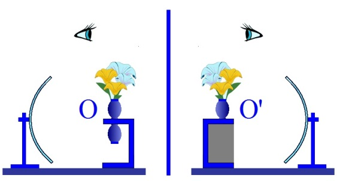
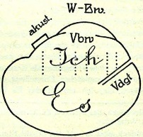

# Leçon 14 | 05 mai 1954

  

    <label><input type="checkbox" data-lacan-toggle="original" checked> 原文</label>
    <label><input type="checkbox" data-lacan-toggle="notes" checked> 注释</label>
    <label><input type="checkbox" data-lacan-toggle="commentary" checked> 个人解读评论</label>
  

  <form class="lacan-tool-search" role="search">
    <input class="lacan-tool-search-input" type="search" placeholder="搜索全文" aria-label="搜索全文">
    <button class="lacan-tool-button" type="submit" title="搜索">搜索</button>
  </form>
  <button class="lacan-tool-button lacan-back-to-top" type="button" title="回到页面最上方" aria-label="回到页面最上方">↑</button>

<section class="parallel-paragraph" data-paragraph-ids="s1-14-0001">

s1-14-0001

原文 · s1-14-0001

Nous commençons un troisième trimestre qui va être court, Dieu merci ! Il s’agit de savoir à quoi on va l’employer. Dans un projet primitif, j’avais pensé aborder le cas de SCHREBER avant que nous nous séparions cette année. Cela m’aurait bien plu, d’autant plus que, comme vous le savez, j’ai fait traduire à toutes fins utiles le texte, l’œuvre originale du Président SCHREBER, sur laquelle FREUD a travaillé, et à laquelle il demande qu’on se reporte. Recommandation bien vaine jusqu’à présent, car c’est un ouvrage introuvable, je n’en connais que deux exemplaires en Europe. J’ai pu en avoir un que j’ai fait microfilmer deux fois, l’un à mon usage, et l’autre à l’usage - devenu actuel maintenant - de la bibliothèque de la *Société française de psychanalyse.* Car je vous annonce que nous avons un local, à des conditions avantageuses qui nous permettront de faire des dépenses pour avoir des livres. À ces microfilms viendront s’ajouter ce qui pourra être fait comme *dons*.

[无对应译文]

</section>

<section class="parallel-paragraph" data-paragraph-ids="s1-14-0002">

s1-14-0002

原文 · s1-14-0002

Revenons au président SCHREBER. Lire cette traduction est passionnant. Il y a moyen de faire là-dessus un traité de la paranoïa vraiment complet, et apporter au texte SCHREBER un commentaire très riche sur le sujet du mécanisme des psychoses. M. HYPPOLITE disait que *ma connaissance était partie de la connaissance paranoïaque* : *si elle en est partie, j’espère qu’elle n’y est pas restée.*

[无对应译文]

</section>

<section class="parallel-paragraph" data-paragraph-ids="s1-14-0003">

s1-14-0003

原文 · s1-14-0003

Il y a là un trou. Nous n’allons pas tout de suite y tomber, car nous risquerions d’y rester prisonniers, comme le craignait M. HYPPOLITE. Puisque nous nous sommes avancés dans les *Écrits techniques* de FREUD, je crois qu’il est impossible de ne pas pousser plus loin le rapprochement implicite que j’ai fait sans cesse de ces formulations, avec la technique actuelle de l’analyse qu’on peut appeler, avec guillemets, « *ses progrès les plus récents* ».

[无对应译文]

</section>

<section class="parallel-paragraph" data-paragraph-ids="s1-14-0004">

s1-14-0004

原文 · s1-14-0004

Je l’ai toujours fait de façon plus ou moins *implicite*, en me référant à ce que vous pouvez avoir dans votre expérience, l’enseignement qui, pratiquement, vous est donné dans les contrôles, cette tendance vers laquelle a évolué l’analyse des résistances, par exemple, la notion de l’analyse comme analyse des systèmes de défense du *moi*, tout cela reste malgré tout mal centré, puisque c’est à des ensei­gnements concrets mais *non systématisés*, même quelquefois *non formulés*, que nous nous référons là implicitement.

[无对应译文]

</section>

<section class="parallel-paragraph" data-paragraph-ids="s1-14-0005">

s1-14-0005

原文 · s1-14-0005

Je crois pouvoir discuter, et malgré cette rareté que chacun signale, de la lit­térature analytique : en fait de technique même, un certain nombre d’auteurs se sont exprimés. lorsqu’ils n’ont pas abouti à faire un livre de technique à pro­prement parler, il y a des articles, quelquefois fragmentaires, d’autres très curieusement restaient en route, et se trouvant parmi les plus intéressants. Il y a là une littérature dans laquelle il ne doit pas être impossible, malgré la diffi­culté que vous l’ayez tous en mains, que nous avancions un peu.

[无对应译文]

</section>

<section class="parallel-paragraph" data-paragraph-ids="s1-14-0006">

s1-14-0006

原文 · s1-14-0006

La difficulté est celle-ci : d’abord que ces écrits, qui groupent les plus impor­tants, forment un corpus assez long à parcourir. J’espère pouvoir compter sur la collaboration de certains d’entre vous, à qui je prêterai certains de ces articles, pour servir de base à notre discussion. Mais on ne pourra pas les prendre tous en vue.

[无对应译文]

</section>

<section class="parallel-paragraph" data-paragraph-ids="s1-14-0007">

s1-14-0007

原文 · s1-14-0007

D’abord au moment où, en 1925 au symposium de Berlin, il y a les trois articles de SACHS, ALEXANDER et RADO, qui sont importants, que vous devez connaître si vous avez fouillé dans le livre de FENICHEL. Au congrès de Marienbad, il y a le symposium sur les résultats - qu’ils disent - de l’analyse, car en réalité c’est moins du résultat que de la procédure qui mène à ces résultats, qu’il s’agit dans cette discussion.

[无对应译文]

</section>

<section class="parallel-paragraph" data-paragraph-ids="s1-14-0008">

s1-14-0008

原文 · s1-14-0008

Là, vous pouvez voir s’amorcer déjà, de façon épanouie, ce que j’appelle « *la confusion des langues en analyse* », à savoir l’extrême diversité, quoi qu’on en ait, de ce que les auteurs considèrent comme étant « *les voies actives* » dans le pro­cessus analytique. On voit que la définition précise est loin d’être assurée comme telle dans les esprits des analystes : c’est avec une diversité tout à fait marquée qu’ils s’expriment. Le troisième moment, c’est le moment actuel.

[无对应译文]

</section>

<section class="parallel-paragraph" data-paragraph-ids="s1-14-0009">

s1-14-0009

原文 · s1-14-0009

Là, il y a lieu de mettre au premier plan les définitions ou les élaborations récentes qu’essaient de donner à la théorie de *l’ego*, par exemple, la *troïka* américaine : HARTMANN, LŒWENSTEIN et KRIS. Il faut bien le dire : ces écrits sont quelquefois assez déconcertants, par quelque chose qui arrive à une telle complication dans la démultiplication des concepts que, quand ils parlent sans arrêt de libido désexualisée, c’est tout juste si on ne dit pas délibidanisée, ou de l’agressivité désagressivée.

[无对应译文]

</section>

<section class="parallel-paragraph" data-paragraph-ids="s1-14-0010">

s1-14-0010

原文 · s1-14-0010

Cette fonction du *moi* qui joue là de plus en plus ce rôle problématique qu’il a dans les écrits de la troisième période de FREUD, que j’ai laissés en dehors de notre champ, parce que, sous la forme du commentaire des *Écrits techniques* que je vous ai fait, c’est une tentative de vous faire appréhender la période médiane de 1910-1920. Là, commence à s’élaborer, avec la notion du *narcissisme*, la direction dans laquelle FREUD aboutira, au *moi*. Je conseille quand même de lire ou de relire, vous devez lire le volume qui s’appelle, dans l’édition française *Essais de psychanalyse* (Payot) : « *Au-delà du principe du plaisir », « Psychologie collective et analyse du Moi »*, et « *Le Moi et le Ça »*.

[无对应译文]

</section>

<section class="parallel-paragraph" data-paragraph-ids="s1-14-0011">

s1-14-0011

原文 · s1-14-0011

Je vous conseille de le lire parce que nous ne pouvons pas ici l’analyser. Mais c’est indispensable pour comprendre les développements que les auteurs dont je vous parle ont donnés à la théorie du traitement. C’est toujours autour des dernières formulations de FREUD que sont centrées les formulations du traitement qui ont été données à partir de 1920.

[无对应译文]

</section>

<section class="parallel-paragraph" data-paragraph-ids="s1-14-0012">

s1-14-0012

原文 · s1-14-0012

Et la plupart du temps, avec une extrême maladresse qui ressortit à une très grande difficulté de bien comprendre ce que FREUD dit, le texte de FREUD, dans ces trois articles véritablement monumentaux, si on n’a pas approfondi la genèse même de la notion de *narcissisme*, ce que j’ai essayé de vous indiquer à propos de l’analyse des résistances et du transfert dans les *Écrits techniques*.

[无对应译文]

</section>

<section class="parallel-paragraph" data-paragraph-ids="s1-14-0013">

s1-14-0013

原文 · s1-14-0013

Voici comment se situe au sens propre du terme notre projet. Je voudrais aujourd’hui m’efforcer à certains moments de procéder par la voie qui n’est pas celle que vous savez je suis fondamentalement. Fondamen­talement je suis une voie discursive, et même de discussion, pour vous amener aux problèmes, vous y amener à partir des textes. J’essaie de vous présenter ici une problématique.

[无对应译文]

</section>

<section class="parallel-paragraph" data-paragraph-ids="s1-14-0014">

s1-14-0014

原文 · s1-14-0014

Mais de temps en temps, il faut quand même concentrer, dans quelque chose qui présente une formule didactique, certains *points* *de vue*, cer­taines *perspectives*, au cours desquels peuvent être raccordées, discutées les diverses formulations que vous pouvez trouver de ces problèmes, selon la diver­sité très marquée des auteurs sur ces points précis dans l’histoire de l’analyse. Disons que j’adopte une sorte de moyen terme, et j’essaie de vous présenter un modèle, quelque chose qui n’a pas la prétention d’être un système, mais une image présentant certains points qui peuvent servir de référence.

[无对应译文]

</section>

<section class="parallel-paragraph" data-paragraph-ids="s1-14-0015">

s1-14-0015

原文 · s1-14-0015

C’est ce que j’ai essayé de faire en vous amenant peu à peu, progressivement, à cette image d’aspect *opticien*, que nous avons commencé de former ici. Maintenant, elle commence à devenir - j’espère - familière à votre esprit. Et autour du *speculum* fondamental, du miroir fondamental de la relation à l’autre, vous avez déjà vu que nous pouvons situer - si vous voulez aujourd’hui, pour mettre l’indication des points où se pose le problème - la fameuse *image réelle*.

[无对应译文]

</section>

<section class="parallel-paragraph" data-paragraph-ids="s1-14-0016">

s1-14-0016

原文 · s1-14-0016

Je vous ai montré comment on pouvait l’imaginer se représenter, se former en un point du sujet, que nous appellerons 0. L’*image virtuelle* où le sujet la sai­sit, qui se produit dans le miroir plan, 0’, où le sujet voit l’*image réelle* qui est en 0, pour autant que par l’intermédiaire de ce miroir il se trouve placé ici, quelque part en un point qui est le symétrique virtuel du *miroir sphérique* réfléchissant, grâce auquel se produit, disons quelque part dans l’intérieur du sujet, cette *image réelle* qui est en 0

[无对应译文]

</section>

<section class="parallel-paragraph" data-paragraph-ids="s1-14-0017">

s1-14-0017

原文 · s1-14-0017

[无对应译文]

</section>

<section class="parallel-paragraph" data-paragraph-ids="s1-14-0018">

s1-14-0018

原文 · s1-14-0018

Nous allons tâcher de voir, de vous expliquer comment on peut s’en servir, et à quoi ça répond. Vous froncez les sourcils, PUJOL. Quelque chose ne va pas ?

[无对应译文]

</section>

<section class="parallel-paragraph" data-paragraph-ids="s1-14-0019">

s1-14-0019

原文 · s1-14-0019

Robert PUJOL - Depuis un mois, j’ai du mal à reprendre.

[无对应译文]

</section>

<section class="parallel-paragraph" data-paragraph-ids="s1-14-0020">

s1-14-0020

原文 · s1-14-0020

LACAN

[无对应译文]

</section>

<section class="parallel-paragraph" data-paragraph-ids="s1-14-0021">

s1-14-0021

原文 · s1-14-0021

Disons, pour la suite des choses, que ceci nous donne deux points 0 et 0’. Une petite fille…

[无对应译文]

</section>

<section class="parallel-paragraph" data-paragraph-ids="s1-14-0022">

s1-14-0022

原文 · s1-14-0022

> une femme virtuelle, donc elle est évidemment beaucoup plus engagée dans le réel
>
> que les mâles, de ce seul fait. Il y a des dons particuliers !

[无对应译文]

</section>

<section class="parallel-paragraph" data-paragraph-ids="s1-14-0023">

s1-14-0023

原文 · s1-14-0023

…a eu ce très joli mot, tout d’un coup : « *Ah ! Il ne faut pas croire que ma vie se passera en* 0 *et en* 0’… ».

[无对应译文]

</section>

<section class="parallel-paragraph" data-paragraph-ids="s1-14-0024">

s1-14-0024

原文 · s1-14-0024

Pauvre chou ! Elle se passera en 0 et en 0’, comme pour tout le monde ! Mais enfin, elle a cette aspiration ! C’est *en son honneur*, si vous voulez, que j’appellerai ces points 0 et 0’. Puis, il y a un point A, et un autre point que nous appellerons C. Pourquoi C ? Parce qu’il y a, ici, un point B, que nous devons laisser pour plus tard. Et avec ça, on doit quand même se débrouiller.

[无对应译文]

</section>

<section class="parallel-paragraph" data-paragraph-ids="s1-14-0025">

s1-14-0025

原文 · s1-14-0025

Il faut, évidemment partir envers et contre tout, et malgré tout de 0 et de 0’. Vous savez déjà ce qui se passe en 0 et autour de 0, autour de 0’. Il s’agit fon­damentalement de ce qui se rapporte à *la constitution de l’Idealich*, et non pas de l’*Ichideal*. Autrement dit, la forme essentiellement *imaginaire*, *spéculaire*, de la genèse, de l’origine fondamentalement *imaginaire* du *moi*. Si vous n’avez pas vu ça se dégager de ce que nous avons ici essayé d’analy­ser, de transmettre, de faire comprendre, d’un certain nombre de textes dont le principal est le « *Zur Einführung des Narzißmus »*, c’est que nous avons fait un tra­vail vain.

[无对应译文]

</section>

<section class="parallel-paragraph" data-paragraph-ids="s1-14-0026">

s1-14-0026

原文 · s1-14-0026

Vous avez dû comprendre le rapport étroit qu’il y a au niveau du discours de FREUD, de l’*« Introduction au narcissisme »*, entre la formation de l’*objet* et celle du *moi*. Et que c’est parce qu’ils sont strictement corrélatifs, que leur apparition est vraiment contemporaine, qu’il y a le problème du *narcissisme*, en tant qu’à ce moment-là, dans la pensée de FREUD, dans le développement de son œuvre, la libido apparaît soumise à une autre dialectique, je dirais : dialectique de l’ob­jet.

[无对应译文]

</section>

<section class="parallel-paragraph" data-paragraph-ids="s1-14-0027">

s1-14-0027

原文 · s1-14-0027

Il ne s’agit pas seulement de *la relation de l’individu biologique avec son objet « nature »*, diversement compliquée, enrichie. *Il y a* possibilité d’un *investis­sement libidinal narcissique,* autrement dit, d’un *investissement libidinal* *dans* quelque chose qui ne peut pas être conçu autrement que comme *une image de l’ego*. Je dis là les choses très grossièrement, je pourrais les dire dans un langage plus techniquement élaboré, philosophique, mais je veux vous faire com­prendre comment il faut bien voir les choses.

[无对应译文]

</section>

<section class="parallel-paragraph" data-paragraph-ids="s1-14-0028">

s1-14-0028

原文 · s1-14-0028

Il est tout à fait certain qu’à par­tir d’un certain moment du développement de l’expérience freudienne l’attention est centrée autour de cette fonction *imaginaire* qui est celle du *moi*. Depuis, toute l’histoire de la psychanalyse se ramène à ceci, aux ambiguïtés, à la pente qu’a offerte ce nouveau recentrage du problème, à un glissement, un retour à la notion - non pas traditionnelle, parce qu’elle n’est pas si tradition­nelle que ça - *académique* du *moi* conçu comme « *fonction de synthèse* », comme fonction *psychologique*.

[无对应译文]

</section>

<section class="parallel-paragraph" data-paragraph-ids="s1-14-0029">

s1-14-0029

原文 · s1-14-0029

Or, comme je vais vous le montrer, il s’agit de quelque chose qui a son mot à dire dans la psychologie humaine, mais qui ne peut être conçu que sur un plan transpsychologique, ou comme le dit FREUD en toutes lettres - car FREUD, s’il a eu des difficultés dans cette formulation, n’a jamais perdu la corde - de « *métapsychologie* ». Qu’est-ce que ça veut dire, sinon que c’est quelque chose *au-delà de la psychologie* ? Maintenant tâchons de *partir du point où se pose le problème*.

[无对应译文]

</section>

<section class="parallel-paragraph" data-paragraph-ids="s1-14-0030">

s1-14-0030

原文 · s1-14-0030

Qu’est-ce que c’est quand vous dites « *je* » ? Est-ce la même chose que quand nous parlons de l’*ego*, de l’*ego*, concept analytique ? Il faut bien partir de là. La question se pose sûrement pour beaucoup d’entre vous, et doit se poser à tous, me semble-t-il. Le « *je* », quand vous vous en servez, vous ne pouvez pas méconnaître que c’est essentiellement et avant tout la réfé­rence psychologique, au sens où il s’agit de l’observation de ce qui se passe chez l’homme, comment il apprend à le dire ce « *je* ».

[无对应译文]

</section>

<section class="parallel-paragraph" data-paragraph-ids="s1-14-0031">

s1-14-0031

原文 · s1-14-0031

« *Je* » est un terme verbal d’usage appris en une certaine *référence à l’autre*, mais une *référence parlée*. Le « *je* » naît dans une certaine *référence* au « *tu* ». Et chacun sait comment là-dessus les psycho­logues ont échafaudé des choses fameuses : relation de réciprocité qui s’établit - ou ne s’établit pas - qui déterminerait je ne sais quelle étape dans le dévelop­pement intime de l’enfant.

[无对应译文]

</section>

<section class="parallel-paragraph" data-paragraph-ids="s1-14-0032">

s1-14-0032

原文 · s1-14-0032

Comme si on pouvait, comme ça, en être sûr, et le déduire de l’usage du langage, à savoir de simplement cette première maladresse que l’enfant a à se débrouiller avec les trois pronoms personnels, et à ne pas purement et simplement, dans une appréhension, répéter la phrase qu’on lui dit au terme « *tu* », et répéter « *tu* », alors qu’il doit faire l’inversion dans le « *je* » pour répé­ter les choses.

[无对应译文]

</section>

<section class="parallel-paragraph" data-paragraph-ids="s1-14-0033">

s1-14-0033

原文 · s1-14-0033

Il s’agit en effet d’une certaine hésitation dans l’appréhension du langage, c’est tout ce que nous pouvons en déduire. Nous n’avons pas le droit d’aller au-delà. Mais néanmoins, ceci est suffisant pour nous avertir que le « *je* » est l’abord en tant que tel, se constitue dans une *expérience de langage*, dans cette référence au « *tu* », et dans une relation où l’autre, lui, manifeste quoi ? Des ordres, des désirs, qu’il doit reconnaître : de son père, de sa mère, de ses éducateurs, ou de ses pairs et camarades.

[无对应译文]

</section>

<section class="parallel-paragraph" data-paragraph-ids="s1-14-0034">

s1-14-0034

原文 · s1-14-0034

Ceci dit, il est bien clair qu’au départ les chances sont extrêmement minimes qu’il fasse reconnaître les siens, ses désirs, si ce n’est de la façon la plus simple, la plus directe et la plus immédiate, et que - tout au moins *à l’origine* - il est bien clair que nous ne savons rien de la spécificité, de la diversité, du point précis de résonance où se situe l’individu, à l’idée du petit sujet.

[无对应译文]

</section>

<section class="parallel-paragraph" data-paragraph-ids="s1-14-0035">

s1-14-0035

原文 · s1-14-0035

C’est bien cela qui le rend si malheureux : comment, d’ailleurs, ferait-il *reconnaître ses désirs* ? pour la simple raison qu’il n’en sait rien. Nous avons peut-être toutes raisons de pen­ser qu’il n’en sait rien, de ses désirs, mais les raisons que nous avons, nous ana­lystes, ne sont pas n’importe quelles raisons, mais des raisons engendrées par notre expérience de l’adulte. Je dirai même que c’est notre fonction : nous savons qu’il faut bien qu’il les *recherche* et qu’il les *trouve*. Sans cela, il n’aurait pas besoin d’analyse.

[无对应译文]

</section>

<section class="parallel-paragraph" data-paragraph-ids="s1-14-0036">

s1-14-0036

原文 · s1-14-0036

C’est donc suffisamment une indication que ce qui se rap­porte à son *moi*, à savoir ce qu’il peut *faire reconnaître* de lui-même, il en est séparé par quelque chose. Eh bien, ce que l’analyse nous apprend - il faut là-dessus que vous vous sou­veniez du discours de M. HYPPOLITE sur un texte de FREUD tout à fait précieux qui s’appelle la *Verneinung -* c’est quelque chose qui déjà est très significatif et doit s’articuler d’une certaine façon.

[无对应译文]

</section>

<section class="parallel-paragraph" data-paragraph-ids="s1-14-0037">

s1-14-0037

原文 · s1-14-0037

Je dis « *il n’en sait rien* », c’est *une formule* tout à fait *vague*. L’analyse nous a appris les choses par degrés, par étapes, c’est ce qui fait l’importance de suivre *le progrès de l’œuvre de* FREUD. Ce que l’ana­lyse nous apprend, c’est que *ce n’est pas une pure et simple ignorance*. Nous devons nous en douter, pour une très simple raison, c’est que l’ignorance est elle-même un terme dialectique, pour autant qu’elle n’est littéralement consti­tuée comme telle que dans une perspective de recherche de *la vérité*.

[无对应译文]

</section>

<section class="parallel-paragraph" data-paragraph-ids="s1-14-0038">

s1-14-0038

原文 · s1-14-0038

Si le sujet ne se met pas en référence avec *la vérité*, il n’y a pas d’ignorance. Si le sujet ne recommence pas à se poser la question de savoir ce qu’il est et ce qu’il n’est pas - ce qui d’ailleurs n’est pas du tout obligé : bien des gens vivent sans se poser des questions aussi élevées - il n’y a pas de raison qu’il y ait *un vrai* et *un faux*, ni même qu’il y ait *certaines chose*s qui vont au-delà, à savoir cette distinction fon­damentale de la réalité et de l’apparence.

[无对应译文]

</section>

<section class="parallel-paragraph" data-paragraph-ids="s1-14-0039">

s1-14-0039

原文 · s1-14-0039

Là, nous commençons à être en pleine philosophie. *L’ignorance* se consti­tue d’une façon polaire par rapport à la position virtuelle d’une vérité à atteindre : elle *est un état du sujet en tant qu’il parle*. Et je dirais que, pour autant que sa parole se met à errer à la recherche du langage correct, c’est-à-dire de l’ignorance de voir les choses, par exemple, nous commençons à la constituer, à partir du moment où nous engageons le sujet dans l’analyse, c’est-à-dire d’une façon seulement implicite, où nous l’engageons dans une recherche de *la vérité*.

[无对应译文]

</section>

<section class="parallel-paragraph" data-paragraph-ids="s1-14-0040">

s1-14-0040

原文 · s1-14-0040

Mais ceci est une situation, une position, un état en quelque sorte purement virtuel à une situation, pour autant que nous la créons, ça n’est pas la donnée dont il s’agit quand nous disons que le *moi* ne sait rien des désirs du sujet. C’est quelque chose que l’expérience nous apprend. Nous l’avons appris dans une seconde étape : l’élaboration de l’*expérience* dans la pensée de FREUD. Ce n’est donc pas l’ignorance, mais justement ce qui est exprimé concrètement dans le processus de la *Verneinung*, et qui dans l’ensemble statique du sujet s’appelle *« méconnaissance »*. Or, *méconnaissance* n’est pas la même chose qu’*ignorance*.

[无对应译文]

</section>

<section class="parallel-paragraph" data-paragraph-ids="s1-14-0041">

s1-14-0041

原文 · s1-14-0041

La méconnaissance représente un certain nombre d’affirmations et de négations, une certaine structure, une certaine organisation. Le sujet y est attaché. Et tout cela ne se concevrait pas sans une *connaissance* corrélative : de quelque façon que nous parlions d’une *méconnaissance*, ceci doit toujours impliquer que, puisque le sujet peut *méconnaître* quelque chose, il faut quand même qu’il *sache* autour de quelle somme a opéré cette fonction si on peut dire, de *méconnaissance*.

[无对应译文]

</section>

<section class="parallel-paragraph" data-paragraph-ids="s1-14-0042">

s1-14-0042

原文 · s1-14-0042

C’est-à-dire qu’il y ait *derrière cette méconnaissance* *une certaine connaissance* de ce qu’il y a à méconnaître. Quand nous nous trouvons chez un délirant qui vit dans la méconnaissance de la mort d’un de ses proches, on aurait tout à fait tort de croire qu’il le confond avec un vivant : il méconnaît ou refuse de reconnaître qu’il est mort, mais tout son comportement signifie qu’il développe une activité qui suppose qu’il connaît qu’il y a quelque chose qu’il ne veut pas reconnaître.

[无对应译文]

</section>

<section class="parallel-paragraph" data-paragraph-ids="s1-14-0043">

s1-14-0043

原文 · s1-14-0043

Qu’est-ce à dire ? Qu’est-ce que cette *méconnaissance*, impliquée derrière *la fonction*, essentiellement *de connaissance du moi* ? C’est *le point* par où nous pouvons aborder *la fonction du moi*. Je crois que c’est un des points concrets, effectifs, de notre expérience, sur lequel nous ne saurions trop insister, parce que ce serait un premier pas, l’origine même de cette expérience. À savoir que nous sommes portés à nous livrer, en présence au moins de ce qui nous intéresse, de ce qui est analysable, à toute une opération de *mantique*, autrement dit de *tra­duction*, de desserrement, de quelque chose au-delà du langage du sujet, et d’un langage qui comme tel se présente dans cette relation ambiguë - je dis ambiguë - sur le plan de la connaissance.

[无对应译文]

</section>

<section class="parallel-paragraph" data-paragraph-ids="s1-14-0044">

s1-14-0044

原文 · s1-14-0044

Pour partir, avancer, dans ce registre, il faut se demander ce qu’est cette *connaissance* qui oriente et dirige cette méconnaissance. C’est là que nous trou­vons la référence à une sorte de parallèle, d’élaboration analogique, par rapport à ce qu’on peut appeler la connaissance animale, pour autant que chez l’animal il y ait connaissance et coaptation, coaptation imaginaire, structuration du monde en forme d’*Umwelt.*

[无对应译文]

</section>

<section class="parallel-paragraph" data-paragraph-ids="s1-14-0045">

s1-14-0045

原文 · s1-14-0045

Et ceci par correspondance, *par une projection* sur ce monde d’un certain nombre de relations, de *Gestalten* qui structurent ce monde, qui le spécifient pour chaque animal, en un milieu qui est celui où il évolue, qui trame, distingue, sépare, dans l’indistinct de la réalité à laquelle il est opposé, un certain nombre de voies d’abord préférentielles dans lesquelles s’engagent *ses activités comportementales*. C’est ce qui existe chez l’animal. Les psychologues du comportement animal, les éthologistes par exemple, définissent comme innés les *Gestalten* qu’on peut appeler *mécanismes de structuration innés*, ou voies de décharge innées pour l’animal. Qu’en est-il de l’homme ? Toute notre expérience indique tout à fait clairement qu’il n’y a chez l’homme rien de semblable, comme le montre très précisément ce qu’on peut appeler l’anarchie de ses pulsions élémentaires, et le fait nous est démontré par l’expérience analytique.

[无对应译文]

</section>

<section class="parallel-paragraph" data-paragraph-ids="s1-14-0046">

s1-14-0046

原文 · s1-14-0046

Ses comportements partiels, sa relation à l’objet, et à l’objet libidinal, sont soumis à toutes sortes d’aléas, où dans la plupart de notre expérience, échoue la synthèse, pour nous montrer qu’il y a un fait tout à fait particulier de l’homme dans sa relation d’images constituantes de son monde. Qu’est-ce qui - pour l’homme - répond à cette connaissance innée qui est tout de même ce qu’on peut appeler dans l’équilibre du vivant « *le guide de la vie* » ?

[无对应译文]

</section>

<section class="parallel-paragraph" data-paragraph-ids="s1-14-0047">

s1-14-0047

原文 · s1-14-0047

Il y a quelque chose où l’on se trouve dans une référence tout à fait spéciale qui, de même que quelque chose est distinct de la fonction *imaginaire animale,* met aussi l’homme dans une relation distincte au point de vue de *la relation vivante avec cette image*, ce quelque chose qui ne peut pas non plus être très loin de ce qu’est l’*image* dans ses fonctions animales, ce quelque chose est *l’image* *de son propre corps*, qui chez l’animal a aussi une extrême importance.

[无对应译文]

</section>

<section class="parallel-paragraph" data-paragraph-ids="s1-14-0048">

s1-14-0048

原文 · s1-14-0048

C’est là que je fais un petit saut, parce que je suppose que nous en avons déjà, ensemble, effectué les démarches, et que vous pouvez accepter comme *théorème* ce que maintenant je résume. La conception du *stade du miroir* est celle-ci : que ce qu’on voit dans l’attitude de l’enfant en présence du miroir, d’une image réflé­chissant sa propre image entre telle date et telle date - 6 mois et 18 mois - est quelque chose qui nous renseigne d’une façon fondamentale sur la relation de l’individu humain, biologique, animal. Cette *exaltation*, cette *jubilation de l’en­fant* pendant toute cette période, je l’ai montrée l’année dernière devant un film qui avait été fait par M. GESELL[^25], qui n’avait jamais entendu parler de mon *stade du miroir*, et pour lequel aucune espèce de question de nature analytique ne s’est jamais posée, je vous prie de le croire.

[无对应译文]

</section>

<section class="parallel-paragraph" data-paragraph-ids="s1-14-0049">

s1-14-0049

原文 · s1-14-0049

Cela n’empêche pas - ça n’en prend que d’autant plus de valeur - qu’il a isolé dans cette parenthèse le moment significa­tif dont il ne souligne lui-même pas le véritable trait fondamental, ce caractère exaltant et manifestement stimulant, transportant, si on peut dire, dans le com­portement actuel du sujet *devant le miroir*, dans une époque et dans un champ particulièrement définis et déterminés. Ce qui est le plus important n’est pas l’ap­parition de ce comportement à 6 mois, mais c’est son déclin à 18 mois.

[无对应译文]

</section>

<section class="parallel-paragraph" data-paragraph-ids="s1-14-0050">

s1-14-0050

原文 · s1-14-0050

À savoir comment, brusquement le comportement - je l’ai montré l’année dernière - change complètement pour ne devenir ensuite qu’une apparence, *Erscheinung*, une chose entre les autres sur lesquelles on peut exercer une activité de contrôle, d’expérience, de jeu instrumental, mais qui n’a manifestement plus aucun des signes si manifestement purs, accentués qu’il a dans cette période. Ceci doit nous aider, nous qui avons l’habitude de ces choses et disposons déjà d’un certain nombre de termes que nous employons confusément, mais qui répondent pour nous au moins à *une sorte de schème mental* qu’il s’agit justement ici d’affiner, définir, élaborer.

[无对应译文]

</section>

<section class="parallel-paragraph" data-paragraph-ids="s1-14-0051">

s1-14-0051

原文 · s1-14-0051

Il n’y a pas d’inconvénient à ce que d’ores et déjà, là, pour expliquer ce qui se passe, je me réfère à quelque chose que certaines lec­tures ont dû au moins vous rendre familier : ce qui se passe au moment du déclin du *complexe d’Œdipe*. Il se produit quelque chose que nous appelons « *intro­jection ».* Et je vous supplie de ne pas vous précipiter pour donner à ce terme une signification trop définie, car c’est justement ce que je vais mettre - dans les leçons qui vont suivre, dans celle-ci déjà - en cause.

[无对应译文]

</section>

<section class="parallel-paragraph" data-paragraph-ids="s1-14-0052">

s1-14-0052

原文 · s1-14-0052

Qu’est-ce que ça veut dire ce terme « *intro­jection* » ? Il se passe quelque chose, un renversement :

[无对应译文]

</section>

<section class="parallel-paragraph" data-paragraph-ids="s1-14-0053">

s1-14-0053

原文 · s1-14-0053

- ce qui était *au-dehors* devient le *dedans*,

[无对应译文]

</section>

<section class="parallel-paragraph" data-paragraph-ids="s1-14-0054">

s1-14-0054

原文 · s1-14-0054

- ce qui a été *le père* devient le *surmoi*.

[无对应译文]

</section>

<section class="parallel-paragraph" data-paragraph-ids="s1-14-0055">

s1-14-0055

原文 · s1-14-0055

Il s’est passé quelque chose au niveau justement de ce sujet invisible, impensable, qu’on ne nomme jamais comme tel. On dira : est-ce que c’est au niveau du *moi*, du *Ça* ? Oui, c’est entre les deux, c’est pour ça que ça s’appelle le *super-ego*. On fera toute cette demi mythologie spécialisée qui est celle où notre esprit se dépense habituellement. C’est à ça que nous essayons ici de donner une forme plus acceptable, car nous vivons toujours au milieu de schémas qui sont inac­ceptables \[...\]

[无对应译文]

</section>

<section class="parallel-paragraph" data-paragraph-ids="s1-14-0056">

s1-14-0056

原文 · s1-14-0056

Si on demandait *à un psychanalyste* : *« croyez-vous vraiment que l’enfant bouffe alors son père, et que ça lui entre dans l’estomac, et devient le surmoi ? »* Nous continuons à opérer comme si tout cela allait de soi. Et je vous mon­trerai dans l’analyse de la fonction du traitement, à savoir ce dont il s’agit, ce qui s’opère, comment ça peut se réaliser, progresser, les façons innocentes d’user du terme « *introjection* », qui vont tellement loin ! Supposons qu’on envoie tout d’un coup *un ethnologue* d’un pays qui n’au­rait jamais entendu parler de cette foutue *analyse*, et qui serait ici soudain, et entendrait ce qui se passe *dans l’analyse*, il dirait : « *Très curieux ! Très curieux pri­mitifs, les analysés, qui bouffent leur analyste par petits morceaux*… »

[无对应译文]

</section>

<section class="parallel-paragraph" data-paragraph-ids="s1-14-0057">

s1-14-0057

原文 · s1-14-0057

Balthasar GRACIÁN, je le considère comme *un auteur fondamental*, NIETZSCHE et LA ROCHEFOUCAULD sont petits à côté, son traité *El Comulgatorio* \[L’art de communier\] sur la communion conçue d’une façon concrète et valable. Du moment qu’on croit à la communion, il n’y a aucune raison de penser qu’on ne mange pas le CHRIST et donc le délicat lobe de son oreille. Il n’y a pas de raison de ne pas développer la notion de communion comme une sorte de communion « à la carte ». C’est bien pour ceux qui croient à *la transsubstantiation*.

[无对应译文]

</section>

<section class="parallel-paragraph" data-paragraph-ids="s1-14-0058">

s1-14-0058

原文 · s1-14-0058

Mais pour nous autres analystes, soucieux de science, et raisonnables, nous pouvons voir sous la plume de M. STEKEL ou d’autres auteurs, ce que c’est, en fin de compte, que cette espèce d’introjection dosée de l’analyste, qu’un observateur du dehors ne pourrait transposer que sur le plan *mystique*, communionnel, qui est tout de même assez loin de notre pen­sée réelle.

[无对应译文]

</section>

<section class="parallel-paragraph" data-paragraph-ids="s1-14-0059">

s1-14-0059

原文 · s1-14-0059

Pour autant que nous pensons... Mais - Dieu merci ! - nous ne pensons pas, et c’est ce qui nous excuse. C’est la *grande erreur* de toujours s’imaginer que les êtres pensent ce qu’ils disent ! Par conséquent, nous ne pensons pas. Mais ce n’est tout de même pas une raison pour ne pas essayer de comprendre ce que ça veut dire, pourquoi on a proféré des paroles manifestement insensées.

[无对应译文]

</section>

<section class="parallel-paragraph" data-paragraph-ids="s1-14-0060">

s1-14-0060

原文 · s1-14-0060

Reprenons donc le moment où nous en sommes. Ce moment de la fin du *stade du miroir* représente quelque chose d’analogue à cette bascule qui se produit à certains moments du développement psychique. Il est assez probable que ce moment de la bascule est un moment tout à fait significatif et fondamental, à certains points de vue, et nous pouvons le constater par la suite des manifes­tations de l’homme, dans cette phase du développement de l’enfant.

[无对应译文]

</section>

<section class="parallel-paragraph" data-paragraph-ids="s1-14-0061">

s1-14-0061

原文 · s1-14-0061

Nous pou­vons le constater dans des phénomènes tout à fait significatifs, à savoir ces phénomènes d’*équivalence* qui se produisent pour lui entre deux choses, pour­tant aussi différentes que l’action de l’autre et notre action, et son action de tran­sitivisme enfantin qui lui fait s’exprimer dans ce registre et dire « *François m’a battu* » alors que c’est lui qui a battu François, ce transitivisme enfantin, miroir instable entre l’enfant et son semblable.

[无对应译文]

</section>

<section class="parallel-paragraph" data-paragraph-ids="s1-14-0062">

s1-14-0062

原文 · s1-14-0062

Nous voyons exactement la fonction de ce qui s’est passé, ceci, absolument nécessité par toute espèce de théorisation du comportement interhumain. Il est un moment où cette image, où l’enfant a porté ce que j’appelle *l’assomption jubilatoire de maîtrise*, qu’il n’a pas encore obtenue, le sujet est tout à fait capable d’assumer si on peut dire - je fais exprès de m’exprimer grossièrement ce matin - de l’assumer à l’intérieur.

[无对应译文]

</section>

<section class="parallel-paragraph" data-paragraph-ids="s1-14-0063">

s1-14-0063

原文 · s1-14-0063

Mais bien entendu, il ne peut le faire qu’à l’état de forme vide, de cette forme de maîtrise, de cette forme d’enveloppe qui est une chose tellement sûre et certaine que FREUD, qui y est arrivé par des voies assez différentes, par les voies de la dyna­mique de l’investissement libidinal - Je vous supplie de lire ce qu’il écrit du *Moi et du Ça* à cet égard - ne peut pas s’exprimer autrement.

[无对应译文]

</section>

<section class="parallel-paragraph" data-paragraph-ids="s1-14-0064">

s1-14-0064

原文 · s1-14-0064

Quand FREUD parle de l’*ego*, il ne parle pas du tout de cet *ego* qui serait je ne sais quoi d’incisif, de déterminant, d’impératif, par où l’*ego* retrouve ce qu’on appelle dans la psychologie académique les instances supérieures. Il le souligne dans des lignes aussi significatives que possible : que ça doit avoir le plus grand rapport avec *la surface du corps*. Mais il ne s’agit pas de cette surface sensible, sensorielle, impressionnée, mais de *cette surface en tant qu’elle est réfléchie dans une forme*. C’est toujours la définition d’une *forme *: il n’y a pas de *forme* qui n’ait de surface, une *forme* est définie par la surface, la différence dans l’iden­tique, c’est-à-dire la surface. C’est en tant que cette *image fondamentale* de *la forme de l’autre* est assumée et se situe *à l’intérieur*, sous la forme de cette surface, en effet, grâce à laquelle s’introduit fondamentalement dans la psychologie humaine ce rapport de l’au-­dedans à l’au-dehors, du soi par où le sujet se sait, se connaît comme corps. Nous n’avons aucune preuve, d’ailleurs.

[无对应译文]

</section>

<section class="parallel-paragraph" data-paragraph-ids="s1-14-0065">

s1-14-0065

原文 · s1-14-0065

C’est la seule différence véritablement fondamentale entre *la psychologie humaine* et *la psychologie animale *: *l’homme se sait comme corps*, alors qu’il n’y a après tout aucune raison qu’il se sache puisqu’il est dedans, c’est ce qui fait sa différence avec le comporte­ment animal. L’animal est dedans, et nous n’avons aucune raison de penser qu’il se représente. L’homme se représente. Et dans cette bascule où il s’est appris comme corps, comme forme vide du corps, l’échange s’est fait en ceci que tout ce qui était alors en lui, à l’état de pur désir, de ce désir d’ailleurs inconstitué et confus dont on parlait à l’origine, qui est celui qui s’exprime dans le vagisse­ment de l’enfant, ce désir, c’est *inversé dans l’autre*, qu’il apprendra à le recon­naître. Je dis « *apprendra* », car il n’a pas encore appris, tant que nous n’avons pas parlé de quelque chose d’autre, à savoir de la communication

[无对应译文]

</section>

<section class="parallel-paragraph" data-paragraph-ids="s1-14-0066">

s1-14-0066

原文 · s1-14-0066

Jusque-là, le désir qui est dans une espèce de moment d’antériorité, non pas chronologique, mais logique, car tout cela se passe dans une période extrême­ment concentrée, et nous ne faisons là qu’une déduction, mais absolument fon­damentale, car c’est grâce à cela que nous pouvons distinguer ces plans différents du *symbolique*, de l’*imaginaire* et du *réel*, sans lesquels il n’y a pas moyen de s’avancer dans l’expérience analytique, sauf sous des formes verbales qui confinent à la mystique. Mais vous verrez l’intérêt qu’il y a à faire un discours cohérent, car ça se reporte jusqu’aux discours que nous devons tenir dans notre usage méthodique de *l’intervention de la parole dans l’analyse*.

[无对应译文]

</section>

<section class="parallel-paragraph" data-paragraph-ids="s1-14-0067">

s1-14-0067

原文 · s1-14-0067

Jusqu’au moment où ce désir apprend à se reconnaître - disons maintenant le mot - par *le symbole*, c’est-à-dire dans le langage, ce désir n’est ressenti et vu que projeté dans l’autre, aliéné d’ores et déjà à l’origine, et sur le seul plan de cette *relation imaginaire* du stade spéculaire, il est dans l’autre.

[无对应译文]

</section>

<section class="parallel-paragraph" data-paragraph-ids="s1-14-0068">

s1-14-0068

原文 · s1-14-0068

Mais il ne peut provoquer strictement à ce moment là la tension la plus dépourvue d’issue, c’est-à-dire qui n’a pas d’autre issue, qu’il - la pensée très élaborée de HEGEL nous l’apprend - s’identifie à la destruction de l’autre. Il n’y a aucune espèce de *résolution* à cette tension, puisque très précisément ce désir de l’autre est, dans le désir du sujet, projeté, ne peut absolument se concentrer, se confirmer que dans une *concurrence*, une *rivalité radicale* à l’ob­jet vers lequel ce désir se tend. Et que chaque fois que nous nous approchons de cette racine imaginaire de la conjonction du désir humain, dans cette alié­nation primordiale, il ne peut s’engendrer que *l’agressivité la plus radicale*, soit - par rapport à l’autre - la seule médiation possible, qui est : *le désir de la dis­parition de l’autre*, en tant que précisément ce qu’il supporte c’est justement le désir du sujet.

[无对应译文]

</section>

<section class="parallel-paragraph" data-paragraph-ids="s1-14-0069">

s1-14-0069

原文 · s1-14-0069

En d’autres termes, nous rejoignons là d’autres choses que les psychologues par la seule observation du comportement du sujet, que la jalousie la plus rava­geante, la plus déchaînée, celle que Saint AUGUSTIN signale dans la phrase célèbre que j’ai souvent répétée, cette jalousie absolument ravageante que le petit enfant éprouve pour son semblable - appendu ou non - et principalement lorsqu’il est appendu au sein de sa mère, c’est-à-dire à l’objet du désir qui est pour lui essentiel.

[无对应译文]

</section>

<section class="parallel-paragraph" data-paragraph-ids="s1-14-0070">

s1-14-0070

原文 · s1-14-0070

Qu’est-ce donc que *cette fonction absolument centrale* ? La relation *imagi­naire* qui existe dans la relation du sujet à cet *Urbild*, à cet *Idealich*, qui est *le premier pas par où justement il apprend*, dans ce qui répond pour lui à *la fonc­tion d’imaginaire,* et d’abord, *à se connaître comme forme*. Eh bien, c’est tou­jours, et jusqu’au bout, la possibilité toujours de cette *bascule* ou de cette *réversion*, ce qui fait que chaque fois que le sujet s’appréhende comme *forme* et comme *moi*, et se constitue dans son statut, dans sa stature, dans sa statique, que chaque fois qu’il se passe ça, son désir se projette au-dehors et qu’il est - Dieu merci ! - dans un monde d’*autres* qui parlent.

[无对应译文]

</section>

<section class="parallel-paragraph" data-paragraph-ids="s1-14-0071">

s1-14-0071

原文 · s1-14-0071

Car *grâce à cela, ce désir alors est susceptible, dans le monde du symbole, dans le monde du langage, d’une cer­taine médiation, d’une certaine reconnaissance.* *Sans cela*, toute fonction humaine ne pourrait s’*épuiser*, si on peut dire, que dans *un souhait indéfini de la destruction de l’autre*, *comme tel est* ce désir. Inversement :

[无对应译文]

</section>

<section class="parallel-paragraph" data-paragraph-ids="s1-14-0072">

s1-14-0072

原文 · s1-14-0072

- chaque fois que dans l’*autre* *quelque chose apparaît*, dans l’apparition, dans le phénomène de l’autre, quelque chose qui permet au sujet, à nouveau de reprojeter, de recompléter, de *nourrir*, comme dit quelque part FREUD, cette *image de l’Idealich*,

[无对应译文]

</section>

<section class="parallel-paragraph" data-paragraph-ids="s1-14-0073">

s1-14-0073

原文 · s1-14-0073

- chaque fois que peut se refaire d’une façon analogique et sur un autre plan cette sorte d’assomption, que j’ai appelée jubilatoire, phénomène du miroir, autre­ment dit,

[无对应译文]

</section>

<section class="parallel-paragraph" data-paragraph-ids="s1-14-0074">

s1-14-0074

原文 · s1-14-0074

- chaque fois que le sujet est captivé par un de ses semblables d’une façon assez significative - nous verrons tout à l’heure ce que veut dire cet « *assez significatif* » - inversement, le désir revient, si on peut dire, dans le sujet, mais il revient verbalisé.

[无对应译文]

</section>

<section class="parallel-paragraph" data-paragraph-ids="s1-14-0075">

s1-14-0075

原文 · s1-14-0075

Autrement dit, le phénomène le plus exemplaire de ce qui se passe *chaque fois que se produisent ces identifications objectales de l’Idealich*, celui sur lequel j’ai attiré votre attention depuis le début, au moment où nous avons commencé d’amorcer ce discours par l’intermédiaire des problèmes que nous nous sommes posés, c’est quoi ?

[无对应译文]

</section>

<section class="parallel-paragraph" data-paragraph-ids="s1-14-0076">

s1-14-0076

原文 · s1-14-0076

C’est *toute Verliebtheit* : rencontres qui ne sont pas n’importe lesquelles entre *Verliebtheit* et transfert. La différence entre *Verliebtheit* et *le transfert*, c’est que la *Verliebtheit* ne se produit pas automatiquement, il faut certaines conditions déterminées par l’évolution du sujet. Nous verrons ce que veut dire « *évolution* » dans ce cas-là. La *Verliebtheit* *- ce que FREUD également souligne -* est, détermine... car, ne l’oubliez pas, dans cet article qu’on lit mal, parce que tout le monde, quand il lit cet article, ne pense plus qu’à ce fameux schéma à la con, schéma avec les stades, la petite lentille, les côtés, le machin qui rentre et qu’il appelle le super-ego, et qui suffit à tout le monde... Quelle idée il a eu de sortir ça, alors qu’il avait sûrement d’autres schémas !

[无对应译文]

</section>

<section class="parallel-paragraph" data-paragraph-ids="s1-14-0077">

s1-14-0077

原文 · s1-14-0077

[无对应译文]

</section>

<section class="parallel-paragraph" data-paragraph-ids="s1-14-0078">

s1-14-0078

原文 · s1-14-0078

Il faut lire cet article, et savoir qu’il dit que *le moi est fait de la succession des identifications, avec ses objets aimés* qui lui ont donc permis de prendre sa forme : c’est un objet fait comme un oignon, on pourrait le peler, et on s’apercevrait de *la succession des identifications* qui l’ont constitué. C’est écrit dans les mêmes articles dont je vous parlais tout à l’heure.

[无对应译文]

</section>

<section class="parallel-paragraph" data-paragraph-ids="s1-14-0079">

s1-14-0079

原文 · s1-14-0079

La perpétuelle réversion *du désir à la forme*, et *de la forme au désir*…

[无对应译文]

</section>

<section class="parallel-paragraph" data-paragraph-ids="s1-14-0080">

s1-14-0080

原文 · s1-14-0080

> autrement dit de *la conscience* et du *corps*, du désir - en tant que partiel -
>
> à l’objet aimé, en tant que le sujet littéralement s’y perd et s’y identifie

[无对应译文]

</section>

<section class="parallel-paragraph" data-paragraph-ids="s1-14-0081">

s1-14-0081

原文 · s1-14-0081

…est le mécanisme fondamental autour de quoi tourne tout ce qui se rapporte à l’*ego*, à cette condition : que nous devons bien comprendre que ce jeu serait véritablement de flamme et de feu, et qui aboutirait à l’extermination immédiate, dès que le sujet est capable de faire quelque chose, et croyez–moi, il en est capable très vite.

[无对应译文]

</section>

<section class="parallel-paragraph" data-paragraph-ids="s1-14-0082">

s1-14-0082

原文 · s1-14-0082

Une des premières activités que j’ai pu constater chez une petite fille, dont je vous ai parlé tout à l’heure, et qui n’a rien de spécialement féroce, c’est, à un âge où elle marchait à peine encore sur ses pieds, dans un jardin de campagne où elle était réfugiée, de s’appliquer très tranquillement à appliquer une pierre de nature assez large sur le crâne d’un petit camarade voisin, qui était celui autour duquel elle faisait ses premières *identifications*.

[无对应译文]

</section>

<section class="parallel-paragraph" data-paragraph-ids="s1-14-0083">

s1-14-0083

原文 · s1-14-0083

Le geste de CAÏN n’a pas besoin d’atteindre une très grande complétude motrice pour se réaliser de la façon la plus spontanée, je dois dire même : la plus triomphante, car elle n’éprouvait aucun sentiment de culpabilité : « *Moi casser tête Untel*... » Elle le formulait avec assurance et tranquillité. Je ne lui promets pour autant aucun avenir de *crimi­nelle*. Elle manifeste la structure la plus fondamentale de l’être humain, sur le plan imaginaire : détruire celui qui est le siège de l’aliénation.

[无对应译文]

</section>

<section class="parallel-paragraph" data-paragraph-ids="s1-14-0084">

s1-14-0084

原文 · s1-14-0084

Que vouliez-vous dire, GRANOFF ?

[无对应译文]

</section>

<section class="parallel-paragraph" data-paragraph-ids="s1-14-0085">

s1-14-0085

原文 · s1-14-0085

Wladimir GRANOFF

[无对应译文]

</section>

<section class="parallel-paragraph" data-paragraph-ids="s1-14-0086">

s1-14-0086

原文 · s1-14-0086

Comment alors comprendre à ce moment-là, l’issue *masochiste* au stade du miroir, à proprement parler ?

[无对应译文]

</section>

<section class="parallel-paragraph" data-paragraph-ids="s1-14-0087">

s1-14-0087

原文 · s1-14-0087

LACAN

[无对应译文]

</section>

<section class="parallel-paragraph" data-paragraph-ids="s1-14-0088">

s1-14-0088

原文 · s1-14-0088

Laissez-moi le temps, je suis là pour vous expliquer ça. Car lors­qu’on commence à appeler ça « l’issue *masochiste »*, c’est justement à ce moment-là que commence... que le chat n’y retrouve pas ses petits. Car il y a tellement de choses autour du *masochisme*, que justement il faut tâcher de comprendre.

[无对应译文]

</section>

<section class="parallel-paragraph" data-paragraph-ids="s1-14-0089">

s1-14-0089

原文 · s1-14-0089

L’issue *masochiste*…

[无对应译文]

</section>

<section class="parallel-paragraph" data-paragraph-ids="s1-14-0090">

s1-14-0090

原文 · s1-14-0090

> puisque vous me relancez, je ne refuse jamais les reprises et les rappels,
>
> même s’ils doivent interrompre un peu mon déve­loppement, je vais vous dire une chose, alors

[无对应译文]

</section>

<section class="parallel-paragraph" data-paragraph-ids="s1-14-0091">

s1-14-0091

原文 · s1-14-0091

…elle ne se conçoit, elle n’a pas de sens essentiel, fondamental, structurant, nous ne pouvons la comprendre sans la dimension du *symbolique*. C’est au point de jonction entre l’*imagi­naire* et le *symbolique* que se situe, dans sa forme structurante, fondamen­tale, non déviée, ce qu’on appelle généralement le *masochisme* primordial. Autrement dit, ce coin spécial de la manifestation de ce qu’on appelle aussi à ce sujet *instinct de mort*, comme quelque chose de constituant la position fondamentale du sujet humain.

[无对应译文]

</section>

<section class="parallel-paragraph" data-paragraph-ids="s1-14-0092">

s1-14-0092

原文 · s1-14-0092

N’oubliez pas que quand FREUD a isolé ce masochisme primordial, il l’a incarné précisément dans un jeu de l’enfance. Je n’en ai pas parlé ce matin mais je peux en parler précisément au débouché de cet âge, car il a 18 mois précisément, cet enfant dont on parle.

[无对应译文]

</section>

<section class="parallel-paragraph" data-paragraph-ids="s1-14-0093">

s1-14-0093

原文 · s1-14-0093

C’est le jeu par où l’enfant, nous dit FREUD, substitue à la tension douloureuse engendrée par ce fait d’expérience absolument impossible à éviter, inévitable de *la présence et de l’absence de l’objet aimé*, un jeu par où il manie lui-même, se plaît à commander *l’absence* et *la présence*, en tant que telles. Il le fait par l’intermédiaire, je crois, d’une petite balle au bout d’un fil, qu’il envoie et ramène.

[无对应译文]

</section>

<section class="parallel-paragraph" data-paragraph-ids="s1-14-0094">

s1-14-0094

原文 · s1-14-0094

Mais ce qui est évident, fondamental, manifesté dans l’exemple…

[无对应译文]

</section>

<section class="parallel-paragraph" data-paragraph-ids="s1-14-0095">

s1-14-0095

原文 · s1-14-0095

> parce que ce n’est pas la même chose que de pousser soi-même une dialectique,
>
> ou d’être en position, comme je suis ici, en ce sens que j’essaie de répondre à FREUD, d’en élucider les fondements

[无对应译文]

</section>

<section class="parallel-paragraph" data-paragraph-ids="s1-14-0096">

s1-14-0096

原文 · s1-14-0096

…ce que FREUD ne souligne pas, mais ce qui est là de la façon la plus évidente, c’est que, comme toujours son observation permet de compléter la situation.

[无对应译文]

</section>

<section class="parallel-paragraph" data-paragraph-ids="s1-14-0097">

s1-14-0097

原文 · s1-14-0097

*Ceci s’accompagne d’une vocalisation qui est caractéristique de ce qui est le fondement même du langage*, du point de vue des linguistes, ce qui permet de saisir le problème de *la langue*, *à savoir une simple opposition*. Ça n’est pas que l’enfant dise plus ou moins approximativement le « *Fort-Da* », qui dans sa langue maternelle, revient à « *Loin* », « *Là* ». Il les prononce d’ailleurs d’une façon approximative.

[无对应译文]

</section>

<section class="parallel-paragraph" data-paragraph-ids="s1-14-0098">

s1-14-0098

原文 · s1-14-0098

C’est que d’ores et déjà, et dès l’origine, c’est une première manifestation de langage, sous la forme d’un couple, d’une *opposition*, et précisément d’une *opposition* où il transcende, où il porte sur *un plan symbolique* comme tel, le phénomène de *la présence* et de *l’absence*, *qu’il se rend maître de la chose*, pour autant que justement il la détruit.

[无对应译文]

</section>

<section class="parallel-paragraph" data-paragraph-ids="s1-14-0099">

s1-14-0099

原文 · s1-14-0099

Et là, puisque après tout *nous lisons de temps en temps un bout de texte de* FREUD, pour la première fois nous irons à *un texte de* LACAN :

[无对应译文]

</section>

<section class="parallel-paragraph" data-paragraph-ids="s1-14-0100">

s1-14-0100

原文 · s1-14-0100

« *Ce sont ces jeux*…

[无对应译文]

</section>

<section class="parallel-paragraph" data-paragraph-ids="s1-14-0101">

s1-14-0101

原文 · s1-14-0101

Ai-je écrit dans un texte - je l’ai relu récemment, j’ai trouvé qu’il était compréhensible, mais j’étais dans une position privilégiée, je voudrais vous inciter à voir qu’il se lit : \[« *Fonction et champ de la parole et du langage en psychanalyse* », in *Écrits* pp. 318-319\]

[无对应译文]

</section>

<section class="parallel-paragraph" data-paragraph-ids="s1-14-0102">

s1-14-0102

原文 · s1-14-0102

« *Ce sont ces jeux d’occultation que Freud, en une intuition géniale, a produits à notre regard pour que nous y reconnaissions que le moment* *où le désir s’humanise est aussi celui où l’enfant naît au langage. Nous pouvons maintenant y saisir que le sujet n’y maîtrise pas seulemen* *sa privation en l’assumant* - c’est ce que dit FREUD - *mais qu’il y élève son désir à une puissance seconde. Car son action détruit l’objet* *qu’elle fait apparaître et disparaître dans la provocation* - au sens propre du mot « *pro-vocation* » : *par la voix - la provocation anticipante* *de son absence et de sa présence. Elle négative ainsi le champ de forces du désir pour devenir à elle–même son propre objet.* *Et cet objet prenant aussitôt corps dans le couple symbolique de deux jaculations élémentaires* - le « Fort ! » et le « Da ! » - *annonce dans le sujet* *l’intégration diachronique de la dichotomie des phonèmes*…

[无对应译文]

</section>

<section class="parallel-paragraph" data-paragraph-ids="s1-14-0103">

s1-14-0103

原文 · s1-14-0103

> Ça veut dire simplement que de ce seul fait il a la porte d’entrée dans ce qui existe déjà,
>
> la suite des phonèmes qui composent une langue

[无对应译文]

</section>

<section class="parallel-paragraph" data-paragraph-ids="s1-14-0104">

s1-14-0104

原文 · s1-14-0104

…*dont le langage existant offre la structure synchronique à son assimilation ; aussi bien l’enfant commence-t-il à s’engager dans le système* *du discours concret de l’ambiance, en reproduisant plus ou moins approximati­vement dans son  « Fort ! » et dans son « Da ! »* *les vocables qu’il reçoit de cette ambiance.* »

[无对应译文]

</section>

<section class="parallel-paragraph" data-paragraph-ids="s1-14-0105">

s1-14-0105

原文 · s1-14-0105

Ainsi, ça n’a pas une telle importance, mais c’est du dehors qu’il le reçoit.

[无对应译文]

</section>

<section class="parallel-paragraph" data-paragraph-ids="s1-14-0106">

s1-14-0106

原文 · s1-14-0106

*« Fort ! », « Da ! » c’est bien déjà dans sa solitude que le désir du petit d’homme est devenu le désir d’un autre, d’un alter ego qui le domine* *et dont l’objet de désir est désormais sa propre peine. Que l’enfant s’adresse maintenant à un partenaire imaginaire ou réel,* *il le verra obéir également à la négativité de son discours, et son appel*…

[无对应译文]

</section>

<section class="parallel-paragraph" data-paragraph-ids="s1-14-0107">

s1-14-0107

原文 · s1-14-0107

> Car n’oubliez pas que quand il dit « *Fort !* », *c’est que l’objet est là* et quand il dit « *Da !* », *il est absent*

[无对应译文]

</section>

<section class="parallel-paragraph" data-paragraph-ids="s1-14-0108">

s1-14-0108

原文 · s1-14-0108

…*et son appel ayant pour effet de le faire se dérober, il cherchera dans une affirmation bannissante*…

[无对应译文]

</section>

<section class="parallel-paragraph" data-paragraph-ids="s1-14-0109">

s1-14-0109

原文 · s1-14-0109

Il apprendra très tôt la force du refus

[无对应译文]

</section>

<section class="parallel-paragraph" data-paragraph-ids="s1-14-0110">

s1-14-0110

原文 · s1-14-0110

… *la provocation du retour qui ramène son objet à ce désir.* »

[无对应译文]

</section>

<section class="parallel-paragraph" data-paragraph-ids="s1-14-0111">

s1-14-0111

原文 · s1-14-0111

C’est la *négativation* du simple *appel*, avant l’introduction du « *non* » où le sujet apprend, avec le refus de *l’autre*, à constituer ce que M. HYPPOLITE nous a montré l’autre jour. Avant cela déjà, par la seule introduction d’un simple couple de *symboles*, en face du phénomène contrasté de *la présence* et de *l’absence*, l’introduction du *symbole* renverse les positions :

[无对应译文]

</section>

<section class="parallel-paragraph" data-paragraph-ids="s1-14-0112">

s1-14-0112

原文 · s1-14-0112

- *l’absence* est évoquée *dans la présence*,

[无对应译文]

</section>

<section class="parallel-paragraph" data-paragraph-ids="s1-14-0113">

s1-14-0113

原文 · s1-14-0113

- et *la présence dans l’absence*.

[无对应译文]

</section>

<section class="parallel-paragraph" data-paragraph-ids="s1-14-0114">

s1-14-0114

原文 · s1-14-0114

Cela semble des niaiseries, et aller de soi. Mais encore faut-il le dire et réfléchir là-dessus ! Et c’est en tant que *le monde du symbole* permet cette inversion, c’est-à-dire annule la chose existante, qu’il ouvre avec lui tout le monde de la négativité, qui constitue à la fois le discours du sujet humain et la réalité de son monde en tant qu’humain.

[无对应译文]

</section>

<section class="parallel-paragraph" data-paragraph-ids="s1-14-0115">

s1-14-0115

原文 · s1-14-0115

Le masochisme primordial est autour de cette première *négativation*, et même *meurtre de la chose* pour tout dire, à l’origine. On va tout de même dire un petit mot de conclusion. Nous sommes venus pas tout à fait si loin que j’aurais espéré.

[无对应译文]

</section>

<section class="parallel-paragraph" data-paragraph-ids="s1-14-0116">

s1-14-0116

原文 · s1-14-0116

Néanmoins, si vous saisissez cela : que c’est par l’intermédiaire du désir…

[无对应译文]

</section>

<section class="parallel-paragraph" data-paragraph-ids="s1-14-0117">

s1-14-0117

原文 · s1-14-0117

> en tant qu’*aliéné*, comme réintégré perpétuellement à nouveau en reprojetant à l’extérieur l’*Idealich* ce *désir* une fois verbalisé

[无对应译文]

</section>

<section class="parallel-paragraph" data-paragraph-ids="s1-14-0118">

s1-14-0118

原文 · s1-14-0118

…vous pouvez comprendre comment le jeu de bascule entre les deux relations inversées : la relation spéculaire de l’*ego*, en tant que le sujet l’assume et le réalise, avec cette projection, toujours prête à être renouvelée dans *un Idealich qui, pour lui,* *donne le cadre fondamental dans lequel tout érotisme est possible*, c’est-à-dire quelque chose qui va au-delà de cette relation primordiale, qui devient une condition à laquelle ensuite doit être soumis l’objet de l’*éros*, en tant que tel, c’est-à-dire, *la relation objectale doit toujours* *se soumettre à ce cadre narcissique dans lequel elle doit s’inscrire*. Elle le transcende certainement, mais d’une façon tout à fait impossible à réaliser sur le plan *imaginaire* du sujet.

[无对应译文]

</section>

<section class="parallel-paragraph" data-paragraph-ids="s1-14-0119">

s1-14-0119

原文 · s1-14-0119

C’est ce qui fait pour le sujet *la nécessité* de relations, de ce que j’appellerai *l’amour*, pour une créature, avec une référence à cet au-delà du langage, à ce pacte, à cet engagement, qui *le constitue,* à proprement parler, comme *un autre*. Cela crée comme *un autre*, inclus dans le système général, ou plus exactement universel des symboles interhumains, qui fait qu’il n’y a pas d’*amour* fonctionnellement réalisable dans la communauté humaine, si ce n’est par l’intermédiaire - toujours à des niveaux divers – d’un certain pacte, qui tend toujours à s’isoler, quelle que soit la forme qu’il prenne, dans une certaine fonction, à la fois à l’intérieur du langage et à l’extérieur. C’est ce qu’on appelle la fonction du sacré, mais qui est au–delà de cette relation *imaginaire*. Ceci, nous y reviendrons.

[无对应译文]

</section>

<section class="parallel-paragraph" data-paragraph-ids="s1-14-0120">

s1-14-0120

原文 · s1-14-0120

Aujourd’hui, peut-être, je vais un peu vite. Simplement pour vous dire que ce qui est manifesté par cette histoire originelle, avec le complément qu’a suscité la question de GRANOFF, est que le jeu de ce que j’ai appelé l’autre jour ce miroir, grâce auquel le sujet voit plus ou moins bien dans l’autre la totalité. Mais il n’en voit jamais, pour des raisons que la métaphore opticienne permet d’imager très facilement, qu’une partie, elle n’est jamais complètement *au point*.

[无对应译文]

</section>

<section class="parallel-paragraph" data-paragraph-ids="s1-14-0121">

s1-14-0121

原文 · s1-14-0121

Mais la relation de ce « *je* » à l’*autre*, ce rapport spéculaire à l’autre, avec la nomination symbolique, avec la reconnaissance du désir, le fait qu’il n’est jamais réintégré que sous une forme verbale, c’est là ce que FREUD a appelé le « *nucleus verbal de l’ego* ». Ceci pour nous permettre de comprendre toute la technique analytique. À savoir comment *en lâchant*, d’une certaine façon, toutes *les amarres de la relation parlée*, et en lançant le sujet dans une certaine façon de se déplacer dans l’univers, autant que possible, et d’une certaine façon ayant rompu cette amarre, c’est-à-dire la relation de courtoisie, de respect, d’obéissance à l’autre, tout ce que nous appelons nous, une « *libre association* », excessivement mal définie par ce terme, pour autant que ce sont *les amarres* *de la conversation avec l’autre* que nous essayons de couper, en certains points, que le sujet se trouve dans une certaine mobilité par rapport à cet univers du langage où nous l’engageons.

[无对应译文]

</section>

<section class="parallel-paragraph" data-paragraph-ids="s1-14-0122">

s1-14-0122

原文 · s1-14-0122

À ce moment peut se produire ce développement, cette *oscillation du miroir*, sur le plan *imaginaire*, qui permet au sujet de rencontrer dans une certaine simultanéité, ou en certains contrastes, les choses qui n’ont pas l’habitude de cœxister pour lui, *imaginaires* et *réelles,* à savoir où *il accommode son désir* en présence de l’autre. Vous voyez toutes les questions que cela ouvre.

[无对应译文]

</section>

<section class="parallel-paragraph" data-paragraph-ids="s1-14-0123">

s1-14-0123

原文 · s1-14-0123

À savoir, d’abord :

[无对应译文]

</section>

<section class="parallel-paragraph" data-paragraph-ids="s1-14-0124">

s1-14-0124

原文 · s1-14-0124

- Qu’est-ce que c’est que cette « *rupture des amarres* » ?

[无对应译文]

</section>

<section class="parallel-paragraph" data-paragraph-ids="s1-14-0125">

s1-14-0125

原文 · s1-14-0125

- Qu’est-ce qu’il en résulte ?

[无对应译文]

</section>

<section class="parallel-paragraph" data-paragraph-ids="s1-14-0126">

s1-14-0126

原文 · s1-14-0126

- Qu’est-ce que nous pouvons en dire, comme étant ses conséquences sur le plan du langage ?

[无对应译文]

</section>

<section class="parallel-paragraph" data-paragraph-ids="s1-14-0127">

s1-14-0127

原文 · s1-14-0127

Autrement dit - je développerai la prochaine fois... - il y a là une relation essentiellement ambiguë :

[无对应译文]

</section>

<section class="parallel-paragraph" data-paragraph-ids="s1-14-0128">

s1-14-0128

原文 · s1-14-0128

- Qu’est-ce que nous tentons dans l’analyse, de montrer au sujet ?

[无对应译文]

</section>

<section class="parallel-paragraph" data-paragraph-ids="s1-14-0129">

s1-14-0129

原文 · s1-14-0129

- Où essayons-nous de le guider, dans la parole authentique ?

[无对应译文]

</section>

<section class="parallel-paragraph" data-paragraph-ids="s1-14-0130">

s1-14-0130

原文 · s1-14-0130

Je vous l’ai dit, quand nous nous placions dans le phénomène du transfert, au niveau de la formulation de l’être. Mais justement *la voie paradoxale* par où nous arrivons, *consiste précisément à extraire la parole du langage*. Car en fin de compte, toutes nos tentatives et consignes ont pour but, au moment où nous libérons le discours du sujet, de lui ôter toute fonction véritable de *la parole*.

[无对应译文]

</section>

<section class="parallel-paragraph" data-paragraph-ids="s1-14-0131">

s1-14-0131

原文 · s1-14-0131

Par quel para­doxe arriverons-nous à la retrouver ? Et quelle sera, de ce fait même, toute la portée des phénomènes qui se passeront dans l’intervalle ? Ceci est l’horizon de la question que j’essaie de développer devant vous. Je vous montrerai la prochaine fois ce qui se passe comme résultat, ce qu’est essentiellement, à la suite de cette expérience de *discours désamarré*, ce qui doit déductivement se produire, très précisément là, au niveau de cette oscillation du miroir, ce qui permet le jeu de bascule entre le O et le O’, et pourquoi les analyses conduites correctement... je dis « *conduites correctement* » : je dirai à quelqu’un de critiquer cela.

[无对应译文]

</section>

<section class="parallel-paragraph" data-paragraph-ids="s1-14-0132">

s1-14-0132

原文 · s1-14-0132

BALINT nous donne une définition sensationnelle, fondée, exprimée, par un des rares hommes qui soient capables de rendre compte d’une façon correcte et véritablement sentie, ce qu’on obtient d’habitude « *à la fin des rares analyses qu’on peut* *considérer comme terminées* ». C’est lui-même qui s’exprime ainsi, lui BALINT, un des rares qui sachent ce qu’ils disent. La façon dont il dépeint ce qui est arrivé, je vous assure que c’est assez consternant. Ce texte vaut la peine d’être mis en valeur. Or, il s’agit là de l’analyse correctement conduite. Que devons-nous en déduire ? D’abord, ça ! Et deuxièmement : il y a l’analyse généralement pratiquée et dont je vous ai montré qu’elle est strictement l’analyse incorrecte. L’analyse fondée sur le thème de « *l’analyse des résistances* » est légitime comme titre, mais comme pratique, je pense que ce schéma vous permettra de formuler combien cela mène à formuler pathétiquement que ce n’est pas dans les fins impliquées dans les prémisses de l’analyse.

[无对应译文]

</section>

<section class="parallel-paragraph" data-paragraph-ids="s1-14-0133">

s1-14-0133

原文 · s1-14-0133

C’est encore une seconde question. Pour aujourd’hui, laissons-les telles qu’elles sont.

[无对应译文]

</section>

<section class="note-block original-notes">

## Notes

[^25]: [Arnold Lucius Gesell](http://en.wikipedia.org/wiki/Arnold_Gesell) (1880-1961) ; la projection du film de Gesell : « *La découverte de soi devant le miroir* » a eu lieu durant la conférence de Jacques Lacan :

    « *Le stade du miroir en action* » (séance scientifique du 19-05-53 de la Société psychanalytique de Paris).

</section>
