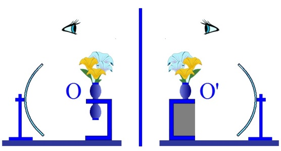
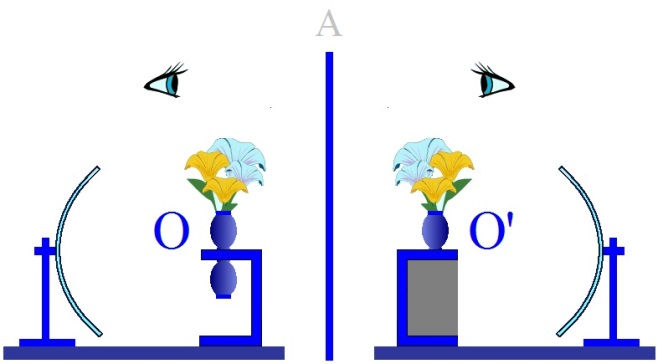
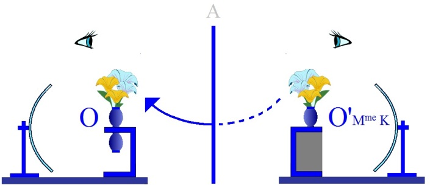

# Leçon 15 | 12 mai 1954

  

    <label><input type="checkbox" data-lacan-toggle="original" checked> 原文</label>
    <label><input type="checkbox" data-lacan-toggle="notes" checked> 注释</label>
    <label><input type="checkbox" data-lacan-toggle="commentary" checked> 个人解读评论</label>
  

  <form class="lacan-tool-search" role="search">
    <input class="lacan-tool-search-input" type="search" placeholder="搜索全文" aria-label="搜索全文">
    <button class="lacan-tool-button" type="submit" title="搜索">搜索</button>
  </form>
  <button class="lacan-tool-button lacan-back-to-top" type="button" title="回到页面最上方" aria-label="回到页面最上方">↑</button>

<section class="parallel-paragraph" data-paragraph-ids="s1-15-0001">

s1-15-0001

原文 · s1-15-0001

Refaisons notre petit *schéma*. Quelqu’un pourrait-il, par une question, essayer d’amorcer le point où nous en étions la dernière fois ?

[无对应译文]

</section>

<section class="parallel-paragraph" data-paragraph-ids="s1-15-0002">

s1-15-0002

原文 · s1-15-0002

Robert PUJOL

[无对应译文]

</section>

<section class="parallel-paragraph" data-paragraph-ids="s1-15-0003">

s1-15-0003

原文 · s1-15-0003

C’est une simple question : Vous dites « *le désir de l’autre* ». C’est *le désir* qui est chez l’autre ou *le désir* que j’ai pour l’autre ? C’est la même chose ? Pour moi, ce n’est pas la même chose. Mais vous dites, chaque fois, « *le désir de l’autre* ».

[无对应译文]

</section>

<section class="parallel-paragraph" data-paragraph-ids="s1-15-0004">

s1-15-0004

原文 · s1-15-0004

LACAN - Cela dépend à quel point. Supposez qu’il s’agit…

[无对应译文]

</section>

<section class="parallel-paragraph" data-paragraph-ids="s1-15-0005">

s1-15-0005

原文 · s1-15-0005

Robert PUJOL

[无对应译文]

</section>

<section class="parallel-paragraph" data-paragraph-ids="s1-15-0006">

s1-15-0006

原文 · s1-15-0006

À la fin de ce que vous avez dit la dernière fois, c’était le désir qui était chez l’autre, et l’*ego* peut le reprendre, en détruisant. Mais c’est en même temps un désir de lui pour l’autre.

[无对应译文]

</section>

<section class="parallel-paragraph" data-paragraph-ids="s1-15-0007">

s1-15-0007

原文 · s1-15-0007

LACAN

[无对应译文]

</section>

<section class="parallel-paragraph" data-paragraph-ids="s1-15-0008">

s1-15-0008

原文 · s1-15-0008

N’est-ce pas le fondement, tout à fait originel, spéculaire, de la rela­tion à l’autre, en tant qu’il s’enracine dans l’*imaginaire* ? La première aliénation du désir est liée à ce phénomène concret, du fait - pour l’enfant - que le jeu est tout à fait valorisé par le fait qu’il est le plan de réflexion sur lequel il voit se manifester chez l’*autre* une activité qui anticipe *sur la sienne*, qui est un tant soit peu plus parfaite *que la sienne,* plus maîtrisée, qui est la forme idéale *de la sienne*, ce premier objet est valorisé.

[无对应译文]

</section>

<section class="parallel-paragraph" data-paragraph-ids="s1-15-0009">

s1-15-0009

原文 · s1-15-0009

Ceci est très important, parce que ça pose en un plan tout à fait originel et contemporain - non seulement du premier *développement* de l’enfant, mais du *pré-développement* de l’enfant - la condition de l’objet humain, qui n’est pas simplement et directement l’endocepteur, le complément du désir animal, mais déjà médiatisé par la voie essentiellement de la rivalité, de la rivalité avec tout ce qu’elle comporte de maximum, d’accent dans le rapport du rival. À savoir : tout ce qui est la relation de *prestige*, de *prestance*, est une relation de l’ordre déjà de l’aliénation, puisque c’est d’abord *là que le sujet se saisit comme moi*.

[无对应译文]

</section>

<section class="parallel-paragraph" data-paragraph-ids="s1-15-0010">

s1-15-0010

原文 · s1-15-0010

La notion qu’il a de la totalité du corps comme identique à quelque chose d’ineffable, de vécu. Le premier élan de l’appétit et du désir passe par la média­tion de cette *forme* qu’il voit d’abord projetée, extérieure à lui. Et il la voit d’abord d’une façon particulièrement manifeste et significative dans son propre *reflet*.

[无对应译文]

</section>

<section class="parallel-paragraph" data-paragraph-ids="s1-15-0011">

s1-15-0011

原文 · s1-15-0011

Deuxième chose assimilée : il sait qu’il est un corps, encore qu’il ne le per­çoive jamais d’une façon complète puisqu’il est dedans, mais il le sait. Cette image devient l’étranglement, l’anneau par lequel tout ce faisceau confus du désir et des besoins devra passer, dans sa structure imaginaire, pour être lui. Vous y êtes ? Donc, quand je dis que *le désir de l’homme est le désir de l’autre*, ceci est une formule, comme toutes les formules, qui doit être maniée à sa place. Ceci peut toujours prêter à certaines ambiguïtés, qu’il faut préciser, parce qu’elle n’est pas valable en un seul sens.

[无对应译文]

</section>

<section class="parallel-paragraph" data-paragraph-ids="s1-15-0012">

s1-15-0012

原文 · s1-15-0012

Nous sommes là, parce que c’est un des points les plus cruciaux qui doivent diriger notre compréhension de la technique. Nous sommes partis du plan de cette *captation imaginaire*. Mais, comme je vous l’ai dit, expliqué, pressenti, formulé, à la fin de la dernière séance, j’ai voulu qu’il y ait au moins l’amorce de cela, cela ne se limite absolument pas là.

[无对应译文]

</section>

<section class="parallel-paragraph" data-paragraph-ids="s1-15-0013">

s1-15-0013

原文 · s1-15-0013

Sans cela même - ai-je indiqué d’une façon *mythique* - il n’y aurait pas d’autre relation interhumaine possible que dans cette mutuelle et radicale intolérance de la cœxistence des consciences, comme s’exprime HEGEL, à savoir que tout autre étant par définition et essentiellement, celui qui frustre l’être humain, non pas de son objet, mais de la forme même de son désir, si ce désir c’est justement l’autre qui l’agit, et que l’autre est virtuellement déjà celui qui le prive de cet objet.

[无对应译文]

</section>

<section class="parallel-paragraph" data-paragraph-ids="s1-15-0014">

s1-15-0014

原文 · s1-15-0014

Il y a là une relation entre les êtres humains, inter-destructrice et mortelle. C’est d’ailleurs ce qui se passe, ce qui est toujours là sous-jacent, à la relation interhumaine. Le mythe politique, style particulier des relations interhumaines, rivalité pour la vie, a pu servir à insérer pas mal de choses. M. DARWIN l’a forgé, comme ça, parce qu’il faisait partie d’une nation de corsaires, pour qui le racisme était l’industrie fondamentale.

[无对应译文]

</section>

<section class="parallel-paragraph" data-paragraph-ids="s1-15-0015">

s1-15-0015

原文 · s1-15-0015

Cette notion de la lutte pour la vie, vous savez combien sur le plan politique elle est discutable, car la survivance soi-­disant des espèces les plus fortes, tout va contre. C’est absolument le contraire de l’évidence. C’est là une sorte de mythe qui va au contraire des choses.

[无对应译文]

</section>

<section class="parallel-paragraph" data-paragraph-ids="s1-15-0016">

s1-15-0016

原文 · s1-15-0016

Tout ce qu’on arrive à fonder sur les zones et les aires d’expansion des différentes formes prouve au contraire qu’il y a des espèces, des points de constance et d’équilibre propres à chaque espèce, et qui ne sont même pas concevables sans la connaissance des mêmes points et aires d’équilibre de l’extension d’autres espèces avec lesquelles les premières vivent, dans une sorte de coordination, même de « *mangeurs* » à « *mangés* ». Mais ça ne va jamais à cette espèce de radicalisme destructeur, pour une simple raison que ça aboutirait tout simplement à l’anéan­tissement de « *l’espèce mangeuse* », qui n’aurait plus rien à manger. Au contraire, sur le plan de la vie, il y a une étroite inter-coaptation, tout à fait ailleurs que sur le plan de la lutte, c’est tout à fait évident.

[无对应译文]

</section>

<section class="parallel-paragraph" data-paragraph-ids="s1-15-0017">

s1-15-0017

原文 · s1-15-0017

Sur le plan humain, il est extrêmement important, parce que nous le faisons, nous, impliquant dans la notion de l’agressivité telle que nous la manions bru­talement sans l’approfondir, la notion qu’il s’agit de quelque chose de cet ordre ­là, que l’agressivité c’est l’agression. Cela n’a absolument rien à faire avec ça. C’est virtuellement à la limite que ça se résout dans une agression, mais dans une agression qui n’a précisément rien à faire avec la réalité vitale, qui est une agression existentielle, liée à un rapport imaginaire. C’est une vérité absolument essentielle, et qui est une clé qui permet de repenser dans un registre complè­tement différent toutes sortes de problèmes, et pas seulement les nôtres.

[无对应译文]

</section>

<section class="parallel-paragraph" data-paragraph-ids="s1-15-0018">

s1-15-0018

原文 · s1-15-0018

Je vous avais demandé de poser une question. Vous avez bien fait de la poser. Êtes-vous pour cela satisfait ? Nous avons quand même été plus loin la dernière fois. Ce désir qui est donc chez le sujet humain réalisé dans l’autre, comme vous dites, chez l’autre mais donc dans l’autre, par l’autre, dans si vous voulez, ce que nous pouvons appe­ler *le second temps*, c’est-à-dire *le type spéculaire*, c’est-à-dire au moment où le sujet a intégré la forme du *moi*.

[无对应译文]

</section>

<section class="parallel-paragraph" data-paragraph-ids="s1-15-0019">

s1-15-0019

原文 · s1-15-0019

Mais il n’a pu l’intégrer que par un premier jeu de bascule ou de renversement, du fait *qu’il a justement échangé ce moi contre ce désir* qu’il voit dans l’autre : ce désir de l’autre, qui est le désir de l’homme, entre dans la médiatisation du langage. C’est dans l’autre et par l’autre, que ce désir va être nommé, reconnu, va entrer dans *la relation symbolique* du « *je* » et du « *tu* », avec ce qu’il comporte là de reconnaissance, de réciproque, de transcen­dance, simplement parce qu’il a été nommé, parce qu’il entre dans l’ordre \- *déjà tout prêt* à inclure l’histoire de chaque individu - dans l’ordre d’une foi.

[无对应译文]

</section>

<section class="parallel-paragraph" data-paragraph-ids="s1-15-0020">

s1-15-0020

原文 · s1-15-0020

Je vous ai parlé du « *Fort* » et du « *Da* » : c’est un exemple de la façon dont l’enfant entre naturellement dans ce jeu. Donc d’ores et déjà il entre dans ce jeu : c’est-à-dire qu’il commence à jouer avec l’objet, précisément sur le seul fait de *sa pré­sence* ou de *son absence*, c’est-à-dire un objet déjà transformé, un objet de fonction symbolique, c’est-à-dire que l’objet est déjà un signe, déjà dévitalisé. C’est quand il est là qu’il le chasse, et quand il n’est pas là qu’il l’appelle.

[无对应译文]

</section>

<section class="parallel-paragraph" data-paragraph-ids="s1-15-0021">

s1-15-0021

原文 · s1-15-0021

L’objet est déjà, par les premiers jeux, par une sorte d’entrée naturelle, il faut que nous la voyions émerger, l’objet passe dans *le plan* *du langage, du symbole, qui devient plus important que l’objet*. Si vous ne vous mettez pas ça bien dans la tête - je l’ai déjà répété tellement de fois ! Ça doit commencer quand même à devenir intégré, on ne saurait encore trop le répéter - le mot ou le concept n’est point autre chose que *le mot dans sa matérialité*, pour l’être humain - et quand je dis « pour l’être humain », vous allez voir que ça va très loin - *c’est la chose même*. Dites-vous bien que ça n’est pas simplement une espèce d’*ombre*, de *souffle*, d’*illusion virtuelle* de la chose : *c’est la chose même*.

[无对应译文]

</section>

<section class="parallel-paragraph" data-paragraph-ids="s1-15-0022">

s1-15-0022

原文 · s1-15-0022

Si vous réfléchissez un petit instant, dans le réel il est, on peut dire qu’il est beaucoup plus décisif pour tout ce qui est arrivé aux *éléphants* - j’entends : vivants - il est plus décisif que dans la langue humaine le mot « *éléphant* » existe, grâce à quoi, quelle que soit l’étroitesse des portes, nous faisons vraiment ici entrer l’*éléphant*, dans nos délibérations. À savoir que les hommes, du fait de l’existence du mot « *éléphant* » ont pris à l’endroit des éléphants, avant même d’y toucher, des résolutions beaucoup plus décisives pour tout ce qui est arrivé dans le monde aux éléphants, que n’importe quoi qui soit arrivé dans leur his­toire : traverser un fleuve, un lac, stérilisation naturelle d’une forêt, ou quoi que ce soit de semblable. Rien qu’avec le mot « *éléphant* » et la façon dont les hommes en parlent, ça suffit pour qu’il arrive des choses qui sont favorables ou défavorables, fastes ou néfastes \- de toute façon catastrophiques - pour les élé­phants, avant même qu’on ait commencé à lever un fusil ou un arc vers eux.

[无对应译文]

</section>

<section class="parallel-paragraph" data-paragraph-ids="s1-15-0023">

s1-15-0023

原文 · s1-15-0023

Bon ! Enfin, laissons les éléphants ! Il est tout à fait clair qu’il suffit que j’en parle, il n’y a pas besoin qu’ils soient là, ils sont là grâce au mot « *éléphant* », là dans une plus grande réalité que la réalité contingente de l’individu éléphant. Bon !

[无对应译文]

</section>

<section class="parallel-paragraph" data-paragraph-ids="s1-15-0024">

s1-15-0024

原文 · s1-15-0024

Jean HYPPOLITE - Je disais : c’est de la logique hégélienne.

[无对应译文]

</section>

<section class="parallel-paragraph" data-paragraph-ids="s1-15-0025">

s1-15-0025

原文 · s1-15-0025

LACAN - Est-elle pour autant attaquable ?

[无对应译文]

</section>

<section class="parallel-paragraph" data-paragraph-ids="s1-15-0026">

s1-15-0026

原文 · s1-15-0026

HYPPOLITE - Non, elle n’est pas attaquable. MANNONI disait tout à l’heure : « *c’est de la politique* ».

[无对应译文]

</section>

<section class="parallel-paragraph" data-paragraph-ids="s1-15-0027">

s1-15-0027

原文 · s1-15-0027

Octave MANNONI

[无对应译文]

</section>

<section class="parallel-paragraph" data-paragraph-ids="s1-15-0028">

s1-15-0028

原文 · s1-15-0028

C’est le côté par où la politique humaine s’insère, au sens large, parce que si les hommes n’agissent pas comme les animaux, c’est parce que jus­tement ils échangent par le langage leurs connaissances. Et par conséquent, c’est de la politique. La politique vis-à-vis des éléphants est possible grâce au mot.

[无对应译文]

</section>

<section class="parallel-paragraph" data-paragraph-ids="s1-15-0029">

s1-15-0029

原文 · s1-15-0029

HYPPOLITE - Mais pas seulement. C’est l’éléphant lui-même qui est atteint, c’est la logique hégélienne.

[无对应译文]

</section>

<section class="parallel-paragraph" data-paragraph-ids="s1-15-0030">

s1-15-0030

原文 · s1-15-0030

LACAN

[无对应译文]

</section>

<section class="parallel-paragraph" data-paragraph-ids="s1-15-0031">

s1-15-0031

原文 · s1-15-0031

C’est pré-politique. C’est simplement la façon de vous faire tou­cher du doigt *l’importance du nom*. Bien entendu nous nous plaçons là simplement sur le plan de *la nomination*. Il n’y a même pas encore de *syntaxe*. Mais enfin, *cette syntaxe*, il est tout à fait clair qu’elle naît en même temps, et que particulièrement l’enfant - je vous l’ai déjà signalé - articule des éléments d’axiomes avant des phonèmes.

[无对应译文]

</section>

<section class="parallel-paragraph" data-paragraph-ids="s1-15-0032">

s1-15-0032

原文 · s1-15-0032

Le « si des fois... » apparaît quelquefois tout seul. C’est quelque chose qui ne nous permet pas de trancher sur une *antériorité logique*, à proprement parler il ne s’agit que d’une émergence phénoménale. Mais quoi qu’il en soit, il est bien certain que c’est déjà sur *le plan symbo­lique* que se place cette articulation essentielle par laquelle, dès l’origine, les désirs de l’enfant, à mesure qu’ils vont être réintégrés par ce jeu de bascule qui, bien entendu, ne se produit pas qu’une fois.

[无对应译文]

</section>

<section class="parallel-paragraph" data-paragraph-ids="s1-15-0033">

s1-15-0033

原文 · s1-15-0033

Ce jeu en miroir qui fait que constamment à *la projection de l’image*, succède *la projection du désir*, avec une corrélative réintrojection de l’image, ou réintrojection du désir, c’est sur *le plan symbo­lique* que les désirs vont être ré-assumés par le sujet, après leur passage dans cet *autre* *spéculaire*, au niveau duquel ils sont approuvés ou réprouvés, acceptés ou refusés par l’autre, et où d’ores et déjà, et dès l’origine, l’enfant fait l’apprentissage de ce qui est le fondement de cet *ordre symbolique*, c’est-à-dire d’ores et déjà un *ordre légal*.

[无对应译文]

</section>

<section class="parallel-paragraph" data-paragraph-ids="s1-15-0034">

s1-15-0034

原文 · s1-15-0034

Est-ce que vous y êtes ? Ceci aussi a des répondants expérimentaux. Suzan ISAACS par exemple, dans un de ses textes - et elle n’est pas la seule, dans l’école de KŒHLER aussi on l’a mis en évidence - signale que très précocement, à un âge encore *infans*, quelque part entre 8 et 12 mois, l’enfant ne réagit abso­lument pas de la même façon :

[无对应译文]

</section>

<section class="parallel-paragraph" data-paragraph-ids="s1-15-0035">

s1-15-0035

原文 · s1-15-0035

- à un heurt accidentel, à une brutalité si on peut dire, mécanique, liée à une maladresse,

[无对应译文]

</section>

<section class="parallel-paragraph" data-paragraph-ids="s1-15-0036">

s1-15-0036

原文 · s1-15-0036

- une chute, le déplacement d’un objet, ou même quelqu’un qui tend le bras sans regarder ce qu’il fait,

[无对应译文]

</section>

<section class="parallel-paragraph" data-paragraph-ids="s1-15-0037">

s1-15-0037

原文 · s1-15-0037

- et à quelque chose d’autre qui y ressemble énormément, une gifle à intention punitive.

[无对应译文]

</section>

<section class="parallel-paragraph" data-paragraph-ids="s1-15-0038">

s1-15-0038

原文 · s1-15-0038

Nous pouvons déjà distinguer chez un tout petit enfant deux réactions complètement différentes, avant l’apparition extériorisée du langage. Mais nous savons, nous devons admettre, avant même cette apparition extériorisée, précisément étant donné la forme, le mode sous lequel l’apparition extériorisée se manifeste - je ne peux pas m’engager dans toutes les voies à la fois - l’enfant a déjà une première appréhen­sion du *symbolisme du langage*, de *sa fonction* justement, *de pacte et de loi*.

[无对应译文]

</section>

<section class="parallel-paragraph" data-paragraph-ids="s1-15-0039">

s1-15-0039

原文 · s1-15-0039

Alors, c’est justement ici que nous devons tâcher de saisir quelle est, dans l’analyse, cette *fonction de la parole*, de *la parole* en tant que manifestation de cet *ordre symbolique*, si vous voulez, cette roue de moulin par où sans cesse le désir humain se médiatise en rentrant dans *le système du langage*, auquel il accède par des voies concrètes de plus en plus larges au cours de ses expé­riences.

[无对应译文]

</section>

<section class="parallel-paragraph" data-paragraph-ids="s1-15-0040">

s1-15-0040

原文 · s1-15-0040

C’est ici que se situe un des registres qui est celui que je mets en valeur, parce qu’il est le plus mis entre parenthèses, le plus oublié, celui dont on se détourne *dans l’analyse*, encore qu’il devrait être quelque chose dont nous ne devrions jamais perdre *la référence*. *Dans l’analyse*, en somme, de quoi d’habitude parlons-nous ?

[无对应译文]

</section>

<section class="parallel-paragraph" data-paragraph-ids="s1-15-0041">

s1-15-0041

原文 · s1-15-0041

[无对应译文]

</section>

<section class="parallel-paragraph" data-paragraph-ids="s1-15-0042">

s1-15-0042

原文 · s1-15-0042

Nous ne par­lons, et c’est pour ça qu’il est légitime que j’ai commencé par vous expliquer le schéma par le rapport de O à O’, par *le rapport imaginaire à l’autre,* dans l’analyse nous démontrons, ce à quoi nous nous référons sans cesse, d’une façon d’ailleurs souvent confuse et même pas articulée à ce niveau là, c’est là en tout cas que ça rentre, que ça vient se ranger dans une théorie cohérente, ce sont les *relations imaginaires* du *sujet* à cette construction de son *moi*.

[无对应译文]

</section>

<section class="parallel-paragraph" data-paragraph-ids="s1-15-0043">

s1-15-0043

原文 · s1-15-0043

Nous parlons sans cesse des *dangers*, des *ébranlements*, des *crises* que le sujet éprouve au niveau de cette construction de son *moi*. Nous savons d’autre part que c’est précisément dans la relation progressive, qui évolue par le fait de l’évolution des instincts vers des objets structurés d’une façon qui varie, qui est tout à fait spécialement marquée par la première émer­gence de *l’objet génital*, dans son émergence non moins prématurée que tout le reste du développement de l’enfant, c’est dans cette première émergence et dans son échec que se passe aussi quelque chose de majeur. En quoi ?

[无对应译文]

</section>

<section class="parallel-paragraph" data-paragraph-ids="s1-15-0044">

s1-15-0044

原文 · s1-15-0044

En ceci, juste­ment, qu’il y a là quelque chose de radicalement nouveau, qu’il y a une diffé­rence de niveau entre la libido qui fixe l’objet à sa propre image, et l’émergence de cette libido prématurée. Tout ce sur quoi j’ai insisté, de ce que nous pouvons penser de la structura­tion du phénomène, c’est que c’est en tant que l’enfant apparaît dans le monde à l’état *prématuré* - structurellement et de haut en bas, de bout en bout - qu’existe *cette première relation libidinale à son image*, où se situe *la libido* dans les réso­nances qu’elle a le plus habituellement pour vous, légitimement, *la libido* qui est proprement de l’ordre de la *Liebe*, de l’amour, c’est-à-dire enfin de ce que je vous ai, je pense, assez montré, qui est justement le grand X de toute la théorie analytique.

[无对应译文]

</section>

<section class="parallel-paragraph" data-paragraph-ids="s1-15-0045">

s1-15-0045

原文 · s1-15-0045

Et si vous croyez que c’est tout de même aller un peu fort que de l’appeler le grand X, je n’aurai aucune peine à vous sortir des textes, et des meilleurs analystes, car ce n’est pas en allant chercher ses modèles dans des gens qui ne savent pas ce qu’ils disent qu’on peut faire une démonstration valable, je chargerai à l’occasion quelqu’un de le faire, de voir dans BALINT.

[无对应译文]

</section>

<section class="parallel-paragraph" data-paragraph-ids="s1-15-0046">

s1-15-0046

原文 · s1-15-0046

La question de ce qu’est cet amour génital prétendument achevé reste entièrement probléma­tique, et la question de savoir s’il s’agit là d’un processus naturel ou d’une réa­lisation culturelle d’un équilibre extraordinairement délicat à obtenir, n’a pas encore, nous dit textuellement BALINT, été tranchée par les analystes. C’est tout de même un peu extraordinaire comme *ambiguïté*, laissée au cœur même de ce qui semble être exprimé, le plus ouvertement reçu, entre nous.

[无对应译文]

</section>

<section class="parallel-paragraph" data-paragraph-ids="s1-15-0047">

s1-15-0047

原文 · s1-15-0047

Mais quoi qu’il en soit, il n’en reste pas moins que l’éruption de libido qui se manifeste sur le plan d’un attrait, lui, d’une nature que nous devons au moins supposer - pour que la théorie tienne debout et que l’expérience puisse être expli­quée - se poser sur un plan non pas d’immaturité ou de prématuration vitale, mais aller au-delà et répondre à une première maturation, au moins, du désir, d’être un désir vital, et nous n’avons pas de raisons de le repousser en principe. C’est quelque chose qui apporte évidemment un changement total de niveau dans *ce rapport de l’être humain à l’image, de sa relation fondamentale à l’autre*. Nous devons l’admettre parce que c’est là le point-pivot de ce qu’on appelle la maturation autour de laquelle se passe tout le drame œdipien. C’est le corréla­tif instinctuel de ce qui se passe dans le drame œdipien sur le plan situationnel. Qu’est-ce qui se passe donc ?

[无对应译文]

</section>

<section class="parallel-paragraph" data-paragraph-ids="s1-15-0048">

s1-15-0048

原文 · s1-15-0048

[无对应译文]

</section>

<section class="parallel-paragraph" data-paragraph-ids="s1-15-0049">

s1-15-0049

原文 · s1-15-0049

Il se passe que c’est précisément dans cette conjonction de la libido venue à maturité et en tant - pour employer le dernier vocabulaire freudien \[1939\] - que sur le plan de l’*Éros* la relation à l’image narcissique passe sur le plan de la *Verliebtheit*, c’est à ce moment que l’*image narcissique,* en tant que captivante et en tant qu’aliénante sur le plan *imaginaire,* devient à proprement parler l’image inves­tie de cette relation spéciale qui est la *Verliebtheit*, qui est ce que nous connais­sons phénoménologiquement du plus évident du registre de *l’amour*.

[无对应译文]

</section>

<section class="parallel-paragraph" data-paragraph-ids="s1-15-0050">

s1-15-0050

原文 · s1-15-0050

Expliquer les choses ainsi, c’est dire que c’est d’une maturation interne liée alors au développement, à l’évolution vitale du sujet, que dépend cette sorte de remplissement, de complétude, voire de débordement de ce qui, jusque-là, était contenu dans le vague de la primitive béance de la libido du sujet immaturé. Ce que nous appelons la libido prégénitale à ce moment-là est le point sensible où l’homme joue entre sa faiblesse, son point faible naturel, et une certaine réalisation naturelle.

[无对应译文]

</section>

<section class="parallel-paragraph" data-paragraph-ids="s1-15-0051">

s1-15-0051

原文 · s1-15-0051

C’est là que joue le point de mirage entre Ἔρως \[Éros\] et Θάνατος \[Thanatos\], entre l’amour et la haine. Plus simplement, je crois que c’est la façon la plus simple d’exprimer, de faire comprendre, sentir - ce n’est pas moi qui l’ai inventée - le problème crucial du rôle que joue le *moi* dans la conception que nous pouvons nous faire du rôle que joue *la libido* dite « *désexualisée* » du *moi* dans cette possibilité de réversion, de virage instantané de la haine dans l’amour, de l’amour dans la haine, qui est pour FREUD le problème - vous pouvez vous reporter à *ses écrits sur Le Moi et le Ça* - qui pour lui a semblé poser le plus de difficultés à résoudre.

[无对应译文]

</section>

<section class="parallel-paragraph" data-paragraph-ids="s1-15-0052">

s1-15-0052

原文 · s1-15-0052

Au point que, dans le texte dont je vous parle, il semble en faire même une espèce d’objection à la théorie des instincts de mort et des instincts de vie comme distincts. En fait, loin d’être une objection, je crois au contraire que ceci s’ac­corde parfaitement, toujours à condition que nous ayons une théorie correcte de *la fonction imaginaire du moi*.

[无对应译文]

</section>

<section class="parallel-paragraph" data-paragraph-ids="s1-15-0053">

s1-15-0053

原文 · s1-15-0053

Ceci vous a peut-être paru pour l’instant un peu difficile ? J’y reviendrai. Si cela vous a paru trop difficile, je peux tout de même vous en donner tout de suite une illustration. La réaction agressive à *la rivalité œdipienne* est très exactement liée à un de ces changements de niveau : c’est précisément en tant qu’il y a *déclin du com­plexe d’Œdipe*, à savoir que ce père qui a d’abord réalisé…

[无对应译文]

</section>

<section class="parallel-paragraph" data-paragraph-ids="s1-15-0054">

s1-15-0054

原文 · s1-15-0054

> ceci est également entièrement conforme à ce qu’exprime FREUD

[无对应译文]

</section>

<section class="parallel-paragraph" data-paragraph-ids="s1-15-0055">

s1-15-0055

原文 · s1-15-0055

…une des figures, *sur le plan ima­ginaire*, les plus manifestes de l’*Idealich*, qui a été comme tel investi d’une *Verliebtheit*, parfaitement comme telle isolée, nommée, décrite par FREUD, c’est très précisément en tant qu’il y a une certaine régression de la position libidi­nale que le sujet atteint à la phase œdipienne, c’est-à-dire entre 3 et 5 ans.

[无对应译文]

</section>

<section class="parallel-paragraph" data-paragraph-ids="s1-15-0056">

s1-15-0056

原文 · s1-15-0056

C’est en tant qu’il y a *régression du niveau de cette* *libido* qu’apparaît le sentiment *d’agression* ou *de rivalité* envers le père, *de haine* disons-le, c’est-à-dire quelque chose qui, à un seuil, à un très petit changement près du niveau libi­dinal par rapport à un certain seuil, fait que

[无对应译文]

</section>

<section class="parallel-paragraph" data-paragraph-ids="s1-15-0057">

s1-15-0057

原文 · s1-15-0057

- ce qui était amour devient haine,

[无对应译文]

</section>

<section class="parallel-paragraph" data-paragraph-ids="s1-15-0058">

s1-15-0058

原文 · s1-15-0058

- et - qu’aussi bien et toujours ainsi - peut osciller pendant un certain temps entre ces deux phénomènes.

[无对应译文]

</section>

<section class="parallel-paragraph" data-paragraph-ids="s1-15-0059">

s1-15-0059

原文 · s1-15-0059

Reprenons maintenant les choses au point où je les ai quittées la dernière fois. Je vous ai indiqué ce plan sur lequel joue, dans la façon dont nous exposons la théorie analytique elle-même, la façon dont joue *la relation imaginaire* comme tout à fait fondamentale, comme donnant si on peut dire d’une façon définitive les cadres dans lesquels vont se faire toutes les fluctuations propre­ment libidinales.

[无对应译文]

</section>

<section class="parallel-paragraph" data-paragraph-ids="s1-15-0060">

s1-15-0060

原文 · s1-15-0060

Vous savez que la dernière fois *c’est sur le plan des fonctions symboliques que j’ai laissé la question ouverte* et que tout de suite je vous ai dit : il s’agit de partir, pour que nous puissions dire quelque chose d’organisé et de solide, de ce qui se passe dans le traitement. Qu’est-ce que ça veut dire ? De l’usage que nous faisons du langage et de la parole dans le traitement.

[无对应译文]

</section>

<section class="parallel-paragraph" data-paragraph-ids="s1-15-0061">

s1-15-0061

原文 · s1-15-0061

Et si mon souvenir est bon, j’ai défini ce mode, cet usage que nous faisons du langage dans le traitement et *d’un langage qui est parole*, *puisqu’il y a là deux sujets liés par un pacte* qui s’éta­blit à des niveaux très divers, voire très confus à l’origine, mais qui n’en est pas moins essentiellement *un pacte*, et auquel nous faisons tout pour bien établir ce caractère au départ.

[无对应译文]

</section>

<section class="parallel-paragraph" data-paragraph-ids="s1-15-0062">

s1-15-0062

原文 · s1-15-0062

C’est une justification de toutes sortes de règlements, de règles préalables que nous donnons à la relation analytique. À l’intérieur de cette relation, nous faisons tout pour dénouer toute une série d’amarres de *la parole* dans le mode de parler, dans son style, dans la façon de s’adresser à celui à qui il parle, à son allocutaire, le sujet est libéré de toute une série d’entraves, de liens, non seulement de politesse, de courtoisie, mais même de cohérence : on lâche un certain nombre d’amarres de la parole.

[无对应译文]

</section>

<section class="parallel-paragraph" data-paragraph-ids="s1-15-0063">

s1-15-0063

原文 · s1-15-0063

Si nous consi­dérons qu’il y a un lien étroit qui reste permanent entre *la façon dont un sujet peut s’exprimer*, se faire reconnaître, et la dynamique effective, vécue, de *ses relations de désir*, nous devons voir que cela seul introduit ce que nous voyons effectivement se produire, à savoir une certaine désinsertion, un certain flotte­ment, possibilité d’oscillations dans ce qui est précisément *la relation de miroir* à l’autre.

[无对应译文]

</section>

<section class="parallel-paragraph" data-paragraph-ids="s1-15-0064">

s1-15-0064

原文 · s1-15-0064

C’est pour ça que mon petit modèle existe.Vous savez que nous sommes très bien arrivés à concevoir comment juste­ment l’oscillation de l’incidence de son rapport à l’autre est quelque chose qui fait varier, miroiter, complète et décomplète, fait osciller de toutes les façons, l’image qu’il s’agit d’apercevoir précisément dans cette complétude à laquelle le sujet n’a jamais accès, pour la simple raison que le modèle vous permet juste­ment d’imaginer : l’appareil est mal fait.

[无对应译文]

</section>

<section class="parallel-paragraph" data-paragraph-ids="s1-15-0065">

s1-15-0065

原文 · s1-15-0065

Pour que le sujet puisse vraiment recon­naître à la fois toutes les étapes de son désir, tous les objets qui sont venus, à cette *image*, apporter la consistance, la nourriture, l’incarnation suffisante, pour que le sujet constitue, par une série de reprises et d’identifications successives, l’his­toire de son *moi*.

[无对应译文]

</section>

<section class="parallel-paragraph" data-paragraph-ids="s1-15-0066">

s1-15-0066

原文 · s1-15-0066

Dans *ce rapport parlé, flottant*, avec l’analyste, il se passe quelque chose qui tend justement à reproduire ce qui ne se produit dans aucune autre expé­rience : des variations assez répétées même si elles sont infinitésimales, assez amples même si elles sont limitées quelquefois, pour que le sujet aperçoive beaucoup plus que ce qu’il peut apercevoir dans d’autres circonstances, que cette série de reprises de possession de *ces images captatrices qui sont au fon­dement de la constitution de son moi*.

[无对应译文]

</section>

<section class="parallel-paragraph" data-paragraph-ids="s1-15-0067">

s1-15-0067

原文 · s1-15-0067

J’ai parlé de « *petites oscillations »*, de « *limitation dans ces oscillations »*. Je n’ai pas besoin, pour l’instant, de m’étendre sur ce qui constitue leur petitesse et leur limitation. Il y a évidemment du freinage, des arrêts. Tout ce que la technique nous apprend à franchir, voire à combler, voire quelquefois à reconstruire, vous le savez : FREUD l’a déjà indiqué en ce sens.

[无对应译文]

</section>

<section class="parallel-paragraph" data-paragraph-ids="s1-15-0068">

s1-15-0068

原文 · s1-15-0068

Mais ce que vous devez commencer à entrevoir, c’est pourquoi se produit, avec une pareille technique, quelque chose qui... pour autant ou si peu que ce soit ...qui est - dans le sujet - à reconstruire : cette relation de *mirage imaginaire* avec lui-même au-delà de toutes les limites que le vécu quotidien lui permet d’obtenir, *tend à créer artificiellement et en mirage ce qui est précisément la condition fon­damentale de toute Verliebtheit*.

[无对应译文]

</section>

<section class="parallel-paragraph" data-paragraph-ids="s1-15-0069">

s1-15-0069

原文 · s1-15-0069

En d’autres termes c’est exactement *parce que* *cette image réelle*, dont vous savez qu’*elle ne peut être aperçue de là où est le sujet qu’en miroir*, mais d’une façon toujours plus ou moins floue, et de ce fait même, *nette* seulement en certains points, mais où précisément *la rupture* *des amarres de la parole* lui permet de voir au moins successivement *les diverses parts de cette image*, bref d’obtenir ce que nous pouvons appeler *une projection narcissique maxima*, c’est dans tout son caractère - disons-le, vous sentez bien que c’est à cela que ça va venir - encore rudimentaire, ça consiste - il faut bien le dire - à aller là en lâchant tout et en voyant au début ce que ça va produire.

[无对应译文]

</section>

<section class="parallel-paragraph" data-paragraph-ids="s1-15-0070">

s1-15-0070

原文 · s1-15-0070

Il n’est pas inconcevable que les choses auraient pu, ou pourraient, être menées autrement. Mais ce qui tend à être produit à l’aide de petits *patterns*, de petits *schémas*, vous pouvez concevoir que s’il y a une chose que ça doit tendre à pro­duire au *maximum*, c’est justement *cette révélation narcissique*, qui se passe sur *le plan imaginaire* et qui est justement ce qui est la condition fondamentale de ce que nous avons appelé la *Verliebtheit*.

[无对应译文]

</section>

<section class="parallel-paragraph" data-paragraph-ids="s1-15-0071">

s1-15-0071

原文 · s1-15-0071

L’*état amoureux*, quand il se produit lui, c’est d’une tout autre façon : il faut une coïncidence surprenante. L’état amoureux ne se produit pas pour n’importe quel partenaire, ou n’importe quelle image, il faut que se réalisent certaines conditions : j’ai fait allusion *aux conditions maxima du coup de foudre de* WERTHER.

[无对应译文]

</section>

<section class="parallel-paragraph" data-paragraph-ids="s1-15-0072">

s1-15-0072

原文 · s1-15-0072

[无对应译文]

</section>

<section class="parallel-paragraph" data-paragraph-ids="s1-15-0073">

s1-15-0073

原文 · s1-15-0073

Dans l’analyse précisément, dans la mesure et en fonction de *cette rupture des amarres de la parole*, et rien qu’à cause de cela, le point où - en A - se focali­sait l’identification du sujet au niveau de l’image narcissique, c’est ça qu’on appelle *le transfert*. Le transfert, dans le second sens, c’est-à-dire non pas dans *le sens dialectique* où je vous l’expliquais, par exemple dans le cas de Dora, ce qui produit le transfert négatif - d’ailleurs ce n’est pas *le transfert négatif*, c’est une faute de FREUD - mais ce que communément on appelle *le transfert* en tant que phénomène imaginaire, c’est ça.

[无对应译文]

</section>

<section class="parallel-paragraph" data-paragraph-ids="s1-15-0074">

s1-15-0074

原文 · s1-15-0074

Nous n’avons pas beaucoup avancé aujourd’hui, mais je crois qu’il faut avan­cer très lentement et pas à pas. Je ne veux quand même pas vous quitter avant de vous montrer à quel point aigu cela va, à un point qui est véritablement le point de partage des eaux dans la technique. Je veux simplement vous faire une remarque. Je vais commenter un texte de BALINT.

[无对应译文]

</section>

<section class="parallel-paragraph" data-paragraph-ids="s1-15-0075">

s1-15-0075

原文 · s1-15-0075

BALINT, je vous l’ai dit, est un des personnages les plus conscients, les plus lucides dans l’exposé de ce qu’il fait. BALINT est en même temps un des meilleurs exemples de la conception tout à fait cohérente de ce qui est la tendance dans laquelle peu à peu s’est engagée toute la technique analytique. Il dit simplement, d’une façon un peu plus cohérente et un peu plus ouverte que les autres, ce qui est empêtré, confus dans une *scolastique* où une chatte ne retrouverait pas ses petits, chez beaucoup d’autres auteurs.

[无对应译文]

</section>

<section class="parallel-paragraph" data-paragraph-ids="s1-15-0076">

s1-15-0076

原文 · s1-15-0076

BALINT dit exactement ceci : premièrement, que tout ce qui est le progrès de l’analyse consiste dans cette tendance pour le sujet de retrouver ce qu’il appelle « *l’amour primaire* », le *primary love,* c’est-à-dire *le besoin d’être l’objet de l’amour, des soins, de l’affection, de l’intérêt* *d’un autre objet*, sans aucun regard de sa propre part à l’égard des besoins ou même d’existence de cet objet. *C’est le moteur de l’analyse*.

[无对应译文]

</section>

<section class="parallel-paragraph" data-paragraph-ids="s1-15-0077">

s1-15-0077

原文 · s1-15-0077

BALINT l’articule. Je lui suis reconnaissant de l’articuler. Cela ne veut pas dire que je l’approuve. Le fait de placer tout le jeu de l’analyse sur cette tendance et sur ce plan, sans aucune espèce de correctif ni d’autre élément, paraîtra déjà surprenant, mais bien dans la ligne d’une évolution de l’analyse qui aboutit à mettre de plus en plus l’accent sur les *relations de dépendance*, sur les *satisfactions instinctuelles*, voire sur *la frustration*, ce qui est la même chose.

[无对应译文]

</section>

<section class="parallel-paragraph" data-paragraph-ids="s1-15-0078">

s1-15-0078

原文 · s1-15-0078

C’est ce qu’il décrit d’autre part comme étant ce qu’on observe à *la fin de l’analyse*, comme marquant dans les rares cas - il dit qu’il n’y en a pas plus de 25 %, où les analyses sont achevées, vraiment terminées - il les décrit comme *un état de narcissisme chez le sujet* \- il dit « *de narcissisme chez le sujet* » - qui va à une sorte d’exaltation sans frein des désirs, qui donne au sujet une espèce de sensation enivrée de maîtrise de la réalité, tout à fait encore illusoire, dont le sujet a besoin dans une période si on peut dire « post-ter­minale », pour se libérer par une sorte de progressive remise en place de la nature des choses.

[无对应译文]

</section>

<section class="parallel-paragraph" data-paragraph-ids="s1-15-0079">

s1-15-0079

原文 · s1-15-0079

Il décrit *la dernière séance* comme je ne sais quoi, qui ne se passe pas sans, chez l’un et l’autre des partenaires, *la plus forte envie de pleurer,* et il l’écrit. Est-ce que vous ne voyez pas qu’il y a là quelque chose qui à la fois a l’impor­tance et la valeur d’*un témoignage extrêmement* *précieux*, ce qui peut être décrit non seulement comme les extrêmes, mais la pointe de toute une façon d’opérer dans l’analyse, et en même temps doit nous laisser tout de même une impres­sion alors de jeu extraordinairement peu satisfaisant après tout !

[无对应译文]

</section>

<section class="parallel-paragraph" data-paragraph-ids="s1-15-0080">

s1-15-0080

原文 · s1-15-0080

L’idée que nous pouvons nous faire serait elle-même l’idée d’un idéal uto­pique, ce qui assurément déçoit en nous quelque chose. N’est-il pas possible de concevoir comment certaine façon de comprendre l’analyse, ou plus exactement de ne pas comprendre certains éléments ou cer­tains ressorts absolument essentiels dans l’analyse, doit mener non seulement à une pareille conception, mais - comme vous le voyez - aussi à de *pareils résultats* ? Je laisse ceci en suspens.

[无对应译文]

</section>

<section class="parallel-paragraph" data-paragraph-ids="s1-15-0081">

s1-15-0081

原文 · s1-15-0081

Ce que je veux vous dire... Je vais prendre un exemple, qui est déjà pour vous extrêmement familier, parce que je suis revenu vingt fois dessus, c’est le cas de Dora. Je vais tout de suite venir au fait. Ce qui est négligé, c’est évidemment *la fonction de la parole* en tant que *fonc­tion de reconnaissance*, en tant que dimension par où le désir du sujet est authen­tiquement intégré sur *le plan symbolique*.

[无对应译文]

</section>

<section class="parallel-paragraph" data-paragraph-ids="s1-15-0082">

s1-15-0082

原文 · s1-15-0082

Comment devons-nous, semble-t-il, correctement concevoir, situer, le point où doit se faire cette conjonction du désir reconnu du sujet avec cette formulation, cette *nomination* devant l’*autre*, par où s’établit ce qui est à proprement parler non pas la satisfaction du désir, ni de je ne sais quel *primary love*, mais *la reconnaissance du désir* quel qu’il soit, et à quelque niveau qu’il se situe dans la composition du sujet ? Je vais vous dire le point sur lequel se situe cette ligne, ce partage dont il me semble que tout l’achèvement de ce que nous avons à dire sur la technique doit vous apporter les fondements et les bases.

[无对应译文]

</section>

<section class="parallel-paragraph" data-paragraph-ids="s1-15-0083">

s1-15-0083

原文 · s1-15-0083

Rappelez-vous ce que fait FREUD avec Dora. Dora est une *hystérique*. FREUD à ce moment-là ne connaît pas suffisamment... de son propre aveu, il l’a écrit et réécrit et répété, refoutu en note partout, dans tous les coins, et même dans le texte ...ce qu’il appelle *la composante homosexuelle*, ce qui ne veut rien dire, enfin c’est une étiquette. Cela revient à dire qu’*il ne s’est pas aperçu* *juste­ment de la position de* Dora, de ce qu’était justement *l’objet de* Dora. Il ne s’est pas aperçu pour tout dire, que là en O’ c’est Mme K

[无对应译文]

</section>

<section class="parallel-paragraph" data-paragraph-ids="s1-15-0084">

s1-15-0084

原文 · s1-15-0084

[无对应译文]

</section>

<section class="parallel-paragraph" data-paragraph-ids="s1-15-0085">

s1-15-0085

原文 · s1-15-0085

Que fait FREUD par son intervention ? Il aborde Dora sur le plan de ce qu’il appelle lui-même « *la résistance* », c’est-à-dire quoi ?

[无对应译文]

</section>

<section class="parallel-paragraph" data-paragraph-ids="s1-15-0086">

s1-15-0086

原文 · s1-15-0086

Je vous l’ai déjà expliqué : FREUD fait intervenir - c’est absolument manifeste - son *ego*, la conception qu’il a lui de « *ce pourquoi est faite une fille* » : une fille - je vous l’ai déjà dit - c’est fait pour aimer les garçons. Il est bien manifeste qu’il y a là quelque chose qui ne va pas, qui la tourmente, qui est refoulé, ce qui est refoulé « *ça crève les yeux* » \[pour Freud\] : *elle aime* M. K. Elle aime peut-être un peu FREUD par la même occasion, quand on entre dans cette ligne, c’est tout à fait évident.

[无对应译文]

</section>

<section class="parallel-paragraph" data-paragraph-ids="s1-15-0087">

s1-15-0087

原文 · s1-15-0087

FREUD, pour certaines raisons qui sont également liées à son point de départ erroné, ne lui interprète même pas les manifestations de prétendu trans­fert à son égard, c’est-à-dire qu’il n’a pas l’occasion de se tromper en lui disant qu’elle commence à manifester quelque chose qui est *une fiction de transfert*, par rapport à lui, FREUD. Il lui parle simplement de M. K. Qu’est-ce que ça veut dire ? Que précisément à ce niveau, *là où le sujet a à reconnaître* *ses désirs* \[*il lui parle*\] *au niveau de l’expérience des autres*, et s’ils \[*ses désirs*\] ne sont pas reconnus, ils sont comme tels interdits, et c’est là que commence en effet le refoulement.

[无对应译文]

</section>

<section class="parallel-paragraph" data-paragraph-ids="s1-15-0088">

s1-15-0088

原文 · s1-15-0088

Dora, au niveau habituel, à celui où elle a déjà appris si on peut dire à ne rien comprendre, c’est là que l’*analyste* se trouve intervenir, dans une expérience qui est en somme en tous points homogènes à l’expérience de reconnaissance chao­tique, voire avortée, avec laquelle elle a déjà fait toute son expérience. FREUD est là, et lui dit : « *Vous aimez* M. K* ! * ».

[无对应译文]

</section>

<section class="parallel-paragraph" data-paragraph-ids="s1-15-0089">

s1-15-0089

原文 · s1-15-0089

Il se trouve qu’en plus il le dit assez maladroitement pour que Dora casse immédiatement. Mais il aurait pu le dire, s’il avait été à ce moment-là initié à ce qu’on appelle « *l’analyse des résis­tances* », le lui faire déguster, par petites bouchées, c’est-à-dire qu’il aurait com­mencé à lui apprendre que telle et telle chose étaient chez elle *« une défense »*, et à force, lui enlever comme ça toute une série de petites défenses. Il aurait fait très exactement ce qui est à proprement parler *l’action suggestive*, c’est-à-dire qu’il aurait introduit dans son *ego* \[l’*ego* de Dora\] l’élément, l’addition, la motivation supplémen­taire.

[无对应译文]

</section>

<section class="parallel-paragraph" data-paragraph-ids="s1-15-0090">

s1-15-0090

原文 · s1-15-0090

FREUD a écrit quelque part que *le transfert c’est ça*, et d’une certaine façon *il a raison : c’est ça !* Seulement, il faut savoir à quel niveau. Il aurait assez pro­gressivement modifié son *ego* pour que Dora fasse le mariage, aussi malheu­reux que n’importe quel mariage, à cette occasion, avec M. K.

[无对应译文]

</section>

<section class="parallel-paragraph" data-paragraph-ids="s1-15-0091">

s1-15-0091

原文 · s1-15-0091

Que devons-nous, au contraire, concevoir comme ayant été ce qui aurait dû se passer ? C’est que *la parole de* FREUD, au lieu d’intervenir là en O’, où elle intervient comme *ego* de FREUD, et comme telle comme tentative - d’ailleurs tout à fait aussi valable qu’une autre - de repétrissement, de remodification, d’addition supplé­mentaire au *moi* de Dora, si elle était intervenue en lui montrant au contraire qu’en O’ c’est Mme K elle-même…

[无对应译文]

</section>

<section class="parallel-paragraph" data-paragraph-ids="s1-15-0092">

s1-15-0092

原文 · s1-15-0092

En effet il intervient au moment où par ce jeu de bascule le désir de Dora est là en O’, moment du désir de Dora pour Mme K. C’est l’histoire même de Dora dans cet état d’*oscillation* où elle ne sait pas si ce qu’elle aime :

[无对应译文]

</section>

<section class="parallel-paragraph" data-paragraph-ids="s1-15-0093">

s1-15-0093

原文 · s1-15-0093

- c’est elle-même, *son image* magnifiée dans Mme K.,

[无对应译文]

</section>

<section class="parallel-paragraph" data-paragraph-ids="s1-15-0094">

s1-15-0094

原文 · s1-15-0094

- ou si c’est *son désir* pour Mme K.

[无对应译文]

</section>

<section class="parallel-paragraph" data-paragraph-ids="s1-15-0095">

s1-15-0095

原文 · s1-15-0095

Et c’est très précisément parce que cette *oscillation*, bascule perpétuelle, se produit sans cesse, que Dora n’en sort pas. *C’est au moment où le désir est là en* O’, *que* FREUD *doit le nommer : à ce moment-là*, il se réalise effectivement, il peut se réaliser, dans toute la mesure où l’intervention est assez répétée, assez complète, *il peut se réaliser en effet la Verliebtheit qui est méconnue,* *qui est brisée, perpétuellement réfractée, comme une image sur l’eau qu’on n’arrive pas à saisir*. Ici Dora, en effet, peut reconnaître *son désir* et *l’objet de son amour*, comme étant effectivement Mme K.

[无对应译文]

</section>

<section class="parallel-paragraph" data-paragraph-ids="s1-15-0096">

s1-15-0096

原文 · s1-15-0096

Vous voyez que c’est une illustration de ce que je vous disais tout à l’heure : si FREUD avait révélé à Dora qu’elle était amoureuse de Mme K, elle le serait deve­nue effectivement. Est-ce là le but de l’analyse ? Non, c’est sa première étape ! Et si vous l’avez loupée, ou bien vous cassez l’analyse, comme FREUD l’a fait, ou bien vous faites autre chose : vous faites *une orthopédie de l’ego*, mais vous ne faites pas une analyse.

[无对应译文]

</section>

<section class="parallel-paragraph" data-paragraph-ids="s1-15-0097">

s1-15-0097

原文 · s1-15-0097

Est-ce que vous concevez dans quel sens l’analyse, conçue comme progres­sif *écorçage*, *pelage*, à la façon dont on pèle un fruit, des systèmes de défense est quelque chose qui n’a aucune raison de ne pas marcher ? C’est ce que les analystes appellent « *trouver dans l’ego du sujet,* ou *dans la partie saine* comme ils disent, *leur allié* », c’est-à-dire simplement qu’ils arrivent à tirer en effet de leur côté *la moitié* de l’*ego* du sujet, puis *la moitié de la moitié*, etc. Et pour­quoi est-ce que ça ne fonctionnerait pas avec l’analyste, puisque c’est comme ça que se constitue l’*ego* dans l’existence ?

[无对应译文]

</section>

<section class="parallel-paragraph" data-paragraph-ids="s1-15-0098">

s1-15-0098

原文 · s1-15-0098

Seulement, il s’agit de savoir si c’est ça que FREUD nous a appris, en nous montrant que *la parole* était déjà évidente, *incarnée* dans l’histoire même : si le sujet ne l’a pas *incarnée*, en d’autres termes si cette parole bâillonnée est latente dans *les symptômes* du sujet, si nous devons la délivrer comme « *La Belle au bois dormant* », ou si nous ne devons pas la délivrer ?

[无对应译文]

</section>

<section class="parallel-paragraph" data-paragraph-ids="s1-15-0099">

s1-15-0099

原文 · s1-15-0099

Si nous ne devons pas la délivrer, faisons alors un type d’analyse qui se base sur le terme d’analyse des résistances. Mais ce n’est pas ça que FREUD a voulu dire quand il a parlé à l’origine d’analyser les résistances. Nous verrons quel est le sens légitime qu’il faut donner à ce terme d’analyse des résistances.

[无对应译文]

</section>

<section class="parallel-paragraph" data-paragraph-ids="s1-15-0100">

s1-15-0100

原文 · s1-15-0100

Nous voyons donc que si FREUD était intervenu là, en O’, s’il avait permis au sujet de *nommer son désir* - il n’était pas nécessaire qu’il le lui nomme - il se serait précisément produit en O’ ceci : l’état de *Verliebtheit*. Il ne faut pas omettre que d’un autre côté le sujet aurait très bien su que c’était FREUD qui lui avait donné cet objet de *Verliebtheit*.

[无对应译文]

</section>

<section class="parallel-paragraph" data-paragraph-ids="s1-15-0101">

s1-15-0101

原文 · s1-15-0101

Ce n’est pas là que se ter­mine le processus. Lorsque cette bascule s’est faite, qui faisait que le sujet en même temps que *sa parole* réintégrait la parole de l’analyste-miroir \[A\], une recon­naissance lui est permise de son désir. Cela ne se produit pas en une fois. Et c’est parce que le sujet voit quelque chose d’aussi précieux que cette complétude, qui s’approche, vers laquelle il va, comme devant ce qui apparaît de plus en plus, dans ces « *mues* » mêmes…

[无对应译文]

</section>

<section class="parallel-paragraph" data-paragraph-ids="s1-15-0102">

s1-15-0102

原文 · s1-15-0102

> retenez ce terme, nous y reviendrons. Ce n’est pas moi qui l’ai inventé, on a parlé d’« *interprétations mutatives* »

[无对应译文]

</section>

<section class="parallel-paragraph" data-paragraph-ids="s1-15-0103">

s1-15-0103

原文 · s1-15-0103

…dans ces « *mues* » comme dans un mirage, c’est dans cette mesure où le sujet reconquiert son *Idealich*, que FREUD peut alors prendre *sa place* au niveau de l’*Ichideal*. Nous allons en rester là pour aujourd’hui.

[无对应译文]

</section>

<section class="parallel-paragraph" data-paragraph-ids="s1-15-0104">

s1-15-0104

原文 · s1-15-0104

Cette notion du rapport de l’analyste avec l’*Ichideal* pose toute la question du *surmoi*. Vous savez que quelquefois c’est même pris comme synonyme de *surmoi*, l’*Ichideal*. Vous sentez que j’ai pris les choses par un bout, comme on gravit une mon­tagne. Il y a évidemment un autre sentier par lequel on aurait pu le prendre, un sentier descendant : poser tout de suite la question « *qu’est-ce que c’est que le surmoi ?* ».

[无对应译文]

</section>

<section class="parallel-paragraph" data-paragraph-ids="s1-15-0105">

s1-15-0105

原文 · s1-15-0105

Cela semble aller de soi mais ça ne va pas de soi. Jusqu’à présent toutes les analogies qui ont été données, les références à « *l’impératif catégorique* », à *la conscience*, sont des analogies extrêmement confuses. Mais ce n’est quand même pas pareil, sans cela on ne parlerait pas de *surmoi*.

[无对应译文]

</section>

<section class="parallel-paragraph" data-paragraph-ids="s1-15-0106">

s1-15-0106

原文 · s1-15-0106

Laissons donc là les choses. Laissons aussi l’évolution en suspens. Ce que vous avez vu de ce qu’on peut considérer comme une première étape, une première phase de l’analyse : le pas­sage de quelque chose qui est en O - c’est-à-dire du *moi* du sujet, en tant que constitué mais inconnu au sujet, là en dedans de lui, en deçà de ce qu’il peut reconnaître - le progressif passage de cette image en O’, c’est-à-dire là où le sujet peut reconnaître ses successifs investissements imaginaires.

[无对应译文]

</section>

<section class="parallel-paragraph" data-paragraph-ids="s1-15-0107">

s1-15-0107

原文 · s1-15-0107

Vous avez vu qu’il est corrélatif aussi de la possibilité pour le sujet de mettre en action, de réintégrer dans cette image et dans la mesure où chaque fois cette image qui se projette réveille pour lui le sentiment de l’exaltation sans frein, de la maîtrise de la possibilité de toutes les issues, qui est déjà donné à l’origine dans *l’expérience du miroir*, mais d’une certaine façon : en pouvant en même temps le nommer, parce qu’il a quand même vécu depuis ce temps, il a appris à parler, sinon il ne serait pas là en analyse.

[无对应译文]

</section>

<section class="parallel-paragraph" data-paragraph-ids="s1-15-0108">

s1-15-0108

原文 · s1-15-0108

C’est là une 1ère étape. Et je dirai presque une première étape qui a une très forte analogie avec le point où nous laisse M. BALINT. Car qu’est-ce que cette espèce de « *narcissisme sans frein* », « *exaltation des désirs* » ? Qu’est-ce, sinon le point où déjà - où je l’ai menée - où déjà aurait pu atteindre Dora ?

[无对应译文]

</section>

<section class="parallel-paragraph" data-paragraph-ids="s1-15-0109">

s1-15-0109

原文 · s1-15-0109

Allons-nous la laisser là dans cette « *contemplation* » comme - c’est quelque part dans l’observation - devant l’image de la MADONE devant laquelle un homme et une femme sont en adoration ? Comment devons-nous concevoir la suite du processus ? Je vous laisse là aujourd’hui, parce que pour faire le pas suivant, il faut approfondir ce qu’est la fonction de l’*Idealich*, dont vous voyez que l’analyste occupe la place à un moment, pour autant qu’il fait son intervention au bon endroit, au bon moment, à la bonne place. Que va-t-il faire de cette fonction, de cette place qu’il occupe ?

[无对应译文]

</section>

<section class="parallel-paragraph" data-paragraph-ids="s1-15-0110">

s1-15-0110

原文 · s1-15-0110

C’est le prochain chapitre du maniement du transfert, que je laisse ouvert comme tel, aujourd’hui.

[无对应译文]

</section>

