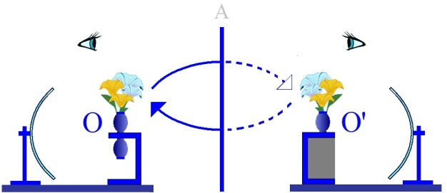

# Leçon 16 | 19 mai 1954

  

    <label><input type="checkbox" data-lacan-toggle="original" checked> 原文</label>
    <label><input type="checkbox" data-lacan-toggle="notes" checked> 注释</label>
    <label><input type="checkbox" data-lacan-toggle="commentary" checked> 个人解读评论</label>
  

  <form class="lacan-tool-search" role="search">
    <input class="lacan-tool-search-input" type="search" placeholder="搜索全文" aria-label="搜索全文">
    <button class="lacan-tool-button" type="submit" title="搜索">搜索</button>
  </form>
  <button class="lacan-tool-button lacan-back-to-top" type="button" title="回到页面最上方" aria-label="回到页面最上方">↑</button>

<section class="parallel-paragraph" data-paragraph-ids="s1-16-0001">

s1-16-0001

原文 · s1-16-0001

À mesure que nous avançons dans cette année, qui commence à prendre forme d’année, en prenant la pente de son déclin, c’est une satisfaction d’avoir entendu, par un certain nombre d’*échos* et d’une façon plus proche par des *questions* qui m’ont été posées d’avoir eu cette réponse : qu’un certain nombre d’entre vous commencent à comprendre que, dans ce que je suis en train de vous enseigner, il s’agit du « *Tout* » de la psychanalyse, je veux dire du sens même de votre action.

[无对应译文]

</section>

<section class="parallel-paragraph" data-paragraph-ids="s1-16-0002">

s1-16-0002

原文 · s1-16-0002

Ceux dont je parle sont ceux-là qui ont compris que la conception du « *sens de l’analyse* » est le point même d’où seulement peut partir toute règle technique. Toute application dépend de la dimension dans laquelle vous l’appréhendez, vous vous déplacez, de façon que vous compreniez quel est le sujet de votre action.

[无对应译文]

</section>

<section class="parallel-paragraph" data-paragraph-ids="s1-16-0003">

s1-16-0003

原文 · s1-16-0003

Bien sûr, dans ce que j’épelle peu à peu devant vous, tout n’apparaît pas - à ceux qui m’ont posé ces questions ou qui se les posent - *tout n’apparaît pas encore absolument clair,* *transparent*. Du moins il semble qu’il s’agisse de rien de moins que d’une prise de position fondamentale sur certains points de vue qui ensuite animeront leur *action*, leur *intervention* dans la compréhension qu’ils auront, aussi bien, de la place existentielle de l’expérience analytique et aussi bien de ses fins, ce qu’on cherche à obtenir dans cette action.

[无对应译文]

</section>

<section class="parallel-paragraph" data-paragraph-ids="s1-16-0004">

s1-16-0004

原文 · s1-16-0004

La dernière fois, paraît-il... encore que je n’aie pas eu le sentiment de vous faire faire un grand pas, ou plutôt de vous avoir mis en un certain *point central*, pour vous faire comprendre au moins quelque chose, une sorte de jeu qui doit vous donner incidemment une sorte de matérialisation imagée de quelque chose qui reste toujours énigmatique dans la façon dont on le fait intervenir dans l’ana­lyse, à savoir ce qu’on appelle en anglais « *working through »*, et qui est si diffici­lement traduit en français par « *élaboration* », « *travail* », et qui est cette sorte de dimension qui peut apparaître au premier abord mystérieuse, qui fait qu’il faut *cent fois sur le métier* *remettre notre ouvrage* avec le patient, pour que cer­tain progrès, franchissement, passage essentiel, subjectif, soit accompli.

[无对应译文]

</section>

<section class="parallel-paragraph" data-paragraph-ids="s1-16-0005">

s1-16-0005

原文 · s1-16-0005

Si *quelque chose* peut s’exprimer, s’incarner dans cette sorte de *mouvement de moulin* qu’exprimait ces deux flèches, de 0 à 0’ et de 0’ à 0, pour manifester *le jeu d’aller et retour*, de *miroitement* par où passe successivement de *l’en deçà* à *l’au-delà du miroir,* *une image du sujet* pour autant qu’il s’agit :

[无对应译文]

</section>

<section class="parallel-paragraph" data-paragraph-ids="s1-16-0006">

s1-16-0006

原文 · s1-16-0006

- de sa complé­tion au cours de l’analyse,

[无对应译文]

</section>

<section class="parallel-paragraph" data-paragraph-ids="s1-16-0007">

s1-16-0007

原文 · s1-16-0007

- de désir d’autre part, du sujet pour autant qu’il le réintègre, qu’il le voit se manifester, surgir en lui-même sous forme de tension, et particulièrement aiguë chaque fois qu’un pas nouveau est fait dans *la com­plétion de cette image*, bien entendu *ce mouvement* ne s’arrêtant pas à *une seule révolution* mais à autant de *révolutions* qu’il en faut pour que les différentes phases de *l’identification imaginaire, narcissique, spéculaire* - ces trois mots sont équivalents dans la façon de représenter les choses en théorie - d’autant de *révolutions* qu’il est nécessaire pour que cette *image* fût réalisée, bien vue, déta­chée.

[无对应译文]

</section>

<section class="parallel-paragraph" data-paragraph-ids="s1-16-0008">

s1-16-0008

原文 · s1-16-0008

Et je ne vous ai pas dit que c’était là que s’épuisait le phénomène puisque, aussi bien, rien n’est concevable sans l’intervention de ce tiers élément que j’ai introduit en fin d’explication technique la dernière fois, qui est la conjonction de *la parole* du sujet. La conjonction, pas n’importe laquelle, mais la conjonc­tion à ce moment significatif d’émergence du *désir*, dans cette confrontation avec l’*image*, c’est-à-dire d’émergence du *désir* en général, sous une forme par­ticulièrement angoissante dans les moments qui sont les moments de complé­tion de l’image, pour autant que ce n’est pas sans raison sans doute que l’image avait été décomplétée, que la face *imaginaire* avait été non intégrée, réprimée ou refoulée.

[无对应译文]

</section>

<section class="parallel-paragraph" data-paragraph-ids="s1-16-0009">

s1-16-0009

原文 · s1-16-0009

Eh bien, c’est dans *la conjonction de la parole avec ce désir*, au moment où il est, par le sujet, senti - car il ne peut être senti sans cette *conjonction de la parole,* et aussi bien qu’il est *pure angoisse* et rien d’autre - c’est dans ce moment-là que se trouve le *moment fécond*, le point fécond de tout ce que par exemple cer­tains auteurs, comme STRACHEY, ont essayé de préciser.

[无对应译文]

</section>

<section class="parallel-paragraph" data-paragraph-ids="s1-16-0010">

s1-16-0010

原文 · s1-16-0010

STRACHEY a essayé de pré­ciser, dénommer, cerner avec toute précision[^26], ce que STRACHEY appelle « *l’interprétation de transfert* », et plus précisément « *l’interprétation mutatiste* ». STRACHEY en effet souligne que c’est à un moment particulièrement défini, limité, que l’*interprétation* peut avoir la valeur de progrès, de changement, qu’elle est quelque chose de décisif dans l’analyse : les occasions ne se présentent d’une façon ni fréquente ni qui puissent se saisir d’une façon approchée.

[无对应译文]

</section>

<section class="parallel-paragraph" data-paragraph-ids="s1-16-0011">

s1-16-0011

原文 · s1-16-0011

Ce n’est pas autour, ni alentour, ni avant, ni après, qu’une telle interprétation doit être donnée, mais précisément à un moment où ce qui est près *d’éclore*, de surgir dans l’*imaginaire*, est en même temps là dans l’analyse, dans la relation verbale avec l’analyste, et c’est sur ce moment précis que, l’interprétation étant donnée, sa valeur décisive, sa fonction *mutatiste* peut s’exercer.

[无对应译文]

</section>

<section class="parallel-paragraph" data-paragraph-ids="s1-16-0012">

s1-16-0012

原文 · s1-16-0012

Qu’est-ce que ça veut dire, sinon ceci que je suis en train de vous expliquer : que c’est au moment où, en présence d’une situation où l’*imaginaire* et le *réel* de la situation analytique se confondent, le désir du sujet est là, à la fois *présent* et *inexprimable*.

[无对应译文]

</section>

<section class="parallel-paragraph" data-paragraph-ids="s1-16-0013">

s1-16-0013

原文 · s1-16-0013

Un certain appoint, appui, de l’analyse par *la nomination*, l’inter­vention dénommante de ce qui est dans la situation même apporte \- au dire de STRACHEY - l’articulation, la cheville essentielle par où et à quoi doit se limiter l’in­tervention de l’analyste, comme étant aussi bien le seul point véritablement fécond où sa parole ait à s’ajouter à celle qui est fomentée par le patient au cours de *ce long monologue*, de *cette sorte de moulinage, de moulin à paroles*, dont en somme cette sorte de présentation tournante \- voir le mouvement des flèches du schéma - justifierait assez bien la métaphore.

[无对应译文]

</section>

<section class="parallel-paragraph" data-paragraph-ids="s1-16-0014">

s1-16-0014

原文 · s1-16-0014

[无对应译文]

</section>

<section class="parallel-paragraph" data-paragraph-ids="s1-16-0015">

s1-16-0015

原文 · s1-16-0015

Pour vous illustrer ceci, je vous ai rappelé la dernière fois la fonction des interprétations de FREUD dans le cas Dora, y compris le caractère inadéquat, et le stoppage qui résultait, dans ce mur mental, qui correspond à un premier temps uniquement de l’analyse.

[无对应译文]

</section>

<section class="parallel-paragraph" data-paragraph-ids="s1-16-0016">

s1-16-0016

原文 · s1-16-0016

Certains d’entre vous ont-ils assisté, il y a deux ans, à mon commentaire de *L’Homme aux loups* ? J’espère que oui… Il n’y en a pas énormément ! J’aimerais qu’un de ceux-là - le Père BEIRNAERT ? - si vous vouliez bien, par exemple la pro­chaine fois, vous amuser à relire *L’Homme aux loups*, et vous verriez, par exemple combien l’observation de *L’homme aux loups*, toute sa discussion, est centrée par FREUD autour des éléments de cette *névrose infantile* - puisque c’est le titre que *L’homme aux loups* a dans l’édition allemande - vous verriez com­bien ce schéma est vraiment explicatif, fondamental.

[无对应译文]

</section>

<section class="parallel-paragraph" data-paragraph-ids="s1-16-0017">

s1-16-0017

原文 · s1-16-0017

Je pense que même les autres ont une notion, au moins approximative, de ce qu’il y a dans l’histoire de *L’homme aux loups*. *L’homme aux loups* est ce qu’on appellerait aujourd’hui une *névrose de caractère*, ou encore une *névrose narcissique*. Comme telle, cette névrose offre une grande résistance au traitement. FREUD a choisi, et délibérément choisi, de nous en présenter une partie.

[无对应译文]

</section>

<section class="parallel-paragraph" data-paragraph-ids="s1-16-0018">

s1-16-0018

原文 · s1-16-0018

Il s’agit d’un homme qui a à ce moment-là à peu près dans les vingt-cinq ans au moment où il l’analyse. Il a choisi de nous expri­mer *la névrose infantile* parce que, à ce moment là, elle est pour lui d’une grande utilité, pour poser certaines questions qui sont l’axe apparent de l’exposé freudien sur la valeur du traumatisme. C’est de la théorie de la fonction du trauma­tisme qu’il s’agit.

[无对应译文]

</section>

<section class="parallel-paragraph" data-paragraph-ids="s1-16-0019">

s1-16-0019

原文 · s1-16-0019

Nous sommes alors dans les années 1913. Il s’agit donc bien de quelque chose qui est au cœur de la période du développement de la pensée de FREUD, qui forme un ensemble dans lequel nous pouvons, nous devons nous inscrire, pour commenter les *Écrits techniques*, le champ des années 1910 à 1920, qui est en somme l’objet de notre commentaire cette année et dont on ne peut pas détacher les *Écrits techniques*.

[无对应译文]

</section>

<section class="parallel-paragraph" data-paragraph-ids="s1-16-0020">

s1-16-0020

原文 · s1-16-0020

Aussi bien *L’Homme aux loups* est indispensable à la compréhension de ce que FREUD à ce moment-là élabore au cours de la technique : la théorie du trau­matisme, mise en cause, ébranlée à ce moment-là par l’obstination et les remarques de JUNG, et de ce qui est de \[...\].

[无对应译文]

</section>

<section class="parallel-paragraph" data-paragraph-ids="s1-16-0021">

s1-16-0021

原文 · s1-16-0021

Dans cette observation de *L’homme aux loups*, qu’est-ce que nous voyons ? Puisqu’il s’agit de *la névrose infantile*, je vous rappelle un des traits saillants de ce texte - texte étonnant - : tout ce que FREUD nous y apporte il ne nous l’apporte nulle part ailleurs, et encore moins dans les écrits purement théoriques.

[无对应译文]

</section>

<section class="parallel-paragraph" data-paragraph-ids="s1-16-0022">

s1-16-0022

原文 · s1-16-0022

Il y a là des compléments de sa théorie : j’appelle « *compléments* » les parties de cette conception théorique du refoulement qui sont absolument essentielles. N’oubliez pas que dans ce texte il est expres­sément formulé, répété, de la façon la plus précise, que le refoulement, qui dans le cas de *L’homme aux loups* est lié à l’expérience traumatique qui est celle de la vision, du spectacle d’une copulation…

[无对应译文]

</section>

<section class="parallel-paragraph" data-paragraph-ids="s1-16-0023">

s1-16-0023

原文 · s1-16-0023

> le développement et les remarques de FREUD ont permis de reconstruire, uniquement reconstruire, car jamais elle n’a pu être directement évoquée, remémorée par le patient

[无对应译文]

</section>

<section class="parallel-paragraph" data-paragraph-ids="s1-16-0024">

s1-16-0024

原文 · s1-16-0024

…entre ses parents, dans une position qui, restituée par les conséquences dans le comportement du sujet, a paru être une relation *a tergo*, et que l’histoire du sujet - c’est bien de l’histoire qu’il s’agit - et même de patiente reconstruction historique de caractère tout à fait surprenant \[...\]. Il serait amusant de voir les caractères qu’on pourrait mettre en valeur à ce propos, de la méthode historique.

[无对应译文]

</section>

<section class="parallel-paragraph" data-paragraph-ids="s1-16-0025">

s1-16-0025

原文 · s1-16-0025

On arrive par cette reconstitu­tion à un rapprochement de ce qu’on peut considérer là comme l’analogue des monuments, des documents d’archives, tous ces éléments de la critique et de l’exégèse de textes, qui sont liés à ceci : que si un élément apparaît dans quelque point d’une façon plus élaborée, il est certain que le moins élaboré, mais qui en donne un élément, est antérieur.

[无对应译文]

</section>

<section class="parallel-paragraph" data-paragraph-ids="s1-16-0026">

s1-16-0026

原文 · s1-16-0026

Par exemple : on arrive à situer... FREUD le situe sans équivoque, avec une conviction absolument rigoureuse, à une date définie par « n + 1/2 » année, pour la date de l’événement. Et le « n » ne peut être supérieur à 1, parce que, à 2 ans et demi, ça ne peut pas se produire, pour certaines raisons que nous sommes for­cés d’admettre, comme certaines conséquences apportées par *cette révélation spectaculaire* au jeune sujet.

[无对应译文]

</section>

<section class="parallel-paragraph" data-paragraph-ids="s1-16-0027">

s1-16-0027

原文 · s1-16-0027

*Il écarte* 6 mois. Il n’est pas exclu que cela se soit passé à 6 mois. Mais *il l’écarte* parce que à ce moment-là, quand même, ça lui paraît un peu - à cette date et à cette époque - un peu violent. Je voudrais remarquer en passant qu’il n’exclut pas cependant que cela se soit passé à 6 mois. À la vérité, moi non plus je ne l’exclus pas, et je dois dire que je serais plutôt porté - le seul point sur lequel on pourrait *redire* quelque chose à cette observation, en effet, est celui-ci - à croire que c’est à 6 mois, plutôt qu’à 1 an et demi. Je vous dirai peut-être tout à l’heure - si je ne l’oublie pas - inci­demment pourquoi.

[无对应译文]

</section>

<section class="parallel-paragraph" data-paragraph-ids="s1-16-0028">

s1-16-0028

原文 · s1-16-0028

Ce que FREUD nous précise est ceci : que la valeur traumatique de l’effraction imaginaire produite par ce spec­tacle n’est nullement à situer immédiatement après l’événement, que c’est au moment où, entre

[无对应译文]

</section>

<section class="parallel-paragraph" data-paragraph-ids="s1-16-0029">

s1-16-0029

原文 · s1-16-0029

- 3 ans 3 mois où s’exerce quelque chose qui joue une influence capitale, qui fonctionne comme un tournant capital dans l’histoire du sujet,

[无对应译文]

</section>

<section class="parallel-paragraph" data-paragraph-ids="s1-16-0030">

s1-16-0030

原文 · s1-16-0030

- et l’âge de 4 ans, dont nous avons la date parce que le sujet est né - coïncidence décisive dans son histoire d’ailleurs - le jour de Noël, car c’est dans l’attente des événements de Noël, toujours accompagné pour lui comme pour tous enfants d’apport de cadeaux, censés lui venir d’un être descendant …c’est à ce moment que le sujet fait pour la 1ère fois *le rêve d’angoisse* qui est le pivot, le centre, de toute l’analyse de cette observation.

[无对应译文]

</section>

<section class="parallel-paragraph" data-paragraph-ids="s1-16-0031">

s1-16-0031

原文 · s1-16-0031

Ce rêve d’an­goisse est pour nous, ainsi, la première manifestation de la valeur traumatique de ce que j’ai appelé tout à l’heure « *l’effraction imaginaire* ». Disons si vous vou­lez pour emprunter *un terme* à la théorie des instincts... telle qu’elle a été éla­borée de nos jours d’une façon certainement plus poussée qu’à l’époque de FREUD, spécialement pour les oiseaux \[Cf. Konrad Lorenz\], ...la « *Prägung »* \[frappe, empreinte, impression\] - emportant avec lui des résonances de la frappe, frappe d’une monnaie - la « *Prägung »* de l’événe­ment traumatique originatif.

[无对应译文]

</section>

<section class="parallel-paragraph" data-paragraph-ids="s1-16-0032">

s1-16-0032

原文 · s1-16-0032

C’est dans la mesure, nous explique bien FREUD et de la façon la plus claire, où cette « *Prägung »*...

[无对应译文]

</section>

<section class="parallel-paragraph" data-paragraph-ids="s1-16-0033">

s1-16-0033

原文 · s1-16-0033

> qui d’abord se situe dans ce quelque chose que nous ne pou­vons appeler théoriquement, contentons-nous
>
> de cette première approxima­tion, nous en donnerons plus tard peut-être une technique plus précise

[无对应译文]

</section>

<section class="parallel-paragraph" data-paragraph-ids="s1-16-0034">

s1-16-0034

原文 · s1-16-0034

...que cette « *Prägung »* se situe dans un inconscient non refoulé...

[无对应译文]

</section>

<section class="parallel-paragraph" data-paragraph-ids="s1-16-0035">

s1-16-0035

原文 · s1-16-0035

> disons qu’elle n’a été intégrée d’aucune façon au système verbalisé du sujet, qu’elle n’est même pas
>
> encore montée à la verbalisation, et on peut dire dans ce sens, même pas à la signification

[无对应译文]

</section>

<section class="parallel-paragraph" data-paragraph-ids="s1-16-0036">

s1-16-0036

原文 · s1-16-0036

...c’est dans la mesure où cette « *Prägung »*, *strictement limitée au domaine de l’imaginaire*, ressurgit par et au cours du progrès du sujet, dans un monde de plus en plus organisé, *symbolique*.

[无对应译文]

</section>

<section class="parallel-paragraph" data-paragraph-ids="s1-16-0037">

s1-16-0037

原文 · s1-16-0037

C’est ceci que FREUD nous explique en nous racontant toute l’histoire du sujet, telle qu’elle se dégage, à ce moment-là de ses déclarations, de l’observation entre ce moment *x*, originel, et le moment de 4 ans où il situe le refoulement. Le refoulement là, n’a l’occasion d’avoir lieu que pour autant que les événe­ments de ses années précoces sont tels, historiquement, suffisamment mouve­mentés.

[无对应译文]

</section>

<section class="parallel-paragraph" data-paragraph-ids="s1-16-0038">

s1-16-0038

原文 · s1-16-0038

Je ne peux pas vous raconter toute l’histoire :

[无对应译文]

</section>

<section class="parallel-paragraph" data-paragraph-ids="s1-16-0039">

s1-16-0039

原文 · s1-16-0039

- séduction par la sœur aînée, plus virile que lui, objet de rivalité et d’identification en même temps manifeste,

[无对应译文]

</section>

<section class="parallel-paragraph" data-paragraph-ids="s1-16-0040">

s1-16-0040

原文 · s1-16-0040

- son recul et son refus devant cette séduction, dont, à cet âge précoce, le sujet lui-même n’a ni les ressorts, ni les éléments,

[无对应译文]

</section>

<section class="parallel-paragraph" data-paragraph-ids="s1-16-0041">

s1-16-0041

原文 · s1-16-0041

- puis l’essai d’approche de séduction active, de sa part à lui, de séduction dans le sens d’une évolution géni­tale primaire œdipienne, dans le fond tout à fait normativement dirigée, qui est suivi du refus, du mouvement de rejet de la femme gouvernante, Nania, qui constitue pour lui *un drame*,

[无对应译文]

</section>

<section class="parallel-paragraph" data-paragraph-ids="s1-16-0042">

s1-16-0042

原文 · s1-16-0042

- apparition de la première menace de castration en même temps.

[无对应译文]

</section>

<section class="parallel-paragraph" data-paragraph-ids="s1-16-0043">

s1-16-0043

原文 · s1-16-0043

Donc une entrée dans la dialectique œdipienne, mais entrée faus­sée par la première séduction captivante de la sœur. Donc il est repoussé du ter­rain où il s’engage vers des positions sado-masochistes dont FREUD nous donne tout le registre et tous les éléments. Je vous indique simplement ces deux points de repère.

[无对应译文]

</section>

<section class="parallel-paragraph" data-paragraph-ids="s1-16-0044">

s1-16-0044

原文 · s1-16-0044

C’est dans la mesure où le sujet, en attendant de s’intégrer dans un *monde symbolique*, qui ne ces­sera pas d’ailleurs d’exercer son attraction directive dans toute la suite de son développement puisque, vous le savez, plus tard il y aura des moments de solu­tion heureuse, et très précisément pour autant qu’interviendront des éléments enseignants à proprement parler, dans sa vie, toute la dialectique de la rivalité passivante pour lui avec le père sera à un certain moment tout à fait détendue par l’intervention du personnage chargé de prestige qui sera tel ou tel profes­seur ou, auparavant, l’introduction de tout le registre religieux, aura dans son développement une influence dont FREUD nous montre que c’est proprement dans la mesure où son drame est intégré dans un mythe ayant une valeur humaine étendue, voire universelle, que le sujet se réalise. C’est par l’introduc­tion dans *la dialectique symbolique* que toutes les issues, et les issues les plus favorables peuvent être espérées.

[无对应译文]

</section>

<section class="parallel-paragraph" data-paragraph-ids="s1-16-0045">

s1-16-0045

原文 · s1-16-0045

Mais ce qui se passe *à ce moment-là* est quelque chose qui nous permet de sentir que ce qui se passe *dans cette période*, entre 3 *ans un mois* et 4 *ans*, nous pouvons l’assimiler de la façon la plus évidente *avec ce schéma*, et du même coup *avec le processus de l’analyse*. À savoir :

[无对应译文]

</section>

<section class="parallel-paragraph" data-paragraph-ids="s1-16-0046">

s1-16-0046

原文 · s1-16-0046

- pour autant que le sujet apprend à intégrer les événements de sa vie dans une loi, dans un champ de significa­tions symboliques, dans un champ humain universalisant de significations, de ce qui fait une névrose infantile dans ses débuts, si vous voulez, à cette époque, à cette date, c’est quelque chose qui, exactement est la même chose qu’une psychanalyse, au moins à cette date et à cette époque où nous la saisissons,

[无对应译文]

</section>

<section class="parallel-paragraph" data-paragraph-ids="s1-16-0047">

s1-16-0047

原文 · s1-16-0047

- et c’est pour autant qu’elle joue le même rôle qu’une psychanalyse, à savoir de réintégration du passé, de mise en fonction dans le jeu des symboles de la *Prägung* elle-même, qui n’est là atteinte qu’à la limite par un jeu rétroactif, *nachträglich*, écrit strictement FREUD à ce moment-là, pour autant qu’elle est par le jeu des événements intégrée en forme de symbole, en histoire par le sujet, qu’elle vient à être toute proche de surgir,

[无对应译文]

</section>

<section class="parallel-paragraph" data-paragraph-ids="s1-16-0048">

s1-16-0048

原文 · s1-16-0048

- puis du fait même de la forme par­ticulièrement secouante pour le sujet de cette première *intégration symbo­lique*, qu’elle surgit en effet, qu’elle prend après coup, *nachträglich*, exactement, selon la théorie de FREUD, 2 *ans et demi* après, et peut-être, d’après ce que je vous ai dit : 3 *ans et demi* après qu’elle soit intervenue dans la vie du sujet, *sur le plan imaginaire*, elle prend sa valeur, elle, de trauma, au sens où le trauma a une action refoulante.

[无对应译文]

</section>

<section class="parallel-paragraph" data-paragraph-ids="s1-16-0049">

s1-16-0049

原文 · s1-16-0049

C’est-à-dire qu’à ce moment-là quelque chose se *détache*, si on peut dire, du sujet dans *le monde symbolique* même qu’il est en train d’intégrer et devient :

[无对应译文]

</section>

<section class="parallel-paragraph" data-paragraph-ids="s1-16-0050">

s1-16-0050

原文 · s1-16-0050

- quelque chose qui n’est plus du sujet,

[无对应译文]

</section>

<section class="parallel-paragraph" data-paragraph-ids="s1-16-0051">

s1-16-0051

原文 · s1-16-0051

- quelque chose que le sujet ne parle plus, n’intègre plus, mais qui néanmoins reste là, quelque part,

[无对应译文]

</section>

<section class="parallel-paragraph" data-paragraph-ids="s1-16-0052">

s1-16-0052

原文 · s1-16-0052

- quelque chose qui restera *parlé*, si on peut dire, parlé par quelque chose dont le sujet n’a plus l’intégration ni la maîtrise, et qui sera le premier noyau de ce qu’on appellera par la suite ses *symptômes*.

[无对应译文]

</section>

<section class="parallel-paragraph" data-paragraph-ids="s1-16-0053">

s1-16-0053

原文 · s1-16-0053

Est-ce que vous me suivez ? En d’autres termes il n’y a pas, entre *ce moment de l’analyse* que je vous ai décrit, et *le moment intermédiaire*, entre la frappe et le refoulement symbolique, il n’y a pas essentiellement de différence. Il n’y a qu’une seule différence, c’est que comme à ce moment là personne - n’est-ce pas ? - n’est là pour lui donner le mot, le refoulement commence, ayant constitué son premier noyau et donc du même coup un point central autour duquel pourront s’organiser ensuite tous les *symptômes*, les refoulements suc­cessifs, et du même coup aussi - *puisque le refoulement et le retour du refoulé c’est la même chose* - le retour du refoulé.

[无对应译文]

</section>

<section class="parallel-paragraph" data-paragraph-ids="s1-16-0054">

s1-16-0054

原文 · s1-16-0054

Cela ne vous étonne pas, PERRIER, que le retour du refoulé et le refoulement soient la même chose ?

[无对应译文]

</section>

<section class="parallel-paragraph" data-paragraph-ids="s1-16-0055">

s1-16-0055

原文 · s1-16-0055

François PERRIER - Oh, plus rien ne m’étonne !

[无对应译文]

</section>

<section class="parallel-paragraph" data-paragraph-ids="s1-16-0056">

s1-16-0056

原文 · s1-16-0056

LACAN - Il y a des gens que cela étonne, quoique PERRIER nous dise, lui, que plus rien ne l’étonne.

[无对应译文]

</section>

<section class="parallel-paragraph" data-paragraph-ids="s1-16-0057">

s1-16-0057

原文 · s1-16-0057

MANNONI - Cela élimine la notion qu’on trouve quelquefois du refoulement réussi ?

[无对应译文]

</section>

<section class="parallel-paragraph" data-paragraph-ids="s1-16-0058">

s1-16-0058

原文 · s1-16-0058

LACAN

[无对应译文]

</section>

<section class="parallel-paragraph" data-paragraph-ids="s1-16-0059">

s1-16-0059

原文 · s1-16-0059

Non, ça ne l’élimine pas. Mais pour vous l’expliquer il faudrait entrer alors dans toute la dialectique de l’oubli. Toute *intégration symbolique réussie* comporte - mais ça nous emmènerait bien loin de la dialectique freudienne - *une sorte d’oubli normal*.

[无对应译文]

</section>

<section class="parallel-paragraph" data-paragraph-ids="s1-16-0060">

s1-16-0060

原文 · s1-16-0060

Octave MANNONI - Mais sans le retour du refoulé, alors ?

[无对应译文]

</section>

<section class="parallel-paragraph" data-paragraph-ids="s1-16-0061">

s1-16-0061

原文 · s1-16-0061

LACAN

[无对应译文]

</section>

<section class="parallel-paragraph" data-paragraph-ids="s1-16-0062">

s1-16-0062

原文 · s1-16-0062

Oui, sans retour du refoulé. L’intégration dans l’histoire comporte évidemment l’oubli d’*un monde entier d’ombres qui ne sont pas portées* *à l’existence symbolique,* et si cette existence symbolique est réussie pleinement, assumée, assumable par le sujet, sans laisser aucun poids derrière elle. Nous tombons, là alors il faudrait faire intervenir des notions heideggeriennes : il y a dans tout passage, toute entrée de l’être dans son habitation de paroles une marge d’*oubli*, un λήθη \[lêthé\] complémentaire de toute ἀλήθεια \[aléteia\].

[无对应译文]

</section>

<section class="parallel-paragraph" data-paragraph-ids="s1-16-0063">

s1-16-0063

原文 · s1-16-0063

HYPPOLITE - L’oubli n’est pas rien. Il est contenu lui-même dans l’expres­sion symbolique.

[无对应译文]

</section>

<section class="parallel-paragraph" data-paragraph-ids="s1-16-0064">

s1-16-0064

原文 · s1-16-0064

LACAN - Oui, exactement.

[无对应译文]

</section>

<section class="parallel-paragraph" data-paragraph-ids="s1-16-0065">

s1-16-0065

原文 · s1-16-0065

HYPPOLITE

[无对应译文]

</section>

<section class="parallel-paragraph" data-paragraph-ids="s1-16-0066">

s1-16-0066

原文 · s1-16-0066

C’est le mot « *réussi* » que je ne comprenais pas dans la formule de MANNONI. Que veut dire « *réussi* » ? C’est ce que je ne comprends pas.

[无对应译文]

</section>

<section class="parallel-paragraph" data-paragraph-ids="s1-16-0067">

s1-16-0067

原文 · s1-16-0067

LACAN - C’est une expression de thérapeute. C’est un λήθη \[lêthé\] absolument essentiel.

[无对应译文]

</section>

<section class="parallel-paragraph" data-paragraph-ids="s1-16-0068">

s1-16-0068

原文 · s1-16-0068

HYPPOLITE - Parce que « *réussi* » pourrait vouloir dire justement l’oubli le plus fondamental.

[无对应译文]

</section>

<section class="parallel-paragraph" data-paragraph-ids="s1-16-0069">

s1-16-0069

原文 · s1-16-0069

LACAN - C’est ce dont je parle, à condition de donner à « *fondamental* » le sens que vous dites.

[无对应译文]

</section>

<section class="parallel-paragraph" data-paragraph-ids="s1-16-0070">

s1-16-0070

原文 · s1-16-0070

HYPPOLITE

[无对应译文]

</section>

<section class="parallel-paragraph" data-paragraph-ids="s1-16-0071">

s1-16-0071

原文 · s1-16-0071

Ce « *réussi* » veut dire alors, à certains égards, ce qu’il y a de plus *raté *: vous avez au fond abouti à ce que l’*être* soit intégré. Pour ça, il a fallu qu’il oublie l’essentiel. Cette réussite est un raté.

[无对应译文]

</section>

<section class="parallel-paragraph" data-paragraph-ids="s1-16-0072">

s1-16-0072

原文 · s1-16-0072

LACAN

[无对应译文]

</section>

<section class="parallel-paragraph" data-paragraph-ids="s1-16-0073">

s1-16-0073

原文 · s1-16-0073

Je ne suis pas sûr que ce soit ce que veut dire HEIDEGGER quand il indique cette *Irre* \[errance\] fondamentale à toute incarnation temporelle - « *incarnation temporelle* » n’est pas de lui - de l’*être*.

[无对应译文]

</section>

<section class="parallel-paragraph" data-paragraph-ids="s1-16-0074">

s1-16-0074

原文 · s1-16-0074

HYPPOLITE

[无对应译文]

</section>

<section class="parallel-paragraph" data-paragraph-ids="s1-16-0075">

s1-16-0075

原文 · s1-16-0075

C’est une autre question que je pose pour HEIDEGGER. Il n’ac­cepterait pas le mot « *réussi* » : « *réussi* » ne peut être qu’un point de vue de théra­peute.

[无对应译文]

</section>

<section class="parallel-paragraph" data-paragraph-ids="s1-16-0076">

s1-16-0076

原文 · s1-16-0076

LACAN

[无对应译文]

</section>

<section class="parallel-paragraph" data-paragraph-ids="s1-16-0077">

s1-16-0077

原文 · s1-16-0077

Oui, c’est ça, c’est un point de vue de thérapeute. Néanmoins, cette sorte de marge d’erreur qu’il y a dans toute réalisation de l’être est toujours réservée, semble-t-il, par HEIDEGGER à une sorte de *Verborgenheit* \[secret\] fondamental, d’*ombre de la vérité*.

[无对应译文]

</section>

<section class="parallel-paragraph" data-paragraph-ids="s1-16-0078">

s1-16-0078

原文 · s1-16-0078

HYPPOLITE

[无对应译文]

</section>

<section class="parallel-paragraph" data-paragraph-ids="s1-16-0079">

s1-16-0079

原文 · s1-16-0079

La réussite du thérapeute, pour HEIDEGGER c’est ce qu’il y a de pire, c’est *l’oubli de l’oubli*. C’est ça ce qui est le plus grave pour HEIDEGGER, qui ne se pose pas au point de vue du thérapeute, c’est *l’oubli de l’oubli*. Tandis que l’authenticité heideggerienne est justement qu’on ne sombre pas dans *l’oubli de l’oubli*.

[无对应译文]

</section>

<section class="parallel-paragraph" data-paragraph-ids="s1-16-0080">

s1-16-0080

原文 · s1-16-0080

LACAN

[无对应译文]

</section>

<section class="parallel-paragraph" data-paragraph-ids="s1-16-0081">

s1-16-0081

原文 · s1-16-0081

Oui, parce que HEIDEGGER a fait *une sorte de loi philosophique de cette remontée aux sources de l’être*. Provisoirement nous laisserons cette question en suspens. Si je l’introduis là, et si je ne laisse pas passer l’intervention de MANNONI - j’aurais aussi bien pu l’écarter - c’est, je crois, que nous aurons à nous poser la question :

[无对应译文]

</section>

<section class="parallel-paragraph" data-paragraph-ids="s1-16-0082">

s1-16-0082

原文 · s1-16-0082

- dans quelle mesure un oubli de l’oubli peut-il être réussi ?

[无对应译文]

</section>

<section class="parallel-paragraph" data-paragraph-ids="s1-16-0083">

s1-16-0083

原文 · s1-16-0083

- Dans quelle mesure toute analyse doit-elle déboucher sur ce que j’ai appelé, à l’instant même, cette remontée dans l’être, ou sur un certain recul dans l’être, pris par le sujet à l’endroit de sa propre destinée ?

[无对应译文]

</section>

<section class="parallel-paragraph" data-paragraph-ids="s1-16-0084">

s1-16-0084

原文 · s1-16-0084

En d’autres termes, puisque je saisis toujours la balle au bond, je devance un peu les questions qui pourraient être posées par la suite, à savoir :

[无对应译文]

</section>

<section class="parallel-paragraph" data-paragraph-ids="s1-16-0085">

s1-16-0085

原文 · s1-16-0085

- si le sujet en somme qui part de là, de O, point de confusion et d’innocence au départ, si la dialectique de la réintégration symbolique du désir, qui vient de là, de C, qui va poser d’autres questions : où ça va aller ça, en fin de compte ?

[无对应译文]

</section>

<section class="parallel-paragraph" data-paragraph-ids="s1-16-0086">

s1-16-0086

原文 · s1-16-0086

- Ou s’il suffit simplement que le sujet *nomme* en quelque sorte ses désirs, ait en somme la per­mission de les *nommer*, pour que tout aussi bien l’analyse soit terminée et finie ?

[无对应译文]

</section>

<section class="parallel-paragraph" data-paragraph-ids="s1-16-0087">

s1-16-0087

原文 · s1-16-0087

C’est justement là la question que je m’en vais poser peut-être à la fin de cette séance. Vous verrez que je n’en reste pas là. Mais à la fin, tout à la fin de l’analyse, après un certain nombre de circuits accomplis, qui auront permis la complète réintégration de son histoire, le sujet sera-t-il toujours là : en O, ou bien un peu plus par là : vers A ? En d’autres termes, reste-t-il quelque chose du sujet au niveau du *point d’engluement* qu’on appelle son *ego* ?

[无对应译文]

</section>

<section class="parallel-paragraph" data-paragraph-ids="s1-16-0088">

s1-16-0088

原文 · s1-16-0088

L’analyse a-t-elle seulement et purement affaire avec ce qu’on considère, qu’on a l’air de considérer,comme une sorte de donnée, à savoir l’*ego* du sujet, comme s’il s’agissait là d’une structure seulement interne, qu’on pourrait en quelque sorte perfectionner par l’exercice ? Et vous verrez que c’est bien à cela qu’un BALINT, que j’aurai *à commenter* dans les séances sui­vantes, et toute une tendance dans l’analyse, en viennent à penser que ou bien l’*ego* est fort, ou bien l’*ego* est faible, et que cette ambiguïté persiste.

[无对应译文]

</section>

<section class="parallel-paragraph" data-paragraph-ids="s1-16-0089">

s1-16-0089

原文 · s1-16-0089

Là-dessus, s’il est faible, on pourrait être normalement bien embarrassé ! Mais ils sont amenés à cette position par une sorte de logique interne, à penser que s’il est faible, il faut le renforcer.

[无对应译文]

</section>

<section class="parallel-paragraph" data-paragraph-ids="s1-16-0090">

s1-16-0090

原文 · s1-16-0090

Et à partir du moment où l’on pense que l’*ego,* sans autre complément, est purement et simplement cet exercice de maîtrise du sujet par lui-même, qui est en quelque sorte *situé quelque part dans son intérieur*, c’est-à-dire à partir du moment où on maintient la notion de l’*ego* comme d’un pouvoir de maîtrise tout donné, qui est là quelque part, au sommet de la hié­rarchie des fonctions nerveuses, on s’engage tout droit dans cette voie : qu’aussi ce dont il s’agit est de lui apprendre à être fort, on rentre dans la notion d’une *éducation* par l’exercice, d’un *learning*, voire même - comme l’écrit un esprit aussi lucide que BALINT - dans la voie de *la performance*.

[无对应译文]

</section>

<section class="parallel-paragraph" data-paragraph-ids="s1-16-0091">

s1-16-0091

原文 · s1-16-0091

À propos de ce ren­forcement de l’*ego* au cours de l’analyse, BALINT en vient à rien de moins qu’à faire remarquer combien le *moi* est perfectionnable. Il dit : il y a seulement quelques années ce qui dans tel exercice ou sport était considéré comme le record du monde est maintenant tout juste nécessaire pour dégager un athlète moyen. C’est donc qu’il se passe quelque chose autour duquel le *moi* humain, quand il se met en concurrence avec lui-même, parvient à des performances de plus en plus extraordinaires. Moyennant quoi on est amené à déduire…

[无对应译文]

</section>

<section class="parallel-paragraph" data-paragraph-ids="s1-16-0092">

s1-16-0092

原文 · s1-16-0092

Nous n’en avons aucune preuve et pour cause ! En quoi *un exercice comme celui de l’analyse* structurerait-il le *moi*, introduirait-il les fonctions du *moi *? *Un apprentissage* tel que celui-ci ne serait rien d’autre - c’est de cela qu’on parle, quand on parle en analyse de faiblesse ou de force du *moi -* que le rendre capable de tolérer une plus grande somme d’excitation ?

[无对应译文]

</section>

<section class="parallel-paragraph" data-paragraph-ids="s1-16-0093">

s1-16-0093

原文 · s1-16-0093

En quoi est-ce que l’analyse, par elle-même un jeu verbal, pourrait servir à quoi que ce soit dans le genre de cet apprentissage ? Il ne s’agit que de ça ! À savoir si nous ne faisons pas ça, et c’est ce que je suis en train de vous *enseigner* , si nous ne voyons pas ça, si nous nous aveu­glons à ce fait fondamental que nous apporte l’analyse que *l’ego est une fonc­tion imaginaire*, c’est toute la différence entre la voie dans laquelle toute l’analyse, ou presque, s’engage d’un seul pas de nos jours, et ce que je vous enseigne, la différence radicale qu’il y a entre une certaine conception de l’*ego*, et cette conception de l’*ego* comme *fonction imaginaire*, dont je vous montre là la forme et les ressorts, les faces et les étapes.

[无对应译文]

</section>

<section class="parallel-paragraph" data-paragraph-ids="s1-16-0094">

s1-16-0094

原文 · s1-16-0094

C’est pourquoi, à partir du moment où nous considérons l’*ego* comme *fonction imaginaire*, il est loin de se confondre avec le sujet, il ne se confond pas avec le sujet au départ. Car qu’est-ce que nous appelons *un sujet* ? Très précisément *ce qui, dans le développement* *de l’objectivation, est en dehors de l’objet*. L’idéal de toute la science jusqu’à certaines limites est de réduire *l’objet* à quelque chose qui peut se clore et se boucler dans un système d’*interactions de forces*, où en fin de compte l’objet n’est jamais qu’un objet pour la science.

[无对应译文]

</section>

<section class="parallel-paragraph" data-paragraph-ids="s1-16-0095">

s1-16-0095

原文 · s1-16-0095

Il n’y a qu’un seul sujet : le savant qui regarde l’ensemble, et espère un certain jour tout réduire à un certain jeu déterminé de *symboles* enveloppant toutes les interactions entre objets. Il est tout de même forcé, dans un certain domaine, de toujours impliquer qu’il y a quelque chose qui en sorte, qui est l’action, qui est que, quand il s’agit d’un être organisé, on peut le considérer sous les deux angles, mais quand on en parle, tant qu’on en parle et qu’on maintient, qu’on suppose sa valeur d’organisme, plus ou moins implicitement, on introduit en lui la notion qu’il est un sujet.

[无对应译文]

</section>

<section class="parallel-paragraph" data-paragraph-ids="s1-16-0096">

s1-16-0096

原文 · s1-16-0096

Mais aussi bien on fait... et on peut faire pendant un certain temps, pendant tout le développement de l’analyse ...d’un comportement instinctuel on peut éli­miner, négliger cette position subjective, mais il y a un domaine où il n’est absolument pas négligeable, c’est précisé­ment dans le domaine du sujet parlant. Et pourquoi ? Parce que *le sujet parlant* comme tel, nous devons forcément l’admettre comme sujet pour une simple raison : qu’*il est capable de mentir*, c’est-à-dire qu’*il est distinct de ce qu’il dit*. Eh bien, cette dimension du sujet parlant, et *du sujet parlant en tant que trompeur,* est ce que FREUD nous découvre dans l’inconscient.

[无对应译文]

</section>

<section class="parallel-paragraph" data-paragraph-ids="s1-16-0097">

s1-16-0097

原文 · s1-16-0097

À savoir que là où…

[无对应译文]

</section>

<section class="parallel-paragraph" data-paragraph-ids="s1-16-0098">

s1-16-0098

原文 · s1-16-0098

> car jusqu’à présent dans la science, le sujet finit par ne plus... on finit par ne plus le retenir et le maintenir *que* sur le plan
>
> de *la conscience*, bien entendu, puisque je vous ai dit que le sujet, au fond, c’est le savant qui pos­sède en lui le système
>
> de la science, c’est là que le savant maintient la dimen­sion du sujet : il est le sujet, pour autant qu’il est *le reflet*, le *miroir*,
>
> le support de tout ce qui est *du monde objectal*

[无对应译文]

</section>

<section class="parallel-paragraph" data-paragraph-ids="s1-16-0099">

s1-16-0099

原文 · s1-16-0099

…à partir du moment où FREUD nous montre que dans le sujet humain, non seulement il y a quelque chose qui parle, mais qui *parle* au plein sens du mot « *parler* » : il y a *quelque chose qui ment en connaissance de cause* et hors de l’apport de la conscience, il y a là alors *la réintégration -* au sens évident, imposé, expérimental du terme - de la dimension du sujet.

[无对应译文]

</section>

<section class="parallel-paragraph" data-paragraph-ids="s1-16-0100">

s1-16-0100

原文 · s1-16-0100

Mais cette dimension du sujet, du même coup, ne se confond plus du tout avec l’*ego*. On ne peut plus du tout dire... Le *moi* est déchu de ce fait même de sa *position absolue* dans le sujet, le *moi* est un mirage, comme le reste, un élé­ment des relations objectales du sujet. Est-ce que vous y êtes ?

[无对应译文]

</section>

<section class="parallel-paragraph" data-paragraph-ids="s1-16-0101">

s1-16-0101

原文 · s1-16-0101

Eh bien, justement, c’est pour ça que j’ai relevé au passage l’introduction de MANNONI : c’est que la question se pose de savoir s’il s’agit seulement dans l’ana­lyse d’un élargissement des objectivations corrélatives d’un *ego* considéré comme quelque chose de tout donné, d’un centre plus ou moins rétréci, comme s’exprime Mme Anna FREUD : plus ou moins rétréci, est le sens exact du mot qu’elle emploie en allemand, et dont il s’agirait qu’il s’agrandisse ?

[无对应译文]

</section>

<section class="parallel-paragraph" data-paragraph-ids="s1-16-0102">

s1-16-0102

原文 · s1-16-0102

Est-ce que quand FREUD écrit « *Là où le Ça était, l’ego doit être* » nous devons prendre cette phrase dans le sens de cet élargissement du champ de la conscience. Ou bien est-ce que c’est d’un *déplacement* qu’il s’agit, c’est-à-dire que : là où le *Ça* était… Ne croyez pas d’ailleurs qu’il est là ! Il est en bien des endroits. Là dans mon schéma, le sujet regarde le jeu du miroir en A, pour un instant identifions le sujet au *Ça*, et disons que le *Ça* était en A, que là où le *Ça* était : en A, l’*ego* doit être ?

[无对应译文]

</section>

<section class="parallel-paragraph" data-paragraph-ids="s1-16-0103">

s1-16-0103

原文 · s1-16-0103

À savoir que l’*ego* s’est déplacé, à la fin des fins dans une analyse idéale il ne doit plus être là du tout, c’est fort concevable, puisque tout ce qui est là doit être réalisé là, dans ce que le sujet reconnaît de lui-même. C’est là, dans toute cette dialectique, la question à laquelle je vous introduis. Est-ce que ça vous indique suffisamment une direction ? Ce n’est pas épuisé...

[无对应译文]

</section>

<section class="parallel-paragraph" data-paragraph-ids="s1-16-0104">

s1-16-0104

原文 · s1-16-0104

Vous suivez MANNONI ? MANNONI - qui a posé la question - suit, c’est déjà quelque chose !

[无对应译文]

</section>

<section class="parallel-paragraph" data-paragraph-ids="s1-16-0105">

s1-16-0105

原文 · s1-16-0105

Quoi qu’il en soit, au point où j’étais parvenu avec la remarque de *L’Homme aux loups*, vous voyez l’utilité d’un pareil schéma, en ce sens qu’il unifie, confor­mément d’ailleurs à la meilleure tradition analytique, la formation originelle du *symptôme*, la signification du refoulement lui-même, avec ce qui se passe dans le mouvement analytique, considéré lui-même comme processus dialectique, au moins à ce départ du mouvement analytique.

[无对应译文]

</section>

<section class="parallel-paragraph" data-paragraph-ids="s1-16-0106">

s1-16-0106

原文 · s1-16-0106

Je laisserai au R.P. BEIRNAERT, avec cette simple amorce, le soin de prendre son temps pour relire l’observation de *L’Homme aux loups* et me faire un jour un petit résumé, voire aussi la mise en valeur d’une certaine question que ça peut poser, quand il aura rapproché ces éléments de ce qu’il y a dans *L’Homme aux loups*. Ce que je veux pour l’instant, puisque nous en resterons là sur le sujet de *L’Homme aux loups,* c’est avancer un petit peu dans certaines questions qui ne sont pas seulement liées à ce schéma, mais qui sont liées à ce qu’essentiellement il vise : la compréhension de ce qui est *la procédure* *thérapeutique*, le ressort de l’action thérapeutique dans l’analyse. Précisément là où je vous ai situé la ques­tion : que signifie cette nomination, cette reconnaissance du désir, au point où elle est parvenue : en 0 ?

[无对应译文]

</section>

<section class="parallel-paragraph" data-paragraph-ids="s1-16-0107">

s1-16-0107

原文 · s1-16-0107

Est-ce que là tout - en quelque sorte - doit s’arrêter ? Ou bien, est-ce qu’un pas au-delà est exigible ? Pour essayer de vous faire comprendre *le sens de cette question*, je vais faire tout de suite un pas en avant.

[无对应译文]

</section>

<section class="parallel-paragraph" data-paragraph-ids="s1-16-0108">

s1-16-0108

原文 · s1-16-0108

Il est bien clair que tout le monde a remarqué depuis longtemps que l’ana­lyste occupait une certaine *position*, une certaine place par rapport à une fonc­tion absolument essentielle dans ce que je viens de vous rappeler, dans le fait que ce dont il s’agit, c’est *l’intégration symbolique* par le sujet de son histoire. Cette fonction, on l’a appelée le *surmoi*. Elle est d’abord apparue dans l’histoire de la théorie freudienne sous la forme de quoi ? De la censure. J’aurais pu aussi bien, tout à l’heure, avancer aussitôt en illustration de la remarque que je vous ai faite, que dès l’origine nous sommes - à propos du *symptôme,* et aussi bien à propos de toutes les fonctions inconscientes, au sens analytique du mot, dans la vie quo­tidienne - dans la dimension de *la parole*.

[无对应译文]

</section>

<section class="parallel-paragraph" data-paragraph-ids="s1-16-0109">

s1-16-0109

原文 · s1-16-0109

Si *la censure* s’exerce, c’est bien juste­ment dans la fin absolument essentielle de mentir, par mission de *tromper*. Ce n’est pas pour rien que FREUD a choisi ce terme de censure, cette notion d’une instance en tant qu’elle scinde, coupe en deux…

[无对应译文]

</section>

<section class="parallel-paragraph" data-paragraph-ids="s1-16-0110">

s1-16-0110

原文 · s1-16-0110

- en une part accessible, reconnue

[无对应译文]

</section>

<section class="parallel-paragraph" data-paragraph-ids="s1-16-0111">

s1-16-0111

原文 · s1-16-0111

- et une part inaccessible, interdite …*le monde symbolique du sujet*. Cette même notion nous la retrouvons - à peine évoluée, transformée, changée d’accent - sous le registre du *surmoi,* et il est tout à fait impossible de comprendre ce qu’est cette notion de *surmoi* si on ne se rapporte pas à ses origines. Je vais mettre l’accent tout de suite - toujours il faut montrer où l’on va - sur l’opposition entre la notion de *surmoi* telle que je suis en train de vous rappe­ler une de ses faces, et celle qu’on use communément.

[无对应译文]

</section>

<section class="parallel-paragraph" data-paragraph-ids="s1-16-0112">

s1-16-0112

原文 · s1-16-0112

Communément, le *surmoi* est toujours pensé dans le registre d’une tension, tout juste si cette ten­sion n’est pas ramenée à des références purement instinctuelles : *masochisme primordial*, par exemple. FREUD va même plus loin, à un certain moment \- précisément dans l’article « *Das Ich und das Es »*, « *Le Moi et le Ça »* - il va jusqu’à faire remarquer, c’est frappant, que plus le sujet réprime ses instincts, plus dans le fond, dans un certain registre, on pourrait considérer sa conduite comme « *morale* », plus le *surmoi* exagère sa pression, devient sévère, impérieux, exigeant. C’est une observation clinique qui n’est pas universellement vraie.

[无对应译文]

</section>

<section class="parallel-paragraph" data-paragraph-ids="s1-16-0113">

s1-16-0113

原文 · s1-16-0113

Si FREUD se laisse emporter par son objet, qui est la névrose, et va jusqu’à considérer le *surmoi* comme quelque chose comme ces produits toxiques qui seraient produits, dont on voit l’action, et qui de leur activité vitale dégagerait une série de sub­stances toxiques qui mettraient fin au cycle de leur reproduction dans des conditions données... il faut voir jusqu’où c’est poussé ! C’est intéressant, parce qu’en réalité c’est implicite dans toute une conception latente qui règne dans l’analyse au sujet du *surmoi*. ...il y a tout de même autre chose qu’il conviendrait de formuler en opposition à cette conception, c’est ceci : *le surmoi est* très précisément du domaine de l’inconscient, *une scission du système symbolique* intégré par le sujet comme formation de la totalité qui défi­nit *l’histoire du sujet*.

[无对应译文]

</section>

<section class="parallel-paragraph" data-paragraph-ids="s1-16-0114">

s1-16-0114

原文 · s1-16-0114

Donc que l’inconscient est une scission, limitation, alié­nation *par le système symbolique pour le sujet* et en tant qu’il vaut pour son sujet, le *surmoi* est quelque chose d’analogue qui se produit, dans quoi ? Aussi dans *le monde symbolique,* mais qui n’est pas uniquement limité au sujet, car *le monde symbolique du sujet se réalise dans* une langue qui est *la langue com­mune*, qui est *le système symbolique universel*, pour autant qu’il est dans son empire, sur une certaine communauté à laquelle appartient le sujet.

[无对应译文]

</section>

<section class="parallel-paragraph" data-paragraph-ids="s1-16-0115">

s1-16-0115

原文 · s1-16-0115

Le *surmoi* est justement cette scission en tant qu’elle se produit - et non pas seulement pour le sujet dans ses rapports avec ce que nous appellerons *la loi*. Je vais illustrer cela d’un exemple, parce que là, vous êtes si peu habitués à ce registre, en vérité, par ce que l’on vous enseigne en analyse, que vous allez croire que je dépasse ses limites. Il n’en est rien. Je vais me référer *à un de mes patients*.

[无对应译文]

</section>

<section class="parallel-paragraph" data-paragraph-ids="s1-16-0116">

s1-16-0116

原文 · s1-16-0116

Il avait déjà fait une analyse avec quelqu’un d’autre avant de se référer à moi. Il avait des *symptômes* bien singuliers dans le domaine des activités de la main, organe significatif pour des activités divertissantes sur lesquelles l’analyse a porté de vives lumières. Une analyse conduite selon la ligne classique s’était évertuée, sans succès, à organiser à tout prix ses différents *symptômes* autour, bien entendu, de *l’histoire de masturbation infantile, et des activités interdictrices et répressives* que ces activités auraient entraînées dans l’entourage du patient. Bien entendu celles-ci existaient puisque ça existe toujours. Malheureusement *ça n’avait ni rien expliqué*, ni rien fait comprendre, ni rien résolu.

[无对应译文]

</section>

<section class="parallel-paragraph" data-paragraph-ids="s1-16-0117">

s1-16-0117

原文 · s1-16-0117

Ce sujet était - on ne peut pas dissimuler cet élément de son histoire, quoi qu’il soit toujours délicat de rapporter des cas particuliers dans un enseignement - de religion islamique. Et un des éléments les plus frappants de son histoire du développement subjectif était l’espèce d’éloignement, d’aversion manifestée en détachement, indifférence, à l’endroit de ce qui est, comme vous savez, un registre essentiel des individus dans cette culture, *la loi coranique*, qui est quelque chose d’infiniment plus total que nous ne pouvons le supposer dans l’ère culturelle qui est la nôtre et qui a été définie par le « *Rends à César ce qui est à César, et à Dieu ce qui est à Dieu* ».

[无对应译文]

</section>

<section class="parallel-paragraph" data-paragraph-ids="s1-16-0118">

s1-16-0118

原文 · s1-16-0118

Ce n’est absolument pas sur ces bases que les choses s’instaurent dans l’aire islamique, où au contraire la loi a un carac­tère *totalitaire*, qui ne permet absolument pas de définir, de discerner, isoler le plan juridique du plan religieux. D’où chez ce sujet une sorte de *méconnaissance de la loi coranique*. Chez un sujet appartenant par ailleurs, *par ses ascendants, ses fonctions, son avenir, à cette aire culturelle*, c’était quelque chose de tout à fait frappant. Ceci en fonc­tion de l’idée que je crois assez saine : qu’on ne saurait méconnaître des *apparte­nances symboliques d’un sujet*. Cette chose m’a frappé au passage, et c’est ce qui nous a menés au droit fil de ce dont il s’agissait.

[无对应译文]

</section>

<section class="parallel-paragraph" data-paragraph-ids="s1-16-0119">

s1-16-0119

原文 · s1-16-0119

La *loi coranique* porte ceci, au sujet de la personne qui s’est rendue coupable de vol : on coupera la main. Or, dans une particularité de son histoire, le sujet avait pendant son enfance été pris au milieu d’un tourbillon privé et public, qui s’exprimait à peu près en ceci, qu’*il avait entendu dire* - tout un drame : son père était un fonctionnaire et avait perdu sa place - *que son père était un voleur*, qu’il devait donc avoir la main coupée. Bien entendu, il y a longtemps que la prescription coranique - pas plus que celle des lois de MANOU, qui nous dit « *Celui qui a commis l’inceste avec sa mère s’arrachera les génitoires et, les portant dans sa main, s’en ira vers l’ouest* » - n’est plus mise à exécution ! Elle reste néanmoins dans cet *ordre de fondement sym­bolique* des relations interhumaines qui s’appelle *la loi*.

[无对应译文]

</section>

<section class="parallel-paragraph" data-paragraph-ids="s1-16-0120">

s1-16-0120

原文 · s1-16-0120

Et c’est justement dans la mesure où, pour ce sujet, cette part de la loi a été isolée du reste d’une façon privilégiée, fondamentale, qui à ce moment-là est passée dans ses *symptômes*, c’est à ce moment que pour cette raison qu’aussi bien pour lui aussi le monde de ses références symboliques, de ces arcanes pri­mitives autour de quoi s’organisent pour un sujet défini les relations les plus fondamentales à l’univers du symbole, pourquoi aussi le reste a été frappé de cette sorte de déchéance, en raison même de la prévalence toute individuelle qu’a pris pour lui cette prescription, qui est pour l’ensemble de toute une série d’ex­pressions inconscientes symptomatiques chez lui, qui ont été liées au caractère précisément qui les rend inadmissibles, originellement, conflictuelles de cette expérience de son enfance.

[无对应译文]

</section>

<section class="parallel-paragraph" data-paragraph-ids="s1-16-0121">

s1-16-0121

原文 · s1-16-0121

En d’autres termes, *ce que nous voyons là veut dire quoi* ? Que *de même* que je vous représente dans le progrès de l’analyse que la révo­lution des symptômes, c’est autour des approches de ces éléments traumatiques, parce que fondés dans une image qui n’a jamais été intégrée, c’est là que se pro­duisent les points, les trous, les points de fracture dans l’unification, la synthèse de l’histoire du sujet, ce en quoi tout entier il peut se regrouper dans les diffé­rentes déterminations symboliques qui font de lui un sujet ayant une histoire.

[无对应译文]

</section>

<section class="parallel-paragraph" data-paragraph-ids="s1-16-0122">

s1-16-0122

原文 · s1-16-0122

*De même* c’est aussi dans cette relation à quelque chose de plus vaste qui est absolument fondamental pour l’existence de tout être humain, qui est *la loi à laquelle il se rattache*, dans laquelle se situe tout ce qui peut lui arriver de per­sonnel, de particulier, d’individuel *qui unifie son histoire* en tant qu’il se dit tel ou tel de ces arrière-plans qui structurent et fondent *un univers symbolique* déterminé, et qui n’est pas le même pour tous.

[无对应译文]

</section>

<section class="parallel-paragraph" data-paragraph-ids="s1-16-0123">

s1-16-0123

原文 · s1-16-0123

C’est là qu’interviennent, par l’intermédiaire de la tradition et *du langage*, des diversifications symboliques, dans la référence du sujet, c’est en tant que quelque chose dans la loi, est discordant, ignoré, doit être aboli, ou au contraire est promu au premier plan par un événement traumatique dans l’histoire du sujet, où la loi se simplifie dans cette sorte de pointe qui devient caractère inad­missible, inintégrable, qu’est ce quelque chose d’aveugle, de répétitif, que nous définissons habituellement dans le terme de *surmoi*.

[无对应译文]

</section>

<section class="parallel-paragraph" data-paragraph-ids="s1-16-0124">

s1-16-0124

原文 · s1-16-0124

J’espère que cette petite observation que j’ai mise au premier plan aura été pour vous assez frappante pour vous donner l’idée d’une dimension dans laquelle notre réflexion ne va pas souvent, mais qui est indispensable si nous voulons *comprendre quelque chose* qui n’est pas ignoré dans l’analyse, puisque aussi bien, au sens de toute l’expérience analytique, cette dimension de la *Loi*. Nous ne pouvons jamais la supprimer complètement, puisque tout y est tout à fait clair, tous les analystes en témoignent, affirment qu’il n’y a aucune résolu­tion possible d’une analyse, quelle que soit la diversité des chatoiements des événements archaïques qu’elle met en jeu, si tout ça ne vient pas en fin de compte se nouer autour d’une prise qui est essentiellement dominée par cette coordonnée légale, légalisante, qui s’appelle « *le complexe d’Œdipe »*.

[无对应译文]

</section>

<section class="parallel-paragraph" data-paragraph-ids="s1-16-0125">

s1-16-0125

原文 · s1-16-0125

Ceci est tellement essentiel de la dimension même de l’expérience analy­tique que ça apparaît dès le début de l’œuvre de FREUD, la prééminence dans l’édifice, comme système de coordonnées, de l’*œdipe*. Cela a été maintenu jusqu’à la fin de son œuvre. C’est dire que ce « *complexe d’Œdipe »* occupe une position privilégiée dans l’étape actuelle de notre culture, dans l’état actuel extrêmement complexe dans la civilisation occidentale, où l’homme est mis en présence d’une évolution de la tradition, d’une situation de l’individu par rapport à plusieurs.

[无对应译文]

</section>

<section class="parallel-paragraph" data-paragraph-ids="s1-16-0126">

s1-16-0126

原文 · s1-16-0126

J’ai fait allusion tout à l’heure à la division en plusieurs plans du registre de la loi dans notre aire culturelle, et Dieu sait que la multiplicité des plans n’est pas ce qui rend à l’individu la vie le plus facile : nous nous trouvons sans cesse en présence de conflits entre ces différents registres. Mais ce qui est maintenant dans le développement individuel le plus fréquemment, de la façon la plus dominante, c’est en quelque sorte la stricte théorie freudienne, qui porte ses racines dans la forme la plus ancienne, la plus fondamentale.

[无对应译文]

</section>

<section class="parallel-paragraph" data-paragraph-ids="s1-16-0127">

s1-16-0127

原文 · s1-16-0127

Car à mesure qu’une civilisation évolue dans la complexité de ses différents langages, son point d’attache avec les formes plus primitives de la loi devient ce point essen­tiel mais extrêmement réduit qu’est *le complexe d’Œdipe*, et justement ce qui est mis en avant par l’expression des névroses comme étant ce retentissement dans la vie individuelle de ce registre que j’appelle de *la loi*.

[无对应译文]

</section>

<section class="parallel-paragraph" data-paragraph-ids="s1-16-0128">

s1-16-0128

原文 · s1-16-0128

Mais ce n’est pas pour dire que, parce que c’est le point d’intersection le plus constant, celui qui est exigible au minimum, que ce soit le seul et qu’il soit hors du champ de la psychanalyse…

[无对应译文]

</section>

<section class="parallel-paragraph" data-paragraph-ids="s1-16-0129">

s1-16-0129

原文 · s1-16-0129

> qu’on permette au sujet de se référer précisément dans ce monde extraordinairement complexe, structuré, organisé,
>
> voire antino­mique, qui est sa position à lui personnelle, étant donné son niveau social, son avenir, ses projets au sens
>
> le plus plein, existentiel, du terme, son éducation, sa tradition

[无对应译文]

</section>

<section class="parallel-paragraph" data-paragraph-ids="s1-16-0130">

s1-16-0130

原文 · s1-16-0130

…que nous soyons déchargés de tout ce qui est relation de cette recon­naissance du désir du sujet, qui se produit là, au point O, avec l’ensemble du *système symbolique* dans lequel le sujet lui-même est « *appelé* », au sens plein du terme, à prendre sa place.

[无对应译文]

</section>

<section class="parallel-paragraph" data-paragraph-ids="s1-16-0131">

s1-16-0131

原文 · s1-16-0131

Et si nous l’oublions, nous pouvons - nous - rencon­trer, comme dans ce cas clinique, ce qu’on peut appeler une mécon­naissance pure et simple de ce qui est en cause dans l’histoire du sujet. Le fait que le *complexe d’Œdipe* soit toujours exigible dans sa présence, sa structure, ne dispense pas pour autant de nous apercevoir que d’autres choses du même niveau, sur le plan de la loi, peuvent y jouer, dans un cas déterminé, un rôle tout aussi décisif.

[无对应译文]

</section>

<section class="parallel-paragraph" data-paragraph-ids="s1-16-0132">

s1-16-0132

原文 · s1-16-0132

Par conséquent vous voyez bien qu’une fois que ce quelque chose, ce nombre de tours qui est nécessaire pour que cette apparition dans les objets du sujet de la completion de son histoire *imaginaire* soit réalisée, tout n’est pas fini ici dans la nomination successive de ce qui est, en présence de cette image, la réintégration des désirs aussi successifs, tensionnaires, suspendus, très précisé­ment *angoissants*. Ceci n’est pas pour autant accompli.

[无对应译文]

</section>

<section class="parallel-paragraph" data-paragraph-ids="s1-16-0133">

s1-16-0133

原文 · s1-16-0133

Donc ce qui a été là, d’abord en O, puis ici en O’, puis revient là en O, doit aller se reporter là d’où il vient ? Parole émergée du silence de l’analyste, à savoir dans le *système complété des symboles*, pour autant que l’issue de l’ana­lyse l’exige. Où ceci doit-il s’arrêter ? Est-ce à dire que nous devions pousser pour autant notre intervention ana­lytique jusqu’à des dialogues fondamentaux sur la justice et le courage qui sont ceux de la grande tradition dialectique ?

[无对应译文]

</section>

<section class="parallel-paragraph" data-paragraph-ids="s1-16-0134">

s1-16-0134

原文 · s1-16-0134

C’est une question. Et c’est une ques­tion qui n’est pas facile à résoudre, parce que, à la vérité, l’homme contempo­rain est devenu singulièrement inhabile à aborder ces grands thèmes. Il préfère résoudre les choses en termes de *conduite*, d’*adaptation*, de *morale de groupe*, et autres balivernes ! Mais évidemment, cela pose également aussi une grave question, à savoir celle de la formation humaine de l’analyste.

[无对应译文]

</section>

<section class="parallel-paragraph" data-paragraph-ids="s1-16-0135">

s1-16-0135

原文 · s1-16-0135

Eh bien, c’est l’heure où habituellement nous terminons, je vous laisserai là pour aujourd’hui.

[无对应译文]

</section>

<section class="note-block original-notes">

## Notes

[^26]: James Strachey : « *The nature of the therapeutic action of psycho-analysis* ». International Journal of Psycho-Analysis, Vol. XV 1934, pp. 127-159.

    « [*Die Grundlagen der therapeutischen Wirkung der Psychoanalyse*](http://archive.org/details/InternationaleZeitschriftFuumlrPsychoanalyseXxi1935Heft4) », Internationale Zeitschrift für Psychoanalyse XXI 1935 Heft 4 (1935).

    Trad. C. David : « *La nature de l’action thérapeutique de la psychanalyse* », in  *Interprétation I **:* *Un processus mutatif*, Paris : PUF, 1999, 33-64. (cf. supra : note 20).

</section>
