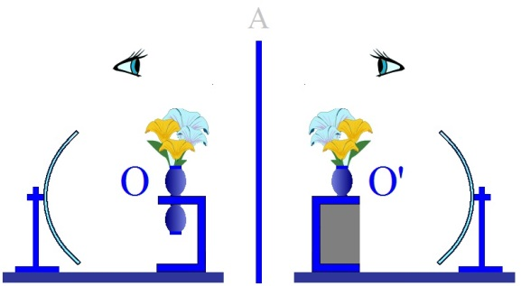
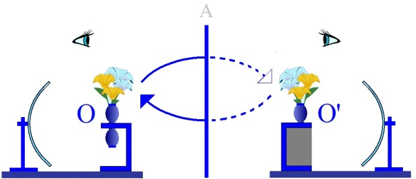
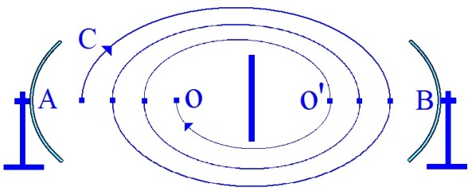
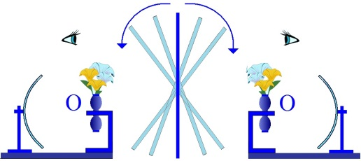

# Leçon 23 | 07 juillet 1954

  

    <label><input type="checkbox" data-lacan-toggle="original" checked> 原文</label>
    <label><input type="checkbox" data-lacan-toggle="notes" checked> 注释</label>
    <label><input type="checkbox" data-lacan-toggle="commentary" checked> 个人解读评论</label>
  

  <form class="lacan-tool-search" role="search">
    <input class="lacan-tool-search-input" type="search" placeholder="搜索全文" aria-label="搜索全文">
    <button class="lacan-tool-button" type="submit" title="搜索">搜索</button>
  </form>
  <button class="lacan-tool-button lacan-back-to-top" type="button" title="回到页面最上方" aria-label="回到页面最上方">↑</button>

<section class="parallel-paragraph" data-paragraph-ids="s1-23-0001">

s1-23-0001

原文 · s1-23-0001

LACAN - Qui a des questions à poser ?

[无对应译文]

</section>

<section class="parallel-paragraph" data-paragraph-ids="s1-23-0002">

s1-23-0002

原文 · s1-23-0002

Mme AUBRY

[无对应译文]

</section>

<section class="parallel-paragraph" data-paragraph-ids="s1-23-0003">

s1-23-0003

原文 · s1-23-0003

Je comprends qu’à *la conjonction de l’imaginaire et du réel* on trouve *la haine*, à condition de prendre *conjonction* dans le sens de rupture. Ce que je comprends moins, c’est qu’à la conjonction du *symbolique* et de l’*ima­ginaire* on trouve *l’amour* ?

[无对应译文]

</section>

<section class="parallel-paragraph" data-paragraph-ids="s1-23-0004">

s1-23-0004

原文 · s1-23-0004

LACAN

[无对应译文]

</section>

<section class="parallel-paragraph" data-paragraph-ids="s1-23-0005">

s1-23-0005

原文 · s1-23-0005

Je suis enchanté que vous me posiez une question comme ça ! Cela va peut-être me permettre de donner à cette dernière rencontre de cette année cette atmosphère que je préfère familière plutôt que *magistrale*. Voilà une excel­lente question ! \[À Leclaire\] Vous aussi, vous avez sûrement des choses à demander. La der­nière fois vous m’avez dit, après la séance, quelque chose qui ressemblait beau­coup à une question : « *J’aurais bien aimé que vous me parliez du transfert, quand même !* » Ils sont durs quand même ! Je ne leur parle que de ça ! Et ils ne sont pas encore satisfaits !

[无对应译文]

</section>

<section class="parallel-paragraph" data-paragraph-ids="s1-23-0006">

s1-23-0006

原文 · s1-23-0006

Il y a des raisons profondes pour lesquelles vous resterez toujours sur votre faim sur le sujet du *transfert*. Mais c’est quand même ce que nous allons essayer de faire aujourd’hui. Seulement j’aimerais pour le faire que votre ques­tion soit quand même plus précise, pas simplement « *J’aimerais que vous me par­liez du transfert* ». Enfin quand même, le rapport de cette structuration de la parole dans la recherche de *la vérité* dans ces trois temps, si je voulais les exprimer à la façon d’un de *ces tableaux allégoriques* qui florissaient à l’époque romantique « *la vertu poursuivant le crime, aidée par le remords* », je vous dirais : « *l’erreur fuyant dans la tromperie, et rattrapée par la méprise *».

[无对应译文]

</section>

<section class="parallel-paragraph" data-paragraph-ids="s1-23-0007">

s1-23-0007

原文 · s1-23-0007

Je crois que le rapport de ça avec le trans­fert, pour autant que c’est ce que j’essaie de vous faire saisir, le *transfert* dans un certain nombre de moments possibles, de moments de suspension dans l’aveu de la parole, ça doit vous sembler quand même toujours dans la même ligne.

[无对应译文]

</section>

<section class="parallel-paragraph" data-paragraph-ids="s1-23-0008">

s1-23-0008

原文 · s1-23-0008

Serge LECLAIRE - Oui.

[无对应译文]

</section>

<section class="parallel-paragraph" data-paragraph-ids="s1-23-0009">

s1-23-0009

原文 · s1-23-0009

LACAN

[无对应译文]

</section>

<section class="parallel-paragraph" data-paragraph-ids="s1-23-0010">

s1-23-0010

原文 · s1-23-0010

Sur quoi, en somme, restez-vous sur votre faim ? sur l’articulation de ça, peut-être avec la conception commune du *transfert*, sur le point où ça se différencie, où j’essaie de vous mener ? Je vous montre une certaine façon de concevoir, et du même coup de manier, comme menant à des résultats par rap­port auxquels nous ne sommes pas d’accord ?

[无对应译文]

</section>

<section class="parallel-paragraph" data-paragraph-ids="s1-23-0011">

s1-23-0011

原文 · s1-23-0011

Serge LECLAIRE

[无对应译文]

</section>

<section class="parallel-paragraph" data-paragraph-ids="s1-23-0012">

s1-23-0012

原文 · s1-23-0012

N’est-ce pas, quand on regarde ce qui est écrit sur le transfert on a toujours l’impression que pour rendre compte du phénomène du transfert, ou du transfert en général, ça rentre dans la catégorie des manifestations d’ordre affectif, d’émois, par opposition aux autres manifestations d’ordre intellectuel, ou les démarches qui visent à la compréhension. Or on se trouve toujours gêné lorsque l’on essaie de rendre compte, juste­ment en des termes courants et communs, de la perspective qui est la vôtre, et qu’il est difficile de faire entrer dans le cadre des « *émois* », parce qu’en fin de compte tout ce que l’on voit en général comme définition du transfert - on dit qu’il s’agit d’émoi de transfert, de sentiment, de phénomène affectif - est opposé carrément à tout ce qui dans une analyse peut s’appeler intellectuel.

[无对应译文]

</section>

<section class="parallel-paragraph" data-paragraph-ids="s1-23-0013">

s1-23-0013

原文 · s1-23-0013

LACAN

[无对应译文]

</section>

<section class="parallel-paragraph" data-paragraph-ids="s1-23-0014">

s1-23-0014

原文 · s1-23-0014

N’est-ce pas ? Il y a deux modes d’application d’une discipline qui se structure en un enseignement : il y a ce que vous entendez, et puis ce que vous en faites. Les deux choses pourraient se rejoindre sur un certain nombre de seconds signes, si je puis dire. Et après tout, c’est bien sous cet angle que je verrais ce qu’il peut y avoir de fécond dans toute action vraiment didactique.

[无对应译文]

</section>

<section class="parallel-paragraph" data-paragraph-ids="s1-23-0015">

s1-23-0015

原文 · s1-23-0015

Cela n’est pas tant de *transmettre des concepts*, sinon en les expliquant et par conséquent en laissant le relais de les remplir et la charge. Mais il y a quelque chose qui serait à proprement par­ler plus impératif, et qui peut-être aurait une valeur tout aussi importante, ça serait de vous désigner les concepts dont il ne faut jamais se servir.

[无对应译文]

</section>

<section class="parallel-paragraph" data-paragraph-ids="s1-23-0016">

s1-23-0016

原文 · s1-23-0016

Je crois que s’il y a quelque chose de cet ordre dans ce que je vous enseigne ici, ça serait d’y renoncer radicalement, ne serait-ce qu’à titre provisoire - pour chacun de vous pris à l’intérieur de votre propre recherche de la vérité, à titre provisoire, pour voir si on ne gagne pas à s’en passer. En tout cas, il est trop clair qu’à en user on arrive perpétuellement à une série d’impasses, pour qu’il ne soit pas tentant, pendant un certain temps, de suivre cette consigne.

[无对应译文]

</section>

<section class="parallel-paragraph" data-paragraph-ids="s1-23-0017">

s1-23-0017

原文 · s1-23-0017

Et particulièrement ce serait, je crois, une des choses les plus contraires à l’expérience analytique, les plus obscurcis­santes dans sa compréhension, les plus confuses, c’est trop évident, et je dirais que c’est évident par toutes sortes de choses, par la date où cette opposition s’est établie, cette opposition dont je parle est celle de l’*affectif* et de l’*intellectuel*.

[无对应译文]

</section>

<section class="parallel-paragraph" data-paragraph-ids="s1-23-0018">

s1-23-0018

原文 · s1-23-0018

Vous me demandez de rendre compte de ce que j’enseigne, et des objections que cela peut rencontrer. Tout ce que je vous ai expliqué sur le sens de l’action de la parole dans sa fonc­tion, *ordonnance* si vous voulez, *loi* dans sa fonction, résonance qui emporte avec elle tous les échos du *symbole *pour autant que c’est là que nous déplaçons dans notre action interprétative et dans sa fonction de pacte, d’un autre sens que le symbole, pour autant que dans la triade qu’elle constitue dans l’affrontement de deux sujets, c’est elle qui est le médium fondateur du rapport intersubjectif modifiant par elle-même les deux sujets rétroactivement, prenant mythique­ment un premier rapport *ante-parole*.

[无对应译文]

</section>

<section class="parallel-paragraph" data-paragraph-ids="s1-23-0019">

s1-23-0019

原文 · s1-23-0019

Bien entendu, on en voit la limite. On peut les imaginer ainsi, et c’est la parole qui littéralement crée quelque chose qui justement les instaure dans une dimension qui est celle que je vous fais entre­voir à la fin de cet exposé de cette année, et comme devant être indispensablement introduite : à savoir *la dimension de l’être*. Qu’il y a littéralement *réalisation de l’être humain* comme tel, et que c’est à lui que nous avons affaire dans l’analyse, *dans la dimension de la parole*. Il est clair qu’il ne s’agit pas là de quelque chose d’intellectuel. Si l’intellectuel se situe quelque part, c’est dans la projection *« imaginaire »* et je dirais - *pseudo*, au sens de mensonge - *« pseudo neutralisée »* de l’*ego*.

[无对应译文]

</section>

<section class="parallel-paragraph" data-paragraph-ids="s1-23-0020">

s1-23-0020

原文 · s1-23-0020

C’est au niveau des phéno­mènes de l’*ego* que nous rencontrons l’intellectuel, et nous savons très bien - jus­tement l’analyse l’a dénoncé comme phénomène qu’on appelle défenses, résistances, tout ce que vous voudrez - mais que c’est justement autour de la question de cette situation de l’*ego*, de cette fonction de l’*ego* que peut porter pour l’instant le grand débat, le point crucial qui, si vous voulez bien m’entendre, définit, dans ce que nous essayons ici de restituer, le fondement de la psychana­lyse. Pour autant que vous me suivez, car nous pourrons aller très loin. La question n’est pas de savoir *jusqu’où on peut aller*, la question est de savoir si on sera suivi. C’est là en effet un élément tout à fait *discriminatif* de ce qu’on peut appeler la réalité.

[无对应译文]

</section>

<section class="parallel-paragraph" data-paragraph-ids="s1-23-0021">

s1-23-0021

原文 · s1-23-0021

Au cours des âges, nous assistons à travers *l’histoire* humaine à des progrès dont on aurait bien tort de croire que ce sont des progrès des circonvolutions. Le progrès dont il s’agit est *un progrès de l’ordre symbolique*. Qu’on observe l’histoire d’une science comme celle des mathématiques : on s’aperçoit qu’on a stagné pendant des siècles autour de problèmes qui sont maintenant clairs à des enfants de dix ans. Et c’étaient pourtant des esprits puissants qui étaient autour !

[无对应译文]

</section>

<section class="parallel-paragraph" data-paragraph-ids="s1-23-0022">

s1-23-0022

原文 · s1-23-0022

On s’est arrêté devant la résolution de l’équation du second degré pendant dix siècles de trop ! Les Grecs auraient pu la trouver, ils ont trouvé des choses plus calées dans des problèmes de maximum et de minimum. Et c’est simplement à partir du jour où on a inventé un certain nombre de choses, qui sont beaucoup plus *symboliques* sur le plan mathématique, qu’on a pu résoudre ces pro­blèmes. Le progrès mathématique n’est pas un progrès de la puissance de pen­sée de l’être humain : c’est à partir du moment où un monsieur pense à inventer un signe comme ça : √, ou comme ça :∫, qu’un monsieur fait du bon. Les mathé­matiques, c’est ça !

[无对应译文]

</section>

<section class="parallel-paragraph" data-paragraph-ids="s1-23-0023">

s1-23-0023

原文 · s1-23-0023

Nous sommes dans une position - heureusement ! - de nature différente, plus difficile. Il s’agit du *symbole* et d’un *symbole* extrêmement polyvalent. C’est justement dans la mesure où nous arriverons à formuler d’une certaine façon les *symboles* de notre action et à les comprendre d’une façon adéquate que nous ferons un pas en avant.

[无对应译文]

</section>

<section class="parallel-paragraph" data-paragraph-ids="s1-23-0024">

s1-23-0024

原文 · s1-23-0024

Nous ferons ce pas en avant, qui comme tout pas en avant est aussi un pas rétroactif. C’est pour ça que je dirais que ce que nous sommes en train d’élaborer ainsi, dans la mesure où vous me suivez, c’est pré­cisément une psychanalyse A. Je l’appellerai ainsi pour autant que je l’appelle le temps premier, dans ses principes comme dans ses applications. Elle est en même temps un retour à l’aspiration de son origine. De quoi s’agit-il donc ? Il s’agit en effet de quelque chose qui prétend à être une plus authentique compréhension du phénomène du transfert.

[无对应译文]

</section>

<section class="parallel-paragraph" data-paragraph-ids="s1-23-0025">

s1-23-0025

原文 · s1-23-0025

Serge LECLAIRE

[无对应译文]

</section>

<section class="parallel-paragraph" data-paragraph-ids="s1-23-0026">

s1-23-0026

原文 · s1-23-0026

Je n’avais pas tout à fait fini. En ce sens que je voulais dire jus­tement que si je pose cette question, c’est qu’elle reste toujours un petit peu en arrière. Il est bien évident que, dans le groupe, les termes d’*affectif* et d’*intel­lectuel* n’avaient plus cours. Mais ça restait quand même un petit peu…

[无对应译文]

</section>

<section class="parallel-paragraph" data-paragraph-ids="s1-23-0027">

s1-23-0027

原文 · s1-23-0027

LACAN - Il y a intérêt à ce qu’ils n’aient plus cours. Qu’est-ce qu’on peut en faire ?

[无对应译文]

</section>

<section class="parallel-paragraph" data-paragraph-ids="s1-23-0028">

s1-23-0028

原文 · s1-23-0028

Serge LECLAIRE - Mais justement, c’est une chose qui restait toujours un peu sus­pendue depuis Rome.

[无对应译文]

</section>

<section class="parallel-paragraph" data-paragraph-ids="s1-23-0029">

s1-23-0029

原文 · s1-23-0029

LACAN - Je crois que je ne m’en sers pas une seule fois, sauf pour le terme d’« *intellectualisé* » dans ce fameux *Discours de Rome*.

[无对应译文]

</section>

<section class="parallel-paragraph" data-paragraph-ids="s1-23-0030">

s1-23-0030

原文 · s1-23-0030

Serge LECLAIRE

[无对应译文]

</section>

<section class="parallel-paragraph" data-paragraph-ids="s1-23-0031">

s1-23-0031

原文 · s1-23-0031

Mais justement ça avait heurté, et cette absence, et ces attaques qui étaient directes contre le terme d’affectif, je crois que vous attaquiez direc­tement ce problème.

[无对应译文]

</section>

<section class="parallel-paragraph" data-paragraph-ids="s1-23-0032">

s1-23-0032

原文 · s1-23-0032

LACAN - Je crois que c’est un terme qu’il faut absolument rayer de nos papiers.

[无对应译文]

</section>

<section class="parallel-paragraph" data-paragraph-ids="s1-23-0033">

s1-23-0033

原文 · s1-23-0033

Serge LECLAIRE

[无对应译文]

</section>

<section class="parallel-paragraph" data-paragraph-ids="s1-23-0034">

s1-23-0034

原文 · s1-23-0034

C’était pour liquider quelque chose qui était resté en suspens, parce que c’est quelque chose qui n’avait pas été dit clairement. Mais la dernière fois, en parlant de transfert, vous avez introduit dans la question que l’on repre­nait à l’instant : *trois passions* *fondamentales* - n’est-ce pas ? - dans lesquelles vous faisiez entrer *l’ignorance*. Alors, c’est là que je voulais en venir.

[无对应译文]

</section>

<section class="parallel-paragraph" data-paragraph-ids="s1-23-0035">

s1-23-0035

原文 · s1-23-0035

LACAN

[无对应译文]

</section>

<section class="parallel-paragraph" data-paragraph-ids="s1-23-0036">

s1-23-0036

原文 · s1-23-0036

Justement, le sens de ce discours et le fait que ce soit la dernière fois que je fais entrer en jeu les trois passions fondamentales : vous devez remarquer que ce dont il s’agissait est d’introduire comme une troisième dimension essen­tielle l’espace - si l’on peut s’exprimer ainsi, ou le volume plus exactement - des rapports humains, justement dans *la relation symbolique*. En d’autres termes, cela signifiait ceci : *l’amour* en tant que passion humaine, en tant que nous le distinguons du désir, considéré dans la relation limite, radicale, établie de l’être humain à son objet, de tout organisme à sa visée instinctuelle, si *l’amour* est quelque chose d’autre, précisément en tant que la réalité humaine est une réalité de parole, il ne s’instaure d’amour, on ne peut parler d’amour, qu’à partir du moment où *la relation symbolique* existe comme telle, où la visée est, non de la satisfaction, mais de l’être.

[无对应译文]

</section>

<section class="parallel-paragraph" data-paragraph-ids="s1-23-0037">

s1-23-0037

原文 · s1-23-0037

Entendons-nous bien. Puisque c’est cela que vous apportez, je prends *l’amour*, et vous verrez que je pourrais prendre n’importe laquelle des trois. C’est tout à fait intentionnellement que c’est seulement la dernière fois que j’ai parlé de ces *arêtes passionnelles*, comme l’a fort bien souligné Mme AUBRY par sa question, ce sont des points de jonction, des points de rupture entre ces dif­férents domaines où s’étend la relation interhumaine : *réel*, *symbolique*, *imagi­naire*.

[无对应译文]

</section>

<section class="parallel-paragraph" data-paragraph-ids="s1-23-0038">

s1-23-0038

原文 · s1-23-0038

Ce sont en effet des crêtes qui se situent entre chacun de ces domaines. Et je pense implicitement, puisque c’est de *l’amour* que je vais parler, répondre en même temps à votre question. Nous avons ici souligné que la question de la relation amoureuse dans son phénomène se situe, s’il y a quelque chose dont nous avons parlé à propos de l’*Einführung des Narzissmus*, que je vous ai commenté, autour duquel nous avons fait tout un développement, c’est de voir comment dans son phénomène *l’amour-passion*…

[无对应译文]

</section>

<section class="parallel-paragraph" data-paragraph-ids="s1-23-0039">

s1-23-0039

原文 · s1-23-0039

> la *Verliebtheit* est autre chose que la *Liebe*, si l’on donne deux mots différents ce n’est pas sans raison

[无对应译文]

</section>

<section class="parallel-paragraph" data-paragraph-ids="s1-23-0040">

s1-23-0040

原文 · s1-23-0040

…est *captivé*, si l’on peut dire, *capturé* essentiellement chez l’être humain par une relation narcissique.

[无对应译文]

</section>

<section class="parallel-paragraph" data-paragraph-ids="s1-23-0041">

s1-23-0041

原文 · s1-23-0041

C’est autour de ce phénomène manifesté par notre expérience, et justement à la limite de la signification symbolique de cette expérience, que nous pouvons le plus sûrement voir là *le fondement*, la raison de cette sorte de profonde ambi­guïté qu’a l’être humain par rapport à cette passion essentielle, illuminante pour lui, en même temps si profondément déroutante, perturbante, que toute l’acuité problématique du phénomène de *l’amour* tient précisément là autour, que j’ai insisté.

[无对应译文]

</section>

<section class="parallel-paragraph" data-paragraph-ids="s1-23-0042">

s1-23-0042

原文 · s1-23-0042

Pour ne pas refaire toute la dialectique de l’investissement narcissique à ce propos, car je pense que quand même vous en avez retenu quelque chose, je veux simplement parler de cette fonction de la relation à l’autre, qui est impli­quée dans ce que j’appellerai le mirage de la *Verliebtheit*. L’expérience analytique, et l’enseignement de FREUD…

[无对应译文]

</section>

<section class="parallel-paragraph" data-paragraph-ids="s1-23-0043">

s1-23-0043

原文 · s1-23-0043

> et je dois dire la vue la plus lucide chez ceux des analystes qui ont le mieux compris
>
> ce qui était là l’en­seignement de FREUD et celui de notre expérience

[无对应译文]

</section>

<section class="parallel-paragraph" data-paragraph-ids="s1-23-0044">

s1-23-0044

原文 · s1-23-0044

…font de *l’amour* en tant que passion ce quelque chose qui est essentiellement du *plan imaginaire*, et que, même dans sa passion, le sujet assume délibérément par une sorte de choix, dans le sens de ce qu’on peut appeler une tentation, essentiellement, comme la perte de la liberté de celui dont on veut être aimé, *l’amour* au sens du désir d’être aimé *est essentiellement tentative de capture de l’autre* *dans soi-même,* objet pris en tant qu’objet. J’ai insisté là-dessus pour autant que si j’en ai parlé longuement, pour la première fois, de ce phénomène de l’amour narcissique, c’est dans le prolongement même de la dialectique de *la perversion*.

[无对应译文]

</section>

<section class="parallel-paragraph" data-paragraph-ids="s1-23-0045">

s1-23-0045

原文 · s1-23-0045

Ce qu’il y a dans le désir d’être aimé, c’est essentiellement ce fait que l’objet aimant soit en quelque sorte *pris* comme tel, *englué*, *asservi*, dans la particula­rité absolue de soi–même comme objet. Et dans cette sorte d’aspiration qu’il y a dans le désir d’être aimé, il y a *quelque chose qui* *– c’est bien connu –* *se satisfait fort peu d’être aimé pour son bien*. L’exigence de l’amour est d’être aimé aussi loin que peut aller la complète subversion du sujet dans une particularité dans ce qu’elle peut avoir de plus opaque, de plus impensable. On veut être *aimé pour tout*, pas seulement pour son *moi*, comme le dit DESCARTES : pour la couleur de ses cheveux, pour ses manies, pour ses faiblesses, *pour tout*.

[无对应译文]

</section>

<section class="parallel-paragraph" data-paragraph-ids="s1-23-0046">

s1-23-0046

原文 · s1-23-0046

Mais inversement, ce qui est tout à fait non moins évident c’est qu’aimer - *et je dirais corrélativement, et à cause de cela même -* c’est justement aimer un être au-delà de ce qu’il apparaît être. Le don actif de *l’amour vise* non pas *l’être* sans sa spécificité, mais *dans son être*.

[无对应译文]

</section>

<section class="parallel-paragraph" data-paragraph-ids="s1-23-0047">

s1-23-0047

原文 · s1-23-0047

Octave MANNONI - C’est PASCAL qui disait cela, ce n’est pas DESCARTES…

[无对应译文]

</section>

<section class="parallel-paragraph" data-paragraph-ids="s1-23-0048">

s1-23-0048

原文 · s1-23-0048

LACAN

[无对应译文]

</section>

<section class="parallel-paragraph" data-paragraph-ids="s1-23-0049">

s1-23-0049

原文 · s1-23-0049

Vous savez, il y a un passage dans DESCARTES là-dessus, sur *cette épuration progressive du moi au-delà de toutes les qualités particulières.* Laissons PASCAL de côté, parce que ça nous entraînerait... Justement, PASCAL maintenant, c’est PASCAL à partir de ce moment précis de mon discours, car il est évident que c’est PASCAL pour autant que PASCAL essaie de nous emmener *au-delà de la créature*.

[无对应译文]

</section>

<section class="parallel-paragraph" data-paragraph-ids="s1-23-0050">

s1-23-0050

原文 · s1-23-0050

Octave MANNONI - Il l’a dit carrément.

[无对应译文]

</section>

<section class="parallel-paragraph" data-paragraph-ids="s1-23-0051">

s1-23-0051

原文 · s1-23-0051

LACAN

[无对应译文]

</section>

<section class="parallel-paragraph" data-paragraph-ids="s1-23-0052">

s1-23-0052

原文 · s1-23-0052

Oui. Mais c’est justement dans un mouvement de rejet.L’amour, dans son don actif, vise, au–delà de cette *captivation imaginaire*, toujours l’être, cette particularité du sujet aimé. Il peut en accepter très loin ce que nous pourrions appeler les faiblesses et les détours, et il peut même en admettre les erreurs. Il y a un point qui justement ne se situe, et ne se signifie, que dans la catégorie de l’être. Il y a un point où *l’amour s’arrête*, ne peut pas le suivre.

[无对应译文]

</section>

<section class="parallel-paragraph" data-paragraph-ids="s1-23-0053">

s1-23-0053

原文 · s1-23-0053

Et il y a un point qui se situe quelque part, précisément du côté de ce que j’appellerais une certaine persévérance dans la tromperie : c’est dans la mesure où l’être aimé, à un certain point, va trop loin dans la trahison de lui–même que l’amour ne suit plus. Ceci, qui est une *phénoménologie* tout à fait repérable à l’expérience, je ne le pousse pas plus loin, et je ne vous en fais pas tout le développement, toute la dialectique.

[无对应译文]

</section>

<section class="parallel-paragraph" data-paragraph-ids="s1-23-0054">

s1-23-0054

原文 · s1-23-0054

Je veux simplement vous faire remarquer que c’est dans *la dimen­sion de l’être de l’autre*, c’est-à-dire d’un certain *au-delà de l’autre*, d’un certain développement de l’autre dans son être, que se dirige *l’amour,* non point en tant que subi, mais très précisément en tant qu’il est une de ces *trois lignes de par­tage* essentielles dans laquelle s’engage *le sujet quand il se réalise symbolique­ment dans la parole*. Sans cette dimension de *la parole*…en tant qu’elle affirme l’être…il y a tout ce que vous voudrez : *Verliebtheit*, *fascination imaginaire*, mais il n’y a pas la dimension de *l’amour*.

[无对应译文]

</section>

<section class="parallel-paragraph" data-paragraph-ids="s1-23-0055">

s1-23-0055

原文 · s1-23-0055

Est-ce que vous y êtes ? Vous êtes d’accord, MANNONI ? Eh bien, *la haine*, c’est la même chose. La *haine* n’est pas simplement cette sorte de déclenchement de court-circuit de la destruction telle qu’elle se pose par exemple d’une façon absolument structurante dans *la relation imaginaire*, dans le sens de cette impasse de la cœxistence entre deux consciences, dont HEGEL nous montre le moment pivot, crucial, dans l’établissement de la relation intersubjective, au départ de *la lutte à mort de pur prestige*.

[无对应译文]

</section>

<section class="parallel-paragraph" data-paragraph-ids="s1-23-0056">

s1-23-0056

原文 · s1-23-0056

Là même - en tant qu’elle se développe, elle aussi, dans le sens de *la relation symbolique -* elle est une passion qui ne se satisfait pas de la disparition de l’adversaire. Ce qu’elle veut, c’est très précisément le contraire de ce développement de son être dont je vous parlais à l’instant à propos de l’amour : ce qu’elle veut *c’est son abaissement, c’est son déroutement, sa déviation, son délire, sa subversion.* Et c’est en cela que *la haine*, comme *l’amour*, est une carrière sans limite, dans ce qu’elle poursuit ce qu’elle \[...\] très proprement c’est la négation développée, détaillée, de l’être, qu’il hait.

[无对应译文]

</section>

<section class="parallel-paragraph" data-paragraph-ids="s1-23-0057">

s1-23-0057

原文 · s1-23-0057

Ceci est peut-être beaucoup plus difficile à vous faire entendre, pour une rai­son : c’est que peut-être pour des raisons qui ne sont peut-être pas si réjouis­santes que nous pouvons le croire, nous connaissons moins, je crois, le sentiment de la haine qu’on n’a pu le faire dans des époques où l’homme était plus ouvert à sa destinée. Quoiqu’il ne faille pas exagérer : nous en avons vu quand même, il n’y a pas très longtemps, des sortes de manifestations qui, dans le genre, n’étaient pas mal ! Néanmoins, c’est justement là peut-être, ce qui peut nous permettre d’entre­voir pourquoi une telle description est d’un accès, pour nous moins facile à notre assentiment.

[无对应译文]

</section>

<section class="parallel-paragraph" data-paragraph-ids="s1-23-0058">

s1-23-0058

原文 · s1-23-0058

C’est que je dirais que l’exercice de cette sorte de *course à la des­truction de l’être* en tant que tel, est vraiment chez nous très bien frayé. En d’autres termes, elle s’habille, comme nous l’avons vu, de toutes sortes de prétextes. Et elle rencontre toutes sortes de rationalisations extraordinairement faciles. C’est peut-être dans la mesure où nous sommes dans un certain état de floculation diffuse de ce quelque chose qui sature en nous très suffisamment cette destruction de l’être. En d’autres termes, c’est peut-être précisément en raison d’une certaine forme du discours commun, de certaines correspondances entre une certaine structure de l’*ego* et une certaine façon d’objectiver l’être humain, que déjà nous sommes très suffisamment *une civilisation de la haine* pour que les particulari­tés du développement des sujets en connaissent moins, si je puis m’exprimer ainsi, l’assomption et le vécu dans tout ce qu’elle peut avoir de brûlant.

[无对应译文]

</section>

<section class="parallel-paragraph" data-paragraph-ids="s1-23-0059">

s1-23-0059

原文 · s1-23-0059

Octave MANNONI - Le moralisme occidental.

[无对应译文]

</section>

<section class="parallel-paragraph" data-paragraph-ids="s1-23-0060">

s1-23-0060

原文 · s1-23-0060

LACAN

[无对应译文]

</section>

<section class="parallel-paragraph" data-paragraph-ids="s1-23-0061">

s1-23-0061

原文 · s1-23-0061

Exactement ! Où la haine trouve une sorte de consommation d’ob­jets courants quotidiens, dans les guerres qui marquent ce qu’elle peut avoir de pleinement réalisé chez des sujets privilégiés. On aurait tort de croire pour autant que le problème soit absent !

[无对应译文]

</section>

<section class="parallel-paragraph" data-paragraph-ids="s1-23-0062">

s1-23-0062

原文 · s1-23-0062

Mais entendez bien qu’en disant tout cela, ce que je désigne ce sont effecti­vement les voies de *la réalisation de l’être*. Car bien entendu, elles ne sont pas la réalisation de l’être, puisque ce n’en sont que les voies. Mais ce sont les voies pour autant, tout de même. La voie qui s’appelle de *l’ignorance* est aussi une voie. Et c’est bien là qu’il me sera peut-être le plus difficile de me faire entendre. Mais c’est tellement *capi­tal* pour que nous comprenions ce que nous faisons et ce qu’est l’analyse ! Il faut quand même aussi que j’essaie là-dessus de m’expliquer.

[无对应译文]

</section>

<section class="parallel-paragraph" data-paragraph-ids="s1-23-0063">

s1-23-0063

原文 · s1-23-0063

Que le sujet s’engage à la recherche de *la vérité* comme telle, c’est essentiel­lement parce qu’il se situe dans la dimension de *l’ignorance*, qu’il le sache ou qu’il ne le sache pas c’est exactement la même chose. C’est là un des éléments de ce que les analystes appellent *readiness to the transference*, l’ouverture fon­damentale, du seul fait de se mettre dans la position *en s’avouant dans la parole*, de ce fait même, de trouver sa *vérité* au bout, au bout qui est là dans l’analyse.

[无对应译文]

</section>

<section class="parallel-paragraph" data-paragraph-ids="s1-23-0064">

s1-23-0064

原文 · s1-23-0064

C’est là une dimension essentielle mais ce n’est pas de ce côté-là qu’il convient de la considérer. C’est de l’autre côté, chez l’*analyste* :

[无对应译文]

</section>

<section class="parallel-paragraph" data-paragraph-ids="s1-23-0065">

s1-23-0065

原文 · s1-23-0065

- si l’analyste méconnaît ce que j’appellerai *le pouvoir d’accession à l’être de cette dimension de l’ignorance*,

[无对应译文]

</section>

<section class="parallel-paragraph" data-paragraph-ids="s1-23-0066">

s1-23-0066

原文 · s1-23-0066

- s’il ne sait pas qu’il a à répondre à celui qui, par tout son discours, l’interroge, dans cette dimension de l’ignorance,

[无对应译文]

</section>

<section class="parallel-paragraph" data-paragraph-ids="s1-23-0067">

s1-23-0067

原文 · s1-23-0067

- s’il ne conçoit pas à chaque instant que justement ce sur quoi il a à quitter le sujet, ce n’est pas sur un *Wissen*, *savoir*, mais sur les voies d’accès à ce savoir,

[无对应译文]

</section>

<section class="parallel-paragraph" data-paragraph-ids="s1-23-0068">

s1-23-0068

原文 · s1-23-0068

- s’il ne sait pas que ce qu’il a à faire avec lui, c’est essentiellement une opération dialectique, non pas lui montrer qu’il se trompe, au sens d’*erreur*, puisqu’il est forcément dans l’*erreur*, mais qu’il a à lui montrer comment il parle mal, si on peut dire, comment il parle sans savoir, comment il parle comme un ignorant. Ce sont les voies de son erreur qui sont importantes.

[无对应译文]

</section>

<section class="parallel-paragraph" data-paragraph-ids="s1-23-0069">

s1-23-0069

原文 · s1-23-0069

La psychanalyse est une dialectique, et ce que M. MONTAIGNE, en son Livre III, chapitre VIII, dont je ne saurais trop vous recommander la lecture - il y a une personne ici qui le connaît bien - appelle un *art de conférer*. L’*art de conférer* est la même chose que ce qui existe entre PLATON, SOCRATE, *l’esclave* - c’est la même chose que ce qui existe dans HEGEL - c’est de *lui apprendre* *à donner son vrai sens à sa propre parole*. En d’autres termes, la position de l’analyste doit être celle d’une *ignorantia docta* [^38], une *ignorance docte*, ce qui veut dire non pas savante mais *formelle*, et c’est par là qu’elle peut être, pour le sujet, formante.

[无对应译文]

</section>

<section class="parallel-paragraph" data-paragraph-ids="s1-23-0070">

s1-23-0070

原文 · s1-23-0070

La tentation est évidemment grande, parce qu’elle est dans l’air du temps, et peut-être pas absolument sans rapport avec la façon dont je l’ai située tout à l’heure par rapport à la haine, c’est que l’*ignorantia docta* devient facilement ce que j’ai appelé, ce n’est pas d’hier, une *ignorantia docens*. Si le psychanalyste croit savoir quelque chose en psychologie par exemple, c’est pour lui déjà le commencement de sa perte, pour la bonne raison que tout le monde sait qu’en psychologie personne ne sait grand-chose, sauf exactement dans la mesure où la psychologie elle-même est, sur l’être humain, une erreur de perspective.

[无对应译文]

</section>

<section class="parallel-paragraph" data-paragraph-ids="s1-23-0071">

s1-23-0071

原文 · s1-23-0071

Voilà ce que signifie l’introduction de cette *triade* \[*amour, haine, ignorance*\] au niveau de *la réalisation de l’être dans la fonction de la parole*, et très proprement dans la dialectique où nous engageons l’analysé dans l’analyse. Il faudrait remanier cela sous toutes les formes, et sous des formes d’exemples absolument cruciaux, et destinés juste­ment à changer les qualifications que vous donnez à tout instant à ce qui se pro­duit dans cette *dimension de l’être*, parce que vous le mettez malgré vous dans une fausse perspective, dans la perspective d’un *faux savoir*.

[无对应译文]

</section>

<section class="parallel-paragraph" data-paragraph-ids="s1-23-0072">

s1-23-0072

原文 · s1-23-0072

Il faut prendre des *exemples* tout à fait banaux, *communs*. Il faut tout de même bien vous apercevoir que quand l’homme dit « *je suis* », ou « *je serai* », voire « *j’aurai été* », ou « *je veux être* », il y a toujours un saut, un élément de béance radicale. Il est tout à fait aussi extravagant par rapport à la réalité de dire « *je suis psychanalyste* » que de dire « *je suis roi* ». L’un et l’autre sont pourtant des affirmations entièrement valables, et que rien jamais ne justi­fie, dans l’ordre de ce qu’on peut appeler « *la mesure des capacités »*, le fait qu’un homme assume ce qui d’ailleurs lui est conféré par d’autres, en fonction de toute une série de légitimations symboliques qui échappent entièrement à l’ordre des habilitations capacitaires, si je puis dire.

[无对应译文]

</section>

<section class="parallel-paragraph" data-paragraph-ids="s1-23-0073">

s1-23-0073

原文 · s1-23-0073

Quand un homme refuse d’être roi, c’est quelque chose qui n’a pas du tout la même valeur que quand il l’accepte. Ce n’est pas du tout symétrique. Par là même qu’il refuse, il ne l’est pas. Il est un petit bourgeois, par exemple, voyez par exemple le Duc de WINDSOR, l’homme qui, *au bord d’être investi* de la digni­fication de la couronne, dit « *Je veux vivre avec la femme que j’aime* », par là même reste en deçà du domaine d’être roi.

[无对应译文]

</section>

<section class="parallel-paragraph" data-paragraph-ids="s1-23-0074">

s1-23-0074

原文 · s1-23-0074

Mais quand l’homme se dit - et l’étant, en l’étant en fonction d’un certain *système de relations symboliques -* dit « *je suis roi* », ce n’est pas quelque chose qui est simplement de l’ordre de *l’acceptation d’une fonction*. Ce n’est pas dans l’ordre de la captation que cela se juge : cela change d’une minute à l’autre *le sens* de tout ce qu’il est, si vous voulez justement dans l’ordre des qualifica­tions psychologiques.

[无对应译文]

</section>

<section class="parallel-paragraph" data-paragraph-ids="s1-23-0075">

s1-23-0075

原文 · s1-23-0075

Cela donne un sens complètement différent à ses pas­sions, à ses desseins, à sa sottise même. Tout devient, du seul fait qu’il est à partir de ce moment-là roi, d’autres fonctions, des *fonctions royales*. Son intelligence devient tout à fait autre chose, dans le registre de la royauté, ses incapacités également, elles deviennent fondations d’un autre *ordre*, elles deviennent par elles-mêmes polarisations, structurations, de toute une série de destins autour de lui qui sont profondément modifiés dans leur sens, pour la raison que *l’autorité royale* est exercée selon tel ou tel mode par le personnage qui en est investi.

[无对应译文]

</section>

<section class="parallel-paragraph" data-paragraph-ids="s1-23-0076">

s1-23-0076

原文 · s1-23-0076

Ceci se rencontre au petit pied tous les jours, le fait qu’un monsieur qui a des qualités fort médiocres, et qui montrerait toutes sortes d’inconvénients dans tel ou tel emploi inférieur, soit élevé à ce qui est - plus ou moins camouflé mais tou­jours présent - *une investiture* en quelque façon souveraine dans un domaine si limité soit-il, change du tout au tout - vous n’avez qu’à l’observer tous les jours, couramment - la portée autant de ses forces que de ses faiblesses, et peut curieu­sement en inverser le rapport.

[无对应译文]

</section>

<section class="parallel-paragraph" data-paragraph-ids="s1-23-0077">

s1-23-0077

原文 · s1-23-0077

C’est aussi bien pourquoi... je ne sais pas si vous remarquez, ceci se voit dans une façon effacée, non avouée, dans le monde même que ce qui constitue les habilitations, les examens

[无对应译文]

</section>

<section class="parallel-paragraph" data-paragraph-ids="s1-23-0078">

s1-23-0078

原文 · s1-23-0078

- pourquoi, depuis le temps que nous sommes deve­nus de si forts psychologues, n’avons-nous pas réduit les franchissements divers qui avaient autrefois une valeur initiatique de barrières : licences, agrégations ?

[无对应译文]

</section>

<section class="parallel-paragraph" data-paragraph-ids="s1-23-0079">

s1-23-0079

原文 · s1-23-0079

- Pourquoi, à partir du moment où tout d’un coup *nous aurions aboli tout à fait cette qualité d’investiture*, ne la réduirions-nous pas à une sorte de totalisation du travail acquis, des notes ou des points enregistrés dans l’année, ou même à un pur et simple ensemble de tests ou d’épreuves, où on mesurerait ce qu’on pourrait appeler la capacité de tel ou tel ?

[无对应译文]

</section>

<section class="parallel-paragraph" data-paragraph-ids="s1-23-0080">

s1-23-0080

原文 · s1-23-0080

- Pourquoi est-ce qu’on garde à ces exa­mens je ne sais quel caractère qui dans cette perspective, examen ou concours, garde ce caractère archaïque en fin de compte, avec tous ces éléments autour desquels nous nous insurgeons, à la façon des gens qui tapent aux murailles de la prison qu’ils ont eux-mêmes construite, tous ces éléments de hasard, voire de faveur, et tout ce qui s’ensuit ?

[无对应译文]

</section>

<section class="parallel-paragraph" data-paragraph-ids="s1-23-0081">

s1-23-0081

原文 · s1-23-0081

C’est simplement parce qu’un concours, en tant qu’il revêt le sujet d’une certaine qualification qui est *symbolique*, ne peut pas avoir la structure entièrement rationalisée de ce que j’appellerai tout à l’heure la totalisation d’un certain nombre de choses qui se mesurent dans le registre pure­ment de l’addition de la quantité.

[无对应译文]

</section>

<section class="parallel-paragraph" data-paragraph-ids="s1-23-0082">

s1-23-0082

原文 · s1-23-0082

Alors quand nous rencontrons ça, nous faisons des découvertes, parce que naturellement nous sommes des malins, nous disons : « *Mais oui, on va faire un grand article psychanalytique, pour montrer le caractère initiatique de l’exa­men* ». Évidemment ! C’est évident !

[无对应译文]

</section>

<section class="parallel-paragraph" data-paragraph-ids="s1-23-0083">

s1-23-0083

原文 · s1-23-0083

C’est heureux qu’on s’aperçoive qu’il est malheureux qu’en s’en apercevant le psychanalyste ne l’explique pas toujours très bien. Il fait une découverte partielle. Il est obligé de l’expliquer en termes d’*« omnipotence de la pensée »*, de *« pensée magique »* et autres choses. Alors que c’est simplement la dimension du *symbole* en tant que *fondamental*.

[无对应译文]

</section>

<section class="parallel-paragraph" data-paragraph-ids="s1-23-0084">

s1-23-0084

原文 · s1-23-0084

Ai-je suffisamment répondu à Mme AUBRY. Peut-être un peu rapidement ? Qui a d’autres questions à me poser ? BEJARANO, esprit fécond et astucieux ?

[无对应译文]

</section>

<section class="parallel-paragraph" data-paragraph-ids="s1-23-0085">

s1-23-0085

原文 · s1-23-0085

Angelo BEJARANO

[无对应译文]

</section>

<section class="parallel-paragraph" data-paragraph-ids="s1-23-0086">

s1-23-0086

原文 · s1-23-0086

Je pense à un exemple concret, le cas Dora, dans lequel on ver­rait la figuration... Il faudrait dans le cas Dora, à un moment crucial essayer de nous montrer comment les différents registres sont suivis, passés...

[无对应译文]

</section>

<section class="parallel-paragraph" data-paragraph-ids="s1-23-0087">

s1-23-0087

原文 · s1-23-0087

LACAN

[无对应译文]

</section>

<section class="parallel-paragraph" data-paragraph-ids="s1-23-0088">

s1-23-0088

原文 · s1-23-0088

Dans le cas Dora, puisque vous proposez le cas Dora, on reste un peu à la porte de ça mais on peut quand même vous expliquer un peu les choses. Je voudrais quand même - puisque je suis arrivé, grâce aux questions posées, à pousser aujourd’hui assez loin ce discours - pouvoir peut-être, à l’intérieur de ça, vous situer le cas Dora.

[无对应译文]

</section>

<section class="parallel-paragraph" data-paragraph-ids="s1-23-0089">

s1-23-0089

原文 · s1-23-0089

Reprenons le schéma… schéma ou plutôt symbole. Pour reprendre la question du transfert dans son ensemble et apporter une sorte de formule conclusive, qui est une autre façon de présenter la question, nous dirons ceci : à l’intérieur de l’expérience instaurée par les premières découvertes de FREUD sur le trépied : rêve, psychopathologie de la vie quotidienne, trait d’esprit, qui est toujours - ce que je vous ai expliqué - *la parole* qui s’avère au-delà de ce discours, qui est incluse dans ce quelque chose qui est essentiellement analogue à ce qui en forme le quatrième élément, de ce trépied : *rêve, lapsus, trait d’esprit,* qui est *le symptôme* qui lui aussi, est un mode de rapport sur la base de l’organisme en tant qu’il peut servir non pas de *verbum* lui - puisqu’il n’est pas fait de phonèmes - mais de *signum*, si vous vous souvenez des différentes sphères incluses du texte d’AUGUSTIN.

[无对应译文]

</section>

<section class="parallel-paragraph" data-paragraph-ids="s1-23-0090">

s1-23-0090

原文 · s1-23-0090

À l’intérieur de ça et avec un retard, FREUD lui-même a dit avoir été apeuré, quand on isole le phénomène du *transfert* - et on l’isole pour autant qu’on ne l’a pas reconnu - que de ce fait il a opéré comme obstacle au traitement, et en le reconnaissant c’est la même chose : on s’aperçoit qu’il est le meilleur appui du traitement. C’est-à-dire que c’est FREUD qui s’en aperçoit, ça ne veut pas dire qu’il ne l’avait pas *déjà* désigné.

[无对应译文]

</section>

<section class="parallel-paragraph" data-paragraph-ids="s1-23-0091">

s1-23-0091

原文 · s1-23-0091

Dans la *Traumdeutung*, il y a déjà une définition de l’*Übertragung*, et justement en fonction de ce double niveau de la parole. Vous vous souvenez ce passage de la *Traumdeutung* que je vous ai dit, c’est pré­cisément en tant qu’il y a des parties du discours désinvesties de significations, qu’une autre signification vient les prendre par derrière, qui est la signification inconsciente.

[无对应译文]

</section>

<section class="parallel-paragraph" data-paragraph-ids="s1-23-0092">

s1-23-0092

原文 · s1-23-0092

C’est à propos du *rêve* qu’il le montre, c’est encore plus clair. Je vous l’ai montré par des exemples dans les *lapsus* tout à fait éclatants. Je n’en ai malheureusement que peu parlé cette année. C’est quelque chose de tout à fait spécial, puisque c’est *la face*, si on peut dire, radicale *de non-sens* qu’il y a juste­ment derrière tout sens, car *il y a un point où forcément le sens émerge et est créé*. Mais en son point où il est créé, l’homme peut très bien sentir qu’il est en même temps anéanti, que c’est même parce qu’il est anéanti qu’il est créé. La fonction du *trait d’esprit* est exactement l’irruption du non-sens dans un dis­cours qui a l’air d’en avoir un, et l’irruption calculée.

[无对应译文]

</section>

<section class="parallel-paragraph" data-paragraph-ids="s1-23-0093">

s1-23-0093

原文 · s1-23-0093

Octave MANNONI - *Le <u>point ombilical</u> de la parole*.

[无对应译文]

</section>

<section class="parallel-paragraph" data-paragraph-ids="s1-23-0094">

s1-23-0094

原文 · s1-23-0094

LACAN

[无对应译文]

</section>

<section class="parallel-paragraph" data-paragraph-ids="s1-23-0095">

s1-23-0095

原文 · s1-23-0095

Exactement ! De même qu’il y a un *ombilic du rêve*, qui est lui extrê­mement confus, inversement dans le *trait d’esprit* il y a *un ombilic* parfaite­ment aigu en fin de compte : le *Witz*. Et ce qui en exprime l’essence la plus radicale, c’est le *non-sens*. Eh bien ce *transfert*, nous nous apercevons qu’il est d’abord notre *appui*.

[无对应译文]

</section>

<section class="parallel-paragraph" data-paragraph-ids="s1-23-0096">

s1-23-0096

原文 · s1-23-0096

Je vous ai donné, non pas dans un développement chronologique et histo­rique, mais vous ai montré trois directions dans lesquelles il est compris par les différents auteurs. Et en vous donnant cette tripartition, qui a un certain carac­tère didactique, arbitraire, mais ça doit vous permettre de vous retrouver et de vous retrouver dans les tendances actuelles de ce qu’on appelle de l’analyse, à savoir que ça n’est pas brillant ! En somme, nous pouvons prendre notre division : *l’imaginaire, le réel, le symbolique*.

[无对应译文]

</section>

<section class="parallel-paragraph" data-paragraph-ids="s1-23-0097">

s1-23-0097

原文 · s1-23-0097

Il y a une certaine façon de comprendre le phénomène du transfert par rapport au *réel*, c’est-à-dire en tant que phénomène actuel. On a cru casser une grande vitre en parlant de l’*hic et nunc*, et que toute l’analyse doit porter sur l’*hic et nunc*. On croit avoir trouvé quelque chose d’éblouissant, avoir fait un pas hardi. Mais nous trouvons des gens dans le genre d’EZRIEL qui écrivent des choses touchantes, qui enfoncent des portes ouvertes. Bien entendu, le transfert est là.

[无对应译文]

</section>

<section class="parallel-paragraph" data-paragraph-ids="s1-23-0098">

s1-23-0098

原文 · s1-23-0098

Il s’agit simplement de savoir ce que c’est. Si nous le prenons sur le plan du réel voilà ce que ça donne : ça veut dire que c’est un réel qui n’est pas réel. C’est ce qu’on appelle un illusoire : c’est tout à fait réel que le sujet est là, en train de me parler de ses démêlés avec son épicier. Et par là, en m’en parlant, et en râlant contre son épicier, c’est moi qu’il engueule. C’est un exemple d’EZRIEL, ce n’est pas moi qui l’invente. Bon, c’est fort bien, c’est entendu ! Ce dont il s’agit, c’est justement de lui démontrer qu’il n’y a vraiment aucune raison qu’il m’engueule à propos de son épicier. Je lui ai montré la distinction qu’il y a entre ce comportement réel, en tant qu’il est illusoire, et la situation réelle dont il se détache dans le *réel*.

[无对应译文]

</section>

<section class="parallel-paragraph" data-paragraph-ids="s1-23-0099">

s1-23-0099

原文 · s1-23-0099

Cette grande découverte qu’on a faite récemment est simplement liée à une impuissance totale d’approfondir ce que FREUD nous a désigné depuis longtemps dans le phénomène du *transfert*. Et ceci aboutit à quelque chose qui - comme vous le voyez et quoi qu’on en dise - a quelque référence aux émotions, à l’affectif, à l’abréaction et autres termes qui désignent en effet un certain nombre de phénomènes parcellaires qui se passent pendant l’analyse, n’en aboutit pas moins, je vous le fais remarquer, à quelque chose d’essentiellement intellec­tuel. Car en fin de compte, procéder ainsi aboutit tout à fait directement, sous une forme qui ne nous apparaît pas comme telle parce qu’elle peut vaguement apparaître comme neuve, à quelque chose qui est tout à fait équivalent aux pre­mières formes d’endoctrination qui nous scandalisent tellement dans la pre­mière façon d’opérer de FREUD avec ses premiers cas. Nous apprenons au sujet à se comporter dans le réel. Nous lui montrons qu’il n’est pas à la page. Si ce n’est pas de l’éducation et de l’endoctrination, je me demande ce que c’est.

[无对应译文]

</section>

<section class="parallel-paragraph" data-paragraph-ids="s1-23-0100">

s1-23-0100

原文 · s1-23-0100

Bien entendu, ça ne touche pas au fond du phénomène, cette façon de prendre les choses d’une façon essentiellement superficielle, que peut s’autoriser FREUD comme étant une source du transfert, à savoir la réédition, il l’a dit : abrégée, mais modifiée, corrigée. Et c’est là que commence le problème.

[无对应译文]

</section>

<section class="parallel-paragraph" data-paragraph-ids="s1-23-0101">

s1-23-0101

原文 · s1-23-0101

Wladimir GRANOFF - C’est de la position de DE SAUSSURE, dont vous parlez ?

[无对应译文]

</section>

<section class="parallel-paragraph" data-paragraph-ids="s1-23-0102">

s1-23-0102

原文 · s1-23-0102

LACAN

[无对应译文]

</section>

<section class="parallel-paragraph" data-paragraph-ids="s1-23-0103">

s1-23-0103

原文 · s1-23-0103

Laissons DE SAUSSURE tranquille. Ce n’est pas un personnage qui, même dans l’ordre de la sottise, soit tellement représentatif. Il y a une autre façon d’aborder ce problème du transfert. Il est bien évident que c’est cet étage, ce niveau absolument essentiel, c’est justement celui dont on ne manque pas ici de souligner l’importance, qui est celui de l’*imaginaire,* et dans lequel le développement relativement récent de toute l’expérience de comportements - d’animaux nommément - nous permet d’aborder certainement une structuration plus claire que tout ce que FREUD a pu faire. Encore que cette dimension est même nommée comme telle : « *imaginare »,* existe dans le texte de FREUD parce qu’elle ne peut pas être évitée.

[无对应译文]

</section>

<section class="parallel-paragraph" data-paragraph-ids="s1-23-0104">

s1-23-0104

原文 · s1-23-0104

C’est exactement pour cela que je vous ai fait étudier cette année l’« *Introduction au narcissisme* ». Le rapport du vivant comme tel aux objets qu’il désire est justement lié en tant que rapport, à des conditions *imaginaires*, à des conditions de *Gestalt*, qui situent comme telle, dans le rapport entre vivants, *la fonction de l’imaginaire*. Ceci, bien entendu non seulement n’est absolument pas méconnu dans la théorie analytique, mais c’est tellement si universellement présent que, pour se limiter à des notions aussi bornées que ce qui se passe dans *le transfert*, il faut se tirer deux volets sur chaque oreille pour ne plus tout d’un coup penser ni entendre ce dont il s’agit quand on parle de ce quelque chose d’absolument *fondamental* dans l’expression analytique : *l’identification*, qui est de ce registre.

[无对应译文]

</section>

<section class="parallel-paragraph" data-paragraph-ids="s1-23-0105">

s1-23-0105

原文 · s1-23-0105

Seulement, il s’agit de ne pas l’employer à tort et à travers, et de voir que c’est cet *imaginaire* par lequel, dans un comportement comme celui du couple animal quelconque, dans la parade sexuelle, par rapport auquel chacun des individus se trouve capté dans une situation justement essentiellement duelle, pour laquelle le simple examen des phénomènes nous montre qu’il s’établit, par le truchement, par la fonction de cette *relation imaginaire*, une certaine sorte d’*identification* - momentanée sans doute chez l’animal, liée au cycle instinctuel - qui nous fait vraiment nous apercevoir, dans toutes les actions liées au moment de *la pariade*, de l’appariement des individus pris dans le cycle du comportement sexuel, qui nous fait toujours apparaître - au moins dans les espèces observables sur ce point et qui ont servi de fondement à cette élaboration du comportement instinctuel -*un registre de parade*.

[无对应译文]

</section>

<section class="parallel-paragraph" data-paragraph-ids="s1-23-0106">

s1-23-0106

原文 · s1-23-0106

Ce n’est pas la même chose *la parade* et *la pariade*, dans lequel nous voyons justement le sujet s’accorder dans une sorte de *lutte imaginaire* d’autant plus saisissante qu’elle est *toujours sur le versant du combat et de la création*, mais que cette *régulation imaginaire* permet la plupart du temps, et dans les cas les plus frappants, entre les adversaires, une espèce de régulation à distance qui transforme la lutte en une sorte de temps accordé.

[无对应译文]

</section>

<section class="parallel-paragraph" data-paragraph-ids="s1-23-0107">

s1-23-0107

原文 · s1-23-0107

Et que même dans ce qui se passe au moment de *la pariade*, dans les actions de lutte entre les mâles, il y a, à un moment donné, une espèce de choix des rôles, de reconnaissance de la domination de l’adversaire, sans qu’on en vienne, je ne dirai pas aux mains, mais aux griffes et aux dents ni aux piquants, et qui fait qu’un des partenaires subit, prend l’attitude passive, subit la domination de l’adversaire, se dérobe devant lui, adopte un des rôles, manifestement en fonction de l’autre, en fonction de ce que l’autre a *excipé* sur le plan de la *Gestalt*, a pris le caractère dominant, et sans qu’on soit forcé d’en venir - bien entendu, ça arrive - à une lutte aboutissant à la destruction d’un adversaire, c’est déjà *la régulation imaginaire*, qui assure un certain choix à l’intérieur d’une situation totale, et qui est *dyadique*, essentielle, dans un rapport de l’être à l’image de l’autre comme telle.

[无对应译文]

</section>

<section class="parallel-paragraph" data-paragraph-ids="s1-23-0108">

s1-23-0108

原文 · s1-23-0108

[无对应译文]

</section>

<section class="parallel-paragraph" data-paragraph-ids="s1-23-0109">

s1-23-0109

原文 · s1-23-0109

Ceci est essentiel pour comprendre quelque chose à *la fonction imaginaire* chez l’homme. Parce que c’est à partir de là qu’on peut voir que chez l’homme elle est à la fois aussi réduite, aussi spécialisée, aussi centrée sur ce que j’appellerais *l’image spéculaire*, et ce qui fait à la fois *les impasses et* *la fonction de cette relation imaginaire*. Je pense tout de même y avoir suffisamment insisté pour pouvoir vous la rappeler simplement en quelques termes. À savoir que, si vous voulez que cette *image du moi*, qui du seul fait qu’il est image, est un *moi idéal* qui se forme quelque part et qui résume toute *la rela­tion imaginaire* chez l’homme qui se produit à un moment et à une époque où, les fonctions étant inachevées, elle présente à la fois cette valeur salutaire, assez exprimée dans *l’assomption* *jubilatoire du phénomène du miroir*, mais qui est en relation avec un certain déficit de rapport à l’objet, à une certaine prématu­ration vitale, à une certaine béance mortifère, tout à fait originelle, et qu’elle lui reste liée dans sa structure.

[无对应译文]

</section>

<section class="parallel-paragraph" data-paragraph-ids="s1-23-0110">

s1-23-0110

原文 · s1-23-0110

Cette fonction, il ne la retrouvera sans cesse comme cadre à toutes ses catégo­ries, à toute son appréhension du monde-objet, que par l’intermédiaire de l’*autre*. C’est dans l’*autre* qu’il retrouvera toujours ce *moi idéal*, cette *image de soi*, et c’est à partir de là que se développe toute le dialectique de ses relations à l’autre, et que selon que l’autre sature cette image, c’est-à-dire la remplit, il devient positivement l’objet d’un investissement narcissique, qui est celui de la *Verliebtheit*.

[无对应译文]

</section>

<section class="parallel-paragraph" data-paragraph-ids="s1-23-0111">

s1-23-0111

原文 · s1-23-0111

Rappelez-vous l’exemple de Werther que je vous ai donné, la rencontre de Charlotte au moment où elle a dans les bras cet enfant : il tombe en quelque sorte pile dans l’*imago narcissique* du jeune héros du roman. Ou au contraire, ce qui est exactement le même versant, comme frustrant le sujet de son *idéal* et de sa propre *image*, et engendrant la tension destructrice *maxima*.

[无对应译文]

</section>

<section class="parallel-paragraph" data-paragraph-ids="s1-23-0112">

s1-23-0112

原文 · s1-23-0112

[无对应译文]

</section>

<section class="parallel-paragraph" data-paragraph-ids="s1-23-0113">

s1-23-0113

原文 · s1-23-0113

C’est autour de ce quelque chose qui à un rien près tourne dans un sens ou dans l’autre, qui donne la clé d’ailleurs des questions que se pose FREUD, à propos de la transformation possible et subite, précisément dans la *Verliebtheit*, entre *l’amour* et *la haine*. Il suffit d’un rien pour que ce soit l’un ou l’autre. C’est autour de ça que tourne le phénomène *d’investissement imaginaire*, pour autant que nous le voyons jouer un rôle *dans le transfert*. Comment allons-nous appeler ce rôle ? C’est un rôle pivot.

[无对应译文]

</section>

<section class="parallel-paragraph" data-paragraph-ids="s1-23-0114">

s1-23-0114

原文 · s1-23-0114

*Le transfert*, s’il est vrai qu’il s’établit comme je vous le dis : dans et par la dimen­sion de *la parole*, n’inclut la révélation de *ce rapport imaginaire* que parvenu en cer­tains points cruciaux de la rencontre parlée avec l’autre, c’est-à-dire avec l’analyste.

[无对应译文]

</section>

<section class="parallel-paragraph" data-paragraph-ids="s1-23-0115">

s1-23-0115

原文 · s1-23-0115

C’est dans la mesure où le discours, dénoué d’un certain nombre de ses conven­tions par la loi dite de la règle fondamentale, se met à jouer plus ou moins libre­ment - j’entends « *librement* » par rapport aux conventions du discours ordinaire -d’une façon qui justement permette au sujet d’être au maximum ouvert à *cette méprise féconde par où la parole plus vraie rejoint le discours de l’erreur*.

[无对应译文]

</section>

<section class="parallel-paragraph" data-paragraph-ids="s1-23-0116">

s1-23-0116

原文 · s1-23-0116

Mais c’est dans la mesure aussi où cette parole fuit cette révélation, cette *méprise féconde* et se développe dans la tromperie. Je l’ai toujours souligné : c’est la dimension essentielle qui ne nous permet pas d’éliminer le sujet comme tel de l’expérience, qui ne nous permet en aucun cas de réduire dans des termes objectaux, que nous voyons se manifester - selon que la méprise réussit ou ne réussit pas - *la révélation des points* qui n’ont pas été intégrés, ont été refusés, ou pour mieux dire refoulés dans l’assomption par le sujet, et de son histoire.

[无对应译文]

</section>

<section class="parallel-paragraph" data-paragraph-ids="s1-23-0117">

s1-23-0117

原文 · s1-23-0117

C’est en tant que le sujet prend son accord là et développe dans le discours analytique quelque chose qui est *sa vérité, son intégration,* *son his­toire et ses tendances*, qu’il y a des trous dans cette histoire, que nous ren­controns quoi ? Justement les points où s’est produit le quelque chose qui n’a pas été assumé, qui a été refusé, *verworfen* ou *verdräng*t :

[无对应译文]

</section>

<section class="parallel-paragraph" data-paragraph-ids="s1-23-0118">

s1-23-0118

原文 · s1-23-0118

- *verdrängt*, ça veut dire que c’est venu à un moment au discours et que ça a été rejeté,

[无对应译文]

</section>

<section class="parallel-paragraph" data-paragraph-ids="s1-23-0119">

s1-23-0119

原文 · s1-23-0119

- *verwor­fen*, ça peut être tout à fait essentiel comme rejet, originel. La distinction je vous l’ai indiquée un peu dans l’allusion à *L’Homme aux loups*, je ne veux pas m’y étendre pour l’instant.

[无对应译文]

</section>

<section class="parallel-paragraph" data-paragraph-ids="s1-23-0120">

s1-23-0120

原文 · s1-23-0120

Mais le phénomène du *transfert* en tant qu’il rencontre *la cristallisation ima­ginaire*, c’est pour autant en quelque sorte qu’*il tourne autour*, qu’il doit le rejoindre, que c’est de cela qu’il s’agit, que c’est que le sujet retrouve ici \[O’\] et dans l’*autre* la totalisation des divers accidents qui sont arrivés ici \[O\] dans son histoire sur *le plan imaginaire*, *des captivations ou fixations* - comme nous disons - *imaginaires*, qui ont été inassimilables à l’action de *la parole*, à la loi du discours, au développement *symbolique* de son histoire.

[无对应译文]

</section>

<section class="parallel-paragraph" data-paragraph-ids="s1-23-0121">

s1-23-0121

原文 · s1-23-0121

[无对应译文]

</section>

<section class="parallel-paragraph" data-paragraph-ids="s1-23-0122">

s1-23-0122

原文 · s1-23-0122

C’est pour cela que le transfert, comme nous dit FREUD, devient essentiel­lement un obstacle quand il est excessif. Dans le sens érotique, qu’exprime-t-il ? Ou dans le sens agressif, ça veut dire quoi ? Que, si vous voulez, les échos du discours \- qui se répartissent dans cette zone entre O et le miroir B - se sont approchés trop rapidement, d’une façon anticipée, ont été trop vite trop près du point O’, pour qu’il ne se produise pas à ce moment-là, entre O’ et le miroir B, quelque chose de tout à fait critique, qui comme il le dit, évoque au maximum la résistance, et la résistance sous la forme la plus aiguë sous laquelle on puisse la voir se manifester, c’est-à-dire, ce qui est un des corrélatifs du trans­fert trop intense, à savoir : *le silence*.

[无对应译文]

</section>

<section class="parallel-paragraph" data-paragraph-ids="s1-23-0123">

s1-23-0123

原文 · s1-23-0123

Il faut bien dire aussi que si ce moment arrive en temps utile, en temps opportun, au juste temps, *ce silence est aussi un silence qui prend* *toute sa valeur de silence, c’est-à-dire* non pas simplement négatif mais *d’un au-delà de la parole*. Car je vous ai assez souligné ce qu’aussi représentent de positif certains moments de silence dans *le transfert*, à savoir littéralement l’appréhension la plus aiguë de *la présence* *de l’autre* comme tel. Je vous prie, à la lumière de ces réflexions, ou *considérations*, *développe­ments*, de relire maintenant, quand vous m’aurez quitté pour des vacances que je vous souhaite bonnes, ces précieux petits textes des *Écrits techniques* de FREUD. Relisez-les,

[无对应译文]

</section>

<section class="parallel-paragraph" data-paragraph-ids="s1-23-0124">

s1-23-0124

原文 · s1-23-0124

- et vous verrez à quel point ces textes prendront pour vous un sens nouveau, plus vivant,

[无对应译文]

</section>

<section class="parallel-paragraph" data-paragraph-ids="s1-23-0125">

s1-23-0125

原文 · s1-23-0125

- et vous verrez *ces contradictions apparentes* du texte à propos du *transfert* qui est à la fois *résistance de transfert et moteur de l’ana­lyse*,

[无对应译文]

</section>

<section class="parallel-paragraph" data-paragraph-ids="s1-23-0126">

s1-23-0126

原文 · s1-23-0126

- vous verrez comme quoi ceci se comprend uniquement dans le rapport de cette dialectique de *l’imaginaire* et du *symbolique*.

[无对应译文]

</section>

<section class="parallel-paragraph" data-paragraph-ids="s1-23-0127">

s1-23-0127

原文 · s1-23-0127

Qu’est-ce à dire ? Il est bien évident que tout ce qui se profère est là, miroir A, *du côté du sujet*. Mais que ce qui se profère se fait entendre là en B, *du côté de l’analyste*, et fait entendre pas seulement pour l’analyste, *mais pour le sujet*.

[无对应译文]

</section>

<section class="parallel-paragraph" data-paragraph-ids="s1-23-0128">

s1-23-0128

原文 · s1-23-0128

 

[无对应译文]

</section>

<section class="parallel-paragraph" data-paragraph-ids="s1-23-0129">

s1-23-0129

原文 · s1-23-0129

Le rapport en *écho du discours* \[sujet → analyste → sujet\] *est le même symétrique que le rapport de l’image par rapport au miroir*, que ce dont il s’agit et qui se passe alors sur *le plan imaginaire* - c’est quelque chose, dont je vous ai expliqué comment on pouvait le concevoir - se fond grâce à ce modèle, par rapport à de menus déplacements du miroir, qui permettent justement de compléter là, dans l’*autre*, *projeté sur l’autre* \[O’\]*, ce que le sujet, par définition essentiellement méconnaît de son image structurante ou image du moi qui est là* \[O\].

[无对应译文]

</section>

<section class="parallel-paragraph" data-paragraph-ids="s1-23-0130">

s1-23-0130

原文 · s1-23-0130

Pas besoin de vous refaire tout l’appareil optique. Ceux qui n’étaient pas là au moment où je l’ai expliqué en tant que disposition de l’appareil optique, tant pis ! Je crois que vous étiez à peu près tous là... Qu’est-ce qui se passe ? Quelque chose qui peut se schématiser ainsi : *le pas­sage de* O à O’, *la réalisation par le sujet, la complémentation par le sujet des éléments imaginaires en tant qu’ils ont fixé,* *pointé*, je dirais « *capitonné* » son déve­loppement *imaginaire*, et « *capitonné* » se rapporte à son expression dans *l’ordre symbolique*, c’est-à-dire qu’*en certains points le symbole n’a pas pu assimiler ces éléments imaginaires* en tant que ça veut dire que c’était *traumatique*.

[无对应译文]

</section>

<section class="parallel-paragraph" data-paragraph-ids="s1-23-0131">

s1-23-0131

原文 · s1-23-0131

Il se passe ceci : ce qui vient là de C en O, est ce quelque chose que le sujet assume dans son discours en tant qu’*il le fait entendre* *à l’autre*. Mais vous voyez ce que j’ai fait : une ligne courbe de B à O, je l’ai fait venir là en O : c’est une erreur, car c’est toujours d’un point qui est là entre A et O, qu’il le sache ou ne le sache pas, et bien entendu beaucoup plus près de O - c’est-à-dire de la notion inconsciente de son *moi -* que n’importe quel point. Mais justement c’est de cela qu’il s’agit, de savoir où va se faire l’assomption parlée de cet *ego* ? En O’ : à mesure qu’il se réalise en son *imaginaire* O’. Si vous voulez, c’est là que ce petit schéma peut prendre pour vous toute sa signification, essentiellement par rapport à ce registre, j’espère que vous allez bien entendre, et qui sera la conclusion de ce que je vous explique aujourd’hui.

[无对应译文]

</section>

<section class="parallel-paragraph" data-paragraph-ids="s1-23-0132">

s1-23-0132

原文 · s1-23-0132

Des analystes, non sans mérite, ont exposé que *la technique la plus moderne de l’analyse*, celle qui se pare du titre *d’analyse des résistances*, consiste à déga­ger dans le *moi* du sujet, à *single-out *: à *isoler*... le terme est de BERGLER, et cité dans un article de BERGLER sur *le premier stage de la plus prime enfance*, auquel j’ai eu à faire allusion à propos de BALINT, je vous en ai donné à ce moment-là la référence ...dans l’*ego* du sujet un certain nombre de *patterns* pour autant qu’ils se présentent comme *mécanismes de défense*.

[无对应译文]

</section>

<section class="parallel-paragraph" data-paragraph-ids="s1-23-0133">

s1-23-0133

原文 · s1-23-0133

Entendez bien qu’il s’agit là d’une perversion, à proprement parler radicale de la notion de défense, telle qu’elle a été introduite dans les premiers écrits de FREUD et réintroduite par lui au moment de « *Inhibition, symptôme, angoisse »* qui est l’un des articles les plus dif­ficiles de FREUD, et qui ont prêté au plus de malentendus. À l’aide de cette opération, ce dont il s’agit actuellement dans l’analyse, sous le nom d’*analyse des résistances*, ou *analyse de l’ego*, c’est très proprement à propos de cette opération - intellectuelle alors celle-là pour le coup - d’isolement d’un certain nombre de *patterns* considérés comme tels, comme mécanismes de défense du sujet.

[无对应译文]

</section>

<section class="parallel-paragraph" data-paragraph-ids="s1-23-0134">

s1-23-0134

原文 · s1-23-0134

Et du sujet par rapport à quoi ? À l’analyste qui est là pour lui en démontrer le caractère non pas *symbolique*, mais d’*obstacle* à la révélation d’une sorte d’au-delà qui d’ailleurs n’est pas là qu’en tant qu’au-delà, car - lisez FENICHEL - vous verrez à cet égard que tout est également, peut être également pris sous cet angle de *la défense*, que si le sujet vous produit à un certain moment, sous la forme la plus élaborée, l’expression de tendances ou de pul­sions dont le caractère sexuel ou agressif est tout à fait avoué, du seul fait qu’il vous les dit, on est très capable de chercher comme au-delà quelque chose de beaucoup plus neutre que ce que la dialectique fait là, tout à fait inversé, comme la célèbre plaisanterie de M. Jean COCTEAU : il est tout à fait aussi intelligible de dire à quelqu’un que s’il rêve de parapluie c’est pour la raison sexuelle, que de dire que s’il a vu se précipiter sur lui, ou elle, un aigle armé d’intentions agres­sives les plus manifestes, c’est parce qu’il, ou elle, a oublié son parapluie.

[无对应译文]

</section>

<section class="parallel-paragraph" data-paragraph-ids="s1-23-0135">

s1-23-0135

原文 · s1-23-0135

Dans cette perspective en effet, puisqu’il s’agit de défense pour tout ce qui sera présenté d’abord, tout peut toujours et légitimement être considéré comme quelque chose qui doit être *ailleurs*, quelque chose qui masque. Mais, à centrer l’intervention analytique sous ce registre de la levée des *patterns*, en tant qu’ils cachent cet au-delà, à quoi aboutissons-nous ?

[无对应译文]

</section>

<section class="parallel-paragraph" data-paragraph-ids="s1-23-0136">

s1-23-0136

原文 · s1-23-0136

À ceci : que dans cette sorte d’action il n’y a pas d’autre guide, comme conception normalisante du comportement du sujet, que celle de l’analyste, c’est-à-dire cohérente avec l’*ego* de l’analyste. Ce sera toujours le modelage d’un *ego* par un *ego*, sans aucun doute, par un *ego* supérieur comme chacun sait, l’*ego* de l’analyste *ce n’est pas rien* !

[无对应译文]

</section>

<section class="parallel-paragraph" data-paragraph-ids="s1-23-0137">

s1-23-0137

原文 · s1-23-0137

Mais ceci est tellement *pas rien* que c’est *abso­lument avoué*. À savoir que plus d’un auteur - lisez NUNBERG - ça n’est pas autre chose que ça, toute la conception que NUNBERG a de la fonction du \[...\] comme étant le ressort essentiel du traitement, c’est-à-dire cohérente d’une bonne volonté de l’*ego* du sujet qui doit devenir l’allié de l’analyste.

[无对应译文]

</section>

<section class="parallel-paragraph" data-paragraph-ids="s1-23-0138">

s1-23-0138

原文 · s1-23-0138

Qu’est-ce que ça veut dire ? Simplement que le nouvel *ego* du sujet, c’est l’*ego* de l’analyste. Et M. HOFFER est là pour nous dire que *la fin normale du trai­tement c’est l’identification à l’ego de l’analyste*. Vous ne voyez pas que c’est dans la mesure où justement tout s’est centré sur cette réalisation de *l’imaginaire*, et simplement que nous aboutissons à cette fin dont par ailleurs BALINT nous donne une description émouvante, à l’intérieur du vécu intime du sujet, entre cette réintégration non pas à *l’ego idéal* mais de l’*ideal du moi*, en tant que c’est justement cette assomption parlée du *moi* comme tel, qui est la fin de l’analyse.

[无对应译文]

</section>

<section class="parallel-paragraph" data-paragraph-ids="s1-23-0139">

s1-23-0139

原文 · s1-23-0139

Que le sujet entre dans cet état semi-maniaque que nous dépeint BALINT, dans cette espèce de sublime lâchage, liberté d’une image narcis­sique à travers ce monde, dont il faut vraiment lui laisser un peu de temps pour se remettre, pour qu’il retrouve tout seul les voies du bon sens. Est-ce que vous ne voyez pas que tout est justement dans ceci ?

[无对应译文]

</section>

<section class="parallel-paragraph" data-paragraph-ids="s1-23-0140">

s1-23-0140

原文 · s1-23-0140

[无对应译文]

</section>

<section class="parallel-paragraph" data-paragraph-ids="s1-23-0141">

s1-23-0141

原文 · s1-23-0141

Et c’est d’ailleurs ce que nous explique FREUD, justement dans un maintien bien tempéré, lié à des fonctions essentiellement temporaires, dans *un maintien de cette dialec­tique tournante*, qui fait passer ce qui est en O en O’, et ce qui est entre O’et B là en O, qui doit non pas l’amener d’une façon concentrée en ce point O, c’est-à-dire cohérente sans progrès du sujet dans son être, mais en une série de O1, O2, O3, etc., tout ce que vous voudrez, qui se répartissent d’une certaine façon entre O et A.

[无对应译文]

</section>

<section class="parallel-paragraph" data-paragraph-ids="s1-23-0142">

s1-23-0142

原文 · s1-23-0142

Pour le sujet, dans le *domaine symbolique* et qui s’organise à proprement parler en histoires et en aveux en première personne et dans une certaine réfé­rence avec quelque chose qui est ici, et qui ne peut être qu’un progrès dans l’ordre même des *relations symboliques* fondamentales, où l’homme trouve sa place, c’est-à-dire dans une résolution des arrêts ou des inhibitions qui consti­tuent le *surmoi*, dans une réintégration plus pleine de la loi de l’ensemble des *systèmes symboliques*, à l’intérieur duquel se situe le sujet.

[无对应译文]

</section>

<section class="parallel-paragraph" data-paragraph-ids="s1-23-0143">

s1-23-0143

原文 · s1-23-0143

C’est en d’autres termes dans ce qui d’ailleurs a toujours été dit d’une façon plus ou moins confuse, mais qu’on sent bien parce que tout analyste ne peut que le voir dans son expérience, c’est dans un certain étalement du *temps pour com­prendre*…

[无对应译文]

</section>

<section class="parallel-paragraph" data-paragraph-ids="s1-23-0144">

s1-23-0144

原文 · s1-23-0144

> ceux qui ont assisté à mon séminaire sur *L’Homme aux loups* voient là à quelle référence je fais allusion.
>
> Je ne peux pas trop m’y arrêter aujour­d’hui, mais je le réintroduis ici, ce *« temps pour com­prendre »*

[无对应译文]

</section>

<section class="parallel-paragraph" data-paragraph-ids="s1-23-0145">

s1-23-0145

原文 · s1-23-0145

…ce *« temps pour com­prendre »* que vous retrouvez dans les *Écrits techniques* de FREUD à propos du *Durcharbeiten*.

[无对应译文]

</section>

<section class="parallel-paragraph" data-paragraph-ids="s1-23-0146">

s1-23-0146

原文 · s1-23-0146

Est-ce que ça veut dire que c’est là quelque chose qui est de l’ordre d’une espèce d’*usure psychologique* ? Est-ce que c’est *quelque chose*, comme je l’ai dit aussi dans ce que j’ai écrit sur *la parole vide et la parole pleine, qui est de l’ordre du discours*, en tant que travail ? Oui, sans aucun doute, puisque c’est en tant que ce discours se poursuit assez longtemps pour apparaître tout entier pris dans la parenthèse d’*une construction de l’ego* qu’il peut venir tout d’un coup à se résoudre dans *celui pour lequel il est venu*, c’est-à-dire effectivement *pour le maître*. C’est-à-dire du même coup, à choir dans sa valeur interne propre, et à n’apparaître que comme *un travail*. Mais qu’est-ce qu’il y a plus loin et der­rière ça ? Essentiellement ceci que je n’ai plus qu’à approcher, aborder, faire entrevoir cette année. C’est-à-dire cette perspective fondamentale que *le concept, c’est le temps*. Et en ce sens c’est pour ça qu’on peut dire que *le transfert*, c’est le concept même de l’analyse, parce que c’est aussi *le temps de l’analyse*. Vous y êtes ?

[无对应译文]

</section>

<section class="parallel-paragraph" data-paragraph-ids="s1-23-0147">

s1-23-0147

原文 · s1-23-0147

Octave MANNONI - Pas tout à fait, à la fin.

[无对应译文]

</section>

<section class="parallel-paragraph" data-paragraph-ids="s1-23-0148">

s1-23-0148

原文 · s1-23-0148

LACAN

[无对应译文]

</section>

<section class="parallel-paragraph" data-paragraph-ids="s1-23-0149">

s1-23-0149

原文 · s1-23-0149

C’est exactement la mesure du temps nécessaire pour que ce que *l’ana­lyse* dite *des résistances* donne au sujet d’une façon anticipée, prématurée, toujours trop pressée en lui dévoilant ce que nous appelions tout à l’heure, en nous référant à un bon auteur, les *patterns* de l’*ego*, les défenses, les caches.

[无对应译文]

</section>

<section class="parallel-paragraph" data-paragraph-ids="s1-23-0150">

s1-23-0150

原文 · s1-23-0150

C’est pour autant que *l’expérience nous montre qu’une telle analyse*, comme FREUD le rapporte, à un pas­sage précis des *Écrits techniques,* *ne fait pas faire pour autant un pas de plus au sujet* - FREUD dit : dans ce cas-là, il faut attendre - s’il faut attendre, c’est extrêmement la mesure du temps nécessaire pour que le sujet réalise la dimension dont il s’agit sur *le plan du symbole*, c’est-à-dire fasse de la chose vécue en analyse, dans cette espèce de poursuite, de bagarre, ou d’étreinte, que réalise l’analyse des résistances, dégage de cela la durée propre de certains de ces *automatismes de répétition*, ce qui leur donne en quelque sorte *valeur symbolique*, qu’ils en prennent la dimension temporelle, parce que c’est \[...\] à la dimension conceptuelle.

[无对应译文]

</section>

<section class="parallel-paragraph" data-paragraph-ids="s1-23-0151">

s1-23-0151

原文 · s1-23-0151

Octave MANNONI

[无对应译文]

</section>

<section class="parallel-paragraph" data-paragraph-ids="s1-23-0152">

s1-23-0152

原文 · s1-23-0152

Je pense que c’est un problème concret. Par exemple, il y a des obsédés dont la vie est *une attente*. Ils font de l’analyse *une autre attente*. Et c’est justement ça que je voudrais voir : *pourquoi cette attente de l’analyse reproduit d’une certaine manière l’attente dans la vie et la change ?*

[无对应译文]

</section>

<section class="parallel-paragraph" data-paragraph-ids="s1-23-0153">

s1-23-0153

原文 · s1-23-0153

LACAN

[无对应译文]

</section>

<section class="parallel-paragraph" data-paragraph-ids="s1-23-0154">

s1-23-0154

原文 · s1-23-0154

Oui, parfaitement. Mais cela c’est la même chose que ce qu’on me demandait, on me demandait le cas Dora. À ce propos, si vous étiez l’année der­nière à ce que je développais sur le sujet de *L’Homme aux rats*, vous avez pu vous apercevoir que justement je vous en ai développé la dialectique autour du rap­port du maître et de l’esclave.

[无对应译文]

</section>

<section class="parallel-paragraph" data-paragraph-ids="s1-23-0155">

s1-23-0155

原文 · s1-23-0155

Qu’est-ce que l’obsédé attend justement ? La mort du maître. Et à quoi lui sert cette attente ? C’est l’interposition qu’il y a entre lui et la mort. C’est, cette attente, ce qui - pour lui présente toujours comme ça - ira au-delà de la mort du maître.

[无对应译文]

</section>

<section class="parallel-paragraph" data-paragraph-ids="s1-23-0156">

s1-23-0156

原文 · s1-23-0156

Vous retrouvez cette *structure* sous toutes ses formes : quand le maître sera mort, tout commencera. Il a raison : l’esclave peut jouer à juste titre sur cette attente. Et si je puis dire, c’est bien pour cela que pour reprendre un mot qu’on attribue à Tristan BERNARD, au jour où on l’arrêtait pour aller dans le camp de Dantzig : « *Jusqu’ici dans l’angoisse, maintenant nous allons vivre dans l’espoir.* »

[无对应译文]

</section>

<section class="parallel-paragraph" data-paragraph-ids="s1-23-0157">

s1-23-0157

原文 · s1-23-0157

Le maître, disons-le bien, est dans un rapport beaucoup plus \[...\] par rapport à la mort. Le maître, à l’état pur peut être dans une position désespérée. Il n’a rien d’autre à attendre que la mort, puisqu’il n’a rien à attendre de la mort de son esclave, si ce n’est quelques inconvénients. Mais par contre, l’esclave a beaucoup à attendre de *la mort du maître*, qui croit, parce qu’elle n’est pas encore arrivée... car au-delà de la mort du maître il faudra bien *qu’il s’affronte* - *comme tout être pleinement réalisé au sens heideggerien –* *qu’il s’affronte à la mort* et qu’il assume son *« être pour la mort »*. Mais précisément l’obsédé n’assume pas son *être pour la mort*, il est en sur­sis. Et c’est ce qu’il s’agit de lui montrer. C’est très précisément cela, cette fonc­tion de l’image du maître en tant que tel.

[无对应译文]

</section>

<section class="parallel-paragraph" data-paragraph-ids="s1-23-0158">

s1-23-0158

原文 · s1-23-0158

Octave MANNONI - *Qui est l’analyste*.

[无对应译文]

</section>

<section class="parallel-paragraph" data-paragraph-ids="s1-23-0159">

s1-23-0159

原文 · s1-23-0159

LACAN

[无对应译文]

</section>

<section class="parallel-paragraph" data-paragraph-ids="s1-23-0160">

s1-23-0160

原文 · s1-23-0160

Bien entendu, *qui est incarné dans l’analyste*. C’est la structure propre de l’analyse du monde *obsessionnel*. Voilà un excellent exemple. C’est précisément dans les ébauches de mouvement qui doivent se dévelop­per dans une dimension temporelle, les ébauches de mouvement vers la sortie, dans la mesure où certaines scansions, un certain *timing* dans les *ébauches ima­ginaires* vers la sortie, hors de cette prison du maître, a été réalisée un certain nombre de fois, que l’obsédé peut réaliser le concept de ses obsessions, c’est-à-dire ce qu’elles signifient.

[无对应译文]

</section>

<section class="parallel-paragraph" data-paragraph-ids="s1-23-0161">

s1-23-0161

原文 · s1-23-0161

Nous trouvons là par exemple *la nécessité stricte d’un certain nombre de scansions de cette espèce qui pourraient être*, si nous savions étudier ces cas d’une façon correcte, *qu’il y a des signes numériques dans chaque cas d’ob­session*. C’est exactement le même que \[...\] *le fameux exemple* *des trois disques*, et pour autant que « *le sujet, en pensant la pensée de l’autre, voit dans l’autre l’image et l’ébauche des mêmes mouvements que lui* », c’est cela qui lui permet de réduire l’obstacle à *l’unité d’un même mouvement,* la signification de ce dont il s’agit à chaque fois que l’autre est exactement le même que lui, à savoir qu’il n’y a pas de maître autre que justement *le maître absolu*, la mort.

[无对应译文]

</section>

<section class="parallel-paragraph" data-paragraph-ids="s1-23-0162">

s1-23-0162

原文 · s1-23-0162

Mais il lui faut un cer­tain temps pour voir ça. Parce qu’il est bien trop content d’être esclave, comme tout le monde.

[无对应译文]

</section>

<section class="parallel-paragraph" data-paragraph-ids="s1-23-0163">

s1-23-0163

原文 · s1-23-0163

\[Distribution des figurines d’éléphants\]

[无对应译文]

</section>

<section class="parallel-paragraph" data-paragraph-ids="s1-23-0164">

s1-23-0164

原文 · s1-23-0164

Fin du séminaire 1953-54

[无对应译文]

</section>

<section class="parallel-paragraph" data-paragraph-ids="s1-23-0165">

s1-23-0165

原文 · s1-23-0165

[Table des séances](#TABLE)

[无对应译文]

</section>

<section class="note-block original-notes">

## Notes

[^38]: Le concept d’« ignorantia docta » a été introduit par le cardinal Nicolas de Cuez.

</section>
