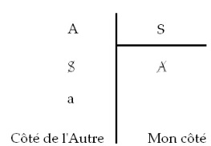

# Leçon 02 | 21 Novembre l962

  

    <label><input type="checkbox" data-lacan-toggle="original" checked> 原文</label>
    <label><input type="checkbox" data-lacan-toggle="notes" checked> 注释</label>
    <label><input type="checkbox" data-lacan-toggle="commentary" checked> 个人解读评论</label>
  

  <form class="lacan-tool-search" role="search">
    <input class="lacan-tool-search-input" type="search" placeholder="搜索全文" aria-label="搜索全文">
    <button class="lacan-tool-button" type="submit" title="搜索">搜索</button>
  </form>
  <button class="lacan-tool-button lacan-back-to-top" type="button" title="回到页面最上方" aria-label="回到页面最上方">↑</button>

<section class="parallel-paragraph" data-paragraph-ids="s10-02-0001">

s10-02-0001

原文 · s10-02-0001

Au moment de continuer aujourd’hui d’engager un peu plus mon dis­cours sur l’angoisse,
je peux légitimement poser devant vous la question de ce que c’est ici qu’un enseignement.

[无对应译文]

</section>

<section class="parallel-paragraph" data-paragraph-ids="s10-02-0002">

s10-02-0002

原文 · s10-02-0002

La notion que nous pouvons nous en faire doit tout de même subir quelqu’effet

[无对应译文]

</section>

<section class="parallel-paragraph" data-paragraph-ids="s10-02-0003">

s10-02-0003

原文 · s10-02-0003

- si ici nous sommes en principe, disons pour la plupart, des analystes,

[无对应译文]

</section>

<section class="parallel-paragraph" data-paragraph-ids="s10-02-0004">

s10-02-0004

原文 · s10-02-0004

- si *l’expérience analytique* est suppo­sée être ma référence essentielle quand je m’adresse à l’audience que vous composez, nous ne pouvons pas oublier que l’analyste est, si je puis dire, un *interprétant*.

[无对应译文]

</section>

<section class="parallel-paragraph" data-paragraph-ids="s10-02-0005">

s10-02-0005

原文 · s10-02-0005

Ιl joue sur ce temps si essentiel que j’ai déjà accentué à plusieurs reprises, à partir de plusieurs sujets pour vous,
sujets que nous laisserons indéter­minés donc en le rassemblant dans un « *on ne savait pas* ».
Par rapport à cet « *on ne savait pas* », l’analyste est censé savoir quelque chose.
Pourquoi pas même admettre qu’il en sait *un bout* ?

[无对应译文]

</section>

<section class="parallel-paragraph" data-paragraph-ids="s10-02-0006">

s10-02-0006

原文 · s10-02-0006

La question n’est pas de savoir - elle serait tout au moins prématurée - « *s’il peut l’enseigner* »...

[无对应译文]

</section>

<section class="parallel-paragraph" data-paragraph-ids="s10-02-0007">

s10-02-0007

原文 · s10-02-0007

> nous pouvons dire que jusqu’à un certain point, la seule existence d’un endroit comme ici et du rôle
>
> que j’y joue depuis un certain temps, c’est une façon de trancher la question, bien ou mal, mais de la trancher
> ...mais de savoir « *qu’est-ce que l’enseigner ?* »

[无对应译文]

</section>

<section class="parallel-paragraph" data-paragraph-ids="s10-02-0008">

s10-02-0008

原文 · s10-02-0008

*Qu’est-ce que l’enseigner...* quand il s’agit justement *<u>à cause de ce</u> qu’il s’agit d’enseigner*, *de l’enseigner*
*non seulement à* *qui ne sait pas*, mais...

[无对应译文]

</section>

<section class="parallel-paragraph" data-paragraph-ids="s10-02-0009">

s10-02-0009

原文 · s10-02-0009

> il faut admettre que jusqu’à un certain point nous sommes tous ici logés à la même enseigne
> ...*à qui* - étant donné ce dont il s’agit - *à qui ne peut pas savoir*.

[无对应译文]

</section>

<section class="parallel-paragraph" data-paragraph-ids="s10-02-0010">

s10-02-0010

原文 · s10-02-0010

Observez bien où porte, si je puis dire, le *porte à faux*. Un enseignement analytique s’il n’y avait pas ce *porte à faux*,
ce séminaire lui-même pourrait se concevoir dans la ligne, dans le prolongement de ce qui se passe par exemple dans un *contrôle,*
où c’est ce que vous savez, ce que vous sauriez, qui serait apporté,
et où je n’interviendrais que pour donner l’ana­logue de ce qui est l’interprétation,
à savoir cette addition moyennant quoi *quelque chose apparaît*, qui donne le sens à ce que vous croyez savoir,
*qui fait apparaître en un éclair* *ce qui est possible à saisir au-delà des limites du savoir*.

[无对应译文]

</section>

<section class="parallel-paragraph" data-paragraph-ids="s10-02-0011">

s10-02-0011

原文 · s10-02-0011

C’est tout de même dans la mesure où un savoir est, dans ce travail d’éla­boration...

[无对应译文]

</section>

<section class="parallel-paragraph" data-paragraph-ids="s10-02-0012">

s10-02-0012

原文 · s10-02-0012

> que nous dirons *communautaire* plus que collective
> ...de l’analyse, parmi ceux qui ont son expérience : les analystes, qu’un certain savoir est constitué,
> par rapport auquel un certain travail de *rassemblement* est concevable,
> qui justifie la place que peut prendre un enseignement comme celui qui est fait ici.

[无对应译文]

</section>

<section class="parallel-paragraph" data-paragraph-ids="s10-02-0013">

s10-02-0013

原文 · s10-02-0013

C’est parce que, si vous voulez, il y a - secrétée par l’expérience analytique - toute une littérature qui s’ap­pelle « *théorie analytique* », que je suis forcé, souvent bien contre mon gré, de lui faire ici autant de part.
Mais c’est elle, en quelque sorte qui nécessite que je fasse quelque chose qui doit aller au-delà de ce *rassemblemen*t,

[无对应译文]

</section>

<section class="parallel-paragraph" data-paragraph-ids="s10-02-0014">

s10-02-0014

原文 · s10-02-0014

et justement dans le sens de nous rapprocher, à travers ce *rassemblement,* de la « *théorie analytique* »,
de ce qui constitue sa source, à savoir l’expérience.

[无对应译文]

</section>

<section class="parallel-paragraph" data-paragraph-ids="s10-02-0015">

s10-02-0015

原文 · s10-02-0015

Ici se présente une ambiguïté qui ne tient pas seulement à ce qu’ici se mélangent à nous quelques non-analystes...
il n’y a pas à ça grands inconvé­nients, puisque aussi bien même les analystes arrivent ici avec des *positions*, des *postures*, des *attentes,* qui ne sont pas forcément analytiques, et déjà très suffisamment conditionnés par le fait que dans la théorie faite dans l’analyse s’in­troduisent des références de toute espèce - et beaucoup plus qu’il n’apparaît au premier abord –
qu’on peut qualifier d’« *extra-analytiques* », de « *psycholo­gisantes* » par exemple.

[无对应译文]

</section>

<section class="parallel-paragraph" data-paragraph-ids="s10-02-0016">

s10-02-0016

原文 · s10-02-0016

Du seul fait donc, que j’ai affaire à cette matière...

[无对应译文]

</section>

<section class="parallel-paragraph" data-paragraph-ids="s10-02-0017">

s10-02-0017

原文 · s10-02-0017

> matière de mon audience, matière de mon *objet* d’enseignement
> ...je serai amené à me référer à cette expérience commune qui est celle grâce à quoi s’établit toute communication enseignante,
> à savoir à ne pas pouvoir rester dans la pure position que j’ai appelée tout à l’heure « *interprétante* »,
> mais de passer à une position communicante plus large, à savoir à m’engager sur le terrain du « *faire comprendre* »,
> à faire appel en vous à une expérience qui va bien au-delà de la stricte expérience analytique.

[无对应译文]

</section>

<section class="parallel-paragraph" data-paragraph-ids="s10-02-0018">

s10-02-0018

原文 · s10-02-0018

Ceci est important à rappeler parce que le « *faire comprendre* » est de tout temps ce qui - en psychologie, au sens le plus large -
est vraiment la pierre d’achoppement.

[无对应译文]

</section>

<section class="parallel-paragraph" data-paragraph-ids="s10-02-0019">

s10-02-0019

原文 · s10-02-0019

Non pas tellement que l’accent doive être mis sur ce qui à un moment par exemple
a paru la grande originalité d’un ouvrage comme celui de Blondel[^13] sur *La Conscience morbide,* à savoir qu’il y a des limites
de la compréhension. Ne nous imaginons pas par exemple, que nous compre­nons le vécu, comme on dit, authentique, réel,
des malades. C’est pas la question de *la limite* qui est pour nous importante. Et au moment de vous parler de l’angoisse,
il importe bien sûr de vous faire remarquer que c’est une des questions qui est mise en suspens.

[无对应译文]

</section>

<section class="parallel-paragraph" data-paragraph-ids="s10-02-0020">

s10-02-0020

原文 · s10-02-0020

Pouvons-nous parler... À quel *titre* pouvons-nous parler de l’angoisse, quand nous subsumons sous cette rubrique :

[无对应译文]

</section>

<section class="parallel-paragraph" data-paragraph-ids="s10-02-0021">

s10-02-0021

原文 · s10-02-0021

- *cette angoisse* dans laquelle nous pouvons nous introduire à la suite de telle méditation guidée par Kierkegaard[^14],

[无对应译文]

</section>

<section class="parallel-paragraph" data-paragraph-ids="s10-02-0022">

s10-02-0022

原文 · s10-02-0022

- *cette angoisse* qui peut nous saisir à tel moment, paranormale ou même franche­ment pathologique, comme nous-mêmes sujets d’une expérience plus ou moins psycho-pathologiquement situable,

[无对应译文]

</section>

<section class="parallel-paragraph" data-paragraph-ids="s10-02-0023">

s10-02-0023

原文 · s10-02-0023

- *d’une angoisse* qui est celle à laquelle nous avons affaire avec nos *névrosés*, matériel ordinaire de notre expérience,

[无对应译文]

</section>

<section class="parallel-paragraph" data-paragraph-ids="s10-02-0024">

s10-02-0024

原文 · s10-02-0024

- *de l’angoisse* que nous pouvons décrire et localiser au principe d’une expérience plus périphérique pour nous, celle du pervers par exemple, voire du psychotique.

[无对应译文]

</section>

<section class="parallel-paragraph" data-paragraph-ids="s10-02-0025">

s10-02-0025

原文 · s10-02-0025

L’homogénéité *apparente*, la commune *substance* de ces expériences diversement repérables, ne nous induit-elle pas *dangereusement*,
*comme d’ailleurs toute autre rubrique qui peut ainsi parcourir ce champ comme constituant des références communes*, à trop présu­mer de ce que nous pouvons assumer des expériences auxquelles elle se réfè­re, celles nommément, par exemple, du pervers ou du psychotique.

[无对应译文]

</section>

<section class="parallel-paragraph" data-paragraph-ids="s10-02-0026">

s10-02-0026

原文 · s10-02-0026

Ιl n’est - dans cette pers­pective - pas trop désirable d’amener quiconque à trop à en croire sur ce qu’il peut *comprendre*.
C’est bien là que prennent leur importance *les élé­ments signifiants, aussi dénués que je m’efforce de les faire* - par leur notation - *de contenu compréhensible, et dont le rapport structural* est le moyen par où j’essaie de maintenir le niveau nécessaire pour que la com­préhension ne soit pas trompeuse, tout en laissant repérables les termes diversement significatifs dans lesquels nous nous avançons.

[无对应译文]

</section>

<section class="parallel-paragraph" data-paragraph-ids="s10-02-0027">

s10-02-0027

原文 · s10-02-0027

Et spécialement ceci, au moment où il s’agit - je lai introduit la dernière fois - d’un affect, je ne me suis pas refusé à cet élément de classement : l’angoisse est un affect, nous voyons que le mode d’abord d’un tel thème : « *l’angoisse est un affect* » se propose
à nous, du point de vue de l’enseignant, selon des voies différentes qu’on pourrait, je crois, assez sommairement...

[无对应译文]

</section>

<section class="parallel-paragraph" data-paragraph-ids="s10-02-0028">

s10-02-0028

原文 · s10-02-0028

> c’est-à-dire en en faisant bien effectivement la somme
> ...définir sous trois rubriques, celles du catalogue, à savoir - concernant l’affect - épuiser non seulement ce que ça veut dire,
> mais ce qu’on a voulu dire, en en constituant la catégorie.

[无对应译文]

</section>

<section class="parallel-paragraph" data-paragraph-ids="s10-02-0029">

s10-02-0029

原文 · s10-02-0029

Terme qui assurément nous met en pos­ture *d’enseigner au sujet de l’enseignement*, sous son mode le plus large, et forcément ici, raccorder ce qui s’est enseigné à l’intérieur de l’analyse, à ce qui nous est apporté du dehors au sens le plus vaste comme *catégorie*.

[无对应译文]

</section>

<section class="parallel-paragraph" data-paragraph-ids="s10-02-0030">

s10-02-0030

原文 · s10-02-0030

Et pourquoi pas ?
Il nous est arrivé là de très larges apports, et vous le verrez, pour reprendre une référence médiane qui viendra dans le champ
de notre attention, il y a concernant ce qui nous occupe cette année si tant est que cet objet central, je l’ai dit - de l’angoisse –
je suis loin de me refuser à l’insérer dans le catalogue des affects, dans les diverses théories qui ont été produites de l’affect.

[无对应译文]

</section>

<section class="parallel-paragraph" data-paragraph-ids="s10-02-0031">

s10-02-0031

原文 · s10-02-0031

Eh bien, pour prendre les choses, je vous ai dit, en une espèce de point médian de la coupure,
au niveau de Saint Thomas d’Aquin[^15], pour l’ap­peler par son nom, il y a de très très bonnes choses concernant une division, qu’il n’a pas inventée, concernant l’affect, entre le *concupiscible* et *l’irascible*. Et la longue discussion par laquelle il met en balance, selon la formule du débat scolastique : *proposition, objection, réponse,* à savoir *laquelle des deux caté­gories est première par rapport à l’autre*, et comment il tranche, et pourquoi.

[无对应译文]

</section>

<section class="parallel-paragraph" data-paragraph-ids="s10-02-0032">

s10-02-0032

原文 · s10-02-0032

Que malgré certaines apparences ou certaines références, *l’irascible* s’insère quelque part dans la chaîne du *concupiscible* toujours, lequel *concupiscible* donc, est par rapport à lui premier. Ceci ne sera pas sans nous servir.
Car à la vérité cette théorie ne serait-elle pas, au dernier terme, toute entière suspendue à une *supposition* d’un « *Souverain Bien* »...

[无对应译文]

</section>

<section class="parallel-paragraph" data-paragraph-ids="s10-02-0033">

s10-02-0033

原文 · s10-02-0033

> auquel, vous le savez, nous avons d’ores et déjà de grandes objections à faire
> ...elle serait pour nous fort recevable. Nous verrons ce que nous pouvons en garder, ce que pour nous elle éclaire.

[无对应译文]

</section>

<section class="parallel-paragraph" data-paragraph-ids="s10-02-0034">

s10-02-0034

原文 · s10-02-0034

Le seul fait que nous puissions... Je vous prie de vous y reporter, je vous donnerai en son temps les références :
nous y pouvons assurément trouver gran­de matière à alimenter notre propre réflexion.
Plus, *paradoxalement*, que ce que nous pouvons trouver dans les élaborations modernes, récentes...

[无对应译文]

</section>

<section class="parallel-paragraph" data-paragraph-ids="s10-02-0035">

s10-02-0035

原文 · s10-02-0035

> appelons les choses par leur nom : XIXème siècle

[无对应译文]

</section>

<section class="parallel-paragraph" data-paragraph-ids="s10-02-0036">

s10-02-0036

原文 · s10-02-0036

...d’une psy­chologie qui s’est prétendue, sans doute pas tout à fait à bon droit, plus expérimentale.

[无对应译文]

</section>

<section class="parallel-paragraph" data-paragraph-ids="s10-02-0037">

s10-02-0037

原文 · s10-02-0037

Encore ceci, cette voie, a-t-elle l’inconvénient de nous pous­ser dans le sens, *dans la catégorie du classement des affects*.
Et l’expérience nous prouve que tout abandon trop grand dans cette direction n’aboutit pour nous...

[无对应译文]

</section>

<section class="parallel-paragraph" data-paragraph-ids="s10-02-0038">

s10-02-0038

原文 · s10-02-0038

> et même si centralement nous le portions, par rapport à notre expérience,
>
> à cette partie sur laquelle tout à l’heure, j’ai mis le trait, l’accent : de *la théorie*
> ...qu’à des impasses manifestes, dont un très beau témoignage par exemple est donné par cet article, qui est celui du *tome* 34,
> *du volume* 34*, troisième partie, de* 1953, de l’*International Journal* où M. David Rapaport [^16] *tente une « théorie psychanalytique de l’affect* ».

[无对应译文]

</section>

<section class="parallel-paragraph" data-paragraph-ids="s10-02-0039">

s10-02-0039

原文 · s10-02-0039

Cet article est véritablement exemplaire par le bilan proprement consternant auquel, d’ailleurs, sans que la plume de l’auteur songe à le dissimuler, il aboutit.

[无对应译文]

</section>

<section class="parallel-paragraph" data-paragraph-ids="s10-02-0040">

s10-02-0040

原文 · s10-02-0040

C’est à savoir : il est étonnant qu’un auteur qui annonce de ce titre un article qui après tout, pourrait nous laisser espérer que quelque chose de nouveau, d’original en sorte, concernant ce que l’analyste peut penser de l’affect, n’aboutit en fin de compte qu’à lui aussi - à l’intérieur strictement de la théorie analytique - faire le cata­logue des acceptions dans lesquelles ce terme
a été employé, et de s’apercevoir qu’à l’intérieur même de la théorie ces acceptions sont les unes et les autres irréductibles :

[无对应译文]

</section>

<section class="parallel-paragraph" data-paragraph-ids="s10-02-0041">

s10-02-0041

原文 · s10-02-0041

- *la première* étant celle de l’affect conçu comme constituant substantiellement la décharge de la pulsion,

[无对应译文]

</section>

<section class="parallel-paragraph" data-paragraph-ids="s10-02-0042">

s10-02-0042

原文 · s10-02-0042

- *la seconde*, à l’intérieur de la même théorie, et même pour aller plus loin, prétendument du texte freudien lui-même, l’affect n’étant rien que la connotation d’une *tension* à ses diffé­rentes phases, *conflictuelles* ordinairement, l’affect constituant la connota­tion de cette *tension* en tant qu’elle varie, connota­tion de la *variation* *de tension*,

[无对应译文]

</section>

<section class="parallel-paragraph" data-paragraph-ids="s10-02-0043">

s10-02-0043

原文 · s10-02-0043

- et *troisième temps*, également mar­qué comme irréductible dans la théorie freudienne elle-même, l’affect constituant, dans une référence proprement topique, le signal au niveau de l’*ego*, concernant quelque chose qui se passe ailleurs, le danger venu d’ailleurs.

[无对应译文]

</section>

<section class="parallel-paragraph" data-paragraph-ids="s10-02-0044">

s10-02-0044

原文 · s10-02-0044

Concernant ce qui peut justifier que subsiste, et encore, dans les débats des auteurs les plus récemment venus dans la discussion analytique, la revendi­cation divergente de la primauté pour chacun de ces trois sens : qu’en sorte que *rien la-dessus ne soit résolu*,
et que l’auteur dont il s’agit ne puisse pas nous en dire plus, est tout de même bien le signe qu’ici la méthode dite du « *cata­logue* » ne saurait ne pas être marquée enfin d’un certain signe profond d’impasse, voire de tout à fait spéciale infécondité.

[无对应译文]

</section>

<section class="parallel-paragraph" data-paragraph-ids="s10-02-0045">

s10-02-0045

原文 · s10-02-0045

Ιl y a, se différenciant de cette méthode...

[无对应译文]

</section>

<section class="parallel-paragraph" data-paragraph-ids="s10-02-0046">

s10-02-0046

原文 · s10-02-0046

> je m’excuse de m’étendre aujourd’hui si longtemps sur *une question qui a pourtant un grand intérêt de préalable*, concernant l’opportunité de ce qu’ici nous faisons, et *ce n’est pas pour rien que je l’introduis*, vous le verrez, *concernant l’angoisse*
> ...c’est la méthode que j’appellerai, en me servant d’un besoin de conso­nance avec le précédent terme,
> la méthode de *« l’analogue* », qui nous mènerait à discerner ce qu’on peut appeler des « niveaux ».

[无对应译文]

</section>

<section class="parallel-paragraph" data-paragraph-ids="s10-02-0047">

s10-02-0047

原文 · s10-02-0047

J’ai vu, dans un ouvrage que je ne citerai pas autrement aujour­d’hui, une tentative de rassemblement de cette espèce, où l’on voit - en cha­pitres séparés - l’angoisse conçue, comme on s’exprime - c’est un ouvrage anglais - *biologiquement*, puis *sociologiquement*, puis que sais-je *culturally, culturellement,* comme si il suffisait ainsi de révéler, à des niveaux prétendus indépendants, des positions analogiques pour arriver à faire quelque chose d’autre qu’à dégager, non plus ce que j’ai appelé tout à l’heure « un classement », mais ici une sorte de « type ».

[无对应译文]

</section>

<section class="parallel-paragraph" data-paragraph-ids="s10-02-0048">

s10-02-0048

原文 · s10-02-0048

On sait à quoi aboutit une telle méthode : à ce qu’on appelle une *anthro­pologie*.
L’*anthropologie*, à nos yeux, est ce qui comporte le plus grand nombre de présupposés, et des plus hasardeux,
de toutes les voies dans les­quelles nous puissions nous engager.

[无对应译文]

</section>

<section class="parallel-paragraph" data-paragraph-ids="s10-02-0049">

s10-02-0049

原文 · s10-02-0049

Ce à quoi une telle méthode aboutit...

[无对应译文]

</section>

<section class="parallel-paragraph" data-paragraph-ids="s10-02-0050">

s10-02-0050

原文 · s10-02-0050

> de quelque éclectisme qu’elle se marque
> ...c’est toujours et nécessairement ce que nous, dans notre vocabulaire familier et sans faire de ce nom, ni de ce titre,
> l’indice de quelqu’un qui aurait même occupé une position si éminen­te, c’est ce que nous appelons le « *jungisme ».*

[无对应译文]

</section>

<section class="parallel-paragraph" data-paragraph-ids="s10-02-0051">

s10-02-0051

原文 · s10-02-0051

Sur le sujet de *l’anxiété*, ceci nous conduira *nécessairement* au thème de ce noyau central
qui est la thématique absolument *nécessaire* à laquelle aboutit une telle voie.
C’est dire qu’elle est fort loin de ce dont il s’agit dans l’*expérience*.

[无对应译文]

</section>

<section class="parallel-paragraph" data-paragraph-ids="s10-02-0052">

s10-02-0052

原文 · s10-02-0052

L’*expérience* nous conduit à ce que j’appellerai ici la troisième voie que je mettrai sous l’indice, sous la rubrique,
de la fonction que j’ap­pellerai celle de *la clé *:

[无对应译文]

</section>

<section class="parallel-paragraph" data-paragraph-ids="s10-02-0053">

s10-02-0053

原文 · s10-02-0053

- *La clé*, c’est ce qui ouvre, et ce qui pour ouvrir fonctionne.

[无对应译文]

</section>

<section class="parallel-paragraph" data-paragraph-ids="s10-02-0054">

s10-02-0054

原文 · s10-02-0054

- *La clé*, c’est la forme selon laquelle doit opérer, ou ne pas opérer, *la fonction signifiante* comme telle.

[无对应译文]

</section>

<section class="parallel-paragraph" data-paragraph-ids="s10-02-0055">

s10-02-0055

原文 · s10-02-0055

Et ce qui rend *légitime* que je l’annonce et la distingue et *ose l’introduire* comme quelque chose à quoi nous puissions nous confier, n’a rien qui soit ici marqué de présomption, pour la raison, je pense, qui vous sera...
et spécialement à ceux qui sont ici, de profession, des enseignants
...une référence suffi­samment convaincante, c’est que cette dimension est absolument connaturelle à tout enseignement, analytique ou pas, pour la raison qu’il n’y a pas d’enseignement, dirais-je...
*et dirais-je, <u>moi</u>* - quelque heurt qu’il puis­se en résulter auprès de certains concernant ce que j’enseigne, *et pourtant je le dirai*
...il n’y a pas d’enseignement qui ne se réfère à ce que j’appellerai « *un idéal de simplicité* ».

[无对应译文]

</section>

<section class="parallel-paragraph" data-paragraph-ids="s10-02-0056">

s10-02-0056

原文 · s10-02-0056

Que si *quelque chose* tout à l’heure est pour nous suffisante objection dans le fait qu’à procéder par une certaine voie,
*une chatte,* littéralement, *ne peut retrouver ses petits* concer­nant ce que nous pensons, nous analystes, à aller aux textes sur l’affect,
il y a quelque chose là de profondément insatisfaisant, et qu’il est *exigible* que, concernant quelque titre que ce soit,
nous satisfaisions à certain idéal de réduction simple.

[无对应译文]

</section>

<section class="parallel-paragraph" data-paragraph-ids="s10-02-0057">

s10-02-0057

原文 · s10-02-0057

Qu’est-ce que ça veut dire, et pourquoi ?
Pourquoi... pourquoi, depuis le temps qu’on fait de la science...

[无对应译文]

</section>

<section class="parallel-paragraph" data-paragraph-ids="s10-02-0058">

s10-02-0058

原文 · s10-02-0058

> car ces réflexions por­tent sur bien autre chose et sur des champs bien plus vastes que celui de notre expérience
> ...exige-t-on la plus grande simplicité possible ?
> Pourquoi le réel serait-il simple ?
> Qu’est-ce qui peut même nous permettre, un seul ins­tant, de le supposer?

[无对应译文]

</section>

<section class="parallel-paragraph" data-paragraph-ids="s10-02-0059">

s10-02-0059

原文 · s10-02-0059

Eh bien rien, mais rien d’autre que cet *initium* subjectif, sur lequel j’ai mis l’accent ici pendant toute la première partie
de mon enseignement de l’année dernière, à savoir, qu’il n’y a d’apparition concevable d’un sujet comme tel,
qu’à partir de l’introduction première d’un signifiant, et du signifiant le plus simple, qui s’appelle *le trait unaire*.
*Le trait unaire est d’avant le sujet,* « *Au commencement était le verbe* », ça veut dire : « *Au commencement est le trait unaire* ».

[无对应译文]

</section>

<section class="parallel-paragraph" data-paragraph-ids="s10-02-0060">

s10-02-0060

原文 · s10-02-0060

Et tout ce qui est enseignable doit conserver ce stigmate de cet *initium* ultra-simple
qui est la seule chose qui puisse à nos yeux justifier l’idéal de simplicité.
Simplex, singu­larité du trait, c’est cela que nous faisons entrer dans le *réel*, que le *réel* le veuille ou ne le veuille pas.

[无对应译文]

</section>

<section class="parallel-paragraph" data-paragraph-ids="s10-02-0061">

s10-02-0061

原文 · s10-02-0061

Mais il y a une chose certaine, *c’est que ça entre*,
qu’on y est déjà entré avant nous parce que d’ores et déjà c’est par cette voie que tous ces sujets…

[无对应译文]

</section>

<section class="parallel-paragraph" data-paragraph-ids="s10-02-0062">

s10-02-0062

原文 · s10-02-0062

> qui depuis tout de même quelques siècles, dialoguent et ont à s’arranger comme ils peuvent
>
> avec cette condition qu’ils soient justement, qu’il y ait entre eux et le *réel,* ce champ du signifiant
> …c’est d’ores et déjà avec cet appa­reil du *trait unaire* qu’ils se sont constitués comme sujets. Comment serions-nous, *<u>nous</u>*, étonnés que nous en retrouvions la marque dans ce qui est notre champ, si notre champ est celui du sujet ?

[无对应译文]

</section>

<section class="parallel-paragraph" data-paragraph-ids="s10-02-0063">

s10-02-0063

原文 · s10-02-0063

Dans l’analyse, il y a quelque chose qui est antérieur à tout ce que nous pouvons élaborer ou comprendre,
et ceci je l’appellerai « *présence de l’Autre* », grand A.
Ιl n’y a pas d’auto-analyse, même quand on se l’imagine, l’Autre - grand A - est là.

[无对应译文]

</section>

<section class="parallel-paragraph" data-paragraph-ids="s10-02-0064">

s10-02-0064

原文 · s10-02-0064

Je le rappelle parce que c’est déjà pour ramener à la simplicité le sens de ce que je vous dis, de ce que je vous indique,
de ce que j’ai commencé de vous indiquer en vous disant... en vous disant quelque chose qui va beaucoup plus loin, à savoir :
l’angoisse c’est un certain rapport, que je n’ai fait jusqu’ici qu’imager, je vous en ai rappelé la dernière fois l’image,
avec le dessin réévo­qué de ma présence, de ma présence fort modeste et embarrassée en présence de « *la mante religieuse géante* »,
je vous en ai déjà dit donc plus long en vous disant que ceci a rapport avec le désir de l’Autre.

[无对应译文]

</section>

<section class="parallel-paragraph" data-paragraph-ids="s10-02-0065">

s10-02-0065

原文 · s10-02-0065

Cet Autre...

[无对应译文]

</section>

<section class="parallel-paragraph" data-paragraph-ids="s10-02-0066">

s10-02-0066

原文 · s10-02-0066

> avant de savoir ce que ça veut dire *mon rapport avec son désir quand je suis dans l’angoisse*
> ...cet Autre je le mets d’abord là. Pour nous rapprocher de son désir, je prendrai - mon Dieu - les voies que j’ai déjà frayées.
> Je vous ai dit : « *Le désir de l’homme est le désir de l’Autre* ».

[无对应译文]

</section>

<section class="parallel-paragraph" data-paragraph-ids="s10-02-0067">

s10-02-0067

原文 · s10-02-0067

Je m’ex­cuse de ne pas pouvoir ici *revenir, par exemple, sur une analyse grammati­cale* que j’ai faite lors des dernières *Journées Provinciales...*
c’est pour ça que je tiens tellement à ce que ce texte m’arrive enfin intact, pour qu’on puisse à l’occasion le diffuser
...l’analyse grammaticale de ce que ça veut dire, mais enfin ceux qui ont été jusqu’ici à mon séminaire, peuvent tout de même,
je crois, ont assez d’éléments pour suffisamment le situer.

[无对应译文]

</section>

<section class="parallel-paragraph" data-paragraph-ids="s10-02-0068">

s10-02-0068

原文 · s10-02-0068

Sous la plume de quelqu’un[^17]...

[无对应译文]

</section>

<section class="parallel-paragraph" data-paragraph-ids="s10-02-0069">

s10-02-0069

原文 · s10-02-0069

> qui est justement l’auteur de ce petit travail auquel j’ai fait allusion en commençant cette année d’enseignement,
>
> la dernière fois, et qui m’avait été remis le matin même sur un sujet qui n’était rien d’autre que celui qu’aborde
>
> Lévi-Strauss, celui de la mise en suspension de ce qu’on peut appeler « *raison dialectique* »
>
> au niveau structuraliste où se place Lévi-Strauss[^18]

[无对应译文]

</section>

<section class="parallel-paragraph" data-paragraph-ids="s10-02-0070">

s10-02-0070

原文 · s10-02-0070

...quelqu’un se servant pour débrouiller ce débat, entrer dans ses détours, démêler son écheveau du point de vue analytique,
et faisant bien entendu référence à ce que j’ai pu dire du fantasme comme support du désir,
ne fait pas - à mon gré - suffisantes remarques de ce que je dis quand je parle du « *désir de l’homme comme désir de l’Autre* ».

[无对应译文]

</section>

<section class="parallel-paragraph" data-paragraph-ids="s10-02-0071">

s10-02-0071

原文 · s10-02-0071

Ce qui le prouve, c’est qu’il croit pouvoir se contenter de rappeler que c’est là une formule hégélienne.
Or s’il y a, je pense, quelqu’un *qui ne fait pas tort* à ce que nous a apporté la *Phénoménologie de l’esprit,* c’est moi-même.

[无对应译文]

</section>

<section class="parallel-paragraph" data-paragraph-ids="s10-02-0072">

s10-02-0072

原文 · s10-02-0072

S’il est un point pourtant où il est important de marquer que c’est là que je marque *la différence*,
et si vous voulez, pour employer ce terme, « le progrès », j’aimerais mieux encore « le saut », qui est le nôtre par rapport à Hegel, c’est justement concernant cette fonction du désir.

[无对应译文]

</section>

<section class="parallel-paragraph" data-paragraph-ids="s10-02-0073">

s10-02-0073

原文 · s10-02-0073

Je ne suis pas en posture, vu le champ que j’ai à couvrir cette année, de reprendre avec vous pas à pas le texte hégélien.
Je fais ici allusion à un auteur qui - j’espère - verra cet article publié et qui manifeste une tout à fait sensible connaissance
de ce que dit là-dessus Hegel.
Je ne vais même pas le suivre sur le plan du passage tout à fait, en effet, originel qu’il sait très bien rappeler à cette occasion.

[无对应译文]

</section>

<section class="parallel-paragraph" data-paragraph-ids="s10-02-0074">

s10-02-0074

原文 · s10-02-0074

Mais pour l’en­semble de ceux qui m’entendent et avec ce qui est déjà passé, je pense, au niveau le plus commun de cet auditoire concernant la référence hégélienne, je dirai tout de suite, pour faire sentir ce dont il s’agit, que dans Hegel,
concer­nant cette dépendance de mon désir par rapport au désirant qu’est l’Autre,
j’ai affaire, de la façon la plus certaine et la plus articulée à *l’Autre comme conscience*.

[无对应译文]

</section>

<section class="parallel-paragraph" data-paragraph-ids="s10-02-0075">

s10-02-0075

原文 · s10-02-0075

L’Autre est celui qui me voit, en quoi cela intéresse mon *désir*, vous le savez, vous l’entrevoyez déjà assez,
mais j’y reviendrai tout à l’heu­re, pour l’instant je fais *les oppositions massives,* l’Autre est celui qui me voit et c’est sur ce plan,
*sur ce plan* dont vous voyez qu’à lui tout seul il engage, selon les bases où Hegel inaugure la *Phénoménologie de l’Esprit* [^19],
la lutte sur le plan de ce qu’il appelle « *de pur prestige* », que mon désir y est intéressé.

[无对应译文]

</section>

<section class="parallel-paragraph" data-paragraph-ids="s10-02-0076">

s10-02-0076

原文 · s10-02-0076

Pour Lacan, si vous le permettez - parce que Lacan est analyste - l’Autre est là comme *incons­cience* constituée comme telle,
et il intéresse mon désir dans la mesure de ce *qui lui manque et qu’il ne sait pas*.
C’est au niveau de ce *qui lui manque et qu’il ne sait pas* que je suis intéressé de la façon la plus prégnante,
parce qu’il n’y a pas pour moi d’autre détour, à trouver ce qui me manque comme *objet de mon désir*.

[无对应译文]

</section>

<section class="parallel-paragraph" data-paragraph-ids="s10-02-0077">

s10-02-0077

原文 · s10-02-0077

C’est pourquoi il n’y a pas – pour moi – non seulement d’accès, mais même de sustentation possible de mon désir
qui soit pure référence à un *objet* quel qu’il soit, si ce n’est en le couplant, en le nouant, avec ceci qui s’exprime par l’S,
qui est cette nécessaire dépendance par rapport à l’Autre comme tel.

[无对应译文]

</section>

<section class="parallel-paragraph" data-paragraph-ids="s10-02-0078">

s10-02-0078

原文 · s10-02-0078

Lequel Autre est bien entendu celui qu’au cours de ces années,
je pense vous avoir rompus à distinguer, à chaque instant, de l’autre : mon semblable.
C’est *l’Autre comme lieu du signifiant*.
C’est mon semblable entre autres bien sûr, mais pas seulement,
puisque c’est aussi le lieu comme tel où s’institue l’ordre de « *la différence singulière* » dont je vous parlais au départ.

[无对应译文]

</section>

<section class="parallel-paragraph" data-paragraph-ids="s10-02-0079">

s10-02-0079

原文 · s10-02-0079

Vais-je introduire maintenant les formules que je vous ai ici marquées à droite...

[无对应译文]

</section>

<section class="parallel-paragraph" data-paragraph-ids="s10-02-0080">

s10-02-0080

原文 · s10-02-0080

> 1\) *d(a)* : *d(*A*) \< a*
>
> 2\) *d(a) \< i(a)* : *d(***A***)*
>
> 3\) *d(x)* : *d(***A***) \< x*
>
> 4\) *d*(0) *\<* 0 : *d(***A***)*
>
> *d(a)* : 0 *\> d*(0*)*
> dont je ne prétends pas, *loin de là*, étant donné ce que je vous ai dit tout d’abord, qu’elles vous livrent immédiatement *leurs malices*.
> Je vous prie aujourd’hui, comme la dernière fois - c’est pour cela que cette année j’écris des choses au tableau :
> c’est pour que vous les transcriviez. Vous en verrez après le fonctionnement.

[无对应译文]

</section>

<section class="parallel-paragraph" data-paragraph-ids="s10-02-0081">

s10-02-0081

原文 · s10-02-0081

\[1\] *d(a)* : *d(*A*) \< a*

[无对应译文]

</section>

<section class="parallel-paragraph" data-paragraph-ids="s10-02-0082">

s10-02-0082

原文 · s10-02-0082

Le « *désir de désir* », au sens hégélien, est donc désir qu’un désir réponde à l’appel du sujet : il est désir d’un *désirant*.
Ce *désirant* qui est l’Autre, pourquoi en a-t-il besoin ?
C’est, sous quelque angle que vous vous placiez, mais de la façon la plus articulée dans Hegel,
qu’il en a besoin pour *que l’Autre le reconnaisse*, pour recevoir de lui *la reconnaissance*.

[无对应译文]

</section>

<section class="parallel-paragraph" data-paragraph-ids="s10-02-0083">

s10-02-0083

原文 · s10-02-0083

Ça veut dire quoi ?
Que l’Autre, comme tel, va instituer quelque chose : *petit(a)*, qui est juste­ment ce dont il s’agit au niveau de ce qui désire.
C’est là qu’est toute l’im­passe : exigeant d’être reconnu par lui, je suis reconnu comme *« objet »*,
puisqu’il est dans son essence une conscience, une *Selbst­bewusstsein,* et *il n’y a plus d’autre médiation possible que celle de la violence *:
j’obtiens ce que je désire, je suis objet, et je ne puis me supporter comme objet, je ne puis me supporter reconnu dans le mode, le seul mode de reconnaissance que je puisse obtenir. Il faut donc à tout prix qu’on en tranche entre nos deux consciences.

[无对应译文]

</section>

<section class="parallel-paragraph" data-paragraph-ids="s10-02-0084">

s10-02-0084

原文 · s10-02-0084

Le « *désir de désir* », au sens lacanien ou analytique, est « *désir de l’Autre* »
d’une façon beaucoup plus principiellement ouverte à une sorte de *médiation*.
Du moins le semble-t-il au premier abord.
Parce que le désir ici, vous verrez que dans la formule même, le signifiant que je mets là au tableau : \[2\] *d(a) \< i(a)* : *d(***A***),*
je vais assez loin dans le sens de traverser, je veux dire de contrarier ce que vous pourriez attendre.

[无对应译文]

</section>

<section class="parallel-paragraph" data-paragraph-ids="s10-02-0085">

s10-02-0085

原文 · s10-02-0085

Il est désir, écris-je, en tant que *l’image support de ce désir*, rapport donc

[无对应译文]

</section>

<section class="parallel-paragraph" data-paragraph-ids="s10-02-0086">

s10-02-0086

原文 · s10-02-0086

- de *d(a),*

[无对应译文]

</section>

<section class="parallel-paragraph" data-paragraph-ids="s10-02-0087">

s10-02-0087

原文 · s10-02-0087

- à ce que j’écris, à ce que je n’hésite pas à écrire *i(a)*, même et juste­ment parce que cela fait ambiguïté avec la notation que je désigne d’habitu­de de *l’image spéculaire* \[*i’(a*) : m\]. Là nous ne savons pas encore *quand*, *comment* et *pourquoi*, ça peut l’être - *l’image spéculaire* - mais *c’est une image* assurément. *Ça n’est pas l’image spéculaire !* C’est *de l’ordre* *de* l’image : *c’est le fan­tasme* que je n’hésite pas à l’occasion à recouvrir par cette notation de *l’image spéculaire*.

[无对应译文]

</section>

<section class="parallel-paragraph" data-paragraph-ids="s10-02-0088">

s10-02-0088

原文 · s10-02-0088

Je dis donc que *ce désir est désir* en tant que son *image sup­port* est l’équivalent...

[无对应译文]

</section>

<section class="parallel-paragraph" data-paragraph-ids="s10-02-0089">

s10-02-0089

原文 · s10-02-0089

> c’est pour ça que les deux points \[ : \] qui étaient ici  \[1\] *d(a)* : *d(*A*) \< a,* sont là \[2\] *d(a) \< i(a)* : *d(***A***)*
> ...est l’équivalent du *désir de l’Autre*. Mais là, *l’Autre est connoté* **A** parce que c’est l’Autre au point où *il se caractérise comme manque.*

[无对应译文]

</section>

<section class="parallel-paragraph" data-paragraph-ids="s10-02-0090">

s10-02-0090

原文 · s10-02-0090

Les deux autres formules \[3 et 4\], car il n’y en a deux, celle-ci :

[无对应译文]

</section>

<section class="parallel-paragraph" data-paragraph-ids="s10-02-0091">

s10-02-0091

原文 · s10-02-0091

- \[3\] *d(x)* : *d(***A***) \< x*

[无对应译文]

</section>

<section class="parallel-paragraph" data-paragraph-ids="s10-02-0092">

s10-02-0092

原文 · s10-02-0092

et puis :

[无对应译文]

</section>

<section class="parallel-paragraph" data-paragraph-ids="s10-02-0093">

s10-02-0093

原文 · s10-02-0093

- \[4\] *d*(0) *\<* 0 : *d(***A***)* *d(a)* : 0 *\> d*(0) \[*le désir dans* **A** *est désir de* (*a*) *comme* « *reste* » : *d(***A***) ≡ d(a)* \]

[无对应译文]

</section>

<section class="parallel-paragraph" data-paragraph-ids="s10-02-0094">

s10-02-0094

原文 · s10-02-0094

La secon­de - ici englobées dans une accolade - n’est constituée que par deux façons d’écrire la même,
dans un sens, puis dans le *sens palindromique*, n’est-ce pas, en revenant : après avoir été comme ça \[→\], en revenant ainsi \[←\].

[无对应译文]

</section>

<section class="parallel-paragraph" data-paragraph-ids="s10-02-0095">

s10-02-0095

原文 · s10-02-0095

C’est tout ce qu’écrit la 3ème ligne.

[无对应译文]

</section>

<section class="parallel-paragraph" data-paragraph-ids="s10-02-0096">

s10-02-0096

原文 · s10-02-0096

Je ne sais donc si j’aurai le temps d’arriver aujourd’hui jusqu’à la traduction de ces deux dernières for­mules.
Sachez pourtant, d’ores et déjà, qu’elles sont faites l’une et l’autre :

[无对应译文]

</section>

<section class="parallel-paragraph" data-paragraph-ids="s10-02-0097">

s10-02-0097

原文 · s10-02-0097

- La première : \[3\] *d(x)* : *d(***A***) \< x,* pour mettre en évidence que l’angoisse est ce qui donne la vérité de *la formule hégélienne*.

[无对应译文]

</section>

<section class="parallel-paragraph" data-paragraph-ids="s10-02-0098">

s10-02-0098

原文 · s10-02-0098

À savoir que si *la formule hégélienne* est *partiale* et *fausse* et met en porte-à-faux tout le départ de la *Phénoménologie de l’esprit...*

[无对应译文]

</section>

<section class="parallel-paragraph" data-paragraph-ids="s10-02-0099">

s10-02-0099

原文 · s10-02-0099

> comme je l’ai plusieurs fois déjà indiqué en vous montrant la perversion qui résulte - et très loin, et jusque dans le domaine politique - de ce départ trop étroitement centré sur l’*imaginaire*. Car c’est très joli de dire que la servitu­de de l’esclave est grosse de tout l’avenir jusqu’au *Savoir Absolu,* mais politiquement ça veut dire que *jusqu’à la fin des temps* *l’esclave restera esclave*. C’est tout de même nécessaire qu’on mette de temps en temps les pieds dans le plat !
> ...la vérité de la formule hégelienne existe pourtant, et c’est justement Kierkegaard qui la donne.
> Ce n’est pas autre chose - je le commenterai, je pense, la prochaine fois - que veut dire ici la première ligne.

[无对应译文]

</section>

<section class="parallel-paragraph" data-paragraph-ids="s10-02-0100">

s10-02-0100

原文 · s10-02-0100

La seconde formule : \[4\] *d*(0) *\<* 0 : *d(*A*)*

[无对应译文]

</section>

<section class="parallel-paragraph" data-paragraph-ids="s10-02-0101">

s10-02-0101

原文 · s10-02-0101

*d(*A*)* : 0 *\> d*(0)

[无对应译文]

</section>

<section class="parallel-paragraph" data-paragraph-ids="s10-02-0102">

s10-02-0102

原文 · s10-02-0102

nous le verrons, c’est, non pas la vérité de Hegel, mais la vérité de l’angoisse, qui elle ne peut se saisir qu’à se référer
à la deuxième ligne, c’est-à-dire à la formule concer­nant le désir au niveau analytique.

[无对应译文]

</section>

<section class="parallel-paragraph" data-paragraph-ids="s10-02-0103">

s10-02-0103

原文 · s10-02-0103

Avant de vous quitter aujourd’hui, je veux simplement pointer quelques remarques, c’est que ce que vous voyez apparaître
dans les deux formules :

[无对应译文]

</section>

<section class="parallel-paragraph" data-paragraph-ids="s10-02-0104">

s10-02-0104

原文 · s10-02-0104

- dans celle de Hegel  : \[1\] *d(a)* : *d(*A*) \< a*

[无对应译文]

</section>

<section class="parallel-paragraph" data-paragraph-ids="s10-02-0105">

s10-02-0105

原文 · s10-02-0105

- comme dans la mienne : \[2\] *d(a) \< i(a)* : *d(***A***)* …dans le premier terme des deux formules, c’est que, si paradoxal que ça puisse apparaître, c’est un *objet(a)...*

[无对应译文]

</section>

<section class="parallel-paragraph" data-paragraph-ids="s10-02-0106">

s10-02-0106

原文 · s10-02-0106

> Tiens, pendant que j’y pense - j’y ai pensé tout à l’heure en l’écrivant - ce que vous avez à lire 0, ce n’est pas O,
>
> je vous le dis tout de suite pour ne pas vous tromper, *c’est zéro*, ça se lit zéro
> … bon je reprends : c’est un *objet(a)* qui désire.

[无对应译文]

</section>

<section class="parallel-paragraph" data-paragraph-ids="s10-02-0107">

s10-02-0107

原文 · s10-02-0107

S’il y a des différences, *il y a quelque chose de commun* entre le concept hégélien du désir et celui que je promeus ici devant vous. *C’est qu’à un moment*, qui est justement *le point d’impasse inacceptable dans le procès de la « Selbstbewusstsein »* dans Hegel, c’est un « *objet »*,
c’est-à-dire ce *quelque chose* où le sujet, étant *cet objet*, est irrémédiablement marqué de *finitude,* c’est *cet objet* qui est affecté du désir.

[无对应译文]

</section>

<section class="parallel-paragraph" data-paragraph-ids="s10-02-0108">

s10-02-0108

原文 · s10-02-0108

Et c’est ce en quoi ce que je produis devant vous a quelque chose de commun avec la théorie hégélienne,
à ceci près qu’à notre niveau, analytique, qui n’exigeant pas la transparence du *Selbstbewusstsein*...

[无对应译文]

</section>

<section class="parallel-paragraph" data-paragraph-ids="s10-02-0109">

s10-02-0109

原文 · s10-02-0109

> c’est une difficulté bien sûr, mais pas de nature à nous faire rebrousser chemin,
>
> ni non plus à nous engager dans « *la lutte à mort »* avec l’Autre
> ...à cause de l’existence de *l’inconscient*, nous pouvons être *cet objet* affecté du désir.

[无对应译文]

</section>

<section class="parallel-paragraph" data-paragraph-ids="s10-02-0110">

s10-02-0110

原文 · s10-02-0110

C’est même en tant que marqués ainsi de finitude, que nous - sujets de l’inconscient - notre manque peut être désir, *désir fini*.
*Désir fini* en apparence indéfini, parce que le manque, participant toujours de quelque vide, peut être rempli de plusieurs façons, d’abord… encore que nous sachions très bien, parce que nous sommes analystes,
que nous ne le remplissons pas de *trente-six façons*. Et nous verrons pourquoi, et lesquelles.

[无对应译文]

</section>

<section class="parallel-paragraph" data-paragraph-ids="s10-02-0111">

s10-02-0111

原文 · s10-02-0111

La dimension, je dirais classique, moraliste, non pas tellement théolo­gique, de *l’infinitude du désir*,
est dans cette perspective, tout à fait à *rédui­re*. Car cette pseudo-infinitude ne tient qu’à une chose,
qu’heureusement une certaine partie de la théorie du *signifiant,* qui n’est rien d’autre que celle du *nombre entier*,
nous permet d’imager :
cette fausse infinitude est liée à cette sorte de *métonymie* que, concernant la définition du nombre entier, on appelle la récurrence. C’est la loi tout simplement, que nous avons, je le crois, puissamment accentuée l’année dernière à propos du **1** *répétitif*.

[无对应译文]

</section>

<section class="parallel-paragraph" data-paragraph-ids="s10-02-0112">

s10-02-0112

原文 · s10-02-0112

Mais ce que nous démontre notre expérience...
et je vous l’articulerai dans les divers champs qui lui sont proposés,
nommément, et distinctement : le *névrosé*, le *pervers*, voire le *psychotique...c’est que ce* **1**...
auquel se réduit en dernière analyse la succession des éléments signifiants,
le fait qu’ils soient distincts et qu’ils se succèdent
...*n’épuise pas la fonction de l’Autre*.
Et c’est ce que j’exprime ici...

[无对应译文]

</section>

<section class="parallel-paragraph" data-paragraph-ids="s10-02-0113">

s10-02-0113

原文 · s10-02-0113

- à partir de cet Autre originaire comme *lieu du signifiant*,

[无对应译文]

</section>

<section class="parallel-paragraph" data-paragraph-ids="s10-02-0114">

s10-02-0114

原文 · s10-02-0114

- de cet S encore non existant qui a à s’y situer comme déterminé par le signi­fiant ...sous la forme de ces deux colonnes qui sont celles sous lesquelles, vous le savez, on peut écrire l’opération de la division. Par rapport à cet Autre, dépendant de cet Autre, le sujet s’inscrit comme un *quotient*, il est marqué du *trait unaire du signifiant* dans le champ de l’Autre.

[无对应译文]

</section>

<section class="parallel-paragraph" data-paragraph-ids="s10-02-0115">

s10-02-0115

原文 · s10-02-0115

[无对应译文]

</section>

<section class="parallel-paragraph" data-paragraph-ids="s10-02-0116">

s10-02-0116

原文 · s10-02-0116

Eh bien, c’est pas pour autant, si je puis dire, qu’il mette l’Autre en rondelles : *il y a un reste*, au sens de la division, *un résidu*.
Ce *reste*, cet autre dernier, cet irrationnel, cette preuve et seule garantie en fin de comp­te de l’*altérité* de l’Autre, c’est le *petit(a)*.

[无对应译文]

</section>

<section class="parallel-paragraph" data-paragraph-ids="s10-02-0117">

s10-02-0117

原文 · s10-02-0117

Et c’est pourquoi les deux termes, S et *a*...

[无对应译文]

</section>

<section class="parallel-paragraph" data-paragraph-ids="s10-02-0118">

s10-02-0118

原文 · s10-02-0118

- le sujet comme marqué de la barre du signifiant,

[无对应译文]

</section>

<section class="parallel-paragraph" data-paragraph-ids="s10-02-0119">

s10-02-0119

原文 · s10-02-0119

- le *petit(a)* objet, comme résidu de *la mise en condition*, si je puis m’exprimer ainsi, de l’Autre ...*sont du même côté* tous les deux, \[*côté*\] *objectif de la barre*, <u>*tous les deux du* *côté de l’Autre*</u>.

[无对应译文]

</section>

<section class="parallel-paragraph" data-paragraph-ids="s10-02-0120">

s10-02-0120

原文 · s10-02-0120

*Le fantasme* \[S ◊ *a*\]*, appui de mon désir*, est dans sa totalité du côté de l’Autre, S et *a*.
Ce qui est de mon coté maintenant, c’est justement ce qui me constitue comme *inconscient  *: à savoir **A**,
l’Autre en tant que je ne l’at­teins pas. Vais-je ici vous mener plus loin ? Non, car le temps me manque.

[无对应译文]

</section>

<section class="parallel-paragraph" data-paragraph-ids="s10-02-0121">

s10-02-0121

原文 · s10-02-0121

Et pour ne pas vous quitter sur un point aussi fermé quant à la suite de la dialectique qui va s’y insérer,
et qui, vous le verrez, nécessite que le prochain pas que j’ai à vous expliquer, c’est ce que j’*engage* dans l’affaire,
*à savoir dans la subsistance du fantasme.*
J’imagerai le sens de ce que j’ai à produire, d’un rappel à *une expérience*, qui je pense vous sera *dans*...
mon Dieu - ce qui vous intéresse le plus, ce n’est pas moi qui l’ai dit, c’est Freud
...*l’expérien­ce de l’amour, de quelque utilité*.

[无对应译文]

</section>

<section class="parallel-paragraph" data-paragraph-ids="s10-02-0122">

s10-02-0122

原文 · s10-02-0122

Je veux vous faire remarquer, au point où nous en sommes de cette théorie du désir dans son rapport à l’Autre,
vous avez la clé de ceci, c’est que...

[无对应译文]

</section>

<section class="parallel-paragraph" data-paragraph-ids="s10-02-0123">

s10-02-0123

原文 · s10-02-0123

> contrairement à l’*espoir* que vous pourrait donner la *perspective hégélienne*
> *...*que le mode de la conquête de l’autre n’est pas celui...

[无对应译文]

</section>

<section class="parallel-paragraph" data-paragraph-ids="s10-02-0124">

s10-02-0124

原文 · s10-02-0124

> hélas, trop souvent adopté par un des partenaires
> *...*« *Je t’aime, même si tu ne le veux pas* ».

[无对应译文]

</section>

<section class="parallel-paragraph" data-paragraph-ids="s10-02-0125">

s10-02-0125

原文 · s10-02-0125

Ne croyez pas que Hegel ne se soit pas aperçu de ce prolongement de sa doctrine.
Ιl y a une *très, très précieuse* petite note où il indique que c’est bien par là qu’il aurait pu faire passer toute sa dialectique.
C’est la même note où il dit que, s’il n’a pas pris cette voie, c’est parce qu’elle lui paraissait *manquer de sérieux*.
Combien il a raison ! \[*rires*\] Faites l’expérience, vous me direz des nou­velles sur son succès !

[无对应译文]

</section>

<section class="parallel-paragraph" data-paragraph-ids="s10-02-0126">

s10-02-0126

原文 · s10-02-0126

Ιl y a pourtant *une autre formule*, qui, si elle ne démontre pas mieux son efficace, ce n’est peut-être que pour n’être pas articulable, mais ça ne veut pas dire qu’elle ne soit pas articulée, c’est « *Je te désire, même si je ne le sais pas* ». Partout où elle réussit,
toute inarticulable qu’elle soit, à se faire entendre, celle-là - je vous l’assure - est irrésistible. Et pourquoi ?
Je ne vous laisserai pas ceci à l’état de devinette.

[无对应译文]

</section>

<section class="parallel-paragraph" data-paragraph-ids="s10-02-0127">

s10-02-0127

原文 · s10-02-0127

Si ceci était dicible, qu’est-ce que je dirais par là ? Je dis à l’autre que, le désirant sans le savoir sans doute, toujours sans le savoir, je le prends pour *l’objet* à moi-même inconnu de mon désir, c’est-à-dire, dans notre conception à nous du désir,
que je l’identifie, que je t’identifie, toi à qui je *parle*, toi-même, à *l’objet* qui te manque à toi-même.

[无对应译文]

</section>

<section class="parallel-paragraph" data-paragraph-ids="s10-02-0128">

s10-02-0128

原文 · s10-02-0128

C’est-à-dire que par ce circuit où je suis obli­gé pour atteindre l’objet de mon désir, *j’accomplis* justement *pour lui ce qu’il cherche*. C’est bien ainsi, qu’innocemment ou pas, si je prends ce détour, l’autre comme tel...

[无对应译文]

</section>

<section class="parallel-paragraph" data-paragraph-ids="s10-02-0129">

s10-02-0129

原文 · s10-02-0129

> *objet ici* - observez-le - *de mon amour*
> ...tombera forcément dans mes rets.

[无对应译文]

</section>

<section class="parallel-paragraph" data-paragraph-ids="s10-02-0130">

s10-02-0130

原文 · s10-02-0130

Je vous quitte là-dessus, sur cette recette, et je vous dis « *à la prochaine fois* ».

[无对应译文]

</section>

<section class="note-block original-notes">

## Notes

[^13]: Charles Blondel : *La Conscience Morbide, Essai De Psychopathologie Générale*, Paris, F. Alcan, 1914.

[^14]: Kierkegaard : *Le concept de l’angoisse*, Paris, Gallimard, 1990.

[^15]: Thomas d'Aquin : [*Questions disputées* IV: *de l'âme*](http://docteurangelique.free.fr/), L'Harmattan, 2003.

[^16]: David Rapaport : *On the psychoanalytic theory of affect*, *International Journal of* psychoanalysis, Vol. 34, N°3, 1953.

[^17]: André Green dans son article sur l’ouvrage de Claude Lévi-Strauss : « La pensée sauvage »

[^18]: Claude Lévi-Strauss : *La pensée sauvage*, Paris, Plon, 1962 (ou Pocket n°2, 1990)

[^19]: G.W.F. Hegel : *La phénoménologie de l'esprit*, Aubier Montaigne, 1941.

</section>
