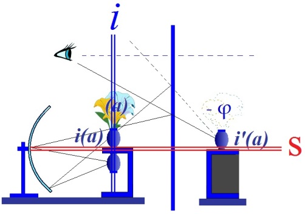
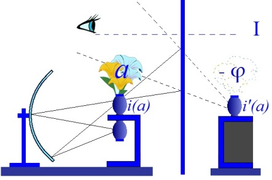
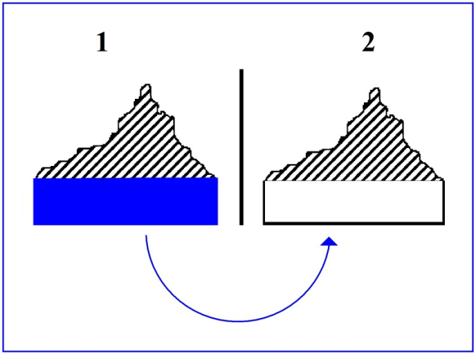
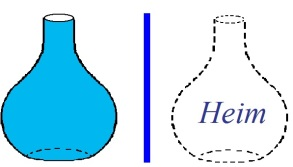
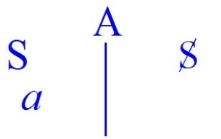

# Leçon 04 | 05 Décembre l962

  

    <label><input type="checkbox" data-lacan-toggle="original" checked> 原文</label>
    <label><input type="checkbox" data-lacan-toggle="notes" checked> 注释</label>
    <label><input type="checkbox" data-lacan-toggle="commentary" checked> 个人解读评论</label>
  

  <form class="lacan-tool-search" role="search">
    <input class="lacan-tool-search-input" type="search" placeholder="搜索全文" aria-label="搜索全文">
    <button class="lacan-tool-button" type="submit" title="搜索">搜索</button>
  </form>
  <button class="lacan-tool-button lacan-back-to-top" type="button" title="回到页面最上方" aria-label="回到页面最上方">↑</button>

<section class="parallel-paragraph" data-paragraph-ids="s10-04-0001">

s10-04-0001

原文 · s10-04-0001

[无对应译文]

</section>

<section class="parallel-paragraph" data-paragraph-ids="s10-04-0002">

s10-04-0002

原文 · s10-04-0002

Je vous repose donc au tableau cette figure, ce schéma où je me suis enga­gé avec vous la dernière fois dans l’articulation
de ce qui est notre objet, à savoir : par l’angoisse...
je dis : par son phénomène, mais aussi par la place que je vais vous apprendre à désigner comme étant la sienne
...à approfondir *la fonction de l’objet* dans l’expérience analytique.

[无对应译文]

</section>

<section class="parallel-paragraph" data-paragraph-ids="s10-04-0003">

s10-04-0003

原文 · s10-04-0003

Brièvement, je veux vous signaler que va bientôt paraître quelque chose que j’ai pris la peine de rédiger d’une intervention,
d’une communication, que j’ai faite il y a maintenant plus de deux ans, c’était le 2 l septembre 60,
à une réunion hégelienne de Royaumont, pour laquelle j’avais choisi de traiter le sujet suivant :
*Subversion du sujet et dialectique du désir dans l’inconscient freudien* [^28].

[无对应译文]

</section>

<section class="parallel-paragraph" data-paragraph-ids="s10-04-0004">

s10-04-0004

原文 · s10-04-0004

Je signale à ceux qui sont déjà familiarisés avec mon enseignement, qu’en somme je pense qu’ils y trouveront toute satisfaction concernant les temps de construction et l’utilisation, le fonctionnement, de ce que nous avons appelé ensemble « *le graphe »*.

[无对应译文]

</section>

<section class="parallel-paragraph" data-paragraph-ids="s10-04-0005">

s10-04-0005

原文 · s10-04-0005

Ceci est publié à un centre qui est l73 *boulevard Saint Germain* et qui se charge de publier tous ces travaux de Royaumont.
Je pense que ce travail viendra bientôt au jour dans un volu­me qui comprendra également les autres interventions,
qui ne sont pas toutes spécialement *analytiques*, qui ont été faites au cours de cette réunion, je le répète, centrée sur l’*hégélianisme*.

[无对应译文]

</section>

<section class="parallel-paragraph" data-paragraph-ids="s10-04-0006">

s10-04-0006

原文 · s10-04-0006

Ceci vient à sa place aujourd’hui dans la mesure où « *subversion du sujet »* comme « *dialectique du désir »*, c’est ce qui encadre
pour nous *ces fonctions de l’objet* dans lesquelles nous allons maintenant avoir à nous avancer plus profondément.

[无对应译文]

</section>

<section class="parallel-paragraph" data-paragraph-ids="s10-04-0007">

s10-04-0007

原文 · s10-04-0007

À cet égard, spécialement pour ceux qui viennent ici *en novices*, je ne pense pas que je puisse rencontrer d’aucune façon *la réaction*, je dois dire *fort antipathique,* dont je me souviens encore qu’elle fut celle qui accueillit ce travail ainsi intitulé...

[无对应译文]

</section>

<section class="parallel-paragraph" data-paragraph-ids="s10-04-0008">

s10-04-0008

原文 · s10-04-0008

> je vous l’ai dit, au Congrès de Royaumont
> ...de la part, à mon étonnement, de philosophes que je croyais plus endurcis à l’accueil de l’inhabituel,
> et qui assurément dans quelque chose qui était justement fait pour remettre très profondément en question devant eux
> la fonction de *l’objet,* et de *l’objet du désir* nommément, aboutit de leur part à *une impression* que je ne peux pas *qualifier* autrement que comme ils l’ont qualifiée eux-mêmes, celle d’une sorte de cauchemar, voire d’élucubration sortie d’un certain *diabolisme*.

[无对应译文]

</section>

<section class="parallel-paragraph" data-paragraph-ids="s10-04-0009">

s10-04-0009

原文 · s10-04-0009

Est-ce qu’il ne semble pas pourtant que tout, dans une expérience que j’appellerai « *moderne »*...

[无对应译文]

</section>

<section class="parallel-paragraph" data-paragraph-ids="s10-04-0010">

s10-04-0010

原文 · s10-04-0010

> une expérience au niveau de ce qu’apporte de modifi­cations profondes à l’appréhension de l’objet,
>
> l’ère que je ne suis pas le premier à qualifier comme « *l’ère de la technique* »
> ...est-ce que déjà ça ne doit pas nous apporter l’idée *qu’un discours sur l’objet doit obligatoirement passer par des rapports complexes*,
> qui ne nous en permettent l’accès qu’à travers de profondes chicanes ?

[无对应译文]

</section>

<section class="parallel-paragraph" data-paragraph-ids="s10-04-0011">

s10-04-0011

原文 · s10-04-0011

Est-ce qu’on ne peut pas dire que par exemple ce module d’objet si caractéristique de ce qui nous est donné...

[无对应译文]

</section>

<section class="parallel-paragraph" data-paragraph-ids="s10-04-0012">

s10-04-0012

原文 · s10-04-0012

> je parle dans l’expérience la plus externe, il ne s’agit pas d’expérience analy­tique
> ...ce modèle d’objet qu’on appelle « *la pièce détachée* » ?

[无对应译文]

</section>

<section class="parallel-paragraph" data-paragraph-ids="s10-04-0013">

s10-04-0013

原文 · s10-04-0013

Est-ce que ce n’est pas quelque chose qui mérite qu’on s’y arrête
et qui apporte une dimension profondément nouvelle à toute interrogation [*noétique*](http://www.cnrtl.fr/lexicographie/noetique) concernant notre rapport à l’objet ?

[无对应译文]

</section>

<section class="parallel-paragraph" data-paragraph-ids="s10-04-0014">

s10-04-0014

原文 · s10-04-0014

Car enfin, qu’est-ce que c’est qu’une *pièce détachée* ?

[无对应译文]

</section>

<section class="parallel-paragraph" data-paragraph-ids="s10-04-0015">

s10-04-0015

原文 · s10-04-0015

Quelle est sa subsistance en dehors de son emploi éventuel par rapport à un certain modèle qui est en fonction,
mais qui peut aussi bien devenir désuet, n’être plus renouvelé comme on dit ?
À la suite de quoi, que devient, quel sens a « *la pièce détachée »* ?

[无对应译文]

</section>

<section class="parallel-paragraph" data-paragraph-ids="s10-04-0016">

s10-04-0016

原文 · s10-04-0016

Pourquoi ce profil d’un certain rapport énigmatique à l’objet ne nous servirait-il pas aujourd’hui d’introduction, de rappel à ceci :
que ce n’est pas vaine complication, qu’il n’y a ni à nous étonner, ni à nous raidir devant un schéma
tel que celui que je vous ai rappelé - il était déjà introduit la dernière fois - et qu’il résulte :

[无对应译文]

</section>

<section class="parallel-paragraph" data-paragraph-ids="s10-04-0017">

s10-04-0017

原文 · s10-04-0017

[无对应译文]

</section>

<section class="parallel-paragraph" data-paragraph-ids="s10-04-0018">

s10-04-0018

原文 · s10-04-0018

- que c’est à cette place, à la place où dans l’Autre, au lieu de l’Autre, authentifiée par l’Autre, se profile une image seulement *réfléchie* \[***i’**(a)*\], déjà problématique, voire fallacieuse, de nous-mêmes,

[无对应译文]

</section>

<section class="parallel-paragraph" data-paragraph-ids="s10-04-0019">

s10-04-0019

原文 · s10-04-0019

- que c’est à une place qui se situe par rapport à cette image, ou qui se caractérise par *un manque*, par le fait que *ce qui est appelé ne saurait y apparaître*, que profondément est orientée et polarisée *la fonction de captation de cette image même*,

[无对应译文]

</section>

<section class="parallel-paragraph" data-paragraph-ids="s10-04-0020">

s10-04-0020

原文 · s10-04-0020

- que le désir est là, non pas seulement voilé, mais essentiellement mis en rapport à une *absence*, à une possibilité d’apparition \[***i’**(a)*\] commandée d’une présence qui est ailleurs \[*le vase caché*\] et commande ça au plus près, mais là où elle est, pour le sujet, *insai­sissable*, c’est-à-dire ici, j’ai indiqué le *(a)* de l’objet, de l’objet qui fait notre question, de l’objet dans la fonction qu’il remplit dans le fantasme.

[无对应译文]

</section>

<section class="parallel-paragraph" data-paragraph-ids="s10-04-0021">

s10-04-0021

原文 · s10-04-0021

À la place où quelque chose peut apparaître, j’ai mis la dernière fois et entre parenthèses *ce signe* (- φ)
vous indiquant qu’ici doit se profiler un rapport

[无对应译文]

</section>

<section class="parallel-paragraph" data-paragraph-ids="s10-04-0022">

s10-04-0022

原文 · s10-04-0022

- avec *« la réserve » libidinale*,

[无对应译文]

</section>

<section class="parallel-paragraph" data-paragraph-ids="s10-04-0023">

s10-04-0023

原文 · s10-04-0023

- avec ce *quelque chose* qui ne se projette pas,

[无对应译文]

</section>

<section class="parallel-paragraph" data-paragraph-ids="s10-04-0024">

s10-04-0024

原文 · s10-04-0024

- avec ce *quelque chose* qui ne s’investit pas au niveau de l’image spéculaire

[无对应译文]

</section>

<section class="parallel-paragraph" data-paragraph-ids="s10-04-0025">

s10-04-0025

原文 · s10-04-0025

 

[无对应译文]

</section>

<section class="parallel-paragraph" data-paragraph-ids="s10-04-0026">

s10-04-0026

原文 · s10-04-0026

pour la raison qu’il reste investi profondément, *irréductible,*

[无对应译文]

</section>

<section class="parallel-paragraph" data-paragraph-ids="s10-04-0027">

s10-04-0027

原文 · s10-04-0027

- au niveau du corps propre,

[无对应译文]

</section>

<section class="parallel-paragraph" data-paragraph-ids="s10-04-0028">

s10-04-0028

原文 · s10-04-0028

- au niveau du narcissisme primaire,

[无对应译文]

</section>

<section class="parallel-paragraph" data-paragraph-ids="s10-04-0029">

s10-04-0029

原文 · s10-04-0029

- au niveau de ce qu’on appelle « *auto-érotisme* »,

[无对应译文]

</section>

<section class="parallel-paragraph" data-paragraph-ids="s10-04-0030">

s10-04-0030

原文 · s10-04-0030

- au niveau d’une jouissance autiste, *animant* en somme, restant là pour *animer* éventuellement, ce qui interviendra comme instrument dans *le rap­port à l’autre*, à *l’autre* constitué à partir de cette image de mon semblable, à cet autre qui profilera sa forme et ses normes, l’image du corps, dans sa fonction séductrice, sur celui qui est le partenaire sexuel.

[无对应译文]

</section>

<section class="parallel-paragraph" data-paragraph-ids="s10-04-0031">

s10-04-0031

原文 · s10-04-0031

Donc, vous voyez s’instituer ici un rapport. Ce qui, vous ai-je dit la dernière fois, peut venir se signaler à cette place,
ici désignée par le (- φ), c’est l’angoisse, et l’angoisse de castration dans son rapport à l’Autre.
La question de ce rap­port à l’Autre, c’est celle dans laquelle nous allons nous avancer aujourd’hui.

[无对应译文]

</section>

<section class="parallel-paragraph" data-paragraph-ids="s10-04-0032">

s10-04-0032

原文 · s10-04-0032

Disons tout de suite que...

[无对应译文]

</section>

<section class="parallel-paragraph" data-paragraph-ids="s10-04-0033">

s10-04-0033

原文 · s10-04-0033

> comme vous le voyez, je vais droit au point nodal
> ...tout ce que nous savons *sur cette structure du sujet*, *sur cette dialectique du désir* qui est celle que nous avons à articuler, *nous analystes*, quelque chose d’absolument nouveau, d’original, nous l’avons appris...

[无对应译文]

</section>

<section class="parallel-paragraph" data-paragraph-ids="s10-04-0034">

s10-04-0034

原文 · s10-04-0034

> par quoi, par quelle voie ?
> ...par la voie de l’expérience du névrosé.

[无对应译文]

</section>

<section class="parallel-paragraph" data-paragraph-ids="s10-04-0035">

s10-04-0035

原文 · s10-04-0035

Et qu’est-ce que nous a dit Freud ? C’est que le dernier *terme* où il soit arrivé en élaborant cette expé­rience,
le *terme* sur lequel il nous indique qu’est, à lui, son point d’arrivée, sa butée, *le terme pour lui indépassable, c’est l’angoisse de castration*.

[无对应译文]

</section>

<section class="parallel-paragraph" data-paragraph-ids="s10-04-0036">

s10-04-0036

原文 · s10-04-0036

Qu’est-ce à dire ? Ce terme est-il indépassable ? Que signifie cet *arrêt* de la dialectique analytique sur l’angoisse de castration ?
Est-ce que vous ne voyez pas déjà, *dans le seul usage du schématisme* que j’emploie, se dessi­ner la voie où j’entends vous conduire ? Elle part d’*une meilleure articula­tion* de ce fait de l’expérience, désigné par Freud dans *la butée du névrosé sur l’angoisse de castration*.

[无对应译文]

</section>

<section class="parallel-paragraph" data-paragraph-ids="s10-04-0037">

s10-04-0037

原文 · s10-04-0037

L’ouverture que je vous propose consiste en ceci, que la dialectique qu’ici je vous démontre permet d’articuler,
c’est que ce n’est point *l’angoisse de castration* en elle-même qui constitue l’*impasse* dernière du névrosé,
car la forme, la forme de la castration en elle-même, la castration dans sa structure imagi­naire, elle est déjà faite ici,

[无对应译文]

</section>

<section class="parallel-paragraph" data-paragraph-ids="s10-04-0038">

s10-04-0038

原文 · s10-04-0038

- elle est faite dans l’approche de *l’image libidinalisée du sem­blable* \[*en* – φ\],

[无对应译文]

</section>

<section class="parallel-paragraph" data-paragraph-ids="s10-04-0039">

s10-04-0039

原文 · s10-04-0039

- elle est faite au niveau de la cassure qui se produit à quelque temps d’un certain dramatisme imaginaire, et c’est ce qui fait, cela on le sait, l’importance des accidents de *la scène* qu’on appelle pour cela « *traumatique* ».

[无对应译文]

</section>

<section class="parallel-paragraph" data-paragraph-ids="s10-04-0040">

s10-04-0040

原文 · s10-04-0040

Il y a toutes sortes de variations, d’anomalies possibles, dans cette cassure imaginaire, qui déjà indiquent quelque chose
dans le matériel, utilisable - pour quoi ? - pour une autre fonction qui, elle, donne son plein sens au terme de *castration*.

[无对应译文]

</section>

<section class="parallel-paragraph" data-paragraph-ids="s10-04-0041">

s10-04-0041

原文 · s10-04-0041

Ce devant quoi *le névrosé* recule, ce n’est pas devant *la castration *:

[无对应译文]

</section>

<section class="parallel-paragraph" data-paragraph-ids="s10-04-0042">

s10-04-0042

原文 · s10-04-0042

- c’est de *faire de sa castration ce qui manque à l’Autre*, grand Α,

[无对应译文]

</section>

<section class="parallel-paragraph" data-paragraph-ids="s10-04-0043">

s10-04-0043

原文 · s10-04-0043

- c’est de *faire de* *sa castration* *quelque chose de* *positif* qui est la garantie de cette fonction de l’Autre.

[无对应译文]

</section>

<section class="parallel-paragraph" data-paragraph-ids="s10-04-0044">

s10-04-0044

原文 · s10-04-0044

Cet Autre qui se dérobe dans le renvoi indéfini des significa­tions, cet Autre où le sujet ne se voit plus que destin,
mais destin qui n’a pas de terme, destin qui se perd dans l’océan des histoires...

[无对应译文]

</section>

<section class="parallel-paragraph" data-paragraph-ids="s10-04-0045">

s10-04-0045

原文 · s10-04-0045

> et qu’est-ce que les histoires sinon une immense fiction ?
> ...qu’est-ce qui peut assurer un rapport du *sujet* à *cet* *univers des significations,* sinon que quelque part il y ait *jouissance* ?

[无对应译文]

</section>

<section class="parallel-paragraph" data-paragraph-ids="s10-04-0046">

s10-04-0046

原文 · s10-04-0046

Ceci il ne peut l’assurer qu’au moyen d’un signifiant, et *ce signifiant manque forcément*.
C’est l’appoint à cette place manquante que le sujet est appelé à faire par le *signe*, que nous appelons de « *sa propre castra­tion* ».

[无对应译文]

</section>

<section class="parallel-paragraph" data-paragraph-ids="s10-04-0047">

s10-04-0047

原文 · s10-04-0047

Vouer sa castration à cette garantie de l’Autre, c’est là ce devant quoi le névrosé s’arrête.
Il s’y arrête pour une raison en quelque sorte interne à l’analyse, c’est que c’est l’analyse qui l’amène à ce rendez-vous.
La castra­tion n’est en fin de compte rien d’autre que le moment de l’interprétation de la castration.

[无对应译文]

</section>

<section class="parallel-paragraph" data-paragraph-ids="s10-04-0048">

s10-04-0048

原文 · s10-04-0048

J’ai peut-être été plus vite que je n’avais l’intention de le faire moi-même en mon discours de ce matin.

[无对应译文]

</section>

<section class="parallel-paragraph" data-paragraph-ids="s10-04-0049">

s10-04-0049

原文 · s10-04-0049

Aussi bien, voyez-vous là indiqué, que peut-être il y a possibilité de *passage*.
Mais bien sûr nous ne pouvons, cette pos­sibilité, l’explorer qu’à revenir en arrière,
à cette place même où la castration imaginaire fonctionne, comme je viens de vous l’indiquer,
pour constituer à proprement parler dans son plein droit ce qu’on appelle « *le complexe de cas­tration* ».

[无对应译文]

</section>

<section class="parallel-paragraph" data-paragraph-ids="s10-04-0050">

s10-04-0050

原文 · s10-04-0050

C’est donc au niveau de la mise en question de ce « *complexe de cas­tration »* que toute notre exploration concrète de l’angoisse,
cette année va nous permettre d’étudier *ces passages possibles*.

[无对应译文]

</section>

<section class="parallel-paragraph" data-paragraph-ids="s10-04-0051">

s10-04-0051

原文 · s10-04-0051

Ce passage est possible, et d’autant plus possible qu’il est déjà dans maintes occasions franchi.
Et c’est l’étude de la phénoménologie de l’angoisse qui va nous permettre de dire comment et pourquoi.

[无对应译文]

</section>

<section class="parallel-paragraph" data-paragraph-ids="s10-04-0052">

s10-04-0052

原文 · s10-04-0052

L’angoisse, que nous prenons dans sa définition *a minima* comme « *signal* »,
définition qui pour être au terme du progrès de la pensée de Freud n’est pas ce qu’on croit,
à savoir le résultat d’un abandon des premières positions de Freud qui en faisait le fruit d’un métabolisme énergétique,
ni d’un abandon, ni même d’une conquête nouvelle,
car il y a déjà, au moment où Freud fai­sait de l’angoisse la transformation de la libido,
l’indication qu’elle pouvait fonctionner en signal.

[无对应译文]

</section>

<section class="parallel-paragraph" data-paragraph-ids="s10-04-0053">

s10-04-0053

原文 · s10-04-0053

Ceci, il me sera facile de vous le montrer au pas­sage en nous référant au texte. J’ai trop à faire, à soulever,
cette année avec vous concernant l’angoisse pour stagner trop longtemps au niveau de ces explications de texte.

[无对应译文]

</section>

<section class="parallel-paragraph" data-paragraph-ids="s10-04-0054">

s10-04-0054

原文 · s10-04-0054

L’angoisse, vous ai-je dit, est liée à tout ce qui peut apparaître à cette place \[***i’**(a)*\],
et ce qui nous l’assure, c’est un phénomène dont c’est parce qu’on y a accordé trop peu d’attention qu’on n’est pas arrivé
à une formulation satisfaisante, unitaire, de toutes les fonctions de l’angoisse dans le champ de notre expérience.
Ce phénomène, c’est l’*Unheimlich.*

[无对应译文]

</section>

<section class="parallel-paragraph" data-paragraph-ids="s10-04-0055">

s10-04-0055

原文 · s10-04-0055

Je vous ai priés de vous reporter au texte de freud la dernière fois...

[无对应译文]

</section>

<section class="parallel-paragraph" data-paragraph-ids="s10-04-0056">

s10-04-0056

原文 · s10-04-0056

> ceci pour les mêmes rai­sons : parce que je n’ai pas le temps de ré-épeler avec vous ce texte
> ...beaucoup **d**’entre vous, je le sais, s’y sont tout de suite portés, ce dont je les remercie.

[无对应译文]

</section>

<section class="parallel-paragraph" data-paragraph-ids="s10-04-0057">

s10-04-0057

原文 · s10-04-0057

La première chose qui vous y sautera aux yeux, même à une lecture superfi­cielle,
c’est l’importance qu’y donne Freud à une analyse linguistique.
Si ce n’était pas éclatant partout, ce texte suffirait à lui seul à justifier la préva­lence,
dans mon commentaire de Freud, que je donne aux fonctions du signifiant.

[无对应译文]

</section>

<section class="parallel-paragraph" data-paragraph-ids="s10-04-0058">

s10-04-0058

原文 · s10-04-0058

La chose qui vous sautera deuxièmement aux yeux quand vous lirez ce par quoi Freud introduit la notion d’*Unheimlich,* l’exploration des dictionnaires concernant ce mot, c’est que la définition de l’*Unheimlich,* c’est *d’être heimlich.*

[无对应译文]

</section>

<section class="parallel-paragraph" data-paragraph-ids="s10-04-0059">

s10-04-0059

原文 · s10-04-0059

C’est ce qui est au point du *heim* qui est *unheim.*
Et puis comme il n’a que faire de nous expliquer pourquoi c’est comme ça,
parce qu’il est très évident à lire simplement les dictionnaires que c’est comme ça,
il ne s’y arrête pas plus, il est comme moi aujourd’hui, il faut qu’il avance.

[无对应译文]

</section>

<section class="parallel-paragraph" data-paragraph-ids="s10-04-0060">

s10-04-0060

原文 · s10-04-0060

Eh bien, pour notre convention, pour la clarté de notre langage, pour la suite, cette place là, désignée la dernière fois,
nous allons l’appeler de son nom, c’est ça qui s’appelle *heim  *:

[无对应译文]

</section>

<section class="parallel-paragraph" data-paragraph-ids="s10-04-0061">

s10-04-0061

原文 · s10-04-0061

[无对应译文]

</section>

<section class="parallel-paragraph" data-paragraph-ids="s10-04-0062">

s10-04-0062

原文 · s10-04-0062

Si vous voulez, disons que si ce mot a un sens dans l’expé­rience humaine, c’est là « *la maison de l’homme* ».
Donnez à ce mot « *maison* » toutes les résonances que vous voudrez, y compris astrologiques.
L’homme trouve sa maison en un point situé dans l’Autre \[***i’**(a)*\], au-delà de *l’image* \[*réelle*\]dont nous sommes faits \[***i**(a)*\],
et cette place \[***i’**(a)*\] représente l’*absence* où nous sommes.

[无对应译文]

</section>

<section class="parallel-paragraph" data-paragraph-ids="s10-04-0063">

s10-04-0063

原文 · s10-04-0063

À supposer - ce qui arrive - qu’elle se révèle pour ce qu’elle est : la « *présence ailleurs* », qui fait cette place comme *absence*.
Alors elle est la reine du jeu : elle s’empare de *l’image* qui la supporte et *l’image spéculaire* devient *l’image du double*
avec ce qu’elle apporte d’étrangeté radicale, et...

[无对应译文]

</section>

<section class="parallel-paragraph" data-paragraph-ids="s10-04-0064">

s10-04-0064

原文 · s10-04-0064

> pour employer des termes qui prennent leur signification de s’opposer aux termes hégéliens :
> ...*en nous faisant apparaître comme objet, de nous révéler la non-autonomie du sujet*.

[无对应译文]

</section>

<section class="parallel-paragraph" data-paragraph-ids="s10-04-0065">

s10-04-0065

原文 · s10-04-0065

Tout ce que Freud a repéré comme exemple dans les textes hoffmanniens qui sont au cœur d’une telle expérience :
[*L’homme de sable*](http://jydupuis.apinc.org/vents/hoffmann-2.pdf) [^29] et son atroce histoire dans laquelle on voit le sujet rebondir de captation en capta­tion
devant cette forme d’image qui, à proprement parler, matérialise le sché­ma ultra réduit qu’ici je vous en donne.

[无对应译文]

</section>

<section class="parallel-paragraph" data-paragraph-ids="s10-04-0066">

s10-04-0066

原文 · s10-04-0066

Mais la poupée dont il s’agit, que le héros du conte guette derrière la fenêtre du sorcier,
qui autour d’elle trafique je ne sais quelle opération magique, c’est proprement, cette image, dans l’opération de la compléter
par ce qui en est, dans la forme même du conte, absolument distingué, à savoir l’œil.
Et l’œil dont il s’agit ne peut être que celui du héros du conte.
Le thème de ce qu’on veut *lui ravir cet œil* est ce qui donne le fil explicatif de tout le conte.

[无对应译文]

</section>

<section class="parallel-paragraph" data-paragraph-ids="s10-04-0067">

s10-04-0067

原文 · s10-04-0067

Il est significatif de je ne sais quel *embarras*, lié au fait que c’était la pre­mière fois que le soc entrait dans cette ligne de révélation de la structure subjective, que Freud nous donne en quelque sorte cette référence en vrac.

[无对应译文]

</section>

<section class="parallel-paragraph" data-paragraph-ids="s10-04-0068">

s10-04-0068

原文 · s10-04-0068

Il dit :

[无对应译文]

</section>

<section class="parallel-paragraph" data-paragraph-ids="s10-04-0069">

s10-04-0069

原文 · s10-04-0069

> « *Lisez « Les élixir du Diable ».*
>
> *Je ne peux même pas vous dire à quel point c’est complet, à quel point il y a toutes les formes possibles du même méca­nisme*
>
> *où s’explicitent toutes les incidences où peuvent se produire cette fonc­tion, où peut se produire cette fonction, l’Unheimlich.* »

[无对应译文]

</section>

<section class="parallel-paragraph" data-paragraph-ids="s10-04-0070">

s10-04-0070

原文 · s10-04-0070

Manifestement il ne s’y avance pas, comme en quelque sorte débordé par la luxuriance
que présente effectivement ce court et petit roman dont il n’est pas tellement facile de se procurer un exemplaire,
encore que par la bonté, toujours de je ne sais qui des personnes présentes, *je me trouve en avoir trouvé un*...
et je vous en remercie ou bien j’en remercie la personne en question
*...sur ce pupitre*. Car en effet il est bien utile d’en avoir à sa disposition plus d’un exemplaire.

[无对应译文]

</section>

<section class="parallel-paragraph" data-paragraph-ids="s10-04-0071">

s10-04-0071

原文 · s10-04-0071

En ce point, « *heim »* ne se manifeste pas simplement - *ce que vous savez depuis toujours* –
à savoir que le désir se révèle comme désir de l’Autre, ici désir dans l’Autre,
mais je dirai que mon désir entre dans l’*antre* où il est attendu de toute éternité sous la forme de l’objet que je suis,
en tant qu’il m’exile de ma *subjectivité*, en « *résolvant* » par lui-même tous les signifiants à quoi cette *subjectivité* est attachée.

[无对应译文]

</section>

<section class="parallel-paragraph" data-paragraph-ids="s10-04-0072">

s10-04-0072

原文 · s10-04-0072

Bien sûr ça n’arrive pas tous les jours, et peut-être même que ça n’arrive que dans les contes d’Hoffmann.
Dans « *Les élixirs du Diable »* c’est tout à fait clair.
À chaque détour de cette longue et si tortueuse vérité, on conçoit, à la note que donne Freud[^30] qui laisse entendre
que quelque peu l’on s’y perd et même ce « *s’y perdre* » fait partie de la fonc­tion du labyrinthe qu’il s’agit d’animer.

[无对应译文]

</section>

<section class="parallel-paragraph" data-paragraph-ids="s10-04-0073">

s10-04-0073

原文 · s10-04-0073

Mais il est clair que, pour prendre chacun ces détours, le sujet n’arrive, n’accède à son désir,
qu’à se substituer toujours à un de ses propres doubles.

[无对应译文]

</section>

<section class="parallel-paragraph" data-paragraph-ids="s10-04-0074">

s10-04-0074

原文 · s10-04-0074

Ce n’est pas pour rien que Freud insiste sur la dimension essentielle que donne à notre expérience de l’*Unheimlich*
le champ de la fiction. Dans la réalité, elle est trop fugitive et la fiction la démontre bien mieux,
la produit même d’une façon plus stable, parce que mieux articulée.

[无对应译文]

</section>

<section class="parallel-paragraph" data-paragraph-ids="s10-04-0075">

s10-04-0075

原文 · s10-04-0075

C’est une sorte de *point idéal* mais combien précieux pour nous, puisque, à partir de ce point,
nous allons pouvoir voir *la fonction du fantasme*. Cette possibilité articulée jusqu’au ressassement
dans une œuvre comme *Les élixirs du diable,* mais repérable dans tant d’autres, effet majeur de la fiction,
cet effet dans le courant efficace de l’existence, nous pouvons dire que c’est lui qui reste à l’état de *fantasme*.

[无对应译文]

</section>

<section class="parallel-paragraph" data-paragraph-ids="s10-04-0076">

s10-04-0076

原文 · s10-04-0076

Et le *fantasme* pris ainsi, qu’est-ce que c’est sinon...

[无对应译文]

</section>

<section class="parallel-paragraph" data-paragraph-ids="s10-04-0077">

s10-04-0077

原文 · s10-04-0077

> ce dont nous nous doutions
> ...*un vœu, ein Wunsh,* et même, comme tous les vœux, assez naïf.

[无对应译文]

</section>

<section class="parallel-paragraph" data-paragraph-ids="s10-04-0078">

s10-04-0078

原文 · s10-04-0078

Pour l’exprimer assez humoristiquement, je dirai que S désir de *(a) :* S ◊ *a,* formule du fantasme,
ça peut se traduire dans cette perspecti­ve :

[无对应译文]

</section>

<section class="parallel-paragraph" data-paragraph-ids="s10-04-0079">

s10-04-0079

原文 · s10-04-0079

« *Que l’Autre s’évanouisse, se pâme -* dirais-je *- devant cet objet que je suis, déduction faite de ce que je me vois* ».

[无对应译文]

</section>

<section class="parallel-paragraph" data-paragraph-ids="s10-04-0080">

s10-04-0080

原文 · s10-04-0080

Alors là, parce qu’il faut bien que je pose des choses d’une façon comme ça apodictique,
et puis après vous verrez comment ça fonctionne, je vous dirai tout de suite pour éclairer ma lanterne
que les 2 façons dont j’ai écrit les rapports du S avec le *(a)...*

[无对应译文]

</section>

<section class="parallel-paragraph" data-paragraph-ids="s10-04-0081">

s10-04-0081

原文 · s10-04-0081

> en le situant différemment par rapport à la fonction réflexive du A, par rapport au miroir A
> ...ces 2 façons corres­pondent exactement à la façon, à la répartition des termes du fantasme chez le pervers et chez le névrosé.

[无对应译文]

</section>

<section class="parallel-paragraph" data-paragraph-ids="s10-04-0082">

s10-04-0082

原文 · s10-04-0082

Chez le pervers les choses sont - si je puis dire pour m’expri­mer grossièrement, me faire entendre - à leur place :

[无对应译文]

</section>

<section class="parallel-paragraph" data-paragraph-ids="s10-04-0083">

s10-04-0083

原文 · s10-04-0083

- le *(a)* est là où il est, là où le sujet ne peut pas le voir, comme vous le savez,

[无对应译文]

</section>

<section class="parallel-paragraph" data-paragraph-ids="s10-04-0084">

s10-04-0084

原文 · s10-04-0084

- et le S est à sa place :

[无对应译文]

</section>

<section class="parallel-paragraph" data-paragraph-ids="s10-04-0085">

s10-04-0085

原文 · s10-04-0085

[无对应译文]

</section>

<section class="parallel-paragraph" data-paragraph-ids="s10-04-0086">

s10-04-0086

原文 · s10-04-0086

C’est pourquoi l’on peut dire que le sujet pervers, tout en restant inconscient de la façon dont ça fonctionne,
s’offre loyalement à la jouissance de l’Autre.

[无对应译文]

</section>

<section class="parallel-paragraph" data-paragraph-ids="s10-04-0087">

s10-04-0087

原文 · s10-04-0087

Seulement, nous n’en aurions jamais rien su, s’il n’y avait pas les névrosés,
pour qui le fantasme n’a absolument pas le même fonctionnement.
De sorte que c’est à la fois :

[无对应译文]

</section>

<section class="parallel-paragraph" data-paragraph-ids="s10-04-0088">

s10-04-0088

原文 · s10-04-0088

- lui qui vous le révèle dans sa structure, à cause de ce qu’il en fait,

[无对应译文]

</section>

<section class="parallel-paragraph" data-paragraph-ids="s10-04-0089">

s10-04-0089

原文 · s10-04-0089

- mais avec ce qu’il en fait, par ce qu’il en fait, il vous couillonne, comme il couillonne tout le monde.

[无对应译文]

</section>

<section class="parallel-paragraph" data-paragraph-ids="s10-04-0090">

s10-04-0090

原文 · s10-04-0090

Car, comme je vais vous l’expliquer, il se sert de ce fantasme à des fins bien parti­culières.
C’est ce que j’ai déjà expri­mé devant vous d’autres fois, en disant que ce qu’on a cru percevoir
comme étant - sous la névrose - perver­sion, c’est simplement ceci que je suis en train de vous expliquer,
à savoir un fantasme tout entier situé au lieu de l’Autre, l’appui pris sur quelque chose
qui, si on le rencontre, va se présen­ter, en effet comme perversion.

[无对应译文]

</section>

<section class="parallel-paragraph" data-paragraph-ids="s10-04-0091">

s10-04-0091

原文 · s10-04-0091

*Les névrosés ont des fantasmes pervers*, et c’est bien pourquoi les ana­lystes se cassent la tête depuis fort longtemps à interroger : « *Qu’est-ce que ça veut dire ?* ». On voit tout de même bien

[无对应译文]

</section>

<section class="parallel-paragraph" data-paragraph-ids="s10-04-0092">

s10-04-0092

原文 · s10-04-0092

- que ce n’est pas la même chose,

[无对应译文]

</section>

<section class="parallel-paragraph" data-paragraph-ids="s10-04-0093">

s10-04-0093

原文 · s10-04-0093

- que ça ne fonctionne pas de la même façon.

[无对应译文]

</section>

<section class="parallel-paragraph" data-paragraph-ids="s10-04-0094">

s10-04-0094

原文 · s10-04-0094

D’où la confusion qui s’engendre et les questions qui se multiplient sur le fait de savoir, par exemple, si une perversion est bien vraiment une perversion, c’est-à-dire si par hasard elle ne fonction­ne pas comme fonctionne le fantasme chez les névrosés ?
Question qui redouble celle-ci, c’est à savoir : *à quoi le fantas­me pervers peut bien servir au névrosé ?*

[无对应译文]

</section>

<section class="parallel-paragraph" data-paragraph-ids="s10-04-0095">

s10-04-0095

原文 · s10-04-0095

Car il y a tout de même une chose...

[无对应译文]

</section>

<section class="parallel-paragraph" data-paragraph-ids="s10-04-0096">

s10-04-0096

原文 · s10-04-0096

> qu’à partir de la position de la fonction que je viens devant vous de dresser du fantasme,
> ...qu’il faut bien commencer par dire, *c’est que ce fantasme* dont le névrosé se sert, qu’il organise, au moment où il en use :
> il y a bien en effet quelque chose de l’ordre du *(a)* qui apparaît à la place « *heim »,*
> au-dessus de l’image que je vous désigne être le lieu d’apparition de l’angoisse.

[无对应译文]

</section>

<section class="parallel-paragraph" data-paragraph-ids="s10-04-0097">

s10-04-0097

原文 · s10-04-0097

Eh ben, il y a une chose tout à fait frappante, c’est que justement,
c’est ce qui lui sert le mieux, à lui, à se défendre contre l’angoisse, à recouvrir l’angoisse.

[无对应译文]

</section>

<section class="parallel-paragraph" data-paragraph-ids="s10-04-0098">

s10-04-0098

原文 · s10-04-0098

[无对应译文]

</section>

<section class="parallel-paragraph" data-paragraph-ids="s10-04-0099">

s10-04-0099

原文 · s10-04-0099

Il y a donc…

[无对应译文]

</section>

<section class="parallel-paragraph" data-paragraph-ids="s10-04-0100">

s10-04-0100

原文 · s10-04-0100

> ça ne peut se concevoir naturellement qu’à partir des pré­supposés que j’ai bien dû - dans leur extrême - poser d’abord, mais comme tout discours nouveau, il faudra bien que vous le jugiez sur le moment où il se ferme,
>
> et voir s’il recouvre, comme je pense vous n’en aurez pas de doute, le fonctionnement de l’expérience
> …cet *objet(a)* qu’il se fait être dans son fantasme, *le névrosé *: eh ben je dirai qu’il lui va à peu près comme des guêtres à un lapin.

[无对应译文]

</section>

<section class="parallel-paragraph" data-paragraph-ids="s10-04-0101">

s10-04-0101

原文 · s10-04-0101

C’est bien pourquoi le névrosé de son fantasme n’en fait jamais grand-chose.
Ça réussit à le défendre contre l’angoisse justement dans la mesure où *c’est un (a) postiche*.

[无对应译文]

</section>

<section class="parallel-paragraph" data-paragraph-ids="s10-04-0102">

s10-04-0102

原文 · s10-04-0102

C’est la fonction que dès longtemps je vous ai illustrée du « *rêve de la belle bouchère* ».
*« La belle bouchèr »e* aime le caviar bien sûr, seulement elle n’en veut pas,
elle n’en veut pas parce que ça pourrait bien faire trop plaisir à sa grosse brute de mari,
qui est capable de bouffer ça avec le reste, c’est même pas ça qui l’arrêtera.

[无对应译文]

</section>

<section class="parallel-paragraph" data-paragraph-ids="s10-04-0103">

s10-04-0103

原文 · s10-04-0103

Or ce qui intéresse la belle bouchère, ce n’est pas du tout bien entendu de nourrir son mari de caviar,
parce que comme je vous l’ai dit, il y ajoutera après tout un menu, il a gros appétit le boucher...
La seule chose qui intéresse *la belle bouchère*, c’est que son mari ait envie du *petit rien* qu’elle tient en réserve.

[无对应译文]

</section>

<section class="parallel-paragraph" data-paragraph-ids="s10-04-0104">

s10-04-0104

原文 · s10-04-0104

Cette formule tout à fait claire quand il s’agit de l’hystérique, faites-moi aujourd’hui confiance, elle s’applique à tous les névrosés.
Cet *objet(a)* fonctionnant dans leur fantasme, et qui sert de défense pour eux contre leur angoisse,
est aussi, contre toute apparence, *l’appât avec lequel ils tien­nent l’autre*, et Dieu merci, c’est à cela que nous devons la psychanalyse.

[无对应译文]

</section>

<section class="parallel-paragraph" data-paragraph-ids="s10-04-0105">

s10-04-0105

原文 · s10-04-0105

Il y a une nommée Anna O. qui en connaissait un bout comme *manœuvre du jeu hystérique* et qui a présenté toute sa petite histoire, tous ses fantasmes, à Messieurs Breuer et Freud qui s’y sont précipités comme des petits poissons dans l’eau.
Freud - à la page je ne sais pas quoi, 27l des « *Studien über Hystérie »* - s’émerveille du fait que chez Anna O. quand même,
il n’y avait pas la moindre *défense* : elle donnait tout son truc comme ça, pas besoin de s’acharner pour avoir tout le paquet.

[无对应译文]

</section>

<section class="parallel-paragraph" data-paragraph-ids="s10-04-0106">

s10-04-0106

原文 · s10-04-0106

Évidemment, il se trouvait devant une forme généreuse du fonctionnement hystérique.

[无对应译文]

</section>

<section class="parallel-paragraph" data-paragraph-ids="s10-04-0107">

s10-04-0107

原文 · s10-04-0107

C’était pour ça que Breuer, comme vous le savez, l’a rudement bien senti passer,
car lui - avec le formidable appât là - a avalé le *petit rien* aussi, et il a mis un certain temps à le régurgiter.
Il ne s’y est plus frotté dans la suite.

[无对应译文]

</section>

<section class="parallel-paragraph" data-paragraph-ids="s10-04-0108">

s10-04-0108

原文 · s10-04-0108

Heureusement Freud était névrosé.
Et comme il était à la fois intelligent et courageux, il a su se servir de sa propre angoisse devant son désir...

[无对应译文]

</section>

<section class="parallel-paragraph" data-paragraph-ids="s10-04-0109">

s10-04-0109

原文 · s10-04-0109

> laquel­le était au principe de son attachement ridicule à cette impossible bonne femme,
>
> qui d’ailleurs l’a enterré, et qui s’appelait Mme Freud

[无对应译文]

</section>

<section class="parallel-paragraph" data-paragraph-ids="s10-04-0110">

s10-04-0110

原文 · s10-04-0110

...il a su s’en servir pour projeter sur l’écran radiographique de sa fidélité à cet objet fan­tasmatique,
pour y reconnaître sans ciller, même un instant, ce qu’il s’agissait de faire,
à savoir de comprendre à quoi tout ça servait, à admettre bel et bien qu’Anna O. le visait parfaitement, lui Freud.

[无对应译文]

</section>

<section class="parallel-paragraph" data-paragraph-ids="s10-04-0111">

s10-04-0111

原文 · s10-04-0111

Mais il était évidemment un petit peu plus dur à avoir que l’autre, je veux dire Breuer.
C’est bien à ceci que nous devons d’être entrés *par le fantasme* dans le mécanisme de l’analyse et dans *un usage rationnel du transfert*.

[无对应译文]

</section>

<section class="parallel-paragraph" data-paragraph-ids="s10-04-0112">

s10-04-0112

原文 · s10-04-0112

C’est peut-être aussi ce qui va nous permettre de faire le pas suivant,
et de nous apercevoir que ce qui fait la limite du névrosé et des autres,
nouveau saut dont je vous prie de repérer le passage, puisque comme pour les autres nous aurons à le justifier par la suite.

[无对应译文]

</section>

<section class="parallel-paragraph" data-paragraph-ids="s10-04-0113">

s10-04-0113

原文 · s10-04-0113

Ce qui fonctionne effectivement chez le névrosé, à ce niveau - déjà chez lui déplacé - (*a*) de l’objet,
c’est quelque chose qui s’explique déjà suffisamment du fait qu’il a pu faire ce transport de la fonction du (*a*), dans l’Autre.

[无对应译文]

</section>

<section class="parallel-paragraph" data-paragraph-ids="s10-04-0114">

s10-04-0114

原文 · s10-04-0114

La réalité qu’il y a derrière cet usage *de fallace de l’objet* dans le fantasme du névrosé a un nom très simple, c’est *la demande*.
Le vrai objet que cherche le névrosé, est une *demande*, il veut qu’on lui demande, il veut qu’on le supplie.
La seule chose qu’il ne veut pas, c’est payer le prix.

[无对应译文]

</section>

<section class="parallel-paragraph" data-paragraph-ids="s10-04-0115">

s10-04-0115

原文 · s10-04-0115

Ça, c’est une expérience grossière dont les analystes n’ont sans doute pas assez éclairés par les explications de Freud,
pour qu’ils n’aient pas cru devoir là-dessus revenir à la pente savonnée du *mora­lisme*
et en déduire un fantasme qui traîne dans les plus vieilles prédications moralistico-religieuses, celui de l’*oblativité*.

[无对应译文]

</section>

<section class="parallel-paragraph" data-paragraph-ids="s10-04-0116">

s10-04-0116

原文 · s10-04-0116

Ils se sont évidemment aperçus que comme il ne veut rien donner,
ça a une certaine relation aussi avec le fait que sa difficulté est de l’ordre du rece­voir.
Il veut qu’on le supplie, vous disais-je, et ne veut pas payer le prix.
Alors, s’il voulait bien donner quelque chose, ça marcherait.

[无对应译文]

</section>

<section class="parallel-paragraph" data-paragraph-ids="s10-04-0117">

s10-04-0117

原文 · s10-04-0117

Seulement, ce que les analystes en question...

[无对应译文]

</section>

<section class="parallel-paragraph" data-paragraph-ids="s10-04-0118">

s10-04-0118

原文 · s10-04-0118

> les « *beaux parleurs de la maturité génitale* », comme si c’était là le lieu du don
> ...ne s’aperçoivent pas que ce qu’il faudrait lui apprendre à donner au névrosé, c’est cette chose qu’il n’imagine pas,
> c’est « *rien* », c’est justement son angoisse.

[无对应译文]

</section>

<section class="parallel-paragraph" data-paragraph-ids="s10-04-0119">

s10-04-0119

原文 · s10-04-0119

C’est cela qui nous ramène à notre point de départ d’aujourd’hui désignant la butée sur *l’angois­se de castration*.
Le névrosé ne donnera pas son angoisse. Nous en saurons plus : nous saurons pourquoi.

[无对应译文]

</section>

<section class="parallel-paragraph" data-paragraph-ids="s10-04-0120">

s10-04-0120

原文 · s10-04-0120

C’est tellement vrai que c’est de ça qu’il s’agit, que tout de même tout le procès, toute la chaîne de l’analyse consiste en ceci : qu’au moins il en donne l’équivalent, qu’il commence par donner un peu son symptôme.
Et c’est pour ça qu’une analyse, comme disait Freud, ça commence par une mise en forme des symptômes.

[无对应译文]

</section>

<section class="parallel-paragraph" data-paragraph-ids="s10-04-0121">

s10-04-0121

原文 · s10-04-0121

Nous sommes bien à la place dont il s’agit \[A\] et on s’efforce de le prendre, mon Dieu, à son propre piège.
On ne peut faire jamais autrement avec personne.
Il vous fait une offre en somme fallacieuse ? Eh bien on l’accepte !
Et de ce fait, on entre dans le jeu par où *il fait appel à la demande*.

[无对应译文]

</section>

<section class="parallel-paragraph" data-paragraph-ids="s10-04-0122">

s10-04-0122

原文 · s10-04-0122

Il veut que vous lui demandiez quelque chose. Comme vous ne lui demandez rien...

[无对应译文]

</section>

<section class="parallel-paragraph" data-paragraph-ids="s10-04-0123">

s10-04-0123

原文 · s10-04-0123

> c’est comme ça, la première entrée dans l’analyse
> ...lui, il commence à moduler les siennes : ses demandes viennent là, à la place « *heim ».*

[无对应译文]

</section>

<section class="parallel-paragraph" data-paragraph-ids="s10-04-0124">

s10-04-0124

原文 · s10-04-0124

[无对应译文]

</section>

<section class="parallel-paragraph" data-paragraph-ids="s10-04-0125">

s10-04-0125

原文 · s10-04-0125

Et - *je vous le dis en passant* - je vois mal, en dehors de ce qui s’articule presque de soi-même sur ce schéma, comment on a pu justifier jusqu’ici, sinon par une espèce de fausse com­préhensibilité grossière, la dialectique « *frustration-agression-régression* ».
C’est dans la mesure où vous laissez sans réponse la demande qui vient ici s’articuler, que se produit quoi ?
L’agression dont il s’agit ?

[无对应译文]

</section>

<section class="parallel-paragraph" data-paragraph-ids="s10-04-0126">

s10-04-0126

原文 · s10-04-0126

Où avez-vous jamais vu, si ce n’est hors de l’analyse, dans des pratiques dites de « *psycho­thérapie de groupe* »
dont nous avons entendu parler quelque part, qu’aucu­ne agression ne se produise ?

[无对应译文]

</section>

<section class="parallel-paragraph" data-paragraph-ids="s10-04-0127">

s10-04-0127

原文 · s10-04-0127

Mais par contre la dimension de l’agressivité entre en jeu pour remettre en question ce qu’elle vise par sa nature,
à savoir *la relation à l’image spéculaire*. C’est dans la mesure où le sujet épuise contre cette image ses rages,
que se produit cette succession des demandes qui va toujours à une demande plus *originelle* historiquement parlant,
et que se module la régression comme telle.

[无对应译文]

</section>

<section class="parallel-paragraph" data-paragraph-ids="s10-04-0128">

s10-04-0128

原文 · s10-04-0128

Le point auquel nous arrivons maintenant, et qui lui aussi n’a jamais été expliqué d’une façon *satisfaisante* jusqu’ici,
c’est comment il se fait que ce soit *par cette voie régressive* que le sujet soit amené à un temps
que nous sommes bien forcés de situer historiquement comme progressif.

[无对应译文]

</section>

<section class="parallel-paragraph" data-paragraph-ids="s10-04-0129">

s10-04-0129

原文 · s10-04-0129

Il y en a qui, placés *devant ce paradoxe* de savoir comment c’est en remontant jus­qu’à *la phase orale* qu’on dégage *la relation phallique*, qui ont essayé de nous faire croire qu’après la régression il fallait remonter la voie en sens contrai­re.
Ce qui est absolument contraire à l’expérience : jamais on n’a vu une ana­lyse...

[无对应译文]

</section>

<section class="parallel-paragraph" data-paragraph-ids="s10-04-0130">

s10-04-0130

原文 · s10-04-0130

> si réussie qu’on la suppose dans le procès de la régression
> ...repasser par les étapes contraires, comme il serait nécessaire s’il s’agissait de *quelque chose comme d’une reconstruction génétique*.

[无对应译文]

</section>

<section class="parallel-paragraph" data-paragraph-ids="s10-04-0131">

s10-04-0131

原文 · s10-04-0131

C’est au contraire dans la mesure où est épuisé jusqu’à son terme, jusqu’au fond du bol,
toutes les formes de la demande, jusqu’à la demande D0, que nous voyons au fond apparaître la relation de *la castration*.
La castration se trouve inscrite comme rapport à la limite de ce cycle régressif de la demande.
Elle apparaît là tout de suite après et dénudée dans la mesure où le registre de la demande est épui­sé.
C’est cela qu’il s’agit de comprendre topologiquement.

[无对应译文]

</section>

<section class="parallel-paragraph" data-paragraph-ids="s10-04-0132">

s10-04-0132

原文 · s10-04-0132

Je ne peux pas aujourd’hui pousser les choses beaucoup plus loin, mais tout de même, je terminerai sur *une remarque,*
qui pour converger avec celle par laquelle j’ai terminé mon dernier discours,
portera votre réflexion dans un sens qui peut vous faciliter le pas suivant, tel que je viens maintenant de le pointer.

[无对应译文]

</section>

<section class="parallel-paragraph" data-paragraph-ids="s10-04-0133">

s10-04-0133

原文 · s10-04-0133

Et là encore je ne vais pas m’attarder à de vains détours : je vais prendre les choses en plein au milieu du bassin.
Dans *« Inhibition, symptôme, angoisse »,* Freud *nous dit* - ou a l’air de nous dire - *que l’angoisse est « la réac­tion-signal » à la perte d’un objet*,
qu’il énumère :

[无对应译文]

</section>

<section class="parallel-paragraph" data-paragraph-ids="s10-04-0134">

s10-04-0134

原文 · s10-04-0134

- celle qui se fait, à la naissance, *du milieu utérin enveloppant,*

[无对应译文]

</section>

<section class="parallel-paragraph" data-paragraph-ids="s10-04-0135">

s10-04-0135

原文 · s10-04-0135

- celle éventuelle *de la mère* consi­dérée comme objet,

[无对应译文]

</section>

<section class="parallel-paragraph" data-paragraph-ids="s10-04-0136">

s10-04-0136

原文 · s10-04-0136

- celle *du pénis*,

[无对应译文]

</section>

<section class="parallel-paragraph" data-paragraph-ids="s10-04-0137">

s10-04-0137

原文 · s10-04-0137

- celle *de l’amour de l’objet*,

[无对应译文]

</section>

<section class="parallel-paragraph" data-paragraph-ids="s10-04-0138">

s10-04-0138

原文 · s10-04-0138

- et celle *de l’amour du super ego.*

[无对应译文]

</section>

<section class="parallel-paragraph" data-paragraph-ids="s10-04-0139">

s10-04-0139

原文 · s10-04-0139

Or qu’est-ce que je vous ai dit la dernière fois, pour déjà vous mettre sur une certaine voie essentielle à saisir ?
C’est que l’angoisse n’est pas le signal d’un manque, mais de quelque chose qu’il faut que vous arriviez à conce­voir,
à ce niveau redoublé, d’être le défaut de cet appui du manque.

[无对应译文]

</section>

<section class="parallel-paragraph" data-paragraph-ids="s10-04-0140">

s10-04-0140

原文 · s10-04-0140

Eh bien reprenez la liste même de Freud que je vous prends ici arrêtée à son terme, arrêtée en plein vol, si je puis dire :
est-ce que vous ne savez pas que ça n’est pas *la nos­talgie* de ce qu’on appelle *le sein maternel* qui engendre l’angoisse,
c’est son imminence, c’est tout ce qui annonce quelque chose qui nous permettrait d’entrevoir qu’on va y rentrer.

[无对应译文]

</section>

<section class="parallel-paragraph" data-paragraph-ids="s10-04-0141">

s10-04-0141

原文 · s10-04-0141

Qu’est-ce qui provoque l’angoisse ?

[无对应译文]

</section>

<section class="parallel-paragraph" data-paragraph-ids="s10-04-0142">

s10-04-0142

原文 · s10-04-0142

Ça n’est pas - contrairement à ce qu’on dit - le rythme ni l’alternance de « *la présence­-absence de la mère* » et ce qui le prouve,
c’est que ce jeu « *présence­-absence »*, l’enfant se complait à le renouveler :
*cette possibilité de l’absence, c’est cela la sécurité de la présence.*

[无对应译文]

</section>

<section class="parallel-paragraph" data-paragraph-ids="s10-04-0143">

s10-04-0143

原文 · s10-04-0143

Ce qu’il y a de plus angoissant pour l’enfant, c’est que justement ce rapport sur lequel il s’institue, du manque qui le fait désir,
ce rapport est le plus perturbé quand il n’y a pas de possibilité de manque, quand la mère est tout le temps sur son dos
et spécialement à lui torcher le cul, modèle de la demande, de la demande qui ne saurait défaillir.

[无对应译文]

</section>

<section class="parallel-paragraph" data-paragraph-ids="s10-04-0144">

s10-04-0144

原文 · s10-04-0144

Et à un niveau plus élevé, au temps suivant, celui de la prétendue « *perte du pénis* », de quoi s’agit-il ?
Qu’est ce que nous voyons au début de la phobie du *petit Hans ?*
Ceci, que ce sur quoi on met un accent qui n’est pas bien centré...

[无对应译文]

</section>

<section class="parallel-paragraph" data-paragraph-ids="s10-04-0145">

s10-04-0145

原文 · s10-04-0145

> à savoir que soi-disant l’angoisse serait liée à l’interdiction par la mère des pratiques masturbatoires
> ...est vécu, perçu, par l’enfant comme présence du désir de la mère s’exerçant à son endroit.

[无对应译文]

</section>

<section class="parallel-paragraph" data-paragraph-ids="s10-04-0146">

s10-04-0146

原文 · s10-04-0146

Qu’est-ce que l’angoisse en géné­ral dans le rapport avec *l’objet du désir ?*
Qu’est ce que nous apprend ici l’ex­périence si ce n’est qu’elle est tentation, non pas *perte* de l’objet,
mais jus­tement *présence* de ceci : que les objets ça ne manque pas !

[无对应译文]

</section>

<section class="parallel-paragraph" data-paragraph-ids="s10-04-0147">

s10-04-0147

原文 · s10-04-0147

Et pour passer à l’étape suivante, celle de l’amour du *surmoi* avec tout ce qu’il est censé poser dans *la voie* dite *de l’échec*,
qu’est-ce que ça veut dire sinon que ce qui est craint, c’est *la réussite*, c’est toujours *le « ça* *ne manque pas* ».

[无对应译文]

</section>

<section class="parallel-paragraph" data-paragraph-ids="s10-04-0148">

s10-04-0148

原文 · s10-04-0148

Je vous laisserai aujourd’hui sur ce point destiné pour vous à faire tour­ner une confusion qui repose justement toute entière
sur la difficulté d’identifier *l’objet du désir*. Ce n’est pas parce qu’il est difficile à *identi­fier* qu’il n’est pas là.
Il est là et sa fonction est décisive.

[无对应译文]

</section>

<section class="parallel-paragraph" data-paragraph-ids="s10-04-0149">

s10-04-0149

原文 · s10-04-0149

Pour ce qui est de l’angoisse, considérez que ce que je vous en ai dit aujourd’hui n’est encore *qu’accès préliminaire*,
que le mode précis de sa situation où nous entrerons dès la prochaine fois,
est donc à situer entre *trois thèmes* que vous avez vu dessiner dans mon discours d’aujourd’hui :

[无对应译文]

</section>

<section class="parallel-paragraph" data-paragraph-ids="s10-04-0150">

s10-04-0150

原文 · s10-04-0150

- l’un est *la jouissance de l’Autre,*

[无对应译文]

</section>

<section class="parallel-paragraph" data-paragraph-ids="s10-04-0151">

s10-04-0151

原文 · s10-04-0151

- l’autre *la demande de l’Autre,*

[无对应译文]

</section>

<section class="parallel-paragraph" data-paragraph-ids="s10-04-0152">

s10-04-0152

原文 · s10-04-0152

- le 3ème n’a pu être entendu que par les oreilles les plus fines, c’est celui-ci : cette *sorte de désir* qui se manifeste dans l’*interprétation*, dont l’incidence même de l’analyste dans la cure est la forme la plus exemplaire et la plus énigmatique, celle qui me fait depuis longtemps poser pour vous, la question : que représente, dans cette écono­mie essentielle du désir, cette sorte privilégiée de désir que j’appelle *le désir de l’analyste* ?

[无对应译文]

</section>

<section class="note-block original-notes">

## Notes

[^28]: Écrits p. 793 (ou t.2 p. 273).

[^29]: Ernst Theodor Wilhelm Hoffmann : [*L'Homme au Sable*](http://beq.ebooksgratuits.com/vents-xpdf/Hoffmann-2.pdf), Flammarion, 2005.

    [*Les élixirs du Diable*](http://www.ebooksgratuits.com/pdf/hoffmann_elixirs_du_diable.pdf), Phébus, 2005.

[^30]: S. Freud : *L'inquiétante étrangeté*, note p.182-83.

</section>
