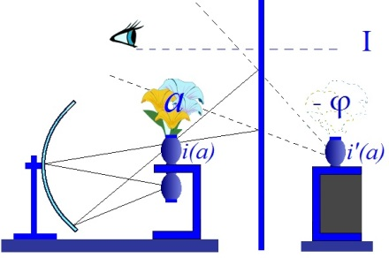
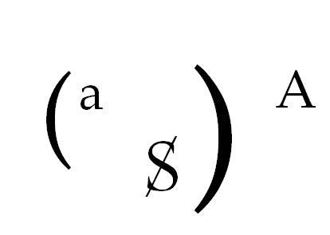
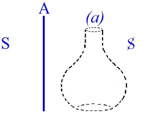

# Leçon 05 | l2 Décembre l962

  

    <label><input type="checkbox" data-lacan-toggle="original" checked> 原文</label>
    <label><input type="checkbox" data-lacan-toggle="notes" checked> 注释</label>
    <label><input type="checkbox" data-lacan-toggle="commentary" checked> 个人解读评论</label>
  

  <form class="lacan-tool-search" role="search">
    <input class="lacan-tool-search-input" type="search" placeholder="搜索全文" aria-label="搜索全文">
    <button class="lacan-tool-button" type="submit" title="搜索">搜索</button>
  </form>
  <button class="lacan-tool-button lacan-back-to-top" type="button" title="回到页面最上方" aria-label="回到页面最上方">↑</button>

<section class="parallel-paragraph" data-paragraph-ids="s10-05-0001">

s10-05-0001

原文 · s10-05-0001

On a vu, on a lu, on verra, on lira encore, qu’une certaine forme d’enseigne­ment de la psychanalyse...

[无对应译文]

</section>

<section class="parallel-paragraph" data-paragraph-ids="s10-05-0002">

s10-05-0002

原文 · s10-05-0002

> nommément celui qui se poursuit ici
> ...a un carac­tère prétendument plus philosophique que tel autre qui essaierait de se rac­corder à une expérience plus concrète,
> plus scientifique, plus expérimenta­le. Peu importe quel mot on emploie.

[无对应译文]

</section>

<section class="parallel-paragraph" data-paragraph-ids="s10-05-0003">

s10-05-0003

原文 · s10-05-0003

Ce n’est pas ma faute, comme on dit, si la psychanalyse sur le plan théorique met en cause le désir de connaître,
elle se place donc d’elle-même, dans son discours, déjà dans cet en deçà,
dans ce qui précède le moment de la connaissance qui à soi tout seul déjà justifierait cette sorte de mise en question
qui donne à notre discours une certaine *tein­te* disons, *philosophique*.

[无对应译文]

</section>

<section class="parallel-paragraph" data-paragraph-ids="s10-05-0004">

s10-05-0004

原文 · s10-05-0004

Aussi bien d’ailleurs, j’étais en cela précédé par l’inventeur même de l’analyse qui était bien, que je sache,
quelqu’un qui était au niveau d’une expérience directe, celle des malades, et des malades mentaux,
de ceux-là spécialement qu’on a appelés, avec une plus grande rigueur depuis Freud, *les névrosés*.

[无对应译文]

</section>

<section class="parallel-paragraph" data-paragraph-ids="s10-05-0005">

s10-05-0005

原文 · s10-05-0005

Mais après tout ce ne serait pas une raison de rester plus de temps qu’il ne convient dans une mise en cause épistémologique,
si la place du désir, la façon dont il se creuse n’était pas à tout instant, à tout instant de notre position thérapeutique,
présentifiée pour nous, par un problème, le plus concret de tous :

[无对应译文]

</section>

<section class="parallel-paragraph" data-paragraph-ids="s10-05-0006">

s10-05-0006

原文 · s10-05-0006

- celui de ne pas nous laisser nous engager dans une fausse voie,

[无对应译文]

</section>

<section class="parallel-paragraph" data-paragraph-ids="s10-05-0007">

s10-05-0007

原文 · s10-05-0007

- de ne pas y répondre à tort,

[无对应译文]

</section>

<section class="parallel-paragraph" data-paragraph-ids="s10-05-0008">

s10-05-0008

原文 · s10-05-0008

- de ne pas y répondre à côté,

[无对应译文]

</section>

<section class="parallel-paragraph" data-paragraph-ids="s10-05-0009">

s10-05-0009

原文 · s10-05-0009

- au moins considérer reconnu un certain but que nous poursuivons, et qui n’est pas si clair.

[无对应译文]

</section>

<section class="parallel-paragraph" data-paragraph-ids="s10-05-0010">

s10-05-0010

原文 · s10-05-0010

Il me souvient avoir provoqué l’indignation de cette sorte de *« confrères »*...

[无对应译文]

</section>

<section class="parallel-paragraph" data-paragraph-ids="s10-05-0011">

s10-05-0011

原文 · s10-05-0011

> qui savent à l’oc­casion se remparder derrière je ne sais quelle *enflure* de bons sentiments
>
> destinée à rassurer je ne sais qui,
> ...d’avoir provoqué l’indignation en disant que dans l’analyse, la guérison venait en quelque sorte « *par surcroît »*.
> On y a vu je ne sais quel dédain de celui dont nous avons la charge, de celui qui souffre.
> Je parlais d’un point de vue méthodologique...

[无对应译文]

</section>

<section class="parallel-paragraph" data-paragraph-ids="s10-05-0012">

s10-05-0012

原文 · s10-05-0012

Il est bien certain que notre justi­fication comme notre devoir est d’améliorer la position du sujet,
mais je pré­tends que rien n’est plus vacillant, dans le champ où nous sommes, que le concept de « *guérison* ».
Est-ce qu’une *analyse* qui se termine par l’entrée du patient ou de la patiente dans le tiers-ordre est une « *guérison* » ?
Même si son sujet s’en trouve mieux quant à ses symptômes, et d’une certaine foi, d’un cer­tain ordre qu’il a reconquis,
énonce les réserves les plus expresses sur les voies - dès lors à ses yeux, perverses - par où nous l’avons fait passer
pour le faire entrer au royaume du ciel. Ça arrive !

[无对应译文]

</section>

<section class="parallel-paragraph" data-paragraph-ids="s10-05-0013">

s10-05-0013

原文 · s10-05-0013

C’est pourquoi je ne pense pas un seul instant m’écarter de notre expérience si mon discours, bien loin de s’en écarter,
consiste justement à rappeler qu’à l’intérieur de notre expérience, toutes les questions peuvent se poser,
et qu’il faut justement que nous y conservions la possibilité d’un certain fil qui, à nous tout au moins,
nous garantisse que nous ne trichons pas avec ce qui est notre instrument même, c’est-à-dire *le plan de la vérité*.

[无对应译文]

</section>

<section class="parallel-paragraph" data-paragraph-ids="s10-05-0014">

s10-05-0014

原文 · s10-05-0014

Ça nécessite bien sûr une exploration qui n’ait pas seulement à être sérieuse, mais je dirai, jusqu’à un certain point à être,
non pas *exhaustive* - qui est-ce qui pourrait l’être ? - mais jusqu’à un certain degré, oui, encyclopédique.

[无对应译文]

</section>

<section class="parallel-paragraph" data-paragraph-ids="s10-05-0015">

s10-05-0015

原文 · s10-05-0015

Il n’est pas facile en un sujet comme l’angoisse de rassembler dans un discours comme le mien cette année,
ce qui, disons pour des analystes, doit être fonctionnel, ce qu’il ne doit oublier à aucun instant concernant ce qui nous importe, que nous avons désigné, sur ce petit schéma :

[无对应译文]

</section>

<section class="parallel-paragraph" data-paragraph-ids="s10-05-0016">

s10-05-0016

原文 · s10-05-0016

[无对应译文]

</section>

<section class="parallel-paragraph" data-paragraph-ids="s10-05-0017">

s10-05-0017

原文 · s10-05-0017

à la place qu’oc­cupe actuellement là le (- φ) entre parenthèses comme *la place de l’angoisse*,
comme cette place que j’ai déjà désignée comme constituant un certain vide,
l’angoisse n’y appa­raissant - de tout ce qui peut se manifester à cette place - nous dérouter,
si je puis dire, quant à la fonction structurante de ce vide.

[无对应译文]

</section>

<section class="parallel-paragraph" data-paragraph-ids="s10-05-0018">

s10-05-0018

原文 · s10-05-0018

Les *signes*, si je puis dire - *les indices* pour être plus exact - de la portée de cette topologie,
n’auront de valeur que si vous pouvez les retrouver confirmés par quelque abord que ce soit,
qui ait été donné par toute étude sérieuse du *phénomène de l’angoisse*, quels qu’en soient les présupposés.

[无对应译文]

</section>

<section class="parallel-paragraph" data-paragraph-ids="s10-05-0019">

s10-05-0019

原文 · s10-05-0019

Même *si ces présupposés nous paraissent à nous trop étroits*, et devoir être situés à l’in­térieur de cette expérience radicale qui est la nôtre, il reste que quelque chose a bien été *saisi* à certain niveau et que même si le phénomène de l’an­goisse en apparaît comme limité, distordu, insuffisant au regard de notre expérience, il est au moins à savoir pourquoi il en est ainsi.

[无对应译文]

</section>

<section class="parallel-paragraph" data-paragraph-ids="s10-05-0020">

s10-05-0020

原文 · s10-05-0020

Or il n’en est pas toujours ainsi.
Et nous avons à recueillir, à quelque niveau que ce soit, où a été formulée jusqu’à présent l’interrogation au sujet de l’angoisse.
C’est mon propos d’aujourd’hui de l’indiquer, faute de pouvoir, bien sûr, faire la somme...

[无对应译文]

</section>

<section class="parallel-paragraph" data-paragraph-ids="s10-05-0021">

s10-05-0021

原文 · s10-05-0021

> qui nécessiterait toute une année de séminaire
> ...faire la somme de ce qui a été apporté dans un certain nombre de types d’interro­gations qu’on appelle,
> à tort ou à raison, par exemple :

[无对应译文]

</section>

<section class="parallel-paragraph" data-paragraph-ids="s10-05-0022">

s10-05-0022

原文 · s10-05-0022

- « *l’abord objectif du problème de l’angoisse* »,

[无对应译文]

</section>

<section class="parallel-paragraph" data-paragraph-ids="s10-05-0023">

s10-05-0023

原文 · s10-05-0023

- « *l’abord expérimental du problème de l’angoisse* »...

[无对应译文]

</section>

<section class="parallel-paragraph" data-paragraph-ids="s10-05-0024">

s10-05-0024

原文 · s10-05-0024

Et bien sûr, nous ne saurions dans ces réponses que nous perdre, si je ne vous avais donné au départ les lignes de mire,
les points de maintien que nous ne pouvons pas abandonner un seul instant pour garantir, ne pas rétrécir notre objet,
ne pas nous apercevoir de ce qui le conditionne de la façon la plus radicale, la plus fondamentale.

[无对应译文]

</section>

<section class="parallel-paragraph" data-paragraph-ids="s10-05-0025">

s10-05-0025

原文 · s10-05-0025

Et c’est pour ça que la dernière fois mon dis­cours aboutissait à le cerner, si l’on peut dire, de 3 points de repère...

[无对应译文]

</section>

<section class="parallel-paragraph" data-paragraph-ids="s10-05-0026">

s10-05-0026

原文 · s10-05-0026

> que je n’avais bien sûr fait qu’amorcer, introduire
> ...de 3 points où assurément, la dimension de l’Autre restait dominante, à savoir :

[无对应译文]

</section>

<section class="parallel-paragraph" data-paragraph-ids="s10-05-0027">

s10-05-0027

原文 · s10-05-0027

- *<u>la demande de l’Autre</u>,*

[无对应译文]

</section>

<section class="parallel-paragraph" data-paragraph-ids="s10-05-0028">

s10-05-0028

原文 · s10-05-0028

- *<u>la jouissance de l’Autre</u>,*

[无对应译文]

</section>

<section class="parallel-paragraph" data-paragraph-ids="s10-05-0029">

s10-05-0029

原文 · s10-05-0029

- et sous une forme tout à fait modalisée, et restée d’ailleurs à titre de point d’interrogation : *<u>le désir de l’Autre</u>,* pour autant que c’est ce *désir* qui correspond à notre interrogation, j’entends celle *de l’analyste*, à *l’analyste* en tant qu’il intervient comme terme.

[无对应译文]

</section>

<section class="parallel-paragraph" data-paragraph-ids="s10-05-0030">

s10-05-0030

原文 · s10-05-0030

Nous n’allons pas faire ce que nous reprochons à tous les autres,
à savoir de nous élider du texte de l’expérien­ce que nous interrogeons.
L’angoisse à laquelle nous avons ici à apporter une formule

[无对应译文]

</section>

<section class="parallel-paragraph" data-paragraph-ids="s10-05-0031">

s10-05-0031

原文 · s10-05-0031

- c’est une angoisse *qui nous répond*,

[无对应译文]

</section>

<section class="parallel-paragraph" data-paragraph-ids="s10-05-0032">

s10-05-0032

原文 · s10-05-0032

- c’est une angoisse *que nous provoquons*,

[无对应译文]

</section>

<section class="parallel-paragraph" data-paragraph-ids="s10-05-0033">

s10-05-0033

原文 · s10-05-0033

- c’est une angoisse *avec laquelle nous avons* à l’occasion *un rapport déterminant.*

[无对应译文]

</section>

<section class="parallel-paragraph" data-paragraph-ids="s10-05-0034">

s10-05-0034

原文 · s10-05-0034

Cette dimension de l’Autre où nous trouvons notre place,
notre place efficace, pour autant justement que nous savons ne pas la rétrécir,
ce qui est ce qui motive la question que je pose, de savoir : dans quelle mesure notre désir ne doit pas la rétrécir ?

[无对应译文]

</section>

<section class="parallel-paragraph" data-paragraph-ids="s10-05-0035">

s10-05-0035

原文 · s10-05-0035

Cette dimension de l’Autre, je voudrais bien vous faire sentir qu’elle n’est absen­te
d’aucun des *modes* sous lesquels jusqu’à ce jour on a pu tenter de cerner, de serrer, ce phénomène de l’angoisse.
Et je dirai qu’au point d’exercice mental où je vous ai formés, habitués peut-être même,
ne peut plus que vous paraître vaine cette sorte d’emphase, de vain succès, de faux triomphe,
que certains trouvent à prendre dans le fait, par exemple, que soi-disant « *au contraire* » de la pensée analytique...

[无对应译文]

</section>

<section class="parallel-paragraph" data-paragraph-ids="s10-05-0036">

s10-05-0036

原文 · s10-05-0036

> et en quoi ce serait-il « *au contraire* » ?
> ...des « *névroses* » sont réalisées chez l’animal, dans le laboratoire, sur la table d’expérience.

[无对应译文]

</section>

<section class="parallel-paragraph" data-paragraph-ids="s10-05-0037">

s10-05-0037

原文 · s10-05-0037

Ces névroses, celles sur lesquelles *le laboratoire pavlovien,* je veux dire Pavlov lui-même et ceux qui l’on suivi,
ont pu mettre à l’occasion l’accent, qu’est-ce qu’elles nous montrent ?

[无对应译文]

</section>

<section class="parallel-paragraph" data-paragraph-ids="s10-05-0038">

s10-05-0038

原文 · s10-05-0038

On nous dit que dans le texte de la suite de ses expériences par où on condi­tionne ce qu’on appelle tel « *réflexe* » de l’animal,
à savoir telle réaction entre guillemets « *natu­relle* » d’un de ces appareils qu’on associe à une stimulation,
une excitation qui fait partie d’un registre présumé complètement différent de celui qui est intéressé dans la réaction,
par un certain mode de faire converger ces réac­tions conditionnées, nous allons obtenir quoi ? Des effets de contrariété !

[无对应译文]

</section>

<section class="parallel-paragraph" data-paragraph-ids="s10-05-0039">

s10-05-0039

原文 · s10-05-0039

Ce que nous avons déjà obtenu, conditionné, dressé, dans les réponses de l’or­ganisme,
nous allons le mettre en posture de répondre de deux manières opposées à la fois,
engendrant si l’on peut dire une sorte de *perplexité orga­nique*.

[无对应译文]

</section>

<section class="parallel-paragraph" data-paragraph-ids="s10-05-0040">

s10-05-0040

原文 · s10-05-0040

Pour aller plus loin, nous dirons même que dans certains cas, nous pou­vons, nous avons l’idée que ce que nous obtenons
est une sorte d’épuise­ment des possibilités de réponse, une sorte de désordre plus fondamental engendré par leur détournement, comme quelque chose qui intéresse d’une façon plus radicale ce qu’on peut appeler le champ ordinaire des réactions impliquées, qui est la traduction objective de ce qui pourra s’*interpréter,* dans une pers­pective plus générale,
comme défini par un certain mode de réactions qu’on appellera « instinctuelles ».

[无对应译文]

</section>

<section class="parallel-paragraph" data-paragraph-ids="s10-05-0041">

s10-05-0041

原文 · s10-05-0041

Bref, d’en arriver au point où la demande faite à *la fonction*...

[无对应译文]

</section>

<section class="parallel-paragraph" data-paragraph-ids="s10-05-0042">

s10-05-0042

原文 · s10-05-0042

> c’est quelque chose qu’on a théorisé plus récemment et en d’autres aires culturelles, par le terme du *stress* [^31]
> ...peut aboutir, peut déboucher sur cette sorte de déficit qui dépasse *la fonction* elle-même,
> qui intéresse l’ap­pareil de façon qui le modifie au-delà du registre de la réponse fonction­nelle,
> qui plus ou moins confine, dans les traces durables qu’il engendre, à un déficit lésionnel.

[无对应译文]

</section>

<section class="parallel-paragraph" data-paragraph-ids="s10-05-0043">

s10-05-0043

原文 · s10-05-0043

Il sera important sans doute de pointer dans cet éventail de l’interrogation expérimentale,
où à proprement parler, se manifeste quelque chose qui nous rappelle, des réactions névrotiques, la forme dite *angoissée.*

[无对应译文]

</section>

<section class="parallel-paragraph" data-paragraph-ids="s10-05-0044">

s10-05-0044

原文 · s10-05-0044

Il y a pour­tant quelque chose qui paraît, dans une telle façon de poser le problème de l’expérience, toujours éludé.
Éludé d’une façon qu’il est sans doute impos­sible de reprocher aux rapporteurs de ces expériences de l’éluder,
puisque cette élision est constitutive de l’expérience elle-même.

[无对应译文]

</section>

<section class="parallel-paragraph" data-paragraph-ids="s10-05-0045">

s10-05-0045

原文 · s10-05-0045

Mais pour quiconque a à rapprocher cette expérience de celle qui est la nôtre, à savoir de celle qui se passe avec *un sujet parlant*,
et c’est là l’importance de cette dimension pour autant que je vous la rappelle, il est impossible de ne pas faire état de ceci :
que si primitif, par rapport à celui d’un sujet parlant, que soit l’organisme ani­mal interrogé...

[无对应译文]

</section>

<section class="parallel-paragraph" data-paragraph-ids="s10-05-0046">

s10-05-0046

原文 · s10-05-0046

> et il est très loin d’être primitif, d’être éloigné du nôtre, cet organisme,
>
> dans les expériences pavloviennes puisque ce sont des chiens
> ...la dimension de l’Autre, avec un grand A, est présente dans l’expérience.

[无对应译文]

</section>

<section class="parallel-paragraph" data-paragraph-ids="s10-05-0047">

s10-05-0047

原文 · s10-05-0047

Et ce n’est pas d’hier qu’intervenant par exemple au cours d’une de nos « séances scientifiques »
sur quelques phénomènes qui nous étaient rapportés...

[无对应译文]

</section>

<section class="parallel-paragraph" data-paragraph-ids="s10-05-0048">

s10-05-0048

原文 · s10-05-0048

> je ne vais pas y revenir aujourd’hui
> ...concernant la création des névroses expérimentales, je faisais remarquer à celui qui communiquait ses recherches,
> que sa présence à lui, dans l’expérience, comme personnage humain,
> manipulateur d’un certain nombre de choses autour de l’animal,
> devait être à tel et tel moment de l’expérience, mise en cause, comptée.

[无对应译文]

</section>

<section class="parallel-paragraph" data-paragraph-ids="s10-05-0049">

s10-05-0049

原文 · s10-05-0049

Quand on sait la façon dont se comporte un chien vis-à-vis de celui qui s’ap­pelle ou qui ne s’appelle pas « son maître »,
on sait que la dimension de l’Autre en tout cas compte, pour un chien.
Mais ne serait-il pas un chien, serait-il une sauterelle ou une sangsue,
du seul fait qu’il y a *un montage d’appareils*, la dimension de l’Autre est présente.

[无对应译文]

</section>

<section class="parallel-paragraph" data-paragraph-ids="s10-05-0050">

s10-05-0050

原文 · s10-05-0050

Vous me direz : *si c’est une sauterelle ou une sangsue*, l’organisme patient de l’expérience n’en sait rien de cette dimension de l’Autre. Je suis absolument d’accord, et c’est pour ça que tout mon effort pendant un certain temps
a été de vous démontrer l’ampleur du niveau où chez nous, sujet...

[无对应译文]

</section>

<section class="parallel-paragraph" data-paragraph-ids="s10-05-0051">

s10-05-0051

原文 · s10-05-0051

> tel que nous apprenons à le manier, à le déterminer, ce sujet que nous sommes
> ...il y a aussi tout un champ où de ce qui le consti­tue comme champ, nous ne savons rien.

[无对应译文]

</section>

<section class="parallel-paragraph" data-paragraph-ids="s10-05-0052">

s10-05-0052

原文 · s10-05-0052

Et que le *Selbstbewußtsein* que je vous ai appelés à nommer le *sujet supposé savoir,* est une supposition trompeuse.
Que le *Selbstbewußtsein,* considéré comme constitutif du sujet connaissant, est une illusion, est une source d’erreur.

[无对应译文]

</section>

<section class="parallel-paragraph" data-paragraph-ids="s10-05-0053">

s10-05-0053

原文 · s10-05-0053

Car la dimension du sujet supposé transparent dans son propre acte de connaissance,
ne commence qu’à partir de l’entrée en jeu d’un objet spécifié qui est celui qu’essaie de cerner le stade du miroir,
à savoir de *l’image du corps propre* pour autant que le sujet d’une façon jubilatoire
a le sentiment d’être en effet devant un objet qui le rend - lui sujet - à lui-même transparent.

[无对应译文]

</section>

<section class="parallel-paragraph" data-paragraph-ids="s10-05-0054">

s10-05-0054

原文 · s10-05-0054

L’extension de cette illusion, constitue radicalement en elle-même l’illusion de la conscience, à toute espèce de connaissance
est motivée par ceci : *que l’objet de la connaissance sera désormais construit, modelé, à l’ima­ge de ce rapport à l’image spéculaire.*

[无对应译文]

</section>

<section class="parallel-paragraph" data-paragraph-ids="s10-05-0055">

s10-05-0055

原文 · s10-05-0055

Et c’est précisément en quoi cet objet de la connaissance est insuffisant.
Et n’y aurait-il pas la psychanalyse, on le saurait à ceci que cet objet est insuffisant :
c’est qu’il existe des moments d’apparition de *l’objet* qui nous jettent dans *une toute autre dimension*, dans une *dimension* qui mérite...

[无对应译文]

</section>

<section class="parallel-paragraph" data-paragraph-ids="s10-05-0056">

s10-05-0056

原文 · s10-05-0056

> parce qu’elle est donnée dans l’expérience
> ...d’être détachée comme telle, comme primiti­ve dans l’expérience, qui est justement *la dimension de l’étrange*,
> de quelque chose qui d’aucune façon ne se laisse saisir, comme laissant en face de lui *le sujet transparent à sa connaissance*.

[无对应译文]

</section>

<section class="parallel-paragraph" data-paragraph-ids="s10-05-0057">

s10-05-0057

原文 · s10-05-0057

Devant ce nouveau, le sujet littéralement vacille, et tout est remis en question de ce rapport soi-disant primordial
du sujet à tout effet de connaissance. Ce surgissement de quelque chose dans le champ de l’objet, qui pose son problème comme celui d’une structuration irréductible, comme surgissement d’un inconnu comme *éprouvé*,
n’est pas une question qui se pose uniquement aux analystes parce que comme c’est donné dans l’expérience,
il faut tout de même bien tâcher d’expliquer pourquoi les enfants ont peur de l’obscurité.
Seulement on *s’aperçoit* en même temps qu’ils n’ont pas *toujours* peur de l’obscurité.

[无对应译文]

</section>

<section class="parallel-paragraph" data-paragraph-ids="s10-05-0058">

s10-05-0058

原文 · s10-05-0058

Et alors on fait de la psychologie, on s’engage justement, les soi-disant expérimentateurs, dans des théories :
c’est l’effet d’une réaction héritée, ancestrale, primordiale, d’une pensée...

[无对应译文]

</section>

<section class="parallel-paragraph" data-paragraph-ids="s10-05-0059">

s10-05-0059

原文 · s10-05-0059

> puisque « pensée » il semble qu’il faille toujours qu’on en conserve le terme
> ...d’une pensée structurée autrement que la pensée logique, rationnelle,
> et on construit et on invente c’est là qu’on fait de la philosophie.

[无对应译文]

</section>

<section class="parallel-paragraph" data-paragraph-ids="s10-05-0060">

s10-05-0060

原文 · s10-05-0060

Mais ici nous attendons ceux avec qui nous avons à l’occasion à poursuivre le dialogue, *sur le terrain même où ce dialogue a à se juger*, c’est à savoir si nous pouvons en rendre compte, nous, d’une façon moins *hypothétique*.

[无对应译文]

</section>

<section class="parallel-paragraph" data-paragraph-ids="s10-05-0061">

s10-05-0061

原文 · s10-05-0061

Cette *forme* que je vous livre, qui est concevable, qui consiste à s’apercevoir que, si dans *la constitution d’un objet*...

[无对应译文]

</section>

<section class="parallel-paragraph" data-paragraph-ids="s10-05-0062">

s10-05-0062

原文 · s10-05-0062

> qui est l’objet corrélatif d’un premier mode d’abord, celui qui part de la *reconnaissance* de notre propre forme
> ...et si cette connaissance, en elle-même limitée, laisse échapper quelque chose de cet investissement primitif à notre être
> qui est donné par le fait d’exister comme corps, est-ce que ce n’est pas dire quelque chose, non seulement de raisonnable
> mais de contrôlable, que de dire que *c’est ce reste, c’est ce résidu non « imaginé » du corps,* qui vient par quelque détour...

[无对应译文]

</section>

<section class="parallel-paragraph" data-paragraph-ids="s10-05-0063">

s10-05-0063

原文 · s10-05-0063

> et si nous savons, ce détour, le désigner
> ...ici se manifester, à cette place prévue pour le manque \[(- φ)\], se manifester de cette façon qui nous intéresse,
> et d’une façon qui, pour n’être pas spéculaire, devient dès lors *irrepérable*.
> C’est une dimension de l’angoisse, effectivement, que ce défaut de certains repères.

[无对应译文]

</section>

<section class="parallel-paragraph" data-paragraph-ids="s10-05-0064">

s10-05-0064

原文 · s10-05-0064

Nous ne serons pas là en désaccord avec la façon dont l’abordera, ce phé­nomène, Kurt Goldstein[^32] par exemple.

[无对应译文]

</section>

<section class="parallel-paragraph" data-paragraph-ids="s10-05-0065">

s10-05-0065

原文 · s10-05-0065

Quand il nous parle de l’angoisse, il en parle avec beaucoup de pertinence.

[无对应译文]

</section>

<section class="parallel-paragraph" data-paragraph-ids="s10-05-0066">

s10-05-0066

原文 · s10-05-0066

Toute la phénoménologie des phé­nomènes lésionnels où Goldstein suit cette expérience qui nous intéresse, à la trace,
comment s’articule-t-elle, sinon de la remarque préalable *que l’or­ganisme dans tous ses effets relationnels fonctionne comme totalité* :

[无对应译文]

</section>

<section class="parallel-paragraph" data-paragraph-ids="s10-05-0067">

s10-05-0067

原文 · s10-05-0067

- qu’il n’est pas un seul de nos muscles qui ne soit intéressé dans une inclinaison de notre tête,

[无对应译文]

</section>

<section class="parallel-paragraph" data-paragraph-ids="s10-05-0068">

s10-05-0068

原文 · s10-05-0068

- que toute réaction à une situation implique la totalité de la réponse organismique.

[无对应译文]

</section>

<section class="parallel-paragraph" data-paragraph-ids="s10-05-0069">

s10-05-0069

原文 · s10-05-0069

Si nous le suivons, nous voyons surgir deux termes étroitement tressés l’un avec l’autre,

[无对应译文]

</section>

<section class="parallel-paragraph" data-paragraph-ids="s10-05-0070">

s10-05-0070

原文 · s10-05-0070

- le terme de « *réaction catastrophique* »,

[无对应译文]

</section>

<section class="parallel-paragraph" data-paragraph-ids="s10-05-0071">

s10-05-0071

原文 · s10-05-0071

- et dans son phénomène, à l’intérieur du champ de cette *réaction catastro­phique*, le repérage comme tel des phénomènes d’*angoisse*.

[无对应译文]

</section>

<section class="parallel-paragraph" data-paragraph-ids="s10-05-0072">

s10-05-0072

原文 · s10-05-0072

Je vous prie de vous reporter aux textes...

[无对应译文]

</section>

<section class="parallel-paragraph" data-paragraph-ids="s10-05-0073">

s10-05-0073

原文 · s10-05-0073

> très accessibles, puisqu’ils ont été traduits en français
> *...*des analyses goldsteiniennes pour y repérer à la fois

[无对应译文]

</section>

<section class="parallel-paragraph" data-paragraph-ids="s10-05-0074">

s10-05-0074

原文 · s10-05-0074

- combien ces formulations s’approchent des nôtres,

[无对应译文]

</section>

<section class="parallel-paragraph" data-paragraph-ids="s10-05-0075">

s10-05-0075

原文 · s10-05-0075

- et combien de clarté elles tireraient à s’en appuyer plus expressément.

[无对应译文]

</section>

<section class="parallel-paragraph" data-paragraph-ids="s10-05-0076">

s10-05-0076

原文 · s10-05-0076

Car à tout instant, si avec cette clé que je vous apporte vous en suivez les textes,
vous verrez la dif­férence qu’il y a de *la réaction de désordre* par où le sujet répond à son inopérance,
au fait d’être devant une situation comme telle insurmontable, sans doute à cause de son déficit dans l’occasion.

[无对应译文]

</section>

<section class="parallel-paragraph" data-paragraph-ids="s10-05-0077">

s10-05-0077

原文 · s10-05-0077

C’est après tout une façon qui n’a rien d’étranger avec ce qui peut se produire, même pour un sujet non déficitaire,
devant une situation de *Hilflosigkeit*, situation de danger insurmontable.

[无对应译文]

</section>

<section class="parallel-paragraph" data-paragraph-ids="s10-05-0078">

s10-05-0078

原文 · s10-05-0078

Pour que la réaction d’angoisse se produise comme telle, il faut toujours deux conditions.
Vous pourriez le voir dans les cas concrets évoqués :

[无对应译文]

</section>

<section class="parallel-paragraph" data-paragraph-ids="s10-05-0079">

s10-05-0079

原文 · s10-05-0079

- *Premièrement*, que l’effet déficitaire soit assez limité pour que le sujet puisse le cerner dans l’épreuve où il est mis, et que du fait de cette limite le trou, la lacune apparaisse comme telle dans le champ objectif. C’est ce surgissement du *manque* sous une forme *positive*, qui est source de l’angoisse.

[无对应译文]

</section>

<section class="parallel-paragraph" data-paragraph-ids="s10-05-0080">

s10-05-0080

原文 · s10-05-0080

- À ceci près - *deuxième condition* - qu’il ne faut là encore pas omettre, que c’est sous l’effet d’une *demande*, d’une épreuve organisée dans le fait que le sujet a en face de lui Goldstein, ou telle personne de son laboratoire qui le soumet à un *test organisé,* que se produit l’angoisse.

[无对应译文]

</section>

<section class="parallel-paragraph" data-paragraph-ids="s10-05-0081">

s10-05-0081

原文 · s10-05-0081

« *Champ du manque »* et « *question posée dans ce champ* » :
termes qu’il y a si peu lieu d’omettre, que quand vous savez *où* et *quand* les rechercher, vous les trouvez immanquablement.

[无对应译文]

</section>

<section class="parallel-paragraph" data-paragraph-ids="s10-05-0082">

s10-05-0082

原文 · s10-05-0082

S’il en est besoin, pour sauter à un tout autre ordre, j’évoquerai ici l’expérience la plus mas­sive, non pas reconstituée,
ancestrale, rejetée dans une obscurité des âges anciens auxquels nous aurions prétendument échappés,
d’une nécessité qui nous unit à ces âges et qui est toujours actuelle,
et dont très curieusement nous ne parlons plus que très rarement, c’est celle du *cauchemar*.

[无对应译文]

</section>

<section class="parallel-paragraph" data-paragraph-ids="s10-05-0083">

s10-05-0083

原文 · s10-05-0083

On se deman­de pourquoi les analystes depuis un certain temps s’intéressent si peu au *cauchemar*.

[无对应译文]

</section>

<section class="parallel-paragraph" data-paragraph-ids="s10-05-0084">

s10-05-0084

原文 · s10-05-0084

Je l’introduis ici parce qu’il faudra tout de même bien que nous y restions cette année un certain temps,
et je vous dirai pourquoi. Je vous dirai pour­quoi et où en trouver la matière,
car s’il y a là-dessus une littérature déjà constituée et des plus remarquables, à laquelle il convient que vous vous reportiez,
c’est - si oubliée qu’elle soit, ce point-là - c’est à savoir le livre de Jones[^33] sur le cauchemar, livre d’une richesse incomparable.

[无对应译文]

</section>

<section class="parallel-paragraph" data-paragraph-ids="s10-05-0085">

s10-05-0085

原文 · s10-05-0085

Je vous rap­pelle la phénoménologie fondamentale, qui ne songe pas un instant à en élu­der la dimension principale :
l’angoisse du cauchemar est éprouvée à propre­ment parler comme celle de *la jouissance de l’Autre*.
Le corrélatif du cau­chemar, c’est l’*incube* ou le *succube*, c’est cet être qui pèse de tout son poids opaque de jouissance étrangère
sur votre poitrine, qui vous écrase sous sa jouissance.

[无对应译文]

</section>

<section class="parallel-paragraph" data-paragraph-ids="s10-05-0086">

s10-05-0086

原文 · s10-05-0086

Eh bien, pour nous introduire par ce biais majeur dans ce que nous livre­ra la thématique du cauchemar,
la première chose en tout cas qui apparaît...

[无对应译文]

</section>

<section class="parallel-paragraph" data-paragraph-ids="s10-05-0087">

s10-05-0087

原文 · s10-05-0087

> qui apparaît dans le mythe, mais aussi dans la phénoménologie du cauche­mar, du cauche­mar vécu
> ...c’est que cet être qui pèse par sa jouissance, est aussi un être *questionneur,* et même à proprement parler, qui se manifeste,
> se déploie, dans cette dimension complète, développée, de la question comme telle qui s’appelle « *l’énigme »*.

[无对应译文]

</section>

<section class="parallel-paragraph" data-paragraph-ids="s10-05-0088">

s10-05-0088

原文 · s10-05-0088

Le *Sphinx*...
dont, ne l’oubliez pas, l’entrée en jeu dans le mythe, précède tout le drame d’Œdipe
…est une *figure de cauchemar*, et une *figure questionneuse* en même temps. Nous aurons à y revenir.

[无对应译文]

</section>

<section class="parallel-paragraph" data-paragraph-ids="s10-05-0089">

s10-05-0089

原文 · s10-05-0089

Cette question \[*l’énigme*\] donnant la forme la plus primordiale de ce que j’ai appe­lé « *la dimension de la demande* »,
celle - vous allez le voir - que nous donnons d’habitude à la demande au sens d’exigence prétendument « instinctuelle »,
n’en étant qu’une forme réduite.

[无对应译文]

</section>

<section class="parallel-paragraph" data-paragraph-ids="s10-05-0090">

s10-05-0090

原文 · s10-05-0090

Nous voici donc ramenés nous-mêmes à une *question* qui s’articule dans le sens d’interroger une fois de plus,
de revenir sur le rapport d’une expérience qui, au sens courant du terme « *sujet* », peut être appelée *pré-subjective*,
avec le terme de « *la question* », de la question sous sa forme la plus fermée,
sous la forme d’un *signifiant* qui se propose lui-même comme opaque, ce qui est la position de l’*énigme* comme telle.

[无对应译文]

</section>

<section class="parallel-paragraph" data-paragraph-ids="s10-05-0091">

s10-05-0091

原文 · s10-05-0091

Ceci nous ramène aux termes que je crois parfaitement articulés, je veux dire qui vous mettent en mesure, à chaque instant,
de me ramener au pied de mon propre mur, de faire état de définitions déjà posées et de les mettre à l’épreuve de leur usage :

[无对应译文]

</section>

<section class="parallel-paragraph" data-paragraph-ids="s10-05-0092">

s10-05-0092

原文 · s10-05-0092

- *le signifiant* - vous ai-je dit, à tel tournant - *c’est une trace, mais une trace effacée*,

[无对应译文]

</section>

<section class="parallel-paragraph" data-paragraph-ids="s10-05-0093">

s10-05-0093

原文 · s10-05-0093

- *le signifiant* - vous ai-je dit à tel autre tournant - *se distingue du signe en ceci que le signe est ce qui représente quelque chose pour quelqu’un.*

[无对应译文]

</section>

<section class="parallel-paragraph" data-paragraph-ids="s10-05-0094">

s10-05-0094

原文 · s10-05-0094

- *et le signifiant -* vous ai-je dit - *c’est ce qui représente un sujet pour un autre signifiant.*

[无对应译文]

</section>

<section class="parallel-paragraph" data-paragraph-ids="s10-05-0095">

s10-05-0095

原文 · s10-05-0095

Nous allons remettre ceci à l’épreuve en ce sens que, concernant ce dont il s’agit, à savoir notre rapport,
notre rapport angoissé à quelque *objet perdu*, mais qui n’est sûrement pas quand même perdu pour tout le monde,
c’est à savoir - comme vous le verrez, comme je vous le montrerai - où est-ce qu’on le retrouve ?

[无对应译文]

</section>

<section class="parallel-paragraph" data-paragraph-ids="s10-05-0096">

s10-05-0096

原文 · s10-05-0096

Car bien sûr, *il ne suffit pas d’oublier quelque chose pour qu’il ne continue pas à être là, seulement il est là où nous ne savons plus le reconnaître*.
Pour le retrouver, il conviendrait de revenir sur le sujet de « *la trace* ».
Car, pour vous donner des termes destinés à animer pour vous l’intérêt de cette recherche,
je vais tout de suite vous donner deux *flashs* sur le sujet de notre expérience la plus commune.

[无对应译文]

</section>

<section class="parallel-paragraph" data-paragraph-ids="s10-05-0097">

s10-05-0097

原文 · s10-05-0097

Est-ce qu’il ne vous semble pas que la corrélation est évidente entre

[无对应译文]

</section>

<section class="parallel-paragraph" data-paragraph-ids="s10-05-0098">

s10-05-0098

原文 · s10-05-0098

- ce que j’essaie de dessiner pour vous,

[无对应译文]

</section>

<section class="parallel-paragraph" data-paragraph-ids="s10-05-0099">

s10-05-0099

原文 · s10-05-0099

- et la phénoménologie du *symptôme hystérique*, le symptôme hystérique au sens le plus large ?

[无对应译文]

</section>

<section class="parallel-paragraph" data-paragraph-ids="s10-05-0100">

s10-05-0100

原文 · s10-05-0100

N’oublions pas qu’il n’y a pas que *les petites hystériques*, il y a aussi *les grandes*,
il y a *des* *anesthésies*, il y a *des paralysies*, il y a *des* *scotomes*, il y a *des rétrécisse­ments du champ* *visuel,*
l’angoisse n’apparaît pas dans *l’hystérie*, exactement dans la mesure où ces manques sont méconnus.

[无对应译文]

</section>

<section class="parallel-paragraph" data-paragraph-ids="s10-05-0101">

s10-05-0101

原文 · s10-05-0101

Mais il y a *quelque chose* qui n’est pas souvent aperçu et même - je crois pouvoir l’avancer - que vous ne mettez guère en jeu,
c’est à savoir quelque chose qui explique toute une part du comportement de *l’obsessionnel*.
Je vous donne cette clé peut-être un peu insuffisamment expliquée puisqu’il va falloir que je vous y ramène par un long détour,
mais je vous donne ce terme au but de notre chemin, entre autres, ne serait-ce que pour vous y intéresser à ce chemin.

[无对应译文]

</section>

<section class="parallel-paragraph" data-paragraph-ids="s10-05-0102">

s10-05-0102

原文 · s10-05-0102

*L’obsessionnel*, dans sa façon si particulière de traiter le signi­fiant...

[无对应译文]

</section>

<section class="parallel-paragraph" data-paragraph-ids="s10-05-0103">

s10-05-0103

原文 · s10-05-0103

- à savoir de le mettre en doute,

[无对应译文]

</section>

<section class="parallel-paragraph" data-paragraph-ids="s10-05-0104">

s10-05-0104

原文 · s10-05-0104

- à savoir de l’astiquer, de l’effacer, de le triturer, de le mettre en miettes,

[无对应译文]

</section>

<section class="parallel-paragraph" data-paragraph-ids="s10-05-0105">

s10-05-0105

原文 · s10-05-0105

- à savoir de se comporter avec lui comme Lady Macbeth avec cette maudite trace de sang, ...*l’obsessionnel,* par une voie sans issue sans doute, mais dont la visée n’est pas douteuse, *opère dans le sens justement de retrouver <u>sous le signifiant, le signe</u>*.

[无对应译文]

</section>

<section class="parallel-paragraph" data-paragraph-ids="s10-05-0106">

s10-05-0106

原文 · s10-05-0106

*Ungeschehen machen, rendre non avenue* l’inscription de l’histoire. Ça s’est passé comme ça, mais c’est pas sûr.
C’est pas sûr parce que ça n’est que du signifiant, que de l’histoire, et donc du *truc*.
En quoi il a raison l’obsessionnel : il a saisi *quelque chose*, il veut aller à l’origine, à l’étape antérieure, à celle du *signe*
que je vais essayer maintenant de vous faire parcourir en sens contraire.

[无对应译文]

</section>

<section class="parallel-paragraph" data-paragraph-ids="s10-05-0107">

s10-05-0107

原文 · s10-05-0107

Ce n’est pas pour rien que je suis parti aujourd’hui de nos animaux de labora­toire.
Car après tout, il n’y a pas des animaux que dans les laboratoires,
on pourrait leur ouvrir les portes et voir ce qu’ils font, eux, avec *la trace*.

[无对应译文]

</section>

<section class="parallel-paragraph" data-paragraph-ids="s10-05-0108">

s10-05-0108

原文 · s10-05-0108

Ce n’est pas seulement la propriété de l’homme que d’effacer les traces, que d’opérer avec les traces.
On voit des animaux effacer leurs traces. On voit même des comportements complexes
qui consistent à enterrer un cer­tain nombre de traces, des déjections par exemple, c’est bien connu chez le chat.

[无对应译文]

</section>

<section class="parallel-paragraph" data-paragraph-ids="s10-05-0109">

s10-05-0109

原文 · s10-05-0109

Une partie du comportement animal consiste à structurer un certain champ de son *Umwelt* \[*environement*\], de son entourage,
par *des traces* qui le ponctuent, qui y définissent des limites. C’est ce qu’on appelle la constitution du terri­toire.

[无对应译文]

</section>

<section class="parallel-paragraph" data-paragraph-ids="s10-05-0110">

s10-05-0110

原文 · s10-05-0110

- les hippopotames font ça avec leurs déjections, avec aussi le pro­duit de certaines glandes qui sont, si mon souvenir est bon, chez eux péri­anales.

[无对应译文]

</section>

<section class="parallel-paragraph" data-paragraph-ids="s10-05-0111">

s10-05-0111

原文 · s10-05-0111

- le cerf va frotter ses bois contre l’écorce de certains arbres, ceci a la portée aussi d’un repérage de traces. Je ne veux pas ici m’étendre dans l’in­finie variété de ce que là-dessus une zoologie développée peut vous apprendre. La chose qui m’importe, c’est ce que j’ai à vous dire concernant ce que je veux dire : concernant *l’effacement des traces*.

[无对应译文]

</section>

<section class="parallel-paragraph" data-paragraph-ids="s10-05-0112">

s10-05-0112

原文 · s10-05-0112

L’animal - vous dis-je - *efface ses traces* et fait de *fausses traces*. Fait-il pour autant, des signifiants ?
Il y a une chose que l’animal ne fait pas : il ne fait pas de *traces fausses* pour nous faire croire qu’elles sont fausses.
Il ne nous fait pas de traces *faussement fausses*, si je puis dire, ce qui est un comportement, je ne dirai pas essentiellement humain, mais justement essentiellement *signifiant*.

[无对应译文]

</section>

<section class="parallel-paragraph" data-paragraph-ids="s10-05-0113">

s10-05-0113

原文 · s10-05-0113

C’est là qu’est la limite.
Vous m’enten­dez bien : des *traces* faites pour qu’on les croie *fausses*
et qui sont néanmoins les *traces de mon vrai passage*, et c’est ce que je veux dire en disant que

[无对应译文]

</section>

<section class="parallel-paragraph" data-paragraph-ids="s10-05-0114">

s10-05-0114

原文 · s10-05-0114

- *<u>là</u> se présentifie un sujet,* quand *une trace a été faite pour qu’on la prenne pour une fausse trace*,

[无对应译文]

</section>

<section class="parallel-paragraph" data-paragraph-ids="s10-05-0115">

s10-05-0115

原文 · s10-05-0115

- là nous savons qu’il y a, comme tel, *un sujet* *parlant*,

[无对应译文]

</section>

<section class="parallel-paragraph" data-paragraph-ids="s10-05-0116">

s10-05-0116

原文 · s10-05-0116

- et là nous savons qu’il y a un sujet comme *cause.*

[无对应译文]

</section>

<section class="parallel-paragraph" data-paragraph-ids="s10-05-0117">

s10-05-0117

原文 · s10-05-0117

Et la notion même de la *cause* n’a aucun autre support que celui-là, nous essayons après de l’étendre à l’univers,
mais *la cause originelle c’est la cause* comme telle *d’une trace qui se* *présente comme vide*, *qui veut se faire prendre pour une fausse trace.*

[无对应译文]

</section>

<section class="parallel-paragraph" data-paragraph-ids="s10-05-0118">

s10-05-0118

原文 · s10-05-0118

Et qu’est-ce que ça veut dire ? Ça veut dire indissolublement que le sujet, là au moment où il naît, s’adresse à quoi ?
Il s’adres­se à ce que brièvement j’appellerai *la forme la plus radicale de la rationalité de l’Autre*.
Car ce comportement n’a aucune autre portée possible que de *prendre rang au lieu de l’Autre dans une chaîne de signifiants*,
de signifiants qui ont, ou n’ont pas, la même origine,
mais qui constituent le seul terme de référence possible à la *trace* devenue *signifiante*.

[无对应译文]

</section>

<section class="parallel-paragraph" data-paragraph-ids="s10-05-0119">

s10-05-0119

原文 · s10-05-0119

De sorte que vous saisissez là que, *à l’origine, ce qui nourrit l’émergence du signifiant c’est une visée de ce que l’Autre, l’Autre réel, ne sache pas. Le « il ne savait pas » s’enracine dans un « il ne doit pas savoir ». Le signifiant sans doute révèle le sujet, mais en effa­çant sa trace.*

[无对应译文]

</section>

<section class="parallel-paragraph" data-paragraph-ids="s10-05-0120">

s10-05-0120

原文 · s10-05-0120

> 

[无对应译文]

</section>

<section class="parallel-paragraph" data-paragraph-ids="s10-05-0121">

s10-05-0121

原文 · s10-05-0121

Il y a donc

[无对应译文]

</section>

<section class="parallel-paragraph" data-paragraph-ids="s10-05-0122">

s10-05-0122

原文 · s10-05-0122

- d’abord un *(a) *: *l’objet de la chasse*,

[无对应译文]

</section>

<section class="parallel-paragraph" data-paragraph-ids="s10-05-0123">

s10-05-0123

原文 · s10-05-0123

- et un A,

[无对应译文]

</section>

<section class="parallel-paragraph" data-paragraph-ids="s10-05-0124">

s10-05-0124

原文 · s10-05-0124

- dans l’intervalle desquels le sujet S apparaît, avec la naissance du signifiant, mais comme barré, comme « *non-su* » comme tel. Et tout repérage ultérieur du sujet repose sur la nécessité d’une reconquête sur ce « *non-su* » originel.

[无对应译文]

</section>

<section class="parallel-paragraph" data-paragraph-ids="s10-05-0125">

s10-05-0125

原文 · s10-05-0125

Entendez donc là ce quelque chose qui déjà vous fait apparaître le rap­port vraiment radical
concernant l’être à reconquérir de ce sujet, de ce grou­pement du *(a)*, de *l’objet de la chasse*,
avec cette première apparition du sujet comme « *non-su* », ce que veut dire « inconscient », « *unbewußt »*
justifié par la tradi­tion philosophique qui a confondu le *bewußt* de la conscience avec *le savoir absolu,*
mais qui ne peut pas - à nous - suffire pour autant que nous savons que ce *savoir* et *la conscience* ne se confondent pas,
et que Freud laisse ouver­te la question de savoir *d’où peut bien provenir l’existence de ce champ défini comme champ de la conscience*.

[无对应译文]

</section>

<section class="parallel-paragraph" data-paragraph-ids="s10-05-0126">

s10-05-0126

原文 · s10-05-0126

Ici après tout, je puis revendi­quer que *le stade du miroir*, articulé comme il l’est, apporte là-dessus un commencement de *solution*. Car je sais bien dans quelle insatisfaction il peut laisser tels esprits formés à la méditation cartésienne.

[无对应译文]

</section>

<section class="parallel-paragraph" data-paragraph-ids="s10-05-0127">

s10-05-0127

原文 · s10-05-0127

Je pense que cette année nous pourrons faire un pas de plus qui vous fasse saisir *<u>où</u>* est,
de ce système dit *de la conscience*, l’origine réelle, l’objet originel.
Car nous ne serons *satisfaits* d’avoir réfuté les perspectives de la conscience
que quand enfin nous saurons qu’elle s’attache elle-même à un objet isolable, à un objet spécifié dans la structure.

[无对应译文]

</section>

<section class="parallel-paragraph" data-paragraph-ids="s10-05-0128">

s10-05-0128

原文 · s10-05-0128

Je vous ai tout à l’heure indiqué la position de la névrose dans cette dia­lectique :
je n’ai pas l’intention de vous laisser tellement en suspens, ou de ne pas tout de suite y revenir.
Si vous avez su saisir le nerf de ce dont il s’agit concernant l’émergence du signifiant comme tel,
ceci vous permettra de comprendre immédiatement à quelle pente glissante nous sommes offerts,
concernant ce qui se passe dans la névrose.

[无对应译文]

</section>

<section class="parallel-paragraph" data-paragraph-ids="s10-05-0129">

s10-05-0129

原文 · s10-05-0129

Je veux dire que *la demande* du névrosé, tous les pièges dans lesquels s’est engagée la dialectique analytique, relèvent de ceci :
qu’il a été méconnu la part foncière de *faux* qu’il y a dans cette *deman­de*.

[无对应译文]

</section>

<section class="parallel-paragraph" data-paragraph-ids="s10-05-0130">

s10-05-0130

原文 · s10-05-0130

L’existence de l’angoisse est liée à ceci que toute deman­de, fût-ce la plus archaïque, la plus primitive,
a toujours quelque chose de *leurrant*, par rap­port à ce qui y préserve la place du *désir*,
et que c’est ce qui explique aussi le coté angoissant de ce qui, à cette *fausse demande*, donne une réponse comblante.

[无对应译文]

</section>

<section class="parallel-paragraph" data-paragraph-ids="s10-05-0131">

s10-05-0131

原文 · s10-05-0131

C’est ce qui fait que la mère qui...

[无对应译文]

</section>

<section class="parallel-paragraph" data-paragraph-ids="s10-05-0132">

s10-05-0132

原文 · s10-05-0132

> comme je le voyais surgir il n’y a pas si longtemps dans le discours d’un de mes patients
> ...n’a pas quitté jus­qu’à tel âge son enfant d’une semelle...

[无对应译文]

</section>

<section class="parallel-paragraph" data-paragraph-ids="s10-05-0133">

s10-05-0133

原文 · s10-05-0133

> peut-on dire mieux ?
> ...n’a donné à cette *demande* qu’une fausse réponse, une réponse vraiment à côté,
> puisque si la *demande* est ce quelque chose qui est structuré ainsi que je vous le dis, parce que le signifiant est ce qu’il est,
> elle n’est pas à prendre - cette *demande* - « *au pied de la lettre* ».

[无对应译文]

</section>

<section class="parallel-paragraph" data-paragraph-ids="s10-05-0134">

s10-05-0134

原文 · s10-05-0134

Ce que l’enfant demande à sa mère de présence,
c’est quelque chose qui pour lui est destiné à structurer cette rela­tion « *présence-absence* » que le jeu originel du *fort-da* structure,
et qui est un premier exercice de maîtrise.

[无对应译文]

</section>

<section class="parallel-paragraph" data-paragraph-ids="s10-05-0135">

s10-05-0135

原文 · s10-05-0135

Mais le comblement total d’un certain vide à préserver, qui n’a rien à faire avec le contenu ni positif, ni négatif de la demande,
c’est là que surgit la perturbation où se manifeste l’angoisse.

[无对应译文]

</section>

<section class="parallel-paragraph" data-paragraph-ids="s10-05-0136">

s10-05-0136

原文 · s10-05-0136

Mais pour le saisir, pour en bien voir les conséquences, il me semble que notre *algèbre* vous apporte là un instrument tout trouvé. Si la demande ici vient indûment à la place de ce qui est escamoté : *(a)*, *l’objet.*
ceci vous explique, à condition que vous vous serviez de mon *algèbre...*

[无对应译文]

</section>

<section class="parallel-paragraph" data-paragraph-ids="s10-05-0137">

s10-05-0137

原文 · s10-05-0137

Qu’est-ce que c’est qu’une *algèbre,* si ce n’est pas quelque chose de très simple desti­né à nous faire passer dans le maniement,
à l’état mécanique, sans que vous ayez à le comprendre, quelque chose de très compliqué, et ça vaut beau­coup mieux ainsi. Comme on l’a toujours vu en mathématiques : il suffit que *l’algèbre* soit correctement construite.
Si je vous ai appris à écrire la pulsion : S *coupure* \[S ◊\]... nous reviendrons sur *cette coupure* et vous avez tout de même commencé d’en prendre une certaine *idée* tout à l’heure : *ce qu’il s’agit de couper, c’est l’élan du chasseur* - S *coupure de* D \[S ◊ D\], de la deman­de,
si c’est là, comme cela que je vous ai appris à écrire *la pulsion*, ça vous explique d’abord pourquoi c’est chez les névrosés
qu’on a décrit les pul­sions : c’est dans toute la mesure où *le fantasme* : S ◊ *a,*
se présente d’une façon privilégiée - chez *le névrosé* - comme S ◊ D.

[无对应译文]

</section>

<section class="parallel-paragraph" data-paragraph-ids="s10-05-0138">

s10-05-0138

原文 · s10-05-0138

En d’autres termes, c’est *un leurre de la structure fantasmatique chez le névrosé* qui a permis de faire ce 1er pas qui s’appelle *la pulsion,*
et que Freud a parfaite­ment, toujours et sans aucune espèce de flottement, désigné comme *Trieb, c’est-à-dire comme quelque chose*

[无对应译文]

</section>

<section class="parallel-paragraph" data-paragraph-ids="s10-05-0139">

s10-05-0139

原文 · s10-05-0139

- qui a une histoire dans la pensée philosophique alle­mande,

[无对应译文]

</section>

<section class="parallel-paragraph" data-paragraph-ids="s10-05-0140">

s10-05-0140

原文 · s10-05-0140

- qu’il est absolument impossible à confondre avec le terme d’« *ins­tinct* ».

[无对应译文]

</section>

<section class="parallel-paragraph" data-paragraph-ids="s10-05-0141">

s10-05-0141

原文 · s10-05-0141

Moyennant quoi, même dans la *Standard Edition*, encore récemment et si mon souvenir est bon,
dans le texte d’« *Inhibition, symptôme, angoisse »,* je trouve traduit par « *instinctual need* »,
quelque chose qui dans le texte alle­mand se dit *Bedürfnis.*

[无对应译文]

</section>

<section class="parallel-paragraph" data-paragraph-ids="s10-05-0142">

s10-05-0142

原文 · s10-05-0142

Pourquoi ne pas traduire simplement *Bedürfnis* si on veut par *need,* ce qui est une bonne traduction du *germain* à l’*anglais* ?
Pourquoi ajouter cet *instinctual* qui n’est absolument pas dans le texte et qui suffit à *fausser* tout le sens de la phrase ?

[无对应译文]

</section>

<section class="parallel-paragraph" data-paragraph-ids="s10-05-0143">

s10-05-0143

原文 · s10-05-0143

Qu’est-ce qui fait tout de suite saisir qu’une pulsion n’a rien à faire avec un instinct ?
Je n’ai pas d’objection à faire, à la définition de quelque chose qu’on peut appeler « instinct ».
Et même, comme on l’appelle d’une façon cou­tumière, pourquoi ne pas appeler *instinct*
le besoin qu’ont les êtres vivants de se nourrir, par exemple ?

[无对应译文]

</section>

<section class="parallel-paragraph" data-paragraph-ids="s10-05-0144">

s10-05-0144

原文 · s10-05-0144

Eh bien oui, puisqu’il s’agit de pulsion orale, est-ce qu’il ne vous apparaît pas que le terme d’*érogénéité* appliqué
à ce qu’on appelle la pulsion orale, est quelque chose qui nous porte tout de suite sur ce problème ?

[无对应译文]

</section>

<section class="parallel-paragraph" data-paragraph-ids="s10-05-0145">

s10-05-0145

原文 · s10-05-0145

Pourquoi est-ce qu’il ne s’agit que de la bouche ?
Et pourquoi pas aussi de la sécrétion gastrique, puisque tout à l’heure nous parlions des chiens de Pavlov ?
Et même pourquoi plus spécialement, si nous y regardons de près, jusqu’à un certain âge, seulement les lèvres,
et passé ce temps, ce qu’Homère appelle « *l’enclos des dents* » ?

[无对应译文]

</section>

<section class="parallel-paragraph" data-paragraph-ids="s10-05-0146">

s10-05-0146

原文 · s10-05-0146

Est-ce que nous ne trouvons pas là, tout de suite...

[无对应译文]

</section>

<section class="parallel-paragraph" data-paragraph-ids="s10-05-0147">

s10-05-0147

原文 · s10-05-0147

> dès le premier abord *analytique* à proprement parler de « *l’instinct* »,
> ...cette ligne de cassure dont je vous parle comme essentielle à cette dialectique instaurée par cette référen­ce à l’Autre, en miroir, dont j’avais cru vous avoir apporté aujourd’hui - *je ne l’ai pas retrouvée tout à l’heure dans mes papiers -* la référence,
> que je vous donnerai la prochaine fois dans Hegel, dans la *Phénoménologie de l’Esprit,* où il est formellement dit que :

[无对应译文]

</section>

<section class="parallel-paragraph" data-paragraph-ids="s10-05-0148">

s10-05-0148

原文 · s10-05-0148

> *« Langage et travail, c’est là où le sujet fait passer son intérieur dans l’extérieur. »*
>
> \[« *Langage et travail sont des extériorisations dans lesquelles l'individu ne se conserve plus et ne se possède plus en lui-même ;*
>
> *mais il laisse aller l'intérieur tout à fait en dehors de soi et l'abandonne à la merci de quelque chose d'Autre.* »\] [^34]

[无对应译文]

</section>

<section class="parallel-paragraph" data-paragraph-ids="s10-05-0149">

s10-05-0149

原文 · s10-05-0149

Et la phrase même est telle qu’il est bien clair que ce *inside-out*, comme on dit en anglais, *évoque vraiment la métaphore du gant retourné.*
Mais si j’y lie à cette référence l’idée d’*<u>une perte</u>*, c’est pour autant que *quelque chose n’y subit pas cette inversion*,
qu’à chaque étape *un résidu reste qui n’est pas inversable, ni non plus signifiable* dans ce registre articu­lé.

[无对应译文]

</section>

<section class="parallel-paragraph" data-paragraph-ids="s10-05-0150">

s10-05-0150

原文 · s10-05-0150

Et *ces formes de l’objet*, nous ne serons pas étonnés qu’elles nous appa­raissent sous la forme qu’on appelle *« partielle »*.
Ça nous a assez frappés pour que nous la nommions comme telle, sous la forme sectionnée,
sous laquelle nous sommes amenés à faire intervenir l’objet par exemple corrélatif de cette pulsion orale :
ce mamelon maternel, dont il ne faut tout de même pas ommettre la première phénoménologie qui est celle d’un « *dummy »*,
je veux dire de quelque chose qui se présente avec un caractère artificiel.

[无对应译文]

</section>

<section class="parallel-paragraph" data-paragraph-ids="s10-05-0151">

s10-05-0151

原文 · s10-05-0151

Et c’est d’ailleurs bien ce qui permet qu’on le remplace par n’importe quel biberon qui fonctionne exactement de la même façon dans l’économie de la pulsion orale. Si l’on veut faire les références biologiques...

[无对应译文]

</section>

<section class="parallel-paragraph" data-paragraph-ids="s10-05-0152">

s10-05-0152

原文 · s10-05-0152

> les références au besoin, bien sûr c’est essentiel, il ne s’agit pas de s’y refuser
> ...mais c’est pour s’apercevoir quelle *toute primitive différence structurale*  y introduit de fait des ruptures, des coupures,
> y introduit tout de suite la dialectique signi­fiante.

[无对应译文]

</section>

<section class="parallel-paragraph" data-paragraph-ids="s10-05-0153">

s10-05-0153

原文 · s10-05-0153

Est-ce qu’il y a là quelque chose qui soit impénétrable à une concep­tion que j’appellerai « *tout ce qu’il y a de plus naturelle* » ?
La dimension du signifiant, qu’est-ce que c’est, si ce n’est, si vous voulez, un animal qui, à la poursuite de son objet,
est pris dans quelque chose de tel, que la poursuite de cet objet doive le conduire sur un autre champ de traces,
où cette poursuite elle-même, comme telle, ne prend plus dès lors que valeur introductrice ?

[无对应译文]

</section>

<section class="parallel-paragraph" data-paragraph-ids="s10-05-0154">

s10-05-0154

原文 · s10-05-0154

Le fantasme, le S par rapport au *(a)* \[S ◊ *a*\] prend ici valeur signifiante de l’entrée du sujet
dans ce quelque chose qui va le mener à cette chaîne indéfinie des significations qui s’appelle le destin,
mais dont le ressort dernier peut lui échapper indéfiniment, à savoir que ce qu’il s’agirait de retrouver,
c’est justement le départ : comment il est entré dans *cette affaire du signifiant*.

[无对应译文]

</section>

<section class="parallel-paragraph" data-paragraph-ids="s10-05-0155">

s10-05-0155

原文 · s10-05-0155

Alors, il est tout de même clair que ça vaut bien la peine de reconnaître comment les premiers objets,
ceux qui ont été repérés dans la structure de la pulsion, à savoir :

[无对应译文]

</section>

<section class="parallel-paragraph" data-paragraph-ids="s10-05-0156">

s10-05-0156

原文 · s10-05-0156

- celui déjà que j’ai nommé tout à l’heure : ce *sein coupé*,

[无对应译文]

</section>

<section class="parallel-paragraph" data-paragraph-ids="s10-05-0157">

s10-05-0157

原文 · s10-05-0157

- et puis plus tard - la demande *<u>à</u>* la mère s’inversant en une demande *<u>de</u>* la mère - à cet objet dont on ne voit pas autrement quel pourrait être le privilège, cet objet qui s’appelle *le scybale*, à savoir quelque chose qui a aussi rapport avec une zone qu’on appelle érogène et dont il faut tout de même bien voir, que là aussi, c’est en tant que séparée par une limite de tout un système fonction­nel auquel elle attieint, et qui est infiniment plus vaste. Parmi les fonctions excrétoires, pourquoi l’anus, si ce n’est dans sa fonction déterminée de sphincter, de quelque chose qui contribue à couper un objet qui est là perdu, et l’objet dont il s’agit est le scybale, avec tout ce qu’il peut arriver à représenter, non pas simplement, comme on dit, de don, mais d’identité avec cet objet dont nous cherchons la nature. C’est cela qui lui donne sa valeur, son accent.

[无对应译文]

</section>

<section class="parallel-paragraph" data-paragraph-ids="s10-05-0158">

s10-05-0158

原文 · s10-05-0158

Et qu’est-ce que je dis là contre, si ce n’est justement de justifier la fonction éventuelle qu’on lui donne
sous le titre de « *la relation d’objet* » dans l’évolu­tion, on ne peut pas dire d’hier, mais d’avant-hier, de la théorie analytique.

[无对应译文]

</section>

<section class="parallel-paragraph" data-paragraph-ids="s10-05-0159">

s10-05-0159

原文 · s10-05-0159

À ceci près que c’est tout y fausser que d’y voir une sorte de modèle du monde de l’analysé, dans lequel un processus de maturation permettrait la restitu­tion progressive d’une réaction présumée totale, authentique.
Alors qu’il ne s’agit que d’*un déchet,* désignant la seule chose qui est importante, à savoir :
la place, *la place d’un vide* où viendront - je vous le montrerai - *se situer <u>d’autres</u> objets* que vous ne savez pas placer.

[无对应译文]

</section>

<section class="parallel-paragraph" data-paragraph-ids="s10-05-0160">

s10-05-0160

原文 · s10-05-0160

[无对应译文]

</section>

<section class="parallel-paragraph" data-paragraph-ids="s10-05-0161">

s10-05-0161

原文 · s10-05-0161

Pour aujourd’hui seulement tenez pour réservée *la place de ce vide*, et puis­que aussi bien quelque chose dans notre projet
ne manquera pas d’évoquer la théorie existentielle et même existentialiste de l’angoisse,
dites-vous que ce n’est pas par hasard si l’un de ceux que l’on peut considérer comme l’un des pères,
au moins à l’époque moderne, de la perspective existentielle, ce Pascal dont on ne sait pas tellement pourquoi il nous fascine puisque, à en croire les théoriciens des sciences, il a tout loupé,
en tout cas il a loupé le calcul infinitésimal, qu’il était - paraît-il - à deux doigts de découvrir.

[无对应译文]

</section>

<section class="parallel-paragraph" data-paragraph-ids="s10-05-0162">

s10-05-0162

原文 · s10-05-0162

Moi je crois plutôt qu’il s’en foutait \[*rires*\], car il y avait *une chose* qui l’intéressait...

[无对应译文]

</section>

<section class="parallel-paragraph" data-paragraph-ids="s10-05-0163">

s10-05-0163

原文 · s10-05-0163

> et c’est pour ça que Pascal nous touche encore, même ceux d’entre nous qui sont absolument incroyants
> ...*c’est que* Pascal, *comme un bon janséniste qu’il était, s’intéressait au désir*.

[无对应译文]

</section>

<section class="parallel-paragraph" data-paragraph-ids="s10-05-0164">

s10-05-0164

原文 · s10-05-0164

Et c’est pourquoi...
je vous le dis en confidence
...il a fait les expériences du Puy de Dôme sur le vide : *que la nature ait ou non horreur du vide*,
c’était pour lui capital, parce que cela signifiait *l’horreur de tous les savants de son temps pour* *le désir*.

[无对应译文]

</section>

<section class="parallel-paragraph" data-paragraph-ids="s10-05-0165">

s10-05-0165

原文 · s10-05-0165

Ce *vide*, ça ne nous intéresse absolument plus *théoriquement*. Ça n’a presque pour nous plus de sens.
Nous savons que dans le vide, il peut se produire encore des *nœuds, des pleins, des paquets d’ondes,* et tout ce que vous voudrez.
Mais pour Pascal, justement parce que - sinon *la nature* - toute la pensée jusque là avait eu horreur de ceci :
qu’il puis­se y avoir quelque part du *vide*, c’est cela qui se propose à notre attention,
et de savoir si nous aussi, nous ne cédons pas de temps en temps à cette horreur.

[无对应译文]

</section>

<section class="note-block original-notes">

## Notes

[^31]: [Hans Selye](http://fr.wikipedia.org/wiki/Hans_Selye) : *Le stress de la vie*, Paris, Gallimard, 1962.

[^32]: Kurt Goldstein : *La structure de l'organisme*, Op. cit.

[^33]: Ernest Jones : *On the nightmare*, The Hoggarth Press, London. *Le cauchemar*, Payot, 2002.

[^34]: G.W.F. Hegel : *La phénoménologie de l'Esprit*, trad. Hyppolite, éd. Aubier-Montaigne, 1941, t.1, p.259.

    Cf. Alain Cugno « *Le sens enfoui du travail* » dans *Projets* n°291 (01/03/2006).

</section>
