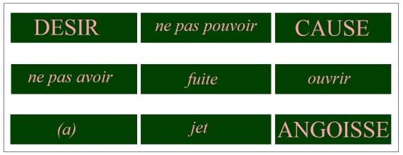
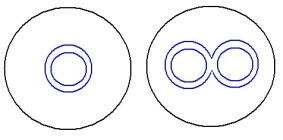
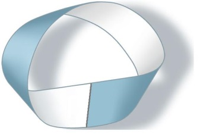
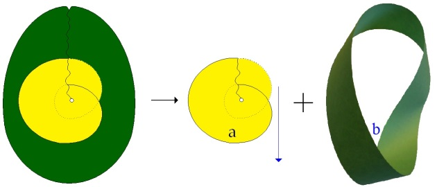
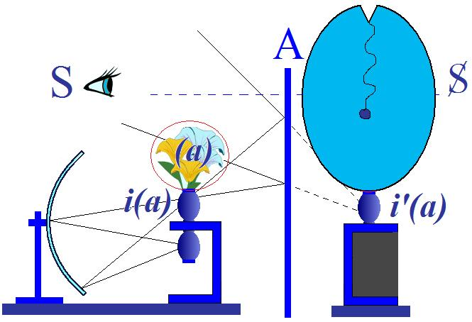
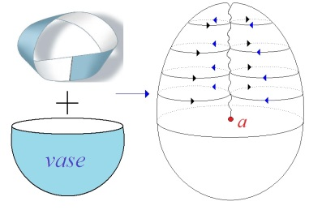

# Leçon 07 | 09 janvier l963

  

    <label><input type="checkbox" data-lacan-toggle="original" checked> 原文</label>
    <label><input type="checkbox" data-lacan-toggle="notes" checked> 注释</label>
    <label><input type="checkbox" data-lacan-toggle="commentary" checked> 个人解读评论</label>
  

  <form class="lacan-tool-search" role="search">
    <input class="lacan-tool-search-input" type="search" placeholder="搜索全文" aria-label="搜索全文">
    <button class="lacan-tool-button" type="submit" title="搜索">搜索</button>
  </form>
  <button class="lacan-tool-button lacan-back-to-top" type="button" title="回到页面最上方" aria-label="回到页面最上方">↑</button>

<section class="parallel-paragraph" data-paragraph-ids="s10-07-0001">

s10-07-0001

原文 · s10-07-0001

Dans la 32ème lecture[^43] introductive à la psychanalyse,
c’est-à-dire dans la série des « *Nouvelles conférences...* qu’on a traduit en français ...*sur la psychanalyse »,*
Freud précise qu’il s’agit d’introduire quelque chose qui n’a - dit-il - nullement le caractère de pure spéculation.

[无对应译文]

</section>

<section class="parallel-paragraph" data-paragraph-ids="s10-07-0002">

s10-07-0002

原文 · s10-07-0002

Mais on nous a traduit dans le français inintelligible dont vous allez pouvoir juger :
« *Mais il ne peut vrai­ment être question que de conceptions.* - Un point ! –
*En effet, il s’agit de trouver les idées abstraites justes, qui appliquées à la matière brute de l’observation y appor­teront ordre et clarté* [^44] ». Il n’y a pas de point en allemand, là où je vous l’ai signalé, et il n’y a aucune énigme dans la phrase.

[无对应译文]

</section>

<section class="parallel-paragraph" data-paragraph-ids="s10-07-0003">

s10-07-0003

原文 · s10-07-0003

« *Il s’agit -* nous dit Freud - *sondern es handelt sich wirklich*, non pas *vraiment* mais *réellement, de « conceptions »,* *virgule,*
c’est-à-dire, je veux dire par là des *Vorstellungen,* des représentations abstraites correctes
\- *il s’agit de les einzufahren* : *de les ame­ner, de les ame­ner au jour de* *ces* *conceptions dont l’application à la Rohstoff* \[*matière première*\] *: à l’étoffe brute de l’observation* : *Beobachtung, permettra d’en* *faire sortir, d’y faire naître l’ordre et la transparence* ».

[无对应译文]

</section>

<section class="parallel-paragraph" data-paragraph-ids="s10-07-0004">

s10-07-0004

原文 · s10-07-0004

> \[*Sondern es handelt sich wirklich um Auffassungen, d. h. darum, die richtigen abstrakten Vorstellungen einzuführen,*
>
> *deren Anwendung auf den Rohstoff der Beobachtung Ordnung und Durchsichtigkeit in ihm entstehen läßt.*\]

[无对应译文]

</section>

<section class="parallel-paragraph" data-paragraph-ids="s10-07-0005">

s10-07-0005

原文 · s10-07-0005

Il est évidemment toujours fâcheux de confier une chose aussi précieuse que la traduction de Freud *aux dames de l’anti­chambre*.
Cet effort, ce programme, celui auquel nous nous efforçons ici depuis quelques années,
et c’est de ce fait qu’aujourd’hui nous nous trouvons en somme à avoir à préciser, sur notre chemin de l’angoisse,
le statut de quelque chose que je désignerai d’emblée, d’abord :

[无对应译文]

</section>

<section class="parallel-paragraph" data-paragraph-ids="s10-07-0006">

s10-07-0006

原文 · s10-07-0006

 

[无对应译文]

</section>

<section class="parallel-paragraph" data-paragraph-ids="s10-07-0007">

s10-07-0007

原文 · s10-07-0007

- par la lettre *(a)* que vous voyez ici trôner au-dessus du profil, du profil du vase qui symbolise pour nous le contenant narcissique de *la libido*,

[无对应译文]

</section>

<section class="parallel-paragraph" data-paragraph-ids="s10-07-0008">

s10-07-0008

原文 · s10-07-0008

- en tant que par l’intermédiaire de *ce miroir de l’Autre* il peut être mis en rapport avec sa propre image \[***i’**(a)*\],

[无对应译文]

</section>

<section class="parallel-paragraph" data-paragraph-ids="s10-07-0009">

s10-07-0009

原文 · s10-07-0009

- et qu’entre les deux peut jouer cette oscillation communicante que Freud désigne comme la réversibilité de *la libido du corps propre* à celle de *l’objet*.

[无对应译文]

</section>

<section class="parallel-paragraph" data-paragraph-ids="s10-07-0010">

s10-07-0010

原文 · s10-07-0010

À cette oscillation économique de cette libido réversible de ***i**(a)* à ***i’**(a)*, il y a quelque chose, nous ne dirons pas qui *échappe*,
mais qui *intervient* sous une incidence dont le mode de perturbation est justement celui que nous étudions cette année.
La manifestation la plus éclatante, le signal de l’inter­vention de cet *objet(a)*, c’est *l’angoisse*.

[无对应译文]

</section>

<section class="parallel-paragraph" data-paragraph-ids="s10-07-0011">

s10-07-0011

原文 · s10-07-0011

Ce n’est pas dire que cet *objet* n’est que *l’envers de l’angoisse*, qu’il n’intervient, qu’il ne fonctionne qu’en corrélation avec l’angoisse. L’angoisse, nous a appris Freud, joue par rapport à *quelque chose,* *la fonc­tion de signal*.
Je dis, c’est *un signal* en relation avec ce qui se passe concer­nant la relation du sujet...

[无对应译文]

</section>

<section class="parallel-paragraph" data-paragraph-ids="s10-07-0012">

s10-07-0012

原文 · s10-07-0012

> d’un sujet qui ne saurait d’ailleurs entrer dans cette relation
>
> que dans la vacillation d’un certain « *fading »*, celle que désigne la notation de ce sujet par un S
> ...la relation de ce sujet, à ce moment vacillant, avec cet *objet* dans toute sa généralité.

[无对应译文]

</section>

<section class="parallel-paragraph" data-paragraph-ids="s10-07-0013">

s10-07-0013

原文 · s10-07-0013

L’*angoisse* est *le signal* de certains moments de cette relation.
C’est ce que nous allons nous efforcer de vous montrer plus avant aujourd’hui.
Il est clair que ceci suppose un pas de plus dans la situation, la précision de ce que nous entendons par cet *objet(a).*
Je veux dire, cet *objet*, nous le désignons par *(a)* justement.

[无对应译文]

</section>

<section class="parallel-paragraph" data-paragraph-ids="s10-07-0014">

s10-07-0014

原文 · s10-07-0014

Remarque - cette notation algébrique \[*<u>la lettre</u>* (*a*)\] a sa fonction :
elle est comme un fil destiné à nous permettre d’en reconnaître, sous les diverses incidences où il nous apparaît, l’identité.

[无对应译文]

</section>

<section class="parallel-paragraph" data-paragraph-ids="s10-07-0015">

s10-07-0015

原文 · s10-07-0015

Sa notation est algébrique *(a),* justement pour répondre à cette fin de repérage pur de l’identité,
ayant été déjà posé par nous que le repérage par un *mot*, par un *signifiant*, est toujours et ne saurait être que *métapho­rique*,
c’est-à-dire laisser, en quelque sorte, en dehors de la signification induite par son introduction, *la fonction du signifiant* lui-même. Le terme « *bon* », s’il engendre la signification du *bon*, n’est pas *bon* par lui-même,
loin de là, car il engendre, et du même coup, le mal.

[无对应译文]

</section>

<section class="parallel-paragraph" data-paragraph-ids="s10-07-0016">

s10-07-0016

原文 · s10-07-0016

De même désigner ce *(a)* par le terme d’*objet*, vous le voyez, n’est qu’un usage métaphorique,
puisqu’il est emprunté justement à cette *relation sujet-objet* où le terme « objet » se constitue,
qui sans doute est propre à désigner la fonction générale de l’objectivité,
mais cet *objet*, dont nous avons à parler sous le terme de *(a) est justement un objet qui est externe à toute définition pos­sible de l’objectivité.*
Je ne parlerai pas de ce qui se passe de l’objectivité dans le champ de la science, je parle de notre science en général.

[无对应译文]

</section>

<section class="parallel-paragraph" data-paragraph-ids="s10-07-0017">

s10-07-0017

原文 · s10-07-0017

Vous savez qu’il lui est arrivé, depuis Kant, quelques malheurs, quelques malheurs qui relèvent tous, dans le sein de cet objet,
d’avoir voulu faire trop de part à certaines « *évidences* » et spécialement à celles qui sont du champ de *l’Esthétique transcendantale.*

[无对应译文]

</section>

<section class="parallel-paragraph" data-paragraph-ids="s10-07-0018">

s10-07-0018

原文 · s10-07-0018

De tenir pour évidente l’indépendance, la séparation des dimensions de l’espace d’avec celle du temps, s’est trouvé,
à l’épreuve, dans l’élaboration de l’objet scienti­fique, se heurter à ce quelque chose
que l’on traduit bien impropre­ment par « crise de la raison scientifique » \[*cf. Physique quantique*\].

[无对应译文]

</section>

<section class="parallel-paragraph" data-paragraph-ids="s10-07-0019">

s10-07-0019

原文 · s10-07-0019

Bref, c’est tout cet effort qui a dû être fait pour s’apercevoir que justement ces 2 registres des dimensions *spatiale* et *temporelle*
ne pouvaient pas, à un certain niveau de la physique, conti­nuer d’être tenues pour des variables indépendantes.

[无对应译文]

</section>

<section class="parallel-paragraph" data-paragraph-ids="s10-07-0020">

s10-07-0020

原文 · s10-07-0020

Et, fait surprenant, qui semble avoir posé à quelques esprits d’indissolubles problèmes,
qui ne semblent pas pourtant être dignes de tellement nous arrêter,
si nous nous apercevons que c’est justement au *statut de l’objet* qu’il s’agit de recourir :

[无对应译文]

</section>

<section class="parallel-paragraph" data-paragraph-ids="s10-07-0021">

s10-07-0021

原文 · s10-07-0021

- de rendre au *symbolique*, dans la constitution, dans la traduction de l’expérience, sa place exacte,

[无对应译文]

</section>

<section class="parallel-paragraph" data-paragraph-ids="s10-07-0022">

s10-07-0022

原文 · s10-07-0022

- de ne pas faire d’extrapolation aventurée de *l’imaginaire* dans *le symbolique*.

[无对应译文]

</section>

<section class="parallel-paragraph" data-paragraph-ids="s10-07-0023">

s10-07-0023

原文 · s10-07-0023

À la vérité « *le temps »* dont il s’agit...

[无对应译文]

</section>

<section class="parallel-paragraph" data-paragraph-ids="s10-07-0024">

s10-07-0024

原文 · s10-07-0024

> au niveau où peuvent se poser les problèmes qui viendraient à l’*irréaliser* comme une « 4ème *dimension* »

[无对应译文]

</section>

<section class="parallel-paragraph" data-paragraph-ids="s10-07-0025">

s10-07-0025

原文 · s10-07-0025

...n’a rien à faire avec le temps qui dans l’intuition semble bien se poser comme une sorte de heurt infranchissable du *réel*,
à savoir ce qui nous apparaît à tous, et que sa tenue pour une évidence...

[无对应译文]

</section>

<section class="parallel-paragraph" data-paragraph-ids="s10-07-0026">

s10-07-0026

原文 · s10-07-0026

> pour quelque chose qui, dans le *symbolique*, pourrait se traduire par une variable indépendante,
> ...est simplement une erreur catégorielle au départ.

[无对应译文]

</section>

<section class="parallel-paragraph" data-paragraph-ids="s10-07-0027">

s10-07-0027

原文 · s10-07-0027

*Même difficulté*, vous le savez - à une certaine limite de la physique - *avec le corps*,
et là je dirai que nous voici sur notre terrain. Car c’est effective­ment sur ce qui n’est pas fait,
ce qui n’est pas fait au départ, d’un statut correct de l’expérience que nous avons ici notre mot à dire.

[无对应译文]

</section>

<section class="parallel-paragraph" data-paragraph-ids="s10-07-0028">

s10-07-0028

原文 · s10-07-0028

Nous avons notre mot à dire puisque notre expérience pose et institue

[无对应译文]

</section>

<section class="parallel-paragraph" data-paragraph-ids="s10-07-0029">

s10-07-0029

原文 · s10-07-0029

- qu’aucune intuition,

[无对应译文]

</section>

<section class="parallel-paragraph" data-paragraph-ids="s10-07-0030">

s10-07-0030

原文 · s10-07-0030

- qu’aucune transpa­rence,

[无对应译文]

</section>

<section class="parallel-paragraph" data-paragraph-ids="s10-07-0031">

s10-07-0031

原文 · s10-07-0031

- qu’aucune *Durchsichtigkeit,* comme citant le terme de Freud, qui se fonde purement et simplement sur l’intuition de la conscience, ne peut être tenu pour originelle, pour valable, et donc ne peut constituer le départ d’aucune *esthétique transcendentale*, pour la simple raison que *le sujet* ne saurait, d’aucune façon, être situé d’une façon exhaustive dans la conscien­ce, *puisqu’il est d’abord et primitivement, inconscient*.

[无对应译文]

</section>

<section class="parallel-paragraph" data-paragraph-ids="s10-07-0032">

s10-07-0032

原文 · s10-07-0032

À ceci j’ajoute que *s’il est d’abord et primitivement inconscient,* c’est en raison de ceci :
qu’il nous faut *d’abord et primitivement,* *dans sa constitution de sujet*, tenir pour antérieure à cette constitution,
une certaine incidence qui est celle du *signifiant*.
Le problème est de *l’entrée du signifiant dans le réel* et de voir comment, de ceci, naît le sujet.

[无对应译文]

</section>

<section class="parallel-paragraph" data-paragraph-ids="s10-07-0033">

s10-07-0033

原文 · s10-07-0033

Est-ce à dire que si nous nous trouvions comme devant une sorte de *descente de l’Esprit*, l’apparition de *signifiants ailés*,
*qui commenceraient à faire, dans ce réel, leurs trous tout seuls*, au milieu desquels apparaîtrait un de ces trous qui serait le sujet ?
Je pense que dans l’introduction de la division *Réel, Imaginaire et Symbolique* [^45] nul ne me prête un tel dessein.

[无对应译文]

</section>

<section class="parallel-paragraph" data-paragraph-ids="s10-07-0034">

s10-07-0034

原文 · s10-07-0034

Il s’agit justement aujourd’hui de savoir

[无对应译文]

</section>

<section class="parallel-paragraph" data-paragraph-ids="s10-07-0035">

s10-07-0035

原文 · s10-07-0035

- <u>*ce qui* *est d’abord*</u>,

[无对应译文]

</section>

<section class="parallel-paragraph" data-paragraph-ids="s10-07-0036">

s10-07-0036

原文 · s10-07-0036

- *ce qui permet,* justement, *à ce signifiant de s’incarner*.

[无对应译文]

</section>

<section class="parallel-paragraph" data-paragraph-ids="s10-07-0037">

s10-07-0037

原文 · s10-07-0037

*Ce qui le lui permet c’est*...

[无对应译文]

</section>

<section class="parallel-paragraph" data-paragraph-ids="s10-07-0038">

s10-07-0038

原文 · s10-07-0038

> bien entendu, ce que nous avons là pour nous présentifier les uns aux autres
> ...*notre corps*.

[无对应译文]

</section>

<section class="parallel-paragraph" data-paragraph-ids="s10-07-0039">

s10-07-0039

原文 · s10-07-0039

Seulement ce corps n’est pas à prendre non plus, lui, dans les pures et simples catégories de *l’esthétique transcendentale*.
Ce corps n’est pas, pour tout dire, constituable à la façon dont Descartes l’institue dans le champ de « *l’étendue* ».

[无对应译文]

</section>

<section class="parallel-paragraph" data-paragraph-ids="s10-07-0040">

s10-07-0040

原文 · s10-07-0040

Ce corps dont il s’agit, il s’agit de nous apercevoir :

[无对应译文]

</section>

<section class="parallel-paragraph" data-paragraph-ids="s10-07-0041">

s10-07-0041

原文 · s10-07-0041

- qu’il ne nous est pas donné de façon pure et simple dans notre miroir,

[无对应译文]

</section>

<section class="parallel-paragraph" data-paragraph-ids="s10-07-0042">

s10-07-0042

原文 · s10-07-0042

- que même dans cette expérience du miroir, un moment peut arriver où cette image, cette image spéculaire où nous croyons tenir, se modifie, où ce que nous avons en face de nous, qui est notre stature, qui est notre visage, qui est notre paire d’yeux, laisse surgir la dimension de notre propre regard et la valeur de l’ima­ge commence alors de changer, surtout s’il y a un moment où ce regard, qui apparaît dans le miroir, commence à ne plus nous regarder nous-mêmes, *initium aura*, « *aurore* » d’un *sentiment d’étrangeté* qui est la porte ouverte sur l’angoisse.

[无对应译文]

</section>

<section class="parallel-paragraph" data-paragraph-ids="s10-07-0043">

s10-07-0043

原文 · s10-07-0043

Le passage de l’*image spéculaire* à ce *double* qui m’échappe, voilà le point où quelque chose se passe,
dont je crois que par l’articulation que nous don­nons à cette *fonction* *de (a),*
nous pouvons montrer *la généralité*, *la fonction*, *la présence*, dans tout le champ phénoménal,
et montrer que *la fonction* va bien au-delà de ce qui apparaît dans ce moment étrange,
que j’ai voulu ici simplement repérer pour son caractère à la fois le plus notoire et aussi le plus discret dans son intensité.

[无对应译文]

</section>

<section class="parallel-paragraph" data-paragraph-ids="s10-07-0044">

s10-07-0044

原文 · s10-07-0044

Comment se passe cette transformation de l’objet qui,

[无对应译文]

</section>

<section class="parallel-paragraph" data-paragraph-ids="s10-07-0045">

s10-07-0045

原文 · s10-07-0045

- d’un objet situable, d’un objet repérable, d’un objet échangeable,

[无对应译文]

</section>

<section class="parallel-paragraph" data-paragraph-ids="s10-07-0046">

s10-07-0046

原文 · s10-07-0046

- fait cette sorte d’ob­jet privé, incommunicable et pourtant dominant, qui est notre corrélatif dans le fantasme ? Où est exactement le moment de cette mue, de cette transformation, de cette révélation ?

[无对应译文]

</section>

<section class="parallel-paragraph" data-paragraph-ids="s10-07-0047">

s10-07-0047

原文 · s10-07-0047

Je crois que ceci...
par certains chemins, par certains biais, que j’ai déjà préparés pour vous au cours des années pré­cédentes
...peut être plus que désigné : peut être expliqué.

[无对应译文]

</section>

<section class="parallel-paragraph" data-paragraph-ids="s10-07-0048">

s10-07-0048

原文 · s10-07-0048

[无对应译文]

</section>

<section class="parallel-paragraph" data-paragraph-ids="s10-07-0049">

s10-07-0049

原文 · s10-07-0049

Et que dans le petit sché­ma que je vous ai apporté aujourd’hui au tableau, quelque chose de ces « *conceptions »,* « *Auffassungen »,*
de ces représentations « *richtig », « correctes »,* peut être donné qui fasse de l’appel...

[无对应译文]

</section>

<section class="parallel-paragraph" data-paragraph-ids="s10-07-0050">

s10-07-0050

原文 · s10-07-0050

> toujours plus ou moins opaque, obscur
> à l’intuition, à l’expérience, quelque chose de *Durchsichtigkeit,* de *transparent*.
> Autrement dit de reconstituer pour nous, *l’esthétique transcendentale* qui nous convient et qui convient à notre expérience.

[无对应译文]

</section>

<section class="parallel-paragraph" data-paragraph-ids="s10-07-0051">

s10-07-0051

原文 · s10-07-0051

Vous pouvez tenir donc pour certain, par mon discours, que ce qui est communément transmis, concernant l’angoisse...
non pas extrait du discours de Freud, mais *d’une partie de ce discours*
...que *« l’angoisse soit sans objet »* est proprement ce que je rectifie.

[无对应译文]

</section>

<section class="parallel-paragraph" data-paragraph-ids="s10-07-0052">

s10-07-0052

原文 · s10-07-0052

Comme j’ai pris soin ici de vous l’écrire - *pourquoi pas ça entre autre* - à la façon d’un petit :

[无对应译文]

</section>

<section class="parallel-paragraph" data-paragraph-ids="s10-07-0053">

s10-07-0053

原文 · s10-07-0053

« *Elle n’est pas sans objet* ». \[**24’ 14’’**\]

[无对应译文]

</section>

<section class="parallel-paragraph" data-paragraph-ids="s10-07-0054">

s10-07-0054

原文 · s10-07-0054

Telle est exactement la formule où doit être suspendu ce rapport de l’an­goisse à un objet.
Ce n’est pas à proprement parler *l’objet* *<u>de</u>* l’angoisse.

[无对应译文]

</section>

<section class="parallel-paragraph" data-paragraph-ids="s10-07-0055">

s10-07-0055

原文 · s10-07-0055

Dans ce « *pas sans* », vous reconnaissez la formule que j’ai déjà prise depuis concernant le rapport du *sujet* au *phallus* :
« *il n’est pas sans l’avoir *». Ce rapport de « *n’être pas sans avoir* », ne veut pas dire qu’on sache de quel objet il s’agit.
Quand je dis : « *il n’est pas sans ressources* », « *il n’est pas sans ruse* »,
ça veut justement dire que ses ressources sont obscures, au moins pour moi, et que sa ruse n’est pas commune.

[无对应译文]

</section>

<section class="parallel-paragraph" data-paragraph-ids="s10-07-0056">

s10-07-0056

原文 · s10-07-0056

Aussi bien l’introduction, même linguistique, du terme « *sans* »*, sine...*

[无对应译文]

</section>

<section class="parallel-paragraph" data-paragraph-ids="s10-07-0057">

s10-07-0057

原文 · s10-07-0057

> et profondément corrélatif de cette aposition du *haud : haud sine*, « *non pas sans* »
> ...un certain type de liai­son conditionnelle, si vous voulez, qui lie l’être à l’avoir dans une sorte d’*al­ternance* :
> il n’est pas là sans l’avoir, mais ailleurs, là où il est, ça ne se voit pas.

[无对应译文]

</section>

<section class="parallel-paragraph" data-paragraph-ids="s10-07-0058">

s10-07-0058

原文 · s10-07-0058

Est-ce que ce n’est pas justement là, la fonction même, sociologique du *phallus*,
à condition bien sûr, de le prendre ici au niveau *majuscule*,
au niveau du Φ, où il incarne la fonction la plus aliénante du sujet dans l’échange, même dans l’échange social.

[无对应译文]

</section>

<section class="parallel-paragraph" data-paragraph-ids="s10-07-0059">

s10-07-0059

原文 · s10-07-0059

Le sujet y court, réduit à être *porteur du phallus*.
C’est cela qui rend la castration nécessaire à une sexualité socialisée, où il y a...

[无对应译文]

</section>

<section class="parallel-paragraph" data-paragraph-ids="s10-07-0060">

s10-07-0060

原文 · s10-07-0060

> nous l’a fait remarquer Claude Lévi-Strauss
> ...*des interdictions*, sans doute, mais aussi et avant tout *des préférences*.

[无对应译文]

</section>

<section class="parallel-paragraph" data-paragraph-ids="s10-07-0061">

s10-07-0061

原文 · s10-07-0061

*C’est le vrai secret, c’est la vérité* de ce que Freud fait tourner dans la structure *autour de* *l’échange des femmes,* et *sous* *l’échan­ge des femmes *: *les phallus vont les remplir*. Mais il ne faut pas qu’on voie que c’est lui, *le phallus*, qui est en cause. Si on le voit : *angoisse*.

[无对应译文]

</section>

<section class="parallel-paragraph" data-paragraph-ids="s10-07-0062">

s10-07-0062

原文 · s10-07-0062

Je pourrais ici embrancher sur plus d’un rail.
Il est clair que par *cette référence*, nous en voici tout de suite au *complexe de castration*.
Eh bien, mon Dieu, pourquoi ne pas nous y engager ?

[无对应译文]

</section>

<section class="parallel-paragraph" data-paragraph-ids="s10-07-0063">

s10-07-0063

原文 · s10-07-0063

La castration, comme je l’ai maintes fois rappelé devant vous, la castration du « *complexe* », n’est pas une castration.
Ça, tout le monde le sait, tout le monde s’en doute, et chose curieuse, on ne s’y arrête pas.
Ça a tout de même bien de l’intérêt.

[无对应译文]

</section>

<section class="parallel-paragraph" data-paragraph-ids="s10-07-0064">

s10-07-0064

原文 · s10-07-0064

Cette *image* - ce *fantasme* - où la situer entre *imaginaire* et *symbolique*, de ce qui se passe ?
Est-ce *l’éviration* bien connue des farouches pratiques de la guerre ?
C’est assurément plus près que de *la fabrication des eunuques*.

[无对应译文]

</section>

<section class="parallel-paragraph" data-paragraph-ids="s10-07-0065">

s10-07-0065

原文 · s10-07-0065

Mutilation du pénis, bien entendu, c’est ce qui est évoqué, et par les menaces fantasmatiques mêmes, du père ou de la mère,
selon les âges de la psychanalyse : « *Si tu fais ça, on va te le couper* ».

[无对应译文]

</section>

<section class="parallel-paragraph" data-paragraph-ids="s10-07-0066">

s10-07-0066

原文 · s10-07-0066

Aussi bien faut-il que cet accent de *la coupure* ait toute son importance pour qu’on puisse tenir la pratique de *la circoncision*
à laquelle la dernière fois, vous m’avez vu faire des réfé­rences, si je puis dire, prophylactiques.
À savoir la remarque que l’incidence psychique de la circoncision est loin d’être univoque
et que je ne suis pas le seul à l’avoir remarqué.

[无对应译文]

</section>

<section class="parallel-paragraph" data-paragraph-ids="s10-07-0067">

s10-07-0067

原文 · s10-07-0067

Un des derniers travaux, sans doute remarquable, sur ce sujet..

[无对应译文]

</section>

<section class="parallel-paragraph" data-paragraph-ids="s10-07-0068">

s10-07-0068

原文 · s10-07-0068

> celui de Nunberg[^46], sur la circoncision conçue dans ses rapports avec la bisexualité
> ...est bien là pour nous rappeler ce que déjà d’autres auteurs, et de nom­breux, avaient introduit avant lui :
> que la circoncision a tout autant le but, la fin, de renforcer en l’isolant le terme de la masculinité chez l’homme,
> que de provoquer les effets...

[无对应译文]

</section>

<section class="parallel-paragraph" data-paragraph-ids="s10-07-0069">

s10-07-0069

原文 · s10-07-0069

> au moins sous leur incidence angoissante
> ...que de pro­voquer les effets dits du « *complexe de castration* ».

[无对应译文]

</section>

<section class="parallel-paragraph" data-paragraph-ids="s10-07-0070">

s10-07-0070

原文 · s10-07-0070

Néanmoins, c’est justement cette incidence, cette relation, ce commun dénominateur de la coupure
qui nous permet d’amener *dans le champ de la castration*, l’*opération circoncisoire*, la *Beschneidung,* l’לרע \[arel\] [^47] pour le dire en hébreu.

[无对应译文]

</section>

<section class="parallel-paragraph" data-paragraph-ids="s10-07-0071">

s10-07-0071

原文 · s10-07-0071

Est-ce qu’il n’y a pas un tout petit quelque chose
qui nous permettrait déjà de faire un pas de plus sur la fonction de l’angoisse de cas­tration ?

[无对应译文]

</section>

<section class="parallel-paragraph" data-paragraph-ids="s10-07-0072">

s10-07-0072

原文 · s10-07-0072

Eh bien, c’est celui-ci le terme qui nous manque : « *je vais te le couper* » dit la maman que l’on qualifie de *castratrice*.
Ben, et après où sera-t-il, le *Wiwimacher,* comme on dit dans l’observation du *petit Hans ?*

[无对应译文]

</section>

<section class="parallel-paragraph" data-paragraph-ids="s10-07-0073">

s10-07-0073

原文 · s10-07-0073

Eh bien, à admettre que cette menace, depuis toujours présentifiée par notre expérience, s’accomplisse,
il sera là dans le champ opératoire de l’*ob­jet commun*, de l’*objet échangeable*,
il sera là, entre les mains de la mère qui l’aura coupé, et c’est bien ce qu’il y aura, dans la situation, d’*étrange*.

[无对应译文]

</section>

<section class="parallel-paragraph" data-paragraph-ids="s10-07-0074">

s10-07-0074

原文 · s10-07-0074

Il arrive souvent que nos sujets fassent des rêves où ils ont l’objet en main :

[无对应译文]

</section>

<section class="parallel-paragraph" data-paragraph-ids="s10-07-0075">

s10-07-0075

原文 · s10-07-0075

- soit que quelque gangrène l’ait détaché,

[无对应译文]

</section>

<section class="parallel-paragraph" data-paragraph-ids="s10-07-0076">

s10-07-0076

原文 · s10-07-0076

- soit que quelque partenaire, dans leur rêve, ait pris soin de réaliser l’opération tranchante,

[无对应译文]

</section>

<section class="parallel-paragraph" data-paragraph-ids="s10-07-0077">

s10-07-0077

原文 · s10-07-0077

- soit par quelque accident quelconque, corrélatif diversement nuancé d’étrangeté et d’angois­se.

[无对应译文]

</section>

<section class="parallel-paragraph" data-paragraph-ids="s10-07-0078">

s10-07-0078

原文 · s10-07-0078

Le caractère spécialement inquiétant du rêve est bien là pour nous situer l’importance de *ce passage de l’objet*, soudain,
à ce qu’on pourrait appeler sa *Zuhandenheit* comme dirait Heidegger, sa maniabilité, *dans le champ des objets communs*.

[无对应译文]

</section>

<section class="parallel-paragraph" data-paragraph-ids="s10-07-0079">

s10-07-0079

原文 · s10-07-0079

Et la perplexité qui en résulte...

[无对应译文]

</section>

<section class="parallel-paragraph" data-paragraph-ids="s10-07-0080">

s10-07-0080

原文 · s10-07-0080

> et aussi bien, tout ce pas­sage au côté du maniable, de l’ustensile
> ...c’est justement ce qui là bas, dans l’observation du *petit Hans,* nous est désigné aussi par un rêve :
> il nous introduit « *l’installateur de robinets* », celui qui va le dévisser, le revisser, faire passer toute la discussion

[无对应译文]

</section>

<section class="parallel-paragraph" data-paragraph-ids="s10-07-0081">

s10-07-0081

原文 · s10-07-0081

- de l’*eingewurzelt,* de ce qui était ou non bien *enraciné dans le corps*,

[无对应译文]

</section>

<section class="parallel-paragraph" data-paragraph-ids="s10-07-0082">

s10-07-0082

原文 · s10-07-0082

- au champ, au registre de l’amovible.

[无对应译文]

</section>

<section class="parallel-paragraph" data-paragraph-ids="s10-07-0083">

s10-07-0083

原文 · s10-07-0083

Et ce moment, ce tournant phénoménologique,
le voici qui rejoint, qui nous permet de désigner ce qui oppose ces 2 *types d’objets* dans leur statut.

[无对应译文]

</section>

<section class="parallel-paragraph" data-paragraph-ids="s10-07-0084">

s10-07-0084

原文 · s10-07-0084

Quand j’ai commencé d’énoncer *la fonction* ...

[无对应译文]

</section>

<section class="parallel-paragraph" data-paragraph-ids="s10-07-0085">

s10-07-0085

原文 · s10-07-0085

> la fonction fondamentale dans l’insti­tution générale du champ de l’objet
> ...*du stade du miroir*, par quoi ai-je passé ?

[无对应译文]

</section>

<section class="parallel-paragraph" data-paragraph-ids="s10-07-0086">

s10-07-0086

原文 · s10-07-0086

Par le plan de *la première identification*...

[无对应译文]

</section>

<section class="parallel-paragraph" data-paragraph-ids="s10-07-0087">

s10-07-0087

原文 · s10-07-0087

> méconnaissance originelle du sujet dans sa totalité
> ...*à son image spéculaire*.

[无对应译文]

</section>

<section class="parallel-paragraph" data-paragraph-ids="s10-07-0088">

s10-07-0088

原文 · s10-07-0088

Puis la référence *transitiviste* qui s’établit dans son rapport avec l’*autre* imaginaire,
son semblable, qui le fait toujours être mal démêlable de cette identité de l’*autre*.
Qu’est-ce qui y introduit la médiation : un commun *objet* qui est un *objet* de concurrence,
un *objet* dont le statut va partir de la notion ou non d’« *appartenance* » : il est à toi ou il est à moi.

[无对应译文]

</section>

<section class="parallel-paragraph" data-paragraph-ids="s10-07-0089">

s10-07-0089

原文 · s10-07-0089

Et dans ce champ *il y a deux sortes d’objets* :

[无对应译文]

</section>

<section class="parallel-paragraph" data-paragraph-ids="s10-07-0090">

s10-07-0090

原文 · s10-07-0090

- ceux qui peuvent se partager,

[无对应译文]

</section>

<section class="parallel-paragraph" data-paragraph-ids="s10-07-0091">

s10-07-0091

原文 · s10-07-0091

- ceux qui ne le peuvent pas.

[无对应译文]

</section>

<section class="parallel-paragraph" data-paragraph-ids="s10-07-0092">

s10-07-0092

原文 · s10-07-0092

Ceux qui ne le peuvent pas, quand je les vois quand même courir dans ce domaine du partage,
avec les autres objets dont le statut repose tout entier sur la concurrence,
cette concurrence ambiguë qui est à la fois rivalité, mais aussi accord,
ce sont des *objets cotables*, ce sont des *objets d’échange.*

[无对应译文]

</section>

<section class="parallel-paragraph" data-paragraph-ids="s10-07-0093">

s10-07-0093

原文 · s10-07-0093

Mais il y en a...
et si j’ai mis en avant *le phal­lus* c’est bien sûr parce que c’est le plus illustre au regard du fait de la cas­tration
...mais il y en a - vous le savez - d’autres, d’autres que vous connaissez :
les équivalents les plus connus de ce *phal­lus*, ceux qui le précèdent, *le scy­bale*, *le mamelon*.

[无对应译文]

</section>

<section class="parallel-paragraph" data-paragraph-ids="s10-07-0094">

s10-07-0094

原文 · s10-07-0094

Il y en a peut-être que vous connaissez moins...

[无对应译文]

</section>

<section class="parallel-paragraph" data-paragraph-ids="s10-07-0095">

s10-07-0095

原文 · s10-07-0095

> encore qu’ils soient parfaitement lisibles dans la littérature analytique, et nous essaierons de les désigner.
> ...ces objets quand ils entrent en liberté...

[无对应译文]

</section>

<section class="parallel-paragraph" data-paragraph-ids="s10-07-0096">

s10-07-0096

原文 · s10-07-0096

> recon­naissables dans ce champ où ils n’ont que faire, dans le champ du partage
> ...quand ils apparaissent, l’*angoisse* nous signale la particularité de leur statut.

[无对应译文]

</section>

<section class="parallel-paragraph" data-paragraph-ids="s10-07-0097">

s10-07-0097

原文 · s10-07-0097

Ces *objets...*
*antérieurs* *à la constitution du* *statut de l’objet commun*, de *l’objet communicable*, de *l’objet socialisé*,
...voilà ce dont il s’agit dans le *(a)*.

[无对应译文]

</section>

<section class="parallel-paragraph" data-paragraph-ids="s10-07-0098">

s10-07-0098

原文 · s10-07-0098

Nous les nommerons ces objets, nous en ferons le catalogue, non sans doute exhaustif - mais peut-être aussi, espérons-le.
Déjà à l’instant, j’en ai nommé trois \[*phal­lus*, *scy­bale*, *mamelon*\].

[无对应译文]

</section>

<section class="parallel-paragraph" data-paragraph-ids="s10-07-0099">

s10-07-0099

原文 · s10-07-0099

Je dirai que, dans un premier abord de *ce catalogue*, il n’en manque que deux,
et que le tout correspond aux *cinq formes de perte*, de *loss*, de *Verlust,* que Freud désigne dans *Inhibition, symptôme, angoisse,*
comme étant les moments majeurs de l’apparition du signal.

[无对应译文]

</section>

<section class="parallel-paragraph" data-paragraph-ids="s10-07-0100">

s10-07-0100

原文 · s10-07-0100

Je veux, avant de m’y engager plus avant, reprendre l’autre branche de l’aiguillage,
autour de quoi vous m’avez perçu tout à l’heure en train de choisir, pour faire une remarque dont les à-côtés, je crois,
auront pour vous des aspects éclairants.

[无对应译文]

</section>

<section class="parallel-paragraph" data-paragraph-ids="s10-07-0101">

s10-07-0101

原文 · s10-07-0101

Est-ce qu’il n’est pas étrange, *significatif* de quelque chose, que dans la recherche analytique, se manifeste *une bien autre caren­ce*
que celle que j’ai déjà désignée en disant que nous n’avions pas fait faire un pas *à la question physiologique de la sexualité féminine* : nous pouvons nous accuser du même défaut concernant l’impuissance masculine.

[无对应译文]

</section>

<section class="parallel-paragraph" data-paragraph-ids="s10-07-0102">

s10-07-0102

原文 · s10-07-0102

Parce qu’après tout, dans le procès - bien repérable dans ses phases normatives - de la part masculine de la copulation,
nous en sommes toujours à nous référer à ce qu’on trouve dans n’importe quel bouquin de physiologie
concernant le procès de l’érection d’abord, puis de l’orgasme.

[无对应译文]

</section>

<section class="parallel-paragraph" data-paragraph-ids="s10-07-0103">

s10-07-0103

原文 · s10-07-0103

La référence au *circuit stimulus-réponse* n’est en fin de compte que ce dont nous nous contentons, *comme si l’homologie était acceptable*

[无对应译文]

</section>

<section class="parallel-paragraph" data-paragraph-ids="s10-07-0104">

s10-07-0104

原文 · s10-07-0104

- de la décharge orgasmique,

[无对应译文]

</section>

<section class="parallel-paragraph" data-paragraph-ids="s10-07-0105">

s10-07-0105

原文 · s10-07-0105

- avec la part motrice de ce circuit dans un processus d’*action* quelconque.

[无对应译文]

</section>

<section class="parallel-paragraph" data-paragraph-ids="s10-07-0106">

s10-07-0106

原文 · s10-07-0106

Bien sûr, nous n’en sommes pas là tout à fait, loin de là même dans Freud, et le problème a été soulevé en somme par lui :

[无对应译文]

</section>

<section class="parallel-paragraph" data-paragraph-ids="s10-07-0107">

s10-07-0107

原文 · s10-07-0107

- pourquoi dans le plai­sir sexuel le circuit n’est pas le circuit - comme ailleurs - le plus court, pour retourner au niveau du minimum d’excitation ?

[无对应译文]

</section>

<section class="parallel-paragraph" data-paragraph-ids="s10-07-0108">

s10-07-0108

原文 · s10-07-0108

- Pourquoi il y a une *Vorlust,* un *plaisir préliminaire*, comme on traduit, qui consiste justement à faire monter aussi haut que possible ce niveau minimum ?

[无对应译文]

</section>

<section class="parallel-paragraph" data-paragraph-ids="s10-07-0109">

s10-07-0109

原文 · s10-07-0109

Et l’intervention de l’orgasme, à savoir à partir de quel moment cette mon­tée du niveau, liée dans la norme au jeu préparatoire, est interrompue

[无对应译文]

</section>

<section class="parallel-paragraph" data-paragraph-ids="s10-07-0110">

s10-07-0110

原文 · s10-07-0110

- est-ce que nous avons, d’aucune façon, donné un schéma de ce qui intervient, du mécanisme, si l’on veut donner une représentation physiologique de *la chose parlée,* de ce que Freud appellerait les *Abfuhrinnervationen,* le *circuit d’innervation* qui est le support de la mise en jeu de la décharge ?

[无对应译文]

</section>

<section class="parallel-paragraph" data-paragraph-ids="s10-07-0111">

s10-07-0111

原文 · s10-07-0111

- Est-ce que nous l’avons *distingué, désigné, isolé*, puisqu’il faut bien considérer comme distinct ce qui fonctionnait avant, puisque ce qui fonctionnait avant, c’était juste­ment que ce processus n’aille pas vers sa décharge, avant l’arrivée à un cer­tain niveau de la montée du stimulus ?

[无对应译文]

</section>

<section class="parallel-paragraph" data-paragraph-ids="s10-07-0112">

s10-07-0112

原文 · s10-07-0112

C’est donc un exercice de la fonction du plaisir tendant à confiner à sa propre limite, c’est-à-dire au surgissement de la douleur.

[无对应译文]

</section>

<section class="parallel-paragraph" data-paragraph-ids="s10-07-0113">

s10-07-0113

原文 · s10-07-0113

Alors, d’où vient-il ce *feed-back* ? Personne ne songe à nous le dire.
Mais je vous ferai remarquer, que non pas moi, mais ceux-là mêmes qui nous distillent la doctrine analytique,
devraient nous dire normalement que l’*Autre* doit y intervenir.

[无对应译文]

</section>

<section class="parallel-paragraph" data-paragraph-ids="s10-07-0114">

s10-07-0114

原文 · s10-07-0114

Puisque ce qui constitue une fonction génitale normale nous est donné pour lié à l’oblativité,
il faudrait que nous concevions comment la fonction du don comme telle, intervient *hic et nunc* au moment où on baise !
Ceci a en tout cas bien son intérêt, car ou c’est valable, ou ça ne l’est pas,
et il est certain que, de quelque manière, doit intervenir la fonction de l’*Autre*.
En tout cas, puisque une part importante de nos spéculations concernent ce qu’on appelle « *le choix de l’objet d’amour* »,
et que c’est dans les perturbations de cette vie amoureuse que gît une part importante de l’expérience analy­tique,
que dans ce choix la référence à *l’objet primordial*, à la mère, est tenue pour capitale,
la distinction s’impose de savoir où il faut situer cette incidence criblante du fait que,

[无对应译文]

</section>

<section class="parallel-paragraph" data-paragraph-ids="s10-07-0115">

s10-07-0115

原文 · s10-07-0115

- pour certains, il en résultera qu’ils ne pour­ront fonctionner pour *l’orgasme* qu’avec des prostituées,

[无对应译文]

</section>

<section class="parallel-paragraph" data-paragraph-ids="s10-07-0116">

s10-07-0116

原文 · s10-07-0116

- et que pour d’autres ce sera avec d’autres sujets, choisis dans un autre registre.

[无对应译文]

</section>

<section class="parallel-paragraph" data-paragraph-ids="s10-07-0117">

s10-07-0117

原文 · s10-07-0117

La prostituée, nous le savons par nos analyses, la relation à elle est presque directement engrenée sur la référence à la mère.
Dans d’autres cas, les détériorations, dégradations, de la *Liebesleben,* de la vie amoureuse, sont liées à l’opposition

[无对应译文]

</section>

<section class="parallel-paragraph" data-paragraph-ids="s10-07-0118">

s10-07-0118

原文 · s10-07-0118

- du terme maternel dont il \[Freud\] évoque un certain type de rap­port au sujet,

[无对应译文]

</section>

<section class="parallel-paragraph" data-paragraph-ids="s10-07-0119">

s10-07-0119

原文 · s10-07-0119

- à la femme, d’un certain type différent en tant qu’elle devient le support, qu’elle est *l’équivalent de l’objet phallique*.

[无对应译文]

</section>

<section class="parallel-paragraph" data-paragraph-ids="s10-07-0120">

s10-07-0120

原文 · s10-07-0120

Comment tout ceci se produit-il ?

[无对应译文]

</section>

<section class="parallel-paragraph" data-paragraph-ids="s10-07-0121">

s10-07-0121

原文 · s10-07-0121

[无对应译文]

</section>

<section class="parallel-paragraph" data-paragraph-ids="s10-07-0122">

s10-07-0122

原文 · s10-07-0122

Ce tableau, ce schéma, celui que j’ai reproduit un fois de plus ici sur la partie supérieure du tableau,
nous permet de désigner ce que je veux dire.

[无对应译文]

</section>

<section class="parallel-paragraph" data-paragraph-ids="s10-07-0123">

s10-07-0123

原文 · s10-07-0123

Est-ce que le mécanisme, l’articulation, se produit au niveau de l’attrait de l’objet,
qui devient pour nous, ou non, revêtu *de cette glamor, de cette brillance désirable, de cette couleur...*

[无对应译文]

</section>

<section class="parallel-paragraph" data-paragraph-ids="s10-07-0124">

s10-07-0124

原文 · s10-07-0124

> c’est ainsi qu’en chinois, on désigne la sexualité
> ...qui fait que l’objet devient sti­mulant au niveau justement de l’excitation ?

[无对应译文]

</section>

<section class="parallel-paragraph" data-paragraph-ids="s10-07-0125">

s10-07-0125

原文 · s10-07-0125

En quoi cette couleur préfé­rentielle se situera, je dirai au même niveau de signal, qui peut aussi bien être celui de l’angoisse ?
Je dis donc à ce niveau-ci \[***i’**(a)*\]. Et alors il s’agi­ra de savoir pourquoi ! Et je l’indique tout de suite pour que vous voyiez
où je veux en venir : par le branchement de *l’investissement érogène originel,* de ce qu’il y a ici en tant que *(a)*, *présent et caché à la fois*.

[无对应译文]

</section>

<section class="parallel-paragraph" data-paragraph-ids="s10-07-0126">

s10-07-0126

原文 · s10-07-0126

Ou bien ce qui fonc­tionne comme élément de triage dans le choix de l’objet d’amour se produit ici \[A\] au niveau de *l’encadrement* par une *Einschränkung,* par ce *rétrécisse­ment* directement référé par Freud au mécanisme du *moi*, par *cette limita­tion* du champ
de l’intérêt qui exclut *un certain type d’objet* précisément en fonction de son rapport avec la mère.
Les deux mécanismes sont, vous le voyez, aux deux bouts de cette chaîne, qui commence à *Inhibition* et qui finit par *Angoisse* dont j’ai marqué dans le tableau que je vous ai donné au début de cette année, la ligne diagonale.

[无对应译文]

</section>

<section class="parallel-paragraph" data-paragraph-ids="s10-07-0127">

s10-07-0127

原文 · s10-07-0127

[无对应译文]

</section>

<section class="parallel-paragraph" data-paragraph-ids="s10-07-0128">

s10-07-0128

原文 · s10-07-0128

Entre *l’inhibition* et *l’angoisse*, il y a lieu de distinguer deux mécanismes différents,
et justement de concevoir en quoi l’un et l’autre peuvent inter­venir du haut en bas de toute la manifestation sexuelle.
J’ajoute ceci : que quand je dis « *du haut en bas* », j’y inclus ce qui dans notre expérience s’appelle « *le transfert* ».

[无对应译文]

</section>

<section class="parallel-paragraph" data-paragraph-ids="s10-07-0129">

s10-07-0129

原文 · s10-07-0129

J’ai entendu récemment faire allusion au fait que nous étions des gens, dans notre *Société*, qui en savions un bout sur *le transfert*, pour tout dire, depuis un certain travail [^48]...

[无对应译文]

</section>

<section class="parallel-paragraph" data-paragraph-ids="s10-07-0130">

s10-07-0130

原文 · s10-07-0130

> qui a été fait avant que notre *Société* fut fondée
> ...sur le transfert, je ne connais qu’*un seul autre tra­vail qui ait été accompli*, c’est celui de l’année, qu’ici avec vous, j’y ai consacrée[^49]. J’y ai dit bien des choses, certainement sous une forme qui était celle qui était la plus appropriée,
> c’est-à-dire sous une forme *en partie voilée*.

[无对应译文]

</section>

<section class="parallel-paragraph" data-paragraph-ids="s10-07-0131">

s10-07-0131

原文 · s10-07-0131

Il est certain qu’auparavant, dans ce travail sur *le transfert*, antérieur, auquel je fai­sais allusion tout à l’heure,
était apporté une division aussi « géniale » que celle de *l’opposition entre le besoin de répétition et la répétition du besoin* !
Vous voyez que *le recours au jeu de mots,* pour désigner des choses, au reste non sans intérêt, n’est pas simplement mon privilège.

[无对应译文]

</section>

<section class="parallel-paragraph" data-paragraph-ids="s10-07-0132">

s10-07-0132

原文 · s10-07-0132

Mais je crois que la référence au *transfert*...

[无对应译文]

</section>

<section class="parallel-paragraph" data-paragraph-ids="s10-07-0133">

s10-07-0133

原文 · s10-07-0133

> à la limiter uniquement aux effets de répétition, aux effets de reproduction
> ...est quelque chose qui mériterait tout à fait d’être étendu,
> et que la dimension synchronique risque...

[无对应译文]

</section>

<section class="parallel-paragraph" data-paragraph-ids="s10-07-0134">

s10-07-0134

原文 · s10-07-0134

> à force d’insister sur l’élément historique, sur l’élément répétition du vécu en tout cas
> ...risque de laisser de côté toute une dimension non moins importante, et qui est précisément

[无对应译文]

</section>

<section class="parallel-paragraph" data-paragraph-ids="s10-07-0135">

s10-07-0135

原文 · s10-07-0135

- ce qui peut apparaître,

[无对应译文]

</section>

<section class="parallel-paragraph" data-paragraph-ids="s10-07-0136">

s10-07-0136

原文 · s10-07-0136

- ce qui est inclus, latent, *dans la position de l’analyste*, *par quoi gît dans l’espace qui la détermine, la fonction de <u>cet objet partiel</u>.* C’est ce que, vous parlant du transfert...

[无对应译文]

</section>

<section class="parallel-paragraph" data-paragraph-ids="s10-07-0137">

s10-07-0137

原文 · s10-07-0137

> si vous vous en souvenez
> ...je dési­gnais par la métaphore, il me semble *assez claire,* de la main qui se tend vers la bûche, \[*de l’analysant vers l’analyste*\]
> et au moment où, d’atteindre cette bûche, cette bûche va s’enflammer,
> et dans la flamme, une autre main qui apparaît, se tendant vers la première[^50]. \[*de l’analyste vers l’analysant : « transmission de la lampe »*\]

[无对应译文]

</section>

<section class="parallel-paragraph" data-paragraph-ids="s10-07-0138">

s10-07-0138

原文 · s10-07-0138

*C’est ce que j’ai également désigné*, en étudiant le *Banquet* de Platon, *par la fonc­tion nommée de* l’ἄγαλμα \[*agalma*\] *dans le discours d’Alcibiade*.

[无对应译文]

</section>

<section class="parallel-paragraph" data-paragraph-ids="s10-07-0139">

s10-07-0139

原文 · s10-07-0139

Je pense que *l’in­suffisance de cette référence synchronique* à *la fonction de l’objet partiel* dans la relation analytique, *dans la relation de transfert*, est à mettre à la base de l’ouverture d’un dossier concernant un domaine dont je suis étonné...

[无对应译文]

</section>

<section class="parallel-paragraph" data-paragraph-ids="s10-07-0140">

s10-07-0140

原文 · s10-07-0140

> et pas étonné à la fois, pas surpris tout au moins
> ...qu’il soit laissé *dans l’ombre*, à savoir d’un certain nombre de boiteries de la fonction sexuelle
> qu’on peut considérer comme distribuées dans un certain champ de ce qu’on peut appeler « *le résultat post-analytique »*.

[无对应译文]

</section>

<section class="parallel-paragraph" data-paragraph-ids="s10-07-0141">

s10-07-0141

原文 · s10-07-0141

Je crois que cette analyse de *la fonction de l’analyste comme espace du champ de l’objet partiel*,
*c’est précisément devant quoi*, du point de vue analytique, *nous a arrêtés Freud* dans son article sur *Analyse terminée et analyse interminable.* Si l’on part de l’idée que la limite de Freud, ç’a été...

[无对应译文]

</section>

<section class="parallel-paragraph" data-paragraph-ids="s10-07-0142">

s10-07-0142

原文 · s10-07-0142

> et on la retrouve à travers toutes ses observations
> ...la *non [aperception](http://www.cnrtl.fr/lexicographie/aperception)* de ce qu’il y avait de proprement à analyser dans la relation *synchronique* de l’analysé à l’analyste
> concernant cette *fonction de l’objet partiel*, on y verra...

[无对应译文]

</section>

<section class="parallel-paragraph" data-paragraph-ids="s10-07-0143">

s10-07-0143

原文 · s10-07-0143

> et si vous le voulez, j’y reviendrai
> ...le ressort même de son échec, de l’échec de son intervention avec Dora, avec la femme du « *cas de l’homosexualité féminine* »,
> on y verra surtout pourquoi Freud nous désigne dans l’angoisse de castration ce qu’il appelle « *la limite de l’analyse »,*
> *précisément dans la mesure, où lui, restait pour son analysé, le siège, le lieu de cet objet partiel.*

[无对应译文]

</section>

<section class="parallel-paragraph" data-paragraph-ids="s10-07-0144">

s10-07-0144

原文 · s10-07-0144

Si Freud nous dit que l’analyse laisse homme et femme sur leur soif,
l’un dans le champ de ce qu’on appelle, proprement chez le mâle « *complexe de castration* »,

[无对应译文]

</section>

<section class="parallel-paragraph" data-paragraph-ids="s10-07-0145">

s10-07-0145

原文 · s10-07-0145

- et l’autre sur le « *Penisneid* »,

[无对应译文]

</section>

<section class="parallel-paragraph" data-paragraph-ids="s10-07-0146">

s10-07-0146

原文 · s10-07-0146

- ce n’est pas là une limite absolue.

[无对应译文]

</section>

<section class="parallel-paragraph" data-paragraph-ids="s10-07-0147">

s10-07-0147

原文 · s10-07-0147

C’est la limite où s’arrête l’analyse finie avec Freud.
C’est la limite que continue de suivre ce parallélisme indéfiniment approché qui caractérise l’asympto­te.
L’analyse que Freud[^51] appelle *l’analyse indéfinie*, *illimitée* - et non pas infi­nie - c’est dans la mesure où quelque chose...

[无对应译文]

</section>

<section class="parallel-paragraph" data-paragraph-ids="s10-07-0148">

s10-07-0148

原文 · s10-07-0148

> dont au moins je peux poser la question de savoir comment il est analysable
> ...a été non pas, je dirai « *non ana­lysé »*, mais *révélé* d’une façon seulement partielle, où s’institue cette limite.

[无对应译文]

</section>

<section class="parallel-paragraph" data-paragraph-ids="s10-07-0149">

s10-07-0149

原文 · s10-07-0149

Ne croyez pas que je dise là, que j’apporte là,
quelque chose encore qui doive être considéré comme *complètement hors des limites, des épures* déjà dessinées par notre expérience, puisqu’après tout, pour faire référence à des travaux récents, et familiers au champ français de notre travail,
c’est autour de *l’envie du pénis*, qu’un analyste[^52] pendant les années qui constituent le temps de son œuvre,
a fait tourner tout spécialement ses analyses d’*obsession­nels*.

[无对应译文]

</section>

<section class="parallel-paragraph" data-paragraph-ids="s10-07-0150">

s10-07-0150

原文 · s10-07-0150

Ces observations au cours des années précédentes, combien de fois les ai-je devant vous *commentées et critiquées*,
pour en montrer, avec ce que nous avions alors en main, ce que je considérais comme en étant l’achop­pement !

[无对应译文]

</section>

<section class="parallel-paragraph" data-paragraph-ids="s10-07-0151">

s10-07-0151

原文 · s10-07-0151

Je formulerai ici d’une façon plus précise, au point d’explication où nous arrivons, ce dont il s’agit, ce que je voulais dire.
De quoi s’agissait il, que voyons-nous à la lecture détaillée des observations,
de quoi, sinon de remplir ce champ que je désigne comme l’interprétation,
à faire de la *fonction phallique* au niveau du grand Autre, ce dont l’analyste tient la place,
de couvrir, dis-je, cette place avec le fantasme de *fellatio* et spécia­lement concernant le pénis de l’analyste.

[无对应译文]

</section>

<section class="parallel-paragraph" data-paragraph-ids="s10-07-0152">

s10-07-0152

原文 · s10-07-0152

Indication très claire, le problème avait bien été vu, et laissez-moi vous dire que ce n’était pas *par hasard*,
je veux dire : par hasard par rapport à ce que je suis en train de développer aujourd’hui devant vous.
Seulement ma remarque est que ce n’est là qu’un biais, et un biais insuffisant,
car en réalité ce fantasme utilisé pour une analyse - qui ne sau­rait être là exhaustive - de ce dont il s’agit,
ne fait que rejoindre *un fantasme symptomatique de l’obsessionnel*.

[无对应译文]

</section>

<section class="parallel-paragraph" data-paragraph-ids="s10-07-0153">

s10-07-0153

原文 · s10-07-0153

Et pour désigner ce que je veux dire, je me rapporterai à une référen­ce qui, dans la littérature, est *vraiment exemplaire*.
À savoir le comportement bien connu, nocturne, de *L’homme aux rats*
quand, après avoir obtenu de lui-même sa propre érection devant la glace,
il va ouvrir la porte sur ce palier, sur son palier, au fantôme imaginé de son père mort,
pour présenter devant les yeux de ce spectre, l’état actuel de son membre.

[无对应译文]

</section>

<section class="parallel-paragraph" data-paragraph-ids="s10-07-0154">

s10-07-0154

原文 · s10-07-0154

Analyser ce dont il s’agit, donc uniquement au niveau de ce fantasme de *fellatio* de l’analyste...

[无对应译文]

</section>

<section class="parallel-paragraph" data-paragraph-ids="s10-07-0155">

s10-07-0155

原文 · s10-07-0155

> telle­ment lié par l’auteur dont il s’agit \[Bouvet\] à ce qu’il appelait *la technique du « rap­procher », au rapport de la distance* considérée comme essentielle, *fondamen­tale de la structure obsessionnelle*, nommément dans ses rapports avec la psychose
> ...c’est je crois, seulement avoir permis au sujet, voire l’avoir encou­ragé à prendre...
> dans cette relation fantasmatique qui est celle de *L’homme aux rats*
> ...à prendre le rôle de cet Autre, dans le mode de présence est jus­tement ici constitué par la mort,
> de cet Autre qui regarde, en le poussant même -je dirai *fantasmatiquement,* simplement c’est la *fellatio* - un peu plus loin.

[无对应译文]

</section>

<section class="parallel-paragraph" data-paragraph-ids="s10-07-0156">

s10-07-0156

原文 · s10-07-0156

Il est évident que ce dernier point, ce dernier terme,
ne s’adresse ici qu’à ceux dont la pratique permet de mettre la portée de ces remarques tout à fait à leur place.

[无对应译文]

</section>

<section class="parallel-paragraph" data-paragraph-ids="s10-07-0157">

s10-07-0157

原文 · s10-07-0157

Je terminerai sur le chemin où nous avancerons plus loin la prochaine fois
et pour donner leur sens à ces *deux images* que je vous ai désignées ici dans le coin droit et bas du tableau :

[无对应译文]

</section>

<section class="parallel-paragraph" data-paragraph-ids="s10-07-0158">

s10-07-0158

原文 · s10-07-0158

[无对应译文]

</section>

<section class="parallel-paragraph" data-paragraph-ids="s10-07-0159">

s10-07-0159

原文 · s10-07-0159

la première représente un - ça ne se voit pas, peut-être, du premier coup - représente un vase, avec son encolure.
Je l’ai mis en face de vous, le trou de cette encolure, pour désigner, pour bien vous mar­quer que ce qui m’importe, c’est *le bord*. La seconde est la trans­formation qui peut se produire concernant cette encolure et ce bord.

[无对应译文]

</section>

<section class="parallel-paragraph" data-paragraph-ids="s10-07-0160">

s10-07-0160

原文 · s10-07-0160

À par­tir de là, va vous apparaître l’opportunité de la longue insistance que j’ai mise l’année dernière
sur des considérations topologiques, concernant *la fonction de l’identification*,
je vous l’ai précisé, au niveau du désir, à savoir le 3ème type désigné par Freud, dans son article sur l’identification,
celui dont il trouve l’exemple majeur dans l’hystérie.

[无对应译文]

</section>

<section class="parallel-paragraph" data-paragraph-ids="s10-07-0161">

s10-07-0161

原文 · s10-07-0161

Voici l’incidence et la portée de ces *considérations topologiques*.

[无对应译文]

</section>

<section class="parallel-paragraph" data-paragraph-ids="s10-07-0162">

s10-07-0162

原文 · s10-07-0162

Je vous ai dit que je vous ai laissés aussi longtemps sur le *cross-cap,*
pour vous don­ner la possibilité de concevoir intuitivement ce qu’il faut appeler la distinc­tion de :

[无对应译文]

</section>

<section class="parallel-paragraph" data-paragraph-ids="s10-07-0163">

s10-07-0163

原文 · s10-07-0163

- *l’objet* dont nous parlons : *(a)*

[无对应译文]

</section>

<section class="parallel-paragraph" data-paragraph-ids="s10-07-0164">

s10-07-0164

原文 · s10-07-0164

- et de *l’objet créé*, construit à partir de *la relation spéculaire*, de *l’objet commun*, justement concernant l’image spé­culaire.

[无对应译文]

</section>

<section class="parallel-paragraph" data-paragraph-ids="s10-07-0165">

s10-07-0165

原文 · s10-07-0165

Pour aller vite, je vais, je pense, vous le rappeler en des termes dont la simplicité suffira,
étant donné tout le travail accompli antérieurement.

[无对应译文]

</section>

<section class="parallel-paragraph" data-paragraph-ids="s10-07-0166">

s10-07-0166

原文 · s10-07-0166

Qu’est-ce qui fait qu’une image spéculaire est distincte de ce qu’elle repré­sente ?
C’est que la droite devient la gauche et inversement.

[无对应译文]

</section>

<section class="parallel-paragraph" data-paragraph-ids="s10-07-0167">

s10-07-0167

原文 · s10-07-0167

Autrement dit, si nous faisons confiance à cette idée...

[无对应译文]

</section>

<section class="parallel-paragraph" data-paragraph-ids="s10-07-0168">

s10-07-0168

原文 · s10-07-0168

> nous avons ordinairement notre récompense à faire confiance aux choses,
>
> même *les plus aphorismatiques* de Freud
> ...*que le moi non seulement est une surface, mais est* – dit-il - *une* *projection d’une surface,*
> c’est en termes topologiquement de pure surface que le problème doit se poser.

[无对应译文]

</section>

<section class="parallel-paragraph" data-paragraph-ids="s10-07-0169">

s10-07-0169

原文 · s10-07-0169

L’image spéculaire, par rapport à ce qu’elle redouble, est exactement le passage du *gant droit* au *gant gauche*,
ce qu’on peut obtenir sur une simple surface *à retourner le gant*.
Et souvenez­-vous que ce n’est pas d’hier que je vous parle du gant, ni du chaperon :
tout le rêve d’Ella Sharpe tourne, pour la plus grande part, autour de ce modèle.

[无对应译文]

</section>

<section class="parallel-paragraph" data-paragraph-ids="s10-07-0170">

s10-07-0170

原文 · s10-07-0170

Faites-en maintenant l’expérience avec ce que je vous ai appris à connaître...

[无对应译文]

</section>

<section class="parallel-paragraph" data-paragraph-ids="s10-07-0171">

s10-07-0171

原文 · s10-07-0171

> ceux qui ne le connaissent pas encore : j’espère qu’il n’y en a pas beaucoup
> ...dans la *bande de Mœbius,* c’est-à-dire ce que*...*

[无对应译文]

</section>

<section class="parallel-paragraph" data-paragraph-ids="s10-07-0172">

s10-07-0172

原文 · s10-07-0172

> je le rappelle pour ceux qui n’en ont pas encore entendu parler
> *...*vous obtenez très facilement, n’importe comment, à prendre cette ceinture,
> *et à la* - après l’avoir ouverte - *à la renouer avec elle-même* en lui faisant faire, en cours de route, un demi-tour.

[无对应译文]

</section>

<section class="parallel-paragraph" data-paragraph-ids="s10-07-0173">

s10-07-0173

原文 · s10-07-0173

[无对应译文]

</section>

<section class="parallel-paragraph" data-paragraph-ids="s10-07-0174">

s10-07-0174

原文 · s10-07-0174

Vous obtenez une *bande de Mœbius*, c’est-à-dire *quelque chose* où une fourmi se prome­nant,
passe d’une des apparentes faces à l’autre face, sans avoir besoin de pas­ser par le bord, autrement dit *une surface à une seule face*.

[无对应译文]

</section>

<section class="parallel-paragraph" data-paragraph-ids="s10-07-0175">

s10-07-0175

原文 · s10-07-0175

*Une surface à une seule face ne peut pas être retournée*, car si effectivement vous prenez une *bande de Mœbius,* si vous la faites, vous verrez qu’il y a deux façons de la faire, selon qu’on tourne, qu’on fait *le demi-tour* dont je vous parlais tout à l’heure, à droite ou à gauche, et qu’elles ne se recouvrent pas, mais si vous en retournez une sur elle-même, elle sera toujours identique à elle-même :
*c’est ce que j’appelle n’avoir pas d’image spéculaire*.

[无对应译文]

</section>

<section class="parallel-paragraph" data-paragraph-ids="s10-07-0176">

s10-07-0176

原文 · s10-07-0176

Vous savez d’autre part que je vous ai dit que dans le *cross-cap*, quand par une section, une coupure...

[无对应译文]

</section>

<section class="parallel-paragraph" data-paragraph-ids="s10-07-0177">

s10-07-0177

原文 · s10-07-0177

> qui n’a d’autre condition que de *se rejoindre elle-même* après avoir inclus en elle le point troué du *cross-cap*
> ...quand, dis-je, vous isolez une part du *cross-cap*, il reste une *bande de Mœbius* \[b\]. La par­tie résiduelle, la voici \[a\].

[无对应译文]

</section>

<section class="parallel-paragraph" data-paragraph-ids="s10-07-0178">

s10-07-0178

原文 · s10-07-0178

[无对应译文]

</section>

<section class="parallel-paragraph" data-paragraph-ids="s10-07-0179">

s10-07-0179

原文 · s10-07-0179

Je l’ai construite pour vous, je la fais circuler.
Elle a son petit intérêt parce que, laissez-moi vous le dire, ceci \[a\] c’est *(a),*
je vous le donne comme une hostie \[*rires*\] car vous vous en servirez par la suite, *(a)* c’est fait comme ça.

[无对应译文]

</section>

<section class="parallel-paragraph" data-paragraph-ids="s10-07-0180">

s10-07-0180

原文 · s10-07-0180

C’est fait comme ça quand s’est produit la coupure, quelle qu’elle soit,

[无对应译文]

</section>

<section class="parallel-paragraph" data-paragraph-ids="s10-07-0181">

s10-07-0181

原文 · s10-07-0181

- que ce soit celle du cordon,

[无对应译文]

</section>

<section class="parallel-paragraph" data-paragraph-ids="s10-07-0182">

s10-07-0182

原文 · s10-07-0182

- celle de la circoncision,

[无对应译文]

</section>

<section class="parallel-paragraph" data-paragraph-ids="s10-07-0183">

s10-07-0183

原文 · s10-07-0183

- et quelques autres encore que nous aurons à désigner, *il reste*, après cette coupure quel­le qu’elle soit,

[无对应译文]

</section>

<section class="parallel-paragraph" data-paragraph-ids="s10-07-0184">

s10-07-0184

原文 · s10-07-0184

- *quelque chose de comparable à la bande de Mœbius,*

[无对应译文]

</section>

<section class="parallel-paragraph" data-paragraph-ids="s10-07-0185">

s10-07-0185

原文 · s10-07-0185

- quelque chose qui n’a pas d’image spéculaire.

[无对应译文]

</section>

<section class="parallel-paragraph" data-paragraph-ids="s10-07-0186">

s10-07-0186

原文 · s10-07-0186

Alors maintenant, voyez bien ce que je veux vous dire.

[无对应译文]

</section>

<section class="parallel-paragraph" data-paragraph-ids="s10-07-0187">

s10-07-0187

原文 · s10-07-0187

1er temps, le vase qui est ici \[***i**(a)*\]...

[无对应译文]

</section>

<section class="parallel-paragraph" data-paragraph-ids="s10-07-0188">

s10-07-0188

原文 · s10-07-0188

[无对应译文]

</section>

<section class="parallel-paragraph" data-paragraph-ids="s10-07-0189">

s10-07-0189

原文 · s10-07-0189

...il a son image spé­culaire \[***i’**(a)*\] le *moi idéal*, constitutif de tout le monde de l’objet commun.

[无对应译文]

</section>

<section class="parallel-paragraph" data-paragraph-ids="s10-07-0190">

s10-07-0190

原文 · s10-07-0190

[无对应译文]

</section>

<section class="parallel-paragraph" data-paragraph-ids="s10-07-0191">

s10-07-0191

原文 · s10-07-0191

[无对应译文]

</section>

<section class="parallel-paragraph" data-paragraph-ids="s10-07-0192">

s10-07-0192

原文 · s10-07-0192

Ajoutez­-y *(a)* sous la forme d’un *cross-cap*, et séparez dans ce *cross-cap*, le petit *objet (a)* que je vous ai mis entre les mains.
Il reste - adjoint à *i’(a) -* *le reste* \[b\], c’est-à-dire une *bande de Mœbius.* Autrement dit, je vous la représente là, c’est *la même chose*
que si vous faites partir *des points opposés du bord du vase*, une surface qui se joint, comme dans la *bande de Mœbius.*
Car à par­tir de ce moment-là, tout le vase devient une *bande de Mœbius,*
puisqu’une fourmi qui se promène à l’extérieur entre \[*sans rencontrer de bord*\] sans aucune difficulté à l’intérieur.

[无对应译文]

</section>

<section class="parallel-paragraph" data-paragraph-ids="s10-07-0193">

s10-07-0193

原文 · s10-07-0193

*L’image spéculaire devient l’image étrange et envahissante du double*,
devient ce qui se passe peu à peu *à la fin de la vie de* Maupassant quand *il commence par ne plus se voir dans le miroir*,
ou qu’il aperçoit dans une pièce quelque chose qui lui tourne le dos
*et dont il sait immédiatement* *qu’il n’est pas sans avoir un certain rapport avec ce fantôme, et quand le fantô­me se retourne*, il voit que c’est lui.

[无对应译文]

</section>

<section class="parallel-paragraph" data-paragraph-ids="s10-07-0194">

s10-07-0194

原文 · s10-07-0194

Tel est ce dont il s’agit dans l’entrée de *(a)* dans le monde du *réel*, où il ne fait que revenir.

[无对应译文]

</section>

<section class="parallel-paragraph" data-paragraph-ids="s10-07-0195">

s10-07-0195

原文 · s10-07-0195

Et observez, pour terminer, ce dont il s’agit.
Il peut vous sembler étrange, bizarre comme hypothèse, que quelque chose ressemble à ça.
Observez pourtant que si nous nous mettons en dehors de l’opération du champ visuel, pas en aveugle :
fermez les yeux pour un instant, et à tâtons suivez le bord de ce vase transformé :
mais c’est un vase comme l’autre, il n’y a qu’un trou puisqu’il n’y a qu’un bord.
Il *a l’air* d’en avoir deux. Et cette ambiguïté du *un* et du *deux*, je pense que ceux qui ont simplement un peu de lecture
savent que c’est une ambiguïté commune concernant l’appa­rition du *phallus*.

[无对应译文]

</section>

<section class="parallel-paragraph" data-paragraph-ids="s10-07-0196">

s10-07-0196

原文 · s10-07-0196

Dans l’apparition dans le champ onirique - et pas seulement onirique - du sexe, où il n’y en a pas, apparemment, de *phallus réel*,
son mode ordinaire d’apparition est d’apparaître sous la forme de deux *phallus*.

[无对应译文]

</section>

<section class="parallel-paragraph" data-paragraph-ids="s10-07-0197">

s10-07-0197

原文 · s10-07-0197

Voilà assez pour aujourd’hui.

[无对应译文]

</section>

<section class="note-block original-notes">

## Notes

[^43]: S. Freud : *[Nouvelles conférences](http://classiques.uqac.ca/classiques/freud_sigmund/nouvelles_conferences/Nouv_conf_psychalyse.pdf) d'introduction à la psychanalyse*, trad. Anne Bermann, Gallimard 1984. 4ème des *Nouvelles conférences* : *L'angoisse et la vie instinctuelle*

    (32ème après les 28 précédentes d’« *Introduction à la psychanalyse* » (1916), traduction française, 1921 par le Dr S. Jankélévitch, Paris, Payot,1965).

[^44]: S. Freud : *Nouvelles conférences d'introduction à la psychanalyse*, traduction d’Anne Berman, 1936, 4ème conférence : « *l’angoisse et la vie instinctuelle* » (début) :

    «  *Mesdames, Messieurs, vous ne serez guère surpris si je vous apprends que notre conception de l'angoisse et des instincts fondamentaux de la vie psychique a évolué et s'est modifiée.*

    *Vous ne vous étonnerez pas non plus d'apprendre qu'aucune de ces nouvelles données ne suffit à résoudre parfaitement le problème. C'est à dessein que j'emploie le mot de « conception ».*

    *Nulle tâche n'est plus ardue que la nôtre, non pas que nous disposions d'un nombre insuffisant d'observations, puisque ce sont juste­ment les phénomènes les plus fréquents, les plus*

    *courants qui nous fournissent l'énigme à résoudre, non pas qu'il s'agisse de spéculations abstraites, celles-ci ne jouant ici qu'un petit rôle, <u>mais il ne peut vraiment être question </u>*

    *<u>que de</u> <u>conceptions</u>. <u>En effet, il s'agit de trouver les idées abstraites, justes, qui appliquées à la matière brute de l’observation, y apporteront ordre et clarté.</u>* »

[^45]: [Conférence S.I.R. du 8 juillet 1953](http://www.ecole-lacanienne.net/pastoutlacan50.php) : « *Le Symbolique, l’Imaginaire et le Réel* ».

[^46]: H. Nunberg : *Circumcision and problems of bisexuality*, Int. Journ. of Psycho-Analysis, vol.28. 1947.

[^47]: Arel : incirconcis, de arelah : prépuce.

[^48]: D. Lagache : *Le problème du transfert*, in *Le transfert et autres travaux psychanalytiques*. Œuvres III (1952-1956), Paris, PUF, 1980.

[^49]: Jacques Lacan, Séminaire 1960-61 : « *Le transfert*... », Paris, Seuil, 2001.

[^50]: Jacques Lacan, Séminaire 1960-61 : « *Le transfert*... », séance du 01-03-1961.

[^51]: S. Freud : *L'analyse avec fin et l'analyse sans fin*, in *Résultats, idées problèmes* II, Paris, PUF, 2001.

[^52]: M. Bouvet : *La relation d'objet*, Paris, PUF, 2006.

</section>
