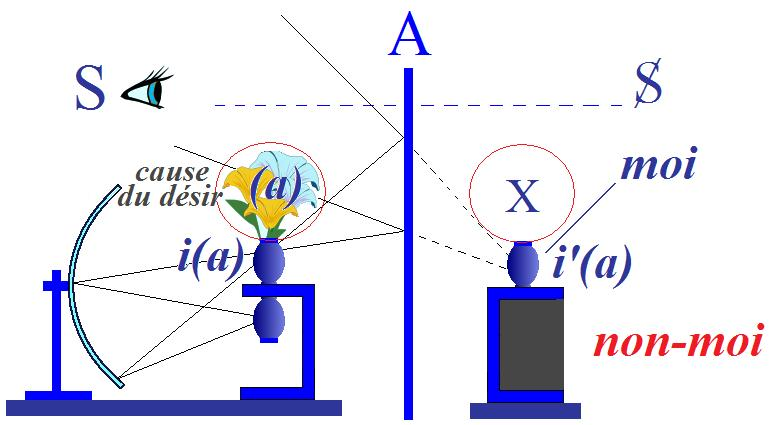
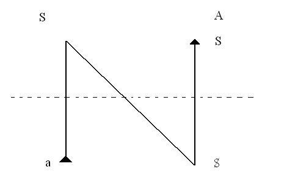
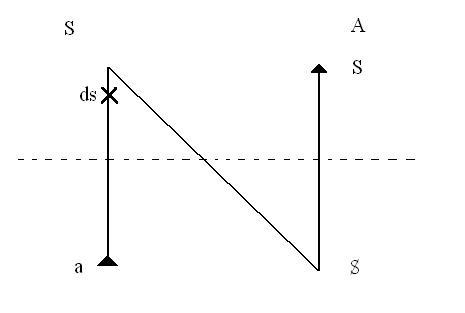
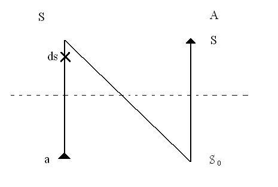
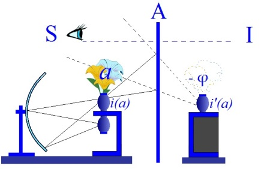
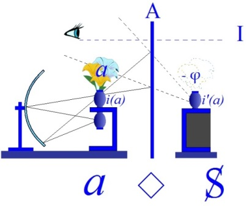
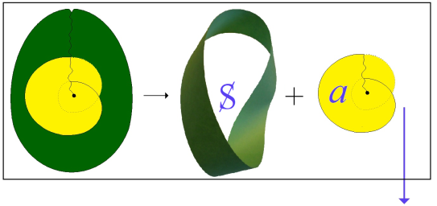
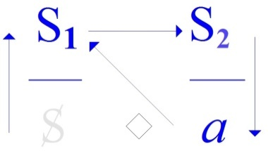
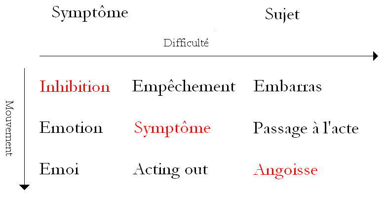
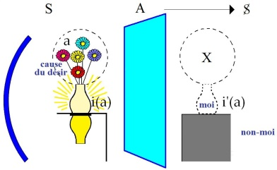

# Leçon 08 | l6 janvier l963

  

    <label><input type="checkbox" data-lacan-toggle="original" checked> 原文</label>
    <label><input type="checkbox" data-lacan-toggle="notes" checked> 注释</label>
    <label><input type="checkbox" data-lacan-toggle="commentary" checked> 个人解读评论</label>
  

  <form class="lacan-tool-search" role="search">
    <input class="lacan-tool-search-input" type="search" placeholder="搜索全文" aria-label="搜索全文">
    <button class="lacan-tool-button" type="submit" title="搜索">搜索</button>
  </form>
  <button class="lacan-tool-button lacan-back-to-top" type="button" title="回到页面最上方" aria-label="回到页面最上方">↑</button>

<section class="parallel-paragraph" data-paragraph-ids="s10-08-0001">

s10-08-0001

原文 · s10-08-0001

Je voudrais arriver à vous dire aujourd’hui un certain nombre de choses sur ce que je vous ai appris à désigner par l’*objet(a),*
cet *objet(a)* vers lequel nous oriente l’aphorisme que j’ai promu la dernière fois concernant *l’an­goisse* : *qu’« elle n’est pas sans objet »*.

[无对应译文]

</section>

<section class="parallel-paragraph" data-paragraph-ids="s10-08-0002">

s10-08-0002

原文 · s10-08-0002

C’est pour cela que *l’objet(a)* vient cette année au centre de notre propos.
Et si effectivement il s’inscrit dans le cadre de ce dont j’ai pris le titre comme étant *l’angoisse*,
c’est justement en raison de ceci que c’est essentiellement par ce biais qu’il est possible d’en parler,
ce qui veut dire encore que *l’angoisse est sa seule traduction subjective*.

[无对应译文]

</section>

<section class="parallel-paragraph" data-paragraph-ids="s10-08-0003">

s10-08-0003

原文 · s10-08-0003

Ce *(a)* qui vient ici, a pourtant été introduit dès longtemps, et dans cette voie qui vous l’amène, s’est donc annoncé ailleurs.
Il s’est annoncé dans la formule du fan­tasme S ◊ *a* : S *désir de* *(a),* ceci est la formule du fantasme en tant que support du désir.

[无对应译文]

</section>

<section class="parallel-paragraph" data-paragraph-ids="s10-08-0004">

s10-08-0004

原文 · s10-08-0004

Mon 1er point sera donc de rappeler, d’articuler, d’ajouter une pré­cision de plus...

[无对应译文]

</section>

<section class="parallel-paragraph" data-paragraph-ids="s10-08-0005">

s10-08-0005

原文 · s10-08-0005

> certainement, pour ceux qui m’ont ouï, non impossible à conquérir,
>
> encore que le souligner aujourd’hui ne me semble-t-il pas inutile

[无对应译文]

</section>

<section class="parallel-paragraph" data-paragraph-ids="s10-08-0006">

s10-08-0006

原文 · s10-08-0006

...mon 1er point...

[无对应译文]

</section>

<section class="parallel-paragraph" data-paragraph-ids="s10-08-0007">

s10-08-0007

原文 · s10-08-0007

> j’espère arriver jusqu’à un point quatre
> ...est pour préciser cette fonction de *l’objet* en tant que nous la défi­nissons *analytiquement* comme « *objet du désir* ».

[无对应译文]

</section>

<section class="parallel-paragraph" data-paragraph-ids="s10-08-0008">

s10-08-0008

原文 · s10-08-0008

Le mirage issu d’une pers­pective qu’on peut dire subjectiviste,
je veux dire, qui dans la constitution de notre expérience, met tout l’accent sur *la structure du sujet*.

[无对应译文]

</section>

<section class="parallel-paragraph" data-paragraph-ids="s10-08-0009">

s10-08-0009

原文 · s10-08-0009

Cette ligne d’élaboration que la tradition philosophique moderne a portée à son point le plus extrême,
disons aux alentours de Husserl[^53], par le dégagement de *la fonction de l’intentionalité*, c’est ce qui nous fait captifs d’un malentendu,
concernant ce qu’il convient d’appeler « *objet du désir »*.

[无对应译文]

</section>

<section class="parallel-paragraph" data-paragraph-ids="s10-08-0010">

s10-08-0010

原文 · s10-08-0010

L’*objet du désir* peut-il être conçu à la façon dont on nous enseigne qu’il n’est nulle *noèse* [^54],
nulle pensée de quelque chose qui ne soit tournée vers *quelque chose*,
seul point autour duquel peut retrouver - l’idéalisme - sa voie vers le *Réel* .

[无对应译文]

</section>

<section class="parallel-paragraph" data-paragraph-ids="s10-08-0011">

s10-08-0011

原文 · s10-08-0011

Est-ce qu’il en est ainsi concernant le désir ?
Et pour ce niveau de notre oreille qui existe chez chacun, qui a besoin d’intuition, je dirai
: « *Est-ce que l’objet du désir est en avant ?* »

[无对应译文]

</section>

<section class="parallel-paragraph" data-paragraph-ids="s10-08-0012">

s10-08-0012

原文 · s10-08-0012

*C’est là le mirage dont il s’agit*, et qui a stérilisé tout ce qui dans l’analyse a entendu s’avancer dans le sens dit de « *la relation d’objet* ».
C’est pour le rectifier que j’ai déjà passé par bien des voies [^55].
C’est une nouvelle façon d’accentuer cette rectification que je vais vous avancer maintenant.
Je ne la ferai pas aussi développée qu’il conviendrait sans doute, réservant - je l’espère - cette formulation
pour *quelque travail* [^56] qui pourra vous parvenir par une autre voie.

[无对应译文]

</section>

<section class="parallel-paragraph" data-paragraph-ids="s10-08-0013">

s10-08-0013

原文 · s10-08-0013

Je pense qu’à la plupart des oreilles, il sera suffisant d’entendre les formules massives
par lesquelles je crois pouvoir me contenter d’accentuer aujourd’hui ce point que je viens d’introduire.
Vous savez combien, dans le progrès de l’épistémologie, l’isolement de la notion de « *cause* » a produit de difficultés.
Ce n’est pas sans une succession de *réductions*, qui finissent par l’amener à la fonction la plus ténue et la plus équivoque,
que la notion de *cause* a pu se maintenir dans *le développement,* qu’au sens le plus large du mot nous pouvons appeler *notre physique*.

[无对应译文]

</section>

<section class="parallel-paragraph" data-paragraph-ids="s10-08-0014">

s10-08-0014

原文 · s10-08-0014

Il est clair d’autre part que, à quelque réduction qu’on la soumette,
*la fonction*, si l’on peut dire « *mentale* », de cette notion ne peut être éliminée.
Réduite à une sorte *d’ombre métaphysique*, nous sentons bien qu’il est *quelque chose*...

[无对应译文]

</section>

<section class="parallel-paragraph" data-paragraph-ids="s10-08-0015">

s10-08-0015

原文 · s10-08-0015

> dont c’est trop peu dire que ce soit un recours à l’intuition qui le fasse subsister
> ...qui reste autour de cette fonction de la cause.

[无对应译文]

</section>

<section class="parallel-paragraph" data-paragraph-ids="s10-08-0016">

s10-08-0016

原文 · s10-08-0016

Et je pré­tends que c’est à partir du réexamen que nous pourrions en faire de l’expérience analytique,
que toute *Critique de la raison pure,* mise au jour de notre science, pourrait se faire.

[无对应译文]

</section>

<section class="parallel-paragraph" data-paragraph-ids="s10-08-0017">

s10-08-0017

原文 · s10-08-0017

J’ose à peine dire « *pour l’introduire* »,
car après tout, ce que je vais for­muler n’est là que fait de discours et à peine ancré dans cette dialectique,
je dirai donc, pour fixer notre visée, ce que j’entends vous faire entendre : l’*objet*, l’*objet(a),* cet *objet*...

[无对应译文]

</section>

<section class="parallel-paragraph" data-paragraph-ids="s10-08-0018">

s10-08-0018

原文 · s10-08-0018

- qui n’est pas à situer dans quoi que ce soit d’analogue à *l’intentionalité d’une noèse,*

[无对应译文]

</section>

<section class="parallel-paragraph" data-paragraph-ids="s10-08-0019">

s10-08-0019

原文 · s10-08-0019

- qui n’est pas l’intentionalité du *désir*, *cet objet doit par nous être conçu comme la cause du désir*.

[无对应译文]

</section>

<section class="parallel-paragraph" data-paragraph-ids="s10-08-0020">

s10-08-0020

原文 · s10-08-0020

Et pour reprendre ma métaphore de tout à l’heure : *l’objet est derrière le désir *

[无对应译文]

</section>

<section class="parallel-paragraph" data-paragraph-ids="s10-08-0021">

s10-08-0021

原文 · s10-08-0021

[无对应译文]

</section>

<section class="parallel-paragraph" data-paragraph-ids="s10-08-0022">

s10-08-0022

原文 · s10-08-0022

C’est de cet *objet(a)* que surgit cette dimension dont l’*omission*, dont l’*éli­sion*, dont l’*élusion*, dans *la théorie du sujet*,
*a fait l’insuffisance* jusqu’à pré­sent de toute cette coordination dont le centre se manifeste comme *théorie de la connaissance*, *gnoséologie.*

[无对应译文]

</section>

<section class="parallel-paragraph" data-paragraph-ids="s10-08-0023">

s10-08-0023

原文 · s10-08-0023

Aussi bien cette fonction de l’objet, dans la nouveauté topologique structurale qu’elle exige,
est-elle parfaitement sen­sible dans les formulations de Freud, et nommément dans celles concernant *la pulsion*.

[无对应译文]

</section>

<section class="parallel-paragraph" data-paragraph-ids="s10-08-0024">

s10-08-0024

原文 · s10-08-0024

Qu’il me suffise pour, si vous voulez le contrôler sur un texte, *de vous renvoyer à cette 32ème* *leçon de l’Introduction à la psychanalyse* [^57], celle qui est trouvable dans ce qu’on appelle la nouvelle série des *Vorlesungen,* celle que je citais la dernière fois.

[无对应译文]

</section>

<section class="parallel-paragraph" data-paragraph-ids="s10-08-0025">

s10-08-0025

原文 · s10-08-0025

Il est clair que la distinction entre  le « *Ziel », le but de la pulsion*, et l’*objekt,*
est quelque chose de bien diffé­rent de ce qui s’offre d’abord à la pensée : que ce *but* et cet *objet* seraient à la même place.

[无对应译文]

</section>

<section class="parallel-paragraph" data-paragraph-ids="s10-08-0026">

s10-08-0026

原文 · s10-08-0026

Et les énonciations de Freud, que vous trouverez à cette place, dans la leçon que je vous désigne,
emploient des termes bien frappants dont le premier est le terme de « *eingeschoben »* \[*inséré*\] :
*l’objet se glisse* là-dedans, *passe* quelque part...

[无对应译文]

</section>

<section class="parallel-paragraph" data-paragraph-ids="s10-08-0027">

s10-08-0027

原文 · s10-08-0027

> c’est le même mot qui sert dans la *Verschiebung,* qui désigne le *déplacement*
> ...*l’objet*, dans sa fonction essentielle de ce quelque chose qui se dérobe
> dans le niveau de saisie qui est proprement le nôtre, est là comme tel pointé.

[无对应译文]

</section>

<section class="parallel-paragraph" data-paragraph-ids="s10-08-0028">

s10-08-0028

原文 · s10-08-0028

D’autre part, il y a, à ce niveau, l’opposition expresse des deux termes :

[无对应译文]

</section>

<section class="parallel-paragraph" data-paragraph-ids="s10-08-0029">

s10-08-0029

原文 · s10-08-0029

- *« äußeres » : externe*, *extérieur*,

[无对应译文]

</section>

<section class="parallel-paragraph" data-paragraph-ids="s10-08-0030">

s10-08-0030

原文 · s10-08-0030

- et « *inneres » : intérieur*.

[无对应译文]

</section>

<section class="parallel-paragraph" data-paragraph-ids="s10-08-0031">

s10-08-0031

原文 · s10-08-0031

Il est précisé

[无对应译文]

</section>

<section class="parallel-paragraph" data-paragraph-ids="s10-08-0032">

s10-08-0032

原文 · s10-08-0032

- que *l’objet* sans doute *est à situer äußeres : dans l’extérieur*,

<!-- -->

[无对应译文]

</section>

<section class="parallel-paragraph" data-paragraph-ids="s10-08-0033">

s10-08-0033

原文 · s10-08-0033

- et d’autre part que la satisfaction de *la tendance* ne trouve à s’accomplir que pour autant qu’elle rejoint quelque chose qui est à considérer dans l’*Inneres,* l’intérieur du corps, c’est là qu’elle trouve sa *Befriedigung :* sa satisfaction.

[无对应译文]

</section>

<section class="parallel-paragraph" data-paragraph-ids="s10-08-0034">

s10-08-0034

原文 · s10-08-0034

C’est là aussi vous dire que ce que j’ai introduit pour vous, de fonction topologique,
nous sert à formuler, et de façon claire que ce qu’il convient d’introduire ici pour résoudre cette impasse, cette énigme :

[无对应译文]

</section>

<section class="parallel-paragraph" data-paragraph-ids="s10-08-0035">

s10-08-0035

原文 · s10-08-0035

- c’est la notion « *d’un extérieur d’avant une certaine intériorisation* »,

[无对应译文]

</section>

<section class="parallel-paragraph" data-paragraph-ids="s10-08-0036">

s10-08-0036

原文 · s10-08-0036

- de l’extérieur qui se situe ici \[en *(a)*\] avant que le sujet, au lieu de l’Autre, se saisisse dans cette *forme spéculaire*, qui intro­duit pour lui la distinction du *moi* et du *non-moi*.

[无对应译文]

</section>

<section class="parallel-paragraph" data-paragraph-ids="s10-08-0037">

s10-08-0037

原文 · s10-08-0037

[无对应译文]

</section>

<section class="parallel-paragraph" data-paragraph-ids="s10-08-0038">

s10-08-0038

原文 · s10-08-0038

C’est à *cet extérieur, à ce lieu de l’objet d’avant toute intériorisation* qu’appartient...

[无对应译文]

</section>

<section class="parallel-paragraph" data-paragraph-ids="s10-08-0039">

s10-08-0039

原文 · s10-08-0039

> si vous voulez bien, si vous essayez de reprendre la notion de *cause*
> ...que cette notion de *cause*, vous dis-je, appartient.

[无对应译文]

</section>

<section class="parallel-paragraph" data-paragraph-ids="s10-08-0040">

s10-08-0040

原文 · s10-08-0040

Je vais l’illustrer immédiatement de la façon la plus simple à la faire entendre à vos oreilles,
car aussi bien - vous ai-je dit - m’abstiendrai-je aujourd’hui de faire de la métaphysique.

[无对应译文]

</section>

<section class="parallel-paragraph" data-paragraph-ids="s10-08-0041">

s10-08-0041

原文 · s10-08-0041

Pour l’imager, ce n’est pas hasard que je me servirai du *fétiche* comme tel, où se dévoile *cette dimension de l’objet comme <u>cause</u> du désir*.
Car ne n’est pas « *le petit soulier* », ni « *le sein* », ni quoi que ce soit où vous incarniez le fétiche, qui est désiré,
mais *le fétiche <u>cause</u> le désir* qui s’en va *s’accrocher* où il peut,
sur celle dont *il n’est pas absolument nécessaire que ce soit elle qui porte le petit soulier*, le petit soulier peut être dans ses environs.

[无对应译文]

</section>

<section class="parallel-paragraph" data-paragraph-ids="s10-08-0042">

s10-08-0042

原文 · s10-08-0042

Il n’est même pas nécessaire que ce soit elle qui porte le sein, le sein peut être *dans la tête*.
Mais ce que tout un chacun sait, c’est que pour *le fétichiste*, il faut que *le fétiche* soit là, qu’il est la condition dont se soutient *le désir*.

[无对应译文]

</section>

<section class="parallel-paragraph" data-paragraph-ids="s10-08-0043">

s10-08-0043

原文 · s10-08-0043

Et j’indiquerai ici, en passant, ce terme...
je crois peu usité en allemand et que les traductions vagues que nous avons en français, laissent tout à fait échapper
...c’est, quand il s’agit de l’angoisse, le rapport que Freud indique avec le « *Libidohaushalt ».*

[无对应译文]

</section>

<section class="parallel-paragraph" data-paragraph-ids="s10-08-0044">

s10-08-0044

原文 · s10-08-0044

Nous avons là affaire à un terme qui est entre

[无对应译文]

</section>

<section class="parallel-paragraph" data-paragraph-ids="s10-08-0045">

s10-08-0045

原文 · s10-08-0045

- *Aushaltung* qui indiquerait quelque chose de l’ordre de *l’interruption*, de *la levée*,

[无对应译文]

</section>

<section class="parallel-paragraph" data-paragraph-ids="s10-08-0046">

s10-08-0046

原文 · s10-08-0046

- et *Inhalt* qui serait *le contenu*.

[无对应译文]

</section>

<section class="parallel-paragraph" data-paragraph-ids="s10-08-0047">

s10-08-0047

原文 · s10-08-0047

Ce n’est ni l’un ni l’autre, c’est *le sou­tien de la libido*.
Pour tout dire, ce rapport à *l’objet* dont je vous parle aujourd’hui,
est ici dirigé, indiqué et d’une façon qui permet de faire la syn­thèse entre
*la fonction de signal de l’angoisse,*
*et son rapport* quand même *avec* quelque chose que nous pouvons appeler *- dans le soutien de la libi­do - une interruption.*

[无对应译文]

</section>

<section class="parallel-paragraph" data-paragraph-ids="s10-08-0048">

s10-08-0048

原文 · s10-08-0048

Nous allons y revenir puisque c’est là l’un des points que j’entends avan­cer devant vous aujourd’hui.

[无对应译文]

</section>

<section class="parallel-paragraph" data-paragraph-ids="s10-08-0049">

s10-08-0049

原文 · s10-08-0049

Supposant m’être suffisamment fait entendre, par cette référence au *fétiche*,
sur cette différence massive qu’il y a, de deux perspectives possibles concernant *l’objet* comme *objet du désir* :
de *la précision* de ce dont il s’agit quand je mets *(a) d’abord*, dans une *précession essentielle* ...

[无对应译文]

</section>

<section class="parallel-paragraph" data-paragraph-ids="s10-08-0050">

s10-08-0050

原文 · s10-08-0050

> je l’illustrerai un peu plus avant, toute la suite de notre discours ne cessera de l’illustrer toujours plus avant, mais déjà je veux vous faire entendre bien ce dont il s’agit, où va nous conduire notre recherche
> ...c’est que c’est au lieu même où votre habitude mentale vous indique où chercher le *sujet*,
> ce quelque chose qui malgré vous se profile comme tel comme *sujet*,
> à la place où par exemple Freud indique « *la source de la tendance* »,
> enfin là où il y a ce que dans le discours vous articulez comme étant « *vous* », *là où vous dites* « *Je* »,
> c’est là, à proprement parler que, au niveau de l’inconscient, se situe *(a)*.

[无对应译文]

</section>

<section class="parallel-paragraph" data-paragraph-ids="s10-08-0051">

s10-08-0051

原文 · s10-08-0051

À ce niveau *vous êtes (a) l’objet,* et chacun sait que c’est là *ce qui est into­lérable,*
et pas seulement au discours lui-même, qui après tout le trahit.

[无对应译文]

</section>

<section class="parallel-paragraph" data-paragraph-ids="s10-08-0052">

s10-08-0052

原文 · s10-08-0052

Je vais tout de suite l’illustrer par une remarque destinée à introduire quelque déplacement, quelque ébranlement même, concernant les ornières où vous êtes habitués à laisser les fonctions dites du *sadisme* et du *masochisme*,
comme s’il ne s’agissait là que du registre d’une sorte *d’agression imma­nente* et de sa *réversibilité*.

[无对应译文]

</section>

<section class="parallel-paragraph" data-paragraph-ids="s10-08-0053">

s10-08-0053

原文 · s10-08-0053

C’est justement dans la mesure où il convient d’entrer dans leur structu­re subjective
que vont apparaître des traits de différence dont l’essentiel est celui que je vais désigner maintenant.

[无对应译文]

</section>

<section class="parallel-paragraph" data-paragraph-ids="s10-08-0054">

s10-08-0054

原文 · s10-08-0054

Si le sadisme peut, dans une forme qui n’est qu’un schéma abrégé des mêmes distinctions qu’organise le graphe,
en une formule à quatre som­mets du type de celle qu’ici je désigne :

[无对应译文]

</section>

<section class="parallel-paragraph" data-paragraph-ids="s10-08-0055">

s10-08-0055

原文 · s10-08-0055

[无对应译文]

</section>

<section class="parallel-paragraph" data-paragraph-ids="s10-08-0056">

s10-08-0056

原文 · s10-08-0056

Nous avons ici le côté de A de *l’Autre*, et ici celui, disons, du *sujet* S, de ce « *Je* » encore inconstitué, de ce sujet justement
*à interroger, à réviser*, à l’intérieur de notre expérience, dont nous savons seulement qu’il ne saurait, en aucun cas, coïncider avec
la formule traditionnelle du sujet, à savoir ce qu’il peut avoir d’exhaustif dans *tout rap­port avec l’objet.*

[无对应译文]

</section>

<section class="parallel-paragraph" data-paragraph-ids="s10-08-0057">

s10-08-0057

原文 · s10-08-0057

si quelque chose est là \[x\] qui s’appelle le *désir sadique* \[*ds*\]

[无对应译文]

</section>

<section class="parallel-paragraph" data-paragraph-ids="s10-08-0058">

s10-08-0058

原文 · s10-08-0058

[无对应译文]

</section>

<section class="parallel-paragraph" data-paragraph-ids="s10-08-0059">

s10-08-0059

原文 · s10-08-0059

avec tout ce qu’il comporte d’énigme, il n’est articulable, il n’est formulable que pour cette *schize*, cette *dissociation*,
qu’il vise essentiellement à introduire chez l’autre, en lui imposant jusqu’à une certaine limite, ce qui ne saurait être toléré :
à la limite exactement suffisante où se manifeste, apparait chez l’autre, cette division, cette béance qu’il y a de son existence
de sujet à ceci qu’il subit : qu’il peut pâtir dans son corps.

[无对应译文]

</section>

<section class="parallel-paragraph" data-paragraph-ids="s10-08-0060">

s10-08-0060

原文 · s10-08-0060

Et c’est tellement de cette distinction, de cette division, de cette *béance* comme essentielle qu’il s’agit, et qu’il s’agit d’interroger, qu’en fait *ce n’est pas tellement la souffrance de l’autre qui est cherchée dans l’intention sadique, que son angoisse*.

[无对应译文]

</section>

<section class="parallel-paragraph" data-paragraph-ids="s10-08-0061">

s10-08-0061

原文 · s10-08-0061

[无对应译文]

</section>

<section class="parallel-paragraph" data-paragraph-ids="s10-08-0062">

s10-08-0062

原文 · s10-08-0062

Précisément ici : j’ar­ticule, je désigne, je note, ce petit signe S0 que dans les premières formules que, je crois, dans ma 2ème leçon de cette année, j’ai introduites concernant l’angoisse, que je vous ai appris à lire par le terme non pas O, vous disais-je, mais *zéro* : *l’angoisse de l’autre*, *son existence essentielle comme sujet par rapport à cette angoisse*, voilà ce que le désir sadique s’entend à faire vibrer.

[无对应译文]

</section>

<section class="parallel-paragraph" data-paragraph-ids="s10-08-0063">

s10-08-0063

原文 · s10-08-0063

Et c’est pour cela que dans un de mes séminaires passés, je n’ai pas hési­té à en rapporter la structure
comme proprement homologue à ce que Kant a articulé comme condition de l’exercice d’une raison pure pratique,
d’une volonté morale à proprement parler,
et pour tout dire, à y situer le seul point où peut se manifester un rapport avec un pur bien moral.

[无对应译文]

</section>

<section class="parallel-paragraph" data-paragraph-ids="s10-08-0064">

s10-08-0064

原文 · s10-08-0064

Je m’excuse de la brièveté de ce rappel.
Ceux qui ont assisté à ce rappro­chement s’en souviennent. Ceux qui n’ont pas pu y assister verront...
je pense, dans pas trop longtemps
...paraître ce que j’ai pu en reprendre dans une préface à *La philosophie dans le boudoir,*
qui était précisément le texte autour duquel j’avais organisé ce rapprochement.

[无对应译文]

</section>

<section class="parallel-paragraph" data-paragraph-ids="s10-08-0065">

s10-08-0065

原文 · s10-08-0065

Ce qui est important aujourd’hui et la seule chose sur laquelle j’entends apporter un trait nouveau,
c’est que ce qui caractérise le désir sadique est proprement qu’*il ne sait pas* que dans l’accomplissement de son acte, de son rite...

[无对应译文]

</section>

<section class="parallel-paragraph" data-paragraph-ids="s10-08-0066">

s10-08-0066

原文 · s10-08-0066

> car il s’agit proprement de ce type d’action humaine où nous trou­vons toutes les structures du rite
> ...*ce qu’il ne sait pas, c’est ce qu’il cherche*.

[无对应译文]

</section>

<section class="parallel-paragraph" data-paragraph-ids="s10-08-0067">

s10-08-0067

原文 · s10-08-0067

*Et que ce qu’il cherche c’est* à proprement parler à se réaliser, à se faire apparaître lui-même...

[无对应译文]

</section>

<section class="parallel-paragraph" data-paragraph-ids="s10-08-0068">

s10-08-0068

原文 · s10-08-0068

> à qui ? - puisqu’en tout cas à lui-même cette révélation ne saurait rester qu’obtuse
> ...*à se faire apparaître lui-même comme pur objet, fétiche noir*.

[无对应译文]

</section>

<section class="parallel-paragraph" data-paragraph-ids="s10-08-0069">

s10-08-0069

原文 · s10-08-0069

C’est là à quoi se résume, à son terme dernier, la manifestation du désir sadique,
en tant que celui qui en est l’agent va vers une réali­sation.

[无对应译文]

</section>

<section class="parallel-paragraph" data-paragraph-ids="s10-08-0070">

s10-08-0070

原文 · s10-08-0070

Aussi bien, si vous évoquez ce qu’il en est de la figure de Sade,
vous apercevez-vous alors que ce n’est pas par hasard si ce qui s’en dégage, ce qui en reste,
par une sorte de transsubstantiation avec le cours des âges, l’élaboration imaginaire dans les générations de sa figure,
*c’est une forme* précisément...

[无对应译文]

</section>

<section class="parallel-paragraph" data-paragraph-ids="s10-08-0071">

s10-08-0071

原文 · s10-08-0071

> Man Ray n’a pas trouvé mieux, le jour où il s’est agi de faire son *[portrait imaginaire](#ManRay),*
> *...une forme pétrifiée*.

[无对应译文]

</section>

<section class="parallel-paragraph" data-paragraph-ids="s10-08-0072">

s10-08-0072

原文 · s10-08-0072

Toute différente est, vous le savez, *la position du masochiste,* pour qui cette incarnation de lui-même comme *objet* est le but déclaré,

[无对应译文]

</section>

<section class="parallel-paragraph" data-paragraph-ids="s10-08-0073">

s10-08-0073

原文 · s10-08-0073

- qu’il se fasse *chien sous la table,*

[无对应译文]

</section>

<section class="parallel-paragraph" data-paragraph-ids="s10-08-0074">

s10-08-0074

原文 · s10-08-0074

- ou *marchandise*, *item* dont on traite dans un contrat, en le cédant, *en le vendant parmi d’autres objets à mettre sur le marché*, bref, *son identification* à cet autre objet, que j’ai appelé l’objet commun, l’objet d’échange, c’est la route, c’est la voie, où il recherche justement *cet impossible*, qui est de se saisir pour ce qu’il est, en tant que, comme tous, il est un *(a)*.

[无对应译文]

</section>

<section class="parallel-paragraph" data-paragraph-ids="s10-08-0075">

s10-08-0075

原文 · s10-08-0075

Pour savoir en quoi ça l’intéresse tellement *cette reconnaissance* qui reste tout de même impossible,
c’est bien sûr ce que beaucoup de conditions particulières dans son analyse pourront révéler.

[无对应译文]

</section>

<section class="parallel-paragraph" data-paragraph-ids="s10-08-0076">

s10-08-0076

原文 · s10-08-0076

Mais avant même de pouvoir les comprendre, ces conditions particulières,
il y a certaines conjonctions qu’il s’agit bien ici d’établir et qui sont les plus *structurales*.
C’est ce que nous allons tenter maintenant de faire.

[无对应译文]

</section>

<section class="parallel-paragraph" data-paragraph-ids="s10-08-0077">

s10-08-0077

原文 · s10-08-0077

Entendez bien que je n’ai pas dit sans plus que le masochiste *atteint à son identification d’objet*.
Comme *le sadique*, cette identification n’apparaît que *sur une scène*.
Seulement, même sur cette scène, *le sadique* ne se voit pas, il ne voit que *le reste*.

[无对应译文]

</section>

<section class="parallel-paragraph" data-paragraph-ids="s10-08-0078">

s10-08-0078

原文 · s10-08-0078

Il y a aussi quelque chose que le masochiste ne voit pas, nous verrons quoi peut-être tout à l’heure,
mais ceci me permet d’introduire tout de suite quelques formules dont la première est ceci :
*que se reconnaître comme objet de son désir*, au sens où aujourd’hui je l’articule, *c’est toujours masochiste*.

[无对应译文]

</section>

<section class="parallel-paragraph" data-paragraph-ids="s10-08-0079">

s10-08-0079

原文 · s10-08-0079

Cette formule a l’intérêt de vous en rendre sensible la difficulté, car c’est bien commode de se servir de notre petit « *guignol* »
et de dire que s’il y a du masochisme *c’est parce que le surmoi est bien méchant*.

[无对应译文]

</section>

<section class="parallel-paragraph" data-paragraph-ids="s10-08-0080">

s10-08-0080

原文 · s10-08-0080

Par exemple, nous savons bien sûr que nous faisons, à l’intérieur du masochisme toutes les distinctions nécessaires :

[无对应译文]

</section>

<section class="parallel-paragraph" data-paragraph-ids="s10-08-0081">

s10-08-0081

原文 · s10-08-0081

- *le masochis­me érogène,*

[无对应译文]

</section>

<section class="parallel-paragraph" data-paragraph-ids="s10-08-0082">

s10-08-0082

原文 · s10-08-0082

- *le masochisme féminin,*

[无对应译文]

</section>

<section class="parallel-paragraph" data-paragraph-ids="s10-08-0083">

s10-08-0083

原文 · s10-08-0083

- *le masochisme moral.*

[无对应译文]

</section>

<section class="parallel-paragraph" data-paragraph-ids="s10-08-0084">

s10-08-0084

原文 · s10-08-0084

Mais comme le seul énoncé de cette classification fait un petit peu l’effet de ce que je pour­rais dire si je disais :
« *il y a ce verre, il y a la foi chrétienne, et il y a la baisse de Wall Street* »

[无对应译文]

</section>

<section class="parallel-paragraph" data-paragraph-ids="s10-08-0085">

s10-08-0085

原文 · s10-08-0085

Ceci doit nous laisser tout de même un tout petit peu sur notre faim.
Si le terme de *masochisme* peut prendre un sens, il conviendrait d’en trouver *une formule* qui fut un peu plus unitaire,
et si nous disions que le *surmoi* est la cause du masochisme, nous ne quitterions pas trop cette intuition satisfaisante...
à ceci près que, comme nous avons dit avant, que *l’objet est la cause du désir*
...nous verrions que le *surmoi participe*, *au moins qu’il participe de la fonction de cet objet en tant que cause*, *telle que je l’introduis aujourd’hui*.

[无对应译文]

</section>

<section class="parallel-paragraph" data-paragraph-ids="s10-08-0086">

s10-08-0086

原文 · s10-08-0086

Pour vous faire sentir jusqu’à quel point c’est vrai, j’aurai à entrer dans *le catalogue*, dans *la série* de ces objets,
telle que nous aurons à la déployer devant vous, l’illustrant - cette place –
de tous les contenus, si vous voulez, qu’elle peut avoir et qui sont énumérables.

[无对应译文]

</section>

<section class="parallel-paragraph" data-paragraph-ids="s10-08-0087">

s10-08-0087

原文 · s10-08-0087

Si je ne les mets pas *d’abord*, c’est pour que vous ne perdiez pas la tête, à les voir comme contenu,
à croire que c’est les mêmes choses où vous vous êtes tou­jours retrouvés concernant l’analyse.
Car ce n’est pas vrai !

[无对应译文]

</section>

<section class="parallel-paragraph" data-paragraph-ids="s10-08-0088">

s10-08-0088

原文 · s10-08-0088

Vous croyez pouvoir savoir la fonction du *sein maternel*, ou celle du *scybale*,
vous savez bien quelles obscurités restent dans votre esprit concernant le *phallus*,
et quand il s’agira de *l’objet qui vient immédiatement après*...

[无对应译文]

</section>

<section class="parallel-paragraph" data-paragraph-ids="s10-08-0089">

s10-08-0089

原文 · s10-08-0089

> je vous le livre tout de même, histoire de donner à votre curiosité une pâture, c’est-à-dire *l’œil* en tant que tel
> ...vous ne savez plus, là, du tout.

[无对应译文]

</section>

<section class="parallel-paragraph" data-paragraph-ids="s10-08-0090">

s10-08-0090

原文 · s10-08-0090

C’est pourquoi il ne convient de s’approcher qu’avec prudence - et pour cause ! - de cet objet dont il s’agit.
Car en fin de compte, si c’est là l’objet sans lequel il n’est pas d’angoisse, c’est que c’est bien *un objet dangereux*.
Soyons donc prudents puisqu’il mord.

[无对应译文]

</section>

<section class="parallel-paragraph" data-paragraph-ids="s10-08-0091">

s10-08-0091

原文 · s10-08-0091

Ce me sera pour l’immédiat, l’occasion de faire apparaître en quel sens j’ai dit...

[无对应译文]

</section>

<section class="parallel-paragraph" data-paragraph-ids="s10-08-0092">

s10-08-0092

原文 · s10-08-0092

> *ceci a retenu l’oreille d’un de mes auditeurs* \[ Safouan ?\]
> ...j’ai dit, il y a deux leçons, ceci : *que le désir et la loi étaient la même chose*.
> C’est pour autant, et en ce sens, que *le désir et la loi ont leur objet commun.*

[无对应译文]

</section>

<section class="parallel-paragraph" data-paragraph-ids="s10-08-0093">

s10-08-0093

原文 · s10-08-0093

Il ne suffit donc pas ici de se donner à soi-même le réconfort qu’ils sont, l’un par rapport à l’autre,
comme les deux côtés de la muraille, ou comme l’*endroit* et l’*envers*.
C’est faire trop bon marché de la difficulté.

[无对应译文]

</section>

<section class="parallel-paragraph" data-paragraph-ids="s10-08-0094">

s10-08-0094

原文 · s10-08-0094

Et pour aller droit au point qui vous le fait sentir, je dirai que ça n’est pas pour autre chose que de le faire sentir,
que vaut le mythe central qui a permis à la psychanalyse de démarrer, qui est *le mythe de l’Œdipe.*

[无对应译文]

</section>

<section class="parallel-paragraph" data-paragraph-ids="s10-08-0095">

s10-08-0095

原文 · s10-08-0095

*Le mythe de l’Œdipe* ne veut pas dire autre chose, c’est :

[无对应译文]

</section>

<section class="parallel-paragraph" data-paragraph-ids="s10-08-0096">

s10-08-0096

原文 · s10-08-0096

- qu’à l’origine le désir, le désir du père, et la loi sont une seule et même chose,

[无对应译文]

</section>

<section class="parallel-paragraph" data-paragraph-ids="s10-08-0097">

s10-08-0097

原文 · s10-08-0097

- et que le rapport de la loi au désir est si étroit que seule la fonction de la loi trace le chemin du désir,

[无对应译文]

</section>

<section class="parallel-paragraph" data-paragraph-ids="s10-08-0098">

s10-08-0098

原文 · s10-08-0098

- que le désir, en tant que désir de la mère, pour la mère, est identique à la fonction de la loi : *c’est en tant que la loi l’interdit qu’elle impose de la désirer*, car après tout la mère n’est pas en soi l’objet le plus désirable.

[无对应译文]

</section>

<section class="parallel-paragraph" data-paragraph-ids="s10-08-0099">

s10-08-0099

原文 · s10-08-0099

Si tout s’or­ganise autour de ce désir de la mère,
si c’est à partir de là que se pose que *la femme qu’on* *doit préférer* - car c’est de cela qu’il s’agit - *soit autre que la mère* :

[无对应译文]

</section>

<section class="parallel-paragraph" data-paragraph-ids="s10-08-0100">

s10-08-0100

原文 · s10-08-0100

- qu’est-ce que cela veut dire, sinon qu’un commandement s’introduit, s’impose dans la structure même du désir, que pour tout dire : on désire « *au commandement* »,

[无对应译文]

</section>

<section class="parallel-paragraph" data-paragraph-ids="s10-08-0101">

s10-08-0101

原文 · s10-08-0101

- qu’est-ce que tout *le mythe de l’Œdipe* veut dire, sinon que *le désir du père* c’est cela qui a fait la loi ?

[无对应译文]

</section>

<section class="parallel-paragraph" data-paragraph-ids="s10-08-0102">

s10-08-0102

原文 · s10-08-0102

Le masochisme prend dans cette perspective la valeur et la fonction d’apparaître...

[无对应译文]

</section>

<section class="parallel-paragraph" data-paragraph-ids="s10-08-0103">

s10-08-0103

原文 · s10-08-0103

> et d’apparaître clairement, c’est son seul prix au masochiste
> ...quand *le désir* et *la loi* se retrouvent ensemble.

[无对应译文]

</section>

<section class="parallel-paragraph" data-paragraph-ids="s10-08-0104">

s10-08-0104

原文 · s10-08-0104

Car ce que le masochiste entend faire apparaître...

[无对应译文]

</section>

<section class="parallel-paragraph" data-paragraph-ids="s10-08-0105">

s10-08-0105

原文 · s10-08-0105

> et j’ajoute : « *sur sa petite scène* », car il ne faut jamais oublier cette dimension
> ...c’est quelque chose où le désir de l’Autre fait la loi.

[无对应译文]

</section>

<section class="parallel-paragraph" data-paragraph-ids="s10-08-0106">

s10-08-0106

原文 · s10-08-0106

Nous en voyons tout de suite un des effets :
c’est que lui-même, le masochiste, apparaît dans cette fonction que j’appellerai celle

[无对应译文]

</section>

<section class="parallel-paragraph" data-paragraph-ids="s10-08-0107">

s10-08-0107

原文 · s10-08-0107

- du *déjet*,

[无对应译文]

</section>

<section class="parallel-paragraph" data-paragraph-ids="s10-08-0108">

s10-08-0108

原文 · s10-08-0108

- de ce qui est cet *objet*, le nôtre, le *(a)* dont nous parlons, dans l’apparence du déjeté, *du jeté aux chiens, à l’ordure, à la poubelle, au rebut de l’objet commun, faute de pouvoir le mettre ailleurs*.

[无对应译文]

</section>

<section class="parallel-paragraph" data-paragraph-ids="s10-08-0109">

s10-08-0109

原文 · s10-08-0109

C’est un des aspects où peut apparaître le *(a)* tel qu’il s’illustre dans la perversion.
Et ceci n’épuise pas, d’aucune façon, ce que nous ne pouvons cerner qu’en le contournant, à savoir *la fonction du* *(a)*.

[无对应译文]

</section>

<section class="parallel-paragraph" data-paragraph-ids="s10-08-0110">

s10-08-0110

原文 · s10-08-0110

Mais puisque j’ai pris ce biais du masochisme, que je l’introduis,
il faut que nous nous livrions à d’autres *repérages* pour situer cette *fonction du* *(a)*.

[无对应译文]

</section>

<section class="parallel-paragraph" data-paragraph-ids="s10-08-0111">

s10-08-0111

原文 · s10-08-0111

Vous en voyez *un* au niveau du masochisme.
Je vous rappelle qu’il faut d’abord, d’abord prendre pour sa fonction de *corrélation massive*,
que l’effet central de cette identité conjuguée du désir du père, cette identité qui conjugue le désir du père à la Loi,
*c’est* le « *complexe de castration* », en tant au moment où la Loi naît par cette mue, mutation mystérieuse du désir du père,
après qu’il ait été tué.

[无对应译文]

</section>

<section class="parallel-paragraph" data-paragraph-ids="s10-08-0112">

s10-08-0112

原文 · s10-08-0112

La conséquence, aussi bien dans l’his­toire de la pensée analytique que dans tout ce que nous pouvons concevoir
comme liaison la plus certaine, c’est en tout cas *le complexe de castration*.
C’est pourquoi vous avez vu déjà apparaître dans mes schémas la notation - φ à la place même où *(a)* manque.

[无对应译文]

</section>

<section class="parallel-paragraph" data-paragraph-ids="s10-08-0113">

s10-08-0113

原文 · s10-08-0113

Donc, 1er *point* aujourd’hui, je vous ai parlé de *l’objet comme cause du désir*.

[无对应译文]

</section>

<section class="parallel-paragraph" data-paragraph-ids="s10-08-0114">

s10-08-0114

原文 · s10-08-0114

2ème *point*, je vous ai dit : « *se reconnaître comme l’objet de son désir, c’est toujours masochisme* »,
je vous ai indiqué à ce propos ce qui se pro­filait pour nous comme présentation, sous une certaine incidence, du *sur­moi,*
je vous ai indiqué une particularité en quelque sorte « *dépréciée* » de ce qui se passe à la place de cet *objet(a)* sous la forme du - φ.

[无对应译文]

</section>

<section class="parallel-paragraph" data-paragraph-ids="s10-08-0115">

s10-08-0115

原文 · s10-08-0115

Nous arrivons à notre 3ème *point*, celui qui concerne justement cette possibilité de cette manifestation de *l’objet(a) comme manque*.
Elle lui est *structurale*, et c’est pour le faire concevoir que ce schéma, cette image destinée à vous le rendre familier,
est depuis un certain temps déjà pour vous présentifié et rappelé.

[无对应译文]

</section>

<section class="parallel-paragraph" data-paragraph-ids="s10-08-0116">

s10-08-0116

原文 · s10-08-0116

[无对应译文]

</section>

<section class="parallel-paragraph" data-paragraph-ids="s10-08-0117">

s10-08-0117

原文 · s10-08-0117

*L’objet(a)*au niveau de notre sujet analytique, de *« la source » de ce qui sub­siste comme corps*,
qui en partie pour nous, nous dérobe si je puis dire sa propre volonté,
cet *objet(a)* c’est ce « *roc* » dont parle Freud, cette réserve der­nière, irréductible, de la libido
dont il est tellement pathétique de voir dans ses textes littéralement ponctuer les contours, chaque fois qu’il le rencontre.

[无对应译文]

</section>

<section class="parallel-paragraph" data-paragraph-ids="s10-08-0118">

s10-08-0118

原文 · s10-08-0118

Et je ne finirai pas ma leçon aujourd’hui sans vous dire *où* il convient que vous alliez rénover cette conviction.

[无对应译文]

</section>

<section class="parallel-paragraph" data-paragraph-ids="s10-08-0119">

s10-08-0119

原文 · s10-08-0119

Ce *petit(a)*, comme tel, à la place où il est, au niveau où il pourrait être reconnu « *si c’était possible »*...
car bien sûr tout à l’heure, vous ai-je dit *que se reconnaître comme l’objet de son désir c’est toujours masochisme...« si c’était possible »* : *le masochiste ne le fait que sur la scène*.

[无对应译文]

</section>

<section class="parallel-paragraph" data-paragraph-ids="s10-08-0120">

s10-08-0120

原文 · s10-08-0120

Et vous allez voir ce qui s’opère quand il ne peut plus y rester, *sur la scène*.
Mais nous ne sommes pas toujours *sur la scène*, malgré que *la scène* s’étende fort loin, et jusqu’au domaine de nos rêves.
Et en tant que « *pas sur la scène* », et res­tant en deçà,
et cherchant à lire dans l’Autre de quoi il retourne, nous ne trouvons là \[- φ\] que *le manque*.

[无对应译文]

</section>

<section class="parallel-paragraph" data-paragraph-ids="s10-08-0121">

s10-08-0121

原文 · s10-08-0121

*C’est cette liaison*, coordination *de l’objet avec son manque nécessaire* là où le sujet se constitue *au lieu de l’Autre*...

[无对应译文]

</section>

<section class="parallel-paragraph" data-paragraph-ids="s10-08-0122">

s10-08-0122

原文 · s10-08-0122

> c’est-à-dire *aussi loin que pos­sible*, au-delà même de ce qui peut apparaître dans « *le retour du refoulé* »,
>
> et constituant l’*Urverdrängung,* l’irréductible de *l’incognito*, puisqu’aussi bien nous ne pouvons pas dire absolument *l’inconnaissable* puisque nous en parlons
> ...*c’est là que se structure, que se situe* ce que dans notre analyse du *transfert* *j’ai produit devant vous par le terme* d’ἄγαλμα \[agalma\][^58].

[无对应译文]

</section>

<section class="parallel-paragraph" data-paragraph-ids="s10-08-0123">

s10-08-0123

原文 · s10-08-0123

C’est pour autant que *cette place vide est visée* comme telle,
que s’insti­tue, que se constitue cette dimension toujours - *et pour cause !* - plus ou moins négligée, *du trans­fert*.

[无对应译文]

</section>

<section class="parallel-paragraph" data-paragraph-ids="s10-08-0124">

s10-08-0124

原文 · s10-08-0124

Que cette place en tant qu’elle puisse être cernée par quelque chose qui est matérialisé dans cette image,
un certain *bord*, une certaine *ouverture*, une certaine *béance* où la constitution de l’image spéculaire montre sa limi­te,
c’est là *le lieu élu de l’angoisse*.

[无对应译文]

</section>

<section class="parallel-paragraph" data-paragraph-ids="s10-08-0125">

s10-08-0125

原文 · s10-08-0125

*Ce phénomène de bord*, dans ce qui s’ouvre comme *cette fenêtre,* qui dans des occasions privilégiées,
marque la limite*, l’illusoire de ce monde de la reconnaissance, de celui que j’appelle « la scène ».*

[无对应译文]

</section>

<section class="parallel-paragraph" data-paragraph-ids="s10-08-0126">

s10-08-0126

原文 · s10-08-0126

Que ce soit lié à *ce bord*, à *cet encadrement*, à *cette béance* qui s’illustre dans ce schéma au moins deux fois :

[无对应译文]

</section>

<section class="parallel-paragraph" data-paragraph-ids="s10-08-0127">

s10-08-0127

原文 · s10-08-0127

- dans ce bord ici du miroir,

[无对应译文]

</section>

<section class="parallel-paragraph" data-paragraph-ids="s10-08-0128">

s10-08-0128

原文 · s10-08-0128

- et aussi bien dans ce petit signe ◊, ...que ce soit là *le lieu de l’angoisse*, c’est ce que vous devez toujours retenir comme le signal de ce qu’il y a à chercher au milieu.

[无对应译文]

</section>

<section class="parallel-paragraph" data-paragraph-ids="s10-08-0129">

s10-08-0129

原文 · s10-08-0129

[无对应译文]

</section>

<section class="parallel-paragraph" data-paragraph-ids="s10-08-0130">

s10-08-0130

原文 · s10-08-0130

Le texte de Freud[^59] auquel je vous prie de vous référer, car c’est un texte toujours plus stupéfiant à lire[^60] par cette double face des faiblesses, insuf­fisances, qui aux novices se produisent tout d’abord comme les premières à relever dans le texte de Freud,
et de la profondeur avec laquelle tout ce sur quoi il vient buter
révèle à quel point Freud était là *autour* de ce champ même que nous essayons de dessiner.

[无对应译文]

</section>

<section class="parallel-paragraph" data-paragraph-ids="s10-08-0131">

s10-08-0131

原文 · s10-08-0131

Bien sûr, il convient d’abord que vous soyez familiers avec le texte de Dora[^61].
Il peut, à ceux qui ont entendu mon dis­cours sur le *Banquet,*
rappeler cette dimension, toujours éludée quand il s’agit du *transfert*, qui est *l’autre dimension,* à savoir
que *le trans­fert n’est pas simplement ce qui reproduit une situation, une action, une atti­tude, un traumatisme ancien, ni ce qui le répète,*
c’est qu’il y a toujours *une autre coordonnée*, celle sur laquelle j’ai mis l’accent à propos de *l’intervention analytique de Socrate*,
à savoir nommément dans les cas que j’évoque: *un amour présent dans le réel*.

[无对应译文]

</section>

<section class="parallel-paragraph" data-paragraph-ids="s10-08-0132">

s10-08-0132

原文 · s10-08-0132

Et que nous ne pouvons rien comprendre au *transfert* si nous ne savons pas qu’il est aussi la conséquence de *cet amour-là*,

[无对应译文]

</section>

<section class="parallel-paragraph" data-paragraph-ids="s10-08-0133">

s10-08-0133

原文 · s10-08-0133

- que c’est à propos de *cet amour* présent...

[无对应译文]

</section>

<section class="parallel-paragraph" data-paragraph-ids="s10-08-0134">

s10-08-0134

原文 · s10-08-0134

> et les analystes doivent s’en sou­venir en cours d’analyse, d’un amour qui est présent de diverses façons
>
> ...mais au moins qu’ils s’en souviennent quand il est là visible,

[无对应译文]

</section>

<section class="parallel-paragraph" data-paragraph-ids="s10-08-0135">

s10-08-0135

原文 · s10-08-0135

- que c’est en fonction de *cet amour* disons *réel*, que s’institue ce qui est *la question cen­trale du transfert*, à savoir celle que se pose le sujet concernant l’ἄγαλμα \[agalma\], à savoir : *ce qui lui manque*. Car *c’est avec ce manque qu’il aime*. Ce n’est pas pour rien que depuis toujours je vous serine que « *l’amour c’est de donner ce qu’on n’a pas* ».

[无对应译文]

</section>

<section class="parallel-paragraph" data-paragraph-ids="s10-08-0136">

s10-08-0136

原文 · s10-08-0136

*C’est même le principe du complexe de castration : <u>pour avoir le phallus, pour pouvoir s’en servir, il faut justement ne pas l’être</u>*.
Quand on retourne aux conditions où il apparaît *qu’on l’est*, car on l’est aussi bien...

[无对应译文]

</section>

<section class="parallel-paragraph" data-paragraph-ids="s10-08-0137">

s10-08-0137

原文 · s10-08-0137

> pour un homme ça ne fait pas de doute,
>
> et pour une femme nous redirons par quelle incidence elle est amenée à l’être
> ...eh bien c’est *toujours* fort dangereux.

[无对应译文]

</section>

<section class="parallel-paragraph" data-paragraph-ids="s10-08-0138">

s10-08-0138

原文 · s10-08-0138

Qu’il me suffise de vous demander, avant de vous quitter, de relire attenti­vement ce texte entièrement consacré
aux rapports en somme de Freud avec sa patien­te, avec cette fille, je vous le rappelle, dont il est dit que l’analyse fait apparaître que c’est essentiellement autour d’une déception énigmatique concernant la naissance dans sa famille,
l’apparition à son foyer d’un petit enfant, qu’elle s’est orientée vers l’homosexualité.

[无对应译文]

</section>

<section class="parallel-paragraph" data-paragraph-ids="s10-08-0139">

s10-08-0139

原文 · s10-08-0139

Avec une touche d’une science de l’ana­logie absolument admirable, Freud aperçoit ce qu’il y a dans cet amour démonstratif,
de la jeune fille pour *une femme de réputation suspecte* assuré­ment, vis-à-vis de laquelle elle se conduit, nous dit Freud,
d’une façon essen­tiellement virile.

[无对应译文]

</section>

<section class="parallel-paragraph" data-paragraph-ids="s10-08-0140">

s10-08-0140

原文 · s10-08-0140

Et si l’on s’en tient à lire simplement ce qui est là - mon Dieu - « *virilité* »
nous sommes tellement habitués à en parler sans savoir, que nous ne nous apercevons pas que ce qu’il entend là accentuer
c’est ce que j’ai essayé de *présentifier* devant vous de toutes les façons
en accentuant quelle est la fonction de ce qu’on appelle « *l’amour courtois »*.

[无对应译文]

</section>

<section class="parallel-paragraph" data-paragraph-ids="s10-08-0141">

s10-08-0141

原文 · s10-08-0141

Elle se comporte comme le chevalier qui souffre tout pour sa dame, se contente des faveurs les plus exté­nuées,
les moins substantielles, qui préfère même n’avoir que celles-là, et qui enfin,

[无对应译文]

</section>

<section class="parallel-paragraph" data-paragraph-ids="s10-08-0142">

s10-08-0142

原文 · s10-08-0142

- plus l’objet de son amour peut aller plus à l’opposé de ce qu’on pourrait appeler sa récompense,

[无对应译文]

</section>

<section class="parallel-paragraph" data-paragraph-ids="s10-08-0143">

s10-08-0143

原文 · s10-08-0143

- plus il surestime, élève, cet objet d’éminente dignité.

[无对应译文]

</section>

<section class="parallel-paragraph" data-paragraph-ids="s10-08-0144">

s10-08-0144

原文 · s10-08-0144

Quand manifestement toute la rumeur publique ne peut manquer de lui imposer qu’effectivement la conduite de sa bien-aimée est des plus douteuses, cette dimension d’exaltation ne voit que s’ajouter la visée supplémentaire et renforçante, de la sauver.

[无对应译文]

</section>

<section class="parallel-paragraph" data-paragraph-ids="s10-08-0145">

s10-08-0145

原文 · s10-08-0145

Tout ceci est admirablement sou­ligné par Freud et vous savez comment la fille en question a été amenée à sa consultation :
c’est pour autant qu’un jour, cette liaison menée au su et vrai­ment au défi de l’opinion de toute la ville...

[无对应译文]

</section>

<section class="parallel-paragraph" data-paragraph-ids="s10-08-0146">

s10-08-0146

原文 · s10-08-0146

> style dont tout de suite Freud a aperçu le rapport de provocation par rapport à X,
>
> quelqu’un de sa famille, et il apparaît bien vite et très certainement que c’est son père
> ...cette liaison prend fin par une rencontre.

[无对应译文]

</section>

<section class="parallel-paragraph" data-paragraph-ids="s10-08-0147">

s10-08-0147

原文 · s10-08-0147

La jeune fille, en compagnie de sa bien-aimée croise sur le chemin du bureau, nous dit-on, du père en question,
ce père qui lui jette un regard irrité.

[无对应译文]

</section>

<section class="parallel-paragraph" data-paragraph-ids="s10-08-0148">

s10-08-0148

原文 · s10-08-0148

La scène dès lors se passe très vite : la personne...

[无对应译文]

</section>

<section class="parallel-paragraph" data-paragraph-ids="s10-08-0149">

s10-08-0149

原文 · s10-08-0149

> pour qui sans doute cette aventure n’est qu’un divertissement assez obscur et qui commence manifestement
>
> à en avoir assez, et qui ne veut pas au reste, sans doute, s’ex­poser à de grandes difficultés
> ...dit à la jeune fille que ça a assez duré et qu’on s’en tienne là désormais, qu’elle cesse de lui envoyer,
> comme elle le fait tous les jours, *des fleurs* sans compter, de s’attacher étroitement à ses pas.

[无对应译文]

</section>

<section class="parallel-paragraph" data-paragraph-ids="s10-08-0150">

s10-08-0150

原文 · s10-08-0150

Et la fille immédiatement se balance par-dessus un endroit...

[无对应译文]

</section>

<section class="parallel-paragraph" data-paragraph-ids="s10-08-0151">

s10-08-0151

原文 · s10-08-0151

> vous vous rappelez que il était un temps où j’explorais minutieusement les cartes de Vienne pour permettre de donner son plein sens au cas du *Petit Hans,* je n’irai pas aujourd’hui jusqu’à vous dire l’endroit où très probablement
>
> se trouve quelque chose de comparable à ce que vous voyez encore du côté du boulevard Pereire
> ...à savoir un petit fossé au fond duquel il y a des rails pour un petit chemin de fer qui maintenant ne marche plus,
> c’est là que la fille se balance, *niederkommt* : *se laisse tomber*.

[无对应译文]

</section>

<section class="parallel-paragraph" data-paragraph-ids="s10-08-0152">

s10-08-0152

原文 · s10-08-0152

Il y a plusieurs choses à dire à propos de ce *niederkommen.*
Si je l’intro­duis ici, c’est parce que c’est un acte dont il ne suffit pas de dire, de rappe­ler l’analogie avec le sens de *niederkommen* dans le fait de l’accouchement, pour épuiser le sens.

[无对应译文]

</section>

<section class="parallel-paragraph" data-paragraph-ids="s10-08-0153">

s10-08-0153

原文 · s10-08-0153

*Ce niederkommen est essentiel à toute subite mise en rapport du sujet avec ce qu’il est comme (a)*.
Ce n’est pas pour rien que le sujet *mélancolique* a une propension telle...

[无对应译文]

</section>

<section class="parallel-paragraph" data-paragraph-ids="s10-08-0154">

s10-08-0154

原文 · s10-08-0154

> et toujours accomplie avec une rapidité fulgurante si déconcertante
> ...à se balancer par la fenêtre.

[无对应译文]

</section>

<section class="parallel-paragraph" data-paragraph-ids="s10-08-0155">

s10-08-0155

原文 · s10-08-0155

La fenêtre, en tant qu’elle nous rappelle cette limite entre *la scène* et « le monde »,
nous indique ce que signifie cet acte par où, en quelque sorte, *le sujet* fait retour à cette *exclusion fondamentale* où il se sent,
au moment même où se conjugue dans l’absolu d’un sujet...

[无对应译文]

</section>

<section class="parallel-paragraph" data-paragraph-ids="s10-08-0156">

s10-08-0156

原文 · s10-08-0156

> dont nous seuls, analystes, pouvons avoir l’idée
> ...cette *conjonction du désir et de la loi*.

[无对应译文]

</section>

<section class="parallel-paragraph" data-paragraph-ids="s10-08-0157">

s10-08-0157

原文 · s10-08-0157

 *cf.* : 

[无对应译文]

</section>

<section class="parallel-paragraph" data-paragraph-ids="s10-08-0158">

s10-08-0158

原文 · s10-08-0158

C’est proprement ce qui se passe au moment de la rencontre par le couple de « *la chevalière de Lesbos »* et de « *son objet karéninien »*
si je puis m’ex­primer ainsi, avec le père.

[无对应译文]

</section>

<section class="parallel-paragraph" data-paragraph-ids="s10-08-0159">

s10-08-0159

原文 · s10-08-0159

Car il ne suffit pas de dire que le père a jeté *un regard irrité* pour comprendre comment a pu se produire *le passage à l’ac­te*.
Il y a quelque chose qui tient là au fond même de la relation, à la struc­ture.

[无对应译文]

</section>

<section class="parallel-paragraph" data-paragraph-ids="s10-08-0160">

s10-08-0160

原文 · s10-08-0160

*Car de quoi s’agit-il ?* Disons-le en termes brefs, je vous crois suffi­samment *préparé*s pour que vous les entendiez :
la fille, pour laquelle l’at­tachement au père et la déception, en raison de la naissance du jeune frère, si mon souvenir est bon,
dont cette déception a été dans sa vie le point tournant, va donc quoi faire ?

[无对应译文]

</section>

<section class="parallel-paragraph" data-paragraph-ids="s10-08-0161">

s10-08-0161

原文 · s10-08-0161

Faire de sa castration de femme ce que fait le chevalier à l’endroit de sa Dame,
à qui précisément il offre le sacrifice de ses préroga­tives viriles, pour en faire, elle, le support de ce qui est lié...
dans le rapport d’une inversion
...*à ce sacrifice même*, à savoir *la mise à la place du manque*, justement *de ce qui manque au champ de l’Autre*, *à savoir la garantie suprême*, ceci :

[无对应译文]

</section>

<section class="parallel-paragraph" data-paragraph-ids="s10-08-0162">

s10-08-0162

原文 · s10-08-0162

- *que la loi est bel et bien le désir du père*,

[无对应译文]

</section>

<section class="parallel-paragraph" data-paragraph-ids="s10-08-0163">

s10-08-0163

原文 · s10-08-0163

- qu’on en est sûr, *qu’il y a une « gloire » du père, un phallus absolu* \[Φ\].

[无对应译文]

</section>

<section class="parallel-paragraph" data-paragraph-ids="s10-08-0164">

s10-08-0164

原文 · s10-08-0164

Sans doute, ressentiment et vengeance sont-ils décisifs dans le rapport de cette fille avec son père.
Le ressentiment et la vengeance sont cela :
« *Cette loi du père, ce phallus suprême, voici où je le place.*
*C’est elle qui est ma Dame, et puisque je ne peux pas être, moi, ta femme soumise et ton objet,*
*<u>je suis</u> <u>celui</u> qui soutient, <u>qui crée le rapport idéalisé de ce qui est de moi-même insuffi­sance</u>, ce qui a été repoussé.* »

[无对应译文]

</section>

<section class="parallel-paragraph" data-paragraph-ids="s10-08-0165">

s10-08-0165

原文 · s10-08-0165

N’oublions pas que la fille a cessé, a lâché la cul­ture de son narcissisme, ses soins, sa coquetterie, sa beauté,
pour devenir chevalier servant de la Dame.

[无对应译文]

</section>

<section class="parallel-paragraph" data-paragraph-ids="s10-08-0166">

s10-08-0166

原文 · s10-08-0166

C’est dans la mesure où tout ceci vient dans cette simple rencontre, *au niveau du regard* \[*du père*\]*...*

[无对应译文]

</section>

<section class="parallel-paragraph" data-paragraph-ids="s10-08-0167">

s10-08-0167

原文 · s10-08-0167

> pour qui pourtant toute cette scène... qui a tout gagné de l’assentiment du sujet
> ...où cette scène vient *au regard du père*, que se produit ce que nous pourrons appeler...

[无对应译文]

</section>

<section class="parallel-paragraph" data-paragraph-ids="s10-08-0168">

s10-08-0168

原文 · s10-08-0168

> nous référant au premier tableau que je vous ai donné des coordonnées de l’angoisse
> ...« *le suprême embarras* », que *l’émotion.*..
> reportez-vous à ce tableau, vous en verrez les coordonnées exactes
> ...*que l’émotion*, par la subite impossibilité de faire face à la scène que lui fait son amie, *s’y ajoute*.

[无对应译文]

</section>

<section class="parallel-paragraph" data-paragraph-ids="s10-08-0169">

s10-08-0169

原文 · s10-08-0169

[无对应译文]

</section>

<section class="parallel-paragraph" data-paragraph-ids="s10-08-0170">

s10-08-0170

原文 · s10-08-0170

Les deux conditions essentielles de ce qui s’ap­pelle à proprement parler « *passage à l’acte »*...

[无对应译文]

</section>

<section class="parallel-paragraph" data-paragraph-ids="s10-08-0171">

s10-08-0171

原文 · s10-08-0171

> et ici je m’adresse à quelqu’un qui m’a demandé de devancer un peu
>
> ce que je peux avoir à dire sur cette distinction de *l’acting-out*, nous aurons à y revenir
> ...les deux conditions du *passage à l’acte* comme tel sont *réalisées*.

[无对应译文]

</section>

<section class="parallel-paragraph" data-paragraph-ids="s10-08-0172">

s10-08-0172

原文 · s10-08-0172

Ce qui vient à ce moment-là au sujet, c’est son identification absolue à ce *petit(a)*, à quoi elle se réduit.
La confrontation de ce désir du père...

[无对应译文]

</section>

<section class="parallel-paragraph" data-paragraph-ids="s10-08-0173">

s10-08-0173

原文 · s10-08-0173

> sur lequel tout dans sa conduite est construit
> ...avec cette loi qui se présentifie dans le regard du père,
> c’est ceci par quoi elle se sent définitivement *identifiée*, et du même coup rejetée, déjetée hors de la scène.
> Seul le « *laisser tomber* », le « *se laisser tomber* » peut le réaliser.

[无对应译文]

</section>

<section class="parallel-paragraph" data-paragraph-ids="s10-08-0174">

s10-08-0174

原文 · s10-08-0174

Le temps me manque aujourd’hui pour vous indiquer dans quelle direction ceci va, à savoir que la notation célèbre par Freud, dans le deuil, de l’identification à l’objet, comme étant ce quelque chose sur quoi porte quelque chose
qu’il exprime comme une vengeance de celui qui ressent le deuil, n’est pas suffisante.

[无对应译文]

</section>

<section class="parallel-paragraph" data-paragraph-ids="s10-08-0175">

s10-08-0175

原文 · s10-08-0175

Nous por­tons le deuil et nous ressentons les effets de *dévaluation* du deuil,
pour autant que l’objet dont nous portons le deuil était, à notre insu,
celui qui s’était fait, que nous avions fait, le support de notre castration.

[无对应译文]

</section>

<section class="parallel-paragraph" data-paragraph-ids="s10-08-0176">

s10-08-0176

原文 · s10-08-0176

Elle nous retourne, et nous nous voyons pour ce que nous sommes,
en tant que nous serions *essentiellement* retournés à cette position de la castration.

[无对应译文]

</section>

<section class="parallel-paragraph" data-paragraph-ids="s10-08-0177">

s10-08-0177

原文 · s10-08-0177

Vous sentez bien que le temps me presse et qu’ici je ne peux que donner une indication,
mais ce qui désigne bien à quel point c’est de cela qu’il s’agit, ce sont *deux choses* :
c’est la façon dont Freud sent que, quelque avance spectaculaire que fasse
la patiente dans son analyse, ça lui passe si je puis dire « *comme l’eau sur les plumes d’un canard* ».

[无对应译文]

</section>

<section class="parallel-paragraph" data-paragraph-ids="s10-08-0178">

s10-08-0178

原文 · s10-08-0178

Et qu’il désigne nommément cette place qui est celle du *petit(a)* dans le miroir de l’Autre par toutes les coordonnées possibles,
bien sûr, sans avoir les éléments de ma topologie, mais on ne peut pas le dire plus clairement, car il dit ici :

[无对应译文]

</section>

<section class="parallel-paragraph" data-paragraph-ids="s10-08-0179">

s10-08-0179

原文 · s10-08-0179

« *ce devant quoi je m’arrête, je bute, c’est quelque chose comme ce qui se passe devant l’hypnose* ».

[无对应译文]

</section>

<section class="parallel-paragraph" data-paragraph-ids="s10-08-0180">

s10-08-0180

原文 · s10-08-0180

Or, dans *l’hypnose* qu’est-ce qui se passe dans *l’hypnose* ?

[无对应译文]

</section>

<section class="parallel-paragraph" data-paragraph-ids="s10-08-0181">

s10-08-0181

原文 · s10-08-0181

C’est que le sujet dans le miroir de l’Autre est capable de lire tout ce qui est là, au niveau de ce petit vase pointillé,
tout ce qui est spécularisable : on y va !

[无对应译文]

</section>

<section class="parallel-paragraph" data-paragraph-ids="s10-08-0182">

s10-08-0182

原文 · s10-08-0182

[无对应译文]

</section>

<section class="parallel-paragraph" data-paragraph-ids="s10-08-0183">

s10-08-0183

原文 · s10-08-0183

Ce n’est pas pour rien que *le miroir, le bouchon de carafe*, voire *le regard* de l’hypnotiseur, sont les instruments de *l’hypnose*.
Et la seule chose qu’on ne voit pas dans *l’hypnose*, c’est justement *le bouchon de la carafe lui-même*, ni le regard de l’hypnotiseur,
qui est *la cause* de *l’hypnose*. La cause de l’hypnose ne se livre pas dans les conséquences de l’hypnose.

[无对应译文]

</section>

<section class="parallel-paragraph" data-paragraph-ids="s10-08-0184">

s10-08-0184

原文 · s10-08-0184

Autre réfé­rence : *le doute de l’obsessionnel*. Et sur quoi porte-t-il le *doute radical*
qui fait aussi que les analyses d’obsessionnels se poursuivent pendant des temps et des temps, et très bellement ?
C’est une véritable *« lune de miel* » une cure d’obsessionnel, toujours, entre l’analyste et l’analysé,
pour autant que ce centre, où Freud nous désigne très bien quelle sorte de discours se tient l’obsessionnel, à savoir :

[无对应译文]

</section>

<section class="parallel-paragraph" data-paragraph-ids="s10-08-0185">

s10-08-0185

原文 · s10-08-0185

« *Il est vraiment très bien, cet homme-là, il me raconte les plus belles choses du monde, l’ennui c’est que je n’y crois pas tout à fait* ».

[无对应译文]

</section>

<section class="parallel-paragraph" data-paragraph-ids="s10-08-0186">

s10-08-0186

原文 · s10-08-0186

La place du doute de l’obsessionnel, si elle est centrale, c’est parce qu’elle est là \[- φ\].
Dans le cas de « *la jeune homosexuelle* », ce dont il s’agit, c’est justement ce qui doit nous éclairer,
à savoir une certaine promotion du *phallus* comme tel, à la place du *(a)*.

[无对应译文]

</section>

<section class="parallel-paragraph" data-paragraph-ids="s10-08-0187">

s10-08-0187

原文 · s10-08-0187

Et c’est là...

[无对应译文]

</section>

<section class="parallel-paragraph" data-paragraph-ids="s10-08-0188">

s10-08-0188

原文 · s10-08-0188

> j’ai scrupule à le dire parce qu’aussi bien *c’est un texte si merveilleusement éclairant*. Je n’ai pas besoin de vous en donner
>
> les autres propriétés, *mais je vous prie de ne pas prendre ça pour une de ces ritournelles dont on nous a habitués depuis*
> ...ce sur quoi Freud en train de découvrir ce dont il s’agit, conclut son texte, à savoir :

[无对应译文]

</section>

<section class="parallel-paragraph" data-paragraph-ids="s10-08-0189">

s10-08-0189

原文 · s10-08-0189

- la distinction des éléments constitutionnels et des éléments - peu importe lesquels - historiques, de la détermination de l’homosexualité,

[无对应译文]

</section>

<section class="parallel-paragraph" data-paragraph-ids="s10-08-0190">

s10-08-0190

原文 · s10-08-0190

- et l’isolement comme tel, comme étant le même champ propre de l’analyse, *de l’Objektwahl,* le choix de l’ob­jet, le distinguant comme tel, comme comportant des mécanismes qui sont originaux.

[无对应译文]

</section>

<section class="parallel-paragraph" data-paragraph-ids="s10-08-0191">

s10-08-0191

原文 · s10-08-0191

Tout tourne bien effectivement autour du *rapport du sujet à (a)*.

[无对应译文]

</section>

<section class="parallel-paragraph" data-paragraph-ids="s10-08-0192">

s10-08-0192

原文 · s10-08-0192

Le paradoxe est...

[无对应译文]

</section>

<section class="parallel-paragraph" data-paragraph-ids="s10-08-0193">

s10-08-0193

原文 · s10-08-0193

> celui qui confine à ce que la dernière fois je vous ai indi­qué comme le point où Freud
>
> nous lègue la question de savoir comment opérer au niveau du complexe de castration
> ...\[le paradoxe\] est désigné par ceci qui est ins­crit dans l’observation...
> et dont je m’étonne que ce ne soit pas l’objet le plus commun de l’étonnement parmi les analystes
> ...que cette analyse se termine en ceci que *Freud la laisse tomber*.

[无对应译文]

</section>

<section class="parallel-paragraph" data-paragraph-ids="s10-08-0194">

s10-08-0194

原文 · s10-08-0194

Car avec Dora - j’y reviendrai - nous pouvons mieux articuler maintenant ce qui s’est passé : tout est loin, très loin
d’être maladresse, et l’on peut dire que si Dora n’a pas été analysée jusqu’au bout, Freud a vu clair jusqu’au bout.

[无对应译文]

</section>

<section class="parallel-paragraph" data-paragraph-ids="s10-08-0195">

s10-08-0195

原文 · s10-08-0195

Mais ici, où *la fonction du* *petit(a),* de *l’objet,* est en quelque sorte si pré­valente
qu’elle a été jusqu’à passer dans ce *réel* d’un passage à l’acte dont il comprend pourtant tellement bien la relation symbolique.

[无对应译文]

</section>

<section class="parallel-paragraph" data-paragraph-ids="s10-08-0196">

s10-08-0196

原文 · s10-08-0196

Freud donne sa langue au chat :
« *Je n’arri­verai à rien* » se dit-il, et il la passe à une confrère féminine.
C’est lui qui prend l’initiative de « *la laisser tomber* ».

[无对应译文]

</section>

<section class="parallel-paragraph" data-paragraph-ids="s10-08-0197">

s10-08-0197

原文 · s10-08-0197

Je vous laisserai sur ce terme pour le livrer à vos réflexions,
car vous sen­tez bien que tout ceci va à viser une référence essentielle dans la manipulation ana­lytique du transfert.

[无对应译文]

</section>

<section class="parallel-paragraph" data-paragraph-ids="s10-08-0198">

s10-08-0198

原文 · s10-08-0198

[Portrait imaginaire](#RManRay) de Sade par Man Ray

[无对应译文]

</section>

<section class="parallel-paragraph" data-paragraph-ids="s10-08-0199">

s10-08-0199

原文 · s10-08-0199

[无对应译文]

</section>

<section class="note-block original-notes">

## Notes

[^53]:
    #  Husserl : *Méditations cartésiennes*, Vrin, 2000. 

[^54]: Selon Husserl, *la noèse* est l’acte même de penser, et *le noème*, l’objet de cette pensée.

[^55]: Cf. séminaire 1956-57 : *La relation d’objet*.

[^56]: Cf. *Kant avec Sade*, Crtitique N° 191, Avril 1963 ou *Écrits* p.765 ( t.2 p.243 ).

[^57]:
    #  S. Freud : *[Nouvelles conférences](http://classiques.uqac.ca/classiques/freud_sigmund/nouvelles_conferences/Nouv_conf_psychalyse.pdf) d'introduction à la psychanalyse*, trad. Anne Bermann, Gallimard 1984. 4ème des *Nouvelles conférences *: *L'angoisse et la vie instinctuelle*

    #  (32ème après les 28 précédentes de l’*Introduction à la psychanalyse*).

[^58]: Séminaire1960-61 : Le transfert…, séance du 01-02-61.

[^59]: Sigmund Freud : *Sur la psychogénèse d’un cas d’homosexualité féminine*, in « Névroses, psychoses et perversion », Puf 1999.

[^60]: Cf. séminaire 1956-57 : *La relation d’objet*, séances des 09-01, 16-01, 23-01-1957.

[^61]: Sigmund Freud : *Fragment d'une analyse d'hystérie* (1905), Dora, *Cinq psychanalyses, op. cit.*

</section>
