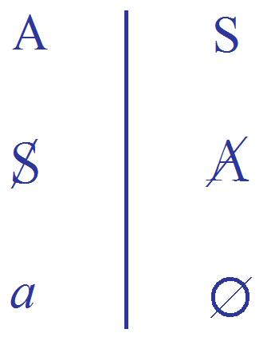
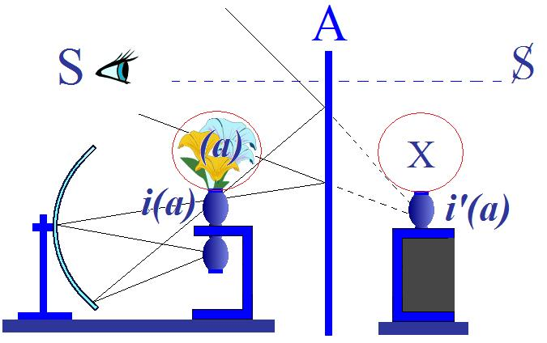
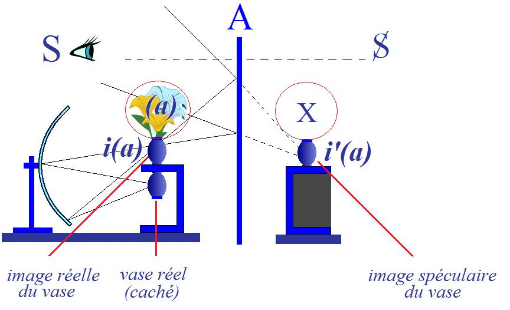
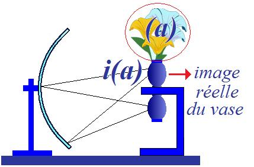

# Leçon 09 | 23 Janvier l963

  

    <label><input type="checkbox" data-lacan-toggle="original" checked> 原文</label>
    <label><input type="checkbox" data-lacan-toggle="notes" checked> 注释</label>
    <label><input type="checkbox" data-lacan-toggle="commentary" checked> 个人解读评论</label>
  

  <form class="lacan-tool-search" role="search">
    <input class="lacan-tool-search-input" type="search" placeholder="搜索全文" aria-label="搜索全文">
    <button class="lacan-tool-button" type="submit" title="搜索">搜索</button>
  </form>
  <button class="lacan-tool-button lacan-back-to-top" type="button" title="回到页面最上方" aria-label="回到页面最上方">↑</button>

<section class="parallel-paragraph" data-paragraph-ids="s10-09-0001">

s10-09-0001

原文 · s10-09-0001

Nous allons aujourd’hui continuer à parler de ce que je vous désigne comme le *petit(a).*
Pour maintenir notre axe, autrement dit ne pas vous laisser, par mon explication même, l’occasion d’une dérive,
je commencerai de rappeler *son rapport au sujet*.

[无对应译文]

</section>

<section class="parallel-paragraph" data-paragraph-ids="s10-09-0002">

s10-09-0002

原文 · s10-09-0002

Pourtant ce que nous avons à dire, à accentuer aujour­d’hui, c’est son rapport à ce que nous appelons le grand Autre,
l’Autre connoté d’un A, parce que, comme nous le verrons, il est essentiel de comprendre que c’est de cet Autre

[无对应译文]

</section>

<section class="parallel-paragraph" data-paragraph-ids="s10-09-0003">

s10-09-0003

原文 · s10-09-0003

- qu’il prend son isolement,

[无对应译文]

</section>

<section class="parallel-paragraph" data-paragraph-ids="s10-09-0004">

s10-09-0004

原文 · s10-09-0004

- qu’il se constitue dans le rapport du sujet à l’Autre comme *reste*.

[无对应译文]

</section>

<section class="parallel-paragraph" data-paragraph-ids="s10-09-0005">

s10-09-0005

原文 · s10-09-0005

C’est pourquoi j’ai reproduit ce schéma, homologue de l’appareil de la division.

[无对应译文]

</section>

<section class="parallel-paragraph" data-paragraph-ids="s10-09-0006">

s10-09-0006

原文 · s10-09-0006

[无对应译文]

</section>

<section class="parallel-paragraph" data-paragraph-ids="s10-09-0007">

s10-09-0007

原文 · s10-09-0007

- Le sujet, tout en haut à droite, en tant que par notre dialectique, il prend son départ de la fonction du *signifiant,* le sujet S, hypothétique, à l’origine de cette dialectique, se constitue au *lieu de l’Autre* comme marqué du signifiant, seul sujet où accède notre expérience.

[无对应译文]

</section>

<section class="parallel-paragraph" data-paragraph-ids="s10-09-0008">

s10-09-0008

原文 · s10-09-0008

- Inversement suspendant toute l’existence de l’Autre à une garantie qui manque : l’*Autre barré*.

[无对应译文]

</section>

<section class="parallel-paragraph" data-paragraph-ids="s10-09-0009">

s10-09-0009

原文 · s10-09-0009

- Mais de cette opération, *il y a un reste, c’est le (a)*.

[无对应译文]

</section>

<section class="parallel-paragraph" data-paragraph-ids="s10-09-0010">

s10-09-0010

原文 · s10-09-0010

La dernière fois j’ai amorcé, j’ai fait surgir devant vous...

[无对应译文]

</section>

<section class="parallel-paragraph" data-paragraph-ids="s10-09-0011">

s10-09-0011

原文 · s10-09-0011

> par l’exemple, l’exemple non unique, car derrière cet exemple,
>
> celui du *cas d’homo­sexualité féminine*, se profilait celui de Dora
> ...j’ai fait surgir devant vous comme *caractéristique structurale de ce rapport du sujet au* *(a)...*

[无对应译文]

</section>

<section class="parallel-paragraph" data-paragraph-ids="s10-09-0012">

s10-09-0012

原文 · s10-09-0012

> la possibilité essentielle, la relation, on peut dire universelle concernant le *(a),*
>
> car à tous les niveaux vous la retrouverez toujours,
>
> et je dirai que c’en est la connotation la plus caractéristique, puisque justement liée à *cette fonction de reste,*
> ...c’est ce que j’ai appelé...

[无对应译文]

</section>

<section class="parallel-paragraph" data-paragraph-ids="s10-09-0013">

s10-09-0013

原文 · s10-09-0013

> emprunté du vocabulaire et de la lecture de Freud,
>
> à propos du *passage à l’acte* qui lui amène son cas d’homosexualité féminine
> ...*le « laisser-tomber »,* le *niederkommen lassen.*

[无对应译文]

</section>

<section class="parallel-paragraph" data-paragraph-ids="s10-09-0014">

s10-09-0014

原文 · s10-09-0014

Et vous vous rappelez sans doute que j’ai terminé par cette remarque : qu’étrangement c’est ce qui, à propos de ce cas,
avait marqué la réponse de Freud lui-même à une difficulté sans doute tout à fait exemplaire,
car dans tout ce que Freud nous a témoigné de son action, de sa conduite, de son expérience,
ce « *laisser-tomber* » est unique en même temps qu’il est presque, dans son texte, si manifeste, si provoquant
que pour certains à la lecture il en devient quasi invisible.

[无对应译文]

</section>

<section class="parallel-paragraph" data-paragraph-ids="s10-09-0015">

s10-09-0015

原文 · s10-09-0015

Ce « *laisser-tomber* » c’est le corrélat essentiel, que je vous ai indiqué la der­nière fois, du *passage à l’acte*.
Encore : de quel côté est-il vu, ce *laisser-tomber,* dans *le passage à l’acte* ? *Du côté du sujet, justement*.

[无对应译文]

</section>

<section class="parallel-paragraph" data-paragraph-ids="s10-09-0016">

s10-09-0016

原文 · s10-09-0016

*Le passage à l’acte* il est, si vous voulez, dans le fantasme, du côté du sujet, en tant qu’il apparaît au maximum effacé par la barre.
C’est au moment du plus grand « *embarras* », avec l’addition comportementale de l’*émotion* comme désordre du mouve­ment,
*que le sujet*, si l’on peut dire, « *se précipite* », *se précipite de là où il est,* *du lieu de la scène*...

[无对应译文]

</section>

<section class="parallel-paragraph" data-paragraph-ids="s10-09-0017">

s10-09-0017

原文 · s10-09-0017

> où comme sujet fondamentalement historisé, seulement il peut se maintenir dans son statut de sujet,
> ...*qu’il bascule essentiellement hors de la scène*. C’est là, la structure même, comme telle, du *passage à l’acte*.

[无对应译文]

</section>

<section class="parallel-paragraph" data-paragraph-ids="s10-09-0018">

s10-09-0018

原文 · s10-09-0018

La femme de l’observation d’homosexualité féminine
saute par-dessus la petite barrière qui la sépare du chenal où passe le petit *tramway* demi-sou­terrain à Vienne.

[无对应译文]

</section>

<section class="parallel-paragraph" data-paragraph-ids="s10-09-0019">

s10-09-0019

原文 · s10-09-0019

Dora, au moment de l’acmé d’embarras...

[无对应译文]

</section>

<section class="parallel-paragraph" data-paragraph-ids="s10-09-0020">

s10-09-0020

原文 · s10-09-0020

> où la met, je vous l’ai fait remarquer depuis longtemps, la phrase piège,
>
> le piège maladroit de Monsieur Κ. : « *Ma femme n’est rien pour moi* »
> ...passe à l’acte : « *la gifle* ».

[无对应译文]

</section>

<section class="parallel-paragraph" data-paragraph-ids="s10-09-0021">

s10-09-0021

原文 · s10-09-0021

La gifle qui ici ne peut exprimer rien d’autre que la plus parfaite ambiguïté : est-ce M. Κ ou Mme Κ qu’elle aime ?
Ce n’est certes pas la gifle qui nous le dira. Mais une telle gifle est un de ces signes, de ces moments cruciaux dans le destin,
que nous pouvons voir rebondir, de génération en génération, avec sa valeur d’aiguillage dans une destinée.

[无对应译文]

</section>

<section class="parallel-paragraph" data-paragraph-ids="s10-09-0022">

s10-09-0022

原文 · s10-09-0022

Cette direction d’« *évasion de la scène* », c’est ce qui nous permet *de reconnaître*...

[无对应译文]

</section>

<section class="parallel-paragraph" data-paragraph-ids="s10-09-0023">

s10-09-0023

原文 · s10-09-0023

> et vous ver­rez, *de distinguer* ce quelque chose de tout autre qui est *l’acting-out*
> *...le passage à l’acte* dans sa valeur propre.

[无对应译文]

</section>

<section class="parallel-paragraph" data-paragraph-ids="s10-09-0024">

s10-09-0024

原文 · s10-09-0024

Vous en dirai-je un autre exemple, combien manifeste ?
Qui songe à contester cette étiquette à ce qu’on appelle *la fugue* ?
Et qu’est-ce que *la fugue* chez le sujet - toujours plus ou moins mis en position infan­tile - qui s’y jette,
si ce n’est cette sortie de la scène, ce départ vagabond dans le monde pur,
où le sujet part *à la recherche*, à la rencontre de quelque chose de refusé partout ?

[无对应译文]

</section>

<section class="parallel-paragraph" data-paragraph-ids="s10-09-0025">

s10-09-0025

原文 · s10-09-0025

Ιl se fait « *mousse* », comme on dit...

[无对应译文]

</section>

<section class="parallel-paragraph" data-paragraph-ids="s10-09-0026">

s10-09-0026

原文 · s10-09-0026

> bien sûr, il revient, il retourne : ce peut être l’occasion de se faire *mousser*
> *...*et le départ, c’est bien ce passage de *« la scène »* au *« monde »*.

[无对应译文]

</section>

<section class="parallel-paragraph" data-paragraph-ids="s10-09-0027">

s10-09-0027

原文 · s10-09-0027

\[*Monde*\] pour lequel d’ailleurs il était si utile que, dans les premières phases de ce discours sur *l’angoisse,*
je vous pose cette distinc­tion essentielle des deux registres :

[无对应译文]

</section>

<section class="parallel-paragraph" data-paragraph-ids="s10-09-0028">

s10-09-0028

原文 · s10-09-0028

- du « *monde »*, l’endroit où le *réel* se presse,

<!-- -->

[无对应译文]

</section>

<section class="parallel-paragraph" data-paragraph-ids="s10-09-0029">

s10-09-0029

原文 · s10-09-0029

- à cette « *scène de l’Autre »* où l’homme comme sujet a à se constituer, a à prendre place comme celui qui porte *la parole*, mais qui ne saurait la porter que *dans une structure,* si *véridique* qu’elle se pose, *qui est structure de fiction*.

[无对应译文]

</section>

<section class="parallel-paragraph" data-paragraph-ids="s10-09-0030">

s10-09-0030

原文 · s10-09-0030

Je viendrai...

[无对应译文]

</section>

<section class="parallel-paragraph" data-paragraph-ids="s10-09-0031">

s10-09-0031

原文 · s10-09-0031

> pour vous dire d’abord comment le plus caractéristiquement, ce *reste* comme tel se fait valoir
> ...à vous parler aujourd’hui et d’abord...
> je veux dire avant d’aller plus loin dans la fonction de l’angoisse
> ...de *l’acting-out.*

[无对应译文]

</section>

<section class="parallel-paragraph" data-paragraph-ids="s10-09-0032">

s10-09-0032

原文 · s10-09-0032

Ιl peut sans doute vous sembler, sinon étonnant du moins encore un détour...

[无对应译文]

</section>

<section class="parallel-paragraph" data-paragraph-ids="s10-09-0033">

s10-09-0033

原文 · s10-09-0033

> un détour de plus, n’est-ce pas un détour de trop ?
> ...de m’étendre en un discours sur *l’angoisse*, sur quelque chose *qui d’abord semble plutôt de l’ordre de son évitement*.

[无对应译文]

</section>

<section class="parallel-paragraph" data-paragraph-ids="s10-09-0034">

s10-09-0034

原文 · s10-09-0034

Pourtant, observez que vous ne faites que retrouver là
ce que déjà a ponctué dans mon discours une inter­rogation au départ essentielle,
c’est à savoir, entre *le sujet* et *l’Autre*, si l’an­goisse n’est pas le mode de communication si absolu
qu’à vrai dire on peut se demander si l’angoisse n’est pas, au *sujet* et à *l’Autre*, ce qui est à pro­prement parler commun.

[无对应译文]

</section>

<section class="parallel-paragraph" data-paragraph-ids="s10-09-0035">

s10-09-0035

原文 · s10-09-0035

Je me mets ici, pour la retrouver plus tard, une petite marque, une pierre blanche,
c’est à savoir un des traits qui à la fois fait le plus de difficulté et qu’il nous faut pré­server,
à savoir qu’aucun discours sur l’angoisse ne peut méconnaître :
que nous avons à tenir compte du fait de l’angoisse chez certains animaux.

[无对应译文]

</section>

<section class="parallel-paragraph" data-paragraph-ids="s10-09-0036">

s10-09-0036

原文 · s10-09-0036

Et après tout, qu’y a-t-il là d’abord, sinon une question,
à savoir : comment d’un sentiment - peut-être du seul - pou­vons-nous chez l’animal être aussi sûrs ?
Car c’est du seul dont nous ne puissions pas douter quand nous le ren­controns chez l’animal,
retrouvant là, sous une forme extérieure, ce carac­tère que j’ai déjà noté que comporte *l’angoisse*,
*d’être ce quelque chose qui ne trompe pas*.

[无对应译文]

</section>

<section class="parallel-paragraph" data-paragraph-ids="s10-09-0037">

s10-09-0037

原文 · s10-09-0037

[无对应译文]

</section>

<section class="parallel-paragraph" data-paragraph-ids="s10-09-0038">

s10-09-0038

原文 · s10-09-0038

Ayant posé donc le graphique de ce que j’espère aujourd’hui parcourir, je rappelle d’abord,
concernant ce *(a),* vers lequel nous nous avançons par sa relation à l’Autre, au grand Α, quelques remarques de rappel.

[无对应译文]

</section>

<section class="parallel-paragraph" data-paragraph-ids="s10-09-0039">

s10-09-0039

原文 · s10-09-0039

Et partant de ceci, qui était déjà indiqué dans ce que je vous ai dit jusqu’ici, que l’angoisse...

[无对应译文]

</section>

<section class="parallel-paragraph" data-paragraph-ids="s10-09-0040">

s10-09-0040

原文 · s10-09-0040

> vous le voyez poindre dans ce schéma qui ici reflète tachigraphiquement,
>
> et je m’en excuse s’il en apparaît du même coup un peu approximatif
> ...*l’angoisse*, voyons-nous poindre, et conformément à ce que nous indique la dernière pensée de Freud,
> *l’angoisse est un signal dans le moi*.

[无对应译文]

</section>

<section class="parallel-paragraph" data-paragraph-ids="s10-09-0041">

s10-09-0041

原文 · s10-09-0041

Si elle est *<u>signal</u> dans le moi*, il doit être là quelque part, à ce lieu - dans le schéma - du *moi idéal* \[***i’**(a)*\],
et s’il est quelque part, je pense avoir déjà suffisamment pour vous amorcé qu’il doit être là \[Χ\],
et que c’est *un phénomène de bord* dans le champ imaginaire du *moi*,
ce terme de « *bord* » étant légitimé à s’appuyer sur l’affirmation de Freud lui-même que *le moi est une surface*,
et même, ajoute-t-il, *une projection de surface,* j’ai rappelé ceci en son temps.

[无对应译文]

</section>

<section class="parallel-paragraph" data-paragraph-ids="s10-09-0042">

s10-09-0042

原文 · s10-09-0042

Disons donc que c’est une *couleur,* si je puis dire...

[无对应译文]

</section>

<section class="parallel-paragraph" data-paragraph-ids="s10-09-0043">

s10-09-0043

原文 · s10-09-0043

> je justifierai ça plus tard, à l’occasion, l’emploi métaphorique de ce terme de *couleur*
> …qui se produit au bord de la surface spéculaire elle-même \[*i’(a)*\], *elle-même inversion*, en tant que spéculai­re, *de la surface réelle*,
> ici ne l’oublions pas, c’est une *<u>image réelle</u>* que nous appelons *i(a),* *moi idéal,*
> *moi-idéal* cette fonction par où le *moi* est constitué par la série des *identifications* - à quoi ? - à certains objets !
> Ceux à propos de qui Freud nous propose dans [*Das Ich und das Es*](http://www.textlog.de/sigmund-freud-das-ich-und-das-es.html) [^62], essentiellement *l’ambiguïté de l’identification et de l’amour*.
> Vous savez que cette ambiguï­té, il en souligne le problème comme le laissant, lui Freud, perplexe.

[无对应译文]

</section>

<section class="parallel-paragraph" data-paragraph-ids="s10-09-0044">

s10-09-0044

原文 · s10-09-0044

[无对应译文]

</section>

<section class="parallel-paragraph" data-paragraph-ids="s10-09-0045">

s10-09-0045

原文 · s10-09-0045

Nous ne serons donc pas étonnés que cette *ambiguïté*, nous ne puissions l’appro­cher nous-mêmes qu’à l’aide des formules mettant à l’épreuve le statut même de notre propre subjectivité dans le discours, entendez dans le dis­cours docte ou enseignant, *ambiguïté* que désigne le rapport de ce que dès longtemps j’ai accentué[^63] devant vous, à cette place où il convient,
le rapport de « l’*être »* à « l’*avoir »*.

[无对应译文]

</section>

<section class="parallel-paragraph" data-paragraph-ids="s10-09-0046">

s10-09-0046

原文 · s10-09-0046

*Ce (a)*, *objet de l’identification*...

[无对应译文]

</section>

<section class="parallel-paragraph" data-paragraph-ids="s10-09-0047">

s10-09-0047

原文 · s10-09-0047

> pour souligner d’un repère, dans les saillants même de l’œuvre de Freud,
>
> c’est l’identification qui est au princi­pe du deuil par exemple, essentiellement
> ...ce *(a)*, *objet de l’identification*, n’est aussi *(a) objet de l’amour* que pour autant qu’il est, ce *(a),* ce qui fait de l’« amant »...

[无对应译文]

</section>

<section class="parallel-paragraph" data-paragraph-ids="s10-09-0048">

s10-09-0048

原文 · s10-09-0048

> pour employer le terme médiéval et traditionnel
> ...ce qui l’ar­rache métaphoriquement cet amant, pour le faire amant à se proposer comme *aimable* ἐρωμένος \[éroménos\],
> en le faisant ἔρόν \[erôn\], sujet du manque, donc ce par quoi il se constitue proprement dans l’amour,
> ce qui lui donne si je puis dire l’ins­trument de l’amour, à savoir - nous y retombons –
> *qu’on aime, qu’on est amant avec ce qu’on n’a pas*.

[无对应译文]

</section>

<section class="parallel-paragraph" data-paragraph-ids="s10-09-0049">

s10-09-0049

原文 · s10-09-0049

Ce *(a)* s’appelle *(a)* dans notre discours, non seu­lement pour *la fonction d’identité algébrique* que nous avons précisée l’autre jour, mais si je puis dire - humoristiquement - pour ce que c’est « *ce qu’on n’<u>a</u> plus* ».
C’est pourquoi on peut le retrouver par voie régressive sous forme *d’identification*, c’est-à-dire *<u>à l’être ce (a)</u>* qu’on n’*a* plus.

[无对应译文]

</section>

<section class="parallel-paragraph" data-paragraph-ids="s10-09-0050">

s10-09-0050

原文 · s10-09-0050

C’est exac­tement ce qui fait - par Freud - mettre le terme de *régression*
exactement à ce point où il précise les rapports de *l’identification* à *l’amour*.

[无对应译文]

</section>

<section class="parallel-paragraph" data-paragraph-ids="s10-09-0051">

s10-09-0051

原文 · s10-09-0051

Mais dans cette *régression* - où *(a)* reste ce qu’il est : instrument - c’est avec *ce qu’on est* qu’on peut, si je puis dire, *avoir ou pas*.

[无对应译文]

</section>

<section class="parallel-paragraph" data-paragraph-ids="s10-09-0052">

s10-09-0052

原文 · s10-09-0052

[无对应译文]

</section>

<section class="parallel-paragraph" data-paragraph-ids="s10-09-0053">

s10-09-0053

原文 · s10-09-0053

C’est avec *l’image réelle* \[***i**(a)*\] ici constituée : quand elle émerge comme *i(a),*
qu’on prend, ou non, *dans l’encolure de cette image* ce qui reste la multiplicité des *objets(a)*...

[无对应译文]

</section>

<section class="parallel-paragraph" data-paragraph-ids="s10-09-0054">

s10-09-0054

原文 · s10-09-0054

> représentés dans mon schéma par *les fleurs réelles* prises ou non dans la constitution, grâce au *miroir concave* du fond, *symbole de quelque chose*, disons, qui doit se retrou­ver dans la structure *du cortex*,
>
> fondement d’un certain *rapport* de l’hom­me à *l’image de son corps*
> ...les différents objets constituables de ce corps.

[无对应译文]

</section>

<section class="parallel-paragraph" data-paragraph-ids="s10-09-0055">

s10-09-0055

原文 · s10-09-0055

Les morceaux du corps originel sont ou non pris, saisis, au moment où *i(a)* a l’occasion de se constituer.
C’est pourquoi nous devons saisir qu’avant *le stade du miroir*, ce qui sera *i(a)* est là, dans le désordre des *petits(a),*
dont il n’est pas question encore de les avoir ou pas.

[无对应译文]

</section>

<section class="parallel-paragraph" data-paragraph-ids="s10-09-0056">

s10-09-0056

原文 · s10-09-0056

Et c’est à cela que répond le vrai sens, le sens le plus pro­fond à donner au terme d’« *auto-érotisme* » :
*c’est qu’on manque de soi,* si je puis dire, du tout au tout.

[无对应译文]

</section>

<section class="parallel-paragraph" data-paragraph-ids="s10-09-0057">

s10-09-0057

原文 · s10-09-0057

Ce n’est pas du monde extérieur qu’on manque, comme on l’exprime improprement, *c’est de soi-même*.

[无对应译文]

</section>

<section class="parallel-paragraph" data-paragraph-ids="s10-09-0058">

s10-09-0058

原文 · s10-09-0058

Ici est la possibilité de ce fantasme du corps morcelé que certains d’entre vous ont reconnu, ont rencontré chez *les schizophrènes*. Ce n’est pas d’ailleurs pour autant nous permettre de décider de son déterminisme, à ce fantasme du corps morcelé,
que ceux-ci dont je parle ont vu se dessiner chez les schizophrènes

[无对应译文]

</section>

<section class="parallel-paragraph" data-paragraph-ids="s10-09-0059">

s10-09-0059

原文 · s10-09-0059

Et c’est pourquoi aussi j’ai pointé le mérite d’une recherche récente concernant *les coordonnées de ce déterminisme* du schi­zophrènes, recherche qui ne prétendait pas du tout l’épuiser ce déterminisme, mais qui en connotait un des traits en remarquant, strictement et rien de plus, dans l’ar­ticulation de la mère du schizophrène,
concernant ce qu’avait été son enfant au moment où il était dans son ventre :
rien d’autre qu’un corps diversement *commode* ou *embarrassant*, à savoir la subjectivation de *(a)* comme *pur réel*.

[无对应译文]

</section>

<section class="parallel-paragraph" data-paragraph-ids="s10-09-0060">

s10-09-0060

原文 · s10-09-0060

Observons encore ce moment, cet état d’avant la surgence de *i(a)*, d’avant la distinction entre tous les *petit (a)*,
de *cette image réelle* par rapport à quoi ils vont être, ou non, *ce reste* qu’on a ou qu’on n’a pas.

[无对应译文]

</section>

<section class="parallel-paragraph" data-paragraph-ids="s10-09-0061">

s10-09-0061

原文 · s10-09-0061

Oui, faisons cette remarque : si Freud nous dit que l’angoisse est ce phénomène de bord, ce signal à la limite du *moi*,
contre cette autre chose qui ici \[Χ\] ne doit pas apparaître - en tant que *(a),* *le reste,* est abhorré de l’Autre, grand Α -
comment se fait-il que le mou­vement de la réflexion, les guides, les rails de l’expérience aient porté les analystes...

[无对应译文]

</section>

<section class="parallel-paragraph" data-paragraph-ids="s10-09-0062">

s10-09-0062

原文 · s10-09-0062

> Rank d’abord, et Freud sur ce point, le suivant
> ...à trouver l’origi­ne de l’angoisse à *ce niveau pré-spéculaire*, *pré-autoérotique*, à *ce niveau de la naissance*, où qui donc songerait...

[无对应译文]

</section>

<section class="parallel-paragraph" data-paragraph-ids="s10-09-0063">

s10-09-0063

原文 · s10-09-0063

> personne n’y a songé dans le concert analytique
> ...à parler de la constitution d’un *moi* ?

[无对应译文]

</section>

<section class="parallel-paragraph" data-paragraph-ids="s10-09-0064">

s10-09-0064

原文 · s10-09-0064

Ιl y a là quelque chose qui prouve qu’en effet, s’il est possible de définir l’angoisse
comme signal, phé­nomène de bord dans le *moi,* quand le *moi* est constitué, ce n’est sûrement pas exhaustif.

[无对应译文]

</section>

<section class="parallel-paragraph" data-paragraph-ids="s10-09-0065">

s10-09-0065

原文 · s10-09-0065

Ceci, nous le retrouvons bien clairement dans un des phéno­mènes, les plus connus pour accompagner l’angoisse,
ceux que l’on désigne...

[无对应译文]

</section>

<section class="parallel-paragraph" data-paragraph-ids="s10-09-0066">

s10-09-0066

原文 · s10-09-0066

> en les comprenant analytiquement de façon certainement ambiguë,
>
> à en voir les divergences, car nous aurons à y revenir,
> ...ce sont les phénomènes juste­ment les plus contraires à *la structure du moi* comme tel, *les phénomènes de dépersonnalisation*.

[无对应译文]

</section>

<section class="parallel-paragraph" data-paragraph-ids="s10-09-0067">

s10-09-0067

原文 · s10-09-0067

Ça soulève la question, que nous ne pourrons éviter de situer authentiquement la dépersonnalisation.
On sait la place que ce phénomène a pris dans certains repérages propres à un ou plusieurs auteurs[^64] de l’École française auxquels j’ai déjà eu à faire référence.

[无对应译文]

</section>

<section class="parallel-paragraph" data-paragraph-ids="s10-09-0068">

s10-09-0068

原文 · s10-09-0068

Je pense qu’il sera facile de reconnaître les rapports de ces repé­rages, à ce que je développe ici,
je veux dire à présumer que ces repérages ne sont pas étrangers aux esquisses que j’ai pu préalablement en donner.

[无对应译文]

</section>

<section class="parallel-paragraph" data-paragraph-ids="s10-09-0069">

s10-09-0069

原文 · s10-09-0069

La notion de *la distance*, ici presque sensible dans la nécessité que j’ai toujours marquée,
justement du rapport de cette *distance* avec l’existence du miroir, de ce qui donne à ce sujet *cet éloignement de lui-même*
que la dimension de l’Autre est faite pour lui offrir.

[无对应译文]

</section>

<section class="parallel-paragraph" data-paragraph-ids="s10-09-0070">

s10-09-0070

原文 · s10-09-0070

Mais ce n’est pas non plus pouvoir en conclure qu’aucun «* rapproché* »
puisse nous donner la solution d’aucune des difficultés qui s’engendrent de la nécessité de *cette distance*.
En d’autres termes, ce n’est pas *que les objets soient envahissants,* si l’on peut dire, *dans la psychose,*
qui est ce qui constitue leur danger pour le *moi*, c’est la structure même de ces objets qui les rend impropres à *la « moïsation »*.

[无对应译文]

</section>

<section class="parallel-paragraph" data-paragraph-ids="s10-09-0071">

s10-09-0071

原文 · s10-09-0071

C’est ce que j’ai essayé de vous faire saisir à l’aide *des références...*

[无对应译文]

</section>

<section class="parallel-paragraph" data-paragraph-ids="s10-09-0072">

s10-09-0072

原文 · s10-09-0072

> *des méta­phores* si vous le voulez, mais je crois que cela va plus loin
> ...*topologiques*, dont je me suis servi en tant qu’elles introduisent la possibilité d’une forme *non spécularisable*
> dans la structure de certains de ces objets.

[无对应译文]

</section>

<section class="parallel-paragraph" data-paragraph-ids="s10-09-0073">

s10-09-0073

原文 · s10-09-0073

Disons que phé­noménologiquement, *la dépersonnalisation commence*...

[无对应译文]

</section>

<section class="parallel-paragraph" data-paragraph-ids="s10-09-0074">

s10-09-0074

原文 · s10-09-0074

> finissons notre phrase par quelque chose qui semble aller de soi
> ...*avec la non-reconnais­sance de l’image spéculaire*.

[无对应译文]

</section>

<section class="parallel-paragraph" data-paragraph-ids="s10-09-0075">

s10-09-0075

原文 · s10-09-0075

Chacun sait combien ceci est sensible dans la clinique, avec quelle fréquence c’est *à ne pas se retrouver dans le miroir*,

[无对应译文]

</section>

<section class="parallel-paragraph" data-paragraph-ids="s10-09-0076">

s10-09-0076

原文 · s10-09-0076

> ou quoi que ce soit d’une situation qui soit analogue
> ...*que le sujet commence d’être saisi par la vacillation dépersonnalisante*.

[无对应译文]

</section>

<section class="parallel-paragraph" data-paragraph-ids="s10-09-0077">

s10-09-0077

原文 · s10-09-0077

Mais articulons plus précisément que cette formule, qui donne *le fait,* est insuffisante,
à savoir que c’est *parce que ce qui est vu dans le miroir est angoissant que cela n’est pas proposable à la recon­naissance de l’Autre* et que...

[无对应译文]

</section>

<section class="parallel-paragraph" data-paragraph-ids="s10-09-0078">

s10-09-0078

原文 · s10-09-0078

> pour référer à un moment que j’ai marqué comme caractéristique de cette expérience du miroir,
>
> comme paradigma­tique de la constitution du *moi idéal dans l’espace de l’Autre*
> ...qu’une rela­tion à l’image spéculaire s’établit, telle que l’enfant ne saurait *\[dans ce cas\]* retourner la tête,
> selon ce mouvement que je vous ai décrit comme familier, vers cet autre, ce témoin, cet adulte qui est là, derrière lui, pour lui commu­niquer par son sourire, les manifestations de sa *jubilation,* de quelque chose qui le fait communiquer avec *l’image spéculaire*.

[无对应译文]

</section>

<section class="parallel-paragraph" data-paragraph-ids="s10-09-0079">

s10-09-0079

原文 · s10-09-0079

*Une autre relation s’établit* *dont il est trop captif* pour que ce mouvement soit possible.
Ici la rela­tion duelle pure *dépossède*...

[无对应译文]

</section>

<section class="parallel-paragraph" data-paragraph-ids="s10-09-0080">

s10-09-0080

原文 · s10-09-0080

> ce sentiment de relation de dépossession mar­qué par les cliniciens dans la psychose
> ...*dépossède le sujet de cette rela­tion au grand Autre*.

[无对应译文]

</section>

<section class="parallel-paragraph" data-paragraph-ids="s10-09-0081">

s10-09-0081

原文 · s10-09-0081

La spécularisation est étrange*, « odd »* comme disent les Anglais, impaire, hors symétrie : c’est le Horla de Maupassant,
le hors­-l’espace, en tant que *l’espace c’est la dimension du superposable*. \[*image spéculaire non inversée*\]

[无对应译文]

</section>

<section class="parallel-paragraph" data-paragraph-ids="s10-09-0082">

s10-09-0082

原文 · s10-09-0082

Vais-je ici, au point où nous en sommes, faire une halte sur ce que signifie cette séparation, cette coupure liée à *l’angoisse*
*de la naissance*, en tant que quelque chose d’imprécis y subsiste d’où s’engendrent toutes sortes de confusions.

[无对应译文]

</section>

<section class="parallel-paragraph" data-paragraph-ids="s10-09-0083">

s10-09-0083

原文 · s10-09-0083

Le temps me manque à vrai dire, et je ne peux que l’in­diquer. J’y reviendrai.
Sachez pourtant : à cette place il convient de faire de grandes réserves concernant la structuration du phénomène de l’angois­se.

[无对应译文]

</section>

<section class="parallel-paragraph" data-paragraph-ids="s10-09-0084">

s10-09-0084

原文 · s10-09-0084

Donc, il suffira de vous reporter au texte de Freud.
Freud, vous le verrez, voit la commodité dans le fait qu’au niveau de *l’angoisse de la nais­sance*
se constitue toute une constellation de mouvements, principalement vaso-moteurs, respiratoires,
dont il dit que c’est là une « *constellation réelle* », et que c’est ceci qui sera transporté dans sa fonction de signal,
à la façon, nous dit-il, dont se constitue l’accès hystérique,
lui-même reproduction de mou­vements, nous dit-il, hérités pour l’expression de certains moments émotionnels.

[无对应译文]

</section>

<section class="parallel-paragraph" data-paragraph-ids="s10-09-0085">

s10-09-0085

原文 · s10-09-0085

Assurément, ceci est tout à fait inconcevable en raison justement de ce fait
qu’il est impossible de *situer au départ* cette complexité dans un rapport avec le *moi*
qui lui permette de servir comme signal du *moi* dans la suite,
sinon par l’intermédiaire de ce que nous avons à chercher de structural dans le rapport de *i(a)* avec ce *(a)*.

[无对应译文]

</section>

<section class="parallel-paragraph" data-paragraph-ids="s10-09-0086">

s10-09-0086

原文 · s10-09-0086

Mais alors la séparation caractéristique, au départ, celle qui nous permet d’amorcer, de concevoir ce rapport,
n’est pas la séparation d’avec la mère. La coupure dont il s’agit n’est pas celle de l’enfant à la mère.

[无对应译文]

</section>

<section class="parallel-paragraph" data-paragraph-ids="s10-09-0087">

s10-09-0087

原文 · s10-09-0087

La façon dont l’enfant originellement habite la mère
pose tout le problème du carac­tère des rapports de l’œuf avec le corps de la mère chez les mammifères.
Dont vous savez qu’il a toute une face par où il est, par rapport au corps de la mère, corps étranger, parasite,
corps incrusté par les racines [villeuses](http://www.cnrtl.fr/lexicographie/villeuses) de son [chorion](http://www.cnrtl.fr/lexicographie/chorion) dans cet organe spécialisé pour le recevoir, l’utérus,
avec la muqueuse duquel il est dans une certaine intrication.

[无对应译文]

</section>

<section class="parallel-paragraph" data-paragraph-ids="s10-09-0088">

s10-09-0088

原文 · s10-09-0088

La coupure qui nous intéresse, celle qui porte sa marque dans un certain nombre de phénomènes *reconnaissables cliniquement*
et pour lesquels donc nous ne pouvons pas l’éluder, c’est une coupure qui - Dieu merci pour notre conception –
est beau­coup plus satisfaisante que *la coupure de l’enfant qui naît, au moment où il tombe dans le monde* - avec quoi ? - *avec ses enveloppes*.

[无对应译文]

</section>

<section class="parallel-paragraph" data-paragraph-ids="s10-09-0089">

s10-09-0089

原文 · s10-09-0089

Et je n’ai qu’à vous renvoyer à n’importe quel bouquin qui date de moins de cent ans dans l’em­bryologie
pour que vous puissiez y saisir que, pour avoir une notion com­plète de cet ensemble *pré-spéculaire* qu’est *i(a),*
il faut que vous considériez *les enveloppes comme éléments du corps*.

[无对应译文]

</section>

<section class="parallel-paragraph" data-paragraph-ids="s10-09-0090">

s10-09-0090

原文 · s10-09-0090

C’est à partir de l’œuf que les enve­loppes sont différenciées, et vous y verrez très curieusement qu’elles le sont,
d’une façon telle qu’elles illustrent…je vous fais assez confiance après nos travaux de l’année dernière autour du *cross-cap*
pour que vous retrouviez très simplement à quel point, sur les schémas illustrant ces cha­pitres de l’embryologie
concernant les enveloppes, vous pouvez voir se manifester toutes les variétés de cet intérieur à l’extérieur,
de ce *cœlome* externe dans lequel flotte *le fœtus*, lui-même enveloppé de son *amnios*, la cavité amniotique elle-même
étant enveloppée par un *feuillet ectodermique* et présentant vers l’extérieur sa face en continuité avec *l’entoblaste*.

[无对应译文]

</section>

<section class="parallel-paragraph" data-paragraph-ids="s10-09-0091">

s10-09-0091

原文 · s10-09-0091

Bref, l’analogie de ce qui est détaché avec la coupure de l’embryon de ses enveloppes,
avec, sur le *cross-cap,* cette séparation d’un certain *(a)* énigmatique sur lequel j’ai insisté, est là, sensible.

[无对应译文]

</section>

<section class="parallel-paragraph" data-paragraph-ids="s10-09-0092">

s10-09-0092

原文 · s10-09-0092

Et si nous devons le retrouver par la suite, je pense que je l’aurai aujourd’hui suffisamment indiqué pour cela.

[无对应译文]

</section>

<section class="parallel-paragraph" data-paragraph-ids="s10-09-0093">

s10-09-0093

原文 · s10-09-0093

Ιl nous reste à faire donc aujourd’hui ce que je vous ai annoncé,
concernant ce qu’indique *l’acting-out,* de ce rapport essentiel du *(a)* avec le Α.

[无对应译文]

</section>

<section class="parallel-paragraph" data-paragraph-ids="s10-09-0094">

s10-09-0094

原文 · s10-09-0094

*À l’opposé du* *passage à l’acte*, tout ce qui est *acting-out* se présente avec certaines caractéristiques qui vont nous permettre de l’isoler. Le rapport profond, nécessaire, de *l’acting-out* avec ce *(a),* c’est là dans quoi je désire vous mener, en quelque sorte par la main,
*ne vous laissant pas tomber* \[*sic*\].

[无对应译文]

</section>

<section class="parallel-paragraph" data-paragraph-ids="s10-09-0095">

s10-09-0095

原文 · s10-09-0095

Observez d’ailleurs dans vos repérages cliniques à quel point « *se tenir par la main pour ne pas laisser tomber* »
est tout à fait essentiel d’un certain type de relations du sujet avec quelque chose que, quand vous rencontrerez ceci, vous pouvez absolument désigner comme étant pour lui un *(a)*.

[无对应译文]

</section>

<section class="parallel-paragraph" data-paragraph-ids="s10-09-0096">

s10-09-0096

原文 · s10-09-0096

Ça fait des unions d’un type très répandu qui n’en sont pas pour cela plus com­modes à manier,
car aussi bien, le *(a)* dont il s’agit peut être pour le sujet *le surmoi* le plus incommode.

[无对应译文]

</section>

<section class="parallel-paragraph" data-paragraph-ids="s10-09-0097">

s10-09-0097

原文 · s10-09-0097

Le type de mère que nous appelons...
non sans propriété, mais combien souvent sans savoir absolument ce que nous voulons dire
...« femme phallique », je vous conseille la prudence avant d’en appliquer l’étiquette.

[无对应译文]

</section>

<section class="parallel-paragraph" data-paragraph-ids="s10-09-0098">

s10-09-0098

原文 · s10-09-0098

Mais si vous avez affaire à quel­qu’un qui vous dit qu’à mesure même qu’un objet lui est plus précieux,
inexplicablement elle sera atrocement tentée de ne pas - cet objet - le retenir dans une chute,
attendant comme je ne sais quoi de *miraculeux* de cette sorte de catas­trophe,
et que l’enfant le plus *aimé*, c’est justement celui qu’un jour elle a lais­sé inexplicablement tomber...

[无对应译文]

</section>

<section class="parallel-paragraph" data-paragraph-ids="s10-09-0099">

s10-09-0099

原文 · s10-09-0099

> et vous savez que dans la tragédie grecque, ceci n’ayant pas échappé à la perspicacité de Giraudoux[^65],
>
> c’est là le plus pro­fond grief d’Electre à l’endroit de Clytemnestre, c’est qu’un jour elle l’a laissée de ses bras glisser
> ...Alors là, oui, vous pouvez faire l’identification de ce qu’il convient d’appeler en l’occasion « *une mère phallique »*.
> Ιl y a sans doute d’autres modes, mais disons que c’est celui-là qui me paraît le moins trompeur.

[无对应译文]

</section>

<section class="parallel-paragraph" data-paragraph-ids="s10-09-0100">

s10-09-0100

原文 · s10-09-0100

Et entrons maintenant dans *l’acting-out.*

[无对应译文]

</section>

<section class="parallel-paragraph" data-paragraph-ids="s10-09-0101">

s10-09-0101

原文 · s10-09-0101

Dans *le cas d’homosexualité féminine*, si la tentative de suicide est *un passage à l’acte*,
je dirai que toute l’aventure avec la dame de réputation douteuse, qui est portée à la fonction d’objet suprême, est un *acting-out.*

[无对应译文]

</section>

<section class="parallel-paragraph" data-paragraph-ids="s10-09-0102">

s10-09-0102

原文 · s10-09-0102

Si la gifle de Dora est *un pas­sage à l’acte*, je dirai que tout le comportement paradoxal, que Freud découvre tout de suite avec tellement de perspicacité, de Dora dans le ména­ge des Κ. est un *acting-out.*

[无对应译文]

</section>

<section class="parallel-paragraph" data-paragraph-ids="s10-09-0103">

s10-09-0103

原文 · s10-09-0103

*L’acting-out* c’est quelque chose, dans la conduite du sujet essentiellement, qui *se montre*.
L’accent *démonstratif*, l’orientation vers l’Autre de tout *acting-out,* est quelque chose qui doit être relevé.

[无对应译文]

</section>

<section class="parallel-paragraph" data-paragraph-ids="s10-09-0104">

s10-09-0104

原文 · s10-09-0104

Dans le *cas d’homosexualité féminine*, Freud y insiste, c’est aux yeux de tous, c’est dans la mesure même,
et d’autant plus que cette publicité devient plus scandaleuse, que la conduite de la jeune homosexuelle s’accentue.

[无对应译文]

</section>

<section class="parallel-paragraph" data-paragraph-ids="s10-09-0105">

s10-09-0105

原文 · s10-09-0105

Mais *ce qui se montre*...

[无对应译文]

</section>

<section class="parallel-paragraph" data-paragraph-ids="s10-09-0106">

s10-09-0106

原文 · s10-09-0106

> on avance pas à pas
> ...*se montre essentiellement comme autre*, *autre* que ça n’est : *ce que « ça » est*, *personne ne le sait*, mais *que ce soit « autre », personne n’en doute !* *Ce que « ça » est*, dans le *cas de la jeune homosexuelle*, Freud le dit quand même : « Elle aurait voulu un enfant du père » nous dit-il.

[无对应译文]

</section>

<section class="parallel-paragraph" data-paragraph-ids="s10-09-0107">

s10-09-0107

原文 · s10-09-0107

Et si vous vous contentez de ça, c’est que vous n’êtes pas difficile, parce que cet enfant n’a rien à faire avec un besoin maternel.
C’est bien pour ça que je tenais tout à l’heure, au moins à indiquer la problématique du rapport de l’en­fant à la mère que...

[无对应译文]

</section>

<section class="parallel-paragraph" data-paragraph-ids="s10-09-0108">

s10-09-0108

原文 · s10-09-0108

> contrairement à tout le glissement de la pensée analy­tique
> ...il convient de mettre...

[无对应译文]

</section>

<section class="parallel-paragraph" data-paragraph-ids="s10-09-0109">

s10-09-0109

原文 · s10-09-0109

> par rapport au courant principal élaboré de l’élu­cidation du désir inconscient
> ...dans un rapport, si je puis dire, en quelque sorte *latéral*.

[无对应译文]

</section>

<section class="parallel-paragraph" data-paragraph-ids="s10-09-0110">

s10-09-0110

原文 · s10-09-0110

Ιl y a, dans ce rapport normal de la mère à l’enfant...

[无对应译文]

</section>

<section class="parallel-paragraph" data-paragraph-ids="s10-09-0111">

s10-09-0111

原文 · s10-09-0111

> en tout cas dans ce que nous pouvons en saisir par son incidence économique
> ...quelque chose de *plein*, quelque chose de *rond*, quelque chose de *fermé*, quelque chose justement d’aussi *complet*
> pendant la phase gestatoire que l’on peut dire qu’il nous faut des soins tout à fait spéciaux pour le faire rentrer,
> pour voir comment son incidence s’applique à ce rapport de coupure de *i(a)* à *(a).*

[无对应译文]

</section>

<section class="parallel-paragraph" data-paragraph-ids="s10-09-0112">

s10-09-0112

原文 · s10-09-0112

Et après tout, il ne nous suffit que de notre expérience du transfert,
et de savoir à quel moment de nos analyses, nos analysées tombent enceintes et à quoi ça leur sert,
pour savoir parfaitement que c’est toujours le rempart d’un retour au plus profond narcissisme.
Mais laissons cela.

[无对应译文]

</section>

<section class="parallel-paragraph" data-paragraph-ids="s10-09-0113">

s10-09-0113

原文 · s10-09-0113

Cet *enfant*, la jeune homosexuelle c’est bien comme *autre chose* qu’elle a voulu l’avoir.
Et aussi bien cette « *chose* » n’échappe pas, Dieu merci, à Freud : elle a voulu cet enfant comme *phallus*,
c’est-à-dire, comme la doctrine l’énonce dans Freud de la façon la plus développée,
comme substitut, ersatz de quelque chose, alors qui tombe à plein dans notre dialectique de *la coupure* et du *manque *:
du *(a)* comme *chu*, du *(a)* comme *manquant*.

[无对应译文]

</section>

<section class="parallel-paragraph" data-paragraph-ids="s10-09-0114">

s10-09-0114

原文 · s10-09-0114

C’est ce qui lui permet, ayant échoué dans la réalisation de son désir, de le réaliser à la fois autrement et de la même façon : comme ἔρόν \[erôn\], elle se fait amant.

[无对应译文]

</section>

<section class="parallel-paragraph" data-paragraph-ids="s10-09-0115">

s10-09-0115

原文 · s10-09-0115

En d’autres termes, elle se pose dans ce qu’elle n’a pas, *le phallus*, *et pour bien montrer qu’elle l’a, elle le donne.*
C’est en effet une façon tout à fait démonstrative.
Elle se comporte, nous dit Freud, vis­-à-vis de la Dame avec un grand D, comme un cavalier servant, comme un homme, comme celui qui peut lui sacrifier ce qu’il a, son *phallus*.

[无对应译文]

</section>

<section class="parallel-paragraph" data-paragraph-ids="s10-09-0116">

s10-09-0116

原文 · s10-09-0116

Alors combinons ces deux termes,

[无对应译文]

</section>

<section class="parallel-paragraph" data-paragraph-ids="s10-09-0117">

s10-09-0117

原文 · s10-09-0117

- du *montrer* - du *démontrer*,

[无对应译文]

</section>

<section class="parallel-paragraph" data-paragraph-ids="s10-09-0118">

s10-09-0118

原文 · s10-09-0118

- et du *désir*, sans doute un désir dont l’essence, la présence, vous le voyez, est d’être, de se montrer -vous ai-je dit - *comme autre,* mais se montrant *comme autre,* pourtant ainsi *de se désigner*.

[无对应译文]

</section>

<section class="parallel-paragraph" data-paragraph-ids="s10-09-0119">

s10-09-0119

原文 · s10-09-0119

Dans *l’acting-out*, nous dirons donc que *le désir* en quelque sorte, pour s’affirmer *comme vérité,*
s’engage dans une voie où sans doute il n’y parvient que d’une façon singulière.

[无对应译文]

</section>

<section class="parallel-paragraph" data-paragraph-ids="s10-09-0120">

s10-09-0120

原文 · s10-09-0120

Si nous savons déjà par notre travail ici que d’une certaine façon on peut dire que *la vérité* *n’est pas de sa nature, à ce* *désir*.
Si nous nous rap­pelons la formule qu’essentiellement : « *Il n’est pas articulable encore qu’il soit articulé* »,
nous serons moins étonnés du phénomène devant lequel ici nous sommes. Et je vous ai donné un chaînon de plus :
il est articulé *objec­tivement* si cet *objet* qu’ici je désigne, c’est ce que j’ai appelé la dernière fois *l’objet comme sa cause*.

[无对应译文]

</section>

<section class="parallel-paragraph" data-paragraph-ids="s10-09-0121">

s10-09-0121

原文 · s10-09-0121

*L’acting-out* essentiellement*, c’est la monstration*, le montrage, voilé sans doute,
mais qui n’est voilé que pour nous, comme sujet, en tant que ça parle, en tant que ça pourrait faire vrai,
non pas voilé en soi, voilé - visible au contraire au maximum - et pour cela, pour cela même, dans un certain registre : invi­sible - *montrant sa cause : c’est ce reste, c’est sa chute, c’est ce qui tombe dans l’affaire, qui est l’essentiel de ce qui est montré*.

[无对应译文]

</section>

<section class="parallel-paragraph" data-paragraph-ids="s10-09-0122">

s10-09-0122

原文 · s10-09-0122

Entre le sujet \[S\] ici, si je puis dire « *Autrifié dans sa structure de fiction* »,
et l’Autre \[A\] non authentifiable, jamais complètement,
ce qui surgit c’est ce reste *(a),* c’est « *la livre de chair* », ce qui veut dire...

[无对应译文]

</section>

<section class="parallel-paragraph" data-paragraph-ids="s10-09-0123">

s10-09-0123

原文 · s10-09-0123

> je pense que vous savez ce que je cite [^66]
> ...qu’on peut faire tous les emprunts qu’on veut pour boucher les trous du désir et de la mélan­colie,
> il y a là le juif, qui lui, en sait un bout sur la balance des comptes, et qui demande à la fin « *la livre de chair* ».

[无对应译文]

</section>

<section class="parallel-paragraph" data-paragraph-ids="s10-09-0124">

s10-09-0124

原文 · s10-09-0124

C’est là le trait que vous retrouvez toujours dans ce qui est *acting-out.*

[无对应译文]

</section>

<section class="parallel-paragraph" data-paragraph-ids="s10-09-0125">

s10-09-0125

原文 · s10-09-0125

Rappelez-vous un point de ce qu’il m’arrive d’écrire, de mon rapport sur *La direction de la cure* [^67]
où je parle de l’observation d’Ernst Kriss à propos du cas de plagiarisme.

[无对应译文]

</section>

<section class="parallel-paragraph" data-paragraph-ids="s10-09-0126">

s10-09-0126

原文 · s10-09-0126

Ernst Kriss, parce qu’il est dans une cer­taine voie que nous aurons peut-être à nommer,
veut le réduire \[son patient\] par les moyens de la vérité : il lui montre de la façon la plus irréfutable qu’il n’est pas plagiaire,
il a lu son bouquin, son bouquin est bel et bien original, c’est au contraire les autres qui l’ont copié.

[无对应译文]

</section>

<section class="parallel-paragraph" data-paragraph-ids="s10-09-0127">

s10-09-0127

原文 · s10-09-0127

Le sujet ne peut pas le contester, seulement *il s’en fout !* Et en sortant, qu’est-ce qu’il va faire ?
Comme vous le savez...

[无对应译文]

</section>

<section class="parallel-paragraph" data-paragraph-ids="s10-09-0128">

s10-09-0128

原文 · s10-09-0128

> je pense qu’il y a tout de même quelques personnes, une majo­rité ici, qui lisent de temps en temps ce que j’écris
> ...il va bouffer des cervelles fraîches !

[无对应译文]

</section>

<section class="parallel-paragraph" data-paragraph-ids="s10-09-0129">

s10-09-0129

原文 · s10-09-0129

Je ne suis pas en train de rappeler ici le mécanisme du cas.
Je vous apprends à reconnaître *un acting-out* et ce que ça veut dire, ce que je vous désigne comme *le petit (a) ou* « *la livre de chair* ».

[无对应译文]

</section>

<section class="parallel-paragraph" data-paragraph-ids="s10-09-0130">

s10-09-0130

原文 · s10-09-0130

Avec les cervelles fraîches, le patient simplement *fait signe* à Ernst Kriss :

[无对应译文]

</section>

<section class="parallel-paragraph" data-paragraph-ids="s10-09-0131">

s10-09-0131

原文 · s10-09-0131

« *Tout ce que vous dites est vrai, simplement ça ne touche pas à la question, il reste les cervelles fraîches.*
*Pour bien vous le montrer, je vais aller les bouf­fer en sortant, pour vous le raconter à la prochaine séance.* »

[无对应译文]

</section>

<section class="parallel-paragraph" data-paragraph-ids="s10-09-0132">

s10-09-0132

原文 · s10-09-0132

J’insiste : on ne saurait en ces matières, aller trop lentement.
Vous allez me dire : « *Qu’est-ce que ça a d’original ?* »...

[无对应译文]

</section>

<section class="parallel-paragraph" data-paragraph-ids="s10-09-0133">

s10-09-0133

原文 · s10-09-0133

> *« Vous allez me dire »... :* - enfin, je fais les demandes et les réponses !
> ...je vous dirais : je l’espère pas, mais comme vous pourriez me le dire quand même, si je ne l’ai pas bien assez accentué :

[无对应译文]

</section>

<section class="parallel-paragraph" data-paragraph-ids="s10-09-0134">

s10-09-0134

原文 · s10-09-0134

> « *Mais qu’est-ce que ça a d’original, cet acting-out et cette démonstration de ce désir inconnu ? Le symptôme, c’est pareil.*
>
> *L’acting-out, c’est un symptôme qui se montre comme autre, lui aussi, la preuve, c’est qu’il doit être interprété* ».

[无对应译文]

</section>

<section class="parallel-paragraph" data-paragraph-ids="s10-09-0135">

s10-09-0135

原文 · s10-09-0135

Bon, alors mettons bien les points sur les « i » !
Vous savez qu’il ne peut pas l’être *interprété* directement, *le symptôme*, qu’il y faut *le transfert*, c’est-à-dire *l’introduction de l’Autre*.
Vous ne saisissez peut-être pas bien encore...

[无对应译文]

</section>

<section class="parallel-paragraph" data-paragraph-ids="s10-09-0136">

s10-09-0136

原文 · s10-09-0136

Alors vous allez me dire :

[无对应译文]

</section>

<section class="parallel-paragraph" data-paragraph-ids="s10-09-0137">

s10-09-0137

原文 · s10-09-0137

« *Ben, oui, c’est ce que vous êtes en train de nous dire, l’acting-out* ».

[无对应译文]

</section>

<section class="parallel-paragraph" data-paragraph-ids="s10-09-0138">

s10-09-0138

原文 · s10-09-0138

Non ! Ce dont il s’agit là, c’est de vous dire qu’il n’est pas essentiellement de la nature du *symptôme* de devoir être interprété,
il n’appelle pas l’interpré­tation comme *l’acting-out,* contrairement à ce que vous pourriez croire.

[无对应译文]

</section>

<section class="parallel-paragraph" data-paragraph-ids="s10-09-0139">

s10-09-0139

原文 · s10-09-0139

Ιl faut bien le dire d’ailleurs : *l’acting-out appelle l’interprétation*, et la question que je suis en train de poser,
c’est de savoir si elle est possible. Je vous mon­trerai que oui ! Mais c’est en balance *dans la pratique comme dans la théorie analytique*.

[无对应译文]

</section>

<section class="parallel-paragraph" data-paragraph-ids="s10-09-0140">

s10-09-0140

原文 · s10-09-0140

Dans l’autre cas, il est clair que c’est possible, mais à certaines conditions qui se surajoutent au *symptôme*,
à savoir que le transfert soit établi.

[无对应译文]

</section>

<section class="parallel-paragraph" data-paragraph-ids="s10-09-0141">

s10-09-0141

原文 · s10-09-0141

Dans sa nature, le *symptôme* n’est pas, comme *l’acting-out *: *appelant l’interpréta­tion*,
car - on l’oublie trop - ce que nous découvrons dans le *symptôme*, ce que l’analyse y découvre, c’est :

[无对应译文]

</section>

<section class="parallel-paragraph" data-paragraph-ids="s10-09-0142">

s10-09-0142

原文 · s10-09-0142

- que le *symptôme* - dans son essence - n’est pas appel, dis-je, à l’Autre, n’est pas *ce qui montre* à l’Autre,

[无对应译文]

</section>

<section class="parallel-paragraph" data-paragraph-ids="s10-09-0143">

s10-09-0143

原文 · s10-09-0143

- que *le symptôme dans sa nature est jouissance*, ne l’oubliez pas, *jouissance* fourrée, sans doute, *untergebliebene Befriedigung.* *Le symptôme* n’a pas *besoin de vous comme l’acting-out, il se suffit*.

[无对应译文]

</section>

<section class="parallel-paragraph" data-paragraph-ids="s10-09-0144">

s10-09-0144

原文 · s10-09-0144

Ιl est de l’ordre de ce que je vous ai appris à distinguer du *désir*,
comme étant la *jouissance*, c’est-à-dire qu’il va, lui, vers *la Chose* ayant passé la barrière du *Bien*...

[无对应译文]

</section>

<section class="parallel-paragraph" data-paragraph-ids="s10-09-0145">

s10-09-0145

原文 · s10-09-0145

> référence à mon séminaire sur l’éthique[^68]

[无对应译文]

</section>

<section class="parallel-paragraph" data-paragraph-ids="s10-09-0146">

s10-09-0146

原文 · s10-09-0146

...c’est-à-dire du *principe du plaisir*, et c’est pourquoi cette *jouissance* peut se traduire par un *Unlust.*

[无对应译文]

</section>

<section class="parallel-paragraph" data-paragraph-ids="s10-09-0147">

s10-09-0147

原文 · s10-09-0147

Tout ceci, c’est pas moi, non seulement qui l’invente, mais *c’est pas moi qui l’articule,* c’est dit dans ces propres termes dans Freud, *Unlust *: *déplaisir*, pour ceux qui ne l’ont pas encore entendu, ce terme, en allemand.

[无对应译文]

</section>

<section class="parallel-paragraph" data-paragraph-ids="s10-09-0148">

s10-09-0148

原文 · s10-09-0148

Alors, revenons sur *l’acting-out.*
À la différence du symptôme donc, *l’acting-out,* lui, eh bien c’est l’amorce du transfert, c’est le transfert sauvage.
Ιl n’y a pas besoin d’analyse, vous vous en doutez, pour qu’il y ait transfert :

[无对应译文]

</section>

<section class="parallel-paragraph" data-paragraph-ids="s10-09-0149">

s10-09-0149

原文 · s10-09-0149

- *le transfert sans analyse, c’est l’acting-out,*

[无对应译文]

</section>

<section class="parallel-paragraph" data-paragraph-ids="s10-09-0150">

s10-09-0150

原文 · s10-09-0150

- *l’acting-out sans analyse, c’est le transfert*.

[无对应译文]

</section>

<section class="parallel-paragraph" data-paragraph-ids="s10-09-0151">

s10-09-0151

原文 · s10-09-0151

Ιl en résulte qu’une des questions à poser concernant l’or­ganisation du *transfert*...

[无对应译文]

</section>

<section class="parallel-paragraph" data-paragraph-ids="s10-09-0152">

s10-09-0152

原文 · s10-09-0152

> j’entends l’organisation par nous : la *Handlung du transfert*
> ...une des façons de poser la question c’est de demander :

[无对应译文]

</section>

<section class="parallel-paragraph" data-paragraph-ids="s10-09-0153">

s10-09-0153

原文 · s10-09-0153

- comment *le transfert sauvage,* eh bien on peut le domestiquer,

[无对应译文]

</section>

<section class="parallel-paragraph" data-paragraph-ids="s10-09-0154">

s10-09-0154

原文 · s10-09-0154

- com­ment on fait entrer l’éléphant sauvage dans l’enclos \[cf. séminaire 1953-54 : *Les écrits techniques de Freud*\],

[无对应译文]

</section>

<section class="parallel-paragraph" data-paragraph-ids="s10-09-0155">

s10-09-0155

原文 · s10-09-0155

- et le cheval comment on le met au rond, là où on le fait tourner dans le manège.

[无对应译文]

</section>

<section class="parallel-paragraph" data-paragraph-ids="s10-09-0156">

s10-09-0156

原文 · s10-09-0156

C’est une des façons de poser le problème du transfert qui serait bien utile à poser par ce bout là,
parce que c’est la seule façon de poser la question de savoir comment en agir avec *l’acting-out.*
Aux personnes qui auront à s’intéresser prochaine­ment à *l’acting-out,*
je signale l’existence dans le *Psychoanalytic Quarterly,* de l’article de Phillis Greenacre, *General Problems of acting-out* [^69].
C’est *dans le Numéro* IV *du volume* l9, l950, et ce n’est donc pas introuvable.

[无对应译文]

</section>

<section class="parallel-paragraph" data-paragraph-ids="s10-09-0157">

s10-09-0157

原文 · s10-09-0157

C’est un article bien intéressant à divers titres, en tous cas pour moi évocateur d’un souvenir :
c’était au temps déjà éloigné d’une dizaine d’années, où nous avions reçu la visite - *déjà ! -* de quelques *enquêteurs*.
Phillis Greenacre, qui en faisait partie, me fut l’occasion d’observer un bel *acting-out,*
à savoir la masturbation fré­nétique, à laquelle elle se livra devant mes yeux, d’une petite [*pêch**euse de moules*](#Netsuke),

[无对应译文]

</section>

<section class="parallel-paragraph" data-paragraph-ids="s10-09-0158">

s10-09-0158

原文 · s10-09-0158

根付 \[nétsuké\] japonais qui était en ma possession et qui en porte encore les traces, je parle de cet objet\[*rires*\].
Je dois dire que ça a fourni l’occasion d’une conver­sation très agréable \[*rires*\].

[无对应译文]

</section>

<section class="parallel-paragraph" data-paragraph-ids="s10-09-0159">

s10-09-0159

原文 · s10-09-0159

Bien meilleure \[conver­sation\] que celle scandée de divers *passages à l’acte*, parmi lesquels par exemple,
des sauts qui la portaient presque au niveau du plafond, que j’ai eu avec Madame Lampl de Groot.

[无对应译文]

</section>

<section class="parallel-paragraph" data-paragraph-ids="s10-09-0160">

s10-09-0160

原文 · s10-09-0160

Donc, cet article sur *General Problems of acting-out,* sur lesquel il y a des remarques très pertinentes, encore que
\- vous le verrez, ceux qui le liront - elles gagnent à être éclairées des lignes originelles que j’essaie de dessiner devant vous.

[无对应译文]

</section>

<section class="parallel-paragraph" data-paragraph-ids="s10-09-0161">

s10-09-0161

原文 · s10-09-0161

La question est de savoir donc comment en agir avec *l’acting-out.* Ιl y en a trois, dit-elle :

[无对应译文]

</section>

<section class="parallel-paragraph" data-paragraph-ids="s10-09-0162">

s10-09-0162

原文 · s10-09-0162

- il y a *l’interpréter*,

[无对应译文]

</section>

<section class="parallel-paragraph" data-paragraph-ids="s10-09-0163">

s10-09-0163

原文 · s10-09-0163

- il y a *l’interdire*,

[无对应译文]

</section>

<section class="parallel-paragraph" data-paragraph-ids="s10-09-0164">

s10-09-0164

原文 · s10-09-0164

- et il y a *renforcer le moi*.

[无对应译文]

</section>

<section class="parallel-paragraph" data-paragraph-ids="s10-09-0165">

s10-09-0165

原文 · s10-09-0165

*L’interpréter*, elle ne se fait pas grande illusion...

[无对应译文]

</section>

<section class="parallel-paragraph" data-paragraph-ids="s10-09-0166">

s10-09-0166

原文 · s10-09-0166

> c’est une femme très, très bien, Phillis Greenacre
> ...*l’interpréter*, avec ce que je viens de vous dire, est promis à peu d’effet, si je puis dire,
> ne serait-ce que parce que c’est pour ça qu’il est fait, *l’actingout.*

[无对应译文]

</section>

<section class="parallel-paragraph" data-paragraph-ids="s10-09-0167">

s10-09-0167

原文 · s10-09-0167

Quand vous regardez les choses de près, la plupart du temps vous vous apercevez que le sujet sait fort bien
que ce qu’il fait c’est pour s’offrir à votre interprétation dans *l’acting-out.*
Seulement voilà, ça n’est pas *le sens* de ce que vous interpréterez, quel qu’il soit, qui compte, *c’est le reste*.
Alors pour cette voie au moins, sans addition c’est *l’impasse*.
C’est très intéressant de s’attarder à scander les *hypothèses*.

[无对应译文]

</section>

<section class="parallel-paragraph" data-paragraph-ids="s10-09-0168">

s10-09-0168

原文 · s10-09-0168

*L’interdire*, naturellement ça fait sourire, même l’auteur lui-même, qui dit quand même :
« *on peut faire bien des choses, mais dire au sujet :* «* pas d’ac­ting-out !* » *Voilà qui est tout de même plutôt difficile.* »
Personne n’y songe d’ailleurs.

[无对应译文]

</section>

<section class="parallel-paragraph" data-paragraph-ids="s10-09-0169">

s10-09-0169

原文 · s10-09-0169

Tout de même, à ce propos, on observe tout de même ce qu’il y a toujours de prohibition préjudicielle dans l’analyse :
beaucoup de choses évidemment qui sont faites pour éviter *les acting-out* en séance, ça c’est bien clair,
puis on leur dit de ne pas prendre de décisions essentielles pour leur existence, pendant l’analyse.
Pourquoi est-ce qu’on fait tout ça ?

[无对应译文]

</section>

<section class="parallel-paragraph" data-paragraph-ids="s10-09-0170">

s10-09-0170

原文 · s10-09-0170

Enfin, c’est un fait que « *là où on a de la prise* » a un cer­tain rapport avec ce qu’on peut appeler *le danger*,
soit pour le sujet, soit pour l’analyste.

[无对应译文]

</section>

<section class="parallel-paragraph" data-paragraph-ids="s10-09-0171">

s10-09-0171

原文 · s10-09-0171

En fait, on *interdit* beaucoup plus qu’on ne croit *dans l’analyse*.
Si je disais que...
j’illustrerai volontiers ce que je viens de dire
...qu’on interdit ce qui est dangereux, de ceci c’est que essentielle­ment...
et parce que *nous sommes médecins*, et parce que *nous sommes bons*, comme dit je ne sais plus qui
...on ne veut pas qu’« *il se fasse bobo* », le patient qui vient se confier à nous.

[无对应译文]

</section>

<section class="parallel-paragraph" data-paragraph-ids="s10-09-0172">

s10-09-0172

原文 · s10-09-0172

Et le plus fort, c’est qu’on y arrive. Qu’on \[remarque ?, 1h 22’ 32’’\] *l’acting-out,* c’est le signe quand même *qu’on en empêche beaucoup*.
Est-ce que c’est là ce dont il s’agit quand Mme Greenacre parle de lais­ser s’établir plus solidement *un vrai transfert* ?

[无对应译文]

</section>

<section class="parallel-paragraph" data-paragraph-ids="s10-09-0173">

s10-09-0173

原文 · s10-09-0173

Ce que je voudrais ici faire remarquer, c’est un certain côté qu’on ne voit pas, de l’analyse,
c’est son côté assurance-accident, assurance-maladie, car c’est très drôle quand même, combien...

[无对应译文]

</section>

<section class="parallel-paragraph" data-paragraph-ids="s10-09-0174">

s10-09-0174

原文 · s10-09-0174

> au moins à partir du moment où un analyste a pris cette « *expérience* » qu’on appelle,
>
> c’est-à-dire tout ce que dans sa propre attitude à lui la plupart du temps il ignore
> ...combien les maladies de courte durée sont rares pendant les analyses, com­bien pendant une analyse qui se prolonge un peu, les rhumes, les grippes, tout ça s’efface, et même quant aux maladies de longue durée.

[无对应译文]

</section>

<section class="parallel-paragraph" data-paragraph-ids="s10-09-0175">

s10-09-0175

原文 · s10-09-0175

Enfin, s’il y avait plus d’analyses dans la société, je pense que les *assurances sociales*, comme les *assurances sur la vie*,
devraient tenir compte de la proportion d’analyses dans la population pour modifier leurs tarifs !
Inversement, quand ça arrive, l’accident...

[无对应译文]

</section>

<section class="parallel-paragraph" data-paragraph-ids="s10-09-0176">

s10-09-0176

原文 · s10-09-0176

> l’accident, je ne parle pas seulement de *l’acting-out*
> ...c’est mis au compte de l’analyse très régulièrement, par le patient et par l’entourage,
> c’est mis au compte de l’analyse en quelque sorte par nature.

[无对应译文]

</section>

<section class="parallel-paragraph" data-paragraph-ids="s10-09-0177">

s10-09-0177

原文 · s10-09-0177

Ils ont raison, c’est un *acting-out,* donc ça s’adresse à *l’Autre*. Et si on est en analyse, donc ça s’adresse à l’analyste.
S’il a pris cette place, tant pis pour lui : il a quand même la responsabilité qui appartient à la place qu’il a accepté d’occuper.

[无对应译文]

</section>

<section class="parallel-paragraph" data-paragraph-ids="s10-09-0178">

s10-09-0178

原文 · s10-09-0178

Ces questions sont peut-être faites pour vous éclairer ce que je veux dire quand je parle du désir de l’analyste et quand j’en pose la question. Sans m’arrêter un instant à la question qui fait basculer : *la question* de la façon dont nous domestiquons *le transfert*, car vous voyez que je suis en train de dire que ça n’est pas simple, sans m’arrêter un instant à dire ce contre quoi
je me suis tou­jours opposé, à savoir qu’il s’agit ici de *renforcer le moi*.

[无对应译文]

</section>

<section class="parallel-paragraph" data-paragraph-ids="s10-09-0179">

s10-09-0179

原文 · s10-09-0179

Car de l’aveu même de ceux qui se sont engagés dans cette voie, depuis beaucoup plus qu’une décade
et plus exactement depuis tellement de décades qu’on commence à en moins parler maintenant,
ceci ne peut vouloir dire que ce qui est avoué dans une littérature : mener le sujet à l’identification,

[无对应译文]

</section>

<section class="parallel-paragraph" data-paragraph-ids="s10-09-0180">

s10-09-0180

原文 · s10-09-0180

- non pas à cette image comme reflet du *moi idéal* dans l’Autre,

[无对应译文]

</section>

<section class="parallel-paragraph" data-paragraph-ids="s10-09-0181">

s10-09-0181

原文 · s10-09-0181

- mais au *moi* de l’analyste, avec pour résultat ce que nous décrit Balint [^70] : la crise terminale, véritablement maniaque, qu’il nous décrit comme étant celle de la fin d’une analyse ainsi caractérisée, et qui représente quoi ? très précisément *l’insurrection du* *(a)* *qui est resté absolument intouché*.

[无对应译文]

</section>

<section class="parallel-paragraph" data-paragraph-ids="s10-09-0182">

s10-09-0182

原文 · s10-09-0182

Alors, revenons à Freud et à l’observation du *cas d’homosexualité fémi­nine*,
à propos duquel nous avons toutes sortes déjà de notations tout à fait admirables, car en même temps qu’il nous dit :

[无对应译文]

</section>

<section class="parallel-paragraph" data-paragraph-ids="s10-09-0183">

s10-09-0183

原文 · s10-09-0183

« *Il est tout à fait clair que rien ici ne désigne que quelque chose se produit qui s’appelle le transfert* »

[无对应译文]

</section>

<section class="parallel-paragraph" data-paragraph-ids="s10-09-0184">

s10-09-0184

原文 · s10-09-0184

il dit d’un autre coté, en même temps, et dès cette époque, et dès ce cas, où - je vous le dis -
se désigne je ne sais quel point aveugle dans sa position, il dit :

[无对应译文]

</section>

<section class="parallel-paragraph" data-paragraph-ids="s10-09-0185">

s10-09-0185

原文 · s10-09-0185

« *Quand même, il n’est même pas question de s’arrêter un instant à cette hypothèse qu’il n’y a pas de trans­fert.*
*C’est tout à fait méconnaître ce qu’il en est de la relation du transfert.* »

[无对应译文]

</section>

<section class="parallel-paragraph" data-paragraph-ids="s10-09-0186">

s10-09-0186

原文 · s10-09-0186

Nous le trouvons, dans ce discours de Freud sur son *cas d’homosexualité féminine*, expressément formulé.
Il n’en reste pas moins que Freud, le jour où il a eu une patiente...

[无对应译文]

</section>

<section class="parallel-paragraph" data-paragraph-ids="s10-09-0187">

s10-09-0187

原文 · s10-09-0187

> la chose est articulée comme telle
> ...qui lui men­tait en rêve, car c’est là ce comme quoi Freud caractérise le cas,
> l’ἄγαλμα \[agalma\], le précieux *de ce discours* sur l’homosexualité féminine, c’est que Freud s’ar­rête un instant, estomaqué,
> devant ceci - lui aussi fait les demandes et les réponses - il dit :

[无对应译文]

</section>

<section class="parallel-paragraph" data-paragraph-ids="s10-09-0188">

s10-09-0188

原文 · s10-09-0188

« *Alors quoi, vous allez me dire : l’inconscient peut mentir ?* »

[无对应译文]

</section>

<section class="parallel-paragraph" data-paragraph-ids="s10-09-0189">

s10-09-0189

原文 · s10-09-0189

Car les rêves, vous le savez, de cette patiente, marquent tous les jours de plus grands pro­grès vers le sexe auquel elle est *destinée*.
Freud n’y croit pas un seul instant, et pour cause, parce que la même malade qui lui rapporte ses rêves, lui dit en même temps :

[无对应译文]

</section>

<section class="parallel-paragraph" data-paragraph-ids="s10-09-0190">

s10-09-0190

原文 · s10-09-0190

« *Mais oui bien sûr, ça va me permettre de me marier, et ça me per­mettra en même temps, de plus belle, de m’occuper des femmes* ».

[无对应译文]

</section>

<section class="parallel-paragraph" data-paragraph-ids="s10-09-0191">

s10-09-0191

原文 · s10-09-0191

Donc, elle lui dit elle-même qu’elle ment.
Et d’ailleurs Freud n’en doute pas : c’est justement l’absence de toute *apparence* de relation de transfert. Et à quoi s’arrête-t-il :

[无对应译文]

</section>

<section class="parallel-paragraph" data-paragraph-ids="s10-09-0192">

s10-09-0192

原文 · s10-09-0192

« *Mais alors cet inconscient que nous avons l’habitude de considérer comme étant le plus profond, la vérité vraie,*
*lui, peut donc nous tromper ?* ».

[无对应译文]

</section>

<section class="parallel-paragraph" data-paragraph-ids="s10-09-0193">

s10-09-0193

原文 · s10-09-0193

Et c’est autour de quoi tourne tout son débat, c’est autour de *cette Zutrauen*, de *cette confiance à faire* :
« *Pouvons-nous la conserver ?* » dit-il.

[无对应译文]

</section>

<section class="parallel-paragraph" data-paragraph-ids="s10-09-0194">

s10-09-0194

原文 · s10-09-0194

Mais oui ! Ιl l’affirme dans une phrase qui est très caractéristique parce qu’elle est telle­ment elliptique et concentrée,
qu’elle a ce caractère presque de trébuche­ment de parole dont je parle. Il s’agit bien...
vous relirez la phrase, je ne l’ai pas rappor­tée là, je la rapporterai la prochaine fois, *elle est très belle...*il s’agit toujours d’un accrochage autour de :

[无对应译文]

</section>

<section class="parallel-paragraph" data-paragraph-ids="s10-09-0195">

s10-09-0195

原文 · s10-09-0195

« *Cet inconscient mérite toujours la confiance*.
*Le discours du rêve* - nous dit-il - *est autre chose que l’inconscient, il est fait par un désir venant de l’in­conscient.* »

[无对应译文]

</section>

<section class="parallel-paragraph" data-paragraph-ids="s10-09-0196">

s10-09-0196

原文 · s10-09-0196

Mais il admet du même coup, sans aller jus­qu’à - lui - le formuler :

[无对应译文]

</section>

<section class="parallel-paragraph" data-paragraph-ids="s10-09-0197">

s10-09-0197

原文 · s10-09-0197

« *Que donc alors elle désire bien quelque chose, et venant de l’inconscient, et que c’est ce désir qui s’exprime par ces men­songes.* »

[无对应译文]

</section>

<section class="parallel-paragraph" data-paragraph-ids="s10-09-0198">

s10-09-0198

原文 · s10-09-0198

Elle lui dit elle-même que ses rêves sont menteurs.
Ce devant quoi Freud s’arrête, est le problème de tout mensonge symptomatique.
Voyez ce qu’est le mensonge chez l’enfant, c’est ce que le sujet *veut dire* en mentant.

[无对应译文]

</section>

<section class="parallel-paragraph" data-paragraph-ids="s10-09-0199">

s10-09-0199

原文 · s10-09-0199

L’étrange, c’est que Freud « *laisse tomber* » devant ce grippage de tous les rouages,
qu’il ne s’intéresse pas à ce qui les fait justement gripper, c’est-à-dire *le déchet*, *ce petit reste*,
ce qui vient tout arrêter et qui est là ce qui est en question.

[无对应译文]

</section>

<section class="parallel-paragraph" data-paragraph-ids="s10-09-0200">

s10-09-0200

原文 · s10-09-0200

*Sans voir de quoi il est embarrassé*...
il est ému - comme il le montre assurément - devant cette menace à la fidélité de l’inconscient
...*il passe à l’ac­te*.

[无对应译文]

</section>

<section class="parallel-paragraph" data-paragraph-ids="s10-09-0201">

s10-09-0201

原文 · s10-09-0201

C’est le point

[无对应译文]

</section>

<section class="parallel-paragraph" data-paragraph-ids="s10-09-0202">

s10-09-0202

原文 · s10-09-0202

- où Freud refuse de voir dans la vérité, qui est sa passion, « *la structure de fiction* » comme à l’origine,

[无对应译文]

</section>

<section class="parallel-paragraph" data-paragraph-ids="s10-09-0203">

s10-09-0203

原文 · s10-09-0203

- où il n’a pas assez médité ce sur quoi, parlant du *fantasme*, j’ai porté l’accent devant vous dans un discours récent sur le paradoxe d’Épiménide : sur le « *je mens* » et sa parfaite recevabilité, pour autant que ce qui ment c’est *le désir* en le moment où, s’affirmant comme désir, il livre le sujet à cette annulation logique sur quoi s’arrête le philosophe quand il voit la *contradiction* du « *je mens* ».

[无对应译文]

</section>

<section class="parallel-paragraph" data-paragraph-ids="s10-09-0204">

s10-09-0204

原文 · s10-09-0204

Mais après tout, ce que Freud manque là, nous le savons :

[无对应译文]

</section>

<section class="parallel-paragraph" data-paragraph-ids="s10-09-0205">

s10-09-0205

原文 · s10-09-0205

- c’est ce qui manque dans son discours,

[无对应译文]

</section>

<section class="parallel-paragraph" data-paragraph-ids="s10-09-0206">

s10-09-0206

原文 · s10-09-0206

- c’est ce qui est toujours resté pour lui à l’état de question : « *Que veut une femme ?* »

[无对应译文]

</section>

<section class="parallel-paragraph" data-paragraph-ids="s10-09-0207">

s10-09-0207

原文 · s10-09-0207

L’achoppement de la pensée de Freud sur quelque chose que nous pouvons appeler provi­soirement...

[无对应译文]

</section>

<section class="parallel-paragraph" data-paragraph-ids="s10-09-0208">

s10-09-0208

原文 · s10-09-0208

> ne me faites pas dire que la femme est menteuse en tant que telle,
>
> mais que la féminité se dérobe et que quelque chose y choit de ce biais, à Freud
> ...cette - pour employer les termes du *Yi King -* cette *douceur fluente*, ce quelque chose devant quoi Freud a failli périr étouffé
> de cette promenade nocturne que sa fiancée, le jour même où ils échangeaient les vœux derniers, a faite avec un vague cousin...

[无对应译文]

</section>

<section class="parallel-paragraph" data-paragraph-ids="s10-09-0209">

s10-09-0209

原文 · s10-09-0209

> je ne me souviens plus, je n’ai plus regardé la biographie[^71], je l’appelle « *un vague cousin* », c’est n’importe quoi d’autre, c’est *un de ces godelureaux à l’avenir,* comme on dit, *assuré*, ce qui veut dire qu’ils n’en ont aucun
> …avec lequel il a découvert, peu après, qu’elle avait fait une petite balade.

[无对应译文]

</section>

<section class="parallel-paragraph" data-paragraph-ids="s10-09-0210">

s10-09-0210

原文 · s10-09-0210

C’est là qu’est le point aveugle : Freud veut qu’elle lui dise tout, la femme.
Eh ben, elle l’a fait : *la Talking cure, le Chimney-sweeping.*

[无对应译文]

</section>

<section class="parallel-paragraph" data-paragraph-ids="s10-09-0211">

s10-09-0211

原文 · s10-09-0211

Ah, on a bien ramoné pendant un certain temps, on ne s’est pas embêté là-dedans :
l’important, c’est d’être ensemble dans la même che­minée.

[无对应译文]

</section>

<section class="parallel-paragraph" data-paragraph-ids="s10-09-0212">

s10-09-0212

原文 · s10-09-0212

La question, quand on en sort...

[无对应译文]

</section>

<section class="parallel-paragraph" data-paragraph-ids="s10-09-0213">

s10-09-0213

原文 · s10-09-0213

> vous le savez, elle a été rappelée par moi à la fin d’un de mes articles[^72], elle est empruntée au *Talmud*
> *...*quand on sort ensemble d’une cheminée : « *Lequel des deux va-t-il aller se débar­bouiller ?* » Ouais...

[无对应译文]

</section>

<section class="parallel-paragraph" data-paragraph-ids="s10-09-0214">

s10-09-0214

原文 · s10-09-0214

Je vous conseille de relire cet article, et pas seulement celui-là, mais aussi celui que j’ai fait sur *La Chose freudienne*[^73].

[无对应译文]

</section>

<section class="parallel-paragraph" data-paragraph-ids="s10-09-0215">

s10-09-0215

原文 · s10-09-0215

*La Chose freudienne ,*vous pourrez l’y voir désignée, et j’ose dire, avec quelque accent,
c’est cette [Diane](#Diane) que je désigne comme montrant la suite de cette chasse qui continue.

[无对应译文]

</section>

<section class="parallel-paragraph" data-paragraph-ids="s10-09-0216">

s10-09-0216

原文 · s10-09-0216

*La Chose freudienne,* c’est ce que Freud a « *laissé tomber* », mais c’est elle encore qui emmène...

[无对应译文]

</section>

<section class="parallel-paragraph" data-paragraph-ids="s10-09-0217">

s10-09-0217

原文 · s10-09-0217

> sous la forme de nous tous
> ...toute la chasse, après sa mort.

[无对应译文]

</section>

<section class="parallel-paragraph" data-paragraph-ids="s10-09-0218">

s10-09-0218

原文 · s10-09-0218

Nous continuerons cette poursuite la prochaine fois.

[无对应译文]

</section>

<section class="parallel-paragraph" data-paragraph-ids="s10-09-0219">

s10-09-0219

原文 · s10-09-0219

[无对应译文]

</section>

<section class="parallel-paragraph" data-paragraph-ids="s10-09-0220">

s10-09-0220

原文 · s10-09-0220

[Nétsuké (pêcheuse de hawas](#RetourNetsuke))

[无对应译文]

</section>

<section class="parallel-paragraph" data-paragraph-ids="s10-09-0221">

s10-09-0221

原文 · s10-09-0221

[无对应译文]

</section>

<section class="parallel-paragraph" data-paragraph-ids="s10-09-0222">

s10-09-0222

原文 · s10-09-0222

[Diane](#RetourDiane)

[无对应译文]

</section>

<section class="note-block original-notes">

## Notes

[^62]: S. Freud : « *Le moi et le ça* », in *Essais de Psychanalyse*, Payot, 1968, p.177 .

[^63]: Séminaire 1956-57 : *La relation d’objet*...

[^64]: Allusion à Maurice Bouvet.

[^65]: Jean Giraudoux : Électre, in *Théâtre complet,* Paris, Gallimard, Pléiade, 1982.

[^66]: William Shakespeare : *Le marchand de Venise*, Flammarion, Théâtre bilingue, 1999.

[^67]: *Écrits*, p. 598, ou t. 2 p. 75.

[^68]: Cf. Séminaire 1959-60 : *L'éthique*... séances des 20-01, 30-03.

[^69]: Phillis Greenacre : « *Problèmes généraux de l’acting-out* », in *Livre compagnon du séminaire « L’angoisse »*, éd. A.F.I. 1998.

[^70]: M. Balint : *Amour primaire et technique psychanalytique*, « *La fin de l'analyse* ». Payot, 2001.

[^71]: E. Jones : *La vie et l'œuvre de Sigmund Freud*, Paris, PUF, 3 Vol., 2006.

[^72]: J. Lacan : *À la mémoire d'Ernest Jones*, *Sur sa théorie du symbolisme*, *Écrits*, op. cit., p.697, ou t.2 p.175.

[^73]: J. Lacan : *La Chose freudienne*..., Écrits, op. cit., p.401.

</section>
