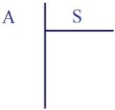
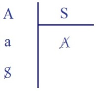
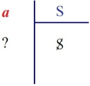
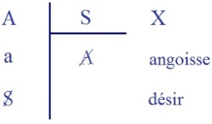
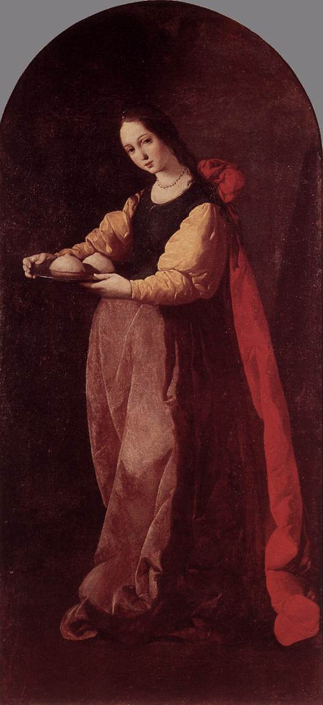
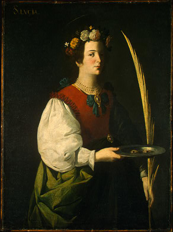

# Leçon 13 | 6 Mars l963

  

    <label><input type="checkbox" data-lacan-toggle="original" checked> 原文</label>
    <label><input type="checkbox" data-lacan-toggle="notes" checked> 注释</label>
    <label><input type="checkbox" data-lacan-toggle="commentary" checked> 个人解读评论</label>
  

  <form class="lacan-tool-search" role="search">
    <input class="lacan-tool-search-input" type="search" placeholder="搜索全文" aria-label="搜索全文">
    <button class="lacan-tool-button" type="submit" title="搜索">搜索</button>
  </form>
  <button class="lacan-tool-button lacan-back-to-top" type="button" title="回到页面最上方" aria-label="回到页面最上方">↑</button>

<section class="parallel-paragraph" data-paragraph-ids="s10-13-0001">

s10-13-0001

原文 · s10-13-0001

Nous allons donc continuer à cheminer dans notre approche de *l’angois­se*,
laquelle elle-même je vous fais entendre pour être de l’ordre de l’ap­proche.

[无对应译文]

</section>

<section class="parallel-paragraph" data-paragraph-ids="s10-13-0002">

s10-13-0002

原文 · s10-13-0002

Bien sûr, vous êtes déjà suffisamment avisés par ce que je pro­duis ici,
que je veux vous apprendre que l’angoisse n’est pas ce qu’un vain peuple pense.

[无对应译文]

</section>

<section class="parallel-paragraph" data-paragraph-ids="s10-13-0003">

s10-13-0003

原文 · s10-13-0003

Néanmoins, vous verrez en relisant par après les textes, sur ce point majeur, que ce que je vous aurai appris est loin d’en être absent. Sim­plement, il est masqué et dévoilé à la fois : il est masqué par certaines formules
qui sont des modes d’abord peut-être trop précautionneux sous leur revête­ment, si on peut dire, leur carapace.

[无对应译文]

</section>

<section class="parallel-paragraph" data-paragraph-ids="s10-13-0004">

s10-13-0004

原文 · s10-13-0004

Les meilleurs auteurs laissent apparaître ce sur quoi j’ai déjà pour vous mis l’accent : *qu’elle n’est pas objektlos, qu’el­le n’est pas sans objet*.

[无对应译文]

</section>

<section class="parallel-paragraph" data-paragraph-ids="s10-13-0005">

s10-13-0005

原文 · s10-13-0005

La phrase qui précède...
dans *Hemmung, Symptom und Angst -* dans l’ap­pendice В : *« Ergänzung zur Angst », complément au sujet de l’angoisse...*la phrase même qui précède la référence que fait Freud, suivant en cela la tradition, à l’*indétermination*, à l’*Objektlosigkeit* de *l’angoisse*...

[无对应译文]

</section>

<section class="parallel-paragraph" data-paragraph-ids="s10-13-0006">

s10-13-0006

原文 · s10-13-0006

> et après tout je n’aurai besoin que de vous rappeler la masse même de l’article
>
> pour dire que cette caractéristique d’être sans objet ne peut pas être retenue
> ...mais la phrase même d’avant, Freud dit :

[无对应译文]

</section>

<section class="parallel-paragraph" data-paragraph-ids="s10-13-0007">

s10-13-0007

原文 · s10-13-0007

« *L’angoisse, Angst, est Angst vor etwas, elle est essentiellement angoisse devant quelque chose* ».
\[B Ergänzung zur Angst. « *Der Angstaffekt zeigt einige Züge, deren Untersuchung weitere Aufklärung verspricht.*
*Die Angst hat eine unverkennbare Beziehung zur Erwartung ; sie ist Angst vor etwas.* »\]

[无对应译文]

</section>

<section class="parallel-paragraph" data-paragraph-ids="s10-13-0008">

s10-13-0008

原文 · s10-13-0008

Que nous puissions nous en contenter de cette formule, bien sûr : non !

[无对应译文]

</section>

<section class="parallel-paragraph" data-paragraph-ids="s10-13-0009">

s10-13-0009

原文 · s10-13-0009

Je pense que nous devons aller plus loin, en dire plus sur cette struc­ture, cette structure qui déjà, vous le voyez, *se pose en contraste...*
si tant est que l’angoisse c’est le rapport avec cet objet que j’ai approché comme étant la cause du désir
...se pose en contraste par ce « *vor* », comment cette chose que je vous ai placée promouvant le désir,
*en arrière* du désir, est-elle passée *devant* ? C’est peut-être là un des ressorts du problème.

[无对应译文]

</section>

<section class="parallel-paragraph" data-paragraph-ids="s10-13-0010">

s10-13-0010

原文 · s10-13-0010

Quoi qu’il en soit, soulignons bien que nous nous trouvons, avec la tra­dition, devant ce qu’on appelle *un thème presque littéraire*,
un lieu com­mun : celui qui, entre *la peur et l’angoisse* que tous les auteurs, se référant à la formation sémantique,
opposent au moins au départ...
même si ensuite ils tendent à les rapprocher,
voire à les réduire l’une à l’autre, ce qui n’est pas le cas chez les meilleurs
...qu’au départ, assurément on tend à accentuer cette oppo­sition de la peur et de l’angoisse en disant,
en différenciant leur position par rapport à l’objet.

[无对应译文]

</section>

<section class="parallel-paragraph" data-paragraph-ids="s10-13-0011">

s10-13-0011

原文 · s10-13-0011

Et il est vraiment sensible, paradoxal, significatif de l’er­reur ainsi commise, qu’on est amené à accentuer *que la peur, elle, en a un, objet*.
Franchissant la caractéristique certaine, qu’il у а là danger objectif, *Gefahr, dangéité, Gefährdung,* situation de danger,
entrée du sujet dans le danger, ce qui après tout mériterait arrêt.

[无对应译文]

</section>

<section class="parallel-paragraph" data-paragraph-ids="s10-13-0012">

s10-13-0012

原文 · s10-13-0012

Qu’est-ce qu’un *danger* ?

[无对应译文]

</section>

<section class="parallel-paragraph" data-paragraph-ids="s10-13-0013">

s10-13-0013

原文 · s10-13-0013

On va à dire que la peur est de sa nature, adéquate, correspondante, *entsprechend,* à l’objet d’où part *le danger*.
L’article de Goldstein sur le problème de l’angoisse, sur lequel nous nous arrêterons,
est à cet égard très significatif de cette sorte de glissement, d’en­traînement, de *capture* si l’on peut dire, de la plume d’un auteur qui, en la matière, а su approcher, vous le verrez, de caractéristiques essentielles et très précieuses en notre sujet,
d’entraînement de sa plume si l’on peut dire, par une thèse, insistant...
d’une façon dont on peut dire qu’il n’est nullement sollicité par son sujet à cet endroit, puisqu’il s’agit de l’angoisse
...insistant, si l’on peut dire sur le caractère orienté de la peur.

[无对应译文]

</section>

<section class="parallel-paragraph" data-paragraph-ids="s10-13-0014">

s10-13-0014

原文 · s10-13-0014

Comme si la peur était déjà toute faite du repérage de l’objet, d’une organisation de la réponse, de l’opposition

[无对应译文]

</section>

<section class="parallel-paragraph" data-paragraph-ids="s10-13-0015">

s10-13-0015

原文 · s10-13-0015

- de l’*Entgegenstehen* de ce qui est *Umwelt,*

[无对应译文]

</section>

<section class="parallel-paragraph" data-paragraph-ids="s10-13-0016">

s10-13-0016

原文 · s10-13-0016

- et de ce qui, dans le sujet, а à y faire face.

[无对应译文]

</section>

<section class="parallel-paragraph" data-paragraph-ids="s10-13-0017">

s10-13-0017

原文 · s10-13-0017

Est-ce qu’il ne suffit pas d’évoquer... prenez dans une référence appelée dans mon souve­nir par de telles propositions,
je me souvenais de ce que je crois déjà vous avoir signalé dans une petite - on ne peut pas appeler ça « *nouvelle* » -
*notation*, impression de Tchekhov qui а été traduite avec comme titre, le terme « *Frayeurs* »*...*

[无对应译文]

</section>

<section class="parallel-paragraph" data-paragraph-ids="s10-13-0018">

s10-13-0018

原文 · s10-13-0018

> j’ai vainement essayé de me faire rendre compte du titre que cette nouvelle a en russe,
>
> car inexplicablement cette notation parfaitement repérée avec son année dans la traduction française,
>
> mais que nul de mes auditeurs russophones n’a pu me la retrouver, même avec l’aide de cette date,
>
> dans les éditions de Tchekhov, qui sont pourtant faites en général chronologiques.
>
> C’est sin­gulier, c’est déroutant, et je ne peux pas dire que je n’en sois pas déçu
> ...dans cette notation, sous le terme de « *Frayeurs* »[^85], les frayeurs qu’il а éprouvées, lui, Tchekhov...
> je vous ai, je crois, une fois déjà signalé de quoi il s’agissait
> ...un jour, avec un jeune garçon qui conduit son traîneau...
> « *droschka* » je crois que ça s’appelle, quelque chose comme ça
> ...il s’avance dans une plaine, et au loin, au coucher du soleil, et le soleil étant déjà tombé sous l’horizon,
> il voit dans un clocher qui apparaît...
> à une approche raisonnable pour en voir les détails,
> *...*il voit vaciller par une lucarne, à un étage très élevé du clocher...
> auquel il sait, parce qu’il connaît l’endroit, qu’on ne peut accéder d’aucune façon
> ...une mystérieuse, inexpli­cable, flamme, que rien ne lui permet d’attribuer à aucun effet de reflet.

[无对应译文]

</section>

<section class="parallel-paragraph" data-paragraph-ids="s10-13-0019">

s10-13-0019

原文 · s10-13-0019

Il у а manifestement le repérage de quelque chose.

[无对应译文]

</section>

<section class="parallel-paragraph" data-paragraph-ids="s10-13-0020">

s10-13-0020

原文 · s10-13-0020

Il fait un bref compte de ce qui peut motiver ou non l’existence de ce phénomène,
et ayant vraiment exclu toute espèce de cause connue, il est saisi tout d’un coup de quelque chose,
qui je crois, à lire ce texte, ne peut aucunement s’appeler angoisse,
il est *saisi* de ce qu’il appelle d’ailleurs lui-même...
faute évidemment de pou­voir, d’avoir actuellement le terme russe
...on а traduit cela par *frayeur*, je crois que c’est ce qui correspond le mieux au texte, c’est de l’ordre, *non de l’an­goisse, mais de la peur.*

[无对应译文]

</section>

<section class="parallel-paragraph" data-paragraph-ids="s10-13-0021">

s10-13-0021

原文 · s10-13-0021

Et ce dont il а peur, ce n’est pas de quoi que ce soit qui le menace,
c’est de quelque chose qui а justement ce caractère de se réfé­rer à l’inconnu de ce qui se manifeste à lui.

[无对应译文]

</section>

<section class="parallel-paragraph" data-paragraph-ids="s10-13-0022">

s10-13-0022

原文 · s10-13-0022

Les exemples qu’il donnera ensuite dans cette même rubrique, à savoir le fait qu’un jour, il voit passer dans son horizon, sur le rail,
une espèce de wagon qui lui donne l’impres­sion, à entendre sa description, du *wagon-fantôme*, puisque rien ne le tire,
rien n’explique son mouvement. Un wagon passe à toute vitesse, prenant la courbe du rail qui se trouve à ce moment là devant lui.

[无对应译文]

</section>

<section class="parallel-paragraph" data-paragraph-ids="s10-13-0023">

s10-13-0023

原文 · s10-13-0023

D’où vient-il ? Où va-t-il ?

[无对应译文]

</section>

<section class="parallel-paragraph" data-paragraph-ids="s10-13-0024">

s10-13-0024

原文 · s10-13-0024

Cette sorte, ici d’*apparition* arrachée, en apparence, à tout déterminis­me repérable,
voila encore ce qui le met pour un instant, dans le désordre d’une véritable panique, qui est bel et bien de l’ordre de la peur.
Il n’y а pas non plus là de menace et la caractéristique de l’angoisse assurément manque, en ce sens que le sujet n’est *ni étreint,*
ni concerné, ni intéressé à ce plus intime de lui-même qui est le versant dont l’angoisse se caractérise, ce sur quoi j’in­siste.

[无对应译文]

</section>

<section class="parallel-paragraph" data-paragraph-ids="s10-13-0025">

s10-13-0025

原文 · s10-13-0025

Le troisième exemple est l’exemple d’un chien qu’il rencontre dans une forêt, *chien de race* que rien ne lui permet...
étant donné son parfait, aussi, repérage de tout ce qui l’entoure
...dont rien ne lui permet d’expliquer la présence à cette heure, en ce lieu.

[无对应译文]

</section>

<section class="parallel-paragraph" data-paragraph-ids="s10-13-0026">

s10-13-0026

原文 · s10-13-0026

Il se met à fomenter le mystère du chien de Faust, à savoir la forme sous laquelle l’aborde le diable.
C’est bel et bien aussi du côté de *l’inconnu* que là se dessine la peur, et ce n’est pas d’un objet,
ce n’est pas du chien qui est là, qu’il а peur, c’est d’autre chose : c’est en arrière du chien.

[无对应译文]

</section>

<section class="parallel-paragraph" data-paragraph-ids="s10-13-0027">

s10-13-0027

原文 · s10-13-0027

Il est d’autre part bien clair que ce sur quoi l’on insiste, *que les effets de la peur ont en quelque sorte un caractère d’adéquation de principe*,
à savoir de déclencher la fuite, est suffisamment contredit par ce sur quoi il faut bien mettre également l’accent :
que dans bien des cas, la peur *paralysant,* se manifeste ayant une action inhibante, voire pleinement désorganisante,
voire peut jeter le sujet dans le désarroi le moins adapté à la réponse, le moins adapté à la finalité,
à laquelle elle serait censée être la forme subjective adéquate.

[无对应译文]

</section>

<section class="parallel-paragraph" data-paragraph-ids="s10-13-0028">

s10-13-0028

原文 · s10-13-0028

C’est donc *ailleurs* qu’il convient de chercher la distinction, la référence par où l’angoisse s’en distingue.
Et vous pensez bien que cela n’est pas simle­ment paradoxe, désir de jouer avec un renversement,
si je promeus ici devant vous, que *l’angoisse n’est pas sans objet*.

[无对应译文]

</section>

<section class="parallel-paragraph" data-paragraph-ids="s10-13-0029">

s10-13-0029

原文 · s10-13-0029

Formule dont la forme, assu­rément dessine ce rapport subjectivé
qui est celui d’un étage dans le ressort duquel je désire m’avancer plus avant aujourd’hui,
car bien sûr, le terme d’*objet* est ici par moi depuis longtemps préparé,
dans un accent qui se distingue de ce que les auteurs ont jusque-là défini comme objet, quand ils parlent de *l’objet de la peur*.

[无对应译文]

</section>

<section class="parallel-paragraph" data-paragraph-ids="s10-13-0030">

s10-13-0030

原文 · s10-13-0030

Ce « *vor etwas *»[^86] de Freud, bien sûr, il est facile de lui donner tout de suite son support, puisque Freud l’articule, et dans l’article, de toutes les manières : c’est ce qu’il appelle *le danger* - *Gefahr* ou *Gefährdung - interne*, celui qui vient du dedans.

[无对应译文]

</section>

<section class="parallel-paragraph" data-paragraph-ids="s10-13-0031">

s10-13-0031

原文 · s10-13-0031

Mais je vous l’ai dit, il s’agit de ne pas nous contenter de cette notion de danger, *Gefahr* ou *Gefährdung,*
car si j’ai déjà signalé tout à l’heure son caractère problématique quand il s’agit du danger exté­rieur :
en d’autre termes, qu’est-ce qui avertit le sujet que c’est un danger sinon *la peur* elle-même, sinon *l’angoisse* ?

[无对应译文]

</section>

<section class="parallel-paragraph" data-paragraph-ids="s10-13-0032">

s10-13-0032

原文 · s10-13-0032

Mais le sens que peut avoir le terme de *danger intérieur* est si lié à la fonction de toute une structure à conserver,
de tout l’ordre de ce que nous appelons « *défense »*, pour que nous ne voyions pas que dans le terme même de « *défense* »
la fonction du danger est elle-même impli­quée, mais qu’elle n’est pas pour autant éclaircie.

[无对应译文]

</section>

<section class="parallel-paragraph" data-paragraph-ids="s10-13-0033">

s10-13-0033

原文 · s10-13-0033

Essayons donc de suivre plus *pas à pas* la structure, et de bien désigner où nous entendons fixer, repérer, ce trait de *signal*
sur lequel enfin Freud s’est arrêté, comme à celui qui est le plus propre à nous indiquer, enfin à nous autres analystes,
l’usage que nous pouvons faire de *la fonction de l’angois­se*. Et c’est ce que je vise à atteindre dans le chemin où j’essaie de vous mener.

[无对应译文]

</section>

<section class="parallel-paragraph" data-paragraph-ids="s10-13-0034">

s10-13-0034

原文 · s10-13-0034

Seule la notion de *réel*, dans la fonction opaque qui est celle dont vous savez que je pars pour lui opposer celle du *signifiant,*
nous permet de nous orienter, et déjà dire que *cet* *« etwas »* \[*quelque chose*\] *devant quoi l’angoisse opère comme* *signal*,
c’est *quelque chose qui est,* disons pour « l’homme » - avec l’entre­ guillemets  nécessaire, *de l’ordre de* *l’irréductible de ce réel*,
c’est en ce sens-­ci que j’ai osé devant vous la formule : *que l’angoisse, de tous les signaux, est celui qui ne trompe pas*.

[无对应译文]

</section>

<section class="parallel-paragraph" data-paragraph-ids="s10-13-0035">

s10-13-0035

原文 · s10-13-0035

*Du réel donc*, et je vous l’ai dit : *d’un mode irré­ductible sous lequel ce réel se présente* dans l’expérience : *tel est ce dont l’angoisse est le signal*.
*Tel est* à l’instant, au point où nous en sommes, *le guide, le fil conducteur auquel je vous demande de vous tenir pour voir où il nous mène*.
*Ce réel* et sa place, c’est exactement celui que, avec le sup­port du *signe de la barre,* peut inscrire l’opération qu’on appelle arithmétiquement de *la division*.

[无对应译文]

</section>

<section class="parallel-paragraph" data-paragraph-ids="s10-13-0036">

s10-13-0036

原文 · s10-13-0036

[无对应译文]

</section>

<section class="parallel-paragraph" data-paragraph-ids="s10-13-0037">

s10-13-0037

原文 · s10-13-0037

Je vous ai déjà appris à situer le procès de la subjectivation pour autant que
*<u>c’est</u>*  *<u>au lieu de l’Autre</u>...*
et sous les espèces primaires du signi­fiant,
*<u>que le sujet a à se constituer</u>...*
*au lieu de l’Autre* *et sur le donné de ce trésor du signifiant*,
déjà constitué dans l’Autre et aussi essentiel à tout avènement de la vie humaine
que tout ce que nous pouvons concevoir de l’*Umwelt* naturel,
ce rapport à ce *trésor du signifiant,* qui d’ores et déjà l’*attend*, constitue les cadres où il a à se situer,
*que le sujet*...
le *sujet,* à ce niveau, *mythique*, qui n’existe pas encore, qui n’existe que partant
du signifiant qui lui est antérieur, qui est par rapport à lui constituant
...*<u>que le sujet fait cette première opération interrogative :</u>* « <u>*dans* A</u> - si vous voulez - <u>*combien de fois* S ?</u> »

[无对应译文]

</section>

<section class="parallel-paragraph" data-paragraph-ids="s10-13-0038">

s10-13-0038

原文 · s10-13-0038

[无对应译文]

</section>

<section class="parallel-paragraph" data-paragraph-ids="s10-13-0039">

s10-13-0039

原文 · s10-13-0039

Et l’*opération* étant supposée d’une certaine façon qui est ici le A marqué de cette *interrogation* \[en A combien de fois S ?\],
ici appa­raît...
*différence* entre ce A *réponse* et le A *donné* \[en A combien... ?\]
*...*quelque chose qui est *le reste*, *l’irréductible du sujet*, c’est *(a) *:
*petit(a)* est ce qui reste d’irréductible dans cette opération totale d’avènement du sujet au lieu de l’Autre,
et c’est de là qu’il va prendre sa *fonction *.

[无对应译文]

</section>

<section class="parallel-paragraph" data-paragraph-ids="s10-13-0040">

s10-13-0040

原文 · s10-13-0040

[无对应译文]

</section>

<section class="parallel-paragraph" data-paragraph-ids="s10-13-0041">

s10-13-0041

原文 · s10-13-0041

Le rapport de ce *(a)* à l’S, le *(a)* en tant qu’il est jus­tement ce qui représente le S dans *son réel irréductible*,
ce *(a)* sur S \[*a*/S\], c’est cela qui boucle l’opération de la division, ce qui en effet...
puisque *(a)* si l’on peut dire, c’est quelque chose qui n’a pas de *commun dénominateur*,
qui est hors du *commun dénominateur* entre le *(a)* et le S,
...si nous voulons conventionnellement, boucler l’opération quand même, qu’est-ce que nous faisons ?

[无对应译文]

</section>

<section class="parallel-paragraph" data-paragraph-ids="s10-13-0042">

s10-13-0042

原文 · s10-13-0042

Nous mettons :

[无对应译文]

</section>

<section class="parallel-paragraph" data-paragraph-ids="s10-13-0043">

s10-13-0043

原文 · s10-13-0043

- au numérateur : *le reste* *(a)*,

[无对应译文]

</section>

<section class="parallel-paragraph" data-paragraph-ids="s10-13-0044">

s10-13-0044

原文 · s10-13-0044

- au dénominateur : le divi­seur \[S\], le S est équivalent au *(a) sur* S \[**S** ≈ *a*/S\].

[无对应译文]

</section>

<section class="parallel-paragraph" data-paragraph-ids="s10-13-0045">

s10-13-0045

原文 · s10-13-0045

Ce *reste* donc, en tant qu’il est la chute, si l’on peut dire, de l’opération subjective,
ce *reste* où nous reconnaissons ici, structuralement si vous voulez, dans une analogie calculatrice, *l’objet perdu*,
c’est cela à quoi nous avons affaire,

[无对应译文]

</section>

<section class="parallel-paragraph" data-paragraph-ids="s10-13-0046">

s10-13-0046

原文 · s10-13-0046

- d’une part dans *le désir*,

[无对应译文]

</section>

<section class="parallel-paragraph" data-paragraph-ids="s10-13-0047">

s10-13-0047

原文 · s10-13-0047

- d’autre part dans *l’angoisse*.

[无对应译文]

</section>

<section class="parallel-paragraph" data-paragraph-ids="s10-13-0048">

s10-13-0048

原文 · s10-13-0048

Nous у avons affaire dans *l’angoisse*, si l’on peut dire, logiquement,
antérieurement au moment où nous у avons affaire dans *le désir*.

[无对应译文]

</section>

<section class="parallel-paragraph" data-paragraph-ids="s10-13-0049">

s10-13-0049

原文 · s10-13-0049

[无对应译文]

</section>

<section class="parallel-paragraph" data-paragraph-ids="s10-13-0050">

s10-13-0050

原文 · s10-13-0050

Et si vous voulez, pour connoter les trois étages de cette opération, nous dirons :

[无对应译文]

</section>

<section class="parallel-paragraph" data-paragraph-ids="s10-13-0051">

s10-13-0051

原文 · s10-13-0051

- qu’il у а ici un Х que nous ne pou­vons nommer que *rétroactivement*, qui est à proprement parler l’abord de l’Autre, la visée essentielle où le sujet а à se poser, et dont je dirai le nom par après.

[无对应译文]

</section>

<section class="parallel-paragraph" data-paragraph-ids="s10-13-0052">

s10-13-0052

原文 · s10-13-0052

- Nous avons ici le niveau de l’angoisse, pour autant qu’il est constitu­tif de l’apparition de la fonction *(a)*,

[无对应译文]

</section>

<section class="parallel-paragraph" data-paragraph-ids="s10-13-0053">

s10-13-0053

原文 · s10-13-0053

- et c’est au troisième terme qu’apparaît le S comme sujet du désir.

[无对应译文]

</section>

<section class="parallel-paragraph" data-paragraph-ids="s10-13-0054">

s10-13-0054

原文 · s10-13-0054

Pour illustrer maintenant, faire vivre cette abstraction sans doute extrê­me que je viens d’articuler,
je vais vous ramener à l’évidence de l’image, et ceci bien sûr, d’autant plus légitimement

[无对应译文]

</section>

<section class="parallel-paragraph" data-paragraph-ids="s10-13-0055">

s10-13-0055

原文 · s10-13-0055

- que c’est d’image qu’il s’agit,

[无对应译文]

</section>

<section class="parallel-paragraph" data-paragraph-ids="s10-13-0056">

s10-13-0056

原文 · s10-13-0056

- *que cet irréductible du (a) est de l’ordre de l’image*.

[无对应译文]

</section>

<section class="parallel-paragraph" data-paragraph-ids="s10-13-0057">

s10-13-0057

原文 · s10-13-0057

Celui qui а possédé l’objet du désir et de la Loi, celui qui а joui de sa mère,
Œdipe pour le nommer, fait ce pas de plus : *il voit ce qu’il а fait*.

[无对应译文]

</section>

<section class="parallel-paragraph" data-paragraph-ids="s10-13-0058">

s10-13-0058

原文 · s10-13-0058

Vous savez ce qui alors arrive.
Quel mot choisir, comment dire ce qui est de l’ordre de l’*indicible*, et ce dont pourtant je veux pour vous, faire surgir l’image ?

[无对应译文]

</section>

<section class="parallel-paragraph" data-paragraph-ids="s10-13-0059">

s10-13-0059

原文 · s10-13-0059

Qu’*il voit ce qu’il а fait* а pour conséquence qu’il voit...
c’est là le mot devant lequel je bute
...l’instant d’après ses propres yeux, boursouflés de leur humeur vitreuse, au sol : un confus amas d’*ordures*.

[无对应译文]

</section>

<section class="parallel-paragraph" data-paragraph-ids="s10-13-0060">

s10-13-0060

原文 · s10-13-0060

Puisque...

[无对应译文]

</section>

<section class="parallel-paragraph" data-paragraph-ids="s10-13-0061">

s10-13-0061

原文 · s10-13-0061

comment le dire ainsi ?
...puisque pour les avoir arrachés de ses orbites, ses yeux, il а bien évidemment perdu la vue.

[无对应译文]

</section>

<section class="parallel-paragraph" data-paragraph-ids="s10-13-0062">

s10-13-0062

原文 · s10-13-0062

Et pourtant il n’est pas sans les voir, les voir comme tels, comme *l’objet-cause* enfin dévoilé de la dernière, ultime...
et non plus coupable, mais *hors des limites...*concupiscence, celle d’avoir voulu savoir.
La tradition dit même que c’est à partir de ce moment qu’il devient vraiment « *voyant* » :
à Colone, il voit aussi loin qu’on peut voir, et si loin en avant qu’il voit *le futur destin* d’Athènes.

[无对应译文]

</section>

<section class="parallel-paragraph" data-paragraph-ids="s10-13-0063">

s10-13-0063

原文 · s10-13-0063

Qu’est-ce que le moment de l’angoisse ?
Est-ce que c’est le possible de ce geste par où Œdipe peut s’arracher les yeux,
en faire ce sacrifice, cette offre, rançon de l’aveuglement où s’est accompli son destin ?
Est-ce cela l’angoisse : possibilité disons, qu’a l’homme de se mutiler ? Non !

[无对应译文]

</section>

<section class="parallel-paragraph" data-paragraph-ids="s10-13-0064">

s10-13-0064

原文 · s10-13-0064

C’est proprement ce que par cette image je m’efforce de vous désigner :

[无对应译文]

</section>

<section class="parallel-paragraph" data-paragraph-ids="s10-13-0065">

s10-13-0065

原文 · s10-13-0065

*c’est qu’une impossible vue vous menace de vos propres yeux par terre*.

[无对应译文]

</section>

<section class="parallel-paragraph" data-paragraph-ids="s10-13-0066">

s10-13-0066

原文 · s10-13-0066

C’est là la clé, je crois, la plus sûre que vous pourrez toujours retrouver,
sous quelque mode d’abord que se présente pour vous *le phénomène de l’an­goisse*.

[无对应译文]

</section>

<section class="parallel-paragraph" data-paragraph-ids="s10-13-0067">

s10-13-0067

原文 · s10-13-0067

Et puis, si expressive, si provocante que soit, si l’on peut dire,
l’étroites­se de *la localité* que je vous désigne comme étant *ce qui est cerné par l’an­goisse*,
apercevez-vous bien que cette *image*, ça n’est pas par quelque pré­ciosité de mon choix qu’elle se trouve là comme *hors des limites*,
ce n’est pas un choix excentrique, il est, une fois que je vous le désigne, bel et bien cou­rant à rencontrer.

[无对应译文]

</section>

<section class="parallel-paragraph" data-paragraph-ids="s10-13-0068">

s10-13-0068

原文 · s10-13-0068

Allez dans la première exposition actuellement ouver­te au public, au Musée des Arts Décoratifs, et vous verrez deux Zurbaran,
l’un de Montpellier, l’autre d’ailleurs, qui vous représentent, qui [Lucie](#Lucie) je crois, qui [Agathe](#Agathe), avec chacune,

[无对应译文]

</section>

<section class="parallel-paragraph" data-paragraph-ids="s10-13-0069">

s10-13-0069

原文 · s10-13-0069

qui ses yeux dans un plat, qui la paire de ses seins, « *martyrs* », dit-on, ce qui veut dire témoins[^87].

[无对应译文]

</section>

<section class="parallel-paragraph" data-paragraph-ids="s10-13-0070">

s10-13-0070

原文 · s10-13-0070

De ce qu’on voit ici, d’ailleurs que ce n’est pas, comme je vous le disais, le *possible,*
à savoir que ces yeux soient dénucléés, que ces seins soit arrachés, qui *angoisse*, car à la vérité...
chose qui méri­te aussi d’être remarquée
...ces images chrétiennes ne sont pas spécialement mal tolérées,
malgré que certains, pour des raisons qui ne sont pas toujours les meilleures, fassent à leur endroit la petite bouche :
Stendhal, parlant de *San Stefano il Rotondo* à Rome, trouve que ces images qui sont sur les murs sont *dégoûtantes*.

[无对应译文]

</section>

<section class="parallel-paragraph" data-paragraph-ids="s10-13-0071">

s10-13-0071

原文 · s10-13-0071

[无对应译文]

</section>

<section class="parallel-paragraph" data-paragraph-ids="s10-13-0072">

s10-13-0072

原文 · s10-13-0072

Assurément, elles sont, à l’endroit nommé, assez dépourvues d’art pour qu’on soit introduit, je dois dire, un peu plus vive­ment
à leur signification. Mais ces charmantes personnes que nous présen­te Zurbaran, elles, à nous présenter sur un plat ces objets,
ne nous présen­tent vraiment rien d’autre que ce qui peut faire - à l’occasion, et nous ne nous en pri­vons pas - l’objet de notre désir.
D’aucune façon ces images ne nous intro­duisent, je pense, pour ce qui est du commun d’entre nous, à l’ordre de l’an­goisse.
Pour ceci, il conviendrait qu’il у fût concerné plus personnellement, qu’il fût sadique ou masochiste, par exemple.

[无对应译文]

</section>

<section class="parallel-paragraph" data-paragraph-ids="s10-13-0073">

s10-13-0073

原文 · s10-13-0073

À partir du moment où il s’agit d’un vrai masochiste ou d’un vrai sadique - ce qui ne veut pas dire quelqu’un qui peut avoir
*des fantasmes que nous épinglons sadiques ou masochistes*, pour ce qu’ils reproduisent la situation fondamentale *du sadique* ou *du masochiste* :

[无对应译文]

</section>

<section class="parallel-paragraph" data-paragraph-ids="s10-13-0074">

s10-13-0074

原文 · s10-13-0074

- le vrai sadique donc, pour autant que nous pouvons repérer, coordonner, construire sa condition essentielle,

[无对应译文]

</section>

<section class="parallel-paragraph" data-paragraph-ids="s10-13-0075">

s10-13-0075

原文 · s10-13-0075

- le vrai masochiste aussi, pour autant que nous nous trouvons, par repérage, éliminations successives, nécessité de pousser plus loin le plan de sa position que de ce qui nous est donné par d’autres comme *Erlebnis* \[*expérience, sensation*\].

[无对应译文]

</section>

<section class="parallel-paragraph" data-paragraph-ids="s10-13-0076">

s10-13-0076

原文 · s10-13-0076

*Erlebnis* plus homogène à nous-même, *Erlebnis* du névrosé, mais *Erlebnis* qui n’est que référence, dépendance, image de *quelque chose au-delà*, qui fait la spécificité de la position perver­se, où le névrosé prend en quelque sorte référence et appui pour des fins sur lesquelles nous reviendrons. Essayons donc de dire ce que nous pouvons présumer de ce qu’est cette *position sadique* ou *masochiste*.

[无对应译文]

</section>

<section class="parallel-paragraph" data-paragraph-ids="s10-13-0077">

s10-13-0077

原文 · s10-13-0077

Ceux que les images de Lucie et Agathe de Zurbaran peu­vent vraiment intéresser, la clé en est l’angoisse.
Mais il faut la chercher, savoir pourquoi.

[无对应译文]

</section>

<section class="parallel-paragraph" data-paragraph-ids="s10-13-0078">

s10-13-0078

原文 · s10-13-0078

Le masochiste - je vous l’ai dit l’autre jour, la dernière fois - quelle est sa position ?
Qu’est-ce que masque, à lui, son fantasme ?

[无对应译文]

</section>

<section class="parallel-paragraph" data-paragraph-ids="s10-13-0079">

s10-13-0079

原文 · s10-13-0079

D’être l’objet d’une *jouissance de l’Autre* qui est sa propre volonté de jouissance, car après tout *le masochiste* ne rencontre pas...
comme un apologue humoris­tique déjà cité ici vous le rappelle [^88]
*...*forcément son partenaire.

[无对应译文]

</section>

<section class="parallel-paragraph" data-paragraph-ids="s10-13-0080">

s10-13-0080

原文 · s10-13-0080

Qu’est-ce que cette position d’objet masque, si ce n’est de rejoindre lui-même,
de se poser dans la fonction de *la loque humaine*, de ce pauvre *déchet* *de corps* séparé, qui nous est ici présenté ?

[无对应译文]

</section>

<section class="parallel-paragraph" data-paragraph-ids="s10-13-0081">

s10-13-0081

原文 · s10-13-0081

Et c’est pourquoi je dis que la visée de *la jouis­sance de l’Autre* est une visée fantasmatique :
ce qui est cherché c’est chez l’Autre la réponse à cette chute essentielle du sujet dans sa misère der­nière, et qui est l’angoisse.

[无对应译文]

</section>

<section class="parallel-paragraph" data-paragraph-ids="s10-13-0082">

s10-13-0082

原文 · s10-13-0082

Où est cet Autre dont il s’agit ?
C’est bien là pour­quoi а été produit dans ce cercle le troisième terme, toujours présent dans la jouissance perverse,
l’ambiguïté profonde où se situe une relation en apparence duelle, se retrouve ici.
Car aussi bien cette angoisse, il faut vous faire sentir ce où j’entends vous l’indiquer.

[无对应译文]

</section>

<section class="parallel-paragraph" data-paragraph-ids="s10-13-0083">

s10-13-0083

原文 · s10-13-0083

Nous pourrions dire...
et la chose est suffisamment mise en relief par toutes sortes de traits de l’histoire
...que si cette angoisse qui est la visée aveugle du masochiste, car son fantasme la lui masque,
elle n’en est pas moins, réellement, ce que nous pourrions appeler l’angoisse de Dieu.

[无对应译文]

</section>

<section class="parallel-paragraph" data-paragraph-ids="s10-13-0084">

s10-13-0084

原文 · s10-13-0084

Est-ce que j’ai besoin de faire appel au mythe chrétien le plus fondamen­tal pour *donner corps* à ce qu’ici j’avance,
et si toute l’aven­ture chrétienne n’est pas engagée sur cette tentative centrale, inaugurale, incarnée par un homme
dont toutes les paroles sont encore à réentendre, d’être celui qui а poussé les choses jusqu’au dernier terme d’une angoisse
qui ne trouve son véritable cycle qu’au niveau de celui pour lequel est instauré *le sacrifice*, c’est-à-dire au niveau du Père.

[无对应译文]

</section>

<section class="parallel-paragraph" data-paragraph-ids="s10-13-0085">

s10-13-0085

原文 · s10-13-0085

Dieu n’a pas d’âme. Ça, c’est bien évident. *Aucun théologien* n’a encore songé à lui en attribuer une.
Pourtant, le changement total, radical, de la perspective du rapport à Dieu а com­mencé avec un drame, une *passion* :
quelqu’un s’est fait l’âme de Dieu.

[无对应译文]

</section>

<section class="parallel-paragraph" data-paragraph-ids="s10-13-0086">

s10-13-0086

原文 · s10-13-0086

Car c’est pour situer aussi la place de l’âme à ce niveau *(а)*, de *résidu*, d’*objet chu*, dont il s’agit, dont il s’agit essentiellement :
qu’il n’y а pas de conception vivante de l’âme...
avec tout le cortège dramatique où cette notion apparaît et fonction­ne dans notre aire de culture
...*sinon accompagnée* justement de la façon la plus essentielle *de cette image de la chute*.

[无对应译文]

</section>

<section class="parallel-paragraph" data-paragraph-ids="s10-13-0087">

s10-13-0087

原文 · s10-13-0087

Tout ce qu’articule Kierkegaard n’est rien que référence à ces grands repères structuraux.

[无对应译文]

</section>

<section class="parallel-paragraph" data-paragraph-ids="s10-13-0088">

s10-13-0088

原文 · s10-13-0088

Alors maintenant, observez que *j’ai commencé par* *le masochiste*, c’était le plus difficile, mais aussi bien *c’était celui qui évitait les confusions*. Car on peut mieux comprendre ce que c’est que *le sadique* et le piège qu’il у а à n’en faire que le retournement, l’envers,
la position inversée de celle du *masochiste*, à moins qu’on procède - c’est ce qui se fait d’habitude - en sens contraire.

[无对应译文]

</section>

<section class="parallel-paragraph" data-paragraph-ids="s10-13-0089">

s10-13-0089

原文 · s10-13-0089

Chez *le sadique*, l’angoisse est moins cachée.
elle l’est même si peu qu’elle vient en avant dans le fantasme,
lequel, si on l’analyse, fait de l’angoisse de la victime une condition tout à fait exigée.

[无对应译文]

</section>

<section class="parallel-paragraph" data-paragraph-ids="s10-13-0090">

s10-13-0090

原文 · s10-13-0090

Seulement, c’est cela même qui doit nous mettre en méfiance.
Ce que le sadique cherche dans l’Autre...

[无对应译文]

</section>

<section class="parallel-paragraph" data-paragraph-ids="s10-13-0091">

s10-13-0091

原文 · s10-13-0091

> car il est bien clair que pour lui *l’Autre existe* et que ce n’est pas parce qu’il le prend pour objet
>
> que nous devons dire qu’il у а là je ne sais quelle relation que nous appelle­rions « *immature »*,
>
> ou encore, comme on s’exprime : « *prégénitale »*
> *...*l’Autre est absolument essentiel et c’est bien ce que j’ai voulu articuler, quand je vous ai fait mon séminaire sur *L’éthique,*
> en rapprochant Sade de Kant.

[无对应译文]

</section>

<section class="parallel-paragraph" data-paragraph-ids="s10-13-0092">

s10-13-0092

原文 · s10-13-0092

L’essen­tielle mise à la question de l’Autre qui va jusqu’à simuler, et non par hasard, les exigences de la loi morale,
sont bien là pour nous montrer que la référence à l’Autre, comme tel, fait partie de sa visée.

[无对应译文]

</section>

<section class="parallel-paragraph" data-paragraph-ids="s10-13-0093">

s10-13-0093

原文 · s10-13-0093

Mais qu’est-ce qu’il у cherche ?

[无对应译文]

</section>

<section class="parallel-paragraph" data-paragraph-ids="s10-13-0094">

s10-13-0094

原文 · s10-13-0094

C’est ici que les textes, les textes que nous pouvons rete­nir, je veux dire ceux qui donnent quelques prises à une suffisante critique, prennent leur prix, leur prix bien sûr signalé par l’étrangeté de tels moments, de tels détours, qui en quelque sorte, se détachent, détonnent par rapport au fil suivi.

[无对应译文]

</section>

<section class="parallel-paragraph" data-paragraph-ids="s10-13-0095">

s10-13-0095

原文 · s10-13-0095

Je vous laisse à rechercher dans « *Juliette »,* voire dans « *Les 120 journées... »,* ces quelques passages où les personnages,
tout occupés à assouvir sur telle victime choisie leur avidité de tourments, entrent dans cette *bizarre*, *singulière* et *curieuse* transe,
je vous le répète, plusieurs fois indiquée dans le texte de Sade,
et qui s’exprime en ces mots étranges en effet, qu’il me faut bien ici articuler :

[无对应译文]

</section>

<section class="parallel-paragraph" data-paragraph-ids="s10-13-0096">

s10-13-0096

原文 · s10-13-0096

« *J’ai eu* - s’écrie le tourmenteur - *<u>j’ai eu la peau du con</u>* ».

[无对应译文]

</section>

<section class="parallel-paragraph" data-paragraph-ids="s10-13-0097">

s10-13-0097

原文 · s10-13-0097

Ce n’est pas là trait qui va de soi dans le sillon de l’imaginable, et le carac­tère privilégié, le moment d’enthousiasme,
le caractère de trophée suprême, brandi au sommet du chapitre, est quelque chose qui, je crois, est suffisam­ment indicatif de ceci :
c’est que *quelque chose est cherché qui est* en somme *l’envers du sujet*, ce qui prend ici sa signification de *<u>ce trait de « gant retour­né</u> »*
que souligne l’essence féminine de la victime. C’est du passage à *l’extérieur* de ce qui est le plus caché, qu’il s’agit.

[无对应译文]

</section>

<section class="parallel-paragraph" data-paragraph-ids="s10-13-0098">

s10-13-0098

原文 · s10-13-0098

Mais observons en même temps que ce moment est en quelque sorte indiqué dans le texte lui-même,
comme étant totalement impénétré par le sujet, laissant justement ici, masqué, le trait de *sa propre angoisse*.

[无对应译文]

</section>

<section class="parallel-paragraph" data-paragraph-ids="s10-13-0099">

s10-13-0099

原文 · s10-13-0099

Pour tout dire, s’il у а quelque chose qu’évoquent

[无对应译文]

</section>

<section class="parallel-paragraph" data-paragraph-ids="s10-13-0100">

s10-13-0100

原文 · s10-13-0100

- aussi bien ce peu de lumière que nous pouvons avoir sur la relation vérita­blement sadique,

[无对应译文]

</section>

<section class="parallel-paragraph" data-paragraph-ids="s10-13-0101">

s10-13-0101

原文 · s10-13-0101

- que la forme des textes explicatifs où s’en déploie le fan­tasme, s’il у а quelque chose qu’ils nous suggèrent, c’est en quelque sorte le caractère instrumental à quoi se réduit la fonction de l’agent.

[无对应译文]

</section>

<section class="parallel-paragraph" data-paragraph-ids="s10-13-0102">

s10-13-0102

原文 · s10-13-0102

Ce qui, en quelque sorte dérobe au sadique, sauf en éclair, la visée de son action, c’est le caractère de « *travail »* de son opération.
Lui aussi а rapport à Dieu, ce qui s’étale partout dans le texte de Sade. Il ne peut avancer d’un pas sans cette référen­ce
à *l’être suprême en méchanceté*, dont il est aussi clair pour lui que pour celui qui parle, que c’est de Dieu qu’il s’agit.

[无对应译文]

</section>

<section class="parallel-paragraph" data-paragraph-ids="s10-13-0103">

s10-13-0103

原文 · s10-13-0103

Il se donne, lui, un mal fou, considérable, épuisant, jusqu’à manquer son but, pour réaliser ce que...
Dieu merci !, c’est le cas de le dire
...Sade nous épargne d’avoir à reconstruire, car il l’articule comme tel : *pour réaliser la jouissance de Dieu*.

[无对应译文]

</section>

<section class="parallel-paragraph" data-paragraph-ids="s10-13-0104">

s10-13-0104

原文 · s10-13-0104

Je pense vous avoir montré ici, *le jeu d’occultation par quoi angoisse et objet,* chez l’un et chez l’autre, sont amenés à passer au 1er plan,

[无对应译文]

</section>

<section class="parallel-paragraph" data-paragraph-ids="s10-13-0105">

s10-13-0105

原文 · s10-13-0105

l’un aux dépens de l’autre terme, mais en quoi aussi, dans ces structures, se désigne, se dénonce,
*le lien radical de l’angoisse à cet objet en tant qu’il choit*.

[无对应译文]

</section>

<section class="parallel-paragraph" data-paragraph-ids="s10-13-0106">

s10-13-0106

原文 · s10-13-0106

Par là même que *sa fonction* *essentielle* est approchée, *sa fonction décisi­ve de* *reste du sujet, du sujet comme réel.*
Assurément ceci nous incite à revoir, à mettre plus d’accent sur la réalité de ces *objets*.

[无对应译文]

</section>

<section class="parallel-paragraph" data-paragraph-ids="s10-13-0107">

s10-13-0107

原文 · s10-13-0107

Et en passant à ce chapitre suivant, je ne peux manquer de remarquer à quel point *ce statut réel des objets*,
déjà pourtant pour nous repérés, а été laissé de côté, mal défi­ni,
par des gens qui se veulent pourtant pourvus de références ou de repères *biologiques*.

[无对应译文]

</section>

<section class="parallel-paragraph" data-paragraph-ids="s10-13-0108">

s10-13-0108

原文 · s10-13-0108

Est-ce que ce n’était pas l’occasion de s’apercevoir d’un certain nombre de traits qui ont leur relief,
et où je voudrais - enfin, comme je le peux, en poussant ma charrue devant moi - vous introduire ?

[无对应译文]

</section>

<section class="parallel-paragraph" data-paragraph-ids="s10-13-0109">

s10-13-0109

原文 · s10-13-0109

Car enfin puisque nous les avons là par exemple, sur le plat de la Sainte Agathe, *les seins en question*,
est-ce que ça n’est pas une occasion de réfléchir, puisque déjà depuis longtemps on l’a dit : *l’angoisse apparaît dans la séparation*.
Mais alors nous le voyons bien, *ce sont des objets séparables*, et ils ne sont pas séparables par hasard comme la patte d’une sauterelle,
*ils sont séparables parce qu’ils ont déjà*, si je puis dire, très suffisamment, *anatomiquement un certain caractère plaqué*, ils sont là, *accrochés*.

[无对应译文]

</section>

<section class="parallel-paragraph" data-paragraph-ids="s10-13-0110">

s10-13-0110

原文 · s10-13-0110

Ce caractère très particulier de certaines parties anatomiques qui spécifient tout à fait un secteur de l’échelle animale,
celui qu’on appelle pré­cisément, non sans raison... c’est même assez curieux qu’on se soit aperçu du caractère tout à fait essentiel, *signifiant* à proprement par­ler de ce trait, car enfin il semble qu’il у а des choses plus structurales que *les mammes*
pour désigner un certain groupe animal qui а bien d’autres traits d’homogénéité par où on pourrait le désigner.

[无对应译文]

</section>

<section class="parallel-paragraph" data-paragraph-ids="s10-13-0111">

s10-13-0111

原文 · s10-13-0111

On а choisi *ce trait*, et sans doute n’a-t-on pas eu tort.
Mais c’est bien un des cas où l’on voit enfin que l’esprit d’objectivation n’est pas lui-même sans être influencé
par la pré­gnance des *fonctions psychologiques*, je dirai, pour me faire entendre de ceux qui n’ont pas encore compris, de certains traits.
Et la prégnance qui n’est pas simplement *significative*, qui induit en nous certaines significations où nous sommes les plus engagés.

[无对应译文]

</section>

<section class="parallel-paragraph" data-paragraph-ids="s10-13-0112">

s10-13-0112

原文 · s10-13-0112

Vivipare, ovipare : division vraiment faite pour embrouiller,
car tous les animaux sont vivipares puisqu’ils engendrent des œufs dans lesquels il у а un vivant,
et tous les animaux sont ovipares puisqu’il n’y а pas de vivipare qui n’ait viviparé à l’intérieur d’un œuf.

[无对应译文]

</section>

<section class="parallel-paragraph" data-paragraph-ids="s10-13-0113">

s10-13-0113

原文 · s10-13-0113

Mais pourquoi ne pas donner toute son importance à ce fait vraiment tout à fait *analogique*
par rapport à ce sein dont je vous parlais tout à l’heu­re, que pour les œufs qui ont un certain temps de vie intra-utérine,
il у а cet élément irréductible à la division de l’œuf en lui-même, qui s’appelle *le pla­centa*, qu’il у а là aussi quelque chose de plaqué,
et que pour tout dire :

[无对应译文]

</section>

<section class="parallel-paragraph" data-paragraph-ids="s10-13-0114">

s10-13-0114

原文 · s10-13-0114

- ce n’est pas tellement l’enfant qui pompe la mère de son lait, c’est le sein,

<!-- -->

[无对应译文]

</section>

<section class="parallel-paragraph" data-paragraph-ids="s10-13-0115">

s10-13-0115

原文 · s10-13-0115

- de même que c’est l’existence du placenta qui donne à la position de l’enfant à l’intérieur du corps de la mère, ses caractères - parfois manifestes sur le plan de la pathologie - de nidation parasitaire.

[无对应译文]

</section>

<section class="parallel-paragraph" data-paragraph-ids="s10-13-0116">

s10-13-0116

原文 · s10-13-0116

Vous voyez où j’entends mettre l’accent : sur le privilège, à un certain niveau, d’éléments que nous pouvons qualifier d’*ambocepteurs*.
De quel côté est ce sein ? Du côté de ce qui suce ou du côté de ce qui est sucé ?

[无对应译文]

</section>

<section class="parallel-paragraph" data-paragraph-ids="s10-13-0117">

s10-13-0117

原文 · s10-13-0117

Et après tout, je ne fais rien là que de vous rappeler ce à quoi effec­tivement la théorie analytique а été amenée,
c’est-à-dire à parler, je ne dirai pas *indifféremment*, mais avec ambiguïté dans certaines phases, du sein ou de la mère,
bien sûr en soulignant que ce n’est pas la même chose.

[无对应译文]

</section>

<section class="parallel-paragraph" data-paragraph-ids="s10-13-0118">

s10-13-0118

原文 · s10-13-0118

Mais est ce bien tout que de qualifier le sein *d’objet partiel ?*

[无对应译文]

</section>

<section class="parallel-paragraph" data-paragraph-ids="s10-13-0119">

s10-13-0119

原文 · s10-13-0119

Quand je dis ambo­cepteur, je souligne

[无对应译文]

</section>

<section class="parallel-paragraph" data-paragraph-ids="s10-13-0120">

s10-13-0120

原文 · s10-13-0120

- qu’il est aussi nécessaire d’articuler le rapport du sujet maternel au sein, que le rapport du nourrisson au sein,

[无对应译文]

</section>

<section class="parallel-paragraph" data-paragraph-ids="s10-13-0121">

s10-13-0121

原文 · s10-13-0121

- que la coupure ne passe pas, pour tous les deux, au même endroit,

[无对应译文]

</section>

<section class="parallel-paragraph" data-paragraph-ids="s10-13-0122">

s10-13-0122

原文 · s10-13-0122

- qu’il у а deux coupures si distantes qu’elles laissent même, pour les deux, des déchets différents, car la coupure du cordon pour l’enfant laisse séparée de lui une chute qui s’appelle les enveloppes. Cela est homogène à lui et continu avec son ectoderme et son endoderme. Le placenta n’est pas tellement *intéressé* à l’affaire. Pour la mère, la coupure se passe au niveau de la chute du placenta, c’est même pour ça qu’on appelle ça des « *caduques »*, et *la caducité de cet objet(а) est là ce qui fait sa fonction*.

[无对应译文]

</section>

<section class="parallel-paragraph" data-paragraph-ids="s10-13-0123">

s10-13-0123

原文 · s10-13-0123

Eh bien, tout ceci n’est pas fait tout de suite pour vous amener à réviser certaines des relations déduites, déduites imprudemment, d’un brossage hâtif de ce que j’appelle ces lignes de séparation où se pro­duit la chute, le *niederfallen* typique de l’approche d’un *(а)*, pourtant plus essentiel au sujet que toute autre part de lui-même.

[无对应译文]

</section>

<section class="parallel-paragraph" data-paragraph-ids="s10-13-0124">

s10-13-0124

原文 · s10-13-0124

C’est pour l’instant, pour vous faire naviguer tout droit sur ce qui est essentiel,
à savoir, vous apercevoir où cette interrogation se transporte : au niveau de la castration.

[无对应译文]

</section>

<section class="parallel-paragraph" data-paragraph-ids="s10-13-0125">

s10-13-0125

原文 · s10-13-0125

Car la castration, là aussi nous avons affaire à un organe.
Avant de nous en tenir à la menace de castration, c’est-à-dire à ce que j’ai appelé « *le geste possible* »,
est-ce que nous ne pouvons pas, analogi­quement à l’image que j’ai produite aujourd’hui devant vous,
chercher si déjà nous n’avons pas l’indication que l’angoisse est à placer ailleurs ?

[无对应译文]

</section>

<section class="parallel-paragraph" data-paragraph-ids="s10-13-0126">

s10-13-0126

原文 · s10-13-0126

Car un *phallus*...
puisqu’on se gargarise toujours de « *biologie* », avec un caractère d’incroyable légèreté dans l’abord du phénomène
...un *phallus* ça n’est pas limité au champ *des mammifères*.

[无对应译文]

</section>

<section class="parallel-paragraph" data-paragraph-ids="s10-13-0127">

s10-13-0127

原文 · s10-13-0127

Il у а des tas d’insectes, diversement répugnants : de la blat­te au cafard, qui ont - quoi ? - des dards.
Ça va trèstrès loin dans l’échelle animale, le dard. Le dard c’est *un instrument*, et dans beaucoup de cas...

[无对应译文]

</section>

<section class="parallel-paragraph" data-paragraph-ids="s10-13-0128">

s10-13-0128

原文 · s10-13-0128

> je ne vou­drais pas faire un cours d’anatomie comparée aujourd’hui,
>
> je vous prie de vous référer aux bons auteurs, à l’occasion je vous les indiquerai
> ...le dard c’est un instrument : ça sert à accrocher.

[无对应译文]

</section>

<section class="parallel-paragraph" data-paragraph-ids="s10-13-0129">

s10-13-0129

原文 · s10-13-0129

Nous ne connaissons rien *des jouissances amoureuses* de la blatte et du cafard \[*rires*\].
Rien n’indique pourtant qu’elles en soient privées.
Il est même assez probable que jouissance et conjonction sexuelle ont toujours le rapport le plus étroit. Et qu’importe !

[无对应译文]

</section>

<section class="parallel-paragraph" data-paragraph-ids="s10-13-0130">

s10-13-0130

原文 · s10-13-0130

Notre expérience, à nous hommes, et l’expérience que nous pouvons présumer être *celle des mammifères* qui nous ressemblent le plus, conjoignent *le lieu de la jouissance* et *l’instrument, le dard*. Alors, nous prenons la chose pour allant de soi, *rien n’indique*...

[无对应译文]

</section>

<section class="parallel-paragraph" data-paragraph-ids="s10-13-0131">

s10-13-0131

原文 · s10-13-0131

> tout indique même que là où l’instrument copulatoire est un dard ou une griffe,
>
> un objet d’accrochage, en tout cas un objet ni tumescent, ni détumescible
> ...*que la jouissance soit liée à la fonction de l’objet*.

[无对应译文]

</section>

<section class="parallel-paragraph" data-paragraph-ids="s10-13-0132">

s10-13-0132

原文 · s10-13-0132

Que la jouissance...
l’orgasme chez nous, pour nous limiter à nous
...coïn­cide avec, si je puis dire, la mise hors de combat ou la mise hors de jeu de l’instrument par la *détumescence*,
c’est une chose qui mérite tout à fait que nous ne la tenions pas pour quelque chose qui est si je puis dire,
qui est comme s’exprime Goldstein, dans la *Wesenheit,* dans l’essentialité de l’or­ganisme.

[无对应译文]

</section>

<section class="parallel-paragraph" data-paragraph-ids="s10-13-0133">

s10-13-0133

原文 · s10-13-0133

Cette *coïncidence,* d’abord n’a rien de rigoureux, à partir du moment où on у songe,
ensuite elle n’est pas, si je puis dire, dans la natu­re *des choses de l’homme*.

[无对应译文]

</section>

<section class="parallel-paragraph" data-paragraph-ids="s10-13-0134">

s10-13-0134

原文 · s10-13-0134

En fait, qu’est-ce que nous voyons avec la pre­mière intuition de Freud sur une certaine source de l’angoisse : *le coïtus interruptus* !
C’est justement le cas où, par la nature même des opérations en cours,
l’instrument est mis au jour dans sa fonction soudain déchue de l’ac­compagnement de l’orgasme,
en tant que l’orgasme est supposé signifier *une satisfaction commune*. Je laisse cette question en suspens.

[无对应译文]

</section>

<section class="parallel-paragraph" data-paragraph-ids="s10-13-0135">

s10-13-0135

原文 · s10-13-0135

Je dis simplement que l’angoisse est promue par Freud dans sa fonction essentielle,
là justement où *l’accompa­gnement de la montée orgastique* avec ce qu’on peut appeler *la mise en exercice de l’instrument*, est justement *disjointe*. Le sujet peut en venir à l’éjaculation, mais c’est une éjaculation au dehors,
et *l’angoisse est justement provoquée par* le fait qui est mis en valeur, par ceci que j’ai appelé tout à l’heure *la mise hors de jeu de l’appareil,*
*de l’instrument* dans la jouissance.

[无对应译文]

</section>

<section class="parallel-paragraph" data-paragraph-ids="s10-13-0136">

s10-13-0136

原文 · s10-13-0136

La subjectivité, si vous voulez, est focalisée sur *la chute du* *phallus*.
Cette *chute du* *phallus*, elle existe aussi bien dans l’orgasme accompli normalement, *in situ*.
C’est justement là-dessus que mérite d’être retenue l’attention, pour mettre en valeur une des dimensions de la castration.

[无对应译文]

</section>

<section class="parallel-paragraph" data-paragraph-ids="s10-13-0137">

s10-13-0137

原文 · s10-13-0137

Comment est vécue la copulation entre homme et femme ?
C’est là ce qui permet à la fonction de *la castration*...
à savoir au fait que *le phallus est plus significatif dans le vécu humain par sa chute,*
*par sa possibilité d’être <u>objet chu</u>, que par sa présence...*c’est là ce qui désigne la possibilité de la place de la castration dans l’histoire du désir.

[无对应译文]

</section>

<section class="parallel-paragraph" data-paragraph-ids="s10-13-0138">

s10-13-0138

原文 · s10-13-0138

Ceci, il est essentiel de le mettre en relief. Car sur quoi ai-je terminé la dernière fois, sinon à vous dire :

[无对应译文]

</section>

<section class="parallel-paragraph" data-paragraph-ids="s10-13-0139">

s10-13-0139

原文 · s10-13-0139

- tant que *le désir* n’est pas situé structuralement, n’est pas distingué de la dimension de *la jouissance*,

[无对应译文]

</section>

<section class="parallel-paragraph" data-paragraph-ids="s10-13-0140">

s10-13-0140

原文 · s10-13-0140

- tant que la question n’est pas de savoir quel est le rapport et s’il у а un rapport, pour chaque partenaire entre *le désir,* nommément le désir de l’Autre, et *la jouissance*, toute l’affaire est condamnée à l’obscurité.

[无对应译文]

</section>

<section class="parallel-paragraph" data-paragraph-ids="s10-13-0141">

s10-13-0141

原文 · s10-13-0141

Le point de... *le plan de clivage*, grâce à Freud, nous l’avons. Cela seul est miraculeux.
Dans la perception ultra-précoce que Freud а eue de son caractère essen­tiel, nous avons la fonction de la castration.
Elle est intimement liée aux traits de *l’objet caduc*, *de la caducité* comme le caractérisant essentielle­ment.
C’est seulement à partir de cet *objet caduc* que nous pourrons voir ce que veut dire qu’on ait parlé d’*objet partiel*.

[无对应译文]

</section>

<section class="parallel-paragraph" data-paragraph-ids="s10-13-0142">

s10-13-0142

原文 · s10-13-0142

En fait, je vous le dis tout de suite, *l’objet partiel, c’est une invention du névrosé, c’est un fantasme*.
C’est lui qui en fait un *objet* *partiel*.

[无对应译文]

</section>

<section class="parallel-paragraph" data-paragraph-ids="s10-13-0143">

s10-13-0143

原文 · s10-13-0143

Pour ce qui est de *l’orgasme* et de son rapport essentiel avec *la fonction* que nous définissons : *la chute du plus réel du sujet*,
est-ce que vous n’en avez pas eu - ceux qui ont ici une expé­rience d’analyste - plus d’une fois le témoignage ?
Combien de fois vous aura-t-il été dit qu’un sujet aura eu, je ne dis pas forcément son premier,
mais un de ses premiers orgasmes, au moment où il fallait rendre en toute hâte la copie d’une composition ou d’un dessin
qu’il fallait hâtivement terminer, et où l’on ramassait quoi ? *Son œuvre !*

[无对应译文]

</section>

<section class="parallel-paragraph" data-paragraph-ids="s10-13-0144">

s10-13-0144

原文 · s10-13-0144

Ce sur quoi il était essentiellement *attendu,* à ce moment-là, *quelque chose à arracher de lui* : le ramassage des copies,
à ce moment-là il éjacule, il éjacule au sommet de l’angoisse bien sûr.

[无对应译文]

</section>

<section class="parallel-paragraph" data-paragraph-ids="s10-13-0145">

s10-13-0145

原文 · s10-13-0145

Et quand on nous parle de la fameuse *érotisation de l’angoisse*,
est-ce qu’il n’est pas d’abord nécessaire de savoir quels rapports а, d’ores et déjà, l’an­goisse avec l’Éros ?

[无对应译文]

</section>

<section class="parallel-paragraph" data-paragraph-ids="s10-13-0146">

s10-13-0146

原文 · s10-13-0146

Quels sont les versants respectifs de cette angoisse du côté de la jouissance et du côté du désir,
c’est ce que nous essaierons d’engager la prochaine fois.

[无对应译文]

</section>

<section class="parallel-paragraph" data-paragraph-ids="s10-13-0147">

s10-13-0147

原文 · s10-13-0147

 

[无对应译文]

</section>

<section class="parallel-paragraph" data-paragraph-ids="s10-13-0148">

s10-13-0148

原文 · s10-13-0148

> [Sainte Agathe](#RAgathe) [Sainte Lucie](#RLucie)

[无对应译文]

</section>

<section class="note-block original-notes">

## Notes

[^85]: Anton Tchékhov : « *Frayeurs* ». *Œuvres* I, Paris, Gallimard, Pléiade, 1967, p. 1210.

[^86]: « *sie ist Angst vor etwas.* »

[^87]: Martyr : du grec μάρτυς, μάρτυρος « *témoin* », d'où « *témoin de Dieu, martyr* ». Au Moyen Âge, on trouve également la forme martre, forme conservée

    dans Montmartre « mont des martyrs ».

[^88]: Cf. Alphonse Allais : [*Un drame bien parisien*](http://pagesperso-orange.fr/espace.freud/topos/psycha/psysem/allais.htm).

</section>
