# Leçon 16 | 27 mars l963

  

    <label><input type="checkbox" data-lacan-toggle="original" checked> 原文</label>
    <label><input type="checkbox" data-lacan-toggle="notes" checked> 注释</label>
    <label><input type="checkbox" data-lacan-toggle="commentary" checked> 个人解读评论</label>
  

  <form class="lacan-tool-search" role="search">
    <input class="lacan-tool-search-input" type="search" placeholder="搜索全文" aria-label="搜索全文">
    <button class="lacan-tool-button" type="submit" title="搜索">搜索</button>
  </form>
  <button class="lacan-tool-button lacan-back-to-top" type="button" title="回到页面最上方" aria-label="回到页面最上方">↑</button>

<section class="parallel-paragraph" data-paragraph-ids="s10-16-0001">

s10-16-0001

原文 · s10-16-0001

Alors, nous reprenons les choses. Je m’ en excuse de reprendre comme ça dans le vif, pour ceux qui n’étaient pas là la dernière fois,
je suppose quand même qu’une majorité y était.

[无对应译文]

</section>

<section class="parallel-paragraph" data-paragraph-ids="s10-16-0002">

s10-16-0002

原文 · s10-16-0002

Ceci dit, à ce propos, je vais vous poser une question collective : que ceux qui, en raison des vacances scolaires croient ne pas pouvoir être à notre *rendez-vous* hebdomadaire mercredi prochain lèvent la main... Bien ! Alors :

[无对应译文]

</section>

<section class="parallel-paragraph" data-paragraph-ids="s10-16-0003">

s10-16-0003

原文 · s10-16-0003

- il n’y aura pas de séminaire mercredi prochain,

[无对应译文]

</section>

<section class="parallel-paragraph" data-paragraph-ids="s10-16-0004">

s10-16-0004

原文 · s10-16-0004

- ni le suivant de la semaine dite « *des Rameaux* »,

[无对应译文]

</section>

<section class="parallel-paragraph" data-paragraph-ids="s10-16-0005">

s10-16-0005

原文 · s10-16-0005

- ni le suivant de la semaine dite « *de Pâques* ». Nous reprendrons donc le mercredi de la semaine dite « *de Quasimodo* », c’est-à-dire le mercredi 24 avril. \[*Terme emprunté aux deux premiers mots latins de l'introït du premier dimanche après Pâques, « quasi modo geniti infantes »: « comme des enfants nouveau nés »* \]

[无对应译文]

</section>

<section class="parallel-paragraph" data-paragraph-ids="s10-16-0006">

s10-16-0006

原文 · s10-16-0006

Donc je reprends les choses au niveau de notre Lucy Tower
que je me trouve là avoir prise comme exemple, sous un certain biais, de ce que j’appellerai « *les facilités de la position féminine* »,
ce terme « *facilité* » ayant une portée ambiguë, quant à son rapport au désir.

[无对应译文]

</section>

<section class="parallel-paragraph" data-paragraph-ids="s10-16-0007">

s10-16-0007

原文 · s10-16-0007

Disons que ce que je formulais consistait dans cette sorte de moindre implication qui, à quelqu’un dans la position psychana­lytique,
lui а permis d’en raisonner disons - pour nous - dans son article dit « *article sur le contre-transfert »,*
sinon plus sainement, du moins plus libre­ment.

[无对应译文]

</section>

<section class="parallel-paragraph" data-paragraph-ids="s10-16-0008">

s10-16-0008

原文 · s10-16-0008

Il est certain, si vous lisez ce texte, que c’est dans la mesure où, par ce que j’appellerai son « *autocritique interne* », elle s’est aperçue,
par l’effet de ce qu’elle appelle - ici assez sainement - son *contre-transfert*, qu’elle а négligé quelque chose de ce qu’on pourrait appeler
la juste appréciation ou *axation* du désir de son patient, que sans qu’elle nous livre à proprement parler ce qu’el­le lui а dit
à ce moment-là, car elle ne nous dit rien d’autre sinon qu’elle est revenue, une fois de plus, sur les exigences transférentielles
de ce patient, mais en lui mettant les choses au point.

[无对应译文]

</section>

<section class="parallel-paragraph" data-paragraph-ids="s10-16-0009">

s10-16-0009

原文 · s10-16-0009

Donc, elle n’a pu en ce faisant, que lui donner l’impression qu’elle était sensible à ce dont elle-même vient de faire la découverte,
à savoir que ce patient, somme toute, s’occupe beaucoup plus de sa femme,
est plus « ménagé » de ce qui se passe à l’intérieur du cercle conjugal, qu’elle ne l’avait soupçonné.

[无对应译文]

</section>

<section class="parallel-paragraph" data-paragraph-ids="s10-16-0010">

s10-16-0010

原文 · s10-16-0010

Il semble bien que de ce fait - nous ne pouvons là que nous fier à elle, car c’est ainsi qu’elle s’exprime - que le patient ne peut
à cette occasion que traduire cette rectification en ces termes, qui sont ceux de Lucy Tower elle-même :

[无对应译文]

</section>

<section class="parallel-paragraph" data-paragraph-ids="s10-16-0011">

s10-16-0011

原文 · s10-16-0011

- qu’en somme son désir, à lui le patient, est beaucoup moins dépourvu de prise qu’il ne croyait, sur sa propre analyste,

[无对应译文]

</section>

<section class="parallel-paragraph" data-paragraph-ids="s10-16-0012">

s10-16-0012

原文 · s10-16-0012

- qu’effectivement il n’est pas exclu que cette femme qui est son analyste, il ne puisse jusqu’à un certain point en faire quelque chose, *la courber* - *to stoop* en anglais...

[无对应译文]

</section>

<section class="parallel-paragraph" data-paragraph-ids="s10-16-0013">

s10-16-0013

原文 · s10-16-0013

> *« She stoops to conquer »,* c’est un titre d’une comédie de Sheridan
> *...*de la courber à son désir.

[无对应译文]

</section>

<section class="parallel-paragraph" data-paragraph-ids="s10-16-0014">

s10-16-0014

原文 · s10-16-0014

C’est tout au moins, en propres termes, ce que Lucy Tower nous dit.
Ceci ne veut pas dire bien sûr - elle nous le souligne également - qu’il soit, un seul instant, question que ceci se produise.
Elle est, à cet égard, comme elle nous dit, très suffisamment *sur ses gardes*, ce n’est pas un bébé...
d’ailleurs, quand une femme l’est-elle ?
...en tout cas « *to ward off »,* c’est le terme qu’elle emploie, elle est bien sur ses gardes. Mais la question n’est pas là !

[无对应译文]

</section>

<section class="parallel-paragraph" data-paragraph-ids="s10-16-0015">

s10-16-0015

原文 · s10-16-0015

Par cette *intervention*, cette *rectifica­tion* qui apparaît à l’analysé ici comme concession, comme ouverture,
le désir du patient est vraiment remis à sa place.
Ce qui est bien toute la ques­tion : c’est que cette place, il n’a jamais pu la trouver. C’est ça, sa névrose d’angoisse.

[无对应译文]

</section>

<section class="parallel-paragraph" data-paragraph-ids="s10-16-0016">

s10-16-0016

原文 · s10-16-0016

Ce qu’elle rencontre à ce moment-là, c’est - nous l’avons dit la dernière fois - *ce déchaînement* alors chez le patient...
Vous n’étiez pas là, c’est pour ça que c’est pas mal que je revienne un tout petit peu...
Et puis vous n’avez pas lu le texte, ça m’ennuie...
Vous l’avez lu ! Eh bien tant mieux...
...*ce déchaînement* chez le patient qui est ce qu’elle *exprime*, à savoir :

[无对应译文]

</section>

<section class="parallel-paragraph" data-paragraph-ids="s10-16-0017">

s10-16-0017

原文 · s10-16-0017

> « *à partir de ce moment-là, je suis sous une pression qui veut dire que je suis scrutée, scrutinisée comme on dit en anglais : scrutinized, d’une façon qui me donne le sentiment que je ne peux pas me permettre le moindre écart.*
>
> *Si ce sur quoi je suis en quelque sorte mise à l’épreuve, « petit morceau par petit morceau », il apparaissait un seul instant*
>
> *que je ne suis pas en mesu­re d’en répondre, eh bien, c’est mon patient qui, lui, va s’en aller en mille morceaux* ».

[无对应译文]

</section>

<section class="parallel-paragraph" data-paragraph-ids="s10-16-0018">

s10-16-0018

原文 · s10-16-0018

Ayant donc, elle, cherché le désir de l’homme, ce qu’elle ren­contre comme réponse, c’est pas la recherche de son désir à elle,
c’est la recherche de *(а)*, de l’*objet*, du *vrai objet*, de ce dont il s’agit dans le désir qui n’est pas l’Autre (А), qui est ce *reste*, le *(а)*,
le *vrai objet*. C’est là qu’est la clé, qu’est l’accent de ce que je veux aujourd’hui, entre autres choses, vous démontrer.

[无对应译文]

</section>

<section class="parallel-paragraph" data-paragraph-ids="s10-16-0019">

s10-16-0019

原文 · s10-16-0019

Qu’elle soutienne cette recherche, c’est ce qu’elle appelle elle-même « *avoir plus qu’elle ne croyait de masochisme* ».
Là - je vous dis cela parce qu’elle l’écrit - entendez bien qu’elle se trom­pe :
elle n’est pas du tout faite pour entrer dans *le dialogue masochiste* comme son rapport avec l’autre patient,
l’autre mâle *qu’elle loupe si bien* - vous allez le voir - le démontre suffisamment.

[无对应译文]

</section>

<section class="parallel-paragraph" data-paragraph-ids="s10-16-0020">

s10-16-0020

原文 · s10-16-0020

Simplement, elle tient très bien le coup, malgré que ce soit épuisant, qu’elle n’en peut plus, comme je vous l’ai dit la dernière fois, aux approches de ses vacances. Heureusement, les vacances sont là. Et comme je vous l’ai dit, de la façon qui est pour elle
aussi surprenante qu’amusante - *amusingly -* dans sa soudaineté, *suddenly,* elle s’aperçoit qu’après tout,
tout ça, à partir du moment où ça s’arrête, ça ne dure pas très longtemps. Elle s’ébroue et pense à autre chose, pourquoi ?

[无对应译文]

</section>

<section class="parallel-paragraph" data-paragraph-ids="s10-16-0021">

s10-16-0021

原文 · s10-16-0021

C’est qu’après tout, elle sait très bien *qu’il peut toujours chercher, qu’il n’a jamais été question qu’il trouve*.
C’est justement de cela qu’il s’agit : c’est qu’il s’aperçoive qu’il n’y а rien à trouver.
*Il n’y а rien à trouver... il n’y а rien à trouver,*
parce que ce qui pour l’homme, pour le désir mâle - dans l’occasion - *est l’objet de la recherche*, *ne* *concerne*, si je puis dire, *que lui*.

[无对应译文]

</section>

<section class="parallel-paragraph" data-paragraph-ids="s10-16-0022">

s10-16-0022

原文 · s10-16-0022

C’est ça l’objet de ma leçon d’aujourd’hui.
Ce qu’il recherche, c’est (- φ), c’est - si je puis dire – « *ce qui lui manque à elle* ».
C’est une affaire de mâle, ou d’homme.

[无对应译文]

</section>

<section class="parallel-paragraph" data-paragraph-ids="s10-16-0023">

s10-16-0023

原文 · s10-16-0023

Elle sait très bien...
laissez-moi dire, et ne vous emballez pas
...elle sait très bien qu’*il ne lui manque rien*.

[无对应译文]

</section>

<section class="parallel-paragraph" data-paragraph-ids="s10-16-0024">

s10-16-0024

原文 · s10-16-0024

Ou plu­tôt - nous у reviendrons tout à l’heure - le mode sous lequel le manque joue dans le développement *féminin*
n’est pas à situer à ce niveau, là où il est cherché par le désir de l’homme, quand il s’agit proprement...
et c’est pour cela que je l’ai accentué d’abord
...de cette recherche sadique, faire jaillir ce qui doit être à la place, chez le partenaire, à la place supposée du manque.

[无对应译文]

</section>

<section class="parallel-paragraph" data-paragraph-ids="s10-16-0025">

s10-16-0025

原文 · s10-16-0025

C’est de *cela* qu’il faut qu’il fasse son deuil.
Je dis « *cela »* parce que, dans le texte, elle articu­le fort bien que ce qu’ils ont fait ensemble, c’est ce travail du deuil.

[无对应译文]

</section>

<section class="parallel-paragraph" data-paragraph-ids="s10-16-0026">

s10-16-0026

原文 · s10-16-0026

Une fois qu’il en а fait son deuil, de cette *recherche*, à savoir de trouver dans cette occasion, dans son partenaire...
en tant qu’elle s’est posée elle-même - *sans trop savoir, il faut bien le dire, ce qu’elle faisait* - comme un partenaire féminin ...quand il а fait son deuil de trouver chez ce partenaire son propre manque : (- φ)...
la castration primaire fondamentale de l’homme, telle que je vous l’ai désignée au niveau - remarquez-le ici –
de sa racine biologique, des particularités de l’instrument de la copulation à ce niveau de l’échelle animale
...quand il en а fait son deuil...
c’est Lucy Tower qui nous l’a dit
...tout va bien marcher, c’est-à-dire qu’on va, avec ce bonhomme qui n’a jamais jusque là atteint ce niveau,
pouvoir rentrer dans ce que vous me permettrez - à l’occasion - d’appeler « *la comédie œdipienne* ».

[无对应译文]

</section>

<section class="parallel-paragraph" data-paragraph-ids="s10-16-0027">

s10-16-0027

原文 · s10-16-0027

En d’autres termes, on va pouvoir commencer à rigoler : « *c’est papa qui а fait tout ça !* ».

[无对应译文]

</section>

<section class="parallel-paragraph" data-paragraph-ids="s10-16-0028">

s10-16-0028

原文 · s10-16-0028

Car c’est en fin de compte de ça qu’il s’agit, comme on le sait depuis longtemps,

[无对应译文]

</section>

<section class="parallel-paragraph" data-paragraph-ids="s10-16-0029">

s10-16-0029

原文 · s10-16-0029

rappelez-vous Jones[^110] et le « *moralisches ent­gegenkommen », « la complaisance à l’intervention morale »* : s’il est castré, c’est à cause de la loi. On va jouer « *la comédie de la loi* », on у est autrement à l’aise : c’est bien connu et c’est repéré.

[无对应译文]

</section>

<section class="parallel-paragraph" data-paragraph-ids="s10-16-0030">

s10-16-0030

原文 · s10-16-0030

Bref, voici le désir de notre bonhomme qui prend les routes toutes tracées, par quoi ?
Justement par la loi, démontrant une fois de plus que la norme du *désir* et *la loi* sont une seule et même chose.

[无对应译文]

</section>

<section class="parallel-paragraph" data-paragraph-ids="s10-16-0031">

s10-16-0031

原文 · s10-16-0031

Est-ce que je me fais assez entendre ? Pas assez !

[无对应译文]

</section>

<section class="parallel-paragraph" data-paragraph-ids="s10-16-0032">

s10-16-0032

原文 · s10-16-0032

Car je n’ai pas dit *la dif­férence *:

[无对应译文]

</section>

<section class="parallel-paragraph" data-paragraph-ids="s10-16-0033">

s10-16-0033

原文 · s10-16-0033

- de ce qu’il у avait avant,

[无对应译文]

</section>

<section class="parallel-paragraph" data-paragraph-ids="s10-16-0034">

s10-16-0034

原文 · s10-16-0034

- et de ce qui est franchi à ce niveau comme étape et grâce à ce deuil.

[无对应译文]

</section>

<section class="parallel-paragraph" data-paragraph-ids="s10-16-0035">

s10-16-0035

原文 · s10-16-0035

Ce qu’il у avait avant, c’était à proprement parler *la faute*, il portait tout le faix, *tout le poids de son* (- φ).
Il était - rappelez-vous l’usage que j’ai fait en son temps du passage de Saint Paul[^111] - il était *déme­surément pêcheur.*
Je fais donc le pas de plus : la femme n’a bien - vous le voyez - aucune peine
et disons, jusqu’à un certain point, aucun risque à rechercher ce qu’il en est du désir de l’homme.

[无对应译文]

</section>

<section class="parallel-paragraph" data-paragraph-ids="s10-16-0036">

s10-16-0036

原文 · s10-16-0036

Et je ne peux pas moins faire à cette occasion que de vous rappeler le passage célèbre du texte attri­bué à Salomon[^112]

[无对应译文]

</section>

<section class="parallel-paragraph" data-paragraph-ids="s10-16-0037">

s10-16-0037

原文 · s10-16-0037

que j’ai cité depuis longtemps avant ce séminaire, que je vous donne ici en latin où il prend toute sa saveur :

[无对应译文]

</section>

<section class="parallel-paragraph" data-paragraph-ids="s10-16-0038">

s10-16-0038

原文 · s10-16-0038

« *Tria sunt difficilia mihi* - dit-­il, le roi de la sagesse - *et quartum penitus ignoro*...

[无对应译文]

</section>

<section class="parallel-paragraph" data-paragraph-ids="s10-16-0039">

s10-16-0039

原文 · s10-16-0039

« *Il y а quatre choses sur lesquelles je ne peux rien dire, parce qu’il n’en reste aucune trace*...

[无对应译文]

</section>

<section class="parallel-paragraph" data-paragraph-ids="s10-16-0040">

s10-16-0040

原文 · s10-16-0040

...*viam aquilœ in cœlo*...

[无对应译文]

</section>

<section class="parallel-paragraph" data-paragraph-ids="s10-16-0041">

s10-16-0041

原文 · s10-16-0041

« *celle du sillage de l’aigle dans le ciel, celui du serpent sur la terre, celui du navire dans la mer* »,

[无对应译文]

</section>

<section class="parallel-paragraph" data-paragraph-ids="s10-16-0042">

s10-16-0042

原文 · s10-16-0042

*...et viam viri in adolescentula.* »

[无对应译文]

</section>

<section class="parallel-paragraph" data-paragraph-ids="s10-16-0043">

s10-16-0043

原文 · s10-16-0043

« *et la trace de l’homme* - l’accent est mis, même *sur « la petite fille »* - aucune trace !

[无对应译文]

</section>

<section class="parallel-paragraph" data-paragraph-ids="s10-16-0044">

s10-16-0044

原文 · s10-16-0044

Il s’agit là du *désir*, et non pas de ce qu’il advient quand c’est *l’objet* comme tel qui se met en avant.
Çа laisse donc de côté les effets, sur l’*adolescentula,* de bien des choses, à commencer par l’*exhibitionniste*, et derrière : *la scène primiti­ve*.

[无对应译文]

</section>

<section class="parallel-paragraph" data-paragraph-ids="s10-16-0045">

s10-16-0045

原文 · s10-16-0045

Mais c’est d’autre chose qu’il s’agit.
Alors, où prendre les choses pour concevoir ce qu’il en est chez la femme de cette chose que nous soupçonnons aussi :
*elle а son entrée vers le manque*.

[无对应译文]

</section>

<section class="parallel-paragraph" data-paragraph-ids="s10-16-0046">

s10-16-0046

原文 · s10-16-0046

On nous en rebat assez les oreilles avec l’histoire du *penisneid.*
C’est ici que je crois nécessaire d’accentuer la différence : bien sûr que pour elles il у aussi constitution de *l’objet(а)* du désir,
puisqu’il se trouve que les femmes parlent, elles aussi. On peut le regretter, mais c’est un fait.
Elle veut donc elle aussi *l’objet*, et même un *objet* en tant qu’elle ne l’a pas.

[无对应译文]

</section>

<section class="parallel-paragraph" data-paragraph-ids="s10-16-0047">

s10-16-0047

原文 · s10-16-0047

C’est bien ce que Freud nous explique :
que pour elle, cette revendication du pénis restera jusqu’à la fin essentiellement liée au rapport à la mère, c’est-à-dire à *la demande*. C’est dans la dépendance de *la demande* que se constitue cet *objet(а)* pour la femme.

[无对应译文]

</section>

<section class="parallel-paragraph" data-paragraph-ids="s10-16-0048">

s10-16-0048

原文 · s10-16-0048

Elle sait très bien...
si j’ose dire : quelque chose sait en elle
...que dans l’œdipe, ce dont il s’agit ce n’est pas d’être plus forte, plus désirable que la mère...
cela dans le fond elle s’avise assez vite que le temps travaille pour elle
...c’est *d’avoir l’objet*.

[无对应译文]

</section>

<section class="parallel-paragraph" data-paragraph-ids="s10-16-0049">

s10-16-0049

原文 · s10-16-0049

*L’insatisfaction foncière dont il s’agit dans la structure du désir* est si je puis dire, pré-castrative.
S’il arrive qu’elle s’intéresse comme telle à la castration (- φ),

[无对应译文]

</section>

<section class="parallel-paragraph" data-paragraph-ids="s10-16-0050">

s10-16-0050

原文 · s10-16-0050

- c’est pour autant qu’elle va entrer dans les problèmes de l’homme,

[无对应译文]

</section>

<section class="parallel-paragraph" data-paragraph-ids="s10-16-0051">

s10-16-0051

原文 · s10-16-0051

- c’est *secondaire*, c’est *deu­téro-phallique*, comme avec beaucoup de justesse l’a articulé Jones,

[无对应译文]

</section>

<section class="parallel-paragraph" data-paragraph-ids="s10-16-0052">

s10-16-0052

原文 · s10-16-0052

- et c’est *là autour de quoi* tourne toute l’obscurité du débat, en fin de compte jamais dénoué, sur ce fameux phallicisme de la femme.

[无对应译文]

</section>

<section class="parallel-paragraph" data-paragraph-ids="s10-16-0053">

s10-16-0053

原文 · s10-16-0053

Débat dans lequel - je dirais - tous les auteurs ont également raison, faute de savoir où est véritablement l’articulation.

[无对应译文]

</section>

<section class="parallel-paragraph" data-paragraph-ids="s10-16-0054">

s10-16-0054

原文 · s10-16-0054

Je ne prétends pas que vous allez la garder soutenue, présen­te et vive et repérable, tout de suite dans votre esprit,
mais j’entends vous mener là *tout autour* par assez de chemins pour que vous finissiez par savoir là où ça passe
et là où on fait un saut quand on théorise.

[无对应译文]

</section>

<section class="parallel-paragraph" data-paragraph-ids="s10-16-0055">

s10-16-0055

原文 · s10-16-0055

Pour la femme, *c’est initialement <u>ce qu’elle n’a pas</u>*, comme tel, *qui va devenir*, qui constitue au départ, *l’objet de son désir*,

[无对应译文]

</section>

<section class="parallel-paragraph" data-paragraph-ids="s10-16-0056">

s10-16-0056

原文 · s10-16-0056

- alors qu’au départ, *pour l’homme, c’est <u>ce qu’il n’est pas</u>*, c’est là où il défaille.

[无对应译文]

</section>

<section class="parallel-paragraph" data-paragraph-ids="s10-16-0057">

s10-16-0057

原文 · s10-16-0057

C’est pour cela que je vous ai fait vous avan­cer par cette voie du fantasme de Don Juan.
Le fantasme de Don Juan, et c’est en cela qu’il est un fantasme féminin,
c’est ce vœu chez la femme, d’une image qui joue sa fonction - *fonction fantasmatique* - qu’il у en а un, d’homme, qui l’a d’abord...
ce qui est évidemment, vu l’expérience, une méconnaissance évidente de la réalité
...mais bien mieux encore : qui l’a tou­jours, qui ne peut pas le perdre.

[无对应译文]

</section>

<section class="parallel-paragraph" data-paragraph-ids="s10-16-0058">

s10-16-0058

原文 · s10-16-0058

Ce qui implique justement la position de Don Juan dans le fantasme, c’est qu’aucune femme ne peut le lui prendre,
c’est ce qui est essentiel, et c’est évidemment...
*c’est pour cela que je dis que c’est un fantasme féminin*
...ce qu’il а dans cette occasion de commun avec la femme, à qui bien sûr on ne peut pas le prendre puisqu’elle ne l’a pas.

[无对应译文]

</section>

<section class="parallel-paragraph" data-paragraph-ids="s10-16-0059">

s10-16-0059

原文 · s10-16-0059

Ce que la femme voit dans l’hommage du désir masculin, *c’est que cet objet* - disons-le, soyons prudents - *devienne de son appartenance*.
Ceci ne veut rien dire de plus que ce que je viens auparavant d’avancer : *qu’il ne se perde pas*.
Le membre perdu d’Osiris, tel est l’objet de la quête et de la garde de la femme.

[无对应译文]

</section>

<section class="parallel-paragraph" data-paragraph-ids="s10-16-0060">

s10-16-0060

原文 · s10-16-0060

Le mythe fondamental de la dialectique sexuelle entre l’homme et la femme est là, par toute une tradition,
suffisamment accentué et aussi bien, *ce que l’expérience* « *psychologique* »...
entre guillemets, au sens qu’a ce mot dans les écrits de Paul Bourget
...*de la femme ne nous dit pas* : qu’une femme pense toujours qu’un homme se perd, s’égare avec une autre femme.
Don Juan l’assure qu’il у а un homme qui ne se perd en aucun cas.

[无对应译文]

</section>

<section class="parallel-paragraph" data-paragraph-ids="s10-16-0061">

s10-16-0061

原文 · s10-16-0061

Évidemment, il у а d’autres façons privilégiées, typiques, de résoudre ce difficile problème du rapport au *(а)* pour la femme,
*un autre fantasme* si vous voulez. Mais à la vérité, ça ne coule pas de source, ça n’est pas elle qui l’а inventé : elle le trouve *ready made.*

[无对应译文]

</section>

<section class="parallel-paragraph" data-paragraph-ids="s10-16-0062">

s10-16-0062

原文 · s10-16-0062

Bien sûr, pour s’y intéresser, il faut qu’elle ait, si je puis dire, une certaine sorte d’estomac.
J’envisage - *si je puis dire là* - dans l’ordre du normal, ce type de « *rude baiseuse* » dont Sainte Thérèse d’Avila nous donne le plus noble exemple et dont l’accès - lui, plus *imagi­naire* - nous est donné par le type de « *l’amoureuse de prêtre* », un cran encore : *l’érotomane*.

[无对应译文]

</section>

<section class="parallel-paragraph" data-paragraph-ids="s10-16-0063">

s10-16-0063

原文 · s10-16-0063

Leur nuance, leur différence est, si je puis dire, du niveau où se collabe le désir de l’homme
avec ce qu’il représente de plus ou moins *imaginaire* comme entièrement confondu avec le *(а)*.
J’ai fait allusion à Sainte Thérèse d’Avila, j’aurais pu parler aussi de la bienheureuse Marguerite-Marie Alacoque,
elle а l’avantage de nous permettre de reconnaître la forme même du *(а)* dans le *Sacré Cœur*.

[无对应译文]

</section>

<section class="parallel-paragraph" data-paragraph-ids="s10-16-0064">

s10-16-0064

原文 · s10-16-0064

Pour *l’amoureuse de prêtre*, il est certain que c’est dans la mesure où quelque chose dont nous ne pouvons pas dire, tout nuement,
tout crûment, que c’est la castration institutionnalisée qui suffit à l’éta­blir, c’est tout de même dans ce sens, vous allez le voir,
que nous allons nous avancer, que le *petit(а)* comme tel est mis en avant, parfaitement isolé, proposé comme *l’objet élu de son désir*.

[无对应译文]

</section>

<section class="parallel-paragraph" data-paragraph-ids="s10-16-0065">

s10-16-0065

原文 · s10-16-0065

Pour *l’érotomane*, pas besoin que le travail soit préparé, elle le fait elle-même. Et nous voilà donc ramenés au problème précédent,
à savoir ce que nous pouvons articuler des rapports de l’homme - c’est lui, lui seul, qui peut nous en donner la clé, du rapport
de ces divers *(а)* tels qu’ils se proposent ou s’imposent, ou dont on - plus ou moins - dispose, par rapport à ce qui ne se discerne,
se définit et se distingue comme tel - c’est-à-dire donnant son dernier statut à l’objet du désir, dans ce rapport à la castration.

[无对应译文]

</section>

<section class="parallel-paragraph" data-paragraph-ids="s10-16-0066">

s10-16-0066

原文 · s10-16-0066

Je vous demanderai de revenir un instant à mon *stade du miroir*.

[无对应译文]

</section>

<section class="parallel-paragraph" data-paragraph-ids="s10-16-0067">

s10-16-0067

原文 · s10-16-0067

Autrefois, on passait un film qui avait été fait quelque part en Angleterre,
c’était dans une école spécialisée dans son effort pour faire coller ce que pouvait nous donner l’observation de l’enfant
par rapport à la génétique psychana­lytique, la valeur de ce document était d’autant plus grande
qu’elle était faite vraiment - cette observation, cette prise de vue - sans la moindre idée pré­conçue.

[无对应译文]

</section>

<section class="parallel-paragraph" data-paragraph-ids="s10-16-0068">

s10-16-0068

原文 · s10-16-0068

Il s’agissait, parce qu’on avait couvert tout le champ de ce qui peut s’observer, de la confrontation du petit *baby* mâle et femelle
avec le miroir, qui confirmait pleinement d’ailleurs, les dates initiales et terminales que j’y avais données.

[无对应译文]

</section>

<section class="parallel-paragraph" data-paragraph-ids="s10-16-0069">

s10-16-0069

原文 · s10-16-0069

Je me souviens que ce film est une des dernières choses qui ait été présentée à *la Société Psychanalytique de Paris*,
avant que nous ne nous en séparions. La séparation était fort proche et on ne l’a peut-être regardé à ce moment-là
qu’avec un peu de distraction, mais j’avais, je vous assure, toute ma présence d’esprit
et je me souviens encore de cette image saisissante où on présentait la petite fille confrontée au miroir.

[无对应译文]

</section>

<section class="parallel-paragraph" data-paragraph-ids="s10-16-0070">

s10-16-0070

原文 · s10-16-0070

S’il у а quelque chose qui illustre cette référence au non-spécularisable,
qui l’illustre, qui la matérialise, la concrétise, cette référence au non-spécularisable que j’ai mise en avant l’année dernière,
c’est bien le geste de cette petite fille, cette main qui passait rapidement sur le *gamma* \[**γ**\] de la jonction du ventre
et des deux cuisses, comme en une espèce de moment de vertige devant ce qu’elle voit.

[无对应译文]

</section>

<section class="parallel-paragraph" data-paragraph-ids="s10-16-0071">

s10-16-0071

原文 · s10-16-0071

Le petit garçon, lui, pauvre couillon, regarde le petit robinet probléma­tique, il se doute vaguement qu’il у а là une bizarrerie,

[无对应译文]

</section>

<section class="parallel-paragraph" data-paragraph-ids="s10-16-0072">

s10-16-0072

原文 · s10-16-0072

- lui, il faut qu’il apprenne - à ses dépens, vous le savez - que, si l’on peut dire, ce qu’il а là ça n’existe pas, je veux dire

[无对应译文]

</section>

<section class="parallel-paragraph" data-paragraph-ids="s10-16-0073">

s10-16-0073

原文 · s10-16-0073

- auprès de ce qu’a papa, de ce qu’ont les grands frères, etc., vous connaissez toute la première dialectique de la comparai­son.

[无对应译文]

</section>

<section class="parallel-paragraph" data-paragraph-ids="s10-16-0074">

s10-16-0074

原文 · s10-16-0074

Il apprendra ensuite, que non seulement que ça n’existe pas, mais que ça ne veut rien savoir,
ou plus exactement que ça n’en fait qu’à sa tête.

[无对应译文]

</section>

<section class="parallel-paragraph" data-paragraph-ids="s10-16-0075">

s10-16-0075

原文 · s10-16-0075

Pour tout dire, ce n’est que pas à pas, dans son expérience individuelle, qu’il doit apprendre à le rayer de la carte de son narcissisme, justement pour que ça puisse commencer à servir à quelque chose.
Je ne dis pas que ce soit si simple, ça serait vraiment insensé de me l’attribuer.

[无对应译文]

</section>

<section class="parallel-paragraph" data-paragraph-ids="s10-16-0076">

s10-16-0076

原文 · s10-16-0076

Bien sûr, naturellement aussi, que, si je puis dire, plus on l’enfonce, plus ça remonte à la surface, et en fin de compte que ce jeu-là...

[无对应译文]

</section>

<section class="parallel-paragraph" data-paragraph-ids="s10-16-0077">

s10-16-0077

原文 · s10-16-0077

> je ne fais là que vous donner une indication, mais enfin une indication qui rejoindra, je pense,
>
> assez ce qu’on а pu vous indiquer de la structure fondamentale de ce qu’on appelle ridiculement « *la perversion* »
> ...que ce jeu-là, c’est le principe de *l’attachement homosexuel*.

[无对应译文]

</section>

<section class="parallel-paragraph" data-paragraph-ids="s10-16-0078">

s10-16-0078

原文 · s10-16-0078

*L’attachement homosexuel*, c’est : *je joue à qui perd gagne*. À chaque instant, dans *l’attachement homosexuel*, c’est cette castration qui est en jeu et cette castration qui l’assure, l’homosexuel, que c’est bien ça, le (- φ), qui est l’objet du jeu.
C’est dans la mesure où il perd, qu’il gagne.

[无对应译文]

</section>

<section class="parallel-paragraph" data-paragraph-ids="s10-16-0079">

s10-16-0079

原文 · s10-16-0079

Alors, j’en viens à illustrer ce qui - à mon étonnement - а fait problème la dernière fois, dans mon rappel du pot de moutarde.
Un de mes auditeurs, particulièrement attentif, m’a dit :

[无对应译文]

</section>

<section class="parallel-paragraph" data-paragraph-ids="s10-16-0080">

s10-16-0080

原文 · s10-16-0080

« *Çа allait bien, ce « pot de moutarde », tout au moins nous étions un certain nombre qui ne nous en offensions pas trop.*
*Mais voilà que vous réintroduisez maintenant la question du contenu. Vous le remplissez à moitié, avec quoi ?* »

[无对应译文]

</section>

<section class="parallel-paragraph" data-paragraph-ids="s10-16-0081">

s10-16-0081

原文 · s10-16-0081

Allons-y donc !

[无对应译文]

</section>

<section class="parallel-paragraph" data-paragraph-ids="s10-16-0082">

s10-16-0082

原文 · s10-16-0082

Le (- φ), *c’est ça le vide du vase, le même qui définit l’homo faber*.
*Si la femme* - nous dit-on - primor­dialement *est une tisserande*,
c’est *l’homme* assurément qui *est le potier,* et c’est même le seul biais par où se réalise dans l’espèce humaine,
le fonde­ment de la ritournelle par où, nous dit-on : « *le fil est pour l’aiguille comme la fille pour le garçon* ».
Espèce de référence qui se prétend « *naturelle* », elle n’est pas si naturelle que ça !

[无对应译文]

</section>

<section class="parallel-paragraph" data-paragraph-ids="s10-16-0083">

s10-16-0083

原文 · s10-16-0083

*La femme*, bien sûr, se présente avec l’apparence du *vase*.
Et évidemment c’est ce qui le trompe, le partenaire, *l’homo faber* en question, le potier.
Il s’imagine que ce vase peut contenir l’objet de son désir.

[无对应译文]

</section>

<section class="parallel-paragraph" data-paragraph-ids="s10-16-0084">

s10-16-0084

原文 · s10-16-0084

Seulement, voyez bien où ça nous conduit, c’est inscrit dans notre expérience, on l’a épelé pas à pas...
et c’est ce qui ôte à ce que je vous dis toute espèce d’apparence *de déduction, de reconstruction*,
...on s’est aperçu de la chose sans du tout par­tir du bon endroit dans les prémisses,
mais on s’en est aperçu bien avant de comprendre ce que ça voulait *dire*.

[无对应译文]

</section>

<section class="parallel-paragraph" data-paragraph-ids="s10-16-0085">

s10-16-0085

原文 · s10-16-0085

*La présence fantasmatique du phallus*...
j’entends du *phallus* d’un autre homme
...*au fond de ce vase*, est un objet quotidien de notre expérience analytique.

[无对应译文]

</section>

<section class="parallel-paragraph" data-paragraph-ids="s10-16-0086">

s10-16-0086

原文 · s10-16-0086

Il est bien clair que je n’ai pas besoin de revenir une fois de plus à Salomon
pour vous dire que cette pré­sence est une présence entièrement fantasmatique.

[无对应译文]

</section>

<section class="parallel-paragraph" data-paragraph-ids="s10-16-0087">

s10-16-0087

原文 · s10-16-0087

Bien sûr, il у а *des choses* qui se trouvent dans ce vase, et fort intéressantes pour le désir, l’œuf par exemple,
mais enfin celui-là, il vient de l’intérieur et nous prouve que si vase il у а, il faut un tant soit peu compliquer le schéma.

[无对应译文]

</section>

<section class="parallel-paragraph" data-paragraph-ids="s10-16-0088">

s10-16-0088

原文 · s10-16-0088

Bien sûr, l’œuf peut trouver avantage aux rencontres que prépare le malentendu fondamental,
je veux dire qu’il n’est pas inutile qu’il у rencontre *le spermatozoïde*, mais après tout, la parthénogénèse future n’est pas exclue,
et en attendant, l’insé­mination peut prendre de toutes autres formes.

[无对应译文]

</section>

<section class="parallel-paragraph" data-paragraph-ids="s10-16-0089">

s10-16-0089

原文 · s10-16-0089

C’est, si je puis dire, au reste, dans *l’arrière-boutique* que se trouve le vase - l’utérus dans cette occa­sion - véritablement intéressant.
Il est intéressant objectivement, il l’est aussi psychiquement au maximum, je veux dire que dès que la maternité est là,
elle suffit largement à investir tout l’intérêt de la femme, et qu’au moment de la grossesse toutes ces histoires de désir de l’homme deviennent, comme chacun sait, légèrement *superfétatoires*.

[无对应译文]

</section>

<section class="parallel-paragraph" data-paragraph-ids="s10-16-0090">

s10-16-0090

原文 · s10-16-0090

Alors venons-en, puisqu’il faut le faire, à notre pot de l’autre jour,
à notre honnête petit pot des premières céramiques et identi­fions-le à (- φ).

[无对应译文]

</section>

<section class="parallel-paragraph" data-paragraph-ids="s10-16-0091">

s10-16-0091

原文 · s10-16-0091

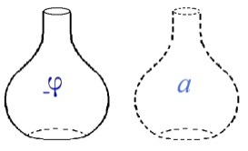

[无对应译文]

</section>

<section class="parallel-paragraph" data-paragraph-ids="s10-16-0092">

s10-16-0092

原文 · s10-16-0092

Laissez-moi, pour la démons­tration, mettre ici, un instant, dans un petit pot voisin,
ce qui pour l’homme peut se constituer comme *(а)* *l’objet du désir*. C’est un apologue.

[无对应译文]

</section>

<section class="parallel-paragraph" data-paragraph-ids="s10-16-0093">

s10-16-0093

原文 · s10-16-0093

Cet apologue est destiné à accentuer que *(а)* *l’objet* *du désir*, pour l’homme n’a de sens
que quand il а été reversé dans le vide de la castration primordiale.

[无对应译文]

</section>

<section class="parallel-paragraph" data-paragraph-ids="s10-16-0094">

s10-16-0094

原文 · s10-16-0094

Ceci ne peut donc se produire sous cette forme,

[无对应译文]

</section>

<section class="parallel-paragraph" data-paragraph-ids="s10-16-0095">

s10-16-0095

原文 · s10-16-0095

- c’est-à-dire constituant le premier nœud du désir mâle avec la castration, qu’à partir du narcissisme secondaire,

[无对应译文]

</section>

<section class="parallel-paragraph" data-paragraph-ids="s10-16-0096">

s10-16-0096

原文 · s10-16-0096

- c’est-à-dire au moment où *(а)* se détache, tombe de *i(a)*, *l’image narcissique*.

[无对应译文]

</section>

<section class="parallel-paragraph" data-paragraph-ids="s10-16-0097">

s10-16-0097

原文 · s10-16-0097

Il у а là ce que j’appellerai...
l’in­diquant *aujourd’hui* pour у revenir, et au reste je pense que vous vous en souvenez :
n’introduisant ici rien que je n’aie *déjà accentué...*un phénomène qui est le phénomène constitutif de ce qu’on peut appeler *le bord.*

[无对应译文]

</section>

<section class="parallel-paragraph" data-paragraph-ids="s10-16-0098">

s10-16-0098

原文 · s10-16-0098

Comme je vous l’ai dit l’année dernière, à propos de mon analyse topologique :
*il n’y а rien de plus structurant* dans la forme du vase, *que la forme de son bord*, que la coupure où il s’isole comme vase.

[无对应译文]

</section>

<section class="parallel-paragraph" data-paragraph-ids="s10-16-0099">

s10-16-0099

原文 · s10-16-0099

Dans un temps lointain, où s’ébauchait la possibilité d’une véritable *logique* refaite selon le champ psychanalytique...
elle est à faire, encore que je vous en aie donné plus d’une amorce
...grande et petite logique, je dis logique non dialectique, au temps où quelqu’un comme Imre Hermann[^113]

[无对应译文]

</section>

<section class="parallel-paragraph" data-paragraph-ids="s10-16-0100">

s10-16-0100

原文 · s10-16-0100

avait commencé de s’y consacrer, d’une façon certes très *confuse*, faute de toute *articulation dialectique*, mais enfin ceci а été ébauché,
le phéno­mène qu’il qualifie de « *Randbevorzugung* », d’*élection*, de *préférence,* du *champ phénoménal analytique* pour les phénomènes de *bord,* avait été déjà - j’y reviendrai devant vous - par cet auteur, articulé.

[无对应译文]

</section>

<section class="parallel-paragraph" data-paragraph-ids="s10-16-0101">

s10-16-0101

原文 · s10-16-0101

Ce *bord* du petit pot, du pot de la castration, est un *bord*, lui, tout rond, si je puis dire : bien honnête.
Il n’a aucun de ces raffinements de complica­tion où je vous ai introduits avec *la bande de Mœbius,* et qu’il est si facile d’ailleurs...
comme je vous l’ai montré, je pense, vous vous en souvenez, une fois au tableau
...de réaliser avec un vase tout à fait matériel.

[无对应译文]

</section>

<section class="parallel-paragraph" data-paragraph-ids="s10-16-0102">

s10-16-0102

原文 · s10-16-0102

Il suffit de faire *se conjoindre deux points opposés de son bord* en retournant en route les surfaces de façon а ce qu’elles se joignent,
comme dans *le ruban de* *Mœbius,* et nous nous trouvons devant un vase dont, d’une façon surpre­nante,
on passera, avec la plus grande aisance, de la face interne à la face externe, sans avoir jamais à franchir le *bord* \[*bouteille de Klein*\].

[无对应译文]

</section>

<section class="parallel-paragraph" data-paragraph-ids="s10-16-0103">

s10-16-0103

原文 · s10-16-0103

 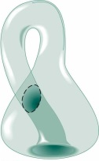

[无对应译文]

</section>

<section class="parallel-paragraph" data-paragraph-ids="s10-16-0104">

s10-16-0104

原文 · s10-16-0104

ça, ça se produit au niveau des autres petits pots et c’est là que commence l’angoisse.
Bien sûr qu’une pareille *métaphore* ne peut pas suffire à reproduire ce qu’il у а à vous expliquer.
Mais que ce petit pot originel ait le plus grand rap­port avec ce dont il s’agit concernant la puissance sexuelle,
avec le jaillisse­ment intermittent de sa force, c’est tout ce que je pourrais appeler une série d’*images* faciles à mettre devant vos yeux d’une éroto-propédeutique, voire même à proprement parler d’une érotique, rend tout à fait facile d’accès.

[无对应译文]

</section>

<section class="parallel-paragraph" data-paragraph-ids="s10-16-0105">

s10-16-0105

原文 · s10-16-0105

Une foule d’images de ce titre - *chinoises*, *japonaises et autres,* et j’imagine pas difficiles à retrouver non plus dans notre culture -
vous en témoignerait. *Ce n’est pas ça qui est angoissant*.

[无对应译文]

</section>

<section class="parallel-paragraph" data-paragraph-ids="s10-16-0106">

s10-16-0106

原文 · s10-16-0106

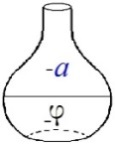

[无对应译文]

</section>

<section class="parallel-paragraph" data-paragraph-ids="s10-16-0107">

s10-16-0107

原文 · s10-16-0107

Que le transvasement, ici : nous permet­te de saisir comme le *(а)* prend sa valeur de venir *dans le pot du* (- φ),
prend sa valeur d’être ici *(-а)*, le vase *à demi-vide* en même temps qu’il est *à demi plein*, c’est ce que je vous ai dit la dernière fois.

[无对应译文]

</section>

<section class="parallel-paragraph" data-paragraph-ids="s10-16-0108">

s10-16-0108

原文 · s10-16-0108

Il est évident que pour être vrai­ment complet dans mon image, il faut que je souligne que ce n’est pas le phénomène du transvasement qui est essentiel, c’est le phénomène auquel je viens de faire allusion de *la transfiguration du vase,*
*c’est-à-dire que ce vase-­là devienne angoissant*, pourquoi ?

[无对应译文]

</section>

<section class="parallel-paragraph" data-paragraph-ids="s10-16-0109">

s10-16-0109

原文 · s10-16-0109

Parce que ce qui vient à demi remplir le creux constitué de la castration originelle, c’est ce *(а)* en tant *qu’il vient d’ailleurs*,
qu’il n’est supporté, constitué que par l’intermédiaire du *désir de l’Autre*.
Et c’est là que nous retrouvons l’angoisse et la forme ambiguë de ce bord qui, tel qu’il est fait au niveau de l’autre vase,
ne nous permet de dis­tinguer *ni intérieur*, *ni extérieur*.

[无对应译文]

</section>

<section class="parallel-paragraph" data-paragraph-ids="s10-16-0110">

s10-16-0110

原文 · s10-16-0110

L’angoisse donc vient se constituer, prendre sa place dans un rapport *au-delà de ce vide d’un temps premier*, si je puis dire, *de la castration*. Et c’est pour cela que le sujet n’a qu’un désir quant à cette castration première, c’est d’y retourner.

[无对应译文]

</section>

<section class="parallel-paragraph" data-paragraph-ids="s10-16-0111">

s10-16-0111

原文 · s10-16-0111

Je vous parlerai, après l’interruption que nous allons avoir \[28-03→ 8-05\], longuement du *masochisme*
et il n’est pas bien entendu question que je l’aborde aujourd’hui.

[无对应译文]

</section>

<section class="parallel-paragraph" data-paragraph-ids="s10-16-0112">

s10-16-0112

原文 · s10-16-0112

Si vous voulez *vous у préparer* à m’entendre là-dessus, je donne maintenant...
c’est *lapsus* de ma part si je ne l’ai pas fait plus tôt, car j’avais commencé de vous en parler
...l’indication d’un article, pré­cieux entre tous parce que nourri de l’expérience la plus substantielle,
c’est l’article d’un homme qui est bien un de ceux à propos duquel je peux le plus me désoler que les circonstances
m’aient privé de sa collaboration, c’est l’article de Grunberger :
« *Esquisse d’une théorie psycho-dynamique du maso­chisme »* dans le numéro *d’avril-juin* l954,
*numéro* 2 du [*tome* XVIII *de la Revue Française de Psychanalyse*](http://gallica.bnf.fr/ark:/12148/bpt6k5446509c.image.langEN) \[p. 193\].

[无对应译文]

</section>

<section class="parallel-paragraph" data-paragraph-ids="s10-16-0113">

s10-16-0113

原文 · s10-16-0113

Je ne sache pas que même ailleurs, on ait fait à cet article le sort qu’il mérite,
est-ce au fait qu’il est paru à l’ombre des fastes de la fondation de l’*Institut de Psychanalyse,* à quoi cet oubli soit dû ?

[无对应译文]

</section>

<section class="parallel-paragraph" data-paragraph-ids="s10-16-0114">

s10-16-0114

原文 · s10-16-0114

Je ne chercherai point à en trancher, mais vous у verrez
ce n’est pas là du tout le dernier mot
...vous у verrez noté...
je ne l’invoque ici que pour vous montrer tout de suite le prix du matériel qu’on peut у prendre
...vous у verrez noté, au point du jour, le jour de l’observation de la séance analy­tique,
comment le recours à l’image même de la castration : « *ah, ce que je voudrais qu’on me les coupe* »,
peut venir comme issue apaisante, salutaire, à l’angoisse du masochiste.

[无对应译文]

</section>

<section class="parallel-paragraph" data-paragraph-ids="s10-16-0115">

s10-16-0115

原文 · s10-16-0115

Ce n’est pas là, je le souligne, phénomène qui soit le dernier mot de cette complexe structure.
Mais aussi bien ai-je là-dessus assez amorcé ma formule pour que vous sachiez que je vise à cette occa­sion,
je veux dire quant au lien de l’angoisse au masochisme,
en un point tout à fait différent de ce point intérieur à ce que je pourrais appeler « *l’émoi momentané du sujet* ».

[无对应译文]

</section>

<section class="parallel-paragraph" data-paragraph-ids="s10-16-0116">

s10-16-0116

原文 · s10-16-0116

Ce n’est qu’une indication que j’y trouve, mais ce temps de la castration...

[无对应译文]

</section>

<section class="parallel-paragraph" data-paragraph-ids="s10-16-0117">

s10-16-0117

原文 · s10-16-0117

- en tant que le sujet *у retourne*,

[无对应译文]

</section>

<section class="parallel-paragraph" data-paragraph-ids="s10-16-0118">

s10-16-0118

原文 · s10-16-0118

- en tant qu’il devient un point de sa visée, ...nous ramène à ce que j’ai déjà accentué à la fin d’un de mes séminaires derniers, concernant *la circoncision*. Je ne sais pas : Stein, où vous en êtes du commentaire que vous poursui­vez de *Totem et tabou,* et si ceci vous а mené encore à aborder *Moïse et le monothéisme  *?

[无对应译文]

</section>

<section class="parallel-paragraph" data-paragraph-ids="s10-16-0119">

s10-16-0119

原文 · s10-16-0119

Je pense que vous ne pouvez faire que d’y venir et d’y être alors frappé de l’escamotage total *du problème*,
pourtant structurant s’il en est :
s’il faut trouver au niveau de l’institution mosaïque quelque chose qui у reflète *le complexe culturel inaugural*,
de savoir quel fut sur ce point la fonction de *l’institution de la circoncision*.

[无对应译文]

</section>

<section class="parallel-paragraph" data-paragraph-ids="s10-16-0120">

s10-16-0120

原文 · s10-16-0120

Vous devez apercevoir qu’en tout cas il у а quelque chose dans cette ablation du prépuce
que vous ne pouvez pas manquer de rapprocher de *ce drôle de petit objet tortillé* que je vous ai un jour fait filer entre les mains, matérialiser, pour que vous voyiez comment ça se structure une fois réalisé sous la forme d’un petit bout de carton,
ce résultat de la coupure centrale à ce que je vous ai ici illustré, incarné, de la forme du *cross-cap* :

[无对应译文]

</section>

<section class="parallel-paragraph" data-paragraph-ids="s10-16-0121">

s10-16-0121

原文 · s10-16-0121

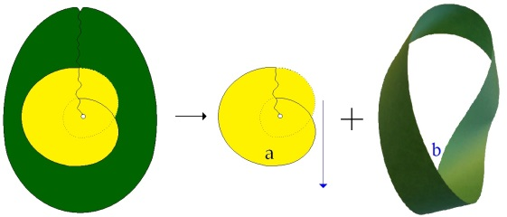

[无对应译文]

</section>

<section class="parallel-paragraph" data-paragraph-ids="s10-16-0122">

s10-16-0122

原文 · s10-16-0122

pour vous montrer en quoi cet isolement de *quelque chose* qui se définit justement comme une forme incarnant comme telle
le non-spécularisable, peut avoir affaire avec *la constitution* de l’autonomie du *(а)*, de *l’objet du désir*.
Que quelque chose comme *un ordre* puisse être apporté dans ce trou, cette défaillance constitutive de la castration primordiale,
c’est ce que je crois que la *circoncision* « *incarne* » au sens propre du mot.

[无对应译文]

</section>

<section class="parallel-paragraph" data-paragraph-ids="s10-16-0123">

s10-16-0123

原文 · s10-16-0123

*Le circoncis, et la circoncision, а*...
de par *toutes ses coordonnées, toute la configuration rituel­le*, voire mythique,
les primordiaux accès initiatiques qui sont ceux où elle s’opère
...*le rapport le plus évident avec la normativation de l’objet du désir.*

[无对应译文]

</section>

<section class="parallel-paragraph" data-paragraph-ids="s10-16-0124">

s10-16-0124

原文 · s10-16-0124

Le circoncis est *consacré*, *consacré* moins encore à une loi, qu’à un certain rapport à l’Autre, au grand А,
et c’est pour cela qu’il s’agit du *petit(а*).

[无对应译文]

</section>

<section class="parallel-paragraph" data-paragraph-ids="s10-16-0125">

s10-16-0125

原文 · s10-16-0125

Reste que nous sommes au point où j’entends porter le feu du *sunlight,*
à savoir au niveau où nous pouvons trouver, dans la configuration de l’histoire,
quelque chose qui se supporte d’un grand А qui est un peu là : *le Dieu de la tradition judéo-chrétienne*.

[无对应译文]

</section>

<section class="parallel-paragraph" data-paragraph-ids="s10-16-0126">

s10-16-0126

原文 · s10-16-0126

Reste à voir ce que signifie la circoncision.

[无对应译文]

</section>

<section class="parallel-paragraph" data-paragraph-ids="s10-16-0127">

s10-16-0127

原文 · s10-16-0127

Il est extrêmement étonnant que dans un milieu aussi judaïque que le milieu de la psychanalyse, *des textes cent mille fois parcourus*...

[无对应译文]

</section>

<section class="parallel-paragraph" data-paragraph-ids="s10-16-0128">

s10-16-0128

原文 · s10-16-0128

> depuis les *Pères de l’É­glise* jusqu’aux *Pères de la Réforme*, si je puis dire,
>
> c’est-à-dire jusqu’au XVIIIème siècle, et encore, pour vous dire comme périodes fécondes de la Réforme
> ...que ces textes n’aient pas été réinterrogés.

[无对应译文]

</section>

<section class="parallel-paragraph" data-paragraph-ids="s10-16-0129">

s10-16-0129

原文 · s10-16-0129

Sans doute ce qui nous est dit au Cha­pitre XVII de *La Genèse*, concernant *le caractère fondamental de la loi de la circoncision*
en tant qu’ellе fait partie du pacte donné par Yahvé dans le Buisson, la référence de cette loi au temps d’Abraham...
c’est en ceci que consiste ce chapitre XVII
...c’est de faire dater d’Abraham *l’institution de la circoncision*.

[无对应译文]

</section>

<section class="parallel-paragraph" data-paragraph-ids="s10-16-0130">

s10-16-0130

原文 · s10-16-0130

Sans doute ce passage est une addition...
semble-t-il à la cri­tique exégétique
...est une *addition sacerdotale*, c’est-à-dire sensiblement, très sensiblement postérieure à la tradition du *Jehoviste* et de l’*Elohiste*,
c’est-à-dire aux deux textes primitifs, dont se composent les livres de la Loi.

[无对应译文]

</section>

<section class="parallel-paragraph" data-paragraph-ids="s10-16-0131">

s10-16-0131

原文 · s10-16-0131

Nous avons pour­tant au chapitre XXXIV le fameux épisode, qui ne manque pas d’humour,
qui concerne, vous le savez, le rapt de Dinah, sœur de Siméon et Lévi, fille de Jacob.

[无对应译文]

</section>

<section class="parallel-paragraph" data-paragraph-ids="s10-16-0132">

s10-16-0132

原文 · s10-16-0132

Pour l’obtenir - car il s’agit pour l’homme de Sichem qui l’a enle­vée, de l’obtenir de ses frères –
Siméon et Lévi exigent qu’il(s) se circoncise(nt) :

[无对应译文]

</section>

<section class="parallel-paragraph" data-paragraph-ids="s10-16-0133">

s10-16-0133

原文 · s10-16-0133

« *Nous ne pouvons donner notre sœur à un incirconcis, nous serions désho­norés* ».

[无对应译文]

</section>

<section class="parallel-paragraph" data-paragraph-ids="s10-16-0134">

s10-16-0134

原文 · s10-16-0134

Nous avons évidemment ici la superposition de deux textes.
On ne sait si c’est un seul homme, ou tous les sichémites qui se font du même coup...
dans *cette proposition d’alliance* qui, bien sûr, ne pouvait se faire
au titre seulement de deux familles, mais de deux races
...si tous les Sichémites se font circoncire.
Résultat, ils sont invalides trois jours, ce dont profitent les autres pour venir les égorger.

[无对应译文]

</section>

<section class="parallel-paragraph" data-paragraph-ids="s10-16-0135">

s10-16-0135

原文 · s10-16-0135

C’est un de ces charmants épisodes qui ne pouvaient entrer dans la *comprenoire* de Monsieur Voltaire
et qui lui ont fait dire tant de mal de ce livre admirable quant à la révélation de ce qu’on appelle, comme tel, le signifiant.
Ceci est tout de même fait pour nous faire penser que ce n’est pas seulement de Moïse que date la loi de la circoncision.
Je ne fais ici que mettre en valeur les problèmes soulevés à ce propos.

[无对应译文]

</section>

<section class="parallel-paragraph" data-paragraph-ids="s10-16-0136">

s10-16-0136

原文 · s10-16-0136

Assurément, tout de même, puisque de Moïse il s’agit, et que Moïse dans notre sphère, serait reconnu pour être égyptien,
il ne serait pas tout à fait inutile de nous poser la question de ce qu’il en est,
quant aux rapports de la circoncision judaïque avec la circoncision des égyptiens.

[无对应译文]

</section>

<section class="parallel-paragraph" data-paragraph-ids="s10-16-0137">

s10-16-0137

原文 · s10-16-0137

Ceci me fera excu­ser de prolonger encore, disons de cinq à sept minutes, ce que j’ai à vous dire aujourd’hui,
pour que ce que j’ai écrit au tableau ne vous soit pas perdu.

[无对应译文]

</section>

<section class="parallel-paragraph" data-paragraph-ids="s10-16-0138">

s10-16-0138

原文 · s10-16-0138

Nous avons l’assurance, par un certain nombre d’auteurs de l’Antiquité et nommément ce vieil Hérodote, qui radote sans doute quelque part, mais qui est souvent bien précieux, en tout cas qui ne laisse aucune espèce de doute qu’à son époque,
c’est-à-dire à très basse époque pour les Juifs, les Égyp­tiens dans l’ensemble pratiquaient *la circoncision*.

[无对应译文]

</section>

<section class="parallel-paragraph" data-paragraph-ids="s10-16-0139">

s10-16-0139

原文 · s10-16-0139

Il en fait même un état si prévalent qu’il articule que c’est aux Égyptiens que tous les sémites de la Syrie et de la Palestine
doivent cet usage. On а beaucoup épilogué là-des­sus et après tout, nous ne sommes point forcés de l’en croire.
Ceci, il l’avan­ce bizarrement à propos des Colchidiens dont il prétendrait que ce serait une colonie égyptienne. Mais laissons.

[无对应译文]

</section>

<section class="parallel-paragraph" data-paragraph-ids="s10-16-0140">

s10-16-0140

原文 · s10-16-0140

Il en fait, *Grec comme il est*...
et après tout à son époque ne peut-il guère en voir autre chose
...qu’une mesu­re de propreté. Il nous souligne que les égyptiens préfèrent toujours

[无对应译文]

</section>

<section class="parallel-paragraph" data-paragraph-ids="s10-16-0141">

s10-16-0141

原文 · s10-16-0141

- *le fait d’être propre* : καθαροί \[kataroï\],

[无对应译文]

</section>

<section class="parallel-paragraph" data-paragraph-ids="s10-16-0142">

s10-16-0142

原文 · s10-16-0142

- à ceux d’avoir ce qu’on appelle « *une belle apparence* ».

[无对应译文]

</section>

<section class="parallel-paragraph" data-paragraph-ids="s10-16-0143">

s10-16-0143

原文 · s10-16-0143

En quoi Hérodote, *Grec comme il est*,
ne nous dissimule pas qu’il lui semble que c’est tout de même toujours un peu - se circoncire - se défigurer.
Nous avons heureusement des témoignages et des supports de *la circon­cision* des Égyptiens, plus directs.
Nous avons deux témoignages que j’ap­pellerai *iconographiques* - vous me direz que ce n’est pas beaucoup.

[无对应译文]

</section>

<section class="parallel-paragraph" data-paragraph-ids="s10-16-0144">

s10-16-0144

原文 · s10-16-0144

Un est de l’Ancien Empire, il est à Saqqarah dans la tombe du médecin Ankhmâhor \[2345 a. J.C., 2181 a. J.C.\].
On dit que c’est un médecin parce que les parois de la tombe sont couvertes de figures d’opérations.
Une de ces parois nous montre 2 figures de circoncision, l’autre est à droite de celle-ci, je vous ai représenté celle qui est à gauche.

[无对应译文]

</section>

<section class="parallel-paragraph" data-paragraph-ids="s10-16-0145">

s10-16-0145

原文 · s10-16-0145

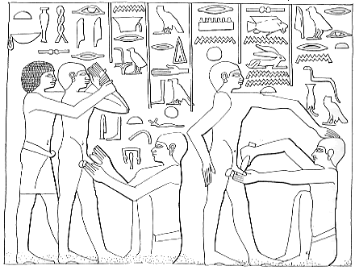 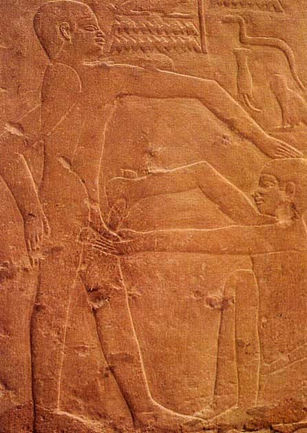

[无对应译文]

</section>

<section class="parallel-paragraph" data-paragraph-ids="s10-16-0146">

s10-16-0146

原文 · s10-16-0146

Je ne sais pas *comment* j’ai réussi à rendre lisible, ni *si* j’ai réussi à rendre lisible mon dessin
qui а l’ambition de se limiter et d’ac­centuer peut-être un peu à l’occasion les lignes telles qu’elles se présentent.

[无对应译文]

</section>

<section class="parallel-paragraph" data-paragraph-ids="s10-16-0147">

s10-16-0147

原文 · s10-16-0147

Voici le garçon qu’on circoncit et voici l’organe, un garçon qui est derrière lui, lui tient les mains, parce qu’il le faut.
Un personnage qui est un prêtre, sur la qualification duquel je ne m’étends pas aujourd’hui,
et qui d’une main, de la main gauche, il tient l’organe, de l’autre cet objet oblong qui est un couteau de pierre.

[无对应译文]

</section>

<section class="parallel-paragraph" data-paragraph-ids="s10-16-0148">

s10-16-0148

原文 · s10-16-0148

Ce « *couteau de pierre* », nous le retrouvons dans un autre texte resté jusqu’à présent complètement énigmatique,
texte biblique qui dit qu’après l’épisode du buisson ardent, alors que Moïse est avisé que plus personne en Égypte ne se souvient... plus exactement que tous ceux qui se souvenaient du meurtre qu’il а accompli d’un égyptien, ont disparu, qu’il peut rentrer.

[无对应译文]

</section>

<section class="parallel-paragraph" data-paragraph-ids="s10-16-0149">

s10-16-0149

原文 · s10-16-0149

Il rentre et sur la route, le texte biblique nous dit : « *sur la route où il s’arrête* » on traduit anciennement « *dans une hôtellerie* »,
mais lais­sons, Yahwé l’attaque pour le tuer. C’est tout ce qui est dit.

[无对应译文]

</section>

<section class="parallel-paragraph" data-paragraph-ids="s10-16-0150">

s10-16-0150

原文 · s10-16-0150

Séphora, sa femme, alors circoncit son fils qui est un petit enfant, et touchant Moïse, qui n’est pas circoncis, avec le prépuce,
le préserve mystérieusement, par cette opération, par ce contact, de l’attaque de Yahvé,
qui dès lors l’aban­donne, le laisse, cesse son attaque. Il est dit que Séphora circoncit son fils avec un « *couteau de pierre* ».

[无对应译文]

</section>

<section class="parallel-paragraph" data-paragraph-ids="s10-16-0151">

s10-16-0151

原文 · s10-16-0151

Quarante et quelques années de plus...
puisqu’il у а aussi tout l’épisode des *ordalies* imposées aux Égyptiens et des *dix plaies*
...au moment d’entrer dans la terre de Canaan, Josué reçoit l’ordre :

[无对应译文]

</section>

<section class="parallel-paragraph" data-paragraph-ids="s10-16-0152">

s10-16-0152

原文 · s10-16-0152

« *Prends un couteau de pier­re et circoncis tous ceux qui sont là, qui sont entrés dans la terre de Canaan* ».

[无对应译文]

</section>

<section class="parallel-paragraph" data-paragraph-ids="s10-16-0153">

s10-16-0153

原文 · s10-16-0153

Ce sont ceux et seulement ceux qui sont nés pendant les années du désert, pendant les années du désert ils n’ont pas été circoncis.
Yahvé ajoute :

[无对应译文]

</section>

<section class="parallel-paragraph" data-paragraph-ids="s10-16-0154">

s10-16-0154

原文 · s10-16-0154

« *Maintenant, j’aurai fait rouler de dessus vous -* ce qu’on tra­duit par « levé, suspendu » - *le mépris des Égyptiens* ».

[无对应译文]

</section>

<section class="parallel-paragraph" data-paragraph-ids="s10-16-0155">

s10-16-0155

原文 · s10-16-0155

Je vous rappelle ces textes, non pas que j’aie l’intention de les utiliser tous, mais pour vous susciter au moins le désir, le besoin,
de vous у reporter. Pour l’instant, je m’ar­rête au « *couteau de pierre* ».
Le couteau de pierre indique, en tout cas, à cette cérémonie, une origine très ancienne.

[无对应译文]

</section>

<section class="parallel-paragraph" data-paragraph-ids="s10-16-0156">

s10-16-0156

原文 · s10-16-0156

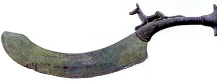

[无对应译文]

</section>

<section class="parallel-paragraph" data-paragraph-ids="s10-16-0157">

s10-16-0157

原文 · s10-16-0157

Ce qui est confirmé par *la découverte par* Eliot Smith, près de Louqsor, si mon souvenir est bon, probablement à Naga Ed-Deir...
\- qui а tant d’autres raisons d’attirer notre intérêt concernant cette question même de la circoncision
...de cadavres de la période préhistorique...
c’est-à-dire non pas de cadavres qui soient momifiés
selon les formes qui permettent de les dater dans l’histoire de l’Égypte
...qui portent la trace de la circoncision. Le couteau de pierre, à lui seul, nous désignerait à cette cérémonie une date, un âge, une origine qui est au moins de l’époque qu’on définit comme l’époque néolithique.

[无对应译文]

</section>

<section class="parallel-paragraph" data-paragraph-ids="s10-16-0158">

s10-16-0158

原文 · s10-16-0158

Au reste, pour qu’il n’y ait aucun doute, trois lettres égyptiennes, ces trois-ci :

[无对应译文]

</section>

<section class="parallel-paragraph" data-paragraph-ids="s10-16-0159">

s10-16-0159

原文 · s10-16-0159

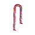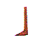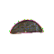

[无对应译文]

</section>

<section class="parallel-paragraph" data-paragraph-ids="s10-16-0160">

s10-16-0160

原文 · s10-16-0160

qui sont respectivement un *S*, un *В*, et un *Т* - *SeBeT* - nous indi­quent expressément qu’il s’agit de *la circoncision*.
Le signe ici marqué est un *hapax*, on ne le trouve que là,
il semblerait que ce soit une forme effacée, fruste, du déterminatif du phallus.

[无对应译文]

</section>

<section class="parallel-paragraph" data-paragraph-ids="s10-16-0161">

s10-16-0161

原文 · s10-16-0161

Nous le trouvons dans d’autres inscrip­tions où vous le voyez beaucoup plus clairement inscrit.
Un autre mode de désigner la circoncision est celui qui est dans cette ligne et qui se lit *FaHeT :*

[无对应译文]

</section>

<section class="parallel-paragraph" data-paragraph-ids="s10-16-0162">

s10-16-0162

原文 · s10-16-0162

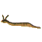

[无对应译文]

</section>

<section class="parallel-paragraph" data-paragraph-ids="s10-16-0163">

s10-16-0163

原文 · s10-16-0163

F la vipère cornue, le Н aspiré qui est ici ce signe qui est ici le plаcenta, et ici le Т qui est le même que vous voyez ici.
Ici, un déterminatif qui est le déterminatif du *linge*. Je vous prie d’en prendre note aujourd’hui parce que j’y reviendrai,
il ne se prononce pas.

[无对应译文]

</section>

<section class="parallel-paragraph" data-paragraph-ids="s10-16-0164">

s10-16-0164

原文 · s10-16-0164

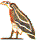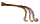

[无对应译文]

</section>

<section class="parallel-paragraph" data-paragraph-ids="s10-16-0165">

s10-16-0165

原文 · s10-16-0165

Ici : un autre *F* désigne « *il* » et ici le *TaM* qui veut dire *le prépuce*. *FaHeT iM TaM* veut dire « *être séparé de son prépuce* ».
Ceci а également toute son importance car « *circoncision* » n’a pas à être pris uniquement comme une opération,
si je puis dire totalitaire, un signe.

[无对应译文]

</section>

<section class="parallel-paragraph" data-paragraph-ids="s10-16-0166">

s10-16-0166

原文 · s10-16-0166

Le « *être séparé de quelque chose* » est dès ce moment-là dans une inscription égyptienne, à proprement parler articulé.
Je vous l’ai dit, je ne m’avance aussi loin que pour que je n’aie pas écrit ça aujourd’hui d’une façon inutile.

[无对应译文]

</section>

<section class="parallel-paragraph" data-paragraph-ids="s10-16-0167">

s10-16-0167

原文 · s10-16-0167

Cette fonction du prépuce et qui est en quelque sorte, vu *le prix* qui dans ces inscriptions est donné, si l’on peut dire, au poids du moindre mot, le maintien, si je puis dire, *du prépuce* comme l’objet de l’opération, tout autant que celui qui la subit, est une chose dont je vous prie de retenir ici l’accentuation, parce que nous le retrouverons dans le texte de Jérémie aussi énigmatique,
aussi - jusqu’à présent - ininterprété, que tel auquel je viens de faire allusion devant vous, et nommément celui de la circoncision
par Séphora de son fils. J’aurai donc l’occasion d’y revenir.

[无对应译文]

</section>

<section class="parallel-paragraph" data-paragraph-ids="s10-16-0168">

s10-16-0168

原文 · s10-16-0168

Je pense avoir déjà suffisamment assez amorcé la fonction de la circoncision...

[无对应译文]

</section>

<section class="parallel-paragraph" data-paragraph-ids="s10-16-0169">

s10-16-0169

原文 · s10-16-0169

> j’entends non pas seulement, dans ses coordonnées de fête, d’initiation, d’introduction à une consécration spéciale, mais dans sa structure même de référence - pour nous essentiellement intéressante - à la castration,
>
> quant à ses rapports avec la structuration de *l’objet du désir*
> ...je pense avoir suffisam­ment amorcé les choses dans ce sens, pour pouvoir les reprendre efficace­ment plus avant avec vous, au jour où je vous ai donné notre prochain ren­dez-vous.

[无对应译文]

</section>

<section class="note-block original-notes">

## Notes

[^110]: Enest Jones : « *Le développement précoce de la sexualité féminine* », in *Théorie et pratique de la psychanalyse*, op. cit.

[^111]: Séminaire 1959-60 : *L’éthique*… , séances des 23-12-1959 et 16-03-1960 ; Saint Paul : *Épître aux Romains*, 7, 7.

[^112]: [Salomon, Proverbes, 30, 18-19](http://visionneuse.free.fr/visioxml/index.htm) : *« Il est trois choses qui me dépassent et une quatrième que je ne connais pas : Pr 30,19 : le chemin de l'aigle dans les cieux, le chemin du serpent sur*

    *le rocher, le chemin du vaisseau en haute mer, le chemin de l'homme chez la jeune femme ». « Tria sunt difficilia mihi et quartum penitus ignoro. Via aquilae in cœlo, viam colubri super*

    *terram, viam navis in medio mari , viam viri in adolescentia ».*

[^113]: Imre Hermann : *Psychanalyse et logique*, 1978, éd. Denoël, Paris.

</section>
