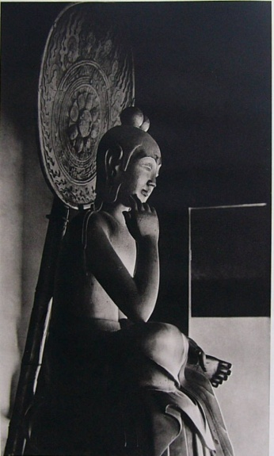
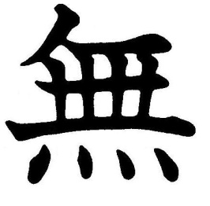
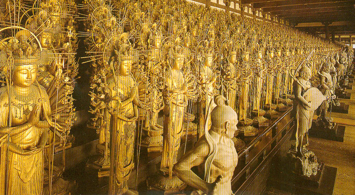
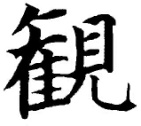
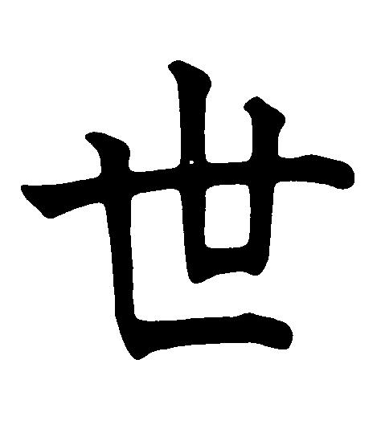
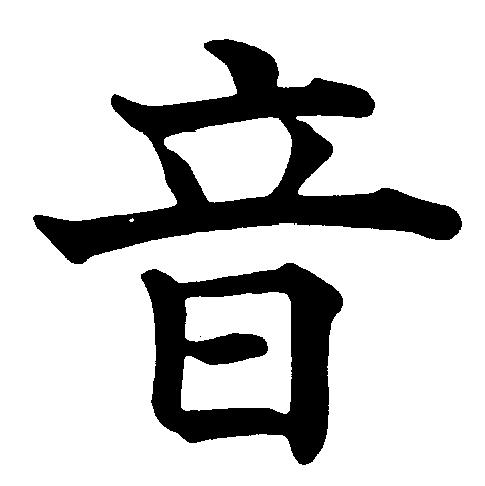
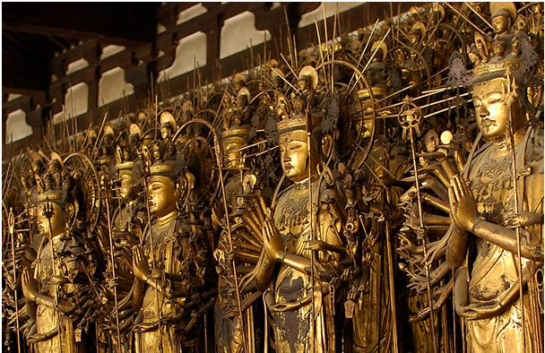
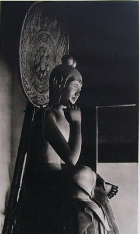
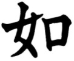
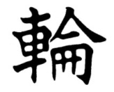

# Leçon 17 | 8 Mai l963

  <label><input type="checkbox" data-lacan-toggle="original" checked> 原文</label>
  <label><input type="checkbox" data-lacan-toggle="notes" checked> 注释</label>
  <label><input type="checkbox" data-lacan-toggle="commentary" checked> 个人解读评论</label>

<section class="parallel-paragraph" data-paragraph-ids="s10-17-0001">

s10-17-0001

[无对应译文]

原文 · s10-17-0001

Je vous ai laissés sur un propos qui mettait en question la fonction...
dans l’économie du *désir*, dans l’économie de *l’objet*, au sens où l’analyse le fonde comme *objet de désir...*sur la fonction de la *circoncision*.

</section>

<section class="parallel-paragraph" data-paragraph-ids="s10-17-0002">

s10-17-0002

[无对应译文]

原文 · s10-17-0002

La chute de cette leçon fut sur un texte, sur un passage de Jérémie, *paragraphes* 24 *et* 25 *du chapitre* 9,
qui а fait à vrai dire, au cours des âges, quelques *difficultés* aux traducteurs, car le texte hébreu...
j’ai trop à vous dire aujourd’hui pour pouvoir m’attarder à sa lettre
...le texte hébreu, dit :
« *Je châtie­rai tout circoncis dans son prépuce* »

</section>

<section class="parallel-paragraph" data-paragraph-ids="s10-17-0003">

s10-17-0003

[无对应译文]

原文 · s10-17-0003

Terme *paradoxal* que les traducteurs ont tenté de tourner, *même l’un des derniers, l’un des meilleurs,* Paul Dhorme[^114], par la formu­le : « *Je sévirai contre tout circoncis à la façon de l’incirconcis* ».

</section>

<section class="parallel-paragraph" data-paragraph-ids="s10-17-0004">

s10-17-0004

[无对应译文]

原文 · s10-17-0004

Je ne rap­pelle ici ce point que pour vous indiquer que c’est bien de quelque *relation permanente à un objet perdu*, comme tel, qu’il s’agit
et que c’est seulement dans la dialectique de cet *objet(а)* comme *coupé* et comme maintenant, sou­tenant, présentifiant, une relation essentielle à cette séparation même, qu’effec­tivement nous pouvons concevoir, en ce point qui n’est pas un point unique de la Bible, mais ce point qui éclaire, par son paradoxe extrême, ce dont il s’agit chaque fois que le terme de *circoncis* ou d’*incirconcis*
est effectivement employé dans la Bible.

</section>

<section class="parallel-paragraph" data-paragraph-ids="s10-17-0005">

s10-17-0005

[无对应译文]

原文 · s10-17-0005

Il n’est point en effet - loin de là - localisé à ce petit bout de chair qui fait l’objet du rite : « *incirconcis des lèvres* », « *incirconcis du cœur* », ce sont les termes qui tout au long de textes nombreux, apparais­sent eux presque courants, presque communs,
soulignant que ce dont il s’agit, c’est toujours d’une séparation essentielle avec une certaine partie du corps, un certain appendice, avec quelque chose qui dans une fonction, devient symbolique d’une relation au corps propre pour le sujet,
désormais à la fois aliéné et fondamental. Je reprendrai aujourd’hui les choses de plus large, de plus haut, de plus loin.

</section>

<section class="parallel-paragraph" data-paragraph-ids="s10-17-0006">

s10-17-0006

[无对应译文]

原文 · s10-17-0006

Vous le savez - certains le savent - je reviens d’un voyage qui m’a appor­té quelques expériences,
qui m’a apporté ceci d’essentiel en tout cas, l’approche, la vue, la rencontre avec certaines de ces œuvres
sans lesquelles l’étude la plus attentive des textes, de la lettre, de la doctrine - nommément celle du bouddhisme dans l’occasion -
ne peuvent rester que quelque chose *de sec*, *d’incomplet, de non vivifié*.

</section>

<section class="parallel-paragraph" data-paragraph-ids="s10-17-0007">

s10-17-0007

[无对应译文]

原文 · s10-17-0007

Je pense qu’à vous donner quelques rapports de ce que fut cette *approche*, de la façon dont pour moi-même - *pour vous aussi, je pense* - elle peut s’insérer dans ce qui est cette année, notre question fondamentale, le point où se déplace notre dialectique sur l’angoisse,
à savoir : la question du désir, ce qui dans cette approche peut être dès maintenant...
peut représenter pour nous, dès maintenant, un apport.

</section>

<section class="parallel-paragraph" data-paragraph-ids="s10-17-0008">

s10-17-0008

[无对应译文]

原文 · s10-17-0008

Le désir, en effet, fait le fond essentiel, le but, la visée, la pratique aussi,
de tout ce qui ici se dénomme et s’annonce concernant le message freudien.

</section>

<section class="parallel-paragraph" data-paragraph-ids="s10-17-0009">

s10-17-0009

[无对应译文]

原文 · s10-17-0009

Si quelque chose d’absolument essentiel, de nouveau, passe par ce message, c’est ici le chemin par où...
qui d’entre vous ? Il у aura bien quelqu’un ou quelques-uns j’espère, pour le relever
...par où passe ce message.

</section>

<section class="parallel-paragraph" data-paragraph-ids="s10-17-0010">

s10-17-0010

[无对应译文]

原文 · s10-17-0010

Nous devons, au point ou nous en sommes, c’est-à-dire en tous points d’une reprise de notre élan, remotiver bien ce dont il s’agit :

</section>

<section class="parallel-paragraph" data-paragraph-ids="s10-17-0011">

s10-17-0011

[无对应译文]

原文 · s10-17-0011

- de *ce lieu* cette année, de *ce lieu* subtil,

</section>

<section class="parallel-paragraph" data-paragraph-ids="s10-17-0012">

s10-17-0012

[无对应译文]

原文 · s10-17-0012

- *ce lieu* que nous tentons de cerner, de définir, de coordonner,

</section>

<section class="parallel-paragraph" data-paragraph-ids="s10-17-0013">

s10-17-0013

[无对应译文]

原文 · s10-17-0013

- de *ce lieu* jamais repéré jusqu’ici dans ce que nous pourrons appeler son rayonnement ultra-subjectif,

</section>

<section class="parallel-paragraph" data-paragraph-ids="s10-17-0014">

s10-17-0014

[无对应译文]

原文 · s10-17-0014

- de *ce lieu* central de la fonction, si l’on peut dire, pure du désir.

</section>

<section class="parallel-paragraph" data-paragraph-ids="s10-17-0015">

s10-17-0015

[无对应译文]

原文 · s10-17-0015

*Ce lieu où nous advenons* un peu plus loin cette année, avec notre discours sur l’angoisse, *c’est ce lieu où je vous démontre comment (а) se forme*,
*(а) *: *l’objet des objets*, *objet* pour lequel notre vocabulaire а promu le terme d’« *objectalité* » en tant qu’il s’oppose à celui d’« *objectivité* ».

</section>

<section class="parallel-paragraph" data-paragraph-ids="s10-17-0016">

s10-17-0016

[无对应译文]

原文 · s10-17-0016

Pour ramasser cette opposition en des formules, dont je m’excuse qu’elles doivent être rapides, nous dirons que « l’objectivité »...
au dernier terme de la pensée analytique scientifique occidentale
...que « l’objectivité » est le corrélat d’une « *Raison pure* », qui en fin de compte au dernier terme
peut pour nous, se traduire... se résume, s’articule dans *un formalisme logique*.

</section>

<section class="parallel-paragraph" data-paragraph-ids="s10-17-0017">

s10-17-0017

[无对应译文]

原文 · s10-17-0017

« L’*objectalité »*...
si vous me suivez, depuis mon enseignement de ces cinq ou six, environ, dernières années
...« l’*objectalité »* est autre chose.

</section>

<section class="parallel-paragraph" data-paragraph-ids="s10-17-0018">

s10-17-0018

[无对应译文]

原文 · s10-17-0018

Et pour en donner le relief dans son point vif, je dirai, je formulerai que...
« *balancé* » par rapport à la pré­cédente formule que je viens de donner
...que « l’*objectalité »* est le corrélat d’un *pathos,* d’un *pathos de coupure*, et justement de celui par où ce même *formalisme*...
*forma­lisme logique* au sens kantien du terme
*...*ce même *formalisme* rejoint son effet méconnu dans la *Critique de la Raison Pure.*

</section>

<section class="parallel-paragraph" data-paragraph-ids="s10-17-0019">

s10-17-0019

[无对应译文]

原文 · s10-17-0019

L’effet qui rend comp­te que *ce formalisme*, même dans Kant...
dans Kant surtout, dirais-je
...reste pétri de *causalité*, reste suspendu à la *justification*...
qu’aucun *a priori* n’est jus­qu’ici parvenu à réduire
...de cette fonction pourtant essentielle à tout le mécanisme vécu de notre mental : *la fonction de la cause*.

</section>

<section class="parallel-paragraph" data-paragraph-ids="s10-17-0020">

s10-17-0020

[无对应译文]

原文 · s10-17-0020

Partout *la cause,* et sa fonction, s’avère irréfutable même si elle est irréductible, presque insaisissable à la critique.

</section>

<section class="parallel-paragraph" data-paragraph-ids="s10-17-0021">

s10-17-0021

[无对应译文]

原文 · s10-17-0021

Quelle est-elle cette fonction ?
Comment pouvons-nous la justifier dans sa subsistance contre toute tentative de la réduire ?
Tentative qui constitue presque le mouvement soutenu de tout le progrès critique dans la philosophie occidentale,
et mouvement bien entendu jamais abouti.

</section>

<section class="parallel-paragraph" data-paragraph-ids="s10-17-0022">

s10-17-0022

[无对应译文]

原文 · s10-17-0022

Si cette *cause* s’avère aussi irréductible, c’est pour autant qu’elle se superpose,
qu’elle est identique dans sa fonction, à ce qu’ici je vous apprends cette année à manier, à cerner,
à savoir : justement *cette part de nous-mêmes*, *cette part de notre chair qui nécessairement reste*, si je puis dire, *prise dans la machine formelle*.

</section>

<section class="parallel-paragraph" data-paragraph-ids="s10-17-0023">

s10-17-0023

[无对应译文]

原文 · s10-17-0023

Ce sans quoi ce formalisme logique ne serait pour nous absolument rien, à savoir

</section>

<section class="parallel-paragraph" data-paragraph-ids="s10-17-0024">

s10-17-0024

[无对应译文]

原文 · s10-17-0024

- qu’il ne fait pas que nous requérir,

</section>

<section class="parallel-paragraph" data-paragraph-ids="s10-17-0025">

s10-17-0025

[无对应译文]

原文 · s10-17-0025

- qu’il ne fait pas que de nous donner les cadres non seulement de notre pensée, mais de notre esthétique transcendantale,

</section>

<section class="parallel-paragraph" data-paragraph-ids="s10-17-0026">

s10-17-0026

[无对应译文]

原文 · s10-17-0026

- qu’il nous saisit par *quelque part*, et que ce *quelque <u>part</u>*, dont nous donnons, non pas simplement la matière, non pas seulement l’incarnation comme « *être de pen­sée* », mais *<u>le morceau charnel</u>* comme tel, à nous-mêmes arraché.

</section>

<section class="parallel-paragraph" data-paragraph-ids="s10-17-0027">

s10-17-0027

[无对应译文]

原文 · s10-17-0027

C’est *<u>ce morceau</u>* en tant que c’est lui qui *<u>circule</u>* dans le formalisme logique tel qu’il se dégage par notre travail de l’usage du signifiant, c’est *<u>cette part</u> de nous-même prise dans la machine*, *à jamais irrécupérable*,
cet *objet* comme perdu aux différents niveaux de l’expérience corporelle où se produit sa coupure,
*<u>c’est lui</u>* qui est le support, *<u>le substrat authentique de toute fonc­tion</u>* comme telle *<u>de la cause</u>*.

</section>

<section class="parallel-paragraph" data-paragraph-ids="s10-17-0028">

s10-17-0028

[无对应译文]

原文 · s10-17-0028

*Cette part de nous-mêmes*, *cette part corpo­relle* est donc essentiellement et par fonction, *partielle*.
Bien sûr, il convient de rappeler qu’elle est *corps* : que nous ne sommes *objectaux* - ce qui veut dire *objet du désir* - *<u>que</u> comme* *corps.*

</section>

<section class="parallel-paragraph" data-paragraph-ids="s10-17-0029">

s10-17-0029

[无对应译文]

原文 · s10-17-0029

Point essentiel à rappeler, puisque c’est l’un des champs créateurs de la dénégation
que de faire appel à quelque chose d’autre, à quelque substitut.

</section>

<section class="parallel-paragraph" data-paragraph-ids="s10-17-0030">

s10-17-0030

[无对应译文]

原文 · s10-17-0030

C’est ce qui pourtant reste toujours et au dernier terme, désir du corps, désir du corps de l’autre, et rien que désir de son corps.
On peut dire, on dit certes : « *c’est ton cœur que je veux, rien d’autre* » et en cela on entend *dire* je ne sais quoi de *spirituel* :
« *l’es­sence de ton être* » ou encore « *ton amour* », mais le langage ici trahit - comme tou­jours - *la vérité*.

</section>

<section class="parallel-paragraph" data-paragraph-ids="s10-17-0031">

s10-17-0031

[无对应译文]

原文 · s10-17-0031

Ce « *cœur* » ici n’est métaphore que si nous n’oublions pas qu’il n’y а rien dans la métaphore qui justifie l’usage commun
des livres de grammaire à opposer le sens propre au sens figuré. Ce « *cœur* » peut vouloir dire bien des choses,
il métaphorise des choses différentes selon les *cul­tures*, selon les *langues* :
pour les sémites par exemple, le cœur est l’organe de l’intelligence même.

</section>

<section class="parallel-paragraph" data-paragraph-ids="s10-17-0032">

s10-17-0032

[无对应译文]

原文 · s10-17-0032

Mais ce n’est pas de ces nuances, de ces différences qu’il s’agit, ce n’est pas là que j’attire votre regard.
C’est que ce *cœur*, dans cette *for­mule* « *c’est ton cœur que je veux*... » est là - comme toute autre métaphore d’organe -
à prendre au pied de la lettre : c’est comme *partie du corps* qu’il fonctionne, c’est, si je puis dire, comme tripe.

</section>

<section class="parallel-paragraph" data-paragraph-ids="s10-17-0033">

s10-17-0033

[无对应译文]

原文 · s10-17-0033

Après tout, pourquoi la subsistance si longue de telles métaphores...
et nous savons des lieux, j’y ai fait allusion, où elles restent vivantes, nommé­ment le culte du *« sacré cœur »...*pourquoi, depuis les temps de la littérature vivante de l’hébreu et de l’akkadien dont ce petit volume d’Édouard Dhorme[^115]

</section>

<section class="parallel-paragraph" data-paragraph-ids="s10-17-0034">

s10-17-0034

[无对应译文]

原文 · s10-17-0034

nous rappelle combien *L’emploi métaphorique des noms des parties du corps* est fondamental à *toute* compréhension de ces textes anciens.

</section>

<section class="parallel-paragraph" data-paragraph-ids="s10-17-0035">

s10-17-0035

[无对应译文]

原文 · s10-17-0035

Avec, chose curieuse, un singulier manque : si toutes les parties du corps dans ce livre...
que je vous recommande, qui est trou­vable, qui vient de reparaître chez Geuthner
...si toutes les parties du corps у passent dans leurs fonctions proprement métaphoriques,
singulièrement *l’organe sexuel* et spécialement *l’organe sexuel masculin*...
alors que tous les textes, ceux que j’évoquais tout à l’heure *sur la circoncision,* étaient là à évoquer
...*l’organe sexuel masculin* et *le prépuce* у sont, singulièrement, très étrange­ment, omis, ils ne sont même pas à la table des matières.

</section>

<section class="parallel-paragraph" data-paragraph-ids="s10-17-0036">

s10-17-0036

[无对应译文]

原文 · s10-17-0036

L’*usage métaphorique,* toujours vivant, de ces parties du corps pour exprimer ce qui dans *le désir*, au-delà de l’apparence,
est proprement ce qui est requis, cette *hantise* de ce que j’appellerai « *la* *tripe causale* »,
comment l’expliquer si ce n’est que *la cause* est déjà logée dans la tripe, si je puis dire, figurée dans le manque ?

</section>

<section class="parallel-paragraph" data-paragraph-ids="s10-17-0037">

s10-17-0037

[无对应译文]

原文 · s10-17-0037

Et aussi bien, dans la discussion mythique sur les fonctions de la causalité, il est toujours sensible que la référence, qu’elle aille
des positions les plus classiques, à celles plus ou moins modernisées, par exemple d’un Maine De Biran[^116], quand c’est au sens
de *l’effort* qu’il essaie de nous faire sentir la balance subtile autour de quoi se joue *l’opposition de ce qui est déterminé et de ce qui est libre,*
en fin de compte c’est toujours à une expérience corporelle que nous nous référons.

</section>

<section class="parallel-paragraph" data-paragraph-ids="s10-17-0038">

s10-17-0038

[无对应译文]

原文 · s10-17-0038

Ce que j’avancerai, tou­jours pour faire sentir ce dont il s’agit dans l’ordre de *la cause*, ce sera quoi en fin de compte ?
Mon bras, mais mon bras en tant que je l’isole, que le considérant comme tel, comme l’intermédiaire entre ma volonté et mon acte, si je m’arrête à sa fonction, c’est en tant qu’il est un instant isolé, et qu’il faut à tout prix et par quelque biais je le récupère,
qu’il me faut tout de suite motiver le fait que, s’il est instrument, il n’est pourtant pas libre, me prémunir si je puis dire,

</section>

<section class="parallel-paragraph" data-paragraph-ids="s10-17-0039">

s10-17-0039

[无对应译文]

原文 · s10-17-0039

- contre le fait, non pas tout de suite de son *amputation*, mais de son non-contrôle,

</section>

<section class="parallel-paragraph" data-paragraph-ids="s10-17-0040">

s10-17-0040

[无对应译文]

原文 · s10-17-0040

- contre le fait qu’un autre puisse s’en emparer, que je puisse devenir le bras droit ou le bras gauche d’un autre,

</section>

<section class="parallel-paragraph" data-paragraph-ids="s10-17-0041">

s10-17-0041

[无对应译文]

原文 · s10-17-0041

- ou simplement contre le fait que je puisse, tel un vulgai­re parapluie ou tels ces corsets que - paraît-il - on y rencontrait encore il у а quelques années en abondance, que je puisse l’oublier dans le métro.

</section>

<section class="parallel-paragraph" data-paragraph-ids="s10-17-0042">

s10-17-0042

[无对应译文]

原文 · s10-17-0042

Nous autres *analystes*, nous savons ce que cela veut dire,
l’expérience de *l’hystérique* est pour nous quelque chose de suffisamment significatif,
ce qui fait que cette comparaison où se laisse entrevoir que le bras peut être oublié, ni plus ni moins comme *un bras mécanique*,
n’est pas une métaphore forcée.

</section>

<section class="parallel-paragraph" data-paragraph-ids="s10-17-0043">

s10-17-0043

[无对应译文]

原文 · s10-17-0043

C’est pour cela que ce bras, je me rassure de son appartenance avec la fonc­tion du déterminisme,
je tiens beaucoup à ce que, même quand j’oublie son fonctionnement, je sache qu’il fonctionne d’une façon automatique,
qu’un étage inférieur m’assure de ce que, *toniques* ou *volontaires*, toutes sortes de réflexes,
toutes sortes de conditionnements m’assurent bien qu’il ne s’échap­pera pas, même eu égard à *un instant,* de ma part, *d’inattention*.

</section>

<section class="parallel-paragraph" data-paragraph-ids="s10-17-0044">

s10-17-0044

[无对应译文]

原文 · s10-17-0044

*<u>La cause</u>* donc, *<u>la cause</u> surgit toujours en corrélation du fait que quelque chose est omis dans la considération de la connaissance*.
Ce *quelque chose* est précisément *le désir* qui anime la fonction de la connaissance.

</section>

<section class="parallel-paragraph" data-paragraph-ids="s10-17-0045">

s10-17-0045

[无对应译文]

原文 · s10-17-0045

*La cause*, chaque fois qu’elle est invoquée, ceci dans son registre le plus traditionnel,
est en quelque sorte *l’ombre*, *le pendant*, de ce qui est *point aveugle* dans *la fonction de cette connaissance* elle-même.

</section>

<section class="parallel-paragraph" data-paragraph-ids="s10-17-0046">

s10-17-0046

[无对应译文]

原文 · s10-17-0046

Ceci bien sûr nous n’avons même pas attendu Freud pour l’invoquer.
Déjà bien avant Freud...
ai-je besoin d’évoquer Nietzsche
...mais d’autres avant lui, d’autres ont mis en question *ce qu’il у а de désir sous la fonction de connaître*, d’autres ont interrogé :

</section>

<section class="parallel-paragraph" data-paragraph-ids="s10-17-0047">

s10-17-0047

[无对应译文]

原文 · s10-17-0047

- sur ce que veut Platon[^117], qui lui fasse croire à la fonction centrale, originelle, créatrice du « *Souverain Bien »,*

</section>

<section class="parallel-paragraph" data-paragraph-ids="s10-17-0048">

s10-17-0048

[无对应译文]

原文 · s10-17-0048

- sur ce que veut Aristote[^118] qui lui fait croire à ce singulier premier moteur qui vient se mettre à la place du νοῠς \[nouss\] anaxagorique, qui pourtant ne peut pour lui, être qu’un moteur sourd et aveugle à ce qu’il soutient, à savoir tout le *cosmos*.

</section>

<section class="parallel-paragraph" data-paragraph-ids="s10-17-0049">

s10-17-0049

[无对应译文]

原文 · s10-17-0049

Le désir de la connais­sance avec ses conséquences а été mis en question,
et toujours pour mettre en question ce que la connaissance se croit obligée de forger justement comme *<u>cause dernière</u>*.

</section>

<section class="parallel-paragraph" data-paragraph-ids="s10-17-0050">

s10-17-0050

[无对应译文]

原文 · s10-17-0050

Cette sorte de critique aboutit à quoi ?
À une sorte de mise en question, si je puis dire « *sentimentale* » de ce qui paraît le plus dénué de *sentiment*,
à savoir la connaissance élaborée, purifiée dans ses conséquences dernières.

</section>

<section class="parallel-paragraph" data-paragraph-ids="s10-17-0051">

s10-17-0051

[无对应译文]

原文 · s10-17-0051

Elle va à créer un mythe, qui sera un mythe *d’origine psychologique,*
que sont les aspirations, les instincts, les besoins, ajoutez reli­gieux bientôt, vous ne ferez qu’un pas de plus,
qui seront responsables de tous *les égarements de la raison*, la *Schwärmerei kantienne* avec tous ses débouchés implicites sur le fanatisme.

</section>

<section class="parallel-paragraph" data-paragraph-ids="s10-17-0052">

s10-17-0052

[无对应译文]

原文 · s10-17-0052

Est-ce que c’est là une critique dont nous puissions nous contenter ?
Ne pouvons-nous *plus* loin pousser *ce dont il s’agit*, l’articuler d’une façon qui aille *au-delà du psychologique, qui s’inscrive dans la structure* ?

</section>

<section class="parallel-paragraph" data-paragraph-ids="s10-17-0053">

s10-17-0053

[无对应译文]

原文 · s10-17-0053

Il est à peine besoin de dire que c’est exactement ce que nous faisons.
Ce dont il s’agit n’est pas d’un sentiment qui requiert sa satisfaction, ce dont il s’agit est d’une nécessité *structurale* :
le rapport du sujet au signifiant nécessite la structuration du désir dans le fantasme, *le fonctionnement du fantasme implique une syncope* temporellement définissable de la fonction *du (а)*, qui forcément, à telle phase du fonctionnement fantasmatique, *s’effa­ce* et *disparaît*.

</section>

<section class="parallel-paragraph" data-paragraph-ids="s10-17-0054">

s10-17-0054

[无对应译文]

原文 · s10-17-0054

Cette *aphanisis* du *(а)*, cette disparition de l’*objet* en tant qu’il structure un certain niveau du fantasme,
c’est cela dont nous avons le reflet dans la fonction de *la cause*,
et chaque fois que nous nous trouvons devant un maniement impensable à la critique...
irréductible pourtant à la même critique
...chaque fois que nous nous trouvons devant ce fonctionnement dernier de *la cause*,
nous devons en chercher le fondement, la racine, dans *cet objet caché*, dans *cet objet en tant que syncopé*.

</section>

<section class="parallel-paragraph" data-paragraph-ids="s10-17-0055">

s10-17-0055

[无对应译文]

原文 · s10-17-0055

Un *objet caché* est au ressort de cette foi, faite au premier moteur d’Aristote
dont je vous le dépeignais tout à l’heure *sourd* et *aveugle* à ce qui le cause.

</section>

<section class="parallel-paragraph" data-paragraph-ids="s10-17-0056">

s10-17-0056

[无对应译文]

原文 · s10-17-0056

*La certitude*...

</section>

<section class="parallel-paragraph" data-paragraph-ids="s10-17-0057">

s10-17-0057

[无对应译文]

原文 · s10-17-0057

- *cette* *cer­titude* combien contestable, toujours vouée à la dérision,

</section>

<section class="parallel-paragraph" data-paragraph-ids="s10-17-0058">

s10-17-0058

[无对应译文]

原文 · s10-17-0058

- *cette certitude* qui s’attache à ce que j’appellerai la preuve essentialiste,

</section>

<section class="parallel-paragraph" data-paragraph-ids="s10-17-0059">

s10-17-0059

[无对应译文]

原文 · s10-17-0059

- *celle* qui n’est pas qu­e dans Saint Anselme[^119], car vous la retrouvez aussi bien dans Descartes[^120],

</section>

<section class="parallel-paragraph" data-paragraph-ids="s10-17-0060">

s10-17-0060

[无对应译文]

原文 · s10-17-0060

- *celle* qui tend à se fonder dans la perfection objective de l’*Idée* pour у fonder son existence, ...*cette certitude précaire et dérisoire* à la fois : si elle se maintient *malgré toute la critique*, si nous sommes toujours forcés par quelque biais d’y revenir, c’est qu’elle *n’est que l’ombre d’autre chose, d’une autre certitude*.

</section>

<section class="parallel-paragraph" data-paragraph-ids="s10-17-0061">

s10-17-0061

[无对应译文]

原文 · s10-17-0061

Et *cette certitude*, ici je l’ai déjà nommée, vous pou­vez la reconnaître car *je l’ai appelée par son nom* :
c’est *celle de l’angoisse liée à l’approche de l’objet*, cette *angoisse* dont je vous ai dit qu’il faut la définir comme *ce qui ne trompe pas*,
la seule certitude, elle, fondée, non ambiguë c’est celle de l’angoisse, l’angoisse précisément en tant que tout objet lui échappe.

</section>

<section class="parallel-paragraph" data-paragraph-ids="s10-17-0062">

s10-17-0062

[无对应译文]

原文 · s10-17-0062

Et la certitude liée au recours à *la cause première* est *l’ombre* de cette certitude fondamentale.
Son caractère d’*ombre* est ce qui lui donne ce côté essentiellement précaire,
ce côté qui n’est véritablement surmonté que par cette *articulation affirmative*,
qui toujours caractérise ce que j’ai appelé « *l’argument essentialiste* »,
ce quelque chose qui à jamais est pour elle, ce qui est dans elle, ce qui ne convainc pas.

</section>

<section class="parallel-paragraph" data-paragraph-ids="s10-17-0063">

s10-17-0063

[无对应译文]

原文 · s10-17-0063

Cette certitude donc, à la chercher ainsi dans son véritable fondement, s’avère ce qu’elle est :
c’est un déplace­ment, une certitude seconde, et le déplacement dont il s’agit, c’est *la certi­tude de l’angoisse*.

</section>

<section class="parallel-paragraph" data-paragraph-ids="s10-17-0064">

s10-17-0064

[无对应译文]

原文 · s10-17-0064

Qu’est-ce que ceci implique ?
Assurément, *une mise en cause* plus radi­cale qu’elle n’a jamais été, dans notre philosophie occidentale, articulée :
*la mise en cause* comme telle de la fonction de la connaissance,
non point que cette *mise* *en cause* - je pense vous le faire entrevoir - n’ait été faite ailleurs.

</section>

<section class="parallel-paragraph" data-paragraph-ids="s10-17-0065">

s10-17-0065

[无对应译文]

原文 · s10-17-0065

Chez nous, elle ne peut commencer à être faite de la façon la plus radicale
que si nous nous apercevons de ce que veut dire cette formule : « *qu’il у а déjà connaissance dans le fantasme* ».

</section>

<section class="parallel-paragraph" data-paragraph-ids="s10-17-0066">

s10-17-0066

[无对应译文]

原文 · s10-17-0066

Et quelle est la nature de cette connaissance qu’il у а déjà dans le fantas­me ?
Ce n’est rien d’autre que ceci que *je répète* à l’instant :
*l’homme qui parle, le sujet dès qu’il parle, est déjà - dans son corps - par cette parole, impli­qué.*
*La racine de la connaissance, c’est cet engagement de son corps.*

</section>

<section class="parallel-paragraph" data-paragraph-ids="s10-17-0067">

s10-17-0067

[无对应译文]

原文 · s10-17-0067

Mais ce n’est pas cette sorte d’*engagement* qu’assurément, d’une façon féconde, d’une façon suggestive,
la *phénoménologie* contemporaine а tenté d’engager en nous rappelant que dans toute perception, *la totalité de la fonction cor­porelle...*
*structure de l’organisme* de Goldstein[^121],

</section>

<section class="parallel-paragraph" data-paragraph-ids="s10-17-0068">

s10-17-0068

[无对应译文]

原文 · s10-17-0068

*structure du comporte­ment* de Maurice Merleau-Ponty[^122]

</section>

<section class="parallel-paragraph" data-paragraph-ids="s10-17-0069">

s10-17-0069

[无对应译文]

原文 · s10-17-0069

...que *la totalité de la présence corporel­le* est engagée.

</section>

<section class="parallel-paragraph" data-paragraph-ids="s10-17-0070">

s10-17-0070

[无对应译文]

原文 · s10-17-0070

Observez ce qui se passe dans cette voie, quelque chose qui, assurément, nous а paru de toujours bien désirable :
la solution du dualisme *esprit* et *corps*.

</section>

<section class="parallel-paragraph" data-paragraph-ids="s10-17-0071">

s10-17-0071

[无对应译文]

原文 · s10-17-0071

Mais ce n’est point parce qu’une *phénoménologie*...
aussi bien d’ailleurs *riche d’une moisson de faits*
...nous fait de ce *corps*...
pris au niveau, si je puis dire, fonctionnel
...une sorte de double, d’envers, de toutes les fonctions de l’esprit, que nous pouvons, que nous devons nous trouver satisfaits,
car il у а tout de même bien là quelque escamotage, et aussi bien chacun le sait *que les réactions* assurément de nature philosophique ou de nature fidéiste même, que la *phénoménologie* contemporaine а pu produi­re
chez les servants de ce qu’on pourrait appeler « *la cause matérialiste* », *que ces réactions qu’elle а entraînées, ne sont assurément pas immotivées  *!

</section>

<section class="parallel-paragraph" data-paragraph-ids="s10-17-0072">

s10-17-0072

[无对应译文]

原文 · s10-17-0072

Le corps tel qu’il est ainsi articulé, voire *mis au ban* de l’expérience dans la sorte d’exploration inaugurée par la phénoménologie contemporaine, le corps devient quelque chose de tout à fait irréductible aux mécanismes matériels. Après que de longs siècles
nous aient fait dans l’âme « *un corps spiritualisé* », le corps de la *phénoménologie* *contemporaine* est « *une âme corporéisée* ».

</section>

<section class="parallel-paragraph" data-paragraph-ids="s10-17-0073">

s10-17-0073

[无对应译文]

原文 · s10-17-0073

Ce qui nous intéresse dans la question,
ce à quoi il convient de ramener *la dialectique* dont il s’agit, en tant qu’elle est *la dialectique de la cause* :

</section>

<section class="parallel-paragraph" data-paragraph-ids="s10-17-0074">

s10-17-0074

[无对应译文]

原文 · s10-17-0074

- ça n’est point que le corps participe, si l’on peut dire, dans sa totalité,

</section>

<section class="parallel-paragraph" data-paragraph-ids="s10-17-0075">

s10-17-0075

[无对应译文]

原文 · s10-17-0075

- ça n’est pas qu’on nous fasse remarquer qu’il n’y а pas que les yeux qui soient nécessaires pour voir, mais qu’assurément nos réactions sont diffé­rentes selon que notre peau... comme l’a fait remarquer Goldstein \[p.224\], qui présentait ça *d’expériences parfaitement valables*

</section>

<section class="parallel-paragraph" data-paragraph-ids="s10-17-0076">

s10-17-0076

[无对应译文]

原文 · s10-17-0076

- ...selon que notre peau baigne ou non dans une certaine atmosphère de couleur. Ce n’est pas ça, ce n’est pas cet ordre de faits qui est ici intéressé dans ce rappel de *la fonction du corps*.

</section>

<section class="parallel-paragraph" data-paragraph-ids="s10-17-0077">

s10-17-0077

[无对应译文]

原文 · s10-17-0077

L’engagement de *l’homme qui parle*, dans *la chaîne du signifiant* avec toutes ses conséquences,
avec ce rejaillissement désormais fondamental, ce *point élu* que j’ai appelé tout à l’heure celui *d’un rayonnement ultra-subjectif*,
cette *fondation du désir*, pour tout dire, c’est en tant...

</section>

<section class="parallel-paragraph" data-paragraph-ids="s10-17-0078">

s10-17-0078

[无对应译文]

原文 · s10-17-0078

> non pas que le corps dans son fonctionnement nous permettrait de tout *réduire*,
>
> de tout *expliquer* dans une sorte d’ébauche de « *non dualisme de l’Umwelt et de l’Innenwelt* »
> ...c’est *qu’il у а* toujours dans le corps...
> et du fait même de cet engagement dans la dialectique signifiante
> ...*quelque chose de séparé*, *quelque chose de sacri­fié*, *quelque chose de* - *dès lors* - *inerte, <u>qu’il у а</u>* <u>« *la livre de chair* »</u>.

</section>

<section class="parallel-paragraph" data-paragraph-ids="s10-17-0079">

s10-17-0079

[无对应译文]

原文 · s10-17-0079

On ne peut que s’étonner une fois de plus, à ce détour, de l’incroyable génie qui а guidé celui que nous appelons Shakespeare,
à fixer sur la figure du *Marchand de Venise* [^123] cette thématique de *la livre de chair »*, qui nous rap­pelle

</section>

<section class="parallel-paragraph" data-paragraph-ids="s10-17-0080">

s10-17-0080

[无对应译文]

原文 · s10-17-0080

- que cette « *loi de la dette et du don* », ce « *fait social total* », comme s’exprime, s’est exprimé depuis, Marcel Mauss[^124], mais ce n’était pas, certes, une dimen­sion à échapper à l’époque de l’orée du XVIIème siècle,

</section>

<section class="parallel-paragraph" data-paragraph-ids="s10-17-0081">

s10-17-0081

[无对应译文]

原文 · s10-17-0081

- que cette « *loi de la dette* » ne prend pas son poids d’aucun élément que nous puissions considérer *purement et simplement* comme un tiers, au sens d’un tiers *extérieur *: « *l’échange des femmes* » ou des biens, comme le rappelle dans ses « *Structures élémentaires... »* Lévi-Strauss[^125].

</section>

<section class="parallel-paragraph" data-paragraph-ids="s10-17-0082">

s10-17-0082

[无对应译文]

原文 · s10-17-0082

Ce qui est l’enjeu du pacte, ce ne peut être et ce n’est que cette *« livre de chair »,* comme dit le texte du « *Marchand... »* :

</section>

<section class="parallel-paragraph" data-paragraph-ids="s10-17-0083">

s10-17-0083

[无对应译文]

原文 · s10-17-0083

« *à pré­lever tout près du cœur* ».

</section>

<section class="parallel-paragraph" data-paragraph-ids="s10-17-0084">

s10-17-0084

[无对应译文]

原文 · s10-17-0084

Assurément, ce n’est pas pour rien qu’après avoir animé une de ses pièces les plus brûlantes, de cette thématique,
Shakespeare, poussé par une sorte de divination qui n’est rien que le reflet de quelque chose de toujours effleuré,
de jamais attaqué dans sa profondeur dernière, l’attribue, le situe, à ce mar­chand qui est Shylock, et qui est un juif.

</section>

<section class="parallel-paragraph" data-paragraph-ids="s10-17-0085">

s10-17-0085

[无对应译文]

原文 · s10-17-0085

C’est qu’aussi bien, je crois, que nulle histoire, nulle histoi­re écrite, nul livre sacré, nulle Bible pour dire le mot,
plus que la Bible hébraïque n’est faite pour nous faire vivre cette zone sacrée où cette *heure de la vérité* est évoquée,
que nous pouvons traduire en termes religieux par ce côté *implacable* de la relation à Dieu,
cette méchanceté divine par quoi c’est toujours *de notre chair* que nous devons solder la dette.

</section>

<section class="parallel-paragraph" data-paragraph-ids="s10-17-0086">

s10-17-0086

[无对应译文]

原文 · s10-17-0086

Ce domaine que je dis « *à peine effleuré* », il faut l’appeler par son nom.
Cette désignation justement en tant qu’elle fait pour nous *le prix* des diffé­rents *textes bibliques*,
elle est essentiellement corrélative de ce sur quoi tant d’analystes ont cru devoir, et quelquefois non sans succès, s’interroger,
à savoir précisément les sources de ce qu’on appelle « *le sentiment antisémite* ».

</section>

<section class="parallel-paragraph" data-paragraph-ids="s10-17-0087">

s10-17-0087

[无对应译文]

原文 · s10-17-0087

C’est préci­sément dans le sens où cette zone sacrée, et je dirais presque interdite,
est là plus vivante, mieux articulée qu’en tout autre lieu et qu’elle n’est pas seule­ment articulée mais après tout *vivante*,
et toujours portée dans la vie de ce peuple en tant qu’il se présente, qu’il subsiste lui-même
dans *la fonction* que - à propos du *(а)* - j’ai déjà articulée d’un nom, que j’ai appelée celle *du « reste »*.

</section>

<section class="parallel-paragraph" data-paragraph-ids="s10-17-0088">

s10-17-0088

[无对应译文]

原文 · s10-17-0088

C’est quelque chose qui survit à l’épreuve de *la division du champ de l’Autre par la présence du sujet,* de quelque chose qui est ce qui

</section>

<section class="parallel-paragraph" data-paragraph-ids="s10-17-0089">

s10-17-0089

[无对应译文]

原文 · s10-17-0089

- dans tel *passage biblique*, est formellement métaphorisé dans l’image de *la souche*, du tronc coupé, d’où le nouveau tronc ressurgit,

</section>

<section class="parallel-paragraph" data-paragraph-ids="s10-17-0090">

s10-17-0090

[无对应译文]

原文 · s10-17-0090

- dans cette fonction, vivante dans le nom du second fils d’Isaïe, Chear-Yashub : « *un reste revien­dra* »,

</section>

<section class="parallel-paragraph" data-paragraph-ids="s10-17-0091">

s10-17-0091

[无对应译文]

原文 · s10-17-0091

- dans ce « *Shorit* » que nous retrouvons aussi dans tel passage d’Isaïe[^126], la fonction du « *reste* », la fonction irréductible, celle qui survit à toute l’épreuve de la rencontre avec le signifiant pur.

</section>

<section class="parallel-paragraph" data-paragraph-ids="s10-17-0092">

s10-17-0092

[无对应译文]

原文 · s10-17-0092

C’est là, ce point où déjà le terme de ma dernière conférence avec les remarques sur le passage de Jérémie sur la circoncision,
c’est là le point où déjà, je vous ai amenés.

</section>

<section class="parallel-paragraph" data-paragraph-ids="s10-17-0093">

s10-17-0093

[无对应译文]

原文 · s10-17-0093

C’est là aussi celui dont je vous ai indiqué quelle est *la solution* - et j’irai dire *l’atténuation* *chrétienne*, à savoir *tout le mirage qui, dans la solution chrétienne* peut être dit s’attacher à *l’issue masochiste, dans sa racine*, qui peut être donné à ce *rapport irréductible à l’objet de la coupure*.
Pour autant que le chrétien а appris, à travers la dialectique de la rédemp­tion, à s’identifier *idéalement* à celui qui, un temps,
s’est fait identique à cet objet même : au *déchet* laissé par la vengeance divine.

</section>

<section class="parallel-paragraph" data-paragraph-ids="s10-17-0094">

s10-17-0094

[无对应译文]

原文 · s10-17-0094

C’est pour autant que cette solution а été vécue, orchestrée, ornée, poétisée, que j’ai pu, pas plus tard qu’il у а quarante-huit heures,
faire la rencontre, une fois de plus, combien comique, de « *l’occidental qui revient d’Orient* », *et qui trouve que, là-bas ils manquent de cœur* :
« *Ce sont des rusés, des hypocrites, des marchandeurs, voire des escrocs. Ils se livrent, mon Dieu, à toutes sortes de petites combines* ».

</section>

<section class="parallel-paragraph" data-paragraph-ids="s10-17-0095">

s10-17-0095

[无对应译文]

原文 · s10-17-0095

Cet occidental qui me parlait, c’était un homme d’illustration, je dirais tout à fait moyenne...
encore qu’à ses propres yeux il se considérât comme une étoile peut-être d’une grandeur un peu supérieure
...il pensait que là-bas, au Japon, s’il avait été bien reçu, mon Dieu, c’est que dans les familles on tirait avantage
de démontrer qu’on avait des relations avec quelqu’un qui avait été *presque* un prix Goncourt.

</section>

<section class="parallel-paragraph" data-paragraph-ids="s10-17-0096">

s10-17-0096

[无对应译文]

原文 · s10-17-0096

« *Voilà de ces choses,* me dit-il, *qui, bien entendu, dans ma...*

</section>

<section class="parallel-paragraph" data-paragraph-ids="s10-17-0097">

s10-17-0097

[无对应译文]

原文 · s10-17-0097

> ici je censure le nom de sa province,
>
> disons une province qui n’a aucune chance d’être évoquée dans un pareil contexte
> *...*disons *« ...dans ma Camargue natale ne se passeraient jamais.*
> *Chacun sait qu’ici, nous avons tous le cœur sur la main, nous sommes des gens bien plus francs, jamais de ces obliques manœuvres !* »

</section>

<section class="parallel-paragraph" data-paragraph-ids="s10-17-0098">

s10-17-0098

[无对应译文]

原文 · s10-17-0098

Telle est l’illusion du chrétien qui se croit toujours avoir du cœur plus que les autres. Et ceci - mon Dieu - pourquoi ?
La chose, sans doute, apparaît plus claire, si c’est ce que je crois vous avoir fait apercevoir comme *l’essen­tiel, le fond du masochisme* : cette tentative de provoquer l’angoisse de l’Autre...
ici bonnement l’angoisse de Dieu
...est devenue chez le chrétien effectivement *une seconde nature*, à savoir si cette hypocrisie-là...

</section>

<section class="parallel-paragraph" data-paragraph-ids="s10-17-0099">

s10-17-0099

[无对应译文]

原文 · s10-17-0099

> et chacun sait que dans *toute position perverse*
>
> nous sommes capables dans l’expérience de sentir ce qu’il у а toujours de ludique, d’ambigu
> ...à savoir si cette hypocrisie-là vaut plus, ou vaut moins, que ce qu’il ressent, lui, comme *l’hypocrisie orientale*.

</section>

<section class="parallel-paragraph" data-paragraph-ids="s10-17-0100">

s10-17-0100

[无对应译文]

原文 · s10-17-0100

Naturellement, il а raison de sentir que ça n’est pas la même, si l’*oriental* n’est pas christianisé tout au moins.
Et c’est bien là-dedans que nous allons en effet tenter de nous avancer.

</section>

<section class="parallel-paragraph" data-paragraph-ids="s10-17-0101">

s10-17-0101

[无对应译文]

原文 · s10-17-0101

Je ne vais pas faire Keyserling ici, je ne vais pas vous expliquer « *la psychologie orientale* »,
d’abord parce qu’il n’y а pas de « *psychologie orientale* ».

</section>

<section class="parallel-paragraph" data-paragraph-ids="s10-17-0102">

s10-17-0102

[无对应译文]

原文 · s10-17-0102

On va - Dieu merci - maintenant tout droit au Japon par le Pôle Nord.
Çа а un avantage, c’est de nous faire sentir qu’il pourrait très bien être considéré *comme une presqu’île* ou *comme une île de l’Europe*.

</section>

<section class="parallel-paragraph" data-paragraph-ids="s10-17-0103">

s10-17-0103

[无对应译文]

原文 · s10-17-0103

Il l’est en effet, je vous l’assure, et vous verrez, je vous le prédis, apparaître un jour quelque Robert Musil japonais. C’est lui qui nous montrera où nous en sommes et jusqu’à quel point cette relation du chrétien au cœur est encore vivante, ou si elle est fossilisée.

</section>

<section class="parallel-paragraph" data-paragraph-ids="s10-17-0104">

s10-17-0104

[无对应译文]

原文 · s10-17-0104

Mais ce n’est pas là que j’entends vous amener aujourd’hui.
Je veux prendre un biais : utiliser une expérience, styliser une rencontre qui fut la mienne et que je vous ai tout à l’heure indiquée, approcher certes quelque chose du champ de ce qui peut vivre encore, des pratiques bouddhistes et nommément celles du *Zen*.

</section>

<section class="parallel-paragraph" data-paragraph-ids="s10-17-0105">

s10-17-0105

[无对应译文]

原文 · s10-17-0105

Vous vous doutez bien que ce n’est pas au cours d’un *raid* aussi court que je puisse vous en rien rapporter.
Je vous en dirai peut-être, au terme de ce que nous allons maintenant parcou­rir, une phrase simplement,
recueillie de l’abbé d’un de ces couvents, à 鎌倉市 Kamakura précisément, auprès duquel on m’a ménagé un accès
et qui, je vous l’assure, sans aucune sollicitation de ma part, m’a apporté une phrase qui ne me paraît pas hors de saison
dans ce que nous essayons ici de défi­nir, du *rapport du sujet au signifiant*. Mais ceci est plutôt champ d’ave­nir à réserver.

</section>

<section class="parallel-paragraph" data-paragraph-ids="s10-17-0106">

s10-17-0106

[无对应译文]

原文 · s10-17-0106

Les rencontres dont je parlais tout à l’heure étaient des ren­contres plus modestes, plus accessibles,
plus possibles à insérer dans ces sortes de *voyages éclairs* auxquels le type de vie que nous menons, nous réduit.
C’est la rencontre nommément avec les œuvres d’art.

</section>

<section class="parallel-paragraph" data-paragraph-ids="s10-17-0107">

s10-17-0107

[无对应译文]

原文 · s10-17-0107

Il peut vous sembler étonnant que je parle *d’œuvres d’art*  alors qu’il s’agit de statues,
et de statues à fonction religieuse qui n’ont pas été faites, en principe, aux fins de représenter des *œuvres d’art*.
Elles le sont pourtant incontestablement, dans leur intention, dans leur origine.

</section>

<section class="parallel-paragraph" data-paragraph-ids="s10-17-0108">

s10-17-0108

[无对应译文]

原文 · s10-17-0108

Elles ont toujours été reçues et ressenties comme telles, indépendamment de cette fonction.
Il n’est donc pas absolument hors de propos que nous-mêmes nous ne prenions cette *voie d’accès*
pour en recevoir quelque chose qui nous conduise, je ne dirai pas à leur message,
mais à ce qu’elles peuvent justement représenter, qui est la chose qui nous intéresse, *un certain rapport du sujet humain au désir*.

</section>

<section class="parallel-paragraph" data-paragraph-ids="s10-17-0109">

s10-17-0109

[无对应译文]

原文 · s10-17-0109

J’ai fait en hâte...
dans le dessein de préserver une intégrité à laquelle je tiens je vous le rappelle au moment de vous les passer
...j’ai fait en hâte un petit mon­tage de trois photos d’une seule statue, d’une statue parmi les plus *belles* qui puissent, je crois, être vues dans cette zone qui n’en manque pas, il s’agit d’une statue dont je vais vous donner les qualifications, les dénominations,
et vous faire entrevoir la fonction, et qui se trouve au monastère de femmes, au monastère de moinnesses,
à la nonnerie de 中宮寺 *Chûgû-ji* à Nara.

</section>

<section class="parallel-paragraph" data-paragraph-ids="s10-17-0110">

s10-17-0110

[无对应译文]

原文 · s10-17-0110

  

</section>

<section class="parallel-paragraph" data-paragraph-ids="s10-17-0111">

s10-17-0111

[无对应译文]

原文 · s10-17-0111

Je pense n’avoir pas besoin de vous apprendre ce que c’est que Nara,
qui fut le lieu de l’exercice de l’autorité impériale pendant plusieurs siècles, qui se placent modestement avant le Хème siècle.

</section>

<section class="parallel-paragraph" data-paragraph-ids="s10-17-0112">

s10-17-0112

[无对应译文]

原文 · s10-17-0112

Vous avez là des statues qui - couramment - enfin des statues de bois qui datent du Хème siècle.

</section>

<section class="parallel-paragraph" data-paragraph-ids="s10-17-0113">

s10-17-0113

[无对应译文]

原文 · s10-17-0113

C’est une de ces sta­tues, l’une des plus belles, celle qui se trouve dans ce *monastère féminin,*
que je vous passe et je vais vous dire tout à l’heure de quelle fonction il s’agit. Alors maniez ça avec précaution, je pense récupérer tout à l’heure ces trois photos. Il у en а eu deux qui font double emploi d’ailleurs, c’est la même, l’une agrandie par rapport à l’autre.

</section>

<section class="parallel-paragraph" data-paragraph-ids="s10-17-0114">

s10-17-0114

[无对应译文]

原文 · s10-17-0114

Nous entrons dans le bouddhisme.
Vous en savez déjà, je pense, assez pour savoir que la visée, les principes du recours dogmatique
aussi bien que de la pratique d’ascèse qui peut s’y rapporter, peut se résumer - d’ailleurs elle est résumée –
dans cette formule qui nous intéresse au plus vif vu ce que nous avons ici à articuler, que : « *le désir est illusion* ».

</section>

<section class="parallel-paragraph" data-paragraph-ids="s10-17-0115">

s10-17-0115

[无对应译文]

原文 · s10-17-0115

Qu’est-ce que ça veut dire ?
*« Illusion »* ici ne saurait être que référence au registre de la vérité.
La vérité dont il s’agit ne saurait être qu’une vérité dernière.

</section>

<section class="parallel-paragraph" data-paragraph-ids="s10-17-0116">

s10-17-0116

[无对应译文]

原文 · s10-17-0116

L’énonciation du « *est illusion* » dans cette occasion est à prendre dans la direction, qui reste à préciser,
de ce que peut être ou ne pas être *la fonction de l’être*.

</section>

<section class="parallel-paragraph" data-paragraph-ids="s10-17-0117">

s10-17-0117

[无对应译文]

原文 · s10-17-0117

Dire que « *le désir est illusion* », est dire qu’il n’a pas de support, qu’il n’a pas de débouché, ni même de visée sur *rien*.

</section>

<section class="parallel-paragraph" data-paragraph-ids="s10-17-0118">

s10-17-0118

[无对应译文]

原文 · s10-17-0118

Vous avez entendu parler, je pense - ne serait-ce que dans Freud - de la référence au *nirvana*.
Je pense que vous avez pu, de ci, de là, en entendre parler d’une façon telle
que vous ne puissiez pas l’identifier à une pure réduction au néant.

</section>

<section class="parallel-paragraph" data-paragraph-ids="s10-17-0119">

s10-17-0119

[无对应译文]

原文 · s10-17-0119

L’usage même de la négation qui est courant, dans le *Zen* par exemple,
et le recours au signe « *Mù* » qui est celui de la négation ici, ne saurait nous tromper.
Le « *Mù* » dont il s’agit étant d’ailleurs une négation bien particulière qui est un « *ne pas avoir* ».

</section>

<section class="parallel-paragraph" data-paragraph-ids="s10-17-0120">

s10-17-0120

[无对应译文]

原文 · s10-17-0120

</section>

<section class="parallel-paragraph" data-paragraph-ids="s10-17-0121">

s10-17-0121

[无对应译文]

原文 · s10-17-0121

Ceci, à soi tout seul, suffi­rait à nous mettre en garde.
Ce dont il s’agit, au moins dans l’étape média­ne de la relation au *nirvana*,
est bel et bien articulé d’une façon absolument répandue dans toute formulation de la vérité bouddhique,
c’est articulé dans le sens tou­jours d’un non-dualisme.

</section>

<section class="parallel-paragraph" data-paragraph-ids="s10-17-0122">

s10-17-0122

[无对应译文]

原文 · s10-17-0122

« *S’il у а objet de ton désir, ce n’est rien d’autre que toi-même* ».

</section>

<section class="parallel-paragraph" data-paragraph-ids="s10-17-0123">

s10-17-0123

[无对应译文]

原文 · s10-17-0123

Je souligne que je ne vous donne pas ici du bouddhisme, le trait original : तत् त्वम् असि \[Tat tvam asi\],
le « *c’est toi-même* » que tu recon­nais dans l’autre, est déjà inscrit dans le *Vedânta*.

</section>

<section class="parallel-paragraph" data-paragraph-ids="s10-17-0124">

s10-17-0124

[无对应译文]

原文 · s10-17-0124

Disons que je ne le rappelle ici...
ne pouvant d’aucune façon vous faire ni une histoire, ni une critique du bouddhisme
...que je ne le rappelle ici que pour approcher, par les voies les plus courtes, ce à quoi par cette *expérience*...
dont vous allez voir qu’elle est *très particulière*, que si je la localise là, c’est qu’elle est caractéristique,
...dans cette *expérience* du rapport à cette statue - *expérience* faite par moi-même - est pour nous utilisable.

</section>

<section class="parallel-paragraph" data-paragraph-ids="s10-17-0125">

s10-17-0125

[无对应译文]

原文 · s10-17-0125

L’expérience bouddhique, en tant que par étapes et par progrès elle tend à faire pour celui qui la vit, qui s’engage dans ses chemins...
et aussi bien d’ailleurs ceux qui s’y engageront d’une façon proprement ascétique
ne sont-ils, là comme ailleurs, que rareté
...suppose une référence éminente, dans notre rap­port à l’objet, à la fonction du miroir.

</section>

<section class="parallel-paragraph" data-paragraph-ids="s10-17-0126">

s10-17-0126

[无对应译文]

原文 · s10-17-0126

Effectivement, la métaphore en est-elle usuelle. Il у а longtemps, j’ai fait allusion dans un de mes textes...
en rai­son de ce que je pouvais déjà en connaître
...allusion à *ce miroir sans surface dans lequel il ne se reflète rien* [^127].

</section>

<section class="parallel-paragraph" data-paragraph-ids="s10-17-0127">

s10-17-0127

[无对应译文]

原文 · s10-17-0127

Tel était le terme, l’étape si vous voulez, la phase, à laquelle j’entendais me référer
pour *les buts précis* que je visais alors, c’était dans un article sur la causalité psychique.

</section>

<section class="parallel-paragraph" data-paragraph-ids="s10-17-0128">

s10-17-0128

[无对应译文]

原文 · s10-17-0128

Observez ici, que ce rapport en miroir à l’objet, est pour toute gnoséologie absolument commun.
Ce caractère absolument commun de cette référence est ce qui nous rend si facile d’accès,
et aussi si facile à nous engager dans l’erreur, toute réfé­rence à la notion de *projection*.
Nous savons combien il est facile que *les choses* au dehors prennent *la couleur* de notre âme et même *la forme*,
et s’avancent vers nous sous *la forme d’un double*.

</section>

<section class="parallel-paragraph" data-paragraph-ids="s10-17-0129">

s10-17-0129

[无对应译文]

原文 · s10-17-0129

Mais si nous introduisons comme essentiel, dans ce rapport au désir, *l’objet(а)*,
l’affaire du dualisme et du non-dualisme prend un tout autre relief.

</section>

<section class="parallel-paragraph" data-paragraph-ids="s10-17-0130">

s10-17-0130

[无对应译文]

原文 · s10-17-0130

Si *ce qu’il у а de plus moi-même dans l’extérieur*, est là non pas tant parce que je l’ai projeté, mais parce qu’il *а été de moi coupé*,
le fait de m’y rejoindre ou non, et les voies que je prendrai pour cette récupération, pren­nent d’autres sortes de possibilités,
de variétés éventuelles.

</section>

<section class="parallel-paragraph" data-paragraph-ids="s10-17-0131">

s10-17-0131

[无对应译文]

原文 · s10-17-0131

C’est ici, que pour donner un sens...
qui ne soit pas de l’ordre du *tour de passe-passe, de l’escamotage, de la magie*
...à la fonction du miroir, *je parle dans cette dialectique de la reconnaissance de ce que nous apportons au monde avec le désir,*
il convient de faire quelques remarques.

</section>

<section class="parallel-paragraph" data-paragraph-ids="s10-17-0132">

s10-17-0132

[无对应译文]

原文 · s10-17-0132

Dont la première est...
que d’une façon, dont je vous prie de noter que ce n’est pas là prendre la voie idéaliste
...dont la première est cette remarque

</section>

<section class="parallel-paragraph" data-paragraph-ids="s10-17-0133">

s10-17-0133

[无对应译文]

原文 · s10-17-0133

- *que l’œil est déjà un miroir*,

</section>

<section class="parallel-paragraph" data-paragraph-ids="s10-17-0134">

s10-17-0134

[无对应译文]

原文 · s10-17-0134

- que l’œil - irai-je à dire - organise le monde en *espace*,

</section>

<section class="parallel-paragraph" data-paragraph-ids="s10-17-0135">

s10-17-0135

[无对应译文]

原文 · s10-17-0135

- qu’il reflète ce qui dans le miroir est reflet, mais qu’à l’œil le plus perçant est visible *le reflet* qu’il porte lui-même du monde, dans cet œil qu’il voit dans le miroir,

</section>

<section class="parallel-paragraph" data-paragraph-ids="s10-17-0136">

s10-17-0136

[无对应译文]

原文 · s10-17-0136

- qu’il n’y а pas, pour tout dire, besoin de deux miroirs opposés pour que soient déjà créées *les réflexions à l’infini du palais des mirages*.

</section>

<section class="parallel-paragraph" data-paragraph-ids="s10-17-0137">

s10-17-0137

[无对应译文]

原文 · s10-17-0137

Cette remarque d’un déploiement infini d’images entre-reflétées, qui se produit dès qu’il у а l’œil et un miroir,
n’est pas là pour simplement l’ingéniosité de la remarque...
dont on ne voit d’ailleurs pas très bien où elle débou­cherait
...mais au contraire pour nous ramener au point privilégié qui est à l’origine,
qui est le même que celui où se noue la difficulté originelle de l’arithmétique : le fondement du 1 et du 0.

</section>

<section class="parallel-paragraph" data-paragraph-ids="s10-17-0138">

s10-17-0138

[无对应译文]

原文 · s10-17-0138

L’une - image - celle qui se fait dans l’œil, je veux dire celle que vous pouvez voir dans la pupille,
exige au départ de cette genèse un corrélat, qui lui, ne soit point une image.

</section>

<section class="parallel-paragraph" data-paragraph-ids="s10-17-0139">

s10-17-0139

[无对应译文]

原文 · s10-17-0139

Si *la surface* du miroir n’est point là pour supporter le monde,

</section>

<section class="parallel-paragraph" data-paragraph-ids="s10-17-0140">

s10-17-0140

[无对应译文]

原文 · s10-17-0140

- ce n’est pas que *rien ne le reflète* ce monde, dont nous ayons à tirer la conséquence,

</section>

<section class="parallel-paragraph" data-paragraph-ids="s10-17-0141">

s10-17-0141

[无对应译文]

原文 · s10-17-0141

- ce n’est pas que le monde s’évanouit avec l’absence de sujet,

</section>

<section class="parallel-paragraph" data-paragraph-ids="s10-17-0142">

s10-17-0142

[无对应译文]

原文 · s10-17-0142

- c’est proprement ce que j’ai dit dans ma première formule, c’est « *qu’il ne se reflète rien* ».

</section>

<section class="parallel-paragraph" data-paragraph-ids="s10-17-0143">

s10-17-0143

[无对应译文]

原文 · s10-17-0143

Ça veut dire *qu’avant « l’espace* » il y а un « *Un* »

</section>

<section class="parallel-paragraph" data-paragraph-ids="s10-17-0144">

s10-17-0144

[无对应译文]

原文 · s10-17-0144

- qui contient la multiplicité comme telle,

</section>

<section class="parallel-paragraph" data-paragraph-ids="s10-17-0145">

s10-17-0145

[无对应译文]

原文 · s10-17-0145

- qui est antérieur au déploiement de *l’espace* comme tel,

</section>

<section class="parallel-paragraph" data-paragraph-ids="s10-17-0146">

s10-17-0146

[无对应译文]

原文 · s10-17-0146

- qui n’est jamais qu’un espace *choisi* où ne peuvent tenir que des *choses juxtaposées* tant qu’il у а de la place. Que cette place soit indéfinie, voire infinie, ne change rien à la question.

</section>

<section class="parallel-paragraph" data-paragraph-ids="s10-17-0147">

s10-17-0147

[无对应译文]

原文 · s10-17-0147

Mais pour vous faire entendre ce que je veux dire quant à ce « *Un* », qui n’est pas πᾱν \[pan\] mais πολύ \[poly\] : *tous*, au plu­riel,
je vous montrerai simplement ce que vous pouvez voir, à ce même 鎌倉市 Kamakura [^128],
fait de la main d’un sculpteur dont on connaît très bien le nom - Kamakura, c’est juste la fin du douzième siècle - c’est Bouddha.

</section>

<section class="parallel-paragraph" data-paragraph-ids="s10-17-0148">

s10-17-0148

[无对应译文]

原文 · s10-17-0148

Il est repré­senté, je dis matériellement représenté, par une statue de trois mètres de haut,
et matériellement représenté par *mille* autres statues.

</section>

<section class="parallel-paragraph" data-paragraph-ids="s10-17-0149">

s10-17-0149

[无对应译文]

原文 · s10-17-0149

Çа fait une certaine impression, d’autant plus qu’on défile devant elles dans un couloir en fin de compte assez étroit,
et que *mille statues* ça occupe de la place, surtout quand elles sont toutes de gran­deur humaine, parfaitement faites et individualisées.
Ce travail а duré cent ans au dit sculpteur - je crois que ça fait l’essentiel - et à son école.

</section>

<section class="parallel-paragraph" data-paragraph-ids="s10-17-0150">

s10-17-0150

[无对应译文]

原文 · s10-17-0150

Vous allez pouvoir considérer, à une part presque centrale, la chose vue de face,
et là en vue perspective oblique, ce que ça donne quand vous vous avancez dans le couloir.

</section>

<section class="parallel-paragraph" data-paragraph-ids="s10-17-0151">

s10-17-0151

[无对应译文]

原文 · s10-17-0151

 

</section>

<section class="parallel-paragraph" data-paragraph-ids="s10-17-0152">

s10-17-0152

[无对应译文]

原文 · s10-17-0152

Ceci est fait pour matérialiser devant vous que l’opposition monothéis­me-polythéisme
n’est peut-être pas quelque chose d’aussi clair que vous vous le représentez habituellement.
Car les mille et une statues qui sont là, sont toutes proprement et identiquement le même Bouddha.

</section>

<section class="parallel-paragraph" data-paragraph-ids="s10-17-0153">

s10-17-0153

[无对应译文]

原文 · s10-17-0153

Au reste, en droit, chacun de vous est un Bouddha. Je dis « *en droit* » parce que, *pour des raisons particulières*,
vous pouvez avoir été jeté dans le monde avec quelques boiteries, qui feront à cet accès un obstacle plus ou moins irréduc­tible.

</section>

<section class="parallel-paragraph" data-paragraph-ids="s10-17-0154">

s10-17-0154

[无对应译文]

原文 · s10-17-0154

Il n’en reste pas moins que cette identité de *l’Un subjectif* dans sa *multi­plicité*, sa *variabilité* infinie,
avec un « *Un* » dernier dans son accès accompli au non-dualisme, dans son accès à l’au-delà de toute variation pathétique,
à *l’au-delà* de tout changement mondial, cosmique, est quelque chose à quoi nous avons moins à nous intéresser comme phénomène qu’à ce qu’il nous permet d’approcher des rapports qu’il démontre, par les conséquences qu’il а eues historiquement, structuralement, dans les pensées des hommes.

</section>

<section class="parallel-paragraph" data-paragraph-ids="s10-17-0155">

s10-17-0155

[无对应译文]

原文 · s10-17-0155

À la vérité, j’ai dit que ce qui est là sous *mille et un supports*, en réalité ces *mille et un supports*,
grâce à des effets de multiplication inscrits dans ce que vous pouvez voir : la multiplicité de leurs bras, des insignes qu’ils portent
et des quelques têtes qui couronnent la tête centrale, doit être multiplié d’une façon telle
qu’il у en а, en réalité, ici *trente trois mille trois cent trente trois* mêmes êtres identiques. Ceci n’est qu’un détail.

</section>

<section class="parallel-paragraph" data-paragraph-ids="s10-17-0156">

s10-17-0156

[无对应译文]

原文 · s10-17-0156

Je vous ai dit que c’était le Bouddha.
Çа n’est pas, à absolument parler le Bouddha, c’est un Boddisattva, c’est-à-dire - pour aller vite et faire le guide, si je puis dire -
*un presque* Bouddha. Il serait tout à fait Bouddha si justement, il n’était pas là, mais comme il est là, et sous cette forme multipliée,
qui а demandé, vous le voyez, beaucoup de peine, ceci n’est que l’image de la peine qu’il prend, lui, d’être là.

</section>

<section class="parallel-paragraph" data-paragraph-ids="s10-17-0157">

s10-17-0157

[无对应译文]

原文 · s10-17-0157

Il est là pour vous. C’est un Bouddha qui n’a pas encore réussi à se désintéresser...
pour les raisons sans doute d’un de ces obs­tacles auxquels je faisais allusion tout à l’heure
...à se désintéresser du *salut de l’humanité*.

</section>

<section class="parallel-paragraph" data-paragraph-ids="s10-17-0158">

s10-17-0158

[无对应译文]

原文 · s10-17-0158

C’est pour ça que si vous êtes bouddhistes, vous vous proster­nez devant cette somptueuse assemblée.
C’est qu’en effet vous devez, je pense, *reconnaissance* à l’unité qui s’est dérangée en si grand nombre
pour rester à portée de vous porter secours. Car on dit aussi - l’iconographie l’énumère - dans quels cas ils vous porteront secours.

</section>

<section class="parallel-paragraph" data-paragraph-ids="s10-17-0159">

s10-17-0159

[无对应译文]

原文 · s10-17-0159

Le Boddisattva dont il s’agit s’appelle en sanscrit - vous avez déjà entendu parler de lui, celui-là j’espère, son nom est excessivement répandu, surtout de nos jours, tout ça gravite dans la sphère vaguement appelée chez les mondains : *yoga -*le Boddisattva dont il s’agit est Avalokiteśvara अवलोकितेश्वर \[*« seigneur qui observe depuis le haut* »\].

</section>

<section class="parallel-paragraph" data-paragraph-ids="s10-17-0160">

s10-17-0160

[无对应译文]

原文 · s10-17-0160

La première image, celle de la statue que je vous fais circuler, est un ava­tar historique de cet Avalokiteśvara.
Dieu merci, je suis passé par les bonnes voies avant de m’intéresser au japonais : le sort а fait que j’ai expliqué
avec mon bon maître Demiéville - dans les années où la psychanalyse me laissait plus de loisirs - ce livre, ce livre qui s’appelle
*[Le lotus de la vraie loi](http://fr.wikisource.org/wiki/Lotus_de_la_bonne_loi)* [^129] qui а été écrit en chinois, pour traduire un texte sanscrit, par Kumārajīva कुमारजीव [^130].

</section>

<section class="parallel-paragraph" data-paragraph-ids="s10-17-0161">

s10-17-0161

[无对应译文]

原文 · s10-17-0161

Ce texte est à peu près le tournant historique où se produit l’*avatar, la métamorphose singulière* que je vais vous demander de retenir. C’est à savoir que ce Boddisattva Avalokiteśvara, « *celui qui entend les pleurs du monde* », se transforme...
à partir de l’époque de Kumārajīva, qui me semble en être quelque peu responsable
...se transforme en une divinité féminine.
Cette divinité féminine, dont je pense que vous êtes également un tant soit peu à l’accord, au diapason,
s’appelle *Kwan yin* ou encore *Kwan zе yin,* c’est le même sens que le sens qu’a Kumārajīva: c’est « *celle qui considère, qui va, qui s’accorde* ».

</section>

<section class="parallel-paragraph" data-paragraph-ids="s10-17-0162">

s10-17-0162

[无对应译文]

原文 · s10-17-0162

Çа c’est *Kwan :*

</section>

<section class="parallel-paragraph" data-paragraph-ids="s10-17-0163">

s10-17-0163

[无对应译文]

原文 · s10-17-0163

</section>

<section class="parallel-paragraph" data-paragraph-ids="s10-17-0164">

s10-17-0164

[无对应译文]

原文 · s10-17-0164

Ça c’est *le monde* dont je vous parlais tout à l’heure \[« *celui qui entend les pleurs du monde »*\] :

</section>

<section class="parallel-paragraph" data-paragraph-ids="s10-17-0165">

s10-17-0165

[无对应译文]

原文 · s10-17-0165

</section>

<section class="parallel-paragraph" data-paragraph-ids="s10-17-0166">

s10-17-0166

[无对应译文]

原文 · s10-17-0166

Et ça, c’est son gémissement ou ses *pleurs* :

</section>

<section class="parallel-paragraph" data-paragraph-ids="s10-17-0167">

s10-17-0167

[无对应译文]

原文 · s10-17-0167

</section>

<section class="parallel-paragraph" data-paragraph-ids="s10-17-0168">

s10-17-0168

[无对应译文]

原文 · s10-17-0168

*Kwan ze yin.*

</section>

<section class="parallel-paragraph" data-paragraph-ids="s10-17-0169">

s10-17-0169

[无对应译文]

原文 · s10-17-0169

*L*e « *zе* » peut être quelquefois effacé : la *Kwan yin* est une divinité féminine,
en Chine c’est *sans ambiguïté*, la *Kwan yin* apparaît toujours sous une forme fémini­ne.

</section>

<section class="parallel-paragraph" data-paragraph-ids="s10-17-0170">

s10-17-0170

[无对应译文]

原文 · s10-17-0170

Et c’est à cette transformation, c’est sur cette *transformation* que je vous prie de vous arrêter un instant.
Au Japon, ces mêmes mots se lisent *Kan non* ou *Kan zе non,* selon qu’on у insère ou non le caractère du *monde*.
Toutes les formes de *Kan non* ne sont pas *féminines* au Japon. Je dirai même que *la majo­rité* des *Kan non* ne le sont pas.

</section>

<section class="parallel-paragraph" data-paragraph-ids="s10-17-0171">

s10-17-0171

[无对应译文]

原文 · s10-17-0171

</section>

<section class="parallel-paragraph" data-paragraph-ids="s10-17-0172">

s10-17-0172

[无对应译文]

原文 · s10-17-0172

Et que puisque vous avez devant vos yeux l’image des statues de 三十三間堂 Sanjūsangen-dō, de ce temple :
la même *sainteté, divinité* - le terme est à lais­ser ici en suspens - vous est représentée sous *cette forme multiple*,
vous pouvez remarquer que les personnages sont pourvus de *petites moustaches* et *d’infimes barbes esquissées*.

</section>

<section class="parallel-paragraph" data-paragraph-ids="s10-17-0173">

s10-17-0173

[无对应译文]

原文 · s10-17-0173

Ils sont donc là sous une forme masculine, ce qui correspond en effet à la structure canonique que représentent ces sta­tues,
le nombre de bras, de têtes dont il s’agit. Mais c’est exactement du même être qu’il s’agit, que dans la première statue
dont je vous ai fait ici circu­ler *les représentations*.

</section>

<section class="parallel-paragraph" data-paragraph-ids="s10-17-0174">

s10-17-0174

[无对应译文]

原文 · s10-17-0174

  

</section>

<section class="parallel-paragraph" data-paragraph-ids="s10-17-0175">

s10-17-0175

[无对应译文]

原文 · s10-17-0175

C’est même - cette forme est spécifiée cette fois - comme un *Nyo i rin, Kan ze non* ou *Kwan non. Nyo i rin* dans l’occasion,
qui est donc à remettre ici en tête :

</section>

<section class="parallel-paragraph" data-paragraph-ids="s10-17-0176">

s10-17-0176

[无对应译文]

原文 · s10-17-0176

</section>

<section class="parallel-paragraph" data-paragraph-ids="s10-17-0177">

s10-17-0177

[无对应译文]

原文 · s10-17-0177

*Nyo i rin*

</section>

<section class="parallel-paragraph" data-paragraph-ids="s10-17-0178">

s10-17-0178

[无对应译文]

原文 · s10-17-0178

Il у а un caractère qui va être un peu étouffé, mais enfin pas tellement – « *Nyo i rin » veut dire : « comme la roue des désirs ».*
C’est exactement aussi le sens qu’a son correspondant sanscrit.

</section>

<section class="parallel-paragraph" data-paragraph-ids="s10-17-0179">

s10-17-0179

[无对应译文]

原文 · s10-17-0179

Voici donc devant quoi nous nous trouvons présentés :
il est facile de retrouver, de retrouver de la façon la plus attestée, l’assimilation de *divinités pré-boud­dhiques* dans les différents étages
de cette hiérarchie, qui dès lors s’articu­lent comme *des niveaux, des étapes, des formes d’accès* à la réalisation ultime de la Boddhi,
c’est-à-dire à l’intelligence dernière du caractère radicalement illusoire de tout désir.

</section>

<section class="parallel-paragraph" data-paragraph-ids="s10-17-0180">

s10-17-0180

[无对应译文]

原文 · s10-17-0180

Néanmoins, à l’intérieur de cette multiplicité, si l’on peut dire, conver­gente vers un centre qui, par essence est un centre nulle part, vous voyez ici réapparaître, ressurgir, je dirai presque *dans la façon la plus incarnée*, ce qu’il pouvait у avoir de plus vivant, de plus réel, de plus animé, de plus humain, de plus pathétique, dans une relation première au monde divin,
elle, essentiellement nourrie et comme ponctuée de toutes les variations du désir.

</section>

<section class="parallel-paragraph" data-paragraph-ids="s10-17-0181">

s10-17-0181

[无对应译文]

原文 · s10-17-0181

Que la divinité, si on peut dire, ou la Sainteté avec un grand S, presque la plus centrale de l’accès à la Boddhi,
se trouve incar­née sous une forme de la divinité féminine qu’on а pu aller jusqu’à identi­fier aux origines, avec ni plus ni moins que la *réapparition* de la Shakti indien­ne, c’est-à-dire de quelque chose qui est identique au principe féminin du monde, à l’âme du monde, c’est là quelque chose qui doit un instant nous arrêter.

</section>

<section class="parallel-paragraph" data-paragraph-ids="s10-17-0182">

s10-17-0182

[无对应译文]

原文 · s10-17-0182

Pour tout dire, je ne sais si cette statue, dont je vous ai fait parvenir les photos, а réussi pour vous à établir cette *vibration*, cette *communication* dont je vous assure qu’en sa présence, on peut у être *sensible*.

</section>

<section class="parallel-paragraph" data-paragraph-ids="s10-17-0183">

s10-17-0183

[无对应译文]

原文 · s10-17-0183

On peut у être sensible non pas simplement que je l’ai été, mais le hasard а fait qu’accompagné de mon guide,
comme je l’étais alors, qui était un de ces Japonais pour qui Maupassant ni Mérimée n’ont de secrets, ni rien de notre littérature...

</section>

<section class="parallel-paragraph" data-paragraph-ids="s10-17-0184">

s10-17-0184

[无对应译文]

原文 · s10-17-0184

> je vous passe Valéry parce que Valéry, enfin on prend un ticket Valéry à la première gare de chemin de fer,
>
> on n’entend jamais parler que de Valéry dans le monde, *le succès de ce « Mallarmé des nouveaux riches »*
>
> *est une des choses les plus conster­nantes que nous puissions rencontrer à notre époque*. Mais quand même c’est comme ça !
> ...j’entre donc - reprenons notre séré­nité - dans le petit hall de cette statue et je trouve là, *agenouillé*, un homme entre 30 et 35 ans,
> de l’ordre du très petit employé, peut-être de l’artisan, déjà vraiment très usé par l’existence.

</section>

<section class="parallel-paragraph" data-paragraph-ids="s10-17-0185">

s10-17-0185

[无对应译文]

原文 · s10-17-0185

Il était à genoux devant cette statue, et *manifestement* il priait.
Ceci après tout, n’est pas quelque chose à quoi nous soyons tentés de participer, mais après avoir prié,
il s’est avancé tout près de la statue, car rien n’empêche de venir la toucher, à droite, puis à gauche puis en dessous,
il l’a *regardé* ainsi pendant un temps que je n’essaierais pas de compter, je n’en ai pas vu la fin, à vrai dire,
il s’est super­posé avec *le temps de mon propre regard*.

</section>

<section class="parallel-paragraph" data-paragraph-ids="s10-17-0186">

s10-17-0186

[无对应译文]

原文 · s10-17-0186

C’était évidemment un regard d’effusion, d’un *caractère* d’autant plus extraordinaire qu’il s’agissait là, non pas ce que je dirai
d’un « *homme du commun* » - car quelqu’un qui se comporte ainsi ne saurait l’être - mais de quelqu’un que rien ne semblait prédestiner,
vu le fardeau évident qu’il portait de ses travaux sur ses épaules, à cette sorte de communion artistique.

</section>

<section class="parallel-paragraph" data-paragraph-ids="s10-17-0187">

s10-17-0187

[无对应译文]

原文 · s10-17-0187

L’autre volet de cette appréhension, je veux vous le donner sous une autre forme.
Vous avez regardé cette statue, son visage, cette expression absolument étonnante par le fait qu’il est impossible d’y dire
si elle est *toute pour vous* ou *toute à l’intérieur*.

</section>

<section class="parallel-paragraph" data-paragraph-ids="s10-17-0188">

s10-17-0188

[无对应译文]

原文 · s10-17-0188

Je ne savais pas alors que c’était une *Nyo i rin, une Kwan ze non,* mais il у а longtemps que j’avais entendu parler de la *Kwan yin.*
J’ai demandé à propos de ces statues...
à propos d’autres aussi
...à mon interlocuteur, mon interprète en l’occasion :

</section>

<section class="parallel-paragraph" data-paragraph-ids="s10-17-0189">

s10-17-0189

[无对应译文]

原文 · s10-17-0189

« *Enfin, est-ce un homme ou une femme ?* ».

</section>

<section class="parallel-paragraph" data-paragraph-ids="s10-17-0190">

s10-17-0190

[无对应译文]

原文 · s10-17-0190

Je vous passe les débats, les détours de ce qui s’est pesé autour de cette question qui а tout son sens, je vous le répète, au Japon, étant donné que les *Kan non* ne sont pas toutes de façon univoque féminines.

</section>

<section class="parallel-paragraph" data-paragraph-ids="s10-17-0191">

s10-17-0191

[无对应译文]

原文 · s10-17-0191

Et c’est là que je puis dire que ce que j’ai *recueilli* а un petit caractère d’enquête - enfin, niveau rapport Kinsey –
c’est que j’ai acquis la certitude que, pour ce garçon cultivé, *mériméen*, *maupassantesque*, et pour un très grand nombre de ses camarades que j’ai interrogés, la question devant une statue de cette espèce, de savoir si elle est mâle ou femelle, ne s’est jamais posée pour eux.

</section>

<section class="parallel-paragraph" data-paragraph-ids="s10-17-0192">

s10-17-0192

[无对应译文]

原文 · s10-17-0192

Je crois qu’il у а là un fait autrement décisif pour aborder ce que nous pourrons appeler la variété des solutions
par rapport au problème *de l’ob­jet*, *d’un objet* dont je pense vous avoir suffisamment montré,
par tout ce que je viens de vous raconter de mon premier abord de cet *objet,* à quel point c’est un *objet* pour le *désir*,
car s’il vous faut encore d’autres détails, vous pourrez remarquer qu’il n’y а pas d’ouverture de l’œil, à cette statue.

</section>

<section class="parallel-paragraph" data-paragraph-ids="s10-17-0193">

s10-17-0193

[无对应译文]

原文 · s10-17-0193

Or, les statues bouddhiques ont toujours un œil, qu’on ne peut même pas dire clos, ni mi-clos,
c’est une posture de l’œil qui ne s’obtient que par apprentissage, c’est une paupière supérieure baissée
qui ne laisse passer qu’un fil de blanc de l’œil et un bord de pupille, toutes les statues de Bouddha sont ainsi réalisées.

</section>

<section class="parallel-paragraph" data-paragraph-ids="s10-17-0194">

s10-17-0194

[无对应译文]

原文 · s10-17-0194

Vous avez pu voir que cette statue n’a rien de semblable, elle а simplement, au niveau de l’œil, une espèce de *crête aiguë*,
qui fait d’ailleurs qu’avec le reflet qu’a le bois, il semble toujours qu’au-dessous joue un œil,
mais rien dans le bois - je vous assure que j’ai été l’examiner de près - n’y répond.

</section>

<section class="parallel-paragraph" data-paragraph-ids="s10-17-0195">

s10-17-0195

[无对应译文]

原文 · s10-17-0195

Je me suis renseigné là aussi et la solution que j’aie eue, sans que je puisse moi-même trancher la part de foi qu’il faut lui accorder, mais elle m’a été don­née par quelqu’un de très spécialiste, de très sérieux, notre ami le professeur Hando pour le nommer,
c’est que cette fente de l’œil, sur cette statue, аit disparue au cours des siècles en raison des massages que lui font subir, je pense,
plus ou moins quotidiennement, les nonnes du couvent, dont elle est le trésor le plus pré­cieux,
quand elles pensent de cette figure du recours divin par excellence, essuyer les larmes.

</section>

<section class="parallel-paragraph" data-paragraph-ids="s10-17-0196">

s10-17-0196

[无对应译文]

原文 · s10-17-0196

La statue, au reste, toute entière, est traitée de la même façon que ce bord de l’œil par les mains des religieuses,
et représente dans son poli, dans ce quelque chose d’incroyable, dont la photo ici ne peut vous donner qu’un vague reflet,
je dirai sur elle *le rayonnement inversé* de ce qu’on ne peut méconnaître comme un long désir,
porté au cours des siècles, par ces recluses, sur cette divinité au sexe psychologiquement indéterminable.

</section>

<section class="parallel-paragraph" data-paragraph-ids="s10-17-0197">

s10-17-0197

[无对应译文]

原文 · s10-17-0197

Je pense que ceci...
le temps est aujourd’hui assez avancé pour que je ne porte pas plus loin ici mon discours
...nous permettra d’éclairer ce passa­ge qui est celui auquel maintenant nous sommes arrivés.

</section>

<section class="parallel-paragraph" data-paragraph-ids="s10-17-0198">

s10-17-0198

[无对应译文]

原文 · s10-17-0198

- Il у а, au *stade oral*, un certain rapport de *la* *demande* au *désir voilé* de la mère.

</section>

<section class="parallel-paragraph" data-paragraph-ids="s10-17-0199">

s10-17-0199

[无对应译文]

原文 · s10-17-0199

- Il у а au *stade anal*, l’entrée en jeu pour *le désir* de *la demande* de la mère.

<!-- -->

</section>

<section class="parallel-paragraph" data-paragraph-ids="s10-17-0200">

s10-17-0200

[无对应译文]

原文 · s10-17-0200

- Il у а au *stade de la castration phallique*, le *moins phallus* - φ, l’entrée de *la négativité* quant à l’instrument du désir, au moment du surgissement du désir sexuel comme tel dans le champ de l’autre. Mais là, à ces trois étapes, ne s’arrête pas pour nous la limite où nous devons retrouver la struc­ture du *(а)* comme séparé. Mais ce n’est pas pour rien qu’aujourd’hui je vous ai parlé du miroir, non pas *du miroir du stade du miroir*, de l’expérience narcissique de l’image du corps dans son tout, mais du miroir en tant qu’il est ce *champ de l’Autre* où doit apparaître pour la première fois, sous une forme voilée, sinon le *(а)*, du moins *sa place*, bref le ressort radical qui fait passer

</section>

<section class="parallel-paragraph" data-paragraph-ids="s10-17-0201">

s10-17-0201

[无对应译文]

原文 · s10-17-0201

- du niveau de la cas­tration

</section>

<section class="parallel-paragraph" data-paragraph-ids="s10-17-0202">

s10-17-0202

[无对应译文]

原文 · s10-17-0202

- au mirage de l’objet du désir.

</section>

<section class="parallel-paragraph" data-paragraph-ids="s10-17-0203">

s10-17-0203

[无对应译文]

原文 · s10-17-0203

Quelle est la fonction de la castration dans ce fait étrange que l’objet du type le plus émouvant...
pour être à la fois notre image et autre chose
...puis­se apparaître à ce niveau, dans un certain contexte, dans une certaine cultu­re, comme *sans rapport avec le sexe*.

</section>

<section class="parallel-paragraph" data-paragraph-ids="s10-17-0204">

s10-17-0204

[无对应译文]

原文 · s10-17-0204

Voilà le fait, je crois, caractéristique, auquel j’entendais aujourd’hui vous amener.

</section>

<section class="note-block original-notes">

## Notes

[^114]:
    #  Paul Dhorme : *La religion assyro-babylonienne*, Librairie Victor Lecoffre, Paris, 1910. 

    #  *Le livre de Job*, Librairie Victor Lecoffre, Paris, 1926. 

    #  *Les livres de Samuel*, Librairie Victor Lecoffre, 1910.

[^115]: Édouard Dhorme : *L'emploi métaphorique de noms de parties du corps en hébreu et en akkadien*, Paris, P. Geuthner, 1963.

[^116]: Maine de Biran : *Œuvres inédites,* éd. Naville, 1859 .

[^117]: Platon : *La République* (livres [VI](http://remacle.org/bloodwolf/philosophes/platon/rep6.htm) et [VII](http://remacle.org/bloodwolf/philosophes/platon/rep7.htm))

[^118]: Aristote : [*Métaphysique*](http://remacle.org/bloodwolf/philosophes/Aristote/metaphyque11.htm) : ( III , 8) et ( XI, 6).

[^119]: Saint Anselme de Cantorbéry : *[Proslogion](http://www.jesusmarie.com/anselme_proslogion),* Flammarion, 1993.

[^120]: René Descartes : [*Discours de la méthode*](http://classiques.uqac.ca/classiques/Descartes/discours_methode/Discours_methode.pdf) in *Œuvres et lettres*, Gallimard, 1953, Pléiade, p. 125.

[^121]: K. Goldstein : *La structure de l'organisme*, op. cit.

[^122]: Maurice Merleau-Ponty : *La structure du comportement*, Paris, PUF, 2006.

[^123]: William Shakespeare : *Le Marchand de Venise*, Flammarion, 1999, Théâtre bilingue.

[^124]: Marcel Mauss : [*Essai sur le don*](http://classiques.uqac.ca/classiques/mauss_marcel/socio_et_anthropo/2_essai_sur_le_don/essai_sur_le_don.pdf), in *Sociologie et anthropologie*, p.143. Paris, PUF, 2006.

[^125]: Claude Lévi-Strauss : *Les structures élémentaires de la parenté*, éditions de l'EHESS, Réédition 1967.

[^126]: [Isaïe 7 : 3 ](http://www.biblia-cerf.com/BJ/is7.html)« *Is 7:3-* Et Yahvé dit à Isaïe : Sors au-devant d'Achaz, toi et Chear-Yashub ton fils, vers l'extrémité du canal de la piscine supérieure, vers le chemin

    du champ du Foulon. »

    [Isaïe 10 : 21-22](http://www.biblia-cerf.com/BJ/is10.html) « *Is 10:21 -* Un reste reviendra, le reste de Jacob, vers le Dieu fort.

    *Is 10:22 -* Mais ton peuple serait-il comme le sable de la mer, ô Israël, ce n'est qu'un reste qui en

    reviendra : destruction décidée, débordement de justice ! » Bible de Jérusalem, éd. du Cerf.

[^127]: J. Lacan : *Écrits*, « *Propos sur la causalité psychique* », p.188 : « *Quand l'homme cherchant le vide de la pensée s'avance dans la lueur sans ombre de l'espace imaginaire en s'abstenant même d'attendre ce qui va en surgir, un miroir sans éclat lui montre une surface où ne se reflète rien* ».

[^128]: Lapsus de Lacan. Il s’agit ici de 三十三間堂 Sanjūsangen-dō à Kyōto.

[^129]: Cf. André Chedel : *Le Sûtra du lotus blanc de la loi merveilleuse*, éd. Dervy, 1998.

[^130]: Kumārajīva (334-417) est un moine bouddhiste chinois (chinois traditionnel : 鳩摩羅什 Jiūmóluóshí).

</section>
