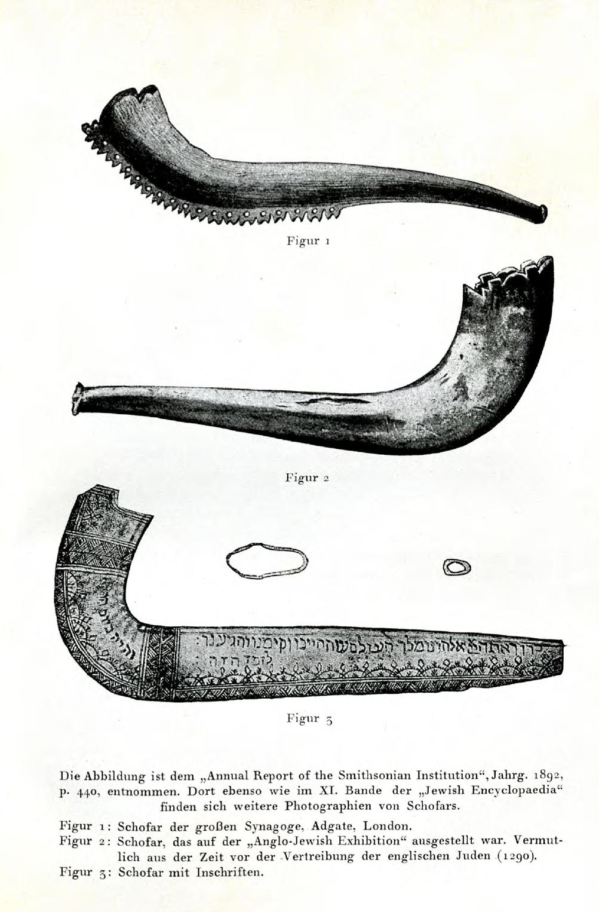
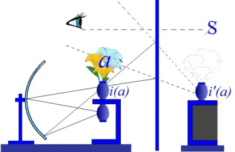

# Leçon 19 | 22 Mai l963

  <label><input type="checkbox" data-lacan-toggle="original" checked> 原文</label>
  <label><input type="checkbox" data-lacan-toggle="notes" checked> 注释</label>
  <label><input type="checkbox" data-lacan-toggle="commentary" checked> 个人解读评论</label>

<section class="parallel-paragraph" data-paragraph-ids="s10-19-0001">

s10-19-0001

[无对应译文]

原文 · s10-19-0001

Grossièrement, pour permettre une orientation sommaire pour quelqu’un qui par hasard arriverait au milieu de ce discours,
je dirai qu’à compléter comme je vous l’ai énoncé, ce qu’on pourrait dire être « *la gamme des rela­tions d’objet* », avoir...
dans le schéma qui se développe cette année autour de l’expérience de l’angoisse
...avoir cru que nous étions nécessités à ajouter à *l’objet oral*, à *l’objet anal*, à *l’objet phallique*...
précisément en tant que chacun est générateur et corrélatif d’un type d’angoisse
...2 *autres étages* de l’objet, portant donc à 5 ces *étages objectaux* dans la mesure où ils nous permettent cette année de nous repérer.

</section>

<section class="parallel-paragraph" data-paragraph-ids="s10-19-0002">

s10-19-0002

[无对应译文]

原文 · s10-19-0002

Vous avez, je pense, suffisamment entendu que depuis deux de nos ren­contres je suis autour de *l’étage de l’œil*.
Je ne le quitterai pas pour autant aujourd’hui,
mais plutôt, de là, me repérerai pour vous faire passer à l’éta­ge qu’il s’agit d’aborder aujourd’hui : *celui de l’oreille*.

</section>

<section class="parallel-paragraph" data-paragraph-ids="s10-19-0003">

s10-19-0003

[无对应译文]

原文 · s10-19-0003

Naturellement, je vous l’ai dit, mon premier mot aujourd’hui a été :
« *grossièrement* », *sommairement* également ai-je répété, dans la phrase suivante.

</section>

<section class="parallel-paragraph" data-paragraph-ids="s10-19-0004">

s10-19-0004

[无对应译文]

原文 · s10-19-0004

Ce serait tout à fait absurde de croire que c’est ainsi, sinon d’une façon grossièrement éxotérique et obscurcissante, ce dont il s’agit.
Il s’agit à tous ces niveaux :

</section>

<section class="parallel-paragraph" data-paragraph-ids="s10-19-0005">

s10-19-0005

[无对应译文]

原文 · s10-19-0005

- de repérer quelle est *la fonction du désir,* et aucun d’entre eux ne peut se séparer des répercussions qu’il a sur tous les autres et d’une solidarité intime qui les unit, celle qui s’exprime dans la fondation du sujet dans l’Autre par la voie du signifiant,

</section>

<section class="parallel-paragraph" data-paragraph-ids="s10-19-0006">

s10-19-0006

[无对应译文]

原文 · s10-19-0006

- de l’achèvement de cette fonction de repérage dans *l’avènement d’un reste*, autour de quoi tourne tout le drame du désir, drame qui nous resterait opaque si l’angoisse n’était là pour nous permettre d’en révéler le sens.

</section>

<section class="parallel-paragraph" data-paragraph-ids="s10-19-0007">

s10-19-0007

[无对应译文]

原文 · s10-19-0007

Ceci nous mène, en apparence souvent, à des sortes d’excursions, je dirai érudites,
où certains peuvent voir je ne sais quel charme éprouvé ou réprouvé de mon enseignement.

</section>

<section class="parallel-paragraph" data-paragraph-ids="s10-19-0008">

s10-19-0008

[无对应译文]

原文 · s10-19-0008

Croyez bien que ce n’est point sans réti­cence que je m’y avance,
et qu’aussi bien on étudiera *la méthode* selon laquel­le je procède dans l’enseignement que je vous donne...
ce n’est sûrement pas à moi de vous en épeler ici la rigueur
...le jour où on cherchera dans les textes qui pourront subsister, être transmissibles, *se faire encore* *entendre,* de ce que je vous donne ici, on s’apercevra que *cette méthode ne se distingue essentiel­lement pas de l’objet qui est abordé*.

</section>

<section class="parallel-paragraph" data-paragraph-ids="s10-19-0009">

s10-19-0009

[无对应译文]

原文 · s10-19-0009

Seulement, je vous rappelle qu’elle relève d’une nécessité :
*la vérité de la psychanalyse n’est*, tout au moins en partie, *accessible qu’à l’expérience du psychanalyste.*

</section>

<section class="parallel-paragraph" data-paragraph-ids="s10-19-0010">

s10-19-0010

[无对应译文]

原文 · s10-19-0010

Le principe même d’un enseignement public part de l’idée qu’elle est néanmoins communicable ailleurs.
Ceci posé, rien n’est résolu, puisque l’expérience psychanalytique doit être elle-même orientée, faute de quoi elle se fourvoie.

</section>

<section class="parallel-paragraph" data-paragraph-ids="s10-19-0011">

s10-19-0011

[无对应译文]

原文 · s10-19-0011

Elle se fourvoie si elle se partialise,
comme en divers points du mouvement analytique nous n’avons cessé depuis le début de cet enseignement de le signaler.

</section>

<section class="parallel-paragraph" data-paragraph-ids="s10-19-0012">

s10-19-0012

[无对应译文]

原文 · s10-19-0012

Nommément dans ce qui,

</section>

<section class="parallel-paragraph" data-paragraph-ids="s10-19-0013">

s10-19-0013

[无对应译文]

原文 · s10-19-0013

- loin d’être un appro­fondissement, un complément donné aux indications de la dernière doctri­ne de Freud dans l’exploration des ressorts et du statut du *moi*,

</section>

<section class="parallel-paragraph" data-paragraph-ids="s10-19-0014">

s10-19-0014

[无对应译文]

原文 · s10-19-0014

- loin d’être une continuation de ses indications et de son travail, nous avons vu se pro­duire ce qui est à proprement parler *une déviation*, *une réduction*, *une véritable aberration du champ de l’expérience*, sans doute commandée aussi par quelque chose que nous pouvons appeler « une sorte d’épaississement » qui s’était produit dans le premier champ de l’exploration analytique, celle qui pour nous caractérise, qui est caractérisée par le style d’illumination, la sorte de brillance qui reste attachée aux premières décades de la diffusion de l’enseignement freudien, à la forme des recherches de cette première génération, dont aujourd’hui je ferai intervenir l’un d’entre eux, qui vit encore je crois : Théodore Reik[^137], et nommément à propos... parmi de nombreux et immenses travaux techniques et cliniques ...un de ses travaux dits bien improprement « *de psychanalyse appliquée* » : ceux qu’il a faits sur le rituel.

</section>

<section class="parallel-paragraph" data-paragraph-ids="s10-19-0015">

s10-19-0015

[无对应译文]

原文 · s10-19-0015

Nous y voyons, il s’agit ici nommément de l’article paru dans *Imago* quelque part, je crois me souvenir vers la 8ème année, je pense,
à peu près - je n’ai pas apporté, par oubli, le texte ici - paru dans *Imago* vers la huitième année, je crois,
de cette publication, sur ce dont vous voyez ici écrit en lettres hébreu le nom : שופר, le *Shofar*.

</section>

<section class="parallel-paragraph" data-paragraph-ids="s10-19-0016">

s10-19-0016

[无对应译文]

原文 · s10-19-0016

Étude d’un éclat, d’une brillance, d’une fécondité dont on peut dire que le style, que les promesses, les caractéristiques de l’époque où il s’inscrit se sont vues tout d’un coup éteintes, que rien d’équivalent à ce qui se produit à cette période ne s’est continué,
et dont il convient de s’interroger : *pourquoi cette interrup­tion même* ?

</section>

<section class="parallel-paragraph" data-paragraph-ids="s10-19-0017">

s10-19-0017

[无对应译文]

原文 · s10-19-0017

C’est aussi bien que - si vous lisez cet article - vous y verrez se manifes­ter...
malgré les éloges que je peux donner à sa pénétration, à sa haute signi­fication
...vous y verrez se manifester au maximum cette source de confu­sion, ce profond défaut d’appui,
dont la forme la plus sensible et la plus manifeste est dans ce que j’appellerai l’usage purement analogique du sym­bole.

</section>

<section class="parallel-paragraph" data-paragraph-ids="s10-19-0018">

s10-19-0018

[无对应译文]

原文 · s10-19-0018

Le *Shofar* dont il s’agit, je crois qu’il faut d’abord que j’éclaire ce que c’est, peu sûr que je suis que tous ici sachent ce qu’il désigne.
Si j’amène aujourd’hui cet objet, car c’est un objet, c’est qu’il va nous servir de pivot, d’exemple pour matérialiser, pour substantifier devant vous ce que j’entends de la fonction du *petit(a)*, l’objet précisément à cet étage, le dernier, qui dans son fonc­tionnement,
me permet de révéler *la fonction, la fonction de sustentation* qui lie *le désir* à *l’angoisse* dans ce qui est son nœud dernier.

</section>

<section class="parallel-paragraph" data-paragraph-ids="s10-19-0019">

s10-19-0019

[无对应译文]

原文 · s10-19-0019

Vous comprendrez pourquoi, plutôt que de nommer tout de suite quel est ce *petit(a)* en fonction, à ce niveau...
*il dépasse celui de l’occultation de l’an­goisse dans le désir lié à l’œil...*plutôt que de le nommer tout de suite, vous comprendrez pourquoi je l’aborde par le *maniement* d’un objet, d’un objet rituel,
ce *Shofar,* qui est quoi en fin de compte : une corne !

</section>

<section class="parallel-paragraph" data-paragraph-ids="s10-19-0020">

s10-19-0020

[无对应译文]

原文 · s10-19-0020

Une corne dans laquelle on souffle, et qui fait entendre un son, dont assurément je ne peux dire, à ceux ici qui ne l’ont pas entendu, que de s’offrir au détour rituel des fêtes juives...
celles qui suivent le Nouvel An, et qui s’appellent celles du *Rosh Hashana,*
celles qui s’achèvent dans le jour du Grand Pardon*, le Yom Kippour...*de s’offrir à l’audition dans la synagogue, des sons par trois fois répétés du *Shofar.*

</section>

<section class="parallel-paragraph" data-paragraph-ids="s10-19-0021">

s10-19-0021

[无对应译文]

原文 · s10-19-0021

Cette corne, qu’on appelle en allemand *Widderhorn, corne de bélier,* s’appelle également *corne de bélier, Queren ha yebel,*
dans son commentaire, son explication dans le texte hébreu - n’est pas toujours une corne de bélier.

</section>

<section class="parallel-paragraph" data-paragraph-ids="s10-19-0022">

s10-19-0022

[无对应译文]

原文 · s10-19-0022

Au reste, les exemplaires qui en sont reproduits dans cet article de Reik, qui sont trois *Shofars* certainement particulièrement précieux et célèbres appartenant, si mon souvenir est bon, respectivement aux synagogues de Londres et d’Amsterdam,
se présentent comme des objets dont le profil général, à peu près semblable à ceci, fait bien plutôt penser à ce qu’il est,
car il est aussi classiquement des auteurs juifs qui se sont intéressés à cet objet et ont fait le catalogue de ses diverses formes signalent qu’il y a une forme de *Shofar* qui est une forme de corne, qui est fait dans la *corne d’un bouc sauvage*.

</section>

<section class="parallel-paragraph" data-paragraph-ids="s10-19-0023">

s10-19-0023

[无对应译文]

原文 · s10-19-0023

</section>

<section class="parallel-paragraph" data-paragraph-ids="s10-19-0024">

s10-19-0024

[无对应译文]

原文 · s10-19-0024

Et assurément un objet qui a cet aspect, assurément doit beaucoup plus probablement être issu de la fabrication, de l’altération,
de la réduction - qui sait ? - d’une...
c’est un objet d’une longueur considérable, plus grand que celle que je vous présente là au tableau
...peut-être issu donc, d’instrumentalisation *d’une corne de bouc*.

</section>

<section class="parallel-paragraph" data-paragraph-ids="s10-19-0025">

s10-19-0025

[无对应译文]

原文 · s10-19-0025

Ceux donc qui se sont offerts ou qui s’offriront à cette expérience témoigneront, je pense, comme il est général, du caractère...
disons pour rester dans des limites qui ne soient point trop lyriques
...du caractère profondé­ment émouvant, remuant, du surgissement d’une *émotion* dont les retentis­sements se présentent, indépendamment de l’atmosphère de recueillement, de foi, voire de repentance dans laquelle il se manifeste, qui retentissent par les voies mystérieuses de l’affect proprement auriculaire, qui *ne peuvent pas manquer de toucher à un degré vraiment insolite*, inhabituel,
tous ceux qui viennent à la portée d’entendre ces sons.

</section>

<section class="parallel-paragraph" data-paragraph-ids="s10-19-0026">

s10-19-0026

[无对应译文]

原文 · s10-19-0026

Autour du questionnement auquel Reik se livre autour de la fonction de ce *Shofar,* on ne peut manquer de s’apercevoir...
et c’est là ce qui me semble caractéristique de l’époque à laquelle ce travail appartient
...à la fois d’être frappé de la pertinence, de la subtilité, de la profondeur des réflexions dont cette étude foisonne.

</section>

<section class="parallel-paragraph" data-paragraph-ids="s10-19-0027">

s10-19-0027

[无对应译文]

原文 · s10-19-0027

Elle n’est pas seulement parsemée, vraiment elle les pro­duit autour je ne sais quel centre d’intuition et de flair.
Il y a, à la date même où ceci est paru - sans doute depuis avons-nous appris, peut-être par je ne sais quel ressassement, routine, usure de la méthode à être, de la résonance de ce qui se passe, de ce qui surgit de ces premiers travaux, blasés...

</section>

<section class="parallel-paragraph" data-paragraph-ids="s10-19-0028">

s10-19-0028

[无对应译文]

原文 · s10-19-0028

À l’époque, et *je puis vous en témoigner*, comparativement à tout ce qui se pouvait faire comme travaux érudits, et *faites-moi confiance*...

</section>

<section class="parallel-paragraph" data-paragraph-ids="s10-19-0029">

s10-19-0029

[无对应译文]

原文 · s10-19-0029

> vous savez que tout ce que je vous apporte ici est nourri de ma part,
>
> par souvent - en apparence - des enquêtes portées jusqu’aux limites du superflu
> ...*croyez-moi*, la différence de por­tée entre le mode d’interrogation des textes bibliques,
> ceux où le *Shofar* y est nommé comme corrélatif des circonstances majeures de la révélation appor­tée à Israël,
> on ne peut manquer d’être frappé combien Reik...

</section>

<section class="parallel-paragraph" data-paragraph-ids="s10-19-0030">

s10-19-0030

[无对应译文]

原文 · s10-19-0030

> d’une position qui, en principe tout au moins, répudie toute attache traditionnelle,
>
> voire se place même dans une position presque radicale de critique, pour ne pas dire de scepticisme,
>
> combien plus profondément que tous les commentateurs en apparence plus respectueux, plus pieux,
>
> plus soucieux de préserver l’essentiel d’un mes­sage
> ...va, lui, plus droit à ce qui paraît essentiellement la vérité de l’avè­nement historique
> autour de ces passages bibliques que j’évoquais, centrés et par eux rapportés. J’y reviendrai !

</section>

<section class="parallel-paragraph" data-paragraph-ids="s10-19-0031">

s10-19-0031

[无对应译文]

原文 · s10-19-0031

Mais il n’est pas moins frappant aussi, si vous vous repor­tez à cet article, de voir *combien à la fin il verse*...

</section>

<section class="parallel-paragraph" data-paragraph-ids="s10-19-0032">

s10-19-0032

[无对应译文]

原文 · s10-19-0032

> et certainement faute d’aucun de ces appuis théoriques
>
> qui permettent à un mode d’étude de s’ap­porter à soi-même ses propres limites
> *...dans une inextricable confusion*.

</section>

<section class="parallel-paragraph" data-paragraph-ids="s10-19-0033">

s10-19-0033

[无对应译文]

原文 · s10-19-0033

Il ne suffit pas que le *Shofar* et la voix qu’il supporte puissent être présentés comme analogie *de la fonction phallique...*
et en effet, pourquoi pas ?
mais comment et à quel niveau, c’est là que la question commence, *c’est aussi là qu’on s’arrête*
...il ne suffit pas qu’un tel maniement intuitif, analo­gique du symbole, laisse en quelque sorte l’interprétateur,
à une certaine limite, *démuni de tout critère*, pour qu’il n’apparaisse pas du même coup à quel point se télescope, à quel point verse...
dans une sorte de mélange et de confusion à proprement parler innommable
...tout ce à quoi, au dernier terme et dans son dernier chapitre aboutit Théodore Reik.

</section>

<section class="parallel-paragraph" data-paragraph-ids="s10-19-0034">

s10-19-0034

[无对应译文]

原文 · s10-19-0034

Pour vous en donner une idée, je ne vous indiquerai que ces points...
de pas en pas, et par l’inter­médiaire justement de la corne de bélier
...de l’indication qui nous est donnée par là de ce qui est bien évident : de la sous-jacence, plus exactement de la corrélation, pourquoi ne pas dire aussi bien du *conflit*, avec toute une réali­té, toute une structure sociale *totémique*,
au milieu de laquelle est plongée toute l’aventure historique d’Israël.

</section>

<section class="parallel-paragraph" data-paragraph-ids="s10-19-0035">

s10-19-0035

[无对应译文]

原文 · s10-19-0035

Comment, par quelle voie, comment se fait-il, qu’aucune barrière n’arrête Reik dans son analyse
et ne l’empêche à la fin d’identifier Yahwé avec *le veau d’or* ?

</section>

<section class="parallel-paragraph" data-paragraph-ids="s10-19-0036">

s10-19-0036

[无对应译文]

原文 · s10-19-0036

Moïse redescendant du Sinaï, rayonnant de la sublimité de l’amour du Père, l’a déjà tué,
et la preuve, nous dit-il, c’est qu’il devient cet être véritablement enragé qui va détruire *le veau d’or*
et le donner à manger en poudre à tous les hébreux. À quoi, bien entendu, vous reconnaîtrez la dimension du repas totémique.
Le plus étran­ge, c’est qu’aussi bien les nécessités de la démonstration ne pouvant passer que par l’identification de Yahwé,
non pas à un veau, mais à un taureau, le veau dont il s’agit sera donc nécessairement représentant
d’une divinité-fils à côté d’une divinité-père.
On ne nous parlera du veau que pour brouiller les traces, pour nous laisser ignorer qu’il y avait aussi un taureau.

</section>

<section class="parallel-paragraph" data-paragraph-ids="s10-19-0037">

s10-19-0037

[无对应译文]

原文 · s10-19-0037

Ainsi donc, puisque Moïse c’est le fils ici meurtrier du père,
ce que Moïse vient à détruire dans le veau par la succession de tous ces déplacements...
suivis d’une façon, où bien évidemment nous sentons
qu’il nous manque tout repérage, toute boussole capable de nous orienter
...ce sera donc son propre insigne à lui, Moïse.

</section>

<section class="parallel-paragraph" data-paragraph-ids="s10-19-0038">

s10-19-0038

[无对应译文]

原文 · s10-19-0038

Tout se consume dans une sorte d’auto-destruction.
Ceci ne vous est indiqué, je ne vous donne là qu’un certain nombre de points
qui vous mon­trent l’extrême auquel une certaine forme d’analyse peut parvenir en son excès.
Nous en aurons d’autres exemples dans les conférences qui suivront.

</section>

<section class="parallel-paragraph" data-paragraph-ids="s10-19-0039">

s10-19-0039

[无对应译文]

原文 · s10-19-0039

Pour nous, nous allons voir ce qui nous semble mériter ici d’être retenu, et pour cela savoir, savoir ce que nous cherchons,
ce qui ici, relève de ce que j’introduisais tout à l’heure comme constituant la nécessité de notre recherche.

</section>

<section class="parallel-paragraph" data-paragraph-ids="s10-19-0040">

s10-19-0040

[无对应译文]

原文 · s10-19-0040

À savoir : ne pas abandonner ce qui, dans *un certain texte*, qui n’est après tout rien d’autre que le texte fondateur d’une société,
la mienne, celle qui est la raison pour laquelle je suis ici en posture de vous donner cet ensei­gnement,
c’est que dans le principe qui commande la nécessité même d’un enseignement,
s’il y a au premier point la nécessité de situer correctement la psychanalyse parmi les sciences,
ce ne peut être qu’en soumettant sa tech­nique à l’examen de ce qu’elle « *suppose et effectue en vérité »*.

</section>

<section class="parallel-paragraph" data-paragraph-ids="s10-19-0041">

s10-19-0041

[无对应译文]

原文 · s10-19-0041

Ce texte, qu’après tout j’ai bien le droit de me souvenir que j’ai eu à le défendre et à l’imposer,
même si ceux, après tout, qui s’y sont laissés entraî­ner , n’y voyaient peut-être que des mots vides \[*sic*\],
ce texte me paraît fonda­mental, car ce que cette technique « *suppose et effectue en vérité* », c’est là notre point d’appui,
celui autour duquel nous devons faire tourner toute ordonnance, fût-elle structurale, de ce que nous avons à déployer.

</section>

<section class="parallel-paragraph" data-paragraph-ids="s10-19-0042">

s10-19-0042

[无对应译文]

原文 · s10-19-0042

Si nous méconnaissons que ce dont il s’agit dans notre technique, est d’un maniement, d’une interférence,
voire à la limite d’une *rectification* *du désir*, mais qui laisse entièrement ouverte et en suspens la notion du désir lui-même,
et qui nécessite sa perpétuelle remise en question, nous ne pouvons assurément, soit

</section>

<section class="parallel-paragraph" data-paragraph-ids="s10-19-0043">

s10-19-0043

[无对应译文]

原文 · s10-19-0043

- d’une part que nous égarer dans le réseau infini du signi­fiant,

</section>

<section class="parallel-paragraph" data-paragraph-ids="s10-19-0044">

s10-19-0044

[无对应译文]

原文 · s10-19-0044

- ou, pour nous reprendre, retomber dans les voies les plus ordinaires de la psychologie traditionnelle.

</section>

<section class="parallel-paragraph" data-paragraph-ids="s10-19-0045">

s10-19-0045

[无对应译文]

原文 · s10-19-0045

Ce que Reik découvre au cours de cette étude...
et qui est aussi ce dont à son époque, il ne peut tirer aucun parti,
faute de savoir où fourrer le résultat de sa découverte
...c’est ceci : il découvre par l’analyse des textes, des *textes bibliques*, je ne vous les énumère pas tous, mais ceux qui sont historiques,
je veux dire ceux qui prétendent se rapporter à un événe­ment révélateur, sont dans l’*Exode* aux *chapitres* XIX *et* XX...
respectivement versets 16 à 19 pour le chapitre XIX, verset 18 pour le chapitre XX
…où il est dit, dans la première référence, que dans ce dialogue tonitruant,
très énigmati­quement poursuivi dans une sorte d’*énorme tumulte*, véritable *orage de bruit* entre Moïse et le Seigneur
...il est mentionné le son du *Shofar.*

</section>

<section class="parallel-paragraph" data-paragraph-ids="s10-19-0046">

s10-19-0046

[无对应译文]

原文 · s10-19-0046

Un morceau énigmatique de ces versets indique également qu’alors qu’il est sévèrement inter­dit, et non seulement à tout homme, mais à tout être vivant, de s’approcher du cercle environné de foudre et d’éclairs où se passe ce dialogue,
le peuple pourra monter quand il entendra la voix du *Shofar.*

</section>

<section class="parallel-paragraph" data-paragraph-ids="s10-19-0047">

s10-19-0047

[无对应译文]

原文 · s10-19-0047

Point tellement contra­dictoire et énigmatique que dans la traduction on infléchit le sens,
et qu’on dit que *certains* pourront monter - lesquels ? - l’affaire reste dans l’obscurité.

</section>

<section class="parallel-paragraph" data-paragraph-ids="s10-19-0048">

s10-19-0048

[无对应译文]

原文 · s10-19-0048

Le *Shofar* est également expressément rementionné dans la suite de la description du dialogue, et la présence,
dans tout ce qui est perçu par le peuple censé assemblé autour de cet événement majeur, rementionne le son du Shofar.

</section>

<section class="parallel-paragraph" data-paragraph-ids="s10-19-0049">

s10-19-0049

[无对应译文]

原文 · s10-19-0049

L’analyse de Reik dont il ne trouve à dire pour la caractériser, pour la jus­tifier, rien d’autre que ceci :
c’est qu’une exploration analytique consiste à chercher *la vérité dans les détails*. Assurément, caractéristique qui n’est pas fausse
ni à coté, mais nous ne pouvons manquer de voir que si c’est un critère en quelque sorte externe, que c’est là l’assurance d’un style, ce n’est pas non plus pour autant quelque chose qui porte en soi cet élément critique :
celui de discerner *quel est le détail* qui doit être retenu.

</section>

<section class="parallel-paragraph" data-paragraph-ids="s10-19-0050">

s10-19-0050

[无对应译文]

原文 · s10-19-0050

Assurément, de toujours, nous savons que *ce détail* qui nous guide, c’est celui même qui paraît échapper au dessein de l’auteur,
rester en quelque sorte opaque, fermé par rapport à l’intention de sa *prédication*.
Mais encore, il n’est pas nécessaire de trouver entre eux *un critère*, sinon *de hiérarchie*, au moins *d’ordre*, *de préséance* ?

</section>

<section class="parallel-paragraph" data-paragraph-ids="s10-19-0051">

s10-19-0051

[无对应译文]

原文 · s10-19-0051

Quoi qu’il en soit nous ne pouvons manquer de sentir - je suis forcé de franchir les étapes de sa démonstration –
que quelque chose de juste est touché.

</section>

<section class="parallel-paragraph" data-paragraph-ids="s10-19-0052">

s10-19-0052

[无对应译文]

原文 · s10-19-0052

Quant à ordonner, articuler, et les textes fondamentaux originels men­tionnant la fonction du *Shofar,* ceux qui se complètent :

</section>

<section class="parallel-paragraph" data-paragraph-ids="s10-19-0053">

s10-19-0053

[无对应译文]

原文 · s10-19-0053

- de ceux de l’*Exode* que je viens de vous nommer,

</section>

<section class="parallel-paragraph" data-paragraph-ids="s10-19-0054">

s10-19-0054

[无对应译文]

原文 · s10-19-0054

- à ceux de *Samuel, le deuxième livre au chapitre* VI,

</section>

<section class="parallel-paragraph" data-paragraph-ids="s10-19-0055">

s10-19-0055

[无对应译文]

原文 · s10-19-0055

- à ceux des *Chroniques*, *au premier livre des Chroniques, chapitre* XIII, faisant mention de la fonction du *Shofar* chaque fois qu’il s’agit

</section>

<section class="parallel-paragraph" data-paragraph-ids="s10-19-0056">

s10-19-0056

[无对应译文]

原文 · s10-19-0056

- de refonder, de renouveler en quelque nouveau départ, qu’il soit périodique ou qu’il soit historique, l’Alliance avec Dieu.

</section>

<section class="parallel-paragraph" data-paragraph-ids="s10-19-0057">

s10-19-0057

[无对应译文]

原文 · s10-19-0057

La comparaison de ces textes avec aussi d’autres emplois occasionnels de l’instrument :
d’abord ceux qui se perpétuent en ces fêtes, fêtes annuelles, en tant qu’elles-mêmes se réfèrent à la répétition et à la remémoration à proprement parler de *l’Alliance*,
occasion aussi *exceptionnelle* : la fonction du *Shofar* dans la cérémonie dite de « *l’excommunica­tion* », celle sous laquelle, le 27 Juillet l656 tomba - vous le savez - Spinoza, *il fut exclu de la communauté* \[*sic*\] hébraïque selon les formes les plus complètes,
celle qui nommément comportait, avec la formule de la malédiction prononcée par le grand prêtre, la résonance du *Shofar.*
*Ce Shofar*, à travers l’éclairage qui se complète du rapprochement sous diverses occasions où il nous est à la fois signalé
et où il y entre effectivement en fonction, *est bel et bien* - et rien d’autre, nous dit Reik - *la voix de Dieu*,
de Yahwé, entendons la voix de Dieu lui-même.

</section>

<section class="parallel-paragraph" data-paragraph-ids="s10-19-0058">

s10-19-0058

[无对应译文]

原文 · s10-19-0058

Ce point, qui ne paraît pas, après tout, à une lecture rapide être quelque chose qui soit pour nous telle­ment susceptible d’être exploité, prend dans une *perspective* qui est celle précisément à laquelle je vous forme ici, car c’est autre chose que d’intro­duire
tel critère plus ou moins bien repéré, ou que ces critères, aussi bien dans leur nouveauté, avec l’efficience qu’ils comportent, constituent ce qu’on appelle une formation, c’est-à-dire une reformation de l’esprit dans son pouvoir d’abord.

</section>

<section class="parallel-paragraph" data-paragraph-ids="s10-19-0059">

s10-19-0059

[无对应译文]

原文 · s10-19-0059

Assurément, pour nous une telle formule ne peut que nous retenir pour autant qu’elle nous fait apercevoir ce quelque chose qui complète le rapport du sujet au signifiant dans ce que - *d’une certaine première appropriation* - on pourrait appeler son *passage à l’acte*.

</section>

<section class="parallel-paragraph" data-paragraph-ids="s10-19-0060">

s10-19-0060

[无对应译文]

原文 · s10-19-0060

Assurément, j’ai ici - tout à fait à gauche de l’assemblée - quelqu’un qui ne peut manquer d’être intéressé par cette référence,
c’est notre ami Conrad Stein dont, à cette occasion, je vous dirai quelle satisfaction j’ai pu éprouver à voir que son analyse
de *Totem et Tabou* et de ce qui peut, pour nous, en être retenu, l’a conduit à cette sorte de nécessité qui lui fait parler
de quelque chose qu’il appelle à la fois « *signifiants primordiaux* » et qu’il ne peut détacher de ce qu’il appelle également « *acte* », à savoir

</section>

<section class="parallel-paragraph" data-paragraph-ids="s10-19-0061">

s10-19-0061

[无对应译文]

原文 · s10-19-0061

- de ce qui se passe quand le signifiant n’est pas seulement articulé, ce qui ne suppose que sa liaison, sa cohérence en chaîne avec les autres,

</section>

<section class="parallel-paragraph" data-paragraph-ids="s10-19-0062">

s10-19-0062

[无对应译文]

原文 · s10-19-0062

- mais quand il est, à proprement parler, *émis* et *voca­lisé*.

</section>

<section class="parallel-paragraph" data-paragraph-ids="s10-19-0063">

s10-19-0063

[无对应译文]

原文 · s10-19-0063

Je ferai, quant à moi, ici, quelques... *toutes* les réserves même, sur l’intro­duction sans autre commentaire du terme « *acte* ».
Je ne veux pour l’instant retenir que ceci qui nous met en présence d’une certaine forme, non pas de l’acte,
mais de *l’objet(a)*, en tant que nous avons appris à le repérer,
en tant qu’il est supporté par ce quelque chose qu’il faut bien détacher de *la pho­némisation* comme telle, qui est...
la linguistique nous a rompus à nous en apercevoir
*...*qui n’est rien d’autre que *système d’opposition* avec ce qu’il introduit de possibilités de *substitution* et de *déplacement*, de *méta­phores* et de *métonymies*, et qui aussi bien se supporte de n’importe quel matériel capable de s’organiser en ces *oppositions* distinctives *d’un à tous*.

</section>

<section class="parallel-paragraph" data-paragraph-ids="s10-19-0064">

s10-19-0064

[无对应译文]

原文 · s10-19-0064

L’existence de la dimension proprement *vocale,* du passage de quelque chose de ce système dans une émission qui se présente à chaque fois comme iso­lée, est une dimension en soi, à partir du moment où nous nous apercevons dans quoi plonge *corporellement*
la possibilité de cette dimension émissive.

</section>

<section class="parallel-paragraph" data-paragraph-ids="s10-19-0065">

s10-19-0065

[无对应译文]

原文 · s10-19-0065

Et c’est là que vous comprenez, si vous ne l’avez déjà deviné, que prend sa valeur l’introduction exemplaire...
vous pensez bien que ce n’est pas le seul dont j’eusse pu me servir
...de cet objet exemplaire que j’ai pris cette fois dans le *Shofar :*

</section>

<section class="parallel-paragraph" data-paragraph-ids="s10-19-0066">

s10-19-0066

[无对应译文]

原文 · s10-19-0066

- parce qu’il est à notre portée,

</section>

<section class="parallel-paragraph" data-paragraph-ids="s10-19-0067">

s10-19-0067

[无对应译文]

原文 · s10-19-0067

- parce qu’il est, s’il est vraiment ce qu’on dit qu’il est, en un point source et jaillissant d’une tradition qui est la nôtre,

</section>

<section class="parallel-paragraph" data-paragraph-ids="s10-19-0068">

s10-19-0068

[无对应译文]

原文 · s10-19-0068

- parce que déjà un de nos ancêtres, dans l’énonciation analytique, s’en est occupé et l’a mis en valeur.

</section>

<section class="parallel-paragraph" data-paragraph-ids="s10-19-0069">

s10-19-0069

[无对应译文]

原文 · s10-19-0069

Mais le *tuba * ?
Mais la *trompette * ?
Mais d’autres instruments ?

</section>

<section class="parallel-paragraph" data-paragraph-ids="s10-19-0070">

s10-19-0070

[无对应译文]

原文 · s10-19-0070

Car il n’est pas nécessaire...
encore que ce ne puisse pas être n’importe quel instrument
...que ce soit un instrument à vent : dans la tradition abyssine, c’est le *tambour*.

</section>

<section class="parallel-paragraph" data-paragraph-ids="s10-19-0071">

s10-19-0071

[无对应译文]

原文 · s10-19-0071

Si j’avais continué de vous faire *ma relation de voyage* depuis que je suis rentré du Japon,
j’eusse fait état de la fonction tellement particulière dont, dans le théâtre japonais sous sa forme la plus caractéristique, celle du Nô, joue justement le style, la forme d’un cer­tain type de *battements* en tant qu’ils jouent...
par rapport à ce que nous pourrions appeler la précipitation ou le nœud de l’intérêt,
...une fonction vrai­ment précipitatrice et liante.

</section>

<section class="parallel-paragraph" data-paragraph-ids="s10-19-0072">

s10-19-0072

[无对应译文]

原文 · s10-19-0072

J’eusse pu aussi bien, me référant au champ ethnographique,
me mettre - comme d’ailleurs le fait lui-même Reik - à vous rappeler la fonction de ce qu’on appelle le « *bullroarer* »,
à savoir cet instrument très voisin de ce qu’est une toupie, encore qu’il soit fait très différemment,
qui dans les cérémonies de certaines tribus australiennes, font surgir un cer­tain type de ronflements
que le nom de l’instrument compare à rien moins qu’au mugissement du bœuf, comme le nom le désigne,
et qui mérite en effet d’être rapproché dans l’étude de Reik de cette fonction du *Shofar*
pour autant qu’elle aussi est mise en équivalence à ce que d’autres passages du texte biblique appellent
*le mugissement* ou *le rugissement de* *Dieu.*

</section>

<section class="parallel-paragraph" data-paragraph-ids="s10-19-0073">

s10-19-0073

[无对应译文]

原文 · s10-19-0073

</section>

<section class="parallel-paragraph" data-paragraph-ids="s10-19-0074">

s10-19-0074

[无对应译文]

原文 · s10-19-0074

L’intérêt de *cet objet* est de nous montrer ce *lieu de la voix*...

</section>

<section class="parallel-paragraph" data-paragraph-ids="s10-19-0075">

s10-19-0075

[无对应译文]

原文 · s10-19-0075

> et de quelle voix nous verrons son sens en nous repérant à son propos
>
> dans la topographie du rapport au grand Autre, n’allons pas trop vite
> ...mais cette *voix*, de nous la présen­ter ainsi, sous cette forme exemplaire où elle est là,

</section>

<section class="parallel-paragraph" data-paragraph-ids="s10-19-0076">

s10-19-0076

[无对应译文]

原文 · s10-19-0076

- d’une certaine façon *en puissance*,

</section>

<section class="parallel-paragraph" data-paragraph-ids="s10-19-0077">

s10-19-0077

[无对应译文]

原文 · s10-19-0077

- *sous une forme séparée*, c’est elle qui va nous permettre, au moins, de faire surgir un certain nombre de questions qui ne sont guère sou­levées.

</section>

<section class="parallel-paragraph" data-paragraph-ids="s10-19-0078">

s10-19-0078

[无对应译文]

原文 · s10-19-0078

La *fonction du Shofar* entre en action dans certains moments périodiques
qui se présentent au premier aspect comme de *renouvellement -* de quoi ? - du pacte de l’Alliance.

</section>

<section class="parallel-paragraph" data-paragraph-ids="s10-19-0079">

s10-19-0079

[无对应译文]

原文 · s10-19-0079

Le *Shofar* n’articule pas les principes, les bases, les commandements de ce pacte. Il est pourtant bien manifestement présenté,jusque dans l’articulation dogmatique à son propos, inscrite dans le nom même, courant, du moment où il intervient,
comme ayant fonction de souve­nance : « לזכור » \[zêxére\] : *« se souvenir* »,
c’est le trinitaire qui supporte la fonction du souvenir pour autant qu’elle paraît ici appropriée.

</section>

<section class="parallel-paragraph" data-paragraph-ids="s10-19-0080">

s10-19-0080

[无对应译文]

原文 · s10-19-0080

Un moment, le moment médian justement, de ces 3 émissions solennelles du *Shofar,* au terme des jours de jeûne du *Roch Hachana,*
s’appelle *Zichronot* et ce dont il s’agit - *Zikkron teru ah, teru ah* désigne proprement la sorte de *trémolo* qui est propre
à une certaine façon de sonner le *Shofar,* disons que c’est le son du *Shofar -* le *zichronot* c’est *ce qu’il y a de souvenance liée à ce son*.

</section>

<section class="parallel-paragraph" data-paragraph-ids="s10-19-0081">

s10-19-0081

[无对应译文]

原文 · s10-19-0081

Cette souvenance, sans doute est-elle souvenance de quelque chose,
de quelque chose à quoi l’on médite dans les instants qui précèdent, souvenan­ce de la *aqedah.*
La *aqedah,* c’est le moment du sacrifice d’Abraham, celui précis où Dieu arrête sa main déjà consentante,
pour substituer à la victime - Isaac - le bélier que vous savez, que vous croyez savoir.

</section>

<section class="parallel-paragraph" data-paragraph-ids="s10-19-0082">

s10-19-0082

[无对应译文]

原文 · s10-19-0082

Est-ce à dire pourtant que ce moment même du pacte soit tout entier inclus dans le son du *Shofar* ?
« *Souvenir du son du* *Shofar* » ou « *son du Shofar comme soutenant le souvenir* » : est-ce qu’il ne se pose pas la ques­tion de *qui a à se souvenir* ? *Pourquoi penser que ce sont les fidèles*, puis­qu’ils viennent justement de passer un certain temps de recueillement autour de ce souvenir ?

</section>

<section class="parallel-paragraph" data-paragraph-ids="s10-19-0083">

s10-19-0083

[无对应译文]

原文 · s10-19-0083

La question a une très grande importance, parce qu’elle nous mène à pro­prement parler sur le terrain où s’est dessinée,
dans l’esprit de Freud, sous sa forme la plus fulgurante, *la fonction de répétition *:

</section>

<section class="parallel-paragraph" data-paragraph-ids="s10-19-0084">

s10-19-0084

[无对应译文]

原文 · s10-19-0084

- la *fonction de répétition* est-elle seulement automatique, et liée en quelque sorte au retour, au charroiement nécessaire de la batterie du signifiant ?

</section>

<section class="parallel-paragraph" data-paragraph-ids="s10-19-0085">

s10-19-0085

[无对应译文]

原文 · s10-19-0085

- Ou bien a-t-elle une autre dimension, celle qu’il me paraît inévitable de rencontrer dans notre expérience, si elle a un sens, c’est celle qui donne le sens de cette interrogation portée par la défini­tion du *lieu de l’Autre*, qui est caractéristique de ce que j’essaie devant vous de soutenir, ce à quoi j’essaie d’accommoder votre mode mental* * ?

</section>

<section class="parallel-paragraph" data-paragraph-ids="s10-19-0086">

s10-19-0086

[无对应译文]

原文 · s10-19-0086

Pour tout dire, est-ce que celui dont il s’agit de réveiller en cette occasion le souvenir...
je veux dire de faire qu’*il* se souvienne, *lui...*ce n’est pas Dieu lui-même ?

</section>

<section class="parallel-paragraph" data-paragraph-ids="s10-19-0087">

s10-19-0087

[无对应译文]

原文 · s10-19-0087

Tel est le point sur lequel nous porte, je ne dirai pas ce très simple instrument, car à la vérité chacun ne peut que ressentir,
devant l’existence et la fonction d’un tel appa­reil, au minimum qu’un sentiment profond d’*embarras*.

</section>

<section class="parallel-paragraph" data-paragraph-ids="s10-19-0088">

s10-19-0088

[无对应译文]

原文 · s10-19-0088

Mais ce dont il s’agit pour nous maintenant, est de savoir - comme objet séparé - de savoir où il s’insère,
à quel domaine, non pas dans l’opposition *intérieur - extérieur,* dont vous sentez bien ici toute l’insuffisance,
mais dans la réfé­rence à l’Autre, dans les stades de l’émergence de l’instauration progressi­ve,
sur la référence à ce champ d’énigme qu’est l’Autre du sujet.

</section>

<section class="parallel-paragraph" data-paragraph-ids="s10-19-0089">

s10-19-0089

[无对应译文]

原文 · s10-19-0089

À quel moment, peut intervenir un tel type d’objet dans sa face enfin dévoilée sous *sa forme séparable*,
et qui s’appelle maintenant quelque chose que nous connaissons bien : *la voix*.

</section>

<section class="parallel-paragraph" data-paragraph-ids="s10-19-0090">

s10-19-0090

[无对应译文]

原文 · s10-19-0090

Que nous connaissons bien... que nous *croyons* bien connaître sous prétexte que nous en connaissons *les déchets, les feuilles mortes,*
sous la forme « *des* *voix* » égarées de la psychose, le caractère parasitaire sous la forme des impératifs interrompus du *surmoi*.

</section>

<section class="parallel-paragraph" data-paragraph-ids="s10-19-0091">

s10-19-0091

[无对应译文]

原文 · s10-19-0091

C’est ici qu’il nous faut, pour nous orienter, pour repérer la véritable place, la différence de cet objet nouveau...

</section>

<section class="parallel-paragraph" data-paragraph-ids="s10-19-0092">

s10-19-0092

[无对应译文]

原文 · s10-19-0092

> dont, à tort ou à raison, par un souci d’exposition, j’ai cru aujourd’hui devoir d’abord,
>
> pour vous, vous le pré­senter sous une forme en quelque sorte maniable, sinon exemplaire
> ...c’est ici, maintenant, qu’il nous faut nous repérer, pour voir sa différence, ce qu’il intro­duit de *nouveau* par rapport à l’étage précédemment articulé, celui qui concernait la structure du désir sous une autre forme exemplaire[^138],
> com­bien différente - vous ne pouvez pas ne pas le sentir - et dont il semble que tout ce qui est révélé dans cette nouvelle dimension n’y soit et ne puisse y être d’abord que masqué dans cet autre étage, il nous faut un ins­tant y revenir pour mieux faire jaillir,
> saillir, ce qu’apporte de nouveau le niveau où apparaît la forme de *(a)* qui s’appelle *la voix*.

</section>

<section class="parallel-paragraph" data-paragraph-ids="s10-19-0093">

s10-19-0093

[无对应译文]

原文 · s10-19-0093

Revenons au niveau de *l’œil* qui est aussi celui de *l’espace*,
non pas de l’es­pace que nous interrogions sous la forme d’une *catégorie d’une esthétique transcendantale* fixée...

</section>

<section class="parallel-paragraph" data-paragraph-ids="s10-19-0094">

s10-19-0094

[无对应译文]

原文 · s10-19-0094

> encore qu’assurément la référence à ce que Kant a apporté sur ce terrain nous soit,
>
> sinon très utile, à tout le moins très commode
> ...mais dans ce que, pour nous, l’espace nous présente de caractéristique dans sa relation au *désir*.

</section>

<section class="parallel-paragraph" data-paragraph-ids="s10-19-0095">

s10-19-0095

[无对应译文]

原文 · s10-19-0095

L’origine, la base, la structure, de *la fonction du désir* comme tel est...
dans un style, dans une forme, à chaque fois à préciser
...cet *objet* central *(a)*, en tant qu’il est non seulement séparé mais *éludé*, toujours ailleurs que là où *le désir le supporte,*
et pourtant *en relation profonde* avec lui, ce carac­tère d’élusion n’est nulle part plus *manifeste* qu’au niveau de la fonction de l’œil.

</section>

<section class="parallel-paragraph" data-paragraph-ids="s10-19-0096">

s10-19-0096

[无对应译文]

原文 · s10-19-0096

Et c’est en quoi *le support le plus satisfaisant de la fonction du désir : le fantasme*, est toujours marqué d’une parenté avec les modèles visuels où il fonctionne communément - si l’on peut dire - où il donne le ton de notre vie désirante.

</section>

<section class="parallel-paragraph" data-paragraph-ids="s10-19-0097">

s10-19-0097

[无对应译文]

原文 · s10-19-0097

Dans l’espace pourtant...
et c’est dans ce *« pourtant »* que tient toute la por­tée de la remarque
...rien en apparence n’est séparé : *l’espace est homogène*.

</section>

<section class="parallel-paragraph" data-paragraph-ids="s10-19-0098">

s10-19-0098

[无对应译文]

原文 · s10-19-0098

Quand nous pensons en termes d’espace, même ce corps, le nôtre, d’où surgit sa fonction...
ce n’est pas de l’*idéalisme*, ce n’est point parce que l’es­pace est une fonction de l’esprit
qu’il puisse justifier aucun berkeleyisme, l’espace n’est pas une *Idée*,
l’espace c’est quelque chose qui a un certain rap­port, non pas avec l’esprit, mais avec *l’œil*
...même ce corps a une fonction - de quoi ? - il est *appendu *:
ce corps, dès que nous pensons espace, nous devons en quelque sorte *le neutraliser en l’y localisant*.

</section>

<section class="parallel-paragraph" data-paragraph-ids="s10-19-0099">

s10-19-0099

[无对应译文]

原文 · s10-19-0099

Pensez simplement à la façon dont le physicien fait mention, au tableau noir, de la fonction dans l’espace, d’un corps :
un corps, c’est n’importe quoi et ça n’est rien, c’est un point, c’est quelque chose qui tout de même doit s’y localiser
par quelque chose d’étranger aux dimensions de l’espace, sauf à produire les insolubles questions du problème de l’individuation,
à propos desquelles vous avez déjà entendu, à plus d’une reprise je pense, la manifestation, l’ex­pression, de ma dérision[^139].

</section>

<section class="parallel-paragraph" data-paragraph-ids="s10-19-0100">

s10-19-0100

[无对应译文]

原文 · s10-19-0100

Un corps dans l’espace, c’est simplement quelque chose qui, à tout le moins, se présente comme *impénétrable*.

</section>

<section class="parallel-paragraph" data-paragraph-ids="s10-19-0101">

s10-19-0101

[无对应译文]

原文 · s10-19-0101

Il y a un certain réalisme de l’es­pace complètement *intenable*...
comme vous le savez, parce que ce n’est pas moi qui vais vous en refaire ici les antinomies
...mais *nécessaire*.

</section>

<section class="parallel-paragraph" data-paragraph-ids="s10-19-0102">

s10-19-0102

[无对应译文]

原文 · s10-19-0102

L’usage même de la fonction d’espace suggère...
si punctiforme que vous la suppo­siez
...cette unité insécable à la fois nécessaire et insoutenable, qu’on appelle « *l’atome* »,
bien sûr tout à fait *impossible* à identifier avec ce qu’on appelle en physique de ce terme,
qui comme vous le savez n’a rien d’atomique, je veux dire qu’il n’est point insécable.

</section>

<section class="parallel-paragraph" data-paragraph-ids="s10-19-0103">

s10-19-0103

[无对应译文]

原文 · s10-19-0103

L’espace n’a d’intérêt qu’à supposer cette résistance ultime à *la sec­tion,* puisqu’il n’a d’usage réel que s’il est *discontinu,*
*c’est-à-dire si l’unité qui y joue ne peut pas être en deux points à la fois.*

</section>

<section class="parallel-paragraph" data-paragraph-ids="s10-19-0104">

s10-19-0104

[无对应译文]

原文 · s10-19-0104

Qu’est-ce que ça veut dire pour nous ?
C’est qu’elle ne peut être reconnue - cette unité spatiale: le point - que comme inaliénable,
ce qui veut dire pour nous qu’elle ne peut être en aucun cas *petit (a)*.

</section>

<section class="parallel-paragraph" data-paragraph-ids="s10-19-0105">

s10-19-0105

[无对应译文]

原文 · s10-19-0105

Qu’est-ce que ça signifie ce que je suis en train de vous dire ?
Je me presse de vous faire retomber dans les filets du « *déjà entendu* ».

</section>

<section class="parallel-paragraph" data-paragraph-ids="s10-19-0106">

s10-19-0106

[无对应译文]

原文 · s10-19-0106

</section>

<section class="parallel-paragraph" data-paragraph-ids="s10-19-0107">

s10-19-0107

[无对应译文]

原文 · s10-19-0107

Ceci veut dire que par la forme *i(a)*, mon image, ma présence dans l’Autre est sans *reste*. *Je ne peux voir ce que j’y perds*.
C’est cela le sens du stade du miroir, et le sens de ce schéma, pour vous forgé, dont vous voyez maintenant exactement la place...
puisque c’est le schéma destiné à fonder la fonction du *moi idéal* et de l’*idéal du moi*
...c’est la façon dont fonctionne le rapport du sujet à l’Autre quand la relation spéculaire - *appelée en cette occasion* *miroir du grand Autre* - y domine.

</section>

<section class="parallel-paragraph" data-paragraph-ids="s10-19-0108">

s10-19-0108

[无对应译文]

原文 · s10-19-0108

Cette image *(а)* - par sa forme *i(а),* *image spéculaire*, objet caractéristique du stade du miroir - a plus d’une séduction,
qui n’est pas seulement liée à la structure de chaque sujet, mais aussi à la fonction de la connaissance :
elle est fermée, j’entends dire close, elle est *gestaltique,* c’est-à-dire marquée par la prédominance d’une « *bonne forme* »,
et est faite aussi pour nous mettre en garde contre ce que cette fonction de la *Gestalt...*
en tant qu’elle est fondée sur l’expérience de la « *bonne forme* », expérience justement caractéristique de ce champ
...*contient de pièges*.

</section>

<section class="parallel-paragraph" data-paragraph-ids="s10-19-0109">

s10-19-0109

[无对应译文]

原文 · s10-19-0109

Car, pour révéler ce qu’il y a d’apparence dans ce caractère satisfaisant de « *la forme* » comme telle, voire de « *l’Idée* »
dans son enracinement dans l’εἶδος \[eidos\] visuel, pour voir se déchirer ce qu’il y a d’*illusoire*,
il suffit d’y apporter une tache, pour voir où s’attache vraiment *la pointe du désir.*

</section>

<section class="parallel-paragraph" data-paragraph-ids="s10-19-0110">

s10-19-0110

[无对应译文]

原文 · s10-19-0110

Pour faire fonction*...*
si vous me permettez l’usage équivoque d’un terme courant pour supporter ce que je veux vous faire entendre
...il suffit d’une tache pour faire fonction de *« grain de beauté »*.

</section>

<section class="parallel-paragraph" data-paragraph-ids="s10-19-0111">

s10-19-0111

[无对应译文]

原文 · s10-19-0111

*Grains et issues* [^140]*...*
si vous me permettez de poursuivre l’équivoque
...*de la beauté*, montrent la place du *(a)* \[*reste, déchet*\] ici réduit à ce *point zéro* dont j’évoquais la dernière fois *la fonction*.

</section>

<section class="parallel-paragraph" data-paragraph-ids="s10-19-0112">

s10-19-0112

[无对应译文]

原文 · s10-19-0112

*Le grain de beauté* - plus que la forme qu’il entache - *c’est lui qui me regarde*.
Et c’est parce que ça me regarde qu’il m’at­tire si paradoxalement, quelquefois plus et à plus juste titre
que le regard de ma partenaire, car ce regard *me reflète* après tout et pour autant qu’il *me reflète*, il n’est que *mon reflet, buée imaginaire*.

</section>

<section class="parallel-paragraph" data-paragraph-ids="s10-19-0113">

s10-19-0113

[无对应译文]

原文 · s10-19-0113

Il n’est pas besoin que le cristallin soit épaissi par la cataracte pour rendre aveugle la vision.
Aveugle en tout cas à ceci : *l’élision de la castration au niveau du désir, en tant qu’il est projeté dans l’image*,

</section>

<section class="parallel-paragraph" data-paragraph-ids="s10-19-0114">

s10-19-0114

[无对应译文]

原文 · s10-19-0114

- *le blanc de l’œil de l’aveugle,*

</section>

<section class="parallel-paragraph" data-paragraph-ids="s10-19-0115">

s10-19-0115

[无对应译文]

原文 · s10-19-0115

- ou, pour prendre une autre image, à ce moment...

</section>

<section class="parallel-paragraph" data-paragraph-ids="s10-19-0116">

s10-19-0116

[无对应译文]

原文 · s10-19-0116

> dont vous vous souvenez j’espère, encore que ce soit un écho d’une autre année, aux viveurs de *La Dolce vita* [^141],
> ...aux derniers moments fan­tomatiques du film,
> quand ils s’avancent comme sautant d’une ombre à l’autre, du bois de pins où ils se profilent pour déboucher sur la plage,
> ils voient *l’œil inerte de la chose marine* que les pêcheurs sont en train de faire émerger :
> *voilà ce par quoi nous sommes le plus regardés*.

</section>

<section class="parallel-paragraph" data-paragraph-ids="s10-19-0117">

s10-19-0117

[无对应译文]

原文 · s10-19-0117

Et ce qui montre comment l’angoisse émerge dans la vision, au lieu du désir qu’il commande, c’est la vertu du *tatouage*.

</section>

<section class="parallel-paragraph" data-paragraph-ids="s10-19-0118">

s10-19-0118

[无对应译文]

原文 · s10-19-0118

Et je n’ai pas besoin de vous rappeler ce passage admirable de Lévi-Strauss[^142],

</section>

<section class="parallel-paragraph" data-paragraph-ids="s10-19-0119">

s10-19-0119

[无对应译文]

原文 · s10-19-0119

quand il nous évoque ce déferlement du désir des colons assoiffés, quand ils débouchent dans cette zone du Parana
où les attendent ces femmes \[Caduveo\] entièrement couvertes d’un chatoiement de dessins
imbriquant la plus grande variété *des formes et des couleurs*.

</section>

<section class="parallel-paragraph" data-paragraph-ids="s10-19-0120">

s10-19-0120

[无对应译文]

原文 · s10-19-0120

À l’autre bout, ce que j’évoquerai, c’est que, si je puis dire, dans la réfé­rence de l’émergence...
qui, vous le savez, est pour moi marquée d’un style plus créa­tionniste qu’évolutionniste des formes
...l’apparition de l’appareil visuel lui-même, au niveau des franges des lamellibranches, commence à la tache pig­mentaire :
première apparition d’un organe différencié dans le sens d’une *sensibilité* qui déjà, à proprement parler, est visuelle.

</section>

<section class="parallel-paragraph" data-paragraph-ids="s10-19-0121">

s10-19-0121

[无对应译文]

原文 · s10-19-0121

Et bien sûr, *rien de plus aveugle qu’une tache !*
À la « *mouche* »[^143] de tout à l’heure, adjoindrai-je « *la mouche volante* » qui donne *au détour cinquantenaire* des dangers orga­niques,
son premier avertissement ?

</section>

<section class="parallel-paragraph" data-paragraph-ids="s10-19-0122">

s10-19-0122

[无对应译文]

原文 · s10-19-0122

*Zéro du petit(a), c’est là par quoi le désir visuel masque l’angoisse*

</section>

<section class="parallel-paragraph" data-paragraph-ids="s10-19-0123">

s10-19-0123

[无对应译文]

原文 · s10-19-0123

- *de ce qui manque essentiellement au désir*,

</section>

<section class="parallel-paragraph" data-paragraph-ids="s10-19-0124">

s10-19-0124

[无对应译文]

原文 · s10-19-0124

- *de ce qui nous commande en fin de comp­te*, si nous restions sur ce champ de la vision, *de ne saisir,* *de ne pouvoir jamais saisir tout être vivant que comme ce qu’il est dans le champ pur du signal visuel *: ce que l’ethologie appelle *un dummy, une poupée, une appa­rence*.

</section>

<section class="parallel-paragraph" data-paragraph-ids="s10-19-0125">

s10-19-0125

[无对应译文]

原文 · s10-19-0125

*Petit(a) - ce qui manque - est non spéculaire : il n’est pas saisissable dans l’image.*

</section>

<section class="parallel-paragraph" data-paragraph-ids="s10-19-0126">

s10-19-0126

[无对应译文]

原文 · s10-19-0126

Je vous ai pointé *l’œil blanc de l’aveugle* comme l’image révélée, et irrémédiablement cachée à la fois, du *désir scoptophilique*.
L’œil du voyeur lui-même apparaît à l’autre comme ce qu’il est : *comme impuissant*.

</section>

<section class="parallel-paragraph" data-paragraph-ids="s10-19-0127">

s10-19-0127

[无对应译文]

原文 · s10-19-0127

C’est bien ce qui permet à notre civilisation de mettre en boîte ce qu’il supporte sous ses formes diverses,
parfaitement homogènes aux *dividendes* et aux *réserves bancaires* qu’il commande.

</section>

<section class="parallel-paragraph" data-paragraph-ids="s10-19-0128">

s10-19-0128

[无对应译文]

原文 · s10-19-0128

Ce rapport réciproque du *désir* à *l’angoisse*, sous cette forme *radicalement masquée*,
liée de ce fait même à *la structure du désir* dans ses fonctions, ses dimen­sions les plus leurrantes,
voilà l’étage spécifiquement défini auquel nous avons maintenant à opposer quelle ouverture lui apporte *l’autre fonction*,
celle que j’ai aujourd’hui introduite avec cet accessoire non pourtant acci­dentel du *Shofar.*

</section>

<section class="parallel-paragraph" data-paragraph-ids="s10-19-0129">

s10-19-0129

[无对应译文]

原文 · s10-19-0129

Ai-je besoin pour clore mon discours d’anticiper sur ce que j’articulerai *pas à pas* la prochaine fois ?

</section>

<section class="parallel-paragraph" data-paragraph-ids="s10-19-0130">

s10-19-0130

[无对应译文]

原文 · s10-19-0130

C’est à savoir comment notre tradition la plus élémentaire, celle des premiers pas de Freud,
nous commande de distinguer *cette autre dimension*.
Que nous dit-elle ?

</section>

<section class="parallel-paragraph" data-paragraph-ids="s10-19-0131">

s10-19-0131

[无对应译文]

原文 · s10-19-0131

Là encore, je ferai hommage à notre ami Stein de l’avoir, dans son discours, fort bien articulé :

</section>

<section class="parallel-paragraph" data-paragraph-ids="s10-19-0132">

s10-19-0132

[无对应译文]

原文 · s10-19-0132

« *Si le désir*...

</section>

<section class="parallel-paragraph" data-paragraph-ids="s10-19-0133">

s10-19-0133

[无对应译文]

原文 · s10-19-0133

> dit-il, et je souscris à sa formule, car je la trouve plus que brillante
> ...« *Si le désir était primordial, si c’était le désir de la mère qui commandait l’entrée en jeu du crime originel,*
> *nous serions sur le terrain du vaudeville* ».

</section>

<section class="parallel-paragraph" data-paragraph-ids="s10-19-0134">

s10-19-0134

[无对应译文]

原文 · s10-19-0134

L’*origine*, nous dit Freud de la façon *la plus formelle*...

</section>

<section class="parallel-paragraph" data-paragraph-ids="s10-19-0135">

s10-19-0135

[无对应译文]

原文 · s10-19-0135

> et à l’oublier toute la chaîne se défait, et c’est pour ne l’avoir pas réassuré, ce départ de la chaî­ne, que l’analyse - je parle de l’analyse *en théorie* comme *en pratique -* semble subir cette forme de dispersion
>
> où l’on peut se demander à certaines heures qu’est-ce qui est susceptible de lui conserver encore sa cohérence
> ...c’est parce que « *le meurtre du père* » et tout ce qu’il commande, est ce qui retentit...
> s’il faut *entendre* ce qu’on ose espérer n’être que *métaphore* dans la bouche de Reik
> ...que c’est son « *beuglement de taureau assommé* » qui se fait entendre encore dans le son du *Shofar.*

</section>

<section class="parallel-paragraph" data-paragraph-ids="s10-19-0136">

s10-19-0136

[无对应译文]

原文 · s10-19-0136

Disons plus simplement que c’est du fait originel...
inscrit dans *le mythe du meurtre* comme départ de quelque chose
dont nous avons dès lors à saisir *la fonction dans l’économie du désir*,
...c’est à partir de là...
comme interdit, comme impossible à transgresser,
...que se constitue, dans la forme la plus fondamentale, le désir originel.

</section>

<section class="parallel-paragraph" data-paragraph-ids="s10-19-0137">

s10-19-0137

[无对应译文]

原文 · s10-19-0137

*Il est secondaire*

</section>

<section class="parallel-paragraph" data-paragraph-ids="s10-19-0138">

s10-19-0138

[无对应译文]

原文 · s10-19-0138

- par rapport à une dimension qu’ici nous avons à abor­der,

</section>

<section class="parallel-paragraph" data-paragraph-ids="s10-19-0139">

s10-19-0139

[无对应译文]

原文 · s10-19-0139

- par rapport à *l’objet essentiel* qui y fait *fonction de* *petit(a) *: *cette fonction de la voix*

</section>

<section class="parallel-paragraph" data-paragraph-ids="s10-19-0140">

s10-19-0140

[无对应译文]

原文 · s10-19-0140

- et ce qu’elle apporte de dimensions nouvelles dans le rapport du *désir* à *l’angoisse*,

</section>

<section class="parallel-paragraph" data-paragraph-ids="s10-19-0141">

s10-19-0141

[无对应译文]

原文 · s10-19-0141

- c’est là le détour par où vont reprendre leur valeur les fonc­tions : *désir, objet, angoisse,* à tous les étages, jusqu’à l’étage de l’origine.

</section>

<section class="parallel-paragraph" data-paragraph-ids="s10-19-0142">

s10-19-0142

[无对应译文]

原文 · s10-19-0142

Et pour ne pas manquer à la fois de devancer vos questions, de vous dire aussi - peut-être - pour ceux qui se les sont posées,
que je n’oublie pas ce champ et les sillons que j’ai à tracer pour y être complet :
vous avez pu remarquer que je n’ai pas fait état ni de l’*objet,* ni du *stade anal*, au moins depuis la repri­se de nos entretiens.

</section>

<section class="parallel-paragraph" data-paragraph-ids="s10-19-0143">

s10-19-0143

[无对应译文]

原文 · s10-19-0143

C’est qu’aussi bien il est à proprement parler impen­sable,
si ce n’est dans la reprise totale de la fonction du désir, à partir de ce point, qui pour être énoncé le dernier ici, est le plus originel, celui que je reprendrai la prochaine fois autour de *l’objet de la voix*.

</section>

<section class="note-block original-notes">

## Notes

[^137]: Theodor Reik : *Das Ritual, Psychoanalitische Studien*, Imago 1928, Bucher/XI ; *Le rituel, psychanalyse des rites religieux*, Paris, Denoël, 1974.

[^138]: Celle de l’œil, du regard, de l’image, du miroir, *i(a)* et *i’(a), etc.,* sur laquelle Lacan reviendra longuement dans le séminaire 1965-66 (L’objet) à propos

    des *Ménines* et de la géomètrie projective de Girard Desargues

[^139]: Cf. supra, note 99, séance du 20-03, Bertrand Russell : *Écrits de logique philosophique*, PUF, 1989.

[^140]: Issues : Produits autres que la farine obtenus au cours de la mouture des céréales (son, remoulage, recoupe, etc.).

    Parties dites du cinquième quartier, comprenant les abats et les parties non consommables : cornes, cuirs, suif…

[^141]: La Dolce Vita : film italien de Federico Fellini( 1960).

[^142]: C. Lévi-Strauss : *Anthropologie structurale.* Paris, Plon, 1958, p. 279 ou Pocket n°7, 1985 p. 296 : « *L' art caduveo pousse la dislocation à la fois plus loin et moins loin.* \[...\]

    *précisément parce que cette peinture, au lieu de représenter l'image d'un visage déformé, déforme effectivement un visage véritable, la dislocation va plus loin que celle précédemment décrite.*

    *Il s'y mêle, en plus de la valeur décorative, un élément subtil de sadisme qui explique, au moins en partie, pourquoi l'attrait érotique des femmes caduveo (exprimé dans les peintures et*

    *traduit par elles) appelait jadis vers les rives du Paraguay les hors-la-loi et les chercheurs d'aventure. Plusieurs, maintenant vieillis et installés maritalement parmi les indigènes,*

    *m'ont décrit en frémissant ces corps d'adolescentes nues com­plètement couverts de lacis et d'arabesques d'une subti­lité perverse.* »

[^143]: Petit rond de taffetas ou de velours noirs , ou d’un point de crayon spécial , imitant le grain de beauté , que les femmes se mettaient parfois sur le visage ou sur

    le décolleté par coquetterie ou pour rehausser la blancheur de leur peau.

</section>
