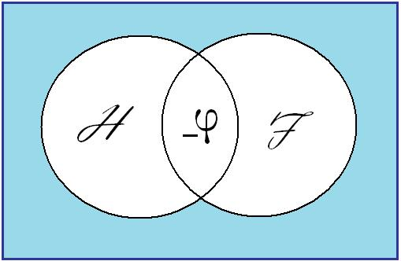
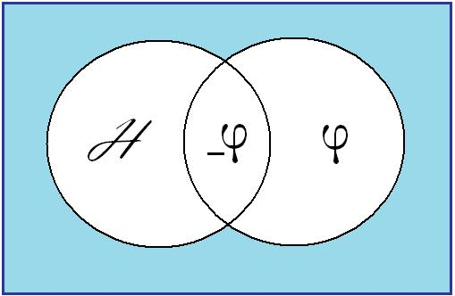
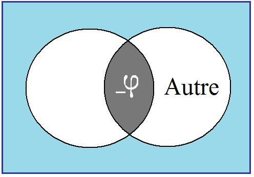
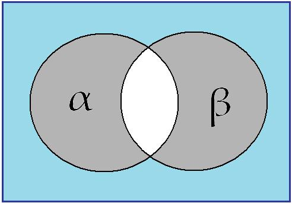
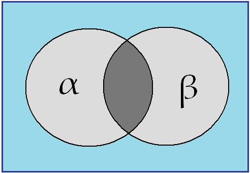
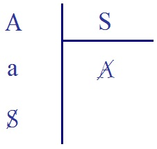
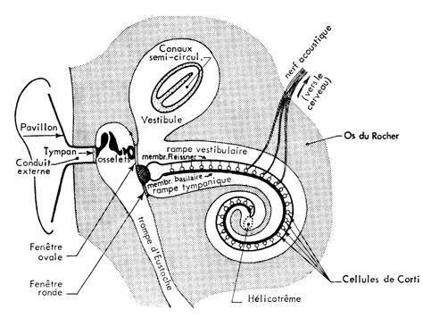

# Leçon 21 | 5 Juin l963

  <label><input type="checkbox" data-lacan-toggle="original" checked> 原文</label>
  <label><input type="checkbox" data-lacan-toggle="notes" checked> 注释</label>
  <label><input type="checkbox" data-lacan-toggle="commentary" checked> 个人解读评论</label>

<section class="parallel-paragraph" data-paragraph-ids="s10-21-0001">

s10-21-0001

[无对应译文]

原文 · s10-21-0001

Ce que je vous ai dit la dernière fois s’est clos, je crois significativement, dans le silence qui a répondu à mon propos :
personne n’ayant, semble-t-il, gardé le sang-froid de me couronner même d’un léger applaudissement.

</section>

<section class="parallel-paragraph" data-paragraph-ids="s10-21-0002">

s10-21-0002

[无对应译文]

原文 · s10-21-0002

Ou je me trompe, ou après tout ce n’est pas trop d’y voir le résultat de ce que j’avais expressément annoncé en commençant
ce propos, c’est-à-dire qu’il n’était pas possible d’aborder de front *l’angoisse de la castration* sans en provoquer, disons, quelque écho.

</section>

<section class="parallel-paragraph" data-paragraph-ids="s10-21-0003">

s10-21-0003

[无对应译文]

原文 · s10-21-0003

Et après tout, ce n’est pas là prétention excessive, puisque ce que je vous ai dit
est somme toute *quelque chose* que l’on peut qualifier de pas très encourageant, puisque s’agissant de *l’union de l’hom­me et de la femme*, problème quand même toujours présent et dont c’est à juste titre qu’il a toujours,
que j’espère qu’il rentre encore dans les préoc­cupations du psychanalyste.

</section>

<section class="parallel-paragraph" data-paragraph-ids="s10-21-0004">

s10-21-0004

[无对应译文]

原文 · s10-21-0004

Jones a tourné longuement autour de ce problème, matérialisé, incarné,
par ce qui est supposé impliqué par la perspective phallocentrique de *l’ignorance primitive*,
non seulement de l’homme, mais de la femme elle-même, concernant le lieu de la conjonction, le vagin.

</section>

<section class="parallel-paragraph" data-paragraph-ids="s10-21-0005">

s10-21-0005

[无对应译文]

原文 · s10-21-0005

Et tous les détours en partie féconds, quoique non achevés, qu’a parcourus Jones sur cette voie, montrent très bien
leur visée dans ce qu’il invoque - je vous l’ai rappelé en son temps - le fameux « *Il les créa homme et femme* », au reste si ambigu.
Car après tout on peut bien le dire, Jones n’a pas médité ce *verset* 27 *du livre* I *de la Genèse* sur le texte hébreu.

</section>

<section class="parallel-paragraph" data-paragraph-ids="s10-21-0006">

s10-21-0006

[无对应译文]

原文 · s10-21-0006

בְּצֶלֶם אֱלֹהִים בָּרָא אֹתוֹ זָכָר וּנְקֵבָה בָּרָא אֹתָם וַיִּבְרָא אֱלֹהִים אֶת־הָאָדָם בְּצַלְמוֹ

</section>

<section class="parallel-paragraph" data-paragraph-ids="s10-21-0007">

s10-21-0007

[无对应译文]

原文 · s10-21-0007

\[Dieu créa l’homme à son image, il le créa à l’image de Dieu, il créa l’homme et la femme.\]

</section>

<section class="parallel-paragraph" data-paragraph-ids="s10-21-0008">

s10-21-0008

[无对应译文]

原文 · s10-21-0008

Quoi qu’il en soit, pour essayer de faire supporter ce que j’ai dit la der­nière fois
sur un petit schéma fabriqué sur l’usage des cercles eulériens, cela pourrait se supporter ainsi :

</section>

<section class="parallel-paragraph" data-paragraph-ids="s10-21-0009">

s10-21-0009

[无对应译文]

原文 · s10-21-0009

</section>

<section class="parallel-paragraph" data-paragraph-ids="s10-21-0010">

s10-21-0010

[无对应译文]

原文 · s10-21-0010

Le champ ouvert par *l’homme* et par *la femme*, dans ce qu’on pourrait appeler, *au sens biblique*, leur *connaissance* l’un de l’autre,
ne se recoupe qu’en ceci : que la zone où ils pourraient effectivement *se recouvrir*, où leurs désirs les portent pour *s’atteindre*,
se qualifie par *le manque de ce qui serait leur médium : le phallus*, c*’est ce qui*, pour chacun, quand il est atteint, justement *l’aliène de l’autre*.

</section>

<section class="parallel-paragraph" data-paragraph-ids="s10-21-0011">

s10-21-0011

[无对应译文]

原文 · s10-21-0011

De *l’homme*, dans son désir de la toute-puissance phallique, *la femme* peut être assurément *le symbole*,
mais c’est justement en tant qu’*elle n’est plus la femme*.

</section>

<section class="parallel-paragraph" data-paragraph-ids="s10-21-0012">

s10-21-0012

[无对应译文]

原文 · s10-21-0012

</section>

<section class="parallel-paragraph" data-paragraph-ids="s10-21-0013">

s10-21-0013

[无对应译文]

原文 · s10-21-0013

Et quant à *la femme*, il est bien clair, par tout ce que nous avons découvert de ce que nous avons appelé « *penisneid »,*
qu’elle ne peut prendre *le phallus* que pour ce qu’il n’est pas, c’est-à-dire :

</section>

<section class="parallel-paragraph" data-paragraph-ids="s10-21-0014">

s10-21-0014

[无对应译文]

原文 · s10-21-0014

- soit *petit(a),* *l’objet*,

</section>

<section class="parallel-paragraph" data-paragraph-ids="s10-21-0015">

s10-21-0015

[无对应译文]

原文 · s10-21-0015

- soit son trop petit φ à elle, qui ne lui donne qu’une jouissance approchée de ce qu’elle imagine de la jouissance de l’Autre, qu’elle peut sans doute partager par une sorte de fantasme mental, mais qu’à obérer sur sa propre jouissance.

</section>

<section class="parallel-paragraph" data-paragraph-ids="s10-21-0016">

s10-21-0016

[无对应译文]

原文 · s10-21-0016

En d’autres termes, elle ne peut jouir de φ que parce qu’il n’est pas à sa place,
à la place de sa jouissance, où sa jouissance peut se réaliser.

</section>

<section class="parallel-paragraph" data-paragraph-ids="s10-21-0017">

s10-21-0017

[无对应译文]

原文 · s10-21-0017

Je vais vous en donner une petite illustration un peu brûlante, combien latérale, mais actuelle.
Dans un auditoire comme celui-ci, combien de fois, nous analystes, combien de fois...
au point que ça devient *une constante de notre pratique...*les femmes veulent se faire psychanalyser comme leur mari, et souvent par le même psychanalyste.

</section>

<section class="parallel-paragraph" data-paragraph-ids="s10-21-0018">

s10-21-0018

[无对应译文]

原文 · s10-21-0018

Qu’est-ce que ça veut dire, si ce n’est que c’est le désir supposé « *couronné* » de leur mari, qu’elles ambitionnent de partager, le - (- φ), *la repositivation* du φ qu’elles suppo­sent s’opérer dans *le champ psychanalytique*, voilà à quoi elles ambition­nent d’accéder.

</section>

<section class="parallel-paragraph" data-paragraph-ids="s10-21-0019">

s10-21-0019

[无对应译文]

原文 · s10-21-0019

Que *le phallus* ne se trouve pas là où on l’attend, là où on l’exige, à savoir *sur le plan de la médiation génitale*,
voilà ce qui explique que *l’angoisse est la vérité de la sexualité*, c’est-à-dire *ce qui apparaît chaque fois que son flux se retire*, montre le sable.
*La castration* est le prix de cette structure, elle *se substitue à cette vérité*.

</section>

<section class="parallel-paragraph" data-paragraph-ids="s10-21-0020">

s10-21-0020

[无对应译文]

原文 · s10-21-0020

Mais en fait, ceci est un jeu illusoire : il n’y a pas de *castration* parce que, au lieu où elle a à se produire, il n’y a pas d’objet à castrer.
*Il faudrait pour cela que le phallus fût là*, or il n’est là que pour qu’il n’y ait pas d’angoisse.
*Le phallus*, là où il est attendu comme sexuel, n’ap­paraît jamais que comme manque, et c’est cela son lien avec l’angoisse.

</section>

<section class="parallel-paragraph" data-paragraph-ids="s10-21-0021">

s10-21-0021

[无对应译文]

原文 · s10-21-0021

Et tout ceci veut dire *que le phallus est appelé à fonctionner comme instru­ment de la puissance*.
Or la puissance, je veux dire ce dont il s’agit quand nous parlons de puissance, quand nous en parlons d’une façon qui vacille,
de ce dont il s’agit car c’est toujours à la « *toute-puissance* » que nous nous référons, or ce n’est pas de cela qu’il s’agit :
la *toute-puissance* est déjà le glissement, l’évasion, par rapport à ce point où toute puissance défaille.

</section>

<section class="parallel-paragraph" data-paragraph-ids="s10-21-0022">

s10-21-0022

[无对应译文]

原文 · s10-21-0022

On ne demande pas à la puissance d’être partout, on lui demande d’être là où elle est présente.
C’est justement parce que là où elle est attendue elle défaille, que nous commen­çons à fomenter la « *toute-puissance* ».
Autrement dit *le phallus* est présent, il est présent partout où il n’est pas en situation.

</section>

<section class="parallel-paragraph" data-paragraph-ids="s10-21-0023">

s10-21-0023

[无对应译文]

原文 · s10-21-0023

Car c’est la face qui nous permet de percer cette illusion de la revendica­tion engendrée par la castration,
en tant qu’elle couvre l’angoisse présenti­fiée par toute actualisation de la jouissance :
c’est cette confusion de la jouis­sance avec les instruments de la puissance.

</section>

<section class="parallel-paragraph" data-paragraph-ids="s10-21-0024">

s10-21-0024

[无对应译文]

原文 · s10-21-0024

L’impuissance humaine, avec le progrès des institutions, devient mieux que cet état de sa misère fondamenta­le,
elle se constitue en *profession*, j’entends « *profession* » dans tous les sens du mot,

</section>

<section class="parallel-paragraph" data-paragraph-ids="s10-21-0025">

s10-21-0025

[无对应译文]

原文 · s10-21-0025

- depuis le sens « *profession de foi* »,

</section>

<section class="parallel-paragraph" data-paragraph-ids="s10-21-0026">

s10-21-0026

[无对应译文]

原文 · s10-21-0026

- jusqu’au terme, à la visée, que nous trouvons dans « *l’idéal professionnel* ».

</section>

<section class="parallel-paragraph" data-paragraph-ids="s10-21-0027">

s10-21-0027

[无对应译文]

原文 · s10-21-0027

Tout ce qui s’abrite derrière la dignité de toute « *profession* », c’est toujours ce manque central qui est impuissance.
L’impuissance, si l’on peut dire, dans sa formule la plus générale,
c’est celle qui voue l’homme à ne pouvoir jouir que de son rapport au support de +φ, c’est-à-dire d’une *puissance trom­peuse*.

</section>

<section class="parallel-paragraph" data-paragraph-ids="s10-21-0028">

s10-21-0028

[无对应译文]

原文 · s10-21-0028

Si je vous rappelle toute cette structure qui ne vient qu’à la suite de ce que j’ai articulé la dernière fois,
c’est pour vous amener à quelque fait remar­quable qui contrôle la structure ainsi articulée :
ce fameux terme de « *l’ho­mosexualité* » qui dans notre doctrine, notre théorie - la freudienne - est mis au principe du *ciment social* - observons que Freud a toujours remarqué, n’a jamais soulevé là-dessus un doute,
qu’elle est le privilège du mâle, ce *ciment libidinal du lien social* en tant qu’il ne se produit que dans « *la com­munauté des mâles* »
est lié à la face d’échec sexuel qui lui est, du fait de la cas­tration, tout spécialement imparti.

</section>

<section class="parallel-paragraph" data-paragraph-ids="s10-21-0029">

s10-21-0029

[无对应译文]

原文 · s10-21-0029

Par contre *l’homosexualité féminine* a peut-être une grande importance culturelle, mais aucune valeur de fonction sociale,
parce qu’elle se porte, elle, sur le champ propre de la concurrence sexuelle,
c’est-à-dire là où en apparence elle aurait le moins de chance de réussir si justement dans ce champ,
ceux qui ont l’avantage c’est ceux justement *qui n’ont pas de phal­lus*,
à savoir que la « *toute-puissance* », la plus grande vivacité du désir se pro­duit au niveau de cet amour qu’on appelle « *uranien* »,
dont je crois dans son lieu avoir marqué l’affinité la plus radicale avec ce qu’on appelle « *l’homosexualité féminine »* :
amour idéaliste, présentification de la médiation essentielle du *phal­lus* comme - φ.

</section>

<section class="parallel-paragraph" data-paragraph-ids="s10-21-0030">

s10-21-0030

[无对应译文]

原文 · s10-21-0030

Ce φ, donc pour les deux sexes, c’est ce que je désire et que je ne puis avoir qu’en tant que - φ.
C’est ce « *moins* » qui se trouve, sur le champ de la conjonction sexuelle, être le médium universel,
être *ce « moi »* - cher Reboul - non point *hégélien, réciproque*, mais *en tant qu’il se constitue au champ de l’Autre comme manque*.

</section>

<section class="parallel-paragraph" data-paragraph-ids="s10-21-0031">

s10-21-0031

[无对应译文]

原文 · s10-21-0031

Je n’y accède que pour autant que je prends cette voie même, que je m’attache à ceci :
*que ce jeu « me » fait disparaître*, que je ne « *me* » retrouve que dans ce que Hegel bien sûr a aperçu, mais qu’il motive
sans cet intervalle, que dans un *(a)* généralisé, que dans l’*idée* du « *moi* » en tant qu’il est *partout*, c’est-à-dire qu’il n’est plus *nulle* *part*.

</section>

<section class="parallel-paragraph" data-paragraph-ids="s10-21-0032">

s10-21-0032

[无对应译文]

原文 · s10-21-0032

Le support du désir n’est pas fait pour l’union sexuelle,
car *généralisé* il ne me spécifie plus comme *homme <u>ou</u> femme*, mais comme *l’un <u>et</u> l’autre*.

</section>

<section class="parallel-paragraph" data-paragraph-ids="s10-21-0033">

s10-21-0033

[无对应译文]

原文 · s10-21-0033

La fonction de ce champ ici décrit comme celui de l’union sexuelle pose, pour chacun des deux sexes, l’alterna­tive :

</section>

<section class="parallel-paragraph" data-paragraph-ids="s10-21-0034">

s10-21-0034

[无对应译文]

原文 · s10-21-0034

- l’autre est *<u>ou</u>* *l’Autre*

</section>

<section class="parallel-paragraph" data-paragraph-ids="s10-21-0035">

s10-21-0035

[无对应译文]

原文 · s10-21-0035

- *<u>ou</u>* *le phallus,* au sens de *l’exclusion.*

</section>

<section class="parallel-paragraph" data-paragraph-ids="s10-21-0036">

s10-21-0036

[无对应译文]

原文 · s10-21-0036

</section>

<section class="parallel-paragraph" data-paragraph-ids="s10-21-0037">

s10-21-0037

[无对应译文]

原文 · s10-21-0037

Ce champ-là est vide \[(- φ)\] :

</section>

<section class="parallel-paragraph" data-paragraph-ids="s10-21-0038">

s10-21-0038

[无对应译文]

原文 · s10-21-0038

</section>

<section class="parallel-paragraph" data-paragraph-ids="s10-21-0039">

s10-21-0039

[无对应译文]

原文 · s10-21-0039

Maisce champ-là \[(- φ)\] si je le positive, le « *<u>ou</u>* » prend cet autre sens qui veut dire que l’un à l’autre est substituable à tout instant.

</section>

<section class="parallel-paragraph" data-paragraph-ids="s10-21-0040">

s10-21-0040

[无对应译文]

原文 · s10-21-0040

</section>

<section class="parallel-paragraph" data-paragraph-ids="s10-21-0041">

s10-21-0041

[无对应译文]

原文 · s10-21-0041

Et c’est pour cela que ce n’est pas par hasard que j’ai introduit le champ de « *l’œil caché* » derrière *tout l’univers spatial*,
par la référence à ces « êtres-images » sur la rencontre desquels se joue un certain parcours de salvation...
le par­cours bouddhiste nommément
...en introduisant celle que je vous ai dési­gnée comme la *Kwan yin* ou autrement l’Avalokiteshvara *dans sa complè­te ambiguïté sexuelle*.

</section>

<section class="parallel-paragraph" data-paragraph-ids="s10-21-0042">

s10-21-0042

[无对应译文]

原文 · s10-21-0042

</section>

<section class="parallel-paragraph" data-paragraph-ids="s10-21-0043">

s10-21-0043

[无对应译文]

原文 · s10-21-0043

Plus l’Avalokiteshvara est présentifié comme mâle, plus il prend des aspects femelles.
Je vous présenterai, si ça vous amuse, un autre jour, des images de statues ou de peintures tibétaines,
elles surabon­dent, et le trait que je vous désigne y est absolument patent.

</section>

<section class="parallel-paragraph" data-paragraph-ids="s10-21-0044">

s10-21-0044

[无对应译文]

原文 · s10-21-0044

Ce dont il s’agit aujourd’hui est de saisir comment cette *alternative du désir et de la jouissance* peut trouver *son passage*.
La différence qu’il y a entre la pensée dialectique et notre expérience, c’est que nous ne croyons pas à la synthèse :
s’il y a un *passage* là où l’antinomie se ferme, c’est parce qu’il était déjà là avant la constitution de l’antinomie.

</section>

<section class="parallel-paragraph" data-paragraph-ids="s10-21-0045">

s10-21-0045

[无对应译文]

原文 · s10-21-0045

Pour que *l’objet petit(a)*...
où s’incarne *l’impasse* de l’accès du *désir* à *la Chose...*lui livre *passage*, il faut revenir à son commencement.

</section>

<section class="parallel-paragraph" data-paragraph-ids="s10-21-0046">

s10-21-0046

[无对应译文]

原文 · s10-21-0046

S’il n’y a rien qui pré­pare ce « *passage »*, *avant la capture du désir dans l’espace spéculaire, il n’y a pas d’issue*.
Car n’omettons pas que la possibilité de cette *impasse* elle-même est liée à un moment
qui anticipe et conditionne ce qui vient se marquer dans l’échec sexuel pour l’homme.

</section>

<section class="parallel-paragraph" data-paragraph-ids="s10-21-0047">

s10-21-0047

[无对应译文]

原文 · s10-21-0047

C’est la mise en jeu de la *tension spéculaire* qui érotise si précocement et si profondément le champ de l’*insight.*
Ce qui s’ébauche chez l’anthropoïde, du caractère conducteur de ce champ, on le sait depuis Köhler[^151] et Yerkes[^152] :

</section>

<section class="parallel-paragraph" data-paragraph-ids="s10-21-0048">

s10-21-0048

[无对应译文]

原文 · s10-21-0048

il n’est pas sans intelligence, en ceci qu’il peut beaucoup de choses, *à condition que ce qu’il a à atteindre, il le voie*.

</section>

<section class="parallel-paragraph" data-paragraph-ids="s10-21-0049">

s10-21-0049

[无对应译文]

原文 · s10-21-0049

J’ai fait allusion hier soir à ceci : que *tout est là* !
Non pas qu’il soit plus que nous - le primate - incapable de parler, mais qu’*il ne peut pas faire entrer sa parol*e dans ce champ opératoire.

</section>

<section class="parallel-paragraph" data-paragraph-ids="s10-21-0050">

s10-21-0050

[无对应译文]

原文 · s10-21-0050

Mais ce n’est pas là la seule différence. La *diffé­rence* ...
marquée en ceci *qu’il n’y a pas, pour l’animal de stade du miroir*
...c’est ce qui s’est passé sous le nom de « *narcissisme* », d’une certaine soustraction ubiquiste de la libido,
d’une injection de la libido dans ce champ de l’*insight,* dont la vision spécularisée donne *la forme*.

</section>

<section class="parallel-paragraph" data-paragraph-ids="s10-21-0051">

s10-21-0051

[无对应译文]

原文 · s10-21-0051

Mais cette *forme* nous cache le phénomène*, qui est l’occultation de l’œil,*
qui désormais devrait - celui que nous sommes - le regarder de partout sous l’universalité du « voir ».

</section>

<section class="parallel-paragraph" data-paragraph-ids="s10-21-0052">

s10-21-0052

[无对应译文]

原文 · s10-21-0052

On sait que ça peut se produire et c’est ça qui s’appelle « l’*unheimlich »,* mais il y faut des circonstances bien particulières.
D’habitude, ce qu’a justement de satisfaisant la forme spéculaire, c’est de masquer la possibilité de cette apparition.
En d’autres termes, *l’œil institue le* rapport fondamental du *désirable*,
*en ceci qu’il tend toujours à faire méconnaître, dans le rapport à l’autre, que sous ce désirable il y a un désirant*.

</section>

<section class="parallel-paragraph" data-paragraph-ids="s10-21-0053">

s10-21-0053

[无对应译文]

原文 · s10-21-0053

Réfléchissez à la portée de cette formule que je crois pouvoir donner comme la plus générale *de ce qu’est le surgissement de l’unheimlich.* Pensez que vous avez affaire au dési­rable le plus reposant, à sa forme la plus apaisante : la statue divine qui est une divine statue.

</section>

<section class="parallel-paragraph" data-paragraph-ids="s10-21-0054">

s10-21-0054

[无对应译文]

原文 · s10-21-0054

Quoi de plus *unheimlich* que de la voir *s’animer*, c’est-à-dire se pouvoir montrer *désirante* !
Or, non seulement c’est l’hypothèse structurante que nous posons à la genèse du *petit(a)* :
qu’il naît ailleurs et avant cela, avant cette capture qui l’occul­te.

</section>

<section class="parallel-paragraph" data-paragraph-ids="s10-21-0055">

s10-21-0055

[无对应译文]

原文 · s10-21-0055

Ce n’est pas seulement cette hypothèse, elle-même fondée sur notre *praxis*, bien sûr c’est de là que je l’introduis :
ou bien notre *praxis* est fauti­ve, j’entends fautive par rapport à elle-même,
ou elle suppose que notre champ, qui est celui *du désir*, s’engendre de ce rapport S à A
qui est celui où nous ne pouvons le retrouver - si c’est notre but - que pour autant que nous en reproduisons les termes.

</section>

<section class="parallel-paragraph" data-paragraph-ids="s10-21-0056">

s10-21-0056

[无对应译文]

原文 · s10-21-0056

Ou notre praxis est fautive par rapport à elle-même, ou elle suppose cela.

</section>

<section class="parallel-paragraph" data-paragraph-ids="s10-21-0057">

s10-21-0057

[无对应译文]

原文 · s10-21-0057

Ce qu’engendre notre *praxis*, si vous vou­lez, c’est cet univers-là,
symbolisé au dernier terme par la fameuse division qui nous guide depuis un moment :
à travers les trois temps où l’S, *sujet* encore inconnu, a à se constituer dans l’Autre,
et où *petit(a)* apparaît comme *reste* de cette opération.

</section>

<section class="parallel-paragraph" data-paragraph-ids="s10-21-0058">

s10-21-0058

[无对应译文]

原文 · s10-21-0058

</section>

<section class="parallel-paragraph" data-paragraph-ids="s10-21-0059">

s10-21-0059

[无对应译文]

原文 · s10-21-0059

Je vous ferai remarquer en passant que l’alternati­ve

</section>

<section class="parallel-paragraph" data-paragraph-ids="s10-21-0060">

s10-21-0060

[无对应译文]

原文 · s10-21-0060

- *ou notre pratique est fautive,*

</section>

<section class="parallel-paragraph" data-paragraph-ids="s10-21-0061">

s10-21-0061

[无对应译文]

原文 · s10-21-0061

- *ou elle suppose cela*, n’est pas une alternati­ve *« exclusive »*.

</section>

<section class="parallel-paragraph" data-paragraph-ids="s10-21-0062">

s10-21-0062

[无对应译文]

原文 · s10-21-0062

Notre *pratique* peut se permettre d’être en partie fautive par rap­port à elle-même et *<u>qu’il y ait</u>* *un résidu*,
puisque justement c’est celui-là qui est prévu.

</section>

<section class="parallel-paragraph" data-paragraph-ids="s10-21-0063">

s10-21-0063

[无对应译文]

原文 · s10-21-0063

Grande présomption, que nous ne risquons que fort peu à nous engager dans une formalisation qui s’impose comme aussi nécessaire. Mais ce rap­port de S à A il faut bien le situer comme dépassant de beaucoup dans sa complexité - *pourtant si simple, inaugurale* - ce que ceux qui nous ont légué la définition du signifiant croient de leur devoir de poser au principe
du jeu qu’ils organisent, à savoir la notion de « *communication* ».

</section>

<section class="parallel-paragraph" data-paragraph-ids="s10-21-0064">

s10-21-0064

[无对应译文]

原文 · s10-21-0064

La *communication* comme telle n’est pas ce qui est ici primitif, puisqu’à l’origine S *n’a rien à com­muniquer*,
pour la raison que tous les instruments de la communication sont de l’autre côté, au champ de l’Autre, et qu’il a à les recevoir de lui.
Comme je l’ai dit depuis toujours, ceci a pour suite et conséquence, que tou­jours principiellement
*c’est de l’Autre qu’il reçoit son propre message*.

</section>

<section class="parallel-paragraph" data-paragraph-ids="s10-21-0065">

s10-21-0065

[无对应译文]

原文 · s10-21-0065

La première émergence, celle qui s’inscrit dans ce tableau, n’est qu’un « *qui suis­-je* ? » - inconscient puisque informulable -
auquel répond, avant qu’il se formu­le, un « *tu es...* », c’est-à-dire : qu’il reçoit d’abord son propre message sous une forme inversée,
ai-je dit depuis très longtemps.

</section>

<section class="parallel-paragraph" data-paragraph-ids="s10-21-0066">

s10-21-0066

[无对应译文]

原文 · s10-21-0066

*J’ajoute aujourd’hui*, si vous en­tendez, *qu’il le reçoit sous une forme d’abord interrompue* : il entend d’abord un « *tu es...* », sans attribut.

</section>

<section class="parallel-paragraph" data-paragraph-ids="s10-21-0067">

s10-21-0067

[无对应译文]

原文 · s10-21-0067

Et pourtant, si interrompu que soit ce messa­ge, et donc si insuffisant, il n’est jamais informe,
à partir de ce fait que le lan­gage existe dans le *réel*, qu’il est en cours, en circulation, et qu’à son propos...
à lui, le S dans son interrogation supposée primitive
...qu’à son propos beau­coup de choses en ce langage sont d’ores et déjà réglées.

</section>

<section class="parallel-paragraph" data-paragraph-ids="s10-21-0068">

s10-21-0068

[无对应译文]

原文 · s10-21-0068

Or, pour reprendre ma phrase de tout à l’heure...

</section>

<section class="parallel-paragraph" data-paragraph-ids="s10-21-0069">

s10-21-0069

[无对应译文]

原文 · s10-21-0069

> que ce n’est pas seulement par hypothèse,
>
> une hypothèse que j’ai fondée dans notre praxis même, l’identifiant à cette praxis et jusque à ses limites
> ...pour reprendre cette phrase, je dirai que le fait observable...
> et pourquoi si mal observé, c’est là la question majeure que l’expérience nous offre
> ...le fait observable nous montre *le jeu* autonome de la parole tel qu’il est dans ce schéma supposé.

</section>

<section class="parallel-paragraph" data-paragraph-ids="s10-21-0070">

s10-21-0070

[无对应译文]

原文 · s10-21-0070

Je pense qu’il y a ici assez de mères non atteintes de surdité pour savoir qu’un très petit enfant...
à l’âge où la phase du miroir est loin d’avoir clos son œuvre
...qu’un très petit enfant, dès qu’il possède quelques mots, avant son sommeil, monologue.

</section>

<section class="parallel-paragraph" data-paragraph-ids="s10-21-0071">

s10-21-0071

[无对应译文]

原文 · s10-21-0071

Le temps m’empêche aujourd’hui de vous en lire une grande page.
Je vous en promets quelque satisfaction la fois prochaine ou la suivante, quand assurément je ne manquerai pas de le faire.
Le bonheur fait qu’après que mon ami Roman Jakobson ait supplié pendant dix ans toutes ses élèves « *pregnant »*
de mettre dans la « *nursery »* un magnétophone, la chose ne se soit faite qu’il y a environ deux ou trois ans,
grâce à quoi nous avons enfin une publication d’un de ces monologues primordiaux.

</section>

<section class="parallel-paragraph" data-paragraph-ids="s10-21-0072">

s10-21-0072

[无对应译文]

原文 · s10-21-0072

Je vous le répète, vous en aurez *quelque* satisfaction.
Si je vous le fais un peu attendre, c’est qu’à la vérité, *il est propice à montrer bien d’autres choses* que ce que j’ai à délinéer aujour­d’hui.

</section>

<section class="parallel-paragraph" data-paragraph-ids="s10-21-0073">

s10-21-0073

[无对应译文]

原文 · s10-21-0073

Il faut même, pour ce que j’ai à délinéer aujourd’hui, évoquer les références des distances,
dont le fait que je ne puisse le faire que sans trop savoir ce qui peut y répondre dans votre connaissance,
montre à quel point c’est notre destin de devoir nous déplacer dans un champ où...
quoi qu’on en pense et quelque dépense de cours et de conférences qu’il soit fait
...votre édu­cation n’est rien moins qu’assurée \[*sic*\].

</section>

<section class="parallel-paragraph" data-paragraph-ids="s10-21-0074">

s10-21-0074

[无对应译文]

原文 · s10-21-0074

Quoi qu’il en soit, si certains ici se souviennent de ce que Piaget[^153] appelle « *le langage égocentrique ***»***...*
auquel je ne sais si nous pourrons revenir cette année
...je pense que vous savez ce que c’est, et que sous cette dénomina­tion peut-être défendable,
mais assurément propice à toutes sortes de *mal­entendus*.

</section>

<section class="parallel-paragraph" data-paragraph-ids="s10-21-0075">

s10-21-0075

[无对应译文]

原文 · s10-21-0075

Il y a par exemple cette caractéristique que « *le langage égocentrique *»,
à savoir ces sortes de monologues auxquels un enfant se livre tout haut, mis avec quelques camarades dans une tache commune,
qui est très évidemment un monologue tourné vers lui-même, ne peut se produire que justement dans cette certaine communauté.

</section>

<section class="parallel-paragraph" data-paragraph-ids="s10-21-0076">

s10-21-0076

[无对应译文]

原文 · s10-21-0076

Ce n’est pas là objecter à la qualification d’*égocentrique*, si cet *égocentrique* on en précisait le sens.
Quoi qu’il en soit, pour ce qui est de l’*égocentrisme*, il peut paraître frappant *que le sujet, comme énoncé, y soit tellement souvent élidé.*

</section>

<section class="parallel-paragraph" data-paragraph-ids="s10-21-0077">

s10-21-0077

[无对应译文]

原文 · s10-21-0077

Je ne rappelle cette référence que peut-être pour vous inciter à reprendre contact et connais­sance avec le phénomène,
dans les textes piagétiques, à toutes fins utiles pour l’avenir mais aussi pour vous noter qu’au moins un problème se pose,
de situer, de savoir ce qu’est *ce monologue* *hypnopompique*[^154] et tout à fait pri­mitif,
par rapport à cette manifestation, comme vous le savez, d’un stade beaucoup ultérieur.

</section>

<section class="parallel-paragraph" data-paragraph-ids="s10-21-0078">

s10-21-0078

[无对应译文]

原文 · s10-21-0078

D’ores et déjà, je vous indique que concernant ces pro­blèmes, comme vous le voyez, *de genèse* et *de développement*,

</section>

<section class="parallel-paragraph" data-paragraph-ids="s10-21-0079">

s10-21-0079

[无对应译文]

原文 · s10-21-0079

ce fameux *schéma*[^155] qui vous a tellement tannés pendant des années reprendra sa valeur.

</section>

<section class="parallel-paragraph" data-paragraph-ids="s10-21-0080">

s10-21-0080

[无对应译文]

原文 · s10-21-0080

Quoi qu’il en soit, ce monologue du petit enfant dont je vous parle ne se produit jamais quand quelqu’un d’autre est là :
un frère cadet, un autre baby dans la chambre suffisent pour qu’il ne se produise pas.

</section>

<section class="parallel-paragraph" data-paragraph-ids="s10-21-0081">

s10-21-0081

[无对应译文]

原文 · s10-21-0081

Bien d’autres carac­tères indiquent que ce qui se passe à ce niveau dont, vous le verrez...
il est si étonnamment révélateur de la précocité des tensions dénommées comme « *primordiales* » *dans l’inconscient*
...nous ne pouvons douter d’avoir là quelque chose en tout point, analogue à la fonction du rêve.
Tout se passe sur « *l’autre scène* », avec l’accent que j’ai donné à ce terme.

</section>

<section class="parallel-paragraph" data-paragraph-ids="s10-21-0082">

s10-21-0082

[无对应译文]

原文 · s10-21-0082

Et ne devons-nous pas être guidés ici, par la petite porte même...
ça n’est jamais qu’une mauvaise entrée
...par laquelle je vous introduis ici au problè­me, c’est à savoir...
concernant ce dont il s’agit, à savoir la constitution du *petit(a),* du *reste...*qu’en tout cas ce phé­nomène, si ses conditions sont bien celles que je vous dis, nous ne l’avons, nous, qu’à l’état de *reste*,
c’est-à-dire sur la bande du magnétophone.

</section>

<section class="parallel-paragraph" data-paragraph-ids="s10-21-0083">

s10-21-0083

[无对应译文]

原文 · s10-21-0083

Autrement, nous avons tout au plus le murmure lointain toujours prêt à s’interrompre à notre apparition.
Est-ce que ceci ne nous introduit pas à considérer que quelque voie nous est offerte à saisir,
que pour le sujet en train de se constituer, c’est aussi du côté *d’une voix détachée de son support*, que nous devons chercher ce *reste* ?

</section>

<section class="parallel-paragraph" data-paragraph-ids="s10-21-0084">

s10-21-0084

[无对应译文]

原文 · s10-21-0084

Faites très attention, il ne faut pas ici aller trop vite.

</section>

<section class="parallel-paragraph" data-paragraph-ids="s10-21-0085">

s10-21-0085

[无对应译文]

原文 · s10-21-0085

Tout ce que le sujet reçoit de l’Autre par *le langage*, l’expérience ordinaire est qu’il le reçoit sous une forme vocale.
Mais nous savons très bien, par une expérience qui n’est pas tellement rare...
encore qu’on évoque toujours des cas éclatants : [Helen Keller](http://fr.wikipedia.org/wiki/Helen_Keller)
...qu’il y a d’autres voies que vocales pour recevoir le langage, que le lan­gage n’est pas vocalisation.

</section>

<section class="parallel-paragraph" data-paragraph-ids="s10-21-0086">

s10-21-0086

[无对应译文]

原文 · s10-21-0086

Pourtant je crois que nous pouvons nous avancer dans le sens qu’un rapport plus que d’accident, lie le lan­gage à une sonorité.
Et nous croirons peut-être même avancer dans la bonne voie, à essayer d’articuler les choses de près,
en qualifiant cette *sono­rité*, par exemple, d’*instrumentale*.

</section>

<section class="parallel-paragraph" data-paragraph-ids="s10-21-0087">

s10-21-0087

[无对应译文]

原文 · s10-21-0087

Il est un fait qu’ici *la physiologie* nous ouvre la voie.
Nous ne savons pas tout sur le fonctionnement de notre oreille,
mais tout de même nous savons que « *le limaçon* » est un résonateur, résonateur complexe ou « *composé* » si vous voulez,
mais enfin un résonateur, même *composé*, se décompose en composition de résonateurs élémentaires.

</section>

<section class="parallel-paragraph" data-paragraph-ids="s10-21-0088">

s10-21-0088

[无对应译文]

原文 · s10-21-0088

Ceci nous mène dans une voie qui est celle-ci :
que le propre de la *résonance* est que c’est l’appareil qui y domine, c’est l’appareil qui *résonne*.
Il ne *réson­ne* pas à n’importe quoi, il ne *résonne*, si vous voulez, pour ne pas compli­quer les choses, *qu’à sa note, sa fréquence propre*.

</section>

<section class="parallel-paragraph" data-paragraph-ids="s10-21-0089">

s10-21-0089

[无对应译文]

原文 · s10-21-0089

Ceci nous mène à une cer­taine remarque concernant la sorte de résonateur auquel nous avons affaire, j’entends concrètement,
dans l’organisation de l’appareil sensoriel en ques­tion : notre oreille, un résonateur pas n’importe lequel, *un résonateur du type tuyau*.

</section>

<section class="parallel-paragraph" data-paragraph-ids="s10-21-0090">

s10-21-0090

[无对应译文]

原文 · s10-21-0090

</section>

<section class="parallel-paragraph" data-paragraph-ids="s10-21-0091">

s10-21-0091

[无对应译文]

原文 · s10-21-0091

La longueur du parcours intéressé dans un certain retour que fait la vibration apportée au niveau de la *fenêtre ronde*,
passant de la *rampe tympanique* à la *rampe vestibulaire*, paraît nettement liée à la longueur de l’espace parcouru dans une conduite close, qui opère donc à la façon, si vous voulez, de quelque tuyau, quel qu’il soit, flûte ou orgue.
Évidemment la chose est compliquée, cet appareil ne ressemblant à aucun autre instrument de musique.

</section>

<section class="parallel-paragraph" data-paragraph-ids="s10-21-0092">

s10-21-0092

[无对应译文]

原文 · s10-21-0092

C’est un tuyau qui serait, si je puis dire, un tuyau à touches,
dans ce sens qu’il semble que ce soit la cellule posée en position de corde, mais qui ne fonctionne pas comme une corde,
qui est intéressée au point de retour de l’onde, qui se charge de connoter la résonance intéressée.

</section>

<section class="parallel-paragraph" data-paragraph-ids="s10-21-0093">

s10-21-0093

[无对应译文]

原文 · s10-21-0093

Je m’excuse d’autant plus de ce détour qu’il est bien certain que *ce n’est pas dans ce sens que nous trouverons le dernier mot des choses*.

</section>

<section class="parallel-paragraph" data-paragraph-ids="s10-21-0094">

s10-21-0094

[无对应译文]

原文 · s10-21-0094

Ce rappel est quand même destiné à actualiser ceci :
que dans *la forme*, *la forme orga­nique*, il y a quelque chose qui nous paraît apparenté à ces données *pri­maires, topologiques, transpatiales*,
qui nous ont fait très spécialement nous intéresser à la forme la plus élémentaire de la constitution créée et créatrice d’un vide,
celle que nous avons pour vous, apologétiquement incarnée dans « *l’histoire du pot* ».

</section>

<section class="parallel-paragraph" data-paragraph-ids="s10-21-0095">

s10-21-0095

[无对应译文]

原文 · s10-21-0095

Un pot aussi est un tuyau et qui peut résonner.

</section>

<section class="parallel-paragraph" data-paragraph-ids="s10-21-0096">

s10-21-0096

[无对应译文]

原文 · s10-21-0096

Et la ques­tion de ce que nous avons dit : que dix pots tout à fait pareils ne manquent absolument pas de s’imposer
comme différents individuellement, mais que la question peut se poser de savoir si, quand on met l’un à la place de l’autre,
le vide qui fut successivement au cœur de chacun d’entre eux, n’est pas tou­jours le même.

</section>

<section class="parallel-paragraph" data-paragraph-ids="s10-21-0097">

s10-21-0097

[无对应译文]

原文 · s10-21-0097

Or, c’est bien du commandement qu’impose le vide au cœur du tuyau acoustique à tout ce qui peut venir y résonner de cette réalité qui s’ouvre sur un pas ultérieur de notre démarche, mais qui n’est pas si simple à définir, à savoir ce qu’on appelle un souffle,
à savoir qu’à tous les souffles possibles, une flûte titillée au niveau de telle de ses ouvertures impose la même vibration.

</section>

<section class="parallel-paragraph" data-paragraph-ids="s10-21-0098">

s10-21-0098

[无对应译文]

原文 · s10-21-0098

Si ce n’est pas là la loi, s’indique pour nous ce quelque chose où le *petit(a)* dont il s’agit, fonctionne dans *une réelle fonction de médiation*.

</section>

<section class="parallel-paragraph" data-paragraph-ids="s10-21-0099">

s10-21-0099

[无对应译文]

原文 · s10-21-0099

Eh bien, ne cédons pas à cette illusion.
Tout ceci n’a d’intérêt que de métaphore.

</section>

<section class="parallel-paragraph" data-paragraph-ids="s10-21-0100">

s10-21-0100

[无对应译文]

原文 · s10-21-0100

Si la voix, au sens où nous l’entendons, a une importance, ce n’est pas de résonner dans aucun vide spatial,
c’est pour autant que la for­me, la plus simple émission dans ce qu’on appelle linguistiquement *sa fonction phatique*[^156]...

</section>

<section class="parallel-paragraph" data-paragraph-ids="s10-21-0101">

s10-21-0101

[无对应译文]

原文 · s10-21-0101

qu’on croit être de la simple *prise de contact* et qui est bien autre chose
...résonne dans un vide qui est le vide de l’Autre comme tel, l’*ex-­nihilo* à proprement parler.

</section>

<section class="parallel-paragraph" data-paragraph-ids="s10-21-0102">

s10-21-0102

[无对应译文]

原文 · s10-21-0102

La voix répond à ce qui se dit, mais elle ne peut pas en répondre.
Autrement dit, pour qu’elle réponde, *nous devons incorpo­rer la voix comme l’altérité de ce qui se dit*.

</section>

<section class="parallel-paragraph" data-paragraph-ids="s10-21-0103">

s10-21-0103

[无对应译文]

原文 · s10-21-0103

C’est bien pour cela, et non pour autre chose, que détachée de nous, notre voix nous apparaît avec un son étranger.
Il est de la structure de l’Autre de constituer un certain vide : le vide de son manque de garantie.

</section>

<section class="parallel-paragraph" data-paragraph-ids="s10-21-0104">

s10-21-0104

[无对应译文]

原文 · s10-21-0104

*La vérité entre dans le monde avec le signifiant* et avant tout contrôle, elle s’éprouve, elle se renvoie seulement par ses échos dans le *réel*.
Or, *c’est dans ce vide que la voix* - *en tant que distincte des sonorités*, voix non pas modu­lée, mais articulée - *résonne*.

</section>

<section class="parallel-paragraph" data-paragraph-ids="s10-21-0105">

s10-21-0105

[无对应译文]

原文 · s10-21-0105

La voix dont il s’agit, c’est la voix

</section>

<section class="parallel-paragraph" data-paragraph-ids="s10-21-0106">

s10-21-0106

[无对应译文]

原文 · s10-21-0106

- en tant qu’im­pérative,

</section>

<section class="parallel-paragraph" data-paragraph-ids="s10-21-0107">

s10-21-0107

[无对应译文]

原文 · s10-21-0107

- en tant qu’elle réclame obéissance ou conviction,

</section>

<section class="parallel-paragraph" data-paragraph-ids="s10-21-0108">

s10-21-0108

[无对应译文]

原文 · s10-21-0108

- qu’elle se situe, non par rapport à la musique, mais par rapport à la parole.

</section>

<section class="parallel-paragraph" data-paragraph-ids="s10-21-0109">

s10-21-0109

[无对应译文]

原文 · s10-21-0109

Il serait intéressant de voir la distance qu’il peut y avoir, à propos de cette méconnaissance bien connue de la voix enregistrée,
entre l’expérience du chanteur et celle de l’orateur.

</section>

<section class="parallel-paragraph" data-paragraph-ids="s10-21-0110">

s10-21-0110

[无对应译文]

原文 · s10-21-0110

Je propose à ceux qui voudront se faire les enquêteurs bénévoles de ceci, de le faire, je n’ai pas temps de le faire moi-même.

</section>

<section class="parallel-paragraph" data-paragraph-ids="s10-21-0111">

s10-21-0111

[无对应译文]

原文 · s10-21-0111

Mais je crois que c’est ici que nous touchons du doigt cette distincte *forme d’identification* que je n’ai pu aborder l’année dernière
et qui fait que *l’identification de la voix* nous donne au moins le *premier modèle* qui fait que, dans certains cas,
nous ne parlons pas de *la même identification* que dans les autres, que nous parlons d’ « *Einverleibung »,* d’*incorporation*.

</section>

<section class="parallel-paragraph" data-paragraph-ids="s10-21-0112">

s10-21-0112

[无对应译文]

原文 · s10-21-0112

Les psychanalystes de *la bonne génération* s’en étaient aperçus.
Il y a un Monsieur Isakower[^157] qui fit dans l’année vingt de l’*International Journal* un très remarquable article,
qui d’ailleurs à mon sens n’a d’intérêt que du besoin qui s’imposait à lui de donner une image véritablement frappante
de ce qu’était de distinct ce type d’identification.

</section>

<section class="parallel-paragraph" data-paragraph-ids="s10-21-0113">

s10-21-0113

[无对应译文]

原文 · s10-21-0113

Car, vous allez le voir, il va le chercher dans quelque chose dont les rapports, vous le constaterez,
sont singulièrement plus lointains du phénomène que ce qu’il voit, par lequel, moi, j’essaie de vous faire passer.

</section>

<section class="parallel-paragraph" data-paragraph-ids="s10-21-0114">

s10-21-0114

[无对应译文]

原文 · s10-21-0114

S’il s’intéresse au *petit animal* qui s’appelle...
si mon souvenir est bon, parce que je n’ai pas eu le temps de le recontrôler ce souvenir
...qui s’appelle, je crois « *daphnie* » et qui sans être du tout une crevette, représentez-vous le comme y ressem­blant sensiblement.

</section>

<section class="parallel-paragraph" data-paragraph-ids="s10-21-0115">

s10-21-0115

[无对应译文]

原文 · s10-21-0115

Quoi qu’il en soit, cet animal qui vit dans les eaux salines a la curieuse habitude, comme nous dirions dans notre langage,
de se tamponner le coquillard, à un moment de ses métamorphoses, avec de menus grains de sable,
de se les introduire dans ce qu’elle a comme appareil réduit dit « *stato-acoustique* », autrement dit dans *l’utricule...*
car elle ne bénéficie pas de notre prodigieux « *limaçon* »
...dans *l’utricule* s’étant intro­duit ces *parcelles de sable*...
il importe qu’elle se les y mette du dehors, car elle ne les produit d’elle-même en aucun cas
...*l’utricule* se referme et la voilà qui aura à l’intérieur les petits grelots nécessaires à son équilibra­tion.

</section>

<section class="parallel-paragraph" data-paragraph-ids="s10-21-0116">

s10-21-0116

[无对应译文]

原文 · s10-21-0116

Elle les a amenés de l’extérieur.
Avouez que le rapport est lointain avec la constitution du *surmoi*, néanmoins ce qui m’intéresse,
c’est que Monsieur Isakower n’ait pas cru devoir trouver de meilleure comparaison, que de se référer à cette opération.

</section>

<section class="parallel-paragraph" data-paragraph-ids="s10-21-0117">

s10-21-0117

[无对应译文]

原文 · s10-21-0117

Vous avez tout de même, j’espère, enten­du s’éveiller en vous des échos de physiologie,
et vous savez que des expé­rimentateurs malicieux ont substitué des grains de ferraille à ces grains de sable,
histoire de s’amuser ensuite avec la daphnie, et un aimant.

</section>

<section class="parallel-paragraph" data-paragraph-ids="s10-21-0118">

s10-21-0118

[无对应译文]

原文 · s10-21-0118

Une *voix* donc ne s’assimile pas, mais qu’elle *s’incorpore* c’est là ce qui peut lui donner une fonction à modeler notre vide.

</section>

<section class="parallel-paragraph" data-paragraph-ids="s10-21-0119">

s10-21-0119

[无对应译文]

原文 · s10-21-0119

Et nous retrouvons ici mon instrument de l’autre jour, le *Shofar* de la synagogue.
Ce qui donne son sens à cette possibilité qu’un instant *il puisse être tout musical*...
est-ce même une musique que cette quinte élémentaire, cet écart de quinte qui est le sien
...*qu’il puisse être* *substitut de la parole*, en arrachant puissamment notre oreille à toutes ses harmonies coutumières.

</section>

<section class="parallel-paragraph" data-paragraph-ids="s10-21-0120">

s10-21-0120

[无对应译文]

原文 · s10-21-0120

Il modèle *le lieu de notre angoisse*, mais - observons-le - seulement après que le désir de l’Autre ait pris forme de commandement.
C’est pourquoi il peut jouer sa fonction éminen­te à donner à l’angoisse sa résolution,
qui s’appelle *culpabilité* ou *par­don*, et qui est justement l’introduction d’un autre ordre.

</section>

<section class="parallel-paragraph" data-paragraph-ids="s10-21-0121">

s10-21-0121

[无对应译文]

原文 · s10-21-0121

Ici que le désir soit *manque* est fondamental, nous dirons que c’est sa *faute* principielle : « *faute* » au sens de *quelque chose qui fait défaut*. Changez le sens de cette *faute* en lui donnant *un contenu*...
dans ce qui est l’articulation - de quoi ? Laissons-le suspendu
...et voilà qui explique la naissance de la culpabilité et son rap­port avec l’angoisse.

</section>

<section class="parallel-paragraph" data-paragraph-ids="s10-21-0122">

s10-21-0122

[无对应译文]

原文 · s10-21-0122

Pour savoir ce qu’on peut en faire, il faut que je vous entraîne dans un *champ* qui n’est pas celui de cette année,
mais sur lequel il faut ici *un peu mordre*.

</section>

<section class="parallel-paragraph" data-paragraph-ids="s10-21-0123">

s10-21-0123

[无对应译文]

原文 · s10-21-0123

J’ai dit que je ne savais pas ce qui dans le *Shofar* disons, clameur de la culpabilité, s’articule de l’Autre qui couvre l’angoisse.
Si notre formule est juste, quelque chose comme le désir de l’Autre doit y être intéressé.

</section>

<section class="parallel-paragraph" data-paragraph-ids="s10-21-0124">

s10-21-0124

[无对应译文]

原文 · s10-21-0124

Je me donne encore trois minutes pour introduire quelque chose qui pré­pare les voies,
et la prochaine fois nous pourrons faire notre pas prochain,
c’est à vous dire que ce qui est ici le plus favorablement prêt à s’éclairer réci­proquement, c’est la notion du *sacrifice*.

</section>

<section class="parallel-paragraph" data-paragraph-ids="s10-21-0125">

s10-21-0125

[无对应译文]

原文 · s10-21-0125

Bien d’autres que moi se sont essayés à aborder ce qui est en jeu dans *le sacrifice*.

</section>

<section class="parallel-paragraph" data-paragraph-ids="s10-21-0126">

s10-21-0126

[无对应译文]

原文 · s10-21-0126

Je vous dirai - le temps nous presse - brièvement : que *le sacrifice est destiné*,

</section>

<section class="parallel-paragraph" data-paragraph-ids="s10-21-0127">

s10-21-0127

[无对应译文]

原文 · s10-21-0127

- non pas du tout à l’offrande ni au *don,* qui se propagent dans une bien *autre dimension*,

</section>

<section class="parallel-paragraph" data-paragraph-ids="s10-21-0128">

s10-21-0128

[无对应译文]

原文 · s10-21-0128

- mais *à la capture de l’Autre*, comme tel, *dans le réseau du désir*.

</section>

<section class="parallel-paragraph" data-paragraph-ids="s10-21-0129">

s10-21-0129

[无对应译文]

原文 · s10-21-0129

La chose serait déjà perceptible, à savoir ce à quoi il se réduit pour nous sur le plan de l’éthique.
Il est d’expérience commune que nous ne vivons pas notre vie, qui que nous soyons,
sans offrir sans cesse à je ne sais quelle divi­nité inconnue, le sacrifice de quelque petite mutilation que nous impo­sons,
valable ou non, au champ de nos désirs.

</section>

<section class="parallel-paragraph" data-paragraph-ids="s10-21-0130">

s10-21-0130

[无对应译文]

原文 · s10-21-0130

Les sous-jacences de l’opéra­tion ne sont pas toutes lisibles.
Qu’il s’agisse de quelque chose qui se rap­porte à *petit(a)* comme le pôle de notre désir, ceci n’est pas douteux.

</section>

<section class="parallel-paragraph" data-paragraph-ids="s10-21-0131">

s10-21-0131

[无对应译文]

原文 · s10-21-0131

Mais il faudra, la prochaine fois, pour que je vous montre qu’il y faut quelque chose de plus, et nommément...
j’espère qu’à ce rendez-vous j’aurai grand « *convent »* \[assemblée, congrès\] d’obses­sionnels
...et nommément que ce *petit(a)* est quelque chose déjà de *consacré*,
ce qui ne peut se concevoir qu’à reprendre dans sa forme originelle ce dont il s’agit concernant le sacrifice.

</section>

<section class="parallel-paragraph" data-paragraph-ids="s10-21-0132">

s10-21-0132

[无对应译文]

原文 · s10-21-0132

Nous avons sans doute, quant à nous, perdu nos dieux dans la grande foire civilisatrice,
mais un temps assez prolongé, à l’origine de tous les peuples, montre qu’on avait avec eux,
maille à partir comme à des per­sonnes du *réel*, non pas des dieux « *tout-puissants »*, mais des dieux puissants là où ils étaient.
Toute la question était de savoir si ces dieux désiraient quelque chose.

</section>

<section class="parallel-paragraph" data-paragraph-ids="s10-21-0133">

s10-21-0133

[无对应译文]

原文 · s10-21-0133

Le sacrifice, ça consiste à faire comme s’ils désiraient comme nous, et s’ils désirent comme nous, *petit(a)* a la même structure.
Ça ne veut pas dire que ce qu’on leur sacrifie, ils vont le bouffer, ni même que ça puisse leur servir à quelque chose,
mais l’important est qu’ils le désirent, et je dirais plus : que ça ne les angoisse pas.

</section>

<section class="parallel-paragraph" data-paragraph-ids="s10-21-0134">

s10-21-0134

[无对应译文]

原文 · s10-21-0134

Car il y a une chose que jusqu’à présent, personne je crois, n’a résolu d’une façon satisfaisante :
les victimes, toujours, devaient être sans tache.

</section>

<section class="parallel-paragraph" data-paragraph-ids="s10-21-0135">

s10-21-0135

[无对应译文]

原文 · s10-21-0135

Or, rappelez-vous de ce que je vous ai dit de la tache au niveau du champ spécu­laire.
Avec la tache apparaît, se prépare la possibilité de résurgence, dans le champ du désir, de ce qu’il y a derrière d’occulté,
à savoir dans l’occasion, cet « *œil »* dont le rapport avec ce champ doit être nécessairement élidé,
*pour que le désir puisse y rester* avec cette possibilité *ubiquiste*, voire *vagabonde*, qui en tous les cas lui permet de se dérober à l’angoisse.

</section>

<section class="parallel-paragraph" data-paragraph-ids="s10-21-0136">

s10-21-0136

[无对应译文]

原文 · s10-21-0136

Apprivoiser les dieux dans le piège du désir est essentiel, et ne pas éveiller l’angoisse.

</section>

<section class="parallel-paragraph" data-paragraph-ids="s10-21-0137">

s10-21-0137

[无对应译文]

原文 · s10-21-0137

Le temps me force de terminer ici.
Vous verrez, que si lyrique que puisse vous paraître cette dernière excursion,
elle nous servira de guide dans des réalités beaucoup plus quotidiennes en notre expérience.

</section>

<section class="note-block original-notes">

## Notes

[^151]:
    #  Wolfgang Köhler : *L'intelligence des singes supérieurs*, éd. Cepl. 1972. *Psychologie de la forme*, Gallimard, Folio, 2000. 

[^152]:
    #  Robert M. Yerkes et Ada W. Yerkes : *Les Grands singes, l'orang-outan*, éd. Albin Michel, 1951.

[^153]: Jean Piaget : *Le langage et la pensée chez l'enfant*, Delachaux et Niestlé, 1997.

[^154]: Hypnopompique  : qui concerne l'état de réveil incomplet qui fait suite au sommeil.

[^155]: Le « graphe du désir ».

[^156]: *Fonction phatique* : fonction du langage qui établit ou prolonge la communication entre le locuteur et le destinataire sans communiquer un message.

[^157]: Otto Isakower : *On the exceptional position of the auditory sphere*, The International Journal of Psychoanalysis, 1939, Vol. XX, pp. 340-348.

    *De l’exceptionnelle position de la sphère auditive.*

</section>
