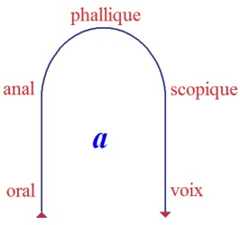

# Leçon 23 | l9 Juin l963

  <label><input type="checkbox" data-lacan-toggle="original" checked> 原文</label>
  <label><input type="checkbox" data-lacan-toggle="notes" checked> 注释</label>
  <label><input type="checkbox" data-lacan-toggle="commentary" checked> 个人解读评论</label>

<section class="parallel-paragraph" data-paragraph-ids="s10-23-0001">

s10-23-0001

[无对应译文]

原文 · s10-23-0001

Comme me l’a fait remarquer quelqu’un, après mon dernier discours,
*cette définition* que je poursuis cette année devant vous de la fonction de *l’objet(a*) tend à opposer :

</section>

<section class="parallel-paragraph" data-paragraph-ids="s10-23-0002">

s10-23-0002

[无对应译文]

原文 · s10-23-0002

- *à la liaison de cet objet à des stades*, *à la conception si vous voulez abrahamique -* je parle du psychanalyste - *de ses muta­tions*,

</section>

<section class="parallel-paragraph" data-paragraph-ids="s10-23-0003">

s10-23-0003

[无对应译文]

原文 · s10-23-0003

- *sa constitution si l’on peut dire circulaire *: le fait qu’à tous ses niveaux il tient à lui-même en tant qu’*objet(a),* que sous les diverses formes où il se *manifeste*, il s’agit toujours d’une même fonction, à savoir *comment (a) est lié à la constitution du sujet au lieu de l’Autre et le représente*.

</section>

<section class="parallel-paragraph" data-paragraph-ids="s10-23-0004">

s10-23-0004

[无对应译文]

原文 · s10-23-0004

</section>

<section class="parallel-paragraph" data-paragraph-ids="s10-23-0005">

s10-23-0005

[无对应译文]

原文 · s10-23-0005

Il est vrai que sa fonction centrale, au niveau du *stade phallique*...

</section>

<section class="parallel-paragraph" data-paragraph-ids="s10-23-0006">

s10-23-0006

[无对应译文]

原文 · s10-23-0006

> où la fonction de *(a)* est représentée essen­tiellement par *un manque, par le défaut du phallus,*
>
> comme constituant la disjonction qui joint le désir à la jouissance, c’est ce qu’exprime ce qu’ici je rappelle
>
> de ce que par convention nous appelons le niveau 3 de ce que nous avons décrit des divers stades de l’objet
> ...il est vrai, dis-je, que ce stade a une position, disons *extrême*,
> que le stade 4 et le stade 5, si vous voulez, sont dans une position de retour qui les amène en corrélation au stade 1 et au stade 2.

</section>

<section class="parallel-paragraph" data-paragraph-ids="s10-23-0007">

s10-23-0007

[无对应译文]

原文 · s10-23-0007

Chacun sait...
et c’est ce que ce petit schéma est seulement destiné à rappe­ler
...*les liens du stade oral et de son objet* avec *les manifestations primaires du surmoi* dont je vous ai déjà indiqué...
vous rappelant sa connexion évi­dente avec cette forme de *l’objet(a)* qu’est *la voix,*
...j’ai déjà rappelé qu’il ne sau­rait y avoir de conception analytique valable du *surmoi* qui oublie que par sa face la plus profonde,
c’est une des formes de *l’objet(a*).

</section>

<section class="parallel-paragraph" data-paragraph-ids="s10-23-0008">

s10-23-0008

[无对应译文]

原文 · s10-23-0008

Ces deux signes, (*an*) *anal* et (*scop*) *scopique ou scoptophilique*,
vous rappellent la connexion dès longtemps dénotée du stade anal à la scoptophilie.

</section>

<section class="parallel-paragraph" data-paragraph-ids="s10-23-0009">

s10-23-0009

[无对应译文]

原文 · s10-23-0009

Il n’en reste pas moins que toutes *conjointes* que soient, deux à deux, les formes stadiques *un-deux*, *quatre-cinq*,
l’ensemble en est orienté selon cette flèche montante, puis descendante.

</section>

<section class="parallel-paragraph" data-paragraph-ids="s10-23-0010">

s10-23-0010

[无对应译文]

原文 · s10-23-0010

C’est ce qui fait :

</section>

<section class="parallel-paragraph" data-paragraph-ids="s10-23-0011">

s10-23-0011

[无对应译文]

原文 · s10-23-0011

- que dans toute *phase analytique* de reconstitution des données du désir refoulé, *dans une régression il y a une face progressive*,

</section>

<section class="parallel-paragraph" data-paragraph-ids="s10-23-0012">

s10-23-0012

[无对应译文]

原文 · s10-23-0012

- que *dans tout accès progressif* au stade ici posé par l’ins­cription même, comme supérieur, *il y a une face régressive*.

</section>

<section class="parallel-paragraph" data-paragraph-ids="s10-23-0013">

s10-23-0013

[无对应译文]

原文 · s10-23-0013

Tel est, telles sont les indications de sorte à vous rappeler pour qu’elles restent pré­sentes à votre esprit dans tout mon discours d’aujourd’hui, ce que je vais maintenant poursuivre.

</section>

<section class="parallel-paragraph" data-paragraph-ids="s10-23-0014">

s10-23-0014

[无对应译文]

原文 · s10-23-0014

Comme je vous l’ai dit la dernière fois, il s’agit d’illustrer, d’expliquer *la fonction d’un certain objet*...
qui est, si vous voulez, la merde pour l’appeler par son nom
...dans la constitution du désir anal.

</section>

<section class="parallel-paragraph" data-paragraph-ids="s10-23-0015">

s10-23-0015

[无对应译文]

原文 · s10-23-0015

Vous savez qu’après tout, cet objet déplaisant, c’est le privilège de l’analyse, dans « l’histoire de la pen­sée »,
d’en avoir fait émerger la fonction déterminante dans l’économie du désir.

</section>

<section class="parallel-paragraph" data-paragraph-ids="s10-23-0016">

s10-23-0016

[无对应译文]

原文 · s10-23-0016

Si je vous ai fait remarquer la dernière fois, que par rapport au *désir*, *l’objet(a*) se présente toujours en *« fonction de cause »*,
au point d’être pour nous...
*possiblement,* si vous m’entendez, si vous me suivez
*...*le point racine où s’élabore dans le sujet *la fonction de la cause même*.

</section>

<section class="parallel-paragraph" data-paragraph-ids="s10-23-0017">

s10-23-0017

[无对应译文]

原文 · s10-23-0017

Si c’est là cette forme primordiale, *la cause d’un désir*, en quoi j’ai souligné pour vous qu’ici se marque la nécessité par quoi *la cause,*
pour subsister dans sa fonction men­tale, nécessite toujours l’existence d’une béance entre elle et son effet.

</section>

<section class="parallel-paragraph" data-paragraph-ids="s10-23-0018">

s10-23-0018

[无对应译文]

原文 · s10-23-0018

Béance si nécessaire pour que nous puissions penser encore « *cause »*, que là où elle risquerait d’être comblée,
il faut que nous fassions subsister *un voile* sur le déterminisme étroit, *sur les connexions par où agit la cause*.

</section>

<section class="parallel-paragraph" data-paragraph-ids="s10-23-0019">

s10-23-0019

[无对应译文]

原文 · s10-23-0019

Ce que j’ai illustré la dernière fois par l’exemple du *robinet*, à savoir que seul l’en­fant qui *négligeait*...
à l’occasion, comme on dit, pour ne l’avoir pas compris
...le mécanisme étroit qu’on lui représentait sous forme d’une coupe, d’*un schéma du robinet*,
celui-là seul, qui se dispensait ou qui flanchait à ce niveau de ce que Piaget appelle « la compréhension »,
c’est à celui-là seul que se révélait l’essence de la fonction du robinet comme cause, c’est-à-dire comme concept de robinet.

</section>

<section class="parallel-paragraph" data-paragraph-ids="s10-23-0020">

s10-23-0020

[无对应译文]

原文 · s10-23-0020

L’origine de cette nécessité de subsistance de *la cause* est dans ceci :
que sous sa forme première *elle est cause du désir*, c’est-à-dire de *quelque chose d’essentiellement non effectué*.

</section>

<section class="parallel-paragraph" data-paragraph-ids="s10-23-0021">

s10-23-0021

[无对应译文]

原文 · s10-23-0021

C’est bien pour ça, qu’en cohérence avec cette conception, nous ne pouvons aucunement confondre le désir anal,
avec ce que les mères, autant que les partisans de la *catharsis* appelle­raient dans l’occasion, « *l’effet* » : « *cela a-t-il fait de l’effet ?* ». *L’excrément ne joue pas le rôle « d’effet » de ce que nous situons comme « désir anal », il en est la cause*.

</section>

<section class="parallel-paragraph" data-paragraph-ids="s10-23-0022">

s10-23-0022

[无对应译文]

原文 · s10-23-0022

À la vérité, si nous allons nous arrêter à ce singulier objet, c’est autant

</section>

<section class="parallel-paragraph" data-paragraph-ids="s10-23-0023">

s10-23-0023

[无对应译文]

原文 · s10-23-0023

- pour l’importance de sa fonction toujours réitérée à notre attention

</section>

<section class="parallel-paragraph" data-paragraph-ids="s10-23-0024">

s10-23-0024

[无对应译文]

原文 · s10-23-0024

> et spé­cialement, vous le savez, dans l’analyse de *l’obsessionnel,*

</section>

<section class="parallel-paragraph" data-paragraph-ids="s10-23-0025">

s10-23-0025

[无对应译文]

原文 · s10-23-0025

- que pour le fait qu’il illustre pour nous, une fois de plus,

</section>

<section class="parallel-paragraph" data-paragraph-ids="s10-23-0026">

s10-23-0026

[无对应译文]

原文 · s10-23-0026

> comment il convient de concevoir pour qu’il subsiste pour nous, les divers modes de *l’objet(a)*.

</section>

<section class="parallel-paragraph" data-paragraph-ids="s10-23-0027">

s10-23-0027

[无对应译文]

原文 · s10-23-0027

Il est en effet un peu à part au premier abord, parmi les autres de ses modes :

</section>

<section class="parallel-paragraph" data-paragraph-ids="s10-23-0028">

s10-23-0028

[无对应译文]

原文 · s10-23-0028

- La constitution mammifère,

</section>

<section class="parallel-paragraph" data-paragraph-ids="s10-23-0029">

s10-23-0029

[无对应译文]

原文 · s10-23-0029

- le fonctionnement phallique de l’orga­ne copulatoire,

</section>

<section class="parallel-paragraph" data-paragraph-ids="s10-23-0030">

s10-23-0030

[无对应译文]

原文 · s10-23-0030

- la plasticité du larynx humain à l’empreinte phonématique,

</section>

<section class="parallel-paragraph" data-paragraph-ids="s10-23-0031">

s10-23-0031

[无对应译文]

原文 · s10-23-0031

- la valeur anticipatrice de l’image spéculaire à la prématuration néo-natale du système nerveux, tous ces faits anatomiques... que je vous ai rappelés ces der­niers temps, les uns après les autres, pour leur montrer en quoi ils se conjoignent à la *fonction de (a),...*tous ces faits anatomiques... dont vous pou­vez voir, à leur seule énumération, combien la place est dispersée sur l’arbre des déterminations organismiques ...ne prennent chez l’homme leur valeur de *destin*, comme dit Freud, que pour venir... cela je vous l’ai montré pour chacun ...venir bloquer une place-clé sur un échiquier dont les *cases* se structurent de la *constitution subjectivante*, telle qu’elle résulte de la dominance du « *sujet qui parle* » sur le « *sujet qui comprend* », sur le sujet de l’*insight,* dont nous connaissons, sous la forme du chimpanzé, les limites.

</section>

<section class="parallel-paragraph" data-paragraph-ids="s10-23-0032">

s10-23-0032

[无对应译文]

原文 · s10-23-0032

Quelle que soit la supériorité supposée des capacités de l’homme sur le chimpanzé,
il est clair que le fait qu’il aille plus loin est lié à cette dominan­ce dont je viens de parler : dominance du « *sujet qui parle* »,
qui a pour résultat dans la *praxis*, que l’être humain assurément va plus loin.

</section>

<section class="parallel-paragraph" data-paragraph-ids="s10-23-0033">

s10-23-0033

[无对应译文]

原文 · s10-23-0033

Ce faisant, il croit atteindre au *concept*,
c’est-à-dire *qu’il croit pouvoir saisir le réel par un signifiant qui le commande* selon sa causation intime, ce *réel*.

</section>

<section class="parallel-paragraph" data-paragraph-ids="s10-23-0034">

s10-23-0034

[无对应译文]

原文 · s10-23-0034

Les difficultés que nous, analystes, avons rencontrées dans le champ de la *relation intersubjective...*
qui pour les psychologues semble ne pas faire tellement de problème, elle en fait un peu plus pour nous
...ces difficultés...

</section>

<section class="parallel-paragraph" data-paragraph-ids="s10-23-0035">

s10-23-0035

[无对应译文]

原文 · s10-23-0035

> pour peu que nous prétendions rendre compte
>
> de la façon dont *la fonction du signifiant* s’immisce originellement dans cette *relation intersubjective*,
> ...ces difficultés ce sont celles qui nous mènent à une nouvelle « *critique de la Rai­son »,*
> dont ce serait une niaiserie bien du type de *l’école* que d’y voir une récession quelconque du mouvement conquérant de la dite *Raison*.

</section>

<section class="parallel-paragraph" data-paragraph-ids="s10-23-0036">

s10-23-0036

[无对应译文]

原文 · s10-23-0036

Cette critique en effet, va à repérer seulement comment cette « *Raison »* s’est déjà tissée
au niveau du dynamisme le plus opaque dans le sujet,
là où se modifie ce qu’il éprouve dans *ce dynamisme* comme besoin dans *les formes* toujours plus ou moins paradoxales...
je dis « *paradoxales »* quant à leur naturel supposé
...de ce qu’on appelle « *le désir* ».

</section>

<section class="parallel-paragraph" data-paragraph-ids="s10-23-0037">

s10-23-0037

[无对应译文]

原文 · s10-23-0037

C’est ainsi que cette critique s’avère, dans ce que je vous ai montré, être *la cause du désir.*
Est-ce payer trop cher que de devoir conjoindre à cette révélation que *la notion de cause se trouve*, de ce fait, *y révéler son origine *? Évidemment, ça serait faire du *psychologisme*...
avec toutes les conséquences absurdes que ceci a, concernant la légalité de la *Raison...*que de le réduire à *un recours*, à *un développement* de faits quelconques.

</section>

<section class="parallel-paragraph" data-paragraph-ids="s10-23-0038">

s10-23-0038

[无对应译文]

原文 · s10-23-0038

Mais justement, ce n’est pas ce que nous faisons, parce que la subjectivation dont il s’agit n’est pas *psychologique*, ni *développementale*, qu’elle montre ce qui conjoint à des *accidents* du *développement...*
en somme ceux que j’ai énumérés tout d’abord, à l’ins­tant, en rappelant leur liste
...les particularités anatomiques dont il s’agit chez l’homme, en conjoignant donc à ces *accidents de développement*,
l’effet d’*un signifiant*, dont dès lors la *transcendance* est évidente par rapport au dit *développement*.

</section>

<section class="parallel-paragraph" data-paragraph-ids="s10-23-0039">

s10-23-0039

[无对应译文]

原文 · s10-23-0039

*Transcendance*... et après ?
Il n’y a pas de quoi vous effaroucher !
Cette transcendance n’est ni plus ni moins marquée, à ce niveau, que n’importe quelle autre incidence du *réel*, de ce *réel* que,
en biologie, on appelle pour l’occa­sion « *Umwelt »,* histoire de l’apprivoiser.

</section>

<section class="parallel-paragraph" data-paragraph-ids="s10-23-0040">

s10-23-0040

[无对应译文]

原文 · s10-23-0040

Mais justement, l’existence de l’an­goisse chez l’animal, déboute parfaitement les imputations spiritualistes,
qui d’aucune part pourraient se faire jour, à mon endroit,
à propos de cette situation que je pose comme *transcendante* en l’occasion, *du signifiant*.

</section>

<section class="parallel-paragraph" data-paragraph-ids="s10-23-0041">

s10-23-0041

[无对应译文]

原文 · s10-23-0041

Car c’est bien de la perception, en toute occasion, dans l’angoisse anima­le, d’un au-delà du dit « *Umwelt »* qu’il s’agit.
C’est du fait que quelque chose vient à ébranler cet *Umwelt* jusque dans ses fondements
que l’animal se montre averti, quand il s’affole, à un *tremblement de terre* par exemple, ou à tout autre accident *météorique*.

</section>

<section class="parallel-paragraph" data-paragraph-ids="s10-23-0042">

s10-23-0042

[无对应译文]

原文 · s10-23-0042

Et une fois de plus se révèle *la vérité* de la formule que : « *l’angoisse est ce qui ne trompe pas* ».
La preuve c’est que quand vous verrez les animaux s’agiter de cette façon,
dans les contrées où ces inci­dents peuvent se produire, vous ferez bien d’en tenir compte.

</section>

<section class="parallel-paragraph" data-paragraph-ids="s10-23-0043">

s10-23-0043

[无对应译文]

原文 · s10-23-0043

Avant d’être vous-mêmes avertis, eux nous signalent ce qui est en train de se passer, ce qui est imminent.
Pour eux, comme pour nous, c’est la manifes­tation d’un lieu de l’Autre, d’une autre chose qui se manifeste ici comme telle,
ce qui ne veut pas dire que je dise - et pour cause - qu’il y ait nulle part,
d’autre part où ce lieu de l’Autre ait à se loger en dehors de *l’espace réel*, comme je l’ai rappelé la dernière fois.

</section>

<section class="parallel-paragraph" data-paragraph-ids="s10-23-0044">

s10-23-0044

[无对应译文]

原文 · s10-23-0044

Et nous allons maintenant entrer dans ceci,
dans la particularité du cas qui fait que l’excrément peut venir à fonctionner en ce point déterminé
par *la nécessité où est le sujet de se constituer d’abord dans le signifiant*.

</section>

<section class="parallel-paragraph" data-paragraph-ids="s10-23-0045">

s10-23-0045

[无对应译文]

原文 · s10-23-0045

Le point est important parce qu’enfin ici
\- peut-être plus qu’ailleurs - singulière­ment, une sorte *d’ombre de confusion* règne.
On se rapprocherait plus de la matière - c’est le cas de le dire - ou du concret,
pour autant que nous, nous savons tenir compte même des faces les plus désagréables de la vie,
que c’est <u>là</u> - non dans l’empyrée[^163] - que nous allons chercher justement le domai­ne des causes.

</section>

<section class="parallel-paragraph" data-paragraph-ids="s10-23-0046">

s10-23-0046

[无对应译文]

原文 · s10-23-0046

C’est très amusant à saisir dans les premiers propos intro­ductifs de Jones[^164],

</section>

<section class="parallel-paragraph" data-paragraph-ids="s10-23-0047">

s10-23-0047

[无对应译文]

原文 · s10-23-0047

dans un article dont la lecture ne saurait trop être recommandée parce qu’elle vaut mille,
c’est cet article qui dans le recueil de ses *Selected Papers* s’appelle « *Madonna’s conception through ears »,*
la conception de *la madone*, « *la conception virginale de la vier­ge par l’oreille ».*

</section>

<section class="parallel-paragraph" data-paragraph-ids="s10-23-0048">

s10-23-0048

[无对应译文]

原文 · s10-23-0048

Tel est le sujet que ce gallois...
je dois dire : dont la malice protestante ne peut pas absolument être éliminée
des arrière-fonds de la complaisance qu’il y met
...à laquelle ce gallois s’attaque dans un *article de* 1914, juste émergeant lui-même de ses premières appréhensions...
véritablement pour lui qui ont été illuminantes
...de la prévalence de *la fonction anale* chez les quelques premiers grands obsessionnels qui lui sont venus, comme ça, dans la main, quelques années après les obsessionnels de Freud.

</section>

<section class="parallel-paragraph" data-paragraph-ids="s10-23-0049">

s10-23-0049

[无对应译文]

原文 · s10-23-0049

Ce sont des observations...
j’ai été les rechercher dans leur texte original,
des deux numéros justement qui précèdent la publication de cet article, dans le *Jahrbuch...*ce sont des cas évidemment sensationnels, encore que nous en avons vues depuis, d’autres.

</section>

<section class="parallel-paragraph" data-paragraph-ids="s10-23-0050">

s10-23-0050

[无对应译文]

原文 · s10-23-0050

Là, tout de suite, Jones aborde le sujet en nous disant que bien sûr, c’est là très joli « *le souffle fécondant* »,
et que partout dans le mythe, dans la légen­de, dans la poésie, nous en avons la trace.
Quoi de plus beau que cet éveil de l’être au passage du *Ruach*, du souffle de l’Éternel ?

</section>

<section class="parallel-paragraph" data-paragraph-ids="s10-23-0051">

s10-23-0051

[无对应译文]

原文 · s10-23-0051

Lui, Jones qui en sait un peu plus...
il est vrai que sa science est encore de fraîche date, mais enfin il en est enthousiasmé
...lui va nous montrer de quelle sorte de vent il s’agit : il s’agit du *vent anal*.

</section>

<section class="parallel-paragraph" data-paragraph-ids="s10-23-0052">

s10-23-0052

[无对应译文]

原文 · s10-23-0052

Et comme il nous dit, il est clair que l’expérience nous prouve que l’*intérêt* ...
avec là ce quelque chose de supposé : que l’*intérêt* c’est l’*intérêt* vivant, c’est l’*intérêt* biologique
...que l’*intérêt* que le sujet - tel qu’il se découvre dans l’analyse - montre à ses excréments, à la merde qu’il produit,
est infiniment plus présent, plus avancé, plus évident, plus dominant,
que ce quelque chose, dont sans doute il y aurait beaucoup de rai­sons qu’il s’en préoccupe, à savoir sa respiration
qui ne semble, au dire de Jones, guère le solliciter, et ceci pour cette seule raison bien sûr : que la res­piration, c’est habituel.

</section>

<section class="parallel-paragraph" data-paragraph-ids="s10-23-0053">

s10-23-0053

[无对应译文]

原文 · s10-23-0053

L’argument est faible.
L’argument est faible dans un champ, une discipli­ne, qui tout de même ne peut manquer de relever,
et qui a relevé par la suite, l’importance de *la suffocation*, de la difficulté respiratoire,
dans l’établisse­ment tout à fait originel de la fonction de l’angoisse.

</section>

<section class="parallel-paragraph" data-paragraph-ids="s10-23-0054">

s10-23-0054

[无对应译文]

原文 · s10-23-0054

Que le sujet vivant - même humain - n’ait pas à cet endroit d’avertissement de l’importance de sa fonction, ceci surprend.
Je dis *surprend* comme argu­ment initial, introductif de Jones,
surtout qu’il est à une époque où tout de même il y avait déjà *quelque chose* qui était bien fait pour mettre en valeur
la relation éventuelle de la fonction respiratoire avec ce dont il s’agit : le moment fécond de la relation sexuelle.

</section>

<section class="parallel-paragraph" data-paragraph-ids="s10-23-0055">

s10-23-0055

[无对应译文]

原文 · s10-23-0055

C’est que *cette respiration, sous la forme du halètement, paternel ou maternel*, faisait bien partie de la premiè­re phénoménologie de *la scène traumatique*, au point d’entrer tout à fait légitimement dans la sphère de ce qui pouvait en surgir, pour l’enfant, *de théorie sexuelle*.
De sorte que, quelle que soit la valeur de ce qu’ultérieurement Jones déploie, on peut dire que sans que ce soit à réfuter,
car il est de fait que la voie où il s’engageait là, trouve tellement de *corrélats* dans une foule de domaines anthropologiques
qu’on ne puisse dire que sa recherche n’ait rien indiqué.

</section>

<section class="parallel-paragraph" data-paragraph-ids="s10-23-0056">

s10-23-0056

[无对应译文]

原文 · s10-23-0056

Je ne parle pas du fait qu’il puisse aisément trouver toutes sortes de références dans *la littérature mythologique*, à la fonction
de ce « *souffle inférieur* » et jusque dans les *Upanishad,* où sous le terme d’*Apana*, il serait précisé que c’est de ce vent de son derrière que *Brahma* engendrerait spécialement l’espèce humaine.

</section>

<section class="parallel-paragraph" data-paragraph-ids="s10-23-0057">

s10-23-0057

[无对应译文]

原文 · s10-23-0057

Il y a mille autres corrélats destinés en l’occasion à nous rappeler l’opportunité en un tel texte, de ces rappels.
À la vérité sur le sujet particulier, si vous vous reportez à cet article, vous verrez que son extension même, qui va jusqu’à *la diffluence*, montre assez qu’à la fin il n’est pas absolument - loin de là - convaincant.

</section>

<section class="parallel-paragraph" data-paragraph-ids="s10-23-0058">

s10-23-0058

[无对应译文]

原文 · s10-23-0058

Mais ceci n’est pour nous qu’une stimulation de plus,
quand il s’agit d’interroger sur le sujet du *pourquoi la fonction de l’excrément peut jouer ce rôle privilégié dans ce mode de la constitution subjective,* que nous définissons, dont nous donnons le terme comme étant celui du désir anal.
Je crois qu’à le reprendre, nous verrons que ceci ne peut être tranché qu’en faisant intervenir,
d’une façon plus ordonnée, plus structurale, qui est selon l’esprit de notre recherche, *pourquoi* il peut venir occuper cette place.

</section>

<section class="parallel-paragraph" data-paragraph-ids="s10-23-0059">

s10-23-0059

[无对应译文]

原文 · s10-23-0059

Il est évident, qu’*a priori* cette fonction de l’excrément...

</section>

<section class="parallel-paragraph" data-paragraph-ids="s10-23-0060">

s10-23-0060

[无对应译文]

原文 · s10-23-0060

> qui par rap­port aux différents accidents que je vous ai évoqués tout à l’heure, depuis la place anatomique
>
> de la mamme, jusqu’à la plasticité du larynx humain, avec dans l’intervalle l’image spéculaire de la castration
>
> liée en somme, à la conformation particulière de l’organe copulatoire à un niveau plutôt élevé de l’échelle ani­male
> ...là l’excrément est là depuis le début, et avant même la différen­ciation de la bouche et de l’anus : au niveau du *blastopore*,
> nous le voyons déjà fonctionner.

</section>

<section class="parallel-paragraph" data-paragraph-ids="s10-23-0061">

s10-23-0061

[无对应译文]

原文 · s10-23-0061

Mais il semble que si nous nous faisons - *c’est toujours insuffisant* - une certaine idée biologique des rapports du vivant avec son milieu, tout de même *l’excrément se caractérise comme rejet* et par consé­quent il est plutôt *dans le sens, dans le signe, dans le courant, dans le flux*,
de ce dont l’être vivant comme tel tend à se désintéresser :

</section>

<section class="parallel-paragraph" data-paragraph-ids="s10-23-0062">

s10-23-0062

[无对应译文]

原文 · s10-23-0062

- ce qui l’intéresse c’est ce qui entre,

</section>

<section class="parallel-paragraph" data-paragraph-ids="s10-23-0063">

s10-23-0063

[无对应译文]

原文 · s10-23-0063

- ce qui sort, ça semble impliquer dans la structure qu’il n’ait pas ten­dance à le retenir.

</section>

<section class="parallel-paragraph" data-paragraph-ids="s10-23-0064">

s10-23-0064

[无对应译文]

原文 · s10-23-0064

De sorte que, à partir justement, de considérations biologiques, il peut être indiqué, il semble intéressant de se demander, exactement par quoi, au niveau de l’être humain, il prend cette importance, cette importance *sub­jectivée*.

</section>

<section class="parallel-paragraph" data-paragraph-ids="s10-23-0065">

s10-23-0065

[无对应译文]

原文 · s10-23-0065

Parce que bien entendu c’est possible, et c’est même probable, et c’est même constatable,
qu’au niveau de ce qu’on peut appeler *l’économie vivante*, l’excrément continue à avoir son importance dans le milieu qu’il vient aussi, dans certaines conditions, saturer, saturer quelquefois jusqu’à le rendre non compatible avec la vie,
d’autres fois où il le sature d’une façon qui, au moins pour d’autres organismes, prend fonction de support dans le milieu extérieur.

</section>

<section class="parallel-paragraph" data-paragraph-ids="s10-23-0066">

s10-23-0066

[无对应译文]

原文 · s10-23-0066

Il y a toute une économie bien sûr, de la fonction de l’excrément, économie intra-vivant et inter-vivants.

</section>

<section class="parallel-paragraph" data-paragraph-ids="s10-23-0067">

s10-23-0067

[无对应译文]

原文 · s10-23-0067

Ceci n’est pas non plus absent du champ humain... et j’ai vainement cherché dans ma bibliothèque...
pour vous le montrer ici, pour vous lancer sur cette piste - je le retrouverai, il s’est perdu, comme l’excrément
...un petit livre admirable comme beaucoup d’autres de mon ami Aldous Huxley qui s’appelle *Adonis et l’alphabet* [^165].

</section>

<section class="parallel-paragraph" data-paragraph-ids="s10-23-0068">

s10-23-0068

[无对应译文]

原文 · s10-23-0068

À l’intérieur de ce contenu prometteur, vous trouverez un superbe article sur l’organisation usinière,
dans une ville de l’ouest américain, de la récupération, au niveau urbaniste, de *l’excrément*.

</section>

<section class="parallel-paragraph" data-paragraph-ids="s10-23-0069">

s10-23-0069

[无对应译文]

原文 · s10-23-0069

Ça n’a qu’une valeur exemplaire, ceci se produit en bien d’autres endroits que dans l’industrielle Amérique.
Assurément, vous ne soupçonnez pas tout ce qu’on peut reconstituer de richesses *à l’aide des seuls excréments* d’une masse humaine !

</section>

<section class="parallel-paragraph" data-paragraph-ids="s10-23-0070">

s10-23-0070

[无对应译文]

原文 · s10-23-0070

Au reste, il n’est pas hors de saison de rappeler à ce propos, ce qu’un certain progrès des relations interhumaines...
des « *human relations »* si à la mode depuis la dernière guerre
...ont pu faire pendant la dite dernière guerre, de la réduction de masses humaines entières à la fonction d’excréments.

</section>

<section class="parallel-paragraph" data-paragraph-ids="s10-23-0071">

s10-23-0071

[无对应译文]

原文 · s10-23-0071

La transformation d’individus nombreux d’un peuple...
choi­si précisément d’être *un peuple choisi* parmi les autres
...par l’intermédiaire du four crématoire, à l’état de quelque chose qui, finalement, paraît-il, se répartissait dans la *Mitteleuropa*
sous la forme de savonnettes, est aussi quelque chose qui nous montre que dans le circuit économique inter-humain,
la visée de l’hom­me, comme réductible à *l’excrément*, n’est pas absente.

</section>

<section class="parallel-paragraph" data-paragraph-ids="s10-23-0072">

s10-23-0072

[无对应译文]

原文 · s10-23-0072

Mais nous, nous autres analystes, nous nous réduisons à la question de *la subjectivation*.
Par quelles voies l’excrément entre-t-il dans la subjectivation ?

</section>

<section class="parallel-paragraph" data-paragraph-ids="s10-23-0073">

s10-23-0073

[无对应译文]

原文 · s10-23-0073

Eh bien, ceci est tout à fait clair dans les références analytiques, ou tout au moins au premier abord ça paraît tout à fait clair :
par l’intermédiaire de *la demande de l’Autre*, représentée en l’occasion par la mère.

</section>

<section class="parallel-paragraph" data-paragraph-ids="s10-23-0074">

s10-23-0074

[无对应译文]

原文 · s10-23-0074

Quand nous avons trouvé ça, nous sommes tout contents, nous voilà ayant rejoint les données observationnelles :
il s’agit de l’éducation de ce qu’on appelle la propreté, laquelle commande à l’enfant de retenir...
ce qui ne va pas de soi que soit nécessité de retenir trop longtemps
*...*de retenir l’excrément et de ce fait, déjà d’ébaucher son introduction dans le domaine de l’appartenance d’une partie du corps qui, pour au moins un certain temps, doit être considérée comme à ne pas aliéner, puis après cela de le lâcher, toujours à la demande.

</section>

<section class="parallel-paragraph" data-paragraph-ids="s10-23-0075">

s10-23-0075

[无对应译文]

原文 · s10-23-0075

Nous connaissons les scènes fami­lières, qui sont je dois dire, fondamentales, d’usage courant !
Il n’y a ni lieu de critiquer, ni de refréner, ni surtout - grands dieux ! - d’accompagner de tellement de recommandations éducatives :
l’éducation des parents, toujours à l’ordre du jour, ne fait que trop de ravages dans tous ces domaines.

</section>

<section class="parallel-paragraph" data-paragraph-ids="s10-23-0076">

s10-23-0076

[无对应译文]

原文 · s10-23-0076

Enfin bref, grâce au fait que la demande devient, aussi là, une part déterminante dans le *lâchage* en ques­tion,
de faire ici quelque chose qui, bien évidemment, est destiné à valoriser cette chose, un instant reconnue
et dès lors élevée à la fonction - tout de même - de *partie* dont le sujet a quelque appréhension à perdre.

</section>

<section class="parallel-paragraph" data-paragraph-ids="s10-23-0077">

s10-23-0077

[无对应译文]

原文 · s10-23-0077

Cette partie devient au moins valorisée, en ceci qu’elle donne à la demande de l’Autre, sa satisfaction,
en outre qu’elle s’accompagne de tous les soins qu’on connaît, dans la mesure où l’Autre, non seulement y fait attention
mais y ajoute toutes ces dimensions supplémentaires que je n’ai pas besoin d’évoquer comme ça,
c’est de la physique amusante dans l’ordre de notre domaine :
le flairage, l’approbation, voire le torchage, dont chacun sait que les effets *érogènes* sont incontestables.

</section>

<section class="parallel-paragraph" data-paragraph-ids="s10-23-0078">

s10-23-0078

[无对应译文]

原文 · s10-23-0078

Ils deviennent d’autant plus évidents quand il arrive...
tout comme vous le savez, et ça n’est pas rare
...qu’une mère continue à tor­cher le cul de son grand fils jusqu’à l’âge de douze ans, ça se voit *tous les jours*.

</section>

<section class="parallel-paragraph" data-paragraph-ids="s10-23-0079">

s10-23-0079

[无对应译文]

原文 · s10-23-0079

De sorte que bien sûr, il semblerait que ma question n’est pas tellement importante,
et que nous voyons très bien comment le « *caca* » prend tout à fait aisément cette fonction
que j’ai appelée - mon Dieu - celle de l’ἄγαλμα \[agalma\], un ἄγαλμα dont après tout,
le passage au registre du nauséabond ne s’inscri­rait que comme l’effet de la discipline elle-même dont il est partie inté­grante.

</section>

<section class="parallel-paragraph" data-paragraph-ids="s10-23-0080">

s10-23-0080

[无对应译文]

原文 · s10-23-0080

Eh bien, c’est justement - ça saute aux yeux - ce qui ne nous permet­trait d’aucune façon pourtant de constater...
j’entends d’une façon qui nous satisfasse
...l’ampleur des effets qui s’attachent à cette relation* « agalmique »* spéciale, de la mère à l’excrément de son enfant,
s’il ne nous fallait pas, pour le com­prendre, le mettre...
ce qui est la donnée de fait de la compréhension analy­tique
...le mettre en connexion avec les autres formes de *petit(a)*,
avec le fait que l’ἄγαλμα, en soi, n’est pas concevable sans sa relation au *phallus*, *à son absence et à* *l’angoisse phallique* comme telle.

</section>

<section class="parallel-paragraph" data-paragraph-ids="s10-23-0081">

s10-23-0081

[无对应译文]

原文 · s10-23-0081

En d’autres termes, c’est en tant que *symbolisant la castration*...
nous le savons, tout de suite
...que le *(a)* *excrémentiel* est venu à la portée de notre attention.

</section>

<section class="parallel-paragraph" data-paragraph-ids="s10-23-0082">

s10-23-0082

[无对应译文]

原文 · s10-23-0082

Je prétends, j’ajoute, que nous ne pouvons rien comprendre à la phéno­ménologie...
si fondamentale, pour toute notre spéculation
...*de l’obses­sion*, si nous ne saisissons pas en même temps...
d’une façon beaucoup plus intime, motivée, régulière, que nous ne le faisons habituellement
...cette liai­son de l’excrément avec, non pas seulement le (- φ) du *phallus*,
mais avec *les autres formes* évoquées ici, dans ma classification disons stadique, *les autres formes du* *(a)*.

</section>

<section class="parallel-paragraph" data-paragraph-ids="s10-23-0083">

s10-23-0083

[无对应译文]

原文 · s10-23-0083

Reprenons les choses regressivement, à la réserve près que j’ai faite d’abord, que ce régressif a forcément une face progressive.

</section>

<section class="parallel-paragraph" data-paragraph-ids="s10-23-0084">

s10-23-0084

[无对应译文]

原文 · s10-23-0084

Au niveau du stade oral le fond de ce dont il s’agit, c’est que dans *l’objet(a)* du stade oral...
le sein, le mamelon, ce que vous voudrez
...le sujet se constituant à l’origine, aussi bien que s’achevant dans le commandement de la voix :

</section>

<section class="parallel-paragraph" data-paragraph-ids="s10-23-0085">

s10-23-0085

[无对应译文]

原文 · s10-23-0085

- le sujet ne sait pas, ne peut pas savoir jusqu’à quel point il est lui-même - *e.s.t.* - *cet être plaqué* sur le poitrail de la mère, sous la forme de *la mamelle,* après avoir été également ce *parasite* plongeant ses villosités dans la muqueuse utérine sous la forme du placenta.

</section>

<section class="parallel-paragraph" data-paragraph-ids="s10-23-0086">

s10-23-0086

[无对应译文]

原文 · s10-23-0086

- Il ne sait pas, il ne peut pas savoir que *(a)*, le sein, le placenta, c’est la réalité de lui : *(a),* par rapport à l’Autre, grand A.

</section>

<section class="parallel-paragraph" data-paragraph-ids="s10-23-0087">

s10-23-0087

[无对应译文]

原文 · s10-23-0087

- Il croit que *(a)* c’est l’Autre, et *qu’ayant affaire* à *(a), il a affaire* à l’Autre, au Grand Autre, à la mère.

</section>

<section class="parallel-paragraph" data-paragraph-ids="s10-23-0088">

s10-23-0088

[无对应译文]

原文 · s10-23-0088

Donc, par rapport à ce stade, au niveau anal, c’est pour la première fois qu’il a l’occasion de se reconnaître *en quelque chose*...
mais n’allons pas trop vite
...*en quelque chose*, *en un objet* autour de quoi tourne - car elle tourne cette demande de la mère dont il s’agit :
« *Garde-le, donne-le* ». Et si je le donne, où est-ce que ça va ?

</section>

<section class="parallel-paragraph" data-paragraph-ids="s10-23-0089">

s10-23-0089

[无对应译文]

原文 · s10-23-0089

Pas besoin, tout de même, à ceux qui ont ici la moindre expérience analytique...

</section>

<section class="parallel-paragraph" data-paragraph-ids="s10-23-0090">

s10-23-0090

[无对应译文]

原文 · s10-23-0090

> aux autres, mon Dieu, qui ne lisent que ça,
>
> pour peu qu’ils ouvrent ce que j’ai appelé ailleurs la « *Psychoanalytical dunghill »* : *la littérature analytique*
> *...*je n’ai pas besoin...
> « *dunghill* » veut dire le « *petit tas de merde* »
> ...je n’ai pas besoin de vous rappeler l’importance de ces deux temps.

</section>

<section class="parallel-paragraph" data-paragraph-ids="s10-23-0091">

s10-23-0091

[无对应译文]

原文 · s10-23-0091

*L’importance déterminante dans quoi ?*

</section>

<section class="parallel-paragraph" data-paragraph-ids="s10-23-0092">

s10-23-0092

[无对应译文]

原文 · s10-23-0092

Ce *petit tas* en question...
cette fois-ci c’est celui dont je parlais à l’instant : *t.a.s.*
...ce « *petit tas de merde* », il est obtenu *à la demande*, il est admiré : « *Quel beau caca* ! ».

</section>

<section class="parallel-paragraph" data-paragraph-ids="s10-23-0093">

s10-23-0093

[无对应译文]

原文 · s10-23-0093

Mais cette *deman­de* implique aussi, du même coup, qu’il soit, si je puis dire *désavoué*,
parce que ce « *beau caca* ! », on lui apprend tout de même qu’il ne faut pas garder trop de relations avec lui,
si ce n’est par la voie bien connue que l’analyse a éga­lement repérée, des satisfactions sublimatoires.

</section>

<section class="parallel-paragraph" data-paragraph-ids="s10-23-0094">

s10-23-0094

[无对应译文]

原文 · s10-23-0094

Si l’on barbouille, évidem­ment chacun sait que c’est avec ça qu’on le fait, mais on préfère quand même indiquer à l’enfant
que ça vaut mieux de le faire avec autre chose, avec les petits *plastiques* du psychanalyste d’enfant,
ou avec de bonnes couleurs qui sentent moins mauvais.

</section>

<section class="parallel-paragraph" data-paragraph-ids="s10-23-0095">

s10-23-0095

[无对应译文]

原文 · s10-23-0095

Nous nous trouvons donc bien là au niveau d’une reconnaissance, ce qui est là, dans ce premier rapport à la demande de l’Autre :
c’est à la fois lui, et ça ne doit pas être lui, ou tout au moins, et même plus loin, ça n’est pas de lui.

</section>

<section class="parallel-paragraph" data-paragraph-ids="s10-23-0096">

s10-23-0096

[无对应译文]

原文 · s10-23-0096

Eh ben nous progressons, les satisfactions se dessinent,
c’est à savoir que nous pourrions bien voir là toute l’origine de l’ambivalence obsessionnelle,
et d’une certaine façon, c’est en effet là *quelque chose* que nous pourrions voir s’inscrire dans une formule
dont nous reconnaîtrions la structure \[*a* ◊ S\] : *(a)* est là *la cause* *de cette ambivalence*, de ce « *oui et non* » :

</section>

<section class="parallel-paragraph" data-paragraph-ids="s10-23-0097">

s10-23-0097

[无对应译文]

原文 · s10-23-0097

- c’est *de moi* : *symptôme*,

</section>

<section class="parallel-paragraph" data-paragraph-ids="s10-23-0098">

s10-23-0098

[无对应译文]

原文 · s10-23-0098

- mais néanmoins ça n’est pas *de moi*. *« Les mauvaises pensées que j’ai vis-à-vis de vous, l’analyste, évidemment je les signale,* *mais enfin ce n’est tout de même « pas vrai » que je vous considère comme une merde par exemple. »* \[*rires*\].

</section>

<section class="parallel-paragraph" data-paragraph-ids="s10-23-0099">

s10-23-0099

[无对应译文]

原文 · s10-23-0099

Enfin bref, nous voyons là un ordre, en tout cas, *de causalité* qui se dessi­ne,
que nous ne pouvons tout de même pas, tout de suite entériner comme étant celle du désir.
Mais enfin c’est un *résultat*, comme je le disais la dernière fois, en par­lant justement d’une façon générale du *symptôme*,
à ce niveau, si vous voulez, une structure se dessine
qui est de quelque chose qui nous donne­rait en quelque sorte immédiatement celle du *symptôme*,
*du symptôme justement dans sa fonction de résultat*.

</section>

<section class="parallel-paragraph" data-paragraph-ids="s10-23-0100">

s10-23-0100

[无对应译文]

原文 · s10-23-0100

Je fais remarquer qu’encore laisse-t-elle hors de son circuit ce qui nous intéresse,
ce qui nous intéresse si la théorie que je vous expose est cor­recte, à savoir la liaison à ce qui est à proprement parler *le désir*.

</section>

<section class="parallel-paragraph" data-paragraph-ids="s10-23-0101">

s10-23-0101

[无对应译文]

原文 · s10-23-0101

Nous avons là un certain rapport de constitution du sujet comme divisé, comme ambivalent, en rapport avec la demande de l’Autre.
Nous ne voyons pas du tout pourquoi tout ça, par exemple ne passerait pas complètement au second plan,
ne serait pas balayé avec l’introduction de la dimension de *quelque chose*, qui lui serait dès lors complètement externe, étranger,
de la relation du *désir*, et nommé­ment celle du *désir sexuel*.

</section>

<section class="parallel-paragraph" data-paragraph-ids="s10-23-0102">

s10-23-0102

[无对应译文]

原文 · s10-23-0102

En fait, nous savons déjà pourquoi *le désir sexuel* ne le balaie pas, loin de là,
c’est que cet objet vient, par sa duplicité même, à pouvoir symboliser merveilleusement - au moins par un de ses temps –
ce dont il s’agira à l’avè­nement du stade *phallique*, à savoir de quelque chose qu’il s’agit justement de symboliser, à savoir du *phallus*, en tant que *sa disparition*, son ἀφάνιςις \[aphanisis\], pour employer le terme de Jones...
le terme que Jones applique au *désir* et qui ne s’applique qu’au *phallus...*que son ἀφάνιςις est le truchement des rap­ports, chez l’homme, entre les sexes.

</section>

<section class="parallel-paragraph" data-paragraph-ids="s10-23-0103">

s10-23-0103

[无对应译文]

原文 · s10-23-0103

Est-il besoin de motiver ce qui vient ici à fonctionner,
à savoir *l’évacuation du résultat de la fonction anale* en tant que com­mandée,
va prendre toute sa portée au niveau phallique*, comme ima­geant la perte du phallus*.

</section>

<section class="parallel-paragraph" data-paragraph-ids="s10-23-0104">

s10-23-0104

[无对应译文]

原文 · s10-23-0104

Il est bien entendu que tout ceci ne vaut qu’à l’intérieur du rappel que je dois faire, une fois de plus...
à la seule pensée que cer­tains ont pu être absents, à ce que j’en ai dit précédemment
...de l’essentiel de ce temps : (- φ) central, central par rapport à tout ce schéma, par où...
je vous prie de retenir ces formules
...*le moment d’avance de la jouissance de l’Autre, et vers la jouissance de l’Autre, comporte la constitu­tion de la castration comme gage de cette rencontre.*

</section>

<section class="parallel-paragraph" data-paragraph-ids="s10-23-0105">

s10-23-0105

[无对应译文]

原文 · s10-23-0105

|     |          |                    |                       |
|-----|----------|--------------------|-----------------------|
| 1   | voix     | *a*                | désir de l’Autre      |
| 2   | image    |                    | puissance de l’Autre  |
| 3   | désir    | angoisse (- **φ**) | jouissance de l’Autre |
| 4   | trace    |                    | demande de l’Autre    |
| 5   | angoisse | *a*                | désir (x) de l’Autre  |

</section>

<section class="parallel-paragraph" data-paragraph-ids="s10-23-0106">

s10-23-0106

[无对应译文]

原文 · s10-23-0106

Le fait que le désir mâle rencontre sa propre chute *avant l’entrée dans la jouissance du partenaire féminin*,
de même si l’on peut dire que *la jouissance - si l’on peut dire -* de la femme s’écrase...
pour reprendre un terme emprunté à la phé­noménologie du sein et du nourrisson
...s’écrase dans la nostalgie phallique et dès lors est nécessitée, je dirai presque *condamnée* à n’aimer l’autre - mâle -
qu’en un point situé au-delà de ce qui, elle aussi, l’arrête comme désir.

</section>

<section class="parallel-paragraph" data-paragraph-ids="s10-23-0107">

s10-23-0107

[无对应译文]

原文 · s10-23-0107

Cet au-delà, où l’Autre masculin est visé dans *l’amour*, c’est un au-delà, disons-le bien :

</section>

<section class="parallel-paragraph" data-paragraph-ids="s10-23-0108">

s10-23-0108

[无对应译文]

原文 · s10-23-0108

- soit transverbéré par la castration,

</section>

<section class="parallel-paragraph" data-paragraph-ids="s10-23-0109">

s10-23-0109

[无对应译文]

原文 · s10-23-0109

- soit transfiguré en termes de puissance, ce n’est pas l’autre, en tant qu’à l’autre il s’agirait d’être uni. La jouissance de la femme est en elle-même, elle ne la conjoint pas à l’Autre.

</section>

<section class="parallel-paragraph" data-paragraph-ids="s10-23-0110">

s10-23-0110

[无对应译文]

原文 · s10-23-0110

Si je rappelle ainsi la fonction centrale, appelez-la obstacle, elle n’est point obstacle,
elle est lieu d’angoisse, de la caducité, si l’on peut dire, de l’organe
en tant qu’elle rend compte, de façon différente de chaque côté, de ce qu’on peut appeler l’insatiabilité du désir
c’est parce que c’est seulement à travers ce rappel que nous voyons la nécessité des symbolisations, qui à ce propos se manifestent.

</section>

<section class="parallel-paragraph" data-paragraph-ids="s10-23-0111">

s10-23-0111

[无对应译文]

原文 · s10-23-0111

Versant *hystérique* ou versant *obsessionnel*, nous sommes aujourd’hui sur le second de ces versants.
Et le *second de ces versants,* ce que ceci nous *rappelle*, c’est qu’en raison même de la struc­ture évoquée,
l’homme n’est dans la femme que par délégation de sa présence, *sous la forme de cet organe caduc*,
de cet organe dont il est fonda­mentalement, dans la relation sexuelle et par la relation sexuelle, *châtré*.

</section>

<section class="parallel-paragraph" data-paragraph-ids="s10-23-0112">

s10-23-0112

[无对应译文]

原文 · s10-23-0112

Ceci veut dire que les métaphores du « don » ici ne sont que métaphores, que - comme il n’est que *trop évident* - il ne donne rien.
La femme non plus.

</section>

<section class="parallel-paragraph" data-paragraph-ids="s10-23-0113">

s10-23-0113

[无对应译文]

原文 · s10-23-0113

Et pourtant le symbole du don est essentiel à la relation à l’Autre,
il est « *l’acte social suprême* » a-t-on dit, et même « *l’acte social total* » \[Marcel Mauss\].

</section>

<section class="parallel-paragraph" data-paragraph-ids="s10-23-0114">

s10-23-0114

[无对应译文]

原文 · s10-23-0114

C’est bien là où notre expé­rience nous a fait toucher du doigt depuis toujours que *la métaphore du don* est empruntée à la sphère anale. Depuis longtemps, on a repéré chez l’en­fant que *le scybale*...
pour commencer à parler plus poliment
...est le cadeau par essence, le don de l’amour.

</section>

<section class="parallel-paragraph" data-paragraph-ids="s10-23-0115">

s10-23-0115

[无对应译文]

原文 · s10-23-0115

On a repéré à cet endroit bien d’autres choses, et jusques et y compris, dans telle forme de *délinquance*,
dans ce qu’on appelle, après le passage du cambrioleur : la *signature*,
que toutes les polices, et les bouquins de médecine légale connaissent bien,
ce fait bizarre, mais qui a tout de même fini par retenir l’attention,
que le type qui vient de manier chez vous la « *pince-monseigneur* » et d’ouvrir les tiroirs, a toujours à ce moment-là, la colique.

</section>

<section class="parallel-paragraph" data-paragraph-ids="s10-23-0116">

s10-23-0116

[无对应译文]

原文 · s10-23-0116

Ceci, évidemment nous permettrait de nous retrouver vite au niveau de ce que j’ai appelé tout à l’heure *les conditionnements mammifères*. C’est au niveau des mammifères que nous repérons, au moins à ce que nous connais­sons en éthologie animale,
la fonction de la trace fécale, ou plus exactement des fèces comme trace, et une trace, ici aussi,
certainement profondément liée à l’essentiel de la place de ce que le sujet organismique s’assure à la fois

</section>

<section class="parallel-paragraph" data-paragraph-ids="s10-23-0117">

s10-23-0117

[无对应译文]

原文 · s10-23-0117

- de possession dans le monde : *le territoire*,

</section>

<section class="parallel-paragraph" data-paragraph-ids="s10-23-0118">

s10-23-0118

[无对应译文]

原文 · s10-23-0118

- et de sécurité pour l’union sexuelle.

</section>

<section class="parallel-paragraph" data-paragraph-ids="s10-23-0119">

s10-23-0119

[无对应译文]

原文 · s10-23-0119

Vous avez vu décrit, en leurs lieux, qui maintenant tout de même sont suffisamment diffusés, ce phénomène qui fait que le sujet, *l’hippopotame* certes, ou même - ça va plus loin que les mammifères – le *rouge-gorge*, se sentent invincibles dans les limites du territoire,
et que tout d’un coup il y a *un point-virage, la limite* précisément, où curieusement il n’est plus que timide.

</section>

<section class="parallel-paragraph" data-paragraph-ids="s10-23-0120">

s10-23-0120

[无对应译文]

原文 · s10-23-0120

Le rapport, chez *les mammifères*, de cette limite avec la trace fécale a été dès longtemps repéré.
Raison, une fois de plus, d’y voir ce qui préfigure, ce qui prépare à cette fonction de *représentant du sujet*,
et s’y trouvant ses racines dans l’arrière-fond biologique : *l’objet(a)* en tant qu’il est le *fruit anal*.

</section>

<section class="parallel-paragraph" data-paragraph-ids="s10-23-0121">

s10-23-0121

[无对应译文]

原文 · s10-23-0121

Allons-nous nous contenter encore de cela ?
Est-ce là tout ce que nous pouvons tirer du questionnement de la fonction du *(a)* dans cette relation à un certain type de désir :
celui de l’obsessionnel ?

</section>

<section class="parallel-paragraph" data-paragraph-ids="s10-23-0122">

s10-23-0122

[无对应译文]

原文 · s10-23-0122

C’est là que nous faisons le pas suivant qui est aussi le pas essentiel.
Nous n’avons rien motivé jus­qu’à présent qui soit autre que le sujet installé ou non dans ses limites,
et - dans ses limites - plus ou moins divisé.

</section>

<section class="parallel-paragraph" data-paragraph-ids="s10-23-0123">

s10-23-0123

[无对应译文]

原文 · s10-23-0123

Même l’accès à la fonction symbolique qu’il prend, du fait que ces limites il s’en voit, au niveau de l’union sexuel­le chez l’homme,
si singulièrement refoulé, même ceci ne nous dit rien encore de ce dont il s’agit et que nous sommes en train d’exiger,
à savoir de ce en quoi tout ce procès vient à motiver la fonction du désir. Et ceci, c’est l’expérience qui nous en donne *la trace*,
à savoir que jusqu’à présent rien ne nous explique les rapports si particuliers de *l’obsessionnel* à son *désir*.

</section>

<section class="parallel-paragraph" data-paragraph-ids="s10-23-0124">

s10-23-0124

[无对应译文]

原文 · s10-23-0124

C’est justement parce que, jusqu’à ce niveau, tout est symboli­sé - le sujet divisé et l’union impossible –
qu’il nous apparaît tout à fait frap­pant qu’une chose ne l’est pas, c’est le désir lui-même.

</section>

<section class="parallel-paragraph" data-paragraph-ids="s10-23-0125">

s10-23-0125

[无对应译文]

原文 · s10-23-0125

C’est justement dans cet effort, dans cette nécessité où le sujet est, d’achever sa position comme désir,
qu’il va l’achever dans la catégorie de la puissance, c’est-à-dire au niveau de l’étage *quatre*.

</section>

<section class="parallel-paragraph" data-paragraph-ids="s10-23-0126">

s10-23-0126

[无对应译文]

原文 · s10-23-0126

|     |          |                    |                       |
|-----|----------|--------------------|-----------------------|
| 1   | voix     | *a*                | désir de l’Autre      |
| 2   | image    |                    | puissance de l’Autre  |
| 3   | désir    | angoisse (- **φ**) | jouissance de l’Autre |
| 4   | trace    |                    | demande de l’Autre    |
| 5   | angoisse | *a*                | désir (x) de l’Autre  |

</section>

<section class="parallel-paragraph" data-paragraph-ids="s10-23-0127">

s10-23-0127

[无对应译文]

原文 · s10-23-0127

</section>

<section class="parallel-paragraph" data-paragraph-ids="s10-23-0128">

s10-23-0128

[无对应译文]

原文 · s10-23-0128

Le rapport de la réflexion spéculaire du support narcissique de la maîtrise de soi, avec le champ, le lieu de l’Autre, est là *le lien*.
Vous le connaissez déjà et ça ne serait que vous faire reparcourir un sentier déjà battu.

</section>

<section class="parallel-paragraph" data-paragraph-ids="s10-23-0129">

s10-23-0129

[无对应译文]

原文 · s10-23-0129

C’est pourquoi je veux ici marquer *l’originalité*...
autrement ce ne serait nullement venu à l’accès de notre connaissance
...de notre interrogation, *l’originalité de ce que nous révèlent les faits*.

</section>

<section class="parallel-paragraph" data-paragraph-ids="s10-23-0130">

s10-23-0130

[无对应译文]

原文 · s10-23-0130

Et pour partir du vif des choses et d’un fait que vous connaissez bien, je dirai,
sans m’attarder plus longtemps à ceci que j’ai mille fois rappelé, de ce que j’appelais à l’instant *les rapports du sujet obsessionnel à son désir,* à savoir que comme je vous le disais la dernière fois, à quelque luxe qu’attei­gnent ses fantasmes, ordinairement jamais exécutés,
mais enfin il arrive, qu’à travers toutes sortes de conditions qui en ajournent plus ou moins indéfiniment la mise en acte, il y arrive.

</section>

<section class="parallel-paragraph" data-paragraph-ids="s10-23-0131">

s10-23-0131

[无对应译文]

原文 · s10-23-0131

Il arrive mieux :
il arrive que les autres franchissent pour lui l’espace de l’obstacle,
il arrive qu’un sujet qui se développe très tôt comme un magnifique obsessionnel soit dans une famille de gens dissolus.

</section>

<section class="parallel-paragraph" data-paragraph-ids="s10-23-0132">

s10-23-0132

[无对应译文]

原文 · s10-23-0132

Le *cas* 2...
dans le *volume* V du *Jahrbuch* auquel je faisais allusion tout à l’heure,
sur lequel s’appuyait Jones pour sa phénoménologie de la fonction anale chez l’obsessionnel
...le *cas* 2...
et je pourrai en citer mille autres dans la littérature
*...*est de ceux-là.

</section>

<section class="parallel-paragraph" data-paragraph-ids="s10-23-0133">

s10-23-0133

[无对应译文]

原文 · s10-23-0133

Toutes les sœurs, et elles sont nombreuses, sans compter la mère, la tante, les différents amants de la mère, et même je crois
\- Dieu me pardonne - la grand-mère, toutes sont passées sur le ventre de ce petit gosse aux environs de l’âge de cinq ans.

</section>

<section class="parallel-paragraph" data-paragraph-ids="s10-23-0134">

s10-23-0134

[无对应译文]

原文 · s10-23-0134

Il n’en est pas moins un *obsession­nel*, un *obsessionnel constitué*,
avec des désirs sous le seul mode où il peut arriver à les constituer *dans le registre de la puissance *:
des *désirs impos­sibles* en ce sens que, quoi qu’il fasse pour les réaliser, il n’y est pas :
l’obsessionnel n’est jamais au terme de la recherche de sa satisfaction, dans ce registre.

</section>

<section class="parallel-paragraph" data-paragraph-ids="s10-23-0135">

s10-23-0135

[无对应译文]

原文 · s10-23-0135

Alors la question que je vous pose, elle est aussi vivante et bruyante dans cette observation que dans bien d’autres,
elle est sous la forme, j’appelais à l’instant ça : « *vivant et bruyant* », c’est l’image d’un petit poisson, qui là s’évoque, ici si je puis dire, sous ma main, et pour cause, cet ιχθύς \[icthus\]...

</section>

<section class="parallel-paragraph" data-paragraph-ids="s10-23-0136">

s10-23-0136

[无对应译文]

原文 · s10-23-0136

> cet ιχθύς comme vous le voyez *à tout bout de champ* dans le champ de l’ob­sessionnel,
>
> pour peu qu’il soit de notre aire culturelle, et nous n’en connaissons pas d’autre
> ...cet ιχθύς c’est Jésus Christ [^166] lui-même.

</section>

<section class="parallel-paragraph" data-paragraph-ids="s10-23-0137">

s10-23-0137

[无对应译文]

原文 · s10-23-0137

On peut beaucoup spéculer sur «* Quelle espèce de nécessité blasphématoire ? *».
Je dois dire que jusqu’à présent, elle n’a jamais été bien justifiée comme telle.
Pourquoi est-ce qu’un tel sujet, comme beaucoup d’autres obsessionnels, ne veut pas se livrer à tel ou tel des actes
plus ou moins atypiques où il dépen­se sa recherche sexuelle, sans y fantasmer aussitôt le Christ comme associé ?

</section>

<section class="parallel-paragraph" data-paragraph-ids="s10-23-0138">

s10-23-0138

[无对应译文]

原文 · s10-23-0138

Encore que le fait soit présent depuis longtemps à nos yeux, je crois qu’on n’en a pas dit *le dernier terme*.

</section>

<section class="parallel-paragraph" data-paragraph-ids="s10-23-0139">

s10-23-0139

[无对应译文]

原文 · s10-23-0139

Il est tout à fait clair d’abord que le Christ dans cette occasion - et c’est pour ça que c’est un blasphème - le Christ est un Dieu.
Il est un Dieu pour beaucoup de monde, et même pour tellement de monde qu’à la vérité, il est bien difficile...
même avec toutes les manipulations de la critique historique puis du psychologisme
...de le débucher de cette place.

</section>

<section class="parallel-paragraph" data-paragraph-ids="s10-23-0140">

s10-23-0140

[无对应译文]

原文 · s10-23-0140

Mais enfin, c’est pas n’importe quel dieu ! Laissez-moi douter que les obsessionnels du temps de Théophraste, celui des *Caractères,*
s’amusassent à faire participer mentalement Apollon à leurs turpitudes.

</section>

<section class="parallel-paragraph" data-paragraph-ids="s10-23-0141">

s10-23-0141

[无对应译文]

原文 · s10-23-0141

Ici, prend son importance *la petite marque au passage*, l’amorce d’expli­cation que j’ai cru devoir, dans le passé[^167], poser au passage :
que le dieu, que nous le voulions ou non, et même si nous n’avons plus avec le dieu...
ou *les dieux*, car ils sont « *les *» plutôt que « *le* »
...aucun rapport - *le dieu est un élé­ment du réel*, de sorte que *s’ils sont toujours là*, il est bien évident que c’est *incognito* qu’ils se promènent.

</section>

<section class="parallel-paragraph" data-paragraph-ids="s10-23-0142">

s10-23-0142

[无对应译文]

原文 · s10-23-0142

Mais il y a une chose très certaine, c’est que son rapport - au dieu - est différent du nôtre, à l’objet de son désir.
J’ai parlé tout à l’heure d’Apollon : Apollon n’est pas castré, ni avant ni après.
Après, il lui arrive autre chose : on dit que *c’est Daphné qui se transforme en arbre*.

</section>

<section class="parallel-paragraph" data-paragraph-ids="s10-23-0143">

s10-23-0143

[无对应译文]

原文 · s10-23-0143

C’est là qu’on vous cache quelque chose.
Et on vous le cache... c’est très étonnant, parce qu’on ne vous le cache pas :
*le laurier* après la transformation, c’est pas Daphné, c’est Apollon.

</section>

<section class="parallel-paragraph" data-paragraph-ids="s10-23-0144">

s10-23-0144

[无对应译文]

原文 · s10-23-0144

Le propre du dieu, est qu’*il se transforme, une fois satisfait, en l’objet de son désir*, même s’il doit par là s’y pétrifier.
En d’autres termes, un dieu, s’il est *réel*, donne là l’image de *sa puissan­ce *: *sa puissance* est là où il est.
C’est vrai de tous les dieux, même des Elohim, même de Yahwé qui en est un, encore que sa place soit bien particulière.

</section>

<section class="parallel-paragraph" data-paragraph-ids="s10-23-0145">

s10-23-0145

[无对应译文]

原文 · s10-23-0145

Seulement, il est intervenu là *quelque chose* d’une autre origine.
Appelons-­le, pour l’occasion et parce que c’est historiquement vrai...
mais sans doute que cette vérité historique doit aller un peu au-delà
...appelons-le Platon.

</section>

<section class="parallel-paragraph" data-paragraph-ids="s10-23-0146">

s10-23-0146

[无对应译文]

原文 · s10-23-0146

Il ne nous a dit que des choses, qui comme vous l’avez vu, restent très maniables à l’intérieur de l’éthique de la jouissance, puisqu’elles nous ont permis de tracer la frontière d’accès, la barrière que constitue à l’endroit de ce *Bon suprême* : *le Beau*.
Seulement, mêlé au christianisme naissant, ça a donné quelque chose, quelque chose dont on croit que c’est là depuis tou­jours,
et depuis toujours dans la Bible, mais nous aurons à y revenir, sans doute plus tard, *si nous sommes encore tous là l’année prochaine*...

</section>

<section class="parallel-paragraph" data-paragraph-ids="s10-23-0147">

s10-23-0147

[无对应译文]

原文 · s10-23-0147

La chose est discutable, la chose que je vais dire, à savoir le fantasme du Dieu « *tout-puissant* », ce qui veut dire
du Dieu « *puissant partout en même temps* » <u>et</u> du Dieu *puissant pour tout, ensemble*,
car c’est bien là qu’on est forcé d’en venir : si le monde va comme il va,
il est clair que la puissance de Dieu s’exer­ce à la fois dans tous les sens.

</section>

<section class="parallel-paragraph" data-paragraph-ids="s10-23-0148">

s10-23-0148

[无对应译文]

原文 · s10-23-0148

Or *la corrélation de cette* « *toute-puissance* » *avec* quelque chose qui est, si je puis dire *l’omnivoyance*, nous signale assez ici, ce dont il s’agit.
Il s’agit de ce quelque chose qui se dessine dans le champ d’*au-delà* du mirage de la puissance,
de cette projection du sujet dans le champ de l’*Idéal*, dédoublé entre :

</section>

<section class="parallel-paragraph" data-paragraph-ids="s10-23-0149">

s10-23-0149

[无对应译文]

原文 · s10-23-0149

- l’alter-ego spéculaire : *moi idéal,*

</section>

<section class="parallel-paragraph" data-paragraph-ids="s10-23-0150">

s10-23-0150

[无对应译文]

原文 · s10-23-0150

- et ce quelque chose au-delà, qui est l’*idéal du moi.*

</section>

<section class="parallel-paragraph" data-paragraph-ids="s10-23-0151">

s10-23-0151

[无对应译文]

原文 · s10-23-0151

*L’idéal du moi - quand* à ce niveau*, ce qu’il s’agit de recouvrir c’est l’an­goisse* - *prend la forme du « tout-puissant »*.

</section>

<section class="parallel-paragraph" data-paragraph-ids="s10-23-0152">

s10-23-0152

[无对应译文]

原文 · s10-23-0152

Le *fantasme ubiquiste* de l’obses­sionnel,
ce fantasme qui est aussi le support sur lequel vont et viennent, sautent la multiplicité, à repousser toujours plus loin de ses désirs, c’est là où il cherche et trouve le *complément* de ce qui lui est nécessaire pour se consti­tuer en désir.

</section>

<section class="parallel-paragraph" data-paragraph-ids="s10-23-0153">

s10-23-0153

[无对应译文]

原文 · s10-23-0153

D’où il résulte...
je ne vous citerai ici que les petits corollaires qu’on peut en tirer
...qu’une question qui a été soulevée dans ce que je pourrais appeler « *les cercles chauds de l’analyse* »,
ceux où vit encore le mouvement d’une *inspiration première*, c’est à savoir :
si l’analyste doit ou non être athée, et si le sujet à la fin de l’analyse, peut considérer son analyse ter­minée *s’il croit encore en Dieu*.
C’est une question que je ne vais pas traiter aujourd’hui, je veux dire la trancher.

</section>

<section class="parallel-paragraph" data-paragraph-ids="s10-23-0154">

s10-23-0154

[无对应译文]

原文 · s10-23-0154

Mais sur la route d’une telle question, je vous signale, que quel que soit ce que vous témoigne un obsessionnel en ses propos,
s’il n’est pas extirpé de sa structure obsessionnelle, soyez bien persuadé qu’en tant qu’obsessionnel, *il croit toujours en Dieu*.

</section>

<section class="parallel-paragraph" data-paragraph-ids="s10-23-0155">

s10-23-0155

[无对应译文]

原文 · s10-23-0155

Je veux dire qu’il croit au dieu dont tout le monde, ou presque tout le monde chez nous, dans notre aire culturelle, est le tenant,
ça veut dire au dieu à quoi tout le monde croit sans y croire, à savoir *cet œil universel posé sur toutes nos actions*.
Cette dimension est là, aussi ferme dans son cadre que la fenêtre du fantasme dont je parlais l’autre jour.

</section>

<section class="parallel-paragraph" data-paragraph-ids="s10-23-0156">

s10-23-0156

[无对应译文]

原文 · s10-23-0156

Simplement il est aussi de sa nécessité - je veux dire : même pour les plus grands croyants - qu’ils n’y croient pas.
D’abord parce que s’ils y croyaient, ça se verrait.
Et que s’ils sont si croyants que ça, on s’apercevrait *des conséquences de cette croyance*, laquelle reste strictement invisible dans les faits. Telle est la dimension véritable de l’athéisme, celui qui aurait réussi à éli­miner le fantasme du *tout-puissant*.

</section>

<section class="parallel-paragraph" data-paragraph-ids="s10-23-0157">

s10-23-0157

[无对应译文]

原文 · s10-23-0157

Eh bien un monsieur qui s’appelait Voltaire...
et qui quand même s’y entendait en fait de fronde anti-religieuse
...tenait très fort à son *déisme*, ce qui veut dire *à l’existence du Tout-puissant*, et trouvait que Diderot était fou parce que Diderot la niait.

</section>

<section class="parallel-paragraph" data-paragraph-ids="s10-23-0158">

s10-23-0158

[无对应译文]

原文 · s10-23-0158

Il trouvait que Diderot était fou parce qu’il le trouvait incohérent.
Il n’est pas sûr que Diderot n’ait pas été réellement athée.
Son œuvre, quant à moi, me paraît plutôt en témoigner, étant donné la façon dont il fait jouer l’in­ter-sujet au niveau de l’Autre
dans ses dialogues majeurs : *Le neveu de Rameau* et *Jacques le Fataliste.* Il ne peut, néanmoins le faire que dans le signe de la dérision.

</section>

<section class="parallel-paragraph" data-paragraph-ids="s10-23-0159">

s10-23-0159

[无对应译文]

原文 · s10-23-0159

L’existence donc de l’athée, au véritable sens, ne peut être conçue, en effet, *qu’à la limite d’une ascèse*,
dont il nous apparaît bien qu’elle ne peut être qu’une *ascèse psychanalytique*,
je veux dire de l’athéisme conçu comme négation de cette dimension d’une présence au fond du monde, de la « *toute-puissance* ».

</section>

<section class="parallel-paragraph" data-paragraph-ids="s10-23-0160">

s10-23-0160

[无对应译文]

原文 · s10-23-0160

Ce qui ne veut pas dire que le terme de l’athéisme et l’existence de l’athée n’ait pas son répondant historique.
Mais il est d’une toute autre nature. Son affirmation est dirigée, justement du côté de l’existence des dieux en tant que *réels*.
Il ne la nie, ni ne l’affirme : il est dirigé vers là.

</section>

<section class="parallel-paragraph" data-paragraph-ids="s10-23-0161">

s10-23-0161

[无对应译文]

原文 · s10-23-0161

L’athée de la tragédie *L’Athée* [^168] - je fais allusion à la tragédie élisabéthaine - l’athée en tant que *combattant*, en tant que *révolutionnaire*, ce n’est pas celui qui nie Dieu dans sa fonction de toute-puissance, c’est celui qui s’af­firme comme ne servant aucun dieu.
Et c’est là sa valeur dramatique essen­tielle, celle qui depuis toujours, donne sa passion à la question de l’athéis­me.
Je m’excuse de cette petite digression qui, vous le pensez bien, n’est que préparatoire.

</section>

<section class="parallel-paragraph" data-paragraph-ids="s10-23-0162">

s10-23-0162

[无对应译文]

原文 · s10-23-0162

Vous voyez où nous a menés notre *circuit* d’aujourd’hui :
à la liaison fon­cière de ces 2 *stades* encadrant *l’impossibilité fondamentale, celle qui divise - au niveau sexuel - le désir et la jouissance*.

</section>

<section class="parallel-paragraph" data-paragraph-ids="s10-23-0163">

s10-23-0163

[无对应译文]

原文 · s10-23-0163

Le mode de détour, le mode d’enserrement, l’assiette impossible que donne à son désir l’obsessionnel,
nous a permis, dans le cours de notre analyse d’aujourd’hui, de voir se des­siner quelque chose,
à savoir que ce lien à *<u>un objet perdu</u>* du type *le plus dégoûtant*, *montre sa liaison nécessaire, là en effet, avec la plus haute pro­duction idéaliste.*

</section>

<section class="parallel-paragraph" data-paragraph-ids="s10-23-0164">

s10-23-0164

[无对应译文]

原文 · s10-23-0164

Ce circuit n’est pourtant pas encore achevé :
nous voyons bien comment le désir *append* à cette structure de l’objet,
il nous reste enco­re...
*c’est ce que* nous articulerons la prochaine fois
...à pointer...
*ce que* le tableau médian, que j’espère vous avez tous copié, vous indique comme étant notre champ prochain
*...*à pointer

</section>

<section class="parallel-paragraph" data-paragraph-ids="s10-23-0165">

s10-23-0165

[无对应译文]

原文 · s10-23-0165

- la relation du fantasme obsessionnel, posé comme structure de son désir,

</section>

<section class="parallel-paragraph" data-paragraph-ids="s10-23-0166">

s10-23-0166

[无对应译文]

原文 · s10-23-0166

- avec l’angoisse qui la détermine.

</section>

<section class="note-block original-notes">

## Notes

[^163]: Sphère céleste la plus élevée.

[^164]: Ernest Jones : *La conception de la vier­ge par l'oreille*, in « *Psychanalyse, folklore, religion* », Paris, Payot, 1973, p.227. 

    [*Die Empfängnis der Jungfrau Maria durch das Ohr*, Jahrbuch der Psychoanalyse, VI. Band (1914) p.135.](http://www.archive.org/details/JahrbuchDerPsychoanalyse.NeueFolgeDesJahrbuchsFuumlrPsychoanalytische)

[^165]: A. Huxley : *Adonis et l'alphabet*, Paris, Plon, 1957.

[^166]: [ιχθύς : ΙΧΘΥΣ](http://fr.wikipedia.org/wiki/Ichtus) : **Ι**ΗΣΟΥΣ (*Iêsous*) « Jésus », **Χ**ΡΙΣΤΟΣ (*Khristos*) « Christ », **Θ**ΕΟΥ (*Theou*) « de Dieu », **Υ**ΙΟΣ (*Huios*) « fils », **Σ**ΩΤΗΡ (Sôtêr) *« Sauveur ».*

[^167]: Séminaire 1960-61 : *Le transfert...*, séances des 30-11, 21-12.

[^168]: [Tourneur Cyril](http://fr.wikipedia.org/wiki/Cyril_Tourneur) : *La tragédie de l'Athée*, (1611), Avant Scène, (1er janvier 1992).

</section>
