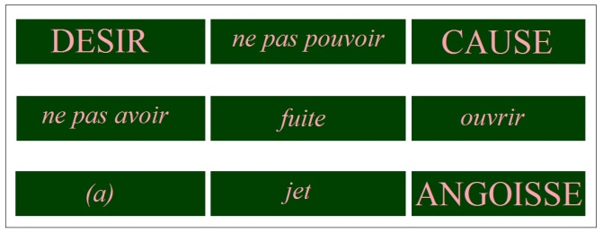
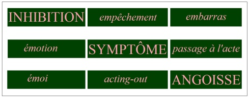
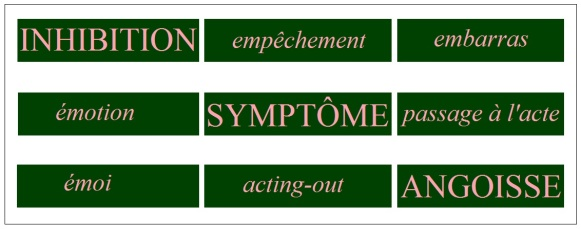
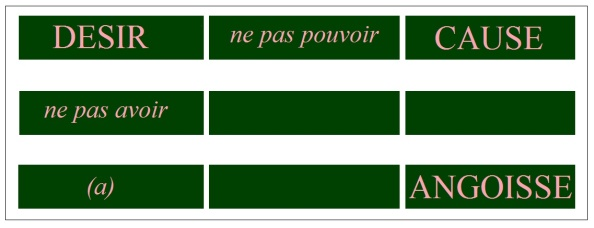
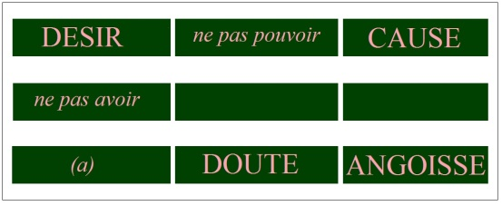
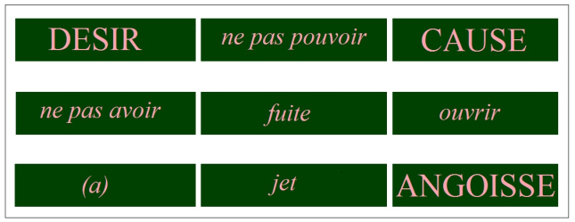
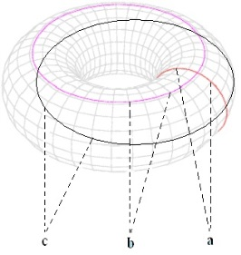
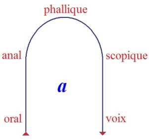

# Leçon 24 | 26 Juin l963

  <label><input type="checkbox" data-lacan-toggle="original" checked> 原文</label>
  <label><input type="checkbox" data-lacan-toggle="notes" checked> 注释</label>
  <label><input type="checkbox" data-lacan-toggle="commentary" checked> 个人解读评论</label>

<section class="parallel-paragraph" data-paragraph-ids="s10-24-0001">

s10-24-0001

[无对应译文]

原文 · s10-24-0001

Pour essayer d’avancer aujourd’hui dans notre propos,
je vais reprendre les choses concernant la constitution du désir chez l’obsessionnel et son rapport à l’angoisse.
Et pour ce faire, je vais revenir à une sorte de tableau, de matrice, de tableau à double entrée,
que je vous ai donné lors des toutes premières leçons du séminaire de cette année sous la forme reproduite ici,
encadrée par le trait blanc et inscrite en rose.

</section>

<section class="parallel-paragraph" data-paragraph-ids="s10-24-0002">

s10-24-0002

[无对应译文]

原文 · s10-24-0002

</section>

<section class="parallel-paragraph" data-paragraph-ids="s10-24-0003">

s10-24-0003

[无对应译文]

原文 · s10-24-0003

Ce tableau alors, avait l’intention de marquer la sorte de décalage, de dé-é­tagement
que représentent les trois termes auxquels Freud est arrivé, et qu’il a inscrits dans le titre de son article *Inhibition, symptôme, angoisse.*

</section>

<section class="parallel-paragraph" data-paragraph-ids="s10-24-0004">

s10-24-0004

[无对应译文]

原文 · s10-24-0004

Autour de ces trois termes se ponctuait quelque chose que nous pouvons désigner comme les moments,
comme un certain nombre de moments, définissables dans les termes qui sont ici inscrits dans ce tableau,
et qui ont pour caractère de se référer pour chaque terme, à sa tête de colonne en haut, à sa tête de ran­gée à gauche.

</section>

<section class="parallel-paragraph" data-paragraph-ids="s10-24-0005">

s10-24-0005

[无对应译文]

原文 · s10-24-0005

On y trouve une corrélation qui peut à l’épreuve se proposer à l’interrogation,
comme propre à être infirmée ou confirmée dans sa fonc­tion structurale.

</section>

<section class="parallel-paragraph" data-paragraph-ids="s10-24-0006">

s10-24-0006

[无对应译文]

原文 · s10-24-0006

Encore ces termes vous étaient-ils à ce moment *livrés dans une certaine incomplétude*, comportant donc quelques suspensions d’*énigme* : nommément la distinction par exemple de l’*émotion* et de l’*émoi* pouvait être, malgré les références étymologiques que j’ai faites alors, pou­vait être tout de même pour vous, matière à une interrogation
qu’il ne vous était peut-être pas entièrement possible par vos propres moyens *de résoudre*.

</section>

<section class="parallel-paragraph" data-paragraph-ids="s10-24-0007">

s10-24-0007

[无对应译文]

原文 · s10-24-0007

Assurément, ce que j’apporterai aujourd’hui me paraît de nature à vous y apporter des précisions qui, je n’en doute pas,
pour la plupart, sinon pour tous, ne peuvent être que nouvelles, voire inattendues.

</section>

<section class="parallel-paragraph" data-paragraph-ids="s10-24-0008">

s10-24-0008

[无对应译文]

原文 · s10-24-0008

Et en particulier, pour commencer par cet *émoi...*
dont l’origine, bien distincte de celle du terme d’*émotion*, n’est pas « *motion hors* » : *motion, mouvement* hors du champ
\- par exemple - organisé, adapté, de l’action motrice, comme assuré­ment *l’émotion* *étymologiquement,*
je ne vous dis pas que ce soit là quelque chose à quoi nous puissions entièrement nous fier,
comme l’émotion étymologiquement l’indique, et s’y réfère
...*l’émoi* c’est à cher­cher pour le comprendre, bien ailleurs, et *l’étymologie* ...
c’était l’indica­tion que je vous en avais donnée
...*l’étymologie*...
dans un « *esmaier* », le « *maier* » se réfé­rant à une racine germanique, au « *mögen, magan* » racine germanique tout à fait pri­mitive
...donne l’indication de *quelque chose* qui pose « *hors de* » - hors de quoi ? - le principe du pouvoir.

</section>

<section class="parallel-paragraph" data-paragraph-ids="s10-24-0009">

s10-24-0009

[无对应译文]

原文 · s10-24-0009

Énigme donc, autour de quelque chose qui n’est pas sans rapport avec la puissance.
Et je dirai que peut-être même, à prendre la forme qu’il a pris en fran­çais, que c’est de quelque chose du type de l’« *hors de* »,
de « *l’hors de moi*, *l’hors de soi* », que dans une approche qui ici, pour se référer presque au calembour, n’a pas moins d’importance, qu’il nous faut diriger notre esprit pour bien voir, *entrevoir* tout au moins, *la direction* dans laquelle nous allons aujourd’hui aller.

</section>

<section class="parallel-paragraph" data-paragraph-ids="s10-24-0010">

s10-24-0010

[无对应译文]

原文 · s10-24-0010

Pour y aller tout de suite, au vif : c’est parce que *l’obsessionnel l’illustre par sa phénoménologie*, immédiatement et d’une façon très sensible,
je dirai qu’au point où nous en sommes, je puis vous dire tout crûment, tout à trac, que *l’émoi, l’émoi dont il s’agit, n’est rien d’autre*...

</section>

<section class="parallel-paragraph" data-paragraph-ids="s10-24-0011">

s10-24-0011

[无对应译文]

原文 · s10-24-0011

> au moins dans les corrélations que nous tentons d’explorer, de préciser,
>
> de nouer plus près aujourd’hui, à savoir *les rapports du désir et de l’angoisse*
> *...l’émoi dans cette corrélation n’est rien d’autre que le petit(a) lui-même*.

</section>

<section class="parallel-paragraph" data-paragraph-ids="s10-24-0012">

s10-24-0012

[无对应译文]

原文 · s10-24-0012

Dans la conjoncture de l’angoisse avec son étrange ambiguïté, que je vous ai appris à serrer de plus près, tout au long de ce discours de cette année, l’am­biguïté qui nous permet à nous, après cette élaboration, de formuler que ce qui frappe dans sa phénoménologie, ce que nous pouvons en retenir et ce sur quoi les auteurs d’ailleurs font glissements et erreurs,
et sur quoi nous introduisons *une distinction* : *ce caractère d’être sans cause, mais non pas sans objet.*

</section>

<section class="parallel-paragraph" data-paragraph-ids="s10-24-0013">

s10-24-0013

[无对应译文]

原文 · s10-24-0013

C’est là une distinction vers laquelle, par mes efforts pour la situer, je vous ai dirigés.
Non seulement « *elle n’est pas sans objet* », mais *elle désigne* très probablement l’*objet*, si je puis dire, le plus profond, *l’objet dernier, la Chose*.

</section>

<section class="parallel-paragraph" data-paragraph-ids="s10-24-0014">

s10-24-0014

[无对应译文]

原文 · s10-24-0014

C’est en ce sens que - vous ai-je appris à dire - *qu’elle est ce qui ne trompe pas*.
Ce « *sans cause* » par contre, si évident dans son *phénomè­ne*, c’est quelque chose qui s’éclaire mieux à notre vue
de la façon dont j’ai tenté de vous situer où commence la notion de « *la cause* ». \[*Cause*/*Chose*\]

</section>

<section class="parallel-paragraph" data-paragraph-ids="s10-24-0015">

s10-24-0015

[无对应译文]

原文 · s10-24-0015

Cette référence à l’*émoi* est dès lors ce par quoi l’*angoisse*, tout en y étant liée, n’en dépend pas mais au contraire le détermine, cet *émoi*.
L’*angoisse* se trouve suspendue entre
la forme, si l’on peut dire, « *antérieure* » du rapport à la cause : le « *qu’y a-t-il ?* » qui va se formuler comme cause, l’*embarras,*
et *quelque chose* qui - cette cause - ne peut pas la tenir, puisque primitivement, cette cause c’est l’*angoisse* qui littéralement la produit.

</section>

<section class="parallel-paragraph" data-paragraph-ids="s10-24-0016">

s10-24-0016

[无对应译文]

原文 · s10-24-0016

*Quelque chose* se produit, qu’illustre d’une façon abjecte et d’autant plus saisissante,
ce que j’ai mis à l’origine de mon explication de l’obsessionnel,
dans la confronta­tion de *L’homme aux loups* à son rêve répétitif majeur,
à la confrontation angoissée à *quelque chose* qui paraît comme une monstration de sa réalité dernière,
*cette chose* qui se produit, qui jamais pour lui ne vient à la conscience,
mais ne peut être en quelque sorte que reconstruite comme un chaînon de toute la détermination ultérieure :
« *l’émoi anal* », pour l’appeler par son nom, et *son produit*.

</section>

<section class="parallel-paragraph" data-paragraph-ids="s10-24-0017">

s10-24-0017

[无对应译文]

原文 · s10-24-0017

Voilà, au niveau de l’obsessionnel, la forme pre­mière où intervient l’émergence de l’*objet petit(a)*
qui est à l’origine de tout ce qui va s’en dérouler sous le mode de l’effet.

</section>

<section class="parallel-paragraph" data-paragraph-ids="s10-24-0018">

s10-24-0018

[无对应译文]

原文 · s10-24-0018

C’est parce que - ici - l’*objet petit(a)* se trouve donné dans un moment originel où il joue une *certaine fonction*...

</section>

<section class="parallel-paragraph" data-paragraph-ids="s10-24-0019">

s10-24-0019

[无对应译文]

原文 · s10-24-0019

> sur laquelle nous allons essayer maintenant de nous arrêter pour en préciser bien
>
> *la valeur, l’incidence, la portée, les* *coor­données premières *: celles d’avant que d’autres s’ajoutent
> ...c’est parce que ce *petit(a)* est *cela* dans *sa production originelle*
> qu’il peut ensuite fonctionner dans la dialectique du désir qui est celle de l’obsessionnel.

</section>

<section class="parallel-paragraph" data-paragraph-ids="s10-24-0020">

s10-24-0020

[无对应译文]

原文 · s10-24-0020

Coordonnées donc, au moment de son apparition de cet *émoi,*
au dévoi­lement traumatique où l’angoisse se révèle qu’elle est bien « *ce qui ne trompe pas* »,
moment où le champ de l’Autre, si l’on peut dire, « *se fend et s’ouvre sur son fond* »,

</section>

<section class="parallel-paragraph" data-paragraph-ids="s10-24-0021">

s10-24-0021

[无对应译文]

原文 · s10-24-0021

- quel est-il ce *petit(a),*

</section>

<section class="parallel-paragraph" data-paragraph-ids="s10-24-0022">

s10-24-0022

[无对应译文]

原文 · s10-24-0022

- quelle est sa fonction par rapport au sujet ?

</section>

<section class="parallel-paragraph" data-paragraph-ids="s10-24-0023">

s10-24-0023

[无对应译文]

原文 · s10-24-0023

Si nous pouvons ici la saisir, en quelque sorte d’une façon pure par rapport à cette question,
c’est justement dans la mesure où, dans *cette confrontation radicale*, traumatique, le *sujet* « *cède* » à la situation.
Mais qu’est ce que veut dire à ce niveau, à ce moment, ce « *cède* » ? Comment faut-il l’en­tendre ?
Ce n’est ni qu’il vacille, ni qu’il fléchisse, vous le savez bien.

</section>

<section class="parallel-paragraph" data-paragraph-ids="s10-24-0024">

s10-24-0024

[无对应译文]

原文 · s10-24-0024

Rappelez-vous l’attitude schématisée par la fascination de ce sujet
du rêve de *L’homme aux loups* devant la fenêtre ouverte sur « *l’arbre couvert de loups* ».
Dans une situation *dont le figement suspend devant nos yeux le caractère primitivement inarticulable* et dont pourtant il restera à jamais marqué, ce qui s’est produit c’est quelque chose qui donne son sens vrai à ce « *cède* » du sujet : c’est littéralement *une cession*.

</section>

<section class="parallel-paragraph" data-paragraph-ids="s10-24-0025">

s10-24-0025

[无对应译文]

原文 · s10-24-0025

Ce caractère d’*objet cessible* est un des caractères du *petit(a),*
tellement impor­tant que je vous demande de bien vouloir me suivre en une brève revue
pour voir qu’il est un caractère qui marque toutes les formes que nous avons énumérées du *petit(a).*

</section>

<section class="parallel-paragraph" data-paragraph-ids="s10-24-0026">

s10-24-0026

[无对应译文]

原文 · s10-24-0026

Ici nous apparaît que *les points de fixation de la libido* sont toujours autour de *quelques un de ces moments*
que la nature offre à cette structure éventuelle *de cession subjective*.

</section>

<section class="parallel-paragraph" data-paragraph-ids="s10-24-0027">

s10-24-0027

[无对应译文]

原文 · s10-24-0027

Le 1er *moment de l’angoisse*, celui que peu à peu a approché l’expé­rience analytique, disons *au niveau*, *autour* du « *trauma de la naissance* », dès lors, à l’approche de cette remarque, nous permet de l’accentuer comme quelque chose de plus précis,
de plus précisément articulable que ce qui a d’abord été grossièrement approché sous la forme de *la frustration*.

</section>

<section class="parallel-paragraph" data-paragraph-ids="s10-24-0028">

s10-24-0028

[无对应译文]

原文 · s10-24-0028

Et de nous interroger, et de nous apercevoir dès que nous nous interrogeons,
que le moment le plus décisif dans cette angoisse dont il s’agit, *l’angoisse du sevrage*,
ce n’est pas tant qu’à l’occasion ce sein manque à son besoin,
que plutôt ce petit enfant *cède ce sein* auquel, quand il est appendu, c’est bien comme à une part de lui-même.

</section>

<section class="parallel-paragraph" data-paragraph-ids="s10-24-0029">

s10-24-0029

[无对应译文]

原文 · s10-24-0029

N’oublions jamais ce que je vous ai représenté...
et je ne suis pas le seul à l’avoir aperçu, je me réfère ici à Bergler[^169] nommément

</section>

<section class="parallel-paragraph" data-paragraph-ids="s10-24-0030">

s10-24-0030

[无对应译文]

原文 · s10-24-0030

*...le sein fait partie de l’individu au nourrissage*, il ne se trouve...
comme je vous l’ai dit en une expression imagée
...que « *plaqué »* sur la mère.

</section>

<section class="parallel-paragraph" data-paragraph-ids="s10-24-0031">

s10-24-0031

[无对应译文]

原文 · s10-24-0031

Que ce sein, il puisse en quelque sorte le prendre ou le lâcher, c’est là où se produit ce *moment de surprise* le plus primitif,
quelquefois vraiment saisissable dans l’expression du nouveau-né,
celui où pour la première fois passe le reflet de *quelque chose* en rapport avec cet abandon de cet organe,
*qui est bien plus encore* *le sujet lui-même* que *quelque chose qui soit déjà un objet*,
*quelque chose* qui donne son support, sa racine, à ce qui dans un autre registre, a été perçu, appelé, quant au sujet, comme *déréliction*.

</section>

<section class="parallel-paragraph" data-paragraph-ids="s10-24-0032">

s10-24-0032

[无对应译文]

原文 · s10-24-0032

Mais aussi bien pour nous...
comme pour tous les autres *objets(a)...*avons-nous d’autres contrôles manifestes de cet accent que je mets de la possibilité *du* *remplacement* de l’objet naturel.
Nous avons, dans *la possibilité du remplacement de l’objet naturel* par un objet mécanique, si je puis m’ex­primer ainsi, ce que je désigne ici, c’est le remplacement possible d’abord de cet objet par - mon Dieu - tout autre objet qui peut se rencontrer :

</section>

<section class="parallel-paragraph" data-paragraph-ids="s10-24-0033">

s10-24-0033

[无对应译文]

原文 · s10-24-0033

- une autre partenaire, la nourrice, qui faisait tellement de questions aux premiers tenants de *l’édu­cation naturelle*, au thème rousseauiste de la nourriture par la mère,

</section>

<section class="parallel-paragraph" data-paragraph-ids="s10-24-0034">

s10-24-0034

[无对应译文]

原文 · s10-24-0034

- mais au-delà, à ce quelque chose qui - mon Dieu - n’a pas toujours existé, du moins on l’imagine, mais que le progrès de la culture a fabriqué, a constitué : *le bibe­ron*, c’est-à-dire *la possibilité*, ce *(a)*, si je puis dire, de le « *mettre en réserve* », en stock, en cir­culation dans le commerce, et aussi bien de l’isoler en tubes stériles, ce caractère donc, de *<u>cession de l’objet</u>* se traduit par l’apparition, dans la chaîne, la fonction de la fabrication humaine, l’apparition *<u>d’objets cessibles</u>* qui en sont, qui en peuvent en être les *équivalents*.

</section>

<section class="parallel-paragraph" data-paragraph-ids="s10-24-0035">

s10-24-0035

[无对应译文]

原文 · s10-24-0035

Et si ce rappel n’est pas ici hors de propos, c’est par ce biais que j’entends ici directement y rattacher la fonction
sur laquelle j’ai mis dès longtemps l’accent : celle de l’*objet transi­tionnel*, pour prendre le terme...
propre ou non, mais désormais consacré
...dont l’a épinglé son créateur, celui qui l’a aperçu, à savoir Winnicott [^170].

</section>

<section class="parallel-paragraph" data-paragraph-ids="s10-24-0036">

s10-24-0036

[无对应译文]

原文 · s10-24-0036

Cet objet, *qu’il appelle* *« transi­tionnel »*,
en effet ici à ce niveau on voit bien ce qui le constitue dans cette fonction d’objet *que j’appelle* « *objet cessible*  » :
il est un petit bout arraché à quelque chose, à un lange le plus souvent,
et l’on voit bien ce dont il s’agit quant au rapport du sujet au support qu’il trouve dans cet objet :
il ne s’y dissout pas, il s’y conforte. Il s’y conforte dans sa fonction
de sujet tout à fait originel, celle de cette position de « *chute* » si je puis dire par rapport à *la confrontation signifiante*.

</section>

<section class="parallel-paragraph" data-paragraph-ids="s10-24-0037">

s10-24-0037

[无对应译文]

原文 · s10-24-0037

Il n’y a pas là investissement <u>de *(a)*, *il y a*</u>, si je puis dire, *<u>investiture</u>*.
Il est là le suppléant du sujet, et suppléant en position, en quelque sorte, de le précéder.

</section>

<section class="parallel-paragraph" data-paragraph-ids="s10-24-0038">

s10-24-0038

[无对应译文]

原文 · s10-24-0038

Il est

</section>

<section class="parallel-paragraph" data-paragraph-ids="s10-24-0039">

s10-24-0039

[无对应译文]

原文 · s10-24-0039

- ce rapport *(a)* sur quelque chose : *(a) /quelque chose,* qui secondairement réapparaît après cette *disparition*,

</section>

<section class="parallel-paragraph" data-paragraph-ids="s10-24-0040">

s10-24-0040

[无对应译文]

原文 · s10-24-0040

- *ce sujet mythique primitif*, qui est posé au début comme ayant à se constituer dans la confron­tation à l’Autre, *mais que nous ne saisissons jamais* - et pour cause ! - c’est *parce que le (a) l’a précédé*, et que c’est, en quelque sorte, marqué lui-même de cette pri­mitive substitution, qu’il a à réémerger au-delà.

</section>

<section class="parallel-paragraph" data-paragraph-ids="s10-24-0041">

s10-24-0041

[无对应译文]

原文 · s10-24-0041

Cette « *fonction de l’objet cessible* » comme morceau séparable et *véhiculant* en quelque sorte *primitivement quelque chose de l’identité du corps*, qui antécède sur le corps lui-même quant à *la constitution du sujet.*

</section>

<section class="parallel-paragraph" data-paragraph-ids="s10-24-0042">

s10-24-0042

[无对应译文]

原文 · s10-24-0042

Puisque j’ai parlé de manifestation dans l’histoire de la production humaine, qui peut avoir pour nous valeur
en quelque sorte de confirmation, de révélation dans ce sens, il ne m’est pas possible de ne pas évoquer à l’instant...
au terme extrê­me de cette évolution historique, ou plus exactement de cette manifestation dans l’histoire
les problèmes que vont nous poser - je dis jusqu’au plus radi­cal de ce qu’on pourrait appeler « *l’essentialité du sujet* » -
l’extension immense, probable, déjà engagée, plus que, je dirai, la conscience commune - et même celle des praticiens
comme nous - peut en être avertis
...les questions que vont poser les faits de greffe d’organes qui prennent cette allure,
à la fois assurément surprenante et bien faite pour suspendre l’esprit autour de je ne sais quelle question :
jusqu’où y faut-il... ?
Jusqu’où allons-nous y consentir ?

</section>

<section class="parallel-paragraph" data-paragraph-ids="s10-24-0043">

s10-24-0043

[无对应译文]

原文 · s10-24-0043

Jusqu’où ira le fait qui s’ouvre : que ce que j’appellerai « *la mine* », la ressource, le principal de ces étonnantes possibilités,
va peut-être se trouver bientôt dans *l’entretien artificiel* de certains sujets dans un état, dont nous ne pour­rons,
dont nous ne pourrons, dont nous ne saurons plus dire s’il est la vie, s’il est la mort,
puisque comme vous le savez, les moyens de l’*Angström*[^171] permettent de faire subsis­ter dans un état vivant des tissus,
des sujets dont tout indique que le fonc­tionnement de leur système nerveux central ne saurait revenir à restitu­tion :
*ondes cérébrales à plat, mydriase, absence sans retour des réflexes*.

</section>

<section class="parallel-paragraph" data-paragraph-ids="s10-24-0044">

s10-24-0044

[无对应译文]

原文 · s10-24-0044

De quoi s’agit-il ?
Que faisons-nous quand c’est à un sujet dans cet état que nous empruntons un organe ?

</section>

<section class="parallel-paragraph" data-paragraph-ids="s10-24-0045">

s10-24-0045

[无对应译文]

原文 · s10-24-0045

Est-ce que vous ne sentez pas qu’il y a là une émer­gence *dans le réel*, de quelque chose de nature à réveiller,
en des termes tout à fait nouveaux, la question de l’essentialité de la personne et de ce à quoi elle s’attache,
de solliciter ces autorités doctrinales qui peuvent à l’occasion donner matière à juridisme,
de les solliciter, de voir jusqu’où peut aller dans le pratique cette fois, la question de savoir si *le sujet est une âme ou bien un corps* ?

</section>

<section class="parallel-paragraph" data-paragraph-ids="s10-24-0046">

s10-24-0046

[无对应译文]

原文 · s10-24-0046

Je n’irai pas plus loin aujourd’hui dans cette voie, puisque aussi bien ces autorités doctrinales semblent déjà avoir évoqué
des réponses bien singu­lières, mais qu’il conviendrait de les étudier de très près pour pouvoir voir leur cohérence
par rapport à certaines positions prises dès longtemps et où l’on peut dire, par exemple, que se distingue radicalement,
sur le plan même de la relation, *de l’identification de la personne avec quelque chose d’immor­tel qui s’appellerait « l’âme »*,
une doctrine qui articule dans ses *principes*, ce qui est le plus contraire à la *tradition platonicienne*,
à savoir qu’il ne saurait y avoir d’autre *résurrection* que celle du corps.

</section>

<section class="parallel-paragraph" data-paragraph-ids="s10-24-0047">

s10-24-0047

[无对应译文]

原文 · s10-24-0047

Aussi bien, le domaine ici évoqué n’est pas si lié à cette avancée industrieuse dans des possibilités singulières,
qu’il n’ait été depuis longtemps évoqué par la fabulation visionnaire.

</section>

<section class="parallel-paragraph" data-paragraph-ids="s10-24-0048">

s10-24-0048

[无对应译文]

原文 · s10-24-0048

Et ici, je n’ai qu’à vous renvoyer une fois de plus à la fonction « *unheimlich »* des *yeux* qu’entend manipuler,
faire passer un vivant à son automate, le personnage...
*incarné par* Hoffmann et mis au centre par Freud de son article sur l’*Unheimlich...*de Copélius, de celui qui creuse les orbites, qui va chercher jusqu’en leur racine ce qui est *l’ob­jet* quelque part, *capital, essentiel*,
à se présenter comme l’au-delà le plus angoissant du désir qui le constitue : *l’œil* lui-même.

</section>

<section class="parallel-paragraph" data-paragraph-ids="s10-24-0049">

s10-24-0049

[无对应译文]

原文 · s10-24-0049

J’en ai dit assez au passage sur *la même fonction de la voix,* et ce en quoi elle nous apparaît,
nous apparaîtra sans doute, avec tellement de perfec­tionnements techniques,
toujours plus pouvoir aussi être de l’ordre de *ces objets cessibles*, de *ces objets* qui peuvent être rangés sur les rayons d’une biblio­thèque, sous forme de disques ou de bandes, et dont à l’occasion il n’est pas forcé d’évoquer tel épisode, ancien ou neuf,
pour savoir quel rapport singulier il peut avoir avec le surgissement dans telle conjoncture de l’an­goisse.

</section>

<section class="parallel-paragraph" data-paragraph-ids="s10-24-0050">

s10-24-0050

[无对应译文]

原文 · s10-24-0050

Simplement, ajoutons-y à proprement parler ce qui, au moment où elle émerge,
dans une aire de culture où elle surgit pour la première fois, la possibilité aussi de *l’image*...
je dis : *de l’image spéculaire, de l’image du corps...*à l’état détaché, à l’état *cessible*, *sous forme de photographies* ou de dessins même,
et du heurt, de la répugnance que ceci provoque dans la *sensibilité* de ceux qui peuvent le voir surgir tout soudain,
et sous cette forme à la fois *indéfiniment multipliable* et possible à répandre partout.

</section>

<section class="parallel-paragraph" data-paragraph-ids="s10-24-0051">

s10-24-0051

[无对应译文]

原文 · s10-24-0051

La répugnance, voire l’horreur que dans des zones de la culture...
qu’il n’y a aucu­ne raison que nous appelions « *primitives* »
...l’apparition de cette possibilité de faire surgir, avec le refus de laisser *prendre* cette image,
dont « *Dieu sait* » - c’est le cas de le dire - ensuite où elle pourra aller.

</section>

<section class="parallel-paragraph" data-paragraph-ids="s10-24-0052">

s10-24-0052

[无对应译文]

原文 · s10-24-0052

C’est dans cette fonction, dans cette *fonction d’objet cessible*...
et celle en somme la plus naturelle et dont le naturel ne vient à pouvoir s’expliquer comme ayant pris cette fonction
...que *l’objet anal* intervient dans la fonction du désir.

</section>

<section class="parallel-paragraph" data-paragraph-ids="s10-24-0053">

s10-24-0053

[无对应译文]

原文 · s10-24-0053

Que là, c’est là que nous avons à saisir en quoi il intervient, et à mettre à l’épreuve,
ne pas oublier le guide que nous donne notre formule : que *cet objet est donc, non pas « fin », « but », du désir, mais sa cause*.

</section>

<section class="parallel-paragraph" data-paragraph-ids="s10-24-0054">

s10-24-0054

[无对应译文]

原文 · s10-24-0054

*Cause du désir*, en tant qu’il est *quelque chose lui-même de non-effectif*,
que c’est cette sorte d’*effet* fondé, constitué sur la *fonction du manque*
qui n’apparaît comme effet que là où, en effet, se situe seule *la notion de cause,*
c’est-à-dire au niveau de *la chaîne signifiante* où ce désir est ce qui lui donne cette sorte de cohérence
où le sujet se constitue essentiellement comme *métonymie*.

</section>

<section class="parallel-paragraph" data-paragraph-ids="s10-24-0055">

s10-24-0055

[无对应译文]

原文 · s10-24-0055

Mais ce désir, au niveau de la constitution du sujet,
comment allons-nous le qualifier ici, là où nous le saisissons dans son *incidence*, dans *la constitution du sujet* ?

</section>

<section class="parallel-paragraph" data-paragraph-ids="s10-24-0056">

s10-24-0056

[无对应译文]

原文 · s10-24-0056

Ce n’est pas le fait contingent, la facticité de *l’éducation de la pro­preté* qui lui donne cette fonction de *retenir,*
qui au désir anal donne sa structure fondamentale, c’est d’*une forme plus générale* qu’il s’agit ici,
et qu’il s’agit pour nous de saisir dans *ce désir de retenir*.

</section>

<section class="parallel-paragraph" data-paragraph-ids="s10-24-0057">

s10-24-0057

[无对应译文]

原文 · s10-24-0057

Dans son rapport polaire à *l’angoisse*, le désir est à situer là où je vous l’ai mis en correspondance avec cette matrice ancienne :
au niveau de *l’inhibi­tion*. C’est pourquoi le désir, nous le savons, peut prendre cette fonction de ce qu’on appelle *une défense*.
Mais allons pas à pas pour voir comment ceci, éventuellement se produit.

</section>

<section class="parallel-paragraph" data-paragraph-ids="s10-24-0058">

s10-24-0058

[无对应译文]

原文 · s10-24-0058

Qu’est-ce que *l’inhibition* pour nous, *dans notre expérience* ?
Il ne suffit pas que nous l’ayons, cette expérience et que nous *la manipulions* comme telle,
pour qu’encore nous en ayons correcte­ment *articulé la fonction*, et c’est ce que nous allons essayer de faire.

</section>

<section class="parallel-paragraph" data-paragraph-ids="s10-24-0059">

s10-24-0059

[无对应译文]

原文 · s10-24-0059

*L’inhibition*, qu’est-ce, sinon l’introduction dans une fonction...
qui peut-être n’importe laquelle : dans son article, Freud prend pour support par exemple la fonction motrice
...l’introduction de quoi ? : *d’un autre désir* que celui que la fonction satisfait naturellement.

</section>

<section class="parallel-paragraph" data-paragraph-ids="s10-24-0060">

s10-24-0060

[无对应译文]

原文 · s10-24-0060

Cela, après tout nous le savons, et je ne prétends rien ici découvrir de nouveau, mais je crois qu’à l’articuler ainsi,
j’introduis une formulation nouvelle dont, sans cette for­mulation même, nous échappent les déductions qui en découlent.

</section>

<section class="parallel-paragraph" data-paragraph-ids="s10-24-0061">

s10-24-0061

[无对应译文]

原文 · s10-24-0061

Car *ce lieu de l’inhibition* où nous apprenons à reconnaître dans - je le souligne - les corrélations qu’indique cette matrice,
*le lieu* à proprement par­ler *où le désir s’exerce*, et où nous saisissons une des racines de ce que l’ana­lyse désigne comme *Urverdrängung * :
cette occultation, si je puis dire *struc­turale* du désir derrière l’inhibition c’est quelque chose qui nous fait dire communément
que si monsieur Untel a une « *crampe des écrivains* » c’est parce qu’il érotise la fonction de sa main...
je pense qu’ici tout le monde se retrou­ve
...c’est cela qui nous sollicite de faire jouer, d’apprécier en cette situation au même lieu *ces trois termes*,
dont les deux premiers je les ai déjà nommés : *inhibition, désir,* le troisième étant *l’acte.*

</section>

<section class="parallel-paragraph" data-paragraph-ids="s10-24-0062">

s10-24-0062

[无对应译文]

原文 · s10-24-0062

Car quand il s’agit pour nous de *définir* ce qu’est l’*acte*...
seul corrélatif possible – polaire - au lieu de l’*angoisse*
...nous ne pouvons le faire qu’à le situer là où il est, au lieu de l’*inhibition* dans cette matrice.

</section>

<section class="parallel-paragraph" data-paragraph-ids="s10-24-0063">

s10-24-0063

[无对应译文]

原文 · s10-24-0063

</section>

<section class="parallel-paragraph" data-paragraph-ids="s10-24-0064">

s10-24-0064

[无对应译文]

原文 · s10-24-0064

L’*acte* ne saurait, pour nous ni pour personne, se *définir*
comme *quelque chose qui seulement se passe*, si je puis dire, *dans le champ Réel*, au sens où le définit la motricité, l’effet moteur dirait-on,
mais comme quelque chose qui dans ce champ, et sans doute sous la forme motrice, à l’occasion mais pas seulement, quelque participation qu’y puis­se y rester toujours d’un effet moteur, qui se traduit dans ce champ...
champ du *Réel* où s’exerce la réponse motrice
...qui se traduit d’une façon telle que s’y traduit *un autre champ,*

</section>

<section class="parallel-paragraph" data-paragraph-ids="s10-24-0065">

s10-24-0065

[无对应译文]

原文 · s10-24-0065

- qui n’est pas seulement celui de *la stimula­tion sensorielle* par exemple, comme on l’articule à ne considérer que « *l’arc réflexe* »,

</section>

<section class="parallel-paragraph" data-paragraph-ids="s10-24-0066">

s10-24-0066

[无对应译文]

原文 · s10-24-0066

- qui n’est pas non plus à articuler comme « *réalisation du sujet* ».

</section>

<section class="parallel-paragraph" data-paragraph-ids="s10-24-0067">

s10-24-0067

[无对应译文]

原文 · s10-24-0067

Ceci est la conception du *mythe personnaliste*
en tant que justement il élude dans ce champ de la *réalisation du sujet,* la priorité du *petit(a)* qui inaugure,
et dès lors conserve le privilège de ce champ de la *réalisation du sujet*. *Le sujet* comme tel *ne se réalise que dans des objets*,
*qui sont de la même série*, *qui sont du même lieu,* disons dans cette matrice, que la fonction du *petit(a), qui sont toujours <u>objets cessibles</u>*.
C’est ce que depuis longtemps on appelle les « *œuvres* » avec tout le sens qu’a ce terme jusque dans le champ de la théologie morale.

</section>

<section class="parallel-paragraph" data-paragraph-ids="s10-24-0068">

s10-24-0068

[无对应译文]

原文 · s10-24-0068

Alors qu’est-ce qui passe dans l’*acte* de cet autre champ dont je parle,
et dont l’incidence, l’instance, l’insistance dans le *Réel* est ce qui connote une action comme *acte* ?
Comment allons-nous le définir ?
Est-ce simplement cette relation polaire, et en quelque sorte, ce qui s’y passe de *surmontement de l’angoisse*, si je puis m’exprimer ainsi ?

</section>

<section class="parallel-paragraph" data-paragraph-ids="s10-24-0069">

s10-24-0069

[无对应译文]

原文 · s10-24-0069

Disons, en des formules qui ne peuvent qu’approcher après tout, ce qu’est un *acte*,
que nous parlons d’*acte* quand une action a le caractère, disons d’une manifestation signifiante
où s’inscrit ce qu’on pourrait appe­ler « *l’écart du désir* ».
*Un acte est une action, disons en tant que s’y manifes­te le désir même qui aurait été fait pour l’inhiber.*

</section>

<section class="parallel-paragraph" data-paragraph-ids="s10-24-0070">

s10-24-0070

[无对应译文]

原文 · s10-24-0070

Ce fondement de la notion, de *la fonction de l’acte dans son rapport à l’inhibition,*
c’est là - *et là seulement* - que peut se trouver justifié, qu’on appelle *acte* des choses qui, en principe,
ont l’air si peu de se rapporter à ce qu’on peut appeler, au sens plein, éthique du mot, un *acte* :
que l’acte sexuel d’un côté, ou d’un autre l’acte testamentaire.

</section>

<section class="parallel-paragraph" data-paragraph-ids="s10-24-0071">

s10-24-0071

[无对应译文]

原文 · s10-24-0071

Eh bien c’est ici, dans *ce rapport du (a) à la constitution d’un désir* et ce qu’il nous révèle du rapport du *désir* à la fonction naturelle,
que notre *obsessionnel a pour nous sa valeur la plus exemplaire*.

</section>

<section class="parallel-paragraph" data-paragraph-ids="s10-24-0072">

s10-24-0072

[无对应译文]

原文 · s10-24-0072

Chez lui, tout le temps nous touchons du doigt ce caractère,
dont seulement l’habitude peut effacer pour nous l’aspect énigmatique,
que chez lui les désirs se manifestent toujours dans cette dimension que j’ai été jusqu’à appeler tout à l’heure,
anticipant sans doute un peu, « *fonction de défense* ».

</section>

<section class="parallel-paragraph" data-paragraph-ids="s10-24-0073">

s10-24-0073

[无对应译文]

原文 · s10-24-0073

Comment concevoir ceci, seulement à partir de quoi cette incidence du désir dans l’inhibition mérite d’être appelée « *défense* » ?
C’est en cela vous ai-je dit, que...
c’est d’une façon anticipée que j’ai pu parler de « *défense* » comme fonction essentielle de l’incidence du désir
...c’est uniquement en tant que cet effet du désir, ainsi signalé par l’*inhibition*,
peut s’introduire sous une action déjà prise dans l’induction d’un autre désir. C’est aussi là pour nous, fait d’expérience commune.

</section>

<section class="parallel-paragraph" data-paragraph-ids="s10-24-0074">

s10-24-0074

[无对应译文]

原文 · s10-24-0074

Et après tout, sans parler du fait que nous avons tout le temps affaire à quelque chose de cet ordre,
observons que pour ne pas quitter notre obsessionnel, c’est déjà là *la position du désir anal*...
ainsi défini par ce désir de *retenir*, centré autour d’un objet primordial auquel il va donner sa valeur
...c’est déjà là que se situe *ce désir* situé comme « *anal* », il n’a pour nous de sens que dans l’économie de *la libido*,
c’est-à-dire dans ses liaisons avec *le désir* *sexuel.*

</section>

<section class="parallel-paragraph" data-paragraph-ids="s10-24-0075">

s10-24-0075

[无对应译文]

原文 · s10-24-0075

C’est là qu’il convient de rappeler que l’« *inter urinas et fæces nascimur* » de Saint Augustin,
ce n’est pas là tellement l’important, « *que nous y nais­sions entre l’urine et les fèces »*, du moins pour nous analystes,
c’est qu’entre l’urine et les fèces c’est là que nous faisons l’amour. Nous pissons avant, et nous chions après, ou inversement.

</section>

<section class="parallel-paragraph" data-paragraph-ids="s10-24-0076">

s10-24-0076

[无对应译文]

原文 · s10-24-0076

Or c’est là une *des corrélations* de plus, et auquelles nous apportons trop peu d’attention,
quant à une *phénoménologie* qu’après tout nous laissons venir dans l’analyse.

</section>

<section class="parallel-paragraph" data-paragraph-ids="s10-24-0077">

s10-24-0077

[无对应译文]

原文 · s10-24-0077

C’est pourquoi il faut avoir *l’oreille bien tendue* et repérer, dans les cas où cela sort,
le rapport qui lie à l’acte sexuel la fomen­tation, si je puis dire, de ce qui apparaîtra bien entendu aussi inaperçu
que peut-être inévoqué dans l’histoire de *L’homme aux loups son petit cadeau primitif.*

</section>

<section class="parallel-paragraph" data-paragraph-ids="s10-24-0078">

s10-24-0078

[无对应译文]

原文 · s10-24-0078

La fomentation, habituelle dans l’acte sexuel, de quelque chose qui n’a pas l’air d’avoir beaucoup d’importance
mais qui, comme indicatif de la relation dont je parle, la prend, la fomentation de *la petite merde,*
dont l’évacuation consécutive n’a sans doute pas la même signification chez tous les sujets,
qu’ils soient par exemple sur le versant obsessionnel ou sur un autre.

</section>

<section class="parallel-paragraph" data-paragraph-ids="s10-24-0079">

s10-24-0079

[无对应译文]

原文 · s10-24-0079

Alors, reprenons notre chemin au point où je vous y ai laissés, c’est à savoir :
qu’en est-il du point où je vous dirige maintenant concernant cette sous-jacence du désir au désir,
et comment concevoir ici, ce qui dans ce chemin, nous *mène* vers l’élucidation de son sens,
nous y *mène*, j’entends : pas simplement *dans son fait*, mais *dans sa nécessité* ?

</section>

<section class="parallel-paragraph" data-paragraph-ids="s10-24-0080">

s10-24-0080

[无对应译文]

原文 · s10-24-0080

Est-ce que, dans cette interprétation du *désir-défense* et de ce dont il défend, à savoir d’un autre désir,
nous allons pouvoir concevoir que nous sommes simplement menés, si je puis dire tout naturellement,
par ce qui mène l’obsessionnel dans un mouvement de récurrence du procès du désir,
engendré par cet effort impli­cite de subjectivation qui est déjà dans ses symptômes,
où il tend à en res­saisir les étapes, pour autant qu’il a des symptômes ?

</section>

<section class="parallel-paragraph" data-paragraph-ids="s10-24-0081">

s10-24-0081

[无对应译文]

原文 · s10-24-0081

Et qu’est-ce que cela veut dire la *corrélation*, ici inscrite dans la matrice, à l’*empêchement*, à l’*émotion* ?

</section>

<section class="parallel-paragraph" data-paragraph-ids="s10-24-0082">

s10-24-0082

[无对应译文]

原文 · s10-24-0082

</section>

<section class="parallel-paragraph" data-paragraph-ids="s10-24-0083">

s10-24-0083

[无对应译文]

原文 · s10-24-0083

C’est ce que vous désignent les titres que j’ai mis dans son redoublement, expliqué ici au-dessous.

</section>

<section class="parallel-paragraph" data-paragraph-ids="s10-24-0084">

s10-24-0084

[无对应译文]

原文 · s10-24-0084

</section>

<section class="parallel-paragraph" data-paragraph-ids="s10-24-0085">

s10-24-0085

[无对应译文]

原文 · s10-24-0085

*L’empêchement* dont il s’agit, quel est-il ?
C’est que quelque chose inter­vient - *Empêchement : impedicare, pris au piège –* qui n’est pas redoublement de l’*inhibition*.
Il a bien fallu choisir un terme.

</section>

<section class="parallel-paragraph" data-paragraph-ids="s10-24-0086">

s10-24-0086

[无对应译文]

原文 · s10-24-0086

C’est que le sujet est bien *empêché* de se tenir à son désir *de retenir,*
et que chez l’obsessionnel, c’est cela qui se manifeste comme compulsion.

</section>

<section class="parallel-paragraph" data-paragraph-ids="s10-24-0087">

s10-24-0087

[无对应译文]

原文 · s10-24-0087

La dimension ici, de *l’émotion*, empruntée à une psychologie qui n’est pas la nôtre...
psychologie adapta­tionnelle, réaction catastrophique
...intervient ici aussi, dans un tout autre sens que cette définition classique et habituelle.

</section>

<section class="parallel-paragraph" data-paragraph-ids="s10-24-0088">

s10-24-0088

[无对应译文]

原文 · s10-24-0088

*L’émotion* dont il s’agit est celle même que mettent en valeur les *expériences* fondées sur la confrontation à la tache.
À savoir que le fait *que le sujet ne sache pas y répondre*, c’est là où se rejoint notre « *ne pas savoir* » à nous : « *Il ne savait pas que c’était cela* ».

</section>

<section class="parallel-paragraph" data-paragraph-ids="s10-24-0089">

s10-24-0089

[无对应译文]

原文 · s10-24-0089

Et c’est pour ça, au niveau du point où il ne peut pas *s’empêcher*,
il laisse passer des choses qui sont ces *allers et retours* du signifiant qui *alternativement* posent et effacent,
et qui vont toutes sur cette voie - elle également non sue - de retrouver *la trace primitive*.

</section>

<section class="parallel-paragraph" data-paragraph-ids="s10-24-0090">

s10-24-0090

[无对应译文]

原文 · s10-24-0090

Ce que le sujet obsessionnel cherche dans ce que j’ai appelé tout à l’heure...
et vous voyez pourquoi le choix de ce mot
...« *sa récurrence dans le procès du désir* », c’est bel et bien à retrouver *la cause authentique* de tout ce processus.

</section>

<section class="parallel-paragraph" data-paragraph-ids="s10-24-0091">

s10-24-0091

[无对应译文]

原文 · s10-24-0091

Et c’est parce que cette *cause* n’est rien d’autre que cet *objet dernier*, abject et dérisoire, qu’il reste dans cette recherche en suspens,
que toujours s’y manifeste, au niveau de l’*acting-out,* ce qui va donner à cette recherche de l’objet ses temps de suspension,
*ses fausses-routes, ses fausses pistes, ses dérivations latérales,* qui feront la recherche tourner indéfiniment et qui se manifestent
dans *ce symptôme* fondamental *du doute* qui va frapper pour lui la valeur de tous ses *objets de substitution*.

</section>

<section class="parallel-paragraph" data-paragraph-ids="s10-24-0092">

s10-24-0092

[无对应译文]

原文 · s10-24-0092

</section>

<section class="parallel-paragraph" data-paragraph-ids="s10-24-0093">

s10-24-0093

[无对应译文]

原文 · s10-24-0093

Ici « *ne pas pouvoir* », c’est ne pas pouvoir - quoi ? - *s’empêcher*.

</section>

<section class="parallel-paragraph" data-paragraph-ids="s10-24-0094">

s10-24-0094

[无对应译文]

原文 · s10-24-0094

La compul­sion - ici le doute - concerne justement ces *objets douteux*
grâce à quoi est reculé le moment d’accès à l’objet dernier qui serait *la fin*, au sens plein du terme.

</section>

<section class="parallel-paragraph" data-paragraph-ids="s10-24-0095">

s10-24-0095

[无对应译文]

原文 · s10-24-0095

À savoir la perte du sujet sur le chemin où il est toujours ouvert à entrer *par la voie de l’embarras*,
de l’*embarras* où l’introduit comme telle la question de la *cause*, et qui est *ce par quoi il entre dans le transfert*.

</section>

<section class="parallel-paragraph" data-paragraph-ids="s10-24-0096">

s10-24-0096

[无对应译文]

原文 · s10-24-0096

Qu’est-ce qui doit ici nous retenir ?

</section>

<section class="parallel-paragraph" data-paragraph-ids="s10-24-0097">

s10-24-0097

[无对应译文]

原文 · s10-24-0097

Est-ce que nous avons vu, serré, même approché, la question qui est celle que j’ai posée de l’incidence d’un autre désir,
qui par rapport à celui-ci, dont j’ai parcouru le chemin, jouerait le rôle de défense ? Manifestement non !

</section>

<section class="parallel-paragraph" data-paragraph-ids="s10-24-0098">

s10-24-0098

[无对应译文]

原文 · s10-24-0098

J’ai tracé le chemin du retour à *l’ob­jet premier* avec sa corrélation d’angoisse, car *c’est là qu’est le motif du sur­gissement croissant de l’angoisse*, et à mesure qu’une analyse d’obsessionnel est poussée plus loin vers son terme, pour peu qu’elle ne soit menée *que* dans ce chemin.

</section>

<section class="parallel-paragraph" data-paragraph-ids="s10-24-0099">

s10-24-0099

[无对应译文]

原文 · s10-24-0099

La question donc reste ouverte, si ce n’est de ce que j’ai voulu dire - car je pense que déjà vous l’avez entrevu - mais de ce que c’est que l’incidence comme *défense* - *défense* sans doute agissante et agis­sant fort loin pour écarter l’échéance que je viens de dessiner -
comme *défen­se d’un autre désir*.

</section>

<section class="parallel-paragraph" data-paragraph-ids="s10-24-0100">

s10-24-0100

[无对应译文]

原文 · s10-24-0100

Comment cela est-il possible ?

</section>

<section class="parallel-paragraph" data-paragraph-ids="s10-24-0101">

s10-24-0101

[无对应译文]

原文 · s10-24-0101

Nous ne pouvons le concevoir qu’à don­ner *sa position centrale* ...
ce que tout à l’heure déjà j’ai fait
...au désir sexuel, je veux dire au désir qu’on appelle « *génital* », au désir naturel en tant que chez l’homme,
et justement en fonction de cette structuration propre au désir autour du truchement d’un objet,
il se pose comme ayant l’*angoisse* en son cœur et séparant le *désir* de la *jouissance*.

</section>

<section class="parallel-paragraph" data-paragraph-ids="s10-24-0102">

s10-24-0102

[无对应译文]

原文 · s10-24-0102

Cette fonction du *(a)* qui, à ce niveau du désir génital se symbolise analogiquement...
analogiquement à la dominance, à la prégnan­ce du *(a)* dans l’économie du désir
...se symbolise au niveau du désir génital par le (- **φ**) qui apparaît ici comme le résidu subjectif au niveau de la copulation.

</section>

<section class="parallel-paragraph" data-paragraph-ids="s10-24-0103">

s10-24-0103

[无对应译文]

原文 · s10-24-0103

En d’autres termes, qui nous montre que *la copule est partout, mais qu’elle n’unit qu’à manquer là justement où elle serait proprement copulatoire.*

</section>

<section class="parallel-paragraph" data-paragraph-ids="s10-24-0104">

s10-24-0104

[无对应译文]

原文 · s10-24-0104

C’est à ce trou central...
*qui donne sa valeur privilégiée à l’angoisse de castration,*
*c’est-à-dire au seul niveau où l’angoisse se produise : au lieu même du manque de l’objet...*c’est à ceci qu’est dû, nommément chez *l’obses­sionnel*, l’entrée en jeu d’un *autre désir*.

</section>

<section class="parallel-paragraph" data-paragraph-ids="s10-24-0105">

s10-24-0105

[无对应译文]

原文 · s10-24-0105

*Cet autre désir*, si je puis dire, donne son assiette à ce qu’on peut appeler « *la position excentrique* »,
celle que je viens d’essayer de vous décrire, *du désir de l’obsessionnel* par rapport au *désir génital*.

</section>

<section class="parallel-paragraph" data-paragraph-ids="s10-24-0106">

s10-24-0106

[无对应译文]

原文 · s10-24-0106

Car *le désir de l’obsessionnel* n’est pas concevable, dans son instance ni dans son mécanisme,
si ce n’est parce qu’il *se situe en suppléance* de ce qui est impossible à suppléer ailleurs, c’est-à-dire en son lieu.

</section>

<section class="parallel-paragraph" data-paragraph-ids="s10-24-0107">

s10-24-0107

[无对应译文]

原文 · s10-24-0107

Pour tout dire, l’obsessionnel, comme tout névrosé, a d’ores et déjà accédé au stade phal­lique,
et c’est par rapport à l’impossibilité de satisfaire, au niveau de ce stade, que son objet à lui, le *(a)* *excrémentiel*,
le *(a)* *cause du désir de retenir...*

</section>

<section class="parallel-paragraph" data-paragraph-ids="s10-24-0108">

s10-24-0108

[无对应译文]

原文 · s10-24-0108

> et dont, si je voulais vraiment conjoindre ici la fonction avec tout ce que j’en ai dit des relations à *l’inhibition*,
>
> je l’appellerais bien plutôt *« le bou­chon »*
> ...c’est par rapport à cela que cet *objet* va prendre ces valeurs que je pourrai appeler « *développées* ».

</section>

<section class="parallel-paragraph" data-paragraph-ids="s10-24-0109">

s10-24-0109

[无对应译文]

原文 · s10-24-0109

Et c’est ici que nous perçons l’origine de ce que je pourrai appeler le fantasme analytique de *l’oblativité*.
J’ai déjà dit et répété que c’est *un fantasme d’obsessionnel*, car bien sûr tout le monde voudrait bien que *l’union  génitale* ce soit un don :

</section>

<section class="parallel-paragraph" data-paragraph-ids="s10-24-0110">

s10-24-0110

[无对应译文]

原文 · s10-24-0110

« *Je me donne, tu te donnes, nous nous donnons.* »

</section>

<section class="parallel-paragraph" data-paragraph-ids="s10-24-0111">

s10-24-0111

[无对应译文]

原文 · s10-24-0111

Malheureusement *il n’y a pas de trace de don* dans un acte génital copulatoire, aussi réussi que vous pouvez l’imaginer.
Il n’y a justement de don que là où on l’a toujours bel et bien et parfaite­ment repéré : *au niveau anal*,
dans la mesure où ici quelque chose se profi­le, se dresse,
de ce qui est justement à ce niveau, destiné *à satisfaire*, à arrê­ter le sujet sur la réalisation de *la béance*,
*du trou central* qui au niveau génital empêche de saisir quoi que ce soit qui puisse fonctionner comme objet du don.

</section>

<section class="parallel-paragraph" data-paragraph-ids="s10-24-0112">

s10-24-0112

[无对应译文]

原文 · s10-24-0112

Si - puisque j’ai parlé de « *bou­chon* »...

</section>

<section class="parallel-paragraph" data-paragraph-ids="s10-24-0113">

s10-24-0113

[无对应译文]

原文 · s10-24-0113

> en quoi vous pouvez reconnaître que c’est la forme la plus primitive de ce que j’appelais,
>
> de ce que j’ai introduit l’autre jour auprès de vous comme *l’objet exemplaire*
>
> que j’ai appelé « *robinet* », dans la discussion de la fonction de *la cause*
> eh bien, comment pourrions-nous illustrer...

</section>

<section class="parallel-paragraph" data-paragraph-ids="s10-24-0114">

s10-24-0114

[无对应译文]

原文 · s10-24-0114

> par rapport à ce que détermine la fonction de l’objet « *bou­chon* » ou « *robinet* »
>
> avec *sa conséquence* : *le désir de fermer*
> *...*comment pourraient se situer les différents éléments de notre matrice ?

</section>

<section class="parallel-paragraph" data-paragraph-ids="s10-24-0115">

s10-24-0115

[无对应译文]

原文 · s10-24-0115

</section>

<section class="parallel-paragraph" data-paragraph-ids="s10-24-0116">

s10-24-0116

[无对应译文]

原文 · s10-24-0116

</section>

<section class="parallel-paragraph" data-paragraph-ids="s10-24-0117">

s10-24-0117

[无对应译文]

原文 · s10-24-0117

Le rapport à la cause - qu’est-ce que c’est que ça ?

</section>

<section class="parallel-paragraph" data-paragraph-ids="s10-24-0118">

s10-24-0118

[无对应译文]

原文 · s10-24-0118

« *Qu’est-ce qu’on peut faire d’un robinet ?* » est bien le point initial où entre en jeu, *à l’observation*,
dans l’expérience de l’enfant, cet attrait que nous le voyons...
contrairement à n’importe quel autre petit animal
...manifester pour quelque chose qui s’annonce comme représentant ce type fondamen­tal d’objet.

</section>

<section class="parallel-paragraph" data-paragraph-ids="s10-24-0119">

s10-24-0119

[无对应译文]

原文 · s10-24-0119

Le « *ne pas pouvoir* » en faire quelque chose, aussi bien que le « *ne pas savoir* », mais dans leur distinction, s’indiquent ici suffisamment.

</section>

<section class="parallel-paragraph" data-paragraph-ids="s10-24-0120">

s10-24-0120

[无对应译文]

原文 · s10-24-0120

Qu’est-ce qu’est *le symptôme : c’est la fuite du robinet*.
*Le passage à l’acte c’est l’ouvrir, mais l’ouvrir sans savoir ce qu’on fait*.

</section>

<section class="parallel-paragraph" data-paragraph-ids="s10-24-0121">

s10-24-0121

[无对应译文]

原文 · s10-24-0121

Telle est la caractéristique du *passage à l’acte* : quelque chose se produit,
où se libère une cause par des moyens qui n’ont rien à faire avec cette cause, car, comme je vous l’ai fait remarquer,
le robinet ne joue sa fonction de cause qu’en tant que tout ce qui peut en sortir, vient d’ailleurs.

</section>

<section class="parallel-paragraph" data-paragraph-ids="s10-24-0122">

s10-24-0122

[无对应译文]

原文 · s10-24-0122

C’est parce qu’il y a l’appel du *génital*, avec son *trou phallique* au centre,
que tout ce qui peut se passer au niveau de *l’anal* entre en jeu parce qu’il prend son sens.

</section>

<section class="parallel-paragraph" data-paragraph-ids="s10-24-0123">

s10-24-0123

[无对应译文]

原文 · s10-24-0123

Quant à *l’acting-out*, si nous voulons le situer par rapport à la métapho­re du robinet,
ce n’est pas le fait d’ouvrir le robinet, comme fait l’enfant *sans savoir ce qu’il fait, c’est simplement de la présence ou non du « jet »*.

</section>

<section class="parallel-paragraph" data-paragraph-ids="s10-24-0124">

s10-24-0124

[无对应译文]

原文 · s10-24-0124

*L’acting-out c’est le « jet »*, c’est-à-dire ce qui se produit toujours d’un fait qui vient d’ailleurs que de la cause sur laquelle on vient d’agir.

</section>

<section class="parallel-paragraph" data-paragraph-ids="s10-24-0125">

s10-24-0125

[无对应译文]

原文 · s10-24-0125

Et ceci, c’est notre expérience qui nous l’indique. Ce n’est pas que notre intervention...
disons, par exemple sur le plan d’une interprétation anale
...soit fausse, qui provoque l’*acting-out, c*’est que là où elle est portée, elle laisse place à quelque chose qui vient d’ailleurs.
En d’autres termes, il ne faut pas tracasser inconsidéré­ment la cause du désir.

</section>

<section class="parallel-paragraph" data-paragraph-ids="s10-24-0126">

s10-24-0126

[无对应译文]

原文 · s10-24-0126

Ici donc s’introduit la possibilité de la fonction qui hante ce terrain où se joue le sort du désir de l’obsessionnel,
de *ses symptômes* et de *ses sublimations,* de quelque chose qui prendra son sens d’être ce qui « *contourne* », si je puis dire,
la béance centrale du désir phallique : ce qui se passe au niveau *sco­pique*, en tant que *l’image spéculaire entre en fonction analogue*
parce qu’elle est *en position* - *par rapport au stade phallique* - *corrélative*.

</section>

<section class="parallel-paragraph" data-paragraph-ids="s10-24-0127">

s10-24-0127

[无对应译文]

原文 · s10-24-0127

Tout ce que nous venons de dire...
de *la fonction de (a) comme objet de don analogique, destiné à retenir le sujet sur le bord du trou castratif*
...tout ce que nous venons d’en dire, nous pouvons le transposer à l’*image*.

</section>

<section class="parallel-paragraph" data-paragraph-ids="s10-24-0128">

s10-24-0128

[无对应译文]

原文 · s10-24-0128

Et ici inter­vient cette ambiguïté chez *le sujet obsessionnel*, soulignée dans toutes les observations, de la fonction de *l’amour*.
Qu’est-ce que c’est que cet amour idéalisé que nous trouvons,

</section>

<section class="parallel-paragraph" data-paragraph-ids="s10-24-0129">

s10-24-0129

[无对应译文]

原文 · s10-24-0129

- aussi bien chez *L’homme aux rats* que chez *L’homme aux loups,*

</section>

<section class="parallel-paragraph" data-paragraph-ids="s10-24-0130">

s10-24-0130

[无对应译文]

原文 · s10-24-0130

- que dans toute observation un peu poussée d’*obsession­nel* ?

</section>

<section class="parallel-paragraph" data-paragraph-ids="s10-24-0131">

s10-24-0131

[无对应译文]

原文 · s10-24-0131

Quelle est l’énigme de cette fonction, donnée à l’Autre, à la femme en l’occasion, de cet *objet exalté,*
dont on ne nous a certainement pas attendus...
ni vous, ni moi, ni l’enseignement qui se donne ici
...pour savoir ce qu’il représente subrepticement de *négation de son désir* ?
En tout cas, les femmes, elles, ne s’y trompent pas.

</section>

<section class="parallel-paragraph" data-paragraph-ids="s10-24-0132">

s10-24-0132

[无对应译文]

原文 · s10-24-0132

Qu’est-ce qui distinguerait ce type d’amour d’un amour *érotomaniaque*,
si nous ne devions pas chercher ce que l’obsessionnel engage de lui dans l’amour ?

</section>

<section class="parallel-paragraph" data-paragraph-ids="s10-24-0133">

s10-24-0133

[无对应译文]

原文 · s10-24-0133

Croyez-vous que l’obsessionnel...

</section>

<section class="parallel-paragraph" data-paragraph-ids="s10-24-0134">

s10-24-0134

[无对应译文]

原文 · s10-24-0134

> s’il en est bien ainsi du *dernier objet* que puisse révéler son analyse,
>
> par un certain chemin de la récurren­ce je vous ai dit lequel : l’excrément
> ...ait là \[dans *l’objet excrément*\] source divinatoire à se trou­ver *objet aimable* ?

</section>

<section class="parallel-paragraph" data-paragraph-ids="s10-24-0135">

s10-24-0135

[无对应译文]

原文 · s10-24-0135

Je vous prie de tâcher d’éclairer - avec votre lampe de poche \[*sic*\] - ce qu’il en est de la position de l’obsessionnel à cet égard.

</section>

<section class="parallel-paragraph" data-paragraph-ids="s10-24-0136">

s10-24-0136

[无对应译文]

原文 · s10-24-0136

Ça n’est pas le doute ici qui prévaut, c’est qu’il préfère ne même pas y regarder. Cette prudence, vous la trouverez toujours.
Et pourtant, *l’amour* prend pour lui ces formes d’un lien exalté, c’est parce que *ce qu’il entend qu’on aime, c’est de lui une certaine image.* *Cette image il la donne à l’autre*, et tel­lement, qu’il s’imagine *que si cette image venait à faire défaut, l’autre ne saurait plus à quoi se raccrocher*.
*C’est le fondement de ce que j’ai appelé ailleurs* *la dimension altruiste de cet amour mythique fondé sur une mythique oblativité*.

</section>

<section class="parallel-paragraph" data-paragraph-ids="s10-24-0137">

s10-24-0137

[无对应译文]

原文 · s10-24-0137

Mais *cette image*, son maintien est ce qui *l’attache à toute une distance de lui-même* qui est justement ce qu’il y a de plus difficile à réduire,
et ce qui a donné l’illusion à tel \[Bouvet\]...

</section>

<section class="parallel-paragraph" data-paragraph-ids="s10-24-0138">

s10-24-0138

[无对应译文]

原文 · s10-24-0138

> bien sûr, qui avait beaucoup d’expérien­ce de ces sujets, mais non pas l’appareil,
>
> et pour des raisons qui reste­raient à approfondir
> ...de la formuler, de mettre tellement d’accent sur cette notion de « *distance* ».

</section>

<section class="parallel-paragraph" data-paragraph-ids="s10-24-0139">

s10-24-0139

[无对应译文]

原文 · s10-24-0139

*La « distance » dont il s’agit est cette distance du sujet à lui-même* par rapport à quoi tout ce qu’il fait n’est jamais pour lui au dernier terme...
et sans analyse, et laissé à sa solitude
*...*que quelque chose qu’il perçoit comme un jeu, en fin de compte n’a profité qu’à cet *autre* dont je parle : à cette *image*.

</section>

<section class="parallel-paragraph" data-paragraph-ids="s10-24-0140">

s10-24-0140

[无对应译文]

原文 · s10-24-0140

Ce rapport qui est celui que communément on met en valeur, quant à *la dimension narcissique*
où se développe tout ce qui chez l’obsessionnel est non pas central, c’est-à-dire *symptomatique*,
mais si vous voulez *compor­temental* ou *vécu* et qui donne sa véritable assiette, ce par quoi ce dont il s’agit pour lui,
c’est-à-dire de réaliser au moins le 1er *temps de ce* à quoi n’est jamais permis chez lui,
*qu’il n’est jamais permis pour lui*, *de se manifester en acte, c’est-à-dire son désir*.

</section>

<section class="parallel-paragraph" data-paragraph-ids="s10-24-0141">

s10-24-0141

[无对应译文]

原文 · s10-24-0141

Comment *ce désir se soutient*, si je puis dire *de faire le tour de toutes les possibilités, qu’aux niveaux phallique et génital, détermine l’impossible.*
Quand je dis *que l’obsessionnel soutient son désir comme impossible*, je veux dire qu’*il soutient son désir au niveau des impossibilités du désir.* L’image du *trou*, du *trou* dont il s’agit...

</section>

<section class="parallel-paragraph" data-paragraph-ids="s10-24-0142">

s10-24-0142

[无对应译文]

原文 · s10-24-0142

> je vous prie d’en trouver la référen­ce - je vous l’ai dit en son temps
>
> et c’est pour ça que j’y ai si longtemps insisté - *la référence à la topologie du tore*
> ...*le cercle de l’obsessionnel est justement un de ces cercles* \[a, b, c\] qui, en raison de sa place topologique *ne peut jamais se réduire à un point.*

</section>

<section class="parallel-paragraph" data-paragraph-ids="s10-24-0143">

s10-24-0143

[无对应译文]

原文 · s10-24-0143

 

</section>

<section class="parallel-paragraph" data-paragraph-ids="s10-24-0144">

s10-24-0144

[无对应译文]

原文 · s10-24-0144

C’est parce que

</section>

<section class="parallel-paragraph" data-paragraph-ids="s10-24-0145">

s10-24-0145

[无对应译文]

原文 · s10-24-0145

- *de l’oral à l’anal,*

</section>

<section class="parallel-paragraph" data-paragraph-ids="s10-24-0146">

s10-24-0146

[无对应译文]

原文 · s10-24-0146

- *de l’anal au phallique,*

</section>

<section class="parallel-paragraph" data-paragraph-ids="s10-24-0147">

s10-24-0147

[无对应译文]

原文 · s10-24-0147

- *du phallique au scopique,*

</section>

<section class="parallel-paragraph" data-paragraph-ids="s10-24-0148">

s10-24-0148

[无对应译文]

原文 · s10-24-0148

- *et du scopique au vociféré,* *ça ne revient jamais sur soi-même*, *sinon en repassant par son point de départ*.

</section>

<section class="parallel-paragraph" data-paragraph-ids="s10-24-0149">

s10-24-0149

[无对应译文]

原文 · s10-24-0149

C’est autour de ces structures que la prochaine fois, je donnerai sa for­mulation conclusive à ce que cet exemple...

</section>

<section class="parallel-paragraph" data-paragraph-ids="s10-24-0150">

s10-24-0150

[无对应译文]

原文 · s10-24-0150

> suffisamment démonstratif à être élaboré comme exemple, et transposable aussi bien
>
> à partir de ces données dans d’autres structures, l’hystérique nommément
> ...ce qu’à partir de cet exemple nous pouvons, au dernier terme, situer de *la position et de la fonc­tion de l’angoisse*.

</section>

<section class="note-block original-notes">

## Notes

[^169]: E. Bergler : *Psychopathologie sexuelle*, Payot, 1969.

[^170]: D. W. Winnicott : *Jeu et réalité*, Gallimard, 2002.

[^171]: Respirateur médical à intubation.

</section>
