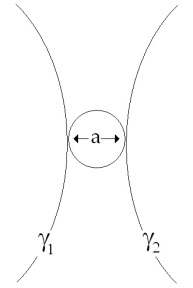

# Leçon 02 | 22 Janvier 1964

  

    <label><input type="checkbox" data-lacan-toggle="original" checked> 原文</label>
    <label><input type="checkbox" data-lacan-toggle="notes" checked> 注释</label>
    <label><input type="checkbox" data-lacan-toggle="commentary" checked> 个人解读评论</label>
  

  <form class="lacan-tool-search" role="search">
    <input class="lacan-tool-search-input" type="search" placeholder="搜索全文" aria-label="搜索全文">
    <button class="lacan-tool-button" type="submit" title="搜索">搜索</button>
  </form>
  <button class="lacan-tool-button lacan-back-to-top" type="button" title="回到页面最上方" aria-label="回到页面最上方">↑</button>

<section class="parallel-paragraph" data-paragraph-ids="s11-02-0001">

s11-02-0001

原文 · s11-02-0001

Mesdames, Messieurs, pour commencer à l’heure, pour vous permettre aussi de prendre place, je vais commencer mon propos d’aujourd’hui par la lecture d’un poème qui, à la vérité, n’a aucun rapport avec ce que je vous dirai, mais un certain rapport…

[无对应译文]

</section>

<section class="parallel-paragraph" data-paragraph-ids="s11-02-0002">

s11-02-0002

原文 · s11-02-0002

> et je crois même que certains en retrouveront l’accent le plus profond
> …avec ce que j’ai dit l’année dernière[^7], dans mon séminaire concernant *l’objet mystérieux, l’objet le plus caché : celui de la pulsion scopique*.

[无对应译文]

</section>

<section class="parallel-paragraph" data-paragraph-ids="s11-02-0003">

s11-02-0003

原文 · s11-02-0003

Il s’agit de ce court poème qu’à la page 70 du *Fou d’Elsa,* ARAGON intitule « *Contre-chant »* :

[无对应译文]

</section>

<section class="parallel-paragraph" data-paragraph-ids="s11-02-0004">

s11-02-0004

原文 · s11-02-0004

> *Vainement ton image arrive à ma rencontre*
>
> *Et ne m’entre où je suis qui seulement la montre*
>
> *Toi te tournant vers moi tu ne saurais trouver*
>
> *Au mur de mon regard que ton ombre rêvée*
>
> *Je suis ce malheureux comparable aux miroirs*
>
> *Qui peuvent réfléchir mais ne peuvent pas voir*
>
> *Comme eux mon œil est vide et comme eux habité*
>
> *De l’absence de toi qui fait sa cécité*

[无对应译文]

</section>

<section class="parallel-paragraph" data-paragraph-ids="s11-02-0005">

s11-02-0005

原文 · s11-02-0005

Je dédie ce poème à la nostalgie que certains peuvent avoir de ce séminaire interrompu[^8] et de ce que j’y développais
au niveau des problèmes, spécialement l’année dernière, de l’*angoisse* et de *la fonction de l’objet(a).*

[无对应译文]

</section>

<section class="parallel-paragraph" data-paragraph-ids="s11-02-0006">

s11-02-0006

原文 · s11-02-0006

Ils saisiront, je pense, ceux-là - je m’excuse d’être aussi abrégé, elliptique, allusif - ils saisiront la saveur du fait qu’ARAGON
dans cette œuvre admirable où je suis fier de trouver l’écho des goûts de notre génération, celle qui fait que je suis forcé
de me reporter à mes camarades du même âge que moi pour pouvoir encore m’entendre sur ce poème d’ARAGON,
qu’il fait suivre de ces lignes énigmatiques :

[无对应译文]

</section>

<section class="parallel-paragraph" data-paragraph-ids="s11-02-0007">

s11-02-0007

原文 · s11-02-0007

> « *Ainsi dit une fois An-Nadjî* [^9]*comme on l’avait invité pour une circoncision* ».

[无对应译文]

</section>

<section class="parallel-paragraph" data-paragraph-ids="s11-02-0008">

s11-02-0008

原文 · s11-02-0008

Point où ceux qui ont entendu mon séminaire de l’année dernière, retrouveront cette correspondance des formes diverses de l’*objet(a)* avec la fonction centrale et symbolique du - ϕ ici évoqué par cette référence singulière - et certainement pas de hasard -
qu’ARAGON confère à la connotation, si je puis dire « *historique* » de l’émission par son personnage, *le poète fou*, de ce « *Contre-chant* ».

[无对应译文]

</section>

<section class="parallel-paragraph" data-paragraph-ids="s11-02-0009">

s11-02-0009

原文 · s11-02-0009

Il y en a ici quelques-uns - je le sais - qui s’introduisent à mon enseignement. Ils s’y introduisent par des écrits qui sont déjà datés.
Je voudrais, avant d’introduire mon propos d’aujourd’hui :

[无对应译文]

</section>

<section class="parallel-paragraph" data-paragraph-ids="s11-02-0010">

s11-02-0010

原文 · s11-02-0010

- qu’ils sachent qu’une des coordonnées *indispensables* pour apprécier la direction, le sens de ce premier enseignement, doit être trouvée dans ceci : qu’ils ne peuvent, d’où ils sont, imaginer à quel *degré* - dirais-je - *de mépris* ou simplement de méconnaissance pour leur instrument, peuvent arriver les praticiens…

[无对应译文]

</section>

<section class="parallel-paragraph" data-paragraph-ids="s11-02-0011">

s11-02-0011

原文 · s11-02-0011

- qu’ils sachent que pendant quelques années, tout mon effort a été nécessaire pour revaloriser aux yeux de ceux-ci cet instrument : *la parole*, pour lui redonner - si je puis dire - sa dignité, et faire que pour eux la parole ne soit pas toujours ces mots, d’avance dévalorisés, qui les forçaient à fixer leurs regards ailleurs pour en trouver le répondant.

[无对应译文]

</section>

<section class="parallel-paragraph" data-paragraph-ids="s11-02-0012">

s11-02-0012

原文 · s11-02-0012

C’est ainsi que j’ai pu passer -au moins pour un temps - pour être hanté, dans mon enseignement, par je ne sais quelle philosophie du lan­gage, voire heideggerienne, alors qu’il ne s’agissait que d’un *travail propédeutique*.

[无对应译文]

</section>

<section class="parallel-paragraph" data-paragraph-ids="s11-02-0013">

s11-02-0013

原文 · s11-02-0013

Ce n’est pas parce que je parle ici \[*salle Dussane, E.N.S. rue d’Ulm*\], que je parlerai plus en *philosophe*, et pour m’attaquer à quelque chose d’autre qui concerne bien les psy­chanalystes, mais que je serai effectivement plus à l’aise ici pour dénom­mer : ce dont il s’agit
est quelque chose que je n’appellerai pas autrement que *le refus du concept*.

[无对应译文]

</section>

<section class="parallel-paragraph" data-paragraph-ids="s11-02-0014">

s11-02-0014

原文 · s11-02-0014

C’est pourquoi - *comme je l’ai annoncé au terme de mon premier cours -* c’est aux *concepts freudiens majeurs*, que j’ai iso­lés comme étant
*au nombre de quatre* et tenant proprement cette *fonction,* que j’essaierai aujourd’hui de vous introduire.

[无对应译文]

</section>

<section class="parallel-paragraph" data-paragraph-ids="s11-02-0015">

s11-02-0015

原文 · s11-02-0015

Ces quelques mots - au tableau noir - sous le titre des *concepts freudiens,* ce sont les deux premiers :

[无对应译文]

</section>

<section class="parallel-paragraph" data-paragraph-ids="s11-02-0016">

s11-02-0016

原文 · s11-02-0016

- *« l’inconscient »* et « *la répétition »*,

[无对应译文]

</section>

<section class="parallel-paragraph" data-paragraph-ids="s11-02-0017">

s11-02-0017

原文 · s11-02-0017

- les deux autres étant « *le transfert »* et « *la pulsion »*.

[无对应译文]

</section>

<section class="parallel-paragraph" data-paragraph-ids="s11-02-0018">

s11-02-0018

原文 · s11-02-0018

J’essaierai d’avancer aussi loin que possible aujourd’hui dans la voie de vous expliquer ce que j’entends par « *fonction* »
de ces concepts, nom­mément *l’inconscient* et *la répétition*.

[无对应译文]

</section>

<section class="parallel-paragraph" data-paragraph-ids="s11-02-0019">

s11-02-0019

原文 · s11-02-0019

*Le transfert* - je l’aborderai, j’espère la prochaine fois - nous intro­duira directement aux algorithmes que j’ai cru devoir introduire dans la pratique, spécialement aux fins de *la mise en œuvre* proprement *de la technique* *analytique* comme telle.

[无对应译文]

</section>

<section class="parallel-paragraph" data-paragraph-ids="s11-02-0020">

s11-02-0020

原文 · s11-02-0020

*La pulsion* est d’un accès encore si difficile, et à vrai dire, si inabordé que je ne crois pas pouvoir faire plus cette année
que d’y revenir seule­ment après que nous aurons parlé du *transfert*. Nous verrons seulement l’essence de l’analyse,
et spécialement *ce qu’a en elle de profondément problématique* et en même temps directeur : *la fonction de l’analyse didactique.*

[无对应译文]

</section>

<section class="parallel-paragraph" data-paragraph-ids="s11-02-0021">

s11-02-0021

原文 · s11-02-0021

Ce n’est qu’après être passé par cet exposé que nous pour­rons, peut-être en fin d’année - et sans, à nous-mêmes, minimiser le côté *difficile, mouvant*, voire *scabreux* de l’approche de ce concept - aborder *la pulsion*. Ceci, dirais-je, par contraste avec ceux qui peuvent
s’y aven­turer au nom de références incomplètes et fragiles.

[无对应译文]

</section>

<section class="parallel-paragraph" data-paragraph-ids="s11-02-0022">

s11-02-0022

原文 · s11-02-0022

Les deux petites flèches que vous voyez indiquent - après *l’incons­cient* et *la répétition* qui sont écrits ici au tableau - indiquent non pas ce qui est à l’autre côté de la ligne, mais le point d’interrogation qui suit. À savoir que la conception que nous nous faisons du *concept* implique qu’il est toujours fait dans une approche qui n’est point sans rapport avec ce que nous impose, comme forme,
le calcul infinitésimal : à savoir que si le concept se *modèle* d’une approche à la réalité, à une réalité qu’il est fait pour saisir,
ce n’est que par un saut, un passage à la limite qu’il s’achève à se réaliser.

[无对应译文]

</section>

<section class="parallel-paragraph" data-paragraph-ids="s11-02-0023">

s11-02-0023

原文 · s11-02-0023

Que dès lors, nous considérons que nous sommes *requis*, en quelque sorte que ça nous est un devoir de dire quelque chose
de ce en quoi peut s’achever, je dirais sous forme de quantité finie, l’élaboration qui s’appelle *l’incons­cient*. De même pour *la répétition*.
Les deux termes que vous voyez inscrits sur ce tableau au bout de la ligne, concernent deux termes de référence essentiels,
eu égard à la ques­tion posée la dernière fois :

[无对应译文]

</section>

<section class="parallel-paragraph" data-paragraph-ids="s11-02-0024">

s11-02-0024

原文 · s11-02-0024

> « *La psychanalyse sous ses aspects paradoxaux, singuliers, aporiques, peut-elle, parmi nous, être considérée*
>
> *comme constituant, à quelque degré, une science, ou seulement un espoir de science ?* »

[无对应译文]

</section>

<section class="parallel-paragraph" data-paragraph-ids="s11-02-0025">

s11-02-0025

原文 · s11-02-0025

C’est par rapport à ces deux termes : *le sujet* et *le réel*, que nous serons amenés à donner forme à la question.

[无对应译文]

</section>

<section class="parallel-paragraph" data-paragraph-ids="s11-02-0026">

s11-02-0026

原文 · s11-02-0026

Je prends d’abord le concept de *l’inconscient*. La majorité de cette assemblée se rappelle ou a quelques notions de ce *que j’ai avancé ceci* : « *L’inconscient est structuré comme un langage* ». Une part peut-être moins large mais aussi très importante de mes auditeurs ici aujourd’hui, *et mon audience ordinaire*, sait bien que ceci se rapporte à un certain champ, qui nous est beaucoup plus *accessible*,
beaucoup plus ouvert, qu’au temps de FREUD. Et que, pour l’illustrer par quelque chose qui est matérialisé assu­rément sur un plan scientifique, je l’illustrerai par exemple par ce champ - je ne vais pas le cerner *ce champ* *qu’explore, structure, élabore* et qui se montre déjà infiniment riche - ce champ que Claude LÉVI-STRAUSS a épinglé du titre de *Pensée sauvage* [^10].

[无对应译文]

</section>

<section class="parallel-paragraph" data-paragraph-ids="s11-02-0027">

s11-02-0027

原文 · s11-02-0027

Avant toute expérience, toute déduction individuelle, avant même que s’y inscrivent *les expériences collectives* qui ne sont rapportables qu’aux besoins sociaux, *quelque chose* organise ce champ, en inscrit les lignes de force initiales, qui est cette fonction que
Claude LÉVI-STRAUSS, dans sa critique du totémisme, nous montre être sa vérité, et vérité qui en réduit l’apparence
de cette fonction du totémisme, à savoir *une fonction classificatoire primaire*.

[无对应译文]

</section>

<section class="parallel-paragraph" data-paragraph-ids="s11-02-0028">

s11-02-0028

原文 · s11-02-0028

Ce *quelque chose* qui fait *qu’avant que les relations s’organisent*, qui soient des relations proprement humaines, déjà s’est organisé
*ce rapport d’un monde à un autre monde* :

[无对应译文]

</section>

<section class="parallel-paragraph" data-paragraph-ids="s11-02-0029">

s11-02-0029

原文 · s11-02-0029

- de certains rapports humains qui sont déterminés par une *organisation*,

[无对应译文]

</section>

<section class="parallel-paragraph" data-paragraph-ids="s11-02-0030">

s11-02-0030

原文 · s11-02-0030

- aux *termes* de cette *organisation,* qui sont pris dans tout ce que la nature peut offrir comme support, qui *s’or­ganisent dans des thèmes d’opposition*.

[无对应译文]

</section>

<section class="parallel-paragraph" data-paragraph-ids="s11-02-0031">

s11-02-0031

原文 · s11-02-0031

La nature - pour dire le mot - fournit *des signifiants* et *ces signifiants* organisent de façon inaugurale les rapports humains, en donnent les structures et les modèlent. L’important est ceci : c’est que nous voyons là le niveau où, avant toute formation du *sujet*,
d’un *sujet* qui pense, qui s’y situe, *ça compte, c’est compté*, et dans ce « *compté* », le *comptant* déjà y est ! Il a ensuite à s’y recon­naître,
et à s’y reconnaître comme « *comptant* ».

[无对应译文]

</section>

<section class="parallel-paragraph" data-paragraph-ids="s11-02-0032">

s11-02-0032

原文 · s11-02-0032

Disons que l’achoppement naïf où le « *mesureur de niveau mental* » [^11] s’esbaudit de saisir le petit homme, quand il lui propose l’interrogation : « *J’ai trois frères, Paul, Ernest et moi, qu’est-ce que tu penses de ça ?* » Le petit n’en pense rien pour la bonne raison,
c’est que c’est tout naturel ! D’abord sont comptés les trois frères Paul, Ernest et moi, et tel je suis moi, au niveau de ce
qu’on avance que j’ai à réfléchir : ce moi… c’est *moi*, et que *c’est moi qui compte*.

[无对应译文]

</section>

<section class="parallel-paragraph" data-paragraph-ids="s11-02-0033">

s11-02-0033

原文 · s11-02-0033

C’est de cette structure, affirmée comme initiale de l’inconscient…

[无对应译文]

</section>

<section class="parallel-paragraph" data-paragraph-ids="s11-02-0034">

s11-02-0034

原文 · s11-02-0034

> aux temps historiques où nous sommes de formation d’une science : d’*une science* qu’on peut qualifier d’« *humaine »*
>
> mais qu’il faut bien distinguer de toute psychosociologie, d’une science dont le modèle est le jeu combi­natoire
> …que la linguistique nous permet de saisir dans un certain champ, opérant dans sa spontanéité et tout seul, d’une façon
> pré-subjective, c’est ce champ-là qui donne de nos jours son *statut* à l’inconscient. C’est celui-là, en tout cas, qui nous assure
> qu’il y a quelque chose de quali­fiable sous ce terme qui est assurément accessible, d’une façon tout à fait objectivable.

[无对应译文]

</section>

<section class="parallel-paragraph" data-paragraph-ids="s11-02-0035">

s11-02-0035

原文 · s11-02-0035

Mais est-ce à dire que, quand j’invoque les psychanalystes, quand je les induis, quand je les incite à ne point ignorer *ce terrain,*
*ce champ* qui est le leur, qui leur donne un solide appui pour leur élaboration, est-ce à dire que je pense, à proprement parler,
tenir les concepts introduits his­toriquement par FREUD sous le terme d’inconscient ?
Eh bien non ! Je ne le pense pas. L’inconscient, concept freudien, est autre chose que je voudrais essayer de vous faire saisir aujourd’hui. Il ne suffit pas de dire que *l’inconscient est un concept dynamique*, puisque c’est substituer l’ordre de *mystère* le plus courant
à un mystère particulier : *la force, ça sert en général à désigner un lieu d’opacité*.

[无对应译文]

</section>

<section class="parallel-paragraph" data-paragraph-ids="s11-02-0036">

s11-02-0036

原文 · s11-02-0036

Je voudrais introduire ce que je veux vous dire aujourd’hui, en me référant à *la fonction de la cause*. Je sais bien que j’entre là sur un terrain qui, *du point de vue de la critique philosophique* disons, n’est pas sans évoquer *un monde de références*. Assez pour me faire hésiter dans ces références : nous en serons quittes pour choisir.

[无对应译文]

</section>

<section class="parallel-paragraph" data-paragraph-ids="s11-02-0037">

s11-02-0037

原文 · s11-02-0037

Il y a au moins une partie de mon auditoire qui restera plutôt sur sa faim, si simplement j’indique qu’autour des années 1760
\- voire 63 - dans l’*Essai sur les grandeurs négatives* de KANT [^12], là nous pouvons saisir combien est serrée de près sinon la crise,
voire la béance que, depuis toujours, offre *la fonction de la cause* pour toute saisie conceptuelle.

[无对应译文]

</section>

<section class="parallel-paragraph" data-paragraph-ids="s11-02-0038">

s11-02-0038

原文 · s11-02-0038

Quand dans cet *Essai* dont je parle, *il est à peu près dit* :

[无对应译文]

</section>

<section class="parallel-paragraph" data-paragraph-ids="s11-02-0039">

s11-02-0039

原文 · s11-02-0039

- que *c’est un concept,* en fin de compte *inanalysable* qu’il est impossible de comprendre par la raison, si tant est que la *règle de la raison* - *Vernunftregel -* c’est toujours quelque *comparaison* - *Vergleichung -* ou équivalent,

[无对应译文]

</section>

<section class="parallel-paragraph" data-paragraph-ids="s11-02-0040">

s11-02-0040

原文 · s11-02-0040

- qu’essentiellement reste dans *la fonction de la cause*, une certaine béance, terme qui est employé dans *Les Prolégomènes* [^13] du même auteur.

[无对应译文]

</section>

<section class="parallel-paragraph" data-paragraph-ids="s11-02-0041">

s11-02-0041

原文 · s11-02-0041

Et aussi bien je n’irai pas non plus à faire *remarquer* que c’est depuis toujours *ce problème de la cause* qui est l’embarras des philosophes, que ce n’est même pas simple, si simple à voir s’équilibrer dans ARISTOTE, ses quatre causes. Mais je ne suis pas ici philosophant et ne prétends m’ac­quitter d’aucune aussi lourde charge avec ces références que pour rendre sensible simplement ce que veut dire
ce sur quoi j’insiste.

[无对应译文]

</section>

<section class="parallel-paragraph" data-paragraph-ids="s11-02-0042">

s11-02-0042

原文 · s11-02-0042

Je dirai que la cause…

[无对应译文]

</section>

<section class="parallel-paragraph" data-paragraph-ids="s11-02-0043">

s11-02-0043

原文 · s11-02-0043

> toute modalité que KANT finalement l’inscrive dans les catégories de la *Raison pure,*
>
> ou plus exactement qu’il y inscrit au registre, au tableau des relations entre l’inhérent et la communauté
> …que la cause n’est pas pour autant, pour nous, plus rationalisée.

[无对应译文]

</section>

<section class="parallel-paragraph" data-paragraph-ids="s11-02-0044">

s11-02-0044

原文 · s11-02-0044

Elle se distingue de ce qu’il y a de déterminant dans une chaîne, autrement dit de *la loi*. Pour l’exemplifier, je dirais : pensez à ce qui s’image dans la fonction de *l’action* et de *la réaction*. Il n’y a, si vous voulez, *qu’un seul tenant *: l’un ne va pas sans l’autre.
Un corps qui s’écrase au sol, *sa masse n’est pas la cause* de ce qu’il reçoit en retour de sa force vive. Sa masse est intégrée à cette force qui lui revient pour dis­soudre sa cohérence par un effet de retour. Ici pas de béance, si ce n’est à la fin.

[无对应译文]

</section>

<section class="parallel-paragraph" data-paragraph-ids="s11-02-0045">

s11-02-0045

原文 · s11-02-0045

Chaque fois que nous parlons de *cause*, il y a toujours, dans ce terme, quelque chose d’*anti-conceptuel*, d’indéfini.

[无对应译文]

</section>

<section class="parallel-paragraph" data-paragraph-ids="s11-02-0046">

s11-02-0046

原文 · s11-02-0046

- « *Les phases de la lune sont la cause des marées* » : ça c’est vivant, *nous savons à ce moment-là que le mot « cause » est bien employé*.

[无对应译文]

</section>

<section class="parallel-paragraph" data-paragraph-ids="s11-02-0047">

s11-02-0047

原文 · s11-02-0047

- « *Les miasmes sont la cause de la fièvre* » : ça ne veut rien dire. Là, en somme, *il y a un trou et quelque chose qui vient osciller dans l’intervalle*. *Il n’y a de cause que de ce qui cloche*. Entre *la cause* et ce qu’elle affecte, il y a toujours *la clocherie*.

[无对应译文]

</section>

<section class="parallel-paragraph" data-paragraph-ids="s11-02-0048">

s11-02-0048

原文 · s11-02-0048

[无对应译文]

</section>

<section class="parallel-paragraph" data-paragraph-ids="s11-02-0049">

s11-02-0049

原文 · s11-02-0049

\[*schéma du séminaire* 1965-66 *: L’Objet... séance du 01-06*.\]

[无对应译文]

</section>

<section class="parallel-paragraph" data-paragraph-ids="s11-02-0050">

s11-02-0050

原文 · s11-02-0050

Eh bien l’inconscient freudien, c’est à ce point - *que j’essaie de vous faire viser par approximation -* qu’il se situe. L’important n’est pas que *l’inconscient* détermine *la névrose*. Là-dessus FREUD a très volontiers le geste pilatique \[Ponce Pilate\] de se laver les mains :
un jour ou l’autre, on trouvera peut-être quelque chose : des déterminants humoraux… peu importe. Ça lui est égal.

[无对应译文]

</section>

<section class="parallel-paragraph" data-paragraph-ids="s11-02-0051">

s11-02-0051

原文 · s11-02-0051

Mais *l’inconscient*, justement, nous *désigne cet ordre de béance* où j’essayais de vous rappeler *la dimension essentielle* de cette notion de cause. L’inconscient nous montre la béance par où, en somme, la névro­se se raccorde à un *réel* qui peut bien, lui, n’être pas déterminé. Dans cette béance, il apparaît, il se passe quelque chose. Cette béance une fois bouchée, la névrose est-elle guérie ?
Vous savez qu’après tout, la question est toujours ouverte. Seulement elle devient autre, parfois simple infirmité,
« *cicatrice »* comme dit FREUD ailleurs, non pas cicatrice de la névrose, mais de cet inconscient.

[无对应译文]

</section>

<section class="parallel-paragraph" data-paragraph-ids="s11-02-0052">

s11-02-0052

原文 · s11-02-0052

Comme vous le voyez, *cette topologie*, je ne vous la ménage pas très savamment, parce que je n’ai pas le temps. Je *saute dedans* et ce que je désigne là en ces termes, je crois que vous pourrez vous sentir, vous en sentir guidés quand vous irez au texte de FREUD.
Et quand vous voyez d’où il part : proprement de l’étiologie des névroses... Et qu’est-ce qu’il trouve dans ce trou, dans cette fente, dans cette béance caractéristique de *la cause* ? Essayons de l’épeler.

[无对应译文]

</section>

<section class="parallel-paragraph" data-paragraph-ids="s11-02-0053">

s11-02-0053

原文 · s11-02-0053

Ce qu’il trouve c’est *quelque chose de l’ordre du non réalisé*. On parle de refus : c’est aller trop vite en matiè­re, depuis quelque temps, quand on parle de « refus », on ne sait plus ce qu’on dit. L’inconscient, d’abord, se manifeste à nous comme *quelque chose qui se tient*
*en attente dans l’aire* - dirais-je - du « *non-né* ».

[无对应译文]

</section>

<section class="parallel-paragraph" data-paragraph-ids="s11-02-0054">

s11-02-0054

原文 · s11-02-0054

Que le refoulement y déverse quelque chose, ça n’est pas étonnant, c’est le rap­port *aux limbes de la « faiseuse d’anges »*. Cette dimension est à évoquer dans ce registre qui n’est ni d’*irréel* ni de *dé-réel* : de *non-réalisé*. Ce n’est jamais sans danger, après tout, qu’on fait remuer quelque chose dans *cette zone des larves*, et peut-être, après tout, est-il de *la position de l’analyste*, s’il y est vraiment, de devoir être assiégé - je veux dire : réellement - par ceux chez qui il a évoqué *ce monde des larves* [^14] \[[*spectres*](http://www.cnrtl.fr/definition/larves)\], sans avoir pu toujours les mener jusqu’au jour.

[无对应译文]

</section>

<section class="parallel-paragraph" data-paragraph-ids="s11-02-0055">

s11-02-0055

原文 · s11-02-0055

Tout discours, là bien sûr, n’est pas inoffensif, et le discours même que je tiens - que j’ai pu, dans ces dix dernières années, tenir -
trouve certains de ces effets, de ces retours, à cette direction qu’ici je désigne comme l’explication de ces retours.
Ce n’est pas en vain que, même dans un discours public, on vise les sujets et qu’on les touche à ce que FREUD appelle *le nombril*, « *nombril des rêves »* écrit-il pour en désigner au dernier terme *le centre d’inconnu* - dit-il - mais qui n’est point autre chose,
comme l’image anatomique dont il s’agit et qui s’avère être la meilleure à le représenter, que cette béance dont nous parlons.

[无对应译文]

</section>

<section class="parallel-paragraph" data-paragraph-ids="s11-02-0056">

s11-02-0056

原文 · s11-02-0056

Danger du discours public pour autant qu’il s’adresse justement au plus proche. NIETZSCHE le savait qu’un certain type de discours ne peut s’adresser qu’au plus lointain. C’est qu’à vrai dire cette dimension dont je parle, de l’inconscient, tout cela c’était oublié, comme FREUD l’avait parfaitement bien prévu. L’inconscient s’était refermé sur son message grâce au soin de ces actifs *orthopédeutes* que sont devenus *les analystes de la seconde ou de la troi­sième génération*, *qui se sont employés* - en psychologisant la théorie analytique - *à suturer cette béance*.

[无对应译文]

</section>

<section class="parallel-paragraph" data-paragraph-ids="s11-02-0057">

s11-02-0057

原文 · s11-02-0057

Croyez bien d’ailleurs, que moi-même je ne la rouvre jamais qu’avec précaution. J’ai mieux à faire puisque, *dans le domaine de la cause,* *je suis*, à ma date, à mon époque, *en position d’introduire la loi, la loi du signifiant où cette béance se produit*. Mais il n’en reste pas moins
qu’il nous faut, si nous voulons com­prendre ce dont il s’agit dans la psychanalyse, revenir à évoquer ce concept dans les temps
où FREUD a procédé pour le forger, puisque nous ne pouvons l’achever qu’à l’y porter à sa limite.

[无对应译文]

</section>

<section class="parallel-paragraph" data-paragraph-ids="s11-02-0058">

s11-02-0058

原文 · s11-02-0058

Je vous passe les consi­dérations ordinaires où *l’inconscient freudien* fournit un paragraphe parmi les autres inconscients.
*Il n’a rien à faire avec les formes dites « de l’inconscient » qui l’ont précédé*, voire accompagné, voire qui l’entourent encore.
Ouvrez, pour voir ce que je viens de dire, le dictionnaire LALANDE. Lisez sa très jolie *énumération* qu’a faite DWELSHAUVERS[^15] dans un livre paru il y a une quarantaine d’années chez FLAMMARION. Il y a huit ou dix formes d’inconscient qui n’apprennent rien à personne, qui désignent simplement le *pas conscient*, le *plus ou moins conscient*, et dans le champ des élaborations psychologiques on trouve mille variétés sup­plémentaires.

[无对应译文]

</section>

<section class="parallel-paragraph" data-paragraph-ids="s11-02-0059">

s11-02-0059

原文 · s11-02-0059

On peut faire remarquer que *l’inconscient* de FREUD n’est pas du tout *l’inconscient romantique* de la création imaginante,
n’est pas *le lieu des divinités de la nuit* où certains croient encore pouvoir révéler l’incons­cient freudien. Sans doute n’est-ce pas là
tout à fait sans rapport avec, disons, le lieu vers où se tourne le regard de FREUD. Mais le fait que JUNG, qui est *le relaps des termes de l’inconscient romantique*, ait été répudié par FREUD, nous indique assez que ce que FREUD introduit, c’est autre chose.

[无对应译文]

</section>

<section class="parallel-paragraph" data-paragraph-ids="s11-02-0060">

s11-02-0060

原文 · s11-02-0060

Pour dire que l’inconscient, cet inconscient lui-même si fourre-tout, si hétéroclite, qu’élabore pendant toute sa vie, dans sa vie
de philosophe solitaire, Eduard Von HARTMANN[^16], ce ne soit pas l’inconscient de FREUD, il ne faudrait pas non plus aller
trop vite puisque FREUD, dans son septiè­me chapitre de l’*Interprétation des rêves,* de la *Traumdeutung,* lui-même s’y réfère en note. C’est dire qu’il faut aller y voir de plus près pour dési­gner ce qui dans FREUD, s’en distingue.

[无对应译文]

</section>

<section class="parallel-paragraph" data-paragraph-ids="s11-02-0061">

s11-02-0061

原文 · s11-02-0061

Je vous l’ai dit, je ne me contente pas de dire qu’à tous ces inconscients, toujours plus ou moins affiliés à une volonté obscure considérée comme primordiale, à quelque chose d’avant la conscience - ce que FREUD oppose, c’est la révélation :

[无对应译文]

</section>

<section class="parallel-paragraph" data-paragraph-ids="s11-02-0062">

s11-02-0062

原文 · s11-02-0062

- *qu’ici quelque chose* - en tout point homologue à ce qui se passe au niveau du sujet - *fonction­ne*,

[无对应译文]

</section>

<section class="parallel-paragraph" data-paragraph-ids="s11-02-0063">

s11-02-0063

原文 · s11-02-0063

- *que là, ça parle*, et renversant complètement la perspective, à savoir qu’au niveau de l’inconscient, ça fonctionne d’une façon aussi élaborée qu’au niveau de ce qui paraissait être le privilège du conscient.

[无对应译文]

</section>

<section class="parallel-paragraph" data-paragraph-ids="s11-02-0064">

s11-02-0064

原文 · s11-02-0064

Je sais *les résistances* que provoque encore cette simple remarque, pourtant sensible dans le moindre texte de FREUD.
Et lisez là-dessus le paragraphe de ce septième chapitre intitulé *L’oubli dans les rêves*, à-propos de quoi FREUD ne fait référence qu’aux jeux du *signifiant* de la façon la plus sensible. De ce registre, vous en avez eu dans l’oreille l’indication dimension­nelle,
je ne me contente pas de cette référence massive. Je vous ai épelé point par point ce *fonctionnement de l’inconscient*.

[无对应译文]

</section>

<section class="parallel-paragraph" data-paragraph-ids="s11-02-0065">

s11-02-0065

原文 · s11-02-0065

Dans le phénomène, dans ce qui nous est produit d’abord par FREUD comme le champ, *le registre de l’inconscient* : *le rêve*, *l’acte manqué*, *le mot d’esprit*... *qu’est-ce qui frappe d’abord* ? C’est *le mode d’achoppement sous lequel il apparaît : achoppement, défaillance, fêlure* \[*cf.* σκανδαλον\], voilà ce qui frappe d’abord. *Dans une phrase prononcée, écrite*, *quelque chose vient à trébucher*. FREUD est aimanté par ces phénomènes,
c’est là qu’il va chercher ce qui va se manifester comme l’inconscient. Là, quelque chose d’autre demande à se réaliser qui apparaît comme intentionnel, certes, mais d’une étrange, dirons-nous, temporalité.

[无对应译文]

</section>

<section class="parallel-paragraph" data-paragraph-ids="s11-02-0066">

s11-02-0066

原文 · s11-02-0066

*Ce qui se produit* - au sens plein du terme « *se produire* » - *dans cette béance, dans cette fêlure, se présente comme* *<u>la</u> trouvaille*. \[*de la faille (*σκανδαλον) *s’échappe une « chose de langage »* (S1) *sidérante et scandaleuse*\] C’est ainsi d’abord que *l’exploration freudienne* rencontre ce qui se passe dans *l’inconscient.*

[无对应译文]

</section>

<section class="parallel-paragraph" data-paragraph-ids="s11-02-0067">

s11-02-0067

原文 · s11-02-0067

« *Trouvaille* » qui est en même temps « *solution* », pas forcément ache­vée, mais si incomplète qu’elle soit, elle a ce « *je ne sais quoi* »
qui nous touche de cet accent particulier qu’a si admirablement détaché - et seule­ment détaché, car FREUD l’a bien fait remarquer avant lui - Theodor REIK[^17], à savoir *la surprise*, ce par quoi le sujet se sent dépassé. Il en « *trouve* » à la fois *plus* et *moins*
qu’il n’en attendait, mais de toute façon, c’est par rapport à ce qu’il attendait, d’un prix unique.

[无对应译文]

</section>

<section class="parallel-paragraph" data-paragraph-ids="s11-02-0068">

s11-02-0068

原文 · s11-02-0068

Or cette *trouvaille* - dès qu’elle se présente - se présente comme *retrou­vaille* instaurant la dimension de la perte, et qui plus est,
cette trouvaille est toujours prête à se dérober à nouveau. Pour me laisser aller à quelque métaphore, EURYDICE deux fois perdue, vous dirais-je, telle est l’image la plus sensible que nous puissions don­ner dans le mythe, de ce qu’est le mythe, de ce que c’est que
ce rapport de l’ORPHÉE *analyste* par rapport à *l’inconscient*. En quoi, si vous me permettez d’y ajouter quelque ironie,
l’incons­cient se trouve au bord *strictement opposé de ce qu’il en est de* *l’amour*, dont chacun sait qu’il est toujours unique,
et que la formule « *Une de perdue, dix de retrouvées* » est celle qui trouve sa meilleure application.

[无对应译文]

</section>

<section class="parallel-paragraph" data-paragraph-ids="s11-02-0069">

s11-02-0069

原文 · s11-02-0069

La *discontinuité*, telle est la forme essentielle où nous apparaît d’abord l’inconscient comme phénomène. *Dans cette discontinuité*
*quelque chose qui se manifeste comme une vacillation*, et ceci nous conduit à nous interroger sur ce qu’il en est de son fond, puisqu’il s’agit d’une *discontinuité*. Si cette *discontinuité* a ce caractère absolu - ce que nous semblons lui donner dans le texte du phénomène -
ce caractère inaugural dans le che­min de la *découverte* de FREUD, devons-nous lui donner - comme ce fut depuis, la tendance
des analystes - le fond en quelque sorte nécessaire d’une appréhension de quelque totalité ?

[无对应译文]

</section>

<section class="parallel-paragraph" data-paragraph-ids="s11-02-0070">

s11-02-0070

原文 · s11-02-0070

Est-ce que le « *Un* » lui est antérieur ? Justement je ne le pense pas ! Et tout ce que j’ai enseigné ces dernières années tendait,
si je puis dire, à faire virer cette sorte d’*exigence* d’un « *Un* » fermé qui est mirage, auquel s’attache la référence à cette sorte
de double de l’organisme que serait le psychisme, d’enveloppe où résiderait cette fausse unité.

[无对应译文]

</section>

<section class="parallel-paragraph" data-paragraph-ids="s11-02-0071">

s11-02-0071

原文 · s11-02-0071

Vous m’accorderez que l’*un* qui est introduit par l’expérience de l’inconscient, c’est justement cet 1 *de la fente*, *du trait*, de la rupture. Ici jaillit, disons, une forme méconnue de l’*un* :

[无对应译文]

</section>

<section class="parallel-paragraph" data-paragraph-ids="s11-02-0072">

s11-02-0072

原文 · s11-02-0072

- disons, si vous voulez, que ce n’est pas un *Un* \[*unifiant*\], que c’est l’1 \[*du trait*\] de l’*Unbewusste* \[*inconscient*\],

[无对应译文]

</section>

<section class="parallel-paragraph" data-paragraph-ids="s11-02-0073">

s11-02-0073

原文 · s11-02-0073

- disons que la limi­te de l’*Unbewusste,* c’est l’*Unbegriff* \[*begriff : concept*\] non pas *non-concept*, mais « *concept du manque »*.

[无对应译文]

</section>

<section class="parallel-paragraph" data-paragraph-ids="s11-02-0074">

s11-02-0074

原文 · s11-02-0074

Et d’ailleurs, qu’est-ce que nous avons vu surgir tout à l’heu­re, *sinon son rapport à cette vacillation qui retourne à l’absence* ? Où est le fond ? Est-ce l’*absence* ? Non pas ! La rupture, la fente, *le trait* de l’ouverture *fait surgir cette absence comme le cri* qui, non pas s’isole, se profile sur fond de silence, mais au contraire *le fait surgir comme silence*.

[无对应译文]

</section>

<section class="parallel-paragraph" data-paragraph-ids="s11-02-0075">

s11-02-0075

原文 · s11-02-0075

Si *vous saisissez*, si *vous gardez dans la main* \[*begriff* \] cette structure initiale, vous serez plus sûrs de ne pas vous livrer à seulement tel ou tel aspect partiel de ce dont il s’agit concernant *l’inconscient*, comme par exemple que c’est le sujet, en tant qu’aliéné dans son histoire, au niveau où la syn­cope du discours se conjoint avec son désir.

[无对应译文]

</section>

<section class="parallel-paragraph" data-paragraph-ids="s11-02-0076">

s11-02-0076

原文 · s11-02-0076

Vous verrez :

[无对应译文]

</section>

<section class="parallel-paragraph" data-paragraph-ids="s11-02-0077">

s11-02-0077

原文 · s11-02-0077

- que, plus radicalement c’est dans *la dimension d’une* *synchronie* \[« *toujours déjà là »*\] que vous devez situer *l’inconscient*,

[无对应译文]

</section>

<section class="parallel-paragraph" data-paragraph-ids="s11-02-0078">

s11-02-0078

原文 · s11-02-0078

- que c’est au niveau d’un être, mais en tant qu’il peut se porter sur tout,

[无对应译文]

</section>

<section class="parallel-paragraph" data-paragraph-ids="s11-02-0079">

s11-02-0079

原文 · s11-02-0079

- que c’est au niveau du sujet de l’énonciation en tant que - vous savez bien - *selon les phrases, selon les modes*, il se perd autant qu’il se retrouve et que, dans *une inter­jection*, dans *un impératif*, dans *une invocation*, voire dans *une défaillan­ce*, c’est toujours lui qui vous pose son *énigme* qui parle, bref,

[无对应译文]

</section>

<section class="parallel-paragraph" data-paragraph-ids="s11-02-0080">

s11-02-0080

原文 · s11-02-0080

- que c’est au niveau où tout ce qui s’épanouit se diffuse, comme dit FREUD à pro­pos du rêve, comme le *mycelium* autour d’un point central, et qui se rap­porte à l’inconscient. *C’est toujours du sujet* en tant qu’indéterminé *qu’il s’agit*.

[无对应译文]

</section>

<section class="parallel-paragraph" data-paragraph-ids="s11-02-0081">

s11-02-0081

原文 · s11-02-0081

- *Oblīvium* \[*oblīviō : métaphore de l’écriture qu’on efface (oblinere : effacer, raturer), Ernout et Meillet, Klincksieck* 2001 *p.* 455\] c’est *lēvis - avec le « ē » long* - qui veut dire *polir, unir, rendre lisse* \[*Ernout et Meillet p.* 353\]

[无对应译文]

</section>

<section class="parallel-paragraph" data-paragraph-ids="s11-02-0082">

s11-02-0082

原文 · s11-02-0082

- *Oblīvium,* c’est ce qui efface : le rapport de *l’oubli* avec *l’effacement de quelque chose qui est le signifiant comme tel* \[S1\].

[无对应译文]

</section>

<section class="parallel-paragraph" data-paragraph-ids="s11-02-0083">

s11-02-0083

原文 · s11-02-0083

Voilà où nous retrouvons la structure basale, ce à quoi se rattache la possibilité de quelque chose que nous devons concevoir comme opéra­toire, la possibilité de *quelque chose qui prenne la fonction de barrer, de rayer une autre chose*. Ceci se situe à *un niveau*
*plus primordial* structuralement, que le refoulement dont nous parlerons plus tard. Aussi bien nous voyons que la référence
à *cet élément opératoire* dont je parle, *de l’effacement*, *c’est ce que FREUD désigne* dès l’origine *dans la fonction de la censure*.
Les modes sous lesquels il souligne que nous devons les concevoir *comme le travail du censeur, le caviardage avec des ciseaux*, *la censure russe* ou encore, comme [Henri HEINE](http://agora.qc.ca/mot.nsf/Dossiers/Heinrich_Heine)[^18], au début du livre : « *[De l’Allemagne](http://gallica.bnf.fr/Search?ArianeWireIndex=index&p=1&lang=FR&q=heine+de+l%27allemagne) »* \[(1855), *p.*48\], le dit en caricaturant *la censure allemande* :

[无对应译文]

</section>

<section class="parallel-paragraph" data-paragraph-ids="s11-02-0084">

s11-02-0084

原文 · s11-02-0084

« *M. et Mme Untel ont le plaisir de vous annoncer la naissance d’un enfant beau comme la liberté*. *Le Dr Hoffmann raye le mot « liberté »*. »

[无对应译文]

</section>

<section class="parallel-paragraph" data-paragraph-ids="s11-02-0085">

s11-02-0085

原文 · s11-02-0085

Et assurément, on peut s’interroger sur ce que devient *l’effet du mot « liberté »* du fait même de cette censure proprement matérielle. C’est là un autre problème, mais c’est aussi *ce sur quoi* FREUD *désigne que porte*, de la façon la plus effi­ciente, *le dynamisme de l’inconscient.*
Et pour reprendre un exemple jamais assez exploité, celui qui est le premier sur lequel il a fait porter sa démonstration, *l’oubli*, *l’achoppement de mémoire* concernant le mot de « *Signorelli* » après sa visite faite aux *peintures d’Orvieto*.

[无对应译文]

</section>

<section class="parallel-paragraph" data-paragraph-ids="s11-02-0086">

s11-02-0086

原文 · s11-02-0086

Est-il possible de ne pas voir surgir du texte même, s’imposer, non pas *la métaphore*, mais la réalité de *la disparition*, de *la suppression*,
de l’« *Unterdrückung »,* du passage dans les dessous - et impossible de le retrouver ! - du terme de « *Signor* », du *Herr.*
Le *Signor,* le *Herr, le maître absolu*, ai-je dit en un temps, la mort pour tout dire, est là disparue. Mais aussi bien ne voyons-nous pas,
là derrière, se profiler tout ce qui nécessite FREUD à trouver dans les mythes de la mort du père, la régulation de son désir ?

[无对应译文]

</section>

<section class="parallel-paragraph" data-paragraph-ids="s11-02-0087">

s11-02-0087

原文 · s11-02-0087

Et qu’après tout, s’il se rencontre avec NIETZSCHE pour énoncer, à sa manière, dans son mythe à lui, que « *Dieu est mort* »,
c’est peut-être sur le fond des mêmes raisons. À savoir que le mythe du « *Dieu est mort* », dont je suis pour ma part, beaucoup moins assuré - comme mythe, entendez bien - que la plupart des intellectuels contemporains, ce qui n’est pas du tout *une déclaration de théisme,*
que ce mythe du « *Dieu est mort* » n’est peut-être que *l’abri trouvé contre une menace*, particulièrement présente *en fonction d’un certain nombre de corrélations effectivement de temps et d’époque, la menace de la castra­tion*.

[无对应译文]

</section>

<section class="parallel-paragraph" data-paragraph-ids="s11-02-0088">

s11-02-0088

原文 · s11-02-0088

Précisément celle dont il s’agit - si vous savez les lire - aux fresques apocalyptiques de la cathédrale d’Orvieto. Et si vous en doutez, si vous ne savez pas les lire, lisez donc la conversation du train : avec son interlo­cuteur, l’interlocuteur précisément vis-à-vis de qui
il ne retrouve pas le nom de « *Signorelli* » : il ne s’agit précisément - dans la demi-heure où l’heure qui précède ces propos qui se tiennent dans un train quelque part qui circule du côté de Dubrovnik ou de quelque endroit analogue - il ne s’agit que de la fin de
la puissance sexuelle dont son interlocuteur méde­cin lui dit le caractère dramatique pour ceux qui sont ordinairement ses patients.

[无对应译文]

</section>

<section class="parallel-paragraph" data-paragraph-ids="s11-02-0089">

s11-02-0089

原文 · s11-02-0089

*Ainsi l’inconscient se manifeste toujours comme ce qui vacille dans une coupure du sujet*, d’où resurgit une *trouvaille* que FREUD assimile au désir, que nous situerons - pour nous, provisoirement - dans la *métonymie* dénudée du discours en cause où le sujet se saisit \[*begriff*\]
en quelque point inat­tendu.

[无对应译文]

</section>

<section class="parallel-paragraph" data-paragraph-ids="s11-02-0090">

s11-02-0090

原文 · s11-02-0090

N’oublions pas que, pour parler de FREUD et de sa relation au père, tout son effort ne l’a mené qu’à avouer que pour lui
la question restait entière - il l’a dit à une de ses interlocutrices : « *Que veut une femme ?* »Question qu’il n’a jamais résolue.
Ici, nous nous référons à ce qu’a été effectivement sa relation à la femme, à ce caractère uxorieux[^19], comme s’exprime pudiquement JONES le concernant. Nous dirons que FREUD aurait fait assurément un admirable idéaliste passionné s’il ne s’était pas consacré
à l’autre, sous la forme de l’hysté­rique.

[无对应译文]

</section>

<section class="parallel-paragraph" data-paragraph-ids="s11-02-0091">

s11-02-0091

原文 · s11-02-0091

J’ai décidé d’arrêter toujours à point nommé : deux heures moins vingt, mon séminaire. Vous le voyez, je n’ai pas clos aujourd’hui ce qu’il en est de la fonction de *l’inconscient*. Restons donc un peu avant les termes que j’avais donnés à ce que j’espérais boucler : *l’inconscient*. Aujourd’hui je n’ai point abordé *la répétition*. Ce que j’ai à dire sur *l’inconscient* se lie étroitement à ce qu’il en sera de notre abord du second concept de *la répétition* la prochaine fois.

[无对应译文]

</section>

<section class="note-block original-notes">

## Notes

[^7]: Cf. Séminaire 1962-63 : L’Angoisse, Paris, Seuil, 2004.

[^8]: Séminaire « *Les Noms du Père* » , une seule séance : 20 Novembre 1963.

[^9]: Cf. Keis An-Nadjî , poète perse préislamique .

[^10]: Claude Lévi-Strauss : *La pensée sauvage*, Paris, Plon,1962 (Pocket n°2 , 1990).

[^11]: Jean Piaget : *Le langage et la pensée chez l'enfant*, Delachaux et Niestlé, 1997. *Classes, relations et nombres*, Paris, Vrin, 1942.

[^12]: Emmanuel Kant : *Essai pour introduire en philosophie le concept de grandeur négative*, trad. Roger Kempf, Paris, Vrin, 1972.

[^13]: Emmanuel Kant : *Prolégomènes à toute métaphysique future qui pourra se présenter comme science*, Paris, Vrin, 2000.

[^14]: S. Freud : *Traumdeutung*, *L’interprétation des rêves*, ch. 7, c, note 1 : « *...des ombres des Enfers qui renaissent à la vie dès qu’elles ont bu du sang* »

    « ...*die Schatten der odysseischen Unterwelt, die zum neuen Leben erwachen, sobald sie Blut getrunken haben. »*

[^15]: Georges Dwelshauvers : *L'inconscient*, Flammarion, Coll. Bibliothèque de philosophie scientifique, 1916.

[^16]: K. R. Eduard Von Hartmann (1842, 1906) philosophe allemand qui, dans son ouvrage « *Philosophie de l'inconscient* » (*Die Philosophie des Unbewussten*, 1869),

    affirmait l'existence d'un inconscient psychique.

[^17]: Theodor Reik : Le psychologue surpris, éd. Denoël, 2001.

[^18]: Henri Heine : De l’Allemagne, 1979, Slatkine Reprints, (fac-similé de l'édition de 1874).

[^19]: Uxorieux (uxorious en anglais) : excessivement dévoué ou soumis à sa femme.

</section>
