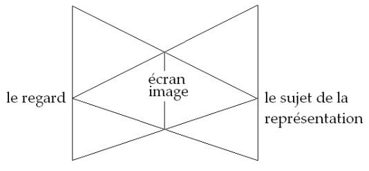
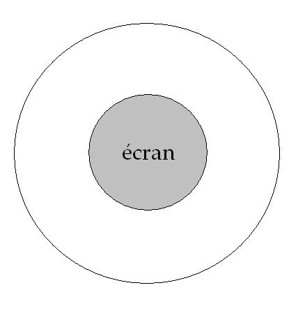
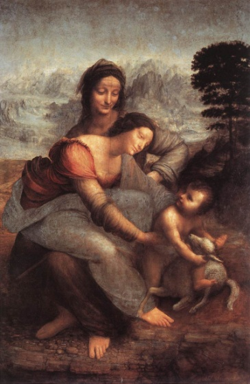
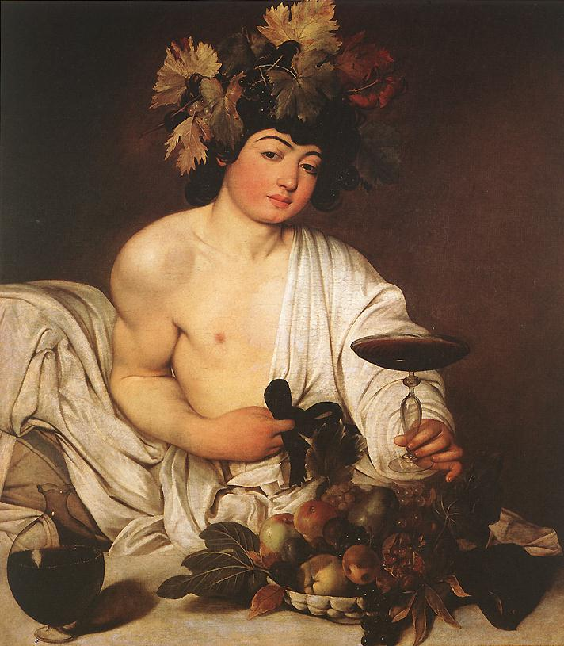

# Leçon 09 | 11 mars 1964

  <label><input type="checkbox" data-lacan-toggle="original" checked> 原文</label>
  <label><input type="checkbox" data-lacan-toggle="notes" checked> 注释</label>
  <label><input type="checkbox" data-lacan-toggle="commentary" checked> 个人解读评论</label>

<section class="parallel-paragraph" data-paragraph-ids="s11-09-0001">

s11-09-0001

[无对应译文]

原文 · s11-09-0001

J’ai donc aujourd’hui à *tenir ma promesse*, *tenir ma gageure*, celle où je me suis engagé en choisissant le terrain
où est le plus évanescent, cet *objet(a)* et sa fonction, en tant qu’il vient dans notre expérience symbo­liser
le manque central du désir, autrement dit ce que j’ai pointé toujours, d’une façon univoque, par l’algorithme –ϕ.

</section>

<section class="parallel-paragraph" data-paragraph-ids="s11-09-0002">

s11-09-0002

[无对应译文]

原文 · s11-09-0002

Je ne sais pas si vous voyez le tableau. J’y mets, comme d’habitude, quelques repères :

</section>

<section class="parallel-paragraph" data-paragraph-ids="s11-09-0003">

s11-09-0003

[无对应译文]

原文 · s11-09-0003

> *L’ objet(a) dans le champ du visible, c’est le regard*.

</section>

<section class="parallel-paragraph" data-paragraph-ids="s11-09-0004">

s11-09-0004

[无对应译文]

原文 · s11-09-0004

À la suite de quoi, sous une accolade, j’ai écrit :

</section>

<section class="parallel-paragraph" data-paragraph-ids="s11-09-0005">

s11-09-0005

[无对应译文]

原文 · s11-09-0005

*dans la nature*

</section>

<section class="parallel-paragraph" data-paragraph-ids="s11-09-0006">

s11-09-0006

[无对应译文]

原文 · s11-09-0006

*comme =* (–ϕ)

</section>

<section class="parallel-paragraph" data-paragraph-ids="s11-09-0007">

s11-09-0007

[无对应译文]

原文 · s11-09-0007

C’est dans la mesure où nous pouvons saisir dans la nature quelque chose qui déjà - le regard - l’*approprie* à cette fonction
dans la *relation sym­bolique* chez l’homme, qu’il peut en effet venir à la fonction que je dis.

</section>

<section class="parallel-paragraph" data-paragraph-ids="s11-09-0008">

s11-09-0008

[无对应译文]

原文 · s11-09-0008

En dessous, les deux systèmes triangulaires que j’ai introduits les deux fois précédentes :

</section>

<section class="parallel-paragraph" data-paragraph-ids="s11-09-0009">

s11-09-0009

[无对应译文]

原文 · s11-09-0009

</section>

<section class="parallel-paragraph" data-paragraph-ids="s11-09-0010">

s11-09-0010

[无对应译文]

原文 · s11-09-0010

À savoir :

</section>

<section class="parallel-paragraph" data-paragraph-ids="s11-09-0011">

s11-09-0011

[无对应译文]

原文 · s11-09-0011

- celui qui dans le champ géométral met à notre place le sujet de la représentation,

</section>

<section class="parallel-paragraph" data-paragraph-ids="s11-09-0012">

s11-09-0012

[无对应译文]

原文 · s11-09-0012

- et le second triangle, *celui qui me fait moi-même tableau* - sur la droite, c’est la ligne où se situe le sujet de la représentation - me fait tableau sous le regard.

</section>

<section class="parallel-paragraph" data-paragraph-ids="s11-09-0013">

s11-09-0013

[无对应译文]

原文 · s11-09-0013

*Ces deux triangles ici se superposent comme ils sont, en effet, dans le fonctionnement du registre scopique.* Il me faut donc bien insister, pour commencer ce que j’ai à dire aujour­d’hui, à marquer que dans ce *schéma*, il nous faut considérer que *le regard est au dehors*.

</section>

<section class="parallel-paragraph" data-paragraph-ids="s11-09-0014">

s11-09-0014

[无对应译文]

原文 · s11-09-0014

Rien n’est compréhensible de ce qui se passe dans ce registre, sinon à concevoir *que je suis regardé*, et que c’est là, la fonc­tion
qui se trouve au plus intime de l’institution du sujet dans le visible. Ce qui me détermine au plus intime dans le visible,
c’est *ce regard qui est au dehors*. *Dans le visible d’abord je suis tableau, je suis regardé*. C’est par *le regard* que j’entre dans la lumière,
éclairé que je suis, c’est du *regard* que j’en reçois l’effet.

</section>

<section class="parallel-paragraph" data-paragraph-ids="s11-09-0015">

s11-09-0015

[无对应译文]

原文 · s11-09-0015

D’où il ressort que *le regard est l’instrument par où la lumière s’incar­ne* et, si vous me permettez de me servir d’un mot comme je le fais sou­vent, en le décomposant, essentiellement je suis *photo*, *photo-graphié*. Dans ce registre, observez bien que ce dont il s’agit
ça n’est pas du problème de la *représentation* en présence de quoi je m’assure moi-même comme, en somme, en sachant long.

</section>

<section class="parallel-paragraph" data-paragraph-ids="s11-09-0016">

s11-09-0016

[无对应译文]

原文 · s11-09-0016

Je m’assure comme *conscien­ce qui sait que ce n’est <u>que</u> représentation*, qu’il y a au-delà *La Chose* - « *la chose en soi* » du *noumène*, par exemple -
mais que je n’y peux rien, que mes *catégories transcendantales,* comme dit KANT, n’en font qu’à leurs têtes, qu’elles me forcent
à prendre cette *chose* à leur guise, et que dans le fond c’est bien ainsi : heureusement que tout s’arrange comme ça !

</section>

<section class="parallel-paragraph" data-paragraph-ids="s11-09-0017">

s11-09-0017

[无对应译文]

原文 · s11-09-0017

Ce n’est pas dans cette autre *perspective*, dans cette *dialectique,* que les choses sont en balance. Ce n’est pas d’un rapport *de l’apparence*
de l’image - de quelque *surface - à ce qui est au-delà*, qu’il s’agit. Mais de quelque chose qui en moi instaure une *fracture*, une *bipartition*
de l’être, une *schize* qui, dès la nature, se montre comme ce à quoi l’être s’accom­mode, de façon observable, repérable dans une certaine direction.

</section>

<section class="parallel-paragraph" data-paragraph-ids="s11-09-0018">

s11-09-0018

[无对应译文]

原文 · s11-09-0018

Cette direction, c’est celle que je pointais la dernière fois en vous montrant, en vous indiquant dans l’échelle diversement modulée de ce qui est, dans son dernier terme, inscriptible sous le chef général de « *mimétisme* », en vous montrant que c’est ce qui entre
en jeu, mani­festement, sensationnellement quand il s’agit de *l’union sexuelle* ou quand il s’agit de *la lutte à mort.*

</section>

<section class="parallel-paragraph" data-paragraph-ids="s11-09-0019">

s11-09-0019

[无对应译文]

原文 · s11-09-0019

L’être s’y décompose, tout spécialement entre *son être* et *son semblant*, entre lui-même et ce tigre de papier qu’il offre, qu’il s’agisse
de la parade chez le mâle animal le plus souvent, ou qu’il s’agisse de ce gonflage grimaçant par où il procède dans le jeu de la lutte, sous la forme de l’*intimidation*. Il donne de lui ou il reçoit de l’autre, *quelque chose* qui est essentiel­lement : double, masque, enveloppe, peau détachée, et *détachée pour cou­vrir le bâti d’un bouclier*.

</section>

<section class="parallel-paragraph" data-paragraph-ids="s11-09-0020">

s11-09-0020

[无对应译文]

原文 · s11-09-0020

C’est par cette forme séparée de lui-même qu’il entre en jeu dans ces effets de vie et de mort. Et il est frappant qu’on puisse dire que ce soit en quelque sorte à l’aide de cette doublure, de l’autre ou de soi-même, que se réalise la conjoncture d’où procède
le renouvellement des êtres dans la reproduction.

</section>

<section class="parallel-paragraph" data-paragraph-ids="s11-09-0021">

s11-09-0021

[无对应译文]

原文 · s11-09-0021

*Le leurre y joue cette fonction essentielle*, et c’est bien ce qui nous sai­sit dans cette appréhension que nous avons au niveau même
de l’expé­rience clinique, de ce qu’il y a de prévalent par rapport à ce qu’on pour­rait imaginer de *l’attrait à l’autre pôle* comme conjoignant le masculin au féminin, à ce qu’il y a de prévalent dans ce qui se présente comme *traves­ti*. Le masculin, le féminin,
se rencontrent de la façon la plus aiguë, la plus brûlante, par l’intermédiaire *des masques* du masculin et du féminin.

</section>

<section class="parallel-paragraph" data-paragraph-ids="s11-09-0022">

s11-09-0022

[无对应译文]

原文 · s11-09-0022

Ici il me faut pointer quelle fonction pour le sujet - le sujet humain, le sujet du *désir* qui est « *l’essence de l’homme* » - il me faut pointer pour ce sujet, qui n’est point pris - comme l’animal - entièrement par cette capture, comment le sujet s’y repère ou peut avoir
le soupçon qui lui permet de s’y repérer, dans la mesure où il peut isoler cette fonction de l’écran. Cet écran, lui, sait en jouer.
Il sait jouer du *masque comme étant ce au-delà de quoi il y a le regard*. L’écran joue le rôle du lieu de la média­tion.

</section>

<section class="parallel-paragraph" data-paragraph-ids="s11-09-0023">

s11-09-0023

[无对应译文]

原文 · s11-09-0023

J’y ai fait allusion la dernière fois, à cette référence que donne Maurice MERLEAU-PONTY dans la *Phénoménologie de la perception,*
où l’on voit sur des exemples bien choisis, comment au niveau simplement perceptif cet écran est ce qui rétablit les choses
dans leur statut de *réel*.

</section>

<section class="parallel-paragraph" data-paragraph-ids="s11-09-0024">

s11-09-0024

[无对应译文]

原文 · s11-09-0024

J’ai fait allusion à ces exemples sur lesquels il insiste avec beaucoup de pertinence, qui relevaient des expériences de GELB
et de GOLDSTEIN, qui nous montrent comment…

</section>

<section class="parallel-paragraph" data-paragraph-ids="s11-09-0025">

s11-09-0025

[无对应译文]

原文 · s11-09-0025

> si à être isolé - ce qui est l’effet d’un éclairage qui nous domine - si ce pinceau de lumière qui conduit
>
> notre regard, nous captive au point de ne nous apparaître que comme ce cône laiteux qui nous empêche
>
> en somme de voir ce qu’il éclaire
> …la seule apparition dans ce champ d’un petit écran qui tranche sur ce qui est éclairé mais n’est pas vu, fait entrer
> \- si l’on peut dire - dans l’ombre cette lumière, pour nous faire apparaître l’objet qu’elle cachait. Phénomène au niveau perceptif
> de quelque chose qui est à prendre dans une fonction plus essentielle, c’est que dans le rapport de désir lui-même,
> la réalité n’apparaît que marginale :

</section>

<section class="parallel-paragraph" data-paragraph-ids="s11-09-0026">

s11-09-0026

[无对应译文]

原文 · s11-09-0026

</section>

<section class="parallel-paragraph" data-paragraph-ids="s11-09-0027">

s11-09-0027

[无对应译文]

原文 · s11-09-0027

Et c’est bien là un des traits que dans la réaction picturale, on semble n’avoir guère vu, et justement ce qui insiste sur ce qui,
dans la composition du tableau, est justement com­position, lignes de partage de la surface.

</section>

<section class="parallel-paragraph" data-paragraph-ids="s11-09-0028">

s11-09-0028

[无对应译文]

原文 · s11-09-0028

Je m’étonne qu’en un livre[^52]…

</section>

<section class="parallel-paragraph" data-paragraph-ids="s11-09-0029">

s11-09-0029

[无对应译文]

原文 · s11-09-0029

> d’ailleurs remarquable comme tellement d’autres : c’est un jeu si captivant que de trouver les bâtis
>
> de ces surfaces créées par le peintre, qu’au total on croit intituler - comme en ce livre - *Charpentes,*
>
> ces images qu’on se complaît à faire traverser par des lignes, donnant des partages diversement décomposés,
>
> des lignes de fuite, des lignes de force, dirait-on, où l’image trouve son statut
> …*qu’il soit éludé que leur effet principal* - à ces lignes - c’est quelque chose qui ne suggère guère cette notion de *charpentes*.

</section>

<section class="parallel-paragraph" data-paragraph-ids="s11-09-0030">

s11-09-0030

[无对应译文]

原文 · s11-09-0030

Mais plutôt, comme par une sorte d’ironie, ce qui est au dos de ce livre, à savoir comme plus exem­plaire qu’un autre :
un tableau de [ROUAULT](http://fr.wikipedia.org/wiki/Georges_Rouault)[^53] où l’on retrouve où l’on désigne *un tracé circulaire qui manifestement fait voir ce dont il s’agit* :
ce dont toujours dans un tableau on peut noter - tout au contraire de ce qu’il en est dans la perception - on peut noter l’absence.

</section>

<section class="parallel-paragraph" data-paragraph-ids="s11-09-0031">

s11-09-0031

[无对应译文]

原文 · s11-09-0031

C’est que le champ central - *où le pouvoir séparatif s’exerce au maximum dans la vision -* ne peut en être qu’*absent* et remplacé par *un trou*, *reflet* en somme de la pupille, derrière laquelle est *le regard*. Dans ce qu’il s’agit de construire - et pour autant que le tableau entre
dans le rapport au désir - la place d’*un écran central* est toujours marquée, qui est justement ce par quoi, devant le tableau,
je suis élidé comme sujet d’un plan géométral.

</section>

<section class="parallel-paragraph" data-paragraph-ids="s11-09-0032">

s11-09-0032

[无对应译文]

原文 · s11-09-0032

C’est par là que le tableau ne joue pas dans ce champ de la représen­tation, *de cet ailleurs* - un « *ailleurs* » qu’il s’agit de déterminer –
que résident sa fin et son effet. En somme tout se joue entre deux termes :

</section>

<section class="parallel-paragraph" data-paragraph-ids="s11-09-0033">

s11-09-0033

[无对应译文]

原文 · s11-09-0033

- ce qui présentifie que du côté des choses il y a le regard,

</section>

<section class="parallel-paragraph" data-paragraph-ids="s11-09-0034">

s11-09-0034

[无对应译文]

原文 · s11-09-0034

- que les choses me regardent, joue de façon antinomique avec le fait que je peux les voir.

</section>

<section class="parallel-paragraph" data-paragraph-ids="s11-09-0035">

s11-09-0035

[无对应译文]

原文 · s11-09-0035

Et c’est dans ce sens qu’il faut entendre cette parole martelée dans l’*Évangile* : « *Ils ont des yeux pour ne pas voir.* » *Pour ne pas voir* quoi ?
Justement ceci : que les choses me regardent.

</section>

<section class="parallel-paragraph" data-paragraph-ids="s11-09-0036">

s11-09-0036

[无对应译文]

原文 · s11-09-0036

Et c’est là pourquoi j’ai fait entrer dans notre champ d’exploration la peinture, par cette petite porte sans doute que nous donnait
la remarque de Roger CAILLOIS…

</section>

<section class="parallel-paragraph" data-paragraph-ids="s11-09-0037">

s11-09-0037

[无对应译文]

原文 · s11-09-0037

> dont tout le monde s’est aperçu la dernière fois que j’avais fait un lapsus en le nommant « *René* », Dieu sait pourquoi !
> …par cette petite porte, il nous entre en remarquant que sans doute, ce *mimétisme* est à chercher comme équivalent de la fonction qui, chez l’homme, s’exerce par cette activité singulière de la peinture. Ce n’est point pour faire ici cette psychanalyse du peintre, toujours si glissante, si scabreuse, et qui, jusqu’à un certain point, provoque tou­jours chez l’auditeur une réaction de pudeur.

</section>

<section class="parallel-paragraph" data-paragraph-ids="s11-09-0038">

s11-09-0038

[无对应译文]

原文 · s11-09-0038

Quelqu’un qui m’est proche et dont les appréciations pour moi comp­tent beaucoup, m’a dit la dernière fois avoir été quelque peu gêné que j’abordasse quelque chose qui ressemblât à *la critique de la peinture*. Bien sûr, *c’est là danger*, mais qu’il n’y ait pas de confusion.
Aucune formule, bien sûr, ne nous permet de rassembler, dans toutes les modula­tions qu’ont imposées à la peinture les variations au cours des temps de la structure subjectivante dans l’histoire, des visées, des trucs, des ruses, peut-on dire, infiniment diverses.

</section>

<section class="parallel-paragraph" data-paragraph-ids="s11-09-0039">

s11-09-0039

[无对应译文]

原文 · s11-09-0039

Et vous avez bien vu d’ailleurs, qu’à poser la formule que je pourrais aujourd’hui reprendre et rassembler en disant qu’il y a
dans la peinture du « *dompte-regard* », que par la peinture celui qui regarde est toujours amené par quelque côté, à *poser bas son regard*, dût-on amener aussitôt ce correctif : que c’est tout de même dans l’ap­pel tout à fait direct à ce regard que se situe l’expressionnisme.

</section>

<section class="parallel-paragraph" data-paragraph-ids="s11-09-0040">

s11-09-0040

[无对应译文]

原文 · s11-09-0040

J’incarne - pour ceux qui y hésiteraient - ce que je veux dire : la peinture d’un MÜNCH par exemple, d’un James ENSOR,
ou d’un KUBIN, ou de cette peinture que curieusement on pourrait situer de façon *géographique* comme cernant ce qui de nos jours,
se concentre de la peinture à Paris, l’assiégeant.

</section>

<section class="parallel-paragraph" data-paragraph-ids="s11-09-0041">

s11-09-0041

[无对应译文]

原文 · s11-09-0041

Pour quel jour verrons-nous forcées *les limites de ce siège* ? C’est bien ce qui est en jeu pour l’instant. Si j’en crois le peintre
André MASSON avec qui j’en parlais récemment, la question *la plus pressante -* à indiquer des références comme celle-là -
ce n’est point d’entrer dans *le jeu historique mouvant* de la critique qui essaie de saisir quelle est, à un moment donné,
chez tel auteur ou dans tel temps, la fonction de la peinture.

</section>

<section class="parallel-paragraph" data-paragraph-ids="s11-09-0042">

s11-09-0042

[无对应译文]

原文 · s11-09-0042

C’est à quelque chose qui se situe plus radicalement au principe de la fonction de ce bel art que j’essaie de me placer,
et remarquant d’abord que c’est par la peinture que Maurice MERLEAU-PONTY plus spécialement a été amené…
si je puis dire, connaissant ce rapport qui depuis toujours a été fait par la pensée entre l’œil et l’esprit
…à renverser ce rapport : à voir *que la fonction du peintre est toute autre chose* que cette organisation du champ de notre représentation, où le philosophe nous tenait dans notre statut de sujet, que ce qui est déterminant, essentiel - c’est ce qu’il a admi­rablement repéré au niveau du peintre peut-être le plus interrogateur : de CÉZANNE, en partant de ce qu’il appelle, avec CÉZANNE lui-même,
« *ces petits bleus, ces petits bruns, ces petits blancs* », ces touches qui pleuvent du pinceau du peintre.

</section>

<section class="parallel-paragraph" data-paragraph-ids="s11-09-0043">

s11-09-0043

[无对应译文]

原文 · s11-09-0043

Qu’est-ce que c’est que ça ? Qu’est-ce que ça détermine ? Comment cela détermine-t-il quelque chose ?

</section>

<section class="parallel-paragraph" data-paragraph-ids="s11-09-0044">

s11-09-0044

[无对应译文]

原文 · s11-09-0044

C’est déjà donner forme et incarna­tion à ce champ dans lequel le psychanalyste s’est avancé à la suite de FREUD, avec ce qui en FREUD est *hardiesse folle*, ce qui, pour ceux qui le suivent, devient vite *imprudence*. FREUD a toujours marqué avec un infini respect qu’il entendait ne pas trancher de ce qui, dans la création artistique, faisait sa véritable valeur, aussi bien concernant les peintres
que les poètes, qu’il y a une ligne à laquelle s’arrête son appréciation.

</section>

<section class="parallel-paragraph" data-paragraph-ids="s11-09-0045">

s11-09-0045

[无对应译文]

原文 · s11-09-0045

Il ne peut dire, il ne sait pas ce qui là - *pour tous, pour tous ceux qui regardent, qui entendent -* fait la valeur de la création artistique. Néanmoins, quand il s’agit de Léonard[^54], il nous *conduit* sur quelque chose dont, pour aller vite, le moins qu’on puisse dire,
c’est qu’il recherche, c’est qu’il cherche à trouver la fonction que, dans cette créa­tion, a joué *le fantasme originel* de Léonard :
ce rapport avec ces deux mères qu’il voit figurer dans le tableau du Louvre[^55], dans son esquisse de Londres, par les corps,
ce corps double, branché au niveau de la taille des deux femmes qui semble s’épanouir d’un mélange de jambes à la base.

</section>

<section class="parallel-paragraph" data-paragraph-ids="s11-09-0046">

s11-09-0046

[无对应译文]

原文 · s11-09-0046

</section>

<section class="parallel-paragraph" data-paragraph-ids="s11-09-0047">

s11-09-0047

[无对应译文]

原文 · s11-09-0047

Ou faut-il donc voir le principe de la création artistique dans ceci qu’elle extrairait ce quelque chose qui tient lieu - rappelez-vous comment je traduis *Vorstellungsrepräsentanz -* qui « *tient lieu de la représentation* » ?
Est-ce là ce à quoi je vous mène *en distinguant le tableau de ce qui est la représentation* ? Assurément pas, sauf dans de très rares œuvres, *sauf dans une peintu­re qui quelquefois en effet émerge, apparaît, qui est peinture onirique* mais combien rare, et d’ailleurs, à peine situable
dans la fonction de la peinture. Peut-être est-ce là la limite où nous aurions à désigner ce qu’on appelle art psychopathologique.

</section>

<section class="parallel-paragraph" data-paragraph-ids="s11-09-0048">

s11-09-0048

[无对应译文]

原文 · s11-09-0048

C’est autre chose, c’est ailleurs, c’est de façon bien différemment structurée qu’il nous faut saisir ce qui est créa­tion du peintre.
Et peut-être justement dans la mesure où nous restaurerons dans l’analyse le point de vue de la structure, peut-être le temps
est-il venu où nous pouvons avec profit - je veux dire, dans ce dont il s’agit pour nous de poser les termes de la structure,
dans la relation libidinale - il est peut-être temps d’interroger - parce qu’avec nos nouveaux algorithmes nous pouvons en articuler mieux la réponse - ce qui est en jeu.

</section>

<section class="parallel-paragraph" data-paragraph-ids="s11-09-0049">

s11-09-0049

[无对应译文]

原文 · s11-09-0049

L’interroger dans la création artistique comme FREUD la désigne, c’est-à-dire comme « *sublimation* », et dans la valeur qu’elle prend *dans le champ social*, que FREUD désigne seulement de cette façon vague et précise à la fois qui désigne seulement son succès
dans le fait qu’une création du désir, pure au niveau du peintre, prend *valeur commerciale* d’abord, ce qui en est une gratification qu’on peut tout de même qualifier de secondaire. Mais si elle prend cette valeur commerciale, c’est aussi que dans son effet
\- sur ce qui dans la société constitue l’en­semble de ce qui tombe sous le coup de l’œuvre - dans son effet réside quelque chose
pour la société de profitable, et c’est ici que vient *la notion de valeur*.

</section>

<section class="parallel-paragraph" data-paragraph-ids="s11-09-0050">

s11-09-0050

[无对应译文]

原文 · s11-09-0050

Ici encore c’est dans le vague que nous restons, dire *que ça les apai­se*, que ça leur montre l’exemple bien *réconfortant* de ceci : qu’il peut y en avoir quelques-uns qui vivent de *l’exploitation de leur désir*. Pour que cela les satisfasse tellement, il faut bien aussi qu’il y ait
cette autre inci­dence : que leur désir à eux, qui les contemplent, y trouve quelque apai­sement et, comme on dit, cela leur élève l’âme, c’est-à-dire que cela les incite, eux, au *renoncement*.

</section>

<section class="parallel-paragraph" data-paragraph-ids="s11-09-0051">

s11-09-0051

[无对应译文]

原文 · s11-09-0051

Est-ce que nous ne devons pas tenter d’aller *plus loin* dans ce sens, et d’ores et déjà ne voyez-vous pas que quelque chose
s’en indique, dans cette fonction que j’ai appelée du « *dompte-regard* » ? Le « *dompte-regard* » - je l’ai dit la dernière fois -
a une autre face, c’est celle du *trompe-l’œil*. En quoi j’ai l’air d’aller en sens contraire de tout ce qui, par la tradition et la critique,
nous est indiqué comme étant très distinct de *la fonction de la peinture*.

</section>

<section class="parallel-paragraph" data-paragraph-ids="s11-09-0052">

s11-09-0052

[无对应译文]

原文 · s11-09-0052

C’est pourtant là-dessus que j’ai terminé la dernière fois, marquant, dans l’opposition des deux œuvres, celle de ZEUXIS
et celle de PARRHASIOS, l’ambiguïté des deux niveaux, celui sur lequel j’ai insisté quand j’ai repris aujourd’hui :
*la fonction* naturelle *du leurre*. Si le tableau de ZEUXIS se fit prendre ou qui se fit prendre par des oiseaux pour des raisins
qu’ils pussent becqueter, puisque paraît-il - peu importe la vérité ou la légende de la chose - ils se sont précipités sur la surface
où ZEUXIS avait indiqué ses touches, observons que rien n’in­dique que le succès d’une pareille entreprise implique ces raisins admirablement reproduits tels que ceux que nous pouvons voir dans la corbeille que tient le *Bacchus* du CARAVAGE.

</section>

<section class="parallel-paragraph" data-paragraph-ids="s11-09-0053">

s11-09-0053

[无对应译文]

原文 · s11-09-0053

</section>

<section class="parallel-paragraph" data-paragraph-ids="s11-09-0054">

s11-09-0054

[无对应译文]

原文 · s11-09-0054

Si ces raisins avaient été ainsi, il est peu probable que les oiseaux s’y soient trompés, car pourquoi les oiseaux verraient-ils des raisins dans ce style de tour de force ? Il doit y avoir quelque chose *de* *plus*, réduit à *un signe*, dans ce qui pour des oiseaux, peut constituer
la « proie » raisin.

</section>

<section class="parallel-paragraph" data-paragraph-ids="s11-09-0055">

s11-09-0055

[无对应译文]

原文 · s11-09-0055

Mais il est clair, par l’exemple opposé de PARRHASIOS, qu’à vouloir tromper un homme, ce qu’on lui présente, c’est la peinture d’un voile, de quelque chose au-delà de quoi il demande à voir, et que c’est là que cet apologue prend sa valeur, de nous montrer
ce pourquoi PLATON proteste contre « *l’illusion de la peinture* ». Malgré l’apparence, ce n’est pas de ce que la peinture donne
un équi­valent illusoire de l’objet qu’il s’agit, mais si *apparemment* PLATON ainsi peut s’exprimer, c’est justement que le *trompe-l’œil*
de la peinture se donne pour *autre chose* que ce qu’il n’est.

</section>

<section class="parallel-paragraph" data-paragraph-ids="s11-09-0056">

s11-09-0056

[无对应译文]

原文 · s11-09-0056

Ce qui nous séduit dans le *trompe-l’œil*, ce qui nous satisfait, ce qui fait que dans ce moment où par un simple déplacement de notre regard nous pouvons nous apercevoir qu’il ne bouge pas avec lui, qu’il n’est qu’un *trompe-l’œil*, c’est à ce moment qu’il nous captive, qu’il nous met dans cette sorte de *joie*, de *jubilation* que donne le *trompe-l’œil*.

</section>

<section class="parallel-paragraph" data-paragraph-ids="s11-09-0057">

s11-09-0057

[无对应译文]

原文 · s11-09-0057

Car, à ce moment-là apparaissant :

</section>

<section class="parallel-paragraph" data-paragraph-ids="s11-09-0058">

s11-09-0058

[无对应译文]

原文 · s11-09-0058

- *c’est autre chose que ce qu’il est qu’il nous donne*, il se donne justement comme étant cette *autre chose*,

</section>

<section class="parallel-paragraph" data-paragraph-ids="s11-09-0059">

s11-09-0059

[无对应译文]

原文 · s11-09-0059

- *c’est de ce que le tableau rivalise avec ce que* PLATON *nous désigne au-delà de l’apparence comme étant l’Idée*,

</section>

<section class="parallel-paragraph" data-paragraph-ids="s11-09-0060">

s11-09-0060

[无对应译文]

原文 · s11-09-0060

- c’est que le tableau vienne lui faire concurrence, vienne à la place de ce que la théorie du modèle éternel nous désigne comme étant au-delà de l’appa­rence,

</section>

<section class="parallel-paragraph" data-paragraph-ids="s11-09-0061">

s11-09-0061

[无对应译文]

原文 · s11-09-0061

- c’est cette apparence qui nous dit qu’elle est ce qui nous donne l’apparence contre quoi PLATON s’insurge comme contre une activité rivale de la sienne.

</section>

<section class="parallel-paragraph" data-paragraph-ids="s11-09-0062">

s11-09-0062

[无对应译文]

原文 · s11-09-0062

Cette *autre chose*, c’est justement le *(a)*. Et c’est bien là autour de quoi tourne un combat dont le trompe-l’œil est l’âme.

</section>

<section class="parallel-paragraph" data-paragraph-ids="s11-09-0063">

s11-09-0063

[无对应译文]

原文 · s11-09-0063

Il vaut la peine ici, de tenter de rassembler la position du peintre dans l’histoire, de la rassembler concrètement, pour s’apercevoir qu’il est la source, le point de jaillissement, de quelque chose qui peut passer dans le *réel*, et qu’après tout, en tout temps,
on prend « *à ferme* », si je puis dire. Il ne suffit pas de marquer l’opposition du temps où il dépendait de nobles mécènes.
La situation n’est pas fondamentalement changée avec le marchand de tableau, c’est aussi un mécène, et du même acabit.

</section>

<section class="parallel-paragraph" data-paragraph-ids="s11-09-0064">

s11-09-0064

[无对应译文]

原文 · s11-09-0064

Toujours quelque chose le prend « *à ferme* », *Société fermière du peintre*. Avant le noble mécène, c’est aussi bien l’institution religieuse qui lui donne à quoi faire avec l’image sainte, l’icône, il s’agit toujours de *l’ob­jet(a)*.

</section>

<section class="parallel-paragraph" data-paragraph-ids="s11-09-0065">

s11-09-0065

[无对应译文]

原文 · s11-09-0065

Et plutôt que de le réduire - ce qui, à un certain niveau d’explication et d’accès peut vous paraître mythique - à un *(a)* avec lequel
\- c’est vrai au dernier terme - c’est le peintre en tant que créateur qui dialogue, il est bien plus instructif de voir comment
dans cette répercussion sociale, ce *(a)* fonctionne.

</section>

<section class="parallel-paragraph" data-paragraph-ids="s11-09-0066">

s11-09-0066

[无对应译文]

原文 · s11-09-0066

Bien sûr que dans l’icône, dans le CHRIST triomphant de la voûte de DAPHNIS, ou dans ces admirables mosaïques byzantines,
il est manifeste - nous pourrions nous en tenir là - que leur effet est de nous tenir sous leur regard. Mais ça ne serait pas là vraiment saisir le ressort de ce qui fait que le peintre est engagé à faire cette icône et de ce à quoi elle sert en nous étant présentée.
Il y a du regard là-dedans bien sûr, mais il vient de plus loin.

</section>

<section class="parallel-paragraph" data-paragraph-ids="s11-09-0067">

s11-09-0067

[无对应译文]

原文 · s11-09-0067

Ce qui fait la valeur de cette icône, c’est que le Dieu qu’elle représen­te, lui aussi la regarde, c’est qu’elle est censée plaire à Dieu. L’artiste, à ce niveau, opère sur le plan *sacrificiel*, lequel consiste à jouer sur ce registre : qu’il est des choses qui peuvent éveiller
le désir de Dieu, ici au niveau de l’image.

</section>

<section class="parallel-paragraph" data-paragraph-ids="s11-09-0068">

s11-09-0068

[无对应译文]

原文 · s11-09-0068

*Dieu est créateur, il crée à certaines images, ce que nous indique la Genèse* *avec le* בְּצַלְמֵנוּ כִּדְמוּתֵנוּ \[*Zelem Elohim : ressemblance de Dieu*\][^56].
Et c’est bien ce qu’il y a de frappant dans la pensée iconoclaste, c’est qu’il y ait sauvé ceci : qu’il y a un Dieu qui n’aime pas ça.
Mais c’est bien le seul ! Et je ne veux pas aujourd’hui m’avancer plus loin dans ce registre qui nous porterait au cœur de ce qui est un des éléments les plus essentiels du ressort des *Noms-du-Père*, c’est qu’un certain pacte peut être établi au-delà de toute image.

</section>

<section class="parallel-paragraph" data-paragraph-ids="s11-09-0069">

s11-09-0069

[无对应译文]

原文 · s11-09-0069

Mais là où nous sommes, l’image est le truchement. Si YAHVÉ interdit aux Juifs de se faire des idoles, c’est parce que ces idoles plaisent aux autres Dieux. Dans un certain registre, ce n’est pas Dieu qui n’est pas anthropomorphe, c’est l’homme qui est prié de ne pas l’être. Mais laissons…

</section>

<section class="parallel-paragraph" data-paragraph-ids="s11-09-0070">

s11-09-0070

[无对应译文]

原文 · s11-09-0070

Et passons à l’étape suivante, à l’étape que j’appellerai, si vous voulez, communale.

</section>

<section class="parallel-paragraph" data-paragraph-ids="s11-09-0071">

s11-09-0071

[无对应译文]

原文 · s11-09-0071

Portons-nous dans *la grande salle du Palais des Doges* où sont peintes toutes sortes de batailles, de [Lépante](http://fr.wikipedia.org/wiki/Bataille_de_L%C3%A9pante) ou d’ailleurs.
C’est ici que nous voyons bien *la fonction sociale* *telle qu’elle se des­sinait d’ailleurs déjà* *au niveau religieux*. *Ceux qui viennent là*,
c’est ceux que RETZ appelle « *les peuples* ». Qu’est-ce que « *les peuples* » voient dans ces vastes compositions ?

</section>

<section class="parallel-paragraph" data-paragraph-ids="s11-09-0072">

s11-09-0072

[无对应译文]

原文 · s11-09-0072

Ils voient essentiellement le regard des gens qui, quand ils ne sont pas là - eux les peuples - délibèrent dans cette salle.
Derrière le tableau, c’est leur regard qu’il y a là. Vous le voyez, ce que nous trouvons *à toutes les* *étapes*, il y a toujours tout plein
de regards là derrière, et n’est introduit par l’époque qu’André MALRAUX distingue comme « *moderne* », celle où vient à dominer
ce qu’il appelle « *le monstre incomparable* », à savoir le regard du peintre qui prétend s’imposer comme étant à lui tout seul le regard.
Il y a toujours eu du regard là derrière. Et d’où vient-il ? C’est là que se pose le point le plus subtil, *le point* où il faut saisir
quelle est la source de ce regard.

</section>

<section class="parallel-paragraph" data-paragraph-ids="s11-09-0073">

s11-09-0073

[无对应译文]

原文 · s11-09-0073

Et nous revenons à « *nos petits bleus, à nos petits blancs, à nos petits bruns* » de CÉZANNE, à ce que Maurice MERLEAU-PONTY
met si joliment en exemple quelque part à un détour de son livre « *Signes »,* c’est à savoir ce qui apparaît d’étrange dans un film
au ralenti où l’on saisit MATISSE en train de peindre. L’important est que MATISSE lui-même en ait été boule­versé.
Maurice MERLEAU-PONTY souligne le paradoxe de ce geste qui - agrandi par la distension du temps - permet en quelque sorte d’*imaginer* - car ce n’est là que *mirage -* le plus exact *choix*, la *délibération* la plus parfaite, dans chacune de ces touches.

</section>

<section class="parallel-paragraph" data-paragraph-ids="s11-09-0074">

s11-09-0074

[无对应译文]

原文 · s11-09-0074

Sa remarque, ici, nous porte, si je puis dire, au seuil de ce dont il s’agit. En disant qu’assurément, il n’est pas question qu’il s’agisse là d’autre chose que d’un *mirage*, qu’au rythme où pleut du pinceau du peintre, toutes ces petites touches qui arriveront au miracle
du tableau, c’est de quelque chose d’autre \[que du choix\] qu’il s’agit.
Est-ce que nous ne pouvons pas nous-mêmes essayer de le formuler ?
Est-ce qu’à ce moment-là, les choses, pour le peintre, ne sont pas à remettre au plus près de ce que j’ai appelé *« la pluie du pinceau » ?*
*Est-ce que si un oiseau peignait, ce ne serait pas en laissant choir ses plumes, un serpent ses écailles, un arbre à s’écheniller, à faire pleuvoir ses feuilles ?*

</section>

<section class="parallel-paragraph" data-paragraph-ids="s11-09-0075">

s11-09-0075

[无对应译文]

原文 · s11-09-0075

Ici, ce qui s’accumule, c’est le premier acte de cette *déposition du regard*, acte sans doute souverain car il passe dans quelque chose
qui se matéria­lise et qui, de cette souveraineté, rendra caduc, exclu, inopérant, tout ce qui, d’ailleurs, se présentera devant ce résultat de regard. Et aussi bien, c’est ici que nous devons trouver ce qui est essentiel : c’est, ne l’oublions pas, que *la touche, la touche du peintre* est quelque chose où se termine *un mouvement*.

</section>

<section class="parallel-paragraph" data-paragraph-ids="s11-09-0076">

s11-09-0076

[无对应译文]

原文 · s11-09-0076

- C’est que nous nous trouvons là devant *quelque chose* qui donne son sens, *un sens nouveau et différent* au terme de *régression*.

</section>

<section class="parallel-paragraph" data-paragraph-ids="s11-09-0077">

s11-09-0077

[无对应译文]

原文 · s11-09-0077

- C’est que nous nous trouvons là devant *l’élément moteur* au sens de réponse, *en tant qu’il engendre en arrière son propre stimulus*.

</section>

<section class="parallel-paragraph" data-paragraph-ids="s11-09-0078">

s11-09-0078

[无对应译文]

原文 · s11-09-0078

- C’est là ce par quoi la temporalité originale - par où se situe comme dis­tincte cette relation à l’Autre, au désir comme étant institué dans le sujet en relation à l’Autre - la temporalité originale de la dimension *scopique* est celle de l’instant terminal.

</section>

<section class="parallel-paragraph" data-paragraph-ids="s11-09-0079">

s11-09-0079

[无对应译文]

原文 · s11-09-0079

- Ce qui, dans la dialectique identificatoire du signifiant et du parlé se projettera en avant comme hâte et qui est ici, au contraire - la fin de ce qui au départ de toute nouvelle intelligen­ce, s’appellera l’instant de voir.

</section>

<section class="parallel-paragraph" data-paragraph-ids="s11-09-0080">

s11-09-0080

[无对应译文]

原文 · s11-09-0080

- Ce moment terminal est ce qui nous permet de distinguer d’un acte, *un geste*.

</section>

<section class="parallel-paragraph" data-paragraph-ids="s11-09-0081">

s11-09-0081

[无对应译文]

原文 · s11-09-0081

*C’est par le geste que vient sur la toile s’appliquer la touche*. Il est si vrai que *ce geste* y est toujours présent que, d’abord, il n’est pas douteux :

</section>

<section class="parallel-paragraph" data-paragraph-ids="s11-09-0082">

s11-09-0082

[无对应译文]

原文 · s11-09-0082

- que le tableau n’en soit pour nous éprouvé, ressenti comme ce terme de *l’impression* ou « *l’impressionnisme* »,

</section>

<section class="parallel-paragraph" data-paragraph-ids="s11-09-0083">

s11-09-0083

[无对应译文]

原文 · s11-09-0083

- que le tableau soit plus *affine à toute représentation de mouvement* qui ne soit d’abord le geste, qu’à toute autre,

</section>

<section class="parallel-paragraph" data-paragraph-ids="s11-09-0084">

s11-09-0084

[无对应译文]

原文 · s11-09-0084

- que même une action représentée dans un tableau en son cours : l’action nous y apparaîtra comme dans une scène de bataille très forcément comme théâtrale, comme faite pour le geste,

</section>

<section class="parallel-paragraph" data-paragraph-ids="s11-09-0085">

s11-09-0085

[无对应译文]

原文 · s11-09-0085

- et qu’aussi bien, c’est à cette insertion dans le geste que le tableau - quel qu’il soit, figuratif ou pas - il n’y a pour nous jamais de doute : on ne peut pas le mettre à l’envers.

</section>

<section class="parallel-paragraph" data-paragraph-ids="s11-09-0086">

s11-09-0086

[无对应译文]

原文 · s11-09-0086

Si par hasard c’est ce que l’on appelle une diapositive, retournez-la, vous vous apercevrez incontestablement tout de suite, dans quelque tableau que ce soit, si on vous le montre avec la gauche à la place de la droite. Le sens du geste de la main suffisamment désigne cette symétrie latérale. Ici ce que nous voyons donc, c’est ce quelque chose par quoi le regard opère dans une certaine descente, une descente qui sans doute est de désir, mais comment le désigner ?

</section>

<section class="parallel-paragraph" data-paragraph-ids="s11-09-0087">

s11-09-0087

[无对应译文]

原文 · s11-09-0087

Comment ne pas voir que le sujet n’y est pas tout à fait, qu’il est téléguidé ? Pour le désigner je dirai…

</section>

<section class="parallel-paragraph" data-paragraph-ids="s11-09-0088">

s11-09-0088

[无对应译文]

原文 · s11-09-0088

> modifiant la formule qui est celle que je donne du désir en tant qu’inconscient : « *le désir de l’homme est désir <u>de</u> l’Autre* »
> …ici c’est une sorte de « *désir <u>à</u> l’Autre* » qu’il s’agit, au bout duquel est le « *donné-à-voir* ».

</section>

<section class="parallel-paragraph" data-paragraph-ids="s11-09-0089">

s11-09-0089

[无对应译文]

原文 · s11-09-0089

En quoi ce « *donné-à-voir* » apaise-t-il quelque chose, sinon qu’en celui qui regarde, il est « *un appétit de l’œil* » ?
Cet « *appétit de l’œil* » qu’il s’agit de nourrir, ce plan beaucoup moins élevé qu’on ne le suppose, est la valeur de charme de la peinture, il est à chercher dans ce qu’il en est de la natu­re, de la vraie fonction de *l’organe de l’œil*. Cet *œil* plein de voracité est le « *mauvais œil* ».
Il est frappant qu’en contraste à l’universalité de cette fonction du « *mauvais œil* », il n’y ait trace nulle part d’un « *bon œil* »,
d’un œil qui bénit.

</section>

<section class="parallel-paragraph" data-paragraph-ids="s11-09-0090">

s11-09-0090

[无对应译文]

原文 · s11-09-0090

Qu’est-ce à dire, sinon que l’œil porte avec lui cette fonction mortelle d’être, en lui-même, doué - permettez-moi ici de jouer
sur plu­sieurs registres - d’un pouvoir séparatif. Mais ce « séparatif » va bien plus loin que la vision distincte.
Ces pouvoirs qui lui sont attribués, qui est de faire tarir le lait de l’animal sur quoi il porte, croyance aussi répan­due de nos jours qu’en tout autre et dans les pays les plus civilisés, de porter avec lui la maladie, *la malencontre* \[δυστυχία \[dustuchia\], « *malencontre* » du *réel*\],
ce pouvoir, où pouvons-nous le mieux l’imaginer ?

</section>

<section class="parallel-paragraph" data-paragraph-ids="s11-09-0091">

s11-09-0091

[无对应译文]

原文 · s11-09-0091

*Invidia* vient de *videre*, et *l’invidia la plus exemplaire*, pour nous ana­lystes, est celle que j’ai depuis longtemps relevée dans AUGUSTIN pour lui donner tout son sort : à savoir celle du petit enfant regardant - dit AUGUSTIN - son frère pendu au sein de sa mère
et qui le regarde « *amare conspectu* », d’un regard amer, qui le décompose et fait sur lui-même l’ef­fet d’un poison.

</section>

<section class="parallel-paragraph" data-paragraph-ids="s11-09-0092">

s11-09-0092

[无对应译文]

原文 · s11-09-0092

Pour comprendre ce qu’est l’*invidia* dans sa fonction de *regard*, il ne faut pas la confondre avec la jalousie : ce que le petit enfant,
ou tout aussi bien ce que quiconque envie, ce n’est pas du tout forcément ce dont - comme on s’exprime impropre­ment - il pourrait avoir envie. L’enfant après tout, dont parle AUGUSTIN, qui regarde son petit frère, *qui nous dit qu’il a encore besoin d’être à la mamelle* ?
Et chacun sait que *l’envie* est communément provoquée par la possession de biens qui ne seraient - à celui qui envie - à proprement par­ler d’aucun usage, dont il ne soupçonne même pas la véritable nature.

</section>

<section class="parallel-paragraph" data-paragraph-ids="s11-09-0093">

s11-09-0093

[无对应译文]

原文 · s11-09-0093

Telle est la véritable envie, celle qui fait pâlir l’envieux - devant quoi ? - devant *l’image d’une complétude* qui se referme et de ceci que
le *(a)*, le *(a)* par rapport à quoi il se suspend comme séparé, peut être pour un autre la possession Zont il se satisfait, la *Befriedigung.*
C’est à ce registre de l’œil comme désespéré par le regard, qu’il nous faut aller pour saisir le ressort apaisant et charmeur, la fonction du tableau, le côté civilisateur de ce qui, chez le peintre, est produit par une action spécifique. Et ce rapport foncier du *(a)* au désir me servira comme exemplaire dans ce à quoi nous nous introduirons maintenant concer­nant le transfert.

</section>

<section class="parallel-paragraph" data-paragraph-ids="s11-09-0094">

s11-09-0094

[无对应译文]

原文 · s11-09-0094

Je vais donner cinq minutes pour qu’on me pose des questions.

</section>

<section class="parallel-paragraph" data-paragraph-ids="s11-09-0095">

s11-09-0095

[无对应译文]

原文 · s11-09-0095

Michel TORT - Pourriez-vous préciser le rapport que vous avez posé entre *le geste* et ce que vous avez dit de *l’instant* *de voir* ?

</section>

<section class="parallel-paragraph" data-paragraph-ids="s11-09-0096">

s11-09-0096

[无对应译文]

原文 · s11-09-0096

LACAN

</section>

<section class="parallel-paragraph" data-paragraph-ids="s11-09-0097">

s11-09-0097

[无对应译文]

原文 · s11-09-0097

Qu’est-ce que c’est qu’un geste ? Un geste de menace, par exemple ? Ce n’est pas un coup qui s’interrompt, c’est bel et bien
quelque chose qui est fait pour s’arrêter et suspendre. Dans quel sens ?

</section>

<section class="parallel-paragraph" data-paragraph-ids="s11-09-0098">

s11-09-0098

[无对应译文]

原文 · s11-09-0098

Puisque c’est un « geste » de menace, ça ne veut pas dire que je le pousse­rai jusqu’au bout, je le pousserai peut-être jusqu’au bout après, mais mon geste de menace s’inscrit comme geste en arrière. Cette temporalité très particulière que j’ai définie par ce terme d’arrêt et qui crée, derrière elle, sa signification, c’est la distinction du geste et de l’acte.

</section>

<section class="parallel-paragraph" data-paragraph-ids="s11-09-0099">

s11-09-0099

[无对应译文]

原文 · s11-09-0099

Ce qui est très remarquable, si vous avez assisté à tant soit peu de choses, je ne sais pas, moi… au dernier Opéra de Pékin
et à la façon dont on s’y bat. On s’y bat comme on s’y est battu de tout temps, bien plus avec des gestes qu’avec des coups.
Bien sûr, le spectacle lui-même s’accommode d’une absolue dominance des gestes.

</section>

<section class="parallel-paragraph" data-paragraph-ids="s11-09-0100">

s11-09-0100

[无对应译文]

原文 · s11-09-0100

Dans ces ballets où interviennent, vous le savez peut-être, d’extraordinaires acrobates, on ne se cogne jamais, on glisse dans
des espaces différents où se répondent des suites de gestes, des suites de gestes qui pourtant ont, dans le combat tra­ditionnel,
leur valeur d’armes, au sens qu’à la limite elles peuvent se suf­fire comme instrument d’intimidation.

</section>

<section class="parallel-paragraph" data-paragraph-ids="s11-09-0101">

s11-09-0101

[无对应译文]

原文 · s11-09-0101

Chacun sait que les « primitifs » - que nous appelons comme ça ! - vont au combat avec des grands masques horribles et des gestes terrifiants. Faut pas croire que ça soit fini ! On apprend aux « *marines* » à répondre aux sol­dats japonais en faisant autant de grimaces qu’eux, simplement que ce soit *des grimaces* qui soient *dominantes*. Et d’un certain côté après tout, nos plus récentes armes,
nous pouvons aussi les considérer dans ce registre du geste. *Fasse le ciel qu’elles puissent s’y tenir !*

</section>

<section class="parallel-paragraph" data-paragraph-ids="s11-09-0102">

s11-09-0102

[无对应译文]

原文 · s11-09-0102

Mais ce sont des réflexions, des réflexions qui consistent en ceci: à lier ce qui vient au jour dans la peinture et dont on ne peut dire que l’au­thenticité est amoindrie, du fait que nous, êtres humains, nos couleurs, après tout il faut bien que nous allions les chercher
là où elles sont, c’est-à-dire dans la merde.

</section>

<section class="parallel-paragraph" data-paragraph-ids="s11-09-0103">

s11-09-0103

[无对应译文]

原文 · s11-09-0103

Si j’ai fait allusion aux oiseaux qui pourraient se déplumer pour faire un tableau, c’est parce que nous, nous n’avons pas ces plumes. Ce qui est véritablement la participation du créateur dans ce qui ne sera jamais qu’un petit dépôt sale et une succession de petits dépôts juxtaposés, c’est ça. C’est par cette dimension-là que nous sommes dans la création scopique : le geste, le geste en tant que mouve­ment donné à voir.

</section>

<section class="parallel-paragraph" data-paragraph-ids="s11-09-0104">

s11-09-0104

[无对应译文]

原文 · s11-09-0104

Ça vous satisfait cette explication ? Est-ce que c’est ça que vous me demandiez ?
Je ne vous dis pas : « est-ce que vous êtes sans objections ? ».
Est-ce que j’ai répondu à la question que vous me posiez, ou bien est-elle placée ailleurs ?

</section>

<section class="parallel-paragraph" data-paragraph-ids="s11-09-0105">

s11-09-0105

[无对应译文]

原文 · s11-09-0105

Michel TORT

</section>

<section class="parallel-paragraph" data-paragraph-ids="s11-09-0106">

s11-09-0106

[无对应译文]

原文 · s11-09-0106

Pas exactement. J’aurais voulu que vous me précisiez ce que vous disiez, plus précisément sur ce *temps*, à quoi vous avez déjà fait allusion une fois et qui suppose quand même des références que vous avez posées ailleurs, sur le *temps logique*.

</section>

<section class="parallel-paragraph" data-paragraph-ids="s11-09-0107">

s11-09-0107

[无对应译文]

原文 · s11-09-0107

LACAN

</section>

<section class="parallel-paragraph" data-paragraph-ids="s11-09-0108">

s11-09-0108

[无对应译文]

原文 · s11-09-0108

Écoutez, j’ai remarqué si je puis dire, là, la suture, la pseu­do-identification qu’il y a entre ce que j’ai appelé ce temps d’arrêt ter­minal du geste et ce que, dans une autre dialectique, je mets comme pre­mier temps, à savoir *l’instant de voir*. Si ça se recouvre, ça n’est certaine­ment pas identique puisque *l’un est initial et l’autre absolument termi­nal*, n’est-ce pas ?

</section>

<section class="parallel-paragraph" data-paragraph-ids="s11-09-0109">

s11-09-0109

[无对应译文]

原文 · s11-09-0109

Disons encore autre chose, sur quoi je n’ai pas pu donner faute de temps, aujourd’hui, les indications nécessaires.
Il faudra peut-être tout de même qu’au début de la prochaine fois, je les donne.

</section>

<section class="parallel-paragraph" data-paragraph-ids="s11-09-0110">

s11-09-0110

[无对应译文]

原文 · s11-09-0110

Quand je dis que ce temps du regard est absolument terminal, n’est-ce pas, qu’il est celui qu’achève un geste, je le mets très étroitement en rapport avec ce que je vous ai dit ensuite du « *mauvais œil* ». Le regard en soi, non seulement termine le mouvement, mais le fige. Regardez ces danses dont je vous parle, elles sont toujours ponctuées par une série de temps d’arrêt, ou d’attente,
et les autres s’arrêtent dans une attitude absolument bloquée.

</section>

<section class="parallel-paragraph" data-paragraph-ids="s11-09-0111">

s11-09-0111

[无对应译文]

原文 · s11-09-0111

Qu’est-ce que c’est, en fin de comp­te, que cette butée, que ce temps d’arrêt du mouvement dont il s’agit dans ce registre ?
Mais ce n’est rien d’autre que l’effet *fascinatoire*, en ceci : le mauvais œil, en tant qu’il s’agit de le déposséder du regard pour le conjurer, le mauvais œil, c’est le *fascinum,* c’est ce qui a pour effet d’arrêter le mouvement et littéralement
d’y tuer la vie. Au moment où le sujet s’arrête dans cette suspension de son geste, il est mortifié.

</section>

<section class="parallel-paragraph" data-paragraph-ids="s11-09-0112">

s11-09-0112

[无对应译文]

原文 · s11-09-0112

*La fonction*, si je puis dire, *anti-vie, anti-mouvement*, de ce point ter­minal, c’est cela, c’est *le fascinum* et c’est précisément
l’une des dimen­sions dans lesquelles s’exercent directement la puissance du regard.

</section>

<section class="parallel-paragraph" data-paragraph-ids="s11-09-0113">

s11-09-0113

[无对应译文]

原文 · s11-09-0113

*L’instant de voir*, ici bien sûr, ne peut intervenir que comme suture, comme jonction des deux domaines dont je parle, et l’autre, celui dont il s’agit, dans le point où l’instant de voir est repris dans une dialectique, cette sorte de progrès qui s’appelle *la hâte, l’élan, le mouvement en avant*, je le reprendrai dans un autre registre, puisque ce que j’ai souligné aujourd’hui, est de montrer la distinction totale du *registre scopique* par rapport à ce champ-là, n’est-ce pas ?

</section>

<section class="parallel-paragraph" data-paragraph-ids="s11-09-0114">

s11-09-0114

[无对应译文]

原文 · s11-09-0114

Si vous voulez, dans le *champ scopique* contrairement au *champ invoquant*, vocatoire, vocationel qui est celui que
j’y oppose, n’est-ce pas, le sujet n’est pas comme dans ce champ, d’abord et avant tout et essentiellement indéterminé - je parle du champ invoquant - le sujet y est déterminé par cette séparation même. Le sujet est à proprement parler déterminé par la coupure du *(a)* par ce que le regard introduit de fascinatoire.

</section>

<section class="parallel-paragraph" data-paragraph-ids="s11-09-0115">

s11-09-0115

[无对应译文]

原文 · s11-09-0115

Est-ce que vous êtes un peu plus satisfait ? Tout à fait ? Presque… ?

</section>

<section class="parallel-paragraph" data-paragraph-ids="s11-09-0116">

s11-09-0116

[无对应译文]

原文 · s11-09-0116

François WAHL

</section>

<section class="parallel-paragraph" data-paragraph-ids="s11-09-0117">

s11-09-0117

[无对应译文]

原文 · s11-09-0117

Une petite question. Elle me paraissait *toute petite*, mais elle est en train de s’aggraver. Vous avez laissé de côté un phénomène
qui se situe justement comme le « *mauvais œil* » dans *la civilisation méditerranéenne*, c’est « *l’œil prophylactique* ». Ça me paraît d’autant plus amusant que précisément, si je ne me trompe, « *l’œil prophylactique* » a une fonction de protection qui dure pendant un trajet,
liée non pas du tout à un arrêt, mais au contraire à un mouvement sur lequel vous avez… Comment est-­ce que vous voyez ça ?

</section>

<section class="parallel-paragraph" data-paragraph-ids="s11-09-0118">

s11-09-0118

[无对应译文]

原文 · s11-09-0118

LACAN

</section>

<section class="parallel-paragraph" data-paragraph-ids="s11-09-0119">

s11-09-0119

[无对应译文]

原文 · s11-09-0119

Ce qu’il y a de plus *prophylactique* - n’est-ce pas - est, si l’on peut dire *allopathique*, que ce soit la corne de corail, ou pas de corail,
ou mille autres choses dont l’aspect est infiniment plus clair, comme par exemple ce truc, oui, *turpicula res…*

</section>

<section class="parallel-paragraph" data-paragraph-ids="s11-09-0120">

s11-09-0120

[无对应译文]

原文 · s11-09-0120

> c’est dans je ne sais plus quel auteur que c’est décrit, je crois que c’est dans [VARRON](http://www.cosmovisions.com/Varron.htm)[^57] ou quelque chose comme ça
> …c’est un *phallus*, tout simplement !

</section>

<section class="parallel-paragraph" data-paragraph-ids="s11-09-0121">

s11-09-0121

[无对应译文]

原文 · s11-09-0121

C’est là qu’est l’élément prophy­lactique par rapport au mauvais œil, n’est-ce pas !
C’est de lui opposer sa vraie raison de mauvais œil, à savoir que c’est sur le terrain de la castra­tion que l’œil, c’est en tant que
tout le désir humain est centré sur la cas­tration, que l’œil prend cette fonction particulièrement virulente et non pas simplement leurrante comme dans la nature, qu’il prend sa fonction agressive.

</section>

<section class="parallel-paragraph" data-paragraph-ids="s11-09-0122">

s11-09-0122

[无对应译文]

原文 · s11-09-0122

Cueillez au milieu de tout ça, parmi les amulettes, des formes où cela prend l’aspect homéopathique, où c’est un contre-œil,
c’est le biais par où nous pouvons introduire cette fonction prophylactique. Mais ce que j’ai dit et qui, je crois… enfin, j’ai fait
des recherches, j’ai pas mal refait d’hébreu à ce propos, parce que je me disais bien que dans la Bible, il devait bien y avoir
quand même quelque part où l’œil joue le rôle - enfin - distribuât, conférât la *baraka*. Il y a quelques petits endroits où j’ai balancé : décidément non. Il ne s’agit pas de l’œil. L’œil peut être prophylactique, il n’est pas bénéfique. Par contre il est maléfique, alors dans la Bible il y en a dans tous les coins et même dans le Nouveau Testament.

</section>

<section class="parallel-paragraph" data-paragraph-ids="s11-09-0123">

s11-09-0123

[无对应译文]

原文 · s11-09-0123

C’est tout ? Ah, voilà quelqu’un que nous n’avions pas entendu depuis longtemps. Ça me fait plaisir !

</section>

<section class="parallel-paragraph" data-paragraph-ids="s11-09-0124">

s11-09-0124

[无对应译文]

原文 · s11-09-0124

Jacques-Alain MILLER

</section>

<section class="parallel-paragraph" data-paragraph-ids="s11-09-0125">

s11-09-0125

[无对应译文]

原文 · s11-09-0125

Je crois que nous avons tous maintenant le concept du sujet que nous pouvons attendre chez vous, une définition par localisa­tion dans un système *de relation*. Ce que vous nous avez expliqué, je crois, depuis un certain nombre de leçons, c’est que le sujet n’est pas localisé dans un espace qui appartenait au monde, à la quantité, à la mesure, dans un espace, disons, cartésien, le sujet devait toujours être localisé dans un autre espace.

</section>

<section class="parallel-paragraph" data-paragraph-ids="s11-09-0126">

s11-09-0126

[无对应译文]

原文 · s11-09-0126

D’autre part, vous avez expliqué, c’est ce qui d’ailleurs a fait démarrer votre réflexion, vous nous avez expliqué que la recherche de MERLEAU-PONTY convergeait avec la vôtre. Vous avez dit qu’il posait les repères de la…

</section>

<section class="parallel-paragraph" data-paragraph-ids="s11-09-0127">

s11-09-0127

[无对应译文]

原文 · s11-09-0127

LACAN - Les repères de… ?

</section>

<section class="parallel-paragraph" data-paragraph-ids="s11-09-0128">

s11-09-0128

[无对应译文]

原文 · s11-09-0128

Jacques-Alain MILLER - Les repères de l’inconscient.

</section>

<section class="parallel-paragraph" data-paragraph-ids="s11-09-0129">

s11-09-0129

[无对应译文]

原文 · s11-09-0129

LACAN

</section>

<section class="parallel-paragraph" data-paragraph-ids="s11-09-0130">

s11-09-0130

[无对应译文]

原文 · s11-09-0130

Je n’ai pas dit ça. J’ai espéré - enfin - j’ai émis la supposi­tion que les quelques traces qu’il y a, n’est-ce pas, de la moutarde
« inconscient » dans ses notes, l’auraient peut-être amené à passer, disons, dans mon champ. Mais je n’en suis pas sûr...

</section>

<section class="parallel-paragraph" data-paragraph-ids="s11-09-0131">

s11-09-0131

[无对应译文]

原文 · s11-09-0131

Jacques-Alain MILLER

</section>

<section class="parallel-paragraph" data-paragraph-ids="s11-09-0132">

s11-09-0132

[无对应译文]

原文 · s11-09-0132

Pourquoi la conclusion pourrait être possible ? MERLEAU-PONTY accomplit bien cette dénonciation de l’espace cartésien.
On pourrait dire... *Vous* pourriez dire qu’il ouvre ainsi l’espace nécessai­re, transcendantal - vous avez dit une fois... -
de la relation au grand Autre. Mais il faut tout de même reconnaître que si MERLEAU-PONTY dénonce l’espace cartésien,
ce n’est pas du tout pour ouvrir cet espace-là, mais pour ouvrir l’espace de l’intersubjectivité. Est-ce que vous avez quelque chose
à changer à la critique de MERLEAU-PONTY que vous avez publié dans un numéro des *Temps Modernes* ?

</section>

<section class="parallel-paragraph" data-paragraph-ids="s11-09-0133">

s11-09-0133

[无对应译文]

原文 · s11-09-0133

LACAN - *Absolument rien* ! Merci.

</section>

<section class="note-block original-notes">

## Notes

[^52]:
    #  Charles Bouleau : *Charpentes, La géométrie secrète des peintres*, Seuil, 1963.

[^53]: Georges Rouault, peintre français (1871- 1958).

[^54]: Sigmund Freud : Un souvenir d’enfance de Léonard de Vinci , Gallimard , 1987.

[^55]: Léonard de Vinci : La Vierge, l’Enfant Jésus et sainte Anne (1510) Musée du Louvre, Paris.

[^56]: Genèse I, 26 : וַיֹּאמֶר אֱלֹהִים, נַעֲשֶׂה אָדָם בְּצַלְמֵנוּ כִּדְמוּתֵנוּ; וְיִרְדּוּ בִדְגַת הַיָּם וּבְעוֹף הַשָּׁמַיִם, וּבַבְּהֵמָה וּבְכָל-הָאָרֶץ, וּבְכָל-הָרֶמֶשׂ, הָרֹמֵשׂ עַל-הָאָרֶץ. 

    Dieu dit : « *Faisons l'homme à notre image, à notre ressemblance, et qu'il domine sur les poissons de la mer, sur les oiseaux du ciel, sur le bétail ;*

    *enfin sur toute la terre, et sur tous les êtres qui s'y meuvent.* »

[^57]: Varron : [*De lingua latina*](http://remacle.org/bloodwolf/erudits/varron/lingua5.htm), VII,97 : « *Un certain objet indécent (turpicula res) que les garçons portent au cou pour écarter le mauvais sort est appelé un scaevola* ».

</section>
