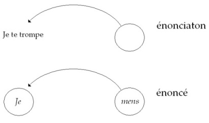
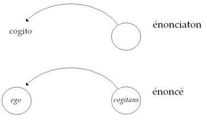
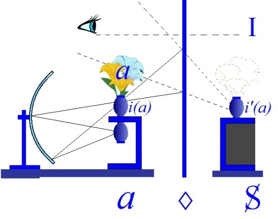
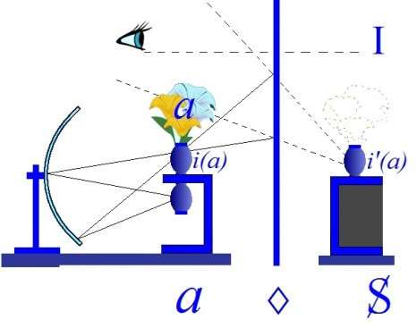

# Leçon 11 | 22 avril 1964

  <label><input type="checkbox" data-lacan-toggle="original" checked> 原文</label>
  <label><input type="checkbox" data-lacan-toggle="notes" checked> 注释</label>
  <label><input type="checkbox" data-lacan-toggle="commentary" checked> 个人解读评论</label>

<section class="parallel-paragraph" data-paragraph-ids="s11-11-0001">

s11-11-0001

[无对应译文]

原文 · s11-11-0001

J’ai introduit la dernière fois le concept de *transfert*. Vous avez pu le remarquer : je l’ai fait d’une façon problématique,
en me fondant sur les difficultés qu’il impose à l’analyste.

</section>

<section class="parallel-paragraph" data-paragraph-ids="s11-11-0002">

s11-11-0002

[无对应译文]

原文 · s11-11-0002

J’ai pris - à moi offert par la rencontre - le hasard du dernier article publié dans l’organe le plus officiel de la psychanalyse,
*l’International Journal of Psycho-analysis,* l’article de SZASZ qui va jusqu’à *mettre en cause* l’utilisation dans l’analyse de *la notion de transfert* comme ouvrant la porte à une effectuation du *rôle de l’analyste* dont le carac­tère serait, en elle-même, d’être en somme sans contrôle, puisqu’en rai­son des repères - j’ose le croire, eux-mêmes problématiques - que prend SZASZ pour en discuter, à savoir les repères du *logico-positivisme*, ce qui consiste à interroger directement l’effet de sens du signifiant comme étant quelque chose qui se détermine de l’extérieur, que son emploi en rapport avec telle ou telle réalité supposait être des données.

</section>

<section class="parallel-paragraph" data-paragraph-ids="s11-11-0003">

s11-11-0003

[无对应译文]

原文 · s11-11-0003

Dans l’occasion, c’est par rapport à ce qui se manifestera d’*actuel* dans le traitement que l’analyste va pointer, pour le patient ce qui s’y produit d’effets de discordance plus ou moins manifestes à l’endroit de ce qu’on appellera la « *réalité de la situation analytique* »,
à savoir les deux sujets qui y sont présents. Et bien sûr, SZASZ n’a pas de peine à opposer les deux pôles de ce qui peut
s’y produire, à savoir les cas où cet effet de discordance bien évident prendra par exemple l’illustration de quelque chose
dont nous ne sommes point étonnés de le voir surgir sous la plume *humoristique* d’un SPITZ, d’un *vieux de la vieille* qui en connaît
un bout pour savoir ce qui convient, à prendre des exemples exemplaires, et pour tout dire, à bien amuser son public !

</section>

<section class="parallel-paragraph" data-paragraph-ids="s11-11-0004">

s11-11-0004

[无对应译文]

原文 · s11-11-0004

Prenant comme exemple le cas où une de ses patientes, dans un rêve qu’on appelle « *de transfert* », c’est-à-dire de réalisations amoureuses avec son analyste - en l’occasion lui, SPITZ - le voit pour­vu d’une chevelure aussi blonde qu’abondante,
ce qui à toute person­ne qui a entrevu le crâne en œuf du personnage, et il est assez connu pour être célèbre, apparaîtra bien évidemment un point sur lequel l’analyste pourra montrer au sujet à quelles distorsions les effets de l’inconscient l’ont poussé.
Mais assurément, quand il s’agira de qualifier une conduite du patient comme étant, à l’endroit de l’analyste, à visée désobligeante :

</section>

<section class="parallel-paragraph" data-paragraph-ids="s11-11-0005">

s11-11-0005

[无对应译文]

原文 · s11-11-0005

« *De deux choses l’une -* nous dit SZASZ *- ou bien le patient est d’accord,*
*ou s’il ne l’est pas, qui tranchera, sinon la position principielle que l’analyste a toujours raison ?* »

</section>

<section class="parallel-paragraph" data-paragraph-ids="s11-11-0006">

s11-11-0006

[无对应译文]

原文 · s11-11-0006

Ce qui nous rejette vers ce pôle à la fois manifestement mythique et idéalisant, de ce que SZASZ appelle « *l’intégrité de l’analyste* »,
ce dont nous nous demandons ce que cela peut bien vou­loir dire si ce n’est le rappel à la dimension de *la vérité* !
Je ne puis donc situer l’article de SZASZ que dans cette perspective où lui-même ne peut le considérer comme opérant qu’à titre proprement, non point *heuristique*, mais *éristique*, qu’au titre de nous manifester, dans la réflexion en impasse d’un analyste,
la présence d’une véritable crise de conscience dans la fonction analytique, dans la fonction de l’analyste.

</section>

<section class="parallel-paragraph" data-paragraph-ids="s11-11-0007">

s11-11-0007

[无对应译文]

原文 · s11-11-0007

Cette crise de conscience, voilà qui d’une certaine façon, dirais-je, ne nous intéresse que de façon tout à fait *latérale*, si nous-mêmes avons le sentiment, pouvons trouver :

</section>

<section class="parallel-paragraph" data-paragraph-ids="s11-11-0008">

s11-11-0008

[无对应译文]

原文 · s11-11-0008

- avoir tracé des voies qui n’y butent nul­lement,

</section>

<section class="parallel-paragraph" data-paragraph-ids="s11-11-0009">

s11-11-0009

[无对应译文]

原文 · s11-11-0009

- pour tout dire, d’avoir montré la voie où un tel écueil, pour autant qu’après tout, il ne fait que profiler de la façon la plus aiguë, la plus extrême, et même jusqu’à un certain point que forcer ce à quoi aboutirait certaine pente, si on s’y laissait aller : non pas tellement de pratique de *l’analyse de transfert*, qu’une certaine façon unilatérale *de la théoriser*.

</section>

<section class="parallel-paragraph" data-paragraph-ids="s11-11-0010">

s11-11-0010

[无对应译文]

原文 · s11-11-0010

Ceci nous indique assurément *les dangers de cette pente*, mais c’est une pente que *nous avons nous-mêmes depuis assez longtemps dénon­cée*, en montrant qu’est ailleurs la ligne de visée, pour que nous n’en soyons affecté qu’à titre de confirmation d’une réflexion personnelle de quelqu’un qui, aussi bien, doit montrer par là quelque retour, quelque réaction qui se produit, qui ne peut manquer de se produire dans *cette pente de l’analyse* que j’ai associée *la dernière fois *à une certaine aire sociologique, à un certain idéal de conformisation individuelle qui don­nerait, en quelque sorte la mesure et l’emploi de *la pratique analytique dans cette configuration sociale déterminée*
que j’ai désignée par son nom \[« *american way of life »*\].

</section>

<section class="parallel-paragraph" data-paragraph-ids="s11-11-0011">

s11-11-0011

[无对应译文]

原文 · s11-11-0011

Et pour nous ramener aux *données*, je dirais presque *phénoménolo­giques*, qui nous permettent de replacer le problème là où il est,
je vous ai indiqué la dernière fois, en concluant que dans *ce rapport de l’un à l’autre*, quel qu’il soit, qui s’instaure dans l’analyse,
une dimension est éludée dans cette façon, je le souligne, *unilatérale* de présenter *le trans­fert *: c’est que l’un des deux s’adresse à l’autre.
Sans doute, la notion du *transfert* nous permettra de savoir *en quels termes* et *pourquoi, sur quels présupposés,* *et sans doute ces présupposés doivent avoir quelque chose à faire avec le phénomène du transfert*… mais sans même avoir à nous y référer, il est clair que cette relation s’instaure sur un plan qui n’est point réciproque, qui n’est point symétrique.

</section>

<section class="parallel-paragraph" data-paragraph-ids="s11-11-0012">

s11-11-0012

[无对应译文]

原文 · s11-11-0012

Nous n’avons pas là en effet à nous étonner, que c’est ce que SZASZ constate - *très à tort -* pour la déplorer :

</section>

<section class="parallel-paragraph" data-paragraph-ids="s11-11-0013">

s11-11-0013

[无对应译文]

原文 · s11-11-0013

- que dans *ce rapport de l’un à l’autre* s’institue la dimension, en effet, d’une recherche de la vérité, où l’un est supposé, est *supposé savoir*, tout au moins en savoir plus que l’autre,

</section>

<section class="parallel-paragraph" data-paragraph-ids="s11-11-0014">

s11-11-0014

[无对应译文]

原文 · s11-11-0014

- et que de celui qui est *supposé savoir*, la dimension surgit aussitôt de penser que non seulement il ne faut pas qu’il se trompe, mais aussi bien qu’on peut le tromper, que le « *se trompe* » aussi, du même coup, est rejeté, sur le sujet, que ce n’est pas simplement que le sujet est - *si l’on peut dire, soit si l’on peut dire : d’une façon statique -* dans le manque, dans l’erreur.

</section>

<section class="parallel-paragraph" data-paragraph-ids="s11-11-0015">

s11-11-0015

[无对应译文]

原文 · s11-11-0015

C’est que d’une façon mouvante, dans le dis­cours, dans ce vers quoi il s’avance, dans ce qu’il articule par son dis­cours,
il peut, il doit, il est essentiellement situé à la dimension de « *se tromper* ».

</section>

<section class="parallel-paragraph" data-paragraph-ids="s11-11-0016">

s11-11-0016

[无对应译文]

原文 · s11-11-0016

Que même, comme le remarque à très juste titre *un analyste* dont je prendrai à plusieurs reprises aujourd’hui le repère, pour marquer chez lui aussi une certaine courbe, une certaine évolution de sa pensée concernant *le transfert*, c’est NUNBERG, NUNBERG dans l’année 1951,*volume* XXXII de l’*International Journal of Psychoanalysis.* C’est un article qu’il intitule... Non ! C’est plus tôt : en 1926,
dans le *volume* VII, c’est un article qu’il intitule *The will to recovery*[^64], c’est-à-dire « *la volonté* », non pas à proprement parler « *de guérison* » : *reco­very* c’est *restauration*, *retour* - *le mot est fort bien choisi*.

</section>

<section class="parallel-paragraph" data-paragraph-ids="s11-11-0017">

s11-11-0017

[无对应译文]

原文 · s11-11-0017

Et il s’in­terroge sur ce qui peut, en somme, motiver chez le patient, chez le patient dont chacun sait que son *symptôme* - *la théorie nous le dit* - son *symptôme* est fait pour lui apporter *certaines satisfactions, sinon satis­faction, assurément* - *la chose est doctrinée* - *du plaisir,* qu’est-ce qui peut en fin de compte pousser le patient à venir recourir à l’analyste, à demander quelque chose qu’il appelle, lui, *la santé* ?

</section>

<section class="parallel-paragraph" data-paragraph-ids="s11-11-0018">

s11-11-0018

[无对应译文]

原文 · s11-11-0018

Par beaucoup d’exemples - et non des moins humoristiques - NUNBERG n’a pas de peine à montrer qu’il ne faut pas faire beaucoup de pas dans l’analyse, pour voir quelquefois éclater ce qui a motivé le patient, comme la visée profonde,
sans doute non avouée d’abord, couverte de termes généraux, de sa recherche de ce qu’il appelle sa « *santé* », son « *équilibre* »,
c’est justement sa visée inconsciente, nous disons : non point *à longue portée*, mais dans *sa portée la plus immédiate*.

</section>

<section class="parallel-paragraph" data-paragraph-ids="s11-11-0019">

s11-11-0019

[无对应译文]

原文 · s11-11-0019

Et quel abri par exemple du recours à l’analyse pour rétablir la paix de son ménage parce que quelques boiterie est survenue
dans sa fonc­tion sexuelle ou quelque désir extra-conjugal ! Ce que le patient s’avè­re dès les premiers temps viser, à proprement parler, c’est - sous la forme d’une suspension provisoire de ses relations de présence à son foyer, de mise à l’écart de son conjoint - précisément ce qu’il désire, à savoir, ce qui est dans le sens directement contraire de ce qu’il est venu proposer comme but premier de son analyse, s’adressant à son analyste, à savoir précisément, non pas la restitution de son ménage, mais sa rup­ture !

</section>

<section class="parallel-paragraph" data-paragraph-ids="s11-11-0020">

s11-11-0020

[无对应译文]

原文 · s11-11-0020

Nul doute donc, que nous nous trouvions là, enfin au maximum dans l’acte même de l’engagement de l’analyse et donc certainement aussi dans ses premiers pas, mis au contact de la profonde ambiguïté de toute assertion du patient, du fait qu’elle a
par elle-même et très essen­tiellement, *une double face* et que, pour dire le mot, ce soit d’abord *comme s’instituant dans et même par*
*un certain mensonge que nous voyons s’instaurer la dimension de la vérité*. En quoi elle n’est à pro­prement parler pas ébranlée, puisque déjà
le mensonge comme tel se propose, se pose lui-même dans cette *dimension de la vérité*.

</section>

<section class="parallel-paragraph" data-paragraph-ids="s11-11-0021">

s11-11-0021

[无对应译文]

原文 · s11-11-0021

Que cet accrochage initial, que toute l’expérience analytique, dans la relation du sujet au signifiant, non pas en tant que c’est lui
qui en dispose, mais que le rapport avec le signifiant le constitue et l’institue comme sujet, c’est là le repère dont ce n’est pas en vain que nous avons voulu d’abord le mettre *au premier plan d’une rectification générale de la théorie analy­tique* car il est aussi premier et constituant dans l’instauration de l’ex­périence analytique que, nous l’avons souligné, il doit être conçu comme premier et constituant dans la fonction de l’inconscient dans ce qu’elle a de plus radical.

</section>

<section class="parallel-paragraph" data-paragraph-ids="s11-11-0022">

s11-11-0022

[无对应译文]

原文 · s11-11-0022

Sans doute c’est limiter là, dans notre incidence didactique quant à l’analyse, l’inconscient à ce qu’on pourrait appeler sa plate-forme la plus étroite, si étroite qu’elle est semblable au tranchant du couteau, mais c’est par rapport à ce point de division que
nous pouvons ne pas faire d’erreur du côté d’aucune substantification, de ce dont il peut s’agir, de ce qu’il y a à manier dans l’expérience analytique.

</section>

<section class="parallel-paragraph" data-paragraph-ids="s11-11-0023">

s11-11-0023

[无对应译文]

原文 · s11-11-0023

À prendre les choses, à les centrer sur le schéma à quatre coins de notre graphe, distinguant sciemment *le plan de l’énonciation*
du *plan de l’énoncé*, à l’illustrer à l’occasion de ce qu’une pensée logicienne trop formelle y introduit d’absurdité, en marquant par exemple *l’impasse*, voire *le paradoxe*, en voyant une antinomie de la raison dans *l’énoncé* du « *je mens* », alors que chacun sait qu’il n’y a point la moindre anti­nomie, qu’il est tout à fait *faux* de reprendre, *de répondre à ce* « *je mens* » que : « *si tu dis « je mens » c’est que tu dis*
*la vérité et donc tu ne mens pas* », et ainsi de suite - il est tout à fait clair que le « *je mens* » ce n’est pas seulement ce qui fait sens, malgré son absurdité, qu’il est sou­tenable, il est parfaitement valable.

</section>

<section class="parallel-paragraph" data-paragraph-ids="s11-11-0024">

s11-11-0024

[无对应译文]

原文 · s11-11-0024

</section>

<section class="parallel-paragraph" data-paragraph-ids="s11-11-0025">

s11-11-0025

[无对应译文]

原文 · s11-11-0025

Le « *je* » qui énonce, le « *je* » de l’*énonciation* n’est pas le même que le « *je* » de l’*énoncé*, c’est-à-dire le *shifter* qui dans l’*énoncé* le désigne.
Il est tout à fait concevable que - du point où *j’énonce*, \[où je\] *formule*, d’une façon tout à fait valable - que le « *je* », le « *je* », qui à
ce moment-là formule l’énoncé est en train de mentir, qu’il a menti peu avant, qu’il ment après, ou même qu’en disant « *je mens* »
*il affirme qu’il a - à formuler cette parole - l’intention de tromper*.

</section>

<section class="parallel-paragraph" data-paragraph-ids="s11-11-0026">

s11-11-0026

[无对应译文]

原文 · s11-11-0026

Il n’y a pas à aller très loin de nous pour en illustrer l’exemple. L’historiette juive - rendue célèbre - du train que l’un des deux partenaires de l’histoire affirme à l’autre qu’il va prendre : « *Je vais à Lemberg* » lui dit-il, à quoi l’autre lui répond :
« *Pourquoi me dis-tu que tu vas à Lemberg puisque tu y vas vraiment ? Et que si tu me le dis, c’est que c’est pour que je croie que tu vas à Cracovie.* »

</section>

<section class="parallel-paragraph" data-paragraph-ids="s11-11-0027">

s11-11-0027

[无对应译文]

原文 · s11-11-0027

Ce dont il s’agit, dans cette division de l’*énoncé* à l’*énonciation*, fait qu’effectivement, si nous pointons le « *je* » du « *je mens* »
au niveau de la chaîne de l’énoncé…

</section>

<section class="parallel-paragraph" data-paragraph-ids="s11-11-0028">

s11-11-0028

[无对应译文]

原文 · s11-11-0028

- où le « *mens* » est un signifiant fai­sant partie, au niveau de l’Autre, du trésor du vocabulaire,

</section>

<section class="parallel-paragraph" data-paragraph-ids="s11-11-0029">

s11-11-0029

[无对应译文]

原文 · s11-11-0029

- où le « *je* » se détermine *rétroactivement*, devient signification engendrée au niveau de l’énoncé …ce qu’il produit au niveau de l’énonciation, c’est effectivement ici un « *je te trompe* » qui en est le résultat, mais qui provient de quelque chose qui est ici le point d’où l’analyste attend le sujet dans la recherche analytique et, *lui renvoyant*, selon la formule, *son propre message* dans sa signification véritable, c’est-à-dire *sous une forme inversée*, lui dit :

</section>

<section class="parallel-paragraph" data-paragraph-ids="s11-11-0030">

s11-11-0030

[无对应译文]

原文 · s11-11-0030

> « *Dans ce « je te trompe », ce que tu envoies comme message, c’est ce que moi je t’exprime. Ce faisant, tu dis la vérité.* »

</section>

<section class="parallel-paragraph" data-paragraph-ids="s11-11-0031">

s11-11-0031

[无对应译文]

原文 · s11-11-0031

Dans l’effort, dans le cheminement de tromperie où le sujet s’aven­ture, l’analyste est en posture de formuler ce « *tu dis la vérité* »,
et notre interprétation n’a jamais de sens que dans cette dimension.

</section>

<section class="parallel-paragraph" data-paragraph-ids="s11-11-0032">

s11-11-0032

[无对应译文]

原文 · s11-11-0032

</section>

<section class="parallel-paragraph" data-paragraph-ids="s11-11-0033">

s11-11-0033

[无对应译文]

原文 · s11-11-0033

Je voudrais ici, un instant vous indiquer, d’une façon en quelque sorte toute courte, parce qu’elle se présente à notre portée,
la ressour­ce que nous offre ce schéma vis-à-vis de la démarche fondamentale, qui est celle dont j’ai fait dater la possibilité
de la découverte de l’in­conscient, qui est bien là depuis toujours, qui était là au temps de THALÈS, qui était là au niveau de modes de relations interhumaines les plus primitifs, mais d’où date la possibilité de ce que j’ai appelé « *sa découverte* ».

</section>

<section class="parallel-paragraph" data-paragraph-ids="s11-11-0034">

s11-11-0034

[无对应译文]

原文 · s11-11-0034

Si nous reportons, sur ce schéma - il faudra sans doute que j’aille vite - le « *je pense* » *cartésien*, observez bien comment s’opérerait
la chose.

</section>

<section class="parallel-paragraph" data-paragraph-ids="s11-11-0035">

s11-11-0035

[无对应译文]

原文 · s11-11-0035

</section>

<section class="parallel-paragraph" data-paragraph-ids="s11-11-0036">

s11-11-0036

[无对应译文]

原文 · s11-11-0036

Assurément la distinction de *l’énonciation* à *l’énoncé* est ce qui en fait le glissement toujours possible, et si l’on peut dire le point d’achoppe­ment éventuel. Car si quelque chose est, par le procès du *cogito,* institué, c’est ici un *cogitans,* une dimension,
le registre de la pensée en tant qu’il est extrait d’une opposition à l’étendue, qui reste actuellement son point le plus fragile,
mais qui, assurément, lui assure un statut suffisant, dans l’ordre de la constitution signifiante.

</section>

<section class="parallel-paragraph" data-paragraph-ids="s11-11-0037">

s11-11-0037

[无对应译文]

原文 · s11-11-0037

Que l’*ego* ici puisse se désigner comme ce qui en est la conséquence, ceci en effet donne sa *certitude* au niveau de l’*énonciation*, au *cogito* qui prend cette place. Mais il faut le dire : le statut du « *je pense* » est aussi réduit, aussi minimal, aussi *ponctuel*, et pourrait aussi bien être *affecté de cette connotation* du « *ça ne veut rien dire* » que *le « je mens » de tout à l’heure*. Car le « *je pense* », réduit à cette ponctualité d’être un « *je pense* » qui ne s’assure que du doute absolu concernant toute signification du « *je pense* », a peut-être même un statut
encore plus fragile que celui où on a pu attaquer le « *je mens* ».

</section>

<section class="parallel-paragraph" data-paragraph-ids="s11-11-0038">

s11-11-0038

[无对应译文]

原文 · s11-11-0038

Dès lors j’oserai qualifier, dans son effort de certitude, le « *je pense* » cartésien, de participer d’une sorte, je ne dirai même pas
*de prématura­tion, d’avortement,* et c’est là qu’est la différence du statut que donne au sujet la dimension découverte de l’inconscient.
Cartésien, il est de toute la différence de *quelque chose* qui concernant *la certitude du sujet* est celle d’un *avortement*,
à ce que nous appellerons - quoi ? - une promesse, quelque chose dont la plate-forme est plus large que cet *homuncule*.

</section>

<section class="parallel-paragraph" data-paragraph-ids="s11-11-0039">

s11-11-0039

[无对应译文]

原文 · s11-11-0039

Je vais reprendre le terme tout à l’heure pour désigner ce que je veux dire, à savoir *le désir* qui est là à situer au niveau du *cogito :*
*que tout ce qui anime <u>ce dont parle toute énonciation, c’est du désir</u> !* Là encore, je vous fais observer que j’ai dit *désir*, et le désir tel que
je le formule, par rapport à ce que FREUD nous apporte dès le départ de ses assertions, il en dit plus.

</section>

<section class="parallel-paragraph" data-paragraph-ids="s11-11-0040">

s11-11-0040

[无对应译文]

原文 · s11-11-0040

Je vais dire quoi tout à l’heure, mais dès maintenant je reprends ce terme « *d’avorton* », « *d’homuncule* », si je puis ainsi épingler
la fonction du *cogito cartésien*, c’est qu’elle est illustrée par la retombée, par la rechute qui ne manque pas de se produire dans l’histoire de ce qu’on appelle « *la pensée* », c’est de prendre ce « *je* » du *cogito* pour le petit *homuncule* :

</section>

<section class="parallel-paragraph" data-paragraph-ids="s11-11-0041">

s11-11-0041

[无对应译文]

原文 · s11-11-0041

- qui depuis longtemps *est repré­senté* chaque fois qu’on veut faire de la psychologie : ce fameux *petit homme qui est dans l’homme,*

</section>

<section class="parallel-paragraph" data-paragraph-ids="s11-11-0042">

s11-11-0042

[无对应译文]

原文 · s11-11-0042

- qui depuis longtemps a été dénoncé dans sa fonction par la pensée, même présocratique,

</section>

<section class="parallel-paragraph" data-paragraph-ids="s11-11-0043">

s11-11-0043

[无对应译文]

原文 · s11-11-0043

- à savoir qui rend raison de l’unité ou de la discordance psychologique, par la présence à l’intérieur de l’homme d’un *petit homme* qui le gouverne, qui est le conducteur du char,

</section>

<section class="parallel-paragraph" data-paragraph-ids="s11-11-0044">

s11-11-0044

[无对应译文]

原文 · s11-11-0044

- qui est le point dit, de nos jours, « *de synthèse* ».

</section>

<section class="parallel-paragraph" data-paragraph-ids="s11-11-0045">

s11-11-0045

[无对应译文]

原文 · s11-11-0045

En d’autres termes, dans notre vocabulaire à nous, qui fait de l’S par quoi nous symbolisons le sujet en tant que déterminé, constitué comme second, par rapport au signifiant. Et pour l’illustrer, je souligne que la chose peut se présenter de la façon
la plus simple dans le *trait unaire *: le premier signifiant c’est *la coche*, par où il est marqué par exemple que le sujet à ce moment-là
a tué une bête, moyennant quoi dans sa mémoire il ne s’embrouillera que quand il en aura tué dix autres,
\[mais ?\] il ne se souviendra plus laquelle est laquelle.

</section>

<section class="parallel-paragraph" data-paragraph-ids="s11-11-0046">

s11-11-0046

[无对应译文]

原文 · s11-11-0046

Et que c’est à partir de ce *trait unaire*, dont le sujet est d’abord marqué, dont le sujet lui-même se repère, et d’abord et avant tout comme *tatouage*, premier des signi­fiants que le sujet secondement, quand cet « 1 » est institué, le compte c’est « *un* 1 ».
Et c’est au niveau, non pas de l’*Un* mais du « *un* 1 » qu’il a d’abord, lui, à se situer comme sujet.

</section>

<section class="parallel-paragraph" data-paragraph-ids="s11-11-0047">

s11-11-0047

[无对应译文]

原文 · s11-11-0047

En quoi déjà les deux « un » se distinguent, et se marque la première schize qui fait que le sujet, comme sujet, se distingue,
non pas de ce qu’il désigne mais du signe par rapport auquel d’abord il a pu se constituer comme sujet.

</section>

<section class="parallel-paragraph" data-paragraph-ids="s11-11-0048">

s11-11-0048

[无对应译文]

原文 · s11-11-0048

C’est de la confusion de cette fonction de S avec le *i(a)*, c’est-à-dire l’image de l’*objet(a)* en tant que c’est ainsi que le sujet :

</section>

<section class="parallel-paragraph" data-paragraph-ids="s11-11-0049">

s11-11-0049

[无对应译文]

原文 · s11-11-0049

- se voit, lui, redoublé,

</section>

<section class="parallel-paragraph" data-paragraph-ids="s11-11-0050">

s11-11-0050

[无对应译文]

原文 · s11-11-0050

- se voit comme constitué par l’image reflétée, momentanée, précaire de la maîtrise,

</section>

<section class="parallel-paragraph" data-paragraph-ids="s11-11-0051">

s11-11-0051

[无对应译文]

原文 · s11-11-0051

- *s’imagine homme* *justement et seulement de ce qu’il s’imagine*.

</section>

<section class="parallel-paragraph" data-paragraph-ids="s11-11-0052">

s11-11-0052

[无对应译文]

原文 · s11-11-0052

</section>

<section class="parallel-paragraph" data-paragraph-ids="s11-11-0053">

s11-11-0053

[无对应译文]

原文 · s11-11-0053

Tout repérage, tout repérage du sujet dans la pratique analytique, par rapport à la réalité telle qu’on la suppose nous constituant, revient à déjà tomber dans *le piège*, dans *la dégradation*, dans *la chute*, de cette constitution du sujet comme « *isolat psychologique* ».
Et tout départ pris du rapport de cet « *isolat* » à un contexte réel, peut avoir sa raison d’être dans telle ou telle spéculation psychologisante, dans telle institution d’expériences de psychologues, elle peut produi­re des résultats, avoir des effets,
permettre d’instituer des « *tables* ».

</section>

<section class="parallel-paragraph" data-paragraph-ids="s11-11-0054">

s11-11-0054

[无对应译文]

原文 · s11-11-0054

Bien sûr, ce sera toujours dans des contextes où c’est nous qui la faisons, la réalité : par exemple, quand nous proposons au sujet des tests, qui sont des tests par nous organisés, c’est le domaine de validité de ce qu’on appelle la psychologie, mais cela n’a rien
à faire avec le niveau où s’ins­titue, où nous soutenons l’expérience psychanalytique. Et n’oublions pas qu’à l’instituer ainsi,
nous poussons les choses à un point qui, si je puis dire, renforce incroyablement le dénuement du sujet.

</section>

<section class="parallel-paragraph" data-paragraph-ids="s11-11-0055">

s11-11-0055

[无对应译文]

原文 · s11-11-0055

Car ce que j’ai appelé « *isolat psychologique* », loin d’être la vieille - *ou toujours jeune* - la vieille « *monade* » instituée comme traditionnellement *centre de connaissance*...

</section>

<section class="parallel-paragraph" data-paragraph-ids="s11-11-0056">

s11-11-0056

[无对应译文]

原文 · s11-11-0056

> car la *« monade leibnizienne »* par exemple, n’est point isolée, elle est centre de connaissance, elle est ce qui dans le cos­mos est ce centre d’où quelque chose que nous appellerons - selon les inflexions - contemplation ou harmonie, viendra à s’exercer, elle n’est point séparable d’une *cosmologie*
> ...l’« *isolat psychologique* » institué dans le concept du *moi* , tel qu’il vient par une déviation - déviation qui je pense, n’est qu’un détour -
> dans la pensée psychanalytique, vient à jouer comme sujet, si l’on peut dire « *en détresse* » *dans le rapport à une réa­lité*, dont il va s’agir pour l’instant, pour nous, de repérer comment même elle est conçue dans l’analyse, est quelque chose qu’il convient aussi ici de situer pour en voir, par rapport à ce que l’analyse effective­ment profile à son horizon comme ouverture, pour en voir le paradoxe.

</section>

<section class="parallel-paragraph" data-paragraph-ids="s11-11-0057">

s11-11-0057

[无对应译文]

原文 · s11-11-0057

Je veux d’abord marquer, à titre simplement de pointage, de repère, que cette façon de théoriser l’opération est en plein *discord*,
en plein *déchirement* avec ce que, par ailleurs, l’expérience nous amène à pro­mouvoir, et que nous ne pouvons pas éliminer du texte analytique, à savoir la fonction de l’*objet interne*.

</section>

<section class="parallel-paragraph" data-paragraph-ids="s11-11-0058">

s11-11-0058

[无对应译文]

原文 · s11-11-0058

Ici les termes d’introjection ou de projection sont utilisés au petit bonheur. Je ne sais pas si nous aurons ou n’aurons pas le temps
enfin de pointer comment il s’agit de les rectifier, mais assurément si quelque chose, même dans cette voie, dans ce contexte
de théorisation boiteuse, quelque chose nous est donné, vient au premier plan, c’est de toutes parts - je dirais presque sous quelque horizon de l’expérience que l’ana­lyste, là, constitue sa propre expérience - c’est cette fonction de l’*objet interne* qui a fini à l’extrême par se polariser, dans ce « *bon* » ou « *mauvais objet* », autour de quoi certains ont fait tourner tout ce qui, dans la conduite du sujet représente distorsion, inflexion, peur, paradoxale, corps étranger dans la conduite.

</section>

<section class="parallel-paragraph" data-paragraph-ids="s11-11-0059">

s11-11-0059

[无对应译文]

原文 · s11-11-0059

Et à quoi, aussi bien dans le point opératoire où l’intervention de l’analyste, certains dans des conditions d’urgence,
celles par exemple, de la sélection des sujets à l’usage de tels ou tels emplois diversement directeurs, cybernétiques, responsables : quand il s’agit de former des pilotes d’aviation ou des conducteurs de locomotive, certains ont pointé qu’il s’agissait de concentrer
la focalisation d’une analyse rapide, voire d’une analyse éclair, voire de l’usage de certains tests dits de personnalité.

</section>

<section class="parallel-paragraph" data-paragraph-ids="s11-11-0060">

s11-11-0060

[无对应译文]

原文 · s11-11-0060

Nous ne pouvons point ne pas poser, dans ce mode de conception du *rapport du moi à la réalité*, la question *du statut de cet objet interne *:
*Est-il un objet de perception ? Par où l’abordons-nous ? Où vient-il ? Dans la suite de cette rectification, en quoi consisterait l’analyse du transfert ?*
Je ne fais ici qu’en pointer le repère puisque aussi bien, nous aurons à y revenir par le détour qu’il nous faut maintenant parcourir.
Je vais pourtant maintenant, tout de suite, vous indiquer quelque chose qui ne sera ici qu’un schéma d’approche, qu’un modèle,
et un modèle qu’il conviendra que nous perfectionnions beaucoup. Prenez-le donc pour modèle problématique.

</section>

<section class="parallel-paragraph" data-paragraph-ids="s11-11-0061">

s11-11-0061

[无对应译文]

原文 · s11-11-0061

Mais le pouvoir d’adhérence du schéma généralement centré sur la fonction de *la rectification de l’illu­sion*, est telle que jamais trop prématurément je ne pourrai lancer quelque chose qui, à tout le moins, y fasse obstacle, y apporte quelque chose qui déroute,
à tout le moins si ceci ne recentre pas encore.

</section>

<section class="parallel-paragraph" data-paragraph-ids="s11-11-0062">

s11-11-0062

[无对应译文]

原文 · s11-11-0062

Je vais ici représenter au tableau quelque chose, un schéma, qui nous permette de situer *comment s’ordonne le problème*. L’inconscient,

</section>

<section class="parallel-paragraph" data-paragraph-ids="s11-11-0063">

s11-11-0063

[无对应译文]

原文 · s11-11-0063

- s’il est ce que je vous ai dit : quelque chose de marqué par *une pulsation temporelle*,

</section>

<section class="parallel-paragraph" data-paragraph-ids="s11-11-0064">

s11-11-0064

[无对应译文]

原文 · s11-11-0064

- si l’inconscient c’est ce qui se referme dès que ça s’est ouvert,

</section>

<section class="parallel-paragraph" data-paragraph-ids="s11-11-0065">

s11-11-0065

[无对应译文]

原文 · s11-11-0065

- si *la répétition* d’autre part, ce n’est pas simplement *<u>que</u>* cette sté­réotypie de la conduite,

</section>

<section class="parallel-paragraph" data-paragraph-ids="s11-11-0066">

s11-11-0066

[无对应译文]

原文 · s11-11-0066

> mais si c’est *répétition* par rapport à quelque chose de toujours manqué, vous voyez bien d’ores et déjà *que le trans­fert ne saurait être par lui-même*, tel qu’on nous le représente comme *mode d’accès à ce qui se cache, à ce qui est occulté dans l’inconscient,*
>
> *qu’une voie précaire *:

</section>

<section class="parallel-paragraph" data-paragraph-ids="s11-11-0067">

s11-11-0067

[无对应译文]

原文 · s11-11-0067

- car si *le transfert* n’est que répétition, il sera répétition toujours du même ratage,

</section>

<section class="parallel-paragraph" data-paragraph-ids="s11-11-0068">

s11-11-0068

[无对应译文]

原文 · s11-11-0068

- car si *le transfert* prétend, à travers cette répétition, restituer la *continuité* d’une histoire, c’est à *éveiller*, à *réanimer*, à *faire resurgir* - *quoi ?* - un rapport que l’inconscient vous présente comme, de sa nature, *syncopé*.

</section>

<section class="parallel-paragraph" data-paragraph-ids="s11-11-0069">

s11-11-0069

[无对应译文]

原文 · s11-11-0069

Nous voyons donc que *le transfert* comme mode opératoire ne sau­rait se suffire de se confondre, comme pratiquement on le fait,
avec l’ef­ficace de la *répétition*, avec la restauration de ce qui est occulté dans l’inconscient, voire avec la *purification*, *la catharsis* des éléments inconscients !

</section>

<section class="parallel-paragraph" data-paragraph-ids="s11-11-0070">

s11-11-0070

[无对应译文]

原文 · s11-11-0070

Quand je vous parle de *l’inconscient comme* de quelque chose de *ce qui apparaît dans la pulsation temporelle, l’image peut vous venir de la nasse qui s’entrouvre au fond de quoi va se réaliser la pêche du poisson*. L’inconscient est, selon la figure de la besace, ce quelque chose de *réservé*,
de *refermé* à l’intérieur, où nous avons, nous, à pénétrer du dehors. Mais c’est précisément là qu’il convient d’en renverser *la topologie* dans un schéma que vous aurez à faire se recouvrir avec celui que j’ai donné dans mon article : *Remarque sur le rapport de Daniel Lagache* concernant le *moi idéal* et l’*idéal du moi.*

</section>

<section class="parallel-paragraph" data-paragraph-ids="s11-11-0071">

s11-11-0071

[无对应译文]

原文 · s11-11-0071

</section>

<section class="parallel-paragraph" data-paragraph-ids="s11-11-0072">

s11-11-0072

[无对应译文]

原文 · s11-11-0072

Je le souligne, à propos des derniers éléments que je vous ai appor­tés autour de la pulsion scopique que ce schéma rend clair :
*que là d’où le sujet se voit*, à savoir où se forme cette *image réelle et inversée* de son propre corps \[*il n’en voit que* *i’(a), image virtuelle au miroir plan de i(a), image réelle produite par le miroir concave*\] qui est donné dans le schéma du *moi* - je vous prie de vous reporter à ce schéma et à ce texte et au rôle du miroir concave, *que là d’où le sujet se voit* \[*i’(a)*\]*, ce n’est pas là d’où* *il se regarde* \[**I**\].

</section>

<section class="parallel-paragraph" data-paragraph-ids="s11-11-0073">

s11-11-0073

[无对应译文]

原文 · s11-11-0073

Il se voit dans *l’espace de l’Autre* \[*i’(a)*\], mais le point d’où il se voit est aussi dans cet *espace de l’Autre* \[**I**\], or c’est bien ici d’où le sujet
*se regar­de* et même d’où il parle. En tant qu’il parle, c’est ici *au lieu de l’Autre* qu’il commence à constituer ce *mensonge véridique*
par où s’amorce quelque chose qui participe du désir, du désir au niveau de l’inconscient.

</section>

<section class="parallel-paragraph" data-paragraph-ids="s11-11-0074">

s11-11-0074

[无对应译文]

原文 · s11-11-0074

*La nasse* dont il s’agit - et particulièrement concernant son orifice, à savoir ce qui constitue *sa structure essentielle -*
*le sujet*, nous devons le considérer comme *étant à l’intérieur*. Ce qui *est important* n’est point ce qui y entre, conformément à la parole
de l’Évangile, mais *ce qui en sort*. Mais le mode sous lequel nous pouvons concevoir *cette fermeture de l’inconscient*, c’est l’instance, l’apparition, l’incidence d’une façon aussi nécessaire que *rythmique* de *quelque chose qui joue le rôle d’obtura­teur*.

</section>

<section class="parallel-paragraph" data-paragraph-ids="s11-11-0075">

s11-11-0075

[无对应译文]

原文 · s11-11-0075

Cet obturateur, il est ici \[*(a)*\] dans ce schéma. Il faut, pour vous imager ce modèle simplifié, le comprendre purement et simplement, comme l’ap­pel l’aspiration, la succion - si je puis dire - à l’orifice de la nasse de l’*objet(a).* C’est la bascule, c’est la mise en jeu
de l’*objet(a)*, à ce *point de batte­ment*, à *cet orifice* par où émerge, dans cette image, que vous pouvez aussi bien faire semblable
à *ces grandes boules dans lesquelles se bras­sent les numéros à tirer d’une loterie*. Ce qui effectivement se concocte au départ, à partir...
dans ce grand jeu, dans cette grande roulette, *des pre­miers énoncés de l’association libre*, ce qui peut en sortir de bon, *ça sort dans l’intervalle*
*où l’objet(a) ne bouche pas l’orifice*.

</section>

<section class="parallel-paragraph" data-paragraph-ids="s11-11-0076">

s11-11-0076

[无对应译文]

原文 · s11-11-0076

*Cette structure imagée, sommaire, brutale, élémentaire, « philoso­phie à coups de marteau »* si vous voulez en l’occasion, c’est ce qui vous permet de restituer, dans sa contre-position réciproque, la *fonction constituante du symbolique*, dans ce nœud du sujet, au *pair* et *impair* \[0,1\]
de sa retrouvaille avec ce qui vient s’y présentifier dans l’action effec­tive de la manœuvre analytique.

</section>

<section class="parallel-paragraph" data-paragraph-ids="s11-11-0077">

s11-11-0077

[无对应译文]

原文 · s11-11-0077

Ceci est complètement - bien sûr - insuffisant, mais tout à fait impor­tant à mettre au premier plan, comme un concept « *bulldozer* »
si je puis dire, pour essayer de *restituer* ce qu’il faut, pour concevoir d’abord comment peuvent s’accorder la notion que *le transfert *:

</section>

<section class="parallel-paragraph" data-paragraph-ids="s11-11-0078">

s11-11-0078

[无对应译文]

原文 · s11-11-0078

- à la fois obstacle à la remémoration,

</section>

<section class="parallel-paragraph" data-paragraph-ids="s11-11-0079">

s11-11-0079

[无对应译文]

原文 · s11-11-0079

- est en même temps présentification de ce dont il s’agit, à savoir de ce quelque chose d’essentiel qui - la fermeture de l’inconscient - qui est *le manque,* toujours à point nommé, *de la bonne rencontre* \[εὐτυχία : *eutuchia* \].

</section>

<section class="parallel-paragraph" data-paragraph-ids="s11-11-0080">

s11-11-0080

[无对应译文]

原文 · s11-11-0080

Je pourrais, tout ceci, l’illustrer de la multiplicité des formules, et évidemment de leurs discordances, que les analystes ont données de ce qu’il en est de la fonction du transfert. Je ne puis bien sûr, en parcourir tout le champ, mais je vous prie de suivre au moins quelques opérations de tri élémentaire si vous avez par vous-même la curiosité d’en prendre connaissance.

</section>

<section class="parallel-paragraph" data-paragraph-ids="s11-11-0081">

s11-11-0081

[无对应译文]

原文 · s11-11-0081

Il est bien certain qu’autres choses sont *le transfert* et *la fin théra­peutique*. Le transfert ne se confond pas avec cette fin. Il ne se confond pas non plus avec un simple moyen. Les deux extrêmes de ce qui a été formulé dans la littérature analytique sont ici situés. Combien de fois lirez-vous des formules qui viennent à associer par exemple, *le transfert* avec *l’identification*, avec cette référence au point **I**
tel que je le situais tout à l’heure, alors que ce n’est *qu’un temps d’arrêt*, qu’une *fausse terminaison de l’analyse* - qui est très fréquem­ment d’ailleurs posée pour être sa terminaison normale - que sans doute son rapport avec *le transfert* est étroit, mais précisément
en ce par quoi *le transfert* n’a pas été analysé.

</section>

<section class="parallel-paragraph" data-paragraph-ids="s11-11-0082">

s11-11-0082

[无对应译文]

原文 · s11-11-0082

À l’inverse, vous verrez formuler *la fonction du transfert* comme point d’appui, comme moyen de cette « *rectification réalisante* »
contre laquelle va tout mon discours d’aujourd’hui. Or, *il est impossible de situer le transfert correctement dans aucune de ces références*.
Puisque de réalité il s’agit, c’est effectivement sur ce plan que j’entends porter la critique.

</section>

<section class="parallel-paragraph" data-paragraph-ids="s11-11-0083">

s11-11-0083

[无对应译文]

原文 · s11-11-0083

*Le transfert* - poserai-je aujour­d’hui en aphorisme introductif de ce que j’aurai à dire la prochaine fois - *le transfert* est ceci *de capital*, effectivement *de clé,* quant à *l’expé­rience analytique*, qu’il *est la mise en acte* de quoi ? Non pas de *l’illu­sion*, non pas de quelque chose qui irait à nous pousser dans le sens *identificatoire*, aliénant sur le point *imaginaire*, qu’est aucune confor­misation, fût-ce à *un modèle idéal* dont *l’analyste*, en aucun cas, ne saurait être le support - *le transfert est la mise en acte de la réalité de l’inconscient*.

</section>

<section class="parallel-paragraph" data-paragraph-ids="s11-11-0084">

s11-11-0084

[无对应译文]

原文 · s11-11-0084

Or, c’est cela que j’ai laissé en suspens dans le concept de *l’incons­cient*, chose singulière : c’est ce qui est de plus en plus oublié
que je n’ai pas rappelé jusqu’à présent ! J’espère dans la suite pouvoir vous justifier pourquoi il en est ainsi, pourquoi, de *l’inconscient*, j’ai tenu en somme à vous rappeler l’inci­dence que nous pourrons appeler de l’acte constituant du sujet au niveau de l’inconscient :
parce qu’il est celui qu’il s’agit, pour nous, de soutenir.

</section>

<section class="parallel-paragraph" data-paragraph-ids="s11-11-0085">

s11-11-0085

[无对应译文]

原文 · s11-11-0085

Mais n’omettons pas qu’au premier chef, quand FREUD nous a apporté *la dimension de l’inconscient*, n’oublions pas *tout ce qu’il y avait* d’associé derrière. Non seulement *d’associé* mais jusqu’au bout, jusqu’à son terme, *de souligné* par FREUD comme lui étant strictement consubstantiel, à savoir la sexualité.

</section>

<section class="parallel-paragraph" data-paragraph-ids="s11-11-0086">

s11-11-0086

[无对应译文]

原文 · s11-11-0086

Pour avoir toujours plus oublié ce que veut dire cette relation de l’in­conscient au sexuel, nous verrons que l’analyse a hérité
d’une concep­tion de la réalité qui n’a plus rien à faire avec ce qu’était la réalité telle que FREUD la situait
au niveau du processus secondaire.

</section>

<section class="parallel-paragraph" data-paragraph-ids="s11-11-0087">

s11-11-0087

[无对应译文]

原文 · s11-11-0087

C’est donc à poser le transfert, vous ai-je dit, comme la mise en acte de la réalité de l’inconscient que nous serons amenés
la prochaine fois à repartir, pour y remettre les assises grâce à quoi une conceptualisation positive peut en être donnée.

</section>

<section class="parallel-paragraph" data-paragraph-ids="s11-11-0088">

s11-11-0088

[无对应译文]

原文 · s11-11-0088

*  *

</section>

<section class="parallel-paragraph" data-paragraph-ids="s11-11-0089">

s11-11-0089

[无对应译文]

原文 · s11-11-0089

> *Discussion*

</section>

<section class="parallel-paragraph" data-paragraph-ids="s11-11-0090">

s11-11-0090

[无对应译文]

原文 · s11-11-0090

Guy ROSOLATO

</section>

<section class="parallel-paragraph" data-paragraph-ids="s11-11-0091">

s11-11-0091

[无对应译文]

原文 · s11-11-0091

Je peux vous dire les réflexions que j’ai faites pendant votre séminaire. D’abord une analogie : votre schéma ressemble
singu­lièrement à un œil :

</section>

<section class="parallel-paragraph" data-paragraph-ids="s11-11-0092">

s11-11-0092

[无对应译文]

原文 · s11-11-0092

- Dans quelle mesure le *(a)* jouerait le rôle de *cristal­lin* ?

</section>

<section class="parallel-paragraph" data-paragraph-ids="s11-11-0093">

s11-11-0093

[无对应译文]

原文 · s11-11-0093

- Dans quelle mesure, par exemple, ce *cristal­lin* pourrait avoir un rôle de cataracte dans certains cas, c’est une *analogie*.

</section>

<section class="parallel-paragraph" data-paragraph-ids="s11-11-0094">

s11-11-0094

[无对应译文]

原文 · s11-11-0094

Il n’en demeure pas moins que, par exemple, ce que j’aimerais, ce serait que vous précisiez ce que vous pouvez dire de l’*idéal du moi* et du *moi idéal* en fonction et très précisément de ce schéma. Pour le reste : « *la mise en acte de la réalité de l’inconscient* »,
à propos du transfert… Oui, mais par « *mise en acte* », qu’entendez-vous ?

</section>

<section class="parallel-paragraph" data-paragraph-ids="s11-11-0095">

s11-11-0095

[无对应译文]

原文 · s11-11-0095

Il est certain qu’il y a un rapport entre le transfert et l’inconscient. Je vois cela écrit dans cette formule.
Mais il me semble que d’abord « *réalité de l’inconscient* » dans la mesure où nous sommes sur le plan de la réalité psychique, mais « *mise en acte* », je pense que, peut-être, c’est important dans votre formule.

</section>

<section class="parallel-paragraph" data-paragraph-ids="s11-11-0096">

s11-11-0096

[无对应译文]

原文 · s11-11-0096

LACAN

</section>

<section class="parallel-paragraph" data-paragraph-ids="s11-11-0097">

s11-11-0097

[无对应译文]

原文 · s11-11-0097

Figurez-vous que je l’ai souligné. « *Mise en acte* » c’est un mot promesse, en ce sens que ça veut dire que les gens savent bien faire intervenir la fonction de l’acte comme tel et que, bien sûr je la dis­tingue tout à fait en cette occasion, puisque cet acte ne peut prendre… cet acte n’est pas dire conduite. Il ne s’agit pas là de l’objectivation des conduites telle qu’elle est mise en valeur en mode objectivant dans la perspective que je contrebats, c’est-à-dire dans celle qui juge, jauge à la similitude, à la similitude formelle des conduites dans la réflexion, ce qu’il y a d’efficace et de convaincant à faire valoir, j’ai bien parlé d’*acte* et non pas de conduite.
Ce terme « *acte* » se situe au niveau de ce qui est constituant du sujet.

</section>

<section class="parallel-paragraph" data-paragraph-ids="s11-11-0098">

s11-11-0098

[无对应译文]

原文 · s11-11-0098

Donc, j’aurai à reprendre ça, et *- si vous vou­lez* - à introduire ici une ponctuation, une promesse de tête de chapitre suivant cette référence *à mettre en valeur*. C’est bien ça que je veux dire et que je crois qu’il faut dire comme essentiel au départ pour que le transfert ne soit pas le lieu d’alibi, de mode opératoire insuffisant, pris par des biais et des détours, qui n’en sont pas forcément pour autant inopérants et qui rendent compte *des limites* par exemple, *de l’intervention analytique*, des fausses défini­tions qu’on peut donner *de cette terminaison*, et que j’ai nommément pointé aujourd’hui comme ce dont il s’agit, quand j’ai parlé de ce que… de ce dont tels ou tels auteurs se contentent comme définition *de la fin de l’analyse*, quel que soit ce qu’ils font efficacement eux-mêmes dans leur pratique, comme BALINT par exemple, quand il parle de l’identification à l’analyste.

</section>

<section class="parallel-paragraph" data-paragraph-ids="s11-11-0099">

s11-11-0099

[无对应译文]

原文 · s11-11-0099

C’est un point très important. C’est d’ailleurs pour ça que j’y reviens à l’instant en vous répondant. C’est tout à fait cohérent
avec une certaine façon de considérer le transfert. Si vous ne prenez pas le transfert à ce niveau, qui je dois le dire, n’a pas été pleinement, ni du tout même, illustré aujourd’hui, mais qui sera le sujet de ma prochai­ne conférence - vous ne pouvez en saisir jamais que des incidences par­tielles, des incidences qui mènent à la confondre soit avec d’autres concepts, soit à faire des choix, partiellement, de son efficace et de la place qu’il pourrait occuper.

</section>

<section class="parallel-paragraph" data-paragraph-ids="s11-11-0100">

s11-11-0100

[无对应译文]

原文 · s11-11-0100

Quant aux remarques que vous avez faites, c’est amusant. Il faut, dans tout ce qui est de la topologie, il faut toujours se garder
très sévèrement de ce qui lui donne fonction de *Gestalt.* Ce qui ce veut pas dire que cer­taines *Gestalt,* certaines formes vivantes,
ne nous donnent pas quelque­fois, si je puis dire, la sensation d’être une espèce d’effort du biologique, pour en l’espace - et notre espace *réel* quoi qu’en pense KANT, qui a bel et bien trois dimensions - essayer de forger quelque chose qui ressemble
à *ces torsions de ces objets topologiques fondamentaux* que je vous ai développés dans l’année du *séminaire sur l’Identification*, à savoir par exemple, celle de cette *mitre* \[*cross-cap*\] dont vous vous souvenez sûrement que c’est *une surface* rejetée dans l’espace à trois dimensions, *qui se recoupe elle-même*, ce qui ne veut rien dire d’autre d’ailleurs.

</section>

<section class="parallel-paragraph" data-paragraph-ids="s11-11-0101">

s11-11-0101

[无对应译文]

原文 · s11-11-0101

Je pourrais très bien vous désigner tel ou tel point ou plan, où un organe nous paraît figurer l’effort touchant, si on peut dire,
de la vie, pour rejoindre ces configurations topologiques qui ont d’ailleurs leur intérêt. Je n’ai justement pas voulu ici compliquer
la chose et présenter trop de difficultés à une partie de mes auditeurs. Je n’ai justement pas voulu me servir de ces considérations topologiques pourtant bien simples qui m’auraient forcé en tout cas, à les introduire d’une façon un peu développée.
Mais, enfin, il est certain que c’est seulement ces considérations topologiques qui peuvent par exemple nous donner l’image de ce dont il s’agit quand ce qui est à l’intérieur est aussi à l’extérieur.

</section>

<section class="parallel-paragraph" data-paragraph-ids="s11-11-0102">

s11-11-0102

[无对应译文]

原文 · s11-11-0102

Or, c’est pour ça qu’elles sont particulièrement nécessaires quand il s’agit de l’in­conscient. Car, qu’est-ce que je vous dis là en disant qu’au niveau de l’inconscient commence à se présentifier *un sujet trompeur*, je vous le représente à la fois comme étant ce qui est de l’intérieur du sujet, mais qui ne se réalise qu’au dehors, c’est-à-dire dans ce lieu de l’Autre où seu­lement il peut prendre son statut.

</section>

<section class="parallel-paragraph" data-paragraph-ids="s11-11-0103">

s11-11-0103

[无对应译文]

原文 · s11-11-0103

Ceci ne peut véritablement être imagé que dans une configuration topologique telle que l’intérieur soit l’extérieur
et inversement, et par conséquent bien autre chose qu’une sphère, *une nasse*.

</section>

<section class="parallel-paragraph" data-paragraph-ids="s11-11-0104">

s11-11-0104

[无对应译文]

原文 · s11-11-0104

*C’est une nasse d’une toute autre configuration*, et vous savez qu’après tout on fait des bouteilles de vin qui le représentent assez bien,
c’est *une nasse*, une nasse dans laquelle on se débrouille d’une façon très particulière puisqu’on ne peut à la fois dire qu’on est
au dehors quand on est au dedans et inversement.

</section>

<section class="parallel-paragraph" data-paragraph-ids="s11-11-0105">

s11-11-0105

[无对应译文]

原文 · s11-11-0105

À l’occasion, de toutes autres *formes ana­logues* ont été bien utiles, mais je ne peux pas ici me servir de tout l’acquis de mes séminaires antérieurs pour la bonne raison *qu’une par­tie de mon auditoire y est neuf*. Donc j’ai employé le schéma pur et simple de la *nasse*
et j’ai intro­duit simplement la notion de *l’obturateur.* Que l’objet soit obturateur, il s’agit de savoir comment encore.
Bien sûr, il n’est pas purement et simplement cette sorte d’obturateur passif, de bouchon que, pour com­mencer de lancer
votre pensée sur une certaine piste, j’ai voulu là, ima­ger.

</section>

<section class="parallel-paragraph" data-paragraph-ids="s11-11-0106">

s11-11-0106

[无对应译文]

原文 · s11-11-0106

J’en donnerai une représentation plus perfectionnée où vous verrez peut-être encore telles ou telles analogies qui vous montre­raient *sa parenté avec la structure de l’œil*. Ça n’est à la fois *pas par hasard* que *l’œil* soit fait ainsi, et fait ainsi, je dirai, dans toute l’échelle animale, ce qui semble déjà avoir frappé [^65] et dont, chose très curieu­se, il ne semble avoir tiré à proprement parler, aucune conclusion.
Mais il est, en effet, tout à fait singulier que la structure de l’œil nous présente une forme générale qui soit si facilement évoquée chaque fois que nous essayons de figurer chronologiquement les relations du sujet au monde.

</section>

<section class="parallel-paragraph" data-paragraph-ids="s11-11-0107">

s11-11-0107

[无对应译文]

原文 · s11-11-0107

Ce n’est sans doute pas par hasard. Encore convien­drait-il, naturellement, de ne pas nous précipiter là-dessus pour y adhé­rer
d’une façon trop étroite. Quoi qu’il en soit, puisque vous avez fait cette remarque, je n’en profiterai que pour une chose :
pour vous marquer la différence qu’il y a avec un schéma analogue que fait FREUD, qui est celui qu’il fait quand il donne le schéma de l’*Id,* et quand il représente le *moi* comme étant la lentille par laquelle l’*Unbewusstsein,* la *per­ception-conscience*,
vient à opérer sur la masse amorphe.

</section>

<section class="parallel-paragraph" data-paragraph-ids="s11-11-0108">

s11-11-0108

[无对应译文]

原文 · s11-11-0108

C’est un sché­ma qui vaut ce qu’il vaut, qui est tout aussi limité dans sa portée que le mien d’une certaine façon.
Mais vous pouvez remarquer quand même la différence, c’est que, si j’avais voulu y mettre le *moi* quelque part,
c’est le *i(a)* que j’aurais mis... Or c’est le *(a) * !

</section>

<section class="note-block original-notes">

## Notes

[^64]:
    #  [Herman Nunberg : *Über den Genesungswunsch*](http://archive.org/details/InternationaleZeitschriftFuumlrPsychoanalyseXi1925Heft2), Internationale Zeitschrift für Psychoanalyse XI, 1925, Heft 2, (p.179). 

[^65]: Cf. Darwin : « Quand je pense à l’œil, je frémis ».

</section>
