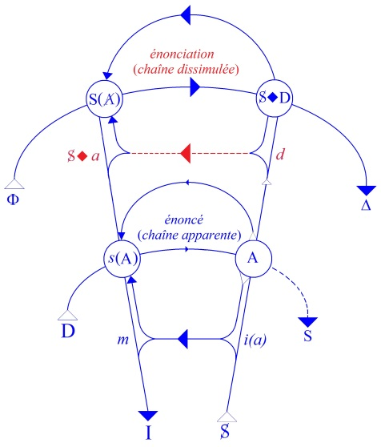
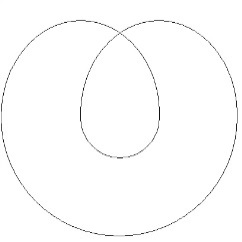
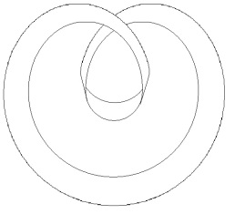
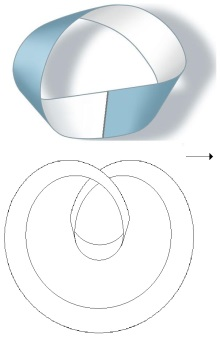
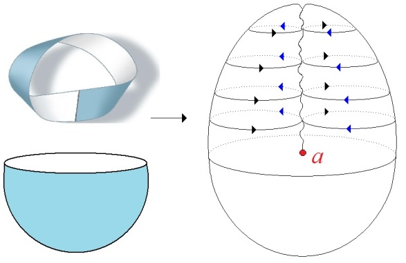
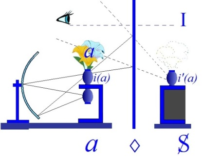
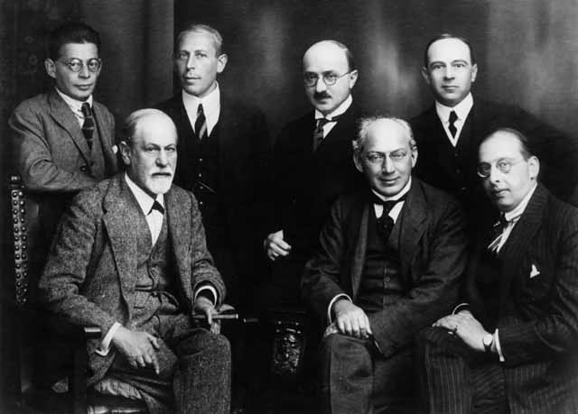

# Leçon 12 | 29 avril 1964

  

    <label><input type="checkbox" data-lacan-toggle="original" checked> 原文</label>
    <label><input type="checkbox" data-lacan-toggle="notes" checked> 注释</label>
    <label><input type="checkbox" data-lacan-toggle="commentary" checked> 个人解读评论</label>
  

  <form class="lacan-tool-search" role="search">
    <input class="lacan-tool-search-input" type="search" placeholder="搜索全文" aria-label="搜索全文">
    <button class="lacan-tool-button" type="submit" title="搜索">搜索</button>
  </form>
  <button class="lacan-tool-button lacan-back-to-top" type="button" title="回到页面最上方" aria-label="回到页面最上方">↑</button>

<section class="parallel-paragraph" data-paragraph-ids="s11-12-0001">

s11-12-0001

原文 · s11-12-0001

J’ai terminé la dernière fois sur une formule, et j’ai eu l’occasion de m’apercevoir qu’elle a plu, ce que je ne peux attribuer
qu’à ce qu’elle contient de promesses, puisque aussi bien, *sous sa forme aphorisma­tique*, elle n’était point encore développée.

[无对应译文]

</section>

<section class="parallel-paragraph" data-paragraph-ids="s11-12-0002">

s11-12-0002

原文 · s11-12-0002

J’ai dit que...

[无对应译文]

</section>

<section class="parallel-paragraph" data-paragraph-ids="s11-12-0003">

s11-12-0003

原文 · s11-12-0003

> faisant un pas, voire un saut, après la préparation,
>
> le che­min que j’avais commencé d’esquisser pour serrer le concept de trans­fert
> ...j’ai dit : « *Nous allons nous fier à la formule suivante* : *le transfert est la mise en acte de la réalité de l’inconscient.* »

[无对应译文]

</section>

<section class="parallel-paragraph" data-paragraph-ids="s11-12-0004">

s11-12-0004

原文 · s11-12-0004

Peut-être ceci a-t-il résonné, ceci a-t-il - comme je le disais à l’instant - *plu*, dans la mesure où *ce qui* *se sous-tend, s’annonce*
dans une telle for­mule, c’est justement ce que vous êtes tous plus ou moins assez infor­més pour voir que c’est bien ce qu’on tend, dans la définition du trans­fert, le plus à éviter.

[无对应译文]

</section>

<section class="parallel-paragraph" data-paragraph-ids="s11-12-0005">

s11-12-0005

原文 · s11-12-0005

Moi-même, je me trouve pour avancer cette formule dans une posi­tion problématique, car qu’est-ce qu’a avancé, promu,
mon enseigne­ment concernant *l’inconscient* ?

[无对应译文]

</section>

<section class="parallel-paragraph" data-paragraph-ids="s11-12-0006">

s11-12-0006

原文 · s11-12-0006

- *L’inconscient ce sont les effets sur le sujet, de la parole,*

[无对应译文]

</section>

<section class="parallel-paragraph" data-paragraph-ids="s11-12-0007">

s11-12-0007

原文 · s11-12-0007

- *l’inconscient* c’est la dimension où *le sujet* se déter­mine du fait et dans le développement des *effets de la parole*, en suite de quoi : *l’inconscient est structuré comme un langage.* Quoi ici apparemment, sinon une direction bien faite pour arracher toute saisie de l’inconscient, en apparence, à une visée de réalité autre que celle de la constitution du sujet.

[无对应译文]

</section>

<section class="parallel-paragraph" data-paragraph-ids="s11-12-0008">

s11-12-0008

原文 · s11-12-0008

Et pourtant si je souligne que cet enseignement a eu dans sa visée une *fin* - que pour aller droit au but j’ai qualifiée de *transférentielle -*
c’est-à-dire de recentrer ceux de mes audi­teurs auxquels je tenais le plus - à savoir *les psychanalystes -* dans une visée conforme
à l’expérience analytique. C’est bien dire qu’ici *le maniement* même *du concept* doit, selon le niveau d’où part la parole de l’enseignant,
tenir compte des effets sur l’auditeur de la formulation conceptuelle.

[无对应译文]

</section>

<section class="parallel-paragraph" data-paragraph-ids="s11-12-0009">

s11-12-0009

原文 · s11-12-0009

Il reste donc que dans ce qu’il en est de *la réalité de l’inconscient*, nous sommes - tous tant que nous sommes, et y compris celui qui enseigne sur l’inconscient - dans un rapport à sa réalité, *réalité de l’in­conscient* que mon intervention, en quelque mesure, je dirais,
non seu­lement amène au jour mais jusqu’à un certain point, engendre.

[无对应译文]

</section>

<section class="parallel-paragraph" data-paragraph-ids="s11-12-0010">

s11-12-0010

原文 · s11-12-0010

Allons au fait ! La *réalité de l’in­conscient*, c’est à la fois ce que tout le monde sait…

[无对应译文]

</section>

<section class="parallel-paragraph" data-paragraph-ids="s11-12-0011">

s11-12-0011

原文 · s11-12-0011

> *ce qui est vrai et ce qui en est la vérité insoutenable*
> …c’est la réalité sexuelle. FREUD l’a *articulé, réarticulé, articulé* si je puis dire, *mordicus*, en chaque occasion.

[无对应译文]

</section>

<section class="parallel-paragraph" data-paragraph-ids="s11-12-0012">

s11-12-0012

原文 · s11-12-0012

*Pourquoi* - dirais-je - *est-ce une réalité insoutenable ?* Eh bien, juste­ment en ceci que la réalité sexuelle, la sexualité,
eh bien le moins qu’on puisse dire, c’est que nous n’en savons pas tout. Nous avons fait, *pendant le temps que* FREUD *articulait sa découverte de l’inconscient,* nous avons fait - *pendant ce temps, ne l’oublions pas, c’est-à-dire depuis environ, disons les années 1900 ou celles qui précèdent immé­diatement -* quelques progrès qui, pour intégrés qu’ils soient à notre ima­gerie mentale, nous ne devons pas pour autant considérer que la science que nous en avons prise pendant ce temps a été là depuis toujours.

[无对应译文]

</section>

<section class="parallel-paragraph" data-paragraph-ids="s11-12-0013">

s11-12-0013

原文 · s11-12-0013

Nous en savons un petit peu plus sur le sexe que ce qui en est d’abord fonda­mentalement à appréhender. La division sexuelle,
en tant qu’elle règne sur la plus grande partie des êtres vivants, est ce qui assure - quoi ? - *le maintien de l’être d’une espèce*.
Que nous accentuions avec PLATON, cet « *être d’une espèce* » au rang d’une *Idée* éternelle, ou que nous disions avec ARISTOTE qu’elle n’est nulle part ailleurs que dans les individus qui la supportent, ceci n’est pas ce que nous avons ici à mettre en balance.
L’espèce, disons « *subsiste* » sous la forme de *ses individus*. Il n’en reste pas moins que si la survivance du *cheval -* comme espèce –
a un sens, il reste que *chaque che­val* est transitoire et meurt. *Et le lien du sexe à la mort, à la mort de l’in­dividu, est fondamental, essentiel.*

[无对应译文]

</section>

<section class="parallel-paragraph" data-paragraph-ids="s11-12-0014">

s11-12-0014

原文 · s11-12-0014

Et que ce suspens, l’existence sous cette forme, perdure grâce à la division sexuelle, repose sur la copula­tion, une copulation accentuée en deux pôles, que la tradition séculaire s’efforce de caractériser comme le pôle mâle et le pôle femelle,
et que là, gît le ressort de la reproduction.

[无对应译文]

</section>

<section class="parallel-paragraph" data-paragraph-ids="s11-12-0015">

s11-12-0015

原文 · s11-12-0015

Depuis toujours, autour de cette *réalité fondamentale*, se sont grou­pées, harmonisées, toute une séquence et - conséquence qui
très sensi­blement dans ce qui nous est le plus accessible l’accompagne - d’autres caractéristiques plus ou moins liées à la finalité
de cette reproduction, au soutien, *au premier pas de la croissance de ce qui est ainsi engendré*. Bref, je ne peux ici qu’indiquer ce qui dans
le registre biologique s’as­socie à *la différenciation sexuelle*, sous la forme de ce qu’on appelle « *caractères* » et « *fonctions sexuelles secondaires* ».

[无对应译文]

</section>

<section class="parallel-paragraph" data-paragraph-ids="s11-12-0016">

s11-12-0016

原文 · s11-12-0016

Plus loin encore, nous savons, nous pouvons préciser, articuler, mieux que jamais comment ce terrain, sur lequel s’est fondée,
dans la société, toute *une répartition des fonctions d’un jeu d’alternance*. Ce qui est propre­ment ce que *le structuralisme* [^66] moderne a su le mieux préciser, en montrant combien c’est au niveau de *l’alliance*, en tant qu’opposée à la génération naturelle, à la lignée biologique, que sont exercés ces fondamentaux échanges - au niveau du signifiant - qui nous permettront de retrouver
*les structures les plus élémentaires* de ce fonctionnement social, à inscrire en termes - le mot enfin qui vient - d’une *combinatoire*.

[无对应译文]

</section>

<section class="parallel-paragraph" data-paragraph-ids="s11-12-0017">

s11-12-0017

原文 · s11-12-0017

L’intégration, si l’on peut dire de cette *combinatoire*, du haut au bas, à la réalité sexuelle, c’est là ce qui pour nous et pour tout homme, fait surgir la question - disons le mot - non pas de l’origine du signifiant, mais si ce n’est point par là que *le signifiant est entré au monde, au monde de l’homme*. Je voudrais ici seulement jeter une lumière, pour l’instant latérale, même si nous ne devons pas nous arrêter longtemps sur ce point, pour­tant c’est ici que je veux la ponctuer.

[无对应译文]

</section>

<section class="parallel-paragraph" data-paragraph-ids="s11-12-0018">

s11-12-0018

原文 · s11-12-0018

Ce qui pour nous peut accentuer *l’instance* de *cette question,* celle qui rendrait légitime de dire que c’est par la réalité sexuelle que
le signifiant est entré au monde, ce qui veut dire que l’homme a appris à penser, c’est que, dans ce champ récent des découvertes, celui qui commence à une étude correcte de la mitose et surtout, à l’apparition des modes, la révélation des modes sous lesquels s’opère la maturation des cellules sexuelles, à savoir le double proces­sus de réduction dont vous avez, je pense tout de même,
tous entendu parler.

[无对应译文]

</section>

<section class="parallel-paragraph" data-paragraph-ids="s11-12-0019">

s11-12-0019

原文 · s11-12-0019

À la suite de quoi, dans *un type général* - auquel il faut apporter maintes exceptions - ce dont il s’agit dans cette réduction,
c’est de *la perte d’un certain nombre d’éléments - qu’on voit - qu’on appelle chromosomes.* Et chacun sait *que tout ceci nous a conduits à une géné­tique.*
Mais qu’est-ce qui sort de cette *génétique* sinon la fonction dominante, dans la détermination de certains éléments de l’organisme vivant, *d’une combinatoire.*

[无对应译文]

</section>

<section class="parallel-paragraph" data-paragraph-ids="s11-12-0020">

s11-12-0020

原文 · s11-12-0020

J’irai plus loin, sur le chemin où j’avance : une *combinatoire* qui opère, en laissant à certains de ces temps - temps essentiels, temps majeurs pour quiconque sait un petit peu quelque chose de cette étude, ce qui, je pense, est ici le cas général - temps d’alié­nation
de certains restes, d’éléments expulsés \[*cf. supra caput mortum*\]. Je ne dis ici rien de plus.

[无对应译文]

</section>

<section class="parallel-paragraph" data-paragraph-ids="s11-12-0021">

s11-12-0021

原文 · s11-12-0021

Je ne me rue pas, sous prétexte de *la fonc­tion du* *(a),* dans une spéculation analogique, j’indique seulement ce qui en est d’une affinité, d’un apparentement, depuis toujours, avec ce qu’il en est *des énigmes de la sexualité avec le jeu du signifiant, avec la combinatoire.*
En d’autres termes, je ne fais ici jour et droit qu’à une certaine vision, c’est à savoir qu’effectivement, dans l’histoire, une « science », la scien­ce *primitive*, s’est effectivement enracinée dans un mode de pensée, qui, jouant sur cette *combinatoire*, sur des *oppositions*
\- celles du *Yin* et du *Yang*, de l’eau et du feu, du chaud du froid, de tout ce que vous vou­drez - leur faisait mener, si je puis dire,
*la danse* - le mot est choisi pour sa portée plus que métaphorique - *leur danse*, en se fondant sur des rites de danses foncièrement motivés par les répartitions sexuelles effectives qui se faisaient dans la société.

[无对应译文]

</section>

<section class="parallel-paragraph" data-paragraph-ids="s11-12-0022">

s11-12-0022

原文 · s11-12-0022

Je ne peux pas me mettre à vous faire ici un cours, même abrégé, d’astronomie chinoise, mais amusez-vous à ouvrir le livre
de Léopold de SAUSSURE[^67] - il y a, comme ça, *de temps en temps*, des gens géniaux dans cette famille - vous y verrez que l’astronomie chinoise est *à la fois* fondée le plus profondément qui soit sur ce jeu des signifiants qui vont à retentir du haut en bas :
de la politique, de la structure sociale, de l’éthique, de la régulation des moindres actes, et qui est quand même une très bonne
*science astronomique*. Il est vrai que jusqu’à un certain point du temps, toute *la réalité du ciel peut ne s’inscrire en rien d’autre*
\- ce en quoi d’ailleurs on n’a point manqué - *qu’une vaste constella­tion de signifiants*.

[无对应译文]

</section>

<section class="parallel-paragraph" data-paragraph-ids="s11-12-0023">

s11-12-0023

原文 · s11-12-0023

La limite ici de la science, et de ce qu’on peut appeler *la science pri­mitive* en tant qu’elle serait foncièrement - disons, allons jusqu’à l’extrê­me - une sorte de *technique sexuelle,* la limite n’est pas possible à faire car *c’est une science*. Ce que les Chinois effectivement,
ont collationné, enrichi d’observations parfaitement valables, nous montre qu’ils avaient un système - mouvement relatif de la terre et des astres - parfaite­ment efficace quant à *la prévision de variations diurnes et nocturnes* par exemple, à une époque très précoce.
Si précoce qu’en raison de leur pointage signifiant, nous pouvons dater cette époque parce qu’elle est assez lointaine pour que
la précision des équinoxes s’y marque à la figu­re du ciel et que l’étoile polaire n’y soit pas, au moment du fondement de cette astronomie, à la même place qu’elle est de nos jours.

[无对应译文]

</section>

<section class="parallel-paragraph" data-paragraph-ids="s11-12-0024">

s11-12-0024

原文 · s11-12-0024

Il n’y a point là de versant, de ligne de division entre la science la plus parfaitement recevable, ce que nous appelons science : *collation expérimentale, qui reste valable pour tous* - et les principes qui l’ont gui­dée. Pas plus que - Claude LÉVI-STRAUSS le souligne -
on ne peut dire que tout est fantaisie et fumée dans la magie primitive : toute une énorme collation d’expériences
parfaitement utilisables s’y inscrit et s’y emma­gasine.

[无对应译文]

</section>

<section class="parallel-paragraph" data-paragraph-ids="s11-12-0025">

s11-12-0025

原文 · s11-12-0025

À ceci près qu’il y a tout de même quelque chose, un moment qui arrive - plus ou moins tôt, plus ou moins tard - où tout de même l’amar­re est rompue, avec l’initiation sexuelle du mécanisme. Et justement, si paradoxal que ça paraisse, la rupture se fait
d’au­tant plus tard que la fonction du signifiant y est plus implicite, moins repérée.

[无对应译文]

</section>

<section class="parallel-paragraph" data-paragraph-ids="s11-12-0026">

s11-12-0026

原文 · s11-12-0026

J’illustre ce que je veux dire : bien après *la révolution carté­sienne* et *la révolution newtonienne*, nous voyons encore, au cœur de la doctrine positiviste fondée sur l’astronomie, *une théorie religieuse de la terre comme grand fétiche* qui est parfaitement cohérente avec
cette énonciation qui est dans COMTE, comme vous le savez : que jamais, quant aux astres, nous ne pourrons rien connaître
de leur composition chimique, autrement dit que les astres continueront d’être là cloués à leur place, et - si nous savons y mettre une autre perspective - en pure fonction de signifiants.

[无对应译文]

</section>

<section class="parallel-paragraph" data-paragraph-ids="s11-12-0027">

s11-12-0027

原文 · s11-12-0027

Manque de pot, comme on dit, presque les mêmes années, l’analyse de la lumière nous per­mettait de voir dans les astres
mille choses à la fois, y compris juste­ment leur composition chimique. C’est-à-dire que la rupture est consommée, de l’astronomie
à l’as­trologie, à ce moment précis et vous le voyez, ce qui ne veut pas dire, bien sûr, que l’astrologie ne vive pas encore pour un très grand nombre de gens.

[无对应译文]

</section>

<section class="parallel-paragraph" data-paragraph-ids="s11-12-0028">

s11-12-0028

原文 · s11-12-0028

Or, où tend tout ce discours ? À nous interroger si ce que FREUD désigne comme étant l’inconscient, nous devons le considérer comme une rémanence de cette jonction « archaïque » de la pensée avec la réalité sexuelle. Si l’inconscient est ce qui en survit
en nous, à notre insu et isolé, si c’est en ce sens qu’il faut entendre que « *la sexualité c’est la réalité de l’in­conscient* ».
Entendez bien ce qu’ici il y a à trancher, la chose est *si voilée, d’accès si difficile* que c’est par :

[无对应译文]

</section>

<section class="parallel-paragraph" data-paragraph-ids="s11-12-0029">

s11-12-0029

原文 · s11-12-0029

- un support historique de la mani­festation des directions que se formulent les solutions,

[无对应译文]

</section>

<section class="parallel-paragraph" data-paragraph-ids="s11-12-0030">

s11-12-0030

原文 · s11-12-0030

- la façon dont entre elles l’histoire oscille et balance que nous pouvons l’éclairer.

[无对应译文]

</section>

<section class="parallel-paragraph" data-paragraph-ids="s11-12-0031">

s11-12-0031

原文 · s11-12-0031

Je dis qu’il est frappant que cette conception d’un niveau où *la pen­sée de l’Homme* suit les versants de *l’expérience sexuelle*
comme en repré­sentant le champ, réduit par l’envahissement d’une science et d’une technique qui se règlent autrement,
c’est la solution, le versant, qui dans l’histoire a pris forme et incarnation dans la pensée de JUNG. Ce qui inclut, ce qui implique,
vu ce qu’a d’inévitable pour une pen­sée moderne, une *théorie du sujet* où ce qu’on appelle *psychologisme* le mène à situer ce niveau,
à incarner sous le nom d’*archétype*, ce rapport du psychique du sujet à la réalité.

[无对应译文]

</section>

<section class="parallel-paragraph" data-paragraph-ids="s11-12-0032">

s11-12-0032

原文 · s11-12-0032

Or, il est remarquable que le *jungisme,* pour autant qu’il fait, de *ces modes primitifs d’articulation du monde* quelque chose de subsistant, quelque chose comme le noyau - il le dit - de la psyché elle-même, s’accompagne par une nécessité qui n’est pas de mot,
qui n’est pas de forme, qui n’est pas contingente, qui ne saurait être caduque - de la répudiation du terme de *libido*,
en tant que FREUD l’a accentuée, de la neutralisation de cette fonction désignée par FREUD dans le terme de *libido*,
par le recours à une notion d’énergie psychique, d’intérêt, une fonction beaucoup plus généralisée.

[无对应译文]

</section>

<section class="parallel-paragraph" data-paragraph-ids="s11-12-0033">

s11-12-0033

原文 · s11-12-0033

Ce n’est pas là simple *version selon l’école*, « *petite différence* », là se désigne quelque chose de tout à fait *essentiel*. Car ce que FREUD entend présentifier dans la fonction de la libido, ce n’est point un rapport « *archaïque* », un mode d’accès primitif des pensées,
un monde qui serait là comme l’ombre subsistante d’un monde ancien à travers le nôtre, c’est la présence effective et comme telle du *désir,* et c’est ce qui reste maintenant à pointer. Du *désir*, non pas comme sub­stance, comme chose que nous allons chercher
au niveau du processus primaire, du *désir* en tant qu’il est là, qu’il commande le mode même de notre abord.

[无对应译文]

</section>

<section class="parallel-paragraph" data-paragraph-ids="s11-12-0034">

s11-12-0034

原文 · s11-12-0034

Autrement dit, j’éclaire encore ma lanterne : je lisais, je relisais récemment, pour une intervention que j’ai faite pour un congrès
qui a eu lieu il y a peu d’années en 1960, je relisais ce qu’apportait sur l’incons­cient, quelqu’un de l’extérieur - non pas, bien sûr, quelqu’un de non informé, quelqu’un qui essayait de s’avancer aussi loin qu’il peut de la place où il est pour conceptualiser
ce domaine, M. RICŒUR nommé­ment. Il avait été assurément aussi loin que d’accéder à ce qui est le plus difficile d’accès
pour un philosophe, à savoir *le réalisme de l’incons­cient*, que l’inconscient n’est pas ambiguïté des conduites, « *futur savoir qui se sait déjà*
*de ne pas se savoir* », mais lacune, coupure, rupture qui s’inscrit dans certain manque.

[无对应译文]

</section>

<section class="parallel-paragraph" data-paragraph-ids="s11-12-0035">

s11-12-0035

原文 · s11-12-0035

Et là, il introduit quelque chose qui a l’air d’être ce que je vous dis, c’est que *ce qu’il en est ne peut pleinement s’éprouver* :

[无对应译文]

</section>

<section class="parallel-paragraph" data-paragraph-ids="s11-12-0036">

s11-12-0036

原文 · s11-12-0036

- que par rapport à l’*aventure analytique*, par rapport à l’inconscient,

[无对应译文]

</section>

<section class="parallel-paragraph" data-paragraph-ids="s11-12-0037">

s11-12-0037

原文 · s11-12-0037

- que dans cette *aventure*, son modelé, son relief, ses caches, ses trous, ses trappes et ses clapets. Bien sûr en *philosophe* qu’il est, il convient qu’il y a *quelque chose* de cette dimension à réserver. Simplement il se l’accapare, il appelle ça l’*herméneutique*. On fait grand état de nos jours de ce qu’on appelle l’*herméneutique*. L’*herméneutique* n’objecte pas seulement à ce que j’ai appelé notre *aventure analytique*, elle s’est révélée aussi dans les faits, objecter au struc­turalisme tel qu’il s’énonce au niveau des travaux de LÉVI-STRAUSS.

[无对应译文]

</section>

<section class="parallel-paragraph" data-paragraph-ids="s11-12-0038">

s11-12-0038

原文 · s11-12-0038

Qu’est-ce que l’*herméneutique*, si ce n’est aussi ce quelque chose qui va voir dans la suite de ses transformations, de ses mutations historiques, ce qu’on peut appeler « *le progrès pour l’homme* », un homme que je ne qualifierai pas d’abstrait, l’homme d’une histoire, d’une histoire qui peut aussi bien, sur les bords, se prolonger en des temps plus indéfinis, le progrès des *signes* selon lesquels
il organise, il constitue son destin ? Et bien sûr, M. RICŒUR de renvoyer à la pure contingence, ce à quoi les analystes,
en l’occasion, ont affaire dans chaque cas.

[无对应译文]

</section>

<section class="parallel-paragraph" data-paragraph-ids="s11-12-0039">

s11-12-0039

原文 · s11-12-0039

Il faut dire que, du dehors, *la corporation des analystes* ne lui donne pas l’impression d’un accord si fondamental que cela puisse en effet l’impressionner. Ce n’est pas une raison pourtant pour lui laisser là *terrain conquis*. Car effectivement, je soutiens que c’est au niveau de l’analyste - si quelque pas plus en avant peut être accompli - que c’est au niveau de l’analyste que peut, que doit se révéler
ce qu’il en est de ce *point nodal* par quoi *la pulsation de l’inconscient est liée à la réalité sexuelle*.

[无对应译文]

</section>

<section class="parallel-paragraph" data-paragraph-ids="s11-12-0040">

s11-12-0040

原文 · s11-12-0040

Ce *point nodal* s’appelle le désir, et toute l’élaboration théorique que j’ai poursuivie ces dernières années, pour vous montrer,
au pas à pas de la clinique, comment *le désir* se situe dans la dépendance de *la deman­de*, en tant que *demande* articulée au signifiant.
Ce qui la supporte lais­se ce *reste métonymique*, ce qui court sous la demande :

[无对应译文]

</section>

<section class="parallel-paragraph" data-paragraph-ids="s11-12-0041">

s11-12-0041

原文 · s11-12-0041

- cet élément qui n’est pas élément indéterminé mais condition à la fois *absolue* et *insai­sissable*,

[无对应译文]

</section>

<section class="parallel-paragraph" data-paragraph-ids="s11-12-0042">

s11-12-0042

原文 · s11-12-0042

- cet élément nécessairement en impasse, insatisfait, impossible, méconnu,

[无对应译文]

</section>

<section class="parallel-paragraph" data-paragraph-ids="s11-12-0043">

s11-12-0043

原文 · s11-12-0043

- cet élément qui s’appelle *le désir*, …c’est ceci qui fait la jonction avec le champ défini par FREUD comme celui de *l’instance sexuelle* au niveau du processus primaire.

[无对应译文]

</section>

<section class="parallel-paragraph" data-paragraph-ids="s11-12-0044">

s11-12-0044

原文 · s11-12-0044

La double face de la fonction du désir en tant qu’elle est résidu der­nier dans le sujet de l’effet du signifiant, sujet radical
pour FREUD - « *desi­dero »* c’est le « *cogito »* freudien - et c’est de là, nécessairement, que s’insti­tue l’essentiel de ce que FREUD désigne comme le processus primaire. Observez bien ce qu’il en dit, ce champ où la pulsion se satisfait - de par la structure –
se satisfait fondamentalement et essentiellement de l’*hallu­cination*.

[无对应译文]

</section>

<section class="parallel-paragraph" data-paragraph-ids="s11-12-0045">

s11-12-0045

原文 · s11-12-0045

*Aucun schéma-mécanisme ne pourra jamais répondre* de ce qui est donné tout simplement *pour une régression sur l’arc réflexe* :

[无对应译文]

</section>

<section class="parallel-paragraph" data-paragraph-ids="s11-12-0046">

s11-12-0046

原文 · s11-12-0046

- ce qui vient par le *sensorium,* doit s’en aller par le *motorium,*

[无对应译文]

</section>

<section class="parallel-paragraph" data-paragraph-ids="s11-12-0047">

s11-12-0047

原文 · s11-12-0047

- et si le *motorium* ne marche pas, ça retourne en arrière.

[无对应译文]

</section>

<section class="parallel-paragraph" data-paragraph-ids="s11-12-0048">

s11-12-0048

原文 · s11-12-0048

Mais diable, si ça retourne en arrière, comment pouvons-nous concevoir que cela fasse une *perception* ? Si ce n’est *par l’image* de quelque chose qui, d’un courant arrêté, fait refluer l’énergie sous la forme *d’une lampe qui s’allume*, mais lampe qui s’allume pour qui ? La dimension du tiers est essentielle, sous quelque forme que vous vouliez représenter ce dont il s’agit, dans *cette prétendue régression*.

[无对应译文]

</section>

<section class="parallel-paragraph" data-paragraph-ids="s11-12-0049">

s11-12-0049

原文 · s11-12-0049

Elle ne peut se concevoir que sous une forme strictement analogue à ce que j’ai *dessiné* l’autre jour pour vous au tableau,
sous la forme de la duplicité du *sujet de l’énon­cé* au *sujet de l’énonciation*.

[无对应译文]

</section>

<section class="parallel-paragraph" data-paragraph-ids="s11-12-0050">

s11-12-0050

原文 · s11-12-0050

[无对应译文]

</section>

<section class="parallel-paragraph" data-paragraph-ids="s11-12-0051">

s11-12-0051

原文 · s11-12-0051

Seule la présence du sujet qui désire et qui désire sexuellement, nous apporte cette dimension de métaphore,
de métaphore naturelle, d’où se décide la prétendue identité de la per­ception.

[无对应译文]

</section>

<section class="parallel-paragraph" data-paragraph-ids="s11-12-0052">

s11-12-0052

原文 · s11-12-0052

Pour FREUD, et justement dans la mesure où il maintient *la libido* comme *l’élément essentiel du processus primaire*, ceci veut dire
\- *contrairement, contradictoirement* si vous voulez, à l’apparence des textes où il veut essayer d’illustrer sa théorie -
que *l’hallucination*, *l’hal­lucination la plus simple du plus simple des besoins*, *l’hallucination ali­mentaire* elle-même, telle qu’elle se produit
dans le rêve de la petite Anna, quand elle dit je ne sais plus quoi : « *Tarte, fraise, œufs* » et autres menus friandises... ceci implique non pas qu’il y a purement et simple­ment là, *présentification des objets d’un besoin*, que c’est dans la dimension de la sexualisation de cet objet, déjà, que l’hallucination du rêve est possible, car vous pouvez le remarquer, la petite Anna n’hallu­cine que les objets interdits.

[无对应译文]

</section>

<section class="parallel-paragraph" data-paragraph-ids="s11-12-0053">

s11-12-0053

原文 · s11-12-0053

La chose, bien sûr, doit se discuter dans chaque cas, et à chaque niveau, mais la dimension de *signification* de toute hallucination
qui nous est offerte en clinique est absolument à repérer, pour nous permettre de sai­sir ce dont il s’agit dans le *principe du plaisir*.
La chose est nettement for­mulée : c’est du point où le sujet désire que la connotation de réalité - et c’est ce qui fait son poids -
est donnée dans l’hallucination. Et que FREUD fasse une opposition du *principe du plaisir* au *principe de réali­té*, c’est justement
dans la mesure où la réalité y est définie comme *réa­lité désexualisée*.

[无对应译文]

</section>

<section class="parallel-paragraph" data-paragraph-ids="s11-12-0054">

s11-12-0054

原文 · s11-12-0054

On parle souvent dans la théorie analytique - dans les théories les plus récentes - de fonctions désexualisées : que l’*idéal du moi* repose sur l’investissement d’une *libido désexualisée*, et bien d’autres fonctions encore. Je dois dire qu’il me paraît très difficile
de parler d’une *libido désexualisée*.

[无对应译文]

</section>

<section class="parallel-paragraph" data-paragraph-ids="s11-12-0055">

s11-12-0055

原文 · s11-12-0055

Mais que l’abord de la réalité comporte *une désexualisa­tion*, c’est là ce qui est, en effet, au principe de la définition
par FREUD des *[Zwei Prinzipien des psychischen Geschehens](http://www.textlog.de/freud-psychoanalyse-zwei-prinzipien-psychischen-geschehens.html),* des *deux principes où se répartit l’événementialité psychique*.
Qu’est-ce à dire ? Que dans le transfert, c’est là que nous devons en voir s’inscrire le poids, de cette réalité sexuelle.

[无对应译文]

</section>

<section class="parallel-paragraph" data-paragraph-ids="s11-12-0056">

s11-12-0056

原文 · s11-12-0056

Pour la plus grande par­tie inconnue et jusqu’à un certain point voilée, elle court - en double - sous ce qui se passe au niveau
du *discours analytique*, qui est bel et bien, à mesure qu’il prend forme, celui qu’on peut appeler la demande, et ce n’est pas pour rien que toute l’expérience nous a amené à la faire telle­ment basculer du côté des termes de « frustration » et de « gratification ».

[无对应译文]

</section>

<section class="parallel-paragraph" data-paragraph-ids="s11-12-0057">

s11-12-0057

原文 · s11-12-0057

Mais s’il n’y avait point cette forme, cette topologie du sujet que j’ai essayé, ici, d’inscrire au tableau, selon un sigle, un algorithme, que j’ai appelé dans son temps le huit intérieur :

[无对应译文]

</section>

<section class="parallel-paragraph" data-paragraph-ids="s11-12-0058">

s11-12-0058

原文 · s11-12-0058

 

[无对应译文]

</section>

<section class="parallel-paragraph" data-paragraph-ids="s11-12-0059">

s11-12-0059

原文 · s11-12-0059

Assurément quelque chose qui vous rappelle les schémas logiques, ceux par exemple des fameux *cercles d’Euler*, à ceci près que, comme vous pouvez le voir, je pense que les deux schémas sont assez expressifs, vous voyez bien qu’il s’agit là d’une surface,
de quelque chose que vous pouvez découper, fabri­quer.

[无对应译文]

</section>

<section class="parallel-paragraph" data-paragraph-ids="s11-12-0060">

s11-12-0060

原文 · s11-12-0060

*Le bord en est continu*, à ceci près qu’ici - vous le voyez - il ne va pas sans être *occulté par la surface* qui s’est précédemment déroulée, mais vous n’avez aucune objection à faire, à cette structure ni à la pureté de ce bord. Quelque chose ici se dessine, qui, vu dans
une certaine pers­pective, peut nous paraître représenter deux champs qui se recoupent.

[无对应译文]

</section>

<section class="parallel-paragraph" data-paragraph-ids="s11-12-0061">

s11-12-0061

原文 · s11-12-0061

La *libido*, ici, je l’ai inscrite au point où ce lobe tel qu’il se décrit comme le champ du développement de l’inconscient vient recouvrir, occulter l’autre lobe, celui de la réalité sexuelle, telle qu’elle est ici, intéressée. La *libido* serait ce qui appartient aux deux, *le point d’intersection*, comme on dit en pure logique. Eh bien, c’est justement ce que ça ne veut pas dire. Car c’est juste­ment *en ce point*
*où les champs paraissent se recouvrir* que - si vous voyez le profil vrai de la surface - qu’est un vide.

[无对应译文]

</section>

<section class="parallel-paragraph" data-paragraph-ids="s11-12-0062">

s11-12-0062

原文 · s11-12-0062

Cette surface, si vous vou­lez la rattacher à quelque chose de fondamental en topologie, n’en pas faire un accident de construction, comme une petite rustine bizarre­ment fabriquée, elle appartient à une surface dont j’ai décrit en son temps, à mes élèves *la topologie*, et qui s’appelle *le cross-cap*, autrement dit *la mitre*.

[无对应译文]

</section>

<section class="parallel-paragraph" data-paragraph-ids="s11-12-0063">

s11-12-0063

原文 · s11-12-0063

Je ne l’ai pas dessiné ici, pour ne point vous alourdir les efforts à faire au niveau de mon discours, mais je vous prie simplement d’observer ce qui est sa caractéristique qui saute tout de suite absolu­ment aux yeux : c’est que si vous faites, par une surface *complémen­taire*, s’unir les bords tel qu’ils se présentent, à peu près deux à deux, la surface complémentaire, fermez cette surface-ci, surface qui joue le même rôle de complément, si vous voulez, que serait une sphère par rapport à un simple cercle, et une sphère qui fermerait ce que déjà le cercle s’avérerait, s’offrirait comme prêt à contenir.

[无对应译文]

</section>

<section class="parallel-paragraph" data-paragraph-ids="s11-12-0064">

s11-12-0064

原文 · s11-12-0064

 

[无对应译文]

</section>

<section class="parallel-paragraph" data-paragraph-ids="s11-12-0065">

s11-12-0065

原文 · s11-12-0065

Regardez bien, c’est une *surface de Mœbius*. Je veux dire que si vous suivez ici ce qu’il arri­ve dans une pente qui se trouverait avoir l’intervalle de ces deux sur­faces, cette pente vient à *se refermer*, à *se boucler*, à se coller, comme on ferait dans la réalité, de façon
qu’elle se forme d’une façon telle que, comme vous le savez, dans le *ruban* *de Mœbius*, son endroit se conti­nue avec son envers.

[无对应译文]

</section>

<section class="parallel-paragraph" data-paragraph-ids="s11-12-0066">

s11-12-0066

原文 · s11-12-0066

Mais il est une deuxième nécessité qui ressort de cette figure, c’est qu’elle doit, pour fermer sa courbe, traverser quelque part
la surface précédente, nommément en ce point-ci, selon cette ligne que je viens de reproduire ici sur le deuxième modèle.

[无对应译文]

</section>

<section class="parallel-paragraph" data-paragraph-ids="s11-12-0067">

s11-12-0067

原文 · s11-12-0067

Ceci désigne la place, l’image qui nous permet de figurer *le désir* comme lieu de jonction du *champ de la demande* - en tant que
nous allons voir s’y présentifier *les syncopes de l’inconscient*, leur cor­rélation - à ce quelque chose d’intéressé qui est la réalité sexuelle. Tout ceci dépend, c’est là-dessus que j’ai à conclure aujourd’hui, d’un point, d’une ligne, que nous appelons la *ligne de désir*, en tant qu’elle est d’une part, liée à la demande, que d’autre part c’est par son incidence que se présentifie dans l’expérience *l’incidence sexuelle*.

[无对应译文]

</section>

<section class="parallel-paragraph" data-paragraph-ids="s11-12-0068">

s11-12-0068

原文 · s11-12-0068

Or, ce désir, quel est-il ? Pensez-vous que c’est là que je désigne l’ins­tance du transfert ? Oui et non. Il s’agit de savoir comment
je vais l’entendre et vous verrez que la chose ne va pas toute seule si je vous dis que le désir dont il s’agit, c’est le désir de l’analyste.
Je ne ferai rien d’autre - pour ne pas vous laisser sous la sidération d’une affirmation qui peut vous paraître aventurée –
que de vous rappe­ler la porte d’entrée de l’inconscient dans l’horizon de FREUD.

[无对应译文]

</section>

<section class="parallel-paragraph" data-paragraph-ids="s11-12-0069">

s11-12-0069

原文 · s11-12-0069

Anna O...

[无对应译文]

</section>

<section class="parallel-paragraph" data-paragraph-ids="s11-12-0070">

s11-12-0070

原文 · s11-12-0070

> laissons cette histoire d’O, appelons-la par son nom [Bertha PAPPENHEIM](http://fr.wikipedia.org/wiki/Bertha_Pappenheim). Elle est devenue, vous le savez, dans la suite, *un des grands noms de l’assistance sociale en Allemagne*. Il n’y a pas si longtemps, une de mes élèves m’apportait, pour m’en assurer, un petit timbre frappé en Allemagne à son image. C’est vous dire qu’elle a lais­sé quelques traces dans l’histoire.
> ...Anna O, vous le savez, c’est à son propos qu’on a découvert le transfert. Vous savez ce qui s’est produit : BREUER était,
> de l’opération qui se poursuivait avec ladite personne, tout à fait enchanté, ça allait comme sur des roulettes, ne l’oubliez pas.
> À ce moment-là, le *signi­fiant*, personne ne l’aurait contesté, si on avait su simplement faire revivre ce mot du vocabulaire stoïcien.

[无对应译文]

</section>

<section class="parallel-paragraph" data-paragraph-ids="s11-12-0071">

s11-12-0071

原文 · s11-12-0071

Plus Anna en donnait de signifiants, et de jaspinage, mieux ça allait. C’était le *cheminey-cure,* le ramonage. Et pas trace dans tout ça,
à l’horizon, de la moindre chose gênante, repre­nez l’observation. Pas de *sexualité*, ni au microscope ni à la longue vue. L’entrée
de la sexualité, elle se fait tout de même par BREUER. Il commence quand même à lui revenir quelque chose,
c’est peut-être d’abord de chez lui que ça lui revient : « *Tu t’en occupes un peu beaucoup* ».

[无对应译文]

</section>

<section class="parallel-paragraph" data-paragraph-ids="s11-12-0072">

s11-12-0072

原文 · s11-12-0072

Là-dessus, le cher homme - alarmé, et bon époux au reste - trouve qu’en effet ça suffit comme ça.
Moyennant quoi, comme vous le savez, l’O en question montre *les magnifiques et dramatiques manifestations* de ce qu’on appelle
dans le langage scientifique, *pseudocyesis,* ce qui veut dire tout simplement *un petit ballon*, autrement dit « *une grossesse »* que l’on qua­lifie
de « *nerveuse »* montrant là - on peut spéculer - quoi ?

[无对应译文]

</section>

<section class="parallel-paragraph" data-paragraph-ids="s11-12-0073">

s11-12-0073

原文 · s11-12-0073

Il faudrait encore ne pas se précipiter sur le langage du corps. Disons simplement que le domaine de la sexualité montre
un fonc­tionnement naturel des signes, non pas des signifiants à ce niveau. Car le faux ballon est un symptôme fait
\- selon la définition du signe - pour *représenter quelque chose pour quelqu’un*. *Le signifiant* - je vous le rappelle, étant tout autre chose -
*représentant un sujet pour un autre signifiant. Grosse* différence à articuler en cette occasion.

[无对应译文]

</section>

<section class="parallel-paragraph" data-paragraph-ids="s11-12-0074">

s11-12-0074

原文 · s11-12-0074

Car, et pour cause - *je vous le dirai tout à l’heure* - on a tendance à dire *que tout ça c’est la faute à Bertha !* Mais je vous prierai un instant
de suspendre votre pen­sée à cette hypothèse : pourquoi est-ce que *la grossesse de Bertha*, nous ne la considérerions pas plutôt,
selon ma formule que « *Le désir de l’homme, c’est le désir de l’Autre* », comme la manifestation du désir de BREUER ?
Pourquoi est-ce que vous n’iriez pas jusqu’à penser que c’était BREUER qui avait un désir d’enfant. Et je vous en donnerai
un commen­cement de preuve, c’est que BREUER, partant en Italie avec sa femme, s’empresse de lui faire un enfant.

[无对应译文]

</section>

<section class="parallel-paragraph" data-paragraph-ids="s11-12-0075">

s11-12-0075

原文 · s11-12-0075

Un enfant qui - comme le rappelle aimablement M. JONES à son interlocuteur - un enfant qui, au moment où JONES parle,
d’être né dans ces conditions, dit ce Gallois imper­turbable, vient - sans doute non sans relation avec ces conditions –
de se suicider à New York.

[无对应译文]

</section>

<section class="parallel-paragraph" data-paragraph-ids="s11-12-0076">

s11-12-0076

原文 · s11-12-0076

Laissons de côté ce que nous pouvons penser en effet d’un désir auquel même cette issue n’est point indifférente, mais observons ce que fait FREUD en disant à BREUER :

[无对应译文]

</section>

<section class="parallel-paragraph" data-paragraph-ids="s11-12-0077">

s11-12-0077

原文 · s11-12-0077

> « *Mais quoi ? Quelle affaire ! Le transfert c’est la spontanéité de l’inconscient de ladite Bertha. Ça n’est pas le tien, ton désir*… »

[无对应译文]

</section>

<section class="parallel-paragraph" data-paragraph-ids="s11-12-0078">

s11-12-0078

原文 · s11-12-0078

lui dit-il. Je ne sais pas *s’ils se tutoyaient*, mais c’est probable.

[无对应译文]

</section>

<section class="parallel-paragraph" data-paragraph-ids="s11-12-0079">

s11-12-0079

原文 · s11-12-0079

> «…c*’est le désir de l’Autre* ».

[无对应译文]

</section>

<section class="parallel-paragraph" data-paragraph-ids="s11-12-0080">

s11-12-0080

原文 · s11-12-0080

En quoi je considère que FREUD traite BREUER comme un hystérique, car il lui dit :

[无对应译文]

</section>

<section class="parallel-paragraph" data-paragraph-ids="s11-12-0081">

s11-12-0081

原文 · s11-12-0081

> « *Ton désir, c’est le désir de l’Autre* ».

[无对应译文]

</section>

<section class="parallel-paragraph" data-paragraph-ids="s11-12-0082">

s11-12-0082

原文 · s11-12-0082

Chose curieuse, *il ne le déculpabilise pas* absolument, mais assuré­ment il le désangoisse. Ceux qui ici, savent la différence que je fais entre ces deux niveaux, peuvent en prendre une indication. Ce n’est pas maintenant que nous allons suivre les choses dans ce sens.
Mais ceci nous introduit à la question de ce que FREUD, son désir à lui, a décidé en « fourvoyant », en déviant toute la visée,
la direction à donner à la saisie du transfert comme tel dans son *fonctionnement*, dans ce sens, dans ce sens maintenant au dernier temps et dans les termes quasi-absurdes que j’ai donnés, à l’origine dénoncés par SZASZ, à savoir celui qui aboutit
à ce qu’un *analyste* puisse dire que « *toute la théorie du transfert n’est qu’une défense de l’analyste »*.

[无对应译文]

</section>

<section class="parallel-paragraph" data-paragraph-ids="s11-12-0083">

s11-12-0083

原文 · s11-12-0083

Je fais basculer cet extrême. J’en montre exactement l’autre face, mais une face qui peut, elle, peut-être nous conduire quelque part, en vous disant : c’est le désir de l’analyste ! Il faut me suivre, tout cela n’est pas fait simplement pour mettre les choses
*sens dessus-dessous,* c’est pour vous mener quelque part.

[无对应译文]

</section>

<section class="parallel-paragraph" data-paragraph-ids="s11-12-0084">

s11-12-0084

原文 · s11-12-0084

*Mais avec cette clé, lisez une revue générale*, comme vous pouvez en trouver - mon Dieu - sous la plume de n’impor­te qui,
quelqu’un qui peut écrire un *Que sais-je ?* sur la psychanalyse[^68], peut aussi bien vous faire *une revue générale du transfert*.
Lisez la revue générale du transfert, que je désigne ici suffisamment, et repérez-vous sur cette visée.

[无对应译文]

</section>

<section class="parallel-paragraph" data-paragraph-ids="s11-12-0085">

s11-12-0085

原文 · s11-12-0085

Ce que chacun apporte comme contri­bution au ressort du transfert, est-ce que ce n’est pas - à part FREUD - quelque chose
où son désir est parfaitement lisible ?

[无对应译文]

</section>

<section class="parallel-paragraph" data-paragraph-ids="s11-12-0086">

s11-12-0086

原文 · s11-12-0086

- Je vous ferais l’ana­lyse d’ABRAHAM, simplement à partir de sa théorie des objets partiels.

[无对应译文]

</section>

<section class="parallel-paragraph" data-paragraph-ids="s11-12-0087">

s11-12-0087

原文 · s11-12-0087

> Il n’y a pas que ce que - dans l’affaire - que ce que l’*analyste* entend faire de son patient, il y a aussi ce que l’analyste entend que son *patient* fasse de lui. ABRAHAM - *disons* - voulait être une mère complète.

[无对应译文]

</section>

<section class="parallel-paragraph" data-paragraph-ids="s11-12-0088">

s11-12-0088

原文 · s11-12-0088

- Et puis je pourrais aussi m’amuser à ponctuer les marges de la théo­rie de FERENCZI d’une chanson célèbre de GEORGIUS : [*Je suis fils-père*](http://www.youtube.com/watch?v=qsb2uucyC3Q).

[无对应译文]

</section>

<section class="parallel-paragraph" data-paragraph-ids="s11-12-0089">

s11-12-0089

原文 · s11-12-0089

- Et que NUNBERG a aussi ses intentions, et que dans son article vrai­ment remarquable sur « [*Amour et transfert*](http://www.psychanalyse.lu/articles/JekelsBerglerAmourTransfert.htm) », se montre en position d’arbitre des puissances de vie et de mort où on ne peut pas ne pas voir, de quelque façon, l’aspiration à une position divine.

[无对应译文]

</section>

<section class="parallel-paragraph" data-paragraph-ids="s11-12-0090">

s11-12-0090

原文 · s11-12-0090

Ceci peut, en un certain sens, ne participer que d’une sorte d’amuse­ment. Mais c’est au cours de cette histoire que peut se ponctuer, se scander, l’isolement véritable, authentique, de fonctions comme celles qu’ici j’ai voulu reproduire au tableau. À savoir que
ce pour quoi ces petits schémas que j’ai faits à l’occasion d’une réponse à *une théorie psychologisante de la personnalité psychanalytique,*
c’est pour montrer - quoi ? - la dynamique qui les lie étroitement à ce que le sujet entend ici articuler dans la nasse,
ce qui de sa petite affaire, vient se profiler, je l’ai dit, à titre d’*obturateur*.

[无对应译文]

</section>

<section class="parallel-paragraph" data-paragraph-ids="s11-12-0091">

s11-12-0091

原文 · s11-12-0091

*À ceci près que cet obturateur*, il faut que vous le compliquiez un peu, que vous en fassiez un obturateur comme ce qu’il y a dans
un appareil photographique, *à ceci près que ce serait un miroir*. Et que c’est dans ce petit miroir qui vient obturer ce qui est de l’autre côté, qu’il voit se profiler le jeu grâce à quoi il peut accom­moder sa *propre image* autour, selon l’illusion que je rappelle ici,
de ce qu’on obtient dans une expérience de physique amusante dite « *du bouquet renversé* », c’est-à-dire d’une *image réelle*.
\[*Lacan modifie l’expérience de Bouasse : ici c’est le vase qui est renversé et un miroir plan est ajouté*\]

[无对应译文]

</section>

<section class="parallel-paragraph" data-paragraph-ids="s11-12-0092">

s11-12-0092

原文 · s11-12-0092

[无对应译文]

</section>

<section class="parallel-paragraph" data-paragraph-ids="s11-12-0093">

s11-12-0093

原文 · s11-12-0093

Là c’est l’image réelle \[*i(a)*\] de l’en­veloppe \[le vase\], qui vient s’accommoder *autour* de ce quelque chose qui appa­raît, qui est le *petit(a).* Et la somme de ces accommodations d’image, c’est *ce quelque chose* où le sujet doit trouver l’occasion d’une intégration essentielle.

[无对应译文]

</section>

<section class="parallel-paragraph" data-paragraph-ids="s11-12-0094">

s11-12-0094

原文 · s11-12-0094

Que savons-nous de tout cela, si ce n’est qu’au gré des oscillations, des flottements, de l’engagement du désir de chaque analyste, nous sommes arrivés à ajouter tel petit détail, telle observation de complé­ment, telle addition ou raffinement d’incidence
qui nous permet de qualifier la présence - la présence au niveau du *désir* - de chacun des ana­lystes.

[无对应译文]

</section>

<section class="parallel-paragraph" data-paragraph-ids="s11-12-0095">

s11-12-0095

原文 · s11-12-0095

Et pour autant qu’en la matière il fait œuvre recevable, l’incidence de la réalité sexuelle, c’est là où FREUD a laissé cette *bande*
\- comme il dit - *qui le suit*, cette « *bande* » que j’ai évoquée tout à l’heure - mon Dieu - assez ironiquement… Pour aussi bien l’évoquer ici sous une autre forme : vous savez qu’après tout, les gens qui suivaient le CHRIST n’étaient pas si reluisants.

[无对应译文]

</section>

<section class="parallel-paragraph" data-paragraph-ids="s11-12-0096">

s11-12-0096

原文 · s11-12-0096

FREUD n’était pas le CHRIST, mais enfin après tout, il était peut-être quelque chose comme *Viridiana* [^69]. Ceux qu’on photographie si *ironiquement dans ce film, avec ce petit appareil*, m’évoquant quel­quefois invinciblement le groupe, également de nombreuses fois
pho­tographié, de ceux qui furent de FREUD *les apôtres et les épigones.*

[无对应译文]

</section>

<section class="parallel-paragraph" data-paragraph-ids="s11-12-0097">

s11-12-0097

原文 · s11-12-0097

[无对应译文]

</section>

<section class="parallel-paragraph" data-paragraph-ids="s11-12-0098">

s11-12-0098

原文 · s11-12-0098

Est-ce là les diminuer ? Pas plus que les apôtres ! C’est justement de ce niveau qu’ils pouvaient porter le meilleur témoignage.
C’est d’une certaine naïveté, d’une certaine pauvreté, d’une certaine innocence qu’ils nous ont le plus instruits.

[无对应译文]

</section>

<section class="parallel-paragraph" data-paragraph-ids="s11-12-0099">

s11-12-0099

原文 · s11-12-0099

Il est vrai qu’autour de SOCRATE, l’assistance était - il faut bien le dire - beaucoup plus reluisante, et qu’elle - je crois l’avoir démontré à l’oc­casion - ne nous enseigne sur le sujet de la relation au *transfert*, ceux qui se souviennent de mon séminaire sur ce sujet \[*séminaire* 1960-61\] peuvent en témoigner, qu’ils ne nous enseignent pas moins.

[无对应译文]

</section>

<section class="parallel-paragraph" data-paragraph-ids="s11-12-0100">

s11-12-0100

原文 · s11-12-0100

C’est là que je reprendrai mon pas la prochaine fois, en essayant de vous articuler la prégnance de la fonc­tion du *désir de l’analyste*.

[无对应译文]

</section>

<section class="note-block original-notes">

## Notes

[^66]: Claude Lévi-Strauss : *Les structures élémentaires de la parenté*, PUF 1949, ou éd. de l'E.H.E.S.S. ­1967.

[^67]: [Léopold de Saussure : *Les origines de l’astronomie chinoise*](http://www.chineancienne.fr/app/download/4935403562/saussure_oriastro.pdf?t=1298999219), éd. Cheng-Wen Publishing Company, Taïpei, 1967.

[^68]: D. Lagache : *La psychanalyse*, PUF, Coll. Que sais-je ?

[^69]: *Viridiana* est le titre, et le personnage principal, d’un film mexicain de Luis Buñuel, Palme d'or du festival de Cannes 1961.

</section>
