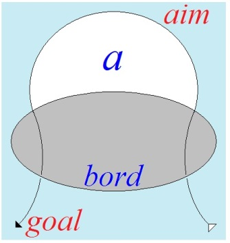

# Leçon 14 | 13 mai 1964

  <label><input type="checkbox" data-lacan-toggle="original" checked> 原文</label>
  <label><input type="checkbox" data-lacan-toggle="notes" checked> 注释</label>
  <label><input type="checkbox" data-lacan-toggle="commentary" checked> 个人解读评论</label>

<section class="parallel-paragraph" data-paragraph-ids="s11-14-0001">

s11-14-0001

[无对应译文]

原文 · s11-14-0001

τῷ τόξῳ ὄνομα βίος, ἔργον δὲ θάνατος.

</section>

<section class="parallel-paragraph" data-paragraph-ids="s11-14-0002">

s11-14-0002

[无对应译文]

原文 · s11-14-0002

> HÉRACLITE (Fragment 48)

</section>

<section class="parallel-paragraph" data-paragraph-ids="s11-14-0003">

s11-14-0003

[无对应译文]

原文 · s11-14-0003

\[Pour l’arc - τῷ τόξῳ *(synonyme de* βιός* : arc)* - le nom est vie - ὄνομα βίος *(vie)* - mais l’œuvre est mort - ἔργον θάνατος.\][^74]

</section>

<section class="parallel-paragraph" data-paragraph-ids="s11-14-0004">

s11-14-0004

[无对应译文]

原文 · s11-14-0004

Quand je lis - la dernière de mes lectures d’actualité - dans le *Psychoanalytic Quaterly,* un article comme celui de M. Edward GLOVER intitulé *Freudian or neo-freudian*, entièrement dirigé contre les constructions de M. ALEXANDER, quand j’y ressens cette *sordide odeur de renfermé*, du fait qu’au nom de *critères désuets,* une construction comme celle de M. ALEXANDER - mon Dieu, je n’ai pas hésité
à l’attaquer de la façon la plus formelle, il y a déjà quatorze ans, au *Congrès de Psychiatrie de* 1950 - mais enfin, qui est la *construction*
*d’un homme de grand talent*, quand je vois à quel niveau cette discussion est discutée, contre­battue, je me rends cette justice qu’à travers tous *les avatars* que ren­contre mon discours ici même et ailleurs, assurément on peut dire que ce discours obvie, fait obstacle,
à ce que l’expérience de l’analyse ne vous soit pas transmise d’une façon absolument crétinisante.

</section>

<section class="parallel-paragraph" data-paragraph-ids="s11-14-0005">

s11-14-0005

[无对应译文]

原文 · s11-14-0005

Je reprends à partir de là mon discours sur *la pulsion*. J’ai été amené à l’aborder au moment... après avoir posé que le transfert
dans l’ex­périence est ce qui manifeste la mise en action de la réalité de l’incons­cient en tant qu’elle est sexualité.
Je me trouve arrêté, pour poursuivre sur ce que comporte cette affirmation même : si nous sommes sûrs que la sexualité est là présente en action dans le transfert, c’est pour autant qu’elle se manifeste à certains moments à découvert sous la forme de *l’amour*.
Or, c’est là ce dont il s’agit : est-ce que *l’amour* représente le point sommet, le moment achevé, le facteur indis­cutable
qui nous présentifie la sexualité dans l’*hic* et *nunc* du *transfert* ?

</section>

<section class="parallel-paragraph" data-paragraph-ids="s11-14-0006">

s11-14-0006

[无对应译文]

原文 · s11-14-0006

*À ceci obvie, s’oppose, objecte,* de la façon la plus claire, *le texte* non certes isolé, mais choisi par moi comme central, et sans qu’on puis­se aucunement accuser ce choix d’arbitraire, puisque le texte dont il s’agit est *le texte de* *Freud*, qui a proprement pour objet
*Les pulsions et leurs vicissitudes*. C’est ce texte que j’ai commencé d’aborder la dernière fois en essayant de faire sentir *sous quelle forme problématique*, autrement dit four­millante de questions, se présente l’introduction de la pulsion.

</section>

<section class="parallel-paragraph" data-paragraph-ids="s11-14-0007">

s11-14-0007

[无对应译文]

原文 · s11-14-0007

J’espère qu’*une part au moins importante* de mon auditoire aura pu dans l’inter­valle se reporter à ce texte,

</section>

<section class="parallel-paragraph" data-paragraph-ids="s11-14-0008">

s11-14-0008

[无对应译文]

原文 · s11-14-0008

- soit qu’il s’agisse de personnes capables de le lire en allemand, *ce qui me paraît éminemment souhaitable*,

</section>

<section class="parallel-paragraph" data-paragraph-ids="s11-14-0009">

s11-14-0009

[无对应译文]

原文 · s11-14-0009

- soit, faute de mieux, qu’ils aient pu le lire, toujours plus ou moins improprement tra­duit, dans les deux autres langues de culture : l’anglais ou le français. La note la plus mauvaise étant assurément donnée à la traduction fran­çaise, sans que je m’attarde autrement à pointer *les véritables falsifica­tions dont elle fourmille*.

</section>

<section class="parallel-paragraph" data-paragraph-ids="s11-14-0010">

s11-14-0010

[无对应译文]

原文 · s11-14-0010

Néanmoins, *même à une première lecture la plus sommairement superficielle*, vous aurez pu vous apercevoir que cet article - encore qu’il ne l’annonce pas au départ - est entièrement divisé en deux versants :

</section>

<section class="parallel-paragraph" data-paragraph-ids="s11-14-0011">

s11-14-0011

[无对应译文]

原文 · s11-14-0011

- *pre­mièrement* : *l’articulation et aussi bien le démontage*, de ce que je vous ai appelé l’autre jour *la pulsion*, justement comme *montage*,

</section>

<section class="parallel-paragraph" data-paragraph-ids="s11-14-0012">

s11-14-0012

[无对应译文]

原文 · s11-14-0012

- *puis deuxième versant* : l’examen de ce qu’il faut concevoir comme étant non point *die sexual,* mais conformément à l’esprit de l’article: *das Lieben, l’acte d’amour*.

</section>

<section class="parallel-paragraph" data-paragraph-ids="s11-14-0013">

s11-14-0013

[无对应译文]

原文 · s11-14-0013

Et qu’il est expressément formulé que *l’amour* ne saurait aucu­nement dans l’expérience, être confondu, être considéré comme
le représentant, ce qu’on pourrait appeler *Ganze,* comme ce qu’il appelle, ce que FREUD articule, met en question, sous le terme
de « *der ganzen Sexualstrebung* », c’est-à-dire *la tendance*, les formes, la convergence *de l’effort du sexuel*, en tant *qu’il s’achèverait en* *Ganze,*
en un *tout* saisis­sable qui en résumerait l’essence et la fonction.

</section>

<section class="parallel-paragraph" data-paragraph-ids="s11-14-0014">

s11-14-0014

[无对应译文]

原文 · s11-14-0014

« *kommt aber auch damit nicht zurecht* » « *Ça ne va pas du tout comme ça !* » s’écrie-t-il au moment de répondre à cette sorte de suggestion, en quelque sorte ambiante, et que nous avons rendue, nous autres analystes, par toutes sortes de formules qui sont autant
de tromperies, comme étant ce qui justifie la fonction de l’appréhension du terme de l’autre, par la voie d’une série
*d’objtectalisations partielles*.

</section>

<section class="parallel-paragraph" data-paragraph-ids="s11-14-0015">

s11-14-0015

[无对应译文]

原文 · s11-14-0015

\[Der Fall von Liebe und Haß erwirbt ein besonderes Interesse durch den Umstand, daß er der Einreihung in unsere Darstellung der Triebe widerstrebt. Man kann an der innigsten Beziehung zwischen diesen beiden Gefühlsgegensätzen und dem Sexualleben nicht zweifeln, muß sich aber natürlich dagegen sträuben, das Lieben etwa als einen besonderen Partialtrieb der Sexualität wie die anderen aufzufassen. Man möchte eher das Lieben als den Ausdruck der ganzen Sexualstrebung ansehen, kommt aber auch damit nicht zurecht und weiß nicht, wie man ein materielles Gegenteil dieser Strebung verstehen soll. ([*Triebe und Triebschicksale*](http://staferla.free.fr/Freud/freud.htm) )\]

</section>

<section class="parallel-paragraph" data-paragraph-ids="s11-14-0016">

s11-14-0016

[无对应译文]

原文 · s11-14-0016

Tout l’article est, là, fait pour nous montrer qu’au regard de ce qu’on peut considérer, et de ce que FREUD, bien sûr considère comme étant la fonction finale de la sexualité, à savoir la reproduction, les pulsions telles qu’elles se présentent à nous
dans le procès de la réalité psychique, sont des restes des pulsions - au regard de cette fonction finale définie en termes biologiques -
des restes des *pulsions partielles*.

</section>

<section class="parallel-paragraph" data-paragraph-ids="s11-14-0017">

s11-14-0017

[无对应译文]

原文 · s11-14-0017

Les pulsions, dans leur structure, dans la tension qu’elles établissent, sont liées à quelque chose que nous pouvons appeler
en l’occasion *le fac­teur économique*. Ce *facteur économique* dépend des conditions dans lesquelles s’exerce la fonction du *principe du plaisir*
à un niveau que nous reprendrons, quand le moment sera venu de notre discours, sous le terme de *Real-Ich.* Disons tout de suite que *ce Real-Ich,* nous pouvons - dans une approximation rapide, mais que dès maintenant vous pouvez tenir pour exacte -
*nous pouvons le concevoir comme étant l’appareil nerveux, le système nerveux central*, en tant qu’il fonctionne non pas comme un système
de relation, mais comme un système destiné à assu­rer - *des tensions internes* - une certaine homéostase.

</section>

<section class="parallel-paragraph" data-paragraph-ids="s11-14-0018">

s11-14-0018

[无对应译文]

原文 · s11-14-0018

C’est en raison de cette réalité de l’*Ich,* du système homéostastique, que la sexualité n’intervient, n’entre en jeu que sous la forme
des *pul­sions partielles*. La pulsion serait précisément cette sorte de montage par quoi la sexualité participe à la vie psychique
d’une façon qui doit se conformer à la structure de béance qui est celle de l’inconscient.

</section>

<section class="parallel-paragraph" data-paragraph-ids="s11-14-0019">

s11-14-0019

[无对应译文]

原文 · s11-14-0019

En d’autres termes, si nous plaçons aux deux extrêmes de ce qui est notre expérience analytique :

</section>

<section class="parallel-paragraph" data-paragraph-ids="s11-14-0020">

s11-14-0020

[无对应译文]

原文 · s11-14-0020

1)  Le *refoulé*, le refoulé primordial, ce refou­lé est un signifiant : ce qui s’édifie par dessous pour constituer *le symp­tôme*, nous pouvons l’inscrire, le considérer comme échafaudage, tou­jours de *signifiants*. *Refoulé* et *symptôme* sont homogènes et réductibles à des fonctions de signifiants. Leur structure, quoi qu’elle s’édifie par succession, comme tout édifice, est quand même, au terme, au produit fini, inscriptible en termes synchroniques.

</section>

<section class="parallel-paragraph" data-paragraph-ids="s11-14-0021">

s11-14-0021

[无对应译文]

原文 · s11-14-0021

2)  L’autre extrémité est celle de notre *interprétation*. Cette interprétation concerne ce facteur d’une structure temporelle spéciale, que j’ai essayé de définir par la métonymie. L’interprétation, dans son terme, pointe, non pas essentiellement les étapes de la construction, mais le désir auquel - dans un certain sens, dans le sens du vecteur que j’essaie ici de vous faire sentir - elle est identique. *Le désir c’est en somme l’interpréta­tion elle-même.* \[*Cf. Séminaire* 1958-59 : *Le désir et son interprétation*\]

</section>

<section class="parallel-paragraph" data-paragraph-ids="s11-14-0022">

s11-14-0022

[无对应译文]

原文 · s11-14-0022

3)  Dans l’intervalle, si la sexualité - sous la forme des pulsions partielles - ne s’était pas manifestée comme dominant toute l’économie de cet intervalle, comme y mettant la présence sexuelle, toute notre expé­rience se réduirait à une *mantique*[^75] à laquelle le terme neutre d’énergie psychique pourrait alors convenir, mais où il manquerait, à proprement parler, ce qui y constitue *la présence*, *le Dasein* de *la sexualité*.

</section>

<section class="parallel-paragraph" data-paragraph-ids="s11-14-0023">

s11-14-0023

[无对应译文]

原文 · s11-14-0023

La lisibilité du sexe dans l’interprétation des mécanismes inconscients est toujours rétroactive. Elle ne serait que de la nature de *l’interprétation,* si effectivement à chaque instant de l’histoire *les pulsions partielles* nous ne pouvions d’elles, être assurés
qu’elles sont intervenues efficacement en temps et lieu. Et ceci non pas seulement comme on a pu le croire au début de l’expérience analytique, sous la forme en quelque sorte erra­tique, dispersée : bloc de glace errant, arraché à ce qui est, par rapport au développement de l’enfant, la grande banquise, la sexualité de l’adulte intervenant comme séduction sur un sujet immature.

</section>

<section class="parallel-paragraph" data-paragraph-ids="s11-14-0024">

s11-14-0024

[无对应译文]

原文 · s11-14-0024

Si la sexualité s’est avérée tout de suite, et je dois dire avec une pré­gnance dont après coup on peut être surpris, à savoir que dès
les *[Trois essais sur la théorie de la sexualité](http://zenisis.de/images/ebook/Buch00098-Sigmund-Freud-auf-www.zenisis.de.pdf)* [^76], FREUD a pu poser comme essentiel ce qui lui est apparu alors comme perversion polymorphe, comme sexualité aberrante, comme rupture du charme d’une prétendue inno­cence, innocence infantile.
Cette sexualité, pour s’être imposée si tôt, je dirai presque trop tôt, nous a fait passer trop vite sur l’examen de ce qu’elle représente en son essence. C’est à savoir :

</section>

<section class="parallel-paragraph" data-paragraph-ids="s11-14-0025">

s11-14-0025

[无对应译文]

原文 · s11-14-0025

- qu’au regard de l’ins­tance de *la sexualité* tous les sujets sont à égalité, depuis l’enfant jus­qu’à l’adulte,

</section>

<section class="parallel-paragraph" data-paragraph-ids="s11-14-0026">

s11-14-0026

[无对应译文]

原文 · s11-14-0026

- qu’ils n’ont affaire qu’*à ce qui, de la sexualité, passe* dans les réseaux de la constitution subjective, *dans les réseaux du signifiant*,

</section>

<section class="parallel-paragraph" data-paragraph-ids="s11-14-0027">

s11-14-0027

[无对应译文]

原文 · s11-14-0027

- que *la sexualité* ne se réalise que par l’opération des *pulsions* en tant qu’elles sont *pulsions partielles*, *partielles* au regard de *la finalité bio­logique de la sexualité*.

</section>

<section class="parallel-paragraph" data-paragraph-ids="s11-14-0028">

s11-14-0028

[无对应译文]

原文 · s11-14-0028

*L’intégration de la sexualité à une dialectique du désir* passe par la mise en jeu de ce qui, dans le corps, méritera ici que nous le désignions par le terme d’*appareil*, si vous voulez bien entendre par là ce dont le corps, au regard de la sexualité, *peut s’appareiller*,
ce qui veut dire que ceci est distinct de ce dont les corps peuvent s’*apparier*.

</section>

<section class="parallel-paragraph" data-paragraph-ids="s11-14-0029">

s11-14-0029

[无对应译文]

原文 · s11-14-0029

Ce qui domine, à la lecture de ce texte de FREUD, se rassemble dans une expérience dont s’est donné à nous - *de façon incroyablement précoce* - comme *une donnée* et qu’on n’a pas eu le temps d’élaborer. Ce qui explique aussi tout cet embrouillis de la discussion autour des pulsions, comme *sexuelles*, des pulsions comme étant les *pulsions du moi*, et la variation de la frontière.

</section>

<section class="parallel-paragraph" data-paragraph-ids="s11-14-0030">

s11-14-0030

[无对应译文]

原文 · s11-14-0030

Ce qui résout presque d’emblée le paradoxe, scandaleux pour certains, de ce qu’il ait fallu en venir au-delà des pul­sions
telles qu’on avait cru pouvoir les rassembler sous le titre des *pul­sions de vie* comme de *pulsions de mort,* c’est qu’*on ne voit pas*
ce qu’il en est de *la pulsion*. À savoir que s’il est vrai qu’elle *représente* - mais qu’elle ne fait que *représenter* et *partiellement –*
la courbe de ce que veut dire chez le vivant l’accomplissement de la sexualité, comment s’étonner que son dernier terme
soit la mort, puisque la présence du *sexe* chez le vivant est liée à cette *mort* ?

</section>

<section class="parallel-paragraph" data-paragraph-ids="s11-14-0031">

s11-14-0031

[无对应译文]

原文 · s11-14-0031

Et si j’ai fait aujourd’hui reproduire au tableau cette citation : τῷ τόξῳ ὄνομα βίος, ἔργον δὲ θάνατος. Plus exactement
ce n’est pas une citation, c’est un *fragment* d’HÉRACLITE recueilli dans l’ouvrage monumental où DIELS a rassemblé
ce qui nous reste - épars - de l’époque présocratique : βιός \[bios\], écrit-il \[*l’arc :* τῷ τόξῳ *terme usuel* synonyme de βιός *: arc*\] - et ceci nous émerge comme de ses leçons de sagesse dont on peut dire, qu’avant tout le circuit de notre élaboration scientifique, elles vont au but et tout droit - βιός \[bios\] - *et à un accent près ce n’est pas* *la vie* \[βίος\] *mais c’est* *l’arc* \[βιός\] - HÉRACLITE nous dit :

</section>

<section class="parallel-paragraph" data-paragraph-ids="s11-14-0032">

s11-14-0032

[无对应译文]

原文 · s11-14-0032

« *À l’arc est donné ce nom* βιός \[bios\] - L’accent serait sur la premiè­re syllabe si c’était « *la vie* » - *mais son œuvre, c’est la mort*. » \[*Cf. supra : note* 74\]

</section>

<section class="parallel-paragraph" data-paragraph-ids="s11-14-0033">

s11-14-0033

[无对应译文]

原文 · s11-14-0033

*Ce que la pulsion intègre* - et d’emblée - *dans toute son existence, c’est une dialectique de l’arc*, et je dirai même *du tir à l’arc*. C’est là seulement ce par quoi nous pouvons situer *sa place* dans l’économie psychique, ce qu’il importe de voir, dans ce que FREUD nous introduit par la voie, je dirai elle-même des plus *traditionnelles*. Faisant usage à tout moment des ressources de la langue, et n’hésitant pas
à se fonder sur ce quelque chose qui n’est pourtant caractéristique que de certains systèmes lin­guistiques, celui des trois voies :
*active, passive et réfléchie*.

</section>

<section class="parallel-paragraph" data-paragraph-ids="s11-14-0034">

s11-14-0034

[无对应译文]

原文 · s11-14-0034

Ceci pourtant n’est qu’*une enveloppe* où nous devons voir qu’une chose est cette réversion signifiante, autre chose ce qui l’en habille,
c’est-à-dire au niveau de chaque pulsion, l’aller et retour fondamental où elle se structure, entre deux pôles dont il est remarquable qu’il ne puisse les désigner qu’en termes de ce quelque chose qui est le verbe :

</section>

<section class="parallel-paragraph" data-paragraph-ids="s11-14-0035">

s11-14-0035

[无对应译文]

原文 · s11-14-0035

- *beschauen* et *beschaut werden : voir* et *être vu*,

</section>

<section class="parallel-paragraph" data-paragraph-ids="s11-14-0036">

s11-14-0036

[无对应译文]

原文 · s11-14-0036

- *quälen* et *gequält werden : tourmenter* et *être tourmenté*.

</section>

<section class="parallel-paragraph" data-paragraph-ids="s11-14-0037">

s11-14-0037

[无对应译文]

原文 · s11-14-0037

Mais ce que dès l’abord il pose, il nous présente comme étant fondamentalement acquis, c’est que nulle part de ce parcours, chaque pulsion partielle ne peut être séparée de son aller et retour, de sa réversion fondamentale : le caractère circulaire du parcours de la pul­sion. J’insiste, pour définir le fonctionnement de ce *montage* qu’il intro­duit initialement, sur la dimension de cette *Verkehrung.*

</section>

<section class="parallel-paragraph" data-paragraph-ids="s11-14-0038">

s11-14-0038

[无对应译文]

原文 · s11-14-0038

Mais quand il l’illustre, et nous verrons qu’il est remarquable de savoir quelle pulsion il va choisir pour l’illustrer, très nommément
*la* *Schaulust, la* *joie de voir*, et ce qu’il ne peut désigner autrement que par l’accolement des deux termes « *sado-masochisme* »,
quand il parlera de ces deux pulsions, et plus spécialement de la troisième, il tiendra à bien marquer que ce n’est pas de 2 temps
qu’il s’agit dans ces pulsions, mais de 3.

</section>

<section class="parallel-paragraph" data-paragraph-ids="s11-14-0039">

s11-14-0039

[无对应译文]

原文 · s11-14-0039

Il faut bien distinguer ce qui n’est que ce *retour* en cir­cuit de la pulsion \[2ème *temps*\], de ce qui *apparaît* - mais aussi bien de ne pas apparaître - dans ce *troisième temps*, à savoir l’*apparition* d’*ein neues Subjekt,* qu’il faut entendre non pas comme ceci : qu’il y en aurait déjà un, à savoir le sujet de la pulsion, mais que il est nouveau de voir apparaître un sujet. Et ce sujet, qui est proprement l’*autre*, apparaît en tant que *la pulsion* a pu fermer son cours circulaire, et ce n’est qu’avec l’apparition du sujet au niveau de l’*autre* que peut être réalisé ce qu’il en est de *la fonction de la pulsion*. C’est bien là-dessus précisément, que j’entends maintenant attirer votre attention.

</section>

<section class="parallel-paragraph" data-paragraph-ids="s11-14-0040">

s11-14-0040

[无对应译文]

原文 · s11-14-0040

</section>

<section class="parallel-paragraph" data-paragraph-ids="s11-14-0041">

s11-14-0041

[无对应译文]

原文 · s11-14-0041

Ce circuit que vous voyez ici dessiné par la courbe de *cette flèche* - *Drang* \[*poussée*\] à l’origine - *partante et redescendante*, qui ici franchissant la surface constituée par ce que je vous ai défini la dernière fois comme le *« bord »*, considéré dans la théorie comme la *source*,
la « *Quelle *», la *zone* dite *érogène* dans la pulsion, cette tension est toujours « *boucle* » et constitue, dans tout ce qu’elle soutient
de l’économie du sujet, quelque chose qui ne peut être désolidarisé de son *retour* sur la *zone érogène*.

</section>

<section class="parallel-paragraph" data-paragraph-ids="s11-14-0042">

s11-14-0042

[无对应译文]

原文 · s11-14-0042

Ici s’éclaircit le mystère du *zielgehemmt* \[*but inhibé*\], de cette forme que peut prendre la pulsion, d’atteindre sa *satisfaction* sans avoir pour autant atteint - quoi ? - son « *but* », en tant qu’il serait défini par *la fonction biolo­gique*, par la réalisation effective de *l’appariage reproductif*. Mais ce n’est pas là le but de la pulsion partielle. Quel est-il ?

</section>

<section class="parallel-paragraph" data-paragraph-ids="s11-14-0043">

s11-14-0043

[无对应译文]

原文 · s11-14-0043

Suspendons-le encore, mais penchons-nous sur ce terme de « *but* » et sur les deux sens qu’il peut présenter
et que pour les différencier, j’ai choisi ici de noter par une langue dans laquelle ils sont particulièrement expressifs, l’an­glais :

</section>

<section class="parallel-paragraph" data-paragraph-ids="s11-14-0044">

s11-14-0044

[无对应译文]

原文 · s11-14-0044

- le « *aim* » - quelqu’un que vous chargez d’une mission, ça ne veut pas dire lui dire *ce qu’il doit rapporter*. Ça veut dire lui dire *par quel chemin il doit passer -* « *the aim* », c’est *le trajet*.

</section>

<section class="parallel-paragraph" data-paragraph-ids="s11-14-0045">

s11-14-0045

[无对应译文]

原文 · s11-14-0045

- Le but a une autre forme qui est le « *Goal* ». Le *Goal* ça n’est pas non plus dans *le tir à l’arc*, le but, ça n’est pas l’oiseau que vous abattez, c’est *d’avoir marqué* le coup, *d’avoir atteint* votre but.

</section>

<section class="parallel-paragraph" data-paragraph-ids="s11-14-0046">

s11-14-0046

[无对应译文]

原文 · s11-14-0046

Ce qu’il en est de la pulsion est ceci : si elle peut être *satisfaite* sans avoir atteint ce qui, au regard d’une totalisation biologique
de la fonc­tion, serait *la satisfaction à sa fin* *de reproduction*, si elle peut être tout autre chose, c’est qu’elle est *pulsion partielle,*
*et que son but n’est point autre chose que ce retour en circuit.* Et ceci est présent dans FREUD. Quelque part, il nous dit que le modèle idéal qui pourrait être donné de l’auto-érotisme, c’est une seule bouche qui se baiserait elle-même.

</section>

<section class="parallel-paragraph" data-paragraph-ids="s11-14-0047">

s11-14-0047

[无对应译文]

原文 · s11-14-0047

Comme tout ce qui se trouve sous sa plume : métaphore lumineuse, éblouissante même, mais dont on pourrait dire
qu’elle ne demande peut-être qu’à être complétée d’une certaine question :
*est-ce que dans la pul­sion, cette bouche n’est pas ce qu’on pourrait appeler : une bouche fléchée, une bouche cousue, quelque chose où nous voyons,*
*dans l’analyse, poin­ter au maximum dans certains silences l’instance pure de la pulsion orale se refermant sur sa satisfaction ?*

</section>

<section class="parallel-paragraph" data-paragraph-ids="s11-14-0048">

s11-14-0048

[无对应译文]

原文 · s11-14-0048

En tout cas ce qui force à distinguer cette *satisfaction* du pur et simple auto-érotisme de la zone érogène, c’est ce quelque chose
que nous confondons trop souvent avec ce sur quoi la pul­sion se referme.

</section>

<section class="parallel-paragraph" data-paragraph-ids="s11-14-0049">

s11-14-0049

[无对应译文]

原文 · s11-14-0049

Cet *objet* qui n’est, en fait, *que la présence d’un creux, d’un vide*, *occupable* - nous dit FREUD - *par n’importe quel objet,* et dont nous ne connaissons l’instance que sous la forme de *la fonction de l’ob­jet perdu (a)*, celui dont il faut dire qu’il n’est pas *l’origine de la pulsion orale*.
Il n’est pas introduit au titre de la primitive nourriture, il est intro­duit du fait de ce qu’aucune nourriture ne satisfera jamais
la pulsion orale, si ce n’est à *contourner* cet *objet éternellement manquant*.

</section>

<section class="parallel-paragraph" data-paragraph-ids="s11-14-0050">

s11-14-0050

[无对应译文]

原文 · s11-14-0050

Ce circuit, la question est seulement pour nous de savoir où il se branche, et d’abord :

</section>

<section class="parallel-paragraph" data-paragraph-ids="s11-14-0051">

s11-14-0051

[无对应译文]

原文 · s11-14-0051

- s’il est en quelque sorte revêtu d’une *caractéristique de spirale*,

</section>

<section class="parallel-paragraph" data-paragraph-ids="s11-14-0052">

s11-14-0052

[无对应译文]

原文 · s11-14-0052

- si *le circuit de la pulsion orale* se continue, s’engendre, comme se continuant par *la pulsion* *anale*, par exemple, celle-là qui est dite constituer, par rapport à *la pulsion orale*, le stade suivant.

</section>

<section class="parallel-paragraph" data-paragraph-ids="s11-14-0053">

s11-14-0053

[无对应译文]

原文 · s11-14-0053

- Si en d’autres termes, *ce manque, cette insuffisance centrale est la forme qui serait dialectique, de l’opposition s’engendrerait le progrès*.

</section>

<section class="parallel-paragraph" data-paragraph-ids="s11-14-0054">

s11-14-0054

[无对应译文]

原文 · s11-14-0054

C’est déjà pousser bien loin la question pour des gens qui nous ont habitués à tenir, au nom de je ne sais quel mystère du « développement », la chose comme déjà acquise, *inscrite* en quelque sorte dans l’éveil de possibili­tés organiques.
Ceci paraît se soutenir du fait qu’effectivement, pour ce qui est de l’émergence de la sexualité sous sa forme « *achevée* »
c’est bien en effet à un processus organique que nous avons affaire.

</section>

<section class="parallel-paragraph" data-paragraph-ids="s11-14-0055">

s11-14-0055

[无对应译文]

原文 · s11-14-0055

Mais il n’y a aucune rai­son d’étendre ce fait à la relation entre les autres pulsions partielles. Il n’y a aucun rapport d’engendrement d’une des pulsions partielles à la suivante : le passage de *la pulsion orale* à *la pulsion anale* ne se produit pas par un procès de *maturation*, mais par l’intervention de *quelque chose* qui n’est pas du champ de *la pulsion*, par *l’intervention, le ren­versement de la demande de l’Autre*.

</section>

<section class="parallel-paragraph" data-paragraph-ids="s11-14-0056">

s11-14-0056

[无对应译文]

原文 · s11-14-0056

Et si nous faisons intervenir les autres pulsions, dont la série peut être établie et après tout résumée à un nombre assez court,
il est tout à fait clair que vous seriez bien embarras­sés de faire, entre *la Schaulust, la pulsion scopique*, voire ce que je distin­guerai
en son temps comme *la pulsion invoquante,* de faire le moindre rapport de déduction ou de genèse, de situer dans une succession histo­rique, définissable en « stades », sa place par rapport aux pulsions que je viens de nommer.

</section>

<section class="parallel-paragraph" data-paragraph-ids="s11-14-0057">

s11-14-0057

[无对应译文]

原文 · s11-14-0057

Il n’y a aucune métamorphose naturelle de *la pulsion orale* en *pulsion anale* et quelles que soient, à l’occasion, les apparences que puisse nous donner *le jeu du symbole* que constitue, en d’autres contextes, le pré­tendu *objet anal* - *à savoir les fèces* - par rapport au *phallus*,
dans son inci­dence négative, ceci ne nous permet *à aucun degré* - l’expérience nous le démontre - de considérer qu’il y a continuité
de la *phase anale* à la *phase phallique*, qu’il y a rapport de *métamorphose naturelle*.

</section>

<section class="parallel-paragraph" data-paragraph-ids="s11-14-0058">

s11-14-0058

[无对应译文]

原文 · s11-14-0058

La pulsion nous devons la considérer, comme FREUD nous l’indique, sous la rubrique de la *konstante Kraft* qui la soutient comme une *tension stationnaire*. Et jusqu’aux *métaphores* qu’il nous donne pour exprimer ces *issues*[^77], *Schuss,* dit-il, qu’il traduit immédiatement par l’image qu’elle supporte dans son esprit : celle d’une fusée de lave, émission matérielle de la déflagration énergétique
qui s’y produit en divers temps successifs, qui viennent précisément à venir, les uns après les autres, compléter cette forme de trajet de retour.

</section>

<section class="parallel-paragraph" data-paragraph-ids="s11-14-0059">

s11-14-0059

[无对应译文]

原文 · s11-14-0059

Est-ce que nous ne voyons pas là, dans la métaphore freudienne elle–même, s’incarner cette structure fondamenta­le :
quelque chose qui sort d’un bord qui en redouble, si l’on peut dire, la structure fermée de ce trajet qui y retourne,
rien d’autre n’assurant *sa consistance* que ce qui est de *l’objet*, à titre de *quelque chose qui doit être contourné* ? <u>Quoi</u> en résulte ?

</section>

<section class="parallel-paragraph" data-paragraph-ids="s11-14-0060">

s11-14-0060

[无对应译文]

原文 · s11-14-0060

C’est que, ce que nous révèle cette articulation que nous sommes amenés à faire de la pulsion dans sa forme radicale,
de ce que nous pourrions appeler sa manifestation, comme mode d’un sujet acéphale, car tout s’y articule en termes de tension
et n’a de rapport au sujet, que de communauté topologique.

</section>

<section class="parallel-paragraph" data-paragraph-ids="s11-14-0061">

s11-14-0061

[无对应译文]

原文 · s11-14-0061

C’est pour autant que l’incons­cient, j’ai pu vous l’articuler comme se situant dans ces béances que la distribution des investissements signifiants instaure dans le sujet et se figurent dans *l’algorithme en losange* \[◊\] que je mets au cœur de tout rap­port proprement
de l’inconscient entre la réalité et le sujet, c’est pour autant que quelque chose, dans l’appareil du corps est strictement struc­turé
de la même façon, *c’est en raison de cette unité topologique des béances en jeu, que la pulsion prend son rôle dans le fonctionnement de l’inconscient*.

</section>

<section class="parallel-paragraph" data-paragraph-ids="s11-14-0062">

s11-14-0062

[无对应译文]

原文 · s11-14-0062

Suivons maintenant FREUD, suivons FREUD quand il nous parle de la *Schaulust, voir, être vu*. Est-ce là la même chose ?
Comment est-il même soutenable que ce le puisse être autrement qu’à l’inscrire en termes de signifiants ?
Ou y-a-t-il alors quelque autre mystère ?

</section>

<section class="parallel-paragraph" data-paragraph-ids="s11-14-0063">

s11-14-0063

[无对应译文]

原文 · s11-14-0063

Il y a un tout autre mystère, et pour vous y introduire, il n’est que de considérer ce que la *Schaulust* est, se manifeste dans *la perversion*. Je souligne que la pulsion n’est pas *la perversion*. Que ce qui constitue le caractère énigmatique de la présentation de FREUD,
tient précisément à ce que, ce qu’il veut nous donner c’est une structure radicale et dans laquelle le sujet n’est point encore placé.
Ce qui définit *la perversion* - nous y reviendrons dans la suite - c’est justement la façon dont le sujet s’y place. Il s’y place d’une façon qui rend plus ou moins claire la structure de la pulsion. Dans la perversion, il s’y place d’une façon tout à fait claire.

</section>

<section class="parallel-paragraph" data-paragraph-ids="s11-14-0064">

s11-14-0064

[无对应译文]

原文 · s11-14-0064

Et pour voir comment la dialectique de FREUD nous promeut, nous suggère de nous introduire, il n’est que de considérer
atten­tivement *son texte*. *Le précieux des textes de* FREUD dans cette matière où il défriche, *c’est qu’à la façon des bons archéologues, il laisse*
*le travail de la fouille en place*, de sorte que même si elle est inachevée, nous pouvons savoir ce que veulent dire les objets déterrés.
Quand M. FENICHEL passe par là-dessus, il fait comme on faisait autre­fois : il ramasse tout, il le met dans ses poches et dans
des vitrines, sans ordre, ou tout au moins dans un ordre complètement arbitraire, de sorte que personne n’y retrouve plus rien.

</section>

<section class="parallel-paragraph" data-paragraph-ids="s11-14-0065">

s11-14-0065

[无对应译文]

原文 · s11-14-0065

Ce qui se passe dans le voyeurisme ? Au moment du voyeurisme, au moment de l’acte du voyeur : où est le sujet, où est l’objet ?
Je vous l’ai dit, le sujet n’est pas là en tant qu’il s’agit de *voir*, de *la pulsion de voir*, mais en tant que le sujet est *pervers*.
En tant qu’il est *pervers* il ne se situe qu’à l’aboutissement de la boucle, à savoir : quant à ce qu’il en est de l’*objet*.

</section>

<section class="parallel-paragraph" data-paragraph-ids="s11-14-0066">

s11-14-0066

[无对应译文]

原文 · s11-14-0066

C’est ce que ma topologie écrite au tableau ne peut pas vous faire voir, mais vous permet d’admettre :
pour autant que la boucle tour­ne autour de l’objet, l’objet est là *missile*, c’est *avec lui* que dans la per­version la cible est atteinte.
L’objet est ici *regard*, et *regard* qui est le sujet, qui l’atteint, qui fait mouche dans le tir à la cible, et je n’ai qu’à vous rappeler
ce que j’ai dit en son temps de l’analyse de SARTRE.

</section>

<section class="parallel-paragraph" data-paragraph-ids="s11-14-0067">

s11-14-0067

[无对应译文]

原文 · s11-14-0067

Si cette analyse fait surgir *l’instance du regard*, ça n’est pas au niveau de l’autre dont le regard surprend le sujet en train de voir
par le trou de la serrure, c’est que l’autre le sur­prend, lui, sujet, comme tout entier *regard caché*. Et vous saisissez là l’ambiguïté
de ce dont il s’agit quand nous parlons de *la pulsion scopique *: *le regard est cet objet perdu et soudain retrou­vé, dans la conflagration de la honte, par l’introduction de l’autre*.

</section>

<section class="parallel-paragraph" data-paragraph-ids="s11-14-0068">

s11-14-0068

[无对应译文]

原文 · s11-14-0068

Jusque-là, qu’est-ce que le sujet cherche à voir ?

</section>

<section class="parallel-paragraph" data-paragraph-ids="s11-14-0069">

s11-14-0069

[无对应译文]

原文 · s11-14-0069

- *Ce qu’il cherche à voir* - sachez-le bien - *c’est l’objet en tant qu’absence*.

</section>

<section class="parallel-paragraph" data-paragraph-ids="s11-14-0070">

s11-14-0070

[无对应译文]

原文 · s11-14-0070

- Ce que le voyeur cherche et trouve, ce n’est qu’une ombre, une ombre derrière le rideau. Il y *fan­tasmera* n’importe quelle magie de présence, la plus gracieuse des jeunes filles, même si de l’autre côté il n’y a qu’un athlète poilu.

</section>

<section class="parallel-paragraph" data-paragraph-ids="s11-14-0071">

s11-14-0071

[无对应译文]

原文 · s11-14-0071

- Ce qu’il cherche, ce n’est pas - comme on le dit - *le phallus*, mais justement son absence, d’où la prééminence, précisément, de certaines formes, comme objet de sa recherche.

</section>

<section class="parallel-paragraph" data-paragraph-ids="s11-14-0072">

s11-14-0072

[无对应译文]

原文 · s11-14-0072

- *Ce qu’on regarde, c’est ce qui ne peut pas se voir*.

</section>

<section class="parallel-paragraph" data-paragraph-ids="s11-14-0073">

s11-14-0073

[无对应译文]

原文 · s11-14-0073

Si déjà, grâce à l’in­troduction de l’autre, ce qu’il en est de la structure de la pulsion ici apparaît, elle ne se complète vraiment que dans sa forme renversée, dans sa forme de retour, qui est la vraie pulsion active dans toute pulsion : c’est quand elle se complète.
Dans *l’exhibitionnisme*, on voit que ce qui est visé par le sujet, c’est ce qui se réalise dans l’autre. De la visée véri­table du désir,
c’est l’autre en tant que forcé, au-delà de son implication, ce n’est pas seulement la victime en tant que refermée à quelque autre
qui la regarde. C’est ainsi que *dans ce texte, nous avons la clé, le nœud de* ce qui a fait tellement d’obstacle à *la compréhension du masochisme*.

</section>

<section class="parallel-paragraph" data-paragraph-ids="s11-14-0074">

s11-14-0074

[无对应译文]

原文 · s11-14-0074

FREUD, ici arti­cule de la façon la plus ferme qu’au départ, si l’on peut dire, de la *pul­sion sadomasochiste*, la douleur n’est pour rien, qu’il s’agit d’une *Herrschaft,* d’une *Bewältigung,* d’une violence faite - à quoi ? - à quelque chose qui a si peu de nom que FREUD
vient et en même temps recule à envisager le cas - *conforme à tout ce que je vous énonce sur la pulsion -* où nous pouvons en trouver
le premier modèle sur *une violence que le sujet se fait* - *à des fins x de maîtrise* - *à lui-même*. Il y recule, et pour de bonnes raisons.

</section>

<section class="parallel-paragraph" data-paragraph-ids="s11-14-0075">

s11-14-0075

[无对应译文]

原文 · s11-14-0075

L’ascète qui se flagelle le fait pour un tiers. Or ce n’est point là ce qu’il entend saisir, il veut seulement désigner le pédicule,
le retour, l’*insertion* sur le corps propre, du départ et de la fin de *la pulsion*.

</section>

<section class="parallel-paragraph" data-paragraph-ids="s11-14-0076">

s11-14-0076

[无对应译文]

原文 · s11-14-0076

> « *Mais à quel moment voyons-nous* - dit Freud - *s’introduire, dans la pulsion sadomasochiste, la possibilité de la douleur ?* »

</section>

<section class="parallel-paragraph" data-paragraph-ids="s11-14-0077">

s11-14-0077

[无对应译文]

原文 · s11-14-0077

La possibilité de la douleur subie par ce qui est devenu, à ce moment-là, le sujet de la pul­sion. C’est en tant, nous dit-il :

</section>

<section class="parallel-paragraph" data-paragraph-ids="s11-14-0078">

s11-14-0078

[无对应译文]

原文 · s11-14-0078

- que la boucle s’est refermée* ,*

</section>

<section class="parallel-paragraph" data-paragraph-ids="s11-14-0079">

s11-14-0079

[无对应译文]

原文 · s11-14-0079

- que c’est d’un pôle à l’autre qu’il y a eu réversion,

</section>

<section class="parallel-paragraph" data-paragraph-ids="s11-14-0080">

s11-14-0080

[无对应译文]

原文 · s11-14-0080

- que l’autre est entré en jeu,

</section>

<section class="parallel-paragraph" data-paragraph-ids="s11-14-0081">

s11-14-0081

[无对应译文]

原文 · s11-14-0081

- que le sujet s’est pris pour terme, terminus de la pulsion, ...à ce moment-là, la douleur entre en jeu en tant que le sujet l’éprouve de l’autre.

</section>

<section class="parallel-paragraph" data-paragraph-ids="s11-14-0082">

s11-14-0082

[无对应译文]

原文 · s11-14-0082

Il devien­dra, pourra devenir, dans cette déduction théorique à proprement parler, un sujet sadique, en tant que la boucle achevée
de la pulsion aura fait entrer en jeu l’action de l’autre, et que ce dont il s’agit dans la pulsion qui ici enfin se révèle, se sera produit,
à savoir : *que le chemin de la pulsion est la seule forme de transgression qui soit permise au sujet par rapport au principe du plaisir.*

</section>

<section class="parallel-paragraph" data-paragraph-ids="s11-14-0083">

s11-14-0083

[无对应译文]

原文 · s11-14-0083

Le sujet s’apercevra que son désir n’est que vain détour à la pêche, à l’accrochage, de la jouissance de l’autre, pour autant que l’autre inter­venant, il s’apercevra *qu’il y a une jouissance au-delà du principe du plaisir*. Ce forçage du *principe du plaisir* par l’incidence de la pulsion partiel­le, voilà ce par quoi nous pouvons concevoir que ces pulsions partielles, ambiguës, installées sur la limite d’une *Erhaltungstrieb* \[*préservation*\], du maintien d’une homéostase, de sa capture par *la figure voilée* qui est celle de *la sexualité*, nous la voyons,
nous commençons de voir à quel niveau ce dont il s’agit se dévoile.

</section>

<section class="parallel-paragraph" data-paragraph-ids="s11-14-0084">

s11-14-0084

[无对应译文]

原文 · s11-14-0084

C’est pour autant que *la pulsion* nous témoigne du *forçage du princi­pe du plaisir* qu’il nous est en même temps témoigné,
qu’au-delà du *Real-Ich* une autre réalité intervient, dont nous verrons par quel retour c’est elle, en dernier terme qui - ce *Real-Ich –*
lui a donné sa structure et sa diversification.

</section>

<section class="parallel-paragraph" data-paragraph-ids="s11-14-0085">

s11-14-0085

[无对应译文]

原文 · s11-14-0085

Discussions

</section>

<section class="parallel-paragraph" data-paragraph-ids="s11-14-0086">

s11-14-0086

[无对应译文]

原文 · s11-14-0086

Jacques-Alain MILLER

</section>

<section class="parallel-paragraph" data-paragraph-ids="s11-14-0087">

s11-14-0087

[无对应译文]

原文 · s11-14-0087

Est-ce que vous croyez qu'on pourrait dire *en conclusion* que *la pulsion* ne concerne le *réel* que par *sa limite* - *limite du réel* -
c'est-à-dire, rapport qui a ses bornes ? Autrement dit, que la relation de *la pulsion* au *réel*, n'est pas celle d'un effort et d'un obstacle, mais d'un intérieur et d'un extérieur, dans un espace réversible c'est-à-dire qui s'enroule sur lui-même, si bien qu'on pourrait dire qu'il y a deux espaces qui échangent leur extérieur et leur intérieur, ne gardant pour se distinguer que cette opposition stable,
à savoir que l'un est marqué par la sexualité de l'autre.

</section>

<section class="parallel-paragraph" data-paragraph-ids="s11-14-0088">

s11-14-0088

[无对应译文]

原文 · s11-14-0088

Alors, est-ce qu'on pourrait caractériser le rapport de *la pulsion* au *réel* de telle façon qu'on pourrait dire : que *la pulsion* c'est le rapport au *réel* d'un sujet qui est entré dans le *réel*, alors que le besoin est le rapport au *réel* d'un sujet qui n'y est pas entré, c'est-à-dire, qui, à proprement parler n'*existe pas* ou n'*est pas* encore, et que, lorsque le sujet se met à être, son objet se met à n'être pas ?

</section>

<section class="parallel-paragraph" data-paragraph-ids="s11-14-0089">

s11-14-0089

[无对应译文]

原文 · s11-14-0089

Qu'est-ce que c'est que « *l'entrée dans le réel d'un sujet* » ?

</section>

<section class="parallel-paragraph" data-paragraph-ids="s11-14-0090">

s11-14-0090

[无对应译文]

原文 · s11-14-0090

*L'entrée dans le réel d'un sujet*, ça doit être se mettre à se situer dans l'espace du *grand Autre* et le besoin d'un sujet ainsi situé
dans cet espace, le besoin d'un tel sujet se repère par rapport au *grand Autre*, ce qui fait que la réalité de l'objet de ce besoin
s'oblitère par là même, c'est-à-dire, devient symbolique d'une demande d'amour s'adressant au *grand Autre*. Donc, l'*objet de la pulsion* peut être défini comme symbole d'une demande au *grand Autre*, cet *objet* étant lui-même, si l'on veut, *non-être*, ou *absent*, ou *néantisé*.

</section>

<section class="parallel-paragraph" data-paragraph-ids="s11-14-0091">

s11-14-0091

[无对应译文]

原文 · s11-14-0091

Est-ce qu'on peut encore caractériser ce rapport d'une autre façon comme une relation d'emprunt sélectif, c'est-à-dire *la pulsion* empruntant au *réel* les objets, cet emprunt se caractérisant par les caractères suivants :

</section>

<section class="parallel-paragraph" data-paragraph-ids="s11-14-0092">

s11-14-0092

[无对应译文]

原文 · s11-14-0092

- *la discontinuité*, c'est-à-dire que l'emprunt est toujours composé d'éléments,

</section>

<section class="parallel-paragraph" data-paragraph-ids="s11-14-0093">

s11-14-0093

[无对应译文]

原文 · s11-14-0093

- ou par *la métamorphose* que cet emprunt fait subir,

</section>

<section class="parallel-paragraph" data-paragraph-ids="s11-14-0094">

s11-14-0094

[无对应译文]

原文 · s11-14-0094

- et par *la combinaison*, le montage, la composition.

</section>

<section class="parallel-paragraph" data-paragraph-ids="s11-14-0095">

s11-14-0095

[无对应译文]

原文 · s11-14-0095

Alors, je voudrais que cette réaction soit corrigée, contestée. Et ensuite, je voudrais vous porter une sorte d'ultimatum qui serait : distinguer - par les *définitions conceptuelles d'une forme identique -* d'une part *l'objet de la pulsion*, *l'objet du* *fantasme*, *l'objet du désir*.
Et j'entends par « *définition d'une forme identique* »,
1)  que vous définissiez la situation et le comportement du sujet en face de ces objets,
2)  que vous déterminiez le champ dans lequel se situe cet objet, tant pour l'objet de la pulsion, que la coupure de la demande.
3)  que vous définissiez…

</section>

<section class="parallel-paragraph" data-paragraph-ids="s11-14-0096">

s11-14-0096

[无对应译文]

原文 · s11-14-0096

LACAN – Recommencez à dire les 1, 2, 3...

</section>

<section class="parallel-paragraph" data-paragraph-ids="s11-14-0097">

s11-14-0097

[无对应译文]

原文 · s11-14-0097

Jacques-Alain MILLER

</section>

<section class="parallel-paragraph" data-paragraph-ids="s11-14-0098">

s11-14-0098

[无对应译文]

原文 · s11-14-0098

1)  *L’objet de la pulsion*, *l’objet du fantasme*, *l’objet du désir* et *la situation du sujet à l’égard de chacun de ces objets.*

</section>

<section class="parallel-paragraph" data-paragraph-ids="s11-14-0099">

s11-14-0099

[无对应译文]

原文 · s11-14-0099

2)  *Le champ de chacun de ces objets* ou *le lieu de chacun de ces objets*.

</section>

<section class="parallel-paragraph" data-paragraph-ids="s11-14-0100">

s11-14-0100

[无对应译文]

原文 · s11-14-0100

3)  *La fonction de chacun de ces objets*.

</section>

<section class="parallel-paragraph" data-paragraph-ids="s11-14-0101">

s11-14-0101

[无对应译文]

原文 · s11-14-0101

LACAN

</section>

<section class="parallel-paragraph" data-paragraph-ids="s11-14-0102">

s11-14-0102

[无对应译文]

原文 · s11-14-0102

*L’objet de la pulsion*, il me semble que c’est ce que je vous ai apporté aujourd’hui qui doit vous permettre de le situer.
Si je dis que c’est au niveau de ce que j’ai appelé métaphoriquement « *une subjectivation acéphale* », *une subjectivation sans sujet, un os* \[*squelette*\]*, une structure, un tracé* qui représente, en somme, l’autre face de la topologie, qui fait en somme qu’un sujet, nous disons
de par ses rapports au signi­fiant est - si vous voulez - un sujet troué : ces trous, ils viennent bien de quelque part.

</section>

<section class="parallel-paragraph" data-paragraph-ids="s11-14-0103">

s11-14-0103

[无对应译文]

原文 · s11-14-0103

Qu’est-ce que FREUD nous apprend dans ses premières constructions qui peuvent être dessinées au tableau, ses premiers réseaux de carrefours signifiants qui se stabilisent, de quelque chose qui, chez le sujet, est des­tiné à maintenir au maximum ce que j’ai appelé *homéostase*. Ce qui ne veut pas simplement dire dépassement d’un certain *seuil* d’excitation mais aussi répartition des voies et même,
*il emploie des métaphores assi­gnant un diamètre à ces voies*, qui permettent le maintien, la dispersion toujours égale d’un certain *investissement*.

</section>

<section class="parallel-paragraph" data-paragraph-ids="s11-14-0104">

s11-14-0104

[无对应译文]

原文 · s11-14-0104

Quelque part FREUD dit formellement : c’est la pression de ce qui, dans la sexualité est à *refouler* pour maintenir *le principe du plaisir*, qui a per­mis sur la base de cet appareil, ajoutons même, admirablement riche et, il y en a trop bien sûr, il y a trop de cellules dans
le système nerveux cen­tral pour y loger tout ce que nous pouvons y loger, mais c’est de la façon dont elles fonctionnent en tant que lieu de ce que j’ai appelé cette homéostase, de l’investissement du *Real-Ich,* qu’elle a pris cette forme qui y instaure ces courants
de dérivation constants, de déplacement constant de l’excitation qui fait qu’en quelque sorte l’incidence, qui peut venir,
qui peut venir biologiquement de la pression de cet X que FREUD appelle « *libido* », a permis - FREUD l’articule quelque part,
en propres termes - a permis le progrès de l’appareil mental lui-même, en tant que tel, l’instauration par exemple, dans l’appareil mental, de cette *possibi­lité d’investissement* que nous appelons *Aufmerksamkeit, possibilité* *d’attention*.

</section>

<section class="parallel-paragraph" data-paragraph-ids="s11-14-0105">

s11-14-0105

[无对应译文]

原文 · s11-14-0105

La détermination, le progrès du fonctionnement du *Real-Ich* : à la fois satisfaire au *principe du plaisir* et en même temps qui est investi sans défense par les montées de la sexualité, voilà qui est responsable de *sa structure*. À ce niveau, nous ne sommes même pas forcés de faire entrer en ligne de compte aucune subjectivation à proprement parler du sujet, le sujet est un appareil. Cet appareil représente *quelque chose de lacunaire*, et c’est dans *la lacune* que le sujet instaure cette fonction d’un certain objet en tant *qu’objet perdu*.
Ceci c’est le statut de l’*objet(a)* en tant qu’il est présent dans la pulsion.

</section>

<section class="parallel-paragraph" data-paragraph-ids="s11-14-0106">

s11-14-0106

[无对应译文]

原文 · s11-14-0106

*L’objet du fantasme* n’est... encore que *le sujet* y soit fréquemment inaperçu, mais il y est toujours dans le fantasme, où qu’il se présente, dans le rêve, dans la rêverie, dans n’importe quelles formes plus ou moins développées, plus ou moins présentées, le sujet se situe lui-même comme déterminé par le fantasme. Le fantasme est le soutien du désir, ça n’est pas l’objet qui est le sou­tien du désir.

</section>

<section class="parallel-paragraph" data-paragraph-ids="s11-14-0107">

s11-14-0107

[无对应译文]

原文 · s11-14-0107

Le sujet se soutient comme désirant par rapport à un ensemble signifiant toujours beaucoup plus complexe, et ceci se voit assez
à la forme de scénario qu’il prend, où lui, le sujet plus ou moins reconnaissable et quelque part, et comme à proprement parler *schizé*, divisé, il est habituellement double dans son rapport à cet objet qui, fré­quemment, ne montre pas plus sa véritable figure.

</section>

<section class="parallel-paragraph" data-paragraph-ids="s11-14-0108">

s11-14-0108

[无对应译文]

原文 · s11-14-0108

Je reviendrai la prochaine fois sur ce que j’ai appelé « *structure de la perversion »*. *C’est* à proprement parler *un effet inverse du fantasme*.
C’est le sujet qui se détermine lui-même comme objet dans sa rencontre avec la division de la subjectivité.

</section>

<section class="parallel-paragraph" data-paragraph-ids="s11-14-0109">

s11-14-0109

[无对应译文]

原文 · s11-14-0109

Je vous montrerai - je n’ai pu aujourd’hui que m’arrêter là, à cause de l’heure et je le déplore - que le sujet, comme lui-même assumant ce rôle de l’objet, c’est exactement ce qui soutient la réalité de la situation de ce qu’on appelle pulsion sadomasochique
et qui n’est qu’un seul point dans la situation masochique elle-même. C’est pour autant que *le sujet se fait l’objet d’une volonté autre*
- nous verrons aussi ce que veut dire le mot volonté, à cette occasion - c’est là que non seulement se clôt, mais se *constitue*
ce qu’il en est de la pulsion sadomasochique.

</section>

<section class="parallel-paragraph" data-paragraph-ids="s11-14-0110">

s11-14-0110

[无对应译文]

原文 · s11-14-0110

Ce n’est que dans un deuxième temps, comme FREUD nous l’indique dans ce texte, que le désir sadique est possible par rapport
à *un fantas­me*, le désir sadique existe dans une foule de configurations, à savoir aussi bien *dans les névroses*, mais ce n’est pas encore
le sadisme. Le sadisme comme tel, en tant qu’il est vécu par le sadique et qu’il ne peut être soutenu que par une profonde référence à l’autre, qui vient à un certain non pas demi-tour, mais quart de tour qui a été fait dans la situation où il se place, en un point
\- je vous prie de vous y reporter - que j’ai défini dans mon article « *Kant avec Sade* » qui est paru dans *Critique en avril* 1963:
*le sadique occupe effectivement lui-même, à proprement parler la place de l’objet, mais sans le savoir, au bénéfice d’un autre pour la jouissance duquel*
*il exerce son action de pervers sadique.*

</section>

<section class="parallel-paragraph" data-paragraph-ids="s11-14-0111">

s11-14-0111

[无对应译文]

原文 · s11-14-0111

Vous voyez donc là plusieurs possibilités de la fonction de l’*objet*, de l’*objet(a)* qui jamais ne se trouve comme visée du désir.

</section>

<section class="parallel-paragraph" data-paragraph-ids="s11-14-0112">

s11-14-0112

[无对应译文]

原文 · s11-14-0112

Il est ou pré-subjectif :

</section>

<section class="parallel-paragraph" data-paragraph-ids="s11-14-0113">

s11-14-0113

[无对应译文]

原文 · s11-14-0113

- ou comme le fondement d’une *identification* du sujet,

</section>

<section class="parallel-paragraph" data-paragraph-ids="s11-14-0114">

s11-14-0114

[无对应译文]

原文 · s11-14-0114

- ou comme le fondement d’une *identification déniée* par le sujet, c’est en ce sens que le sadisme n’est que la dénégation du masochisme. Et cette for­mule permettra d’éclairer beaucoup de choses concernant la nature véritable du sadisme.

</section>

<section class="parallel-paragraph" data-paragraph-ids="s11-14-0115">

s11-14-0115

[无对应译文]

原文 · s11-14-0115

Mais *l’objet du désir* au sens commun, courant du mot, ce que nous croyons, je dirai est :

</section>

<section class="parallel-paragraph" data-paragraph-ids="s11-14-0116">

s11-14-0116

[无对应译文]

原文 · s11-14-0116

- ou *un fantasme* qui est en réalité *le soutien du désir :* ce n’est pas l’objet du désir,

</section>

<section class="parallel-paragraph" data-paragraph-ids="s11-14-0117">

s11-14-0117

[无对应译文]

原文 · s11-14-0117

- ou *un leurre*.

</section>

<section class="parallel-paragraph" data-paragraph-ids="s11-14-0118">

s11-14-0118

[无对应译文]

原文 · s11-14-0118

Sur ce sujet du *leurre*, qui pose en même temps toutes les questions préalables que vous avez posées tout à l’heure concernant
le rapport du sujet au *réel*, c’est - chose curieuse - ce dans quoi nous permettra de nous avancer l’analyse que FREUD lui-même donne de *l’amour*.

</section>

<section class="parallel-paragraph" data-paragraph-ids="s11-14-0119">

s11-14-0119

[无对应译文]

原文 · s11-14-0119

La nécessité où est FREUD de se référer au rapport de l’*Ich* au *réel* pour introduire la dialectique de l’amour, alors que,
à proprement parler, et d’une certaine façon *le réel neutre* est *le réel désexualisé*, car c’est de cela dont il s’agit, n’est pas intervenu
au niveau de *la pulsion*. C’est là ce qui sera pour nous le plus enrichissant, concernant ce que nous devons concevoir
de *la fonction de l’amour*, à savoir, qu’il indique déjà sa structure fondamentalement narcissique.

</section>

<section class="parallel-paragraph" data-paragraph-ids="s11-14-0120">

s11-14-0120

[无对应译文]

原文 · s11-14-0120

Qu’il y ait un *réel*, ce n’est absolument pas douteux, que le sujet n’ait de rapport, de rapport constructif avec ce *réel*
que dans la dépendance - étroite alors - du *principe du plaisir*, du *principe du plaisir* non forcé par *la pulsion*, c’est ce qui,
la prochaine fois, nous permettra de voir que là est *la source et l’origine*, là est *le point d’émergence* de *cet objet d’amour*.

</section>

<section class="parallel-paragraph" data-paragraph-ids="s11-14-0121">

s11-14-0121

[无对应译文]

原文 · s11-14-0121

Toute la question est de savoir comment cet objet d’amour peut venir à remplir un rôle analogue à cet objet
tel que je viens de vous le définir, c’est-à-dire à l’objet du désir.

</section>

<section class="parallel-paragraph" data-paragraph-ids="s11-14-0122">

s11-14-0122

[无对应译文]

原文 · s11-14-0122

Sur quelles *équivoques*, sur quelles *ambi­guïtés* repose *la possibilité, pour l’objet d’amour, de devenir objet de plaisir*.

</section>

<section class="parallel-paragraph" data-paragraph-ids="s11-14-0123">

s11-14-0123

[无对应译文]

原文 · s11-14-0123

Est-ce que je vous ai donné quelques lumières par cet exposé ?

</section>

<section class="parallel-paragraph" data-paragraph-ids="s11-14-0124">

s11-14-0124

[无对应译文]

原文 · s11-14-0124

Jacques-Alain MILLER - Quelques lumières et quelques obscurités...

</section>

<section class="note-block original-notes">

## Notes

[^74]: Cf. Marcel Conche : *Héraclite, Fragments*, PUF 1986, Coll. Epiméthée, p. 423.

[^75]: Mantique : subst. fém. Art de la divination. La mantique, ou l'art du devin, témoigne, selon ses adeptes ou ses témoins,

    de l'existence d'une faculté qui permettrait de «savoir», sans utiliser les moyens ordinaires d'information.

[^76]: S. Freud : *Trois essais sur la théorie de la sexualité* , Gallimard, 2001, Folio Essais.

[^77]: Issues : déchets, parties non consommables des animaux abattus (cuir, cornes, etc.), produits autres que la farine provenant de la mouture des céréales.

</section>
