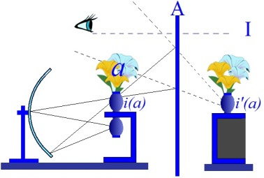
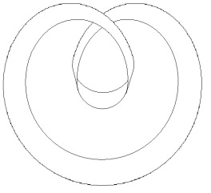
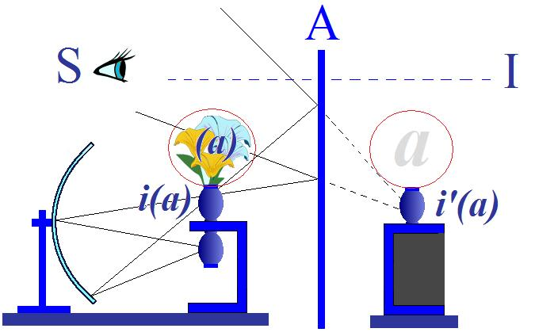
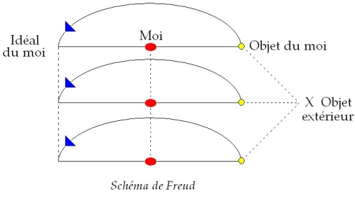
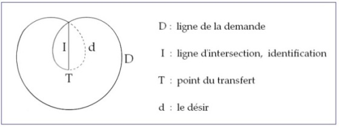

# Leçon 20 | 24 juin 1964

  

    <label><input type="checkbox" data-lacan-toggle="original" checked> 原文</label>
    <label><input type="checkbox" data-lacan-toggle="notes" checked> 注释</label>
    <label><input type="checkbox" data-lacan-toggle="commentary" checked> 个人解读评论</label>
  

  <form class="lacan-tool-search" role="search">
    <input class="lacan-tool-search-input" type="search" placeholder="搜索全文" aria-label="搜索全文">
    <button class="lacan-tool-button" type="submit" title="搜索">搜索</button>
  </form>
  <button class="lacan-tool-button lacan-back-to-top" type="button" title="回到页面最上方" aria-label="回到页面最上方">↑</button>

<section class="parallel-paragraph" data-paragraph-ids="s11-20-0001">

s11-20-0001

原文 · s11-20-0001

Il me reste à conclure cette année, le discours *que j’ai été amené à tenir ici en raison des circonstances* qui, en somme, ont présentifié dans
la suite de *mon enseignement* quelque chose dont après tout rend compte une des *notions fondamentales* que j’ai été amené à avancer ici,
celle de la δυστυχία \[dustuchia\] ou de *la malencontre*, de ce quelque chose, néces­sité dans tout être, à porter la manifestation du sujet, *qu’il se dérobe, qu’il évite ce qu’il y a à rencontrer*.

[无对应译文]

</section>

<section class="parallel-paragraph" data-paragraph-ids="s11-20-0002">

s11-20-0002

原文 · s11-20-0002

Ainsi, ai-je dû suspendre ce pas que je m’apprêtais à faire franchir à ceux qui suivaient *mon enseignement* concernant *Les Noms-du-Père*, pour ici avoir à reprendre, devant un auditoire autrement composé, ce dont il s’agit depuis le départ de *cet enseignement, le mien*,
à savoir qu’est-ce qu’il en est de notre *praxis* ? Celle-ci *jugée*, non pas mise dans les balances d’une vérité éternelle, mais *interrogée*
sur ce point de savoir : quel peut être l’ordre de vérité qu’elle - *cette praxis* - engendre ?

[无对应译文]

</section>

<section class="parallel-paragraph" data-paragraph-ids="s11-20-0003">

s11-20-0003

原文 · s11-20-0003

Ce qui peut nous assurer - au sens proprement de ce que j’ai appelé « *la certitude* » - de ce qu’il en est de notre *praxis*, c’est ce dont
je crois vous avoir donné ici les concepts de base sous les quatre rubriques : de *l’in­conscient*, de *la répétition*, du *transfert* et de *la pulsion* dont vous avez vu que j’ai été amené à inclure, en quelque sorte l’esquisse, à l’intérieur de mon exploration du transfert.

[无对应译文]

</section>

<section class="parallel-paragraph" data-paragraph-ids="s11-20-0004">

s11-20-0004

原文 · s11-20-0004

Le fond qui est bien celui-ci : de savoir dans quel sens, par quel tracé, nous sommes sur la piste de quelque chose qu’engendre
notre *praxis*, qui a droit à se repérer des nécessités, même implicatives de la visée de *la vérité* ? C’est cela qui en fin de compte peut,
si vous voulez, se transpo­ser de cette formule ésotérique, nous assurer que nous ne sommes pas dans l’imposture.

[无对应译文]

</section>

<section class="parallel-paragraph" data-paragraph-ids="s11-20-0005">

s11-20-0005

原文 · s11-20-0005

Car ce n’est pas trop dire que dans *la mise en question* de l’analyse telle qu’elle est toujours en suspens - non seulement dans l’opinion, mais bien plus encore, dans la vie intime de chaque *psychanalyste* - l’*impostu­re* plane, comme présence à la fois contenue, exclue, ambiguë, contre laquelle le psychanalyste se remparde, pourrions-nous dire, d’un certain nombre de cérémonies, de formes, de rites, dont la liaison essentielle avec la question de l’*imposture* est quelque chose qui est à proprement parler à détecter.

[无对应译文]

</section>

<section class="parallel-paragraph" data-paragraph-ids="s11-20-0006">

s11-20-0006

原文 · s11-20-0006

Si je mets en avant ce terme dans mon exposé d’aujourd’hui, c’est qu’assurément c’est là la clé, l’amorce par où pourrait être abordé ce envers quoi, dans ma façon d’introduire la question que je ferai cette année concernant la psychanalyse, j’ai parlé de son rapport avec la scien­ce, mais que j’ai mise en question à ce propos, en référence à ce que j’ap­pellerai une formule qui a eu sa *valeur historique*, de la religion au XVIIIème siècle quand *l’homme des Lumières,* qui était aussi *l’homme du plaisir*, a mis en question *la religion*
*comme fondamentale imposture*.

[无对应译文]

</section>

<section class="parallel-paragraph" data-paragraph-ids="s11-20-0007">

s11-20-0007

原文 · s11-20-0007

Inutile de souligner et de vous faire sentir quel chemin nous avons parcouru depuis. Qui songerait, de nos jours, à prendre
les choses concernant la religion sous cette parenthèse, sous ces guillemets sim­plistes ? On peut dire que jusqu’au fin fond
du monde, et là même où la lutte peut être menée contre elle, la religion, de nos jours jouit d’un res­pect universel.

[无对应译文]

</section>

<section class="parallel-paragraph" data-paragraph-ids="s11-20-0008">

s11-20-0008

原文 · s11-20-0008

C’est aussi bien que la question de la croyance est, par nous, présenti­fiée en des termes sans doute moins simplistes. La pratique que nous avons de fondamentale *aliénation* dans laquelle se soutient toute croyan­ce, c’est ce double terme subjectif qui fait qu’en somme, nous avons là pu réaliser que c’est au moment où la croyance, dans sa signification, paraît le plus profondément s’évanouir,
que dans le sujet, dans l’être de sujet, le sujet vient au jour de ce qui était à proprement parler la réalité, le garant de ses croyances.

[无对应译文]

</section>

<section class="parallel-paragraph" data-paragraph-ids="s11-20-0009">

s11-20-0009

原文 · s11-20-0009

Et il ne suffit pas de *vaincre la superstition* comme on dit, pour que ses effets dans l’être soient pour autant tempérés.
C’est ce qui fait assurément pour nous la difficulté de reconnaître ce qu’a bien pu être, en un temps - je parle : au XVIème siècle -

[无对应译文]

</section>

<section class="parallel-paragraph" data-paragraph-ids="s11-20-0010">

s11-20-0010

原文 · s11-20-0010

le statut de ce qui fût à proprement parler l’incroyance. \[*cf. Lucien Febvre : Le Problème de l'incroyance au XVIe siècle : La Religion de Rabelais*\]

[无对应译文]

</section>

<section class="parallel-paragraph" data-paragraph-ids="s11-20-0011">

s11-20-0011

原文 · s11-20-0011

Ici nous savons bien que nous sommes *incomparablement*, comme présence de la fonction religieuse, *incomparablement,* à notre époque, *incomparablement et paradoxale­ment* désarmés. Notre rempart - le seul, et les religieux l’ont admirable­ment senti - c’est *cette indifférence,* *Indifférence* - comme dit LAMENAIS[^97] - *en matière de religion,* qui a précisément pour statut *la position de la science*.

[无对应译文]

</section>

<section class="parallel-paragraph" data-paragraph-ids="s11-20-0012">

s11-20-0012

原文 · s11-20-0012

C’est pour autant que la science élide, élude, sectionne, un champ déterminé dans la dialectique de l’aliénation du sujet,
c’est pour autant que la science se situe en ce point précis que je vous ai défini au niveau de la dialectique du sujet et de l’Autre, comme celui de la séparation, que la science peut soutenir aussi *un mode d’existence*, qui est celui de nos jours, du savant,
de l’homme de science qui serait à prendre dans - si je puis dire - son style, ses mœurs, son mode de discours, la façon dont,
par une série aussi de défenses, de précautions, il se tient à l’abri d’un certain nombre de questions comportant le statut même de cette science dont il est le servant et qui est une des questions, sans aucun doute du point de vue social, des plus importantes
à traiter - moins importante que celle *du statut* à donner au corps *de l’acquis scientifique*.

[无对应译文]

</section>

<section class="parallel-paragraph" data-paragraph-ids="s11-20-0013">

s11-20-0013

原文 · s11-20-0013

*Ce corps de l’acquis scientifique, nous n’en concevrons la portée* - par rapport à tout ce que nous pouvons concevoir dans l’histoire humaine, de ce qui s’est réalisé dans l’ordre de la science - *qu’à le spécifier*, ce corps de la science, la nôtre, comme exactement équivalent dans
*la position subjective du sujet*. En tant qu’il défend, au lieu de l’Autre, ce rapport signifiant, nous ne pouvons - ce corps de la science - l’exactement situer qu’à reconnaître qu’il est dans cette relation subjective l’équivalent de ce que j’ai appelé ici *l’objet(a).*
La référence, l’ambiguïté qui reste, sur la position de l’analyste concernant ce qu’il y aurait en elle de non réductible à la science,
est là tout entière, et je ne puis ici que vous amorcer *le mode* sous lequel pourrait être abordé le problème.

[无对应译文]

</section>

<section class="parallel-paragraph" data-paragraph-ids="s11-20-0014">

s11-20-0014

原文 · s11-20-0014

Effectivement, à nous apercevoir ce qu’elle implique en effet d’un au-delà de cette science - au sens moderne, au sens de *La science*, celle dont j’ai essayé de vous en indiquer le statut dans le départ cartésien - est de s’apercevoir que le seul point et le point essentiel, par où l’analyse pourrait tomber sous le coup de cette classification qui nous permettrait de la rapprocher de quelque chose
que ses formes souvent, ses formes et son histoire évoquent si souvent l’analogie, à savoir *une Église et donc une religion*.

[无对应译文]

</section>

<section class="parallel-paragraph" data-paragraph-ids="s11-20-0015">

s11-20-0015

原文 · s11-20-0015

La seule façon d’aborder ce problème c’est de s’apercevoir que ce qui spécifie la religion parmi tous les modes qu’a l’homme
de poser *la ques­tion de son existence dans le monde et au-delà,* la religion telle qu’elle se présente à nous, comme de subsistance du sujet
qui s’interroge, est caractérisée par cette *dimension essentielle d’un oubli*. Dans *toute reli­gion*, telle qu’elle se présente à nous, religion qui mérite cette qualifica­tion, il y a une dimension essentielle à réserver, ce *quelque chose d’opératoire* qui s’appelle *un sacrement*.

[无对应译文]

</section>

<section class="parallel-paragraph" data-paragraph-ids="s11-20-0016">

s11-20-0016

原文 · s11-20-0016

Demandez aux fidèles, voire aux prêtres : qu’est-ce qui différencie la *confirmation* du *baptême* ? Car enfin, si c’est un sacrement,
si ça opère, ça opère sur quelque chose. Là où ça lave les péchés, où ça renou­velle - la confirmation par rapport au baptême -
un certain pacte - j’y mets le point d’interrogation : est-ce un pacte, est-ce autre chose ? - qu’est-ce qui passe par cette dimension ?

[无对应译文]

</section>

<section class="parallel-paragraph" data-paragraph-ids="s11-20-0017">

s11-20-0017

原文 · s11-20-0017

De toutes les réponses qui seront données, nous trouverons toujours à distinguer cette marque, par où ce dont il s’agit et qui évoque cet au-delà opératoire et, disons-le : *magique*, qu’il y a au-delà de la religion, nous n’avons, pour des raisons qui sont parfaitement définies : d’une séparation, d’une impuissance de ce qu’on appellera notre raison et notre finitude, nous ne pouvons évoquer la dimension qu’à nous apercevoir, qu’à l’intérieur de la reli­gion, c’est là ce qui est marqué du terme de l’oubli.

[无对应译文]

</section>

<section class="parallel-paragraph" data-paragraph-ids="s11-20-0018">

s11-20-0018

原文 · s11-20-0018

*C’est pour autant que l’analyse*, par rapport au fondement de son sta­tut, *se trouve* en quelque sorte, marquée, *frappée d’un oubli semblable qu’elle arrive à se retrouver marquée de* ce que j’appellerais, dans la céré­monie, *cette même face vide*. La *différence* est que l’analyse…

[无对应译文]

</section>

<section class="parallel-paragraph" data-paragraph-ids="s11-20-0019">

s11-20-0019

原文 · s11-20-0019

- parce qu’elle n’est pas une religion,

[无对应译文]

</section>

<section class="parallel-paragraph" data-paragraph-ids="s11-20-0020">

s11-20-0020

原文 · s11-20-0020

- parce qu’elle procède du même statut que la science, la nôtre,

[无对应译文]

</section>

<section class="parallel-paragraph" data-paragraph-ids="s11-20-0021">

s11-20-0021

原文 · s11-20-0021

- parce qu’el­le s’engage dans ce manque central où le sujet s’expérimente comme désir,

[无对应译文]

</section>

<section class="parallel-paragraph" data-paragraph-ids="s11-20-0022">

s11-20-0022

原文 · s11-20-0022

- parce qu’elle a le même statut médial d’*aventure dans la béance ouverte au centre de la dialectique du sujet et de l’Autre* ...elle, n’a rien à oublier, car elle n’implique aucune reconnaissance substantielle, aucun champ sur quoi elle prétende opérer, même pas celui de la sexualité.

[无对应译文]

</section>

<section class="parallel-paragraph" data-paragraph-ids="s11-20-0023">

s11-20-0023

原文 · s11-20-0023

Car la sexualité sur laquelle, en fait, elle a très peu opéré : la psychanalyse ne nous a rien appris de nouveau quant à *l’opératoire sexuel*, il n’en est même pas sorti *un petit bout de technique érotologique*. Il y en a plus dans le moindre des livres qui font pour l’instant l’objet d’une nombreu­se réédition et qui nous viennent du fin fond d’une tradition arabe, hin­doue, chinoise, voire la nôtre à l’occasion.

[无对应译文]

</section>

<section class="parallel-paragraph" data-paragraph-ids="s11-20-0024">

s11-20-0024

原文 · s11-20-0024

La psychanalyse ne touche à la sexualité que pour autant que sous la forme de *la pulsion*, elle se mani­feste - et où ? - dans ce défilé du signifiant, où la dialectique du sujet, dans le double temps de *l’aliénation* et de *la séparation,* se constitue.

[无对应译文]

</section>

<section class="parallel-paragraph" data-paragraph-ids="s11-20-0025">

s11-20-0025

原文 · s11-20-0025

Tout nous en porte le témoignage et aussi bien du champ où elle n’a pas tenu ce qu’on eût pu, à se tromper, attendre d’elle
de promesses, elle ne l’a pas tenu parce qu’elle n’a pas à les tenir et parce que ce n’est pas son terrain. Par contre, sur le sien,
elle se distingue par cet extraordinaire pouvoir d’errance et de confusion *qui fait de sa littérature* quelque chose auquel je vous assure qu’il faudra bien peu de recul pour qu’on la fasse rentrer toute entière dans la rubrique de ce qu’on appelle *les fous littéraires*.

[无对应译文]

</section>

<section class="parallel-paragraph" data-paragraph-ids="s11-20-0026">

s11-20-0026

原文 · s11-20-0026

Car assurément, on ne peut manquer d’être frappés, et récemment je l’étais encore à la lecture d’un livre comme *« La névrose de base »* par exemple, celui de BERGLER. Comment ce livre - si sympathique par ce je ne sais quoi de déluré, qui groupe, rassemble, associe, des observations nombreuses et assurément, à tout instant, repérables dans la pratique - peut errer dans *la juste interprétation* des faits mêmes qu’il avance. Combien le fait, à propos de ces observations précieuses qu’il apporte, par exemple concernant
*la fonction du sein*, est vraiment égaré dans une sorte de vain débat d’actualité sur la supériorité de l’homme sur la femme
et de la femme sur l’homme, c’est-à-dire sur des choses qui assurément, pour soulever le plus d’éléments passionnels,
*sont bien aussi ce qui* - concernant ce dont il s’agit - *a le moins d’intérêt*.

[无对应译文]

</section>

<section class="parallel-paragraph" data-paragraph-ids="s11-20-0027">

s11-20-0027

原文 · s11-20-0027

Aujourd’hui, il me faut accentuer ce qui concerne le mouvement de la psychanalyse, et à proprement parler à référer à la fonction
de ce que j’isole, de ce que je définis, *l’objet(a)*. Et ce n’est pas pour rien que j’ai évo­qué ici le livre de BERGLER :
faute d’une suffisante définition, d’un suffi­sant repérage, de la fonction propre de l’objet partiel, et de ce qu’y signi­fie par exemple
le sein dont il fait grand usage, faute de ce repérage cet ouvrage, en lui-même intéressant, *est voué à une errance*
*qui fait confiner son résultat à la nullité*.

[无对应译文]

</section>

<section class="parallel-paragraph" data-paragraph-ids="s11-20-0028">

s11-20-0028

原文 · s11-20-0028

*L’objet(a)* est un objet qui dans l’expérience même, dans la marche et le procès soutenu par le transfert, se signale à nous par
un statut spécial. On a sans cesse à la bouche, sans savoir absolument ce que l’on veut dire, le terme et la visée de ce qu’on appelle dans l’analyse « *la liquidation du transfert* ».

[无对应译文]

</section>

<section class="parallel-paragraph" data-paragraph-ids="s11-20-0029">

s11-20-0029

原文 · s11-20-0029

Qu’est-ce que ça peut bien vouloir dire ? À quelle *compta­bilité* le mot « *liquidation* » se réfère-t-il ?
Ou s’agit-il de *je ne sais quelle opération dans un alambic* ? S’agit-il de : « *Il faut que ça coule et que ça se vide quelque part.* » ?
Si *le transfert est la mise en action de l’inconscient*, est-ce qu’on veut dire que le transfert pourrait être de *liquider l’incons­cient* ?
Est-ce que nous n’avons *plus d’inconscient* après une analyse ? Ou est-ce que c’est *le sujet supposé savoir* - pour prendre ma référence - qui devrait être *liquidé* comme tel ?

[无对应译文]

</section>

<section class="parallel-paragraph" data-paragraph-ids="s11-20-0030">

s11-20-0030

原文 · s11-20-0030

Il est tout de même singulier que ce *sujet supposé savoir* - *supposé savoir* quelque chose de vous, et qui effectivement n’en sait rien - puisse être considéré comme liquidé, au moment où à la fin de l’analyse, juste­ment, il commence - sur vous au moins –
à en savoir un bout, que ce qu’il était d’abord supposé est assurément une partie de réalité. C’est au moment donc où il prendrait
le plus de consistance que ce *sujet supposé savoir* devrait être supposé vaporisé.

[无对应译文]

</section>

<section class="parallel-paragraph" data-paragraph-ids="s11-20-0031">

s11-20-0031

原文 · s11-20-0031

Il ne peut s’agir, si le terme de *liquidation* à un sens, que de *cette permanence de* *liquidation* *de la trom­perie* par où le transfert tend à s’exercer *dans le sens de la formation de l’inconscient*, et dont je vous ai expliqué le mécanisme en le référant à la relation narcissique
par où le sujet se fait objet aimable : de sa référence à celui qui doit l’aimer, il tente d’induire l’Autre dans cette relation de mirage
où il le convainc d’être aimable. Ceci, FREUD nous en désigne l’aboutissement naturel dans cette fonc­tion qui a nom *l’identification*.

[无对应译文]

</section>

<section class="parallel-paragraph" data-paragraph-ids="s11-20-0032">

s11-20-0032

原文 · s11-20-0032

*L’identificatio*n ne veut pas dire - et FREUD l’articule avec beaucoup de finesse, je vous prie de vous reporter aux deux chapitres déjà désignés la dernière fois dans *Psychologie collec­tive et analyse du moi,* dont l’un s’appelle « *L’identification* » (*ch.* VII) et l’autre « *État amoureux et hypnose* », qui sont fondamen­taux - l’*identification* dont il s’agit n’est pas *identification spéculaire*, immédiate, elle est *soutien*
de cette *identification spéculaire*, d’un point de vue, d’une perspective, choisie par le sujet dans le champ de l’Autre,
d’où cette *identification* comme *spéculaire* peut être vue sous un *aspect* satisfaisant.

[无对应译文]

</section>

<section class="parallel-paragraph" data-paragraph-ids="s11-20-0033">

s11-20-0033

原文 · s11-20-0033

C’est ce qu’est ce point de l’*idéal du moi*, *celui où le sujet - comme on dit - se verra « comme vu par l’autre »*, qui lui permettra de se soutenir, dans cette référence à l’autre, dans *une situation duelle pour lui satisfaisante* du point de vue de *l’amour*. L’essence de tromperie de l’amour en tant que mirage spéculaire se situe au niveau de ce champ institué au niveau de la référence du plaisir, par l’introduction simple de ce seul signifiant nécessaire à introduire une perspective, une organisation centrée sur ce point idéal \[I\], quelque part placé
dans l’Autre, *d’où l’Autre me voit sous la forme où il me plaît d’être vu.*

[无对应译文]

</section>

<section class="parallel-paragraph" data-paragraph-ids="s11-20-0034">

s11-20-0034

原文 · s11-20-0034

[无对应译文]

</section>

<section class="parallel-paragraph" data-paragraph-ids="s11-20-0035">

s11-20-0035

原文 · s11-20-0035

Or, dans cette convergence, à laquelle l’analyse est en quelque sorte *appelée* par cette face même, essentielle, de tromperie
qu’il y a dans le transfert, quelque chose se rencontre qui est paradoxe et qui est la découverte de l’analyste qui, d’abord, n’a pas été tout de suite repéré dans sa fonction essentielle, n’est absolument compréhensible qu’à l’autre niveau, le niveau où nous avons d’abord institué la relation de l’aliénation, c’est cet objet paradoxal, unique, spécifié, que nous appe­lons *l’objet(a)*.

[无对应译文]

</section>

<section class="parallel-paragraph" data-paragraph-ids="s11-20-0036">

s11-20-0036

原文 · s11-20-0036

Nous n’allons pas en reprendre - ce serait un rabâchage - toutes les caractéristiques mais je vous le *présentifie*, s’il le faut,
d’une façon plus syncopée, en vous disant que l’analysé dit en somme, à son parte­naire, à l’analyste :

[无对应译文]

</section>

<section class="parallel-paragraph" data-paragraph-ids="s11-20-0037">

s11-20-0037

原文 · s11-20-0037

« *Je t’aime, mais parce que j’aime inexplicablement quelque chose en toi plus que toi, qui est cet objet(a), je te mutile*. »

[无对应译文]

</section>

<section class="parallel-paragraph" data-paragraph-ids="s11-20-0038">

s11-20-0038

原文 · s11-20-0038

Et c’est là le sens de ce magma complexe, de ce complexe de la *mamme*, du sein, où BERGLER assurément voit bien la relation
à la pulsion orale, à ceci près que c’est une oralité qui n’a justement absolument rien à faire avec la nourriture et dont tout l’accent est dans cet effet de muti­lation.

[无对应译文]

</section>

<section class="parallel-paragraph" data-paragraph-ids="s11-20-0039">

s11-20-0039

原文 · s11-20-0039

« *Je me donne à toi* - dit encore le patient - *mais ce don de ma per­sonne* - comme dit l’autre - *mystère, se change inexplicablement en cadeau d’une merde* »

[无对应译文]

</section>

<section class="parallel-paragraph" data-paragraph-ids="s11-20-0040">

s11-20-0040

原文 · s11-20-0040

Terme également essentiel de notre expérience... Et quand ceci est obtenu, au terme d’une *élucidation interprétative* dont aussi bien
je vous dirais comment elle est à concevoir, alors se com­prend *rétroactivement*, ce vertige par exemple de la page blanche qui,
chez tel personnage, doué mais accroché à la limite du psychotique, désigne comme son centre de tout *le barrage symptomatique*
qui lui empêche tous les accès à l’Autre.

[无对应译文]

</section>

<section class="parallel-paragraph" data-paragraph-ids="s11-20-0041">

s11-20-0041

原文 · s11-20-0041

Précisément, la page blanche où s’arrêtent ces ineffables effusions intellectuelles, parce qu’il ne peut littéralement pas y toucher, c’est celle assurément qu’il ne peut appréhender que comme « *papier à cabinet* ». Cette présence, cette fonction de *l’objet(a)*,
toujours et partout retrou­vée, comment vous dire son incidence, son temps propre, dans le mou­vement du transfert ?

[无对应译文]

</section>

<section class="parallel-paragraph" data-paragraph-ids="s11-20-0042">

s11-20-0042

原文 · s11-20-0042

J’ai peu de temps aujourd’hui, mais pour l’imager, *je prendrai une petite fable, un apologue* dont, parlant l’autre jour dans un cercle
plus intime avec quelques-uns de mes auditeurs, je me trouvais avoir en quelque sorte reforgé le début. Et j’y donnerai une suite,
de sorte que si je m’excuse auprès d’eux de me répéter, ils verront que la suite est nou­velle.

[无对应译文]

</section>

<section class="parallel-paragraph" data-paragraph-ids="s11-20-0043">

s11-20-0043

原文 · s11-20-0043

Que se passe-t-il quand le sujet commence de parler à l’analyste, à *l’analyste*, au *sujet supposé savoir* mais dont en somme il est certain qu’il ne sait encore rien ? C’est à celui-là - qu’est quoi ? - *qu’est offert quelque chose*, selon une forme qui va d’abord et nécessairement se former en deman­de. Et aussi bien qui ne sait que c’est là ce qui a poussé, contraint, orien­té toute la pensée sur l’analyse
dans le sens d’une reconnaissance de la fonction de la frustration ?

[无对应译文]

</section>

<section class="parallel-paragraph" data-paragraph-ids="s11-20-0044">

s11-20-0044

原文 · s11-20-0044

Mais qu’est-ce que le sujet demande ? Il sait bien que *quels que soient ses appétits*, *quels que soient ses besoins*, aucun ne trouvera, là, satisfaction, si ce n’est tout au plus d’y organiser son menu. Comme dans la fable, que je lisais quand j’étais petit dans les images d’Épinal, le pauvre mendiant se régale à la porte de la rôtisserie du fumet du rôti.

[无对应译文]

</section>

<section class="parallel-paragraph" data-paragraph-ids="s11-20-0045">

s11-20-0045

原文 · s11-20-0045

Dans l’occasion, *ce sont des signifiants, c’est le menu*, puisqu’on ne fait que parler. Eh bien, il y a cette complica­tion - c’est là ma fable - que le menu est rédigé en chinois. Alors le pre­mier temps, c’est de commander la traduction à la patronne. Alors elle traduit :
pâté impérial*…* comme on dit, et quelques autres. Il se peut très bien, si c’est la première fois que vous venez au restaurant chinois, que la traduction ne vous en dise pas plus et que vous demandiez finale­ment à la patronne, « *conseillez-moi* ». Ce qui veut dire :

[无对应译文]

</section>

<section class="parallel-paragraph" data-paragraph-ids="s11-20-0046">

s11-20-0046

原文 · s11-20-0046

> « *Qu’est-ce que je désire là-dedans, c’est à vous de le savoir.* »

[无对应译文]

</section>

<section class="parallel-paragraph" data-paragraph-ids="s11-20-0047">

s11-20-0047

原文 · s11-20-0047

Est-ce bien là, en fin de compte, qu’il est censé qu’une situation aussi paradoxale aboutisse ? Est-ce qu’en ce point, où ce dont il s’agirait serait de vous remettre à je ne sais quelle *divination* de cette patronne dont vous avez vu de plus en plus gonflé l’importance,
il ne serait pas plus adéquat, si le cœur vous en dit et si la chose se présente d’une façon avantageuse, d’aller *un tant soit peu* titiller
les seins de la patronne.

[无对应译文]

</section>

<section class="parallel-paragraph" data-paragraph-ids="s11-20-0048">

s11-20-0048

原文 · s11-20-0048

Car c’est de cela qu’il s’agit : si vous allez au restaurant chinois, ça n’est pas uniquement pour manger, c’est pour manger
dans les dimen­sions de l’exotisme. Autrement dit, si ma fable doit avoir un sens, c’est pour autant que le *désir alimentaire* a un autre sens : il est ici support et symbole de la dimension - seule, dans le psychisme, à être rejetée - du sexuel. La dimension de la pulsion dans son rapport à l’objet partiel est là sous-jacente.

[无对应译文]

</section>

<section class="parallel-paragraph" data-paragraph-ids="s11-20-0049">

s11-20-0049

原文 · s11-20-0049

Eh bien *si paradoxal*, voire désinvolte que puisse vous paraître ce petit apologue, il est pourtant exactement ce dont il s’agit dans
la réalité de l’analyse. L’analyste, il ne suffit pas qu’il supporte la fonction de TYRÉSIAS, il faut - comme le dit APOLLINAIRE - qu’il ait encore ses mamelles. Je veux dire que l’analyste, l’opération et la manœuvre du transfert sont là à régler, à dominer,
à instituer, d’une façon qui maintienne la dis­tance entre ce point d’où le sujet se voit aimable, et cet autre point où le sujet se voit causé comme manque par *(a)* et où *(a)* vient en quelque sorte boucher, proprement, ce point de béance que constitue la division inau­gurale du sujet. Ce *(a)* ne franchit jamais cette béance.

[无对应译文]

</section>

<section class="parallel-paragraph" data-paragraph-ids="s11-20-0050">

s11-20-0050

原文 · s11-20-0050

Voir - point essentiel à ce que je voulais amener cette année, et je vous prie de vous y reporter - comme au terme le plus caractéristique à saisir de la fonction propre de ce *(a),* le regard. Ce *(a)* se présente justement dans le champ du mirage de la fonc­tion narcissique du désir, comme l’objet *inavalable*, si l’on peut dire, et qui reste en travers de la gorge du signifiant.
C’est ce point de manque où le sujet a à se *reconnaître* comme constitué.

[无对应译文]

</section>

<section class="parallel-paragraph" data-paragraph-ids="s11-20-0051">

s11-20-0051

原文 · s11-20-0051

C’est pour cela que peut se topologiser la fonction du transfert, sous la forme que j’ai déjà utilisée ailleurs, déjà produite dans
des temps plus développés de mon séminaire, nommément le séminaire sur *L’identification,* sous *la forme* de ce que j’ai appelé
en son temps « *le huit intérieur »*, autrement dit, *cette double courbe* que vous voyez ici, à droite, se *reployer* sur elle-même, et qui n’est pas simplement cette boucle, dont aussi bien vous voyez que la propriété qui en est une essentielle, est que chacune de ces moitiés
à se succéder vient à s’accoler en chaque point de la moitié précédente.

[无对应译文]

</section>

<section class="parallel-paragraph" data-paragraph-ids="s11-20-0052">

s11-20-0052

原文 · s11-20-0052

[无对应译文]

</section>

<section class="parallel-paragraph" data-paragraph-ids="s11-20-0053">

s11-20-0053

原文 · s11-20-0053

Car supposez simplement se déployer cette partie de la courbe, vous la verrez recouvrir cette autre qui est ici. Mais ce n’est pas là tout. Il s’agit là d’un plan défini par la coupure : c’est facile, il suffit de prendre une feuille de papier et à l’aide de quelques petits collages, de vous faire une idée précise de la façon dont ceci peut se concevoir. Il est très facile d’imaginer ici que le lobe
que constitue cette surface à son point de retour, recouvre en somme un autre lobe, et les deux se continuant par une forme
de bord, ce qui n’implique absolument aucune contradiction, même dans l’espace le plus ordinaire, à ceci près que pour en saisir
la portée, il convient justement de s’abstraire de l’espace et de voir qu’il ne s’agit ici que d’une réalité topologique,
celle qui se limiterait à la fonction d’une surface.

[无对应译文]

</section>

<section class="parallel-paragraph" data-paragraph-ids="s11-20-0054">

s11-20-0054

原文 · s11-20-0054

Ce n’est évidemment que dans un espace qui est un espace à trois dimensions que nous pouvons ainsi concevoir qu’une des parties du plan, au moment où l’autre par son bord revient sur elle, y détermine une sorte d’intersection. Cette *intersection* a un sens
en dehors de notre espace. Elle est structuralement définissable par un certain rapport de cette surface en tant que revenant
sur elle-même, elle se traverse en un point sans doute à déterminer. Ce travers, *cette ligne de traversée*, *c’est* pour nous
ce qui peut symboliser la fonction de *l’identification*.

[无对应译文]

</section>

<section class="parallel-paragraph" data-paragraph-ids="s11-20-0055">

s11-20-0055

原文 · s11-20-0055

Par ce travail même, qui fait que le sujet en *se* disant dans l’analyse, vient à orienter son propos :

[无对应译文]

</section>

<section class="parallel-paragraph" data-paragraph-ids="s11-20-0056">

s11-20-0056

原文 · s11-20-0056

- dans le sens de la résistance du transfert,

[无对应译文]

</section>

<section class="parallel-paragraph" data-paragraph-ids="s11-20-0057">

s11-20-0057

原文 · s11-20-0057

- dans le sens de la tromperie et de la tromperie d’amour aussi bien qu’agression, ...quelque chose se produit dont la valeur de *fermeture* se marque dans la forme même : spirale vers un centre.

[无对应译文]

</section>

<section class="parallel-paragraph" data-paragraph-ids="s11-20-0058">

s11-20-0058

原文 · s11-20-0058

Ce que j’ai ici figuré par le *bord*, vient à revenir sur ce plan constitué du *lieu de l’Autre*, *de l’endroit où le sujet se réalisant dans sa parole, s’institue au niveau du sujet supposé savoir*. Et toute conception de l’analyse qui s’articule - et Dieu sait si elle s’articule avec innocence -
qui s’articule à définir la fin de la terminaison de l’analyse comme *identification*, quelle qu’elle soit, à l’analyste, fait par là même l’aveu de ses limites. Toute analyse que l’on conçoit, que l’on doctrine comme devant se terminer par l’identification à l’analyste,
désigne du même coup que ce qui est son véritable moteur est élidé. Il y a un au-delà à cette *identification*, et cet au-delà est défini
par le rapport et la distance de cet *objet(a)* au I, à l’idéalisant de *l’identification*.

[无对应译文]

</section>

<section class="parallel-paragraph" data-paragraph-ids="s11-20-0059">

s11-20-0059

原文 · s11-20-0059

[无对应译文]

</section>

<section class="parallel-paragraph" data-paragraph-ids="s11-20-0060">

s11-20-0060

原文 · s11-20-0060

Je ne puis bien sûr ici, et ce serait même hors de saison, entrer dans le détail de ce qu’implique dans la technique, *dans la structure de*
*la pra­tique*, une pareille affirmation. Mais je me réfère à ce quelque chose à quoi vous pouvez vous reporter, au chapitre de FREUD sur « *État amou­reux et hypnose* », que je vous ai signalé tout à l’heure. FREUD - dans ce chapitre où il distingue excellemment
la différence qu’il y a entre *l’état amoureux* jusque dans ses formes les plus extrêmes, celles qu’il qualifie de *Verliebheit,* et *l’hypnose -* donne le repérage doctrinal en somme le plus accentué à ce qui se lit partout ailleurs, si l’on sait le lire : *la différence essentielle*
*qu’il y a entre l’objet défini comme narcis­sique, le i(a) et la fonction du (a)*.

[无对应译文]

</section>

<section class="parallel-paragraph" data-paragraph-ids="s11-20-0061">

s11-20-0061

原文 · s11-20-0061

Les choses en sont au point que la seule vue du schéma qu’à la fin il donne de l’hypnose, *du même trait, du même coup* il nous donne
la formule de la fascination collective, qui était une réalité ascendante à l’heure où il a écrit cet article. Il nous fait ce schéma,
que vous retrouverez au chapitre que je vous ai dit, il le fait exactement comme je vous le représente ici :

[无对应译文]

</section>

<section class="parallel-paragraph" data-paragraph-ids="s11-20-0062">

s11-20-0062

原文 · s11-20-0062

[无对应译文]

</section>

<section class="parallel-paragraph" data-paragraph-ids="s11-20-0063">

s11-20-0063

原文 · s11-20-0063

- ici il désigne ce qu’il appelle *l’objet*, où il faut que vous reconnaissiez ce que j’appelle le *(a)*,

[无对应译文]

</section>

<section class="parallel-paragraph" data-paragraph-ids="s11-20-0064">

s11-20-0064

原文 · s11-20-0064

- ici le *moi*,

[无对应译文]

</section>

<section class="parallel-paragraph" data-paragraph-ids="s11-20-0065">

s11-20-0065

原文 · s11-20-0065

- ici l’*idéal du moi*.

[无对应译文]

</section>

<section class="parallel-paragraph" data-paragraph-ids="s11-20-0066">

s11-20-0066

原文 · s11-20-0066

-

[无对应译文]

</section>

<section class="parallel-paragraph" data-paragraph-ids="s11-20-0067">

s11-20-0067

原文 · s11-20-0067

Ces courbes sont faites pour marquer la conjonction du *(a)* avec l’*idéal du moi*.

[无对应译文]

</section>

<section class="parallel-paragraph" data-paragraph-ids="s11-20-0068">

s11-20-0068

原文 · s11-20-0068

Et la façon dont il affirme le statut de l’hypnose consiste à poser la superposition au même lieu, à la même place, de cet *objet(a)* comme tel, et du repérage signifiant qui s’appelle l’*idéal du moi*. Illustrons cela. Si l’*objet(a)* peut être, comme je vous l’ai dit
en vous parlant longuement du *regard,* identique à ce *regard*. Qui ne sait le rôle sur lequel FREUD, d’ailleurs, pointe le nœud
de l’affaire en disant qu’il s’agit d’un élément assurément difficile à saisir, mais incontestable, le rôle qu’il appelle de mystère
du *regard* de l’hypnotiseur.

[无对应译文]

</section>

<section class="parallel-paragraph" data-paragraph-ids="s11-20-0069">

s11-20-0069

原文 · s11-20-0069

Mais après tout ce que je vous ai dit de la fonction du *regard* et de ses relations fonda­mentales à la tache, à ceci qu’il y a déjà
dans le monde quelque chose qui regarde avant qu’il y ait une vue pour le voir, que l’ocelle du mimétisme est impensable comme une adaptation au fait qu’un sujet peut voir et être fasciné, que la fascination de la tache est antérieure à la vue qui le découvre.

[无对应译文]

</section>

<section class="parallel-paragraph" data-paragraph-ids="s11-20-0070">

s11-20-0070

原文 · s11-20-0070

Si vous vous souvenez de cette référence et de ce que ça veut dire, à savoir *la fonction primordiale de la tache et tout ce qui fascine de brillant*, vous rendez compte du même coup de cette fonction qui est bien connue dans l’hypnose, qui peut être remplie en somme par n’im­porte quoi, un bouchon de cristal, mais aussi bien ceci, pour peu que ça brille. La définition, le fondement de *l’hypnose*, comme
la confusion en un point du *signifiant idéal* où se repère le sujet avec ce *(a)* comme tel, c’est ce qui a été avancé,
structuralement de plus assuré pour définir *l’hyp­nose*.

[无对应译文]

</section>

<section class="parallel-paragraph" data-paragraph-ids="s11-20-0071">

s11-20-0071

原文 · s11-20-0071

Or qui ne sait que c’est comme se distinguant, se différenciant de *l’hypnose* que l’*analyse* s’institua ? Et que le ressort fondamental
de l’opération analytique est constitué dans le maintien, dans la distance, dans la différenciation du I et du *a* ?

[无对应译文]

</section>

<section class="parallel-paragraph" data-paragraph-ids="s11-20-0072">

s11-20-0072

原文 · s11-20-0072

Pour vous donner deux formules-repères qui soient aussi structu­rantes que possible, je dirai que si d’une part

[无对应译文]

</section>

<section class="parallel-paragraph" data-paragraph-ids="s11-20-0073">

s11-20-0073

原文 · s11-20-0073

- *le transfert est ce qui écar­te la demande de la pulsion,*

[无对应译文]

</section>

<section class="parallel-paragraph" data-paragraph-ids="s11-20-0074">

s11-20-0074

原文 · s11-20-0074

- *le désir de l’analyste est ce qui l’y ramène*, et par cette voie d’isoler - de mettre à la plus grande distance possible - le *(a)* du **I**,

[无对应译文]

</section>

<section class="parallel-paragraph" data-paragraph-ids="s11-20-0075">

s11-20-0075

原文 · s11-20-0075

> que lui, l’analyste est appelé, par le sujet, à incarner.

[无对应译文]

</section>

<section class="parallel-paragraph" data-paragraph-ids="s11-20-0076">

s11-20-0076

原文 · s11-20-0076

C’est dans la mesure où l’analyste a - si je puis dire - à déchoir de cette idéalisation, pour être le support de cet objet séparateur qu’est le *(a)* dans la mesure où son désir lui permet de supporter - *dans une hypnose en quelque sorte à l’envers* - d’incarner, lui, l’hypnotisé, que *ce franchisse­ment du plan de l’identification est possible*. Et tout un chacun de ceux qui ont vécu jusqu’au bout avec moi,
dans l’analyse didactique, l’expé­rience analytique, sait que ce que je dis est vrai.

[无对应译文]

</section>

<section class="parallel-paragraph" data-paragraph-ids="s11-20-0077">

s11-20-0077

原文 · s11-20-0077

C’est au-delà de cette fonction du *(a)* que la courbe se referme, se refer­me là où elle n’est jamais dite, concernant l’*issue de l’analyse*,
à savoir après ce repérage du *sujet* par rapport au *(a)*, cette expérience du fantasme fondamental devient la pulsion, car au-delà,
c’est la pulsion qui est en cause.

[无对应译文]

</section>

<section class="parallel-paragraph" data-paragraph-ids="s11-20-0078">

s11-20-0078

原文 · s11-20-0078

Qu’est-ce que devient celui qui a passé par cette expérience concer­nant ce rapport - opaque à l’origine par excellence - à la pulsion ? Comment peut être vécue, par un sujet qui a traversé le fantasme radical, comment dès lors est vécue la pulsion ?

[无对应译文]

</section>

<section class="parallel-paragraph" data-paragraph-ids="s11-20-0079">

s11-20-0079

原文 · s11-20-0079

Ceci est *l’au-delà de l’analyse* et n’a jamais été abordé. Ce n’est jusqu’à présent abordable qu’au niveau de l’ana­lyste, pour autant
qu’il serait exigé de l’analyste d’avoir précisément *tra­versé dans sa totalité le cycle de l’expérience analytique.* Il n’y a qu’une psychanalyse :
*la psychanalyse didactique*, ce qui veut dire une psy­chanalyse qui a bouclé cette boucle jusqu’à son terme.

[无对应译文]

</section>

<section class="parallel-paragraph" data-paragraph-ids="s11-20-0080">

s11-20-0080

原文 · s11-20-0080

[无对应译文]

</section>

<section class="parallel-paragraph" data-paragraph-ids="s11-20-0081">

s11-20-0081

原文 · s11-20-0081

*Ici j’élude* - ici j’élude parce que *je ne peux pas tout dire* et parce qu’il ne s’agit ici que des *Fondements de la psychanalyse – ceci *:
c’est que la boucle doit être parcourue plusieurs fois, qu’il n’y a aucune autre manière de rendre compte du terme de *Durcharbeiten,* de la nécessité de l’élaboration, *si ce n’est à concevoir comment la boucle doit être parcourue plusieurs fois*.

[无对应译文]

</section>

<section class="parallel-paragraph" data-paragraph-ids="s11-20-0082">

s11-20-0082

原文 · s11-20-0082

Ce qui introduit de *nouvelles difficultés*, et ce n’est pas aujourd’hui que je suis en état ni que j’ai le temps de les aborder.
Vous le voyez donc ce schéma que je vous laisse, comme en quelque sorte un guide, qui est aussi bien guide de l’expérience
que guide de la lecture, est celui qui vous indique très précisément que *le transfert* est ce qui s’exerce dans le sens de ramener
*la demande* à *l’identification*.

[无对应译文]

</section>

<section class="parallel-paragraph" data-paragraph-ids="s11-20-0083">

s11-20-0083

原文 · s11-20-0083

C’est pour autant que quelque chose - que nous appellerons et qui reste un x, *le désir de l’analyste -* tend dans le sens exactement contraire à l*’identification*, que *le franchissement* est possible, par l’intermédiaire de la sépara­tion du sujet dans l’expérience.
L’expérience au niveau de l’Autre, et nommément l’analyste au niveau de *l’objet(a)*, se voit ramené au plan où a à *se présentifier*
de la réalité de l’inconscient, ceci d’essentiel qui est *la pulsion*.

[无对应译文]

</section>

<section class="parallel-paragraph" data-paragraph-ids="s11-20-0084">

s11-20-0084

原文 · s11-20-0084

J’ai indiqué, je pense - déjà parce que j’ai tenu d’abord à le faire à l’en­trée de cette séance - l’intérêt qu’il y a à comparer, à situer
au niveau du statut subjectif que nous pouvons déterminer comme celui de *l’objet(a)*, ce que l’homme depuis trois siècles a créé,
a défini, a situé dans la science.

[无对应译文]

</section>

<section class="parallel-paragraph" data-paragraph-ids="s11-20-0085">

s11-20-0085

原文 · s11-20-0085

Peut-être des traits, qui apparaissent de nos jours sous une forme si éclatante, sous l’aspect de ce qu’on appelle plus ou moins proprement les « *mass media »,* et pourquoi pas le rapport à cette science, *toujours plus à mesure qu’elle envahit notre champ, qu’elle se développe*, peut-être ces traits peuvent-ils se concevoir de la référence à ces deux objets - dont je vous ai déjà indiqué dans une tétrade, si l’on peut dire fondamentale, la place - ces deux objets : *la voix*, quasiment pla­nétarisée, voire stratosphérisée
par nos appareils, et *le regard*, dont le caractère envahissant n’est pas moins suggestif, car il n’est pas tellement sûr que ce soit
notre vision qui soit sans cesse sollicitée que, plutôt, tant de spectacles, tant de fantasmes, ne soient là - comme *<u>sur</u>* nous -
autant de suscitations du regard.

[无对应译文]

</section>

<section class="parallel-paragraph" data-paragraph-ids="s11-20-0086">

s11-20-0086

原文 · s11-20-0086

Puis-je, laissant éludés beaucoup de ces traits - qui de poser la fonction fondamentale de l’analyse comme nous l’avons fait, s’illustreraient des vicissitudes de l’abord théorique à l’intérieur de la communauté analytique - mettre l’accent sur quelque chose
qui me paraît tout à fait essentiel ?

[无对应译文]

</section>

<section class="parallel-paragraph" data-paragraph-ids="s11-20-0087">

s11-20-0087

原文 · s11-20-0087

Il est quelque chose de profondément masqué, dans la critique de notre histoire, celle que nous avons vécue.
C’est un drame en quelque sorte, présentifiant les formes prétendues passées ou dépassées les plus monstrueuses d’holocauste, celles que nous avons vu s’incarner pour nous dans l’histoire du nazisme.

[无对应译文]

</section>

<section class="parallel-paragraph" data-paragraph-ids="s11-20-0088">

s11-20-0088

原文 · s11-20-0088

Je tiens qu’aucun sens de l’histoire fondé sur les prémisses *hégeliano-marxistes* n’est capable de rendre compte de cette résurgence
par quoi il s’avère que l’offrande à des *Dieux obscurs* d’un *objet de sacrifice*, est quelque chose auquel peu de sujets ne peuvent pas
ne pas succomber, dans une monstrueuse *capture*.

[无对应译文]

</section>

<section class="parallel-paragraph" data-paragraph-ids="s11-20-0089">

s11-20-0089

原文 · s11-20-0089

Il y a ceux dont l’ignorance, l’indifférence, le détournement du regard, peut expliquer sous quel voile reste encore caché ce mystère.

[无对应译文]

</section>

<section class="parallel-paragraph" data-paragraph-ids="s11-20-0090">

s11-20-0090

原文 · s11-20-0090

Mais pour quiconque est capable vers ce phénomène de diriger un courageux regard, *il y en a peu* assurément, j’ai dit,
pour ne pas succomber à ce qui résulte de la fascination du sacrifice en lui–même, sacrifice qui signifie que de l’objet de nos désirs, nous essayons d’y trouver le témoignage de la présence du désir de cet Autre que j’appelle ici le « *Dieu obscur* ».

[无对应译文]

</section>

<section class="parallel-paragraph" data-paragraph-ids="s11-20-0091">

s11-20-0091

原文 · s11-20-0091

C’est le sens éternel du sacrifice auquel, je dirais, nul ne peut résister, sauf à être animé de cette foi en somme si difficile à soutenir, et *que seul peut-être, un homme a pu formuler d’une façon soutenable, par l’iden­tification de l’Autre*, d’un Dieu qu’on a cru tout à fait à tort pouvoir définir chez lui de *panthéiste*, à savoir SPINOZA et son *[Amor intellec­tualis Dei](http://hyperspinoza.caute.lautre.net/spip.php?rubrique297).*

[无对应译文]

</section>

<section class="parallel-paragraph" data-paragraph-ids="s11-20-0092">

s11-20-0092

原文 · s11-20-0092

Il n’est rien d’autre que la réduction du champ de Dieu à l’universalité du signifiant et au détachement serein, exceptionnel, qui peut s’en produire chez lui-même, concernant le désir humain. Dans la mesure où SPINOZA dit : « *le désir est l’essence de l’homme* »,
dans la mesure où, ce désir, il l’institue dans la dépendance radicale de cette universalité des attributs divins, qui n’est pensable
qu’à travers la fonction du signifiant, dans cette mesure - et dans cette mesure seulement - il donne cette position unique
par où *le philosophe*, et il n’est pas *indifférent* que ce soit un Juif détaché de sa tradition qui l’ait incarné, *par où le philosophe* - *une fois* -
*peut se confondre avec un amour transcendant.*

[无对应译文]

</section>

<section class="parallel-paragraph" data-paragraph-ids="s11-20-0093">

s11-20-0093

原文 · s11-20-0093

Or cette position n’est pas tenable pour nous parce que l’expérience nous montre que KANT est plus *vrai,* et j’ai démontré
que sa théorie de la conscience - comme il l’écrit dans *La raison pratique -* ne se soutient que de donner une spécification de la loi morale qui, à l’examiner de très près, n’est rien d’autre que le désir à l’état pur, celui-là même qui abou­tit au sacrifice, à proprement parler, de tout ce qui est objet de l’amour dans sa tendresse humaine, non seulement dans le rejet de l’objet patho­logique,
mais dans son sacrifice et dans son meurtre.

[无对应译文]

</section>

<section class="parallel-paragraph" data-paragraph-ids="s11-20-0094">

s11-20-0094

原文 · s11-20-0094

Et c’est pour cela que j’ai écrit *Kant avec Sade,* à quoi je vous prie de vous reporter, car c’est un texte très sérieux.
C’est là exemple de *l’effet de dessillement que l’analyse permet de faire*, de tant d’efforts, même les plus nobles de l’éthique traditionnelle.
C’est là que se situe la limite qui nous permet de concevoir à la fois comment l’homme ne se situe, ne peut même esquisser
sa situation dans un champ qui serait de connaissance retrouvée, *qu’à avoir d’abord rem­pli la limite, où comme désir, il se trouve enchaîné*.

[无对应译文]

</section>

<section class="parallel-paragraph" data-paragraph-ids="s11-20-0095">

s11-20-0095

原文 · s11-20-0095

Que *cet amour*, dont il est apparu aux yeux de certains que nous avons procédé en quelque sorte au ravalement, que *cet amour*
ne puisse s’ins­tituer, se poser lui-même, que dans cet au-delà où d’abord il renonce à son *objet*, c’est là aussi ce qui nous permet
de comprendre que tout ce qui a pu être construit d’*abri* où *une relation vivable* d’un sexe à l’autre ait pu s’instituer, nécessite l’intervention - et c’est là aussi l’enseigne­ment de la psychanalyse - de ce médium qui est justement celui dont je vous disais
au départ que je n’ai pas pu ni l’aborder, ni commencer de vous en présenter le problème, à savoir la *métaphore paternelle*,
avec ce qu’elle nous permet de repérer de ce que j’ai appelé « *cet abri* », cet abri autour duquel s’institue un rapport qui soit
à proprement parler ce que nous pouvons imaginer de la fonction du rapport sexuel dans des formes que nous pourrons qualifier de tempérées.

[无对应译文]

</section>

<section class="parallel-paragraph" data-paragraph-ids="s11-20-0096">

s11-20-0096

原文 · s11-20-0096

Le désir de l’analyste n’est pas un désir pur.

[无对应译文]

</section>

<section class="parallel-paragraph" data-paragraph-ids="s11-20-0097">

s11-20-0097

原文 · s11-20-0097

C’est un désir d’obtenir la *différence absolue*, celle qui vient quand, confronté au *signifiant pri­mordial*, le sujet vient pour la première fois en position de se l’assujettir.

[无对应译文]

</section>

<section class="parallel-paragraph" data-paragraph-ids="s11-20-0098">

s11-20-0098

原文 · s11-20-0098

Là seulement peut surgir la signification d’un amour sans limites parce qu’il est hors des limites de la loi, là seulement il peut vivre.

[无对应译文]

</section>

<section class="parallel-paragraph" data-paragraph-ids="s11-20-0099">

s11-20-0099

原文 · s11-20-0099

*Fin du séminaire*

[无对应译文]

</section>

<section class="parallel-paragraph" data-paragraph-ids="s11-20-0100">

s11-20-0100

原文 · s11-20-0100

[Table des séances](#Table)

[无对应译文]

</section>

<section class="note-block original-notes">

## Notes

[^97]: Hugues-Félicité Robert de Lamennais (1782-1854) : [*Essai sur l'indifférence en matière de religion*](http://gallica.bnf.fr/Search?ArianeWireIndex=index&p=1&lang=FR&q=Lamennais+Essai+sur+l%27indiff%C3%A9rence+en+mati%C3%A8re+de+religion).

</section>
