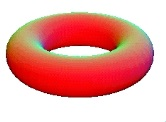
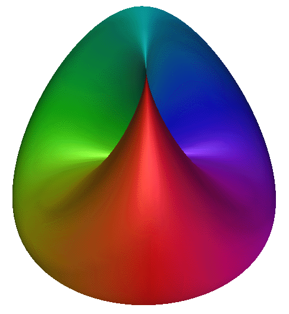
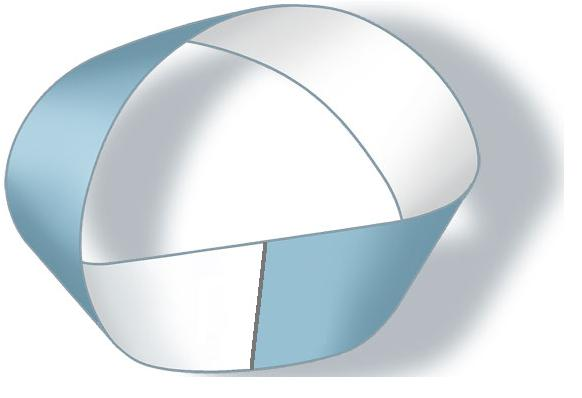
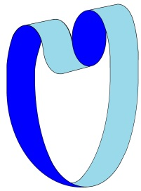
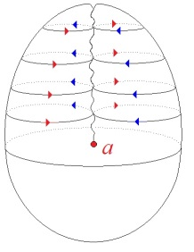
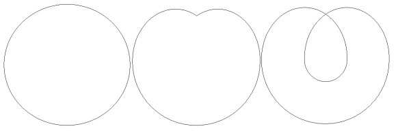
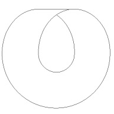
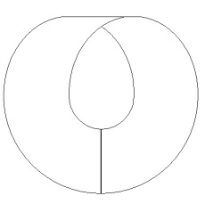
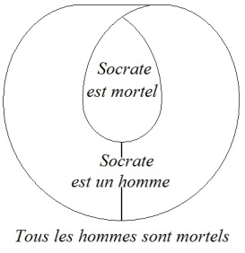

# Leçon 02 | 09 Décembre l964

  

    <label><input type="checkbox" data-lacan-toggle="original" checked> 原文</label>
    <label><input type="checkbox" data-lacan-toggle="notes" checked> 注释</label>
    <label><input type="checkbox" data-lacan-toggle="commentary" checked> 个人解读评论</label>
  

  <form class="lacan-tool-search" role="search">
    <input class="lacan-tool-search-input" type="search" placeholder="搜索全文" aria-label="搜索全文">
    <button class="lacan-tool-button" type="submit" title="搜索">搜索</button>
  </form>
  <button class="lacan-tool-button lacan-back-to-top" type="button" title="回到页面最上方" aria-label="回到页面最上方">↑</button>

<section class="parallel-paragraph" data-paragraph-ids="s12-02-0001">

s12-02-0001

原文 · s12-02-0001

Je remercie mon public de se montrer si attentif au moment que je reprends ces cours. Je l’ai vu la dernière fois... si nombreux.

[无对应译文]

</section>

<section class="parallel-paragraph" data-paragraph-ids="s12-02-0002">

s12-02-0002

原文 · s12-02-0002

Je commence par-là, parce qu’à la vérité, c’est pour moi une partie d’un problème que je vais *essayer*, je ne dirai pas seulement *de poser* aujourd’hui, par rapport auquel je voudrais définir quelque chose qui pourrait s’appeler : « *Comment cette année, allons-nous travailler ?* »

[无对应译文]

</section>

<section class="parallel-paragraph" data-paragraph-ids="s12-02-0003">

s12-02-0003

原文 · s12-02-0003

Je dis « *allons-nous* », ne concevant pas que mon discours se déploie en une abstraction professorale dont après tout, peu importerait qui en profite, bien ou mal, ni par quelle voie. J’ai appris par ces échecs - qui, justement en raison de *la spécificité de ma position*, ne tardent jamais à me venir - que j’avais été la dernière fois, didactique, enfin que sur ce point *on m’accordait le bon point d’un progrès*.

[无对应译文]

</section>

<section class="parallel-paragraph" data-paragraph-ids="s12-02-0004">

s12-02-0004

原文 · s12-02-0004

Ce n’est certes pas, pourtant - me semble-t-il - que je vous ai *ménagés* si je puis dire, car instruire le problème qui va nous occuper d’entrée cette année, celui du rapport du sujet au langage, comme je l’ai fait : par ce *non-sens*, et d’y rester, d’en soutenir *le commentaire*, *la question* assez longtemps pour vous faire passer par les voies, des défilés que je pouvais ensuite annuler d’un revers de main…

[无对应译文]

</section>

<section class="parallel-paragraph" data-paragraph-ids="s12-02-0005">

s12-02-0005

原文 · s12-02-0005

> entendons bien : quant aux résultats et non quant à la valeur de l’épreuve …pour au terme vous faire admettre, et je dirai presque - de mon point de vue - faire passer la muscade d’un rapport distinct, celui au *sens*, et supporté - comme je l’ai fait - par les deux phrases qui étaient encore tout à l’heure à ce tableau : je ne peux que me féliciter que quelque chose d’un tel discours, soit venu à son but !

[无对应译文]

</section>

<section class="parallel-paragraph" data-paragraph-ids="s12-02-0006">

s12-02-0006

原文 · s12-02-0006

S’il est vrai qu’il y a la faille dont j’ai amorcé la formulation la dernière fois, entre quelque chose que nous saisissons à ce niveau même où le signifiant fonctionne comme tel et comme je le définis : *le signifiant est ce qui représente le sujet pour un autre signifiant.*

[无对应译文]

</section>

<section class="parallel-paragraph" data-paragraph-ids="s12-02-0007">

s12-02-0007

原文 · s12-02-0007

S’il est vrai que cette représentation du sujet, que ce en quoi le signifiant est son représentant est que ce qui se présentifie dans l’effet de sens, et qu’il y ait entre cela et tout ce qui se construit comme signification, cette sorte *de champ neutre, de faille,* *de point de hasard*, où ce qui vient se rencontrer ne s’articule pas du tout de façon obligée.

[无对应译文]

</section>

<section class="parallel-paragraph" data-paragraph-ids="s12-02-0008">

s12-02-0008

原文 · s12-02-0008

À savoir, ce qui revient comme *signification* d’un certain rapport - je l’ai articulé la dernière fois - qui reste à définir, du signifiant au *référent*, à ce *quelque chose* d’articulé ou non dans le *réel*, sur quoi c’est en venant, disons *se répercuter* - pour n’en dire pas plus maintenant - que le signifiant a engendré *le système des* *significations.*

[无对应译文]

</section>

<section class="parallel-paragraph" data-paragraph-ids="s12-02-0009">

s12-02-0009

原文 · s12-02-0009

C’est là sans doute, pour ceux qui ont suivi mon discours passé, accentuation nouvelle de quelque chose dont vous pouvez retrouver la place dans mes *schémas* précédents, et même y voir que ce dont il s’agissait dans *l’effet de signifié* où j’avais à vous conduire, pour vous en signaler la place, au moment où l’année dernière je donnais *le schéma de l’aliénation* \[Séminaire 1964 : *Les fondements*... 27-05, 17-06\] : que ce référent c’était le désir en tant qu’il peut être à situer dans la formation, dans l’institution du *sujet* quelque part, se creusant là *dans l’intervalle* entre les deux signifiants, essentiellement *évoqués* dans la définition du signifiant lui-même.

[无对应译文]

</section>

<section class="parallel-paragraph" data-paragraph-ids="s12-02-0010">

s12-02-0010

原文 · s12-02-0010

Qu’ici, *non pas le sujet* - défaillant dans cette formulation de ce qu’on peut appeler *la cellule primordiale de sa constitution - mais déjà* dans une première métaphore, *ce signifié*, de par la position même du sujet en voie de défaillance, avait à être relayé de la fonction du désir.

[无对应译文]

</section>

<section class="parallel-paragraph" data-paragraph-ids="s12-02-0011">

s12-02-0011

原文 · s12-02-0011

Sans doute formule éclairante pour désigner toutes sortes d’effets génétiques dans notre expérience analytique, mais formule relativement obscure si nous avons à repérer ce dont il s’agit en fin de compte : essentiellement de la validité de cette formule, et pour tout dire de la relation du développement - pris dans son sens le plus large - de la relation de position du sujet \- prise dans son sens le plus radical - à la fonction du langage.

[无对应译文]

</section>

<section class="parallel-paragraph" data-paragraph-ids="s12-02-0012">

s12-02-0012

原文 · s12-02-0012

Si ces formules, produites d’une façon encore plus aphoristique que dogmatique, données comme point d’appuis à partir desquels peut se juger, tout au moins se sérier, la gamme des formulations différentes qui en sont données à tous les niveaux où cette interrogation essaie, tente, de se poursuivre, d’une façon contemporaine…

[无对应译文]

</section>

<section class="parallel-paragraph" data-paragraph-ids="s12-02-0013">

s12-02-0013

原文 · s12-02-0013

> que ce soit *le linguiste, le psycholinguiste, le psychologue, le stratégiste, le théoricien des jeux*, etc. …le terme que j’avance, et en premier lieu, celui du *signifiant représentant le sujet pour un autre signifiant*, a en soi même quelque chose d’exclusif, qui rappelle qu’à essayer de tracer une autre voie, quant au statut à donner à tel ou tel niveau conçu de signifié, quelque chose assurément est risqué qui, *plus où moins*, annule, franchit, une certaine faille, et qu’avant de s’y laisser prendre, il conviendrait peut être d’y regarder à deux fois. Encore est-ce là, position je dirai quasi impérative, qui bien sûr ne peut se soutenir que de tenter une référence qui, non seulement trouve son recours dans un développement adéquat des théories aux faits, et qui aussi trouve *son fondement dans quelque structure plus radicale.*

[无对应译文]

</section>

<section class="parallel-paragraph" data-paragraph-ids="s12-02-0014">

s12-02-0014

原文 · s12-02-0014

Et aussi bien, tous ceux qui, depuis quelques années, ont pu suivre ce que j’ai devant eux développé, savent que…

[无对应译文]

</section>

<section class="parallel-paragraph" data-paragraph-ids="s12-02-0015">

s12-02-0015

原文 · s12-02-0015

> il y a trois ans, sur un séminaire sur l’*identification...* ce n’est pas sans rapport avec ce que je vous amène maintenant …que j’ai été conduit à la nécessité d’une certaine topologie qui m’a paru s’imposer, surgir de cette expérience même, *la plus singulière*, parfois, souvent, toujours peut-être, la plus confuse qui soit, celle à laquelle nous avons affaire dans la psychanalyse, à savoir *l’identification*.

[无对应译文]

</section>

<section class="parallel-paragraph" data-paragraph-ids="s12-02-0016">

s12-02-0016

原文 · s12-02-0016

Assurément, cette topologie est essentielle à la structure du langage. Parlant structure, on ne peut pas ne pas l’évoquer.

[无对应译文]

</section>

<section class="parallel-paragraph" data-paragraph-ids="s12-02-0017">

s12-02-0017

原文 · s12-02-0017

La remarque première, je dirais même primaire, que tout « *déroulé dans le temps* » que nous devions concevoir le discours, s’il est quelque chose que l’analyse structurale - telle qu’elle s’est opérée en linguistique - est faite pour nous révéler, c’est :

[无对应译文]

</section>

<section class="parallel-paragraph" data-paragraph-ids="s12-02-0018">

s12-02-0018

原文 · s12-02-0018

- que cette *structure linéaire* n’est point suffisante pour rendre compte de la chaîne du discours concret, de *la chaîne signifiante*,

[无对应译文]

</section>

<section class="parallel-paragraph" data-paragraph-ids="s12-02-0019">

s12-02-0019

原文 · s12-02-0019

- que nous ne pouvons l’ordonner, l’accorder, *<u>que</u>* sous la forme de ce qu’on appelle dans l’écriture musicale « *une portée* »,

[无对应译文]

</section>

<section class="parallel-paragraph" data-paragraph-ids="s12-02-0020">

s12-02-0020

原文 · s12-02-0020

- que c’est le moins que nous ayons à dire et que dès lors, *la question de la fonction de cette deuxième dimension comment la concevoir ?*

[无对应译文]

</section>

<section class="parallel-paragraph" data-paragraph-ids="s12-02-0021">

s12-02-0021

原文 · s12-02-0021

- Et que - si c’est là quelque chose qui nous oblige à la considération de *la surface *: sous quelle forme ?

[无对应译文]

</section>

<section class="parallel-paragraph" data-paragraph-ids="s12-02-0022">

s12-02-0022

原文 · s12-02-0022

Celle jusqu’ici formulée dans l’intuition de l’espace telle que par exemple, elle peut s’inscrire dans l’*estéthique transcendantale*, ou si c’est *autre chose* ? Si c’est cette surface telle qu’elle est théorisée précisément dans la théorie mathématique des surfaces prises étroitement sous l’angle de la topologie ? Si ceci nous suffit ?

[无对应译文]

</section>

<section class="parallel-paragraph" data-paragraph-ids="s12-02-0023">

s12-02-0023

原文 · s12-02-0023

Bref, Si cette *portée* sur laquelle il convient d’inscrire toute unité de signifiant, où toute phrase assurément a ses coupures : comment aux deux *extrémités* de la suite de ces mesures, cette coupure vient-elle serrer, *striger*, sectionner la *portée* ?

[无对应译文]

</section>

<section class="parallel-paragraph" data-paragraph-ids="s12-02-0024">

s12-02-0024

原文 · s12-02-0024

Disons qu’il y a à cet endroit, plus d’une façon de s’interroger, et qu’il y a fagot et fagot. Assurément il n’est pas trop tôt, devant cette structure, pour reposer la question de savoir si bien effectivement…

[无对应译文]

</section>

<section class="parallel-paragraph" data-paragraph-ids="s12-02-0025">

s12-02-0025

原文 · s12-02-0025

> comme jusqu’à présent la chose a passé pour aller de soi dans un certain schématisme naturel …le temps est à réduire à une seule dimension. Mais laissons pour l’instant.

[无对应译文]

</section>

<section class="parallel-paragraph" data-paragraph-ids="s12-02-0026">

s12-02-0026

原文 · s12-02-0026

Et pour nous en tenir à ce curieux flottement au niveau de ce que peut être cette surface - vous le voyez, toujours indispensable à toutes nos ordinations - c’est bien les deux dimensions du tableau noir qu’il me faut. Encore est-il visible que chaque ligne n’a point une fonction homogène aux autres.

[无对应译文]

</section>

<section class="parallel-paragraph" data-paragraph-ids="s12-02-0027">

s12-02-0027

原文 · s12-02-0027

Et simplement d’abord, pour ébranler le caractère intuitif de cette *fonction de l’espace* en tant qu’elle peut nous intéresser, j’irai ici à vous faire remarquer que dans cette première approche que j’évoquai des *années précédentes*, à une certaine topologie très structurante de ce qu’il advient du sujet en notre expérience, je rappelle que ce dont j’avais été amené à *me servir*, est quelque chose qui ne fait point partie d’un espace qui semble intégré à toute notre expérience, et dont on peut bien dire…

[无对应译文]

</section>

<section class="parallel-paragraph" data-paragraph-ids="s12-02-0028">

s12-02-0028

原文 · s12-02-0028

> qu’auprès de cet autre, qui mérite en effet le nom d’espace familier, mais particulier aussi …qu’il est un espace… appelons-le *moins… ou même inimaginable*, en tout cas auquel il importe de se familiariser, pour tel paradoxe qu’on y rencontre aisément, où telle absence de prévision à ce que, pour la première fois, vous y soyez introduits.

[无对应译文]

</section>

<section class="parallel-paragraph" data-paragraph-ids="s12-02-0029">

s12-02-0029

原文 · s12-02-0029

Pardonnez-moi d’amener ici, sous la forme d’une sorte d’amusette, quelque chose dont faites-moi le crédit de penser que nous en retrouverons peut-être ultérieurement la forme.

[无对应译文]

</section>

<section class="parallel-paragraph" data-paragraph-ids="s12-02-0030">

s12-02-0030

原文 · s12-02-0030

Ces éléments topologiques, respectivement, pour parler de ceux sur lesquels j’ai mis l’accent : *le trou, le tore, le cross–cap*

[无对应译文]

</section>

<section class="parallel-paragraph" data-paragraph-ids="s12-02-0031">

s12-02-0031

原文 · s12-02-0031

 

[无对应译文]

</section>

<section class="parallel-paragraph" data-paragraph-ids="s12-02-0032">

s12-02-0032

原文 · s12-02-0032

…sont vraiment séparés par une sorte de monde distinctif, d’avec des « *formes* » - appelons-les comme les ont appelé *les Gestaltistes,* dont il faut bien dire qu’elles ont dominé le développement, d’une part de toute une géométrie, mais aussi de toute une signifiance.

[无对应译文]

</section>

<section class="parallel-paragraph" data-paragraph-ids="s12-02-0033">

s12-02-0033

原文 · s12-02-0033

Je n’ai pas besoin de vous renvoyer *à des recherches bien connues* et pleines de mérite, citons ici seulement en passant *Les Métamorphoses du cercle* de Georges POULET[^13], mais il y en aurait bien d’autres pour nous rappeler qu’au cours des siècles *la signifiance de la sphère*, avec tout ce quelle comporte d’exclusif, a été ce qui a dominé toute une pensée, tout un âge peut être de la pensée, et que ce n’est point seulement à la voir culminer dans tel grand poème - poème dantesque[^14] par exemple - que nous pouvons sonder, mesurer, l’importance de la sphère, et même avec ce que nous pouvons lui rapporter comme étant si je puis dire « de son monde » : le cône, impliquant tout ce qui a été entériné dans la géométrie comme section conique, c’est là un monde dont diffère celui qu’introduisent les références auxquelles je faisais allusion tout à l’heure.

[无对应译文]

</section>

<section class="parallel-paragraph" data-paragraph-ids="s12-02-0034">

s12-02-0034

原文 · s12-02-0034

Je vais vous en montrer un exemple. En vous interrogeant, bien sûr, je ne prendrai aucune de ces structures topologiques que j’ai énumérées tout à l’heure, parce qu’elles sont en quelque sorte, pour notre objet, pour l’instant - celui du petit choc que j’essaie d’obtenir - trop compliquées.

[无对应译文]

</section>

<section class="parallel-paragraph" data-paragraph-ids="s12-02-0035">

s12-02-0035

原文 · s12-02-0035

Et d’autre part, si je prends la forme plus *familière*, que tout le monde finit bien par avoir entendu passer à son horizon auditif, celle de [*la bande de Mœbius*](http://www.youtube.com/watch?v=BVsIAa2XNKc).

[无对应译文]

</section>

<section class="parallel-paragraph" data-paragraph-ids="s12-02-0036">

s12-02-0036

原文 · s12-02-0036

Ai-je besoin de vous rappeler ce que c’est ? Vous en voyez \[au tableau\] apparemment deux. Ne tenez pas compte - vous verrez tout à l’heure ce que ça veut dire - de la multiplicité de l’épaisseur, mais simplement de la forme qui fait que quelque chose, qui pourrait être, si vous voulez au départ, comme un segment cylindrique, du fait que, en même temps on peut faire le tour de la paroi - je m’exprime en des termes exprès référés à la matière - l’objet, l’inversion qu’on produit, aboutit à l’existence d’une surface dont le point le plus remarquable est qu’*elle n’a qu’une face* à savoir que, de quelque point qu’on parte, on peut aboutir, par le chemin qui reste, sur la face d’où l’on est parti, à quelque point que ce soit de ce qui pourrait faire croire, être une face et l’autre.

[无对应译文]

</section>

<section class="parallel-paragraph" data-paragraph-ids="s12-02-0037">

s12-02-0037

原文 · s12-02-0037

[无对应译文]

</section>

<section class="parallel-paragraph" data-paragraph-ids="s12-02-0038">

s12-02-0038

原文 · s12-02-0038

Il n’y en a qu’une. C’est également vrai qu’*elle n’a qu’un bord*. Ceci assurément, supposerait l’avancée de toutes sortes de définitions, la définition du mot « *bord* », par exemple, qui est essentielle et qui peut être pour nous du plus grand usage.

[无对应译文]

</section>

<section class="parallel-paragraph" data-paragraph-ids="s12-02-0039">

s12-02-0039

原文 · s12-02-0039

Ce que je veux vous faire remarquer, est ceci d’abord qui ne sera que pour - je dirai - *les plus novices à considérer ce même objet *: Pouvez-vous, dirai-je, prévoir, si vous ne le savez déjà, ce qu’il arrive - cette surface étant constituée - ce qu’il arrive si on la coupe en restant toujours très exactement à égale distance de ses bords, c’est-à-dire si on la coupe en deux, *longitudinalement* ?

[无对应译文]

</section>

<section class="parallel-paragraph" data-paragraph-ids="s12-02-0040">

s12-02-0040

原文 · s12-02-0040

Tous ceux qui ont déjà là-dessus ouvert quelques livres, savent ce qu’il en est. Cela donne le résultat suivant : à savoir non pas la surface divisée mais une bande continue, laquelle a d’ailleurs la propriété de pouvoir exactement reproduire la forme de la surface première, en se recouvrant elle-même. *C’est en quelque sorte une surface qu’on ne peut pas diviser*, au moins au premier coup de ciseaux.

[无对应译文]

</section>

<section class="parallel-paragraph" data-paragraph-ids="s12-02-0041">

s12-02-0041

原文 · s12-02-0041

Autre chose, plus intéressant et que vous n’aurez, je pense - car je ne l’y ai point vu - pas trouvé dans les livres, il s’agit du problème suivant : la surface étant constituée, peut-elle être doublée, recouverte par une autre qui vient exactement s’appliquer sur sa forme ?

[无对应译文]

</section>

<section class="parallel-paragraph" data-paragraph-ids="s12-02-0042">

s12-02-0042

原文 · s12-02-0042

Il est très facile de s’apercevoir, à faire l’expérience, qu’à doubler d’une surface exactement égale à la première, celle que nous allons appliquer sur elle, nous arriverons au résultat que la terminaison, de la seconde bande que nous avons introduite dans le jeu, cette terminaison s’affrontera à *l’autre terminaison de la même bande*, puisque nous avons dit, par définition que ces surfaces sont égales, mais que ces deux terminaisons seront séparées par la bande première, autrement dit qu’elles ne pourront se rejoindre *qu’à traverser la première surface*. Ceci n’est pas évident et se découvre à l’expérience… qui est étroitement solidaire du premier résultat, d’ailleurs plus connu, que je vous évoquais.

[无对应译文]

</section>

<section class="parallel-paragraph" data-paragraph-ids="s12-02-0043">

s12-02-0043

原文 · s12-02-0043

Avouez que cette traversée nécessaire de la surface par la surface qui la redouble, voilà quelque chose qui peut nous apparaître être bien commode pour signifier le rapport du signifiant au sujet. Je veux dire le fait d’abord - toujours à rappeler - qu’en aucun cas, sauf à le dédoubler, le signifiant ne saurait se signifier lui-même. Point très fréquemment, sinon toujours, oublié, et bien sûr oublié avec le plus d’inconvénient, là où il conviendrait le plus de s’en souvenir.

[无对应译文]

</section>

<section class="parallel-paragraph" data-paragraph-ids="s12-02-0044">

s12-02-0044

原文 · s12-02-0044

D’autre part, c’est peut-être lié à cette propriété topologique que nous devons chercher, ce quelque chose d’inattendu, de fécond si je puis dire, dans l’expérience, que nous devons reconnaître pour en tout point comparable à un effet de sens.

[无对应译文]

</section>

<section class="parallel-paragraph" data-paragraph-ids="s12-02-0045">

s12-02-0045

原文 · s12-02-0045

Je pousse encore plus loin cette affaire, dont vous verrez peut-être plus tard des implications beaucoup plus sensibles : assurément si nous continuons la couverture de notre surface première, *bande de Mœbius*, par une surface qui n’est plus, cette fois, équivalente à sa longueur mais le double, nous arriverons en effet - si tant est que ces mots aient un sens - à l’envelopper « *au-dedans et au dehors* ». C’est ce qui est effectivement réalisé ici.

[无对应译文]

</section>

<section class="parallel-paragraph" data-paragraph-ids="s12-02-0046">

s12-02-0046

原文 · s12-02-0046

 

[无对应译文]

</section>

<section class="parallel-paragraph" data-paragraph-ids="s12-02-0047">

s12-02-0047

原文 · s12-02-0047

Entendez qu’au milieu il y a une *surface de Mœbius*, et autour une surface du type de la surface dédoublée quand tout à l’heure je la coupais avec un ciseau au milieu, ce qui la recouvre - je répète : si ces mots ont un sens - « *au-dedans et au dehors* » : alors vous constatez que ces deux surfaces sont *nouées*.

[无对应译文]

</section>

<section class="parallel-paragraph" data-paragraph-ids="s12-02-0048">

s12-02-0048

原文 · s12-02-0048

En d’autres termes, et ceci d’une façon aussi nécessaire que peu prévisible à l’intuition simple, qui est bien là pour nous donner *l’idée que* *la chaîne signifiante*…

[无对应译文]

</section>

<section class="parallel-paragraph" data-paragraph-ids="s12-02-0049">

s12-02-0049

原文 · s12-02-0049

> comme bien souvent *les métaphores* atteignent un but qu’au préalable, elles ne croyaient viser que d’une façon approximative …que *la chaîne signifiante* a peut être un sens bien plus plein - au sens où elle implique chaînons, et chaînons qui s’emboîtent - que nous ne le supposions d’abord. \[Cf. séminaire *L’identification*, 06-06\]

[无对应译文]

</section>

<section class="parallel-paragraph" data-paragraph-ids="s12-02-0050">

s12-02-0050

原文 · s12-02-0050

Je sens peut-être quelque chose comme une hésitation devant le caractère un peu distant par rapport à mes problèmes, de ce que je viens d’apporter ici. Néanmoins, la division du champ que peut apporter cette structure, *la surface de Mœbius*, si nous la comparons à la surface qui la complète dans le *cross-cap*, et qui est un plan doué de propriétés spéciales, il n’est pas seulement gauche, il est quelque chose, dont on ne peut dire d’ailleurs que ceci : c’est qu’il comporte… c’est qu’il comporte sa jonction éventuelle par *une surface de Mœbius*, le huit intérieur comme je l’ai appelé.

[无对应译文]

</section>

<section class="parallel-paragraph" data-paragraph-ids="s12-02-0051">

s12-02-0051

原文 · s12-02-0051

 

[无对应译文]

</section>

<section class="parallel-paragraph" data-paragraph-ids="s12-02-0052">

s12-02-0052

原文 · s12-02-0052

Imaginez ceci où encore il s’agit de le remplir par une surface imaginaire, imaginez ceci simplement comme un cercle, pour vous l’imaginer simplement imaginez d’abord cette forme d’un cœur, et que cette partie, ici à droite, ait peu à peu empiété comme vous la voyez finalement le faire, sur la gauche. \[Fig. 1\] Il est clair que les bords sont continus, que *l’homologie, le parallélisme*, si vous voulez, dans laquelle entre, par rapport à leur opposé, ces bords, c’est là ce qui vous permet, plus facilement, d’y loger une surface comme la *bande de Mœbius* \[Fig. 2\]. Suivant la surface que vous engendrerez, la suivre ainsi, l’espace entre les bords affrontés, vous aurez effectivement *cette sorte de retournement* de cette surface, qui était tout à l’heure ce que je vous faisais remarquer faire la définition même de la bande.

[无对应译文]

</section>

<section class="parallel-paragraph" data-paragraph-ids="s12-02-0053">

s12-02-0053

原文 · s12-02-0053

[无对应译文]

</section>

<section class="parallel-paragraph" data-paragraph-ids="s12-02-0054">

s12-02-0054

原文 · s12-02-0054

> Fig.1 Fig.2

[无对应译文]

</section>

<section class="parallel-paragraph" data-paragraph-ids="s12-02-0055">

s12-02-0055

原文 · s12-02-0055

Mais ici que se passe–t–il si nous complétons cette surface par l’autre ? C’est que la *bande de Mœbius* coupe nécessairement la dite portion *en un point* d’ailleurs, donc en une ligne dont la localisation importe peu mais qui, pour l’intuition se révèle ici la plus évidente \[Fig.3, trait vertical\].

[无对应译文]

</section>

<section class="parallel-paragraph" data-paragraph-ids="s12-02-0056">

s12-02-0056

原文 · s12-02-0056

[无对应译文]

</section>

<section class="parallel-paragraph" data-paragraph-ids="s12-02-0057">

s12-02-0057

原文 · s12-02-0057

Fig.3

[无对应译文]

</section>

<section class="parallel-paragraph" data-paragraph-ids="s12-02-0058">

s12-02-0058

原文 · s12-02-0058

Qu’est-ce à dire ? C’est que si nous nous mettions éventuellement à faire fonctionner une telle coupure à la façon, mais à la place de ce dont la logique des classes prises en extension se sert de ce que l’on appelle les cercles d’EULER, nous pourrions mettre en évidence, certaines relations essentielles. Mon discours ne me permet pas de le pousser ici jusqu’au bout, mais sachez que concernant un syllogisme par exemple, aussi problématique que celui-ci : « *Tous les hommes sont mortels*. *Socrate est un homme*. *Socrate est mortel* »

[无对应译文]

</section>

<section class="parallel-paragraph" data-paragraph-ids="s12-02-0059">

s12-02-0059

原文 · s12-02-0059

Syllogisme dont j’espère qu’il y a ici un certain nombre d’oreilles, si elles veulent bien admettre au débat autre chose que la signification : ce que j’ai appelé l’autre jour « *le sens* », que ce syllogisme a quelque chose qui nous retient et qu’aussi bien, la philosophie ne l’a point sortie d’emblée ni dans un contexte pur, qui n’est nulle part dans les [*Analytiques*](http://remacle.org/bloodwolf/philosophes/Aristote/tableanal1.htm) d’ARISTOTE[^15], qui - je suppose - s’en serait bien gardé.

[无对应译文]

</section>

<section class="parallel-paragraph" data-paragraph-ids="s12-02-0060">

s12-02-0060

原文 · s12-02-0060

Non pas certes que ce soit simplement le sentiment de la révérence ou du respect qui l’eut empêché de mettre celui d’où sortait toute une pensée en jeu avec le commun des hommes, mais qu’il n’est pas sûr que le terme SOCRATE, en ce contexte, puisse être introduit sans prudence. Et nous voilà portés - ici j’anticipe - en plein cœur d’une question, de l’ordre précisément de celles qui nous intéressent. Il est singulier qu’en un moment de floraison de la linguistique, la discussion sur ce que c’est *le nom propre*, soit entièrement en suspens.

[无对应译文]

</section>

<section class="parallel-paragraph" data-paragraph-ids="s12-02-0061">

s12-02-0061

原文 · s12-02-0061

Je veux dire que s’il est paru exact - et vous en connaissez, je pense, *un certain nombre -* que toutes sortes de travaux remarquables, toutes sortes de prises de positions éminentes sur *la fonction du nom propre*, au regard de ce qui semble aller de soi, *la première fonction du signifiant *: la dénomination, assurément, pour simplement introduire ce que je veux dire, la chose qui frappe, c’est qu’à s’introduire dans un des développements divers, très catégorisés qui se sont poussées sur ce thème à une véritable valeur, je dois dire fascinatoire, sur tous ceux qui s’en aperçoivent, il apparaît avec une très grande régularité, à la lecture de chaque auteur, que tout ce qu’ont dit les autres, est de la plus grande absurdité.

[无对应译文]

</section>

<section class="parallel-paragraph" data-paragraph-ids="s12-02-0062">

s12-02-0062

原文 · s12-02-0062

Voilà quelque chose qui est bien destiné à nous retenir et je dirais à introduire ce petit coin, ce petit biais *dans la question du nom propre* quelque chose qui commence par cette chose toute simple : « SOCRATE »…

[无对应译文]

</section>

<section class="parallel-paragraph" data-paragraph-ids="s12-02-0063">

s12-02-0063

原文 · s12-02-0063

> et je crois vraiment qu’au terme, il n’y aura pas moyen d’éviter cette première appréhension, ce premier ressort …SOCRATE c’est *le nom* de celui qui s’appelle SOCRATE.

[无对应译文]

</section>

<section class="parallel-paragraph" data-paragraph-ids="s12-02-0064">

s12-02-0064

原文 · s12-02-0064

Ce qui n’est pas du tout dire la même chose car :

[无对应译文]

</section>

<section class="parallel-paragraph" data-paragraph-ids="s12-02-0065">

s12-02-0065

原文 · s12-02-0065

- il y a le sacré bonhomme,

[无对应译文]

</section>

<section class="parallel-paragraph" data-paragraph-ids="s12-02-0066">

s12-02-0066

原文 · s12-02-0066

- il y a le SOCRATE des copains,

[无对应译文]

</section>

<section class="parallel-paragraph" data-paragraph-ids="s12-02-0067">

s12-02-0067

原文 · s12-02-0067

- il y a le SOCRATE [*designator*](http://www.mediterranees.net/civilisation/Rich/Articles/Loisirs/Theatre/Designator.html).

[无对应译文]

</section>

<section class="parallel-paragraph" data-paragraph-ids="s12-02-0068">

s12-02-0068

原文 · s12-02-0068

Je parle de *la fonction du nom propre *: il est impossible de l’isoler sans poser la question de ce qui s’annonce au niveau du *nom propre*.

[无对应译文]

</section>

<section class="parallel-paragraph" data-paragraph-ids="s12-02-0069">

s12-02-0069

原文 · s12-02-0069

Que le *nom propre* ait une fonction de désignation, voire même comme on l’a dit, ce qui n’est pas vrai, de l’individu comme tel…

[无对应译文]

</section>

<section class="parallel-paragraph" data-paragraph-ids="s12-02-0070">

s12-02-0070

原文 · s12-02-0070

> car à s’engager dans cette voie, vous le verrez, on arrive à des absurdités …qu’il ait cet usage, n’épuise absolument pas la question de ce qui s’annonce dans le *nom propre*.

[无对应译文]

</section>

<section class="parallel-paragraph" data-paragraph-ids="s12-02-0071">

s12-02-0071

原文 · s12-02-0071

Vous me direz : « *Eh bien, dites-le !* » Mais justement, en fait ceci nécessite *quelques détours*. Mais assurément, c’est bien là l’objection que nous avons à faire au « *SOCRATE est mortel* » de la conclusion. Car ce qui s’annonce dans SOCRATE est assurément dans un rapport tout à fait privilégié à la mort puisque, s’il y a quelque chose dont nous soyons sûrs, sur cet homme dont nous ne savons rien, c’est que la mort il la demandait, et en ces termes : « *Prenez-moi, tel que je suis, moi, Socrate, l’atopique, ou bien tuez-moi.* »

[无对应译文]

</section>

<section class="parallel-paragraph" data-paragraph-ids="s12-02-0072">

s12-02-0072

原文 · s12-02-0072

Ceci, assuré, univoque et sans ambiguïté.

[无对应译文]

</section>

<section class="parallel-paragraph" data-paragraph-ids="s12-02-0073">

s12-02-0073

原文 · s12-02-0073

[无对应译文]

</section>

<section class="parallel-paragraph" data-paragraph-ids="s12-02-0074">

s12-02-0074

原文 · s12-02-0074

Et je pense que seul l’usage de *notre petit cercle* - non point eulérien mais *réformé d’Euler,* nous permet, en inscrivant tout au pourtour, dans un parallélisme dévorant : *tous les hommes sont mortels*, *Socrate est mortel* - de considérer que la jonction de ces formules majeures et de leur conclusion, est ce qui va nous permettre de répartir deux champs du sens :

[无对应译文]

</section>

<section class="parallel-paragraph" data-paragraph-ids="s12-02-0075">

s12-02-0075

原文 · s12-02-0075

- assurément *un champ de signification* où il paraît tout naturel que « SOCRATE » vienne en parallélisme à ce « *tous les hommes* » et s’y insère,

[无对应译文]

</section>

<section class="parallel-paragraph" data-paragraph-ids="s12-02-0076">

s12-02-0076

原文 · s12-02-0076

- *un champ de sens* aussi qui recoupe le premier et par où la question se pose pour nous de savoir si nous devons donner

[无对应译文]

</section>

<section class="parallel-paragraph" data-paragraph-ids="s12-02-0077">

s12-02-0077

原文 · s12-02-0077

> au « *est un homme* » - qui vient là-dedans, et bien plus pour nous que pour quiconque, d’une façon *problématique -* le sens d’être dans le prolongement de ce recoupement du *sens* à *la signification*, à savoir…

[无对应译文]

</section>

<section class="parallel-paragraph" data-paragraph-ids="s12-02-0078">

s12-02-0078

原文 · s12-02-0078

À savoir si être un homme c’est - oui ou non - demander la mort, c’est-à-dire de voir rentrer, par ce simple problème de logique et à ne faire intervenir que des considérations de signifiants, l’entrée en jeu de ce que FREUD a introduit comme pulsion de mort. Je reviendrai sur cet exemple.

[无对应译文]

</section>

<section class="parallel-paragraph" data-paragraph-ids="s12-02-0079">

s12-02-0079

原文 · s12-02-0079

J’ai parlé tout à l’heure de DANTE et de sa topologie finalement illustrée dans son grand poème.

[无对应译文]

</section>

<section class="parallel-paragraph" data-paragraph-ids="s12-02-0080">

s12-02-0080

原文 · s12-02-0080

Je me suis posé la question : je pense que si DANTE revenait, il se serait trouvé, au moins dans les années passées, *à l’aise à mon séminaire*. Je veux dire que ce n’est pas parce que pour lui tout vient pivoter de la substance et de l’être...

[无对应译文]

</section>

<section class="parallel-paragraph" data-paragraph-ids="s12-02-0081">

s12-02-0081

原文 · s12-02-0081

autour de ce qui s’appelle le point, qui est le point à la fois d’expansion et d’évanouissement de la sphère ...qu’il n’aurait pas trouvé le plus grand intérêt à la façon dont nous avons interrogé le langage.

[无对应译文]

</section>

<section class="parallel-paragraph" data-paragraph-ids="s12-02-0082">

s12-02-0082

原文 · s12-02-0082

Car avant sa *Divine comédie*, il a écrit le *De vulgari eloquentia*, il a écrit aussi la *Vita nova*. Il a écrit la *Vita nova* autour du problème du désir, et à la vérité *la Divine comédie ne saurait être comprise sans ce préalable*. Mais assurément dans *De vulgari eloquentia*, il manifeste…

[无对应译文]

</section>

<section class="parallel-paragraph" data-paragraph-ids="s12-02-0083">

s12-02-0083

原文 · s12-02-0083

> sans aucun doute avec les impasses, sans aucun doute avec des points de fuite exemplaires, où nous savons
>
> que ce n’est point là qu’il faut aller, c’est pour cela que nous essayons de réformer la topologie des questions …il a manifesté le plus vif sens du caractère premier et primitif du langage, du langage maternel dit-il, en l’opposant à tout ce qui à son époque était attachement, recours obstiné à un langage savant, et pour tout dire, *préemption de la logique sur le langage*.

[无对应译文]

</section>

<section class="parallel-paragraph" data-paragraph-ids="s12-02-0084">

s12-02-0084

原文 · s12-02-0084

Tous les problèmes de jonction du langage à ce qu’on appelle « *la pensée* »…

[无对应译文]

</section>

<section class="parallel-paragraph" data-paragraph-ids="s12-02-0085">

s12-02-0085

原文 · s12-02-0085

> et Dieu sait avec quel *accent*, quand il s’agit de l’un et l’autre chez l’enfant, à la suite de M. PIAGET par exemple …tout repose dans la fausse route, dans le fourvoiement où des recherches, par ailleurs jaillissantes quant aux faits, méritoires quant aux groupements médités dans l’accumulation, *tout ce fourvoiement repose sur la méconnaissance de l’ordre qui existe entre langage et logique*.

[无对应译文]

</section>

<section class="parallel-paragraph" data-paragraph-ids="s12-02-0086">

s12-02-0086

原文 · s12-02-0086

Tout le monde sait, tout le monde reproche aux *logiques* - *les premières sorties et nommément à celle d’Aristote -* d’être trop *grammaticales*, trop subissant l’empreinte de la grammaire. Ô combien vrai ! Est-ce que ce n’est pas justement cela qui nous l’indique que c’est de là qu’elles partent ? Je parle : jusqu’aux formes les plus raffinées, les plus épurées que nous sommes arrivés à donner à cette logique, je parle des logiques dites *symboliques,* du logico-mathématisme, de tout ce que dans l’ordre de l’axiomatisation, de la logistique, nous avons pu apporter de plus raffiné.

[无对应译文]

</section>

<section class="parallel-paragraph" data-paragraph-ids="s12-02-0087">

s12-02-0087

原文 · s12-02-0087

La question, pour nous, n’est point d’installer cet ordre de la pensée…

[无对应译文]

</section>

<section class="parallel-paragraph" data-paragraph-ids="s12-02-0088">

s12-02-0088

原文 · s12-02-0088

> *ce jeu pur et de plus en plus serré* que, non sans intervention de notre progrès dans les sciences, nous arrivons à mettre au point …*ce n’est pas de le substituer au langage* - je veux dire de croire que le langage n’en est en quelque sorte que l’instrument - *qu’il s’agit*, car tout prouve, et au premier plan justement notre expérience analytique, que l’ordre du langage, et du langage grammatical…

[无对应译文]

</section>

<section class="parallel-paragraph" data-paragraph-ids="s12-02-0089">

s12-02-0089

原文 · s12-02-0089

> car *le recours à la langue maternelle, à la langue première*, celle que parle spontanément *le nourrisson* et *l’homme du peuple*, n’est point objection pour DANTE - contrairement aux grammairiens de son époque - à voir l’importance exactement corrélative de la *lingua grammatica*, c’est cette grammaire là qui lui importe et c’est là qu’il ne doute pas de retrouver la langue pure …c’est tout l’espace, toute la différence qu’il y aura entre le mode d’abord de PIAGET et celui par exemple de quelqu’un comme [VYGOTSKY](http://www2.unil.ch/slav/ling/recherche/ENCYCL%20LING%20RU/VYGOTSKIJ/Vygotskij.html)[^16].

[无对应译文]

</section>

<section class="parallel-paragraph" data-paragraph-ids="s12-02-0090">

s12-02-0090

原文 · s12-02-0090

J’espère que ce nom n’est pas étranger ici à toutes les oreilles : c’est un jeune *psychologue expérimentaliste*, vivant tout de suite après la révolution de l9l7 en Russie, qui a poursuivi son œuvre jusqu’à l’époque où il est mort, hélas prématurément, en l934 à 38 ans.

[无对应译文]

</section>

<section class="parallel-paragraph" data-paragraph-ids="s12-02-0091">

s12-02-0091

原文 · s12-02-0091

Il faut lire ce livre \[Vygotski : *Pensée et langage*\] ou bien - puisque j’ai posé la question « Comment allons nous travailler ? » - il faut que quelqu’un, et je vais dire tout à l’heure *dans quelles conditions,* prenne la charge de cet ouvrage ou de quelque autre, d’en faire si l’on peut dire « *l’éclairage* », à la lumière des grandes lignes de référence qui sont celles dont nous essayons ici de donner le statut, pour y voir d’une part ce qu’elle apporte, si je puis dire, cette eau, à ce moulin, et aussi bien ce en quoi elle n’y répond que d’une façon plus où moins naïve.

[无对应译文]

</section>

<section class="parallel-paragraph" data-paragraph-ids="s12-02-0092">

s12-02-0092

原文 · s12-02-0092

C’est évidemment, dans un cas comme celui là, la seule façon de procéder, car si ce livre et la méthode qu’introduit VYGOTSKY se distinguent d’une très sévère séparation, d’ailleurs tellement évidente dans les faits qu’on s’étonne que, dans le dernier article qui je crois soit paru de M. PIAGET[^17], qui est celui qui est paru aux P.U.F. dans le recueil des *[Problèmes de psycholinguistique](http://www.barbery.net/psy/fiches/langpia.htm),* qu’il maintienne en somme dur comme fer, et qu’il puisse répondre dans un petit *factum* qui a été joint au livre tout exprès dans l’évolution de sa pensée, eu égard à la fonction du langage, que c’est plus que jamais qu’il tient à ce que le langage…

[无对应译文]

</section>

<section class="parallel-paragraph" data-paragraph-ids="s12-02-0093">

s12-02-0093

原文 · s12-02-0093

> sans doute - dit-il - sans doute aide-t-il au développement chez l’enfant de concepts dont il veut que - *je ne dis pas les concepts ultérieurs, mais les concepts chez l’enfant tels qu’il y rencontre à leur appréhension une limite* - que ces concepts soient toujours étroitement liés à une référence d’action …que le langage ne soit là que comme aide, comme instrument mais secondaire, et dont il ne se plaira toujours qu’à *mettre en relief*, dans l’interrogatoire de l’enfant, *l’usage inapproprié*.

[无对应译文]

</section>

<section class="parallel-paragraph" data-paragraph-ids="s12-02-0094">

s12-02-0094

原文 · s12-02-0094

Or, toute l’expérience montre au contraire, qu’assurément si quelque chose est frappant dans le langage de l’enfant qui commence à parler, ça n’est point l’inappropriation, *c’est l’anticipation, c’est la précession paradoxale de certains éléments du langage*, qui ne devraient d’ailleurs paraître qu’après, si je puis dire, que les éléments d’insertion concrète - comme on dit - se soient suffisamment manifestés.

[无对应译文]

</section>

<section class="parallel-paragraph" data-paragraph-ids="s12-02-0095">

s12-02-0095

原文 · s12-02-0095

C’est la précession des particules, des petites formules, des « *peut-être pas* », des « *mais encore* », qui surgissent très précocement dans le langage de l’enfant, montrant même - pour peu qu’on le voit - un peu de fraîcheur, de naïveté, sous certains éclairages, qui permettraient de dire…

[无对应译文]

</section>

<section class="parallel-paragraph" data-paragraph-ids="s12-02-0096">

s12-02-0096

原文 · s12-02-0096

> et après tout, s’il le faut, ici j’apporterai les documents …que *la structure grammaticale* est absolument corrélative des toutes premières apparitions du langage.

[无对应译文]

</section>

<section class="parallel-paragraph" data-paragraph-ids="s12-02-0097">

s12-02-0097

原文 · s12-02-0097

Qu’est-ce à dire, sinon que ce qui importe, n’est point assurément de voir ce qui se passe dans l’esprit de l’enfant…

[无对应译文]

</section>

<section class="parallel-paragraph" data-paragraph-ids="s12-02-0098">

s12-02-0098

原文 · s12-02-0098

> assurément quelque chose qui, avec le temps, se réalise, puisqu’il devient l’adulte que nous croyons être …c’est que, si à un certain stade, de certaines étapes sont à relever dans son adéquation au concept.

[无对应译文]

</section>

<section class="parallel-paragraph" data-paragraph-ids="s12-02-0099">

s12-02-0099

原文 · s12-02-0099

Et là nous serons frappés que quelqu’un comme VYGOTSKY - je le dis seulement en passant sans en tirer plus de parti - d’avoir justement posé son interrogation dans les termes que je vais dire, à savoir tout différents de ceux de PIAGET, s’aperçoit que même un maniement rigoureux du concept - il le dénote à certains signes - peut être en quelque sorte fallacieux, et que le vrai maniement du concept n’est atteint dit-il - *singulièrement et malheureusement sans en tirer les conséquences -* qu’à la puberté.

[无对应译文]

</section>

<section class="parallel-paragraph" data-paragraph-ids="s12-02-0100">

s12-02-0100

原文 · s12-02-0100

Mais laissons cela. L’important serait d’étudier comme le fait VYGOTSKY…

[无对应译文]

</section>

<section class="parallel-paragraph" data-paragraph-ids="s12-02-0101">

s12-02-0101

原文 · s12-02-0101

> et ce qui est aussi bien pour lui la source d’aperception extrêmement riche,
>
> bien qu’elle n’ait pas été depuis, dans le même cercle, exploitée …*ce que l’enfant fait spontanément* - avec quoi ? - *avec les mots, sans lesquels*, assurément tout le monde est d’accord, *il n’y a pas de concept*.

[无对应译文]

</section>

<section class="parallel-paragraph" data-paragraph-ids="s12-02-0102">

s12-02-0102

原文 · s12-02-0102

Qu’est ce qu’il fait donc des mots, de ces mots que - dit-on - il emploie mal. Mal par rapport à quoi ? Par rapport au concept de l’adulte qui l’interroge, mais qui lui servent quand même à un usage très précis : usage du signifiant. Qu’est ce qu’il en fait ?

[无对应译文]

</section>

<section class="parallel-paragraph" data-paragraph-ids="s12-02-0103">

s12-02-0103

原文 · s12-02-0103

Qu’est ce qui correspond chez lui, de dépendant du mot, du *signifiant*, au même niveau où va s’introduire, rétroactivement, de par sa participation à la culture que nous appelons *celle de l’adulte*, disons, par la *rétroaction* des concepts que nous appellerons *scientifiques*, si tant est que ce soit eux à la fin qui gagnent la partie, qu’est ce qu’il fait avec les mots qui ressemblent à un concept ?

[无对应译文]

</section>

<section class="parallel-paragraph" data-paragraph-ids="s12-02-0104">

s12-02-0104

原文 · s12-02-0104

Je ne suis pas là aujourd’hui pour vous donner le résumé de VYGOTSKY puisque je souhaiterais que quelqu’un d’autre s’en occupe. Ce que je veux dire, c’est ceci : c’est que nous voyons reparaître la portée, dans toute sa fraîcheur, de ce qu’un jour DARWIN, avec son génie a découvert et qui est bien connu : le cas de l’enfant qui commence, tout au début de son langage, à appeler quelque chose, disons - en français ça ferait « *coin-coin* » - *que c’est phonétisé* - c’est un enfant américain - *que c’est phonétisé* « *coué* », que ce « *coué* » qui est le signifiant qu’il isole, je dirai, pris à sa source originelle, parce que c’est le cri du canard.

[无对应译文]

</section>

<section class="parallel-paragraph" data-paragraph-ids="s12-02-0105">

s12-02-0105

原文 · s12-02-0105

Le canard qu’il commence par dénommer « *coué »*, il va le transposer :

[无对应译文]

</section>

<section class="parallel-paragraph" data-paragraph-ids="s12-02-0106">

s12-02-0106

原文 · s12-02-0106

- *du canard à l’eau* dans laquelle il barbotte,

[无对应译文]

</section>

<section class="parallel-paragraph" data-paragraph-ids="s12-02-0107">

s12-02-0107

原文 · s12-02-0107

- *de l’eau à tout* ce qui peut venir également y barboter.

[无对应译文]

</section>

<section class="parallel-paragraph" data-paragraph-ids="s12-02-0108">

s12-02-0108

原文 · s12-02-0108

Ceci sans préjudice de la conservation de la forme de volatile, puisque ce *coué* désigne aussi tous les oiseaux et qu’il finit par désigner quoi ? Je vous le donne en mille ! Une unité monétaire qui est marquée du signe de l’aigle dont elle était à ce moment frappée, je ne sais pas si c’est encore le cas aux États-Unis.

[无对应译文]

</section>

<section class="parallel-paragraph" data-paragraph-ids="s12-02-0109">

s12-02-0109

原文 · s12-02-0109

On peut dire que dans bien des matières, la première observation, celle qui frappe, celle qui se véhicule dans la littérature, est quelquefois chargée, enfin, d’une espèce de bénédiction. Ces *deux extrêmes du signifiant*, que sont : *<u>le cri</u>* par où cet être vivant, le canard, se signale. Et qui commence à fonctionner comme quoi ? Qui sait ? Est-ce un concept ? Est-ce son nom ?

[无对应译文]

</section>

<section class="parallel-paragraph" data-paragraph-ids="s12-02-0110">

s12-02-0110

原文 · s12-02-0110

Son nom plus probablement car il y a un mode d’interroger la fonction de la dénomination, c’est de prendre le signifiant comme quelque chose qui, soit se colle, soit se détache de l’individu qu’il est fait pour désigner. Et qui aboutit à cette autre chose, dont, croyez bien, je ne crois pas que ce soit hasard et rencontre, trouvaille de l’individu, que ce soit pour rien, que ce soit quelque participation très probablement nulle, qu’il y ait la conscience de l’enfant, que ce soit *<u>une monnaie</u>* à quoi ceci s’attache à la fin, je n’y vois nulle confirmation psychologique. Disons que j’y vois, si je puis dire, l’augure de ce qui guide toujours la trouvaille quand elle ne se laisse pas entraver dans sa voie par le préjugé.

[无对应译文]

</section>

<section class="parallel-paragraph" data-paragraph-ids="s12-02-0111">

s12-02-0111

原文 · s12-02-0111

Ici DARWIN, d’avoir seulement cueilli cet exemple sur la bouche d’un petit enfant, nous montre les deux termes, *les deux termes extrêmes* autour desquels se situent, se nouent et s’insèrent, aussi problématiques l’un que l’autre :

[无对应译文]

</section>

<section class="parallel-paragraph" data-paragraph-ids="s12-02-0112">

s12-02-0112

原文 · s12-02-0112

- *le cri*, *d’un côté*,

[无对应译文]

</section>

<section class="parallel-paragraph" data-paragraph-ids="s12-02-0113">

s12-02-0113

原文 · s12-02-0113

- et de l’autre ceci, dont vous serez peut-être étonnés que je vous dise que nous aurons à l’interroger à propos du langage, à savoir : *la fonction de la monnaie*.

[无对应译文]

</section>

<section class="parallel-paragraph" data-paragraph-ids="s12-02-0114">

s12-02-0114

原文 · s12-02-0114

Terme oublié dans les travaux des linguistes, mais dont il est clair qu’avant eux et dans ceux qui ont étudié la monnaie, dans leur texte on voit venir - sous leur plume - en quelque sorte nécessairement, la référence avec le langage.

[无对应译文]

</section>

<section class="parallel-paragraph" data-paragraph-ids="s12-02-0115">

s12-02-0115

原文 · s12-02-0115

Le langage, le signifiant, comme *garantie de quelque chose* qui dépasse indéfiniment le problème de l’objectif, et qui n’est pas non plus ce point idéal où nous pouvons nous placer, de référence à la vérité.

[无对应译文]

</section>

<section class="parallel-paragraph" data-paragraph-ids="s12-02-0116">

s12-02-0116

原文 · s12-02-0116

Ce dernier point, la discrimination, le tamis, le crible à isoler la proposition vraie, c’est - vous le savez - de là que part...

[无对应译文]

</section>

<section class="parallel-paragraph" data-paragraph-ids="s12-02-0117">

s12-02-0117

原文 · s12-02-0117

c’est le principe de toute son axiomatique

[无对应译文]

</section>

<section class="parallel-paragraph" data-paragraph-ids="s12-02-0118">

s12-02-0118

原文 · s12-02-0118

...Bertrand RUSSELL.

[无对应译文]

</section>

<section class="parallel-paragraph" data-paragraph-ids="s12-02-0119">

s12-02-0119

原文 · s12-02-0119

Et ceci a donné trois énormes volumes qui s’appellent [*Principia mathematica*](http://fr.wikipedia.org/wiki/Principia_Mathematica)[^18], d’une lecture absolument fascinante, si vous êtes capable de vous soutenir pendant autant de pages au niveau d’une pure algèbre, mais dont il me semble qu’au regard du progrès même des *mathématiques*, l’avantage ne soit pas absolument décisif. Ceci n’est point notre affaire.

[无对应译文]

</section>

<section class="parallel-paragraph" data-paragraph-ids="s12-02-0120">

s12-02-0120

原文 · s12-02-0120

Ce qui est notre affaire est ceci : c’est *l’analyse* que Bertrand RUSSELL donne du langage. Il y a plus d’un de ses ouvrages auxquels vous pourrez vous référer, je vous en donne un qui traîne actuellement partout, vous pourrez l’acheter, c’est le livre « *Signification et vérité »*[^19] paru chez FLAMMARION.

[无对应译文]

</section>

<section class="parallel-paragraph" data-paragraph-ids="s12-02-0121">

s12-02-0121

原文 · s12-02-0121

Vous y verrez que d’interroger les choses sous l’angle de cette *pure logique*, Bertrand RUSSELL *conçoit le langage comme une superposition, un échafaudage, en nombre indéterminé d’une succession de métalangages*. Chaque niveau propositionnel, étant subordonné au contrôle, à la reprise de la proposition dans un échelonnement supérieur où elle est, comme proposition première, mise en question.

[无对应译文]

</section>

<section class="parallel-paragraph" data-paragraph-ids="s12-02-0122">

s12-02-0122

原文 · s12-02-0122

Je schématise bien sûr, extrêmement ceci dont vous pourrez voir l’illustration dans l’ouvrage.

[无对应译文]

</section>

<section class="parallel-paragraph" data-paragraph-ids="s12-02-0123">

s12-02-0123

原文 · s12-02-0123

Je pense que cet ouvrage, comme d’ailleurs n’importe lesquels de ceux de Bertrand RUSSELL, est exemplaire en ceci que, poussant à son dernier terme ce que j’appellerai la possibilité même d’une métalangue, il en démontre l’absurde.

[无对应译文]

</section>

<section class="parallel-paragraph" data-paragraph-ids="s12-02-0124">

s12-02-0124

原文 · s12-02-0124

Précisément en ceci : que l’affirmation fondamentale d’où nous partons ici…

[无对应译文]

</section>

<section class="parallel-paragraph" data-paragraph-ids="s12-02-0125">

s12-02-0125

原文 · s12-02-0125

> et sans laquelle il n’y aurait, en effet, aucun problème des rapports du langage à la pensée, du langage au sujet …est ceci : qu’*il n’y a pas de métalangage*.

[无对应译文]

</section>

<section class="parallel-paragraph" data-paragraph-ids="s12-02-0126">

s12-02-0126

原文 · s12-02-0126

Toute espèce d’*abord*, jusque et y compris l’abord structuraliste en linguistique, est lui-même inclus, est lui-même dépendant, est lui-même secondaire, est lui-même en perte, par rapport à l’usage premier et pur du langage.

[无对应译文]

</section>

<section class="parallel-paragraph" data-paragraph-ids="s12-02-0127">

s12-02-0127

原文 · s12-02-0127

*Tout développement logique, quel qu’il soit, suppose le langage à l’origine, dont il a été détaché*. Si nous ne tenons pas ferme à ce point de vue, tout ce que nous posons comme question, ici, toute la topologie que nous essayons de développer est parfaitement vaine et futile, et n’importe qui, M. PIAGET, M. RUSSELL, tous ont raison ! Le seul ennui est qu’ils n’arrivent pas - pas un seul d’entre eux – à s’entendre avec aucun des autres.

[无对应译文]

</section>

<section class="parallel-paragraph" data-paragraph-ids="s12-02-0128">

s12-02-0128

原文 · s12-02-0128

Que fais-je ici ? Et pourquoi poursuis-je *ce discours* ? Je le fais peut être engagé dans une expérience qui le nécessite absolument.

[无对应译文]

</section>

<section class="parallel-paragraph" data-paragraph-ids="s12-02-0129">

s12-02-0129

原文 · s12-02-0129

Mais comment puis-je le poursuivre, puisque par les prémisses même que je viens de réaffirmer, je ne puis - ce discours - le soutenir que d’une place essentiellement précaire, à savoir que j’assume cette audace énorme, où chaque fois - *croyez-le bien* - j’ai le sentiment de tout risquer : cette place à proprement parler intenable qui est celle du sujet.

[无对应译文]

</section>

<section class="parallel-paragraph" data-paragraph-ids="s12-02-0130">

s12-02-0130

原文 · s12-02-0130

Il n’y a là rien de comparable avec aucune position dite de « *professeur* ». Je veux dire que la position de professeur, en tant quelle met entre l’auditoire et soi une certaine « *somme* » cadrée, assurée, fondée dans la communication, forme là en quelque sorte *intermédiaire, barrière et rempart*, et précisément ce qui habitue, ce qui favorise, ce qui lance l’esprit sur les voies qui sont celles que, trop brièvement tout à l’heure j’ai pu *- comme étant celle de M. Piaget* - dénoncer.

[无对应译文]

</section>

<section class="parallel-paragraph" data-paragraph-ids="s12-02-0131">

s12-02-0131

原文 · s12-02-0131

Il y a un problème des psychanalystes, vous le savez. *Il arrive des choses chez les psychanalystes* et même des choses que j’ai rappelées au début de mon *séminaire* de l’année dernière \[Séminaire 1964 : « *Les fondements*... », 13-02\], *assez comiques, je dirai même* « *farces* »… Comme il a pu m’arriver d’avoir pendant trois ans, *au premier rang du séminaire* que je faisais à Sainte-Anne, *une brochette de personnes* qui n’en manquaient pas une, ni non plus une seule des articulations de ce que je proférais, tout en travaillant activement à ce que je fusse exclu de leur communauté !

[无对应译文]

</section>

<section class="parallel-paragraph" data-paragraph-ids="s12-02-0132">

s12-02-0132

原文 · s12-02-0132

Ceci est une position extrême, dont à la vérité, pour l’expliquer, je n’ai recours qu’à une dimension, très précise, je l’ai appelé *la farce* et je la situerai à un autre moment. Il aurait fallu un autre contexte pour que je puisse dire comme ABÉLARD[^20] : « *Odiosum mundo me fecit logica*. »

[无对应译文]

</section>

<section class="parallel-paragraph" data-paragraph-ids="s12-02-0133">

s12-02-0133

原文 · s12-02-0133

Ça peut, peut-être, commencer ici, mais alors ce n’était pas de cela qu’il s’agissait. Il s’agit de ceci : d’un incident un peu gros, entre autre, de ce qui peut se passer tout le temps, dans ce qu’on appelle les *sociétés analytiques*.

[无对应译文]

</section>

<section class="parallel-paragraph" data-paragraph-ids="s12-02-0134">

s12-02-0134

原文 · s12-02-0134

Pourquoi ceci se passe-t-il ? Au dernier terme, parce que si la formule que je vous donne est vraie - des relations du sujet au *sens* - si le psychanalyste est là dans l’analyse - comme tout le monde sait qu’il est, seulement on oublie ce que ça veut dire - pour *représenter le sens juste* et dans la mesure où il le représentera effectivement - et il arrive que, bien ou mal formé, de plus en plus avec le temps, *le psychanalyste s’accorde à cette position - dans cette mesure même*, je veux dire donc au niveau des meilleurs, jugez un peu de ce qui peut en être pour les autres, *les psychanalystes*, dans les conditions normales, *ne communiquent pas entre eux*.

[无对应译文]

</section>

<section class="parallel-paragraph" data-paragraph-ids="s12-02-0135">

s12-02-0135

原文 · s12-02-0135

Je veux dire que si *le sens* *- c’est la ma référence radicale –* est...

[无对应译文]

</section>

<section class="parallel-paragraph" data-paragraph-ids="s12-02-0136">

s12-02-0136

原文 · s12-02-0136

> ce que j’ai déjà approché ailleurs à propos du *Witz* de FREUD \[séminaire 1957-58 : « Les formations... », 04-12 , 11-12 \] ...à caractériser dans un ordre qui est communicable...

[无对应译文]

</section>

<section class="parallel-paragraph" data-paragraph-ids="s12-02-0137">

s12-02-0137

原文 · s12-02-0137

> certes, mais non codifiable dans les modes actuellement reçus de la communication scientifique et que j’ai appelé,
>
> que j’ai évoqué, que j’ai fait pointer, la dernière fois sous le terme du *non-sens*, comme étant la face glacée,
>
> celle, abrupte, où se marque cette limite entre l’effet du signifiant et ce qui lui revient par réflexion d’effet signifié ...si en d’autres termes il y a quelque part un *« pas de sens »*...

[无对应译文]

</section>

<section class="parallel-paragraph" data-paragraph-ids="s12-02-0138">

s12-02-0138

原文 · s12-02-0138

> *c’est le terme dont je me suis servi à propos du Witz, jouant sur l’ambiguïté du mot « pas » : négation, au mot « pas » : franchissement* ...rien ne prépare le psychanalyste à discuter effectivement son expérience avec son voisin.

[无对应译文]

</section>

<section class="parallel-paragraph" data-paragraph-ids="s12-02-0139">

s12-02-0139

原文 · s12-02-0139

C’est là *la difficulté* - je ne dis pas *insurmontable* puisque je suis là à essayer d’en tracer les voies - c’est là *la difficulté*, d’ailleurs qui saute aux yeux, simplement faut-il savoir la formuler, *la difficulté de l’institution d’une science psychanalytique*. À cette impasse, *qui manifestement doit être résolue par des moyens indirects,* à cette impasse, bien sûr on supplée par toutes sortes d’artifices.

[无对应译文]

</section>

<section class="parallel-paragraph" data-paragraph-ids="s12-02-0140">

s12-02-0140

原文 · s12-02-0140

C’est bien là qu’est le drame de la communication entre analystes.

[无对应译文]

</section>

<section class="parallel-paragraph" data-paragraph-ids="s12-02-0141">

s12-02-0141

原文 · s12-02-0141

Car bien sûr il y a la solution des « *maître-mots* » . Et de temps en temps il en apparaît. Pas souvent. De temps en temps il en apparaît, et Mélanie KLEIN en a introduit un certain nombre. Et puis, d’une certaine façon, on pourrait dire que moi-même : *le signifiant*, c’est peut-être un maître-mot ? Non, justement pas ! Mais laissons.

[无对应译文]

</section>

<section class="parallel-paragraph" data-paragraph-ids="s12-02-0142">

s12-02-0142

原文 · s12-02-0142

La solution des « *maître–mots* » n’est point une solution encore que ce soit celle dont - pour une bonne part - on se contente.

[无对应译文]

</section>

<section class="parallel-paragraph" data-paragraph-ids="s12-02-0143">

s12-02-0143

原文 · s12-02-0143

Si je l’avance, si je l’avance cette solution des « *maître-mots* », c’est que sur la trace où nous sommes aujourd’hui, il n’y a pas *que les analystes* qui ont besoin de la trouver.

[无对应译文]

</section>

<section class="parallel-paragraph" data-paragraph-ids="s12-02-0144">

s12-02-0144

原文 · s12-02-0144

Bertrand RUSSELL, pour composer son langage fait de l’échafaudage, de l’édifice babélique des métalangues les unes sur les autres. Il faut bien qu’il ait une base, alors il a inventé le « *langage objet* » : il doit y avoir un niveau - malheureusement *personne* n’est capable de le saisir - où le langage est en lui-même pur objet. Je vous défie d’avancer une seule conjonction de signifiants qui puisse avoir cette fonction !

[无对应译文]

</section>

<section class="parallel-paragraph" data-paragraph-ids="s12-02-0145">

s12-02-0145

原文 · s12-02-0145

D’autres bien-sûr rechercheront les *maître-mots* à un autre bout de la chaîne. Et quand je parle de *maître-mots* dans la théorie analytique, ce sera de *mots* tels que ceux-là. Il est clair qu’une signification quelconque à donner à ce terme, n’est soutenable en aucun sens.

[无对应译文]

</section>

<section class="parallel-paragraph" data-paragraph-ids="s12-02-0146">

s12-02-0146

原文 · s12-02-0146

*Le maintien du non-sens comme signifiant de la présence du sujet* - l’ἀτοπία \[atopia\] socratique - est essentiel à cette recherche même.

[无对应译文]

</section>

<section class="parallel-paragraph" data-paragraph-ids="s12-02-0147">

s12-02-0147

原文 · s12-02-0147

Néanmoins, pour la poursuivre, et tant que la voie n’est pas tracée, le rôle de celui qui assume, non point celui du rôle du *sujet supposé savoir*, mais de se risquer à la place où il manque, est une place privilégiée et qui a le droit à une certaine *règle du jeu*, nommément celle-ci : que pour tous ceux qui viennent l’entendre, quelque chose ne soit pas fait de l’usage des mots qu’il avance, qui s’appelle de *la fausse monnaie.* Je veux dire qu’un usage imperceptiblement infléchi de tel ou tel des termes qu’au cours des années j’ai avancés, a signalé - *dès longtemps et à l’avance* - quels seraient ceux qui travailleraient dans ma suite, ou qui tomberaient en route.

[无对应译文]

</section>

<section class="parallel-paragraph" data-paragraph-ids="s12-02-0148">

s12-02-0148

原文 · s12-02-0148

Et c’est pour cela que je ne veux pas vous quitter aujourd’hui sans vous avoir indiqué ce qui a fait l’objet de mon souci, eu égard au public - et je m’en félicite - que je réunis ici.

[无对应译文]

</section>

<section class="parallel-paragraph" data-paragraph-ids="s12-02-0149">

s12-02-0149

原文 · s12-02-0149

- Assurément, on peut poursuivre cette recherche *<u>pour</u>* la psychanalyse dont j’ai parlé cette année, à se tenir dans cette région qui n’est point *frontière*, parce qu’analogue à cette surface dont je parlais tout à l’heure : *son dedans* est la même chose que *son dehors*.

[无对应译文]

</section>

<section class="parallel-paragraph" data-paragraph-ids="s12-02-0150">

s12-02-0150

原文 · s12-02-0150

- On peut poursuivre cette recherche concernant le point x, le trou du langage.

[无对应译文]

</section>

<section class="parallel-paragraph" data-paragraph-ids="s12-02-0151">

s12-02-0151

原文 · s12-02-0151

- On peut la poursuivre publiquement mais il importe qu’il y ait un *lieu* où j’ai la réponse de ce qui a été conservé théoriquement dans mon enseignement de la notion du signe, qui finalement n’était peut-être à la fin restée que dans le mot : le mot voulait dire quelque chose.

[无对应译文]

</section>

<section class="parallel-paragraph" data-paragraph-ids="s12-02-0152">

s12-02-0152

原文 · s12-02-0152

Mais pour que ceci prenne *lieu* et *place*, justement dans la mesure où mon auditoire s’est élargi, j’ai pris la disposition suivante : les *quatrièmes* et, *s’il y en a,* les *cinquièmes* mercredis - le jour où ici j’ai l’honneur de vous entretenir - les *quatrièmes* et les *cinquièmes* seront des *séances fermées*. « *Fermées* » ne veut pas dire que quiconque en est exclu, mais qu’on y est admis sur demande.

[无对应译文]

</section>

<section class="parallel-paragraph" data-paragraph-ids="s12-02-0153">

s12-02-0153

原文 · s12-02-0153

Autrement dit, étant donné que ceci ne concernera pas ce mois-ci pour la raison qu’il n’y aura pas de quatrième mercredi, je ne vous parlerai que la prochaine fois et pas le 23 \[Décembre\].

[无对应译文]

</section>

<section class="parallel-paragraph" data-paragraph-ids="s12-02-0154">

s12-02-0154

原文 · s12-02-0154

Le quatrième mercredi de Janvier, toute personne qui se présentera ici…

[无对应译文]

</section>

<section class="parallel-paragraph" data-paragraph-ids="s12-02-0155">

s12-02-0155

原文 · s12-02-0155

> et qui sait, aucune raison qu’elles ne soient pas - à la limite - aussi nombreuses

[无对应译文]

</section>

<section class="parallel-paragraph" data-paragraph-ids="s12-02-0156">

s12-02-0156

原文 · s12-02-0156

...Mais il n’est-ce pas sûr que toutes les personnes qui sont ici, me le *demandent*.

[无对应译文]

</section>

<section class="parallel-paragraph" data-paragraph-ids="s12-02-0157">

s12-02-0157

原文 · s12-02-0157

*La relation* S◊D qui est située quelque part *à droite du graphe* dont au moins certains d’entre vous connaissent l’existence, a...

[无对应译文]

</section>

<section class="parallel-paragraph" data-paragraph-ids="s12-02-0158">

s12-02-0158

原文 · s12-02-0158

> dans un discours tel que celui que je poursuis ici et dont je vous ai, je pense, suffisamment esquissé la fonction analogue, quoique inverse, de la relation analytique ...pose comme structurant, sain et normal, qu’à un certain ordre de travaux participent des gens qui m’en ont formulé la demande.

[无对应译文]

</section>

<section class="parallel-paragraph" data-paragraph-ids="s12-02-0159">

s12-02-0159

原文 · s12-02-0159

Je serai - j’en avertis - de la plus grande ouverture à ces demandes, quitte de ma part, à convoquer la personne pour en toucher avec elle le bon aloi et la mesure, mais c’est armé d’une carte sanctionnant le fait qu’à sa demande j’ai accédé, que les *quatrièmes* *mercredis* et les *cinquièmes* jusqu’à la fin de l’année - ce qui fera, j’ai calculé : huit de ces séances - on viendra ici et pour travailler selon un mode, où je l’indique déjà, j’aurai à certains - et je souhaite rencontrer qui voudra m’aider sur ce point - j’aurais à donner à certains, la parole à ma place.

[无对应译文]

</section>

<section class="note-block original-notes">

## Notes

[^13]: Georges Poulet (1902-1991) : *Les métamorphoses du cercle*, Paris, Champs Flammarion, 1999.

[^14]: Dante : La Divine Comédie, traduction Jacqueline Risset, Paris, G.F., Flammarion, 2004

[^15]: Aristote : *Analytiques, Organon* III, IV, Paris, Vrin, 1992, 2000.

[^16]: L.S. Vygotsky (1896-1934) : *Pensée et langage*, Paris, éd. La Dispute, 1997.

[^17]: *Problèmes de psycholinguistique* : Symposium de l’Association de Psychologie Scientifique de Langue Française, PUF, 1963.

[^18]: Alfred North Whitehead, Bertrand Russell : *Principia mathematica,* London, Cambridge University Press, 1910-1913.

[^19]: Bertrand Russell : *Signification et vérité*, Paris, Champs Flammarion,1993.

[^20]: P. Abelard : « *La logique m'a valu la haine du monde* », Correspondance, par R. Oberson, Hermann, Paris, 2007.

</section>
