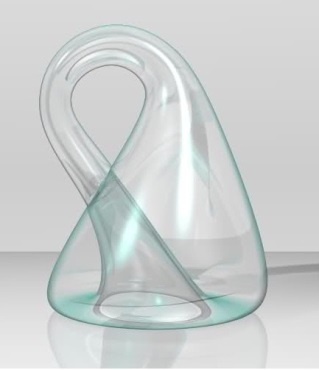
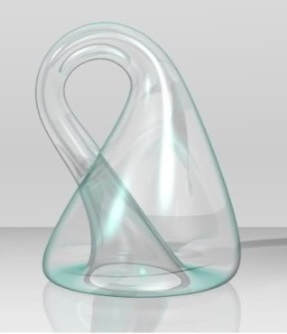
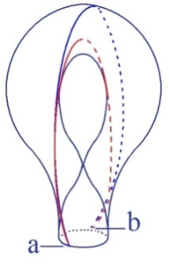

# Leçon 10 | 03 Mars l965

  <label><input type="checkbox" data-lacan-toggle="original" checked> 原文</label>
  <label><input type="checkbox" data-lacan-toggle="notes" checked> 注释</label>
  <label><input type="checkbox" data-lacan-toggle="commentary" checked> 个人解读评论</label>

<section class="parallel-paragraph" data-paragraph-ids="s12-10-0001">

s12-10-0001

[无对应译文]

原文 · s12-10-0001

*Je m’excuse ! L’absence de craie blanche n’est probablement pas pour faciliter la lisibilité de ce que j’ai écrit au tableau. J’aimerais savoir pourtant, si de quelque secteur de la salle, c’est franchement invisible, pour pouvoir - je ne sais pas comment - en modifier le biais. On ne voit rien, comme d’habitude !*

</section>

<section class="parallel-paragraph" data-paragraph-ids="s12-10-0002">

s12-10-0002

[无对应译文]

原文 · s12-10-0002

*Comment faire ?*

</section>

<section class="parallel-paragraph" data-paragraph-ids="s12-10-0003">

s12-10-0003

[无对应译文]

原文 · s12-10-0003

Je vous parlerai, j’essaierai de vous parler, aujourd’hui…

</section>

<section class="parallel-paragraph" data-paragraph-ids="s12-10-0004">

s12-10-0004

[无对应译文]

原文 · s12-10-0004

> d’une façon qui représente un nœud entre le trajet que nous avons poursuivi jusqu’à maintenant et ce qui va s’ouvrir …j’essaierai de vous parler de *l’identification*, j’entends la façon dont, se présentant à nous dans l’expérience analytique, elle pose son problème, comme apportant un jalon essentiel dans ce qui s’est formé, au cours d’une longue tradition appelée *à plus ou moins juste titre* « tradition philosophique », dans ce qui s’est formé autour de ce thème : *l’identification*.

</section>

<section class="parallel-paragraph" data-paragraph-ids="s12-10-0005">

s12-10-0005

[无对应译文]

原文 · s12-10-0005

*Le sujet*…

</section>

<section class="parallel-paragraph" data-paragraph-ids="s12-10-0006">

s12-10-0006

[无对应译文]

原文 · s12-10-0006

> ai-je tenté pour vous d’introduire par une réflexion sur ce qui le constitue au centre
>
> de notre expérience comme étant *l’expérience analytique* …*le sujet*…

</section>

<section class="parallel-paragraph" data-paragraph-ids="s12-10-0007">

s12-10-0007

[无对应译文]

原文 · s12-10-0007

> semble-t-il s’être présenté à nous au cours de nos dernières démarches …*le sujet* ce serait…

</section>

<section class="parallel-paragraph" data-paragraph-ids="s12-10-0008">

s12-10-0008

[无对应译文]

原文 · s12-10-0008

> si nous en croyons le chemin étroit où j’ai essayé de diriger votre regard avec la théorie des nombres …*le sujet* serait en somme reconnaissable à ce qui s’avère dans la pensée mathématique étroitement attenant au concept du *manque*, à ce concept dont le nombre est 0.

</section>

<section class="parallel-paragraph" data-paragraph-ids="s12-10-0009">

s12-10-0009

[无对应译文]

原文 · s12-10-0009

L’analogie est frappante…

</section>

<section class="parallel-paragraph" data-paragraph-ids="s12-10-0010">

s12-10-0010

[无对应译文]

原文 · s12-10-0010

> de ce concept, à ce que j’ai tenté de vous formuler de la position du sujet, comme apparaissant et disparaissant
>
> en une pulsation toujours répétée, comme effet, effet du signifiant, effet toujours évanouissant et renaissant …l’analogie est frappante de cette métaphore avec le concept tel que la réflexion d’un arithméticien philosophe : FREGE. quelqu’un m’a demandé - *depuis le temps que nous en parlons ici !* - l’orthographe…

</section>

<section class="parallel-paragraph" data-paragraph-ids="s12-10-0011">

s12-10-0011

[无对应译文]

原文 · s12-10-0011

FREGE est amené nécessairement à faire partir de l’appui, de l’appoint, de *ce concept dont l’assignation de nombre est* 0 pour en faire surgir cet 1 inextinguible lui aussi, toujours s’*évanouissant*, pour - dans *sa répétition* - s’ajouter à lui-même mais dans *une unité de répétition* dont on peut dire, d’elle aussi que - nous y touchons ! - que jamais on ne retrouve, à mesure qu’elle progresse, ce qu’elle a perdu, sinon cette prolifération qui la multiplie sans limite, qui se manifeste comme présentifiant, d’une façon sérielle, une certaine manifestation de l’infinitude.

</section>

<section class="parallel-paragraph" data-paragraph-ids="s12-10-0012">

s12-10-0012

[无对应译文]

原文 · s12-10-0012

Ainsi le sujet se manifeste 1, comme s’originant dans une privation et en quelque sorte *par son intermédiaire*, enchaîné, rivé, à cette identité qui - on vous l’a dit dans une formulation récente - dans cette identité qui n’est rien d’autre qu’une conséquence de cette exigence première, sans quoi rien ne saurait être vrai, mais qui laisse le sujet en suspens, accroché à ce que LEIBNIZ a appelé - ceci, cette référence leibnizienne, dans une réunion plus fermée, a été admirablement pointé devant vous – *que l’identité n’est rien d’autre que ce sans quoi ne saurait être sauvé la vérité*.

</section>

<section class="parallel-paragraph" data-paragraph-ids="s12-10-0013">

s12-10-0013

[无对应译文]

原文 · s12-10-0013

Sans doute, mais pour nous, pour nous analystes, est-ce que la question de *l’identification* ne se pose pas d’une façon, en quelque sorte antérieure au statut de *la vérité* ? Comment n’en aurions nous pas le témoignage dans *le transfert*, dans ce fondement glissant de notre *expérience*, qui met à sa racine ce qui :

</section>

<section class="parallel-paragraph" data-paragraph-ids="s12-10-0014">

s12-10-0014

[无对应译文]

原文 · s12-10-0014

- à la fois, se présente à nous dans un moment, profondément le même, comme *le transfert* en tant qu’il se réfère pour nous au double pôle de *ce qu’il y a dans l’amour pour nous de plus authentique*

</section>

<section class="parallel-paragraph" data-paragraph-ids="s12-10-0015">

s12-10-0015

[无对应译文]

原文 · s12-10-0015

- et aussi de ce qu’il se manifeste à nous dans *la voie de la tromperi*e ?

</section>

<section class="parallel-paragraph" data-paragraph-ids="s12-10-0016">

s12-10-0016

[无对应译文]

原文 · s12-10-0016

Posons qu’à avoir pris cette référence au *nombre*, nous avons voulu rechercher le point de référence le plus radical : celui où nous avons à repérer le sujet dans le langage institué, avant en quelque sorte *que le sujet s’y identifie, s’y localise*, comme celui qui parle.

</section>

<section class="parallel-paragraph" data-paragraph-ids="s12-10-0017">

s12-10-0017

[无对应译文]

原文 · s12-10-0017

Déjà avant que la phrase ait son « *je* » où le sujet d’abord se pose sous la forme du *shifter*, comme étant celui qui parle, la phrase impersonnelle existe.

</section>

<section class="parallel-paragraph" data-paragraph-ids="s12-10-0018">

s12-10-0018

[无对应译文]

原文 · s12-10-0018

Il y a un sujet de la phrase : ce sujet est d’abord en ce point racine de l’*événement*, où il se dit, non pas que le sujet est celui-ci, celui-là, *mais qu’il y a là quelque chose*. « *Il pleut* », telle est la phrase fondamentale. Et dans le langage est la racine de ceci : *qu’il y a des événements*.

</section>

<section class="parallel-paragraph" data-paragraph-ids="s12-10-0019">

s12-10-0019

[无对应译文]

原文 · s12-10-0019

C’est *dans un temps second* que le sujet s’y identifie comme celui qui parle.

</section>

<section class="parallel-paragraph" data-paragraph-ids="s12-10-0020">

s12-10-0020

[无对应译文]

原文 · s12-10-0020

Et sans doute, telle ou telle forme de langage est-elle là dans sa différence pour nous rappeler qu’il y a des modes plus divers de donner *la prééminence, la précellence,* à cette *identification* du sujet de l’énonciation à celui qui la parle effectivement.

</section>

<section class="parallel-paragraph" data-paragraph-ids="s12-10-0021">

s12-10-0021

[无对应译文]

原文 · s12-10-0021

L’existence du verbe *être* dans *les langues indo-européennes* est là sans doute pour promouvoir au premier plan cet *Ich* comme étant support du sujet, mais toute langue n’est point non plus ainsi faite, et tel problème ou faux problème logique qui peut se poser dans le registre de nos *langues indo-européennes*, dans d’autres formes du statut linguistique…

</section>

<section class="parallel-paragraph" data-paragraph-ids="s12-10-0022">

s12-10-0022

[无对应译文]

原文 · s12-10-0022

> c’est pour cela que j’ai tenu aujourd’hui - simplement comme indication, point d’accrochage, référence - à mettre
>
> sur ce tableau quelques caractères chinois dont vous verrez ce qu’ils signifient, et quelle utilisation j’en ferai tout à l’heure …si les problèmes logiques du sujet dans la tradition chinoise ne sont pas formulés avec un développement aussi exigeant, aussi approfondi, aussi fécond de la logique, ce n’est pas - comme on l’a dit - qu’il n’y ait pas dans le chinois de verbe être.

</section>

<section class="parallel-paragraph" data-paragraph-ids="s12-10-0023">

s12-10-0023

[无对应译文]

原文 · s12-10-0023

Le mot le plus usuel dans le chinois parlé pour le verbe être se dit 是 *che* \[en fait : « *shì »*\] » : bien entendu, comment pourrait-on s’en passer en usage ? Mais qu’il soit fondamentalement - *rú shì ti* 如是体 - et c’est le 2ème caractère de ces trois écrits au tableau :

</section>

<section class="parallel-paragraph" data-paragraph-ids="s12-10-0024">

s12-10-0024

[无对应译文]

原文 · s12-10-0024

- à gauche dans la forme lisible la plus reconnaissable *dans l’imprimé* où ces caractères s’écivent

</section>

<section class="parallel-paragraph" data-paragraph-ids="s12-10-0025">

s12-10-0025

[无对应译文]

原文 · s12-10-0025

- à droite dans la forme cursive de cette formule que je vous apporte – je l’ai effectivement recueillie *dans une calligraphie monacale* – vous allez voir quel sens il avait …le caractère du milieu de cette formule qui se dit *rúshì ti* 如是体 : « *comme est le corps* », ce « *shì* » est aussi un « *ce* », un démonstratif. Et que le démonstratif en chinois soit ce qui serve à désigner le verbe être : là est quelque chose qui montre qu’autre est le rapport du sujet à l’énonciation où il se situe.

</section>

<section class="parallel-paragraph" data-paragraph-ids="s12-10-0026">

s12-10-0026

[无对应译文]

原文 · s12-10-0026

Mais nous allons voir - pour nous, pour nous analystes - à quel niveau il nous faut reprendre maintenant ce problème pour tirer, pour situer notre démarche actuelle, celle qui s’est achevée avant notre *séparation* d’avant cette *interruption* de deux ou trois semaines, pour situer la portée de ce que nous avons voulu vous désigner dans ce rapport du 0 au 1 comme donnant à la présence inaugurante du signifiant, son articulation fondamentale.

</section>

<section class="parallel-paragraph" data-paragraph-ids="s12-10-0027">

s12-10-0027

[无对应译文]

原文 · s12-10-0027

Il faut ici que je vous désigne…

</section>

<section class="parallel-paragraph" data-paragraph-ids="s12-10-0028">

s12-10-0028

[无对应译文]

原文 · s12-10-0028

> sinon que je vous commente, car le commentaire en serait trop long : il a beau n’y avoir que trois pages dans ces pages …que je vous désigne dans [*Massen Psychologie und Ich-Analyse*](http://www.textlog.de/sigmund-freud-massenpsychologie-ich-analyse.html), traduit par : *psychologie des masses*…

</section>

<section class="parallel-paragraph" data-paragraph-ids="s12-10-0029">

s12-10-0029

[无对应译文]

原文 · s12-10-0029

> il s’agit effectivement de foule : la référence est à prendre dans l’œuvre de Gustave LEBON …*und Ich-analyse : et analyse du moi*, *chapitre VII* : *L’identification*.

</section>

<section class="parallel-paragraph" data-paragraph-ids="s12-10-0030">

s12-10-0030

[无对应译文]

原文 · s12-10-0030

Je ne vous le signale que pour ce qu’on y voit, en quelque sorte concentrées, toutes les énigmes devant quoi FREUD \- avec son honnêteté si profonde et si manifeste à la fois - s’arrête, désignant du doigt là où glisse, là où achoppe pour lui ce qu’il pourrait y avoir de satisfaisant dans la référence qu’il est là à produire, au moment où il s’agit pour lui de nous donner la clé, l’âme, le cœur de sa topique.

</section>

<section class="parallel-paragraph" data-paragraph-ids="s12-10-0031">

s12-10-0031

[无对应译文]

原文 · s12-10-0031

Loin de nous formuler à ce niveau - j’ai dit dans ce chapitre - les termes de l’identification sous la forme, en quelque sorte heureuse, glissante, dialectique, ressurgissant d’elle-même :

</section>

<section class="parallel-paragraph" data-paragraph-ids="s12-10-0032">

s12-10-0032

[无对应译文]

原文 · s12-10-0032

- tels que les abords qu’il en a eus jusque là dans sa description, développementale en somme des stades de la libido,

</section>

<section class="parallel-paragraph" data-paragraph-ids="s12-10-0033">

s12-10-0033

[无对应译文]

原文 · s12-10-0033

- tels qu’il a pu les ébaucher, et nommément au point où tourne sa pensée et où, du registre de la thématique conscient-inconscient, il passe à la thématique topique nommément dans ce qu’on appelle l’*Introduction au narcissisme*.

</section>

<section class="parallel-paragraph" data-paragraph-ids="s12-10-0034">

s12-10-0034

[无对应译文]

原文 · s12-10-0034

Là, *l’identification* au primaire semblait aisément s’ouvrir par une sorte de progrès de la structuration de l’extérieur à des *identifications* plus précises où le sujet, se repérant du champ d’abord fermé de ces prétendus autistismes dont on a fait tellement d’abus hors de l’analyse, *trouvait* - eu égard au regard au monde extérieur - *à s’y retrouver dans sa propre image* : *identification secondaire* et bientôt, en *référence* à ce à quoi il avait affaire, trouvait cette *multiplicité perceptive*, cette *adaptation* qui ferait de lui un *objet harmonieux* *d’une connaissance réalisée*.

</section>

<section class="parallel-paragraph" data-paragraph-ids="s12-10-0035">

s12-10-0035

[无对应译文]

原文 · s12-10-0035

Rien de pareil quand il s’agit d’aborder pour FREUD, dans ce qui est pour la pensée de l’analyste *une instance radicale* : *l’identification*.

</section>

<section class="parallel-paragraph" data-paragraph-ids="s12-10-0036">

s12-10-0036

[无对应译文]

原文 · s12-10-0036

Rien qui soit moins propre à laisser distinct…

</section>

<section class="parallel-paragraph" data-paragraph-ids="s12-10-0037">

s12-10-0037

[无对应译文]

原文 · s12-10-0037

> comme ce fut toujours la faille centrale de la psychologie, à laisser distinct ce registre de ce repérage de la connaissance, dans ce qui nous serait représenté comme purement et simplement, et aveuglément en quelque sorte, *la pointe nécessaire de la montée vitale* : je vous la donne comme *ce qui doit* *- Dieu sait pourquoi, c’est le cas de le dire - culminer dans la fonction d’une conscience* …rien qui distingue moins cette visée du rapport du sujet vivant avec un monde, qui le distingue moins - je dis comme entendement - de quelque chose d’un autre registre qui est là irréductible, comme un déchet, dès lors que cette perspective est adoptée, pour être l’essentiel du progrès subjectif, à savoir ce qui, depuis toujours, dans la tradition philosophique, s’appelle *la volonté*.

</section>

<section class="parallel-paragraph" data-paragraph-ids="s12-10-0038">

s12-10-0038

[无对应译文]

原文 · s12-10-0038

Et quoi de plus dérisoire, après que cette ouverture, cette profonde aliénation du sujet à lui-même en deux facultés ait été, une fois établie, une expérience elle-même partialisée, quoi de plus dérisoire que de voir les siècles se poursuivre, à se poser la question : «* Puisque ce sont là deux facultés irréductibles, laquelle donc doit prédominer en Dieu ?* » N’y-a-t-il point quelque chose de profondément *dérisoire* dans une théologie qui n’a cessé - au moins dans la tradition de l’Occident - dans une théologie qui n’a cessé de tourner autour de ce faux problème, de ce problème institué sur une psychologie déficiente ? Ce Dieu qui doit :

</section>

<section class="parallel-paragraph" data-paragraph-ids="s12-10-0039">

s12-10-0039

[无对应译文]

原文 · s12-10-0039

- tout savoir : d’où il résulte que s’il sait tout, il doit alors se soumettre à ce qu’il sait, qu’il est impuissant,

</section>

<section class="parallel-paragraph" data-paragraph-ids="s12-10-0040">

s12-10-0040

[无对应译文]

原文 · s12-10-0040

- ou qui doit tout avoir voulu : d’où il résulte alors qu’il est bien méchant.

</section>

<section class="parallel-paragraph" data-paragraph-ids="s12-10-0041">

s12-10-0041

[无对应译文]

原文 · s12-10-0041

La force de l’athéisme, de ce qu’il y a d’impasses dans la notion divine, n’est pas dans les arguments athéistiques, bien souvent beaucoup plus déistes que les autres : la leçon est tout de même d’aller en chercher chez les théologiens eux-mêmes.

</section>

<section class="parallel-paragraph" data-paragraph-ids="s12-10-0042">

s12-10-0042

[无对应译文]

原文 · s12-10-0042

Que ceci ne vous égare pas, il n’y a là nulle digression, nulle parenthèse puisque, aussi bien, ce corrélatif de l’aliénation divine, c’est le terme, et nous le voyons dans DESCARTES indiqué à sa place, non pas, comme on le dit, simplement transmis, hérité de la tradition scholastique, mais en quelque sorte, nécessité par cette position du sujet en tant que la fausse infinitude de *ce moi* toujours reproduit, de *cette répétition* qui engendre ce faux infini seulement d’une infinie récurrence.

</section>

<section class="parallel-paragraph" data-paragraph-ids="s12-10-0043">

s12-10-0043

[无对应译文]

原文 · s12-10-0043

C’est de là que part la nécessité de l’assurance…

</section>

<section class="parallel-paragraph" data-paragraph-ids="s12-10-0044">

s12-10-0044

[无对应译文]

原文 · s12-10-0044

> de ce que quelque chose est ici fondé qui n’est point un leurre …et de la déduction de ce qu’il faut assurément que le champ dans lequel se reproduit cette multiplication infinie de l’unité où le sujet se perd, soit en quelque sorte garanti : garanti par cet être où seulement DESCARTES[^70] \[[*Méditation quatrième*](http://un2sg4.unige.ch/athena/descartes/desc_med.html)\] a l’avantage de nous désigner qu’entre volonté et entendement, ici il nous faut choisir et seule la volonté dans son impensable le plus radical, la volonté en tant que c’est d’elle seule que se soutient l’assurance de la vérité et que Dieu eut pu faire tout autres les vérités même celles qui nous paraissent être les vérités éternelles, que seul Dieu est pensable, mais nous en désignant ainsi la dernière impasse.

</section>

<section class="parallel-paragraph" data-paragraph-ids="s12-10-0045">

s12-10-0045

[无对应译文]

原文 · s12-10-0045

Or, c’est bien ce autour de quoi tourne un moment essentiel de la pensée de FREUD car, allant beaucoup plus loin que toute pensée athéistique qui l’ait précédé, ce n’est pas de l’impasse divine qu’il nous désigne seulement le point : il la remplace.

</section>

<section class="parallel-paragraph" data-paragraph-ids="s12-10-0046">

s12-10-0046

[无对应译文]

原文 · s12-10-0046

La thématique paternelle, s’il nous dit que c’est là qu’est le support d’une croyance en un Dieu *miraginaire*, c’est pour lui donner assurément une toute autre structure et l’idée du père n’est pas l’héritage ni le substitut du père des Pères de l’Église.

</section>

<section class="parallel-paragraph" data-paragraph-ids="s12-10-0047">

s12-10-0047

[无对应译文]

原文 · s12-10-0047

Mais alors ce père, ce père originel, ce père dont, dans l’analyse, on ne parle plus jamais en fin de compte parce qu’on ne sait qu’en faire - ce père, comment et quel est le statut qu’il nous faut lui donner dans ce qu’il en est de notre expérience ?

</section>

<section class="parallel-paragraph" data-paragraph-ids="s12-10-0048">

s12-10-0048

[无对应译文]

原文 · s12-10-0048

Voilà en quoi et voilà où se situe la visée qui vient maintenant de notre interrogation sur *l’identification* dans l’expérience analytique.

</section>

<section class="parallel-paragraph" data-paragraph-ids="s12-10-0049">

s12-10-0049

[无对应译文]

原文 · s12-10-0049

Qu’allons-nous trouver en effet dans ce texte que je vous désigne :

</section>

<section class="parallel-paragraph" data-paragraph-ids="s12-10-0050">

s12-10-0050

[无对应译文]

原文 · s12-10-0050

- à la page 115 des *Gesammelte Werke*, en allemand,

</section>

<section class="parallel-paragraph" data-paragraph-ids="s12-10-0051">

s12-10-0051

[无对应译文]

原文 · s12-10-0051

- dans le *volume 18* de la *Standard edition,* pour ceux qui lisent l’anglais, à la page 500 …qu’est-ce qui frappe ?

</section>

<section class="parallel-paragraph" data-paragraph-ids="s12-10-0052">

s12-10-0052

[无对应译文]

原文 · s12-10-0052

C’est, qu’ayant à nous parler de l’identification, d’abord vient - et dans une antériorité dont il nous faut bien sentir que c’est là une énigme, qu’il nous la propose comme primordiale - que l’identification au personnage du père est posée d’abord dans sa déduction, que *l’intérêt tout spécial* que le petit garçon montre, *tout spécial pour son père*, est là mis comme un *premier temps* de toute explication possible de ce dont il s’agit dans l’identification.

</section>

<section class="parallel-paragraph" data-paragraph-ids="s12-10-0053">

s12-10-0053

[无对应译文]

原文 · s12-10-0053

Et à ce moment, comme l’analyste pourrait, initié par son expérience et les explications antérieures, pourrait s’y tromper et penser que dans cet intérêt premier il y a quelque chose qui a été repéré plus tard comme étant ce qu’on appelle la position passive du sujet de l’attitude féminine : non, souligne FREUD, ce *premier temps* est à proprement parler ce qui constitue une identification, dit-il, typiquement masculine. Il va plus loin : « *exquisément* », « *typiquement* » est la traduction anglaise, c’est *exquisit männlich* en allemand.

</section>

<section class="parallel-paragraph" data-paragraph-ids="s12-10-0054">

s12-10-0054

[无对应译文]

原文 · s12-10-0054

\[« *Die Identifizierung ist der Psychoanalyse als früheste Äußerung einer Gefühlsbindung an eine andere Person bekannt. Sie spielt in der Vorgeschichte des Ödipuskomplexes eine Rolle. Der kleine Knabe legt ein besonderes Interesse für seinen Vater an den Tag, er möchte so werden und so sein wie er, in allen Stücken an seine Stelle treten. Sagen wir ruhig: er nimmt den Vater zu seinem Ideal. Dies Verhalten hat nichts mit einer passiven oder femininen Einstellung zum Vater (und zum Manne überhaupt) zu tun, es ist vielmehr exquisit männlich.* »

</section>

<section class="parallel-paragraph" data-paragraph-ids="s12-10-0055">

s12-10-0055

[无对应译文]

原文 · s12-10-0055

(*Massenpsychologie und Ich–Analyse*, § VII, Die Identifizierung)\]

</section>

<section class="parallel-paragraph" data-paragraph-ids="s12-10-0056">

s12-10-0056

[无对应译文]

原文 · s12-10-0056

Cette *primordialité*, qui ne lui fera décrire que dans un second temps ce qui va s’opérer de la rivalité - nous dit-il - avec le père concernant l’objet primordial, ce *premier temps* prend sa valeur d’être, une fois articulé dans son caractère primitif, et d’où surgit dans son relief aussi la dimension mythique, d’être articulé en même temps comme étant lié à ce qui, ainsi, est produit comme *la première forme de l’identification*, à savoir l’*Einverleibung*, l’*incorporation*.

</section>

<section class="parallel-paragraph" data-paragraph-ids="s12-10-0057">

s12-10-0057

[无对应译文]

原文 · s12-10-0057

Ainsi, au moment où il s’agit de la référence primordiale la plus mythique, et l’on pourrait dire - et l’on n’aurait point tort de dire – la plus *idéalisante*, puisque c’est celle ou se structure la fonction de l’*idéal du moi,* la référence *primordiale* se fait sur l’évocation *du corps*.

</section>

<section class="parallel-paragraph" data-paragraph-ids="s12-10-0058">

s12-10-0058

[无对应译文]

原文 · s12-10-0058

Ces choses que nous manions, ces termes, ces concepts que nous laissons dans une sorte de flou sans jamais nous demander de quoi il s’agit, méritent pourtant d’être interrogés.

</section>

<section class="parallel-paragraph" data-paragraph-ids="s12-10-0059">

s12-10-0059

[无对应译文]

原文 · s12-10-0059

Nous savons que :

</section>

<section class="parallel-paragraph" data-paragraph-ids="s12-10-0060">

s12-10-0060

[无对应译文]

原文 · s12-10-0060

- quand il s’agit de l’*incorporation* comme se référant au *premier stade*, inaugural, de la relation libidinale la question n’est pas simple semble-t-il,

</section>

<section class="parallel-paragraph" data-paragraph-ids="s12-10-0061">

s12-10-0061

[无对应译文]

原文 · s12-10-0061

- que assurément, quelque chose là, se distingue de ce à quoi nous pourrions céder, c’est-à-dire d’en faire une affaire de « *représentation d’image* » : l’envers de ce qui, plus tard, sera la dissémination sur le monde de nos *projections* diversement affectives. Ce n’est pas de cela du tout qu’il s’agit.

</section>

<section class="parallel-paragraph" data-paragraph-ids="s12-10-0062">

s12-10-0062

[无对应译文]

原文 · s12-10-0062

Il ne s’agit même pas du terme qui pourrait être ambigu d’« *introjection* » : il s’agit d’*incorporation*, et rien n’indique que quoi que ce soit ici soit même à mettre à l’actif d’une subjectivité. L’*incorporation*, si c’est cette référence que FREUD met en avant, c’est justement en ceci que nul n’est là pour savoir qu’elle se produit, que l’opacité de cette incorporation est essentielle, et aussi bien tout ce mythe qui se sert, qui s’aide de l’articulation repérable ethnologiquement du repas cannibalique, est là, tout à fait au point inaugural du surgissement de la structure inconsciente.

</section>

<section class="parallel-paragraph" data-paragraph-ids="s12-10-0063">

s12-10-0063

[无对应译文]

原文 · s12-10-0063

C’est pour autant qu’il y a là un mode tout à fait primordial où, bien loin que la référence soit, comme on le dit dans la théorie freudienne : *idéaliste*, elle a cette forme de *matérialisme radical* dont le support est, non pas comme on le dit *le biologique*, mais le *corps*.

</section>

<section class="parallel-paragraph" data-paragraph-ids="s12-10-0064">

s12-10-0064

[无对应译文]

原文 · s12-10-0064

Le *corps* pour autant que nous ne savons même plus comment en parler, depuis justement que le *renversement cartésien* de la position radicale du sujet, nous a appris à ne plus le penser qu’en termes d’« *étendue* ».

</section>

<section class="parallel-paragraph" data-paragraph-ids="s12-10-0065">

s12-10-0065

[无对应译文]

原文 · s12-10-0065

[*Les passions de l’âme*](http://un2sg4.unige.ch/athena/descartes/desc_pas/desc_pas_frame0.html) de DESCARTES[^71] \[Cf. [*Méditation seconde*](http://un2sg4.unige.ch/athena/descartes/desc_med.html)\], sont les passions de « *l’étendue* », et cette « *étendue* », si nous voyons par quelle alchimie singulière, de plus en plus suspecte après un moment, et que nous en suivons *l’opération de magicien* autour de ce « *morceau de cire* » qui, purifié de toutes ses qualités…

</section>

<section class="parallel-paragraph" data-paragraph-ids="s12-10-0066">

s12-10-0066

[无对应译文]

原文 · s12-10-0066

> et mon Dieu, quelles sont donc ces qualités si puantes, qu’il faille les retirer ainsi, les unes après les autres,
>
> pour que ne restent plus que des espèces d’*ombres*, d’*ombres* de déchet purifié ? …est-ce que nous ne saisissons pas là que quelque chose se dérive, d’avoir trop bien mené son jeu avec l’Autre, DESCARTES glisse vers la perte de quelque chose d’essentiel qui nous est rappelé - rappelé par FREUD - en ceci que la nature foncière du corps a quelque chose à faire avec ce qu’il introduit, ce qu’il restaure, comme « *libido* ».

</section>

<section class="parallel-paragraph" data-paragraph-ids="s12-10-0067">

s12-10-0067

[无对应译文]

原文 · s12-10-0067

Et qu’est-ce que c’est que *la libido* ? Puisque aussi bien, ceci a rapport à l’existence de la reproduction sexuelle mais n’y est point identique puisque la première forme en est cette pulsion orale par où s’opère l’incorporation.

</section>

<section class="parallel-paragraph" data-paragraph-ids="s12-10-0068">

s12-10-0068

[无对应译文]

原文 · s12-10-0068

Et qu’est-ce que cette *incorporation* ? Et si sa référence mythique, ethnographique, nous est donnée dans le fait de ceux qui consomment la victime primordiale, le père démembré, c’est *quelque chose qui se désigne sans pouvoir se nommer*, ou plus exactement qui ne peut se nommer qu’au niveau de termes voilés comme celui de l’être, *que c’est l’être de l’Autre, l’essence d’une puissance primordiale qui, ici, à être consommée, est assimilée,* que la forme sous laquelle se présente l’être du corps, c’est d’être ce qui se nourrit de :

</section>

<section class="parallel-paragraph" data-paragraph-ids="s12-10-0069">

s12-10-0069

[无对应译文]

原文 · s12-10-0069

- *ce* qui dans le corps se présente comme le plus insaisissable de l’être,

</section>

<section class="parallel-paragraph" data-paragraph-ids="s12-10-0070">

s12-10-0070

[无对应译文]

原文 · s12-10-0070

- *ce* qui nous renvoie toujours à l’essence absente du corps,

</section>

<section class="parallel-paragraph" data-paragraph-ids="s12-10-0071">

s12-10-0071

[无对应译文]

原文 · s12-10-0071

- *ce* qui de cette face de l’existence d’une espèce animale comme bisexuée *- en tant que ceci est lié à la mort -* nous isole comme vivant dans le corps précisément,

</section>

<section class="parallel-paragraph" data-paragraph-ids="s12-10-0072">

s12-10-0072

[无对应译文]

原文 · s12-10-0072

- *ce* qui ne meurt pas,

</section>

<section class="parallel-paragraph" data-paragraph-ids="s12-10-0073">

s12-10-0073

[无对应译文]

原文 · s12-10-0073

- *ce* qui fait que le corps avant d’être ce qui meurt et ce qui passe par les filets de la reproduction sexuée, est quelque chose qui subsiste dans une dévoration fondamentale qui va *de l’être à l’être*.

</section>

<section class="parallel-paragraph" data-paragraph-ids="s12-10-0074">

s12-10-0074

[无对应译文]

原文 · s12-10-0074

Ce n’est point là *philosophie* que je prêche, ni *croyance* : c’est articulation, c’est *forme* dont je dis qu’il fait pour nous question que FREUD le mette à l’origine de tout ce qu’il a à dire de l’identification.

</section>

<section class="parallel-paragraph" data-paragraph-ids="s12-10-0075">

s12-10-0075

[无对应译文]

原文 · s12-10-0075

Et ceci, n’en doutez pas, est rigoureux : je veux dire que le terme même « *d’instinct de vie* » n’a pas d’autre sens que d’instituer dans le *réel* cette sorte de transmission autre que cette transmission d’une *libido* en elle-même immortelle.

</section>

<section class="parallel-paragraph" data-paragraph-ids="s12-10-0076">

s12-10-0076

[无对应译文]

原文 · s12-10-0076

*Que veut dire*, que doit être pour nous *une telle référence* ? Comment concevoir qu’elle soit mise d’abord par FREUD au premier plan ?

</section>

<section class="parallel-paragraph" data-paragraph-ids="s12-10-0077">

s12-10-0077

[无对应译文]

原文 · s12-10-0077

Est-ce bien là une nécessité d’institution originelle de ce dont il s’agit dans la réalité inconsciente, dans la fonction du désir, où est-ce un terme, est-ce une butée, est-ce quelque chose de rencontré par l’expérience instaurée ?

</section>

<section class="parallel-paragraph" data-paragraph-ids="s12-10-0078">

s12-10-0078

[无对应译文]

原文 · s12-10-0078

Poursuivons pour cela la lecture. Nous voyons que c’est *dans un second temps* que s’instaure, eu égard à cette référence première, que s’instaure *la dialectique de la demande et de la frustration*, à savoir ce que FREUD nous pose comme *la seconde forme de l’identification* .

</section>

<section class="parallel-paragraph" data-paragraph-ids="s12-10-0079">

s12-10-0079

[无对应译文]

原文 · s12-10-0079

Le fait que dans… *à partir du moment où s’introduit l’objet d’amour* - le choix de l’objet, nous dit-il, *objektwahl - c’est là que s’introduit aussi* *la possibilité*, de par la frustration, *de l’identification à l’objet d’amour lui-même*.

</section>

<section class="parallel-paragraph" data-paragraph-ids="s12-10-0080">

s12-10-0080

[无对应译文]

原文 · s12-10-0080

Or de même qu’il était frappant, dans la première formule qu’il nous donne de l’identification, d’y voir la corrélation énigmatique, c’est ainsi que je vous la souligne, de l’*Einverleibung*, l’*incorporation*, de même là aussi FREUD s’arrête devant *une énigme*.

</section>

<section class="parallel-paragraph" data-paragraph-ids="s12-10-0081">

s12-10-0081

[无对应译文]

原文 · s12-10-0081

Il nous dit qu’assurément nous pouvons y trouver aisément la référence en quelque sorte logique de *ce qu’il en est de cette alternance* *qui soit de l’objet à l’identification*, de l’objet en tant qu’il devient *objet de la frustration* : *que ce n’est là rien d’autre que l’alternance*…

</section>

<section class="parallel-paragraph" data-paragraph-ids="s12-10-0082">

s12-10-0082

[无对应译文]

原文 · s12-10-0082

> nous dit-il, c’est dans le texte de FREUD et ce n’est pas moi qui l’introduis en circulation …*des deux termes, l’alternance de l’être et de l’avoir, que de n’avoir pas l’objet du choix, le sujet vient à l’être*, et les termes de *sujet* et d’*objet* sont mis ici en balance, articulés expressément par FREUD.

</section>

<section class="parallel-paragraph" data-paragraph-ids="s12-10-0083">

s12-10-0083

[无对应译文]

原文 · s12-10-0083

Mais il nous dit aussi qu’il n’y a là pour lui qu’*un* *mystère*, que nous nous trouvons là devant une *parfaite opacité*.

</section>

<section class="parallel-paragraph" data-paragraph-ids="s12-10-0084">

s12-10-0084

[无对应译文]

原文 · s12-10-0084

Est-ce que cette opacité ne peut point être allégée, être tranchée ?

</section>

<section class="parallel-paragraph" data-paragraph-ids="s12-10-0085">

s12-10-0085

[无对应译文]

原文 · s12-10-0085

Est-ce que ce n’est pas sur cette voie que se poursuit le progrès où j’essaie de vous emmener ? Nous allons voir.

</section>

<section class="parallel-paragraph" data-paragraph-ids="s12-10-0086">

s12-10-0086

[无对应译文]

原文 · s12-10-0086

*Troisième terme,* nous dit FREUD, *c’est celui de l’identification, en quelque sorte directe, du désir au désir, identification fondamentale par quoi* - nous dit-il - *c’est l’hystérique qui nous en donne le modèle* : à elle, à lui, à *cette sorte de patient*, il n’en faut pas beaucoup pour repérer en *quelque signe*, là où il se produit, un certain type de désir. Le désir de l’hystérique fonde tout désir comme désir hystérique :

</section>

<section class="parallel-paragraph" data-paragraph-ids="s12-10-0087">

s12-10-0087

[无对应译文]

原文 · s12-10-0087

- le jeu, le chatoiement de « *l’échoïfication* »,

</section>

<section class="parallel-paragraph" data-paragraph-ids="s12-10-0088">

s12-10-0088

[无对应译文]

原文 · s12-10-0088

- *la répercussion infinie du désir sur le désir*, la communication directe du désir de l’Autre, est là instaurée comme troisième terme.

</section>

<section class="parallel-paragraph" data-paragraph-ids="s12-10-0089">

s12-10-0089

[无对应译文]

原文 · s12-10-0089

N’est-ce point assez dire que le groupement reste, non seulement dissocié, énigmatique mais parfaitement hétéroclite, de ce que FREUD pourtant, en ce chapitre essentiel croit devoir rassembler.

</section>

<section class="parallel-paragraph" data-paragraph-ids="s12-10-0090">

s12-10-0090

[无对应译文]

原文 · s12-10-0090

Or, c’est là que je crois avoir introduit une série structurée, destinée non seulement à rassembler, à permettre de situer comme étant les pilotis, *les points d’accrochage essentiels* que maintient la pensée freudienne, et où elle nous oblige au moins de couvrir ce champ carré dont elle marque les bornes, mais aussi d’y intégrer, d’y situer ce qui dans notre expérience nous a permis depuis, de *faire* l’expérience des voies et des sentiers par où le progrès de cette expérience, nous conduisant, nous permet d’apercevoir le bien fondé des aperceptions initiales de FREUD, et aussi bien - pourquoi pas ? - leurs défaillances : croyez-le bien, ces défaillances ne sont justement pas au niveau conceptuel, mais peut-être - nous verrons comment - au niveau de l’expérience.

</section>

<section class="parallel-paragraph" data-paragraph-ids="s12-10-0091">

s12-10-0091

[无对应译文]

原文 · s12-10-0091

J’ai introduit en son temps *une tripartition* qui a le mérite d’anticiper *ce que quelqu’un a pu, au cours d’un entretien récent, vous rappeler* comme étant *le titre que j’aurais voulu, à un moment, donner au séminaire de cette année*, dont on a dit que, peut-être, je le rejoins plus que je n’avais d’abord osé me le promettre : à savoir *les positions subjectives*. Il ne s’agit de rien d’autre, que de ce qu’il y a quelque 5 ans et plus même, j’ai introduit, en rappelant combien il est essentiel, combien notre expérience nous oblige à confronter, pour en distinguer les étages de structures \[Séminaire *L’identification* : 28-02, 07-03, 20-06\] les termes *de la privation, de la frustration et de la castration*.

</section>

<section class="parallel-paragraph" data-paragraph-ids="s12-10-0092">

s12-10-0092

[无对应译文]

原文 · s12-10-0092

Toute l’expérience analytique depuis FREUD s’inscrit, au niveau d’une exploration de plus on plus poussée et de plus en plus fouillée de la frustration, dont il est à proprement parler articulé qu’elle constitue l’essentiel de la situation et du progrès analytique, par exemple, et que *toute l’analyse se passe à son niveau*. À la vérité *cette limitation de l’horizon conceptuel* a pour effet, de la façon la plus manifeste et la plus claire, de rendre à proprement parler de plus en plus impensable, ce que FREUD nous a désigné dans son expérience comme étant *la butée et le point d’arrêt* - et là encore on trouve de quoi s’en contenter - *le point d’arrêt de son expérience*, à savoir ce qu’on relève dans son texte comme étant le roc - ce qui n’est nullement une explication - à savoir la castration.

</section>

<section class="parallel-paragraph" data-paragraph-ids="s12-10-0093">

s12-10-0093

[无对应译文]

原文 · s12-10-0093

La castration, dans le vécu terminal d’une analyse de *névrosé* ou d’une analyse féminine, est à proprement parler impensable, si l’opération analytique n’est rien d’autre que cette expérience conjuguée de *la demande* et du *transfert*, autour de quoi le sujet a à faire l’expérience de la faille qui le sépare de la reconnaissance de ceci : qu’il vit ailleurs que dans la réalité, et cette béance, cette expérience de la béance, c’est là tout ce qu’il a à intégrer dans l’expérience analytique.

</section>

<section class="parallel-paragraph" data-paragraph-ids="s12-10-0094">

s12-10-0094

[无对应译文]

原文 · s12-10-0094

L’articulation *de la castration à la frustration* à elle toute seule, nous commande d’interroger les relations du sujet autrement, et d’une façon fondamentale, que de la façon qui peut en quelque sorte s’épuiser dans la double relation du *transfert* et de la *demande*.

</section>

<section class="parallel-paragraph" data-paragraph-ids="s12-10-0095">

s12-10-0095

[无对应译文]

原文 · s12-10-0095

Ce repérage nécessite précisément, comme préalable, que *le statut du sujet* comme tel, soit posé et c’est ce que constitue l’isolation, que je ne suis pas non plus le seul à avoir formulée, de la position de la privation.

</section>

<section class="parallel-paragraph" data-paragraph-ids="s12-10-0096">

s12-10-0096

[无对应译文]

原文 · s12-10-0096

Sans doute d’une façon confuse, mais d’une façon articulée, quelqu’un comme JONES, qui faisait tout de même partie d’une génération où l’on avait un peu plus d’horizon, quelqu’un comme JONES[^72] a donné à la fonction de la privation, quand il s’est agi justement pour lui d’interroger l’énigme du rapport de la fonction féminine au *phallus,* à la fonction de la privation, son moment d’arête indispensable à l’articulation logique de ces trois positions.

</section>

<section class="parallel-paragraph" data-paragraph-ids="s12-10-0097">

s12-10-0097

[无对应译文]

原文 · s12-10-0097

C’est ce qui rendait pour nous nécessaire d’avoir d’abord posé que le sujet, le sujet dans sa forme essentielle, s’introduit, comme dans cette sorte de relation radicale : qu’il est ininstituable, qu’il est impensable hors de cette pulsation, aussi bien figurée par cette oscillation du 0 au 1 qui s’avère comme étant, à toute approche du nombre, nécessaire pour que le nombre soit pensable.

</section>

<section class="parallel-paragraph" data-paragraph-ids="s12-10-0098">

s12-10-0098

[无对应译文]

原文 · s12-10-0098

Qu’il y ait un rapport premier entre cette position du sujet et la naissance de l’*Un*, c’est ce qui était pour nous à cerner autour de cette attention portée à l’*Un* qui nous a fait voir qu’il y a *deux fonctions de l’Un* :

</section>

<section class="parallel-paragraph" data-paragraph-ids="s12-10-0099">

s12-10-0099

[无对应译文]

原文 · s12-10-0099

- l’une de mirage qui est de confondre l’*Un* avec l’individu, ou si vous voulez - pour traduire ce terme - l’insécable \[*Un*\],

</section>

<section class="parallel-paragraph" data-paragraph-ids="s12-10-0100">

s12-10-0100

[无对应译文]

原文 · s12-10-0100

- et d’autre part, l’1 de la numération qui est autre chose : l’1 de la numération ne compte pas les individus. \[1\]

</section>

<section class="parallel-paragraph" data-paragraph-ids="s12-10-0101">

s12-10-0101

[无对应译文]

原文 · s12-10-0101

Et sans doute la pente de la confusion est facile, l’idée que ce n’est rien d’autre là que sa fonction, a quelque chose de tellement aisé et de tellement simple qu’il faut justement la méditation réfléchie d’un praticien du nombre pour s’apercevoir que l’1 de la numération est autre chose.

</section>

<section class="parallel-paragraph" data-paragraph-ids="s12-10-0102">

s12-10-0102

[无对应译文]

原文 · s12-10-0102

Autre chose est la différence et l’altérité et sans doute tous ceux qui dès les premiers temps ont eu à méditer sur la nature radicale de la différence y ont bien vu qu’il s’agit d’autre chose dans la numération

</section>

<section class="parallel-paragraph" data-paragraph-ids="s12-10-0103">

s12-10-0103

[无对应译文]

原文 · s12-10-0103

- que dans la distinction des qualités,

</section>

<section class="parallel-paragraph" data-paragraph-ids="s12-10-0104">

s12-10-0104

[无对应译文]

原文 · s12-10-0104

- que le problème de la distinction des *indiscernables*[^73],

</section>

<section class="parallel-paragraph" data-paragraph-ids="s12-10-0105">

s12-10-0105

[无对应译文]

原文 · s12-10-0105

- et pourquoi n’est pas seulement *Un* tout ce qui se groupe sur soi-même, même *l’identité des qualités*.

</section>

<section class="parallel-paragraph" data-paragraph-ids="s12-10-0106">

s12-10-0106

[无对应译文]

原文 · s12-10-0106

Tout ce qui tombe sous la prise du *même concept* prouve la distinction fondamentale qu’il y a du *semblable* au *même*, ou si vous voulez, pour lui donner ici la résonance d’un terme familier « *du pareil au même* ». Autre chose est le registre du « *du pareil au même* ».

</section>

<section class="parallel-paragraph" data-paragraph-ids="s12-10-0107">

s12-10-0107

[无对应译文]

原文 · s12-10-0107

L’Autre est conjoint, non point au *pareil*, mais au *même* et la question de la réalité de l’Autre est distincte de toute discrimination conceptuelle ou *cosmologique* : elle doit être pensée au niveau de cette *répétition de l’*1 qui l’institue dans son hétérogénéité essentielle.

</section>

<section class="parallel-paragraph" data-paragraph-ids="s12-10-0108">

s12-10-0108

[无对应译文]

原文 · s12-10-0108

C’est d’interroger ce qu’il en est de cette fonction de l’Autre pour nous : comment à nous elle se présente, c’est de ceci qu’il s’agit, et ceci que j’entends introduire aujourd’hui. Car assurément l’étape est je crois franchie, aisée, facilitée par nos explorations dernières de ce que toujours j’ai voulu dire, en introduisant justement au niveau de cette question de l’Autre - ce qui est essentiel pour que nous sachions ce que veut dire identification - en introduisant la question qui a tellement horrifié tous ceux qui autour de moi préféraient trouver futile, voire inutilement détourné, mon message, la question dite « *des pots de moutarde* »[^74].

</section>

<section class="parallel-paragraph" data-paragraph-ids="s12-10-0109">

s12-10-0109

[无对应译文]

原文 · s12-10-0109

La question « *des pots de moutarde* »…

</section>

<section class="parallel-paragraph" data-paragraph-ids="s12-10-0110">

s12-10-0110

[无对应译文]

原文 · s12-10-0110

> posée d’abord comme ceci : que le pot de moutarde se caractérise par le fait d’expérience qu’il n’y a jamais de moutarde dedans, que le pot de moutarde est toujours vide par définition …la question « *des pots de moutarde* » pose cette question, la question précisément de *la distinction des indiscernables*.

</section>

<section class="parallel-paragraph" data-paragraph-ids="s12-10-0111">

s12-10-0111

[无对应译文]

原文 · s12-10-0111

Il est facile de dire que « *le pot de moutarde* » qui est ici, se distingue de celui qui est là, comme nous dit ARISTOTE, parce qu’ils ne sont pas faits de la même matière. La question, ainsi, est aisément résolue et si j’ai choisi les pots de moutarde, c’est justement pour jouer la difficulté. S’il s’agissait, comme tout à l’heure du *corps*, vous verriez qu’ARISTOTE n’aurait pas la réponse si *facile*, car le *corps* étant ce qui a la propriété, non seulement de s’assimiler la matière qu’il absorbe, mais - nous l’avons vu suggéré par FREUD - d’assimiler bien autre chose avec, à savoir son essence de *corps*.

</section>

<section class="parallel-paragraph" data-paragraph-ids="s12-10-0112">

s12-10-0112

[无对应译文]

原文 · s12-10-0112

Là vous ne trouveriez pas si aisément à distinguer les *indiscernables* et vous pourriez, avec le moine…

</section>

<section class="parallel-paragraph" data-paragraph-ids="s12-10-0113">

s12-10-0113

[无对应译文]

原文 · s12-10-0113

> j’hésite à dire « pratiquant le Zen », parce que vous allez bientôt répandre à travers Paris
>
> que je vous enseigne le Zen, et qu’est-ce qui pourra en résulter ? …enfin, c’est tout de même une formule Zen et ce moine s’appelle JIUN SONJA.

</section>

<section class="parallel-paragraph" data-paragraph-ids="s12-10-0114">

s12-10-0114

[无对应译文]

原文 · s12-10-0114

Il vous dit : *rú shì ti* 如是体 « *comme ce corps* ». Assurément au niveau du corps, impossible de distinguer aucun corps de tous les corps, et ce n’est pas parce que vous êtes ici deux cent soixante têtes que cette unité est moins réelle puisque aussi bien pour le BOUDDHA il était quelque chose comme trois cent trente trois millions trois cent trente trois mille trois cent trente trois et c’était toujours le même BOUDDHA.

</section>

<section class="parallel-paragraph" data-paragraph-ids="s12-10-0115">

s12-10-0115

[无对应译文]

原文 · s12-10-0115

Mais nous n’en sommes pas là. Nous prenons les pots de moutarde. Les pots de moutarde sont distincts, mais je pose la question : le creux, le vide qui constitue le pot de moutarde, est-ce que c’est le même vide ou est–ce que ce sont des vides différents ? Ici la question est un tout petit peu plus épineuse, et elle est justement rejointe par cette genèse du 1 dans le 0 à quoi est contrainte *la pensée arithméticienne*. Pour tout dire, ces vides en effet sont tellement un seul vide qu’ils ne commencent à se distinguer qu’à partir du moment où on en remplit un et que la récurrence commence : parce qu’il y aura un vide de moins.

</section>

<section class="parallel-paragraph" data-paragraph-ids="s12-10-0116">

s12-10-0116

[无对应译文]

原文 · s12-10-0116

Telle est l’institution inaugurale du sujet. Quelqu’un, devant vous, dans la partie fermée de mon séminaire, a pu faire se recouper, se recouvrir si rigoureusement la déduction qui cœxiste avec une certaine forme de mon introduction du sujet, que ce n’est pas là hasard mais l’apologue que je vous donne du vide et de son remplissement et de la genèse d’une distinction du manque…

</section>

<section class="parallel-paragraph" data-paragraph-ids="s12-10-0117">

s12-10-0117

[无对应译文]

原文 · s12-10-0117

> telle qu’elle s’introduit au niveau de la *chopine* : le « *une Tuborg, une !* » - je ne serai pas le premier à avoir substitué au Dieu créateur le garçon de café - « *une Tuborg, une !* » veut dire, introduit la possibilité, qu’après j’en demande une *autre*,
>
> et pourtant c’est bien toujours de la *Tuborg*, toujours pareille à elle-même …l’introduction du 1 est là le point essentiel au niveau du manque…

</section>

<section class="parallel-paragraph" data-paragraph-ids="s12-10-0118">

s12-10-0118

[无对应译文]

原文 · s12-10-0118

> cette *autre* \[Tuborg\] donne ensuite la mesure ou la cause de ma soif, elle me donne aussi l’occasion de la commander pour un autre et *par correspondance biunivoque*, d’instituer comme tel, cet Autre pur …tel est *le niveau d’opération* où s’engendre, où s’introduit, d’abord comme présence du manque, le sujet.

</section>

<section class="parallel-paragraph" data-paragraph-ids="s12-10-0119">

s12-10-0119

[无对应译文]

原文 · s12-10-0119

C’est à partir de là, et de là uniquement, que peut se concevoir la parfaite bipolarité, la parfaite ambivalence, de tout ce qui se produira ensuite au niveau de sa demande.

</section>

<section class="parallel-paragraph" data-paragraph-ids="s12-10-0120">

s12-10-0120

[无对应译文]

原文 · s12-10-0120

C’est en tant que *le sujet s’instaure, se supporte comme* 0 - comme ce 0 qui manque de remplissement - que peut se jouer la symétrie dirai-je, de ce qui s’établit, et qui pour FREUD reste énigmatique, entre *l’objet qu’il peut avoir* et *l’objet qu’il peut être*. C’est justement de rester à ce niveau que peut-être poussée jusqu’à son terme une *farce d’escamotage* tout à fait particulière, car il n’est pas vrai :

</section>

<section class="parallel-paragraph" data-paragraph-ids="s12-10-0121">

s12-10-0121

[无对应译文]

原文 · s12-10-0121

- que tout s’épuise pour le sujet dans la dimension de l’Autre,

</section>

<section class="parallel-paragraph" data-paragraph-ids="s12-10-0122">

s12-10-0122

[无对应译文]

原文 · s12-10-0122

- que tout est, par rapport à l’Autre, *une demande d’avoir* où se transfère, s’institue une *fallace de l’être*.

</section>

<section class="parallel-paragraph" data-paragraph-ids="s12-10-0123">

s12-10-0123

[无对应译文]

原文 · s12-10-0123

Les coordonnées de l’espace de l’Autre ne jouent pas dans ce simple dièdre, autrement dit le point 0 d’origine des coordonnées d’où nous pourrions l’instituer n’est pas un vrai point 0. Ce que l’expérience nous montre, c’est que *la demande* - *la demande* dans l’expérience analytique - n’a pas simplement l’intérêt que nous en jouions comme plan et registre de la frustration, renvoyant le sujet à cette institution, cette instauration trompeuse d’un être, d’un être dont la comparaison, la référence, la réduction à l’être de l’analyste apporterait la voie du salut !

</section>

<section class="parallel-paragraph" data-paragraph-ids="s12-10-0124">

s12-10-0124

[无对应译文]

原文 · s12-10-0124

L’expérience analytique nous montre après ceci - aucun analyste ne peut le repousser même s’il n’en tire pas la conséquence :

</section>

<section class="parallel-paragraph" data-paragraph-ids="s12-10-0125">

s12-10-0125

[无对应译文]

原文 · s12-10-0125

- que dans l’opération dont il s’agit il y a toujours *un reste*,

</section>

<section class="parallel-paragraph" data-paragraph-ids="s12-10-0126">

s12-10-0126

[无对应译文]

原文 · s12-10-0126

- que la division du sujet entre le 0 et le 1 : aucun comblement de l’*Un*, ni au niveau de la demande de l’avoir, ni au niveau de l’être du transfert, ne la réduit totalement,

</section>

<section class="parallel-paragraph" data-paragraph-ids="s12-10-0127">

s12-10-0127

[无对应译文]

原文 · s12-10-0127

- que *l’effet de l’opération* n’est jamais un pur et simple 0,

</section>

<section class="parallel-paragraph" data-paragraph-ids="s12-10-0128">

s12-10-0128

[无对应译文]

原文 · s12-10-0128

- que le sujet, à se déployer dans l’espace de l’Autre, déploie *un tout autre système de coordonnées que des coordonnées cartésiennes*,

</section>

<section class="parallel-paragraph" data-paragraph-ids="s12-10-0129">

s12-10-0129

[无对应译文]

原文 · s12-10-0129

- que le point 0 d’origine n’existe pas,

</section>

<section class="parallel-paragraph" data-paragraph-ids="s12-10-0130">

s12-10-0130

[无对应译文]

原文 · s12-10-0130

- que la forme transparente, impalpable, méduséenne, de la structure du sujet est celle justement qui va nous révéler d’où surgit la vertu de l’1 qui n’est point simplement d’être un signe, d’être *la coche primitive* de l’expérience du chasseur, même si c’est là qu’elle est née par hasard,

</section>

<section class="parallel-paragraph" data-paragraph-ids="s12-10-0131">

s12-10-0131

[无对应译文]

原文 · s12-10-0131

- que l’existence de l’1 et du *nombre*, loin d’être tout ce à quoi elle s’applique, et du lieu où loin de lui être conséquence, elle engendre l’individu, n’a besoin de rien d’individuel pour naître,

<!-- -->

</section>

<section class="parallel-paragraph" data-paragraph-ids="s12-10-0132">

s12-10-0132

[无对应译文]

原文 · s12-10-0132

- que la véritable priorité, spécificité du *nombre* tient aux conséquences de ce qui s’introduit dans les formes que j’essaie de présentifier à vous sous l’aspect topologique, dans l’effet sur ces formes de la coupure.

</section>

<section class="parallel-paragraph" data-paragraph-ids="s12-10-0133">

s12-10-0133

[无对应译文]

原文 · s12-10-0133

Il y a des *formes* qui se partagent tout de même effectivement en deux sur une seule coupure, il y en a d’autres auxquelles vous pouvez en faire deux \[coupures\] sans que la forme disparaisse : *elles restent d’un seul tenant*. C’est ce qu’on appelle en *topologie*, *le nombre de connectivité*. C’est là l’usage et le privilège de ce que j’essaie de faire jouer devant vous, puisque c’est à des fins pratiques de représentations sous forme d’images, et ce que j’ai dessiné aujourd’hui au tableau qui consiste - sur la *bouteille de Klein* - à faire partir d’un point une coupure… une coupure, une seule… elles ont l’air d’être deux parce qu’elle passe deux fois par le même point.

</section>

<section class="parallel-paragraph" data-paragraph-ids="s12-10-0134">

s12-10-0134

[无对应译文]

原文 · s12-10-0134

 

</section>

<section class="parallel-paragraph" data-paragraph-ids="s12-10-0135">

s12-10-0135

[无对应译文]

原文 · s12-10-0135

Par paresse, par un certain sentiment de la vanité qu’a cette exposition de mes dessins sur un tableau si mal éclairé, je n’ai pas fait l’image qui aurait pu être complémentaire et qui est facile à imaginer. Au niveau de ce cercle mythique que j’appelle le *cercle de rebroussement,* prenez deux points opposés, faites passer la coupure à travers toute la longitudinalité de *la bouteille de Klein* jusqu’à un point opposé :

</section>

<section class="parallel-paragraph" data-paragraph-ids="s12-10-0136">

s12-10-0136

[无对应译文]

原文 · s12-10-0136

 

</section>

<section class="parallel-paragraph" data-paragraph-ids="s12-10-0137">

s12-10-0137

[无对应译文]

原文 · s12-10-0137

puisque le cercle se rebrousse vous aurez la possibilité de le faire revenir au premier point, ainsi aurez-vous, joignant apparemment deux points opposés de cette circonférence que j’appelle *cercle de rebroussement*, ainsi aurez-vous une seule coupure. La propriété de cette coupure est de ne pas diviser *la bouteille de Klein*, simplement de permettre de la développer en une seule *bande de Mœbius*.

</section>

<section class="parallel-paragraph" data-paragraph-ids="s12-10-0138">

s12-10-0138

[无对应译文]

原文 · s12-10-0138

Rapprocher ces deux points jusqu’à ne faire qu’un, vous vous apercevrez que quelque chose vous était masqué dans l’opération précédente, puisque cette conjonction a - comme la figure qui est ici présentée vous le fait appréhender - a comme propriété, sans doute de laisser intacte la *bande de Mœbius*, mais d’y faire apparaître un *résidu*, les psychanalystes le connaissent bien ce *résidu* qu’il y a au-delà de la demande, ce *résidu* qui, aussi bien, est au-delà du transfert, ce résidu essentiel par quoi s’incarne le caractère radicalement divisé du S, du sujet, c’est ce qu’on appelle *l’objet(a).*

</section>

<section class="parallel-paragraph" data-paragraph-ids="s12-10-0139">

s12-10-0139

[无对应译文]

原文 · s12-10-0139

Dans le jeu d’identification de la privation primordiale, il n’y a pas seulement comme effet la manifestation d’un pur creux, d’un 0 initial de la réalité du sujet s’incarnant dans le pur manque. Il y a toujours à cette opération…

</section>

<section class="parallel-paragraph" data-paragraph-ids="s12-10-0140">

s12-10-0140

[无对应译文]

原文 · s12-10-0140

> et spécialement manifeste, spécialement surgissant de l’expérience frustrative …quelque chose qui échappe à sa dialectique : *un résidu*, quelque chose qui manifeste qu’au niveau logique où apparaît le 0, l’expérience subjective fait apparaître ce quelque chose que nous appelons *l’objet(a)* et qui, de par sa seule présence modifie, incline, infléchit, toute l’économie possible d’un rapport libidinal à l’objet, d’un choix quelconque qui se qualifie d’objectal.

</section>

<section class="parallel-paragraph" data-paragraph-ids="s12-10-0141">

s12-10-0141

[无对应译文]

原文 · s12-10-0141

Ceci qui est si manifeste et toujours présent, ceci qui donne à toute relation à la réalité de l’objet de notre choix son ambiguïté fondamentale, ce quelque chose qui fait que dans l’objet choisi, élu, chéri, aimé, toujours le doute est là, pour nous essentiel de ce dont il s’agit : que nous visons ailleurs, c’est cela que l’expérience analytique est faite pour mettre en évidence, est faite aussi pour nous faire nous questionner si le but de l’analyse est bel et bien de se satisfaire de *l’identification - comme on le dit - du sujet à l’analyste*, ou si au contraire l’irréductible altérité, le fait de le rejeter comme Autre…

</section>

<section class="parallel-paragraph" data-paragraph-ids="s12-10-0142">

s12-10-0142

[无对应译文]

原文 · s12-10-0142

> et c’est bien là le pathétique terminal de l’expérience analytique …au contraire ne doit pas être pour nous la question, la question autour de laquelle pour nous doit tourner, s’élaborer, tout ce qu’il en est pour l’instant dans l’analyse, des problèmes difficiles qui ne sont pas simplement le résultat plus ou moins thérapeutique, mais la légitimité essentielle de ce qui nous fonde comme analystes et d’abord ceci : ceci que précisément à ne point connaître, à ne point - au moins - avoir pointé où se situe ce que j’appelle l’opération légitime, il est impossible que l’analyste opère d’aucune façon, d’une manière qui mérite ce titre d’être une opération. Il est lui-même un jouet aveugle et pris dans *la fallace*, or cette *fallace* est justement la question qui se pose au terme de l’analyse.

</section>

<section class="parallel-paragraph" data-paragraph-ids="s12-10-0143">

s12-10-0143

[无对应译文]

原文 · s12-10-0143

Qu’est–ce, au niveau de la castration, que ce point, ce point que dans le schéma tripartite, la matrice à double entrée où j’avais essayé dans un premier abord de vous faire repérer de quelle façon s’interchange, à chacun de ces trois niveaux la répartition réciproque des termes du *symbolique*, de *l’imaginaire* et du *réel*, de vous faire repérer les choses dans une première approche, en parlant non pas à cette époque, de « *position subjective* » mais, pour prendre simplement un schéma freudien, d’un certain mode d’action ou d’état, d’ἕξις \[hexis\], d’*habitus* comme on dirait dans *la tradition arsitotélicienne* et de répartir, par rapport à ces trois étages *de la privation,* *de la frustration et de la castration*, les choses à droite et à gauche, *du côté de l’agent et du côté de l’objet*.

</section>

<section class="parallel-paragraph" data-paragraph-ids="s12-10-0144">

s12-10-0144

[无对应译文]

原文 · s12-10-0144

Je vous ferai remarquer, si vous vous référez aux résumés qui ont été donnés à cette époque, que j’ai laissé complètement en blanc, ce qu’il en était au niveau de la place de *l’agent* de la castration. Or ce dont il s’agit, c’est justement de cette position dernière, du statut qu’il convient de donner, à cette dimension de l’Autre, au lieu de la parole comme telle, dans l’analyse. Ici, vous le sentez bien, nous rejoignons toute la question de l’essence, pourquoi ne pas le dire ainsi, sous *une formule heideggerienne* : du *Wesen der Wahrheit*, du *statut,* si vous voulez, *de* *la vérité*.

</section>

<section class="parallel-paragraph" data-paragraph-ids="s12-10-0145">

s12-10-0145

[无对应译文]

原文 · s12-10-0145

*C’est vers cette visée que*, sans doute pas directement mais après quelques *étapes* où j’essaierai de mieux articuler pour vous, la prochaine fois, *la dialectique de la demande et du transfert dans l’analyse*, *c’est vers cette visée dernière que* nous nous dirigeons cette année.

</section>

<section class="note-block original-notes">

## Notes

[^70]: René Descartes, *Œuvres et lettres,* Paris, Gallimard Pléiade, 1953, Méditation quatrième :

    « *Et certes il n'y en peut avoir d'autre que celle que j'ai expliquée; car toutes les fois que je retiens tellement ma volonté dans les bornes de ma connaissance, qu'elle ne fait aucun*

    *jugement que des choses qui lui sont clairement et distinctement représentées par l'entendement, il ne se peut faire que je me trompe; parce que toute conception claire et distincte est*

    *sans doute quelque chose de réel et de positif, et partant ne peut tirer son origine du néant, mais doit nécessairement avoir Dieu pour son auteur, Dieu, dis-je, qui, étant*

    *souverainement parfait, ne peut être cause d'aucune erreur; et par conséquent il faut conclure qu'une telle conception ou un tel jugement est véritable* ».

[^71]: René Descartes : *Le traité des passions, Les passions de l'âme*. Cf. *Méditation seconde* :

    « *Par le corps, j'entends tout ce qui peut être terminé par quelque figure; qui peut être compris en quelque lieu, et remplir un espace en telle sorte que tout autre corps en soit exclu ;*

    *qui peut être senti, ou par l'attouchement, ou par la vue, ou par l'ouïe, ou par le goût, ou par l'odorat; qui peut être mû en plusieurs façons, non par lui-même, mais par quelque*

    *chose d'étranger duquel il soit touché et dont il reçoive l'impression Car d'avoir en soi la puissance de se mouvoir, de sentir et de penser, je ne croyais aucunement que l'on dût*

    *attribuer ces avantages à la nature corporelle; au contraire, je m'étonnais plutôt de voir que de semblables facultés se rencontraient en certains corps.*.».

[^72]: Ernest Jones : « *Le développement précoce de la sexualité féminine* » p.399 et « *Le stade phallique* » p.412 in *Théorie et pratique de la psychanalyse*, Paris, Payot, 1969,

    réédités dans La psychanalyse, vol.7, Paris, PUF, 1964.

[^73]: Indiscernables : cf. E. Bréhier : *Chrysippe et l'ancien stoïcisme*, Paris, AR, 2006 ; Cf. aussi [Leibniz : *Nouveaux es­sais*](http://gallica.bnf.fr/ark:/12148/bpt6k653994.capture), GF, 1993 II, ch.27, §1.

[^74]: Cf. Séminaire 1962-63 : *L’angoisse* : séances des 20-03, 27-03.

</section>
