# Leçon 11 | 10 Mars l965

  <label><input type="checkbox" data-lacan-toggle="original" checked> 原文</label>
  <label><input type="checkbox" data-lacan-toggle="notes" checked> 注释</label>
  <label><input type="checkbox" data-lacan-toggle="commentary" checked> 个人解读评论</label>

<section class="parallel-paragraph" data-paragraph-ids="s12-11-0001">

s12-11-0001

[无对应译文]

原文 · s12-11-0001

<table style="width:56%;">
<colgroup>
<col style="width: 17%" />
<col style="width: 17%" />
<col style="width: 20%" />
</colgroup>
<tbody>
<tr>
<td><strong>Agent</strong></td>
<td><strong>Manque</strong></td>
<td><strong>Objet</strong></td>
</tr>
<tr>
<td>Père <em>réel</em></td>
<td>
<strong>Castration</strong> :

Dette <em>symbolique</em>
</td>
<td><em>Imaginaire</em> : Phallus</td>
</tr>
<tr>
<td>Mère <em>symbolique</em></td>
<td>
<strong>Frustration</strong> :

Dam <em>imaginaire</em>
</td>
<td><em>Réel </em>: sein, pénis</td>
</tr>
<tr>
<td>Père <em>imaginaire</em></td>
<td>
<strong>Privation</strong> :

Trou <em>réel</em>
</td>
<td><em>Symbolique</em> : enfant</td>
</tr>
</tbody>
</table>

</section>

<section class="parallel-paragraph" data-paragraph-ids="s12-11-0002">

s12-11-0002

[无对应译文]

原文 · s12-11-0002

Nous sommes restés la dernière fois *au seuil de la demande*, *de la demande* qui nous importe, *de la demande* analytique, de cette *demande* où s’inscrit *le deuxième étage* de ce que - dans la matrice que j’ai rappelée la dernière fois au tableau - de ce qui dans cette matrice s’inscrit comme *frustration*, de ce qui dans *la théorie analytique moderne* s’affirme effectivement comme central, dans une dialectique prise sous ce terme, expressément : *la frustration*.

</section>

<section class="parallel-paragraph" data-paragraph-ids="s12-11-0003">

s12-11-0003

[无对应译文]

原文 · s12-11-0003

Le vague dans lequel se soutient cette dialectique qui s’origine doctrinalement dans une référence au besoin du sujet, besoin dont l’inactualité serait - ce qui est à rectifier - dans la manœuvre du *transfert*, c’est ceci qui *nous pousse*, qui nous a poussés depuis le temps que nous développons notre enseignement, à en démontrer *les insuffisances* génératrices d’erreur. Pour rectifier cette conception, nécessaire en effet, de *la fonction de la demande*, dans une plus juste référence à ce qu’il en est effectivement de *la fonction du transfert* : c’est pour cela que nous essayons d’articuler d’une façon plus précise ce qui se passe, *de par l’effet de la demande.*

</section>

<section class="parallel-paragraph" data-paragraph-ids="s12-11-0004">

s12-11-0004

[无对应译文]

原文 · s12-11-0004

Et comment ceci ne serait-il pas exigé, si l’on s’aperçoit qu’à référer à cette *dialectique de la frustration* tout ce qui se passe à l’intérieur de la thérapeutique, on désarrime, on laisse aller à la dérive, on laisse en quelque sorte décrocher, au niveau d’un horizon théorique, tout ce qui est le départ, le fondement, la racine du message freudien, à savoir ce par quoi il s’origine dans le désir et la sexualité.

</section>

<section class="parallel-paragraph" data-paragraph-ids="s12-11-0005">

s12-11-0005

[无对应译文]

原文 · s12-11-0005

Ce en quoi, au « *je pense* » du sujet du *cogito*, il substitue un « *je désire* » qui ne se conçoit, en effet, que comme l’au-delà inconnu, toujours non su par le sujet, de la demande, cependant que la sexualité, qui est le fondement par quoi le sujet - le sujet en tant qu’il pense, se situe, se supporte de la fonction du désir - par quoi ce sujet est celui qui à l’origine de son statut, est posé par FREUD comme celui auquel *étrangement* *le principe du plaisir* permet radicalement d’*halluciner* la réalité.

</section>

<section class="parallel-paragraph" data-paragraph-ids="s12-11-0006">

s12-11-0006

[无对应译文]

原文 · s12-11-0006

Ce statut, ce départ : le sujet comme désirant en tant qu’il est sujet sexuel, qui est ce par quoi dans la doctrine de FREUD, la réalité, originellement, fondamentalement, radicalement, s’hallucine, c’est ceci qu’il s’agit d’accorder, de rappeler, de coordonner, de représentifier dans la doctrine, de ce qui se passe dans l’analyse elle-même. Nous ne le pouvons pas, à nous référer à l’opacité de *la chose sexuelle, de la jouissance* qui ne motive que de la façon la plus obscure, la plus *mystagogique* [^75], la chose dont il s’agit et que j’ai appelé quelque part *la Chose freudienne* [^76]. Il n’y a là, offert à la *compréhension* que précisément ce qui donne à ce mot son sens dérisoire, à savoir : *qu’on ne commence bien à comprendre qu’à partir du moment où on ne comprend plus rien.*

</section>

<section class="parallel-paragraph" data-paragraph-ids="s12-11-0007">

s12-11-0007

[无对应译文]

原文 · s12-11-0007

Aussi bien, comment une technique qui est *essentiellement* une technique de parole s’infatuerait-elle de s’introduire dans ce « *mystère* », si elle n’en contenait pas elle-même le ressort ? C’est pourquoi il est indispensable de prendre comme référence, la référence la plus opposée en apparence, à cette obscurité qualifiée faussement d’*affective*. C’est pourquoi le départ, le fondement radical de la fonction du sujet, en tant qu’il est celui que détermine le langage, est le seul départ qui peut nous donner le fil conducteur, qui nous permette à chaque instant de nous repérer dans un champ.

</section>

<section class="parallel-paragraph" data-paragraph-ids="s12-11-0008">

s12-11-0008

[无对应译文]

原文 · s12-11-0008

Il peut paraître étrange à certains que nos références cette année, aient frôlé ce que plus ou moins proprement j’entends, *de ci, de là, par bribes et avec un ton de plainte,* qualifier de *« hautes mathématiques ».* Hautes ou basses qu’importe ! Il est certain que ce n’est pas, pour être, comme elle l’est, située à un niveau élémentaire, que ce soit là en effet qu’elle soit la plus facile.

</section>

<section class="parallel-paragraph" data-paragraph-ids="s12-11-0009">

s12-11-0009

[无对应译文]

原文 · s12-11-0009

Et n’en doutez pas, cette malheureuse *petite bouteille* - *bouteille* dite *de Klein* prononcé *klaïn*, ou *de Klein* prononcé *klin,* comme je prononce - dont je vous fais état cette année, il semble, il semble qu’aux *mathématiciens* eux-mêmes qui s’occupent de ce domaine, assez nouveau, pas si nouveau, tout dépend de la référence où l’on se tient dans l’histoire, il semble qu’elle n’ait pas en effet, si je les en crois eux-mêmes, avec qui j’en discute quelquefois, qu’elle n’ait pas - cette *petite bouteille* - livré tous ses mystères encore.

</section>

<section class="parallel-paragraph" data-paragraph-ids="s12-11-0010">

s12-11-0010

[无对应译文]

原文 · s12-11-0010

Qu’importe ! Ce n’est pas hasard si c’est là que nous devons chercher notre référence puisque la mathématique, la mathématique dans son développement de toujours, depuis son origine euclidienne - comme vous le savez, car la mathématique est de naissance grecque, et toute son histoire ne peut dénier qu’elle en porte la trace originelle - la mathématique, à travers toute son histoire… *et toujours de façon plus éclatante, plus submergeante à mesure que nous approchons de notre époque, de nos jours,* manifeste ceci qui nous intéresse au plus haut degré, c’est que quel que soit le parti que prenne telle ou telle *famille d’esprit* dans les mathématiques, préservant ou au contraire tendant à exclure, à réduire, à mathématiser même, l’intuitif…

</section>

<section class="parallel-paragraph" data-paragraph-ids="s12-11-0011">

s12-11-0011

[无对应译文]

原文 · s12-11-0011

> *ce noyau intuitif* qui assurément est là *irréductible* et donne à notre pensée cet indispensable support des dimensions de *l’espace* - *fantasmagorie insuffisante du temps linéaire* - les éléments plus ou moins bien articulés dans l’*Esthétique transcendantale* de KANT …il reste que sur ce support, où vous le voyez, je n’ai point inclus de nombre…

</section>

<section class="parallel-paragraph" data-paragraph-ids="s12-11-0012">

s12-11-0012

[无对应译文]

原文 · s12-11-0012

> encore que ce nombre, intuitif ou pas, nous offre un noyau tellement plus résistant, de consistance, d’opacité …vous le voyez, tout l’effort - *dont il s’agit de savoir s’il réussit aux mathématiciens -* est - de ce nombre - *d’opérer cette réduction logique* qui, si réussie que chez certains elle nous apparaisse, nous laisse pourtant suspendus à *quelque chose* dont les mathématiciens témoignent qu’il reste irréductible, ce *quelque chose* qui fait appeler ces nombres du prédicat de *nombres naturels*.

</section>

<section class="parallel-paragraph" data-paragraph-ids="s12-11-0013">

s12-11-0013

[无对应译文]

原文 · s12-11-0013

Mais il reste *- et je le souligne :* témoigné de la façon la plus éclatante - tout ce qui s’est construit de plus récemment, et dont vous devez bien avoir l’idée de la dimension du foisonnement fabuleux qu’il représente depuis environ un siècle, qu’on saisit là ce qui déjà est saisissable au niveau d’EUCLIDE, c’est que c’est par la voie de l’exigence logique qui fait que, de l’opération quelle qu’elle soit, de la construction mathématique, *tout doit être dit* et *d’une façon qui résiste à la contradiction*.

</section>

<section class="parallel-paragraph" data-paragraph-ids="s12-11-0014">

s12-11-0014

[无对应译文]

原文 · s12-11-0014

Et ce « *tout doit être dit* », c’est-à-dire quelle que soit la bribe, le support exténué d’intuition qui reste en ce *quelque chose*…

</section>

<section class="parallel-paragraph" data-paragraph-ids="s12-11-0015">

s12-11-0015

[无对应译文]

原文 · s12-11-0015

> qui assurément n’est pas le triangle dessiné au tableau, ni découpé dans un papier, et qui pourtant reste support visualisable, imagination du rapport des deux dimensions conjointes qui suffisent pour le subjectiver …que néanmoins de la moindre opération, celle d’une translation, d’une superposition, il faut que nous *justifiions en mots* ce qui légitime cette application d’un côté sur un côté, de telle ou telle des égalités sur lesquelles nous établirons les vérités \- à propos de ce triangle - les plus élémentaires.

</section>

<section class="parallel-paragraph" data-paragraph-ids="s12-11-0016">

s12-11-0016

[无对应译文]

原文 · s12-11-0016

Ce « *tout doit être dit* » qui nous porte…

</section>

<section class="parallel-paragraph" data-paragraph-ids="s12-11-0017">

s12-11-0017

[无对应译文]

原文 · s12-11-0017

> maintenant que nous avons appris non seulement à manipuler
>
> mais à construire bien d’autres choses, d’une autre complication que le triangle …nous savons que ce « *tout doit être dit* », c’est à partir de là que s’est construit, élaboré, échafaudé, tout ce qui de nos jours nous permet, cette *mathématique*, de la concevoir dans cette extraordinaire liberté qui ne se définit que par ce qu’on appelle « *le corps* », c’est-à-dire l’ensemble de signes qui constitueront ce autour de quoi - pour une théorie - autour de quoi nous cernerons cette limite qui nous impose de ne nous servir que de ces éléments individualisés par des *lettres*, plus quelques *signes* qui les conjoindront.

</section>

<section class="parallel-paragraph" data-paragraph-ids="s12-11-0018">

s12-11-0018

[无对应译文]

原文 · s12-11-0018

Ceci s’appelle le corps d’une théorie. Vous y introduisez l’égalité quelconque d’une des équations empruntée à ce corps, avec quelque chose de nouveau - purement conventionnel - par où vous lui donnez son extension et *à partir de là ça marche, c’est fécond* !

</section>

<section class="parallel-paragraph" data-paragraph-ids="s12-11-0019">

s12-11-0019

[无对应译文]

原文 · s12-11-0019

Vous êtes à partir de là capable de concevoir des *mondes*, non seulement *à quatre dimensions*, mais *à six*, à *sept*… On me rappelait récemment que le dernier *prix* accordé - *Prix Nobel des mathématiques* qui s’appelle le Prix FIELD, l’a été à un monsieur qui démontre qu’à partir de la septième dimension, la sphère, qui jusque là était restée tout à fait homologue à la sphère des trois dimensions, la sphère change complètement de propriétés : ici, plus aucun support intuitif, nous n’avons plus que le jeu de purs symboles[^77]

</section>

<section class="parallel-paragraph" data-paragraph-ids="s12-11-0020">

s12-11-0020

[无对应译文]

原文 · s12-11-0020

Or ce « *tout à dire* » est épuisant, car à propos du moindre théorème ce « *tout à dire* » nous entraîne à *écrire des volumes*.

</section>

<section class="parallel-paragraph" data-paragraph-ids="s12-11-0021">

s12-11-0021

[无对应译文]

原文 · s12-11-0021

Cette fécondité du « *tout à dire* » dont je parlais récemment avec un mathématicien, *c’est de là qu’est sorti le cri* : « *Mais après tout, est-ce qu’il n’y a pas là, quelque chose qui a un certain rapport avec ce que vous faites en psychanalyse ?* »

</section>

<section class="parallel-paragraph" data-paragraph-ids="s12-11-0022">

s12-11-0022

[无对应译文]

原文 · s12-11-0022

Qu’est-ce que je lui réponds ? : « *Justement !* » D’un autre côté, ce « *tout à dire* », une fois que c’est fait, n’intéresse plus le mathématicien, le mathématicien et aussi bien ceux qui l’imitent à l’occasion, les meilleurs des phénoménologues.

</section>

<section class="parallel-paragraph" data-paragraph-ids="s12-11-0023">

s12-11-0023

[无对应译文]

原文 · s12-11-0023

Comme le dit quelque part Husserl, et justement dans ce petit volume sur *L’origine de la géométrie*[^78] : il n’y a - une fois que c’est fait ce « *vraiment tout dit* », qu’il l’est une fois pour toutes, qu’on n’a plus qu’à l’entériner - il n’y a qu’à en mettre le résultat là quelque part, et à partir avec ce résultat.

</section>

<section class="parallel-paragraph" data-paragraph-ids="s12-11-0024">

s12-11-0024

[无对应译文]

原文 · s12-11-0024

Ce côté évanouissant du « *tout dit* », épuisé sur un point dont il reste la construction, *quel peut en être l’homologue*, ou plus exactement la différence, quand il s’agit de ce « *tout dire* », si c’est là aussi la direction où nous devons chercher notre efficacité opératoire ?

</section>

<section class="parallel-paragraph" data-paragraph-ids="s12-11-0025">

s12-11-0025

[无对应译文]

原文 · s12-11-0025

Assurément ici apparaît la différence, car autrement, en quoi est-il besoin de recommencer pour chacun l’exploration de ce rapport \- *pourtant rapport de dire* - qu’est la psychanalyse ?

</section>

<section class="parallel-paragraph" data-paragraph-ids="s12-11-0026">

s12-11-0026

[无对应译文]

原文 · s12-11-0026

C’est pourquoi l’interrogation radicale sur ce qu’il en est du langage, réduit à son instance la plus opaque : l’introduction du *signifiant,* nous a portés dans cet *intervalle* entre le 0 et le 1, où nous voyons *quelque chose* qui va plus loin qu’un modèle, qui est le lieu où nous faisons plus que de le pressentir, où nous l’articulons : que s’instaure, vacillante, l’instance du sujet comme tel, d’abord suffisamment désignée par les ambiguïtés où ce 0 et ce 1 restent dans les lieux mêmes de la plus extrême formulation logiciste.

</section>

<section class="parallel-paragraph" data-paragraph-ids="s12-11-0027">

s12-11-0027

[无对应译文]

原文 · s12-11-0027

J’hésite à faire des références - trop rapides et qui ne peuvent toucher que certaines oreilles - avec le fait que *le* 0 *ou le* 1, naissant au dernier terme, soient bien effectivement articulés : pourquoi c’est *l’un ou l’autre*, selon les opérations, *l’un ou l’autre* qui représentera ce qu’on appelle, dans *la formalisation* des dites opérations, *l’élément neutre* ? Ou bien encore que c’est dans l’*intervalle* du 0 et du 1 que se situe ce *quelque chose* par où - dans l’ensemble - des nombres rationnels se différencient.

</section>

<section class="parallel-paragraph" data-paragraph-ids="s12-11-0028">

s12-11-0028

[无对应译文]

原文 · s12-11-0028

De l’*intervalle* entre le 0 et le 1 nous pouvons démontrer l’existence d’un « *non dénombrable* », ce qui n’est pas le cas hors de ces limites. Mais qu’importe si une fois rappelé, situé, et quitte avec certains à en vérifier plus radicalement les fondements, nous avons *ce statut* : qui ne remarque que *quelque degré de logification, de purification de l’articulation symbolique où nous arrivions en mathématique, il n’y a nul moyen d’en poser devant vous le développement sur un tableau noir, en quelque sorte « à la muette » ?*

</section>

<section class="parallel-paragraph" data-paragraph-ids="s12-11-0029">

s12-11-0029

[无对应译文]

原文 · s12-11-0029

*Il me serait impossible*, *si j’étais ici en train de vous faire un cours de mathématiques, de vous faire suivre et entendre* - la chose est de tous les mathématiciens reconnue - *« à la muette », en mettant simplement au tableau la succession des signes.* Il y a toujours un discours qui doit l’accompagner, ce développement, en certains *points* de ses tournants, et ce discours est le même que celui que je vous tiens pour l’instant, à savoir un discours commun dans le langage de tout le monde.

</section>

<section class="parallel-paragraph" data-paragraph-ids="s12-11-0030">

s12-11-0030

[无对应译文]

原文 · s12-11-0030

Et ceci *signifie*, le seul fait que ça ait... ceci *signifie* :

</section>

<section class="parallel-paragraph" data-paragraph-ids="s12-11-0031">

s12-11-0031

[无对应译文]

原文 · s12-11-0031

- qu’il n’y a pas de métalangage,

</section>

<section class="parallel-paragraph" data-paragraph-ids="s12-11-0032">

s12-11-0032

[无对应译文]

原文 · s12-11-0032

- que *le jeu rigoureux, la construction des symboles, s’extraient d’un langage qui est le langage de tous* dans son statut de *langage commun*,

</section>

<section class="parallel-paragraph" data-paragraph-ids="s12-11-0033">

s12-11-0033

[无对应译文]

原文 · s12-11-0033

- qu’*il n’y a pas d’autre statut du langage que le langage commun*, qui est aussi bien *celui des gens incultes et celui des enfants*.

</section>

<section class="parallel-paragraph" data-paragraph-ids="s12-11-0034">

s12-11-0034

[无对应译文]

原文 · s12-11-0034

On peut saisir ce qu’il en résulte concernant *le statut du sujet sur la base de ce rappel,* et tenter de déduire *la fonction du sujet de ce niveau* *de l’articulation signifiante*, de *ce niveau du langage*, que nous appellerons λέξις \[lexis\], en l’isolant, en l’isolant proprement de cette articulation même et comme telle : qu’ici *le sujet situé quelque part entre le* 0 *et le* 1 *manifeste ce qu’il est, et que vous me permettrez* *un instant d’appeler, pour faire image : l’ombre du nombre*[^79].

</section>

<section class="parallel-paragraph" data-paragraph-ids="s12-11-0035">

s12-11-0035

[无对应译文]

原文 · s12-11-0035

Si nous ne saisissons pas le sujet à ce niveau dans ce qu’il est, qui s’incarne dans le terme de *privation* nous ne pourrons pas faire le pas suivant qui est d’appréhender ce qu’il devient dans la *demande*, dans la ϕἀσις \[phasis\] \[Cf. séminaire *L’identification*, 17-01, 27-06.\] en tant qu’il s’adresse à l’Autre, c’est-à-dire que nous ne saisirons que *l’ombre*, la plus insuffisante pour le coup, de ce qui se passe quand le sujet, non pas *use* du langage, mais *en surgit*.

</section>

<section class="parallel-paragraph" data-paragraph-ids="s12-11-0036">

s12-11-0036

[无对应译文]

原文 · s12-11-0036

*Dans l’introduction d’une sorte de petit apologue emprunté - non pas au hasard - à une nouvelle de cet extraordinaire esprit qu’est* Edgar POE, *La lettre volée* [^80] notamment, qui, en raison d’une certains résistance, qu’elle offre à ces sortes d’*élucubrations pseudo-analytiques*… à propos desquelles on ne peut que penser que devrait être renouvelé, dans le domaine de l’investigation, quelque chose d’équivalent à ce que vous voyez sur les murailles : « *Défense de déposer des ordures ici* » *…La lettre volée*, à l’exception des autres productions de POE, semble assez bien se défendre elle-même puisque dans *un certain livre*, que beaucoup connaissent, en deux volumes, sur Edgar POE, pour une personne « attitrée », *La lettre volée* n’a pas paru propre au dépôt de déjection. *La lettre volée*, est en effet quelque chose d’autre : ce passage subtil, cette sorte de sort fatal, d’aveuglement à propos d’un petit bout de papier couvert de signes, d’une lettre dont il ne faut pas qu’elle soit connue, ce qui veut dire que même ceux qui la connaissent, c’est-à-dire tout le monde, doivent s’arranger à ne pas l’avoir lue, dans l’introduction à cet apologue en effet, pour nous fort suggestif, j’ai donné une sorte de première tentative de montrer *l’autonomie de la détermination de la chaîne signifiante* du seul fait que s’institue la succession la plus simple et au hasard, comme d’une *alternance binaire*.

</section>

<section class="parallel-paragraph" data-paragraph-ids="s12-11-0037">

s12-11-0037

[无对应译文]

原文 · s12-11-0037

Ce qui peut s’en engendrer à partir de groupements congrus mais non arbitraires, de ce *groupement triple* qui, intitulé dans l’articulation que j’en ai donné en lettres grecques \[α, β ,γ, δ\], recouvre une autre façon que j’aurais pu avoir de les exprimer, qui est *à chacune de ces lettres de donner le substitut de trois signes* dont chacun aurait été ou un 0 ou un 1.

</section>

<section class="parallel-paragraph" data-paragraph-ids="s12-11-0038">

s12-11-0038

[无对应译文]

原文 · s12-11-0038

Pourquoi trois ? Qu’est le signe central ? Je ne m’occuperai que des deux signes extrêmes.

</section>

<section class="parallel-paragraph" data-paragraph-ids="s12-11-0039">

s12-11-0039

[无对应译文]

原文 · s12-11-0039

La cohérence, la détermination originale qui résulte de cette pure combinatoire, tient en ceci au dernier terme, qu’elle rappelle radicalement la suffisance minimale que nous pouvons nous faire de l’alternance de deux signes : le 0 et le 1.

</section>

<section class="parallel-paragraph" data-paragraph-ids="s12-11-0040">

s12-11-0040

[无对应译文]

原文 · s12-11-0040

Ce qui, de ces trois termes - *je vous dis laissons le terme central pour l’instant vide -* va du 1 au 1, nous rappelle, dans le statut du sujet, la fonction radicale de *la répétition* et en quoi l’énoncé de vérité se fonde sur une foncière intransparence.

</section>

<section class="parallel-paragraph" data-paragraph-ids="s12-11-0041">

s12-11-0041

[无对应译文]

原文 · s12-11-0041

Le passage du 1 au 0 *- symbole du sujet -* et du 0 au 1, nous rappelle la pulsation de cet évanouissement le plus fondamental qui est ce sur quoi repose, analysé rigoureusement, le fait du refoulement et le fait qu’il inclut en lui la possibilité *du resurgissement du signe* sous la forme opaque du *retour du refoulé*. Ici j’ai dit « *le signe* ».

</section>

<section class="parallel-paragraph" data-paragraph-ids="s12-11-0042">

s12-11-0042

[无对应译文]

原文 · s12-11-0042

Enfin, cette pulsation du 0 au 0, qui serait le quatrième terme de cette combinatoire nous rappelle, fondamentale, *la forme la plus radicale de l’instance du Ich dans le langage*, qui est celle qu’à un autre point j’ai essayé de faire supporter par ce petit « *ne* » fugitif [^81]… et dont on peut se passer dans le langage, qui est celui qui s’incarne dans « *je crains qu’il ne vienne* », dans « *avant qu’il ne vienne* », dans cette instance fugitive du sujet, qui se dit de ne pas se dire.

</section>

<section class="parallel-paragraph" data-paragraph-ids="s12-11-0043">

s12-11-0043

[无对应译文]

原文 · s12-11-0043

Mais ceci étant posé, pour vous pointer dans quelle direction vous référer pour retrouver, dans mon discours passé, un repère, je veux aujourd’hui aussi accentuer quelque chose d’autre, dont peut-être je n’ai pas, en fin de compte - quoique je tente toujours de le faire - assez imagé l’importance : quel rapport entre *ce sujet de la coupure* et *cette image*…

</section>

<section class="parallel-paragraph" data-paragraph-ids="s12-11-0044">

s12-11-0044

[无对应译文]

原文 · s12-11-0044

> et *cette image à la limite de l’image*, vous allez le voir, car en fait ce n’en est pas une …que j’essaie ici de présentifier avec certaines références mathématiques, comme celles qu’on appelle « *topologiques* », et dont la forme la plus simple, je m’en contenterai aujourd’hui, vous savez que *c’est fondamentalement la même que celle de la bouteille de Klein*, je vous le rappellerai d’ailleurs - et c’est inscrit au tableau - tout à l’heure : *la bande de Mœbius*.

</section>

<section class="parallel-paragraph" data-paragraph-ids="s12-11-0045">

s12-11-0045

[无对应译文]

原文 · s12-11-0045

Je sais que le début de ce discours d’aujourd’hui a du vous fatiguer, c’est pour ça que nous allons tâcher à faire de *la petite physique amusante*. Quelque chose que j’ai déjà fait, je ne vous surprends pas, *la bande de Mœbius* vous savez comment c’est fait.

</section>

<section class="parallel-paragraph" data-paragraph-ids="s12-11-0046">

s12-11-0046

[无对应译文]

原文 · s12-11-0046

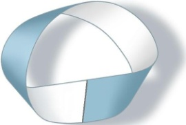

</section>

<section class="parallel-paragraph" data-paragraph-ids="s12-11-0047">

s12-11-0047

[无对应译文]

原文 · s12-11-0047

Pour ceux qui ne sont pas encore venus ici, *la bande de Mœbius* consiste à prendre une bande et à lui faire faire, avant de la coller à elle-même, non pas un tour complet mais un demi-tour : 180°. *Moyennant quoi*, je le répète pour ceux qui ne l’ont point encore vu, *vous avez une surface telle qu’elle n’a ni endroit ni envers, autrement dit, que sans franchir son bord une mouche, ou un être infiniment plat,* comme disait POINCARÉ[^82], *qui se promène sur cette bande, arrive sans encombre à l’envers du point dont il est parti.*

</section>

<section class="parallel-paragraph" data-paragraph-ids="s12-11-0048">

s12-11-0048

[无对应译文]

原文 · s12-11-0048

Ceci n’ayant aucune espèce de sens pour ce qui se passe *sur la bande*, puisque pour qui est *sur la bande* il n’y a ni endroit ni envers.

</section>

<section class="parallel-paragraph" data-paragraph-ids="s12-11-0049">

s12-11-0049

[无对应译文]

原文 · s12-11-0049

Il n’y a *endroit et envers* que quand la bande est plongée dans cet espace commun où vous vivez, ou tout au moins vous croyez vivre.

</section>

<section class="parallel-paragraph" data-paragraph-ids="s12-11-0050">

s12-11-0050

[无对应译文]

原文 · s12-11-0050

Il n’y aurait donc pas de problème vis à vis de ce qui peut se situer sur cette surface, pas de problème d’endroit ni d’envers et donc rien qui permette de la distinguer d’une bande commune, de celle qui est par exemple la bande qui me servirait de *ceinture*.

</section>

<section class="parallel-paragraph" data-paragraph-ids="s12-11-0051">

s12-11-0051

[无对应译文]

原文 · s12-11-0051

Je n’aurai pas la malice de donner cette *torsion finale*. Néanmoins, il y a dans cette bande *des propriétés*, non pas *extrinsèques mais intrinsèques*, qui permettent - à l’être, que j’ai supposé y être limité par son horizon, c’est le cas de le dire - *qui lui permettent* quand même de repérer qu’il est sur une *bande de Mœbius* et non pas sur *sa ceinture* *de corps*.

</section>

<section class="parallel-paragraph" data-paragraph-ids="s12-11-0052">

s12-11-0052

[无对应译文]

原文 · s12-11-0052

C’est ceci qui se définit en ce que *la bande de Mœbius n’est pas orientable*. Ce qui veut dire que si le supposé être qui se déplace sur cette [*bande de Mœbius*](http://www.youtube.com/watch?v=zo8QB8ztIpU&feature=related), part d’un point en ayant repéré dans un certain ordre, son horizon, *a, b, c, d, e, f*... mettez autant de lettres que vous voulez, s’il fait un mot dans un certain sens - c’est la façon la plus rigoureuse, en l’occasion, de définir l’orientation – s’il poursuit son chemin sans rencontrer aucun bord, revenant au même point pour la première fois, il trouvera l’orientation opposée : le mot se lira d’une façon palindromique, dans le sens exactement inverse. Tel est ce qui fait, pour celui qui y subsiste, l’originalité de la *bande de Mœbius*.

</section>

<section class="parallel-paragraph" data-paragraph-ids="s12-11-0053">

s12-11-0053

[无对应译文]

原文 · s12-11-0053

Bon. Ces vérités premières étant rappelées, je commence, comme je l’ai déjà fait devant vous, à découper *le bord* de la bande et je vous rappelle ce que je vous ai déjà dit en son temps, à savoir ce qu’il en arrive. Il en arrive ces deux anneaux dont l’un reste le cœur de ce qui était primitivement la *bande de Mœbius*, c’est-à-dire une *bande de Mœbius*, et dont l’autre - sortons la *bande de Mœbius -* n’est pas une *bande de Mœbius*, mais une bande deux fois roulée sur elle-même, une bande orientable où il n’arrivera jamais à l’*être* \[*infiniment plat*\] qui y subsiste la mésaventure de voir son orientation renversée.

</section>

<section class="parallel-paragraph" data-paragraph-ids="s12-11-0054">

s12-11-0054

[无对应译文]

原文 · s12-11-0054

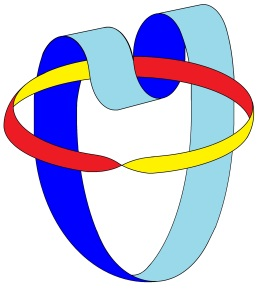→ 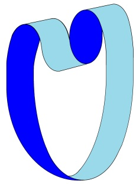 + 

</section>

<section class="parallel-paragraph" data-paragraph-ids="s12-11-0055">

s12-11-0055

[无对应译文]

原文 · s12-11-0055

Si ce que je retire, je le fais de plus en plus large, je vais arriver à faire une coupure qui passe, comme on dit, par le « milieu » de la *bande de Mœbius* : ceci, vous vous en rendez compte, n’ayant strictement aucun sens. En faisant la coupure passant par le « *milieu* » de la [*bande de Mœbius*](http://www.youtube.com/watch?feature=fvwp&NR=1&v=BVsIAa2XNKc), qu’est-ce que j’obtiens ?

</section>

<section class="parallel-paragraph" data-paragraph-ids="s12-11-0056">

s12-11-0056

[无对应译文]

原文 · s12-11-0056

J’obtiens ce qui se serait passé si j’avais réduit de plus en plus l’extraction des bords : il n’y a plus rien *au milieu*, à savoir qu’en retirant de la *bande de Mœbius* tout ce qui est orientable, je m’aperçois que ce qui fait l’essence de la *bande de Mœbius*, c’est-à-dire sa *non orientabilité* ne gît strictement nulle part, si ce n’est dans cette coupure centrale qui fait que je puis, cette *bande de Mœbius*, simplement à la couper, la rendre une surface orientable.

</section>

<section class="parallel-paragraph" data-paragraph-ids="s12-11-0057">

s12-11-0057

[无对应译文]

原文 · s12-11-0057

Ce n’est donc pas, d’aucune façon, l’arrangement des parties de la *bande de Mœbius* qui fait *son caractère non orientable*.

</section>

<section class="parallel-paragraph" data-paragraph-ids="s12-11-0058">

s12-11-0058

[无对应译文]

原文 · s12-11-0058

Sa propriété n’est point ailleurs que, justement, dans la coupure qui est la seule chose qui ait la forme de la *bande de Mœbius*, à savoir qui ait nécessité, à un moment, le retournement de mes ciseaux.

</section>

<section class="parallel-paragraph" data-paragraph-ids="s12-11-0059">

s12-11-0059

[无对应译文]

原文 · s12-11-0059

Comme vous le voyez dans la dernière opération, pour tout dire, ce qu’il y a d’analogue entre cette *surface de Mœbius* et tout ce qui la supporte, c’est-à-dire des formes - appelons-les pour votre satisfaction et la rapidité : des formes abstraites - comme celles dont certaines sont ici représentées au tableau. Ce qui en fait l’essence tient tout entier dans *la fonction de la coupure *: le sujet, comme *la bande de Mœbius*, est ce qui disparaît dans la coupure. C’est *la fonction de la coupure * dans le langage, c’est cette ombre de privation qui fait qu’il est dans l’annulation que représente *la coupure,* qu’il est sous cette forme, cette forme de trait négatif, qui s’appelle *la coupure*.

</section>

<section class="parallel-paragraph" data-paragraph-ids="s12-11-0060">

s12-11-0060

[无对应译文]

原文 · s12-11-0060

J’espère m’être suffisamment fait entendre et du même coup avoir *justifié* cette introduction de *la bouteille de Klein*, pour autant que, *si vous regardez de près sa structure*, elle est ce que je vous ai dit, à savoir *la conjonction, l’accolement*, dans un certain arrangement qu’il faut bien maintenant que vous voyez comme purement idéal, disons : mieux qu’abstrait, *l’arrangement de deux bandes de Mœbius*, comme ce que j’ai ici inscrit au tableau vous le représente, et vous le représenterait encore mieux, si, au caractère orienté de façon opposée des deux bords qui sont ceux ici de la *bande de Mœbius*, je substituais leur dédoublement de la façon suivante : tel est le schéma de *la bouteille de Klein*.

</section>

<section class="parallel-paragraph" data-paragraph-ids="s12-11-0061">

s12-11-0061

[无对应译文]

原文 · s12-11-0061

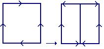

</section>

<section class="parallel-paragraph" data-paragraph-ids="s12-11-0062">

s12-11-0062

[无对应译文]

原文 · s12-11-0062

Ceci - l’introduction de cette forme de *la bouteille de Klein -* est destiné à supporter, à l’état de question pour vous, ce qu’il en est de cette conjonction du S au A, à l’intérieur de laquelle va pouvoir pour nous se situer la dialectique de la demande.

</section>

<section class="parallel-paragraph" data-paragraph-ids="s12-11-0063">

s12-11-0063

[无对应译文]

原文 · s12-11-0063

*Nous supposons que le A est l’image inversée de ce qui nous sert de support à conceptualiser la fonction du sujet.* C’est une question que nous posons *à l’aide de cette image*. *Le A, lieu de l’Autre, lieu où s’inscrit la succession des signifiants, est-il ce support qui se situe, par rapport à celui* *que nous donnons au sujet comme son image inversée.*

</section>

<section class="parallel-paragraph" data-paragraph-ids="s12-11-0064">

s12-11-0064

[无对应译文]

原文 · s12-11-0064

Car dans *la bouteille de Klein* les deux *bandes de Mœbius se conjoignent* - dans la mesure où, vous le voyez de façon très simple sur la forme carrée \[Fig.1\] que je viens, sur le tableau, moi-même de modifier \[Fig.2\] - se conjoignent en ceci : c’est que la torsion d’un demi-tour se fait en sens contraire, si l’un est *lévogyre,* l’autre est *dextrogyre*.

</section>

<section class="parallel-paragraph" data-paragraph-ids="s12-11-0065">

s12-11-0065

[无对应译文]

原文 · s12-11-0065

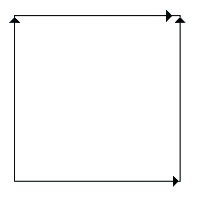 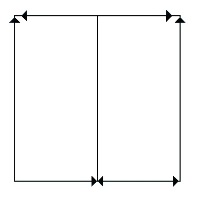

</section>

<section class="parallel-paragraph" data-paragraph-ids="s12-11-0066">

s12-11-0066

[无对应译文]

原文 · s12-11-0066

> Fig.1 Fig.2

</section>

<section class="parallel-paragraph" data-paragraph-ids="s12-11-0067">

s12-11-0067

[无对应译文]

原文 · s12-11-0067

Ceci est une forme d’inversion toute différente et beaucoup plus radicale que celle de *la relation spéculaire* à laquelle, dans le progrès de mon discours, elle vient effectivement, progressivement avec le temps, à se substituer. Si une *bande de Mœbius* peut jouer ainsi, par rapport à une autre, cette fonction complémentaire, cette fonction de fermeture, y a-t-il une autre forme qui le puisse ?

</section>

<section class="parallel-paragraph" data-paragraph-ids="s12-11-0068">

s12-11-0068

[无对应译文]

原文 · s12-11-0068

Oui, comme il est très évident depuis longtemps, puisque je l’ai produite devant vous sous d’autres formes : cette forme est celle qu’on appelle celle du *huit intérieur*. Autrement dit, ceci :

</section>

<section class="parallel-paragraph" data-paragraph-ids="s12-11-0069">

s12-11-0069

[无对应译文]

原文 · s12-11-0069

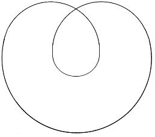 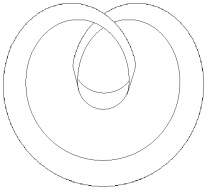

</section>

<section class="parallel-paragraph" data-paragraph-ids="s12-11-0070">

s12-11-0070

[无对应译文]

原文 · s12-11-0070

qui est une surface parfaitement orientable, une simple rondelle, dont le bord est simplement tordu d’une façon appropriée.

</section>

<section class="parallel-paragraph" data-paragraph-ids="s12-11-0071">

s12-11-0071

[无对应译文]

原文 · s12-11-0071

*C’est une surface orientable* qui a un endroit et un envers et dont il suffit que vous y fassiez la couture - favorisée par cette disposition - d’un bord à l’autre, pour voir que vous y créez effectivement, que vous créez à l’aide de cette forme, une *bande de Mœbius*:

</section>

<section class="parallel-paragraph" data-paragraph-ids="s12-11-0072">

s12-11-0072

[无对应译文]

原文 · s12-11-0072

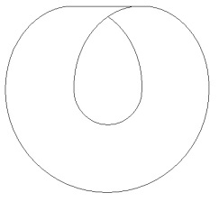

</section>

<section class="parallel-paragraph" data-paragraph-ids="s12-11-0073">

s12-11-0073

[无对应译文]

原文 · s12-11-0073

Cette forme-là, dont je vous ai déjà introduit la fonction comme devant se substituer au *cercle d’Euler*, est pour nous supportée d’être un instrument indispensable, vous verrez en quoi.

</section>

<section class="parallel-paragraph" data-paragraph-ids="s12-11-0074">

s12-11-0074

[无对应译文]

原文 · s12-11-0074

Disons tout de suite qu’il est ce qui nous permet de supporter cette autre fonction : celle que j’appelle celle de *l’objet (a)* et le rapprochement de ces deux complémentaires, l’autre *bande de Mœbius* dans *la bouteille de Klein* et le *(a)* dans celui-ci, nous permet de poser une seconde question : quels sont les rapports de *l’objet(a)* au A ? La question vaut d’être posée tout de même !

</section>

<section class="parallel-paragraph" data-paragraph-ids="s12-11-0075">

s12-11-0075

[无对应译文]

原文 · s12-11-0075

Si la théorie analytique laisse en suspens…

</section>

<section class="parallel-paragraph" data-paragraph-ids="s12-11-0076">

s12-11-0076

[无对应译文]

原文 · s12-11-0076

> voire au point de laisser croire que laisser la porte ouverte au fait que cet *objet(a)* - que nous identifions à l’objet partiel -
>
> est quelque chose qui se réduit à un rapport biologique, au rapport du sujet vivant avec *le sein*, avec *les fèces ou cybales*,
>
> avec *telle ou telle forme plus ou coins incarnée de l’objet(a)*, la fonction du *phallus* étant là tout à fait présente …si *l’objet - (a)* ou non - dépend du rapport avec le A, avec l’Autre, avec le statut que nous devons donner à l’Autre, au A par rapport au sujet, c’est bien là une question qui mérite d’être posée. Et si elle doit l’être, *dans quelle mesure* dépend-elle de ce rapport spécifique à l’Autre que nous *symbolisons* de la figure \[...\], à savoir de celle de la demande ?

</section>

<section class="parallel-paragraph" data-paragraph-ids="s12-11-0077">

s12-11-0077

[无对应译文]

原文 · s12-11-0077

Simplement, au passage, laissez-moi vous noter, quant aux usages dont peut nous être, *mais pas seulement à nous, aussi bien aux logiciens,* cette forme du huit intérieur : observez-y, observez-y combien, à nous en tout cas, elle peut être d’un grand service.

</section>

<section class="parallel-paragraph" data-paragraph-ids="s12-11-0078">

s12-11-0078

[无对应译文]

原文 · s12-11-0078

Car, supposons que nous ayons à définir - et nous ne manquons pas de le faire, et FREUD lui-même, quand il meuble son texte de tel ou tel petit schéma qui l’illustre, le fait - si nous devons définir par un champ limité, par un champ du type *cercle d’Euler*, le champ où vaut, où prévaut *le principe du plaisir*, nous nous trouvons amenés, *par la doctrine autant que par les faits, dans une impasse*.

</section>

<section class="parallel-paragraph" data-paragraph-ids="s12-11-0079">

s12-11-0079

[无对应译文]

原文 · s12-11-0079

Cette impasse qui nous mène à parler d’un *au-delà du principe de plaisir*, à savoir comment une doctrine qui a fait son fondement du *principe du plaisir* comme instituant comme telle toute l’économie subjective, peut y introduire ce qui est évident, à savoir que toute la pulsation du désir va *contre* cette homéostase, ce niveau de moindre tension qui est celui que *le processus primaire* veille à respecter ?

</section>

<section class="parallel-paragraph" data-paragraph-ids="s12-11-0080">

s12-11-0080

[无对应译文]

原文 · s12-11-0080

Observez comment, au contraire, et c’est peut-être là une voie autre que celle qu’on appelle purement dialectique, pour le concevoir, comment au contraire, ce n’est pas seulement parce qu’un cercle limite, définit *deux champs qui s’opposent* - le bien et le mal, le plaisir et le déplaisir, le juste et l’injuste - que la liaison de l’un à l’autre s’établit.

</section>

<section class="parallel-paragraph" data-paragraph-ids="s12-11-0081">

s12-11-0081

[无对应译文]

原文 · s12-11-0081

Si nous nous obligeons, au contraire, à considérer que tout ce qui est créé dans le champ du langage se trouve nécessité à passer par ces formes topologiques qui, elles, vont mettre en évidence ceci par exemple :

</section>

<section class="parallel-paragraph" data-paragraph-ids="s12-11-0082">

s12-11-0082

[无对应译文]

原文 · s12-11-0082

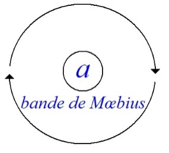

</section>

<section class="parallel-paragraph" data-paragraph-ids="s12-11-0083">

s12-11-0083

[无对应译文]

原文 · s12-11-0083

que si nous définissons le champ de *la bande de Mœbius* comme étant celui du règne… comme étant celui *du règne du principe du plaisir*, il sera - ce champ - forcément traversé en son intérieur par l’autre champ résiduel, qui est créé par cette ligne que nous aurons obligatoirement si nous nous imposons de définir les champs opposés, non pas comme on le fait d’habitude sur *une sphère*, *sphère infinie* si vous voulez, *celle d’un plan*, mais *sphère* découpant un champ intérieur, un champ extérieur, si nous nous obligions à le faire sur ceci :

</section>

<section class="parallel-paragraph" data-paragraph-ids="s12-11-0084">

s12-11-0084

[无对应译文]

原文 · s12-11-0084

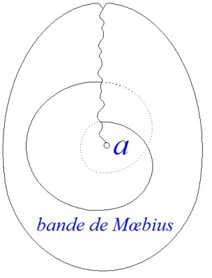

</section>

<section class="parallel-paragraph" data-paragraph-ids="s12-11-0085">

s12-11-0085

[无对应译文]

原文 · s12-11-0085

Où vous reconnaissez, *je ne peux pas, aujourd’hui en recommencer la déduction,* l’image qu’on appelle *un bonnet croisé*, qui est exactement celle où nous pouvons créer *la division d’une bande de Mœbius*.

</section>

<section class="parallel-paragraph" data-paragraph-ids="s12-11-0086">

s12-11-0086

[无对应译文]

原文 · s12-11-0086

Vérifiez, vous verrez que *ce champ est une bande de Mœbius,* et ceci, *ce champ interne, champ de l’objet(a)* dont ici je fais l’usage logique suivant : *champ exclu du sujet, champ du déplaisir*, *ce champ du déplaisir traverse obligatoirement l’intérieur du champ du plaisir*.

</section>

<section class="parallel-paragraph" data-paragraph-ids="s12-11-0087">

s12-11-0087

[无对应译文]

原文 · s12-11-0087

Et il nous restera, à partir de ce mode de concevoir, à penser *le plaisir* comme nécessairement traversé de *déplaisir* et à y distinguer ce qui fait, dans cette ligne de traversée, *ce qui sépare le pur et simple déplaisir, c’est-à-dire le désir, de ce qu’on appelle la douleur,* avec son pouvoir d’investissement que FREUD distingue avec tellement de subtilité et pour lequel l’*intérieur*…

</section>

<section class="parallel-paragraph" data-paragraph-ids="s12-11-0088">

s12-11-0088

[无对应译文]

原文 · s12-11-0088

> *l’intérieur même de la surface que nous avons appelé (a) – que nous pourrions aussi bien appeler tout autrement à cette occasion,*
>
> *à savoir la portion ou tout ce que vous voudrez* …c’est dans la mesure où cette surface est capable de se traverser elle-même, dans le prolongement de cette intersection nécessaire, c’est ici que nous situerons ce cas d’investissement narcissique : *la fonction de la douleur* \[Cf. séminaire *L’identification* : 28-02\], qui autrement reste, logiquement, à proprement parler dans le texte de FREUD[^83] - quoique admirablement élucidé - *impensable*.

</section>

<section class="parallel-paragraph" data-paragraph-ids="s12-11-0089">

s12-11-0089

[无对应译文]

原文 · s12-11-0089

Bien sûr, ceci ne fait que recouvrir des choses bien connues depuis longtemps, et je me suis dispensé de vous donner ici la premiers phrase du chapitre II du *Tao te king* [^84], parce qu’aussi bien, il aurait fallu que je commente chacun des caractères.

</section>

<section class="parallel-paragraph" data-paragraph-ids="s12-11-0090">

s12-11-0090

[无对应译文]

原文 · s12-11-0090

Mais ces caractères sont tellement, pour quiconque peut se donner la peine d’en appréhender la référence, tellement *significatifs* que l’on ne peut pas croire qu’il n’y ait pas là quelque chose de la même veine *logique*, dans ce qui est énoncé en ce point originel pour une culture, autant que pour nous l’a pu être la pensée socratique de ce qu’il y a d’originel.

</section>

<section class="parallel-paragraph" data-paragraph-ids="s12-11-0091">

s12-11-0091

[无对应译文]

原文 · s12-11-0091

> « *Que, pour tout ce qui est du ciel et de la terre, que tous*… le terme « *universel* » est bien isolé, posant la fonction de l’*affirmative universelle*

</section>

<section class="parallel-paragraph" data-paragraph-ids="s12-11-0092">

s12-11-0092

[无对应译文]

原文 · s12-11-0092

> … *que tous sachent ce qu’il en est du bien, alors c’est de cela que naît le contraire.*
>
> *Que tous sachent ce qu’il en est du beau, alors que c’est de cela que naît la laideur.* »

</section>

<section class="parallel-paragraph" data-paragraph-ids="s12-11-0093">

s12-11-0093

[无对应译文]

原文 · s12-11-0093

Ce qui n’est pas pure vanité de dire que, bien sûr, définir le bon c’est du même coup définir le mal, car ce n’est pas une question de frontière, d’opposition bicolore : c’est un nœud interne. Il ne s’agit pas de savoir ce qu’on distingue, en quelque sorte comme on distinguerait « *les eaux supérieures* » et « *les eaux inférieures* » dans une réalité confuse. Ce n’est pas de ce qu’il soit vrai ou pas, que les choses soient bonnes ou mauvaises qu’il s’agit, les choses sont, c’est de *dire ce qu’il en est du bien qui fait naître le mal.*

</section>

<section class="parallel-paragraph" data-paragraph-ids="s12-11-0094">

s12-11-0094

[无对应译文]

原文 · s12-11-0094

Le fait, non pas que cela soit, non pas que l’ordre du langage vienne recouvrir la diversité du *réel* : c’est l’introduction du langage comme tel qui fait, non pas distinguer, constater, entériner, mais qui fait surgir la traversée du mal dans le champ du bien, la traversée du laid dans le champ du beau. Ceci est pour nous essentiel, capital, dans notre progrès, nous allons le voir.

</section>

<section class="parallel-paragraph" data-paragraph-ids="s12-11-0095">

s12-11-0095

[无对应译文]

原文 · s12-11-0095

Car il s’agit maintenant de passer de cette articulation première des effets de la λέξις \[lexis\], isolée en quelque sorte d’une façon artificielle, dans *le champ de l’Autre* et de savoir quel est cet Autre. Cet Autre nous intéresse, pour autant que nous analystes, nous avons à en occuper la place. D’où l’interrogeons-nous cette place ?

</section>

<section class="parallel-paragraph" data-paragraph-ids="s12-11-0096">

s12-11-0096

[无对应译文]

原文 · s12-11-0096

Partirons-nous, pour avancer et parce que l’heure nous talonne, partirons-nous de *la formule* autour de quoi nous avons essayé jusqu’à présent de centrer *l’accrochage*, *l’abord* de l’activité analytique, à savoir *le sujet supposé savoir* ? Car bien sûr l’analyste ne saurait être conçu comme un lieu vide, le lieu d’inscription, le lieu - *c’est un peu différent et nous verrons ce que ça veut dire - de retentissement,* *de résonance pure et simple de la parole du sujet*.

</section>

<section class="parallel-paragraph" data-paragraph-ids="s12-11-0097">

s12-11-0097

[无对应译文]

原文 · s12-11-0097

Le sujet vient avec une demande : cette demande, je vous l’ai dit, il est grossier, il est sommaire, de parler d’une demande purement et simplement originée dans le besoin. Le besoin peut venir à se présentifier, à s’incarner, par un processus que nous connaissons et que nous appelons le processus de la régression, à se *présentifier*, à *s’instantifier* dans la relation analytique.

</section>

<section class="parallel-paragraph" data-paragraph-ids="s12-11-0098">

s12-11-0098

[无对应译文]

原文 · s12-11-0098

Il est clair que le sujet, au départ, vient s’installer dans la demande mais que, de cette demande, nous avons à préciser le statut.

</section>

<section class="parallel-paragraph" data-paragraph-ids="s12-11-0099">

s12-11-0099

[无对应译文]

原文 · s12-11-0099

Il est certain que préciser ce statut nous commande de repousser d’emblée le schéma - de toute façon insuffisant et sommaire - qui est celui qui est promu par *la théorie de la communication*. *La théorie de la communication* réduisant le langage à une fonction *d’information*, au lien d’*un* *émetteur* à *un récepteur*, peut à l’occasion rendre des services, des services d’ailleurs limités puisqu’aussi bien de toute façon leur origine, à ne pas être détachée du langage, impliquera dans leur usage - je parle des schémas de la doctrine de *l’information* - toutes sortes d’éléments confusionnels, il est inadmissible de référer à aucune ordination, ou cardination en fonction d’un horizon réduit à la fonction réciproque du code et du message, tout ce qu’il en est de la communication.

</section>

<section class="parallel-paragraph" data-paragraph-ids="s12-11-0100">

s12-11-0100

[无对应译文]

原文 · s12-11-0100

*Le langage n’est pas un code, précisément parce que, dans son moindre énoncé, il véhicule avec lui le sujet présent dans l’énonciation.* Tout langage… et plus encore celui qui nous intéresse : celui de notre patient, s’inscrit - c’est bien évident - dans une épaisseur qui dépasse de beaucoup celle, linéaire, codifiée, de l’information.

</section>

<section class="parallel-paragraph" data-paragraph-ids="s12-11-0101">

s12-11-0101

[无对应译文]

原文 · s12-11-0101

La dimension du « *commandé* », la dimension du « *quémandé* », la dimension du *to demand,* en anglais le *demand* est une formule plus forte que dans notre langue : *demand* en anglais c’est *exigence*, et l’on ne peut que sourire de l’article de quelqu’un qui, s’étant fait une spécialité du tact en psychanalyse, fait une grande découverte, découverte d’une merveille, des effets catastrophiques qu’il a eu à aborder l’interprétation de tel ou tel des détours du discours de son analysée, en lui disant qu’elle *demandait*, en employant *to demand* au lieu de *to need*. Seule une profonde ignorance de la langue anglaise, comme d’ailleurs c’était bien le cas à cette époque, de ce nouveau venu[^85] en Amérique, peut expliquer le brillant d’une telle *découverte*, *quémander*, c’est-à-dire *to beg*, la position opposée.

</section>

<section class="parallel-paragraph" data-paragraph-ids="s12-11-0102">

s12-11-0102

[无对应译文]

原文 · s12-11-0102

C’est entre *ce « to beg »* et *ce « to demand »*, *ce « commander* » et *ce « quémander »*, qui entre nous, je vous le signale, n’ont absolument pas la même origine : ce n’est pas parce que les mots viennent à s’assimiler, à \[...\] le sort et la signification dans l’usage de la langue, que vous pourrez d’aucune façon rapporter « *quémander »* à quelque conjugaison de « *quey »* avec « *mandare »*.

</section>

<section class="parallel-paragraph" data-paragraph-ids="s12-11-0103">

s12-11-0103

[无对应译文]

原文 · s12-11-0103

*« Quémander »* vient de *caïmand* qui au XIVème siècle désignait le nom d’un mendiant. Ceci étant dit au passage.

</section>

<section class="parallel-paragraph" data-paragraph-ids="s12-11-0104">

s12-11-0104

[无对应译文]

原文 · s12-11-0104

C’est dans cette dimension que nous devons d’abord interroger la demande, dans la dimension de savoir si faute de pouvoir nous référer d’aucune façon, bien sûr, à aucune théorie extra-plate de la transmission, de ce qui se passe dans le langage comme quelque chose qui s’inscrit en termes d’injonction - où allons-nous chercher l’épaisseur ?

</section>

<section class="parallel-paragraph" data-paragraph-ids="s12-11-0105">

s12-11-0105

[无对应译文]

原文 · s12-11-0105

Est-ce dans le sens de l’expression de celui qui s’exprimait comme ceci : qu’après tout, toute parole est sincère puisque c’est bien… par quelque parole que ce soit, ce que j’exprime, c’est *l’état de mon âme*, comme on dit *quelque part dans* ARISTOTE[^86], au début du Περἱ ψυχῆς \[peri psyché\].

</section>

<section class="parallel-paragraph" data-paragraph-ids="s12-11-0106">

s12-11-0106

[无对应译文]

原文 · s12-11-0106

Ces gens assurément avaient l’âme noble... et aussi bien d’ailleurs, il y aurait quelque mauvaise foi à isoler ce qu’écrit ARISTOTE \- à ce niveau - du contexte. Ce qu’écrit ARISTOTE n’est jamais à repousser si rapidement. Quoi qu’il en soit, à le lire d’une certaine façon, c’est là la source de beaucoup d’erreurs.

</section>

<section class="parallel-paragraph" data-paragraph-ids="s12-11-0107">

s12-11-0107

[无对应译文]

原文 · s12-11-0107

La pensée que le langage, de quelque façon, exprime toujours, à l’opposé du communiqué, quelque chose qui serait le fond du sujet, est une pensée radicalement fausse, et à laquelle spécialement un analyste, ne saurait en aucune façon s’abandonner.

</section>

<section class="parallel-paragraph" data-paragraph-ids="s12-11-0108">

s12-11-0108

[无对应译文]

原文 · s12-11-0108

Est-ce que vous vous figurez que quand je vous parle, je vous parle de mon état d’âme ? J’essaie de situer ce qu’il en est des conséquences d’avoir à se situer, à habiter le langage articulé.

</section>

<section class="parallel-paragraph" data-paragraph-ids="s12-11-0109">

s12-11-0109

[无对应译文]

原文 · s12-11-0109

Et ceci peut être poursuivi jusqu’*aux dernières limites*, à savoir jusqu’à la forme la plus élémentaire, la plus réduite de ce qui est d’un énoncé, un énoncé réduit lui-même à l’*interjection*, comme se sont exprimés depuis QUINTILLIEN[^87] les auteurs, concernant *les parties du discours*. *Interjection*[^88] : cette phrase ultra réduite, ce comprimé de phrases, cette *holophrase* comme diraient certains, employant un terme des plus discutables.

</section>

<section class="parallel-paragraph" data-paragraph-ids="s12-11-0110">

s12-11-0110

[无对应译文]

原文 · s12-11-0110

*Interjection* : c’est dans la pensés des anciens réthoriciens quelque chose qui est à isoler à l’intérieur de la phrase, et très précisément quelque chose qui fait surgir *l’image et la fonction de la coupure.* Est-ce qu’une *interjection*, d’aucune façon que nous pouvons l’avancer, comme on la voit trop facilement et fréquemment référer comme :

</section>

<section class="parallel-paragraph" data-paragraph-ids="s12-11-0111">

s12-11-0111

[无对应译文]

原文 · s12-11-0111

- quelque chose qui serait *l’exclamation* pure et simple,

</section>

<section class="parallel-paragraph" data-paragraph-ids="s12-11-0112">

s12-11-0112

[无对应译文]

原文 · s12-11-0112

- quelque chose dont trace l’ombre cette ponctuation qui s’appelle *le point d’exclamation* ?

</section>

<section class="parallel-paragraph" data-paragraph-ids="s12-11-0113">

s12-11-0113

[无对应译文]

原文 · s12-11-0113

Est-ce qu’à regarder une chose, telle qu’elle se passe au-delà des apparences simulatoires, vous ne pouvez pas ne pas voir qu’il n’y a point une seule exclamation, si réduite que vous la supposiez dans la vocalise, qui ne soit - vous sentez bien qu’il y a un mot que je ne veux toujours pas prononcer : c’est le mot cri - qui ne soit un cri.

</section>

<section class="parallel-paragraph" data-paragraph-ids="s12-11-0114">

s12-11-0114

[无对应译文]

原文 · s12-11-0114

- Si je dis « *ah !* » à quelque moment que ce soit, et même me réveillant d’un *knock-out* : *je t’<u>a</u>ppelle*,

</section>

<section class="parallel-paragraph" data-paragraph-ids="s12-11-0115">

s12-11-0115

[无对应译文]

原文 · s12-11-0115

- et si je dis « *oh !* » c’est une sorte de ponte, c’est un « *O* » que je vais déposer quelque part dans le champ de l’*<u>Au</u>tre* pour qu’il y soit là comme un germe, *je t’<u>au</u>trifie* ou *je t’<u>au</u>truche* comme vous voudrez,

</section>

<section class="parallel-paragraph" data-paragraph-ids="s12-11-0116">

s12-11-0116

[无对应译文]

原文 · s12-11-0116

- et si je dis « *eh !* » et bien c’est : *je t’<u>é</u>pie*, oui.

</section>

<section class="parallel-paragraph" data-paragraph-ids="s12-11-0117">

s12-11-0117

[无对应译文]

原文 · s12-11-0117

Il y a toujours dans l’*interjection* cette fonction infiniment variée, j’ai pris les termes les plus grossiers et exprès les plus sommaires, mais il y a bien sûr d’autres interjections. Tout ceux qui se sont un peu penchés sur le problème, et je n’ai qu’à vous prier de vous référer au livre de Viggo BRØNDAL sur *les parties du discours*, où vous y verrez que *les interjections*, il éprouve le besoin de s’apercevoir qu’il y en a qui seront qualifiées de « *situatives* », « *résultatives* », « *supputatives* », il n’y a pas d’*interjection* qui ne se situe exactement quelque part dans la coupure entre le S et le A, entre le S et le lieu de l’Autre, lieu de l’Autre où l’Autre est présent.

</section>

<section class="parallel-paragraph" data-paragraph-ids="s12-11-0118">

s12-11-0118

[无对应译文]

原文 · s12-11-0118

Est-ce que je vais aller aujourd’hui jusqu’au *cri*, ou est-ce que j’en réserve *la fonction* pour *la prochaine fois* ?

</section>

<section class="parallel-paragraph" data-paragraph-ids="s12-11-0119">

s12-11-0119

[无对应译文]

原文 · s12-11-0119

Je crois que j’adopterai cette deuxième position parce que, aussi bien, c’est là que se fera, assez bien, la coupure.

</section>

<section class="parallel-paragraph" data-paragraph-ids="s12-11-0120">

s12-11-0120

[无对应译文]

原文 · s12-11-0120

Je commencerai la prochaine fois en vous parlant du *cri* parce que je ne peux pas séparer ce que j’ai à vous dire du *cri*, de ce que j’ai à vous dire de ce que, soi-disant des personnes « *bien intentionnées* »…

</section>

<section class="parallel-paragraph" data-paragraph-ids="s12-11-0121">

s12-11-0121

[无对应译文]

原文 · s12-11-0121

> il est vrai en passe de se faire valoir, ailleurs, dans des endroits où l’on parle bien étrangement des relations analytiques …de ce qu’une personne « *bien intentionnée* » a déclaré avoir cherché de tout son cœur, à la loupe dans mes *Écrits* : soi-disant, il n’y aurait nulle part *la place du silence* !

</section>

<section class="parallel-paragraph" data-paragraph-ids="s12-11-0122">

s12-11-0122

[无对应译文]

原文 · s12-11-0122

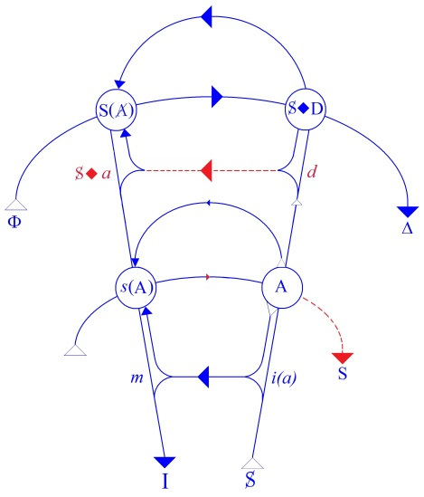

</section>

<section class="parallel-paragraph" data-paragraph-ids="s12-11-0123">

s12-11-0123

[无对应译文]

原文 · s12-11-0123

Eh bien, si cette personne avait mieux cherché et *repéré dans mon graphe, la formule, le schéma, l’articulation, qui conjoint le* S *avec* *le* D, en les joignant par *le poinçon* \[◊\] *conjonction-disjonction*, *inclusion-exclusion*, il se serait peut-être aperçu que si c’est justement en corrélation à la demande que là apparaît pour la première fois le S, ça n’est peut-être pas tout à fait sans rapport avec cette fonction du silence, mais à vrai dire on aime mieux en parler dans certains endroits *en termes émotionnels ou d’effusion.*

</section>

<section class="parallel-paragraph" data-paragraph-ids="s12-11-0124">

s12-11-0124

[无对应译文]

原文 · s12-11-0124

C’est à cette heure de silence qu’un analyste, dont, après tout, il n’y a pas lieu que je n’esquisse pas ici le profil puisque j’aurai à y revenir comme à un exemplaire typique d’une certaine façon d’assurer la position analytique, que c’est l’heure où la solution de la névrose de transfert selon lui - et il s’est trouvé un très large public pour venir entendre de pareilles cautions - ou la solution de la névrose de transfert se trouve dans le procédé dit « *de l’aération* », comme il s’exprime : « *on ouvre les fenêtres !* ».

</section>

<section class="parallel-paragraph" data-paragraph-ids="s12-11-0125">

s12-11-0125

[无对应译文]

原文 · s12-11-0125

Solution indiquée à la névrose de transfert ! Il est vrai qu’après une certaine façon d’articuler le transfert lui-même, on voit mal dans quel ordre de référence on pourrait trouver l’indication de sa solution.

</section>

<section class="parallel-paragraph" data-paragraph-ids="s12-11-0126">

s12-11-0126

[无对应译文]

原文 · s12-11-0126

Je vous parlerai donc, pour commencer mon discours la prochaine fois du silence, quand je vous aurai parlé du *cri*.

</section>

<section class="parallel-paragraph" data-paragraph-ids="s12-11-0127">

s12-11-0127

[无对应译文]

原文 · s12-11-0127

Mais pour aujourd’hui terminer sur quelque chose qui, après une séance, mon Dieu aussi rude, puisse vous distraire, pour que vous puissiez emporter un petit peu quelque chose d’amusant, je vais vous raconter une histoire que vous pourrez voir reproduite à [l’année l873 du *Journal* de DOSTOÏEVSKI](#Dostoievski).

</section>

<section class="parallel-paragraph" data-paragraph-ids="s12-11-0128">

s12-11-0128

[无对应译文]

原文 · s12-11-0128

C’est une illustration que j’ai - si je puis dire - piquée pour vous comme une façon de présentifier, d’imager, ce que je viens de dire sur l’interjection, autrement dit sur la phrase ultra–réduite voire monosyllabique, et vous allez voir que, une interjection, si surgissante qu’on la suppose de je ne sais quelle ultime radicalité …est bien autre chose que ce que nous pouvons ainsi en penser.

</section>

<section class="parallel-paragraph" data-paragraph-ids="s12-11-0129">

s12-11-0129

[无对应译文]

原文 · s12-11-0129

Qu’elle est au contraire essentiellement \[...\] non seulement à la limite du sujet et de l’Autre, mais dans la présentation du monde du sujet à l’Autre, dans l’instauration même de ses fondements les plus radicaux.

</section>

<section class="parallel-paragraph" data-paragraph-ids="s12-11-0130">

s12-11-0130

[无对应译文]

原文 · s12-11-0130

Ceci dit, préparez-vous à la voir illustrée de façon humoristique. DOSTOÏEVSKY raconte qu’un soir, voguant dans les rues de Moscou, il se trouva naviguer de concert avec un groupe de quelques personnes assez bien *vodkaïsées*.

</section>

<section class="parallel-paragraph" data-paragraph-ids="s12-11-0131">

s12-11-0131

[无对应译文]

原文 · s12-11-0131

Ces personnes, comme il convient, étaient dans *un débat fort animé*, et il s’agissait de rien moins que *des références les plus universelles, cosmiques*, et ce qu’il nous dépeint est ceci : tout d’un coup, l’un d’entre eux conclut ce débat en poussant, nous dit-il, il s’agit du russe : je ne peux pas faire ici de vains jeux avec une langue que je ne connais pas, nous chercherons un équivalent, il s’agit *d’un mot*, nous dit-il, *de toute façon imprononçable*. Ce mot il le prononce à la façon d’une espèce de jet de mépris universel : « *Décidément, tout ça, c’est de la* … » ce que vous pensez. Ceci dit de *la façon la plus convaincue*.

</section>

<section class="parallel-paragraph" data-paragraph-ids="s12-11-0132">

s12-11-0132

[无对应译文]

原文 · s12-11-0132

À quoi un autre plus jeune et tout aussi « *Sur la pointe de ses ailes* », s’approche et répète le même mot toujours imprononçable, d’un ton interrogateur. À la suite de quoi un troisième surgit qui pousse le même mot à la façon d’un rugissement, d’un aboiement vers le ciel, au point de se casser la voix, une sorte d’enthousiasme, à la suite de quoi le second qui a parlé, vient tout de même près du premier et dit alors : « *Alors, tout beau, nous parlons de choses sérieuses, nous étions au niveau du débat philosophique :* *qu’est ce vous venez ici introduire dit-il, à vous casser la voix ?* »

</section>

<section class="parallel-paragraph" data-paragraph-ids="s12-11-0133">

s12-11-0133

[无对应译文]

原文 · s12-11-0133

Moyennant quoi le quatrième, car trois seulement sont intervenus jusqu’à présent, vous avez remarqué les quatre répliques que j’ai données jusqu’à présent, …le quatrième intervient donc, parlant au cinquième et reproduit le même mot, cette fois-ci à la façon d’une révélation, d’un « *eurêka* », la vérité vient de l’illuminer, c’est ce mot qui est la clé de tout.

</section>

<section class="parallel-paragraph" data-paragraph-ids="s12-11-0134">

s12-11-0134

[无对应译文]

原文 · s12-11-0134

Moyennant quoi un autre d’aspect plus maussade, nous dit DOSTOÏEVSKY, répète plusieurs fois à voix basse ce mot comme pour dire que de toute façon il convient de ne pas perdre la tête, ce qui donne quelque chose d’à peu près comme ceci :

</section>

<section class="parallel-paragraph" data-paragraph-ids="s12-11-0135">

s12-11-0135

[无对应译文]

原文 · s12-11-0135

- Merde !

</section>

<section class="parallel-paragraph" data-paragraph-ids="s12-11-0136">

s12-11-0136

[无对应译文]

原文 · s12-11-0136

- merde ?

</section>

<section class="parallel-paragraph" data-paragraph-ids="s12-11-0137">

s12-11-0137

[无对应译文]

原文 · s12-11-0137

- MERDE !

</section>

<section class="parallel-paragraph" data-paragraph-ids="s12-11-0138">

s12-11-0138

[无对应译文]

原文 · s12-11-0138

- merde !?

</section>

<section class="parallel-paragraph" data-paragraph-ids="s12-11-0139">

s12-11-0139

[无对应译文]

原文 · s12-11-0139

- MERDE !

</section>

<section class="parallel-paragraph" data-paragraph-ids="s12-11-0140">

s12-11-0140

[无对应译文]

原文 · s12-11-0140

- Merde, merde, merde, merde...

</section>

<section class="parallel-paragraph" data-paragraph-ids="s12-11-0141">

s12-11-0141

[无对应译文]

原文 · s12-11-0141

[DOSTOÏEVSKI : Journal d’un écrivain, année 1873, Ch. VII : Petits tableaux, § 2.](http://fr.wikisource.org/wiki/Journal_d%E2%80%99un_%C3%A9crivain/1873/VII)

</section>

<section class="parallel-paragraph" data-paragraph-ids="s12-11-0142">

s12-11-0142

[无对应译文]

原文 · s12-11-0142

On dit que les malheureux obligés de rester à Pétersbourg l’été, dans la poussière et la chaleur, ont à leur disposition un certain nombre de jardins publics où ils peuvent « respirer » un air plus frais. Pour ma part je n’en sais rien, mais ce que je n’ignore pas, c’est que Pétersbourg est, ces mois-ci, un séjour terriblement triste et étouffant. Je n’ai pas grand goût pour des jardins où se presse la foule ; j’aime mieux la rue où je puis me promener seul en pensant. Des jardins, du reste, où n’en trouverait-on pas ? Presque dans chaque rue, à présent, vous découvrez, au–dessus des portes cochères, des écriteaux qui portent, écrit en grosses lettres : « Entrée du jardin du débit » ou « du restaurant ». Vous entrez dans une cour au bout de laquelle vous apercevez un « bosquet » de dix pas de long sur cinq de large. Vous avez vu le « jardin » du cabaret.

</section>

<section class="parallel-paragraph" data-paragraph-ids="s12-11-0143">

s12-11-0143

[无对应译文]

原文 · s12-11-0143

Qui me dira pourquoi Pétersbourg est encore plus désolant le dimanche qu’en semaine ? Est-ce à cause du nombre des pochards abêtis par l’eau-de-vie ? Est-ce parce que les moujiks ivres dorment sur la perspective Newsky ? Je ne le crois pas. Les travailleurs en goguette ne me gênent en rien, et maintenant que je passe tout mon temps à Pétersbourg, je me suis parfaitement habitué à eux. Autrefois, il n’en était pas de même : je les détestais au point d’éprouver une vraie haine pour eux.

</section>

<section class="parallel-paragraph" data-paragraph-ids="s12-11-0144">

s12-11-0144

[无对应译文]

原文 · s12-11-0144

Ils se promènent les jours de fête, soûls, bien entendu, et parfois en troupe. Ils tiennent une place ridicule ; ils bousculent les autres passants. Ce n’est pas qu’ils aient un désir spécial de molester les gens ; mais où avez-vous vu qu’un poivrot puisse faire assez de prodiges d’équilibre pour éviter de heurter les promeneurs qu’il croise ? Ils disent des malpropretés à haute voix, insoucieux des femmes et des enfants qui les entendent. N’allez pas croire à de l’effronterie ! Le pochard a besoin de dire des obscénités ; il parle gras naturellement. Si les siècles ne lui avaient légué son vocabulaire ordurier, *il le lui faudrait inventer*. Je ne plaisante pas. Un homme en ribote n’a pas la langue très agile ; en même temps il ressent une infinité de sensations qu’il n’éprouve pas dans son état normal : or, les gros mots se trouvent toujours, je ne sais pourquoi, des plus faciles à prononcer et sont follement expressif. Alors !… L’un des mots dont ils font le plus grand usage est depuis longtemps adopté dans toute la Russie. Son seul tort est d’être introuvable dans les dictionnaires, mais il rachète ce léger désavantage par tant de qualités ! Trouvez–moi un autre vocable qui exprime la dixième partie des sens contradictoires qu’il concrète ! Un dimanche soir, je dus traverser un groupe de moujiks soûls. Ce fut l’affaire de quinze pas, mais en faisant ces quinze pas, j’acquis la conviction qu’avec ce mot seul, on peut rendre toutes les impressions humaines, oui, avec ce simple mot, d’ailleurs admirablement bref.

</section>

<section class="parallel-paragraph" data-paragraph-ids="s12-11-0145">

s12-11-0145

[无对应译文]

原文 · s12-11-0145

Voici un gaillard qui le prononce avec une mâle énergie. Le mot se fait négateur, démolisseur ; il réduit en poussière l’argument d’un voisin qui reprend le mot et le lance à la tête du premier orateur, convaincu maintenant d’insincérité dans sa négation. Un troisième s’indigne aussi contre le premier, se rue dans la conversation et crie encore le mot, qui devient une injurieuse invective. Ici le second s’emporte contre le troisième et lui renvoie le mot qui, tout à coup, signifie clairement : Tu nous embêtes ! De quoi te mêles-tu ? Un quatrième s’approche en titubant ; il n’avait rien dit jusque-là ; il réservait son opinion, réfléchissait pour découvrir une solution à la difficulté qui divisait ses camarades. Il a trouvé ! Vous croyez sans doute qu’il va s’écrier : Eureka ! comme Archimède. Pas du tout ! C’est le fameux mot qui éclaircit la situation ; le cinquième le répète avec enthousiasme, il approuve l’heureux chercheur. Mais un sixième, qui n’aime pas voir trancher légèrement les questions graves, murmure quelque chose d’une voix sombre. Cela veut dire certainement : « Tu t’emballes trop vite ! Tu ne vois qu’une face du litige ! » Eh bien ! Cette phrase est résumée en un seul mot. Lequel ? Mais le *mot*, le sempiternel *mot* qui a pris sept acceptions différentes toutes parfaitement comprises des intéressés.

</section>

<section class="parallel-paragraph" data-paragraph-ids="s12-11-0146">

s12-11-0146

[无对应译文]

原文 · s12-11-0146

J’eus le grand tort de me scandaliser.

</section>

<section class="parallel-paragraph" data-paragraph-ids="s12-11-0147">

s12-11-0147

[无对应译文]

原文 · s12-11-0147

– Grossiers personnages ! grognai-je. Je n’ai passé que quelques secondes dans vos parages et vous avez déjà dit sept fois… le mot ! (Je répétai le bref substantif). Sept fois ! C’est honteux ! N’êtes-vous pas dégoûtés de vous-mêmes ?

</section>

<section class="parallel-paragraph" data-paragraph-ids="s12-11-0148">

s12-11-0148

[无对应译文]

原文 · s12-11-0148

Tous me regardèrent avec stupéfaction. Je crus un moment qu’ils allaient m’attraper et de la belle façon. Il n’en fut rien. Le plus jeune vint à moi et me dit avec douceur : – Si tu trouves… le *mot* sale, pourquoi *que* tu répètes une huitième fois… le *mot* ?

</section>

<section class="parallel-paragraph" data-paragraph-ids="s12-11-0149">

s12-11-0149

[无对应译文]

原文 · s12-11-0149

Le *mot* mit fin à tout débat, et le groupe tituba au large sans plus s’inquiéter de moi.

</section>

<section class="note-block original-notes">

## Notes

[^75]: Mystagogie : initiation aux mystères.

[^76]: *Écrits* p. 401, séminaire *L’éthique *: 09-12, 16-12, 20-01.

[^77]: John W. Milnor, médaille Fields 1962, fondateur de la topologie différentielle.

    John. W. Milnor : *Morse Theory**,* Princeton University Press, 1963.

[^78]: E. Husserl : *L'origine de la géométrie*, Paris, PUF, 1999.

[^79]: « *Ombre du nombre* » et « *ombre d’une ombre* » : cf. séminaire *Le transfert*..., 21-06,Pindare VIIIème Pythique :

    « *Ô homme d'un jour : Qu'est-ce que l'être ? Qu'est-ce que le néant ? Tu n'es que le rêve d'une ombre*… (σκιἆς ὄναρ ἀνθρὠπος) ».

    « *c'est de me déplacer dans le champ du rêve en tant qu'il est champ d'errance du signifiant, que je peux dissiper les effets de l'ombre et savoir que ce n'est qu'une ombre.* »

[^80]: Séminaire1954-55 : *Le moi*..., 26-04. *La lettre volée, Écrits*, p11.

[^81]: Discordantiel : cf. *L'Identification* : séance du 17-01-62 ; Damourette et Pichon : *Des mots à la pensée, essai de grammaire de la langue française*, op. cit..

[^82]: Henri Poincaré : *La science et l'hypothèse, Paris, Flammarion, 1968, 2ème partie, chap. III, La géométrie de Riemann* :

    «*Imaginons un monde uniquement peuplé d'êtres dénués d'épaisseur ; et supposons que ces animaux « infiniment plats » soient tous dans un même plan et n'en puissent sortir.*

    *Admettons de plus que ce monde soit assez éloigné des autres pour être soustrait à leur influence. Pendant que nous sommes en train de faire des hypothèses, il ne nous en coûte*

    *pas plus de douer ces êtres de raisonnement et de les croire capables de faire de la géométrie. Dans ce cas, ils n'attribueront certainement à l'espace que deux dimensions.*».

[^83]: S. Freud : [*Zur Einfuhrung des Narzissmus*](http://www.irwish.de/PDF/Sigmund%20Freud%20-%20Zur%20Einf%FChrung%20des%20Narzi%DFmus.pdf), 1914, [*Pour introduire le narcissisme*](http://www.megapsy.com/Textes/Freud/index_freud.htm), in *La vie sexuelle*, Paris, PUF, 1972, chap.2.

[^84]: 天下都知道美, 是因为有丑恶, 天下都知道有善是因为有不善。  
    因而有和无, 难和易, 长和短, 高和低, 音和声, 前和后都是相对产生的。  
    所以圣人以无为的态度来处理世事, 实行不言的教导。任万物兴作而不加主宰; 生长万物而不据为己有; 作育万物而不恃己能; 功业成就而不自居。  
    正因为不居功, 所以有千秋功业, 万古传芳

    \[*Dans le monde, lorsque tous les hommes ont su apprécier la beauté (morale), alors la laideur (du vice) a paru. Lorsque tous les hommes ont su apprécier le bien, alors le mal a paru. C'est pourquoi l'être et le non-être naissent l'un de l'autre. Le difficile et le facile se produisent mutuellement. Le long et le court se donnent mutuellement leur forme. Le haut et le bas montrent mutuellement leur inégalité. Les tons et la voix s'accordent mutuellement. L'antériorité et la postériorité sont la conséquence l'une de l'autre.* *De là vient que le saint homme fait son occupation du non-agir. Il fait consister ses instructions dans le silence. Alors tous les êtres se mettent en mouvement, et il ne leur refuse rien. Il les produit et ne se les approprie pas. Il les perfectionne et ne compte pas sur eux.*\](Trad. : Julien)

[^85]: Rudolph Loewenstein : « *Remarques sur le tact dans la technique psychanalytique* », [Revue Française de Psychanalyse, 1930, vol. 4, n°2,](http://gallica.bnf.fr/ark:/12148/bpt6k54444458.image.langEN) *pp.* 266-275.

[^86]: [Aristote : *De l'âme*](http://remacle.org/bloodwolf/philosophes/Aristote/tableame.htm), Paris, Belles lettres, 2002, 408b.

[^87]: [Quintilien : *De l'institution oratoire*](http://bcs.fltr.ucl.ac.be/Quint/quint1Plan.html) , Paris, Belles lettres, 2000.

[^88]: Cf. Damourette et Pichon : *Des mots à la pensée*, Vol.1, § 52 et 54, Op. cit.

</section>
