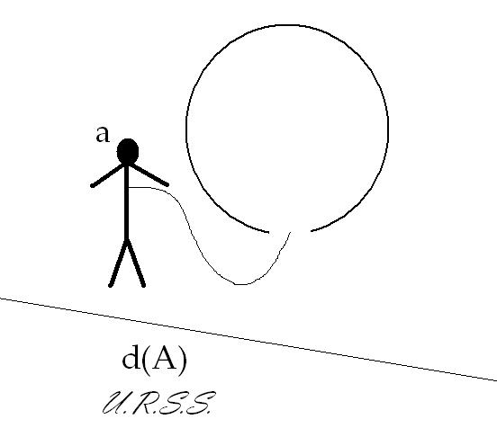

# Leçon 13 | 24 Mars l965

  <label><input type="checkbox" data-lacan-toggle="original" checked> 原文</label>
  <label><input type="checkbox" data-lacan-toggle="notes" checked> 注释</label>
  <label><input type="checkbox" data-lacan-toggle="commentary" checked> 个人解读评论</label>

<section class="parallel-paragraph" data-paragraph-ids="s12-13-0001">

s12-13-0001

[无对应译文]

原文 · s12-13-0001

[OURY](#OURY) [VALABREGA](#VALABREGA2403) [IRAGARAY](#IRAGARAY2403) [Paul LEMOINE](#PaulLEMOINE2403) [DIAMANTIS](#DIAMENTIS)

</section>

<section class="parallel-paragraph" data-paragraph-ids="s12-13-0002">

s12-13-0002

[无对应译文]

原文 · s12-13-0002

[Gennie LEMOINE](#GennieLEMOINE) [MARKOVITCH](#FrancineMARKOVITCH2403) [MONDZAIN](#MONDZAIN2403) [MAJOR](#MAJOR2403)

</section>

<section class="parallel-paragraph" data-paragraph-ids="s12-13-0003">

s12-13-0003

[无对应译文]

原文 · s12-13-0003

LACAN

</section>

<section class="parallel-paragraph" data-paragraph-ids="s12-13-0004">

s12-13-0004

[无对应译文]

原文 · s12-13-0004

Arriverons-nous avant la fin de cette année à trouver quelque règle, quelque style ? Le temps est court assurément.

</section>

<section class="parallel-paragraph" data-paragraph-ids="s12-13-0005">

s12-13-0005

[无对应译文]

原文 · s12-13-0005

Nous avons eu déjà deux séminaires fermés au cours desquels vous avez eu des communications. Qui est-ce qui n’est pas d’accord ?

</section>

<section class="parallel-paragraph" data-paragraph-ids="s12-13-0006">

s12-13-0006

[无对应译文]

原文 · s12-13-0006

Ce sont bien des communications, c’est le nom que mérite ce que vous avez entendu. Vous avez pu prendre des notes et les choses ont été disposées en principe pour que vous puissiez vous procurer ces textes. Ceux qui ont eu de la chance, qui sont venus au bon moment, ont pu en effet les avoir.

</section>

<section class="parallel-paragraph" data-paragraph-ids="s12-13-0007">

s12-13-0007

[无对应译文]

原文 · s12-13-0007

Comme j’ai eu l’imprudence de dire que pour ceux qui prendraient le texte de LECLAIRE, j’attendais de ceux-là une collaboration, ce qui probablement dans l’esprit de mes auditeurs, impliquait que ceux qui prenant le texte, n’apporteraient *aucune* contribution, seraient - *comme on dit à l’école où il semble que nous soyons encore -* « *repérés* ». Il en résulte que j’ai appris avec étonnement *que certains* *n’ont pas pris le texte* de LECLAIRE pour n’avoir pas ensuite à encourir le reproche de n’y avoir pas répondu. On apprend à tout âge.

</section>

<section class="parallel-paragraph" data-paragraph-ids="s12-13-0008">

s12-13-0008

[无对应译文]

原文 · s12-13-0008

Il faut croire qu’il peut rester des coins de *naïveté*, chez quelqu’un qui pourrait se croire lui-même chargé d’expérience.

</section>

<section class="parallel-paragraph" data-paragraph-ids="s12-13-0009">

s12-13-0009

[无对应译文]

原文 · s12-13-0009

Heureusement je ne suis pas, là-dessus, trop naïf.

</section>

<section class="parallel-paragraph" data-paragraph-ids="s12-13-0010">

s12-13-0010

[无对应译文]

原文 · s12-13-0010

Bien... Alors maintenant nous nous trouvons devant la nécessité de rappeler que ce que nous faisons ici, c’est une chose à laquelle j’ai donné ce caractère fermé, non pas que nous puissions espérer donner la ligne et le champ de ce qui doit s’opérer ailleurs, c’est-à-dire la mise au point analytique des conséquences de la recherche que je fais devant vous cette année, et qui se trouve cette année *par exemple*, pouvoir s’intituler « *ontologie subjective* ».

</section>

<section class="parallel-paragraph" data-paragraph-ids="s12-13-0011">

s12-13-0011

[无对应译文]

原文 · s12-13-0011

Le terme « *subjective* » étant à prendre ici au sens d’un qualificatif ou d’un prédicat objectif, ça ne veut pas dire que c’est l’ontologie qui est subjective. L’ontologie du sujet - et quelle est l’ontologie du sujet, à partir du moment où il y a l’inconscient ? - ceci, bien sûr, j’essaie de vous en tracer cette année la ligne, ça a des conséquences au niveau de, pas tellement la critique comme on dit, mais de la responsabilité du psychanalyste.

</section>

<section class="parallel-paragraph" data-paragraph-ids="s12-13-0012">

s12-13-0012

[无对应译文]

原文 · s12-13-0012

Terme assez difficile à évoquer dans un contexte de société psychanalytique. Ce que cela comporte en effet à ce niveau, ceci doit être construit, articulé ailleurs, et il n’est pas facile de réunir un collège où les choses puissent être posées à ce niveau, ici, en marge de ce que je poursuis cette année comme leçon devant vous, de donner un *certain échantillonnage*, donc il y aura toujours un certain arbitraire dans le choix de ce qui appuie la ligne, que nous essayons de serrer ici à son niveau de fondement nécessaire, de ce qui l’appuie, venant de divers domaines : vous l’avez vu illustré par ce que nous avons extrait de la théorie des nombres.

</section>

<section class="parallel-paragraph" data-paragraph-ids="s12-13-0013">

s12-13-0013

[无对应译文]

原文 · s12-13-0013

Échantillonnage aussi de ce qui peut intéresser l’analyste dans un travail d’articulation concrète à propos d’un cas, travail d’articulation essentiellement animé par notre ligne de recherche, et c’est ce qui aujourd’hui va être mis à l’épreuve d’un certain nombre de réponses dont nous aurons à qualifier la pertinence.

</section>

<section class="parallel-paragraph" data-paragraph-ids="s12-13-0014">

s12-13-0014

[无对应译文]

原文 · s12-13-0014

Je n’en dirai, pour aujourd’hui pas plus, donc, avançant dans l’expérience, nous allons voir ce que ça va rendre. Je ne voudrais tout de même pas vous laisser sans pointer en son temps, car tout de même, nous ne pouvons pas laisser passer cet événement, la valeur d’image que doit prendre pour nous l’exploit de cette semaine, celui qui s’est passé, à quelques cent soixante quinze, et plus, kilomètres dans l’espace, et qui - je l’ai dit - à nos yeux, prend valeur d’image.

</section>

<section class="parallel-paragraph" data-paragraph-ids="s12-13-0015">

s12-13-0015

[无对应译文]

原文 · s12-13-0015

Je ne le commen­terai pas aujourd’hui car ça nous emmènerait trop loin. Je vous prie simplement de rêver à la valeur que peut prendre notre *major* de l’espace, le nommé LEONOV, par rapport à ce que - *dans cette ontologie du sujet* - représente justement ce en quoi l’homme peut être proprement cette chose, éjectée et reliée à la fois, qu’est *l’objet(a)*. Auquel cas - aujourd’hui je suis un petit peu maladroit pour dessiner les choses, mais c’est quand même pas très difficile :

</section>

<section class="parallel-paragraph" data-paragraph-ids="s12-13-0016">

s12-13-0016

[无对应译文]

原文 · s12-13-0016

> 

</section>

<section class="parallel-paragraph" data-paragraph-ids="s12-13-0017">

s12-13-0017

[无对应译文]

原文 · s12-13-0017

Voici notre *major* et voilà *l’objet(a)*, la capsule ce serait le S, et alors où est le désir, sinon au niveau du grand Autre : U.R.S.S. ?

</section>

<section class="parallel-paragraph" data-paragraph-ids="s12-13-0018">

s12-13-0018

[无对应译文]

原文 · s12-13-0018

Je suis heureux que ça vous fasse rire, parce que cet exploit, l’un des plus sensationnels tout de même, qu’on puisse mettre à l’actif des hommes[^97], cet exploit a incontestablement une face de *gag* qui tient profondément à ce qu’il est effectivement la structure dernière du fantasme comme telle réalisée. On peut la trouver, bien sûr, dans d’autres registres, mais on peut dire que ce n’est pas non plus sans portée que nous l’ayons là sous sa forme la plus parfaitement désexualisée.

</section>

<section class="parallel-paragraph" data-paragraph-ids="s12-13-0019">

s12-13-0019

[无对应译文]

原文 · s12-13-0019

Vous savez que ce n’est pas à ce propos que j’ai introduit quelques réflexions sur le cosmonaute, puisque ceux qui écoutent bien mon cours peuvent se souvenir, qu’à propos du syllogisme classique sur le « *Socrate est mortel* », j’ai essayé d’en faire un autre à côté - caricatural - sur GAGARINE. \[Cf. supra, séance du 16-12\] Ça n’était certainement pas à la pointe de la visée de ce qui trouve ici, non pas à s’articuler - j’y reviendrai - mais à s’esquisser.

</section>

<section class="parallel-paragraph" data-paragraph-ids="s12-13-0020">

s12-13-0020

[无对应译文]

原文 · s12-13-0020

Je ne crois pas, en le disant aujourd’hui, d’ailleurs être complètement en dehors de *notre champ* : ce qu’il en est de la position subjective, à savoir si elle est entièrement réductible logiquement, ou si cette position subjective, en tant qu’elle intéresse le sujet de l’inconscient, nous devons en pointer la considération du côté d’un reste, à savoir justement cet *objet(a)*.

</section>

<section class="parallel-paragraph" data-paragraph-ids="s12-13-0021">

s12-13-0021

[无对应译文]

原文 · s12-13-0021

C’est bien entre ces deux termes que va se suspendre, si la chose se poursuit rigoureusement, la question qui peut être posée à propos de la formule littérale - presque graphique - la formule littérale décantée par l’opération de l’alambic de LECLAIRE.

</section>

<section class="parallel-paragraph" data-paragraph-ids="s12-13-0022">

s12-13-0022

[无对应译文]

原文 · s12-13-0022

Je vais maintenant demander, qui sont les personnes pré­sentes parmi celles sur lesquelles nous comptons. J’énumère :

</section>

<section class="parallel-paragraph" data-paragraph-ids="s12-13-0023">

s12-13-0023

[无对应译文]

原文 · s12-13-0023

- VALABREGA est là,

</section>

<section class="parallel-paragraph" data-paragraph-ids="s12-13-0024">

s12-13-0024

[无对应译文]

原文 · s12-13-0024

- IRIGARAY, LEMOINE sont là,

</section>

<section class="parallel-paragraph" data-paragraph-ids="s12-13-0025">

s12-13-0025

[无对应译文]

原文 · s12-13-0025

- je sais qu’OURY est là,

</section>

<section class="parallel-paragraph" data-paragraph-ids="s12-13-0026">

s12-13-0026

[无对应译文]

原文 · s12-13-0026

- KOTSONIS-DIAMANTIS est là, merci bien,

</section>

<section class="parallel-paragraph" data-paragraph-ids="s12-13-0027">

s12-13-0027

[无对应译文]

原文 · s12-13-0027

- Jennie LEMOINE est là,

</section>

<section class="parallel-paragraph" data-paragraph-ids="s12-13-0028">

s12-13-0028

[无对应译文]

原文 · s12-13-0028

- Francine MARKOVITCH est là,

</section>

<section class="parallel-paragraph" data-paragraph-ids="s12-13-0029">

s12-13-0029

[无对应译文]

原文 · s12-13-0029

- Mademoiselle MONDZAIN est là,

</section>

<section class="parallel-paragraph" data-paragraph-ids="s12-13-0030">

s12-13-0030

[无对应译文]

原文 · s12-13-0030

- et MAJOR.

</section>

<section class="parallel-paragraph" data-paragraph-ids="s12-13-0031">

s12-13-0031

[无对应译文]

原文 · s12-13-0031

Serge LECLAIRE

</section>

<section class="parallel-paragraph" data-paragraph-ids="s12-13-0032">

s12-13-0032

[无对应译文]

原文 · s12-13-0032

Je vais proposer d’engager la discussion sur ce texte, peut–être par des considérations qu’arbitrairement je qualifierai de théoriques.

</section>

<section class="parallel-paragraph" data-paragraph-ids="s12-13-0033">

s12-13-0033

[无对应译文]

原文 · s12-13-0033

Il se trouve d’ailleurs que celles d’OURY et de VALABREGA portent précisément sur la question du fantasme.

</section>

<section class="parallel-paragraph" data-paragraph-ids="s12-13-0034">

s12-13-0034

[无对应译文]

原文 · s12-13-0034

Alors peut-être qu’OURY pourrait commencer.

</section>

<section class="parallel-paragraph" data-paragraph-ids="s12-13-0035">

s12-13-0035

[无对应译文]

原文 · s12-13-0035

</section>

<section class="parallel-paragraph" data-paragraph-ids="s12-13-0036">

s12-13-0036

[无对应译文]

原文 · s12-13-0036

[Jean OURY](#Mars_24)

</section>

<section class="parallel-paragraph" data-paragraph-ids="s12-13-0037">

s12-13-0037

[无对应译文]

原文 · s12-13-0037

Je suis très ennuyé de n’avoir que douze minutes, parce que j’ai un texte qui, en le disant vite, ferait à peu près trente minutes.

</section>

<section class="parallel-paragraph" data-paragraph-ids="s12-13-0038">

s12-13-0038

[无对应译文]

原文 · s12-13-0038

Alors, je vais certainement sauter beaucoup de choses qui pourraient être importantes. Enfin, peut–être dans *la discussion*, on pourra en réintroduire. L’exposé de LECLAIRE la dernière fois, m’a certainement inspiré sur un mode un peu *poétique* : j’ai écrit *un petit exergue* qui pourra se développer après.

</section>

<section class="parallel-paragraph" data-paragraph-ids="s12-13-0039">

s12-13-0039

[无对应译文]

原文 · s12-13-0039

Admettons que le « *POOR (d) J’e-LI* » est une *gestalt* *phonématique* qui s’est organisée à partir du nom propre du sujet, c’est démontré dans le texte, ou plus exactement autour de son *prénom* et du *nom du père*, figure éclatée, morcelée, qui est réajustée selon les lois d’un processus primaire, profération au moment d’*évanescence* du sujet, cri d’une *jouissance primitive*, cristallisée, qui s’inscrit pour indiquer le chemin quasi inaccessible.

</section>

<section class="parallel-paragraph" data-paragraph-ids="s12-13-0040">

s12-13-0040

[无对应译文]

原文 · s12-13-0040

Je reprends, sous une autre formulation peut-être, ce que disait LECLAIRE :

</section>

<section class="parallel-paragraph" data-paragraph-ids="s12-13-0041">

s12-13-0041

[无对应译文]

原文 · s12-13-0041

- sorte de *Holzweg* du signifiant le plus intime,

</section>

<section class="parallel-paragraph" data-paragraph-ids="s12-13-0042">

s12-13-0042

[无对应译文]

原文 · s12-13-0042

- panneau d’interdiction pour la phénoménologie de la signification,

</section>

<section class="parallel-paragraph" data-paragraph-ids="s12-13-0043">

s12-13-0043

[无对应译文]

原文 · s12-13-0043

- entrée dans un domaine du non-sens,

</section>

<section class="parallel-paragraph" data-paragraph-ids="s12-13-0044">

s12-13-0044

[无对应译文]

原文 · s12-13-0044

- prémisse de l’inconscient,

</section>

<section class="parallel-paragraph" data-paragraph-ids="s12-13-0045">

s12-13-0045

[无对应译文]

原文 · s12-13-0045

- dimension vectorielle d’un point d’origine plus ou moins mythique, ce point de voyance hors du champ reflété-reflétant, d’où l’on peut voir surgir l’essence de l’image.

</section>

<section class="parallel-paragraph" data-paragraph-ids="s12-13-0046">

s12-13-0046

[无对应译文]

原文 · s12-13-0046

Là ou le « *Wo es war* » concrétise *l’historial du sujet parlant*. Avant de formuler, quelques critiques à propos de l’exposé de LECLAIRE, je voudrais indiquer à titre d’hypothèse - mais à titre d’hypothèse seulement - la fonction possible de cette genèse, de cette *Gestalt phonénatique* « *POOR (d) J’e-LI* » - c’est là que je vais être obligé de réduire au maximum parce que je faisais un survol très rapide et partiel d’une littérature neurologique pour essayer de voir quels en étaient les facteurs.

</section>

<section class="parallel-paragraph" data-paragraph-ids="s12-13-0047">

s12-13-0047

[无对应译文]

原文 · s12-13-0047

Je signalais que j’emploie cette expression de *Gestalt phonématique* un petit peu dans un sens qui se rapproche de celui donné par CONRAD, le neurologue, lorsque il reprend l’étude gestaltiste de l’aphasie, à partir de GOLSTEIN etc. Et je signale que CONRAD distinguait dans la genèse de la *Gestalt*, une *Vorgestalt* ou *pré-gestalt* et une *gestalt* finale… je passe tout ça… et je pense que cette *gestalt* « *POOR (d) J’e-LI* » se rapprocherait bien plus de ce que Conrad STEIN appelle une *pré-gestalt*.

</section>

<section class="parallel-paragraph" data-paragraph-ids="s12-13-0048">

s12-13-0048

[无对应译文]

原文 · s12-13-0048

Un autre aspect de cette *pré-gestalt*, quelle que soit même cette *pré–gestalt* « *POOR (d) J’e-LI* », ça peut nous évoquer aussi une autre conception qui est la conception de GUILLAUME à propos de la « *période du mot-phrase non différencié* ». Jaculation secrète accompagnée d’une sorte de *culbute*, comme le dit LECLAIRE, ce « *POOR (d) J’e-LI* » serait une sorte de *mot-phrase* privilégié contenant en soi l’origine de tous les développements syntaxiques ultérieurs.

</section>

<section class="parallel-paragraph" data-paragraph-ids="s12-13-0049">

s12-13-0049

[无对应译文]

原文 · s12-13-0049

Mais arrêtons–nous encore un petit instant pour indiquer que cette *pré-gestalt phonématique* peut se situer d’une façon très marginale dans ce que LURIA et LUDOVIC décrivent sous le nom de *langage* *sympraxique* . Dans l’article sur *Le mutisme et les silences de l’enfant* [^98] les auteurs commentant l’analyse faite par ZAZZO des conceptions de LURIA définissent le langage sympraxique comme se différenciant du « …*langage réel par le fait qu’il ne se dégage pas de la réalité et de l’action, il est confondu dans l’activité immédiate. Il n’est qu’une façon de souligner le geste, la mimique ou l’action*. » Ils le distinguent du langage planificateur et du langage informateur… Je passe.

</section>

<section class="parallel-paragraph" data-paragraph-ids="s12-13-0050">

s12-13-0050

[无对应译文]

原文 · s12-13-0050

Cependant, même si nous rappelons l’articulation possible de ces conceptions avec des notions telles que le « schème moteur » ou les développements théoriques de SCHILDER, nous pourrions citer aussi ce que dit OMBRÉDANNE, qui est intéressant au sujet de la genèse du langage de l’enfant. Mais tout ceci ne nous semble pas cerner d’une façon très précise le problème et il semble bien plus important, bien plus urgent et bien plus proche de notre sujet de nous référer à *une étude* d’André THOMAS, étude très précise. Cette étude dont je ne fais qu’indiquer la référence, parue dans un article de la *Presse médicale* de *février* l960 s’intitule

</section>

<section class="parallel-paragraph" data-paragraph-ids="s12-13-0051">

s12-13-0051

[无对应译文]

原文 · s12-13-0051

*La caresse auditive au nourrisson - le prénom et le pseudonyme*

</section>

<section class="parallel-paragraph" data-paragraph-ids="s12-13-0052">

s12-13-0052

[无对应译文]

原文 · s12-13-0052

Des les premiers jours de l’enfance, l’enfant est exquisément sensible à son nom, et cette sensibilité spécifique semble quelque chose de très particulier et simplement autre que le phénomène décrit par exemple par MYKLEBUST à propos des premiers sons auxquels répond l’enfant : ceux qui reproduisent ses propres lallations provoquant, dit-il, l’arrêt des gazouillis.

</section>

<section class="parallel-paragraph" data-paragraph-ids="s12-13-0053">

s12-13-0053

[无对应译文]

原文 · s12-13-0053

Enfin rappelons ici les données fondamentales qu’articule JAKOBSON dans une communication ancienne de Septembre l939 [^99] sur *Les lois phoniques du langage enfantin et leur place dans la phonologie générale* : il dit qu’on ne peut expliquer le tri des sons lors du passage du babil au langage, au sens propre du mot, que par le fait de ce passage même, c’est-à-dire par la valeur phonématique qu’acquiert le son. Plus loin : la richesse phonétique du gazouillis cède la place à une restriction phonologique.

</section>

<section class="parallel-paragraph" data-paragraph-ids="s12-13-0054">

s12-13-0054

[无对应译文]

原文 · s12-13-0054

Donc, avant même ce que j’appelle là, la réduction phonologique qui inaugure l’organisation de *la parole*, dès l’époque du *gazouillis*, du *babil*, avant que le langage se détermine en système clos, il se crée une polyvalence phonématique potentielle, une surabondance phonétique, dans laquelle l’enfant s’individualise suivant un schéma qui lui est personnel.

</section>

<section class="parallel-paragraph" data-paragraph-ids="s12-13-0055">

s12-13-0055

[无对应译文]

原文 · s12-13-0055

N’y aurait-il pas, dès cette époque - et c’est là l’hypothèse que je formule - la mise en place d’une sorte de grille personnelle, un système de crible phonologique, dans le sens employé par TROUBETZKOY que je ne cite pas[^100]. Ces cribles phonologiques seraient comme la *clé*, dans le sens d’une clé de l’écriture musicale, qui permettrait de déchiffrer l’articulation du sujet avec le signifiant et ses semblables.

</section>

<section class="parallel-paragraph" data-paragraph-ids="s12-13-0056">

s12-13-0056

[无对应译文]

原文 · s12-13-0056

Or cette clé ne serait-elle pas justement proche de cette *gestalt phonématique* dont nous parlions précédemment ?

</section>

<section class="parallel-paragraph" data-paragraph-ids="s12-13-0057">

s12-13-0057

[无对应译文]

原文 · s12-13-0057

Cette *gestalt* fonctionnerait un peu comme un système de résonateur découpant dans le langage ambiant des « *formes* », des significations, pour pouvoir s’organiser dans un message, transité par le crible personnel.

</section>

<section class="parallel-paragraph" data-paragraph-ids="s12-13-0058">

s12-13-0058

[无对应译文]

原文 · s12-13-0058

C’est le problème analogue, à celui que nous citions, du rapport existant entre les langues étrangères et la langue maternelle, mais aussi *sur le plan pathologique*, on peut rapprocher ces phénomènes de celui des illusions verbales ou encore des *délires d’auto-référence*.

</section>

<section class="parallel-paragraph" data-paragraph-ids="s12-13-0059">

s12-13-0059

[无对应译文]

原文 · s12-13-0059

Mais il semble que c’est aussi le mode de fonctionnement du système préconscient dans lequel s’organisent les *WortVorstellungen*.

</section>

<section class="parallel-paragraph" data-paragraph-ids="s12-13-0060">

s12-13-0060

[无对应译文]

原文 · s12-13-0060

À ce sujet, je pense qu’il serait intéressant de rappeler très rapidement quelques citations de LACAN, dans le séminaire du l0 janvier I962 il dit : « *Ce qui nous intéresse dans le préconscient, c’est le langage, tel qu’il est effectivement quand on entend parler. Il scande, articule nos pensées.*

</section>

<section class="parallel-paragraph" data-paragraph-ids="s12-13-0061">

s12-13-0061

[无对应译文]

原文 · s12-13-0061

*Dans l’inconscient structuré comme un langage… mais il n’est pas facile de le faire s’exprimer dans un langage commun. Le langage articulé du discours commun par rapport au sujet de l’inconscient, il est au dehors : un au-dehors qui conjoint en lui ce que nous appelons nos pensées intimes : ce langage qui court au dehors et pas de façon immatérielle - kilos de langage, disques, etc. - ce discours est entièrement homogénéisable comme quelque chose qui se tient* *au dehors. Le langage court les rues et là il y a effectivement une inscription : le problème de ce qui se passe quand l’inconscient vient à s’y faire entendre* *est le problème de la limite entre cet inconscient et le préconscient.* »

</section>

<section class="parallel-paragraph" data-paragraph-ids="s12-13-0062">

s12-13-0062

[无对应译文]

原文 · s12-13-0062

Et encore : « *Si nous devons considérer l’inconscient : c’est ce lieu du sujet, où quelque chose, à l’insu du sujet est profondément remanié par les effets de rétroaction du signifiant impliqué dans la parole. C’est pour autant et pour la moindre de ces paroles,que le sujet parle, qu’il ne peut faire que toujours une fois de plus se nommer sans le savoir, sans savoir par quel nom.* »

</section>

<section class="parallel-paragraph" data-paragraph-ids="s12-13-0063">

s12-13-0063

[无对应译文]

原文 · s12-13-0063

Et enfin : « *Le statut de l’inconscient s’est constitué à un niveau plus radical, l’émergence de l’acte d’énonciation.* »

</section>

<section class="parallel-paragraph" data-paragraph-ids="s12-13-0064">

s12-13-0064

[无对应译文]

原文 · s12-13-0064

C’est un simple rappel et nous pouvons supposer que cette *gestalt* « *POOR (d) J’e-LI* » est très proche du point d’émergence ou d’évanescence du sujet… » Un sujet, par exemple qui sort d’un comma répond à l’appel de son nom bien avant qu’il puisse s’éveiller au bruit d’une phrase quelconque. Argument supplémentaire pour signifier que cette gestalt indique le sujet parlant.

</section>

<section class="parallel-paragraph" data-paragraph-ids="s12-13-0065">

s12-13-0065

[无对应译文]

原文 · s12-13-0065

C’est ici, par cette face, par ce point, que le fantasme peut être repéré, et c’est là que j’en arrive à cette critique de LECLAIRE, mais ce point de repère n’est point le fantasme, c’est là une reproche que je pourrai faire à LECLAIRE d’avoir assimilé son « *POOR (d) J’e-LI* » à un fantasme. Fondamentalement, le fantasme est bien plus d’essence scopique. Bien sûr, nous pouvons citer FREUD qui dans la lettre à FLIESS du 25 mai l897[^101] émet l’hypothèse que : « *Les fantasmes se produisent par une combinaison inconsciente des choses vécues, et des choses entendues, suivant certaines tendances.* »

</section>

<section class="parallel-paragraph" data-paragraph-ids="s12-13-0066">

s12-13-0066

[无对应译文]

原文 · s12-13-0066

Mais le problème reste entier. La saisie phénoménologique du fantasme pose le problème de « *l’imagification* » du fantasme.

</section>

<section class="parallel-paragraph" data-paragraph-ids="s12-13-0067">

s12-13-0067

[无对应译文]

原文 · s12-13-0067

Mais ce problème implique la mise en équation d’un certain cadre symbolique. Il me semble qu’en toute rigueur, cette gestalt phonématique sonore, indique le point d’où l’on peut voir surgir l’« *image* » privilégiée d’un fantasme fondamental.

</section>

<section class="parallel-paragraph" data-paragraph-ids="s12-13-0068">

s12-13-0068

[无对应译文]

原文 · s12-13-0068

Cri conjuratoire et d’ouverture, marquant la mise en jeu du grand Autre. Ainsi posé, il me semble que nous pouvons mieux articuler ce que dit LECLAIRE, en évitant le risque de tomber dans une joute spéculaire avec le patient, risque qui peut résulter d’une recherche obsessionnalo-esthétique d’une clé fondamentale du problème qui est posé par la relation analytique.

</section>

<section class="parallel-paragraph" data-paragraph-ids="s12-13-0069">

s12-13-0069

[无对应译文]

原文 · s12-13-0069

Il semble qu’il y ait là en effet… la recherche d’une assurance qui loin d’être un au-delà de l’angoisse vers le lieu mythique de la jouissance de l’Autre(grand Autre) n’en est qu’un évitement, avec une retombée vers une aliénation possible du désir du sujet analysé dans le désir de l’analyste.

</section>

<section class="parallel-paragraph" data-paragraph-ids="s12-13-0070">

s12-13-0070

[无对应译文]

原文 · s12-13-0070

Nous pouvons formuler ça autrement. Ce qui semble être ici en question c’est la problématique du *phallus* dans la relation analytique : le chemin qui mène vers l’unarité du sujet, signifié par le *Nom du Père*, passe par la *Spaltung*, le *splitting* qui est phénoménologiquement l’« *apparaître* » du *phallus* dans la démarche de « *significantisation* ».

</section>

<section class="parallel-paragraph" data-paragraph-ids="s12-13-0071">

s12-13-0071

[无对应译文]

原文 · s12-13-0071

Là je fais une référence à une note de LACAN de ce même séminaire du l0 Janvier l962, qui après un développement mathématique, d’une fonction périodique \[i+1 → (i+1)/2 → 1\], commente : « *La première chose que nous rencontrons est ceci : c’est que le rapport essentiel de ce quelque chose que nous recherchons comme étant le sujet avant qu’il se nomme, si l’usage qu’il peut faire de son nom pour être le signifiant de ce qui est signifié de la question, de l’addition de lui–même à son propre nom, c’est de le splitter, de le diviser en deux.* »

</section>

<section class="parallel-paragraph" data-paragraph-ids="s12-13-0072">

s12-13-0072

[无对应译文]

原文 · s12-13-0072

D’autre part la *gestalt phonématique* par son essence de l’ordre du A, du grand Autre, est ce qui est le point d’ambiguïté : c’est-à-dire pour soi-même et pour les autres. La venue au jour dans la relation analytique de ce point d’ambiguïté mérite en effet d’être cernée d’une façon particulièrement précise : il a quelque chose à voir avec le point de « *réversion* », point d’articulation entre *l’imaginaire et le symbolique*.

</section>

<section class="parallel-paragraph" data-paragraph-ids="s12-13-0073">

s12-13-0073

[无对应译文]

原文 · s12-13-0073

J’ai essayé de réduire au maximum mon exposé.

</section>

<section class="parallel-paragraph" data-paragraph-ids="s12-13-0074">

s12-13-0074

[无对应译文]

原文 · s12-13-0074

LACAN

</section>

<section class="parallel-paragraph" data-paragraph-ids="s12-13-0075">

s12-13-0075

[无对应译文]

原文 · s12-13-0075

Merci de l’avoir fait. Ce que vous avez fait de plus long, nous verrons ce que nous allons en faire.

</section>

<section class="parallel-paragraph" data-paragraph-ids="s12-13-0076">

s12-13-0076

[无对应译文]

原文 · s12-13-0076

LECLAIRE

</section>

<section class="parallel-paragraph" data-paragraph-ids="s12-13-0077">

s12-13-0077

[无对应译文]

原文 · s12-13-0077

Dans le choix que nous avons de répondre immédiatement en détail à chaque intervention d’une part, ou d’autre part, d’en souligner un point, quitte à le laisser en suspens et donner la parole à d’autres, j’ai choisi la seconde formule, parce que je ne pense pas qu’il soit opportun, ni que moi, ni que LACAN reprenions - pour commencer - la parole. Je pense qu’il convient que ceux qui se sont exprimés par écrit le fassent aujourd’hui devant tous. Le point particulier que je voudrais souligner et qui, à moi me fait problème, est la prévalence de l’élément scopique que OURY avance comme constitutive du fantasme.

</section>

<section class="parallel-paragraph" data-paragraph-ids="s12-13-0078">

s12-13-0078

[无对应译文]

原文 · s12-13-0078

Sans doute, c’est ce qui est communément évoqué lorsque l’on parle de fantasme mais je me demande si, analytiquement parlant, nous n’avons pas précisément à distinguer les formes de fantasme selon la nature de l’objet, objet au sens lacanien, c’est-à-dire *objet(a),* impliqué dans le fantasme.

</section>

<section class="parallel-paragraph" data-paragraph-ids="s12-13-0079">

s12-13-0079

[无对应译文]

原文 · s12-13-0079

Autrement dit, s’il s’agit d’un objet de la sphère scopique, de la sphère visuelle, d’accord, mais dans l’exemple choisi par moi, il s’agit d’un objet d’une autre nature qui est précisément un objet du domaine de la voix, de la sphère, disons *vocale* et *acoustique*.

</section>

<section class="parallel-paragraph" data-paragraph-ids="s12-13-0080">

s12-13-0080

[无对应译文]

原文 · s12-13-0080

Je ne sais pas s’il convient nécessairement de réduire cet objet à une dimension scopique. Je laisse la question ouverte car je pense qu’il y aurait lieu, là, de discuter.

</section>

<section class="parallel-paragraph" data-paragraph-ids="s12-13-0081">

s12-13-0081

[无对应译文]

原文 · s12-13-0081

Sur la question du fantasme, est-ce que VALABREGA, qui avait une question terminologique à préciser, veut prendre la parole ?

</section>

<section class="parallel-paragraph" data-paragraph-ids="s12-13-0082">

s12-13-0082

[无对应译文]

原文 · s12-13-0082

[Jean-Paul VALABREGA](#Mars_24)

</section>

<section class="parallel-paragraph" data-paragraph-ids="s12-13-0083">

s12-13-0083

[无对应译文]

原文 · s12-13-0083

Ce que j’avais à dire rejoint un des points soulevés tout de suite par OURY. C’était une remarque très brève, à laquelle je ne donne qu’une portée terminologique et que les remarques terminologiques peuvent naturellement avoir, car je tiens à dire à Serge LECLAIRE que dans l’ensemble, j’ai trouvé son exposé extrêmement satisfaisant.

</section>

<section class="parallel-paragraph" data-paragraph-ids="s12-13-0084">

s12-13-0084

[无对应译文]

原文 · s12-13-0084

Je reviens, comme OURY l’a fait sur la formule « *POOR (d) J’e-LI* » dont LECLAIRE a fait - comme OURY nous l’a dit - un fantasme, et même un *fantasme fondamental*, l’*Urphantasie*. C’est sur ce point que porte la remarque que je veux faire.

</section>

<section class="parallel-paragraph" data-paragraph-ids="s12-13-0085">

s12-13-0085

[无对应译文]

原文 · s12-13-0085

Une formule de ce genre peut-elle être considérée comme un fantasme ? Je ne le pense pas. Je pense que la formule contient les éléments de base ou les éléments signifiants du *fantasme fondamental*. Seulement, l’un ne se réduit pas à l’autre.

</section>

<section class="parallel-paragraph" data-paragraph-ids="s12-13-0086">

s12-13-0086

[无对应译文]

原文 · s12-13-0086

Sur le contenu scopique, sur la forme scopique dont on vient de parler, je ne serai pas pleinement d’accord avec ce qu’a dit OURY mais plutôt je me rangerai à l’indication que vient de donner LECLAIRE. Moi, je dirai ce qui peut mettre d’accord les tenants de la scopie - si je puis dire - et les tenants des distinctions nécessaires à faire au niveau des pulsions dans la constitution du *fantasme fondamental*, je définirai le fantasme comme une histoire qu’on raconte, ou plus exactement une histoire qui est racontée, qui se trouve racontée, ce qui n’implique rien quant à savoir qui la raconte, où elle est racontée, et pour qui elle est racontée.

</section>

<section class="parallel-paragraph" data-paragraph-ids="s12-13-0087">

s12-13-0087

[无对应译文]

原文 · s12-13-0087

La seule chose est que l’histoire racontée peut se référer à un contenu scopique ou à un autre. Ce que je verrais d’essentiel dans le fantasme dit *fondamental*, dans l’*Urphantasie*, c’est que - selon moi du moins - il débouche nécessairement sur un mythe.

</section>

<section class="parallel-paragraph" data-paragraph-ids="s12-13-0088">

s12-13-0088

[无对应译文]

原文 · s12-13-0088

C’est d’ailleurs pourquoi en psychanalyse, on ne peut pas faire autrement que de passer perpétuellement du signifié au signifiant par la signification et dans tous les sens de ce passage. Cette définition de l’analyse s’applique évidemment à la découverte du fantasme et du *fantasme fondamental*.

</section>

<section class="parallel-paragraph" data-paragraph-ids="s12-13-0089">

s12-13-0089

[无对应译文]

原文 · s12-13-0089

J’ajoute un petit point : ce qui me paraîtrait intéressant de demander à LECLAIRE comme complément à son exposé, c’est ceci : quelles sont dans son cas les conditions cliniques d’obtention de la dite formule ? Sur ce que j’ai dit de l’analyse qui passait du *signifié* au *signifiant* par la *signification*, on ne peut que le dire, d’ailleurs, ce n’est pas une critique, il n’y en a aucune dans ce que j’ai dit là, c’est : qu’est-ce qu’a fait LECLAIRE dans son exposé ?

</section>

<section class="parallel-paragraph" data-paragraph-ids="s12-13-0090">

s12-13-0090

[无对应译文]

原文 · s12-13-0090

Ce qui - une dernière fois - réduit la portée de ma remarque à une question de distinction de termes.

</section>

<section class="parallel-paragraph" data-paragraph-ids="s12-13-0091">

s12-13-0091

[无对应译文]

原文 · s12-13-0091

LECLAIRE

</section>

<section class="parallel-paragraph" data-paragraph-ids="s12-13-0092">

s12-13-0092

[无对应译文]

原文 · s12-13-0092

J’aurais du mal à répondre en peu de mots à la question des conditions cliniques d’obtention de cette formule. Elle vient, elle surgit, elle est livrée. D’ailleurs cette formule est un exemple type. Mais ce sur quoi je voudrais m’arrêter un tout petit instant, c’est sur la question du fantasme telle que l’argumente VALABREGA.

</section>

<section class="parallel-paragraph" data-paragraph-ids="s12-13-0093">

s12-13-0093

[无对应译文]

原文 · s12-13-0093

Il dit que pour lui, est fantasme quelque chose comme l’argument impersonnel d’une histoire. D’accord. La critique porte peut–être, à propos de cette formule, mais elle ne porte pas tout à fait, car cette formule semble quand même représenter pour le sujet, l’ébauche - si mince soit-elle - d’une histoire et non seulement d’une histoire, d’une sorte d’action. Lorsque j’évoquais le geste de la culbute, enfin l’accomplissement même somatique, qui accompagne la formule ou qui réalise la formule, je pense qu’il se produit quelque chose du niveau de l’accomplissement sommaire du modèle d’une histoire.

</section>

<section class="parallel-paragraph" data-paragraph-ids="s12-13-0094">

s12-13-0094

[无对应译文]

原文 · s12-13-0094

Je reviendrai peut-être d’une façon plus précise là-dessus tout à l’heure s’il en reste le temps.

</section>

<section class="parallel-paragraph" data-paragraph-ids="s12-13-0095">

s12-13-0095

[无对应译文]

原文 · s12-13-0095

Je voudrais maintenant demander à Mme IRIGARAY de communiquer ses remarques car il me semble qu’elles se rapportent… qu’elles peuvent compléter, d’une part, celles qu’a faites OURY sur la question du *prénom* ou la question de la sensibilité au *prénom* et peut-être aussi, d’autre part, parce qu’elle reprend le problème du corps dans le cas de cette observation.

</section>

<section class="parallel-paragraph" data-paragraph-ids="s12-13-0096">

s12-13-0096

[无对应译文]

原文 · s12-13-0096

[Luce IRAGARAY](#Mars_24)

</section>

<section class="parallel-paragraph" data-paragraph-ids="s12-13-0097">

s12-13-0097

[无对应译文]

原文 · s12-13-0097

À propos du séminaire de LECLAIRE, je voudrais faire trois remarques sur des choses assez différentes.

</section>

<section class="parallel-paragraph" data-paragraph-ids="s12-13-0098">

s12-13-0098

[无对应译文]

原文 · s12-13-0098

*La première remarque* a trait à la différence qui existe entre *le prénom* et *le patronyme*, différence qui – à mon avis – n’avait pas été assez notée par LECLAIRE. Quand LECLAIRE parle du nom propre, il donne comme exemple George Philippe ELHYANI, et quand LACAN en a parlé d’ailleurs, il a donné comme exemple Jacques LACAN.

</section>

<section class="parallel-paragraph" data-paragraph-ids="s12-13-0099">

s12-13-0099

[无对应译文]

原文 · s12-13-0099

Or il me semble qu’entre ELHYANI et LACAN d’une part, *Jacques* et *George-Philippe* de l’autre, il existe des différences importantes.

</section>

<section class="parallel-paragraph" data-paragraph-ids="s12-13-0100">

s12-13-0100

[无对应译文]

原文 · s12-13-0100

LACAN et ELHYANI ne sont pas des noms propres. En tant que LACAN ou ELHYANI, le sujet n’est que l’élément d’un groupe, et l’on pourrait invoquer à ce propos ce qu’une lignée exige de ceux qui portent son nom, au mépris de la singularité de chacun.

</section>

<section class="parallel-paragraph" data-paragraph-ids="s12-13-0101">

s12-13-0101

[无对应译文]

原文 · s12-13-0101

Georges-Philippe, Jacques, situent le sujet dans cette lignée. Ils sont en quelque sorte, l’image sonore du sujet. Ils rendent compte de la singularité du sujet, du moins à l’intérieur du groupe ELHYANI ou LACAN, mais ils en rendent compte surtout au niveau imaginaire ce qui n’exclut pas déjà, évidemment la présence du symbolique.

</section>

<section class="parallel-paragraph" data-paragraph-ids="s12-13-0102">

s12-13-0102

[无对应译文]

原文 · s12-13-0102

On peut noter à ce propos que l’enfant jeune est toujours appelé par son seul prénom spécialement par sa mère. Par ailleurs, si un autre dans la lignée, et particulièrement le père, s’appelle Georges-Philippe ou Jacques, se pose un problème crucial pour le sujet.

</section>

<section class="parallel-paragraph" data-paragraph-ids="s12-13-0103">

s12-13-0103

[无对应译文]

原文 · s12-13-0103

Et l’homonymie du prénom, spécialement entre père et fils ou mère et fille est souvent, me semble-t-il, un handicap pour le devenir du sujet. Évidemment quand le sujet sort du groupe ELHYANI ou LACAN, il ne peut se signifier qu’en tant que Georges-philippe ELHYANI ou Jacques LACAN parce qu’il rencontre alors d’autres Georges Philippe ou Jacques.

</section>

<section class="parallel-paragraph" data-paragraph-ids="s12-13-0104">

s12-13-0104

[无对应译文]

原文 · s12-13-0104

On peut noter que cela se situe *grosso-modo* au moment de la scolarité, moment clé pour la pose de l’Œdipe et l’accès au symbolique.

</section>

<section class="parallel-paragraph" data-paragraph-ids="s12-13-0105">

s12-13-0105

[无对应译文]

原文 · s12-13-0105

À ce Georges-Philippe ou Jacques primordiaux et plus imaginaires, s’ajoutent alors le ELHYANI, le LACAN qui vont situer le sujet dans la société où il entre alors vraiment, la famille étant finalement plus une autre mère qu’une vraie société.

</section>

<section class="parallel-paragraph" data-paragraph-ids="s12-13-0106">

s12-13-0106

[无对应译文]

原文 · s12-13-0106

Le nom propre est donc conjonction d’une image sonore, d’une marque symbolique.

</section>

<section class="parallel-paragraph" data-paragraph-ids="s12-13-0107">

s12-13-0107

[无对应译文]

原文 · s12-13-0107

Mais il reste toujours, me semble-t-il, une différence, notamment au niveau de l’identification, entre les Georges-Philippe, ou les Jacques ou les ELHYANI et LACAN. Par exemple, le sujet ne réagit pas de la même façon à la mort d’un Georges-Philippe et à la mort d’un ELHYANI .

</section>

<section class="parallel-paragraph" data-paragraph-ids="s12-13-0108">

s12-13-0108

[无对应译文]

原文 · s12-13-0108

Alors, *deuxième remarque* : quand LECLAIRE parle du masque vide de l’inconscient, j’aimerais bien qu’il explique ce qu’il veut dire, parce qu’en fait, son texte ne paraît pas considérer l’inconscient comme vide. D’ailleurs, il me semble que si les analystes considèrent l’inconscient comme vide, ils sont beaucoup plus proches de Claude LÉVI-STRAUSS qu’ils ne le disent.

</section>

<section class="parallel-paragraph" data-paragraph-ids="s12-13-0109">

s12-13-0109

[无对应译文]

原文 · s12-13-0109

Si l’inconscient est vide, il se manifeste seulement par des chaînes de comportement, ce mot étant entendu dans un sens très large, et non par des contenus imagés ou phonématiques.

</section>

<section class="parallel-paragraph" data-paragraph-ids="s12-13-0110">

s12-13-0110

[无对应译文]

原文 · s12-13-0110

Ce problème d’un inconscient plein ou vide paraît tout à fait fondamental, et si les analystes peuvent si difficilement parler de l’inconscient n’est-ce pas justement qu’il est avant tout une *structure* repérable par opposition, ou du moins par comparaison, avec d’autres inconscients, structure à la fois semblable et différente de tel ou tel sujet ?

</section>

<section class="parallel-paragraph" data-paragraph-ids="s12-13-0111">

s12-13-0111

[无对应译文]

原文 · s12-13-0111

*Troisième remarque* : si l’inconscient naît de la rencontre de l’organique et du signifiant, pourquoi LECLAIRE invoque-t-il des expériences de différence exquise, des mouvements de culbute, des attitudes de réversion qui se situent, il me semble, à un niveau proprement corporel ?

</section>

<section class="parallel-paragraph" data-paragraph-ids="s12-13-0112">

s12-13-0112

[无对应译文]

原文 · s12-13-0112

LECLAIRE veut-il dire par là que le comportement corporel du nourrisson est d’ores et déjà organisé de façon parallèle à celui du signifiant ? Mais n’est-ce pas supprimer alors ce problème de l’insertion du signifiant dans l’organisme, drame dont va naître l’inconscient.

</section>

<section class="parallel-paragraph" data-paragraph-ids="s12-13-0113">

s12-13-0113

[无对应译文]

原文 · s12-13-0113

Il me semble que l’originalité de l’organique n’est pas assez préservée, à moins que ce que LECLAIRE suggère c’est qu’il s’agisse là d’*une espèce de fort-da* que le sujet essaie sur lui-même pour maîtriser justement cette rencontre primordiale entre l’organique et le signifiant. Mais touche-t-il alors au niveau inconscient le plus archaïque, puisqu’il y a déjà maîtrise ?

</section>

<section class="parallel-paragraph" data-paragraph-ids="s12-13-0114">

s12-13-0114

[无对应译文]

原文 · s12-13-0114

LECLAIRE

</section>

<section class="parallel-paragraph" data-paragraph-ids="s12-13-0115">

s12-13-0115

[无对应译文]

原文 · s12-13-0115

Plusieurs questions sont posées. Trois au moins.

</section>

<section class="parallel-paragraph" data-paragraph-ids="s12-13-0116">

s12-13-0116

[无对应译文]

原文 · s12-13-0116

À la première, je ne saurais que laisser toute sa valeur à - j’allais dire aux *arguments cliniques* qui sont avancés concernant la valeur privilégié du prénom. La question que je poserai à ce niveau-là, lorsque Madame IRIGARAY dit que les prénoms rendent compte de la singularité de chacun, mais qu’ils en rendent compte surtout au niveau imaginaire, je pense qu’une question est posée en un point particulièrement sensible, car bien sûr, là, il resterait à préciser avec plus de rigueur ce que l’on entend justement par ce niveau imaginaire et à quoi il est opposé, bien entendu au symbolique mais comment et en quoi précisément dans ce cas, au niveau du primaire ?

</section>

<section class="parallel-paragraph" data-paragraph-ids="s12-13-0117">

s12-13-0117

[无对应译文]

原文 · s12-13-0117

Sur la question de cette expression de masque vide et du vide en particulier, je crois que cela soulève, ou que cela active toute la série des fantasmes qui nous sont familiers, et si je puis dire, qui se rapportent à l’opposition du plein et du vide.

</section>

<section class="parallel-paragraph" data-paragraph-ids="s12-13-0118">

s12-13-0118

[无对应译文]

原文 · s12-13-0118

Le mot n’est peut-être pas très heureux que j’ai choisi, mais c’est cette image de masque qui m’avait accroché pour des raisons qu’il faudrait sans doute que je reprenne.

</section>

<section class="parallel-paragraph" data-paragraph-ids="s12-13-0119">

s12-13-0119

[无对应译文]

原文 · s12-13-0119

Le terme de vide est employé là, dans un sens précis, à savoir *ou il n’y a pas de sens tout prêt, ou il n’y a pas de signification toute faite*, qui est le contraire d’un plein ou d’un trop-plein de sens. Si « vide » a, à propos du masque de l’inconscient ou du masque vide de l’inconscient, un sens, c’est dans cette direction que je souhaite qu’on l’entende.

</section>

<section class="parallel-paragraph" data-paragraph-ids="s12-13-0120">

s12-13-0120

[无对应译文]

原文 · s12-13-0120

Quant à la question de l’implication du corps, la question de la rencontre de l’organique et du signifiant, c’est là ce que je considère comme une question cruciale, et s’il m’est donné un tout petit peu de temps à la fin de cette discussion, je pense pouvoir reprendre d’une façon précise ce que j’ai à dire là dessus, justement à propos de ce que je soulignais déjà tout à l’heure, dans la valeur, on pourrait presque dire animatrice sur le plan musculaire, de cette formule « *POOR (d) J’e-LI* » car il me semble, *je vous le dis* *tout de suite*, ça n’aurait pas beaucoup de sens pour vous, que cette formule est déjà, d’une certaine façon quelque chose comme un mime de signifiant. J’y reviendrai tout à l’heure, je vous redis : si nous en avons le temps.

</section>

<section class="parallel-paragraph" data-paragraph-ids="s12-13-0121">

s12-13-0121

[无对应译文]

原文 · s12-13-0121

LACAN

</section>

<section class="parallel-paragraph" data-paragraph-ids="s12-13-0122">

s12-13-0122

[无对应译文]

原文 · s12-13-0122

Je voudrais seulement faire une petite remarque concernant cette question du prénom. Je mettrai la prochaine fois au tableau l’indication en allemand d’un ouvrage sur la psychologie des prénoms par une nommée Rosa KATZ[^102], si mon souvenir est bon.

</section>

<section class="parallel-paragraph" data-paragraph-ids="s12-13-0123">

s12-13-0123

[无对应译文]

原文 · s12-13-0123

Je crois que tout de même sur ce sujet, l’essentiel a été dit par Luce IRIGARAY : l’essentiel dans la distinction du prénom et du nom de famille, c’est que le prénom est donné par les parents, alors que le nom de famille est transmis.

</section>

<section class="parallel-paragraph" data-paragraph-ids="s12-13-0124">

s12-13-0124

[无对应译文]

原文 · s12-13-0124

C’est beaucoup plus important que le côté classificatoire qui oppose la généricité du nom de famille à la singularité du prénom.

</section>

<section class="parallel-paragraph" data-paragraph-ids="s12-13-0125">

s12-13-0125

[无对应译文]

原文 · s12-13-0125

Ça ne constitue nullement une singularité, un prénom. Tout au plus, l’essentiel, c’est qu’il traduit quelque chose qui accompagne la naissance de l’enfant et qui vient nettement des parents. L’enfant a déjà sa place déterminée, choisie dans l’univers du langage, du prénom, des illustrations à la fois les plus superficielles… Serge LECLAIRE

</section>

<section class="parallel-paragraph" data-paragraph-ids="s12-13-0126">

s12-13-0126

[无对应译文]

原文 · s12-13-0126

LEMOINE, avec qui nous terminerions, si je puis dire, cette première partie, très arbitrairement découpée, des remarques disons théoriques, ou des commentaires de nature théorique.

</section>

<section class="parallel-paragraph" data-paragraph-ids="s12-13-0127">

s12-13-0127

[无对应译文]

原文 · s12-13-0127

[Paul LEMOINE](#Mars_24)

</section>

<section class="parallel-paragraph" data-paragraph-ids="s12-13-0128">

s12-13-0128

[无对应译文]

原文 · s12-13-0128

Je n’ai pas l’impression que ce que je vais dire est théorique car ce que j’ai dit m’était suggéré plutôt par quelques réflexions que je me suis faites après avoir entendu le brillant exposé que LECLAIRE nous avait fait au dernier séminaire fermé.

</section>

<section class="parallel-paragraph" data-paragraph-ids="s12-13-0129">

s12-13-0129

[无对应译文]

原文 · s12-13-0129

Ce que j’ai à dire porte sur deux points. D’une part sur le fait que LECLAIRE n’a pas du tout fait allusion à la dernière phrase du rêve, qui me semble à moi essentielle, car cette phrase était justement un appel à lui, et faisait de ce rêve un rêve de transfert.

</section>

<section class="parallel-paragraph" data-paragraph-ids="s12-13-0130">

s12-13-0130

[无对应译文]

原文 · s12-13-0130

En effet, que dit la dernière phrase ?

</section>

<section class="parallel-paragraph" data-paragraph-ids="s12-13-0131">

s12-13-0131

[无对应译文]

原文 · s12-13-0131

«* Nous nous dirigeons tous les trois vers une clairière que l’on devine en contrebas.* »

</section>

<section class="parallel-paragraph" data-paragraph-ids="s12-13-0132">

s12-13-0132

[无对应译文]

原文 · s12-13-0132

Eh bien, pour moi, la clairière est claire. Il s’agit justement du nom de LECLAIRE qui est invoqué en quelque sorte par le patient et donc ceci est déjà un appel au nom. Or il y a un second appel au nom, et un autre nom, qui est le *Nom du père* et qui est indiqué par la licorne, car qu’est-ce que la licorne ?

</section>

<section class="parallel-paragraph" data-paragraph-ids="s12-13-0133">

s12-13-0133

[无对应译文]

原文 · s12-13-0133

C’est *un animal fabuleux qui ne trouve son apaisement*, et LECLAIRE nous le dit dans son article écrit en l960 dans *Les Temps Modernes,* que s’il repose dans le giron d’une vierge. Or, c’est là justement le problème du tabou de la virginité et il faut remarquer d’ailleurs que cette vierge c’est peut-être la mère. Mais il n’y est fait nulle part allusion dans ce rêve, cette vierge c’est la mère de Philippe.

</section>

<section class="parallel-paragraph" data-paragraph-ids="s12-13-0134">

s12-13-0134

[无对应译文]

原文 · s12-13-0134

Or la mère de Philippe, c’est celle qui répond au désir du père. Si le père a épousé une vierge, une mère vierge, le nom de Philippe, l’identité de Philippe \[...\] à ce moment-là incontestée.

</section>

<section class="parallel-paragraph" data-paragraph-ids="s12-13-0135">

s12-13-0135

[无对应译文]

原文 · s12-13-0135

Mais Justement, Philippe est un obsessionnel. Et le *désir de sa mère* est justement ce qui fait question. C’est la raison pour laquelle Philippe a les plus grands doutes sur lui-même et sur son identité, et c’est la raison pour laquelle aussi, il est entré en analyse.

</section>

<section class="parallel-paragraph" data-paragraph-ids="s12-13-0136">

s12-13-0136

[无对应译文]

原文 · s12-13-0136

C’est pourquoi ce parallélisme entre le nom de l’analyste qui se trouve, lui, hors-circuit, et d’ailleurs, je demanderai à LECLAIRE, comme je le lui ai écrit, s’il n’y a pas là *un contre-transfert*, enfin *un excès de contre-transfert*, si justement il n’a pas jusqu’au bout refusé de s’expliquer, en n’écoutant pas d’une oreille aussi attentive que le début du texte du rêve, cette derniers phrase qui lui était adressée.

</section>

<section class="parallel-paragraph" data-paragraph-ids="s12-13-0137">

s12-13-0137

[无对应译文]

原文 · s12-13-0137

De toute façon cette dernière phrase vise le nom de l’analyste d’une part, et d’autre part, le *Nom du père*.

</section>

<section class="parallel-paragraph" data-paragraph-ids="s12-13-0138">

s12-13-0138

[无对应译文]

原文 · s12-13-0138

Et alors là je voudrais toucher à ce que l’on a appelé ici le corps, tout à l’heure, c’est-à-dire à l’angoisse du patient.

</section>

<section class="parallel-paragraph" data-paragraph-ids="s12-13-0139">

s12-13-0139

[无对应译文]

原文 · s12-13-0139

Je crois que ceci est essentiel si, en effet, le patient parle de *Lili*, et si tout est dévié en quelque sorte, vers la *Lili* de *Licorne*, et si tout ce qui a trait à la corne se trouve caché et rassemblé en quelque sorte dans un animal fabuleux, c’est parce que, il y a du côté de *Lili* finalement, un équi­valent de la relation à la mère, mais un équivalent déplacé, c’est-à-dire beaucoup moins angoissant.

</section>

<section class="parallel-paragraph" data-paragraph-ids="s12-13-0140">

s12-13-0140

[无对应译文]

原文 · s12-13-0140

De même, l’évocation du nom de l’analyste est beaucoup moins chargée d’angoisse que ne le serait l’évocation du père.

</section>

<section class="parallel-paragraph" data-paragraph-ids="s12-13-0141">

s12-13-0141

[无对应译文]

原文 · s12-13-0141

Et c’est pourquoi le père est masqué dans ce rêve, ou condensé si l’on veut, dans l’image et c’est pourquoi l’analyste est au contraire beaucoup plus apparent puisqu’il s’agit d’une *clairière*.

</section>

<section class="parallel-paragraph" data-paragraph-ids="s12-13-0142">

s12-13-0142

[无对应译文]

原文 · s12-13-0142

Ceci m’amène à parler de la formule de « *POOR (d) J’e-LI* ». On a dit tout à l’heure - et je suis d’accord avec cela – que c’est une réversion : il y a une sorte de symétrie en quelque sorte, entre les deux éléments de cette formule. Il y a en effet d’un côté Georges, et de l’autre côté Lili, et au milieu, le petit qui est la flèche du désir dont LACAN nous a appris à nous servir.

</section>

<section class="parallel-paragraph" data-paragraph-ids="s12-13-0143">

s12-13-0143

[无对应译文]

原文 · s12-13-0143

Je veux dire par là que cette symétrie est une fausse symétrie, et c’est une fausse symétrie parce que Georges se retrouve au bout du compte avec Lili, c’est-à-dire que Lili lui a... enfin avec Lili il a compris, il a tenu en main, *il a signifié*, en quelque sorte vécu son désir.

</section>

<section class="parallel-paragraph" data-paragraph-ids="s12-13-0144">

s12-13-0144

[无对应译文]

原文 · s12-13-0144

Et c’est cette espèce de traversée par le désir qui modifie la formule « *POOR (d) J’e-LI* », réversion que nous trouvons d’ailleurs aussi dans la formule symétrique « *Lili j’ai soif* » - « *Philippe j’ai soif* ».

</section>

<section class="parallel-paragraph" data-paragraph-ids="s12-13-0145">

s12-13-0145

[无对应译文]

原文 · s12-13-0145

Il semble que cette sorte de réversion, c’est-à-dire ce retour sur soi-même et cette façon de se retourner sur soi-même perpétuellement, soit évidemment *le problème fondamental*, *l’attitude fondamentale* de Philippe. Mais alors, à quoi sert cette formule ?

</section>

<section class="parallel-paragraph" data-paragraph-ids="s12-13-0146">

s12-13-0146

[无对应译文]

原文 · s12-13-0146

Elle sert à combler un manque dans la chaîne signifiante, elle sert par sa singularité… et je crois qu’il y a une différence avec l’image que l’on rencontre très fréquemment et très facilement dans de nombreuses analyses : que ce soit par exemple une tour qui regarde avec deux yeux, ou que ce soit un typhon qui brusquement se retourne vers la bouche d’une patiente ou que ce soit un guignol aussi qui devient brusquement un sexe dressé, eh bien toutes ces images là on les retrouve, à un tournant essentiel d’une analyse et chaque fois qu’il y a une angoisse à combler.

</section>

<section class="parallel-paragraph" data-paragraph-ids="s12-13-0147">

s12-13-0147

[无对应译文]

原文 · s12-13-0147

Cette formule « *POOR (d) J’e-LI* » est une formule beaucoup plus archaïque - d’ailleurs cela a été dit déjà - et c’est une formule qui permet peut-être d’aller plus loin dans l’analyse du sujet et qui permet au sujet finalement de faire quoi ?

</section>

<section class="parallel-paragraph" data-paragraph-ids="s12-13-0148">

s12-13-0148

[无对应译文]

原文 · s12-13-0148

De se récupérer lorsqu’il se trouve - de par l’angoisse - arrêté dans le cours de ses associations et dans le cours de sa vie.

</section>

<section class="parallel-paragraph" data-paragraph-ids="s12-13-0149">

s12-13-0149

[无对应译文]

原文 · s12-13-0149

Car ce qu’il faut bien dire c’est que l’angoisse est éprouvée corporellement, que c’est ça le problème, et que ce que fait l’analyse ce n’est pas autre chose, justement que de mettre en route *la chaîne signifiante*, et ainsi de modifier ce qui se trouve incarné, en quelque sorte, par le sujet. D’ailleurs l’analyse est–ce que ce n’est pas, justement au bout du compte, une réincarnation du signifiant. Est-ce que, au dernier terme, elle ne guérit pas le sujet en lui permettant de se réincarner dans son langage ?

</section>

<section class="parallel-paragraph" data-paragraph-ids="s12-13-0150">

s12-13-0150

[无对应译文]

原文 · s12-13-0150

LECLAIRE

</section>

<section class="parallel-paragraph" data-paragraph-ids="s12-13-0151">

s12-13-0151

[无对应译文]

原文 · s12-13-0151

LEMOINE avait raison et je m’excuse de l’avoir classé dans la première catégorie. Je dois dire, puisque nous sommes déjà dans la seconde série d’arguments, à savoir des arguments cliniques, que sur ce point-là, je laisserai à *chaque témoignage* sa valeur d’association, car je ne pense pas - bien que nous soyons en séminaire, disons, fermé - que nous puissions entrer dans la dimension d’une discussion de cas, voire même de l’analyse d’un contre-transfert. Non pas que ce soit quelque chose d’exclus, mais je crois que nous n’en aurions pas tout à fait le loisir et la possibilité ici. Ce qui vient en écho à un texte analytique est en soi, je pense, suffisamment *éloquent*.

</section>

<section class="parallel-paragraph" data-paragraph-ids="s12-13-0152">

s12-13-0152

[无对应译文]

原文 · s12-13-0152

Je voudrais maintenant donner la parole à Mme KOTSONIS-DIAMANTIS qui je crois, justement, va nous présenter une très brève observation d’*autre chose*.

</section>

<section class="parallel-paragraph" data-paragraph-ids="s12-13-0153">

s12-13-0153

[无对应译文]

原文 · s12-13-0153

[Irène KOTSONIS-DIAMANTIS](#Mars_24)

</section>

<section class="parallel-paragraph" data-paragraph-ids="s12-13-0154">

s12-13-0154

[无对应译文]

原文 · s12-13-0154

Dans un article tel que celui que LECLAIRE nous a proposé, il semble bien qu’à propos de ces groupes de mots, il se proposait de nous montrer comment à travers une chaîne de signifiants, nous apparaissait l’inconscient. Je dis bien « *il me semble* », car si notre propre *expérience* ne nous faisait rencontrer de telles notions, nous serions condamnés à le croire sur parole.

</section>

<section class="parallel-paragraph" data-paragraph-ids="s12-13-0155">

s12-13-0155

[无对应译文]

原文 · s12-13-0155

Il semble en effet, qu’au niveau d’une théorisation, d’une explicitation, d’une référence à un tiers - celui qui n’est ni l’analyste ni l’analysé - à celui-là, ces notions paraîtraient comme *arbitraires*. C’est pour dire que, si temporairement, nous acceptons de le croire sur parole, ce n’est que par le détour de notre propre expérience que nous serons amenés à nous en convaincre plus sûrement.

</section>

<section class="parallel-paragraph" data-paragraph-ids="s12-13-0156">

s12-13-0156

[无对应译文]

原文 · s12-13-0156

La relation analyste-analysé étant une relation à deux, le troisième - celui qui écoute, l’auditeur - n’y a pas eu « voie d’accès ».

</section>

<section class="parallel-paragraph" data-paragraph-ids="s12-13-0157">

s12-13-0157

[无对应译文]

原文 · s12-13-0157

Je rapporterai ici un exemple de réponse, entre l’analyste et son patient, là ou le dialogue s’engage entre deux inconscients et où la référence à un tiers devient malaisée. Au cours d’une thérapie, un enfant me dit *subitement* :

</section>

<section class="parallel-paragraph" data-paragraph-ids="s12-13-0158">

s12-13-0158

[无对应译文]

原文 · s12-13-0158

> « *Où est l’orange, où est l’orange ?* »

</section>

<section class="parallel-paragraph" data-paragraph-ids="s12-13-0159">

s12-13-0159

[无对应译文]

原文 · s12-13-0159

Et comme je me demandais intérieurement ce que pouvait bien signifier cette orange, j’écrivis un *lapsus* qui me renseignait sinon sur cette signification, du moins sur mes propres fantasmes : j’écrivis « *Où est l’organe ?* ».

</section>

<section class="parallel-paragraph" data-paragraph-ids="s12-13-0160">

s12-13-0160

[无对应译文]

原文 · s12-13-0160

Je voudrais maintenant rapporter une histoire que j’entendis rapporter devant moi par des personnes connaissant les intéressés, peu de temps après la communication de LECLAIRE. Cette histoire, je l’entendis hors de tout *champ psychanalytique*, et s’il y eut une intention *psychanalytique* ce fut par mon écoute qu’elle s’exerça.

</section>

<section class="parallel-paragraph" data-paragraph-ids="s12-13-0161">

s12-13-0161

[无对应译文]

原文 · s12-13-0161

C’est par cette ouverture spéciale qui avait été amenée par la communication de LECLAIRE en particulier, et par l’enseignement de LACAN en général, auxquels me renvoyait l’histoire que j’entendis, et que j’intitulais « *l’histoire de Norbert* ». Il s’agit d’un couple.

</section>

<section class="parallel-paragraph" data-paragraph-ids="s12-13-0162">

s12-13-0162

[无对应译文]

原文 · s12-13-0162

Le mari a 25 ans, c’est un médecin promis à un brillant avenir qui se destine à être accoucheur. Ils ont une fille de deux ans.

</section>

<section class="parallel-paragraph" data-paragraph-ids="s12-13-0163">

s12-13-0163

[无对应译文]

原文 · s12-13-0163

La mère, fixée elle-même à sa propre mère, est assez indifférente à l’enfant. Par contre, le père éprouve une véritable passion pour sa fille. Le père passe l’internat, qu’il rate ce jour-là parce que sa petite fille avait avalé une broche et qu’il était *bouleversé*.

</section>

<section class="parallel-paragraph" data-paragraph-ids="s12-13-0164">

s12-13-0164

[无对应译文]

原文 · s12-13-0164

Il renonce et s’engage dans la marine pour faire son service militaire. Là-bas, bien qu’excellent plongeur, il se tue en allant se fracasser le crâne sur une plaque de ciment. L’enfant a alors deux ans.

</section>

<section class="parallel-paragraph" data-paragraph-ids="s12-13-0165">

s12-13-0165

[无对应译文]

原文 · s12-13-0165

Nous retrouvons la veuve vingt ans plus tard avec sa fille alors âgée de 22 ans. Cette veuve se remarie avec un homme qu’elle n’aime pas. Sa fille se marie immédiatement avec un homme qu’elle n’aime pas, non plus. Cet homme porte le même nom de famille qu’elle, et en plus, a pour prénom Bernard, alors que son propre père s’appelait Norbert.

</section>

<section class="parallel-paragraph" data-paragraph-ids="s12-13-0166">

s12-13-0166

[无对应译文]

原文 · s12-13-0166

Le ménage marche mal. La jeune femme ne supporte pas sa belle famille et décide Bernard, son mari, à aller vivre dans une île.

</section>

<section class="parallel-paragraph" data-paragraph-ids="s12-13-0167">

s12-13-0167

[无对应译文]

原文 · s12-13-0167

Là-bas, alors que Bernard conduisait, a lieu un accident de voiture qui défigure la jeune femme. Celle-ci retrouve un visage à peu près normal - mais autre - après plusieurs interventions chirurgicales. Peu de temps après, ils ont un fils qu’on prénomme Norbert. Cet enfant est l’objet d’une grande passion de la part de sa mère. Quant au père, il se sent rejeté de ce couple mère-fils.

</section>

<section class="parallel-paragraph" data-paragraph-ids="s12-13-0168">

s12-13-0168

[无对应译文]

原文 · s12-13-0168

La mère a constamment peur que Norbert avale des produits nocifs dont le père, agriculteur, se sert, et en particulier de l’insecticide. Un jour le père emmena son fils aux champs où il avait à faire. Il renversa de l’insecticide dans un récipient puis s’en alla travailler un peu plus loin, l’enfant jouant autour. Lorsqu’il revint il constata que le niveau du bol avait baissé, du moins il le soupçonna, pensa à son fils, mais ne s’y arrêta pas.

</section>

<section class="parallel-paragraph" data-paragraph-ids="s12-13-0169">

s12-13-0169

[无对应译文]

原文 · s12-13-0169

Une heure plus tard, l’enfant fut pris de malaise et le temps que le père le transporte à l’hôpital, mourait.

</section>

<section class="parallel-paragraph" data-paragraph-ids="s12-13-0170">

s12-13-0170

[无对应译文]

原文 · s12-13-0170

Par le biais de cette histoire je me retrouvais revenir à ce dont LECLAIRE nous avait parlé, et cela me montrait ici, un peu de ce qu’il avait montré en ce qui concerne l’apparition des rapports de fantasme avec le nom du sujet, et à fortiori - dans l’histoire de Norbert - avec le nom du père. Par quel biais le retrouvons-nous ici ?

</section>

<section class="parallel-paragraph" data-paragraph-ids="s12-13-0171">

s12-13-0171

[无对应译文]

原文 · s12-13-0171

Nous avons vu une jeune femme qui perd son père lorsqu’elle est âgée de deux ans, qui grandit seule avec sa mère et qui prend un mari et sûrement un phallus en même temps qu’elle. Son choix est le suivant : M. X, qui porte le même nom de famille que le père de la jeune femme, donc le même nom de famille que la jeune femme. Elle épousa Bernard et elle avait perdu « Norbert ». En fait, Bernard, en tant qu’agriculteur assez fruste, se trouve être exactement le contraire de Norbert, médecin promis à un brillant avenir.

</section>

<section class="parallel-paragraph" data-paragraph-ids="s12-13-0172">

s12-13-0172

[无对应译文]

原文 · s12-13-0172

Cette inver­sion syllabique entre les deux prénoms semble bien là nous révéler le fantasme le plus inconscient, le plus secret de cette jeune femme.

</section>

<section class="parallel-paragraph" data-paragraph-ids="s12-13-0173">

s12-13-0173

[无对应译文]

原文 · s12-13-0173

Peut-être Bernard n’est-il que l’image virtuelle, renversée, de Norbert tant désiré mais absent, ou plutôt, combien présent.

</section>

<section class="parallel-paragraph" data-paragraph-ids="s12-13-0174">

s12-13-0174

[无对应译文]

原文 · s12-13-0174

Comment cette femme va-t-elle pouvoir accommoder cette image virtuelle par rapport à l’image bien réelle de Norbert son père ?

</section>

<section class="parallel-paragraph" data-paragraph-ids="s12-13-0175">

s12-13-0175

[无对应译文]

原文 · s12-13-0175

En fait tout se passe comme si Bernard avait pour mission d’annuler Norbert. Par qui est-il investi de cette mission ? En réponse à sa femme peut-être, mais bien plus sûrement par Norbert lui–même en tant que celui se manifeste au travers du désir de l’autre.

</section>

<section class="parallel-paragraph" data-paragraph-ids="s12-13-0176">

s12-13-0176

[无对应译文]

原文 · s12-13-0176

Qu’est Bernard pour cette femme ? Ne serait-il pas l’antidote, le contrepoison, celui qui annulera Norbert ? Le premier parricide que la jeune femme va commettre va être de se marier à Bernard. À partir de là, il semble que c’est Bernard lui–même qui s’en chargera. D’abord en détruisant la marque, l’empreinte de Norbert dans le visage de sa femme. Ensuite en tuant *s*on fils : le Norbert ressuscité pour deux ans, et avec - on ne peut mieux choisir - de l’insecticide.

</section>

<section class="parallel-paragraph" data-paragraph-ids="s12-13-0177">

s12-13-0177

[无对应译文]

原文 · s12-13-0177

Il est d’autres éléments qu’il y aurait lieu d’approfondir ici. Par exemple les références à la mère que nous retrouvons constamment. Norbert voulant être accoucheur, faisant son service militaire dans la marine, se tuant en mer, le couple allant vivre dans une île.

</section>

<section class="parallel-paragraph" data-paragraph-ids="s12-13-0178">

s12-13-0178

[无对应译文]

原文 · s12-13-0178

Mais ni l’exemple, qui est une histoire racontée, pour laquelle nous ne disposons pas d’analyse, ni mon expérience actuelle, ne me permettent d’aller plus loin que les quelques éléments que je viens de donner.

</section>

<section class="parallel-paragraph" data-paragraph-ids="s12-13-0179">

s12-13-0179

[无对应译文]

原文 · s12-13-0179

LECLAIRE

</section>

<section class="parallel-paragraph" data-paragraph-ids="s12-13-0180">

s12-13-0180

[无对应译文]

原文 · s12-13-0180

Peu de choses à ajouter à *cette extraordinaire histoire*… \[à Lacan\] : Vous aviez commencé à noter « *histoire de Norbert* » ?

</section>

<section class="parallel-paragraph" data-paragraph-ids="s12-13-0181">

s12-13-0181

[无对应译文]

原文 · s12-13-0181

LACAN

</section>

<section class="parallel-paragraph" data-paragraph-ids="s12-13-0182">

s12-13-0182

[无对应译文]

原文 · s12-13-0182

J’ai voulu qu’on mémorise. Ça vaut la peine. C’est une histoire qui n’a pas été analysée et qui ne peut être analysée.

</section>

<section class="parallel-paragraph" data-paragraph-ids="s12-13-0183">

s12-13-0183

[无对应译文]

原文 · s12-13-0183

Mais le nom de Norbert n’avait pas été entendu. J’ai voulu qu’on l’écrive.

</section>

<section class="parallel-paragraph" data-paragraph-ids="s12-13-0184">

s12-13-0184

[无对应译文]

原文 · s12-13-0184

LECLAIRE

</section>

<section class="parallel-paragraph" data-paragraph-ids="s12-13-0185">

s12-13-0185

[无对应译文]

原文 · s12-13-0185

J’ai encore beaucoup de communications. Mme LEMOINE. C’est à propos du rêve à la licorne.

</section>

<section class="parallel-paragraph" data-paragraph-ids="s12-13-0186">

s12-13-0186

[无对应译文]

原文 · s12-13-0186

[Gennie LEMOINE](#Mars_24)

</section>

<section class="parallel-paragraph" data-paragraph-ids="s12-13-0187">

s12-13-0187

[无对应译文]

原文 · s12-13-0187

Je ne suis pas analyste, ni médecin. Ça ne se verra, du reste, je crois, que trop. Mais j’ai été invitée à vous communiquer mes réflexions toutes intuitives. Alors les voici.

</section>

<section class="parallel-paragraph" data-paragraph-ids="s12-13-0188">

s12-13-0188

[无对应译文]

原文 · s12-13-0188

« *On pourrait aller plus loin* » a dit Serge LECLAIRE en fin d’exposé. Eh bien non, on ne peut pas !

</section>

<section class="parallel-paragraph" data-paragraph-ids="s12-13-0189">

s12-13-0189

[无对应译文]

原文 · s12-13-0189

Il a beau nous proposer une nouvelle variation sur le thème : « *or* » renversé et qui donnerait « *rose* » comme la cicatrice ou le sexe inversé ou la rose inversée de la femme, mais la chaîne signifiante ni le chiffre de « *POOR (d) J’e-LI* », ni surtout le rêve lui-même ne sont des thèmes ou des textes susceptibles de variations à l’infini.

</section>

<section class="parallel-paragraph" data-paragraph-ids="s12-13-0190">

s12-13-0190

[无对应译文]

原文 · s12-13-0190

Donc pour aller plus loin, il nous faudrait être l’analyste lui-même et avoir devant nous l’analysé, c’est-à-dire poursuivre l’analyse.

</section>

<section class="parallel-paragraph" data-paragraph-ids="s12-13-0191">

s12-13-0191

[无对应译文]

原文 · s12-13-0191

Enfin il nous faudrait connaître le nom véritable du patient, ce nom d’ELHYANI - fils du seigneur en hébreu, je crois - mais je ne connais pas l’hébreu, a été vraisemblablement avancé pour les besoins de la cause. Nous verrions alors - *si nous le connaissions* - ce nom de famille jouer en fonction de LECLAIRE, la clairière du rêve.

</section>

<section class="parallel-paragraph" data-paragraph-ids="s12-13-0192">

s12-13-0192

[无对应译文]

原文 · s12-13-0192

Mais nous n’avons ni l’homme, ni son nom, faute de quoi nous ne pouvons que rêver en effet, ou pire conclure. Par exemple, au complexe de castration. Mais l’analyse, est, semble-t-il le contraire d’un diagnostic, fût-il rendu concurremment par le patient lui-même. La simple prise de conscience est peu opérante. Mais Serge LECLAIRE dit aussi, et dès le début, que le nom propre est lié au plus secret du fantasme inconscient, et c’est de cette phrase que je voudrais repartir.

</section>

<section class="parallel-paragraph" data-paragraph-ids="s12-13-0193">

s12-13-0193

[无对应译文]

原文 · s12-13-0193

Reprenons un peu l’histoire du rêve. Philippe a soif. Il réussit à tromper, mais non évidemment à satisfaire la soif, en apaisant en rêve d’autres soifs, échos préconscients d’un manque fondamental inconscient. Ainsi le rêve est comme une chambre d’écho. Dans un contexte de vie quotidienne, au contraire, quand il arrive à Philippe de dire : « *Lili, j’ai soif* » il exprime au moins *deux désirs*, il a besoin de boire et il aime Lili. Le plus important n’est pas celui qui est formulé, car toute parole est d’abord le signe d’un besoin d’amour, d’un appel. Mais il attend tout de même qu’on lui donne à boire, du moins *dans un premier temps*.

</section>

<section class="parallel-paragraph" data-paragraph-ids="s12-13-0194">

s12-13-0194

[无对应译文]

原文 · s12-13-0194

Donc les choses se passent très différemment dans le rêve et la réalité, au niveau du langage. Dans la réalité la soif s’exprime pour obtenir une satisfaction, dans le rêve, elle ne s’exprime pas et loin de se satisfaire, elle éveille d’autres soifs qui, elles, dorment dans la journée. Chez Philippe, on peut donc dire que *le langage de la veille* montre sans doute des fissures. Sans doute est-il lacunaire comme son *langage nocturne* puisqu’il laisse apparaître assez fréquemment une formule dénuée de sens comme « *POOR (d) J’e-LI* ».

</section>

<section class="parallel-paragraph" data-paragraph-ids="s12-13-0195">

s12-13-0195

[无对应译文]

原文 · s12-13-0195

Pourquoi donc, chez Philippe la poussée originelle, au lieu de se faire normalement représenter et d’occuper ainsi, de substitut en substitut, la vie psychique jusqu’au langage, *pourquoi le déplacement a-t-il tourné court et a-t-il abouti à ce cul de sac de* « *POOR (d) J’e-LI* »?

</section>

<section class="parallel-paragraph" data-paragraph-ids="s12-13-0196">

s12-13-0196

[无对应译文]

原文 · s12-13-0196

Sans doute parce qu’il n’y a pas eu d’ancrage au moment voulu. Sans doute parce qu’un sevrage brutal a dispensé le père de jouer son rôle de séparateur. C’est ce que la suite de l’analyse apprendrait. Peut-être aussi le père a-t-il manqué en personne tout à fait, comment savoir ? Il y a un Jacques, frère du père, qui parait avoir joué, avoir pris quelquefois sa place. Donc la métaphore originelle n’a pas jouée. Elle n’est pas venue séparer ce qu’il fallait séparer, fondant ainsi les oppositions ultérieures, conditions du discours.

</section>

<section class="parallel-paragraph" data-paragraph-ids="s12-13-0197">

s12-13-0197

[无对应译文]

原文 · s12-13-0197

La vie psychique de Philippe est restée semblable à des marais où un nénuphar chasse un autre nénuphar indéfiniment : là-dessous, est restée béante la pulsion originaire, la pulsion de mort. Pour fixer la ronde des substitutions fallacieuses, Philippe a posé sur son besoin un *sceau*, une *cicatrice* qui le masque mais le castre du même coup. La cicatrice est sur lui mais la rose est ailleurs, dans la clairière peut-être.

</section>

<section class="parallel-paragraph" data-paragraph-ids="s12-13-0198">

s12-13-0198

[无对应译文]

原文 · s12-13-0198

N’importe qui ne peut pas lui montrer le chemin, le patient fait donc appel à l’analyste pour qu’il l’aide à *reconvertir la cicatrice en dard*.

</section>

<section class="parallel-paragraph" data-paragraph-ids="s12-13-0199">

s12-13-0199

[无对应译文]

原文 · s12-13-0199

Cet appel de l’analysé à l’analyste prend dès le départ, et à l’arrivée, la forme de deux noms propres : Georges-Philippe « *Fils du Seigneur* » avec un point d’interrogation, et fait appel à Serge LECLAIRE pour qu’il reprenne avec lui son histoire, au moment où son père a manqué, et pour qu’il lui permette ainsi de renouer la chaîne signifiante aussi près que possible du premier chaînon symbolique.

</section>

<section class="parallel-paragraph" data-paragraph-ids="s12-13-0200">

s12-13-0200

[无对应译文]

原文 · s12-13-0200

Philippe débouchera peut-être plus tard dans la clairière où il pourra - devenu homme - *cueillir la rose*. Devenu homme, il pourra également se faire appeler par son nom propre, que nous ne connaissons pas, et non par « Fils du Seigneur ». Jusque là il reste un enfant qui tète sa nourrice pour la plus grande satisfaction de la nourrice elle-même, mais il faudra au patient liquider son transfert pour ne pas devenir l’enfant de l’analyste après avoir été l’enfant de sa nourrice.

</section>

<section class="parallel-paragraph" data-paragraph-ids="s12-13-0201">

s12-13-0201

[无对应译文]

原文 · s12-13-0201

C’est alors seulement qu’il sera autorisé à porter son nom propre qui ne sera plus celui de son père, symboliquement mort.

</section>

<section class="parallel-paragraph" data-paragraph-ids="s12-13-0202">

s12-13-0202

[无对应译文]

原文 · s12-13-0202

Il pourra aussi parler à la première personne et laisser parler en lui les deuxièmes et troisièmes personnes. Fini le rêve de la licorne porteuse de son dard endormi.

</section>

<section class="parallel-paragraph" data-paragraph-ids="s12-13-0203">

s12-13-0203

[无对应译文]

原文 · s12-13-0203

Philippe enfin, deux fois baptisé, aura conquis sa propre identité. La transmission du nom propre est sans doute *un fait sociologique*. Mais le *nom propre* colle à la personne comme le *nom commun* à la chose que nous ne distinguerions pas si elle n’était nommée.

</section>

<section class="parallel-paragraph" data-paragraph-ids="s12-13-0204">

s12-13-0204

[无对应译文]

原文 · s12-13-0204

Ainsi porter un nom a-t-il un sens et une action sur la personne et peut-on parler de la conquête du nom.

</section>

<section class="parallel-paragraph" data-paragraph-ids="s12-13-0205">

s12-13-0205

[无对应译文]

原文 · s12-13-0205

Il s’agit donc pour l’analyste d’autoriser tant soit peu l’inconscient, après séparation des personnes, à fonder la première.

</section>

<section class="parallel-paragraph" data-paragraph-ids="s12-13-0206">

s12-13-0206

[无对应译文]

原文 · s12-13-0206

La littérature, dans cette perspective, serait une analyse magnifiée en - et par - la personne de l’auteur, tandis que selon l’expression de Jean PAULHAN, elle serait un *langage grossi* où métaphore et métonymie apparaissent comme vues au microscope.

</section>

<section class="parallel-paragraph" data-paragraph-ids="s12-13-0207">

s12-13-0207

[无对应译文]

原文 · s12-13-0207

*Mais le rêve n’est pas un texte avec nom d’auteur. Il n’est que l’envers d’un poème.*

</section>

<section class="parallel-paragraph" data-paragraph-ids="s12-13-0208">

s12-13-0208

[无对应译文]

原文 · s12-13-0208

LECLAIRE

</section>

<section class="parallel-paragraph" data-paragraph-ids="s12-13-0209">

s12-13-0209

[无对应译文]

原文 · s12-13-0209

Nous avons encore au moins trois textes : Mademoiselle MARKOVITCH.

</section>

<section class="parallel-paragraph" data-paragraph-ids="s12-13-0210">

s12-13-0210

[无对应译文]

原文 · s12-13-0210

[Francine MARKOVITCH](#Mars_24)

</section>

<section class="parallel-paragraph" data-paragraph-ids="s12-13-0211">

s12-13-0211

[无对应译文]

原文 · s12-13-0211

Il m’a semblé que le commentaire du « *rêve à la Licorne* » offrait quelques difficultés, que j’ai essayé de cerner, mais l’analyse n’est pas une démarche de pensée qui me soit très familière et je ne suis pas en mesure d’élaborer avec une extrême rigueur les quelques réflexions que je vous propose.

</section>

<section class="parallel-paragraph" data-paragraph-ids="s12-13-0212">

s12-13-0212

[无对应译文]

原文 · s12-13-0212

Sans doute faut-il admettre que la substitution des noms forgés par le psy­chanalyste aux noms réels, ne va pas sans une circonscription et un repérage de toutes les chaînes de signification qu’ils proposent. Or ce risque, tel qu’il est pris dans le texte en question, semble correspondre à une dissociation de la langue : entre son aspect phonétique et son aspect sémantique il y aurait une rupture fondamentale puisque les syllabes de Licorne peuvent être traitées de façon iso­lée et ensuite seulement, comme un palliatif, une mise en relation, orientée comme un vecteur, du phonétique au sémantique.

</section>

<section class="parallel-paragraph" data-paragraph-ids="s12-13-0213">

s12-13-0213

[无对应译文]

原文 · s12-13-0213

Au fond, cette méthode semble impliquer le souci de traiter le langage seulement comme trace acous­tique, alors que FREUD avait libéré le problème de l’alternative où il se trouvait pris entre :

</section>

<section class="parallel-paragraph" data-paragraph-ids="s12-13-0214">

s12-13-0214

[无对应译文]

原文 · s12-13-0214

- la contingence du signe par rapport au sens,

</section>

<section class="parallel-paragraph" data-paragraph-ids="s12-13-0215">

s12-13-0215

[无对应译文]

原文 · s12-13-0215

- et la relation unilatérale, la causalité entre signe et sens.

</section>

<section class="parallel-paragraph" data-paragraph-ids="s12-13-0216">

s12-13-0216

[无对应译文]

原文 · s12-13-0216

Dans ces conditions, le point où l’on aboutit, cette chaîne signifiante « …*dont la contraction radicale nous donne la Licorne, signifiant qui apparaît là comme métonymie du désir de boire, celui qui anime le rêve*… » ne nous fait peut-être pas passer par un détour suffisant.

</section>

<section class="parallel-paragraph" data-paragraph-ids="s12-13-0217">

s12-13-0217

[无对应译文]

原文 · s12-13-0217

Si : « …*dans le colloque sin­gulier qu’elle est, l’analyse découvre au patient, par les détours inédits de son his­toire, les structures fondamentales pour lui aussi, que sont la structure de l’Œdipe et celle de la castration, dégage pour chacun les avatars de ces quelques signifiants-clés*… » ...on peut s’étonner de ce que le personnage de la licorne soit trop vite et sans un détour assez long, réduit au « fondamental ».

</section>

<section class="parallel-paragraph" data-paragraph-ids="s12-13-0218">

s12-13-0218

[无对应译文]

原文 · s12-13-0218

De *La tapisserie à La Dame à la Licorne* à *La Fontaine de Vérité* gardée par des Lions et des Licornes dont il est parlé à la fin de *L’Astrée*, court un thème qui, à s’inscrire dans un double registre, reste *un* cependant :

</section>

<section class="parallel-paragraph" data-paragraph-ids="s12-13-0219">

s12-13-0219

[无对应译文]

原文 · s12-13-0219

- registre de *l’amour courtois* et de *l’église cathare* d’une part,

</section>

<section class="parallel-paragraph" data-paragraph-ids="s12-13-0220">

s12-13-0220

[无对应译文]

原文 · s12-13-0220

- registre de *l’église orthodoxe* et du *mariage* d’autre part.

</section>

<section class="parallel-paragraph" data-paragraph-ids="s12-13-0221">

s12-13-0221

[无对应译文]

原文 · s12-13-0221

Que la Licorne soit un personnage comme le Lion, c’est-à-dire qu’elle tienne un rôle à l’intérieur du mythe ne nous permet précisément pas d’éviter le détour dont il était question, les « défilés du signifiant ». Or le mythe ne sépare pas le Lion et la Licorne : c’est ensemble qu’il les pose.

</section>

<section class="parallel-paragraph" data-paragraph-ids="s12-13-0222">

s12-13-0222

[无对应译文]

原文 · s12-13-0222

Qu’une licor­ne apparaisse dans ce rêve, et un tel rêve est chose rare, autant que les souvenirs d’enfance évoqués - nous n’avons pas tous la chance d’avoir vécu dans un pays où il existe une « *fontaine à la Licorne* », ainsi nommée parce qu’une statue de l’ani­mal fabuleux la surmonte, fontaine qui conduit aussi à un autre lieu élu, tout proche, qui s’appelle « *le jardin des Roses* » - et l’une des tapisseries de *La Dame à la Licorne *: « [*Le* *Goût*](#LEGOUT) », nous montre justement une roseraie - cette présence de la licorne devrait nous trouver plus attentifs à l’absence du lion.

</section>

<section class="parallel-paragraph" data-paragraph-ids="s12-13-0223">

s12-13-0223

[无对应译文]

原文 · s12-13-0223

Et même à ne considérer que l’aspect phonétique de ces deux syllabes, quelles directions de recherche n’offrait pas cet ON de l’impersonnel quand il s’agissait de montrer que le nom propre est lié au plus secret du fantasme inconscient ?

</section>

<section class="parallel-paragraph" data-paragraph-ids="s12-13-0224">

s12-13-0224

[无对应译文]

原文 · s12-13-0224

Il y aurait dès lors entre ce qui est répété dans le nom du patient Li - et la répétition n’est pas seulement insistance - et le pronom impersonnel une sorte de contradiction, qui ne serait peut–être pas sans rapport avec l’absence du lion.

</section>

<section class="parallel-paragraph" data-paragraph-ids="s12-13-0225">

s12-13-0225

[无对应译文]

原文 · s12-13-0225

On connaît le symbolisme du lion et de la licorne dans l’église orthodoxe :

</section>

<section class="parallel-paragraph" data-paragraph-ids="s12-13-0226">

s12-13-0226

[无对应译文]

原文 · s12-13-0226

- le lion étant, du côté du courage et de la force, la puissance de l’église,

</section>

<section class="parallel-paragraph" data-paragraph-ids="s12-13-0227">

s12-13-0227

[无对应译文]

原文 · s12-13-0227

- la licorne, parce que c’était une tradition dans l’église chrétienne qu’elle ne pût être captu­rée que par une vierge,

</section>

<section class="parallel-paragraph" data-paragraph-ids="s12-13-0228">

s12-13-0228

[无对应译文]

原文 · s12-13-0228

> devient le symbole à la fois de la pureté et de la religion.

</section>

<section class="parallel-paragraph" data-paragraph-ids="s12-13-0229">

s12-13-0229

[无对应译文]

原文 · s12-13-0229

Mais à suivre le déroulement des *six tapisseries* de *[La Dame à la Licorne](#LaDamealaLicorne),* on est amené à formuler l’hypothèse que ce symbolisme autorise une *lecture croisée*, car il nous indique également *l’autre registre*, celui de « *l’hérésie* ». Seulement en ce point, apparaît un décalage, l’hérésie et l’orthodoxie ne résultent pas d’oblitéra­tions symétriques à l’intérieur d’un champ unique, mais l’une est ici comme un masque, comme la volonté de se protéger contre ce qu’elle appelle la fascination du manichéisme.

</section>

<section class="parallel-paragraph" data-paragraph-ids="s12-13-0230">

s12-13-0230

[无对应译文]

原文 · s12-13-0230

Il faudrait admettre, pour développer cette hypothèse, que l’ordre des tapisseries n’est pas l’ordre actuel de leur exposition au Musée de Cluny, ordre qui trahit plutôt une certaine mythologie née des produits tardifs du christianisme, mais l’ordre suivant : *le Goût*, *l’Odorat*, *l’Ouïe*, *À* *mon seul Désir*, *le Toucher*, *la Vue*. Ces tapisseries semblent mettre en scène les sens comme des figures fonda­mentales du corps. L’insertion de la tapisserie « *À mon seul Désir* » nous indique que le corps n’est pas ici la métaphore d’une réalité spirituelle. S’il y a une homogénéité entre *ces six scènes, c’est sur la voie d’une pensée du corps qu’elles doivent nous mettre*.

</section>

<section class="parallel-paragraph" data-paragraph-ids="s12-13-0231">

s12-13-0231

[无对应译文]

原文 · s12-13-0231

« [*À mon seul Désir*](#Amonseuldesir) » nous indique cependant comme un point d’inflexion de la courbe où se placent ces figures. C’est la seule tapisserie qui porte des mots, ce qui ne veut pas dire que *le langage* soit absent des autres. Mais, si cette suite de tapisseries est une histoire atempo­relle, si elle est un drame joué devant nous, il semble bien qu’ici se produise une sorte de crise manifestée par la contradiction entre le thème du coffret, repris par la tente et celui des chaînes de la colombe, qui est également repris dans les cordes qui attachent la tente aux arbres.

</section>

<section class="parallel-paragraph" data-paragraph-ids="s12-13-0232">

s12-13-0232

[无对应译文]

原文 · s12-13-0232

La tente est comme le point de rencontre de ces deux thèmes. À se nommer, le désir passe par une réflexion, au sens précis du retour sur soi, dans l’imaginaire, réflexion anté­rieure à la réflexion spéculaire. Et ce premier retour sur soi du corps à travers le langage signifie peut–être que la réflexion n’est pas une structure qui appar­tient en propre à la conscience, à l’âme, mais qu’elle n’est pas non plus indif­féremment distribuée sur tous les sens. Cette coupure, ce blanc - car « *À mon seul Désir* » ne désigne aucun sens - indique que l’on passe à un autre ordre, et la grâce des premières tapisseries est perdue.

</section>

<section class="parallel-paragraph" data-paragraph-ids="s12-13-0233">

s12-13-0233

[无对应译文]

原文 · s12-13-0233

À vouloir ses propres chaînes, l’amour ne peut que se réfléchir dans l’imaginaire infiniment, indéfiniment et c’est en quoi il veut sa propre mort. « *À mon seul Désir* » est donc le signe qu’il n’y a qu’un désir et qu’il n’est pas susceptible d’être prédicat du corps, mais qu’il est lui-même ce corps. Au niveau des sens est posée une différenciation du désir. Dans le plaisir qui s’attache à l’exercice de tout sens est déjà posée cette faculté de retour sur soi qu’est la dimension du réflexif, c’est en ce point qui est utilisation du chiasme, que l’esthétique peut naître, et le spectacle… En d’autres termes, la structure du désir est telle, qu’à la désigner comme manque, comme coupure, elle fait du plaisir non point la satisfaction, la cica­trisation de la coupure, mais le retour sur soi de celle-ci. La conséquence de ceci est que la réflexivité n’est pas une structure qui appartient en propre au conscient, mais il y a une distribution du couple conscient-inconscient dans l’épaisseur charnelle pour ainsi dire. La surface corporelle le lieu de la per­ception est le miroir où se réfléchit le désir. Le désir est en question dans ce retour sur soi du corps. Ceci ne signifie pas qu’il y ait une genèse du désir à partir des sens puisque c’est bien plutôt cette position corporelle qui est ce en quoi s’origine le temps.

</section>

<section class="parallel-paragraph" data-paragraph-ids="s12-13-0234">

s12-13-0234

[无对应译文]

原文 · s12-13-0234

La position relative des rôles dans *l’amour courtois*, qui est le masque où s’exprime *l’hérésie cathare*, ne fait ainsi que projeter cette reconnaissance de la situation du désir, à se vouloir soi-même, *c’est la mort qu’il rencontre* et c’est la seule chose qu’il puisse rencontrer.

</section>

<section class="parallel-paragraph" data-paragraph-ids="s12-13-0235">

s12-13-0235

[无对应译文]

原文 · s12-13-0235

Ce qu’il faudrait articuler ici, c’est l’absen­ce de symbolisme dans cette tapisserie :

</section>

<section class="parallel-paragraph" data-paragraph-ids="s12-13-0236">

s12-13-0236

[无对应译文]

原文 · s12-13-0236

- le drame que jouent [*les trois oiseaux*](#Amonseuldesir) dans le haut de la tapisserie,

</section>

<section class="parallel-paragraph" data-paragraph-ids="s12-13-0237">

s12-13-0237

[无对应译文]

原文 · s12-13-0237

- les attitudes héraldiques des Animaux, de chaque côté de la Dame,

</section>

<section class="parallel-paragraph" data-paragraph-ids="s12-13-0238">

s12-13-0238

[无对应译文]

原文 · s12-13-0238

- les écus qu’ils portent,

</section>

<section class="parallel-paragraph" data-paragraph-ids="s12-13-0239">

s12-13-0239

[无对应译文]

原文 · s12-13-0239

- la position des arbres du nord - le chêne et le houx - par rapport aux arbres du midi : l’oranger et cet arbre exotique,

</section>

<section class="parallel-paragraph" data-paragraph-ids="s12-13-0240">

s12-13-0240

[无对应译文]

原文 · s12-13-0240

- l’at­mosphère créée par la distribution dans la tapisserie *des petits animaux, que semblent guetter le renard, le loup et la panthère*,

</section>

<section class="parallel-paragraph" data-paragraph-ids="s12-13-0241">

s12-13-0241

[无对应译文]

原文 · s12-13-0241

- la présence des deux bannières et leur échange,

</section>

<section class="parallel-paragraph" data-paragraph-ids="s12-13-0242">

s12-13-0242

[无对应译文]

原文 · s12-13-0242

- la présence à la fin, d’une seule bannière, la bannière carrée, de gueules à bande d’azur portant trois lunes d’argent,

</section>

<section class="parallel-paragraph" data-paragraph-ids="s12-13-0243">

s12-13-0243

[无对应译文]

原文 · s12-13-0243

Tout cela n’est symbolique pour nous que parce que le sens ne peut, semble-t-il, nous atteindre que si nous en faisons une sorte de *transcendance*, c’est-à-dire, si en bloquant le problème du sens entre l’affectif et le rationnel, nous sommes obligés de trouver une troi­sième dimension qui dépasserait le conceptuel.

</section>

<section class="parallel-paragraph" data-paragraph-ids="s12-13-0244">

s12-13-0244

[无对应译文]

原文 · s12-13-0244

La « ruse » de l’orthodoxie consis­te précisément à avoir posé cette alternative, donc la nécessité d’un dépassement qui élude l’imaginaire, au lieu de comprendre le sens comme *la torsion sur lui-même du désir*. Or, c’est ce qui est en scène dans les deux dernières tapisseries : « *le Toucher* » et « *la Vue* » sont les deux sens sur quoi s’articule la pensée logicienne dont il a été question ici même.

</section>

<section class="parallel-paragraph" data-paragraph-ids="s12-13-0245">

s12-13-0245

[无对应译文]

原文 · s12-13-0245

Dans l’ordre du *Begriff,* du *concept*, sont joints :

</section>

<section class="parallel-paragraph" data-paragraph-ids="s12-13-0246">

s12-13-0246

[无对应译文]

原文 · s12-13-0246

- à la fois le geste de maîtrise, de domination de la main,

</section>

<section class="parallel-paragraph" data-paragraph-ids="s12-13-0247">

s12-13-0247

[无对应译文]

原文 · s12-13-0247

- et le regard, la réflexion spéculaire, c’est-à-dire ce jeu à la surface du miroir qui méconnaît la profondeur du miroir,

</section>

<section class="parallel-paragraph" data-paragraph-ids="s12-13-0248">

s12-13-0248

[无对应译文]

原文 · s12-13-0248

> l’autre côté du miroir.

</section>

<section class="parallel-paragraph" data-paragraph-ids="s12-13-0249">

s12-13-0249

[无对应译文]

原文 · s12-13-0249

Et si la tapisserie « [*La V**ue*](#LaVue) » est la dernière, c’est peut-être pour suggérer dans cette fin dramatique comme la possibilité d’un retour, nous verrions alors comme une fermeture du cycle de ces tapisseries. Peut–être dans « [*Le Tou**cher*](#LeToucher) », la licorne est-elle enfin capturée.

</section>

<section class="parallel-paragraph" data-paragraph-ids="s12-13-0250">

s12-13-0250

[无对应译文]

原文 · s12-13-0250

Mais en révélant, ce que tout le monde sait, par qui elle peut être capturée, elle disjoint une unité, *c’est une autre histoire qui commence*.

</section>

<section class="parallel-paragraph" data-paragraph-ids="s12-13-0251">

s12-13-0251

[无对应译文]

原文 · s12-13-0251

Le désir ne pouvant que rester désir et se perdre dans l’imaginaire, cette offrande en quelque sorte, que constitue la for­mule

</section>

<section class="parallel-paragraph" data-paragraph-ids="s12-13-0252">

s12-13-0252

[无对应译文]

原文 · s12-13-0252

« *À mon seul Désir* » est une fin, une mort, mais non pas au sens où il y aurait un caractère unique et singulier de la mort : au sens où il y a une pulsion de mort.

</section>

<section class="parallel-paragraph" data-paragraph-ids="s12-13-0253">

s12-13-0253

[无对应译文]

原文 · s12-13-0253

À tenter et la possession et le savoir, la réflexion spéculaire, c’est une autre figure de la mort que rencontre le désir, mais l’orthodoxie est prise ici dans un autre manichéisme que celui dont elle reproche à l’hérésie la fascination. Toutes les deux ne sont pas sur le même plan. L’orthodoxie aménage le désir en en fai­sant un exil, elle réalise sur lui une sorte d’économie qu’elle rachète par la singularité de la mort. En posant la transcendance par rapport au rationnel, elle méconnaît l’imaginaire, autrement dit, lors même qu’elle ressaisit le désir au point précis où il touche au désir de mort et se constitue comme tel, elle esca­mote la mort.

</section>

<section class="parallel-paragraph" data-paragraph-ids="s12-13-0254">

s12-13-0254

[无对应译文]

原文 · s12-13-0254

Puisque nous avons dès longtemps refusé de nous placer dans cette extério­rité vis à vis du corps qu’est l’angle historique, il nous faut poser la question du sens de la chasteté cathare par rapport à la divinisation du corps qu’opère la Renaissance et qui transparaît dans la tapisserie de Pierre d’AUBUSSON.

</section>

<section class="parallel-paragraph" data-paragraph-ids="s12-13-0255">

s12-13-0255

[无对应译文]

原文 · s12-13-0255

Cette divinisation du corps - et c’est une chose reprise par NIETZSCHE, de façon étran­ge, dans le même esprit - est également une divinisation des puissances nocturnes et de l’imaginaire par opposition précisément à cette pensée orthodoxe pour laquelle les métaphores de la lumière, si on les replace par rapport au regard, donc au corps comme nous l’avons fait, sont seulement celles de la lucidité diur­ne. C’est peut-être en effet autre chose qu’une double polarité entre l’ombre et la lumière qui s’exprime dans la mystique cathare. Ou plutôt, l’ombre et la lumière ne sont pas deux principes, mais ils sont croisés dans la nature même du désir.

</section>

<section class="parallel-paragraph" data-paragraph-ids="s12-13-0256">

s12-13-0256

[无对应译文]

原文 · s12-13-0256

Il n’est pas impossible que la chasteté cathare soit un sens du corps. Cette pensée, la Renaissance - qui est en cela hérétique - la considère comme une sorte de mort : que l’on songe seulement à la manière dont MICHEL-ANGE, *dans le tom­beau des* MEDICIS à Florence, polit et sculpte le corps de la nuit dans une sorte de perfection et de plénitude où toutes les courbes semblent se refermer sur soi, tandis que la forme du jour paraît être seulement un effort pour sortir de la matière.

</section>

<section class="parallel-paragraph" data-paragraph-ids="s12-13-0257">

s12-13-0257

[无对应译文]

原文 · s12-13-0257

Ainsi, cette position de l’imaginaire nous induit à ne pas comprendre dans le langage des symboles, l’usage du mot ici est libre et ne correspond pas à celui du séminaire. Si la pensée conceptuelle a besoin du symbole, la pensée du corps ne surgit pas d’une seule inversion des termes, imputable à une symétrie géo­métrique. C’est le symbolisme même qui tombe ici.

</section>

<section class="parallel-paragraph" data-paragraph-ids="s12-13-0258">

s12-13-0258

[无对应译文]

原文 · s12-13-0258

« *Le corps créateur s’est créé l’esprit comme la main de son vouloir.* »

</section>

<section class="parallel-paragraph" data-paragraph-ids="s12-13-0259">

s12-13-0259

[无对应译文]

原文 · s12-13-0259

« *Das schaffende Selbst schuf sich Achten und Verachten, es schuf sich Lust und Weh.*

</section>

<section class="parallel-paragraph" data-paragraph-ids="s12-13-0260">

s12-13-0260

[无对应译文]

原文 · s12-13-0260

*Der schaffende Leib schuf sich den Geist als eine Hand seines Willens.* » \[[Nietzsche : *Also sprach Zarathustra*](http://gutenberg.spiegel.de/buch/3248/15)\]

</section>

<section class="parallel-paragraph" data-paragraph-ids="s12-13-0261">

s12-13-0261

[无对应译文]

原文 · s12-13-0261

Dans la plupart des passages où NIETZSCHE[^103] parle du corps, il lie le corps à la structure du *Soi, Selbst,* comme pour signifier cette *réflexivité du corps propre*. Ce qui est important, c’est de noter ici la convergence qui existe entre la pensée bouddhiste et certains aspects de la pensée occidentale. En élaborant la notion de « *moi cosmique* », c’est la pensée de corps transcendantal, quoiqu’il n’emploie pas l’expression, que NIETZSCHE fait venir au jour.

</section>

<section class="parallel-paragraph" data-paragraph-ids="s12-13-0262">

s12-13-0262

[无对应译文]

原文 · s12-13-0262

Si vraiment cette tapisserie est *un poème à double entrée* pour ainsi dire, si *comme tout poème cathare, il signifie sur deux plans*, de façon à permettre une lecture différente à chaque église, il n’est pas impossible de figurer ainsi cette continuité dans l’histoire du désir.

</section>

<section class="parallel-paragraph" data-paragraph-ids="s12-13-0263">

s12-13-0263

[无对应译文]

原文 · s12-13-0263

Avant qu’il ne se constitue comme ce retour de la coupure, était nécessaire d’abord cette figure de l’identification qui se trouve présentée par la première tapisserie, où la Dame donne à un faucon des graines.

</section>

<section class="parallel-paragraph" data-paragraph-ids="s12-13-0264">

s12-13-0264

[无对应译文]

原文 · s12-13-0264

Elle est devant une roseraie, mais dans la seconde tapisserie la roseraie a disparu. Les parfums sont la forme plus subtile de cette distance, de cette différence que par sa seule présence, sans qu’il soit encore question de la complication de la cou­pure et du retour, pose le corps. Les bannières échangées dans « [*l’O**uïe*](#LOUIE) », sont au point qui précède le désir comme une sorte d’acmé du corps, comme la dimen­sion de l’appel. Déjà on y lit une mélancolie. Et cependant, ce n’est que par rap­port à l’imaginaire, ce n’est que parce que le corps est dans une sorte de conju­gaison avec le langage qu’est possible cette dimension harmonique du corps, cet « écouter ».

</section>

<section class="parallel-paragraph" data-paragraph-ids="s12-13-0265">

s12-13-0265

[无对应译文]

原文 · s12-13-0265

La continuité entre ces tapisseries est ainsi, non pas dans un passage de l’une à l’autre, mais dans un approfondissement de l’une, quelle qu’elle soit. Il semble que nous nous soyons éloignés de ce rêve à la Licorne.

</section>

<section class="parallel-paragraph" data-paragraph-ids="s12-13-0266">

s12-13-0266

[无对应译文]

原文 · s12-13-0266

Peut-être pour compléter ce détour par quelques suggestions, faudrait-il remarquer la persistance du patient à déplacer le sens de certains signifiants du rêve sans tenir compte de ce caractère pourtant insolite qu’il dit éprouver dans le rêve. C’est par la méthode des associations libres, qu’il est amené à faire adhérer à ce mot *sable* des signifiants empruntés à la vie diurne et univoque.

</section>

<section class="parallel-paragraph" data-paragraph-ids="s12-13-0267">

s12-13-0267

[无对应译文]

原文 · s12-13-0267

Dans le langa­ge des armoiries, des blasons, « *sable* » est le nom de la couleur noire. De la forêt aux arbres colorés de teintes vives et simples, il se garde bien d’accentuer le caractère magique, même lorsque celui-ci *parle* pour ainsi dire : alors qu’il songe aux nombreux animaux de la forêt, une licorne croise son chemin, c’est-à-dire justement l’animal mythique qui n’est pas du même ordre que ces nombreux animaux, et qui donne au secret de cette forêt sa forme.

</section>

<section class="parallel-paragraph" data-paragraph-ids="s12-13-0268">

s12-13-0268

[无对应译文]

原文 · s12-13-0268

Tous les souvenirs évo­qués semblent exclure la réminiscence, c’est la distinction kierkegaardienne entre ressouvenir et mémoire, et l’analyste est pour ainsi dire tenté d’entrer dans le jeu. Le patient n’est-il pas joué par son propre désir ?

</section>

<section class="parallel-paragraph" data-paragraph-ids="s12-13-0269">

s12-13-0269

[无对应译文]

原文 · s12-13-0269

Et l’analyste n’est­-il pas dans une certaine mesure entraîné à sa suite?

</section>

<section class="parallel-paragraph" data-paragraph-ids="s12-13-0270">

s12-13-0270

[无对应译文]

原文 · s12-13-0270

Nous posions la question de savoir si l’amour courtois est le symbole de la mystique cathare. Il semble qu’au contraire, le corps ne peut jouer le rôle de symbole, mais qu’il est la seule forme possible du penser, la coupure de la trans­cendance inhérente au religieux qui s’introduit ici, par le fait même de la récon­ciliation symbolique, n’est que le masque de l’orthodoxie.

</section>

<section class="parallel-paragraph" data-paragraph-ids="s12-13-0271">

s12-13-0271

[无对应译文]

原文 · s12-13-0271

Elle appelle fascina­tion du manichéisme le jeu du désir et de la mort, elle fait de la mort unique un passage et par là même, comme nous l’avons dit, elle la subtilise. Ce n’est pas par hasard si ces figures du désir nous apparaissent tissées dans les fils de couleur et la trame d’une tapisserie. Notre culture ne nous a pas transmis tout cela dans la matière d’un bas-relief, dans l’illusoire profondeur picturale, mais elle nous l’a donné dans la surface vive d’une tapisserie, dans l’épaisseur de sa surface traversée d’un endroit à un envers par quelque chose qui reparaît dans le rêve sous la forme du corps féminin.

</section>

<section class="parallel-paragraph" data-paragraph-ids="s12-13-0272">

s12-13-0272

[无对应译文]

原文 · s12-13-0272

Ce que semble indiquer le rêve, et ce qui est refusé justement dans la métaphore de la conque formée par les paumes de la main, c’est une forme appauvrie et schématisée du corps : le sens.

</section>

<section class="parallel-paragraph" data-paragraph-ids="s12-13-0273">

s12-13-0273

[无对应译文]

原文 · s12-13-0273

La vectorialisa­tion semble au contraire être la suivante : ce que le rêve indique du corps n’est là que pour suggérer la présence refusée de cette tapisserie, et à travers elle, la conju­gaison plus essentielle de ces six figures du désir et c’est enfin, le corps.

</section>

<section class="parallel-paragraph" data-paragraph-ids="s12-13-0274">

s12-13-0274

[无对应译文]

原文 · s12-13-0274

LACAN

</section>

<section class="parallel-paragraph" data-paragraph-ids="s12-13-0275">

s12-13-0275

[无对应译文]

原文 · s12-13-0275

Sans préjudice des autres - on va voir les décisions qu’on va prendre - on va faire ronéotyper cette vraiment très remarquable communication. Comme vous aurez seulement la semaine prochaine le texte de Jacque-Alain MILLER, vous pourrez trouver, probablement un peu plus tard, celui-ci.

</section>

<section class="parallel-paragraph" data-paragraph-ids="s12-13-0276">

s12-13-0276

[无对应译文]

原文 · s12-13-0276

LECLAIRE

</section>

<section class="parallel-paragraph" data-paragraph-ids="s12-13-0277">

s12-13-0277

[无对应译文]

原文 · s12-13-0277

Je souhaite pour ma part, d’abord bien entendu, que l’on reprenne ce texte de Melle MARKOVITCH, que l’on ait présente aussi devant les yeux la suite des tapisseries de *La Dame à la licorne*, ce qui n’est pas tellement difficile, mais je souhaite, peut-être, plutôt que de répondre, d’ajouter moi-même un commentaire, à cette discussion - donner l’occasion, ce qui ne sera pas très long, aux deux personnes qui ont encore bien voulu m’écrire, à savoir mademoiselle MONDZAIN et monsieur MAJOR, l’occasion de vous communiquer leurs réflexions .

</section>

<section class="parallel-paragraph" data-paragraph-ids="s12-13-0278">

s12-13-0278

[无对应译文]

原文 · s12-13-0278

[Marie-Lise MONDZAIN](#Mars_24)

</section>

<section class="parallel-paragraph" data-paragraph-ids="s12-13-0279">

s12-13-0279

[无对应译文]

原文 · s12-13-0279

Après les communications qui ont été faites, j’ai un peu l’impression que les quelques réflexions cliniques que m’avait suggérées le texte de LECLAIRE, vont recouvrir des choses qui ont déjà été dites et apparaître un peu comme une répétition.

</section>

<section class="parallel-paragraph" data-paragraph-ids="s12-13-0280">

s12-13-0280

[无对应译文]

原文 · s12-13-0280

Néanmoins, je les livrerai comme telles puisqu’on me le demande et en commençant peut-être par la fin de ce que j’avais écrit à LECLAIRE en raison des interventions précédentes, qui ont mis l’accent sur le terme de « *POOR (d) J’e-LI* ».

</section>

<section class="parallel-paragraph" data-paragraph-ids="s12-13-0281">

s12-13-0281

[无对应译文]

原文 · s12-13-0281

LECLAIRE nous avait dit dans son texte, qu’il était fort difficile, en général pour l’analyste, d’obtenir la communication de telles formules dont le *dévoilement*, dit-il, apparemment si anodin, a quelque chose qui ressemble comme à l’extrême de l’impudeur, voire comme à la limite du sacrilège. Il a surtout porté l’accent sur la question du sacrilège en nous montrant comment le terme de « *POOR (d) J’e-LI* » était lié au nom du père, au nom du patient, au lien patronymique.

</section>

<section class="parallel-paragraph" data-paragraph-ids="s12-13-0282">

s12-13-0282

[无对应译文]

原文 · s12-13-0282

Madame LEMOINE a fait allusion tout à l’heure à la signification possible de ce nom ELHYANI : « *Fils du Seigneur* ». C’est une question que je m’étais aussi posée, mais je ne sais pas plus qu’elle l’hébreu. En outre je me suis demandé si le nom d’ELHYANI était le nom réel ou si ce n’était pas un nom forgé. N’empêche que la convergence serait tout de même assez frappante.

</section>

<section class="parallel-paragraph" data-paragraph-ids="s12-13-0283">

s12-13-0283

[无对应译文]

原文 · s12-13-0283

C’est un nom qui a une résonance sémite et il y a dans les Tables de la Loi un commandement qui dit : « *Tu ne prononceras pas le nom de JAVEH, ton Dieu, en vain.* »

</section>

<section class="parallel-paragraph" data-paragraph-ids="s12-13-0284">

s12-13-0284

[无对应译文]

原文 · s12-13-0284

J’avais pensé que quelqu’un qui s’appelait Georges-Philippe ELHYANI - qu’il soit juif ou même peut-être chrétien - ne pouvait guère ignorer un tel commandement et que le terme de « *POOR (d) J’e-LI* » pouvait apparaître, dans une certaine mesure, comme une sorte de juron et de sacrilèges au sens religieux, une façon de dire : « nom de Dieu ! » avec énormément d’astuce et cette forme de déguisement qui est le propre quelquefois de certains symptômes névrotiques, de traits cliniques, que nous connaissons bien en tant qu’analystes, où la transgression se dévoile de façon d’autant plus claire qu’elle veut apparaître au contraire comme camouflée.

</section>

<section class="parallel-paragraph" data-paragraph-ids="s12-13-0285">

s12-13-0285

[无对应译文]

原文 · s12-13-0285

J’avais été frappée par un autre aspect de ce phonème « *POOR (d) J’e-LI* » comme OURY et d’autres en ont parlé sur le plan phonématique. Je n’ai pas des sources aussi précises, aussi fournies que celles d’OURY. Je suis allée voir dans des livres de psychologie de l’enfant, à des sources assez banales, parce que j’avais le sentiment que ça me rappelait quelque chose, que ça me rappelait les mots ou les termes qu’inventent volontiers des enfants, et les jeux verbaux des enfants.

</section>

<section class="parallel-paragraph" data-paragraph-ids="s12-13-0286">

s12-13-0286

[无对应译文]

原文 · s12-13-0286

Ce que j’ai retrouvé m’a un peu déçue et un peu satisfaite à la fois en ce sens que, toutes les observations sont pratiquement unanimes à remarquer que certains sens apparaissent avant d’autres et que, par exemple un son comme le « r » est l’un des plus précoces, et particulièrement associé aux émois corporels agréables dont il serait assez caractéristique. La lettre « p » serait l’une des premières consonnes prononcées et on parle volontiers effectivement de lallation.

</section>

<section class="parallel-paragraph" data-paragraph-ids="s12-13-0287">

s12-13-0287

[无对应译文]

原文 · s12-13-0287

Ce lien entre les jeux verbaux et les émois corporels agréables m’a amenée à me poser la question d’un lien possible entre une expression phonétique de cet ordre et le côté corporel agréable, ce plaisir physique qui pouvait s’y associer ou y avoir été associé, et je me suis demandée - j’ai posé la question à LECLAIRE - si la difficulté qu’il pouvait y avoir à obtenir de telles formules, à les recueillir, en règle générale ne pouvait pas être le fait d’*un oubli extrêmement précoce* qui serait contemporain ou de même ordre, qui irait dans le même sens que peut être oubliée la première expérience corporelle agréable, voire les premières masturbations dont l’observation même chez le nourrisson paraît avoir été faite.

</section>

<section class="parallel-paragraph" data-paragraph-ids="s12-13-0288">

s12-13-0288

[无对应译文]

原文 · s12-13-0288

Ce qui viendrait rejoindre un problème, dont LECLAIRE a dit qu’il nous parlerait, qui est celui de l’inconscient et de la chaîne signifiante par rapport au corps et aux problèmes corporels. Cette question du corps et du corps de Philippe, je me la suis posée également au niveau du rêve. On a déjà dit ici comment pouvait se situer la place de LECLAIRE dans le rêve par rapport à cette *clairière*. LECLAIRE nous a parlé de ce rêve en nous disant que c’était un rêve de soif et il a situé la place du désir au niveau de cette soif, si j’ai bien compris.

</section>

<section class="parallel-paragraph" data-paragraph-ids="s12-13-0289">

s12-13-0289

[无对应译文]

原文 · s12-13-0289

Pour un rêve de soif, si l’on prend le terme dans le sens d’un rêve dont l’origine serait la soif, qui aurait une source somatique, il ne correspond pas tout à fait à ce que l’on connaît classiquement de tels rêves où l’on s’attendrait par exemple à ce que Philippe rêve au moins d’une source, qu’il rêve d’eau, qu’il rêve d’un liquide quelconque à absorber.

</section>

<section class="parallel-paragraph" data-paragraph-ids="s12-13-0290">

s12-13-0290

[无对应译文]

原文 · s12-13-0290

Il semble y avoir eu un certain délai entre le rêve qui débouche sur une clairière, qu’on n’atteint d’ailleurs pas, et la manifestation de la soif. Je poserai volontiers la question à LECLAIRE, de savoir si le terme de rêve de soif ne serait pas à prendre dans le sens que c’est le rêve qui a donné soif à Philippe parce qu’il y a, au fond, dans le mouvement du récit que Philippe fait à LECLAIRE, deux temps :

</section>

<section class="parallel-paragraph" data-paragraph-ids="s12-13-0291">

s12-13-0291

[无对应译文]

原文 · s12-13-0291

- il y a le temps du rêve où Philippe dort, Philippe qui est allongé, Philippe qui rêve de LECLAIRE, à LECLAIRE, comme il y a sur le divan de l’analyse Philippe qui parle à LECLAIRE.

</section>

<section class="parallel-paragraph" data-paragraph-ids="s12-13-0292">

s12-13-0292

[无对应译文]

原文 · s12-13-0292

- Et il y a - posé dans le discours - un Philippe qui sort du rêve, qui se réveille pour aller boire et qui, à ce moment-là n’est plus le Philippe lié au désir de LECLAIRE mais le Philippe lié à « *Philippe j’ai soif* » au corps même de son enfance et qui s’oriente dans la direction, au fond, d’un autre désir, « *Philippe j’ai soif* », c’est un Philippe unique au monde, unique et distingué entre tous les Philippes du monde, peut–être par sa mère qui l’a peut–être nourri lorsqu’il était enfant, ou dans son récit du moins, ce qui apparaît c’est une autre figure de femme, c’est celle de Lili qui l’a surnommé

</section>

<section class="parallel-paragraph" data-paragraph-ids="s12-13-0293">

s12-13-0293

[无对应译文]

原文 · s12-13-0293

> « *Philippe j’ai soif* » et qui l’a ainsi salué en tant que tel .

</section>

<section class="parallel-paragraph" data-paragraph-ids="s12-13-0294">

s12-13-0294

[无对应译文]

原文 · s12-13-0294

LACAN

</section>

<section class="parallel-paragraph" data-paragraph-ids="s12-13-0295">

s12-13-0295

[无对应译文]

原文 · s12-13-0295

C’est vraiment important ce qu’a dit Melle MONDZAIN.

</section>

<section class="parallel-paragraph" data-paragraph-ids="s12-13-0296">

s12-13-0296

[无对应译文]

原文 · s12-13-0296

Est-ce que ISRAEL à qui j’avais demandé d’intervenir a quelque chose de prêt ?

</section>

<section class="parallel-paragraph" data-paragraph-ids="s12-13-0297">

s12-13-0297

[无对应译文]

原文 · s12-13-0297

Lucien ISRAEL - Ça se garde .

</section>

<section class="parallel-paragraph" data-paragraph-ids="s12-13-0298">

s12-13-0298

[无对应译文]

原文 · s12-13-0298

LACAN \[à Leclaire\] Alors on va demander à MAJOR .

</section>

<section class="parallel-paragraph" data-paragraph-ids="s12-13-0299">

s12-13-0299

[无对应译文]

原文 · s12-13-0299

LECLAIRE

</section>

<section class="parallel-paragraph" data-paragraph-ids="s12-13-0300">

s12-13-0300

[无对应译文]

原文 · s12-13-0300

Je vais laisser à MAJOR le soin de conclure, en lui demandant de venir tout de suite, pour une sorte de commentaire analytique, extrêmement proche semble-t-il du matériel qui a été amené là, et j’aimerais avoir la prochaine fois l’occasion de vous dire, ce que je voulais - en conclusion de cette discussion - souligner et ce sur quoi je voulais mettre l’accent à ce propos.

</section>

<section class="parallel-paragraph" data-paragraph-ids="s12-13-0301">

s12-13-0301

[无对应译文]

原文 · s12-13-0301

À savoir sur le caractère tout à fait particulier de ce dont il s’agit ici, de l’objet dont il peut être question, pour autant qu’il s’agit d’une formule, d’une jaculation, de quelque chose qui est dit à voix haute ou basse, et je voulais surtout à ce propos vous rappeler un autre élément de l’analyse de Philippe qui est celui du rêve à la serpe - auquel d’ailleurs se réfère MAJOR - où nous trouvons d’une façon encore plus précise ce qui est de l’ordre de l’appel.

</section>

<section class="parallel-paragraph" data-paragraph-ids="s12-13-0302">

s12-13-0302

[无对应译文]

原文 · s12-13-0302

[René MAJOR](#Mars_24)

</section>

<section class="parallel-paragraph" data-paragraph-ids="s12-13-0303">

s12-13-0303

[无对应译文]

原文 · s12-13-0303

Je dirai que ceci pourrait tourner autour de la rencontre du désir de l’analyste et de l’avènement du sujet, sur la trace du *nom propre*.

</section>

<section class="parallel-paragraph" data-paragraph-ids="s12-13-0304">

s12-13-0304

[无对应译文]

原文 · s12-13-0304

Je vais au point le plus central. C’est bien sur le terrain privilégié de l’inconscient *d’où le sens émerge du non-sens*, où à propos du *nom propre* et de ses rapports avec *le fantasme fondamental*, Serge LECLAIRE nous a menés au bord d’une *transgression* avec la rigueur d’une logique de type primaire.

</section>

<section class="parallel-paragraph" data-paragraph-ids="s12-13-0305">

s12-13-0305

[无对应译文]

原文 · s12-13-0305

De l’inconscient, il nous a illustré les mécanismes, fondamentaux, la substitution métaphorique et le déplacement métonymique.

</section>

<section class="parallel-paragraph" data-paragraph-ids="s12-13-0306">

s12-13-0306

[无对应译文]

原文 · s12-13-0306

Au texte inconscient du rêve à la licorne de  Philippe : « *Lili - plage - soif - sable - peau - pied - corne* », élaboré en l96O, il a ajouté en janvier dernier ce qui serait *la transcription phonématique du fantasme fondamental* de Georges-Philippe ELHYANI : « *POOR (d) J’e-LI* ».

</section>

<section class="parallel-paragraph" data-paragraph-ids="s12-13-0307">

s12-13-0307

[无对应译文]

原文 · s12-13-0307

Il nous a donné les critères qui l’ont amené a distinguer, retenir, souligner, tel *couple phonématique* plutôt que tel autre dans sa démarche analytique. Les critères qu’il a retenus prennent essentiellement pour appui *trois concepts fondamentaux* en psychanalyse :

</section>

<section class="parallel-paragraph" data-paragraph-ids="s12-13-0308">

s12-13-0308

[无对应译文]

原文 · s12-13-0308

- *la répétition* des éléments signifiants,

</section>

<section class="parallel-paragraph" data-paragraph-ids="s12-13-0309">

s12-13-0309

[无对应译文]

原文 · s12-13-0309

- *l’irréductible pulsion* dont les représentants subissent l’effet du refoulement, du déplacement et de la condensation,

</section>

<section class="parallel-paragraph" data-paragraph-ids="s12-13-0310">

s12-13-0310

[无对应译文]

原文 · s12-13-0310

- et enfin *l’absence* constitutive de rapports logiques et *de contradiction* au niveau primaire des processus de l’inconscient.

</section>

<section class="parallel-paragraph" data-paragraph-ids="s12-13-0311">

s12-13-0311

[无对应译文]

原文 · s12-13-0311

*Inconscient, pulsion, répétition,* dans leur indissoluble lien, appellent pourtant 4ème concept - ainsi qu’y a insisté Jacques LACAN dans son séminaire sur *Les fondements de la psychanalyse - le transfert*.\[Cf. séminaire 1963-64 : *Les quatre concepts*... 15-04, 22-04, 29-04,10-06, 17-06, 24-06\]

</section>

<section class="parallel-paragraph" data-paragraph-ids="s12-13-0312">

s12-13-0312

[无对应译文]

原文 · s12-13-0312

C’est bien sur le transfert, d’ailleurs, que sont revenus quelques uns qui ont parlé avant moi.

</section>

<section class="parallel-paragraph" data-paragraph-ids="s12-13-0313">

s12-13-0313

[无对应译文]

原文 · s12-13-0313

La tentation m’est venue d’en rendre compte en appliquant la méthode même que Serge LECLAIRE a déployée, et en particulier dans son articulation avec le *nom propre*, mais il me faut à mon tour me porter aux limites d’une nouvelle transgression : celle de lever le voile sur la situation analytique - où comme tiers réel je suis exclu - pour interroger le désir de l’analyste.

</section>

<section class="parallel-paragraph" data-paragraph-ids="s12-13-0314">

s12-13-0314

[无对应译文]

原文 · s12-13-0314

Position difficile s’il en est, où l’on risque de surprendre son propre regard sur l’invisible.

</section>

<section class="parallel-paragraph" data-paragraph-ids="s12-13-0315">

s12-13-0315

[无对应译文]

原文 · s12-13-0315

C’est à partir des deux rêves de Philippe que je tenterai d’abord de déceler les traces de transfert dans le *nom propre*.

</section>

<section class="parallel-paragraph" data-paragraph-ids="s12-13-0316">

s12-13-0316

[无对应译文]

原文 · s12-13-0316

Puis je m’aventurerai à frayer un chemin dans le lieu, dans le colloque singulier de l’expérience analytique, de l’avènement du sujet en place du désir de l’analyste, à travers la transcription phonématique du fantasme fondamental de Philippe.

</section>

<section class="parallel-paragraph" data-paragraph-ids="s12-13-0317">

s12-13-0317

[无对应译文]

原文 · s12-13-0317

N’est-ce pas de cette conjonction que naît en analyse ce qu’en un autre lieu LECLAIRE a appelé *la rencontre incestueuse* ?

</section>

<section class="parallel-paragraph" data-paragraph-ids="s12-13-0318">

s12-13-0318

[无对应译文]

原文 · s12-13-0318

C’est cette *rencontre incestueuse* que je tente ici de pointer dans l’articulation de la collusion des noms propres de l’analyste et de l’analysant. De cette rencontre, il faudrait parler plus longuement. Qu’il me suffise pour l’occasion d’en dire encore deux mots. En vertu d’une superposition de *la barrière de refoulement* constitutive de l’inconscient à *la barrière de l’inceste*, la visée de l’analyse \- qui apparaît comme dévoilement du sens, voire du sens des origines, en tentant de modifier l’équilibre systémique, de rendre conscient ce qui est inconscient - devient une aventure incestueuse en puissance, maintenue dans les limites de sa vitualité, telle que commise par FREUD d’une manière exemplaire lorsque mettant au jour son travail princeps, la *Traumdeutung*, il résout l’énigme posée à lui jusque-là, de son voyage à ROMA, dont l’anagramme est AMOR et fait se déployer dans l’ordre symbolique ce qui se mouvait dans l’imaginaire.

</section>

<section class="parallel-paragraph" data-paragraph-ids="s12-13-0319">

s12-13-0319

[无对应译文]

原文 · s12-13-0319

N’est-ce pas dans le renoncement à la fascination du désir - en son incidence, lié à la mère et aux origines, tel ŒDIPE - où son assomption dans son indissoluble lien à la castration, que se fait l’accession au sens, à la conscience de soi, par opposition à la conscience universelle qui est méconnaissance du désir et de la castration.

</section>

<section class="parallel-paragraph" data-paragraph-ids="s12-13-0320">

s12-13-0320

[无对应译文]

原文 · s12-13-0320

Revenons aux deux rêves de Philippe dont je rappelle les *deux dernières phrases* seulement. Du « *rêve à la licorne* » :

</section>

<section class="parallel-paragraph" data-paragraph-ids="s12-13-0321">

s12-13-0321

[无对应译文]

原文 · s12-13-0321

> « *Nous marchons tous les trois vers une clairière que l’on devine en contre-bas*… » \- cet élément a déjà été souligné -et du « *rêve à la serpe* » la dernière phrase également, qui me semble liée au transfert :

</section>

<section class="parallel-paragraph" data-paragraph-ids="s12-13-0322">

s12-13-0322

[无对应译文]

原文 · s12-13-0322

> « …*il se serait donc blessé contre un objet caché dans le trou. Je le cherche, pensant à un clou rouillé. Cela ressemble plutôt à une <u>serpe</u>…* »

</section>

<section class="parallel-paragraph" data-paragraph-ids="s12-13-0323">

s12-13-0323

[无对应译文]

原文 · s12-13-0323

Je souligne *serpe*, figuration *du nom et du prénom de l’analyste*.

</section>

<section class="parallel-paragraph" data-paragraph-ids="s12-13-0324">

s12-13-0324

[无对应译文]

原文 · s12-13-0324

Son désir de boire, Philippe tente de le satisfaire à la fontaine à la licorne, pièce d’eau de son souvenir, auquel s’associe le « li » de Lili et auxquels viennent se lier les restes diurnes, évocation de sa promenade en forêt avec sa nièce « *Anne* ».

</section>

<section class="parallel-paragraph" data-paragraph-ids="s12-13-0325">

s12-13-0325

[无对应译文]

原文 · s12-13-0325

Déjà, nous reconnaissons les phonèmes constituant de son nom : E*li an* i .

</section>

<section class="parallel-paragraph" data-paragraph-ids="s12-13-0326">

s12-13-0326

[无对应译文]

原文 · s12-13-0326

Guettant le gibier, ils avaient remarqué, vers le fond d’un vallon où coulait un ruisseau - *<u>l’eau claire</u>*, la *<u>clairière</u>* du rêve – de nombreuses traces de *cerfs* et de biches, indiquant un des points où les animaux venaient boire. La licorne, comme on le sait, est représentée avec le corps d’un cheval mais la tête d’un cerf.

</section>

<section class="parallel-paragraph" data-paragraph-ids="s12-13-0327">

s12-13-0327

[无对应译文]

原文 · s12-13-0327

Tentons de reconstituer le discours en comblant les lacunes à la manière d’un rébus, en redonnant aux phonèmes de la chaîne inconsciente le support d’un discours préconscient : « *À la trace, et à la tête d’un cerf, je viens boire l’eau claire de la bonne parole* » pourrait dire Philippe dans une formule, non dénuée de l’ambiguïté qui sied à l’obsessionnel, où se mirant dans la fontaine et ne s’offrant comme une forteresse inexpugnable que pour mieux résister, ce jo*li* *corps* *ne* *<u>sert</u>* qu’à moi, et qu’à moi-*<u>je</u>* » où se retrouve la licorne, et dans la contraction radicale du deuxième membre de la phrase, le prénom de l’analyste, taillé à même le « moi-je », qui servait à nommer Philippe.

</section>

<section class="parallel-paragraph" data-paragraph-ids="s12-13-0328">

s12-13-0328

[无对应译文]

原文 · s12-13-0328

Ou encore, se constituant comme phallus de l’analyste et cherchant la complicité de ce dernier pour masquer son peu de sujet, selon la formule de LECLAIRE : « *Du cerf, je suis la corne* ».

</section>

<section class="parallel-paragraph" data-paragraph-ids="s12-13-0329">

s12-13-0329

[无对应译文]

原文 · s12-13-0329

Mais au fait, qui suis-je ? Où me situer, et en quel lieu et place viendrais-je ?

</section>

<section class="parallel-paragraph" data-paragraph-ids="s12-13-0330">

s12-13-0330

[无对应译文]

原文 · s12-13-0330

Prenant appui sur le *je* de l’analyste en son nom *Serge*, en en faisant ainsi pour un temps son serf, il se constitue comme *sujet désirant* : Georges, qui désirant le phallus - celui que Lili désire - le portera en tête, comme dans l’onomatopée donnée par l’analyste, traduction du *fantasme fondamental* « Pour je ». Ici se retrouve dans son inversion inéluctable le jeu apodictique du « *Je pense* » cartésien. Mais *poursuivons*, en prêtant à Philippe à propos du second rêve, le discours suivant : « *C’est une serpe qui m’inflige cette blessure au pied.* »

</section>

<section class="parallel-paragraph" data-paragraph-ids="s12-13-0331">

s12-13-0331

[无对应译文]

原文 · s12-13-0331

Et voilà que l’exquise différence, repère de l’élément inconscient, vient se loger en deux phonèmes « *pe* » et « *Je* », opposition du pénis-phallus et de la gorge comme représentant des deux pôles de la bi-sexualité du « *ça pense* » et du « *je* *suis* », commentaire du *Wo es war.*

</section>

<section class="parallel-paragraph" data-paragraph-ids="s12-13-0332">

s12-13-0332

[无对应译文]

原文 · s12-13-0332

Mais surtout des deux phonèmes à partir desquels l’analyste a forgé le nom George Philippe ELHYANI en y laissant l’empreinte du sien propre, du « *pe* » de *serpe* est issu Philippe en l960, nom complété en l965 à l’aide du « *je* » de Serge pour donner Georges et enfin ELHYANI, où son avènement comme sujet se situe entre la fascination pour *le lit de Lili* et le libre savoir de son analyste, tel FREUD doublement fasciné par sa jeune et jolie mère et par le savoir biblique de son père.

</section>

<section class="parallel-paragraph" data-paragraph-ids="s12-13-0333">

s12-13-0333

[无对应译文]

原文 · s12-13-0333

Trois phonèmes : « *pe, je, li,* » que nous retrouvons dans la transcription du *fantasme fondamental* « *POOR (d) J’e-LI* ».

</section>

<section class="parallel-paragraph" data-paragraph-ids="s12-13-0334">

s12-13-0334

[无对应译文]

原文 · s12-13-0334

Si entre le « *pe* » et le « *je* » de « *POOR(d)J’e-LI* », apparaît l’*or* qui dans sa réversion fait surgir la *rose*, dans le *cor* de la *licorne*, en un mouvement identique surgit le *roc*, celui de la pulsion de mort, butée du désir et de la castration, pulsion de mort constitutive, dans les termes de Serge LECLAIRE, du sujet désirant, mais encore, roc de l’irréductible singularité du sujet.

</section>

<section class="parallel-paragraph" data-paragraph-ids="s12-13-0335">

s12-13-0335

[无对应译文]

原文 · s12-13-0335

Cette blessure, infligée au pied par la serpe, l’analyste la fera remonter… non sans la laisser s’attarder à *sa véritable place* …jusqu’à la tête, tête de cerf avec une corne, où le « je » de George-Philippe se resserrera autour du fier symbole pour constituer son identité phallique : « joli port » .

</section>

<section class="parallel-paragraph" data-paragraph-ids="s12-13-0336">

s12-13-0336

[无对应译文]

原文 · s12-13-0336

LECLAIRE - J’essaierai de répondre et de conclure *mercredi prochain*.

</section>

<section class="note-block original-notes">

## Notes

[^97]: Le 18 mars 1965, Alexei Leonov effectua une sortie de 10 minutes dans l’espace à partir de Voskhod 2.

[^98]: S. Lebovici, R. Diatkine, F. Klein, D. Diatkine-Kalmanson : *La psychiatrie de l'enfant*, Vol. IV, Fasc. 1, 1963.

[^99]: R. Jakobson : « *Les lois phoniques du langage enfantin et leur place dans la phonologie générale* » in *Principes de phonologie*. Klincksieck, 1968.

[^100]: N.S. Troubetskoy : *Les lois phoniques de langage enfantin et leur place dans la phonologie générale* », in *Principes de Phonologie*. Paris, Klincksieck,1968.

[^101]: S. Freud : La naissance de la psychanalyse, Paris, P.U.F. 1996, lettre à Wilhelm Fliess n° 52.

[^102]: Rosa Katz : *Psychologie des Vornamens*, Bern, Huber, 1964.

[^103]: [Nietzsche : *Ecce Homo*](http://de.zarathoustra.org/index.php/Ecce_Homo), *Œuvres philosophiques complètes*, Paris, Gallimard, Pléiade, 1974.

</section>
