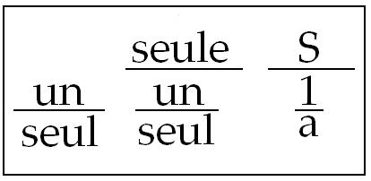
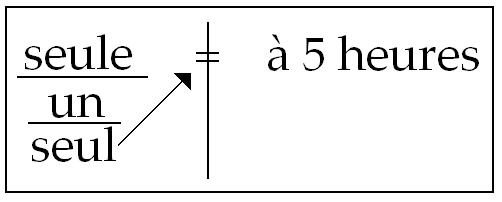

# Leçon 15 | 07 Avril l965

  <label><input type="checkbox" data-lacan-toggle="original" checked> 原文</label>
  <label><input type="checkbox" data-lacan-toggle="notes" checked> 注释</label>
  <label><input type="checkbox" data-lacan-toggle="commentary" checked> 个人解读评论</label>

<section class="parallel-paragraph" data-paragraph-ids="s12-15-0001">

s12-15-0001

[无对应译文]

原文 · s12-15-0001

Ce geste churchillien, fait pour montrer à ceux qui depuis trois semaines, s’étant trouvé ici - soit à mon cours ouvert, soit à mon séminaire fermé - n’ont pu voir qu’empaquetés en une sorte de « *poupée* », comme on s’exprime, ces doigts que peut-être après tout je me suis fait prendre dans cette porte que j’essaie d’ouvrir pour vous.

</section>

<section class="parallel-paragraph" data-paragraph-ids="s12-15-0002">

s12-15-0002

[无对应译文]

原文 · s12-15-0002

J’ai eu la satisfaction de rendre tangible au séminaire fermé que quelque travail *se fait* - et pas seulement *peut se faire -* à l’intérieur de ce que j’essaie de dessiner comme chemin à parcourir. Ce chemin, cette année, nous le suivons autour de *la fonction du signifiant* *et de ses effets, de ses effets par où il détermine le sujet, singulièrement de le rejeter, de le rejeter à chaque instant des effets mêmes du discours.*

</section>

<section class="parallel-paragraph" data-paragraph-ids="s12-15-0003">

s12-15-0003

[无对应译文]

原文 · s12-15-0003

Comme j’ai appris que la remarque en fut faite dans un rapport, l’année dernière, sur les *leçons d’agrégation*, à savoir qu’il s’agissait d’un titre, si j’ai bien compris, qui était celui « *De la parole vraie et de la parole mensongère* », à savoir que le sujet n’avait pas été inventé par LACAN et par Claude LÉVI-STRAUSS, que PLATON déjà - PARMÉNIDE qui sait ? - s’y étaient intéressés.

</section>

<section class="parallel-paragraph" data-paragraph-ids="s12-15-0004">

s12-15-0004

[无对应译文]

原文 · s12-15-0004

C’est une remarque, à la vérité, excellente, ce qui me permettra de répondre à ceux qui - m’ayant entendu au cours d’années anciennes - s’impatientaient que ce discours à leurs yeux n’aboutisse point à des conclusions assez rapides : « *Pourquoi* - s’exprimait-on ainsi, et non sans pertinence ni sans humour - *puisqu’il nous parle tant de la vérité, ne dit-il pas le vrai sur le vrai ?* »

</section>

<section class="parallel-paragraph" data-paragraph-ids="s12-15-0005">

s12-15-0005

[无对应译文]

原文 · s12-15-0005

Certains de nos impatients ont changé de bord : contents après tout de se rallier à ces formes d’enseignement où l’on est content de se tenir pour assuré de certains repères opaques qui peuvent donner le sentiment que là, on tient bien l’objet dernier !

</section>

<section class="parallel-paragraph" data-paragraph-ids="s12-15-0006">

s12-15-0006

[无对应译文]

原文 · s12-15-0006

Est-il bien sûr qu’on ait raison de s’en contenter, et que cette opacité même ne soit pas le signe que c’est là qu’est la *vraie illusion*, si je puis dire, à savoir qu’on se contente trop vite, et que la vraie honnêteté est peut-être là où on laisse toujours l’ouverture du chemin non close, la vérité inachevée ?

</section>

<section class="parallel-paragraph" data-paragraph-ids="s12-15-0007">

s12-15-0007

[无对应译文]

原文 · s12-15-0007

C’est à la vérité ce que - pour suivre l’indication de ce rapport - je trouvai. Je « *trouvai* »... bien sûr, je ne le *découvrais* pas à cette occasion mais où je vous renvoie, à savoir sur le même sujet qui est le nôtre cette année : au livre de PLATON qui s’appelle le *Cratyle*, et où vous verrez - poursuivi entre HERMOGÈNE, CRATYLE et SOCRATE - un dialogue bien utile qui ne se termine pas par autre chose que la mise en valeur d’une impasse complète dans le débat, et où SOCRATE, revoyant CRATYLE, vers lequel, incontestablement \[...\] le renvoie avec la formule : « *Eh bien, mon camarade, à une autre fois, tu m’instruiras à ton retour,* *à savoir quand tu auras bien réfléchi à tout ce qui nous a fait le casse-tête d’aujourd’hui.* »

</section>

<section class="parallel-paragraph" data-paragraph-ids="s12-15-0008">

s12-15-0008

[无对应译文]

原文 · s12-15-0008

À quoi l’autre répond : « *C’est entendu. De ton côté, tâche d’y penser encore.* »

</section>

<section class="parallel-paragraph" data-paragraph-ids="s12-15-0009">

s12-15-0009

[无对应译文]

原文 · s12-15-0009

Un tel dialogue – celui-là entre autres en tout cas, si ce n’est tous - est bien là pour nous faire saisir que les dialogues de PLATON, loin de dire « *le vrai sur le vrai* », sont expressément faits pour nous laisser en suspens, donnant vraiment le sentiment qu’il en sait plus qu’il ne nous en livre, ceci d’une façon assurément non équivoque.

</section>

<section class="parallel-paragraph" data-paragraph-ids="s12-15-0010">

s12-15-0010

[无对应译文]

原文 · s12-15-0010

S’il en sait plus qu’il ne nous en livre et s’il ne le dit pas, il y a bien là quelque raison : qu’à la vérité, même s’il nous le disait, on n’en serait pas encore plus avancés, mais que déjà dans les traces qu’il nous donne, au-delà peut se lire ce qui, après lui, fait notre chemin, et *très précisément* la place est marquée de, par exemple, ce que *l’expérience de l’inconscient* peut conduire à vous dire.

</section>

<section class="parallel-paragraph" data-paragraph-ids="s12-15-0011">

s12-15-0011

[无对应译文]

原文 · s12-15-0011

Peut-être pendant ces vacances, aurez-vous l’occasion d’ouvrir ce livre ? Je le souhaite dans la mesure où vous pourrez y trouver nettement marqué, ce qui a constitué le noyau de la tradition, claire, parfaitement lisible, du λεκτόν \[lecton\] considérant le statut du signifiant, et vous y trouverez confirmé ce que au départ - je vais essayer de le résumer ainsi, d’une façon qui n’a rien d’original - ce qui est inscrit au départ de cette tradition et qui repose sur *l’opposition* - concernant la fonction du signifiant - *entre ces deux grandes fonctions* qu’ARISTOTE[^115] admirablement distingue, pose, affirme, dans leur simplicité...

</section>

<section class="parallel-paragraph" data-paragraph-ids="s12-15-0012">

s12-15-0012

[无对应译文]

原文 · s12-15-0012

> et d’où il convient de partir pour se repérer concernant tout ce qui s’est dit depuis, et *qui ne date pas assurément*,
>
> ni de SAUSSURE, ni de TROUBETZKOY, ni de JAKOBSON : cette théorie du signifiant que déjà les stoïciens, et nommément par exemple un CHRYSIPPE [^116], avaient poussé à un extrême point de perfection.
>
> *Signans* et *signatum* sont en circulation déjà depuis quelques *deux mille ans* …*l’opposition* d’ὄνομα \[onoma\] et de ῤῆσις \[rhésis\].

</section>

<section class="parallel-paragraph" data-paragraph-ids="s12-15-0013">

s12-15-0013

[无对应译文]

原文 · s12-15-0013

*La fonction de la nomination* mérite d’être réservée comme *originale*, comme ayant *un statut opposé à la fonction de l’énonciation, ou de la phrase* - quelle qu’elle soit : propositionnelle, définitionnelle, relationnelle, prédicative - *de la phrase* en tant qu’elle nous introduit dans l’action efficace du *symptôme*. Elle aboutit à cette saisie dont le *culmen* :

</section>

<section class="parallel-paragraph" data-paragraph-ids="s12-15-0014">

s12-15-0014

[无对应译文]

原文 · s12-15-0014

- est la formation du *concept*,

</section>

<section class="parallel-paragraph" data-paragraph-ids="s12-15-0015">

s12-15-0015

[无对应译文]

原文 · s12-15-0015

- est quelque chose qui laisse d’autre part en suspens *la fonction de la nomination* en tant qu’elle introduit dans le *réel* ce *quelque chose qui dénomme* et dont il ne suffit pas de la résoudre autour d’une façon de faire coller à une chose qui serait déjà donnée, l’*étiquette* qui permet de la reconnaître.

</section>

<section class="parallel-paragraph" data-paragraph-ids="s12-15-0016">

s12-15-0016

[无对应译文]

原文 · s12-15-0016

Nous avons déjà suffisamment insisté sur le fait que cette étiquette est loin d’être à considérer comme quelque chose qui serait le redoublement, la liste, la liste tenue, pure et simple, de quelque chose qui serait déjà emmagasiné, si l’on peut dire, bien rangé, comme un registre d’accessoires. La nomination - l’*étiquette* dont il s’agit - part de *la marque*, part de *la trace*, part de *quelque chose* qui, entrant dans les choses et les modifiant, est au départ de leur statut même de « choses ».

</section>

<section class="parallel-paragraph" data-paragraph-ids="s12-15-0017">

s12-15-0017

[无对应译文]

原文 · s12-15-0017

Et c’est pour cela que cette *fonction de la nomination* comporte une problématique autour de laquelle tournent, CRATYLE, SOCRATE et HERMOGÈNE :

</section>

<section class="parallel-paragraph" data-paragraph-ids="s12-15-0018">

s12-15-0018

[无对应译文]

原文 · s12-15-0018

- HERMOGÈNE prônant cette face de la vérité à énoncer sur la nomination, qui est celle qui se *développera* dans la suite, dans l’insistance sur [*le conventionnalisme*](http://fr.wikipedia.org/wiki/Cratyle_%28Platon%29) de la nomination, sur le caractère *arbitraire* de ce choix du phonème qui \[...\] pris dans sa matérialité, a quelque chose d’indéterminé, de volant : « *pourquoi appeler ceci comme cela plutôt qu’autrement, rien ne nous oblige à saisir ce qu’on pourrait appeler une ressemblance, une connivence du mot à la chose* »

<!-- -->

</section>

<section class="parallel-paragraph" data-paragraph-ids="s12-15-0019">

s12-15-0019

[无对应译文]

原文 · s12-15-0019

- et pourtant... et pourtant SOCRATE - SOCRATE *le dialecticien*, SOCRATE *l’interrogateur -* nous montre son penchant très net vers les énonciations de CRATYLE qui - dans un autre radicalisme - insiste pour montrer qu’*il ne saurait y avoir*

</section>

<section class="parallel-paragraph" data-paragraph-ids="s12-15-0020">

s12-15-0020

[无对应译文]

原文 · s12-15-0020

> *de fonction efficace de la nomination si le nom, en lui-même, ne comportait pas cette parfaite connivence à la chose qu’il désigne.*
>
> \[[Platon : *Cratyle*](http://remacle.org/bloodwolf/philosophes/platon/cousin/cratyle.htm), 383a-b, 390d, 391e, 435a-c\]

</section>

<section class="parallel-paragraph" data-paragraph-ids="s12-15-0021">

s12-15-0021

[无对应译文]

原文 · s12-15-0021

C’est dans l’opération, souvent amusante, toujours paradoxale, et vraiment d’une désinvolture bien faite pour nous libérer de toutes sortes de préjugés concernant certaines habitudes traditionnelles, concernant *la genèse de la signification* et nommément tout ce qui s’appelle *étymologie* qu’il nous montre…

</section>

<section class="parallel-paragraph" data-paragraph-ids="s12-15-0022">

s12-15-0022

[无对应译文]

原文 · s12-15-0022

> par cette aisance, ce sans-gêne, presque ce jeu, avec lequel devant nous est mis en usage cette interrogation du signifiant phonématique : la façon dont les mots sont, dans le débat, découpés, sollicités,
>
> par la façon dont le jeu se mène autour d’une prétendue expressivité du phonème …nous montre assurément *autre chose* que ce qu’on prend pour naïveté.

</section>

<section class="parallel-paragraph" data-paragraph-ids="s12-15-0023">

s12-15-0023

[无对应译文]

原文 · s12-15-0023

Car je crois que ce que PLATON dans cet exercice nous démontre…

</section>

<section class="parallel-paragraph" data-paragraph-ids="s12-15-0024">

s12-15-0024

[无对应译文]

原文 · s12-15-0024

- dans cette façon de rechercher comme s’il y croyait les éléments primaires dans les mots, grâce à quoi nous pourrions les interroger de la façon dont ils répondent à ce qu’ils sont amenés à désigner,

</section>

<section class="parallel-paragraph" data-paragraph-ids="s12-15-0025">

s12-15-0025

[无对应译文]

原文 · s12-15-0025

- dans la façon dont *il joue* avec le mot σκληρός \[scleros\], *qui veut dire en grec « dur »* et dont il nous fait remarquer *que la labiale* - *et le « re » de* ῥεῖ \[reï\] *veut dire « couler » en grec* - s’adapte bien peu à la dureté à exprimer par le mot σκληρότης \[sclerotes\] …que *ce qu’il nous montre* en vérité c’est quelque chose, à savoir cet exercice qui consiste à nous montrer, dans tout ce qui se rapporte à cette fonction de la nomination, ce qui est important, *ce qu’il nous montre dans son jeu avec les mots c’est la façon de les découper au ciseau*.

</section>

<section class="parallel-paragraph" data-paragraph-ids="s12-15-0026">

s12-15-0026

[无对应译文]

原文 · s12-15-0026

C’est aussi que *ce qui est essentiel dans la fonction* et l’existence *du nom *: *ce n’est pas la coupure*, *c’est* si on peut dire, *le contraire, à savoir la suture*.

</section>

<section class="parallel-paragraph" data-paragraph-ids="s12-15-0027">

s12-15-0027

[无对应译文]

原文 · s12-15-0027

*Le nom propre* - *sur lequel*, au départ de ce discours j’ai dirigé votre attention en même temps que, d’autre part, *sur la fonction du nombre,* *le nom propre* - pour un instant dirigez votre regard sur ce qu’il a d’essentiel - *le nom propre déjà dans sa nomination*, ὄνομα ἴδιον \[onoma idion\] *comporte cette ambiguïté qui a permis toutes les erreurs, de vouloir dire* :

</section>

<section class="parallel-paragraph" data-paragraph-ids="s12-15-0028">

s12-15-0028

[无对应译文]

原文 · s12-15-0028

- d’un côté *le nom qui est propre à quelqu’un ou à quelque chose, à tel ou tel objet, qui est le nom spécifié dans la pure fonction de la dénotation*, pour *désigner*,

<!-- -->

</section>

<section class="parallel-paragraph" data-paragraph-ids="s12-15-0029">

s12-15-0029

[无对应译文]

原文 · s12-15-0029

- mais \[d’un autre côté\] *propre* *veut dire aussi* *nom à proprement parler*, *et n’est-ce pas là qu’est à voir l’essentiel de cette fonction du nom propre* à savoir : que *parmi tous les noms*, il est celui qui nous montre, *de la façon la plus propre à la fonction du nom,* ce qu’est le nom ?

</section>

<section class="parallel-paragraph" data-paragraph-ids="s12-15-0030">

s12-15-0030

[无对应译文]

原文 · s12-15-0030

Or si avec cette formule vide, vous vous mettez à regarder…

</section>

<section class="parallel-paragraph" data-paragraph-ids="s12-15-0031">

s12-15-0031

[无对应译文]

原文 · s12-15-0031

> je vous en charge, le temps - outre l’incident technique qui m’a retardé dans le départ de mon discours aujourd’hui - le temps me manquant pour vous en illustrer d’un grand nombre d’exemples …vous verrez *que de tous les noms*, quels qu’ils soient et quelque extension que nous puissions donner à la fonction du mot « *nom* », *que de tous les noms* que nous avons à interroger sous cet aspect de la nomination, le *nom propre* est celui qui présente de la façon la plus manifeste ce trait qui fait de toute institution *phonématique* du nom, de l’acte fondateur du nom dans sa *fonction désignatoire*, ce *quelque chose* qui a toujours en soi, cette dimension, cette propriété : *d’être un collage*.

</section>

<section class="parallel-paragraph" data-paragraph-ids="s12-15-0032">

s12-15-0032

[无对应译文]

原文 · s12-15-0032

Dans la structure même du *nom propre,* c’est laisser filer *quelque chose* d’*essentiel,* que ce prétendu *nom particulier* qui serait donné à l’individu, ce *quelque chose* à quoi *l’énoncé* de Claude LÉVI-STRAUSS dans *La pensée sauvage* \[p. 212-286\], quand il ferait du *nom propre* \- ce qu’il pousse jusqu’à son dernier terme, jusqu’au terme de la désignation de *l’individu -* la pointe et en quelque sorte l’achèvement de la fonction classificatoire, est trop partial, et trop partiel.

</section>

<section class="parallel-paragraph" data-paragraph-ids="s12-15-0033">

s12-15-0033

[无对应译文]

原文 · s12-15-0033

Nous manque ce que j’ai déjà avancé ici : que le *nom propre* va toujours se colloquer au point où justement *la fonction classificatoire dans l’ordre de la* ῤῆσις \[rhésis\] achoppe, non pas devant une trop grande particularité, mais au contraire devant une déchirure, *le manque,* proprement *ce trou* du sujet et justement pour le suturer, pour le masquer, pour le *coller*. \[à comparer avec la fonction de *l’objet(a)*\]

</section>

<section class="parallel-paragraph" data-paragraph-ids="s12-15-0034">

s12-15-0034

[无对应译文]

原文 · s12-15-0034

Ici certaines des choses qui ont été dites au séminaire fermé, prennent toute leur valeur, et nommément quand quelqu’un est venu ici nous apporter son expérience d’auteur littéraire, et nous a parlé de ses difficultés avec un *nom propre* donné à un vain personnage pourtant inventé. Le *nom propre* ne lui est pas apparu quelque chose de si arbitraire qu’il pouvait en être donné *n’importe lequel*.

</section>

<section class="parallel-paragraph" data-paragraph-ids="s12-15-0035">

s12-15-0035

[无对应译文]

原文 · s12-15-0035

La façon dont le collage, dont la suture destinée à masquer ce trou - d’autant plus évident qu’il s’agissait là du trou représenté par un personnage inventé - est là le témoignage de cette expérience qui est aussi bien marquée dans celle de tout ceux, romanciers, dramaturges ou ayant cette fonction de faire ourdir des personnages plus vrais que les personnages vivants et ont à les désigner d’une façon qui nous les rende sensibles.

</section>

<section class="parallel-paragraph" data-paragraph-ids="s12-15-0036">

s12-15-0036

[无对应译文]

原文 · s12-15-0036

Aurai-je là-dessus - faisant écho à des périodes anciennes de mon enseignement - à vous rappeler combien ceci prend de relief dans certaines *œuvres* et notamment dans celles de CLAUDEL : Sygne de COÛFONTAINE, étrange et résonnante désignation pour ce personnage qui nous montre, dans l’œuvre de CLAUDEL[^117] quelque chose de bien singulier.

</section>

<section class="parallel-paragraph" data-paragraph-ids="s12-15-0037">

s12-15-0037

[无对应译文]

原文 · s12-15-0037

Est-ce *à l’endroit ou à l’envers* de la révélation chrétienne que nous sommes, quand CLAUDEL forge pour nous, sous ce personnage de femme, cette sorte de Christ singulier, accumulant sur elle toutes les humiliations du monde, qui meurt en disant « *non* » ?

</section>

<section class="parallel-paragraph" data-paragraph-ids="s12-15-0038">

s12-15-0038

[无对应译文]

原文 · s12-15-0038

Sygne de COÛFONTAINE qui porte, masqué dans son nom, ce signifiant singulier, le premier d’ailleurs, ambigu entre :

</section>

<section class="parallel-paragraph" data-paragraph-ids="s12-15-0039">

s12-15-0039

[无对应译文]

原文 · s12-15-0039

- *le nom de l’oiseau* au col courbe,

</section>

<section class="parallel-paragraph" data-paragraph-ids="s12-15-0040">

s12-15-0040

[无对应译文]

原文 · s12-15-0040

- et la désignation, propre aussi, de *ce signe* qui est donné au monde *de quelque chose* d’une très singulière actualité au moment où surgit cette trilogie de CLAUDEL \[*L’otage* : 1911, *Le pain dur* : 1918, *Le père humilié* : 1920\].

</section>

<section class="parallel-paragraph" data-paragraph-ids="s12-15-0041">

s12-15-0041

[无对应译文]

原文 · s12-15-0041

Et cet étrange COÛFONTAINE où nous retrouvons l’écho de cette forme du cygne où nous est désigné que vient vers nous la source rouverte - quoiqu’inversée - d’un antique message. Ce mot qui porte en lui encore, ce souci, cette trace, du signifiant élémentaire dans cet « Û », avec un accent circonflexe auquel il tenait tellement que - je l’ai *dit* autrefois, je l’ai *rappelé à mon séminaire* - il a fallu faire forger un signe typographique qui n’existe pas dans la langue française pour les majuscules, pour que le circonflexe dont est couronné l’« U » de COÛFONTAINE pût être porté à l’impression.

</section>

<section class="parallel-paragraph" data-paragraph-ids="s12-15-0042">

s12-15-0042

[无对应译文]

原文 · s12-15-0042

« *Sir Thomas Pollock Nageoire* », quelle invention ! Puisque déjà, avec cette extraordinaire désignation, n’en savons-nous pas tant sur *le personnage* de *L’échange* [^118], que sur tout ce qui va se dérouler dans le drame ?

</section>

<section class="parallel-paragraph" data-paragraph-ids="s12-15-0043">

s12-15-0043

[无对应译文]

原文 · s12-15-0043

*Cette vie singulière du nom propre vous la retrouverez*, si vous savez être à l’écoute, si vous savez l’entendre, *dans tous les noms propres,* qu’ils soient anciens, reçus, classés, ou qu’ils soient ceux qui par le poète peuvent être forgés.

</section>

<section class="parallel-paragraph" data-paragraph-ids="s12-15-0044">

s12-15-0044

[无对应译文]

原文 · s12-15-0044

À la vérité, je crois que s’il fallait ajouter quelque chose à cette sorte de résidu, de scorie…

</section>

<section class="parallel-paragraph" data-paragraph-ids="s12-15-0045">

s12-15-0045

[无对应译文]

原文 · s12-15-0045

> autour de laquelle l’attention des personnes du séminaire fermé a été appelée récemment à opiner,
>
> à savoir ce « *POOR (d) J’e-LI* » dont l’analyse de LECLAIRE, pour ce qui fût sa part, dans ce rapport inaugural sur l’inconscient où quelque chose, par lui et par son co-auteur avait été promu à l’attention d’un auditoire psychanalytique plus vaste, concernant l’originalité de ce que j’avais pu accentuer dans l’enseignement de FREUD sur l’inconscient …ce quelque chose dont j’ai pu lire - *non sans satisfaction, sous une plume certes non amicale -* que chacun, depuis FREUD, savait que le fait de *l’énonciation de ceci* que « *l’inconscient est structuré comme un langage* », depuis FREUD, c’était une lapalissade.

</section>

<section class="parallel-paragraph" data-paragraph-ids="s12-15-0046">

s12-15-0046

[无对应译文]

原文 · s12-15-0046

Assurément c’est bien quant à moi ce que je pense, même si c’est là venu, pour celui qui ne prétend le dire, que pour le contredire.

</section>

<section class="parallel-paragraph" data-paragraph-ids="s12-15-0047">

s12-15-0047

[无对应译文]

原文 · s12-15-0047

Eh bien, mon Dieu il le sort bien pour quelque chose, d’autant plus que le personnage dont il s’agit, et qui en fait une objection à ce que j’énonce, éprouve le besoin de le connoter, de le commenter, par une série de mises au point, qui se trouvent comme par hasard, être très exactement ce que j’enseigne sur le sens de la formule.

</section>

<section class="parallel-paragraph" data-paragraph-ids="s12-15-0048">

s12-15-0048

[无对应译文]

原文 · s12-15-0048

Il y aurait beaucoup à dire à partir de cette notion, de cet énoncé que « *toute nomination* dans son usage, doit être toujours, par nous, constamment référée à ceci : qu’elle *est mémoriale de l’acte de la nomination »*. Or cet acte ne se fait point au hasard.

</section>

<section class="parallel-paragraph" data-paragraph-ids="s12-15-0049">

s12-15-0049

[无对应译文]

原文 · s12-15-0049

Accentuer *le conventionnalisme* en tant qu’il essaie de donner son statut au *signifiant* n’est qu’une face du problème.

</section>

<section class="parallel-paragraph" data-paragraph-ids="s12-15-0050">

s12-15-0050

[无对应译文]

原文 · s12-15-0050

*Conventionnel* est le nom, pour qui reçoit la langue dans sa facticité actuelle, dans son résultat, mais au moment où le nom est donné, c’est là précisément qu’est le rôle et la fonction de choix de celui que - très génialement et d’une façon qui n’a en fin de compte jamais été reprise - que le *Cratyle* désigne comme un acteur nécessaire en cette histoire, à savoir ce qu’il appelle le δημιουργὸς ὀνομάτων \[démiurgos onomaton\], « *l’ouvrier en nom* » \[390e, 431e\].

</section>

<section class="parallel-paragraph" data-paragraph-ids="s12-15-0051">

s12-15-0051

[无对应译文]

原文 · s12-15-0051

Il ne fait pas n’importe quoi, ni ce qu’il veut : il faut, pour que la dénomination soit *reçue,* quelque chose dont il ne suffit pas même de dire que ce soit le *consentement universel,* car ce *consentement universel*, dans le champ d’un langage, qui le représentera ?

</section>

<section class="parallel-paragraph" data-paragraph-ids="s12-15-0052">

s12-15-0052

[无对应译文]

原文 · s12-15-0052

Cette dénomination, elle s’opère quelque part. Qu’est-ce qui fait qu’elle se propage ?

</section>

<section class="parallel-paragraph" data-paragraph-ids="s12-15-0053">

s12-15-0053

[无对应译文]

原文 · s12-15-0053

Je vous parlais l’autre jour de l’exploit collectif que représente l’apparition dans l’espace de cet extraordinaire nageur dont un instant je vous ai montré ce que pour nous il pouvait faire voltiger, dans l’imagination : toutes sortes de singulières façons d’imager, vous ai-je dit, la fonction de *l’objet(a)*. Je n’ai pas insisté. Qu’importe ! J’y reviendrai.

</section>

<section class="parallel-paragraph" data-paragraph-ids="s12-15-0054">

s12-15-0054

[无对应译文]

原文 · s12-15-0054

Mais quelle chose étrange après tout, que personne jusqu’ici n’ait songé à l’appeler du nom qui semble assurément le plus préparé et propice.

</section>

<section class="parallel-paragraph" data-paragraph-ids="s12-15-0055">

s12-15-0055

[无对应译文]

原文 · s12-15-0055

Comment se fait-il que n’ait pas répondu à l’appel…

</section>

<section class="parallel-paragraph" data-paragraph-ids="s12-15-0056">

s12-15-0056

[无对应译文]

原文 · s12-15-0056

> alors qu’on est si hardi, si tranquille à qualifier de « *cosmonautes* » des gens qui se propulsent dans un champ
>
> qu’assurément aucun *cosmos* au temps où il y avait une cosmologie, dont personne n’avait jamais prévu la trajectoire …pourquoi est-ce que ce LEONOV nous ne l’appellerions pas…

</section>

<section class="parallel-paragraph" data-paragraph-ids="s12-15-0057">

s12-15-0057

[无对应译文]

原文 · s12-15-0057

> de la place qu’il occupe, si je puis dire, depuis très longtemps, depuis le temps qu’il y a des gens qui nous peignent les messagers qui surgissent quelque part dans l’espace, pourvus de cette plumaille ridicule qui rend leur image vraiment, dans tous les tableaux, à proprement parler intolérable …*pourquoi est-ce qu’on ne l’appelle pas « un ange »* ? *Eh bien voilà : vous vous marrez !*

</section>

<section class="parallel-paragraph" data-paragraph-ids="s12-15-0058">

s12-15-0058

[无对应译文]

原文 · s12-15-0058

Ben c’est pour ça qu’on ne l’appellera pas « *un ange* ». On ne l’appellera pas un ange parce que, quoi qu’il en soit, *chacun, vous tenez à votre bon ange, vous y croyez*. Jusqu’à un certain point, moi aussi. Moi j’y crois parce qu’ils sont inéliminables des Écritures, ce que *j’ai fait remarquer* un jour au Père TEILHARD DE CHARDIN qui a failli en pleurer. C’est aussi là la différence entre mon enseignement et ce qu’on appelle *le progressisme.* Je trouve que la faiblesse est du côté du *progressisme*.

</section>

<section class="parallel-paragraph" data-paragraph-ids="s12-15-0059">

s12-15-0059

[无对应译文]

原文 · s12-15-0059

Cette petite épreuve a tout de même un côté décisif. Car vous voyez bien qu’on ne peut pas appeler une nouveauté n’importe comment, même quand elle paraît justement remplir d’un vin nouveau la vieille outre… l’outre-ange est toujours là.

</section>

<section class="parallel-paragraph" data-paragraph-ids="s12-15-0060">

s12-15-0060

[无对应译文]

原文 · s12-15-0060

*Cette expérience concernant la nomination* - vous le voyez - pour nous déboucherait tout droit aussi vers la fonction des « *langues mortes* ».

</section>

<section class="parallel-paragraph" data-paragraph-ids="s12-15-0061">

s12-15-0061

[无对应译文]

原文 · s12-15-0061

Une « *langue morte* », ce n’est pas du tout une langue dont on ne puisse rien faire comme l’expérience le prouve. Le latin, au moment où c’était une *langue morte* a servi très efficacement de langue de communication. C’est même pour ça que nous avons pu avoir, pendant toute cette période dénommée *scholastique*, d’extraordinairement bons logiciens, *la* ῤῆσις \[rhésis\] *ça fonctionne admirablement* \- et d’autant mieux, peut-être justement, *qu’elle reste maîtresse du terrain* - *la* ῤῆσις \[rhésis\] *ça fonctionne admirablement dans une langue morte,* *mais la nomination : pas !*

</section>

<section class="parallel-paragraph" data-paragraph-ids="s12-15-0062">

s12-15-0062

[无对应译文]

原文 · s12-15-0062

J’ai eu des échos humoristiques : mon impotence momentanée m’ayant empêché de feuilleter autant de pages que j’en ai l’habitude ces derniers temps, je regrette de ne pas pouvoir vous sortir des actes du Concile du Vatican, la façon dont on y exprimait la désignation d’« *autobus* » par exemple, du « *bar* » qui paraît-il, y fonctionnait dans un coin : *ça la foutait plutôt mal*.

</section>

<section class="parallel-paragraph" data-paragraph-ids="s12-15-0063">

s12-15-0063

[无对应译文]

原文 · s12-15-0063

Comment faire de *nouvelles nominations* dans une *langue morte* ? J’entends de nouvelles nominations qui s’inscrivent dans la langue.

</section>

<section class="parallel-paragraph" data-paragraph-ids="s12-15-0064">

s12-15-0064

[无对应译文]

原文 · s12-15-0064

Par contre tout le *De vulgari eloquentia* auquel j’ai fait allusion dans mes leçons de départ cette année, je veux dire cet ouvrage de DANTE purement admirable dans lequel est défendue la fonction proprement littéraire, la *lingua grammatica* qu’il entendait faire de son *toscan* élu entre trois autres. Lisez-le - *c’est moins facile à se procurer que le Cratyle -* lisez-le et vous verrez vers quoi se penche DANTE : vers une réalité dont seul peut parler un poète, qui est à proprement parler celle de *cette adéquation*, *qu’il n’est donnée qu’à* *un poète de sentir*, *de la forme phonématique qu’a pris un mot, et de cet échange entre le signifiant et le signifié qui est toute l’histoire de l’esprit humain *:

</section>

<section class="parallel-paragraph" data-paragraph-ids="s12-15-0065">

s12-15-0065

[无对应译文]

原文 · s12-15-0065

- *comment un signifiant*, insensiblement passe dans un de ces côtés du *signifié* qui n’était point encore apparu.

</section>

<section class="parallel-paragraph" data-paragraph-ids="s12-15-0066">

s12-15-0066

[无对应译文]

原文 · s12-15-0066

- *comment le signifiant* lui-même se change profondément de l’évolution des significations.

</section>

<section class="parallel-paragraph" data-paragraph-ids="s12-15-0067">

s12-15-0067

[无对应译文]

原文 · s12-15-0067

C’est là quelque chose encore, sur quoi je ne puis faire que passer, mais où tout au moins je vous indique une référence : ce que le latin *causa* a pris de poids à partir du jour où CICÉRON traduit avec *causa* la ἀιτία \[aïtia\] grecque, c’est là le point tournant qui fait qu’à la fin, cette « *cause* » - *qui est encore la cause juridique d’abord, la causa latine -* en est venue à la fin à désigner la *res* : la *chose*, alors que la *res*, la *chose*, *est devenue pour nous le mot* « *rien* ».

</section>

<section class="parallel-paragraph" data-paragraph-ids="s12-15-0068">

s12-15-0068

[无对应译文]

原文 · s12-15-0068

Cette histoire du langage est quelque chose qui, pour n’être pas à proprement parler le champ dans quoi le psychanalyste a à opérer, à poursuivre sa pratique, lui montre à tout instant les voies et les modèles où il doit saisir sa réalité.

</section>

<section class="parallel-paragraph" data-paragraph-ids="s12-15-0069">

s12-15-0069

[无对应译文]

原文 · s12-15-0069

Et dans l’exposé qu’a donné LECLAIRE du « *POOR (d) J’e-LI »* à propos duquel *exemple paradigme* on s’est interrogé :

</section>

<section class="parallel-paragraph" data-paragraph-ids="s12-15-0070">

s12-15-0070

[无对应译文]

原文 · s12-15-0070

- de quel bord est-il : préconscient, inconscient ?

</section>

<section class="parallel-paragraph" data-paragraph-ids="s12-15-0071">

s12-15-0071

[无对应译文]

原文 · s12-15-0071

- Est-ce un fantasme ?

</section>

<section class="parallel-paragraph" data-paragraph-ids="s12-15-0072">

s12-15-0072

[无对应译文]

原文 · s12-15-0072

Je crois que *l’image de départ* à laquelle il convient de nous fixer pour comprendre ce dont il s’agit c’est que ce dont il est le plus près, et là nous retrouvons l’expérience analytique : qui, des analystes, *n’a pas touché du doigt* la fonction pour chacun de ses analysés, de quelque *nom propre* - le sien ou celui *de son conjoint, de sa conjointe, de ses parents*, voire *du personnage de son délire -* que joue le *nom propre* en tant qu’il peut se fragmenter, se décomposer, se retrouver infiltré dans le nom propre de quelque autre ?

</section>

<section class="parallel-paragraph" data-paragraph-ids="s12-15-0073">

s12-15-0073

[无对应译文]

原文 · s12-15-0073

Le « *POOR (d) J’e-LI* » de LECLAIRE, est avant tout quelque chose qui fonctionne comme un *nom propre*.

</section>

<section class="parallel-paragraph" data-paragraph-ids="s12-15-0074">

s12-15-0074

[无对应译文]

原文 · s12-15-0074

Et si j’ai à désigner le point de *la bouteille de Klein* où ce « *POOR (d) J’e-LI*  » a à s’inscrire, c’est le bord, si je puis dire, l’orifice de réversion par où - à prendre quelque côté qu’il s’agisse de cette double entrée de la *bouteille de Klein -* c’est toujours à *l’envers* de l’une que correspond *l’endroit* de l’autre et inversement.

</section>

<section class="parallel-paragraph" data-paragraph-ids="s12-15-0075">

s12-15-0075

[无对应译文]

原文 · s12-15-0075

Et si vous voulez une image qui vous satisfasse mieux encore la fonction du « *POOR (d) J’e-LI* » ou *quoi que ce soit* qui, dans l’histoire d’un de nos patients pût \[...\] y correspondre, eh bien c’est la fonction propre que par rapport à un « *patron* »...

</section>

<section class="parallel-paragraph" data-paragraph-ids="s12-15-0076">

s12-15-0076

[无对应译文]

原文 · s12-15-0076

> au sens que ce mot a pour la couturière : le « *patron* » qui représente le fragment de tissu \[...\]
>
> qui servira à décomposer tel pointillé du vêtement ou telle manche …la fonction des *petites lettres* destinées à montrer avec quoi quelque chose doit être cousu.

</section>

<section class="parallel-paragraph" data-paragraph-ids="s12-15-0077">

s12-15-0077

[无对应译文]

原文 · s12-15-0077

C’est à partir de là que peut se saisir, se comprendre cette fonction de *suture factice*, qui devrait nous permettre, avec suffisamment d’attention, avec une méthode qui est justement celle que nous essayons ici de créer, de vous suggérer tout au moins , nous permettrait de saisir, de différencier même, dans cette image une sorte de support primitif à propos de quoi pourrait se distinguer la façon dont se font les sutures chez tel ou tel. Je veux dire par là que ça ne se fait pas au même point ni avec le même but, *chez le névrosé, le psychotique, ni chez le pervers*.

</section>

<section class="parallel-paragraph" data-paragraph-ids="s12-15-0078">

s12-15-0078

[无对应译文]

原文 · s12-15-0078

La façon dont se font les sutures dans l’histoire subjective, est proprement dans l’image, le paradigme de LECLAIRE, car il est quelque chose qui en fait le prix, et qui n’est pas seulement de pure et simple curiosité phonologique : c’est que cette suture est étroitement associée à la prise de ce que LECLAIRE désigne comme la *différence exquise*, différence sensorielle.

</section>

<section class="parallel-paragraph" data-paragraph-ids="s12-15-0079">

s12-15-0079

[无对应译文]

原文 · s12-15-0079

Et c’est là qu’est spécifié le trait *obsessionnel* : c’est là cet élément neuf qui peut être ajouté à ce qu’on appelle à proprement parler « *la clinique* », en tant que la psychanalyse a quelque chose à adjoindre à ce mot ancien de « *clinique* ».

</section>

<section class="parallel-paragraph" data-paragraph-ids="s12-15-0080">

s12-15-0080

[无对应译文]

原文 · s12-15-0080

Dans cette *suture* même est pris ce *point exquis* du sensible, ce côté cicatriciel, je dirai presque *chéloïde* \[cicatrice en bourrelet rouge\] pour aller jusqu’à la métaphore, ce point élu qui désigne chez l’obsessionnel quelque chose qui reste pris dans la suture, qui est à proprement parler à débrider. Voilà ce qui nous permet de situer *le point originel* de ce qui peut servir d’autre part de démonstration *quant à la fonction du signifiant*, mais qui aussi nous désigne *la fonction particulière*, et qu’il occupe dans l’exemple ainsi isolé.

</section>

<section class="parallel-paragraph" data-paragraph-ids="s12-15-0081">

s12-15-0081

[无对应译文]

原文 · s12-15-0081

Assurément tout ceci demande que nous nous donnions un peu de peine pour faire circuler ces notions qui, en effet, ne sont point nouvelles, qui sont déjà repérables dans FREUD et qu’il serait facile… je n’ai pas besoin, je pense, à tous ceux qui l’ont un peu lu, de désigner en quel point nous en trouvons les homologues : depuis l’*aber,* l’*Abwer*, l’*amen* qui est *Samen* dans *L’homme aux rats* [^119], et bien d’autres. Mais aussi bien, si c’est là que nous devons repérer quelque chose dont nous essayons de retrouver le secret et le maniement, ce n’est pas, bien sûr, en nous en détournant, en nous en tenant à ce qui nous est donné, mais en essayant de poursuivre, selon la formule de FREUD, la construction à propos du sujet, que nous pouvons en tirer le parti convenable.

</section>

<section class="parallel-paragraph" data-paragraph-ids="s12-15-0082">

s12-15-0082

[无对应译文]

原文 · s12-15-0082

*Cet écart, cet écart que laisse dans le nom cette suture qu’il représente*, si vous savez en chercher l’instance, *vous le retrouverez dans tous*.

</section>

<section class="parallel-paragraph" data-paragraph-ids="s12-15-0083">

s12-15-0083

[无对应译文]

原文 · s12-15-0083

ŒDIPUS, je le prends parce qu’après tout, je suis sollicité par le fait que c’est bien le premier qui peut nous venir à l’esprit, ŒDIPUS : « *pied enflé* », est-ce que ça va de soi ? Qu’est-ce qu’il y a dans le trou entre l’enflure et le pied ?

</section>

<section class="parallel-paragraph" data-paragraph-ids="s12-15-0084">

s12-15-0084

[无对应译文]

原文 · s12-15-0084

Justement, le pied percé. Et le pied percé, il n’est pas dit qu’il est recollé. Le pied enflé, avec son énigme qui reste ouverte dans le milieu est peut-être plus en rapport avec toute l’histoire œdipienne qu’il apparaît d’abord.

</section>

<section class="parallel-paragraph" data-paragraph-ids="s12-15-0085">

s12-15-0085

[无对应译文]

原文 · s12-15-0085

Et puisque quelqu’un s’est amusé à *présentifier* mon nom dans ce débat, pourquoi ne pas nous amuser un peu ?

</section>

<section class="parallel-paragraph" data-paragraph-ids="s12-15-0086">

s12-15-0086

[无对应译文]

原文 · s12-15-0086

LACAN c’est-à-dire « Lacen » en hébreu, c’est-à-dire le nom qui conserve les trois consonnes antiques qui s’écrivent à peu près comme ça ואקל , eh bien, ça veut dire : « *Et pourtant* » ! \[Cf. séminaire 1962-63 : « *L’angoisse* », séance du 15-05. \]

</section>

<section class="parallel-paragraph" data-paragraph-ids="s12-15-0087">

s12-15-0087

[无对应译文]

原文 · s12-15-0087

Ce tissu, cette surface, qui est celle où j’essaie de vous dessiner la topologie du signifiant, si je lui donne cette année la forme de *la bande de Mœbius* - dans l’histoire de la pensée mathématique, donc logique, cette forme nouvelle, et dont ce n’est pas par hasard si elle est venue si tard, si PLATON ne l’avait pas, et pourtant si simple - cette *bande de Mœbius* qui, redoublée, donne *la bouteille de Klein*.

</section>

<section class="parallel-paragraph" data-paragraph-ids="s12-15-0088">

s12-15-0088

[无对应译文]

原文 · s12-15-0088

Quelle est l’énigme qui gît là ? Qu’est-ce que je veux dire ? Est-ce que je crois qu’elle existe ?

</section>

<section class="parallel-paragraph" data-paragraph-ids="s12-15-0089">

s12-15-0089

[无对应译文]

原文 · s12-15-0089

Il est clair qu’elle évoque des analogies, et dans le champ à proprement parler biologique. La dernière fois, pour ceux qui étaient au séminaire fermé, j’ai indiqué - je le répète ici parce que le mot d’ordre peut à nouveau en être donné à mon public complet - j’ai parlé de *La naissance de la clinique* de Michel FOUCAULT. J’ai dit que c’était un ouvrage à lire pour sa très grande originalité et pour la *méthode* dont il s’inspire, l’accent qu’il met quant au virage de l’instance anatomique dans la pensée nosologique.

</section>

<section class="parallel-paragraph" data-paragraph-ids="s12-15-0090">

s12-15-0090

[无对应译文]

原文 · s12-15-0090

Il est très frappant, très saisissant de voir que, dans cette incidence - j’entends de l’anatomopathologie - le changement de *regard*, le changement de focalisation qui fait passer de la considération de l’organe à celle du tissu, c’est-à-dire *de surfaces prises comme telles*, avec le modèle pris essentiellement dans ce qui distingue l’épiderme du derme, les feuillets de la plèvre de ceux du péritoine, dans le total changement de signification que prend le terme de sympathie à partir du moment où c’est en suivant ces feuillets, ces clivages, rendus si sensibles depuis, par toute l’évolution de l’*embryologie*, bref que c’est depuis le *Traité des membranes* de BICHAT que l’anatomie change de sens et change en même temps le sens de tout ce qu’on peut penser de la maladie.

</section>

<section class="parallel-paragraph" data-paragraph-ids="s12-15-0091">

s12-15-0091

[无对应译文]

原文 · s12-15-0091

La façon dont ces feuillets, nommément dans le champ embryologique, s’*enveloppent*, se *nouent*, se *contournent*, en viennent à ce *point* *de striction*, comme de fermeture d’un sac, de clôture d’une bourse, pour s’isoler dans leur forme adulte, est quelque chose qui mériterait d’être repéré, presque à titre d’un exercice, en quelque sorte esthétique mais qui aurait auprès du biologiste cet effet de suggestion - dont au reste, je ne doute pas que très vite... car la chose arrive toujours et pointe dans *un certain ordre de réflexion* - que c’est dans une structure originale de torsion de l’espace, comparable à sa façon à cette courbure que le physicien saisit à un certain niveau du phénomène, dans une autre forme de torsion, d’involution, comme déjà les mots semblent tout préparés pour les accueillir, que résiderait l’originalité de la fonction vivante du corps comme tel.

</section>

<section class="parallel-paragraph" data-paragraph-ids="s12-15-0092">

s12-15-0092

[无对应译文]

原文 · s12-15-0092

Ce n’est vraiment là que *suggestion au passage*, mais pour - au point où je vous quitte avant les vacances - scander ce quelque chose par quoi je voudrais illustrer d’une façon plus vivante ce que contiennent des *formules* comme celles sur lesquelles je suis plusieurs fois revenu et que je tiens pour *essentielles*, vous disant d’abord que c’est le chaînon-clé pour éviter de glisser dans quelques une de ces erreurs, de droite ou de gauche, trop rapide ou trop \[...\], pour vous illustrer cette formule que *le signifiant*, à la distinction du signe, *c’est quelque chose qui représente un sujet pour un autre signifiant*.

</section>

<section class="parallel-paragraph" data-paragraph-ids="s12-15-0093">

s12-15-0093

[无对应译文]

原文 · s12-15-0093

Peut-être y a-t-il eu, là encore, des choses devant quoi - faute d’être habitué à la formule - vous vous arrêtez de tirer *les conséquences*.

</section>

<section class="parallel-paragraph" data-paragraph-ids="s12-15-0094">

s12-15-0094

[无对应译文]

原文 · s12-15-0094

Je ne m’en suis pas tenu là, puisque l’année dernière, vous donnant *la formule* - peut-être nouvelle aux yeux de certains - *de l’aliénation* : il représente, ai-je dit, un sujet pour un autre signifiant, mais pour autant, *si le signifiant détermine le sujet : le déterminant il le barre*, et cette barre veut dire à la fois *vacillation* et *division* du sujet. \[cf. séminaire 1964 : « *Les fondements*... », 27-05\]

</section>

<section class="parallel-paragraph" data-paragraph-ids="s12-15-0095">

s12-15-0095

[无对应译文]

原文 · s12-15-0095

Assurément, il y a là quelque chose qui, dans son paradoxe...

</section>

<section class="parallel-paragraph" data-paragraph-ids="s12-15-0096">

s12-15-0096

[无对应译文]

原文 · s12-15-0096

et je vous affirme pourtant que je n’essaie pas de le rendre plus lourd, que le paradoxe n’était pas là le moyen pour moi de capturer l’attention, que le paradoxe me force la main si je puis dire, à moi-même ...qui est pourtant essentiel à bien accentuer.

</section>

<section class="parallel-paragraph" data-paragraph-ids="s12-15-0097">

s12-15-0097

[无对应译文]

原文 · s12-15-0097

Je ne dis pas que le signifiant ne peut point être matériellement semblable au signe, *signe représentant de quelque chose pour quelqu’un*.

</section>

<section class="parallel-paragraph" data-paragraph-ids="s12-15-0098">

s12-15-0098

[无对应译文]

原文 · s12-15-0098

La théorie du signe est tellement prégnante, s’impose tellement à l’attention de ce moment que nous vivons de la science, que j’ai pu entendre un physicien, avec qui j’ai de longues discussions, un physicien dire qu’en fin de compte : l’assise, l’assiette de toute la théorie physique, en tant qu’elle exige le maintien d’un principe de conservation, dit conservation énergétique, ne trouvera - donc cette assiette - cette certitude dernière que quand nous serons arrivés à *formaliser toute la découverte physique moderne, en termes d’échange de signes*.

</section>

<section class="parallel-paragraph" data-paragraph-ids="s12-15-0099">

s12-15-0099

[无对应译文]

原文 · s12-15-0099

Le prodigieux succès de la conception cybernétique qui va maintenant - à cette chose étrange qui est qualifiée d’« *information* » - mettre au registre de l’information toute espèce de transmission à distance, pour peu qu’à quelque instant elle se présente comme cumulative… Je vais peut-être là un peu vite : que ceux qui savent, estiment à leur façon et à leur gré, de ce dont je dis… de ce que je dis, la pertinence. En biologie, on ira à parler d’information, par exemple, pour définir ce qui émane de tel système glandulaire dans la mesure où cela va retentir plus loin en quelque lieu de l’organisme. Est-ce à dire qu’il faille entendre qu’il y ait là ces deux pôles, en les appelant : « *émetteur »* et « *récepteur » *? Quoi qu’on fasse, on *subjective* : ce qui est à proprement parler ridicule.

</section>

<section class="parallel-paragraph" data-paragraph-ids="s12-15-0100">

s12-15-0100

[无对应译文]

原文 · s12-15-0100

Pourquoi après tout, dans cette voie ne pas considérer comme information les rayons solaires en tant que s’accumulant quelque part dans la chlorophylle ou tout simplement en réchauffant le bourgeon de la plante ils déterminent et se cumulent dans les effets d’éclosion, d’épanouissement de la plante vivante ?

</section>

<section class="parallel-paragraph" data-paragraph-ids="s12-15-0101">

s12-15-0101

[无对应译文]

原文 · s12-15-0101

La naïveté avec laquelle il semble qu’on adopte, dans cette formalisation de ce thème de l’*information*, la fonction de l’« *émetteur »* et du « *récepteur »*…

</section>

<section class="parallel-paragraph" data-paragraph-ids="s12-15-0102">

s12-15-0102

[无对应译文]

原文 · s12-15-0102

> *sans qu’on s’aperçoive à quel point là, on piétine dans les plate–bandes du vieux « sujet de la connaissance », à savoir qu’en fin de compte, à prendre cette voie où chaque point du monde serait estimé de la façon dont il connaît plus ou moins tous les autres points* …a quelque chose de singulier, de paradoxal, où se manifeste de la façon la plus sensible une perte, et dont le modèle manifestement ne peut être donné que de ceci : que sommes habitués maintenant à avoir le maniement d’objets que nous pouvons éloigner presque indéfiniment de nous, qui sont des machines et par rapport auxquelles dans la mesure où nous *les faisons* - justement ces machines - être des sujets, que nous les donnons comme « *machines qui pensent* », qu’effectivement elles reçoivent de nous des informations grâce à quoi  elles se dirigent.

</section>

<section class="parallel-paragraph" data-paragraph-ids="s12-15-0103">

s12-15-0103

[无对应译文]

原文 · s12-15-0103

Il y a là une sorte d’évolution, voire de glissement de la pensée auquel, après tout, je ne vois aucun obstacle.

</section>

<section class="parallel-paragraph" data-paragraph-ids="s12-15-0104">

s12-15-0104

[无对应译文]

原文 · s12-15-0104

Dans un certain domaine, à condition de le définir, ça pourrait rendre des services extrêmement appréciables, l’équivalence information-\[énergie ?\] semble avoir quelque fécondité en physique.

</section>

<section class="parallel-paragraph" data-paragraph-ids="s12-15-0105">

s12-15-0105

[无对应译文]

原文 · s12-15-0105

Est-ce là ce dont nous pouvons nous contenter concernant le statut du *sujet* par rapport au *signe* ?

</section>

<section class="parallel-paragraph" data-paragraph-ids="s12-15-0106">

s12-15-0106

[无对应译文]

原文 · s12-15-0106

Le *signe*, il peut vous paraître en quelque façon *tenable*, si nous l’étendons précisément de cette façon, que nous continuions à dire qu’il fonctionne toujours pour quelqu’un.

</section>

<section class="parallel-paragraph" data-paragraph-ids="s12-15-0107">

s12-15-0107

[无对应译文]

原文 · s12-15-0107

Le renversement de cette position…

</section>

<section class="parallel-paragraph" data-paragraph-ids="s12-15-0108">

s12-15-0108

[无对应译文]

原文 · s12-15-0108

> à savoir que *dans les signes,* il y en a qui sont *des signifiants, en tant qu’ils représentent le sujet pour un autre signifiant* …vous voyez dans quelle mesure, après tout, il répond à cette pente, à cette suite de la pensée, mais nous permet - ce sujet – d’en faire autre chose, autre chose de déterminable, de localisable, et dont le métabolisme peut être saisissable avec ses *conséquences*.

</section>

<section class="parallel-paragraph" data-paragraph-ids="s12-15-0109">

s12-15-0109

[无对应译文]

原文 · s12-15-0109

Et pourquoi ? J’ai forgé pour vous un exemple \[« *seule à cinq heures* »\], ou plutôt je l’ai pris - n’importe lequel - je l’ai pris dans l’article d’un linguiste qui littéralement - quoique l’avançant pour définir *ce que c’est que le signe linguistique* - y échoue, je dois dire radicalement.

</section>

<section class="parallel-paragraph" data-paragraph-ids="s12-15-0110">

s12-15-0110

[无对应译文]

原文 · s12-15-0110

Et je reprends le même exemple pour essayer, pour vous, d’en faire quelque chose : une jeune fille et son amant.

</section>

<section class="parallel-paragraph" data-paragraph-ids="s12-15-0111">

s12-15-0111

[无对应译文]

原文 · s12-15-0111

Ils conviennent, pour se retrouver, de ce signe : *quand le rideau* - je modifie un petit peu l’exemple - *sera tiré à la fenêtre, ceci voudra dire « Je suis seule ».* Autant de pots de fleurs, autant d’heures. Ainsi désigné, cinq pots de fleurs : « *Je serai seule à cinq heures* ».

</section>

<section class="parallel-paragraph" data-paragraph-ids="s12-15-0112">

s12-15-0112

[无对应译文]

原文 · s12-15-0112

Est-ce que en fonction de ceci : que c’est en paroles - dans un langage - que cette convention a été fondée, est-ce que pour autant qu’il y a nomination, acte fondateur, qui fait de ce rideau quelque chose d’autre que ce qu’il est, est-ce que nous pouvons identifier ceci purement et simplement à un signe, à une combinatoire de signes puisqu’il y en a deux, *en d’autres termes* : à un feu vert auquel s’adjoindrait un index ? Je dis non !

</section>

<section class="parallel-paragraph" data-paragraph-ids="s12-15-0113">

s12-15-0113

[无对应译文]

原文 · s12-15-0113

Et comme ça ne se voit pas tout de suite, *je suis forcé de forcer ce que j’ai sous la main*, ou en d’autres termes, *de l’interroger avec mes formules*.

</section>

<section class="parallel-paragraph" data-paragraph-ids="s12-15-0114">

s12-15-0114

[无对应译文]

原文 · s12-15-0114

« *Seule* » : nous mettons « *Seule* » à la place du rideau. J’ai défini que le signifiant, c’est ce qui représente un sujet pour un autre signifiant. Que l’amant soit là ou non pour recevoir ce dont il s’agit, ça ne change rien au fait que « *seule* » ait un sens qui va beaucoup plus loin que de dire « *feu vert* ».

</section>

<section class="parallel-paragraph" data-paragraph-ids="s12-15-0115">

s12-15-0115

[无对应译文]

原文 · s12-15-0115

« *Seule* », qu’est-ce que ça veut dire pour un sujet ? Est-ce que le sujet peut être seul, alors que sa constitution de sujet c’est d’être, si je puis dire, couvert d’objets ? « *Seule* », ça veut dire autre chose, ça veut dire que le sujet défaille :

</section>

<section class="parallel-paragraph" data-paragraph-ids="s12-15-0116">

s12-15-0116

[无对应译文]

原文 · s12-15-0116

- dans la mesure où n’est pas là « *Un* » que nous pouvons redoubler suivant la formule,

<!-- -->

</section>

<section class="parallel-paragraph" data-paragraph-ids="s12-15-0117">

s12-15-0117

[无对应译文]

原文 · s12-15-0117

- dans la mesure où n’est pas là « un seul ».

</section>

<section class="parallel-paragraph" data-paragraph-ids="s12-15-0118">

s12-15-0118

[无对应译文]

原文 · s12-15-0118

</section>

<section class="parallel-paragraph" data-paragraph-ids="s12-15-0119">

s12-15-0119

[无对应译文]

原文 · s12-15-0119

Deuxième élément : cinq heures. De l’adjonction de ce deuxième élément s’institue la structure élémentaire de la ῤῆσις \[rhésis\].

</section>

<section class="parallel-paragraph" data-paragraph-ids="s12-15-0120">

s12-15-0120

[无对应译文]

原文 · s12-15-0120

Si vous voulez, je vous l’illustre le plus rapidement du monde, je peux dire que l’un ou l’autre peuvent servir de sujet ou de prédicat :

</section>

<section class="parallel-paragraph" data-paragraph-ids="s12-15-0121">

s12-15-0121

[无对应译文]

原文 · s12-15-0121

- « *Seule* » prédicat d’un « *cinq heures* ».

</section>

<section class="parallel-paragraph" data-paragraph-ids="s12-15-0122">

s12-15-0122

[无对应译文]

原文 · s12-15-0122

- « *Cinq heures* », prédicat de « *seulement* ».

</section>

<section class="parallel-paragraph" data-paragraph-ids="s12-15-0123">

s12-15-0123

[无对应译文]

原文 · s12-15-0123

Ça peut vouloir dire aussi bien : « *seule à cinq heures* », ou « *à cinq heures seulement* ».

</section>

<section class="parallel-paragraph" data-paragraph-ids="s12-15-0124">

s12-15-0124

[无对应译文]

原文 · s12-15-0124

Ceci est tout à fait secondaire, auprès de ce que j’ai à vous montrer, à savoir que dans *cet intervalle*, le « *seul* » qui est au dénominateur du « *un/seul* », qui détermine ce qu’elle est, ce « *seul* » - dans sa bonne fonction *d’objet(a)* - doit surgir, à savoir que, entre les deux, entre « *seule* » et « *à cinq heures* », l’amant est expressément appelé comme étant le seul à pouvoir combler cette solitude.

</section>

<section class="parallel-paragraph" data-paragraph-ids="s12-15-0125">

s12-15-0125

[无对应译文]

原文 · s12-15-0125

</section>

<section class="parallel-paragraph" data-paragraph-ids="s12-15-0126">

s12-15-0126

[无对应译文]

原文 · s12-15-0126

En d’autres termes, ce que nous voyons se produire, ce qui fait que comme structure signifiante ceci se tient et subsiste, c’est dans la mesure où le λεκτόν \[lecton\], *ou ce qui est lisible de ce qui ainsi s’exprime, laisse ouverte* *une béance où se structure la fonction d’un désir*.

</section>

<section class="parallel-paragraph" data-paragraph-ids="s12-15-0127">

s12-15-0127

[无对应译文]

原文 · s12-15-0127

Celui auquel ce λεκτόν s’adresse *- qu’il le lise ou pas -* est dans le λεκτόν appelé à fonctionner dans *la béance*, dans *l’intervalle* qui détermine deux directions :

</section>

<section class="parallel-paragraph" data-paragraph-ids="s12-15-0128">

s12-15-0128

[无对应译文]

原文 · s12-15-0128

- d’une part le « *seule à cinq heures* » et la direction de ce que les stoïciens appelaient, non sans raison, le rendez-vous, la rencontre élective,

</section>

<section class="parallel-paragraph" data-paragraph-ids="s12-15-0129">

s12-15-0129

[无对应译文]

原文 · s12-15-0129

- et dans le sens contraire, ce que le sujet divisé, dans son annonce d’être seul, cache et dissimule, et qui est son fantasme :

</section>

<section class="parallel-paragraph" data-paragraph-ids="s12-15-0130">

s12-15-0130

[无对应译文]

原文 · s12-15-0130

> qui est d’être « *la seule* ».

</section>

<section class="parallel-paragraph" data-paragraph-ids="s12-15-0131">

s12-15-0131

[无对应译文]

原文 · s12-15-0131

Dans la division du sujet, être - comme objet - devenue « *la seule* », fonctionne comme désir entièrement en suspens par rapport au désir de l’Autre. Seul le désir de l’Autre donne sa sanction au fonctionnement de cet appel.

</section>

<section class="parallel-paragraph" data-paragraph-ids="s12-15-0132">

s12-15-0132

[无对应译文]

原文 · s12-15-0132

Le désir fantasmé par le sujet qui s’annonce seul pour être « *la seule* », ce désir c’est *le désir de l’Autre*.

</section>

<section class="parallel-paragraph" data-paragraph-ids="s12-15-0133">

s12-15-0133

[无对应译文]

原文 · s12-15-0133

L’accent mis ici dans la formule : « *le signifiant représente le sujet pour un autre signifiant* », l’avez-vous remarqué, consiste à différencier le signifiant non pas du côté du récepteur - *comme on le fait toujours, et où il se confond avec le signe -* mais du côté de l’émetteur, puisque si je dis que *le signifiant représente le sujet pour un autre signifiant* c’est dans la mesure où le sujet dont il s’agit est celui qui l’émet.

</section>

<section class="parallel-paragraph" data-paragraph-ids="s12-15-0134">

s12-15-0134

[无对应译文]

原文 · s12-15-0134

Or, qu’est-ce que nous voulons dire quand nous parlons de l’inconscient ? Si l’inconscient est ce que je vous enseigne, *parce que c’est dans* FREUD, là où « *ça parle* », le sujet vous devez le mettre derrière le signifiant qui s’annonce.

</section>

<section class="parallel-paragraph" data-paragraph-ids="s12-15-0135">

s12-15-0135

[无对应译文]

原文 · s12-15-0135

Et vous qui le recevez ce message de votre *inconscient*, vous êtes à la place de l’Autre, de l’ahuri. Et pour m’adresser à vous dans les mêmes termes que l’autre jour : « *Buveurs très illustres et vérolés très précieux* » \[Rabelais\]…

</section>

<section class="parallel-paragraph" data-paragraph-ids="s12-15-0136">

s12-15-0136

[无对应译文]

原文 · s12-15-0136

> *ce qui de nos jours se traduit, comme on le traduisait derrière une fenêtre en considérant mon abondant auditoire de Sainte-Anne :*
>
> *« public abondant d’homosexuels et de toxicomanes » le public des autres est toujours constitué « d’homosexuels et de toxicomanes »* …donc *vous tous : psychotiques, névrotiques et pervers* qui faites partie de mon auditoire, en tant qu’Autre, qu’est-ce que ça veut dire que vous êtes devant ce message ? Eh bien, c’est là un point important à préciser parce que c’est là un trait de clinique, je veux dire d’ouverture où porter l’interrogation.

</section>

<section class="parallel-paragraph" data-paragraph-ids="s12-15-0137">

s12-15-0137

[无对应译文]

原文 · s12-15-0137

- *Si vous êtes psychotique, ça veut dire que vous vous intéressez au message* essentiellement dans la mesure où *« elle » sait que vous le lisez.* Ceci est toujours oublié dans l’examen du *psychotique* : *lui ne sait pas ce que veut dire le message*, mais le sujet engendré dans le signifiant du message, sait qu’il le lit, lui le *psychotique*. Et c’est un point sur lequel je ne dirai pas qu’on n’insiste jamais assez : *c’est un point qui n’a jamais été vu* !

</section>

<section class="parallel-paragraph" data-paragraph-ids="s12-15-0138">

s12-15-0138

[无对应译文]

原文 · s12-15-0138

- *Si vous êtes névrotique vous vous intéressez au rendez-vous, et naturellement pour le manquer, puisque de toute façon il n’y a aucun rendez-vous.*

</section>

<section class="parallel-paragraph" data-paragraph-ids="s12-15-0139">

s12-15-0139

[无对应译文]

原文 · s12-15-0139

- *Si vous êtes pervers* vous vous intéressez à *la dimension du désir*. Vous êtes ce désir de l’Autre. Vous êtes pris dans *le désir*, en tant que le désir c’est toujours le désir de l’Autre. Vous êtes *la pure victime*, *le pur holocauste du désir de l’Autre*, comme tel.

</section>

<section class="parallel-paragraph" data-paragraph-ids="s12-15-0140">

s12-15-0140

[无对应译文]

原文 · s12-15-0140

Il est tard - grâce au fait qu’on m’a retardé - c’est pourquoi je ne pourrai pas aujourd’hui vous montrer sur la *bouteille de Klein* elle-même, quels sont les champs que cette amorce détermine.

</section>

<section class="parallel-paragraph" data-paragraph-ids="s12-15-0141">

s12-15-0141

[无对应译文]

原文 · s12-15-0141

Sachez que c’est là que je reprendrai mon discours le premier mercredi de Mai.

</section>

<section class="parallel-paragraph" data-paragraph-ids="s12-15-0142">

s12-15-0142

[无对应译文]

原文 · s12-15-0142

J’articule, puisque, encore la dernière fois, on m’a demandé si mon séminaire allait avoir lieu après que je l’ai expressément annoncé.

</section>

<section class="parallel-paragraph" data-paragraph-ids="s12-15-0143">

s12-15-0143

[无对应译文]

原文 · s12-15-0143

Le dernier mercredi de ce mois d’Avril sera un séminaire fermé.

</section>

<section class="note-block original-notes">

## Notes

[^115]: Aristote : [*La Poétique* (§ 20)](http://remacle.org/bloodwolf/philosophes/Aristote/poetique.htm#XX), Paris, Belles lettres, bilingue 2002 ; *Organon* I *et* II, *Catégories, De l'interprétation*, Paris, Vrin, 2004 ;

    [*Métaphysique* (F, 4, 1006a, 30)](http://remacle.org/bloodwolf/philosophes/Aristote/metaphyque4.htm), Paris, Vrin, 2002.

[^116]: É. Bréhier : « *La théorie des incorporels dans l'ancien stoïcisme* », Paris, Vrin, 2000 ; et « Chrysippe et l'ancien stoïcisme »,

    Paris, AR, 2006. Cf. aussi [Diogene Laërce, *Vies et doctrines*](http://remacle.org/bloodwolf/philosophes/laerce/table.htm)..., op. cit., VII, 43-48.

[^117]: Paul Claudel : *L'Otage, Le pain dur, Le père humilié*. Gallimard, Folio ; ou Claudel : *Théâtre*, Volume 2, Gallimard, Pléiade, 1956. Cf. Séminaire 1960-61 :

    « *Le transfert*... », séances des 03-05, 10-05, 17-05, 24-05-1961.

[^118]: Paul Claudel : *L’échange*, Gallimard, Folio.

[^119]: S. Freud : *Cinq psychanalyses*, Paris, PUF, 1954, 4e éd. 1970, *L'homme aux rats* , p.199.

</section>
