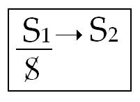
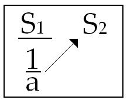
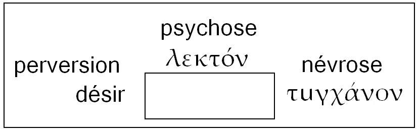

# Leçon 17 | 05 Mai l965

  <label><input type="checkbox" data-lacan-toggle="original" checked> 原文</label>
  <label><input type="checkbox" data-lacan-toggle="notes" checked> 注释</label>
  <label><input type="checkbox" data-lacan-toggle="commentary" checked> 个人解读评论</label>

<section class="parallel-paragraph" data-paragraph-ids="s12-17-0001">

s12-17-0001

[无对应译文]

原文 · s12-17-0001

Si être psychanalyste est une position responsable, la plus responsable de toutes puisqu’il est celui à qui est confiée l’opération d’une conversion éthique radicale, celle qui introduit le sujet à *l’ordre du désir*…

</section>

<section class="parallel-paragraph" data-paragraph-ids="s12-17-0002">

s12-17-0002

[无对应译文]

原文 · s12-17-0002

> ordre dont tout ce qu’il y a dans mon enseignement de rétrospection historique : essai de situer la position philosophique traditionnelle, vous montre - cet ordre - qu’il est resté en quelque sorte exclu …il est à savoir quelles sont les conditions qui sont requises pour que quelqu’un puisse se dire : « *Je suis psychanalyste* ».

</section>

<section class="parallel-paragraph" data-paragraph-ids="s12-17-0003">

s12-17-0003

[无对应译文]

原文 · s12-17-0003

Si ce qu’ici je vous démontre semblait bien aboutir à ceci : *que ces conditions sont* *si spéciales* que ce « *Je suis psychanalyste* » ne puisse en aucun cas descendre d’une *investiture* qui, à l’impétrant, ne pourrait venir en aucun cas *d’aucune place ailleurs*, il y aurait bien, semble-t-il quelque contradiction à se dire qu’à m’écouter ou tout au moins à prendre au sérieux ce que je dis - *ce qui semble impliqué de ce qu’on vienne m’écouter -* on puisse tout aussi bien continuer à trouver suffisant de recevoir cette investiture, disons pour le moins, *de lieux où ce que je dis est lettre morte*.

</section>

<section class="parallel-paragraph" data-paragraph-ids="s12-17-0004">

s12-17-0004

[无对应译文]

原文 · s12-17-0004

Ceci, assurément fait partie des conditions constitutives de ce que j’appellerais : « *De la difficulté du sérieux en notre matière* ».

</section>

<section class="parallel-paragraph" data-paragraph-ids="s12-17-0005">

s12-17-0005

[无对应译文]

原文 · s12-17-0005

Je reviendrai sur ce prélude puisque, aussi bien, mon discours d’aujourd’hui ne sera qu’essai de rassemblement des conditions logiques où se pose la question de ce que nous pouvons concevoir qu’est, du psychanalyste, ce qu’on attend de savoir.

</section>

<section class="parallel-paragraph" data-paragraph-ids="s12-17-0006">

s12-17-0006

[无对应译文]

原文 · s12-17-0006

Tout ce que j’ai apporté devant vous depuis le début de cette année, concerne cette place que nous pouvons donner à ce sur quoi nous opérons, si tant est que ce soit bien du sujet qu’il s’agisse.

</section>

<section class="parallel-paragraph" data-paragraph-ids="s12-17-0007">

s12-17-0007

[无对应译文]

原文 · s12-17-0007

*Que ce sujet se situe, se caractérise essentiellement comme étant de l’ordre du manque*, c’est ce que j’ai essayé de vous faire sentir, en vous montrant aux deux niveaux :

</section>

<section class="parallel-paragraph" data-paragraph-ids="s12-17-0008">

s12-17-0008

[无对应译文]

原文 · s12-17-0008

- du *nom propre* d’une part,

</section>

<section class="parallel-paragraph" data-paragraph-ids="s12-17-0009">

s12-17-0009

[无对应译文]

原文 · s12-17-0009

- de la *numération* de l’autre, …que le statut du *nom propre* n’est possible à articuler non pas comme d’une connotation de plus en plus approchée de ce qui dans l’inclusion *classificatoire* arriverait à se réduire à l’individu, mais au contraire, comme le comblement de ce quelque chose d’un autre ordre, qui est ce qui dans *la logique classique* s’opposait à la relation binaire de *l’universel* au *particulier* comme quelque chose de tiers et d’irréductible à leur fonctionnement, à savoir : comme *le singulier*.

</section>

<section class="parallel-paragraph" data-paragraph-ids="s12-17-0010">

s12-17-0010

[无对应译文]

原文 · s12-17-0010

Ceux qui ici, ont une formation suffisante pour entendre ce rappel que je fais de la tentative d’homogénéiser *le singulier* [^133] à *l’universel*, savent aussi les difficultés que ce rapprochement opposait à la logique classique, et le statut de ce *singulier* non seulement peut être donné d’une façon meilleure dans l’approximation de la logique moderne mais - me semble-t-il - ne peut être achevé *que* dans *la formulation* de cette logique à quoi nous donne accès la vérité et la pratique analytique, qui est ce que je tente de formuler devant vous ici et qui peut appeler, qui pourrait appeler - si je réussis - cette logique à formaliser le désir.

</section>

<section class="parallel-paragraph" data-paragraph-ids="s12-17-0011">

s12-17-0011

[无对应译文]

原文 · s12-17-0011

C’est pourquoi, ces remarques sur le *nom propre*, j’ai tenu à ce qu’elles soient complétées de cette logique moderne de la numération où il apparaît aussi que c’est essentiellement dans la fonction du *manque*, dans le concept du *zéro* lui-même, que prend racine la possibilité de cette fondation de l’*unité numérique* comme telle, et que c’est seulement par là qu’elle échappe aux difficultés irréductibles qui opposent à ce fonctionnement de l’*unité numérique*, l’idée de lui donner une fondation empirique quelconque dans la fonction du dernier terme que serait l’individualité.

</section>

<section class="parallel-paragraph" data-paragraph-ids="s12-17-0012">

s12-17-0012

[无对应译文]

原文 · s12-17-0012

Aussi bien pensais-je qu’il est justement essentiel d’en arriver jusque-là pour vous faire sentir la distinction qu’il y a de toute conception de *la tendance* - en tant que scientifique, en tant qu’elle nous porte à l’ordre du général - que *la tendance est spécifique*, et que l’erreur de traduire *Trieb* par *instinct*, consiste précisément en ceci : qu’elle ferait de *la tendance* quelque propriété, quelque statut qui s’insérerait dans le *quelque chose de vivant* en tant qu’il est typique, qu’il tombe sous l’ordre, sous l’emprise, sous l’effet du général.

</section>

<section class="parallel-paragraph" data-paragraph-ids="s12-17-0013">

s12-17-0013

[无对应译文]

原文 · s12-17-0013

Alors que c’est *par une voie singulière* dont il nous reste en somme, à inverser la question de savoir comment il se fait que nous puissions en attraper *quelque chose* dont nous puissions parler scientifiquement. Qu’est ce que c’est ce *quelque chose* ? Vous le savez : c’est *l’objet(a)*.

</section>

<section class="parallel-paragraph" data-paragraph-ids="s12-17-0014">

s12-17-0014

[无对应译文]

原文 · s12-17-0014

Vous savez que c’est par la voie contraire, celle d’une incidence toujours *singulière* - et de l’incidence d’un manque - que s’introduit ce résultat sur quoi, par un effet de *reste*, nous pouvons opérer, et d’où il reste à savoir dans quelle position il faut que nous soyons, que nous nous maintenions, pour pouvoir y opérer correctement.

</section>

<section class="parallel-paragraph" data-paragraph-ids="s12-17-0015">

s12-17-0015

[无对应译文]

原文 · s12-17-0015

C’est ainsi qu’aujourd’hui, pour arriver, à la fin de notre discours de cette année, à donner de ce statut de notre position, la formule, je reprendrai aujourd’hui ce discours, le rassemblant autour des deux positions fondamentales de ce que je vous enseigne quant à notre logique, à la logique de notre pratique analytique, à la logique impliquée par l’existence de l’inconscient : 1\) *le signifiant* - *à la différence du signe qui représente quelque chose pour quelqu’un* - *le signifiant est ce qui représente un sujet pour un autre signifiant.*

</section>

<section class="parallel-paragraph" data-paragraph-ids="s12-17-0016">

s12-17-0016

[无对应译文]

原文 · s12-17-0016

2\) qu’est-ce que veut dire dans notre champ, dans le champ que découvre la psychanalyse, qu’est-ce que veut dire la formule : *le sujet supposé savoir* ?

</section>

<section class="parallel-paragraph" data-paragraph-ids="s12-17-0017">

s12-17-0017

[无对应译文]

原文 · s12-17-0017

Pour renouer le fil avec ce que je vous ai proposé d’un modèle à éclairer une certaine *tripartition de ce champ* lors de mon cours du 7 Avril, je vous rappelle ce qui est ici reproduit sur la droite pour vous de ce tableau, *le signal à la fenêtre* fait par notre hypothétique amante à celui à qui elle offre son accueil :

</section>

<section class="parallel-paragraph" data-paragraph-ids="s12-17-0018">

s12-17-0018

[无对应译文]

原文 · s12-17-0018

- les rideaux tirés à gauche : « *seule* »,

</section>

<section class="parallel-paragraph" data-paragraph-ids="s12-17-0019">

s12-17-0019

[无对应译文]

原文 · s12-17-0019

- et les cinq petits pots de fleurs : « *à 5 heures* ».

</section>

<section class="parallel-paragraph" data-paragraph-ids="s12-17-0020">

s12-17-0020

[无对应译文]

原文 · s12-17-0020

Pourquoi dirons-nous qu’il s’agit ici de *signifiants* ? Je l’ai dit la dernière fois : il s’agit de *signifiants* - encore qu’il semble s’agir seulement d’éléments sémiologiques - parce que ceci n’a de portée que d’être traductible en langage, que c’est un code sans doute, mais que ce code se traduit - ceci est notamment sensible au niveau du premier terme : du « *seule* » - se traduit en quelque chose dont je vous ai manifesté *le caractère* non seulement *ambigu* fondamentalement mais *glissant*.

</section>

<section class="parallel-paragraph" data-paragraph-ids="s12-17-0021">

s12-17-0021

[无对应译文]

原文 · s12-17-0021

Qu’est-ce qu’être « *seule* » sinon articuler ce terme qui fait surgir dans le *creux* qui le suit immédiatement l’ambiguïté de ce qui va s’articuler sous le désir d’être « *la seule* » pour le rendez-vous auquel est appelé « *le seul* », sous le mouvement où se crée \- dans les deux sens - de la direction qu’indique la ligne où s’articule ce couple signifiant :

</section>

<section class="parallel-paragraph" data-paragraph-ids="s12-17-0022">

s12-17-0022

[无对应译文]

原文 · s12-17-0022

- d’une part le rendez-vous pour la rencontre,

</section>

<section class="parallel-paragraph" data-paragraph-ids="s12-17-0023">

s12-17-0023

[无对应译文]

原文 · s12-17-0023

- et d’autre part *le désir* qui le sous-tend, qui surgit de la formulation elle-même.

</section>

<section class="parallel-paragraph" data-paragraph-ids="s12-17-0024">

s12-17-0024

[无对应译文]

原文 · s12-17-0024

Ce n’est pas tout : le statut de ce qui est là articulé est en quelque sorte indépendant de quelque fait que ce soit. Il s’offre d’abord comme quelque chose de signifié, comme cet au-delà que j’ai appelé par le terme où les Stoïciens[^134] le désigne : le λεκτόν \[lecton\].

</section>

<section class="parallel-paragraph" data-paragraph-ids="s12-17-0025">

s12-17-0025

[无对应译文]

原文 · s12-17-0025

De même que c’est aux Stoïciens que j’ai emprunté le terme τυγχάνον \[tugkanon\] pour désigner ce qui se produit dans la direction vers la droite en quoi se constitue l’appel au seul pour cinq heures.

</section>

<section class="parallel-paragraph" data-paragraph-ids="s12-17-0026">

s12-17-0026

[无对应译文]

原文 · s12-17-0026

Cet exemple, ce modèle en quelque sorte - aussi rudimentaire ou sommaire, peut-être, qu’il puisse être donné - vous permet de saisir que la discussion pourrait rester ouverte, du statut de ce dont il s’agit dans cet encadrement de la fenêtre, qui est là ce qui recouvre le réel en sa mouvance, en sa multiplicité qui lui donne forme, qui en fait sujet de phrase.

</section>

<section class="parallel-paragraph" data-paragraph-ids="s12-17-0027">

s12-17-0027

[无对应译文]

原文 · s12-17-0027

Cette phrase, est phrase pour autant qu’au moins sensiblement dans le premier terme, dans ce « *seule* », *quelque chose* émerge qui n’est que de l’ordre du sujet, qui n’a, en quelque sorte, aucun répondant *réel*. Comme je vous l’ai dit : qu’est ce que c’est que d’être seul, dans le *réel* ? « * Quoi  *» est « *seule* » ?

</section>

<section class="parallel-paragraph" data-paragraph-ids="s12-17-0028">

s12-17-0028

[无对应译文]

原文 · s12-17-0028

Ce « *seule* » pourrait à la rigueur évoquer *la suffisance*, mais c’est précisément ce qu’il est là - *normalement* - pour ne pas évoquer, mais pour évoquer le contraire, à savoir *le manque*. Pris à ce niveau de logique où se montre le primordial du désir par rapport à toute répartition, nous voyons, en quelque sorte s’inverser ce que la logique classique nous présente comme le registre de la nécessité : « *il faut et il suffit* ». C’est dans l’ordre inverse que ça se présente ici : qu’à ce qui s’annonce apparemment comme se suffire \- essentiellement « *il faut* » \[faillir\] - *il fait défaut*, *quelque chose* qui va surgir entre le « *seule* » et l’heure.

</section>

<section class="parallel-paragraph" data-paragraph-ids="s12-17-0029">

s12-17-0029

[无对应译文]

原文 · s12-17-0029

Autrement dit, le niveau où nous avons à saisir tout ce qui est de l’ordre de notre champ, se distingue par une répartition fondamentale que je vais essayer encore de souligner par d’autres exemples.

</section>

<section class="parallel-paragraph" data-paragraph-ids="s12-17-0030">

s12-17-0030

[无对应译文]

原文 · s12-17-0030

Dans une référence que nous appellerons, pour simplifier, par convention, celle de la connaissance traditionnelle, *la fonction du signe*, aussi bien d’ailleurs dans certaines logiques, et nommément - je vous prie d’y regarder, ceux que la chose peut tenter - dans ce qu’il en est au niveau de l’enseignement bouddhique sur la logique, la fonction du signe est admirablement poussée en avant, le signe c’est essentiellement : « *Il n’y a pas de fumée sans feu.* »

</section>

<section class="parallel-paragraph" data-paragraph-ids="s12-17-0031">

s12-17-0031

[无对应译文]

原文 · s12-17-0031

Comme vous le savez, et aussi bien d’ailleurs, il n’y a rien de mieux que *la fumée* pour cacher *le feu* :

</section>

<section class="parallel-paragraph" data-paragraph-ids="s12-17-0032">

s12-17-0032

[无对应译文]

原文 · s12-17-0032

- *le feu* : référent réel,

</section>

<section class="parallel-paragraph" data-paragraph-ids="s12-17-0033">

s12-17-0033

[无对应译文]

原文 · s12-17-0033

- *la fumée* : signe qui le couvre, et là quelque part,

</section>

<section class="parallel-paragraph" data-paragraph-ids="s12-17-0034">

s12-17-0034

[无对应译文]

原文 · s12-17-0034

- *le sujet* : immobile, *réceptacle universel de ce qu’il y a à connaître* - derrière les signes - de réel supposé.

</section>

<section class="parallel-paragraph" data-paragraph-ids="s12-17-0035">

s12-17-0035

[无对应译文]

原文 · s12-17-0035

En quoi s’oppose *la fonction du signifiant* et ce qu’il en résulte pour *le statut du sujet* ? Ce n’est pas facile de vous le faire savoir par une sorte d’*épellement* et aussi bien, si c’est possible ce ne serait que dans un *procès maïeutique* en quelque sorte où, à chaque carrefour, il n’y aurait que trop d’occasions à ce que vous vous évadiez de la chaîne. C’est pourquoi, tout en vous priant de noter que je n’en ferai pas usage entièrement aujourd’hui, je vous donne *la fonction complète en quoi se distingue la relation du sujet dans le statut du signifiant*.

</section>

<section class="parallel-paragraph" data-paragraph-ids="s12-17-0036">

s12-17-0036

[无对应译文]

原文 · s12-17-0036

Il nous faut - nous dit la formule, que j’ai avancée devant vous - que le signifiant soit *ce qui représente un sujet pour un autre signifiant*.

</section>

<section class="parallel-paragraph" data-paragraph-ids="s12-17-0037">

s12-17-0037

[无对应译文]

原文 · s12-17-0037

*Quoi* nous est suggèré par cette formule ? Eh bien, pourquoi pas *la clé* et *la serrure* ? *La serrure*, ce n’est pas de ce qu’elle va permettre de découvrir quand la targette ou la chevillette a chu, qu’il s’agit, c’est de son rapport à quelque chose qui la fait fonctionner.

</section>

<section class="parallel-paragraph" data-paragraph-ids="s12-17-0038">

s12-17-0038

[无对应译文]

原文 · s12-17-0038

Mais qu’est-ce que *la clé* ? Entre *la clé* et *la serrure*, il y a encore le chiffre : la clé est ici trompeuse. Ce qui nous intéresse dans ceci \- une serrure qui est une composition signifiante - c’est l’internité de cette composition, avec la polyvalence, le choix, l’énigme à l’occasion, du chiffre qui lui permettra de fonctionner.

</section>

<section class="parallel-paragraph" data-paragraph-ids="s12-17-0039">

s12-17-0039

[无对应译文]

原文 · s12-17-0039

Ce chiffre, dans un certain état de la serrure, il n’y en a qu’un qui peut opérer : le 1 qui suppose un sujet réduit à cet 1 d’une combinaison. Il n’y a pas de jeu là, le sujet n’est pas le récepteur universel : il a le chiffre ou il ne l’a pas.

</section>

<section class="parallel-paragraph" data-paragraph-ids="s12-17-0040">

s12-17-0040

[无对应译文]

原文 · s12-17-0040

Et le rôle de la clé est bien suggestif et bien amusant pour nous représenter ceci : qu’il est en effet *un reste, un petit quelque chose opératoire, un déchet* dans l’affaire, mais sans doute indispensable, qui en fin de compte représente le support effectif et réel où interviendra le sujet. Autrement dit, dans la formule que vous voyez ici seconde qui se substitue à la première en tant que la première nous désigne le S1 qui *représente* auprès du S2, le S qu’est le *sujet*.

</section>

<section class="parallel-paragraph" data-paragraph-ids="s12-17-0041">

s12-17-0041

[无对应译文]

原文 · s12-17-0041

</section>

<section class="parallel-paragraph" data-paragraph-ids="s12-17-0042">

s12-17-0042

[无对应译文]

原文 · s12-17-0042

Au-dessous vous voyez le S1, si vous voulez dans l’occasion du chiffre, représentant auprès du S2 de la serrure ceci : 1/*a* qui est le 1 du sujet, pour autant qu’il est réduit à être ou non la clé à fournir. Cette petite présentation, préambule, est essentielle à poser ce qui doit être mis en question : quel est, à ce niveau premier pour autant que ce soit celui où nous avons à opérer en analyse, quel est, quel doit être, comment se présente, ce que nous appellerons le *statut du savoir* ?

</section>

<section class="parallel-paragraph" data-paragraph-ids="s12-17-0043">

s12-17-0043

[无对应译文]

原文 · s12-17-0043

Car enfin, nous l’avons dit - et même ne l’aurions-nous pas dit - il est clair que le psychanalyste est appelé en la situation, comme étant le « *sujet supposé savoir* ». *Ce* qu’il a à savoir n’est pas *savoir de classification*, n’est pas *savoir général*, n’est pas *savoir de zoologiste*.

</section>

<section class="parallel-paragraph" data-paragraph-ids="s12-17-0044">

s12-17-0044

[无对应译文]

原文 · s12-17-0044

Ce qu’il a à savoir se définit par ce *niveau primordial* où il y a *un sujet* qui est amené, dans notre opération, à ce temps de surgissement, qui s’articule : *Je ne savais pas*.

</section>

<section class="parallel-paragraph" data-paragraph-ids="s12-17-0045">

s12-17-0045

[无对应译文]

原文 · s12-17-0045

« *Je ne savais pas*... » :

</section>

<section class="parallel-paragraph" data-paragraph-ids="s12-17-0046">

s12-17-0046

[无对应译文]

原文 · s12-17-0046

> ou bien : « ...*que ce signifiant qui est là, que je reconnais maintenant, c’était là où j’étais comme sujet.* »

</section>

<section class="parallel-paragraph" data-paragraph-ids="s12-17-0047">

s12-17-0047

[无对应译文]

原文 · s12-17-0047

> ou bien : « ...*que ce signifiant qui est là, que vous me désignez, que vous articulez pour moi, c’était pour me représenter - auprès de lui - que j’étais ceci ou cela.* »

</section>

<section class="parallel-paragraph" data-paragraph-ids="s12-17-0048">

s12-17-0048

[无对应译文]

原文 · s12-17-0048

C’est ce que la psychanalyse découvre. Et ici je vais accentuer pour vous, en prenant presque au hasard des exemples dans les 1ères articulations de FREUD, à quel point c’est ainsi que doit s’exprimer d’une façon appropriée, ce qui s’appelle *la structure du symptôme*.

</section>

<section class="parallel-paragraph" data-paragraph-ids="s12-17-0049">

s12-17-0049

[无对应译文]

原文 · s12-17-0049

L’*aphonie* de Dora n’est reconnue, n’est reconnaissable, pour représenter le sujet Dora, que par rapport à ce *signifiant* qui n’a point d’autre statut que de *signifiant*, si on vise correctement le fonctionnement du *symptôme* et qui s’articule : « *seule avec elle* », « *elle* » c’est-à-dire Mme K.[^135] Elle ne peut plus parler dans la fonction même où elle est *seule avec elle*, et l’*aphonie* représente Dora, non pas du tout auprès de Mme K. avec qui elle parle et même trop abondamment *dans les circonstances ordinaires*, mais quand elle est « *seule avec elle* » : *quand M. K. est en voyage*.

</section>

<section class="parallel-paragraph" data-paragraph-ids="s12-17-0050">

s12-17-0050

[无对应译文]

原文 · s12-17-0050

La toux de Dora. La toux de Dora, où est-ce que FREUD la repère ? Lisez le texte : quand il y désigne un *symptôme*, c’est en fonction où cette toux prend fonction de *signifiant*, d’avertissement, dirais-je, donné par Dora à quelque chose qui surgit à cette occasion *et qui ne serait point surgi autrement*. Et il faut lire le texte de FREUD pour suivre le cheminement *purement signifiant* \[...\] de jeu de mots autour du père qui est un homme *fortuné*, ce qui veut dire - dit FREUD - « *sans fortune* » au sens où le mot « *fortune* » veut dire aussi en allemand *puissance sexuelle*.

</section>

<section class="parallel-paragraph" data-paragraph-ids="s12-17-0051">

s12-17-0051

[无对应译文]

原文 · s12-17-0051

Pas de *Vermögen*. Qu’est-ce qu’il y a de plus purement signifiant que ce jeu de mot homonymique et en plus le renversement négatif de ce qu’il veut dire, faute de quoi rien dans *la toux de Dora* n’aurait le sens que FREUD lui donne, qui est aussi celui qu’a *ce* *symptôme*, qui est celui du substitut que le couple de son père et Mme K. apporte à cette impuissance, nommément ce que FREUD articule, d’ailleurs sans pousser absolument les choses jusqu’à leur terme, du rapport génito-buccal.

</section>

<section class="parallel-paragraph" data-paragraph-ids="s12-17-0052">

s12-17-0052

[无对应译文]

原文 · s12-17-0052

Prenez *Le petit Hans* [^136], l’extravagante histoire du départ de Grüden avec je ne sais pas quoi, la gouvernante à cheval sur la monture du traîneau. Comment est-ce que FREUD nous l’interprète ? C’est à savoir : « *Je peux bien vous raconter des craques comme ça, si vous vous m’en racontez d’autres : je vous demande comment naissent les enfants et vous me parlez de la cigogne.* ». Le signifiant vaut pour le signifiant.

</section>

<section class="parallel-paragraph" data-paragraph-ids="s12-17-0053">

s12-17-0053

[无对应译文]

原文 · s12-17-0053

La seule personne qui ne le sache pas jusqu’à ce qu’on le lui dise c’est le sujet, c’est *le petit Hans*. Ce n’est pas tout à fait, d’ailleurs, la même chose. Car *la fonction signifiante* est là d’une beaucoup plus grosse molécule. C’est *une grosse fable* à laquelle se livre *le petit Hans*.

</section>

<section class="parallel-paragraph" data-paragraph-ids="s12-17-0054">

s12-17-0054

[无对应译文]

原文 · s12-17-0054

Et pour prendre un 3ème exemple et compléter *notre hystérique et notre phobique par l’obsessionnel*, rappelez-vous dans *L’Homme aux rats*, ce qu’il arrive dans ces tentatives désespérées pour maigrir auxquelles se livre *L’Homme aux rats*. En fonction de quoi ?

</section>

<section class="parallel-paragraph" data-paragraph-ids="s12-17-0055">

s12-17-0055

[无对应译文]

原文 · s12-17-0055

En fonction qu’au même moment, il y a auprès de sa bien-aimée, un nommé Dick. C’est pour ne point être *dick* qu’il veut maigrir. Tout son effort pour maigrir - et il s’efforce de maigrir jusqu’au point de crever - c’est très précisément pour se signifier auprès du signifiant « *Dick* » et rien de plus !

</section>

<section class="parallel-paragraph" data-paragraph-ids="s12-17-0056">

s12-17-0056

[无对应译文]

原文 · s12-17-0056

*Mais, mais, mais,* quelque chose, dont à ma connaissance on n’a jamais relevé le trait général - c’était pourtant bien le cas, puisque nous sommes toujours là plus à l’aise, de s’en emparer - c’est ce qui résulte d’un examen simplement naïf, dès lors que la catégorie est mise dans le train, si l’on peut dire - la catégorie du savoir - c’est que c’est là que gît ce qui nous permet *de distinguer radicalement* la fonction du *symptôme*, si tant est que le *symptôme* nous puissions lui donner son statut comme définissant le champ analysable.

</section>

<section class="parallel-paragraph" data-paragraph-ids="s12-17-0057">

s12-17-0057

[无对应译文]

原文 · s12-17-0057

La différence *d’un signe*, d’une matité par exemple, qui nous permet de savoir qu’il y a hépatisation d’un lobe, et *d’un symptôme* au sens où nous devons l’entendre comme *symptôme* analysable - et justement qui définit et isole comme tel *le champ psychiatrique* et qui lui donne son statut ontologique - c’est qu’il y a toujours dans le symptôme l’indication qu’il est question de *savoir*.

</section>

<section class="parallel-paragraph" data-paragraph-ids="s12-17-0058">

s12-17-0058

[无对应译文]

原文 · s12-17-0058

On n’a jamais assez souligné à quel point, dans *la paranoïa* ce ne sont pas seulement des signes de quelque chose que reçoit le paranoïaque, c’est le signe que quelque part on sait ce que veulent dire ces signes, que lui ne connaît pas. *Cette dimension ambiguë,* *du fait qu’il y a à savoir et que c’est indiqué*, peut être étendue à tout le champ de la symptomatologie psychiatrique pour autant que l’analyse y introduit cette dimension nouvelle, qui est précisément que son statut est celui du signifiant. Regardez à quel point \- *bien sûr je ne prétends pas épuiser en quelques mots, l’infinie multiplicité, l’éclat en quelque sorte chatoyant du phénomène -* à quel point :

</section>

<section class="parallel-paragraph" data-paragraph-ids="s12-17-0059">

s12-17-0059

[无对应译文]

原文 · s12-17-0059

- *dans la névrose* il est impliqué, donné, dans *le symptôme original,* que le sujet n’arrive pas à savoir,

</section>

<section class="parallel-paragraph" data-paragraph-ids="s12-17-0060">

s12-17-0060

[无对应译文]

原文 · s12-17-0060

- et que le statut de *la perversion* aussi est lié étroitement à quelque chose, là, qu’on sait, mais qu’on ne peut faire savoir.

</section>

<section class="parallel-paragraph" data-paragraph-ids="s12-17-0061">

s12-17-0061

[无对应译文]

原文 · s12-17-0061

L’indication définie, dans le symptôme lui-même, de cette dimension, de cette référence du *savoir*, voilà d’où j’aimerai voir partir…

</section>

<section class="parallel-paragraph" data-paragraph-ids="s12-17-0062">

s12-17-0062

[无对应译文]

原文 · s12-17-0062

> dans une réunion que j’ai annoncée à la fin du séminaire fermé et qui aura lieu, non pas comme je l’ai dit le 20 Juin,
>
> mais le 27 Juin par l’invitation d’un groupe, que les gens qualifiés recevront et que ceux qui ne sont pas qualifiés
>
> n’ont qu’à se faire connaître pour recevoir …que j’aimerais que parte une certaine révision à proprement parler *nosologique* : que j’aimerais la voir partir au niveau de l’élément qui est le *symptôme*, la mise en valeur de cette dimension, de cette instance et sa variété, sa variabilité, sa diversité, que j’ai la dernière fois manifestée comme tripartite - je dois dire à simple titre d’introduction , d’engagement en cette matière - en disant que ce *savoir* en question, pour autant qu’il est aussi manque, voire échec, *il se diversifie selon les trois plans ici isolés du* λεκτόν \[lecton\], du τυγχάνον \[tugkanon\] et du *désir*, selon les trois variétés :

</section>

<section class="parallel-paragraph" data-paragraph-ids="s12-17-0063">

s12-17-0063

[无对应译文]

原文 · s12-17-0063

</section>

<section class="parallel-paragraph" data-paragraph-ids="s12-17-0064">

s12-17-0064

[无对应译文]

原文 · s12-17-0064

- *Du psychotique qui sait qu’il y a un signifié, je dirais même qui y vit,* *c’est un* λεκτόν mais qui n’en est pas, pour autant, sûr de rien.

<!-- -->

</section>

<section class="parallel-paragraph" data-paragraph-ids="s12-17-0065">

s12-17-0065

[无对应译文]

原文 · s12-17-0065

- *Du névrosé* avec son τυγχάνον : à quand *la rencontre* ? Quand aurais-je, non pas la clé mais le chiffre ?

</section>

<section class="parallel-paragraph" data-paragraph-ids="s12-17-0066">

s12-17-0066

[无对应译文]

原文 · s12-17-0066

- *Et du pervers* pour qui le désir se situe lui-même à proprement parler dans la dimension *d’un secret possédé*, vécu comme tel et qui comme tel développe la dimension de sa jouissance.

</section>

<section class="parallel-paragraph" data-paragraph-ids="s12-17-0067">

s12-17-0067

[无对应译文]

原文 · s12-17-0067

Mais qu’est-ce à dire encore de ce *savoir*, qui d’abord s’inscrit dans cette subjectivité du « *Je ne savais pas* » où c’est le « *Je* », poursuivi de la vibration de ce « *ne* » qui n’est pas la pure et simple négation mais

</section>

<section class="parallel-paragraph" data-paragraph-ids="s12-17-0068">

s12-17-0068

[无对应译文]

原文 · s12-17-0068

- *le « il s’en faut que je ne sache »,*

</section>

<section class="parallel-paragraph" data-paragraph-ids="s12-17-0069">

s12-17-0069

[无对应译文]

原文 · s12-17-0069

- *le « avant que je ne sache »,*

</section>

<section class="parallel-paragraph" data-paragraph-ids="s12-17-0070">

s12-17-0070

[无对应译文]

原文 · s12-17-0070

- *« plût au ciel que je n’aie su »,* …qui est le prolongement du « *Je* » lui-même auquel il faut le laisser accolé, où ce « *Je* » a un autre statut que celui du *shifter*.

</section>

<section class="parallel-paragraph" data-paragraph-ids="s12-17-0071">

s12-17-0071

[无对应译文]

原文 · s12-17-0071

Ça n’est pas le même « *je* » qui dit « *je te parle* » car le « *J’te parle* » n’est qu’un rappel à l’actualité d’une articulation qui reste elle-même parfaitement ambiguë dans sa valeur, même si elle se propose toujours comme instituant un rapport[^137].

</section>

<section class="parallel-paragraph" data-paragraph-ids="s12-17-0072">

s12-17-0072

[无对应译文]

原文 · s12-17-0072

*Ce « Je » du « Je ne savais pas » où était-il et qu’était-il avant de savoir ?* C’est bien ici que le moment est propice d’évoquer la dimension où culmine et bascule toute *la tradition classique* en tant que s’y achève un certain statut du sujet.

</section>

<section class="parallel-paragraph" data-paragraph-ids="s12-17-0073">

s12-17-0073

[无对应译文]

原文 · s12-17-0073

Nombreux, tout de même, sont ceux d’entre vous qui savent où HEGEL propose *l’achèvement de l’histoire* en ce mythe incroyablement dérisoire du « *savoir absolu* »[^138]. Qu’est-ce que peut bien vouloir dire cette idée d’un discours totalisateur : totalisateur de quoi ? De la somme des formes de l’aliénation par où serait passé un sujet, par ailleurs - vous le savez bien - *idéal* puisque, aussi bien, il n’est pas concevable qu’il soit réalisé comme tel par aucun individu. Que peut vouloir dire cet étrange mythe ?

</section>

<section class="parallel-paragraph" data-paragraph-ids="s12-17-0074">

s12-17-0074

[无对应译文]

原文 · s12-17-0074

À la vérité n’est-il pas évident qu’il serait depuis longtemps repoussé à la façon d’un rêve de pédant, s’il n’était justement articulé d’une bien autre dialectique que celle de la connaissance et s’il ne nous était point dit que c’est *l’être de désir qui s’y achève*, pour autant que les chemins par où ce désir est passé sont ruses de la raison. Mais qui est *le rusé* ? C’est celui qui s’achève dans ce *Dimanche de la vie* - comme un humoriste l’a fort bien articulé[^139] - du *savoir absolu*, puisque c’est celui qui dira « *Je jaspine toujours* » ou celui qui pourra dire « *à partir de maintenant, je baise* ». \[Cf. *L’identification*, 22-11-1961\] Où est *la ruse* : dans *le désir* ou *la raison* ?

</section>

<section class="parallel-paragraph" data-paragraph-ids="s12-17-0075">

s12-17-0075

[无对应译文]

原文 · s12-17-0075

L’analyse est là pour nous apprendre que *la ruse est dans la raison* parce que le désir est déterminé par le jeu du signifiant.

</section>

<section class="parallel-paragraph" data-paragraph-ids="s12-17-0076">

s12-17-0076

[无对应译文]

原文 · s12-17-0076

*Que le désir est ce qui surgit de la marque, de la marque du signifiant sur l’être vivant* et que dès lors ce qu’il s’agit, pour nous, d’articuler, c’est : qu’est-ce que peut vouloir dire la voie que nous traçons du retour du *désir* à son origine signifiante ?

</section>

<section class="parallel-paragraph" data-paragraph-ids="s12-17-0077">

s12-17-0077

[无对应译文]

原文 · s12-17-0077

Que veut dire qu’il y ait des hommes qui s’appellent psychanalystes et que cette opération intéresse ? Il est tout à fait évident que dans ce registre *le psychanalyste* s’introduit, s’introduisant comme *sujet supposé savoir, est lui-même, reçoit lui-même, supporte lui-même,* *le statut du symptôme*. Un sujet est psychanalyste, non pas savant rempardé derrière des catégories, au milieu desquelles il essaie de se débrouiller pour faire des tiroirs dans lesquels il aura à ranger les symptôme qu’il enregistre de son patient, psychotique, névrotique ou autre, mais pour autant qu’il entre dans le jeu signifiant.

</section>

<section class="parallel-paragraph" data-paragraph-ids="s12-17-0078">

s12-17-0078

[无对应译文]

原文 · s12-17-0078

Et c’est en quoi un examen clinique, une présentation de malade, ne peut absolument pas être la même au temps de la psychanalyse ou au temps qui précède. Dans le temps qui précède, quel que soit le génie qu’y ait mis le clinicien…

</section>

<section class="parallel-paragraph" data-paragraph-ids="s12-17-0079">

s12-17-0079

[无对应译文]

原文 · s12-17-0079

> Dieu sait si j’ai pu avoir récemment à rafraîchir mon admiration
>
> pour le style éblouissant d’un KRAEPELIN quand il décrit ses diverses formes de paranoïa …la distinction est radicale de ce que - au moins en théorie, en puissance - de ce qui est exigible du rapport du clinicien avec le malade, serait-ce sur le plan de la première présentation.

</section>

<section class="parallel-paragraph" data-paragraph-ids="s12-17-0080">

s12-17-0080

[无对应译文]

原文 · s12-17-0080

Si le clinicien, si le médecin qui présente, ne sait pas *qu’une moitié du symptôme* - comme je viens de vous l’articuler en vous rappelant ces exemples de FREUD - *que d’une moitié du symptôme c’est lui qui a la charge*, qu’il n’y a pas présentation de malade mais dialogue de deux personnes et que, sans cette seconde personne il n’y aurait pas de symptôme achevé et condamné, comme c’est le cas pour la plupart, à laisser la clinique psychiatrique stagner dans la voie d’où la doctrine freudienne devrait l’avoir sortie.

</section>

<section class="parallel-paragraph" data-paragraph-ids="s12-17-0081">

s12-17-0081

[无对应译文]

原文 · s12-17-0081

*Le symptôme, il faut que nous le définissions comme quelque chose qui se signale comme un savoir déjà là, à un sujet qui sait que ça le concerne,* *mais qui ne sait pas ce que c’est.*

</section>

<section class="parallel-paragraph" data-paragraph-ids="s12-17-0082">

s12-17-0082

[无对应译文]

原文 · s12-17-0082

Dans quelle mesure pouvons-nous, *nous analystes*, dire que nous sommes à la hauteur de cette tâche d’être celui qui dans chaque cas sait ce que c’est ? Rien qu’à ce niveau, déjà là où elle est mise, se pose la question du statut du psychanalyste.

</section>

<section class="parallel-paragraph" data-paragraph-ids="s12-17-0083">

s12-17-0083

[无对应译文]

原文 · s12-17-0083

La question est facilitée par l’évolution des conceptions de la science elle-même concernant le savoir.

</section>

<section class="parallel-paragraph" data-paragraph-ids="s12-17-0084">

s12-17-0084

[无对应译文]

原文 · s12-17-0084

Pendant longtemps nous avons pu croire que le problème était bien posé de « *l’apparence* » et du « *réel* », que c’est de l’examen de la mise à l’épreuve, du tâtement de la perception que dépendait tout le statut de la science.

</section>

<section class="parallel-paragraph" data-paragraph-ids="s12-17-0085">

s12-17-0085

[无对应译文]

原文 · s12-17-0085

Mais qu’est-ce que veut dire cette opposition du *leurre* au *réel*, si ce n’est que le *réel* dont il s’agit - fût-ce de la science la plus antique - c’est *le réel du savant*. Et ce qu’on ne voit pas, c’est que *ce réel du savant* - à savoir *ce qui est un savoir -* c’est bel et bien un corps de signifiants et absolument rien d’autre. Si la notion d’*information* a pu prendre cette *forme anonyme* qui permet de la quantifier en termes de ce qu’on appelle « *bit »*, c’est pour autant que le *magasinage*, le *storage* d’éléments d’informations se suffit à lui-même à nos yeux pour constituer ce qu’on appelle *un savoir*.

</section>

<section class="parallel-paragraph" data-paragraph-ids="s12-17-0086">

s12-17-0086

[无对应译文]

原文 · s12-17-0086

À ceci près bien sûr, que ça ne commence à avoir un sens que si vous faites circuler quelque part - où que ce soit, et vous ne pouvez point en éviter l’ombre - un sujet, sans doute infiniment mobile s’il vous plaît d’inscrire *en termes d’informations le fonctionnement interne d’un organisme biologique par exemple*, c’est dire que - quoique vous en ayez - vous y mettrez quelque part, comme DESCARTES…

</section>

<section class="parallel-paragraph" data-paragraph-ids="s12-17-0087">

s12-17-0087

[无对应译文]

原文 · s12-17-0087

> ce ne sera pas forcément de la glande pinéale, mais où que vous le mettiez,
>
> il sera bien toujours quelque part, dans quelque autre glande à sécrétion interne \[Cf. Descartes : *Passions de l’âme*\] …un sujet, un sujet qui se dérobe, un sujet fuyant.

</section>

<section class="parallel-paragraph" data-paragraph-ids="s12-17-0088">

s12-17-0088

[无对应译文]

原文 · s12-17-0088

Ce *savoir* tel que, il nous faut lui donner son statut, ça n’est point une logique aristotélicienne qui peut en répondre car - vous allez le voir - il suffit de poser la question au niveau de la science, d’une *science moderne*, d’une science qui est *la nôtre*, pour nous trouver devant de très curieux problèmes en impasse qui sont ceux qui ont arrêté ARISTOTE[^140]. Pour lui, c’était à propos du *contingent *: *un événement qui aura lieu demain, est-il vrai maintenant qu’il aura lieu ou qu’il n’aura pas lieu ?* Si c’est vrai maintenant, c’est donc que c’est maintenant que c’est joué.

</section>

<section class="parallel-paragraph" data-paragraph-ids="s12-17-0089">

s12-17-0089

[无对应译文]

原文 · s12-17-0089

ARISTOTE était bien entendu un esprit de trop de bon sens pour ne pas s’évader d’une telle contrainte et c’est pour nous faire remarquer qu’il n’est pas toujours *vrai* qu’une proposition doit être *vraie* ou *fausse*. Bonne ou mauvaise, cette solution on l’a discutée. Ce n’est pas cela qui nous intéresse. C’est de nous apercevoir que nous pouvons nous poser la question de *savoir si la doctrine newtonienne était vraie avant que* NEWTON *la formule* ? Eh bien, j’aimerais savoir comment se départage l’assemblée sur ce point !

</section>

<section class="parallel-paragraph" data-paragraph-ids="s12-17-0090">

s12-17-0090

[无对应译文]

原文 · s12-17-0090

Mais pour moi, j’abattrai volontiers mes cartes en disant qu’il me semble peu vraisemblable de dire que le savoir newtonien était vrai avant d’être constitué par NEWTON pour une bonne raison, *c’est que maintenant et d’abord, il ne l’est plus*. Il ne l’est plus tout à fait !

</section>

<section class="parallel-paragraph" data-paragraph-ids="s12-17-0091">

s12-17-0091

[无对应译文]

原文 · s12-17-0091

Dans la nécessité même du *savoir*, de l’articulation signifiante, il y a cette contingence de n’être qu’une articulation signifiante, une serrure montée.

</section>

<section class="parallel-paragraph" data-paragraph-ids="s12-17-0092">

s12-17-0092

[无对应译文]

原文 · s12-17-0092

Nous n’avons même pas, nous analystes, à nous porter si loin, simplement cette toiture est faite pour que nous ne soyons pas tellement désorientés d’avoir affaire à une exigence bien différente. Quelle est cette exigence ? Elle se place au niveau de l’incidence signifiante originelle, celle où le sujet se trouve à la fois surgir et en même temps s’aliéner du fait de cette incidence signifiante.

</section>

<section class="parallel-paragraph" data-paragraph-ids="s12-17-0093">

s12-17-0093

[无对应译文]

原文 · s12-17-0093

De ce signifiant dont il est exigé que pour représenter le sujet, il s’adresse, lui, signifiant, il soit le représentant diplomatique du sujet, auprès d’un autre signifiant : va-t-il être exigé de nous que nous le trouvions à tout coup ?

</section>

<section class="parallel-paragraph" data-paragraph-ids="s12-17-0094">

s12-17-0094

[无对应译文]

原文 · s12-17-0094

Quel serait le paradoxe d’une exigence et d’un devoir qui ne serait pas celui qu’a assumé depuis toujours le savant comme le sophiste, qui est d’avoir réponse à tout ? À tout ce qui s’est organisé comme discours, à tout ce qui s’est monté comme combinaison signifiante, d’être toujours à la hauteur du discours, et non de ce quelque chose d’absolument originel qui est ou qui serait ce signifiant unique et supposé, cet ὄνομα \[onoma\] primordial où le sujet se spécifierait par rapport au monde entier du signifiant.

</section>

<section class="parallel-paragraph" data-paragraph-ids="s12-17-0095">

s12-17-0095

[无对应译文]

原文 · s12-17-0095

L’absurdité de cette position se montre assez et c’est là le point de vertige que comporte même l’idée d’interprétation, et c’est du même coup ce qui nous permet d’y échapper, c’est ce qui la relativise : ce n’est point à cela que nous avons affaire, pas plus que notre connaissance de psychanalyste ne saurait aboutir à cette sorte de fatalisme du savoir *que la réponse déjà serait en nous*, et non du fait *que de nous on attend la réponse*. Les chances de la *rencontre*, qui est ce dont il s’agit dans l’appel du désir, sont en elles-mêmes plus qu’improbables et aussi bien *l’horizon de signes*, de signifiés sur quoi se déploie l’expérience subjective est-il, de sa nature, énigmatique, et s’annonçant comme tel au niveau du λεκτόν.

</section>

<section class="parallel-paragraph" data-paragraph-ids="s12-17-0096">

s12-17-0096

[无对应译文]

原文 · s12-17-0096

Pour ce qui est du désir, ce n’est pas aujourd’hui que j’avancerai le terme si ce n’est pour dire que c’est *du réel du désir* et de son statut qu’il s’agit dans l’opération analytique. Disons simplement qu’au *premier chef* et *phénoménologiquement*, il s’annonce à nous comme étant *le champ de l’impossible*. Nous voici bien cernés. Est-ce qu’effectivement, la position de l’analyste se résumerait à ce *quelque chose* que nous appellerions, non point fatalisme du savoir, mais fétichisme ?

</section>

<section class="parallel-paragraph" data-paragraph-ids="s12-17-0097">

s12-17-0097

[无对应译文]

原文 · s12-17-0097

Que d’un savoir impossible à soutenir, l’analyste serait quelque chose comme la borne ou le soliveau ?

</section>

<section class="parallel-paragraph" data-paragraph-ids="s12-17-0098">

s12-17-0098

[无对应译文]

原文 · s12-17-0098

C’est là *le point d’impasse* où j’entends conclure aujourd’hui pour essayer, la prochaine fois que nous nous retrouverons, de le rouvrir.

</section>

<section class="note-block original-notes">

## Notes

[^133]: Cf. Pierre Alféri : *Guillaume d'Ockham le singulier,* Paris, éd. de Minuit, 1989.

[^134]: Chez les Stoïciens:

    1\) le mot grec « tugkanon », littéralement « ce qui arrive », est plutôt à traduire, dans le cadre de la physique stoïcienne (le monde comme totalité dynamique solidaire, comme système de forces, où tout peut être signe de tout, d’où l’intérêt des Stoïciens pour la divination), par « conjoncture » (c’est-à-dire comme dynamique globale du monde, comme support du flux événementiel à l’instant considéré, ou encore comme contexte dynamique incluant l’acteur), que par « référent »

    2\) la relation triadique entre semeion, lecton et tugkanon, toujours dans le cadre de la physique stoïcienne (qui fait du lecton - littéralement le « dicible » - l’événement « incorporel » constitué par la relation entre le semeion et le tugkanon qui sont tous deux « corporels »), est plus étroite que ne le suggère le schéma (semeion → lecton → tugkanon), qui laisse ouverte la possibilité de couper la triade à deux endroits. Cf. E. Bréhier, La théorie des incorporels.

[^135]: S. Freud, *Cinq psychanalyses *: Dora. Paris, PUF, 1954.

[^136]: S. Freud, *Cinq psychanalyses : Le petit Hans*, op. cit.

[^137]: Cf. séminaire *L’identification* : 22-11 et 17-01. Écrits p. 664, ou t. 2 p124.

[^138]: G. W. F. Hegel : *Phénoménologie de l'Esprit*, op. cit., Le Savoir absolu.

[^139]: Raymond Queneau : Le dimanche de la vie, Paris, folio Gallimard n°442. À propos de la peinture hollandaise et de ses scènes de « naïve gaieté

    et de joie spontanée » Hegel parle de Dimanche de la vie : « ...c'est le dimanche de la vie, qui nivelle tout et éloigne tout ce qui est mauvais;

    des hommes doués d'une aussi bonne humeur ne peuvent être foncièrement mauvais ou vils. »

[^140]: Aristote : Organon II, *De l'interprétation*, op. cit., chap.9, l’opposition des futurs contingents :

    « *L'affirmation ou la négation portant sur les choses présentes ou passées est nécessairement vraie ou fausse, et les propositions contradictoires portant sur des universels et prises universellement, sont toujours aussi, l'une vraie et l'autre fausse; il en est de même, ainsi que nous l'avons dit, dans le cas de sujets singuliers.* »

    Note de J. Tricot : La théorie d'Aristote sur les futurs contingents paraît avoir été édifiée pour répondre aux Mégariques, notamment Diodore Cronos

    et Philon, qui faisaient découler du principe de contradiction un fatalisme absolu.

</section>
