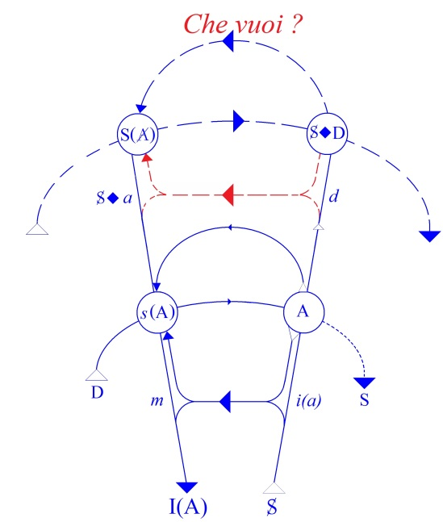
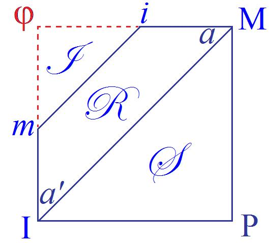
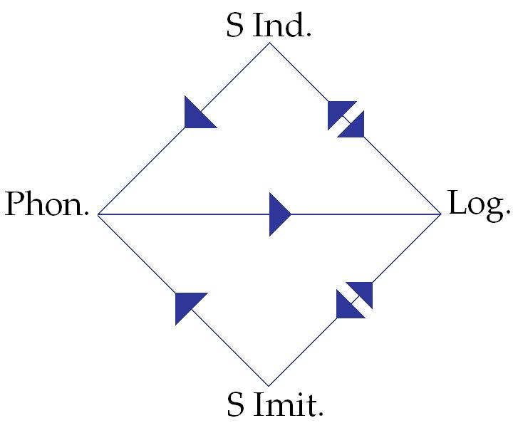
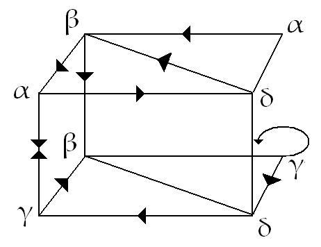
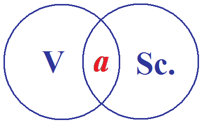

# Leçon 02 | 08 Décembre l965

  

    <label><input type="checkbox" data-lacan-toggle="original" checked> 原文</label>
    <label><input type="checkbox" data-lacan-toggle="notes" checked> 注释</label>
    <label><input type="checkbox" data-lacan-toggle="commentary" checked> 个人解读评论</label>
  

  <form class="lacan-tool-search" role="search">
    <input class="lacan-tool-search-input" type="search" placeholder="搜索全文" aria-label="搜索全文">
    <button class="lacan-tool-button" type="submit" title="搜索">搜索</button>
  </form>
  <button class="lacan-tool-button lacan-back-to-top" type="button" title="回到页面最上方" aria-label="回到页面最上方">↑</button>

<section class="parallel-paragraph" data-paragraph-ids="s13-02-0001">

s13-02-0001

原文 · s13-02-0001

La dernière fois, vous avez entendu de moi une sorte de leçon qui ne ressemblait pas aux autres parce que, il se trouve qu’elle était entièrement écrite. Elle était entièrement écrite aux fins d’être donnée au plus vite à une sorte d’impression qu’on appelle « *ronéotypie* » et que vous puissiez l’avoir comme repère, eu égard à mon enseignement.

[无对应译文]

</section>

<section class="parallel-paragraph" data-paragraph-ids="s13-02-0002">

s13-02-0002

原文 · s13-02-0002

Certains en ont émis *un certain regret*, disons *une* *déception*. La chose vaut qu’on s’y arrête. Pour y mettre un peu d’humour, je dirai que la façon dont cette déception s’exprimait était quelque chose autour de ceci - je force un peu : on préférait cette sorte de « *bagarre* », paraît-il, que représente d’assister - j’ose à peine le dire - à « *la naissance* » de ma pensée.

[无对应译文]

</section>

<section class="parallel-paragraph" data-paragraph-ids="s13-02-0003">

s13-02-0003

原文 · s13-02-0003

Vous pensez si ma pensée naît quand je suis là en train de me colleter avec quelque chose qui est loin d’être tout à fait ça.

[无对应译文]

</section>

<section class="parallel-paragraph" data-paragraph-ids="s13-02-0004">

s13-02-0004

原文 · s13-02-0004

Comme tout le monde, c’est avec ma parole, bien sûr, que je m’explique. Ça prouve, bien entendu, qu’elle s’est formée ailleurs.

[无对应译文]

</section>

<section class="parallel-paragraph" data-paragraph-ids="s13-02-0005">

s13-02-0005

原文 · s13-02-0005

D’ailleurs, vous avez peut-être pu entendre que mon *cogito* à moi…

[无对应译文]

</section>

<section class="parallel-paragraph" data-paragraph-ids="s13-02-0006">

s13-02-0006

原文 · s13-02-0006

> ce qui ne veut pas dire d’ailleurs qu’il est en quoi que ce soit en contradiction avec celui de DESCARTES …ce serait plutôt : « *Je pense, donc je cesse d’être.* »

[无对应译文]

</section>

<section class="parallel-paragraph" data-paragraph-ids="s13-02-0007">

s13-02-0007

原文 · s13-02-0007

Alors comme je ne cesse pas d’être, comme vous le voyez bien, ça prouve que *ma pensée, j’ai moins de raison que d’autres d’y croire*. Néanmoins il est bien certain que c’est à ça que nous avons affaire. C’est ce qui ne rend pas les rapports plus faciles avec ceux à qui elle s’adresse tout spécialement, c’est à dire les psychanalystes.

[无对应译文]

</section>

<section class="parallel-paragraph" data-paragraph-ids="s13-02-0008">

s13-02-0008

原文 · s13-02-0008

Et le fait que les remarques de tout à l’heure me soient venues, je le répète, avec *une pointe d’humour*, tout spécialement de leur côté, prouve bien - ce qui se confirme - que c’est aussi de leur côté qu’on préfère ce que j’appellerai le côté *numéro* de cette exhibition.

[无对应译文]

</section>

<section class="parallel-paragraph" data-paragraph-ids="s13-02-0009">

s13-02-0009

原文 · s13-02-0009

*Ça ne facilite pas les rapports*...

[无对应译文]

</section>

<section class="parallel-paragraph" data-paragraph-ids="s13-02-0010">

s13-02-0010

原文 · s13-02-0010

C’est bien aussi de ce point de vue qu’il faut entendre le fait que j’ai cru à plusieurs reprises, dans mon dernier exposé, devoir faire allusion à ce qui constitue un certain temps de mes rapports avec *les psychanalystes*, et par exemple que j’aie parlé de ce que j’appelle

[无对应译文]

</section>

<section class="parallel-paragraph" data-paragraph-ids="s13-02-0011">

s13-02-0011

原文 · s13-02-0011

*La Chose freudienne* ou tel ou tel autre point analogue. *Il ne s’agit pas là de ce que j’ai pu entendre qualifier de vains rappels d’un passé*.

[无对应译文]

</section>

<section class="parallel-paragraph" data-paragraph-ids="s13-02-0012">

s13-02-0012

原文 · s13-02-0012

Ce qui est bien curieux pour des analystes, puisque aussi bien ce passé fait, à proprement parler, partie d’une histoire, au titre que j’ai essayé la dernière fois de préciser ce qu’il en est pour nous de l’histoire, ce que nous y apportons de contribution essentielle en montrant ce qu’il en est de la fracture, du traumatisme, de quelque chose qui se spécifie dans les temps du signifiant, et que ce serait vraiment tout à fait méconnaître la fonction que je donne à la parole - et telle que je l’ai, la dernière fois tout spécialement, affirmé - si je ne tentais pas de quelque façon, d’inclure dans ce que j’en enseigne, ce que j’enregistre et constate des effets de la mienne, et tout spécialement concernant ce qu’il en advient de ceux à qui elle s’adresse.

[无对应译文]

</section>

<section class="parallel-paragraph" data-paragraph-ids="s13-02-0013">

s13-02-0013

原文 · s13-02-0013

C’est pour cela que, dans toute la mesure où nous nous avançons cette année autour d’un point radical, il ne peut se faire que ceci n’aboutisse pas à mettre en relief *quelque chose* qui doit donner la clé du passage, ou non, de mon enseignement là où il doit porter.

[无对应译文]

</section>

<section class="parallel-paragraph" data-paragraph-ids="s13-02-0014">

s13-02-0014

原文 · s13-02-0014

Il doit y avoir quelque rapport étroit entre ce que nous pourrons appeler *ses phases*, ou *ses difficultés* mêmes - pour appeler les choses par leur nom - et ce que précisément *j’ai pu dire et avancer* concernant le sujet, pour autant qu’il se divise entre *vérité et savoir*.

[无对应译文]

</section>

<section class="parallel-paragraph" data-paragraph-ids="s13-02-0015">

s13-02-0015

原文 · s13-02-0015

La dernière fois je n’ai pas, pourtant, intitulé ce discours « *courtois débat entre vérité et savoir* ». J’ai parlé du sujet de la science et non pas du savoir. C’est bien là que gît quelque chose, dont j’ai dit aussi qu’il y a quelque chose qui boîte, autrement dit, qui ne s’abouche pas d’une façon tout à fait adéquate ni aisée.

[无对应译文]

</section>

<section class="parallel-paragraph" data-paragraph-ids="s13-02-0016">

s13-02-0016

原文 · s13-02-0016

C’est bien pour ça d’ailleurs que cette leçon, *cet exposé a pour véritable titre* *« Le sujet de la science »*, mais comme il doit être mis en vente, la loi d’un objet vendable c’est que l’étiquette couvre ce que j’appelle la marchandise, et comme il s’agit évidemment à l’intérieur, de la science d’une part *et* de la vérité…

[无对应译文]

</section>

<section class="parallel-paragraph" data-paragraph-ids="s13-02-0017">

s13-02-0017

原文 · s13-02-0017

> à condition que vous mettiez le «* et* » dans la parenthèse qu’il mérite, à savoir que c’est un terme qui n’a pas du tout un sens univoque, qu’il peut bien, aussi bien, inclure *la dissymétrie*, l’*oddité* dont je parlais tout à l’heure …*La science (et) la vérité* sera le titre de cet exposé, ou bien si vous voulez : *La science, la vérité*.

[无对应译文]

</section>

<section class="parallel-paragraph" data-paragraph-ids="s13-02-0018">

s13-02-0018

原文 · s13-02-0018

Ce qu’il y a dans cet exposé est aussi important par *ce que cela laisse en blanc,* que par ce que cela contient. Dans l’énumération des diverses phases, des divers temps, de la vérité comme cause, vous verrez que si sont produites les phases dites « *causes efficientes* » et « *causes finales* », j’ai laissé dans le discret suspens de ce qui va alors être bien appelé « *débat entre psychanalyse et science* » le jeu des rapports des « *causes matérielle et formelle* ». C’est de ceci que nous allons avoir aujourd’hui à nous approcher.

[无对应译文]

</section>

<section class="parallel-paragraph" data-paragraph-ids="s13-02-0019">

s13-02-0019

原文 · s13-02-0019

Dans ce qui s’obtient comme *effet de ce que j’enseigne*, dans la pratique de ceux qui le reçoivent, je puis constater une certaine *tendance*, un certain versant, qui est celui - curieuse conséquence - de la forme singulièrement stricte que je tente de donner au terme de sujet, *et qui aboutit à une singulière laxité*, proprement celle qu’on pourrait qualifier au dehors et selon l’usage ordinaire de *ce terme de subjectivisme*.

[无对应译文]

</section>

<section class="parallel-paragraph" data-paragraph-ids="s13-02-0020">

s13-02-0020

原文 · s13-02-0020

C’est à savoir que chacun à tour de rôle, et aussi bien suivant je ne sais quel *up to date*…

[无对应译文]

</section>

<section class="parallel-paragraph" data-paragraph-ids="s13-02-0021">

s13-02-0021

原文 · s13-02-0021

> il peut être à la mode, par exemple d’être un petit peu à la traîne sur la mode …aurait à user comme repère dans la position qu’il prend dans l’activité analytique successivement :

[无对应译文]

</section>

<section class="parallel-paragraph" data-paragraph-ids="s13-02-0022">

s13-02-0022

原文 · s13-02-0022

- de *l’être et de l’avoir*,

[无对应译文]

</section>

<section class="parallel-paragraph" data-paragraph-ids="s13-02-0023">

s13-02-0023

原文 · s13-02-0023

- du *désir et de la demande* - je ne les dis pas *dans l’ordre où je les ai sortis,*

[无对应译文]

</section>

<section class="parallel-paragraph" data-paragraph-ids="s13-02-0024">

s13-02-0024

原文 · s13-02-0024

- voire alors au dernier terme : *le savoir et la vérité*.

[无对应译文]

</section>

<section class="parallel-paragraph" data-paragraph-ids="s13-02-0025">

s13-02-0025

原文 · s13-02-0025

Voilà une des formes d’échappatoire…

[无对应译文]

</section>

<section class="parallel-paragraph" data-paragraph-ids="s13-02-0026">

s13-02-0026

原文 · s13-02-0026

> si je puis dire : j’espère qu’elle n’est que mythique, approximative, que je ne désigne là et pointe qu’une tendance …voilà bien une des formes d’échappatoire les plus radicales à ce que je peux tenter d’obtenir puisque, quel sens aurait-elle cette formulation que je donne, de la fonction du sujet comme coupure…

[无对应译文]

</section>

<section class="parallel-paragraph" data-paragraph-ids="s13-02-0027">

s13-02-0027

原文 · s13-02-0027

> laissant peut-être une certaine indétermination, dans *son choix à l’origine*, *mais dès lors que faite, absolument déterminante* …s’il ne s’agissait pas précisément, d’obtenir une certaine accommodation de la position de l’analyste à cette coupure fondamentale qui s’appelle le sujet ?

[无对应译文]

</section>

<section class="parallel-paragraph" data-paragraph-ids="s13-02-0028">

s13-02-0028

原文 · s13-02-0028

Ici - ici seulement - comme identique à cette coupure, la position de l’analyste est rigoureuse. Bien sûr, elle n’est pas tenable !

[无对应译文]

</section>

<section class="parallel-paragraph" data-paragraph-ids="s13-02-0029">

s13-02-0029

原文 · s13-02-0029

Ce n’est pas moi qui l’ai dit le premier, c’est FREUD, qui n’en doutait pas. C’est bien pour ça que pour tenir leur place, les analystes ne la tiennent pas. À ceci, il n’y a pas à proprement parler à remédier, mais il y a à le savoir, ce qui peut être une façon de le contourner.

[无对应译文]

</section>

<section class="parallel-paragraph" data-paragraph-ids="s13-02-0030">

s13-02-0030

原文 · s13-02-0030

Ici se décèle la différence qu’il y a entre la *Wirklichkeit*, à savoir la réalisation possible de mes relations avec le psychanalyste pour autant qu’il me laisse à la place où je suis et où j’essaie de serrer un certain type de formules, et la *realität* qui est *au-delà* en tant que comme *impossible,* elle est ce qui détermine notre commun échec.

[无对应译文]

</section>

<section class="parallel-paragraph" data-paragraph-ids="s13-02-0031">

s13-02-0031

原文 · s13-02-0031

C’est en quoi tout échec n’est pas - comme on l’a enseigné et comme on continue à le croire, à savoir au niveau le plus rampant de la pensée analytique - tout échec n’est pas forcément un signe négatif. L’échec peut être précisément le signe de fracture où se marque le rapport le plus étroit avec la réalité.

[无对应译文]

</section>

<section class="parallel-paragraph" data-paragraph-ids="s13-02-0032">

s13-02-0032

原文 · s13-02-0032

Ceci motive et justifie - je vais rapidement le dire en deux mots - ce pourquoi il me faut, la moitié de ces mercredis, les fermer. Qu’est-ce que ça veut dire ?

[无对应译文]

</section>

<section class="parallel-paragraph" data-paragraph-ids="s13-02-0033">

s13-02-0033

原文 · s13-02-0033

Et pourquoi ai-je pris cette année le parti de faire moi-même le choix des personnes qui seront invitées à y participer ?

[无对应译文]

</section>

<section class="parallel-paragraph" data-paragraph-ids="s13-02-0034">

s13-02-0034

原文 · s13-02-0034

C’est pour cette raison très simple : qu’au niveau de l’étude de cette *Wirklichkeit* il y a un côté dessiné, un coté échange direct, un côté de « *balle passée* » de la parole, qui ne peut se réaliser que dans certaines conditions de choix, de dosage entre les différents types de participants : ceux qui ont de ma parole à faire *un usage analytique*, et ceux qui me démontrent qu’on peut très bien la suivre dans toute sa cohérence et sa rigueur jusqu’où elle va.

[无对应译文]

</section>

<section class="parallel-paragraph" data-paragraph-ids="s13-02-0035">

s13-02-0035

原文 · s13-02-0035

Que comme de bien entendu - il faut s’y attendre - si *la praxis analytique* mérite ce nom de πρᾶξις \[praxis\] *elle s’insère dans une structure* qui vaut, même au dehors de sa pratique actuelle. \[Aristote distingue : \- <u>les sciences théorétiques</u> : ἐπιστήμη (θεωρητικός : observation, contemplation) : mathématiques, physique… dont la fin est *la vérité*, la connaissance des causes qui gouvernent les choses. Sciences désintéressées, elles constituent la fin ultime de la pensée.

[无对应译文]

</section>

<section class="parallel-paragraph" data-paragraph-ids="s13-02-0036">

s13-02-0036

原文 · s13-02-0036

\- <u>les sciences de l’agir</u> : πρᾶξις, de l’action authentique (où la fin est immanente à l’acteur) : accomplissement de soi, recherche du *« Bien »* : *« …la* πρᾶξις *l’action proprement dite. Pour qu’il y ait, au sens propre, action, il faut en effet que l’activité ait en elle-même sa propre fin, et qu’ainsi l’agent, dans l’exercice de son acte, se trouve bénéficier directement de ce qu’il fait. Par exemple, dans l’activité morale, l’agent, s’« informant » lui-même, produit une valeur dont il a en même temps l’usage. »*

[无对应译文]

</section>

<section class="parallel-paragraph" data-paragraph-ids="s13-02-0037">

s13-02-0037

原文 · s13-02-0037

(J.P. Vernant – *« Aspects psychologiques du travail dans la Grèce ancienne »* in *La Pensée*, 66 (1956), p. 80-84.)\] \- <u>les sciences de la production</u> : ποιεσις (τέχνη) où l’action est imparfaite car subordonnée à des fins extérieures à l’agent, où l’œuvre - έργον - devient extérieure à lui : *« À la limite le travail artisanal apparaît comme pure routine, application de recettes empiriques pour rendre un matériau conforme à un modèle dont la nature se fait connaître du dehors par les indications ou les ordres de l’usager. Soumise à autrui, tendant vers une fin qui la dépasse, comment la* ποιεσις *de l’artisan serait-elle sentie comme une véritable conduite d’action ? Pour la distinguer de l’activité authentique, de la* πρᾶξις*, Aristote l’appelle le simple mouvement :* κινεσις*. Mouvement qui implique une imperfection : courant après une fin qui est au delà de lui, il ne possède pas en soi* ἐνέργεια : *l’acte. » (*J.P. Vernant, *op. cit.)*\]

[无对应译文]

</section>

<section class="parallel-paragraph" data-paragraph-ids="s13-02-0038">

s13-02-0038

原文 · s13-02-0038

Il faut donc que s’établisse une possibilité d’échanges au niveau de quoi, par exemple, puissent être étudiés ces termes qui fraient, qui facilitent à ce niveau de connaissance commune, l’usage de certains termes essentiels pour cette partie de notre *praxis* qui s’appelle théorie et par exemple que quelque chose - *je ne dis pas*... *je n’ai aucune idée préconçue* qui puisse être mise là à l’ordre du jour - qui par exemple nous montre ce qu’ont déjà pu approcher de notre vérité, les Stoïciens, par exemple, qui se trouvent

[无对应译文]

</section>

<section class="parallel-paragraph" data-paragraph-ids="s13-02-0039">

s13-02-0039

原文 · s13-02-0039

- *d’une part* nous apporter *au niveau de la logique* des références essentielles qui ont cet intérêt pour nous d’être branche commune pour l’usage le plus moderne qui est fait de la logique d’une part,

[无对应译文]

</section>

<section class="parallel-paragraph" data-paragraph-ids="s13-02-0040">

s13-02-0040

原文 · s13-02-0040

- *et d’autre part* - ce qui va apparaître dans mes leçons cette année et qui n’est pas une nouveauté pour l’analyste à ceci près que ce n’est point ainsi qu’il le formule *- ce qui est impliqué de corporel de cette logique*.

[无对应译文]

</section>

<section class="parallel-paragraph" data-paragraph-ids="s13-02-0041">

s13-02-0041

原文 · s13-02-0041

Car il ne suffit pas de se souvenir que nous parlons dans l’analyse, d’*image du corps*. Image quoi ? Image flottante, baudruche, ballon, qu’on attrape ou qu’on n’attrape pas. Justement l’image du corps ne fonctionne analytiquement que de façon partielle, c’est à dire impliquée, découpée, dans la coupure logique.

[无对应译文]

</section>

<section class="parallel-paragraph" data-paragraph-ids="s13-02-0042">

s13-02-0042

原文 · s13-02-0042

Alors ça peut être intéressant de savoir que *pour les stoïciens*, Dieu, \[...\], l’âme humaine, et aussi bien *tout dans le monde*, y compris les déterminations de qualité - *tout, à part quelques points d’exception dont il ne sera pas sans intérêt de relever la carte* - *tout était corporel*.

[无对应译文]

</section>

<section class="parallel-paragraph" data-paragraph-ids="s13-02-0043">

s13-02-0043

原文 · s13-02-0043

Voilà des logiciens pour qui tout est corps. Je ne dis pas que ce soit une étude à laquelle on ne pourrait pas en préférer quelque autre meilleure, on pourrait aussi étudier pourquoi ARISTOTE a tout à fait loupé la question de « *la cause matérielle* », *pourquoi la matière*, en fin de compte, chez lui, *n’est pas cause* du tout puisqu’elle *est un élément purement passif*.

[无对应译文]

</section>

<section class="parallel-paragraph" data-paragraph-ids="s13-02-0044">

s13-02-0044

原文 · s13-02-0044

On peut prendre les choses où on veut, si on a une *praxis* comme la nôtre on doit toujours retomber sur les points vifs.

[无对应译文]

</section>

<section class="parallel-paragraph" data-paragraph-ids="s13-02-0045">

s13-02-0045

原文 · s13-02-0045

Seulement *ce choix*, alors, ne peut se faire qu’en commun, puisque *c’est un choix très spécial* et je ne peux pas laisser se répandre \- ce qui ne manquerait pas d’arriver avec le goût des étiquettes - que je vous prêche une psychanalyse stoïcienne.

[无对应译文]

</section>

<section class="parallel-paragraph" data-paragraph-ids="s13-02-0046">

s13-02-0046

原文 · s13-02-0046

Nous tâcherons donc de mettre au point ces choses d’un choix commun pour un travail efficace. Je crois que le meilleur système est qu’un travail en sorte, qui puisse être communiqué à l’ensemble, à l’ensemble de ceux qui ici, me feront l’honneur, je l’espère, de poursuivre leur assiduité aux deux premiers mercredis.

[无对应译文]

</section>

<section class="parallel-paragraph" data-paragraph-ids="s13-02-0047">

s13-02-0047

原文 · s13-02-0047

Ces remarques étant closes, qui d’ailleurs ne sont pas sans intérêt pour les points qui les ont fait émerger dans mon discours, ce rappel d’une certaine question sur *la cause* ou sur ce qu’il faut entendre par *la matière,* je reprends encore ceci, c’est que…

[无对应译文]

</section>

<section class="parallel-paragraph" data-paragraph-ids="s13-02-0048">

s13-02-0048

原文 · s13-02-0048

- si mon enseignement a un sens,

[无对应译文]

</section>

<section class="parallel-paragraph" data-paragraph-ids="s13-02-0049">

s13-02-0049

原文 · s13-02-0049

- s’il est cohérent avec le structuralisme qu’il met en valeur,

[无对应译文]

</section>

<section class="parallel-paragraph" data-paragraph-ids="s13-02-0050">

s13-02-0050

原文 · s13-02-0050

- s’il a pu se poursuivre et s’édifier d’an en an, …il me semble qu’il est assez normal de considérer qu’il a trouvé faveur dans ceci *que la formulation structuraliste pour se fonder*…

[无对应译文]

</section>

<section class="parallel-paragraph" data-paragraph-ids="s13-02-0051">

s13-02-0051

原文 · s13-02-0051

> rappelez-vous - *ceux qui le peuvent* - *mon premier graphe* échafaudé pendant toute une année, patiemment, rappelez vous *ce premier graphe*, ce rapport *en réseau* des fonctions déterminantes de *la structure du langage et du champ de la parole* [^32] …si cette structure en réseau par exemple, a un avantage, c’est précisément d’appartenir - au premier mot « monde » près, mais je l’emploie vite pour me faire entendre - à un monde topologique, ce qui veut dire : où les connexions ne se perdent pas, parce que le fond est déformable, souple, élastique - ce n’est pas nouveau ça, même les gens rebelles ont très bien compris de quoi il s’agissait - de sorte que c’est ce qui permet que l’édifice ne s’écroule pas, ne se déchire pas, en raison des modifications des proportions de *la métrique de l’ensemble*.

[无对应译文]

</section>

<section class="parallel-paragraph" data-paragraph-ids="s13-02-0052">

s13-02-0052

原文 · s13-02-0052

Quand j’apporte de nouveaux termes, et que - comme tout à l’heure je l’évoquais - après *l’être et l’avoir*, je parle *du désir et de la demande*, il s’agit d’apercevoir où la structure les branche - ces quatre termes - l’un sur l’autre. Il ne me semble pas que ce soit à proprement parler impossible.

[无对应译文]

</section>

<section class="parallel-paragraph" data-paragraph-ids="s13-02-0053">

s13-02-0053

原文 · s13-02-0053

Il y a là sur la droite, le rappel de quatre de ces réseaux structuraux. D’abord sous votre nez :

[无对应译文]

</section>

<section class="parallel-paragraph" data-paragraph-ids="s13-02-0054">

s13-02-0054

原文 · s13-02-0054

- le trou qui désigne ce dont je vais parler aujourd’hui.

[无对应译文]

</section>

<section class="parallel-paragraph" data-paragraph-ids="s13-02-0055">

s13-02-0055

原文 · s13-02-0055

- Puis vous avez *le graphe*, *le graphe* de deux étages et la fonction de la parole

[无对应译文]

</section>

<section class="parallel-paragraph" data-paragraph-ids="s13-02-0056">

s13-02-0056

原文 · s13-02-0056

> pour autant que *s’y différencie l’énonciation de l’énoncé*.

[无对应译文]

</section>

<section class="parallel-paragraph" data-paragraph-ids="s13-02-0057">

s13-02-0057

原文 · s13-02-0057

[无对应译文]

</section>

<section class="parallel-paragraph" data-paragraph-ids="s13-02-0058">

s13-02-0058

原文 · s13-02-0058

À droite de celui-ci, quelque chose comme un lambeau carré :

[无对应译文]

</section>

<section class="parallel-paragraph" data-paragraph-ids="s13-02-0059">

s13-02-0059

原文 · s13-02-0059

[无对应译文]

</section>

<section class="parallel-paragraph" data-paragraph-ids="s13-02-0060">

s13-02-0060

原文 · s13-02-0060

Un champ où ceux - pas tellement rares - qui me lisent, encore que je n’en apprenne jamais rien, ont pu le relever au début d’un article qui s’appelle *D’une question préliminaire à tout traitement possible de la psychose*[^33].

[无对应译文]

</section>

<section class="parallel-paragraph" data-paragraph-ids="s13-02-0061">

s13-02-0061

原文 · s13-02-0061

Il est vraiment très frappant que depuis le temps, il y a déjà quatre ans, que j’ai inscrit au tableau pour mon auditoire psychanalytique, précisément l’année de mon séminaire sur l’identification[^34], *le schéma topologique* de ce qu’on appelle *le plan projectif*, de ce que j’ai introduit sous le terme de *cross-cap* *en ce moment de mon enseignement,* qu’il ne soit jamais venu à l’idée de personne de s’apercevoir *que la bande de Mœbius* en tant - nous allons y revenir tout à l’heure - *qu’elle est découpable dans ce plan projectif avec un reste -* *nous dirons lequel* - *que la bande de Mœbius* est là inscrite qui vous attendait depuis longtemps, il faut le dire, mais enfin on ne saurait reprocher à quiconque de ne l’avoir pas *deviné*, néanmoins les lettres que j’avais inscrites, M-I-*m-i*, *ce n’est pas pour le plaisir de faire mimi que je les ai mises là.*

[无对应译文]

</section>

<section class="parallel-paragraph" data-paragraph-ids="s13-02-0062">

s13-02-0062

原文 · s13-02-0062

Elles pouvaient peut-être faire soupçonner quelque chose, à savoir *cette fonction d’application* que je donne à *la bande de Mœbius* pour vous faire saisir ce qu’il en est de la coupure constituante de la fonction du sujet.

[无对应译文]

</section>

<section class="parallel-paragraph" data-paragraph-ids="s13-02-0063">

s13-02-0063

原文 · s13-02-0063

Il y a tout en bas - je vous le signale en passant pour ceux que ça chantera de le relever aujourd’hui - un nouveau petit *graphe* que je vous donne comme objet de réflexion, qui est à proprement parler utile pour saisir les rapports de ce que j’ai appelé, et continué de faire fonctionner, comme le signifiant, avec ce qui nous sera tout spécialement utile de considérer cette année, son fonctionnement dans ce qui est non pas seulement le langage, dont je vous ai dit qu’*il n’y a pas de métalangage*, ce qui implique dès lors que ce qui, bien entendu, se présente comme tel : la logique - qu’est-ce la logique, sinon justement une tentative de métalangage ? - que la logique n’en est qu’une chute, et qu’elle ne se conçoit, prend, et recèle, qu’à la considérer comme telle.

[无对应译文]

</section>

<section class="parallel-paragraph" data-paragraph-ids="s13-02-0064">

s13-02-0064

原文 · s13-02-0064

C’est pourquoi dans ce schéma d’en bas :

[无对应译文]

</section>

<section class="parallel-paragraph" data-paragraph-ids="s13-02-0065">

s13-02-0065

原文 · s13-02-0065

[无对应译文]

</section>

<section class="parallel-paragraph" data-paragraph-ids="s13-02-0066">

s13-02-0066

原文 · s13-02-0066

- vous avez à la pointe de gauche - *quelque chose que j’ai écrit « phon. » ou phonème* - l’élément proprement phonématique du signifiant.

[无对应译文]

</section>

<section class="parallel-paragraph" data-paragraph-ids="s13-02-0067">

s13-02-0067

原文 · s13-02-0067

- Il est formé par quelque chose qui apparaît aux deux pôles, inférieur et supérieur, comme *symbole indicatif*, que je puis avancer maintenant, puisque l’année dernière j’ai pu vous montrer ce qu’il en est dans sa fonction centrale, de ce terme d’indication. Le type en est le *shifter*. Ce qui est essentiellement indiqué, c’est toujours plus ou moins *le trou du sujet*, du *sujet de l’énonciation*[^35].

[无对应译文]

</section>

<section class="parallel-paragraph" data-paragraph-ids="s13-02-0068">

s13-02-0068

原文 · s13-02-0068

- Au bord inférieur, *le symbole* - mais peut-être le terme va-t-il vous surprendre, et c’est précisément que je ne peux l’introduire dans toute sa crudité qu’à ce point de l’élaboration, parce qu’alors il ne domine pas tout, il n’emporte pas tout : *le symbole imitatif*.

[无对应译文]

</section>

<section class="parallel-paragraph" data-paragraph-ids="s13-02-0069">

s13-02-0069

原文 · s13-02-0069

- Voilà ce qui concourt dans *le phonème*, et *le phonème* vous renvoie au pôle de *la combinaison logique* qui est à saisir au bout de la ligne horizontale sur la droite.

[无对应译文]

</section>

<section class="parallel-paragraph" data-paragraph-ids="s13-02-0070">

s13-02-0070

原文 · s13-02-0070

La relation de ce résultat logique avec les index et les termes lexicaux dont je puis, à partir de là, fort bien admettre qu’ils admettent des éléments d’imitation, leur relation c’est toute l’affaire de la logique en tant qu’une logique est constitutive de la science. Cela ne change rien au fait qu’il n’y a pas de métalangage.

[无对应译文]

</section>

<section class="parallel-paragraph" data-paragraph-ids="s13-02-0071">

s13-02-0071

原文 · s13-02-0071

[无对应译文]

</section>

<section class="parallel-paragraph" data-paragraph-ids="s13-02-0072">

s13-02-0072

原文 · s13-02-0072

Le petit schéma d’en haut est pour vous rappeler qu’à l’entrée d’un article qui s’appelle *La lettre volée,* vous avez un certain nombre de concaténations concernant la chaîne signifiante[^36] qui peut-être s’éclaireront un peu plus - mais dont je peux pas dire que jusqu’à présent elles aient eu une grande vertu d’illumination - qui s’éclaireront un petit peu plus de ce dans quoi nous allons avancer tout à l’heure. Et alors ?

[无对应译文]

</section>

<section class="parallel-paragraph" data-paragraph-ids="s13-02-0073">

s13-02-0073

原文 · s13-02-0073

Il s’agit de partir du sujet, du *sujet de la science* tel que nous avons cru pouvoir le pointer en *cette expérience de* DESCARTES, signe d’un point d’évanouissement, mais aussi bien dans *l’effort logique de* FREGE par où il nous désigne où le 1 doit surgir, si nous voulons en donner le fondement purement *logique*, c’est-à-dire proprement au niveau de *l’objet zéro* [^37].

[无对应译文]

</section>

<section class="parallel-paragraph" data-paragraph-ids="s13-02-0074">

s13-02-0074

原文 · s13-02-0074

Ces deux rappels de l’année dernière ne suffisent-ils pas à rendre étonnant et significatif de *l’écoute que je rencontre*, que tel \- et des meilleurs - se soit montré lui-même surpris de l’accent que j’ai mis lors de mon dernier exposé, sur *le sujet de la science*.

[无对应译文]

</section>

<section class="parallel-paragraph" data-paragraph-ids="s13-02-0075">

s13-02-0075

原文 · s13-02-0075

Ce ne sont pas là remarques vaines : à étudier ce qu’il en est de certaines surdités, momentanées d’ailleurs, justement parce que *freudiens*, nous ne nous satisfaisons absolument pas du terme de *scotomisation*, à savoir que *pour nous le trou* \- et pour les meilleures raisons - *ne peut pas être dans la perception*.

[无对应译文]

</section>

<section class="parallel-paragraph" data-paragraph-ids="s13-02-0076">

s13-02-0076

原文 · s13-02-0076

C’est à proprement parler une connerie sur laquelle, d’ailleurs, on a édifié beaucoup : toute la psychiatrie anglaise, pendant plusieurs années, n’a parlé que d’*hallucinations négatives*. Que c’est autrement structuré et qu’il suffit pour cela de lire l’article que FREUD a fait tout expressément pour le montrer, et qui s’appelle *[Fetischismus](http://www.textlog.de/freud-psychoanalyse-fetischismus.html)* \[1927\], en quoi consiste la *Spaltung*, la *division* de la réalité elle-même, dans le sujet dit pervers à l’occasion.

[无对应译文]

</section>

<section class="parallel-paragraph" data-paragraph-ids="s13-02-0077">

s13-02-0077

原文 · s13-02-0077

C’est bien pour ça qu’il est intéressant de pointer de telles remarques, de tels *accidents*, en tant que j’ai le bonheur après tout \- *ça ne paraissait pas un bonheur à mon cher et défunt ami, Maurice Merleau-Ponty, qui bien plutôt alla penser que je recueillais, l’après-midi même du jour où j’avais alors à Sainte-Anne alors à m’exprimer, que je recueillais les désarrois divers de mes propres auditeurs* - j’y vois au contraire, pour eux comme pour moi beaucoup d’avantages.

[无对应译文]

</section>

<section class="parallel-paragraph" data-paragraph-ids="s13-02-0078">

s13-02-0078

原文 · s13-02-0078

Alors, repartons maintenant du *trou*. Le *trou*, il y a longtemps, très longtemps, que je lui donne, quant au fonctionnement de *l’ordre symbolique,* la fonction essentielle.

[无对应译文]

</section>

<section class="parallel-paragraph" data-paragraph-ids="s13-02-0079">

s13-02-0079

原文 · s13-02-0079

Ai-je besoin à rappeler un certain *meeting, congrès, attroupement* - comme vous voudrez - qui se passait à Royaumont, et où ayant fait un rapport sur *La direction de la cure* [^38], et tout ce qui s’ensuit… *les principes de son pouvoir*… je ne leur ai parlé - parce qu’il fallait bien changer de disque puisque le discours était déjà imprimé - je ne leur ai parlé, à la stupéfaction d’un journaliste qui est entré là on ne sait par quelle porte, je ne leur ai parlé que du « *pot de moutarde* », en partant de ce fait d’expérience qui s’était une fois de plus confirmé au déjeuner, que le pot de moutarde est toujours vide.

[无对应译文]

</section>

<section class="parallel-paragraph" data-paragraph-ids="s13-02-0080">

s13-02-0080

原文 · s13-02-0080

Il n’y a pas d’exemple qu’on ouvre un pot de moutarde et qu’on trouve de la moutarde dedans. Ce *pot de moutarde* c’est la création symbolique par excellence et tout le monde le sait depuis longtemps. *S’il n’y avait pas d’êtres qui parlent il y aurait* *peut-être des creux dans le monde, des flaques, des dépressions, des choses qui retiennent, il n’y aurait pas de vase.*

[无对应译文]

</section>

<section class="parallel-paragraph" data-paragraph-ids="s13-02-0081">

s13-02-0081

原文 · s13-02-0081

On aurait tort de croire que ce soit pour rien que ça fasse partie pour nous des premiers reliefs - et essentiels à trouver – de la civilisation. Les céramiques, puis les vases en bronze, la quantité prodigieuse de ces choses que nous trouvons !

[无对应译文]

</section>

<section class="parallel-paragraph" data-paragraph-ids="s13-02-0082">

s13-02-0082

原文 · s13-02-0082

Et qu’il ne reste que ça, ça devrait quand même nous tirer l’oreille et bien d’autre chose encore ! Enfin, il ne suffit pas de tirer l’oreille pour la faire entendre… il faut croire.

[无对应译文]

</section>

<section class="parallel-paragraph" data-paragraph-ids="s13-02-0083">

s13-02-0083

原文 · s13-02-0083

Évidemment il y avait d’autres choses avant... Le premier gisement historique - ça porte un joli nom en danois[^39] mais je suis incapable de le prononcer - c’est un amas de détritus. Alors *<u>là</u>* nous avons *l’objet(a)* !

[无对应译文]

</section>

<section class="parallel-paragraph" data-paragraph-ids="s13-02-0084">

s13-02-0084

原文 · s13-02-0084

Et le vase n’est pas un *objet(a)*. Ça a servi depuis très longtemps à exprimer *quelque chose*. Quoi ?

[无对应译文]

</section>

<section class="parallel-paragraph" data-paragraph-ids="s13-02-0085">

s13-02-0085

原文 · s13-02-0085

Est-ce que c’est une leçon de théologie ? Vous savez, Dieu le grand ouvrier : « *De même* - nous dit-on au catéchisme - *qu’il faut* *un potier pour faire un pot, de même*… ».

[无对应译文]

</section>

<section class="parallel-paragraph" data-paragraph-ids="s13-02-0086">

s13-02-0086

原文 · s13-02-0086

Que n’en avons-nous mieux profité ! *Car ça ne dit pas du tout ce dont ça cherche à nous convaincre*. Ça nous dit quoi ?

[无对应译文]

</section>

<section class="parallel-paragraph" data-paragraph-ids="s13-02-0087">

s13-02-0087

原文 · s13-02-0087

*Deus creavit mundum...* et la suite ...*ex nihilo*. \[Cf. *Genèse* : « *Mundum, ex nihilo creavit Deus* »\] Qu’est-ce que ça veut dire ?

[无对应译文]

</section>

<section class="parallel-paragraph" data-paragraph-ids="s13-02-0088">

s13-02-0088

原文 · s13-02-0088

Ça veut dire que *le vase* il le fait *autour du trou*, que ce qui est essentiel, c’est le trou.

[无对应译文]

</section>

<section class="parallel-paragraph" data-paragraph-ids="s13-02-0089">

s13-02-0089

原文 · s13-02-0089

Et parce que c’est essentiel que ce soit le trou, l’énoncé juif que Dieu a fait le monde de rien, est à proprement parler

[无对应译文]

</section>

<section class="parallel-paragraph" data-paragraph-ids="s13-02-0090">

s13-02-0090

原文 · s13-02-0090

\- KOYRÉ[^40] le pensait, l’enseignait et l’a écrit - ce qui a frayé la voie à l’objet de la science.

[无对应译文]

</section>

<section class="parallel-paragraph" data-paragraph-ids="s13-02-0091">

s13-02-0091

原文 · s13-02-0091

On est empêtré, on reste collé à toutes *les qualités*, quelles qu’elles soient, depuis *la force, l’impulsion, la couleur,* tout ce que vous voudrez jusqu’à la perception, bref au morceau de craie auquel la progéniture socratique reste collée comme les mouches sur du papier à mouche depuis deux mille ans - à savoir LAGNEAU et aussi bien ALAIN - là à spéculer sur l’apparence.

[无对应译文]

</section>

<section class="parallel-paragraph" data-paragraph-ids="s13-02-0092">

s13-02-0092

原文 · s13-02-0092

*Alors cette apparence ?* Eh bien, il faut que nous arrivions à voir comment elle est aussi la réalité.

[无对应译文]

</section>

<section class="parallel-paragraph" data-paragraph-ids="s13-02-0093">

s13-02-0093

原文 · s13-02-0093

C’est avec ça que *la philosophie* et *la science*, l’une par rapport à l’autre, ont pris de solides tangentes. *Alors ?*

[无对应译文]

</section>

<section class="parallel-paragraph" data-paragraph-ids="s13-02-0094">

s13-02-0094

原文 · s13-02-0094

Je pense être en mesure de vous le dire *tout de suite*. *Le bout de craie devient objet de science* à partir du moment *- et dès le moment -* où vous partez de ce point, qui consiste *à le considérer comme manquant*. C’est ce que je vais essayer de faire sentir *tout de suite*.

[无对应译文]

</section>

<section class="parallel-paragraph" data-paragraph-ids="s13-02-0095">

s13-02-0095

原文 · s13-02-0095

Mais dès maintenant, je ne veux pas perdre l’occasion d’agrafer au passage ce que signifie « *la cause matérielle* ».

[无对应译文]

</section>

<section class="parallel-paragraph" data-paragraph-ids="s13-02-0096">

s13-02-0096

原文 · s13-02-0096

Si vous êtes philosophe, ARISTOTE vous dirait que la matière c’est la moutarde, c’est à dire ce qui remplit le vide[^41].

[无对应译文]

</section>

<section class="parallel-paragraph" data-paragraph-ids="s13-02-0097">

s13-02-0097

原文 · s13-02-0097

ARISTOTE, qui était pourtant si bien orienté dans sa conception de l’espace, est fort loin de cette *étendue* terriblement glissante qui est le véritable problème, à toujours reposer, dans notre progrès dans les sciences mathématico-physiques.

[无对应译文]

</section>

<section class="parallel-paragraph" data-paragraph-ids="s13-02-0098">

s13-02-0098

原文 · s13-02-0098

Il avait très bien vu que *le lieu*, voilà ce qui permettait de donner de *l’espace* une conception qui ne s’épandrait pas *indéfiniment*, qui ne nous mettrait pas à la question de ce faux infini. Seulement voilà, après être si bien parti que d’avoir défini *le lieu* comme le dernier contenant : le dernier étant celui qui est non mu, *eh bien voilà*, *parce qu’il était grec et qu’il n’avait pas lu La Bible* il n’a pas pu admettre qu’il y ait un vide séparant les objets, alors il a rempli le pot de moutarde.

[无对应译文]

</section>

<section class="parallel-paragraph" data-paragraph-ids="s13-02-0099">

s13-02-0099

原文 · s13-02-0099

C’est à cause de ça qu’on y est resté pendant un certain nombre de siècles !

[无对应译文]

</section>

<section class="parallel-paragraph" data-paragraph-ids="s13-02-0100">

s13-02-0100

原文 · s13-02-0100

Est-ce à dire que « *la cause matérielle* » c’est le pot, création incontestablement divine comme toute création de *la parole*, et à quoi se réduit strictement ce qui est dit dans le texte de La Genèse ?

[无对应译文]

</section>

<section class="parallel-paragraph" data-paragraph-ids="s13-02-0101">

s13-02-0101

原文 · s13-02-0101

Mais non ! Et c’est là, la remarque que je voulais pointer en passant. Des pots, nous en trouvons des tas, je vous l’ai dit tout à l’heure, et dans les tombes, partout où règne ce qu’on appelle les cultures primitives.

[无对应译文]

</section>

<section class="parallel-paragraph" data-paragraph-ids="s13-02-0102">

s13-02-0102

原文 · s13-02-0102

Eh bien, à des desseins tout à fait précis, à savoir que les collectionneurs futurs ne puissent pas les donner comme pots de fleurs à leur petite amie, à seule fin que ces pots se conservent, les gens qui les déposent dans les sépultures y font *un trou* au centre, ce qui vous prouve que c’est bien du côté du *trou* qu’il faut chercher « *la cause matérielle* ».

[无对应译文]

</section>

<section class="parallel-paragraph" data-paragraph-ids="s13-02-0103">

s13-02-0103

原文 · s13-02-0103

Voilà quelque chose qui *cause* quelque chose, un *trou* dans le vase : voilà le modèle.

[无对应译文]

</section>

<section class="parallel-paragraph" data-paragraph-ids="s13-02-0104">

s13-02-0104

原文 · s13-02-0104

Si vous prenez le sommet de l’élaboration scientifique qui en est, en même temps la clé de voûte et la cheville essentielle, vous obtenez quoi ? Vous obtenez ce qu’on appelle l’énergétique. L’énergétique n’est pas ce que croit un auteur qui l’oppose, comme un complément à ma *théorie structurale de la psychanalyse*. Il s’imagine que *l’énergétique*, sans doute, c’est ce qui *pousse*, voilà la culture des philosophes !

[无对应译文]

</section>

<section class="parallel-paragraph" data-paragraph-ids="s13-02-0105">

s13-02-0105

原文 · s13-02-0105

L’énergétique, si vous vous reportez, par exemple, à quelqu’un d’aussi autorisé quand même que FEYNMAN...

[无对应译文]

</section>

<section class="parallel-paragraph" data-paragraph-ids="s13-02-0106">

s13-02-0106

原文 · s13-02-0106

dont je n’ai pas attendu qu’il ait le prix NOBEL - je vous prie de le croire - pour l’ouvrir ...dans un traité en deux volumes qui s’appelle *Lectures on physics* [^42]... et qui pour ceux qui ont le temps, enfin, je ne saurai leur recommander une meilleure lecture car c’est un cours en deux ans, absolument exhaustif. Il est tout à fait possible de couvrir tout le champ de la physique, à son niveau le plus élevé en un certain nombre de leçons qui, finalement ne pèsent pas plus *d’un kilogramme et demi*.

[无对应译文]

</section>

<section class="parallel-paragraph" data-paragraph-ids="s13-02-0107">

s13-02-0107

原文 · s13-02-0107

Dans le 3ème chapitre ou le 4ème, je ne sais pas, il met le lecteur ou l’auditeur, je ne sais pas, au parfum de ce qu’est *l’énergétique*.

[无对应译文]

</section>

<section class="parallel-paragraph" data-paragraph-ids="s13-02-0108">

s13-02-0108

原文 · s13-02-0108

Ce n’est pas moi, donc, qui ai inventé ça pour servir mes thèses. Je me suis souvenu que j’avais lu ça quand j’ai eu le volume, *c’est à dire il y a un an et demi* - prière de consulter le *premier paragraphe du chapitre 4 : conservation of energy*.

[无对应译文]

</section>

<section class="parallel-paragraph" data-paragraph-ids="s13-02-0109">

s13-02-0109

原文 · s13-02-0109

Qu’est ce qu’il trouve de mieux pour en donner l’idée à des auditeurs supposés vierges de ce qu’il en est de la physique, puisque jusque là, ils n’ont reçu d’enseignement que d’*incompétents* : il suppose un petit morveux qu’il appelle *Denis the menace*, *Denis le danger public*. On lui donne 28 petits blocs, mais comme c’est une brute, ils sont en platine, indestructibles, insécables, indéformables. Il s’agit de *savoir ce que va faire la maman chaque fois que* - *discrète comme il convient, c’est-à-dire pas américaine -* elle rentre dans la chambre du bébé et que tantôt elle ne trouve que 23 blocs, tantôt 22.

[无对应译文]

</section>

<section class="parallel-paragraph" data-paragraph-ids="s13-02-0110">

s13-02-0110

原文 · s13-02-0110

Il est clair que ces blocs se retrouveront toujours :

[无对应译文]

</section>

<section class="parallel-paragraph" data-paragraph-ids="s13-02-0111">

s13-02-0111

原文 · s13-02-0111

- soit sur le sol du jardin, parce qu’ils auront passé par la fenêtre,

[无对应译文]

</section>

<section class="parallel-paragraph" data-paragraph-ids="s13-02-0112">

s13-02-0112

原文 · s13-02-0112

- soit dans une différence de poids que l’on pourra constater d’une boite…, que bien entendu on n’ouvrira pas,

[无对应译文]

</section>

<section class="parallel-paragraph" data-paragraph-ids="s13-02-0113">

s13-02-0113

原文 · s13-02-0113

- soit parce que l’eau de la baignoire aura légèrement monté, mais comme l’eau de la baignoire est trop sale pour qu’on en voie le fond, c’est par cette légère élévation de niveau qu’on saura où sont passés les blocs.

[无对应译文]

</section>

<section class="parallel-paragraph" data-paragraph-ids="s13-02-0114">

s13-02-0114

原文 · s13-02-0114

Je ne vous lis pas tout le passage, le temps me manque, il est sublime. L’auteur pointe qu’on retrouvera toujours le même nombre constant de blocs à l’aide d’une série d’opérations qui consisteront à additionner un certain nombre d’éléments, par exemple : la hauteur de l’eau divisée par la largeur de la baignoire, à additionner cette division curieuse à quelque chose d’autre qui sera par exemple, le nombre total de blocs restants - vous suivez j’espère, personne ne grimace - c’est-à-dire à faire cette chose, je vous le dis en passant, qui est incluse dans la moindre formule scientifique qui est, que non seulement *on additionne*, mais *qu’on soustrait, qu’on divise, qu’on opère de toutes les façons avec quoi* ? Avec des *nombres* grâce à quoi on additionne \- faute de quoi il n’y aurait pas de science possible - on additionne communément *des torchons avec des serviettes, des poires avec* *des poireaux*, n’est ce pas ?

[无对应译文]

</section>

<section class="parallel-paragraph" data-paragraph-ids="s13-02-0115">

s13-02-0115

原文 · s13-02-0115

Or qu’est-ce qu’on apprend aux enfants quand ils commencent d’entrer - j’espère qu’il n’en est plus ainsi maintenant, mais je n’en suis pas assuré - justement pour leur expliquer les choses, on leur dit le contraire, à savoir qu’on ne les additionne pas, les torchons avec les serviettes, ni les poires avec les poireaux, moyennant quoi, naturellement, ils sont définitivement barrés aux mathématiques. Revenons à notre FEYNMAN, cette parenthèse ne peut que vous égarer.

[无对应译文]

</section>

<section class="parallel-paragraph" data-paragraph-ids="s13-02-0116">

s13-02-0116

原文 · s13-02-0116

FEYNMAN conclut - voilà l’exemple - un chiffre va toujours sortir constant : 28 blocs. Eh bien, dit-il, l’énergétique c’est ça.

[无对应译文]

</section>

<section class="parallel-paragraph" data-paragraph-ids="s13-02-0117">

s13-02-0117

原文 · s13-02-0117

Seulement il n’y a pas de blocs, ceci veut dire que *ce chiffre constant qui assure le principe fondamental de la conservation de l’énergie*...

[无对应译文]

</section>

<section class="parallel-paragraph" data-paragraph-ids="s13-02-0118">

s13-02-0118

原文 · s13-02-0118

je dis non seulement *fondamental*, mais *dont le seul frémissement* à la base, *suffit à mettre tout physicien dans la panique absolue* ...*ce principe doit être conservé à tout prix*.

[无对应译文]

</section>

<section class="parallel-paragraph" data-paragraph-ids="s13-02-0119">

s13-02-0119

原文 · s13-02-0119

Donc il le sera forcément puisqu’il le sera *à tout prix*, c’est la condition même de la pensée scientifique. Mais qu’est-ce que ça veut dire que la constante, qu’on retrouve toujours le même chiffre ? Car tout est là. Il ne s’agit que d’un chiffre.

[无对应译文]

</section>

<section class="parallel-paragraph" data-paragraph-ids="s13-02-0120">

s13-02-0120

原文 · s13-02-0120

Ça veut dire que *quelque chose qui manque comme tel* - il n’y a pas de blocs - *est à retrouver ailleurs dans un autre mode de manque*.

[无对应译文]

</section>

<section class="parallel-paragraph" data-paragraph-ids="s13-02-0121">

s13-02-0121

原文 · s13-02-0121

L’objet scientifique est *passage, réponse, métabolisme*, métonymie - si vous voulez, mais attention - de l’objet comme manque.

[无对应译文]

</section>

<section class="parallel-paragraph" data-paragraph-ids="s13-02-0122">

s13-02-0122

原文 · s13-02-0122

Et à partir de là, beaucoup de choses s’éclairent. Nous nous reportons à ce que l’année dernière nous avons pu mettre en évidence de la fonction du 1.

[无对应译文]

</section>

<section class="parallel-paragraph" data-paragraph-ids="s13-02-0123">

s13-02-0123

原文 · s13-02-0123

Est–ce qu’il ne vous apparaît pas que le premier surgissement du 1 concernant l’objet, c’est celui de « *l’homme des cavernes* » \- pour vous faire plaisir si vous vous plaisez encore à ces sortes d’images - qui rentre chez lui où il y a un petit peu de provisions - ou beaucoup, pourquoi pas - et qui dit : « *il en manque un* ». *C’est ça l’origine du trait unaire : un trou.*

[无对应译文]

</section>

<section class="parallel-paragraph" data-paragraph-ids="s13-02-0124">

s13-02-0124

原文 · s13-02-0124

Bien sûr on peut pousser les choses plus loin, et même nous n’y manquerons pas. Remarquez que ceci prouve que notre « *l’homme des cavernes* » est déjà au dernier point des mathématiques, il connaît la théorie des ensembles, il connote : « *il en manque un* », et sa collection est déjà faite.

[无对应译文]

</section>

<section class="parallel-paragraph" data-paragraph-ids="s13-02-0125">

s13-02-0125

原文 · s13-02-0125

Le véritable point intéressant c’est évidemment le 1 qui dénote, là il faut le référent, et les stoïciens nous serviront.

[无对应译文]

</section>

<section class="parallel-paragraph" data-paragraph-ids="s13-02-0126">

s13-02-0126

原文 · s13-02-0126

Il est évident que *la dénotation* là, est quoi ? *Sa parole*, c’est à dire *la vérité qui nous ouvre, elle, sur le trou*, à savoir : pourquoi 1 ?

[无对应译文]

</section>

<section class="parallel-paragraph" data-paragraph-ids="s13-02-0127">

s13-02-0127

原文 · s13-02-0127

*Car cet* 1*, ce qu’il désigne c’est toujours l’objet comme manquant*.

[无对应译文]

</section>

<section class="parallel-paragraph" data-paragraph-ids="s13-02-0128">

s13-02-0128

原文 · s13-02-0128

Et ou serait donc la fécondité de ce qu’on nous dit être la caractéristique de *l’objet de la science *: qu’*il peut toujours être quantifié*. Est-ce que c’est seulement que - par un parti-pris qui serait véritablement incroyable - que nous choisissons de toutes les qualités de l’objet seulement celle-ci : la grandeur, à quoi ensuite nous appliquerions la mesure, dont on se demande dès lors *d’où elle nous vient*. Du ciel bien entendu ! Chacun sait que le nombre…

[无对应译文]

</section>

<section class="parallel-paragraph" data-paragraph-ids="s13-02-0129">

s13-02-0129

原文 · s13-02-0129

> c’était tout du moins ainsi que KRONEKER s’exprimait si mon souvenir est bon …« *Le nombre entier est un cadeau de Dieu* [^43] ». Les mathématiciens peuvent se permettre des opinions aussi *humoristiques*.

[无对应译文]

</section>

<section class="parallel-paragraph" data-paragraph-ids="s13-02-0130">

s13-02-0130

原文 · s13-02-0130

Mais la question n’est pas là, *c’est justement de rester collé à cette notion que la quantité c’est une propriété de l’objet et qu’on la mesure,* qu’on perd le fil, qu’on perd le secret de ce qui constitue l’objet scientifique. Ce qui se mesure à l’aune de quelque chose, qui est toujours quelque chose d*’autre* [^44], dans les dimensions - *et elles peuvent être multiples* - de l’objet comme *manque*.

[无对应译文]

</section>

<section class="parallel-paragraph" data-paragraph-ids="s13-02-0131">

s13-02-0131

原文 · s13-02-0131

Et la chose est si peu sensible que ce dont nous aurons à nous apercevoir, c’est que la véritable expérience qu’on fait dans l’occasion est celle-ci : à savoir que *le nombre en soi, n’est pas du tout un appareil de mesure*, et la preuve en a été donnée au lendemain même des inspirations pythagoriciennes : on a vu que le nombre ne pouvait pas mesurer ce qu’il permet lui-même de construire, à savoir qu’il n’est même pas foutu de donner un nombre, un nombre qui d’aucune façon exprime d’une façon commensurable *la diagonale du carré*, qui n’existerait pas sans le nombre.

[无对应译文]

</section>

<section class="parallel-paragraph" data-paragraph-ids="s13-02-0132">

s13-02-0132

原文 · s13-02-0132

Je n’évoque ceci ici, que par ce que cela a d’*intéressant* : que si le nombre pour nous, est à concevoir comme *fonction du manque*, ceci - cette simple remarque que j’ai faite à propos de la diagonale incommensurable - nous indique quelle richesse nous est offerte à partir de là. Car le nombre nous fournit, si je puis dire, plusieurs registres de manque.

[无对应译文]

</section>

<section class="parallel-paragraph" data-paragraph-ids="s13-02-0133">

s13-02-0133

原文 · s13-02-0133

Je précise pour ceux qui ne se sont pas spécialement intéressés à cette question : un *nombre* dit *irrationnel*, qui est pourtant, au moins depuis [DEDEKIND](http://www.bibmath.net/bios/index.php3?action=affiche&quoi=dedekind)[^45], à considérer comme un *nombre réel*, n’est pas un nombre qui consiste en quelque chose qui peut s’approcher indéfiniment, il n’est plongeable dans la série des *nombres réels*, précisément qu’à faire intervenir *une fonction*, dont ce n’est pas un hasard qu’on l’a appelé « *la coupure* ».

[无对应译文]

</section>

<section class="parallel-paragraph" data-paragraph-ids="s13-02-0134">

s13-02-0134

原文 · s13-02-0134

Ça n’a rien à faire avec un but qui se recule comme quand vous écrivez 0,33333..., qui est un nombre, lui, parfaitement commensurable : c’est *un tiers de* 1. Pour *la diagonale* on sait depuis les Grecs pourquoi *elle est strictement incommensurable*, à savoir que pas un de ses chiffres n’est *prévisible* jusqu’à la fin des fins. Ceci n’a d’intérêt que de vous faire envisager que, peut-être, *les nombres* nous fourniront quelque chose de très utile pour structurer ce dont il s’agit pour nous, à savoir *la fonction du manque*.

[无对应译文]

</section>

<section class="parallel-paragraph" data-paragraph-ids="s13-02-0135">

s13-02-0135

原文 · s13-02-0135

Nous voici donc devant la position suivante :

[无对应译文]

</section>

<section class="parallel-paragraph" data-paragraph-ids="s13-02-0136">

s13-02-0136

原文 · s13-02-0136

- *le sujet ne peut fonctionner qu’à se définir comme coupure*,

[无对应译文]

</section>

<section class="parallel-paragraph" data-paragraph-ids="s13-02-0137">

s13-02-0137

原文 · s13-02-0137

- *l’objet comme un manque*.

[无对应译文]

</section>

<section class="parallel-paragraph" data-paragraph-ids="s13-02-0138">

s13-02-0138

原文 · s13-02-0138

Je parle de *l’objet de la science*, autrement dit : *un trou*.

[无对应译文]

</section>

<section class="parallel-paragraph" data-paragraph-ids="s13-02-0139">

s13-02-0139

原文 · s13-02-0139

Les choses allant si loin, que je pense vous avoir fait sentir que seul *le trou*, en fin de compte, peut passer pour ceci qui *effectivement* nous importe, c’est-à-dire la fonction de « *cause matérielle* ». Voici les termes entre lesquels nous avons à serrer un certain nœud.

[无对应译文]

</section>

<section class="parallel-paragraph" data-paragraph-ids="s13-02-0140">

s13-02-0140

原文 · s13-02-0140

Puisque je n’ai pu, aujourd’hui avancer mon propos aussi loin que je l’espérais, en conséquence du fait que les choses n’étaient point écrites, et puisque aussi bien je ne peux pas espérer, en huit jours, faire à ma discrétion le choix nécessaire, je ferai ce troisième mercredi de ce mois, par exception, le même séminaire ouvert où vous êtes donc tous conviés.

[无对应译文]

</section>

<section class="parallel-paragraph" data-paragraph-ids="s13-02-0141">

s13-02-0141

原文 · s13-02-0141

Pour ponctuer, pointer ce dont il va s’agir, je ferai l’opposition : quel rapport concevoir de *l’objet(a) de la psychanalyse*, avec cet *objet de la science* tel que je viens d’essayer de vous le présentifier ? Il ne suffit pas de parler du *trou*, alors que pourtant, bien sûr, il me semble, au moins pour les plus vifs, que la solution doit déjà vous apparaître pointée - c’est le cas de le dire - à notre horizon.

[无对应译文]

</section>

<section class="parallel-paragraph" data-paragraph-ids="s13-02-0142">

s13-02-0142

原文 · s13-02-0142

*La fonction du manque* …

[无对应译文]

</section>

<section class="parallel-paragraph" data-paragraph-ids="s13-02-0143">

s13-02-0143

原文 · s13-02-0143

> *je n’ai pas dit l’idée, faites attention ! Cette idée, nous savons comment elle a attrapé PLATON par la cheville et qu’il ne s’en est point dépêtré* … *la fonction du manque*, nous la voyons surgir, subir la fuite nécessaire par la chute de *l’objet(a)* et c’est ce que ces dessins, que j’ai amenés aujourd’hui, que je ramènerai la prochaine fois, sont faits pour vous faire toucher du doigt.

[无对应译文]

</section>

<section class="parallel-paragraph" data-paragraph-ids="s13-02-0144">

s13-02-0144

原文 · s13-02-0144

Quelle structure est nécessaire pour qu’une coupure détermine le champ :

[无对应译文]

</section>

<section class="parallel-paragraph" data-paragraph-ids="s13-02-0145">

s13-02-0145

原文 · s13-02-0145

- d’une part, du *sujet* tel qu’il est nécessité comme sujet de la science,

[无对应译文]

</section>

<section class="parallel-paragraph" data-paragraph-ids="s13-02-0146">

s13-02-0146

原文 · s13-02-0146

- et d’autre part, *le trou* où s’origine un certain mode d’objet, le seul à retenir, celui qui s’appelle *objet de la science* ?

[无对应译文]

</section>

<section class="parallel-paragraph" data-paragraph-ids="s13-02-0147">

s13-02-0147

原文 · s13-02-0147

Et comme telle, *peut-être, cette sorte de cause*, sur laquelle j’ai laissé la dernière fois le point d’interrogation,

[无对应译文]

</section>

<section class="parallel-paragraph" data-paragraph-ids="s13-02-0148">

s13-02-0148

原文 · s13-02-0148

- *est-elle, comme il apparaît,* *seulement la forme des lois* ?

[无对应译文]

</section>

<section class="parallel-paragraph" data-paragraph-ids="s13-02-0149">

s13-02-0149

原文 · s13-02-0149

- ou bien : où s’accroche-t-elle cette face manifestement matérialiste par laquelle peut être justement désignée la science ?

[无对应译文]

</section>

<section class="parallel-paragraph" data-paragraph-ids="s13-02-0150">

s13-02-0150

原文 · s13-02-0150

C’est bien en ce *nœud de la fonction du manque* que gît et qu’est recelé ici *le point tournant* de ce qui est en question. Et qu’allons-nous avoir en ce point qui est un point de béance ? Nous l’avons vu l’année dernière à propos de la genèse fregéenne du nombre 1 : c’est pour « *sauver la vérité* » qu’il faut que ça fonctionne. «* Sauver la vérité *» *ce qui veut dire* «* ne rien vouloir en savoir *».

[无对应译文]

</section>

<section class="parallel-paragraph" data-paragraph-ids="s13-02-0151">

s13-02-0151

原文 · s13-02-0151

Il y a une autre position qui est de « *jouir de la vérité* ». Eh bien ça, c’est la pulsion épistémologique, *le savoir comme jouissance* avec l’opacité qu’il entraîne dans l’abord scientifique de l’objet, voilà l’autre terme de l’antinomie, c’est *entre ces deux termes* que nous avons à saisir ce qu’il en est du *sujet de la science*, c’est là que je compte le reprendre pour vous emmener plus loin.

[无对应译文]

</section>

<section class="parallel-paragraph" data-paragraph-ids="s13-02-0152">

s13-02-0152

原文 · s13-02-0152

Entendez bien, pour parler de cette fonction radicale, je n’ai rien fait encore surgir de ce qu’il en est de *l’objet(a)*, mais vous devez bien sentir que le même schéma, justement, que je n’ai pas là reproduit, le schéma des deux cercles au temps où je vous ai dépeint *la fonction de l’aliénation* comme telle, rappelez-vous l’exemple : « *La bourse ou la vie, la liberté ou la mort ?* »

[无对应译文]

</section>

<section class="parallel-paragraph" data-paragraph-ids="s13-02-0153">

s13-02-0153

原文 · s13-02-0153

Je vous ai expliqué que le schéma de l’aliénation c’est cela, un choix qui n’en est pas un, en ce sens qu’on y perd toujours *quelque chose*, ou bien *le tout*.

[无对应译文]

</section>

<section class="parallel-paragraph" data-paragraph-ids="s13-02-0154">

s13-02-0154

原文 · s13-02-0154

[无对应译文]

</section>

<section class="parallel-paragraph" data-paragraph-ids="s13-02-0155">

s13-02-0155

原文 · s13-02-0155

- Vous jouissez de la vérité, mais qui jouit, puisque vous n’en savez rien ?

[无对应译文]

</section>

<section class="parallel-paragraph" data-paragraph-ids="s13-02-0156">

s13-02-0156

原文 · s13-02-0156

- Ou bien, vous avez - non pas le savoir, mais la science et cet *objet d’intersection* qui est *l’objet(a)* vous échappe.

[无对应译文]

</section>

<section class="parallel-paragraph" data-paragraph-ids="s13-02-0157">

s13-02-0157

原文 · s13-02-0157

> Là est *le trou* : vous avez ce savoir amputé.

[无对应译文]

</section>

<section class="parallel-paragraph" data-paragraph-ids="s13-02-0158">

s13-02-0158

原文 · s13-02-0158

Tel est *le point* sur lequel je m’arrêterai aujourd’hui.

[无对应译文]

</section>

<section class="note-block original-notes">

## Notes

[^32]: Cf. J. Lacan : « *Fonction et champ de la parole et du langage...* » *Écrits*, p237, et séminaire 1957-58 : *Les formations de l'inconscient*, Paris, Seuil, 1998.

[^33]: *Écrits*, p 553 ou T2 p 31.

[^34]: Séance du 23-05-62

[^35]: Séminaire 1964-65 : « *Problèmes cruciaux*... », séances des 03-03, 05-05-1965.

[^36]: Écrits, p 48-50 ou séminaire 1954-55 : « *Le moi*... », séance du 26-04-1955.

[^37]: Séminaire 1964-65 : « *Problèmes cruciaux*... », séances des 20-01, 03-03-1965. G. Frege : Fondements de l'arithmétique. Paris, Seuil, 1970.

[^38]: *Écrits*, p. 585 ; ou t. 2 p. 62

[^39]: Kjökkenmödding : Amas coquiller résultant généralement de la consommation de mollusques sur une longue période (et à qui sont associés divers

    objets et parfois du charbon de bois) par des populations mésolithiques et néolithiques, de la Baltique, de l'Écosse, de France, du Portugal, etc.

[^40]: A. Koyré : *Du monde clos à l'univers infini*, Paris, Gallimard, 1988.

[^41]: [Aristote : *Physique*, II, 3, 194b ; *Métaphysique*, , 2](http://remacle.org/bloodwolf/philosophes/Aristote/table.htm).

[^42]: Richard Phillips Feynman, Robert B. Leighton, Matthew Sands : *The Feynman Lectures on physics*, Addison-Wesley, 1963, 2 vol.

    *Le cours de physique de Feynman*, Paris, Dunod, 1999, « *Mécanique* », t.1 et t.2.

[^43]: [Léopold Kroneker](http://www.bibmath.net/bios/index.php?action=affiche&quoi=kronecker) : « Dieu a créé les nombres entiers, tout le reste est fabriqué par l'homme »

[^44]: Cf. dans le séminaire suivant : « *Logique du fantasme* », le rapport du *(a)* au 1, et la fonction du fantasme.

[^45]: Richard Dedekind : « *Les nombres, que sont-ils et à quoi servent-ils ?* », in S. Hawking : *Et Dieu créa les nombres*, Dunod, 2006, p.935.

</section>
