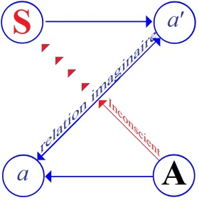
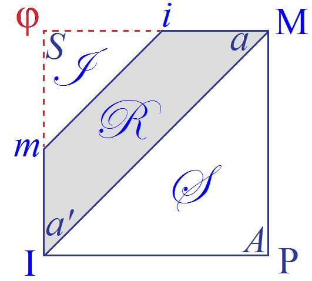

# Leçon 04 | 22 Décembre l965

  <label><input type="checkbox" data-lacan-toggle="original" checked> 原文</label>
  <label><input type="checkbox" data-lacan-toggle="notes" checked> 注释</label>
  <label><input type="checkbox" data-lacan-toggle="commentary" checked> 个人解读评论</label>

<section class="parallel-paragraph" data-paragraph-ids="s13-04-0001">

s13-04-0001

[无对应译文]

原文 · s13-04-0001

[GREEN](#GREEN2212) [CONTÉ](#CONTE2212) [MELMAN](#Melman)

</section>

<section class="parallel-paragraph" data-paragraph-ids="s13-04-0002">

s13-04-0002

[无对应译文]

原文 · s13-04-0002

\[Début de séance manquant\]

</section>

<section class="parallel-paragraph" data-paragraph-ids="s13-04-0003">

s13-04-0003

[无对应译文]

原文 · s13-04-0003

André GREEN

</section>

<section class="parallel-paragraph" data-paragraph-ids="s13-04-0004">

s13-04-0004

[无对应译文]

原文 · s13-04-0004

Parler de *l’objet de la psychanalyse* soulève immédiatement une question. Elle conduit à s’interroger pour savoir :

</section>

<section class="parallel-paragraph" data-paragraph-ids="s13-04-0005">

s13-04-0005

[无对应译文]

原文 · s13-04-0005

- si l’on va traiter de *l’objet de la psychanalyse* au sens où l’on parle de l’objet d’une science, ce que vise la démarche de la science en sa progression,

</section>

<section class="parallel-paragraph" data-paragraph-ids="s13-04-0006">

s13-04-0006

[无对应译文]

原文 · s13-04-0006

- ou si l’on va parler du statut de l’objet tel que le conçoit la psychanalyse.

</section>

<section class="parallel-paragraph" data-paragraph-ids="s13-04-0007">

s13-04-0007

[无对应译文]

原文 · s13-04-0007

La surprise serait ici de montrer que ces deux sens sont étroitement liés et interdépendants.

</section>

<section class="parallel-paragraph" data-paragraph-ids="s13-04-0008">

s13-04-0008

[无对应译文]

原文 · s13-04-0008

LITTRÉ fait remarquer :

</section>

<section class="parallel-paragraph" data-paragraph-ids="s13-04-0009">

s13-04-0009

[无对应译文]

原文 · s13-04-0009

- qu’au mot « *sujet »* l’Académie dit : « *les corps naturels sont le sujet de la physique* ».

</section>

<section class="parallel-paragraph" data-paragraph-ids="s13-04-0010">

s13-04-0010

[无对应译文]

原文 · s13-04-0010

- Et au mot « *objet »,* elle dit encore : « *les corps naturels sont l’objet de la physique* ».

</section>

<section class="parallel-paragraph" data-paragraph-ids="s13-04-0011">

s13-04-0011

[无对应译文]

原文 · s13-04-0011

Loin de nous, d’y repérer un redoublement contradictoire ou trop facilement réductible.

</section>

<section class="parallel-paragraph" data-paragraph-ids="s13-04-0012">

s13-04-0012

[无对应译文]

原文 · s13-04-0012

Nous ne nous joindrons pas non plus, brandissant cet exemple, au chœur de tous ceux qui dénoncent dans *la séparation* *du sujet et de l’objet* la cause de toutes les impasses théoriques dont la pensée traditionnelle se rend responsable.

</section>

<section class="parallel-paragraph" data-paragraph-ids="s13-04-0013">

s13-04-0013

[无对应译文]

原文 · s13-04-0013

Rencontrer au départ le sort lié du *sujet* et de *l’objet* n’est ni affirmer leur *confusion*, ni leur *indépendance*, c’est supputer que nous allons avoir à faire face aux confrontations :

</section>

<section class="parallel-paragraph" data-paragraph-ids="s13-04-0014">

s13-04-0014

[无对应译文]

原文 · s13-04-0014

- de l’identité et de la différence,

</section>

<section class="parallel-paragraph" data-paragraph-ids="s13-04-0015">

s13-04-0015

[无对应译文]

原文 · s13-04-0015

- de la conjonction et de la disjonction,

</section>

<section class="parallel-paragraph" data-paragraph-ids="s13-04-0016">

s13-04-0016

[无对应译文]

原文 · s13-04-0016

- de la suture et de la coupure.

</section>

<section class="parallel-paragraph" data-paragraph-ids="s13-04-0017">

s13-04-0017

[无对应译文]

原文 · s13-04-0017

Nous aurons alors à nous demander si *l’objet de la psychanalyse* - je parle maintenant de ce à quoi elle vise - peut se suffire de cette limitation couplée à laquelle beaucoup de disciplines contemporaines, parmi les plus avancées, se confinent.

</section>

<section class="parallel-paragraph" data-paragraph-ids="s13-04-0018">

s13-04-0018

[无对应译文]

原文 · s13-04-0018

I *L’objet* de Jacques LACAN. Rappel cursif

</section>

<section class="parallel-paragraph" data-paragraph-ids="s13-04-0019">

s13-04-0019

[无对应译文]

原文 · s13-04-0019

Examiner *le rôle de l’objet(a)* dans la théorie de Jacques LACAN sera pour nous, faire d’une pierre deux coups.

</section>

<section class="parallel-paragraph" data-paragraph-ids="s13-04-0020">

s13-04-0020

[无对应译文]

原文 · s13-04-0020

Cela nous mènera - c’est du moins notre projet - *à en préciser le contenu* dans le cadre conceptuel qui lui est propre, d’une part, et d’autre part à marquer les limites de l’accord de cette pensée, et sans doute de toute la pensée psychanalytique, avec le structuralisme moderne.

</section>

<section class="parallel-paragraph" data-paragraph-ids="s13-04-0021">

s13-04-0021

[无对应译文]

原文 · s13-04-0021

A\) *Le (a), médiation du sujet à l’Autre*

</section>

<section class="parallel-paragraph" data-paragraph-ids="s13-04-0022">

s13-04-0022

[无对应译文]

原文 · s13-04-0022

Le *(a)* - je ne dis pas encore *l’objet(a) -* est présent dès le plus ancien graphe de LACAN2, où celui-ci part de la théorisation proposée dans le *Stade du miroir* (1936-1949).

</section>

<section class="parallel-paragraph" data-paragraph-ids="s13-04-0023">

s13-04-0023

[无对应译文]

原文 · s13-04-0023

</section>

<section class="parallel-paragraph" data-paragraph-ids="s13-04-0024">

s13-04-0024

[无对应译文]

原文 · s13-04-0024

*(a)* peut se comprendre alors dans sa relation à *(a’),* qui aura les plus étroits rapports avec le futur *i(a)*, c’est-à-dire l’image spéculaire, comme élément de l’indispensable médiation qui unit le sujet à l’Autre.

</section>

<section class="parallel-paragraph" data-paragraph-ids="s13-04-0025">

s13-04-0025

[无对应译文]

原文 · s13-04-0025

Il est clair que cette situation du stade du miroir, qu’il est moins important de dater comme stade que de désigner comme situation structurante, ne peut se comprendre que si l’on précise que ce n’est pas ici la psychologie qui est en cause \- qu’il s’agisse de PREYER ou de WALLON - mais la psychanalyse.

</section>

<section class="parallel-paragraph" data-paragraph-ids="s13-04-0026">

s13-04-0026

[无对应译文]

原文 · s13-04-0026

La psychanalyse qui donne à l’enfant issu de sa mère *une signification* qui pèse sur tout son développement : à savoir qu’il est le substitut du pénis dont la mère est privée \[*sic*\] et qui n’accède à son statut de sujet que de prendre sa place là où il manque à la mère dont il dépend.

</section>

<section class="parallel-paragraph" data-paragraph-ids="s13-04-0027">

s13-04-0027

[无对应译文]

原文 · s13-04-0027

Ce substitut est le lieu et lien d’échange entre la mère et le père, qui pour avoir le pénis ne peut pour autant le créer, puisqu’il l’a. La relation *(a)* - *i(a)* va doubler la relation que nous venons de décrire.

</section>

<section class="parallel-paragraph" data-paragraph-ids="s13-04-0028">

s13-04-0028

[无对应译文]

原文 · s13-04-0028

B\) *Le (a), médiation du sujet à l’idéal du moi*

</section>

<section class="parallel-paragraph" data-paragraph-ids="s13-04-0029">

s13-04-0029

[无对应译文]

原文 · s13-04-0029

Vient ensuite le quadrangle dit *schéma R* (3).

</section>

<section class="parallel-paragraph" data-paragraph-ids="s13-04-0030">

s13-04-0030

[无对应译文]

原文 · s13-04-0030

</section>

<section class="parallel-paragraph" data-paragraph-ids="s13-04-0031">

s13-04-0031

[无对应译文]

原文 · s13-04-0031

Ici encore s’oppose le couple des tensions entre le système des désirs (*i* M), et le système des identifications (*m* I).

</section>

<section class="parallel-paragraph" data-paragraph-ids="s13-04-0032">

s13-04-0032

[无对应译文]

原文 · s13-04-0032

Le *(a)* s’inscrit sur la ligne *i* M qui, partie du sujet S vers l’objet primordial M, la Mère se constitue à travers les figures de l’*autre imaginaire*.

</section>

<section class="parallel-paragraph" data-paragraph-ids="s13-04-0033">

s13-04-0033

[无对应译文]

原文 · s13-04-0033

Par contre le *(a’)* s’inscrit sur la ligne qui va du *sujet* à l’*Idéal du moi* à travers les formes spéculaires du *moi*. On voit comment le quadrangle dérive du Z \[schéma L\] dont il joint les points qui, dans le premier graphe, ne sont atteints que par un parcours détourné.

</section>

<section class="parallel-paragraph" data-paragraph-ids="s13-04-0034">

s13-04-0034

[无对应译文]

原文 · s13-04-0034

On pourrait ici relever que dans le champ de l’*imaginaire* les deux directions du *sujet* vont *soit vers l’objet*, *soit vers l’idéal*.

</section>

<section class="parallel-paragraph" data-paragraph-ids="s13-04-0035">

s13-04-0035

[无对应译文]

原文 · s13-04-0035

On sait que dans la pensée freudienne cette orientation est étroitement dépendante du *narcissisme*.

</section>

<section class="parallel-paragraph" data-paragraph-ids="s13-04-0036">

s13-04-0036

[无对应译文]

原文 · s13-04-0036

On notera alors que l’Autre, venu au lieu du *Nom du Père*, situé dans le seul champ du *symbolique*, au pôle opposé au sujet ici identique au *phallus*, ne s’atteint que par les deux voies que nous venons de décrire plus haut, *objectale* ou *narcissique*, mais jamais de façon directe.

</section>

<section class="parallel-paragraph" data-paragraph-ids="s13-04-0037">

s13-04-0037

[无对应译文]

原文 · s13-04-0037

Le champ du *réel* est compris dans la tension des deux couples *m* I- *i* M dont nous avons précisé *la signification*.

</section>

<section class="parallel-paragraph" data-paragraph-ids="s13-04-0038">

s13-04-0038

[无对应译文]

原文 · s13-04-0038

Mais c’est au seul *champ du symbolique* qu’apparaît *le troisième terme*, indispensable à la structuration du processus4.

</section>

<section class="parallel-paragraph" data-paragraph-ids="s13-04-0039">

s13-04-0039

[无对应译文]

原文 · s13-04-0039

C\) *Le (a), objet du désir*

</section>

<section class="parallel-paragraph" data-paragraph-ids="s13-04-0040">

s13-04-0040

[无对应译文]

原文 · s13-04-0040

En effet, LACAN postule l’existence d’un *moi idéal* comme forme d’identification précoce du *moi* à *certains objets* qui jouent à la fois comme *objet d’amour* et *objet d’identification*, mais en tant qu’ils sont arrachés, découpés, prélevés sur une série qui fait apparaître le manque. Moi qui parle, je t’identifie à l’objet qui te manque à toi–même, dit LACAN. La relation entre *(a)* et A est donc ainsi plus clairement montrée.

</section>

<section class="parallel-paragraph" data-paragraph-ids="s13-04-0041">

s13-04-0041

[无对应译文]

原文 · s13-04-0041

Si A n’atteint sa pleine signification qu’à se soutenir du *Nom du Père* qui n’est, faut–il le préciser, ni un nom ni un Dieu, il passe, nous l’avons vu, par le défilé maternel et ne s’atteint que lorsque la coupure entre le sujet et l’objet maternel le sépare irrémédiablement dudit objet.

</section>

<section class="parallel-paragraph" data-paragraph-ids="s13-04-0042">

s13-04-0042

[无对应译文]

原文 · s13-04-0042

Ou encore lorsque se révélera le manque dont est affecté l’objet primordial, dans l’expérience de la castration.

</section>

<section class="parallel-paragraph" data-paragraph-ids="s13-04-0043">

s13-04-0043

[无对应译文]

原文 · s13-04-0043

La série des castrations postulée par FREUD : *sevrage, dressage sphinctérien, castration* proprement dite, rend cette expérience dans sa répétition, signifiante et structurante, dans sa récurrence.

</section>

<section class="parallel-paragraph" data-paragraph-ids="s13-04-0044">

s13-04-0044

[无对应译文]

原文 · s13-04-0044

*L’objet (a)* sera donc ce qui de ces expériences va choir, comme dit LACAN, de sa position d’*exposant au champ de l’Autre* 5, mais pour atteindre à ce statut d’objet du désir. Le tribut payé à cette accession est d’exclure le sujet désirant, à *dire*, à *nommer*, l’objet du désir. D’avoir été situé au champ de l’Autre permet maintenant de concevoir la fonction de médiation qu’un tel objet joue moins *entre* le sujet et l’Autre, que dans leur *rapport.*

</section>

<section class="parallel-paragraph" data-paragraph-ids="s13-04-0045">

s13-04-0045

[无对应译文]

原文 · s13-04-0045

Mon désir entre dans l’Autre où il est attendu de toute éternité sous la forme de l’objet que je suis, en tant qu’il m’exile de ma subjectivité en résumant tous les signifiants à quoi cette subjectivité est attachée 6.

</section>

<section class="parallel-paragraph" data-paragraph-ids="s13-04-0046">

s13-04-0046

[无对应译文]

原文 · s13-04-0046

Nous savons que le *fantasme* permet l’établissement de cette formule de rapport, en tant qu’il y révèle le sujet en effaçant sa trace. Le *fantasme*, *comme structure constitutive du sujet, où celui-ci s’imprime en creux, par lequel la fascination opère,* ouvre sur la relation de *l’objet(a)* avec *le moi idéal*.

</section>

<section class="parallel-paragraph" data-paragraph-ids="s13-04-0047">

s13-04-0047

[无对应译文]

原文 · s13-04-0047

D\) *Le (a) fétiche*

</section>

<section class="parallel-paragraph" data-paragraph-ids="s13-04-0048">

s13-04-0048

[无对应译文]

原文 · s13-04-0048

Cette formulation indique tout ce qui sépare la théorisation de LACAN de celle des autres auteurs. Disons schématiquement qu’alors que ceux–ci vont surtout marquer l’aspect positif des qualités de l’objet, LACAN valorise l’approche négative.

</section>

<section class="parallel-paragraph" data-paragraph-ids="s13-04-0049">

s13-04-0049

[无对应译文]

原文 · s13-04-0049

Un exemple clair nous le montre. Devant l’image de la mère phallique, les auteurs postfreudiens diront qu’elle est terrifiante *parce que* phallique. Parce que le *phallus* peut être instrument de malfaisance, arme destructrice, etc.

</section>

<section class="parallel-paragraph" data-paragraph-ids="s13-04-0050">

s13-04-0050

[无对应译文]

原文 · s13-04-0050

FREUD disait que la sidération produite par la tête de Méduse opérait parce que *les reptiles* qui lui tenaient lieu de chevelure *venaient nier, autant de fois qu’il y avait de serpents, la castration* qui par ce renversement se rappelait de façon multipliée à celui qui la voulait, annuler.

</section>

<section class="parallel-paragraph" data-paragraph-ids="s13-04-0051">

s13-04-0051

[无对应译文]

原文 · s13-04-0051

Lacan suivra plus volontiers cette dernière voie. Le cas du fétichisme sur lequel il reviendra longuement sera l’apologue de ce mode réflexif. L’objet du fétiche sera le témoin, le voile du sexe châtré - du manque au champ de l’Autre.

</section>

<section class="parallel-paragraph" data-paragraph-ids="s13-04-0052">

s13-04-0052

[无对应译文]

原文 · s13-04-0052

E\) *Le (a) objet du manque, cause du désir*

</section>

<section class="parallel-paragraph" data-paragraph-ids="s13-04-0053">

s13-04-0053

[无对应译文]

原文 · s13-04-0053

À propos de son séminaire sur le *Banquet* 7 nous apparaît avec une force particulière la structure *métonymique* et *métaphorique* de *l’objet(a)* dans le repérage que fait Jacques LACAN dans le texte de PLATON de la position particulière des *agalmata,* dans le discours d’ALCIBIADE où celui-ci dépeint SOCRATE : « *Il est tout pareil à des silènes qu’on voit plantés dans des ateliers de sculpture et que les artistes représentent tenant un pipeau ou une flûte,* *les entrouvre-t-on par le milieu, on voit qu’à l’intérieur ils contiennent des figurines de dieux.* »

</section>

<section class="parallel-paragraph" data-paragraph-ids="s13-04-0054">

s13-04-0054

[无对应译文]

原文 · s13-04-0054

Nous avons affaire à la fois au fragment de corps, à la partie du corps et à sa symbolisation, et ceci est à prendre à la lettre, sous la forme de la figurine divine.

</section>

<section class="parallel-paragraph" data-paragraph-ids="s13-04-0055">

s13-04-0055

[无对应译文]

原文 · s13-04-0055

C’est justement en tant que cet *objet (a)* va surgir comme objet du manque qu’il va se déployer sur un double registre qui sera à la fois la révélation du manque de l’Autre et à la fois le manque tel qu’il apparaît dans le processus de signification.

</section>

<section class="parallel-paragraph" data-paragraph-ids="s13-04-0056">

s13-04-0056

[无对应译文]

原文 · s13-04-0056

Ce qui manque à l’Autre, c’est ce qu’il n’est pas donné de concevoir. Le (– φ) qui s’introduit ici sous la forme de ce qui n’apparaît pas - c’est le *Rien* qui n’est pas figurable - sous lequel s’ordonne la rencontre avec *la castration* comme impensable, dont le *hiatus* est comblé avec le processus de significantisation, par le mirage du savoir.

</section>

<section class="parallel-paragraph" data-paragraph-ids="s13-04-0057">

s13-04-0057

[无对应译文]

原文 · s13-04-0057

Je cite encore : « *(a) symbolise ce qui, dans la sphère du signifiant comme perdu, se perd à la significantisation. Ce qui résiste à cette perte est le sujet désigné.*

</section>

<section class="parallel-paragraph" data-paragraph-ids="s13-04-0058">

s13-04-0058

[无对应译文]

原文 · s13-04-0058

*Dès qu’entre en jeu le processus du savoir, dès que ça se sait, il y a quelque chose de perdu.* »

</section>

<section class="parallel-paragraph" data-paragraph-ids="s13-04-0059">

s13-04-0059

[无对应译文]

原文 · s13-04-0059

C’est cette apparition sous la forme de *l’objet du manque* qui spécifie ce autour de quoi va tourner notre exposé, à savoir *la nature non spécularisable du (a).* Tout se passe comme si le sujet barré prend fonction de *i(a)* comme s’exprime LACAN ou encore comme si, *court-circuitant* l’impossible spécularisation du manque, le sujet s’identifie ainsi au savoir, venant en lieu et place de *la perte* qui en suscite la promotion, recouvrant cette *perte* jusqu’à l’oubli de son existence.

</section>

<section class="parallel-paragraph" data-paragraph-ids="s13-04-0060">

s13-04-0060

[无对应译文]

原文 · s13-04-0060

À partir de cette apparition du manque, va jouer *la fonction de reste* issue du désir de l’Autre, *fonction de reste* qui se manifeste comme *résidu* lâché par la barre qui affecte le grand Autre et dont l’homologue dans le sujet l’intéresse au *savoir*.

</section>

<section class="parallel-paragraph" data-paragraph-ids="s13-04-0061">

s13-04-0061

[无对应译文]

原文 · s13-04-0061

Là encore LACAN fait une distinction d’ordre logique où la nullification ne supprime pas l’avoir, ce qui justement fait apparaître le *reste*. *Fonction de reste*, c’est ce qui est sauvé de la menace qui pèse sur le sujet : « *Le désir se construit sur le chemin d’une question : n’être.* » *L’objet(a)* est la cause du désir.

</section>

<section class="parallel-paragraph" data-paragraph-ids="s13-04-0062">

s13-04-0062

[无对应译文]

原文 · s13-04-0062

F\) *Le (a), produit d’un travail*

</section>

<section class="parallel-paragraph" data-paragraph-ids="s13-04-0063">

s13-04-0063

[无对应译文]

原文 · s13-04-0063

On peut penser, bien que LACAN ne le dise pas expressément, que la dimension progression-régression peut constituer un plan corrélatif à ceux de la conjonction-disjonction et de la suture-coupure.

</section>

<section class="parallel-paragraph" data-paragraph-ids="s13-04-0064">

s13-04-0064

[无对应译文]

原文 · s13-04-0064

Les développements engendrés sur le plan du savoir seront à prendre dans leur perspective négative, renvoyant au plan de méconnaissance où ils se sont organisés dans la démarche du *processus de significantisation*…

</section>

<section class="parallel-paragraph" data-paragraph-ids="s13-04-0065">

s13-04-0065

[无对应译文]

原文 · s13-04-0065

> qui tend sans relâche à annuler ou à nullifier la perte de l’objet …à ce qui s’est signifié autour de cette perte, par les traces laissées de ce travail, dont *l’objet(a)* sera le repère le plus sûr, *l’index de la vérité pointé vers le sujet*.

</section>

<section class="parallel-paragraph" data-paragraph-ids="s13-04-0066">

s13-04-0066

[无对应译文]

原文 · s13-04-0066

FREUD insiste, dans ses œuvres terminales sur la vérité historique à laquelle vise la « construction » de l’analyste.

</section>

<section class="parallel-paragraph" data-paragraph-ids="s13-04-0067">

s13-04-0067

[无对应译文]

原文 · s13-04-0067

Le canal de la demande constitue le fil conducteur de cet accès à la vérité.

</section>

<section class="parallel-paragraph" data-paragraph-ids="s13-04-0068">

s13-04-0068

[无对应译文]

原文 · s13-04-0068

Sa fonction n’est pas seulement de servir de guide, mais de former le dessin même de cet itinéraire des chemins de la vérité.

</section>

<section class="parallel-paragraph" data-paragraph-ids="s13-04-0069">

s13-04-0069

[无对应译文]

原文 · s13-04-0069

Ce rappel où nous n’avons voulu garder que le minimum indispensable au développement qui va suivre, va nous permettre de poser quelques problèmes :

</section>

<section class="parallel-paragraph" data-paragraph-ids="s13-04-0070">

s13-04-0070

[无对应译文]

原文 · s13-04-0070

1)  étant donné la relation de *l’objet(a)* à *la représentation,* il convient de se demander quels sont les rapports de celle-ci avec la chaîne signifiante. Le manque représenté a-t-il quelque relation avec la parole comme concaténation ?

</section>

<section class="parallel-paragraph" data-paragraph-ids="s13-04-0071">

s13-04-0071

[无对应译文]

原文 · s13-04-0071

2)  Faut-il accorder - en se tournant vers FREUD - le statut de signifiant au seul *Vorstellung-repräsentanz* ? Qu’en est-il de *l’affect* ?

</section>

<section class="parallel-paragraph" data-paragraph-ids="s13-04-0072">

s13-04-0072

[无对应译文]

原文 · s13-04-0072

3)  N’y a-t-il pas dans l’œuvre de FREUD un point quant à la représentation qui n’a pas trouvé d’écho chez LACAN : la distinction entre *différents types de représentations* (*de mots* et *de choses* par exemple), qui pourrait conduire à *différencier* encore davantage, pour souligner le caractère original de la concaténation freudienne.

</section>

<section class="parallel-paragraph" data-paragraph-ids="s13-04-0073">

s13-04-0073

[无对应译文]

原文 · s13-04-0073

4)  Si le savoir est ce qui vient au lieu de la vérité, après la perte de l’objet, n’y-a-t-il pas lieu de relier l’un à l’autre par *les traces de cette perte et la tentative de leur effacement* ?

</section>

<section class="parallel-paragraph" data-paragraph-ids="s13-04-0074">

s13-04-0074

[无对应译文]

原文 · s13-04-0074

Ce sont ces questions qui permettront de considérer *l’objet(a)* moins comme *support de l’objet partiel* que comme parcours d’une main traçante, *inscription*, *lettre*, *a*.

</section>

<section class="parallel-paragraph" data-paragraph-ids="s13-04-0075">

s13-04-0075

[无对应译文]

原文 · s13-04-0075

II *La suture du signifiant, sa représentation et l’objet(a)*

</section>

<section class="parallel-paragraph" data-paragraph-ids="s13-04-0076">

s13-04-0076

[无对应译文]

原文 · s13-04-0076

J’en viens à ce qui va constituer un autre axe de mon exposé, à savoir *la relation du (a) avec la coupure et la suture,* et je me référerai à l’exposé de Jacques-Alain MILLER concernant la théorisation, à partir de l’ouvrage de FREGE, de *La logique du signifiant* 8.

</section>

<section class="parallel-paragraph" data-paragraph-ids="s13-04-0077">

s13-04-0077

[无对应译文]

原文 · s13-04-0077

Ceci pour bien situer la position du nombre 0 dans la mesure où elle va avoir une incidence sur le destin du *(a)*.

</section>

<section class="parallel-paragraph" data-paragraph-ids="s13-04-0078">

s13-04-0078

[无对应译文]

原文 · s13-04-0078

En vertu du principe selon lequel, pour que la vérité soit sauvée, chaque chose est identique à soi et 0 est le nombre assigné au concept « *non identique à soi* », il n’y a pas d’objet qui tombe sous ce concept.

</section>

<section class="parallel-paragraph" data-paragraph-ids="s13-04-0079">

s13-04-0079

[无对应译文]

原文 · s13-04-0079

Mais, dit MILLER parlant de FREGE  : « *Il a été nécessaire, afin que fût exclue toute référence au réel, d’évoquer, au niveau du concept, un objet non-identique à soi - rejeté ensuite de la dimension de la vérité. Le 0 qui s’inscrit à la place du nombre consomme l’exclusion de cet objet. Quant à cette place, dessinée par la subsomption, où l’objet manque, rien n’y saurait être écrit, et s’il y faut tracer un 0, ce n’est que pour y figurer un blanc, rendre visible le manque.* »

</section>

<section class="parallel-paragraph" data-paragraph-ids="s13-04-0080">

s13-04-0080

[无对应译文]

原文 · s13-04-0080

Il y a donc ici d’une part l’évocation et l’exclusion de l’objet non-identique à soi, et d’autre part ce *blanc*, ce *trou*, à la place de l’objet subsumé.

</section>

<section class="parallel-paragraph" data-paragraph-ids="s13-04-0081">

s13-04-0081

[无对应译文]

原文 · s13-04-0081

La notion d’unité est donnée par le concept de l’identité, concept de l’objet subsumé.

</section>

<section class="parallel-paragraph" data-paragraph-ids="s13-04-0082">

s13-04-0082

[无对应译文]

原文 · s13-04-0082

Mais sa place de 1, non plus en tant qu’unité mais en tant que nombre 1, reste problématique quant à sa place de premier, quant à sa primordialité, si j’ose ainsi m’exprimer. Le nombre 0, fait remarquer MILLER, il n’est pas légitime de le compter pour rien, et la logique voudrait alors que l’on confère à ce nombre 0 le rôle de *premier objet.*

</section>

<section class="parallel-paragraph" data-paragraph-ids="s13-04-0083">

s13-04-0083

[无对应译文]

原文 · s13-04-0083

La conséquence en est l’identité au concept du nombre 0 qui subsume l’objet nombre 0 en tant qu’il est un objet.

</section>

<section class="parallel-paragraph" data-paragraph-ids="s13-04-0084">

s13-04-0084

[无对应译文]

原文 · s13-04-0084

La primordialité en somme, ne peut s’instaurer sous le signe de l’unité mais du nombre à partir duquel le 1 est possible : le nombre 0. Ainsi un double registre recouvre *un fonctionnement qu’il faut déplier* pour comprendre l’ambiguïté du nombre 0 en tant qu’il inclut :

</section>

<section class="parallel-paragraph" data-paragraph-ids="s13-04-0085">

s13-04-0085

[无对应译文]

原文 · s13-04-0085

- le registre du concept de non-identique à soi,

</section>

<section class="parallel-paragraph" data-paragraph-ids="s13-04-0086">

s13-04-0086

[无对应译文]

原文 · s13-04-0086

- le registre de l’objet, matrice de l’un, objet permettant l’assignation du nombre 1.

</section>

<section class="parallel-paragraph" data-paragraph-ids="s13-04-0087">

s13-04-0087

[无对应译文]

原文 · s13-04-0087

Alors se découvre *la double opération :*

</section>

<section class="parallel-paragraph" data-paragraph-ids="s13-04-0088">

s13-04-0088

[无对应译文]

原文 · s13-04-0088

- l’évocation et l’élision du non-identique à soi, avec un blanc au niveau de l’objet subsumé permettant le nombre 0

</section>

<section class="parallel-paragraph" data-paragraph-ids="s13-04-0089">

s13-04-0089

[无对应译文]

原文 · s13-04-0089

- l’introduction du 0 comme nombre, c’est-à-dire comme nom signifiant et comme objet.

</section>

<section class="parallel-paragraph" data-paragraph-ids="s13-04-0090">

s13-04-0090

[无对应译文]

原文 · s13-04-0090

Cette situation a surtout un intérêt pour nous en tant qu’elle spécifie *la structure de la concaténation.* Non seulement le sujet s’exclut de la scène et de la chaîne signifiante du fait même qu’il la constitue comme sujet dans sa structure de concaténation, mais *le premier de ces objets* joue à la fois comme concept et comme objet, non représenté mais dénommé *objet unaire* et concept sur *la non-identité à soi*, *concept de menace pour la vérité,* et ceci d’autant plus qu’il est hors-jeu ou hors-je.

</section>

<section class="parallel-paragraph" data-paragraph-ids="s13-04-0091">

s13-04-0091

[无对应译文]

原文 · s13-04-0091

Ce concept de menace pour la vérité est pour nous concept issu de la *rencontre avec la vérité,* en tant qu’il dissocie non seulement la vérité de sa manifestation - identité à soi - mais y désigne sa place, par le blanc ou la trace qui la négative.

</section>

<section class="parallel-paragraph" data-paragraph-ids="s13-04-0092">

s13-04-0092

[无对应译文]

原文 · s13-04-0092

Il est insuffisant de n’y voir, c’est le cas de le dire, qu’un simple rapport d’absence. Il faut encore que soit ici cerné son rapport de *manque à la vérité.* L’intérêt pris par nous à cette confrontation avec FREGE lu par MILLER est de *lier le sujet au signifiant.*

</section>

<section class="parallel-paragraph" data-paragraph-ids="s13-04-0093">

s13-04-0093

[无对应译文]

原文 · s13-04-0093

Le sujet s’identifie à *la répétition* qui préside à chacune des opérations par lesquelles la concaténation se noue, dans la prise de chaque fragment par celui qui le précède et celui qui lui succède : dans le même temps et dans le même mouvement, le sujet se voit autant de fois rejeté hors de la scène - et de la chaîne - qui ainsi se constitue. Or, si l’opération l’exclut à chaque étape, *la nullification ne supprime pas l’avoir qui subsiste pour nous,* à condition de savoir la reconnaître *sous* *la forme du (a)*.

</section>

<section class="parallel-paragraph" data-paragraph-ids="s13-04-0094">

s13-04-0094

[无对应译文]

原文 · s13-04-0094

L’effet de concaténation rejoint la définition par LACAN du signifiant :

</section>

<section class="parallel-paragraph" data-paragraph-ids="s13-04-0095">

s13-04-0095

[无对应译文]

原文 · s13-04-0095

> « *Le signifiant est ce qui représente un sujet pour un autre signifiant.* »

</section>

<section class="parallel-paragraph" data-paragraph-ids="s13-04-0096">

s13-04-0096

[无对应译文]

原文 · s13-04-0096

S’éclaire ainsi ce qu’il est des rapports du sujet et de *l’objet(a)*, dans leurs relations de suture et de coupure : « *Si la suite des nombres, métonymie du zéro commence par sa métaphore* - dit MILLER - *si le 0, nombre de la suite, comme nombre n’est que le tenant–lieu suturant de l’absence (du zéro absolu) qui se véhicule dessous la chaîne suivant le mouvement alternatif d’une représentation et d’une exclusion, qu’est–ce qui fait obstacle, à reconnaître dans le rapport restitué du zéro à la suite des nombres, l’articulation la plus élémentaire du rapport qu’avec la chaîne signifiante entretient le sujet ?* ».

</section>

<section class="parallel-paragraph" data-paragraph-ids="s13-04-0097">

s13-04-0097

[无对应译文]

原文 · s13-04-0097

Je laisse ici la question du rapport du sujet au grand Autre par l’effet du zéro9, mais vais m’employer à soulever deux problèmes, ceux de la suture et celui de la représentation.

</section>

<section class="parallel-paragraph" data-paragraph-ids="s13-04-0098">

s13-04-0098

[无对应译文]

原文 · s13-04-0098

A\) *Le problème de la suture*

</section>

<section class="parallel-paragraph" data-paragraph-ids="s13-04-0099">

s13-04-0099

[无对应译文]

原文 · s13-04-0099

LECLAIRE s’est élevé là contre cette suturation inférée par MILLER. La question demeure : y-a-t-il ou n’y-a-t-il pas *suture* ?

</section>

<section class="parallel-paragraph" data-paragraph-ids="s13-04-0100">

s13-04-0100

[无对应译文]

原文 · s13-04-0100

Ce qui désigne *la position du psychanalyste à l’endroit de la vérité* ne serait-il pas justement ce privilège de n’avoir pas à suturer ?

</section>

<section class="parallel-paragraph" data-paragraph-ids="s13-04-0101">

s13-04-0101

[无对应译文]

原文 · s13-04-0101

*Comment nier qu’il n’y ait suture s’il y a concaténation ?*

</section>

<section class="parallel-paragraph" data-paragraph-ids="s13-04-0102">

s13-04-0102

[无对应译文]

原文 · s13-04-0102

J’en voudrais pour preuve cet argument de FREUD trop souvent oublié sur les conséquences de la castration.

</section>

<section class="parallel-paragraph" data-paragraph-ids="s13-04-0103">

s13-04-0103

[无对应译文]

原文 · s13-04-0103

Si celle-ci est possible, si *la menace* vient à exécution, elle ne prive pas seulement le sujet du plaisir masturbatoire, mais elle a comme implication hautement redoutée l’impossibilité désormais *définitive* pour le sujet châtré de l’union avec la mère.

</section>

<section class="parallel-paragraph" data-paragraph-ids="s13-04-0104">

s13-04-0104

[无对应译文]

原文 · s13-04-0104

Qu’on voie ici la castration comme l’effondrement de tout le système signifiant par la rupture de toute possibilité de concaténation, explique que FREUD la compare à un désastre dont les dégâts sont incommensurables.

</section>

<section class="parallel-paragraph" data-paragraph-ids="s13-04-0105">

s13-04-0105

[无对应译文]

原文 · s13-04-0105

En tous cas le pénis joue ici le rôle de médiateur de la coupure et de la suture.

</section>

<section class="parallel-paragraph" data-paragraph-ids="s13-04-0106">

s13-04-0106

[无对应译文]

原文 · s13-04-0106

*Comment cela peut-il se suturer* ?

</section>

<section class="parallel-paragraph" data-paragraph-ids="s13-04-0107">

s13-04-0107

[无对应译文]

原文 · s13-04-0107

Jacques-Alain MILLER - je viens de le dire - a montré l’ascension du nombre 0, *sa transgression* de la barre sous forme du 1, son évanouissement lors du passage de *n* à *n’* qui est *n + 1*. Mais on n’a pas tort non plus de faire valoir que la logique d’un « *concept inconscient* » a des exigences qui sont internes à sa formation.

</section>

<section class="parallel-paragraph" data-paragraph-ids="s13-04-0108">

s13-04-0108

[无对应译文]

原文 · s13-04-0108

Citons ici FREUD, avec LECLAIRE : « *Faeces* », « *enfant* », « *pénis* » forment ainsi une unité, un concept inconscient, *sit venia verbo*. Le concept nommément d’une « petite chose » qui peut se séparer de son propre corps, (§ VII).

</section>

<section class="parallel-paragraph" data-paragraph-ids="s13-04-0109">

s13-04-0109

[无对应译文]

原文 · s13-04-0109

À une opposition du type *binaire*, celle que *la linguistique* nous offre…

</section>

<section class="parallel-paragraph" data-paragraph-ids="s13-04-0110">

s13-04-0110

[无对应译文]

原文 · s13-04-0110

> celle de la phonologie où les rapports sont toujours posés en termes de couples antagonistes et celle qu’on met à la base de toute information …on substitue ici *un processus opératoire à trois termes : n, +, n’, avec évanouissement d’un terme sitôt qu’il s’est manifesté.*

</section>

<section class="parallel-paragraph" data-paragraph-ids="s13-04-0111">

s13-04-0111

[无对应译文]

原文 · s13-04-0111

Nous trouvons là une sorte de *paradigme* qui peut nous donner la voie de ce que pourrait être le découpage du signifié.

</section>

<section class="parallel-paragraph" data-paragraph-ids="s13-04-0112">

s13-04-0112

[无对应译文]

原文 · s13-04-0112

En effet les linguistes se montrent extrêmement embarrassés lorsqu’il s’agit du *découpage du signifié* alors que le découpage du signifiant ne présente pour eux aucune espèce de difficulté semble-t-il. Si par exemple j’en crois MARTINET, je lis : « *Quant à sémantique, s’il a acquis le sens qui nous intéresse, il n’en est pas moins dérivé d’une racine qui évoque non point une réalité psychique mais bien le processus de signification qui implique la combinaison du signifiant et du signifié /…/ un <u>sème</u> en tout cas, ne saurait être autre chose qu’une unité à double face*10. »

</section>

<section class="parallel-paragraph" data-paragraph-ids="s13-04-0113">

s13-04-0113

[无对应译文]

原文 · s13-04-0113

L’embarras naît ici de ce que toute référence directe au signifié ruinerait la démarche structuraliste, puisque son accession par la voie du signifiant crée le détour nécessaire à une appréhension indirecte, relative et corrélative.

</section>

<section class="parallel-paragraph" data-paragraph-ids="s13-04-0114">

s13-04-0114

[无对应译文]

原文 · s13-04-0114

En outre, et surtout, le repérage des traits pertinents nous laisse ici dans la perplexité. En définitive, ce qui manque ici de support consistant est *la structure du corps.* Car l’assurance de tenir pour fermes les traits pertinents en phonologie ne repose-t-elle pas en définitive sur le fonctionnement de *l’appareil vocal* ? Sans doute est-il sous commande nerveuse, ce qui explique la fascination des linguistes pour la cybernétique.

</section>

<section class="parallel-paragraph" data-paragraph-ids="s13-04-0115">

s13-04-0115

[无对应译文]

原文 · s13-04-0115

Le psychanalyste est ici le seul à se mettre à l’écoute du sens, à son niveau, c’est-à-dire à considérer, en respectant la même exigence de référence indirecte, que le découpage passera au niveau du signifié, et que c’est ce découpage même qui impliquera un découpage du signifiant qui rend intelligible le signifié.

</section>

<section class="parallel-paragraph" data-paragraph-ids="s13-04-0116">

s13-04-0116

[无对应译文]

原文 · s13-04-0116

Ici se repère l’ambiguïté qu’il faudra bien lever, entre la conception linguistique du signifiant et sa formulation psychanalytique telle que LACAN le conçoit. Mais s’agit-il du même ?

</section>

<section class="parallel-paragraph" data-paragraph-ids="s13-04-0117">

s13-04-0117

[无对应译文]

原文 · s13-04-0117

Vous avez sans doute reconnu dans cette *unité à double face* la théorisation de *la bande de Mœbius* de LACAN 11.

</section>

<section class="parallel-paragraph" data-paragraph-ids="s13-04-0118">

s13-04-0118

[无对应译文]

原文 · s13-04-0118

Mais ne peut-on pas considérer que le découpage du signifié, dans cette série métonymique des *différents objets partiels* est représenté par le *phallus*, justement en tant qu’il vient à apparaître sous la forme du (– φ) dans ses *différents objets partiels*, dont la succession diachronique vous est connue : *objet oral, objet anal, objet phallique,* (etc.), ces termes ne représentant que leur repérage quant aux zones érogènes, laissant la place à des formes plus complexes.

</section>

<section class="parallel-paragraph" data-paragraph-ids="s13-04-0119">

s13-04-0119

[无对应译文]

原文 · s13-04-0119

Ceci pourrait concilier un choix entre un système binaire strict qui nous renvoie à des options telles qu’elles ne nous laissent pas de médiation tierce, et un autre système où la causalité est développée en réseau, un système de type réticulaire, qui fait disparaître tout fonctionnement de type *oppositionnel*. Finalement il paraît bien que *la forme minima de cette structure réticulaire* *est la structure triangulaire ou le tiers est évanouissant.*

</section>

<section class="parallel-paragraph" data-paragraph-ids="s13-04-0120">

s13-04-0120

[无对应译文]

原文 · s13-04-0120

C’est, je crois, l’opération éclairée par le commentaire de MILLER.

</section>

<section class="parallel-paragraph" data-paragraph-ids="s13-04-0121">

s13-04-0121

[无对应译文]

原文 · s13-04-0121

Ceci peut nous évoquer les diverses formes de relations auxquelles nous avons affaire dans l’œdipe où une opposition, celle de la différence des sexes, en tant qu’elle est supportée par le *phallus* est en fait insérée dans *un système triangulaire* et ne s’appréhende jamais que par des relations deux à deux, où le *phallus* constitue l’étalon des échanges, sa cause.

</section>

<section class="parallel-paragraph" data-paragraph-ids="s13-04-0122">

s13-04-0122

[无对应译文]

原文 · s13-04-0122

SAUSSURE a eu le mérite de placer au principe de la langue comme système, *la valeur,* esquissant à cet endroit la comparaison avec l’économie politique. Mais pour l’avoir ainsi dégagée, il n’est guère allé plus loin et ne s’est pas posé la question de ce qui a valeur pour le sujet parlant.

</section>

<section class="parallel-paragraph" data-paragraph-ids="s13-04-0123">

s13-04-0123

[无对应译文]

原文 · s13-04-0123

Ainsi la suture s’accomplit ici en laissant se profiler la valeur, *en cause* sans rien nous *dire* d’elle.

</section>

<section class="parallel-paragraph" data-paragraph-ids="s13-04-0124">

s13-04-0124

[无对应译文]

原文 · s13-04-0124

C’est ici que nous rencontrons la fonction de la cause développée par Jacques LACAN.

</section>

<section class="parallel-paragraph" data-paragraph-ids="s13-04-0125">

s13-04-0125

[无对应译文]

原文 · s13-04-0125

Si, avec FREGE , l’identité à soi a permis *le passage de la chose à l’objet,* ne pouvons-nous pas penser que ce que nous venons de montrer peut fonctionner comme *relation de l’objet à la cause* ? On peut conclure que l’objet est la relation signifiante qui peut relier les deux termes de *la chose* et de *la cause*.

</section>

<section class="parallel-paragraph" data-paragraph-ids="s13-04-0126">

s13-04-0126

[无对应译文]

原文 · s13-04-0126

Nous aurions ici peut-être un de ces exemples dont parle cet article aujourd’hui contesté de FREUD sur le sens antithétique des mots primitifs puisque nous savons que *chose* et *cause* ont une racine commune, la médiation se trouvant ici passer par l’objet. En somme, nous assisterions au passage :

</section>

<section class="parallel-paragraph" data-paragraph-ids="s13-04-0127">

s13-04-0127

[无对应译文]

原文 · s13-04-0127

- de « *l’indéterminé* » à « *l’état de ce qui est ou opère* »,

</section>

<section class="parallel-paragraph" data-paragraph-ids="s13-04-0128">

s13-04-0128

[无对应译文]

原文 · s13-04-0128

- de « *ce qui est en fait* » à « *ce qui est de l’ordre de la raison, du sujet, ou du motif* » par l’intermédiaire de l’objet en tant que sa définition est : « *ce qui se présente à la vue ou affecte les sens* »l2.

</section>

<section class="parallel-paragraph" data-paragraph-ids="s13-04-0129">

s13-04-0129

[无对应译文]

原文 · s13-04-0129

B\) *Le problème de la représentation*

</section>

<section class="parallel-paragraph" data-paragraph-ids="s13-04-0130">

s13-04-0130

[无对应译文]

原文 · s13-04-0130

Ici se pose alors notre deuxième problème, à savoir celui de la représentation.

</section>

<section class="parallel-paragraph" data-paragraph-ids="s13-04-0131">

s13-04-0131

[无对应译文]

原文 · s13-04-0131

Il m’avait semblé que MILLER avait fait peu de place à toutes les références à la représentation dont FREGE use. Cependant il a conservé, dans le passage cité plus haut, la notion d’un *mouvement alternatif d’une représentation et d’une exclusion.*

</section>

<section class="parallel-paragraph" data-paragraph-ids="s13-04-0132">

s13-04-0132

[无对应译文]

原文 · s13-04-0132

La fonction de rassemblement, de subsomption, est solidaire de la notion d’un pouvoir qui met ensemble, et qui, au prix d’une coupure, *celle du pouvoir de rassemblement à la chose présentée, représente. C’est la coupure qui permet la représentation.*

</section>

<section class="parallel-paragraph" data-paragraph-ids="s13-04-0133">

s13-04-0133

[无对应译文]

原文 · s13-04-0133

Or ici le nombre 0 figure comme objet sous lequel ne tombe aucune représentation. C’est par l’opération même de la coupure qu’advient, s’accomplit le sujet, je dirai « sur le dos », aux dépens de *l’objet.*

</section>

<section class="parallel-paragraph" data-paragraph-ids="s13-04-0134">

s13-04-0134

[无对应译文]

原文 · s13-04-0134

Comme si l’on pouvait dire : qu’importe la coupure (du sujet) puisque reste la suture de *l’objet(a)*. C’est ce que réalise, pour ainsi dire, *le sacrifice de l’objet par le désir.* Qu’importe la perte de l’objet si le désir lui survit et lui perdure.

</section>

<section class="parallel-paragraph" data-paragraph-ids="s13-04-0135">

s13-04-0135

[无对应译文]

原文 · s13-04-0135

Quelque chose aussi qui serait de l’ordre de : « l’objet est mort, vive le désir (de l’Autre) ». La demande devient ce qui assure la résurrection renouvelée du désir au cas où il viendrait lui–même à manquer, elle se formule à travers *l’objet(a)*.

</section>

<section class="parallel-paragraph" data-paragraph-ids="s13-04-0136">

s13-04-0136

[无对应译文]

原文 · s13-04-0136

La demande que ne soutient aucune cause, cause dont l’effet est le trou, par lequel le reste se confondrait avec la demande, n’est–ce pas ainsi que (POLONIUS voit) le fou, le bouffon, le fou HAMLET amoureux de sa fille et *incertain vengeur* du Père mort, qui fera périr un autre père, celui de l’objet de son désir (POLONIUS) à la suite d’une « *tragique méprise* » :

</section>

<section class="parallel-paragraph" data-paragraph-ids="s13-04-0137">

s13-04-0137

[无对应译文]

原文 · s13-04-0137

> « *That I have found*
>
> *the very cause of Hamlet’s lunacy*
>
> *I will be brief. Your noble son is mad*
>
> *Mad call I it ; for to define true madness*
>
> *What is’t but to be nothing else but mad.* »

</section>

<section class="parallel-paragraph" data-paragraph-ids="s13-04-0138">

s13-04-0138

[无对应译文]

原文 · s13-04-0138

Et plus loin :

</section>

<section class="parallel-paragraph" data-paragraph-ids="s13-04-0139">

s13-04-0139

[无对应译文]

原文 · s13-04-0139

> « *That we find out the cause of this effect,*
>
> *Or rather say, the cause of this defect,*
>
> *For this effect defective comes by cause*
>
> *Thus it remains, and the remainder thus Perpend.* »

</section>

<section class="parallel-paragraph" data-paragraph-ids="s13-04-0140">

s13-04-0140

[无对应译文]

原文 · s13-04-0140

III *La relation (a) à i(a) et le problème de la représentation et de la spécularisation*

</section>

<section class="parallel-paragraph" data-paragraph-ids="s13-04-0141">

s13-04-0141

[无对应译文]

原文 · s13-04-0141

Lacan insiste avec force sur le fait que *l’objet(a)* n’est pas spécularisable, le recours à l’image spéculaire n’est ni *l’image de l’objet*, ni *celle de la représentation*, elle est - dit LACAN dans son *séminaire sur l’Identification* (1962) - *un autre objet qui n’est pas le même.*

</section>

<section class="parallel-paragraph" data-paragraph-ids="s13-04-0142">

s13-04-0142

[无对应译文]

原文 · s13-04-0142

Il est pris dans le cadre d’une relation où est en jeu la dialectique narcissique dont la limite est le *phallus* qui y opère sous la forme du manque. Or, nous venons de voir l’objet non figurable que représente le nombre 0.

</section>

<section class="parallel-paragraph" data-paragraph-ids="s13-04-0143">

s13-04-0143

[无对应译文]

原文 · s13-04-0143

Qu’en est-il chez FREUD ?

</section>

<section class="parallel-paragraph" data-paragraph-ids="s13-04-0144">

s13-04-0144

[无对应译文]

原文 · s13-04-0144

À considérer le problème uniquement sous l’angle de la dialectique narcissique, on court-circuite à mon avis le problème de la représentation qui renvoie à *l’objet de la pulsion.* FREUD le désigne comme éminemment *substituable et interchangeable,* ce qui pourrait peut-être apparaître comme un dédommagement à l’impossibilité de la fuite devant les stimuli internes, procédure intermédiaire, dirais-je, entre l’échange restreint et l’échange généralisé. Il faut qu’à cet échange participe comme terme échangé un objet de pulsion, ce n’est donc pas n’importe quel objet qui fait l’affaire dans la substitution.

</section>

<section class="parallel-paragraph" data-paragraph-ids="s13-04-0145">

s13-04-0145

[无对应译文]

原文 · s13-04-0145

Deux problèmes ici se présentent devant nous :

</section>

<section class="parallel-paragraph" data-paragraph-ids="s13-04-0146">

s13-04-0146

[无对应译文]

原文 · s13-04-0146

- le premier est celui de la *distinction entre le représentant de la pulsion et l’affect,*

</section>

<section class="parallel-paragraph" data-paragraph-ids="s13-04-0147">

s13-04-0147

[无对应译文]

原文 · s13-04-0147

- le second est celui de la *distribution différentielle du mode de représentation.*

</section>

<section class="parallel-paragraph" data-paragraph-ids="s13-04-0148">

s13-04-0148

[无对应译文]

原文 · s13-04-0148

A\) *Le problème de la distinction entre le représentant de la pulsion et l’affect.*

</section>

<section class="parallel-paragraph" data-paragraph-ids="s13-04-0149">

s13-04-0149

[无对应译文]

原文 · s13-04-0149

La distinction entre le représentant et l’affect est conjecturale dans l’œuvre de FREUD, on le sait. Souvent la pulsion y est confondue avec le représentant et vice versa.

</section>

<section class="parallel-paragraph" data-paragraph-ids="s13-04-0150">

s13-04-0150

[无对应译文]

原文 · s13-04-0150

Mais à la fin de son œuvre, nous savons qu’une distinction de plus en plus marquée est établie où - c’est ce que je propose de prendre en considération *- l’affect prend statut de signifiant.*

</section>

<section class="parallel-paragraph" data-paragraph-ids="s13-04-0151">

s13-04-0151

[无对应译文]

原文 · s13-04-0151

La preuve en est que, depuis 1924, l’emploi de la *Verleugnung* \[?\] qu’on a proposé de traduire par *déni* est de plus en plus spécifié. Ce qui va trouver sa formulation la plus précise dans l’article sur *Le fétichisme* (1927) auquel LACAN se réfère si fréquemment, l’article sur *Le clivage du Moi* (1938) et enfin *le chapitre VIII de l’Abrégé de psychanalyse* (1939).

</section>

<section class="parallel-paragraph" data-paragraph-ids="s13-04-0152">

s13-04-0152

[无对应译文]

原文 · s13-04-0152

La thèse de FREUD devient alors que la perception tomberait sous le coup de la *Verleugnung,* alors que l’affect tomberait sous le coup de la *Verdrängung.* La possibilité dans l’alternative acceptation–refus d’un fonctionnement global ou portant seulement sur un des termes (perception et affect) est la condition de la suture différenciée de certaines organisations conflictuelles.

</section>

<section class="parallel-paragraph" data-paragraph-ids="s13-04-0153">

s13-04-0153

[无对应译文]

原文 · s13-04-0153

C’est là, c’est à partir de cette *distinction* que FREUD voit ce *clivage du moi* : l’*Entzweiung* que valorise LACAN.

</section>

<section class="parallel-paragraph" data-paragraph-ids="s13-04-0154">

s13-04-0154

[无对应译文]

原文 · s13-04-0154

Or si FREUD crée un terme équivalent au refoulement, le déni, qui a même valeur sémantique, il faut probablement en conclure que, si seul un signifiant peut subir ce destin, c’est que l’affect entre dans cette même catégorie l3.

</section>

<section class="parallel-paragraph" data-paragraph-ids="s13-04-0155">

s13-04-0155

[无对应译文]

原文 · s13-04-0155

Je pense même que la définition du signifiant gagnerait peut-être à être complétée à la lumière de ce qui précède : le signifiant serait alors *ce qui, sous peine de s’évanouir, doit pour subsister entrer dans un système de transformations où il représente un sujet pour un autre signifiant tombant sous le coup de la barre du refoulement ou du déni qui le contraint à la chute de son statut d’être dans son rapport avec la vérité, chute par laquelle il accède ou il advient au rang de signifiant dans sa résurrection.*

</section>

<section class="parallel-paragraph" data-paragraph-ids="s13-04-0156">

s13-04-0156

[无对应译文]

原文 · s13-04-0156

Il y aurait un certain intérêt à souligner la corrélation de ces deux modes de signification, chacun englobant les deux mécanismes. On ne voit dans l’affect que la décharge, alors qu’il est - FREUD le dit pour l’angoisse - signal (signifiant pour nous), on ne voit dans le représentant que le signifiant, alors qu’il est (dans la théorie freudienne) engendrement d’un certain mode de production, donc de décharge (engendré par l’impossibilité de celle-ci).

</section>

<section class="parallel-paragraph" data-paragraph-ids="s13-04-0157">

s13-04-0157

[无对应译文]

原文 · s13-04-0157

Dans *Le Moi et le Ça* FREUD reprend la question déjà évoquée, non sans difficulté dans son article sur *L’inconscient*, de la différence entre le représentant et l’affect. *Ce qui qualifie l’affect est qu’il ne peut entrer dans aucune combinatoire.*

</section>

<section class="parallel-paragraph" data-paragraph-ids="s13-04-0158">

s13-04-0158

[无对应译文]

原文 · s13-04-0158

Il est refoulé, mais sa spécificité en tant que signifiant est d’être exprimé directement, de ne pas passer par les liens de connexion du préconscient.

</section>

<section class="parallel-paragraph" data-paragraph-ids="s13-04-0159">

s13-04-0159

[无对应译文]

原文 · s13-04-0159

Dans son séminaire sur *L’Angoisse*, LACAN a élucidé et démontré *ce* qui déclenche l’angoisse, la façon dont *ça* opère quand il y a de l’angoisse.

</section>

<section class="parallel-paragraph" data-paragraph-ids="s13-04-0160">

s13-04-0160

[无对应译文]

原文 · s13-04-0160

Mais je me demande s’il a bien rendu compte de *ce qu’est l’angoisse* au sens du statut qu’elle a dans la théorie.

</section>

<section class="parallel-paragraph" data-paragraph-ids="s13-04-0161">

s13-04-0161

[无对应译文]

原文 · s13-04-0161

Je crois qu’il y a intérêt à considérer l’affect comme une forme sémantique originale à côté des *sémantides* primaires14 que sont les représentants, celui-ci fonctionnerait dans une position seconde qui lui permettrait d’acquérir le statut de sémantide secondaire d’une nature différente de celle du représentant et redoublant *l’Entzweiung* dans cette différence.

</section>

<section class="parallel-paragraph" data-paragraph-ids="s13-04-0162">

s13-04-0162

[无对应译文]

原文 · s13-04-0162

Il y aurait là redoublement de la non-identité à soi par cette disparité des deux registres du signifiant. Contrairement à l’opinion reçue, il est très curieux de voir que FREUD *fait du langage ce qui transforme les processus internes en perception,* et non pas, comme on pourrait le penser, ce qui s’arrache du plan perceptif, et qui appartiendrait à l’ordre de la pensée.

</section>

<section class="parallel-paragraph" data-paragraph-ids="s13-04-0163">

s13-04-0163

[无对应译文]

原文 · s13-04-0163

Avec l’affect nous sommes en présence d’un effet d’effacement de la trace perçue restituée sous forme de décharge.

</section>

<section class="parallel-paragraph" data-paragraph-ids="s13-04-0164">

s13-04-0164

[无对应译文]

原文 · s13-04-0164

Qu’en est-il du représentant ? Les considérations de terminologie ne sont pas ici inutiles. Cela n’est pas pour rien qu’on a longtemps discuté pour savoir s’il fallait appeler le «* Vorstellung repräsentanz *» le représentant représentatif, *le représentant de la représentation*, le tenant-lieu de représentation.

</section>

<section class="parallel-paragraph" data-paragraph-ids="s13-04-0165">

s13-04-0165

[无对应译文]

原文 · s13-04-0165

Il entre dans la combinatoire, nous le savons. C’est ici que commence l’ambiguïté.

</section>

<section class="parallel-paragraph" data-paragraph-ids="s13-04-0166">

s13-04-0166

[无对应译文]

原文 · s13-04-0166

Il n’y entre pas à titre d’unité homogène *identique à soi*. La clairvoyance de FREUD dans son domaine a été de faire dès le départ cette distinction exclusive, présente dans vos mémoires, entre la perception et le souvenir.

</section>

<section class="parallel-paragraph" data-paragraph-ids="s13-04-0167">

s13-04-0167

[无对应译文]

原文 · s13-04-0167

Souvenons-nous du rôle qu’il fait jouer à la *réminiscence* en tant qu’elle serait si l’on peut dire, le souvenir au lieu de l’Autre, mais qui garde par-devers elle la trace, non sans perdre sa qualité de souvenir si elle vient à se vivre dans l’actualité.

</section>

<section class="parallel-paragraph" data-paragraph-ids="s13-04-0168">

s13-04-0168

[无对应译文]

原文 · s13-04-0168

B\) *Le problème de la distribution différentielle du mode de représentation.*

</section>

<section class="parallel-paragraph" data-paragraph-ids="s13-04-0169">

s13-04-0169

[无对应译文]

原文 · s13-04-0169

Un autre type de différenciation nous intéresse ici, celui des *représentations de mots* et des *représentations de choses*, distinction qui n’est pas contingente. Je ne rappelle ceci qui est déjà connu, que pour avancer que *s’il y a une théorie du signifiant chez FREUD, elle ne peut éviter de passer par le perçu.*

</section>

<section class="parallel-paragraph" data-paragraph-ids="s13-04-0170">

s13-04-0170

[无对应译文]

原文 · s13-04-0170

Ceci est sensible dans l’organisation du discours. Dans le récit de l’analysé, l’élaboration secondaire du rêve, le fantasme actuel ou ressuscité, l’image, en sont les témoignages renouvelés dans le texte de nos séances. La question est de savoir si tout cela est vraiment de l’ordre du perçu.

</section>

<section class="parallel-paragraph" data-paragraph-ids="s13-04-0171">

s13-04-0171

[无对应译文]

原文 · s13-04-0171

Ce *représentant de la représentation* montre qu’on ne peut ramener son statut à celui de la perception. Notons une fois de plus qu’il n’est jamais question de présentation mais de représentation. *Le perçu ne représente que le point de fascination,* l’effort de centration de la spécularisation comme dirait LACAN.

</section>

<section class="parallel-paragraph" data-paragraph-ids="s13-04-0172">

s13-04-0172

[无对应译文]

原文 · s13-04-0172

Ce qui permet de fonctionner comme 0 est de l’ordre du sujet, mais ce qui va monter et prendre la place du 1 est ici *l’objet(a)*, à condition qu’on le considère dans cette distribution différentielle, où *la non-identité à soi* se manifeste dans cette disparité.

</section>

<section class="parallel-paragraph" data-paragraph-ids="s13-04-0173">

s13-04-0173

[无对应译文]

原文 · s13-04-0173

Le point de vue économique s’illustre ici de ne pas seulement être en cause lorsqu’il s’agit de l’évaluation quantitative des processus, mais de pouvoir être identifié dans cette distribution différentielle. *C’est l’effet de barrage qui pèse sur le discours qui contraint non seulement à la combinatoire, mais encore aux changements de registre, de matériau et de modes de représentation du signifiant.*

</section>

<section class="parallel-paragraph" data-paragraph-ids="s13-04-0174">

s13-04-0174

[无对应译文]

原文 · s13-04-0174

Ces mutations ont pour objet d’accentuer la *non-identité à soi* non seulement dans la résurgence du signifiant mais dans ses métamorphoses métonymiques. La métaphore s’infiltre jusque dans l’enchaînement métonymique.

</section>

<section class="parallel-paragraph" data-paragraph-ids="s13-04-0175">

s13-04-0175

[无对应译文]

原文 · s13-04-0175

Ce n’est pas pour rien que FREUD oppose *deux systèmes* : ce qui fonctionne au niveau de l’un est *l’identité des perceptions* et dans l’autre *l’identité des pensées.* C’est en tant que tous les deux ont un rapport à la vérité qu’ils relèvent de nos concepts.

</section>

<section class="parallel-paragraph" data-paragraph-ids="s13-04-0176">

s13-04-0176

[无对应译文]

原文 · s13-04-0176

Mais le point de trouble et de fascination vient de ce que la perception puisse se donner comme champ d’identité alors que l’identité y opère selon un registre qui n’est pas celui du perçu.

</section>

<section class="parallel-paragraph" data-paragraph-ids="s13-04-0177">

s13-04-0177

[无对应译文]

原文 · s13-04-0177

Cette identité, c’est ce qui abolit la différence comme soutenue par le manque et qui trouve à se matérialiser dans le perçu, de la même façon que l’identité des pensées dans l’ordre du penser ne vient à être opérante qu’après la perte de l’objet.

</section>

<section class="parallel-paragraph" data-paragraph-ids="s13-04-0178">

s13-04-0178

[无对应译文]

原文 · s13-04-0178

LACAN ne me paraît pas avoir eu tout à fait raison d’avoir sévèrement critiqué les travaux portant sur *l’hallucination négative*. Tout au plus peut-on déplorer leurs repères imprécis.

</section>

<section class="parallel-paragraph" data-paragraph-ids="s13-04-0179">

s13-04-0179

[无对应译文]

原文 · s13-04-0179

*L’hallucination négative*, si elle est cette ascension du 0 en tant qu’elle ne relève absolument pas de *la représentation*, serait de l’ordre du *représentant de la représentation.* Sa valeur est de donner un support à la notion d’*aphanisis* dont on sait qu’elle a joué un rôle si important chez LACAN après JONES.

</section>

<section class="parallel-paragraph" data-paragraph-ids="s13-04-0180">

s13-04-0180

[无对应译文]

原文 · s13-04-0180

Il faut aussi se souvenir de l’alternative relevée par LACAN dans les travaux de JONES sur *la sexualité féminine*, dont la portée est probablement plus vaste : *ou l’objet, ou le désir.* L’hallucination négative donnerait ainsi le modèle d’une structure subjective, en tant qu’elle implique le deuil de l’objet et l’avènement d’un sujet négativé rendu ainsi apte au désir.

</section>

<section class="parallel-paragraph" data-paragraph-ids="s13-04-0181">

s13-04-0181

[无对应译文]

原文 · s13-04-0181

Ne peut-on rappeler ici que les premiers modes de la représentation du sujet, le premier *i(a),* est justement le produit d’une représentation homologue de l’hallucination négative : la main négative de l’artiste apparue dans le contour de la peinture qui en délimite la forme. On voit alors comment vient se placer le fantasme, puisque c’est la fonction que LACAN lui assigne de *rendre le plaisir apte au désir.*

</section>

<section class="parallel-paragraph" data-paragraph-ids="s13-04-0182">

s13-04-0182

[无对应译文]

原文 · s13-04-0182

Ici donc apparaît une forme d’émergence d’un sujet qui échapperait à l’anéantissement de la puissance signifiante dans l’aphanisis, puisque l’hallucination négative arrive à se produire mais comme *manque spécularisé.* Elle me paraît être le rapport inaugural de l’identification narcissique au sens de FREUD conçue comme rapport au deuil de l’objet primordial.

</section>

<section class="parallel-paragraph" data-paragraph-ids="s13-04-0183">

s13-04-0183

[无对应译文]

原文 · s13-04-0183

Elle est le *point de rencontre de la coupure et de la suture.* Il devient clair que ce procès est le même qui fonde le désir comme désir de l’Autre, puisque le deuil s’est interposé dans la relation du sujet à l’Autre et du sujet à l’objet.

</section>

<section class="parallel-paragraph" data-paragraph-ids="s13-04-0184">

s13-04-0184

[无对应译文]

原文 · s13-04-0184

Si le *(a)* joue entre toutes ces formes - on peut dire qu’il se joue de la fascination du perçu en parcourant ces registres – c’est bien parce qu’il est, non comme perçu, mais comme *parcours du sujet,* circuit du discours.

</section>

<section class="parallel-paragraph" data-paragraph-ids="s13-04-0185">

s13-04-0185

[无对应译文]

原文 · s13-04-0185

J’en donnerai un exemple pris dans *Othello.* Dans *Othello,* c’est le mouchoir qui peut apparaître comme *(a)*. En fait, c’est là que nous sommes témoins de l’effort de fascination du perçu, la vérité est que ce n’est pas tant le mouchoir qui importe que le circuit qu’il fait de la magicienne qui l’a donné à la mère d’OTHELLO ou du père à celle-ci - les deux versions sont dans *Othello -* jusqu’à aboutir sur le lit de BIANCA, la putain, pour finalement révéler OTHELLO à son désir, « *ma mère est une putain* ». Ce qu’il faut démontrer à l’aide du *savoir*, car OTHELLO cherche comme tout jaloux l’aveu plus que *la vérité*.

</section>

<section class="parallel-paragraph" data-paragraph-ids="s13-04-0186">

s13-04-0186

[无对应译文]

原文 · s13-04-0186

N’est-ce pas alors ainsi qu’il convient d’entendre son soliloque, lors de l’entrée dans la chambre nuptiale où il va donner la mort à DESDÉMONE, pour faire de sa nuit de noces une nuit de deuil.

</section>

<section class="parallel-paragraph" data-paragraph-ids="s13-04-0187">

s13-04-0187

[无对应译文]

原文 · s13-04-0187

« *It is the cause, it is the cause my soul*

</section>

<section class="parallel-paragraph" data-paragraph-ids="s13-04-0188">

s13-04-0188

[无对应译文]

原文 · s13-04-0188

*Let me not name it to you, you chaste stars.*

</section>

<section class="parallel-paragraph" data-paragraph-ids="s13-04-0189">

s13-04-0189

[无对应译文]

原文 · s13-04-0189

*It is the cause.* » (Acte V, scène 2, 1-3).

</section>

<section class="parallel-paragraph" data-paragraph-ids="s13-04-0190">

s13-04-0190

[无对应译文]

原文 · s13-04-0190

La fonction de la cause est ici ordonnatrice de la perception, indubitable, du mouchoir de sa mère entre les mains de la putain. FREUD souligne dans l’*Abrégé de Psychanalyse* que nous vivons dans l’espoir que nos instruments de perception de la réalité s’affinant, nous pourrions finalement accéder à la certitude du monde sensible. En fait il accentue une fois de plus l’affirmation que *la réalité est inconnaissable* et que nous ne pouvons nous permettre que la *déduction* du vrai à partir des connexions et des interdépendances existant entre les divers ordres du perçu. Ceci est évidemment affirmer la prééminence du *symbolique*, si besoin en est.

</section>

<section class="parallel-paragraph" data-paragraph-ids="s13-04-0191">

s13-04-0191

[无对应译文]

原文 · s13-04-0191

Mais son originalité fut d’introduire au niveau du perçu un ordre, une organisation, qui permette de sortir du dilemme de l’apparence et de la réalité, pour lui substituer celui de l’idéal *(Idealfunktion)* et de la vérité, ce couple fonctionnant aussi bien dans l’ordre du perçu que du pensé. La confusion répétée plus d’une fois entre *le symbole* et *le symbolique* doit nous rendre attentifs à ne pas prendre l’un pour l’autre. Qu’advient–il alors de *l’objet(a)* ? Celui-ci existe comme structure de transformation où l’objet du désir procède à une nouvelle mutation et où *c’est le désir qui devient objet.*

</section>

<section class="parallel-paragraph" data-paragraph-ids="s13-04-0192">

s13-04-0192

[无对应译文]

原文 · s13-04-0192

Par quelle opération le recoupement à travers la *Non-identité à soi* de ces formes énumérées s’accomplit-il ? Je crois qu’on peut les saisir selon *les deux grands axes de la synchronie et de la diachronie* en prenant pour référence la théorisation de FREUD.

</section>

<section class="parallel-paragraph" data-paragraph-ids="s13-04-0193">

s13-04-0193

[无对应译文]

原文 · s13-04-0193

1)Dans *l’axe de la synchronie,* nous avons une série formée par

</section>

<section class="parallel-paragraph" data-paragraph-ids="s13-04-0194">

s13-04-0194

[无对应译文]

原文 · s13-04-0194

- les pensées en tant qu’il s’agit des pensées de l’inconscient (et où il faut distinguer entre les *représentations de mots* et les *représentations de choses*),

</section>

<section class="parallel-paragraph" data-paragraph-ids="s13-04-0195">

s13-04-0195

[无对应译文]

原文 · s13-04-0195

- les *affects* (comme signifiants secondaires) et deux autres catégories qui me paraissent devoir entrer en considération pour autant que nous les observons dans la situation analytique et non hors d’elle. Je pense aux *états du corps propre* dépersonnalisation ou hypocondrie, etc. et à toutes les manifestations qui relèvent de ce que les auteurs anglais appellent les parapraxies comme expression du registre de l’acte *(l’acting-in* et non *l’acting-out).* 2\) Mais nous pouvons repérer également une autre série sur *l’axe de la diachronie* qui est l’axe de la succession des objets : oral, anal, phallique, etc.

</section>

<section class="parallel-paragraph" data-paragraph-ids="s13-04-0196">

s13-04-0196

[无对应译文]

原文 · s13-04-0196

Je me demande si l’objet *scopique* et l’objet *auditif* que LACAN fait entrer dans ce registre gagnent à être inclus dans cette série et s’ils ne font pas plutôt partie de ce *registre de transmission* entre la synchronie et la diachronie que l’on peut repérer dans le discours sous les formes diverses du rêve et de son élaboration secondaire, du phantasme, du souvenir, de la réminiscence, bref de toutes ces voies qui font fonctionner la synchronie et la diachronie.

</section>

<section class="parallel-paragraph" data-paragraph-ids="s13-04-0197">

s13-04-0197

[无对应译文]

原文 · s13-04-0197

C’est sur ce prélèvement que s’opère la création de *l’objet(a)* où le désir devient objet et rend compte des *positions subjectives.*

</section>

<section class="parallel-paragraph" data-paragraph-ids="s13-04-0198">

s13-04-0198

[无对应译文]

原文 · s13-04-0198

Cette *non-identité à soi* que le blanc figure est liée pour moi au processus d’effacement de la trace. C’est cela qui contraint ce système à la transformation.

</section>

<section class="parallel-paragraph" data-paragraph-ids="s13-04-0199">

s13-04-0199

[无对应译文]

原文 · s13-04-0199

IV *Identité et non-identité à soi : la pulsion de mort*

</section>

<section class="parallel-paragraph" data-paragraph-ids="s13-04-0200">

s13-04-0200

[无对应译文]

原文 · s13-04-0200

Le signifiant révèle le sujet mais en effaçant sa trace, dit LACAN. C’est là, je crois, que se situe le divorce avec toute la pensée structuraliste

</section>

<section class="parallel-paragraph" data-paragraph-ids="s13-04-0201">

s13-04-0201

[无对应译文]

原文 · s13-04-0201

Non-psychanalytique : *dans l’opposition visible-invisible, dans l’opposition perçu-savoir, nous mettons en jeu l’ordre de la vérité, mais en tant que cette vérité passe toujours par le problème de l’effacement de la trace.* FREUD dit dans *Moïse et le monothéisme* (1938) : « *Dans ses conséquences, la distorsion d’un texte ressemble à un meurtre, la difficulté n’est pas* *d’en perpétrer l’acte mais de se débarrasser des traces.* »

</section>

<section class="parallel-paragraph" data-paragraph-ids="s13-04-0202">

s13-04-0202

[无对应译文]

原文 · s13-04-0202

Or, c’est ce processus qui, à partir des traces, permet de remonter à leur cause que nous trouvons le processus même de la paternité. Dans *Moïse et le monothéisme,* toujours, reprenant une remarque déjà émise au moment de *L’Homme aux Rats,* il rappelle que la maternité est révélée par les sens, tandis que la paternité est une conjecture basée sur des déductions et des hypothèses. Le fait de donner ainsi le pas au processus cogitatif sur la perception sensorielle « *fut lourd de conséquences pour l’humanité* ».

</section>

<section class="parallel-paragraph" data-paragraph-ids="s13-04-0203">

s13-04-0203

[无对应译文]

原文 · s13-04-0203

Je fais ici remarquer que si FREUD a établi un lien très étroit entre le *phallus* et la castration, entre la curiosité sexuelle et la procréation, il me paraît curieux qu’il n’ait jamais de façon explicite mis en relation le rôle du *phallus* dans la procréation, dans le désir d’enfant chez l’enfant ou dans la curiosité sexuelle.

</section>

<section class="parallel-paragraph" data-paragraph-ids="s13-04-0204">

s13-04-0204

[无对应译文]

原文 · s13-04-0204

Ce qui au niveau du sujet fonctionne comme cause…

</section>

<section class="parallel-paragraph" data-paragraph-ids="s13-04-0205">

s13-04-0205

[无对应译文]

原文 · s13-04-0205

> dans la recherche de la vérité en tant qu’elle est question des origines, rapport au géniteur …fonctionne comme *Loi* au niveau socio-anthropologique.

</section>

<section class="parallel-paragraph" data-paragraph-ids="s13-04-0206">

s13-04-0206

[无对应译文]

原文 · s13-04-0206

Ici aussi *la combinatoire n’entre en action que sous la contrainte de la règle.*

</section>

<section class="parallel-paragraph" data-paragraph-ids="s13-04-0207">

s13-04-0207

[无对应译文]

原文 · s13-04-0207

À la prohibition de l’inceste, interdiction au vu et au su de tous qui retranche la mère et les sœurs du choix pour désigner d’autres objets à leur place, s’adjoint le rituel funéraire qui établit la présence de l’absent, du Père mort.

</section>

<section class="parallel-paragraph" data-paragraph-ids="s13-04-0208">

s13-04-0208

[无对应译文]

原文 · s13-04-0208

Double processus, remarquons-le, de *coupure* et de *suture*.

</section>

<section class="parallel-paragraph" data-paragraph-ids="s13-04-0209">

s13-04-0209

[无对应译文]

原文 · s13-04-0209

Parmi les vivants, coupure de la mère et suture par ses substituts, parmi les morts suture de la disparition du Père par le rituel ou le *totem* qui lui est consacré, coupure de lui par l’au–delà inaccessible où il se tient désormais.

</section>

<section class="parallel-paragraph" data-paragraph-ids="s13-04-0210">

s13-04-0210

[无对应译文]

原文 · s13-04-0210

Nous avons là un exemple frappant de la coupure entre LÉVI–STRAUSS et FREUD, qui s’illustre dans une rencontre inattendue. À propos du masque 15 LÉVI-STRAUSS insiste sur la fonction à la fois négative (de dissimulation) et positive (d’accession à un autre monde).

</section>

<section class="parallel-paragraph" data-paragraph-ids="s13-04-0211">

s13-04-0211

[无对应译文]

原文 · s13-04-0211

Mais il paraît s’agir pour lui d’une homologie, d’une correspondance telle que dans cette réalité biface rien n’est d’aucune façon perdu en route. On pourrait poser la question : *qu’est-ce qui contraint à la dissimulation,* qu’est-ce qui force à cette structure sur un double plan ?

</section>

<section class="parallel-paragraph" data-paragraph-ids="s13-04-0212">

s13-04-0212

[无对应译文]

原文 · s13-04-0212

LÉVI-STRAUSS parle d’un masque (Hamshamtsès) des Indiens KWAKIUTL, fait de plusieurs volets articulés qui permettent de dévoiler, de « démasquer » la face humaine d’un dieu caché sous la forme extérieure du corbeau.

</section>

<section class="parallel-paragraph" data-paragraph-ids="s13-04-0213">

s13-04-0213

[无对应译文]

原文 · s13-04-0213

 

</section>

<section class="parallel-paragraph" data-paragraph-ids="s13-04-0214">

s13-04-0214

[无对应译文]

原文 · s13-04-0214

Nous tombons d’accord avec lui pour conclure « *qu’on masque non pour suggérer, mais finalement pour dévoiler* », or ce masque déployé fait apparaître la face humaine, dans ce qu’on pourrait prendre pour le fond de la gueule du corbeau.

</section>

<section class="parallel-paragraph" data-paragraph-ids="s13-04-0215">

s13-04-0215

[无对应译文]

原文 · s13-04-0215

Il ne faut pas beaucoup forcer les faits pour dire que la figure ici présentée fait apparaître les quatre demi moitiés du bec (*2 supérieures et 2 inférieures*) comme les 4 membres d’un personnage dont le tronc est représenté par la face du dieu. L’analogie entre cette représentation et celle dont FREUD fait état dans un texte extrêmement court - il s’agit des *Parallèles mythologiques à une représentation obsessionnelle -* est frappante.

</section>

<section class="parallel-paragraph" data-paragraph-ids="s13-04-0216">

s13-04-0216

[无对应译文]

原文 · s13-04-0216

Il y décrit une représentation obsédante qui vient hanter le patient sous la dénomination de *Vater Arsch,* et où est imaginé un personnage constitué par un tronc et la partie inférieure de celui–ci, ses quatre membres, et où manquent les organes génitaux et la tête, la face étant dessinée sur le ventre l6.

</section>

<section class="parallel-paragraph" data-paragraph-ids="s13-04-0217">

s13-04-0217

[无对应译文]

原文 · s13-04-0217

FREUD de conclure au lien entre le *Vater Arsch,* le « *Cul du Père* », et le patriarche, ce sujet portant bien entendu une vénération toute filiale à l’auteur de ses jours, comme tout obsessionnel.

</section>

<section class="parallel-paragraph" data-paragraph-ids="s13-04-0218">

s13-04-0218

[无对应译文]

原文 · s13-04-0218

Il me semble que ce que manque LÉVI-STRAUSS c’est ce sacrifice de la tête et des organes génitaux que représente le masque KWAKIUTL, qui déborde le rapport du montré au caché, mais révèle *un rapport du dévoilé à l’effacé,* *au barré, au manque.* La cause du désir est ici. La métonymie est pointée par FREUD dans la représentation du corps substitutive au manque d’une de ses parties, les génitoires.

</section>

<section class="parallel-paragraph" data-paragraph-ids="s13-04-0219">

s13-04-0219

[无对应译文]

原文 · s13-04-0219

Tout ceci prend sa valeur de nous ouvrir à l’intérêt pris par FREUD, à la fin de sa vie, à MOÏSE, non pas seulement en raison de sa qualité de Juif, mais aussi parce que le monothéisme y apparaît étroitement lié à l’interdiction de l’idolâtrie et à l’effacement total de tout signe de la présence de Dieu autrement que sous la forme des *Noms du père* (YAHVE, ELOHIM, ADONAÏ). Notons encore ici le redoublement de la *non-identité à soi*.

</section>

<section class="parallel-paragraph" data-paragraph-ids="s13-04-0220">

s13-04-0220

[无对应译文]

原文 · s13-04-0220

Le travail de la pulsion de mort qui toujours œuvre dans le silence se repère dans cette réduction - le mot est à prendre dans toutes ses dimensions - qui s’efforce de toujours atteindre à ce *point d’absence* par où le sujet rejoint sa dépendance à l’Autre, à s’identifier lui-même à son propre effacement. La mutation du signifiant, son épiphanie sous ses formes polymorphes et distribuées, indique le sursaut qu’il entend opposer - comme dans le rêve - à cet anéantissement et son effort par lequel il perdure profondément travesti et modifié, comme *témoin*.

</section>

<section class="parallel-paragraph" data-paragraph-ids="s13-04-0221">

s13-04-0221

[无对应译文]

原文 · s13-04-0221

Faut-il voir encore ici un trait marquant du judaïsme dans le silence qu’il fait de la vie dans l’au–delà ? Les deux faits sont peut-être liés. Mais pour comprendre la logique de l’effacement de la trace, peut-être faut-il recourir à d’autres catégories temporo-spatiales que celles que nous connaissons. Peut-être faut-il y trouver ici les structures d’un temps et d’un espace que seuls les présocratiques ont pu nous révéler, directement ou à travers les analyses de VERNANT et BEAUFRET, tous deux d’une façon très différente, mais où notre surprise est de constater que ce temps et cet espace, ces lieux et cette mémoire au sens des Grecs, la cure analytique nous en fournit l’accès privilégié.

</section>

<section class="parallel-paragraph" data-paragraph-ids="s13-04-0222">

s13-04-0222

[无对应译文]

原文 · s13-04-0222

Le *(a)* se révèle sous les structures de la nosographie comme organisation épi-sémantique et sous les modes du discours de l’analysé, de sa part sémantophore. Les analystes ont là le passage d’une porte étroite. L’approche d’une *technique psychanalytique structurale* me paraît devoir être basée sur la différenciation des représentants et de l’affect et sur la distribution différentielle des représentants. On est extrêmement frappé à la lecture des travaux de technique psychanalytique de constater *la carence totale sur tout ce qui concerne les modes de discours de l’analysé.*

</section>

<section class="parallel-paragraph" data-paragraph-ids="s13-04-0223">

s13-04-0223

[无对应译文]

原文 · s13-04-0223

Nous connaissons pourtant tous les difficultés considérables des cures qui ne se conforment pas au modèle établi par FREUD de l’association libre. Ce qui y manque le plus souvent est cette distribution différentielle des modes de représentation qui témoigne de la *non-identité à soi* du signifiant, condition nécessaire de l’analyse.

</section>

<section class="parallel-paragraph" data-paragraph-ids="s13-04-0224">

s13-04-0224

[无对应译文]

原文 · s13-04-0224

Je ne signale ce point que comme champ de recherches possibles sans pouvoir m’y arrêter davantage.

</section>

<section class="parallel-paragraph" data-paragraph-ids="s13-04-0225">

s13-04-0225

[无对应译文]

原文 · s13-04-0225

La difficulté essentielle de *l’investigation psychanalytique* vient de ce qu’elle est un *discours contraint :* il ne s’agit plus seulement de communiquer, mais de tout dire de la part de l’analysé. Du côté de l’analyste, elle est une *parole courante - verba volant* - que celui-ci ne peut, comme le linguiste ou l’ethnologue, enfermer dans sa boîte. L’analyste court après la parole de l’analysé.

</section>

<section class="parallel-paragraph" data-paragraph-ids="s13-04-0226">

s13-04-0226

[无对应译文]

原文 · s13-04-0226

Si *la pulsion de mort* infiltre la parole de l’analysé, dans le silence vers lequel elle le pousse toujours, c’est à une parole vivante que l’analyste a à faire :

</section>

<section class="parallel-paragraph" data-paragraph-ids="s13-04-0227">

s13-04-0227

[无对应译文]

原文 · s13-04-0227

- vivante par son refus d’être réduite au silence,

</section>

<section class="parallel-paragraph" data-paragraph-ids="s13-04-0228">

s13-04-0228

[无对应译文]

原文 · s13-04-0228

- vivante par son caractère réfractaire à tout embaumement où le texte enfin conditionné se prête à tous les traitements auxquels les hommes du savoir le soumettent.

</section>

<section class="parallel-paragraph" data-paragraph-ids="s13-04-0229">

s13-04-0229

[无对应译文]

原文 · s13-04-0229

Nous saurons au juste ce qu’est le *(a)* lorsque nous aurons parcouru le champ des positions subjectives.

</section>

<section class="parallel-paragraph" data-paragraph-ids="s13-04-0230">

s13-04-0230

[无对应译文]

原文 · s13-04-0230

Nous aurons alors une vision qui sera correspondante de celle du philosophe qui pense l’histoire et la culture à travers les modes de découverte du mouvement des idées, de l’art, de la science de son temps, mais comme un milieu polymorphe, hétérogène où s’illustrent diverses formes d’aliénation.

</section>

<section class="parallel-paragraph" data-paragraph-ids="s13-04-0231">

s13-04-0231

[无对应译文]

原文 · s13-04-0231

Qu’on ne s’y trompe pas cependant. Le psychanalyste, ici, n’est pas disposé à abandonner sa priorité à quiconque dans l’examen de ces faits. Quitte à être taxé d’*impérialisme*, il restera toujours en arrêt devant cette affirmation de FREUD :

</section>

<section class="parallel-paragraph" data-paragraph-ids="s13-04-0232">

s13-04-0232

[无对应译文]

原文 · s13-04-0232

- que *les religions de l’humanité en représentent les systèmes obsessionnels*,

</section>

<section class="parallel-paragraph" data-paragraph-ids="s13-04-0233">

s13-04-0233

[无对应译文]

原文 · s13-04-0233

- tout comme *les diverses philosophies en représentent les systèmes paranoïaques*.

</section>

<section class="parallel-paragraph" data-paragraph-ids="s13-04-0234">

s13-04-0234

[无对应译文]

原文 · s13-04-0234

Les uns et les autres sont valorisés en tant qu’ils permettent au sujet de se sentir meilleur, dit FREUD, pour avoir ainsi échappé au désir et réussi à y installer autre chose à sa place. Et nous aurions ici, dans l’ordre des projections du fonctionnement de la psyché, les premiers éléments d’une conception ou d’une théorie mimétique du fonctionnement du sujet. La psychanalyse n’a pas encore épuisé les ressources de la *mimesis*. Il est insuffisant d’attribuer au psychanalyste une fonction de démystification qui permette de conserver un *cogito* purgé et purifié. C’est en fait parce que FREUD part de ce qui est scorie, déchet, faux-pas, qu’il découvre la structure du sujet comme rapport à la vérité.

</section>

<section class="parallel-paragraph" data-paragraph-ids="s13-04-0235">

s13-04-0235

[无对应译文]

原文 · s13-04-0235

Celle-ci est peut-être moins proche de l’image de PROMÉTHÉE chassé pour avoir dérobé le feu que de celle de Philoctète abandonné des siens sur une île déserte à cause de sa puante blessure.

</section>

<section class="parallel-paragraph" data-paragraph-ids="s13-04-0236">

s13-04-0236

[无对应译文]

原文 · s13-04-0236

Notes \(1\) Publié dans les *Cahiers pour l’Analyse* n°3, mai–juin 1966.

</section>

<section class="parallel-paragraph" data-paragraph-ids="s13-04-0237">

s13-04-0237

[无对应译文]

原文 · s13-04-0237

\(2\) Ce graphe, dit "schéma L", est reproduit dans l’Introduction au "Séminaire sur la lettre volée", *La psychanalyse,* vol.II, p.9 \(3\) Ce graphe est introduit dans « D’une question préliminaire à tout traitement possible d’une psychose », *La Psychanalyse,* vol.II, p.22. *Cf. infra* p. 18.

</section>

<section class="parallel-paragraph" data-paragraph-ids="s13-04-0238">

s13-04-0238

[无对应译文]

原文 · s13-04-0238

(4)Il n’est pas inutile de faire ici deux remarques : a/ dans les travaux psychanalytiques français, se développe beaucoup la notion de relation d’objet

</section>

<section class="parallel-paragraph" data-paragraph-ids="s13-04-0239">

s13-04-0239

[无对应译文]

原文 · s13-04-0239

(Bouvet) importée des auteurs anglo-saxons (M. Klein surtout, après Abraham). Lacan s’y oppose en soulignant l’absence de toute référence aux éléments de médiation dans ces conceptions. Surtout - ce qui revient peut-être au même -il condamnera cette optique en tant qu’elle débouche sur une opposition Réel-Imaginaire, en écrasant le Symbolique.

</section>

<section class="parallel-paragraph" data-paragraph-ids="s13-04-0240">

s13-04-0240

[无对应译文]

原文 · s13-04-0240

b/ L’opposition *moi idéal* - *Idéal du Moi* (Nunberg–Lagache) sert de plate-forme à des développements théoriques de Lacan insérés dans la perspective du rapport à l’Autre.

</section>

<section class="parallel-paragraph" data-paragraph-ids="s13-04-0241">

s13-04-0241

[无对应译文]

原文 · s13-04-0241

\(5\) "Remarques sur le rapport de D. Lagache", *La Psychanalyse,* vol.VI, p. 145.

</section>

<section class="parallel-paragraph" data-paragraph-ids="s13-04-0242">

s13-04-0242

[无对应译文]

原文 · s13-04-0242

\(6\) Séminaire sur *L’Angoisse* (1963) non publié. Je paraphrase Lacan, ne pouvant le citer.

</section>

<section class="parallel-paragraph" data-paragraph-ids="s13-04-0243">

s13-04-0243

[无对应译文]

原文 · s13-04-0243

\(7\) Séminaire sur *"Le Banquet"* (1960), non publié.

</section>

<section class="parallel-paragraph" data-paragraph-ids="s13-04-0244">

s13-04-0244

[无对应译文]

原文 · s13-04-0244

\(8\) Texte de cet exposé paru dans le n° 1 des *Cahiers pour l’Analyse,* sous le titre : "La suture".

</section>

<section class="parallel-paragraph" data-paragraph-ids="s13-04-0245">

s13-04-0245

[无对应译文]

原文 · s13-04-0245

\(9\) Je voudrais avant d’avancer dans mon propos ouvrir une parenthèse sur une certaine vacillation de la pensée freudienne à ce sujet qui a ébranlé le jugement de son commentateur Strachey dans la *Standard Edition* (vol. XXII, p.65). Elle concerne l’expression "der Träger des Ich–ideals" traduit par : le véhicule de l’Idéal du Moi, comme fonction du Sur–Moi. Ce terme de véhicule donne à penser. Loin qu’il faille y voir une image de support mécanique, mais au contraire y relever en l’occurrence un des quelques indices qui nous autorisent à parler d’une conception du sujet de l’inconscient comme Entzweiung. La fonction de l’Idéal « Idéal–funktion » s’y révèle fondamentale, dépassant et de loin le rang d’une fonction, mais devant se rattacher à ce que FREUD nomme plus heureusement : "Les Grandes Institutions" qui marquent une instance, ici le Moi pour ce qu’il y fait fonctionner sous le nom *d’épreuve de la réalité. (Complément métapsychologique à la doctrine des rêves).* L’idée de ces Grandes Institutions me paraît propre à qualifier cette "fonction de l’Idéal".

</section>

<section class="parallel-paragraph" data-paragraph-ids="s13-04-0246">

s13-04-0246

[无对应译文]

原文 · s13-04-0246

\(10\) A. Martinet, *La linguistique synchronique,* p.25.

</section>

<section class="parallel-paragraph" data-paragraph-ids="s13-04-0247">

s13-04-0247

[无对应译文]

原文 · s13-04-0247

\(11\) Cette théorisation est menée au cours du présent séminaire de J. Lacan.

</section>

<section class="parallel-paragraph" data-paragraph-ids="s13-04-0248">

s13-04-0248

[无对应译文]

原文 · s13-04-0248

\(12\) Les termes entre guillemets sont ceux utilisés par Littré aux articles chose, cause et objet.

</section>

<section class="parallel-paragraph" data-paragraph-ids="s13-04-0249">

s13-04-0249

[无对应译文]

原文 · s13-04-0249

\(13\) Je voudrais signaler que j’avais attiré l’attention sur ce point dès ma critique du rapport de LAPLANCHE et LECLAIRE parue dans les *Temps Modernes* en 1962. Mais il est clair qu’il s’agit là de deux types de signifiants différents, c’est-à-dire que nous devons garder à l’affect sa spécificité comme décharge face au représentant comme production, production en tant qu’elle est entrée dans un système de transformation combinatoire.

</section>

<section class="parallel-paragraph" data-paragraph-ids="s13-04-0250">

s13-04-0250

[无对应译文]

原文 · s13-04-0250

\(14\) Ces termes sont empruntés au vocabulaire de la biologie moléculaire.

</section>

<section class="parallel-paragraph" data-paragraph-ids="s13-04-0251">

s13-04-0251

[无对应译文]

原文 · s13-04-0251

\(15\) « Entretiens avec Jean Pouillon », *L’Œil,* n° 62, février 1960.

</section>

<section class="parallel-paragraph" data-paragraph-ids="s13-04-0252">

s13-04-0252

[无对应译文]

原文 · s13-04-0252

\(16\) Ceci évoque les têtes à jambes et les grylles gothiques \[formes grotesques, caricatures médiévales gravées dans la pierre\] sur lesquelles G. Lascault a attiré mon attention. *Cf.* Jurgis Baltrusaïtis : « Le Moyen–Age fantastique » (chap. I).

</section>

<section class="parallel-paragraph" data-paragraph-ids="s13-04-0253">

s13-04-0253

[无对应译文]

原文 · s13-04-0253

LACAN

</section>

<section class="parallel-paragraph" data-paragraph-ids="s13-04-0254">

s13-04-0254

[无对应译文]

原文 · s13-04-0254

Je remercie très vivement GREEN de cet admirable exposé qu’il vient de nous faire sur sa position à l’endroit de ce que j’ai, comme il l’a rappelé, patiemment amené, construit, produit et que je n’ai pas fini de produire concernant *l’objet(a)*.

</section>

<section class="parallel-paragraph" data-paragraph-ids="s13-04-0255">

s13-04-0255

[无对应译文]

原文 · s13-04-0255

Il a vraiment très remarquablement montré toutes les connexions que cette notion comporte. Je dirai même qu’il a laissé encore en marge quelque chose qu’il aurait pu pousser plus loin - je le sais - et nommément quant à l’organisation des divers types de cure et à ce qui la constitue à proprement parler : à la fonction de *l’objet(a)* quant à la cure.

</section>

<section class="parallel-paragraph" data-paragraph-ids="s13-04-0256">

s13-04-0256

[无对应译文]

原文 · s13-04-0256

Je le remercie d’avoir fait cette clarification qui est bien plus qu’un résumé, qui est une véritable animation, un rappel excellent des différentes *étapes*, je le répète, dans lesquelles on peut préciser, là-dessus ma recherche ou mes trouvailles.

</section>

<section class="parallel-paragraph" data-paragraph-ids="s13-04-0257">

s13-04-0257

[无对应译文]

原文 · s13-04-0257

Je ne lui répondrai pas maintenant parce que nous avons un programme. Je pense qu’il voudra bien collaborer de la façon la plus étroite avec ce qui vient d’être recueilli pour que le texte de ce qu’il a donné aujourd’hui, et qui fait date, et qui peut nous servir de référence à ce qui sera développé et je l’espère, complété ou accru cette année, je pense que c’est une excellente base de travail pour ceux qui feront spécialement partie de ce séminaire fermé.

</section>

<section class="parallel-paragraph" data-paragraph-ids="s13-04-0258">

s13-04-0258

[无对应译文]

原文 · s13-04-0258

Merci beaucoup GREEN.

</section>

<section class="parallel-paragraph" data-paragraph-ids="s13-04-0259">

s13-04-0259

[无对应译文]

原文 · s13-04-0259

Vous avez rempli votre heure avec une exactitude que je ne saurais trop complimenter. Alors, je donne la parole à CONTÉ qui va vous proposer certain exposé de ce qu’il en est des articles de STEIN qui vont être aujourd’hui interrogés.

</section>

<section class="parallel-paragraph" data-paragraph-ids="s13-04-0260">

s13-04-0260

[无对应译文]

原文 · s13-04-0260

Néanmoins, je profite de l’intervalle pour vous faire part de ceci : d’un cercle d’étude et de travail qui s’appelle le cercle d’épistémologie et qui appartient à cette *École* dont nous sommes les hôtes ici. Ce cercle d’épistémologie s’est constitué au cours du cartel : *Théorie du discours de l’École freudienne* et il va publier des *Cahiers pour l’analyse*.

</section>

<section class="parallel-paragraph" data-paragraph-ids="s13-04-0261">

s13-04-0261

[无对应译文]

原文 · s13-04-0261

Le titre même de ces cahiers ne se commente pas plus. Mais je vous en donne quand même la direction et l’ouverture, la possibilité d’accueil. Ces cahiers seront mis à votre disposition bien sûr ici à l’entrée du séminaire mais à l’École Normale d’une façon permanente et également à la Sorbonne dans un endroit qu’on vous désignera ultérieurement.

</section>

<section class="parallel-paragraph" data-paragraph-ids="s13-04-0262">

s13-04-0262

[无对应译文]

原文 · s13-04-0262

J’ai donné à ces cahiers…

</section>

<section class="parallel-paragraph" data-paragraph-ids="s13-04-0263">

s13-04-0263

[无对应译文]

原文 · s13-04-0263

> qui m’apparaissent animés de l’esprit le plus fécond et ceci depuis longtemps, je veux dire
>
> que le cercle qui va les éditer me parait mériter toute notre attention, à tous …j’ai donné ma première conférence de cette année qui, comme vous l’avez constaté était écrite, pour qu’elle soit publiée dans le premier numéro.

</section>

<section class="parallel-paragraph" data-paragraph-ids="s13-04-0264">

s13-04-0264

[无对应译文]

原文 · s13-04-0264

Il y aura d’autres choses. Vous verrez alors.

</section>

<section class="parallel-paragraph" data-paragraph-ids="s13-04-0265">

s13-04-0265

[无对应译文]

原文 · s13-04-0265

<u>Claude</u> [CONTÉ](#dec22)

</section>

<section class="parallel-paragraph" data-paragraph-ids="s13-04-0266">

s13-04-0266

[无对应译文]

原文 · s13-04-0266

Je vais parler de deux articles[^54] de STEIN en laissant de côté le troisième[^55] plus récent, sa conférence sur *Le Jugement des psychanalystes* qui m’a paru poser des problèmes à un niveau différent.

</section>

<section class="parallel-paragraph" data-paragraph-ids="s13-04-0267">

s13-04-0267

[无对应译文]

原文 · s13-04-0267

Donc, ici deux articles qui se font suite et qui sont consacrés simultanément à fournir un certain repérage de la situation analytique et à élaborer une théorie du poids de la parole de l’analyste en séance.

</section>

<section class="parallel-paragraph" data-paragraph-ids="s13-04-0268">

s13-04-0268

[无对应译文]

原文 · s13-04-0268

Le premier article accentue surtout la référence au narcissisme primaire, le second introduisant l’opposition du narcissisme au masochisme est essentiel à la conception du transfert.

</section>

<section class="parallel-paragraph" data-paragraph-ids="s13-04-0269">

s13-04-0269

[无对应译文]

原文 · s13-04-0269

Je vais tout d’abord donner un compte-rendu rapide, trop rapide sûrement, de ce qui m’a paru constituer la contribution théorique essentielle de ce travail.

</section>

<section class="parallel-paragraph" data-paragraph-ids="s13-04-0270">

s13-04-0270

[无对应译文]

原文 · s13-04-0270

On me pardonnera, j’espère de passer peut–être un peu vite sur certaines articulations et surtout de priver ces écrits de leur référence à des cas cliniques précis qui leur donnent toute leur valeur de réflexion sur une expérience psychanalytique.

</section>

<section class="parallel-paragraph" data-paragraph-ids="s13-04-0271">

s13-04-0271

[无对应译文]

原文 · s13-04-0271

STEIN voudra bien tout au moins *me reprendre* pour le cas où j’aurai trahi ou mal traduit sa pensée.

</section>

<section class="parallel-paragraph" data-paragraph-ids="s13-04-0272">

s13-04-0272

[无对应译文]

原文 · s13-04-0272

Je donnerai ensuite un certain, nombre de remarques critiques qui n’ont pas d’autre but que de tenter de saisir dans l’élaboration originale qui est la sienne les points de divergence avec l’enseignement de LACAN et par là, d’ouvrir un débat.

</section>

<section class="parallel-paragraph" data-paragraph-ids="s13-04-0273">

s13-04-0273

[无对应译文]

原文 · s13-04-0273

Le premier article est donc : « *La situation analytique, remarques sur la régression vers le narcissisme primaire dans la séance* *et le poids de la parole de l’analyste »,* il a paru dans la *Revue française de psychanalyse*, *l964 : n° 2*.

</section>

<section class="parallel-paragraph" data-paragraph-ids="s13-04-0274">

s13-04-0274

[无对应译文]

原文 · s13-04-0274

Le propos de STEIN vise à élucider le mode d’action de l’interprétation mais, je le cite ici :

</section>

<section class="parallel-paragraph" data-paragraph-ids="s13-04-0275">

s13-04-0275

[无对应译文]

原文 · s13-04-0275

> « *Pour pouvoir aborder utilement la question, il faut se demander auparavant en quoi réside le pouvoir de la parole au cours de la séance, quel que soit le choix du contenu de l’interprétation, ce qui débouche sur le problème du pouvoir de la parole en général.* »

</section>

<section class="parallel-paragraph" data-paragraph-ids="s13-04-0276">

s13-04-0276

[无对应译文]

原文 · s13-04-0276

Ce problème, STEIN va l’aborder à partir de certains moments privilégiés de l’analyse. Telle est en effet la conséquence de la règle fondamentale : prié de se mettre dans un état d’attention flottante, le patient écoute en dedans et parle dans un seul et même mouvement. La perception et l’émission de sa parole sont *confondues*. Il ne parle pas, « ça parle ». L’analyste de son côté, en état lui aussi, d’attention flottante écoute le « ça parle ». Il n’écoute pas en personne, « ça écoute mais la parole et l’écoute ne font pas deux ».

</section>

<section class="parallel-paragraph" data-paragraph-ids="s13-04-0277">

s13-04-0277

[无对应译文]

原文 · s13-04-0277

> « *Le patient et l’analyste tendent à être tous les deux en un, en lequel est contenu tout. La situation analytique, idéalement réalisée, ressemblerait tout à fait au sommeil et le discours qui s’y ferait entendre serait un rêve.* »

</section>

<section class="parallel-paragraph" data-paragraph-ids="s13-04-0278">

s13-04-0278

[无对应译文]

原文 · s13-04-0278

Ce qui est en jeu dans la situation analytique est donc bien une régression topique comportant « *l’abolition des limites entre le monde extérieur et le monde intérieur aussi bien du côté du patient que de l’analyste.* ».

</section>

<section class="parallel-paragraph" data-paragraph-ids="s13-04-0279">

s13-04-0279

[无对应译文]

原文 · s13-04-0279

Cette régression topique est une régression vers le narcissisme primaire s’exprimant dans « *une certaine manière de bien–être qui mériterait* – nous dit STEIN – *d’être appelé le sentiment d’expansion narcissique* » ou encore dans « *l’illusion d’avoir l’objet du désir* ».

</section>

<section class="parallel-paragraph" data-paragraph-ids="s13-04-0280">

s13-04-0280

[无对应译文]

原文 · s13-04-0280

C’est ce qu’il dit à propos d’un exemple clinique ou dans le syndrome de béatitude accompagnant le début de certaines analyses. Or, de tels moments de l’analyse « *manquent rarement de susciter en séance l’évocation du passé.* ».

</section>

<section class="parallel-paragraph" data-paragraph-ids="s13-04-0281">

s13-04-0281

[无对应译文]

原文 · s13-04-0281

« *La régression topique dans la situation analytique est à proprement parler la condition de la régression temporelle* » et « *c’est dans la régression topique que s’actualise un conflit paraissant répétitif du passé.* »

</section>

<section class="parallel-paragraph" data-paragraph-ids="s13-04-0282">

s13-04-0282

[无对应译文]

原文 · s13-04-0282

Je cite encore : « *Ce qui se passe à l’occasion de cette actualisation est analogue à ce qui se produit lorsqu’au moment du réveil,* *le rêveur formule le texte de son rêve.* »

</section>

<section class="parallel-paragraph" data-paragraph-ids="s13-04-0283">

s13-04-0283

[无对应译文]

原文 · s13-04-0283

Ici le patient sort de son état de libre association pour adresser la parole à l’analyste. Ça ne parle plus, il parle \[en première personne\], il réfléchit sur lui-même et corrélativement s’adresse à l’analyste comme à l’objet de son discours.

</section>

<section class="parallel-paragraph" data-paragraph-ids="s13-04-0284">

s13-04-0284

[无对应译文]

原文 · s13-04-0284

« *C’est en ce point précis -* nous dit encore STEIN *- qu’émerge l’agressivité, car l’agressivité, comme nous dit Freud, naît avec l’objet*. »

</section>

<section class="parallel-paragraph" data-paragraph-ids="s13-04-0285">

s13-04-0285

[无对应译文]

原文 · s13-04-0285

La suite de l’article enrichit cette articulation d’un certain nombre de précisions. Il peut en particulier y avoir au cours de la cure, défense contre la régression narcissique, en tant qu’elle peut favoriser la réapparition de conflits inconscients et d’angoisse.

</section>

<section class="parallel-paragraph" data-paragraph-ids="s13-04-0286">

s13-04-0286

[无对应译文]

原文 · s13-04-0286

Au parler facile, caractéristique de l’état d’attention flottante ou au silence de style fusionnel, s’oppose ainsi le parler sans discontinuer ou le silence vigile qui exprime toujours la défense contre la régression narcissique, la parole de l’analyste étant en pareil cas souhaitée comme protection contre la régression mais en même temps, redoutée en tant qu’elle « *prive le patient d’une satisfaction substitutive de l’expansion narcissique* », à savoir de l’exercice de la toute puissance.

</section>

<section class="parallel-paragraph" data-paragraph-ids="s13-04-0287">

s13-04-0287

[无对应译文]

原文 · s13-04-0287

La double incidence de la parole de l’analyste se trouve ainsi repérée :

</section>

<section class="parallel-paragraph" data-paragraph-ids="s13-04-0288">

s13-04-0288

[无对应译文]

原文 · s13-04-0288

- prononcée en personne, elle rompt l’expansion narcissique,

</section>

<section class="parallel-paragraph" data-paragraph-ids="s13-04-0289">

s13-04-0289

[无对应译文]

原文 · s13-04-0289

- alors que, se faisant entendre comme participant du « ça parle », elle favorise cette régression.

</section>

<section class="parallel-paragraph" data-paragraph-ids="s13-04-0290">

s13-04-0290

[无对应译文]

原文 · s13-04-0290

L’intonation ou le choix du moment de parler peuvent rendre compte de l’un ou l’autre de ces effets qui sont en fait habituellement présents simultanément mais en proportion variable.

</section>

<section class="parallel-paragraph" data-paragraph-ids="s13-04-0291">

s13-04-0291

[无对应译文]

原文 · s13-04-0291

J’ai signalé que le premier article introduisait donc une position de l’analysé qui, par rapport au narcissisme a valeur d’une situation de compromis. Craignant la régression, le patient tente de réduire l’analyste au silence, d’échapper à la fluctuation, en s’en faisant l’ordonnateur, d’en conserver la maîtrise et par là une jouissance substitutive de la régression narcissique.

</section>

<section class="parallel-paragraph" data-paragraph-ids="s13-04-0292">

s13-04-0292

[无对应译文]

原文 · s13-04-0292

Le deuxième article élabore cette position en opposant, cette fois, au narcissisme le masochisme du patient dans la cure.

</section>

<section class="parallel-paragraph" data-paragraph-ids="s13-04-0293">

s13-04-0293

[无对应译文]

原文 · s13-04-0293

Il s’agit d’une conférence intitulée *Transfert et contre-transfert ou le masochisme dans l’économie de la situation analytique* prononcée en Octobre l964 et que je remercie STEIN d’avoir bien voulu mettre à notre disposition.

</section>

<section class="parallel-paragraph" data-paragraph-ids="s13-04-0294">

s13-04-0294

[无对应译文]

原文 · s13-04-0294

L’expansion narcissique au cours de la séance est toujours menacée par l’éventualité de l’intervention de l’analyste en tant que celle-ci implique deux personnes séparées, donc une coupure entre le patient et ce qui n’est pas lui, « *une faille par où s’introduit un pouvoir hétérogène* » c’est-à-dire quelque chose qui est à mettre en rapport avec le principe de réalité.

</section>

<section class="parallel-paragraph" data-paragraph-ids="s13-04-0295">

s13-04-0295

[无对应译文]

原文 · s13-04-0295

Or, à ce niveau se réalise une fausse liaison constitutive du transfert.

</section>

<section class="parallel-paragraph" data-paragraph-ids="s13-04-0296">

s13-04-0296

[无对应译文]

原文 · s13-04-0296

> « *Dans la situation analytique se produit un phénomène de confusion, de coalescence entre la représentation de l’intervention de l’analyste et la reconnaissance de la réalité du fait qu’il peut parler.* »

</section>

<section class="parallel-paragraph" data-paragraph-ids="s13-04-0297">

s13-04-0297

[无对应译文]

原文 · s13-04-0297

L’analyste apparaît comme l’origine de la réalité de l’existence, comme l’origine du pouvoir défaillant.

</section>

<section class="parallel-paragraph" data-paragraph-ids="s13-04-0298">

s13-04-0298

[无对应译文]

原文 · s13-04-0298

Le psychanalyste apparaît comme frustrant le patient de son plaisir de par sa propre volonté alors qu’il n’est point maître de la frustration que le patient éprouve dans *sa coupure* d’avec ce qui n’est point lui.

</section>

<section class="parallel-paragraph" data-paragraph-ids="s13-04-0299">

s13-04-0299

[无对应译文]

原文 · s13-04-0299

Ce phénomène - nous dit STEIN - nous est connu sous le nom de *transfert*. L’intervention de l’analyste passe dès lors pour « *un abus de pouvoir : Le transfert a pour corrélatif le masochisme* ». Mais en conférant à son analyste un tel *pouvoir absolu*, le sujet vise en fait à se rendre maître de ce même pouvoir qui manque à son accomplissement narcissique.

</section>

<section class="parallel-paragraph" data-paragraph-ids="s13-04-0300">

s13-04-0300

[无对应译文]

原文 · s13-04-0300

Se présentant comme bouffon, il fait du psychanalyste son roi. Il va souffrir pour le plaisir c’est-à-dire tenter de nier la réalité de l’existence tout en la reconnaissant puisque l’accomplissement narcissique est différé.

</section>

<section class="parallel-paragraph" data-paragraph-ids="s13-04-0301">

s13-04-0301

[无对应译文]

原文 · s13-04-0301

Plus fondamentalement encore, il vise à manquer au psychanalyste, « *à entretenir indéfiniment son désir en ne le satisfaisant point* ».

</section>

<section class="parallel-paragraph" data-paragraph-ids="s13-04-0302">

s13-04-0302

[无对应译文]

原文 · s13-04-0302

Il s’agit pour lui d’être l’objet manquant, objet dont la complétude figure en somme « *l’accomplissement du narcissisme qui ne saurait être* ». Par cette réalisation substitutive il simule « *la possibilité que la frustration puisse ne plus être* ».

</section>

<section class="parallel-paragraph" data-paragraph-ids="s13-04-0303">

s13-04-0303

[无对应译文]

原文 · s13-04-0303

Ceci nous fait alors accéder au pas suivant qui est la reconnaissance de la visée sadique impliquée dans le masochisme du sujet, à savoir l’appel au contre-transfert car le psychanalyste qui subit le lot commun de ne pouvoir échapper à la frustration, peut à la limite se laisser tromper et se croire en effet maître de la frustration.

</section>

<section class="parallel-paragraph" data-paragraph-ids="s13-04-0304">

s13-04-0304

[无对应译文]

原文 · s13-04-0304

Restant frustré dans la réalité de son existence, il serait dès lors tenté d’attribuer le non accomplissement de son propre narcissisme à l’unique manquement de son patient ainsi devenu l’objet qui lui manque. C’est ainsi que le transfert s’établit dans la visée illusoire de la restauration d’un accomplissement narcissique supposé perdu, sous le signe de l’incertitude.

</section>

<section class="parallel-paragraph" data-paragraph-ids="s13-04-0305">

s13-04-0305

[无对应译文]

原文 · s13-04-0305

La terminaison de l’analyse, à l’inverse, implique l’accès à un certain ordre de certitude dans l’existence ou de savoir dans la frustration. À partir de ce très bref résumé des deux travaux de STEIN, je vais proposer un certain nombre *de remarques critiques* qui vont s’ordonner en trois groupes. Le premier groupe concerne le premier article surtout et l’opposition ou l’alternance introduite par STEIN et destinée à rendre compte à ce niveau du dynamisme de la cure.

</section>

<section class="parallel-paragraph" data-paragraph-ids="s13-04-0306">

s13-04-0306

[无对应译文]

原文 · s13-04-0306

Je rappelle qu’il situe d’une part, la règle de libre association qui tend à induire chez le patient un mouvement de régression vers le narcissisme primaire caractérisé comme fusion avec l’analyste et d’autre part, *la régression topique vers le narcissisme* conditionne une régression temporelle à savoir la ré–émergence des conflits anciens ou la répétition des conflits en quoi consiste à proprement parler le transfert.

</section>

<section class="parallel-paragraph" data-paragraph-ids="s13-04-0307">

s13-04-0307

[无对应译文]

原文 · s13-04-0307

La *compulsion de répétition* apparaît comme la négation de la compulsion à la régression topique où je cite encore une autre formule « *toute l’analyse est dans cette opposition* ».

</section>

<section class="parallel-paragraph" data-paragraph-ids="s13-04-0308">

s13-04-0308

[无对应译文]

原文 · s13-04-0308

Voici à ce propos toutes les questions que j’aimerais poser concernant la situation fusionnelle. Je rappelle deux formules, il y a un unique « ça » parlant et écoutant, ou encore le patient et l’analyste tendent à être tous deux en UN, en lequel est contenu tout. Eh bien, les moments où semblent se confondre la perception et l’émission de la parole dans une immédiateté où s’abolirait tout écran et tout intermédiaire, s’ils évoquent effectivement certaines situations cliniques, semblent assez exceptionnels dans l’ensemble et posent donc d’emblée le problème de leur signification dans la cure et tout particulièrement par rapport au transfert.

</section>

<section class="parallel-paragraph" data-paragraph-ids="s13-04-0309">

s13-04-0309

[无对应译文]

原文 · s13-04-0309

Certes c’est bien là ce que STEIN élabore dans son travail mais au niveau, pour ainsi dire, d’une expérience clinique globale, nous serions tentés de lui demander ce qui l’a conduit à choisir de privilégier des situations relativement rares pour en faire l’un des repères fondamentaux de la cure, ou encore… pour rester à ce niveau clinique …nous aimerions peut-être savoir s’il tendrait à rapporter de tels faits à une structure névrotique déterminée par exemple, ou bien comment il les situerait par rapport à l’ensemble de la cure et par rapport à ses différents temps.

</section>

<section class="parallel-paragraph" data-paragraph-ids="s13-04-0310">

s13-04-0310

[无对应译文]

原文 · s13-04-0310

Dans un registre maintenant plus théorique le problème se poserait de savoir comment STEIN conçoit la régression topique dans la cure et dans quelle mesure elle lui paraît impliquer une situation de style fusionnel alors qu’elle paraîtrait avoir à première vue rapport avec quelque chose qui serait au contraire de l’ordre d’un dévoilement du grand Autre pour se référer ici à l’enseignement de LACAN.

</section>

<section class="parallel-paragraph" data-paragraph-ids="s13-04-0311">

s13-04-0311

[无对应译文]

原文 · s13-04-0311

Ou encore, y a-t-il lieu de faire converger l’état de libre association et l’activité du rêve d’une part, la réémergence du conflit et le récit du rêve conçu comme réflexion sur le rêve d’autre part.

</section>

<section class="parallel-paragraph" data-paragraph-ids="s13-04-0312">

s13-04-0312

[无对应译文]

原文 · s13-04-0312

Nous savons par exemple qu’un doute portant sur un des éléments du rêve, au moment de son récit, énoncé dans le récit, doit être considéré comme faisant partie du texte du rêve et que le sujet reste impliqué dans le texte du rêve précisément.

</section>

<section class="parallel-paragraph" data-paragraph-ids="s13-04-0313">

s13-04-0313

[无对应译文]

原文 · s13-04-0313

Parallèlement, à propos de l’unique « ça » parlant et écoutant, nous lui demandons ce qu’il en est de l’analyste dans les moments narcissiques de la cure. Son *mode d’être* est-il à rapprocher de l’activité du *rêve* ? Autrement dit, est-il lui aussi soumis à la régression topique ou s’agit-il plutôt d’un fantasme de fusion de l’analysé ?

</section>

<section class="parallel-paragraph" data-paragraph-ids="s13-04-0314">

s13-04-0314

[无对应译文]

原文 · s13-04-0314

À propos maintenant du narcissisme primaire, il est présenté essentiellement comme une situation limite référée à une identification primaire fusionnelle ou à un état de satisfaction hallucinatoire du désir supposant une situation régie par *le principe de plaisir*.

</section>

<section class="parallel-paragraph" data-paragraph-ids="s13-04-0315">

s13-04-0315

[无对应译文]

原文 · s13-04-0315

Une note qui fait référence à NACHT met la fusion en rapport avec la mise en suspens de la parole séparatrice et paraît impliquer référence à un état anté-verbal ou préverbal. Certes, il nous est souligné que la régression en séance n’atteint jamais tout à fait le narcissisme primaire bien entendu, il y a seulement mouvement vers. Cependant, un certain nombre de passages du texte paraissent proposer le narcissisme comme quelque chose qui serait un pas primordial ou un premier temps du développement.

</section>

<section class="parallel-paragraph" data-paragraph-ids="s13-04-0316">

s13-04-0316

[无对应译文]

原文 · s13-04-0316

Le deuxième article, par contre, introduit un autre aspect. Le patient, pour figurer l’accomplissement du narcissisme impossible est conduit à tenter de se poser comme l’objet manquant, à la limite l’objet comblant de son analyste.

</section>

<section class="parallel-paragraph" data-paragraph-ids="s13-04-0317">

s13-04-0317

[无对应译文]

原文 · s13-04-0317

Il semble ainsi viser la restauration du narcissisme de l’autre et ce narcissisme se présenterait alors comme le mythe ou le fantasme de *la complétude du désir de l’Autre*. Nous nous étions demandés lequel de cas deux aspects semblait à STEIN le plus décisif, le plus essentiel ou encore comment il les articulait entre eux. Depuis lors STEIN, dans sa conférence sur *Le jugement du psychanalyste* a apporté sur ce sujet un certain nombre d’articulations précises et je pense que c’est dans cette direction qu’il serait conduit à nous répondre.

</section>

<section class="parallel-paragraph" data-paragraph-ids="s13-04-0318">

s13-04-0318

[无对应译文]

原文 · s13-04-0318

Je maintiens cependant cette interrogation dans la mesure où le problème restait posé au niveau de ces deux premiers articles. À propos maintenant du *deuxième article* plus spécialement, j’aimerais interroger le texte de STEIN sur les rapports de ces repères théoriques avec certaines catégories lacaniennes, notamment le grand Autre, le petit autre et *l’objet(a)*.

</section>

<section class="parallel-paragraph" data-paragraph-ids="s13-04-0319">

s13-04-0319

[无对应译文]

原文 · s13-04-0319

Je dois dire à ce propos que c’est la catégorie de *l’autre imaginaire* qui me paraîtrait le plus souvent primer au point que son travail m’a paru tendre, à différents moments, à présenter la situation analytique comme une situation duelle par exemple lorsqu’il met l’accent sur la dialectique de la frustration dans l’analyse.

</section>

<section class="parallel-paragraph" data-paragraph-ids="s13-04-0320">

s13-04-0320

[无对应译文]

原文 · s13-04-0320

De même dans le premier article, il nous est dit qu’au moment de la réactualisation du conflit, l’agressivité naissant avec l’objet, le patient sort de la fusion pour s’adresser en personne à l’analyste lui aussi re-personnalisé comme *objet* de son discours. N’est-ce point là situer l’analyste essentiellement comme l’autre imaginaire de la rivalité agressive ?

</section>

<section class="parallel-paragraph" data-paragraph-ids="s13-04-0321">

s13-04-0321

[无对应译文]

原文 · s13-04-0321

Certes STEIN introduit aussi le grand Autre qui se trouve également, certainement impliqué par ce que je viens de dire, ou également lorsque l’analyste se trouve désigné comme maître de la frustration ou source du pouvoir hétérogène mais il m’a paru néanmoins difficile de différencier dans son texte le grand Autre de l’autre de la relation imaginaire.

</section>

<section class="parallel-paragraph" data-paragraph-ids="s13-04-0322">

s13-04-0322

[无对应译文]

原文 · s13-04-0322

Enfin, STEIN introduit quelque chose qui semblerait proche de la catégorie de *l’objet(a)* en particulier dans le deuxième article : l’analysé tentant de se situer comme l’objet manquant de son analyste. Sans vouloir reprendre ici l’apport de LACAN concernant *l’objet(a)* et l’articulation du désir sadique et du désir masochiste, je fais la remarque que STEIN paraît à ce moment s’engager dans une description de la situation analytique en terme de désir.

</section>

<section class="parallel-paragraph" data-paragraph-ids="s13-04-0323">

s13-04-0323

[无对应译文]

原文 · s13-04-0323

Nous retrouvons alors la question : comment articule-t-il *ce niveau* avec celui du *narcissisme* ? En particulier avons-nous à situer *l’objet(a)* comme ce dont la possession, à la limite, serait restauration de la complétude perdue ?

</section>

<section class="parallel-paragraph" data-paragraph-ids="s13-04-0324">

s13-04-0324

[无对应译文]

原文 · s13-04-0324

Ou encore, si le narcissisme est synonyme de la disparition des limites entre le *moi* et le *non-moi*, est-il vraiment à rapprocher de ce qui peut se conduire au cours de la cure de l’ordre d’une évocation fantasmatique de l’objet qui ne paraissait impliquer une structure articulée plutôt qu’une indistinction fusionnelle.

</section>

<section class="parallel-paragraph" data-paragraph-ids="s13-04-0325">

s13-04-0325

[无对应译文]

原文 · s13-04-0325

Enfin, troisième groupe de remarques, je voudrais pour terminer reprendre les choses au niveau de ce qui fait l’axe du travail de STEIN et lui donne toute sa valeur pour nous, à savoir la mise en place du repérage du choix de la parole de l’analyste comme tel, ou encore du pouvoir de la parole.

</section>

<section class="parallel-paragraph" data-paragraph-ids="s13-04-0326">

s13-04-0326

[无对应译文]

原文 · s13-04-0326

Ce qui semble d’abord devoir être remarqué c’est que STEIN parait amené à devoir orienter sa recherche par rapport à une série de positions à deux termes :

</section>

<section class="parallel-paragraph" data-paragraph-ids="s13-04-0327">

s13-04-0327

[无对应译文]

原文 · s13-04-0327

- par exemple l’alternance : *régression narcissique, réémergence des conflits*,

</section>

<section class="parallel-paragraph" data-paragraph-ids="s13-04-0328">

s13-04-0328

[无对应译文]

原文 · s13-04-0328

- ou bien l’opposition *narcissisme, masochisme*.

</section>

<section class="parallel-paragraph" data-paragraph-ids="s13-04-0329">

s13-04-0329

[无对应译文]

原文 · s13-04-0329

Ceci recouvrant les dualités freudiennes principe de plaisir – principe de réalité, processus primaire – processus secondaire.

</section>

<section class="parallel-paragraph" data-paragraph-ids="s13-04-0330">

s13-04-0330

[无对应译文]

原文 · s13-04-0330

S’agit-il là d’un modèle conceptuel que nous devrions considérer comme nécessairement impliqué comme cadrage de la situation analytique ? STEIN voit, bien-sûr, le terme de ses propos : c’est en somme une interrogation sur l’impression que son texte donne, qui est axé finalement essentiellement sur l’opposition *réel*–*imaginaire* en faisant passer au deuxième plan *la dimension propre du* *symbolique*.

</section>

<section class="parallel-paragraph" data-paragraph-ids="s13-04-0331">

s13-04-0331

[无对应译文]

原文 · s13-04-0331

Certes mon impression tient probablement au fait que STEIN, dans ce texte n’expose qu’un des niveaux de son articulation mais à ce niveau-même, la question méritait peut être cependant d’être posée.

</section>

<section class="parallel-paragraph" data-paragraph-ids="s13-04-0332">

s13-04-0332

[无对应译文]

原文 · s13-04-0332

Par exemple, dans le premier article, la parole de l’analyste prend son poids de ce qu’elle va dans le sens de la régression ou introduit au contraire une rupture restituant alors la dualité des personnes.

</section>

<section class="parallel-paragraph" data-paragraph-ids="s13-04-0333">

s13-04-0333

[无对应译文]

原文 · s13-04-0333

La parole est là pour renforcer l’unité ou souligner la dualité. Cette dernière éventualité paraît plus essentielle puisque STEIN soutient son point de vue en situant la parole comme ce qui intervient pour rompre le narcissisme en séparant le moi de ses objets. La parole est coupure. Elle est cette coupure qui introduit la double polarité sujet-objet.

</section>

<section class="parallel-paragraph" data-paragraph-ids="s13-04-0334">

s13-04-0334

[无对应译文]

原文 · s13-04-0334

J’avoue ici ne pas très bien savoir s’il y a lieu d’introduire essentiellement la parole comme coupure engendrant une dualité et ne pas saisir non plus exactement comment cette présentation s’accorde avec ce qui est dit des moments narcissiques de la cure où le sujet écoute en dedans et parle dans un seul et même mouvement, où ça parle, la parole semblant épouser le flux psychique sans faille ni coupure.

</section>

<section class="parallel-paragraph" data-paragraph-ids="s13-04-0335">

s13-04-0335

[无对应译文]

原文 · s13-04-0335

Dans le deuxième article, la parole s’oppose au narcissisme comme le principe de réalité au principe de plaisir : elle est ce qui oblige le patient à constater qu’il y a réalité, de son impossibilité de son accomplissement narcissique. Il y a là aussi une dualité sous la parole supportée et imposée au sujet. La parole est située du côté du réel représenté par l’analyste comme maître de la frustration.

</section>

<section class="parallel-paragraph" data-paragraph-ids="s13-04-0336">

s13-04-0336

[无对应译文]

原文 · s13-04-0336

Ceci serait-il à mettre au compte de l’erreur transférentielle ? Il me semble cependant que l’articulation de la parole et du *réel* comme tel gagnerait à être précisée.

</section>

<section class="parallel-paragraph" data-paragraph-ids="s13-04-0337">

s13-04-0337

[无对应译文]

原文 · s13-04-0337

C’est la même question qui se poserait enfin à propos de la fin de la cure comme savoir sur la frustration. Ce n’est pas l’analyste, nous dit STEIN, qui frustre le sujet de sa toute-puissance, mais la « *frustration est la réalité même de l’existence* ».

</section>

<section class="parallel-paragraph" data-paragraph-ids="s13-04-0338">

s13-04-0338

[无对应译文]

原文 · s13-04-0338

Le psychanalyste aurait-il alors à jouer les représentants de la réalité dans le but d’y ramener ses patients ? Je force ici le texte et c’est seulement dans le but d’interroger STEIN sur le rôle décisif qu’il accorde à la frustration.

</section>

<section class="parallel-paragraph" data-paragraph-ids="s13-04-0339">

s13-04-0339

[无对应译文]

原文 · s13-04-0339

Il me semble que la catégorie plus radicale du manque peut se révéler plus maniable aux différents niveaux de la structure en permettant par exemple de situer la castration par rapport à la frustration et d’articuler plus précisément le symbolique par rapport au réel et à l’imaginaire. Je clos ici ces remarques qui visaient seulement à introduire une discussion.

</section>

<section class="parallel-paragraph" data-paragraph-ids="s13-04-0340">

s13-04-0340

[无对应译文]

原文 · s13-04-0340

LACAN

</section>

<section class="parallel-paragraph" data-paragraph-ids="s13-04-0341">

s13-04-0341

[无对应译文]

原文 · s13-04-0341

Sans m’attarder à tout ce que j’ai fait dire à CONTÉ, je crois que - m’adressant à STEIN - il ne peut que reconnaître qu’il y a là l’exposé le plus strict, le plus exact, le plus articulé, le plus honnête et j’ajouterai, le plus sympathique qu’on puisse donner de ce que nous connaissons actuellement de sa pensée, dans un effort qui n’a pas manqué de le frapper pour autant qu’incontestablement ce sont des avenues, si je puis dire, qui nous ont déjà servi au moins pour une grande part et qu’il était même votre fin de les intégrer, de mettre l’accent sur ce en quoi, mon Dieu, elles vous servent et rendent compte d’une authentique expérience.

</section>

<section class="parallel-paragraph" data-paragraph-ids="s13-04-0342">

s13-04-0342

[无对应译文]

原文 · s13-04-0342

Ce n’est pas maintenant que - moi - je vais mettre en valeur tout ce qui m’apparaît dans la position qui est la vôtre, garder la marque d’une sorte de retenue, de tension, de freinage liée à d’autres catégories qui sont celles, je dois dire, plus courantes dans la théorie commune qui est donnée actuellement de l’expérience analytique et dont les deux termes sont très bien marqués aux deux pôles dans ce que vous avez exposé, d’une part la notion, si discutable et dont ce n’est pas pour rien que je ne l’ai pas discutée jusqu’à présent à savoir celle du *narcissisme primaire*. J’ai considéré que, au point de mon élaboration, elle n’était jusqu’à présent, pour personne de ceux qui me suivent au moins, abordable. Vous verrez que…

</section>

<section class="parallel-paragraph" data-paragraph-ids="s13-04-0343">

s13-04-0343

[无对应译文]

原文 · s13-04-0343

> avec les dernières notations topologiques que je vous ai données, il va paraître tout à fait clair que la différence de ce que j’ai assené comme articulation avec ce qui est jusqu’ici reçu dans cet ordre et montré en même temps, ce qui est toujours nécessaire, comment la confusion a pu se produire …que c’est là un nœud, qu’avant de l’aborder, on en approche, ce n’est pas maintenant que je vais le marquer. Peut–être même pas aujourd’hui du tout, quoique, que je peux peut-être à la fin de la séance en donner une indication.

</section>

<section class="parallel-paragraph" data-paragraph-ids="s13-04-0344">

s13-04-0344

[无对应译文]

原文 · s13-04-0344

D’autre part, le centrage tout à fait articulé et précis que vous donnez du schéma de la psychanalyse comme restant sur la frustration puisque, dites-vous, c’est autour de la frustration que se situe et même, comme vous le dites, que c’est là ce qu’on appelle à proprement parler le transfert, à savoir que l’analyste est - au départ - le représentant pour le sujet du pouvoir, de la toute-puissance, qui s’exerce sur lui sous la forme de la frustration et que - à la fin - la terminaison aboutira à ce savoir sur le fait que la frustration est *l’essence divine de l’existence*.

</section>

<section class="parallel-paragraph" data-paragraph-ids="s13-04-0345">

s13-04-0345

[无对应译文]

原文 · s13-04-0345

Je pense que là aussi, ce que j’ai fait et amené consiste proprement à dire qu’il n’y a pas que cet axe et que, en tout cas, la définition que vous donnez à la page 3 ou 4 de l’article sur transfert et contre-transfert, que ce qu’il en est, quand vous dites que ceci est à proprement parler le transfert, c’est très précisément pour dire le contraire que j’ai introduit le transfert par cette formule-clé, pour obtenir ce point de fixation mental à la direction que j’indique, c’est à savoir que le transfert est essentiellement fondé en ceci que, pour celui qui entre dans l’analyse, l’analyste est le *sujet supposé savoir*.

</section>

<section class="parallel-paragraph" data-paragraph-ids="s13-04-0346">

s13-04-0346

[无对应译文]

原文 · s13-04-0346

Ce qui est strictement d’un autre ordre, comme vous le voyez, à ce que je développe actuellement.

</section>

<section class="parallel-paragraph" data-paragraph-ids="s13-04-0347">

s13-04-0347

[无对应译文]

原文 · s13-04-0347

C’est cette distinction de la demande et du transfert qui reste au départ, dans l’analyse autour de cette *Entzweiung* de la situation analytique elle-même par quoi tout peut s’ordonner d’une façon correcte c’est-à-dire d’une façon qui fasse, en quelque sorte, aboutir l’analyse à un terme, une terminaison à proprement parler, qui est d’une nature essentiellement différente de ce savoir sur la frustration. Ceci n’est pas la fin de l’analyse.

</section>

<section class="parallel-paragraph" data-paragraph-ids="s13-04-0348">

s13-04-0348

[无对应译文]

原文 · s13-04-0348

Je dis cela pour axer en quelque sorte, je ne dis pas qu’avec ça je clos le débat, au contraire, je l’ouvre, je montre que les lignes de fuite sont complètement différentes de ce que j’appellerai, en abrégé votre systématique qui après tout… que je n’ai pas de raison de considérer comme close. Peut-être que vous la rouvrirez. C’est votre systématique conçue, fermée, avec ce que nous avons actuellement, qui présente déjà un certain corps.

</section>

<section class="parallel-paragraph" data-paragraph-ids="s13-04-0349">

s13-04-0349

[无对应译文]

原文 · s13-04-0349

Je regrette assurément que CONTÉ, dans un dessein que l’on peut dire de rigueur, voyant qu’il n’arrivait pas tout à fait à voir le virage, la transformation, qui se produit dans votre 3ème article, qui contient également des choses, à mes yeux, extrêmement discutables, nommément l’accent que vous mettez sur la communication. Il s’agit évidemment toujours du sens qu’a la parole de l’analyste. Je souligne d’ailleurs, au point où nous en sommes de l’avancement des choses, que je ne considère pas que nous allons liquider tout ce débat aujourd’hui. Le 4ème mercredi de Janvier nous permettra de donner.

</section>

<section class="parallel-paragraph" data-paragraph-ids="s13-04-0350">

s13-04-0350

[无对应译文]

原文 · s13-04-0350

Au point où nous en sommes du temps, est-ce que vous verriez déjà, vous, des choses qui vous paraîtraient bonnes à dire ou voulez-vous par exemple laisser MELMAN - qui a aussi quelque chose à dire - MELMAN avancer ce qu’il a apporté ?

</section>

<section class="parallel-paragraph" data-paragraph-ids="s13-04-0351">

s13-04-0351

[无对应译文]

原文 · s13-04-0351

STEIN : Je crois qu’il vaut mieux que je laisse d’abord parler les autres.

</section>

<section class="parallel-paragraph" data-paragraph-ids="s13-04-0352">

s13-04-0352

[无对应译文]

原文 · s13-04-0352

LACAN : Mais oui, parce qu’après tout, même si aujourd’hui vous n’avez pas tout votre temps de réponse, nous sommes réduits à un nombre limité justement pour ça, pour que nous considérions… pour que *l’enregistrement* de ce qui a été reçu puisse d’ici là mûrir. D’autres peut-être voudront intervenir. Je donne la parole à MELMAN.

</section>

<section class="parallel-paragraph" data-paragraph-ids="s13-04-0353">

s13-04-0353

[无对应译文]

原文 · s13-04-0353

STEIN : Je voudrais quand même, avant que MELMAN ne parle, dire combien j’ai apprécié l’exposé de CONTÉ.

</section>

<section class="parallel-paragraph" data-paragraph-ids="s13-04-0354">

s13-04-0354

[无对应译文]

原文 · s13-04-0354

[Charles MELMAN](#dec22)

</section>

<section class="parallel-paragraph" data-paragraph-ids="s13-04-0355">

s13-04-0355

[无对应译文]

原文 · s13-04-0355

Je reprendrai les choses au point même où CONTÉ les a fait partir. Du fait de ces travaux de STEIN, on peut penser qu’ils méritent une attention d’autant plus sympathique et soucieuse, qu’ils semblent constituer une sorte de réflexion sur une théorie générale de la cure psychanalytique, et que STEIN fait carrément partir sa réflexion du pouvoir de la parole de l’analyste, ce qui - dit STEIN - débouche sur le problème du pouvoir de la parole en général et qui culmine à la fin de ce premier article paru dans la *Revue Française de psychanalyse, Mars-Avril l964*, dans cette formule : « *Considérer le contenu des paroles prononcées, ne suffit jamais à rendre compte du changement produit par la parole en celui qui l’entend. Envisager, comme je l’ai fait ici, contrairement à la coutume, le discours analytique, autrement que du strict point de vue du contenu des paroles prononcées, ce paraît être un pas à la suite duquel l’intelligence du dit contenu se trouvera fondée sur celle du pouvoir de la parole. Car, c’est bien en apparence sur l’intelligence du contenu que se fonde pour l’essentiel l’action consciente du psychanalyste dans le progrès de la cure.* »

</section>

<section class="parallel-paragraph" data-paragraph-ids="s13-04-0356">

s13-04-0356

[无对应译文]

原文 · s13-04-0356

Le petit point que l’on pourrait remarquer c’est que, passer du pouvoir de la parole de l’analyste au pouvoir de la parole en général constitue un franchissement, constitue un pas, bien entendu, à mes yeux tout à fait souhaitable, mais qui implique bien, néanmoins, que nous avons affaire dans l’analyse au langage.

</section>

<section class="parallel-paragraph" data-paragraph-ids="s13-04-0357">

s13-04-0357

[无对应译文]

原文 · s13-04-0357

Et cette deuxième proposition, qu’il s’agit de considérer le contenu des paroles prononcées paraît une illustration si saisissante de ce qu’elle veut dire, que l’on pourrait aller chercher sa valeur, son poids, non seulement au niveau de son contenu mais également de son contenant, pour y remarquer par exemple que, au niveau de son contenant, il manque certains termes qui sont ceux, tout simples…

</section>

<section class="parallel-paragraph" data-paragraph-ids="s13-04-0358">

s13-04-0358

[无对应译文]

原文 · s13-04-0358

> que je me permets de réintroduire ici pour la clarté de ce que je veux dire …qui sont les termes, bien entendu, de signifiant et de signifié, et dont je pense que leur introduction, met mieux sur les rails ce que STEIN veut dire.

</section>

<section class="parallel-paragraph" data-paragraph-ids="s13-04-0359">

s13-04-0359

[无对应译文]

原文 · s13-04-0359

En effet, que dit l’auteur ?

</section>

<section class="parallel-paragraph" data-paragraph-ids="s13-04-0360">

s13-04-0360

[无对应译文]

原文 · s13-04-0360

Je reprends ici un petit point développé par CONTÉ. C’est que la parole dans la cure aurait deux faces :

</section>

<section class="parallel-paragraph" data-paragraph-ids="s13-04-0361">

s13-04-0361

[无对应译文]

原文 · s13-04-0361

- l’une, celle du patient qui est ordonnée pour *l’association libre* et qui oriente irrésistiblement le patient dans la régression vers une expansion narcissique - narcissisme primaire - et dont le bien-être extrême, ultime, hypothétique, est lié au sentiment de fusion avec l’analyste, la dite fusion pouvant figurer la retrouvaille avec l’objet perdu, mythique, premier, du désir.

</section>

<section class="parallel-paragraph" data-paragraph-ids="s13-04-0362">

s13-04-0362

[无对应译文]

原文 · s13-04-0362

- L’autre face de la parole est celle de l’analyste dont celui-ci dispose et dont il peut se servir, soit pour favoriser cette régression vers cette expansion narcissique de type primaire, soit introduire une inévitable coupure,

</section>

<section class="parallel-paragraph" data-paragraph-ids="s13-04-0363">

s13-04-0363

[无对应译文]

原文 · s13-04-0363

> celle de la réalité dont, à tort, le patient le ferait agent.

</section>

<section class="parallel-paragraph" data-paragraph-ids="s13-04-0364">

s13-04-0364

[无对应译文]

原文 · s13-04-0364

On ne peut que marquer déjà ici la position assez particulière accordée par STEIN à la parole de l’analyste et qui, semble-t-il s’éclaire encore mieux dans ce dernier travail fait tout récemment aux lundis de Pierra AULAGNIER à Sainte-Anne, dernier travail qui porte pour titre *Le Jugement du psychanalyste* et où l’auteur dit ceci : « *La parole exceptionnelle du psychanalyste qui vient combler l’attente du patient est effectivement reçue avec plaisir. Elle neutralise une tension dans un sentiment d’adéquation et de soulagement même si tout de suite après, elle doit susciter la colère, l’opposition ou la dénégation.*

</section>

<section class="parallel-paragraph" data-paragraph-ids="s13-04-0365">

s13-04-0365

[无对应译文]

原文 · s13-04-0365

*De là sa comparaison fréquente à une substance, nourriture, sperme, ou enfant qui viendrait remplir le ventre du patient quitte parfois à ce qu’il en ait la nausée.*

</section>

<section class="parallel-paragraph" data-paragraph-ids="s13-04-0366">

s13-04-0366

[无对应译文]

原文 · s13-04-0366

*Qu’ayant reçu une interprétation vers la fin de la séance, une patiente réponde : vous m’avez fait plaisir, je voudrais partir là-dessus, qu’à la séance suivante elle évoque : le plaisir que j’ai quand vous me parlez, le côté inattendu de vos paroles et pourtant, c’est comme un miracle mais cette comparaison ne me plaît pas car dans le miracle - ajoute la patiente - il y a quelque chose de passif et que la patiente a du mal à expliciter son et pourtant  qui se réfère à la peur que le plaisir ne dure pas et à son impression de ne pas pouvoir saisir tout ce que son psychanalyste lui dit. Et cela se termine ainsi ! Et l’on ne sera pas surpris de voir dans la suite, qu’elle avait reçu l’interprétation comme un enfant que son psychanalyste lui aurait donné : satisfaction coupable. »*

</section>

<section class="parallel-paragraph" data-paragraph-ids="s13-04-0367">

s13-04-0367

[无对应译文]

原文 · s13-04-0367

Et il me semble que c’est au niveau d’une formulation ici devenue tout à fait claire que se précise mieux sans doute ce que voulait dire STEIN quand il disait que le contenu n’épuisait pas *la parole de l’analyste*.

</section>

<section class="parallel-paragraph" data-paragraph-ids="s13-04-0368">

s13-04-0368

[无对应译文]

原文 · s13-04-0368

Et en effet, ce contenu tel qu’il est appelé loi, semble évoquer « *nul signifié qui appellerait par là-même quelque articulation signifiante* » mais semble essentiellement évoquer la place d’où la parole de l’analyste prendrait cette brillance si singulière.

</section>

<section class="parallel-paragraph" data-paragraph-ids="s13-04-0369">

s13-04-0369

[无对应译文]

原文 · s13-04-0369

Je ne crois pas forcer ici la pensée de STEIN en citant par exemple cette phrase, toujours dans ce dernier travail lorsqu’il dit que : « *La parole du psychanalyste est toujours attendue comme la répétition d’une parole déjà prononcée.* »

</section>

<section class="parallel-paragraph" data-paragraph-ids="s13-04-0370">

s13-04-0370

[无对应译文]

原文 · s13-04-0370

J’aurai tendance bien entendu à dire : « *comme l’évocation d’une place déjà là de toujours* ».

</section>

<section class="parallel-paragraph" data-paragraph-ids="s13-04-0371">

s13-04-0371

[无对应译文]

原文 · s13-04-0371

Je continue STEIN : « *Parole mythique, parole fondatrice qui l’établit à la fois (qui établit le patient à la fois) car ces deux effets sont inséparables en tant qu’objets du désir de l’Autre et en tant que sujet d’une faute originelle.* »

</section>

<section class="parallel-paragraph" data-paragraph-ids="s13-04-0372">

s13-04-0372

[无对应译文]

原文 · s13-04-0372

Et il me semble que, toujours en accordant à ces éléments leur place qui, à nos yeux parait très importante dans le travail de STEIN et dans les effets qu’il fournit, je dirai que, supposer que la parole de l’analyste s’exerce à cette place dont j’essayais tout à l’heure d’évoquer la brillance si particulière, suppose bien entendu que l’analyste accepte ou entérine, pose tout simplement que sa parole vienne de ce lieu, et il me semble que tout un certain nombre d’articulations présentes dans le texte pourraient éventuellement s’ordonner autour de cette position supposée de la parole de l’analyste dans la cure.

</section>

<section class="parallel-paragraph" data-paragraph-ids="s13-04-0373">

s13-04-0373

[无对应译文]

原文 · s13-04-0373

Par exemple, lorsqu’il est dit que par ses libres associations l’analysé « *dans le parfait accomplissement de son don* » (c’est une citation) cherche à réaliser sa parole vers cette *même place* qui est celle visée *de l’analyste*, on peut penser donc que, si par ce don, l’analysé cherche à rejoindre ici ce qui peut lui sembler la place où la parole de l’analyste, il est susceptible éventuellement d’inscrire, disons un vécu, pour simplifier un terme de fusion mythique voire même dans quelque chose qui peut, à ce moment-là prendre le terme de cette extension narcissique si particulière susceptible d’aboutir à ces effets extrêmes c’est-à-dire à celui d’une fusion avec l’analyste.

</section>

<section class="parallel-paragraph" data-paragraph-ids="s13-04-0374">

s13-04-0374

[无对应译文]

原文 · s13-04-0374

J’ai un petit peu là-dessus… J’ai l’impression que je n’ai pas dit cela tout à fait clairement mais ce que je veux dire c’est qu’à partir du repérage de cette place on peut se demander si effectivement, à partir de ce moment-là, le mouvement de l’analysé dans la cure n’est pas une tentative de rejoindre un lieu à partir duquel effectivement une fusion mythique peut, de toujours, être supposée et peut-être évidemment, dans ce mouvement situer quelque chose qui est ce bien-être ineffable inscrit sous le terme de l’expansion narcissique primaire.

</section>

<section class="parallel-paragraph" data-paragraph-ids="s13-04-0375">

s13-04-0375

[无对应译文]

原文 · s13-04-0375

On pourrait également se demander *si situer la chose ainsi*…

</section>

<section class="parallel-paragraph" data-paragraph-ids="s13-04-0376">

s13-04-0376

[无对应译文]

原文 · s13-04-0376

> je veux dire *la parole de l’analyste* à cette place ne vient pas, cette parole qui peut, soit combler cette régression narcissique, soit introduire la coupure …si voir les choses ainsi ne vient pas rappeler cette bivalence courante et fréquente qui rappelle une spéculation fréquente qui a sans doute sa valeur sur le bon et sur le mauvais objet.

</section>

<section class="parallel-paragraph" data-paragraph-ids="s13-04-0377">

s13-04-0377

[无对应译文]

原文 · s13-04-0377

On pourrait se demander si également *situer les choses ainsi* n’est pas quelque chose qui permette de comprendre…

</section>

<section class="parallel-paragraph" data-paragraph-ids="s13-04-0378">

s13-04-0378

[无对应译文]

原文 · s13-04-0378

> car à mes yeux, je dois dire, ça a paru comme assez surprenant …le fait que si le sujet vient à manquer à la règle fondamentale dans la cure, il puisse immédiatement se sentir *coupable de masturbation*. On peut donc dire que là aussi, en situant les choses ainsi, où *coupable de quelque satisfaction auto-érotique originelle*.

</section>

<section class="parallel-paragraph" data-paragraph-ids="s13-04-0379">

s13-04-0379

[无对应译文]

原文 · s13-04-0379

On pourrait donc se demander si le refus du patient lorsqu’il vient à manquer à la règle fondamentale, de perdre quelque chose, en obéissant à cette règle imposée par l’analyse, si ce refus du patient n’est pas quelque chose qui prend ce caractère éventuellement auto-érotique ou masturbateur parce qu’il pourrait signifier la crainte ou le refus de se perdre, lui, le patient, en quelque objet à préciser qui serait, lui, détenu précisément au pouvoir et aux mains de l’analyste.

</section>

<section class="parallel-paragraph" data-paragraph-ids="s13-04-0380">

s13-04-0380

[无对应译文]

原文 · s13-04-0380

Que, par exemple, dans le dialogue de la cure puissent intervenir des éléments qui fassent intervenir le corps, le somatique, au niveau d’un malaise que la parole de l’analyste serait susceptible de lever. Il faut que je cite là encore ces quelques phrases qui me paraissent tout à fait claires et tout à fait intéressantes dans le propos, dans le texte de STEIN.

</section>

<section class="parallel-paragraph" data-paragraph-ids="s13-04-0381">

s13-04-0381

[无对应译文]

原文 · s13-04-0381

Il dit par exemple ceci : « *Levant l’incertitude, cette parole de l’analyste supprime du même coup le malaise. Mais cette incertitude, le patient l’avait déjà partiellement levée en traduisant son malaise en une affection plus ou moins déterminée de son corps, phénomène très voisin de celui de la complaisance somatique que Freud étudie à propos de l’hystérie de Dora.*

</section>

<section class="parallel-paragraph" data-paragraph-ids="s13-04-0382">

s13-04-0382

[无对应译文]

原文 · s13-04-0382

*À l’incertain malaise dans l’attente de la parole du psychanalyste, le patient avait substitué une souffrance qui impliquait la représentation assez précise de la substance ou de l’agent physique nécessaire à sa suppression. Cela lui permettait au moins de savoir de quoi il manquait. Il lui avait suffi de prendre modèle sur une souffrance autrefois ressentie en raison de l’action de facteurs naturels et ainsi s’explique le fait que la parole de l’analyste puisse agir comme si elle était une substance ou un agent physique.* »

</section>

<section class="parallel-paragraph" data-paragraph-ids="s13-04-0383">

s13-04-0383

[无对应译文]

原文 · s13-04-0383

J’aurai tendance, d’ailleurs STEIN dit ailleurs, n’est–ce pas parfaitement que cette parole de l’analyste est également la même qui, enfin c’est encore beaucoup mieux imagé lorsque par exemple STEIN la compare à la nourriture : « *Cette parole qui a pour effet d’entraîner une modification corporelle tout comme la nourriture calme la faim, ou comme les rayons du soleil suppriment la sensation du froid. J’ai déjà signalé - dit STEIN - que la parole pouvait à l’occasion faire disparaître une rage de dents* *ou un mal de tête. Il n’est pas rare non plus qu’elle calme une sensation de frais ou qu’elle réchauffe. Une telle identité d’effets pourrait donner* *à penser qu’elle est le substitut d’une substance ou l’agent d’une action physique ou qu’elle est d’une même nature.* »

</section>

<section class="parallel-paragraph" data-paragraph-ids="s13-04-0384">

s13-04-0384

[无对应译文]

原文 · s13-04-0384

Enfin, j’aurai tendance à voir également dans cette position, dans cette place particulière accordée à la parole de l’analyste quelque chose qui ferait que peut–être, la démarche logique de l’auteur se trouve engagée dans un système parfaitement binaire - CONTÉ a dit *duel* tout à l’heure - un système binaire soutenu par un modèle fondamental et que j’aurai tendance à voir comme ceci, non pas quelque chose qui serait comme ça, par exemple sous la formule « *être ou ne pas être* » mais quelque chose qui serait peut-être plutôt « *être ceci ou être cela* ».

</section>

<section class="parallel-paragraph" data-paragraph-ids="s13-04-0385">

s13-04-0385

[无对应译文]

原文 · s13-04-0385

Enfin, je me demandais aussi si ce n’est pas à partir de cette place, de ce lieu accordé à la parole de l’analyste que se trouve forcément posé le problème de la fin de la cure, dans cette situation close où effectivement comme le fait STEIN, ils ne peuvent être inscrits, ils ne peuvent être traduits qu’en termes d’artifices techniques.

</section>

<section class="parallel-paragraph" data-paragraph-ids="s13-04-0386">

s13-04-0386

[无对应译文]

原文 · s13-04-0386

Je dois dire que, bien entendu, STEIN ne va pas, dans ses propos, dans les textes que nous avons étudié ne va pas au delà de cette introduction, mais en tout cas, c’est néanmoins ainsi, je veux dire en termes d’artifices techniques, que cette fin de cure est évoquée et effectivement, bien sûr, on peut se demander comment dans cette situation duelle, relativement immobile et situant en ce lieu la parole de l’analyste les choses pourraient être tellement différentes.

</section>

<section class="parallel-paragraph" data-paragraph-ids="s13-04-0387">

s13-04-0387

[无对应译文]

原文 · s13-04-0387

Enfin, pour terminer, l’auteur pose, bien entendu, le problème de la vérité.

</section>

<section class="parallel-paragraph" data-paragraph-ids="s13-04-0388">

s13-04-0388

[无对应译文]

原文 · s13-04-0388

« *Comment* - dit STEIN - *l’analyste pourrait-il faire de sa parole la garantie de vérité alors que le patient dans le transfert lui attribue un pouvoir qu’il n’a pas ?* »

</section>

<section class="parallel-paragraph" data-paragraph-ids="s13-04-0389">

s13-04-0389

[无对应译文]

原文 · s13-04-0389

Ce qui débouche, bien entendu sur des formules qui font de l’analyste un trompeur, tout simplement lui-même trompé.

</section>

<section class="parallel-paragraph" data-paragraph-ids="s13-04-0390">

s13-04-0390

[无对应译文]

原文 · s13-04-0390

Et je dirais que c’est pour sa part effectivement ce que je serais amené éventuellement à situer. Je veux dire dans une telle articulation bien qu’après tout, je vois mal effectivement comment il pourrait, là, en être autrement si l’analyste n’était amené peut-être, n’était conduit à aliéner autre chose à la place du leurre.

</section>

<section class="parallel-paragraph" data-paragraph-ids="s13-04-0391">

s13-04-0391

[无对应译文]

原文 · s13-04-0391

STEIN ajoute encore : « *Il n’y aurait pas de psychanalyse si le psychanalyste prétendait se poser à tout instant en fidèle serviteur de la vérité.* »

</section>

<section class="parallel-paragraph" data-paragraph-ids="s13-04-0392">

s13-04-0392

[无对应译文]

原文 · s13-04-0392

Je relis bien cette phrase : « *Il n’y aurait pas de psychanalyse si le psychanalyste prétendait à tout instant se poser en fidèle serviteur de la vérité.* »

</section>

<section class="parallel-paragraph" data-paragraph-ids="s13-04-0393">

s13-04-0393

[无对应译文]

原文 · s13-04-0393

Je dois dire que, pour ma part, je ne suis pas du tout d’accord, bien entendu, avec cette conclusion, que je pense, bien au contraire - je termine de façon abrupte et un petit peu rapide - que l’analyse a au contraire ce rapport fondamental à la vérité et que, si le psychanalyste ne pouvait effectivement en être constamment le garant, on risquerait de se retrouver dans ces positions de leurre, dans ces positions de trompeur trompé avec les conséquences que cela peut avoir sur le déroulement de la cure que j’ai essayé peut–être de manière un petit peu difficile ou pas toujours très claire de retracer dans ton propos.

</section>

<section class="parallel-paragraph" data-paragraph-ids="s13-04-0394">

s13-04-0394

[无对应译文]

原文 · s13-04-0394

LACAN

</section>

<section class="parallel-paragraph" data-paragraph-ids="s13-04-0395">

s13-04-0395

[无对应译文]

原文 · s13-04-0395

II est deux heures deux. Je vous demande encore deux minutes. Je ne pense pas que STEIN répondra *aujourd’hui*.

</section>

<section class="parallel-paragraph" data-paragraph-ids="s13-04-0396">

s13-04-0396

[无对应译文]

原文 · s13-04-0396

Le temps manque tout à fait et je pense que les choses doivent être reprises.

</section>

<section class="parallel-paragraph" data-paragraph-ids="s13-04-0397">

s13-04-0397

[无对应译文]

原文 · s13-04-0397

Une part, une part seulement de la difficulté du texte de MELMAN vient certainement de ceci que cet article sur *le Jugement psychanalytique* de STEIN n’a pas été suffisamment présenté.

</section>

<section class="parallel-paragraph" data-paragraph-ids="s13-04-0398">

s13-04-0398

[无对应译文]

原文 · s13-04-0398

Je pense qu’il n’échappe pas à STEIN lui-même ceci - que je vais éclairer tout de suite - qu’en somme MELMAN s’est livré à une lecture d’un article essentiellement fondé sur la fonction de prédication de l’analyste.

</section>

<section class="parallel-paragraph" data-paragraph-ids="s13-04-0399">

s13-04-0399

[无对应译文]

原文 · s13-04-0399

C’est en quelque sorte, pour autant que cette prédication, dites-vous, est attendue que vous notez, au niveau de quatre ressorts quels sont ses effets. Pour expliquer ces effets mêmes, MELMAN suppose de votre part une appréhension plus centrale de cette fonction de la parole de l’analyste. En somme il l’a lu - il ose le lire - au-delà de ce que vous osez vous-même voir. Chacun a tout de même pu suivre cette place qu’il désigne et c’est une interrogation. Ce n’est pas une prise de position.

</section>

<section class="parallel-paragraph" data-paragraph-ids="s13-04-0400">

s13-04-0400

[无对应译文]

原文 · s13-04-0400

C’est bien pour ça qu’il n’a pas nommément désignée, précisément en fin de compte, la place de *l’objet(a)*.

</section>

<section class="parallel-paragraph" data-paragraph-ids="s13-04-0401">

s13-04-0401

[无对应译文]

原文 · s13-04-0401

Vous l’avez senti tout au long de l’exposé de MELMAN et ceci encore pose des problèmes, puisque, aussi bien ce serait de nature à réformer toute la chaîne de votre conception, sinon la nôtre, enfin la nôtre depuis dix ans, du rapport du patient à la parole de l’analyste qui n’irait presque à rien de moins qu’à être une position constituée non pas du tout là, il ne s’agit pas du masochisme, nous avons laissé complètement de côté aujourd’hui notre conception du masochisme parce qu’elle pose trop de problèmes.

</section>

<section class="parallel-paragraph" data-paragraph-ids="s13-04-0402">

s13-04-0402

[无对应译文]

原文 · s13-04-0402

Mais une conception en quelque sorte hypochondriaque de la fonction de la parole de l’analyste.

</section>

<section class="parallel-paragraph" data-paragraph-ids="s13-04-0403">

s13-04-0403

[无对应译文]

原文 · s13-04-0403

Naturellement, tout aboutit, il l’a fait admirablement aboutir, à cette difficulté que vous avez soulevée : « *l’analyste doit-il être le fidèle serviteur de la vérité ?* » .

</section>

<section class="parallel-paragraph" data-paragraph-ids="s13-04-0404">

s13-04-0404

[无对应译文]

原文 · s13-04-0404

C’est ce que j’ai apporté récemment en disant qu’il n’y a pas de vrai sur le vrai.

</section>

<section class="parallel-paragraph" data-paragraph-ids="s13-04-0405">

s13-04-0405

[无对应译文]

原文 · s13-04-0405

Est–ce que ce n’est pas là ce qui vous permettrait de corriger ce qu’a, en quelque sorte, de simple approximation, cette notion, bien sûr, que le psychanalyste ne peut pas être le fidèle serviteur de la vérité pour la raison *qu’il ne s’agit pas de la servir*.

</section>

<section class="parallel-paragraph" data-paragraph-ids="s13-04-0406">

s13-04-0406

[无对应译文]

原文 · s13-04-0406

En d’autres termes, on ne peut pas la servir. Elle se sert toute seule.

</section>

<section class="parallel-paragraph" data-paragraph-ids="s13-04-0407">

s13-04-0407

[无对应译文]

原文 · s13-04-0407

Si l’analyste a une position à définir, c’est bien ailleurs que dans celle d’une *Bejahung* qui n’est en effet, jamais que la répétition d’une *Bejahung* *primitive*.

</section>

<section class="parallel-paragraph" data-paragraph-ids="s13-04-0408">

s13-04-0408

[无对应译文]

原文 · s13-04-0408

C’est bien plutôt justement que ce qui a été introduit lors d’un débat interne à notre École à quoi GREEN, qui en avait eu quelque écho, faisait allusion tout à l’heure.

</section>

<section class="parallel-paragraph" data-paragraph-ids="s13-04-0409">

s13-04-0409

[无对应译文]

原文 · s13-04-0409

Si justement l’analyste est dans une certaine position, c’est bien plutôt dans celle qui n’est pas encore du tout, je dirais… on en a parlé, pas encore élucidé …c’est la *Verleugnung* précisément.

</section>

<section class="parallel-paragraph" data-paragraph-ids="s13-04-0410">

s13-04-0410

[无对应译文]

原文 · s13-04-0410

Je vous donne ça comme dernière suggestion. Si vous voulez c’est à partir de là que nous pourrons reprendre le quatrième mercredi de Janvier ce débat donc simplement ouvert. Je pense que tout de même, s’il s’agit de STEIN, vous en avez eu aujourd’hui pour votre faim. Inutile d’ajouter que ce qui est amorcé \[...\] et que je pose comme une dernière question : est-ce qu’il n’y a pas une profonde confusion dans cette espèce de valeur prévalente, de valeur toujours de point d’aspiration, qu’a la pulsion orale dans toutes nos *théorisations* de l’analyse ?

</section>

<section class="parallel-paragraph" data-paragraph-ids="s13-04-0411">

s13-04-0411

[无对应译文]

原文 · s13-04-0411

Est-ce que ça ne vient pas d’une méconnaissance fondamentale de ce que peut avoir d’orientant, de directeur, dans un tel point de fuite, le fait qu’on oublie que la demande se prononce - quelle qu’elle soit - avec la bouche ?

</section>

<section class="note-block original-notes">

## Notes

[^54]: Conrad Stein, (1) La situation analytique : remarques sur la régression vers le narcissisme primaire dans la séance et le poids de la parole de l'analyste,

    *Revue Française de Psychanalyse,* mars-avril 1964, t. XXVIII, n° 2.

    \(2\) Transfert et contre-transfert ou le masochisme dans l'économie de la situation analytique, *Revue Française de Psychanalyse,* mai-juin

    1966, t. XXX, n° 3.

[^55]: Conrad Stein (3) Le jugement du psychanalyste, *Interprétation,* Montréal, janvier-mars 1968, vol. 2, n° 1, p. 15-31.

</section>
