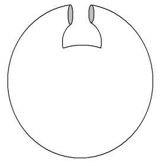
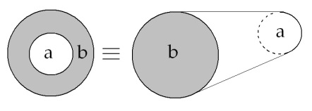
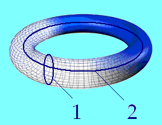
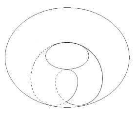
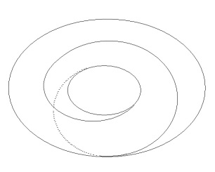
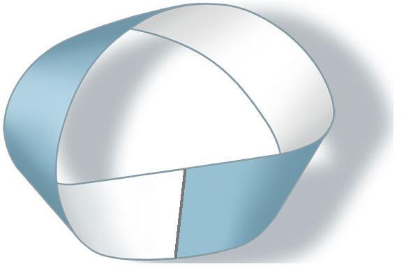
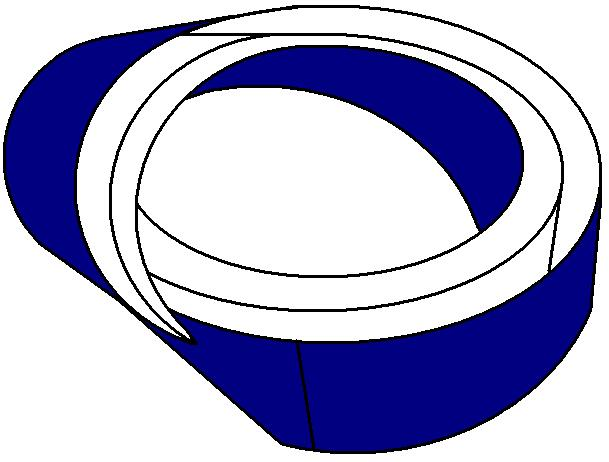
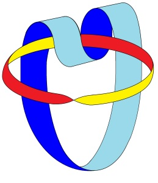
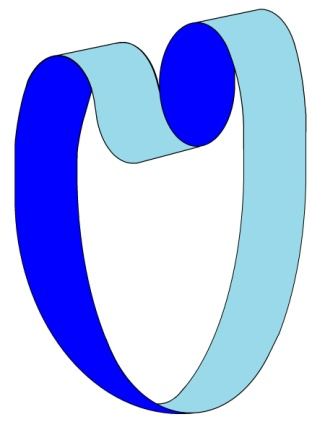
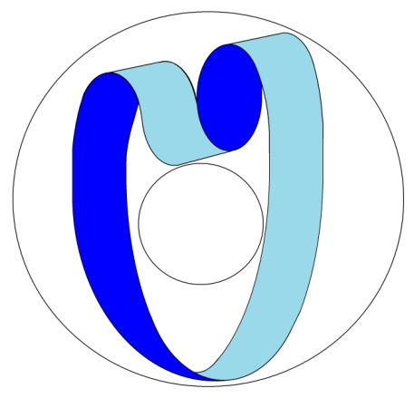

# Leçon 06 | l2 Janvier l966

  <label><input type="checkbox" data-lacan-toggle="original" checked> 原文</label>
  <label><input type="checkbox" data-lacan-toggle="notes" checked> 注释</label>
  <label><input type="checkbox" data-lacan-toggle="commentary" checked> 个人解读评论</label>

<section class="parallel-paragraph" data-paragraph-ids="s13-06-0001">

s13-06-0001

[无对应译文]

原文 · s13-06-0001

Je veux saluer la parution des *Cahiers pour l’analyse*. À l’intention des audi­teurs de *l’École Normale Supérieure* : je ne puis dire assez combien je les remer­cie de cette collaboration, de cette présence qui est pour moi un grand soutien.

</section>

<section class="parallel-paragraph" data-paragraph-ids="s13-06-0002">

s13-06-0002

[无对应译文]

原文 · s13-06-0002

Contrairement à ce que j’ai pu entendre…

</section>

<section class="parallel-paragraph" data-paragraph-ids="s13-06-0003">

s13-06-0003

[无对应译文]

原文 · s13-06-0003

> fut-ce *à l’état d’écho*, pour avoir été *émis très proche de moi*, je veux dire parmi ceux qui sont mes élèves …*la théorie*…

</section>

<section class="parallel-paragraph" data-paragraph-ids="s13-06-0004">

s13-06-0004

[无对应译文]

原文 · s13-06-0004

> la théorie telle que je la fais ici, telle que je la construis …*la théorie* ne saurait aucunement être mise au rang du *mythe*.

</section>

<section class="parallel-paragraph" data-paragraph-ids="s13-06-0005">

s13-06-0005

[无对应译文]

原文 · s13-06-0005

La théorie, pour autant qu’elle est théorie scientifique se *prétend* et se *prouve* n’être pas un mythe.

</section>

<section class="parallel-paragraph" data-paragraph-ids="s13-06-0006">

s13-06-0006

[无对应译文]

原文 · s13-06-0006

Elle se *prétend*, dans la bouche de celui qui parle et qui l’énonce selon le registre… qu’on ne saurait que réintégrer dans toute théorie …*de la parole, de la dimension* - au-delà de l’énoncé - *de l’énonciation*.

</section>

<section class="parallel-paragraph" data-paragraph-ids="s13-06-0007">

s13-06-0007

[无对应译文]

原文 · s13-06-0007

C’est pourquoi à l’origine de la théorie il n’est pas vain de savoir au nom de qui l’on parle. Il n’est pas accident que je parle au nom de FREUD et que d’autres aient à parler au nom de celui qui porte mon nom.

</section>

<section class="parallel-paragraph" data-paragraph-ids="s13-06-0008">

s13-06-0008

[无对应译文]

原文 · s13-06-0008

Quand je dénonce, par exemple, comme non vérité, d’énoncer au nom d’une certaine phénoménologie qu’il n’y a pas d’autre vérité de la souffrance que la souffrance elle-même, je dis : ceci est une non-vérité tant qu’on n’a pas *prouvé* que ce qui s’est dit au nom de FREUD…

</section>

<section class="parallel-paragraph" data-paragraph-ids="s13-06-0009">

s13-06-0009

[无对应译文]

原文 · s13-06-0009

> que la vérité de la souffrance n’est pas la souffrance elle–même …est controuvé[^74].

</section>

<section class="parallel-paragraph" data-paragraph-ids="s13-06-0010">

s13-06-0010

[无对应译文]

原文 · s13-06-0010

Ceci dit la naissance de la science ne reste pas éternellement suspendue au nom de celui qui l’instaure parce que la science ne se *prétend* pas seulement *n’être pas* de la structure du mythe, elle se *prouve* ne l’être pas.

</section>

<section class="parallel-paragraph" data-paragraph-ids="s13-06-0011">

s13-06-0011

[无对应译文]

原文 · s13-06-0011

Elle se prouve en ceci qu’elle se démontre être d’une *autre structure* et c’est ce que signifie l’investigation topologique qui est celle que je poursuis ici, que je reprends aujourd’hui de la dernière fois où je l’ai arrêtée sur la structure du *tore* en tant que construit par la jonction où les deux trous sur la surface dite topologiquement sphère que je pense que vous ne confondez pas avec la baudruche des enfants, encore qu’elle ait, bien entendu, les plus grands rapports avec elle, qu’elle soit ou non gonflée : même réduite dans votre poche à l’état d’un petit mouchoir, c’est toujours une sphère.

</section>

<section class="parallel-paragraph" data-paragraph-ids="s13-06-0012">

s13-06-0012

[无对应译文]

原文 · s13-06-0012

</section>

<section class="parallel-paragraph" data-paragraph-ids="s13-06-0013">

s13-06-0013

[无对应译文]

原文 · s13-06-0013

J’ai terminé, avec quelque hâte sans doute, limité par la coupure - celle du temps - qui gouverne, et pour tous les sujets, nos rapports.

</section>

<section class="parallel-paragraph" data-paragraph-ids="s13-06-0014">

s13-06-0014

[无对应译文]

原文 · s13-06-0014

J’en suis resté à la coupure sur la surface du *tore*, d’un bord, d’un bord fermé, celui qui y instaure la répétition minimale.

</section>

<section class="parallel-paragraph" data-paragraph-ids="s13-06-0015">

s13-06-0015

[无对应译文]

原文 · s13-06-0015

Un tour ne suffit pas à nous livrer l’essence de la structure du *tore* : un tour fait réapparaître la béance des *deux trous* sur lesquels elle est *construite*, restitue, avec ces *deux trous* l’ouverture de ce que nous avons défini d’abord comme la bande cylindrique.

</section>

<section class="parallel-paragraph" data-paragraph-ids="s13-06-0016">

s13-06-0016

[无对应译文]

原文 · s13-06-0016

</section>

<section class="parallel-paragraph" data-paragraph-ids="s13-06-0017">

s13-06-0017

[无对应译文]

原文 · s13-06-0017

À savoir ce qui…

</section>

<section class="parallel-paragraph" data-paragraph-ids="s13-06-0018">

s13-06-0018

[无对应译文]

原文 · s13-06-0018

> je pense n’avoir pas à y revenir aujourd’hui et que tout ceux qui sont là étaient là la dernière fois, pour les autres, mon Dieu, tant pis, qu’ils s’informent …j’ai dit que deux trous, quels qu’ils soient, sur la sphère sont toujours concentriques même s’ils apparaissent, à une première vue, être ce qu’on appelle extérieurs. Ils sont toujours concentriques et créent ceci que je dessine ici qui s’appelle la bande, que nous appellerons par convention ici pour nous en servir, la bande cylindrique.

</section>

<section class="parallel-paragraph" data-paragraph-ids="s13-06-0019">

s13-06-0019

[无对应译文]

原文 · s13-06-0019

Topologiquement, que ce soit, je vous l’ai dit la dernière fois, un jade plat et perforé…

</section>

<section class="parallel-paragraph" data-paragraph-ids="s13-06-0020">

s13-06-0020

[无对应译文]

原文 · s13-06-0020

> tout ça parce que c’est une figure sous laquelle cette bande peut apparaître et apparaît effectivement et non sans raison dans l’art ou dans ce qu’on appelle l’art …ce peut donc être à la fois cette forme plate perforée au centre ou un cylindre, topologiquement c’est équivalent.

</section>

<section class="parallel-paragraph" data-paragraph-ids="s13-06-0021">

s13-06-0021

[无对应译文]

原文 · s13-06-0021

Un tour, donc sur le tore :

</section>

<section class="parallel-paragraph" data-paragraph-ids="s13-06-0022">

s13-06-0022

[无对应译文]

原文 · s13-06-0022

</section>

<section class="parallel-paragraph" data-paragraph-ids="s13-06-0023">

s13-06-0023

[无对应译文]

原文 · s13-06-0023

coupure ainsi faite \[1\] par exemple, ou aussi bien ainsi faite \[2\], a simplement pour effet de le renvoyer à la structure de la bande cylindrique et n’en révèle nullement, disons, la propriété. Il en faut deux. Bien commode pour supporter - pour nous - la nécessité de la répétition, pour ce que va représenter le tore, mais alors pour que cette coupure se ferme il faut que s’y ajoute, disons le tour fait autour du second trou…

</section>

<section class="parallel-paragraph" data-paragraph-ids="s13-06-0024">

s13-06-0024

[无对应译文]

原文 · s13-06-0024

> puisque, ce qui définit la structure du tore, je veux dire intuitivement… je suis moi-même gêné de devoir poursuivre ce discours en des termes qui font appel à votre œil, à votre intuition
>
> de ce que c’est, cet anneau creux, le tore. Mais profitons de ce support de l’intuition et après tout, il répond au fondement de la structure …pour que la coupure se ferme en ayant fait deux tours autour du trou, si vous voulez appelons-la circulaire, il est nécessaire qu’elle fasse aussi, cette coupure, un tour autour du trou, appelons le, le nom n’est peut-être pas le meilleur, mais qu’ici il fasse pour vous, image, figure, du « *trou central* » :

</section>

<section class="parallel-paragraph" data-paragraph-ids="s13-06-0025">

s13-06-0025

[无对应译文]

原文 · s13-06-0025

</section>

<section class="parallel-paragraph" data-paragraph-ids="s13-06-0026">

s13-06-0026

[无对应译文]

原文 · s13-06-0026

Conventionnellement, nous allons représenter… Je dis représenter au nom du terme de représentant. Si ce représentant mérite d’être appelé *représentation*, nous le verrons après. *Représentant* a l’avantage de dire ici « *tenant lieu* », ce qui veut dire que rien n’est tranché sur le sujet de la fonction de représentation et qu’aussi bien, peut-être, ce qui ici se définit, se découpe, s’affirme comme coupure peut bien, jusqu’à nouvel ordre, être pris à la lettre d’être réellement ce dont il s’agit.

</section>

<section class="parallel-paragraph" data-paragraph-ids="s13-06-0027">

s13-06-0027

[无对应译文]

原文 · s13-06-0027

C’est pourquoi le terme « *représentant* » pour l’instant nous suffit.

</section>

<section class="parallel-paragraph" data-paragraph-ids="s13-06-0028">

s13-06-0028

[无对应译文]

原文 · s13-06-0028

Voilà, donc ce qui va se produire chaque fois que la répétition de ce tour…

</section>

<section class="parallel-paragraph" data-paragraph-ids="s13-06-0029">

s13-06-0029

[无对应译文]

原文 · s13-06-0029

> que par convention nous allons assimiler au tour de la demande …deux D ne saurait aller sans que, pour que la courbe soit fermée, aussi le tour soit fait du trou central. 2 D ne va pas sans d ou si vous faites la coupure autrement, ce qui est aussi concevable, je pense…

</section>

<section class="parallel-paragraph" data-paragraph-ids="s13-06-0030">

s13-06-0030

[无对应译文]

原文 · s13-06-0030

> il faut que je fasse les choses *un peu plus rigoureusement* pour que je ne sois pas tout à fait… …ce qui est aussi concevable, un D (une demande) pour que la coupure soit fermée implique deux tours autour du trou central que nous appellerons l’équivalent de deux d.

</section>

<section class="parallel-paragraph" data-paragraph-ids="s13-06-0031">

s13-06-0031

[无对应译文]

原文 · s13-06-0031

</section>

<section class="parallel-paragraph" data-paragraph-ids="s13-06-0032">

s13-06-0032

[无对应译文]

原文 · s13-06-0032

La *demande* et le *désir* c’est ce…

</section>

<section class="parallel-paragraph" data-paragraph-ids="s13-06-0033">

s13-06-0033

[无对应译文]

原文 · s13-06-0033

> qu’au cours de notre construction dès longtemps préparée et quand nous avons introduit au plus près de l’expérience analytique les termes *Fonction et champ de la parole et du langage*[^75] …ce à quoi nous avons donné la part qui est l’essentiel de l’expérience analytique, non pas seulement son truchement, son instrument, son moyen, mais assurément, il faut tenir compte *qu’il n’y a pas*, au dernier terme, *d’autre support* de l’expérience analytique *que cette parole et ce langage*.

</section>

<section class="parallel-paragraph" data-paragraph-ids="s13-06-0034">

s13-06-0034

[无对应译文]

原文 · s13-06-0034

Dire - si je puis dire - que sa substance est parole et langage, c’est là la donnée sur laquelle nous avons édifié cette première *restauration du sens de* FREUD. Mais bien sûr, ceci n’est pas là, pour nous, *tout dire*. Ce que finalement la topologie du tore vient à supporter c’est - en nous *imageant*, en nous permettant d’*intuitionner* - cette divergence qui se produit de l’énoncé de la demande, à la structure qui la divise et qui s’appelle le désir.

</section>

<section class="parallel-paragraph" data-paragraph-ids="s13-06-0035">

s13-06-0035

[无对应译文]

原文 · s13-06-0035

C’est une façon pour nous de supporter ce que nous donne une expérience dont les présupposés subjectifs sont à approfondir…

</section>

<section class="parallel-paragraph" data-paragraph-ids="s13-06-0036">

s13-06-0036

[无对应译文]

原文 · s13-06-0036

> l’expérience psychanalytique à cette étape de structure que nous faisons ici supporter par *le tore* et qui est, disais-je, le premier temps que j’ai donné à *ma reconstruction de l’expérience freudienne* …en un sens *Fonction et champ de la parole et du langage* c’est l’assurer sur le fondement du pur *symbolique*.

</section>

<section class="parallel-paragraph" data-paragraph-ids="s13-06-0037">

s13-06-0037

[无对应译文]

原文 · s13-06-0037

*Et si le tore ne suffit pas pour rendre compte de la dialectique de la psychanalyse elle-même*, si après tout sur *le tore* nous pouvons nous croire obligés à tourner éternellement dans ce cycle des deux termes, l’un dédoublé, l’autre masqué, de la demande et du désir, s’il faut que nous en fassions quelque chose, si je puis dire de cette coupure, et s’il faut que nous voyons où elle nous mène, à savoir : comment de ce cercle, de ce bord, qui, *selon la formule propre à tout bord est un sans bord*, c’est-à-dire, tournera toujours et sans fin sur lui-même - qu’est-ce qu’on peut reconstruire avec l’utilisation de coupure de ce bord ?

</section>

<section class="parallel-paragraph" data-paragraph-ids="s13-06-0038">

s13-06-0038

[无对应译文]

原文 · s13-06-0038

Un instant, arrêtons-nous donc, avant de le quitter. Avec cette… structure…

</section>

<section class="parallel-paragraph" data-paragraph-ids="s13-06-0039">

s13-06-0039

[无对应译文]

原文 · s13-06-0039

> vous m’avez vu hésiter parce que j’allais dire « cette forme » et en effet, pour autant que nous allons la quitter pour passer à une autre structure, elle se détache comme une forme au moment où elle tombe …arrêtons nous-*y* un instant pour envisager comment même il a été possible que nous retienne, que nous retienne nécessairement, car ce n’est pas vain détour mais passage obligé dans notre construction de la théorie si nous avons dû repartir de *Fonction et champ de la parole et du langage* comme du point initial : ce *pur symbolique* s’inscrit dans les conditions qui font que c’est le névrosé et je dirai, le névrosé moderne…

</section>

<section class="parallel-paragraph" data-paragraph-ids="s13-06-0040">

s13-06-0040

[无对应译文]

原文 · s13-06-0040

> mode de manifestation du sujet non pas *mythiquement* mais historiquement daté, entré dans la réalité de l’histoire, sûrement à une certaine date, même si elle n’est pas datable, nous n’allons pas nous égarer sur ce qu’était les obsessionnels au temps des stoïciens, faute de documents, nous serons prudents à en faire éventuellement quelque reconstruction structuralement modifiée. Ce n’est pas cela qui nous importe …car ce névrosé moderne \[...\] il n’est pas sans corrélation avec l’émergence de quelque chose, d’un déplacement du mode de la raison dans l’appréhension de la certitude qui est ce que nous avons cherché à cerner autour du moment historique du *cogito cartésien*.

</section>

<section class="parallel-paragraph" data-paragraph-ids="s13-06-0041">

s13-06-0041

[无对应译文]

原文 · s13-06-0041

Ce moment est inséparable aussi de cette autre émergence qui s’appelle la fondation de la science et du même coup, l’intrusion de la science dans ce domaine qu’elle bouleverse, qu’elle force, dirais-je, qui est un domaine qui a un *nom* parfaitement *articulable* qui s’appelle celui du rapport à *la vérité*. Les limites, les liens aux entournures si je puis dire, de la fonction du sujet en tant qu’elle est ainsi introduite dans ce rapport à la vérité, ont un statut que j’ai essayé seulement d’esquisser pour autant qu’à notre propos il est utile, car sans lui il est impossible de concevoir :

</section>

<section class="parallel-paragraph" data-paragraph-ids="s13-06-0042">

s13-06-0042

[无对应译文]

原文 · s13-06-0042

- ni l’existence comme telle,

</section>

<section class="parallel-paragraph" data-paragraph-ids="s13-06-0043">

s13-06-0043

[无对应译文]

原文 · s13-06-0043

- ni la structure du névrosé moderne, qui même qu’il ne le sache pas, est coextensif de cette présence

</section>

<section class="parallel-paragraph" data-paragraph-ids="s13-06-0044">

s13-06-0044

[无对应译文]

原文 · s13-06-0044

> du sujet de la science.

</section>

<section class="parallel-paragraph" data-paragraph-ids="s13-06-0045">

s13-06-0045

[无对应译文]

原文 · s13-06-0045

Outre que pour autant que son statut clinique et thérapeutique lui est donné par la psychanalyse, si paradoxal que cela vous paraisse, j’affirme qu’il n’existe, si singulier que cela vous paraisse, il n’existe, je dirais complété, *<u>que</u>* de l’instance de la clinique et de *la thérapeutique psychanalytique*.

</section>

<section class="parallel-paragraph" data-paragraph-ids="s13-06-0046">

s13-06-0046

[无对应译文]

原文 · s13-06-0046

À quoi vous allez légitimement - puisque j’ai dit « *complété *» - dire que la *praxis* psychanalytique est littéralement le *complément* du *symptôme*. Et pourquoi pas ? Puisque aussi bien c’est de la tension d’une certaine perspective et d’une certaine façon d’interroger la souffrance névrotique, que – effectivement – se complète, et dans la cure, la symptomatologie.

</section>

<section class="parallel-paragraph" data-paragraph-ids="s13-06-0047">

s13-06-0047

[无对应译文]

原文 · s13-06-0047

FREUD l’a souligné et à juste titre. Le fait qu’elle puisse également se *compléter* ailleurs, à savoir même avant que FREUD ait complété son expérience, il y avait eu certaine manière pour le névrosé de *compléter* ses symptômes avec M. JANET, ne va pas contre.

</section>

<section class="parallel-paragraph" data-paragraph-ids="s13-06-0048">

s13-06-0048

[无对应译文]

原文 · s13-06-0048

Il s’agit justement de savoir ce que nous pouvons retenir de *la structure janetienne* pour la constitution du névrosé comme tel.

</section>

<section class="parallel-paragraph" data-paragraph-ids="s13-06-0049">

s13-06-0049

[无对应译文]

原文 · s13-06-0049

Mais après tout - je vous le dis tout de suite, ne vacillez pas pour autant - cette espèce, je ne dirai pas d’idéalisme, mais de relativisme du malade à son médecin, vous ferez bien de ne pas vous y précipiter parce que ce n’est pas du tout ça que je dis, malgré que ce soit ça qui ait été entendu parce que, un petit peu prématurément, j’ai introduit cette *fonction de la clinique psychanalytique* aux réunions de mon École et où j’ai, bien entendu, instantanément recueilli cette interprétation de la complémentation du névrosé par le clinicien et qu’à la vérité, j’espérais mieux de ceux qui m’entendent.

</section>

<section class="parallel-paragraph" data-paragraph-ids="s13-06-0050">

s13-06-0050

[无对应译文]

原文 · s13-06-0050

C’est peut–être aussi pour moi un peu excessif que d’en attendre tant puisque aussi bien j’ai été forcé, à titre d’exposé, de passer par ce terme de *compléter*, dont vous verrez comment il pourra être corrigé quand justement j’aurai pu progresser d’une autre *structure*. C’est *une complémentation*, peut-être, *mais qui n’est pas d’ordre homogène*.

</section>

<section class="parallel-paragraph" data-paragraph-ids="s13-06-0051">

s13-06-0051

[无对应译文]

原文 · s13-06-0051

C’est ce que va nous livrer la structure suivante, j’entends que je vais ici réintroduire la *bande de Mœbius*.

</section>

<section class="parallel-paragraph" data-paragraph-ids="s13-06-0052">

s13-06-0052

[无对应译文]

原文 · s13-06-0052

Quoi qu’il en soit, marquons bien déjà, ce qu’il y a là de disparité fondamentale. C’est déjà ce qui est sensible, inscrit, vivant et qui a fait l’immense retentissement de la psychanalyse même sous les formes imbéciles où elle s’est d’abord présentée.

</section>

<section class="parallel-paragraph" data-paragraph-ids="s13-06-0053">

s13-06-0053

[无对应译文]

原文 · s13-06-0053

Quand j’ai dit que l’entrée du mode du sujet qu’instaure la science bouleverse et force le domaine du rapport à la vérité, observez que dans la parole donnée - dans la psychanalyse - au névrosé comme tel, ce qu’il représente - pour employer mon terme de tout à l’heure - c’est sans doute quelque chose qui appelle, qui se manifeste au premier plan comme demande de savoir et en tant que cette demande s’adressait à la science.

</section>

<section class="parallel-paragraph" data-paragraph-ids="s13-06-0054">

s13-06-0054

[无对应译文]

原文 · s13-06-0054

Mais ce qui s’est introduit avec la psychanalyse décidément du côté de celui qui s’autorise et se supporte d’être ici sujet de la science, qu’il sache ou non en quoi, pour autant il s’engage comme responsabilité, il faut bien le dire, il n’a pas l’air toujours de le savoir, quoi qu’il s’en targue, mais ce qui est original c’est que *la parole est donnée à celui que j’ai appelé le névrosé, comme représentant de la vérité*. Le névrosé, pour que la psychanalyse *s’instaure* et ait, ce que nous appellerons au sens large où j’emploie ce terme, un sens, c’est - et ce n’est rien d’autre - que la vérité qui parle, ce que j’ai appelé la vérité quand je l’ai fait dire - parlant en son nom :

</section>

<section class="parallel-paragraph" data-paragraph-ids="s13-06-0055">

s13-06-0055

[无对应译文]

原文 · s13-06-0055

> « *Moi la vérité, je parle*. ». \[*Écrits*, p. 409 ; ou t.1 p. 406.\]

</section>

<section class="parallel-paragraph" data-paragraph-ids="s13-06-0056">

s13-06-0056

[无对应译文]

原文 · s13-06-0056

C’est là ce sur quoi il nous est demandé de nous arrêter et au plus près, car celui que nous écoutons la représente.

</section>

<section class="parallel-paragraph" data-paragraph-ids="s13-06-0057">

s13-06-0057

[无对应译文]

原文 · s13-06-0057

Telle est la dimension nouvelle. Son originalité tient dans cette disparité que ce crédit absolument insensé, qui est fait à une manifestation de parole et de langage, se fait dans *la science* en tant précisément que *la science*, dans ce déplacement fondamental qui l’instaure comme telle, l’exclut pour le sujet de la science dont il ne s’agit que de suturer les béances, les ouvertures, les trous par où, comme tel, va entrer en jeu ce domaine ambigu, insaisissable, bien repéré depuis toujours pour être le domaine de la tromperie qui est celui où, comme telle, *la vérité parle*.

</section>

<section class="parallel-paragraph" data-paragraph-ids="s13-06-0058">

s13-06-0058

[无对应译文]

原文 · s13-06-0058

C’est à cette jonction, à cet abouchement étrange qu’il s’agit de donner son statut.

</section>

<section class="parallel-paragraph" data-paragraph-ids="s13-06-0059">

s13-06-0059

[无对应译文]

原文 · s13-06-0059

Je le répète…

</section>

<section class="parallel-paragraph" data-paragraph-ids="s13-06-0060">

s13-06-0060

[无对应译文]

原文 · s13-06-0060

> sans doute, j’ai eu trop l’occasion de m’apercevoir combien il est nécessaire pour se faire entendre d’insister …la vérité comme telle est incitée, est convoquée, non plus à être prise comme dans l’émergence du statut de la science, comme problématique, mais à venir - si je puis dire - plaider sa cause elle-même à la barre, elle-même à poser le problème de son énigme dans le domaine de la science.

</section>

<section class="parallel-paragraph" data-paragraph-ids="s13-06-0061">

s13-06-0061

[无对应译文]

原文 · s13-06-0061

Ce rapport à *la vérité* ne saurait être éludé.

</section>

<section class="parallel-paragraph" data-paragraph-ids="s13-06-0062">

s13-06-0062

[无对应译文]

原文 · s13-06-0062

Ce n’est pas pour rien que nous avons une logique qu’on appelle moderne, logique dite propositionnelle, ébauchée…

</section>

<section class="parallel-paragraph" data-paragraph-ids="s13-06-0063">

s13-06-0063

[无对应译文]

原文 · s13-06-0063

> on peut même dire et croire autant qu’il faut aussi faire crédit tellement nous avons peu de documents …ébauchée, dis-je, par les Stoïciens.

</section>

<section class="parallel-paragraph" data-paragraph-ids="s13-06-0064">

s13-06-0064

[无对应译文]

原文 · s13-06-0064

Elle repose, cette logique dont vous auriez tort de minimiser l’importance de manifestation, car même si tardive, dans la construction de la science, ceci a occupé dans nos préoccupations présentes cette place extraordinaire qui n’en fait pas moins que révéler une problématique, qui sans doute résolue dans les premiers temps de la science en marche, ne nous rejoint pas par hasard au rendez–vous où nous la trouvons maintenant.

</section>

<section class="parallel-paragraph" data-paragraph-ids="s13-06-0065">

s13-06-0065

[无对应译文]

原文 · s13-06-0065

Sans pouvoir même en dire quoi que ce soit qui rappelle à ceux qui savent la complexité, la richesse et les déchirements, les antinomies, qu’elle instaure, je rappellerai simplement comme point de référence ce à quoi, si je puis dire elle réduit la fonction de *la vérité*.

</section>

<section class="parallel-paragraph" data-paragraph-ids="s13-06-0066">

s13-06-0066

[无对应译文]

原文 · s13-06-0066

Cette ἀλήθεια \[aléthèia\] cette figure ambiguë de ce qui ne saurait révéler sans occulter…

</section>

<section class="parallel-paragraph" data-paragraph-ids="s13-06-0067">

s13-06-0067

[无对应译文]

原文 · s13-06-0067

> cette ἀλήθεια \[aléthèia\] dont un HEIDEGGER nous rappelle dans la pensée qui est la nôtre
>
> la fonction inaugurale, et nous rappelle à y retourner, je dois dire non sans une étrange maladresse de philosophe car au point où nous en sommes, j’ose dire que nous, psychanalystes, nous avons plus à en dire, oui, plus à en dire, que ce que HEIDEGGER dit de la *Wahrheit* même barrée dans son rapport au *Wesen*[^76] …laissons cela de côté un instant et disons qu’à l’ἀλήθεια \[alêthéia\] - c’est pour cela que je l’ai réintroduite - depuis *les Stoïciens*, s’oppose l’ ἀληθές \[alêthés\], le vrai au neutre, attribut.

</section>

<section class="parallel-paragraph" data-paragraph-ids="s13-06-0068">

s13-06-0068

[无对应译文]

原文 · s13-06-0068

Qu’est-ce que peut vouloir dire l’ ἀληθές \[alêthés\] détaché de l’ἀλήθεια \[aléthèia\] ?

</section>

<section class="parallel-paragraph" data-paragraph-ids="s13-06-0069">

s13-06-0069

[无对应译文]

原文 · s13-06-0069

Naturellement, ce n’est tout de même pas moi qui ai introduit pour la première fois cette question.

</section>

<section class="parallel-paragraph" data-paragraph-ids="s13-06-0070">

s13-06-0070

[无对应译文]

原文 · s13-06-0070

Disons que toute la logique, *la logique propositionnelle moderne* que vous pouvez voir en ouvrant n’importe quel manuel, qu’on l’appelle *symbolique* ou non, vous verrez se constituer le jeu de ce qu’on appelle *l’opération logique* : *conjonction* par exemple, *disjonction*, *implication*, *implication réciproque*, *exclusion*…

</section>

<section class="parallel-paragraph" data-paragraph-ids="s13-06-0071">

s13-06-0071

[无对应译文]

原文 · s13-06-0071

> nulle part vous n’y trouverez – je vous le dis en passant – la fonction logique pourtant que
>
> j’ai introduite l’année dernière… l’année avant dernière[^77], sous le nom de l’aliénation. J’y reviendrai …ces opérations se fondent, se définissent d’une façon qu’on appelle purement formelle à partir de la possibilité de qualifier un énoncé d’ ἀληθές \[alêthés\], vrai ou faux, en d’autres termes de lui donner une *valeur de vérité*.

</section>

<section class="parallel-paragraph" data-paragraph-ids="s13-06-0072">

s13-06-0072

[无对应译文]

原文 · s13-06-0072

La logique la plus commune, celle à la vérité qui dure depuis toujours, et qui a peut–être quelque titre à faire durer, c’est une logique bivalente. Un énoncé est ou vrai ou faux.

</section>

<section class="parallel-paragraph" data-paragraph-ids="s13-06-0073">

s13-06-0073

[无对应译文]

原文 · s13-06-0073

Il y a de fortes raisons de présumer que cette façon de prendre les choses est tout à fait insuffisante comme d’ailleurs, il faut le reconnaître, les logiciens modernes s’en sont aperçu, d’où leur tentative d’édifier une logique multivalente.

</section>

<section class="parallel-paragraph" data-paragraph-ids="s13-06-0074">

s13-06-0074

[无对应译文]

原文 · s13-06-0074

Ben, c’est pas commode vous savez ! Et d’ailleurs je dirai, provisoirement ça ne nous intéresse pas.

</section>

<section class="parallel-paragraph" data-paragraph-ids="s13-06-0075">

s13-06-0075

[无对应译文]

原文 · s13-06-0075

L’intéressant est de savoir simplement qu’on *construit une logique* sur le fondement bivalent ἀληθές \[alêthés\], vrai ou pas, et que l’on peut construire quelque chose qui ne se limite pas du tout à la tautologie : le vrai est vrai, le faux est faux, qui peut s’étendre sur des pages et des pages et qui - bien sûr - tout en prenant fortement référence à la tautologie, n’en construit pas moins quelque chose où l’on gagne du terrain.

</section>

<section class="parallel-paragraph" data-paragraph-ids="s13-06-0076">

s13-06-0076

[无对应译文]

原文 · s13-06-0076

C’est exactement le même problème que ce qui est… on peut dire, la mathématique est une tautologie, d’un certain point de vue de logicien, mais il n’en reste pas moins que c’est une conquête, un édifice justement fécond et dont les faîtes, les apogées, les développements, appelez-ça comme vous voudrez, sont tout à fait substantiels, existants : au regard des prémisses, on a effec­tivement construit quelque chose, on a gagné un savoir.

</section>

<section class="parallel-paragraph" data-paragraph-ids="s13-06-0077">

s13-06-0077

[无对应译文]

原文 · s13-06-0077

Le rapport à la vérité est, en d’autres termes, ici suturé par la pure et simple référence à la valeur. Qu’on en demande plus quand on demande ce que c’est que d’être vrai bien sûr, la pensée dite *positiviste* ou *néo–positiviste* ira là au recours à la référence, mais ce recours à la référence…

</section>

<section class="parallel-paragraph" data-paragraph-ids="s13-06-0078">

s13-06-0078

[无对应译文]

原文 · s13-06-0078

> en tant que ce serait l’expérience ou quoi que ce soit de l’ordre d’une objectalité expérientielle …sera toujours insuffisant, comme il est facile de le démontrer chaque fois que cette voie est prise .

</section>

<section class="parallel-paragraph" data-paragraph-ids="s13-06-0079">

s13-06-0079

[无对应译文]

原文 · s13-06-0079

Car on ne saurait, avec cette seule référence, expliquer ni le ressort, ni les parties, ni le développement, ni les crises, de toute la construction scientifique. Il nous faut nous rappeler pour avoir seulement une saine logique, nous pouvons complètement éliminer le simple rapport à l’être, au sens aristotélicien, lequel dit :

</section>

<section class="parallel-paragraph" data-paragraph-ids="s13-06-0080">

s13-06-0080

[无对应译文]

原文 · s13-06-0080

- « *que le vrai est de dire de ce qui est, qu’il est* », et « *est* » n’est pas là « *qui existe* »,

</section>

<section class="parallel-paragraph" data-paragraph-ids="s13-06-0081">

s13-06-0081

[无对应译文]

原文 · s13-06-0081

- « *que le faux est de dire que ce qui est n’est pas* », qu’il « *n’est pas* » qu’il est[^78].

</section>

<section class="parallel-paragraph" data-paragraph-ids="s13-06-0082">

s13-06-0082

[无对应译文]

原文 · s13-06-0082

On tente une issue pour échapper à cette référence à *l’être*, alors là il y a l’issue russellienne, celle à *l’événement* qui est tout autre chose que l’objet. *La gageure* est tenue par RUSSEL[^79] dont *la seule référence* *événementielle*, à savoir du recoupement spatio-temporel, est quelque chose que nous pouvons appeler *une rencontre* et dès lors, on définira

</section>

<section class="parallel-paragraph" data-paragraph-ids="s13-06-0083">

s13-06-0083

[无对应译文]

原文 · s13-06-0083

- *le vrai comme la probabilité d’un événement certain,*

</section>

<section class="parallel-paragraph" data-paragraph-ids="s13-06-0084">

s13-06-0084

[无对应译文]

原文 · s13-06-0084

- *le faux comme la probabilité d’un événement impossible.*

</section>

<section class="parallel-paragraph" data-paragraph-ids="s13-06-0085">

s13-06-0085

[无对应译文]

原文 · s13-06-0085

Il n’y a qu’une faiblesse à cette théorie, à ce registre, c’est qu’il y a…

</section>

<section class="parallel-paragraph" data-paragraph-ids="s13-06-0086">

s13-06-0086

[无对应译文]

原文 · s13-06-0086

> et c’est ici que nous nous remettons en jeu, nous autres analystes, une sorte de rencontre qui est celle dont je vous ai parlé la première année où j’ai parlé ici \[E.N.S., rue d’Ulm, Paris Vème\] *tout de suite après* *la répétition* …c’est précisément la rencontre avec *la vérité* [^80].

</section>

<section class="parallel-paragraph" data-paragraph-ids="s13-06-0087">

s13-06-0087

[无对应译文]

原文 · s13-06-0087

Impossible donc d’éliminer cette dimension que je décris comme celle du lieu de l’Autre où tout ce qui s’articule comme parole, se pose comme vrai même et y compris le mensonge. La dimension du mensonge, contrairement à celle de la feinte, étant justement d’avoir *le pouvoir de s’affirmer comme vérité*.

</section>

<section class="parallel-paragraph" data-paragraph-ids="s13-06-0088">

s13-06-0088

[无对应译文]

原文 · s13-06-0088

Dans la dimension de la *vérité*, c’est-à-dire la totalité de ce qui entre dans notre champ comme *fait symbolique*, la *vérité* avant d’être vraie ou fausse…

</section>

<section class="parallel-paragraph" data-paragraph-ids="s13-06-0089">

s13-06-0089

[无对应译文]

原文 · s13-06-0089

> selon des critères qui - je vous l’ai indiqué - ne sont pas simples à définir puisque, toujours, ils font entrer d’un côté, la question de l’être, et de l’autre, celui de la rencontre justement avec ce qui est en question : avec la *vérité*.
>
> La *vérité* entre en jeu, restaure et s’articule comme primitive fiction autour de quoi va avoir à surgir un certain ordre de coordonnées dont il s’agit pour ne pas oublier la structure …avant que quoi que ce soit puisse se poursuivre valablement de sa dialectique, *c’est cela qui est en question*.

</section>

<section class="parallel-paragraph" data-paragraph-ids="s13-06-0090">

s13-06-0090

[无对应译文]

原文 · s13-06-0090

C’est ici que devient fascinant ce qui se poursuit comme *œuvre*, comme *étreinte*, comme *trame*, sur ce point que j’ai appelé *le point d’abouchement de la vérité et du savoir*.

</section>

<section class="parallel-paragraph" data-paragraph-ids="s13-06-0091">

s13-06-0091

[无对应译文]

原文 · s13-06-0091

Si l’année dernière nous avons ici, fait si long, si grand état des thèses de FREGE[^81] c’est qu’il tente une solution…

</section>

<section class="parallel-paragraph" data-paragraph-ids="s13-06-0092">

s13-06-0092

[无对应译文]

原文 · s13-06-0092

> une parmi les autres, mais celle-là spécialement révélatrice pour nous d’aller dans *un sens radical* …lorsque nous avons vu ou entrevu…

</section>

<section class="parallel-paragraph" data-paragraph-ids="s13-06-0093">

s13-06-0093

[无对应译文]

原文 · s13-06-0093

> grâce à certains de ceux qui veulent bien ici me répondre …ce que nous avons vu c’est qu’au niveau de la conception du concept, tout est tiré du côté où ce qui va avoir à prendre valeur, ou non, de *vérité* est marqué d’une certaine sollicitation, réduction, limitation qui est proprement celle du fait qu’il a pu en tirer la théorie du nombre qui est la sienne et que si l’on y regarde de près, le *concept* fregien est entièrement centré sur ce à quoi peut être donné un *nom propre*.

</section>

<section class="parallel-paragraph" data-paragraph-ids="s13-06-0094">

s13-06-0094

[无对应译文]

原文 · s13-06-0094

En quoi pour nous, avec la critique que nous en avons faite l’année dernière ici…

</section>

<section class="parallel-paragraph" data-paragraph-ids="s13-06-0095">

s13-06-0095

[无对应译文]

原文 · s13-06-0095

> je demande pardon à ceux qui n’y étaient pas participants …en quoi se révèle le caractère spécifiquement subjectif…

</section>

<section class="parallel-paragraph" data-paragraph-ids="s13-06-0096">

s13-06-0096

[无对应译文]

原文 · s13-06-0096

> au sens de la structure que nous-mêmes donnons au terme de sujet …de ce qui pour un FREGE, en tant que logicien de la science, est ce qui caractérise comme tel l’objet de la science.

</section>

<section class="parallel-paragraph" data-paragraph-ids="s13-06-0097">

s13-06-0097

[无对应译文]

原文 · s13-06-0097

Je sais qu’ici je ne fais qu’approcher un point qui demanderait développement.

</section>

<section class="parallel-paragraph" data-paragraph-ids="s13-06-0098">

s13-06-0098

[无对应译文]

原文 · s13-06-0098

Si développement il y a, ce ne peut être que *sur question*. Si question il peut y avoir là-dessus ça pourra être fait à mon séminaire fermé. Mais j’en ai indiqué assez pour rejoindre ce sur quoi j’ai terminé la dernière fois, à savoir qu’il y a problème autour de cette fonction fregeienne[^82] précisément de la *Bedeutungswert* qui est *Wahrheitswert.*

</section>

<section class="parallel-paragraph" data-paragraph-ids="s13-06-0099">

s13-06-0099

[无对应译文]

原文 · s13-06-0099

Et que cette valeur de vérité, s’il y a problème, c’est là peut-être, que vous verrez en fait que nous pouvons apporter quelque chose qui en donne, qui en désigne, d’une façon rénovée par notre expérience, le véritable secret, il est de l’ordre de *l’objet(a)*.

</section>

<section class="parallel-paragraph" data-paragraph-ids="s13-06-0100">

s13-06-0100

[无对应译文]

原文 · s13-06-0100

C’est au niveau de *l’objet(a)* en tant qu’*objet qui choit dans l’appréhension du savoir*, que nous sommes - comme hommes de la science - rejoints par la question de la vérité.

</section>

<section class="parallel-paragraph" data-paragraph-ids="s13-06-0101">

s13-06-0101

[无对应译文]

原文 · s13-06-0101

Ceci est caché parce que *l’objet(a)* ne se voit même pas dans la suture du sujet telle qu’elle est édifiée dans la logique moderne et que c’est proprement ce que notre expérience nous force d’y restaurer là où la théorie précisément, non seulement *se prétend* mais *se prouve* être supérieure au mythe et que c’est seulement à partir de là que peut être donné son statut…

</section>

<section class="parallel-paragraph" data-paragraph-ids="s13-06-0102">

s13-06-0102

[无对应译文]

原文 · s13-06-0102

> un statut dont on rende compte et non pas seulement qu’on constate …comme le fait d’être divisé, son statut au sujet précisément, dont le sens ne saurait échapper à cette division.

</section>

<section class="parallel-paragraph" data-paragraph-ids="s13-06-0103">

s13-06-0103

[无对应译文]

原文 · s13-06-0103

C’est ici que s’introduit la structure du *plan projectif* pour autant que la surface en est autre et nous permet de répondre autrement de ce qui se découpe comme objet et comme sujet.

</section>

<section class="parallel-paragraph" data-paragraph-ids="s13-06-0104">

s13-06-0104

[无对应译文]

原文 · s13-06-0104

Cette *bande de Mœbius*, je vous l’ai déjà montrée au cours des années qui sont passées, et déjà j’ai donné les indications qui vous mettent sur la voie de son utilisation pour nous dans la structure. La *bande de Mœbius*, je l’ai déjà une fois construite devant vous, vous savez comment ça se fait. On prend une bande du type de celles que j’appelle bande cylindrique et la retournant d’un demi tour, on la colle à elle-même, on fait ainsi cette *bande de Mœbius* qui n’a qu’*une surface*, qui n’a *pas d’endroit* et *d’envers.*

</section>

<section class="parallel-paragraph" data-paragraph-ids="s13-06-0105">

s13-06-0105

[无对应译文]

原文 · s13-06-0105

Et déjà, la première fois que je l’ai introduite[^83] j’ai fait allusion à ceci : comment cette surface peut-elle être - comme on dit d’un habit, la doublure - comment peut-elle ou non être doublée ?

</section>

<section class="parallel-paragraph" data-paragraph-ids="s13-06-0106">

s13-06-0106

[无对应译文]

原文 · s13-06-0106

Eh bien, observez ici quelque chose d’essentiel à la structure de la sphère, cette structure de la sphère sur laquelle vit toute la pensée, au moins de celle qui est émergente jusqu’à l’entrée en jeu de la science, autrement dit la pensée cosmologique qui, bien entendu, continue de faire valoir ses droits même dans la science auprès de ceux qui ne savent pas ce qu’ils disent.

</section>

<section class="parallel-paragraph" data-paragraph-ids="s13-06-0107">

s13-06-0107

[无对应译文]

原文 · s13-06-0107

Il ne suffit pas d’avoir, en matière sociale, des prétentions révolutionnaires pour échapper à certaines impasses concernant précisément ce qui est pourtant à la racine de l’entrée en jeu d’une révolution quelconque, à savoir le sujet.

</section>

<section class="parallel-paragraph" data-paragraph-ids="s13-06-0108">

s13-06-0108

[无对应译文]

原文 · s13-06-0108

Mais je n’évoquerai pas ici un dialogue, que peut-être j’ai déjà évoqué, avec un de mes confrères soviétiques.

</section>

<section class="parallel-paragraph" data-paragraph-ids="s13-06-0109">

s13-06-0109

[无对应译文]

原文 · s13-06-0109

J’ai pu m’apercevoir *et confirmer depuis par une information*… qui, je vous prie de le croire est abondante, …que dans l’Union des Républiques Socialistes, on est encore aristotélicien, c’est-à-dire que la cosmologie n’en est pas différente, c’est-à-dire que le monde est une sphère, que la sphère peut se doubler à l’intérieur d’une autre sphère et ainsi de suite, en manière de pelures d’oignons. Tout rapport du sujet à l’objet est le rapport d’une de ces petites sphères à une sphère qui l’entoure et la nécessité d’une dernière sphère… encore qu’elle ne soit pas formulée …est tout de même là implicite dans tout le mode de penser la réalité .

</section>

<section class="parallel-paragraph" data-paragraph-ids="s13-06-0110">

s13-06-0110

[无对应译文]

原文 · s13-06-0110

Or quoi qu’on en pense, c’est là quelque chose qui peut bien se peindre en couleurs qu’on appelle ridiculement…

</section>

<section class="parallel-paragraph" data-paragraph-ids="s13-06-0111">

s13-06-0111

[无对应译文]

原文 · s13-06-0111

> j’ai encore, il n’y a pas longtemps, entendu employer le terme …de réaliste, pour désigner *le mythe* – comme on disait – *de la réalité*.

</section>

<section class="parallel-paragraph" data-paragraph-ids="s13-06-0112">

s13-06-0112

[无对应译文]

原文 · s13-06-0112

En effet c’est bien d’une *réalité mythique* qu’il s’agit mais appeler ça réaliste a quelque chose d’*hallucinant* comme l’histoire de la philosophie nous commande d’appeler réaliste toute autre chose. C’est une affaire de querelle des universaux.

</section>

<section class="parallel-paragraph" data-paragraph-ids="s13-06-0113">

s13-06-0113

[无对应译文]

原文 · s13-06-0113

Quant à savoir si FREUD tombait ou non dans le travers de prendre la réalité pour la dernière ou l’avant-dernière ou l’une quelconque de ces pelures, à savoir pour croire qu’il y a un monde dont la dernière sphère, si l’on peut dire, soit immobile, qu’elle soit motrice ou non, je pense que c’est là avancer quelque chose de tout à fait abusif car s’il en était ainsi, FREUD n’aurait pas opposé *le principe du plaisir* et *le principe de réalité*.

</section>

<section class="parallel-paragraph" data-paragraph-ids="s13-06-0114">

s13-06-0114

[无对应译文]

原文 · s13-06-0114

Mais c’est encore un fait dont personne n’est arrivé jusqu’à présent à prendre conscience des *conséquences*, à savoir de ce que cela suppose quant à la structure.

</section>

<section class="parallel-paragraph" data-paragraph-ids="s13-06-0115">

s13-06-0115

[无对应译文]

原文 · s13-06-0115

Je répète qu’on voit combien est solidaire à la fois de l’idéalisme et d’un certain faux réalisme…

</section>

<section class="parallel-paragraph" data-paragraph-ids="s13-06-0116">

s13-06-0116

[无对应译文]

原文 · s13-06-0116

> qui est le réalisme, je ne dirai pas de ce qu’on appelle le sens commun, car le sens commun est insondable, du sens des gens précisément qui se croient être *un moi*, *un moi qui connaît* et qui font une théorie de la connaissance …c’est que tant que la structure est faite de ces sphères qui s’enveloppent l’une l’autre… quel que soit l’ordre dans lequel elles s’étagent …nous nous trouvons justement devant cette figure : entre nous (sphère subjective) et toute sphère, il y aura toujours une certaine quantité de sphères intermédiaires : idée, idée d’idée, représentation, représentation de représentation, idée de représentation, et qu’au-delà même de la dernière sphère… disons que c’est la sphère du phénomène …nous pouvons peut-être admettre l’existence d’une « *chose en soi* », c’est-à-dire d’un au-delà de la dernière sphère.

</section>

<section class="parallel-paragraph" data-paragraph-ids="s13-06-0117">

s13-06-0117

[无对应译文]

原文 · s13-06-0117

C’est autour de cela qu’on tourne depuis toujours et c’est l’impasse de la théorie de la connaissance.

</section>

<section class="parallel-paragraph" data-paragraph-ids="s13-06-0118">

s13-06-0118

[无对应译文]

原文 · s13-06-0118

La différence entre cette structure, la structure de la sphère, et celle de la *bande de Mœbius* que je vous présente, est que si nous nous mettons à faire la doublure de cette *bande de Mœbius* qui est celle-là que je tiens là dans la main droite :

</section>

<section class="parallel-paragraph" data-paragraph-ids="s13-06-0119">

s13-06-0119

[无对应译文]

原文 · s13-06-0119

</section>

<section class="parallel-paragraph" data-paragraph-ids="s13-06-0120">

s13-06-0120

[无对应译文]

原文 · s13-06-0120

Quand nous aurons fait un tour - c’est ce que je vous ai dit quand je vous l’ai présentée - nous serons de l’autre côté de la bande. Il semblerait donc qu’il faille la traverser, comme je vous l’ai dit la première fois pour lui faire sa doublure.

</section>

<section class="parallel-paragraph" data-paragraph-ids="s13-06-0121">

s13-06-0121

[无对应译文]

原文 · s13-06-0121

Mais c’est à condition de vouloir lui faire une doublure comme la doublure de ce manteau, ou la doublure de la sphère de tout à l’heure, une doublure qui se forme en un tour, mais si vous en faites deux vous l’enveloppez complètement à savoir que vous n’avez plus besoin d’en faire d’autre : la *bande de Mœbius* est complètement doublée avec cet élément qui, en plus, lui est enchaîné.

</section>

<section class="parallel-paragraph" data-paragraph-ids="s13-06-0122">

s13-06-0122

[无对应译文]

原文 · s13-06-0122

</section>

<section class="parallel-paragraph" data-paragraph-ids="s13-06-0123">

s13-06-0123

[无对应译文]

原文 · s13-06-0123

*Concaténation*, terme essentiel à donner sa valeur non pas métaphorique mais concrète à la chaîne signifiante, seulement ce qui la double, cette *bande de Mœbius*, c’est une surface qui n’a pas du tout les mêmes propriétés.

</section>

<section class="parallel-paragraph" data-paragraph-ids="s13-06-0124">

s13-06-0124

[无对应译文]

原文 · s13-06-0124

C’est une surface qui, si je la défais…

</section>

<section class="parallel-paragraph" data-paragraph-ids="s13-06-0125">

s13-06-0125

[无对应译文]

原文 · s13-06-0125

> je crois que nous n’avons pour l’instant plus rien à en faire : je la défais …cette *bande de Mœbius* qui était bouclée avec elle, a pour propriété de pouvoir, si je puis dire, se doublant elle-même, accolant une de ses faces, appelons-la la face bleue…

</section>

<section class="parallel-paragraph" data-paragraph-ids="s13-06-0126">

s13-06-0126

[无对应译文]

原文 · s13-06-0126

> pour ne pas dire l’endroit et l’envers : elle n’a pas d’endroit ni d’envers, elle a un endroit et un envers une fois qu’on a choisi …la face bleue est collée à elle-même et la face rouge puisque je vous le répète, elle a un endroit et un envers, est toute entière dans ce qui se voit à l’extérieur.

</section>

<section class="parallel-paragraph" data-paragraph-ids="s13-06-0127">

s13-06-0127

[无对应译文]

原文 · s13-06-0127

Voilà donc quelque chose, *une surface qui a pour propriété la* *bande de Mœbius* primitive dans laquelle ces deux-là ont été faites…

</section>

<section class="parallel-paragraph" data-paragraph-ids="s13-06-0128">

s13-06-0128

[无对应译文]

原文 · s13-06-0128

> c’est une *bande de Mœbius* que vous prenez, construisez de façon ordinaire en la retournant ainsi …si vous découpez, d’une façon *équidistante* \[coupure non médiane\] à un bord \[[video : experiment 3](http://www.youtube.com/watch?v=BVsIAa2XNKc)\], si vous y faites une coupure, vous aurez après deux tours :

</section>

<section class="parallel-paragraph" data-paragraph-ids="s13-06-0129">

s13-06-0129

[无对应译文]

原文 · s13-06-0129

- une autre *surface de Mœbius*, celle que je vous ai montré tout à l’heure,

</section>

<section class="parallel-paragraph" data-paragraph-ids="s13-06-0130">

s13-06-0130

[无对应译文]

原文 · s13-06-0130

- et à la périphérie, une bande, une bande qui, elle, n’est pas une *bande de Mœbius*, c’est une bande avec deux faces ce n’est pas une bande *cylindrique* car, vous le voyez, elle a quand même une forme et une forme un petit peu bizarre, cette forme je vous la montre, elle est très simple à *trouver*, elle fait ici deux tours et dans ce cas-là, il en pend un.

</section>

<section class="parallel-paragraph" data-paragraph-ids="s13-06-0131">

s13-06-0131

[无对应译文]

原文 · s13-06-0131

Bon ! Faites la vérification. Cette bande est une bande applicable à la surface du tore. Voilà, je vous l’envoie pour que vous la regardiez.

</section>

<section class="parallel-paragraph" data-paragraph-ids="s13-06-0132">

s13-06-0132

[无对应译文]

原文 · s13-06-0132

  

</section>

<section class="parallel-paragraph" data-paragraph-ids="s13-06-0133">

s13-06-0133

[无对应译文]

原文 · s13-06-0133

Alors, qu’est-ce que nous avons ? Nous avons une *bande de Mœbius* qui est telle que subissant une coupure, une coupure typique, d’une façon régulière équidistante à son bord, on aboutisse à :

</section>

<section class="parallel-paragraph" data-paragraph-ids="s13-06-0134">

s13-06-0134

[无对应译文]

原文 · s13-06-0134

- *quelque chose* qui est la *bande de Mœbius, qui reste toujours,*

</section>

<section class="parallel-paragraph" data-paragraph-ids="s13-06-0135">

s13-06-0135

[无对应译文]

原文 · s13-06-0135

- *quelque chose qui l’enveloppe complètement en faisant un double tour*.

</section>

<section class="parallel-paragraph" data-paragraph-ids="s13-06-0136">

s13-06-0136

[无对应译文]

原文 · s13-06-0136

Ce quelque chose n’est pas une *bande de Mœbius*, c’est quelque chose qui enveloppe la *bande de Mœbius*, d’où ce quelque chose est issu dans la mesure où cette bande résulte d’une division de la *bande de Mœbius*. Cette bande, en tant qu’à la fois enchaînée à la *bande de Mœbius* mais tout en en étant isolée, elle est applicable sur le tore. Cette bande, c’est ce qui pour nous, structuralement s’applique le mieux à ce que je vous définis pour être le sujet, en tant que le sujet est barré.

</section>

<section class="parallel-paragraph" data-paragraph-ids="s13-06-0137">

s13-06-0137

[无对应译文]

原文 · s13-06-0137

Le sujet en tant qu’il est, d’une part quelque chose qui s’enveloppe soi-même ou encore ce quelque chose qui peut suffire à se manifester dans ce simple redoublement car nul besoin, même que la *bande de Mœbius* reste isolée au centre et enchaînée à cette bande qui est, comme vous l’avez vu de cette bande à simplement la faire se redoubler, je peux refaire la structure d’une *bande de Mœbius*.

</section>

<section class="parallel-paragraph" data-paragraph-ids="s13-06-0138">

s13-06-0138

[无对应译文]

原文 · s13-06-0138

Ceci va nous servir d’appui pour définir la fonction du sujet. Quelque, chose qui aura cette propriété essentielle à définir la conjonction de l’identité et de la différence. Voilà ce qui nous paraît le plus approprié à supporter pour nous structuralement la fonction du sujet. Vous n’y verrez des détails, des finesses qu’à mesure que je poursuivrai, c’est à savoir de ce que vous y pourrez voir d’une façon plus intime ce rapport de la fonction du sujet à celle du signifiant.

</section>

<section class="parallel-paragraph" data-paragraph-ids="s13-06-0139">

s13-06-0139

[无对应译文]

原文 · s13-06-0139

Et la distance qui sépare dans un cas et dans l’autre ce rapport à la conjonction *de l’identité* et *de la différence*.

</section>

<section class="parallel-paragraph" data-paragraph-ids="s13-06-0140">

s13-06-0140

[无对应译文]

原文 · s13-06-0140

Et maintenant, je vous indique si la *bande de Mœbius* est elle-même l’effet d’une coupure dans un autre mode de surface…

</section>

<section class="parallel-paragraph" data-paragraph-ids="s13-06-0141">

s13-06-0141

[无对应译文]

原文 · s13-06-0141

> que pour vous faciliter les choses je n’ai pas introduite autrement et que j’ai appelé tout à l’heure *le plan projectif* …c’est au prix d’y laisser le résidu d’une chute, elle, discale, que je prends pour support de *l’objet (a)* en tant que c’est de sa chute que dépend l’avènement de la *bande de Mœbius* et que sa réintégration le modifie dans sa nature de chute discale c’est-à-dire le rend *sans endroit ni envers* et c’est là que nous retrouvons la définition de *l’objet (a)* comme *non spéculaire*.

</section>

<section class="parallel-paragraph" data-paragraph-ids="s13-06-0142">

s13-06-0142

[无对应译文]

原文 · s13-06-0142

C’est en tant que, vous le voyez, il se re-suture, il se re-colloque à sa place par rapport au sujet dans la *bande de Mœbius*, qu’il a pour propriété de devenir ce quelque chose d’autre dont les lois sont radicalement différentes de celles de n’importe quel trou fait sur la sphère, qui aussi bien définit sujet ou objet. C’est un objet tout à fait spécial. Et hier soir \- je regrette que la personne qui a introduit ce terme soit actuellement partie, vue l’heure - on nous a parlé de *retournement*.

</section>

<section class="parallel-paragraph" data-paragraph-ids="s13-06-0143">

s13-06-0143

[无对应译文]

原文 · s13-06-0143

Aucun emploi d’un terme tel que celui–là ne saurait être tenu pour légitime sauf à être proprement gâché s’il ne ressortit pas à cette référence structurale. C’est à savoir que sont d’une portée toute différente *selon les structures,* ce qui peut se qualifier *de retournement.*

</section>

<section class="parallel-paragraph" data-paragraph-ids="s13-06-0144">

s13-06-0144

[无对应译文]

原文 · s13-06-0144

À quoi bon ai-je martelé depuis des années la différence du *réel*, de *l’imaginaire*, du *symbolique* dont vous voyez maintenant incarné - je pense que vous le sentez - que tout à l’heure, dans ces successives sphères, vous avez bien vu comment là, l’*imaginaire* trouve sa place, *l’imaginaire c’est toujours la sphère intermédiaire entre une sphère et l’autre*.

</section>

<section class="parallel-paragraph" data-paragraph-ids="s13-06-0145">

s13-06-0145

[无对应译文]

原文 · s13-06-0145

L’*imaginaire* n’a-t-il que ce sens ou peut-il en avoir un autre ?

</section>

<section class="parallel-paragraph" data-paragraph-ids="s13-06-0146">

s13-06-0146

[无对应译文]

原文 · s13-06-0146

Comment parler d’une façon univoque du retournement, comment le faire sentir ?

</section>

<section class="parallel-paragraph" data-paragraph-ids="s13-06-0147">

s13-06-0147

[无对应译文]

原文 · s13-06-0147

Un gant…

</section>

<section class="parallel-paragraph" data-paragraph-ids="s13-06-0148">

s13-06-0148

[无对应译文]

原文 · s13-06-0148

> prenons la plus vieille façon de présenter les choses, elle est déjà dans KANT[^84] …un gant retourné et un gant dans le miroir, ce n’est pas la même chose :

</section>

<section class="parallel-paragraph" data-paragraph-ids="s13-06-0149">

s13-06-0149

[无对应译文]

原文 · s13-06-0149

- un gant retourné c’est dans le *réel*,

</section>

<section class="parallel-paragraph" data-paragraph-ids="s13-06-0150">

s13-06-0150

[无对应译文]

原文 · s13-06-0150

- un gant dans le miroir, c’est dans l’*imaginaire* pour autant que vous prenez l’image du gant dans le miroir pour l’image du gant qui est dedans.

</section>

<section class="parallel-paragraph" data-paragraph-ids="s13-06-0151">

s13-06-0151

[无对应译文]

原文 · s13-06-0151

À partir de là vous pouvez bien voir que pour *nos formes*, celles que je peux vous dessiner au tableau il en est de même, parce qu’elles ont un endroit et un envers, et parce qu’elles ont un axe de symétrie. Mais pour le *plan projectif* et pour la *bande de Mœbius*, qui n’ont pas d’endroit ni d’envers ni de plan de symétrie, quoi qu’ils se divisent en deux, ce que vous aurez dans le miroir est sérieusement à questionner.

</section>

<section class="parallel-paragraph" data-paragraph-ids="s13-06-0152">

s13-06-0152

[无对应译文]

原文 · s13-06-0152

Quant à ce que vous avez dans le *réel*, essayez toujours de retourner une *bande de Mœbius*, vous la retournerez tant que vous voudrez, elle aura, toujours la même torsion car en effet cette *bande de Mœbius* a une torsion qui lui est propre et c’est à ce titre qu’on peut *croire qu’elle est spéculaire* car elle tourne ou à droite ou à gauche. C’est justement en quoi je ne dis pas que la *bande de Mœbius* n’est pas spéculaire, nous définirons le statut de sa spécularité propre, nous verrons que cela nous mènera à certaines conséquences.

</section>

<section class="parallel-paragraph" data-paragraph-ids="s13-06-0153">

s13-06-0153

[无对应译文]

原文 · s13-06-0153

Ce qui est important, c’est cette *fausse complémentarité* qui fait que nous avons d’une part, une *bande de Mœbius* qui pour nous, est support et structure du sujet en tant que nous la divisons. Si nous la divisons par le milieu nous n’aurons plus ce résidu de la *bande de Mœbius* enchaîné que je vous ai montré tout à l’heure, mais nous l’aurons encore sous la forme précisément de cette coupure et qu’importe, l’essentiel sera obtenu, à savoir la bande que nous appellerons torique, applicable sur le tore, et qui est capable de restituer, en s’appliquant sur elle–même la *bande de Mœbius*. Ceci, pour nous structure le sujet.

</section>

<section class="parallel-paragraph" data-paragraph-ids="s13-06-0154">

s13-06-0154

[无对应译文]

原文 · s13-06-0154

*Quelque chose* se conjoint à cet S, que nous appelons *(a)*, qui est *(a) non spéculaire*, en tant qu’il se ressoude, en tant qu’il est considéré comme *support* de ce S du sujet. D’autre part, en étant chu il perd tout privilège et littéralement laisse le sujet seul, sans le recours de ce support : ce support est oublié et disparu. C’est là que j’ai voulu vous mener aujourd’hui.

</section>

<section class="parallel-paragraph" data-paragraph-ids="s13-06-0155">

s13-06-0155

[无对应译文]

原文 · s13-06-0155

Je m’excuse de n’avoir pas pu pousser plus loin cet exposé mais j’ai pensé depuis longtemps qu’à ne pas mâcher littéralement les pas je risquais de prêter à la rechute toujours dans *la pensée psycho-cosmologique* qui est précisément celle à laquelle notre expérience va mettre un terme.

</section>

<section class="note-block original-notes">

## Notes

[^74]: Controuvé : inventé de toute pièce, mensonger.

[^75]: Écrits, p 237, ou t. 1 p. 235.

[^76]: M. Heidegger : *De l’essence de la vérité* (Vom Wesen der Wahrheit, 1943), Questions I, Paris, Gallimard, Coll. Tel, 1990.

[^77]: Séminaire 1964 : Les fondements de la psychanalyse, séances du 27-04 au 17-06-1964.

[^78]: Aristote : Métaphysique, Livre Г, 1011 b. Trad. Bernard Sichère, Pocket n°296 ( 2007 ) et n°326 ( 2010 ).

[^79]: Bertrand Russell, La philosophie de l'atomisme logique, Écrits de logique philosophique, Paris, PUF, 1989, p.388 sq.

[^80]: Séminaire 1964 : Les fondements de la psychanalyse … séances des 04-02 (répétition) et 12-02-1964 (τύχη\[tuché\] ).

[^81]: Séminaire 1964-65 : Problèmes cruciaux… séances des 27-01, 24-02, 02-06-1965

[^82]: Gottlob Frege : Sens et dénotation, in Écrits logiques et philosophiques, Paris, Seuil, Coll. Points,1994 n°296, p.102.

[^83]: Séminaire 1964-65 : « *Problèmes cruciaux*… », séance du 09-12.

[^84]: E. Kant : *Prolégomènes à toute métaphysique future*, Paris, Vrin, 2000, § 13.

</section>
