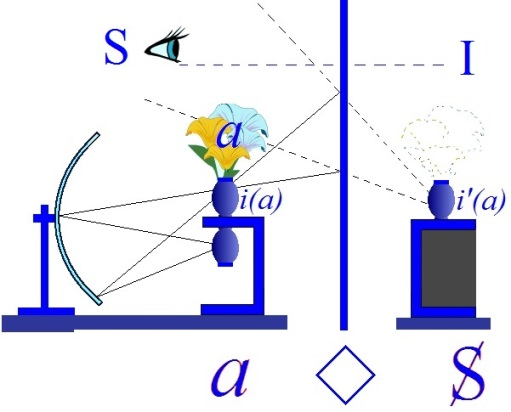

# Leçon 10 | 09 Février l966

  <label><input type="checkbox" data-lacan-toggle="original" checked> 原文</label>
  <label><input type="checkbox" data-lacan-toggle="notes" checked> 注释</label>
  <label><input type="checkbox" data-lacan-toggle="commentary" checked> 个人解读评论</label>

<section class="parallel-paragraph" data-paragraph-ids="s13-10-0001">

s13-10-0001

[无对应译文]

原文 · s13-10-0001

Comme il arrive que je donne au début d’une de mes leçons quelques références de ce qui, dans la sphère de mon enseignement, se passe ailleurs, j’évoquerai aujourd’hui, au départ, quelque chose dont la pertinence - bien sûr entière - n’apparaîtra qu’à ceux ayant assisté à une séance d’hier soir de notre École Freudienne, mais qui pourtant, pour tous les autres, représentera une introduction à la *mise au point*, au sens photographique du terme, que va constituer mon discours d’aujourd’hui, par où j’achèverai, je l’espère, ce que j’ai à dire du *pari de Pascal* quant à ce qu’il conditionne d’essentiel du rapport engagé dans la psychanalyse.

</section>

<section class="parallel-paragraph" data-paragraph-ids="s13-10-0002">

s13-10-0002

[无对应译文]

原文 · s13-10-0002

D’où je partirai donc, comme *un préambule* qui est en même temps *parenthèse,* c’est d’une remarque très abrégée, forcément, concernant ce fantasme qu’on appelle - et qui est en question - sous le nom de *masochisme féminin*. Qu’on m’entende !

</section>

<section class="parallel-paragraph" data-paragraph-ids="s13-10-0003">

s13-10-0003

[无对应译文]

原文 · s13-10-0003

J’énonce que *le masochisme féminin est*, au dernier terme, *le profil de la jouissance réservée à qui entrerait dans le monde de l’Autre*, en tant que cet Autre serait l’Autre féminin, c’est-à-dire *la Vérité*.

</section>

<section class="parallel-paragraph" data-paragraph-ids="s13-10-0004">

s13-10-0004

[无对应译文]

原文 · s13-10-0004

Or *la femme*…

</section>

<section class="parallel-paragraph" data-paragraph-ids="s13-10-0005">

s13-10-0005

[无对应译文]

原文 · s13-10-0005

> la femme si l’on peut en parler, la femme qu’on essayait hier soir de mettre en suspens
>
> dans une typique essence qui serait celle de la féminité, entreprise fragile …*la femme*…

</section>

<section class="parallel-paragraph" data-paragraph-ids="s13-10-0006">

s13-10-0006

[无对应译文]

原文 · s13-10-0006

> disons pour autant que comme FREUD le développe et l’énonce,
>
> un départ distinct de l’homme dans ce jeu qui s’engage, où il s’agit de son désir …*la femme* n’est pas plus dans ce monde que l’homme. Sans doute, il arrive qu’elle le lui représente sous la forme de *l’objet(a)*, mais il faut le dire :

</section>

<section class="parallel-paragraph" data-paragraph-ids="s13-10-0007">

s13-10-0007

[无对应译文]

原文 · s13-10-0007

- c’est ce qu’elle se refuse énergiquement à être, puisque *son but est d’être i(a)* *comme tout être humain*,

</section>

<section class="parallel-paragraph" data-paragraph-ids="s13-10-0008">

s13-10-0008

[无对应译文]

原文 · s13-10-0008

- que la femme est narcissique *comme tout être humain*,

</section>

<section class="parallel-paragraph" data-paragraph-ids="s13-10-0009">

s13-10-0009

[无对应译文]

原文 · s13-10-0009

- et que c’est dans cette distance, cette déchirure qui s’installe - *de ce qu’elle veut être, à ce qu’on met en elle -* que s’instaure cette dimension, qui se présente dans le rapport de l’amour comme *tromperie*.

</section>

<section class="parallel-paragraph" data-paragraph-ids="s13-10-0010">

s13-10-0010

[无对应译文]

原文 · s13-10-0010

</section>

<section class="parallel-paragraph" data-paragraph-ids="s13-10-0011">

s13-10-0011

[无对应译文]

原文 · s13-10-0011

Ajoutons que ce narcissisme, c’est l’impasse, la grande impasse de *l’amour* dit *courtois* : qu’à la mettre en la position du I, de l’*Idéal du moi* au champ de l’Autre - point de repère où peut s’organiser ce statut de l’amour - ce narcissisme on ne peut que l’exalter, c’est-à-dire accentuer la différence. Dans ces quelques termes se repère l’impasse qu’il y a à essayer de définir, comme une fonction qui s’isolerait, la féminité.

</section>

<section class="parallel-paragraph" data-paragraph-ids="s13-10-0012">

s13-10-0012

[无对应译文]

原文 · s13-10-0012

Rien ici donc ne se repère qu’en ce terme il est un pôle féminin du rapport - du rapport à *la Chose* - et que « *féminin* » est ce terme de la vérité. Le « *féminin* » est radicalement trompeur sous toutes les formes où il se présente. Ceci nous servira de départ pour repérer les trois distances où peut s’accommoder le champ de cette recherche, que toujours l’ambition des philosophes a signalé comme *recherche de la vérité*.

</section>

<section class="parallel-paragraph" data-paragraph-ids="s13-10-0013">

s13-10-0013

[无对应译文]

原文 · s13-10-0013

Le danger qu’assume l’analyste en prenant la place de guide *sur ce chemin*, est-il celui que le mythe d’ACTÉON signale comme l’impossibilité de surprendre la mouvance *où se dessine notre destin*, comme celui que commandent les trois PARQUES : CLOTHO, LACHESIS, ATROPOS, *forme trinitaire du Dieu foncier, archaïque*, ancestral, celui dont nous sépare *l’autre révélation*, dont nous aurons tout à l’heure à reprendre le repère, à travers le *pari de Pascal* qui accommode sur la fonction du père, ce qui nous contient dans une interdiction déterminée à l’endroit de la Jouissance dernière.

</section>

<section class="parallel-paragraph" data-paragraph-ids="s13-10-0014">

s13-10-0014

[无对应译文]

原文 · s13-10-0014

Déjà l’énoncé inaugural de la pensée de FREUD nous signale l’importance de sa *suspension*, de la *suspension* de toute sa pensée autour de cet interdit du père dont nous verrons apparaître tout à l’heure, sous une autre forme, la formule.

</section>

<section class="parallel-paragraph" data-paragraph-ids="s13-10-0015">

s13-10-0015

[无对应译文]

原文 · s13-10-0015

Si dans les années qui ont précédé, c’est sur le *cogito* cartésien que je vous ai appris à vous arrêter, pour vous représenter comment se dessine la *schize*, l’*Entzweiung*, la *division radicale* où se constitue le sujet, à reconnaître dans la formule du « *Je pense* » lui-même, que le point où se saisit la rupture de l’être du « *Je pense* » ne s’affirme *que d’un point de doute,* c’est pour approcher d’une façon plus sûre, cette formulation plus pure de la même fonction du sujet \- cette fois radicalement en fonction du désir - que nous donne le *Pari de Pascal,* que j’ai ouvert *Les Pensées*.

</section>

<section class="parallel-paragraph" data-paragraph-ids="s13-10-0016">

s13-10-0016

[无对应译文]

原文 · s13-10-0016

Car assurément, ce qui déjà dans le *cogito* cartésien suffit à fonder l’être du sujet en tant que le signifiant le détermine comme *ne se saisissant qu’au point où*, autour de l’affirmation du « *Je pense* *», il s’est réduit à ce point de doute*, tel qu’il n’a plus aucun sens sinon qu’à *ouvrir les guillemets* de la conclusion qui lui donne toute sa substance, le « *donc* *je suis* » comme contenu de la pensée, sans pour autant qu’il rejette dans une *rétroposition* le « *je suis d’être* » de ce « *Je pense* » : je suis celui qui pense « *donc je suis* ».

</section>

<section class="parallel-paragraph" data-paragraph-ids="s13-10-0017">

s13-10-0017

[无对应译文]

原文 · s13-10-0017

Or si nous retrouvons la voie de FREUD, à considérer qu’en ce doute est toute la substance de l’objet central qui divise ainsi l’être du « *je pense* » lui-même, c’est pour autant que dans ce doute FREUD, dans sa *praxis*, nous fait reconnaître le point d’émergence de cette faille du sujet qui le divise et qui s’appelle l’inconscient.

</section>

<section class="parallel-paragraph" data-paragraph-ids="s13-10-0018">

s13-10-0018

[无对应译文]

原文 · s13-10-0018

Le point de suture, le point de fermeture inaperçu dans le « *Je pense donc je suis* », c’est là que nous avons à reconstruire *toute la part élidée* de ce qui s’ouvre, que nous rouvrons de cette béance et *qui ne peut*, sous toute forme du *discours* qui est le *discours humain, apparaître que sous la forme du trébuchement, de l’interférence, de l’achoppement* dans ce discours qui se veut cohérent.

</section>

<section class="parallel-paragraph" data-paragraph-ids="s13-10-0019">

s13-10-0019

[无对应译文]

原文 · s13-10-0019

Pourtant, ce qu’il y a qui fonde ce discours n’est par là point saisi : *discours du désir*, nous dit-on, mais qu’y-a-t-il qui fasse que nous puissions dire, que ce par quoi nous pouvons y suppléer c’est *le tenant lieu de représentation*. Vous entendez bien

</section>

<section class="parallel-paragraph" data-paragraph-ids="s13-10-0020">

s13-10-0020

[无对应译文]

原文 · s13-10-0020

- que c’est ici indiquer la place où fonctionne *ce qui soutient comme divisé tout ce qui se réalise du sujet dans le discours*,

</section>

<section class="parallel-paragraph" data-paragraph-ids="s13-10-0021">

s13-10-0021

[无对应译文]

原文 · s13-10-0021

- que c’est là la place où nous avons à chercher la fonction de *l’objet(a)*.

</section>

<section class="parallel-paragraph" data-paragraph-ids="s13-10-0022">

s13-10-0022

[无对应译文]

原文 · s13-10-0022

Le doute de DESCARTES est encore en ce passage d’une opération de balance, « *dubio dubito* », c’est l’habitude, je m’emploie à faire osciller ces *plateaux de la balance*. C’est autour d’une mise à l’épreuve du *savoir* au regard de *la vérité*, de ce qu’il en est ou n’en est pas, du vrai savoir.

</section>

<section class="parallel-paragraph" data-paragraph-ids="s13-10-0023">

s13-10-0023

[无对应译文]

原文 · s13-10-0023

Bien sûr HEIDEGGER[^110] a belle part à représenter *qu’est abandonné le fond - irrémédiablement refoulé* - de l’ἀλήθεια \[aléthèia\], l’*Urverdrängung*. Si ce n’est pas ainsi qu’il la nomme, c’est ainsi que nous pouvons l’identifier. Mais ce rappel est fragile de ne représenter qu’un retour à une mouvance sans issue, conformément au terme qui est employé à l’origine de la pensée grecque c’est de l’ετεός \[étéos\] qu’il s’agit, de l’*Echt,* de l’*authentique*.

</section>

<section class="parallel-paragraph" data-paragraph-ids="s13-10-0024">

s13-10-0024

[无对应译文]

原文 · s13-10-0024

DESCARTES installe en même temps qu’il révèle *à son insu*, la division du sujet autour de l’opération de mise à l’épreuve \- opération négative, impossible - de reconnaître comment penchent les plateaux autour du vrai savoir. Il n’en retire que la certitude de l’épreuve opérée et que c’est dans ce doute du sujet que s’insère la certitude. *Pour reprendre et faire un pas de plus*, il faudra qu’il ramène l’argument antique, par où ce qui imprime dans l’ordre de nos pensées l’*idée de perfection*, se doit de garantir le chemin de notre recherche.

</section>

<section class="parallel-paragraph" data-paragraph-ids="s13-10-0025">

s13-10-0025

[无对应译文]

原文 · s13-10-0025

Assurément, on peut pointer et dessiner déjà ici, la distance qu’il y a de prise au regard de l’*argument ontologique* dont vous reconnaissez pourtant ici la forme, et qui pour avoir eu son prix dans l’exploration du champ de l’être, ne mérite plus pour nous, d’être ressaisi que sous cette forme qui y apparaîtra certaine, à qui sa réflexion aura assez montré que l’idée de perfection ne s’ébauche et ne se forme que sur le modèle de la compétition, de la bête de concours, et que sa substance n’est pas autre que celle dont le porc peut rêver quant à l’obésité de son châtreur.

</section>

<section class="parallel-paragraph" data-paragraph-ids="s13-10-0026">

s13-10-0026

[无对应译文]

原文 · s13-10-0026

Je n’aime pas le vain blasphème et l’on doit savoir que ce que je vise ainsi, ce n’est certes pas la visée de certains, d’un certain dévoiement concernant l’interrogation sur l’être divin, mais celle où *un certain détail philosophique* s’obstine à rester enlisé.

</section>

<section class="parallel-paragraph" data-paragraph-ids="s13-10-0027">

s13-10-0027

[无对应译文]

原文 · s13-10-0027

Si bien qu’il faut remarquer que la démarche de DESCARTES tire l’épingle du jeu du sujet, *au regard du Dieu supposé trompeur*, et qu’à se retourner vers l’autre Dieu pour lui rendre la charge entière, à son arbitraire, de fonder *les vérités éternelles*, la question - elle est importante pour nous - est de savoir si dans ce jeu, puisque déjà l’épingle est retirée du jeu, c’est bien *le sujet qui doute* et que même le *Dieu trompeur* ne saurait lui retirer ce privilège, celui, même parfait, vers lequel il se retourne n’est pas alors - et je le dis, fort de ce que DESCARTES a pensé avant moi - n’est pas dès lors *un Dieu trompé*.

</section>

<section class="parallel-paragraph" data-paragraph-ids="s13-10-0028">

s13-10-0028

[无对应译文]

原文 · s13-10-0028

Ce point sensible est important pour nous et dans notre recherche, pour autant que c’est au piège de la forme idéale, comme en quelque sorte *préformée*, *ante-posée* au chemin où nous avons à guider la recherche du sujet, que proprement l’idéal de perfection a à se tromper.

</section>

<section class="parallel-paragraph" data-paragraph-ids="s13-10-0029">

s13-10-0029

[无对应译文]

原文 · s13-10-0029

Τούτων δὲ ὑπαρχόντων αὖ πᾶσα ἀνάγκη τόνδε τὸν κόσμον εἰκόνα τινὸς εἶναι. Μέγιστον δὴ παντὸς ἄρξασθαι κατὰ φύσιν ἀρχήν. Ὧδε οὖν περί τε εἰκόνος καὶ περὶ τοῦ παραδείγματος αὐτῆς διοριστέον, ὡς ἄρα τοὺς λόγους, ὧνπέρ εἰσιν ἐξηγηταί, τούτων αὐτῶν καὶ συγγενεῖς ὄντας· τοῦ μὲν οὖν μονίμου καὶ βεβαίου καὶ μετὰ νοῦ καταφανοῦς μονίμους καὶ ἀμεταπτώτους – καθ᾽ ὅσον οἷόν τε καὶ ἀνελέγκτοις προσήκει λόγοις εἶναι καὶ ἀνικήτοις, τούτου δεῖ μηδὲν ἐλλείπειν.

</section>

<section class="parallel-paragraph" data-paragraph-ids="s13-10-0030">

s13-10-0030

[无对应译文]

原文 · s13-10-0030

\[ « *Dans ces conditions, il est aussi absolument nécessaire que ce monde–ci soit l’image de quelque chose. Or en toute matière, il est de la plus haute importance de commencer par* *le commencement naturel. En conséquence, à propos de l’image et de son modèle, il faut faire les distinctions suivantes : les paroles ont une parenté naturelle avec les choses* *qu’elles expriment. Expriment–elles ce qui est stable, fixe et visible à l’aide de l’intelligence, elles sont stables et fixes, et, autant qu’il est possible et qu’il appartient à des paroles* *d’être irréfutables et invincibles, elles ne doivent rien laisser à désirer à cet égard.* » Platon,*Timée,* 29b\]

</section>

<section class="parallel-paragraph" data-paragraph-ids="s13-10-0031">

s13-10-0031

[无对应译文]

原文 · s13-10-0031

Ce dont il y a à faire concernant *l’acte du médecin*, dit proprement PLATON, *c’est cette image qu’il a*, lui le médecin, *dans l’âme.*

</section>

<section class="parallel-paragraph" data-paragraph-ids="s13-10-0032">

s13-10-0032

[无对应译文]

原文 · s13-10-0032

N’est ce pas dire l’importance exacte qu’il y a, la représentation que nous avons à faire, à nous faire de la nature de l’enjeu quand il s’agit de l’ordre de rapport à *la vérité* seule accessible et définie par les conditions où nous engageons l’expérience qui se limite à celles où *le sujet est formé, et est dans la dépendance du signifiant comme tel*. Voilà ce qu’apure la structure du *Pari de Pascal*.

</section>

<section class="parallel-paragraph" data-paragraph-ids="s13-10-0033">

s13-10-0033

[无对应译文]

原文 · s13-10-0033

Quelque part, en un de ses points nombreux où se préfigure, dans ces dialogues de PLATON, qui sont bien loin, bien sûr, de nous livrer une doctrine, en quelque sorte unilatérale, rapport de *tout ce qui est, tout ce qui est « idée »*, à cet ετεός \[étéos\] dont je parlais tout à l’heure, qui en donnerait l’essence de tout ce qui dans l’être subsiste bien loin de là à tout instant, nous trouverons des références faites pour nous orienter et nommément celle-ci qu’entre :

</section>

<section class="parallel-paragraph" data-paragraph-ids="s13-10-0034">

s13-10-0034

[无对应译文]

原文 · s13-10-0034

- *l’être éternel, qui n’existe pas,*

</section>

<section class="parallel-paragraph" data-paragraph-ids="s13-10-0035">

s13-10-0035

[无对应译文]

原文 · s13-10-0035

- *et ce qui naît et meurt, mais qui n’est pas*, …le signe, la pierre de touche doit nous être donné en ceci : que *si le premier subsiste il doit se supporter d’un <u>discours invincible</u>*.

</section>

<section class="parallel-paragraph" data-paragraph-ids="s13-10-0036">

s13-10-0036

[无对应译文]

原文 · s13-10-0036

C’est bien encore ce que nous cherchons, à ceci près, que ce discours est celui qui doit nous permettre de reconnaître, dans ce champ qui est le nôtre - *d’une existence cernée entre la naissance et la mort -* ce que ce discours là peut tenir, qui soit de cet ordre « *invincible »*[^111].

</section>

<section class="parallel-paragraph" data-paragraph-ids="s13-10-0037">

s13-10-0037

[无对应译文]

原文 · s13-10-0037

Et c’est ici que nous introduit *le discours de* PASCAL. Nul étonnement qu’il ne parte de cette référence à *l’au-delà* de la vie et de la mort, mais ce n’est pas, je ne dirai pas *comme il semble*, mais bel et bien : *comme tout un chacun s’en aperçoit et s’en scandalise*.

</section>

<section class="parallel-paragraph" data-paragraph-ids="s13-10-0038">

s13-10-0038

[无对应译文]

原文 · s13-10-0038

Tous ces messieurs de l’idéologie spiritualiste ici se redressent et font la petite bouche : « *comment parler de ce qui est d’une si haute dignité, en termes de ces joueurs qui sont la lie de notre société* ».

</section>

<section class="parallel-paragraph" data-paragraph-ids="s13-10-0039">

s13-10-0039

[无对应译文]

原文 · s13-10-0039

Au temps de Victor COUSIN seuls les bourgeois ont le droit de se livrer à l’*agio*. Et ceux auxquels sera donnée dans la société, la charge de penser à ce qui se passe, ceux qui pourraient avertir le peuple de ce dont il s’agit effectivement dans ce qu’on appelle « *la marche du progrès* », sont priés de rentrer dans cet ordre de décence, auquel j’ai voulu donner tout à l’heure sous une forme scandaleuse, son enseigne énorme : celle du porc châtré, autrement dit de rester dans les limites de décence de la pensée qu’on appelle l’[*éclectisme*](#R_eclectisme).

</section>

<section class="parallel-paragraph" data-paragraph-ids="s13-10-0040">

s13-10-0040

[无对应译文]

原文 · s13-10-0040

N’avez-vous remarqué que dans ce pari concernant *l’au-delà*, PASCAL ne nous parle pas - jamais personne n’a vu ça... - de la vie éternelle : il parle d’une infinité de vie infiniment heureuse. Ça fait toujours des vies ça ! Et en fin de compte, à les appeler ainsi il leur garde leur horizon de vie, et la preuve c’est qu’il commence par dire : « Est-ce que vous ne parieriez pas *seulement* pour qu’il y en ait *une autre* ?

</section>

<section class="parallel-paragraph" data-paragraph-ids="s13-10-0041">

s13-10-0041

[无对应译文]

原文 · s13-10-0041

Celui que j’ai appelé tout à l’heure, je veux dire la dernière fois « *le bon Lachelier* », eh bien il est bien gentil, il s’arrête là.

</section>

<section class="parallel-paragraph" data-paragraph-ids="s13-10-0042">

s13-10-0042

[无对应译文]

原文 · s13-10-0042

Il dit : Quand même ! Qui est-ce qui parierait pour avoir *seulement une seconde vie* ?

</section>

<section class="parallel-paragraph" data-paragraph-ids="s13-10-0043">

s13-10-0043

[无对应译文]

原文 · s13-10-0043

Retrouvez le passage, je l’ai cherché frénétiquement tout à l’heure, vous le retrouverez aisément[^112].

</section>

<section class="parallel-paragraph" data-paragraph-ids="s13-10-0044">

s13-10-0044

[无对应译文]

原文 · s13-10-0044

C’est que je ne lui reproche pas ce manque d’imagination, mais n’est-il pas vrai, simplement, qu’à couvrir son petit bonhomme de chemin d’éplucheur des chances en jeu dans le *Pari*, il nous invite, nous, à nous poser vraiment la question.

</section>

<section class="parallel-paragraph" data-paragraph-ids="s13-10-0045">

s13-10-0045

[无对应译文]

原文 · s13-10-0045

Qu’est-ce qui se passe, effectivement, et cela ne vaudrait-il pas la peine d’engager un pari *seulement* avec quelques chances, quant à cette vie entre la naissance et la mort, cette vie qui est la nôtre, d’en avoir peut-être une seconde ?

</section>

<section class="parallel-paragraph" data-paragraph-ids="s13-10-0046">

s13-10-0046

[无对应译文]

原文 · s13-10-0046

Laissons-nous… laissons-nous arrêter un instant autour de ce jeu, peut-être un peu plus armés que d’autres pour saisir ce qu’apporterait d’irréductible différence, de franchissement, que nous puissions penser ainsi. Car il faut que ces deux vies soient, chacune, entre la naissance et la mort, mais il faudrait aussi que ce soit le même sujet. Tout ce qu’on aura joué précisément *dans la première*, nous savons que nous le pourrons jouer autrement *dans la seconde*, mais nous ne saurons toujours pas pour autant quel est *l’enjeu*. Cet objet inconnu qui nous divise entre *le savoir* et *la vérité*, comment ne pas espérer que la seconde vie nous donnera vue sur la première, que pour un sujet le signifiant ne sera pas ce qui représente le sujet \- à l’infini - pour un autre signifiant, mais pour l’autre sujet que nous serons aussi ?

</section>

<section class="parallel-paragraph" data-paragraph-ids="s13-10-0047">

s13-10-0047

[无对应译文]

原文 · s13-10-0047

*Comment, cet autre sujet, ne pas en espérer le privilège, qu’il soit la vérité du premier* ? Dans d’autres termes, ne voyons-nous pas ici dans cette imagination - fantasme du fantasme - s’éclaircir ce qui sous le nom de « *fantasme* » joue, au secret de cette vie qui est bien telle que nous n’en avons qu’une et que jusqu’à la fin l’enjeu peut nous être caché.

</section>

<section class="parallel-paragraph" data-paragraph-ids="s13-10-0048">

s13-10-0048

[无对应译文]

原文 · s13-10-0048

*Cette supposition* implicite aux PARQUES…

</section>

<section class="parallel-paragraph" data-paragraph-ids="s13-10-0049">

s13-10-0049

[无对应译文]

原文 · s13-10-0049

> telle que nous le lisons, si nous le lisons à la chandelle de l’irréflexion où se suspend tout notre sort …*cette supposition*, qu’après la mort nous en aurons *le fin mot*, à savoir que la vérité sera patente si *oui ou non*, il y aura là pour la tenir, le Dieu de la promesse, qui est-ce qui ne peut pas voir que *cette supposition* implicite à toute l’affaire, c’est elle qui la met véritablement en suspend. Pourquoi après la mort, si quelque chose y perdure, n’errerions-nous pas encore dans la même perplexité ?

</section>

<section class="parallel-paragraph" data-paragraph-ids="s13-10-0050">

s13-10-0050

[无对应译文]

原文 · s13-10-0050

Le jeu pascalien concernant cette *infinité de vie*, multipliée par *l’infinité d’un bonheur* qui doit bien avoir quelque rapport avec ce qui se dérobe à la nôtre, ne peut qu’avoir un autre sens, qui n’a rien à faire avec *la rétribution* de nos efforts aveugles, et c’est bien pour ça qu’il est cohérent que l’homme dont la foi était toute entière suspendue à ce quelque chose dont nous ne savons même plus parler, qui s’appelle la grâce, est dans une position cohérente quand il déroule sa pensée concernant l’enjeu, l’enjeu qui est celui du *bonheur*, à savoir de tout ce qui cause le périssable et l’échoué de notre désir, que cet *enjeu du bonheur* est de nature à rechercher sur le fond du pari.

</section>

<section class="parallel-paragraph" data-paragraph-ids="s13-10-0051">

s13-10-0051

[无对应译文]

原文 · s13-10-0051

Cet *objet(a)* que nous avons vu surgir dans cet au-delà imaginable, déjà de façon toute proxime à seulement imaginer une vie seconde, ce n’est pas quelque chose que la pensée religieuse n’ait pas déjà sondé. Ceci s’appelle la *Communion des Saints*.

</section>

<section class="parallel-paragraph" data-paragraph-ids="s13-10-0052">

s13-10-0052

[无对应译文]

原文 · s13-10-0052

Nul de ceux qui vivent à l’intérieur d’une *communauté de foi* qui a quelque rapport avec ce fondement du bonheur, n’est sans être intéressé à ce que quelque part, ce bonheur soit conquis par d’autres, de nous ignorés.

</section>

<section class="parallel-paragraph" data-paragraph-ids="s13-10-0053">

s13-10-0053

[无对应译文]

原文 · s13-10-0053

Cette conception est cohérente de ce que *chacune de nos vies*, nous autres « *du commun* », *n’est rien d’autre que le rêve* suspendu au mérite *de quelque inconnu*, et que ce qui s’exprime traditionnellement dans ce thème exploité par tout un théâtre qui va plus loin dans la dignité que vous ne pouvez le sonder d’abord, si vous pensez que *le théâtre de Shakespeare* lui-même en relève, celui dont le thème est que « *la vie est un songe* ». Au regard de cette perspective, le *Pari de Pascal* signifie le réveil.

</section>

<section class="parallel-paragraph" data-paragraph-ids="s13-10-0054">

s13-10-0054

[无对应译文]

原文 · s13-10-0054

L’étroitesse même du rapport à l’Autre concerne *cette doctrine de la prédestination et de la grâce* dont dès mon *Rapport de Rome* j’indiquais qu’au lieu de mille autres occupations futiles, les psychanalystes y tournent leurs regards. Tel est déjà, là dessiné, le point d’impact où nous pouvons...

</section>

<section class="parallel-paragraph" data-paragraph-ids="s13-10-0055">

s13-10-0055

[无对应译文]

原文 · s13-10-0055

ainsi qu’à la fin d’un article intitulé *Remarques* [^113], sur un certain discours auquel je vous prie de vous reporter …marquer le point où, d’ores et déjà, je désirais vous diriger au regard de la fonction de ce pari.

</section>

<section class="parallel-paragraph" data-paragraph-ids="s13-10-0056">

s13-10-0056

[无对应译文]

原文 · s13-10-0056

Car maintenant nous pouvons voir ce que signifie ce *Pari*, unique en ceci que *l’enjeu y est l’existence du partenaire*.

</section>

<section class="parallel-paragraph" data-paragraph-ids="s13-10-0057">

s13-10-0057

[无对应译文]

原文 · s13-10-0057

Si PASCAL peut mettre en balance ce quelque chose qui n’est point le tout, mais l’infini qui s’ouvre, à seulement savoir le reconnaître en ce point où nous avons appris l’année dernière à désigner substantiellement *la fonction du manque* à savoir le nombre où l’indéfini n’est que le masque du véritable infini qui s’y dissimule et qui est justement celui ouvert par la dimension du manque, à le mettre en balance avec ce qui se désigne dans le champ du sujet comme *objet cause du désir*, qui se signale de n’être *rien* apparemment, et de cette confrontation même du balancement porté au-delà, au niveau du champ de l’Autre, de ce champ où pour nous se des­sine toute la mise en forme signifiante à laquelle PASCAL nous dit : « *Vous ne pouvez pas échapper, vous êtes embarqués déjà* ».

</section>

<section class="parallel-paragraph" data-paragraph-ids="s13-10-0058">

s13-10-0058

[无对应译文]

原文 · s13-10-0058

C’est ce que le signifiant supporte, tout ce que nous appréhendons comme sujet, nous sommes dans le pari et c’est à celui à qui il appartiendra, comme il fut donné à PASCAL, d’en reconnaître les formes les plus pures, les plus voisines de *cette fonction du manque*, c’est là autour de *cette oscillation* frappant l’Autre et le mettant *entre cette question*, que j’ai déjà formulée, et que je me permets de rappeler parce que certains ici s’en souviennent : *cette question du* « *rien peut-être ?* » \[séminaire 1961-62 : « *L’identification* », séances des 21-03 et 28-03\] et *ce message du* « *peut-être rien* », que les réponses viennent :

</section>

<section class="parallel-paragraph" data-paragraph-ids="s13-10-0059">

s13-10-0059

[无对应译文]

原文 · s13-10-0059

- à la première : « *pas sûrement rien* »,

</section>

<section class="parallel-paragraph" data-paragraph-ids="s13-10-0060">

s13-10-0060

[无对应译文]

原文 · s13-10-0060

- à la seconde, pour autant que l’enjeu pour un PASCAL est justement celui de ce rien, fondé dans l’effet sur nous du désir, « *sûrement pas rien* ».

</section>

<section class="parallel-paragraph" data-paragraph-ids="s13-10-0061">

s13-10-0061

[无对应译文]

原文 · s13-10-0061

Je veux éclairer bien *la topologie* de ce qu’ici je désigne. J’ai trouvé - il y avait bien d’autres voies pour la faire jaillir, mais j’aimerais prendre la voie neutre - un logicien de la grammaire, tant pis. Il y a d’excellentes choses, parmi d’autres plus médiocres, dans un livre de Willard Van Orman QUINE qui s’appelle : *Word and Object* [^114]. Vous y trouverez \- au *chapitre IV :* *les caprices de la référence*, éd. Française. *vagaries of reference*, intraduisible : *flottement ? -* quelques remarques.

</section>

<section class="parallel-paragraph" data-paragraph-ids="s13-10-0062">

s13-10-0062

[无对应译文]

原文 · s13-10-0062

Elles partent de ceci, qui est la position frégienne, à laquelle nos exercices de l’année dernière[^115] nous ont accoutumés, concernant la différence de ce qui est *Sinn* et de ce qui est *Bedeutung* :

</section>

<section class="parallel-paragraph" data-paragraph-ids="s13-10-0063">

s13-10-0063

[无对应译文]

原文 · s13-10-0063

- de ce qui fait *sens*, d’où je vous ai montré l’avis, dans l’exemple : « *Green colourless idea’s* »,

</section>

<section class="parallel-paragraph" data-paragraph-ids="s13-10-0064">

s13-10-0064

[无对应译文]

原文 · s13-10-0064

- et de ce qui concerne *le référent*.

</section>

<section class="parallel-paragraph" data-paragraph-ids="s13-10-0065">

s13-10-0065

[无对应译文]

原文 · s13-10-0065

Au moment où cette *parenthèse* que constitue le *Pari de Pascal* dans la suite de ma topologie, au moment où, vous ayant présenté dans le *cross-cap* la surface où nous pouvons discerner se conjoindre les deux éléments du fantasme, ceux qui ne fonctionnent qu’à partir du moment où la coupure fait que l’un de ces éléments : *l’objet(a)*, se trouve en position d’être la cause d’une invisible, insaisissable, indiscernable division de l’autre, le sujet - la question est par nous supportée dans ce modèle du *pari*, de concevoir, non pas ce qu’est ce fantasme, mais comment nous pouvons nous le représenter.

</section>

<section class="parallel-paragraph" data-paragraph-ids="s13-10-0066">

s13-10-0066

[无对应译文]

原文 · s13-10-0066

Il est bien clair que dans son immanence il est inabordable et qu’il s’agit d’expliquer pourquoi l’analyse permet de nous faire tomber dans la main le *petit(a)* dont il s’agit.

</section>

<section class="parallel-paragraph" data-paragraph-ids="s13-10-0067">

s13-10-0067

[无对应译文]

原文 · s13-10-0067

C’est pour autant qu’une autre forme, celle que je n’ai point encore ramenée cette année, celle topologiquement, contingentement, si je puis dire de *la bouteille de Klein,* nous le livre. La fonction de l’Autre dans cet *Erscheinung* possible qui ne saurait être représentation de *l’objet(a)*, voilà ce que les dernières explications sur lesquelles sans doute s’arrêtera mon discours d’aujourd’hui, vont essayer d’éclairer. Allons tout de suite à ce dont il s’agit, à savoir la croyance.

</section>

<section class="parallel-paragraph" data-paragraph-ids="s13-10-0068">

s13-10-0068

[无对应译文]

原文 · s13-10-0068

Quand je vous ai parlé tout à l’heure de cette seconde vie, il pourrait apparaître cette réflexion : étalement, disjonction du fantasme, est-ce que vous ne vous êtes point fait incidemment la réflexion que ce serait là, donner à notre existence ce jeu aux entournures qui permettrait de relâcher un peu son sérieux ?

</section>

<section class="parallel-paragraph" data-paragraph-ids="s13-10-0069">

s13-10-0069

[无对应译文]

原文 · s13-10-0069

Il n’y a qu’un malheur, c’est que cette *seconde vie* qui n’existe pas et que j’ai essayé un instant, à l’intérieur du sérieux du *Pari de Pascal*, de faire pour vous vivre - eh bien nous y croyons. *Nous ne parions pas*, mais justement si vous y regardez de près, vous verrez que vous vivez comme si vous y croyez, ça s’appelle…

</section>

<section class="parallel-paragraph" data-paragraph-ids="s13-10-0070">

s13-10-0070

[无对应译文]

原文 · s13-10-0070

> cette doublure qui fait *les délices des psychologues* et qui s’appelle à l’occasion le *niveau d’aspiration.* Rien ne s’entend
>
> aussi bien que les psychologues pour donner statut à toutes les immondices dont notre sort est perverti …ça s’appelle notre « *vie idéale* », celle précisément que nous passons notre temps à rêver mollement.

</section>

<section class="parallel-paragraph" data-paragraph-ids="s13-10-0071">

s13-10-0071

[无对应译文]

原文 · s13-10-0071

Monsieur Willard Van Orman QUINE saisit, avec quelque astuce à propos d’un petit exemple que je ne vois pas du tout pourquoi je changerais, ce qu’il arrive dans ce qu’on appelle « *les fonctions propositionnelles* » qui ont pour modèle ceci, je laisse les noms : « *Tom croit que Cicéron a dénoncé Catilina* ».

</section>

<section class="parallel-paragraph" data-paragraph-ids="s13-10-0072">

s13-10-0072

[无对应译文]

原文 · s13-10-0072

La chose prend son intérêt, c’est qu’en raison d’une information erronée TOM croit que…

</section>

<section class="parallel-paragraph" data-paragraph-ids="s13-10-0073">

s13-10-0073

[无对应译文]

原文 · s13-10-0073

> celui que, dans les tragédies du XVIème siècle, on aurait aussi bien désigné par ce nom francisé - non pas TULLIUS mais TULLE - à savoir pour nous qui, bien entendu, sommes des érudits c’est le même CICÉRON …TOM croit que TULLE est vraiment incapable d’avoir fait une chose pareille.

</section>

<section class="parallel-paragraph" data-paragraph-ids="s13-10-0074">

s13-10-0074

[无对应译文]

原文 · s13-10-0074

Dès lors qu’en est-il de la référence du signifiant CICÉRON quant à l’énoncé « *Tom croit que Cicéron a dénoncé Catilina* » s’il maintient que TULLE - il ne sait pas qu’il est le même - n’en a rien fait ?

</section>

<section class="parallel-paragraph" data-paragraph-ids="s13-10-0075">

s13-10-0075

[无对应译文]

原文 · s13-10-0075

C’est autour de cette suspension qu’un grammairien apporte des précisions fort intéressantes sur la façon dont il convient de mesurer *à l’aune de la logique* telle ou telle forme de *grammaire*.

</section>

<section class="parallel-paragraph" data-paragraph-ids="s13-10-0076">

s13-10-0076

[无对应译文]

原文 · s13-10-0076

Car il devient intéressant de remarquer que si dans la même forme vous substituez, à la nomination, une forme indéfinie…

</section>

<section class="parallel-paragraph" data-paragraph-ids="s13-10-0077">

s13-10-0077

[无对应译文]

原文 · s13-10-0077

> ceci paraîtrait donc devoir opacifier encore plus la référence, bien au contraire la *reférencial opacity,*
>
> à savoir l’opacité qu’introduit la fonction propositionnelle : « *Tom croit*… » …c’est ici qu’il ne saurait s’agir de dire que la référence devient vague à partir du moment où vous dites que TOM croit que quelqu’un a dénoncé CATILINA. Assurément on peut aller plus loin et s’apercevoir que ce n’est pas la même chose *de croire que quelqu’un a dénoncé* CATILINA, ou *de dire* que quelqu’un existe dont TOM croit qu’il a dénoncé CATILINA. Mais vous voyez que nous commençons à entrer là dans un système de double porte qui, peut-être, nous entraînerait un peu loin.

</section>

<section class="parallel-paragraph" data-paragraph-ids="s13-10-0078">

s13-10-0078

[无对应译文]

原文 · s13-10-0078

Mais pour vous ramener à la question de l’existence de Dieu, ceci vous fera saisir la différence qu’il y a entre dire :

</section>

<section class="parallel-paragraph" data-paragraph-ids="s13-10-0079">

s13-10-0079

[无对应译文]

原文 · s13-10-0079

- « *Il croit que Dieu existe* », surtout si nous le trouvions dans le texte de quelqu’un qui nous dirait qu’on peut penser la nature de Dieu. Or précisément PASCAL nous dit qu’elle est à proprement parler non seulement inconnaissable mais impensable et donc qu’il y a un monde entre croire que Dieu existe en ce que, contrairement à ce que pensent les représentants de l’argument ontologique il n’y a aucun référent de Dieu.

</section>

<section class="parallel-paragraph" data-paragraph-ids="s13-10-0080">

s13-10-0080

[无对应译文]

原文 · s13-10-0080

- Et que, par contre, dire concernant l’indéterminé que devient Dieu dans « *Je parie que Dieu existe.* »

</section>

<section class="parallel-paragraph" data-paragraph-ids="s13-10-0081">

s13-10-0081

[无对应译文]

原文 · s13-10-0081

> c’est dire tout autre chose parce que ceci implique au–dessous de la barre : « *Dieu n’existe pas* ».

</section>

<section class="parallel-paragraph" data-paragraph-ids="s13-10-0082">

s13-10-0082

[无对应译文]

原文 · s13-10-0082

En d’autres termes, dire : « *Je parie que Dieu existe ou*… » - il faut ajouter le « ou » - *c’est introduire ce référent dans lequel se constitue l’Autre, le grand Autre, comme marqué de la barre qui le réduit à cette alternative de l’existence ou pas, et à rien d’autre.*

</section>

<section class="parallel-paragraph" data-paragraph-ids="s13-10-0083">

s13-10-0083

[无对应译文]

原文 · s13-10-0083

Or c’est bien ce qui est reconnaissable dans le message originel, par où apparaît dans l’Histoire celui qui change à la fois les rapports de l’homme à *la vérité* et de l’homme à *son destin*, s’il est vrai, comme on peut dire que je vous le serine depuis quelques temps, que l’avènement de la Science, de la Science avec un grand S, et comme je ne suis pas seul à le penser : ce que KOYRÉ a si puissamment articulé : *cet avènement de la Science serait inconcevable sans le message du Dieu des Juifs*.

</section>

<section class="parallel-paragraph" data-paragraph-ids="s13-10-0084">

s13-10-0084

[无对应译文]

原文 · s13-10-0084

Message parfaitement lisible en ceci : vu que, quand celui encore mal dépêtré de ses fonctions de mage en communication avec la Vérité, car ils furent en communication avec la vérité – il n’y a pas besoin de se régaler des dix plaies de l’Égypte pour le savoir, si vous aviez les yeux ouverts, vous verriez que la moindre de ces poteries qui sont inexplicablement pour nous le legs des âges antiques, respire *la magie*, c’est bien pour cela que les nôtres ne leur ressemblent pas.

</section>

<section class="parallel-paragraph" data-paragraph-ids="s13-10-0085">

s13-10-0085

[无对应译文]

原文 · s13-10-0085

Si je mets tellement au premier plan certains menus apologues comme ceux du pot de moutarde, ce n’est pas pour le simple plaisir de parodier les histoires du potier. Mais quand MOÏSE demande au messager dans *le Buisson Ardent* de lui révéler ce nom secret qui doit agir dans le champ de la vérité, il ne lui répond que ceci :אֶהְיֶה אֲשֶׁר אֶהְיֶה \[Eyé asher eyé\]

</section>

<section class="parallel-paragraph" data-paragraph-ids="s13-10-0086">

s13-10-0086

[无对应译文]

原文 · s13-10-0086

Ce qui comme vous le savez, *du moins pour ceux qui m’entendent depuis quelques temps,* n’est pas sans poser des difficultés de traduction, dont assurément la plus mauvaise pour être formellement accentuée dans le sens de l’ontologie serait

</section>

<section class="parallel-paragraph" data-paragraph-ids="s13-10-0087">

s13-10-0087

[无对应译文]

原文 · s13-10-0087

« *Je suis celui qui suis.* ». אֲשֶׁר \[Asher\] n’a jamais rien voulu dire de pareil, אֲשֶׁר \[Asher\] c’est le « *ce que* », et si vous voulez le traduire en grec c’est le ταυτί \[tauti\].[^116] « *Je suis ce que je suis.* », ce qui veut dire : tu n’en sauras rien quant à ma vérité.

</section>

<section class="parallel-paragraph" data-paragraph-ids="s13-10-0088">

s13-10-0088

[无对应译文]

原文 · s13-10-0088

Entre ce « *Je suis* » préposé et celui qui est à venir, l’opacité, la raie subsiste de ce « *ce que* » qui reste, comme tel, irrémédiablement fermé.

</section>

<section class="parallel-paragraph" data-paragraph-ids="s13-10-0089">

s13-10-0089

[无对应译文]

原文 · s13-10-0089

Je raye sur le grand A cette barre : A, ce en quoi c’est là, à l’ouverture que nous venons frapper pour qu’en choit ce qui dès lors, dans le *pari de Pascal*, ne se conçoit pas comme rien de représentable, mais comme le *réel* vu par transparence au regard, de cette *brume subjective* de ce qui se profile de fumeux et d’incohérent, *de rêve* sur le champ de l’Autre, dans ce qui nous sollicite au réveil, à savoir de ce *petit(a)*.

</section>

<section class="parallel-paragraph" data-paragraph-ids="s13-10-0090">

s13-10-0090

[无对应译文]

原文 · s13-10-0090

C’est vrai qu’il est *réel* et *non représenté*, qu’il est là saisissable en quelque sorte par transparence, selon que nous-mêmes avons su organiser plus ou moins dans la rigueur signifiante le champ de l’Autre.

</section>

<section class="parallel-paragraph" data-paragraph-ids="s13-10-0091">

s13-10-0091

[无对应译文]

原文 · s13-10-0091

Ce *petit(a)* que nous connaissons bien, j’aurai à vous expliquer *- et seulement maintenant -* *son rapport au surmoi *: c’est quand il est au-delà de *la paroi d’ombre*, représentée par cet Autre suspendu autour de *la pure interrogation* sur son existence, que *le réveil* c’est là ce qui permet de le faire choir : non plus *post-posé* mais *ante-posé* par rapport à ce champ opaque du rêve et de la croyance, et que le rapport de l’analyste au regard de cet Autre…

</section>

<section class="parallel-paragraph" data-paragraph-ids="s13-10-0092">

s13-10-0092

[无对应译文]

原文 · s13-10-0092

> dont la définition à la fin de l’année dernière, je vous l’ai déjà donnée …c’est là que *la position de l’analyste* est à définir.

</section>

<section class="parallel-paragraph" data-paragraph-ids="s13-10-0093">

s13-10-0093

[无对应译文]

原文 · s13-10-0093

Le *partenaire*, le *répondant*, *celui* à partir de quoi s’inaugure la possibilité de l’entrée dans le monde *d’un ordre d’hommes qui ne soient point soumis à l’éternel leurre des fausses captures de l’être,* mais qui dépend de la réalisation de ceci : *que cet Autre* …

</section>

<section class="parallel-paragraph" data-paragraph-ids="s13-10-0094">

s13-10-0094

[无对应译文]

原文 · s13-10-0094

> *que ce partenaire, celui qui n’est pas celui dont nous tenons la place,*
>
> *mais avec lequel nous avons à engager la partie à trois avec l’analysé et même avec un quatrième* …*que cet Autre sait qu’il n’est rien.*

</section>

<section class="note-block original-notes">

## Notes

[^110]: Martin Heidegger : *De l'essence de la vérité*, in *Questions I*, p. 181.

[^111]:  Cf. note sur le [*Ti**mée*](#note_94), fin de la séance 02-02-66

[^112]: Pascal : *Pensées*, éd. Havet, 1851, Paris, p.148.

[^113]: *Écrits* p.647 ou t.2 p.124.

[^114]: Williard van Orman Quine : *Word and Object*, Cambridge, MIT Press Ltd, 1960. Le mot et la chose, Paris, Flammarion, 1992.

[^115]: Séminaire 1964-65 : « *Problèmes cruciaux*… », séance du 02-12-1964.

[^116]: Exode, 3, 14 : à la question de Moïse : « *Que leur dirai-je, s'ils me demandent quel est son Nom ?* » La réponse de Dieu est :  אֶהְיֶה אֲשֶׁר אֶהְיֶה

    Le verbe hébreu « *être* » est conjugué au mode inaccompli (équivalent au futur) ; mot à mot « *je serai qui serai* ».  Dieu dit à Moïse : « *Je suis celui qui suis* ».

    Et il ajouta : « *C'est ainsi que tu répondras aux enfants d'Israël : Celui qui s'appelle « je suis » m'a envoyé vers vous.* »

</section>
