# Leçon 16 | 04 Mai l966

  

    <label><input type="checkbox" data-lacan-toggle="original" checked> 原文</label>
    <label><input type="checkbox" data-lacan-toggle="notes" checked> 注释</label>
    <label><input type="checkbox" data-lacan-toggle="commentary" checked> 个人解读评论</label>
  

  <form class="lacan-tool-search" role="search">
    <input class="lacan-tool-search-input" type="search" placeholder="搜索全文" aria-label="搜索全文">
    <button class="lacan-tool-button" type="submit" title="搜索">搜索</button>
  </form>
  <button class="lacan-tool-button lacan-back-to-top" type="button" title="回到页面最上方" aria-label="回到页面最上方">↑</button>

<section class="parallel-paragraph" data-paragraph-ids="s13-16-0001">

s13-16-0001

原文 · s13-16-0001

Il s’agit pour nous de situer notre topologie : de nous situer, nous *analystes*, comme agissant en elle.

[无对应译文]

</section>

<section class="parallel-paragraph" data-paragraph-ids="s13-16-0002">

s13-16-0002

原文 · s13-16-0002

Dans une réunion fermée en un tout petit groupe, quelqu’un posait récemment la question, à propos de ce que j’ai dit de cette topologie : « *qu’elle n’est pas une métaphore* ».

[无对应译文]

</section>

<section class="parallel-paragraph" data-paragraph-ids="s13-16-0003">

s13-16-0003

原文 · s13-16-0003

Qu’en est-il ? Que signifie de nous situer comme sujets dans une référence qui n’est pas métaphorique.

[无对应译文]

</section>

<section class="parallel-paragraph" data-paragraph-ids="s13-16-0004">

s13-16-0004

原文 · s13-16-0004

Je n’ai pas répondu : celui qui me questionnait n’avait pas été présent au dernier séminaire fermé et la réponse elliptique que j’aurais pu donner : « *nous affronter à la jouissance* » aurait été une réponse qui n’aurait pas été suffisamment commentée.

[无对应译文]

</section>

<section class="parallel-paragraph" data-paragraph-ids="s13-16-0005">

s13-16-0005

原文 · s13-16-0005

Être situé dans ce qui n’est plus *la métaphore du sujet* c’est aller chercher les fondements de sa position, non point dans aucun effet de signification, mais dans ce qui résulte de la combinatoire elle-même.

[无对应译文]

</section>

<section class="parallel-paragraph" data-paragraph-ids="s13-16-0006">

s13-16-0006

原文 · s13-16-0006

Qu’en est-il exactement du sujet, dans sa position classique, de ce lieu nécessité par la constitution du monde objectif ?

[无对应译文]

</section>

<section class="parallel-paragraph" data-paragraph-ids="s13-16-0007">

s13-16-0007

原文 · s13-16-0007

Observez qu’*à ce sujet pur*, ce sujet dont *les théoriciens de la philosophie* ont poussé jusqu’à l’extrême la référence unitaire, *à ce sujet*, dis-je, *on n’y croit pas tout à fait*, et pour cause. On ne peut croire *qu’à lui* - *du monde* - *tout soit suspendu*, et c’est bien ce en quoi consiste *l’accusation d’idéalisme*. C’est ici que *la structure visuelle* de ce sujet doit être explorée.

[无对应译文]

</section>

<section class="parallel-paragraph" data-paragraph-ids="s13-16-0008">

s13-16-0008

原文 · s13-16-0008

Déjà j’ai approché ce que, de matière, nous apporte notre expérience analytique, au premier chef : *l’écran, l’écran* que notre expérience analytique nous apprend *comme étant le principe de notre doute : ce qui se voit - non pas révèle - mais cache quelque chose.*

[无对应译文]

</section>

<section class="parallel-paragraph" data-paragraph-ids="s13-16-0009">

s13-16-0009

原文 · s13-16-0009

Cet écran pourtant, supporte pour nous tout ce qui se présente. Le fondement de la surface est au principe de tout ce que nous appelons *organisation de la forme*, *constellation*. Dès lors tout s’organise en une superposition de plans parallèles, et s’instaurent les labyrinthes sans issue de *la représentation* comme telle.

[无对应译文]

</section>

<section class="parallel-paragraph" data-paragraph-ids="s13-16-0010">

s13-16-0010

原文 · s13-16-0010

Dans un livre que j’ai conseillé à la plupart de ceux qui sont ici, puisque aussi bien, cette assistance n’est pas beaucoup plus étendue que celle que j’ai eue la dernière fois, un livre qui s’appelle *Les paradoxes de la conscience*, de Monsieur RUYER, vous verrez la conséquence de ce renvoi structural.

[无对应译文]

</section>

<section class="parallel-paragraph" data-paragraph-ids="s13-16-0011">

s13-16-0011

原文 · s13-16-0011

Tout ce que nous concevons comme correspondance point par point de ce qui est d’une surface sur une autre, s’y image de *la représentation* d’un point dont les rayons partants traversent ces deux plans parallèles y manifestant d’une trace à une autre, de celle sur un plan au plan correspondant, *une fondamentale homologie*, de sorte que, de quelque façon que nous manipulions le rapport de *l’image* à *l’objet*, il en résulte qu’il faut bien qu’il y ait *quelque part*, ce fameux sujet qui unifie la configuration, la constellation pour la limiter à quelques points brillants, qui, quelque part l’unifie ce quelque chose en quoi elle consiste.

[无对应译文]

</section>

<section class="parallel-paragraph" data-paragraph-ids="s13-16-0012">

s13-16-0012

原文 · s13-16-0012

D’où l’importance du *sujet*. Mais cette fuite dans *une unité mythique* où il est facile de voir l’exigence du pur esprit unificateur, la voie - la voie par laquelle je vous mène qui est proprement ce qu’on appelle méthode - aboutit à *cette topologie* qui consiste en cette remarque : que *ce n’est point à rechercher ce qui va correspondre à cette surface au fond de l’œil qui s’appelle la rétine*, ou aussi bien à toute autre, à quelque point où se forme l’image, qu’il s’agit de se reporter comme constituant l’élément unificateur.

[无对应译文]

</section>

<section class="parallel-paragraph" data-paragraph-ids="s13-16-0013">

s13-16-0013

原文 · s13-16-0013

Bien sûr, ceci part de la distinction cartésienne de *l’étendue* et de *la pensée*. Cette distinction suppose *l’étendue*, soit l’espace, comme *homogène*, en ce sens impensable qu’il est, comme dit DESCARTES, *tout entier à concevoir comme* *partes extra partes*, mais à ceci près, qui est voilé dans cette remarque, c’est qu’il est *homogène* : que chaque point est identique à tous les autres tout en étant différent, ce qui est proprement ce que veut dire l’hypothèse, à savoir que *toutes ses parties se valent*.

[无对应译文]

</section>

<section class="parallel-paragraph" data-paragraph-ids="s13-16-0014">

s13-16-0014

原文 · s13-16-0014

Or, l’expérience de ce qu’il en est de cette structure de l’espace, non point quand nous le distinguons de *la pensée*, de *la pensée en tant que* la supporte uniquement et fondamentalement la *combinatoire signifiante :*

[无对应译文]

</section>

<section class="parallel-paragraph" data-paragraph-ids="s13-16-0015">

s13-16-0015

原文 · s13-16-0015

- que *cet espace* n’en est effectivement point *séparable*,

[无对应译文]

</section>

<section class="parallel-paragraph" data-paragraph-ids="s13-16-0016">

s13-16-0016

原文 · s13-16-0016

- qu’il en est, au contraire, intimement cohérent,

[无对应译文]

</section>

<section class="parallel-paragraph" data-paragraph-ids="s13-16-0017">

s13-16-0017

原文 · s13-16-0017

- qu’il n’y a nul besoin d’une pensée de survol pour la ressaisir en cette cohérence nécessaire,

[无对应译文]

</section>

<section class="parallel-paragraph" data-paragraph-ids="s13-16-0018">

s13-16-0018

原文 · s13-16-0018

- que *la pensée* ne s’y introduit pas *d’y introduire la mesure*, une mesure, en quelque sorte applicable, arpenteuse, qui loin de l’explorer, le bâtit.

[无对应译文]

</section>

<section class="parallel-paragraph" data-paragraph-ids="s13-16-0019">

s13-16-0019

原文 · s13-16-0019

J’ai désigné là l’essence de ce qu’il en est du premier pas de la géométrie, comme son nom de *géométrie* en véhicule encore la trace…de la géométrie grecque euclidienne, entièrement fondée précisément sur ce thème d’une *mesure* *introduite*, où se cache que ce n’est point *la pensée* qui la véhicule, mais à proprement parler ce que les Grecs ont eux-mêmes nommé « *mesure* ».

[无对应译文]

</section>

<section class="parallel-paragraph" data-paragraph-ids="s13-16-0020">

s13-16-0020

原文 · s13-16-0020

« *L’homme est la mesure de toute chose* » \[Protagoras\]. C’est-à-dire *son corps : le pied, le pouce, et la coudée*. Or, le progrès de *la pensée* restée intitulée *géométrisante* - *et sans doute n’est ce pas pour rien que more geometrico a toujours paru l’idéal de toute déduction de la pensée* - le progrès - dis-je - de cette géométrie nous montre l’émergence d’un autre mode d’abord, *où étendue et combinatoire se nouent* d’une façon étroite et qui est à proprement parler, *la géométrie projective*.

[无对应译文]

</section>

<section class="parallel-paragraph" data-paragraph-ids="s13-16-0021">

s13-16-0021

原文 · s13-16-0021

Non point égalité, mesure, effet de recouvrement, mais comme vous vous en souvenez encore : effort souvent pénible pour fonder les premières déductions de la géométrie. Rappelez-vous du temps où on vous faisait passer la muscade d’un retournement sur le plan : Dieu sait que c’est là opération qui ne semblait pas impliquée dans les prémices pour fonder le statut du triangle isocèle. *Déplacement, translation, manipulation, homothétie même* : tout ce jeu à partir duquel se déploie en éventail la déduction euclidienne, se transforme à proprement parler, dans la géométrie projective, justement d’introduire, de figure à figure, la fonction de l’équivalence par transformation.

[无对应译文]

</section>

<section class="parallel-paragraph" data-paragraph-ids="s13-16-0022">

s13-16-0022

原文 · s13-16-0022

Singulièrement ce progrès se marque historiquement par la contribution d’artistes à proprement parler, à savoir ceux qui se sont intéressés à *la perspective*. La perspective n’est pas l’optique. Il ne s’agit point dans la perspective *de propriétés visuelles* mais précisément *de cette correspondance* de ce qui s’établit concernant les figures qui s’inscrivent dans une surface, à celles qui dans *une autre surface* sont produites, *de cette seule cohérence* établie de la fonction d’un point à partir duquel les lignes droites conjoignent ce point aux articulations de la première figure, se trouvent, à traverser une autre surface, faire apparaître une autre figure. Nous retrouvons là *la fonction de l’écran*.

[无对应译文]

</section>

<section class="parallel-paragraph" data-paragraph-ids="s13-16-0023">

s13-16-0023

原文 · s13-16-0023

Et rien n’est impliqué que d’une figure à l’autre apparaisse une relation de *ressemblance* ou de *similitude*, mais simplement de cohérence que nous pouvons définir entre les deux. *L’écran* ici fait fonction de ce qui s’interpose entre *le sujet* et *le monde*.

[无对应译文]

</section>

<section class="parallel-paragraph" data-paragraph-ids="s13-16-0024">

s13-16-0024

原文 · s13-16-0024

Il n’est pas un objet comme un autre. Il s’y point quelque chose.

[无对应译文]

</section>

<section class="parallel-paragraph" data-paragraph-ids="s13-16-0025">

s13-16-0025

原文 · s13-16-0025

Avant de définir ce qu’il en est de la représentation, l’écran déjà nous annonce à l’horizon, la dimension de ce qui, de la représentation, est le représentant. Avant que le monde devienne *représentation*, son *représentant*, j’entends *le représentant* *de la représentation -* émerge.

[无对应译文]

</section>

<section class="parallel-paragraph" data-paragraph-ids="s13-16-0026">

s13-16-0026

原文 · s13-16-0026

Je ne me priverai pas d’évoquer ici une première fois, fusse pour y revenir, une notion qui, quoique préhistorique, ne saurait d’aucune façon passer pour archéologique en la matière. *L’art pariétal*, celui que nous trouvons précisément au fond de ces espaces clos qu’on appelle des *cavernes*, est-ce que dans son mystère, dont le principal est assurément que nous restons encore dans l’embarras quant à savoir :

[无对应译文]

</section>

<section class="parallel-paragraph" data-paragraph-ids="s13-16-0027">

s13-16-0027

原文 · s13-16-0027

- jusqu’à quel point ces lieux étaient éclairés : ils ne l’étaient qu’à l’orifice,

[无对应译文]

</section>

<section class="parallel-paragraph" data-paragraph-ids="s13-16-0028">

s13-16-0028

原文 · s13-16-0028

- jusqu’à quel point ces lieux étaient visités : ils semblent l’avoir été rarement, si nous en faisons foi *aux traces que nous pouvons repérer sous la forme de traces de pas* dans des lieux qui pourtant sont favorables à en porter *les marques*, …*l’art pariétal* semble nous reporter à rien de moins que ce qui plus tard s’énonce dans *le mythe platonicien de la caverne*, qui prendrait là bien d’autres portées en effet que métaphorique.

[无对应译文]

</section>

<section class="parallel-paragraph" data-paragraph-ids="s13-16-0029">

s13-16-0029

原文 · s13-16-0029

Si c’est au sein d’une caverne que PLATON tente de nous porter pour faire surgir pour nous la dimension du réel, est-ce un hasard si sans doute ce qui se trouve sur ces parois, où les récentes explorations par des méthodes enfin scientifiques…

[无对应译文]

</section>

<section class="parallel-paragraph" data-paragraph-ids="s13-16-0030">

s13-16-0030

原文 · s13-16-0030

> *et qui, devant ces figures ne s’essoufflent plus à imaginer l’homme des premiers temps dans*
>
> *je ne sais quelle anxiété de rapporter suffisamment pour le repas de midi à sa bourgeoise, cette exploration qui, elle, se portant non pas sur l’interprétation imaginative de ce qu’il peut en être du rapport d’une flèche et d’un animal surtout quand il apparaît que la blessure porte les traces les plus évidentes d’être une représentation vulvaire* …cette méthode, qui a fait entrer en jeu avec M. LEROI-GOURHAN[^162] l’appareil d’un fichier soigné, voire l’usage d’une machine électronique, nous représente que ces figures ne sont pas réparties au hasard et que la fréquence constante, univoque des cerfs à l’entrée, des bisons au milieu, nous introduit en quelque sorte directement, encore que

[无对应译文]

</section>

<section class="parallel-paragraph" data-paragraph-ids="s13-16-0031">

s13-16-0031

原文 · s13-16-0031

M. LEROI-GOURHAN - et pour cause - n’use pas de ce repère pourtant bien simple, tel qu’il lui est immédiatement donné par la portée de *mon enseignement*, à savoir qu’il n’y a nul besoin que ceux qui participaient très évidemment, autour de ces peintures encore pour nous *énigmatiques*, à un culte, que ceux-là n’avaient nul besoin d’entrer jusqu’au fond de la caverne pour que *les signifiants de l’entrée* ne les représentent *pour les signifiants du fond*, qui n’avaient point besoin, par contre, d’être si fréquemment - *en dehors des temps précis de l’initiation* - visités comme tels.

[无对应译文]

</section>

<section class="parallel-paragraph" data-paragraph-ids="s13-16-0032">

s13-16-0032

原文 · s13-16-0032

Tout ce qui accompagne ces cortèges singuliers : *lignes de points*, *flèches* qui apparaissant ici beaucoup plus *directrices du sujet* que vectrices de l’intention alimentaire, tout nous indique qu’*une chaîne structurale*, qu’une répartition dont l’essence est à proprement parler d’être *signifiante*, est ce quelque chose qui seul peut nous donner le guide d’une pensée à la fois forte et prudente, au regard de ce dont il s’agit.

[无对应译文]

</section>

<section class="parallel-paragraph" data-paragraph-ids="s13-16-0033">

s13-16-0033

原文 · s13-16-0033

*Fonction de l’écran comme support*, comme tel, *de la signifiance,* voilà ce que nous trouvons tout de suite à l’éveil de ce quelque chose qui de l’homme nous assure que, quel que fût le ton de voix qu’il y donna, il était un être parlant.

[无对应译文]

</section>

<section class="parallel-paragraph" data-paragraph-ids="s13-16-0034">

s13-16-0034

原文 · s13-16-0034

C’est bien ici qu’il s’agit de saisir de plus près *le rapport de la signifiance à la structure visuelle,* laquelle se trouve de par la force des choses, à savoir de par le fait qu’il semble, jusqu’à nouvel ordre, que nous n’aurons jamais aucune trace de *la voix* de ces premiers hommes, c’est assurément du style de *l’écriture* que nous trouvons les premières manifestations chez lui de *la parole*. \[Cf. Leroi-Gouhran : *Le geste et la parole*\]

[无对应译文]

</section>

<section class="parallel-paragraph" data-paragraph-ids="s13-16-0035">

s13-16-0035

原文 · s13-16-0035

Je n’ai point besoin d’insister sur un fait très singulier que mettent en évidence également ces représentations dont on s’extasie qu’elles soient naturalistes, comme si nous n’avions pas appris dans notre analyse du réalisme à quel point tout art est foncièrement *métonymique*, c’est-à-dire désignant autre chose que ce qu’il nous présente, ces formes *réalistes* représentent avec une remarquable constance, cette ligne oscillante qui se traduit en fait par la forme de cet S allongé où je ne verrai, quant à moi, aucun inconvénient à voir se recouper celle de l’« S » dont je vous décline le sujet.

[无对应译文]

</section>

<section class="parallel-paragraph" data-paragraph-ids="s13-16-0036">

s13-16-0036

原文 · s13-16-0036

Oui, exactement pour la même raison que quand Monsieur HOGARTH cherche à désigner ce qu’il en est de la structure de la beauté, c’est aussi exactement et nommément à cet « S » qu’il se réfère.

[无对应译文]

</section>

<section class="parallel-paragraph" data-paragraph-ids="s13-16-0037">

s13-16-0037

原文 · s13-16-0037

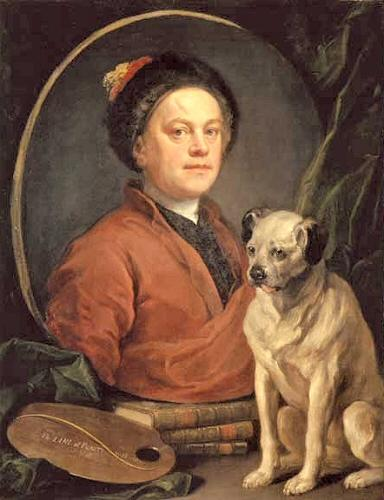

[无对应译文]

</section>

<section class="parallel-paragraph" data-paragraph-ids="s13-16-0038">

s13-16-0038

原文 · s13-16-0038

William Hogarth Autoportrait

[无对应译文]

</section>

<section class="parallel-paragraph" data-paragraph-ids="s13-16-0039">

s13-16-0039

原文 · s13-16-0039

Pour donner corps, bien sûr, à ces *extrapolations* - j’en conviens - qui peuvent vous paraître hardies, il nous faut maintenant en venir à ce que j’ai appelé tout à l’heure *la structure visuelle de ce monde topologique, celui sur lequel se fonde toute instauration du sujet*.

[无对应译文]

</section>

<section class="parallel-paragraph" data-paragraph-ids="s13-16-0040">

s13-16-0040

原文 · s13-16-0040

J’ai dit que cette structure est antérieure *logiquement* à la physiologie de l’œil et à l’optique même, qu’elle est cette structure que les progrès de *la géométrie* nous permettent de formuler comme donnant, sous une forme <u>exacte</u>, ce qu’il en est \- *je souligne exacte* - ce qu’il en est du rapport du *sujet* à *l’étendue*.

[无对应译文]

</section>

<section class="parallel-paragraph" data-paragraph-ids="s13-16-0041">

s13-16-0041

原文 · s13-16-0041

Et certes je suis bien empêché par de simples considérations de décence de vous donner ici un cours de *géométrie projective*.

[无对应译文]

</section>

<section class="parallel-paragraph" data-paragraph-ids="s13-16-0042">

s13-16-0042

原文 · s13-16-0042

Il faut donc qu’au moyen de quelques indications, je suscite en vous le désir de vous y reporter, qu’au moyen de quelques apologues je vous en fasse sentir la dimension propre .

[无对应译文]

</section>

<section class="parallel-paragraph" data-paragraph-ids="s13-16-0043">

s13-16-0043

原文 · s13-16-0043

La *géométrie projective* est à proprement parler *combinatoire*, combinatoire de points, de lignes, de surfaces susceptibles de tracés rigoureux, mais dont le fondement intuitif - ce que *points, lignes, plans*, pour vous évoquent - se dissipe, se résorbe, et à la fin s’évanouit derrière un certain nombre de nécessités purement combinatoires qui sont telles par exemple, que le point se définira comme intersection de deux lignes, que deux lignes seront définies comme *se coupant toujours*…

[无对应译文]

</section>

<section class="parallel-paragraph" data-paragraph-ids="s13-16-0044">

s13-16-0044

原文 · s13-16-0044

> car une définition combinatoire ne vaut pas si elle comporte *des exceptions de l’ordre intuitif*,
>
> si nous croyons que les parallèles sont justement les lignes qui ne se coupent pas …deux lignes se couperont toujours en un point et l’on se débrouillera comme on pourra, mais il faut que ce point existe.

[无对应译文]

</section>

<section class="parallel-paragraph" data-paragraph-ids="s13-16-0045">

s13-16-0045

原文 · s13-16-0045

Or il apparaît :

[无对应译文]

</section>

<section class="parallel-paragraph" data-paragraph-ids="s13-16-0046">

s13-16-0046

原文 · s13-16-0046

- que précisément ce point existe,

[无对应译文]

</section>

<section class="parallel-paragraph" data-paragraph-ids="s13-16-0047">

s13-16-0047

原文 · s13-16-0047

- et que c’est même à le faire exister qu’on fondera la géométrie projective,

[无对应译文]

</section>

<section class="parallel-paragraph" data-paragraph-ids="s13-16-0048">

s13-16-0048

原文 · s13-16-0048

- et que c’est bien là en quoi consiste l’apport de la perspective.

[无对应译文]

</section>

<section class="parallel-paragraph" data-paragraph-ids="s13-16-0049">

s13-16-0049

原文 · s13-16-0049

C’est que c’est précisément à le projeter sur un autre plan, qu’on le verra sur cet autre plan, apparaître d’une façon dont l’intérêt n’est pas qu’il soit là intuitif, à savoir parfaitement visible dans la jonction des deux lignes sur la ligne d’horizon, mais qu’il ait à répondre, *selon les lois strictes d’une équivalence attendue, à partir des hypothèses purement combinatoires*, je le répète, qui sont celles qui se poursuivront dans les termes :

[无对应译文]

</section>

<section class="parallel-paragraph" data-paragraph-ids="s13-16-0050">

s13-16-0050

原文 · s13-16-0050

- que *deux points*, par exemple, *ne détermineront qu’une seule ligne droite*,

[无对应译文]

</section>

<section class="parallel-paragraph" data-paragraph-ids="s13-16-0051">

s13-16-0051

原文 · s13-16-0051

- et que *deux lignes droites ne peuvent se couper en* *deux points*.

[无对应译文]

</section>

<section class="parallel-paragraph" data-paragraph-ids="s13-16-0052">

s13-16-0052

原文 · s13-16-0052

Pour vous faire sentir ce qu’il en est de [*telles définitions*](http://perso.univ-rennes1.fr/michel.coste/cindy/affproj.html), je vous rappelle, qu’il en résulte qu’à l’encontre des manipulations de la démonstration euclidienne, l’admission de ces principes, qui se résument en une forme qu’on appelle *principe de dualité*, une géométrie purement projective, non métrique, pourra avec assurance, traduire un théorème acquis en termes de points et de lignes, en substituant *point à ligne* dans son énoncé, et *ligne à point,* et en obtenant un énoncé certainement aussi valable que le précédent.

[无对应译文]

</section>

<section class="parallel-paragraph" data-paragraph-ids="s13-16-0053">

s13-16-0053

原文 · s13-16-0053

C’est là ce qui surgit au XVIIème siècle avec le génie de PASCAL[^163], sans aucun doute déjà préparé par l’avènement multiple d’une dimension mentale telle qu’elle se présente toujours dans l’histoire du sujet qui fait, par exemple, que *le théorème* dit *de Brianchon*, lequel s’énonce : « *qu’un hexagone formé par six lignes droites qui sont tangentes à une conique, donc hexagone circonscrit*…

[无对应译文]

</section>

<section class="parallel-paragraph" data-paragraph-ids="s13-16-0054">

s13-16-0054

原文 · s13-16-0054

> je pense que vous savez ce que c’est qu’une conique mais je vous le rappelle : conique c’est un cône, c’est une hyperbole, c’est une parabole ce qui veut dire dans l’occasion qu’il s’agit de certaines de leurs formes
>
> telles qu’elles sont engendrées dans l’espace et non pas simplement sous forme de révolutions. Un cône
>
> se définissant alors, par la forme qui se présente dans l’espace, de par l’enveloppement d’une ligne joignant un point à un cercle par exemple et ne la joignant pas forcément d’un point situé perpendiculairement à son centre …toutes ces lignes donc présentent la propriété que les trois lignes qui joignent des sommets opposés…

[无对应译文]

</section>

<section class="parallel-paragraph" data-paragraph-ids="s13-16-0055">

s13-16-0055

原文 · s13-16-0055

> ce qui est facile à déterminer quelle que soit la forme de l’hexagone, par un simple comptage …[*ces trois lignes convergent en un point*](http://perso.univ-rennes1.fr/michel.coste/cindy/Pascal.html).

[无对应译文]

</section>

<section class="parallel-paragraph" data-paragraph-ids="s13-16-0056">

s13-16-0056

原文 · s13-16-0056

Du seul fait de l’admission des principes de la géométrie projective ceci se traduit immédiatement en ceci : *qu’un hexagone formé par six points qui reposent sur une conique, qui est alors un hexagone inscrit, que dans ce cas les trois points d’intersection des côtés opposée, reposent sur une même ligne.* Si vous avez écouté ces deux énoncés, vous voyez qu’ils se traduisent l’un de l’autre par simple substitution sans équivoque, de *point* à *ligne* et de *ligne* à *point*.

[无对应译文]

</section>

<section class="parallel-paragraph" data-paragraph-ids="s13-16-0057">

s13-16-0057

原文 · s13-16-0057

Il y a là, dans le procédé de la démonstration, vous le sentez bien, tout autre chose que ce qui fait intervenir mensuration, règle ou compas, et que, s’agissant de combinatoire, c’est bien de points, de lignes voire de plans, en terme de pur signifiant et aussi bien de théorèmes qui peuvent s’écrire seulement avec des lettres, qu’il s’agit. Or ceci à soi seul va nous permettre de donner une toute autre portée à ce qu’il en est de *la correspondance d’un objet avec* ce que nous appellerons *sa figure*.

[无对应译文]

</section>

<section class="parallel-paragraph" data-paragraph-ids="s13-16-0058">

s13-16-0058

原文 · s13-16-0058

Ici nous introduirons l’appareil qui déjà nous a servi comme essentiel à *confronter à cette image mythique de l’œil*…

[无对应译文]

</section>

<section class="parallel-paragraph" data-paragraph-ids="s13-16-0059">

s13-16-0059

原文 · s13-16-0059

> qui, quelle qu’elle soit, élude, élide, ce qu’il en est du rapport de la représentation à l’objet,
>
> puisque, de quelque façon, la représentation y sera toujours un double de cet objet …*confronter à ce que je vous ai d’abord présenté comme la structure de la vision, y opposant celle du regard*. Et *ce regard*, dans ce premier abord je l’ai mis *là où il se saisit*, *là où il se supporte*, à savoir *là où il s’est épandu :* en cette œuvre qu’on appelle *un tableau*.

[无对应译文]

</section>

<section class="parallel-paragraph" data-paragraph-ids="s13-16-0060">

s13-16-0060

原文 · s13-16-0060

*Le rapport* en quelque sorte originaire *du regard à la tache*, pour autant même que le phylum biologique peut nous le faire apparaître effectivement, selon des organismes extrêmement primitifs, sous la forme de la tache, à partir de quoi la sensibilité localisée que représente la tache dans son rapport à la lumière, peut nous servir d’image, d’exemple de ce quelque chose où s’origine le monde visuel, mais assurément ce n’est là qu’*équivoque évolutionniste* dont la valeur ne peut prendre, ne peut s’affirmer comme référence que de se référer à une structure synchronique parfaitement saisissable.

[无对应译文]

</section>

<section class="parallel-paragraph" data-paragraph-ids="s13-16-0061">

s13-16-0061

原文 · s13-16-0061

Qu’en est-il de ce qui s’oppose comme *champ de vision* et comme *regard* au niveau précisément de cette topologie ?

[无对应译文]

</section>

<section class="parallel-paragraph" data-paragraph-ids="s13-16-0062">

s13-16-0062

原文 · s13-16-0062

Assurément *le tableau* va continuer d’y jouer un rôle, et ceci n’est point pour nous étonner. Si déjà nous avons admis que quelque chose comme *un montage*, comme *une monture*, comme *un appareil*, est essentiel à ce que nous visons, pour en avoir, nous, l’expérience, à savoir *la structure du fantasme*.

[无对应译文]

</section>

<section class="parallel-paragraph" data-paragraph-ids="s13-16-0063">

s13-16-0063

原文 · s13-16-0063

Et *le tableau* dont nous allons parler…

[无对应译文]

</section>

<section class="parallel-paragraph" data-paragraph-ids="s13-16-0064">

s13-16-0064

原文 · s13-16-0064

> puisque c’est dans ce sens que nous en attendons service et rendement …c’est bien *dans sa monture de chevalet* que nous allons *le prendre*, *ce tableau* de quelque chose qui se tient comme un objet matériel, c’est là ce qui va nous servir de référence pour un certain nombre de réflexions.

[无对应译文]

</section>

<section class="parallel-paragraph" data-paragraph-ids="s13-16-0065">

s13-16-0065

原文 · s13-16-0065

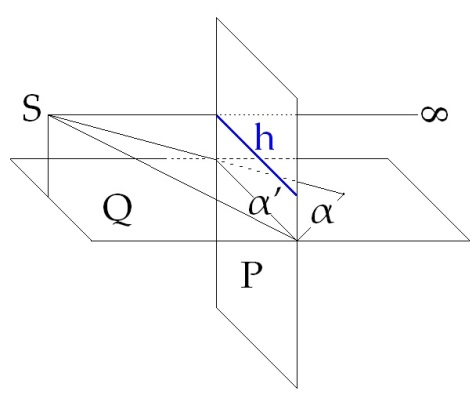

[无对应译文]

</section>

<section class="parallel-paragraph" data-paragraph-ids="s13-16-0066">

s13-16-0066

原文 · s13-16-0066

I

[无对应译文]

</section>

<section class="parallel-paragraph" data-paragraph-ids="s13-16-0067">

s13-16-0067

原文 · s13-16-0067

Dans la géométrie projective, ce tableau ce va être ce plan dont je parlais tout à l’heure, sur lequel à la percée de chacune des lignes que nous appellerons, si vous le voulez « *lignes oculaires* »… pour ne faire aucune équivoque avec rayon visuel …les lignes qui joignent le *point essentiel* au départ de notre démonstration, que nous allons appeler *œil*, et qui est ce sujet idéal de l’identification du sujet classique de la connaissance… N’oubliez pas par exemple, dans tous les schémas que j’ai donnés, sur l’identification, que c’est d’un S, *point d’œil*, que partent les lignes que je trace de ce point dans une ligne droite, ligne oculaire qui se joint à ce qui, ce que nous désignerons comme support, *point*, *ligne* \[α\] voire même *plan*, dans le plan-support \[Q\].

[无对应译文]

</section>

<section class="parallel-paragraph" data-paragraph-ids="s13-16-0068">

s13-16-0068

原文 · s13-16-0068

Ces lignes traversent cet autre plan \[P\] et les points, les lignes où elles le traversent…

[无对应译文]

</section>

<section class="parallel-paragraph" data-paragraph-ids="s13-16-0069">

s13-16-0069

原文 · s13-16-0069

> *voire la traversée du plan qui se déterminera par rapport à une de ces lignes, de la contenir par exemple* …ces traversées du plan-figure - je distingue donc plan-support \[Q\] et plan-figure \[P\] - cette traversée de la ligne oculaire, laissant sa trace sur le plan-figure \[α’\], c’est à ceci que nous avons affaire dans ce qu’il en est de *la construction de la perspective*.

[无对应译文]

</section>

<section class="parallel-paragraph" data-paragraph-ids="s13-16-0070">

s13-16-0070

原文 · s13-16-0070

Et c’est elle qui doit nous révéler, matérialiser pour nous, la topologie d’où il résulte que quelque chose se produit dans la construction de la vision qui n’est autre que ce qui nous donne la base et le support du fantasme, à savoir *une perte* qui n’est autre que celle que j’appelle *la perte de l’objet(a)* et qui n’est autre que le regard, et d’autre part *une division du sujet*.

[无对应译文]

</section>

<section class="parallel-paragraph" data-paragraph-ids="s13-16-0071">

s13-16-0071

原文 · s13-16-0071

Que nous apprend en effet la perspective ? La perspective nous apprend que toutes les lignes oculaires qui sont parallèles au plan-support \[S-∞\] vont déterminer sur le plan-figure une ligne qui n’est autre que la *ligne d’horizon* \[h\]. Cette *ligne d’horizon* est, vous le savez, le repère majeur de toute construction perspective. À quoi correspond–elle dans le plan-support ?

[无对应译文]

</section>

<section class="parallel-paragraph" data-paragraph-ids="s13-16-0072">

s13-16-0072

原文 · s13-16-0072

Elle correspond, *si nous maintenons fermes les principes de la cohérence de cette géométrie combinatoire*, également à une ligne.

[无对应译文]

</section>

<section class="parallel-paragraph" data-paragraph-ids="s13-16-0073">

s13-16-0073

原文 · s13-16-0073

Cette ligne est à proprement parler celle que les Grecs ont manquée du fait que, pour des raisons que nous laisserons aujourd’hui de coté même si nous devons un jour les mettre en question, que les Grecs ne pouvaient que manquer et qui est à proprement parler cette ligne - ligne également, et de par nos principes, également ligne droite - qui se trouve à l’infini sur le plan-support et qu’intuitivement nous ne pouvons concevoir que comme en représentant, si je puis dire le tout.

[无对应译文]

</section>

<section class="parallel-paragraph" data-paragraph-ids="s13-16-0074">

s13-16-0074

原文 · s13-16-0074

C’est sur cette ligne que se trouvent les points où dans le plan-support les parallèles convergent, ce qui se manifeste dans le plan-figure, *vous le savez,* de la convergence de presque toutes les lignes parallèles à l’horizon. On image ceci en général, et on le voit sous la plume des meilleurs auteurs, c’est ce que vous savez bien, quand vous voyez une route qui s’en va vers l’horizon, elle devient de plus en plus petite, de plus en plus étroite.

[无对应译文]

</section>

<section class="parallel-paragraph" data-paragraph-ids="s13-16-0075">

s13-16-0075

原文 · s13-16-0075

On n’oublie qu’une chose, le danger qu’il y a à de telles références car tout ce que nous connaissons comme horizon est un horizon de notre *boule terrestre*, c’est-à-dire un tout autre horizon, déterminé par la forme sphérique, comme on le remarque d’ailleurs - *sans y voir, semble-t-il, la moindre contradiction -* comme on le remarque quand on nous dit que l’horizon est la preuve de la rotondité de la terre.

[无对应译文]

</section>

<section class="parallel-paragraph" data-paragraph-ids="s13-16-0076">

s13-16-0076

原文 · s13-16-0076

Or, je vous prie de remarquer que même si nous étions sur un plan infini, il y aurait toujours, pour quiconque s’y tiendrait debout, une ligne d’horizon. Ce qui nous trouble et nous perturbe, dans cette considération de la ligne d’horizon, c’est d’abord ce sur quoi je reviendrai tout à l’heure, à savoir que nous ne la voyons jamais que dans un tableau.

[无对应译文]

</section>

<section class="parallel-paragraph" data-paragraph-ids="s13-16-0077">

s13-16-0077

原文 · s13-16-0077

Nous verrons tout à l’heure ce qu’il en est de la structure du tableau.

[无对应译文]

</section>

<section class="parallel-paragraph" data-paragraph-ids="s13-16-0078">

s13-16-0078

原文 · s13-16-0078

Comme un tableau est limité, il ne nous vient même pas à l’esprit que si le tableau s’étendait infiniment, la ligne d’horizon serait droite jusqu’à l’infini… tellement en cette occasion, nous nous satisfaisons d’avoir simplement à penser d’une façon grossièrement analogique, à savoir que l’horizon qui est là sur le tableau, c’est un horizon comme notre horizon, dont on peut faire le tour. Une autre remarque est celle-ci : c’est qu’un tableau est un tableau, et la perspective une autre chose. Nous allons voir tout à l’heure comment on s’en sert dans le tableau.

[无对应译文]

</section>

<section class="parallel-paragraph" data-paragraph-ids="s13-16-0079">

s13-16-0079

原文 · s13-16-0079

Mais si vous partez des conditions que je vous ai données pour ce qui doit venir à se tracer *sur le plan-figure*, vous remarquerez ceci, c’est qu’un tableau fait dans ces conditions qui seraient celles d’une stricte perspective, aurait pour effet, si vous supposez par exemple - *parce qu’il faut bien vous accrocher à quelque chose -* que vous êtes debout sur un plan couvert d’un quadrillage à l’infini, que ce quadrillage vienne bien entendu, s’arrêter - *nous verrons tout à l’heure comment -* à l’horizon.

[无对应译文]

</section>

<section class="parallel-paragraph" data-paragraph-ids="s13-16-0080">

s13-16-0080

原文 · s13-16-0080

Et au-dessus de l’horizon ? Vous allez dire naturellement : le ciel. Mais *pas du tout, pas du tout, pas du tout, pas du tout* !

[无对应译文]

</section>

<section class="parallel-paragraph" data-paragraph-ids="s13-16-0081">

s13-16-0081

原文 · s13-16-0081

Au-dessus, ce qu’il y a, à l’horizon, derrière vous, comme je pense que si vous y réfléchissez, vous pourrez immédiatement le saisir, à tracer la ligne qui joint le point que nous avons appelé S à ce qui est derrière sur le *plan-support* \[II : a\] dont vous verrez aussitôt qu’il va se projeter *au-dessus de l’horizon*. \[II : a’\]

[无对应译文]

</section>

<section class="parallel-paragraph" data-paragraph-ids="s13-16-0082">

s13-16-0082

原文 · s13-16-0082

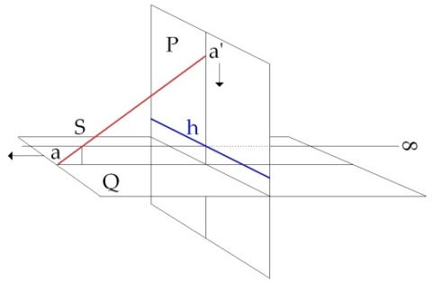

[无对应译文]

</section>

<section class="parallel-paragraph" data-paragraph-ids="s13-16-0083">

s13-16-0083

原文 · s13-16-0083

II

[无对应译文]

</section>

<section class="parallel-paragraph" data-paragraph-ids="s13-16-0084">

s13-16-0084

原文 · s13-16-0084

Faisons qu’à cet horizon du plan projectif viennent, du plan-support, se coudre au même point d’horizon les deux points opposés du plan-support \[III : a’-h\] :

[无对应译文]

</section>

<section class="parallel-paragraph" data-paragraph-ids="s13-16-0085">

s13-16-0085

原文 · s13-16-0085

- l’un par exemple, qui est tout à fait à gauche de vous sur *la ligne d’horizon* du plan-support\[→ -∞\], viendra se coudre…

[无对应译文]

</section>

<section class="parallel-paragraph" data-paragraph-ids="s13-16-0086">

s13-16-0086

原文 · s13-16-0086

- à un autre qui est tout à fait à votre droite sur *la ligne d’horizon* également du plan-support\[→+∞\].

[无对应译文]

</section>

<section class="parallel-paragraph" data-paragraph-ids="s13-16-0087">

s13-16-0087

原文 · s13-16-0087

Est-ce que vous avez compris ? Je veux dire… Non ? Recommençons...

[无对应译文]

</section>

<section class="parallel-paragraph" data-paragraph-ids="s13-16-0088">

s13-16-0088

原文 · s13-16-0088

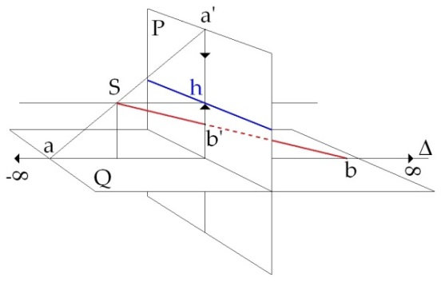

[无对应译文]

</section>

<section class="parallel-paragraph" data-paragraph-ids="s13-16-0089">

s13-16-0089

原文 · s13-16-0089

III

[无对应译文]

</section>

<section class="parallel-paragraph" data-paragraph-ids="s13-16-0090">

s13-16-0090

原文 · s13-16-0090

Vous avez devant vous une surface… vous avez devant vous un quadrillage-plan. Supposons, pour la plus grande simplicité qu’il soit horizontal et vous, vous êtes vertical. C’est une ligne joignant votre œil - *je vais dire des choses aussi simples que possible -* avec un point quelconque de *ce plan-support quadrillé et à l’infini* qui détermine sur le plan vertical, disons, pour vous faire plaisir, qui est celui de *la projection* qui va déterminer la correspondance point par point : *à tout point d’horizon* - c’est-à-dire à l’infini du plan-support - *correspond un point sur l’horizon* de votre plan vertical. Réfléchissez à ce qui se passe. Bien sûr, s’agit-il d’une ligne qui justement, comme j’ai commencé de le dire, n’a rien à faire avec un rayon visuel : c’est une ligne qui part derrière vous du *plan-support* et qui va à votre œil. Elle va aboutir sur le *plan-figure* à un point au-dessus de l’horizon.

[无对应译文]

</section>

<section class="parallel-paragraph" data-paragraph-ids="s13-16-0091">

s13-16-0091

原文 · s13-16-0091

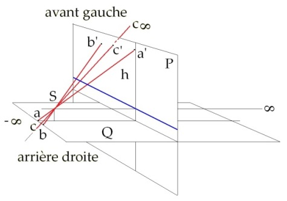

[无对应译文]

</section>

<section class="parallel-paragraph" data-paragraph-ids="s13-16-0092">

s13-16-0092

原文 · s13-16-0092

IV

[无对应译文]

</section>

<section class="parallel-paragraph" data-paragraph-ids="s13-16-0093">

s13-16-0093

原文 · s13-16-0093

À un point qui correspond à *l’horizon* du plan-support va correspondre un autre point venant le toucher *par en haut* si je puis dire, sur la ligne d’horizon, et ce qui est *derrière vous à droite* \[c : arrière droite sur le schéma\], puisque cela passe et que ça se croise au niveau du *point-œil,* va devenir \[avant gauche\], exactement *dans le sens inverse où ceci se présenterait si vous vous retourniez*, *à savoir que* ce que vous verriez à gauche si vous vous retourniez vers *cet horizon* \[vers -∞\], vous le verrez s’être piqué à droite au-dessus de la ligne d’horizon sur le plan projectif, de la projection.

[无对应译文]

</section>

<section class="parallel-paragraph" data-paragraph-ids="s13-16-0094">

s13-16-0094

原文 · s13-16-0094

En d’autres termes, que ce qui est une ligne \[Δ\], que nous ne pouvons pas définir comme ronde, puisqu’elle n’est ronde que de notre appréhension quotidienne de la rotondité terrestre, que c’est de cette ligne, qui est à l’infini sur le plan-support, que nous verrons les points se nouer, venant respectivement d’en haut, et d’en bas, et d’une façon qui, pour l’horizon postérieur, vient s’accrocher dans un ordre strictement inverse à ce qu’il en est de l’horizon antérieur.

[无对应译文]

</section>

<section class="parallel-paragraph" data-paragraph-ids="s13-16-0095">

s13-16-0095

原文 · s13-16-0095

Je peux, bien entendu dans cette occasion, supposer, comme le fait PLATON dans sa caverne, ma tête fixe et déterminant par conséquent deux moitiés dont je peux parler, concernant le plan-support. Ce que vous voyez là n’est rien d’autre d’ailleurs, que l’illustration pure et simple de ce qu’il en est quand *le plan projectif* je vous le représente au tableau sous la forme d’un *cross-cap* :

[无对应译文]

</section>

<section class="parallel-paragraph" data-paragraph-ids="s13-16-0096">

s13-16-0096

原文 · s13-16-0096

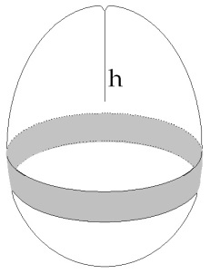

[无对应译文]

</section>

<section class="parallel-paragraph" data-paragraph-ids="s13-16-0097">

s13-16-0097

原文 · s13-16-0097

C’est à savoir que ce que vous voyez - *au lieu d’un monde sphérique -* c’est une certaine bulle qui se noue d’une certaine façon, se recroisant elle-même et qui fait que ce qui s’est présenté d’abord comme un plan à l’infini, vient dans un autre plan, s’étant divisé, *se renouer à lui-même* au niveau de cette ligne d’horizon et se renouer d’une façon telle qu’à chacun des points de l’horizon du plan-support vient *se nouer quoi* ? Précisément *ce que montre la forme*, que je vous ai déjà mise au tableau, *du plan projectif*, à savoir son point diamétralement opposé. C’est bien pour cela qu’il se fait que dans une telle projection c’est le point postérieur à droite qui vient se nouer au point antérieur à gauche.

[无对应译文]

</section>

<section class="parallel-paragraph" data-paragraph-ids="s13-16-0098">

s13-16-0098

原文 · s13-16-0098

Tel est ce qu’il en est de la ligne d’horizon, nous indiquant déjà que ce qui fait *la cohérence d’un monde signifiant à structure visuelle est une structure d’enveloppe*, et nullement d’indéfinie étendue.

[无对应译文]

</section>

<section class="parallel-paragraph" data-paragraph-ids="s13-16-0099">

s13-16-0099

原文 · s13-16-0099

Il n’en reste pas moins qu’il n’est point assez de dire ces choses telles que le viens de vous *les imager*, car j’oubliais dans la question le quadrillage que j’avais mis là uniquement pour votre commodité, mais qui n’est pas indifférent, car un quadrillage étant fait de parallèles, il faut dire qu’étant admis en outre ceci que j’ai fixé ma tête, toutes les lignes parallèles de l’espace, comme vous n’avez, je pense, aucune peine à l’imaginer, iront rejoindre, en un certain *point de fuite à l’horizon* : un seul point, à savoir que c’est la direction de toutes les parallèles dans une certaine position donnée qui détermine l’unique point d’horizon sur lequel dans le plan–figure, elles se croisent.

[无对应译文]

</section>

<section class="parallel-paragraph" data-paragraph-ids="s13-16-0100">

s13-16-0100

原文 · s13-16-0100

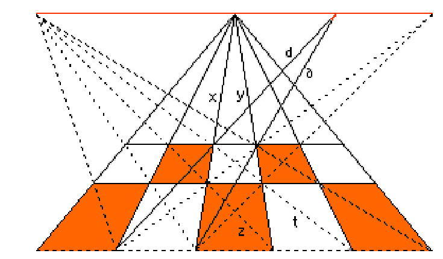

[无对应译文]

</section>

<section class="parallel-paragraph" data-paragraph-ids="s13-16-0101">

s13-16-0101

原文 · s13-16-0101

Si vous avez ce quadrillage infini dont nous parlons, ce que vous verrez se conjoindre à l’horizon, ce sera toutes les parallèles de tout le quadrillage en un seul point. Ce qui n’empêche pas que ce sera le même point où toutes les parallèles de tout le quadrillage postérieur viendront d’en haut, également, *se conjoindre*.

[无对应译文]

</section>

<section class="parallel-paragraph" data-paragraph-ids="s13-16-0102">

s13-16-0102

原文 · s13-16-0102

Ces remarques qui sont fondamentales pour toute science de la perspective et qui sont ce dont tout artiste en mal d’ordonner *quoi que ce soit*, une série de figures sur un tableau, ou aussi bien les lignes de ce qu’on appelle un monument, qui est la disposition d’un certain nombre d’objets autour d’un vide, tiendra compte, et que *ce point sur la ligne d’horizon* dont je parlais tout à l’heure à propos du quadrillage, est exactement ce qui est appelé couramment…

[无对应译文]

</section>

<section class="parallel-paragraph" data-paragraph-ids="s13-16-0103">

s13-16-0103

原文 · s13-16-0103

> je ne vois pas que j’y apporte là quoique ce soit de véritablement bien transcendant …*le point de fuite de la perspective*. *Ce point de fuite de la perspective est à proprement parler ce qui représente dans la figure, l’œil qui regarde*.

[无对应译文]

</section>

<section class="parallel-paragraph" data-paragraph-ids="s13-16-0104">

s13-16-0104

原文 · s13-16-0104

L’œil n’a pas à être saisi en dehors de la figure, il est dans la figure et tous, depuis qu’il y a une *science de la perspective*, l’ont reconnu comme tel et appelé comme tel :

[无对应译文]

</section>

<section class="parallel-paragraph" data-paragraph-ids="s13-16-0105">

s13-16-0105

原文 · s13-16-0105

- il est appelé *l’œil* dans ALBERTI[^164] \[[Léon Battista Alberti (1404-1472) : *De Pictura*](http://gallica.bnf.fr/ark:/12148/bpt6k65009h.capture)\],

[无对应译文]

</section>

<section class="parallel-paragraph" data-paragraph-ids="s13-16-0106">

s13-16-0106

原文 · s13-16-0106

- il est appelé *l’œil* dans VIGNOLA[^165] \[[Vignola (1507-1573) : *Le due regole de la perspectiva*](http://fermi.imss.fi.it/rd/bdv?/bdviewer/bid=000000301938)\]

[无对应译文]

</section>

<section class="parallel-paragraph" data-paragraph-ids="s13-16-0107">

s13-16-0107

原文 · s13-16-0107

- il est appelé *l’œil* dans DÜRER[^166] \[[Albrecht Dürer (1471-1528) : *Underweysung der Messung*](http://gallica.bnf.fr/ark:/12148/btv1b2100033g.planchecontact)\]

[无对应译文]

</section>

<section class="parallel-paragraph" data-paragraph-ids="s13-16-0108">

s13-16-0108

原文 · s13-16-0108

Mais *ce n’est pas tout* - *car je regrette qu’on m’ait fait perdre du temps à expliquer ce point pourtant véritablement accessible - ce n’est pas tout*.

[无对应译文]

</section>

<section class="parallel-paragraph" data-paragraph-ids="s13-16-0109">

s13-16-0109

原文 · s13-16-0109

Ce n’est pas tout du tout car il y a aussi les choses qui sont *entre* le tableau et moi. Les choses qui sont entre le tableau et moi, elles peuvent également, par le même procédé, se représenter sur le plan du tableau, où elles s’en iront vers des profondeurs que nous pourrons tenir pour infinies. Rien de ceci ne nous en empêche, mais elles s’arrêteront en un point qui correspond, à quoi ? Au plan parallèle au tableau qui passe, *je vais dire, pour vous faciliter les choses*, qui passe par mon œil ou par le point S.

[无对应译文]

</section>

<section class="parallel-paragraph" data-paragraph-ids="s13-16-0110">

s13-16-0110

原文 · s13-16-0110

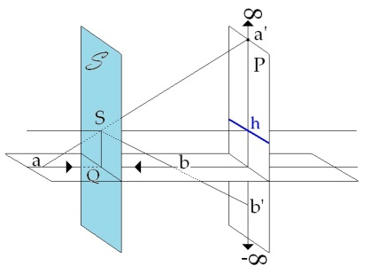

[无对应译文]

</section>

<section class="parallel-paragraph" data-paragraph-ids="s13-16-0111">

s13-16-0111

原文 · s13-16-0111

V

[无对应译文]

</section>

<section class="parallel-paragraph" data-paragraph-ids="s13-16-0112">

s13-16-0112

原文 · s13-16-0112

Nous avons là deux traces : Nous avons la trace de ce par quoi le tableau vient couper le support \[VI : hQ\] et l’inverse de la ligne d’horizon \[sQ\].

[无对应译文]

</section>

<section class="parallel-paragraph" data-paragraph-ids="s13-16-0113">

s13-16-0113

原文 · s13-16-0113

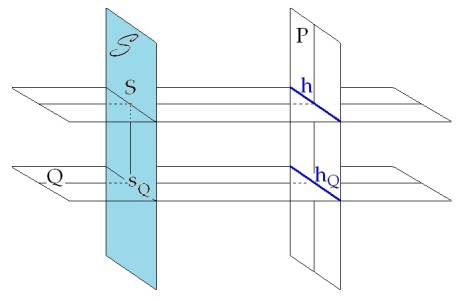

[无对应译文]

</section>

<section class="parallel-paragraph" data-paragraph-ids="s13-16-0114">

s13-16-0114

原文 · s13-16-0114

VI

[无对应译文]

</section>

<section class="parallel-paragraph" data-paragraph-ids="s13-16-0115">

s13-16-0115

原文 · s13-16-0115

En d’autres termes c’est ce qui, si nous renversions les rapports, et nous en avons le droit, constitue comme ligne d’horizon dans le support \[SQ\], la ligne infinie dans la figure \[h\].

[无对应译文]

</section>

<section class="parallel-paragraph" data-paragraph-ids="s13-16-0116">

s13-16-0116

原文 · s13-16-0116

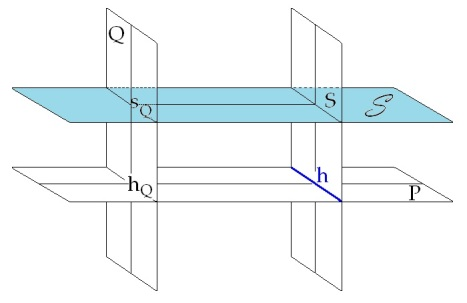

[无对应译文]

</section>

<section class="parallel-paragraph" data-paragraph-ids="s13-16-0117">

s13-16-0117

原文 · s13-16-0117

VII

[无对应译文]

</section>

<section class="parallel-paragraph" data-paragraph-ids="s13-16-0118">

s13-16-0118

原文 · s13-16-0118

Et puis, il y a la ligne qui représente la section du support par le plan du tableau \[hQ\]. Ce sont *deux lignes*.

[无对应译文]

</section>

<section class="parallel-paragraph" data-paragraph-ids="s13-16-0119">

s13-16-0119

原文 · s13-16-0119

Il est tard et je vous dirai quelque chose de beaucoup moins rigoureux en raison du peu de temps qui me reste, les choses sont plus longues à expliquer qu’il n’apparaît d’abord.

[无对应译文]

</section>

<section class="parallel-paragraph" data-paragraph-ids="s13-16-0120">

s13-16-0120

原文 · s13-16-0120

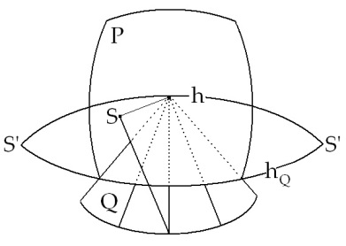

[无对应译文]

</section>

<section class="parallel-paragraph" data-paragraph-ids="s13-16-0121">

s13-16-0121

原文 · s13-16-0121

Rigoureusement, ceci veut dire qu’il y a un autre point d’œil \[S’\] qui est celui qui est constitué par la ligne à l’infini \[h\] sur le plan de la figure, et son intersection par quelque chose qui y est bien, à savoir la ligue \[hQ\] par laquelle le plan de la figure coupe le plan-support. Ces deux lignes se coupent puisqu’elles sont toutes les deux dans le plan de la figure. Et qui plus est, elles se coupent en un seul point car ce point est bel et bien le même sur la ligne à l’infini.

[无对应译文]

</section>

<section class="parallel-paragraph" data-paragraph-ids="s13-16-0122">

s13-16-0122

原文 · s13-16-0122

Pour en rester sur un domaine de l’image, je dirai que cette distance \[δ\] des deux parallèles, qui sont dans le plan-support celles qui sont déterminées par ma position fixée de regardant et celle qui est déterminée par l’insertion, la rencontre du tableau avec le plan-support, cette *béance*, cette *béance* qui, dans le plan-figure ne se traduit que par un point, par un point qui, lui, se dérobe totalement car nous ne pouvons pas le désigner comme nous désignons le point de fuite à l’horizon, ce point essentiel à toute la configuration, et tout à fait spécialement caractéristique, ce point perdu si vous voulez vous contenter de cette image, qui tombe dans l’intervalle des deux parallèles quant à ce qu’il en est du support : c’est ce point que j’appelle le point du sujet regardant.

[无对应译文]

</section>

<section class="parallel-paragraph" data-paragraph-ids="s13-16-0123">

s13-16-0123

原文 · s13-16-0123

Nous avons donc le point de fuite qui est le point du sujet en tant que voyant et le point qui choit dans l’intervalle du sujet et du plan-figure et qui est celui que j’appelle le point du sujet regardant. Ceci n’est pas une nouveauté. C’est une nouveauté de l’introduire ainsi, d’y retrouver la topologie du S dont il va falloir savoir maintenant où nous situons le *(a)* qui détermine la division de ces deux points. Je dis de ces deux points en tant qu’ils représentent le sujet dans la figure.

[无对应译文]

</section>

<section class="parallel-paragraph" data-paragraph-ids="s13-16-0124">

s13-16-0124

原文 · s13-16-0124

Aller plus loin nous permettra d’instaurer un appareil, un montage tout à fait rigoureux et qui nous montre, au niveau de ce qu’il en est de la combinatoire visuelle, ce qu’est le fantasme. Où nous aurons à le situer dans cet ensemble, c’est ce qui se dira par la suite.

[无对应译文]

</section>

<section class="parallel-paragraph" data-paragraph-ids="s13-16-0125">

s13-16-0125

原文 · s13-16-0125

Mais dès maintenant, pour que vous ne pensiez pas que je vous emmène là dans des endroits abyssaux - je ne fais pas de la psychologie des profondeurs, je suis en train de faire de la géométrie, et Dieu sait si j’ai pris des précautions, après avoir lu tout ce qui peut bien se rapporter à cette histoire de la perspective, depuis EUCLIDE[^167]\[ [Michel Chasles, *Les trois livres des Porismes d’Euclide*](http://www.archive.org/details/lestroislivres00euclrich)\] qui l’a si parfaitement loupée dans ses *Porismes*, jusqu’aux personnes dont j’ai parlé tout à l’heure, et jusqu’au dernier livre de Michel FOUCAULT qui fait directement allusion à ces choses dans son analyse des « *Suivantes* », dans *le premier chapitre* des *Mots et des choses*, j’ai essayé de vous en donner quelque chose de tout à fait « *support* », c’est le cas de le dire.

[无对应译文]

</section>

<section class="parallel-paragraph" data-paragraph-ids="s13-16-0126">

s13-16-0126

原文 · s13-16-0126

Mais quant à ce point parfaitement défini que je viens de donner comme *le deuxième point* représentant le sujet regardant dans la combinatoire projective, ne croyez pas que c’est moi qui l’ai inventé.

[无对应译文]

</section>

<section class="parallel-paragraph" data-paragraph-ids="s13-16-0127">

s13-16-0127

原文 · s13-16-0127

Mais on le représente autrement, et cet autrement a été déjà appelé par d’autres que par moi, *l’autre œil* par exemple.

[无对应译文]

</section>

<section class="parallel-paragraph" data-paragraph-ids="s13-16-0128">

s13-16-0128

原文 · s13-16-0128

Il est exactement bien connu de tous les peintres, ce point. Car puisque je vous ai dit que ce point, dans sa rigueur, il choit dans l’intervalle tel que je l’ai défini sur le plan-support, pour aller se situer en un point que vous ne pouvez naturellement pas pointer mais qui est nécessité par l’équivalence fondamentale de ce qui est la géométrie projective et qui se trouve dans le plan-figure, il a beau être à l’infini, il s’y trouve.

[无对应译文]

</section>

<section class="parallel-paragraph" data-paragraph-ids="s13-16-0129">

s13-16-0129

原文 · s13-16-0129

Ce point comment est-il utilisé ? Il est utilisé par tous ceux qui ont fait des tableaux en se servant de la perspective, c’est–à–dire très exactement depuis [MASACCIO](#Masaccio) et [VAN EYCK](#VanEYCK) sous la forme de ce qu’on appelle *l’autre œil*, comme je vous le disais tout à l’heure. C’est le point qui sert à construire toute perspective plane en tant qu’elle fuit, en tant qu’elle est précisément dans le plan-support. Elle se construit très exactement ainsi dans ALBERTI.

[无对应译文]

</section>

<section class="parallel-paragraph" data-paragraph-ids="s13-16-0130">

s13-16-0130

原文 · s13-16-0130

[无对应译文]

</section>

<section class="parallel-paragraph" data-paragraph-ids="s13-16-0131">

s13-16-0131

原文 · s13-16-0131

Elle se construit un peu différemment dans ce qui est LE PELERIN[^168].\[[Jean Pèlerin Viator (1445–1524), *De Artificiali Perspectiva*](http://gallica.bnf.fr/ark:/12148/bpt6k1050945.capture)\]

[无对应译文]

</section>

<section class="parallel-paragraph" data-paragraph-ids="s13-16-0132">

s13-16-0132

原文 · s13-16-0132

Voici… Voici ce dont il s’agit de découvrir la perspective, à savoir un quadrillage par exemple dont la base vient s’appuyer ici, nous avons un repère \[a\].

[无对应译文]

</section>

<section class="parallel-paragraph" data-paragraph-ids="s13-16-0133">

s13-16-0133

原文 · s13-16-0133

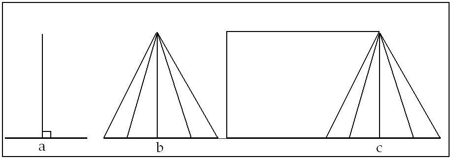 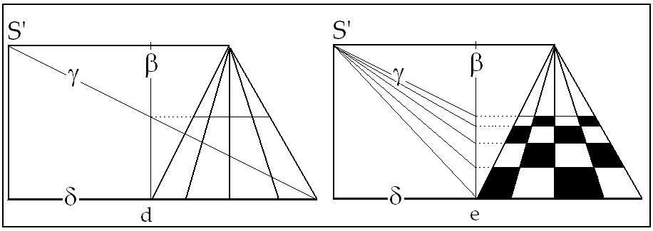

[无对应译文]

</section>

<section class="parallel-paragraph" data-paragraph-ids="s13-16-0134">

s13-16-0134

原文 · s13-16-0134

Si je m’y prête, je veux dire si je veux simplement faire les choses simples pour votre compréhension, je me mets au milieu de ce repère du quadrillage, et une perpendiculaire élevée sur la base de ce quadrillage me donne à l’horizon le *point de fuite* \[a\]. Je saurais donc, d’ores et déjà, que mon quadrillage va s’arranger comme ça, à l’aide de mon *point de fuite*. \[b\]

[无对应译文]

</section>

<section class="parallel-paragraph" data-paragraph-ids="s13-16-0135">

s13-16-0135

原文 · s13-16-0135

Mais qu’est-ce qui va me donner la hauteur où va venir le quadrillage en perspective ?

[无对应译文]

</section>

<section class="parallel-paragraph" data-paragraph-ids="s13-16-0136">

s13-16-0136

原文 · s13-16-0136

Quelque chose qui nécessite que je me serve de mon autre œil ?

[无对应译文]

</section>

<section class="parallel-paragraph" data-paragraph-ids="s13-16-0137">

s13-16-0137

原文 · s13-16-0137

Et ce qu’ont découvert les gens, assez tard puisqu’en fin de compte la première théorie en est donnée dans ALBERTI, contemporain de ceux que je viens de vous nommer, MASSACHIO et Van EYCK : eh bien, je prendrai ici une certaine distance \[δ\], qui est exactement ce qui correspond à ce que je vous ai donné tout à l’heure, comme cet intervalle de mon bloc au tableau. Sur cette distance, prenant un point \[S’\] situé à la même hauteur que le point de fuite, je fais une construction, une construction qui passe dans ALBERTI par une verticale située ici \[β\]. Je trace ici la diagonale \[γ\], ici une ligne horizontale et ici, j’ai la limite à laquelle se terminera mon quadrillage, celui que j’ai voulu voir en perspective.

[无对应译文]

</section>

<section class="parallel-paragraph" data-paragraph-ids="s13-16-0138">

s13-16-0138

原文 · s13-16-0138

J’ai donc toute liberté quant à la hauteur que je donnerai à ce quadrillage pris en perspective, c’est-à-dire, qu’à l’intérieur de mon tableau, je choisis à mon gré la distance où je vais me placer de mon quadrillage pour qu’il m’apparaisse en perspective et ceci est tellement vrai que dans beaucoup de tableaux classiques, vous avez sous une forme masquée une petite tache, voire quelquefois tout simplement un œil. L’indication ici, du point où vous devez vous-même prendre la distance où vous devez vous mettre du tableau pour que tout l’effort de perspective soit pour vous réalisé.

[无对应译文]

</section>

<section class="parallel-paragraph" data-paragraph-ids="s13-16-0139">

s13-16-0139

原文 · s13-16-0139

Vous le voyez, ceci ouvre une autre dimension qui est celle-ci, celle-ci qui est exactement la même qui vous a étonné tout à l’heure, quand je vous ai dit qu’au-dessus de l’horizon, il n’y a pas le ciel. Il y a le ciel parce que vous foutez au fond sur l’horizon, un portant qui est le ciel. Le ciel n’est jamais qu’un portant dans la réalité comme au théâtre et de même, entre vous et le ciel il y a toute une série de portants. Le fait que vous puissiez choisir dans le tableau votre distance et n’importe quel tableau dans le tableau, et déjà le tableau lui-même, est une prise de distance, car vous ne faites pas un tableau de vous à l’orifice de la fenêtre dans laquelle vous vous encadrez.

[无对应译文]

</section>

<section class="parallel-paragraph" data-paragraph-ids="s13-16-0140">

s13-16-0140

原文 · s13-16-0140

Déjà vous faites le tableau à l’intérieur de ce cadre. Votre rapport avec ce tableau et ce qu’il a à faire avec le fantasme, cela nous permettra d’avoir des repères, un chiffre assuré pour tout ce qui, dans la suite, nous permettra de manifester les rapports de *l’objet(a)* avec le S, c’est ce que j’espère, et j’espère un peu plus vite qu’aujourd’hui, je pourrai vous exposer la prochaine fois.

[无对应译文]

</section>

<section class="parallel-paragraph" data-paragraph-ids="s13-16-0141">

s13-16-0141

原文 · s13-16-0141

[MASACCIO](#RMasaccio)

[无对应译文]

</section>

<section class="parallel-paragraph" data-paragraph-ids="s13-16-0142">

s13-16-0142

原文 · s13-16-0142

[无对应译文]

</section>

<section class="parallel-paragraph" data-paragraph-ids="s13-16-0143">

s13-16-0143

原文 · s13-16-0143

[Van EYCK](#RVanEYCK)

[无对应译文]

</section>

<section class="parallel-paragraph" data-paragraph-ids="s13-16-0144">

s13-16-0144

原文 · s13-16-0144

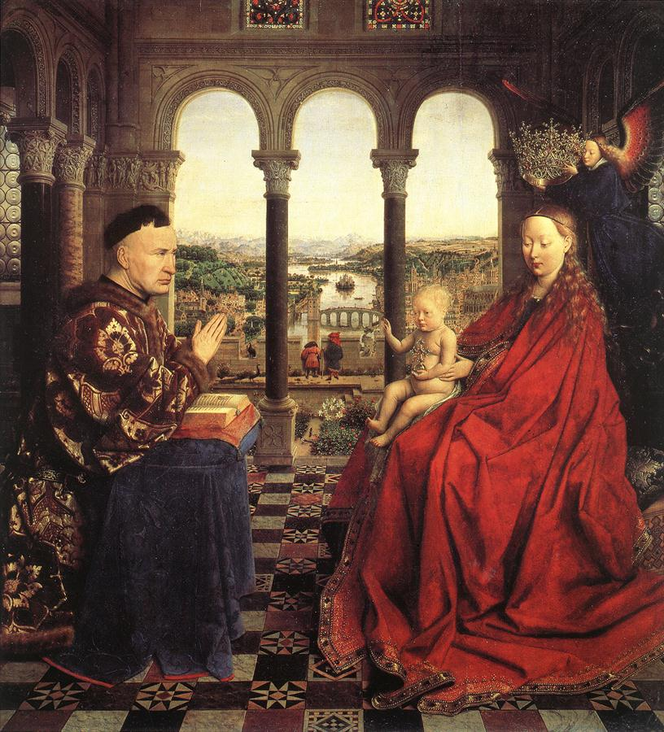

[无对应译文]

</section>

<section class="note-block original-notes">

## Notes

[^162]: André Leroi-Gouhran (1911-1986) : *Le geste et la parole*, t.1, *Technique et langage*, 1964 ; t.2 *La mémoire et les rythmes*,2000, Paris, Albin Michel.

[^163]: -Théorème de Pascal dit de l'*hexagramme mystique* : Pour un hexagone inscrit dans une conique, le théorème de Pascal affirme que les points

    d'intersection des côtés opposés de l'hexagone s'ils existent, sont alignés. La droite que forme cet alignement est appelée droite de Pascal.

    La figure est appelée hexagramme mystique. En géométrie projective, un des trois points où les trois points peuvent être des points à l'infini.

    -Théorème de Brianchon : Les diagonales qui joignent les sommets opposés d'un hexagone sont trois droites concourantes si et seulement si

    l'hexagone est circonscrit à une conique.

[^164]: Léon Battista Alberti : De Pictura, 1435, Allia, 2007.

[^165]: Iacopo Barozzi, dit « Il Vignola » ; Cf. *Les deux règles de la perspective pratique* de Vignole, Egnatio Danti, Paris, éd. C.N.R.S., 2003.

[^166]: Albrecht Dürer : Underweysung der Messung, Nuremberg, 1525. Instruction sur la manière de mesurer, Paris, Flammarion, 1995

[^167]: Michel Chasles : *Les trois livres de Porisme d'Euclide*, Jacques Gabay , 2007.

[^168]: L. Brion-Guerry : *Jean-Pèlerin Viator, sa place dans l'histoire de la perspective*, Belles Lettres, 1982.

</section>
