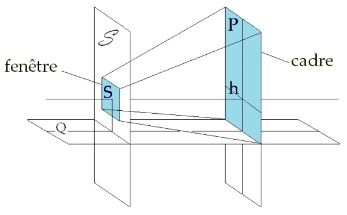
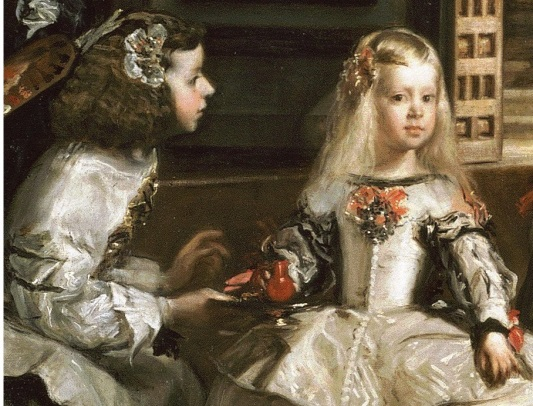
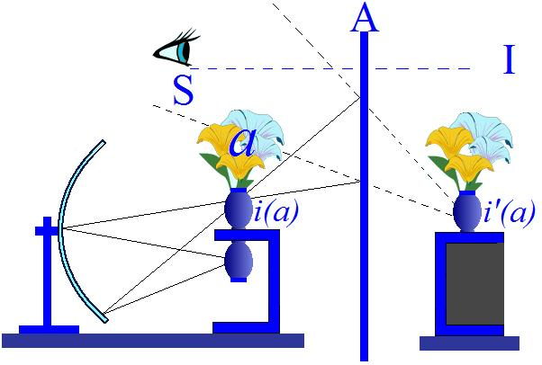
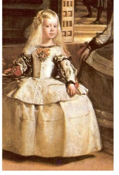
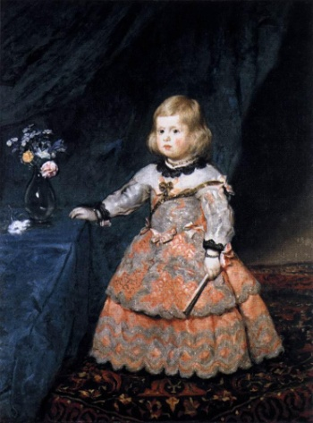
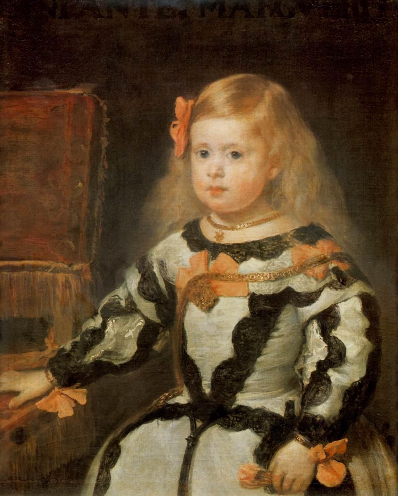
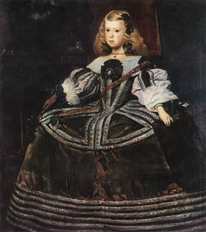

# Leçon 19 | 25 Mai l966

  

    <label><input type="checkbox" data-lacan-toggle="original" checked> 原文</label>
    <label><input type="checkbox" data-lacan-toggle="notes" checked> 注释</label>
    <label><input type="checkbox" data-lacan-toggle="commentary" checked> 个人解读评论</label>
  

  <form class="lacan-tool-search" role="search">
    <input class="lacan-tool-search-input" type="search" placeholder="搜索全文" aria-label="搜索全文">
    <button class="lacan-tool-button" type="submit" title="搜索">搜索</button>
  </form>
  <button class="lacan-tool-button lacan-back-to-top" type="button" title="回到页面最上方" aria-label="回到页面最上方">↑</button>

<section class="parallel-paragraph" data-paragraph-ids="s13-19-0001">

s13-19-0001

原文 · s13-19-0001

Je vais commencer, *sotto voce*, par vous lire rapidement, quelque chose qui représente un bref compte-rendu qu’on m’a demandé en cette époque de l’année, comme il se fait, de mon séminaire.

[无对应译文]

</section>

<section class="parallel-paragraph" data-paragraph-ids="s13-19-0002">

s13-19-0002

原文 · s13-19-0002

Ce sera moins long que ce que je vous ai donné déjà, de développé concernant le séminaire de l’année dernière, mais comme je sais que cette première lecture a rendu service, pour ce qui est du séminaire de l’année dernière, je vais entrer en matière aujourd’hui en vous donnant, en vous rappelant, ce qui est la situation du séminaire de cette année.

[无对应译文]

</section>

<section class="parallel-paragraph" data-paragraph-ids="s13-19-0003">

s13-19-0003

原文 · s13-19-0003

> « *Ce séminaire qui est, pour nous encore en cours -* écris-je *- s’est occupé, suivant sa ligne de la fonction longtemps repérée dans l’expérience psychanalytique au titre de la relation d’objet. On y professe qu’elle domine, pour le sujet analysable, sa relation au réel et l’objet oral ou anal y sont promus aux dépens d’autres dont le statut, pourtant manifeste, y demeure incertain. C’est que, si les premiers - de ces objets - reposent directement sur la relation de la demande, bien propice à intervention corrective, les autres, exigent une théorie plus complexe puisque, n’y peut être méconnue une division du sujet, impossible à réduire par les seuls efforts de la bonne intention, étant la division même dont se supporte le désir. Ces autres objets, nommément, le regard et la voix - si nous laissons à venir l’objet en jeu dans la castration - font corps avec cette division du sujet et en présentifient dans le champ même du perçu, la partie élidée comme libidinale. Comme tels, ils font reculer l’appréciation de la pratique qu’intimide leurs recouvrements à ces objets, par la relation spéculaire avec les identifications du moi qu’on y veut respecter. Ce rappel suffit à motiver que nous ayons insisté de préférence, cette année, sur la pulsion scopique et son objet immanent, le regard. Nous avons donné la topologie qui permet de rétablir la présence du percipiens lui-même dans le champ où comme imperçu, il est pourtant perceptible, quand il ne l’est même que trop, dans les effets de la pulsion qui se manifestent comme exhibition ou voyeurisme. Cette topologie qui s’inscrit dans la géométrie projective et les surfaces de l’analysis situs, n’est pas à prendre, comme il en est des modèles optiques chez FREUD, au rang de métaphore, mais bien pour représenter la structure elle-même. Cette topologie rend compte enfin de l’impureté du perceptum scopique en retrouvant ce que nous avions cru pouvoir indiquer dans un de nos articles - très précisément celui de la « Question préliminaire à tout traitement possible des psychoses » - ce que nous avions cru pouvoir indiquer de la présence du percipiens irrécusable de la marque qu’elle porte là du signifiant, quand elle se montre monnayée dans le phénomène jamais conçu de la voix psychotique. L’exigence absolue en ces deux points, scopique et invoquant, d’une théorie du désir, nous reporte à la rectification des infléchissements de la pratique, à l’autocritique nécessaire de la position de l’analyste, autocritique qui va au risque attaché à sa propre subjectivation, s’il veut répondre honnêtement, fusse seulement*
>
> *à la demande.* »

[无对应译文]

</section>

<section class="parallel-paragraph" data-paragraph-ids="s13-19-0004">

s13-19-0004

原文 · s13-19-0004

Je vais aujourd’hui poursuivre sur cet objet exemplaire, que j’ai choisi depuis trois séminaires de prendre, pour fixer devant vous les termes dans lesquels se situe cette problématique, problématique de *l’objet(a)* et de la division du sujet, pour autant, comme je viens de le dire - que ce n’est pas sans raison que l’obstacle dont il s’agit, c’est celui que procure l’identification spéculaire, c’est en raison du rôle particulier - à la fois par *sa latence* et *l’intensité de sa présence -* que constitue *l’objet(a)* au niveau de cette pulsion.

[无对应译文]

</section>

<section class="parallel-paragraph" data-paragraph-ids="s13-19-0005">

s13-19-0005

原文 · s13-19-0005

*Voulez-vous nous faire revoir le tableau des Ménines ?*

[无对应译文]

</section>

<section class="parallel-paragraph" data-paragraph-ids="s13-19-0006">

s13-19-0006

原文 · s13-19-0006

Voici ce tableau. Vous l’avez déjà vu la dernière fois, assez je pense pour avoir eu depuis la curiosité d’y revenir.

[无对应译文]

</section>

<section class="parallel-paragraph" data-paragraph-ids="s13-19-0007">

s13-19-0007

原文 · s13-19-0007

Ce tableau, vous savez maintenant, par la thématique qu’il a fournie dans la dialectique des rapports du signe avec les choses, nommément dans le travail de Michel FOUCAULT, autour de qui s’est proférée toute mon énonciation de la dernière fois par les discussions nombreuses qu’il a fournies à l’intérieur de ce qu’on peut appeler *la critique d’art,* ce tableau, disons nous *présente*, nous *rappelle* ce qu’il a été à son propos avancé, d’un rapport fondamental qu’il suggère avec le miroir.

[无对应译文]

</section>

<section class="parallel-paragraph" data-paragraph-ids="s13-19-0008">

s13-19-0008

原文 · s13-19-0008

Ce miroir qui est au fond, et où l’on a voulu voir en quelque sorte et comme en passant légèrement, l’astuce qui consisterait à y représenter ceux qui seraient là devant, comme modèles, à savoir le couple royal, ce miroir, d’autre part, est mis en question quand il s’agit d’expliquer comment le peintre pourrait s’y situer, et nous peignant ce que nous avons là devant nous, peut - lui - le voir. Le miroir, donc qui est au fond et le miroir à notre niveau. *Voulez-vous rallumer ?*

[无对应译文]

</section>

<section class="parallel-paragraph" data-paragraph-ids="s13-19-0009">

s13-19-0009

原文 · s13-19-0009

Ceci, miroir et tableau, nous introduit au rappel par où aujourd’hui je veux entrer dans l’explication, que j’espère pouvoir faire complète aujourd’hui, complète et définitive, de ce dont il s’agit : *la relation du tableau au sujet est foncièrement différente de celle du miroir.*

[无对应译文]

</section>

<section class="parallel-paragraph" data-paragraph-ids="s13-19-0010">

s13-19-0010

原文 · s13-19-0010

Que j’aie avancé que dans le tableau comme *champ perçu,* peut s’inscrire à la fois la place de *l’objet(a)*, et sa relation à *la division du sujet*, que ceci je vous l’aie montré, en introduisant mon problème par la mise en avant de la fonction - *dans le tableau* - de la perspective en tant que c’est le mode où à partir d’une certaine date historiquement situable, le sujet - *nommément le peintre* - se fait présent dans le tableau et pas seulement en tant que sa position détermine *le point de fuite* de la dite *perspective*.

[无对应译文]

</section>

<section class="parallel-paragraph" data-paragraph-ids="s13-19-0011">

s13-19-0011

原文 · s13-19-0011

J’ai désigné le point où est, non pas comme l’ont dit les artistes, parlant en tant qu’artisans, comme *l’autre œil :* ce point qui règle la distance à laquelle il convient de se placer pour apprécier, pour recevoir au maximum, l’effet de perspective, mais cet autre point que je vous ai caractérisé comme étant *le point à l’infini* dans le plan du tableau.

[无对应译文]

</section>

<section class="parallel-paragraph" data-paragraph-ids="s13-19-0012">

s13-19-0012

原文 · s13-19-0012

Ceci à soi tout seul suffit à distinguer dans le champ scopique *la fonction du tableau de celle du miroir*. Ils ont tous les deux, bien sûr, quelque chose en commun, c’est le cadre, mais dans le miroir ce que nous voyons c’est ce quelque chose où il n’y a pas plus de perspective que dans le monde réel : la perspective organisée c’est l’entrée dans le champ du scopique, du sujet lui-même. Dans le miroir, vous avez le monde tout bête, c’est-à-dire cet espace où vous vous repérez, avec les expériences de la vie commune en tant qu’elle est dominée par un certain nombre d’intuitions où se conjugue, non seulement le champ de l’optique, mais où il se conjugue avec la pratique et le champ de vos propres déplacements.

[无对应译文]

</section>

<section class="parallel-paragraph" data-paragraph-ids="s13-19-0013">

s13-19-0013

原文 · s13-19-0013

C’est à ce titre, et à ce titre d’abord, qu’on peut dire que le tableau...

[无对应译文]

</section>

<section class="parallel-paragraph" data-paragraph-ids="s13-19-0014">

s13-19-0014

原文 · s13-19-0014

> structuré si différemment et dans son cadre, dans son cadre qui ne peut être isolé
>
> d’un autre point de référence, celui occupé par le point S dominant sa projective …que *le tableau n’est que le représentant de la représentation. Il est le représentant de ce qu’est la représentation dans le miroir.*

[无对应译文]

</section>

<section class="parallel-paragraph" data-paragraph-ids="s13-19-0015">

s13-19-0015

原文 · s13-19-0015

*Il n’est pas de son essence d’être la représentation.*

[无对应译文]

</section>

<section class="parallel-paragraph" data-paragraph-ids="s13-19-0016">

s13-19-0016

原文 · s13-19-0016

Et ceci, l’art moderne vous l’illustre : un tableau, une toile avec une simple merde dessus, une merde réelle…

[无对应译文]

</section>

<section class="parallel-paragraph" data-paragraph-ids="s13-19-0017">

s13-19-0017

原文 · s13-19-0017

> car qu’est-ce d’autre après-tout, qu’une grande tache de couleur ? Et ceci est manifesté d’une façon, en quelque sorte provocante, par certains extrêmes de la création artistique …est un tableau autant qu’est une œuvre d’art le *ready made* de DUCHAMP à savoir aussi bien la présentation, devant vous de quelque porte-manteau accroché à une tringle.

[无对应译文]

</section>

<section class="parallel-paragraph" data-paragraph-ids="s13-19-0018">

s13-19-0018

原文 · s13-19-0018

Il est d’une structure différente de toute représentation. C’est à ce titre que j’insiste sur la différence essentielle que constitue, emprunté à FREUD, ce terme de *représentant de la représentation, Vorstellungsrepräsentanz.*

[无对应译文]

</section>

<section class="parallel-paragraph" data-paragraph-ids="s13-19-0019">

s13-19-0019

原文 · s13-19-0019

[无对应译文]

</section>

<section class="parallel-paragraph" data-paragraph-ids="s13-19-0020">

s13-19-0020

原文 · s13-19-0020

C’est que le tableau, de par sa relation au point S du système projectif, manifeste ceci, qui parallèle à lui, existe encadrant ce point S lui-même dans un  plan \[*S*\], donc *parallèle au plan du tableau* \[P\], et que j’appelle « *la fenêtre* », à savoir ce quelque chose que vous pouvez matérialiser comme *un cadre parallèle à celui du tableau*, en tant qu’il donne sa place à ce point S, qu’il l’*encadre*.

[无对应译文]

</section>

<section class="parallel-paragraph" data-paragraph-ids="s13-19-0021">

s13-19-0021

原文 · s13-19-0021

C’est dans ce cadre où est le point S qu’est, si je puis dire, le prototype du tableau, celui où effectivement le S se sustente, non point réduit à ce point qui nous permet de construire dans le tableau la perspective, mais comme le point où le sujet lui-même se sustente dans sa propre division, autour de cet *objet(a)* présent qui est sa monture.

[无对应译文]

</section>

<section class="parallel-paragraph" data-paragraph-ids="s13-19-0022">

s13-19-0022

原文 · s13-19-0022

C’est bien en quoi l’idéal de la réalisation du sujet serait de présentifier ce tableau dans sa fenêtre et c’est l’image provocante que produit devant nous un peintre comme [MAGRITTE](#Magritte), quand il vient effectivement dans un tableau inscrire un tableau dans une fenêtre. C’est aussi l’image à quoi j’ai recouru pour expliquer ce qu’il en est de la fonction du *fantasme* : l’image qui implique cette contradiction, si jamais elle était réalisée dans quelque chambre, comme ici, éclairée d’une seule fenêtre, que l’accomplissement parfait de cet idéal plongerait la salle dans l’obscurité.

[无对应译文]

</section>

<section class="parallel-paragraph" data-paragraph-ids="s13-19-0023">

s13-19-0023

原文 · s13-19-0023

C’est bien en quoi le tableau doit être produit quelque part en avant de ce plan \[fenêtre\] où il s’institue comme place du sujet dans sa division, et que la question est de savoir ce qu’il advient de ce quelque chose qui *tombe dans l’intervalle*, à ce que le sujet écarte de lui le tableau. Ce qu’il advient, ce que l’objet exemplaire autour de quoi je travaille, ici, devant vous, manifeste, c’est que le sujet, sous sa forme divisée, peut s’inscrire dans le plan-figure \[P\], dans le plan, écarté du plan \[fenêtre\] du fantasme où se réalise, l’œuvre d’art.

[无对应译文]

</section>

<section class="parallel-paragraph" data-paragraph-ids="s13-19-0024">

s13-19-0024

原文 · s13-19-0024

L’artiste, comme aussi bien tout un chacun d’entre nous, renonce à la fenêtre pour avoir le tableau et c’est là l’ambiguïté que je donnai l’autre jour, que j’indiquai sur la fonction du fantasme. Le fantasme est le statut de l’être du sujet et le mot « *fantasme* » implique ce désir de voir se projeter le *fantasme*, cet espace de recul entre deux lignes parallèles, grâce à quoi, toujours insuffisant mais toujours désiré, à la fois faisable et impossible, le *fantasme* peut être appelé à apparaître en quelque façon dans le tableau. Le tableau, pourtant n’est pas représentation. Une représentation *ça se voit*. Et comment ce « *ça sa voit* » le traduire ? « *Ça se voit* », c’est « *n’importe qui le voit* ». Mais aussi c’est la forme réfléchie, de ce fait il y a - *immanente dans toute représentation* - ce « *se voir* ».

[无对应译文]

</section>

<section class="parallel-paragraph" data-paragraph-ids="s13-19-0025">

s13-19-0025

原文 · s13-19-0025

La représentation comme telle, *Le monde comme représentation* et le sujet comme *support* de ce monde qui se représente, c’est là « *le sujet transparent à lui-même* » de la conception classique et c’est là justement ce sur quoi il nous est demandé, par l’expérience de la pulsion scopique, ce sur quoi il nous est demandé de revenir.

[无对应译文]

</section>

<section class="parallel-paragraph" data-paragraph-ids="s13-19-0026">

s13-19-0026

原文 · s13-19-0026

C’est pourquoi quand j’ai introduit la question de ce tableau avec le « *Fais voir !* », mis dans la bouche du personnage sur lequel nous allons revenir aujourd’hui, le personnage central de l’infante, Doña Margarita, fille de Mariana d’Autriche : « *Fais voir !* ». Ma réponse a été d’abord celle qu’en ces termes j’ai fait donner à la figure de VELÀZQUEZ présente dans le tableau :

[无对应译文]

</section>

<section class="parallel-paragraph" data-paragraph-ids="s13-19-0027">

s13-19-0027

原文 · s13-19-0027

> « *Tu ne me vois pas d’où je te regarde.* »

[无对应译文]

</section>

<section class="parallel-paragraph" data-paragraph-ids="s13-19-0028">

s13-19-0028

原文 · s13-19-0028

Qu’est-ce à dire là ?

[无对应译文]

</section>

<section class="parallel-paragraph" data-paragraph-ids="s13-19-0029">

s13-19-0029

原文 · s13-19-0029

Comme je l’ai déjà avancé, la présence dans le tableau de ce qui, seulement dans le tableau, est représentation...

[无对应译文]

</section>

<section class="parallel-paragraph" data-paragraph-ids="s13-19-0030">

s13-19-0030

原文 · s13-19-0030

celle du tableau lui-même, qui lui, est là comme *représentant de la représentation...*a la même fonction dans le tableau qu’un cristal dans une solution sursaturée, c’est que tout ce qui est dans le tableau se manifeste comme n’étant plus représentation mais *représentant de la représentation*.

[无对应译文]

</section>

<section class="parallel-paragraph" data-paragraph-ids="s13-19-0031">

s13-19-0031

原文 · s13-19-0031

Comme il apparaît, à voir - *faut-il que je fasse de nouveau resurgir l’image ?* - que tous les personnages qui sont là, à proprement parler ne se représentent rien et justement pas *ceci* : qu’ils *représentent*. Ici prend toute sa valeur la figure du [chien](#LesMenines) que vous voyez à droite. Pas plus que lui, aucune des autres figures ne fait autre chose que d’être sa représentation, *figures de cour* qui miment une scène idéale où chacun est dans sa fonction d’être *en représentation*, en le sachant à peine.

[无对应译文]

</section>

<section class="parallel-paragraph" data-paragraph-ids="s13-19-0032">

s13-19-0032

原文 · s13-19-0032

Encore que là gît l’ambiguïté qui nous permet de remarquer que, comme il se voit sur la scène quand on y traîne un animal, le chien aussi, est lui aussi toujours très bon comédien.

[无对应译文]

</section>

<section class="parallel-paragraph" data-paragraph-ids="s13-19-0033">

s13-19-0033

原文 · s13-19-0033

> « *Tu ne me vois pas d’où je te regarde* »

[无对应译文]

</section>

<section class="parallel-paragraph" data-paragraph-ids="s13-19-0034">

s13-19-0034

原文 · s13-19-0034

Puisque c’est *d’une formule* frappée *de ma façon* qu’il s’agit, je me permettrai de vous faire remarquer que *dans mon style* je n’ai point dit « *Tu ne me vois pas, là, d’où je te regarde* », que le « *là* » est élidé, ce « *là* » sur lequel la pensée moderne a mis tant d’accent sous la forme du *dasein* comme si tout était résolu, de la fonction de l’être ouvert à ce qu’il y ait *un être là*.

[无对应译文]

</section>

<section class="parallel-paragraph" data-paragraph-ids="s13-19-0035">

s13-19-0035

原文 · s13-19-0035

Il n’y a pas de « là » où VELÀZQUEZ, si je le fais parler, invoque dans ce « *Tu ne me vois pas d’où je te regarde* ». À cette place béante, à cet intervalle non marqué, est précisément ce « *là* », où se produit la chute de ce qui est en suspens sous le nom de *l’objet(a)*. Il n’y a point d’autre « *là* » dont il s’agisse dans le tableau, que cet intervalle que je vous y ai montré, expressément dessiné, entre ce que je pourrai tracer - *mais que vous pouvez, je pense, imaginer aussi bien que moi -* des deux glissières qui dessineraient le trajet dans ce tableau comme sur une scène de théâtre, du mode par où arrivent ces *portants ou praticables* :

[无对应译文]

</section>

<section class="parallel-paragraph" data-paragraph-ids="s13-19-0036">

s13-19-0036

原文 · s13-19-0036

- dont le premier est le tableau au premier plan, dans cette ligne légèrement oblique, que vous voyez se prolonger facilement, à voir seulement de la figure de ce grand objet sur la gauche,

[无对应译文]

</section>

<section class="parallel-paragraph" data-paragraph-ids="s13-19-0037">

s13-19-0037

原文 · s13-19-0037

- et l’autre, tracée à travers le groupe, je vous ai appris à reconnaître son sillage, qui est celui par lequel le peintre s’est fait introduire comme *un de ces personnages de fantasmagorie* qui se font, dans la grande machinerie théâtrale pour se faire déposer à la bonne distance de ce tableau c’est-à-dire un peu trop loin, pour que nous n’ignorions rien de son intention.

[无对应译文]

</section>

<section class="parallel-paragraph" data-paragraph-ids="s13-19-0038">

s13-19-0038

原文 · s13-19-0038

Ces deux glissières parallèles, cet intervalle, cet « *essieu* » que constitue *cet intervalle*, pour reprendre ce terme de *la terminologie baroque* de Girard DESARGUES, *là* - et là seulement - *est le Dasein*. C’est pourquoi l’on peut dire que VELÀZQUEZ le peintre, parce qu’il est un vrai peintre, n’est donc pas là pour trafiquer de son *dasein,* si je puis dire.

[无对应译文]

</section>

<section class="parallel-paragraph" data-paragraph-ids="s13-19-0039">

s13-19-0039

原文 · s13-19-0039

La différence entre *la bonne et la mauvaise peinture*, entre *la bonne et la mauvaise conception du monde*, c’est que, *de même que les mauvais peintres ne font jamais que leur propre portrait, quelque portrait qu’ils fassent, et que la mauvaise conception du monde voit dans le monde* *le macrocosme du microcosme que nous serions,* VELÀZQUEZ, même quand il s’introduit dans le tableau comme autoportrait, ne se peint pas dans un miroir, non plus il ne se fait d’aucun bon autoportrait. Le tableau, quel qu’il soit, et même *autoportrait* n’est pas mirage du peintre mais piège à regards.

[无对应译文]

</section>

<section class="parallel-paragraph" data-paragraph-ids="s13-19-0040">

s13-19-0040

原文 · s13-19-0040

C’est donc la présence du tableau dans le tableau qui permet de libérer le reste de ce qui est dans le tableau, de cette fonction de représentation. Et c’est en cela que ce tableau nous saisit et nous frappe. Si ce monde qu’a fait surgir VELÀZQUEZ dans ce tableau - et nous verrons dans quel projet - si ce monde est bien ce que je vous dis, il n’y a rien d’abusif à y reconnaître ce qu’il manifeste et ce qu’il suffit de dire pour le reconnaître.

[无对应译文]

</section>

<section class="parallel-paragraph" data-paragraph-ids="s13-19-0041">

s13-19-0041

原文 · s13-19-0041

Qu’est cette scène étrange qui a eu pour les siècles passés cette fonction problématique si ce n’est quelque chose d’équivalent à ce que nous connaissons bien dans la pratique de ce qu’on appelle les jeux de société, et qu’est d’autre qu’un jeu la société, à savoir le tableau vivant ? Ces êtres qui sont là - sans doute en raison des nécessités mêmes de la peinture - projetés devant nous, qu’est-ce qu’ils font, sinon de nous représenter, exactement, ces sortes de groupes qui se produisent dans ce jeu du tableau vivant.

[无对应译文]

</section>

<section class="parallel-paragraph" data-paragraph-ids="s13-19-0042">

s13-19-0042

原文 · s13-19-0042

[无对应译文]

</section>

<section class="parallel-paragraph" data-paragraph-ids="s13-19-0043">

s13-19-0043

原文 · s13-19-0043

Qu’est cette attitude :

[无对应译文]

</section>

<section class="parallel-paragraph" data-paragraph-ids="s13-19-0044">

s13-19-0044

原文 · s13-19-0044

- presque gourmet de la petite princesse,

[无对应译文]

</section>

<section class="parallel-paragraph" data-paragraph-ids="s13-19-0045">

s13-19-0045

原文 · s13-19-0045

- de la suivante agenouillée qui lui présente cet étrange petit pot inutile sur lequel elle commence de poser la main,

[无对应译文]

</section>

<section class="parallel-paragraph" data-paragraph-ids="s13-19-0046">

s13-19-0046

原文 · s13-19-0046

- ces autres qui ne savent point où placer ces regards, que l’on s’obstine à nous dire qu’ils seraient là pour s’entrecroiser, quand il est manifeste qu’aucun ne se rencontre,

[无对应译文]

</section>

<section class="parallel-paragraph" data-paragraph-ids="s13-19-0047">

s13-19-0047

原文 · s13-19-0047

- ces deux personnages dont Monsieur GREEN a fait l’autre jour quelque état et dont - ceci soit dit en passant - il aurait tort de croire que le personnage féminin soit une religieuse, c’est ce qu’on appelle une *guarda damas*, tout le monde le sait, et même son nom Doña Marcela de ULLOA[^180],

[无对应译文]

</section>

<section class="parallel-paragraph" data-paragraph-ids="s13-19-0048">

s13-19-0048

原文 · s13-19-0048

- et là, qu’est-ce que fait VELÀZQUEZ *sinon de se montrer à nous en peintre* *et au milieu de quoi ?* De tout ce gynécée !

[无对应译文]

</section>

<section class="parallel-paragraph" data-paragraph-ids="s13-19-0049">

s13-19-0049

原文 · s13-19-0049

Nous reviendrons sur ce qu’il signifie, sur les questions vraiment étranges qu’on peut se poser concernant le premier titre qui a été donné à ce tableau, je l’ai vu encore inscrit dans un dictionnaire qui date de l872 : « *La famille du roi »*.

[无对应译文]

</section>

<section class="parallel-paragraph" data-paragraph-ids="s13-19-0050">

s13-19-0050

原文 · s13-19-0050

Pourquoi *la famille* - mais laissons ceci pour l’instant - quand il n’y a manifestement que la petite infante qui ici la représente ?

[无对应译文]

</section>

<section class="parallel-paragraph" data-paragraph-ids="s13-19-0051">

s13-19-0051

原文 · s13-19-0051

Ce *tableau vivant*, je dirais, et c’est bien ainsi, dans ce geste figé qui fait de la vie une nature morte, que sans doute ces personnages, comme on l’a dit, se sont effectivement présentés. Et c’est bien en quoi, tout morts qu’ils soient, ainsi que nous les voyons, ils se survivent, justement d’être dans une position qui du temps même de leur vie, n’a jamais changé.

[无对应译文]

</section>

<section class="parallel-paragraph" data-paragraph-ids="s13-19-0052">

s13-19-0052

原文 · s13-19-0052

Et alors, nous allons voir, en effet ce qui, d’abord, nous suggère cette fonction du miroir. Est-ce que cet être, dans cette position de vie fixée, dans cette mort qui nous la fait, à travers les siècles, surgir comme presque vivante, à la façon de *la mouche géologique prise dans l’ambre*, est-ce que, à l’avoir fait passer, pour dire son « *Fais voir !* », de notre côté, nous n’évoquons pas, à son propos, cette même image, cette même fable du saut d’Alice, qui nous rejoindrait, de plonger, selon un artifice dont la littérature carollienne - et jusqu’à Jean COCTEAU - a su user et abuser : la traversée du miroir ?

[无对应译文]

</section>

<section class="parallel-paragraph" data-paragraph-ids="s13-19-0053">

s13-19-0053

原文 · s13-19-0053

Sans doute ! Dans ce sens, il y a quelque chose à traverser, ce qui dans le tableau nous est en quelque sorte conservé figé. Mais dans l’autre ? À savoir de la voie qui, après tout nous semble ouverte et nous appelle d’entrer, nous, dans ce tableau : *il n’y en a pas*. Car c’est bien la question qui vous est posée par ce tableau, à vous qui si je puis dire, vous croyez vivants, de ceci seulement, qui est une fausse croyance, qu’il suffirait *d’être là pour être au nombre des vivants*.

[无对应译文]

</section>

<section class="parallel-paragraph" data-paragraph-ids="s13-19-0054">

s13-19-0054

原文 · s13-19-0054

Et c’est bien là ce qui vous tourmente, ce qui prend chacun *aux tripes*, à la vue de ce tableau, comme de tout tableau, en tant qu’il vous appelle à entrer dans ce qu’il est au vrai, et qu’il vous présente comme tel ceci : *que les êtres sont non point là représentés mais en représentation.*

[无对应译文]

</section>

<section class="parallel-paragraph" data-paragraph-ids="s13-19-0055">

s13-19-0055

原文 · s13-19-0055

Et c’est bien là le fond de ce qui rend pour chacun si nécessaire de faire surgir cette surface invisible du miroir dont on sait qu’on ne peut pas la franchir. Et c’est la vraie raison pourquoi au musée du Prado, vous avez, légèrement sur la droite et *de trois quart*, pour que vous puissiez vous y raccrocher en cas d’angoisse, à savoir un miroir car il faut bien, pour ceux à qui ça pourrait donner le vertige, qu’ils sachent que le tableau n’est qu’un leurre, une représentation.

[无对应译文]

</section>

<section class="parallel-paragraph" data-paragraph-ids="s13-19-0056">

s13-19-0056

原文 · s13-19-0056

Car après tout dans cette perspective - c’est le cas de le dire - à quel moment, posez-vous la question, vous distinguez-vous des figures du tableau en tant qu’elles sont là, en naturel, en représentation et sans le savoir ? C’est ainsi qu’en parlant du miroir à propos de ce tableau, sans doute on brûle, bien sûr, car il n’est pas là seulement parce que vous le rajoutez : nous allons dire en effet jusqu’à quel point le tableau c’est cela même, mais pas par le bout que j’ai cru à l’instant devoir écarter de ces petites *Ménines* avec leur temps de *Dasein* encore affilé.

[无对应译文]

</section>

<section class="parallel-paragraph" data-paragraph-ids="s13-19-0057">

s13-19-0057

原文 · s13-19-0057

Mais je ne veux point ici faire de l’anecdote, ni vous raconter de chacune ce qu’en ce point où elles sont là saisies elles ont encore à vivre, ceci ne serait que détail à vous égarer et *il ne convient pas, rappelons-le, de confondre le rappel des pignochages d’observation et d’anamnèse avec ce qu’on appelle la clinique, si on y oublie la structure*. Nous sommes aujourd’hui ici pour, cette *structure,* la dessiner. Qu’en est-il donc de cette scène étrange où ce qui vous retient vous-même de sauter, ce n’est pas simplement que dans le tableau, *il n’y ait pas assez d’espace* ?

[无对应译文]

</section>

<section class="parallel-paragraph" data-paragraph-ids="s13-19-0058">

s13-19-0058

原文 · s13-19-0058

Si le miroir vous retient ce n’est pas par sa résistance ni par sa dureté, c’est par la capture qu’il exerce, en quoi vous vous manifestez très inférieurs à ce que fait le chien en question - puisque c’est lui qui est là, prenons-le - et que d’ailleurs ce qu’il nous montre, c’est que du mirage du miroir il en fait très vite le tour, une ou deux fois : *il a bien vu qu’il n’y a rien là derrière*.

[无对应译文]

</section>

<section class="parallel-paragraph" data-paragraph-ids="s13-19-0059">

s13-19-0059

原文 · s13-19-0059

Et si le tableau est au musée, c’est à dire en un endroit où, si vous faites le même tour, vous serez aussi fort rassurés, c’est-à-dire que vous verrez qu’il n’y a rien, il n’en est pas moins vrai que, tout à fait à l’opposé du chien, si vous ne reconnaissez pas ce dont le tableau est le représentant, c’est justement de manquer cette réaction qu’il a, de vous rappeler qu’au regard de la réalité, vous êtes vous-même *inclus* dans une fonction analogue à celle que représente le tableau, c’est-à-dire pris dans le fantasme. Dès lors interrogeons-nous sur *le sens* de ce tableau : le roi et la reine au fond, et semble-t-il dans un miroir, telle est là l’indication que nous pouvons en retirer. J’ai déjà indiqué la visée du point où nous devons chercher ce sens. Ce couple royal, sans doute a-t-il à faire avec le miroir, et nous allons voir quoi.

[无对应译文]

</section>

<section class="parallel-paragraph" data-paragraph-ids="s13-19-0060">

s13-19-0060

原文 · s13-19-0060

Si tous ces personnages sont en représentation, c’est à l’intérieur d’un certain ordre, de *l’ordre monarchique* dont ils représentent les figures majeures. Ici notre petite Alice, dans sa sphère représentante, est bien en effet comme l’Alice carollienne, avec au moins un élément qui - j’en ai déjà employé la métaphore - se présente comme des figures de cartes : ce roi et cette reine \[dans Alice\] dont les proférations déchaînées se limitent à la décision « *coupez-lui la tête* ».

[无对应译文]

</section>

<section class="parallel-paragraph" data-paragraph-ids="s13-19-0061">

s13-19-0061

原文 · s13-19-0061

Et d’ailleurs, pour faire ici un rappel de ce sur quoi j’ai dû passer tout à l’heure, observez à quel point cette pièce n’est pas seulement meublée de ces personnages, tels que j’espère vous les avoir éclairés, mais aussi d’innombrables autres tableaux : c’est une salle de peinture, et on s’est pris au jeu d’essayer de lire sur chacune de ces cartes quelle pouvait bien être la valeur qu’y avait inscrite le peintre. Là encore c’est une anecdote où je n’ai point à m’égarer, sur le sujet d’APOLLON et MARSYAS qui sont au fond, ou bien encore de la dispute d’ARACHNÉ et de PALLAS, devant le tissage de cet enlèvement d’Europe que nous retrouvons au fond de la peinture voisine, ici exposée, des [*Hilanderas*](#LasHilandereas).

[无对应译文]

</section>

<section class="parallel-paragraph" data-paragraph-ids="s13-19-0062">

s13-19-0062

原文 · s13-19-0062

*Où sont-ils ce roi et cette reine* autour de quoi en principe se suspend toute la scène, à proprement parler ? Car il n’y a pas que *la scène primitive, la scène inaugurale*, il y a aussi cette transmission de *la fonction scénique* qui ne s’arrête à nul moment primordial.

[无对应译文]

</section>

<section class="parallel-paragraph" data-paragraph-ids="s13-19-0063">

s13-19-0063

原文 · s13-19-0063

Observons que la représentation est faite - pour qui, pour quoi ? - pour leur vision, mais de là où ils sont, ils ne voient rien !

[无对应译文]

</section>

<section class="parallel-paragraph" data-paragraph-ids="s13-19-0064">

s13-19-0064

原文 · s13-19-0064

Car c’est là qu’il convient de se souvenir de ce qu’est le tableau : non point une représentation autour de quoi l’on tourne et pour laquelle on change d’angle. Ces personnages n’ont pas de dos et le tableau, s’il est là retourné, c’est pour précisément que ce qu’il a sur sa face, à savoir ce que nous voyons, nous soit caché. Ce n’est pas dire *qu’il s’offre pour autant au prince*.

[无对应译文]

</section>

<section class="parallel-paragraph" data-paragraph-ids="s13-19-0065">

s13-19-0065

原文 · s13-19-0065

Cette vision royale, elle, est exactement ce qui correspond à la fonction, quand j’ai essayé de l’articuler explicitement, du grand Autre dans la relation du narcissisme. Reportez-vous à mon article dit *Remarques…*[^181], sur un certain discours qui s’était tenu au *Congrès de Royaumont*. Je rappelle pour ceux qui ne s’en souviennent plus, ou d’autres qui ne le connaissent pas, qu’il s’agissait alors de donner sa valeur, de restaurer dans notre perspective deux thématiques qui nous avaient été produites par un psychologue et qui mettait l’accent sur *le moi idéal* et *l’idéal du moi*, fonctions si importantes dans l’économie de notre pratique …mais où de voir rentrer la psychologie indécrottable de ses références *consciencielles* dans le champ de l’analyse, nous voyions de nouveau *produits* : le premier comme le *moi* *qu’on se croit être*, et l’autre comme celui *qu’on se veut être*.

[无对应译文]

</section>

<section class="parallel-paragraph" data-paragraph-ids="s13-19-0066">

s13-19-0066

原文 · s13-19-0066

Avec *toute l’amabilité* dont je suis capable quand je travaille avec quelqu’un, je n’ai fait que cueillir ce qui, dans cette amorce pouvait me paraître favorable à rappeler ce dont il s’agit. C’est à dire d’une articulation qui rend absolument nécessaire de maintenir dans ces fonctions leur structure, avec ce que cette structure impose du registre de l’inconscient, que j’ai figuré par cette image du *point S* qui par rapport à un *miroir* effectivement, dont il s’agit de savoir maintenant, quelle est ici la fonction ambiguë, à se mettre donc, à l’aide de ce miroir par où je définis dans ce schéma le champ de l’Autre, en pouvoir de voir, grâce au miroir, d’un point qui n’est pas celui qu’il occupe, ce qu’il ne pourrait voir autrement du fait qu’il se tient dans un certain champ, à savoir ce qu’il s’agit de produire dans ce champ, ce que j’ai représenté par un vase retourné sous une planchette et profitant *d’une vieille expérience de physique amusante*[^182], prise pour modèle.

[无对应译文]

</section>

<section class="parallel-paragraph" data-paragraph-ids="s13-19-0067">

s13-19-0067

原文 · s13-19-0067

→ 

[无对应译文]

</section>

<section class="parallel-paragraph" data-paragraph-ids="s13-19-0068">

s13-19-0068

原文 · s13-19-0068

Ici il ne s’agit point de *structure* mais, comme chaque fois que nous nous référons à des modèles optiques, d’une *métaphore* bien sûr, une *métaphore* qui s’applique, si nous savons que grâce à un miroir sphérique une *image réelle* \[*i(a)*\] peut être produite d’un objet caché sous ce que j’ai appelé *une planchette* et que, dès lors si nous avions là *un bouquet de fleurs* prêt à accueillir ce cernage, le col de ce vase… Il y a là un jeu qui est précisément celui qui constitue ce petit tour de physique amusante, à condition que pour le voir on soit dans un certain champ scénique qui se dessine à partir du *miroir sphérique*. Si on ne l’occupe pas justement, on peut, à se faire transférer comme vision, dans un certain point du miroir se trouver là, dans le champ conique qui vient du miroir sphérique. C’est-à-dire que c’est ici qu’on voit le résultat de l’illusion, à savoir *les fleurs entourées de leur petit vase*.

[无对应译文]

</section>

<section class="parallel-paragraph" data-paragraph-ids="s13-19-0069">

s13-19-0069

原文 · s13-19-0069

Ceci bien sûr, comme modèle optique, n’est point la structure, pas plus que FREUD n’a jamais pensé vous donner la structure de fonctions physiologiques quelconques, en vous parlant *du moi, du surmoi, de l’idéal du moi ou même du Ça*. Il n’est nulle part dans le corps. *L’image du corps* par contre y est. Et ici le miroir sphérique n’a point d’autre rôle que de représenter ce qui en effet dans le cortex, peut être l’appareil nécessaire à nous donner dans son fondement, cette *image du corps*.

[无对应译文]

</section>

<section class="parallel-paragraph" data-paragraph-ids="s13-19-0070">

s13-19-0070

原文 · s13-19-0070

Mais il s’agit de bien autre chose dans la relation spéculaire, et ce qui fait pour nous le prix de cette image dans sa fonction narcissique, c’est ce qu’elle vient, pour nous, à la fois à enserrer et à cacher, de cette fonction du *petit(a)*. *Latente à l’image spéculaire, il y a la fonction du regard.* Et pourtant *je suis étonné*, sans savoir à quoi le rapporter…

[无对应译文]

</section>

<section class="parallel-paragraph" data-paragraph-ids="s13-19-0071">

s13-19-0071

原文 · s13-19-0071

> à la distraction j’espère, non pas au manque de travail, ou simplement au désir de ne pas s’embarrasser soi-même …est-ce qu’il n’y a pas là quelque problème au moins *soulevé*, depuis que je vous ai dit que *le (a) n’est pas spéculaire ?*

[无对应译文]

</section>

<section class="parallel-paragraph" data-paragraph-ids="s13-19-0072">

s13-19-0072

原文 · s13-19-0072

Car dans ce schéma, le bouquet de fleurs vient de l’autre côté du miroir : il se reflète dans le miroir, le bouquet de fleurs !

[无对应译文]

</section>

<section class="parallel-paragraph" data-paragraph-ids="s13-19-0073">

s13-19-0073

原文 · s13-19-0073

[无对应译文]

</section>

<section class="parallel-paragraph" data-paragraph-ids="s13-19-0074">

s13-19-0074

原文 · s13-19-0074

C’est bien toute la problématique de *la place de l’objet(a)*.

[无对应译文]

</section>

<section class="parallel-paragraph" data-paragraph-ids="s13-19-0075">

s13-19-0075

原文 · s13-19-0075

À qui appartient-il dans ce schéma : à la batterie de ce qui concerne le sujet, ici en tant qu’il est intéressé dans la formation de ce *moi idéal*, ici incarné dans *le vase de l’identification spéculaire* où le *moi* prendra son assiette, ou bien à quelque chose d’autre ?

[无对应译文]

</section>

<section class="parallel-paragraph" data-paragraph-ids="s13-19-0076">

s13-19-0076

原文 · s13-19-0076

Bien sûr, ce modèle n’est point exhaustif. Il y a le champ de l’Autre, ce champ de l’Autre que vous pouvez incarner dans le jeu de l’enfant, que vous voyez s’incarner dans les premières références qu’il fait aussitôt, à sa découverte de sa propre image dans le miroir : il se retourne pour la faire en quelque sorte authentifier, par celui qui à ce moment-là le soutient, le supporte ou est dans son voisinage.

[无对应译文]

</section>

<section class="parallel-paragraph" data-paragraph-ids="s13-19-0077">

s13-19-0077

原文 · s13-19-0077

La problématique de *l’objet(a)* reste donc toute entière à ce niveau. Je veux dire, celui de ce schéma. Eh bien, est-ce que j’ai besoin de beaucoup insister pour vous permettre de reconnaître, dans ce tableau, sous le pinceau de VELÀZQUEZ, une image presque identique à celle que je vous ai là, présentée?

[无对应译文]

</section>

<section class="parallel-paragraph" data-paragraph-ids="s13-19-0078">

s13-19-0078

原文 · s13-19-0078

Qu’est-ce qui ressemble plus, à cette sorte d’objet secret sous une brillante vêture…

[无对应译文]

</section>

<section class="parallel-paragraph" data-paragraph-ids="s13-19-0079">

s13-19-0079

原文 · s13-19-0079

> qui est d’une part, ici représenté dans le bouquet de fleurs, voilé, caché, pris, enserré, autour de cette énorme robe du vase qui est, à la fois *image réelle*, mais *image réelle saisie au virtuel du miroir*

[无对应译文]

</section>

<section class="parallel-paragraph" data-paragraph-ids="s13-19-0080">

s13-19-0080

原文 · s13-19-0080

[无对应译文]

</section>

<section class="parallel-paragraph" data-paragraph-ids="s13-19-0081">

s13-19-0081

原文 · s13-19-0081

…et l’habillement de cette petite infante, personnage éclairé, personnage central, modèle préféré de VELÀZQUEZ qui l’a peinte sept ou huit fois, et vous n’avez qu’à aller au Louvre pour la voir peinte la même année.

[无对应译文]

</section>

<section class="parallel-paragraph" data-paragraph-ids="s13-19-0082">

s13-19-0082

原文 · s13-19-0082

Et Dieu sait si elle est belle et captivante !

[无对应译文]

</section>

<section class="parallel-paragraph" data-paragraph-ids="s13-19-0083">

s13-19-0083

原文 · s13-19-0083

  

[无对应译文]

</section>

<section class="parallel-paragraph" data-paragraph-ids="s13-19-0084">

s13-19-0084

原文 · s13-19-0084

Qu’est-ce que c’est - pour nous analystes - que cet *objet étrange* de la petite fille que nous connaissons bien.

[无对应译文]

</section>

<section class="parallel-paragraph" data-paragraph-ids="s13-19-0085">

s13-19-0085

原文 · s13-19-0085

Sans doute, elle est déjà là selon la bonne tradition qui veut que la reine d’Espagne n’ait pas de jambes.

[无对应译文]

</section>

<section class="parallel-paragraph" data-paragraph-ids="s13-19-0086">

s13-19-0086

原文 · s13-19-0086

Mais est-ce une raison pour nous de l’ignorer : au centre de ce tableau est l’objet caché, dont ce n’est pas avoir l’esprit mal tourné de l’analyste - je ne suis pas ici pour abonder dans une certaine thématique facile - mais pour l’appeler par son nom, parce que ce nom reste valable dans notre registre structural, et qui s’appelle « *la fente* ».

[无对应译文]

</section>

<section class="parallel-paragraph" data-paragraph-ids="s13-19-0087">

s13-19-0087

原文 · s13-19-0087

Il y a beaucoup de fentes, dans ce tableau, semble-t-il, vous pourriez vous mettre à les compter sur les doigts :

[无对应译文]

</section>

<section class="parallel-paragraph" data-paragraph-ids="s13-19-0088">

s13-19-0088

原文 · s13-19-0088

- en commençant par Dona Maria Augustina de SARMIENTO qui est celle qui est à genoux,

[无对应译文]

</section>

<section class="parallel-paragraph" data-paragraph-ids="s13-19-0089">

s13-19-0089

原文 · s13-19-0089

- l’Infante,

[无对应译文]

</section>

<section class="parallel-paragraph" data-paragraph-ids="s13-19-0090">

s13-19-0090

原文 · s13-19-0090

- l’autre qui s’appelle Isabel de VELASCO,

[无对应译文]

</section>

<section class="parallel-paragraph" data-paragraph-ids="s13-19-0091">

s13-19-0091

原文 · s13-19-0091

- l’idiote là, le monstre Mari-BARBOLA,

[无对应译文]

</section>

<section class="parallel-paragraph" data-paragraph-ids="s13-19-0092">

s13-19-0092

原文 · s13-19-0092

- la doña Marcela da ULLOA aussi.

[无对应译文]

</section>

<section class="parallel-paragraph" data-paragraph-ids="s13-19-0093">

s13-19-0093

原文 · s13-19-0093

Et puis, je ne sais pas, je ne trouve pas que les autres personnages soient d’une nature autre qu’à être des personnages, à rester dans un gynécée en toute sécurité pour celles qu’ils gardent, le *guarda damas*, falot qui est tout à fait à droite, et pourquoi pas aussi le cabot qui, tout comédien qu’il soit, me parait un être bien tranquille. Il est bien singulier que VELÀZQUEZ se soit mis là, au milieu. Il fallait vraiment le vouloir.

[无对应译文]

</section>

<section class="parallel-paragraph" data-paragraph-ids="s13-19-0094">

s13-19-0094

原文 · s13-19-0094

Mais cette anecdote franchie, ce qui est important, c’est le contraste de ceci, que toute cette scène qui ne se supporte que d’être prise dans une vision, et vue par des personnages dont je viens de vous souligner que par position ils ne voient rien.

[无对应译文]

</section>

<section class="parallel-paragraph" data-paragraph-ids="s13-19-0095">

s13-19-0095

原文 · s13-19-0095

Tout le monde leur tourne le dos et ne leur présente, en tout cas, que ce qu’il n’y a pas à voir. Or, tout ne se soutient aussi que de la supposition de leurs regards. Dans cette béance gît à proprement parler une certaine fonction de l’Autre, qui est justement celle là d’une vision monarchique au moment où elle se vide. De même qu’à maintes reprises, pour ce qui est de la conception du Dieu classique, *omniprésent*, *omniscient*, *omnivoyant*, je vous pose la question :

[无对应译文]

</section>

<section class="parallel-paragraph" data-paragraph-ids="s13-19-0096">

s13-19-0096

原文 · s13-19-0096

- *Ce Dieu là peut-il croire en Dieu ?*

[无对应译文]

</section>

<section class="parallel-paragraph" data-paragraph-ids="s13-19-0097">

s13-19-0097

原文 · s13-19-0097

- *Ce Dieu là sait-il qu’il est Dieu ?*

[无对应译文]

</section>

<section class="parallel-paragraph" data-paragraph-ids="s13-19-0098">

s13-19-0098

原文 · s13-19-0098

De même ce qui ici dans la structure même s’inscrit, c’est cette vision d’un Autre qui est cet Autre vide, pure vision, pur reflet, ce qui se voit, à *la surface*, proprement de miroir de cet Autre vide, de cet Autre complémentaire du « *Je pense* » cartésien, je l’ai souligné, de l’Autre en tant qu’il faut qu’il soit là pour supporter ce qui n’a pas besoin de lui pour être supporté, à savoir la vérité qui est là, dans le tableau, telle que je viens de vous la décrire. Cet Autre vide, ce Dieu d’une théologie abstraite, pure articulation de mirage, Dieu de la théologie de FÉNELON, liant *l’existence de* Dieu à *l’existence du* *moi*, c’est là le point d’inscription, la surface sur laquelle VELÀZQUEZ nous représente ce qu’il a à nous représenter.

[无对应译文]

</section>

<section class="parallel-paragraph" data-paragraph-ids="s13-19-0099">

s13-19-0099

原文 · s13-19-0099

Mais comme je vous l’ai dit : *pour que ceci tienne, il reste qu’il faut qu’il y ait aussi le regard*.

[无对应译文]

</section>

<section class="parallel-paragraph" data-paragraph-ids="s13-19-0100">

s13-19-0100

原文 · s13-19-0100

C’est ceci qui, dans cette théologie est oublié et cette théologie dure toujours, pour autant que la philosophie moderne croit qu’il y a eu un pas de fait avec la formule de NIETZSCHE qui dit que « *Dieu est mort* ». *Et après ? Ça a changé quelque chose ?*

[无对应译文]

</section>

<section class="parallel-paragraph" data-paragraph-ids="s13-19-0101">

s13-19-0101

原文 · s13-19-0101

« *Dieu est mort, tout est permis.* » dit le vieil imbécile, qu’il s’appelle le père KARAMAZOV ou bien NIETZSCHE.

[无对应译文]

</section>

<section class="parallel-paragraph" data-paragraph-ids="s13-19-0102">

s13-19-0102

原文 · s13-19-0102

Nous savons tous que depuis que Dieu est mort, tout est comme toujours, dans la même position, à savoir que rien n’est permis, pour la simple raison que la question, non pas de la vision de Dieu et de son omniscience, est là ce qui est en cause, mais de la place et de la fonction du regard. Là, le statut de ce qu’il en est advenu du regard de Dieu n’est pas volatilisé.

[无对应译文]

</section>

<section class="parallel-paragraph" data-paragraph-ids="s13-19-0103">

s13-19-0103

原文 · s13-19-0103

C’est pour ça que j’ai pu vous parler comme je vous ai parlé du pari de PASCAL, parce que comme dit PASCAL : « *nous sommes engagés* » et que les histoires de ce pari, ça tient toujours. Et que nous en sommes toujours à jouer à la balle entre notre regard, le regard de Dieu, et quelques autres menus objets comme celui que nous présente, dans ce tableau l’Infante.

[无对应译文]

</section>

<section class="parallel-paragraph" data-paragraph-ids="s13-19-0104">

s13-19-0104

原文 · s13-19-0104

Et ceci va me permettre de terminer sur un point essentiel pour la suite de mon discours. Je m’excuse pour ceux qui n’ont pas le maniement de ce que j’ai avancé précédemment, de l’ordre de ma topologie, à savoir ce menu objet appelé le *cross-cap* ou le *plan projectif*, où peut se découper d’un simple tour de ciseaux la chute de *l’objet(a)*, faisant apparaître cet S doublement enroulé qui constitue le sujet.

[无对应译文]

</section>

<section class="parallel-paragraph" data-paragraph-ids="s13-19-0105">

s13-19-0105

原文 · s13-19-0105

Il est clair que dans la béance réalisée par cette chute de l’objet, qui est en l’occasion le regard du peintre, ce qui vient s’inscrire c’est, si je puis dire, un objet double car il comporte un [*ambocepteur*](http://www.cnrtl.fr/definition/ambocepteur). La nécessité de cet *ambocepteur*, je vous la démontrerai quand je reprendrai ma démonstration topologique, dans cette occasion, c’est précisément l’Autre.

[无对应译文]

</section>

<section class="parallel-paragraph" data-paragraph-ids="s13-19-0106">

s13-19-0106

原文 · s13-19-0106

À la place de son objet, le peintre dans cette œuvre, dans cet objet qu’il produit pour nous, vient placer quelque chose qui est fait de l’Autre, de cette vision aveugle qui est celle de l’Autre, en tant qu’elle supporte cet autre objet, cet objet central : l’Infante, la petite fille, la *girl*, en tant que *phallus* qui est ceci aussi bien, que tout à l’heure je vous ai désigné comme *la fente*.

[无对应译文]

</section>

<section class="parallel-paragraph" data-paragraph-ids="s13-19-0107">

s13-19-0107

原文 · s13-19-0107

Qu’en est-il de cet objet ? Est-il l’objet du peintre ou de ce couple royal dont nous savons la configuration dramatique, le roi veuf qui épouse sa nièce, tout le monde s’esbaudit : « *vingt-cinq ans de différence ! C’est un très bon intervalle d’âge !* »

[无对应译文]

</section>

<section class="parallel-paragraph" data-paragraph-ids="s13-19-0108">

s13-19-0108

原文 · s13-19-0108

Mais peut-être pas quand l’époux a environ *quarante ans*. Il faut attendre un peu !

[无对应译文]

</section>

<section class="parallel-paragraph" data-paragraph-ids="s13-19-0109">

s13-19-0109

原文 · s13-19-0109

Et entre les deux de ce couple, où nous savons que ce roi impuissant a conservé le statut de cette monarchie qui, comme son image même, n’est plus qu’une ombre et un fantôme, et cette femme jalouse, nous le savons aussi par les témoignages contemporains, quand nous voyons que dans ce tableau qu’on appelle « *la famille du roi* », alors qu’il y en a une autre, qui a vingt ans de plus, qui s’appelle Marie-Thérèse et qui épousera Louis XIV.

[无对应译文]

</section>

<section class="parallel-paragraph" data-paragraph-ids="s13-19-0110">

s13-19-0110

原文 · s13-19-0110

Pourquoi est-ce qu’elle n’est pas là, si c’est la famille du roi ? C’est peut-être que la famille ça veut dire toute autre chose.

[无对应译文]

</section>

<section class="parallel-paragraph" data-paragraph-ids="s13-19-0111">

s13-19-0111

原文 · s13-19-0111

On sait bien qu’étymologiquement famille ça vient de *famulus*, c’est-à-dire tous les serviteurs, toute la maisonnée.

[无对应译文]

</section>

<section class="parallel-paragraph" data-paragraph-ids="s13-19-0112">

s13-19-0112

原文 · s13-19-0112

C’est une maisonnée bien *centrée* ici sur quelque chose et sur quelque chose qui est la petite Infante, *l’objet(a)* en quoi nous allons ici rester sur la question dont il est mis en jeu, dans une perspective de *subjectivation* aussi dominante que celle d’un VELÀZQUEZ dont je ne peux dire qu’une chose, c’est que je regrette d’abandonner son champ dans *Les Ménines* cette année, puisque aussi bien, vous voyez bien que j’avais envie aussi de vous parler d’autre chose.

[无对应译文]

</section>

<section class="parallel-paragraph" data-paragraph-ids="s13-19-0113">

s13-19-0113

原文 · s13-19-0113

Quand il se produit ce quelque chose…

[无对应译文]

</section>

<section class="parallel-paragraph" data-paragraph-ids="s13-19-0114">

s13-19-0114

原文 · s13-19-0114

> qui n’est bien entendu pas la psychanalyse du roi,
>
> puisque d’abord ce serait de la fonction du roi qu’il s’agit, non pas du roi lui-même …quand vient apparaître, dans cette prise parfaite, cet objet central où viennent se conjoindre, comme dans la description de Michel FOUCAULT, ces deux lignes croisées qui départagent le tableau pour, au centre, nous isoler cette image brillante.

[无对应译文]

</section>

<section class="parallel-paragraph" data-paragraph-ids="s13-19-0115">

s13-19-0115

原文 · s13-19-0115

Est-ce que ce n’est pas fait pour que nous analystes, qui savons que c’est là le point de rendez-vous de la fin d’une analyse, nous nous demandions comment, pour nous, se transfère cette dialectique de *l’objet(a)*?

[无对应译文]

</section>

<section class="parallel-paragraph" data-paragraph-ids="s13-19-0116">

s13-19-0116

原文 · s13-19-0116

Si c’est à cet *objet(a)* qu’est donné le terme et le rendez-vous où le sujet doit se reconnaître. Qui doit le fournir : lui ou nous ?

[无对应译文]

</section>

<section class="parallel-paragraph" data-paragraph-ids="s13-19-0117">

s13-19-0117

原文 · s13-19-0117

Est-ce que nous n’avons pas autant à faire, qu’a à faire VELÀZQUEZ dans sa construction ? Ces deux points, ces deux lignes qui se croisent, portant dans l’image même du tableau ce bâti de la monture, les deux montants qui se croisent.

[无对应译文]

</section>

<section class="parallel-paragraph" data-paragraph-ids="s13-19-0118">

s13-19-0118

原文 · s13-19-0118

C’est là où je veux laisser suspendu la suite de ce que j’aurai à vous dire, non sans y ajouter ce petit trait : il est singulier que si je termine sur la figure de la croix, vous puissiez me dire que VELÀZQUEZ la porte, sur cette espèce de blouson avec manches à crevée, dont vous le voyez revêtu.

[无对应译文]

</section>

<section class="parallel-paragraph" data-paragraph-ids="s13-19-0119">

s13-19-0119

原文 · s13-19-0119

Eh bien, apprenez-en une que je trouve bien bonne :VELÀZQUEZ avait, pour le roi, démontré la monture de ce monde qui tient tout entier sur le fantasme. Eh bien, dans ce qu’il avait peint d’abord, il n’y avait pas de croix sur sa poitrine, et pour une simple raison c’est qu’il n’était pas encore « *Chevalier de l’ordre de Santiago* ».

[无对应译文]

</section>

<section class="parallel-paragraph" data-paragraph-ids="s13-19-0120">

s13-19-0120

原文 · s13-19-0120

Il a été nommé environ un an et demi plus tard et on ne pouvait la porter que huit mois après. Et tout ça nous mène… tout ça nous mène en l659. Il meurt en l660 et la légende dit qu’après sa mort, c’est le roi lui-même qui est venu, par quelque subtile *revanche*, peindre sur sa poitrine cette croix.

[无对应译文]

</section>

<section class="note-block original-notes">

## Notes

[^180]: C’est grâce à la description du peintre Antonio Palomino en 1724, que l’on a pu identifier les différents personnages représentés dans le tableau.

[^181]: *Écrits* p.647 ou t.2 p.124.

[^182]:
    #  Henri Bouasse : *Optique et photométrie dites géométriques*, Delagrave, 1934. « *L’expérience du bouquet renversé* », p.86.

</section>
