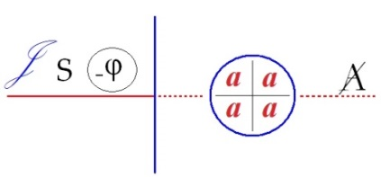
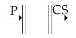
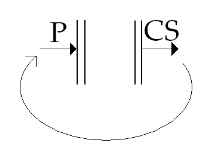
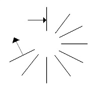
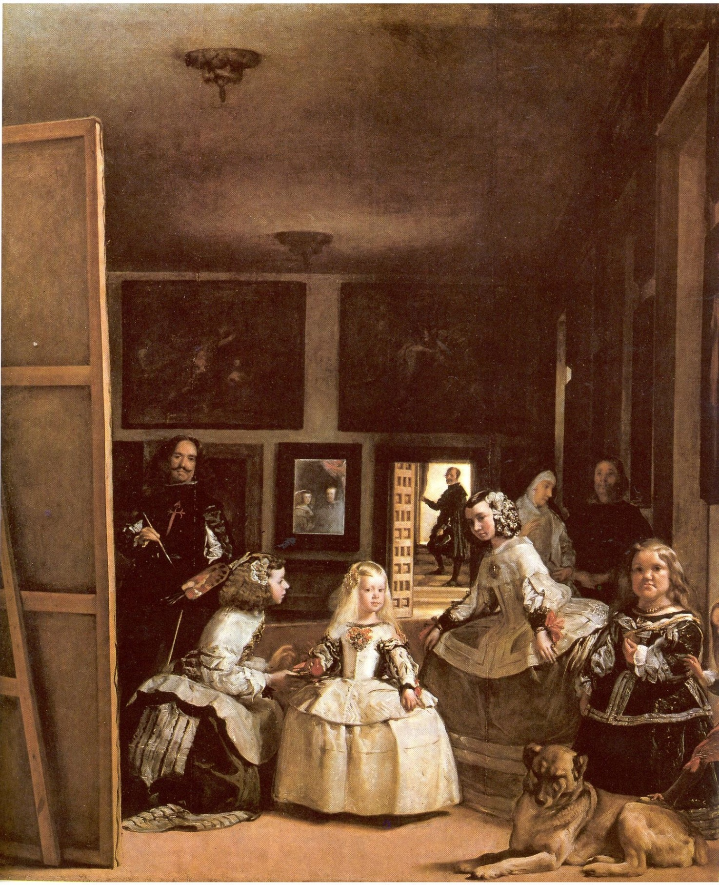

# Leçon 23 | 22 juin l966

  

    <label><input type="checkbox" data-lacan-toggle="original" checked> 原文</label>
    <label><input type="checkbox" data-lacan-toggle="notes" checked> 注释</label>
    <label><input type="checkbox" data-lacan-toggle="commentary" checked> 个人解读评论</label>
  

  <form class="lacan-tool-search" role="search">
    <input class="lacan-tool-search-input" type="search" placeholder="搜索全文" aria-label="搜索全文">
    <button class="lacan-tool-button" type="submit" title="搜索">搜索</button>
  </form>
  <button class="lacan-tool-button lacan-back-to-top" type="button" title="回到页面最上方" aria-label="回到页面最上方">↑</button>

<section class="parallel-paragraph" data-paragraph-ids="s13-23-0001">

s13-23-0001

原文 · s13-23-0001

[MELMAN](#Melman22JUIN) [LACAN](#LacanJUIN_22)

[无对应译文]

</section>

<section class="parallel-paragraph" data-paragraph-ids="s13-23-0002">

s13-23-0002

原文 · s13-23-0002

LACAN

[无对应译文]

</section>

<section class="parallel-paragraph" data-paragraph-ids="s13-23-0003">

s13-23-0003

原文 · s13-23-0003

Bonjour SAFOUAN. Venez, venez près de moi tout de suite, la dernière fois il s’est passé ce que vous avez vu, je me suis laissé encore entraîner, j’étais sur… mon élan, j’avais un certain nombre de points en somme à préciser dans ce qui avait été ma dernière leçon de ce qu’on appelle séminaire ouvert. Il y avait là un hôte inattendu, que nous avons invité à venir me voir parce qu’il dirige en Italie une revue ma foi fort intéressante.

[无对应译文]

</section>

<section class="parallel-paragraph" data-paragraph-ids="s13-23-0004">

s13-23-0004

原文 · s13-23-0004

Il faudra que je parle avec MILNER. MILNER où est-il ?

[无对应译文]

</section>

<section class="parallel-paragraph" data-paragraph-ids="s13-23-0005">

s13-23-0005

原文 · s13-23-0005

*X - Milner ?* *Il est sorti*.

[无对应译文]

</section>

<section class="parallel-paragraph" data-paragraph-ids="s13-23-0006">

s13-23-0006

原文 · s13-23-0006

Ah oui, parce que je l’ai vu rentrer tout à l’heure. Et alors j’ai voulu quand même qu’il ait un petit échantillon du style.

[无对应译文]

</section>

<section class="parallel-paragraph" data-paragraph-ids="s13-23-0007">

s13-23-0007

原文 · s13-23-0007

Ceci dit, il n’en reste pas moins que l’appel que j’avais fait au début de la séance, espérant avoir des interventions, disons non prévues, donc se renouvelle aujourd’hui et si quelqu’un voulait bien après MELMAN, qui a quelque chose à nous dire, qu’il avait d’ailleurs déjà prêt la dernière fois et pour lequel je tiens beaucoup à ce qu’il parle tout de suite, et le premier.

[无对应译文]

</section>

<section class="parallel-paragraph" data-paragraph-ids="s13-23-0008">

s13-23-0008

原文 · s13-23-0008

Si pendant ce temps quelqu’un mijotait une petite question - quelqu’un ou plusieurs - eh bien je n’en serais pas mécon­tent. Voulez-vous bien venir me parler mon cher SAFOUAN ? Mettez-vous là, je vais me mettre là. Cela ne vous gène pas ? Vous ne préfé­rez pas. Si vous avez une préférence, dites-le.

[无对应译文]

</section>

<section class="parallel-paragraph" data-paragraph-ids="s13-23-0009">

s13-23-0009

原文 · s13-23-0009

Qui est-ce qui me donne du papier ? Il se trouve que je n’en ai pas.

[无对应译文]

</section>

<section class="parallel-paragraph" data-paragraph-ids="s13-23-0010">

s13-23-0010

原文 · s13-23-0010

[Charles MELMAN](#JUIN_22)

[无对应译文]

</section>

<section class="parallel-paragraph" data-paragraph-ids="s13-23-0011">

s13-23-0011

原文 · s13-23-0011

Des structures…

[无对应译文]

</section>

<section class="parallel-paragraph" data-paragraph-ids="s13-23-0012">

s13-23-0012

原文 · s13-23-0012

> comme celles qui ont été abordées au cours du séminaire, abordées et mises en place au cours du séminaire de cette année, en particulier celles concernant *la relation de* *l’objet(a)* avec *le champ du sco­pique*,
>
> la fonction de l’écran …de telles structures peuvent difficilement ne pas être rencontrées en cours du travail psychanalytique et ceci, par exemple, chez FREUD lui-même et dans un moment tout à fait culminant justement de son tra­vail psychanalytique, puisqu’il s’agissait de sa propre analyse.

[无对应译文]

</section>

<section class="parallel-paragraph" data-paragraph-ids="s13-23-0013">

s13-23-0013

原文 · s13-23-0013

C’est ainsi que j’offre à votre attention trois petits textes de FREUD choisis pour leur rencontre, qui m’a semblée particulièrement heureuse, avec les structures donc qui ont été mises en place cette année au cours du séminaire.

[无对应译文]

</section>

<section class="parallel-paragraph" data-paragraph-ids="s13-23-0014">

s13-23-0014

原文 · s13-23-0014

Le texte central sur lequel j’at­tire votre attention, est celui qui porte le nom tout à fait *sympathiquement* dé­nommé de « *Deckerinnerungen »*, autrement dit de *souvenirs-écrans*.

[无对应译文]

</section>

<section class="parallel-paragraph" data-paragraph-ids="s13-23-0015">

s13-23-0015

原文 · s13-23-0015

*Deck* en alle­mand ayant tout à fait le sens analogue à *écran* chez nous, c’est-­à-dire non plus ce sens de couvercle, de ce qui obstrue, de ce qui peut cacher et en même temps le sens de ce plan, de ce plafond, sur lequel l’image peut venir s’inscrire.

[无对应译文]

</section>

<section class="parallel-paragraph" data-paragraph-ids="s13-23-0016">

s13-23-0016

原文 · s13-23-0016

*Deckerinnerungen* : *souvenirs-écrans*, je me permets de vous le rap­peler, c’est un texte qui date de l899, donc du moment de ce foisonnement, de ce jaillissement, pour FREUD de son travail psychanalytique.

[无对应译文]

</section>

<section class="parallel-paragraph" data-paragraph-ids="s13-23-0017">

s13-23-0017

原文 · s13-23-0017

Il est en plein *dans la Science des rêves*, il est encore manifestement *dans son auto-analyse*, sa cor­respondance avec FLIESS est encore tout à fait active. C’est l’époque où il s’inté­resse aux troubles de la mémoire et c’est ainsi que, un peu plus tôt que *Deckerinnerungen,* en l898, il a publié cet article tout à fait *inaugural* et tout à fait stupéfiant c’est-à-dire cet article sur le [*Mécanisme psychique de l’oubli*](http://espace.freud.pagesperso-orange.fr/topos/psycha/psysem/signorel.htm), où je vous le rappelle, il aborde cet *oubli* pour lui, FREUD, du nom SIGNORELLI, épinglant à ce propos les processus inconscients de la mémoire, du fonctionne­ment mental dans une organisation qui est bien exclusivement - dans ce texte sur l’oubli psychique, *sur le mécanisme psychique de l’oubli* - dans une organisation qui est bien exclusivement celle du *signifiant* dont vous vous souvenez de ce schéma où l’on voit des phonèmes en train de se balader entre SIGNORELLI, BOTTICELLI, BOLTRAFIO, TRAFOÏ, Bosnie, Herzégovine, etc. et ce mouvement de ce processus dans un bain en quelque sorte naturel qui est nommément situé dans le texte comme étant celui de *la sexualité et de la mort*. Le terme y étant *tout à fait* *nommé*.

[无对应译文]

</section>

<section class="parallel-paragraph" data-paragraph-ids="s13-23-0018">

s13-23-0018

原文 · s13-23-0018

*Dans Souvenirs écrans les deux pôles seront* bien davantage… également nommés par FREUD, ceux de *la faim* et de *l’amour*.

[无对应译文]

</section>

<section class="parallel-paragraph" data-paragraph-ids="s13-23-0019">

s13-23-0019

原文 · s13-23-0019

Dans ce texte *Souvenirs écrans*, qui date donc de l899, d’un an plus tard, il s’agit pour FREUD de mon­trer que les premiers souvenirs de l’enfance, les tous premiers, même banals ou indifférents en apparence, constituent en fait un écran à la fois dissimulateur et révélateur de souvenirs ou d’événements qui sont tout à fait fondateurs du sujet et qui sont retrouvables par l’analyse. Un autre point discuté par FREUD dans ce texte est de savoir si ces souvenirs *mettent en scène* une histoire réelle, soit au moment où elle est vécue, soit qu’elle a été ultérieurement rencontrée, ou bien s’il s’agit d’un fantasme.

[无对应译文]

</section>

<section class="parallel-paragraph" data-paragraph-ids="s13-23-0020">

s13-23-0020

原文 · s13-23-0020

Et c’est ainsi que FREUD va nous raconter ce souvenir-­écran qu’un patient âgé, dit-il, de trente huit ans, plutôt sympathique et plutôt intelligent, lui aurait à lui FREUD raconté. Et les commentateurs ont très facile­ment reconnu ce patient de trente huit ans : FREUD lui-même, il s’agit donc d’un souvenir appartenant à FREUD.

[无对应译文]

</section>

<section class="parallel-paragraph" data-paragraph-ids="s13-23-0021">

s13-23-0021

原文 · s13-23-0021

Et voici donc ce qui est dit, je l’ai traduit à votre attention puisque, je crois, il me semble que ce texte n’est pas en français. Donc voici ce que dit ce patient FREUD : « *Je dispose d’un assez grand nombre de souvenirs de ma première enfance qui peuvent être datés avec la plus grande sûreté. En effet, à l’âge de trois ans, j’ai quitté le modeste lieu de ma naissance pour aller à la ville et comme mes souvenirs concernent seulement ce lieu où je suis né,* *ils se rapportent ainsi à mes deuxième et troisième années. Ce sont surtout de courtes scènes, mais parfaitement conservées et très vives dans tous leurs détails, dans tous les détails de leur perception, en opposition complète avec mes souvenirs de l’âge adulte qui manquent totalement de cet élément visuel. À partir de ma troisième année, mes souvenirs deviennent plus rares et plus obscurs; il y a des lacunes qui peuvent dépasser plus d’un an et ce n’est pas avant six ou sept ans que le courant de mes souvenirs devient continu. Je divise mes souvenirs d’enfance jus­qu’au départ de cette première résidence en trois groupes : Un premier groupe est constitué de scènes que mes parents m’ont racontées et répé­tées et dont je ne sais si ces tableaux souvenirs – Erinnerungsbild – sont originels ou reconstruits d’après le récit mais je remarque qu’il y a aussi des cas où, malgré les nombreuses descriptions de mes parents, ne se forme aucun souvenir tableau.*

[无对应译文]

</section>

<section class="parallel-paragraph" data-paragraph-ids="s13-23-0022">

s13-23-0022

原文 · s13-23-0022

*J’attache plus d’importance au second groupe. Ce sont des scènes dont on n’a pas pu me parler puisque je n’en ai pas revu les participants : nurse ou camarades de jeux. Du troisième groupe, je parlerai plus loin.*

[无对应译文]

</section>

<section class="parallel-paragraph" data-paragraph-ids="s13-23-0023">

s13-23-0023

原文 · s13-23-0023

*Pour ce qui est du contenu de ces scènes et de leur habilitation au souvenir, je dois dire que sur ce point je ne suis pas sans orientations.*

[无对应译文]

</section>

<section class="parallel-paragraph" data-paragraph-ids="s13-23-0024">

s13-23-0024

原文 · s13-23-0024

*Je ne peux certes pas dire que ces souvenirs concer­nent les événements les plus importants de cette époque que je jugerais tels aujourd’hui.*

[无对应译文]

</section>

<section class="parallel-paragraph" data-paragraph-ids="s13-23-0025">

s13-23-0025

原文 · s13-23-0025

*Je ne sais rien par exemple de la naissance d’une sœur, ma cadette de deux ans et demi, mon départ, la vue du train, le long parcours en voiture qui y conduisait n’ont laissé aucune trace dans ma mémoire. J’ai noté par contre deux incidents mineurs de voyage dont vous vous souvenez qu’ils sont intervenus dans l’analyse de ma phobie mais ce qui dût me faire la plus vive impression fut une blessure au visage où je perdis beaucoup de sang et qu’un chirurgien dut me recoudre. Je peux encore en toucher la cicatrice mais je n’ai pas d’autres souvenirs directs ou indirects concernant cet incident. Il est vrai peut-être que je n’avais seulement que deux ans.* »

[无对应译文]

</section>

<section class="parallel-paragraph" data-paragraph-ids="s13-23-0026">

s13-23-0026

原文 · s13-23-0026

À titre de curiosité, comme ça, on pourrait signaler que les souvenirs de CASANOVA débutent sur une scène qui se trouve très voisine, je veux dire sur un épanchement de sang intarissable - et qui dut être traité - un épanchement de sub­stance, un épanchement de substance vitale.

[无对应译文]

</section>

<section class="parallel-paragraph" data-paragraph-ids="s13-23-0027">

s13-23-0027

原文 · s13-23-0027

« *Aussi je ne m’étonne pas des tableaux et des scènes de ces deux premiers groupes. Ce sont certai­nement des souvenirs marqués par le déplacement où l’essentiel a été omis. Mais dans certains, ce qui a été omis est repérable, et dans d’autres, il m’est facile d’après certains indices de le retrouver, rétablissant ainsi la continuité dans ce puzzle de souvenirs et je vois clairement quels inté­rêts infantiles ont favorisé la conservation de ces souvenirs dans ma mémoire. Mais ceci pourtant, ne s’applique pas au troisième groupe de souvenirs, ici il s’agit d’un matériel, une longue scène et plusieurs petits tableaux que je ne sais pas par quel bout prendre. La scène me paraît plutôt indifférente et sa fixation incompréhensible.*

[无对应译文]

</section>

<section class="parallel-paragraph" data-paragraph-ids="s13-23-0028">

s13-23-0028

原文 · s13-23-0028

*Permettez–moi de vous la raconter. Je vois un pré à quatre coins, un peu en pente, vert et d’une verdure bien fournie, dans ce vert* *de très nombreuses fleurs jaunes, manifestement le vulgaire pissenlit.* »

[无对应译文]

</section>

<section class="parallel-paragraph" data-paragraph-ids="s13-23-0029">

s13-23-0029

原文 · s13-23-0029

En allemand *Löwenzahn*, autrement dit « *dents de lion* » qui en est d’ailleurs la traduction anglai­se.

[无对应译文]

</section>

<section class="parallel-paragraph" data-paragraph-ids="s13-23-0030">

s13-23-0030

原文 · s13-23-0030

« *En haut du pré, une maison de paysan et devant sa porte se tien­nent deux femmes papotant avec animation, la paysanne couverte d’une coiffe et une nurse*, Kinderfrau. *Sur le pré jouent trois enfants, je suis l’un d’eux, j’ai entre deux et trois ans, les deux autres sont mon cou­sin, mon aîné d’un an, et ma cousine, sa sœur, du même âge que moi, nous arrachons les fleurs jaunes et déjà en tenons chacun un bouquet dans les mains, la petite fille a la plus jolie gerbe, nous les gars nous lui tombons dessus comme d’un commun accord et lui arrachons ses fleurs. Elle remonte le pré en courant et obtient de la paysanne pour se conso­ler un gros morceau de pain noir. À peine voyons-nous cela que nous jetons les fleurs, nous nous hâtons vers la maison et exigeons également du pain. Nous en obtenons aussi, la paysanne coupant son pain avec un grand couteau, ce pain me paraît dans le souvenir d’un goût si délicieux* - köstlich - *et la scène s’arrête là*. »

[无对应译文]

</section>

<section class="parallel-paragraph" data-paragraph-ids="s13-23-0031">

s13-23-0031

原文 · s13-23-0031

Un peu plus loin, FREUD ajoute : «* J’ai l’impression générale qu’il y a dans cette scène quelque chose qui ne va pas. Le jaune des fleurs ressort avec une vividité particulière dans cet ensemble et le goût délicieux du pain, me semble également exagéré presque hallucinatoire, et je me souviens à ce propos, dit-il, de tableaux vus dans une exposition humoristique où certaines parties et naturelle­ment les moins convenables, comme les rondeurs des dames, au lieu d’être peintes se trouvaient en relief*. »

[无对应译文]

</section>

<section class="parallel-paragraph" data-paragraph-ids="s13-23-0032">

s13-23-0032

原文 · s13-23-0032

Voilà, donc, le passage crucial, enfin que j’ai détaché dans ce texte de FREUD sur deux *souvenirs écrans*.

[无对应译文]

</section>

<section class="parallel-paragraph" data-paragraph-ids="s13-23-0033">

s13-23-0033

原文 · s13-23-0033

Dans l’analyse à laquelle FREUD va se livrer, il construit quelque chose qui pourrait paraître de l’ordre du roman familial. Pauvreté du père qui l’a obligé à quitter le vert paradis de son enfance.

[无对应译文]

</section>

<section class="parallel-paragraph" data-paragraph-ids="s13-23-0034">

s13-23-0034

原文 · s13-23-0034

Ce qui s’est passé pour lui à seize ans quand étudiant il est revenu sur ce lieu de sa nais­sance et qu’il a rencontré là, vêtue d’une robe jaune, la fille de voisins qui s’ap­pelait Gisela FLUSS et le coup de foudre immédiat qu’il en eut, coup de foudre bien entendu sans aucun lendemain, évocation du bonheur et de la for­tune pour lui FREUD s’il était resté dans ce nid de sa province, il l’appelle ainsi, *Provinznest* mais aussi tout une autre série de pensées qu’il oriente vers ce que… vers les conseils que son père lui a donnés, c’est-à-dire il aurait du écou­ter l’appel de son père, épouser sa petite cousine qui figure dans le rêve: Pauline, abandonner ses abstraites études pour de solides affaires économiques, finan­cières.

[无对应译文]

</section>

<section class="parallel-paragraph" data-paragraph-ids="s13-23-0035">

s13-23-0035

原文 · s13-23-0035

En conclusion dit FREUD : faim et amour, *Hunger und Liebe*, voilà les courants pulsionnels qui sont alors, dit-il, dans ce souvenir écran. Bien sûr, nous ne pourrons pas nous engager ici, maintenant, dans l’analyse tout à fait détaillée qu’exigerait ce texte mais je me contenterai d’en fixer certains repères, en premier lieu la présence, aussi manifeste, aussi saillante, aussi écla­tante de l’écran.

[无对应译文]

</section>

<section class="parallel-paragraph" data-paragraph-ids="s13-23-0036">

s13-23-0036

原文 · s13-23-0036

Présence de l’écran, si clairement figurée dans cette surface, dans ce pré, ainsi comme une surface à quatre coins, légèrement inclinée en pente. Cet écran sur lequel va se construire toute la scène.

[无对应译文]

</section>

<section class="parallel-paragraph" data-paragraph-ids="s13-23-0037">

s13-23-0037

原文 · s13-23-0037

Je pense qu’on peut également y situer, d’une manière qui ne me paraît nullement abusive, l’évoca­tion à propos de ce souvenir d’une dimension particulière, celle de la perspecti­ve.

[无对应译文]

</section>

<section class="parallel-paragraph" data-paragraph-ids="s13-23-0038">

s13-23-0038

原文 · s13-23-0038

Je ne veux pas dire seulement le fait qu’il s’agit par exemple d’un parallélo­gramme…

[无对应译文]

</section>

<section class="parallel-paragraph" data-paragraph-ids="s13-23-0039">

s13-23-0039

原文 · s13-23-0039

> je veux dire enfin d’une surface donc inclinée, le fait de cette distribu­tion, de cette maison qui est là située en haut, au loin des enfants qui sont là en bas et ensuite du mouvement qui va porter les enfants *vers cette maison de pay­san* …mais également le fait par exemple, si saillant lui-même, si surprenant lui–même que dans ces associations, eh bien, ces associations vont conduire FREUD à évoquer cette exposition de tableaux humoristiques du *Pop’Art* déjà à cette époque, où certaines parties, au lieu d’être peintes, se trouvaient là rapportées en relief, en trois dimensions.

[无对应译文]

</section>

<section class="parallel-paragraph" data-paragraph-ids="s13-23-0040">

s13-23-0040

原文 · s13-23-0040

Je pense également qu’il est nécessaire dans ce texte si suggestif d’évoquer la place de *l’objet(a)*.

[无对应译文]

</section>

<section class="parallel-paragraph" data-paragraph-ids="s13-23-0041">

s13-23-0041

原文 · s13-23-0041

FREUD nous y conduit quasiment, je dirais *par la main*, en situant lui-même, cet aspect anormal de cette représentation, il y a quelques chose qui ne va pas, il y a là quelque chose qui cloche, c’est quand même bizar­re et à ce propos là qu’est-ce qu’il situe ?

[无对应译文]

</section>

<section class="parallel-paragraph" data-paragraph-ids="s13-23-0042">

s13-23-0042

原文 · s13-23-0042

Eh bien, il situe les fleurs, les pissenlits et le goût, *köstlich*, délicieux de ce pain, à la saveur presque hallucinatoire.

[无对应译文]

</section>

<section class="parallel-paragraph" data-paragraph-ids="s13-23-0043">

s13-23-0043

原文 · s13-23-0043

Pour ma part, j’aurais tendance à voir dans la vividité de ces fleurs jaunes se détachant sur ce pré vert, trou lumineux, rassemblées en ce bouquet que porte, nous en revenons toujours à des gerbes de fleurs, ou à des bouquets de fleurs, mais que porte cette petite fille, bouquet qui va s’évanouir d’ailleurs, dont la valeur va dis­paraître, va s’évanouir au moment même où les enfants, où les garçons l’attei­gnent puisqu’à ce moment-là, la petite fille s’intéresse à autre chose, en tout cas, c’est le moment même où l’objet, au moment où il est saisi, vient à voir sa valeur sollicitée.

[无对应译文]

</section>

<section class="parallel-paragraph" data-paragraph-ids="s13-23-0044">

s13-23-0044

原文 · s13-23-0044

Il faut bien sûr remarquer que les *Löwenzahn* ne peuvent pas être quelque chose de tout à fait indifférent dans l’analyse de ce texte…

[无对应译文]

</section>

<section class="parallel-paragraph" data-paragraph-ids="s13-23-0045">

s13-23-0045

原文 · s13-23-0045

> je veux dire l’évocation ici du *lion denté*, pour FREUD, en tant que ce texte concerne, tourne autour de problèmes concernant la terre natale, le lieu, ce qui serait le lieu de la naissance …ne peuvent manquer de nous paraître ici, en tout cas haute­ment significatifs et revenir en tout cas en quelque sorte appuyer notre suppo­sition, notre proposition, quant à leur fonction, quant à leur place éventuelle d’*objet(a).*

[无对应译文]

</section>

<section class="parallel-paragraph" data-paragraph-ids="s13-23-0046">

s13-23-0046

原文 · s13-23-0046

Le pain que coupe la paysanne avec son grand couteau s’appelle en allemand *Laib*, c’est une miche de pain, un terme qui, je ne sais pas, ne m’a pas paru tel­lement usuel. *Laib* ça s’écrit *l-a-i-b* alors que *Leib* *le corps* s’écrit *l-e-i-b*, c’est donc en tout cas dans du *Laib* qu’avec un grand couteau cette paysanne tranche ce pain au goût si *köstlich*. *Köstlich* - cela veut dire… cela vient de *kosten*, *coû­ter*, payer, ça a un goût coûteux. Et ce pain, un peu plus loin portera également le nom de *Landbrot*, autrement dit, ce que je crois nous pouvons très bien tra­duire, ici, par pain de pays par exemple.

[无对应译文]

</section>

<section class="parallel-paragraph" data-paragraph-ids="s13-23-0047">

s13-23-0047

原文 · s13-23-0047

En tout cas dans cet écran, ce que nous pouvons voir figurer, c’est bien une sorte de terre natale, représentant de sa représentation, à lui FREUD, *figurée dans le tableau* comme il le souligne expres­sément. Et à la fin du texte FREUD va faire cette remarque qui m’a parue tout aussi stupéfiante, c’est que pour qu’on puisse vraiment parler de souvenir-écran, comme ça, il faut que le sujet *figure dans le tableau*, ainsi il en fait la condition tout à fait expresse, tout à fait nécessaire pour que cela puisse être envisagé comme tel. FREUD y voit le témoignage d’une *Überarbeitung*, une sorte de re-élaboration, re–travail où pour notre part nous serions tenté de lire celui–là même du fantasme.

[无对应译文]

</section>

<section class="parallel-paragraph" data-paragraph-ids="s13-23-0048">

s13-23-0048

原文 · s13-23-0048

Je crois en tout cas que ce qu’on ne peut manquer d’évo­quer, presque… qui se trouve tellement conduire à évoquer à propos de ce texte, c’est bien le problème de ce que peut être pour un sujet, le lieu de sa nais­sance, lieu de sa naissance en tant bien sûr qu’à la fois et irrémédiablement perdu, chu et en même temps constitué, figuré mais lui-même avec *cet écran représentant de sa représentation* où il va venir, ainsi lui petit FREUD, se trouver livré à ses pulsions qui sont *la faim et l’amour*.

[无对应译文]

</section>

<section class="parallel-paragraph" data-paragraph-ids="s13-23-0049">

s13-23-0049

原文 · s13-23-0049

Dans l’article que j’avais signalé précédemment sur le *Mécanisme psy­chique de l’oubli* et concernant donc l’oubli du nom de SIGNORELLI, cet article orienté, lui, sur la sexualité et la mort, quand ce phénomène se produit pour FREUD, il voyage avec cet avocat berlinois, un compagnon, comme cela, de ren­contre, de voyage, Monsieur FREYHAU.

[无对应译文]

</section>

<section class="parallel-paragraph" data-paragraph-ids="s13-23-0050">

s13-23-0050

原文 · s13-23-0050

Et puis il veut évoquer ce nom, l’auteur des fresques d’Orvieto, des choses dernières. Cela ne vient pas, mais il se produit à ce moment–là quelque chose de très curieux…

[无对应译文]

</section>

<section class="parallel-paragraph" data-paragraph-ids="s13-23-0051">

s13-23-0051

原文 · s13-23-0051

> et quelque chose qui d’ailleurs assez bizarrement a été *laissé tomber dans la* [*Psychopathologie de la vie quotidienne*](http://classiques.uqac.ca/classiques/freud_sigmund/psychopathologie_vie_quotid/Psychopahtologie.pdf), lorsque FREUD y reprend ce même souvenir …il se produit pour FREUD quelque chose de très curieux, c’est qu’il ne se souvient pas du nom de SIGNORELLI, mais il voit des fresques et avec une vivacité particulière, de manière tout à fait *über*… Il voit le peintre tel qu’il s’est figuré lui-même dans un coin du tableau avec des détails, avec son visage particulièrement sérieux, ses mains croisées, et à côté du peintre, à côté de SIGNORELLI, il voit là également, la représentation de celui qui était son prédécesseur dans la réalisation de ces fresques, c’est-à-dire FRA ANGELICO de Fiesole dont le nom ne semble en rien à ce moment-là lui échapper.

[无对应译文]

</section>

<section class="parallel-paragraph" data-paragraph-ids="s13-23-0052">

s13-23-0052

原文 · s13-23-0052

C’est là un phénomène qui je crois, mérite d’être signalé et que je voudrais, pour terminer, rapprocher d’un court texte qui, lui, date de quarante années plus tard. C’est en l936, lorsque FREUD écrit pour le 70ème anniversaire de Romain ROLLAND ce texte, qui s’appelle [*Un trouble de mémoire sur l’Acropole*](http://www.megapsy.com/Textes/Freud/biblio103.htm), il en a alors lui-même 80 et il raconte à Romain ROLLAND dans ce texte - enfin sa contribution à l’anniversaire de Romain ROLLAND – et donc de lui raconter combien au cours d’un voyage sur l’Acropole avec son frère, il a eu un sentiment très curieux, *Entfremdungsgefühl*, sentiment d’étrangeté que tout cela ce n’était pas réel, que ce qu’il voyait n’était pas réel, que c’était bizar­re, c’était curieux, qu’il n’en croyait pas ses yeux, qu’il en arrivait même à se poser la question de l’existence de l’Acropole et tout ceci l’engage sur l’évoca­tion du problème *de la fausse reconnaissance *: *du déjà vu, du déjà raconté*, c’est­-à-dire mêlant tout à fait directement le sentiment de la reconnaissance la plus immédiate et la plus intime et la plus sûre.

[无对应译文]

</section>

<section class="parallel-paragraph" data-paragraph-ids="s13-23-0053">

s13-23-0053

原文 · s13-23-0053

Bref, on pourrait dire, lui et son frère, au sommet de l’Acropole, FREUD ne se voit pas dans le tableau et ce qui peut nous paraître éventuellement tout aussi significatif c’est que tout aussitôt, tout aussi directement se trouve invoqué la présence et le regard du père, ceci sous la forme d’un sentiment de piété filiale, sentiment de culpabilité, sentiment de faute chez FREUD et puis enfin cette évocation mi-humoristique, mais peut-être aussi mi-tragique qui est celle de cette parole de NAPOLÉON qui dit à son frère joseph, bien sûr au moment de son couronnement, à son frère Joseph : « *Qu’est-­ce qu’aurait dit Monsieur notre père, s’il avait pu être là aujourd’hui ?* »

[无对应译文]

</section>

<section class="parallel-paragraph" data-paragraph-ids="s13-23-0054">

s13-23-0054

原文 · s13-23-0054

Voilà. je m’arrêterai là-dessus.

[无对应译文]

</section>

<section class="parallel-paragraph" data-paragraph-ids="s13-23-0055">

s13-23-0055

原文 · s13-23-0055

LACAN

[无对应译文]

</section>

<section class="parallel-paragraph" data-paragraph-ids="s13-23-0056">

s13-23-0056

原文 · s13-23-0056

J’ai trouvé que ceci, pour n’être pas de l’inédit, illustrait assez bien comme ça rétroactivement, parce que ce sont des choses dont j’ai parlé il y a longtemps, nommément sur le texte concernant SIGNORELLI, j’ai fait une communication à la Société de philosophie. Au temps où je l’ai faite, je ne pouvais pas mettre en valeur évidemment ces éléments structuraux à ce moment-là, puisque la théorie n’en était point encore faite.

[无对应译文]

</section>

<section class="parallel-paragraph" data-paragraph-ids="s13-23-0057">

s13-23-0057

原文 · s13-23-0057

Le fait que MELMAN ait bien voulu se donner la peine de s’apercevoir que cela y est et de la façon la plus articulée est tout à fait de nature à confirmer ce que j’ai pu, soit la dernière, soit l’avant dernière fois, faire remarquer de ce que veut dire ma reprise de FREUD dans un cercle redoublé, enfin dans une espèce de deuxième tour qui a ses raisons structurales.

[无对应译文]

</section>

<section class="parallel-paragraph" data-paragraph-ids="s13-23-0058">

s13-23-0058

原文 · s13-23-0058

Et vous voyez à chaque point du texte de FREUD, nous y trouvons la possibilité d’une espèce de commentaire second qui reprend les mêmes éléments dans un autre ordre, dans un autre ordre qui n’est en réalité que la reproduction du premier mis à l’envers. Ce que je vous ai dit par exemple la dernière fois de la correspondance au drame de l’Œdipe, de ce drame de l’aveu­glement d’Œdipe - et de l’aveuglement pourquoi ? Pour avoir voulu trop voir - en est une autre illustration.

[无对应译文]

</section>

<section class="parallel-paragraph" data-paragraph-ids="s13-23-0059">

s13-23-0059

原文 · s13-23-0059

Enfin, je ne peux *ré-indiquer* ou plutôt *ré-évoquer* ces choses que d’une façon allusive, je ne vais pas aujourd’hui reprendre une fois de plus ces mêmes thèmes. Il m’a semblé que ce que MELMAN a là repris - d’une façon très sensible, parce que cela lui était très actuel et qu’il n’a eu aucune peine à en retrouver les repères principaux - valait de vous être présenté à cette occasion. Est-ce que quelqu’un peut avoir justement une remarque complémentaire sur… ?

[无对应译文]

</section>

<section class="parallel-paragraph" data-paragraph-ids="s13-23-0060">

s13-23-0060

原文 · s13-23-0060

VALABREGA

[无对应译文]

</section>

<section class="parallel-paragraph" data-paragraph-ids="s13-23-0061">

s13-23-0061

原文 · s13-23-0061

Je vais faire deux petites remarques à propos de ce que vient de nous rappeler Charles MELMAN.

[无对应译文]

</section>

<section class="parallel-paragraph" data-paragraph-ids="s13-23-0062">

s13-23-0062

原文 · s13-23-0062

La première - je prends les choses par la fin - la première est à propos de l’article qu’il nous rappelle du souvenir sur l’Acropole, c’est une remarque terminologique, le mot *Entfremdung* ne peut pas être traduit, enfin n’a pas intérêt à être traduit par étrangeté mais par aliénation - parce que, il s’agit là de quelque chose de très intéressant dans ce texte – c’est *unheimlich*, qui cor­respond plutôt à l’étrangeté.

[无对应译文]

</section>

<section class="parallel-paragraph" data-paragraph-ids="s13-23-0063">

s13-23-0063

原文 · s13-23-0063

LACAN - C’est incontestable que c’est *unheimlich* qui correspond à étrangeté.

[无对应译文]

</section>

<section class="parallel-paragraph" data-paragraph-ids="s13-23-0064">

s13-23-0064

原文 · s13-23-0064

VALABREGA - Mais ce qui est intéressant, c’est que *Entfremdung* c’est… LACAN - *Commentez, commentez, cela vaut la peine, commentez comment dans ce texte vous l’entendez comme traduisible par aliénation.*

[无对应译文]

</section>

<section class="parallel-paragraph" data-paragraph-ids="s13-23-0065">

s13-23-0065

原文 · s13-23-0065

VALABREGA

[无对应译文]

</section>

<section class="parallel-paragraph" data-paragraph-ids="s13-23-0066">

s13-23-0066

原文 · s13-23-0066

C’est-à-dire que dans ce texte cela introduit *quelque chose* qui est tout à fait autre que ce qui a été apporté par MELMAN, et on pourrait dire que du point de vue diagnostic, on a l’impression que c’est tout à fait autre chose, dans le souvenir de l’Acropole que… LACAN

[无对应译文]

</section>

<section class="parallel-paragraph" data-paragraph-ids="s13-23-0067">

s13-23-0067

原文 · s13-23-0067

Parlez plus fort Bon Dieu ! Parce que c’est tout de même… c’est très intéressant ce que vous dites et tout le monde… personne n’entend.

[无对应译文]

</section>

<section class="parallel-paragraph" data-paragraph-ids="s13-23-0068">

s13-23-0068

原文 · s13-23-0068

VALABREGA - Ce qui n’est pas le cas dans le texte de l886-l889, c’est enco­re quelque chose… LACAN

[无对应译文]

</section>

<section class="parallel-paragraph" data-paragraph-ids="s13-23-0069">

s13-23-0069

原文 · s13-23-0069

Mais discutez-le ! Comment pouvez-vous soutenir que le terme d’*aliénation* est présent à propos de *ce souvenir de l’Acropole* et nommé­ment pour traduire *Entfremdung*. Je veux bien que vous le souteniez mais expli­quez pourquoi.

[无对应译文]

</section>

<section class="parallel-paragraph" data-paragraph-ids="s13-23-0070">

s13-23-0070

原文 · s13-23-0070

VALABREGA - C’est un concept hégélien, l’aliénation.

[无对应译文]

</section>

<section class="parallel-paragraph" data-paragraph-ids="s13-23-0071">

s13-23-0071

原文 · s13-23-0071

LACAN

[无对应译文]

</section>

<section class="parallel-paragraph" data-paragraph-ids="s13-23-0072">

s13-23-0072

原文 · s13-23-0072

Un instant, je vous en prie : comment concevez-vous le concept hégélien dans quelque chose qui connote un trait vécu, que cet *Entfremdung*.

[无对应译文]

</section>

<section class="parallel-paragraph" data-paragraph-ids="s13-23-0073">

s13-23-0073

原文 · s13-23-0073

VALABREGA - Je ne sais comment, il faudrait même… LACAN

[无对应译文]

</section>

<section class="parallel-paragraph" data-paragraph-ids="s13-23-0074">

s13-23-0074

原文 · s13-23-0074

Que *Entfremdung* puisse correspondre à quelque chose comme la dépersonnalisation, passe encore, ou le sentiment du sosie ou quelque chose que nous… c’est noté dans le texte comme une impression, enfin *c’est une notation phénoménologique*, l’*aliénation* n’est pas… n’a rien à faire avec ça dans HEGEL puisque vous invoquez - vous, pas moi - HEGEL.

[无对应译文]

</section>

<section class="parallel-paragraph" data-paragraph-ids="s13-23-0075">

s13-23-0075

原文 · s13-23-0075

VALABREGA

[无对应译文]

</section>

<section class="parallel-paragraph" data-paragraph-ids="s13-23-0076">

s13-23-0076

原文 · s13-23-0076

Je trouve quand même qu’il n’utilise pas là un autre mot qui pourrait… je ne sais pas quel mot allemand pourrait être là pour désigner la dépersonnalisation, quelque chose comme ça, il se trouve tout de même que ce n’est pas ça.

[无对应译文]

</section>

<section class="parallel-paragraph" data-paragraph-ids="s13-23-0077">

s13-23-0077

原文 · s13-23-0077

LACAN

[无对应译文]

</section>

<section class="parallel-paragraph" data-paragraph-ids="s13-23-0078">

s13-23-0078

原文 · s13-23-0078

Comment pouvez-vous soutenir que l’*aliénation* qui est vraiment la structure, enfin la plus immanente et en même temps la plus cachée, à tout ce qui est du vécu du sujet soit là tout d’un coup mise saillante dans l’ap­parence ou bien alors montrant sa pointe d’une façon quelconque qui puisse permettre de l’épingler avec ce terme d’*Entfremdung* et justement à propos de ce que FREUD ressent sur l’Acropole ?

[无对应译文]

</section>

<section class="parallel-paragraph" data-paragraph-ids="s13-23-0079">

s13-23-0079

原文 · s13-23-0079

VALABREGA

[无对应译文]

</section>

<section class="parallel-paragraph" data-paragraph-ids="s13-23-0080">

s13-23-0080

原文 · s13-23-0080

Oui, attendez, ce n’est pas une raison. Je me demande pour­quoi il emploie ce mot simplement, ce n’est pas un mot, pas un mot du vocabu­laire psychiatrique, absolument pas.

[无对应译文]

</section>

<section class="parallel-paragraph" data-paragraph-ids="s13-23-0081">

s13-23-0081

原文 · s13-23-0081

LACAN - Mais pourquoi le traduisez-vous par *aliénation* alors ? CASTORIADIS ?

[无对应译文]

</section>

<section class="parallel-paragraph" data-paragraph-ids="s13-23-0082">

s13-23-0082

原文 · s13-23-0082

CASTORIADIS

[无对应译文]

</section>

<section class="parallel-paragraph" data-paragraph-ids="s13-23-0083">

s13-23-0083

原文 · s13-23-0083

Du point de vue *étymologique*, je crois que VALABREGA a raison par rapport à HEGEL. Je ne crois pas que dans le texte de FREUD il s’agit de l’alié­nation dans ce sens. On dira en allemand *sich fremden* de quelqu’un qui serait plutôt en *zizanie*, que la vie a éloigné du ménage. C’est le *Fremd* dans ce texte, alors il ne faut pas le rapprocher du groupe qui a un autre caractère. Je crois que ce que FREUD veut dire dans le texte c’est qu’il se sent étranger à ce pays, et étran­ger radicalement. Il ne faut pas lui donner, je crois, la charge philosophique hégélienne de l’aliénation qui est autre chose.

[无对应译文]

</section>

<section class="parallel-paragraph" data-paragraph-ids="s13-23-0084">

s13-23-0084

原文 · s13-23-0084

LACAN

[无对应译文]

</section>

<section class="parallel-paragraph" data-paragraph-ids="s13-23-0085">

s13-23-0085

原文 · s13-23-0085

Écoutez, cela a une note extraordinairement nette, n’est–­ce pas, il s’agit d’un sentiment que nous appelons dans la clinique psychia­trique : la déréalisation.

[无对应译文]

</section>

<section class="parallel-paragraph" data-paragraph-ids="s13-23-0086">

s13-23-0086

原文 · s13-23-0086

VALABREGA

[无对应译文]

</section>

<section class="parallel-paragraph" data-paragraph-ids="s13-23-0087">

s13-23-0087

原文 · s13-23-0087

*Pourquoi* l’utilise-t-il ? C’est ça le problème, c’est un pro­blème *terminologique*, moi je ne sais pas, je n’ai pas recherché… LACAN

[无对应译文]

</section>

<section class="parallel-paragraph" data-paragraph-ids="s13-23-0088">

s13-23-0088

原文 · s13-23-0088

Ce n’est pas parce que nous nous trouvons devant un emploi d’*Entfremdung* qu’on trouve également dans HEGEL que nous allons nous mettre, comme ça, à sauter à pieds joints et à dire que la signification que FREUD implique dans ce terme d’*Entfremdung* est une signification hégélienne justement là. Et puis écoutez, dès qu’on parle d’aliénation, tout de même, on sait où on en est, on sait ce qu’on évoque, on sait ce que ça intéresse. Alors si c’est là simplement pour ouvrir une question sans le moindre centimètre qui aille plus loin, je ne demande pas mieux que cela rebondisse mais je veux que vous vous en expliquiez.

[无对应译文]

</section>

<section class="parallel-paragraph" data-paragraph-ids="s13-23-0089">

s13-23-0089

原文 · s13-23-0089

STEIN - Alors, je pense quand même que le point soulevé par VALABREGA mérite d’être fouillé.

[无对应译文]

</section>

<section class="parallel-paragraph" data-paragraph-ids="s13-23-0090">

s13-23-0090

原文 · s13-23-0090

LACAN - Tout à fait d’accord.

[无对应译文]

</section>

<section class="parallel-paragraph" data-paragraph-ids="s13-23-0091">

s13-23-0091

原文 · s13-23-0091

STEIN

[无对应译文]

</section>

<section class="parallel-paragraph" data-paragraph-ids="s13-23-0092">

s13-23-0092

原文 · s13-23-0092

Je n’ai pas le texte sous les yeux, mais on peut remarquer qu’en français à propos du terme d’*aliénation* il y a cette même difficulté, c’est que l’*aliénation* n’évoque pas seulement HEGEL et Marx. Elle évoque aussi la folie. Or ce sentiment étrange… appelons-le si vous le voulez, d’étrangeté…trouvé sur l’Acropole, a quand même quelque chose à voir avec le sentiment d’être fou.

[无对应译文]

</section>

<section class="parallel-paragraph" data-paragraph-ids="s13-23-0093">

s13-23-0093

原文 · s13-23-0093

LACAN \[à Stein\] - Je vais vous donner la parole, je vous demande pardon de… GREEN

[无对应译文]

</section>

<section class="parallel-paragraph" data-paragraph-ids="s13-23-0094">

s13-23-0094

原文 · s13-23-0094

Deux choses. Une concernant la remarque de VALABREGA, l’autre l’exposé de MELMAN. La première, je pense que sans introduire le contexte d’aliénation, on est quand même obligé ici à partir de ce terme, de penser que FREUD veut dire et en dehors du mot dont il est question par rapport au contex­te qu’il vit : « *Ce n’est pas moi qui suis ici, c’est un autre, ce n’est pas moi*… », ça, c’est dit en toutes lettres dans le texte. Alors voici concernant le point soulevé par VALABREGA.

[无对应译文]

</section>

<section class="parallel-paragraph" data-paragraph-ids="s13-23-0095">

s13-23-0095

原文 · s13-23-0095

Par rapport à ce qu’a dit MELMAN, je voudrais apporter une peti­te précision lorsque tu as dit que le sujet advient et est constitué par le fait qu’il va se trouver là devant ce que tu appelais ses pulsions, la faim et l’amour. Eh bien, je crois que toute l’ambiguïté de ce texte c’est de montrer que FREUD a choisi dans cette alternative et que justement tout le texte parle de la faim en tant qu’il va s’agir du désir et non plus de la faim et que ceci se rattache directement à la parole du père, en tant, que le père lui a dit : « *cessons avec ces billevesées, il faut manger*. » Voilà la voie des affaires. C’est pourquoi, j’y verrai donc quelque chose de beaucoup plus nettement marqué par rapport au désir et par rapport justement à ce qui est en jeu dans ce personnage nourricier avec son grand cou­teau qui n’intéresse plus du tout la faim et qu’il exclut complètement du champ du problème.

[无对应译文]

</section>

<section class="parallel-paragraph" data-paragraph-ids="s13-23-0096">

s13-23-0096

原文 · s13-23-0096

LACAN - Comment s’appelle-t-il ?

[无对应译文]

</section>

<section class="parallel-paragraph" data-paragraph-ids="s13-23-0097">

s13-23-0097

原文 · s13-23-0097

CABEN

[无对应译文]

</section>

<section class="parallel-paragraph" data-paragraph-ids="s13-23-0098">

s13-23-0098

原文 · s13-23-0098

La traduction des textes… le mot *Entfremdung* est un mot plus simple en allemand, il se traduit très bien par le mot dépaysement, tout le reste n’est que folle interprétation.

[无对应译文]

</section>

<section class="parallel-paragraph" data-paragraph-ids="s13-23-0099">

s13-23-0099

原文 · s13-23-0099

LACAN - Bien sûr, dépaysement ou déréalisation, c’est exactement de quoi il s’agit, ce n’est pas du réel.

[无对应译文]

</section>

<section class="parallel-paragraph" data-paragraph-ids="s13-23-0100">

s13-23-0100

原文 · s13-23-0100

CABEN - Vous avez déjà employé la semaine dernière et le mot *Entfremdung*, c’est être *dépaysé* et étymologiquement aussi.

[无对应译文]

</section>

<section class="parallel-paragraph" data-paragraph-ids="s13-23-0101">

s13-23-0101

原文 · s13-23-0101

LACAN - Qu’est-ce que j’ai employé la semaine dernière?

[无对应译文]

</section>

<section class="parallel-paragraph" data-paragraph-ids="s13-23-0102">

s13-23-0102

原文 · s13-23-0102

CABEN - *Entfremden*.

[无对应译文]

</section>

<section class="parallel-paragraph" data-paragraph-ids="s13-23-0103">

s13-23-0103

原文 · s13-23-0103

LACAN - Sûrement pas.

[无对应译文]

</section>

<section class="parallel-paragraph" data-paragraph-ids="s13-23-0104">

s13-23-0104

原文 · s13-23-0104

CABEN - Dans le sens où vous l’avez traduit par aliénation.

[无对应译文]

</section>

<section class="parallel-paragraph" data-paragraph-ids="s13-23-0105">

s13-23-0105

原文 · s13-23-0105

LACAN - C’est une traduction classique.

[无对应译文]

</section>

<section class="parallel-paragraph" data-paragraph-ids="s13-23-0106">

s13-23-0106

原文 · s13-23-0106

CABEN - Oui, mais à mon avis c’est déjà une interprétation.

[无对应译文]

</section>

<section class="parallel-paragraph" data-paragraph-ids="s13-23-0107">

s13-23-0107

原文 · s13-23-0107

LACAN

[无对应译文]

</section>

<section class="parallel-paragraph" data-paragraph-ids="s13-23-0108">

s13-23-0108

原文 · s13-23-0108

N’exagérons pas, là non plus, c’est comme si vous disiez que *Aufhebung* est déjà une interprétation parce que, dans HEGEL, cela a le sens de plus qualitativement élevé et que cela peut aussi bien vouloir dire, je ne sais pas quoi… abonnement. Le caractère simplet et cru d’un usage d’un terme n’a pour autant aucune *préséance* sur les autres usages, n’est-ce pas. J’ai souvent fait remarquer qu’il n’y a pas de préséance de l’usage propre sur l’usage figuré, pour une simple raison d’abord que cela ne veut rien dire, cette différence, mais le côté usuel, disons, de *Entfremdung* ne suffit pas à donner une prévalence à dépaysement sur son usage philosophique.

[无对应译文]

</section>

<section class="parallel-paragraph" data-paragraph-ids="s13-23-0109">

s13-23-0109

原文 · s13-23-0109

Bon, à vous \[Leclaire\]… Oui, à vous,\[Valabrega\] bien sûr, naturellement, si vous voulez reprendre la parole.

[无对应译文]

</section>

<section class="parallel-paragraph" data-paragraph-ids="s13-23-0110">

s13-23-0110

原文 · s13-23-0110

VALABREGA - Autre chose, moi je ne suis pas d’accord avec ce que vient de dire M. CABEN.

[无对应译文]

</section>

<section class="parallel-paragraph" data-paragraph-ids="s13-23-0111">

s13-23-0111

原文 · s13-23-0111

LACAN - Moi non plus.

[无对应译文]

</section>

<section class="parallel-paragraph" data-paragraph-ids="s13-23-0112">

s13-23-0112

原文 · s13-23-0112

VALABREGA

[无对应译文]

</section>

<section class="parallel-paragraph" data-paragraph-ids="s13-23-0113">

s13-23-0113

原文 · s13-23-0113

On peut toujours ramener le sens de n’importe quel mot à un sens non habituel, et qu’il faut prendre dans ce sens-là, surtout pas dans FREUD. Ce qui ne veut pas dire qu’il y a une signification indirecte, je n’en sais rien.

[无对应译文]

</section>

<section class="parallel-paragraph" data-paragraph-ids="s13-23-0114">

s13-23-0114

原文 · s13-23-0114

Je pose la question à propos de l’*Unheimlich* d’une part, dont on a beau­coup glosé, et de l’*Entfremdung*.

[无对应译文]

</section>

<section class="parallel-paragraph" data-paragraph-ids="s13-23-0115">

s13-23-0115

原文 · s13-23-0115

LACAN

[无对应译文]

</section>

<section class="parallel-paragraph" data-paragraph-ids="s13-23-0116">

s13-23-0116

原文 · s13-23-0116

Ecoutez, ne cherchons pas, nous n’allons pas nous éterniser là-dessus. Il est tout à fait clair qu’une référence structurale comme l’alié­nation est… jamais personne n’a prétendu voir l’aliénation affleurant sur le plan phénoménologique.

[无对应译文]

</section>

<section class="parallel-paragraph" data-paragraph-ids="s13-23-0117">

s13-23-0117

原文 · s13-23-0117

Le sentiment d’aliénation, si cela concerne justement l’aliénation, il n’y a pas de sentiment d’aliénation, sans cela ça ne serait pas l’aliénation. Vous êtes d’accord ? Allons LECLAIRE, que vouliez-vous dire?

[无对应译文]

</section>

<section class="parallel-paragraph" data-paragraph-ids="s13-23-0118">

s13-23-0118

原文 · s13-23-0118

VALABREGA

[无对应译文]

</section>

<section class="parallel-paragraph" data-paragraph-ids="s13-23-0119">

s13-23-0119

原文 · s13-23-0119

Au sujet du mécanisme de l’oubli et de la substitution, puisque tout cela tourne autour du mot substitutif et plus généralement de la substitution, alors là le rapprochement avec le souvenir-écran est très important.

[无对应译文]

</section>

<section class="parallel-paragraph" data-paragraph-ids="s13-23-0120">

s13-23-0120

原文 · s13-23-0120

Parce que l’analyse…

[无对应译文]

</section>

<section class="parallel-paragraph" data-paragraph-ids="s13-23-0121">

s13-23-0121

原文 · s13-23-0121

> j’ai pu faire une analyse poussée une fois que quelque chose du mécanisme de l’oubli qui pouvait, qui jouait un rôle très important dans une analyse et qui en particulier englobait et
>
> se situait précisément aussi là sur les fleurs, parmi toutes ces choses …alors cette analyse a montré qu’en dehors de la substitution définie par FREUD, en 98-99, il existe, ceci renvoie à des substitutions qu’on pourrait dire formelles et il apparaît nettement que cela ren­voie à des substitutions intrinsèques, c’est-à-dire qu’il y a d’autres mots derriè­re les mots ou les noms particulièrement oubliés et retrouvés, ou non, par les mécanismes de substitution. Il y a une substitution intrinsèque qui a substitué ces mots-là, par exemple les noms des fleurs à d’autres. Par conséquent, la sub­stitution ici est vraiment un écran.

[无对应译文]

</section>

<section class="parallel-paragraph" data-paragraph-ids="s13-23-0122">

s13-23-0122

原文 · s13-23-0122

LACAN - Est vraiment…?

[无对应译文]

</section>

<section class="parallel-paragraph" data-paragraph-ids="s13-23-0123">

s13-23-0123

原文 · s13-23-0123

VALABREGA …un écran. Le rapprochement est ici tout à fait à creuser. Le souvenir-écran est le mécanisme de l’oubli.

[无对应译文]

</section>

<section class="parallel-paragraph" data-paragraph-ids="s13-23-0124">

s13-23-0124

原文 · s13-23-0124

C’est simplement une remarque que j’émettais dans le sens de ce que nous avons dit. Voilà.

[无对应译文]

</section>

<section class="parallel-paragraph" data-paragraph-ids="s13-23-0125">

s13-23-0125

原文 · s13-23-0125

LACAN - Ce sont néanmoins des choses différentes, n’est–ce pas, nous sommes bien d’accord.

[无对应译文]

</section>

<section class="parallel-paragraph" data-paragraph-ids="s13-23-0126">

s13-23-0126

原文 · s13-23-0126

VALABREGA

[无对应译文]

</section>

<section class="parallel-paragraph" data-paragraph-ids="s13-23-0127">

s13-23-0127

原文 · s13-23-0127

Certes, mais ça joue le rôle d’*écran*, *c’est fonctionnellement un écran* dans l’exemple auquel je pense. Ça veut dire que *les noms de substi­tution* renvoient à d’autres noms c’est-à-dire en substitution au niveau même du nom, derrière les noms substitués.

[无对应译文]

</section>

<section class="parallel-paragraph" data-paragraph-ids="s13-23-0128">

s13-23-0128

原文 · s13-23-0128

LACAN - Répondez MELMAN, ce que vous pensez à cela.

[无对应译文]

</section>

<section class="parallel-paragraph" data-paragraph-ids="s13-23-0129">

s13-23-0129

原文 · s13-23-0129

MELMAN

[无对应译文]

</section>

<section class="parallel-paragraph" data-paragraph-ids="s13-23-0130">

s13-23-0130

原文 · s13-23-0130

Non, ce serait s’engager là également dans une grande chose. Je pense qu’en tout cas, c’est radicalement différent de ce qui se passe au moment où il oublie le nom de SIGNORELLI, où se présente à lui dans le tableau la figure même du peintre, de façon si précise, avec cette vividité particulière, je crois que c’est tout à fait autre chose.

[无对应译文]

</section>

<section class="parallel-paragraph" data-paragraph-ids="s13-23-0131">

s13-23-0131

原文 · s13-23-0131

LACAN - Mais oui bien sûr. LECLAIRE. Non LECLAIRE ! Je l’avais dit, il y a un moment qu’il doit parler.

[无对应译文]

</section>

<section class="parallel-paragraph" data-paragraph-ids="s13-23-0132">

s13-23-0132

原文 · s13-23-0132

LECLAIRE

[无对应译文]

</section>

<section class="parallel-paragraph" data-paragraph-ids="s13-23-0133">

s13-23-0133

原文 · s13-23-0133

C’est un complément à l’analyse du souvenir-écran, un élément pour compléter l’analyse dans la même ligne, à propos de « pissenlits » qui joue un rôle central dans ce souvenir-écran. Vers la même époque, il s’occupe de l’analyse du rêve du Comte de Thun et par erreur il évoque le pissenlit, à propos d’une autre fleur qui est un mucilage ordinaire.

[无对应译文]

</section>

<section class="parallel-paragraph" data-paragraph-ids="s13-23-0134">

s13-23-0134

原文 · s13-23-0134

Il ne se trompe pas : le pissenlit désigne bien là pour lui le problème de son énurésie car si ce mot lui est venu, de pissenlit, pour désigner une autre fleur qui était le mucilage, c’est en français qu’elle équi… évoque tous les problèmes de ces incontinences et principalement de ces incon­tinences d’urine.

[无对应译文]

</section>

<section class="parallel-paragraph" data-paragraph-ids="s13-23-0135">

s13-23-0135

原文 · s13-23-0135

Sur le jaune et sur la tache jaune qui est au centre et que tu as bien située comme étant au centre du souvenir-écran, je voudrais faire encore cette remarque qui se rapportait aussi à l’auto-analyse de FREUD ou à l’analyse de FREUD.

[无对应译文]

</section>

<section class="parallel-paragraph" data-paragraph-ids="s13-23-0136">

s13-23-0136

原文 · s13-23-0136

C’est un autre passage de la *Science des rêves* - j’ai déjà eu l’occasion de le signaler - nous trouvons quelque chose de plus singulier, qui fait qu’à la fois le nom allemand de *Löwenzahn* pour le pissenlit et la couleur jaune se trou­vent rassemblés en un seul terme.

[无对应译文]

</section>

<section class="parallel-paragraph" data-paragraph-ids="s13-23-0137">

s13-23-0137

原文 · s13-23-0137

C’est comme l’histoire d’un patient d’un col­lègue qui a longtemps été occupé dans ses rêves par la figure d’un petit lion jaune. Or, ce lion jaune, il ne voit absolument pas ce qu’il vient faire dans ses rêves. Ce collègue en parle à FREUD et ce n’est qu’au moment où il retrouve, dit-­il, ce lion jaune comme ayant été un de ses jouets favoris, un bibelot de sa mère, qui avait été depuis rangé, que le souvenir du lion jaune ou la présence du lion jaune inexplicable dans les rêves disparaît.

[无对应译文]

</section>

<section class="parallel-paragraph" data-paragraph-ids="s13-23-0138">

s13-23-0138

原文 · s13-23-0138

Je pense pour une autre raison que ce collègue au lion jaune, il en est comme de ce sympathique collègue, ou de ce sympathique patient dont parle FREUD, je pense que c’est lui-même, c’est une hypothèse qui n’a pas encore été vraiment soutenue, simplement que j’avance pour l’instant pour la raison suivante. C’est là-dessus que je m’arrêterai.

[无对应译文]

</section>

<section class="parallel-paragraph" data-paragraph-ids="s13-23-0139">

s13-23-0139

原文 · s13-23-0139

C’est qu’immédiatement après avoir parlé de ce collègue au lion jaune et de cette petite histoire du lion jaune, il évoque une autre aventure du même collègue, qui est un souvenir d’enfance, ce collègue qui avait été très impressionné du récit qu’on lui faisait de l’exploration de NANSEN au pôle, avait eu cette question curieuse qui avait fait rire son entourage et ses frères parce qu’il est nor­mal à savoir que cette exploration, ce voyage, *Reise*, était douloureux, ça faisait mal. Car ce collègue avait confondu, étant enfant, avait confondu *Reise* et *reis­sen*, déchirer.

[无对应译文]

</section>

<section class="parallel-paragraph" data-paragraph-ids="s13-23-0140">

s13-23-0140

原文 · s13-23-0140

C’est à partir de là, et c’est sur ce point que je me fonde pour avancer l’hypothèse que le collègue au lion jaune, c’est FREUD lui-même. Car il semble que si nous nous interrogeons là aussi sur la phobie des voyages, quelque chose peut nous apparaître concernant la confusion des voyages et de *reissen*, déchirer, d’autant que dans l’œuvre freudienne nous trouverons constamment à l’arrière plan ce fantasme fondamental d’avoir à déchirer un voile, d’avoir à dévoiler quelque chose et c’est là-dessus que je veux terminer, car il me semble que cette considération n’est pas étrangère à l’analyse possible de ce souvenir-écran.

[无对应译文]

</section>

<section class="parallel-paragraph" data-paragraph-ids="s13-23-0141">

s13-23-0141

原文 · s13-23-0141

Car là encore il montre au pied de la lettre cette dimen­sion de l’écran, comme surface, nous avons aussi à prendre en considération - ce que tu as fait - ce qui peut être de l’ordre de la déchirure ou de la traversée de l’écran.

[无对应译文]

</section>

<section class="parallel-paragraph" data-paragraph-ids="s13-23-0142">

s13-23-0142

原文 · s13-23-0142

LACAN

[无对应译文]

</section>

<section class="parallel-paragraph" data-paragraph-ids="s13-23-0143">

s13-23-0143

原文 · s13-23-0143

Je voudrais que vous précisiez votre pensée. Vous pensez que ce que vous venez de dire, FREUD le savait, que le sachant il donne tout le texte concernant le rêve où est situé ce lion jaune ? Est-ce que lui-même en quelque sorte s’était repéré, si je puis dire, dans cette fonction du lion jaune?

[无对应译文]

</section>

<section class="parallel-paragraph" data-paragraph-ids="s13-23-0144">

s13-23-0144

原文 · s13-23-0144

LECLAIRE - Non.

[无对应译文]

</section>

<section class="parallel-paragraph" data-paragraph-ids="s13-23-0145">

s13-23-0145

原文 · s13-23-0145

LACAN - Vous ne le pensez pas. C’est important.

[无对应译文]

</section>

<section class="parallel-paragraph" data-paragraph-ids="s13-23-0146">

s13-23-0146

原文 · s13-23-0146

LECLAIRE

[无对应译文]

</section>

<section class="parallel-paragraph" data-paragraph-ids="s13-23-0147">

s13-23-0147

原文 · s13-23-0147

Je pense qu’il s’est repéré explicitement dans la fonction du déchiré lorsqu’il a soutenu son fantasme de l’inauguration de la plaque com­mémorant la découverte inaugurale de la *Science des rêves* où il imagine le jour où cette plaque sera inaugurée et où sur cette plaque est écrit que se dévoila à FREUD le secret des rêves.

[无对应译文]

</section>

<section class="parallel-paragraph" data-paragraph-ids="s13-23-0148">

s13-23-0148

原文 · s13-23-0148

Nous pensons que le terme de *dévoilement*, de *déchirement*, *d’ouverture* est fondamental chez FREUD.

[无对应译文]

</section>

<section class="parallel-paragraph" data-paragraph-ids="s13-23-0149">

s13-23-0149

原文 · s13-23-0149

Mais ce que je veux dire, c’est que dans ce souvenir-écran, du fait même que l’on voit comme transperçant la surface, la couleur jaune et liant cette couleur jaune exactement à ce qui vient après dans l’analyse du souvenir du lion jaune, c’est-à-dire le problème du *Reise-reissen*. Je pense qu’est lié à l’évocation de la couleur jaune et à cette prégnance de la couleur jaune, pour FREUD disons très consciemment le pro­blème de… enfin au moment où il décrit ce souvenir étrange, je ne pense pas du tout que la dimension de la déchirure en tant que telle ou de la rupture chez FREUD soit explicite, et je pense qu’au jaune est nécessairement liée cette dimen­sion de *passage à travers* ou de transgression, bref ce qui évoque à propos de la transparence de… LACAN - Je souhaiterais simplement que ceci fut écrit par vous, cher Serge.

[无对应译文]

</section>

<section class="parallel-paragraph" data-paragraph-ids="s13-23-0150">

s13-23-0150

原文 · s13-23-0150

LECLAIRE … LACAN : Déjà ? ça veut dire quoi ?

[无对应译文]

</section>

<section class="parallel-paragraph" data-paragraph-ids="s13-23-0151">

s13-23-0151

原文 · s13-23-0151

LECLAIRE : Dans les *Cahiers* N° l ou 2.

[无对应译文]

</section>

<section class="parallel-paragraph" data-paragraph-ids="s13-23-0152">

s13-23-0152

原文 · s13-23-0152

LACAN

[无对应译文]

</section>

<section class="parallel-paragraph" data-paragraph-ids="s13-23-0153">

s13-23-0153

原文 · s13-23-0153

Parfait, oui parce que j’aurais eu certainement l’occasion d’y revenir, je ne peux pas aujourd’hui, étant donné le temps qui nous reste, nous engager plus loin dans ce débat. Allez.

[无对应译文]

</section>

<section class="parallel-paragraph" data-paragraph-ids="s13-23-0154">

s13-23-0154

原文 · s13-23-0154

STEIN

[无对应译文]

</section>

<section class="parallel-paragraph" data-paragraph-ids="s13-23-0155">

s13-23-0155

原文 · s13-23-0155

Mais, je voudrais faire une petite remarque à LECLAIRE sur le pro­blème de *Reise* et *reissen*. C’est que le dévoilement et de l’autre \[...\] et que la déchirure *reissen*, *Riss*, soient équivalentes pour FREUD, c’est une chose qu’il fau­drait que tu établisses quand même, je ne dis pas qu’il n’en est pas ainsi. Cela demande à être établi.

[无对应译文]

</section>

<section class="parallel-paragraph" data-paragraph-ids="s13-23-0156">

s13-23-0156

原文 · s13-23-0156

Le dévoilement n’évoque pas forcément la déchirure. Peut-être aussi pour FREUD des éléments pour abonder dans ton sens à moins qu’il… il y a une autre détermination de *reissen* qui est intéressante et qui est impli­quée dans ce que tu as dit, c’est de se rappeler que FREUD avait demandé si ce voyage « *Reise* » faisait mal.

[无对应译文]

</section>

<section class="parallel-paragraph" data-paragraph-ids="s13-23-0157">

s13-23-0157

原文 · s13-23-0157

Or « *reissen* » n’est pas seulement la déchirure, *reissen* est - au sens figuré - est employé en allemand, non d’une manière très courante, est la manière de désigner une certaine douleur qu’on éprouve, donc « *reissen* » est quelque chose dont il a pu entendre parler autour de lui à propos des douleurs rhumatismales éprouvées par l’un de ses parents ou dans une circonstance ana­logue et ceci nous donnerait le lien entre le voyage et le danger pour la santé impliqué dans le voyage, la phobie des voyages et l’association avec « *reissen* », c’est à dire une déchirure dans le corps.

[无对应译文]

</section>

<section class="parallel-paragraph" data-paragraph-ids="s13-23-0158">

s13-23-0158

原文 · s13-23-0158

[LACAN](#JUIN_22)

[无对应译文]

</section>

<section class="parallel-paragraph" data-paragraph-ids="s13-23-0159">

s13-23-0159

原文 · s13-23-0159

Eh bien! écoutez mes bons amis, ces choses ne seront pas résolues, j’ai vu un vif intérêt à la remarque de Serge parce que nous aurons pro­bablement l’occasion de la réutiliser plus tard, concernant en effet la position de FREUD en tant qu’*analyste*. Voilà, il nous reste une demi-heure, je n’aurais pas voulu, c’était du moins mon intention, terminer l’année sans faire quelque chose qui participe de deux registres : d’une part de faire un sort à ce qui a occupé une part importante des séminaires fermés, à savoir la discussion des articles de STEIN.

[无对应译文]

</section>

<section class="parallel-paragraph" data-paragraph-ids="s13-23-0160">

s13-23-0160

原文 · s13-23-0160

Je ne prétends pas la reprendre. Elle a été faite sur le pied très légitime d’une critique de ce qui pour chacun de ses interlocuteurs leur semblait discordant, quant à leurs sentiments de ce qui se faisait dans la séance, de ce qui se passait, de ce qui venait en premier plan et de ce que STEIN, lui, entendait y mettre, à ce même premier plan.

[无对应译文]

</section>

<section class="parallel-paragraph" data-paragraph-ids="s13-23-0161">

s13-23-0161

原文 · s13-23-0161

Je ne reprendrai pas ces choses qui ont une valeur de dia­logue toujours utile entre psychanalystes. Néanmoins, il me paraît qu’il y a quelque chose que je suis le seul, en somme, autorisé tout au moins, à pouvoir faire dans les formes qui ne soient pas de censure. Je ne voudrais pas qu’il y ait là d’*erreur* assurément. Ceux de mes élèves qui sont intervenus, ont justement évité ce point de vue, à savoir : « *C’est pas conforme à ce que dit Lacan* ».

[无对应译文]

</section>

<section class="parallel-paragraph" data-paragraph-ids="s13-23-0162">

s13-23-0162

原文 · s13-23-0162

Et ce n’est également pas dans ce sens, au sens d’une certaine légalité de la démarche que je me placerai pour intervenir de nouveau auprès de STEIN. Je voudrais à ce sujet toucher à quelque chose qui paraît important parce qu’évident, parce que très, très gros, et en quelque sorte ouvrant un problème devant tout le monde et auquel est suspendue toute la portée de mon enseignement. D’abord le fait de ce qu’on pourrait appeler l’influence de mes formulations, autrement dit ce qu’on pourrait appeler encore à proprement parler le langage de LACAN.

[无对应译文]

</section>

<section class="parallel-paragraph" data-paragraph-ids="s13-23-0163">

s13-23-0163

原文 · s13-23-0163

Il est bien évident que, par exemple, on ne se sert de l’Autre - et sur­tout quand on y met pour plus de sûreté un grand A - que depuis que je lui ai fait jouer un certain rôle. Ça date un texte. Avant que j’en parle, il n’y avait jamais de ce grand Autre nulle part, et même *en dehors* de la psychanalyse. Maintenant, il y en a un peu beaucoup. Et Dieu sait le rôle qu’on lui fait jouer. C’est là-dessus certainement que j’ai les remarques - de ce qui est arrivé à SARTRE - les remarques les plus importantes à faire à STEIN.

[无对应译文]

</section>

<section class="parallel-paragraph" data-paragraph-ids="s13-23-0164">

s13-23-0164

原文 · s13-23-0164

Et puis il y a autre chose, le problème des rapports entre ce que je dis et ce que je ne dis pas. Là c’est plus complexe.

[无对应译文]

</section>

<section class="parallel-paragraph" data-paragraph-ids="s13-23-0165">

s13-23-0165

原文 · s13-23-0165

Il est certain que je ne peux pas… Quand j’ai commencé à faire mon enseignement, quelles que soient les raisons pour lesquelles j’ai été amené à cette position difficile, *il y avait un fort travail à faire pour obtenir un change­ment radical de tout :* de point de vue, de langage, de point de vue sur le langa­ge, de langage sur le point de vue, *ce n’était pas très, très commode*.

[无对应译文]

</section>

<section class="parallel-paragraph" data-paragraph-ids="s13-23-0166">

s13-23-0166

原文 · s13-23-0166

J’ai pris les choses comme elles me semblaient devoir être prises, bille en tête si je puis dire, en abordant *la fonction du langage*, ou plus exactement *le champ du langage et la fonction de la parole*. Il a fallu que je martèle cela un certain temps pour pouvoir donner à mes auditeurs enfin le temps de changer les portants de place, de se repérer par rapport à ça.

[无对应译文]

</section>

<section class="parallel-paragraph" data-paragraph-ids="s13-23-0167">

s13-23-0167

原文 · s13-23-0167

En d’autres termes, il y a *un ordre* et il y a *des temps*. Je suis en train de faire le recueil de mes écrits, comme on le dit.

[无对应译文]

</section>

<section class="parallel-paragraph" data-paragraph-ids="s13-23-0168">

s13-23-0168

原文 · s13-23-0168

J’écris peu, j’écris peu… il n’en paraîtra pas environ… je ne sais pas, probablement, le quart restera de côté, alors on a fait comme ça le calibrage chez l’éditeur avec le peu qui reste. Il y en aura dans les six cent cinquante pages.

[无对应译文]

</section>

<section class="parallel-paragraph" data-paragraph-ids="s13-23-0169">

s13-23-0169

原文 · s13-23-0169

Ce qui nous pose un petit problème de librairie. À cette occasion, je me relis, ce que je ne fais pas souvent, et à la vérité, il m’est apparu que même dans mes premiers textes, il ne peut y avoir aucune ambiguïté concernant l’usage des notions que j’ai intro­duites au moment où je les ai introduites. *C’est ce que les gens qui sont* - il y en a quelques uns parmi mes élèves qui me disent quelquefois - *c’est ce que les gens désignent en disant* : « *Cela y était déjà à telle époque. Ah! comme c’est admi­rable !* »

[无对应译文]

</section>

<section class="parallel-paragraph" data-paragraph-ids="s13-23-0170">

s13-23-0170

原文 · s13-23-0170

Eh bien non, cela n’y était pas. Ça n’y était pas, mais ça prouve simple­ment une certaine rigueur dans l’énonciation et dans l’énoncé qui fait qu’on ne pouvait guère trouver quelque chose dans le passé sur lequel, dans la suite, j’aie été obligé de carrément revenir. Les termes ne sont pas toujours les meilleurs.

[无对应译文]

</section>

<section class="parallel-paragraph" data-paragraph-ids="s13-23-0171">

s13-23-0171

原文 · s13-23-0171

Je veux dire que par exemple, l’usage dans les premiers textes que je fais du mot intersubjectivité est bien celui qui \[...\] le seul que je pouvais mettre en usage à l’époque pour la simple raison que je n’avais pas encore établi le jeu à quatre termes qui sont comme je pense que vous vous en êtes aperçus : le grand A, le petit*(a)*, et les deux S d’autre part \- chacun la moitié d’un S - des deux S barrés \[S\].

[无对应译文]

</section>

<section class="parallel-paragraph" data-paragraph-ids="s13-23-0172">

s13-23-0172

原文 · s13-23-0172

Parler à ce moment-là de l’intersubjectivité en \[...\] ne pas faire fonctionner ça *avant* que ça ne fonctionne.

[无对应译文]

</section>

<section class="parallel-paragraph" data-paragraph-ids="s13-23-0173">

s13-23-0173

原文 · s13-23-0173

Il n’en reste pas moins que dès un article qui est à peu près de la même date, puisqu’il a été écrit huit mois après le discours de Rome, l’article sur les *Variantes de la cure-type* [^207] que j’ai donné à la demande d’Henri EY et d’une équipe de psychanalystes, à une Encyclopédie médico-chirurgicale, il y a un certain nombre d’énoncés, tout à fait clairs, qui font intervenir cette fonc­tion, cette fonction complexe d’une façon suffisante pour rendre tout à fait impossible… je prierai notre cher ami STEIN de s’y reporter, c’est dans le début du second chapitre : *De la voie du psychanalyste à son maintien considéré dans sa déviation.*

[无对应译文]

</section>

<section class="parallel-paragraph" data-paragraph-ids="s13-23-0174">

s13-23-0174

原文 · s13-23-0174

Je n’aurai pas le temps aujourd’hui de faire la lecture de ce passage, mais je veux simplement le prier de s’y reporter lui-même pour me permettre aujour­d’hui de lui dire, à lui, pendant qu’il est là et d’une façon dont je ne pense pas qu’il puisse un seul instant prendre ombrage, que dans son texte sur *La situa­tion analytique*, ce langage… ce discours concernant l’Autre avec un grand A, est à proprement parler ce qu’il utilise de la façon la plus méconnaissable avec le grand A et l’autre.

[无对应译文]

</section>

<section class="parallel-paragraph" data-paragraph-ids="s13-23-0175">

s13-23-0175

原文 · s13-23-0175

Eh bien, l’Autre dont je vous parle, l’Autre au sens où c’est le lieu de l’Autre, c’est là où vient s’inscrire *la fonction de vérité* *de la parole* et que la relation de « *ça parle* » au « *ça écoute* » dont il fait état dans son premier écrit sur la situation analytique, mais directement enfin extraite, articulée, n’est-ce pas, de ce qu’il peut sous un certain angle entendre de mon discours.

[无对应译文]

</section>

<section class="parallel-paragraph" data-paragraph-ids="s13-23-0176">

s13-23-0176

原文 · s13-23-0176

D’ailleurs, en plus, il y a une note qui le reconnaît, il y a une note qui est inter­calée entre deux autres, l’une où il fait état de l’impulsion qu’il a reçue de spé­culations de GRUNBERGER sur le narcissisme, n’est-ce pas, et l’autre où il cite très abondamment NACHT à propos de *la présence psychanalytique*.

[无对应译文]

</section>

<section class="parallel-paragraph" data-paragraph-ids="s13-23-0177">

s13-23-0177

原文 · s13-23-0177

Il n’est pas ques­tion que je vienne ici prendre un poids prévalant. Ce que tout le monde peut bien penser, et sait que je pense, c’est que les positions de GRUNBERGER sur le narcissisme sont partiales et erronées. Ce dont d’ailleurs vous prenez vos distances, et que ce qu’a écrit NACHT sur *la présence psychanalytique* est simplement impudent, n’est-ce pas.

[无对应译文]

</section>

<section class="parallel-paragraph" data-paragraph-ids="s13-23-0178">

s13-23-0178

原文 · s13-23-0178

J’en ai fait état assez abondamment dans *mon rapport* sur *La direction de la cure*, pour qu’il ne soit pas nécessaire d’y revenir.

[无对应译文]

</section>

<section class="parallel-paragraph" data-paragraph-ids="s13-23-0179">

s13-23-0179

原文 · s13-23-0179

L’important n’est pas là. L’important est ceci : est-ce que… comment peut-il se faire que ce qui, en somme, est extrait des formules qui peuvent être épinglées, mises entre guillemets dans mon discours sur le « *ça parle* » sur le « *ça écoute* », comment peut-il venir s’ad­joindre, fonctionner, servir à peindre…

[无对应译文]

</section>

<section class="parallel-paragraph" data-paragraph-ids="s13-23-0180">

s13-23-0180

原文 · s13-23-0180

> d’une certaine façon, de couleurs qui peu­vent de ce seul fait faire passer pour être les miennes …quel usage peut-on faire de ce discours pour en somme le faire rentrer dans une certaine façon de conce­voir la situation analytique qui est absolument étrangère à ce discours ?

[无对应译文]

</section>

<section class="parallel-paragraph" data-paragraph-ids="s13-23-0181">

s13-23-0181

原文 · s13-23-0181

Je ne suis pas en train de débattre si elle est fondée, si elle est légitime, ce qui la justi­fie ou ce qui l’infirme.

[无对应译文]

</section>

<section class="parallel-paragraph" data-paragraph-ids="s13-23-0182">

s13-23-0182

原文 · s13-23-0182

Je mets simplement en question ce problème de l’utilisa­tion possible de mon langage pour servir à la conception de la situation analy­tique qui lui est radicalement contraire. En effet cela va loin, n’est-ce pas, et vous y allez vite, partir du « *ça parle* » qui est *le sujet* du « *ça écoute* » qui est représenté ici par *l’analyste* :

[无对应译文]

</section>

<section class="parallel-paragraph" data-paragraph-ids="s13-23-0183">

s13-23-0183

原文 · s13-23-0183

> « *Ça parle et ça écoute* - écriviez-vous page 239 - *en la séance.* »

[无对应译文]

</section>

<section class="parallel-paragraph" data-paragraph-ids="s13-23-0184">

s13-23-0184

原文 · s13-23-0184

Et puis ça a l’air de tenir comme ça, sous prétexte qu’on dit « *en séan­ce* », le « *en la séance* » à l’air d’être un lieu suffisant.

[无对应译文]

</section>

<section class="parallel-paragraph" data-paragraph-ids="s13-23-0185">

s13-23-0185

原文 · s13-23-0185

Il est bien clair d’ailleurs que vous ne vous en tenez pas là et que vous expliquez pourquoi à ce moment-là la séance est quelque chose qui se gonfle aux limites du monde, à proprement par­ler, comme vous ne manquez pas de l’écrire en y mettant les points sur les i.

[无对应译文]

</section>

<section class="parallel-paragraph" data-paragraph-ids="s13-23-0186">

s13-23-0186

原文 · s13-23-0186

La page 240, par exemple, je lis ceci, après un bref rappel de certaines similarités que ferait FREUD de la séance allant vers l’endormissement…

[无对应译文]

</section>

<section class="parallel-paragraph" data-paragraph-ids="s13-23-0187">

s13-23-0187

原文 · s13-23-0187

> ce qui, entre nous, ne permet pas du tout pour autant d’aller jusqu’au point où vos collègues FAIN et DAVID vont, de faire du discours du sujet dans la séance, quelque chose d’analogue au rêve. Car *le rêve*, *l’endormissement*
>
> et *le sommeil,* ne sont pas des états analogues. Mais passons ce n’est pas sur le fond que je place la chose …je veux simplement vous faire remarquer que cet appareil psychique :

[无对应译文]

</section>

<section class="parallel-paragraph" data-paragraph-ids="s13-23-0188">

s13-23-0188

原文 · s13-23-0188

> « …*qui abo­lit les limites entre le monde intérieur et le monde extérieur, aussi bien du côté du patient que du côté de l’analyste,*
>
> *qui de ce fait, tendent à être fondus tous deux en un. En terme plus précis* - écrivez-vous toujours - *leurs images tendent*
>
> *à l’association par contiguïté qui caractérise le processus primaire*… ».

[无对应译文]

</section>

<section class="parallel-paragraph" data-paragraph-ids="s13-23-0189">

s13-23-0189

原文 · s13-23-0189

Donc vous posez d’abord que les deux sujets, n’est-ce pas, tendent à être fondus tous deux en un, et à partir de là, la contiguïté qui est en effet une relation essentielle de signifiant à signifiant devient la contiguïté entre les signifiants de l’un et les signifiants chez l’autre, n’est-ce pas.

[无对应译文]

</section>

<section class="parallel-paragraph" data-paragraph-ids="s13-23-0190">

s13-23-0190

原文 · s13-23-0190

> « …*de même que dans le rêve, le monde entier est à l’intérieur du rêveur, en cet UN le monde entier est contenu*… et voici votre raison : …*car on ne saurait concevoir la fusion de deux êtres finis en un seul être fini*. »

[无对应译文]

</section>

<section class="parallel-paragraph" data-paragraph-ids="s13-23-0191">

s13-23-0191

原文 · s13-23-0191

Je répète cette phrase : « *On ne saurait concevoir la fusion de deux êtres finis en un seul être fini.* »

[无对应译文]

</section>

<section class="parallel-paragraph" data-paragraph-ids="s13-23-0192">

s13-23-0192

原文 · s13-23-0192

D’une certaine façon, une phrase comme celle-ci est bien de nature à nous faire dire cette chose qui est aussi importante à souligner de l’usage du « *ça parle* » que je n’ai jamais employé en ce sens. Je veux dire que « *ça parle* », c’est un moment d’interrogation chez moi. « *Ça parle* », c’est comme ça que ça à l’air de se présenter, mais c’est tout de même la question, non pas « *ça parle à qui ?* » qui est la question qui vous importe, mais la question « *qui parle ?* » pour moi est toujours la question que j’ai accentuée.

[无对应译文]

</section>

<section class="parallel-paragraph" data-paragraph-ids="s13-23-0193">

s13-23-0193

原文 · s13-23-0193

En fait, dans l’analyse, c’est-à-dire dans la théorie analytique, la formule qui viendrait *très heureusement* se substi­tuer au « *ça parle* » c’est le « *ça dit n’importe quoi* »… je parle : dans ce qui est écrit…et « *ça dit n’importe quoi* » pour une simple raison, c’est que ça se lit en diagonale. Si ça ne se lisait pas *en diagonale*, enfin je crois que quelqu’un serait arrêté à ce : « *Car on ne saurait concevoir la fusion de deux êtres finis en un seul être fini.* »

[无对应译文]

</section>

<section class="parallel-paragraph" data-paragraph-ids="s13-23-0194">

s13-23-0194

原文 · s13-23-0194

Car rien n’est plus concevable. Je vais vous dire pourquoi vous, vous ne le concevez pas à ce moment-là : c’est parce que c’est très légitime pour vous. En effet, vous avez commencé par poser ce processus, cet appareil psychique, qui abolit les limites entre le monde intérieur et le monde extérieur, aussi bien du côté du patient que du côté de l’analyste. Qu’est-ce que ça veut dire ? Ça veut dire que ce problème de l’intérieur et de l’extérieur est en effet quelque chose qui est tout à fait au premier plan de votre préoccupation.

[无对应译文]

</section>

<section class="parallel-paragraph" data-paragraph-ids="s13-23-0195">

s13-23-0195

原文 · s13-23-0195

Et tout ce que j’ai fait cette année comme effort pour vous apporter une topologie, c’est pour vous rendre compte disons d’une « forme » qui permet de concevoir justement ces sortes, si on peut dire, d’anomalies appréhensibles qui sont les nôtres à propos de ces problèmes de l’intérieur et de l’extérieur.

[无对应译文]

</section>

<section class="parallel-paragraph" data-paragraph-ids="s13-23-0196">

s13-23-0196

原文 · s13-23-0196

Seulement, comme c’est la seule chose qui justifie votre texte à cette date, disons comme pour… vous remarquez qu’il y a, à un moment quelconque que vous supposez n’être pas basalement celui de la situation analytique, il y a quelque façon équivalente entre cet intérieur et cet extérieur. Il en résulte que vous pensez…

[无对应译文]

</section>

<section class="parallel-paragraph" data-paragraph-ids="s13-23-0197">

s13-23-0197

原文 · s13-23-0197

> et là, au nom même de cette espèce d’usage propédeutique : on demande de faire des choses …vous pensez « *sphère* » et c’est vrai qu’en un certain sens, comme je vous l’ai fait remarquer, simplement à propos du cercle, on peut penser *topologiquement* la sphère comme enveloppant ce qui est à l’exté­rieur de même qu’on peut dire, n’est-ce pas…

[无对应译文]

</section>

<section class="parallel-paragraph" data-paragraph-ids="s13-23-0198">

s13-23-0198

原文 · s13-23-0198

> puisqu’il suffit simplement de placer cette sphère quelque part, dans un quatrième plan …même si vous placez un cercle sur la sphère, en fait vous délimitez deux zones de la sphère qui sont également à l’intérieur du cercle. Prenez le globe terrestre, faites un large X , si vous le faites à l’équateur : où est l’extérieur, où est l’intérieur ?

[无对应译文]

</section>

<section class="parallel-paragraph" data-paragraph-ids="s13-23-0199">

s13-23-0199

原文 · s13-23-0199

Ils sont équivalents, vous avez compris.

[无对应译文]

</section>

<section class="parallel-paragraph" data-paragraph-ids="s13-23-0200">

s13-23-0200

原文 · s13-23-0200

STEIN … LACAN

[无对应译文]

</section>

<section class="parallel-paragraph" data-paragraph-ids="s13-23-0201">

s13-23-0201

原文 · s13-23-0201

Justement, mon cher, c’est de ça qu’il s’agit. À partir du moment où vous pensez les choses ainsi, il n’y a pas du tout passage, mais équi­valence. Vous posez l’équivalence de ce qui est à l’intérieur et de ce qui est à l’ex­térieur, et c’est pourquoi à partir de là s’il y en a un autre qui est ici, la même équivalence étant posée, ces deux êtres finis en effet, eux ne peuvent se fondre :

[无对应译文]

</section>

<section class="parallel-paragraph" data-paragraph-ids="s13-23-0202">

s13-23-0202

原文 · s13-23-0202

- premièrement que dans une indifférenciation totale,

[无对应译文]

</section>

<section class="parallel-paragraph" data-paragraph-ids="s13-23-0203">

s13-23-0203

原文 · s13-23-0203

- et deuxièmement qui implique l’infinitude, c’est-à-dire l’extension au monde de leur confusion entre eux.

[无对应译文]

</section>

<section class="parallel-paragraph" data-paragraph-ids="s13-23-0204">

s13-23-0204

原文 · s13-23-0204

C’est tout au moins ce que vous écrivez.

[无对应译文]

</section>

<section class="parallel-paragraph" data-paragraph-ids="s13-23-0205">

s13-23-0205

原文 · s13-23-0205

STEIN

[无对应译文]

</section>

<section class="parallel-paragraph" data-paragraph-ids="s13-23-0206">

s13-23-0206

原文 · s13-23-0206

Je vous en supplie, non, je pense que ce dont il est question là dans mon esprit ce n’est pas de *l’équivalence entre l’intérieur et l’extérieur* mais l’uni­té qui résulte de l’abolition de la limite, par conséquent, si on voulait faire une figuration de sphère… LACAN

[无对应译文]

</section>

<section class="parallel-paragraph" data-paragraph-ids="s13-23-0207">

s13-23-0207

原文 · s13-23-0207

En d’autres termes ce que nous avons dit, c’est qu’il ne subsiste aucune limite. Je ne vais pas… c’est à vous en effet d’en décider. Cette absence de toute référence par conséquent, je ne vois pas comment vous pouvez la faire subsister avec quoi que ce soit, enfin, qui soit compatible par exemple avec la poursuite d’un discours. À l’intérieur d’un tout, cette absence totale de référence, n’est-ce pas, c’est un crédit que je vous fais, de penser qu’il reste enco­re quelque part une structure, un appareil.

[无对应译文]

</section>

<section class="parallel-paragraph" data-paragraph-ids="s13-23-0208">

s13-23-0208

原文 · s13-23-0208

STEIN - Je le vois bien comme une situation limite qui ne saurait être accomplie autrement que dans la mort.

[无对应译文]

</section>

<section class="parallel-paragraph" data-paragraph-ids="s13-23-0209">

s13-23-0209

原文 · s13-23-0209

LACAN

[无对应译文]

</section>

<section class="parallel-paragraph" data-paragraph-ids="s13-23-0210">

s13-23-0210

原文 · s13-23-0210

Mais, écoutez, la science de la situation analytique telle que vous l’établissez, n’est-ce pas une situation que je ne dirai même pas pré­-agonique - car pré-agonique elle signifierait quelque chose - post-agonique ? *Post-agonique*, enfin, une situation d’après le trépas ? Vous ne pouvez pas soute­nir une chose pareille, n’est-ce pas, nous ne sommes pas en train ici de chercher à faire railler.

[无对应译文]

</section>

<section class="parallel-paragraph" data-paragraph-ids="s13-23-0211">

s13-23-0211

原文 · s13-23-0211

Ce que je voudrais, c’est simplement faire remarquer que l’accent que j’ai mis dès les premiers temps de mes énoncés sur le caractère absolument déterminant de l’écoute de l’analyste…

[无对应译文]

</section>

<section class="parallel-paragraph" data-paragraph-ids="s13-23-0212">

s13-23-0212

原文 · s13-23-0212

> que je n’ai d’ailleurs pour autant nullement *identifié* à l’Autre dans cette occasion n’est-ce pas ? …ça devrait quand même vous inspirer une certai­ne prudence pour utiliser ce registre des rapports du « *ça parle* » au « *ça écoute* » dans une voie qui est très particulière et que je veux essayer de définir.

[无对应译文]

</section>

<section class="parallel-paragraph" data-paragraph-ids="s13-23-0213">

s13-23-0213

原文 · s13-23-0213

De quelque façon que vous défendiez ce que vous venez de dire, je vais voir si vous admettez ou non ce que je vais vous donner comme ce qui me semble être le repère où se différencie essentiellement une certaine façon de théoriser la situation analytique qui est la mienne. Il s’agit en fait d’une question très importante puisque c’est toute la question du *narcissisme primaire*. Qu’est-ce que le *narcissisme primaire* ?

[无对应译文]

</section>

<section class="parallel-paragraph" data-paragraph-ids="s13-23-0214">

s13-23-0214

原文 · s13-23-0214

Je n’irai pas par quatre chemins : le narcissisme primaire au sens où il est usité chez presque tous les auteurs dans l’analyse est quelque chose devant quoi je m’arrête et que je ne peux aucunement admettre sous la forme où c’est articulé.

[无对应译文]

</section>

<section class="parallel-paragraph" data-paragraph-ids="s13-23-0215">

s13-23-0215

原文 · s13-23-0215

Et maintenant, nous allons essayer de bien pré­ciser de quoi il s’agit. L’idée que sous un biais quelconque, à quelque moment que ce soit, le sujet, comme vous venez de le dire, vous m’en donnez plus alors que je n’en avais même sous la main, n’est-ce pas perdre ses limites ?

[无对应译文]

</section>

<section class="parallel-paragraph" data-paragraph-ids="s13-23-0216">

s13-23-0216

原文 · s13-23-0216

Et que vous le souteniez ou non avec la terminologie empruntée à mon abord de ce qui se passe dans le discours, le langage, dans l’intervention de la parole, ceci n’y change rien. Le seul fait que vous admettiez que c’est concevable, que c’est possible, je veux dire que c’est possible d’une façon qui nous intéresse, c’est-à-dire dans ce qui est accessible, il ne s’agit pas de savoir si c’est possible théoriquement, si ça nous intéresse en tant qu’analystes, à savoir, si en tant qu’analystes nous avons à tenir compte de ça, en d’autres termes, si l’action, si le champ analytique, si « *la situation analytique »*, comme vous dites, est dans une dimension compatible avec ça. Je dis : elle est incompatible.

[无对应译文]

</section>

<section class="parallel-paragraph" data-paragraph-ids="s13-23-0217">

s13-23-0217

原文 · s13-23-0217

Car *la situation analytique* comme telle entre le sujet parlant et écoutant fait intervenir et maintient une structure qui est tout à fait étrangère à la possibilité de quelque façon que vous vouliez la concevoir de cette perte de toute limite.

[无对应译文]

</section>

<section class="parallel-paragraph" data-paragraph-ids="s13-23-0218">

s13-23-0218

原文 · s13-23-0218

La *situation analytique* est une situation extrêmement structurée, tout ce que vous pouvez amener comme témoignages de ce qui ressemble chez le sujet, à ce que vous appelez expansion narcissique, ce sont des *notations phénoménolo­giques* et qui ne sont nullement fondées dans quelque rapport que ce soit, articulable dans le réel, dans ce qui est là dans la situation.

[无对应译文]

</section>

<section class="parallel-paragraph" data-paragraph-ids="s13-23-0219">

s13-23-0219

原文 · s13-23-0219

Je vais bien appuyer les choses pour bien voir les choses, que vous conceviez ce dont il s’agit parce qu’en fin de compte, c’est du sens même de mon enseignement là qu’il s’agit. Il faut tout de même - dans quel registre ? - cette espèce de *retour*.

[无对应译文]

</section>

<section class="parallel-paragraph" data-paragraph-ids="s13-23-0220">

s13-23-0220

原文 · s13-23-0220

À quoi ? Non pas bien sûr à ce stade antérieur au sujet, nous ne voyons jamais personne régresser comme ça à l’état petit enfant même d’une façon métaphorique.

[无对应译文]

</section>

<section class="parallel-paragraph" data-paragraph-ids="s13-23-0221">

s13-23-0221

原文 · s13-23-0221

Ce qui permet de s’exprimer ainsi, c’est qu’il existe des techniques, des ascèses dans lesquelles le sujet essaie, effectivement de repérer une remontée qui n’est pas une remontée…

[无对应译文]

</section>

<section class="parallel-paragraph" data-paragraph-ids="s13-23-0222">

s13-23-0222

原文 · s13-23-0222

> qui n’est pas une remontée dans le champ temporel du monde qu’il a parcouru, de son passé,
>
> mais une remontée, si l’on peut dire, à ce que j’appellerai un état indifférencié de l’être …et qu’il y a pour ça des techniques, il y a une sorte, une façon d’articuler, de manipuler le rapport du sujet à sa propre conscience pour qu’il ait le senti­ment d’arriver ainsi à dépasser quelque chose des limites du monde.

[无对应译文]

</section>

<section class="parallel-paragraph" data-paragraph-ids="s13-23-0223">

s13-23-0223

原文 · s13-23-0223

C’est une régression qui est… je ne veux pas bien sûr, je ne prétends pas en faire dans ces quelques mots la théorie …c’est une régression qui est une régression de l’ordre de l’être et qui peut espérer ainsi, si tant est que c’est visé, être un fondement pour arriver à une position dans l’être qui soit plus radicale. C’est la seule chose qui justifie les énormités que nous trouvons dans nos textes sur ce sujet : c’est cette espèce d’existence en écho, de cette technique de remonter vers, c’est ce qu’on appelle les états multiples ou les états radicaux de l’être.

[无对应译文]

</section>

<section class="parallel-paragraph" data-paragraph-ids="s13-23-0224">

s13-23-0224

原文 · s13-23-0224

Mais ce que nous cherchons - mon cher, quand même - il ne faut tout de même pas oublier que cela n’a absolument rien à foutre avec ça. Je l’ai souligné c’est caractérisé par des traits tout à fait manifestes, nécessitant premièrement d’abord des choses pour se lancer dans cette sorte d’ascèse. Le premier pas exigé en quelque sorte au seuil, c’est une purification du désir et qu’ensuite ça procè­de par quoi ? Par la voie d’une recherche que j’ai après tout articulée en son temps, même si vous n’avez jamais eu à rapprocher ces deux registres. Je l’ai fait quelque part dans cette *causalité psychique* [^208] sur laquelle j’ai jaspiné devant un auditoire à ce moment–là *autrement opaque*, qui peut l’être resté depuis :

[无对应译文]

</section>

<section class="parallel-paragraph" data-paragraph-ids="s13-23-0225">

s13-23-0225

原文 · s13-23-0225

> « *Quand l’homme cherchant le vide de la pensée s’avance dans la lueur sans ombres de l’espace imaginaire,*
>
> *en s’abstenant même d’attendre ce qui va en surgir, un miroir sans éclat lui montre une surface où ne se reflète rien.* » \[*Écrits* p.188\]

[无对应译文]

</section>

<section class="parallel-paragraph" data-paragraph-ids="s13-23-0226">

s13-23-0226

原文 · s13-23-0226

C’est moi qui ai écrit cela comme *illustration* de quelque chose qui concer­nait à proprement parler *la limite du stade du miroir*.

[无对应译文]

</section>

<section class="parallel-paragraph" data-paragraph-ids="s13-23-0227">

s13-23-0227

原文 · s13-23-0227

Certainement pas comme un chemin, comme un sentier qui fut celui qui appartient à notre expérience de psychanalyste. Il n’a rien à faire avec la situation analytique, c’est l’indication « *par ici la sortie* » vers d’autres techniques.

[无对应译文]

</section>

<section class="parallel-paragraph" data-paragraph-ids="s13-23-0228">

s13-23-0228

原文 · s13-23-0228

Et il y a beaucoup de choses dans cette phrase. C’est une de celle, quand je me relis, dont je me félicite de la rigueur que j’ai su y mettre, car il n’y a pas un seul de ces mots qui ne soit utilisable, y com­pris ce que je n’aurai pas le temps de faire aujourd’hui : l’idée que vous vous faites de ce qu’il y a derrière le mot *attendre*. Mais laissons !

[无对应译文]

</section>

<section class="parallel-paragraph" data-paragraph-ids="s13-23-0229">

s13-23-0229

原文 · s13-23-0229

Nous, ce qui nous intéresse c’est très précisément *le désir* et nous restons attachés à ce point où ce qui est mis en question, c’est ce qui résulte du fonc­tionnement de la présence de l’enracinement du sujet dans le désir et de ce qui en résulte.

[无对应译文]

</section>

<section class="parallel-paragraph" data-paragraph-ids="s13-23-0230">

s13-23-0230

原文 · s13-23-0230

Nous pouvons le faire à articuler une structure qui en rend comp­te et dont toute difficulté quant à sa recherche consiste précisément en ceci, que cette structure qu’on peut articuler théoriquement n’est à proprement parler pas articulable en tant que cela serait le désir qui s’avouerait, qui se dirait. S’il n’y avait que cette différence, il n’y aurait aucune espèce de problème analytique.

[无对应译文]

</section>

<section class="parallel-paragraph" data-paragraph-ids="s13-23-0231">

s13-23-0231

原文 · s13-23-0231

Il y a donc une confusion tout à fait radicale à faire intervenir comme élément constituant de cette *situation*…

[无对应译文]

</section>

<section class="parallel-paragraph" data-paragraph-ids="s13-23-0232">

s13-23-0232

原文 · s13-23-0232

> qui est toujours, et de plus en plus, armaturée de la découverte que vous alliez faire …la façon dont l’incidence chez un sujet qui est en proie aux conséquences de sa position de désir que sont pour nous les symptômes des différentes formes de structures subjectives auxquelles nous avons affaire et qui sont des *structures* que nous *objectivons*. Ce qui nous différencie de n’importe quelle autre objectivation scientifique, c’est que pour l’*objectiver*, nous sommes forcés, nous et notre désir, de nous mettre dedans.

[无对应译文]

</section>

<section class="parallel-paragraph" data-paragraph-ids="s13-23-0233">

s13-23-0233

原文 · s13-23-0233

Cela n’en est pas pour autant une visée inatteignable de pouvoir objectiver ce qu’il en est du désir humain en tant que psychanalyste, c’est-à-dire en tant que quelqu’un ayant lui-même cette expérience du désir et la faisant interve­nir dans le jeu même de l’*investigation*.

[无对应译文]

</section>

<section class="parallel-paragraph" data-paragraph-ids="s13-23-0234">

s13-23-0234

原文 · s13-23-0234

Vous voyez à quel point nous sommes loin de quoique ce soit qui se place dans ce champ…

[无对应译文]

</section>

<section class="parallel-paragraph" data-paragraph-ids="s13-23-0235">

s13-23-0235

原文 · s13-23-0235

> que vous l’appeliez de régression ou de n’importe quoi d’autre, d’expansion …qui noie toutes les arti­culations, qui à proprement parler nous fait passer dans une visée, dans un champ ouvert qui est absolument étranger à celui que nous avons à parcourir. C’est dans la manipulation, c’est dans la mise en jeu de ces ressorts du désir, en tant que nous les connaissons, que nous obtenons les résultats thérapeutiques et pour ce faire nous n’avons pas absolument besoin de savoir ce que j’en dis.

[无对应译文]

</section>

<section class="parallel-paragraph" data-paragraph-ids="s13-23-0236">

s13-23-0236

原文 · s13-23-0236

En d’autres termes, on peut faire des cures, valables d’ailleurs, avec les idées les plus aberrantes sur ce dont il s’agit dans l’analyse. Mais il y a un autre temps qui est celui-ci : c’est que pour être psychanalyste, c’est une autre question, être un psy­chanalyste c’est faire une psychanalyse en sachant ce qu’on fait. Il y a en tout cas un temps où il devient absolument alors indispensable que ce repérage soit strict, c’est pour faire un psychanalyste. Vous voyez les temps : faire une psy­chanalyse, être un psychanalyste, ou *faire un psychanalyste* , ce n’est pas la même chose, ça a des *exigences théoriques* qui sont de niveaux différents.

[无对应译文]

</section>

<section class="parallel-paragraph" data-paragraph-ids="s13-23-0237">

s13-23-0237

原文 · s13-23-0237

Il n’en reste pas moins que cela ne veut pas dire que les théories sont plus ou moins vraies, selon le niveau, qu’il y a un niveau où la référence théorique est valable et un autre où elle n’a *aucune importance*. Mais faire état par exemple de ces sentiments d’« *expansion narcissique* » comme de quelque chose qui aurait un statut quelconque de référence possible, c’est aller tout à fait à l’encontre de ce qui doit pour nous, dans l’opération pratico-théorique, être notre visée.

[无对应译文]

</section>

<section class="parallel-paragraph" data-paragraph-ids="s13-23-0238">

s13-23-0238

原文 · s13-23-0238

Ces sentiments de fusion, d’union et de deux en un, avec pour conséquence que c’est l’espace entier qui s’y englobe et qui, Dieu sait pourquoi, devient à ce moment-là, ou reste encore être la séance, c’est quelque chose dont nous connaissons bien sous la plume de FREUD la connotation. Dans la lettre à Romain ROLLAND, il parle du « *sen­timent océanique* »[^209]. Dieu sait que s’il y a quelque chose qui répugne à la pensée de FREUD, c’est bien toute référence qui donnerait un accent de valeur quel­conque à quoique ce soit qui soit éprouvé dans cet ordre.

[无对应译文]

</section>

<section class="parallel-paragraph" data-paragraph-ids="s13-23-0239">

s13-23-0239

原文 · s13-23-0239

Vous me direz, il se réfère à une certaine expérience organique, c’est précisé­ment là toute la question, c’est que cette référence organique, elle est hypothé­tique, elle n’a nullement à rentrer en ligne de compte dans ce qui est à propre­ment parler la structure de l’expérience. Elle est un pense-bête, elle est quelque chose qui est là, on peut s’imaginer qu’il doit y avoir une… ancestralité de ce quelque chose dont nous nous servons maintenant.

[无对应译文]

</section>

<section class="parallel-paragraph" data-paragraph-ids="s13-23-0240">

s13-23-0240

原文 · s13-23-0240

Cela n’a strictement, du point de vue qui est le nôtre, à savoir de ce qui fonctionne, aucun intérêt. Les sentiments d’« *expansion narcissique* » et ce qui s’ensuit et tout ce que vous citez comme étant quelquefois, très souvent d’ailleurs, le mouvement, va \[...\] « *Ceci est très remarquable mais rare*… », ajoutez-vous n’est-ce pas, ou bien « *c’est rare mais exem­plaire* », vous sentez combien les références que vous donnez pour donner cette subsistance à la situation analytique comme étant cette place, cette situation, indifférenciation, qui vous le dites bien n’est qu’un des pôles de la situation ana­lytique.

[无对应译文]

</section>

<section class="parallel-paragraph" data-paragraph-ids="s13-23-0241">

s13-23-0241

原文 · s13-23-0241

C’est vrai, c’est vrai… Mais même à la placer comme pôle, vous faussez tout ce que vous pouvez ensuite en déduire.

[无对应译文]

</section>

<section class="parallel-paragraph" data-paragraph-ids="s13-23-0242">

s13-23-0242

原文 · s13-23-0242

Je veux dire que vous ne pouvez rien en tirer qui soit valable, *considérant, concernant la fin et le progrès de la situation analytique*. Je regrette d’avoir aujourd’hui trop peu de temps pour parler, puisque cela s’est étendu selon mon vœu d’ailleurs.

[无对应译文]

</section>

<section class="parallel-paragraph" data-paragraph-ids="s13-23-0243">

s13-23-0243

原文 · s13-23-0243

Je reviendrai dans la suite sur ce que, par exemple, peut constituer votre usage absolument abusif du terme de masochis­me, abusif après ce que j’en ai articulé après le *Kant avec Sade* [^210].

[无对应译文]

</section>

<section class="parallel-paragraph" data-paragraph-ids="s13-23-0244">

s13-23-0244

原文 · s13-23-0244

Vous devez tout de même savoir que le masochiste ne peut aucunement être défini : ni souffrir, à avoir du plaisir dans la souffrance, ni souffrir pour le plaisir. On ne peut articu­ler le masochiste qu’à faire entrer en jeu les quatre termes que j’ai apportés et que la fonction de *l’objet(a)* en particulier y est absolument essentielle. Je crois que l’important de ce que je vous ai apporté cette année concernant *l’objet(a)*, permet parfaitement de vous faire concevoir ce qui peut être repéré à la place anciennement réservée au narcissisme primaire. C’est de voir ce qu’il y a sous le narcissisme, le narcissisme du stade du miroir, voilà le seul narcissisme primai­re. Le narcissisme secondaire dans mon vocabulaire, pour repérer les choses, c’est celui qui survient autour de la crise du surmoi.

[无对应译文]

</section>

<section class="parallel-paragraph" data-paragraph-ids="s13-23-0245">

s13-23-0245

原文 · s13-23-0245

Quant à *ce narcissisme pri­maire* il y a en effet quelque chose que nous pouvons trouver dessous, c’est ce que j’appellerai…

[无对应译文]

</section>

<section class="parallel-paragraph" data-paragraph-ids="s13-23-0246">

s13-23-0246

原文 · s13-23-0246

> si vous voulez, juste pour aujourd’hui, ça m’est venu comme ça, en prenant mes notes ce matin …le narcissisme dévoilé. Je peux dire en effet que sous le *narcissisme primaire*, il y a à dévoiler la fonction de *l’objet(a)*, mais rien d’autre qui permette de conjuguer d’aucune façon le narcissisme primaire au sens où c’est usité couramment dans la théorie analytique, et l’auto-érotisme du narcissisme primaire.

[无对应译文]

</section>

<section class="parallel-paragraph" data-paragraph-ids="s13-23-0247">

s13-23-0247

原文 · s13-23-0247

De même que ce « *sentiment océanique* » auquel je me référais tout à l’heure, tel qu’il est en usage chez *la plupart* des auteurs, n’est rien que ce quelque chose qui reste confus parce qu’il n’y a rien à en tirer et qu’il ne peut s’articuler que de la façon dont j’ai posé la question à la fin de mon discours de cette année, à savoir ce que je vous ai situé du rapport du sujet à la jouissance en tant que c’est nécessairement du rapport à une question posée au lieu de l’Autre qu’elle peut par lui être abordée.

[无对应译文]

</section>

<section class="parallel-paragraph" data-paragraph-ids="s13-23-0248">

s13-23-0248

原文 · s13-23-0248

Qu’il construise, qu’il fantasme à propre­ment parler quelque chose à la place de cette jouissance qui sur le schéma

[无对应译文]

</section>

<section class="parallel-paragraph" data-paragraph-ids="s13-23-0249">

s13-23-0249

原文 · s13-23-0249

[无对应译文]

</section>

<section class="parallel-paragraph" data-paragraph-ids="s13-23-0250">

s13-23-0250

原文 · s13-23-0250

que je vous ai donné est à proprement parler à situer *en arrière du sujet par rap­port à ce qu’il vise*, c’est-à-dire sa réalisation en ce lieu de l’Autre en tant qu’elle passe par la chute de cet *objet(a)*, de ce point de jonction qui est le sien avec l’Autre.

[无对应译文]

</section>

<section class="parallel-paragraph" data-paragraph-ids="s13-23-0251">

s13-23-0251

原文 · s13-23-0251

Cette année tous les éléments ont été préparés pour donner topologiquement le sens le plus précis à ce rapport de S, de *petit(a)* et de grand A.

[无对应译文]

</section>

<section class="parallel-paragraph" data-paragraph-ids="s13-23-0252">

s13-23-0252

原文 · s13-23-0252

Que tout ceci soit en quelque sorte commandé par ce rapport d’*aversion* du sujet par rapport à *la jouissance*…

[无对应译文]

</section>

<section class="parallel-paragraph" data-paragraph-ids="s13-23-0253">

s13-23-0253

原文 · s13-23-0253

> qu’il a littéralement à conquérir par l’exploitation de tout ce qui l’en défend, de tout ce qui l’en sépare …c’est ce que vous faites surgir, en effet, à un moment quand vous parlez de cette angoisse tout d’un coup intolérable qui l’agite devant l’imminence de ce qui pourrait, dans ce que vous dites, être à la place de ce que j’exprime concernant la jouis­sance.

[无对应译文]

</section>

<section class="parallel-paragraph" data-paragraph-ids="s13-23-0254">

s13-23-0254

原文 · s13-23-0254

Mais vous ne justifiez en rien, pourquoi le surgissement de cette angois­se : s’il l’a comme ça déjà, baignant dans *l’union universelle*, pourquoi l’an­goisse surgirait-elle, Bon Dieu ? L’angoisse surgit précisément de ceci, c’est que la question sur la jouissance ne lui vient que du désir de l’Autre et que ce désir de l’Autre dans certains tournants est absolument énigmatique parce qu’il laisse transparaître toute l’énigme de la jouissance dont il s’agit. J’ai assez articulé de choses là-dessus pour ne même pas pouvoir aujourd’hui en faire - si brièvement que ce soit - état.

[无对应译文]

</section>

<section class="parallel-paragraph" data-paragraph-ids="s13-23-0255">

s13-23-0255

原文 · s13-23-0255

Vous devez concevoir qu’il y a quelque chose, si nous voulons arriver à un parler efficace, à un discours rigoureux, qui doit absolument mettre entre paren­thèse ce mythe de la fusion primitive qui était le véritable point d’attraction, centre de polarisation pour tout ce qui dans la pratique analytique se présente comme ayant une valeur réductive, une valeur de la régression. La cristallisation de l’analyse - dans le rapport seulement enfant-mère, dans la thématique de la frustration, dans le registre de la demande à son origine, dans cette espèce de rêve de paradis premier à retrouver, n’a absolument rien à faire avec quoique ce soit ni dans les visées, ni dans l’origine, ni dans la pratique de l’analyse.

[无对应译文]

</section>

<section class="parallel-paragraph" data-paragraph-ids="s13-23-0256">

s13-23-0256

原文 · s13-23-0256

Là-des­sus, il y a vraiment une limite à trancher d’avec ce qui pourrait conserver enco­re quoique ce soit du mirage tel qu’il fut à ce titre d’*utilisation* dans la psycha­nalyse et qui n’a absolument rien à faire avec ce que j’enseigne et ce que j’essaie pour vous de construire. Bon, il est très tard, je regrette que tout ceci puisse prendre une parole, un air si bâclé, mais au moins, vous aurez eu là-dessus quelques affirmations tranchantes dont vous ferez ce que vous pourrez.

[无对应译文]

</section>

<section class="parallel-paragraph" data-paragraph-ids="s13-23-0257">

s13-23-0257

原文 · s13-23-0257

L’année prochaine donc, avec la *Logique du fantasme*, nous aborderons des choses qui nous permettront aussi bien de justifier comment un certain nombre de constructions peuvent se perpétuer dans l’analyse et les lier une par une, à tel ou tel type d’erreur dans la conduite analytique.

[无对应译文]

</section>

<section class="parallel-paragraph" data-paragraph-ids="s13-23-0258">

s13-23-0258

原文 · s13-23-0258

STEIN - J’aurais bien voulu vous répondre.

[无对应译文]

</section>

<section class="parallel-paragraph" data-paragraph-ids="s13-23-0259">

s13-23-0259

原文 · s13-23-0259

LACAN - *Répondez, répondez, répondez… il a droit à réponse. Oui, oui, oui, qu’il réponde, parce qu’on a toujours le droit de répondre.*

[无对应译文]

</section>

<section class="parallel-paragraph" data-paragraph-ids="s13-23-0260">

s13-23-0260

原文 · s13-23-0260

STEIN

[无对应译文]

</section>

<section class="parallel-paragraph" data-paragraph-ids="s13-23-0261">

s13-23-0261

原文 · s13-23-0261

Partiellement mais de manière très simple. Or, je dirai première­ment que quand vous me faites en somme *le procès* que je fais moi-même à GRUNBERGER. Je vois bien dans la régression. Je crois que vous n’en tenez pas compte, vous m’opposez ce que j’oppose à GRUNBERGER récemment que le nar­cissisme est une instance autonome et le moteur de la cure. Or comme vous le savez en ce n’est pas mon point de vue.

[无对应译文]

</section>

<section class="parallel-paragraph" data-paragraph-ids="s13-23-0262">

s13-23-0262

原文 · s13-23-0262

LACAN - Ça c’est vrai. Je n’ai pas dit que ce fut le moteur.

[无对应译文]

</section>

<section class="parallel-paragraph" data-paragraph-ids="s13-23-0263">

s13-23-0263

原文 · s13-23-0263

STEIN

[无对应译文]

</section>

<section class="parallel-paragraph" data-paragraph-ids="s13-23-0264">

s13-23-0264

原文 · s13-23-0264

Alors pour moi les coordonnées de *la situation analytique* sont celles des deux mouvements du refoulement et de la régression, disons plutôt de la régression que du refoulement, la régression vient en premier. Qu’est-ce que ça veut dire ?

[无对应译文]

</section>

<section class="parallel-paragraph" data-paragraph-ids="s13-23-0265">

s13-23-0265

原文 · s13-23-0265

Je m’en réfère au premier schéma de l’appareil de l’âme ou de *l’ap­pareil psychique* de FREUD, n’est-ce pas.

[无对应译文]

</section>

<section class="parallel-paragraph" data-paragraph-ids="s13-23-0266">

s13-23-0266

原文 · s13-23-0266

Je n’entre pas dans le détail, nous avons ici des perspectives venues du monde extérieur, et nous avons ici des percep­tions endo-psychiques, de \[...\] ou de conscience.

[无对应译文]

</section>

<section class="parallel-paragraph" data-paragraph-ids="s13-23-0267">

s13-23-0267

原文 · s13-23-0267

[无对应译文]

</section>

<section class="parallel-paragraph" data-paragraph-ids="s13-23-0268">

s13-23-0268

原文 · s13-23-0268

Or dans une note, FREUD nous dit, qu’on comprend où se déroule et où se situe cet autre schéma qui est celui du rêve, il faut comprendre que cet appareil peut s’enrouler sur lui-même, il donne donc quelque chose comme ceci.

[无对应译文]

</section>

<section class="parallel-paragraph" data-paragraph-ids="s13-23-0269">

s13-23-0269

原文 · s13-23-0269

LACAN - Il a fait la *bande de Mœbius*, déjà?

[无对应译文]

</section>

<section class="parallel-paragraph" data-paragraph-ids="s13-23-0270">

s13-23-0270

原文 · s13-23-0270

STEIN

[无对应译文]

</section>

<section class="parallel-paragraph" data-paragraph-ids="s13-23-0271">

s13-23-0271

原文 · s13-23-0271

Si on fait donc ce mouvement :

[无对应译文]

</section>

<section class="parallel-paragraph" data-paragraph-ids="s13-23-0272">

s13-23-0272

原文 · s13-23-0272

[无对应译文]

</section>

<section class="parallel-paragraph" data-paragraph-ids="s13-23-0273">

s13-23-0273

原文 · s13-23-0273

il est bien entendu que ces deux flèches viennent ici se superposer :

[无对应译文]

</section>

<section class="parallel-paragraph" data-paragraph-ids="s13-23-0274">

s13-23-0274

原文 · s13-23-0274

[无对应译文]

</section>

<section class="parallel-paragraph" data-paragraph-ids="s13-23-0275">

s13-23-0275

原文 · s13-23-0275

\[A\] donc il y a abolition de ces distinctions qui sont tout à fait centrales à travers toute la métapsychologie freudienne de la dis­tinction entre les représentations endo-psychiques et les représentations venues du monde extérieur.

[无对应译文]

</section>

<section class="parallel-paragraph" data-paragraph-ids="s13-23-0276">

s13-23-0276

原文 · s13-23-0276

Régression topique, pour moi, le mouvement de la régres­sion topique est celui qui fait l’abolition de la distinction entre les représenta­tions endo-psychiques et les représentations extérieures par l’enroulement de l’appareil.

[无对应译文]

</section>

<section class="parallel-paragraph" data-paragraph-ids="s13-23-0277">

s13-23-0277

原文 · s13-23-0277

Le mouvement inverse, l’ouverture de cet appareil est donc corres­pondant au mouvement du refoulement pour des raisons que je ne peux rappe­ler maintenant. Ça a été le premier point.

[无对应译文]

</section>

<section class="parallel-paragraph" data-paragraph-ids="s13-23-0278">

s13-23-0278

原文 · s13-23-0278

Alors deuxième point, j’en viens maintenant à votre système topologique. Cette topologie est faite pour rendre compatible ce que vous… quand vous avez fait ça, cela n’a aucunement la conséquence que le sujet devienne infini ou fondu avec qui que ce soit : il reste ce qu’il est, UN. Alors je vous prie quand même de bien vouloir noter une chose, c’est que je n’ai jamais dit qu’aucun des deux mouvements ne pouvaient s’accomplir complètement et que tout le jeu était dans l’oscillation entre ces deux tendances. Vous m’attribuez l’idée que cette fer­meture, cette régression vers le narcissisme primaire puisse s’accomplir, or je précise bien qu’il ne saurait être question qu’elle s’accomplisse.

[无对应译文]

</section>

<section class="parallel-paragraph" data-paragraph-ids="s13-23-0279">

s13-23-0279

原文 · s13-23-0279

LACAN - Vous dites qu’elle est constituée par *la situation analy­tique*.

[无对应译文]

</section>

<section class="parallel-paragraph" data-paragraph-ids="s13-23-0280">

s13-23-0280

原文 · s13-23-0280

STEIN - Non.

[无对应译文]

</section>

<section class="parallel-paragraph" data-paragraph-ids="s13-23-0281">

s13-23-0281

原文 · s13-23-0281

LACAN

[无对应译文]

</section>

<section class="parallel-paragraph" data-paragraph-ids="s13-23-0282">

s13-23-0282

原文 · s13-23-0282

Que la séance part de là, à savoir… écoutez, je vais vous dire un mot qui nous différencie, je vois bien ce que vous pouvez me dire pour vous défendre, que vous avez installé par rapport à ça, forcément, un autre pôle. Si vous n’aviez pas mis d’autre pôle, mais il n’y aurait jamais aucune raison qu’ils sortent de leur ciel bleu. Moi, ce que je vous dis et qui nous différencie, c’est quelque chose qui peut s’exprimer de la façon suivante : l’Autre n’est en aucun cas un lieu de félicité.

[无对应译文]

</section>

<section class="parallel-paragraph" data-paragraph-ids="s13-23-0283">

s13-23-0283

原文 · s13-23-0283

STEIN

[无对应译文]

</section>

<section class="parallel-paragraph" data-paragraph-ids="s13-23-0284">

s13-23-0284

原文 · s13-23-0284

Je ne crois pas qu’il s’agit de me défendre mais pour répondre, donc vous me prêtez malgré tout l’idée, vous en convenez aussi, que je n’ai pas précisé que cette régression pourrait s’accomplir mais ce que l’ordonnance même de la situation analytique, telle qu’elle est proposée par le psychanalyste induit chez le patient, c’est justement *le mythe du paradis perdu* en tant que mythe justement, tout tourne autour de là. Moi je ne dis pas qu’on atteint le paradis pendant la séance d’analyse, mais qu’on se sent, qu’on se sent appelé à l’atteindre et que le mouvement d’angoisse vient justement marquer l’arrêt dans cette affaire. L’avantage… LACAN

[无对应译文]

</section>

<section class="parallel-paragraph" data-paragraph-ids="s13-23-0285">

s13-23-0285

原文 · s13-23-0285

Je prends là-dessus position. Je suis radicalement opposé à ce que nous puissions considérer comme sain de faire fonctionner d’aucune façon dans notre théorie, *a fortior*i dans notre pratique, un mythe quelconque de cet ordre.

[无对应译文]

</section>

<section class="parallel-paragraph" data-paragraph-ids="s13-23-0286">

s13-23-0286

原文 · s13-23-0286

Ce n’est pas *le paradis qui est perdu*, c’est un certain *objet*.

[无对应译文]

</section>

<section class="parallel-paragraph" data-paragraph-ids="s13-23-0287">

s13-23-0287

原文 · s13-23-0287

STEIN

[无对应译文]

</section>

<section class="parallel-paragraph" data-paragraph-ids="s13-23-0288">

s13-23-0288

原文 · s13-23-0288

Il est possible que le paradis perdu soit incarné par ce certain objet. Le paradis perdu, il en est tout de même question tout au long de *l’auto-analy­se* de FREUD, elle tourne autour de cela d’un bout à l’autre. Je continue : l’incon­vénient de cet *enroulement*, c’est qu’il aboutit à quelque chose qui est informe, qui n’existe pas.

[无对应译文]

</section>

<section class="parallel-paragraph" data-paragraph-ids="s13-23-0289">

s13-23-0289

原文 · s13-23-0289

LACAN

[无对应译文]

</section>

<section class="parallel-paragraph" data-paragraph-ids="s13-23-0290">

s13-23-0290

原文 · s13-23-0290

Ce n’est pas vrai du tout, c’est tout ce que je vous enseigne, ma topologie est tellement précise que vous ne pouvez pas y faire une coupure sans que cela ait des conséquences absolument mathématiques. Vous ne pouvez pas !

[无对应译文]

</section>

<section class="parallel-paragraph" data-paragraph-ids="s13-23-0291">

s13-23-0291

原文 · s13-23-0291

STEIN

[无对应译文]

</section>

<section class="parallel-paragraph" data-paragraph-ids="s13-23-0292">

s13-23-0292

原文 · s13-23-0292

N’empêche que pour le montrer mathématiquement, il faut ce que vous avez introduit, il faut cette *mitre*, ce *cross-cap*.

[无对应译文]

</section>

<section class="parallel-paragraph" data-paragraph-ids="s13-23-0293">

s13-23-0293

原文 · s13-23-0293

Ceci est une manière plus rationnelle au point de vue mathématique de représenter les conséquences de cela, je crois. Non, vous êtes d’accord?

[无对应译文]

</section>

<section class="parallel-paragraph" data-paragraph-ids="s13-23-0294">

s13-23-0294

原文 · s13-23-0294

LACAN - C’est une manière tout à fait rigoureuse.

[无对应译文]

</section>

<section class="parallel-paragraph" data-paragraph-ids="s13-23-0295">

s13-23-0295

原文 · s13-23-0295

STEIN - Alors que celle-là \[A\] n’est pas rigoureuse !

[无对应译文]

</section>

<section class="parallel-paragraph" data-paragraph-ids="s13-23-0296">

s13-23-0296

原文 · s13-23-0296

LACAN

[无对应译文]

</section>

<section class="parallel-paragraph" data-paragraph-ids="s13-23-0297">

s13-23-0297

原文 · s13-23-0297

Ce n’est pas une raison pour que vous disiez que c’est la confusion. La confusion dans le schéma, peut être… et encore, il est très clair ce schéma. C’est une fente.

[无对应译文]

</section>

<section class="parallel-paragraph" data-paragraph-ids="s13-23-0298">

s13-23-0298

原文 · s13-23-0298

STEIN

[无对应译文]

</section>

<section class="parallel-paragraph" data-paragraph-ids="s13-23-0299">

s13-23-0299

原文 · s13-23-0299

Attendez, maintenant je vais vous poser une question. Voilà donc ces deux sphères. Je crois qu’il n’existe en mathématique aucun système de transformation qui permette de faire coïncider leur surface.

[无对应译文]

</section>

<section class="parallel-paragraph" data-paragraph-ids="s13-23-0300">

s13-23-0300

原文 · s13-23-0300

LACAN

[无对应译文]

</section>

<section class="parallel-paragraph" data-paragraph-ids="s13-23-0301">

s13-23-0301

原文 · s13-23-0301

À ces sphères ? Oh ! mon cher ami… Ne vous avancez pas là-dessus, parce que là-dessus vous n’en savez pas lourd.

[无对应译文]

</section>

<section class="parallel-paragraph" data-paragraph-ids="s13-23-0302">

s13-23-0302

原文 · s13-23-0302

À la seule condition d’avoir une quatrième dimension, vous pouvez retourner la sphère comme un gant sauf si elle est… STEIN

[无对应译文]

</section>

<section class="parallel-paragraph" data-paragraph-ids="s13-23-0303">

s13-23-0303

原文 · s13-23-0303

Sans quatrième, si nous avons deux êtres comme ceci, n’est-ce pas, là je vous pose la question, mais je suppose que sans passer par aucune quatrième dimension on ne peut superposer leurs deux surfaces.

[无对应译文]

</section>

<section class="parallel-paragraph" data-paragraph-ids="s13-23-0304">

s13-23-0304

原文 · s13-23-0304

LACAN

[无对应译文]

</section>

<section class="parallel-paragraph" data-paragraph-ids="s13-23-0305">

s13-23-0305

原文 · s13-23-0305

Si je vous ai appris *la bouteille de Klein* cette année, c’est parce qu’une *bouteille de Klein* est exactement faite… Vous pourriez aussi la représenter comme ça si vous voulez : *une sphère avec deux cross-cap*, une *bouteille de Klein* équivaut à ça. Je n’ai pas eu le temps de vous l’expliquer encore parce que c’était évidemment un peu difficile, déjà de vous faire comprendre que c’était la *bouteille de Klein*, si tant est que j’y suis arrivé !

[无对应译文]

</section>

<section class="parallel-paragraph" data-paragraph-ids="s13-23-0306">

s13-23-0306

原文 · s13-23-0306

STEIN

[无对应译文]

</section>

<section class="parallel-paragraph" data-paragraph-ids="s13-23-0307">

s13-23-0307

原文 · s13-23-0307

En somme la particularité de cette représentation dont je vous par­lais, *c’est qu’elle n’a pas un intérieur et un extérieur* et qu’il n’y a pas de repré­sentations endo-psychiques et de représentations externes. Or vous avez dit une fois, et je pense que vous continuez à le dire, que nous devons considérer, nous représenter l’inconscient comme une surface infiniment plate.

[无对应译文]

</section>

<section class="parallel-paragraph" data-paragraph-ids="s13-23-0308">

s13-23-0308

原文 · s13-23-0308

Cette surface, c’est celle-ci, or je crois c’est que, moi, j’aurais tendance à dire que cette surface est la surface sur laquelle vient s’inscrire tout ce dont nous pourrons rendre compte concernant les processus qui se déroulent au cours de l’analyse et que vous ne tenez aucun compte effectivement des \[...\], vous basant sur le point de vue mathématique.

[无对应译文]

</section>

<section class="parallel-paragraph" data-paragraph-ids="s13-23-0309">

s13-23-0309

原文 · s13-23-0309

Ces mathématiciens ne s’intéressent pas au volume. Or si vous voulez, ce que je pense est que sur votre surface, pour moi, ce que vous dites être l’inconscient, c’est la surface sur laquelle j’inscris ce que nous pouvons en dire de l’inconscient mais je crois que là où nous nous séparons peut–être ou provisoirement c’est que, moi, je fais un sort au volume que ces deux êtres délimitent, or ces deux êtres finis délimitent deux volumes intérieurs et l’espace extérieur.

[无对应译文]

</section>

<section class="parallel-paragraph" data-paragraph-ids="s13-23-0310">

s13-23-0310

原文 · s13-23-0310

LACAN - Oui c’est comme ça, c’est bien ce que je disais.

[无对应译文]

</section>

<section class="parallel-paragraph" data-paragraph-ids="s13-23-0311">

s13-23-0311

原文 · s13-23-0311

STEIN

[无对应译文]

</section>

<section class="parallel-paragraph" data-paragraph-ids="s13-23-0312">

s13-23-0312

原文 · s13-23-0312

Bon ! Cet être n’est pas fini, au sens où il ne délimite pas un volu­me *intérieur* et un volume *extérieur*.

[无对应译文]

</section>

<section class="parallel-paragraph" data-paragraph-ids="s13-23-0313">

s13-23-0313

原文 · s13-23-0313

Or, ces deux êtres finis, il faut d’abord *les transformer* en ceci, pour pouvoir ensuite les faire coïncider.

[无对应译文]

</section>

<section class="parallel-paragraph" data-paragraph-ids="s13-23-0314">

s13-23-0314

原文 · s13-23-0314

LACAN - C’est tout à fait impossible.

[无对应译文]

</section>

<section class="parallel-paragraph" data-paragraph-ids="s13-23-0315">

s13-23-0315

原文 · s13-23-0315

STEIN - C’est impossible ?

[无对应译文]

</section>

<section class="parallel-paragraph" data-paragraph-ids="s13-23-0316">

s13-23-0316

原文 · s13-23-0316

LACAN- C’est impossible, il faut transformer l’un à l’autre. Il faut choisir son modèle.

[无对应译文]

</section>

<section class="parallel-paragraph" data-paragraph-ids="s13-23-0317">

s13-23-0317

原文 · s13-23-0317

STEIN - C’est ce que je dis.

[无对应译文]

</section>

<section class="parallel-paragraph" data-paragraph-ids="s13-23-0318">

s13-23-0318

原文 · s13-23-0318

LACAN - Il faut *choisir son modèle* et ce que vous exprimez là… STEIN - *Quand je dis transformation, ce n’est pas une transformation mathématique*, il s’agit de changer de système de référence.

[无对应译文]

</section>

<section class="parallel-paragraph" data-paragraph-ids="s13-23-0319">

s13-23-0319

原文 · s13-23-0319

LACAN - Tout à fait.

[无对应译文]

</section>

<section class="parallel-paragraph" data-paragraph-ids="s13-23-0320">

s13-23-0320

原文 · s13-23-0320

STEIN

[无对应译文]

</section>

<section class="parallel-paragraph" data-paragraph-ids="s13-23-0321">

s13-23-0321

原文 · s13-23-0321

Or le système de référence qui est celui de l’aboutissement du refoulement est celui-ci, et le système de référence de l’aboutissement de la régression topique est celui-là. C’est seulement dans ce système de référence que nous pouvons faire coïncider deux êtres et nous voyons bien quand dans leur coïncidence ils ne sont pas finis. Et dans le système de référence où ils sont fixés, ils ne peuvent pas coïncider et j’opère avec ces deux systèmes de référen­ce comme étant les deux pôles. Les deux pôles de représentation entre lesquels se déroule l’opposition entre le mouvement de la régression et le mouvement de refoulement qui est...

[无对应译文]

</section>

<section class="parallel-paragraph" data-paragraph-ids="s13-23-0322">

s13-23-0322

原文 · s13-23-0322

LACAN

[无对应译文]

</section>

<section class="parallel-paragraph" data-paragraph-ids="s13-23-0323">

s13-23-0323

原文 · s13-23-0323

Je ne sais pas si on a bien entendu ce que vous venez de dire comme je l’ai entendu moi-même et nous ne pouvons pas indéfiniment prolonger, vous ne pouvez pas articuler plus clairement que vous conservez simultanément deux systèmes de références complètement incompatibles l’un avec l’autre.

[无对应译文]

</section>

<section class="parallel-paragraph" data-paragraph-ids="s13-23-0324">

s13-23-0324

原文 · s13-23-0324

STEIN - Absolument.

[无对应译文]

</section>

<section class="parallel-paragraph" data-paragraph-ids="s13-23-0325">

s13-23-0325

原文 · s13-23-0325

LACAN - Bon. C’est ce que voulais vous faire dire.

[无对应译文]

</section>

<section class="parallel-paragraph" data-paragraph-ids="s13-23-0326">

s13-23-0326

原文 · s13-23-0326

STEIN - Et je crois que c’est cette double conservation qui nous a introduit dans le registre de l’*imaginaire*.

[无对应译文]

</section>

<section class="parallel-paragraph" data-paragraph-ids="s13-23-0327">

s13-23-0327

原文 · s13-23-0327

\[Fin du séminaire 1965-66\]

[无对应译文]

</section>

<section class="parallel-paragraph" data-paragraph-ids="s13-23-0328">

s13-23-0328

原文 · s13-23-0328

[无对应译文]

</section>

<section class="note-block original-notes">

## Notes

[^207]: *Écrits* p. 323.

[^208]: *Écrits* p.151

[^209]: Sigmund Freud : Correspondance, 1873-1939, Paris, Gallimard, 1979, lettre du 20.7.1929.

[^210]: *Écrits* p.765 ou t.2 p.263.

</section>
