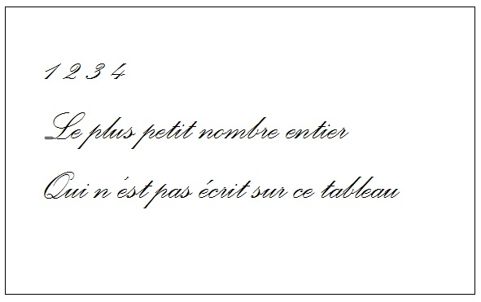
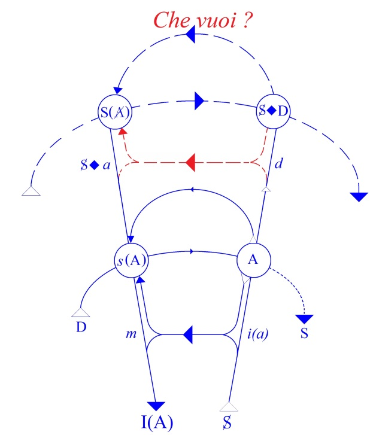
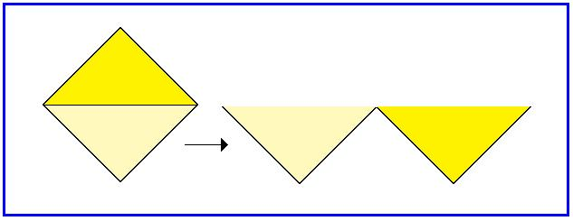

# Leçon 02 | 23 Novembre 1966

  

    <label><input type="checkbox" data-lacan-toggle="original" checked> 原文</label>
    <label><input type="checkbox" data-lacan-toggle="notes" checked> 注释</label>
    <label><input type="checkbox" data-lacan-toggle="commentary" checked> 个人解读评论</label>
  

  <form class="lacan-tool-search" role="search">
    <input class="lacan-tool-search-input" type="search" placeholder="搜索全文" aria-label="搜索全文">
    <button class="lacan-tool-button" type="submit" title="搜索">搜索</button>
  </form>
  <button class="lacan-tool-button lacan-back-to-top" type="button" title="回到页面最上方" aria-label="回到页面最上方">↑</button>

<section class="parallel-paragraph" data-paragraph-ids="s14-02-0001">

s14-02-0001

原文 · s14-02-0001

Je vais essayer de tracer à votre usage quelques rela­tions essentielles, fondamentales, à assurer au départ de ce qui fait cette année notre sujet. J’espère que nul n’y fera l’objection d’abstraction pour la raison seulement que ce serait un terme impropre.

[无对应译文]

</section>

<section class="parallel-paragraph" data-paragraph-ids="s14-02-0002">

s14-02-0002

原文 · s14-02-0002

Comme vous allez le voir, rien de plus *concret* que ce que je vais avancer, même si le thème ne répond pas à la qualité d’épaisseur dont c’est la connotation pour beaucoup. Il s’agit de vous rendre sensible telle proposition comme celle que jusqu’ici je n’ai avancée que sous l’apparence d’une sorte d’aphorisme, qui eût joué à tel tournant de notre discours le rôle d’un axio­me, tel que celui-ci :

[无对应译文]

</section>

<section class="parallel-paragraph" data-paragraph-ids="s14-02-0003">

s14-02-0003

原文 · s14-02-0003

> « *Il n’y a pas de métalangage.* »

[无对应译文]

</section>

<section class="parallel-paragraph" data-paragraph-ids="s14-02-0004">

s14-02-0004

原文 · s14-02-0004

Formule qui a l’air d’aller proprement au contraire de tout ce qui est donné, sinon dans l’expérience, au moins dans les écrits de ceux qui s’essaient à fonder *la fonction du langage*. À tout le moins dans beaucoup de cas montrent-ils dans le langage quelques différenciations dont ils trouvent bon de partir, partant par exemple d’un *langage-objet* \[Russell\], pour sur cette base édifier un certain nombre de *différenciations*.

[无对应译文]

</section>

<section class="parallel-paragraph" data-paragraph-ids="s14-02-0005">

s14-02-0005

原文 · s14-02-0005

L’acte lui-même d’une telle opération semble bien impliquer que pour parler du langage on use de quelque chose qui n’en est pas, qui l’envelopperait d’un autre ordre que ce qui le fait fonctionner. La solution de ces contradictions apparen­tes, qui se manifestent dans le discours, dans ce qui se dit, est à trouver dans une fonction qu’il m’apparaît essentiel de dégager, au moins par le biais qui me permettra de l’inaugurer spéciale­ment pour notre propos.

[无对应译文]

</section>

<section class="parallel-paragraph" data-paragraph-ids="s14-02-0006">

s14-02-0006

原文 · s14-02-0006

Car *la logique du fantasme* ne saurait d’aucune façon s’articuler sans la ré­férence à ce dont il s’agit, à savoir quelque chose qu’au moins pour l’annoncer j’épingle sous ce terme : *l’écriture*.

[无对应译文]

</section>

<section class="parallel-paragraph" data-paragraph-ids="s14-02-0007">

s14-02-0007

原文 · s14-02-0007

Bien-sûr, n’est-ce pas dire pour autant que c’est ce que vous connaissez sous les connotations ordinaires de ce mot.

[无对应译文]

</section>

<section class="parallel-paragraph" data-paragraph-ids="s14-02-0008">

s14-02-0008

原文 · s14-02-0008

Mais si je le choisis, c’est bien qu’il doit avoir, avec ce que nous avons à énoncer, quelque rapport. Un point justement sur lequel nous allons avoir à jouer aujourd’hui sans cesse est celui-ci : *que ce n’est pas la même chose, après avoir dit quelque chose, de l’écrire* *ou bien d’écrire qu’on le dit.* La seconde opération essentielle est la fonction de *l’écriture*, sous l’angle où je veux en montrer l’importance, pour ce qui est de nos références les plus propres dans le sujet de cette année.

[无对应译文]

</section>

<section class="parallel-paragraph" data-paragraph-ids="s14-02-0009">

s14-02-0009

原文 · s14-02-0009

Ceci dès l’abord se présente avec des *conséquences paradoxales*. Après tout, pourquoi pas - pour vous mettre en éveil - repar­tir de ce que, par un biais, j’ai déjà présenté devant vous et sans que l’on puisse dire, je crois, que *je me répète*.

[无对应译文]

</section>

<section class="parallel-paragraph" data-paragraph-ids="s14-02-0010">

s14-02-0010

原文 · s14-02-0010

Il est assez dans la nature des choses qui s’agitent ici, qu’elles émergent…

[无对应译文]

</section>

<section class="parallel-paragraph" data-paragraph-ids="s14-02-0011">

s14-02-0011

原文 · s14-02-0011

> sous quelque angle, sous quelque biais, sous quelque arête qui perce une surface où,
>
> par le seul fait de parler, nous sommes obligés de nous tenir …qu’elles apparaissent à quelque moment avant de prendre *une fonction*. Voici donc ce qu’un jour j’écrivis au tableau :

[无对应译文]

</section>

<section class="parallel-paragraph" data-paragraph-ids="s14-02-0012">

s14-02-0012

原文 · s14-02-0012

[无对应译文]

</section>

<section class="parallel-paragraph" data-paragraph-ids="s14-02-0013">

s14-02-0013

原文 · s14-02-0013

Ceci aurait pu être présenté sous la forme d’un petit personnage de la bouche duquel serait sorti ce qu’en bande dessinée on appelle une bulle, au­quel cas vous seriez tous tombés d’accord, et je ne vous eusse point contredits, sur le nombre 5. Il est clair qu’à partir du moment où cette phrase est écrite : « *Le plus petit nombre entier qui n’est pas écrit sur ce tableau.* », le nombre 5 y étant *de ce fait-même* écrit, est exclu. Vous n’avez plus qu’à vous demander si le plus petit nombre recherché ne serait pas, par hasard, le nombre 6.

[无对应译文]

</section>

<section class="parallel-paragraph" data-paragraph-ids="s14-02-0014">

s14-02-0014

原文 · s14-02-0014

Mais vous retomberez sur la même difficulté : dès que vous vous posez la question du nombre 6 au titre du « *plus petit nombre entier qui n’est pas écrit sur ce tableau* », ce nombre 6 y est écrit. Et ainsi de suite...

[无对应译文]

</section>

<section class="parallel-paragraph" data-paragraph-ids="s14-02-0015">

s14-02-0015

原文 · s14-02-0015

Ceci, comme de nombreux paradoxes, n’a d’intérêt que pour ce que nous voulons en faire. La suite va vous montrer qu’il n’était peut-être pas inutile d’introdui­re *la fonction de l’écriture* par ce biais où elle peut présenter quelque *énigme*. *Énigme* à propre­ment parler *logique* : ce n’est pas une plus mauvaise façon qu’une autre de vous montrer le rapport étroit entre *l’appareil de l’écriture* et ce qu’on peut appeler *la logique*.

[无对应译文]

</section>

<section class="parallel-paragraph" data-paragraph-ids="s14-02-0016">

s14-02-0016

原文 · s14-02-0016

Dès le départ, ceci aussi mérite d’être rap­pelé…

[无对应译文]

</section>

<section class="parallel-paragraph" data-paragraph-ids="s14-02-0017">

s14-02-0017

原文 · s14-02-0017

> au moment où la plupart de ceux qui sont ici en ont une notion suffisante,
>
> et pour ceux qui n’en au­raient aucune, ceci peut servir de point d’accrochage …leur rappelant qu’en aucune façon des « *pas* » nouveaux, assurément nouveaux en ce sens qu’ils sont loin, ne peuvent se résorber dans le cadre d’une *logique classi­que* ou traditionnelle. *Les développements nouveaux de la logique sont entièrement liés à des jeux d’écri­ture*.

[无对应译文]

</section>

<section class="parallel-paragraph" data-paragraph-ids="s14-02-0018">

s14-02-0018

原文 · s14-02-0018

Posons ici une question. Depuis longtemps je parle de *la fonction du langage*. Pour articuler ce qu’il en est du sujet de l’inconscient, je construisis *le graphe*. Il me fallut le faire étage par étage, avec une audience dont le moins qu’on puisse dire est qu’elle se fai­sait, à m’entendre, tirer l’oreille. Ce *graphe*, pour ordonner ce qui, dans *la fonction de la parole*, est défini par le champ que nécessite la structure du langage et que recquièrent les voies du discours ou ce que j’appelais « *les défilés du signifiant* ».

[无对应译文]

</section>

<section class="parallel-paragraph" data-paragraph-ids="s14-02-0019">

s14-02-0019

原文 · s14-02-0019

Quelque part dans ce graphe est ins­crite la lettre grand A, à droite, sur la ligne inférieure.

[无对应译文]

</section>

<section class="parallel-paragraph" data-paragraph-ids="s14-02-0020">

s14-02-0020

原文 · s14-02-0020

Si quelqu’un peut effacer ceci, tout ce graphe je pourrais rapidement *le redessiner* pour ceux qui ne le connaissent pas.

[无对应译文]

</section>

<section class="parallel-paragraph" data-paragraph-ids="s14-02-0021">

s14-02-0021

原文 · s14-02-0021

[无对应译文]

</section>

<section class="parallel-paragraph" data-paragraph-ids="s14-02-0022">

s14-02-0022

原文 · s14-02-0022

Ce petit a \[Lapsus de Lacan\], qu’en un sens on peut identifier au lieu de l’Autre, qui aussi bien est le lieu où se produit tout ce qui peut s’appeler *énoncé*, au sens le plus large du terme, c’est-à-dire qui constitue ce que j’ai appelé incidemment « *le tré­sor du signifiant* », ce qui ne se limite pas, en principe, aux mots du dictionnaire.

[无对应译文]

</section>

<section class="parallel-paragraph" data-paragraph-ids="s14-02-0023">

s14-02-0023

原文 · s14-02-0023

Quand précisément, corrélativement de la construction de ce graphe, j’ai commencé de parler du *mot d’esprit*, prenant les choses par le biais, qui peut-être a paru le plus surprenant et le plus difficile à mes auditeurs d’alors, mais qui était précisément indispensable pour éviter toute confusion.

[无对应译文]

</section>

<section class="parallel-paragraph" data-paragraph-ids="s14-02-0024">

s14-02-0024

原文 · s14-02-0024

*Le trait non-sensical…*

[无对应译文]

</section>

<section class="parallel-paragraph" data-paragraph-ids="s14-02-0025">

s14-02-0025

原文 · s14-02-0025

> non pas « insensé » mais proche de ce jeu que l’anglais définit fort bien, fait résonner sous le terme « *non sense* » *…qu’il y a dans le mot d’esprit dont*, après tout pour faire entendre la dimension qu’il s’agissait d’y dégager, *j’ai montré alors la parenté*…

[无对应译文]

</section>

<section class="parallel-paragraph" data-paragraph-ids="s14-02-0026">

s14-02-0026

原文 · s14-02-0026

> au moins au niveau de la réception, de la vibration tympa­nique …*la parenté qu’il a avec* ce qui fut pour nous, dans un temps d’épreuve, *le message personnel. Le message personnel*, c’est-à-dire tout énoncé aussi bien, en tant qu’il se décou­pe *non-sensicalement*. J’y ai fait la dernière fois allu­sion, en rappelant le célèbre *Colourless green ideas, etc*.

[无对应译文]

</section>

<section class="parallel-paragraph" data-paragraph-ids="s14-02-0027">

s14-02-0027

原文 · s14-02-0027

L’ensemble donc, des énoncés - je ne dis pas : des propositions - fait aussi bien partie de cet *univers du dis­cours* qui est situé dans A.

[无对应译文]

</section>

<section class="parallel-paragraph" data-paragraph-ids="s14-02-0028">

s14-02-0028

原文 · s14-02-0028

La question qui se pose et qui est proprement une ques­tion de structure, celle qui donne son sens à ceci que je dis que *l’inconscient* *est structuré comme un langage,* ce qui est un pléonasme dans mon énonciation, puisque j’identifie *structure* à ce « *comme un langage* », dans la structure, précisément, que je vais essayer aujourd’hui de faire fonctionner devant vous.

[无对应译文]

</section>

<section class="parallel-paragraph" data-paragraph-ids="s14-02-0029">

s14-02-0029

原文 · s14-02-0029

Qu’en est-il de cet *univers du discours *en tant qu’il implique ce jeu du signifiant ? En tant qu’il définit ces deux dimensions de la métaphore : pour autant que la chaîne peut toujours se « *enter »* d’une autre chaîne par la voie de l’opération de la substitution.

[无对应译文]

</section>

<section class="parallel-paragraph" data-paragraph-ids="s14-02-0030">

s14-02-0030

原文 · s14-02-0030

*En tant d’au­tre part que, par essence, elle signifie* ce glissement qui tient à ce *qu’aucun signifiant n’appartient en propre à au­cune signification*.

[无对应译文]

</section>

<section class="parallel-paragraph" data-paragraph-ids="s14-02-0031">

s14-02-0031

原文 · s14-02-0031

Étant rappelée cette mouvance de *l’univers du discours* qui permet cette mer - *m, e, r* - de variations de ce qui constitue *les significations*, cet ordre essentielle­ment mouvant et transitoire où rien, comme je l’ai dit en son temps, ne s’assure que de la fonction de ce que j’ai appelé sous une forme métaphorique « *les points de capiton » *: c’est cela, aujourd’hui - cet *univers du discours* - qu’il s’agit d’interro­ger à partir de ce seul « *axiome* », dont il s’agit de savoir ce qu’à l’intérieur de cet *univers du discours* il peut spécifier.

[无对应译文]

</section>

<section class="parallel-paragraph" data-paragraph-ids="s14-02-0032">

s14-02-0032

原文 · s14-02-0032

*Axiome* qui est celui que j’ai avancé la dernière fois : que le signifiant…

[无对应译文]

</section>

<section class="parallel-paragraph" data-paragraph-ids="s14-02-0033">

s14-02-0033

原文 · s14-02-0033

> ce signifiant que nous avons jusqu’ici défini de sa fonction de *représenter un sujet pour un autre signifiant* …*ce signifiant, que représente-t-il en face de lui-même, de sa ré­pétition d’unité signifiante* ? Ceci est défini par l’« *axiome* » : *qu’aucun signifiant*…

[无对应译文]

</section>

<section class="parallel-paragraph" data-paragraph-ids="s14-02-0034">

s14-02-0034

原文 · s14-02-0034

> fut-il - *et très précisément quand il l’est* - réduit à sa forme minimale, celle que nous appelons *la lettre* *…ne saurait se signifier lui-même*. L’usage mathématique qui tient précisément en ceci que quand nous avons quelque part \- *et pas seulement, vous le sa­vez, dans un exercice d’algèbre -* quand nous avons quelque part posé une lettre grand A, nous la reprenons ensuite comme si c’était, la deuxième fois que nous nous en servons, toujours la même.

[无对应译文]

</section>

<section class="parallel-paragraph" data-paragraph-ids="s14-02-0035">

s14-02-0035

原文 · s14-02-0035

Ne me faites pas cette objection, ça n’est pas au­jourd’hui que j’ai à vous faire un cours de mathématiques, sachez simplement que toute énonciation correcte d’un usa­ge quelconque des lettres - fut-ce précisément dans ce qui est le plus proche de nous aujourd’hui, par exemple *dans l’usage d’une chaîne de Markov* - nécessitera de tout ensei­gnant, et c’est ce que faisait MARKOV lui-même, l’étape en quelque sorte propédeutique de bien faire sentir ce qu’il y a d’impasse, d’arbitraire, d’absolument *injustifiable*, dans cet emploi, la seconde fois, du A (toute apparente d’ailleurs) pour représenter le premier A comme si c’était *toujours le même*.

[无对应译文]

</section>

<section class="parallel-paragraph" data-paragraph-ids="s14-02-0036">

s14-02-0036

原文 · s14-02-0036

C’est une difficulté qui est au principe de l’usage ma­thématique de cette prétendue *identité*. Nous n’y avons pas expressément affaire ici aujourd’hui, puisque ce n’est pas de mathématique qu’il s’agit. Je veux simplement vous rappeler que le fondement que *le signifiant n’est point fondé à se si­gnifier lui-même* est admis par ceux-là mêmes qui, à l’occa­sion, en peuvent faire *un usage contradictoire à ce principe*, du moins en apparence. Il serait facile de voir par quel truchement ceci est possible, mais je n’ai pas le temps de m’y égarer.

[无对应译文]

</section>

<section class="parallel-paragraph" data-paragraph-ids="s14-02-0037">

s14-02-0037

原文 · s14-02-0037

Je veux simplement poursuivre, et sans plus vous fatiguer, mon propos qui est donc celui-ci :

[无对应译文]

</section>

<section class="parallel-paragraph" data-paragraph-ids="s14-02-0038">

s14-02-0038

原文 · s14-02-0038

- *Quelle est la conséquence dans cet univers du discours de ce principe que* « *le signi­fiant ne saurait se signifier lui-même » ?*

[无对应译文]

</section>

<section class="parallel-paragraph" data-paragraph-ids="s14-02-0039">

s14-02-0039

原文 · s14-02-0039

- *Que spécifie cet axiome dans cet univers du discours* en tant qu’il est constitué en somme par tout ce qui peut se dire ?

[无对应译文]

</section>

<section class="parallel-paragraph" data-paragraph-ids="s14-02-0040">

s14-02-0040

原文 · s14-02-0040

- *Quelle est la sorte de spécification, et cette spécifi­cation* qui cet axiome détermine, *fait-elle partie de l’univers du discours* ?

[无对应译文]

</section>

<section class="parallel-paragraph" data-paragraph-ids="s14-02-0041">

s14-02-0041

原文 · s14-02-0041

Si elle n’en fait pas partie c’est assuré­ment pour nous, un problème. Ce que spécifie, je le répète, l’énoncé axiomatique que « *le signifiant ne saurait se signifier lui-même* » aurait pour conséquence de spécifier *quelque chose* qui, comme tel, ne serait pas dans *l’univers du discours*, alors que précisément nous venons d’admettre en son sein, de dire qu’il englobe, tout ce qui peut se dire.

[无对应译文]

</section>

<section class="parallel-paragraph" data-paragraph-ids="s14-02-0042">

s14-02-0042

原文 · s14-02-0042

Nous trouverions-­nous dans quelque *déduit* qui signifierait ceci : que ce qui, ainsi, ne peut faire partie de *l’univers du discours*, ne sau­rait se *dire* de quelque façon ? Et bien-sûr, il est clair que puisque nous en parlons de ceci que je vous amène, ce n’est évidemment pas pour vous dire que c’est l’ineffable thématique dont on sait que par pure cohérence et sans pour cela être de l’école de M. WITTGENSTEIN, je considère comme : « *qu’il est vain de parler* ».

[无对应译文]

</section>

<section class="parallel-paragraph" data-paragraph-ids="s14-02-0043">

s14-02-0043

原文 · s14-02-0043

Avant d’en arriver à une telle formule, dont après tout vous voyez bien que je ne vous ménage pas le relief ni l’im­passe qu’il constitue, puisque aussi bien il va nous falloir y revenir…

[无对应译文]

</section>

<section class="parallel-paragraph" data-paragraph-ids="s14-02-0044">

s14-02-0044

原文 · s14-02-0044

> je fais vraiment tout pour que les voies vous soient frayées dans ce en quoi j’essaie que vous me suiviez …prenons d’abord le soin de mettre à l’épreuve ceci : c’est que *ce que spécifie l’axiome que « le signifiant ne saurait se signifier lui-même »,* *reste partie de l’univers du discours*. Qu’avons-nous alors à poser ?

[无对应译文]

</section>

<section class="parallel-paragraph" data-paragraph-ids="s14-02-0045">

s14-02-0045

原文 · s14-02-0045

Ce dont il s’agit, ce que spécifie la relation que j’ai énoncée sous la forme que « *le signifiant ne saurait se signifier lui-même * »…

[无对应译文]

</section>

<section class="parallel-paragraph" data-paragraph-ids="s14-02-0046">

s14-02-0046

原文 · s14-02-0046

> prenons arbi­trairement l’usage d’un petit signe qui sert dans cette lo­gique qui se fonde sur l’écriture, ce « W » auquel vous recon­naîtrez la forme - ces jeux ne sont peut–être pas purement accidentels - de mon *poinçon,* dont en quelque sorte on aurait basculé le chapeau, qu’on aurait ouvert comme une petite boite, et qui sert, ce W, à désigner dans la logique des ensembles, *l’exclusion.* Autrement dit, ce que désigne le « *ou *» latin, qui s’exprime par un « *aut* » : *l’un ou l’autre*

[无对应译文]

</section>

<section class="parallel-paragraph" data-paragraph-ids="s14-02-0047">

s14-02-0047

原文 · s14-02-0047

[无对应译文]

</section>

<section class="parallel-paragraph" data-paragraph-ids="s14-02-0048">

s14-02-0048

原文 · s14-02-0048

…le signi­fiant dans sa présentation répétée ne fonctionne qu’en tant que fonctionnant la première fois *ou* fonctionnant la secon­de : entre l’une et l’autre il y a une béance radicale. Ceci est ce que veut dire que *le signifiant ne saurait se signifier lui-même* : (S) W (S).

[无对应译文]

</section>

<section class="parallel-paragraph" data-paragraph-ids="s14-02-0049">

s14-02-0049

原文 · s14-02-0049

Nous supposons, nous l’avons dit, que ce que détermine cet axiome comme spécification dans *l’univers du discours* et que nous allons désigner par un signifiant B, un si­gnifiant essentiel dont vous remarquerez qu’il peut s’appro­prier à ceci que l’axiome précise : qu’il ne saurait, dans un certain rapport et d’un certain rapport, n’engendrer au­cune signification. B est très précisément *ce signifiant* dont rien n’objecte qu’il soit *spécifié de ceci* : *qu’il mar­que*, si je puis dire, *cette stérilité.*

[无对应译文]

</section>

<section class="parallel-paragraph" data-paragraph-ids="s14-02-0050">

s14-02-0050

原文 · s14-02-0050

Le signifiant en lui-même étant justement caractérisé de ceci : qu’il n’y a rien d’obligatoire, qu’il est loin d’être de premier jet, qu’il engendre une signification. C’est ce qui me rend en droit de symboliser par le signifiant B ce trait : que le rapport du signifiant à soi-même n’engendre aucune signification : B◊B.

[无对应译文]

</section>

<section class="parallel-paragraph" data-paragraph-ids="s14-02-0051">

s14-02-0051

原文 · s14-02-0051

Mais partons pour commencer, de ceci qui après tout semble bien s’imposer : c’est que quelque chose que je suis en train de vous énoncer fait partie de *l’univers du dis­cours,* voyons ce qui résulte de ceci.

[无对应译文]

</section>

<section class="parallel-paragraph" data-paragraph-ids="s14-02-0052">

s14-02-0052

原文 · s14-02-0052

C’est pourquoi je me sers momentanément, parce qu’après tout ça ne me semble pas inapproprié, de mon petit poinçon pour dire que B fait partie de A, qu’il a avec lui des rapports dont certaine­ment j’aurai à faire jouer tout au long de cette année, pour vous, la richesse et dont je vous ai indiqué la dernière fois la complexité, en décomposant ce petit signe de toutes les façons binaires dont on peut le faire : B \< A

[无对应译文]

</section>

<section class="parallel-paragraph" data-paragraph-ids="s14-02-0053">

s14-02-0053

原文 · s14-02-0053

Il s’agit alors de savoir s’il n’y a pas quelque contra­diction qui en résulte, c’est à savoir si…

[无对应译文]

</section>

<section class="parallel-paragraph" data-paragraph-ids="s14-02-0054">

s14-02-0054

原文 · s14-02-0054

> de ce fait même que nous avons écrit que le signifiant ne saurait se signifier lui-même …nous pourrons écrire que ce B, non pas se signifie lui-même, mais, faisant partie de *l’univers du discours*, peut être considéré comme quelque chose qui, sous le mode qui ca­ractérise ce que nous avons appelé une spécification, peut s’écrire : B *fait partie de lui–même.*

[无对应译文]

</section>

<section class="parallel-paragraph" data-paragraph-ids="s14-02-0055">

s14-02-0055

原文 · s14-02-0055

Il est clair que la question se pose : « B *fait-il partie de lui-même ?* »

[无对应译文]

</section>

<section class="parallel-paragraph" data-paragraph-ids="s14-02-0056">

s14-02-0056

原文 · s14-02-0056

Autrement dit ce qu’enracine la notion de spéci­fication, à savoir ce que nous avons appris à distinguer en plusieurs variétés logiques, je veux dire que j’espère qu’il y en a assez ici qui savent que le fonctionnement de *l’ensem­ble* n’est pas strictement superposable à celui de *la classe*, mais qu’aussi bien tout ceci à l’origine, doit s’enraciner dans ce principe d’une spécification.

[无对应译文]

</section>

<section class="parallel-paragraph" data-paragraph-ids="s14-02-0057">

s14-02-0057

原文 · s14-02-0057

Ici, nous nous trouvons devant quelque chose dont aussi bien la parenté doit suffisamment résonner à vos oreilles de ce que j’ai rappelé la derniè­re fois, à savoir *le paradoxe de Russell*, en tant qu’à ce que j’énonce qu’ici, dans les termes qui nous intéressent, la fonction des ensembles…

[无对应译文]

</section>

<section class="parallel-paragraph" data-paragraph-ids="s14-02-0058">

s14-02-0058

原文 · s14-02-0058

> pour autant qu’elle fait quelque cho­se que je n’ai pas fait, moi, encore, car je ne suis pas ici pour l’introduire mais pour vous maintenir dans un champ qui logiquement est en deçà, mais introduisez quelque chose que c’est l’occasion à ce propos d’essayer de saisir : à savoir ce qui fonde la mise en jeu de l’appareil dit *théorie des ensem­bles,* qui aujourd’hui se présente comme tout à fait originel­le, assurément, à tout énoncé mathématique et pour qui la lo­gique n’est rien d’autre que ce que le symbolisme mathématique peut saisir …cette fonction des *ensembles* sera aussi le prin­cipe, et c’est cela que je mets en question, de tout fondement de la logique.

[无对应译文]

</section>

<section class="parallel-paragraph" data-paragraph-ids="s14-02-0059">

s14-02-0059

原文 · s14-02-0059

*S’il est une logique du fantasme*, c’est bien qu’elle est *plus principielle* au regard de toute logique qui se coule dans les défilés formalisateurs où elle s’est révélée, je l’ai dit, dans l’époque moderne, si féconde. Essayons donc de voir ce que veut dire *le paradoxe de Russell*, quand il couvre quelque chose qui n’est pas loin de ce qui est là au tableau. Simplement, il promeut comme tout à fait enveloppant ce fait d’un type de signifiant, qu’il prend d’ailleurs pour *une classe*. Étrange erreur !

[无对应译文]

</section>

<section class="parallel-paragraph" data-paragraph-ids="s14-02-0060">

s14-02-0060

原文 · s14-02-0060

Dire par exemple, que le mot « *obsolète* » représente une *classe* où il se­rait compris lui-même, sous prétexte que le mot « *obsolète* » est obsolète, est assurément un petit *tour de passe-passe*, qui n’a strictement d’intérêt que de fonder comme *classe* les signi­fiants *qui ne se signifient pas eux-mêmes*. Alors que précisé­ment *nous posons comme axiome*, ici, qu’en aucun cas « *le signifiant ne saurait se signifier lui-même * » et que c’est de là qu’il faut partir, de là qu’il faut se débrouiller, ne serait­-ce que pour s’apercevoir qu’il faut expliquer autrement que le mot « *obsolète* » puisse être qualifié d’*obsolète*. Il est absolu­ment indispensable d’y faire entrer ce qu’introduit *la divi­sion du sujet*.

[无对应译文]

</section>

<section class="parallel-paragraph" data-paragraph-ids="s14-02-0061">

s14-02-0061

原文 · s14-02-0061

Mais laissons « *obsolète* » et partons de l’opposition que met un RUSSELL à marquer quelque chose qui serait contradiction dans la formule qui s’énoncerait ainsi : B \< A / (S) W (S). D’un *sous ensemble* B dont il serait *impossible d’assurer le statut*, à partir de ceci qu’il serait spécifié dans un autre *ensemble* A par une caractéristique telle qu’un *élément de* A ne se contiendrait pas lui-même.

[无对应译文]

</section>

<section class="parallel-paragraph" data-paragraph-ids="s14-02-0062">

s14-02-0062

原文 · s14-02-0062

Y a-t-il quelque *sous-ensemble*, défini par cette propo­sition de l’existence des *éléments qui ne se contiennent pas eux-mêmes* ?

[无对应译文]

</section>

<section class="parallel-paragraph" data-paragraph-ids="s14-02-0063">

s14-02-0063

原文 · s14-02-0063

Il est assurément facile, dans cette condition, de mon­trer la contradiction qui existe dans ceci puisque nous n’avons qu’à prendre un élément y comme faisant partie de B, comme élément de B : y ∈ B \[∈ : appartient à..., ∉ : n’appartient pas à...\] pour nous apercevoir des conséquences qu’il y a dès lors à le faire *à la fois*, comme tel :

[无对应译文]

</section>

<section class="parallel-paragraph" data-paragraph-ids="s14-02-0064">

s14-02-0064

原文 · s14-02-0064

- faire partie, comme élément, de A : y ∈ B, y ∈ A,

[无对应译文]

</section>

<section class="parallel-paragraph" data-paragraph-ids="s14-02-0065">

s14-02-0065

原文 · s14-02-0065

- et n’étant pas élément de lui–même : y ∉ y.

[无对应译文]

</section>

<section class="parallel-paragraph" data-paragraph-ids="s14-02-0066">

s14-02-0066

原文 · s14-02-0066

La contradiction se révè­le à mettre B à la place de y : B ∈ B, B ∈ A, B ∉ B, et à voir que la formule joue en ceci que chaque fois que nous faisons B élément de B, il en résulte, en raison de la solidarité de la formule, que puisque B fait partie de A, il ne doit pas faire partie de lui-même, si d’autre part - B étant mis, substitué, à la place de cet y - si d’autre part il ne fait pas partie de lui-même, satisfaisant à la paren­thèse de droite de la formule, il fait donc partie de lui-même étant un de ces y qui sont éléments de B.

[无对应译文]

</section>

<section class="parallel-paragraph" data-paragraph-ids="s14-02-0067">

s14-02-0067

原文 · s14-02-0067

Telle est *la contradiction* devant quoi nous met *le paradoxe de Russell*.

[无对应译文]

</section>

<section class="parallel-paragraph" data-paragraph-ids="s14-02-0068">

s14-02-0068

原文 · s14-02-0068

Il s’agit de savoir si dans notre registre nous pou­vons nous y arrêter, quitte - en passant - à nous apercevoir de ce que signifie la contradiction mise en valeur dans *la théo­rie des ensembles*, ce qui nous permettra peut-être de dire par quoi *la théorie des ensembles* se spécifie dans la logique, à savoir quel pas elle constitue par rapport à celle que nous essayons ici - plus radicale - d’instituer.

[无对应译文]

</section>

<section class="parallel-paragraph" data-paragraph-ids="s14-02-0069">

s14-02-0069

原文 · s14-02-0069

La contradiction dont il s’agit à ce niveau où s’articu­le *le paradoxe de Russell*, tient précisément, comme le seul usage des mots nous le livre, à ceci que je le *dis*. Car si je ne le *dis* pas, rien n’empêche cette formule - très précisément la seconde - de tenir comme telle, écrite, et rien ne dit que son usage s’arrêtera là.

[无对应译文]

</section>

<section class="parallel-paragraph" data-paragraph-ids="s14-02-0070">

s14-02-0070

原文 · s14-02-0070

Ce que je dis ici n’est nullement jeu de mots, car *la théorie des ensembles* en tant que telle, n’a absolument d’autre support sinon que j’écris comme tel : *que tout ce qui peut se dire d’une différence entre les élé­ments est exclu du jeu*. Écrire, manipuler le jeu littéral qui constitue *la théo­rie des ensembles,* consiste à écrire - comme tel - ce que je dis là, à savoir que *le premier ensemble* peut être formé à la fois de :

[无对应译文]

</section>

<section class="parallel-paragraph" data-paragraph-ids="s14-02-0071">

s14-02-0071

原文 · s14-02-0071

- la sympathique personne qui est en train aujourd’hui pour la première fois de taper mon discours,

[无对应译文]

</section>

<section class="parallel-paragraph" data-paragraph-ids="s14-02-0072">

s14-02-0072

原文 · s14-02-0072

- de la buée qui est sur cette vitre,

[无对应译文]

</section>

<section class="parallel-paragraph" data-paragraph-ids="s14-02-0073">

s14-02-0073

原文 · s14-02-0073

- et d’une idée qui à l’instant me passe par la tête,

[无对应译文]

</section>

<section class="parallel-paragraph" data-paragraph-ids="s14-02-0074">

s14-02-0074

原文 · s14-02-0074

- …que ceci constitue un ensemble de par ceci : que je dis expressément que nulle autre différence n’existe que celle qui est constituée par le fait que je peux appliquer sur ces trois objets, que je viens de nommer, et dont vous voyez assez l’hétéroclite, un *trait unaire* sur chacun, et rien d’autre.

[无对应译文]

</section>

<section class="parallel-paragraph" data-paragraph-ids="s14-02-0075">

s14-02-0075

原文 · s14-02-0075

Voilà donc ce qui fait que puisque nous ne sommes pas au niveau d’une telle spécification, puisque ce que je mets en jeu c’est *l’univers du discours*, ma question ne rencontre pas *le paradoxe de Russell*, à savoir qu’il ne se déduit nulle impasse, nulle impossibilité à ceci, que B dont je ne sais pas, mais dont j’ai commencé de supposer, qu’il puisse faire partie de *l’univers du discours*, assurément lui…

[无对应译文]

</section>

<section class="parallel-paragraph" data-paragraph-ids="s14-02-0076">

s14-02-0076

原文 · s14-02-0076

> quoique fait de la spécification que : « *le signifiant ne saurait se signifier lui–même * » *…peut peut-être avoir avec lui-même cette sorte de rap­port qui échappe au paradoxe de Russell* : à savoir nous démon­trer quelque chose qui serait peut-être sa propre dimension, et à propos de quoi nous allons voir dans quel statut il fait ou non partie de *l’univers du discours*.

[无对应译文]

</section>

<section class="parallel-paragraph" data-paragraph-ids="s14-02-0077">

s14-02-0077

原文 · s14-02-0077

En effet, si j’ai pris soin de vous rappeler l’existence du *paradoxe de Russell*, c’est probablement que je vais pouvoir m’en servir pour vous faire sentir quelque chose. *Je vais vous le faire sentir d’abord de la façon la plus simple* et après cela d’une façon un petit peu plus riche.

[无对应译文]

</section>

<section class="parallel-paragraph" data-paragraph-ids="s14-02-0078">

s14-02-0078

原文 · s14-02-0078

Je vous le fais sentir *de la façon la plus simple*, parce que je suis prêt, depuis quelque temps, à toutes les concessions \[Rires\].

[无对应译文]

</section>

<section class="parallel-paragraph" data-paragraph-ids="s14-02-0079">

s14-02-0079

原文 · s14-02-0079

On veut que je dise des choses simples, eh bien, je dirai des choses simples ! Vous êtes déjà quand même assez formés à ceci, grâce à mes soins, de savoir que ce n’est pas une voie si directe que de comprendre. Peut–être, même si ce que je vous dis vous apparaît simple, vous restera-t-il quand même une méfiance… Un *catalogue de catalogues* : voilà bien, au premier abord, en quoi il s’agit bien de signifiant. Qu’avons-nous à être surpris qu’il ne se contienne pas lui-même ? Bien-sûr puisque ceci - à nous - parait exigé au départ. Néanmoins, rien n’empêcherait que le catalogue de tous les catalogues qui ne se contiennent pas eux-mêmes, ne s’imprime lui-même en son intérieur !

[无对应译文]

</section>

<section class="parallel-paragraph" data-paragraph-ids="s14-02-0080">

s14-02-0080

原文 · s14-02-0080

À la vérité rien ne l’empêcherait, même pas *la contradiction* qu’en déduirait Lord RUSSELL !

[无对应译文]

</section>

<section class="parallel-paragraph" data-paragraph-ids="s14-02-0081">

s14-02-0081

原文 · s14-02-0081

Mais considérons justement cette possibilité qu’il y a, que pour ne pas se contredire il ne s’inscrive pas en lui-même.

[无对应译文]

</section>

<section class="parallel-paragraph" data-paragraph-ids="s14-02-0082">

s14-02-0082

原文 · s14-02-0082

Prenons le premier catalogue : il n’y a que *quatre cata­logues*, jusque là, qui ne se contiennent pas eux–mêmes : A,B,C,D.

[无对应译文]

</section>

<section class="parallel-paragraph" data-paragraph-ids="s14-02-0083">

s14-02-0083

原文 · s14-02-0083

Supposons qu’il apparaisse un autre catalogue qui ne se contient pas lui-même, nous l’ajoutons : E.

[无对应译文]

</section>

<section class="parallel-paragraph" data-paragraph-ids="s14-02-0084">

s14-02-0084

原文 · s14-02-0084

Qu’y a-t-il d’inconcevable à penser qu’il y a un premier catalogue qui contient A,B,C,D, un second catalogue qui contient : B,C,D,E, et à ne pas nous étonner qu’à chacun *il manque cette lettre* qui est proprement celle qui le dési­gnerait lui-même ? Mais à partir du moment où vous engendrez cette succes­sion, vous n’avez qu’à la ranger sur le pourtour d’un disque et à vous apercevoir que ce n’est pas parce qu’à chaque cata­logue il en manquera un, voire un plus grand nombre, que le cercle de ces catalogues ne fera pas quelque chose qui est précisément ce qui répond au catalogue de tous les catalogues qui ne se contiennent pas eux-mêmes.

[无对应译文]

</section>

<section class="parallel-paragraph" data-paragraph-ids="s14-02-0085">

s14-02-0085

原文 · s14-02-0085

Simplement ce que cons­tituera cette chaîne aura cette propriété d’être *un signifiant en plus qui se constitue de la fermeture de la chaîne*.

[无对应译文]

</section>

<section class="parallel-paragraph" data-paragraph-ids="s14-02-0086">

s14-02-0086

原文 · s14-02-0086

Un si­gnifiant incomptable et qui, justement de ce fait, pourra être désigné par un signifiant. Car *n’étant nulle part*, il n’y a aucun inconvénient à ce qu’un signifiant surgisse qui le désigne comme *le signifiant en plus* : celui qui ne se saisit pas dans la chaîne.

[无对应译文]

</section>

<section class="parallel-paragraph" data-paragraph-ids="s14-02-0087">

s14-02-0087

原文 · s14-02-0087

Je prends un autre exemple : les catalogues ne sont pas faits d’abord, pour cataloguer des catalogues, ils catalo­guent des objets qui sont là à quelque *titre* : le mot « *titre* » y ayant toute son importance.

[无对应译文]

</section>

<section class="parallel-paragraph" data-paragraph-ids="s14-02-0088">

s14-02-0088

原文 · s14-02-0088

Il serait facile de s’engager dans cette voie pour rouvrir *la dialectique* du *catalogue de tous les catalogues*, mais je vais aller à une voie plus vi­vante, puisqu’il faut bien que je vous laisse quelques exer­cices pour votre propre imagination : le livre.

[无对应译文]

</section>

<section class="parallel-paragraph" data-paragraph-ids="s14-02-0089">

s14-02-0089

原文 · s14-02-0089

Nous rentrons avec le livre, apparemment, dans *l’univers du discours*.

[无对应译文]

</section>

<section class="parallel-paragraph" data-paragraph-ids="s14-02-0090">

s14-02-0090

原文 · s14-02-0090

Pourtant, dans la mesure où le livre a quelque référent et où lui aussi peut être un livre qui a à couvrir une certaine surface, au registre de quelque titre, le livre comprendra une bibliographie. Ce qui veut dire quelque chose qui se présente proprement pour nous ima­ger ceci, de ce qui résulte pour autant que les catalogues vivent ou ne vivent pas dans *l’univers du discours* : si je fais le catalogue de tous les livres qui contiennent une bi­bliographie, naturellement ce n’est pas des bibliographies que je fais le catalogue !

[无对应译文]

</section>

<section class="parallel-paragraph" data-paragraph-ids="s14-02-0091">

s14-02-0091

原文 · s14-02-0091

Néanmoins, à cataloguer ces livres, pour autant que dans les bibliographies ils se renvoient les uns aux autres, je peux fort bien recouvrir l’ensemble de toutes les bibliographies. C’est bien là que peut se situer le fantasme qui est proprement le fantasme poétique par excellence, celui qui obsédait MALLARMÉ, du *Livre absolu.*

[无对应译文]

</section>

<section class="parallel-paragraph" data-paragraph-ids="s14-02-0092">

s14-02-0092

原文 · s14-02-0092

Il est à ce niveau où les choses se nouant au niveau de l’usage *non pas de pur signi­fiant, mais du signifiant purifié*, pour autant que je dis, et que j’écris que je dis, que le signifiant est ici arti­culé comme distinct de tout signifié et je vois alors se des­siner la possibilité de ce *Livre absolu,* dont le propre serait qu’il engloberait toute la chaîne signifiante, proprement en ceci : *qu’elle peut ne plus rien signifier*.

[无对应译文]

</section>

<section class="parallel-paragraph" data-paragraph-ids="s14-02-0093">

s14-02-0093

原文 · s14-02-0093

En ceci donc, il y a quelque chose qui s’avère comme fondé dans l’existence au niveau de *l’univers du discours*, mais dont nous avons à sus­pendre cette existence à la *logique propre* qui peut consti­tuer celle *du fantasme*, car aussi bien, c’est la seule qui peut nous dire de quelle façon cette région *append à* *l’univers du discours*. Assurément, il n’est pas exclu qu’il y rentre. Mais d’autre part, il est bien certain qu’il s’y spécifie, non pas par cette *purification* dont j’ai parlé tout à l’heure, *car la purification n’est point possible de* ce qui est es­sentiel à *l’univers du discours*, à savoir *la signification*.

[无对应译文]

</section>

<section class="parallel-paragraph" data-paragraph-ids="s14-02-0094">

s14-02-0094

原文 · s14-02-0094

Et vous parlerais-je encore quatre heures de plus de ce *Livre absolu,* qu’il n’en resterait pas moins *que tout ce que je vous dis a un sens*.

[无对应译文]

</section>

<section class="parallel-paragraph" data-paragraph-ids="s14-02-0095">

s14-02-0095

原文 · s14-02-0095

Ce qui caractérise la structure de ce B…

[无对应译文]

</section>

<section class="parallel-paragraph" data-paragraph-ids="s14-02-0096">

s14-02-0096

原文 · s14-02-0096

> en tant que nous ne savons où le situer dans *l’univers du discours *: de­dans ou dehors …c’est très précisément ce trait que je vous ai annoncé tout à l’heure, en vous faisant le cercle, seule­ment de cet A,B,C,D,E, pour autant qu’à simplement *fer­mer la chaîne*, *il en résulte que chaque groupe de quatre peut laisser aisément hors de lui le signifiant étranger qui peut servir à désigner le groupe*, pour la seule raison qu’il n’y est pas représenté, et que pourtant la chaîne totale se trou­vera constituer l’ensemble de tous ces signifiants, *faisant surgir cette unité de plus, incomptable* comme telle, qui est *essentielle à toute une série de structures*, qui sont précisé­ment celles sur lesquelles j’ai fondé, dès l’année l960, tou­te mon opératoire de *L’identification* \[Séminaire 1961-62\].

[无对应译文]

</section>

<section class="parallel-paragraph" data-paragraph-ids="s14-02-0097">

s14-02-0097

原文 · s14-02-0097

À savoir : ce que vous en retrouverez, par exemple, dans *la structure du tore*, étant bien évident *qu’à boucler sur le tore un certain nombre* *de tours, à faire opérer une série de tours complets à une cou­pure* et à en faire le nombre qu’il vous plaira…

[无对应译文]

</section>

<section class="parallel-paragraph" data-paragraph-ids="s14-02-0098">

s14-02-0098

原文 · s14-02-0098

> naturellement plus il y en a plus c’est satisfaisant mais plus c’est obs­cur …il suffit d’en faire deux pour du même coup voir appa­raître ce troisième, nécessité pour que ces deux se bouclent et, si je puis dire, pour que la ligne se morde la queue : ce sera ce troisième tour, qui est assuré par le bouclage autour du trou central, par lequel il est impossible de ne pas pas­ser pour que les deux premières boucles se recoupent.

[无对应译文]

</section>

<section class="parallel-paragraph" data-paragraph-ids="s14-02-0099">

s14-02-0099

原文 · s14-02-0099

Si je ne fais pas aujourd’hui le dessin au tableau, c’est qu’à la vérité - à le dire - j’en dis assez pour que vous m’entendiez et aussi bien trop peu pour que je vous mon­tre qu’il y a au moins deux chemins, à l’origine, par lesquels ceci peut s’effectuer et que le résultat n’est pas du tout le même quant au surgissement de cet *un en plus* dont je suis en train de vous parler.

[无对应译文]

</section>

<section class="parallel-paragraph" data-paragraph-ids="s14-02-0100">

s14-02-0100

原文 · s14-02-0100

Cette indication simplement suggestive n’a rien qui épuise la richesse de ce que nous fournit la moindre *étude topologique*.

[无对应译文]

</section>

<section class="parallel-paragraph" data-paragraph-ids="s14-02-0101">

s14-02-0101

原文 · s14-02-0101

Ce qu’il s’agit seulement aujourd’hui d’indiquer, c’est que *le spécifique de ce monde de l’écriture est justement de se distinguer du discours par le fait qu’il peut se fermer. Et, se fermant sur lui-même, c’est justement de là que sur­git cette possibilité d’un* 1*qui a un tout autre statut que celui de l’<u>un</u> qui unifie et qui englobe.*

[无对应译文]

</section>

<section class="parallel-paragraph" data-paragraph-ids="s14-02-0102">

s14-02-0102

原文 · s14-02-0102

Mais de cet « **1** » qui déjà, de la simple fermeture, sans qu’il soit besoin d’entrer dans le statut de la répétition, qui lui est pourtant lié étroitement, rien que de sa fermeture, il fait surgir ce qui a statut de *l’un en plus*, pour autant *qu’il ne se soutient que de l’écriture* et qu’il est pourtant ouvert dans sa possibilité, à *l’univers du discours*, puisqu’il suf­fit, comme je vous l’ai fait remarquer, que *j’écrive* \- mais il est nécessaire que cette écriture ait lieu - *ce que je dis* de l’exclusion de cet « **1** », ceci suffit pour engendrer cet autre plan qui est celui où se déroule à proprement parler toute la fonction de la logique.

[无对应译文]

</section>

<section class="parallel-paragraph" data-paragraph-ids="s14-02-0103">

s14-02-0103

原文 · s14-02-0103

La chose nous étant suffi­samment indiquée par la stimulation que la logique a reçue, de se soumettre au seul jeu de l’écriture, à ceci près, qu’il lui manque toujours de se souvenir que ceci ne repose que sur la fonction d’un *manque*, dans cela même qui est écrit et qui constitue le statut, comme tel, de la fonction de l’écriture.

[无对应译文]

</section>

<section class="parallel-paragraph" data-paragraph-ids="s14-02-0104">

s14-02-0104

原文 · s14-02-0104

Je vous dis aujourd’hui des *choses simples*, et peut-être ceci même risque de vous faire apparaître ce discours déce­vant.

[无对应译文]

</section>

<section class="parallel-paragraph" data-paragraph-ids="s14-02-0105">

s14-02-0105

原文 · s14-02-0105

Pourtant, vous auriez tort de ne pas voir que ceci s’in­sère dans un registre de questions qui donnent dès lors à la fonction de l’écriture quelque chose, qui ne saurait que se répercuter jusqu’au plus profond de toute conception possible de la structure.

[无对应译文]

</section>

<section class="parallel-paragraph" data-paragraph-ids="s14-02-0106">

s14-02-0106

原文 · s14-02-0106

Car si l’écriture dont je parle ne se suppor­te que du retour, sur soi-même bouclé, d’une coupure, telle que je l’ai illustrée de la fonction du tore, nous voici portés à ceci : que les études précisément les plus fondamen­tales, liées aux progrès de l’analytique mathématique, nous ont mis à même d’en isoler *la fonction du bord.* Or, dès lors que nous parlons de *bord,* il n’y a rien qui puisse nous faire substantifier cette fonction, pour autant qu’ici vous en déduiriez indûment que cette *fonction de l’écriture* est de limiter ce mouvant dont je vous ai parlé tout à l’heure comme étant celui de nos pensées ou de *l’univers du discours*. Bien loin de là ! S’il est quelque chose qui se structure comme *bord*, ce qu’il limite lui-même est en posture d’entrer à son tour dans la fonction bordante.

[无对应译文]

</section>

<section class="parallel-paragraph" data-paragraph-ids="s14-02-0107">

s14-02-0107

原文 · s14-02-0107

Et c’est bien là ce à quoi nous allons avoir affaire. Ou bien alors, et c’est là l’autre face sur laquelle j’entends terminer, c’est le rappel de ce qui depuis toujours est connu de cette fonction du *trait unaire.*

[无对应译文]

</section>

<section class="parallel-paragraph" data-paragraph-ids="s14-02-0108">

s14-02-0108

原文 · s14-02-0108

Je terminerai en évoquant le *Verset 25* d’un livre dont je me suis déjà servi, dans un temps, pour commencer de faire entendre ce qu’il en est de la fonction du signifiant : le *Livre de Daniel* et à propos d’une histoire de *pantalon de zouave* qu’on y désigne d’un mot, qui reste ce qu’on appelle un *apax* et qu’il est impossible de traduire, à moins que ce ne soient *des socques* que portaient les personnages en question.

[无对应译文]

</section>

<section class="parallel-paragraph" data-paragraph-ids="s14-02-0109">

s14-02-0109

原文 · s14-02-0109

Au *Livre de Daniel* vous avez déjà la théorie - qui est celle que je vous expose - du sujet, et précisément surgissant à la limite de cet *univers du discours*. C’est la fameuse his­toire du festin dramatique, dont nous ne retrouvons plus d’ailleurs la moindre trace dans les annales, mais qu’importe ! « *Menê, menê -* car c’est ainsi que s’exprime le *Verset* 25 \[Ch. 5\] - *Menê, menê, tekêl, oufarsin*. »… וּדְנָה כְתָבָא, דִּי רְשִׁים:  מְנֵא מְנֵא, תְּקֵל וּפַרְסִין. ce qui est transcrit d’habitude dans le fa­meux : « *Mènè, thekel, pharès* ».

[无对应译文]

</section>

<section class="parallel-paragraph" data-paragraph-ids="s14-02-0110">

s14-02-0110

原文 · s14-02-0110

Il ne me paraît pas inutile de nous aper­cevoir que *Mènè,* qui veut dire « *compté* »…

[无对应译文]

</section>

<section class="parallel-paragraph" data-paragraph-ids="s14-02-0111">

s14-02-0111

原文 · s14-02-0111

> comme le fait remar­quer DANIEL l’interprétant au prince inquiet …s’exprime deux fois, comme pour montrer la répétition la plus simple de ce que consti­tue le comptage : il suffit de compter jusqu’à deux pour que tout ce qu’il en est de cet *un en plus,* qui est la vraie racine de la fonction de la répétition dans FREUD, s’exerce et se marque en ceci : qu’à ceci près que, contrairement à ce qui est dans *la théo­rie des ensembles*, on ne le *dit* pas.

[无对应译文]

</section>

<section class="parallel-paragraph" data-paragraph-ids="s14-02-0112">

s14-02-0112

原文 · s14-02-0112

On ne dit pas ceci : *que ce que la répétition cherche à ré­péter c’est précisément ce qui échappe*, de par la fonction même de *la marque*, pour autant que *la marque* est originelle dans la fonction de la répétition. C’est pour cela que la répétition s’exerce de ceci, que se répète *la marque*, mais que pour que *la marque* provoque la répétition cherchée, il faut que sur ce qui est cherché de ce que *la marque* *marque la* 1ère *fois*, cette marque­ même s’efface au niveau de ce qu’elle a marqué, et que c’est là pourquoi ce qui dans la répétition est cherché, de par sa nature se dérobe, laisse se perdre ceci que la marque ne saurait se re­doubler, qu’à effacer, sur ce qui est à répéter, *la marque premiè­re*, c’est-à-dire à le laisser glisser hors de portée.

[无对应译文]

</section>

<section class="parallel-paragraph" data-paragraph-ids="s14-02-0113">

s14-02-0113

原文 · s14-02-0113

*Menê, menê…* Quelque chose, dans ce qui est retrouvé, manque au poids : *Tekêl.* Le prophète DANIEL l’interprète, il l’inter­prète en disant au prince qu’il fut en effet pesé, mais que quel­que chose y manque, ce qui se dit « *Oufarsin* ». Ce manque radical, ce manque premier qui découle de la fonction même du *compté* en tant que tel, cet *un en plus* qu’on ne peut pas compter, c’est cela qui constitue proprement ce *manque* là auquel il s’agit que nous don­nions sa fonction logique, pour qu’elle assure ce dont il s’agit dans le « *pharès* » terminal, celui qui fait précisément éclater ce qu’il en est de *l’univers du discours*, de *la bulle*, de l’empire en question, de la suffisance de ce qui se ferme dans l’image du *tout* imaginaire.

[无对应译文]

</section>

<section class="parallel-paragraph" data-paragraph-ids="s14-02-0114">

s14-02-0114

原文 · s14-02-0114

Voilà exactement par quelle voie se porte l’effet de l’entrée de *ce qui structure le discours* au point le plus radical, qui est assurément…

[无对应译文]

</section>

<section class="parallel-paragraph" data-paragraph-ids="s14-02-0115">

s14-02-0115

原文 · s14-02-0115

> comme je l’ai toujours dit et accentué, jusqu’à y employer les images les plus vulgaires …la *lettre* dont il s’agit. Mais la *lettre* en tant qu’elle est exclue, qu’elle manque. C’est bien ce…

[无对应译文]

</section>

<section class="parallel-paragraph" data-paragraph-ids="s14-02-0116">

s14-02-0116

原文 · s14-02-0116

> qu’aussi bien, puisque aujourd’hui je refais une irruption dans cette tradition juive …sur quoi, à vrai dire, j’avais tant de choses préparées et jusqu’à m’être colleté à un petit exercice d’apprentissage de lecture massorétique[^8], tout tra­vail qui m’a été en quelque sorte rengainé *par le fait que je ne vous ai point pu faire la thématique que j’avais l’intention de développer autour du Nom du Père* et qu’aussi bien de tout ceci il en reste quelque chose et nommément qu’au niveau de l’histoire de *La Création* : \[בְּרֵאשִׁית, בָּרָא אֱלֹהִים, אֵת הַשָּׁמַיִם, וְאֵת הָאָרֶץ. \] « *Béréchith Bârâ Elohim* » commence le Livre, c’est-à­-dire par un *beth*.

[无对应译文]

</section>

<section class="parallel-paragraph" data-paragraph-ids="s14-02-0117">

s14-02-0117

原文 · s14-02-0117

Et il est dit que cette lettre même que nous avons employée aujourd’hui, le grand A, autrement dit l’*aleph*, n’était pas, à l’origine, parmi celles d’où sortit toute la créa­tion. C’est bien là nous indiquer, mais d’une façon en quel­que sorte repliée sur elle-même, que c’est pour autant *qu’une de ces lettres est absente* que les autres fonctionnent, mais que sans doute est-ce dans son manque-même que réside toute la fécon­dité de l’opération.

[无对应译文]

</section>

<section class="note-block original-notes">

## Notes

[^8]: Massorète, substantif masculin. Histoire des religions : Docteur juif qui a compilé et fixé la Massore, texte hébreu de la Bible.

</section>
