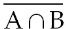
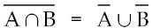
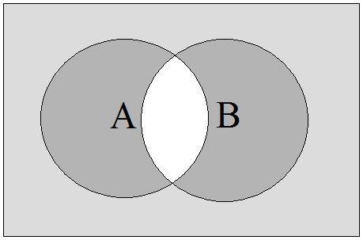
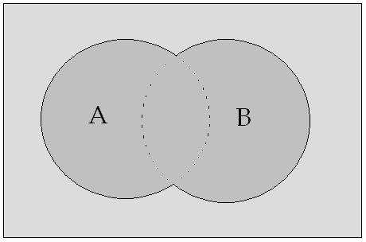
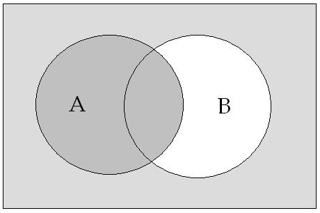
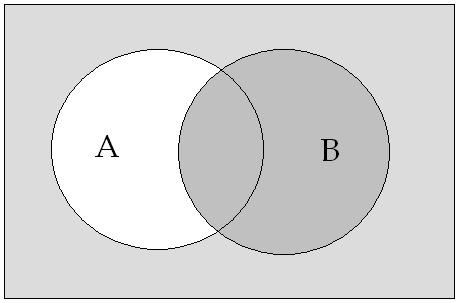
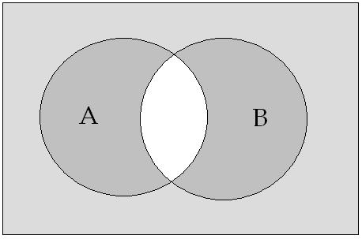

# Leçon 07 | 11 Janvier 1967

  <label><input type="checkbox" data-lacan-toggle="original" checked> 原文</label>
  <label><input type="checkbox" data-lacan-toggle="notes" checked> 注释</label>
  <label><input type="checkbox" data-lacan-toggle="commentary" checked> 个人解读评论</label>

<section class="parallel-paragraph" data-paragraph-ids="s14-07-0001">

s14-07-0001

[无对应译文]

原文 · s14-07-0001

Je vous ai laissés à l’opération définie par moi « *aliénation »*, si vous vous rappelez, sous la forme d’un choix forcé où elle s’image de porter sur une alternative qui se solde, par un manque essentiel. Du moins vous ai-je an­noncé que cette *forme*, je la reprendrai à propos de l’al­ternative où je traduis le *cogito* cartésien et qui est cel­le-ci : « *Ou je ne pense pas, ou je ne suis pas.* »

</section>

<section class="parallel-paragraph" data-paragraph-ids="s14-07-0002">

s14-07-0002

[无对应译文]

原文 · s14-07-0002

Cette transformation, un logicien formé à la logi­que symbolique la reconnaîtra…

</section>

<section class="parallel-paragraph" data-paragraph-ids="s14-07-0003">

s14-07-0003

[无对应译文]

原文 · s14-07-0003

> la reconnaîtra, de repré­senter la formule mise au jour dans le registre de cette logique symbolique,
>
> pour la première fois par de MORGAN au milieu du siècle dernier …pour autant que ce qu’elle énon­çait, qui représentait une véritable découverte, qui n’avait jamais été mise au jour sous cette forme jusque-là, s’exprimait d’abord ainsi : que dans *le rapport proposi­tionnel* qui consiste dans la *conjonction* de deux proposi­tions…

</section>

<section class="parallel-paragraph" data-paragraph-ids="s14-07-0004">

s14-07-0004

[无对应译文]

原文 · s14-07-0004

> ce qu’exprime, à droite et en haut de ces feuilles blanches, sur lesquelles j’ai écrit en noir pour que ce soit plus visible …la *conjonction* de A et de B : A ∩ B, si vous la niez en tant que *conjonction* : . Si vous dites qu’il n’est pas vrai, par exemple, que A et B soient ensemble tenables, ceci équivaut à *la réunion *: 

</section>

<section class="parallel-paragraph" data-paragraph-ids="s14-07-0005">

s14-07-0005

[无对应译文]

原文 · s14-07-0005

La *réunion* veut dire autre cho­se que *l’intersection. L’intersection* c’est - si vous repré­sentez, si vous imagez, le champ de ce qui est émis dans chacune de ces propositions par un cercle couvrant une ai­re - *l’intersection* c’est ceci \[en blanc\] :

</section>

<section class="parallel-paragraph" data-paragraph-ids="s14-07-0006">

s14-07-0006

[无对应译文]

原文 · s14-07-0006

</section>

<section class="parallel-paragraph" data-paragraph-ids="s14-07-0007">

s14-07-0007

[无对应译文]

原文 · s14-07-0007

*La réunion* c’est ceci :

</section>

<section class="parallel-paragraph" data-paragraph-ids="s14-07-0008">

s14-07-0008

[无对应译文]

原文 · s14-07-0008

</section>

<section class="parallel-paragraph" data-paragraph-ids="s14-07-0009">

s14-07-0009

[无对应译文]

原文 · s14-07-0009

Comme vous le voyez ce n’est pas l’addition, car il peut y avoir, à chacun des deux champs, une partie commune.

</section>

<section class="parallel-paragraph" data-paragraph-ids="s14-07-0010">

s14-07-0010

[无对应译文]

原文 · s14-07-0010

Eh bien, l’énoncé de MORGAN s’exprime ainsi :  que dans l’ensemble formé par ces deux champs, ici couverts par les deux propositions en cause, la négation de l’intersection, à savoir ce qu’il en est de ce que A et B soient ensemble, est représentée par *la réunion de la négation de* A : écri­vons ici A : ce qui est sa négation c’est cette partie de B \[en blanc\] :

</section>

<section class="parallel-paragraph" data-paragraph-ids="s14-07-0011">

s14-07-0011

[无对应译文]

原文 · s14-07-0011

</section>

<section class="parallel-paragraph" data-paragraph-ids="s14-07-0012">

s14-07-0012

[无对应译文]

原文 · s14-07-0012

…*et de la négation de* B, c’est-à-dire de cette partie de A :

</section>

<section class="parallel-paragraph" data-paragraph-ids="s14-07-0013">

s14-07-0013

[无对应译文]

原文 · s14-07-0013

</section>

<section class="parallel-paragraph" data-paragraph-ids="s14-07-0014">

s14-07-0014

[无对应译文]

原文 · s14-07-0014

Vous voyez qu’il reste au milieu quelque chose qui est excepté :

</section>

<section class="parallel-paragraph" data-paragraph-ids="s14-07-0015">

s14-07-0015

[无对应译文]

原文 · s14-07-0015

</section>

<section class="parallel-paragraph" data-paragraph-ids="s14-07-0016">

s14-07-0016

[无对应译文]

原文 · s14-07-0016

…qui est le complément de la *réunion* de ces deux négations et correspond à proprement parler à ce qui est nié, c’est-à-dire au champ de *l’intersection* de A et de B.

</section>

<section class="parallel-paragraph" data-paragraph-ids="s14-07-0017">

s14-07-0017

[无对应译文]

原文 · s14-07-0017

Cette formule si simple s’est trouvé prendre une telle portée dans les développements de la logique symboli­que, qu’elle y est considérée comme fondamentale au titre de ce qu’on appelle *le principe de dualité,* qui s’exprime ain­si sous sa forme la plus générale : c’est à savoir que, si nous portons les choses non pas à cette tentative de litté­ralisation du maniement de la logique propositionnelle, mais si nous la portons sur le plan de ce qui vient au fondement de la formulation du développement mathématique, à savoir *la théorie des ensembles*, *la théorie des ensem­bles* sous une forme masquée introduit quelque chose qui est justement ce qui permet d’en faire *le fondement* de ce qui est le développement de la pensée mathématique.

</section>

<section class="parallel-paragraph" data-paragraph-ids="s14-07-0018">

s14-07-0018

[无对应译文]

原文 · s14-07-0018

C’est que d’une façon masquée peut-on dire, *ce que je vous ai appris à distinguer du sujet de l’énoncé, comme étant le sujet de l’énonciation,* *se trouve* - dans les énoncés primaires, dans la définition de l’ensemble comme tel - *le sujet de l’énonciation s’y trouve en quelque sorte gelé*… il s’y manie, il y reste impliqué, pour autant, bien sûr, que *la théorie des ensembles* est ce qui permet, du développement de la pensée mathématique, de dérouler l’exposé, d’assurer la cohérence.

</section>

<section class="parallel-paragraph" data-paragraph-ids="s14-07-0019">

s14-07-0019

[无对应译文]

原文 · s14-07-0019

Autre chose bien sûr, est *le progrès d’invention*, la démarche propre du raisonnement mathématique, qui n’est pas celle d’*une tautologie*, quoi qu’on en dise, qui a sa fé­condité propre, qui s’arrache au plan purement *déductif*, et par ce ressort qui lui est essentiel et qu’on appelle « *le raisonnement par récurrence* » ou encore, pour employer le terme de POINCARÉ, « *l’induction complète* ».

</section>

<section class="parallel-paragraph" data-paragraph-ids="s14-07-0020">

s14-07-0020

[无对应译文]

原文 · s14-07-0020

Ceci qui, pour être mis en valeur, exige le recours à *la temporalité,* à la démarche du raisonnement en tant qu’elle est scandée par ce quelque chose qui est proprement ce qui est constitutif du raisonnement par récurrence, se déroule comme fondé sur une démarche indéfiniment répétable. Mais au niveau de *la théorie des ensembles*, nous n’avons à chercher qu’un appareil qui nous permette de symboliser ce qui est assuré du développement mathématique et pour cela, ce qui dans l’acte de l’énonciation s’isole comme sujet : *sujet de l’énonciation* en tant qu’il est différent de cette pointe dans l’énoncé où nous pouvons le reconnaître.

</section>

<section class="parallel-paragraph" data-paragraph-ids="s14-07-0021">

s14-07-0021

[无对应译文]

原文 · s14-07-0021

C’est cela qui, dans la notion d’*ensemble*, et très précisément pour autant qu’elle se fonde sur la possibilité de l’*ensemble vide* comme tel, c’est cela où s’assure d’une façon voilée l’existence du *sujet de l’énon­ciation*.

</section>

<section class="parallel-paragraph" data-paragraph-ids="s14-07-0022">

s14-07-0022

[无对应译文]

原文 · s14-07-0022

Au niveau de *la théorie des ensembles* la transfor­mation de MORGAN s’exprime ainsi : que dans toute for­mule où nous avons

</section>

<section class="parallel-paragraph" data-paragraph-ids="s14-07-0023">

s14-07-0023

[无对应译文]

原文 · s14-07-0023

- un ensemble, quelque ensemble,

</section>

<section class="parallel-paragraph" data-paragraph-ids="s14-07-0024">

s14-07-0024

[无对应译文]

原文 · s14-07-0024

- l’ensem­ble vide,

</section>

<section class="parallel-paragraph" data-paragraph-ids="s14-07-0025">

s14-07-0025

[无对应译文]

原文 · s14-07-0025

- le signe de la réunion,

</section>

<section class="parallel-paragraph" data-paragraph-ids="s14-07-0026">

s14-07-0026

[无对应译文]

原文 · s14-07-0026

- et le signe de l’intersec­tion, en les échangeant deux par deux, c’est-à-dire *en substituant* :

</section>

<section class="parallel-paragraph" data-paragraph-ids="s14-07-0027">

s14-07-0027

[无对应译文]

原文 · s14-07-0027

- à l’ensemble, l’ensemble vide,

</section>

<section class="parallel-paragraph" data-paragraph-ids="s14-07-0028">

s14-07-0028

[无对应译文]

原文 · s14-07-0028

- à l’ensemble vi­de, un ensemble,

</section>

<section class="parallel-paragraph" data-paragraph-ids="s14-07-0029">

s14-07-0029

[无对应译文]

原文 · s14-07-0029

- à la réunion, l’intersection,

</section>

<section class="parallel-paragraph" data-paragraph-ids="s14-07-0030">

s14-07-0030

[无对应译文]

原文 · s14-07-0030

- à l’intersec­tion, une réunion, …nous conservons la valeur de vérité qui a pu être établie dans la première formule.

</section>

<section class="parallel-paragraph" data-paragraph-ids="s14-07-0031">

s14-07-0031

[无对应译文]

原文 · s14-07-0031

Tel est, fondamentalement, ce que veut dire que nous substituons au « *Je pense, donc je suis* » ce quelque chose, qui exige que nous le regardions de plus près dans son ma­niement mais qui - tout brutalement, tout massivement, tout aveuglément, dirai-je - peut d’abord s’articuler comme quel­que chose dont le « *ou* » de la réunion, est à regarder de plus près et qui unit un « *je ne pense pas* » avec un « *je ne suis pas* ».

</section>

<section class="parallel-paragraph" data-paragraph-ids="s14-07-0032">

s14-07-0032

[无对应译文]

原文 · s14-07-0032

Aussi bien ces deux « *ne*... *pas* » ne sont-ils pas bien *entendus* : à partir du moment où s’introduit cette dimen­sion de l’ensemble vide…

</section>

<section class="parallel-paragraph" data-paragraph-ids="s14-07-0033">

s14-07-0033

[无对应译文]

原文 · s14-07-0033

> pour autant qu’elle supporte ce quelque chose de défini par l’énonciation,
>
> à quoi sans dou­te il se peut que rien ne réponde, mais qui est établi com­me tel …*cet ensemble vide en tant que représentant le su­jet de l’énonciation, nous force à prendre sous une valeur qui est à examiner, la fonction de la négation*.

</section>

<section class="parallel-paragraph" data-paragraph-ids="s14-07-0034">

s14-07-0034

[无对应译文]

原文 · s14-07-0034

Prenons le « *je ne désire pas* »*. Il est clair que ce «* *je ne désire pas », à lui tout seul est fait pour nous faire nous demander sur quoi porte la négation* :

</section>

<section class="parallel-paragraph" data-paragraph-ids="s14-07-0035">

s14-07-0035

[无对应译文]

原文 · s14-07-0035

- *ce qui est un « je ne désire pas » transitif implique l’indésirable*, l’indésira­ble de mon fait : *il y a quelque chose d’exprès que je ne désire pas*,

</section>

<section class="parallel-paragraph" data-paragraph-ids="s14-07-0036">

s14-07-0036

[无对应译文]

原文 · s14-07-0036

- mais aussi bien, la négation peut vouloir dire que ce n’est pas moi qui désire, impliquant que je me dé­charge d’un désir qui peut aussi bien être ce qui me porte tout en n’étant pas moi,

</section>

<section class="parallel-paragraph" data-paragraph-ids="s14-07-0037">

s14-07-0037

[无对应译文]

原文 · s14-07-0037

- mais encore reste-t-il que cette négation peut vouloir dire qu’il n’est pas vrai que je dési­re, que « *le désir* », qu’il soit de moi ou de pas-moi, n’a rien à faire avec la question.

</section>

<section class="parallel-paragraph" data-paragraph-ids="s14-07-0038">

s14-07-0038

[无对应译文]

原文 · s14-07-0038

C’est vous dire que cette dialectique du sujet…

</section>

<section class="parallel-paragraph" data-paragraph-ids="s14-07-0039">

s14-07-0039

[无对应译文]

原文 · s14-07-0039

> pour autant que nous essayons de l’ordonner, de la délinéer, entre *sujet de l’énoncé* et *sujet de l’énonciation* …c’est là une œuvre bien utile et spécialement au niveau où nous reprenons aujourd’hui l’interrogation du *cogito* de DESCARTES, pour autant que c’est cela qui peut nous permettre de don­ner sens véritable, situation exacte, à ce qui de par FREUD s’en modifie et, pour le dire tout de suite, qui se propose à nous sous ces deux formes trop facilement superposées et confondues, qui s’appellent respectivement l’*inconscient* et le *Ça*, et qui sont ce qu’il s’agit pour nous de distinguer à la lumière de cette interrogation que nous faisons partir de l’examen du *cogito*.

</section>

<section class="parallel-paragraph" data-paragraph-ids="s14-07-0040">

s14-07-0040

[无对应译文]

原文 · s14-07-0040

Que le *cogito* soit encore discuté, ceci est un fait dans le discours philosophique. C’est bien à la fois ce qui nous permet d’y entrer

</section>

<section class="parallel-paragraph" data-paragraph-ids="s14-07-0041">

s14-07-0041

[无对应译文]

原文 · s14-07-0041

Nous-mêmes avec l’usage où nous entendons le faire servir, puisque, aussi bien, ce certain *flottement* qui peut y rester, est bien ce qui en lui témoigne de quelque chose où il devait se compléter. Si le *cogito*, *dans l’histoire de la philosophie*, est une base, pourquoi ?

</section>

<section class="parallel-paragraph" data-paragraph-ids="s14-07-0042">

s14-07-0042

[无对应译文]

原文 · s14-07-0042

C’est que, pour le dire assuré­ment au minimum, il substitue au *rapport pathétique*, au rapport difficile qui avait fait toute *la tradition de l’interrogation philosophique*, qui n’était autre que celle du rapport *du penser à l’être.*

</section>

<section class="parallel-paragraph" data-paragraph-ids="s14-07-0043">

s14-07-0043

[无对应译文]

原文 · s14-07-0043

Allez ouvrir, non pas à travers les commentateurs mais directement… bien sûr, ce sera pour vous plus facile si vous savez le grec, si vous ne le savez pas *il y a de bonnes traductions*, des commentaires très suffisants *en [langue anglaise](http://ebooks.adelaide.edu.au/a/aristotle/physics/)*, de la *[Métaphysique](http://remacle.org/bloodwolf/philosophes/Aristote/tablemetaphysique.htm)* d’ARISTOTE.

</section>

<section class="parallel-paragraph" data-paragraph-ids="s14-07-0044">

s14-07-0044

[无对应译文]

原文 · s14-07-0044

Il y a une traduction française, qui est celle de TRICOT [^25], qui à la vérité n’est pas sans y apporter le voile et le masque d’un perpétuel commentaire thomiste.

</section>

<section class="parallel-paragraph" data-paragraph-ids="s14-07-0045">

s14-07-0045

[无对应译文]

原文 · s14-07-0045

Mais pour autant qu’à travers ces déformations vous pourrez essayer de rejoindre le mouvement originel de ce qu’ARISTOTE nous communique, vous vous apercevrez combien, mais après coup, *tout ce qui a pu s’accumuler de critiques ou d’exégèses autour de ce texte*…

</section>

<section class="parallel-paragraph" data-paragraph-ids="s14-07-0046">

s14-07-0046

[无对应译文]

原文 · s14-07-0046

> dont tel ou tel scoliaste nous dit que tel passage est discutable, ou que l’ordre des livres a été bouleversé …combien, pour une lecture première, toutes ces questions apparaissent vrai­ment secondaires auprès de je ne sais quoi de direct et de frais, qui fait de cette lecture, à cette seule condition que vous la sortiez de *l’atmosphère de l’école*, une chose qui vous frappe du registre de ce que j’ai appelé tout à l’heure le « *pathétique* ».

</section>

<section class="parallel-paragraph" data-paragraph-ids="s14-07-0047">

s14-07-0047

[无对应译文]

原文 · s14-07-0047

Quand vous verrez à tout ins­tant se renouveler et rejaillir, dans quelque chose qui semble encore porter la trace du discours-même où il s’est formulé, *cette interrogation de ce qu’il en est* *du rapport de la pensée et de l’être*. Et quand vous verrez surgir tel terme, comme celui de τὸ σεμνὸν \[to semnon\], *ce qu’il y a de digne, la dignité, celle qui est à préserver du « penser »* au regard de ce qui doit la rendre à la hauteur de ce qu’il en est de ce que l’on veut saisir, à savoir : *ce n’est pas seulement « l’étant » ou « ce qui est » mais ce par où  l’être s’y manifeste*.

</section>

<section class="parallel-paragraph" data-paragraph-ids="s14-07-0048">

s14-07-0048

[无对应译文]

原文 · s14-07-0048

Ce qu’on a traduit diversement « *L’être en tant qu’être* » a-t-on dit. Fort mauvaise traduction pour ces trois termes que j’ai pris soin de noter en haut à gauche de ce tableau, et qui sont proprement :

</section>

<section class="parallel-paragraph" data-paragraph-ids="s14-07-0049">

s14-07-0049

[无对应译文]

原文 · s14-07-0049

- Pre­mièrement, le Τὸ τί ἐστι \[to ti esti\] qui ne veut rien dire d’autre que le « *qu’est-ce que c’est ?* ».

</section>

<section class="parallel-paragraph" data-paragraph-ids="s14-07-0050">

s14-07-0050

[无对应译文]

原文 · s14-07-0050

Il me paraît que c’est une tra­duction aussi valable que celle du « *quid* » dans lequel on croit ordinairement devoir se limiter.

</section>

<section class="parallel-paragraph" data-paragraph-ids="s14-07-0051">

s14-07-0051

[无对应译文]

原文 · s14-07-0051

- le Τὸ τί ἦν εἶναι[^26] \[to ti en einai\], qui est bien, ma foi, un des traits les plus saisissants de la vivacité de ce langage qui est celui d’ARISTOTE. Car ce n’est certes pas - ici encore bien moins - « *l’être en tant qu’être* » qui convient pour le traduire, puisque, *si peu que vous sachiez le grec*, vous pouvez lire cette chose qui est une tournure commu­ne du grec, et pas seulement littéraire, qui est manifeste­ment ce *trait d’origine* du verbe grec et qu’il a précisé­ment en commun avec ce que l’imparfait veut dire en fran­çais - auquel si souvent je m’arrête au cours de ce dont j’ai pu laisser la trace dans mes écrits - ce « *c’é­tait* », qui veut dire : « *ça vient de disparaître* », *tout en même temps que ça peut vouloir dire* : « *un peu plus ça allait être* ».

</section>

<section class="parallel-paragraph" data-paragraph-ids="s14-07-0052">

s14-07-0052

[无对应译文]

原文 · s14-07-0052

> Ce Τό τἰ ἦν εἶναι[^27] \[to ti en einai\], qui est la même chose, que ce qui se dit dans l’*[Hippolyte](http://remacle.org/bloodwolf/tragediens/euripide/hippolyte.htm)* d’EURIPIDE \[Vers 359\],
>
> quand on dit : Κύπρις οὐκ ἄρ’ἦν θεός *à savoir :* « *Cypris–Aphrodite, pour toi, n’était pas une déesse* ». Ce qui veut dire que :
>
> \- pour s’être conduite comme elle vient de le faire, assurément ce qu’elle était nous fuit et nous échappe,
>
> \- et qu’aussi bien il faut que nous remettions en question tout ce qu’il en est de ce que c’est qu’une déesse ou qu’un dieu.
>
> Ce Τό τἰ ἦν εἶναι le « *ce que c’était être* » : « *ce que c’était être* » quand ? Avant que j’en parle, à proprement parler.
>
> C’est cette espèce de sentiment qu’il y a, dans le langage même d’ARISTOTE, de « *l’être* » encore inviolé et pour autant
>
> que déjà il touchait, avec ce νοεῖν \[noein\], avec cette pensée, dont tout ce qui est agité c’est de savoir jusqu’à quel degré elle peut en être digne, *c’est-à-dire s’élever à la hauteur de l’être* \[τὸ αὐτό νοεῖν καὶ εἶναι[^28], (*to auto noein kai einai*) : « *le même, que de penser et être* »\].
>
> Voilà dans quel tracé d’origine, dont vous ne pouvez pas ne pas sentir en quelque sorte la racine, de l’ordre du *sacré,* voilà où s’attache la pre­mière articulation du *philosophème* : au niveau de celui qu’il y a, à introduire - *on peut le dire* - le premier pas d’une science positive.

</section>

<section class="parallel-paragraph" data-paragraph-ids="s14-07-0053">

s14-07-0053

[无对应译文]

原文 · s14-07-0053

- Pour le Τὸ ὂν ᾖ ὄν[^29] \[to ôn hêi on\] c’est bien en effet aussi - ce dernier terme - « *l’étant, par où il est étant* », c’est­-à-dire encore ce quelque chose qui pointe vers l’être.

</section>

<section class="parallel-paragraph" data-paragraph-ids="s14-07-0054">

s14-07-0054

[无对应译文]

原文 · s14-07-0054

Et chacun sait que le… libre mouvement de *la tradition phi­losophique* ne représente rien d’autre que le *progressif éloignement* de cette *source de trouvailles*, de cette *pre­mière invention*, qui a abouti, à travers les écoles qui se succèdent de plus en plus, à ne serrer qu’autour de l’ar­ticulation logique, ce qui peut être retenu de cette inter­rogation première. Or *le cogito* de DESCARTES à un sens : c’est qu’*à ce rapport de la pensée et de l’être, il substitue purement et simple­ment* l’instauration de *l’être du « je »*.

</section>

<section class="parallel-paragraph" data-paragraph-ids="s14-07-0055">

s14-07-0055

[无对应译文]

原文 · s14-07-0055

Ce que je veux produire devant vous est ceci : c’est que pour autant que l’expérience, qui n’est qu’une expérience qui elle-même est suite et effet de ce franchissement de la pensée qui représente enfin quelque chose qui peut s’ap­peler « *refus de la question de l’Être* »…

</section>

<section class="parallel-paragraph" data-paragraph-ids="s14-07-0056">

s14-07-0056

[无对应译文]

原文 · s14-07-0056

> *et précisément pour autant que ce refus a engendré cette suite, cette le­vée nouvelle de l’abord sur le monde, qui s’appelle la scien­ce* …que si quelque chose, à l’intérieur des effets de ce franchissement, s’est produit qui s’appelle la découverte freudienne, ou au niveau de celui qui l’y a introduite, ou encore sa pensée, voire sa pensée sur la pensée - le point essentiel c’est que ceci, en aucun cas, ne veut dire « *un retour à la pensée de l’être* ».

</section>

<section class="parallel-paragraph" data-paragraph-ids="s14-07-0057">

s14-07-0057

[无对应译文]

原文 · s14-07-0057

Rien, dans ce qu’apporte FREUD, qu’il s’agisse de *l’inconscient* ou du *Ça,* ne fait retour à quelque chose qui, au niveau de la pensée, nous replace sur ce plan de *l’interrogation de l’être*. Ce n’est qu’à l’intérieur, et restant dans les suites de cette limite de franchissement, de cette cassure par quoi, à « *la question que la pensée pose à l’être* », est substituée, et sous le mode d’*un refus,* la seule *affirmation de l’être* *du « je »,* puisque c’est à l’intérieur de ceci que prend son sens ce qu’amène FREUD, tant du côté de *l’inconscient* que du côté du *Ça.*

</section>

<section class="parallel-paragraph" data-paragraph-ids="s14-07-0058">

s14-07-0058

[无对应译文]

原文 · s14-07-0058

C’est pour vous le montrer, vous montrer comment cela s’articule, que je m’avance cette année dans le domaine de la logique, et qu’aussi bien nous poursuivons maintenant. Dans le *cogito* lui–même… qui mérite à cet endroit d’être *une fois de plus reparcouru* …nous allons trouver les amorces, les amorces du paradoxe qui est celui qu’introduit le recours à *la formule morganienne* telle que je vous l’ai d’abord produite et qui est celle-ci : y a-t-il un être du « *je* » hors du discours ?

</section>

<section class="parallel-paragraph" data-paragraph-ids="s14-07-0059">

s14-07-0059

[无对应译文]

原文 · s14-07-0059

C’est bien la question que tranche le *cogito* cartésien, encore faut-il voir comment il le fait.

</section>

<section class="parallel-paragraph" data-paragraph-ids="s14-07-0060">

s14-07-0060

[无对应译文]

原文 · s14-07-0060

C’est pour en poser la question que nous avons in­troduit ces guillemets autour de l’« *ergo sum* » qui le sub­vertissent dans sa portée *naïve* si l’on peut dire, qui en font un « *ergo sum* » *cogité*, dont en somme le seul être tient dans cet « *ergo* » qui, lui, dans l’intérieur de la pensée, se présente pour DESCARTES comme le signe de ce qu’il arti­cule lui-même à plusieurs reprises…

</section>

<section class="parallel-paragraph" data-paragraph-ids="s14-07-0061">

s14-07-0061

[无对应译文]

原文 · s14-07-0061

> et aussi bien dans le *Discours de la méthode* que dans les *Méditations* ou dans les *Principes* *…*c’est à savoir : comme un « *ergo* » de nécessité.

</section>

<section class="parallel-paragraph" data-paragraph-ids="s14-07-0062">

s14-07-0062

[无对应译文]

原文 · s14-07-0062

Mais si seulement cet « *ergo* » représente cette nécessité, est-ce que nous ne pouvons pas voir ce qui résulte de ceci : que « *ergo sum* » *n’est que refus du dur chemin du* « *penser* » *à* « *l’être* », et du savoir qui doit - ce chemin - le parcourir.

</section>

<section class="parallel-paragraph" data-paragraph-ids="s14-07-0063">

s14-07-0063

[无对应译文]

原文 · s14-07-0063

*Il prend, cet* « *ergo sum* »*, le raccourci d’être celui qui pense*.

</section>

<section class="parallel-paragraph" data-paragraph-ids="s14-07-0064">

s14-07-0064

[无对应译文]

原文 · s14-07-0064

Mais à penser qu’il n’est même pas besoin d’interroger *l’étant* sur le parcours où il tient son *être*, puisque déjà la question s’assure elle–même de sa propre existence, n’est–ce pas là se placer comme *ego,* hors de la prise dont l’être peut étreindre la pensée ?

</section>

<section class="parallel-paragraph" data-paragraph-ids="s14-07-0065">

s14-07-0065

[无对应译文]

原文 · s14-07-0065

Se poser *ego,* « *je pense* » comme pur « *pense–être* », comme substitut subsistant d’être, le « *je* » d’un « *ne suis pas *» *local*, qui veut dire

</section>

<section class="parallel-paragraph" data-paragraph-ids="s14-07-0066">

s14-07-0066

[无对应译文]

原文 · s14-07-0066

« *Je ne suis qu’à ce que ta question de l’être soit élidée, je me passe d’être, je* … *ne suis pas* »…

</section>

<section class="parallel-paragraph" data-paragraph-ids="s14-07-0067">

s14-07-0067

[无对应译文]

原文 · s14-07-0067

- sauf *là où* nécessairement *je suis, de pouvoir le dire,*

</section>

<section class="parallel-paragraph" data-paragraph-ids="s14-07-0068">

s14-07-0068

[无对应译文]

原文 · s14-07-0068

- ou pour mieux dire : *où je suis, de pou­voir vous le faire dire,*

</section>

<section class="parallel-paragraph" data-paragraph-ids="s14-07-0069">

s14-07-0069

[无对应译文]

原文 · s14-07-0069

- ou plus exactement : *de le faire dire à l’Autre,* …car c’est bien-là la démarche, quand vous la suivez de près dans le texte de DESCARTES.

</section>

<section class="parallel-paragraph" data-paragraph-ids="s14-07-0070">

s14-07-0070

[无对应译文]

原文 · s14-07-0070

C’est en ceci, au reste, que c’est une démarche fé­conde, et qui a… qu’elle a à proprement parler le même pro­fil que celle du raisonnement par récurrence, qui est en quelque sorte ceci : de mener l’autre longtemps sur un che­min, sur un chemin qui est ici, à proprement parler, le che­min de renoncer à telle et telle, et bientôt à toutes les voies du savoir, et puis *à un tournant,* de *le surprendre* en cet aveu : *que là au moins*, de lui avoir fait par­courir ce chemin, *il faut bien que* « *je sois* » .

</section>

<section class="parallel-paragraph" data-paragraph-ids="s14-07-0071">

s14-07-0071

[无对应译文]

原文 · s14-07-0071

Mais *la dimension de cet Autre* y est si essentielle qu’on peut dire qu’elle est au nerf du *cogito,* et que c’est *elle* qui constitue proprement la limite de ce qui peut se définir et s’assurer, au mieux, comme *l’ensemble vide que constitue le « je suis »,* dans cette référence *où « je »*, en tant que « *je suis* », *se* *constitue* proprement de ceci : *de ne contenir aucun élément*.

</section>

<section class="parallel-paragraph" data-paragraph-ids="s14-07-0072">

s14-07-0072

[无对应译文]

原文 · s14-07-0072

Ce cadre ne vaut que pour autant que le « *je pense* », je le pense, c’est-à-dire que *j’argumente le cogito avec l’Au­tre*.

</section>

<section class="parallel-paragraph" data-paragraph-ids="s14-07-0073">

s14-07-0073

[无对应译文]

原文 · s14-07-0073

*« Ne suis pas » signifie qu’il n’y a pas d’élément de cet ensemble qui sous le terme de « je » existe* : *Ego sum, sive ego cogito,* mais sans qu’il y ait rien qui le meuble. Cette rencontre rend clair que le « *je pense* » *n’est qu’un semblable habillement*.

</section>

<section class="parallel-paragraph" data-paragraph-ids="s14-07-0074">

s14-07-0074

[无对应译文]

原文 · s14-07-0074

Si ce n’est pas du niveau du « *je pense* » - qui prépare cet aveu d’un ensemble vide - qu’il s’agit, c’est du vidage d’un autre ensemble.

</section>

<section class="parallel-paragraph" data-paragraph-ids="s14-07-0075">

s14-07-0075

[无对应译文]

原文 · s14-07-0075

C’est après que DESCARTES ait fait la mise à l’épreuve de tous les accès au savoir, qu’il ait fondé cette pensée à proprement parler de *l’évi­dement de l’être*, pour n’être avide que de certitude, et qui résulte en ceci que nous avons déjà appelé « *vidage* » et qui - *ce terme* - par cette *interrogation* laisse à savoir si cette opération même, comme telle, ne suffit pas à donner de l’*ego* la seule véritable substance, c’est bien de là, et pour autant que nous en saisissons l’importance, que seulement devient pensable, comme par *un fil conducteur*, ce dont il va s’agir quand FREUD nous apporte… quoi ?

</section>

<section class="parallel-paragraph" data-paragraph-ids="s14-07-0076">

s14-07-0076

[无对应译文]

原文 · s14-07-0076

Quoi ? si ce n’est ce qui en résulte dans ce qu’il appelle, pour employer ses propres termes, non pas « le fonc­tionnement mental », comme on le traduit faussement quand on traduit l’allemand en anglais, mais le *psychische Geschehen, l’évènement psychique*.

</section>

<section class="parallel-paragraph" data-paragraph-ids="s14-07-0077">

s14-07-0077

[无对应译文]

原文 · s14-07-0077

Comme nous allons le voir, il ne reste rien - dans ce sur quoi FREUD s’interroge - de quelque chose qui puisse ra­nimer, raviver la pensée de *l’être* au-delà de ce que le *cogito* lui a désormais assigné comme limite. En fait, *l’être* est si bien exclu de tout ce dont il peut s’agir que, pour entrer dans cette explication, je pour­rais dire, qu’à reprendre une de mes formules familières - celle de la *Verwerfung -* c’est bien en fait de *quelque chose* de cet ordre qu’il s’agit, *et si quelque chose s’articule de nos jours qui peut s’appeler la fin d’un humanisme*...

</section>

<section class="parallel-paragraph" data-paragraph-ids="s14-07-0078">

s14-07-0078

[无对应译文]

原文 · s14-07-0078

qui ne date pas bien sûr, ni d’hier ni d’avant-hier, ni du moment où M. Michel FOUCAULT peut l’articuler, ni moi-même, ce qui est chose faite depuis longtemps.

</section>

<section class="parallel-paragraph" data-paragraph-ids="s14-07-0079">

s14-07-0079

[无对应译文]

原文 · s14-07-0079

...c’est très précisément en ceci que la dimension nous est ouverte, qui nous permet de décou­vrir comment joue, selon la formule que j’en ai donnée, cette *Verwerfung*, ce rejet de l’être : « *Ce qui est rejeté du symbolique* - ai-je dit depuis le début de mon enseignement - *reparaît dans le réel*.

</section>

<section class="parallel-paragraph" data-paragraph-ids="s14-07-0080">

s14-07-0080

[无对应译文]

原文 · s14-07-0080

Si ce *quelque chose* qui s’appelle « *l’être de l’homme* » est en effet bien ce qui, à partir d’une certaine date, est re­jeté, *nous le voyons reparaître dans le réel* et sous une forme tout à fait claire. « *L’être de l’homme* », pour autant qu’il est fondamental de notre anthropologie, il a un nom où le mot d*’être* se retrouve dans son milieu, où il suffit de le mettre entre parenthèses. \[*d(être)itus*\]

</section>

<section class="parallel-paragraph" data-paragraph-ids="s14-07-0081">

s14-07-0081

[无对应译文]

原文 · s14-07-0081

Et pour trouver ce nom, comme aussi bien ce qu’il désigne, il suffit de sortir de chez soi, un jour à la cam­pagne, pour aller faire une promenade et, traversant la route, vous rencontrez un lieu de « *camping* », et sur le « *camping* », ou plus exactement tout autour, le marquant du cercle d’une écume, ce que vous rencontrez c’est cet « *être de l’homme* », en tant que *verworfen* il reparaît dans le *réel*, il a un nom : ceci s’appelle le « *d(être)itus* ».\[Rires\]

</section>

<section class="parallel-paragraph" data-paragraph-ids="s14-07-0082">

s14-07-0082

[无对应译文]

原文 · s14-07-0082

Ce n’est pas d’hier que nous savons que « *l’être de l’homme* », en tant que rejeté, c’est là ce qui reparaît sous la forme de ces menus cercles de fer tordus - dont on ne sait pas pour­quoi c’est là autour du lieu habituel des campeurs - que nous en trouvons une certaine accumulation. Pour peu que nous soyons préhistoriens, ou archéologues, nous devons présumer que ce rejet de l’être doit avoir quel­que chose, qui n’est pas apparu pour la première fois avec DESCARTES, ni avec l’origine de la science, mais peut-être y a marqué chacun des franchissements essentiels qui ont permis de constituer, sous des formes qui ont été périssables et toujours précaires, les étapes de l’humanité.

</section>

<section class="parallel-paragraph" data-paragraph-ids="s14-07-0083">

s14-07-0083

[无对应译文]

原文 · s14-07-0083

Et je n’ai pas besoin d’essayer de ré-articuler devant vous, dans une langue que je ne pratique pas et qui me le rend très *impro­nonçable*, ce qu’on désigne, ce qu’on épingle comme signal de telle ou telle phase de ce développement technologique, *sous la forme de ces amoncellements de coquillages qui se trouvent dans certaines aires*, dans certaines zones de ce qui nous res­te de *ces civilisations préhistoriques*[^30].

</section>

<section class="parallel-paragraph" data-paragraph-ids="s14-07-0084">

s14-07-0084

[无对应译文]

原文 · s14-07-0084

Le *détritus* c’est bien là le point à retenir, qui repré­sente…

</section>

<section class="parallel-paragraph" data-paragraph-ids="s14-07-0085">

s14-07-0085

[无对应译文]

原文 · s14-07-0085

> et pas seulement comme signal, mais comme quelque chose d’essentiel …*ce autour de quoi pour nous va tourner* ce qu’il va en être maintenant, de ce que nous avons à inter­roger de *cette aliénation*.­

</section>

<section class="parallel-paragraph" data-paragraph-ids="s14-07-0086">

s14-07-0086

[无对应译文]

原文 · s14-07-0086

L’*aliénation* a une face patente, qui n’est pas que nous sommes l’Autre, ou que « les autres » comme on dit, *en nous reprenant* nous défigurent ou nous déforment. *Le fait de l’aliénation n’est pas que nous soyons repris, refaits, repré­sentés dans* l’Autre, mais il est *essentiellement* fondé au contraire sur le rejet de *l’Autre*, pour autant que cet *Autre*, celui que je signale d’un grand A, est ce qui est venu *à la place* de cette interrogation de l’*Être*, autour de quoi je fais tourner aujourd’hui essentiellement la limite, le franchissement du *cogito*.

</section>

<section class="parallel-paragraph" data-paragraph-ids="s14-07-0087">

s14-07-0087

[无对应译文]

原文 · s14-07-0087

Plût au Ciel donc, que l’*aliénation* consistât en ce que nous nous trouvions, au lieu de l’Autre, à l’aise ! Pour DESCARTES, c’est assurément ce qui lui permet l’allégresse de sa démarche. Et dans les premières *Regulae*, qui représentent *son œuvre originelle*, *son œuvre de jeunes­se*, celle dont le manuscrit, plus tard, fut retrouvé - *et reste d’ailleurs toujours perdu* - dans les papiers de LEIBNIZ, le « *sum ergo Deus* » *est exactement le prolongement du* « *cogito ergo sum* ».

</section>

<section class="parallel-paragraph" data-paragraph-ids="s14-07-0088">

s14-07-0088

[无对应译文]

原文 · s14-07-0088

Bien sûr *l’opération* est avantageuse, qui *laisse tout entière à la charge d’un Autre* qui ne s’assure de rien d’autre que de *l’instauration de l’être comme étant l’être du* « *Je* » d’un Autre, que le Dieu de la tradition judéo-chré­tienne facilite d’être Celui qui s’est présenté lui-même, d’être : « *Je suis ce que je suis* »

</section>

<section class="parallel-paragraph" data-paragraph-ids="s14-07-0089">

s14-07-0089

[无对应译文]

原文 · s14-07-0089

Mais assurément, ce fondement *fidéiste* qui reste si profondément ancré encore dans la pen­sée au niveau du XVIIème siècle, c’est celui-là précisément, qui n’est pas pour nous tellement soutenable, et c’est de ce qu’il soit rayé subjectivement, qui nous aliène réellement. Ce que j’ai déjà illustré de cette : « *La liberté ou la mort* »[^31] Merveilleuse intimation sans doute… Qui, dans cette intimation, ne refuserait en effet cet Autre par excellence qu’est la mort, moyennant quoi, comme je vous l’ai fait remarquer, il lui reste *la liberté de mourir* ? Il en est de même dans ce que, déjà *le stoïcien* formule dans le :

</section>

<section class="parallel-paragraph" data-paragraph-ids="s14-07-0090">

s14-07-0090

[无对应译文]

原文 · s14-07-0090

> « *Et non propter vitam vivendi perdere causas* »[^32]

</section>

<section class="parallel-paragraph" data-paragraph-ids="s14-07-0091">

s14-07-0091

[无对应译文]

原文 · s14-07-0091

Mais pour nous « *les perdre *», est-ce que vous allez perdre *la vie* ? Les choses ne se lisent, déjà ici, pas clairement. Mais pour nous ce dont il s’agit est de savoir ce qu’il va en être d’*entre* cet « *Ou je ne pense pas, ou je ne suis pas* », je veux dire : « *je* » comme « *ne suis pas* ». Quel va être le résultat ? Le résultat où *nous n’avons pas le choix* ! Nous n’avons pas le choix, à partir du mo­ment où ce « *je* », comme instauration de l’être a été choisi, *nous n’avons pas* *le choix*, c’est le « *je ne pense pas* » vers quoi il nous faut aller.

</section>

<section class="parallel-paragraph" data-paragraph-ids="s14-07-0092">

s14-07-0092

[无对应译文]

原文 · s14-07-0092

Car cette instauration du « *je* » *comme seul et unique fondement de l’être* est très précisément ce qui dès lors met un terme \- un terme, j’entends : un point final - à toute interrogation du νοεῖν \[noein\], à toute démarche qui ferait autre chose de la pensée, que ce que FREUD, avec son temps et avec la science, en fait.

</section>

<section class="parallel-paragraph" data-paragraph-ids="s14-07-0093">

s14-07-0093

[无对应译文]

原文 · s14-07-0093

*Das* *Denken* \[la pensée\], écrit-il dans les formulations sur le double principe de l’évènement psychique , ce n’est rien d’autre qu’une formule, *une formule d’essai* et en quelque sorte de frayage, qui est toujours à faire avec le moindre investissement psychique, qui nous per­met d’interroger, de mesurer, de tracer aussi bien, la voie par où nous avons à trouver satisfaction de ce qui nous presse et nous stimule - par quelque démarche motrice - à tracer dans le *réel*.

</section>

<section class="parallel-paragraph" data-paragraph-ids="s14-07-0094">

s14-07-0094

[无对应译文]

原文 · s14-07-0094

Ce « *je ne pense pas* » essentiel, c’est là où nous avons à nous questionner : ce qui en résulte, concernant la per­te résultant du choix, le « *je ne suis pas* » - bien sûr, en lui-même, tel que nous l’avons tout à l’heure fondé, à savoir comme essence du « *je* » lui-même – est-ce à ceci que se résume la perte de l’aliénation ? Certainement pas ! Précisément quelque chose apparaît qui est forme de *négation*, mais *cette négation qui ne porte pas sur l’être mais sur le « je » lui­-même*, en tant que fondé dans « *ne suis pas* ».

</section>

<section class="parallel-paragraph" data-paragraph-ids="s14-07-0095">

s14-07-0095

[无对应译文]

原文 · s14-07-0095

Connexe au choix du « *je ne pense pas* » quelque chose surgit, dont l’essence est de n’être pas « *je* », à la place même de l’*ergo,* en tant qu’il est à mettre à l’intersection du « *je pense* » au « *je suis* », dans ce qui, seul, se supporte comme être de cogitation : cet *ergo* donc, à cette place même quelque chose apparaît, qui se sustente de n’être « *pas-je* ». Ce « *pas-je* » *si essentiel à articuler pour être ainsi dans son essence*, c’est ce que FREUD nous apporte au niveau du *se­cond pas* de sa pensée *et ce qu’on appelle la seconde topique*, comme étant le *Ça*.

</section>

<section class="parallel-paragraph" data-paragraph-ids="s14-07-0096">

s14-07-0096

[无对应译文]

原文 · s14-07-0096

Mais c’est précisément là qu’est le plus grand danger d’erreur et qu’aussi bien à l’approcher moi-même - *dans la me­sure où j’ai pu le faire, quand j’ai parlé du* « *wo es war... »,* je n’ai pas pu - faute de l’articulation logique qui lui permet de prendre sa véritable valeur - bien faire sentir où gît l’essence de ce « *pas-je* » qui constitue le *Ça* et qui rend *si ri­dicule* ce en quoi semble tomber infailliblement quiconque est sur ce sujet resté dans les sentiers psychologiques, c’est-à-dire en tant qu’ils héritent de la tradition de la philosophie an­tique : que de *l’âme* ou de la Ψυχή \[psuché\] ils font *quelque chose qui est*.

</section>

<section class="parallel-paragraph" data-paragraph-ids="s14-07-0097">

s14-07-0097

[无对应译文]

原文 · s14-07-0097

Le *Ça*, pour eux, sera toujours ce que tel imbécile m’a corné aux oreilles pendant 10 ans de voisinage que :  « *le ça est un* *mauvais moi* ». Il ne saurait, d’aucune façon, être formulé quelque chose de semblable ! Et pour le concevoir, il est extrême­ment important de s’apercevoir que ce *Ça*, dans cette étrange, anomalique, positivité qu’il prend d’être le « *pas* » de ce « *je* » \[pas-je\] qui par essence « ...*ne suis pas* » \[je ne suis pas\], il faut savoir ce que cela peut ­vouloir dire, de quel étrange complément peut-il s’agir dans ce « *pas-je* ».

</section>

<section class="parallel-paragraph" data-paragraph-ids="s14-07-0098">

s14-07-0098

[无对应译文]

原文 · s14-07-0098

Eh bien, il faut savoir l’articuler et le dire, tel qu’effectivement toute *la délinéation* [^33] de ce dont il s’agit dans le *Ça* nous l’articule.

</section>

<section class="parallel-paragraph" data-paragraph-ids="s14-07-0099">

s14-07-0099

[无对应译文]

原文 · s14-07-0099

Le *Ça* dont il s’agit n’est assurément, bien sûr, d’au­cune façon la « *première personne* », comme c’est une vérita­ble erreur...

</section>

<section class="parallel-paragraph" data-paragraph-ids="s14-07-0100">

s14-07-0100

[无对应译文]

原文 · s14-07-0100

*à rejeter au rang du grotesque, il faut bien le dire, quel que soit le respect que nous portions, au nom de l’histoire, à son auteur* \[[Georges Politzer](https://fr.wikipedia.org/wiki/Georges_Politzer)\] ...d’avoir été amené à produire que la psychologie de FREUD était une psychologie en première personne.

</section>

<section class="parallel-paragraph" data-paragraph-ids="s14-07-0101">

s14-07-0101

[无对应译文]

原文 · s14-07-0101

Et que tel de mes élèves[^34]…

</section>

<section class="parallel-paragraph" data-paragraph-ids="s14-07-0102">

s14-07-0102

[无对应译文]

原文 · s14-07-0102

> au cours de ce petit rap­port qui fait partie de l’opuscule que je vous ai distribué la dernière fois …que tel de mes élèves se soit cru obligé d’en repasser par là, tenant pour un instant l’illusion que c’était même une voie par laquelle je vous aurais menés à \[le\] formuler - comme il est bien naturellement forcé, après m’a­voir entendu, à formuler le contraire, n’est ce pas - est en soi-même une sorte de *bluff* et d’*escroquerie*, car ceci n’a rien à faire dans la question.

</section>

<section class="parallel-paragraph" data-paragraph-ids="s14-07-0103">

s14-07-0103

[无对应译文]

原文 · s14-07-0103

Le *Ça* n’est ni la première, ni la seconde personne, ni même la troisième, en tant que, pour suivre la définition qu’en donne BENVENISTE, la troisième serait celle dont on parle.

</section>

<section class="parallel-paragraph" data-paragraph-ids="s14-07-0104">

s14-07-0104

[无对应译文]

原文 · s14-07-0104

Le *Ça*, nous en approchons un peu plus, à des énoncés tels que le « *Ça brille* » ou le « *Ça pleut* », ou le « *Ça bouge* ».

</section>

<section class="parallel-paragraph" data-paragraph-ids="s14-07-0105">

s14-07-0105

[无对应译文]

原文 · s14-07-0105

Mais c’est encore tomber dans une erreur que de croire que ce *Ça*, ce serait ça en tant qu’il s’énonce de soi-même !

</section>

<section class="parallel-paragraph" data-paragraph-ids="s14-07-0106">

s14-07-0106

[无对应译文]

原文 · s14-07-0106

C’est encore quelque chose qui ne donne pas assez son relief à ce dont il s’agit.

</section>

<section class="parallel-paragraph" data-paragraph-ids="s14-07-0107">

s14-07-0107

[无对应译文]

原文 · s14-07-0107

Le *Ça* est à proprement parler ce qui, dans le discours, en tant que structure logique, est très exactement tout ce qui n’est pas « *je* », c’est-à-dire tout le reste de la structure. Et quand je dis « *structure logique* », entendez-la *grammati­cale.* Ce n’est pas rien, que le support même de ce dont il s’agit dans *la pulsion*, c’est-à-dire *le fantasme*, puisse s’exprimer ainsi : *Ein Kind ist geschlagen, Un enfant est battu.*

</section>

<section class="parallel-paragraph" data-paragraph-ids="s14-07-0108">

s14-07-0108

[无对应译文]

原文 · s14-07-0108

Aucun commentaire, aucun métalangage ne rendra compte de ce qui s’introduit au monde dans une telle formule !

</section>

<section class="parallel-paragraph" data-paragraph-ids="s14-07-0109">

s14-07-0109

[无对应译文]

原文 · s14-07-0109

Rien ne saurait le redoubler ni l’expliquer ! La structure de la phrase « *Un enfant est battu* » ne se *commente* pas, simplement : *elle se montre.* Il n’y a aucune φύσις \[physis\] qui puisse rendre compte qu’*un enfant… soit battu.* Il peut y avoir, dans la φύσις, quelque chose qui nécessite qu’il se cogne, mais qu’il *soit battu,* c’est autre chose !

</section>

<section class="parallel-paragraph" data-paragraph-ids="s14-07-0110">

s14-07-0110

[无对应译文]

原文 · s14-07-0110

Et *que ce fantasme soit quelque chose de si essentiel dans le fonctionnement de la pulsion*, c’est quelque chose qui ne fait simplement que nous rappeler ce que de *la pulsion* j’ai démontré devant vous, à propos de *la pulsion scoptophilique* ou à propos de la *pulsion Sado-masochi­que *: que c’est « *tracé* », que c’est « *montage-tracé* », montage *grammatical*, dont les inversions, les réversions, les comple­xifications, ne s’ordonnent pas autrement qu’en l’application diverse de divers renversements *- Verkehrung -* de *négations par­tielles et choisies*, qu’il n’y a d’autre façon de faire fonc­tionner la relation du « *je* » en tant qu’*être-au-monde*, qu’à en passer par *cette structure grammaticale*, qui n’est pas autre chose que l’*essence du Ça.*

</section>

<section class="parallel-paragraph" data-paragraph-ids="s14-07-0111">

s14-07-0111

[无对应译文]

原文 · s14-07-0111

Bien sûr, je ne vais pas *aujourd’hui* vous refaire cet­te leçon. J’ai un champ suffisant à parcourir pour qu’il faille que je me contente de marquer ce qui est *l’essence du Ça*, en tant qu’il n’est pas « *je* » : *c’est tout le reste de la struc­ture grammaticale.*

</section>

<section class="parallel-paragraph" data-paragraph-ids="s14-07-0112">

s14-07-0112

[无对应译文]

原文 · s14-07-0112

Et il n’est pas hasard si FREUD remarque que - dans l’analyse de *Ein Kind ist geschlagen,* dans l’analyse d’*un enfant est battu –* jamais le sujet, le *Ich,* le « *Je* » qui pourtant y doit prendre place…

</section>

<section class="parallel-paragraph" data-paragraph-ids="s14-07-0113">

s14-07-0113

[无对应译文]

原文 · s14-07-0113

> pour nous, dans la *reconstruc­tion* que nous en faisons, dans la *Bedeutung* que nous allons lui donner,
>
> dans *l’interprétation* nécessaire : à savoir qu’à un moment ce soit lui qui soit le battu …mais dans l’énoncé du fantasme, nous dit FREUD, ce temps - et pour cause - n’est jamais avoué, car le « *je* » comme tel, est pré­cisément exclu du fantasme. De ceci nous ne pouvons nous rendre compte, qu’à mar­quer la ligne de division de deux compléments tels le « *je bats* » ou le « *pas-je* » où bascule cet être qu’il est, comme refus de l’être, avec ce qui reste comme articulation de la pensée et qui est la structure grammaticale de la phrase.

</section>

<section class="parallel-paragraph" data-paragraph-ids="s14-07-0114">

s14-07-0114

[无对应译文]

原文 · s14-07-0114

Ceci bien sûr, ne prend sa portée et son intérêt que d’être rapproché de l’*autre élément* de l’alternative, à savoir : *ce qui va y être perdu*.

</section>

<section class="parallel-paragraph" data-paragraph-ids="s14-07-0115">

s14-07-0115

[无对应译文]

原文 · s14-07-0115

*La vérité* de *l’aliénation* ne se montre que dans *la par­tie perdue*, qui n’est autre, si vous suivez mon articula­tion, que le «* je ne suis pas *».

</section>

<section class="parallel-paragraph" data-paragraph-ids="s14-07-0116">

s14-07-0116

[无对应译文]

原文 · s14-07-0116

Or, il est important de saisir que c’est bien-là l’es­sentiel de ce dont il s’agit dans l’inconscient. Car tout ce qui de l’inconscient relève, se caractérise *par ce que sans doute seul un disciple* - *un seul disciple* – de FREUD *a su maintenir comme un trait essentiel, à savoir par la sur­prise.*

</section>

<section class="parallel-paragraph" data-paragraph-ids="s14-07-0117">

s14-07-0117

[无对应译文]

原文 · s14-07-0117

Le fondement de cette *surprise*, tel qu’il apparaît au niveau de toute interprétation véritable, n’est rien d’autre que cette dimension du «* je ne suis pas *» et elle est essentielle à préserver comme caractère – *si l’on peut dire* – révélateur, dans cette phénoménologie.

</section>

<section class="parallel-paragraph" data-paragraph-ids="s14-07-0118">

s14-07-0118

[无对应译文]

原文 · s14-07-0118

C’est pour cela que le *mot d’esprit* est le plus révéla­teur et le plus caractéristique des effets de ce que j’ai appelé *les formations de l’inconscient* [^35]. *Le rire* dont il s’agit se produit au niveau de ce «* je ne suis pas *». Prenez­-en n’importe quel exemple, et pour prendre le premier qui s’offre à l’ouverture du livre, celui du *famillionnaire,* est­-ce qu’il n’est pas manifeste que l’effet de dérision de ce qu’y dit Hirsch–Hyacinthe, quand il dit qu’avec Salomon de ROTSCHILD il est dans une relation « *tout à fait famillionnai­re* », résonne à la fois de l’inexistence de la position du ri­che, pour autant qu’elle n’est que de fiction, et de celle de ce quelque chose où celui qui parle \- ou le sujet - se trouve dans cette inexistence même, réduit lui-même à une sorte d’être pour qui il n’y a de place nulle part ?

</section>

<section class="parallel-paragraph" data-paragraph-ids="s14-07-0119">

s14-07-0119

[无对应译文]

原文 · s14-07-0119

N’est-il pas manifeste que c’est là que réside l’effet de dérision de ce *famillionnaire* ? Mais là, tout au contraire, tout au contraire de ce qui se passe quand nous définissions le *Ça* et où vous avez pu reconnaître dans cette référence à la structure gram­maticale qu’il s’agit d’un effet de *Sinn* ou de *sens*, nous avons affaire à la *Bedeutung*[^36].

</section>

<section class="parallel-paragraph" data-paragraph-ids="s14-07-0120">

s14-07-0120

[无对应译文]

原文 · s14-07-0120

C’est-à-dire que là où « *je ne suis pas* », ce qui se passe, c’est quelque chose que nous avons à repérer de la même sorte d’inversion qui nous a guidés tout à l’heure. Le « *je* » du « *je ne pense pas* » s’inverse, s’aliène lui aussi en quelque chose qui est un « *pense-choses* ».

</section>

<section class="parallel-paragraph" data-paragraph-ids="s14-07-0121">

s14-07-0121

[无对应译文]

原文 · s14-07-0121

C’est ceci qui donne son véritable sens à ce que FREUD dit de *l’inconscient* : qu’il est constitué par les *représen­tations de choses*, *Sachevorstellungen.* Ce n’est nullement un obstacle à ce que l’inconscient soit structuré comme un lan­gage, car il ne s’agit pas de *Das Ding,* de *La Chose indici­ble*, mais de la partie parfaitement articulée, mais pour au­tant, en effet, qu’elle prend le pas \- comme *Bedeutung -* sur quoi que ce soit qui puisse l’ordonner.

</section>

<section class="parallel-paragraph" data-paragraph-ids="s14-07-0122">

s14-07-0122

[无对应译文]

原文 · s14-07-0122

Pour désigner ce qu’il en est de l’inconscient, quant au registre de *l’existence* et de son rapport avec le « *je* », je dirai que :

</section>

<section class="parallel-paragraph" data-paragraph-ids="s14-07-0123">

s14-07-0123

[无对应译文]

原文 · s14-07-0123

- de même que nous avons vu que le *Ça*, c’est une pensée mordue de quelque chose qui est non pas le retour de l’être, mais comme d’un « *désêtre* »,

</section>

<section class="parallel-paragraph" data-paragraph-ids="s14-07-0124">

s14-07-0124

[无对应译文]

原文 · s14-07-0124

- de même *l’inexistence* au niveau de l’inconscient, est quelque chose qui est mordu d’un « *je pense* » qui n’est pas « *je* ».

</section>

<section class="parallel-paragraph" data-paragraph-ids="s14-07-0125">

s14-07-0125

[无对应译文]

原文 · s14-07-0125

Et ce « *je pense* » qui n’est pas « *je* », et dont, à pouvoir un instant le réunir avec le *Ça,* je l’ai indiqué comme un « *Ça parle* », c’est pourtant là, vous al­lez le voir, un court-circuit et une erreur. Le modèle de l’inconscient, c’est d’un « *Ça parle* » sans doute, mais à condition qu’on s’aperçoive bien qu’il ne s’a­git de nul *être*. C’est à savoir que l’inconscient n’a rien à faire avec ce que PLATON encore, et plus loin après lui, on a su conserver comme étant le niveau de « l’enthousiasme ». Il peut y avoir du dieu dans le « *Ça parle* », mais très précisément ce qui caractérise la fonction de l’inconscient, c’est qu’il n’y en a pas.

</section>

<section class="parallel-paragraph" data-paragraph-ids="s14-07-0126">

s14-07-0126

[无对应译文]

原文 · s14-07-0126

Si l’inconscient, pour nous, doit être cerné, situé et défini, c’est pour autant que la poésie de notre siècle n’a plus rien à faire avec celle qui fut la poésie, par exemple d’un PINDARE[^37]. Si l’inconscient a joué un rôle de référence tel, dans tout ce qui s’est tracé *d’une nouvelle poésie*, c’est très précisément de cette relation d’une pensée qui n’est *rien* que de *n’être pas le* « *je* » du « *je ne pense pas* », pour autant qu’elle vient mordre sur le champ que définit le « *je* » en tant que « *je ne suis pas* ».

</section>

<section class="parallel-paragraph" data-paragraph-ids="s14-07-0127">

s14-07-0127

[无对应译文]

原文 · s14-07-0127

</section>

<section class="parallel-paragraph" data-paragraph-ids="s14-07-0128">

s14-07-0128

[无对应译文]

原文 · s14-07-0128

Et alors ? …Si je vous ai dit tout à l’heure que - le champ plein ici \[(l)\] du *Ça* - j’aurai pu, dans le « *Ça parle* » donner le sentiment qu’il a quelque chose qui recouvre *l’inconscient*, c’est très précisément ce sur quoi aujourd’hui je veux terminer : *c’est que justement ils ne se recouvrent pas*.

</section>

<section class="parallel-paragraph" data-paragraph-ids="s14-07-0129">

s14-07-0129

[无对应译文]

原文 · s14-07-0129

Si les deux cercles, les deux champs que nous venons d’opposer comme représentant les deux termes, dont un seul arrive à l’accès dans le réel de l’aliénation, si ces deux termes s’opposent comme constituant des rapports différents du « *je* » dans la pensée et l’existence, c’est pour qu’à regarder de plus près les cercles où ceci maintenant vient se cer­ner, vous voyiez que, dans un temps ultérieur, ce qui s’achè­ve de cette opération, en un 4ème terme, terme *quadrique* qui va se situer ici \[(2)\], c’est que ce « *je ne pense pas* », en tant que corrélat du *Ça*, est appelé à se conjoindre au « *je ne suis pas* », en tant que corrélat de l’inconscient, mais en quelque sorte à ce qu’ils s’éclipsent, s’occultent l’un l’autre, en se recouvrant.

</section>

<section class="parallel-paragraph" data-paragraph-ids="s14-07-0130">

s14-07-0130

[无对应译文]

原文 · s14-07-0130

C’est à la place du « *je ne suis pas* » que le *Ça* va venir, bien entendu, le positivant en un « *je suis ça* » qui n’est que de pur impératif, d’un impératif qui est très proprement celui que FREUD a formulé dans le « *Wo es war, soll Ich werden* ». Si ce « *Wo es war* » est quelque chose, il est ce que nous avons dit tout à l’heure : mais si *Ich*, *soll* (*doit*) y *werden* - dirais-je : y *verdir* ? - c’est qu’il n’y est pas !

</section>

<section class="parallel-paragraph" data-paragraph-ids="s14-07-0131">

s14-07-0131

[无对应译文]

原文 · s14-07-0131

Et ce n’est pas pour rien que j’ai rappelé tout à l’heu­re le caractère exemplaire du sadomasochisme : soyez sûrs que l’année ne se passera pas sans que nous ayons à interro­ger de plus près ce qu’il en est de ce rapport du « *je* » comme essentiel à la structure du masochisme. Et je vous - simple­ment - rappelle ici *le rapprochement que j’ai fait de l’idéo­logie sadienne avec l’impératif de* KANT.

</section>

<section class="parallel-paragraph" data-paragraph-ids="s14-07-0132">

s14-07-0132

[无对应译文]

原文 · s14-07-0132

Ce « *soll Ich werden* » est peut–être aussi impraticable que le devoir kantien, jus­tement de ce que « *je* » n’y soit pas, que le « *je* » est appelé, non pas comme on l’a écrit ridiculement - qu’au moins ici la ré­férence nous serve ! - à « *déloger le ça* » - mais à s’y loger et, si vous me permettez cette équivoque, à se loger dans sa logique.

</section>

<section class="parallel-paragraph" data-paragraph-ids="s14-07-0133">

s14-07-0133

[无对应译文]

原文 · s14-07-0133

Inversement, ce qui peut arriver aussi, c’est qu’ici au passage, le passage d’où un cercle est en quelque sorte *occulté, éclipsé par l’autre*, se produise en sens inverse et que l’inconscient dans son essence poétique et de *Bedeutung ,* vienne à la place de ce « *je ne pense pas* ».

</section>

<section class="parallel-paragraph" data-paragraph-ids="s14-07-0134">

s14-07-0134

[无对应译文]

原文 · s14-07-0134

Ce qu’il nous ré­vèle alors, c’est justement ce qui *dans la Bedeutung de l’inconscient est frappé de je ne sais quelle caducité dans la pensée*.

</section>

<section class="parallel-paragraph" data-paragraph-ids="s14-07-0135">

s14-07-0135

[无对应译文]

原文 · s14-07-0135

De même que dans le premier type d’occultation, ce que nous avions c’était, à la place du « *je ne suis pas* », la *révélation* de quelque chose qui est la vérité de la structure, et nous verrons quel est ce facteur, nous dirons ce qu’il est : c’est *l’objet(a)*… De même, dans l’autre forme d’oc­cultation, cette faille, ce défaut de la pensée, ce trou dans la *Bedeutung,* ceci à quoi nous n’avons pu accéder qu’après le chemin, entièrement tracé par FREUD, du procès de l’aliénation, son sens, sa révélation, c’est : *l’incapacité de toute Bedeutung à couvrir ce qu’il en est du sexe.*

</section>

<section class="parallel-paragraph" data-paragraph-ids="s14-07-0136">

s14-07-0136

[无对应译文]

原文 · s14-07-0136

L’essence de la castration c’est ce qui, dans cet autre rapport d’occultation et d’éclipse, se manifeste en ceci : que la *différence sexuelle* ne se supporte que de la *Bedeutung* de quelque chose qui *manque,* sous l’aspect du *phallus.*

</section>

<section class="parallel-paragraph" data-paragraph-ids="s14-07-0137">

s14-07-0137

[无对应译文]

原文 · s14-07-0137

Je vous aurai donc aujourd’hui donné le tracé de l’ap­pareil autour de quoi nous allons pouvoir reposer un certain nombre de questions. Puissiez-vous y avoir entrevu la part privilégiée qu’y joue, comme opérateur, *l’objet(a)*, seul élément resté encore caché dans l’explication d’aujourd’hui.

</section>

<section class="note-block original-notes">

## Notes

[^25]: Aristote : *Métaphysique*, traduction Tricot, Vrin, 2002.

[^26]: Aristote : *Métaphysique*, Livre VII, 1029 b.

[^27]: Littéralement « *l'être ce que c'était* » (latin : *quod quid erat esse*).

[^28]: Parménide, *Le poème*, par Marcel Conche, PUF, 1996. Cf. séminaire 1961-62 : *L’identification*, séance du 14-03-1962.

[^29]: Aristote : *Métaphysique*, livre IV, 1023a.

[^30]: Cf. séminaire 1965-66 : « *L’objet de la psychanalyse* », séance du 08-12-65 : « *…ça porte un joli nom en danois mais je suis incapable de le prononcer - c’est un amas de détritus, alors, là nous avons l’objet (a) !* » \[Kjökkenmödding : Amas coquiller résultant généralement de la consommation de mollusques sur une longue période par des populations mésolithiques et néolithiques, de la Baltique, de l'Écosse, de France, du Portugal, d'Amérique du Sud, etc.\]

[^31]: Cf. séminaire 1964 : *Les quatre concepts*…, Seuil, 1973, p.185 séance du 27-05-1964 et Séminaire 1965-66 : *L’objet*…, fin de séance du 08-12-1965.

[^32]: Juvénal : [Satire VIII](http://remacle.org/bloodwolf/satire/juvenal/satire8a.htm).

[^33]: Action de délinéer, de représenter un objet sous toutes ses formes et avec la précision qu'il requiert; figure, tracé résultant de cette action.

[^34]: Jean Laplanche, dans un article (avec Serge Leclaire) « *L’inconscient une étude psychanalytique* » soumis à la discussion au Colloque de Bonneval (Octobre 1959),

    consacre le a) de sa première partie à Politzer : I) Trois voie d’approche vers le réalisme de l’inconscient.

    a\) Sens et lettre. Examen de la critique de Politzer.

    In « *L’inconscient* » (VIe Colloque de Bonneval), Desclée de Brouwer, Paris, 1966, p. 95. (Merci à Henri Brevière pour cette rectification).

[^35]: Séminaire 1957-58 : *Les formations de l’inconscient*.

[^36]: Cf. Frege : *Sinn und Beddeutung*, *sens et dénotation*, in *Écrits logiques et philosophiques*, Paris, Seuil, 1971.

[^37]: Pindare ([*Pythiques*](http://remacle.org/bloodwolf/poetes/pindare/pythiques.htm), VIII, 95): Έπάμεροί τί δέ τις ! \[Epameroi ti dé tis : O êtres éphémères\]

    τί δ'οῠ τις ? \[ti d’ou tis : qu'est-ce qu'être ? qu'est-ce que n’être pas ?\]

    σκιᾶς ὄναρ ἄνθρωπος. \[skias onar anthrôpos : l’homme n'est que le rêve d'une ombre.\]

</section>
