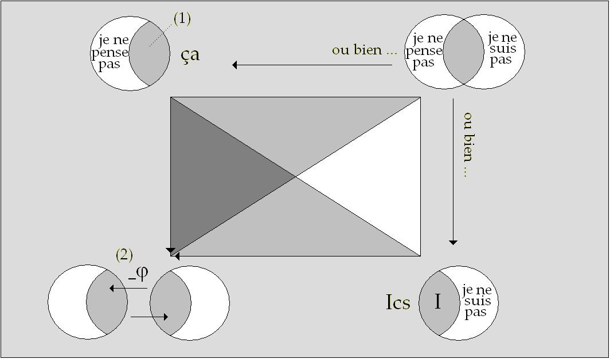
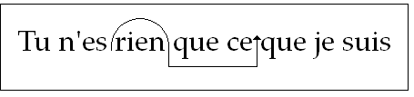
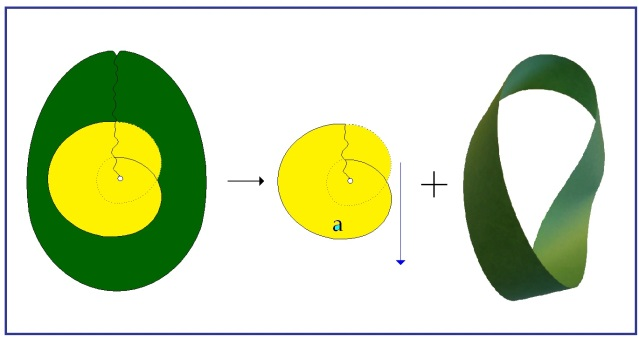

# Leçon 09 | 25 Janvier 1967

  

    <label><input type="checkbox" data-lacan-toggle="original" checked> 原文</label>
    <label><input type="checkbox" data-lacan-toggle="notes" checked> 注释</label>
    <label><input type="checkbox" data-lacan-toggle="commentary" checked> 个人解读评论</label>
  

  <form class="lacan-tool-search" role="search">
    <input class="lacan-tool-search-input" type="search" placeholder="搜索全文" aria-label="搜索全文">
    <button class="lacan-tool-button" type="submit" title="搜索">搜索</button>
  </form>
  <button class="lacan-tool-button lacan-back-to-top" type="button" title="回到页面最上方" aria-label="回到页面最上方">↑</button>

<section class="parallel-paragraph" data-paragraph-ids="s14-09-0001">

s14-09-0001

原文 · s14-09-0001

[无对应译文]

</section>

<section class="parallel-paragraph" data-paragraph-ids="s14-09-0002">

s14-09-0002

原文 · s14-09-0002

Je vous ai quittés, la dernière fois sur un premier parcours du rectangle qui est ici répété à titre de sup­port, évocateur pour vous d’indication qu’il s’agit tou­jours de s’y reporter quant au fondement de ce que nous essayons de construire cette année, d’une *logique du fan­tasme*.

[无对应译文]

</section>

<section class="parallel-paragraph" data-paragraph-ids="s14-09-0003">

s14-09-0003

原文 · s14-09-0003

Que le choix posé au principe du développement de ses opérations logiques soit cette sorte d’alternative très spéciale, que j’essaie d’articuler sous le nom - propre - d’*aliénation*, entre un « *je ne pense* *pas* » et un « *je ne suis pas* », avec ce qu’il comporte de forcé dans le choix qu’il impose, qui va de soi au « *je ne pense* *pas* ». C’est de là que nous repre­nons.

[无对应译文]

</section>

<section class="parallel-paragraph" data-paragraph-ids="s14-09-0004">

s14-09-0004

原文 · s14-09-0004

Nous avons assurément parcouru assez de chemin pour savoir maintenant comment se situe la référence ana­lytique à la découverte de l’inconscient, pour autant qu’elle donne - cette découverte - la vérité de cette *aliénation*.

[无对应译文]

</section>

<section class="parallel-paragraph" data-paragraph-ids="s14-09-0005">

s14-09-0005

原文 · s14-09-0005

Quelque chose est déjà suffisamment indiqué de ce qu’il y a, de ce qui supporte cette vérité, sous le terme maintes fois répété devant vous, de *l’objet petit(a)*. Assurément, tout ceci n’est possible que pour au­tant que depuis longtemps je vous en parle, de cet *objet petit(a)* et qu’il peut déjà représenter pour vous quelque support.

[无对应译文]

</section>

<section class="parallel-paragraph" data-paragraph-ids="s14-09-0006">

s14-09-0006

原文 · s14-09-0006

Encore l’articulation qu’il a avec cette logique, n’est–elle point poussée - bien loin de là ! - jusqu’à son terme. Simplement, Ai-je voulu indiquer, à la fin de notre dernier entretien, que *la castration* n’est assurément pas sans rapport avec cet objet, qu’elle repré­sente ceci, c’est :

[无对应译文]

</section>

<section class="parallel-paragraph" data-paragraph-ids="s14-09-0007">

s14-09-0007

原文 · s14-09-0007

- que *cet objet comme cause du désir*, domine tout ce qu’il est possible au sujet de cerner comme champ, comme prise, comme saisie de ce qui s’appelle à proprement parler, dans *l’essence de l’homme*, le désir. inutile de vous dire qu’ici, *l’essence de l’homme* est une référence spinozienne, et que je n’accorde pas à ce terme d’« *homme* » plus d’accent que je ne lui donne d’ordinaire,

[无对应译文]

</section>

<section class="parallel-paragraph" data-paragraph-ids="s14-09-0008">

s14-09-0008

原文 · s14-09-0008

- que ce désir, pour autant qu’il se limite à cette causation par *l’objet petit(a)*, c’est exactement le même point qui nécessite qu’au niveau de la sexualité, le désir se représente par la marque d’un manque,

[无对应译文]

</section>

<section class="parallel-paragraph" data-paragraph-ids="s14-09-0009">

s14-09-0009

原文 · s14-09-0009

- que tout s’ordonne et s’origine dans *le rapport sexuel* tel qu’il se produit *chez l’être parlant* en raison de ceci : autour du signe de la castration, à savoir au départ autour du *phallus*, en tant qu’il représente la possibilité d’*un manque d’objet*.

[无对应译文]

</section>

<section class="parallel-paragraph" data-paragraph-ids="s14-09-0010">

s14-09-0010

原文 · s14-09-0010

La castration donc, c’est quelque chose comme de s’éveiller à ce que la sexualité…

[无对应译文]

</section>

<section class="parallel-paragraph" data-paragraph-ids="s14-09-0011">

s14-09-0011

原文 · s14-09-0011

> je veux dire : tout ce qui s’en réalise dans l’évènement psychique …ce soit ça, à savoir *quelque chose qui se marque du signe d’un manque*.

[无对应译文]

</section>

<section class="parallel-paragraph" data-paragraph-ids="s14-09-0012">

s14-09-0012

原文 · s14-09-0012

De ceci par exemple, que l’Autre - l’Autre du vécu inau­gural de la vie de l’enfant - doive à un moment apparaître comme castré.

[无对应译文]

</section>

<section class="parallel-paragraph" data-paragraph-ids="s14-09-0013">

s14-09-0013

原文 · s14-09-0013

Et sans doute, cette horreur qui est liée à la première appréhension de la castration, comme étant supportée par ce que nous désignons dans le langage analy­tique comme *la Mère…*

[无对应译文]

</section>

<section class="parallel-paragraph" data-paragraph-ids="s14-09-0014">

s14-09-0014

原文 · s14-09-0014

> *à savoir ce qui n’est pas purement et simplement à prendre comme le personnage chargé de di­verses fonctions dans une certaine relation typifiée*
>
> *à l’origine de la vie du petit humain, mais aussi bien com­me quelque chose qui a le rapport le plus profond avec cet Autre qui est mis en question à l’origine de toute cette opération logique* …que cet Autre soit castré, l’horreur corrélative et régulière si l’on peut dire, qui se produit à cette découverte, est quelque chose qui nous porte au cœur de ce dont il s’agit quant à la relation du sujet à l’Autre en tant qu’elle s’y fonde.

[无对应译文]

</section>

<section class="parallel-paragraph" data-paragraph-ids="s14-09-0015">

s14-09-0015

原文 · s14-09-0015

La sexualité, telle qu’elle est vécue, telle qu’elle opère, c’est à cet endroit quelque chose de fondamenta­lement… *dans tout ce que nous repérons à notre expérience analytique* …quelque chose qui représente un « *se* *défendre* » de donner suite à cette vérité « *qu’il n’y a pas d’Autre* ».

[无对应译文]

</section>

<section class="parallel-paragraph" data-paragraph-ids="s14-09-0016">

s14-09-0016

原文 · s14-09-0016

C’est ce que j’ai à commenter pour vous aujourd’hui. Car assurément, j’ai pris l’abord de la tradition philoso­phique pour prononcer

[无对应译文]

</section>

<section class="parallel-paragraph" data-paragraph-ids="s14-09-0017">

s14-09-0017

原文 · s14-09-0017

« *Cet Autre n’existe pas* », et à ce propos évoquer la corrélation *athéiste* que cette *profes­sion* comporte.

[无对应译文]

</section>

<section class="parallel-paragraph" data-paragraph-ids="s14-09-0018">

s14-09-0018

原文 · s14-09-0018

Mais bien sûr, ce n’est pas quelque chose à quoi nous puissions nous arrêter. Et il faut bien nous demander, aller plus loin dans le sens de poser la ques­tion : cette chute du grand A : S(A)…

[无对应译文]

</section>

<section class="parallel-paragraph" data-paragraph-ids="s14-09-0019">

s14-09-0019

原文 · s14-09-0019

> que nous posons comme étant le terme logiquement équi­valent du choix inaugural de l’aliénation …qu’est-ce que ça veut dire ?

[无对应译文]

</section>

<section class="parallel-paragraph" data-paragraph-ids="s14-09-0020">

s14-09-0020

原文 · s14-09-0020

Rien ne peut choir que ce qui est ici A, *que si A n’est pas, nous posons qu’il n’y a nul lieu où s’assurera la vérité constituée par la parole*.

[无对应译文]

</section>

<section class="parallel-paragraph" data-paragraph-ids="s14-09-0021">

s14-09-0021

原文 · s14-09-0021

Si ce ne sont pas les mots qui sont vides, mais si ce sont plutôt… s’il faut plu­tôt dire que les mots n’ont pas de place qui justifie la mise en question toujours par *la conscience commune* *de ce qui n’est que mots*, dit-on, que veut dire, qu’ajoute cette formulation : S(A), que je vous donne pour être la clef qui nous permet de partir, de partir d’un pas juste et que nous puissions soutenir assez longtemps, concernant *la logique du fantasme*. Si c’est un algorithme du type mathématique, dont je me sers pour supporter ce S(A), c’est sans doute bien pour affirmer qu’il y a un autre sens, plus profond, à découvrir.

[无对应译文]

</section>

<section class="parallel-paragraph" data-paragraph-ids="s14-09-0022">

s14-09-0022

原文 · s14-09-0022

Est–ce que qui si vraiment, *comme je le dis,* la conscience moderne - qu’elle soit celle des religieux ou de ceux qui ne le sont pas *–* est dans son en­semble athée, est–ce que ce ne serait pas quelque chose comme de souffler une ombre, simplement que d’affirmer cette non-existence de grand A ? Est-ce qu’il ne s’agit pas, derrière cela, d’autre chose ?

[无对应译文]

</section>

<section class="parallel-paragraph" data-paragraph-ids="s14-09-0023">

s14-09-0023

原文 · s14-09-0023

Il y a bien des façons de s’apercevoir qu’il s’a­git en effet, d’autre chose. Que veut dire grand A marqué d’une barre : A ?

[无对应译文]

</section>

<section class="parallel-paragraph" data-paragraph-ids="s14-09-0024">

s14-09-0024

原文 · s14-09-0024

Eh bien, je viens de le dire, je n’ai pas besoin d’aller cher­cher plus loin : il est marqué.

[无对应译文]

</section>

<section class="parallel-paragraph" data-paragraph-ids="s14-09-0025">

s14-09-0025

原文 · s14-09-0025

### Le sens de ce que PASCAL appelait le « *Dieu de la philosophie* »…

[无对应译文]

</section>

<section class="parallel-paragraph" data-paragraph-ids="s14-09-0026">

s14-09-0026

原文 · s14-09-0026

> de *cette référence à l’Autre si essentielle chez Descartes* et qui nous a permis d’en partir pour assu­rer notre premier pas …est-ce que ce n’est pas justement, que l’Autre…

[无对应译文]

</section>

<section class="parallel-paragraph" data-paragraph-ids="s14-09-0027">

s14-09-0027

原文 · s14-09-0027

> *l’Autre de ce que Pascal appelle le « Dieu des philosophes », l’Autre en tant qu’il est en effet si néces­saire à l’édification de toute philosophie* …est-ce qu’il ne le caractérise pas au plus, au mieux…

[无对应译文]

</section>

<section class="parallel-paragraph" data-paragraph-ids="s14-09-0028">

s14-09-0028

原文 · s14-09-0028

> *et même aussi bien irions-nous plus loin, chez les mystiques con­temporains de la même étape du réfléchissement sur ce thè­me de l’Autre* …est-ce qu’il ne le caractérise pas essentiellement de *n’être pas marqué* ? Théologie né­gative…

[无对应译文]

</section>

<section class="parallel-paragraph" data-paragraph-ids="s14-09-0029">

s14-09-0029

原文 · s14-09-0029

Et *qu’est-ce que veut dire cette perfection invo­quée dans l’« argument ontologique* », si ce n’est précisé­ment que nulle marque ne l’entame ?

[无对应译文]

</section>

<section class="parallel-paragraph" data-paragraph-ids="s14-09-0030">

s14-09-0030

原文 · s14-09-0030

En ce sens, le symbole S(A) - *grand S, parenthèse de A barré* - veut dire que nous ne pouvons raisonner notre ex­périence qu’à partir de ceci : que *l’Autre est <u>marqué</u>*. Et c’est bien en effet ce dont il s’agit dès l’a­bord, de *cette castration primitive* atteignant l’être ma­ternel : *l’Autre est marqué*. Nous nous en apercevons très vite, à de menus signes.

[无对应译文]

</section>

<section class="parallel-paragraph" data-paragraph-ids="s14-09-0031">

s14-09-0031

原文 · s14-09-0031

S’il fallait, avant que je le profère ici, devant vous, de façon magistrale…

[无对应译文]

</section>

<section class="parallel-paragraph" data-paragraph-ids="s14-09-0032">

s14-09-0032

原文 · s14-09-0032

> ce qui est toujours quelque peu abuser de la créance qui est faite à la parole de ce­lui qui enseigne …essayer de voir à de petits signes comme ceux-ci, qui se voient à ce qu’on fait quand on tra­duit : si je parlais en allemand, vous pouvez vous poser la question de savoir comment je le traduirais, cet Autre…

[无对应译文]

</section>

<section class="parallel-paragraph" data-paragraph-ids="s14-09-0033">

s14-09-0033

原文 · s14-09-0033

> que vous me passez depuis tant d’années, parce que je vous en ai rebattu les oreilles …« *das Anderes* », ou « *der An­dere* » ?

[无对应译文]

</section>

<section class="parallel-paragraph" data-paragraph-ids="s14-09-0034">

s14-09-0034

原文 · s14-09-0034

Vous voyez la difficulté qui se soulève du seul fait, non pas comme on le dit, qu’il y ait des langues où *le neutre* constituerait le *non-marqué* quant au *genre*. Ceci est tout à fait absurde ! La notion du *genre* ne se confond pas avec *la bipolarité masculin-féminin*.

[无对应译文]

</section>

<section class="parallel-paragraph" data-paragraph-ids="s14-09-0035">

s14-09-0035

原文 · s14-09-0035

Le *neu­tre* est un *genre* aussi et justement *marqué*. Le propre des langues où il n’est pas marqué, c’est qu’il peut y avoir du non-marqué qui va s’abriter sous le *masculin*, régulière­ment. Et c’est ce qui me permet de vous parler de l’Autre, sans que vous ayez à vous interroger s’il faut traduire par « *das Anderes* » ou « *der An­dere* ».

[无对应译文]

</section>

<section class="parallel-paragraph" data-paragraph-ids="s14-09-0036">

s14-09-0036

原文 · s14-09-0036

*Ce qui entraîne* *- vous pouvez le remarquer -* si on a le choix à faire…

[无对应译文]

</section>

<section class="parallel-paragraph" data-paragraph-ids="s14-09-0037">

s14-09-0037

原文 · s14-09-0037

> *il faudrait que je parle* - je n’en ai pas eu le temps avant d’édifier pour vous ces réflexions aujourd’hui - *il faudrait que je parle avec quelque anglo­phone*, ils ne manquent pas dans mon auditoire mais… je voulais le faire hier soir, le temps m’a manqué …pour­quoi, en anglais il y a quelque tirage - *j’ai pu m’en aper­cevoir lors de mon dernier discours pour Baltimore - à le traduire par* « *the Other* » ?

[无对应译文]

</section>

<section class="parallel-paragraph" data-paragraph-ids="s14-09-0038">

s14-09-0038

原文 · s14-09-0038

À ce qu’il parait, ça ne va pas tout seul en anglais, j’imagine que c’est en raison de la valeur tout à fait différente qu’a le « *the* », l’article dé­fini en anglais, et qu’il a bien fallu que je passe – pour en parler de cet Autre, de *mon* Autre - par « *the Otherness *».

[无对应译文]

</section>

<section class="parallel-paragraph" data-paragraph-ids="s14-09-0039">

s14-09-0039

原文 · s14-09-0039

Il s’agissait toujours d’aller dans le sens du *non­ marqué*. On a pris la voie qu’on a pu, en anglais. On est passé par… une qualité, une qualité incertaine : le *other­ness, quelque chose qui se dérobe essentiellement*, puisque, où que nous l’atteignions, elle sera toujours *autre*.

[无对应译文]

</section>

<section class="parallel-paragraph" data-paragraph-ids="s14-09-0040">

s14-09-0040

原文 · s14-09-0040

Je ne peux pas dire que je sois très à l’aise pour y trouver *un représentant du sens* que je veux donner à « *l’Autre* » et as­surément, ceux qui m’en ont proposé la traduction, non plus !

[无对应译文]

</section>

<section class="parallel-paragraph" data-paragraph-ids="s14-09-0041">

s14-09-0041

原文 · s14-09-0041

Mais ceci, ceci en soi-même est assez significatif de ce dont il s’agit, et très précisément de la répugnance qu’il y a à introduire dans la catégorie de l’Autre, *la fonction de la marque*. Alors, quand vous avez affaire au « *Dieu d’Abraham, d’Isaac et de Jacob* »[^41], alors là, la marque vous n’en êtes pas privés ! C’est bien pour ça que ça ne va pas tout seul et qu’aussi bien, ceux qui ont affaire, *indirectement, personnellement, corrélativement*, encore à cette sorte d’Au­tre, ont un destin, eux aussi, bien marqué.

[无对应译文]

</section>

<section class="parallel-paragraph" data-paragraph-ids="s14-09-0042">

s14-09-0042

原文 · s14-09-0042

J’avais rêvé *- aux quelques « petits » de cette tribu qui m’entourent -* de leur rendre le service d’élucider un peu la question, concernant leurs rapports avec le nom - au Dieu… le Dieu au nom imprononçable - à celui qui s’est exprimé dans le registre du « *je* », il faut le dire. Non pas : « *Je suis celui qui suis* » - pâle transposition d’une pensée plotinienne - mais : « *je suis ce que je suis* », tout simplement.

[无对应译文]

</section>

<section class="parallel-paragraph" data-paragraph-ids="s14-09-0043">

s14-09-0043

原文 · s14-09-0043

Oui, j’avais pensé - je l’ai dit, j’y revien­drai toujours - à leur rendre ce service, mais nous en resterons toujours là tant que je n’aurai pas repris cette question du *Nom du Père*…J’ai parlé des « *petits* », assurément il y a aussi les « *grands* ». Les grands Juifs qui n’ont pas besoin de moi pour s’affronter à leur Dieu.

[无对应译文]

</section>

<section class="parallel-paragraph" data-paragraph-ids="s14-09-0044">

s14-09-0044

原文 · s14-09-0044

Mais nous, nous avons ici affaire à l’Autre en tant que champ de la vérité. Et *que cet Autre soit marqué* - que nous le voulions ou pas, comme philosophes - *qu’il soit mar­qué* au premier abord *par la castration*, voilà à quoi aujourd’hui nous avons affaire et ce contre quoi, dès lors que l’analyse existe, rien ne saurait prévaloir. C’est pourquoi je considère qu’il y a tout lieu de rompre sur un certain terrain : qu’il y a des spéculations pour lesquelles il ne faut pas se laisser aller à ce pen­chant, *non pas même de juger, comme on me l’a imputé*, mais simplement d’aller y chercher ce dont elles témoignent *in­volontairement*, de la vérité qu’elles manquent.

[无对应译文]

</section>

<section class="parallel-paragraph" data-paragraph-ids="s14-09-0045">

s14-09-0045

原文 · s14-09-0045

Parce que l’y faire remarquer…

[无对应译文]

</section>

<section class="parallel-paragraph" data-paragraph-ids="s14-09-0046">

s14-09-0046

原文 · s14-09-0046

> dans la pensée par exemple, de tel philosophe contemporain …que dans tel point, il y a quelque chose qui vient prendre la place d’un manque, justement, et qui s’exprime de façon plus ou moins embarrassée, par exemple comme « *conscience thétique de soi* », dont il n’y a vraiment rien à dire, si ce n’est que ce n’est pas un *Unsinn*, car un *Unsinn* ce n’est pas « *rien quant au Sinn* », nous le savons, mais que c’est à proprement parler - j’ai dit « *conscience <u>non</u> thétique de soi* » n’est-ce pas - que c’est à proprement parler « *sinnlos* » c’est encore trop en dire, car c’est concéder que ce point pourrait être la marque du lieu–même qui serait ce quelque chose d’in­diqué comme manquant.

[无对应译文]

</section>

<section class="parallel-paragraph" data-paragraph-ids="s14-09-0047">

s14-09-0047

原文 · s14-09-0047

Or ce n’est nulle part, ce n’est en rien de sem­blable, ce n’est pas en cette impensable antériorité de ce qui s’instaure comme point de *Selbstbewusstsein,* que nous de­vons chercher ce point nodal, s’il est nécessaire à défi­nir - et il est nécessaire à définir parce qu’il est trou­vable, vous allez le voir - ce *point nodal*, qui serait pour nous, dans la position où nous nous sommes mis, le *point tournant* où retrouver le lien du *cogito*.

[无对应译文]

</section>

<section class="parallel-paragraph" data-paragraph-ids="s14-09-0048">

s14-09-0048

原文 · s14-09-0048

Ce n’est pas rien pourtant que *l’Autre réapparais­se*, par exemple dans telle spéculation, pour autant qu’ici je l’invoque. Et si j’en parle, c’est pour montrer que jusque dans les détails poursuivis, seule la rupture peut répondre à la recherche antérieurement tracée.

[无对应译文]

</section>

<section class="parallel-paragraph" data-paragraph-ids="s14-09-0049">

s14-09-0049

原文 · s14-09-0049

Comment, par exemple, ne pas s’apercevoir que cette pensée qu’ici j’invoque…

[无对应译文]

</section>

<section class="parallel-paragraph" data-paragraph-ids="s14-09-0050">

s14-09-0050

原文 · s14-09-0050

> sans vouloir lui donner son la­bel, précisément pour bien marquer que ce dont il s’agit,
>
> quant à ce dont nous avons à trancher sur *ce chemin de la pensée*, …ne saurait d’aucune façon s’autoriser d’aucun label, et moins du mien que de tout autre.

[无对应译文]

</section>

<section class="parallel-paragraph" data-paragraph-ids="s14-09-0051">

s14-09-0051

原文 · s14-09-0051

Regardez où cette pensée nous conduit, quand il s’a­git de la déroute du voyeur par exemple : cet accent mis, ce *regard* aussi, cette pensée qui se dirige, pour la *jus­tifier*, vers *sa surprise* *– celle du voyeur –* *par le regard d’un autre* justement, *d’un arrivant, d’un survenant,* pen­dant qu’il a l’œil à la porte.

[无对应译文]

</section>

<section class="parallel-paragraph" data-paragraph-ids="s14-09-0052">

s14-09-0052

原文 · s14-09-0052

De sorte que ce regard est déjà suffisamment évoqué par le petit bruit *annonciateur* de cette venue quand - très précisément - ce dont il s’agit quant au statut de l’acte du voyeur, c’est bien en effet de *ce quelque chose* qu’il nous faut nous aussi nommer *le regard* qu’il s’agit, mais qui est à chercher bien ailleurs, à savoir justement dans *ce que le voyeur veut voir*, mais où il méconnaît qu’*il s’agit de ce qui le regarde le plus in­timement, de ce qui le fige dans sa fascination de voyeur, au point de le faire lui–même aussi inerte qu’un tableau*.

[无对应译文]

</section>

<section class="parallel-paragraph" data-paragraph-ids="s14-09-0053">

s14-09-0053

原文 · s14-09-0053

Je ne reprendrai pas ici le tracé de ce que j’ai déjà amplement développé. Mais l’errance radicale qui est la même que celle qui s’exprime à « *huis clos* » dans cette formule : que l’enfer, c’est notre image à jamais fixée dans l’Autre.

[无对应译文]

</section>

<section class="parallel-paragraph" data-paragraph-ids="s14-09-0054">

s14-09-0054

原文 · s14-09-0054

Ce qui est faux : si l’enfer est quelque part, c’est dans « *je* ».

[无对应译文]

</section>

<section class="parallel-paragraph" data-paragraph-ids="s14-09-0055">

s14-09-0055

原文 · s14-09-0055

Et dans toute cette errance il n’y a nulle « *mauvaise foi* » à invoquer, aussi excusante en fin de compte que la ruse chrétienne apologétique de la « *bonne foi* », faite pour apprivoiser le narcissisme du pécheur.

[无对应译文]

</section>

<section class="parallel-paragraph" data-paragraph-ids="s14-09-0056">

s14-09-0056

原文 · s14-09-0056

Il y a *la voie juste* ou il y a *la voie fausse*. Il n’y a pas de *transition*, les trébuchements de *la voie fausse* n’ont aucune valeur tant qu’ils ne sont pas analysés et ils ne peuvent être analy­sés qu’à partir d’un départ radicalement différent en l’occasion.

[无对应译文]

</section>

<section class="parallel-paragraph" data-paragraph-ids="s14-09-0057">

s14-09-0057

原文 · s14-09-0057

Dans l’occasion : l’admission, à la base et au principe de l’inconscient et la recherche de ce qui consti­tue comme tel son statut.

[无对应译文]

</section>

<section class="parallel-paragraph" data-paragraph-ids="s14-09-0058">

s14-09-0058

原文 · s14-09-0058

Ce qui supplée au défaut de la *Selbstbewusstsein* ne saurait être d’aucune façon situé comme sa propre impossi­bilité.

[无对应译文]

</section>

<section class="parallel-paragraph" data-paragraph-ids="s14-09-0059">

s14-09-0059

原文 · s14-09-0059

C’est ailleurs qu’il nous en faut chercher *la fonc­tion*, si je puis dire, puisque ce ne sera même pas *la mère fonction*.

[无对应译文]

</section>

<section class="parallel-paragraph" data-paragraph-ids="s14-09-0060">

s14-09-0060

原文 · s14-09-0060

Sur ce qu’il en est dans cette *trace* que je quit­te maintenant et sur laquelle il m’a bien fallu, au nom de quelque *confusion* où il semble qu’il est *presque néces­saire* de se trouver impliqué…

[无对应译文]

</section>

<section class="parallel-paragraph" data-paragraph-ids="s14-09-0061">

s14-09-0061

原文 · s14-09-0061

> puisque j’ai pu entendre dans la bouche d’analystes, qu’il y avait tout de même quel­que chose à retenir dans
>
> le rapprochement que du dehors on essayait d’instaurer, de la survenue d’une certaine pen­sée, sur le fond supposé d’une philosophie, prétendue par elle attaquée voire subvertie …il est très surprenant que la possibilité d’une telle référence puisse être même, et par quelqu’un par exemple qui soit analyste, admise comme un de ces simples effets possibles de ce qu’on appel­le, dans l’occasion, *aliénation*.

[无对应译文]

</section>

<section class="parallel-paragraph" data-paragraph-ids="s14-09-0062">

s14-09-0062

原文 · s14-09-0062

J’ai entendu cette chose, et dans la bouche de quelqu’un qui ne fait certainement pas toujours erreur, certainement à une date où je n’avais pas, peut-être, encore à ses oreilles, assez fait retentir ce qu’il en est véritablement de ce qu’il faut penser du terme *aliénation*.

[无对应译文]

</section>

<section class="parallel-paragraph" data-paragraph-ids="s14-09-0063">

s14-09-0063

原文 · s14-09-0063

L’*aliénation* n’a absolument rien à faire avec ce qui résulte de déformation, de perte, dans tout ce qui est *communication*…

[无对应译文]

</section>

<section class="parallel-paragraph" data-paragraph-ids="s14-09-0064">

s14-09-0064

原文 · s14-09-0064

> même, je dirais enfin, de la façon la plus traditionnelle et dès lors que maintenant c’est suffisam­ment établi …d’une pensée qu’on appelle « marxiste ».

[无对应译文]

</section>

<section class="parallel-paragraph" data-paragraph-ids="s14-09-0065">

s14-09-0065

原文 · s14-09-0065

Il est clair que l’*aliénation*, au sens marxiste, n’a rien à faire avec ce qui n’est à proprement parler que confusion.

[无对应译文]

</section>

<section class="parallel-paragraph" data-paragraph-ids="s14-09-0066">

s14-09-0066

原文 · s14-09-0066

L’*alié­nation* marxiste, d’ailleurs, ne suppose absolument pas en soi *l’existence de l’Autre*, elle consiste simplement en ceci : *que je ne reconnais pas*, par exemple, *mon travail dans cette chose…*

[无对应译文]

</section>

<section class="parallel-paragraph" data-paragraph-ids="s14-09-0067">

s14-09-0067

原文 · s14-09-0067

> qui n’a absolument rien à faire avec *l’opinion* et qu’aucune *persuasion sociologique* ne modi­fiera en aucun cas …à savoir que mon travail - le mien, à moi-même - il me revient et qu’il faut que je le paie d’un certain prix.

[无对应译文]

</section>

<section class="parallel-paragraph" data-paragraph-ids="s14-09-0068">

s14-09-0068

原文 · s14-09-0068

C’est là quelque chose qui ne se résout par aucune dialectique directe, qui suppose le jeu de toutes sortes de chaînons bien réels, si l’on veut en modifier, non pas la chaîne, ni le mécanisme qui est impossible à rompre, mais les conséquences les plus nocives.

[无对应译文]

</section>

<section class="parallel-paragraph" data-paragraph-ids="s14-09-0069">

s14-09-0069

原文 · s14-09-0069

Il en est de même pour ce dont il s’agit concernant *l’aliénation* et c’est pourquoi l’important de ce que j’é­nonce ici concernant *l’aliénation*, prend son relief, non pas de ce que tel ou tel reste plus ou moins sourd au sens de ce que j’articule, mais très précisément de ses effets sur ceux qui le comprennent parfaitement, à cette seule condition qu’ils y soient concernés de façon première.

[无对应译文]

</section>

<section class="parallel-paragraph" data-paragraph-ids="s14-09-0070">

s14-09-0070

原文 · s14-09-0070

Et c’est pourquoi c’est au niveau des *analystes* que quelquefois, sur ce que j’énonce de plus avancé, je recueille *les signes d’une angoisse*, disons qui peut aller jusqu’à l’im­patience, et que simplement la dernière fois par exemple, où j’ai pu énoncer d’une façon comme latérale, faite pour donner son véritable éclairage à ce que j’y définissais comme la position du « *je ne suis pas* » en tant qu’elle est corrélative de la fonction de l’inconscient, et que j’arti­culais sur ce point *la formule* comme la vérité de ce que l’amour ici se permet de formuler, à savoir : « *si tu n’es pas, je meurs* » dit l’amour, on connaît ce cri et je le traduis : « *tu n’es rien, que ce que je suis.* »

[无对应译文]

</section>

<section class="parallel-paragraph" data-paragraph-ids="s14-09-0071">

s14-09-0071

原文 · s14-09-0071

*N’est-il pas étrange qu’une telle formule*…

[无对应译文]

</section>

<section class="parallel-paragraph" data-paragraph-ids="s14-09-0072">

s14-09-0072

原文 · s14-09-0072

> qui va certes bien au-delà dans ce qu’elle trace d’ouverture à l’amour, pour ceci sim­plement qu’elle y indique que la *Verwerfung* qu’elle cons­titue ne relève précisément que de ceci : que l’amour ne pense pas…
>
> mais qu’elle n’articule pas - comme FREUD le fait, lui, purement et simplement - que le fondement de la *Verliebheit,* de l’amour, c’est le *Lust-Ich,* et qu’il n’est rien d’autre - *car ceci est dans FREUD affirmé -* que l’effet du narcissisme …*comment donc, à une formule*…

[无对应译文]

</section>

<section class="parallel-paragraph" data-paragraph-ids="s14-09-0073">

s14-09-0073

原文 · s14-09-0073

> dont il apparaît tout de suite qu’elle est *infiniment plus ouverte*, pour n’aller pas moins loin qu’à *cette remarque*, impliquée dans un certain commandement qui - je pense - ne vous est pas in­connu[^42] - que c’est au plus secret de toi-même que doit être cherché le ressort de l’amour du prochain …*comment donc une telle formule* peut-elle - et j’y insiste : dans une oreille analytique ! - évoquer je ne sais quelle alarme, com­me si ce que j’avais prononcé-là était dépréciatif, comme si - *comme je l’ai entendu* - je commettais quelque imprudence de l’ordre de celle-ci :

[无对应译文]

</section>

<section class="parallel-paragraph" data-paragraph-ids="s14-09-0074">

s14-09-0074

原文 · s14-09-0074

« *Qu’à des auditeurs de* 25 *ans, je me permette d’avancer un propos qui réduirait l’amour à rien.* » Chose singulière, au niveau des 25 *ans,* je n’ai eu à *cette émission*…

[无对应译文]

</section>

<section class="parallel-paragraph" data-paragraph-ids="s14-09-0075">

s14-09-0075

原文 · s14-09-0075

> *à ma connaissance bien sûr*, mais il y en a quelques-uns qui viennent me faire, dans la semaine qui suit, *des confidences* …que des réactions sin­gulièrement toniques, je dirais. Si *austère* que soit la formule, elle a paru *salubre* à beaucoup.

[无对应译文]

</section>

<section class="parallel-paragraph" data-paragraph-ids="s14-09-0076">

s14-09-0076

原文 · s14-09-0076

Qu’est-ce qui, donc, conditionne possiblement l’in­quiétude d’un analyste, si ce n’est très précisément ceci que j’ai marqué ici sur cette formule : à ce petit crochet qui déplace le « *rien* » d’un rien : « *Tu n’es que ce rien que je suis. *»

[无对应译文]

</section>

<section class="parallel-paragraph" data-paragraph-ids="s14-09-0077">

s14-09-0077

原文 · s14-09-0077

[无对应译文]

</section>

<section class="parallel-paragraph" data-paragraph-ids="s14-09-0078">

s14-09-0078

原文 · s14-09-0078

Qui n’est pas moins vrai en effet, que la formule précédente, pour autant qu’elle nous rapporte à la fonction­-clef, qui revient dans le statut de ce « *je* » du « *je suis* » à ce *petit(a)*, qui en fait, en effet *toute la question*…

[无对应译文]

</section>

<section class="parallel-paragraph" data-paragraph-ids="s14-09-0079">

s14-09-0079

原文 · s14-09-0079

> et c’est là ce sur quoi je veux aujourd’hui m’attarder encore un peu …et dont on conçoit, qu’en effet elle intéresse l’analyste.

[无对应译文]

</section>

<section class="parallel-paragraph" data-paragraph-ids="s14-09-0080">

s14-09-0080

原文 · s14-09-0080

Car dans l’opération de l’analyse…

[无对应译文]

</section>

<section class="parallel-paragraph" data-paragraph-ids="s14-09-0081">

s14-09-0081

原文 · s14-09-0081

> en tant que, seule elle, nous permet d’aller assez loin dans ce *rapport de la pensée à l’être* au niveau du «* je* », pour que
>
> ce soit elle qui introduit la fonction de la castration …le *petit(a)* dans cette opération a *à être achevé d’une queue signi­fiante* : *le* *petit(a)*, dans le chemin que trace l’analyse, *c’est l’analyste !*

[无对应译文]

</section>

<section class="parallel-paragraph" data-paragraph-ids="s14-09-0082">

s14-09-0082

原文 · s14-09-0082

Et c’est parce que l’analyste a à occuper cette po­sition du *petit(a)*, qu’en effet pour lui la formule - *et fort légitimement* - soulève l’angoisse qui convient, si l’on se souvient de ce que j’ai formulé de *l’angoisse* : « *qu’elle n’est pas sans objet* ».

[无对应译文]

</section>

<section class="parallel-paragraph" data-paragraph-ids="s14-09-0083">

s14-09-0083

原文 · s14-09-0083

Et ceci indique qu’elle soit d’autant plus fondée qu’avec cet objet, celui qui est ap­pelé par l’opération signifiante qu’est l’analyse, se trou­ve *à cette place* même suscité de s’intéresser, à tout le moins que de savoir comment il l’assume, ce sont là cho­ses qui sont encore assez distantes de la considération que nous pourrions en amener ici.

[无对应译文]

</section>

<section class="parallel-paragraph" data-paragraph-ids="s14-09-0084">

s14-09-0084

原文 · s14-09-0084

Comment ne pas reconnaî­tre qu’il n’y a là rien qui puisse plus nous dérouter que ce qui dès longtemps avait été *formulé*…

[无对应译文]

</section>

<section class="parallel-paragraph" data-paragraph-ids="s14-09-0085">

s14-09-0085

原文 · s14-09-0085

> par les voies de court–circuit aphoristique d’une sagesse certes perdue mais pas tout à fait sans écho …sous la forme du तत् त्वम् अस \[[Tat twam asi](http://en.wikipedia.org/wiki/Tat_Tvam_Asi) : tu es cela\] : *reconnais-toi, tu es ceci*.

[无对应译文]

</section>

<section class="parallel-paragraph" data-paragraph-ids="s14-09-0086">

s14-09-0086

原文 · s14-09-0086

Ce qui, bien entendu, ne pouvait que rester opaque à partir d’un certain biais de la tradition philosophique.

[无对应译文]

</section>

<section class="parallel-paragraph" data-paragraph-ids="s14-09-0087">

s14-09-0087

原文 · s14-09-0087

Si le « ceci », d’aucune façon, peut être en effet identifié au corrélat de *représentation* - où s’instaure de plus en plus, dans cette tradition, le sujet - rien n’est plus vide que cette formule. Que « *je* » sois ma re­présentation n’est là que ce *quelque chose*, dont il est trop facile de dire qu’elle corrompt tout le développement moderne d’une pensée sous le nom d’*idéalisme*, et le statut de la représentation comme telle est pour nous à repren­dre.

[无对应译文]

</section>

<section class="parallel-paragraph" data-paragraph-ids="s14-09-0088">

s14-09-0088

原文 · s14-09-0088

Assurément *si ces mots ont un sens*, qu’ils s’appellent « *structuralisme* » - je ne veux pas en donner d’autres - voire « *Nouvelle critique* », ils doivent bien entendu commencer par articuler quelque chose concernant *la représentation*.

[无对应译文]

</section>

<section class="parallel-paragraph" data-paragraph-ids="s14-09-0089">

s14-09-0089

原文 · s14-09-0089

Est-ce qu’il n’est pas bien clair…

[无对应译文]

</section>

<section class="parallel-paragraph" data-paragraph-ids="s14-09-0090">

s14-09-0090

原文 · s14-09-0090

> à ouvrir seule­ment un volume comme le dernier paru des *Mythologiques* de Claude LÉVI-STRAUSS …que si l’analyse des mythes - telle qu’elle nous est présentée - a un sens, *c’est qu’elle désaxe complètement la fonction de la représentation*.

[无对应译文]

</section>

<section class="parallel-paragraph" data-paragraph-ids="s14-09-0091">

s14-09-0091

原文 · s14-09-0091

Assurément, nous avons affaire à matière morte, à l’endroit de laquelle nous n’avons plus aucun rapport de « *je* ».

[无对应译文]

</section>

<section class="parallel-paragraph" data-paragraph-ids="s14-09-0092">

s14-09-0092

原文 · s14-09-0092

Et cette analyse est un *jeu*, est un *jeu fascinant* par ce qu’il nous rappelle et dont vous pouvez trouver le témoignage, pour ne prendre que ce dernier volume, dès les premières pages - *Du* *miel aux cendres* s’intitule-t-il - et nous voyons s’articuler dans un certain nombre de *mythes*, les rapports du miel…

[无对应译文]

</section>

<section class="parallel-paragraph" data-paragraph-ids="s14-09-0093">

s14-09-0093

原文 · s14-09-0093

> conçu comme substance nourricière préparée par d’autres que l’homme,
>
> et en quelque sorte d’*avant* la distinction de la nature et de la culture …avec ce qui opère au-delà du *cru et du cuit* de la cuisine, à savoir ce qui se réduit en fumée : le tabac.

[无对应译文]

</section>

<section class="parallel-paragraph" data-paragraph-ids="s14-09-0094">

s14-09-0094

原文 · s14-09-0094

Et nous trouvons sous la plume de son auteur, ce quelque chose de singulier, attaché à quelques petites remar­ques qu’il accroche sur certains textes, par exemple médié­vaux, sur ceci qu’avant que le tabac ne nous arrivât, sa place était en quelque sorte prête par cet opposé de « *cen­dres* » qui était déjà indiqué par rapport au « *miel* », qu’en quel­que sorte « *la chose miel* », depuis longtemps \- *depuis tou­jours* - attendait « *la chose tabac* » !

[无对应译文]

</section>

<section class="parallel-paragraph" data-paragraph-ids="s14-09-0095">

s14-09-0095

原文 · s14-09-0095

Que vous suiviez ou non dans cette voie l’analyse de Claude LÉVI-STRAUSS, est-ce qu’elle n’est pas faite pour nous suggérer ce que nous connaissons dans la pratique de l’inconscient et ce qui permet de pousser plus loin la cri­tique de ce que FREUD articule sous le terme de *Sachevorstel­lungen ?*

[无对应译文]

</section>

<section class="parallel-paragraph" data-paragraph-ids="s14-09-0096">

s14-09-0096

原文 · s14-09-0096

Dans la perspective idéaliste, on pense - et après tout pourquoi FREUD ne l’aurait-il pas écrit dans ce sens - « *représentation de choses* » *en tant que ce sont les choses qui sont représentées*. Mais pourquoi répugnerions-nous à penser les rap­ports des choses, comme supportant quelques *représentations qui appartiennent aux choses elles-mêmes* ?

[无对应译文]

</section>

<section class="parallel-paragraph" data-paragraph-ids="s14-09-0097">

s14-09-0097

原文 · s14-09-0097

Puisque *les cho­ses se font signe*…

[无对应译文]

</section>

<section class="parallel-paragraph" data-paragraph-ids="s14-09-0098">

s14-09-0098

原文 · s14-09-0098

> avec toute l’ambiguïté que vous pouvez mettre dans ce terme : « *se font signe entre elles* » …qu’elles peuvent s’appeler et s’attendre, et s’ordonner comme ordre des choses, que sans aucun doute c’est là-dessus que nous jouons chaque fois qu’interprétant comme *analystes* nous faisons fonctionner quelque chose comme *Bedeutung.*

[无对应译文]

</section>

<section class="parallel-paragraph" data-paragraph-ids="s14-09-0099">

s14-09-0099

原文 · s14-09-0099

Assurément, c’est le piège. Et ce n’est pas non plus travail analytique - quelque amusant qu’en soit le jeu - de retrouver dans l’inconscient le réseau et la trame des an­ciens mythes. Là-dessus, nous serons toujours servis !

[无对应译文]

</section>

<section class="parallel-paragraph" data-paragraph-ids="s14-09-0100">

s14-09-0100

原文 · s14-09-0100

Dès lors qu’il s’agit de la *Bedeutung*, nous retrouverons tout ce que nous voudrons comme structure de l’ère mythique.

[无对应译文]

</section>

<section class="parallel-paragraph" data-paragraph-ids="s14-09-0101">

s14-09-0101

原文 · s14-09-0101

C’est bien pour ça qu’au bout d’un certain temps le jeu a lassé les analystes. C’est qu’ils se sont aperçu qu’il était trop facile.

[无对应译文]

</section>

<section class="parallel-paragraph" data-paragraph-ids="s14-09-0102">

s14-09-0102

原文 · s14-09-0102

Le jeu n’est pas facile quand il s’agit de *textes recueillis, attestés, de mythes existants*. Ils ne sont pas - *justement* - n’importe lesquels.

[无对应译文]

</section>

<section class="parallel-paragraph" data-paragraph-ids="s14-09-0103">

s14-09-0103

原文 · s14-09-0103

Mais au niveau de l’inconscient du sujet, dans l’analyse, le « *je* » est beaucoup plus souple. Et pourquoi ?

[无对应译文]

</section>

<section class="parallel-paragraph" data-paragraph-ids="s14-09-0104">

s14-09-0104

原文 · s14-09-0104

Précisément parce qu’il y est dénoué, qu’il vient se con­joindre à un « *je ne suis pas* », où se manifeste assez - je l’ai dit la dernière fois - dans ces formes qui sont, dans le rêve, omniprésente et jamais complètement identifiable, la fonction du « *je* ».

[无对应译文]

</section>

<section class="parallel-paragraph" data-paragraph-ids="s14-09-0105">

s14-09-0105

原文 · s14-09-0105

Mais autre chose est ce qui doit nous retenir ! Ce sont précisément les trous, dans ce jeu de la *Bedeutung.*

[无对应译文]

</section>

<section class="parallel-paragraph" data-paragraph-ids="s14-09-0106">

s14-09-0106

原文 · s14-09-0106

Comment n’a-t-on pas remarqué ceci, qui est pourtant d’une *présence aveuglante*, c’est à savoir le côté de *Bedeutung* « *bouché* » si je puis dire, sous lequel se manifeste tout ce qui attient à *l’objet petit(a)*.

[无对应译文]

</section>

<section class="parallel-paragraph" data-paragraph-ids="s14-09-0107">

s14-09-0107

原文 · s14-09-0107

Bien sûr les analystes font tout pour le relier à quelque fonction primordiale qu’ils s’imaginent avoir fon­dé dans l’organisme, comme par exemple, quand il s’agit de l’objet de la pulsion orale. C’est pourquoi, aussi bien, ils iront tout à fait incorrectement à parler de *bon* ou de *mauvais lait*, alors qu’il ne s’agit de rien de tel puis­qu’il s’agit du *sein*.

[无对应译文]

</section>

<section class="parallel-paragraph" data-paragraph-ids="s14-09-0108">

s14-09-0108

原文 · s14-09-0108

Il est impossible de faire le lien du lait à un *ob­jet érotique* - ce qui est essentiel au statut comme tel, de *l’objet petit(a) -* alors qu’il est bien évident que, quant au sein, l’objection n’est pas la même. Mais qui ne voit qu’un sein, c’est quelque chose - mes amis, y avez-vous jamais pensé ? - qui n’est pas re­présentable !

[无对应译文]

</section>

<section class="parallel-paragraph" data-paragraph-ids="s14-09-0109">

s14-09-0109

原文 · s14-09-0109

Je ne pense pas avoir ici une trop grande minorité de gens pour qui un sein peut constituer un objet érotique, mais *êtes-vous capable, en termes de représenta­tion, de définir au nom de quoi* ? Qu’est-ce que c’est qu’un *beau sein*, par exemple ?

[无对应译文]

</section>

<section class="parallel-paragraph" data-paragraph-ids="s14-09-0110">

s14-09-0110

原文 · s14-09-0110

Encore que le terme soit communé­ment prononcé, *je défie quiconque* de donner un support quelconque à ce terme de *beau sein.*

[无对应译文]

</section>

<section class="parallel-paragraph" data-paragraph-ids="s14-09-0111">

s14-09-0111

原文 · s14-09-0111

S’il y a quelque chose que le sein constitue, il faudrait pour cela, comme un jour un apprenti-poète \[?\] qui n’est pas très loin, a articulé à la fin d’un de ses menus quatrains qu’il a commis, sous ces mots : « *Le nuage* »... « *Le nuage éblouissant des seins* ».

[无对应译文]

</section>

<section class="parallel-paragraph" data-paragraph-ids="s14-09-0112">

s14-09-0112

原文 · s14-09-0112

Il n’y a aucune autre façon, me semble-­t-il, qu’à jouer de ce registre du nuageux, en y addition­nant quelque chose de plus de l’ordre du reflet, à savoir de moins saisissable, par quoi il peut être possible de supporter, dans la *Vorstellung,* ce qu’il en est de cet objet, qui bien plutôt n’a d’autre statut que ce que nous pouvons appeler avec toute l’opacité de ces termes : un point de jouissance.

[无对应译文]

</section>

<section class="parallel-paragraph" data-paragraph-ids="s14-09-0113">

s14-09-0113

原文 · s14-09-0113

Mais qu’est-ce que ça veut dire ? Je dirais que c’est ce que je disais, un peu…

[无对应译文]

</section>

<section class="parallel-paragraph" data-paragraph-ids="s14-09-0114">

s14-09-0114

原文 · s14-09-0114

> je ne sais pas comment j’arrive à les faire passer, mais qu’importe, je l’ai peut-être écrit dans d’autres ter­mes …mais tandis que je m’efforçais de centrer, pour vous le faire sentir, ce que j’appelle en l’occasion cette « *syn­cope de la Bedeutung* »…

[无对应译文]

</section>

<section class="parallel-paragraph" data-paragraph-ids="s14-09-0115">

s14-09-0115

原文 · s14-09-0115

> puisque c’était pour vous montrer que c’est là le point que vient combler le « *Sinn »* *…*d’où sou­dain, il m’est apparu que ce qu’il y avait de plus propre à supporter *ce rôle de l’objet-sein dans le fantasme*, en tant qu’il est, lui vraiment, le support spécifique du « *je* » - du « *je* » de la pulsion orale - *mais ce n’était rien d’autre que la formule*…

[无对应译文]

</section>

<section class="parallel-paragraph" data-paragraph-ids="s14-09-0116">

s14-09-0116

原文 · s14-09-0116

> puisque vous êtes tous ici plus ou moins des initiés, des pratiquants, voire des *aficionados* de mon discours …et la formule, dont je me suis servi cent fois pour imager le caractère purement structural *du « Sinn Colourless green ideas… »*…

[无对应译文]

</section>

<section class="parallel-paragraph" data-paragraph-ids="s14-09-0117">

s14-09-0117

原文 · s14-09-0117

> ces *idées sans couleur et vertes* aussi bien, pourquoi pas ? …*sleep furiously !* Voilà les seins ! \[Rires\]

[无对应译文]

</section>

<section class="parallel-paragraph" data-paragraph-ids="s14-09-0118">

s14-09-0118

原文 · s14-09-0118

Rien, me semble-t-il, ne peut mieux exprimer le pri­vilège de cet objet, rien ne l’exprime d’une façon plus adéquate, c’est-à-dire en l’occasion poétique : qu’ils dor­ment, furieusement à l’occasion et que ce ne soit pas, pour nous, de les réveiller, une petite affaire. C’est bien là tout ce dont il s’agit, quand il s’agit des seins.

[无对应译文]

</section>

<section class="parallel-paragraph" data-paragraph-ids="s14-09-0119">

s14-09-0119

原文 · s14-09-0119

Ceci est fait pour nous mettre sur une trace. C’est à savoir, celle qui va nous rapprocher de la question de laisser en suspens, ce qui peut nous permettre de *suppléer* à la *Selbstbewusstsein.* Car bien entendu, ce n’est rien d’au­tre que *l’objet petit(a)*.

[无对应译文]

</section>

<section class="parallel-paragraph" data-paragraph-ids="s14-09-0120">

s14-09-0120

原文 · s14-09-0120

Seulement, il faut savoir le trou­ver où il est. Et ce n’est pas parce qu’on sait son nom à l’avance qu’on le rencontre, et d’ailleurs le rencontrer ne signifie rien, sinon quelque occasion d’amusement.

[无对应译文]

</section>

<section class="parallel-paragraph" data-paragraph-ids="s14-09-0121">

s14-09-0121

原文 · s14-09-0121

Mais qu’est-ce que FREUD - si nous prenons les cho­ses au niveau du rêve - vient pour nous à articuler ?

[无对应译文]

</section>

<section class="parallel-paragraph" data-paragraph-ids="s14-09-0122">

s14-09-0122

原文 · s14-09-0122

Nous serons frappés assurément de ce qu’il lâche, si je puis dire, pour indiquer *un certain côté vigile du sujet*, précisément *dans le sommeil*.

[无对应译文]

</section>

<section class="parallel-paragraph" data-paragraph-ids="s14-09-0123">

s14-09-0123

原文 · s14-09-0123

- S’il y a quelque chose qui caractérise bien cet Autre ou *cette faute d’Autre que je désigne comme fondamentale de l’aliénation*,

[无对应译文]

</section>

<section class="parallel-paragraph" data-paragraph-ids="s14-09-0124">

s14-09-0124

原文 · s14-09-0124

- si le « *je* » n’est ­rien plus que l’opacité de la structure logique,

[无对应译文]

</section>

<section class="parallel-paragraph" data-paragraph-ids="s14-09-0125">

s14-09-0125

原文 · s14-09-0125

- si l’intransparence de la vérité est ce qui donne le style de la découverte freudienne, …n’est-il pas étrange de lui voir di­re *que tel rêve qui contredit sa théorie du désir ne signi­fie-là rien d’autre que le désir de lui donner tort* ?

[无对应译文]

</section>

<section class="parallel-paragraph" data-paragraph-ids="s14-09-0126">

s14-09-0126

原文 · s14-09-0126

Est-ce que ce n’est pas là suffisant, à la fois

[无对应译文]

</section>

<section class="parallel-paragraph" data-paragraph-ids="s14-09-0127">

s14-09-0127

原文 · s14-09-0127

- pour montrer la justesse de cette formule que j’articule que « *le désir c’est le désir de l’Autre* »,

[无对应译文]

</section>

<section class="parallel-paragraph" data-paragraph-ids="s14-09-0128">

s14-09-0128

原文 · s14-09-0128

- et de montrer *dans quel suspens le statut du désir est laissé, si l’Autre jus­tement peut être dit n’exister pas ?*

[无对应译文]

</section>

<section class="parallel-paragraph" data-paragraph-ids="s14-09-0129">

s14-09-0129

原文 · s14-09-0129

Mais n’est-il pas encore plus remarquable de voir FREUD…

[无对应译文]

</section>

<section class="parallel-paragraph" data-paragraph-ids="s14-09-0130">

s14-09-0130

原文 · s14-09-0130

> à la fin d’une des sections de ce VIème chapitre sur lequel j’ai insisté la dernière fois …préciser que c’est d’une façon très sûre que le rêveur s’arme et se défend de ceci : *que ce qu’il rêve n’est qu’un rêve*.

[无对应译文]

</section>

<section class="parallel-paragraph" data-paragraph-ids="s14-09-0131">

s14-09-0131

原文 · s14-09-0131

À propos de quoi il va aussi loin que d’insister sur ceci : qu’il y ait *une instance qui sait* toujours - il dit : « *qui sait* » - que le su­jet dort, et que cette *instance*, même si cela peut vous surprendre, n’est pas *l’inconscient*, que c’est précisément *le préconscient*, qui représente, nous dit-il en l’occasion, le désir de dormir.

[无对应译文]

</section>

<section class="parallel-paragraph" data-paragraph-ids="s14-09-0132">

s14-09-0132

原文 · s14-09-0132

Ceci nous donnera à réfléchir sur ce qui se passe au réveil. Parce que si *le désir de dormir* se trouve, par l’intermédiaire du sommeil, si complice avec la fonction du désir comme tel, en tant qu’elle s’oppose à la réalité, qu’est-ce qui nous garantit que, sortant du sommeil, le su­jet soit plus défendu contre le désir, en tant qu’il enca­dre ce qu’il appelle « réalité » ? Le moment du réveil n’est peut-être jamais qu’un court instant : celui où l’on chan­ge de rideau. Mais laissons là cette première mise en suspens, sur laquelle je reviendrai, mais que j’ai voulu pourtant aujourd’hui toucher, puisque vous avez vu que j’ai écrit ici le mot : l’éveil.

[无对应译文]

</section>

<section class="parallel-paragraph" data-paragraph-ids="s14-09-0133">

s14-09-0133

原文 · s14-09-0133

Suivons FREUD : *rêver qu’on rêve* doit être l’objet d’une fonction bien sûre, pour que nous puissions dire qu’à tous les coups ceci désigne l’approche imminente de la réalité ! Que quelque chose puisse s’apercevoir qu’il se remparde d’une fonction d’erreur, pour ne pas repérer la réalité, est-ce que nous ne voyons pas qu’il y a là…

[无对应译文]

</section>

<section class="parallel-paragraph" data-paragraph-ids="s14-09-0134">

s14-09-0134

原文 · s14-09-0134

> quoi­que d’une voie exactement contraire que l’assertion de ce­ci : qu’une idée est transparente à elle-même …la trace de quelque chose qui mérite d’être suivi ?

[无对应译文]

</section>

<section class="parallel-paragraph" data-paragraph-ids="s14-09-0135">

s14-09-0135

原文 · s14-09-0135

Et pour vous faire sentir comment l’entendre, il me semble que je ne peux pas mieux faire que d’aller, grâce au chemin que m’of­fre une fable, bien connue d’être tirée d’un vieux texte chinois, d’un \[texte\] de TCHOUANG TSOU. Dieu sait ce qu’on lui fait dire au pauvre, et nommément à propos de ce rêve, de ce rêve bien connu, de ce qu’il aurait dit - *à propos d’avoir rêvé* - de s’être rêvé lui-même être un papillon. Il aurait inter­rogé ses disciples sur le sujet de savoir comment distinguer :

[无对应译文]

</section>

<section class="parallel-paragraph" data-paragraph-ids="s14-09-0136">

s14-09-0136

原文 · s14-09-0136

- TCHOUANG TSOU se rêvant papillon,

[无对应译文]

</section>

<section class="parallel-paragraph" data-paragraph-ids="s14-09-0137">

s14-09-0137

原文 · s14-09-0137

- d’un papillon qui, tout réveillé qu’il se croie, ne ferait que rêver d’être TCHOUANG TSOU.

[无对应译文]

</section>

<section class="parallel-paragraph" data-paragraph-ids="s14-09-0138">

s14-09-0138

原文 · s14-09-0138

Il est inutile de vous dire *que ceci n’a absolument pas le sens qu’on lui donne d’habitude* dans le texte de TCHOUANG TSOU et que les phrases qui suivent mon­trent assez de quoi il s’agit et où cela nous porte.

[无对应译文]

</section>

<section class="parallel-paragraph" data-paragraph-ids="s14-09-0139">

s14-09-0139

原文 · s14-09-0139

Il ne s’agit de rien de moins que de la formation des êtres. À savoir de choses et de voies qui nous échappent depuis longtemps dans une très grande mesure, je veux dire quant à ce qu’il en était exactement pensé par ceux qui en ont laissé les traces écrites.

[无对应译文]

</section>

<section class="parallel-paragraph" data-paragraph-ids="s14-09-0140">

s14-09-0140

原文 · s14-09-0140

Mais ce rêve, je vais me permettre de supposer qu’il a été inexactement rapporté. TCHOUANG TSOU, quand il s’est rêvé papillon, s’est dit : « *ce n’est qu’un rêve* » ce qui est tout à fait conforme à sa mentalité. Il ne doute pas un instant de surmonter ce menu problème de son identité quant à être TCHOUANG TSOU.

[无对应译文]

</section>

<section class="parallel-paragraph" data-paragraph-ids="s14-09-0141">

s14-09-0141

原文 · s14-09-0141

Il se dit : « *ce n’est qu’un rêve* », et c’est précisément en quoi il manque la réalité, car en tant que quelque chose qui est le « *je* » de TCHOUANG TSOU repose dans ceci qui est si essentiel à toute condition du sujet, à savoir : que l’objet est vu, il n’est rien qui nous permette de mieux surmonter ce qu’a de traître ce monde de la vision, en tant qu’il supporterait cette sorte de rassemblement de quelque façon que nous l’appelions - *monde* ou *étendue* - dont le sujet serait seul support et le seul mode d’existence.

[无对应译文]

</section>

<section class="parallel-paragraph" data-paragraph-ids="s14-09-0142">

s14-09-0142

原文 · s14-09-0142

Ce qui fait la consistance de ce sujet en tant qu’il voit, c’est-à-dire, en tant qu’il n’a que *la géométrie de sa vision*, en tant qu’à l’Autre il peut dire : « *ceci est à droite* », « *ceci est à gauche* », « *ceci est en dedans* » et « *ceci est en dehors* ». Qu’est-ce qui lui permet de se situer comme « *je* », sinon ceci que je vous ai déjà en son temps souligné :

[无对应译文]

</section>

<section class="parallel-paragraph" data-paragraph-ids="s14-09-0143">

s14-09-0143

原文 · s14-09-0143

- qu’il est lui–même *tableau* dans ce monde visible,

[无对应译文]

</section>

<section class="parallel-paragraph" data-paragraph-ids="s14-09-0144">

s14-09-0144

原文 · s14-09-0144

- que le papillon n’est là rien d’autre que ce qui le désigne lui-même comme *tache*, et comme ce qu’a d’originelle *la tache* dans le surgissement au niveau de l’organisme de quelque chose qui fera vision.

[无对应译文]

</section>

<section class="parallel-paragraph" data-paragraph-ids="s14-09-0145">

s14-09-0145

原文 · s14-09-0145

C’est bien en tant que le « *je* » lui-même est *tache sur fond*, et que ce dont il va interroger ce qu’il voit est très précisément ce qu’il ne peut trouver et qui se dérobe, cette *origine de regard*, combien plus sensible et manifeste à être articulée pour nous que la lumière du soleil, pour inaugurer ce qu’est de *l’ordre du* *« je » dans la relation scoptophillique*.

[无对应译文]

</section>

<section class="parallel-paragraph" data-paragraph-ids="s14-09-0146">

s14-09-0146

原文 · s14-09-0146

Est-ce que ce n’est pas là que le « *je rêve seulement* » et ce qui masque *la réalité du regard* en tant qu’elle est à découvrir ? C’est en ce point que je voulais vous amener aujourd’hui concernant ce rappel de *la fonction de l’objet(a) et sa corrélation étroite au* « *je* ».

[无对应译文]

</section>

<section class="parallel-paragraph" data-paragraph-ids="s14-09-0147">

s14-09-0147

原文 · s14-09-0147

Pourtant, n’est-il pas vrai que quelque soit le lien que supporte, qu’indique - comme l’encadrant - le « *je* » de tous les fantasmes, nous ne pouvons pas encore saisir, dans une multiplicité, au reste, de ces *objets petit(a),* ce qui lui donne ce privilège dans le statut du *« je » en tant qu’il se pose comme désir*.

[无对应译文]

</section>

<section class="parallel-paragraph" data-paragraph-ids="s14-09-0148">

s14-09-0148

原文 · s14-09-0148

Il y a seulement ce que nous permettra de *désigner*, d’*inscrire*, d’une façon plus précise, l’invocation de *la* *répétition*.

[无对应译文]

</section>

<section class="parallel-paragraph" data-paragraph-ids="s14-09-0149">

s14-09-0149

原文 · s14-09-0149

Si le sujet peut inscrire dans un certain rapport, qui est rapport de perte par rapport à ce champ où se dessine le trait dont il s’assure dans la répétition, c’est que ce champ a une structure, disons que nous avons déjà avancée sous le terme de topologie.

[无对应译文]

</section>

<section class="parallel-paragraph" data-paragraph-ids="s14-09-0150">

s14-09-0150

原文 · s14-09-0150

Assurer d’une façon rigoureuse ce que veut dire *l’objet(a)* par rapport à une surface, nous n’avons déjà approché dans cette image de ce quelque chose qui se découpe dans certaines surfaces privilégies de façon à laisser *quelque chose* tomber.

[无对应译文]

</section>

<section class="parallel-paragraph" data-paragraph-ids="s14-09-0151">

s14-09-0151

原文 · s14-09-0151

[无对应译文]

</section>

<section class="parallel-paragraph" data-paragraph-ids="s14-09-0152">

s14-09-0152

原文 · s14-09-0152

Cet *objet de chute* qui nous a retenus, que nous avons cru devoir imager dans un petit fragment de surface, assurément c’est là encore représentation grossière et inadéquate. Ni la notion de surface n’est à repousser, ni la notion de l’effet du trait et de la coupure.

[无对应译文]

</section>

<section class="parallel-paragraph" data-paragraph-ids="s14-09-0153">

s14-09-0153

原文 · s14-09-0153

Mais bien sûr ce n’est pas de la forme de tel ou tel *lambeau*, quelque propice que nous paraisse cette image à être rapprochée de ce qui est usité dans le discours analytique sous le terme *d’objet partiel,* qu’il nous faut nous contenter.

[无对应译文]

</section>

<section class="parallel-paragraph" data-paragraph-ids="s14-09-0154">

s14-09-0154

原文 · s14-09-0154

Au regard de surfaces que nous avons définies, non pas comme quelque chose qui soit à considérer sous l’angle spatial, mais quelque chose précisément dont chaque point témoigne d’une structure qui ne peut en être exclue, je veux dire en chaque point, c’est pour autant que nous parvien­drons à y articuler certains effets de coupure que nous con­naîtrons quelque chose à ces *points évanouissants* que nous pouvons décrire comme *objets petit(a)*.

[无对应译文]

</section>

<section class="note-block original-notes">

## Notes

[^41]: Cf. Pascal : [Le Mémorial](http://www.croixsens.net/pascal/page2.php) : « *Dieu d'Abraham, Dieu d'Isaac, Dieu de Jacob, non des philosophes et des savants*… »

[^42]: « *Tu aimeras ton prochain comme toi-même* » Cf. Matthieu, XXII, 39 ; Marc XII, 28/31…

</section>
