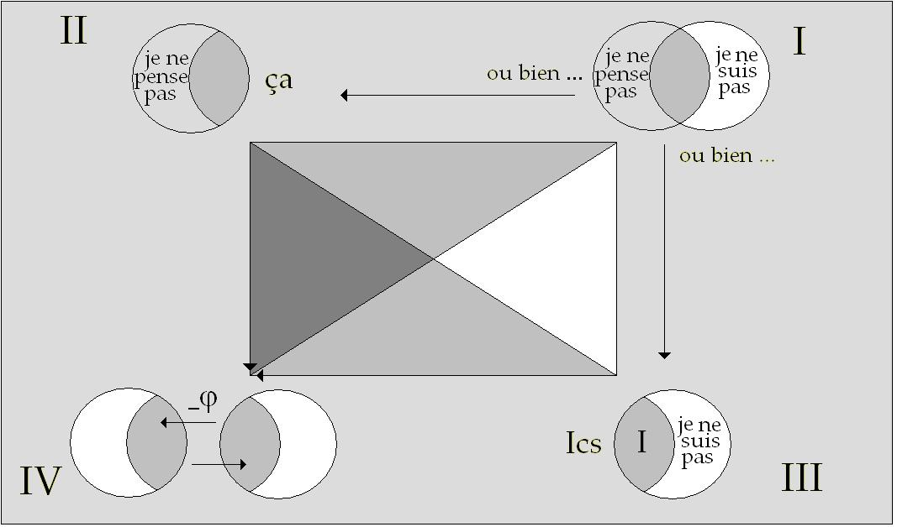
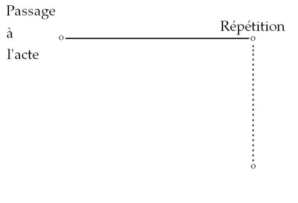
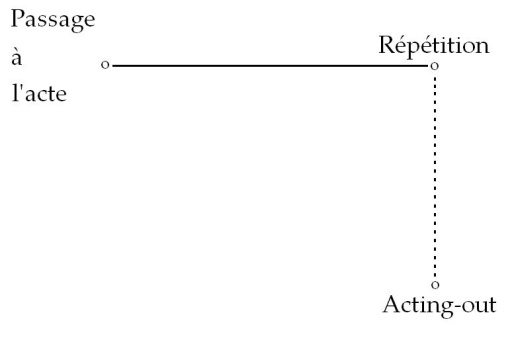
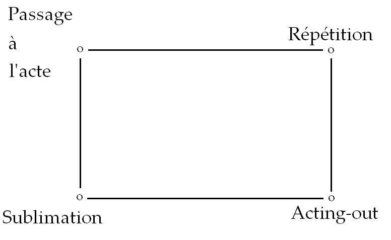
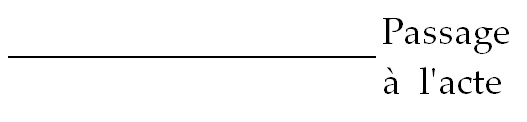
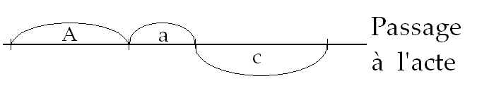
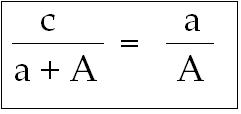
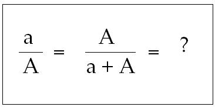
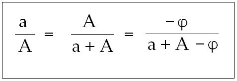

# Leçon 12 | 22 Février 1967

  

    <label><input type="checkbox" data-lacan-toggle="original" checked> 原文</label>
    <label><input type="checkbox" data-lacan-toggle="notes" checked> 注释</label>
    <label><input type="checkbox" data-lacan-toggle="commentary" checked> 个人解读评论</label>
  

  <form class="lacan-tool-search" role="search">
    <input class="lacan-tool-search-input" type="search" placeholder="搜索全文" aria-label="搜索全文">
    <button class="lacan-tool-button" type="submit" title="搜索">搜索</button>
  </form>
  <button class="lacan-tool-button lacan-back-to-top" type="button" title="回到页面最上方" aria-label="回到页面最上方">↑</button>

<section class="parallel-paragraph" data-paragraph-ids="s14-12-0001">

s14-12-0001

原文 · s14-12-0001

*Otto Fenichel : The Neurotic acting-out, yearbook of psychoanalysis.*

[无对应译文]

</section>

<section class="parallel-paragraph" data-paragraph-ids="s14-12-0002">

s14-12-0002

原文 · s14-12-0002

*F.R. Alexander : The Neurotic character.*

[无对应译文]

</section>

<section class="parallel-paragraph" data-paragraph-ids="s14-12-0003">

s14-12-0003

原文 · s14-12-0003

*Heinz Hartmann : Psychoanalysis study of study of the child X ; note on* s*ublimation.*

[无对应译文]

</section>

<section class="parallel-paragraph" data-paragraph-ids="s14-12-0004">

s14-12-0004

原文 · s14-12-0004

Nous poursuivons, en rappelant d’où nous partons : *l’aliénation*. Résumons, pour ceux qui nous ont déjà entendu et sur­tout pour les autres : *l’aliénation*…

[无对应译文]

</section>

<section class="parallel-paragraph" data-paragraph-ids="s14-12-0005">

s14-12-0005

原文 · s14-12-0005

> en tant que nous l’avons pris pour départ de ce chemin logique que nous tentons cette année de tracer …c’est l’élimination - à prendre au sens pro­pre : rejet hors du seuil - l’élimination ordinaire de l’Autre.

[无对应译文]

</section>

<section class="parallel-paragraph" data-paragraph-ids="s14-12-0006">

s14-12-0006

原文 · s14-12-0006

Hors de quel seuil ? Le seuil dont il s’agit, c’est celui que détermine la coupure en quoi consiste l’essence du langage.

[无对应译文]

</section>

<section class="parallel-paragraph" data-paragraph-ids="s14-12-0007">

s14-12-0007

原文 · s14-12-0007

La linguistique *nous sert*, en ce qu’elle nous a fourni le modèle de cette coupure et en cela essentiellement.

[无对应译文]

</section>

<section class="parallel-paragraph" data-paragraph-ids="s14-12-0008">

s14-12-0008

原文 · s14-12-0008

C’est pourquoi nous nous trouvons placés du côté ap­proximativement qualifié de structuraliste, de la linguisti­que.

[无对应译文]

</section>

<section class="parallel-paragraph" data-paragraph-ids="s14-12-0009">

s14-12-0009

原文 · s14-12-0009

Tout le développement de la linguistique, nommé­ment - curieusement - ce qu’on pourrait appeler la sémiologie…

[无对应译文]

</section>

<section class="parallel-paragraph" data-paragraph-ids="s14-12-0010">

s14-12-0010

原文 · s14-12-0010

> ce qui s’appelle comme tel, ce qui se désigne, ce qui s’affiche comme tel récemment …ne nous intéresse pas à un degré égal. Ce qui peut sembler, au premier abord, surprenant.

[无对应译文]

</section>

<section class="parallel-paragraph" data-paragraph-ids="s14-12-0011">

s14-12-0011

原文 · s14-12-0011

Élimination, donc de l’Autre…

[无对应译文]

</section>

<section class="parallel-paragraph" data-paragraph-ids="s14-12-0012">

s14-12-0012

原文 · s14-12-0012

> De l’Autre : qu’est-ce que ça veut dire l’Autre, avec un grand A, en tant qu’ici il est éliminé ? …*Il est éliminé en tant que champ clos et uni­fié*. Ceci veut dire que nous affirmons, avec les meilleures raisons pour ce faire, qu’*il n’y a pas d’univers du discours*, qu’il n’y a rien d’assumable sous ce terme.

[无对应译文]

</section>

<section class="parallel-paragraph" data-paragraph-ids="s14-12-0013">

s14-12-0013

原文 · s14-12-0013

*Le langage est pourtant solidaire*, dans sa pratique radicale qui est la psychanalyse…

[无对应译文]

</section>

<section class="parallel-paragraph" data-paragraph-ids="s14-12-0014">

s14-12-0014

原文 · s14-12-0014

> notez que je pourrais dire aussi : sa pratique médicale. Quelqu’un que j’ai la surprise de ne pas voir là aujourd’hui à sa place ordinaire, m’a demandé ce signe que j’ai laissé en devinette du terme que j’eusse pu donner *en latin*, plus strict, du « *je pense* ». Si personne ne l’a trouvé, je le donne aujourd’hui, j’avais indiqué que ça ne pouvait se concevoir que d’un verbe à la voix moyenne[^51] – c’est : *medeor,* d’où vient à la fois la *médecine* qu’à l’instant j’évoque et la *méditation* *…le langage*, dans sa pratique radicale, *est soli­daire de quelque chose qu’il va nous falloir maintenant réin­tégrer*, concevoir, de quelque façon sous le mode d’une émana­tion de ce champ de l’Autre, à partir de ce moment où nous avons dû le considérer comme disjoint.

[无对应译文]

</section>

<section class="parallel-paragraph" data-paragraph-ids="s14-12-0015">

s14-12-0015

原文 · s14-12-0015

Et ce *quelque chose* n’est pas difficile à nommer. C’est ce dont s’autorise précai­rement ce champ de l’Autre et ceci s’appelle « *dimension pro­pre du langage* », *la vérité*. Pour situer la psychanalyse, on pourrait dire qu’elle vient à être constituée partout où *la vérité* se fait reconnaî­tre seulement en ceci qu’elle nous surprend et qu’elle s’impo­se. Exemple, pour illustrer ce que je viens de dire : «* Il ne m’est pas donné, ni donnable, d’autre jouissance que celle de mon corps. *»

[无对应译文]

</section>

<section class="parallel-paragraph" data-paragraph-ids="s14-12-0016">

s14-12-0016

原文 · s14-12-0016

Ça ne s’impose pas tout de suite, mais on s’en dou­te et on instaure autour de cette jouissance - *qui est bien dès lors mon seul bien –* cette grille protectrice d’une loi dite universelle et qui s’appelle « Les Droits de l’Homme ». Personne ne saurait m’empêcher de *disposer* à mon gré *de mon corps* ! Le résultat, à la limite nous le touchons du doigt, du pied, nous autres psychanalystes : c’est que la jouissance s’est tarie pour tout le monde !

[无对应译文]

</section>

<section class="parallel-paragraph" data-paragraph-ids="s14-12-0017">

s14-12-0017

原文 · s14-12-0017

Ceci est l’envers d’un petit article que j’ai produit sous le titre de *Kant* *avec Sade.* Évidemment, ça n’y est pas dit à l’endroit – c’est à l’envers. Ce n’était pas pour ça, moins dangereux de le dire comme l’a dit SADE. SADE en est bien la preuve.

[无对应译文]

</section>

<section class="parallel-paragraph" data-paragraph-ids="s14-12-0018">

s14-12-0018

原文 · s14-12-0018

Mais comme je ne faisais là qu’expliquer SADE, c’est moins dangereux pour moi !

[无对应译文]

</section>

<section class="parallel-paragraph" data-paragraph-ids="s14-12-0019">

s14-12-0019

原文 · s14-12-0019

La vérité se manifeste de façon *énigmatique* dans le *symptôme*. Qui est quoi ? Une opacité subjective. Laissons de côté ce qui est clair… c’est que *l’énigme* a déjà ceci de ré­solu qu’elle *n’est qu’un rébus* …et appuyons-nous un instant sur ceci, qu’à aller trop vite on pourrait laisser de côté :

[无对应译文]

</section>

<section class="parallel-paragraph" data-paragraph-ids="s14-12-0020">

s14-12-0020

原文 · s14-12-0020

- c’est donc que le sujet peut être intransparent,

[无对应译文]

</section>

<section class="parallel-paragraph" data-paragraph-ids="s14-12-0021">

s14-12-0021

原文 · s14-12-0021

- c’est aussi que l’*évidence* peut être creuse, et qu’il vaut mieux sans doute désormais raccorder le mot au participe passé : *évidé*.

[无对应译文]

</section>

<section class="parallel-paragraph" data-paragraph-ids="s14-12-0022">

s14-12-0022

原文 · s14-12-0022

*Le sujet est parfaitement chosique, et de la pire espèce de chose : la chose freudienne, précisément.*

[无对应译文]

</section>

<section class="parallel-paragraph" data-paragraph-ids="s14-12-0023">

s14-12-0023

原文 · s14-12-0023

Quant à l’évidence, nous savons qu’elle est bulle et qu’elle peut être crevée. Nous en avons déjà eu à plusieurs reprises l’expérience. Tel est le plan où s’achemine la pen­sée moderne, telle que MARX d’abord, en a donné le ton, puis FREUD. Si le statut de ce qu’a apporté FREUD est moins évidemment triomphant, c’est peut-être justement *qu’il est allé plus loin*. Cela se paie.

[无对应译文]

</section>

<section class="parallel-paragraph" data-paragraph-ids="s14-12-0024">

s14-12-0024

原文 · s14-12-0024

Cela se paie, par exemple, dans *la thématique* que vous trouverez développée dans les deux articles que je pro­pose à votre attention, à votre étude si vous disposez pour cela d’assez de loisirs, parce qu’ils doivent ici former le fond sur lequel va trouver place ce que j’ai à avancer, à reprendre les choses au point où je les ai laissées la der­nière fois, à compléter, dans ce quadrangle que j’ai commencé à tracer comme à articuler fondamentalement sur la *répétition*.

[无对应译文]

</section>

<section class="parallel-paragraph" data-paragraph-ids="s14-12-0025">

s14-12-0025

原文 · s14-12-0025

*Répétition* : lieu temporel où vient *s’agir* ce que j’ai laissé d’abord suspendu, autour des termes *purement logiques de l’aliénation,* aux quatre pôles, que j’ai ponctués :

[无对应译文]

</section>

<section class="parallel-paragraph" data-paragraph-ids="s14-12-0026">

s14-12-0026

原文 · s14-12-0026

- du *choix alié­nant* d’une part \[I\],

[无对应译文]

</section>

<section class="parallel-paragraph" data-paragraph-ids="s14-12-0027">

s14-12-0027

原文 · s14-12-0027

- de l’instauration d’autre part, à deux de ces pôles : de *l’Es, du ça* \[II\], de *l’inconscient* d’autre part \[III\]

[无对应译文]

</section>

<section class="parallel-paragraph" data-paragraph-ids="s14-12-0028">

s14-12-0028

原文 · s14-12-0028

- pour mettre au quatrième de ces pôles *la castration* \[IV\].

[无对应译文]

</section>

<section class="parallel-paragraph" data-paragraph-ids="s14-12-0029">

s14-12-0029

原文 · s14-12-0029

[无对应译文]

</section>

<section class="parallel-paragraph" data-paragraph-ids="s14-12-0030">

s14-12-0030

原文 · s14-12-0030

Ces quatre termes, qui ont pu vous laisser en suspens, ont leurs corres­pondances dans ce que j’ai commencé, la dernière fois, d’articuler en vous montrant la structure fondamentale :

[无对应译文]

</section>

<section class="parallel-paragraph" data-paragraph-ids="s14-12-0031">

s14-12-0031

原文 · s14-12-0031

- de *la répétition* d’une part. Pour la situer : à droite du quadrangle,

[无对应译文]

</section>

<section class="parallel-paragraph" data-paragraph-ids="s14-12-0032">

s14-12-0032

原文 · s14-12-0032

- *de la fonction* d’autre part - au pôle de droite - *de ce mode privilégié* et exemplaire *d’instauration du sujet qu’est le passage à l’acte.*

[无对应译文]

</section>

<section class="parallel-paragraph" data-paragraph-ids="s14-12-0033">

s14-12-0033

原文 · s14-12-0033

[无对应译文]

</section>

<section class="parallel-paragraph" data-paragraph-ids="s14-12-0034">

s14-12-0034

原文 · s14-12-0034

Quels sont les autres pôles dont j’ai à traiter main­tenant ? Déjà l’un - la dernière fois - vous était indiqué : *l’acting-out*, que je vais avoir à articuler en tant qu’il se situe à cette place - élidé - où quelque chose se manifeste du champ de l’Autre éliminé, que je viens de rap­peler sous sa forme de manifestation véridique. Tel est fondamentalement le sens de *l’acting-out*.

[无对应译文]

</section>

<section class="parallel-paragraph" data-paragraph-ids="s14-12-0035">

s14-12-0035

原文 · s14-12-0035

[无对应译文]

</section>

<section class="parallel-paragraph" data-paragraph-ids="s14-12-0036">

s14-12-0036

原文 · s14-12-0036

Je vous prie ici, simplement d’avoir la patience de me suivre puisque aussi bien je ne puis amener *ces termes* - ce à quoi ils se réfè­rent, la structure si je puis dire - que « *bille en tête* ».

[无对应译文]

</section>

<section class="parallel-paragraph" data-paragraph-ids="s14-12-0037">

s14-12-0037

原文 · s14-12-0037

À vouloir cheminer par progression, voire critique, de ce qui déjà s’est ébauché d’une telle formulation dans les théories déjà exprimées dans l’analyse, nous ne pourrions littérale­ment que nous perdre dans le même labyrinthe que cette théo­rie constitue.

[无对应译文]

</section>

<section class="parallel-paragraph" data-paragraph-ids="s14-12-0038">

s14-12-0038

原文 · s14-12-0038

Ce n’est pas dire bien sûr, que nous en rejetions ni les données, ni l’expérience, mais que nous soumettons ce que nous apportons de nouvelles formules à cette épreuve de voir si ça n’est pas précisément nos formules qui permet­tront, de ce qui a été déjà amorcé, d’en définir non seulement le bien fondé mais le sens.

[无对应译文]

</section>

<section class="parallel-paragraph" data-paragraph-ids="s14-12-0039">

s14-12-0039

原文 · s14-12-0039

*L’acting-out* donc, que j’avance, vous sentez pro­bablement déjà la pertinence qu’il y a à l’avancer dans cette situation du champ de l’Autre, qu’il s’agit pour nous de restructurer, si je puis dire. Ne serait-ce qu’en ceci que l’histoire, comme l’expérience telle qu’elle se poursuit, nous indiquent à tout le moins, une certaine correspondance globale de ce terme avec ce qu’institue *l’expérience analyti­que*.

[无对应译文]

</section>

<section class="parallel-paragraph" data-paragraph-ids="s14-12-0040">

s14-12-0040

原文 · s14-12-0040

Je ne dis pas qu’il n’y a d’*acting-out* qu’en cours d’a­nalyse, je dis que c’est des analyses et de ce qui s’y pro­duit, qu’a surgi le problème, qu’a surgi *la distinction* fondamentale qui a fait isoler de l’acte et du passage à l’acte…

[无对应译文]

</section>

<section class="parallel-paragraph" data-paragraph-ids="s14-12-0041">

s14-12-0041

原文 · s14-12-0041

> tel qu’il peut - comme psychiatres - nous poser des pro­blèmes et s’instituer comme catégorie autonome …distinguer *l’acting-out*. Je n’ai donc avancé qu’un corrélat, celui qui l’apparente au *symptôme* en tant que manifestation de *la véri­té*.

[无对应译文]

</section>

<section class="parallel-paragraph" data-paragraph-ids="s14-12-0042">

s14-12-0042

原文 · s14-12-0042

Ce n’est certainement pas le seul et il y faut d’autres conditions.

[无对应译文]

</section>

<section class="parallel-paragraph" data-paragraph-ids="s14-12-0043">

s14-12-0043

原文 · s14-12-0043

J’espère donc qu’au moins certains d’entre vous sau­ront...

[无对应译文]

</section>

<section class="parallel-paragraph" data-paragraph-ids="s14-12-0044">

s14-12-0044

原文 · s14-12-0044

parallèlement à ces énoncés que je vais être amené à mettre à votre disposition ...parcourir au moins ce qui, à une certaine date - qui est une date à peu près de l947 ou de l948 - le *Yearbook of Psychoanalysis* a commencé à se pu­blier après la dernière guerre – et la formule qu’en donne Otto FENICHEL : *The neurotic acting out.*

[无对应译文]

</section>

<section class="parallel-paragraph" data-paragraph-ids="s14-12-0045">

s14-12-0045

原文 · s14-12-0045

Je poursuis… Quel est le terme que vous allez voir s’inscrire au 4ème *point de concours* de ces fonctions opératoires qui déterminent ce que nous articulons sur la base de *la répétition* ? La chose dût-elle vous surprendre…

[无对应译文]

</section>

<section class="parallel-paragraph" data-paragraph-ids="s14-12-0046">

s14-12-0046

原文 · s14-12-0046

> et je pense pouvoir la soutenir aussi amplement qu’il est possible devant votre appréciation …c’est quelque chose qui - singulièrement - est resté, dans la théorie analytique, dans un certain suspens, qui est assurément le point concep­tuel autour duquel se sont accumulés le plus de nuages et le plus de faux-semblants.

[无对应译文]

</section>

<section class="parallel-paragraph" data-paragraph-ids="s14-12-0047">

s14-12-0047

原文 · s14-12-0047

Pour le nommer…

[无对应译文]

</section>

<section class="parallel-paragraph" data-paragraph-ids="s14-12-0048">

s14-12-0048

原文 · s14-12-0048

> et aussi bien il est déjà inscrit sur ce tableau, puisque c’est à cette note de Heinz HARTMANN que je vous prie de vous reporter pour saisir un fruit typique de la situation analytique comme telle …c’est *la sublimation.*

[无对应译文]

</section>

<section class="parallel-paragraph" data-paragraph-ids="s14-12-0049">

s14-12-0049

原文 · s14-12-0049

[无对应译文]

</section>

<section class="parallel-paragraph" data-paragraph-ids="s14-12-0050">

s14-12-0050

原文 · s14-12-0050

*La sublimation* est le terme… que je n’appellerai pas médiateur, car il ne l’est point …est le terme qui nous per­met d’inscrire l’assise et la conjonction de ce qu’il en est de *l’assiette subjective*, en tant que *la répétition* est sa structure fondamentale et qu’elle comporte cette dimension essentielle sur laquelle reste, dans tout ce qui s’est formu­lé jusqu’à présent de l’analyse, la plus grande obscurité et qui s’appelle *la satisfaction*, « *Befriedigung* » dit FREUD.

[无对应译文]

</section>

<section class="parallel-paragraph" data-paragraph-ids="s14-12-0051">

s14-12-0051

原文 · s14-12-0051

Sentez-y la présence du terme *Friede,* dont le sens commun est *la paix*. Je pense que nous vivons à une époque où ce mot, tout au moins, ne vous paraî­tra pas porter avec lui l’évidence. Qu’est-ce que *la satisfaction* que FREUD pour nous conjugue comme essentielle à *la répétition* sous sa forme la plus radicale ?

[无对应译文]

</section>

<section class="parallel-paragraph" data-paragraph-ids="s14-12-0052">

s14-12-0052

原文 · s14-12-0052

Puisque aussi bien, c’est sous ce mode qu’il produit devant nous la fonction du *Wiederholungszwang* \[*répétition forcée*\], en tant qu’il englobe non pas seulement tel fonctionnement - lui, bien localisable - de la *vie* sous le terme du *principe du plai­sir*, mais qu’il soutient cette *vie* elle-même dont maintenant nous pouvons tout *admettre*, et jusqu’à ceci, devenu véri­table, touchable : qu’il n’est rien du matériel qu’elle agite, qui en fin de compte ne soit mort - je dis : de sa nature, inanimée - mais dont il est pourtant clair que ce matériel qu’elle ras­semble, elle ne le rendra à son domaine de l’inanimé « *qu’à sa manière* », nous dit FREUD.

[无对应译文]

</section>

<section class="parallel-paragraph" data-paragraph-ids="s14-12-0053">

s14-12-0053

原文 · s14-12-0053

C’est-à-dire : tout étant dans cette satisfaction que comporte qu’elle repasse et retrace les mêmes chemins qu’elle a - comment ? - édifiés et qu’as­surément elle nous témoigne que son essence est de les repar­courir. Il y a - soyons très modestes ! - un monde de cet éclair théorique à sa vérification. FREUD n’est pas un biologiste et l’une des choses les plus frappantes, qui pourrait être décevante si nous croyions que faire dans sa pensée la place maîtresse aux puissances de la vie, suffise pour faire quoi que ce soit qui ressemble à l’édification d’une science qui s’appellerait biologie.

[无对应译文]

</section>

<section class="parallel-paragraph" data-paragraph-ids="s14-12-0054">

s14-12-0054

原文 · s14-12-0054

Nous analystes, nous n’avons contribué *en rien*, à quoi que ce soit qui ressemble à de la biologie. C’est quand même bien frappant !

[无对应译文]

</section>

<section class="parallel-paragraph" data-paragraph-ids="s14-12-0055">

s14-12-0055

原文 · s14-12-0055

Pourquoi, pourtant, nous tenons-nous si fermes à l’assurance que derrière *la satisfaction* - à quoi nous avons affaire quand il s’agit de *la répétition* - est quel­que chose que nous désignons avec toute la maladresse, avec toute l’imprudence que peut comporter… au point où nous en sommes de la recherche biologique …ce terme que nous dési­gnons…

[无对应译文]

</section>

<section class="parallel-paragraph" data-paragraph-ids="s14-12-0056">

s14-12-0056

原文 · s14-12-0056

> c’est là le sens, le point d’accrochage, que j’irai jusqu’à appeler *fidéiste* de FREUD …que nous appelons *la satisfaction sexuelle.*

[无对应译文]

</section>

<section class="parallel-paragraph" data-paragraph-ids="s14-12-0057">

s14-12-0057

原文 · s14-12-0057

Et ceci pour la raison qu’a avancée FREUD devant JUNG *médusé* : pour écarter « *le fleuve de boue* », tel que FREUD l’apprécie au regard de la pensée qu’il désigne, le terme auquel on ne peut manquer de venir si l’on ne se tient ­là ferme, qu’il désigne comme le recours à «* l’occultisme* ».

[无对应译文]

</section>

<section class="parallel-paragraph" data-paragraph-ids="s14-12-0058">

s14-12-0058

原文 · s14-12-0058

Est-ce à dire que tout aille si simplement ? Je veux dire qu’autant d’affirmations suffisent à faire une articulation recevable ?

[无对应译文]

</section>

<section class="parallel-paragraph" data-paragraph-ids="s14-12-0059">

s14-12-0059

原文 · s14-12-0059

C’est la question que j’essaie d’avancer au­jourd’hui devant vous, et qui me fait pousser en avant *la su­blimation* comme le lieu qui, pour avoir été jusqu’à présent laissé en friche ou couvert de vulgaires griffonnages, est pourtant celui qui va nous permettre de comprendre de quoi il s’agit dans cette *satisfaction* fondamentale, qui est celle que FREUD articule comme *une opacité subjective*, comme *la satisfaction de la répétition*, cette conjonction combien basale pour la logique tout entière.

[无对应译文]

</section>

<section class="parallel-paragraph" data-paragraph-ids="s14-12-0060">

s14-12-0060

原文 · s14-12-0060

Car ce que nous entraînons avec nous dans ce lieu marginal de la pensée, qui est celui… lieu de *pénombre*, lieu de *voile*, lieu de *twilight* \[*crépuscule*\] *…*où se développe l’action analytique, si nous y entraînons avec nous les exigences de la logique, ce que nous sommes amenés à faire mérite enfin que nous l’épin­glions de ce que je pense devoir être son meilleur nom : *sub­-logique,* telle qu’ici même cette année, nous essayons de l’inaugurer.

[无对应译文]

</section>

<section class="parallel-paragraph" data-paragraph-ids="s14-12-0061">

s14-12-0061

原文 · s14-12-0061

Je prononce le terme au moment même où il va s’agir de se repérer sur ce qu’il en est de cette *sublimation.*

[无对应译文]

</section>

<section class="parallel-paragraph" data-paragraph-ids="s14-12-0062">

s14-12-0062

原文 · s14-12-0062

FREUD, quoiqu’il ne l’ait aucunement développé…

[无对应译文]

</section>

<section class="parallel-paragraph" data-paragraph-ids="s14-12-0063">

s14-12-0063

原文 · s14-12-0063

> pour les mêmes raisons qui rendent les développements que j’y ad­joins nécessaires …FREUD a affirmé, selon le mode de procès qui est celui de sa pensée, qui consiste…

[无对应译文]

</section>

<section class="parallel-paragraph" data-paragraph-ids="s14-12-0064">

s14-12-0064

原文 · s14-12-0064

> comme disait un au­tre : BOSSUET, prénommé *Jacques-Bénigne* \[*Rires*\] …qui consiste à tenir fermement *les deux bouts de la chaîne *:

[无对应译文]

</section>

<section class="parallel-paragraph" data-paragraph-ids="s14-12-0065">

s14-12-0065

原文 · s14-12-0065

Premièrement, *la sublimation est zielgehemmt* \[*but inhibé*\], et naturellement, il ne nous explique pas ce que ça veut dire !

[无对应译文]

</section>

<section class="parallel-paragraph" data-paragraph-ids="s14-12-0066">

s14-12-0066

原文 · s14-12-0066

J’ai déjà essayé, pour vous, de marquer la distinction déjà inhérente à ce terme de *zielgehemmt*. J’ai pris mes références en anglais, comme plus accessible : la différence qu’il y a entre le *aim* \[*cible*\] et le *goal* \[*objectif*\].

[无对应译文]

</section>

<section class="parallel-paragraph" data-paragraph-ids="s14-12-0067">

s14-12-0067

原文 · s14-12-0067

Dites-le en français : c’est moins clair, parce que *nous sommes forcés de prendre des mots déjà en usage dans la philosophie*.

[无对应译文]

</section>

<section class="parallel-paragraph" data-paragraph-ids="s14-12-0068">

s14-12-0068

原文 · s14-12-0068

Nous pourrions tout de même essayer de dire : *la fin*, c’est le mot le plus faible, parce qu’il faut y réintégrer tout le cheminement qui est ce dont il s’agit dans le *aim, la cible*. Telle est la même dis­tance qu’il y a entre *aim* et *goal,* et en allemand entre *Zweck* et *Ziel.*

[无对应译文]

</section>

<section class="parallel-paragraph" data-paragraph-ids="s14-12-0069">

s14-12-0069

原文 · s14-12-0069

La *Zweckmdssigkeit, finalité sexuelle,* il ne nous est pas dit qu’elle soit aucunement *gehemmt, inhi­bée,* dans *la sublimation*.

[无对应译文]

</section>

<section class="parallel-paragraph" data-paragraph-ids="s14-12-0070">

s14-12-0070

原文 · s14-12-0070

*Zielgehemmt,* c’est précisément là que le mot est bien fait pour nous retenir… Ce dont nous nous gargarisons avec le prétendu « *objet de la sainte pul­sion génitale* », tel est précisément ce qui peut sans aucun in­convénient être *extrait*, totalement *inhibé*, *absent*, dans ce qu’il est pourtant de la pulsion sexuelle, sans qu’elle per­de en rien sa capacité de *Befriedigung,* de *satisfaction*.

[无对应译文]

</section>

<section class="parallel-paragraph" data-paragraph-ids="s14-12-0071">

s14-12-0071

原文 · s14-12-0071

Telle est, dès l’apparition du terme de *Sublimierung,* ce comment FREUD la définit en termes sans équivoque de *Zielgehemmt* d’une part, mais d’autre part *satisfaction* *rencontrée sans aucune transformation, déplacement, alibi, répression, réaction ou défense*.

[无对应译文]

</section>

<section class="parallel-paragraph" data-paragraph-ids="s14-12-0072">

s14-12-0072

原文 · s14-12-0072

Telle est - comment FREUD introduit, pose devant nous - la fonction de la sublimation.

[无对应译文]

</section>

<section class="parallel-paragraph" data-paragraph-ids="s14-12-0073">

s14-12-0073

原文 · s14-12-0073

### Vous verrez, dans le second de ces articles…

[无对应译文]

</section>

<section class="parallel-paragraph" data-paragraph-ids="s14-12-0074">

s14-12-0074

原文 · s14-12-0074

> il y en a trois d’écrits-là \[au tableau en début de séance\], mais ce que j’appelle le second, c’est le second que j’ai nommé tout à l’heure, celui de Heinz HARTMANN, le premier que j’ai nommé étant celui de FENICHEL et l’ALEXANDER n’étant qu’une référence de FENICHEL je veux dire le point désigné par FENICHEL comme *le point ma­jeur* d’introduction
>
> du terme d’*acting out* dans l’articulation psychanalytique …vous vous reporterez donc à l’article d’Heinz HARTMANN sur la sublimation, il est exemplaire.

[无对应译文]

</section>

<section class="parallel-paragraph" data-paragraph-ids="s14-12-0075">

s14-12-0075

原文 · s14-12-0075

Il est exem­plaire de ce qui n’est, à nos yeux, nullement caduc dans la position du psychanalyste : c’est que l’approche de ce à quoi il a affaire - comme responsabilité de la pensée - l’accule toujours par quelque côté, à l’un de ces deux termes que je désignerai de la façon la plus tempérée : la platitude.

[无对应译文]

</section>

<section class="parallel-paragraph" data-paragraph-ids="s14-12-0076">

s14-12-0076

原文 · s14-12-0076

Dont chacun sait que depuis longtemps j’ai désigné comme le re­présentant le plus éminent : FENICHEL. *La paix soit à sa mémoire !*

[无对应译文]

</section>

<section class="parallel-paragraph" data-paragraph-ids="s14-12-0077">

s14-12-0077

原文 · s14-12-0077

Ses écrits ont pour nous la très grande va­leur d’être le rassemblement, assurément très scrupuleux, de tout ce qui peut surgir comme trous dans l’expérience. Il y manque simplement, à la place de ces trous, le point d’inter­rogation nécessaire.

[无对应译文]

</section>

<section class="parallel-paragraph" data-paragraph-ids="s14-12-0078">

s14-12-0078

原文 · s14-12-0078

Pour ce qui est de Heinz HARTMANN et de *la façon dont il soutient*…

[无对应译文]

</section>

<section class="parallel-paragraph" data-paragraph-ids="s14-12-0079">

s14-12-0079

原文 · s14-12-0079

> pendant quelques quatorze ou quinze pages, si mon souvenir est bon, avec les accents d’in­terrogation là …le problème de *la sublimation*, je pense qu’il ne peut échapper à quiconque y vient d’un esprit neuf, qu’un tel discours…

[无对应译文]

</section>

<section class="parallel-paragraph" data-paragraph-ids="s14-12-0080">

s14-12-0080

原文 · s14-12-0080

> qui est celui auquel je vous prie de vous re­porter sur pièce, en vous désignant *là où il est, où vous pouvez très facilement le trouver* …est un discours de *men­songe*, à proprement parler.

[无对应译文]

</section>

<section class="parallel-paragraph" data-paragraph-ids="s14-12-0081">

s14-12-0081

原文 · s14-12-0081

Tout l’appareil d’un prétendu « *énergétisme* », autour de quoi nous est proposé quelque chose qui consiste précisé­ment à inverser l’abord du problème…

[无对应译文]

</section>

<section class="parallel-paragraph" data-paragraph-ids="s14-12-0082">

s14-12-0082

原文 · s14-12-0082

> à interroger la subli­mation, en tant qu’elle nous est d’abord proposée comme étant identique et non-déplacée, par rapport
>
> à quelque chose qui est proprement - avec les guillemets qu’impose l’usage à ce niveau, du terme de pulsion –
>
> tout de même : la « pulsion sexuelle » …renverser ceci et à interroger de la façon la plus scandée, ce qu’il en est de la sublimation, comme étant relié à ce qu’on nous avance : à savoir que *les fonctions du* *moi*…

[无对应译文]

</section>

<section class="parallel-paragraph" data-paragraph-ids="s14-12-0083">

s14-12-0083

原文 · s14-12-0083

> *que de la façon la plus indue, on a posé comme étant autonome, comme étant même d’une autre source que de ce qu’on appelle, dans ce langage confusionnel, une source « instinc­tuelle », comme si jamais dans FREUD il avait été question de cela !* …de savoir donc, comment ces toutes *pures fonctions du moi* …

[无对应译文]

</section>

<section class="parallel-paragraph" data-paragraph-ids="s14-12-0084">

s14-12-0084

原文 · s14-12-0084

> relatées à la mesure de la réalité et la donnant com­me telle d’une façon essentielle, rétablissant donc, là, *au cœur de la pensée analytique, ce que toute la pensée analy­tique rejette,* qu’il y a cette relation isolée, directe, au­tonome, identifiable, de relation de la pure pensée à un mon­de qu’elle serait capable d’aborder, sans être elle-même toute traversée de la fonction du désir …comment il se fait que puisse venir de ce qui est donc - ailleurs - le foyer instinctuel, je ne sais quel *reflet*, je ne sais quelle *peinture*, je ne sais quelle coloration, qu’on appelle textuellement : « *sexualisation des fonctions de l’ego* » ! Une fois introduite ainsi, la question devient litté­ralement insoluble, en tout cas à jamais exclue de tout ce qui se propose à la praxis de l’analyse.

[无对应译文]

</section>

<section class="parallel-paragraph" data-paragraph-ids="s14-12-0085">

s14-12-0085

原文 · s14-12-0085

Pour aborder ce qu’il en est de *la sublimation*, il est pour nous nécessaire d’introduire ce terme premier, *moyennant quoi il nous est possible de nous orienter dans le problème,* qui est celui d’où je suis parti la dernière fois en définissant l’acte, *l’acte est signifiant *:

[无对应译文]

</section>

<section class="parallel-paragraph" data-paragraph-ids="s14-12-0086">

s14-12-0086

原文 · s14-12-0086

- Il est un signifiant qui se répète, quoiqu’il se passe en un seul geste, pour des raisons topologiques qui rendent possible l’existence de la double boucle créée par une seule coupure.

[无对应译文]

</section>

<section class="parallel-paragraph" data-paragraph-ids="s14-12-0087">

s14-12-0087

原文 · s14-12-0087

- Il est *instauration du sujet* comme tel.

[无对应译文]

</section>

<section class="parallel-paragraph" data-paragraph-ids="s14-12-0088">

s14-12-0088

原文 · s14-12-0088

- C’est-à-dire que d’un acte véritable le sujet surgit différent : en raison de *la coupure sa structure* est modifiée.

[无对应译文]

</section>

<section class="parallel-paragraph" data-paragraph-ids="s14-12-0089">

s14-12-0089

原文 · s14-12-0089

- Et quatrièmement, son corrélat de méconnaissance, ou plus exactement la limite im­posée à sa reconnaissance dans le sujet, ou si vous voulez encore : son *Repräsentanz* dans la *Vorstellung* à cet acte, c’est la *Verleugnung.* À savoir que *le sujet ne le reconnaît jamais dans sa véritable portée inaugurale*, même quand le sujet est, si je puis dire, capable d’avoir cet acte com­mis.

[无对应译文]

</section>

<section class="parallel-paragraph" data-paragraph-ids="s14-12-0090">

s14-12-0090

原文 · s14-12-0090

Eh bien, *c’est là qu’il convient que nous nous aper­cevions de ceci,* qui est essentiel à toute compréhension du rôle que FREUD donne dans l’inconscient à *la sexualité*, que nous nous souvenions de ceci que la langue déjà nous donne à savoir : *qu’on parle de l’acte sexuel.*

[无对应译文]

</section>

<section class="parallel-paragraph" data-paragraph-ids="s14-12-0091">

s14-12-0091

原文 · s14-12-0091

*L’acte sexuel*, ceci au moins pourrait nous suggérer…

[无对应译文]

</section>

<section class="parallel-paragraph" data-paragraph-ids="s14-12-0092">

s14-12-0092

原文 · s14-12-0092

> ce qui d’ailleurs est évident, parce que dès qu’on y pense, enfin, ça se touche tout de suite …c’est que ce n’est évidemment pas *la copulation pure et simple*.

[无对应译文]

</section>

<section class="parallel-paragraph" data-paragraph-ids="s14-12-0093">

s14-12-0093

原文 · s14-12-0093

L’acte a toutes les caractéristiques de l’acte, telles que je viens de les rappeler, telles que nous le manipulons, tel qu’il vient se présenter à nous, avec ses sédiments symptomatiques et tout ce qui le fait plus ou moins coller et trébucher.

[无对应译文]

</section>

<section class="parallel-paragraph" data-paragraph-ids="s14-12-0094">

s14-12-0094

原文 · s14-12-0094

*L’acte sexuel* se présente bien comme *un signifiant*, premièrement, et comme *un signifiant qui répète quelque chose*. Parce que c’est la première chose qu’en psychanalyse, on y a introduit. Il répète quoi ?

[无对应译文]

</section>

<section class="parallel-paragraph" data-paragraph-ids="s14-12-0095">

s14-12-0095

原文 · s14-12-0095

Mais la scène œdipienne ! Il est curieux qu’il faille rappeler ces choses qui font l’âme même de ce que je vous ai proposé de percevoir dans l’expérience analytique. Qu’il puisse être *instauration* de quelque chose qui est sans retour *pour le sujet*, c’est ce que certains actes sexuels privilégiés, qui sont précisément ceux qu’on appelle incestes, nous font littéralement toucher du doigt.

[无对应译文]

</section>

<section class="parallel-paragraph" data-paragraph-ids="s14-12-0096">

s14-12-0096

原文 · s14-12-0096

J’ai assez d’expérience analytique pour vous affirmer qu’un gar­çon qui a couché avec sa mère n’est pas du tout, dans l’ana­lyse, un sujet comme les autres ! Et même si lui-même n’en sait rien, ça ne change rien au fait que c’est analytique­ment aussi touchable que cette table qui est là ! \[Lacan frappe la table de la main\] Sa *Verleugnung* personnelle, *le démenti* qu’il peut apporter au fait que ceci ait une valeur de franchissement décisif, n’y chan­ge rien.

[无对应译文]

</section>

<section class="parallel-paragraph" data-paragraph-ids="s14-12-0097">

s14-12-0097

原文 · s14-12-0097

Bien sûr, tout ceci mériterait d’être étayé. Mon as­surance est qu’ici j’ai des auditeurs qui ont l’expérience analytique et qui, si je disais quelque chose de *par trop gros*, je pense, sauraient pousser des hurlements. Mais croyez-moi, ils ne diront pas le contraire, parce qu’ils le savent aussi bien que moi, tout simplement. Ça ne veut pas dire qu’on sache en tirer les conséquences, faute de savoir les articuler. Quoi qu’il en soit, ceci nous mène à essayer, peut­-être, d’introduire là-dedans un peu de rigueur logique.

[无对应译文]

</section>

<section class="parallel-paragraph" data-paragraph-ids="s14-12-0098">

s14-12-0098

原文 · s14-12-0098

L’acte est fondé sur *la répétition*. Quoi, au premier abord, de plus accueillant \[Lacan sourit\] pour ce qu’il en est de l’acte sexuel ! Rappelons-nous les enseignements de notre Sainte Mère l’Église, hein ! En principe, on ne fait pas ça ensemble, *on ne tire pas son coup*, sinon – hein! – pour faire venir au monde… une petite âme nouvelle ! \[*Rires*\]

[无对应译文]

</section>

<section class="parallel-paragraph" data-paragraph-ids="s14-12-0099">

s14-12-0099

原文 · s14-12-0099

Il doit y avoir des gens qui y pensent en le faisant ! \[*Rires*\] C’est une supposition ! Elle n’est pas établie. Il se pourrait que, toute conforme que soit cette pensée au dogme - catholique, j’entends - elle ne soit, là où elle se pro­duit, qu’un *symptôme*.

[无对应译文]

</section>

<section class="parallel-paragraph" data-paragraph-ids="s14-12-0100">

s14-12-0100

原文 · s14-12-0100

Ceci évidemment, est fait pour nous suggérer qu’il y a peut-être lieu d’essayer de serrer de plus près, de voir par quel côté s’avoue la fonction de reproduction qui est là derrière l’acte sexuel. Parce que, quand nous traitons du sujet de *la répétition*, nous avons affaire à des signifiants, en tant qu’ils sont *pré-condition* d’une pensée.

[无对应译文]

</section>

<section class="parallel-paragraph" data-paragraph-ids="s14-12-0101">

s14-12-0101

原文 · s14-12-0101

Du train d’où va cette biologie, que nous laissons si bien à ses propres ressources, il est curieux de voir que le signifiant nous montre le bout de son nez, là, tout à fait à la racine : au niveau des chromosomes. Pour l’instant, ça fourmille de signifiants, véhiculeurs de caractères bien spécifiés. On nous affirme que les chaînes - qu’il s’agisse de l’ADN, de l’ARN - sont constituées comme des petits messa­ges bien sériés, qui viennent, bien sûr, *après s’être bras­sés d’une certaine façon*, n’est-ce pas, *dans la grande urne* \[*Rires*\], à faire sortir on ne sait pas quoi… le nouveau genre de loufoque que chacun attend, dans la famille, pour faire un cercle d’acclamation. Est-ce que c’est à ce niveau que se propose le pro­blème ?

[无对应译文]

</section>

<section class="parallel-paragraph" data-paragraph-ids="s14-12-0102">

s14-12-0102

原文 · s14-12-0102

Eh bien, c’est là que je voudrais introduire quel­que chose, bien sûr, que je n’ai pas inventé pour vous au­jourd’hui. Il y a quelque part, dans un volume qu’on appel­le mes *Écrits,* un article qui s’appelle *La signification du phallus.* À la page 693, à la dixième ligne - j’ai eu quel­que peine ce matin à la retrouver - j’écris : « *Le phallus comme signifiant donne la raison du désir, dans l’acception où le terme est employé –* *je dis : « raison » comme « moyenne et extrême raison » de la division harmonique.* »

[无对应译文]

</section>

<section class="parallel-paragraph" data-paragraph-ids="s14-12-0103">

s14-12-0103

原文 · s14-12-0103

Ceci pour vous indiquer que ce que je vais vous dire aujourd’hui, euh… évidemment, il a fallu que du temps passe pour que je puisse l’introduire, j’en ai simplement marqué là le « *petit caillou blanc* » destiné à vous dire que : *La signification du phal­lus* c’est déjà ça, que c’était repéré.

[无对应译文]

</section>

<section class="parallel-paragraph" data-paragraph-ids="s14-12-0104">

s14-12-0104

原文 · s14-12-0104

En effet, essayons de mettre un ordre, une *mesure*, dans ce dont il s’agit dans l’acte sexuel en tant qu’il a rapport avec la fonction de *la répétition*. Eh bien il saute aux yeux, non pas qu’on *méconnaît*, puisqu’on connaît l’œdipe depuis le début, mais qu’on ne sait pas reconnaître ce que ça veut dire, à savoir que *le produit de la répétition*, dans *l’acte sexuel* en tant qu’acte…

[无对应译文]

</section>

<section class="parallel-paragraph" data-paragraph-ids="s14-12-0105">

s14-12-0105

原文 · s14-12-0105

> c’est-à-dire en tant que nous y participons comme soumis à ce qu’il a de signifiant …a ses incidences autrement dites dans le fait que le sujet que nous sommes est opaque, qu’il a un inconscient.

[无对应译文]

</section>

<section class="parallel-paragraph" data-paragraph-ids="s14-12-0106">

s14-12-0106

原文 · s14-12-0106

Eh bien, il convient de remarquer que *le fruit de la répétition* biologique, de la reproduction, mais il est déjà là !

[无对应译文]

</section>

<section class="parallel-paragraph" data-paragraph-ids="s14-12-0107">

s14-12-0107

原文 · s14-12-0107

Il est déjà là dans cet espace bien défini pour l’accomplissement de l’acte et qu’on appelle « le lit ».

[无对应译文]

</section>

<section class="parallel-paragraph" data-paragraph-ids="s14-12-0108">

s14-12-0108

原文 · s14-12-0108

L’agent de l’acte sexuel, il sait très bien qu’*il est un fils*. Et c’est pour ça que sur l’acte sexuel, en tant qu’il nous concerne, nous psychanalystes, on l’a rappor­té à l’œdipe. Alors essayons de voir, dans ces termes signifiants que définit ce que j’ai appelé à l’instant « *moyenne et extrê­me raison* » , ce qu’il en résulte.

[无对应译文]

</section>

<section class="parallel-paragraph" data-paragraph-ids="s14-12-0109">

s14-12-0109

原文 · s14-12-0109

Supposons que nous allons faire supporter ce rapport signifiant par le support le plus simple, celui que nous avons déjà donné à la double boucle de la répétition : un simple trait. Et pour plus d’aisance encore, étalons-le, tout simplement comme ceci :

[无对应译文]

</section>

<section class="parallel-paragraph" data-paragraph-ids="s14-12-0110">

s14-12-0110

原文 · s14-12-0110

[无对应译文]

</section>

<section class="parallel-paragraph" data-paragraph-ids="s14-12-0111">

s14-12-0111

原文 · s14-12-0111

Un trait auquel nous pouvons donner deux bouts nous pouvons couper n’importe où cette double boucle et, une fois que nous l’avons coupée, nous allons tacher d’en faire usage. Plaçons-y les quatre points (points d’origine), des deux autres coupures qui définissent la « *moyenne et extrê­me raison* »

[无对应译文]

</section>

<section class="parallel-paragraph" data-paragraph-ids="s14-12-0112">

s14-12-0112

原文 · s14-12-0112

[无对应译文]

</section>

<section class="parallel-paragraph" data-paragraph-ids="s14-12-0113">

s14-12-0113

原文 · s14-12-0113

- *petit(a)* : l’aimable produit d’une copulation précé­dente, qui, comme elle se trouvait être *un acte sexuel*, a créé le sujet, qui est là en train de *le représenter,* *l’acte sexuel*.

[无对应译文]

</section>

<section class="parallel-paragraph" data-paragraph-ids="s14-12-0114">

s14-12-0114

原文 · s14-12-0114

- *grand A*. Qu’est–ce que c’est que grand A ? Si *l’ac­te sexuel* est ce qu’on nous enseigne, comme *signifiant :* c’est la mère.

[无对应译文]

</section>

<section class="parallel-paragraph" data-paragraph-ids="s14-12-0115">

s14-12-0115

原文 · s14-12-0115

Nous allons lui donner…

[无对应译文]

</section>

<section class="parallel-paragraph" data-paragraph-ids="s14-12-0116">

s14-12-0116

原文 · s14-12-0116

> parce que nous en retrou­vons, dans la pensée analytique elle-même, partout la trace, tout ce que ce terme signifiant de la mère entraîne avec lui de pensée de fusion, de falsification de l’unité, en tant, qu’elle nous intéresse seulement, à savoir de l’unité comp­table, de passage de cette unité comptable à l’unité unifiante …nous allons lui donner la valeur *Un*.

[无对应译文]

</section>

<section class="parallel-paragraph" data-paragraph-ids="s14-12-0117">

s14-12-0117

原文 · s14-12-0117

Qu’est-ce que veut dire la valeur *Un*, comme unité *uni­fiante* ? Nous sommes dans *le signifiant* et ses conséquences sur la pensée.

[无对应译文]

</section>

<section class="parallel-paragraph" data-paragraph-ids="s14-12-0118">

s14-12-0118

原文 · s14-12-0118

La mère comme sujet, c’est la pensée de l’*Un* du couple. « *Ils seront tous les deux une seule chair* », c’est une pensée de l’ordre du grand A maternel.

[无对应译文]

</section>

<section class="parallel-paragraph" data-paragraph-ids="s14-12-0119">

s14-12-0119

原文 · s14-12-0119

Telle est la « *moyenne et extrê­me raison* » de ce qui re­lie l’agent à ce qui est patient et réceptacle dans l’acte sexuel.

[无对应译文]

</section>

<section class="parallel-paragraph" data-paragraph-ids="s14-12-0120">

s14-12-0120

原文 · s14-12-0120

Je veux dire : en tant qu’il est un acte, autrement dit, en tant qu’il a un rapport avec l’existence du sujet.

[无对应译文]

</section>

<section class="parallel-paragraph" data-paragraph-ids="s14-12-0121">

s14-12-0121

原文 · s14-12-0121

L’ *Un* de l’unité du couple est une pensée, déterminée au niveau de l’un des termes du couple réel.

[无对应译文]

</section>

<section class="parallel-paragraph" data-paragraph-ids="s14-12-0122">

s14-12-0122

原文 · s14-12-0122

Qu’est-ce à di­re ? C’est qu’il faut que quelque chose surgisse subjective­ment de cette répétition, qui rétablisse la *raison*, la *raison moyenne* telle que je viens de vous la définir, au ni­veau de ce couple réel.

[无对应译文]

</section>

<section class="parallel-paragraph" data-paragraph-ids="s14-12-0123">

s14-12-0123

原文 · s14-12-0123

Autrement dit, que quelque chose ap­paraisse, qui…

[无对应译文]

</section>

<section class="parallel-paragraph" data-paragraph-ids="s14-12-0124">

s14-12-0124

原文 · s14-12-0124

> comme dans cette *fondamentale* manipulation signifiante qu’est la relation harmonique …se manifeste comme ceci : cette grandeur (appelons-la c), par rapport à la somme des deux autres, a la même valeur que la plus petite par rap­port à la plus grande.

[无对应译文]

</section>

<section class="parallel-paragraph" data-paragraph-ids="s14-12-0125">

s14-12-0125

原文 · s14-12-0125

> 

[无对应译文]

</section>

<section class="parallel-paragraph" data-paragraph-ids="s14-12-0126">

s14-12-0126

原文 · s14-12-0126

Mais ça n’est pas tout ! Elle a cette portée, en tant que cette valeur, de la plus petite par rapport à la plus grande, est la même valeur que celle qu’a la plus grande par rapport à la somme des deux premières. Autrement dit que *a* sur A égale grand A sur *a* plus (+) grand A, égale quoi ?

[无对应译文]

</section>

<section class="parallel-paragraph" data-paragraph-ids="s14-12-0127">

s14-12-0127

原文 · s14-12-0127

[无对应译文]

</section>

<section class="parallel-paragraph" data-paragraph-ids="s14-12-0128">

s14-12-0128

原文 · s14-12-0128

…cette autre valeur que j’ai fait surgir là et qui a un nom, qui ne s’appelle rien d’autre que le *moins phi* où se désigne la castration, -ϕ, en tant qu’il désigne *la valeur fondamentale*. Je le réécris un peu plus loin : égale *moins phi* sur a plus grand A *moins phi* :

[无对应译文]

</section>

<section class="parallel-paragraph" data-paragraph-ids="s14-12-0129">

s14-12-0129

原文 · s14-12-0129

[无对应译文]

</section>

<section class="parallel-paragraph" data-paragraph-ids="s14-12-0130">

s14-12-0130

原文 · s14-12-0130

C’est-à-dire le *rapport significatif* de la fonction phallique en tant que *manque essentiel* de la jonction du rapport sexuel avec sa réalisation subjective, la désignation dans *les signifiants–mêmes* fondamentaux de l’acte sexuel, de ceci : que… quoique partout appelée mais se dérobant …*l’ombre de l’unité* plane sur le couple, il y apparaît pourtant nécessairement *la marque*…

[无对应译文]

</section>

<section class="parallel-paragraph" data-paragraph-ids="s14-12-0131">

s14-12-0131

原文 · s14-12-0131

> ceci en raison de son introduction-même dans la fonction subjective –ϕ …*la marque* de quelque chose qui doit y *représenter un manque fondamental*.

[无对应译文]

</section>

<section class="parallel-paragraph" data-paragraph-ids="s14-12-0132">

s14-12-0132

原文 · s14-12-0132

Ceci s’appelle *la fonction de la castration en tant que signifiante*. En tant que l’homme ne s’introduit dans la fonction du couple, que par la voie d’un rapport qui ne s’inscrit pas im­médiatement dans la conjonction sexuelle et qui ne s’y trouve représenté que dans ce même *extérieur* où vous voyez se dessi­ner ce qu’on appelle, pour cela même, « *extrême raison* ».

[无对应译文]

</section>

<section class="parallel-paragraph" data-paragraph-ids="s14-12-0133">

s14-12-0133

原文 · s14-12-0133

Le rapport qu’assure la prédominance du symbole phallique, par rapport à la conjonction - en tant qu’acte - sexuelle, est celui qui donne à la fois :

[无对应译文]

</section>

<section class="parallel-paragraph" data-paragraph-ids="s14-12-0134">

s14-12-0134

原文 · s14-12-0134

- la mesure du rapport de l’agent au patient,

[无对应译文]

</section>

<section class="parallel-paragraph" data-paragraph-ids="s14-12-0135">

s14-12-0135

原文 · s14-12-0135

- et la mesure - qui est la même - de *la pensée du couple*, telle qu’elle est dans le patient, à ce qu’est *le couple réel*.

[无对应译文]

</section>

<section class="parallel-paragraph" data-paragraph-ids="s14-12-0136">

s14-12-0136

原文 · s14-12-0136

C’est très précisément, de pouvoir *reproduire* exacte­ment le même type de répétition, que *tout ce qui est de l’or­dre de la sublimation*…

[无对应译文]

</section>

<section class="parallel-paragraph" data-paragraph-ids="s14-12-0137">

s14-12-0137

原文 · s14-12-0137

> et je préférerais n’être pas forcé ici de l’évoquer spécifiquement,
>
> sous la forme de ce qu’on appelle la « *création de l’Art* », mais puisqu’il le faut, je l’amène …c’est précisément dans la mesure où quelque chose, où quelque objet, peut venir prendre la place que prend le –ϕ dans l’acte sexuel comme tel, que la sublimation peut subsister, en donnant exactement le même ordre de *Befriedigung* qui est donné dans *l’acte sexuel* et dont vous voyez ce­ci : qu’il est très précisément suspendu au fait que ce qui est purement et simplement intérieur au couple *n’est pas sa­tisfaisant.*

[无对应译文]

</section>

<section class="parallel-paragraph" data-paragraph-ids="s14-12-0138">

s14-12-0138

原文 · s14-12-0138

Ceci est si vrai que cette espèce de grossière homé­lie, qu’on a introduit dans la théorie sous le nom de « *ma­turation génitale* », ne se propose que - comme quoi ? - que très évidemment, dans son texte même, je veux dire dans quiconque essaie de l’énoncer, comme une espèce de fourre-tout, de dépotoir, où rien véritablement n’indique qu’est–ce qui peut suffire à conjoindre le fait :

[无对应译文]

</section>

<section class="parallel-paragraph" data-paragraph-ids="s14-12-0139">

s14-12-0139

原文 · s14-12-0139

- premièrement d’une copulation - « réussie » ajoute-t-on, mais qu’est-ce que ça veut dire ?

[无对应译文]

</section>

<section class="parallel-paragraph" data-paragraph-ids="s14-12-0140">

s14-12-0140

原文 · s14-12-0140

- et de *ces éléments* qu’on qualifie de *tendresse*, *reconnaissance de l’objet,* de quel objet, je vous le de­mande ?

[无对应译文]

</section>

<section class="parallel-paragraph" data-paragraph-ids="s14-12-0141">

s14-12-0141

原文 · s14-12-0141

Est-ce que c’est si clair que *l’objet* soit là, quand déjà on nous a dit que derrière *quelque objet que ce soit*, se profile l’*Autre*, qui est l’objet qui a abrité ces neuf mois d’intervalle entre *la conjonction des chromosomes* et *la venue au jour du monde* ?

[无对应译文]

</section>

<section class="parallel-paragraph" data-paragraph-ids="s14-12-0142">

s14-12-0142

原文 · s14-12-0142

Je sais bien que c’est là que se réfugie tout *l’obscurantisme*, qui s’accroche éperdument autour de *la démons­tration* *analytique*, mais ce n’est pas non plus une raison pour que nous ne le dénoncions pas, si le fait de le dénoncer nous permet d’avancer plus strictement dans une *logique*, dont vous verrez, la prochaine fois, comment elle se concentre au niveau de l’acte analytique lui-même.

[无对应译文]

</section>

<section class="parallel-paragraph" data-paragraph-ids="s14-12-0143">

s14-12-0143

原文 · s14-12-0143

*S’il y a quelque chose d’intéressant dans cette représentation en quadrangle* :

[无对应译文]

</section>

<section class="parallel-paragraph" data-paragraph-ids="s14-12-0144">

s14-12-0144

原文 · s14-12-0144

[无对应译文]

</section>

<section class="parallel-paragraph" data-paragraph-ids="s14-12-0145">

s14-12-0145

原文 · s14-12-0145

c’est qu’elle nous permet d’é­tablir aussi *certaines proportions* : si *le passage à l’acte* remplit certaine fonction par rapport à *la répétition,* il nous est au moins suggéré par cette disposition, que ce doit être la même qui sépare *la sublimation* de *l’acting-out*. *Et dans l’autre sens : que la sublimation par rapport au passage à l’acte, doit avoir quelque chose de commun dans ce qui sépare la répétition de l’acting-out*.

[无对应译文]

</section>

<section class="parallel-paragraph" data-paragraph-ids="s14-12-0146">

s14-12-0146

原文 · s14-12-0146

Assurément, il y a là un beaucoup plus grand *gap* [^52], celui qui assurément fait de l’acte analytique…

[无对应译文]

</section>

<section class="parallel-paragraph" data-paragraph-ids="s14-12-0147">

s14-12-0147

原文 · s14-12-0147

> tel que nous essaierons de le saisir dans ce que nous dirons la prochaine fois …quelque chose qui, aussi, mérite d’être défini comme acte.

[无对应译文]

</section>

<section class="note-block original-notes">

## Notes

[^51]: La voix moyenne est une troisième voix possible dans la conjugaison, à côté de la voix active et de la voix passive . Le moyen est caractérisé par le fait que le sujet de l'action est plus affecté par celle-ci que l'objet, qui n'est en quelque sorte qu'une circonstance.

[^52]: Gap : trou vide, brèche, interstice, lacune…

</section>
