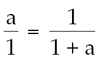
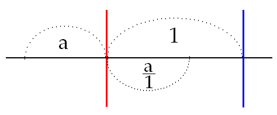
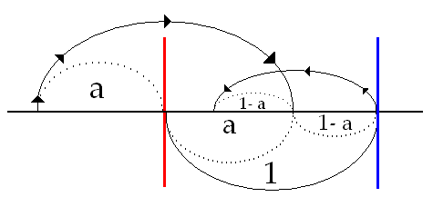
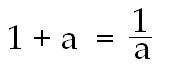
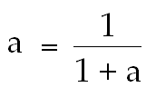
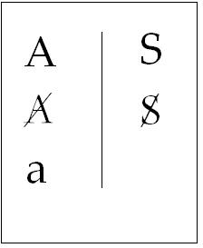

# Leçon 13 | 01 Mars 1967

  <label><input type="checkbox" data-lacan-toggle="original" checked> 原文</label>
  <label><input type="checkbox" data-lacan-toggle="notes" checked> 注释</label>
  <label><input type="checkbox" data-lacan-toggle="commentary" checked> 个人解读评论</label>

<section class="parallel-paragraph" data-paragraph-ids="s14-13-0001">

s14-13-0001

[无对应译文]

原文 · s14-13-0001

J’ai lu hier soir quelque part - ou peut-être aussi quelques-uns d’entre vous auront pu le rencontrer - ce sin­gulier titre : *« Connaître Freud avant de le traduire »* [^53].

</section>

<section class="parallel-paragraph" data-paragraph-ids="s14-13-0002">

s14-13-0002

[无对应译文]

原文 · s14-13-0002

Énorme !…

</section>

<section class="parallel-paragraph" data-paragraph-ids="s14-13-0003">

s14-13-0003

[无对应译文]

原文 · s14-13-0003

> Comme disait un monsieur à qui je ne prétends pas ressembler, puisque je ne me promène pas comme lui
>
> avec une canne, quoi­que quelquefois avec un chapeau …Énorme !

</section>

<section class="parallel-paragraph" data-paragraph-ids="s14-13-0004">

s14-13-0004

[无对应译文]

原文 · s14-13-0004

Quoi qu’il en soit, il est clair qu’il me semble que d’essayer de *le traduire*, est une voie qui s’impose certai­nement comme *préalable* à toute prétention de le connaître. Que les psychanalystes disent connaître la psychanalyse, passe encore, mais connaître FREUD avant de le traduire, sug­gère invinciblement cette bêtise : de le connaître avant de l’avoir lu. Ceci bien sûr, supposant tout l’*élargissement* nécessaire à la notion de traduction.

</section>

<section class="parallel-paragraph" data-paragraph-ids="s14-13-0005">

s14-13-0005

[无对应译文]

原文 · s14-13-0005

Car assurément, ce qui frappe, c’est que je ne sais pas si jamais nous pourrons avancer quelque chose, qui ressemble à cette prétention de connaître FREUD. Mesurez-vous bien ce que veut dire…

</section>

<section class="parallel-paragraph" data-paragraph-ids="s14-13-0006">

s14-13-0006

[无对应译文]

原文 · s14-13-0006

> dans la perspective de la pensée une fois parvenue au bout de son développement, ce que FREUD, nous offre …mesurez-vous bien ce que signifie de nous avoir proposé le modèle de la satisfaction subjective dans *la conjonction sexuelle* ?

</section>

<section class="parallel-paragraph" data-paragraph-ids="s14-13-0007">

s14-13-0007

[无对应译文]

原文 · s14-13-0007

Est-ce que l’expérience, l’expérience d’où FREUD lui-même partait, n’était pas très précisément que c’était le *lieu* de l’insatisfaction subjective ? Et la situation s’est-­elle, pour nous, améliorée ? … Franchement, dans le contexte social que domine la fonction de l’emploi de l’individu…

</section>

<section class="parallel-paragraph" data-paragraph-ids="s14-13-0008">

s14-13-0008

[无对应译文]

原文 · s14-13-0008

> l’emploi, qu’on le règle à la mesure de sa subsistance purement et simplement, ou à celle de la productivité …quelle marge dans ce contexte, est-elle laissée à ce qui serait le temps propre d’une cul­ture de l’amour ?

</section>

<section class="parallel-paragraph" data-paragraph-ids="s14-13-0009">

s14-13-0009

[无对应译文]

原文 · s14-13-0009

Et tout ne témoigne-t-il pas, pour nous, que c’est là-bien la réalité la plus exclue de notre com­munauté subjective ?

</section>

<section class="parallel-paragraph" data-paragraph-ids="s14-13-0010">

s14-13-0010

[无对应译文]

原文 · s14-13-0010

Sans doute est-ce là, non pas ce qui a décidé FREUD à l’articuler, cette fonction de satisfaction, comme une vérité, mais ce qui sans doute lui paraissait à l’abri de ce risque qu’il avouait à JUNG, de voir une théorie un peu profonde du psychisme retrouver les ornières de ce qu’il appelait lui-même : « *le fleuve de boue de l’occultisme* ».

</section>

<section class="parallel-paragraph" data-paragraph-ids="s14-13-0011">

s14-13-0011

[无对应译文]

原文 · s14-13-0011

C’est bien parce qu’avec la sexualité…

</section>

<section class="parallel-paragraph" data-paragraph-ids="s14-13-0012">

s14-13-0012

[无对应译文]

原文 · s14-13-0012

> qui préci­sément avait au cours des siècles, présidé ce qui nous parait si folies, si délires, de la gnose,
>
> de la copulation du sage et de la σοϕία \[sophia\] – par la voie de quel chemin ! …c’est bien parce qu’en notre siècle et sous le règne du su­jet, il n’y avait aucun risque que la sexualité pût se préva­loir d’être un *modèle* quelconque *pour la connaissance*, que sans doute il a commencé cette chanson de *meneur de jeu*, si bien illustrée par ce *conte de* GRIMM qu’il aimait, du *Joueur de flûte* entraînant derrière lui cette audience dont on peut bien dire que, quant aux voies d’une sagesse quelconque, elle représentait *la lie de la terre*.

</section>

<section class="parallel-paragraph" data-paragraph-ids="s14-13-0013">

s14-13-0013

[无对应译文]

原文 · s14-13-0013

Car assurément, dans ce que j’ai appelé tout à l’heure la ligne qu’il nous trace, et d’où il faut bien partir de ce qui est sa fin, à savoir : la formule de *la répétition*, il faut bien mesurer ce qui sépare le πάντα ῥεῖ \[panta rei\] du penseur anti­que[^54], quand il nous dit :

</section>

<section class="parallel-paragraph" data-paragraph-ids="s14-13-0014">

s14-13-0014

[无对应译文]

原文 · s14-13-0014

- *que rien jamais ne repasse dans sa propre trace,*

</section>

<section class="parallel-paragraph" data-paragraph-ids="s14-13-0015">

s14-13-0015

[无对应译文]

原文 · s14-13-0015

- *qu’on ne se baigne jamais dans le même fleuve,*

</section>

<section class="parallel-paragraph" data-paragraph-ids="s14-13-0016">

s14-13-0016

[无对应译文]

原文 · s14-13-0016

- *et ce que cela signifie de déchirement profond d’une pensée, qui ne peut saisir le temps qu’à ce quelque chose qui ne va vers l’indéterminable, qu’au prix d’une rupture constante avec l’absence.*

</section>

<section class="parallel-paragraph" data-paragraph-ids="s14-13-0017">

s14-13-0017

[无对应译文]

原文 · s14-13-0017

Introduire là *la fonction de la répétition*, qu’est-­ce y ajouter ? Eh bien, assurément rien de beaucoup plus satisfai­sant, s’il ne s’agit que de renouveler toujours, incessamment, un certain nombre de tours. Le *principe du plaisir* ne guide assurément vers rien, et moins que tout, vers *la ressaisie d’un objet quelconque*.

</section>

<section class="parallel-paragraph" data-paragraph-ids="s14-13-0018">

s14-13-0018

[无对应译文]

原文 · s14-13-0018

La notion pure et simple de décharge, en tant qu’elle prendrait son modèle sur le circuit établi du *sensorium*, a quelque chose d’ailleurs d’assez vaguement défini comme étant le *moteur* : le circuit *stimulus-réponse,* comme on dit, de quoi peut-il rendre compte ?

</section>

<section class="parallel-paragraph" data-paragraph-ids="s14-13-0019">

s14-13-0019

[无对应译文]

原文 · s14-13-0019

Qui ne voit qu’à s’en tenir là, le *sensorium* ne peut être que le guide de ce que fait, en effet, au niveau le plus simple, la patte de la grenouille irritée : elle se retire… Elle ne va à rien saisir dans le monde, mais à fuir ce qui la blesse.

</section>

<section class="parallel-paragraph" data-paragraph-ids="s14-13-0020">

s14-13-0020

[无对应译文]

原文 · s14-13-0020

Ce qui assure la constante définie dans l’appareil nerveux par le *principe du plaisir*, qu’est-ce ?

</section>

<section class="parallel-paragraph" data-paragraph-ids="s14-13-0021">

s14-13-0021

[无对应译文]

原文 · s14-13-0021

L’égalité de stimulation, *l’isostime* dirai-je - pour imiter *l’isobare* ou *l’isotherme* dont je parlais l’autre jour - ou *l’isorespe, l’isoréponse.*

</section>

<section class="parallel-paragraph" data-paragraph-ids="s14-13-0022">

s14-13-0022

[无对应译文]

原文 · s14-13-0022

Il est difficile de *fonder* quoi que ce soit sur *l’isostime,* car *l’isostime* n’est plus une « *stime* » du tout. *L’isorespe,* le « *tâtage* » de l’égalité de résistance, voilà qui, dans le monde, peut définir cette *isobare*, que le *principe du plaisir* conduira l’or­ganisme à filer. *Rien dans tout cela,* *en aucun cas, qui pousse à la recherche, à la saisie, à la constitution d’un objet.* Le problème de l’objet comme tel est laissé intact par toute cette conception – organique – d’un appareil ho­méostatique. Il est très étonnant qu’on n’en ait pas jusqu’ici marqué la faille.

</section>

<section class="parallel-paragraph" data-paragraph-ids="s14-13-0023">

s14-13-0023

[无对应译文]

原文 · s14-13-0023

FREUD ici, assurément a le mérite de marquer que la recherche de l’objet est quelque chose qui n’est conce­vable qu’à introduire la dimension de la satisfaction.

</section>

<section class="parallel-paragraph" data-paragraph-ids="s14-13-0024">

s14-13-0024

[无对应译文]

原文 · s14-13-0024

Ici, nous re-butons sur l’étrangeté de ceci : qu’a­lors qu’il y a tellement de modèles organiques de la satis­faction...

</section>

<section class="parallel-paragraph" data-paragraph-ids="s14-13-0025">

s14-13-0025

[无对应译文]

原文 · s14-13-0025

> à commencer par la réplétion digestive et aussi bien par quelques-uns des autres besoins qu’ils évoquent,
>
> mais dans un registre différent, car il est remarquable que c’est précisément en tant que ces schèmes où la satisfaction se dé­finit comme non-transformée par l’instance subjective, la sa­tisfaction orale est quelque chose qui peut endormir le sujet, à la limite, mais assurément il est concevable que ce sommeil soit le signe subjectif de la satisfaction …combien infini­ment plus problématique est-il de pointer que l’ordre véri­table de la satisfaction subjective est à chercher dans l’ac­te sexuel, qui est précisément le point où elle s’avère le plus déchirée.

</section>

<section class="parallel-paragraph" data-paragraph-ids="s14-13-0026">

s14-13-0026

[无对应译文]

原文 · s14-13-0026

Et ceci, au point que *tous les autres ordres de satis­faction*…

</section>

<section class="parallel-paragraph" data-paragraph-ids="s14-13-0027">

s14-13-0027

[无对应译文]

原文 · s14-13-0027

> ceux que nous venons d’énumérer comme présents en effet dans l’évocation freudienne …*ne viennent prendre leur sens que mis dans une certaine dépendance*…

</section>

<section class="parallel-paragraph" data-paragraph-ids="s14-13-0028">

s14-13-0028

[无对应译文]

原文 · s14-13-0028

> *dont je défie qui­conque de la définir, de la rendre concevable, autrement qu’à la formuler en termes de structure* …dans une dépendance dis-­je - disons grossièrement : *symbolique,* par rapport à la sa­tisfaction sexuelle.

</section>

<section class="parallel-paragraph" data-paragraph-ids="s14-13-0029">

s14-13-0029

[无对应译文]

原文 · s14-13-0029

Voici les termes dans lesquels je vous propose le pro­blème que je reprends aujourd’hui et qui consiste à tenter de vous donner l’articulation signifiante de ce qu’il en est de *la répétition* impliquée dans *l’acte sexuel*, s’il est vraiment ce que j’ai dit, ce que la langue promeut pour nous et qu’*assurément* notre expérience n’infirme pas, à savoir : *un acte*.

</section>

<section class="parallel-paragraph" data-paragraph-ids="s14-13-0030">

s14-13-0030

[无对应译文]

原文 · s14-13-0030

Après avoir insisté sur ce que *l’acte* comporte en lui-même de *conditionné,* d’abord par *la répétition* qui lui est interne, concernant *l’acte sexuel* j’irai plus loin, du moins pensé-je qu’il faille aller plus loin pour en saisir la por­tée. *La répétition* qu’il implique, comporte… si nous suivons au moins l’indication de FREUD …un élément de mesure et d’harmonie, qui est assurément ce qu’évoque la fonction direc­trice que lui donne FREUD, mais qui assurément est ce qui, par nous, est à préciser.

</section>

<section class="parallel-paragraph" data-paragraph-ids="s14-13-0031">

s14-13-0031

[无对应译文]

原文 · s14-13-0031

Car s’il y a quelque chose que produit, que promeut, n’importe laquelle des formulations analytiques, c’est qu’*en aucun cas* *cette harmonie ne saurait être conçue comme étant de l’ordre du complémentaire, à savoir de la conjonction du mâle et du femelle*, aussi simple que se la figure le peuple, sous le mode *de la conjonction de la clef et de la serrure*, ou de quoi que ce soit qui se présente dans les modes habi­tuels des symboles gamiques \[♂, ♀\].

</section>

<section class="parallel-paragraph" data-paragraph-ids="s14-13-0032">

s14-13-0032

[无对应译文]

原文 · s14-13-0032

Tout nous indique…

</section>

<section class="parallel-paragraph" data-paragraph-ids="s14-13-0033">

s14-13-0033

[无对应译文]

原文 · s14-13-0033

> ici je n’ai besoin que de faire état de *la fonction fon­damentale de ce tiers-élément qui tourne autour du phallus et de la castration* …tout nous indique que le mode de la mesure et de la proportion impliquées dans l’acte sexuel, est d’une tout autre structure et, pour dire le mot, plus *com­plexe*. C’est ce que, la dernière fois en vous quittant, j’avais commencé de formuler, en évoquant, puisqu’il s’agit d’*harmonie*, *le rapport dit anharmonique* : ce qui fait que sur une simple ligne tracée, *un segment peut être divisé de deux façons* :

</section>

<section class="parallel-paragraph" data-paragraph-ids="s14-13-0034">

s14-13-0034

[无对应译文]

原文 · s14-13-0034

- par un point qui lui est interne : un point *c* entre *a* et *b* donnant un rapport quelconque, par exemple : l/2.

</section>

<section class="parallel-paragraph" data-paragraph-ids="s14-13-0035">

s14-13-0035

[无对应译文]

原文 · s14-13-0035

- qu’un autre point *d* extérieur peut réaliser dans les segments déterminés entre lui, ce point *d,* par exemple avec les points *a* et *b* - segment initial - la même proportion : l/2.

</section>

<section class="parallel-paragraph" data-paragraph-ids="s14-13-0036">

s14-13-0036

[无对应译文]

原文 · s14-13-0036

Déjà ceci nous avait paru plus propre à assurer ce dont il s’agit, d’après toute notre expérience, à savoir : *le rapport d’un terme avec un autre terme*, qui se présente pour nous comme lieu de l’unité, de l’unité, j’entends : *du couple*.

</section>

<section class="parallel-paragraph" data-paragraph-ids="s14-13-0037">

s14-13-0037

[无对应译文]

原文 · s14-13-0037

Que c’est par rapport à l’idée du couple, *là où elle se trouve*, je veux dire : *effectivement*, dans le registre subjectif, que le sujet a à se situer dans *une proportion* qu’il peut trouver à établir, en introduisant une médiation externe à l’affrontement qu’il constitue - comme sujet - à *l’idée du couple*.

</section>

<section class="parallel-paragraph" data-paragraph-ids="s14-13-0038">

s14-13-0038

[无对应译文]

原文 · s14-13-0038

Ceci n’est qu’une première approximation et en quel­que sorte le simple schème qui nous permet de désigner ce qu’il s’agit d’assurer, à savoir : la fonction de cet *élément tiers* que nous voyons paraître *à tout bout de* ce qu’on peut appeler le *champ subjectif*, dans la relation sexuelle, qu’il s’agisse - nous l’avons fait remarquer la dernière fois - de ce qui subjectivement, assurément y apparaît de la façon la plus distante, à savoir son produit - organique - toujours possible, qu’il soit considéré ou non comme *désirable*.

</section>

<section class="parallel-paragraph" data-paragraph-ids="s14-13-0039">

s14-13-0039

[无对应译文]

原文 · s14-13-0039

Que ce soit cet élément, au premier fait si différent, si op­posé, et pourtant tout de suite conjoint à lui par *l’expérience analytique*, à savoir cette exigence du *phallus*, qui parait si interne dans *notre expérience*, à la relation sexuelle en tant qu’elle est vécue *subjectivement*.

</section>

<section class="parallel-paragraph" data-paragraph-ids="s14-13-0040">

s14-13-0040

[无对应译文]

原文 · s14-13-0040

L’équivalence *enfant­-phallus*, n’est-ce pas quelque chose, dont nous pouvons peut-­être tenter de désigner *la pertinence*, dans quelque synchronie que nous devions y découvrir, et qui bien sûr ne veut pas dire simultanéité ?

</section>

<section class="parallel-paragraph" data-paragraph-ids="s14-13-0041">

s14-13-0041

[无对应译文]

原文 · s14-13-0041

Bien plus, cet *élément tiers* n’a-t-il pas quelque rapport avec ce que nous avons désigné comme *la division de l’Autre lui-même* : le S(A) ?

</section>

<section class="parallel-paragraph" data-paragraph-ids="s14-13-0042">

s14-13-0042

[无对应译文]

原文 · s14-13-0042

C’est pour vous conduire dans cette voie, qu’aujour­d’hui j’apporte la relation qui est d’un ordre bien autre­ment structuré que la simple approche *harmonique* que dési­gnait la fin de mon dernier discours.

</section>

<section class="parallel-paragraph" data-paragraph-ids="s14-13-0043">

s14-13-0043

[无对应译文]

原文 · s14-13-0043

À savoir ce qui cons­titue la vraie « *moyenne et extrême raison* » qui n’est pas sim­plement le rapport d’un segment à un autre, en tant qu’il peut être deux fois défini - d’une façon interne à leur con­jonction, ou externe - mais le rapport qui pose à son dé­part l’égalité du rapport du plus petit au plus grand (*a/1*), é­galité dis-je, de ce rapport, au rapport du plus grand à la somme des deux :

</section>

<section class="parallel-paragraph" data-paragraph-ids="s14-13-0044">

s14-13-0044

[无对应译文]

原文 · s14-13-0044

</section>

<section class="parallel-paragraph" data-paragraph-ids="s14-13-0045">

s14-13-0045

[无对应译文]

原文 · s14-13-0045

Contrairement à *l’indétermination*, à la parfaite liberté *de ce rapport anharmonique*, qui n’est pas rien quant à l’établissement d’*une structure*, car je vous rappelle que *ce rapport anharmonique*, nous avons déjà eu l’année der­nière à l’évoquer comme fondamental à toute structure dite *projective,* mais laissons-le maintenant, pour nous attacher à ceci, qui fait du rapport de « *moyenne et extrême raison* », non pas un rapport quelconque…

</section>

<section class="parallel-paragraph" data-paragraph-ids="s14-13-0046">

s14-13-0046

[无对应译文]

原文 · s14-13-0046

> aussi dirigeant, je le répète, que celui-ci puisse être, éventuellement, dans la manifestation des constances projectives …mais un rapport parfaitement déterminé et unique, je dis : numériquement parlant.

</section>

<section class="parallel-paragraph" data-paragraph-ids="s14-13-0047">

s14-13-0047

[无对应译文]

原文 · s14-13-0047

J’ai posé, au tableau, une figure, qui nous permet de donner à ce que j’énonce ainsi, son support.

</section>

<section class="parallel-paragraph" data-paragraph-ids="s14-13-0048">

s14-13-0048

[无对应译文]

原文 · s14-13-0048

Voici sur la droite, les segments dont il s’agit : le premier que j’ai appelé *petit a*, qui va pour nous être le seul élément dont nous pourrons nous contenter pour édifier tout ce qu’il va en être de ce rapport de *mesure* ou de *proportion*, à cette seule condition de donner à son corres­pondant, que vous voyez ici : de ce point \[trait rouge\] à ce point \[trait bleu\]…

</section>

<section class="parallel-paragraph" data-paragraph-ids="s14-13-0049">

s14-13-0049

[无对应译文]

原文 · s14-13-0049

> je ne veux pas donner des noms de lettres à ces points, pour ne pas risquer de confusion, pour ne pas vous faire tourner les oreilles dans leur énoncé …je désigne d’ici \[trait rouge\] à ici \[trait bleu\] nous avons la valeur l.

</section>

<section class="parallel-paragraph" data-paragraph-ids="s14-13-0050">

s14-13-0050

[无对应译文]

原文 · s14-13-0050

</section>

<section class="parallel-paragraph" data-paragraph-ids="s14-13-0051">

s14-13-0051

[无对应译文]

原文 · s14-13-0051

À la condition de donner cette valeur l à ce segment, nous pouvons nous contenter, dans ce qu’il s’agit, à sa­voir le rapport dit de « *moyenne et extrême raison* », de lui donner purement et simplement la valeur a/1. Ce qui veut dire, en l’occasion, que nous avons posé que le rapport a/1, en outre, est égal, est le même que le rapport de : 1/1+a.

</section>

<section class="parallel-paragraph" data-paragraph-ids="s14-13-0052">

s14-13-0052

[无对应译文]

原文 · s14-13-0052

> 

</section>

<section class="parallel-paragraph" data-paragraph-ids="s14-13-0053">

s14-13-0053

[无对应译文]

原文 · s14-13-0053

Tel est ce rapport parfaitement fixe, qui a des pro­priétés mathématiques extrêmement importantes, que je n’ai ni le loisir ni l’intention de vous développer aujourd’hui. Sachez simplement que son apparition dans la mathématique grecque, coïncide avec le pas décisif à mettre de l’ordre dans ce qu’il en est du *commensurable* et de *l’incommensu­rable*. En effet, ce rapport est *incommensurable*.

</section>

<section class="parallel-paragraph" data-paragraph-ids="s14-13-0054">

s14-13-0054

[无对应译文]

原文 · s14-13-0054

C’est dans la recherche du mode sous lequel peut être définie la façon dont se recouvre la succession des points donnés par la série échelonnée de deux unités de mesure, incommensura­bles l’une à l’autre, à savoir - ce qui est le plus difficile à imaginer - la façon dont *elles s’enchevêtrent*, si elles sont *incommensurables*.

</section>

<section class="parallel-paragraph" data-paragraph-ids="s14-13-0055">

s14-13-0055

[无对应译文]

原文 · s14-13-0055

Le propre du commensurable, c’est qu’il y a toujours un point où elles retomberont ensemble - les deux mesures - du même pied.

</section>

<section class="parallel-paragraph" data-paragraph-ids="s14-13-0056">

s14-13-0056

[无对应译文]

原文 · s14-13-0056

*Deux valeurs commensurables* finiront toujours par un certain multiple - *différent pour l’une et pour l’autre* - à constituer la même grandeur, *deux valeurs incommensurables *: jamais.

</section>

<section class="parallel-paragraph" data-paragraph-ids="s14-13-0057">

s14-13-0057

[无对应译文]

原文 · s14-13-0057

Mais comment interfèrent-­elles ? C’est dans la ligne de cette recherche, qu’a été défini ce procédé qui consiste à rabattre la plus petite dans le champ de la plus grande et à se demander ce qui advient, du point de vue de la mesure, du *reste*. Pour le *reste*, qui est là, qui est manifestement 1– a, nous procéderons de la même façon : nous la rabattrons à l’intérieur de la plus grande.

</section>

<section class="parallel-paragraph" data-paragraph-ids="s14-13-0058">

s14-13-0058

[无对应译文]

原文 · s14-13-0058

</section>

<section class="parallel-paragraph" data-paragraph-ids="s14-13-0059">

s14-13-0059

[无对应译文]

原文 · s14-13-0059

Et ainsi de suite à l’infini, je veux dire : sans qu’on puisse arriver jamais à ce que se termine ce processus. C’est en ceci que consiste précisé­ment l’incommensurable d’une relation pourtant si simple. De tous les *incommensurables*, celui-ci est celui qui…

</section>

<section class="parallel-paragraph" data-paragraph-ids="s14-13-0060">

s14-13-0060

[无对应译文]

原文 · s14-13-0060

> si je puis dire : dans les intervalles que définit le rationnel du commensurable …laisse toujours le plus grand écart. Simple indication que je ne peux, ici, plus commen­ter.

</section>

<section class="parallel-paragraph" data-paragraph-ids="s14-13-0061">

s14-13-0061

[无对应译文]

原文 · s14-13-0061

Quoi qu’il en soit, vous voyez qu’il s’agit, de toute façon, de quelque chose qui, dans cet ordre de l’*incommensurable*, se spécifie d’une accentuation, en même temps que d’une pureté de la relation, toute spéciale. À mon grand regret…

</section>

<section class="parallel-paragraph" data-paragraph-ids="s14-13-0062">

s14-13-0062

[无对应译文]

原文 · s14-13-0062

> car je pense que tous les boyaux de l’occultisme vont frémir à cette occasion …je suis bien obli­gé - par honnêteté - de vous dire que ce rapport « *petit a* » est ce qu’on appelle *le nombre d’or.*

</section>

<section class="parallel-paragraph" data-paragraph-ids="s14-13-0063">

s14-13-0063

[无对应译文]

原文 · s14-13-0063

À la suite de quoi bien sûr, vont vibrer dans les tréfonds de votre acquis culturel, quant à l’esthétique notamment, l’évocation de tout ce que vous voudrez : *des cathédra­les*, d’Albrecht DÜRER, *du creuset alchimique*, et *de tous les autres trifouillages* analogues !

</section>

<section class="parallel-paragraph" data-paragraph-ids="s14-13-0064">

s14-13-0064

[无对应译文]

原文 · s14-13-0064

J’espère pourtant…

</section>

<section class="parallel-paragraph" data-paragraph-ids="s14-13-0065">

s14-13-0065

[无对应译文]

原文 · s14-13-0065

> par le sérieux avec lequel j’ai intro­duit le caractère strictement mathématique de la chose et très précisément ce qu’il a d’une problématique qui ne donne nullement l’idée d’une mesure aisée à concevoir …vous avoir fait sentir qu’il s’agit d’autre chose.

</section>

<section class="parallel-paragraph" data-paragraph-ids="s14-13-0066">

s14-13-0066

[无对应译文]

原文 · s14-13-0066

Voyons maintenant quelles sont certaines des propriétés remarquables de ce *petit a.* Je les ai écrites à gauche, en noir.

</section>

<section class="parallel-paragraph" data-paragraph-ids="s14-13-0067">

s14-13-0067

[无对应译文]

原文 · s14-13-0067

Vous pouvez voir que déjà le fait que 1+a soit égal à l’inverse de *a*, c’est-à-dire 1/a…

</section>

<section class="parallel-paragraph" data-paragraph-ids="s14-13-0068">

s14-13-0068

[无对应译文]

原文 · s14-13-0068

>  …était déjà suffisamment assuré dans les prémisses données par la définition de ce rapport, puisque la notion qu’il consiste dans le rapport du petit au plus grand, en tant qu’égal à celui du plus grand à la somme, nous donne déjà cette formule, qui est la même que celle-ci, fondamentale :

</section>

<section class="parallel-paragraph" data-paragraph-ids="s14-13-0069">

s14-13-0069

[无对应译文]

原文 · s14-13-0069

> 

</section>

<section class="parallel-paragraph" data-paragraph-ids="s14-13-0070">

s14-13-0070

[无对应译文]

原文 · s14-13-0070

À partir de là, il est extrêmement facile de s’apercevoir des autres égalités, dont le caractère caduc…

</section>

<section class="parallel-paragraph" data-paragraph-ids="s14-13-0071">

s14-13-0071

[无对应译文]

原文 · s14-13-0071

> et à la vérité, pour nous *sans grande importance,* momentanément …est marqué par le fait que j’ai écrit en rouge les égalités qui suivent. La seule chose importante à marquer étant :

</section>

<section class="parallel-paragraph" data-paragraph-ids="s14-13-0072">

s14-13-0072

[无对应译文]

原文 · s14-13-0072

- que le un moins *« petit a »* qui est là peut être égalé à *a2*, *1–a = a2* ce qui est très facile à démontrer,

</section>

<section class="parallel-paragraph" data-paragraph-ids="s14-13-0073">

s14-13-0073

[无对应译文]

原文 · s14-13-0073

- et d’autre part que le *2 + a*, combien aisément il peut être déduit que *2+a* représente ceci : *2+a = 1/a +1**,*

</section>

<section class="parallel-paragraph" data-paragraph-ids="s14-13-0074">

s14-13-0074

[无对应译文]

原文 · s14-13-0074

- à savoir ce qui se passe, quand au lieu d’in­voluer sur lui–même les rabattements des segments, on les développe au contraire vers l’extérieur.

</section>

<section class="parallel-paragraph" data-paragraph-ids="s14-13-0075">

s14-13-0075

[无对应译文]

原文 · s14-13-0075

C’est à savoir que le *1/2+a*…

</section>

<section class="parallel-paragraph" data-paragraph-ids="s14-13-0076">

s14-13-0076

[无对应译文]

原文 · s14-13-0076

> à savoir ce qui correspondait tout à l’heure à notre segment externe dans le rapport *anharmonique* : il est égal
>
> à *1*, étant obtenu par développement extérieur du *1* que représente la plus grande longueur …le *1/2a*, a la même valeur que cette valeur initiale d’où nous sommes partis, c’est–à–dire *« petit a »*, c’est–à–dire *1/1+a.* *1/2+a = a = 1/1+a*

</section>

<section class="parallel-paragraph" data-paragraph-ids="s14-13-0077">

s14-13-0077

[无对应译文]

原文 · s14-13-0077

Telles sont les propriétés de la « *moyenne et extrême* *raison *» en tant qu’elles vont nous permettre de com­prendre quelque chose à ce dont il s’agit dans la satisfaction génitale. Je vous l’ai dit, *« petit a »* est l’un des termes quelconque de cette relation génitale.

</section>

<section class="parallel-paragraph" data-paragraph-ids="s14-13-0078">

s14-13-0078

[无对应译文]

原文 · s14-13-0078

Je dis « *l’un des termes quelconques  *» quel que soit son sexe. La fille comme le garçon, dans le rapport sexuel…

</section>

<section class="parallel-paragraph" data-paragraph-ids="s14-13-0079">

s14-13-0079

[无对应译文]

原文 · s14-13-0079

> l’expérience de la relation subjective, en tant que l’analyse la définit comme œdipienne …la fille comme le garçon y entre d’abord comme enfant.

</section>

<section class="parallel-paragraph" data-paragraph-ids="s14-13-0080">

s14-13-0080

[无对应译文]

原文 · s14-13-0080

Autrement dit, comme d’ores et déjà représentant le *produit*…

</section>

<section class="parallel-paragraph" data-paragraph-ids="s14-13-0081">

s14-13-0081

[无对应译文]

原文 · s14-13-0081

> et je ne donne pas ce terme au hasard : nous aurons à le reprendre par la suite …en tant qu’il permet de situer, comme différent de ce qu’on appelle la *création,* ce qui de nos jours circule, comme vous le savez, partout et même *à tort et à travers*, sous le nom de *production.*

</section>

<section class="parallel-paragraph" data-paragraph-ids="s14-13-0082">

s14-13-0082

[无对应译文]

原文 · s14-13-0082

C’est bien le problème le plus imminent, le plus actuel, qui soit proposé à la pensée, que ce rapport - qui doit être défini - du sujet comme tel à ce qu’il en est de la production. Quoi que ce soit - je dis : dans une dialec­tique du sujet qui puisse être avancée, où l’on ne voit pas comment le sujet lui–même peut–être pris comme production, tout ceci est pour nous sans valeur.

</section>

<section class="parallel-paragraph" data-paragraph-ids="s14-13-0083">

s14-13-0083

[无对应译文]

原文 · s14-13-0083

Ce qui ne veut pas dire qu’il soit si aisé d’assurer, à partir de cette racine, ce qu’il en est de la production.

</section>

<section class="parallel-paragraph" data-paragraph-ids="s14-13-0084">

s14-13-0084

[无对应译文]

原文 · s14-13-0084

C’est si peu facile à assurer, que s’il y a quelque chose dont assurément un esprit non prévenu pourrait bien s’étonner, c’est le remarquable silence - le silence des *Comment* \[« *No comment* »\] ou se tient la psychanalyse, concernant cette dé­licate question, qui est pourtant… je dois dire qui « *courot­te* », un tant soit peu, dans notre vie journalistique, politi­que, domestique, journalière et tout ce que vous voudrez, même mercantile, et qui s’appelle le *birth control.* On n’a encore jamais vu *un analyste* dire ce qu’il en pensait ! C’est tout de même curieux, dans une théorie qui prétend avoir quelque chose à dire sur la satisfaction sexuelle !

</section>

<section class="parallel-paragraph" data-paragraph-ids="s14-13-0085">

s14-13-0085

[无对应译文]

原文 · s14-13-0085

Il doit aussi, il doit bien y avoir quelque chose de ce coté-là, qui a le plus étroitement affaire - je dois dire de façon pas commode - avec ce qu’on peut appeler « *la religion du Verbe* », puisque, assurément, après des espoirs très éton­nants concernant la libération de la Loi - qui correspond à la *génération paulinienne* dans l’Église - il semble que dans la suite, beaucoup d’énonciations dogmatiques se soient inflé­chies. Au nom de quoi ? Mais de *la production*, de *la produc­tion d’âmes* ! Ce qui au nom de « *la production* *des âmes* », s’est annoncé comme très proche passage de l’humanité à la béatitude, a subi - me semble-t-il - un certain atermoiement.

</section>

<section class="parallel-paragraph" data-paragraph-ids="s14-13-0086">

s14-13-0086

[无对应译文]

原文 · s14-13-0086

Mais il ne faut pas croire que le problème se limite à la sphère religieuse. Une autre annonce ayant été apportée, de la libération de l’Homme, il semble que la production des prolétaires ait joué quelque rôle, dans les formes précises où se sont trouvées… que se sont trouvées prendre les sociétés socialistes, à par­tir d’une certaine idée de *l’abolition de l’exploitation de l’homme par l’homme*.

</section>

<section class="parallel-paragraph" data-paragraph-ids="s14-13-0087">

s14-13-0087

[无对应译文]

原文 · s14-13-0087

Du coté de cette production-là, il ne semble pas qu’on soit arrivé à une mesure beaucoup plus claire, quant à ce qu’on produit.

</section>

<section class="parallel-paragraph" data-paragraph-ids="s14-13-0088">

s14-13-0088

[无对应译文]

原文 · s14-13-0088

- De même que le champ chrétien, au nom de « *la production d’âmes* », a continué de laisser paraître au monde, des êtres dont le moins qu’on puisse dire est que *la qualité anémique* est bien mêlée…

</section>

<section class="parallel-paragraph" data-paragraph-ids="s14-13-0089">

s14-13-0089

[无对应译文]

原文 · s14-13-0089

- De même au nom de la production des prolétaires, il ne semble pas qu’il vienne au jour autre chose que ce quelque chose de respectable certes, mais qui a ses limites, et qu’on pourrait appeler : *la produc­tion de cadres.*

</section>

<section class="parallel-paragraph" data-paragraph-ids="s14-13-0090">

s14-13-0090

[无对应译文]

原文 · s14-13-0090

Donc, cette question de la production et du statut du sujet en tant que produit, nous la voilà présentifié au niveau de quelque chose qui est bien la première présentification de l’Autre, en tant que c’est la mère.

</section>

<section class="parallel-paragraph" data-paragraph-ids="s14-13-0091">

s14-13-0091

[无对应译文]

原文 · s14-13-0091

On sait la valeur de la fonction unifiante de cette présence de la mère. On le sait tellement bien, que toute la théorie - et la pratique - analytique y a littéralement basculé et a complètement succombé à sa valeur fascinante : le princi­pe, dès l’origine, et ceci allant,…

</section>

<section class="parallel-paragraph" data-paragraph-ids="s14-13-0092">

s14-13-0092

[无对应译文]

原文 · s14-13-0092

> vous avez pu l’entendre pour l’avoir ici vu soutenir dans un débat qui a terminé notre année dernière …toute la situation analytique a été conçue comme produisant idéalement, je veux dire comme se fondant sur l’idéal de cette *fusion unitive*, ou de cette *unification fondante*, comme vous voudrez… \[*Rires*\] qui est censée avoir uni pen­dant neuf mois – je l’ai rappelé la dernière fois : l’enfant et la mère. Assurément…

</section>

<section class="parallel-paragraph" data-paragraph-ids="s14-13-0093">

s14-13-0093

[无对应译文]

原文 · s14-13-0093

*Une voix féminine – On entend mal, très mal…* *Lacan : On m’entend très mal… Je suis désolé que tout ceci marche très mal, mais je vous remercie beaucoup de me le dire. Je vais essayer de parler plus fort. Merci.*

</section>

<section class="parallel-paragraph" data-paragraph-ids="s14-13-0094">

s14-13-0094

[无对应译文]

原文 · s14-13-0094

*La même voix - Le micro !*

</section>

<section class="parallel-paragraph" data-paragraph-ids="s14-13-0095">

s14-13-0095

[无对应译文]

原文 · s14-13-0095

*Lacan : Ca ne marche pas du tout, aujourd’hui.*

</section>

<section class="parallel-paragraph" data-paragraph-ids="s14-13-0096">

s14-13-0096

[无对应译文]

原文 · s14-13-0096

…qui unit donc l’enfant et la mère. C’est préci­sément de ne pas faire de cette union de l’enfant et de la mère, de quelque façon que nous la qualifiions : que nous en fassions ou non la fonction du *narcissisme primaire,* ou sim­plement le lieu élu de la *frustration* et de la *gratification,* c’est précisément de ceci qu’il s’agit, c’est-à-dire non pas de répudier ce registre mais de le remettre à sa juste place, que vont ici nos efforts théoriques.

</section>

<section class="parallel-paragraph" data-paragraph-ids="s14-13-0097">

s14-13-0097

[无对应译文]

原文 · s14-13-0097

C’est en tant qu’il est quelque part… et je dis : au niveau de la confron­tation sexuelle …*cette première affirmation de l’unité du couple*, comme constituée par ce que l’énonciation religieuse a formulé comme « *l’une seule chair* ». Quelle dérision ! Qui peut affirmer, en quoi que ce soit, que dans l’étreinte dite *génitale* l’homme et la femme fassent une seule chair ? Si ce n’est que l’énonciation religieuse, ici recourt à ce qui est mis par l’investigation analytique, à ce qui dans la conjonction sexuelle, est *représenté* par le pôle maternel.

</section>

<section class="parallel-paragraph" data-paragraph-ids="s14-13-0098">

s14-13-0098

[无对应译文]

原文 · s14-13-0098

Je le répète, *ce pôle maternel*, pour - dans le mythe œdipien - sembler se *confondre*, donner purement et simplement le parte­naire du petit mâle, *n’a en réalité rien à faire avec l’op­position mâle-femelle.*

</section>

<section class="parallel-paragraph" data-paragraph-ids="s14-13-0099">

s14-13-0099

[无对应译文]

原文 · s14-13-0099

Car aussi bien la fille que le garçon a affaire à ce lieu maternel de l’unité, comme lui représen­tant ce à quoi il est confronté au moment de l’abord de ce qu’il en est de la conjonction sexuelle. Pour le garçon comme pour la fille ce qu’il est comme *produit*, comme *petit(a)*, a à se *confronter* avec l’*unité* instaurée par l’idée de l’union de l’enfant à la mère et c’est dans cette *confrontation* que surgit le –ϕ, qui va nous apporter cet *élément tiers*, en tant qu’il fonction­ne également comme signe d’un manque, ou si vous voulez encore, pour employer le terme humoristique de « *la petite différence* », de la petite différence qui vient jouer le rôle capital dans ce qu’il en est de la conjonction sexuelle en tant qu’elle intéresse le sujet.

</section>

<section class="parallel-paragraph" data-paragraph-ids="s14-13-0100">

s14-13-0100

[无对应译文]

原文 · s14-13-0100

Bien sûr, l’humour commun, ou le sens commun, comme vous voudrez, fait de cette petite différence le fait que, comme on dit : « *les uns en ont une* » et « *les autres pas* ». Il ne s’agit nullement de ceci, en fait. Car le fait de ne pas l’avoir joue pour la femme, comme vous le savez, un rôle aussi essentiel, un rôle aussi médiateur et constitutif dans l’amour, que pour l’homme.

</section>

<section class="parallel-paragraph" data-paragraph-ids="s14-13-0101">

s14-13-0101

[无对应译文]

原文 · s14-13-0101

Bien plus, comme FREUD l’a souligné, il semble que son manque effectif, lui confère-là quelques avantages.

</section>

<section class="parallel-paragraph" data-paragraph-ids="s14-13-0102">

s14-13-0102

[无对应译文]

原文 · s14-13-0102

Et c’est ce que je vais essayer de vous articuler *maintenant.*

</section>

<section class="parallel-paragraph" data-paragraph-ids="s14-13-0103">

s14-13-0103

[无对应译文]

原文 · s14-13-0103

En effet - *en effet !* - que voyons-nous, si ce n’est que, comme nous l’avons dit tout à l’heure, l’« *extrême raison* » du rapport… autrement dit ce qui le reproduit à son extérieur …va ici nous servir sous la forme du « *Un* », qui donne - qui repro­duit - la juste proportion, celle définie par *petit(a),* à l’ex­térieur du *rapport* ainsi défini comme *le rapport sexuel*.

</section>

<section class="parallel-paragraph" data-paragraph-ids="s14-13-0104">

s14-13-0104

[无对应译文]

原文 · s14-13-0104

Pour que l’un des partenaires se pose vis-à-vis de l’autre comme un « *Un* » à égalité…

</section>

<section class="parallel-paragraph" data-paragraph-ids="s14-13-0105">

s14-13-0105

[无对应译文]

原文 · s14-13-0105

> en d’autres termes, pour que s’institue *la dyade du couple* …nous avions ici, dans ce rapport ainsi inscrit, dans la mesure de la « *moyenne et ex­trême raison* », le support, à savoir ce second « *Un* » qui est ins­crit à droite et qui redonne par rapport à l’ensemble, à condition qu’y soit maintenu ce terme tiers du *petit(a), la proportion*.

</section>

<section class="parallel-paragraph" data-paragraph-ids="s14-13-0106">

s14-13-0106

[无对应译文]

原文 · s14-13-0106

C’est là bien sûr, que réside ceci : que nous pouvons dire que dans la relation sexuelle, et pour autant que le sujet arrive à se faire *l’égal de l’Autre*, ou à introduire dans l’Autre lui-même, la répétition - la répétition du 1 - il se trouve en fait reproduire le rapport initial, ce­lui qui maintient toujours constant cet élément tiers, qui ici est formulé par le *petit(a)* lui-même. Autrement dit, nous retrouvons ici le même procès qui est celui que j’avais inscrit, autrefois, sous la forme d’une barre de division, comme faisant partie du rapport du sujet au grand A.

</section>

<section class="parallel-paragraph" data-paragraph-ids="s14-13-0107">

s14-13-0107

[无对应译文]

原文 · s14-13-0107

En tant que sous le mode où une division se produit le A barré \[A\] est donné, que par rapport à ce grand A, c’est un S barré \[S\] qui vient s’instituer et que le reste y est donné par un *petit(a)* qui en est l’élément irréductible.

</section>

<section class="parallel-paragraph" data-paragraph-ids="s14-13-0108">

s14-13-0108

[无对应译文]

原文 · s14-13-0108

</section>

<section class="parallel-paragraph" data-paragraph-ids="s14-13-0109">

s14-13-0109

[无对应译文]

原文 · s14-13-0109

Qu’est-ce à dire ? C’est que nous commençons de concevoir comment il peut se trouver qu’un or­gane aussi local, si je puis dire, et en apparence purement fonctionnel, comme le pénis, puisse ici venir jouer un rôle, où nous pouvons entrevoir ce qu’il en est de la véritable nature de la satisfaction dans la relation sexuelle.

</section>

<section class="parallel-paragraph" data-paragraph-ids="s14-13-0110">

s14-13-0110

[无对应译文]

原文 · s14-13-0110

Quelque chose en effet, quelque part dans la rela­tion sexuelle, peut *symboliser* *- si l’on peut dire ! -* l’éli­mination de ce *reste*. C’est en tant qu’organe siège de la détumescence que, quelque part, le sujet peut avoir l’illu­sion, assurément trompeuse, mais pour être trompeuse elle n’est pas moins satisfaisante, qu’il n’y a pas de *reste*, ou tout au moins, qu’il n’y a qu’un *reste* parfaitement éva­nouissant.

</section>

<section class="parallel-paragraph" data-paragraph-ids="s14-13-0111">

s14-13-0111

[无对应译文]

原文 · s14-13-0111

Ceci à la vérité, serait simplement de l’ordre du comique, et certes y appartient, puisque c’est là en même temps ce qui donne sa limite à ce qu’on peut appeler *la jouissance,* en tant que *la jouissance* serait au centre de ce qu’il en est dans la satisfaction sexuelle.

</section>

<section class="parallel-paragraph" data-paragraph-ids="s14-13-0112">

s14-13-0112

[无对应译文]

原文 · s14-13-0112

Tout le schème qui supporte *fantasmatiquement* l’idée de *la décharge*, dans ce qu’il en est des tensions pulsionnel­les, est en réalité supporté par ce schème où l’on voit, sur la base de la fonction de la détumescence, s’imposer cette limite à *la jouissance*.

</section>

<section class="parallel-paragraph" data-paragraph-ids="s14-13-0113">

s14-13-0113

[无对应译文]

原文 · s14-13-0113

Assurément, c’est bien là la face la plus décevante qu’on puisse supposer à une satisfaction, si en effet ce dont il s’agissait était purement et simplement de *la jouissance*. Mais chacun sait que s’il y a quelque chose qui est présent dans la relation sexuelle, c’est *l’idéal de la jouis­sance de l’Autre* et aussi bien, ce qui en constitue l’origina­lité subjective.

</section>

<section class="parallel-paragraph" data-paragraph-ids="s14-13-0114">

s14-13-0114

[无对应译文]

原文 · s14-13-0114

Car il est un fait : c’est qu’à nous limiter aux fonctions organiques, rien n’est plus précaire que cet entrecroisement des jouissances. S’il y a bien quelque chose que nous révèle l’expérience, c’est *l’hétérogénéité radicale* de la jouissance mâle et de la jouissance femelle.

</section>

<section class="parallel-paragraph" data-paragraph-ids="s14-13-0115">

s14-13-0115

[无对应译文]

原文 · s14-13-0115

C’est bien pour cela qu’il y a tellement de bonnes âmes occupées, plus ou moins scrupuleusement, à vérifier la stricte simultanéité de leur jouissance avec celle du parte­naire : à combien de ratages, de leurres et de tromperies ceci prête, ce n’est assurément pas aujourd’hui que j’irai, ici, en étaler l’éventail.

</section>

<section class="parallel-paragraph" data-paragraph-ids="s14-13-0116">

s14-13-0116

[无对应译文]

原文 · s14-13-0116

Mais c’est qu’aussi bien il s’agit de tout autre chose que de ce petit exercice d’acrobatie érotique. Si quelque chose…

</section>

<section class="parallel-paragraph" data-paragraph-ids="s14-13-0117">

s14-13-0117

[无对应译文]

原文 · s14-13-0117

> on le sait assez, on sait aussi quelle place ceci a tenu dans un certain verbiage psychana­lytique …si quelque chose vient se fonder autour de *la jouissance de l’Autre*, c’est pour autant que la structure que nous avons aujourd’hui énoncée fait surgir *le fantôme du don.* C’est parce qu’*elle n’a pas le phallus* que *le don* de la femme prend une valeur *privilégiée* quant à *l’être* \[le phallus\] et qui s’appelle *l’amour*, qui est - comme je l’ai défini - « *le don de ce qu’on n’a pas* ».

</section>

<section class="parallel-paragraph" data-paragraph-ids="s14-13-0118">

s14-13-0118

[无对应译文]

原文 · s14-13-0118

Dans la relation amoureuse, la femme trouve une jouis­sance qui est, si l’on peut dire, de l’ordre précisément *causa sui,* pour autant qu’en effet ce qu’elle donne sous la forme de ce qu’elle n’a pas, est aussi la cause de son désir. Elle devient ce qu’elle crée de façon purement *imaginaire*, et justement ceci qui la fait objet, pour autant que dans le mirage érotique elle peut *être le phallus*, *l’être à la fois* *et ne pas l’être*. Ce qu’elle donne, de ne pas l’avoir, devient - je viens de vous le dire - la cause de son désir : seule - peut-on dire - à cause de cela, la femme bou­cle de façon satisfaisante la conjonction génitale.

</section>

<section class="parallel-paragraph" data-paragraph-ids="s14-13-0119">

s14-13-0119

[无对应译文]

原文 · s14-13-0119

Mais bien sûr, dans la mesure où, d’avoir fourni l’objet qu’elle n’a pas, elle n’y disparaît dans cet objet. Je veux dire que cet objet ne disparaît - *la laissant à la satisfaction de sa jouissance essentielle* - que par le tru­chement de la castration masculine.

</section>

<section class="parallel-paragraph" data-paragraph-ids="s14-13-0120">

s14-13-0120

[无对应译文]

原文 · s14-13-0120

De sorte qu’en somme, elle, elle n’y perd rien *puisqu’elle n’y met que ce qu’elle n’a pas*, et que littéralement elle le crée.

</section>

<section class="parallel-paragraph" data-paragraph-ids="s14-13-0121">

s14-13-0121

[无对应译文]

原文 · s14-13-0121

Et c’est bien pour cela que c’est toujours par *identifi­cation* à la femme que la sublimation produit l’apparence d’une *création*.

</section>

<section class="parallel-paragraph" data-paragraph-ids="s14-13-0122">

s14-13-0122

[无对应译文]

原文 · s14-13-0122

C’est toujours sous le mode d’une genèse, obscure certes, avant que je ne vous en expose ici les linéaments, mais très strictement liée au don de l’amour féminin, en tant qu’il crée *cet objet évanouissant* - et en plus*, en tant qu’il lui manque* - qu’est *le phallus tout puissant*, c’est en ceci qu’il peut y avoir quelque part, dans certaines activités humaines…

</section>

<section class="parallel-paragraph" data-paragraph-ids="s14-13-0123">

s14-13-0123

[无对应译文]

原文 · s14-13-0123

> *qu’il nous restera à examiner, selon qu’elles sont mirage ou non* …ce qu’on appelle *création* ou *poésie* par exemple.

</section>

<section class="parallel-paragraph" data-paragraph-ids="s14-13-0124">

s14-13-0124

[无对应译文]

原文 · s14-13-0124

Le *phallus* est donc bien, si vous le voulez – par un côté – *le pénis*, mais c’est en tant que *c’est sa carence par rapport à la jouissance*, qui fait la définition de la satisfaction subjective à laquelle se trouve remise la reproduction de la vie.

</section>

<section class="parallel-paragraph" data-paragraph-ids="s14-13-0125">

s14-13-0125

[无对应译文]

原文 · s14-13-0125

En fait, dans l’accouplement, le sujet ne peut réel­lement posséder le corps qu’il étreint. Il ne sait pas les limites de la jouissance possible, je veux dire de celle qu’il pourrait avoir du corps de l’Autre comme tel, car ces limi­tes sont incertaines.

</section>

<section class="parallel-paragraph" data-paragraph-ids="s14-13-0126">

s14-13-0126

[无对应译文]

原文 · s14-13-0126

*Et c’est tout ce qui constitue cet au-­delà que définissent scoptophilie et sadisme.*

</section>

<section class="parallel-paragraph" data-paragraph-ids="s14-13-0127">

s14-13-0127

[无对应译文]

原文 · s14-13-0127

Que la *défaillance phallique* prend valeur toujours renouvelée d’*évanouissement de l’être du sujet*, voilà ce qui est l’essentiel de l’expé­rience masculine, et ce qui fait comparer cette jouissance à ce qu’on appelle le « *retour de la petite mort* ». Cette fonction *évanouissante…*

</section>

<section class="parallel-paragraph" data-paragraph-ids="s14-13-0128">

s14-13-0128

[无对应译文]

原文 · s14-13-0128

> elle, beaucoup plus directe, directement éprouvée, dans la jouissance masculine …est ce qui donne au mâle le privilège d’où est sortie l’illu­sion de la pure subjectivité.

</section>

<section class="parallel-paragraph" data-paragraph-ids="s14-13-0129">

s14-13-0129

[无对应译文]

原文 · s14-13-0129

S’il est *un instant*, *un quelque part*, où l’homme peut perdre de vue la présence de l’objet tiers, c’est précisément dans ce moment évanouissant où il perd - parce qu’il défaille - ce qui n’est pas seulement son instrument, mais pour lui comme pour la femme, *l’élément tiers* de la rela­tion du couple. C’est à partir de là que se sont édifiées…

</section>

<section class="parallel-paragraph" data-paragraph-ids="s14-13-0130">

s14-13-0130

[无对应译文]

原文 · s14-13-0130

> avant même l’avènement de ce que nous appelons ici le statut de la pure subjectivité …toutes *les illusions de la connaissance.*

</section>

<section class="parallel-paragraph" data-paragraph-ids="s14-13-0131">

s14-13-0131

[无对应译文]

原文 · s14-13-0131

L’imagination du *sujet de la connaissance,* qu’elle soit d’avant ou après l’ère scientifique, est une forgerie de mâle, et de mâle en tant *qu’il participe de l’impuissance*, *qu’il nie le « moins quelque chose » autour de quoi se fait l’ef­fet de causation du désir qui prend ce moins pour un zéro. Nous l’avons déjà dit : prendre le moins pour un zéro, c’est le propre du sujet et le « nom propre » est ici fait pour marquer la trace.*

</section>

<section class="parallel-paragraph" data-paragraph-ids="s14-13-0132">

s14-13-0132

[无对应译文]

原文 · s14-13-0132

*Le rejet de la castration marque le délire de la pen­sée*, je veux dire : l’entrée de la pensée du « *je* », comme tel, dans le *réel*, qui est proprement ce qui constitue, dans notre premier quadrangle, le statut du « *je ne pense pas* » en tant que - seule - le soutient la syntaxe.

</section>

<section class="parallel-paragraph" data-paragraph-ids="s14-13-0133">

s14-13-0133

[无对应译文]

原文 · s14-13-0133

Voilà ce qu’il en est, pour la structure, de ce que permet d’édifier ce que FREUD nous désigne autour de *la sa­tisfaction sexuelle* dans son rapport avec le statut du sujet.

</section>

<section class="parallel-paragraph" data-paragraph-ids="s14-13-0134">

s14-13-0134

[无对应译文]

原文 · s14-13-0134

Nous en resterons là pour aujourd’hui, désignant pour la prochaine fois ce que nous avons à avancer maintenant sur la fonction de *l’acting out.*

</section>

<section class="note-block original-notes">

## Notes

[^53]: J. Laplanche et J.B. Pontalis : « *Connaître Freud avant de le traduire* », « *Le Monde* » n° 6884 du 1er Mars 1967, p. VIII du supplément « *Le Monde des livres* ».

[^54]: Héraclite, fragment 91 : ποταμῷ γὰρ οὐκ ἔστιν ἐμϐῆναι δὶς τῷ αὐτῷ  καθ΄ Ἡράκλειτον : « *On ne peut pas descendre deux fois dans le même fleuve* ».

</section>
