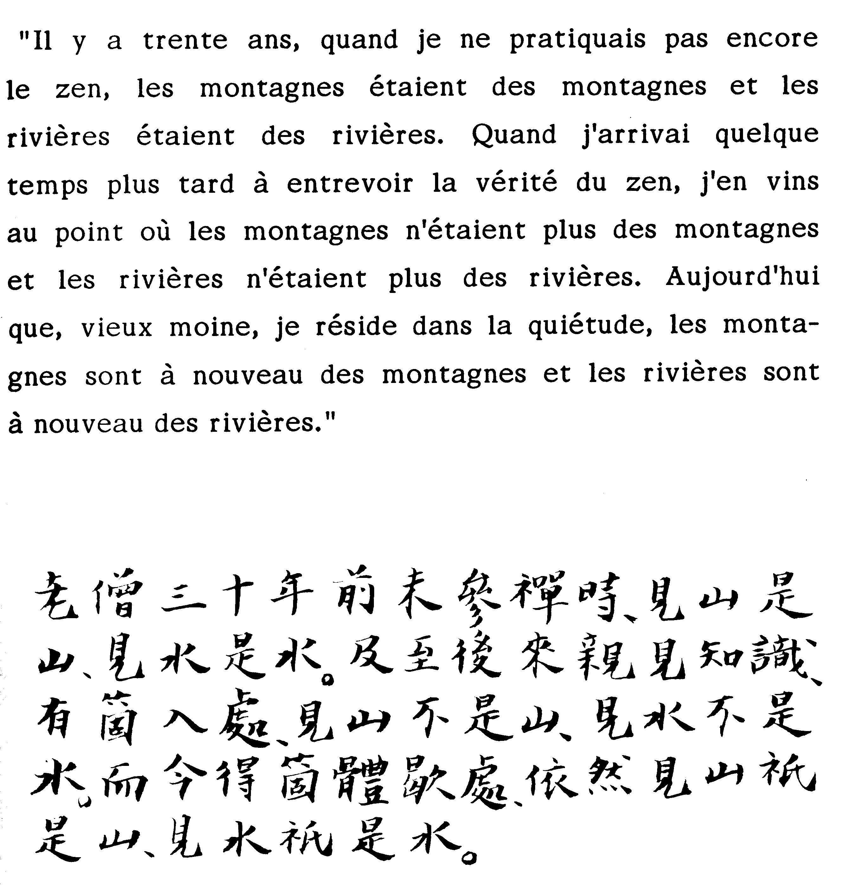

# Leçon 15 | 15 Mars 1967

  

    <label><input type="checkbox" data-lacan-toggle="original" checked> 原文</label>
    <label><input type="checkbox" data-lacan-toggle="notes" checked> 注释</label>
    <label><input type="checkbox" data-lacan-toggle="commentary" checked> 个人解读评论</label>
  

  <form class="lacan-tool-search" role="search">
    <input class="lacan-tool-search-input" type="search" placeholder="搜索全文" aria-label="搜索全文">
    <button class="lacan-tool-button" type="submit" title="搜索">搜索</button>
  </form>
  <button class="lacan-tool-button lacan-back-to-top" type="button" title="回到页面最上方" aria-label="回到页面最上方">↑</button>

<section class="parallel-paragraph" data-paragraph-ids="s14-15-0001">

s14-15-0001

原文 · s14-15-0001

[GREEN](#GREEN15_03)

[无对应译文]

</section>

<section class="parallel-paragraph" data-paragraph-ids="s14-15-0002">

s14-15-0002

原文 · s14-15-0002

LACAN

[无对应译文]

</section>

<section class="parallel-paragraph" data-paragraph-ids="s14-15-0003">

s14-15-0003

原文 · s14-15-0003

Je désire donner tout le temps, d’habitude réservé à notre entretien, au Docteur GREEN, que vous voyez à ma droite.

[无对应译文]

</section>

<section class="parallel-paragraph" data-paragraph-ids="s14-15-0004">

s14-15-0004

原文 · s14-15-0004

Je commence donc un tout petit peu plus tôt pour vous dire très vite les quelques mots d’introduction auxquels j’avais songé à cette occasion, sans d’ailleurs savoir à l’avance même, qu’il avait, comme il vient de me le dire, beaucoup de choses à nous dire, à savoir que très probablement, il remplira l’heure et demie. Voilà. Bon.

[无对应译文]

</section>

<section class="parallel-paragraph" data-paragraph-ids="s14-15-0005">

s14-15-0005

原文 · s14-15-0005

En vertu des trames secrètes et comme toujours très sûres de mon *surmoi*, comme aujourd’hui, en somme, im­plicitement, je m’étais donné vacance, j’ai trouvé moyen d’a­voir à parler hier soir à cinq heures, à cinq heures du soir, à la jeune génération psychiatrique à Sainte-Anne. Cela veut dire – mon Dieu – à la génération des candidats analystes.

[无对应译文]

</section>

<section class="parallel-paragraph" data-paragraph-ids="s14-15-0006">

s14-15-0006

原文 · s14-15-0006

Non… qu’est-ce que j’avais à faire là ? À la vérité pas grand chose, étant donné que ceux qui m’y avaient précédé, et nommément, de mes élèves et les mieux faits pour leur ap­prendre ce qui peut être destiné à les éclairer sur mon ensei­gnement : Mme AULAGNIER par exemple, Piera - que ne fonderons-­nous sur cette *pierra* ? Serge LECLAIRE, même Charles MELMAN, pour les nommer par ordre alphabétique, et même d’autres… Ouais… Eh bien, mise à part la part de distraction qui me pousse quelquefois à dire « oui » quand on me demande quelque chose, j’avais tout de même quelques raisons d’y être. À savoir que tout ceci se passait dans le cadre d’un enseigne­ment qui est celui de mon vieil ami, de mon vieux camarade, Henri EY. Voilà… La génération qui est la nôtre, puisque c’est la mê­me, celle de Henri EY et la mienne, aura eu donc quelque rôle.

[无对应译文]

</section>

<section class="parallel-paragraph" data-paragraph-ids="s14-15-0007">

s14-15-0007

原文 · s14-15-0007

Ce vieux camarade en particulier, aura été celui à qui, pour moi, je donne le pompon quant à une fonction qui n’est rien d’autre que celle que j’appellerai du civilisateur. Vous vous rendez mal compte de ce que c’était la salle de garde de Sainte-Anne, quand nous y sommes arrivés tous les deux, avec d’autres aussi qui avaient un petit peu la même vocation, mais enfin, qui sont restés à mi-route !

[无对应译文]

</section>

<section class="parallel-paragraph" data-paragraph-ids="s14-15-0008">

s14-15-0008

原文 · s14-15-0008

Le sous développement, si je puis dire, quant aux dispositions logiques, puisque de logique il s’agit ici, était vraiment, à ce niveau \- vers l925, hein ! ce n’est pas d’hier - quelque chose d’extraordinaire. Eh bien, depuis ce temps, Henri EY a introduit sa grande machine : *l’organodynamisme*. C’est une doctrine… C’est une doctrine fausse, mais incon­testablement civilisatrice.

[无对应译文]

</section>

<section class="parallel-paragraph" data-paragraph-ids="s14-15-0009">

s14-15-0009

原文 · s14-15-0009

À cet égard, elle a rempli son rô­le. On peut dire qu’il n’y a pas, dans le champ des hôpitaux psychiatriques, un seul esprit qui n’ait été touché par les questions que cette doctrine met au premier plan et ces ques­tions sont *des questions de la plus grande importance*.

[无对应译文]

</section>

<section class="parallel-paragraph" data-paragraph-ids="s14-15-0010">

s14-15-0010

原文 · s14-15-0010

Que la doctrine soit fausse est presque secondaire eu égard à cet effet.

[无对应译文]

</section>

<section class="parallel-paragraph" data-paragraph-ids="s14-15-0011">

s14-15-0011

原文 · s14-15-0011

D’abord, parce que ça ne peut pas être autrement. Ça ne peut pas être autrement, parce que c’est *une doctrine médicale*.

[无对应译文]

</section>

<section class="parallel-paragraph" data-paragraph-ids="s14-15-0012">

s14-15-0012

原文 · s14-15-0012

Il est nécessaire, il est essentiel au sta­tut médical, qu’il soit dominé par une doctrine. Cela s’est toujours vu.

[无对应译文]

</section>

<section class="parallel-paragraph" data-paragraph-ids="s14-15-0013">

s14-15-0013

原文 · s14-15-0013

Le jour où il n’y aura plus de doctrine, il n’y aura plus de médecine non plus. D’autre part il est non moins nécessaire - l’expérience le prouve - que cette doctrine soit fausse, sans ça elle ne saurait prêter appui au statut médical.

[无对应译文]

</section>

<section class="parallel-paragraph" data-paragraph-ids="s14-15-0014">

s14-15-0014

原文 · s14-15-0014

Quand les sciences…

[无对应译文]

</section>

<section class="parallel-paragraph" data-paragraph-ids="s14-15-0015">

s14-15-0015

原文 · s14-15-0015

> dont la médecine maintenant s’entoure et s’aide, se laisse… s’ouvre à elles de toutes parts …se seront rejointes au centre, eh bien, il n’y aura plus de médecine ! Il y aura peut–être encore la psychanalyse, qui constituera à ce moment-là la médecine. Mais ça sera bien fâcheux, parce que ce sera un obstacle définitif à ce que la psychanalyse devienne une science. *C’est pour ça que je ne le souhaite pas*.

[无对应译文]

</section>

<section class="parallel-paragraph" data-paragraph-ids="s14-15-0016">

s14-15-0016

原文 · s14-15-0016

Eh bien, hier soir, j’ai été amené devant cet audi­toire ainsi choisi, à parler de l’opération de l’aliénation, dont je pense, pour la plupart, étant donné qu’on ne se déran­ge pas si facilement - *de Sainte-Anne jusqu’à l’École Normale* \[E.N.S. rue d’Ulm\] *It is a long way !* - …j’ai cru devoir pour eux…

[无对应译文]

</section>

<section class="parallel-paragraph" data-paragraph-ids="s14-15-0017">

s14-15-0017

原文 · s14-15-0017

> pour eux qui constituent en somme la zone d’appel aux responsabilités psychanalytiques,
>
> en d’autres termes : à ceux qui vont former les psychanalystes …j’ai cru devoir leur épingler, parce que c’était là vraiment le lieu, leur épingler comment se pose, si l’on peut dire, ce qu’on appelle ce *choix inaugural* qui est - vous le savez - un faux choix, puisque c’est un choix forcé.

[无对应译文]

</section>

<section class="parallel-paragraph" data-paragraph-ids="s14-15-0018">

s14-15-0018

原文 · s14-15-0018

Quels sont les noms qui conviennent à ce choix dans cette zo­ne – centrale – de celle des futurs responsables ?

[无对应译文]

</section>

<section class="parallel-paragraph" data-paragraph-ids="s14-15-0019">

s14-15-0019

原文 · s14-15-0019

Alors, his­toire, comme cela, de leur éveiller les oreilles, je leur ai mis là–dessus les noms qui conviennent, les noms appropriés.

[无对应译文]

</section>

<section class="parallel-paragraph" data-paragraph-ids="s14-15-0020">

s14-15-0020

原文 · s14-15-0020

Je suis bien forcé d’y faire allusion, parce qu’il est rare que les entretiens, même limités, comme ceux-là, restent se­crets, surtout quand il s’agit d’une « *salle de garde* », et de ces noms, peut-être vous en reviendra-t-il aux oreilles quel­ques échos sous la forme de gorges chaudes.

[无对应译文]

</section>

<section class="parallel-paragraph" data-paragraph-ids="s14-15-0021">

s14-15-0021

原文 · s14-15-0021

Ce ne sont pas des noms forcément obligeants, évidemment. Mais, entre le « *je ne pense pas* » et le « *je ne suis pas* », ça n’a pas non plus…

[无对应译文]

</section>

<section class="parallel-paragraph" data-paragraph-ids="s14-15-0022">

s14-15-0022

原文 · s14-15-0022

> pour ce qui est *d’une zone plus vaste*, avancés comme étant les constituants fondamentaux de cette aliénation première …ça n’est pas non plus très obligeant pour l’ensemble de cette zone que je détache dans le champ humain, sous la forme du champ du sujet : ou *il ne pense pas,* ou *il n’est pas*.

[无对应译文]

</section>

<section class="parallel-paragraph" data-paragraph-ids="s14-15-0023">

s14-15-0023

原文 · s14-15-0023

D’ail­leurs cela change si vous le mettez *à la troisième personne*. C’est bien de « *je ne pense pas* » ou « *je ne suis pas* » qu’il s’agit.

[无对应译文]

</section>

<section class="parallel-paragraph" data-paragraph-ids="s14-15-0024">

s14-15-0024

原文 · s14-15-0024

Alors, ceci tempère beaucoup la valeur des termes dont je me suis hier soir servi, surtout si l’on songe qu’en vertu de l’opération de l’aliénation, il y a un de ces deux termes qui est toujours exclu.

[无对应译文]

</section>

<section class="parallel-paragraph" data-paragraph-ids="s14-15-0025">

s14-15-0025

原文 · s14-15-0025

Puis j’ai montré que celui qui reste, prend une toute autre valeur, en quelque sorte po­sitive, en se proposant - en s’imposant même - comme *terme d’échelle* qui se propose justement à la critique de ce que j’invoquais à ce moment-là, que j’invoquais de considérer que la position propre au candidat, c’est la critique. C’était très urgent.

[无对应译文]

</section>

<section class="parallel-paragraph" data-paragraph-ids="s14-15-0026">

s14-15-0026

原文 · s14-15-0026

Parce que si la situation ancienne était celle de sous-développés de la logique, la situation actuelle dans cette génération…

[无对应译文]

</section>

<section class="parallel-paragraph" data-paragraph-ids="s14-15-0027">

s14-15-0027

原文 · s14-15-0027

> par une sorte de paradoxe et par un effet qui est justement celui de l’analyse …l’incidence - *casus* - du meilleur optimisme peut être en bien des cas *pessimus*, la plus mauvaise.

[无对应译文]

</section>

<section class="parallel-paragraph" data-paragraph-ids="s14-15-0028">

s14-15-0028

原文 · s14-15-0028

Les autres étaient des sous-développés de la logique, mais ceux-là ont une tendance à en être les moines. Je veux dire qu’à la façon dont les moines se retirent du monde, ils se retirent aussi de la logique, ils attendent pour y penser que leur analyse soit finie.

[无对应译文]

</section>

<section class="parallel-paragraph" data-paragraph-ids="s14-15-0029">

s14-15-0029

原文 · s14-15-0029

Je les ai vivement incités à abandonner ce point de vue. Je ne suis pas le seul d’ailleurs et il se trouve qu’il y en a d’autres, qu’il y en a un à côté de moi, par exemple, qui est de ceux qui, dans cet ordre, *essayent d’éveiller* quand il en est encore temps…

[无对应译文]

</section>

<section class="parallel-paragraph" data-paragraph-ids="s14-15-0030">

s14-15-0030

原文 · s14-15-0030

> je veux dire pas du tout for­cément *à la fin de la psychanalyse didactique*, mais aussi bien en cours et peut-être cela vaut-il mieux …*la vigilance critique de ceux* qu’il peut avoir à l’occasion *à endoctriner*.

[无对应译文]

</section>

<section class="parallel-paragraph" data-paragraph-ids="s14-15-0031">

s14-15-0031

原文 · s14-15-0031

Néanmoins je dois dire que c’est au titre de psycha­nalyste, de représentant de ce champ…

[无对应译文]

</section>

<section class="parallel-paragraph" data-paragraph-ids="s14-15-0032">

s14-15-0032

原文 · s14-15-0032

> qui est celui - probléma­tique - où pour l’instant se joue encore tout l’avenir de la psychanalyse …que M. GREEN se trouve recevoir - de moi, aujour­d’hui - la parole, ceci en raison du fait, mon Dieu, tout à fait important, qu’il s’y est proposé lui-même, je veux dire que ce n’est pas – nullement - au titre d’être un de mes élèves sinon de mes suivants, qu’il va vous dire aujourd’hui les ré­flexions que lui inspirent les derniers termes que j’ai ap­portés concernant *la logique du fantasme*.

[无对应译文]

</section>

<section class="parallel-paragraph" data-paragraph-ids="s14-15-0033">

s14-15-0033

原文 · s14-15-0033

Je lui laisse main­tenant la parole, exactement pour tout le temps qu’il voudra, me réservant de tirer profit à votre usage comme au mien, de ce qu’il aura aujourd’hui avancé.

[无对应译文]

</section>

<section class="parallel-paragraph" data-paragraph-ids="s14-15-0034">

s14-15-0034

原文 · s14-15-0034

À vous la parole, GREEN.

[无对应译文]

</section>

<section class="parallel-paragraph" data-paragraph-ids="s14-15-0035">

s14-15-0035

原文 · s14-15-0035

[André GREEN](#mars-1967-table-des-séances-2)

[无对应译文]

</section>

<section class="parallel-paragraph" data-paragraph-ids="s14-15-0036">

s14-15-0036

原文 · s14-15-0036

LACAN, à la suite d’un séminaire qui m’avait fait beaucoup réfléchir, et qui m’avait fait lui dire le regret que j’avais que les *séminaires fermés* soient supprimés m’a redonné l’occasion de m’adresser à vous aujourd’hui, ce dont je le remercie. Cependant, il est nécessaire que les choses soient bien claires dès le départ : les élections législatives sont terminées, et ça n’est pas à une confrontation, comme celles que vous avez pu entendre sur les ondes, que je vais me livrer aujourd’hui.

[无对应译文]

</section>

<section class="parallel-paragraph" data-paragraph-ids="s14-15-0037">

s14-15-0037

原文 · s14-15-0037

Je vais surtout essayer à la suite de la lecture des séminaires que LACAN m’a transmis la semaine dernière, essayer de repérer un certain nombre de points à propos desquels je vais me livrer à un examen de la théorie lacanienne par rapport à la théorie freudienne et les problèmes que cela pose.

[无对应译文]

</section>

<section class="parallel-paragraph" data-paragraph-ids="s14-15-0038">

s14-15-0038

原文 · s14-15-0038

LACAN, au cours d’un de ses séminaires, a dit : « *Ce qui nous intéresse ce n’est pas la pensée de Freud, c’est l’objet qu’il a découvert.* »

[无对应译文]

</section>

<section class="parallel-paragraph" data-paragraph-ids="s14-15-0039">

s14-15-0039

原文 · s14-15-0039

En effet, cette prise de position est très importante, elle prévient contre une pseudo-orthodoxie freudienne, mais néanmoins, il y a des problèmes qui se posent autant à la comparaison de l’esprit et de la lettre, et ce n’est pas ici que je vous apprendrai que LACAN tient plus à la lettre qu’à l’esprit… Mais il s’agit précisément de constituer la lettre de FREUD et de tenter sa formalisation, j’ai déjà l’année dernière - au cours d’un séminaire fermé concernant la question de *l’objet(a)* - parlé dirai-je, devant *le petit séminaire*, c’est aujourd’hui devant *le grand séminaire* que je parle et je crois que cela n’est pas sans me poser un problème particulier, car devant l’assistance sélectionnée par LACAN lui-même du *petit séminaire*, je savais au moins à qui je parlais, alors qu’aujourd’hui, je dois vous dire que je ne sais pas à qui je parle, et que cela pose des problèmes pour moi en tant que je m’adresse surtout aux analystes.

[无对应译文]

</section>

<section class="parallel-paragraph" data-paragraph-ids="s14-15-0040">

s14-15-0040

原文 · s14-15-0040

Je vais repérer les problèmes que je vais traiter devant vous et qu’on pourra grouper sous cinq chapitres :

[无对应译文]

</section>

<section class="parallel-paragraph" data-paragraph-ids="s14-15-0041">

s14-15-0041

原文 · s14-15-0041

- je parlerai, d’abord du « *Ça *» et de sa vérité grammaticale dans ses rapports avec l’inconscient.

[无对应译文]

</section>

<section class="parallel-paragraph" data-paragraph-ids="s14-15-0042">

s14-15-0042

原文 · s14-15-0042

- J’aborderai ensuite la question de *la répétition* dans son rapport avec la diachronie.

[无对应译文]

</section>

<section class="parallel-paragraph" data-paragraph-ids="s14-15-0043">

s14-15-0043

原文 · s14-15-0043

- J’aborderai ensuite *la pulsion* par rapport au langage.

[无对应译文]

</section>

<section class="parallel-paragraph" data-paragraph-ids="s14-15-0044">

s14-15-0044

原文 · s14-15-0044

- Je poursuivrai avec l’examen de ce que j’appellerai « *les classes pulsionnelles »*, à savoir les questions des pulsions dites « à but inhibé » par rapport aux pulsions à but non inhibé en tant qu’elles pourraient nous dire quelque chose des rapports entre le Grand Autre et le *(a)*.

[无对应译文]

</section>

<section class="parallel-paragraph" data-paragraph-ids="s14-15-0045">

s14-15-0045

原文 · s14-15-0045

- Et enfin, je conclurai par quelques remarques concernant *l’unité subjective* c’est-à-dire la relation du *Un unifiant* au 1 *comptant*, dans les rapports de la structure au Sujet.

[无对应译文]

</section>

<section class="parallel-paragraph" data-paragraph-ids="s14-15-0046">

s14-15-0046

原文 · s14-15-0046

LACAN, au cours du séminaire du ler Février 1967, disait : « *Il n’est pas facile de penser l’Es.* »

[无对应译文]

</section>

<section class="parallel-paragraph" data-paragraph-ids="s14-15-0047">

s14-15-0047

原文 · s14-15-0047

C’est surtout dans le séminaire du 11 Janvier que LACAN a donné les formulations les plus achevées concernant l’*Es*.

[无对应译文]

</section>

<section class="parallel-paragraph" data-paragraph-ids="s14-15-0048">

s14-15-0048

原文 · s14-15-0048

Qu’est-ce que c’est ? *Ça est. Ça vient de disparaître. Un peu plus, ça allait être.*

[无对应译文]

</section>

<section class="parallel-paragraph" data-paragraph-ids="s14-15-0049">

s14-15-0049

原文 · s14-15-0049

Quelque chose qui pointe vers *l’être* dit LACAN. Dans les *Écrits*, page 517, LACAN précise : « *C’est d’un lieu d’être qu’il s’agit.* »

[无对应译文]

</section>

<section class="parallel-paragraph" data-paragraph-ids="s14-15-0050">

s14-15-0050

原文 · s14-15-0050

Cette position se raccorde à la proposition que LACAN lui-même a qualifié de présocratique : « *Wo est War Soll ich verden.* »

[无对应译文]

</section>

<section class="parallel-paragraph" data-paragraph-ids="s14-15-0051">

s14-15-0051

原文 · s14-15-0051

LACAN en a donné plusieurs traductions :

[无对应译文]

</section>

<section class="parallel-paragraph" data-paragraph-ids="s14-15-0052">

s14-15-0052

原文 · s14-15-0052

- dans *La* *Chose freudienne* : « *Là où fut ça, là dois-je survenir.* »

[无对应译文]

</section>

<section class="parallel-paragraph" data-paragraph-ids="s14-15-0053">

s14-15-0053

原文 · s14-15-0053

- ensuite dans *L’instance de la lettre* : « *Là ou fut ça, il me faut advenir.* »

[无对应译文]

</section>

<section class="parallel-paragraph" data-paragraph-ids="s14-15-0054">

s14-15-0054

原文 · s14-15-0054

- et enfin - une omission que je lui signale dans son index qui est signé de lui–même, p. 864, c’est-à-dire la dernière définition n’est pas signalée, comme c’est la dernière, il me semble important de la donner :

[无对应译文]

</section>

<section class="parallel-paragraph" data-paragraph-ids="s14-15-0055">

s14-15-0055

原文 · s14-15-0055

> « *Là ou c’était, là comme sujet dois-je advenir.* »

[无对应译文]

</section>

<section class="parallel-paragraph" data-paragraph-ids="s14-15-0056">

s14-15-0056

原文 · s14-15-0056

Rapport - donc à propos du *Ça* - *de la pensée à l’être* : « *Ce n’est non pas un être, mais un désêtre* » (*séminaire du 11 janvier*) \[« ...*le Ça, c’est une pensée mordue de quelque chose qui est non pas le retour de l’être, mais comme d’un « désêtre »*.\]

[无对应译文]

</section>

<section class="parallel-paragraph" data-paragraph-ids="s14-15-0057">

s14-15-0057

原文 · s14-15-0057

Enfin le point, la définition peut-on dire, qui est *pivotale*… pour employer un mot très employé ces dernières années …« *Le Ça est à proprement parler ce qui, dans le discours, en tant que structure logique est très exactement « tout ce qui n’est pas « je »* », *c’est-à-dire tout le reste de la structure. Et quand je dis structure logique, entendez la grammaticale.* » (*séminaire du 11 janvier*).

[无对应译文]

</section>

<section class="parallel-paragraph" data-paragraph-ids="s14-15-0058">

s14-15-0058

原文 · s14-15-0058

Ici se trouve centré le problème que nous avons à cerner en ce qui concerne la question du *Ça   *:

[无对应译文]

</section>

<section class="parallel-paragraph" data-paragraph-ids="s14-15-0059">

s14-15-0059

原文 · s14-15-0059

- *l’inconscient est structuré comme un langage*,

[无对应译文]

</section>

<section class="parallel-paragraph" data-paragraph-ids="s14-15-0060">

s14-15-0060

原文 · s14-15-0060

- le *Ça*, donc par rapport à *l’inconscient* est *« tout ce qui n’est pas je* », tout le reste de la structure logique comme grammaticale qui est l’essence du *Ça.* (*séminaire du 11 janvier*)

[无对应译文]

</section>

<section class="parallel-paragraph" data-paragraph-ids="s14-15-0061">

s14-15-0061

原文 · s14-15-0061

À cet égard, nous assistons en partie, sinon à *une réfutation*, du moins à une mise en place, des positions antérieures de LACAN concernant le *Ça* *parle*, « *Ça* *parle* » est un court-circuit de la relation *Ça-inconscient* mais à condition - précise LACAN - qu’on s’aperçoive bien qu’il ne s’agit de nul être. Voilà donc la position lacanienne concernant le *Ça.*

[无对应译文]

</section>

<section class="parallel-paragraph" data-paragraph-ids="s14-15-0062">

s14-15-0062

原文 · s14-15-0062

Je vais maintenant me tourner vers FREUD pour considérer trois textes majeurs. Je crois que nous nous trouvons là devant des problèmes très difficiles, et qui impliquent certainement une réflexion supplémentaire pour examiner la compatibilité ou l’incompatibilité de la théorie lacanienne avec la position freudienne en tous cas dans sa lettre.

[无对应译文]

</section>

<section class="parallel-paragraph" data-paragraph-ids="s14-15-0063">

s14-15-0063

原文 · s14-15-0063

Dans *Le* *Moi et le* *Ça* FREUD donne la définition du *Ça* : pour ce faire, il va d’abord proposer un raisonnement qui est le suivant : il va dire qu’il y a des *représentations verbales* - auditives, et des *représentations visuelles*, *les représentations verbales* étant auditives, *les représentations visuelles* étant évidemment non auditives.

[无对应译文]

</section>

<section class="parallel-paragraph" data-paragraph-ids="s14-15-0064">

s14-15-0064

原文 · s14-15-0064

Et il va dire que le passage de ces *représentations inconscientes* au conscient va obligatoirement passer par le stade du préconscient, tandis qu’il va exister une autre catégorie de phénomènes qui eux ne passeront jamais par l’état préconscient et qui passeront directement de l’état inconscient, à l’état conscient. Il s’agit là des affects. Quel est l’intérêt de ce rappel ?

[无对应译文]

</section>

<section class="parallel-paragraph" data-paragraph-ids="s14-15-0065">

s14-15-0065

原文 · s14-15-0065

C’est justement de préciser que l’inconscient va comprendre deux secteurs au moins : celui de la représentation et celui des affects et que les représentations vont être le support de la combinatoire *représentation de mots*, ou *représentation de choses*, alors que l’affect lui, ne peut entrer dans aucune combinatoire. Si cependant, nous maintenons la position que j’ai défendue ici concernant l’affect en tant qu’il est un signifiant, nous voyons que là où nous nous heurtons à des problèmes de suture pour ce qu’il est des affects.

[无对应译文]

</section>

<section class="parallel-paragraph" data-paragraph-ids="s14-15-0066">

s14-15-0066

原文 · s14-15-0066

Qu’en est-il donc au regard du langage ?

[无对应译文]

</section>

<section class="parallel-paragraph" data-paragraph-ids="s14-15-0067">

s14-15-0067

原文 · s14-15-0067

Au regard du langage, dans le discours de l’analysé nous avons des éléments qui entreront en jeu et qui ne seront pas ceux de la combinatoire, qui seront ceux de la ponctuation du discours, de ses pauses, de ses coupures, de la prosodie, de l’accentuation et ça n’est certainement pas la même chose pour un analyste de dire deux choses qui sont pratiquement les mêmes, lorsqu’il rapporte une séance, il me dit alors d’une voix étranglée :

[无对应译文]

</section>

<section class="parallel-paragraph" data-paragraph-ids="s14-15-0068">

s14-15-0068

原文 · s14-15-0068

> « *Mais alors ce serait* mon *père* mort *à qui je* parlais *dans le rêve.* » le même chez l’obsessionnel :

[无对应译文]

</section>

<section class="parallel-paragraph" data-paragraph-ids="s14-15-0069">

s14-15-0069

原文 · s14-15-0069

> « *Mais alors ce* serait mon *père* mort *à qui* je parlais dans le rêve. »

[无对应译文]

</section>

<section class="parallel-paragraph" data-paragraph-ids="s14-15-0070">

s14-15-0070

原文 · s14-15-0070

En 1932, dans la 32ème Conférence, FREUD donne la définition la plus extensive du *Ça* et qui est certainement celle qui apporte le plus de clarification et c’est je crois surtout en ce qui concerne cette définition ou cette description que le problème va se poser de la question de la vérité grammaticale du *Ça.* C’est l’obscur, l’inaccessible partie de notre personnalité.

[无对应译文]

</section>

<section class="parallel-paragraph" data-paragraph-ids="s14-15-0071">

s14-15-0071

原文 · s14-15-0071

Nous approchons du *Ça* par des analogies, nous l’appelons « *un chaudron plein d’excitations bouillonnantes* » où nous figurons ouvert à une de ses extrémités aux influences somatiques, et prenant là en lui des besoins pulsionnels qui trouvent leur expression psychique en lui, mais nous ne pouvons dire sous quel *substratum*. Il est empli d’énergie l’atteignant à partir des pulsions, mais il n’a pas d’organisation, ne produit aucun vouloir commun, seulement une tentative pour amener la satisfaction des besoins pulsionnels à l’observance du *principe de plaisir*.

[无对应译文]

</section>

<section class="parallel-paragraph" data-paragraph-ids="s14-15-0072">

s14-15-0072

原文 · s14-15-0072

Les lois logiques de la pensée ne s’appliquent pas au *Ça*, ceci est vrai avant tout de la loi de non contradiction, là FREUD va reprendre exactement dans les mêmes termes qu’il a décrit les processus primaire et l’inconscient, c’est-à-dire, les différentes caractéristiques que vous connaissez, c’est-à-dire :

[无对应译文]

</section>

<section class="parallel-paragraph" data-paragraph-ids="s14-15-0073">

s14-15-0073

原文 · s14-15-0073

- la coexistence des contraires,

[无对应译文]

</section>

<section class="parallel-paragraph" data-paragraph-ids="s14-15-0074">

s14-15-0074

原文 · s14-15-0074

- l’absence de négation,

[无对应译文]

</section>

<section class="parallel-paragraph" data-paragraph-ids="s14-15-0075">

s14-15-0075

原文 · s14-15-0075

- l’inexistence de références *temporo-spatiales*, et FREUD insiste énormément sur cette *intemporalité*.

[无对应译文]

</section>

<section class="parallel-paragraph" data-paragraph-ids="s14-15-0076">

s14-15-0076

原文 · s14-15-0076

Il termine à peu près sur ceci : *le facteur économique* ou si vous préférez quantitatif, est intimement lie au *principe de plaisir*, domine tous ces processus, *les investissements pulsionnels cherchant la décharge*, c’est à notre avis tout ce qu’il y a dans le temps.

[无对应译文]

</section>

<section class="parallel-paragraph" data-paragraph-ids="s14-15-0077">

s14-15-0077

原文 · s14-15-0077

FREUD insiste quand même sur le fait que ces *caractéristiques de décharge* ignorent complètement la qualité de ce qui est investi, ce que dans le moi nous appellerions une idée. Eh bien, je vous renvoie à ces pages, mais je voudrais également rappeler que concernant cette 31ème ( ?) conférence, FREUD dit : nous n’utiliserons plus le terme inconscient, dans le sens systématique et nous donnerons à ce que nous avons décrit jusque là un meilleur nom qui ne soit plus sujet à malentendu, suivant un usage verbal de NIETZSCHE et adoptant une suggestion de GRODDECK nous l’appellerons à l’avenir : le *Ça*.

[无对应译文]

</section>

<section class="parallel-paragraph" data-paragraph-ids="s14-15-0078">

s14-15-0078

原文 · s14-15-0078

Voilà donc quelle est la position freudienne. Tout ce qu’on peut dire c’est que, quand quelques années avant sa mort, FREUD écrira l’*abrégé*, il reprendra ces mêmes formulations dans une direction que j’appellerai, *encore plus radicalisée*. FREUD donne même des précisions concernant ce que contient le *Ça*, il dit : l’hérité, le présent à la naissance, fixé dans la constitution et avant tout les pulsions qui s’originent dans l’organisation somatique et trouvent leur expression psychique sous une forme qui nous est inconnue.

[无对应译文]

</section>

<section class="parallel-paragraph" data-paragraph-ids="s14-15-0079">

s14-15-0079

原文 · s14-15-0079

Quel est donc le sens de cette opération opérée par FREUD ? Puisque nous y retrouvons des termes tout à fait identiques à ceux que FREUD emploie pour le processus primaire et pour l’inconscient, on peut dire que le ça comprend trois polarités :

[无对应译文]

</section>

<section class="parallel-paragraph" data-paragraph-ids="s14-15-0080">

s14-15-0080

原文 · s14-15-0080

- celle que j’appellerai constituante du *symbolique*, la condensation et le déplacement.

[无对应译文]

</section>

<section class="parallel-paragraph" data-paragraph-ids="s14-15-0081">

s14-15-0081

原文 · s14-15-0081

- Une polarité que j’appellerai, faute de mieux, catégorielle, c’est-à-dire la définition du *Ça* par rapport au concept de négation, par rapport au temps ou à l’espace.

[无对应译文]

</section>

<section class="parallel-paragraph" data-paragraph-ids="s14-15-0082">

s14-15-0082

原文 · s14-15-0082

- Enfin une troisième polarité  que j’appellerai énergétique là-dessus je n’ai pas besoin de m’expliquer, c’est-à-dire la tendance essentiellement à la décharge et au processus quantitatif.

[无对应译文]

</section>

<section class="parallel-paragraph" data-paragraph-ids="s14-15-0083">

s14-15-0083

原文 · s14-15-0083

Ce qu’on n’a pas assez remarqué c’est la solidarité, je dirai la consubstantialité presque, de ce remaniement de la 2ème topique, avec l’introduction de la pulsion de mort. En fait, si nous voulons parler de 1a symbolisation, nous sommes ob1igés de parler de la structure et c’est le point central que je développerai au long de cet exposé, en ce que la structure naît d’une action liée à l’*antagonisme* d’éros et de la pulsion de mort.

[无对应译文]

</section>

<section class="parallel-paragraph" data-paragraph-ids="s14-15-0084">

s14-15-0084

原文 · s14-15-0084

La vérité grammaticale, la concaténation, la suture, est le résultat d’un travail qui inclut le contre travail de la pulsion de mort.

[无对应译文]

</section>

<section class="parallel-paragraph" data-paragraph-ids="s14-15-0085">

s14-15-0085

原文 · s14-15-0085

*Suture,* chaîne signifiante, le 1 comptant s’identifie au 0 en tant qu’il est indispensable au procès. Mais, et c’est surtout là-dessus que j’aimerais pouvoir attirer votre attention, le 0 peut dissoudre l’opération l’empêcher de se reproduire et tout peut rester à ce 0 sans faire un pas de plus.

[无对应译文]

</section>

<section class="parallel-paragraph" data-paragraph-ids="s14-15-0086">

s14-15-0086

原文 · s14-15-0086

Ce ne sera certainement pas par facétie que je reviendrai à la métaphore du chaudron et je vais associer là-dessus, je vais associer en vous proposant deux autres circonstances où il est question du chaudron dans FREUD. La première sera celle du mot d’esprit, A - c’est FREUD qui le dit - a emprunté à B un chaudron de cuivre, lorsqu’il le rend, B se plaint que le chaudron a un grand trou qui le met hors d’usage. Voici la défense de A : 1\) je n’ai jamais emprunté de chaudron à B,   
2) le chaudron avait un trou lorsque je l’ai emprunté à B,   
3) j’ai rendu le chaudron intact

[无对应译文]

</section>

<section class="parallel-paragraph" data-paragraph-ids="s14-15-0087">

s14-15-0087

原文 · s14-15-0087

Je pense que cet exposé de la défense de A est le plus propre à nous faire réfléchir, en effet, sur la question de la logique, la logique de l’inconscient et justement sur la sub-logique que défend LACAN. Est-ce que cet exemple ne vaut pas les *« green ideas » ?*

[无对应译文]

</section>

<section class="parallel-paragraph" data-paragraph-ids="s14-15-0088">

s14-15-0088

原文 · s14-15-0088

Non pas tant les idées de GREEN, mais les vertes idées, ou les idées vertes.

[无对应译文]

</section>

<section class="parallel-paragraph" data-paragraph-ids="s14-15-0089">

s14-15-0089

原文 · s14-15-0089

Deuxième exemple : *Macbeth*. FREUD dans *Analyse* *terminée*, *analyse interminable,* parlera de la sorcière métapsychologie sans laquelle il n’est pas possible de faire un pas de plus lorsqu’on cherche à comprendre.

[无对应译文]

</section>

<section class="parallel-paragraph" data-paragraph-ids="s14-15-0090">

s14-15-0090

原文 · s14-15-0090

Interrogeons justement ces sorcières de MACBETH, celle dont FREUD fait l’analyse dans son article sur les exceptions : les sorcières sont penchées au-dessus du chaudron et elles font une prédiction, c’est-à-dire que c’est exactement la situation d’ŒDIPE à l’envers, là ce n’est pas l’Œdipe, ce n’est pas MACBETH qui répond à une énigme, c’est une réponse qui lui est donnée en tant que réponse fallacieuse, nous allons voir comment.

[无对应译文]

</section>

<section class="parallel-paragraph" data-paragraph-ids="s14-15-0091">

s14-15-0091

原文 · s14-15-0091

Car elles disent : « *for /.../.of woman born shall arm Macbeth. *» « *Car aucun, qui est né d’une femme, n’atteindra Macbeth* »

[无对应译文]

</section>

<section class="parallel-paragraph" data-paragraph-ids="s14-15-0092">

s14-15-0092

原文 · s14-15-0092

C’est là-dessus, vous le savez, que MACBETH va se baser. Si nous en avisons ce discours de sorcière, nous nous trouvons précisément formés de deux catégories ou de deux styles différents :

[无对应译文]

</section>

<section class="parallel-paragraph" data-paragraph-ids="s14-15-0093">

s14-15-0093

原文 · s14-15-0093

- *un premier style d’énigme* et de prédiction,

[无对应译文]

</section>

<section class="parallel-paragraph" data-paragraph-ids="s14-15-0094">

s14-15-0094

原文 · s14-15-0094

- *un deuxième style* qui est un style purement *incantatoire*.

[无对应译文]

</section>

<section class="parallel-paragraph" data-paragraph-ids="s14-15-0095">

s14-15-0095

原文 · s14-15-0095

Le premier style me paraîtra celui du lieu de la vérité grammaticale, le deuxième me paraîtra quelque chose que j’appellerai précisément comme un style propre au *Ça.* L’un sans l’autre, n’est pas.

[无对应译文]

</section>

<section class="parallel-paragraph" data-paragraph-ids="s14-15-0096">

s14-15-0096

原文 · s14-15-0096

Dernier exemple : voyons FREUD devant le *Moïse* de MICHEL-ANGE. Deux parties là encore : une énigme, un affect. Un affect qui est que FREUD se sent lui, regardé, par la statue de MOÏSE, il ne peut en décoller son regard, il pénètre dans l’église St Pierre, comme un de ces petits juifs qui formaient la tribu d’Israël, comme cette racaille, dit FREUD, soufflant le regard de MOÏSE.

[无对应译文]

</section>

<section class="parallel-paragraph" data-paragraph-ids="s14-15-0097">

s14-15-0097

原文 · s14-15-0097

Le juif regarde le juif, et l’élucidation sera justement l’élucidation de la combinatoire, c’est-à-dire de la signification du doigt, de l’index dans la barbe, mais là encore j’insiste : FREUD n’aurait pas pu faire l’analyse s’il ne s’était d’abord senti concerné par l’affect, par l’évidence de l’affect puis-je dire, ou plus exactement la contrainte de l’affect.

[无对应译文]

</section>

<section class="parallel-paragraph" data-paragraph-ids="s14-15-0098">

s14-15-0098

原文 · s14-15-0098

Qu’est-ce que je suis, demande FREUD ? Il reçoit une réponse exactement comme MOÏSE en a reçu une : « *Je* *suis ce que je suis* ».

[无对应译文]

</section>

<section class="parallel-paragraph" data-paragraph-ids="s14-15-0099">

s14-15-0099

原文 · s14-15-0099

Je ne défends pas l’affect contre la combinatoire. Je défends simplement le statut signifiant de l’affect, dont la combinatoire ne me parait pas pouvoir rendre compte. Ici nous aurons une autre perspective, celle de *l’intemporalité* et le concept de *répétition*.

[无对应译文]

</section>

<section class="parallel-paragraph" data-paragraph-ids="s14-15-0100">

s14-15-0100

原文 · s14-15-0100

Avant de passer a la répétition, je vous lirai un petit dialogue de ma facture :

[无对应译文]

</section>

<section class="parallel-paragraph" data-paragraph-ids="s14-15-0101">

s14-15-0101

原文 · s14-15-0101

- « *Qu’est-ce que ça est ?*

[无对应译文]

</section>

<section class="parallel-paragraph" data-paragraph-ids="s14-15-0102">

s14-15-0102

原文 · s14-15-0102

- « *Ça est rien. C’est tout.* »

[无对应译文]

</section>

<section class="parallel-paragraph" data-paragraph-ids="s14-15-0103">

s14-15-0103

原文 · s14-15-0103

- « *Où est-ce que c’est ?* »

[无对应译文]

</section>

<section class="parallel-paragraph" data-paragraph-ids="s14-15-0104">

s14-15-0104

原文 · s14-15-0104

- « *Là ou c’était.* »

[无对应译文]

</section>

<section class="parallel-paragraph" data-paragraph-ids="s14-15-0105">

s14-15-0105

原文 · s14-15-0105

- « *Comment ça ?* »

[无对应译文]

</section>

<section class="parallel-paragraph" data-paragraph-ids="s14-15-0106">

s14-15-0106

原文 · s14-15-0106

- « *Comme ça.* »

[无对应译文]

</section>

<section class="parallel-paragraph" data-paragraph-ids="s14-15-0107">

s14-15-0107

原文 · s14-15-0107

- « *Qu’est-ce que ça veut dire ?* »

[无对应译文]

</section>

<section class="parallel-paragraph" data-paragraph-ids="s14-15-0108">

s14-15-0108

原文 · s14-15-0108

- « *Ça désire.* »

[无对应译文]

</section>

<section class="parallel-paragraph" data-paragraph-ids="s14-15-0109">

s14-15-0109

原文 · s14-15-0109

- « *Comment ça ?* »

[无对应译文]

</section>

<section class="parallel-paragraph" data-paragraph-ids="s14-15-0110">

s14-15-0110

原文 · s14-15-0110

- « *Ça se répète.* »

[无对应译文]

</section>

<section class="parallel-paragraph" data-paragraph-ids="s14-15-0111">

s14-15-0111

原文 · s14-15-0111

- « *Répète ?* »

[无对应译文]

</section>

<section class="parallel-paragraph" data-paragraph-ids="s14-15-0112">

s14-15-0112

原文 · s14-15-0112

- « *Répète.* »

[无对应译文]

</section>

<section class="parallel-paragraph" data-paragraph-ids="s14-15-0113">

s14-15-0113

原文 · s14-15-0113

- « *Jusqu’à quand ?* »

[无对应译文]

</section>

<section class="parallel-paragraph" data-paragraph-ids="s14-15-0114">

s14-15-0114

原文 · s14-15-0114

- « *Jusqu’à ça.* »

[无对应译文]

</section>

<section class="parallel-paragraph" data-paragraph-ids="s14-15-0115">

s14-15-0115

原文 · s14-15-0115

Voyons donc ce qu’il en est de la question de *la répétition*. *La répétition* est donc une qualification essentielle de *la pulsion*.

[无对应译文]

</section>

<section class="parallel-paragraph" data-paragraph-ids="s14-15-0116">

s14-15-0116

原文 · s14-15-0116

Elle est le principe directeur d’un champ en tant qu’elle est proprement subjective, dit LACAN, et d’avancer ici le rapport du 1 comptable et du *Un* signifiant. L’1 de la récurrence ne s’instaure que de la répétition, ce qui se passe quand par l’effet du répétant ce qui était à répéter devient le répété.

[无对应译文]

</section>

<section class="parallel-paragraph" data-paragraph-ids="s14-15-0117">

s14-15-0117

原文 · s14-15-0117

Quel est le rapport de la répétition au grand *Autre,* l’alienation comme signifiant de l*’Autre,* en tant qu’il fait de l’*Autre* un champ marqué de la même finitude que le *sujet* lui-même, c’est l’algorithme bien connu de vous : S(A)*.    *

[无对应译文]

</section>

<section class="parallel-paragraph" data-paragraph-ids="s14-15-0118">

s14-15-0118

原文 · s14-15-0118

LACAN constate que le dieu des philosophes n’est pas présent dans la théorie analytique comme théorie du sujet soumis aux lois du langage au lieu de l’*Autre*, comme lieu de la parole. Cette altérité radicale, présente chez FREUD, il nous faut la rechercher bien entendu dans la castration, qui est justement le signe de la finitude. Mais selon FREUD les fantasmes originaires sont innés, ils sont comme dit LACAN, en position de signifiants clés, séduction – castration – scène primitive, organisateurs du désir humain.

[无对应译文]

</section>

<section class="parallel-paragraph" data-paragraph-ids="s14-15-0119">

s14-15-0119

原文 · s14-15-0119

Mais ici il me faut pointer une autre donnée qui me paraît négligée dans l’ensemble du mouvement psychanalytique français de quelque bord qu’il soit. C’est un affreux nom, c’est : la philogenèse. Je pense que la philogenèse, la pulsion de mort, et la deuxième topique sont des données absolument inséparables pour comprendre tout ce qu’il en est de la théorie freudienne après 1920.

[无对应译文]

</section>

<section class="parallel-paragraph" data-paragraph-ids="s14-15-0120">

s14-15-0120

原文 · s14-15-0120

Cette philogenèse n’a pas une fonction sériologique puisqu’elle ordonne le désir, mais en fait, elle a pour fonction de rendre compte de ce qu’on pourrait appeler le *hiatus* entre l’expérience individuelle et les causes et les conséquences, à savoir : que pour un certain nombre d’expériences le minimum de faits, de causes, entraînent le maximum d’effets. C’est en quoi justement une conception dite « génétique » du développement ne peut en aucun cas répondre, puisque quantitativement qu’est-ce que ce sera ?

[无对应译文]

</section>

<section class="parallel-paragraph" data-paragraph-ids="s14-15-0121">

s14-15-0121

原文 · s14-15-0121

Ce sera comme disait la patiente que je quittais tout à l’heure, me parlant de sa curiosité sexuelle infantile, des jeux où elle mettait un coussin sur le ventre pour avoir l’air enceinte : « *C’est bien peu de chose* ». C’est bien peu de chose en effet s’il n’y avait pas là des signifiants clés pour donner tout le poids organisateur dans la structure. Mais ceci ne résout pas le problème de ce que nous avons à penser de la phylogénèse. Ceci voudrait donc dire selon FREUD, que quelque chose d’autre existe dans le temps du *sujet* qui n’est pas le temps de l’individu.

[无对应译文]

</section>

<section class="parallel-paragraph" data-paragraph-ids="s14-15-0122">

s14-15-0122

原文 · s14-15-0122

La répétition comme essence du fonctionnement pulsionnel, c’est la reprise au niveau du *sujet* d’un temps que j’appellerai *impersonnel*. Celui qui appartient au géniteur. Tout se passerait donc comme si dans le moment synchronique, nous retrouvions là la même division que pour le *sujet*, à savoir : que FREUD introduit dans le temps du *sujet* un autre temps qui n’est pas le même, je l’appelle, en le raccordant au vocabulaire lacanien, le temps de l’*Autre*.

[无对应译文]

</section>

<section class="parallel-paragraph" data-paragraph-ids="s14-15-0123">

s14-15-0123

原文 · s14-15-0123

Pour faire l’Œdipe, comme dit mon ami ROSOLATTO, il faut trois générations d’homme, car l’Œdipe c’est la double différence :

[无对应译文]

</section>

<section class="parallel-paragraph" data-paragraph-ids="s14-15-0124">

s14-15-0124

原文 · s14-15-0124

- différence des géniteurs entre eux,

[无对应译文]

</section>

<section class="parallel-paragraph" data-paragraph-ids="s14-15-0125">

s14-15-0125

原文 · s14-15-0125

- différence des géniteurs et des engendrés.

[无对应译文]

</section>

<section class="parallel-paragraph" data-paragraph-ids="s14-15-0126">

s14-15-0126

原文 · s14-15-0126

En quoi elle est à la fois structure et histoire .

[无对应译文]

</section>

<section class="parallel-paragraph" data-paragraph-ids="s14-15-0127">

s14-15-0127

原文 · s14-15-0127

\[...\] marquent les choses depuis la pulsion de mort sur la phylogénèse, nous allons le voir dans le rapport : répétition - mémoire.

[无对应译文]

</section>

<section class="parallel-paragraph" data-paragraph-ids="s14-15-0128">

s14-15-0128

原文 · s14-15-0128

Il faut ici, dans la théorie freudienne introduire un changement, ce n’est pas moi qui l’introduit, c’est FREUD, ce changement sera précisément celui qui a distingué selon les trois instances, trois catégories de phénomènes qui seront différents pour chacune des trois instances. Voilà ce qu’il dira : ce que la pulsion est au *Ça*, la perception le sera pour le *moi*. Mais nous en sommes arrivés là au point ou nous nous demandons si quelque chose ne fonctionne pas de façon équivalente pour le *surmoi*, ou correspondance.

[无对应译文]

</section>

<section class="parallel-paragraph" data-paragraph-ids="s14-15-0129">

s14-15-0129

原文 · s14-15-0129

En effet, nous trouvons ceci, et ceci est décrit par FREUD d’une façon extrêmement spécifique et d’une façon qui, à mon avis, a été très négligée : il appelle cela la fonction de l’idéal. De quoi s’agit-il dans la fonction de l’idéal ?

[无对应译文]

</section>

<section class="parallel-paragraph" data-paragraph-ids="s14-15-0130">

s14-15-0130

原文 · s14-15-0130

Il s’agit essentiellement de la fonction du père mort qui se constitue autour du totem. Le rituel funéraire rétablit les liens avec le disparu, liens que le mort a abolis et que la mémoire vénère. La mort est la condition nécessaire pour que des signes procèdent efficacement par leur pauvreté. Économiquement, l’opération a des effets comparables à ce que FREUD confère au fonctionnement de la pensée qui a, par rapport à l’investissement sensoriel ou libidinal, l’avantage d’une épargne considérable.

[无对应译文]

</section>

<section class="parallel-paragraph" data-paragraph-ids="s14-15-0131">

s14-15-0131

原文 · s14-15-0131

Ainsi la fragilité des liens qui unissent le sujet au disparu, par la mémoire et l’entretien de leur conservation à travers le rituel, exigent eux aussi une  élévation considérable du niveau d’investissement afin de combattre la perpétuelle menace de leur dissolution.

[无对应译文]

</section>

<section class="parallel-paragraph" data-paragraph-ids="s14-15-0132">

s14-15-0132

原文 · s14-15-0132

Autrement dit, c’est la question des petites quantités d’énergie qui caractérisent le fonctionnement de la pensée comme LACAN l’a rappelé, mais ces petites quantités d’énergie ne sont tenables que pour autant que le niveau général d’investissement du système est globalement faussé.

[无对应译文]

</section>

<section class="parallel-paragraph" data-paragraph-ids="s14-15-0133">

s14-15-0133

原文 · s14-15-0133

Le totem cesse d’être chose, ne se suffit pas d’être témoin, il est absence consacrée par le processus sous-tendu, par le pouvoir de l’illusion, c’est-à-dire du désir, l’agrandissement du disparu… *lerguhätgung* \[?!\]* *est un terme freudien …emplit toute la scène, voire le père d’HAMLET ou le père d’ORESTE, mais par le même coup le voila aussi lié par sa place, le père mort, par l’alliance qui s’est scellée entre la prolongation infinie de sa présence et la protection, la bienveillance, ou mieux la neutralité bienveillante, qu’il doit accorder. Cette fonction de l’idéal comme formatrice du champ de l’illusion est donc ce  qui pourrait se référer justement au grand *Autre* lacanien, bien entendu par la mort, la mort du père et la castration de la mère, ce qui se répète dans la pulsion c’est à la fois la compulsion de la pulsion de vie et la compulsion de la pulsion de mort.

[无对应译文]

</section>

<section class="parallel-paragraph" data-paragraph-ids="s14-15-0134">

s14-15-0134

原文 · s14-15-0134

LACAN spécifie ce rapport du langage à la mort dans un de ses séminaires : le langage, dit-il, ne domine pas ce fondement du sexe en tant qu’il est peut-être plus profondément relié a l’essence de la mort sur ce qu’il en est de la réalité sexuelle.

[无对应译文]

</section>

<section class="parallel-paragraph" data-paragraph-ids="s14-15-0135">

s14-15-0135

原文 · s14-15-0135

En conclusion de ce chapitre : la répétition est donc bien fondatrice de la distinction entre l’*Un* unifiant et l’1 comptant.

[无对应译文]

</section>

<section class="parallel-paragraph" data-paragraph-ids="s14-15-0136">

s14-15-0136

原文 · s14-15-0136

Je mettrai cet *Un* unifiant sur le compte de cette expérience individuelle, et le 1 comptant qui s’identifie avec le 0 du sujet avec cette trace de la fonction de l’idéal qui entoure chaque opération, mais le 0 est d’un double emploi.

[无对应译文]

</section>

<section class="parallel-paragraph" data-paragraph-ids="s14-15-0137">

s14-15-0137

原文 · s14-15-0137

Il est le 0 de la structure du sujet, il est le 0 à quoi le sujet risque d’être effectivement réduit, c’est-à-dire celui du silence qui n’ouvre sur aucune opération. Les compteurs de fusée comptant à rebours : *5-4-3-2-1-0,* c’est parti, c’est fini.

[无对应译文]

</section>

<section class="parallel-paragraph" data-paragraph-ids="s14-15-0138">

s14-15-0138

原文 · s14-15-0138

« ...*quand FREUD veut articuler la pulsion, il ne peut faire autrement que de passer par la structure grammaticale*… » (Séminaire 18-01-1967)

[无对应译文]

</section>

<section class="parallel-paragraph" data-paragraph-ids="s14-15-0139">

s14-15-0139

原文 · s14-15-0139

LACAN de tirer sous sa référence *Les pulsions et leur destin*, et de l’exemple de *Ein kin wind schlagen,* ce qui aboutit a la réflexion :

[无对应译文]

</section>

<section class="parallel-paragraph" data-paragraph-ids="s14-15-0140">

s14-15-0140

原文 · s14-15-0140

- « *Il n’est que dans un monde de langage que puisse pren­dre sa fonction dominante le « je veux voir » laissant ouvert de savoir d’où et pourquoi je suis regardé.*

[无对应译文]

</section>

<section class="parallel-paragraph" data-paragraph-ids="s14-15-0141">

s14-15-0141

原文 · s14-15-0141

- *Il n’est que dans un monde de langage, comme je l’ai dit la dernière fois pour le pointer seulement au passage, que « Un enfant est battu » a sa valeur pivot.*

[无对应译文]

</section>

<section class="parallel-paragraph" data-paragraph-ids="s14-15-0142">

s14-15-0142

原文 · s14-15-0142

- *Il n’est que dans un monde de langage que le sujet de l’action fasse surgir la question qui le supporte à savoir : pour qui agit–il ?* » (18-01-1967)

[无对应译文]

</section>

<section class="parallel-paragraph" data-paragraph-ids="s14-15-0143">

s14-15-0143

原文 · s14-15-0143

La première remarque c’est que lorsqu’on est tenté de rattacher la fonction au langage on est toujours amené à la réserver à des travaux antérieurs à la pulsion de mort (1915-1919 pour les textes dont il s’agit ici). Le monde du langage est lié a la combinatoire des représentations. Or dans *Les pulsions et leur destin*, le *Vorstellung Repräsentanz* n’est jamais mentionné par FREUD, il n’apparaît qu’avec le refoulement (*texte sur le refoulement*). Toutes *les pulsions et leur destin* reposent sur l’analyse des pulsions partielles : scoptophilie et sado-masochisme. Les destins des pulsions sont quatre :

[无对应译文]

</section>

<section class="parallel-paragraph" data-paragraph-ids="s14-15-0144">

s14-15-0144

原文 · s14-15-0144

- retournement contre soi,

[无对应译文]

</section>

<section class="parallel-paragraph" data-paragraph-ids="s14-15-0145">

s14-15-0145

原文 · s14-15-0145

- retournement en son contraire,

[无对应译文]

</section>

<section class="parallel-paragraph" data-paragraph-ids="s14-15-0146">

s14-15-0146

原文 · s14-15-0146

- refoulement,

[无对应译文]

</section>

<section class="parallel-paragraph" data-paragraph-ids="s14-15-0147">

s14-15-0147

原文 · s14-15-0147

- sublimation (chapitre que FREUD n’a jamais pu écrire)… \[...\]qui laisse de côté la question des représentants, si vous vous livrez à ce petit exercice amusant qui consiste, comme LACAN l’a fait plusieurs fois devant vous, à prendre une bande de papier et à la diriger vers le dehors, à la retourner contre vous, et à la retourner en son contraire, c’est-à-dire sans dessus dessous, vous obtenez *la bande de Mœbius* dont il vous est parlé si souvent.

[无对应译文]

</section>

<section class="parallel-paragraph" data-paragraph-ids="s14-15-0148">

s14-15-0148

原文 · s14-15-0148

Le double retournement est donc la condition de *la structure*, la suture est la précondition de la combinatoire des représentants, la question devient alors de savoir : qu’est-ce qui est mis ensemble en circuit.

[无对应译文]

</section>

<section class="parallel-paragraph" data-paragraph-ids="s14-15-0149">

s14-15-0149

原文 · s14-15-0149

Interrogeons-nous maintenant sur ce qu’il en est du tore du langage. Je me réfèrerai ici à la linguistique générale de Ch. BALLY pour y lire les propositions suivantes, paragraphe 214 : « *La pensée non communiquée, dit-il est synthétique, c’est-à-dire globale et non articulée. La synthèse est l’ensemble des faits linguistiques contraints* *dans* le *discours de la linéarité, et dans la mémoire de la monoscénie.* »

[无对应译文]

</section>

<section class="parallel-paragraph" data-paragraph-ids="s14-15-0150">

s14-15-0150

原文 · s14-15-0150

Retenez-donc bien ce fait, que linéarité et monoscènie vont ensemble. Une forme est d’autant plus analytique qu’elle satisfait aux exigences de *la linéarité* et de *la mono-scènie*. BALLY dit : nous espérons montrer qu’en réalité la dystaxie, c’est-à-dire la non-linéarité, est l’état habituel, et qu’elle est le corrélatif de la polyscènie et que par suite, la discordance entre signifié et signifiant est la règle. Malheureusement je crois que la lecture de BALLY montre qu’il n’est pas à la hauteur pour soutenir son projet.

[无对应译文]

</section>

<section class="parallel-paragraph" data-paragraph-ids="s14-15-0151">

s14-15-0151

原文 · s14-15-0151

Néanmoins, relevons ici le rapport entre linéarité et chaîne signifiante et non linéarité, condensation. Si nous retournons vers des courants plus récents, comment adhérer à une conception générative de la grammaire, quand celle-ci prétend vouloir éliminer l’ambigüité ou le malentendu dans le rejet au nom de l’anomalie sémantique et qui porte sur les faits et les situations qui sont au contraire pour nous le sol le plus ferme sur lequel repose non l’analyse mais la psychanalyse.

[无对应译文]

</section>

<section class="parallel-paragraph" data-paragraph-ids="s14-15-0152">

s14-15-0152

原文 · s14-15-0152

Le but de cette linguistique c’est l’absolue transparence du discours c’est-à-dire de la structure du sujet.

[无对应译文]

</section>

<section class="parallel-paragraph" data-paragraph-ids="s14-15-0153">

s14-15-0153

原文 · s14-15-0153

Lorsque FREUD donne la définition de la pulsion en 1915, la demande de travail est imposée au psychique par suite de son lien avec le corporel, nous pouvons donc 1à isoler trois termes : corporel psychique, travail psychique, soit : source, objet, but.

[无对应译文]

</section>

<section class="parallel-paragraph" data-paragraph-ids="s14-15-0154">

s14-15-0154

原文 · s14-15-0154

Ultérieurement, dans *Malaise de la civilisation* FREUD donnera une autre proposition infiniment plus importante, peut-être pas plus importante mais à prendre en considération, c’est-à-dire qu’entre le trajet de la source au but, la pulsion devient opérante psychiquement, qu’on le veuille ou non, nous assistons là à la suture source-objet qui part du corps et qui revient au corps par la *befriedigung,* dans cet intervalle se constitue psychiquement la pulsion par l’opération de la suture.

[无对应译文]

</section>

<section class="parallel-paragraph" data-paragraph-ids="s14-15-0155">

s14-15-0155

原文 · s14-15-0155

Ce que quelqu’un dans un article récent a appelé : l’hypostase biologique, comme incohérence de la pensée freudienne, faute de son auteur, d’être au passé, préjugé de médecin, elle est pour moi, pour nous, une nécessité. Il ne suffit pas de la dénoncer, FREUD y revient sans cesse jusqu’à l’abrégé au grand dam de ceux qui voudraient se débarrasser de ce témoin gênant. Je lis :

[无对应译文]

</section>

<section class="parallel-paragraph" data-paragraph-ids="s14-15-0156">

s14-15-0156

原文 · s14-15-0156

> «* Mais en retour qu’à considérer la biologie comme le modèle de scientificité inaccessible à une théorie analytique essentiellement provisoire,* FREUD *aboutit à une pure spéculation, suffit à indiquer que cette biologie est un mythe idéologique, l’eschatologie de la psychanalyse. *»

[无对应译文]

</section>

<section class="parallel-paragraph" data-paragraph-ids="s14-15-0157">

s14-15-0157

原文 · s14-15-0157

FREUD disait : « *ça n’empêche* *pas d’exister* » après CHARCOT. Le philosophe n’aime pas son corps, il a voué son amour à la sagesse et s’il le malmène, il faut que ce soit pour une bonne cause. Ce dont il faut rendre compte au contraire, c’est l’acharnement d’une tendance philosophique à l’exclure ce biologique. Nous assistons encore à une *forclusion*, à un rejet de l’*Autre*, et pourquoi ne s’agirait-il pas ici d’une forclusion dont les conséquences seraient au moins aussi désastreuses.

[无对应译文]

</section>

<section class="parallel-paragraph" data-paragraph-ids="s14-15-0158">

s14-15-0158

原文 · s14-15-0158

Comme je regrette que cet auteur n’ait  pas partagé mon expérience lorsqu’il y a 15 ans, étant interne dans un hôpital psychiatrique de la périphérie, j’avais affaire à des *hébéphréno-catatoniques* au temps où les drogues miracles n’existaient pas, je me rappelle d’un jeune homme dont la vie avait été normale jusque vers l’âge de 17 ans, qui, là ou il était, à l’hôpital psychiatrique, était contraint à rester complètement nu sur une planche, mangeant avec ses doigts, grommelant quelques mots inintelligibles, parce qu’il détruisait tout ce qui se trouvait entre ses mains et qu’il était revenu à une condition qui évoque pour nous beaucoup de choses.

[无对应译文]

</section>

<section class="parallel-paragraph" data-paragraph-ids="s14-15-0159">

s14-15-0159

原文 · s14-15-0159

Mais en tous cas, quand FREUD parle de la psychose, du mur de la biologie, il sait ce dont il parle, il le sait d’autant mieux que je pense que cet auteur ne me contredira pas si je lui dis que l’exégèse des textes a du bon, mais que la pratique confrontée avec les exigences des textes en a certainement une vertu éclairante.

[无对应译文]

</section>

<section class="parallel-paragraph" data-paragraph-ids="s14-15-0160">

s14-15-0160

原文 · s14-15-0160

C’est ce que disait LACAN, concernant ce retrait monacal. Je pense que si, comme LACAN nous le rappelle, nous n’avons contribué en rien au progrès du biologique en tant qu’analystes, nous sommes quand même obligés d’y penser et peut-être que nous ne pouvons rien en dire mais que nous avons à articuler les rapports du corps à la pensée à travers les effets du langage.

[无对应译文]

</section>

<section class="parallel-paragraph" data-paragraph-ids="s14-15-0161">

s14-15-0161

原文 · s14-15-0161

Ce langage que FREUD appelle le progrès dans *l’intellectualité*, ce progrès dans l’intellectualité c’est au prix d’une illusion qu’il s’est instauré et il faut le rappeler. Citation de *Moïse et le monothéisme* : « *l’omnipotence de la pensée, fut, nous le supposons, une expression de l’orgueil de l’humanité* *dans le développement du langage qui eut pour résultat un si extraordinaire progrès dans les activités intellectuelles.* »

[无对应译文]

</section>

<section class="parallel-paragraph" data-paragraph-ids="s14-15-0162">

s14-15-0162

原文 · s14-15-0162

Comment le biologique se rappelle-t-il a nous ? Par le mythe d’origine ? Pas seulement, à toutes les étapes, et surtout *l’essentielle*, celle de la fin de la latence, qui institue une coupure dans le sujet, rupture de la phase de latence, renouvellement et apparition de l’adolescence. Il suffit d’avoir vu une seule fois la transformation somatique sexuelle d’un garçon ou d’une fille à cet âge pour se rendre compte que s’ils piquent des fards, ce n’est pas seulement parce qu’ils ont des pensées qui les gênent mais que ces pensées sont incarnées dans un corps, dans une structure une structure du corps qui est fortement structurée, et une structure de la pensée entre les deux : le *Ça*.

[无对应译文]

</section>

<section class="parallel-paragraph" data-paragraph-ids="s14-15-0163">

s14-15-0163

原文 · s14-15-0163

De quel corps s’agit-il ? Est-ce qu’il s’agit du corps repoussé par le signifiant ? Oui sans doute, mais pas entièrement.

[无对应译文]

</section>

<section class="parallel-paragraph" data-paragraph-ids="s14-15-0164">

s14-15-0164

原文 · s14-15-0164

Pas du corps soumis à la structure du signifiant. Est-ce qu’il s’agit du corps de la biologie, oui, sans doute, mais pas entièrement, pas du corps soumis à la structure de l’organisation vitale.

[无对应译文]

</section>

<section class="parallel-paragraph" data-paragraph-ids="s14-15-0165">

s14-15-0165

原文 · s14-15-0165

Alors ? Mi chair, mi poisson ? Ici j’emploierai une analogie que LACAN a utilisée lui-même, qui concernait *l’entre-deux mort*.

[无对应译文]

</section>

<section class="parallel-paragraph" data-paragraph-ids="s14-15-0166">

s14-15-0166

原文 · s14-15-0166

Je pourrais appeler ça : *l’entre-deux corps*. Il n’est pas tout a fait dans l’un, il n’est pas encore tout a fait dans l’autre, il est traversé du signifiant en son circuit mais en tant que son circuit est à constituer et sa constitution est sans cesse menacée.

[无对应译文]

</section>

<section class="parallel-paragraph" data-paragraph-ids="s14-15-0167">

s14-15-0167

原文 · s14-15-0167

Suture, concaténation, métonymie, linéarité, sont les chaînes dans lesquelles le sujet se prend, mais ce sont aussi celles qu’il brise périodiquement s’il effectue le pas de sens, il est aussi constamment menace du non-sens.

[无对应译文]

</section>

<section class="parallel-paragraph" data-paragraph-ids="s14-15-0168">

s14-15-0168

原文 · s14-15-0168

Concluons : il faut unir la force et le sens.

[无对应译文]

</section>

<section class="parallel-paragraph" data-paragraph-ids="s14-15-0169">

s14-15-0169

原文 · s14-15-0169

Non les opposer, et montrer leur consubstantialité, ils sont conjoints dans la loi, force doit rester à la loi, une loi qui ne s’appuie sur aucun exécutif n’est pas une loi, ils sont unis dans le pouvoir, le père a le pouvoir réel de châtrer et tout père est infanticide.

[无对应译文]

</section>

<section class="parallel-paragraph" data-paragraph-ids="s14-15-0170">

s14-15-0170

原文 · s14-15-0170

Il n’est que de relire *Le problème économique du masochisme*, pour comprendre la compénétration de la force du sens qui est en même temps la compénétration de la nature et de la culture, c’est ce qui rend nécessaire le concept de travail, c’est la condition de la transformation en sens et du retour du sens comme sens fort.

[无对应译文]

</section>

<section class="parallel-paragraph" data-paragraph-ids="s14-15-0171">

s14-15-0171

原文 · s14-15-0171

Travail, le mot est dans FREUD, travail du rêve, travail du deuil, travail de la cure, et qui dit travail dit valeur.

[无对应译文]

</section>

<section class="parallel-paragraph" data-paragraph-ids="s14-15-0172">

s14-15-0172

原文 · s14-15-0172

La valeur dont SAUSSURE parle, il remarque qu’elle n’est pas présente dans tous le champ des sciences, quelques sciences seulement en ont le privilège : *la linguistique*, *l’économie*, ajoutons *la psychanalyse*.

[无对应译文]

</section>

<section class="parallel-paragraph" data-paragraph-ids="s14-15-0173">

s14-15-0173

原文 · s14-15-0173

En tant qu’il s’agit d’appliquer la définition saussurienne, toutes les valeurs sont constituées :

[无对应译文]

</section>

<section class="parallel-paragraph" data-paragraph-ids="s14-15-0174">

s14-15-0174

原文 · s14-15-0174

1)  par une chose dissemblable, susceptible d’être échangée contre celle dont la valeur est *indéterminée*.

[无对应译文]

</section>

<section class="parallel-paragraph" data-paragraph-ids="s14-15-0175">

s14-15-0175

原文 · s14-15-0175

2)  ou par des choses similaires qu’on peut comparer avec celles dont la valeur est en cause.

[无对应译文]

</section>

<section class="parallel-paragraph" data-paragraph-ids="s14-15-0176">

s14-15-0176

原文 · s14-15-0176

Si vous avez le temps de réfléchir sur ces définitions, vous verrez qu’elles concernent très directement *l’objet(a)*, et le rapport au *A*.

[无对应译文]

</section>

<section class="parallel-paragraph" data-paragraph-ids="s14-15-0177">

s14-15-0177

原文 · s14-15-0177

Le travail c’est quoi ? C’est ça ! \[Il déploie une grande feuille de papier sur laquelle se trouve un schéma\] Vous n’y comprenez rien, ça n’a pas d’importance, moi-même je n’y ai rien compris. C’est une malade qui en est à sa septième année d’analyse qui a tenu à me la montrer parce que c’était son travail, elle a tenu à me la montrer, et au sens marxiste on dirait qu’elle est aliénée comme elle le dit elle-même. Il se trouve que c’est une chaudière : un chaudron de plus… Elle m’a toujours dit : « *comme c’est triste, je ne verrai jamais cette chaudière, je ne fais que la dessiner, je ne saurai jamais à quoi elle ressemble réellement* ».

[无对应译文]

</section>

<section class="parallel-paragraph" data-paragraph-ids="s14-15-0178">

s14-15-0178

原文 · s14-15-0178

Mais en tant qu’il s’agit d’une aliénation psychanalytique, je dirai qu’elle ne sait pas que c’est son corps qu’elle me montre, que c’est son sexe qu’elle me montre en tant qu’elle n’a ni homme ni enfant, ni pénis et que c’est une des malades, si je dis qu’elle en est à sa septième année, c’est qu’il y avait chez elle cette forclusion du corps qui la rendait quasiment stupide et qui se manifestait chez elle par une inhibition au travail qui est à rapporter, comme nous l’a toujours enseigné FREUD, comme résultat de l’inhibition à la masturbation infantile.

[无对应译文]

</section>

<section class="parallel-paragraph" data-paragraph-ids="s14-15-0179">

s14-15-0179

原文 · s14-15-0179

L’heure est très avancée, j’en arrive au 5ème chapitre, celui des classes pulsionnelles dans leur rapport au A et au *(a)*.

[无对应译文]

</section>

<section class="parallel-paragraph" data-paragraph-ids="s14-15-0180">

s14-15-0180

原文 · s14-15-0180

C’est le point le plus périlleux de mon exposé, et je crains de ne pas rencontrer l’adhésion de LACAN, je le supporterai, mais je me demande s’il pourra me suivre jusque là dans l’accord. Par classe pulsionnelle je distingue, avec FREUD, les *pulsions partielles* d’une part, et les *pulsions à but inhibé*. Je ne remets pas en question le statut de la pulsion partielle qui a été parfaitement articulé et avec quoi je suis tout à fait d’accord.

[无对应译文]

</section>

<section class="parallel-paragraph" data-paragraph-ids="s14-15-0181">

s14-15-0181

原文 · s14-15-0181

Je voudrais surtout aborder le problème de la pulsion dite à but inhibé, je ne pourrais le faire que de façon cursive, et je vous renvoie au texte paru dans *L’inconscient* où j’y consacre un paragraphe. J’aimerais montrer que les pulsions à but inhibé loin d’être un simple destin de pulsion comme un autre, sont en fait une classe pulsionnelle qui est à opposer dès l’origine aux pulsions à but non inhibé.

[无对应译文]

</section>

<section class="parallel-paragraph" data-paragraph-ids="s14-15-0182">

s14-15-0182

原文 · s14-15-0182

Je pourrais vous en donner une démonstration très précise. Je vous dirais simplement que de 1912 à 1932 FREUD leur accordait une place. Quelle est la définition des pulsions dites à but inhibé en 1932 ?

[无对应译文]

</section>

<section class="parallel-paragraph" data-paragraph-ids="s14-15-0183">

s14-15-0183

原文 · s14-15-0183

« *En outre nous avons des raisons de distinguer des pulsions qui sont inhibées quant à leur but, mouvements pulsionnels venant de sources bien connues de nous, ayant un but non ambigu, mais qui subissent un arrêt dans leur chemin vers la satisfaction, de sorte qu’il en résulte des investissements d’objets durables, et une inclination permanente, telles sont par exemple les relations de tendresse qui naissent indubitablement des sources des besoins sexuels et invariablement renoncent à leur satisfaction*. » *(Nouvelles Conférences)*.

[无对应译文]

</section>

<section class="parallel-paragraph" data-paragraph-ids="s14-15-0184">

s14-15-0184

原文 · s14-15-0184

Si nous essayons d’articuler les choses quant à ces deux catégories pulsionnelles, qu’est-ce que nous pouvons dire ? Nous pouvons nous rappeler une autre citation de FREUD selon laquelle l’enfant, c’est au moment où il perd le sein qu’il est devenu capable de voir dans son ensemble la personne à qui appartient l’organe qui lui apporte la satisfaction, et FREUD de dire : « *À ce moment la pulsion devient auto-érotique* ».

[无对应译文]

</section>

<section class="parallel-paragraph" data-paragraph-ids="s14-15-0185">

s14-15-0185

原文 · s14-15-0185

C’est-à-dire que nous avons là en ce qui concerne *l’objet(a)*, l’objet partiel, cette perte comme définitive et c’est à ce moment où cette perte se produit que l’enfant est capable de voir la mère dans son entier. En somme, ou le sein, ou la mère, jamais les deux à la fois.

[无对应译文]

</section>

<section class="parallel-paragraph" data-paragraph-ids="s14-15-0186">

s14-15-0186

原文 · s14-15-0186

Je voudrais montrer qu’en ce qui concerne la mère, de la même façon que l’objet perdu est à la source de la retrouvaille à partir des pulsions partielles, et à partir de l’échange qui va pouvoir se faire entre les objets, la permutation des objets et des buts, possibilité du remplacement du sein par quelque chose d’autre une autre partie : un mouchoir, n’importe quoi.

[无对应译文]

</section>

<section class="parallel-paragraph" data-paragraph-ids="s14-15-0187">

s14-15-0187

原文 · s14-15-0187

Dans l’autre secteur ce à quoi nous avons à faire au moment de la séparation de la mère et l’enfant, c’est précisément à la mise en jeu à ce moment-là de la pulsion à but inhibé qui permet, je dirai, le rabattement du sujet sur lui-même, mais cette opération est elle-même sous-tendue par ce que j’ai essayé d’articuler dans *l’objet(a)*, sur le concept de l’hallucination négative de la mère.

[无对应译文]

</section>

<section class="parallel-paragraph" data-paragraph-ids="s14-15-0188">

s14-15-0188

原文 · s14-15-0188

En somme à ce qui correspond à la retrouvaille ou à la recherche de la retrouvaille dans le corps du sujet, du sein perdu, nous aurions dans la sphère du grand Autre l’hallucination négative de la mère. Cette hallucination est rare à rencontrer dans le matériel clinique, nous nous trouvons ici en présence du *hiatus* clinico–théorique qui est absolument irréductible.

[无对应译文]

</section>

<section class="parallel-paragraph" data-paragraph-ids="s14-15-0189">

s14-15-0189

原文 · s14-15-0189

J’aurais voulu développer ceci de façon plus précise.

[无对应译文]

</section>

<section class="parallel-paragraph" data-paragraph-ids="s14-15-0190">

s14-15-0190

原文 · s14-15-0190

En somme ce qui est intériorisé au moment de la perte de l’objet « sein » c’est justement le sein comme objet perdu, une perte intériorisée, et ce qui est intériorisé au moment où apparaît la possibilité de voir la mère en son entier, c’est ce qui précédait mythiquement ce moment, l’encadrement silencieux de l’activité de plaisir lié à la pulsion en tant qu’il ne s’agissait pas de ce plaisir lui-même.

[无对应译文]

</section>

<section class="parallel-paragraph" data-paragraph-ids="s14-15-0191">

s14-15-0191

原文 · s14-15-0191

C’est-à-dire l’encadrement silencieux de la mère comme structure du sujet venu créer le moule identificatoire de l’identification primaire et ayant pour support l’hallucination négative de la mère. Ceci est important parce que FREUD oppose la relation à la mère comme étant une relation *aux sens* à la relation du père comme étant une relation *au sens*.

[无对应译文]

</section>

<section class="parallel-paragraph" data-paragraph-ids="s14-15-0192">

s14-15-0192

原文 · s14-15-0192

Sensorialité, signification.

[无对应译文]

</section>

<section class="parallel-paragraph" data-paragraph-ids="s14-15-0193">

s14-15-0193

原文 · s14-15-0193

Tout se passe comme si l’étape dialectique, l’hallucination négative de la mère, ce qui est constitutif du symbolique en tant que cette étape s’intercale entre *les sens* et *le sens* et en tant qu’elle constitue le moule identificatoire du sujet.

[无对应译文]

</section>

<section class="parallel-paragraph" data-paragraph-ids="s14-15-0194">

s14-15-0194

原文 · s14-15-0194

Si nous relions à ceci l’opération de retournement qui préside à la formation de *la bande de Mœbius* comme structure du sujet, nous voyons que c’est la même chose de parler de l’hallucination négative de la mère et de l’effet de ce double retournement, quelque chose qui correspond peut–être dans la pensée de LACAN à ce qu’il appelle la double boucle.

[无对应译文]

</section>

<section class="parallel-paragraph" data-paragraph-ids="s14-15-0195">

s14-15-0195

原文 · s14-15-0195

Mais cette clôture du sujet, cette suture, n’est possible qu’en tant que la pulsion à but inhibé a opéré, c’est-à-dire que le courant d’investissement plutôt que d’aller chercher son objet hors de lui se retourne contre le sujet par retournement contre soi et le retournement en son contraire d’activité en passivité, le sujet passivisé et il l’est toujours à partir de ce moment-là.

[无对应译文]

</section>

<section class="parallel-paragraph" data-paragraph-ids="s14-15-0196">

s14-15-0196

原文 · s14-15-0196

C’est donc dans l’union de ces deux catégories pulsionnelles que nous aurions le rapport du grand Autre et au *(a)*, le *(a)* comme étant le support des pulsions partielles et le grand Autre comme résultat des pulsions à but inhibé.

[无对应译文]

</section>

<section class="parallel-paragraph" data-paragraph-ids="s14-15-0197">

s14-15-0197

原文 · s14-15-0197

C’est important parce que nous opposons deux catégories : – la catégorie de la perte, – la catégorie du manque, La catégorie de la perte en tant qu’elle est relative à *l’objet(a)*, la catégorie du manque en tant qu’elle est relative au grand Autre en tant que ce grand Autre est toujours entamé de la sorte, il est donc toujours barré. Mais là aussi je pensais que LACAN peut–être objecterait c’est que nous nous trouvons devant une situation qui a appelé ses critiques si vigoureuses : la fameuse pulsion génitale.

[无对应译文]

</section>

<section class="parallel-paragraph" data-paragraph-ids="s14-15-0198">

s14-15-0198

原文 · s14-15-0198

Pourquoi ?

[无对应译文]

</section>

<section class="parallel-paragraph" data-paragraph-ids="s14-15-0199">

s14-15-0199

原文 · s14-15-0199

Ce que je suis amené à défendre concernant le grand Autre ce n’est peut-être pas la pulsion génitale, mais c’est en tant que dans la mesure où le résultat de l’opération est l’auto-érotisme : la formation d’investissements durables et permanents, il y a un lien entre l’auto-érotisme et la tendresse, ce n’est pas pour rien que FREUD donne comme essence de l’auto-érotisme des lèvres qui se baisent elles et des manifestations que nous connaissons bien : l’enfant qui se tortille la mèche de cheveux, se caresse le lobule de l’oreille, et la liaison de ces phénomènes avec la tendresse est tout à fait importante.

[无对应译文]

</section>

<section class="parallel-paragraph" data-paragraph-ids="s14-15-0200">

s14-15-0200

原文 · s14-15-0200

Elle m’invite donc à postuler sinon la défense de la fameuse pulsion génitale du moins une vocation génitale de l’objet dès le départ, cette vocation génitale de l’objet sera un courant d’investissement qui répondra au courant d’investissement au but dit inhibé et qui va rester là en sommeil jusqu’à la puberté. Il va en rester là.

[无对应译文]

</section>

<section class="parallel-paragraph" data-paragraph-ids="s14-15-0201">

s14-15-0201

原文 · s14-15-0201

Le champ restera libre aux pulsions partielles et nous aurons deux courants : courant tendre et courant sensuel, le courant sensuel étant le support de la combinatoire du sujet avec la possibilité d’une permutation des buts et des objets alors que ce qui spécifie la pulsion à but inhibé c’est qu’elle ne change pas son objet, elle n’a pas besoin de le perdre, il suffit qu’elle s’ampute de lui.

[无对应译文]

</section>

<section class="parallel-paragraph" data-paragraph-ids="s14-15-0202">

s14-15-0202

原文 · s14-15-0202

S’amputer de lui et le perdre sont deux choses différentes, c’est en quoi deux catégories ici s’originent : celle du manque, celle de la perte en tant qu’elles aboutissent à des résultats différents et qui, au moment de l’adolescence, inversent leurs rapports, c’est-à-dire que les pulsions partielles qui occupaient le devant de la scène sont amenées à une position introductrice au plaisir, là évidemment l’expérience de chacun est parlante, tandis que le terme final est à ce moment-là : le champ lié à la pulsion génitale, qui évidemment n’inhibe plus à ce moment-là son but, elle le découvre littéralement comme s’il s’agissait de la première fois.

[无对应译文]

</section>

<section class="parallel-paragraph" data-paragraph-ids="s14-15-0203">

s14-15-0203

原文 · s14-15-0203

Voilà ce que j’ai essayé d’articuler sur la relation du grand Autre et du *(a),* ceci demanderait de plus amples informations.

[无对应译文]

</section>

<section class="parallel-paragraph" data-paragraph-ids="s14-15-0204">

s14-15-0204

原文 · s14-15-0204

Je conclurai donc sur le problème de l’unité subjective en tant qu’elle intéresse la question du narcissisme primaire.

[无对应译文]

</section>

<section class="parallel-paragraph" data-paragraph-ids="s14-15-0205">

s14-15-0205

原文 · s14-15-0205

LACAN a critiqué la position des auteurs contemporains sur la fusion, je partage avec lui cette critique, et je pense que la distinction qu’il apporte entre le *Un* unifiant et le 1 comptant est essentielle, la fermeture du circuit nous la montre, comme support d’une chaîne où l’on va pouvoir compter, à tous les sens du terme, le 0 de l’enfant du narcissisme primaire est lié au *Un* de la mère.

[无对应译文]

</section>

<section class="parallel-paragraph" data-paragraph-ids="s14-15-0206">

s14-15-0206

原文 · s14-15-0206

Ce *Un* de la mère est marqué en tant qu’il est amputé du *(a)* que l’enfant est pour elle, l’enfant est à la fois : 0 et *(a)* pour la mère en tant qu’il est chu d’elle par un effet de coupure, qui porte un joli nom : la « délivrance » en gynécologie. La mère ne sait pas plus que l’enfant que celui-ci est le *(a)* de son désir d’un enfant de son père, *la métaphore paternelle* est donc bien originaire, *le passage à l’acte* : important, celui de *la coupure du* sujet qui passe de 0 à 1.

[无对应译文]

</section>

<section class="parallel-paragraph" data-paragraph-ids="s14-15-0207">

s14-15-0207

原文 · s14-15-0207

À partir du nom et où dans la rencontre maternelle se boucle le circuit par le double retournement, ce double retournement aboutit par la fermeture de ce circuit au renversement des polarités pulsionnelles de la mère et de l’enfant et à un phénomène que j’appelle la décusation primaire qui est le corrélat de ce double retournement de ce croisement des polarités pulsionnelles entre la mère et l’enfant. Ce qui s’instaure de cette façon c’est la différence originaire du *sujet*, différence entre le géniteur et l’engendré, c’est moi qui compte dit l’enfant, le résultat est celui du *Un* unifiant comme leurre, bien évidemment, puisque l’objet est perdu, mais si l’objet est perdu il restera *le désir* et *le désir* devient objet, se fait objet.

[无对应译文]

</section>

<section class="parallel-paragraph" data-paragraph-ids="s14-15-0208">

s14-15-0208

原文 · s14-15-0208

Ici j’ai été intéressé de lire dans BENVENISTE la relation de l’être ou l’avoir, où BENVENISTE montre qu’en fait, il n’y a pas deux auxiliaires, il n’y en a qu’un qui est le verbe être, avoir étant : être à quelqu’un. Ceci m’a évoqué cette lecture de FREUD : avoir et être chez l’enfant, l’enfant comme estimant une relation d’objet par une identification. Je suis l’objet, avoir est le plus tardif des deux, après la perte de l’objet, il rechute dans l’être. Exemple : le sein, le sein est partie de moi : je suis le sein, seulement plus tard je l’ai, c’est-à-dire je ne le suis pas.

[无对应译文]

</section>

<section class="parallel-paragraph" data-paragraph-ids="s14-15-0209">

s14-15-0209

原文 · s14-15-0209

Qu’est-ce que le *Un* *unifiant*, je proposerai une définition dont les termes seront empruntés au vocabulaire lacanien : je dirai que le *Un unifiant* en tant qu’il est celui du narcissisme primaire du sujet en tant qu’il se constitue comme l’unité du *Un unifiant*, c’est l’effacement de la trace de l’autre dans le désir de l’*Un*. Le désir de l’*Un* étant pris évidemment dans son sens le plus large. Nous savons qu’il s’agit d’un processus voué à l’échec, à l’aliénation psychotique.

[无对应译文]

</section>

<section class="parallel-paragraph" data-paragraph-ids="s14-15-0210">

s14-15-0210

原文 · s14-15-0210

Mais qu’en est-il du rapport de la relation de la structure au *sujet* ?

[无对应译文]

</section>

<section class="parallel-paragraph" data-paragraph-ids="s14-15-0211">

s14-15-0211

原文 · s14-15-0211

Je dirai que le *Sujet* comme structure est constamment pris entre le 0 et le 1 et le *Un* comme unifiant comme leurre, le 0 comme 1 comptable, mais aussi que ce 0 doit avoir le double statut, c’est-à-dire qu’il peut être :

[无对应译文]

</section>

<section class="parallel-paragraph" data-paragraph-ids="s14-15-0212">

s14-15-0212

原文 · s14-15-0212

- ou le passage du 0 à 1 est production de la chaîne, nécessité du 0 pour la combinatoire,

[无对应译文]

</section>

<section class="parallel-paragraph" data-paragraph-ids="s14-15-0213">

s14-15-0213

原文 · s14-15-0213

- ou bien le 0 comme désubjectivation radicale.

[无对应译文]

</section>

<section class="parallel-paragraph" data-paragraph-ids="s14-15-0214">

s14-15-0214

原文 · s14-15-0214

Lorsque je parlais de ce schizophrène, je dirai que ce garçon n’avait rien à apprendre sur le plan du masochisme primaire des héroïnes de M. de SADE. Cette désubjectivation radicale qui fait que le 0 dont il est question ramène le sujet au 0 du corps ou au 0 de la mort.

[无对应译文]

</section>

<section class="parallel-paragraph" data-paragraph-ids="s14-15-0215">

s14-15-0215

原文 · s14-15-0215

La conception du sujet comme structure n’est compatible qu’avec une vue conflictuelle, qui est de prendre le 0 à la lettre, ce que FREUD a appelé l’antagonisme d’éros et de la pulsion de mort, si tout le bruit de la vie vient d’Éros, la pulsion de mort a le dernier mot.

[无对应译文]

</section>

<section class="parallel-paragraph" data-paragraph-ids="s14-15-0216">

s14-15-0216

原文 · s14-15-0216

Pour faire plaisir à tout le monde, je terminerai sur une citation japonaise : (TCHI NUAN mort en 740)

[无对应译文]

</section>

<section class="parallel-paragraph" data-paragraph-ids="s14-15-0217">

s14-15-0217

原文 · s14-15-0217

« *Avant d’étudier le zen pendant trente ans les montagnes m’apparaissaient comme des montagnes et les eaux comme des eaux, quand j’eus atteint un plus profond savoir, j’en arrivais à ne plus voir les montagnes comme des montagnes ni les eaux comme des eaux, mais maintenant que j’ai pénétré la vraie substance j’ai trouvé le recours, car il est juste que je voie les montagnes de nouveau comme des montagnes et les eaux de nouveau comme des eaux.* »

[无对应译文]

</section>

<section class="parallel-paragraph" data-paragraph-ids="s14-15-0218">

s14-15-0218

原文 · s14-15-0218

[无对应译文]

</section>

<section class="parallel-paragraph" data-paragraph-ids="s14-15-0219">

s14-15-0219

原文 · s14-15-0219

CH’ING Yuan (660-740) *Recueil de la Transmission de la lampe*, in « *Carrément Zen* », Moundaren, 1997, p.54.

[无对应译文]

</section>

<section class="parallel-paragraph" data-paragraph-ids="s14-15-0220">

s14-15-0220

原文 · s14-15-0220

### LACAN

[无对应译文]

</section>

<section class="parallel-paragraph" data-paragraph-ids="s14-15-0221">

s14-15-0221

原文 · s14-15-0221

Je remercie infiniment GREEN de la contribution qu’il nous a apportée aujourd’hui. Je n’ai pas besoin je pense, pour les oreilles averties, de souligner tout ce qui, dans son ex­posé a pu profondément me satisfaire.

[无对应译文]

</section>

<section class="parallel-paragraph" data-paragraph-ids="s14-15-0222">

s14-15-0222

原文 · s14-15-0222

S’il a apporté de nombreuses questions sur des plans divers concernant mon accord ou ma distance d’avec FREUD ou concernant l’élucidation, la mise en question, de tel ou tel point de ce qui est ici *work in progress…*

[无对应译文]

</section>

<section class="parallel-paragraph" data-paragraph-ids="s14-15-0223">

s14-15-0223

原文 · s14-15-0223

> de quelque chose qui se construit et se développe devant vous et à votre intention …c’est un remerciement de plus que je lui dois, puisque, grâce à l’étape que constitue son intervention, le niveau de ces questions est posé qui doit nous permettre dans la suite, non seulement ce que je ferai assurément, toujours en désignant le point auquel je me rac­corde, de lui répondre, mais même de poursuivre l’édification, je dirai, en prenant le repérage de ce niveau qu’apporte l’é­tude vraiment si profonde, si substantielle, qu’il a produit aujourd’hui devant vous, en référence - je peux le dire et je pense qu’il en sentira l’hommage - en référence à mon discours.

[无对应译文]

</section>

<section class="parallel-paragraph" data-paragraph-ids="s14-15-0224">

s14-15-0224

原文 · s14-15-0224

Je ne peux qu’y ajouter mes compliments sur la longa­nimité qu’il a mise au cours de cette petite épreuve, à la­quelle nous avons tous été soumis et dont je dois en quelque sorte m’excuser auprès de lui, puisque assurément, ce n’était pas sa personne qui se trouvait en l’occasion visée. Je vous donne rendez-vous donc… prochaine réunion au mercredi… quatre plus sept, ceci fait : 11 avril.

[无对应译文]

</section>

<section class="parallel-paragraph" data-paragraph-ids="s14-15-0225">

s14-15-0225

原文 · s14-15-0225

Il n’y aura pas de séminaire le 4 avril comme certains pourraient s’y attendre.

[无对应译文]

</section>

<section class="parallel-paragraph" data-paragraph-ids="s14-15-0226">

s14-15-0226

原文 · s14-15-0226

*Dans la salle : douze ! ...douze !*

[无对应译文]

</section>

<section class="parallel-paragraph" data-paragraph-ids="s14-15-0227">

s14-15-0227

原文 · s14-15-0227

LACAN - Douze ! Le l2 avril.

[无对应译文]

</section>

